THE  
MAGICAL  
ARTS OF THE  
MAGICAL

1------------------------------------------------

ES.2,016

A circular blue ink stamp is centered on the page. The outer ring of the stamp contains the text "UNIVERSITY OF MANITOBA" at the top and "DEPARTMENT OF ENTOMOLOGY" at the bottom. In the center of the stamp is a crest featuring two figures, possibly representing a man and a woman, standing side-by-side. The stamp is slightly faded and has a soft blue color.

2------------------------------------------------

3------------------------------------------------

This image is a scan of a blank page. The paper has a light beige or cream-colored tint. There are a few very small, dark specks scattered across the surface, which appear to be scanning artifacts or dust particles. No text, lines, or other markings are present on the page.

4------------------------------------------------

COMMENCED IN 1881.

"Step after step the ladder is ascended."—George Herbert, *Jacula Prudentum*.

# THE TROPICAL AGRICULTURIST.

A MONTHLY RECORD OF INFORMATION FOR PLANTERS

OF

TEA, CACAO, COFFEE, CINCHONA, PALMS, SUGAR, COTTON,  
TOBACCO, SPICES, CAMPHOR, RUBBER, RICE,

AND OTHER PRODUCTS SUITED FOR CULTIVATION IN THE TROPICS.

EDITED BY

J. FERGUSON,

of the "Ceylon Observer," &c.

"It is both the duty and interest of every owner and cultivator of the soil to study the best means of rendering that soil subservient to his own and the general wants of the community; and he who introduces, beneficially, a new and useful *Seed*, *Plant* or *Shrub* into his district, as a blessing and an honour to his country."—SIR J. SINCLAIR.

## VOL. XV.

[Containing Numbers I. to XII. : July 1895 to June 1896.]

Colombo, Ceylon;

A. M. & J. FERGUSON.

LONDON:

JOHN HADDON & CO.: KEGAN PAUL, TRENCH, TRÜBNER & CO., LTD.; LUZAC & CO.: &c.  
MADRAS: HIGGINBOTHAM & CO.—CALCUTTA: THACKER, SPINK & CO.;  
BOMBAY: THACKER & CO., LTD.—AUSTRALIAN COLONIES: GORDON & GOTCH.

MDCCCXCVI.

5------------------------------------------------

<!-- stage4: FAINT old-images-only -->

[Faint page: no legible print of its own could be verified; text withheld (stage 4 review list)]

This image shows a blank, aged page with a light beige or cream color. The surface has a subtle texture and slight discoloration, characteristic of old paper. There are no markings, text, or illustrations on the page.

6------------------------------------------------

## TO OUR READERS.

In closing the Fifteenth Volume of the "**Tropical Agriculturist**," we would as usual direct attention to the large amount of useful information afforded and to the great variety of topics treated in the several numbers. From month to month, we have endeavoured to embody in these pages the latest results of practical experience and scientific teaching in all that concerns tropical agriculture; and our ambition has been to make our periodical not only indispensable to the planter, but of service to business men and capitalists, never forgetting that agriculture trenches upon every department of human knowledge, besides being the basis of personal and communal wealth.

While directing our attention chiefly to the products prominently mentioned on our title-page, we have always taken care to notice minor industries likely to fit in with sub-tropical conditions: and our readers have an ample guarantee in the pages before them, that, in the future, no pains will be spared to bring together all available information both from the West and East, the same being examined in the light of the teachings of common sense as well as of prolonged tropical experience in this, the leading Crown and Planting Colony of the British Empire.

Special attention has, during the past year, been given to the extension of the fibre industry (rhea, sisal, &c.), coffee and other products in Nyassaland, British Central Africa; Liberian coffee and other products in Deli, Sumatra, the Straits Settlements; and to other new developments in coffee &c. in the Malayan Peninsula and North Borneo.

The Tea-planting Industry has sprung into so much importance in India and Ceylon, that a considerable amount of space is naturally given to this great staple; and we think it will be admitted by impartial judges that the *Tropical Agriculturist* should be filed, for ready reference, in every Tea Factory in this Island and India.

A full and accurate Index affords the means of ready reference to every subject treated in this, the fifteenth volume, which we now place in our subscribers' hands, in the full confidence that it will be received with an amount of approval, at least equal to that which has been so kindly extended to its predecessors.

We are convinced that no more suitable or useful gift can be made to the tropical planter or agriculturist, whether he be about to enter on his career, or with many years of experience behind him, than the fifteen volumes of our periodical which we have now made available. They are full of information bearing on every department and relating to nearly every product within the scope of sub-tropical industries.

In conclusion, we have to tender our thanks to readers and contributors, and our wish that all friends may continue to write instructively and to read with approval; for then, indeed, must the "**Tropical Agriculturist**" continue to do well.

J. FERGUSON.

COLOMBO, CEYLON; 1ST JULY 1896.

7------------------------------------------------

<!-- stage4: FAINT old-images-only -->

[Faint page: no legible print of its own could be verified; text withheld (stage 4 review list)]

This image is a scan of a blank page. The paper has a light beige or cream-colored tint. There are a few very small, faint dark spots scattered across the surface, which appear to be scanning artifacts or dust particles. No text, lines, or other markings are present on the page.

8------------------------------------------------

# INDEX.

## A.

<table border="0" style="width: 100%; border-collapse: collapse;">
<thead>
<tr>
<th style="text-align: left;"></th>
<th style="text-align: right;">PAGE.</th>
<th style="text-align: left;"></th>
<th style="text-align: right;">PAGE.</th>
</tr>
</thead>
<tbody>
<tr>
<td>Aberdeen University, Agricultural Edu- cation in ... ..</td>
<td style="text-align: right;">82</td>
<td>Agriculture, Diminishing Margins in ..</td>
<td style="text-align: right;">298</td>
</tr>
<tr>
<td>Abortion, Carbolic Acid as a Preventive of in Cows ... ..</td>
<td style="text-align: right;">221</td>
<td>-----, English ... ..</td>
<td style="text-align: right;">450, 764</td>
</tr>
<tr>
<td>Abyssinia, Cotton in ... ..</td>
<td style="text-align: right;">216</td>
<td>----- in British Honduras ... ..</td>
<td style="text-align: right;">86</td>
</tr>
<tr>
<td>-----, Coffee in ... ..</td>
<td style="text-align: right;">463, 511</td>
<td>----- in Ceylon 267, 351, 534, 649, 723, 797, 863</td>
<td></td>
</tr>
<tr>
<td>-----, Southern, A Substitute for Tea in ... ..</td>
<td style="text-align: right;">463</td>
<td>----- in Madras 7, 38, 96, 284, 444, 872</td>
<td></td>
</tr>
<tr>
<td>Acacia Catechu, and Cutch ... ..</td>
<td style="text-align: right;">362</td>
<td>----- in Trinidad ... ..</td>
<td style="text-align: right;">785</td>
</tr>
<tr>
<td>----- Preparation of ... ..</td>
<td style="text-align: right;">270</td>
<td>-----, Laws of Ceylon Relating to ... ..</td>
<td style="text-align: right;">68, 141, 213, 291, 363, 577</td>
</tr>
<tr>
<td>Adhatoda Vatica ... ..</td>
<td style="text-align: right;">180, 265</td>
<td>-----, Lime in ... ..</td>
<td style="text-align: right;">653</td>
</tr>
<tr>
<td>Adulteration and Produce ... ..</td>
<td style="text-align: right;">745</td>
<td>-----, Modern and Old Farmers ... ..</td>
<td style="text-align: right;">342</td>
</tr>
<tr>
<td>"Advances" to Coolies and "Tundn" System in Ceylon ... (<i>See Labour Supply</i>)</td>
<td></td>
<td>Agri-Horticultural Shows in the Straits Settlements ... ..</td>
<td style="text-align: right;">54, 242</td>
</tr>
<tr>
<td>Advertising, Intertropical ... ..</td>
<td style="text-align: right;">124</td>
<td>Air Plants ... ..</td>
<td style="text-align: right;">746</td>
</tr>
<tr>
<td>Africa, Britain in ... ..</td>
<td style="text-align: right;">711</td>
<td>Albizzia Stipulata ... ..</td>
<td style="text-align: right;">678, 689</td>
</tr>
<tr>
<td>-----, British Central 237, 312, 315, 524, 830</td>
<td></td>
<td>Alliance Tea Co. of Ceylon, Ltd. ... ..</td>
<td style="text-align: right;">54, 753</td>
</tr>
<tr>
<td>-----, ----- and East, Rail- ways for ... ..</td>
<td style="text-align: right;">195</td>
<td>Alligator Farming ... ..</td>
<td style="text-align: right;">611</td>
</tr>
<tr>
<td>-----, -----, Coffee Cultivation in 164, 353, 549, 824, 825</td>
<td></td>
<td>Almonds, Bitter, Oil of ... ..</td>
<td style="text-align: right;">632</td>
</tr>
<tr>
<td>-----, -----, Comparative Heights of Different Estates in 484</td>
<td></td>
<td>Aloe Fibre ... ..</td>
<td style="text-align: right;">99, 121, 135, 287, 292</td>
</tr>
<tr>
<td>-----, -----, Introduction of Coffee into ... ..</td>
<td style="text-align: right;">108, 643</td>
<td>-----, Bombay ... ..</td>
<td style="text-align: right;">438</td>
</tr>
<tr>
<td>-----, -----, Planting in 251, 338, 377, 396, 482, 594, 630, 643</td>
<td></td>
<td>-----, Manila ... ..</td>
<td style="text-align: right;">438</td>
</tr>
<tr>
<td>-----, ----- East ... ..</td>
<td style="text-align: right;">277</td>
<td>America, Advertising Tea in ... [<i>See Tea</i>]</td>
<td></td>
</tr>
<tr>
<td>-----, -----, Coffee Cultivation in 600, 764</td>
<td></td>
<td>-----, Banana Importations into ... ..</td>
<td style="text-align: right;">53, 127</td>
</tr>
<tr>
<td>-----, Cedar Forests of ... ..</td>
<td style="text-align: right;">376, 787</td>
<td>-----, Bananas in ... ..</td>
<td style="text-align: right;">261</td>
</tr>
<tr>
<td>-----, Crop Prospects in ... ..</td>
<td style="text-align: right;">823</td>
<td>-----, Cacao in ... ..</td>
<td style="text-align: right;">374</td>
</tr>
<tr>
<td>-----, German East, Coffee in 188, 426, 821</td>
<td></td>
<td>-----, Ceylon Tea in ... ..</td>
<td style="text-align: right;">[<i>See Tea</i>]</td>
</tr>
<tr>
<td>-----, -----, and Count Von Zeeh ... ..</td>
<td style="text-align: right;">244</td>
<td>-----, Cocoa Imports into ... ..</td>
<td style="text-align: right;">701</td>
</tr>
<tr>
<td>-----, Germany in ... ..</td>
<td style="text-align: right;">415</td>
<td>----- Coffee in ... ..</td>
<td style="text-align: right;">[<i>See Coffee</i>]</td>
</tr>
<tr>
<td>-----, South, China Tea in ... ..</td>
<td style="text-align: right;">242</td>
<td>-----, Coconut Fibre in ... ..</td>
<td style="text-align: right;">51</td>
</tr>
<tr>
<td>-----, -----, Indian Tea in... ..</td>
<td style="text-align: right;">178</td>
<td>-----, Fruit-growing in ... ..</td>
<td style="text-align: right;">261, 282, 462</td>
</tr>
<tr>
<td>-----, -----, Tree Planting in .. ..</td>
<td style="text-align: right;">396</td>
<td>-----, North, Irrigation States of ... ..</td>
<td style="text-align: right;">758</td>
</tr>
<tr>
<td>-----, Tropical, and its Development, Mr. H. M. Stanley on ... ..</td>
<td style="text-align: right;">244</td>
<td>----- South, Cinchona in... ..</td>
<td style="text-align: right;">375</td>
</tr>
<tr>
<td>-----, West Coast of, Cacao in ... ..</td>
<td style="text-align: right;">487</td>
<td>American Tea Campaign ... ..</td>
<td style="text-align: right;">[<i>See Tea</i>]</td>
</tr>
<tr>
<td>-----, -----, Old and New Products in 4</td>
<td></td>
<td>Amsterdam Cinchona Auctions 49, 57, 106, 136, 597</td>
<td></td>
</tr>
<tr>
<td>African, South, Companies ... ..</td>
<td style="text-align: right;">716</td>
<td>----- Drug Market 8, 265, 491, 525, 646, 679, 822, 829, 859</td>
<td></td>
</tr>
<tr>
<td>Agave ... ..</td>
<td style="text-align: right;">[<i>See Aloe</i>]</td>
<td>-----, Produce in ... ..</td>
<td style="text-align: right;">46</td>
</tr>
<tr>
<td>Agra Onvah Estates Co., Ltd. ... ..</td>
<td style="text-align: right;">637</td>
<td>Anacardium Occidentale ... ..</td>
<td style="text-align: right;">592</td>
</tr>
<tr>
<td>Agras, Early Days on the ... ..</td>
<td style="text-align: right;">198</td>
<td>Analytical Expert for Ceylon ... ..</td>
<td style="text-align: right;">128</td>
</tr>
<tr>
<td>Agricultural Company of Mauritius ... ..</td>
<td style="text-align: right;">472</td>
<td>Andropogon Pertusus ... ..</td>
<td style="text-align: right;">403</td>
</tr>
<tr>
<td>----- Education ... ..</td>
<td style="text-align: right;">361, 646</td>
<td>Anglo-Dutch Ramie Fibre and Paper Co., Ltd. 490</td>
<td></td>
</tr>
<tr>
<td>----- in Aberdeen University ... ..</td>
<td style="text-align: right;">82</td>
<td>Animal Droppings, Mulch of .. ..</td>
<td style="text-align: right;">806</td>
</tr>
<tr>
<td>----- Industries of British Guiana 247</td>
<td></td>
<td>Animals, Cruelty to ... ..</td>
<td style="text-align: right;">366</td>
</tr>
<tr>
<td>----- of Trinidad ... ..</td>
<td style="text-align: right;">224, 247</td>
<td>-----, Feeding of ... ..</td>
<td style="text-align: right;">501, 508</td>
</tr>
<tr>
<td>----- Literature ... [<i>See Literature</i>]</td>
<td></td>
<td>Annatto Market 8, 58, 185, 210, 343, 423, 452, 565</td>
<td></td>
</tr>
<tr>
<td>----- Notes 66, 139, 147, 294, 370, 500, 509, 583, 650, 657, 724, 731, 799, 806, 864, 872</td>
<td></td>
<td>Anonymous Donor, An ... ..</td>
<td style="text-align: right;">53</td>
</tr>
<tr>
<td>----- School, Ceylon 416, 651, 864</td>
<td></td>
<td>Antipodes, Fruit from the .. ..</td>
<td style="text-align: right;">53</td>
</tr>
<tr>
<td>----- Shows ... ..</td>
<td style="text-align: right;">649</td>
<td>Anthracite Coal vs. Soot ... ..</td>
<td style="text-align: right;">82</td>
</tr>
<tr>
<td>Agriculture and Currency ... ..</td>
<td style="text-align: right;">520</td>
<td>Anthrax and Carbuncles ... ..</td>
<td style="text-align: right;">111</td>
</tr>
<tr>
<td>----- and H.E. Sir Joseph West Ridgeway ... ..</td>
<td style="text-align: right;">650</td>
<td>Ants and How to Destroy Them ... ..</td>
<td style="text-align: right;">74</td>
</tr>
<tr>
<td>----- and Land Records in Madras 552</td>
<td></td>
<td>-----, White, and Mango Trees ... ..</td>
<td style="text-align: right;">812</td>
</tr>
<tr>
<td></td>
<td></td>
<td>-----, -----, on Tea Estates 827, 841, 846</td>
<td></td>
</tr>
<tr>
<td></td>
<td></td>
<td>Antwerp International Exhibition, Indian Tea at the ... ..</td>
<td style="text-align: right;">179</td>
</tr>
<tr>
<td></td>
<td></td>
<td>Anuradhapura Botanic Gardens ... ..</td>
<td style="text-align: right;"><i>Sup.</i></td>
</tr>
<tr>
<td></td>
<td></td>
<td>Apples, Tasmanian ... ..</td>
<td style="text-align: right;">53</td>
</tr>
<tr>
<td></td>
<td></td>
<td>Arabian Littoral, A Place Worth Occupy- ing in the ... ..</td>
<td style="text-align: right;">399</td>
</tr>
<tr>
<td></td>
<td></td>
<td>Arboriculture and Landscape Gardening 585, 668, 733</td>
<td></td>
</tr>
<tr>
<td></td>
<td></td>
<td>Arboricultural Training at Edinburgh University ... ..</td>
<td style="text-align: right;">385</td>
</tr>
</tbody>
</table>

9------------------------------------------------

## INDEX.

<table style="width: 100%; border-collapse: collapse;">
<thead>
<tr>
<th style="text-align: left;"></th>
<th style="text-align: right;">PAGE.</th>
</tr>
</thead>
<tbody>
<tr>
<td>Arboriculture in India ...</td>
<td style="text-align: right;">657</td>
</tr>
<tr>
<td>Arecanut as a Vermifuge for Dogs ...</td>
<td style="text-align: right;">547, 553</td>
</tr>
<tr>
<td>Arecanuts, Market for ...</td>
<td style="text-align: right;">185, 604, 631</td>
</tr>
<tr>
<td>Areca Palm, Abnormal Growth of the ...</td>
<td style="text-align: right;">129</td>
</tr>
<tr>
<td>Argon, Nitrogen and Plants ...</td>
<td style="text-align: right;">5</td>
</tr>
<tr>
<td>Artesian Well-boring in Ceylon ...</td>
<td style="text-align: right;">350</td>
</tr>
<tr>
<td>Art Exports ...</td>
<td style="text-align: right;">255</td>
</tr>
<tr>
<td>Arts, Society of ...</td>
<td style="text-align: right;">566</td>
</tr>
<tr>
<td>Ashes, Wood ...</td>
<td style="text-align: right;">426</td>
</tr>
<tr>
<td>Assam Frontier, Mission Work in ...</td>
<td style="text-align: right;">11</td>
</tr>
<tr>
<td>-----, Pioneering in ...</td>
<td style="text-align: right;">11</td>
</tr>
<tr>
<td>-----, Tea Planting in ...</td>
<td style="text-align: right;">11</td>
</tr>
<tr>
<td>-----, Tea Blight in ...</td>
<td style="text-align: right;">266</td>
</tr>
<tr>
<td>-----, Cultivation in ...</td>
<td style="text-align: right;">483</td>
</tr>
<tr>
<td>Astringent Barks ...</td>
<td style="text-align: right;">506</td>
</tr>
<tr>
<td>Atom Linking ...</td>
<td style="text-align: right;">35</td>
</tr>
<tr>
<td>Australia, Bee-farming in ...</td>
<td style="text-align: right;">109</td>
</tr>
<tr>
<td>-----, Coconut Oil Manufacture in ...</td>
<td style="text-align: right;">646</td>
</tr>
<tr>
<td>-----, Flower-farming in ...</td>
<td style="text-align: right;">1</td>
</tr>
<tr>
<td>-----, Frozen Flowers from ...</td>
<td style="text-align: right;">534, 619</td>
</tr>
<tr>
<td>-----, Lilies from ...</td>
<td style="text-align: right;">327</td>
</tr>
<tr>
<td>-----, Tea Trade in ...</td>
<td style="text-align: right;">113</td>
</tr>
<tr>
<td>-----, Trade with ...</td>
<td style="text-align: right;">386</td>
</tr>
<tr>
<td>-----, Western, Culture in ...</td>
<td style="text-align: right;">593</td>
</tr>
<tr>
<td>-----, Tea Duty in ...</td>
<td style="text-align: right;">357</td>
</tr>
<tr>
<td>Australian Flowers ...</td>
<td style="text-align: right;">524</td>
</tr>
<tr>
<td>----- Hardwoods and their Uses ...</td>
<td style="text-align: right;">79</td>
</tr>
<tr>
<td>----- Industries, Undeveloped ...</td>
<td style="text-align: right;">683</td>
</tr>
<tr>
<td>----- Timber ...</td>
<td style="text-align: right;">352</td>
</tr>
<tr>
<td>Averrhoa Biliuba (Biling) ...</td>
<td style="text-align: right;">217</td>
</tr>
<tr>
<td>----- Carambola (Kamaranga) ...</td>
<td style="text-align: right;">217</td>
</tr>
<tr>
<td>Avocado Pears in Ceylon ...</td>
<td style="text-align: right;">332</td>
</tr>
</tbody>
</table>

### B.

<table style="width: 100%; border-collapse: collapse;">
<tbody>
<tr>
<td>Bacteria ...</td>
<td style="text-align: right;">133</td>
</tr>
<tr>
<td>Badulla Botanic Gardens ...</td>
<td style="text-align: right;"><i>Sup.</i></td>
</tr>
<tr>
<td>Bael Fruit, Market for ...</td>
<td style="text-align: right;">631</td>
</tr>
<tr>
<td>Bahamas, Sisal Industry of the ...</td>
<td style="text-align: right;">490, 638</td>
</tr>
<tr>
<td>-----, Dr. Morris's Lecture on the ...</td>
<td style="text-align: right;">638, 717, 755</td>
</tr>
<tr>
<td>Balangoda, Planting in ...</td>
<td style="text-align: right;">767</td>
</tr>
<tr>
<td>Bamboos, Hardy ...</td>
<td style="text-align: right;">230</td>
</tr>
<tr>
<td>Banana Cultivation in the West Indies...</td>
<td style="text-align: right;">388</td>
</tr>
<tr>
<td>----- Fibre ...</td>
<td style="text-align: right;">436</td>
</tr>
<tr>
<td>----- Flour ...</td>
<td style="text-align: right;">315</td>
</tr>
<tr>
<td>----- Importations into America ...</td>
<td style="text-align: right;">53, 127</td>
</tr>
<tr>
<td>----- in Manritins ...</td>
<td style="text-align: right;">81</td>
</tr>
<tr>
<td>----- Literature ...</td>
<td style="text-align: right;">35</td>
</tr>
<tr>
<td>-----, Oil of ...</td>
<td style="text-align: right;">632</td>
</tr>
<tr>
<td>Bananas in Jamaica ...</td>
<td style="text-align: right;">342</td>
</tr>
<tr>
<td>----- in the United States ...</td>
<td style="text-align: right;">261</td>
</tr>
<tr>
<td>Bandarapola Ceylon Co., Ltd. ...</td>
<td style="text-align: right;">784</td>
</tr>
<tr>
<td>Bangalore, Cardamom Cultivation in ...</td>
<td style="text-align: right;">458</td>
</tr>
<tr>
<td>Barks, Astringent ...</td>
<td style="text-align: right;">506</td>
</tr>
<tr>
<td>Batonm, Tea Cultivation near ...</td>
<td style="text-align: right;">[See Tea Cultivation in the Caucasus.]</td>
</tr>
<tr>
<td>Batavia ...</td>
<td style="text-align: right;">172</td>
</tr>
<tr>
<td>Bats ...</td>
<td style="text-align: right;">318</td>
</tr>
<tr>
<td>----- as Coffee Pulpers ...</td>
<td style="text-align: right;">242</td>
</tr>
<tr>
<td>Battalgalla Estate Co., Ltd. ...</td>
<td style="text-align: right;">767</td>
</tr>
<tr>
<td>Beasts, Wild, Raising of ...</td>
<td style="text-align: right;">254</td>
</tr>
<tr>
<td>Beaumont Tea Co. of Ceylon, Ltd. ...</td>
<td style="text-align: right;">469, 493, 623</td>
</tr>
<tr>
<td>Bee-farming in Australia ...</td>
<td style="text-align: right;">109</td>
</tr>
<tr>
<td>Belgium, Chicory Cultivation in ...</td>
<td style="text-align: right;">155</td>
</tr>
<tr>
<td>Beling, Mr. H. P., and the Ceylon Importing Company, Iowa ...</td>
<td style="text-align: right;">560</td>
</tr>
<tr>
<td>Bengal, A Short Geography of ...</td>
<td style="text-align: right;">130</td>
</tr>
<tr>
<td>----- Government Cinchona Plantations ...</td>
<td style="text-align: right;">322, 379</td>
</tr>
<tr>
<td>-----, Spring Harvest in ...</td>
<td style="text-align: right;">787</td>
</tr>
<tr>
<td>Benzoin ...</td>
<td style="text-align: right;">216</td>
</tr>
<tr>
<td>Berthelott, Mr., and his Scientific Investigations...</td>
<td style="text-align: right;">693</td>
</tr>
<tr>
<td>Bhabar Grass ...</td>
<td style="text-align: right;">[See Sabai Grass]</td>
</tr>
<tr>
<td>Bibliography of Tea, Coffee and Cacao ...</td>
<td style="text-align: right;">661, 735, 809</td>
</tr>
<tr>
<td>Biling (Averrhoa Biliuba) ...</td>
<td style="text-align: right;">217</td>
</tr>
<tr>
<td>Birds, Insect-eating, Protection of ...</td>
<td style="text-align: right;">494</td>
</tr>
<tr>
<td>-----, Wild, in England ...</td>
<td style="text-align: right;">221</td>
</tr>
<tr>
<td>Bitter Almonds, Oil of ...</td>
<td style="text-align: right;">632</td>
</tr>
</tbody>
</table>

<table style="width: 100%; border-collapse: collapse;">
<thead>
<tr>
<th style="text-align: left;"></th>
<th style="text-align: right;">PAGE.</th>
</tr>
</thead>
<tbody>
<tr>
<td>Blackstone Estate Co., Ltd. ...</td>
<td style="text-align: right;">538, 598, 781, 820</td>
</tr>
<tr>
<td>Blake, Lady, of Jamaica ...</td>
<td style="text-align: right;">275</td>
</tr>
<tr>
<td>Blechynden, Mr., Tea Advertising by, in America ...</td>
<td style="text-align: right;">[See Tea Indian]</td>
</tr>
<tr>
<td>Blood in Cow Milk ...</td>
<td style="text-align: right;">145</td>
</tr>
<tr>
<td>Board of Trade Returns and Produce ...</td>
<td style="text-align: right;">121, 712, 833</td>
</tr>
<tr>
<td>"Bodiri" Species of Coconut ...</td>
<td style="text-align: right;">108</td>
</tr>
<tr>
<td>Boiler Inspection in Ceylon ...</td>
<td style="text-align: right;">465, 687</td>
</tr>
<tr>
<td>Bolivia, Products of ...</td>
<td style="text-align: right;">377</td>
</tr>
<tr>
<td>Bombay Aloe Fibre ...</td>
<td style="text-align: right;">438</td>
</tr>
<tr>
<td>-----, Coconut Cultivation in ...</td>
<td style="text-align: right;">632</td>
</tr>
<tr>
<td>-----, Tea Sales in ...</td>
<td style="text-align: right;">87, 91</td>
</tr>
<tr>
<td>Boots, Brown: Restoring Color of ...</td>
<td style="text-align: right;">38, 415</td>
</tr>
<tr>
<td>-----, Heavy: How to Make Soft and Watertight ...</td>
<td style="text-align: right;">39</td>
</tr>
<tr>
<td>Books, Preservation of ...</td>
<td style="text-align: right;">444</td>
</tr>
<tr>
<td>Borax, Poisonous Effects of ..</td>
<td style="text-align: right;">463</td>
</tr>
<tr>
<td>-----, Preserving Fruit with ...</td>
<td style="text-align: right;">525</td>
</tr>
<tr>
<td>Bordeaux Mixture ...</td>
<td style="text-align: right;">370</td>
</tr>
<tr>
<td>Borer in Tea ...</td>
<td style="text-align: right;">[See Tea]</td>
</tr>
<tr>
<td>Borneo, Cinchona in ...</td>
<td style="text-align: right;">[See Cinchona]</td>
</tr>
<tr>
<td>-----, Coffee in ...</td>
<td style="text-align: right;">[See Coffee]</td>
</tr>
<tr>
<td>-----, Javanese Labour in ...</td>
<td style="text-align: right;">49</td>
</tr>
<tr>
<td>-----, North ...</td>
<td style="text-align: right;">770, 777</td>
</tr>
<tr>
<td>-----, Coconut Planting in ...</td>
<td style="text-align: right;">78, 229, 327</td>
</tr>
<tr>
<td>-----, Cotton in ...</td>
<td style="text-align: right;">260, 328</td>
</tr>
<tr>
<td>-----, Labour in ...</td>
<td style="text-align: right;">279</td>
</tr>
<tr>
<td>-----, Orchid Collecting in ...</td>
<td style="text-align: right;">343</td>
</tr>
<tr>
<td>-----, Planting in ...</td>
<td style="text-align: right;">39, 49, 50, 78, 167, 192, 293, 229, 279, 328, 337, 454, 492, 539, 536, 593, 641, 680, 846</td>
</tr>
<tr>
<td>-----, Trade of ...</td>
<td style="text-align: right;">779, 780</td>
</tr>
<tr>
<td>-----, Tea in ...</td>
<td style="text-align: right;">[See Tea]</td>
</tr>
<tr>
<td>----- Tobacco Crop ...</td>
<td style="text-align: right;">327</td>
</tr>
<tr>
<td>Botanic Gardens, Kew ...</td>
<td style="text-align: right;">414, 496</td>
</tr>
<tr>
<td>----- near Mussooree ...</td>
<td style="text-align: right;">323</td>
</tr>
<tr>
<td>-----, Trinidad ...</td>
<td style="text-align: right;">388</td>
</tr>
<tr>
<td>-----, Ceylon ...</td>
<td style="text-align: right;">840, 853, <i>Sup.</i></td>
</tr>
<tr>
<td>----- Society, Durban ...</td>
<td style="text-align: right;">820</td>
</tr>
<tr>
<td>Bouquets, Dining from ...</td>
<td style="text-align: right;">542</td>
</tr>
<tr>
<td>Brass Polish ...</td>
<td style="text-align: right;">806</td>
</tr>
<tr>
<td>Brazil, Coffee in ...</td>
<td style="text-align: right;">42, 112, 205, 260</td>
</tr>
<tr>
<td>----- Market ...</td>
<td style="text-align: right;">833</td>
</tr>
<tr>
<td>----- Nut ...</td>
<td style="text-align: right;"><i>Sup.</i></td>
</tr>
<tr>
<td>Brickmaking in Ceylon ...</td>
<td style="text-align: right;">399</td>
</tr>
<tr>
<td>Brinjal as a Remedy for Liver Complaints ...</td>
<td style="text-align: right;">148</td>
</tr>
<tr>
<td>Britain in Africa...</td>
<td style="text-align: right;">711</td>
</tr>
<tr>
<td>British Assam Tea Co., Ltd. ...</td>
<td style="text-align: right;">596</td>
</tr>
<tr>
<td>----- Association ...</td>
<td style="text-align: right;">333, 400</td>
</tr>
<tr>
<td>----- Colombia, A Former Ceylon Planter in ...</td>
<td style="text-align: right;">551</td>
</tr>
<tr>
<td>----- Darjiling Tea Co., Ltd. ...</td>
<td style="text-align: right;">351</td>
</tr>
<tr>
<td>----- Farming, Future of ...</td>
<td style="text-align: right;">764</td>
</tr>
<tr>
<td>----- Guiana, Agricultural Industries of ...</td>
<td style="text-align: right;">247</td>
</tr>
<tr>
<td>----- Honduras, Agriculture in ...</td>
<td style="text-align: right;">80</td>
</tr>
<tr>
<td>----- Rule, Centenary of, in Ceylon ...</td>
<td style="text-align: right;">834</td>
</tr>
<tr>
<td>Bromelia Fibre ...</td>
<td style="text-align: right;">436</td>
</tr>
<tr>
<td>Bruises, Salt Pork for ...</td>
<td style="text-align: right;">806</td>
</tr>
<tr>
<td>-----, White Sugar for ...</td>
<td style="text-align: right;">806</td>
</tr>
<tr>
<td>Buchanan, Mr. John, of British Central Africa ...</td>
<td style="text-align: right;">860</td>
</tr>
<tr>
<td>Bugs, Mixture for the Destruction of ...</td>
<td style="text-align: right;">46</td>
</tr>
<tr>
<td>Buildings on Estates ...</td>
<td style="text-align: right;">451</td>
</tr>
<tr>
<td>Burma as a Market for Tea ...</td>
<td style="text-align: right;">528</td>
</tr>
<tr>
<td>-----, Planting in ...</td>
<td style="text-align: right;">594</td>
</tr>
<tr>
<td>----- Rice Crops ...</td>
<td style="text-align: right;">572, 639</td>
</tr>
<tr>
<td>-----, Tea Planting in ...</td>
<td style="text-align: right;">[See Tea]</td>
</tr>
<tr>
<td>-----, Upper ...</td>
<td style="text-align: right;">203</td>
</tr>
<tr>
<td>Butter, Coconut ...</td>
<td style="text-align: right;">378, 456, 490, 491, 705</td>
</tr>
<tr>
<td>----- Trade, Indian ...</td>
<td style="text-align: right;">632</td>
</tr>
<tr>
<td>-----, Vegetable... ..</td>
<td style="text-align: right;">403</td>
</tr>
<tr>
<td>Burns and Scalds, Remedy for ...</td>
<td style="text-align: right;">806</td>
</tr>
</tbody>
</table>

### C.

<table style="width: 100%; border-collapse: collapse;">
<tbody>
<tr>
<td>Cacao Crop, Ceylon ...</td>
<td style="text-align: right;">195, 518, 351</td>
</tr>
<tr>
<td>----- Cultivation in Ceylon ..</td>
<td style="text-align: right;">305, 308, <i>Sup.</i></td>
</tr>
<tr>
<td>----- in Dominica ..</td>
<td style="text-align: right;">10</td>
</tr>
</tbody>
</table>

10------------------------------------------------

# INDEX.

<table border="0" style="width: 100%; border-collapse: collapse;">
<thead>
<tr>
<th style="text-align: left;"></th>
<th style="text-align: right;">PAGE.</th>
<th style="text-align: left;"></th>
<th style="text-align: right;">PAGE.</th>
</tr>
</thead>
<tbody>
<tr>
<td>Cacao Cultivation in Jamaica ..</td>
<td style="text-align: right;">299</td>
<td>Casuarina, Treatment of, on Sand-dunes</td>
<td style="text-align: right;">516</td>
</tr>
<tr>
<td>    in Borneo.. ..</td>
<td style="text-align: right;">78</td>
<td>Cattle, Dairy, Management of ..</td>
<td style="text-align: right;">504</td>
</tr>
<tr>
<td>    Ceylon and Jamaica Trinidad ..</td>
<td style="text-align: right;">558</td>
<td>    Disease in Nyassaland ..</td>
<td style="text-align: right;">229</td>
</tr>
<tr>
<td>    in its Native Clime ..</td>
<td style="text-align: right;">237, 271</td>
<td>    Guzerati and Sind Breeds of ..</td>
<td style="text-align: right;">140</td>
</tr>
<tr>
<td>    in Mauritius ..</td>
<td style="text-align: right;">81</td>
<td>    Lung Sickness of, A Cure for</td>
<td style="text-align: right;">182</td>
</tr>
<tr>
<td>    in South America ..</td>
<td style="text-align: right;">374</td>
<td>    Manure .. ..</td>
<td style="text-align: right;">411</td>
</tr>
<tr>
<td>    in Sumatra ..</td>
<td style="text-align: right;">96, 160, 188</td>
<td>    Sugar-feeding of .. ..</td>
<td style="text-align: right;">331</td>
</tr>
<tr>
<td>    in Trinidad ..</td>
<td style="text-align: right;">246</td>
<td>Caucasian Tea .. ..</td>
<td style="text-align: right;">325</td>
</tr>
<tr>
<td>    in West Coast of Africa ..</td>
<td style="text-align: right;">487</td>
<td>Caucasus, Tea Cultivation in the</td>
<td style="text-align: right;">21, 49, 88, 89, 106, 260, 277</td>
</tr>
<tr>
<td>    Largest Growing Variety of ..</td>
<td style="text-align: right;">545</td>
<td>Cautery, Actual: its Use and Abuse ..</td>
<td style="text-align: right;">69</td>
</tr>
<tr>
<td>    Mr. Robert Cross on ..</td>
<td style="text-align: right;">533</td>
<td>Cedar Forests of Africa .. ..</td>
<td style="text-align: right;">376, 787</td>
</tr>
<tr>
<td>    Yield of .. ..</td>
<td style="text-align: right;">487, 715</td>
<td>Central Tea Co. of Ceylon, Ltd. ..</td>
<td style="text-align: right;">135, 167</td>
</tr>
<tr>
<td>Caffeine, American-made ..</td>
<td style="text-align: right;">754</td>
<td>Cereals in Trinidad .. ..</td>
<td style="text-align: right;">224</td>
</tr>
<tr>
<td>    and Tea Sweepings 23, 43, 44, 180</td>
<td></td>
<td>Ceylon and Nyassaland .. ..</td>
<td style="text-align: right;">483</td>
</tr>
<tr>
<td>    Industry .. ..</td>
<td style="text-align: right;">561</td>
<td>    Analytical Expert for ..</td>
<td style="text-align: right;">128</td>
</tr>
<tr>
<td>    Market 8, 51, 58, 121, 136, 185, 210, 284, 343, 358, 413, 423, 452, 465, 474, 491, 679, 720</td>
<td></td>
<td>    and Oriental Estates Co., Ltd. ..</td>
<td style="text-align: right;">24, 49</td>
</tr>
<tr>
<td>    Rival Manufactures of ..</td>
<td style="text-align: right;">207</td>
<td>    Artesian Well-boring in ..</td>
<td style="text-align: right;">356</td>
</tr>
<tr>
<td>    Synthesis of .. ..</td>
<td style="text-align: right;">114</td>
<td>    Association in London ..</td>
<td style="text-align: right;">94, 121</td>
</tr>
<tr>
<td>Calcutta "Oil Find" .. ..</td>
<td style="text-align: right;">129</td>
<td>    Avocado Pears in .. ..</td>
<td style="text-align: right;">332</td>
</tr>
<tr>
<td>    Tea in .. ..</td>
<td style="text-align: right;">46</td>
<td>    Boiler Inspection in ..</td>
<td style="text-align: right;">465, 687</td>
</tr>
<tr>
<td>    Tea Traders' Association ..</td>
<td style="text-align: right;">604</td>
<td>    Botanic Gardens .. ..</td>
<td style="text-align: right;">840, 853, <i>Sup.</i></td>
</tr>
<tr>
<td>California, A Ceylon Planter in ..</td>
<td style="text-align: right;">89, 239</td>
<td>    Brickmaking in .. ..</td>
<td style="text-align: right;">399</td>
</tr>
<tr>
<td>    Coffee-growing in ..</td>
<td style="text-align: right;">604</td>
<td>    British Rule in, Centenary of ..</td>
<td style="text-align: right;">834</td>
</tr>
<tr>
<td>    Fruit Culture in ..</td>
<td style="text-align: right;">261</td>
<td>    Cacao Cultivation in ..</td>
<td style="text-align: right;">[See Cacao]</td>
</tr>
<tr>
<td>    Ladybirds in .. ..</td>
<td style="text-align: right;">383</td>
<td>    Camphor in .. ..</td>
<td style="text-align: right;">[See Camphor]</td>
</tr>
<tr>
<td>    Oranges in .. ..</td>
<td style="text-align: right;">846</td>
<td>    Cardamom Cultivation in ..</td>
<td style="text-align: right;">305</td>
</tr>
<tr>
<td>    Tea "Ring" or Monopoly in ..</td>
<td style="text-align: right;">309</td>
<td>    Cinnamon .. .. in ..</td>
<td style="text-align: right;">[See Cinnamon]</td>
</tr>
<tr>
<td>Cambodia, Pepper Cultivation in ..</td>
<td style="text-align: right;">80</td>
<td>    Clay in .. ..</td>
<td style="text-align: right;">190</td>
</tr>
<tr>
<td>Camellia Thea .. ..</td>
<td style="text-align: right;">838</td>
<td>    Climate of the Hillcountry of ..</td>
<td style="text-align: right;">443, 247</td>
</tr>
<tr>
<td>Camphor .. ..</td>
<td style="text-align: right;">146</td>
<td>    Coccidae of .. ..</td>
<td style="text-align: right;">555, 768</td>
</tr>
<tr>
<td>    Artificial .. ..</td>
<td style="text-align: right;">732</td>
<td>    Coconut Cultivation in ..</td>
<td style="text-align: right;">[See Coconut]</td>
</tr>
<tr>
<td>    Experiments in Ceylon ..</td>
<td style="text-align: right;">330, <i>Sup.</i></td>
<td>    Coffee .. .. in ..</td>
<td style="text-align: right;">[See Coffee]</td>
</tr>
<tr>
<td>    Experiments in India ..</td>
<td style="text-align: right;">236</td>
<td>    Commerce of, in 1895 ..</td>
<td style="text-align: right;">549</td>
</tr>
<tr>
<td>    Formosan .. 132, 159, 256, 553</td>
<td></td>
<td>    Days of Old and Sport in ..</td>
<td style="text-align: right;">263</td>
</tr>
<tr>
<td>    in China .. ..</td>
<td style="text-align: right;">155</td>
<td>    Early Days in, Recollections of ..</td>
<td style="text-align: right;">381, 401</td>
</tr>
<tr>
<td>    in Japan .. ..</td>
<td style="text-align: right;">221</td>
<td>    Fauna of .. ..</td>
<td style="text-align: right;">783</td>
</tr>
<tr>
<td>    in Johore .. ..</td>
<td style="text-align: right;">341</td>
<td>    Fibres in .. ..</td>
<td style="text-align: right;">[See Fibre]</td>
</tr>
<tr>
<td>    in Southern India ..</td>
<td style="text-align: right;">329</td>
<td>    Flora of .. ..</td>
<td style="text-align: right;">309, 400, 402, <i>Sup.</i></td>
</tr>
<tr>
<td>    Leaf Oil .. ..</td>
<td style="text-align: right;">587</td>
<td>    Forest Conservancy in ..</td>
<td style="text-align: right;">231, 864</td>
</tr>
<tr>
<td>    Leaves, Distilling ..</td>
<td style="text-align: right;">732</td>
<td>    Laws of .. ..</td>
<td style="text-align: right;">864, 866</td>
</tr>
<tr>
<td>    Market .. ..</td>
<td style="text-align: right;">185, 859</td>
<td>    Fruit-growing in ..</td>
<td style="text-align: right;">193, 241, 273, 332</td>
</tr>
<tr>
<td>    Oil .. ..</td>
<td style="text-align: right;">455</td>
<td>    Gemming in .. ..</td>
<td style="text-align: right;">523, 643, 718</td>
</tr>
<tr>
<td>    Preparation of .. ..</td>
<td style="text-align: right;">311, 384</td>
<td>    Grasses, Three Well-known ..</td>
<td style="text-align: right;">365</td>
</tr>
<tr>
<td>    Prospects .. ..</td>
<td style="text-align: right;">118</td>
<td>    Handbook and Directory for 1895-96, 391, 417, 421, 424</td>
<td></td>
</tr>
<tr>
<td>    Speculation in .. ..</td>
<td style="text-align: right;">843</td>
<td>    Hills Tea Estates Co., Ltd. ..</td>
<td style="text-align: right;">629, 705</td>
</tr>
<tr>
<td>    Trade .. ..</td>
<td style="text-align: right;">158</td>
<td>    Horticultural Shows in, Need for ..</td>
<td style="text-align: right;">83</td>
</tr>
<tr>
<td>    Tree Industry 104, 112, 123, 128, 135, 136, 161, 596</td>
<td></td>
<td>    Hydraulic Limestone in ..</td>
<td style="text-align: right;">132, 190, 271</td>
</tr>
<tr>
<td>    Trees in Ceylon .. 236, 249, 319</td>
<td></td>
<td>    Import Tea Duty ..</td>
<td style="text-align: right;">[See Tea Duty]</td>
</tr>
<tr>
<td>    in India .. ..</td>
<td style="text-align: right;">164, 272</td>
<td>    Importing Company, Iowa ..</td>
<td style="text-align: right;">560</td>
</tr>
<tr>
<td>Canaigre .. ..</td>
<td style="text-align: right;"><i>Sup.</i></td>
<td>    Insect, Mr. E. E. Green on a ..</td>
<td style="text-align: right;">708, 720</td>
</tr>
<tr>
<td>    Uses of .. ..</td>
<td style="text-align: right;">74</td>
<td>    Investments in Java ..</td>
<td style="text-align: right;">402, 456</td>
</tr>
<tr>
<td>Canada, Advertising Ceylon Tea in [See Tea in America]</td>
<td></td>
<td>    Kola Cultivation in ..</td>
<td style="text-align: right;">54</td>
</tr>
<tr>
<td>Canary Islands .. ..</td>
<td style="text-align: right;">278, 319, 326</td>
<td>    Labour Laws and Labour Cases in Court ..</td>
<td style="text-align: right;">352, 405</td>
</tr>
<tr>
<td>    Dr. D. Morris, C.M.G., on ..</td>
<td style="text-align: right;">112</td>
<td>    Land and Produce Co., Ltd. ..</td>
<td style="text-align: right;">562, 571</td>
</tr>
<tr>
<td>Caraguata Fibre .. ..</td>
<td style="text-align: right;">436</td>
<td>    Law and a Tea Estate ..</td>
<td style="text-align: right;">599, 812</td>
</tr>
<tr>
<td>Carbolic Acid as a Preventive of Abortion</td>
<td style="text-align: right;">221</td>
<td>    Laws relating to Agriculture ..</td>
<td style="text-align: right;">68, 141, 213, 291, 363, 577</td>
</tr>
<tr>
<td>Carbuncles and Anthrax .. ..</td>
<td style="text-align: right;">111</td>
<td>    Limestone in .. ..</td>
<td style="text-align: right;">190</td>
</tr>
<tr>
<td>Cardamom and Cinchona Census, A ..</td>
<td style="text-align: right;">489</td>
<td>    Limited Companies in ..</td>
<td style="text-align: right;">354</td>
</tr>
<tr>
<td>    Cultivation in Bangalore ..</td>
<td style="text-align: right;">458</td>
<td>    Manual of Chemical Analyses ..</td>
<td style="text-align: right;">91, 187</td>
</tr>
<tr>
<td>    in Ceylon .. ..</td>
<td style="text-align: right;">305</td>
<td>    Manufacturing Industries, New ..</td>
<td style="text-align: right;">134</td>
</tr>
<tr>
<td>    Exports from Ceylon 63, 137, 211, 285, 359, 433, 497, 573, 647, 721, 795, 861</td>
<td></td>
<td>    Marvellous Vicissitudes of ..</td>
<td style="text-align: right;">393</td>
</tr>
<tr>
<td>    Monopoly of Travancore 167, 236, 328</td>
<td></td>
<td>    Meteorology of 54, 141, 220, 278, 288, 362, 389, 491, 500, 565, 576, 651, 725, 798, 863</td>
<td></td>
</tr>
<tr>
<td>Cardamoms, Market for ..</td>
<td style="text-align: right;">51, 474</td>
<td>    Northern Province of ..</td>
<td style="text-align: right;">105</td>
</tr>
<tr>
<td>Carolina, South, Coffee-growing in ..</td>
<td style="text-align: right;">615</td>
<td>    Patents .. ..</td>
<td style="text-align: right;">205</td>
</tr>
<tr>
<td>    Tea Cultivation in ..</td>
<td style="text-align: right;">114</td>
<td>    Plantation Property, Confidence in ..</td>
<td style="text-align: right;">210</td>
</tr>
<tr>
<td>Cape, Tea Cultivation at the ..</td>
<td style="text-align: right;">472</td>
<td>    Plantations and Labour Supply [See Labour Supply.</td>
<td></td>
</tr>
<tr>
<td>Carpets, Washing of .. ..</td>
<td style="text-align: right;">806</td>
<td>    Tools for .. ..</td>
<td style="text-align: right;">62</td>
</tr>
<tr>
<td>Cashew Nut .. ..</td>
<td style="text-align: right;">592</td>
<td>    Planter, A, in California ..</td>
<td style="text-align: right;">89, 239</td>
</tr>
<tr>
<td>Castlereagh Tea Company of Ceylon, Ltd. 188, 194, 624, 634</td>
<td></td>
<td>    Planters Bound for the Far East ..</td>
<td style="text-align: right;">195</td>
</tr>
<tr>
<td>Castor Cake .. ..</td>
<td style="text-align: right;">808</td>
<td>    Planters' Association ..</td>
<td style="text-align: right;">765</td>
</tr>
<tr>
<td>Oil Shade .. ..</td>
<td style="text-align: right;">760</td>
<td>    Planting Districts of, in 1895 ..</td>
<td style="text-align: right;">207, 238, 313</td>
</tr>
</tbody>
</table>

11------------------------------------------------

## INDEX.

<table border="0" style="width: 100%; border-collapse: collapse;">
<thead>
<tr>
<th style="text-align: left;"></th>
<th style="text-align: right;">PAGE.</th>
<th style="text-align: left;"></th>
<th style="text-align: right;">PAGE.</th>
</tr>
</thead>
<tbody>
<tr>
<td>Ceylon Planting Enterprise</td>
<td style="text-align: right;">305, 391, 400, 408, 609</td>
<td>Cinnamon Exports from Ceylon</td>
<td style="text-align: right;">63, 137, 211, 260, 286, 359, 433, 497, 573, 647, 721, 795, 861</td>
</tr>
<tr>
<td>    in</td>
<td style="text-align: right;">51, 328, 767, 817, 853</td>
<td>    Ground, Walnut Shells in ..</td>
<td style="text-align: right;">131</td>
</tr>
<tr>
<td>    Plants, Chemical Examination of</td>
<td style="text-align: right;">218</td>
<td>    Industry in Ceylon</td>
<td style="text-align: right;">31, 50, 108, 246</td>
</tr>
<tr>
<td>    Precious Stones in ..</td>
<td style="text-align: right;">485</td>
<td>    in Java</td>
<td style="text-align: right;">603</td>
</tr>
<tr>
<td>    Produce, Exports of</td>
<td style="text-align: right;">63, 137, 211, 285, 359, 433, 497, 573, 647, 721, 795, 861</td>
<td>    Introduction of, into St. Helena</td>
<td style="text-align: right;">157</td>
</tr>
<tr>
<td>    Produce in London ..</td>
<td style="text-align: right;">51</td>
<td>    in Dysentery ..</td>
<td style="text-align: right;">114</td>
</tr>
<tr>
<td>    Prices of ..</td>
<td style="text-align: right;">454</td>
<td>    of Ceylon ..</td>
<td style="text-align: right;">149</td>
</tr>
<tr>
<td>    Prospecting in, in Early Days ..</td>
<td style="text-align: right;">345</td>
<td>    Oil, Ceylon ..</td>
<td style="text-align: right;">455</td>
</tr>
<tr>
<td>    Provincial Estates Co., Ltd. ..</td>
<td style="text-align: right;">269</td>
<td>    Ceylon, Market for ..</td>
<td style="text-align: right;">32, 36</td>
</tr>
<tr>
<td>    Rainfall in [See <i>Supra</i> Meteorology]</td>
<td></td>
<td>    "Peelers" Working under the Contract System in Ceylon, Desertion of ..</td>
<td style="text-align: right;">31, 50, 168</td>
</tr>
<tr>
<td>    Roads in ..</td>
<td style="text-align: right;">327</td>
<td>    Prices for ..</td>
<td style="text-align: right;">280, 476</td>
</tr>
<tr>
<td>    Royal Botanic Gardens [See Botanic Gardens]</td>
<td></td>
<td>    Sales in London</td>
<td style="text-align: right;">50, 99, 114, 115, 242, 358, 476, 691</td>
</tr>
<tr>
<td>    Soils and Manures ..</td>
<td style="text-align: right;">411</td>
<td>    Trade of Ceylon in Days of Old</td>
<td style="text-align: right;">157</td>
</tr>
<tr>
<td>    Staple Exports ..</td>
<td style="text-align: right;">135</td>
<td>    Testing of ..</td>
<td style="text-align: right;">525</td>
</tr>
<tr>
<td>    Tea in .. [See Tea]</td>
<td></td>
<td>Citronella Oil ..</td>
<td style="text-align: right;">36, 234, 249, 455, 569</td>
</tr>
<tr>
<td>    and Timber Syndicate, Ltd.</td>
<td style="text-align: right;">642, 645</td>
<td>    Adulterated ..</td>
<td style="text-align: right;">846</td>
</tr>
<tr>
<td>    Plantations Co., Ltd.</td>
<td style="text-align: right;">793, 817, 851, 855</td>
<td>    and its Adulterants ..</td>
<td style="text-align: right;">705</td>
</tr>
<tr>
<td>    Trust, Ltd.</td>
<td style="text-align: right;">49, 57, 117, 121</td>
<td>    Arbitration ..</td>
<td style="text-align: right;">685, 763, 825, 856</td>
</tr>
<tr>
<td>    Woods ..</td>
<td style="text-align: right;">73, 229, 367, 503</td>
<td>    Market for ..</td>
<td style="text-align: right;">32</td>
</tr>
<tr>
<td>Chamberlain, Mr., Railway Policy of</td>
<td style="text-align: right;">250</td>
<td>    Palma Rosa or Geranium Oil from ..</td>
<td style="text-align: right;">639</td>
</tr>
<tr>
<td>Chemical Analyses, Ceylon Manual of</td>
<td style="text-align: right;">91, 187</td>
<td>Clay and Limestone in Ceylon</td>
<td style="text-align: right;">190</td>
</tr>
<tr>
<td>Chemistry, Advance of ..</td>
<td style="text-align: right;">632</td>
<td>Cleghorn, Dr., Reminiscences of</td>
<td style="text-align: right;">190</td>
</tr>
<tr>
<td>    and Precious Stones ..</td>
<td style="text-align: right;">164</td>
<td>Climates, Varying, and Experiences ..</td>
<td style="text-align: right;">197</td>
</tr>
<tr>
<td>Cherimoyas in Ceylon ..</td>
<td style="text-align: right;">332</td>
<td>Clunes Estates Co., Ltd. ..</td>
<td style="text-align: right;">201</td>
</tr>
<tr>
<td>Chicken, Roup in...</td>
<td style="text-align: right;">729</td>
<td>Clyde Tea Estate Co., Ltd. ..</td>
<td style="text-align: right;">345, 358</td>
</tr>
<tr>
<td>Chickens, Growth of ..</td>
<td style="text-align: right;">582</td>
<td>Coal, Anthracite, vs. Soot as a Manure</td>
<td style="text-align: right;">82</td>
</tr>
<tr>
<td>Chicory and Coffee ..</td>
<td style="text-align: right;">845</td>
<td>Cocoa, Erythroxylon ..</td>
<td style="text-align: right;">561, <i>Sup.</i></td>
</tr>
<tr>
<td>    Cultivation in Belgium ..</td>
<td style="text-align: right;">155</td>
<td>Cocaine Market</td>
<td style="text-align: right;">8, 51, 58, 121, 493</td>
</tr>
<tr>
<td>Chilaw, Coconut and other Cultivation in</td>
<td style="text-align: right;">267, 351, 481</td>
<td>    Action of ..</td>
<td style="text-align: right;">114</td>
</tr>
<tr>
<td>China, Camphor in ..</td>
<td style="text-align: right;">155</td>
<td>    Habit ..</td>
<td style="text-align: right;">159</td>
</tr>
<tr>
<td>    Grass and Rhea ..</td>
<td style="text-align: right;">147</td>
<td>    Poisoning by ..</td>
<td style="text-align: right;">259</td>
</tr>
<tr>
<td>    Tea Drinking in ..</td>
<td style="text-align: right;">394</td>
<td>Coccidae of Ceylon ..</td>
<td style="text-align: right;">555, 768</td>
</tr>
<tr>
<td>    Prospects in ..</td>
<td style="text-align: right;">8</td>
<td>Coccus Indicus, Market for ..</td>
<td style="text-align: right;">679</td>
</tr>
<tr>
<td>    Exports from ..</td>
<td style="text-align: right;">10</td>
<td>Cocoa Adulteration ..</td>
<td style="text-align: right;">336</td>
</tr>
<tr>
<td>Chindwin, Upper, Tea in the ..</td>
<td style="text-align: right;">83, 154</td>
<td>    Bibliography of ..</td>
<td style="text-align: right;">661</td>
</tr>
<tr>
<td>Chinese and Japanese for the Straits</td>
<td style="text-align: right;">383</td>
<td>    Company, A New Dutch ..</td>
<td style="text-align: right;">55</td>
</tr>
<tr>
<td>    Customs with regard to Tea Trade</td>
<td style="text-align: right;">837</td>
<td>    Curing ..</td>
<td style="text-align: right;">599</td>
</tr>
<tr>
<td>    Vegetable Products ..</td>
<td style="text-align: right;">155</td>
<td>    Drier, A New ..</td>
<td style="text-align: right;">702</td>
</tr>
<tr>
<td>Chocho in New South Wales ..</td>
<td style="text-align: right;">148</td>
<td>    Exports from Ceylon</td>
<td style="text-align: right;">63, 137, 211, 285, 359, 433, 497, 573, 647, 721, 795, 861</td>
</tr>
<tr>
<td>Christison, Mr. G. W., on Tea ..</td>
<td style="text-align: right;">597</td>
<td>    Imports into America ..</td>
<td style="text-align: right;">701</td>
</tr>
<tr>
<td>Christy, Mr. Thomas ..</td>
<td style="text-align: right;">743</td>
<td>    in Amsterdam ..</td>
<td style="text-align: right;">46</td>
</tr>
<tr>
<td>    on Tea Sweepings and Caffeine</td>
<td style="text-align: right;">23, 43</td>
<td>    Leaves, Market for</td>
<td style="text-align: right;">8, 35, 58, 185, 210, 385, 432, 474, 565, 679</td>
</tr>
<tr>
<td>Cigarettes made of Tea Leaves ..</td>
<td style="text-align: right;">526</td>
<td>    Prices for ..</td>
<td style="text-align: right;">55, 129, 457</td>
</tr>
<tr>
<td>Cigars, Indian, Manufacture of ..</td>
<td style="text-align: right;">341</td>
<td>    Trade ..</td>
<td style="text-align: right;">93</td>
</tr>
<tr>
<td>Cinchona and Cardamom Census, A ..</td>
<td style="text-align: right;">489</td>
<td>Coconut, "Bodiri" Species of ..</td>
<td style="text-align: right;">108</td>
</tr>
<tr>
<td>    Anniversary, A ..</td>
<td style="text-align: right;">388</td>
<td>    Butter</td>
<td style="text-align: right;">398, 456, 490, 491, 705</td>
</tr>
<tr>
<td>    Auctions, Amsterdam</td>
<td style="text-align: right;">49, 57, 106, 136, 597</td>
<td>    Market for ..</td>
<td style="text-align: right;">51, 121</td>
</tr>
<tr>
<td>    Bark ..</td>
<td style="text-align: right;">267, 279</td>
<td>    Cake ..</td>
<td style="text-align: right;">800</td>
</tr>
<tr>
<td>    Prices of ..</td>
<td style="text-align: right;">326</td>
<td>    Cultivation ..</td>
<td style="text-align: right;">191, 828</td>
</tr>
<tr>
<td>    Statistics ..</td>
<td style="text-align: right;">693</td>
<td>    in Bombay ..</td>
<td style="text-align: right;">632</td>
</tr>
<tr>
<td>    Companies, Java ..</td>
<td style="text-align: right;">20, 38</td>
<td>    in Ceylon</td>
<td style="text-align: right;">26, 54, 161, 204, 208, 267, 351, 410, 429, 461, 469, 481, 563</td>
</tr>
<tr>
<td>    Cultivation in Ceylon ..</td>
<td style="text-align: right;">125, 305</td>
<td>    in Fiji ..</td>
<td style="text-align: right;">462, 731</td>
</tr>
<tr>
<td>    in India, ..</td>
<td style="text-align: right;">259, 357, 401, 472, 677</td>
<td>    in North Borneo</td>
<td style="text-align: right;">78, 229, 327</td>
</tr>
<tr>
<td>    in Java ..</td>
<td style="text-align: right;">61, 126, 187, 817</td>
<td>    in Venezuela ..</td>
<td style="text-align: right;">822, 834</td>
</tr>
<tr>
<td>    Enemies of Ceylon ..</td>
<td style="text-align: right;">788</td>
<td>    Desiccated ..</td>
<td style="text-align: right;">260, 603</td>
</tr>
<tr>
<td>    Exports from Ceylon</td>
<td style="text-align: right;">63, 137, 211, 286, 359, 433, 497, 573, 647, 721, 795, 861</td>
<td>    Desiccating Mills at Chilaw ..</td>
<td style="text-align: right;">639</td>
</tr>
<tr>
<td>    in Borneo ..</td>
<td style="text-align: right;">641</td>
<td>    at Veyangoda ..</td>
<td style="text-align: right;">444</td>
</tr>
<tr>
<td>    in South America ..</td>
<td style="text-align: right;">375</td>
<td>    Fibre ..</td>
<td style="text-align: right;">441</td>
</tr>
<tr>
<td>    Java ..</td>
<td style="text-align: right;">282</td>
<td>    in America ..</td>
<td style="text-align: right;">51</td>
</tr>
<tr>
<td>    Market</td>
<td style="text-align: right;">8, 35, 51, 58, 121, 265, 284, 385, 474, 810</td>
<td>    Sponges ..</td>
<td style="text-align: right;">55</td>
</tr>
<tr>
<td>    Plantations, Indian Government</td>
<td style="text-align: right;">322, 379, 462</td>
<td>    Oil, Ceylon, Prices for ..</td>
<td style="text-align: right;">688</td>
</tr>
<tr>
<td>    Java Government</td>
<td style="text-align: right;">130</td>
<td>    Exports from Ceylon</td>
<td style="text-align: right;">63, 137, 211, 285, 359, 433, 497, 573, 647, 721, 795, 861</td>
</tr>
<tr>
<td>    Planting in Southern India ..</td>
<td style="text-align: right;">823</td>
<td>    in America ..</td>
<td style="text-align: right;">569, 787</td>
</tr>
<tr>
<td>    Shipments, Java ..</td>
<td style="text-align: right;">714</td>
<td>    Manufacture in Australia ..</td>
<td style="text-align: right;">646</td>
</tr>
<tr>
<td>    Statistics ..</td>
<td style="text-align: right;">9, 677</td>
<td>    Market ..</td>
<td style="text-align: right;">461</td>
</tr>
<tr>
<td>    Supply and Quinine Makers</td>
<td style="text-align: right;">175</td>
<td>    Position of ..</td>
<td style="text-align: right;">493, 644</td>
</tr>
<tr>
<td>    Trade, Amsterdam ..</td>
<td style="text-align: right;">133</td>
<td>    Preparation of ..</td>
<td style="text-align: right;">260</td>
</tr>
<tr>
<td>Cinnamon Property, Sale of ..</td>
<td style="text-align: right;">236</td>
<td></td>
<td></td>
</tr>
<tr>
<td>    and Influenza ..</td>
<td style="text-align: right;">817</td>
<td></td>
<td></td>
</tr>
<tr>
<td>    Chips, Price of ..</td>
<td style="text-align: right;">273</td>
<td></td>
<td></td>
</tr>
</tbody>
</table>

12------------------------------------------------

## INDEX.

<table border="0" style="width: 100%; border-collapse: collapse;">
<thead>
<tr>
<th style="text-align: left;"></th>
<th style="text-align: right;">PAGE.</th>
<th style="text-align: left;"></th>
<th style="text-align: right;">PAGE.</th>
</tr>
</thead>
<tbody>
<tr>
<td>"Coconut" "or Cocoanut" with regard to</td>
<td></td>
<td>Coffee, Impure, Prosecution for Selling</td>
<td style="text-align: right;">16</td>
</tr>
<tr>
<td>    Spelling .. ..</td>
<td style="text-align: right;">473</td>
<td>    Indigenos .. ..</td>
<td style="text-align: right;">718</td>
</tr>
<tr>
<td>    Palm, Enemies of the ..</td>
<td style="text-align: right;">191, 429, 539</td>
<td>    in Amsterdam .. ..</td>
<td style="text-align: right;">46</td>
</tr>
<tr>
<td>    Products, Analysis of ..</td>
<td style="text-align: right;">731, 799</td>
<td>    in London .. ..</td>
<td style="text-align: right;">284</td>
</tr>
<tr>
<td>    Palms, Manuring of ..</td>
<td style="text-align: right;">848</td>
<td>    in Mauritius .. ..</td>
<td style="text-align: right;">54, 79</td>
</tr>
<tr>
<td>    , Many-headed ..</td>
<td style="text-align: right;">41</td>
<td>    , Introduction of, into British Central</td>
<td></td>
</tr>
<tr>
<td>    on Fire .. ..</td>
<td style="text-align: right;">345, 352</td>
<td>        Africa .. ..</td>
<td style="text-align: right;">108, 643</td>
</tr>
<tr>
<td>    Plants, Twin and Triplet ..</td>
<td style="text-align: right;">633</td>
<td>    , Java .. ..</td>
<td style="text-align: right;">39</td>
</tr>
<tr>
<td>    Property, Sale of ..</td>
<td style="text-align: right;">236</td>
<td>    Leaf Disease .. ..</td>
<td style="text-align: right;">209</td>
</tr>
<tr>
<td>    Trees, Disease amongst ..</td>
<td style="text-align: right;">669, 677</td>
<td>    Land in British Central Africa ..</td>
<td style="text-align: right;">482</td>
</tr>
<tr>
<td>Coconuts and Lightning ..</td>
<td style="text-align: right;">351</td>
<td>    in the Straits Settlements ..</td>
<td style="text-align: right;">385</td>
</tr>
<tr>
<td>    and Porcupines and Pigs ..</td>
<td style="text-align: right;">539</td>
<td>    Lands, Mexican .. ..</td>
<td style="text-align: right;">453</td>
</tr>
<tr>
<td>    , Manuring of ..</td>
<td style="text-align: right;">605, 715, 848</td>
<td>    Market .. ..</td>
<td style="text-align: right;">833</td>
</tr>
<tr>
<td>    and Tricking Crabs ..</td>
<td style="text-align: right;">56</td>
<td>    , Mocha .. ..</td>
<td style="text-align: right;">526</td>
</tr>
<tr>
<td>    in Florida .. ..</td>
<td style="text-align: right;">56, 514</td>
<td>    , Native Home of ..</td>
<td style="text-align: right;">409</td>
</tr>
<tr>
<td>    in Selangor .. ..</td>
<td style="text-align: right;">84</td>
<td>    Notes .. ..</td>
<td style="text-align: right;">844</td>
</tr>
<tr>
<td>    , Useful Notes Regarding ..</td>
<td style="text-align: right;">871</td>
<td>    Planters, Native, in India and</td>
<td></td>
</tr>
<tr>
<td>Coffea Stenophylla .. ..</td>
<td style="text-align: right;">194</td>
<td>        Jamaica .. ..</td>
<td style="text-align: right;">550</td>
</tr>
<tr>
<td>Coffee, Adulteration of ..</td>
<td style="text-align: right;">331, 715, 743</td>
<td>    Pots .. ..</td>
<td style="text-align: right;">806</td>
</tr>
<tr>
<td>    and Caution .. ..</td>
<td style="text-align: right;">528</td>
<td>    Production and Consumption ..</td>
<td style="text-align: right;">173</td>
</tr>
<tr>
<td>    and Chicory .. ..</td>
<td style="text-align: right;">845</td>
<td>    Profits on .. ..</td>
<td style="text-align: right;">558</td>
</tr>
<tr>
<td>    and Dutch Planters in Java ..</td>
<td style="text-align: right;">489</td>
<td>    Prospects .. ..</td>
<td style="text-align: right;">517, 668</td>
</tr>
<tr>
<td>    and Tea .. ..</td>
<td style="text-align: right;">844</td>
<td>    Pulpers, Bats as .. ..</td>
<td style="text-align: right;">242</td>
</tr>
<tr>
<td>    Bibliography of .. ..</td>
<td style="text-align: right;">661</td>
<td>    Pure, and Restaurants in England</td>
<td style="text-align: right;">561</td>
</tr>
<tr>
<td>    Blight in the Hawaiian Islands</td>
<td style="text-align: right;">86, 156, 203</td>
<td>    Redivivus .. ..</td>
<td style="text-align: right;">274</td>
</tr>
<tr>
<td>    Booming .. ..</td>
<td style="text-align: right;">28</td>
<td>    , Shade Trees for .. ..</td>
<td style="text-align: right;">534</td>
</tr>
<tr>
<td>    , Brazilian, Consumption of ..</td>
<td style="text-align: right;">779</td>
<td>    Statistics, Indian .. ..</td>
<td style="text-align: right;">529</td>
</tr>
<tr>
<td>    (Condensed) Co., Ltd. ..</td>
<td style="text-align: right;">54</td>
<td>    , Supplementing Tea with, in India</td>
<td style="text-align: right;">311</td>
</tr>
<tr>
<td>    Crop, Hawaiian .. ..</td>
<td style="text-align: right;">236</td>
<td>    Trade .. ..</td>
<td style="text-align: right;">492</td>
</tr>
<tr>
<td>    , Java .. ..</td>
<td style="text-align: right;">277, 688</td>
<td>    and the Chancellor of the</td>
<td></td>
</tr>
<tr>
<td>    of Liberia .. ..</td>
<td style="text-align: right;">259</td>
<td>        Exchequer .. ..</td>
<td style="text-align: right;">746</td>
</tr>
<tr>
<td>    Crops, Coorg .. ..</td>
<td style="text-align: right;">260, 351</td>
<td>    , Grievances of the ..</td>
<td style="text-align: right;">791</td>
</tr>
<tr>
<td>    , Crossman &amp; Bro. on ..</td>
<td style="text-align: right;">849</td>
<td>    Tree, A Remarkable... ..</td>
<td style="text-align: right;">840</td>
</tr>
<tr>
<td>    Cultivation .. ..</td>
<td style="text-align: right;">716, 750</td>
<td>    up to Date .. ..</td>
<td style="text-align: right;">749</td>
</tr>
<tr>
<td>        and Shade Trees ..</td>
<td style="text-align: right;">336</td>
<td>    vs. Whisky Toddy .. ..</td>
<td style="text-align: right;">47</td>
</tr>
<tr>
<td>    , Books on .. ..</td>
<td style="text-align: right;">764</td>
<td>    , West African .. ..</td>
<td style="text-align: right;">615</td>
</tr>
<tr>
<td>        in Abyssinia ..</td>
<td style="text-align: right;">463, 511</td>
<td>    , Wholesome .. ..</td>
<td style="text-align: right;">319</td>
</tr>
<tr>
<td>        in Africa 54, 188, 164, 353, 426,</td>
<td></td>
<td>    , Wild .. ..</td>
<td style="text-align: right;">524</td>
</tr>
<tr>
<td>            549, 600, 604, 764, 24, 825</td>
<td></td>
<td>    , and Leaf Disease ..</td>
<td style="text-align: right;">829</td>
</tr>
<tr>
<td>        in Borneo ..</td>
<td style="text-align: right;">78, 229, 641</td>
<td>    , Yield of .. ..</td>
<td style="text-align: right;">764</td>
</tr>
<tr>
<td>        in Brazil ..</td>
<td style="text-align: right;">42, 112, 205, 260</td>
<td>Coimbatore, Agave Americana Fibre at</td>
<td style="text-align: right;">99</td>
</tr>
<tr>
<td>        in California ..</td>
<td style="text-align: right;">604</td>
<td>Colombia, Planting and Agriculture in</td>
<td style="text-align: right;">371, 403</td>
</tr>
<tr>
<td>        in Ceylon ..</td>
<td style="text-align: right;">22, 194, 195, 243,</td>
<td>Colombo Commercial Co., Ltd. ..</td>
<td style="text-align: right;">60, 757, 760</td>
</tr>
<tr>
<td>            305, 308, <i>Sup.</i></td>
<td></td>
<td>    Market for South Indian Planters</td>
<td style="text-align: right;">639</td>
</tr>
<tr>
<td>        in England ..</td>
<td style="text-align: right;">448, 482</td>
<td>    , Trade of .. ..</td>
<td style="text-align: right;">534</td>
</tr>
<tr>
<td>        in Fiji .. ..</td>
<td style="text-align: right;">409</td>
<td>Colonial Fruit and Food Products ..</td>
<td style="text-align: right;">854</td>
</tr>
<tr>
<td>        in Guatemala ..</td>
<td style="text-align: right;">485, 600</td>
<td>Colonisation, Tropical .. ..</td>
<td style="text-align: right;">335, 459</td>
</tr>
<tr>
<td>        in Hawaii 53, 86, 156, 203, 322,</td>
<td></td>
<td>Columba, Market for .. ..</td>
<td style="text-align: right;">565, 631, 670</td>
</tr>
<tr>
<td>            358, 495, 608, 612, 674, 685, 849</td>
<td></td>
<td>Companies and Shares .. ..</td>
<td style="text-align: right;">268</td>
</tr>
<tr>
<td>        in India ..</td>
<td style="text-align: right;">534, 541, 813, 849</td>
<td>    , South African .. ..</td>
<td style="text-align: right;">716</td>
</tr>
<tr>
<td>        in Java 61, 246, 259, 277, 343,</td>
<td></td>
<td>Company Meetings in Colombo ..</td>
<td style="text-align: right;">641</td>
</tr>
<tr>
<td>            489, 666, 688</td>
<td></td>
<td>Condensed Coffee Co., Ltd. ..</td>
<td style="text-align: right;">54</td>
</tr>
<tr>
<td>        in Mexico 131, 133, 260, 458, 540</td>
<td></td>
<td>Consolidated Estates Co., Ltd. ..</td>
<td style="text-align: right;">356</td>
</tr>
<tr>
<td>        in Netherlands India ..</td>
<td style="text-align: right;">96, 166,</td>
<td>Contagious Diseases in Insects ..</td>
<td style="text-align: right;">140, 144</td>
</tr>
<tr>
<td>            176, 188, 271, 402</td>
<td></td>
<td>Coolies.. ..</td>
<td style="text-align: right;">[See Labour Supply]</td>
</tr>
<tr>
<td>        in Peru .. ..</td>
<td style="text-align: right;">60, 282</td>
<td>Cooling Summer Drinks .. ..</td>
<td style="text-align: right;">729</td>
</tr>
<tr>
<td>        in Queensland 311, 630, 639, 822</td>
<td></td>
<td>Cooly Sanitation .. ..</td>
<td style="text-align: right;">274</td>
</tr>
<tr>
<td>        in Siam .. ..</td>
<td style="text-align: right;">129</td>
<td>Coorg Coffee Crops .. ..</td>
<td style="text-align: right;">260, 351</td>
</tr>
<tr>
<td>        in South America ..</td>
<td style="text-align: right;">372</td>
<td>    , Planting in .. ..</td>
<td style="text-align: right;">125, 173, 327</td>
</tr>
<tr>
<td>        in .. Carolina ..</td>
<td style="text-align: right;">615</td>
<td>    , Labour Supply in ..</td>
<td style="text-align: right;">410</td>
</tr>
<tr>
<td>        in Straits Settlements 39, 84,</td>
<td></td>
<td>    , Value of Plantation Property in</td>
<td style="text-align: right;">135</td>
</tr>
<tr>
<td>            103, 196, 204, 260, 334, 389,</td>
<td></td>
<td>Copra in Fiji .. ..</td>
<td style="text-align: right;">445</td>
</tr>
<tr>
<td>            421, 455, 525, 566, 694, 698,</td>
<td></td>
<td>Cork Trees for Natal .. ..</td>
<td style="text-align: right;">85</td>
</tr>
<tr>
<td>            699, 701, 705</td>
<td></td>
<td>Coral and Coral Reefs .. ..</td>
<td style="text-align: right;">720</td>
</tr>
<tr>
<td>        in Tahiti.. ..</td>
<td style="text-align: right;">378</td>
<td>    Trade .. ..</td>
<td style="text-align: right;">202</td>
</tr>
<tr>
<td>        in the West Indies 85, 245, 299</td>
<td></td>
<td>    Stone .. ..</td>
<td style="text-align: right;">602</td>
</tr>
<tr>
<td>    , Deep Digging for .. ..</td>
<td style="text-align: right;">376</td>
<td>Cotton Cake .. ..</td>
<td style="text-align: right;">331</td>
</tr>
<tr>
<td>    Drinking, Decline of... ..</td>
<td style="text-align: right;">845</td>
<td>    Cultivation in Abyssinia ..</td>
<td style="text-align: right;">463</td>
</tr>
<tr>
<td>    , Duty on .. ..</td>
<td style="text-align: right;">687, 692, 695, 712, 748</td>
<td>    in America .. ..</td>
<td style="text-align: right;">304</td>
</tr>
<tr>
<td>    Exports from Aden ..</td>
<td style="text-align: right;">763</td>
<td>    in Borneo .. ..</td>
<td style="text-align: right;">229, 260</td>
</tr>
<tr>
<td>        from Ceylon 63, 137, 211, 285,</td>
<td></td>
<td>    in Tahiti .. ..</td>
<td style="text-align: right;">378</td>
</tr>
<tr>
<td>            359, 433, 497, 573, 647, 721, 795, 861</td>
<td></td>
<td>    Exports from Southern India..</td>
<td style="text-align: right;">326</td>
</tr>
<tr>
<td>        from Southern India..</td>
<td style="text-align: right;">278, 326</td>
<td>    , North Borneo .. ..</td>
<td style="text-align: right;">328</td>
</tr>
<tr>
<td>    , Hybrid .. ..</td>
<td style="text-align: right;">41</td>
<td>    Seed, Market for ..</td>
<td style="text-align: right;">358, 453, 604, 631</td>
</tr>
<tr>
<td>    Husks, Briquettes of ..</td>
<td style="text-align: right;">417, 428</td>
<td>    Oil, Export of, from United States</td>
<td style="text-align: right;">317</td>
</tr>
<tr>
<td>    Imports into America ..</td>
<td style="text-align: right;">839, 702</td>
<td>Cow Milk, Blood in .. ..</td>
<td style="text-align: right;">145</td>
</tr>
<tr>
<td>    into Holland .. ..</td>
<td style="text-align: right;">46</td>
<td>    , Price of .. ..</td>
<td style="text-align: right;">288</td>
</tr>
</tbody>
</table>

13------------------------------------------------

## INDEX.

<table style="width: 100%; border-collapse: collapse;">
<thead>
<tr>
<th style="text-align: left;"></th>
<th style="text-align: right;">PAGE.</th>
</tr>
</thead>
<tbody>
<tr>
<td>Cow Pea.. .. .</td>
<td style="text-align: right;">328</td>
</tr>
<tr>
<td>Cowie, Mr. W. C., on British North Borneo</td>
<td style="text-align: right;">770</td>
</tr>
<tr>
<td>Cows, Abortion in .. .. .</td>
<td style="text-align: right;">216</td>
</tr>
<tr>
<td>—, Retention of the Foetal Membranes of</td>
<td style="text-align: right;">872</td>
</tr>
<tr>
<td>Crabs and Coconuts .. .. .</td>
<td style="text-align: right;">56</td>
</tr>
<tr>
<td>Creole Rice of Louisiana .. .. .</td>
<td style="text-align: right;">496</td>
</tr>
<tr>
<td>Crocodile Farming .. .. .</td>
<td style="text-align: right;">611</td>
</tr>
<tr>
<td>Crops in Africa .. .. .</td>
<td style="text-align: right;">823</td>
</tr>
<tr>
<td>Crossman &amp; Bro. on Coffee .. .. .</td>
<td style="text-align: right;">849</td>
</tr>
<tr>
<td>Crown Lands, Sale of .. .. .</td>
<td style="text-align: right;">201, 204, 351</td>
</tr>
<tr>
<td>Cruelty to Animals .. .. .</td>
<td style="text-align: right;">366</td>
</tr>
<tr>
<td>Cuba, Labourers for .. .. .</td>
<td style="text-align: right;">54</td>
</tr>
<tr>
<td>Cuban Sugar Planters .. .. .</td>
<td style="text-align: right;">183</td>
</tr>
<tr>
<td>Cubeb, Market for .. .. .</td>
<td style="text-align: right;">210, 240, 452, 705</td>
</tr>
<tr>
<td>Cultivation, Bad, A Charge of: is it Actionable .. .. .</td>
<td style="text-align: right;">805</td>
</tr>
<tr>
<td>—, Native, Extension of .. .. .</td>
<td style="text-align: right;">116</td>
</tr>
<tr>
<td>Cumming, Mr. Gordon, and the Dooars Company, Ltd. .. .. .</td>
<td style="text-align: right;">713, 819</td>
</tr>
<tr>
<td>Currency and Agriculture .. .. .</td>
<td style="text-align: right;">520</td>
</tr>
<tr>
<td>Cutch .. .. . [See Acacia Catechu]</td>
<td style="text-align: right;">266</td>
</tr>
<tr>
<td>— and Acacia Catechu .. .. .</td>
<td style="text-align: right;">336</td>
</tr>
<tr>
<td>— Company and Mangroves in Ceylon</td>
<td style="text-align: right;">362</td>
</tr>
<tr>
<td>Cuts, Salt Pork for .. .. .</td>
<td style="text-align: right;">806</td>
</tr>
<tr>
<td>—, White Sugar for .. .. .</td>
<td style="text-align: right;">806</td>
</tr>
<tr>
<td>Cuttlefish, Market for .. .. .</td>
<td style="text-align: right;">565</td>
</tr>
<tr>
<td>Cyprus .. .. .</td>
<td style="text-align: right;">344</td>
</tr>
<tr>
<td>—, Sir Walter Sendall on .. .. .</td>
<td style="text-align: right;">261</td>
</tr>
</tbody>
</table>

### D.

<table style="width: 100%; border-collapse: collapse;">
<tbody>
<tr>
<td>Dairies in India .. .. .</td>
<td style="text-align: right;">651</td>
</tr>
<tr>
<td>— Ordinance .. .. .</td>
<td style="text-align: right;">864</td>
</tr>
<tr>
<td>—, Rusty Cans in .. .. .</td>
<td style="text-align: right;">146</td>
</tr>
<tr>
<td>Dairy Cattle, Management of .. .. .</td>
<td style="text-align: right;">504, 577, 654, 726</td>
</tr>
<tr>
<td>— Farming and Murrain.. .. .</td>
<td style="text-align: right;">579</td>
</tr>
<tr>
<td>— Produce .. .. .</td>
<td style="text-align: right;">215, 290</td>
</tr>
<tr>
<td>Dairying .. .. .</td>
<td style="text-align: right;">139, 867</td>
</tr>
<tr>
<td>Darjiling, Himalaya and other Mountain Railways .. .. .</td>
<td style="text-align: right;">396</td>
</tr>
<tr>
<td>—, Orchids in .. .. .</td>
<td style="text-align: right;">9</td>
</tr>
<tr>
<td>“Death in the Teapot” .. .. .</td>
<td style="text-align: right;">161</td>
</tr>
<tr>
<td>Dehra Dun Forest School .. .. .</td>
<td style="text-align: right;">869</td>
</tr>
<tr>
<td>Delft Grass .. .. .</td>
<td style="text-align: right;">672</td>
</tr>
<tr>
<td>Delgolla Estate Co., Ltd. .. .. .</td>
<td style="text-align: right;">757</td>
</tr>
<tr>
<td>Delli, Coffee in .. .. .</td>
<td style="text-align: right;">402</td>
</tr>
<tr>
<td>Desiccating Coconut Mills, Veyangoda ..</td>
<td style="text-align: right;">441</td>
</tr>
<tr>
<td>Dhofar on the Arabian Littoral .. .. .</td>
<td style="text-align: right;">399</td>
</tr>
<tr>
<td>Digging Deep for Coffee .. .. .</td>
<td style="text-align: right;">376</td>
</tr>
<tr>
<td>Dikoya, Planting in .. .. .</td>
<td style="text-align: right;">51</td>
</tr>
<tr>
<td>Dimbula Felix and its Tea .. .. .</td>
<td style="text-align: right;">467</td>
</tr>
<tr>
<td>— Valley (Ceylon) Tea Co., Ltd. .. .. .</td>
<td style="text-align: right;">607, 624, 670, 705, 817, 840, 860</td>
</tr>
<tr>
<td>Dining from Bouquets .. .. .</td>
<td style="text-align: right;">542</td>
</tr>
<tr>
<td>Disinfection, Instructions for .. .. .</td>
<td style="text-align: right;">870</td>
</tr>
<tr>
<td>Divi-divi .. .. .</td>
<td style="text-align: right;">632</td>
</tr>
<tr>
<td>Dogs, Areca-nut as a Vermifuge for .. .. .</td>
<td style="text-align: right;">547, 553</td>
</tr>
<tr>
<td>Dollai, New British .. .. .</td>
<td style="text-align: right;">39</td>
</tr>
<tr>
<td>Dominica, Cacao Cultivation in .. .. .</td>
<td style="text-align: right;">10</td>
</tr>
<tr>
<td>— for Planters .. .. .</td>
<td style="text-align: right;">456, 460, 464</td>
</tr>
<tr>
<td>Doomoo Tea Estates Co., Ltd. .. .. .</td>
<td style="text-align: right;">201</td>
</tr>
<tr>
<td>Donor, An Anonymous, of £80,000</td>
<td style="text-align: right;">53</td>
</tr>
<tr>
<td>Dooars Company, Ltd., and Mr. Gordon Cumming .. .. .</td>
<td style="text-align: right;">713, 819</td>
</tr>
<tr>
<td>— Planters and the Government .. .. .</td>
<td style="text-align: right;">695</td>
</tr>
<tr>
<td>— Tea Estates .. .. .</td>
<td style="text-align: right;">114</td>
</tr>
<tr>
<td>Dragon Fly .. .. .</td>
<td style="text-align: right;">412</td>
</tr>
<tr>
<td>Drayton (Ceylon) Estates Co., Ltd. .. .. .</td>
<td style="text-align: right;">672</td>
</tr>
<tr>
<td>Drinks, Cooling .. .. .</td>
<td style="text-align: right;">729</td>
</tr>
<tr>
<td>Drugs, Bazaar, in Veterinary Practice ..</td>
<td style="text-align: right;">141</td>
</tr>
<tr>
<td>Drug Market Reports 8, 35, 51, 58, 121, 136, 185, 210, 265, 284, 343, 358, 385, 413, 423, 432, 452, 465, 474, 488, 491, 493, 525, 534, 537, 565, 597, 604, 616, 631, 646, 679, 695, 705, 720, 756, 822, 829, 840, 859,</td>
<td></td>
</tr>
</tbody>
</table>

<table style="width: 100%; border-collapse: collapse;">
<thead>
<tr>
<th style="text-align: left;"></th>
<th style="text-align: right;">PAGE.</th>
</tr>
</thead>
<tbody>
<tr>
<td>Ducks' Eggs, Trade in .. .. .</td>
<td style="text-align: right;">260</td>
</tr>
<tr>
<td>Dumbara, Cacao in .. .. .</td>
<td style="text-align: right;">308, 351</td>
</tr>
<tr>
<td>— Coffee in .. .. .</td>
<td style="text-align: right;">195, 308</td>
</tr>
<tr>
<td>— Shade in .. .. .</td>
<td style="text-align: right;">308</td>
</tr>
<tr>
<td>— Valley, Old, Coconut Planting in</td>
<td style="text-align: right;">410</td>
</tr>
<tr>
<td>—, Tea and Coconuts in</td>
<td style="text-align: right;">533</td>
</tr>
<tr>
<td>Duncan, Mr. A. H .. .. .</td>
<td style="text-align: right;">743</td>
</tr>
<tr>
<td>Dunkeld Estate Co., Ltd. .. .. .</td>
<td style="text-align: right;">607</td>
</tr>
<tr>
<td>Durban Botanic Society .. .. .</td>
<td style="text-align: right;">820</td>
</tr>
<tr>
<td>Dutch Cacao Co., A New .. .. .</td>
<td style="text-align: right;">55</td>
</tr>
<tr>
<td>— Planters and Coffee in Java .. .. .</td>
<td style="text-align: right;">489</td>
</tr>
<tr>
<td>Eyes and Tannins in Trinidad .. .. .</td>
<td style="text-align: right;">225</td>
</tr>
<tr>
<td>Dysentery and Typhoid Fever among Planters</td>
<td style="text-align: right;">88</td>
</tr>
<tr>
<td>—, Cinnamon in .. .. .</td>
<td style="text-align: right;">114</td>
</tr>
<tr>
<td>—, Ipecac in .. .. .</td>
<td style="text-align: right;">126</td>
</tr>
<tr>
<td>—, Quinine in .. .. .</td>
<td style="text-align: right;">126</td>
</tr>
</tbody>
</table>

### E.

<table style="width: 100%; border-collapse: collapse;">
<tbody>
<tr>
<td>Eadella Estates Co., Ltd. .. .. .</td>
<td style="text-align: right;">52</td>
</tr>
<tr>
<td>Earth-Velos .. .. .</td>
<td style="text-align: right;">289</td>
</tr>
<tr>
<td>East Africa, Coffee in .. .. .</td>
<td style="text-align: right;">188, 426, 600, 764</td>
</tr>
<tr>
<td>— India and Ceylon Tea Co., Ltd. .. .. .</td>
<td style="text-align: right;">387, 641</td>
</tr>
<tr>
<td>Eastern Produce and Estates Co., Ltd. ..</td>
<td style="text-align: right;">27, 828</td>
</tr>
<tr>
<td>Economic Plants, Notes on .. .. .</td>
<td style="text-align: right;">Sup.</td>
</tr>
<tr>
<td>Edarapolla Tea Co. of Ceylon, Ltd. 345, 455, 485, 562</td>
<td></td>
</tr>
<tr>
<td>Edinburgh University, Agricultural Edu- cation in .. .. .</td>
<td style="text-align: right;">82</td>
</tr>
<tr>
<td>—, Arboricultural Training at .. .. .</td>
<td style="text-align: right;">385</td>
</tr>
<tr>
<td>Egg Plant, A New Hybrid .. .. .</td>
<td style="text-align: right;">53</td>
</tr>
<tr>
<td>Eggs, Hatching .. .. .</td>
<td style="text-align: right;">293</td>
</tr>
<tr>
<td>—, Method for Preserving .. .. .</td>
<td style="text-align: right;">293</td>
</tr>
<tr>
<td>Ehlers, Mr. Otto, in New Guinea .. .. .</td>
<td style="text-align: right;">400</td>
</tr>
<tr>
<td>Eila Tea Co., Ltd. .. .. .</td>
<td style="text-align: right;">202, 595</td>
</tr>
<tr>
<td>Electrical Developments .. .. .</td>
<td style="text-align: right;">380</td>
</tr>
<tr>
<td>Electricity and Shade Trees in America</td>
<td style="text-align: right;">412</td>
</tr>
<tr>
<td>—, Plantain Trees as Producers of</td>
<td style="text-align: right;">327</td>
</tr>
<tr>
<td>— Sent to a Distance .. .. .</td>
<td style="text-align: right;">328</td>
</tr>
<tr>
<td>Elephants as Transport Aids .. .. .</td>
<td style="text-align: right;">195</td>
</tr>
<tr>
<td>Elkhill Coffee Estate and Land Explora- tion Co., Ltd. .. .. .</td>
<td style="text-align: right;">379</td>
</tr>
<tr>
<td>Elk Hunting in Ceylon .. .. .</td>
<td style="text-align: right;">431</td>
</tr>
<tr>
<td>Emigration from Southern India .. .. .</td>
<td style="text-align: right;">125</td>
</tr>
<tr>
<td>“Employment” Bureau for Ceylon .. .. .</td>
<td style="text-align: right;">111</td>
</tr>
<tr>
<td>England, Silk Industry in .. .. .</td>
<td style="text-align: right;">42</td>
</tr>
<tr>
<td>— Wild Birds in .. .. .</td>
<td style="text-align: right;">221</td>
</tr>
<tr>
<td>English Agriculture .. .. .</td>
<td style="text-align: right;">450, 764</td>
</tr>
<tr>
<td>— Patents .. .. .</td>
<td style="text-align: right;">246, 699</td>
</tr>
<tr>
<td>— Restaurants and Pure Coffee .. .. .</td>
<td style="text-align: right;">561</td>
</tr>
<tr>
<td>Erythroxylan Coca .. .. . [See Coca]</td>
<td></td>
</tr>
<tr>
<td>Essential Oils .. .. .</td>
<td style="text-align: right;">36, 127</td>
</tr>
<tr>
<td>— Market for 8, 32, 51, 58, 136, 185, 343, 358, 385, 423, 432, 465, 474, 491, 493, 525, 554, 565, 597, 604, 616, 631, 646, 679, 695, 705, 720, 756, 829, 840, 859</td>
<td></td>
</tr>
<tr>
<td>Estate Buildings .. .. .</td>
<td style="text-align: right;">451</td>
</tr>
<tr>
<td>— Co., of Uva, Ltd. .. .. .</td>
<td style="text-align: right;">246, 699</td>
</tr>
<tr>
<td>— Companies .. .. .</td>
<td style="text-align: right;">281, 352</td>
</tr>
<tr>
<td>Estates in British Central Africa, Heights of</td>
<td style="text-align: right;">484</td>
</tr>
<tr>
<td>— Sales of 116, 286, 202, 236, 264, 270, 281, 300, 333, 336, 351, 358, 430, 452, 458, 477, 818, 846</td>
<td></td>
</tr>
<tr>
<td>Eucalypts .. .. .</td>
<td style="text-align: right;">442</td>
</tr>
<tr>
<td>Eucalyptus Globulus .. .. .</td>
<td style="text-align: right;">584</td>
</tr>
<tr>
<td>Evergreens, Preserving of .. .. .</td>
<td style="text-align: right;">729</td>
</tr>
<tr>
<td>Exhibition, India and Ceylon 717, 742, 766, 772</td>
<td></td>
</tr>
<tr>
<td>— in Norway and Sweden, Proposed</td>
<td style="text-align: right;">766</td>
</tr>
<tr>
<td>Exports and Distribution, Ceylon 63, 137, 159, 211, 260, 286, 359, 433, 497, 573, 647, 721, 795, 861</td>
<td></td>
</tr>
<tr>
<td>—, Art .. .. .</td>
<td style="text-align: right;">255</td>
</tr>
<tr>
<td>Eyes, Tired, Remedy for .. .. .</td>
<td style="text-align: right;">802</td>
</tr>
</tbody>
</table>

14------------------------------------------------

## INDEX.

<table border="0" style="width: 100%; border-collapse: collapse;">
<thead>
<tr>
<th style="text-align: left; width: 45%;"></th>
<th style="text-align: right; width: 15%;">PAGE.</th>
<th style="text-align: left; width: 45%;"></th>
<th style="text-align: right; width: 15%;">PAGE.</th>
</tr>
</thead>
<tbody>
<tr>
<td colspan="4" style="text-align: center;"><b>F.</b></td>
</tr>
<tr>
<td>Far East, Ceylon Planters Bound for the</td>
<td style="text-align: right;">195</td>
<td>Fraser, Mr. Joseph ..</td>
<td style="text-align: right;">56</td>
</tr>
<tr>
<td>—, India's Trade with the ..</td>
<td style="text-align: right;">42</td>
<td>Friendship Estates Co., Selangor ..</td>
<td style="text-align: right;">39</td>
</tr>
<tr>
<td>Farmers, Old, and Modern Agriculture..</td>
<td style="text-align: right;">342</td>
<td>Frost in the Nilgiris ..</td>
<td style="text-align: right;">534</td>
</tr>
<tr>
<td>Fashion in Timber ..</td>
<td style="text-align: right;">198</td>
<td>Fruit and Food Products, Colonial ..</td>
<td style="text-align: right;">854</td>
</tr>
<tr>
<td>Fauna, Hymenopterous, of Ceylon ..</td>
<td style="text-align: right;">783</td>
<td>— Culture in India ..</td>
<td style="text-align: right;">591</td>
</tr>
<tr>
<td>Feeding of Animals ..</td>
<td style="text-align: right;">501, 503</td>
<td>— from the Antipodes ..</td>
<td style="text-align: right;">53</td>
</tr>
<tr>
<td>Fenchurch Street, A Famous Tea Firm in</td>
<td style="text-align: right;">395</td>
<td>— growing in America ..</td>
<td style="text-align: right;">261, 282, 462</td>
</tr>
<tr>
<td>Ferns and Grasses for Home Decoration</td>
<td style="text-align: right;">728</td>
<td>— — — — — Ceylon ..</td>
<td style="text-align: right;">193, 241, 273, 332</td>
</tr>
<tr>
<td>Fever Cases, Opium or Quinine in ..</td>
<td style="text-align: right;">22</td>
<td>— in England ..</td>
<td style="text-align: right;">399</td>
</tr>
<tr>
<td>Fibre, Agave ..</td>
<td style="text-align: right;">99, 121, 135, 287, 292</td>
<td>— in Trinidad ..</td>
<td style="text-align: right;">225</td>
</tr>
<tr>
<td>—, Banana ..</td>
<td style="text-align: right;">436</td>
<td>—, Preserving of ..</td>
<td style="text-align: right;">727, 802</td>
</tr>
<tr>
<td>—, Bromella ..</td>
<td style="text-align: right;">436</td>
<td>— — — — — with Borax... ..</td>
<td style="text-align: right;">525</td>
</tr>
<tr>
<td>—, Caragnata ..</td>
<td style="text-align: right;">436</td>
<td>— Skins or Rinds, Indigestibility of ..</td>
<td style="text-align: right;">538</td>
</tr>
<tr>
<td>—, Coconut ..</td>
<td style="text-align: right;">441</td>
<td>— Tree Roots ..</td>
<td style="text-align: right;">665</td>
</tr>
<tr>
<td>—, —, in America ..</td>
<td style="text-align: right;">51, 135</td>
<td>— Trees and Locusts ..</td>
<td style="text-align: right;">872</td>
</tr>
<tr>
<td>— in Trinidad ..</td>
<td style="text-align: right;">226</td>
<td>— — — — — at Hakgala ..</td>
<td style="text-align: right;"><i>Sup.</i></td>
</tr>
<tr>
<td>— Machinery ..</td>
<td style="text-align: right;">175, 807, 860</td>
<td>— — — — —, Gumming in ..</td>
<td style="text-align: right;">496</td>
</tr>
<tr>
<td>—, Palmyra ..</td>
<td style="text-align: right;">440, 550</td>
<td>— — — — —, Mulching of ..</td>
<td style="text-align: right;">294</td>
</tr>
<tr>
<td>—, Pine Apple ..</td>
<td style="text-align: right;">436</td>
<td>— — — — —, Spraying ..</td>
<td style="text-align: right;">82</td>
</tr>
<tr>
<td>—, Rhea ..</td>
<td style="text-align: right;">[See Rhea]</td>
<td>Fuel, Cost of ..</td>
<td style="text-align: right;">191</td>
</tr>
<tr>
<td>— Sisal ..</td>
<td style="text-align: right;">490, 638, 709, 717, 755</td>
<td>—, Petroleum as a ..</td>
<td style="text-align: right;">453, 458</td>
</tr>
<tr>
<td>— Sponges, Coconut ..</td>
<td style="text-align: right;">55</td>
<td>— Timber for Ceylon ..</td>
<td style="text-align: right;">332</td>
</tr>
<tr>
<td>—, Vegetable ..</td>
<td style="text-align: right;">486</td>
<td>Fungi, Mixture for the Destruction of ..</td>
<td style="text-align: right;">46</td>
</tr>
<tr>
<td>Fibres, Commercial ..</td>
<td style="text-align: right;">7, 113, 436</td>
<td>Furniture Polish, A Japanese ..</td>
<td style="text-align: right;">729</td>
</tr>
<tr>
<td>—, —, of Travancore ..</td>
<td style="text-align: right;">703</td>
<td colspan="2" style="text-align: center;"><b>G.</b></td>
</tr>
<tr>
<td>— of Ceylon ..</td>
<td style="text-align: right;">107, 189, 287, 490</td>
<td>Gambier in Borneo ..</td>
<td style="text-align: right;">78</td>
</tr>
<tr>
<td>Ficus Strangling a Mango Tree ..</td>
<td style="text-align: right;">321</td>
<td>—, Mecaria ..</td>
<td style="text-align: right;"><i>Sup.</i></td>
</tr>
<tr>
<td>Fiji, Coconut Planting in ..</td>
<td style="text-align: right;">462</td>
<td>Gamboge ..</td>
<td style="text-align: right;">216, 319, 323, 452, 604</td>
</tr>
<tr>
<td>—, Coffee Cultivation in ..</td>
<td style="text-align: right;">469</td>
<td>Gampola, Tea Cultivation in ..</td>
<td style="text-align: right;">90</td>
</tr>
<tr>
<td>—, Copra in ..</td>
<td style="text-align: right;">445</td>
<td>Gas Lime as a Manure ..</td>
<td style="text-align: right;">87, 513</td>
</tr>
<tr>
<td>—, Honour to an Ex-Ceylon Planter in</td>
<td style="text-align: right;">356</td>
<td>Gumming in Ceylon ..</td>
<td style="text-align: right;">523, 643, 718</td>
</tr>
<tr>
<td>—, Planting in ..</td>
<td style="text-align: right;">113, 386</td>
<td>Gepp, Mr. A. M., and Tea in Russia ..</td>
<td style="text-align: right;">821</td>
</tr>
<tr>
<td>—, Tea Cultivation in ..</td>
<td style="text-align: right;">[See Tea]</td>
<td>Geranium Oil from Citronella ..</td>
<td style="text-align: right;">639</td>
</tr>
<tr>
<td>—, Tobacco in ..</td>
<td style="text-align: right;">252</td>
<td>German East Africa, Coffee in ..</td>
<td style="text-align: right;">188, 426</td>
</tr>
<tr>
<td>Filters, Tree Trunks as ..</td>
<td style="text-align: right;">194</td>
<td>Germany in Africa ..</td>
<td style="text-align: right;">415</td>
</tr>
<tr>
<td>Fir, Douglas, Japanese ..</td>
<td style="text-align: right;">7</td>
<td>Gingelly Cake ..</td>
<td style="text-align: right;">800</td>
</tr>
<tr>
<td>Fire-resisting Tree, A ..</td>
<td style="text-align: right;">321</td>
<td>Glasgow Estate Co., Ltd. ..</td>
<td style="text-align: right;">606</td>
</tr>
<tr>
<td>Flame Trees ..</td>
<td style="text-align: right;">509</td>
<td>Glencoe Estate, Co., Ltd. ..</td>
<td style="text-align: right;">461</td>
</tr>
<tr>
<td>"Flora of Ceylon," Dr. Trimen's 309, 400, 402, <i>Sup.</i></td>
<td></td>
<td>Glycerine and Plants ..</td>
<td style="text-align: right;">7</td>
</tr>
<tr>
<td>Floors: How to Stain ..</td>
<td style="text-align: right;">132</td>
<td>Gold Coast, Industries of the ..</td>
<td style="text-align: right;">223</td>
</tr>
<tr>
<td>Florida, Coconut Cultivation in ..</td>
<td style="text-align: right;">514</td>
<td>Gomera Tea Estates Co., Ltd. ..</td>
<td style="text-align: right;">326</td>
</tr>
<tr>
<td>—, New Products in ..</td>
<td style="text-align: right;">818</td>
<td>Gordon, Mr. G. D. ..</td>
<td style="text-align: right;">281</td>
</tr>
<tr>
<td>—, Oranges in ..</td>
<td style="text-align: right;">112, 638</td>
<td>Grain, Protection of, from Mice ..</td>
<td style="text-align: right;">732</td>
</tr>
<tr>
<td>Flour, Warmed ..</td>
<td style="text-align: right;">806</td>
<td>Grape Cultivation in Ceylon 201, 213, 260, 269,</td>
<td></td>
</tr>
<tr>
<td>Flower-farming in Australia ..</td>
<td style="text-align: right;">1</td>
<td>274, 288, 420, 459, 499, 575, 631, 650</td>
<td></td>
</tr>
<tr>
<td>Flowers and Seeds as a Paint ..</td>
<td style="text-align: right;">474</td>
<td>— — — — — in India ..</td>
<td style="text-align: right;">19, 66</td>
</tr>
<tr>
<td>—, Australian ..</td>
<td style="text-align: right;">524</td>
<td>—, Enemies of ..</td>
<td style="text-align: right;">370</td>
</tr>
<tr>
<td>— Frozen, from Australia 327, 534, 619</td>
<td></td>
<td>— Juice, Syrup from ..</td>
<td style="text-align: right;">658</td>
</tr>
<tr>
<td>—, Preserving of ..</td>
<td style="text-align: right;">729</td>
<td>— Vine at Hampton Court ..</td>
<td style="text-align: right;">327</td>
</tr>
<tr>
<td>Fly, Dragon ..</td>
<td style="text-align: right;">412</td>
<td>— Vines and Live Supports ..</td>
<td style="text-align: right;">219</td>
</tr>
<tr>
<td>Flying-foxes, How to Get Rid of ..</td>
<td style="text-align: right;">220</td>
<td>Graphite ..</td>
<td style="text-align: right;">[See Plumbago]</td>
</tr>
<tr>
<td>Fodder Plants ..</td>
<td style="text-align: right;">295</td>
<td>Grass, A Useful ..</td>
<td style="text-align: right;">403</td>
</tr>
<tr>
<td>Food Products and Fruits, Colonial ..</td>
<td style="text-align: right;">854</td>
<td>—, Delft ..</td>
<td style="text-align: right;">672</td>
</tr>
<tr>
<td>Foods, Some Queer ..</td>
<td style="text-align: right;">377</td>
<td>—, Silk ..</td>
<td style="text-align: right;">439</td>
</tr>
<tr>
<td>Forest Conservancy in Ceylon ..</td>
<td style="text-align: right;">231, 262</td>
<td>Grasses and Ferns for Home Decorations</td>
<td style="text-align: right;">728</td>
</tr>
<tr>
<td>— Fires in Ceylon and India ..</td>
<td style="text-align: right;">869</td>
<td>—, Ceylon, Three Well-known ..</td>
<td style="text-align: right;">365</td>
</tr>
<tr>
<td>—, Greatest Areas of ..</td>
<td style="text-align: right;">493</td>
<td>Great Britain and the Netherlands in the East</td>
<td style="text-align: right;">277</td>
</tr>
<tr>
<td>— Laws of Ceylon ..</td>
<td style="text-align: right;">864, 866</td>
<td>— Western Tea Co. of Ceylon, Ltd. 21, 420</td>
<td></td>
</tr>
<tr>
<td>— Nursery Experiment at Bellefontaine</td>
<td style="text-align: right;">813</td>
<td>Green Bug and Ladybirds ..</td>
<td style="text-align: right;">192, 196</td>
</tr>
<tr>
<td>— School, Ceylon ..</td>
<td style="text-align: right;">864</td>
<td>— Maunring, Plants for ..</td>
<td style="text-align: right;">740</td>
</tr>
<tr>
<td>—, —, Dehra Dun ..</td>
<td style="text-align: right;">869</td>
<td>—, Mr. E. E., on a Ceylon Insect ..</td>
<td style="text-align: right;">708, 720</td>
</tr>
<tr>
<td>— Thinning ..</td>
<td style="text-align: right;">311</td>
<td>—, — — — Work of, on Scale</td>
<td></td>
</tr>
<tr>
<td>Forests, Climatic Influence of ..</td>
<td style="text-align: right;">517</td>
<td>Insects ..</td>
<td style="text-align: right;">718, 740</td>
</tr>
<tr>
<td>—, Importance of, in the Economy of Nature ..</td>
<td style="text-align: right;">868</td>
<td>Gray, Mr. Tom, on Tea in Australia ..</td>
<td style="text-align: right;">630</td>
</tr>
<tr>
<td>— in Ceylon ..</td>
<td style="text-align: right;">231</td>
<td>Grevillea, First Introduction into</td>
<td></td>
</tr>
<tr>
<td>—, World's Great ..</td>
<td style="text-align: right;">240</td>
<td>Ceylon of ..</td>
<td style="text-align: right;">193</td>
</tr>
<tr>
<td>Forestry in Ancient Times ..</td>
<td style="text-align: right;">826</td>
<td>— Robusta in England ..</td>
<td style="text-align: right;">100</td>
</tr>
<tr>
<td>— Items ..</td>
<td style="text-align: right;">868</td>
<td>Guano for Coconuts ..</td>
<td style="text-align: right;">715</td>
</tr>
<tr>
<td>Forestland and Tea Plantations, Value of</td>
<td style="text-align: right;">469</td>
<td>Guava Coccus Pest, Riddance of ..</td>
<td style="text-align: right;">509</td>
</tr>
<tr>
<td>Formosa, Export Tea Duty at ..</td>
<td style="text-align: right;">843</td>
<td>Guatemala, Sugar Planting in ..</td>
<td style="text-align: right;">250</td>
</tr>
<tr>
<td>—, Oolong Tea in ..</td>
<td style="text-align: right;">255</td>
<td>—, Coffee in ..</td>
<td style="text-align: right;">485, 600</td>
</tr>
<tr>
<td>—, Tea Trade of ..</td>
<td style="text-align: right;">837</td>
<td>Ghana, British, Agricultural Industries of</td>
<td style="text-align: right;">247</td>
</tr>
<tr>
<td>Formosan Camphor ..</td>
<td style="text-align: right;">132, 159, 253, 553</td>
<td>—, Dutch, Trade and Industry of</td>
<td style="text-align: right;">447</td>
</tr>
<tr>
<td>Fowls, Guinea ..</td>
<td style="text-align: right;">107</td>
<td>Guinea Fowls ..</td>
<td style="text-align: right;">107</td>
</tr>
<tr>
<td></td>
<td></td>
<td>Gumming in Fruit Trees ..</td>
<td style="text-align: right;">496</td>
</tr>
<tr>
<td></td>
<td></td>
<td>Guttapercha ..</td>
<td style="text-align: right;">[See Indiarubber.]</td>
</tr>
</tbody>
</table>

15------------------------------------------------

INDEX.

<table border="0">
<thead>
<tr>
<th></th>
<th style="text-align: right;">PAGE.</th>
</tr>
</thead>
<tbody>
<tr>
<td><b>H.</b></td>
<td></td>
</tr>
<tr>
<td>Hakgala Botanic Gardens .. ..</td>
<td style="text-align: right;"><i>Sup.</i></td>
</tr>
<tr>
<td>—, Fruit Trees at .. ..</td>
<td style="text-align: right;"><i>Sup.</i></td>
</tr>
<tr>
<td>Hampton Court Vine .. ..</td>
<td style="text-align: right;">327</td>
</tr>
<tr>
<td>Hapugahalanda Tea Co., Ltd. ..</td>
<td style="text-align: right;">249</td>
</tr>
<tr>
<td>Haputale, Coffee in .. ..</td>
<td style="text-align: right;">29, 194, 243</td>
</tr>
<tr>
<td>—, Lime growing in .. ..</td>
<td style="text-align: right;">606</td>
</tr>
<tr>
<td>—, West and Minor Road to the Ohiya Railway Station .. ..</td>
<td style="text-align: right;">33</td>
</tr>
<tr>
<td>—, Planting in .. ..</td>
<td style="text-align: right;">195</td>
</tr>
<tr>
<td>Hardwoods, Australian, and their Uses ..</td>
<td style="text-align: right;">79</td>
</tr>
<tr>
<td>Harris, Mr. E. W. .. ..</td>
<td style="text-align: right;">551</td>
</tr>
<tr>
<td>Hatching Eggs .. ..</td>
<td style="text-align: right;">293</td>
</tr>
<tr>
<td>Hawaii, Australian Ladybird in .. ..</td>
<td style="text-align: right;">457</td>
</tr>
<tr>
<td>—, Coffee Blight in .. ..</td>
<td style="text-align: right;">86, 156, 203</td>
</tr>
<tr>
<td>—, Crops .. ..</td>
<td style="text-align: right;">236</td>
</tr>
<tr>
<td>—, Cultivation in 53, 86, 156, 203, 322, 358, 496, 608, 612, 674, 685, 849</td>
<td style="text-align: right;"></td>
</tr>
<tr>
<td>—, Planting in .. ..</td>
<td style="text-align: right;">685</td>
</tr>
<tr>
<td>Haweis, Rev. H. R., An Anecdote of ..</td>
<td style="text-align: right;">694</td>
</tr>
<tr>
<td>Hellriegel, Hermann .. ..</td>
<td style="text-align: right;">582</td>
</tr>
<tr>
<td>Hemp, Bowstring .. ..</td>
<td style="text-align: right;">74, 437</td>
</tr>
<tr>
<td>—, Manila, in North Borneo .. ..</td>
<td style="text-align: right;">229</td>
</tr>
<tr>
<td>—, Mauritius .. ..</td>
<td style="text-align: right;">438</td>
</tr>
<tr>
<td>—, Sisal .. ..</td>
<td style="text-align: right;">[See Sisal]</td>
</tr>
<tr>
<td>Henaratgoda Botanic Gardens .. ..</td>
<td style="text-align: right;"><i>Sup.</i></td>
</tr>
<tr>
<td>High Forests Estate Co., Ltd. .. ..</td>
<td style="text-align: right;">269, 697</td>
</tr>
<tr>
<td>Highlands Tea Co. of Ceylon, Ltd. ..</td>
<td style="text-align: right;">816, 831</td>
</tr>
<tr>
<td>Himalaya Railway .. ..</td>
<td style="text-align: right;">396</td>
</tr>
<tr>
<td>Hoole, Mr. E. T. .. ..</td>
<td style="text-align: right;">864</td>
</tr>
<tr>
<td>Holland, Coffee Imports into .. ..</td>
<td style="text-align: right;">46</td>
</tr>
<tr>
<td>—, Produce in .. ..</td>
<td style="text-align: right;">46</td>
</tr>
<tr>
<td>Honduras, British, Agriculture in ..</td>
<td style="text-align: right;">80</td>
</tr>
<tr>
<td>—, Coffee Cultivation in .. ..</td>
<td style="text-align: right;">245</td>
</tr>
<tr>
<td>Honey, Australian, for Ceylon .. ..</td>
<td style="text-align: right;">109</td>
</tr>
<tr>
<td>Horrekelly Estate Co., Ltd. .. ..</td>
<td style="text-align: right;">707</td>
</tr>
<tr>
<td>Horse, Ailments and Diseases of the ..</td>
<td style="text-align: right;">505</td>
</tr>
<tr>
<td>—, breeding .. ..</td>
<td style="text-align: right;">578</td>
</tr>
<tr>
<td>—, Power, An Indicated, The Cost of ..</td>
<td style="text-align: right;">194</td>
</tr>
<tr>
<td>Horses, Influenza in, A Cure for ..</td>
<td style="text-align: right;">183</td>
</tr>
<tr>
<td>—, Sprained Limbs of, Healing of ..</td>
<td style="text-align: right;">872</td>
</tr>
<tr>
<td>Horticultural Shows in Ceylon, The Need for ..</td>
<td style="text-align: right;">83</td>
</tr>
<tr>
<td>Horticulture in New England .. ..</td>
<td style="text-align: right;">772</td>
</tr>
<tr>
<td>Holterman, Dr. Phil Carl .. ..</td>
<td style="text-align: right;">99</td>
</tr>
<tr>
<td>Household Hints .. ..</td>
<td style="text-align: right;">729, 806</td>
</tr>
<tr>
<td>Hughes, Mr., and Tea Manuring .. ..</td>
<td style="text-align: right;">33, 38</td>
</tr>
<tr>
<td>Human Milk, Artificial .. ..</td>
<td style="text-align: right;">412</td>
</tr>
<tr>
<td>Hunasgeriya Tea Co., Ltd. .. ..</td>
<td style="text-align: right;">25, 26</td>
</tr>
<tr>
<td>Hydraulic Limestone in Ceylon .. ..</td>
<td style="text-align: right;">132, 190, 271</td>
</tr>
<tr>
<td>—, Mortar .. ..</td>
<td style="text-align: right;">397</td>
</tr>
<tr>
<td>Hydroscopic Properties of Tea .. ..</td>
<td style="text-align: right;">197</td>
</tr>
<tr>
<td>Hymenopterous Fauna of Ceylon .. ..</td>
<td style="text-align: right;">788</td>
</tr>
</tbody>
</table>

<table border="0">
<tbody>
<tr>
<td><b>I.</b></td>
<td></td>
</tr>
<tr>
<td>Imperial Ceylon Tea Estates Co., Ltd. 496, 533, 567</td>
<td></td>
</tr>
<tr>
<td>—, Institute, Sale of Ceylon Tea at the ..</td>
<td style="text-align: right;">179</td>
</tr>
<tr>
<td>“In Tropical Lands”: Reviews .. ..</td>
<td style="text-align: right;">35, 159</td>
</tr>
<tr>
<td>India, Agriculture in .. ..</td>
<td style="text-align: right;">7, 127</td>
</tr>
<tr>
<td>—, Cinchona Cultivation in 259, 322, 357, 379, 401, 462, 472, 677</td>
<td style="text-align: right;"></td>
</tr>
<tr>
<td>—, Coffee Cultivation in 311, 534, 541, 813, 849</td>
<td style="text-align: right;"></td>
</tr>
<tr>
<td>—, Dairies in .. ..</td>
<td style="text-align: right;">651</td>
</tr>
<tr>
<td>—, Forest Fires in .. ..</td>
<td style="text-align: right;">869</td>
</tr>
<tr>
<td>—, Fruit Culture in .. ..</td>
<td style="text-align: right;">591</td>
</tr>
<tr>
<td>—, Future Archaeological Explorations in ..</td>
<td style="text-align: right;">158</td>
</tr>
<tr>
<td>—, Grape Culture in .. ..</td>
<td style="text-align: right;">19, 66</td>
</tr>
<tr>
<td>—, Native Coffee Planters in .. ..</td>
<td style="text-align: right;">550</td>
</tr>
<tr>
<td>—, North, Planting in .. ..</td>
<td style="text-align: right;">824</td>
</tr>
<tr>
<td>—, Paper Mills in .. ..</td>
<td style="text-align: right;">461</td>
</tr>
<tr>
<td>—, Tea in .. ..</td>
<td style="text-align: right;">[See Tea]</td>
</tr>
<tr>
<td>—, South, Monsoon in .. ..</td>
<td style="text-align: right;">130</td>
</tr>
<tr>
<td>—, Southern, Camphor in .. ..</td>
<td style="text-align: right;">329</td>
</tr>
<tr>
<td>—, Cinchona in .. ..</td>
<td style="text-align: right;">823</td>
</tr>
<tr>
<td>—, Coffee and Pepper Ex- ports from .. ..</td>
<td style="text-align: right;">278, 326</td>
</tr>
<tr>
<td>—, in .. ..</td>
<td style="text-align: right;">534</td>
</tr>
</tbody>
</table>

<table border="0">
<thead>
<tr>
<th></th>
<th style="text-align: right;">PAGE.</th>
</tr>
</thead>
<tbody>
<tr>
<td>India, Southern, Cotton Exports from ..</td>
<td style="text-align: right;">326</td>
</tr>
<tr>
<td>—, Emigration from .. ..</td>
<td style="text-align: right;">125</td>
</tr>
<tr>
<td>—, Planning in 316, 621, 633, 641, 644</td>
<td style="text-align: right;"></td>
</tr>
<tr>
<td>—, Statistical Atlas of .. ..</td>
<td style="text-align: right;">815</td>
</tr>
<tr>
<td>—, Trade of .. ..</td>
<td style="text-align: right;">318, 355</td>
</tr>
<tr>
<td>—, Wastelands for Tea Cultivation in ..</td>
<td style="text-align: right;">603</td>
</tr>
<tr>
<td>India's Trade with the Far East .. ..</td>
<td style="text-align: right;">42</td>
</tr>
<tr>
<td>Indian and Ceylon Exhibition .. ..</td>
<td style="text-align: right;">717, 742</td>
</tr>
<tr>
<td>—, Butter Trade .. ..</td>
<td style="text-align: right;">632</td>
</tr>
<tr>
<td>—, Cigars, Manufacture of .. ..</td>
<td style="text-align: right;">341</td>
</tr>
<tr>
<td>—, Coffee Statistics .. ..</td>
<td style="text-align: right;">529</td>
</tr>
<tr>
<td>—, Corn as Human Food .. ..</td>
<td style="text-align: right;">289</td>
</tr>
<tr>
<td>—, How Mazena is Made from .. ..</td>
<td style="text-align: right;">183</td>
</tr>
<tr>
<td>—, Government and the Sale of Quinine ..</td>
<td style="text-align: right;">47</td>
</tr>
<tr>
<td>—, Botanic Gardens near Mussoree .. ..</td>
<td style="text-align: right;">323</td>
</tr>
<tr>
<td>—, Patents 34, 47, 58, 104, 133, 173, 198, 206, 279, 332, 393, 496, 523, 554, 630, 645, 693, 701, 750, 753, 773, 801, 839, 856</td>
<td style="text-align: right;"></td>
</tr>
<tr>
<td>—, Peasant Settlements .. ..</td>
<td style="text-align: right;">486</td>
</tr>
<tr>
<td>—, Rice Crop for 1895-96 .. ..</td>
<td style="text-align: right;">640</td>
</tr>
<tr>
<td>—, Section of the Society of Arts .. ..</td>
<td style="text-align: right;">566</td>
</tr>
<tr>
<td>—, Tea Association .. ..</td>
<td style="text-align: right;">[See Tea]</td>
</tr>
<tr>
<td>—, Association in London .. ..</td>
<td style="text-align: right;">[See Tea]</td>
</tr>
<tr>
<td>—, Duty on .. ..</td>
<td style="text-align: right;">[See Tea]</td>
</tr>
<tr>
<td>—, Pests .. ..</td>
<td style="text-align: right;">[See Tea]</td>
</tr>
<tr>
<td>Indiarubber and Gutta-percha, Substitutes for 35, 509</td>
<td></td>
</tr>
<tr>
<td>—, Columbian .. ..</td>
<td style="text-align: right;">444</td>
</tr>
<tr>
<td>—, Crop of Lagos .. ..</td>
<td style="text-align: right;">855</td>
</tr>
<tr>
<td>—, Cultivation in Ceylon .. ..</td>
<td style="text-align: right;">546, 638</td>
</tr>
<tr>
<td>—, in Florida .. ..</td>
<td style="text-align: right;">740</td>
</tr>
<tr>
<td>—, in the Straits Settlements .. ..</td>
<td style="text-align: right;">397, 694</td>
</tr>
<tr>
<td>—, Experiments in India .. ..</td>
<td style="text-align: right;">236</td>
</tr>
<tr>
<td>—, Famine, Will there be an .. ..</td>
<td style="text-align: right;">739</td>
</tr>
<tr>
<td>—, Fruit .. ..</td>
<td style="text-align: right;">533</td>
</tr>
<tr>
<td>—, in South America .. ..</td>
<td style="text-align: right;">375</td>
</tr>
<tr>
<td>—, in Trinidad .. ..</td>
<td style="text-align: right;">226</td>
</tr>
<tr>
<td>—, in Upper Burma .. ..</td>
<td style="text-align: right;">694</td>
</tr>
<tr>
<td>—, Para .. ..</td>
<td style="text-align: right;">561</td>
</tr>
<tr>
<td>—, Statistics from Para &amp; Washington ..</td>
<td style="text-align: right;">856</td>
</tr>
<tr>
<td>—, Supply of .. ..</td>
<td style="text-align: right;">425</td>
</tr>
<tr>
<td>—, Tree, A New .. ..</td>
<td style="text-align: right;">410</td>
</tr>
<tr>
<td>—, Trees: Experiments Suggested ..</td>
<td style="text-align: right;">403</td>
</tr>
<tr>
<td>—, Tapping of .. ..</td>
<td style="text-align: right;">298</td>
</tr>
<tr>
<td>—, Yielding Creeper, A .. ..</td>
<td style="text-align: right;">332</td>
</tr>
<tr>
<td>Indo-Ceylon Railway and the Labour Supply 88, 192</td>
<td></td>
</tr>
<tr>
<td>—, Views of Mr. Shadbolt .. ..</td>
<td style="text-align: right;">117</td>
</tr>
<tr>
<td>Industries, Minor .. ..</td>
<td style="text-align: right;">798</td>
</tr>
<tr>
<td>Influenza and Cinnamon .. ..</td>
<td style="text-align: right;">817</td>
</tr>
<tr>
<td>—, in Horses, A Cure for .. ..</td>
<td style="text-align: right;">183</td>
</tr>
<tr>
<td>Inglis, Mr. W. G. .. ..</td>
<td style="text-align: right;">817</td>
</tr>
<tr>
<td>Ink, To Take, Out of Linen .. ..</td>
<td style="text-align: right;">729</td>
</tr>
<tr>
<td>Insect, Ceylon, Mr. E. E. Green on a ..</td>
<td style="text-align: right;">708, 720</td>
</tr>
<tr>
<td>—, eating Birds, Protection of .. ..</td>
<td style="text-align: right;">494</td>
</tr>
<tr>
<td>—, Pests .. ..</td>
<td style="text-align: right;">303</td>
</tr>
<tr>
<td>—, Snlphur in the Treatment for ..</td>
<td style="text-align: right;">148</td>
</tr>
<tr>
<td>—, The Strangest, in the World .. ..</td>
<td style="text-align: right;">128</td>
</tr>
<tr>
<td>Insecticide, Kainit as a .. ..</td>
<td style="text-align: right;">148</td>
</tr>
<tr>
<td>Insecticides .. ..</td>
<td style="text-align: right;">221, 265, 289, 455</td>
</tr>
<tr>
<td>Insects as an Aid in Surgery .. ..</td>
<td style="text-align: right;">788</td>
</tr>
<tr>
<td>—, Contagious Diseases in .. ..</td>
<td style="text-align: right;">140, 144</td>
</tr>
<tr>
<td>—, Scale, in Ceylon, Natural History of all the .. ..</td>
<td style="text-align: right;">741</td>
</tr>
<tr>
<td>—, Mixture for the Destruction of ..</td>
<td style="text-align: right;">46</td>
</tr>
<tr>
<td>International Tea Co. Stores, Ltd. .. ..</td>
<td style="text-align: right;">61</td>
</tr>
<tr>
<td>Intertropical Advertising .. ..</td>
<td style="text-align: right;">124</td>
</tr>
<tr>
<td>Inventions and Patents .. ..</td>
<td style="text-align: right;">[See Patents]</td>
</tr>
<tr>
<td>Iowa Ceylon Importing Company .. ..</td>
<td style="text-align: right;">560</td>
</tr>
<tr>
<td>Ipecacuanha and Ammonia as an Antidote for Snakebite .. ..</td>
<td style="text-align: right;">182</td>
</tr>
<tr>
<td>—, in Dysentery .. ..</td>
<td style="text-align: right;">126</td>
</tr>
<tr>
<td>Italy, Official Retailers of Quinine in ..</td>
<td style="text-align: right;">259</td>
</tr>
<tr>
<td>Irrigation, Art of .. ..</td>
<td style="text-align: right;">779</td>
</tr>
<tr>
<td>—, States of North America .. ..</td>
<td style="text-align: right;">758</td>
</tr>
<tr>
<td>Ivory .. ..</td>
<td style="text-align: right;">130, 269</td>
</tr>
<tr>
<td>—, Trade of Antwerp .. ..</td>
<td style="text-align: right;">529</td>
</tr>
</tbody>
</table>

16------------------------------------------------

INDEX.

<table border="0">
<thead>
<tr>
<th></th>
<th style="text-align: right;">PAGE.</th>
</tr>
</thead>
<tbody>
<tr>
<td><b>J.</b></td>
<td></td>
</tr>
<tr>
<td>Jackson, Mr. William, Tea Machine</td>
<td></td>
</tr>
<tr>
<td>    Factory of ... ..</td>
<td style="text-align: right;">319</td>
</tr>
<tr>
<td>Jaffna Peninsula, Many-headed Palms in the</td>
<td style="text-align: right;">41</td>
</tr>
<tr>
<td>Jamaica, Bananas in ... ..</td>
<td style="text-align: right;">342</td>
</tr>
<tr>
<td>    Cacao in ... ..</td>
<td style="text-align: right;">299</td>
</tr>
<tr>
<td>    Oranges in ... ..</td>
<td style="text-align: right;">92, 341</td>
</tr>
<tr>
<td>    Planting in ... ..</td>
<td style="text-align: right;">299</td>
</tr>
<tr>
<td>    Native Coffee Planters in ... ..</td>
<td style="text-align: right;">550</td>
</tr>
<tr>
<td>    Rum and Sugar in ... ..</td>
<td style="text-align: right;">342</td>
</tr>
<tr>
<td>Jamieson, Mr. Andrew, Death of</td>
<td style="text-align: right;">399</td>
</tr>
<tr>
<td>Japan and Tea Machinery ... ..</td>
<td style="text-align: right;">608</td>
</tr>
<tr>
<td>    Camphor in ... ..</td>
<td style="text-align: right;">221</td>
</tr>
<tr>
<td>    Tea Plantations ... ..</td>
<td style="text-align: right;">629</td>
</tr>
<tr>
<td>    Trade .. ..</td>
<td style="text-align: right;">10, 40, 857</td>
</tr>
<tr>
<td>Japanese and Chinese for the Straits ... ..</td>
<td style="text-align: right;">383</td>
</tr>
<tr>
<td>    Civilisation ... ..</td>
<td style="text-align: right;">332</td>
</tr>
<tr>
<td>    Customs with regard to Tea Trade</td>
<td style="text-align: right;">337</td>
</tr>
<tr>
<td>    Furniture Polish, A ... ..</td>
<td style="text-align: right;">729</td>
</tr>
<tr>
<td>    Matting ... ..</td>
<td style="text-align: right;">399</td>
</tr>
<tr>
<td>    Seed and Plant Firm, A ... ..</td>
<td style="text-align: right;">244</td>
</tr>
<tr>
<td>Java, A Quinine Factory in ... ..</td>
<td style="text-align: right;">351, 566</td>
</tr>
<tr>
<td>    Ceylon Investments in ... ..</td>
<td style="text-align: right;">402, 456</td>
</tr>
<tr>
<td>    Cinehona ... ..</td>
<td style="text-align: right;">282</td>
</tr>
<tr>
<td>    Companies ... ..</td>
<td style="text-align: right;">20</td>
</tr>
<tr>
<td>    Dividends ... ..</td>
<td style="text-align: right;">38</td>
</tr>
<tr>
<td>    Industry ... ..</td>
<td style="text-align: right;">61, 126, 187, 817</td>
</tr>
<tr>
<td>    Shipments ... ..</td>
<td style="text-align: right;">714</td>
</tr>
<tr>
<td>    Coffee ... ..</td>
<td style="text-align: right;">39</td>
</tr>
<tr>
<td>    Planting in 61, 187, 246, 259, 277, 343,</td>
<td style="text-align: right;">489, 666, 688</td>
</tr>
<tr>
<td>    Company ... ..</td>
<td style="text-align: right;">327</td>
</tr>
<tr>
<td>    Dutch Planters in ... ..</td>
<td style="text-align: right;">489</td>
</tr>
<tr>
<td>    Liberian Coffee in ... ..</td>
<td style="text-align: right;">126, 274</td>
</tr>
<tr>
<td>    Quinine ... ..</td>
<td style="text-align: right;">338</td>
</tr>
<tr>
<td>    Tea Planting in ... ..</td>
<td style="text-align: right;">[See Tea]</td>
</tr>
<tr>
<td>Javanese, Coffee Planting by ... ..</td>
<td style="text-align: right;">343</td>
</tr>
<tr>
<td>    Labour in Borneo ... ..</td>
<td style="text-align: right;">49</td>
</tr>
<tr>
<td>Johore, Camphor in ... ..</td>
<td style="text-align: right;">341</td>
</tr>
<tr>
<td>    Planting in ... ..</td>
<td style="text-align: right;">455</td>
</tr>
<tr>
<td>Jottings on Torr ... ..</td>
<td style="text-align: right;">90</td>
</tr>
<tr>
<td>Jute Industry ... ..</td>
<td style="text-align: right;">262</td>
</tr>
<tr>
<td>    Spinning in Germany ... ..</td>
<td style="text-align: right;">746</td>
</tr>
</tbody>
</table>

**K.**

<table border="0">
<tbody>
<tr>
<td>Kadamba Tree ... ..</td>
<td style="text-align: right;">82</td>
</tr>
<tr>
<td>Kainit as an Insecticide ... ..</td>
<td style="text-align: right;">148</td>
</tr>
<tr>
<td>    Value of, as a Manure ... ..</td>
<td style="text-align: right;">143</td>
</tr>
<tr>
<td>Kahtara Company, Ld. ... ..</td>
<td style="text-align: right;">707, 786</td>
</tr>
<tr>
<td>    District, Native Cultivation in ... ..</td>
<td style="text-align: right;">116</td>
</tr>
<tr>
<td>    Para Rubber in ... ..</td>
<td style="text-align: right;">789</td>
</tr>
<tr>
<td>    Turbines in the ... ..</td>
<td style="text-align: right;">249</td>
</tr>
<tr>
<td>    Planting in ... ..</td>
<td style="text-align: right;">672</td>
</tr>
<tr>
<td>Kamaranga (Averrhoa Carambola) ... ..</td>
<td style="text-align: right;">217</td>
</tr>
<tr>
<td>Kandyan Hills Co., Ld. ... ..</td>
<td style="text-align: right;">468, 667</td>
</tr>
<tr>
<td>Kangra Valley Teas Marked "Darjiling" ... ..</td>
<td style="text-align: right;">261</td>
</tr>
<tr>
<td>Kapok ... ..</td>
<td style="text-align: right;">182</td>
</tr>
<tr>
<td>Kauri Trees ... ..</td>
<td style="text-align: right;">246</td>
</tr>
<tr>
<td>Kegalla Cultivation in ... ..</td>
<td style="text-align: right;">122</td>
</tr>
<tr>
<td>Kelani Tea Gardens Co., Ld. ... ..</td>
<td style="text-align: right;">57, 678</td>
</tr>
<tr>
<td>    Valley Tea Association, Ld. 758, 761,</td>
<td style="text-align: right;">792</td>
</tr>
<tr>
<td>    Estimate ... ..</td>
<td style="text-align: right;">486</td>
</tr>
<tr>
<td>    Factories in the ... ..</td>
<td style="text-align: right;">758</td>
</tr>
<tr>
<td>Kerosine Flames, Extinguishing of ... ..</td>
<td style="text-align: right;">803</td>
</tr>
<tr>
<td>    Oil as a Deodorizer ... ..</td>
<td style="text-align: right;">40</td>
</tr>
<tr>
<td>Kew Botanic Gardens ... ..</td>
<td style="text-align: right;">414, 496</td>
</tr>
<tr>
<td>    Gardens in May ... ..</td>
<td style="text-align: right;">98</td>
</tr>
<tr>
<td>Kitul Fibre ... ..</td>
<td style="text-align: right;">440</td>
</tr>
<tr>
<td>    Palm ... ..</td>
<td style="text-align: right;">11</td>
</tr>
<tr>
<td>Kirklees Estate Co., Ld. ... ..</td>
<td style="text-align: right;">132, 680</td>
</tr>
<tr>
<td>Klang, Coffee Cultivation in ... ..</td>
<td style="text-align: right;">204, 698, 699, 701</td>
</tr>
<tr>
<td>Knivesmire Estates Co., Ld. ... ..</td>
<td style="text-align: right;">637</td>
</tr>
<tr>
<td>Kobe, Camphor Trade in ... ..</td>
<td style="text-align: right;">158</td>
</tr>
<tr>
<td>Kola, Cultivation in Ceylon ... ..</td>
<td style="text-align: right;">51</td>
</tr>
<tr>
<td>    in Jamaica ... ..</td>
<td style="text-align: right;">299</td>
</tr>
<tr>
<td>    Nut ... ..</td>
<td style="text-align: right;">196, 266, Sup.</td>
</tr>
</tbody>
</table>

<table border="0">
<thead>
<tr>
<th></th>
<th style="text-align: right;">PAGE.</th>
</tr>
</thead>
<tbody>
<tr>
<td>Kola Nuts, Market for 8, 35, 185, 230, 358, 385,</td>
<td style="text-align: right;">413, 423, 452, 474, 859</td>
</tr>
<tr>
<td>Koshena Coconut Estate Co., Ld. ... ..</td>
<td style="text-align: right;">479, 840</td>
</tr>
<tr>
<td>Krapotkin, Prince, Article of, in the <i>Nine-</i></td>
<td></td>
</tr>
<tr>
<td>    <i>teenth Century</i> ... ..</td>
<td style="text-align: right;">362</td>
</tr>
<tr>
<td>Kuala Lumpur, Value of Land in ... ..</td>
<td style="text-align: right;">114</td>
</tr>
<tr>
<td>Kukululu Korale ... ..</td>
<td style="text-align: right;">330</td>
</tr>
<tr>
<td>Kurunegala District, Coconut Land in the</td>
<td style="text-align: right;">563</td>
</tr>
<tr>
<td>    Estates Co. of Ceylon, Ld. ... ..</td>
<td style="text-align: right;">701</td>
</tr>
<tr>
<td>    Tank, Peaty Deposits in the 724, 725, 799</td>
<td></td>
</tr>
<tr>
<td><b>L.</b></td>
<td></td>
</tr>
<tr>
<td>Labour Agency, A Central ... ..</td>
<td style="text-align: right;">714</td>
</tr>
<tr>
<td>    Cases in Court and Ceylon Labour</td>
<td></td>
</tr>
<tr>
<td>        Laws ... ..</td>
<td style="text-align: right;">352, 405</td>
</tr>
<tr>
<td>    Contractors in Madras ... ..</td>
<td style="text-align: right;">394</td>
</tr>
<tr>
<td>    Indian, in West Australia ... ..</td>
<td style="text-align: right;">246</td>
</tr>
<tr>
<td>    in North Borneo ... ..</td>
<td style="text-align: right;">279</td>
</tr>
<tr>
<td>    Javanese, in Borneo ... ..</td>
<td style="text-align: right;">49</td>
</tr>
<tr>
<td>    Laws of India ... ..</td>
<td style="text-align: right;">186, 402</td>
</tr>
<tr>
<td>    Recruiting of ... ..</td>
<td style="text-align: right;">39</td>
</tr>
<tr>
<td>    Supply and the Indo-Ceylon Railway 88, 192</td>
<td></td>
</tr>
<tr>
<td>        in Ceylon 9, 17, 29, 31, 41, 45, 56,</td>
<td></td>
</tr>
<tr>
<td>            83, 93, 165, 166, 214, 346, 379, 404,</td>
<td></td>
</tr>
<tr>
<td>            405, 406, 407, 426, 428, 458</td>
<td></td>
</tr>
<tr>
<td>        in India 179, 180, 186, 253, 344, 410</td>
<td></td>
</tr>
<tr>
<td>        in Straits Settlements 235, 253, 679</td>
<td></td>
</tr>
<tr>
<td>Labourers and Contracts ... ..</td>
<td style="text-align: right;">679</td>
</tr>
<tr>
<td>    for Cuba ... ..</td>
<td style="text-align: right;">54</td>
</tr>
<tr>
<td>Lace, Black, Reviving of ... ..</td>
<td style="text-align: right;">806</td>
</tr>
<tr>
<td>Ladybirds ... ..</td>
<td style="text-align: right;">142, 246, 384, 412, 551</td>
</tr>
<tr>
<td>    and Coffee in Hawaii 156, 203, 397</td>
<td></td>
</tr>
<tr>
<td>    Green Bug 192, 196, 246, 272, 398, 778</td>
<td></td>
</tr>
<tr>
<td>    Australian, in Hawaii ... ..</td>
<td style="text-align: right;">457</td>
</tr>
<tr>
<td>    in California ... ..</td>
<td style="text-align: right;">383</td>
</tr>
<tr>
<td>Ladies and Tea ... ..</td>
<td style="text-align: right;">458</td>
</tr>
<tr>
<td>Laggala, Rainfall in ... ..</td>
<td style="text-align: right;">389</td>
</tr>
<tr>
<td>Lagos, Indianrubber Crop of ... ..</td>
<td style="text-align: right;">355</td>
</tr>
<tr>
<td>"Land Exchange" Bureau for Ceylon ... ..</td>
<td style="text-align: right;">111</td>
</tr>
<tr>
<td>Land Jobbing ... ..</td>
<td style="text-align: right;">628</td>
</tr>
<tr>
<td>Lands, Crown, Sales of ... ..</td>
<td style="text-align: right;">201, 204, 351</td>
</tr>
<tr>
<td>Landscape Gardening and Arboriculture ... ..</td>
<td style="text-align: right;">585, 668,</td>
</tr>
<tr>
<td></td>
<td style="text-align: right;">733</td>
</tr>
<tr>
<td>Langkat, Coffee in ... ..</td>
<td style="text-align: right;">402</td>
</tr>
<tr>
<td>Lanka Plantations Co. Ld. ... ..</td>
<td style="text-align: right;">418, 449</td>
</tr>
<tr>
<td>Lantana ... ..</td>
<td style="text-align: right;">473, 747, 789, 845, 869</td>
</tr>
<tr>
<td>Lauderdale Estate, South-West Manje ... ..</td>
<td style="text-align: right;">515</td>
</tr>
<tr>
<td>Lawson, Mr. M. A. ... ..</td>
<td style="text-align: right;">175, 327, 641</td>
</tr>
<tr>
<td>Ledger, Mr. Charles ... ..</td>
<td style="text-align: right;">9, 763, 787</td>
</tr>
<tr>
<td>Legal: Tea Roller Case ... ..</td>
<td style="text-align: right;">58, 69, 267</td>
</tr>
<tr>
<td>Leguminous Plants and Tea Blight ... ..</td>
<td style="text-align: right;">413</td>
</tr>
<tr>
<td>    Trees for Manuring Tea ... ..</td>
<td style="text-align: right;">764</td>
</tr>
<tr>
<td>Lemon Culture ... ..</td>
<td style="text-align: right;">[See Lime]</td>
</tr>
<tr>
<td>Liberia, Coffee Crop of ... ..</td>
<td style="text-align: right;">259</td>
</tr>
<tr>
<td>Liberian Coffee Crop in Africa ... ..</td>
<td style="text-align: right;">747</td>
</tr>
<tr>
<td>    Crops West of Java ... ..</td>
<td style="text-align: right;">274</td>
</tr>
<tr>
<td>    Cultivation ... ..</td>
<td style="text-align: right;">111, 315, 384</td>
</tr>
<tr>
<td>    in Java ... ..</td>
<td style="text-align: right;">126</td>
</tr>
<tr>
<td>    Straits</td>
<td></td>
</tr>
<tr>
<td>        Settlements 57, 59, 239, 445, 677</td>
<td></td>
</tr>
<tr>
<td>    Coffee in Ceylon ... ..</td>
<td style="text-align: right;">93, 632</td>
</tr>
<tr>
<td>    in India 173, 240, 254, 279, 302</td>
<td></td>
</tr>
<tr>
<td>    in Sumatra ... ..</td>
<td style="text-align: right;">57, 59, 239</td>
</tr>
<tr>
<td>    Prices of ... ..</td>
<td style="text-align: right;">457</td>
</tr>
<tr>
<td>Liebig's Factory ... ..</td>
<td style="text-align: right;">261</td>
</tr>
<tr>
<td>Liberty's, Messrs., Tea Room at ... ..</td>
<td style="text-align: right;">527</td>
</tr>
<tr>
<td>Lightning and Cocoonuts ... ..</td>
<td style="text-align: right;">351</td>
</tr>
<tr>
<td>    Sheet ... ..</td>
<td style="text-align: right;">399</td>
</tr>
<tr>
<td>Lilies, Frozen, from Australia ... ..</td>
<td style="text-align: right;">327</td>
</tr>
<tr>
<td>Lime as a Manure .. ...</td>
<td style="text-align: right;">295, 411</td>
</tr>
<tr>
<td>    Cultivation ... ..</td>
<td style="text-align: right;">657</td>
</tr>
<tr>
<td>    in Ceylon ... ..</td>
<td style="text-align: right;">332, 606</td>
</tr>
<tr>
<td>    Fruit, Analysis of ... ..</td>
<td style="text-align: right;">6</td>
</tr>
<tr>
<td>    in Agriculture ... ..</td>
<td style="text-align: right;">653</td>
</tr>
<tr>
<td>    in Hawaii ... ..</td>
<td style="text-align: right;">685</td>
</tr>
<tr>
<td>    Plantations, Treatment of the Soil in</td>
<td style="text-align: right;">5</td>
</tr>
<tr>
<td>    Uses of the ... ..</td>
<td style="text-align: right;">704</td>
</tr>
</tbody>
</table>

17------------------------------------------------

INDEX.

<table border="0">
<thead>
<tr>
<th></th>
<th style="text-align: right;">PAGE.</th>
</tr>
</thead>
<tbody>
<tr>
<td>Limestone and Clay in the Southern Province . . . . .</td>
<td style="text-align: right;">190</td>
</tr>
<tr>
<td>— — — — —, Hydraulic, in Ceylon . . . . .</td>
<td style="text-align: right;">132, 190, 271</td>
</tr>
<tr>
<td>Limited Companies in Ceylon . . . . .</td>
<td style="text-align: right;">354</td>
</tr>
<tr>
<td>Linens, To Take Ink out of . . . . .</td>
<td style="text-align: right;">729</td>
</tr>
<tr>
<td>Lipton and Tea in America and Ceylon Literature, Agricultural :—</td>
<td style="text-align: right;">16</td>
</tr>
<tr>
<td>    Agricultural Gazette of New South Wales 56, 203, 259, 269, 328, 426, 433</td>
<td></td>
</tr>
<tr>
<td>    — — — — — Magazine . . . 200, 269, 534, 783</td>
<td></td>
</tr>
<tr>
<td>    Bulletin of the Botanic Department, Jamaica . . . . .</td>
<td style="text-align: right;">714</td>
</tr>
<tr>
<td>    Central African Planter . . . . .</td>
<td style="text-align: right;">401</td>
</tr>
<tr>
<td>    Ceylon Forester . . . 281, 408, 532, 846</td>
<td></td>
</tr>
<tr>
<td>    Colonia . . . . .</td>
<td style="text-align: right;">55</td>
</tr>
<tr>
<td>    Dr. Haberlandt's "Tropenreise" . . . . .</td>
<td style="text-align: right;">632</td>
</tr>
<tr>
<td>    Handbook of Horticulture and Viticulture of Western Australia . . . . .</td>
<td style="text-align: right;">326</td>
</tr>
<tr>
<td>    Indian Forester . . . 194, 328, 566, 689</td>
<td></td>
</tr>
<tr>
<td>    Journal of Kew Child . . . . .</td>
<td style="text-align: right;">442</td>
</tr>
<tr>
<td>    Kew Bulletin . . . . .</td>
<td style="text-align: right;">639, 714, 773</td>
</tr>
<tr>
<td>    Memoranda of the Origin, Plan, and Results of the Field conducted on the Farm and Laboratory of Sir John Bennett Lawes, Bart. D.C.L., LL.D., SC.D., F.R.S., at Rothamsted, Herts . . . . .</td>
<td style="text-align: right;">361</td>
</tr>
<tr>
<td>    Planting Opinion . . . . .</td>
<td style="text-align: right;">260</td>
</tr>
<tr>
<td>    Wynaad and the Planting Industry of Southern India, by Mr. Francis Ford . . . . .</td>
<td style="text-align: right;">621</td>
</tr>
<tr>
<td>    Liver Complaints, Brinjal as a Remedy for</td>
<td style="text-align: right;">148</td>
</tr>
<tr>
<td>    Live Stock, Marks on . . . . .</td>
<td style="text-align: right;">67</td>
</tr>
<tr>
<td>    Loeusts and Coffee Blossom . . . . .</td>
<td style="text-align: right;">825</td>
</tr>
<tr>
<td>    — — — — — Fruit Trees . . . . .</td>
<td style="text-align: right;">872</td>
</tr>
<tr>
<td>    — — — — — in South Africa . . . . .</td>
<td style="text-align: right;">715, 731</td>
</tr>
<tr>
<td>    Loole Condera, Tea on . . . . .</td>
<td style="text-align: right;">328, 397</td>
</tr>
<tr>
<td>    Loranthus of Ceylon . . . . .</td>
<td style="text-align: right;">34</td>
</tr>
<tr>
<td>    Louisiana, Creole Rice of . . . . .</td>
<td style="text-align: right;">496</td>
</tr>
</tbody>
</table>

M.

<table border="0">
<tbody>
<tr>
<td>Macdonald, Mr. Alexander . . . . .</td>
<td style="text-align: right;">86</td>
</tr>
<tr>
<td>Mackay Coffee Estates Co., Ltd. . . . .</td>
<td style="text-align: right;">822</td>
</tr>
<tr>
<td>McMeeking, Mr. A. G. . . . .</td>
<td style="text-align: right;">796</td>
</tr>
<tr>
<td>Machinery, Cocoa . . . . .</td>
<td style="text-align: right;">742</td>
</tr>
<tr>
<td>    , Fibre . . . . .</td>
<td style="text-align: right;">[See Fibre]</td>
</tr>
<tr>
<td>    , Tea . . . . .</td>
<td style="text-align: right;">[See Tea]</td>
</tr>
<tr>
<td>Macmillan, Mr. Hugh . . . . .</td>
<td style="text-align: right;">220</td>
</tr>
<tr>
<td>Madagascar, Coastlands in . . . . .</td>
<td style="text-align: right;">252</td>
</tr>
<tr>
<td>Madawalatenna, New Products in . . . . .</td>
<td style="text-align: right;">385</td>
</tr>
<tr>
<td>Madras, Land Records and Agriculture in . . . . .</td>
<td style="text-align: right;">552</td>
</tr>
<tr>
<td>    — — — — — Season Reports . . . 7, 38, 96, 566</td>
<td></td>
</tr>
<tr>
<td>MacGuire, Mr. . . . .</td>
<td style="text-align: right;">351</td>
</tr>
<tr>
<td>Maha Uva Estate Co., Ltd. . . . .</td>
<td style="text-align: right;">618</td>
</tr>
<tr>
<td>Mahaousa Tea Co., Ltd. . . . .</td>
<td style="text-align: right;">24, 25, 92</td>
</tr>
<tr>
<td>Mahaoya, North of, Cocoanut Planting in the</td>
<td style="text-align: right;">161</td>
</tr>
<tr>
<td>Maizena : How it is Made from Indian Corn</td>
<td style="text-align: right;">183</td>
</tr>
<tr>
<td>Malacca, Taploca in . . . . .</td>
<td style="text-align: right;">181</td>
</tr>
<tr>
<td>Malaria and "Quinine" Tree . . . . .</td>
<td style="text-align: right;">329</td>
</tr>
<tr>
<td>Malay Peninsula, Liberian Coffee Cultivation in . . . . .</td>
<td style="text-align: right;">415</td>
</tr>
<tr>
<td>Malaya and Ceylon Planters . . . . .</td>
<td style="text-align: right;">785</td>
</tr>
<tr>
<td>Malayan Peninsula, Planting and Mining in</td>
<td style="text-align: right;">127</td>
</tr>
<tr>
<td>Manangoda Golden Tips . . . . .</td>
<td style="text-align: right;">236</td>
</tr>
<tr>
<td>Mauganese . . . . .</td>
<td style="text-align: right;">186</td>
</tr>
<tr>
<td>Mango Trees and White-ants . . . . .</td>
<td style="text-align: right;">812</td>
</tr>
<tr>
<td>    — — — — — Tree Strangled by a Picus . . . . .</td>
<td style="text-align: right;">321</td>
</tr>
<tr>
<td>Mangosteens in Ceylon . . . . .</td>
<td style="text-align: right;">208</td>
</tr>
<tr>
<td>Mangrove Bark . . . . .</td>
<td style="text-align: right;">6, 66</td>
</tr>
<tr>
<td>Mangroves in Ceylon and the Cutch Company</td>
<td style="text-align: right;">262</td>
</tr>
<tr>
<td>Manila Aloe Fibre . . . . .</td>
<td style="text-align: right;">438</td>
</tr>
<tr>
<td>Manure, Anthracite Coal . . . . .</td>
<td style="text-align: right;">82</td>
</tr>
<tr>
<td>    — — — — —, Cattle . . . . .</td>
<td style="text-align: right;">411</td>
</tr>
<tr>
<td>    — — — — —, Gas Lime as a . . . . .</td>
<td style="text-align: right;">57, 513</td>
</tr>
<tr>
<td>    — — — — —, Guano . . . . .</td>
<td style="text-align: right;">715</td>
</tr>
<tr>
<td>    in Ceylon . . . . .</td>
<td style="text-align: right;">55</td>
</tr>
</tbody>
</table>

<table border="0">
<thead>
<tr>
<th></th>
<th style="text-align: right;">PAGE.</th>
</tr>
</thead>
<tbody>
<tr>
<td>Manure, Kamit as a . . . . .</td>
<td style="text-align: right;">143</td>
</tr>
<tr>
<td>    — — — — —, Lime as a . . . . .</td>
<td style="text-align: right;">295, 411</td>
</tr>
<tr>
<td>    — — — — —, Seaweed as a . . . . .</td>
<td style="text-align: right;">147</td>
</tr>
<tr>
<td>    — — — — —, Use of Peat for . . . . .</td>
<td style="text-align: right;">105</td>
</tr>
<tr>
<td>Manning Coconut Palms . . . . .</td>
<td style="text-align: right;">605, 848</td>
</tr>
<tr>
<td>    — — — — —, Green, Plants for . . . . .</td>
<td style="text-align: right;">740</td>
</tr>
<tr>
<td>    — — — — — of Estates and an Analytical Expert</td>
<td style="text-align: right;">128</td>
</tr>
<tr>
<td>    — — — — — Tea . . . . .</td>
<td style="text-align: right;">[See Tea]</td>
</tr>
<tr>
<td>Manures and Ceylon Soils . . . . .</td>
<td style="text-align: right;">411</td>
</tr>
<tr>
<td>    — — — — —, Functions, Composition and Valuation of . . . . .</td>
<td style="text-align: right;">513</td>
</tr>
<tr>
<td>    — — — — —, Nitrogenous . . . . .</td>
<td style="text-align: right;">75, 397</td>
</tr>
<tr>
<td>Market Rates for Old and New Products . . . . .</td>
<td style="text-align: right;">64, 138, 212, 285, 360, 434, 496, 574, 648, 722, 796, 862</td>
</tr>
<tr>
<td>Marsdenia Tenacissima . . . . .</td>
<td style="text-align: right;">800</td>
</tr>
<tr>
<td>Maskeliya, Planting in . . . . .</td>
<td style="text-align: right;">51</td>
</tr>
<tr>
<td>Matale, Planting in 241, 262, 522, 526, 547, 559, 565</td>
<td></td>
</tr>
<tr>
<td>Matang, Coffee in . . . . .</td>
<td style="text-align: right;">193, 566</td>
</tr>
<tr>
<td>Matting, Cleaning of . . . . .</td>
<td style="text-align: right;">806</td>
</tr>
<tr>
<td>    — — — — —, Japanese . . . . .</td>
<td style="text-align: right;">399</td>
</tr>
<tr>
<td>Maund, The . . . . .</td>
<td style="text-align: right;">68</td>
</tr>
<tr>
<td>Manritins, Agricultural Company of . . . . .</td>
<td style="text-align: right;">472</td>
</tr>
<tr>
<td>    — — — — —, Banana in . . . . .</td>
<td style="text-align: right;">81</td>
</tr>
<tr>
<td>    — — — — —, Cacao in . . . . .</td>
<td style="text-align: right;">81</td>
</tr>
<tr>
<td>    — — — — —, Coffee in . . . . .</td>
<td style="text-align: right;">54, 79</td>
</tr>
<tr>
<td>    — — — — —, Planting in . . . . .</td>
<td style="text-align: right;">50, 81, 181</td>
</tr>
<tr>
<td>    — — — — —, Tea in . . . . .</td>
<td style="text-align: right;">388, 568, 572</td>
</tr>
<tr>
<td>Mazawattee Trade Mark . . . . .</td>
<td style="text-align: right;">25</td>
</tr>
<tr>
<td>Measures and Weights, British, Reform of</td>
<td style="text-align: right;">246</td>
</tr>
<tr>
<td>Medicinal Drug Culture in India . . . . .</td>
<td style="text-align: right;">732</td>
</tr>
<tr>
<td>    — — — — — Plants . . . . .</td>
<td style="text-align: right;">651</td>
</tr>
<tr>
<td>Mergni Pearl Fisheries . . . . .</td>
<td style="text-align: right;">412</td>
</tr>
<tr>
<td>Meteorology of Ceylon . . . . .</td>
<td style="text-align: right;">278</td>
</tr>
<tr>
<td>Mexican Coffee Lands . . . . .</td>
<td style="text-align: right;">453</td>
</tr>
<tr>
<td>Mexico, A Trip to . . . . .</td>
<td style="text-align: right;">237</td>
</tr>
<tr>
<td>    — — — — —, Coffee Cultivation in 131, 133, 260, 458, 540</td>
<td></td>
</tr>
<tr>
<td>Mice, Protecting Grain from . . . . .</td>
<td style="text-align: right;">732</td>
</tr>
<tr>
<td>Microbes . . . . .</td>
<td style="text-align: right;">364</td>
</tr>
<tr>
<td>Mildura Products . . . . .</td>
<td style="text-align: right;">534</td>
</tr>
<tr>
<td>Military Uniforms Ordinance . . . . .</td>
<td style="text-align: right;">39</td>
</tr>
<tr>
<td>Milk, Artificial Human . . . . .</td>
<td style="text-align: right;">412</td>
</tr>
<tr>
<td>    — — — — —, Cow . . . . .</td>
<td style="text-align: right;">145, 288</td>
</tr>
<tr>
<td>    — — — — —, Jelly . . . . .</td>
<td style="text-align: right;">96</td>
</tr>
<tr>
<td>Mirigama, Cocoanut Cultivation in . . . . .</td>
<td style="text-align: right;">429, 469, 475</td>
</tr>
<tr>
<td>Mission Work in Assam Frontier . . . . .</td>
<td style="text-align: right;">11</td>
</tr>
<tr>
<td>Mistletoe and Mistle Thrush . . . . .</td>
<td style="text-align: right;">537</td>
</tr>
<tr>
<td>Mocha Coffee . . . . .</td>
<td style="text-align: right;">526</td>
</tr>
<tr>
<td>    — — — — — Tea Co. of Ceylon, Ltd. . . . .</td>
<td style="text-align: right;">187, 572</td>
</tr>
<tr>
<td>Monsoon and "the Eleven Years" Cycle . . . . .</td>
<td style="text-align: right;">421, 427</td>
</tr>
<tr>
<td>    — — — — — in South India . . . . .</td>
<td style="text-align: right;">130</td>
</tr>
<tr>
<td>Morawak Korale, Planting in . . . . .</td>
<td style="text-align: right;">313</td>
</tr>
<tr>
<td>Morinda Dye . . . . .</td>
<td style="text-align: right;">583</td>
</tr>
<tr>
<td>Morris, Dr. D., C.M.G., on the Bahama Islands</td>
<td style="text-align: right;">638, 717, 755</td>
</tr>
<tr>
<td>    — — — — —, — — — — —, on the Canary Islands . . . . .</td>
<td style="text-align: right;">112, 486</td>
</tr>
<tr>
<td>    — — — — —, — — — — —, on the West Indian Colonies</td>
<td style="text-align: right;">709, 741</td>
</tr>
<tr>
<td>Mortar, Common . . . . .</td>
<td style="text-align: right;">72, 146</td>
</tr>
<tr>
<td>    — — — — —, Hydraulic . . . . .</td>
<td style="text-align: right;">397</td>
</tr>
<tr>
<td>Moss, Ceylon . . . . .</td>
<td style="text-align: right;">509</td>
</tr>
<tr>
<td>Moth-catching Plant . . . . .</td>
<td style="text-align: right;">136</td>
</tr>
<tr>
<td>Mountain Railways . . . . .</td>
<td style="text-align: right;">396</td>
</tr>
<tr>
<td>Mount Kinabalu, Flora of . . . . .</td>
<td style="text-align: right;">163</td>
</tr>
<tr>
<td>Muir, Sir John . . . . .</td>
<td style="text-align: right;">458</td>
</tr>
<tr>
<td>Mulch of Animal Droppings . . . . .</td>
<td style="text-align: right;">806</td>
</tr>
<tr>
<td>Mulching of Fruit Trees . . . . .</td>
<td style="text-align: right;">294</td>
</tr>
<tr>
<td>Munton, Mr. J. . . . .</td>
<td style="text-align: right;">262</td>
</tr>
<tr>
<td>Murray and Dairy Farming . . . . .</td>
<td style="text-align: right;">579</td>
</tr>
<tr>
<td>Murray, Mr. McCombie, and Ceylon Tea in America . . . . .</td>
<td style="text-align: right;">775</td>
</tr>
<tr>
<td>Mysore, Planting in . . . . .</td>
<td style="text-align: right;">181</td>
</tr>
</tbody>
</table>

N.

<table border="0">
<tbody>
<tr>
<td>Nagpoor Public Gardens, New Superintendent of the . . . . .</td>
<td style="text-align: right;">400</td>
</tr>
</tbody>
</table>

18------------------------------------------------

INDEX.

<table border="0">
<thead>
<tr>
<th></th>
<th style="text-align: right;">PAGE.</th>
</tr>
</thead>
<tbody>
<tr>
<td>Nahavilla Estates Co., Ltd. ..</td>
<td style="text-align: right;">466, 468</td>
</tr>
<tr>
<td>Natal and its Products ..</td>
<td style="text-align: right;">654</td>
</tr>
<tr>
<td>—, Cork Trees for ..</td>
<td style="text-align: right;">85</td>
</tr>
<tr>
<td>—, Tea in ..</td>
<td style="text-align: right;">[See Tea]</td>
</tr>
<tr>
<td>Natural History Specimens, Preserving of</td>
<td style="text-align: right;">412</td>
</tr>
<tr>
<td>Negri Sembilan ..</td>
<td style="text-align: right;">[See Port Dickson]</td>
</tr>
<tr>
<td>Netherlands India, Coffee Cultivation in</td>
<td style="text-align: right;">95, 166, 176, 188, 271, 492</td>
</tr>
<tr>
<td>— in the East and Great Britain</td>
<td style="text-align: right;">277</td>
</tr>
<tr>
<td>New Dimbula Co., Ltd. 383, 419, 419,</td>
<td style="text-align: right;">426</td>
</tr>
<tr>
<td>— England, Horticulture in ..</td>
<td style="text-align: right;">772</td>
</tr>
<tr>
<td>— Guinea, British, as a Plantation Colony</td>
<td style="text-align: right;">13</td>
</tr>
<tr>
<td>—, British, Planting in ..</td>
<td style="text-align: right;">816</td>
</tr>
<tr>
<td>—, Mr. Otto Ehlers in ..</td>
<td style="text-align: right;">490</td>
</tr>
<tr>
<td>—, Natural History Exploration in</td>
<td style="text-align: right;">258</td>
</tr>
<tr>
<td>— South Wales, Chocho in ..</td>
<td style="text-align: right;">148</td>
</tr>
<tr>
<td>— Land Department</td>
<td style="text-align: right;">326</td>
</tr>
<tr>
<td>—, Railways in ..</td>
<td style="text-align: right;">55</td>
</tr>
<tr>
<td>— Zealand Phormium Tenax ..</td>
<td style="text-align: right;">439</td>
</tr>
<tr>
<td>— Tariff ..</td>
<td style="text-align: right;">492</td>
</tr>
<tr>
<td>Niger Coast, Old and New Products in ..</td>
<td style="text-align: right;">4</td>
</tr>
<tr>
<td>— Protectorate, Planting in the ..</td>
<td style="text-align: right;">493, 526</td>
</tr>
<tr>
<td>Night Soil, Disposal of ..</td>
<td style="text-align: right;">580, 654</td>
</tr>
<tr>
<td>Nilgiris, Central Tea Factories in the ..</td>
<td style="text-align: right;">675, 689</td>
</tr>
<tr>
<td>—, Frost in the ..</td>
<td style="text-align: right;">531</td>
</tr>
<tr>
<td>—, Tea on the ..</td>
<td style="text-align: right;">91</td>
</tr>
<tr>
<td>Nitrogen and Plants ..</td>
<td style="text-align: right;">297</td>
</tr>
<tr>
<td>—, Argon and Plants ..</td>
<td style="text-align: right;">5</td>
</tr>
<tr>
<td>—, Assimilation of, by Papilionaceæ</td>
<td style="text-align: right;">71</td>
</tr>
<tr>
<td>—, of, by Tea Plants</td>
<td style="text-align: right;">601, 745</td>
</tr>
<tr>
<td>— Question ..</td>
<td style="text-align: right;">723</td>
</tr>
<tr>
<td>—, Soil and Plants ..</td>
<td style="text-align: right;">362</td>
</tr>
<tr>
<td>North Travancore Company's Concession in the Kannan Devan Hills ..</td>
<td style="text-align: right;">283</td>
</tr>
<tr>
<td>Northern Districts, Ceylon. Tea Crop Estimates for 1896 ..</td>
<td style="text-align: right;">607</td>
</tr>
<tr>
<td>— Province, Native Cultivation in</td>
<td style="text-align: right;">124</td>
</tr>
<tr>
<td>Norway and Sweden, An Exhibition for</td>
<td style="text-align: right;">762</td>
</tr>
<tr>
<td>Nuwara Eliya Pick-me-up ..</td>
<td style="text-align: right;">39</td>
</tr>
<tr>
<td>— Tea Estates Co., Ltd. 478, 493, 554, 782, 617, 831</td>
<td style="text-align: right;"></td>
</tr>
<tr>
<td>Nux Vomica, Market for 452, 493, 554, 556, 604, 679</td>
<td style="text-align: right;"></td>
</tr>
<tr>
<td>Nyassaland and its Resources ..</td>
<td style="text-align: right;">228</td>
</tr>
<tr>
<td>—, Bound for ..</td>
<td style="text-align: right;">167</td>
</tr>
<tr>
<td>—, Cattle Disease in ..</td>
<td style="text-align: right;">229</td>
</tr>
<tr>
<td>—, Coffee Co., Ltd. ..</td>
<td style="text-align: right;">40, 57</td>
</tr>
<tr>
<td>—, Famine at ..</td>
<td style="text-align: right;">204</td>
</tr>
<tr>
<td>—, Planting in 51, 229, 329, 353, 397, 482, 483, 484, 547, 604, 836</td>
<td style="text-align: right;"></td>
</tr>
<tr>
<td>—, Progress in ..</td>
<td style="text-align: right;">195</td>
</tr>
<tr>
<td colspan="2" style="text-align: center;">☞</td>
</tr>
<tr>
<td>Odds and Ends ..</td>
<td style="text-align: right;">334</td>
</tr>
<tr>
<td>Official Ignorance of Planting Matters ..</td>
<td style="text-align: right;">323</td>
</tr>
<tr>
<td>Oil, Banana ..</td>
<td style="text-align: right;">652</td>
</tr>
<tr>
<td>—, Camphor ..</td>
<td style="text-align: right;">311, 384, 455, 587, 732</td>
</tr>
<tr>
<td>—, Cinnamon, Ceylon ..</td>
<td style="text-align: right;">455</td>
</tr>
<tr>
<td>—, Citronella ..</td>
<td style="text-align: right;">36, 231, 249, 455, 569</td>
</tr>
<tr>
<td>—, Coconut ..</td>
<td style="text-align: right;">569</td>
</tr>
<tr>
<td>“ — Find ” at Calcutta ..</td>
<td style="text-align: right;">129</td>
</tr>
<tr>
<td>— Gas Engines ..</td>
<td style="text-align: right;">10</td>
</tr>
<tr>
<td>— Imports into the United Kingdom ..</td>
<td style="text-align: right;">583</td>
</tr>
<tr>
<td>— Market, New York, in 1895 ..</td>
<td style="text-align: right;">569</td>
</tr>
<tr>
<td>— of Bitter Almonds ..</td>
<td style="text-align: right;">632</td>
</tr>
<tr>
<td>—, Vegetable, in Trinidad ..</td>
<td style="text-align: right;">225</td>
</tr>
<tr>
<td>Onions, Raising of ..</td>
<td style="text-align: right;">657</td>
</tr>
<tr>
<td>Oolapane Tea Estate and Ceylon Tea Trust, Ltd. ..</td>
<td style="text-align: right;">49</td>
</tr>
<tr>
<td>Oolong Tea in Formosa ..</td>
<td style="text-align: right;">256</td>
</tr>
<tr>
<td>Opium in Fever Cases ..</td>
<td style="text-align: right;">22</td>
</tr>
<tr>
<td>Orange Cultivation in Ceylon</td>
<td style="text-align: right;">576, 665, 793</td>
</tr>
<tr>
<td>— in Jamaica ..</td>
<td style="text-align: right;">141</td>
</tr>
<tr>
<td>— Trees, Black Snout on ..</td>
<td style="text-align: right;">216</td>
</tr>
<tr>
<td>Oranges, Enemies of ..</td>
<td style="text-align: right;">370</td>
</tr>
<tr>
<td>—, Five-fingered ..</td>
<td style="text-align: right;">128</td>
</tr>
<tr>
<td>— in California ..</td>
<td style="text-align: right;">846</td>
</tr>
</tbody>
</table>

<table border="0">
<thead>
<tr>
<th></th>
<th style="text-align: right;">PAGE.</th>
</tr>
</thead>
<tbody>
<tr>
<td>Oranges in Ceylon ..</td>
<td style="text-align: right;">208</td>
</tr>
<tr>
<td>— in Florida ..</td>
<td style="text-align: right;">112, 658</td>
</tr>
<tr>
<td>— in Hawaii ..</td>
<td style="text-align: right;">685</td>
</tr>
<tr>
<td>— of Jamaica ..</td>
<td style="text-align: right;">92, 341</td>
</tr>
<tr>
<td>— Preserving of ..</td>
<td style="text-align: right;">221, 370</td>
</tr>
<tr>
<td>—, Tangerine ..</td>
<td style="text-align: right;">657</td>
</tr>
<tr>
<td>Orchard, The Largest, in the World ..</td>
<td style="text-align: right;">82</td>
</tr>
<tr>
<td>Orchid Collecting in North Borneo ..</td>
<td style="text-align: right;">343</td>
</tr>
<tr>
<td>Orchids in Darjiling ..</td>
<td style="text-align: right;">9</td>
</tr>
<tr>
<td>Oriental Estates Co., Ltd. ..</td>
<td style="text-align: right;">195, 199</td>
</tr>
<tr>
<td>Orthezia Insignis ..</td>
<td style="text-align: right;">229, 393</td>
</tr>
<tr>
<td>Ottery Tea Co. of Ceylon, Ltd. ..</td>
<td style="text-align: right;">247, 848</td>
</tr>
<tr>
<td>Ovahi Coffee Co., Ltd. ..</td>
<td style="text-align: right;">118, 128</td>
</tr>
<tr>
<td>Overside Delivery, Proposed Tax on</td>
<td style="text-align: right;">683</td>
</tr>
<tr>
<td>Oyster-shells ..</td>
<td style="text-align: right;">7</td>
</tr>
<tr>
<td colspan="2" style="text-align: center;">pp.</td>
</tr>
<tr>
<td>Paddy, Experiments with ..</td>
<td style="text-align: right;">865</td>
</tr>
<tr>
<td>— Pests ..</td>
<td style="text-align: right;">652, 726</td>
</tr>
<tr>
<td>Paint, Flowers and Seeds as a ..</td>
<td style="text-align: right;">474</td>
</tr>
<tr>
<td>— Used against White-ants ..</td>
<td style="text-align: right;">887</td>
</tr>
<tr>
<td>Pallegama Grant ..</td>
<td style="text-align: right;">185</td>
</tr>
<tr>
<td>Palm, Area, Abnormal Growth of the ..</td>
<td style="text-align: right;">129</td>
</tr>
<tr>
<td>— Leaf Fibres ..</td>
<td style="text-align: right;">440</td>
</tr>
<tr>
<td>Palma Rosa from Citronella Oil ..</td>
<td style="text-align: right;">639</td>
</tr>
<tr>
<td>Palmetto, Extract of ..</td>
<td style="text-align: right;">210</td>
</tr>
<tr>
<td>— Fibre ..</td>
<td style="text-align: right;">474</td>
</tr>
<tr>
<td>Palms, Mary-headed, in the Jaffna Peninsula</td>
<td style="text-align: right;">41</td>
</tr>
<tr>
<td>Palmyra Fibre ..</td>
<td style="text-align: right;">440, 559</td>
</tr>
<tr>
<td>— Forests in Ceylon ..</td>
<td style="text-align: right;">865</td>
</tr>
<tr>
<td>— Palm Products ..</td>
<td style="text-align: right;">214</td>
</tr>
<tr>
<td>Pamonoekan and Tjiassem Company ..</td>
<td style="text-align: right;">193</td>
</tr>
<tr>
<td>Panawal Tea Co. Ltd. ..</td>
<td style="text-align: right;">783, 827</td>
</tr>
<tr>
<td>Papaya, A Monstrous ..</td>
<td style="text-align: right;">485</td>
</tr>
<tr>
<td>Paper Mills in India ..</td>
<td style="text-align: right;">461</td>
</tr>
<tr>
<td>—, Sabai Grass for ..</td>
<td style="text-align: right;">401</td>
</tr>
<tr>
<td>Papilionaceæ. Assimilation of Nitrogen by</td>
<td style="text-align: right;">71</td>
</tr>
<tr>
<td>Pará Rubber in the Kalntara District ..</td>
<td style="text-align: right;">789</td>
</tr>
<tr>
<td>Parasite against Parasite ..</td>
<td style="text-align: right;">277</td>
</tr>
<tr>
<td>Pardy's Mozambique Syndicate, Ltd.</td>
<td style="text-align: right;">716</td>
</tr>
<tr>
<td>Passion-fruit, Trade in ..</td>
<td style="text-align: right;">148</td>
</tr>
<tr>
<td>Pasteur, M. Louis ..</td>
<td style="text-align: right;">583</td>
</tr>
<tr>
<td>Patchonli, Market for ..</td>
<td style="text-align: right;">565</td>
</tr>
<tr>
<td>Patents .. 28, 34, 47, 54, 58, 164, 133, 173, 181, 198 205, 206, 246, 279, 332, 392, 496, 522 523, 554, 630, 645, 693, 701, 750, 753, 773, 821, 839, 856</td>
<td style="text-align: right;"></td>
</tr>
<tr>
<td>Patiagama Plantation Co., Ltd. ..</td>
<td style="text-align: right;">810</td>
</tr>
<tr>
<td>Paving Stones ..</td>
<td style="text-align: right;">269</td>
</tr>
<tr>
<td>Payena Leeri ..</td>
<td style="text-align: right;">Sup.</td>
</tr>
<tr>
<td>Peach Culture in Simla ..</td>
<td style="text-align: right;">81</td>
</tr>
<tr>
<td>Pearl Fisheries, Mergui ..</td>
<td style="text-align: right;">412</td>
</tr>
<tr>
<td>— Oyster Cultivation ..</td>
<td style="text-align: right;">326, 645</td>
</tr>
<tr>
<td>—, Tints of ..</td>
<td style="text-align: right;">530</td>
</tr>
<tr>
<td>Peat Industry, An Important ..</td>
<td style="text-align: right;">250</td>
</tr>
<tr>
<td>— Litter, Dangers of ..</td>
<td style="text-align: right;">274</td>
</tr>
<tr>
<td>—, Use of, for Manure and in Agriculture</td>
<td style="text-align: right;">105</td>
</tr>
<tr>
<td>Peaty Deposits in Kurunegala Tank</td>
<td style="text-align: right;">721, 725, 799</td>
</tr>
<tr>
<td>Pears, Avocado, in Ceylon ..</td>
<td style="text-align: right;">332</td>
</tr>
<tr>
<td>Peermaad, Planting in ..</td>
<td style="text-align: right;">24</td>
</tr>
<tr>
<td>Pencil, A New ..</td>
<td style="text-align: right;">304</td>
</tr>
<tr>
<td>Pengerang Planting Company ..</td>
<td style="text-align: right;">454</td>
</tr>
<tr>
<td>Pepper Cultivation ..</td>
<td style="text-align: right;">191</td>
</tr>
<tr>
<td>— in Cambodia ..</td>
<td style="text-align: right;">80</td>
</tr>
<tr>
<td>— Exports from Southern India ..</td>
<td style="text-align: right;">278, 326</td>
</tr>
<tr>
<td>—, Value of ..</td>
<td style="text-align: right;">330</td>
</tr>
<tr>
<td>Peradeniya Botanic Gardens 161, 849, 853, Sup.</td>
<td style="text-align: right;"></td>
</tr>
<tr>
<td>Perak Agri-Horticultural Show ..</td>
<td style="text-align: right;">54</td>
</tr>
<tr>
<td>—, Liberian Coffee in ..</td>
<td style="text-align: right;">603</td>
</tr>
<tr>
<td>— Milling and Trading Co., Ltd. ..</td>
<td style="text-align: right;">341</td>
</tr>
<tr>
<td>— Planters' Association ..</td>
<td style="text-align: right;">415</td>
</tr>
<tr>
<td>— Planting in 114, 123, 180, 785, 838</td>
<td style="text-align: right;"></td>
</tr>
<tr>
<td>—, Railways in ..</td>
<td style="text-align: right;">56, 180</td>
</tr>
<tr>
<td>—, Roads ..</td>
<td style="text-align: right;">180</td>
</tr>
<tr>
<td>Perfume Industry of Australia ..</td>
<td style="text-align: right;">1</td>
</tr>
</tbody>
</table>

19------------------------------------------------

## INDEX.

<table style="width: 100%; border-collapse: collapse;">
<thead>
<tr>
<th></th>
<th style="text-align: right;">PAGE.</th>
</tr>
</thead>
<tbody>
<tr>
<td>Persia, Tea and Tariffs in .. ..</td>
<td style="text-align: right;">256</td>
</tr>
<tr>
<td>Peru, Coffee in .. ..</td>
<td style="text-align: right;">60, 198, 282</td>
</tr>
<tr>
<td>Petroleum as a Fuel .. ..</td>
<td style="text-align: right;">453, 458</td>
</tr>
<tr>
<td>Philadelphia Commercial Museum .. ..</td>
<td style="text-align: right;">551</td>
</tr>
<tr>
<td>Phormium Tenax .. ..</td>
<td style="text-align: right;">439</td>
</tr>
<tr>
<td>Pickings with a Local Application 182, 565, 632, 693</td>
<td></td>
</tr>
<tr>
<td>Pickling of Seed .. ..</td>
<td style="text-align: right;">65</td>
</tr>
<tr>
<td>Pick-me-up, The Nuwara Eliya .. ..</td>
<td style="text-align: right;">39</td>
</tr>
<tr>
<td>Pigs and Porcupines, How to Clear an Estate of 539</td>
<td></td>
</tr>
<tr>
<td>Pineapple .. ..</td>
<td style="text-align: right;">756</td>
</tr>
<tr>
<td>    .. Fibre .. ..</td>
<td style="text-align: right;">436</td>
</tr>
<tr>
<td>    .. Trade in Singapore .. ..</td>
<td style="text-align: right;">246</td>
</tr>
<tr>
<td>Pine Hill Estates Co., Ltd. .. ..</td>
<td style="text-align: right;">282, 318</td>
</tr>
<tr>
<td>Plant Diseases, Prevention of .. ..</td>
<td style="text-align: right;">507</td>
</tr>
<tr>
<td>    .. Lore .. ..</td>
<td style="text-align: right;">281</td>
</tr>
<tr>
<td>    .., Moth catching .. ..</td>
<td style="text-align: right;">136</td>
</tr>
<tr>
<td>    .. Pests, Removal of .. ..</td>
<td style="text-align: right;">583</td>
</tr>
<tr>
<td>    .. with a Law of its Own, A .. ..</td>
<td style="text-align: right;">388</td>
</tr>
<tr>
<td>Plantain Trees as Producers of Electricity 327</td>
<td></td>
</tr>
<tr>
<td>Plantains, Fiction about .. ..</td>
<td style="text-align: right;">35, 687</td>
</tr>
<tr>
<td>Plantation Tool Prospects in Ceylon .. ..</td>
<td style="text-align: right;">62</td>
</tr>
<tr>
<td>Planters' Association, Central Travancore 538</td>
<td></td>
</tr>
<tr>
<td>    .., Lower Pulneys .. ..</td>
<td style="text-align: right;">344</td>
</tr>
<tr>
<td>    .. of Ceylon .. ..</td>
<td style="text-align: right;">765</td>
</tr>
<tr>
<td>    .. Selangor 235, 415, 595</td>
<td></td>
</tr>
<tr>
<td>    .. Southern India, United 235, 236, 243, 260</td>
<td></td>
</tr>
<tr>
<td>    .., Perak .. ..</td>
<td style="text-align: right;">415</td>
</tr>
<tr>
<td>    .., Pussellawa .. ..</td>
<td style="text-align: right;">482</td>
</tr>
<tr>
<td>    .., Selangor, and the Governor of the Straits Settlements 519</td>
<td></td>
</tr>
<tr>
<td>    .., Travancore 207, 246, 558</td>
<td></td>
</tr>
<tr>
<td>    .., Wynnaad .. ..</td>
<td style="text-align: right;">493</td>
</tr>
<tr>
<td>Planters of Ceylon and Malaya .. ..</td>
<td style="text-align: right;">786</td>
</tr>
<tr>
<td>    .. of North India, Grievances of 824</td>
<td></td>
</tr>
<tr>
<td>    .. Young, and Promotion .. ..</td>
<td style="text-align: right;">144</td>
</tr>
<tr>
<td>Planting and Produce Notes 26, 39, 60, 116, 121, 134, 174, 206, 235, 241, 255, 265, 279, 282, 388, 414, 430, 449, 456, 470, 484, 520, 526, 540, 557, 596, 608, 621, 640, 668, 683, 695, 712, 714, 745, 761, 774, 790, 832, 844</td>
<td></td>
</tr>
<tr>
<td>    .. Districts of Ceylon in 1895 207, 238, 313</td>
<td></td>
</tr>
<tr>
<td>    .., Improved .. ..</td>
<td style="text-align: right;">360</td>
</tr>
<tr>
<td>    .. Matters, Official Ignorance of 323</td>
<td></td>
</tr>
<tr>
<td>    .. Notes, Various 7, 24, 42, 53, 82, 112, 135, 136, 164, 176, 188, 193, 203, 246, 259, 274, 304, 331, 335, 351, 354, 386, 397, 408, 410, 448, 426, 442, 458, 461, 466, 482, 485, 490, 495, 533, 550, 566, 603, 628, 706, 760, 846, 860</td>
<td></td>
</tr>
<tr>
<td>    .. Triangular <i>versus</i> Square .. ..</td>
<td style="text-align: right;">259</td>
</tr>
<tr>
<td>Plants, Air .. ..</td>
<td style="text-align: right;">746</td>
</tr>
<tr>
<td>    .. and Glycerine .. ..</td>
<td style="text-align: right;">7, 223</td>
</tr>
<tr>
<td>    .. and Nitrogen .. ..</td>
<td style="text-align: right;">297</td>
</tr>
<tr>
<td>    .., Argon and Nitrogen .. ..</td>
<td style="text-align: right;">5</td>
</tr>
<tr>
<td>    .., Ceylon, Chemical Examination of 248</td>
<td></td>
</tr>
<tr>
<td>    .., Circulation in, Physiology of the 272</td>
<td></td>
</tr>
<tr>
<td>    .., Dormant Period in .. ..</td>
<td style="text-align: right;">512</td>
</tr>
<tr>
<td>    .., Medicinal .. ..</td>
<td style="text-align: right;">651</td>
</tr>
<tr>
<td>    .., Nitrogen and Soil .. ..</td>
<td style="text-align: right;">362</td>
</tr>
<tr>
<td>    .., Nutritive Process in 653, 729, 803, 867</td>
<td></td>
</tr>
<tr>
<td>    .. That Give Light .. ..</td>
<td style="text-align: right;">706</td>
</tr>
<tr>
<td>Plumbago .. ..</td>
<td style="text-align: right;">50</td>
</tr>
<tr>
<td>    .. Exports from Ceylon 63, 137, 159, 211, 260, 286, 359, 433, 497, 573, 647, 721, 795, 861</td>
<td></td>
</tr>
<tr>
<td>    .. in Scotland .. ..</td>
<td style="text-align: right;">240</td>
</tr>
<tr>
<td>Poisoning by Cocaine .. ..</td>
<td style="text-align: right;">259</td>
</tr>
<tr>
<td>    .. Effects of Borax .. ..</td>
<td style="text-align: right;">463</td>
</tr>
<tr>
<td>Poona as a Coffee District .. ..</td>
<td style="text-align: right;">849</td>
</tr>
<tr>
<td>    .. Farm. Notes from the .. ..</td>
<td style="text-align: right;">501</td>
</tr>
<tr>
<td>    .., Government Dairy at .. ..</td>
<td style="text-align: right;">706</td>
</tr>
<tr>
<td>Poonagalla Valley Ceylon Co., Ltd. .. ..</td>
<td style="text-align: right;">418, 419</td>
</tr>
</tbody>
</table>

<table style="width: 100%; border-collapse: collapse;">
<thead>
<tr>
<th></th>
<th style="text-align: right;">PAGE.</th>
</tr>
</thead>
<tbody>
<tr>
<td>Porcupines and Pigs, How to Clear an Estate of .. ..</td>
<td style="text-align: right;">539</td>
</tr>
<tr>
<td>Port Dickson Coffee Co., Ltd. .. ..</td>
<td style="text-align: right;">389</td>
</tr>
<tr>
<td>    .., Coffee Cultivation in .. ..</td>
<td style="text-align: right;">196, 688</td>
</tr>
<tr>
<td>Porto Rico, Vegetable Products in .. ..</td>
<td style="text-align: right;">462</td>
</tr>
<tr>
<td>Potash .. ..</td>
<td style="text-align: right;">295</td>
</tr>
<tr>
<td>Potato, A Mammoth .. ..</td>
<td style="text-align: right;">386</td>
</tr>
<tr>
<td>    .., Rice and Wheat as Nutrients .. ..</td>
<td style="text-align: right;">566</td>
</tr>
<tr>
<td>Poultry Diseases 70, 218, 293, 370, 539, 729</td>
<td></td>
</tr>
<tr>
<td>    .. Notes .. ..</td>
<td style="text-align: right;">293, 582</td>
</tr>
<tr>
<td>    .., Prædial Products, Theft of .. ..</td>
<td style="text-align: right;">264, 386, 390</td>
</tr>
<tr>
<td>    .., Thefts Commission 115</td>
<td></td>
</tr>
<tr>
<td>Precious Stones and Chemistry .. ..</td>
<td style="text-align: right;">164</td>
</tr>
<tr>
<td>    .. in Ceylon .. ..</td>
<td style="text-align: right;">485</td>
</tr>
<tr>
<td>Price Current, Colombo 63, 137, 211, 285, 359, 433, 496, 573, 647, 721, 795, 861</td>
<td></td>
</tr>
<tr>
<td>Produce and Adulteration .. ..</td>
<td style="text-align: right;">745</td>
</tr>
<tr>
<td>    .. Board of Trade Returns 121, 712, 833</td>
<td></td>
</tr>
<tr>
<td>    .., Average Prices of .. ..</td>
<td style="text-align: right;">121</td>
</tr>
<tr>
<td>    .. in Amsterdam .. ..</td>
<td style="text-align: right;">46</td>
</tr>
<tr>
<td>Products, New, in Ceylon .. ..</td>
<td style="text-align: right;">385, 398</td>
</tr>
<tr>
<td>    .., Old and New, in Niger Coast, West Africa 4</td>
<td></td>
</tr>
<tr>
<td>    .., Market Rates for .. 64, 138, 212, 286, 360, 434, 498, 574, 648, 722, 796, 862</td>
<td></td>
</tr>
<tr>
<td>Prospecting in Ceylon .. ..</td>
<td style="text-align: right;">345, 413</td>
</tr>
<tr>
<td>Pussellawa, Planting in .. ..</td>
<td style="text-align: right;">90, 125</td>
</tr>
<tr>
<td>Puttalam, Coconut and other Cultivation in 267</td>
<td></td>
</tr>
<tr>
<td>Puttapaula Tea Estates Co., Ltd. .. ..</td>
<td style="text-align: right;">410</td>
</tr>
</tbody>
</table>

### Q.

<table style="width: 100%; border-collapse: collapse;">
<tbody>
<tr>
<td>Queensland, Coffee Cultivation in 311, 630, 639, 822</td>
<td></td>
</tr>
<tr>
<td>    .. Growers' Complaints 630</td>
<td></td>
</tr>
<tr>
<td>Quinine, Adulterated .. ..</td>
<td style="text-align: right;">751</td>
</tr>
<tr>
<td>    .., A Large Order for .. ..</td>
<td style="text-align: right;">242</td>
</tr>
<tr>
<td>    .. and the Indian Government .. ..</td>
<td style="text-align: right;">147</td>
</tr>
<tr>
<td>    .. Bark, A So-called .. ..</td>
<td style="text-align: right;">516</td>
</tr>
<tr>
<td>    .., Commercial Story of .. ..</td>
<td style="text-align: right;">671</td>
</tr>
<tr>
<td>    .. Factory in England, A New .. ..</td>
<td style="text-align: right;">457, 458</td>
</tr>
<tr>
<td>    .. in Java, A .. ..</td>
<td style="text-align: right;">351, 566</td>
</tr>
<tr>
<td>    .. for the Million .. ..</td>
<td style="text-align: right;">269</td>
</tr>
<tr>
<td>    .. in Dysentery .. ..</td>
<td style="text-align: right;">126</td>
</tr>
<tr>
<td>    .. in Fever Cases .. ..</td>
<td style="text-align: right;">22</td>
</tr>
<tr>
<td>    .., Java .. ..</td>
<td style="text-align: right;">338</td>
</tr>
<tr>
<td>    .. Makers and Cinchona Supply 175</td>
<td></td>
</tr>
<tr>
<td>    .. Market 8, 51, 58, 121, 136, 210, 284, 343, 358, 385, 413, 423, 432, 452, 465, 474, 491, 554</td>
<td></td>
</tr>
<tr>
<td>    .. and Cinchona Supply .. ..</td>
<td style="text-align: right;">175</td>
</tr>
<tr>
<td>    .. Official Retailers of, in Italy .. ..</td>
<td style="text-align: right;">259</td>
</tr>
<tr>
<td>    .. Powders .. ..</td>
<td style="text-align: right;">613</td>
</tr>
<tr>
<td>    .. Price of .. ..</td>
<td style="text-align: right;">326, 829</td>
</tr>
<tr>
<td>    .. Statistics .. ..</td>
<td style="text-align: right;">9, 51</td>
</tr>
<tr>
<td>    .. Tree and Malaria .. ..</td>
<td style="text-align: right;">329</td>
</tr>
<tr>
<td>Quinologist for India .. ..</td>
<td style="text-align: right;">386</td>
</tr>
</tbody>
</table>

### R.

<table style="width: 100%; border-collapse: collapse;">
<tbody>
<tr>
<td>Railway from Mediterranean to India 11</td>
<td></td>
</tr>
<tr>
<td>    .. Policy of Mr. Chamberlain .. ..</td>
<td style="text-align: right;">250</td>
</tr>
<tr>
<td>Railways in New South Wales .. ..</td>
<td style="text-align: right;">55</td>
</tr>
<tr>
<td>    .. in Perak .. ..</td>
<td style="text-align: right;">56, 180</td>
</tr>
<tr>
<td>    .. for British Central Africa .. ..</td>
<td style="text-align: right;">195</td>
</tr>
<tr>
<td>    .., Mountain .. ..</td>
<td style="text-align: right;">396</td>
</tr>
<tr>
<td>Rainfall and Transports in India and Ceylon 401</td>
<td></td>
</tr>
<tr>
<td>    .. and Water Measures .. ..</td>
<td style="text-align: right;">290</td>
</tr>
<tr>
<td>    .. at the School of Agriculture, Ceylon 141, 220, 288, 362, 500, 576, 651, 725, 798, 863</td>
<td></td>
</tr>
<tr>
<td>    .. in Ceylon .. ..</td>
<td style="text-align: right;">54, 389, 565</td>
</tr>
<tr>
<td>Ramie .. ..</td>
<td style="text-align: right;">(See Rhea)</td>
</tr>
<tr>
<td>    .. Fibre and Paper Co., Ltd., Anglo-Dutch 490</td>
<td></td>
</tr>
<tr>
<td>Rangala, Planting in .. ..</td>
<td style="text-align: right;">183</td>
</tr>
<tr>
<td>    .. Tea Co. of Ceylon, Ltd. .. ..</td>
<td style="text-align: right;">784</td>
</tr>
<tr>
<td>Rangoon Tramway .. ..</td>
<td style="text-align: right;">39</td>
</tr>
<tr>
<td>Rayigam Company, Ltd. .. ..</td>
<td style="text-align: right;">621, 638</td>
</tr>
</tbody>
</table>

20------------------------------------------------

## INDEX.

<table border="0" style="width: 100%; border-collapse: collapse;">
<thead>
<tr>
<th style="text-align: left;"></th>
<th style="text-align: right;">PAGE.</th>
<th style="text-align: left;"></th>
<th style="text-align: right;">PAGE.</th>
</tr>
</thead>
<tbody>
<tr>
<td>Red Borer .. .. .</td>
<td style="text-align: right;">330</td>
<td>Selangor Planters' Association 235, 415, 595, 681</td>
<td></td>
</tr>
<tr>
<td>— Spider, Remedy for .. .. .</td>
<td style="text-align: right;">151</td>
<td>— — — — — and the Gov- ernor of the Straits Settlements 519</td>
<td></td>
</tr>
<tr>
<td>— — — — —, Snlphnr as a Cure for ..</td>
<td style="text-align: right;">337</td>
<td>— — — — —, Planters' Difficulties in ..</td>
<td style="text-align: right;">163</td>
</tr>
<tr>
<td>Rema Tea Co. of Sylhet, Ld. ..</td>
<td style="text-align: right;">712</td>
<td>— — — — — Plantations Syndicate, Ld. 90, 126,</td>
<td></td>
</tr>
<tr>
<td>Renton, Mr. J. H. .. .. .</td>
<td style="text-align: right;">753</td>
<td style="text-align: right;">316, 326</td>
<td></td>
</tr>
<tr>
<td>Rhea and China Grass .. .. .</td>
<td style="text-align: right;">147</td>
<td>— — — — —, Planting in 12, 114, 163, 181, 250, 562, 754</td>
<td></td>
</tr>
<tr>
<td>— Fibre Plant 70, 144, 288, 327, 369, 583, 730</td>
<td style="text-align: right;">730</td>
<td>Sendall, Sir Walter, on Cyprus ..</td>
<td style="text-align: right;">261</td>
</tr>
<tr>
<td>Rhodesia, Ld. .. .. .</td>
<td style="text-align: right;">717</td>
<td>Seychelles .. .. .</td>
<td style="text-align: right;">49</td>
</tr>
<tr>
<td>Rice, Analysis of .. .. .</td>
<td style="text-align: right;">509</td>
<td>Shade Trees and Coffee Planting ..</td>
<td style="text-align: right;">336</td>
</tr>
<tr>
<td>— Averages .. .. .</td>
<td style="text-align: right;">59</td>
<td>— — — — — and Electricity in America 492</td>
<td></td>
</tr>
<tr>
<td>—, Creole, of Louisiana .. .. .</td>
<td style="text-align: right;">496</td>
<td>Shanghai, Tea Shipments from ..</td>
<td style="text-align: right;">258</td>
</tr>
<tr>
<td>— Crop, Indian, for 1895-96 ..</td>
<td style="text-align: right;">640</td>
<td>Shans, Tea Cultivation by the ..</td>
<td style="text-align: right;">489</td>
</tr>
<tr>
<td>— Crops, Burma .. .. .</td>
<td style="text-align: right;">572, 639</td>
<td>Shares and Companies .. .. .</td>
<td style="text-align: right;">263</td>
</tr>
<tr>
<td>—, Wheat and Potato as Nutrients 566</td>
<td style="text-align: right;">566</td>
<td>Sheet Lightning .. .. .</td>
<td style="text-align: right;">399</td>
</tr>
<tr>
<td>Ridgeway, H.E. Sir Joseph West, and Agriculture .. .. .</td>
<td style="text-align: right;">650</td>
<td>Shevaroy, Planting in .. .. .</td>
<td style="text-align: right;">458</td>
</tr>
<tr>
<td>Riley, Prof. Chas. Valentine ..</td>
<td style="text-align: right;">383, 583</td>
<td>Siam, Coffee in .. .. .</td>
<td style="text-align: right;">129</td>
</tr>
<tr>
<td>Rinderpest, Cause of .. .. .</td>
<td style="text-align: right;">864, 869</td>
<td>— — — — —, Teak Trade of .. .. .</td>
<td style="text-align: right;">129</td>
</tr>
<tr>
<td>Roads in Ceylon .. .. .</td>
<td style="text-align: right;">327</td>
<td>Silk Grass .. .. .</td>
<td style="text-align: right;">439</td>
</tr>
<tr>
<td>— in North Travancore .. .. .</td>
<td style="text-align: right;">327</td>
<td>— Industry in England .. .. .</td>
<td style="text-align: right;">42</td>
</tr>
<tr>
<td>Roeberry Tea Company of Ceylon, Ld. 424</td>
<td style="text-align: right;">424</td>
<td>—, Tusser, Indnstry .. .. .</td>
<td style="text-align: right;">262</td>
</tr>
<tr>
<td>Rondura Valley Tea Co., Ld. 599, 638, 816</td>
<td style="text-align: right;">816</td>
<td>Simla, Peach Culture in .. .. .</td>
<td style="text-align: right;">81</td>
</tr>
<tr>
<td>Rosebush, An Ancient .. .. .</td>
<td style="text-align: right;">846</td>
<td>Sinclair, Mr. Arthur .. .. .</td>
<td style="text-align: right;">155</td>
</tr>
<tr>
<td>Roses, Cultivation of .. .. .</td>
<td style="text-align: right;">131, 515</td>
<td>— — — — —, The New Book of 35, 159</td>
<td></td>
</tr>
<tr>
<td>Roup in Chicken .. .. .</td>
<td style="text-align: right;">729</td>
<td>Singapore, Pineapple Trade of ..</td>
<td style="text-align: right;">246</td>
</tr>
<tr>
<td>Ruanwella Tea Estates Co., Ld. 345, 380, 680</td>
<td style="text-align: right;">680</td>
<td>Singorra, Coffee Planting in ..</td>
<td style="text-align: right;">334</td>
</tr>
<tr>
<td>Rubber .. .. . (See Indian Rubber)</td>
<td></td>
<td>Sisal Fibre Indnstry of the West Indies, Dr. D. Morris, C.M.G., on 490, 638, 709, 717</td>
<td></td>
</tr>
<tr>
<td>Rum and Sugar in Jamaica ..</td>
<td style="text-align: right;">342</td>
<td>— Hemp at Vera Cruz .. .. .</td>
<td style="text-align: right;">53, 129</td>
</tr>
<tr>
<td>Rumex Hymenosepalous .. (See Canaigre)</td>
<td></td>
<td>— — — — — Experiments in Ceylon ..</td>
<td style="text-align: right;">Sup.</td>
</tr>
<tr>
<td>Russia and the Chinese Tea Trade .. [See Tea]</td>
<td></td>
<td>Skrine, Mr. Sholto, on the Labour Supply Question .. .. .</td>
<td style="text-align: right;">45</td>
</tr>
<tr>
<td>—, Ceylon Tea for .. .. . [See Tea]</td>
<td></td>
<td>Snakebites and Venom, Immunization against 769</td>
<td></td>
</tr>
<tr>
<td>—, Tea Cultivation in .. .. . [See Tea]</td>
<td></td>
<td>Snakebite, Antidotes for .. 182, 423, 463</td>
<td></td>
</tr>
<tr>
<td>Russian Government and Indian Tea .. [See Tea]</td>
<td></td>
<td>Snow Plant of the Sierras .. .. .</td>
<td style="text-align: right;">412</td>
</tr>
<tr>
<td>— Market for Tea .. .. . [See Tea]</td>
<td></td>
<td>Soap, Bits of, Use for .. .. .</td>
<td style="text-align: right;">806</td>
</tr>
<tr>
<td>— Tea Commissioners in Ceylon [See Tea]</td>
<td></td>
<td>Society of Arts, Indian Section of the ..</td>
<td style="text-align: right;">566</td>
</tr>
<tr>
<td>Rusty Cans in Dairies .. .. .</td>
<td style="text-align: right;">146</td>
<td>Soil Analysis .. .. .</td>
<td style="text-align: right;">727, 801</td>
</tr>
<tr>
<td>Rutherford, Mr. H. K., and Mannring of Tea 61</td>
<td style="text-align: right;">61</td>
<td>—, Plants and Free Nitrogen ..</td>
<td style="text-align: right;">362</td>
</tr>
<tr>
<td style="text-align: center;"><b>S.</b></td>
<td></td>
<td>—, Treatment of, in Lime Plantations 5</td>
<td></td>
</tr>
<tr>
<td>Sabal Grass .. .. .</td>
<td style="text-align: right;">401, 561, Sup.</td>
<td>Soils, Fertility of .. 361, 368, 502, 581</td>
<td></td>
</tr>
<tr>
<td>Sabaragamuwa, Extension of Cultivation in 123</td>
<td style="text-align: right;">123</td>
<td>Soot and Anthracite Coal as a Manure 82</td>
<td></td>
</tr>
<tr>
<td>Safflower .. .. .</td>
<td style="text-align: right;">238</td>
<td>Sorghum Halapense .. .. .</td>
<td style="text-align: right;">804</td>
</tr>
<tr>
<td>St. Helena, Introduction of Cinchona into 157</td>
<td style="text-align: right;">157</td>
<td>Spices .. .. .</td>
<td style="text-align: right;">267, 279</td>
</tr>
<tr>
<td>St. Heliers Tea Company, Ld. ..</td>
<td style="text-align: right;">561</td>
<td>— in Trinidad .. .. .</td>
<td style="text-align: right;">226</td>
</tr>
<tr>
<td>Salicylic Acid from Carbolic Acid ..</td>
<td style="text-align: right;">632</td>
<td>—, Market for .. .. .</td>
<td style="text-align: right;">720</td>
</tr>
<tr>
<td>Sambur .. .. .</td>
<td style="text-align: right;">352</td>
<td>Sponges made of Coconut Fibre ..</td>
<td style="text-align: right;">55</td>
</tr>
<tr>
<td>Sandakan Coffee Estates Co., Ld. ..</td>
<td style="text-align: right;">55</td>
<td>Sprains of Horses' Limbs, Healing of..</td>
<td style="text-align: right;">872</td>
</tr>
<tr>
<td>—, Planting in .. .. .</td>
<td style="text-align: right;">315</td>
<td>Spraying Fruit Trees .. .. .</td>
<td style="text-align: right;">82</td>
</tr>
<tr>
<td>Sanitation of Coolies .. .. .</td>
<td style="text-align: right;">274</td>
<td>Spring Valley Coffee Co., Ld. ..</td>
<td style="text-align: right;">124, 128</td>
</tr>
<tr>
<td>Sansevieria .. .. . (See Hemp)</td>
<td></td>
<td>Stanley, Mr. H. M., on Tropical Africa and its Development .. .. .</td>
<td style="text-align: right;">244</td>
</tr>
<tr>
<td>Sapium .. .. .</td>
<td style="text-align: right;">410</td>
<td>Starches in Trinidad .. .. .</td>
<td style="text-align: right;">225</td>
</tr>
<tr>
<td>Sa Tree in Tea Cultivation .. 678, 689</td>
<td style="text-align: right;">678, 689</td>
<td>Standard Tea Co. of Ceylon, Ld. ..</td>
<td style="text-align: right;">783, 850</td>
</tr>
<tr>
<td>Scale Insects, Mixture for the Destruction of 46</td>
<td style="text-align: right;">46</td>
<td>Steam Boilers in Tea Factories ..</td>
<td style="text-align: right;">43</td>
</tr>
<tr>
<td>—, Mr. E. E. Green's Work on 718</td>
<td style="text-align: right;">718</td>
<td>Stephens, Mr. A. J. .. .. .</td>
<td style="text-align: right;">352</td>
</tr>
<tr>
<td>Scalds, Remedy for .. .. .</td>
<td style="text-align: right;">866</td>
<td>Stock Farm, Trinidad Government ..</td>
<td style="text-align: right;">789, 865</td>
</tr>
<tr>
<td>School of Agriculture, Ceylon 416, 651, 864</td>
<td style="text-align: right;">864</td>
<td>— Inspectors for Ceylon .. .. .</td>
<td style="text-align: right;">140</td>
</tr>
<tr>
<td>Science, Echoes of .. .. .</td>
<td style="text-align: right;">332, 412</td>
<td>Stones, Paving .. .. .</td>
<td style="text-align: right;">260</td>
</tr>
<tr>
<td>Scorpion Sting, Cure for .. .. .</td>
<td style="text-align: right;">398</td>
<td>Straits Settlements, Agri-Horticultural Show in .. .. .</td>
<td style="text-align: right;">242</td>
</tr>
<tr>
<td>Scotland, Plumbago in .. .. .</td>
<td style="text-align: right;">240</td>
<td>— — — — —, Coffee Cultivation in [See Coffee]</td>
<td style="text-align: right;">385</td>
</tr>
<tr>
<td>Scottish Ceylon Tea Co., Ld. ..</td>
<td style="text-align: right;">38</td>
<td>— — — — —, Land in .. .. .</td>
<td style="text-align: right;">383</td>
</tr>
<tr>
<td>— Councillor, A, at the Colombo Tea Sales 45</td>
<td style="text-align: right;">45</td>
<td>— — — — —, Japanese and Chinese for the .. .. .</td>
<td style="text-align: right;">253</td>
</tr>
<tr>
<td>— Trust and Loan Co. of Ceylon, Ld. 398</td>
<td style="text-align: right;">398</td>
<td>— — — — —, Planting in 12, 114, 163, 181, 250, 562, 754</td>
<td></td>
</tr>
<tr>
<td>Scotsmen as Tea Planters .. .. .</td>
<td style="text-align: right;">531</td>
<td>Stud Bulls .. .. .</td>
<td style="text-align: right;">74</td>
</tr>
<tr>
<td>Scovell, Mr. A. E., in America ..</td>
<td style="text-align: right;">539</td>
<td>Sugarcane Cultivation in Ceylon 540, 543, 550</td>
<td></td>
</tr>
<tr>
<td>Seaweed .. .. .</td>
<td style="text-align: right;">593</td>
<td>— Feeding of Cattle .. .. .</td>
<td style="text-align: right;">330</td>
</tr>
<tr>
<td>— as a Manure .. .. .</td>
<td style="text-align: right;">147, 156</td>
<td>— in Trinidad .. .. .</td>
<td style="text-align: right;">246</td>
</tr>
<tr>
<td>Seed and Plant Firm, A Japanese 264</td>
<td style="text-align: right;">264</td>
<td>— Mill at Hanwella, First ..</td>
<td style="text-align: right;">749</td>
</tr>
<tr>
<td>— Germination.. .. .</td>
<td style="text-align: right;">203</td>
<td>— Planters of Cuba .. .. .</td>
<td style="text-align: right;">183</td>
</tr>
<tr>
<td>—, Pickling of .. .. .</td>
<td style="text-align: right;">65</td>
<td></td>
<td></td>
</tr>
<tr>
<td>Seeds, Market for .. .. .</td>
<td style="text-align: right;">705, 756</td>
<td></td>
<td></td>
</tr>
<tr>
<td>—, Vitality of .. .. .</td>
<td style="text-align: right;">77, 435, 737</td>
<td></td>
<td></td>
</tr>
<tr>
<td>Selangor and Wynaad .. .. .</td>
<td style="text-align: right;">854</td>
<td></td>
<td></td>
</tr>
<tr>
<td>—, Coconuts in .. .. .</td>
<td style="text-align: right;">84</td>
<td></td>
<td></td>
</tr>
<tr>
<td>—, Coffee Planting in 38, 84, 260, 525, 705, 836</td>
<td style="text-align: right;">836</td>
<td></td>
<td></td>
</tr>
<tr>
<td>—, Labour Snpply in 235, 415, 595, 679, 681</td>
<td style="text-align: right;">681</td>
<td></td>
<td></td>
</tr>
<tr>
<td>—, Land in... .. .</td>
<td style="text-align: right;">494</td>
<td></td>
<td></td>
</tr>
</tbody>
</table>

21------------------------------------------------

# INDEX.

<table style="width: 100%; border-collapse: collapse;">
<thead>
<tr>
<th></th>
<th style="text-align: right;">PAGE.</th>
</tr>
</thead>
<tbody>
<tr>
<td>Sugar Planting in Guatemala ..</td>
<td style="text-align: right;">250</td>
</tr>
<tr>
<td>——, White, for Cuts, Wounds and Bruises</td>
<td style="text-align: right;">806</td>
</tr>
<tr>
<td>Sugars and Symmetry ..</td>
<td style="text-align: right;">35</td>
</tr>
<tr>
<td>Sulphur as a Cure for Red Spider in Tea</td>
<td style="text-align: right;">337</td>
</tr>
<tr>
<td>—— in the Treatment for Insect Pests</td>
<td style="text-align: right;">148</td>
</tr>
<tr>
<td>Sumatra, Cacao in ..</td>
<td style="text-align: right;">96, 160, 188</td>
</tr>
<tr>
<td>—— Coffee Cultivation 96, 166, 176, 188, 271,</td>
<td style="text-align: right;">401</td>
</tr>
<tr>
<td>——, Liberian Coffee in ..</td>
<td style="text-align: right;">57, 59, 239</td>
</tr>
<tr>
<td>Summer Drinks, Cooling ..</td>
<td style="text-align: right;">729</td>
</tr>
<tr>
<td>Sunnigama (Ceylon) Tea Estates Co., Ltd.</td>
<td style="text-align: right;">785</td>
</tr>
<tr>
<td>Sunspots and Rainfall in India and Ceylon</td>
<td style="text-align: right;">491</td>
</tr>
<tr>
<td>Sunstroke, Death of Trees by ..</td>
<td style="text-align: right;">387</td>
</tr>
<tr>
<td>Superphosphate, Manufacture of ..</td>
<td style="text-align: right;">71</td>
</tr>
<tr>
<td>Surgery, Insects as an Aid in ..</td>
<td style="text-align: right;">788</td>
</tr>
<tr>
<td>Swamp Planting ..</td>
<td style="text-align: right;">442</td>
</tr>
<tr>
<td>Symmetry and the Sugars..</td>
<td style="text-align: right;">35</td>
</tr>
</tbody>
</table>

## T.

<table style="width: 100%; border-collapse: collapse;">
<tbody>
<tr>
<td>Tahiti, Planting in ..</td>
<td style="text-align: right;">378</td>
</tr>
<tr>
<td>Talipot Palm ..</td>
<td style="text-align: right;">380</td>
</tr>
<tr>
<td>Talgaswela Tea Co., Ltd. ..</td>
<td style="text-align: right;">43, 55</td>
</tr>
<tr>
<td>Tanning ..</td>
<td style="text-align: right;">603</td>
</tr>
<tr>
<td>—— Material, A New ..</td>
<td style="text-align: right;">210</td>
</tr>
<tr>
<td>Tapioca Factory in Sunjai Ujong, A New</td>
<td style="text-align: right;">161</td>
</tr>
<tr>
<td>—— in Malacca ..</td>
<td style="text-align: right;">181</td>
</tr>
<tr>
<td>Tar Paving ..</td>
<td style="text-align: right;">152</td>
</tr>
<tr>
<td>Tasmanian Apples ..</td>
<td style="text-align: right;">53</td>
</tr>
<tr>
<td>Tea, A Canadian Grocer on ..</td>
<td style="text-align: right;">831</td>
</tr>
<tr>
<td>—— Advertising in America 35, 91, 402, 531</td>
<td style="text-align: right;">533</td>
</tr>
<tr>
<td>——, Mr Bierach's ..</td>
<td style="text-align: right;">533</td>
</tr>
<tr>
<td>—— Adulteration in America ..</td>
<td style="text-align: right;">389</td>
</tr>
<tr>
<td>—— and Bimetallism ..</td>
<td style="text-align: right;">126</td>
</tr>
<tr>
<td>—— and Coffee ..</td>
<td style="text-align: right;">844</td>
</tr>
<tr>
<td>—— and Experts ..</td>
<td style="text-align: right;">676</td>
</tr>
<tr>
<td>—— and Finance... ..</td>
<td style="text-align: right;">401</td>
</tr>
<tr>
<td>—— and its Chemical and Physiological Action</td>
<td style="text-align: right;">273</td>
</tr>
<tr>
<td>—— and Ladies ..</td>
<td style="text-align: right;">458</td>
</tr>
<tr>
<td>—— and Tariffs in Persia ..</td>
<td style="text-align: right;">256</td>
</tr>
<tr>
<td>—— and the Heathen Chinese ..</td>
<td style="text-align: right;">20</td>
</tr>
<tr>
<td>—— Around Gampola and Pussellawa ..</td>
<td style="text-align: right;">90</td>
</tr>
<tr>
<td>—— Association, Indian, 552, 619, 628, 683, 688,</td>
<td style="text-align: right;">747, 760, 820, 830, 844</td>
</tr>
<tr>
<td>—— in London, Indian ..</td>
<td style="text-align: right;">177, 196</td>
</tr>
<tr>
<td>—— Averages and Investments ..</td>
<td style="text-align: right;">667</td>
</tr>
<tr>
<td>——, Colombo ..</td>
<td style="text-align: right;">638</td>
</tr>
<tr>
<td>——, Bibliography of 662, 735, 809</td>
<td style="text-align: right;">616</td>
</tr>
<tr>
<td>—— Blending at Colombo ..</td>
<td style="text-align: right;">616</td>
</tr>
<tr>
<td>—— Blight and Leguminous Plants ..</td>
<td style="text-align: right;">413</td>
</tr>
<tr>
<td>—— in Assam ..</td>
<td style="text-align: right;">266</td>
</tr>
<tr>
<td>—— Blights ..</td>
<td style="text-align: right;">105, 422, 423</td>
</tr>
<tr>
<td>—— and Insecticides ..</td>
<td style="text-align: right;">265</td>
</tr>
<tr>
<td>—— Boom ..</td>
<td style="text-align: right;">334</td>
</tr>
<tr>
<td>——, New, at Messrs. Liberty's ..</td>
<td style="text-align: right;">527</td>
</tr>
<tr>
<td>—— Borer ..</td>
<td style="text-align: right;">330, 422</td>
</tr>
<tr>
<td>—— Boxes, Wood for ..</td>
<td style="text-align: right;">11</td>
</tr>
<tr>
<td>——, Breaks of ..</td>
<td style="text-align: right;">179</td>
</tr>
<tr>
<td>——, British-grown ..</td>
<td style="text-align: right;">520</td>
</tr>
<tr>
<td>—— Bulking and Assortment ..</td>
<td style="text-align: right;">782</td>
</tr>
<tr>
<td>—— at the British Customs ..</td>
<td style="text-align: right;">44</td>
</tr>
<tr>
<td>—— on Estates ..</td>
<td style="text-align: right;">384, 410</td>
</tr>
<tr>
<td>——, Burma as a Market for..</td>
<td style="text-align: right;">528</td>
</tr>
<tr>
<td>—— Bush, Taproot of ..</td>
<td style="text-align: right;">191</td>
</tr>
<tr>
<td>——, Canceasian ..</td>
<td style="text-align: right;">225</td>
</tr>
<tr>
<td>——, Ceylon ..</td>
<td style="text-align: right;">158, 357</td>
</tr>
<tr>
<td>——, A Dietetic Authority on ..</td>
<td style="text-align: right;">115</td>
</tr>
<tr>
<td>——, Advertising ..</td>
<td style="text-align: right;">196</td>
</tr>
<tr>
<td>——, in Canada ..</td>
<td style="text-align: right;">461</td>
</tr>
<tr>
<td>——, and Indian 119, 192, 205, 308, 470, 626,</td>
<td style="text-align: right;">751, 824</td>
</tr>
<tr>
<td>——, and Other, in Australia ..</td>
<td style="text-align: right;">255</td>
</tr>
<tr>
<td>——, and Tea Sweepings ..</td>
<td style="text-align: right;">189</td>
</tr>
<tr>
<td>——, and the "Thirty Committee" [See</td>
<td style="text-align: right;">"Thirty Committee"]</td>
</tr>
<tr>
<td>——, at the Imperial Institute ..</td>
<td style="text-align: right;">179</td>
</tr>
<tr>
<td>——, Exported to Moist Climates ..</td>
<td style="text-align: right;">189</td>
</tr>
<tr>
<td>——, for Russia ..</td>
<td style="text-align: right;">25, 398</td>
</tr>
</tbody>
</table>

<table style="width: 100%; border-collapse: collapse;">
<thead>
<tr>
<th></th>
<th style="text-align: right;">PAGE.</th>
</tr>
</thead>
<tbody>
<tr>
<td>Tea, Ceylon Import Duty on 91, 334, 349, 351, 490</td>
<td style="text-align: right;"></td>
</tr>
<tr>
<td>——, in America 20 55, 90, 93, 94, 122,</td>
<td style="text-align: right;"></td>
</tr>
<tr>
<td>176, 204, 338, 401, 402, 407, 429,</td>
<td style="text-align: right;"></td>
</tr>
<tr>
<td>430, 444, 480, 543, 559, 610, 616,</td>
<td style="text-align: right;"></td>
</tr>
<tr>
<td>775, 781, 782, 788, 818, 822, 839,</td>
<td style="text-align: right;"></td>
</tr>
<tr>
<td>847, 848</td>
<td style="text-align: right;"></td>
</tr>
<tr>
<td>——, in Australia ..</td>
<td style="text-align: right;">284</td>
</tr>
<tr>
<td>——, in California ..</td>
<td style="text-align: right;">543</td>
</tr>
<tr>
<td>——, in France ..</td>
<td style="text-align: right;">115</td>
</tr>
<tr>
<td>——, in London ..</td>
<td style="text-align: right;">259, 750</td>
</tr>
<tr>
<td>——, in New Zealand ..</td>
<td style="text-align: right;">209</td>
</tr>
<tr>
<td>——, in Russia ..</td>
<td style="text-align: right;">162, 161, 176, 762</td>
</tr>
<tr>
<td>——, New Markets for ..</td>
<td style="text-align: right;">126</td>
</tr>
<tr>
<td>——, Packages and Sweepings ..</td>
<td style="text-align: right;">164</td>
</tr>
<tr>
<td>——, Prices of ..</td>
<td style="text-align: right;">90</td>
</tr>
<tr>
<td>—— Chests ..</td>
<td style="text-align: right;">186, 203, 570, 715</td>
</tr>
<tr>
<td>——, Metal ..</td>
<td style="text-align: right;">443</td>
</tr>
<tr>
<td>——, Tin Plate ..</td>
<td style="text-align: right;">443, 481, 490, 692</td>
</tr>
<tr>
<td>——, Wood for ..</td>
<td style="text-align: right;">588, 628</td>
</tr>
<tr>
<td>—— Cigarettes, Smoking of..</td>
<td style="text-align: right;">526</td>
</tr>
<tr>
<td>——, China ..</td>
<td style="text-align: right;">210</td>
</tr>
<tr>
<td>——, in America ..</td>
<td style="text-align: right;">176</td>
</tr>
<tr>
<td>——, in South Africa ..</td>
<td style="text-align: right;">242</td>
</tr>
<tr>
<td>—— Commissioner, Ceylon, in America</td>
<td style="text-align: right;">90</td>
</tr>
<tr>
<td>—— Commissioners, Russian, in Ceylon</td>
<td style="text-align: right;">89, 110,</td>
</tr>
<tr>
<td>705</td>
<td style="text-align: right;"></td>
</tr>
<tr>
<td>—— Companies 21, 24, 180, 235, 269, 326, 352</td>
<td style="text-align: right;"></td>
</tr>
<tr>
<td>——, Ceylon ..</td>
<td style="text-align: right;">590, 743</td>
</tr>
<tr>
<td>—— in Ceylon, An Indian</td>
<td style="text-align: right;"></td>
</tr>
<tr>
<td>View of... ..</td>
<td style="text-align: right;">489</td>
</tr>
<tr>
<td>——, Indian ..</td>
<td style="text-align: right;">398, 414</td>
</tr>
<tr>
<td>—— Preferences, Indian and</td>
<td style="text-align: right;"></td>
</tr>
<tr>
<td>Ceylon... ..</td>
<td style="text-align: right;">707, 717</td>
</tr>
<tr>
<td>—— Shares as Investments</td>
<td style="text-align: right;">174</td>
</tr>
<tr>
<td>—— Consumption ..</td>
<td style="text-align: right;">794</td>
</tr>
<tr>
<td>—— in India ..</td>
<td style="text-align: right;">632</td>
</tr>
<tr>
<td>—— Crop, Ceylon, for 1896 ..</td>
<td style="text-align: right;">486, 491, 607</td>
</tr>
<tr>
<td>——, Indian 130, 354, 357, 490, 623, 639, 770,</td>
<td style="text-align: right;">794, 516</td>
</tr>
<tr>
<td>689</td>
<td style="text-align: right;"></td>
</tr>
<tr>
<td>——, Japan ..</td>
<td style="text-align: right;">689</td>
</tr>
<tr>
<td>—— Cultivation at the Cape ..</td>
<td style="text-align: right;">472, 743</td>
</tr>
<tr>
<td>—— in America ..</td>
<td style="text-align: right;">114, 761</td>
</tr>
<tr>
<td>—— in Australia, Proposed</td>
<td style="text-align: right;">114</td>
</tr>
<tr>
<td>—— in Burma ..</td>
<td style="text-align: right;">112, 398, 489</td>
</tr>
<tr>
<td>—— in Ceylon 51, 90, 260, 274, 305,</td>
<td style="text-align: right;"></td>
</tr>
<tr>
<td>310, 325, 327, 397, 447, 767</td>
<td style="text-align: right;"></td>
</tr>
<tr>
<td>—— in Fiji ..</td>
<td style="text-align: right;">339, 493</td>
</tr>
<tr>
<td>—— in Hawaii ..</td>
<td style="text-align: right;">358</td>
</tr>
<tr>
<td>—— in India 11, 26, 36, 402, 483, 529,</td>
<td style="text-align: right;"></td>
</tr>
<tr>
<td>533, 535, 670, 684, 687,</td>
<td style="text-align: right;"></td>
</tr>
<tr>
<td>813</td>
<td style="text-align: right;"></td>
</tr>
<tr>
<td>——, Wastelands for</td>
<td style="text-align: right;">603</td>
</tr>
<tr>
<td>—— in Java ..</td>
<td style="text-align: right;">203</td>
</tr>
<tr>
<td>—— in Japan ..</td>
<td style="text-align: right;">629</td>
</tr>
<tr>
<td>—— in the Caucasus 21, 24, 49, 88, 89,</td>
<td style="text-align: right;"></td>
</tr>
<tr>
<td>106, 260, 556, 564, 774, 821</td>
<td style="text-align: right;"></td>
</tr>
<tr>
<td>—— in Wenchow ..</td>
<td style="text-align: right;">200</td>
</tr>
<tr>
<td>—— of, with other Products</td>
<td style="text-align: right;">520</td>
</tr>
<tr>
<td>——, Sa Tree in ..</td>
<td style="text-align: right;">678, 689</td>
</tr>
<tr>
<td>——, Scientific Enquiry into</td>
<td style="text-align: right;">451, 458</td>
</tr>
<tr>
<td>—— Dealers' Association, London Wholesale</td>
<td style="text-align: right;">471</td>
</tr>
<tr>
<td>—— Drinkers, A Nation of ..</td>
<td style="text-align: right;">414</td>
</tr>
<tr>
<td>—— Drinking in China ..</td>
<td style="text-align: right;">394</td>
</tr>
<tr>
<td>—— in India ..</td>
<td style="text-align: right;">171</td>
</tr>
<tr>
<td>—— in Japan ..</td>
<td style="text-align: right;">382</td>
</tr>
<tr>
<td>——, Outcry against ..</td>
<td style="text-align: right;">241</td>
</tr>
<tr>
<td>—— Duty and the Budget ..</td>
<td style="text-align: right;">26, 39, 874</td>
</tr>
<tr>
<td>—— in Australia ..</td>
<td style="text-align: right;">540</td>
</tr>
<tr>
<td>—— in Ceylon 91, 171, 334, 349, 351, 408, 490</td>
<td style="text-align: right;"></td>
</tr>
<tr>
<td>—— in Western Australia ..</td>
<td style="text-align: right;">357</td>
</tr>
<tr>
<td>—— Dust, Fluffy ..</td>
<td style="text-align: right;">259, 273</td>
</tr>
<tr>
<td>—— Effect of, on the Digestion ..</td>
<td style="text-align: right;">456</td>
</tr>
<tr>
<td>—— Enemies of, and Remedies 273, 330, 337, 422</td>
<td style="text-align: right;"></td>
</tr>
<tr>
<td>——, Estate, A, and Ceylon Law ..</td>
<td style="text-align: right;">599, 812</td>
</tr>
<tr>
<td>—— Estates Better than Five Years Ago</td>
<td style="text-align: right;">534</td>
</tr>
<tr>
<td>——, Dooars ..</td>
<td style="text-align: right;">114</td>
</tr>
<tr>
<td>——, White-ants on</td>
<td style="text-align: right;">827, 841, 846</td>
</tr>
</tbody>
</table>

22------------------------------------------------

## INDEX.

<table border="0" style="width: 100%; border-collapse: collapse;">
<thead>
<tr>
<th style="text-align: left;"></th>
<th style="text-align: right;">PAGE.</th>
<th style="text-align: left;"></th>
<th style="text-align: right;">PAGE.</th>
</tr>
</thead>
<tbody>
<tr>
<td>Tea Estimates, Ceylon</td>
<td style="text-align: right;">486, 491, 607</td>
<td>Tea, Indian, Duty on [See Tea Duty in Ceylon]</td>
<td></td>
</tr>
<tr>
<td>— Experiments in Ceylon 26 Years Ago</td>
<td style="text-align: right;">313</td>
<td>—, —, for Tibet</td>
<td style="text-align: right;">162</td>
</tr>
<tr>
<td>— Expert, Wanted a</td>
<td style="text-align: right;">266</td>
<td>—, —, Gold Medal for</td>
<td style="text-align: right;">414</td>
</tr>
<tr>
<td>— Export Duty at Formosa</td>
<td style="text-align: right;">843</td>
<td>—, —, in America</td>
<td style="text-align: right;">167, 176, 177, 338, 401, 444, 454, 485, 486, 526, 673, 781</td>
</tr>
<tr>
<td>— Exports, from Ceylon</td>
<td style="text-align: right;">62, 90, 127, 195, 323, 397, 408</td>
<td>—, —, in Australasia</td>
<td style="text-align: right;">56</td>
</tr>
<tr>
<td>— — from China</td>
<td style="text-align: right;">10, 200, 210, 258, 262, 275, 326, 408, 418, 760, 786</td>
<td>—, —, in South Africa</td>
<td style="text-align: right;">178</td>
</tr>
<tr>
<td>— — from Java</td>
<td style="text-align: right;">203</td>
<td>—, —, in Spain</td>
<td style="text-align: right;">178</td>
</tr>
<tr>
<td>— — to Australasia</td>
<td style="text-align: right;">56</td>
<td>—, —, Market for</td>
<td style="text-align: right;">833</td>
</tr>
<tr>
<td>— Extension in Southern Province, Ceylon</td>
<td style="text-align: right;">194</td>
<td>—, —, Outlook for</td>
<td style="text-align: right;">193</td>
</tr>
<tr>
<td>— Extract of</td>
<td style="text-align: right;">53</td>
<td>— Industry, Indian</td>
<td style="text-align: right;">790</td>
</tr>
<tr>
<td>— Factories, Central, in the Nilgiris</td>
<td style="text-align: right;">675, 681</td>
<td>— Inspection</td>
<td style="text-align: right;">763</td>
</tr>
<tr>
<td>— — in the Kelani Valley</td>
<td style="text-align: right;">758</td>
<td>—, Investment in</td>
<td style="text-align: right;">133</td>
</tr>
<tr>
<td>— —, New</td>
<td style="text-align: right;">855</td>
<td>—, Japan</td>
<td style="text-align: right;">265, 303</td>
</tr>
<tr>
<td>— —, Steam Boilers in</td>
<td style="text-align: right;">43</td>
<td>—, —, in America</td>
<td style="text-align: right;">176</td>
</tr>
<tr>
<td>— —, Engines, Turbines, &amp;c.</td>
<td style="text-align: right;">112</td>
<td>— Java</td>
<td style="text-align: right;">26</td>
</tr>
<tr>
<td>— Factory, "Moderate Carelessness" in the</td>
<td style="text-align: right;">172</td>
<td>—, Kangra Valley, marked "Darjiling"</td>
<td style="text-align: right;">261</td>
</tr>
<tr>
<td>—, False Brands on</td>
<td style="text-align: right;">354</td>
<td>— Land in Southern India</td>
<td style="text-align: right;">536</td>
</tr>
<tr>
<td>— for Tibet</td>
<td style="text-align: right;">384</td>
<td>— Lead Paper</td>
<td style="text-align: right;">466</td>
</tr>
<tr>
<td>— for the Natives</td>
<td style="text-align: right;">564</td>
<td>— Leaves</td>
<td style="text-align: right;">255</td>
</tr>
<tr>
<td>—, Fuel for</td>
<td style="text-align: right;">191</td>
<td>—, Low-class</td>
<td style="text-align: right;">315, 826</td>
</tr>
<tr>
<td>— Fund, American, and Travancore</td>
<td style="text-align: right;">490</td>
<td>—, Machinist's Factory, A</td>
<td style="text-align: right;">319</td>
</tr>
<tr>
<td>— Garden Dispute in Assam</td>
<td style="text-align: right;">470</td>
<td>— Machinery :—</td>
<td></td>
</tr>
<tr>
<td>—, Green</td>
<td style="text-align: right;">670</td>
<td>— Blackman Dryer</td>
<td style="text-align: right;">236</td>
</tr>
<tr>
<td>—, Golden Tips</td>
<td style="text-align: right;">236</td>
<td>— Chota Paragon</td>
<td style="text-align: right;">173</td>
</tr>
<tr>
<td>—, How to Supplement, with Coffee</td>
<td style="text-align: right;">351</td>
<td>— Machines of New Designs</td>
<td style="text-align: right;">448, 763</td>
</tr>
<tr>
<td>—, Hydrosopic Properties of</td>
<td style="text-align: right;">197</td>
<td>— Machinery and Japan</td>
<td style="text-align: right;">608</td>
</tr>
<tr>
<td>— Imports into America</td>
<td style="text-align: right;">533</td>
<td>— — in Ceylon, Inspection of</td>
<td style="text-align: right;">465, 687</td>
</tr>
<tr>
<td>— — to Manchester</td>
<td style="text-align: right;">26, 282, 351, 596, 695, 845</td>
<td>— Making a Lost Art</td>
<td style="text-align: right;">459, 460, 462</td>
</tr>
<tr>
<td>— in America</td>
<td style="text-align: right;">412, 456, 526, 536, 556, 608, 630, 640, 646, 683, 689, 696, 719, 753, 763, 782, 785, 837, 843</td>
<td>—, Manuring of</td>
<td style="text-align: right;">33, 38, 61, 176, 191</td>
</tr>
<tr>
<td>— — and Calcutta and Lipton</td>
<td style="text-align: right;">16</td>
<td>—, —, Leguminous Trees for</td>
<td style="text-align: right;">764</td>
</tr>
<tr>
<td>— in Australia</td>
<td style="text-align: right;">596, 631, 670, 688, 701, 719, 762, 783, 837</td>
<td>— Market, Colombo</td>
<td style="text-align: right;">261, 546</td>
</tr>
<tr>
<td>— —, Mr. Tom Gray on</td>
<td style="text-align: right;">630</td>
<td>— — and London</td>
<td style="text-align: right;">458</td>
</tr>
<tr>
<td>— —, Rev. Chas. Maclean on</td>
<td style="text-align: right;">594</td>
<td>— Merchants</td>
<td style="text-align: right;">11</td>
</tr>
<tr>
<td>— in British Delhi</td>
<td style="text-align: right;">162</td>
<td>—, Modern Uses of</td>
<td style="text-align: right;">719</td>
</tr>
<tr>
<td>— in Burma</td>
<td style="text-align: right;">83, 154, 520</td>
<td>—, Native Enterprise in</td>
<td style="text-align: right;">114, 177</td>
</tr>
<tr>
<td>— in Ceylon and Southern India</td>
<td style="text-align: right;">343, 344</td>
<td>—, New Markets for</td>
<td style="text-align: right;">470, 845</td>
</tr>
<tr>
<td>— in Damp Climates</td>
<td style="text-align: right;">388</td>
<td>—, — Use for</td>
<td style="text-align: right;">430</td>
</tr>
<tr>
<td>— in Diambula Felix</td>
<td style="text-align: right;">467</td>
<td>— Nursery, A Successful</td>
<td style="text-align: right;">846</td>
</tr>
<tr>
<td>— in Europe</td>
<td style="text-align: right;">752</td>
<td>—, Oldest, in Ceylon</td>
<td style="text-align: right;">397</td>
</tr>
<tr>
<td>— in Formosa</td>
<td style="text-align: right;">553</td>
<td>—, Oolong, in Formosa</td>
<td style="text-align: right;">256</td>
</tr>
<tr>
<td>— in France</td>
<td style="text-align: right;">499</td>
<td>— on Loole Condera</td>
<td style="text-align: right;">328</td>
</tr>
<tr>
<td>— in Holland</td>
<td style="text-align: right;">46</td>
<td>— on the Nilgiris</td>
<td style="text-align: right;">91</td>
</tr>
<tr>
<td>— in India</td>
<td style="text-align: right;">10, 46, 550</td>
<td>—, Overproduction of</td>
<td style="text-align: right;">11, 54, 56, 196, 203, 470</td>
</tr>
<tr>
<td>— in Ireland</td>
<td style="text-align: right;">120</td>
<td>—, Overseide Delivery of, Proposed Tax on</td>
<td style="text-align: right;">683</td>
</tr>
<tr>
<td>— in Java</td>
<td style="text-align: right;">61, 187, 203, 638</td>
<td>— Packing for the London Market</td>
<td style="text-align: right;">488</td>
</tr>
<tr>
<td>— in Langkat</td>
<td style="text-align: right;">462</td>
<td>— — in Tin Plate</td>
<td style="text-align: right;">540</td>
</tr>
<tr>
<td>— in Mauritius</td>
<td style="text-align: right;">388, 568, 572</td>
<td>— —, Patent</td>
<td style="text-align: right;">459</td>
</tr>
<tr>
<td>— in Mincing Lane</td>
<td style="text-align: right;">660</td>
<td>—, Packer, Davidson-Maguire</td>
<td style="text-align: right;">352</td>
</tr>
<tr>
<td>— in Natal</td>
<td style="text-align: right;">8, 54, 240, 380, 383, 685</td>
<td>—, Packers</td>
<td style="text-align: right;">244</td>
</tr>
<tr>
<td>— in North America</td>
<td style="text-align: right;">668</td>
<td>—, Packet</td>
<td style="text-align: right;">206</td>
</tr>
<tr>
<td>—, in Pussellawa</td>
<td style="text-align: right;">90, 125</td>
<td>—, —, Industry in</td>
<td style="text-align: right;">204</td>
</tr>
<tr>
<td>—, in Russia and Mr. A. M. Gepp</td>
<td style="text-align: right;">821</td>
<td>—, Patents</td>
<td style="text-align: right;">28</td>
</tr>
<tr>
<td>— in Selangor</td>
<td style="text-align: right;">84</td>
<td>—, Pests</td>
<td style="text-align: right;">151, 164, 176, 423, 530</td>
</tr>
<tr>
<td>— in Southern India</td>
<td style="text-align: right;">534</td>
<td>—, —, Indian</td>
<td style="text-align: right;">176</td>
</tr>
<tr>
<td>— in Sumatra</td>
<td style="text-align: right;">96</td>
<td>—, Pioneers in England</td>
<td style="text-align: right;">595</td>
</tr>
<tr>
<td>— in the Days of Old</td>
<td style="text-align: right;">158, 557</td>
<td>—, Planting, Clearing for</td>
<td style="text-align: right;">632</td>
</tr>
<tr>
<td>— in the Shetlands</td>
<td style="text-align: right;">823</td>
<td>—, Plantations and Forestland, Value of</td>
<td style="text-align: right;">469</td>
</tr>
<tr>
<td>— in the United States, Proposed Duty on</td>
<td style="text-align: right;">615, 629, 639, 765, 677, 690, 696, 744, 754, 761, 764, 818, 837</td>
<td>—, Planters and Coolies, Ceylon System of "Advances" and "Tundus"</td>
<td style="text-align: right;">83</td>
</tr>
<tr>
<td>— in Western Australia Free of Duty</td>
<td style="text-align: right;">467</td>
<td>—, Planters, Imitating the</td>
<td style="text-align: right;">833</td>
</tr>
<tr>
<td>—, Indian</td>
<td style="text-align: right;">557, 714, 744</td>
<td>—, —, Scotsmen as</td>
<td style="text-align: right;">531</td>
</tr>
<tr>
<td>—, —, A New London Standard of</td>
<td style="text-align: right;">354</td>
<td>—, Plants, Assimilation of Nitrogen by</td>
<td style="text-align: right;">745</td>
</tr>
<tr>
<td>—, —, and Ceylon</td>
<td style="text-align: right;">119, 192, 205, 368, 470, 626, 751, 824</td>
<td>—, Practical Inquiries about</td>
<td style="text-align: right;">111</td>
</tr>
<tr>
<td>—, —, and London Market</td>
<td style="text-align: right;">490</td>
<td>—, Preparation</td>
<td style="text-align: right;">111</td>
</tr>
<tr>
<td>—, —, and Russian Government</td>
<td style="text-align: right;">174</td>
<td>—, Prices of</td>
<td style="text-align: right;">60</td>
</tr>
<tr>
<td>—, —, and the Society of Arts</td>
<td style="text-align: right;">470</td>
<td>—, Production, Cost of</td>
<td style="text-align: right;">612</td>
</tr>
<tr>
<td>—, —, at the Antwerp International Exhibition</td>
<td style="text-align: right;">179</td>
<td>—, —, Increased</td>
<td style="text-align: right;">127</td>
</tr>
<tr>
<td>—, —, at the Empire of India Exhibition</td>
<td style="text-align: right;">179</td>
<td>—, —, Restriction of</td>
<td style="text-align: right;">20</td>
</tr>
<tr>
<td></td>
<td></td>
<td>—, Prospects</td>
<td style="text-align: right;">29, 175, 691</td>
</tr>
<tr>
<td></td>
<td></td>
<td>—, — in China</td>
<td style="text-align: right;">8</td>
</tr>
<tr>
<td></td>
<td></td>
<td>—, — in India</td>
<td style="text-align: right;">384</td>
</tr>
<tr>
<td></td>
<td></td>
<td>—, Red Spider in, Sulphur as a Cure for</td>
<td style="text-align: right;">337</td>
</tr>
<tr>
<td></td>
<td></td>
<td>—, Re-export of</td>
<td style="text-align: right;">750, 778</td>
</tr>
<tr>
<td></td>
<td></td>
<td>—, Reports for 1895</td>
<td style="text-align: right;"><i>Supplement.</i></td>
</tr>
<tr>
<td></td>
<td></td>
<td>—, Returns from</td>
<td style="text-align: right;">380</td>
</tr>
<tr>
<td></td>
<td></td>
<td>—, "Ring" or Monopoly in California</td>
<td style="text-align: right;">309</td>
</tr>
</tbody>
</table>

23------------------------------------------------

INDEX.

<table border="0">
<thead>
<tr>
<th></th>
<th style="text-align: right;">PAGE.</th>
</tr>
</thead>
<tbody>
<tr>
<td>Tea Roller Case, Ceylon ...</td>
<td style="text-align: right;">58, 60, 267</td>
</tr>
<tr>
<td>Rolling ...</td>
<td style="text-align: right;">12</td>
</tr>
<tr>
<td>Russian Market for ...</td>
<td style="text-align: right;">60</td>
</tr>
<tr>
<td>Sales, Colombo ...</td>
<td style="text-align: right;">48, 345, 477</td>
</tr>
<tr>
<td>..., ..., and Sale Lists ...</td>
<td style="text-align: right;">172</td>
</tr>
<tr>
<td>..., ..., A Scottish County Councillor at the ...</td>
<td style="text-align: right;">45</td>
</tr>
<tr>
<td>... in Bombay ...</td>
<td style="text-align: right;">7, 87, 91</td>
</tr>
<tr>
<td>... in Calcutta 7, 136, 210, 262, 284, 342, 358, 432, 496, 572, 794</td>
<td style="text-align: right;"></td>
</tr>
<tr>
<td>..., London 43, 415, 491, 669, 683, 695, 749</td>
<td style="text-align: right;"></td>
</tr>
<tr>
<td>Season, Indian ...</td>
<td style="text-align: right;">711, 846</td>
</tr>
<tr>
<td>Seed ...</td>
<td style="text-align: right;">48</td>
</tr>
<tr>
<td>for Ceylon ...</td>
<td style="text-align: right;">491</td>
</tr>
<tr>
<td>Importation of ...</td>
<td style="text-align: right;">327</td>
</tr>
<tr>
<td>Indian ...</td>
<td style="text-align: right;">487</td>
</tr>
<tr>
<td>: its Germination and Growth ...</td>
<td style="text-align: right;">487</td>
</tr>
<tr>
<td>Uses of ...</td>
<td style="text-align: right;">732</td>
</tr>
<tr>
<td>Shares and Investors ...</td>
<td style="text-align: right;">439</td>
</tr>
<tr>
<td>Market for 558, 563, 596, 608, 640, 686, 694, 712, 745, 761, 774, 789, 836, 844</td>
<td style="text-align: right;"></td>
</tr>
<tr>
<td>Statistics, Indian ...</td>
<td style="text-align: right;">494, 529</td>
</tr>
<tr>
<td>Substitute for, in Southern Abyssinia ...</td>
<td style="text-align: right;">463</td>
</tr>
<tr>
<td>Supplementing with Coffee, in India ...</td>
<td style="text-align: right;">311</td>
</tr>
<tr>
<td>Supply of ...</td>
<td style="text-align: right;">526</td>
</tr>
<tr>
<td>America ...</td>
<td style="text-align: right;">701, 760</td>
</tr>
<tr>
<td>Sweepings 92, 116, 125, 164, 179, 189</td>
<td style="text-align: right;"></td>
</tr>
<tr>
<td>and Caffeine ...</td>
<td style="text-align: right;">23, 43, 44</td>
</tr>
<tr>
<td>Tabloids ...</td>
<td style="text-align: right;">85, 130, 175</td>
</tr>
<tr>
<td>Testing Contest, A ...</td>
<td style="text-align: right;">206</td>
</tr>
<tr>
<td>Toner ...</td>
<td style="text-align: right;">334</td>
</tr>
<tr>
<td>Toning Tablets, Tanacea ...</td>
<td style="text-align: right;">549</td>
</tr>
<tr>
<td>Trade 270, 398, 557, 572, 598, 630, 667, 683, 694, 712, 745, 761, 782, 789, 816, 831, 844</td>
<td style="text-align: right;"></td>
</tr>
<tr>
<td>China ...</td>
<td style="text-align: right;">206, 270, 675, 837</td>
</tr>
<tr>
<td>Chinese, and Russia ...</td>
<td style="text-align: right;">424</td>
</tr>
<tr>
<td>in Australia ...</td>
<td style="text-align: right;">113</td>
</tr>
<tr>
<td>Japan ...</td>
<td style="text-align: right;">40</td>
</tr>
<tr>
<td>Regulations in Colombo ...</td>
<td style="text-align: right;">168</td>
</tr>
<tr>
<td>of Ceylon ...</td>
<td style="text-align: right;">790</td>
</tr>
<tr>
<td>of India ...</td>
<td style="text-align: right;">832</td>
</tr>
<tr>
<td>of Persia ...</td>
<td style="text-align: right;">232</td>
</tr>
<tr>
<td>Tibetan ...</td>
<td style="text-align: right;">710</td>
</tr>
<tr>
<td>Traders' Association, Calcutta ...</td>
<td style="text-align: right;">604</td>
</tr>
<tr>
<td>Colombo ...</td>
<td style="text-align: right;">169, 617</td>
</tr>
<tr>
<td>Treatment of, in London Warehouse ...</td>
<td style="text-align: right;">486, 488</td>
</tr>
<tr>
<td>versus Tobacco ...</td>
<td style="text-align: right;">745</td>
</tr>
<tr>
<td>Warrants ...</td>
<td style="text-align: right;">833</td>
</tr>
<tr>
<td>Weights and Tares ...</td>
<td style="text-align: right;">134</td>
</tr>
<tr>
<td>Wild, of Assam ...</td>
<td style="text-align: right;">649</td>
</tr>
<tr>
<td>Wynaad ...</td>
<td style="text-align: right;">533</td>
</tr>
<tr>
<td>Teak Trade of Siam ...</td>
<td style="text-align: right;">129</td>
</tr>
<tr>
<td>"Teapot, Death in the" ...</td>
<td style="text-align: right;">161</td>
</tr>
<tr>
<td>Teas and their Strength ...</td>
<td style="text-align: right;">130</td>
</tr>
<tr>
<td>Broken and Dust ...</td>
<td style="text-align: right;">484</td>
</tr>
<tr>
<td>Ceylon and Indian, Re-exports of ...</td>
<td style="text-align: right;">519</td>
</tr>
<tr>
<td>Growth of ...</td>
<td style="text-align: right;">788</td>
</tr>
<tr>
<td>China versus Indian and Ceylon ...</td>
<td style="text-align: right;">839</td>
</tr>
<tr>
<td>Green, and Russia ...</td>
<td style="text-align: right;">608</td>
</tr>
<tr>
<td>Indian and Ceylon, London Conditions of Sale of... ...</td>
<td style="text-align: right;">415</td>
</tr>
<tr>
<td>for the Colombo Market ...</td>
<td style="text-align: right;">408</td>
</tr>
<tr>
<td>in Demand ...</td>
<td style="text-align: right;">633</td>
</tr>
<tr>
<td>Teats, Sore ...</td>
<td style="text-align: right;">146</td>
</tr>
<tr>
<td>Templer, His Honor P. A. ...</td>
<td style="text-align: right;">456</td>
</tr>
<tr>
<td>Theft of Pradial Products ...</td>
<td style="text-align: right;">115, 264, 386, 390</td>
</tr>
<tr>
<td>"Thirty Committee" 40, 567, 572, 610, 765</td>
<td style="text-align: right;"></td>
</tr>
<tr>
<td>Tibet, Tea for ...</td>
<td style="text-align: right;">316, 384</td>
</tr>
<tr>
<td>Tick Pest in the Tropics ...</td>
<td style="text-align: right;">183</td>
</tr>
<tr>
<td>Ticks on Horses and Cattle, How to Get Rid of ...</td>
<td style="text-align: right;">370</td>
</tr>
<tr>
<td>Timber, Australian ...</td>
<td style="text-align: right;">352</td>
</tr>
<tr>
<td>Fashion in ...</td>
<td style="text-align: right;">198</td>
</tr>
<tr>
<td>Fuel of Ceylon ...</td>
<td style="text-align: right;">332</td>
</tr>
<tr>
<td>without Knots ...</td>
<td style="text-align: right;">868</td>
</tr>
<tr>
<td>Timbers in Trinidad ...</td>
<td style="text-align: right;">226</td>
</tr>
</tbody>
</table>

<table border="0">
<thead>
<tr>
<th></th>
<th style="text-align: right;">PAGE.</th>
</tr>
</thead>
<tbody>
<tr>
<td>Tingri Tea Co., Ltd. ...</td>
<td style="text-align: right;">256</td>
</tr>
<tr>
<td>Tissanaharama Cultivators' Association ...</td>
<td style="text-align: right;">799</td>
</tr>
<tr>
<td>Tobacco Crop, Borneo ...</td>
<td style="text-align: right;">327</td>
</tr>
<tr>
<td>Cultivation in the East ...</td>
<td style="text-align: right;">748</td>
</tr>
<tr>
<td>Experts from Madras ...</td>
<td style="text-align: right;">262</td>
</tr>
<tr>
<td>Factory, A Primitive ...</td>
<td style="text-align: right;">301</td>
</tr>
<tr>
<td>in Ceylon ...</td>
<td style="text-align: right;">24, 203, 550</td>
</tr>
<tr>
<td>in Fiji ...</td>
<td style="text-align: right;">256</td>
</tr>
<tr>
<td>in India ...</td>
<td style="text-align: right;">860</td>
</tr>
<tr>
<td>in North Borneo ...</td>
<td style="text-align: right;">203, 327</td>
</tr>
<tr>
<td>in South America ...</td>
<td style="text-align: right;">375</td>
</tr>
<tr>
<td>in Sumatra ...</td>
<td style="text-align: right;">160</td>
</tr>
<tr>
<td>Market ...</td>
<td style="text-align: right;">242</td>
</tr>
<tr>
<td>New Methods with... ...</td>
<td style="text-align: right;">365</td>
</tr>
<tr>
<td>Water, Value of ...</td>
<td style="text-align: right;">146</td>
</tr>
<tr>
<td>Todd, Mr. J. E. ...</td>
<td style="text-align: right;">415</td>
</tr>
<tr>
<td>Toddy and Tree Tappers ...</td>
<td style="text-align: right;">749</td>
</tr>
<tr>
<td>Tomato Cultivation 650, 656, 657, 692, 866</td>
<td style="text-align: right;"></td>
</tr>
<tr>
<td>Pickle, Green ...</td>
<td style="text-align: right;">729</td>
</tr>
<tr>
<td>Plants, Blight on ...</td>
<td style="text-align: right;">683</td>
</tr>
<tr>
<td>Tools for Ceylon Plantations ...</td>
<td style="text-align: right;">62</td>
</tr>
<tr>
<td>Tonaeombe Estates Co. of Ceylon, Ltd. 52, 635, 639</td>
<td style="text-align: right;"></td>
</tr>
<tr>
<td>Tramways in Rangoon ...</td>
<td style="text-align: right;">39</td>
</tr>
<tr>
<td>Transport, Cheap and How to Get it 30, 42, 101, 250, 251</td>
<td style="text-align: right;"></td>
</tr>
<tr>
<td>Travancore and the American Tea Fund 490, 546</td>
<td style="text-align: right;"></td>
</tr>
<tr>
<td>Cardamom Monopoly 167, 236, 328</td>
<td style="text-align: right;"></td>
</tr>
<tr>
<td>Central ...</td>
<td style="text-align: right;">689</td>
</tr>
<tr>
<td>Planters' Association 334, 538, 627</td>
<td style="text-align: right;"></td>
</tr>
<tr>
<td>Commercial Fibres of ...</td>
<td style="text-align: right;">703</td>
</tr>
<tr>
<td>North, Planting in 113, 267, 283, 382</td>
<td style="text-align: right;"></td>
</tr>
<tr>
<td>North, Roads in... ...</td>
<td style="text-align: right;">327</td>
</tr>
<tr>
<td>Planters' Association 267, 246, 558</td>
<td style="text-align: right;"></td>
</tr>
<tr>
<td>Planting in ...</td>
<td style="text-align: right;">42, 397</td>
</tr>
<tr>
<td>Traveller's Palm Water ...</td>
<td style="text-align: right;">108</td>
</tr>
<tr>
<td>Tree, A Fire-Resisting ...</td>
<td style="text-align: right;">321</td>
</tr>
<tr>
<td>Old, A Celebrated ...</td>
<td style="text-align: right;">87</td>
</tr>
<tr>
<td>planting in South Africa ...</td>
<td style="text-align: right;">396</td>
</tr>
<tr>
<td>Tappers and Toddy ...</td>
<td style="text-align: right;">479</td>
</tr>
<tr>
<td>Trunks as Filters ...</td>
<td style="text-align: right;">194</td>
</tr>
<tr>
<td>Trees, Age of ...</td>
<td style="text-align: right;">534</td>
</tr>
<tr>
<td>Death of, by Sunstroke ...</td>
<td style="text-align: right;">387</td>
</tr>
<tr>
<td>Growth of ...</td>
<td style="text-align: right;">458</td>
</tr>
<tr>
<td>Flame ...</td>
<td style="text-align: right;">509</td>
</tr>
<tr>
<td>Influence of ...</td>
<td style="text-align: right;">259</td>
</tr>
<tr>
<td>Leguminous ...</td>
<td style="text-align: right;">713, 764</td>
</tr>
<tr>
<td>Stumps of, How to Destroy ...</td>
<td style="text-align: right;">221</td>
</tr>
<tr>
<td>Trimen, Dr. H. ...</td>
<td style="text-align: right;">670</td>
</tr>
<tr>
<td>Trinidad, Agriculture in ...</td>
<td style="text-align: right;">785</td>
</tr>
<tr>
<td>Agricultural Industries of ...</td>
<td style="text-align: right;">224, 247</td>
</tr>
<tr>
<td>Cacao in ...</td>
<td style="text-align: right;">243, 246</td>
</tr>
<tr>
<td>Dye and Tannins in ...</td>
<td style="text-align: right;">225</td>
</tr>
<tr>
<td>Government Stock Farm ...</td>
<td style="text-align: right;">789, 865</td>
</tr>
<tr>
<td>Royal Botanic Gardens ...</td>
<td style="text-align: right;">62, 838</td>
</tr>
<tr>
<td>Sugar in ...</td>
<td style="text-align: right;">246</td>
</tr>
<tr>
<td>Yams in ...</td>
<td style="text-align: right;">55</td>
</tr>
<tr>
<td>Tropical Colonisation ...</td>
<td style="text-align: right;">335, 459</td>
</tr>
<tr>
<td>Trout Fishing in Nuwara Eliya ...</td>
<td style="text-align: right;">48, 135</td>
</tr>
<tr>
<td>Hatchery, Horton Plains for a ...</td>
<td style="text-align: right;">90, 115</td>
</tr>
<tr>
<td>Tuberculosis, Royal Commission on ...</td>
<td style="text-align: right;">218</td>
</tr>
<tr>
<td>"Tundu" Mania ...</td>
<td style="text-align: right;">334</td>
</tr>
<tr>
<td>"Tundu" and "Advances" to Coolies in Ceylon ...</td>
<td style="text-align: right;">83</td>
</tr>
<tr>
<td>Turbines in the Kalutara District ...</td>
<td style="text-align: right;">249, 311</td>
</tr>
<tr>
<td>Turpentine ...</td>
<td style="text-align: right;">464</td>
</tr>
<tr>
<td>Turpentine from Resin of Conifers ...</td>
<td style="text-align: right;">583</td>
</tr>
<tr>
<td>Tusser Silk Industry ...</td>
<td style="text-align: right;">262</td>
</tr>
<tr>
<td>Typhoid Fever and Dysentery among Planters ...</td>
<td style="text-align: right;">88</td>
</tr>
<tr>
<td>Patients, Food for ...</td>
<td style="text-align: right;">96</td>
</tr>
</tbody>
</table>

U.

<table border="0">
<tbody>
<tr>
<td>Udabage Company, Ltd. ...</td>
<td style="text-align: right;">680</td>
</tr>
<tr>
<td>Udugama Tea and Timber Co., Ltd. ...</td>
<td style="text-align: right;">563, 624</td>
</tr>
<tr>
<td>Union Estates Co. of Ceylon, Ltd. ...</td>
<td style="text-align: right;">774</td>
</tr>
</tbody>
</table>

24------------------------------------------------

INDEX.

<table>
<thead>
<tr>
<th></th>
<th>PAGE.</th>
</tr>
</thead>
<tbody>
<tr>
<td>United Planters' Association of Southern India 255, 236, 243, 260, 452, 481, 483, 625</td>
<td></td>
</tr>
<tr>
<td>— Co. of Ceylon, Ld. ...</td>
<td>134</td>
</tr>
<tr>
<td>— States, Bananas in ...</td>
<td>261</td>
</tr>
<tr>
<td>—, Imports of Coffee into ...</td>
<td>839</td>
</tr>
<tr>
<td>Upper Maskeliya Estates Co., Ld. ...</td>
<td>636</td>
</tr>
<tr>
<td>Uva, Coffee in ...</td>
<td>195</td>
</tr>
<tr>
<td>—, Fruit in ...</td>
<td>193, 343</td>
</tr>
<tr>
<td>—, Native Cultivation in ...</td>
<td>209</td>
</tr>
<tr>
<td>—, Planting in 104, 258, 476, 486</td>
<td>492</td>
</tr>
<tr>
<td>Uvakellie Tea Co. of Ceylon, Ld. ...</td>
<td>613</td>
</tr>
</tbody>
</table>

**V.**

<table>
<tbody>
<tr>
<td>Vanalline ...</td>
<td>632</td>
</tr>
<tr>
<td>Vanilla, Adulterated ...</td>
<td>261</td>
</tr>
<tr>
<td>— Genus ...</td>
<td>566</td>
</tr>
<tr>
<td>—, Market for 8, 51, 58, 185, 210, 353, 385, 413, 423, 432, 452, 474, 491, 493, 525, 604, 705</td>
<td></td>
</tr>
<tr>
<td>— in Mauritius ...</td>
<td>81</td>
</tr>
<tr>
<td>— in Seychelles ...</td>
<td>387</td>
</tr>
<tr>
<td>— in Tahiti ...</td>
<td>378</td>
</tr>
<tr>
<td>Vanillas of Commerce ...</td>
<td>302</td>
</tr>
<tr>
<td>Vegetable Butter ...</td>
<td>403</td>
</tr>
<tr>
<td>— Fibres ...</td>
<td>486</td>
</tr>
<tr>
<td>— Products, Chinese ...</td>
<td>155</td>
</tr>
<tr>
<td>— in Porto Rico ...</td>
<td>462</td>
</tr>
<tr>
<td>Vegetables, Green, Cooking of ...</td>
<td>806</td>
</tr>
<tr>
<td>Venezuela, Coconut Cultivation in ...</td>
<td>822, 834</td>
</tr>
<tr>
<td>Vernifuge for Dogs, Arecanut as a ...</td>
<td>547, 553</td>
</tr>
<tr>
<td>Vermin in Stock, To Cure ...</td>
<td>584</td>
</tr>
<tr>
<td>Veterinary Practice, Bazaar Drugs in ...</td>
<td>141</td>
</tr>
<tr>
<td>Victoria Regia, Extraordinary Single Leaves on ...</td>
<td>357</td>
</tr>
<tr>
<td>— in Regent's Park, London ...</td>
<td>327</td>
</tr>
<tr>
<td>— Plants in Nuwara Eliya ...</td>
<td>126</td>
</tr>
<tr>
<td>— in the Colombo Gordon Gardens ...</td>
<td>247</td>
</tr>
<tr>
<td>Vine-growing in Ceylon ... [See Grape]</td>
<td></td>
</tr>
<tr>
<td>—, Hampton Court ...</td>
<td>327</td>
</tr>
<tr>
<td>Vines and Live Supports ...</td>
<td>219</td>
</tr>
<tr>
<td>Violet Perfume ...</td>
<td>432</td>
</tr>
<tr>
<td>Vogan Tea Company of Ceylon, Ld. ...</td>
<td>468</td>
</tr>
</tbody>
</table>

**W.**

<table>
<tbody>
<tr>
<td>Walnut Shells in Ground Cinnamon ...</td>
<td>131</td>
</tr>
<tr>
<td>Wanarajali Tea Co. of Ceylon, Ld. ...</td>
<td>248, 557</td>
</tr>
<tr>
<td>Ward, Dr. Marshall ...</td>
<td>430</td>
</tr>
<tr>
<td>Warts ...</td>
<td>867</td>
</tr>
<tr>
<td>Watering ...</td>
<td>300</td>
</tr>
<tr>
<td>Water Lifts ...</td>
<td>657</td>
</tr>
<tr>
<td>— Measures and Rainfall ...</td>
<td>290</td>
</tr>
<tr>
<td>Wattle Bark Industry ...</td>
<td>8</td>
</tr>
</tbody>
</table>

<table>
<thead>
<tr>
<th></th>
<th>PAGE.</th>
</tr>
</thead>
<tbody>
<tr>
<td>Weather Fallacies ...</td>
<td>306</td>
</tr>
<tr>
<td>Weed Destroyers ...</td>
<td>546</td>
</tr>
<tr>
<td>— in Ceylon ...</td>
<td>595</td>
</tr>
<tr>
<td>— Killers, Danger of ...</td>
<td>442</td>
</tr>
<tr>
<td>— Sea ...</td>
<td>593</td>
</tr>
<tr>
<td>Weeds... ...</td>
<td>288, 293, 539</td>
</tr>
<tr>
<td>West Indies, Banana Cultivation in ...</td>
<td>388</td>
</tr>
<tr>
<td>—, Coffee in the ...</td>
<td>85</td>
</tr>
<tr>
<td>Weights and Measures, British, Reform of ...</td>
<td>246</td>
</tr>
<tr>
<td>Wenchow, Tea Trade of ...</td>
<td>675</td>
</tr>
<tr>
<td>Westinghouse, Mr. ...</td>
<td>694</td>
</tr>
<tr>
<td>Weoya Tea Co., Ld. ...</td>
<td>636</td>
</tr>
<tr>
<td>Wheat, Rice and Potato as Nutrients ...</td>
<td>566</td>
</tr>
<tr>
<td>Whisky-Toddy and Coffee ...</td>
<td>47</td>
</tr>
<tr>
<td>White-ants and Mango Trees ...</td>
<td>812</td>
</tr>
<tr>
<td>— on Tea Estates ...</td>
<td>827, 841, 846</td>
</tr>
<tr>
<td>Wild Beasts, Raising of ...</td>
<td>254</td>
</tr>
<tr>
<td>William, Messrs. J. P., &amp; Bros. ...</td>
<td>182</td>
</tr>
<tr>
<td>Wind in Planting Districts... ...</td>
<td>190</td>
</tr>
<tr>
<td>Wood Ashes ...</td>
<td>426</td>
</tr>
<tr>
<td>— Preserving in Switzerland ...</td>
<td>549</td>
</tr>
<tr>
<td>— without Knots ...</td>
<td>868</td>
</tr>
<tr>
<td>Woods, Australian ...</td>
<td>79</td>
</tr>
<tr>
<td>—, Ceylon ...</td>
<td>73, 229, 367, 503</td>
</tr>
<tr>
<td>Worms, How to Get Rid of.. ...</td>
<td>370</td>
</tr>
<tr>
<td>Wounds, Salt Pork for ...</td>
<td>806</td>
</tr>
<tr>
<td>—, White Sugar for ...</td>
<td>866</td>
</tr>
<tr>
<td>Wright, Mr. W. H. ...</td>
<td>475</td>
</tr>
<tr>
<td>Wynaad and Selangor ...</td>
<td>854</td>
</tr>
<tr>
<td>—, Coffee Cultivation in ...</td>
<td>3</td>
</tr>
<tr>
<td>—, Forestland in ...</td>
<td>673</td>
</tr>
<tr>
<td>—, Healthiness of the ...</td>
<td>646, 764, 777</td>
</tr>
<tr>
<td>—, Liberian Coffee in ...</td>
<td>240, 254, 312</td>
</tr>
<tr>
<td>—, Planters' Association ...</td>
<td>493, 569, 611, 628</td>
</tr>
<tr>
<td>—, Planting in 3, 188, 412, 521, 556, 620</td>
<td></td>
</tr>
<tr>
<td>—, Purchase of an Estate in, by Ceylon Planters ...</td>
<td>491</td>
</tr>
<tr>
<td>—, Roads in ...</td>
<td>412</td>
</tr>
<tr>
<td>—, South ...</td>
<td>748, 846</td>
</tr>
<tr>
<td>—, Sport in ...</td>
<td>3</td>
</tr>
<tr>
<td>—, Tea Cultivation in 3, 412, 603, 612, 614, 620, 623</td>
<td></td>
</tr>
</tbody>
</table>

**Y.**

<table>
<tbody>
<tr>
<td>Yams in Trinidad ...</td>
<td>55</td>
</tr>
<tr>
<td>Yataderia Tea Co. of Ceylon, Ld. ...</td>
<td>186, 626, 634</td>
</tr>
<tr>
<td>Yatiyantota, Planting in ...</td>
<td>328</td>
</tr>
<tr>
<td>—, Tea Company, Ld. ...</td>
<td>635</td>
</tr>
<tr>
<td>Yucca Glorioso ...</td>
<td>114</td>
</tr>
</tbody>
</table>

**Z.**

<table>
<tbody>
<tr>
<td>Zeeh, Count von ...</td>
<td>244</td>
</tr>
</tbody>
</table>

25------------------------------------------------

<!-- stage4: FAINT old-images-only -->

[Faint page: no legible print of its own could be verified; text withheld (stage 4 review list)]

This image is a scan of a blank page. The paper has a light beige or cream-colored tint. There are several small, dark specks scattered across the surface, which appear to be scanning artifacts or dust particles. No text, lines, or other markings are present on the page.

26------------------------------------------------

# \* The TROPICAL AGRICULTURIST \*

## ◇ MONTHLY. ◇

Vol. XV.]

COLOMBO, JULY 1ST, 1895.

[No. 1.

### FLOWER-FARMING IN AUSTRALIA.

WHAT AUSTRALIAN FARMERS, MANUFACTURING CHEMISTS AND HORTICULTURISTS ARE DOING IN THIS DIRECTION.—A LUCRATIVE INDUSTRY.—LITTLE OUTLAY AND QUICK RETURNS.

(By W. LODIAN, MELBOURNE.)

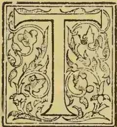

HE present paper is intended only as an introduction to the subject,—to afford a brief view of the art of perfumery-making. It would be impossible to do otherwise in a short 'complete' article like this. Scent-making already has a big standard

literature and all who wish for more information, will get a surfeit of it in any public Library.

Our own people require such information on this subject. Why should we not produce our own perfumery?

'It is easier to make perfumery than make butter,' has often been written, but this fact is little known. Very trifling capital is required; the seeds or graftings are supplied free to Australian citizens by the Government experiment flower-farm at Dunolly, with printed instructions; and a lot of literature on the subject can be had on application to the Department of Agriculture, Melbourne.

#### A FEW PERFUMERY 'PAINTERS':

Never grow plots of flowers too close together. Reason: If you group various kinds of scent plants too close to each other—as lavender and pennyroyal next door—each one will become tainted one with the other, and the virgin aroma of each will be confined, and the distilling will not improve them. An acre of roses or jasmine, for instance, should be separated by, say, an acre of potatoes or

cabbages, or whatever you like to grow in the way of edibles.

The plants are all arranged in rows running due North and South, so as to get the greatest and longest benefit from the sunshine. On the influence of the sun, consists, in a large way, the superiority of the oil extracted.

For every perfume, a separate still is not entirely required, as by a simple dose of sulphuric or oil of vitriol (1 part to 20 of water,) the still is properly cleansed. A 20-gallon still costs £5; one of 50-gallons, £30; and one of 300 gallons, £80. To begin with, a flower grower in a small way finds a 20-gallon still ample.

What flowers does it pay best to grow? The answer is: *Boronia* (the native perfume plant of Australia) *tube-rose*, *jonquil*, *acacia*, *rose*, *jasmine*, *orange-blossom*, *lavender* and *peppermint*. All now command a market both at home and abroad.

As you go along, read up all the modern literature concerning perfumery.

#### HOW THE DISTILLING IS DONE:

The space below the falls bottom of the still is occupied by water, and a few pounds of salt or alum is dissolved therein to increase its boiling-point. The tank is now filled with the desired flowers, and the funnel-shaped steam-lid is held in place by being screwed down and the crevice packed round with clay just damp. A quick fire is ignited under the still, causing vapour, which, percolating through the flowers laying in the falls bottom, releases the attar; and steam and oil go jointly up the funnel and wind their way through the condensing corkscrew-shaped pipe. A stream of cold water running into the tub (or ice could be used) helps to condense the steam and oil, which flow into a glass jug or vase. The oil is seen floating on the top, and is skinned off by a spatula or black ivory paper-knife,—or sucked off the water by a pipette (glass pipe),—a crystal tube having a bulb about three inches from one extremity. The distiller places one end in his mouth and, lightly touching the little floating filaments of essential with the other, draws them into the bulb.

27------------------------------------------------

2THE TROPICAL AGRICULTURIST.[JULY 1, 1895.]

If the identical distilled water is employed several times over, it increases the output of oil. The temperature of the steam must not be too great, or the essential oil is liable to be injured. Time: about three hours. The falls bottom containing the stewed leaves is hoisted out and the mashed mass is used as a fertiliser.

#### SOME OF THE ELEMENTS OF SUCCESS:

When laying out a flower farm for the manufacture of perfumery, it must be borne in mind that one important *role* to financial success is the means to obtain low-priced labor,—such as women's and children's help, who can do the work quite as well as the higher-priced male. It would not do at all to pay 5s. to 6s. a day to men to collect roses or jasmine flowers. It is also an error to attempt to cultivate too many species of perfume flowers. Select only those which are peculiarly suited to your earth and position, and adapted to affairs climatological. A well-established truth it is that these conditions enhance considerably the value of the outputs of various flowers.

No: it won't pay in flower-farming to employ the labor of men (except in the more technical features) when boy and girl labor can be utilized and the work done just as well. One of the open secrets of the success of the Southern French is that they have always utilised the labor of the young—and even old women—in picking flowers, because they do it quicker and better and cheaper than men.

Make flower-growing serve your ends by using it as a staff,—not as a crutch. Thus,—never entirely rely upon it for a living. Run it along with something else. If you have a family of children whose work you can have, you are pretty certain to be successful.

#### WHAT IT DOES NOT PAY TO CULTIVATE:

The perfume-making business of the present time is not what it was like in times gone by, and this data about it in different encyclopedias is almost quite out-of-date. The progress of the science of chemistry has been so quick in recent years, that many aromas hitherto taken from flowers, are now manufactured by chemical combinations and adult rations, by manufacturing druggists. Examples: the fragrance of the simple violet, and its notable modest odor, is now gotten by chemical process. Attempts have even been made to obtain it from the urine of diabetic patients. The flower heliotrope has lost its fame as a commercial perfume plant: chemists have learned how to turn out from other sources an artificial article which is an exact substitute,—the product quite surpassing—it is given out (in quality, consistency, and likeability, to the real thing of nature)—the odor forced from the flower itself. Even the household lilac has not been permitted to retain the exclusive privilege of its aroma-breathing characteristics; for the man of the pestle and mortar obtains its chemicals,—chiefly these artificial scents are obtained, synthetically, from vefrica coal-tar. Don't be alarmed by the progress of science. Many secrets there are, which chemists cannot imitate.

#### PROCESSES EXTRACTION:

Besides distilling, there are four methods for extracting scents from flowers. They are: expression, maceration, absorption, and the methyl-chloride process. Expression is only adopted where the substance treated is very liberal in its native or essential oil, such as the peel of the orange or citron. By maceration is meant the placing of the flowers in fat made liquid (just warm); allowed to remain therein about three days (no need to keep it warm), and then warmed sufficiently to allow the fat to drain from the exhausted flowers, and, after squeezing out what fat remains with these, they are thrown on to the fertilising heap. Fresh flowers are added to the fat (the absorbing qualities of which are well-known), and after 8 or 9 such changes, the fat is found sufficiently perfumed. It is then treated with alcohol, and yields its perfume to that agent, which becomes the perfume article of commerce. The fat, if properly cleaned, can be used over and over again. The heat of maceration, however, is rather injurious to the delicacy of the perfume.

The absorption process (usually known by the French name of *enfleurage*) consists in the flowers being laid on frames of cold fat, which is subsequently treated as in maceration. Cotton rags soaked in olive oil are also used, then the oil squeezed out and treated. The methyl-chloride process is a chemical treatment to be best studied in text-books and considered;—the distillation process is best,—but study all the law before building a still.

#### ATTAR OF ROSES.

Nature has many flowers. Gold is heavy, but roses are not, yet the essential oil of roses is worth more than gold—weight for weight. Of all botanical growths, the otto (same as attar) of roses finds the readiest market. It is always in demand. Like the most precious of auriferous metals,—too much cannot be obtained. In a fairly prosperous year, 300 pounds' weight of roses will yield 1 ounce of attar, or oil, and a lot of fragrant and saleable rose-water. The petals are placed in a still, the vapor volatilises the attar, and both steam and oil ascend, wind their way through the spiral condenser, and pass out of the other extremity into the receiving base.

The correct kinds of rose to grow are the centifolia, or chou, rose (rarely seen Antipodes-wards), and the rose of France,—also called rose de Grasse after the celebrated flower and perfume-producing region of France,—a place twice visited by the present writer, in 1891 and 1892. An acre of land under first-class cultivation will yield at least 1,500 pounds of rose-petals; and this will give 5 ounces of attar, worth from 35s. to 47s. each ounce; and there will also be some 100 gallons of rose-water, valued at 3s. to 4s. per gallon.

The roses are best put into the still while quite fresh and crisp—the gathering taking place in the morning after the dew has disappeared. If it is desired to keep them 24 hours before use, sprinkle them with fine salt, to retain their fragrance.

#### WHAT THE PERFUME STILL IS LIKE:

This is a very simple arrangement. Any intelligent person—whether a mechanic or not—can construct one with the partial aid of a blacksmith. A roughly-made plant consists as follows: A metallic tank of about 100 gallons' capacity, the interior fixed with a holed false bottom about 9 inches from the base, and set in brickwork (although this is not absolutely necessary), with a fire-retort under. A funnel about 1 foot diam., at its greatest extent, with a river to enter and a flange to support it, is fitted like a saucepan-lid over a similar hole in the head of the tank. A pipe of 2 inches diam., a continuation of the funnel, continues like a spiral worm around the interior woodwork of a barrel filled with cold water,—the end emanating near the base, like a faucet. Thus the apparatus is complete.

Steaming or distillation of flowers is the method employed in the fabrication of neroli, rose, lavender, etc., oils; also of various other growths. The work of distilling is quite simple; and never necessitates any great degree of experience,—i.e., the fat and the oil methods,—both quite easy to learn.

But the greatest art in perfumery consists in adulteration,—the knowledge how to blend cheap with valuable essentials. It requires years of learning, and is a professional secret. Like painting, it is not easily learnt. But the grower does not need these secrets. Those are for the manufacturing chemist.

#### SOME RESULTS PER ACRE:

The bitter-orange blossom will yield 80 oz., of essential oil per acre, which at 15s., to £1 per oz., means £60 to £80 per acre. The acre of jasmine will bring in £20 to £30. Roses from £70 to £90 per acre (the attar is exceedingly limited, or probably the sum per acre would be higher). The oz., is worth from £2 to £3, even the prolific oil-producing true lavender, brings 60s., per pound. Peppermint yields up to 30 pounds of oil per acre, which at 30s., per pound, means a return of £45 per acre. And so on with the other essential oils, all of which are most valuable. Compare the figures, ye struggling farmers, with your present low returns for growing corn or market produce. Study the

28------------------------------------------------

JULY 1, 1895.]THE TROPICAL AGRICULTURIST.3

perfume market, form rings for keeping up prices, and place your trust in—roses, the attar of which is never likely to be over-produced.

A FEW FIGURES ABOUT OTHER COUNTRIES:

Last year in France, Grasse district alone produced 2,000 tons of orange blossoms, 1,500 tons of roses, 220 tons violets (cheap labor and abundance defies chemical competition,) 200 tons jasmine, 88 tons tube-rose, 38 tons jonquil, 33 tons acacia, 22 tons mignonet. One factory there, by itself uses 50 tons acacia (buying up the flowers from neighbouring regions,) 70 tons roses, 16 tons jasmine and 10 tons tube-rose. There are 50 distillations in Grasse (a town of 11,000) some employing 200 hands in season.

A TOUR THROUGH NORTH AND SOUTH WYNAAD.

A GLORIOUS COUNTRY—ABANDONED COFFEE—HEAVY YIELD—TEA CULTIVATION—OPENING FOR CEYLON MEN—SPORTS TO BE HAD.

Probably a few notes from this glorious country will interest some of the friends I have left in your little island, which, with its many charms, cannot be compared with this luxuriantly productive land of Southern India. It seems to me extraordinary that the planters of Ceylon should emigrate to the distant Straits and even to Africa for "pastures new," owing to its over-population in the matter of planting. There, when a prolific country like this adjoins the Island!

I started from the Kasselas estate for Manantoddy (about 5 miles distant) at 5 o'clock a.m. en route to Vythery, not long ago, passing many acres of abandoned coffee-land abandoned in 1867 through the collapse of the cotton market, most of the then owners of the estates being Bombay merchants, who were more heavily involved in "cotton" than "coffee"; consequently the latter had to give way to the former. It is a sad sight to see poor "King Coffee," planted 25 years ago, or more, struggling (yet cropping) through the heavy luxuriant overgrowth of secondary jungle and lantana. Out of the many estates that once flourished and used to yield 15 cwt. per acre (and special ones over a ton) there are only two left in Manantoddy, viz., the "Brummagherries" and the Kasselas. The former is situated on the borders of Coorg, and, from what I saw of it, it promises to keep "King Coffee" to the fore, through it suffers severely from "borer." On the Kasselas estate, which is out of the range of this terrible scourge, I saw coffee that takes one back to the good old times of '72, some of the fields even outshining those palmy days of a ton per acre. On one occasion, during a morning stroll with my wife on the Kasselas estate, I stripped a lovely coffee tree to prove what a *good* one could do in the matter of yield. We were both delighted and surprised at the result—a little over six *Mysore seers*!!! Taking 28 *Mysore seers* to a bushel, I leave it to your readers to work out the result per acre, planted 6×6, as such trees could not possibly grow closer. It may have been an exceptional one, but it had not been pruned or cultivated for years, though topped and kept free of "suckers"; it, however, grew out of the stone foundation of a set of old coolies' lines, and had been picked over once before I stripped and measured the result.

Manantoddy—which I reached about 7 a.m.—is an exceedingly nice little town, possessing a club, hospital, travellers' bungalow, post office, two churches—a charmingly laid out burial-ground, the prettiest I have seen for a long time—golf links, and a boating club, a European private medical practitioner, and shops—in fact has everything as convenient as at Nuwara Eliya. The climate also is delightful, but one thing it lacks (and in a worldly sense it is *very* much "the one thing needful") and that is money! Everything is almost in a stage of stagnation for want of it, and were it not for Messrs. Arbutnot & Co. of Madras, and an old resident planter, coffee in this district would be extinct. But its capabilities are second to none

in the world, as far as planting is concerned, *Anything*, I firmly believe, wou'd wrow and flourish in such a fertile district. I must not forget to say I had the pleasure, too, of shooting 18 and a half couple of snipe as I strolled along. I started the following morning for Vythery, passing through magnificent land—thousands of acres of both "virgin forest" and bamboo land, and not an acre of which, if planted with tea, could, with such excellent soil and climate, produce less than 1,200 lbs. per acre, which would fetch from 8d. to 1s. per lb. if only proper fat and decent elevations were brought into force. Before reaching the hospitable abode of Perengodda estate, the proprietor of which took me over the Belliapara estate, I saw there tea trees over 30 feet high and 4 feet in circumference. (Indigenous Assam.)

These, though utterly abandoned and struggling to grow in heavy secondary jungle, were in a most healthy and luxuriant condition, and seeding freely. I also saw a clearing of about 10 acres from the progeny of these trees, only 2 years old, which would make the heart of any Ceylon planter rejoice!

I believe Wynaad consists of about sixteen hundred square miles. I have in my time travelled from the Neilgherries, Mysore, and the Coorg Frontier through the whole of Wynaad, which consists of three distinct districts, hundreds of miles apart, viz.: *North*, which consists of Manantoddy, Dindimul, Brummagherries, and Keria. *South*,—Vythery, Culputty, Sultan's Battery, Maypadie, Cherambody, and Terriote, (these can boast of a "Public Hall," Race Course, Post, Telegraph, Police, and Civil Offices, as well as a fine Hospital). *South East*,—Goodalur, Dava'ah, and Pundalur—not a district of which would not grow and produce far better coffee, tea, cocoa, or any other produce than "the spicy little Island" can, if run with a little capital.

The "Pelrendotty" tea estate is the only one making an apology for tea in the South, but the method adopted here, both of the cultivation and manufacture of the leaf, is so very primitive, that it cannot honestly be held as a criterion of what Wynaad *could* produce in the way of the "cup that cheers but not incubates!" I believe the average yield of this estate is about 900 lb. per acre, but, when one takes into consideration that every acre has from 50 to 60 per cent. failures, twelve to fifteen hundred lb. per acre is honestly nearer the mark of what it should do, and this without manure, proper pruning, or plucking. The so-called "Factory" of the estate is an old cramped shed, that no one in Ceylon would dream of utilising for anything but a tool store. It has only within the last few months gone in for a "Sirocco," and three second-hand "Little Giants," and these must evidently have been the first three manufactured after the invention of the "Roller." The place is perfectly innocent of any other machinery, not even a roll-breaker. Sifting by hand, and sorting and packing, are all done in the same cramped room, and all at one and the same time as the process of rolling, fermenting, and firing are going on; and yet it seems a marvel to some people that this estate's tea only fetches 4½d. per lb.!!!

However, the Panorama Company are now going in for tea in a practical manner, and it does its manager credit for the way in which he has opened and planted up about 200 acres (and still extending). This is about two years' growth, and its luxuriance is simply marvellous, and is only beaten by the Cootacovil estate belonging to the Wynaad Tea Company, where they have a field of tea of the same age. On Panorama I met an old Ceylon planter who has just taken up the berth of tea-maker, and on his first entering the clearing he was so struck with its wonderful growth that he could scarcely gasp forth the expression "magnificent!" "wonderful!!" "is this not a dream?"!!! He is so charmed by what he has seen that he intends to open for himself next season what is left in the south. Land can be had both in north and south Wynaad at from R20 to R50 per acre, every inch of which surpasses the best land in Ceylon, and all sorts of climates similar to Kandapolla and other places;

29------------------------------------------------

4THE TROPICAL AGRICULTURIST.[JULY 1, 1895.

and its principal advantage is that it has a winter! Besides all Wynaad's many advantages it affords "Jack" good sport and so saves his being the proverbial "dull boy" that only work might make him! It has game and fowl of all descriptions, and the "Brunnagherries" is the most charming spot in addition to its sporting advantages—A.—Local "Times"

## PRODUCTS OLD AND NEW IN THE NIGER COAST, WEST AFRICA.

(By Mr. Billington, Curator, Botanic Station.)

Almost the whole country round Old Calabar could be profitably planted with coffee, and much of it with cocoa. The Liberian coffee thrives wonderfully well even with little attention. There are upwards of 200 plants in two different places in the gardens that are flourishing. Cocoa also thrives and is shipped in small quantities, and fetches a fair price on the market.

There is much original forest soil upon which the best cocoa can be grown, especially that around the springs.

The plants of both were most of them transplanted from nursery beds in July, and there have been few failures, a fact that speaks well for their future. The transplantation of cocoa in this country is generally attended with a certain amount of risk. I therefore recommend for the native culture, where rough-and-ready methods are usual, to plant two or three seeds in an 18-inch hole at 12 feet apart, in lines.

If fresh seeds are planted in May or June, one may rely on almost all germinating. The best plant is left, and the others can be either transplanted with care, or pulled up, when the remaining plant will go ahead without a check.

The same procedure does not apply to coffee, which is best to be planted in nursery beds. The ones I transplanted are now larger than those in the nursery, and amongst the 200 that were planted in permanent places, there are no vacancies.

There is, however, a point upon which these important plants may fail eventually to justify the high expectations that are required of them, namely, whether there is sufficient depth of soil above the clay strata for the plants after reaching a certain age. It is my opinion that they will thrive at every stage.

*Tea* (*Camellia theifera*).—There are not enough plants, nor has there been time enough for me to express any opinion as to its future, beyond that the two small specimens that are in the gardens are growing fairly at present.

*Arrow-root* (*Maranta arundinacea*) and *Turmeric* (*Curcuma longa*) the soil is suited for, and both thrive well with an excellent yield. The former should prove profitable.

*Ginger* grows fairly, with a small yield, but occasions a good deal of trouble.

*Kola Nut* (*Cola acuminata*), being indigenous, is naturally flourishing. I recommend its cultivation.

*Rubber Trees* grow well with little attention, the soil and climate being especially suited for *Ficus elastica* and *Ceara Rubber* (*Manihot Glaziovii*). Both of these will in the course of time prove profitable, although some while must necessarily elapse before they can be started in quantity. The specimens in the gardens are in fine condition.

*Laudolphia* *lines* I have not experimented with, as they are indigenous, and will not grow in the open country.

*Annatto Dye Plant* (*Bixa Orellana*) flourishes almost without attention. It is to be regretted that there is not a larger demand for the pulp. If cultivated on a large scale, no market would be found for it.

*Henna* (*Lawsonia alba*), with its sweet-smelling flowers, is doing well.

*Spices and Aromatics*.—Cinnamon, pimento and Melegueta pepper have all made good growth. The first named, I feel confident, will be a success, and worth cultivating on a large scale. Plants raised from seeds, planted by myself in July, are now 3 feet high.

*Black Pepper* (*Piper nigrum*) I am afraid, judging by the present condition of the plants, will not thrive.

*Capsicums* give a fair crop of large fruit-pods. A fair-sized variety is grown by the natives, which, if it were only cultivated on a large scale, should prove profitable. Many tons are exported from other parts of the coast.

*Nutmegs* (*Myristica fragrans*), which arrived in bad condition, died soon after being planted out. I can therefore express no opinion as to how this valuable tree would grow.

*Bay Tree* (*Laurus nobilis*) and *Camphor* (*Cinnamomum Camphora*) have done well from the first. The latter can be recommended.

*Oil seeds*, Castor Oil (*Ricinus communis*).—Some exceedingly fine specimens have been grown, having a fair yield of seed. It is cultivated in small quantities by the natives, and is well worth attention. The same applies to ground-nuts (*Arachis hypogaea*). *Jatropha Curcas*, the physic nut, that will grow almost wild, may be mentioned; and cotton-seeds might prove profitable, as well as the croton-oil plant, which, I think, would grow.

*Cotton* (*Gossypium* sp.), although growing robustly, has an inferior staple of fibre, and I cannot recommend its cultivation except as an oil seed.

*Coco Nuts* thrive, but the distance from the sea will make itself felt when it comes to the question of yield. They would be, however, worth the natives' while to cultivate on a large scale.

*Fruits*.—The following are growing well, many of which have been raised from seeds in the gardens:—Mango, bread fruit, orange, lime, shaddock, guava, date, loquat, cherimoyer, custard apple, sweet sop, sour sop, rose apple (*Eugenia Jambos*), Avocado pear, akee (*Blihia sapida*), durian (*Durio Zibethinus*), banana, plantain, pine-apple, papaw, granadilla, cashew.

Such products as these, though of no actual commercial value, with the exception of the pine-apple, the distance from England being too great for exportation, are of considerable use and benefit to the country itself.

*Timber*.—Logwood, the specimen in the Gardens, has grown 8 feet in nine months. When once it seeds, the seeds being winged and carried about by the wind, more are propagated without attention.

*Fibre Plants* (*Sansevieria guineensis*), which can be planted almost everywhere, promise well. Pine-apple, the leaves are long, and might be produced in any quantity. I have tried without success to obtain seeds of the Sisal hemp and China grass, both of which would grow in Old Calabar, as would many other useful fibres.

*Eucalyptus*.—The climate seems unsuited for. After many experiments I have only succeeded in raising a few small and struggling specimens of *E. citriodora*. It is possible that if they get past a certain stage they will improve.

(From Report on the Botany of the Ndimi, Akpayajic, and Akwa Rivers District.)

In the natural products of the whole district I am disappointed.

*Rubber*.—Rubber does not exist in the quantity I expected to find it, and it appears to me to be worked to its full extent, except that a more scientific method of extraction would increase the quantity. It was the exception to see any large vines that were not tapped. The district in which most vines were seen was round Okuri and Ndebiji. The natives make the unfortunate mistake of cutting down the vines, not tapping them. The result is that the vine dies. There is one species of *Carpodinus*, yielding an inferior rubber; but they do not work it. A few rubber trees (*Ficus Vogelii*) are growing in the towns, but not in sufficient quantity to be worth while collecting.

The wine palm (*Raphia vinifera*), from which the piassava fibre is obtained, is found plentifully almost throughout the whole journey, but more especially about the Akwa River, Ndegha, Ndebiji, and Ekoi Afanya. The natives do not appear to use it at all. Taking into account the large number of these palms, it is surprising to find how little palm wine there was in the different villages.

30------------------------------------------------

JULY 1, 1895.]THE TROPICAL AGRICULTURIST.5

*Oil-yielding Plants.*—Palm oil is one of the principal articles of trade at most places, but in the Dibiyanga, Munimba, and Ituka district very few oil palms are seen. The forest is very dense in these parts, which will account for their scarcity. From Ndebiji to the Akwa River they are fairly plentiful, in fact. Some nuts seen near Okorora were the finest I have ever come across.

A tree, which is called by the natives "Inoi," which is also fairly common, yields from its seeds a very fine limpid oil that they use for anointing themselves and for food. It is doubtful if there is sufficient quantity to be worth collecting.

### ARGON, NITROGEN, AND PLANTS.

The announcement that Lord Rayleigh and Professor Ramsay have succeeded in proving that there exists in the atmosphere a gas which had hitherto been unsuspected, is of great interest, not only to chemists and physicists, but also to botanists. Very soon after the discovery of argon, the question was raised, "Do plants assimilate argon?" and Professor Ramsay elaborated a series of experiments, to find out if he could throw some light on a subject which is naturally interesting to botanical workers. The first thing, of course, was to find out whether there was any argon in a nitrogenous vegetable, so Professor Ramsay set to work to see if he could discover argon in nitrogenous vegetables and animal tissues. Peas and dead mice were desiccated, and then treated by Dunas' method for extracting nitrogen. This consists of mixing the powdered mice or Peas with copper oxide and lead chromate in a heated tube, whereby all the hydrogen, oxygen, carbon, sulphur, &c., are removed, and the nitrogen is collected. This, of course, was acting on the assumption that the process which liberates nitrogen also liberates argon, and this is by no means certain; in fact, Professor Ramsay, by Dunas' method, failed—so it is understood—to discover argon either in Peas or in mice.

It may be, of course, that the method employed is at fault, and that some new arrangement will have to be employed to induce this very inert gaseous constituent of the atmosphere to show its presence, or it may be that plants are quite unable to assimilate even a particle of the argon which is to be found floating in the atmosphere.

But it is to be hoped that further experiments on this subject will be made, for the relation of the atmosphere to plant life is a very important one. Since the classic experiments of Priestly and others towards the close of the last century, many researches of a laborious character have been made to find out the percentage in the air of the gasses of which our atmosphere is composed. We do not know yet whether argon is an element, or a mixture of elements. If it is a single element, its atomic weight must be about 40, and in that case no place is ready for it in Mendeleeff's table of the elements. The simplest way out of the difficulty would be to suppose that argon is a mixture, but there is conflicting evidence as to this. Mr. Crookes, with his spectroscope, says one thing; M. Olszewski, with his low-temperature thermometer, says another.

Plants, we know, do not possess the power of absorbing, or, at least, of assimilating, the free oxygen and hydrogen gasses; in all probability, argon does not enter into their composition. But experiments might be made in growing suitable plants in an atmosphere of pure argon or argon mixed with pure oxygen, on a bed of pure sand. It will be remembered that it was with such experiments that Hellriegel and Wilfarth in Germany conclusively proved that free nitrogen was fixed by leguminous plants in symbiosis with microbes, as well as by mixtures of the lower organisms inhabiting soils, green algae, and microbes.

The chemical history of the atmosphere, from its origin to the present day, has attracted the attention of many observers. Koene and Stas in Brussels, and Dr. T. L. Phipson in England, have all brought forward theories. Briefly stated, they amount to this. The primitive atmosphere was composed of

nitrogen, the substance which has the least tendency to combine directly with others. Into this atmosphere volcanic action evolved large quantities of carbonic acid and water. There was no free oxygen in this primitive atmosphere, but it was in this primitive atmosphere of nitrogen, with more or less carbonic acid and vapour, that the first organised beings (i.e., plants) made their appearance; experiments have shown that many plants of our own day can vegetate in an atmosphere of this kind, in which animal life is quite impossible. In fact, according to these physicists, all the oxygen now existing in the earth's atmosphere is due to vegetation extending over immense periods of time. It is generally allowed that the function of nitrogen in the atmosphere is to dilute the oxygen, which would otherwise be too strong for human beings. How argon will combine with all these theories remains to be seen. —H. C. F.—*Gardeners' Chronicle*.

### THE TREATMENT OF THE SOIL IN LIME PLANTATIONS.

(By F. Watts, F. I. C., Assoc. Mason College, Govt. Chemist, Antigua.)

The question of the application of manures to fruit trees is one which is sure to require consideration sooner or later in all districts where large orchards are established; and as little has been written on the subject in relation to Lime trees the following notes may prove acceptable to those interested in the Lime industry.

In considering the question of manuring this or any other crop, it is of essential importance that the mechanical condition or heart of the soil should first of all receive attention. Unfortunately this condition or heart includes a number of physical factors which do not readily admit of representation by figures, such as friability, porosity, aeration, water holding power and many others, though these points are readily recognised by the practised eye and hand. It is to the maintenance of this condition or heart that the principal operations of tillage are directed. The roots of a Lime tree like all others must be supplied with air as well as moisture; they will not penetrate badly-drained soils to any considerable depth, and under these conditions suffer from shallowness of the available soil, the impervious subsoil being of little more use to the tree than impenetrable rock. From the character of the Lime crop and its cultivation there is a decided tendency for the soil of Lime orchards to fall off in condition, particularly where the soil is of a clayey character, and this danger is increased when the orchard is made to serve also as a pasture for stock; the trampling of the animals, especially in wet weather, hardens the soil, reduces its porosity and prevents the free spreading of the roots of the Lime trees.

The necessary aeration of this soil, could be readily secured by growing some intermediate crop between the Lime trees, either with the idea of making this intermediate crop remunerative in itself, or of turning in the resulting growth as a green dressing. In the first case careful attention must be paid to the manuring in order that the removal of double crops may not unduly impoverish the soil; but if reasonable care be taken various crops may be raised and the soil left in an improved condition at the end of a given period; such crops as corn, potatoes, yams, and arrowroot lend themselves to this form of cultivation and might be grown with advantage in newly-planted Lime orchards, for the space of several years. Situated as some Lime orchards are, it is sometimes difficult to find a market for the produce grown in this manner. In such cases the cultivation of intermediate crops for green dressings commends itself, and for this purpose nothing surpasses the pigeon pea in utility. It is now well known that plants of the Bean or Pea tribe possess the remarkable power of assimilating the nitrogen of the atmosphere—a power which other plants do not possess. In consequence of this beans and peas are able to thrive in soils so poor in nitrogen that other plants could grow in them with

31------------------------------------------------

6THE TROPICAL AGRICULTURIST.[JULY 1, 1895.

difficulty. On ploughing a pea crop into the soil on which it grew most substantial gain accrues, for not only is the mineral matter of the crop returned in a form readily assimilable by subsequent crops, and large stores of vegetable matter which have their origin in the atmosphere and on decaying form valuable humus are added to the soil, but in addition, considerable quantities of nitrogen (a costly constituent of manures) are brought into the soil, this nitrogen having been derived from the atmosphere whence other crops are unable to extract it. A soil thus treated is considerably enriched while its mechanical condition or heart is improved.

The mechanical action of the roots of intermediate crops, leguminous and others, must be of considerable service in improving stiff soils; for when the growing crop dies, or is reaped, the roots which have penetrated to various depths decay, and leaving channels in the stiff subsoil, admit air, and encourage the downward tendency of the roots of the Lime trees. I cannot lay too great stress on the importance of maintaining the soil in good condition, for I have seen orchards where the trees have been in a dying condition from starvation, while the soil itself contained a superabundance of plant food, but in an unavailable state. In such a case a thorough tilling followed by a green dressing, would have been attended with excellent results while the application of manures would have proved useless.

Having secured good tilth with a soil in "good heart" a condition which involves the presence of a fair supply of humus, it becomes necessary to inquire what items of plant food a Lime crop will remove from the soil and whether it will be necessary to provide for the restoration of any constituent likely to prove deficient.

From analyses which I made some time ago, I obtained the following information bearing directly on this side of the question.

Ripe Limes contain about 35 to 40 per cent of mineral constituents having the following composition.

<table border="1">
<thead>
<tr>
<th colspan="2">COMPOSITION OF ASH</th>
<th rowspan="2">POUNDS OF EACH CONSTITUENT IN 1000 lb. OF FRUIT</th>
</tr>
<tr>
<th colspan="2">PER CENT.</th>
</tr>
</thead>
<tbody>
<tr>
<td>Potash</td>
<td>.. 47.21</td>
<td>1.838</td>
</tr>
<tr>
<td>Soda</td>
<td>.. 1.68</td>
<td>.067</td>
</tr>
<tr>
<td>Lime</td>
<td>.. 29.17</td>
<td>1.167</td>
</tr>
<tr>
<td>Magnesia</td>
<td>.. 6.73</td>
<td>.270</td>
</tr>
<tr>
<td>Oxide of Iron</td>
<td>.. 1.02</td>
<td>.011</td>
</tr>
<tr>
<td>Phosphoric Acid</td>
<td>.. 11.46</td>
<td>.458</td>
</tr>
<tr>
<td>Sulphuric Acid</td>
<td>.. .26</td>
<td>.011</td>
</tr>
<tr>
<td>Chlorine</td>
<td>.. 1.84</td>
<td>.073</td>
</tr>
<tr>
<td>Silica</td>
<td>.. 1.03</td>
<td>.041</td>
</tr>
<tr>
<td colspan="2">
</td>
<td></td>
</tr>
<tr>
<td colspan="2">100.40</td>
<td></td>
</tr>
<tr>
<td>deduct O &amp; Cl.</td>
<td>.. .41</td>
<td></td>
</tr>
<tr>
<td colspan="2">
</td>
<td></td>
</tr>
<tr>
<td colspan="2">99.99</td>
<td></td>
</tr>
</tbody>
</table>

Now the yield of fruit from an acre of Lime orchard varies very much, but for purposes of calculation we may take the quantity at from 50 to 100 barrels of fruit per acre, per annum, when in full bearing, or about from 10,000 to 20,000 lb.

A glance will show that so far as the mineral matter is concerned the heaviest demands will fall on the potash, the lime and the phosphoric acid, and that the amounts removed by a crop of lime annually will be about as follows:—

<table border="1">
<tbody>
<tr>
<td>Potash</td>
<td>... 19 to 38 lb.</td>
</tr>
<tr>
<td>Lime</td>
<td>... 12 to 24 lb.</td>
</tr>
<tr>
<td>Phosphoric Acid</td>
<td>... 9 to 18 lb.</td>
</tr>
</tbody>
</table>

These will be the amounts per acre abstracted from the soil when the fruit is entirely taken away from the orchards; but in most cases the skins and pulp of the fruit, after the juice has been expressed, are returned to the soil, and thus, will reduce the demands on the plant food of the soil to about one half.

Bearing these facts in mind, it becomes comparatively easy to calculate what amount of various manurial constituents should be applied in order to maintain unimpaired the fertility of the soil.

So far as I am aware the volcanic soils of the West Indies on which the Lime orchards are situated are for the most part very deficient in lime and in phosphoric acid. Of the lime which is present, a very large proportion is present in a form which is of very little immediate value, being chiefly silicate, while the available carbonate of lime is usually present in very small quantities; and as this plays a very important part in the chemistry of the soil, in aiding the transformation of nitrogenous substances into nitrates, in which form plants assimilate their nitrogen, it is desirable to add lime to these soils, if possible to do so at a reasonable cost. The deficiency of phosphoric acid is readily made up by the application of various phosphatic manures. As many soils are so deficient in free lime it would seem desirable to avoid the use of acid preparations of phosphoric acid such as superphosphate and to employ instead such substances as bone dust, precipitated phosphate, or basic phosphate otherwise known as Thomas phosphate. These are slow acting manures whose effect should be apparent over a considerable period, a point of some value in manuring fruit trees.

These volcanic soils, although containing moderate amounts of potash, are not over stocked with that constituent in an easily assimilable form, hence it is desirable to add small quantities of potash when applying phosphatic and other manures. If an intermediate crop is grown and removed as has been suggested above, then the application of potash becomes of paramount importance, such crops as potatoes or arrowroot take large amounts of potash from the soil and their exhausting effects would soon be felt unless this constituent was replaced by artificial manuring.

As to the nitrogenous manuring of lime trees we have little to guide us in the way of chemical literature on the subject. Experiments show that the appearance of the trees is greatly improved by the application of nitrogenous manures, and it would seem that general health and fertility should be increased in like manner. The growth of green dressings of pigeon peas as described above, coupled with the application of the pen manure from the animals employed in working a Lime estate, will probably constitute the chief sources of nitrogenous food supply. Should artificial manures be purchased, such substances as dried blood or cotton seed cake or other seed cakes, being somewhat slow in their action and lasting in their effect, are preferable for the purposes of fruit farming to such soluble forms of nitrogenous manure as Sulphate of Ammonia or Nitrate of Soda.

The other constituents of the soil are present in sufficient quantities in those orchards which I have had an opportunity of examining, and it would seem therefore that, having got the soils of a Lime orchard into good mechanical condition, Nitrogen, Phosphoric acid, Lime and potash are the only manurial constituents requiring much thought.

## THE MANGROVE CONCESSION.

In our last number we informed our readers that a concession had been granted for the purpose of extracting tannic acid from the bark of the Mangrove, of which there are six species found in Ceylon, namely:—

<table border="1">
<tbody>
<tr>
<td>Rhizophora mucronata, S., Kadol;</td>
<td>T., Kandal.</td>
</tr>
<tr>
<td>" candolaria, S., Kadol;</td>
<td>T., Kandal.</td>
</tr>
<tr>
<td>" eriops candolleana</td>
<td>T., Chirukandal.</td>
</tr>
<tr>
<td>" Roxburghiana</td>
<td>—</td>
</tr>
<tr>
<td>Bruguiera gymnorrhiza</td>
<td>T., Kandal.</td>
</tr>
<tr>
<td>" caryophylloides</td>
<td>—</td>
</tr>
</tbody>
</table>

To obtain the bark two systems are in vogue. In Borneo the trees themselves are felled, and then the bark is stripped, while in Ceylon the bark is, as a rule, roughly stripped off and the tree is left standing, but it is often so damaged that it eventually dies. It has been pointed out to us that there might be a better way than either of these two methods, and this would be to spokeshave the trees as was done with *Cinchona*. Can any of our readers inform

32------------------------------------------------

JULY 1, 1895.]THE TROPICAL AGRICULTURIST.7

us if the Mangrove renews its bark readily after being shaved. Should this be the case, it would be interesting to know whether the renewed Mangrove bark would give a larger amount of tannic acid, just as renewed cinchona bark gave a much better analysis than the original bark. The advantages of shaving off the bark are manifest, for the tree will not get killed in the process, and would probably give another harvest of bark within the year, and along river banks the cutting down of large quantities of Mangroves, which keep up the bank of the river and stop denudation, might cause a considerable alteration in the course of the river.—*Ceylon Forester*

### MADRAS SEASON REPORTS.

For the purpose of Weekly Season Reports the Board of Revenue has directed Collectors to adopt the following adjectives in describing the yield of crops:—20 annas=a bumper crop; 16 annas=average; 10 annas=fair; 8 annas=middling; and 4 annas=bad.

THE SEASON ON THE WEST COAST.—A correspondent writes:—The unusual manner in which the southwest monsoon is holding off this year is causing much uneasiness and apprehension, owing to the exceptional drought this year, wailing comes up from all parts of the district that water is becoming very scarce and crops are beginning to wither up. In many localities, the *modan* and *chama* dry crops have, it is said, entirely withered up, while almost a similar fate is said to be awaiting field-sown paddy, not a few cultivators even complaining that the very seed has been parched up beyond recovery. Even the outturn of coconuts is affected. In Calicut, the heat is intense; several wells have almost totally dried up, and even the Big Tank which supplies the Europeans and several others with good drinking water has gone down to a very low water level.—*Madras Mail* June 8.

### VARIOUS PLANTING NOTES.

THE ACTION OF GLYCERINE ON PLANTS.—The *Revue Horticole* tells us that a German naturalist has discovered that if a plant deprived of its starch by planting, be watered with two parts of glycerine to a thousand parts of water, and exposed to light, the starch soon appears; but as this would happen in any case under exposure to light, we do not see what part the glycerine plays.—*Gardeners' Chronicle*.

OYSTER-SHELLS.—The use made of these substances in agriculture leads us to mention the analysis of the shells of various kinds of oysters made by MM. Chatin & Muntz. So far as cultivators are concerned, the principal thing to be noted is the large proportion of lime, varying from 48.4 to 53.7 per cent. of the dry matter. Phosphoric acid varies in proportion between 0.01 in the Mareennes variety, and 0.90 in the Portuguese oyster. The presence of minute quantities of iodine and bromine goes towards explaining the use of oyster-shells in medicine in olden times.—*Ibid*.

A JAPANESE DOUGLAS FIR.—In the number of the *Tokyo Botanical Magazine* for Feb. 20, is a description and figure of a new species of *Pseudotsuga*, discovered in the province of Kii in Japan, at an altitude of 2000 feet, by HOMI SHIRASAWA. Mr. SHIRASAWA puts his new discovery in the genus *Tsuga* section, *Pseudotsuga*. The description which he gives (in German happily), and specially the illustrations, leave no doubt as to the correctness of Mr. SHIRASAWA's identification. The original Douglas Fir, as is well known, is a native of North West America, and so far, has been the only representative of its genus or section. That a Japanese form should occur is most interesting. It forms a parallel case to the occurrence of *Tsuga Mertensiana* and *Tsuga gigantea* in California, &c., and of *Tsuga Sieboldi*, *Thuja japonica* in Japan, and there are other cases of parallelism in the floras of the two countries known to botanists, which furnish ground for interesting speculation. The newly-discovered tree grows in association with *Tsuga Sieboldi*, *Fagus japonica*, *Mag-*

*nolia hypoleuca*, and others. It has an erect straight trunk, horizontal spreading branches and conical top. The height is given as 15 to 20 metres, with a circumference of 3 metres, so that in point of dimensions it is far exceeded by its American congener.—*Ibid*.

TEA SALES IN BOMBAY.—An auction sale of Indian teas took place on Saturday, at the office of Messrs. Grindlay, Groom, & Co., of this city. But as the agents were determined to hold to their reserve prices, the dealers left the room in a body. On the sale being proceeded with, only five boxes of Orange Pekoe, from the Raipur Tea Estates, were purchased by a Persian shop-keeper, at eight annas and one pie per lb., leaving four hundred and twenty-four cases unsold.—*Bombay Gazette*.

CALCUTTA TEA MARKET: SALE No. 3.—After the interval of a fortnight the third sale of this season was held on the 13th inst. The room was a fairly full one, most of the old buyers having returned, and there being a sprinkling of new faces, representing some of the large distributing houses of the world. In spite of this the auction was dull the general unattractive quality and the heavy weight of Ceylon tea now being placed on consuming markets being doubtless the reason for the want of competition at the present comparatively high range of values which tea has reached.—*Indian Planters' Gazette*.

COMMERCIAL FIBRES.—The third of a series of Cantor Lectures was delivered before the Society of Arts by Dr. D. MORRIS, M.A., C.M.G., on Monday, April 1, 1895. The following is a summary:—Continuing the review of fibres yielded by the Palm order, the lecturer drew attention to the remarkable vegetable substance, resembling whalebone in strength and elasticity, called bass, or piassava. This is extensively used for making brooms and brushes, and consists of the indurated fibre-bundles thickly investing the stems of Palms. Some are strong and bony, while others are soft and elastic, resembling horse-hair. The bass or piassava of commerce is obtained chiefly from native Palms at Para and Bahia. Latterly it has been obtained from the Wine Palm of West Africa, and still more recently from the Palmyra Palm of Ceylon. The fibres yielded by the husk of the Coco-nut were of considerable commercial importance. They afforded material for brushes, mats and matting, cords, ropes, and tow. Coco-nut refuse, on account of its wonderful properties of absorbing moisture, has been recommended for use as a backing material in the construction of men-of-war. Of all vegetable substances, the most noted substitute for horse-hair was the fibre of the Spanish Moss (*Tillandsia usneoides*). The plant grows in long hanging tresses on Cypress trees in the Southern United States. The fibre is prepared by steeping the narrow stems and leaves in hot water. The preparation of Pine wool from the leaves or needles of the Scotch Fir was mentioned as a local industry in Germany, but now extending to other countries. The supply of material for paper-making was becoming more and more dependent on woodpulp. This was imported into this country to the extent of 216,000 tons annually. It was important, however, to distinguish between mechanical woodpulp and wood-cellulose. In the latter the extraneous matters were so fully eliminated that the pulp was practically pure, and suitable for the best papers. In mechanical wood pulp no chemical purification took place, and although sometimes sufficiently white to be used in "white" papers, the stability of such papers when used in public documents and works of great historical value was open to grave doubt. Many most valuable materials for paper-making, such as the Paper-Mulberry of Japan, and the Nepal Paper Plant, were not at present in European commerce. The lecturer concluded the course by discussing in some detail problems connected with the introduction of new fibres and improvement of fibre plants by systematic selection and cultivation, and by a general review of the methods adopted, by mechanical and chemical means, for the extraction of commercial fibres.—*Gardeners' Chronicle*.

33------------------------------------------------

8THE TROPICAL AGRICULTURIST.[JULY 1, 1895.]DRUG REPORT.(From *Chemist and Druggist*.)

London, May 23rd.

CAFFEINE has been rather quiet this week. Makers are said to have sold small lots to the export trade at 19s per lb for delivery in July and August, whilst to the home trade 10-lb lots have been booked at list-price for same deliveries, some of which have been re-sold to second-hand dealers; but, on the whole, business in the article has been limited. Makers, it would seem, are having difficulty in obtaining the raw material, and are consequently acting cautiously in their future engagements, and will not sell on this market for American account, wishing to do the business through their New York agents only.

CINCHONA—The exports of cinchona-bark from Guayaquil (Equador) are officially enumerated as follows:—

<table border="1">
<thead>
<tr>
<th></th>
<th>Weight</th>
<th>Value</th>
</tr>
<tr>
<th></th>
<th>lb.</th>
<th>£</th>
</tr>
</thead>
<tbody>
<tr>
<td>In 1893</td>
<td>67,500</td>
<td>2,025</td>
</tr>
<tr>
<td>In 1894</td>
<td>157,400</td>
<td>3,094</td>
</tr>
</tbody>
</table>

The exports of cinchona-bark from Porto Cabello (Colombia) in 1894 were 848 kilos only, of which 275 kilos went to Germany and 573 kilos to France.

COCAINE is firmer for the Hydrochlorate. The quantities of the crude both here and in Hamburg seem to have been bought up, and higher prices are therefore probable.

QUININE—A good business has been done up to 12½d for immediate delivery, and 12¾d is now asked for German bulk; 12¾d paid for July delivery, and 1s 1d for October for German brands. The second-hand stock is gradually being absorbed, and that in an improving market.

London, May 30th.

ANNATTO—Holders firm, 4½d per lb being asked for good.

CAFFEINE—Only retail transactions from second-hands, July delivery 20s, spot 27s. Our last advices from America show a similar retail trade in the article, but at high prices.

COCA-LEAVES—11d per lb is asked for fair green Truxillo, but there was no inquiry at the auctions.

COCAINE—Contrary to expectation, the price of the Hydrochlorate was reduced again yesterday a further 1s 6d per oz, quotations being now 16s 6d to 16s, according to quantity.

KOLA-NUTS—About 40 packages were offered, one case of fair bold Grenada selling at 1s 7d per lb, the bulk, however, was withdrawn at prices from 1s 3d to 1s 6d.

ESSENTIAL OILS—Cinnamon oil, 8 cases of low quality, sold without reserve, at 5¾d to 7d; Lemon-grass oil sold at 12d today.

QUININE—Quiet, but firm; 12¾d nearest price for best German brands in bulk. A sale of 5,000 oz October delivery is reported at 1s 1½d.

VANILLA—The finer qualities sold well at full to dearer prices today.

AMSTERDAM DRUG MARKET.

May 30th.

Our correspondent writing on Wednesday, reports that Cubebs are neglected. Of second Padang Cassia vera there was a good deal offered (200 packages), but there were no buyers, and the same has to be said regarding the prime quality stuff, and as for the medium, 102 packages, amounting to 5,900 kilos were offered, 11½c per leaf-kilo being named as the price. At the Ginn copal auctions, on May 31st, 168 tons of hard and half hard resin will be offered, and 118 tons of softer varieties. Prince Batavian Gum Damar has been sold at 43½c to 44c. There has been more inquiry for Cajeput oil, and 1,250 bottles have sold at 115c per bottle.

WATTLE BARK INDUSTRY.

We (*Natal Witness*) are given to understand that our German cousins in the Noodsberg District have started a wattle bark mill on their own account. A correspondent writes:—"Good luck to them, but I wonder how long it will last. Since the starting of the above new venture, it seems strange that the wagons of bark roll into town in larger number, even although the price has dropped to zero (3s. 6d). I hear on very good authority that storage is small, and cash, not paper, is wanting. At the same time, it would be wise on the part of Maritzburg buyers

of bark not to let the price fall too low. There is a feeling at present among the growers that a 'circle' is being formed. I hope there is no foundation for the rumour."

THE FUTURE OF TEA IN CHINA.

An authority writing on the future of tea in China says:—"I am informed that one early result to the awakening of China which is certain to follow the declaration of peace, will be the taking of steps to improve the manufacture of tea." Our London correspondent has had a long conversation upon this topic with a gentleman having lengthy experience as an importer of Chinese teas. From him he learned that it was possible that those interested like himself would initiate steps to induce the owners of Chinese "Hongs" to import the machinery and obtain the assistance required to introduce such an innovation. But at the same time great doubt was expressed if, even after the severe lesson of late received, it would be possible to stir the strong conservatism of the Chinese sufficiently to compel the required action. We do not ourselves think that it will be possible to do so. Even if it should prove possible to effect this, we do not think the conditions of tea-growing in China would readily yield themselves to the adoption of Western methods in the preparation of the leaf. It would certainly be possible to establish central factories in the midst of a number of gardens, the produce of which might be sufficient to keep the machinery going. But opposed to this there must remain the difficulty of transport to centres of this character. Good roads scarcely as yet exist in any of the Chinese provinces, and we venture to think that it must be a long day before the peasants of that country could be induced to carry the green leaf from their huts, where preparation now goes on, to a central point. For ages past the buyer has visited each small grower and has taken over the tea direct and in readiness for packing. The labour must be greatly increased had the green leaf to be first collected and transported for preparation. No doubt the tea would be much improved if it could be properly treated; but the difficulties in the way seem to us to be almost insuperable. Altogether there is little reason for Ceylon planters to fear that the hope of the home dealers in China tea will be realised. But under any circumstances this article has now become so displaced in the London market by British-grown teas, that we feel sure no efforts of the kind described could suffice to replace it.

NATAL TEA.THE SEASON'S OUT-TURN.

Mr. G. W. Drummond, of Kearsney Estate, reports as follows:—"We are now drawing to the close of the current tea season, and I am glad to be able to say from our own results so far, and from news of our neighbours and the district in general, that it has been the most satisfactory season for the last five years at least. The rains in April gave a splendid fillip to the plants for the end of the season. There are some very large swarms of locusts here still, but they have not touched the tea as yet. Loquats, bananas, and pineapples, however, have suffered a great deal. We should not be surprised, however, if the total out-turn for Natal reached 850,000 lb. of tea, especially as May is promising to be an excellent month, and one million for next season is not only possible, but probably. *Natal Mercury*, May 17.

34------------------------------------------------

JULY 1, 1895.]THE TROPICAL AGRICULTURIST.9PLANTATIONS IN CEYLON AND LABOUR SUPPLY.

It was a decided relief to read the two very sensible letters from the Chairman of the Planters' Association and Mr. Charles Young (see page 17). They offer a strong contrast to the theoretical, and, in our opinion, impracticable schemes advanced from two or three quarters during the past few months. Mr. Melville White at once separates the Planters' Association from any Cooly Agency Scheme and fully justifies the attitude we assumed on this point. He indicates moreover, after a very practical fashion, some of the risks incidental to any private Agency Scheme, which will no doubt be duly considered by planters. At the same time, there is no intention officially, to interfere with any such Agency—only, it would be well to give existing means a full trial before going to the expense of establishing new Agencies.

In this connection, we cannot help drawing special attention to the letter signed "Planter" which appeared in our issue of Tuesday last; because though dated from a Coconut district, it gives the opinions of a gentleman who, more than any other in Ceylon, is entitled to be listened to with respect on any point affecting Cooly Immigration. We almost wish that "Planter" had given his name, to carry home his counsel more forcibly to his brother-planters. He advises a careful study of Mr. Edward Young's Report; and he expresses the belief that the old established Firm of Messrs. Adamson, Mactaggart & Co. at Negapatam can do better for Ceylon planters than any new Agency. He would have them established a branch Agency at Salem—to tap the districts of Tanjore, Arcot, and Salem—and this, we have no doubt, the said Firm would be prepared to do, if they get sufficient encouragement from individual proprietors or managers in Ceylon. We would, therefore, recommend any of those short of labour and unable to trust their kanganies to recruit—after such experience as "a Central Province Planter" gives today—to communicate with Messrs. Adamson, Mactaggart & Co. It has been stated that the partial failure of the operations of this Firm in the past, has been due to the want of a trustworthy leader, guide or kangan to keep the coolies together until they reached their future employer or the estate. But this does not seem at all an insuperable difficulty, especially where one employer is prepared to indent for a considerable number of coolies, so making it worth while to give a responsible leader to the gang.

In reference to immigration generally, can there be any doubt as to the great value which through Railway communication would afford, after the picture given to us of the hardships and extortion to which coolies are exposed in travelling any distance at present? "When the Railway is made to Panniben"—writes "Planter"—and he knows Panniben and Southern India almost as well as Ceylon—"and from Manaar on the Ceylon side," (still more with the viaduct and through unbroken carriage!), "*labour difficulties will vanish.*" Surely then, the practical work which the planters of Ceylon ought to take up through their influential, representative Association is that for which Mr. E. J. Young has given them so good a lead—the urging on of THE INDO-CEYLON RAILWAY. No other work can have so great and beneficial an effect in increasing our supply of coolies from Southern India.

ORCHIDS IN DARJILING.

A Darjiling paper says that the Deputy Commissioner has passed an order to the effect that Orchid dealers are not in future to sell ferns or Orchids in Darjiling, on the ground that the surrounding forests are being denuded of them—*Pioneer*, May 4.

THE CASE OF MR. CHARLES LEDGER.

The *Handelsblad* of Amsterdam, one of the leading daily papers in Holland, has taken up our appeal on behalf of Mr. Charles Ledger, the cinchona-pioneer. In an editorial article in its issue of April 13th, the *Handelsblad* takes for its text our assertion that "sentiment counts for something in the government of the world," and bases upon it an appeal to the Dutch Government to allow Mr. Ledger a pension of £100 a year. We shall be agreeably surprised if this appeal should be responded to. To agree to it would certainly be an act of generosity on the part of the Dutch Government, which would put our India Office to shame, and a mark of broadmindedness such as few nations show in the case of individuals not connected with ruling families. In presenting its case for Mr. Ledger, the *Handelsblad* gives a short account of cinchona-cultivation in Java, and expresses the belief that a proposal, on behalf of the Ministry of the Colonies, to give Mr. Ledger £100 a year would be accepted by the Dutch parliament.—*Chemist and Druggist*.

CINCHONA AND QUININE.

The following translation and figures from a Report on cinchona and quinine of the well-known Dresden Firm, Messrs. Gehe & Co., is of much interest: it will be observed that stocks of bark (as also quinine) are low in London, but large in Amsterdam:—

STOCKS IN LONDON 31ST DECEMBER.

<table border="1">
<thead>
<tr>
<th></th>
<th>1894</th>
<th>1893</th>
<th>1892</th>
</tr>
<tr>
<th></th>
<th>Pkgs.</th>
<th>Pkgs.</th>
<th>Pkgs.</th>
</tr>
</thead>
<tbody>
<tr>
<td>South American</td>
<td>20,065</td>
<td>23,245</td>
<td>23,014</td>
</tr>
<tr>
<td>From other countries</td>
<td>11,981</td>
<td>14,596</td>
<td>15,879</td>
</tr>
<tr>
<td>Total</td>
<td>32,060</td>
<td>37,841</td>
<td>38,895</td>
</tr>
<tr>
<td>Imports London</td>
<td>1894</td>
<td>1893</td>
<td>1892</td>
</tr>
<tr>
<td>South American</td>
<td>10,461</td>
<td>8,135</td>
<td>12,897</td>
</tr>
<tr>
<td>Other Countries</td>
<td>18,713</td>
<td>28,892</td>
<td>33,464</td>
</tr>
<tr>
<td>Total</td>
<td>29,174</td>
<td>37,027</td>
<td>46,361</td>
</tr>
<tr>
<td>Deliveries</td>
<td>1894</td>
<td>1893</td>
<td>1892</td>
</tr>
<tr>
<td>South American</td>
<td>12,741</td>
<td>8,501</td>
<td>16,746</td>
</tr>
<tr>
<td>Others</td>
<td>21,378</td>
<td>20,580</td>
<td>30,843</td>
</tr>
<tr>
<td>Total</td>
<td>34,119</td>
<td>38,081</td>
<td>56,589</td>
</tr>
</tbody>
</table>

EXPORT FROM CEYLON FROM 1ST JANUARY TO 17TH DECEMBER.

<table border="1">
<thead>
<tr>
<th></th>
<th>lb.</th>
<th></th>
<th>lb.</th>
</tr>
</thead>
<tbody>
<tr>
<td>1894</td>
<td>2,438,993</td>
<td>1893</td>
<td>6,665,194</td>
</tr>
<tr>
<td>1893</td>
<td>3,525,522</td>
<td>1891</td>
<td>5,679,339</td>
</tr>
</tbody>
</table>

EXPORTS FROM JAVA TO AMSTERDAM.

<table border="1">
<thead>
<tr>
<th>1894</th>
<th>Kilos</th>
<th>1893</th>
<th>Kilos</th>
<th>Quinine</th>
</tr>
</thead>
<tbody>
<tr>
<td>1894</td>
<td>3,316,339</td>
<td>1893</td>
<td>157,820</td>
<td></td>
</tr>
<tr>
<td>1893</td>
<td>3,369,306</td>
<td></td>
<td></td>
<td></td>
</tr>
<tr>
<td>1892</td>
<td>2,953,826</td>
<td></td>
<td>149,540</td>
<td></td>
</tr>
<tr>
<td>1891</td>
<td>3,431,539</td>
<td></td>
<td>130,491</td>
<td></td>
</tr>
<tr>
<td>1890</td>
<td>2,901,891</td>
<td></td>
<td>133,721</td>
<td></td>
</tr>
<tr>
<td>1889</td>
<td>2,073,389</td>
<td></td>
<td>108,400</td>
<td></td>
</tr>
<tr>
<td></td>
<td></td>
<td></td>
<td>77,060</td>
<td></td>
</tr>
</tbody>
</table>

SOLD IN TEN AUCTION SALES IN AMSTERDAM FROM 25TH JAN. TO 13TH DEC. 1894.

<table border="1">
<thead>
<tr>
<th>Unit.</th>
<th>Kilos.</th>
<th>Kilos.</th>
<th>Kilos.</th>
</tr>
</thead>
<tbody>
<tr>
<td>4</td>
<td>25 Jan. 513,370</td>
<td>col'g. Quinine 22,943</td>
<td>of which sold 22,200</td>
</tr>
<tr>
<td>4.4</td>
<td>1 Mar. 336,310</td>
<td>" 16,437</td>
<td>" 15,831</td>
</tr>
<tr>
<td>4.7-16</td>
<td>5 April 513,454</td>
<td>" 24,625</td>
<td>" 20,382</td>
</tr>
<tr>
<td>4.1</td>
<td>10 May 349,690</td>
<td>" 16,403</td>
<td>" 14,155</td>
</tr>
<tr>
<td>4.1</td>
<td>14 June 418,012</td>
<td>" 19,554</td>
<td>" 18,481</td>
</tr>
<tr>
<td>4.1</td>
<td>19 July 279,407</td>
<td>" 12,554</td>
<td>" 12,288</td>
</tr>
<tr>
<td>4.1</td>
<td>30 Aug. 429,558</td>
<td>" 20,276</td>
<td>" 18,757</td>
</tr>
<tr>
<td>3</td>
<td>4 Oct. 603,140</td>
<td>" 28,834</td>
<td>" 7,070</td>
</tr>
<tr>
<td>3</td>
<td>8 Nov. 512,590</td>
<td>" 24,631</td>
<td>" 11,789</td>
</tr>
<tr>
<td>2.1</td>
<td>13 Dec. 699,985</td>
<td>" 34,262</td>
<td>" 16,867</td>
</tr>
</tbody>
</table>

<table border="1">
<thead>
<tr>
<th>Total sales kilos</th>
<th>Quinine</th>
</tr>
</thead>
<tbody>
<tr>
<td>Against 1893 kilos</td>
<td>157,820</td>
</tr>
<tr>
<td>1892</td>
<td>149,540</td>
</tr>
<tr>
<td>1891</td>
<td>130,491</td>
</tr>
<tr>
<td>1890</td>
<td>133,721</td>
</tr>
<tr>
<td>1889</td>
<td>108,400</td>
</tr>
<tr>
<td></td>
<td>77,060</td>
</tr>
</tbody>
</table>

35------------------------------------------------

10THE TROPICAL AGRICULTURIST.[JULY 1, 1895.

<table>
<tr>
<td>Bark sold in Amsterdam during 94 consisted of</td>
<td></td>
</tr>
<tr>
<td>    kilos</td>
<td>2,711,049 <i>Ledgeriana</i>.</td>
</tr>
<tr>
<td>    "</td>
<td>325,748 <i>Hybrid</i>.</td>
</tr>
<tr>
<td>    "</td>
<td>205,878 <i>Sincimbr</i>a</td>
</tr>
<tr>
<td>    "</td>
<td>63,939 <i>Officinalis</i>.</td>
</tr>
<tr>
<td>    "</td>
<td>9,725 <i>Calisaya</i>.</td>
</tr>
</table>

Total kilos 3,316,339

<table>
<tr>
<td>Stocks Amsterdam 1st January.</td>
<td></td>
<td></td>
<td></td>
</tr>
<tr>
<td>1895</td>
<td>1894</td>
<td>1893</td>
<td>1892</td>
</tr>
<tr>
<td>Pkgs.</td>
<td>Pkgs.</td>
<td>Pkgs.</td>
<td>Pkgs.</td>
</tr>
<tr>
<td>24,635</td>
<td>14,184</td>
<td>11,268</td>
<td>5,279</td>
</tr>
<tr>
<td>Export of Quinine from Germany in 1894</td>
<td colspan="3">kilos 139,500</td>
</tr>
<tr>
<td>Importation from England ..</td>
<td colspan="3">4,100</td>
</tr>
<tr>
<td>Exports nett kilos</td>
<td colspan="3">135,400</td>
</tr>
<tr>
<td>Imports of Bark into Germany 1894</td>
<td colspan="3">kilos 3,627,100</td>
</tr>
<tr>
<td>Exports ..</td>
<td colspan="3">70,100</td>
</tr>
<tr>
<td>Kilos 3,557,000 consumed by manufacturers</td>
<td colspan="3"></td>
</tr>
</table>

#### IMPORTS INTO THE UNITED STATES.

<table>
<tr>
<td></td>
<td>1894</td>
<td>1893</td>
</tr>
<tr>
<td>Cinchona Bark lb. assay</td>
<td>2,683,962</td>
<td>2,183,128</td>
</tr>
<tr>
<td>Quinine Salts oz.</td>
<td>2,298,193</td>
<td>2,777,567</td>
</tr>
<tr>
<td>Stock of Sulphate in London, 1st January 1895</td>
<td>2,753,072 oz.</td>
<td></td>
</tr>
<tr>
<td>Against 1894</td>
<td>3,134,720 "</td>
<td></td>
</tr>
</table>

#### TEA IN THE FAR EAST.

(Latest Export Report.)

#### EXPORT OF TEA FROM CHINA TO GREAT BRITAIN.

<table>
<tr>
<td></td>
<td>1895-96.</td>
<td>1894-95</td>
</tr>
<tr>
<td></td>
<td>lb.</td>
<td>lb.</td>
</tr>
<tr>
<td>Canton and Macao ..</td>
<td>88,830</td>
<td>112,560</td>
</tr>
</table>

#### EXPORT OF TEA FROM CHINA TO UNITED STATES AND CANADA.

<table>
<tr>
<td></td>
<td>1894-95.</td>
<td>1893-94.</td>
</tr>
<tr>
<td></td>
<td>lb.</td>
<td>lb.</td>
</tr>
<tr>
<td>Canton ..</td>
<td>3,547,932</td>
<td>1,349,192</td>
</tr>
<tr>
<td>Amoy ..</td>
<td>19,447,789</td>
<td>21,321,332</td>
</tr>
<tr>
<td>Foochow ..</td>
<td>8,110,519</td>
<td>5,883,106</td>
</tr>
<tr>
<td>Shanghai ..</td>
<td>25,783,527</td>
<td>24,176,826</td>
</tr>
<tr>
<td></td>
<td>56,919,717</td>
<td>52,730,465</td>
</tr>
</table>

#### EXPORT OF TEA FROM CHINA TO ODESSA.

<table>
<tr>
<td></td>
<td>1894-95.</td>
<td>1893-94.</td>
</tr>
<tr>
<td></td>
<td>lb.</td>
<td>lb.</td>
</tr>
<tr>
<td>Hankow and Shanghai</td>
<td>22,555,223</td>
<td>21,619,462</td>
</tr>
</table>

#### EXPORT OF TEA FROM JAPAN TO UNITED STATES AND CANADA.

<table>
<tr>
<td></td>
<td>1894-95.</td>
<td>1893-94.</td>
</tr>
<tr>
<td></td>
<td>lb.</td>
<td>lb.</td>
</tr>
<tr>
<td>Yokohama ..</td>
<td>28,767,467</td>
<td>28,623,687</td>
</tr>
<tr>
<td>Kobe ..</td>
<td>16,879,951</td>
<td>17,213,605</td>
</tr>
<tr>
<td></td>
<td>45,647,418</td>
<td>45,837,292</td>
</tr>
</table>

THE *Planter* notices an uncommon occurrence reported from Ranchi. A mango tree, on which some fruit had set and grown to about one quarter of the full size, has sent out flowers on the branches which did not flower before. This is the only tree among the group which bears flowers and fruit together.—*M. Times*, May 12.

#### OIL GAS ENGINE.

THE CASTLETON TEA ESTATE, Darjeeling, has put down an oil-gas engine 16 h.p. and a new Blackman drier.—*Planter*.

#### TEA IN INDIA.

(From the *Planter*, April 13.)

Sylhet has every promise of a good season, if they only escape hail. Manufacture has now commenced on most gardens, although this district is generally pretty late at commencing.

An invoice of seventy chests from the Central Terai gardens is one of the first arrivals of the new season's tea in Calcutta.

Our Dehra Dun correspondent writes:—"I have been told that several gardens have suspended plucking for the time being, as the bushes are hanging back so much on account of the sudden fall in the temperature that they appear to be at a perfect standstill."

Our Ranchee correspondent writes:—"The thermometer has been up to 94°. This was on the 5th April, and on that day the wet and dry thermometers showed a difference of 26 degrees. During March rain threatened several times, but it did not come down in useful quantities. Altogether it looks doubtful whether this will be a good season for quantity, and as there was a severe drought up to the end of May last year, another drought may be serious and do some harm to tea bushes. Since 1890 each alternate year has had short rainfall up to the end of May. In 1891 and 1893 heavy rain fell early in the year, but the rule seems to be changed now."

#### CACAO PLANTS IN DOMINICA.

The following letter received from the Lasoye district of Dominica may be of interest to intending cacao planters.

Melville Hall, Dominica, 25th October, 1894.

Dear Mr. Barber,—I send herewith the measurements of the cacao planted by myself on this estate, the rapid growth of which will, I feel sure, be of interest to you.

The height of stem from ground to fork is 2 feet 1 inch; length of main branches 2 feet 6 inches; length of first laterals 1 foot 2 inches; stem circumference, at base, 3½ inches, near fork 3 inches; length of longest leaf 13 inches.

The seed from which this tree was grown was obtained from the Botanical Station on October 4th of last year and planted by myself a week later. It is the nearest approach to the *Criollo* variety growing at the Station, the pod being similar but seed rather larger. Originally grown in a bamboo pot it was planted out five months later.

Many trees of the same lot are taller, and with the fork; but the one of which I send measurements is the most forward.

Trusting this may be of interest and with kind regards,—Yours faithfully, H. W. GRAY HUTTON.

This is a case of very rapid growth, and from the measurements a very healthy and well shaped tree. It is of interest to note that there are many parts on the windward coast of Dominica where cacao would grow excellently, provided that ordinary precautions were taken to shield the plants from blasts of wind down or up the valleys and the steady sea breeze. There is practically no cacao grown along the coast from Hampstead to the neighbourhood of Boetica. Many of the valleys which are now out of cultivation could easily be placed under cacao, provided that advantage were taken of the protected portions and additional tree-belts placed where necessary. No shade trees of any kind are needed in Dominica excepting for very young cacao plants.

Many plantations in the neighbourhood of Vieille Case are unprotected from wind. The effect of this is seen in the blasted appearance of the outer trees which on the other hand form a hedge for those within.

As to the kind of cacao for Dominica there can be no doubt that, if properly tended, there is none to equal a good *Forastero*. This kind has been persistently sold by the Botanical Station during the last three years. The plants sent out, with the solitary exception of the tree bearing the variety mentioned in Mr. Hutton's letter, are of one kind, being obtained from a singularly successful and uniform plantation in Montserrat.

36------------------------------------------------

JULY 1, 1895.]THE TROPICAL AGRICULTURIST.11

Up to the middle of last year there had been distributed from the Botanical Station 1615 plants in pots, and 47,070 seeds of this one variety. The object of this has been to try and improve the quality of the Dominica product, at the same time giving it uniformity of sample.

The great quantity of cacao now shipped is settlers' cacao of the Calabacillo kind. The trees are very hardy and bear well. They thrive with little care and bear profusely. The beans are however very flat, dark and bitter, and it is almost impossible to prepare a good sample. It rests with the planters of Dominica whether they will go on improving the general sample of the Island by continued planting of a good hardy kind, or allow the cultivation to sink back to its level of settlers' cacao by planting the old local variety. —*Agricultural Journal*.

### THE KITTUL PALM.

The Wine Palm or Kittul Palm attains a height of 50 or 60 feet, and is remarkable for the peculiar form of the leaflets, which have been compared to those of our common Maiden Hair Fern. The leaves themselves are from 18 to 20 feet long. It is a native of Ceylon and India, growing in forests in the hilly districts where teak and the wild mango abound.

The Kittul fibre of commerce is prepared from the sheathing leaf-stalk; it is used as a substitute for bristles for making brushes, baskets, etc. The value is from 3½d. to 10d per lb. It is said that in Ceylon ropes made from the fibre are used for tying elephants. Roxburgh says it is highly valuable to the natives of the countries where it grows. "It yields during the hot season an immense quantity of toddy, or palm-wine. I have been informed that the best trees will yield at the rate of one hundred pints in the 24 hours. The pith or farinaceous part of the trunk of old trees is said to be equal to the best sago; the natives make it into bread, and boil it into thick gruel; these form a great part of the diet of the people, and during a famine they suffered little while the trees lasted. I have reason to believe this substance to be highly nutritious."

The Wine Palm ends its existence by flowering. The first flower stalk appears at the top of the tree, as soon as that has done flowering, another appears lower down, and so on, till the last one blossoms at the foot of the trunk, proclaiming that the death of the tree is near at hand. These flower-spikes hang down in large bunches, producing quantities of round, reddish berries. The wood is strong and durable, used for agricultural purposes, water conduits and buckets. —*Indian Agriculturist*, May 1st.

### PIONEERING AND TEA PLANTING AND MISSION WORK IN ASSAM FRONTIER.

From the letter of the Rev. J. A. Graham of the Scottish Missionary, dated Naya Sylee Tea Estate, Dooars, we quote as follows from "Guild Life and Work": —

For the first time I have been on the Assam frontier, and so touched our most eastern boundary. There would not have been much object in going there before this year, for then one would have found nothing save huge grass jungle land. But a few months have changed all. Now, on the banks of the Sankos, which is the dividing river, is a young Scotchman—Mr. Craig, known to East Kilbride Guildsmen—and with him a band of Nepali, Mechi, Nagpuri, and Santhali coolies, all busy converting the haunt of the tiger, the elephant, the leopard, the rhinoceros, the wild cow and buffalo, the deer and the pea-fowl, into a prosperous tea-garden, to supply you folks at home with the cup that cheers. I am staying with Mr. Craig's neighbour, Mr. Murray (brother of the Minister of Greyfriars, Aberdeen). They two have charge of many thousands of acres of fine virgin soil for your Glasgow firm of Duncan Brothers. It gives a fine example of British enterprise and pluck to see a fellow-countryman go out with his tent into the forest and begin to carve out of the wilderness a smiling tea-garden. Rough, hard work it is to begin, but in three years he probably has the pleasure of

seeing his own substantial bungalow and great factory in the midst of 1,000 or 1,500 acres of tea. And as we rode the last part of the way on Mr. Murray's elephant, one could not but marvel too at the power of man over the wild beasts around; for there was that huge animal, who but a few years ago would be roaming at will over those very plains, now controlled with the utmost precision by a single man. During the last two years over 300 elephants have been caught by Government in the Dooars part of our district. All along the foot of the hills I have met occasional members of our Church. At Rangamuth, about 30 miles west of the Sankos, is stationed Jitman, the evangelist of the Foreign Mission to Bhutan, supported by the native Christians themselves. We have also a school, and I had the pleasure of baptizing there a woman and two children. Two days ago Naiman, the Dooars catechist for the Nagpuris, met me at Piskor, where there are nearly thirty Nagpuri Christians, and after a delightful service we baptized three persons who had been a year on probation. In the earlier part of the journey Dilbir, the Nepali Dooars catechist, accompanied me, and we had some baptisms. Every night we have a magic-lantern exhibition for the coolies of the garden where we happen to be staying; and on Sundays we have services for the planters. At yesterday's service in Mr. Oliver's (Nagrakata) fifteen of us met together. Not the least pleasant part of such a tour as this is the meeting with so many planters in their own homes. In every bungalow one finds a hearty welcome—for a planter's hospitality is proverbial—and in all districts are Scotsmen! Not, indeed, that they surpass in hospitality those who hail from south of the Tweed or across the channel! This morning I am starting up the Jaldacca River, through Bhutan, to visit Dongbu's people at Tode, and to baptize some others of his household. A planter friend is to accompany me for three days on foot.

Mr. Graham seems to be the right man in the right place.

### TEA MERCHANTS.

These tea merchants seem to have their day the same as with other trades. Formerly it was John Rose and Co. Then for a time we heard of nothing but Horniman, followed by Cooper, Cooper and Co., and then "Mazawatte." Twenty years ago the name of Lipton was not even known, and now he tops the lot. The others, we have no doubt, are all flourishing, but we do not hear so much of them. —*London Paper*.

### WOOD FOR TEA-BOXES.

A large quantity of "shooks" are imported from Japan: they belong to some coniferous wood, probably *Cryptomeria japonica*, and though they cost rather more than Simul at the outset, nevertheless, as they are thoroughly seasoned and ready for dove-tailing, they can all be utilised without any loss. Consignments of what is known in the trade as "spruce" are received from Vancouver's Island, and some redwood, probably a kind of *Dipterocarpus*, comes from Burma. At first sight it may seem strange that with her large forest area Assam should have to depend for the tea-box woods from distant countries, but it is essential among other conditions that for a wood to come into practical use on a large scale the tree which yields it must be gregarious; it will never pay to employ a wood which is only found scattered here and there. Thus, though there are in the Dehra Dun forests several trees adapted for tea-boxes, it is probable that the planters of that district will eventually use either spruce or silver fir from the neighbouring Himalayan forests, as soon as their available supply of mango trees has been exhausted. —*Timber Trades Journal*, April 20.

37------------------------------------------------

12THE TROPICAL AGRICULTURIST.[JULY 1, 1895.]PLANTING IN KLANG, SELANGOR, STRAITS SETTLEMENTS.(From the *Selangor Government Gazette*, April 26.)

ESTATES OF AN ACREAGE OF 100 ACRES OR OVER.

<table border="1">
<thead>
<tr>
<th rowspan="2">Name of Estate.</th>
<th rowspan="2">Nature of Cultivation.</th>
<th rowspan="2">Proprietors.</th>
<th rowspan="2">Managers.</th>
<th colspan="2">Area in Acres.</th>
</tr>
<tr>
<th>Total</th>
<th>Under Cultivation.</th>
</tr>
</thead>
<tbody>
<tr>
<td colspan="6" style="text-align: center;">KLANG.</td>
</tr>
<tr>
<td>Triangle</td>
<td>Coffee .. ..</td>
<td>T H Hill ..</td>
<td>..</td>
<td>2,500</td>
<td>60</td>
</tr>
<tr>
<td>Tremelbyr</td>
<td>Coffee and pepper ..</td>
<td>J R Rodgers .. L C Treeweke and H Melbye ..</td>
<td>T Gibson .. B Nissen ..</td>
<td>500 ..</td>
<td>..</td>
</tr>
<tr>
<td>..</td>
<td>Coffee, sago, and vegetables ..</td>
<td>Lim Swee Keng and Ong Chee Siew ..</td>
<td>Lim Swee Keng ..</td>
<td>1,781</td>
<td>110*</td>
</tr>
<tr>
<td>Batu Unjor</td>
<td>Coffee .. ..</td>
<td>K Tambusamy Pillay and Lok Yew ..</td>
<td>Syed Mohamed ..</td>
<td>619</td>
<td>54†</td>
</tr>
<tr>
<td>Highland</td>
<td>Do .. ..</td>
<td>W W Builey ..</td>
<td>A Walker ..</td>
<td>300</td>
<td>..</td>
</tr>
<tr>
<td>Lowlands</td>
<td>Do .. ..</td>
<td>Do ..</td>
<td>Do ..</td>
<td>300</td>
<td>6‡</td>
</tr>
<tr>
<td>Klang</td>
<td>Do .. ..</td>
<td>A Forsyth ..</td>
<td>H Inniss ..</td>
<td>500</td>
<td>50</td>
</tr>
<tr>
<td>Forlorn Hope</td>
<td>Do .. ..</td>
<td>H A W Aylesbury ..</td>
<td>F A Toynbee .. A Walker, G R Prior Asst.</td>
<td>1,000 ..</td>
<td>..</td>
</tr>
<tr>
<td>..</td>
<td>.. ..</td>
<td>H W H Comming ..</td>
<td>..</td>
<td>320</td>
<td>..</td>
</tr>
<tr>
<td>..</td>
<td>.. ..</td>
<td>W Forsythe ..</td>
<td>T H Hill ..</td>
<td>328</td>
<td>..</td>
</tr>
<tr>
<td>..</td>
<td>Coffee, etc. ..</td>
<td>Haji Mohamed Tahir ..</td>
<td>Haji Abdulrahman ..</td>
<td>353</td>
<td>373‡</td>
</tr>
<tr>
<td>..</td>
<td>Do .. ..</td>
<td>Do ..</td>
<td>Do ..</td>
<td>104</td>
<td>104§</td>
</tr>
<tr>
<td>..</td>
<td>Coffee .. ..</td>
<td>Haji Nacoda Usop ..</td>
<td>Haji Samsudin ..</td>
<td>323</td>
<td>300</td>
</tr>
<tr>
<td colspan="6" style="text-align: center;">BUKIT RAJAH.</td>
</tr>
<tr>
<td>..</td>
<td>Coffee .. ..</td>
<td>H H Tanuku Ditu Udin ..</td>
<td>Sheik Abdul Mohet ..</td>
<td>2,000</td>
<td>300</td>
</tr>
<tr>
<td>Beverlac</td>
<td>Do etc. ..</td>
<td>Haji Mohamed Tahir ..</td>
<td>Haji Abdulrahman ..</td>
<td>103</td>
<td>50¶</td>
</tr>
<tr>
<td>..</td>
<td>Coffee and pepper ..</td>
<td>G H Stephenson &amp; Brothers ..</td>
<td>P Stephenson ..</td>
<td>250</td>
<td>32||</td>
</tr>
<tr>
<td>..</td>
<td>Coffee .. ..</td>
<td>Kairan bin Tamsair ..</td>
<td>Kairan bin Tamsair ..</td>
<td>100</td>
<td>45</td>
</tr>
<tr>
<td colspan="6" style="text-align: center;">DAMANSARA.</td>
</tr>
<tr>
<td>Jeang Eng Hin</td>
<td>Tapioea .. ..</td>
<td>.. ..</td>
<td>Kow Soon Kiat ..</td>
<td>3,000</td>
<td>800</td>
</tr>
<tr>
<td>Ebor</td>
<td>Pepper .. ..</td>
<td>G H Stephenson &amp; Brothers ..</td>
<td>P Stephenson ..</td>
<td>40</td>
<td>21</td>
</tr>
<tr>
<td>Enterprise</td>
<td>Coffee and pepper ..</td>
<td>H Huttenbach &amp; Co. ..</td>
<td>F A Hurth ..</td>
<td>443</td>
<td>62**</td>
</tr>
<tr>
<td>Glenmarie</td>
<td>Do .. ..</td>
<td>Do ..</td>
<td>Do ..</td>
<td>563</td>
<td>85††</td>
</tr>
<tr>
<td colspan="4" style="text-align: right;">Total..</td>
<td>16,295</td>
<td>2,786</td>
</tr>
</tbody>
</table>

\* Started in 1891.

The following prophetic forecast by Mr. Swettenham in the Selangor Administration Report for 1887 may be of interest:—"The Klang District, however, bids fair to lead the State in matters agricultural, and it is a subject for congratulation that the principal port of Selangor and the terminus of the railway should possess such solid attractions for capitalists and peasants."

It is true the capitalist and peasant have flocked to the Kuala Lumpur District, but Klang easily leads the rest of the State as an agricultural district.

Klang has become a regular home to the Javanese, their numbers here steadily increasing year by year. Quiet, steady, frugal, hardworking people, they offer a pleasing contrast to the casual Malay in the way they clear, drain, plant and weed their coffee gardens. Even the Chinamen who have embarked in coffee keep their land weeded, even if they do plant klädi between the young plants for the first year or two. But as for the Malay, he has no thought for the morrow, and calmly allows his young plants to grow up amongst lalang because he is too lazy to work.

To report on the progress of cultivation is simply to say that Europeans, Javanese, Chinese and Malays who hold land in the Klang District are planting it up with coffee as fast as their means will allow them.

No new pepper has been planted, owing to the low price of pepper, which has been steadily going down in the market for the last five years, until pepper estate proprietors seem on the verge of ruin.

To sum up the position of Klang as a field for coffee planting, we find 2,740 acres of land in the Klang Mukim have been taken up by Europeans during the year. Twelve blocks of virgin forest land amounting in all to 3,810½ acres have been surveyed and will be offered for sale by public auction at an early date. The area of customary native holdings has increased from 3,516 acres in 1893 to 4,570 acres in 1894, and there are three demarentors now in the field with enough work to last them for a year. The Selangor Coffee

Curing and Trading Company has established itself here to buy up and prepare the coffee berry for the market, and is already reported to be working at a profit. Coffee is the King of Klang.

TEA AND OVER-PRODUCTION.

A correspondent of the *Englishman* has taken up the parable of the tea planter and the limited market which has been so earnestly preached of late in Ceylon, and urges the absolute necessity there is for India to extend her market for tea if the industry is to prosper. From this it would appear that the over-production scare has spread to this country, and it is just as well perhaps that it has, for there can be little doubt that Indian planters have been too long content to let their produce push itself. With the keen competition there now is, India must be up and doing with the rest, and if the "scare" has the effect of rousing the country out of its lethargy well and good.—*Madras Times*.

THE RAILWAY TO INDIA.—In the *Contemporary Review* for April, Mr. C. E. D. Blacklaw revives the project of a Railway from the Mediterranean to India. He proposes to connect Port Said and Kurrahee through Syria, Persia and Beluchistan on the Indian broad gauge, 2,300 miles at £5,000 a mile or £12,000,000 in all—with £3,000,000 for rolling stock, or 15 million sterling in all. We have not the slightest doubt that this, or some other project, will ere-long be taken in hand. We are entering on a new era of "Railway Construction" more especially to serve the interests of the British Empire, and before the new century is very old it will be possible to travel from Colombo to Port Said all the way by rail.

75 acres coffee, and 35 acres pepper. † Felling and draining in hand. ‡ Coffee 182 acres, arecanut 70 acres, coconut 25 acres, fruit trees 76 acres. § Coffee 96 acres, fruit trees 8 acres. ¶ Coffee 30 acres, arecanuts 15 acres, fruit trees 5 acres. \*\* Coffee 15 acres, pepper 17 acres. †† Coffee 25 acres, pepper 37 acres. ††† Coffee 45 acres, pepper 40 acres.

38------------------------------------------------

JULY 1, 1895.]THE TROPICAL AGRICULTURIST.13ROLLING TEA.

TO THE EDITOR OF "THE PLANTER."

Sir,—As economy will be the chief feature of tea-making in the future, it is not too soon to enquire whether the present rolling machines are all that can be desired. The "Rapid" roller has proved to be the favourite, as well as the latest evolution in rolling machines, but it takes its time, and it takes plenty of power. You can't get much of a roll on leaf under 30 minutes rolling whether done once or twice, and I have an idea that some of the old bag machines would work more quickly, although perhaps they will not put the same twist on to the leaf. It would be interesting to get statements of the relative power of bag machines and box machines in mashing the leaf up to a certain stage, because I think it highly probable that the bag machines would prove more economical up to a certain point.

It is doubtful, and extremely improbable, that the former can ever supersede the latter, but it may prove to be a very valuable help in preparing leaf for rolling, as well as for finishing off the coarser leaf separated by sieves after the first roll. The packing of the leaf into bags would form a convenient means of transporting in to the rollers, and five minutes mashing would possibly bring the leaf into as forward a stage as ten minutes in a box machine.

I know that the first idea on reading this will be that bag machines are sufficiently proved to impair the quality of the tea, and I have no doubt myself that for the whole operation the box machines turn out a tea of superior quality, but I urge the point solely on the score of economy, and I believe that the very slight (if any) deterioration of quality entailed by a few minutes pounding in a bag, would not be noticed by present-day brokers and that it would not reduce prices by the smallest fraction.

To any small estate which contemplates increasing the number of its rolling machines I think that it would prove economical to purchase a bag machine. 1874.

BRITISH NEW GUINEA AS A PLANTATION COLONY.

BY SIR W. MACGREGOR, K.C.M.G., M.D.

(Extracts from Address in the Town Hall, Manchester, March 8th, 1895.)

When I was invited to read a paper before this Society it was intimated to me that it would be desirable that it should touch chiefly the commercial aspects of British New Guinea, while at the same time the more purely scientific questions connected with that place should not be altogether forgotten. In trying to comply with this, we shall therefore, consider briefly the country and its surroundings, its people, its present exports, and its potential productions.

Speaking roughly, the island of New Guinea, with its attached small groups, extends from the 129° to the 155° of East Longitude, and from the equator to the 12° of South Latitude. Only something more than a quarter of the great island belongs to the British Empire, but even this fraction is larger than the island on which we now stand.

The latitude of the colony, it is worth while to remember, is from 5° to 12° South—in other words, it is as far from the equator as it is possible for it to be without entering the hurricane zone, a position which, from an economic point of view, must be considered the best possible for a tropical colony.

Beginning at the east end of the Possession, on the mainland, a lofty range of mountains, running towards the north-west, goes from practically one end to the other, presenting many heights of 5,000 to 10,000ft., and attaining in Mount Victoria, the highest point of the grand and majestic Owen Stanley Range, an altitude of 13,000ft. This great mountain system is wooded, is generally steep, and is to a large extent uninhabitable. On account of their height, their great extent from east to west, and their dense covering of vegetation, they are generally cloud-capped some part of the day in all

seasons, and collect an immense amount of rain, which sends down rivers that are numerous and great out of proportion to the area of the country.

The broadest part of the island of New Guinea is near the longitude of the British-Dutch boundary. Naturally, therefore, our largest rivers occupy that end of the colony. These are the Fly and the Purari. The Fly opens into the sea some 130 miles east from the Dutch boundary, but it trends towards the north-west, and brings down a large amount of water from Dutch and German New Guinea. It is navigable to a steam launch for nearly 500 miles. Gold is found in its sands as soon as those are met with, after an ascent of over 400 miles. There may be some land fifty to eighty miles from its mouth fit for cultivation by Europeans, but this would require special examination. The Purari like the Fly, is not very inviting to the land seeker, though it is hoped that from it we may obtain good serviceable coal, as it traverses a great sandstone district in which specimens of excellent coal have been found. But good land for growing sugar cane, corn, or any similar crop; also good sites on low wooded hills for coffee, tea, and products of that kind are obtainable on several of the gulf rivers, with good water carriage to the spot. In connection with these sago manufactories could be established on some of the rivers, for there are extensive tracts of sago trees that are not required or used by any natives, and that, in fact, having no owner become Crown property and could be sold or let to any suitable company.

Further east there are many small rivers and salt-water inlets, affording water carriage, and often with good alluvial and hilly land which would be convenient for the planter, and which could be obtained without encroaching on the native or alienating their goodwill in any way.

The north-east coast has three fine rivers, on two of which there is a large amount of sago available for the manufacturer, and the country near the hills is in every way extremely pleasant. The islands would supply some very good places for coconut plantations, but they would for other products probably be inferior to the mainland. Generally it may be said that the interior of the country is mountainous; that in front of the mountains in the western quarter the country is low and swampy, and that elsewhere, between the mountains and the sea, there are practically all kinds of soils and positions.

During the period from November to May winds are unsteady and northerly; the temperature is then highest and thunderstorms are of daily recurrence. From June to November a fresh south-east wind blows in from the ocean. The great masses of rock forming the central chain of mountains are so protected by their dense covering of vegetation that they do not become heated by the sun's rays, and they always produce cool currents of air at night. The heat is thus not great for the latitude of the country, probably hardly ever over 90° Fah. in the shade, usually about five to ten degrees below that. Probably white men could hardly work continuously in the sun, but the hardy diggers toil on all day in the Louisiade group, being, however, generally protected from the sun by the forest in which they work. The natives have to do a good deal of labour in some places in order to live, but they do not work steadily, and naturally do not feel ill-effects from the climate.

The principal form of sickness is fever, which is of a more tractable and less severe type than tropical fevers generally are. If reasonable care is exercised it would not interfere to any serious extent with planting operations, whilst dysentery, ophthalmia, venereal diseases, and other contagious maladies would cause neither loss nor trouble, unless these maladies are introduced from beyond the colony. It is only reasonable to suppose that it could hardly be a favourable place for white children, and probably it is not, speaking generally, a country in which European families should be reared. It is more a country for outdoor labour by coloured men under white supervision. But under cover a European can work at anything without detriment.

39------------------------------------------------

14THE TROPICAL AGRICULTURIST[JULY 1, 1895.PRODUCTS.

The total value of the exports entered at the Custom House in the year ending 30th June, 1894, was, in round numbers, £15,000. To this should probably be added £8,000 or £10,000, representing the value of the pearls not declared outwards. One of the first items to notice is trepang. Its value was £1,714. It may be pointed out at once that the boundary of Queensland as at present fixed extends across the straits to within a hundred and fifty yards of New Guinea, and thus cuts off the fishing ground on the west that should naturally belong to the Possession. In addition to the economic unfairness of this distribution, it gives rise to the awkward fact that officers of the New Colony cannot visit the western part of the Possession without entering Queensland jurisdiction. The Queensland boundary was fixed before the annexation of British New Guinea, and Queensland is now prepared to rectify it. This will add something to the value of the fisheries in the west. The reefs have been fished for years for trepang, and it will in any case only remain as a small industry and not capable of much expansion. Copra was exported to near the value of £3,000. This should, in time to come, be an export of great dimensions. The coconut tree is in all countries most at home near to the sea, and it happens that the Possession has an enormous sea frontage, reaching according to the estimate made in the office of the Surveyor General of Queensland, something over 3,500 miles. This, of course, includes the sea frontage of both the mainland and the islands. There is no part of the colony in which this tree does not seem to thrive. It certainly bears well up to an altitude of over 3,000 ft. It has been planted from time immemorial by the natives, but only on a very small scale in most places. Various reasons have tended to keep the groves small. A weak tribe would only have excited the cupidity and hostility of stronger tribes by growing large quantities. On the other hand, several powerful tribes have valuable plantations. In other places they were cut down as acts of war, a manifestation of power not quite unknown to white men in dealing with natives. In certain districts, again, a man's coconut trees were cut down as a mark of grief when he died, or of joy on the birth of his firstborn. To a large extent these destructive practices have been checked, and all that is possible is being done to urge the natives to extend their plantations. A native regulation has been introduced into operation in the more settled districts to make compulsory the planting of a minimum number of coconuts.

A few Europeans are also forming plantations. Some of the trees planted at the Government station in the Mekeo district were flowering before they were quite three years old, but it would not be safe to count on a crop under six or eight years. There is practically unlimited land available for this cultivation, which might be entered into on a large or small scale.

It has already been pointed out that the colony lies just outside the hurricane zone. The advantage that this affords in coconut planting, for example, over such places as Fiji, Samoa, and Tonga is enormous. A large coconut plantation in British New Guinea when once in bearing would provide one with a perennial source of income. In no country are the trees more prolific; perhaps no other colony we possess offers equally good and extensive opportunities for conducting this industry to high figures. It is a cultivation that could be advantageously carried on by men of even limited capital, though it should not be taken up by a moneymess man. A person who could earn money by fishing or trading part of the year, while devoting his spare time to planting, could in a few years work himself into a coconut plantation if he had ordinary good fortune and a small capital to start with.

Gold to the value of £3,900 was entered outward. This was sent from the islands of Misima and Tagula in the Loniades. Of course the amount entered at the custom house does not truly represent the quantity actually obtained, but the work carried on is only on a very small scale. The gold has been found by laboriously washing the sand and gravel in the numerous creeks that meander in the forest and those

have been nearly washed out. There is some reason to expect that gold-bearing reefs may be discovered. Several good veins of auriferous quartz are known, but they are thin and have not, so far as tested, appeared to gain in thickness with depth. On Misima the diggers employ natives to work at sluicing at so much a day, but on Tagula the natives have been setting up on their own account, and wash out gold for themselves.

The search for gold is extremely difficult, owing to the denseness of the forest and the rough and rugged nature of the hills. Strong traces of gold are found on the upper Fly; they are also met with on the Purari, Lakekamu, Angabunga, Goldie, Vanapa, and Mambare rivers. In the east end it has been seen at Yela or Rossei Island, at Duan and Goodenough Islands, and also at some other places. It is an arduous and difficult journey to ascend the strong-running rivers to the hill districts in which this gold is most generally met with, and it will be a long period before the Possession can be even roughly prospected.

In a country that would be trying for the wives and children of white men the gold industry would not be of so much advantage as in a country like Australia or New Zealand, which are from their geographical position the permanent homes of the white race. Still it could not fail to be of some use to even British New Guinea, although it would not probably add very much to permanent settlement. The Government has had good reason to be satisfied with the treatment of the natives by the diggers from Australia, who are a law-abiding, hard-working set of men, taking them as a whole. The only regret is that the extremely limited means of the Government renders it impossible to offer them any special facilities. It is at best only a fugitive industry in New Guinea, and if the Government had any money to devote to the encouragement of any industries, those of a permanent nature, like agriculture, would deserve a preference. Now that the search for gold has been taken up by the native on his own account, the finding of gold on a small scale will probably never die out, but the native may very likely, sooner or later, lead us on to more extensive deposits. Pearl shell was procured to the value of £3,366. This article is found over a great area of fishing ground in the eastern waters, but unfortunately the sea is often from twenty to thirty fathoms deep where the best shell is found. Several attempts have been made to improve the diving gear, so as to make it safe for picking up shell at those depths, and if this could only be done the pearl shell fishery of the colony would be a valuable one. The waters of the Possession would seem to be well adapted for farming the shell.

The pearls have generally been found in shallow water shells, mostly in the Kiriwina group, not so much in the ordinary pearl shell although found there also. They are obtained by natives, who will soon exhaust the fishery as the shell is easily reached. Probably this shell would be the best one procurable for the cultivation of pearls, as its home is in a small depth of water and it produces many pearls.

Of sandal wood 321 tons, valued at £1,896, left the colony. The market for this article appears to be limited—less than Western Australia alone could supply. It is found in the Possession near shipping ports, and labour is cheap, so that with average prices it can be worked on a small scale at a profit. The supply there, as in all other sandal wood countries, is easily exhaustible, but it will remain a small industry for some time, and will no doubt be taken up by the natives on their own behalf.

The value of imports was £28,500, making a total trade for the year of £13,500.

The principal items imported were: Food stuffs, £7,181; drapery, £2,687; tobacco and cigars, £3,985; hardware, £3,162; beverages, £1,760; and building materials, £2,889.

Food stuffs consist chiefly of rice, meat, and biscuits, imported from Australia.

Drapery is beginning to be used by the natives in certain districts, but it will be many years before they

40------------------------------------------------

JULY 1, 1895.]THE TROPICAL AGRICULTURIST.15

all take to the shirt or loin cloth; those who can afford it take kindly to a jacket and trousers.

They are very fond of tobacco, and in all districts where it is known they prefer the imported American trade article to the home-grown variety, which is simply dried in single leaves, and is not nearly so powerful as the manufactured trade tobacco. No doubt this will for a long time to come continue to be a growing import as we approach new tribes.

The use of hardware is steadily extending, but there are probably hundreds of tribes in the interior who do not yet know the use of iron, but who will use it in a few years.

The native has only a small share in the beverages and building materials imported.

#### POTENTIAL CAPABILITIES.

To you, perhaps the most interesting, because the most practical, question is, What are the potential capabilities of the country? Can capital be advantageously laid out there?

I believe that money could be employed there to the benefit of the capitalist and to the advantage of the people.

In the fishery this could probably best be done by combining the ordinary diving operations for pearl shell with the farming of leased areas of sea bottom for the cultivation of sponges, pearl shell, and the pearl-bearing shell of Kiriwina. The ordinary fishing grounds have not been prospected with any care, but there certainly are many places where these cultivations could be favourably carried on. The Sponge used by the natives of Yela Island in the Louisiades for washing the face is a good one, and there is a great lagoon there for the location of sites for cultivation. The men engaged in looking after these establishments could be employed also in the ordinary pearl shell fishery when not required at the stations. The Government would be prepared to lease areas for this purpose on very easy terms.

The search for gold is a matter that each person must decide for himself. The probabilities are that there are other districts than Misima and Tigula that would yield payable gold, but it is at best an uncertain and usually short-lived industry, best worked by those having local experience. Capital should be put into it only on the deliberate advice of men thoroughly competent to express an opinion in each given case.

The search for gutta-percha and allied products seems to show that a profitable industry could be opened up in that line. Some examples that have been tested have been pronounced of superior quality. These articles are obtained from a number of different trees that are found over a widely extended area. The great want hitherto has been the presence of skilled labour to start the industry. A few hands would have to be brought from some country where this work is already established. Alluvial land could be obtained that would be suitable for the cultivation of rubber trees. The introduced variety is thriving splendidly at Port Moresby.

A cultivation that could in all probability be advantageously cultivated there would be sisal hemp. For three or four years efforts had been made to obtain this plant from the Bahamas; but this could not be done, as that colony apparently wished to retain a monopoly of this cultivation. The Government of Queensland has, however, recently succeeded in obtaining a large number of the plants, from which New Guinea is being supplied. Plants very nearly related to this one, if they are not indeed identical, already flourish at Port Moresby. With rich soil, land at two shillings and six pence an acre, and with cheap local labour, this cultivation could be made profitable in the colony, if it can be made so anywhere. It is not likely that it could be advantageously grown in Australia, unless there is a great fall of wages there. It would seem to be well adapted, however, in every way for British New Guinea.

As already mentioned, there is great scope for the cultivation of the coconut. It is one of the slowest, but one of the surest form of tropical cultivation, provided that it is in a country which,

like British New Guinea, is outside the hurricane zone. No doubt the most profitable way of working copra will be by direct shipment to Europe. Hitherto it has been sent to Australia, to be carried thence to Europe by reshipment, usually by steamer. But the quantity obtainable will soon be sufficient to allow of direct shipment by sailing vessel, which would greatly reduce expenses connected with freight. The copra trade of the Solomon Islands could probably be brought by way of Samarai for the same direct transport. There are a few unoccupied islands in the east end which are adapted for small plantations of this kind, and land suited for it is obtainable at many places on the other islands and on the mainland. Very favourable sites could be had for converting the coconut into oil, butter, and coir yarn. There is undoubtedly in this industry a good field for the investment of capital. It is a cultivation that can be well combined with others.

For growing tea and coffee, land in large quantity is procurable at any altitude that may be desired, and on almost any kind of soil. Tea and coffee, both of Arabian and Liberian kinds, are already in bearing in the Possession, and both free of coffee leaf disease. The introduction of further coffee seeds and plants has been prohibited by law in order to prevent the importation of disease. Healthy seeds and plants can be obtained by the planter on the spot.

Vanilla grows luxuriantly, and suitable land can be had for its cultivation in abundance.

Few things would seem to offer a more inviting outlet than the cultivation of tobacco in New Guinea. The plant that has long been domesticated is, though small, perhaps one of the finest that can be grown. It has probably come from the Malayan archipelago, as it has certainly reached the very heart of the island, from 5° of South Latitude on the Fly River to as far east as the Owen Stanley Range; but it is still unknown to the north-east coast, and was, until quite lately, not grown on the islands. Very high rates have been offered in the market for the unmanufactured leaf. Like the coconut, it is a cultivation well known to the great majority of the natives, and it is a healthy and long established production of the country. It presents a very favourable opening for enterprise.

Rice has been grown by the Sacred Heart Mission on a small scale, but sufficient to show that it thrives and bears admirably. For swamp rice, or for any other wet growing crop, there is a great field in the colony, for it contains more than enough of swampy land of all kinds.

It seems very probable that sago could be manufactured profitably by establishments erected on the Lukekamu, Mambare, and Kumusi, and perhaps at other places. Native-made sago would not be suitable for refining, because it is often prepared with brackish water, and is never re-washed. Sago-making apparatus would have to be erected as far up the river as possible, on account of the supply of fresh water. This also would be an industry that would be readily understood by natives.

Land suitable for growing sugar-cane on a large scale could certainly be had at several places. As a very great variety of sugar-canes has been cultivated from time immemorial by the natives, all over the Possession, this plant is thoroughly at home there, and clearly grows to perfection. As the country is not troubled by hurricanes the chief danger to guard against would be from floods, a contingency that should be borne in mind in selecting land. No doubt a considerable amount of local labour could be obtained for growing cane and manufacturing sugar, but probably it would be advantageous to have a permanent nucleus of more skilled labour in such an establishment, from India or elsewhere. There are strong racial and economic reasons against the introduction of those peoples into Australia, but these do not apply to British New Guinea, which is not, and never can be, a white man's colony in the same sense as Australia.

It is said, however, that the sugar to be grown in Australasia this or next year will suffice for Australian wants. If this is so a further extension of the sugar-cane industry in that part of the world necess-

41------------------------------------------------

16THE TROPICAL AGRICULTURIST.[JULY 1, 1895.

sitates looking for a European or American market. British New Guinea, free from hurricanes, with land for next to nothing, with local labour and convenient access to shipping, should be able to compete successfully on even terms with any other place, either for the Australasian or other market. It seems to be more a question between cane and beet sugar than between New Guinea and other colonies that grow sugar-cane.

The central district would seem to be specially suited for growing cotton. It is a dry place, the rainfall probably varying from 40 to 60 inches, and cotton seems to thrive well there. It would be tedious, and quite unnecessary, to pursue further all the different kinds of cultivation that could be followed in the colony. Practically, anything that can be grown in a tropical country could be grown there, so great is the diversity of soil, elevation, and rainfall.

It may be stated, shortly, that there are traders enough in the country already for all the present products. What is wanted now is the man who will raise new products, or extend the range of those already existing.

To facilitate this the labour law has been made as little onerous as possible. The natives would probably expect from 4. to 6d. a day with food and lodging. No forced labour or levy of labour can be granted by the Government, the policy of which is to leave labour matters as free as is practicable in the present condition of the native; but, as already mentioned, every reasonable encouragement would be given towards employing the men in their own country, it being clearly advantageous for them on social, political, and economical considerations that this should be done. The colony has no preferential trading relations—is, in fact, debarred from having such; and it has not granted, and probably would not grant, any monopoly or exclusive privileges to any individual or Company.

The tariff of customs dues is comparatively light. Machinery and building materials are free, and the same may be said of shipping gear. Necessary articles of food are free or are very lightly taxed, like rice, for example, at 10s. a ton, sugar at 2s. 4d. a cwt., and tea at 2d. a lb. Much trade tobacco is used in paying native labour, and the duty on that article is 1s. a lb. On hardware and drapery the duty is at the rate of 10 per centum ad valorem.

Of the rainfall it may be said that in the central district, near the coast, it is the lightest, apparently from about 40 to 80 inches; while in the east and west it rises to 120 inches, or more in some places.

Land can be bought only from those already holding it by Crown grant, or from the Crown direct. If sold subject to reasonable improvement conditions the price need not exceed 2s. 6d. an acre. If alienated by the Crown without conditions, the minimum price per acre is: For agricultural land, 10s.; for pastoral land, 2s.; for trading or fishing purposes, £5; for coconuts, 5s.

It is advised that any person or company contemplating taking up any industry in British New Guinea should begin by first of all visiting the country, or sending some person there to do so, in order that a competent and thorough examination should be made on the spot before money is sunk in any undertaking.

The Government certainly cannot in any way indemnify any person who may suffer from any enterprise he may enter into there. In a new country like British New Guinea it would be a real calamity if private enterprise should turn out unfortunately. The fitness of the place for any particular industry should, therefore, from all points of view, be well determined beforehand by a competent independent authority. The best plan would probably be to send an experienced planter to examine and select land, and to consider all other matters carefully on the spot before commencing any active operations. If such a person is sent there, and really means business, the probabilities are strong that he will obtain what he wants, and that, too, in districts where life and property would be as safe as it is in this city.

## LIPTON AND TEA IN AMERICA AND CALCUTTA.

Mr. Lipton's principal tea-buyer in Calcutta having been detached to America to push the new tea selling business commenced there, a telegram has come from London intimating that it is indispensable Mr. Duplock should attend the opening tea sales of the season in Calcutta. Mr. Duplock leaves on Wednesday next and will be away six weeks, perhaps.

## PROSECUTION FOR SELLING IMPURE COFFEE.

At the Bradford West Riding Court, on Monday, Christopher R. Hill, grocer, Briggate, Shipley, was summoned for having sold coffee that was not of the nature demanded. Inspector Randerson, one of the West Riding County Council officials, stated that on March 15th he received instructions to visit the defendant's shop and purchase various articles. He did so, and bought, amongst other articles, a pound of coffee, for which he paid 1s. 8d. When he had received the goods he told the defendant's wife, who had supplied him with them, that they were for analysis. She then said, "I did not know they were for analysis, or I should have given you pure coffee." The witness found no label to indicate that what he had bought was a mixture. The coffee was weighed for him. Mr. Peel: You did not say pure coffee—you simply asked for one pound of coffee? Inspector Randerson: Yes. The witness added that he did not see the canister, and did not see what words were on it. Inspector Quinlan stated that on March 15th he asked Inspector Randerson to go into the defendant's shop and make some purchases. As soon as the transaction was completed he entered the shop, and the defendant's wife was told that the mixture was required for analysis. It was not then denied that what had been bought was a mixture of coffee and chicory. The analysis showed that the mixture consisted of 50 per cent. of coffee and 50 per cent. of chicory. The defendant, in answer to the charge, said he bought the business in November last, having had no previous experience of the grocery trade. When he took the shop over the valuation included a small quantity of coffee, between three and four pounds and the coffee that was supplied to the inspector was taken from this. He did not know that the mixture had been sold to him as impure coffee; it was sold to him in the valuation as coffee, and the canister containing it was marked "coffee." He sometimes attended to the shop, but generally his wife looked after it. He did not think she knew that the article supplied was impure coffee. The chief business done at the shop was in groceries and provisions. He sold a quantity of tea, but practically no coffee. In answer to the bench, Inspector Quinlan said the shop was a very old-established one, and was situated in the main street of Shipley. It was a busy shop, and one of the finest in that particular district. The defendant, however, said that where one person passed along the side of the street where his shop was situated a thousand passed on the other side. The shop, including a house, was rented at only £19 10s. Mr. Peel: It cannot be very large for that. In reply to further questions Inspector Quinlan said that the cost of chicory was from 6d to 8d per lb. at the outside. The price which he had paid for the coffee—1s. 8d—was a very good price. The defendant was ordered to pay a fine of 10s. and costs, the alternative being ten days' imprisonment.—*H. & C. Mail*, May 3rd.

42------------------------------------------------

JULY 1, 1895.]THE TROPICAL AGRICULTURIST.17Correspondence.

To the Editor.

CEYLON PLANTATIONS AND THE LABOUR QUESTION: THE VIEWS OF THE CHAIRMAN OF THE PLANTERS' ASSOCIATION.—No. I.

Relugas, Madulkelle, Ceylon. May 11th.

SIR,—A time when every planter is as busy as he can be, and when every one has as much as, or more than, he can do to keep up with his flush, seems a very unfavorable moment, to open a discussion on the labour question. If coolies are as scarce all over the country, and coast advances universally as high, as some of your correspondents indicate, the question is, certainly one of the greatest importance to the planting community. Nevertheless I submit that its consideration by the P. A. should be delayed a short time until members have a little leisure to consider it.

It is all very well to come down with a cut and dried scheme to bring fresh coolies into the country for those who want them; but the N.D.P.A.'s scheme has been launched without any attempt in the first place to justify its existence—in other words to prove the preamble; and it entirely overlooks the two points which are in reality the *crux* of the whole question. These are (1) How is a planter who has imported, say 100 coolies, through the agency to ward off the attacks of his neighbours' kanganies on his new force? and (2) How are coast advances to be reduced in amount?

Coolies can be got, and are now being got, from the coast by many and at fairly reasonable rates of advances—at all events cheaper than as a rule they can be had from other estates although of course they are not procured so speedily. The difficulty is to keep them. Coast advances in many cases, to my own knowledge, are reasonable and I think the cases of excessive advances, are in the minority. If the Dimbula Association succeeds in getting reliable information on this point a valuable addition to the facts will be gained.

The gravity of the question may not perhaps be disputed, and I wish merely, at the present time, to indicate that reliable evidence of the cause of the evil, and specially of its extent, should first be obtained, and that the past history of the action of the Planters' Association in connection with coast advances and the matter of crimping should be recalled.

The scheme emanating from the N. D. P. A., or rather the rough draft of it now before the public, seems to me to be in keeping with one of the growing tendencies of the time, viz., to get some public body (usually the Government) to do what the individual should do for himself, and I can scarcely believe that the Chairmen and Secretaries of the Central and District Associations would undertake and carry through the onerous duties which that scheme would unquestionably entail. The question is by no means so simple as the extraordinary rapidity of production of a scheme to solve it would indicate. No amount of recruiting will bring coolies in quantity except at certain seasons (unless with an enormous expenditure in advances). The planter (call him ignorant of coolie customs, or what you will) who (by the scheme) should send his order through the agency in January so that he may have plenty of coolies in March, April, May, would, as at present, find that he could not get them and would cry out as loud as before. But if by some chance he did get them, he would probably want to pay them off again in July, August and September or be reduced to working three days a week.

I reluctantly come therefore to the conclusion that the importing of new coolies from the coast is best left to the individual or group of individuals short of labour, while past efforts of the Association scarcely augur well for the putting down of crimping and the moderating of coast advances. Still, there is no need to be hopeless and a little more light thrown on the problem may show a solution of the question.—I am, &c., A. MELVILLE WHITE.

MR. CHAS. YOUNG'S OPINION.—No. II.

Nuwara Eliya, May 11.

DEAR SIR.—I see that the labour question and that of advances are once more agitating the Planting Community; but the S.-W. monsoon will soon be on, and the rush of leaf over, and the excitement will cease *for a time*, leaving the planters sadder and poorer, the coolies a few hundred thousand rupees more in debt, (which most of them have no intention of paying by honest work), and the kaddie-keepers so much the richer and more jubilant; and I can see no hope for any improvement as long as the present wholesale system of crimping goes on.

Now that the Tea enterprise has reached that stage that we can pretty well gauge our future production, and therefore our labour requirements, I do not think that there is much fear of any serious scarcity of labour in the Island, for I think we have nearly enough resident coolies for our general requirements, and this force is being annually increased by births, so that we are not nearly so much at the mercy of a yearly influx of Coast coolies as we were in days of old; but the coolie of the present day won't work and you may fume and rage and see all your fine flush being wasted on the trees, but you cannot get  $\frac{2}{3}$  of your labour force out to work, in many cases not more than  $\frac{1}{3}$ . What cares Ramasamy for the angry Dorie or lost leaf? He has just secured a fresh advance out of his helpless master and so renewed his bazaar credit, and he is now going to take his ease, till the next rush of leaf is on, when a further advance or his tundu will be calmly asked for; and if his Dorie won't give way any longer to this squeezing, Ramasamy will go to his next door neighbour and *get the money!* Now, sir, it is in my opinion not so much the scarcity of labour, but the idle ways of the present coolie that is our great trouble, and I do not think that matters will mend until the present wholesale system of crimping is stopt.

In my younger days when labour was far and away scarcer than now and most planters annually lost crop from want of coolies, one would as soon have thought of picking his neighbour's pocket as attempting to crimp his labourers; it was a generally understood thing throughout the Island, that you were not to take on other estate coolies without finding out from their employer that all was fair and square about their leaving. Why can't the planters of today act by each other as they did in days gone by? There is no greater scarcity of labour now than there was then. No doubt the country bred coolie of today is very different from his brother of old, but this only makes it the *more necessary for Planters to stick to and be true to each other*, and they will find their lives much pleasanter than the present most unsatisfactory state of affairs; for if they will not help themselves, no one else can help them.

The Planters' Association and the Chamber of Commerce, as has already been proved, can do nothing; they can only advise. The planters of each district should combine among themselves not to crimp each other's coolies, and although some may not agree, that should not for a moment debar the majority from joining together and registering the names of the estates that join, and if there is any disagreement let two planters be appointed to arbitrate.

What are the District Associations doing in this all important matter? They are all constantly meeting and passing unanimous votes to press Government to give them a Railway, a Road, or an Hospital, and quite right too, but why cannot they meet and pass equally unanimous resolutions in a serious matter like this, the worry of which I am sure goes home with them daily and spoils the very night's rest of many of them.

Another way to help in the matter I think would be for each estate to start a bazaar of its own and the superintendent to see that the coolies get all their requirements on the spot at a moderate price, and keep them as much as possible out of the hands of outside harpies, in the shape of Chetties and kaddie-keepers.

In conclusion I do not for a moment recommend any check to recruiting from India. Most certainly this should be attended to, but I believe the real trouble is at home and at our own doors, and it can only be put an end to in my opinion by the planters themselves.—Yours faithfully, CHAS. YOUNG

43------------------------------------------------

18THE TROPICAL AGRICULTURIST[JULY 1, 1895.]CEYLON PLANTATIONS AND THEIR  
LABOUR SUPPLY.—No. III.

No. VI.

Gampola, May 14th.

SIR,—I see some of your contemporaries keep up the good old rule of "going one better" than the old *Observer*. It is a sporting way of looking at matters; but I prefer, myself, to see things judged upon their merits; and when I see half columns of editorial wisdom expended on the above-named subject, and all laboriously proving that the *country* has *developed* since Sandy Brown's time, and that the *Observer* is "out of date" because he "dwells" on what planters of that time thought about this cooly question, I really do not think the matter is being judged upon its merits. The point wanted to be settled surely is not whether the country has developed (even the benighted *Observer* can be brought to admit that, although, of course, he has been an enemy of development with his handbooks, &c.); but whether our dear friend Ramasamy, on the point in question, has developed. It is all very well to despise the wisdom of our dead Sandy Browns; but there may be some of his practical stamp living, and it may be that they will despise this irresponsible nonsense about "development." The "Times" would do well to think a little before it tackles this labour question. When it has done so, it will probably conclude with me that the foundation upon which Ceylon plantation labour supply rests is the same as of old. It is, namely, that kangani system which, with all its faults (and some of them may be remediable) has outlived all other systems, agencies, and all, and is today the only means of cooly immigration. On that point Ramasamy has not developed one iota, and will not. To find remedies for the evils of the system, to open up new fields to smooth his path upon his own lines must be our task; but let us get rid of the "development" theory, for, in all points essential to enticing him on to our tea estates, Ramasamy, to all practical ends, must be taken as the same yesterday, today and for ever. And a good thing for us that it is so!—Yours, &c.,

"OUT OF DATE."

No. IV.

May 12.

DEAR SIR,—With reference to the correspondence which has recently been appearing in your columns, I think the experience of any planter who has *appreciably* increased his labour force during recent years, through sending money to the coast by a kangany, would be highly interesting.

So far as I can judge this system is now reduced to a farce, and the sooner the fact is recognised by planters the better. After having squeezed what money he can out of a superintendent a kangany departs for the coast full of promises. When it suits himself, he returns with a few relatives and dependents, but in all probability without a single *bona fide* new coolie.

What then remains for a superintendent to do but take on local labour at a high rate. Although the dolly is a suicidal one in the long run he at least gets something for his money in the meantime.—I am, &c., A CENTRAL PROVINCE PLANTER.

No. V.

May 14th.

SIR,—Mr. Charles Young deserves the thanks of the whole planting community for his admirable letter. The present position of matters could not be more accurately portrayed. His diagnosis is as perfect as, I have no doubt, his remedy would be effectual. Planters have only themselves to thank for the present state of things, and if they would all agree not to employ nor to allow to be employed on contract work a single coolie who could not show his written discharge from his last employer the labour difficulty would disappear in three months, and the coolies would be taught that they are no longer masters of the situation as they certainly are at present.—Yours faithfully,]

CUSTOS.

DEAR SIR,—May I again add my humble item in re the "Labor Difficulty." If agencies are to be appointed you advocate agencies carried on by Companies, such as the "British India Company" and Maetaggart & Co., established in Tnticorin; and throwing cold water on agents generally, cite failures of years ago; others eliminate the kangani system from the question; and two agents are already in the field offering their services on commission "per capitem": The Northern Districts Planters' Association propose an agent paid Rs. 3,000 a year plus commission "per capitem", also ignore the presence of a kangani by advocating "the appointment of one of the gang to act as kangani and be put in charge of the consignment for which he would receive commission &c." Now the above are the very causes of the failure of the agency system. The agent *must not reside* at Tnticorin; he must be located centrally in the Coolie Districts and personally superintend the recruiting of coolies, the recruiting to be instituted by private enterprise and the agent appointed and instructed by a "Labor Intelligence Committee" formed by members of such private Company of Planters, with or without the support and recognition of the Planters' Association. *No commission "per capitem" must be paid.* This would only lead to recruiting promiscuously and hurriedly. The agent must be an experienced Planter who has an interest in the recruiting of suitable coolies, and whose work shall reflect credit on himself. It is very easy for a Company or agent and sub-agents to collect from the "highway and byeways" gangs of coolies and send them across to Ceylon on commission "per capitem," who, on their arrival on the Estate for which they are consigned, find that their relations and friends are stationed on other Estates, and by driblets drift away to their friends leaving the kangani to mourn the loss as sole representative of, and security for, the advances. The coolies must be recruited by a kangani belonging to the estate which finds the advances, in those villages, in which the friends and relations of the coolies already on the estate reside; supervised personally by the agent. Without the tie of relationship cooly advances and recruiting are a farce and *must fail.*

By all means try further north into fresh fields and obtain an entirely new connection which may or may not prove a success, but certainly the "devil one knows is better than he whom one knows not."

C. W. T.

No. VII.

May 15.

DEAR MR. EDITOR,—I see letters appearing again in your paper on the subject of labour. I am afraid all the writing in the world will have no effect. I am just going to give you an instance of the way some planters in Ceylon manage the labour question. I had occasion some time ago to pay off a head kangani of mine. A few months afterwards I saw him about and cautioned my kangani about him, and that he was on the crimp. A short time elapsed when a kangani of mine came and wanted to be paid off as he said his men wanted to go to the coast. But I told him that that was a lie, but that as I always paid a man off at once if he wished to leave to come at 4 o'clock and I would settle his account. This I did and gave him a paid off toondoo, believing he was being crimped by my old head kangani. I wrote on the paid-off toondoo "If this kangani should present this to the Superintendent of such and such an estate (naming the estate) would the Superintendent communicate with me?" never dreaming for one moment that any planter would take on any labour without seeing his paid off toondoo. But anyway, in this case—these crimped coolies (about 20) of mine were given work, and the paid-off toondoo never asked for. This is the curse of the labour question. If men will act in this way, well, coolies will get like their masters. No planter should take on any coolies without a proper paid-off toondoo, and if you wish to make any remark about the Kangani write it on the

44------------------------------------------------

JULY 1, 1895.]THE TROPICAL AGRICULTURIST.19

toondoo, and then whoever takes these coolies on, does so at his own risk. By working thus we should soon get rid of those scoundrels who go round getting high advances. I heard a case the other day which certainly opened my eyes. I made a remark about the dreadful state of things the advance system was coming to, and a reply was made to me:—"Yes, and it will get worse. Why fancy so and so actually likes to have his coolies with large debts, for he thinks this keeps a hold over them." This I am sure is true and if men act so, nothing will ever put a stop to this wholesale crimping and large advances.

As for the Planters' Association it is very good in its own way, I daresay, and would be more so if some fresh blood was allowed to enter in; but under the present mode of working, it would take fifty years to get over the first preliminary points—to much talky-talky.—Yours, &c. X. Y. Z.

No. VIII.

DEAR SIR.—I believe that the Ceylon Planters want a number of Indian coolies for their Estates. Would you kindly place me in communication with them and oblige.—Yours faithfully,

ALEX. M. TRUTER.

No. IX.

SIR,—At this time when the "authorities" are taking up the sticks upon this all-important subject, I would venture to suggest that you should reproduce Mr. Wilson-Wood's letter on the subject which appeared either in *Observer* or "Times" or both (about September?) last year. It is a deliverance very much to the point, and should, *inter alia*, be duly considered, for the simple reason that no point can be of more importance in this puzzle than the point as to the financial basis upon which the Advance System rests.

If Mr. Wilson-Wood's theory is sound, coolie immigration carries with it its own guarantee of stability, and, as Mr. Chas. Young more than suggests, the chief drawback, so far as planters are concerned, that the system suffers from, is the suicidal policy of "beggar my neighbour" which so many, in these latter days, regard as wisdom!—Yours, &c.,

AWAY WITH THE CRIMP.

No. X.

May 15.

DEAR SIR.—Your correspondent from Dambadeniya shows a full and practical knowledge of the coolie districts, but he makes a mistake when he refers to the number of resident coolies. *Resident* in my sense of the word, does not include those who journey to and from their villages. 1. It would not surprise me to find in the records of the Immigration Department that so few of the incoming coolies had been in Ceylon before. My words were "These know not the country of their fathers." I must further disagree with "Planter" when he says that it is a bad sign to find so few entering Ceylon who had been there before. That proves that many remain never to return.

In continuation of my former letter I would wish to narrate another successful importation of outside coolies—not into Ceylon but into Mysore. The labour in Mysore is chiefly composed of Eastern (Moodlars) and Ghaut (Naad) Canarese. But on the estate which I was first in charge of, two men from the Shevaroy Hills (Salem) had brought, some years before, a large number of Tamil coolies. My former instance was Canarese brought amongst Tamils. This instance is Tamils brought among Canarese. These Tamils, when their Doraias were burnt out and compelled to leave, chose to stay; and there they were when I was there. Many of them took trips all the way to Salem and Arcot and brought other coolies back with them every year. Besides this there is the whole Telugu country untouched. This is not a case for the Planters' Association. The Chairman has too great a fondness for forgetting the dignity of his position and writing to the Press. It is not a case for any special appointment of a General Agent. Let some of our big Companies send and recruit in the North and their requirements will soon be supplied. There is much in what Mr. Young

and others say when they deprecate the cry of insufficient labourers in the country. Short time during the greater part of the year and a squeeze for two months. How is that to be met? I should say by pruning to avoid having an unduly large area in full flushing trim in the months of April and May. Now I come to a very different story indeed. The P. A. comes in here and serious steps should be taken. Mr. Young, one of our chief V. A.'s and a prominent Planter, formulates a terrible charge against his brother planters in his letter of May 11th. I cannot say I have found crimping to be so rampant. I have known Chetties and Kaddie-keepers put pressure on gangs in order that the Kangany should again put pressure on the Dorai for more money—failing receipt of which the Kangany demands his tundu and refuses to stop. If the tundu is once issued the writer of the tundu cannot complain if another planter in his sore need and trouble hails the arrival of the tundu-bearer as a heaven-sent messenger. We cannot cry out if the wretched harassed recipient joyfully pays the amount of the tundu and *something more besides*. That is not crimping. We must halt and examine the meaning of the word. Mr. Young may have come across, as he seems to have done, numerous instances of crimping. He should show the men up. In Mr. Young's younger days (no pun meant!) which he refers to in his letter, he had no "tundu" system in vogue. Gangs were held together by the cohesive force of blood-relationship and village-ties, rather than, as at present, by the wretched bondage and slavery of Chetties' extortionate agreements. Thus coolies owed allegiance to but one master and he was a fair Britisher, instead of, as now, a host of greedy remorseless extortors. The remarkable rareness of Tamils repudiating their advances speaks well for the natural honour of the race; and I think it would be better that such cases, as that of Mr. Sinclair, never reached the Courts; because they simply open the eyes of the kanganies to the weak points and flaws of our laws. If we kept our checkrolls here as they do in Mysore all danger of undergoing Mr. Sinclair's experience would be at an end. The checkroll would be ruled like this:—

<table border="1">
<thead>
<tr>
<th>Total debt from last month.</th>
<th>Amount pay this month.</th>
<th>Total amount of rice and cash advances</th>
<th>Balanco debt.</th>
</tr>
</thead>
</table>

This except to a few coolies, there would be no pay-day. You could start by ascertaining and settling each coolie's indebtedness to the kangany, each sub-kangany's indebtedness to the head kangany, and all the debts could be put against either the pay list or weeding contracts. Then mooteries could be signed beginning with the head kangany downwards. Then every month fresh advances would be issued and carried on, and by this means, except in a few instances, there would never be a pay-day, never any pay-due, no extortion by the kanganies and perfect safety from the uncertain humours and conflicting judgments of our Supreme Court Judges.

ABERDONENSIS.

No. XI.

SIR,—I quite agree with "Custos," that Mr. Charles Young deserves the thanks of the whole planting community for his letter.

The want of combination amongst us seems to be the great cause of the rise in the rate of coast advances. If districts, or groups of estates even, combined, and engaged not to take on coolies from each other, without thorough enquiry from the last employer, the power of the kanganies to raise advances would be checked. I do not think any one can help noticing how many tundus are to be seen, just before a busy month, such as April. It is certain that the planter does not give these tundus of his own free will, but the kanganies give notice, because they can get better terms elsewhere, and the employer is obliged to give a tundu to save his advances.

The kanganies with large advances are not blind to their own interests, and do not want to bring fresh labour from the coast, and for my own part I would never advance money to send to the coast, to a kangany who was heavily indebted to me.—Yours faithfully, 20 YEARS' EXPERIENCE,

45------------------------------------------------

20THE TROPICAL AGRICULTURIST.[JULY 1, 1895.

No. XII.

Talawakela, May 17th.

DEAR MR. EDITOR,—I have just read your very emphatic article in your issue of the 16th and must say, I feel you are still uninformed, on the great vital question—our life and blood—the Labour Supply of Ceylon. I have more extensive knowledge than you and all your correspondents, if past experience can count for anything. I have opened more acres of Ceylon in coffee and I am inclined to think, even in tea than all your correspondents. Forty years experience should entitle a man to have an opinion of his own.

Scarcity of labour has from time to time, for these 40 years occurred periodically, but the receding wave has returned the following year and more than made up for the great vacant sand beach, covering it over with a surplus till most estates could only give 4 days work a week. An occasional famine in India has often filled our ranks to overflowing and will again (although I pray not). Mortgagées ill-treated coolies, in the dark days. Many had to go home unpaid and the stream of immigration, was stayed and has never been perennial since.

As our wants have increased, so has our morality decreased, the "tundu" system has come in. A more vile and corrupt practice, never existed among honest men in any country. It originated in the dark days of coffee depression when planters desired to get rid of their indebted surplus labour and has grown and magnified, until every rascally nefarious kangani considers himself grievously wronged if you happen to offend him. Should you refuse his request, he demands it as a right, let his indebtedness be ever so great. Chetties and usurers are deeply involved in this species of blackmailing, which flows and ebbs, according to needs and wants. Just now it is decided, and persistent. I know a case, where a tundu kangani demanded R50 a head for his gang besides I know there is a system come in professionalism; where lazy scoundrels wander about and offer 3 or 4 coolies at R20 a head, needy men give it. They work as little as they can for a couple of weeks, or so and bolt to a distant part of the country and dupe some other needy man. The Chetty does not get his interest "in" on Ramasamy's big debt, because master has not paid or is not further squeezable. So says the Chetty.—"Get a tundu. I can put you in the way of getting the needful plus my interest." so on, and so on. We get deeper into trouble, when labour is scarce. Demoralization, vileness, cupidity and all manner of abominations are creeping into our system!

Now say you. "Give us your Panacea for all the ills you mention?"

Here it is: "let not another tundu be written" by any planter in Ceylon. let Chetties suffer. let Kanganies "squirm" in their own vileness, till they again become honest men, who, trust to their own, and coolies' industry to work off their debts.

Let the law say:—every honestly paid advance, to kanganies and coolies shall be honestly wrought off in honest labour, for which it was in all good faith given, or repaid in sterling money, not however obtained on the "tundu" system. In a few years as in olden times we would be surrounded by honest kanganies, not "restless vagabonds" but permanent good servants, as of 30 years ago.

Let every planter look to India as his field for recruiting. Any planter having to pay off a gang, give them a writing to the effect he has done so, and let them look for employment, as all honest workmen have to do. Ten years ago I wrote to a leading planter (F. W. L.) asking him to bring the "tundu" system before the C. P. A. as I then saw the thin end of the wedge was introduced, of all the rascality since sprung from it. I have used it myself, but never have had an idea of it as a door to every evil the labour system may be surrounded with. All honest men must feel the truth, of what I have written, then why perpetuate a system so fraught with crime. Let it be banished for ever, now, and hereafter, and the very word and name be deleted from every honest planter's "Tamil Vocabulary."—Yours faithfully,

AGRICOLA.

CEYLON TEA IN AMERICA.

SIR.—Though by no means an upholder of the Tea Cess, yet seeing that we are perforce obliged to pay it, it behoves us to at least try and get the best value for our money, and I think Mr Mackenzie's letter shows us how this can be done namely by judicious advertizing. I am quite prepared to support that part of his scheme, but I must emphatically protest against any more of our hard earned money being spent in supporting canvassers in America whether ex-planters or others. We have of late heard rather too much of certain gentlemen now in America, who appear to have constituted themselves into a mutual admiration society. Their object is laudable enough, to make an honest living, but I very much doubt if the results to be obtained by employing them will be at all commensurate with the expenditure necessary, and were the bulk of Ceylon proprietors consulted, I believe they would be found to be of my opinion.—I am etc.,

PROPRIETOR.

THE RESTRICTING OF TEA PRODUCTION.

DEAR SIR,—The efforts of some planters to create a monopoly of tea production are rapidly approaching the ridiculous and we may shortly expect to see a series of resolutions passed somewhat as follows:—By the Dimbula Association (who have all the land they want):—"That owing to the danger of overproduction Government put a reserve of R100 on all land for tea." By the Kurnegoda Association (who have plenty of Sinhalese labour):—"That owing, etc., Government put a tax of R10 on all immigrant labourers landing in Ceylon." By the Napushima Association (a young district with good soil) "That owing, etc., Government put a tax on all manure imported." By the Muttegama Association (who have got their railway!) "That owing, etc., Government make no more railways to young tea districts." By the Kalutotte Association (who have water transport) "That owing, etc., Government raise the railway rates on tea and manure." And so on. There is far more danger of increased production by manuring and introducing more labour which will take effect at once than from increased planted acreage which cannot affect the market for some years and which withdraws labour from the manufacture of tea in the meantime.—Yours truly, B. B. B.

JAVA CINCHONA COMPANIES.

The annual general meeting of shareholders in the Western Java Cinchona-growing Company was held in Amsterdam on April 25th. The directors, in their annual report, mentioned that the Tjiloeorian estate had been handed back to the Government, and that another plantation, Bajahang had been sold to a Dutch-Indian syndicate. The company received from its estates, in the course of 1891, 2,739 bales (203,000 kilos) of cinchona-bark. In 1893 the receipts were 2,137 bales (171,000 kilos). Besides cinchona, the company grows coffee; but at present the yield of that crop is insignificant—only a few hundreds of pounds. The total number of trees on the company's two plantations is 1,456,931 cinchona and 260,600 coffee trees. The average selling price of the company's cinchona in 1891 was 3.91c. per unit; in 1893 it was 3.83c. The year's working shows a profit of 21,614f (about 1,800l), the greater part of which goes to redeem the loss on the operations for 1893, leaving a net profit of 10,727f. (about 900l.)

THE AMSTERDAM DRUG-MARKET.—The Java Cinchona bark auctions, which will be held in Amsterdam on May 9th, are composed of 5,902 bales and 276 cases, weighing in the aggregate 517,823 kilos; the manufacturing-bark represents 26,705 kilos of sulphate of quinine, being an average of 5.40 per cent.

LIVERPOOL, April 25th.—Kola nuts continue to meet with a ready sale; 10 bags sold at 10d and 15 bags at 11d, while prime dry are held for 1s 3d per lb.—*Chemist and Druggist*.

46------------------------------------------------

JULY 1, 1895.]THE TROPICAL AGRICULTURIST.21TEA CULTIVATION IN THE CAUCASUS.

The following information on the subject of tea cultivation in the Caucasus is extracted from a report to the Foreign Office, dated the 16th October, from Mr. P. Setevens, Her Majesty's Consul at Batoum:—

The tea plantations at Chakva, near Batoum, belonging to Messrs. K. and S. Popoff, tea merchants, of Moscow, have been considerably extended this year under the supervision of the Chinese tea planters, who were brought over in 1893; a large number, about 600, natives of the Caucasus, are also employed in working on the plantation of this firm.

In a letter to the "Caucasian Agricultural News," Mr. A. Solovtzzoff, who for several years past has been cultivating tea on his estates at no great distance from the lands belonging to Messrs. Popoff, gives a somewhat interesting account of his experiences in the raising of this plant since the year 1884. He states that at that time his chief concern was the question of procuring tea plants for planting, he feared to order seed lest old seed should be sent, besides this the seed of tea contains a volatile oil in considerable quantity, which, during a long voyage, would be likely to evaporate, and thus the seed would have been rendered sterile. Even the seed raised at Chakva requires the greatest care and attention, as excessive dryness deprives it of the oil, and too much damp causes it to rot.

Eventually, however, he succeeded in obtaining a few plants, which arrived at Batoum in the month of July, 1885, together with some seedlings; the condition of both left much to be desired, as they had received but little care and water during their transit, and were to a great extent damaged by the Customs authorities, who used quicklime for the purpose of disinfecting them against the importation of phylloxera. They were, subsequently, transported to Chakva, and with as little delay as possible planted on his property; at first they grew badly and all the shrubs dried up, but some of the seedlings took, and from these he was able to develop his plantation.

The land chosen for the plantation was a red clayey soil, dressed with a thin coat of manure composed of thoroughly rotted leaves and branches, &c., that had fallen from the trees; after clearing away the manure the land was dug up for a depth of about 21 inches and the top soil was worked to the bottom.

The seeds ripen in the course of a year and are gathered in the month of October, at which time the plant also flowers. The seeds, after being collected, are strewed with dry sand and are kept in earthenware vessels. In March they are damped with a solution of camphor, spirits, and water, in order to force their growth. The seeds are left damped with this solution for some hours, and are then put back into the earthenware vessels, after being mixed with damp earth. In this earth the seeds begin to shoot up, and they are then transplanted into the nursery beds, the soil of which is the same as that of the plantation, but which has a certain proportion of sea sand admixed for the purpose of rendering it more friable. The seeds are sown at a distance of  $3\frac{1}{2}$  inches apart at a depth of 1 $\frac{1}{2}$  inches. As soon as the young shoots make their appearance above ground it is necessary to cover them over with mats in order to protect them from the excessive heat of the sun, but this protection should be removed in rainy weather and at night. In dry weather the young seedlings have to be watered once a day, and under this system of cultivation it is found that every seed comes up; mole crickets, however, create great havoc among the seeds. These insects, Mr. Solovtzzoff says, are the only enemies of the seedlings with which he has to contend, and they are most difficult to deal with, although it would appear he has found means whereby the ravages caused by mole crickets may be minimised. The methods which he adopts to attain this end are, the annual removal of the nursery beds to fresh ground, and the burying in the nursery beds, in a line with the burrows of the crickets, of grains of Indian corn boiled in a solution of arsenic, or, what is still better, a solution of corrosive sublimate.

The propagation of the tea plant by means of cuttings should be avoided, as a large proportion of the cuttings do not take, but the chief objection is that those that do only produce very weak plants.

Now that he has an almost unlimited supply of seedlings, Mr. Solovtzzoff intends transplanting only the stronger ones into the plantation. The seedlings remain in the beds the whole year, and are then planted out 4 feet apart from each other.

The only attention which the plantation requires is that it should be freed from weeds twice a year. For the first year the young plants should be protected from the rays of the sun by branches of trees. It has not yet been found necessary to artificially water the plants in the plantation. Up to the present, pruning, with a view to increasing the crop of leaves, has not been resorted to, as the chief object has been to obtain as large a quantity of seed as possible for the multiplication of the plants. No manure has been used hitherto, but when planting out the seedlings this year it was intended to manure the soil with timber ashes and refuse from oil mills.

During the dry season, May and June, when the heat is very great, the grown up plants stand the climate very well, but as mentioned before, the young plants have to be protected from the sun. The winter of 1892-93 was exceptionally rigorous, the frosts being as severe as 6 degrees Reaumur, but neither the grown up plants nor the seedlings suffered in any way, although the latter were, for several days covered with snow up to the very leaves. This result is particularly gratifying when the fact, that the very young seedlings are planted in a quite open and low-lying plain fully exposed to the wind, is taken into consideration, and when subsequently transferred to the plantation do very well.

The plantation covers about 5 acres, and as planting has been carried on as seed has become available, it contains plants of all sizes, ranging from 5 years to  $1\frac{1}{2}$  year's growth. The number of plants was 5,150, and about 8,000 seedlings were to be planted out during the present year, there is a sufficient quantity of seed in stock to raise 40,000 more seedlings, and the quality of the tea (*Thea Viridis*) is said to be good.

It is also reported that about 43,000 acres of Government land in the neighbourhood of Chakva have recently been purchased by the Department of Crown Estates for the purpose of turning them into tea plantations, and in connection with this, the above Department has ordered a Commission which will include the Inspector of Imperial Domains in the Caucasus, to proceed, at the end of this year, to India, Southern China, and Ceylon, with the object of thoroughly studying the methods of tea culture in those countries.—(No. 1481, *Foreign Office Annual Series*.)—*Board of Trade Journal*.

THE GREAT WESTERN TEA COMPANY  
OF CEYLON, LIMITED.

A general meeting of the shareholders of this Company was held at the office of Messrs. J. M. Robertson & Co., the Agents and Secretaries, today when the following report of the Directors was submitted:—

Your Directors submit their annual report and accounts for the season ending 31st March, 1895, which are of a satisfactory nature.

The yield of Tea during this period has been 372,233 lb., which is 27,001 lbs. over the amount secured for the previous season; and the cost f.o.b. in Colombo is 29.49 cents per lb., including 3.40 cents per lb. expenditure on manuring.

After estimating the unsold Tea at a safe valuation, the amount realized for this product is R231,420.82, which is equal to fully 62.18 cents per lb., showing a net profit on the cultivation of about 18 cents per lb.

47------------------------------------------------

22THE TROPICAL AGRICULTURIST.[JULY 1, 1895.]

An interim dividend of 5 per cent for the half-year ending 30th September, 1894, amounting to R29,200, was paid on the 19th October, 1894. The sum now available for distribution is R92,202·27; the profit for the year representing 21 per cent on the Capital. The Directors recommend that the available amount be disposed of as follows, viz.:-

<table>
<tr>
<td>Depreciation—Buildings</td>
<td>10 per cent on</td>
<td></td>
</tr>
<tr>
<td></td>
<td>R21,443·12 =</td>
<td>R2,144·31</td>
</tr>
<tr>
<td>Machinery</td>
<td>15 per cent on</td>
<td></td>
</tr>
<tr>
<td></td>
<td>R16,302·04 =</td>
<td>R2,445·30</td>
</tr>
<tr>
<td></td>
<td></td>
<td>-----</td>
</tr>
<tr>
<td></td>
<td></td>
<td>R4,589·61</td>
</tr>
<tr>
<td>Reserve Fund .. ..</td>
<td>.. ..</td>
<td>R10,000·00</td>
</tr>
<tr>
<td>Dividend at 13 per cent .. ..</td>
<td>.. ..</td>
<td>R75,920·00</td>
</tr>
<tr>
<td>leaving to be carried forward to the next account .. ..</td>
<td>.. ..</td>
<td>R1,692·66</td>
</tr>
<tr>
<td></td>
<td></td>
<td>-----</td>
</tr>
<tr>
<td></td>
<td></td>
<td>R92,202·27</td>
</tr>
</table>

The prospects for the season 1895-96 are favourable. The crop has been estimated at 400,000 lb. of Tea.

Mr. F. W. Bois having left the island on 19th February, has resigned his seat at the Board, and on the invitation of your Directors Mr. Henry Bois has become a Director.

In terms of the Articles of Association, Mr. Dunbar, one of the Directors, retires by rotation; but being eligible, offers himself for re-election.

It will also be necessary to appoint an Auditor for the new season.

Mr. J. C. Dunbar, who also represented Mrs. May Ryan, and Mr. C. G. Ryan, presided and the others present were Mr. T. Mackie (representing also Mrs. Mackie, Mrs. Stronach and Mr. A. Cantlay); Mr. H. Bois (who also represented Messrs. W. B. Baring and F. W. Bois); Mr. D. S. Pace as attorney for Mr. W. Jackson; Mr. R. Davidson as representing Messrs. W. Taylor and R. Collinson; Mr. D. R. Marshall, and Mr. W. Moir as representing the agents and secretaries. Mr. Moir read the notice calling the meeting and the minutes of the previous meeting.

The CHAIRMAN in moving the adoption of the report said it showed an improvement on the previous one, last year's crop being exceeded by 27,000 lb. of tea, while the cost of the tea laid down in Colombo was less than last year, being 29·49 cents as compared with 31 $\frac{1}{2}$ . The 29·49 cents included 3·40 spent on manure and the upkeep of a large cattle establishment. Their tea had realized 62/18 per lb. as compared with 57 $\frac{1}{2}$  per lb. last year. The prospect for the coming season was very favourable. He had lately gone over the estate as Visiting Agent and in his report to the Secretary he stated that he saw a considerable improvement in the general condition and appearance of the property since the Company acquired it two years ago. The estimate for the coming year was 400,000 lb. tea. Whether they would continue to have the good prices that they had obtained this past year he could not say, but they hoped for the best. He ought to mention that since the report had been drawn up they had received telegraphic advice from London to the effect that there was R3,100 to be added to the amount realised for tea sold during the year bringing up the amount to be carried forward to R4,800.

Mr. MARSHALL seconded and the report was unanimously adopted.

On the motion of Mr. DAVIDSON seconded by Mr. PACE a dividend of 13 per cent was declared making a total of 18 per cent for the year.

The CHAIRMAN said that according to the Articles of Association it fell to him to retire this year, but he was eligible for re-election and was willing to serve again.

On the motion of Mr. MARSHALL seconded by Mr. DAVIDSON, Mr. Dunbar was re-elected.

On the motion of Mr. MARSHALL, seconded by Mr. PACE, Mr. John Guthrie was elected auditor.

A vote of thanks to the CHAIRMAN, proposed by Mr. MARSHALL, terminated the proceedings.

## OPIUM OR QUININE IN FEVER CASES.

The report of the Opium Commission contains expression of an opinion that we think will be open to much criticism and difference of view. In Ceylon, as in all fever-haunted countries, this question must be pronounced of more than ordinary interest. The report referred to, more than insinuates that opium may be quite as efficient a prophylactic as quinine in the treatment of fever. It may perhaps be thought that those interested in Ceylon might be scarcely unprejudiced judges on this dictum. It is, of course, the case that, as a cinchona-growing country, and as one that has suffered heavily by the serious fall in price of this, Ceylon should desire to see the use of the bark extended. At the present time, and at the present rate of consumption, it is little likely that the cultivation of the cinchona tree in Ceylon can be made profitable. Java, for various reasons, mainly of soil and climate, has given this island the go-by in this particular case. Until prices may advance there is no likelihood of our planters here being able to recover lost ground and able successfully to compete with the Dutch Colony in this production of Cinchona bark. Any chance that there may be of this advance in the future, must certainly be largely nullified if it is to be accepted on the report of the Commission that opium may be used as effectively in cases of fever as is quinine. What we desire in this matter is to hold the balance fairly between the value of the two prophylactics, if, indeed, opium is to be rightly classed as such. Let us for the sake of argument concede that the two drugs may be taken as on a level as regards both their preventative and curative effects in fever. Having for that reason conceded this, we may pass on to consider the further question as to whether, while quinine would be morally innocuous, the same can be said for the use of opium and the other drugs allied in character. Whatever the Commission may report as to the general effects of the use of opium, no resident in the East will deny that it possesses a fascination tending to lead from its moderate to its immoderate use. Even the Commission does not deny the baneful results of the last. And we have in Ceylon numerous cases around us justifying the contention that these follow in all such instances. Now quinine has no fascinating qualities. To most, we should say, it is absolutely nanseous. When resorted to therefore it leaves no temptation to use it save for its immediate curative effect. As regards opium—always assuming for argument that its anti-febrile qualities are equal to those of quinine—the case is entirely different. Once anyone—whether European or native—becomes accustomed to its use, the habit of resorting to it is liable to increase. It is a many-sided drug. Its effects in the earlier stages of use are pleasurable. It soothes the brain and relieves the oft-experienced trouble of insomnia, and in many other ways exercises a seductive influence. And yet what can be more shocking to witness, or more debasing to every good instinct of our nature, than the results of the constant resort to the drug? If for no other reason than this, we should advise people not to

48------------------------------------------------

JULY 1, 1895.]THE TROPICAL AGRICULTURIST.23

act on the assumption that fever may be warded off or cured as efficiently by opium as by quinine. With the use of the last the cure effected can be attended by no such evil after-consequence. With that of the first there remains an ever present danger. It has yet to be proved, we believe, that our concession that the drugs are on a parity as regards their anti-febrile qualities may be claimed. But we have said enough, we think, to put people on their guard against being led away by what the Commission has reported upon this aspect of the question dealt with by it.

### TEA SWEEPINGS; CAFFEINE.

LONDON, May 3.

That exceedingly occupied man, Mr. Christy, favoured me with a lengthy conversation this week. It was my desire to learn his views as to the recent Customs Order on the subject of tea sweepings. Before entering into detail with reference to this, Mr. Christy informed me that a mistake had been made by me when before imputing negligence as to this matter by the India Tea Planters' Association. It was, he said, mainly due to the exertions of Mr. Sighe of that body that the Circular mentioned had been issued by the Customs. He thought with me that there was a need for some better means than now exists for insuring concurrent action between the several bodies interested in this and similar questions, and I understood him to approve of your suggestion that a Joint Committee of these should be constituted by which such matters as this 'tea sweepings' question could be dealt with. He evidently thought that, so far as it goes, the Customs Order was a satisfactory one. It had certainly had the effect, he said, of wholly putting a stop for the present to the sale of these sweepings to continental revampers. He told me that this practice hitherto almost passed belief; that the trade had been carried on in the most noblushing manner, and with little or no attempt at concealment. It was, however, impossible now. When asked by me if the order did not leave it open to the warehousemen to continue their malpractices by not placing the sweepings in the dust box—as I had suggested to you seemed to be possible—Mr. Christy replied that attempts of this kind had been made. The Customs authorities had, however, become so active in the matter that these attempts had now been put a stop to, and he felt secure that no sweepings were now sold that had not been treated as laid down by the law. Mr. Christy showed me a sample of the tea that had been revamped at Rotterdam and sold for food in this market as Broken Pekoe Points. On my remarking that it *looked* all right, he observed that I could scarcely have read the analysis furnished of it and published in the *Tropical Agriculturist*. It was, he said, full of impurities of a serious kind, however fair-seeming it might be to the eye. He did not think, he remarked, that for the present it would be needful to take further steps to guard against repetitions of the offence.

#### INCREASED DEMAND FOR CAFFEINE AND ITS EFFECT.

"But what I strongly feel," Mr. Christy went on to say, "is that the whole present system of disposal of tea is monstrous. It is monstrous, for instance, that there should be an annual wastage of 400 tons in the form of warehouse sweepings. Nothing can justify this, and the whole value is abstracted from the planters' pockets. It is the practice of rebulking here that

is responsible for this waste. It seems to me that the tea planters now have the remedy for this in their own hands if they can only be stirred up to avail themselves of the opportunity. Perhaps you are aware of the fierce competition of the last few days at the Mining Lane sales. I had the representative of one of the largest tea-broking firms in here yesterday. He was quite hoarse with the shouting he had had to do at the previous day's sales. What is the cause of this sudden activity you ask? It is due to the fact that the caffeine manufacturers have within the last week or so almost swept the markets bare of the commoner sorts of tea. The demand for caffeine is greatly increased, and it is that which is causing the competition at the tea sales. This, of course, greatly strengthens the hands of the tea planters. They have been the victims hitherto of the home traders, who impose upon them charges for interest, and for losses in weight &c. that there is now no reason for. Let the planters at once say they will have no more of these charges and deductions. If they are continued, let it be known they will sell locally, and will not ship home for the dealers to work with. This would at once put a stop to the present bad system and would add largely to the producers' profits. First and foremost the abandonment of the practice of rebulking should be insisted upon. It is this that produces the 400 tons of annual wastage. Let the planters do as I have myself done, accept the Customs statement of tare and tret, and insist on buyers accepting that as the basis for purchasing with all risks upon it. The planters are now quite in the position to make this insistence. The game is in their own hands if they will but see it. I am quite content with the Customs' estimate of weights. Its officers open two or three boxes of a break, and upon the weights in these they make their estimate for the whole break. They cannot be, and are not, much out, and their results would be satisfactory both to the planter and buyer. The latter should purchase taking all risks upon that Customs' estimate, and then there need be no long warehousing charges, nor those for interest as now made, nor for rebulking. The wastage of 400 tons would then disappear. The large London tea agency firms will, of course, oppose my suggestion, but they no longer have the power for this opposition in their hands. The planters can now insist upon the observance of any course they deem best for themselves. Their tea sells as fast as it can be put on the market, and it need scarcely be warehoused at all. Where, therefore, is the ground for warehousing and interest charges? As I have said, a threat to sell the produce locally would bring the Home agencies to their bearings and put a stop to the unjustifiable burdens that have hitherto had to be borne wholly by the planters."

I have endeavoured to reproduce as faithfully as is possible for me to do what Mr. Christy said to me. To one so little acquainted with the practices of the tea trade as I am, it has, of course, been difficult to fully follow all that was suggested and remarked to me. But probably what has been written is accurate enough to place your planters *au courant* with Mr. Christy's views and opinions. The experience of that gentleman is so great, and the soundness of his judgment so highly respected, that much weight is to be attached to these. If I have accidentally in any degree misrepresented these, my apologies are due to Mr. Christy in

49------------------------------------------------

24

THE TROPICAL AGRICULTURIST.

[JULY 1, 1895.

advance ; but so far as my memory serves me do not think that this has been done, at a events not to any material extent —London *Cor*

THE MAHAOUSA TEA COMPANY, LTD.

The Directors beg to hand you herewith a copy of the Crop Account and Balance Sheet for the year ending 31st December, 1894.

The Crop amounted to 148,287 lbs. (an increase over 1893 of 4,989 lbs.), and this has realised £5,308 0s 7d or say an average of over 8½d (8.59d) per lb.; 1d more than last year.

The expenditure amounted to £3,652 17s 9d (the expenditure at the Estates being R15,844.51, or at exchange 1.1½d = £2,602 12s 8d ) The average cost per lb was therefore 5.91d.

The profit on the year's working amounted to £1,722 10s 1d, and this, after making an adjustment on account of previous year, and allowing for Manager's Commission, Interest, etc., leaves in Profit and Loss Account a Balance of £1,642 11 11

Out of this the Directors have paid a Dividend at the rate of 10 per cent. per annum for 6 months .. .. 607 10 0

This leaves for distribution .. 1,035 1 11  
And from this the Directors recommend a final Dividend at the rate of ten per cent per annum, absorbing .. 607 10 0

And leaving a balance to be carried forward of .. 427 11 11

The total dividend paid for the year will thus be ten per cent.

Your Directors have decided to build a new factory on a site at the bottom of the estate, where water power will be available and where fuel will be more easily obtainable. They came to this decision with some hesitation, but it was strongly recommended by Mr. Buchanan, who visited the estate, and by Mr. Milne, the visiting agent. This arrangement necessitates the acquisition of a small piece of land for the new factory site and also permission for a waterway through a neighbouring estate, and as soon as these matters are settled the new factory and turbine will be purchased.

The estimate of crop for 1895 is 155,000 lb., and the estimated expenditure at garden is R13,027.

Mr. BRYANS is the retiring Director, and, being eligible, offers himself for re-election.

Messrs. WOODMAN, TILLOCH and EDDS, the Auditors, also retire, and offer themselves for re-election.

MEMO. OF AREA.

Under Tea Cultivation :

<table border="0">
<tr>
<td></td>
<td>A. R. P.</td>
</tr>
<tr>
<td>In bearing ..</td>
<td>467 1 35</td>
</tr>
<tr>
<td>In partial bearing ..</td>
<td>29 1 16</td>
</tr>
<tr>
<td></td>
<td>496 3 11</td>
</tr>
<tr>
<td>Udder timber ..</td>
<td>13 0 24</td>
</tr>
<tr>
<td>Unplanted (including Forest) ..</td>
<td>100 2 27</td>
</tr>
<tr>
<td></td>
<td>113 3 11</td>
</tr>
<tr>
<td>Total ..</td>
<td>610 2 22</td>
</tr>
</table>

THE CEYLON AND ORIENTAL ESTATES COMPANY, LIMITED.

REPORT OF THE DIRECTORS.

The Directors submit herewith the Audited Accounts for the past year.

Short crops were the rule in Ceylon during 1894, and the Company's estates may be said to have done well in giving an output of tea only 4 per cent short of the estimates. With a better market for all grades, the average price of the Company's tea sold in London rose to 9.16d per lb., as against 8.41d in 1893.

As will be seen by the accounts, there has been charged to capital, in respect of new buildings and machinery, the sum of £1,106 6s 11d. This expenditure includes the extension and improvements of Factories at Bogahawatte, Denegama, Peradenia, and part of the cost of the new Factory at Keenakelle.

Renewals and repairs to buildings and machinery cost £691 1s 8d, which has been met out of revenue, and the sum of £500 has in addition been written off for depreciation.

Mr. Thring visited Ceylon last autumn, and returned well-pleased with the way in which Mr. Denison, and the Superintendents under him, have managed and developed the estates since his previous visit in 1892.

An agreement has been entered into for the purchase of Ooragalla estate, a property of some 470 acres, of which 300 acres are planted with tea. This place adjoins

Oodewelle, and having no factory of its own, the tea will be manufactured at Oodewelle as soon as the building there has been enlarged and the necessary machinery put up.

Deegalla estate, an outlying division of Nartupana, has been sold for £950, as its distance from the latter place made it expensive to this Company to work.

A third instalment of debentures, viz., 35 bonds of £100 each, was paid off on the 31st March. The debenture debt now stands at £89,500.

The balance at credit of profit and loss Account, after paying debenture interest and all charges, and providing for depreciation of buildings and machinery (as explained above) is £7,668 1s 10d, which shows a satisfactory return upon the capital of the Company. The Directors recommend that this balance be appropriated as follows :—

<table border="0">
<tr>
<td></td>
<td>£</td>
<td>s.</td>
<td>d.</td>
</tr>
<tr>
<td>To reduction of Debenture Issue Expenses Account ..</td>
<td>3,542</td>
<td>8</td>
<td>2</td>
</tr>
<tr>
<td>To payment of the Preference Dividend (less Income Tax) ..</td>
<td>983</td>
<td>16</td>
<td>9</td>
</tr>
<tr>
<td>To payment of an Ordinary Dividend at the rate of 5 per cent per annum (free of income tax) ..</td>
<td>2,763</td>
<td>4</td>
<td>0</td>
</tr>
<tr>
<td>To carry forward to next account ..</td>
<td>3,8</td>
<td>12</td>
<td>11</td>
</tr>
</table>

The retiring Directors are Messrs. Hugh C. Smith and Charles Arthur Reiss, who, being eligible, offer themselves for re-election.

The Auditors, Messrs. Broads, Paterson & Co., are appointed by the trustees for the Debenture-holders, but are eligible for election by the shareholders.

SCHEDULE OF ESTATES.

<table border="0">
<thead>
<tr>
<th>Name of Estate.</th>
<th>Acreage Tea.</th>
<th>Acreage coffee</th>
<th>Acreage cocoa and coffee.</th>
<th>Acreage cocoa</th>
<th>Acreage cocoa and tea.</th>
<th>Cardamoms</th>
<th>Forest waste and cheena (approximate)</th>
<th>Total acreage (approximate)</th>
</tr>
</thead>
<tbody>
<tr>
<td>Bogahawatte</td>
<td>540</td>
<td>—</td>
<td>—</td>
<td>—</td>
<td>—</td>
<td>—</td>
<td>78</td>
<td>618</td>
</tr>
<tr>
<td>Le Vallon and Rajatalawa</td>
<td>1216</td>
<td>—</td>
<td>—</td>
<td>—</td>
<td>—</td>
<td>—</td>
<td>2363</td>
<td>3579</td>
</tr>
<tr>
<td>Denegama (one-half)</td>
<td>155</td>
<td>—</td>
<td>—</td>
<td>—</td>
<td>—</td>
<td>—</td>
<td>69</td>
<td>224</td>
</tr>
<tr>
<td>Peacock Hill</td>
<td>300</td>
<td>—</td>
<td>—</td>
<td>—</td>
<td>—</td>
<td>—</td>
<td>192</td>
<td>492</td>
</tr>
<tr>
<td>Keenakelle (including Serendib and Keenagashena)</td>
<td>500</td>
<td>120</td>
<td>—</td>
<td>100</td>
<td>40</td>
<td>—</td>
<td>745</td>
<td>1505</td>
</tr>
<tr>
<td>Peradenia</td>
<td>409</td>
<td>—</td>
<td>—</td>
<td>—</td>
<td>—</td>
<td>—</td>
<td>762</td>
<td>1171</td>
</tr>
<tr>
<td>Oodewelle</td>
<td>417</td>
<td>—</td>
<td>—</td>
<td>—</td>
<td>—</td>
<td>—</td>
<td>978</td>
<td>1395</td>
</tr>
<tr>
<td>Wiltshire and Hampshire</td>
<td>269</td>
<td>—</td>
<td>—</td>
<td>55</td>
<td>—</td>
<td>3</td>
<td>517</td>
<td>844</td>
</tr>
<tr>
<td>Wangie Oya</td>
<td>445</td>
<td>—</td>
<td>—</td>
<td>—</td>
<td>—</td>
<td>—</td>
<td>122</td>
<td>567</td>
</tr>
<tr>
<td>Moraliyaya and Wilton</td>
<td>184</td>
<td>—</td>
<td>—</td>
<td>—</td>
<td>—</td>
<td>—</td>
<td>271</td>
<td>455</td>
</tr>
<tr>
<td>Pathragalla</td>
<td>100</td>
<td>—</td>
<td>255</td>
<td>—</td>
<td>30</td>
<td>—</td>
<td>200</td>
<td>585</td>
</tr>
<tr>
<td>Nartupana and Deegalla</td>
<td>183</td>
<td>—</td>
<td>—</td>
<td>—</td>
<td>—</td>
<td>—</td>
<td>267</td>
<td>450</td>
</tr>
<tr>
<td></td>
<td>4718</td>
<td>120</td>
<td>255</td>
<td>155</td>
<td>70</td>
<td>3</td>
<td>6564</td>
<td>11885</td>
</tr>
</tbody>
</table>

VARIOUS PLANTING NOTES.

TOBACCO.—The outturn of this staple product of the Peninsula is considered to be above the average this year. The leaves are now being cut and cured, and the merchants will commence their purchases by the end of this month. Last year the Jaffna tobacco fetched the highest price known for several years both here as well as in Travancore. The price of a Candy of tobacco of the best sort was in Jaffna last year as high as R250. But owing to a good crop here, and the large stock remaining in Travancore and Cochin, it is expected that the same sort will not fetch this year even R200 per Candy. —“Hindu Organ.”

TEA PLANTERS IN INDIA will be interested to learn that Russia threatens to become a rival in tea growing. The Agricultural Society of Russia has recently taken up the question of tea cultivation in the province of Batoum, and with this object has instructed Mr. Khugen to purchase large plots of land near Charkeu. Last summer they were examined by Mr. Krasnow, a Professor of Geography at the Kharkov University, who said in his report that they would, if cultivated, compare favourably with the tea plantations of Japan and Ceylon. A party consisting of Messrs. Krasnov, Khugen, and some other gentlemen was to leave Odessa about the end of February and visit the chief tea-producing centres of the world, including, Darjiling, Ceylon, China, Canton and Japan.—*Madras Standard*, May 1st.

50------------------------------------------------

JULY 1, 1895.]THE TROPICAL AGRICULTURIST.25RUSSIA AND TEA.

Mr. T. Klingen, "Chief of the Russian Expedition of the Appanages"—in other words of the Expedition to gather information about Tea in the East, has been in Ceylon for some little time, having visited Kandy and Peradeniya Gardens and the Estate Tea Factory and was very much interested in all he saw. Mr. Klingen was not very well afterwards, and has been keeping quiet; but having returned to Colombo, he called on us today and is prepared to run up to Nuwara Eliya and visit some of the plantations in the higher districts before going on to China and Japan.

For the present, he has only a very short time to give to Ceylon; but he hopes to return in November and spend two months here to collect all possible information about our industry and business. We hope the result may be to convince Mr. Klingen that Ceylon can supply all the delicate fine teas required by Russia; and further that in the face of our *cheap labour*, favourable climate and great general facilities, it is hopeless for his countrymen in the Caucasus to compete profitably in the production of tea. We bespeak all attention for Mr. Klingen: he is attending the Colombo Tea Sales today and hopes to go to Nuwara Eliya tomorrow. So far from being jealous of the "Commission," there is nothing like letting Mr. Klingen see and learn everything he can in our Ceylon tea country to enable him rightly to estimate what our planters can do, and to stir up the interest of himself and his countrymen in our enterprise and tea. In December-January next, we hope Mr. Klingen will be able to visit the majority of our districts from the Western sea-borde to the *ultima thule* of Uva.

COMPANY REPORTS: THE MAZAWATTE TRADE MARK.COMPANY REPORTS.

With this are forwarded to you two Companies' reports, being those of the Hunasgeriya Tea Company and the Mahaousa Tea Company. The first of these reports states a profit for the year dealt with of £1,407 12s 2d. Out of this a dividend of 4 per cent is proposed, £498 being carried to the Suspense Account. The average selling price of the Tea is stated to have been 736d per lb. The Company has 789 acres under tea and 30 acres under cocoa. The directors of the Mahaousa Company report a profit for the year (nett) of £1,642. A dividend at the rate of 10 per cent per annum has before been paid, and a similar one is now proposed. This report has the advantage of letting us know the *cost* of the tea produced. This is stated to have been 591d on the average, and it must be confessed that this is a much higher figure than we had been prepared for when compared with statements of cost we have heard made by other growers of tea. The price obtained averaged 859d per lb., and the profit therefore falls considerably short of the 100 per cent deduced from statements before commented upon. The area of the Company's properties is, however, small, only 496 acres being in bearing, and this doubtless accounts for the higher relative cost per pound of made tea when that of larger estates is taken into comparison.

In reply to my application for the reports of the Madulima and Haputale coffee companies. Mr. Davidson, their Secretary, writes me from Edinburgh that they are delayed in issue owing to

the sudden illness of two of the Directors and of himself, but he hopes to be able to send them to me shortly.

THE MAZAWATTE TRADE MARK.

You will see by the extract given below of a Law Report that the Mazawatte Tea Proprietors have again been successful in the hearing of the case against their trade mark in appeal. My own opinion is, as you know, that some of the judges who have tried this case have fully appreciated all the points involved. Probably no one who has not resided in Ceylon, or who has not watched the effects of estate names on prices in Mincing Lane, could fully do so. But Messrs. Densham have now got the use of their beloved "Mazawatte" name guaranteed to them, and respected as these gentlemen universally are, it would be hard to refuse them our congratulations on their reaching their haven of rest after all the disquietude the action against them must have occasioned.

IN RE DENSHAM AND SONS' TRADE MARK.

This was an appeal from a decision of Mr. Justice Romer (reported in our impression of January 23, and 11 *The Times* Law Reports, 184), refusing to remove the name of "Mazawatte" from the register of trade marks. The word had been registered by Messrs. Densham as a "fancy word" in connexion with tea under the Patent, Designs, and Trade Marks Act, 1883, and had also been registered for an extended use in connexion with tea and coffee. Since the amendment Act of 1888 was passed, an Act which, it may be remembered, substitutes, for permission to register a "fancy word," permission to register an "invented word," or a word having no reference to the description of the goods, and not being a geographical word. The case is of some interest, owing to the length to which decisions have gone in restricting the nature of the word allowed to be registered. The applicant was a Mr. Deakin, who did not deal in tea and coffee; but was prevented from registering a trade mark "Marza" in certain classes by reason of the registration of the respondents' mark. Suggestions were made that the word "Mazawatte" was a compound of Cinhalese and Hindustani, and was descriptive of the goods, or geographical, or both.

Mr. Moulton, q.c., Mr. Hopkinson, q.c., and Mr. John Cutler were consul for the applicant; Sir Richard Webster, q.c., Mr. Cozens Hardy, q.c., Mr. Neville, q.c., and Mr. Sebastian for the respondents were not called upon.

LORD JUSTICE LINDLEY said he confessed that at first he thought this appeal as hopeless as it possibly could be, and he thought so still. He entirely agreed with the decision of Mr. Justice Romer and the reasons given for the decision. The word "Mazawatte" was clearly, in his opinion, a fancy word in common use, and therefore within the description of a word allowed to be registered as a trade mark under the Act of 1883, the Act under which the respondents first registered. With respect to whether the word was a fancy word he asked the question whether anybody ever heard of it. The answer was that no one who knew Hindustani, Cinhalese, or English, and no one acquainted with the tea trade, ever heard of it. Then he got to the Act of 1888, under which the respondents had registered in another class. The question under that Act was whether the word was an invented word or a word having no reference to the character of the goods for which it was used, and not being a geographical name. He considered all these definitions as applicable. His Lordship characterized some of the suggestions as to the word being descriptive or geographical as absurd. He did not know, if this word was not capable of registration, how any word could be invented that was. It was not their Lordships' business, he said, to fritter away an Act of Parliament, and if they went the length of disallowing the registration of this word, he was unable to find how any word could be invented that could be used as a trade mark.

4

51------------------------------------------------

26THE TROPICAL AGRICULTURIST.[JULY 1, 1895.]

Lord Justice Lopes, after saying that the case had gone quite far enough in holding words to be incapable of registration, and that the effect of the decision, if this went any further, would be to evade the Act, gave judgment to the same effect.

Lord Justice Kay concurred, and the appeal was dismissed with costs.—*London Cor.*

### COCONUT PLANTING IN CEYLON.

Coconut planting appears to be a thriving and promising investment in Ceylon just now. The price (in silver) has gone up, it is said, beyond the most sanguine expectation of those interested, and as a result the cultivation is extending rapidly. Capitalists invest their money in coconut plantations with the greatest confidence, and the acreage of new lands that will be opened during the next planting season will be much over what it was in previous years. The question that suggests itself is whether the present prices will keep up, or, if they should come down, how far should it be to appreciably affect the industry. No other planting product, whether native or English, rice or tea, could stand just at present a fifty per cent reduction, but "it can be safely said that coconuts would survive even a much greater reduction." The price may come down through over-production, but such an eventuality as over-production is not likely to occur for, perhaps, ten years, or till all the young plantations which exist at present come into bearing; it may go down through a waning of the demand, but there is no immediate likelihood of another product replacing the coconut partially or wholly; in fact, the field for coconut products is daily extending. It is admitted that the fall of exchange has not been without influence in promoting this industry.—*Irish News*, April 29.

### PLANTING AND PRODUCE.

TEA IMPORTATION DIRECT TO MANCHESTER.—There is every prospect of the importation of tea to Manchester being continued. The trade has taken up the question in a very satisfactory manner, giving prompt attention to the samples, which have been and are being got ready as rapidly as possible. Up to the present the demand for the teas imported by the ss. "Lithgow" has been greater than the Custom House authorities and bonding warehouse could at once cope with. The Customs authorities have been most courteous, and have done the utmost possible with the staff at their command, which will certainly require to be increased in order to deal successfully with the gross weighing and taring of tea in such large quantities as will be imported to Manchester before long. We understand, says the *Manchester Guardian*, that although some Indian tea is usually ready at the garden by the beginning of May, this would not be suitable for the Manchester standard of taste, the first flushings being frequently poor in cup. The Manchester demand is for sound and good liquoring tea; consequently it will not be possible to obtain a shipment of this character earlier than the end of June, to arrive early in August, and arrangements to this end are being completed.

THE BUDGET AND THE TEA DUTY.—Discussing the Budget the *Daily Chronicle* says, referring to the Free Breakfast Table: "Every penny that Sir William Harcourt can spare ought unquestionably to be devoted to this object. The last Budget did something for the black-coated proletariat. It left the great mass of the people who live on small weekly wages exactly where they were, with their tea, their coffee, their cocoa, their currents, their liquor, their tobacco highly taxed. We say nothing for the moment about the liquor. Let us look at the other items in the list. Take tea. There

is a tea duty of 4d in the pound, which brings in nearly three and a half millions a year. This tea duty has to be collected, and so the tea must be sampled, repacked, and handled many times before the Customs are satisfied, and by the time the pound of tea has had the Mincing Lane profit, and the middleman's profit, and the retailer's profit added on to its original cost, plus the increment of duty and Customs expenses, which is reckoned in each time, the consumer will be taxed not 4d, but 8d in the pound. The same process is true of all dutiable articles, and we believe that in the case of dried fruits, which bring in a revenue of about £1,000 a day, the ultimate cost of collection to the consumer is excessive. It is really monstrous that the poor consumer should be taxed to this tune for his everyday needs."

JAVA TEA.—Java planters have given their attention lately to improving their methods of manufacture, and it is not without its effect. In its reference to last week's sales of Java tea the *Produce Market Review* says: "Owing to the great improvement which has been effected in the manufacture of these teas of late, chiefly through the use of Indian seed, many of the Java gardens are now producing tea of really excellent quality, the liquor being in many instances quite free from that disagreeable flavour which was formerly characteristic of these growths. At the present moment there can be no doubt that many of the Java teas now in the market are distinctly better value than any other descriptions at similar prices, and grocers have not been slow to appreciate this improvement, as they have lately been large buyers of these kinds."—*H. and C. Mail*, May 3.

### TEA-GROWING IN BENGAL.

To the planter who has the "overproduction" fear already upon him, the history of the growth of the tea industry in Bengal alone during the past year cannot be pleasant reading, though it will undoubtedly bring joy to the hearts of all who are not pessimists. During last year there were 424 gardens under tea cultivation, an increase of only one on the previous year's figures; but in the average under cultivation there was a considerable increase, the figures rising from 93,000 acres in the previous year to 110,000, and the output being increased by a million pounds. The average output per acre, however, has fallen from 400 lb. in 1892 to 330 in 1893. A curious feature of the returns is the great increase in the number of temporary labourers employed in gardens, and the equal falling off of permanent labour.—*Madras Times*.

### HUNASGERIA TEA COMPANY, LIMITED.

The following accounts are now presented to Shareholders viz:—

Balance Sheet shewing the financial position of the Company on 31st December, 1894.

Profit and Loss Account, for crop 1894.

It will be seen from the Profit and Loss Account that the weight of tea sold in London during the year amounted to 273,621 lb.; this included about 9,000 lb. of tea made from bought leaf. The average selling price was 7.36d per lb., and the proceeds amounted to £8,443 1s 3d including that sold in Ceylon.

The crop of Cardamoms realized £65 0s 1d.

Cocoa weighing cwt 17.2.20 was sold for £42 18s 7d the average price being 48.5 per cwt.

The total receipts from sales of produce thus amounted to £8,550 19s 11d.

The total expenditure for the year in Ceylon and London was £7,143 7s 9d so that a profit is shewn on crop 1894 of £1,407 12s 2d.

It is proposed to appropriate the above profit as follows:—

<table>
<tr>
<td>To the payment of Dividend of 1</td>
<td></td>
<td></td>
</tr>
<tr>
<td>for the year</td>
<td>£900</td>
<td>2 5</td>
</tr>
<tr>
<td>To the reduction of suspense Account</td>
<td>408</td>
<td>9 9</td>
</tr>
<tr>
<td></td>
<td><u>£1,407</u></td>
<td><u>12 2</u></td>
</tr>
</table>

52------------------------------------------------

JULY 1, 1895.]THE TROPICAL AGRICULTURIST.27

After crediting the above sum of £498 9s 9d the Suspense Account will stand at £659 18s 0d.

The crop of Tea estimated in the Directors' last Report was secured, and the profit derived shows a marked improvement on that of any former season.

The selling price of the Company's tea was very slightly below that of the previous year, while Exchange ruled considerably in favour of the crop just closed.

The latest reports from the Property state that the Tea is in first rate condition and cropping well, and indications all point to a good yield being secured during 1895.

The cultivated area is as under :

<table>
<tr>
<td>Tea</td>
<td>-</td>
<td>789 acres</td>
</tr>
<tr>
<td>Cocoa</td>
<td>-</td>
<td>30 "</td>
</tr>
<tr>
<td></td>
<td></td>
<td>819 ..</td>
</tr>
</table>

Mr. H. H. Potts, a member of the Board, retires from office on this occasion, and being eligible, offers himself for re-election.

Mr. JOHN SAWYER, the Company's Auditor, also offers himself for re-election.

## EASTERN PRODUCE AND ESTATES COMPANY, LIMITED.

(From the *Money Market Review*, May 4.)

The eighth ordinary general meeting of the shareholders of this Company was held on Monday last at Winchester-house, Old Broad-street, Mr. C. J. Lindsay Nicholson (the Chairman) presiding.

The SECRETARY (Mr. Douglas R. Smith) read the notice calling the meeting.

The CHAIRMAN: Gentlemen, I presume we may take the report as read, and I will now proceed to make a few remarks upon it. If I refer to the last meeting, and repeat what I then said, I could not do better, and that was the Company was never in a stronger and better or more favourable position; for, in spite of some little deficiency in the estimates consequent on bad weather, our nett profits have exceeded our last year's profit by about 30 per cent. The directors are very pleased to meet you, and to be able to speak so confidently of the concern. You will see by the report that we have made £26,436; that we propose to pay off the sum of £17,000 of debentures, and to pay a dividend, which will take £8,974, the highest dividend that we are able to pay under our existing circumstances. On the asset side you will notice that the outlay for buildings and machinery is now written off by an amount of £1,837, and it now stands at £9,231. Our machinery is all very good, but we put the knife in in the way of depreciation, thinking it best to be on the safe side. The produce on hand on the 31st of December amounted to £21,694—that has all been sold since, and sold well. Sundry debtors are £22,356—good liquid accounts—much about the same as last year. Our investments amount to £22,325, the bulk of which are in India Three per Cents. They are brought in at the value of 31st December, and I believe there is a considerable improvement in the value at the present moment. As to the course of tea, it is very difficult to forecast the future of tea prices. Competition now is very keen, production increases yearly, and there is a need of increasing consumption in markets abroad, such as Australia, America, and Canada, for it is in such that the nature of Ceylon tea is appreciated. I notice that eight years ago the consumption of Indian tea in the United Kingdom was 63,000,000 pounds, and of Ceylon tea 6,000,000 pounds. Last year the consumption of Indian tea in England was 116,000,000 lbs. and of Ceylon tea 71,000,000 lbs. (Applause.) So the Indian tea consumption may be said to have increased from 38 per cent to 55 per cent of the whole, while that of Ceylon tea in the same period has improved from 3 per cent to 33 per cent. (Applause.) There is one disadvantage that has been pointed out in connexion with Ceylon tea—it is so good, and goes so much further, that it benefits rather the consumer than the manufacturer, but that is a good fault, and we will endeavour to keep up the character of the tea. Australia, I notice, in 1894 took 7,000,000 lbs., or five times as much as in 1890, while Canada took 1,000,000 lbs., against 627,000 lbs. in 1892. I mention these interesting statistics to show how keen is the enterprise of both India and Ceylon, and to point out that we are very

much indebted to the intelligent zeal of our staff in Ceylon and their earnest desire to make your estates a success. (Applause.) The excellent result shown in the report now before us is evidence of the care displayed by the staff. We select some of our assistants from our office here, and I think our thanks are due to our secretary, Mr. Douglas Smith, for the judgment he shows in the preparation of young men for their Eastern career. (Applause.) There is one matter—which I dare say will occur to some of you—as to our debenture debt. Your board will not be satisfied until something is done and some re-arrangement of the debt has been arrived at, which will enable the shareholders to receive a dividend more in proportion to the earnings of the company. (Applause.) A prudent clause in our articles precluded at first any but a small dividend being paid until the debentures are reduced to £50,000. The prosperity, the assured position of the company, and the quicker reduction of the debentures leads the board to hope that some arrangement may be arrived at which may be more beneficial to the present shareholders than our present articles allow. I will ask you, however, to leave the matter in the hands of the board, and not to judge of the prosperity of the company by the amount of the dividend which we are now receiving. I do not think that there is anything further to allude to, but I will ask Mr. Cameron to second the resolution which I shall formally move, namely:—"That the report of the directors, dated the 19th April, 1895, be received and adopted, and that a dividend at the rate of 5 per cent per annum on the capital paid up on the preferred shares, and at the rate of 3 per cent per annum on the ordinary shares for the year ending 31st December, 1894, be declared and made payable on the 4th May, 1895." Applause.

Mr. RALPH A. CAMERON (managing director) seconded the motion. The chairman, he said, had touched upon most matters of importance, but there were two points which were encouraging. One was that, taking last year, the increased consumption of Ceylon tea had absorbed more than the increased receipts, and another encouraging feature was that of the re-export of Ceylon tea. There was no doubt that it had obtained considerable favour on the continent, and the re-exports had increased from year to year. It was reasonable to believe that when it had once obtained a footing in those countries, it was not likely to stop where it was, but that there would be a further development. (Applause.) Last year there was some slight falling-off from the estimate, but still they got over three hundred pounds an acre on the crop in bearing, and it netted 7½d per pound, or slightly over what they had received in 1893. The increased profit was to some extent due to the lower rate of exchange, but there was an increased yield, an increased price, and a smaller amount written off under the head of buildings and machinery, which would become less each year. With regard to 1895, the estimates were in, and were very satisfactory. There had been a drought in Ceylon a month ago, but the latest accounts were to the effect that rains had fallen. This was a somewhat early stage at which to predict results, but he had no reason to suppose that anything would interfere with the fulfilment of the year's hopes. They were adding to their acreage every year, and there would be another addition this year. There was one item in the profits which they attached considerable importance to, viz., the agency business. Including their own crop they had shipped a total of 9½ million pounds, or about one-eighth of the whole exports from the island. They had obtained the sole agency of a good many manufacturing firms, and enabled them to execute orders for machinery and requirements, and also to supply their own estates on advantageous terms. They were also now making arrangements to develop the engineering business at St. Sebastian mills, under their resident engineer, in the expectation of getting a considerable business in the island in the way of repairing machinery. Having the whole thing *in situ*, it only meant a development at no great cost, and he had no doubt they would find it a very satisfactory and profitable arrangement. Last year the profits from the agency business and some incidental sources had paid for the whole of the London and

53------------------------------------------------

28THE TROPICAL AGRICULTURIST.[JULY 1, 1895.

Colombo office expenses and had left a considerable margin over, and he did not see why that profit should not increase. Looking at the whole position, it was a matter of extreme satisfaction to see that the success he had always looked forward to was within measurable distance, and they were justified in hoping for better things than they had even yet accomplished. (Applause.)

Mr. MERRICK asked if it was not possible to raise an amount at four per cent. to pay off the debentures. He would also like to know if the accounts could not be stated under separate heads, and why the meeting had not been held earlier.

Mr. T. A. WELTON said he had received the balance-sheet with the greatest possible pleasure. Having had something to do with the original formation of the company, he had never hoped, in the time which had elapsed, that so good a result would have been reached. The balance-sheet was particularly worthy of confidence, because, owing to the peculiar articles of the company, there was not the least inducement for the directors to spare in the matter of depreciation, to attempt to over-value stocks, or anything of the kind. The balance-sheet was a most severely true one, and the profits earned were excellent, considering the difficulties in the last few years in making headway in almost all departments of industry. (Applause.)

The CHAIRMAN said that the board would not lose any opportunity of getting money on the best terms, but it should be remembered that this company had no uncalled capital, and its property was not situated in England. As to putting the accounts under three heads, tea, coffee, and cocoa, there was only one article of any importance at present viz., tea. The meeting had been held as soon as possible after the auditing of the accounts, but Easter possibly had made it a little later this year.

The motion was then put and carried unanimously.

The CHAIRMAN proposed the re-election of the retiring directors, Mr. Norman, Mr. Grieve, and Mr. David Reid.

Mr. CAMERON seconded the resolution, which was also agreed to.

Mr. REID returned thanks, and said that it was a matter of satisfaction to have been connected with this company, which had from its inception made such steady progress. The first balance sheet showed a balance of profit amounting to £135, while this year, after paying the full amount of debenture interest, they were able to show a balance of £26,600, although the average price of the tea, which was 1s per pound in 1888, was now only 8½d. In 1889 the company had no reserve fund, while they now possessed one of £10,000. Much was due to the ability of their able managing director, Mr. Cameron, who had watched most diligently over the business from the commencement. (Applause.)

The auditors, Messrs. Welton, Jones and Co., were next reappointed.

On the motion of Mr. MERRICK, a cordial vote of thanks was passed to the chairman and directors, and the meeting separated.

#### TEA PATENTS.

20,607. October 31, 1893. Tea rolling. Sutton, L.H., Brant Broughton, near Newark, Lincolnshire.

The hopper as well as the table has a rotary motion imparted to it by spur gearing on the shaft in order to impart a closer twist to the leaf. The hopper and table are mounted eccentrically, and they may be rotated in the same or in opposite directions by the bevel gearing shown. The interior of the hopper is ribbed for the purpose of checking the leaves, and producing a more uniform action upon them. The ribs serve also as guides for the weighted head-piece which is lowered upon the tea by a hand-wheel and is rotated with the hopper through the ribs. The saddle is pivoted at one side, and is swung aside when the head-piece is in position. The ribs may be dispensed with when it is desired that

the head-piece should not rotate with the hopper, and arms which come in contact with the saddle are provided to prevent rotation. — *Patent Journal*.

#### BOOMING COFFEE.

"To all who are seeking health or wealth, pleasure or profit, to the artist, tourist, investor, botanist, agriculturist, mineralogist, and archaeologist, Mexico offers the finest fruit districts, the most fertile agricultural districts, the richest mineral districts and the most nutritious grazing districts, in addition to being an ideal summer resort, as well as being an unexcelled winter resort, with homes for thrifty settlers and fortunes for investors." This is pleasant reading if you happen to be a landed proprietor in Mexico; but if you are not, you may be a little sceptical, may reach for the salt-cellar or think about general Scadder and General Choke. For the foregoing is an extract from a Philadelphian pamphlet entitled "Important facts about coffee: Its planting and profit in the republic of Mexico." Throughout the civilised world, we are told, there is at the present time a rapid and constant increase in the consumption of coffee, and, although there has been a very marked increase in the production of this new necessary article of diet in Central and South America, the still rising prices for the commodity indicate that the supply does not begin to keep pace with the constantly increasing demand. These, it is said, are now well-established facts. Are they indeed? We venture to doubt their accuracy nevertheless. But let us see how they cultivate coffee in Mexico. The altitude best adapted to coffee culture in that country ranges from 1,000 to 3,000 feet above sea-level, which, we are assured, insures freedom from malaria and all diseases that visit the coast sections, and is well suited to persons accustomed to living in temperate climates. "The preparation of the land for a coffee plantation is *quite simple*, consisting merely of a partial clearing of the virgin forest that covers the ground and the digging of holes one foot square and six feet apart and one foot deep into which the young plants are placed as they are brought from the nurseries. If the soil be rich and deep, 800 trees to the acre is a sufficient number, as results with this number have been found more satisfactory than with a greater or less number per acre." The initials are ours. *Quite simple* as the preparation of the land is, the method of cultivation, we gather, is even simpler. The work is all done by women and children, so it is very cheap, and it consists entirely of weeding. The planter in Mexico apparently occupies his times sitting on a fence, whittling sticks, picking his teeth and waiting for the third year. "During the third year the plantations yield sufficient coffee to cover all expenses, the cost of producing every 100 pounds of coffee prepared ready for market not exceeding \$8 per 100 pounds as a maximum, the market price of which at the present prices for coffee averages \$20 per 100 pounds." Appended to the pamphlet is "a careful and conservative estimate, showing the cost and profit of a 100 acre coffee plantation." Where is the planter who is not only too familiar with these "careful and conservative estimates?" It works out so beautifully:—"Thus the investor receives back by the end of the fifth year nearly five times the amount of his original investment and is the owner of a property valued at \$20,000." What a glorious prospect! Only five years planting, and then breaks a golden dawn and a perennial stream of silver dollars rolls rippling in. Will any bird be caught with such chaff? Working on just the same lines we are prepared to prove quite as convincingly that there is no more profitable investment or healthier life for persons with weak lungs than the cultivation of Dead Sea apples in the desert of Sahara.

In this pamphlet, which by the way is being scattered broadcast throughout the world, there is just one point which calls for serious consideration. Among the causes enumerated why the small capitalist should invest his money in a Mexican coffee plantation is the following:—"The decreased and constantly decreasing supplies received from Java,

54------------------------------------------------

JULY 1, 1895.]THE TROPICAL AGRICULTURIST.29

Sumatra, Ceylon and other East Indian countries, which at one time furnished the world's supply. The decline in these countries being attributed to the leaf and bug disease and other causes, but which is *in reality due to overworked and worn-out soil.*" Again are the italics ours. A statement like this, containing just sufficient truth to give colour to it, is calculated to do harm. And the worst of it is, there is in publication no hand-book, so far as we are aware, of the coffee districts of the East-Indies which contains the true version. We have before now urged on planters the advisability of advertising their districts in other countries. At present they are hardly known outside a very small circle in Mincing Lane. We do not recommend putting forth flaming pamphlets full of flimflams about the wonderful attractions of coffee cultivation in Indian jungles; but the product is still a fair investment, and, keeping well within the borders of truth the planter's life in Southern India has many attractions to offer. We should heartily welcome the appearance of a carefully compiled "Hand-book of Coffee Planting in Southern India" which would convey to English readers a true account of the districts, the life and the prospects.—*H. Mail.*

### TEA PROSPECTS.

When one considers the very large extensions that are being opened out in the tea districts, the question of future markets is one that must force itself on our immediate attention. That the yearly outturn will steadily increase there can be little doubt, the problem is where to place it. A proprietor who has been recently through the districts has written a few notes on this subject to a local daily contemporary and has made one or two suggestions with which we entirely agree. He writes:—"With the enormous extensions being proceeded with in the Dooars and Sylhet in the shape of new gardens, and the large additions that are being made to old and new estates in Assam, it is difficult to grasp what our output will be in the year 1901, but I predict that it will not fall much under 180,000,000 lb. that almost all the well-known seed gardens have sold their full crop for 1895-1896 and some for 1897 goes to prove the large forward policy in extensions. From now our annual output will advance by leaps and bounds and the crucial test will soon be apparent. Can we place it and at the same time maintain remunerative prices? I am writing this in no pessimistic spirit as I am a staunch believer in tea, but unless we, as a body, bestir ourselves and give stronger financial aid to the Association to enable it to extend its wings and that as rapidly as possible, we shall assuredly live to regret our inaction and indifference in this important matter. In fact we are at present *riding for a fall* and will come the inevitable cropper sooner or later unless we can manage that our coming large increase in outturn be diverted into fresh channels for consumption."

This states the present position in a nut-shell. India *must* find new markets and that speedily. We are doing well in America and the success of our experiment in that direction should encourage us to turn to Russia with a practical scheme for introducing and pushing Indian tea in that country. Russia's demand is enormous and with all the favourable conditions now existing the present, as our contemporary's correspondent justly remarks is the most opportune time for beginning operations. The writer continues:—"I do not think there is much or anything to be gained by sending home fancy samples of teas to be bottled and looked upon by visitors as curious compounds, utterly unlike the leaf as sold for drinking purposes. Liberal contributions in money or good drinking tea would be much more to the point. I may be pardoned for saying so, but I consider the present contribution of gardens towards the funds of the Indian Tea Association are totally inadequate for the purpose of pushing the sale of Indian tea in other countries. The present

subscription to the Tea Association is 1 anna per acre, which I would suggested being raised to 4 annas and retained in force as long as deemed needful. This would give about one lakh of rupees per annum, which amount judiciously spent would do much to gain the desired object.

"Ceylon, in conjunction with that coming country, Travancore, will easily manage to fill the gap caused by decreasing imports from China, which leaves us no safety valve in that direction. So let us bestir ourselves and not be caught napping when the pinch comes. The charge I have suggested would be but a small item in the annual expenditure, and in my humble opinion no sounder, more necessary, or legitimate one could be levied."

This suggestion of the enhanced subscription and the despatch of a Commissioner to Russia are worthy of careful consideration and we earnestly hoped they will commend themselves to those in whose interests they are made.—*Indian Planters' Gazette*, May 11.

### PLANTERS AND LABOUR SUPPLY IN CEYLON.

A very trenchant, practical and altogether important deliverance from an impartial, and yet experienced point of view, will be found on page 41, by an esteemed correspondent. It is almost as good as a summing-up of a great deal of the discussion that has taken place, and we commend its several statements, criticisms and proposals to the careful consideration of the community concerned. Is there any denial of the fact that the cry of "shortness of coolies" between March and June, is succeeded by a surplus of labour and short time work from July onwards? If not, it is not right to say that the supply of coolies is permanently deficient, and one question to be asked is, could the time for visiting the Coast not be altered from the busy, to the slack, months? This may be impossible at present, seeing the wet weather for travelling before the coolies in July-August; but if there were *through railway communication*, would the weather make so much difference?

In any case, we think the time has come to call on the Planters' Association to appoint a small, but efficient, Sub-Committee, to take into consideration all that has appeared in the local Press since 1st January last in connection with the subject as well as the Reports and information already in the Association's archives, and to analyse and report on the same with reference (1) to the actual planting requirements for coolies now and in the next five years, in the busy and slack periods of the year; (2) how best to reinforce the supply in the former, taking Mr. Young's suggestion for a through Railway as saving time and bringing more coolies, specially into consideration; (3) how better to distribute the supply as well as re-arrange the work required; and (4) to draw up regulations for general guidance as to the local engagement and discharge of coolies by all planting employers.—What transpired at the Dimbula and Maskeliya Associations will all be useful to the Sub-Committee if duly nominated.

COFFEE IN HAPUTALE.—We learn that the prospects of good Autumn and Spring coffee crops in this favoured district are exceedingly good. Two of the estates specially noted for their coffee are Gonamotava and Roehampton, and in connection with the latter it may be remarked that a contemporary was quite wrong the other day, in mixing up the proprietor (Mr. George Somes) with the recent London failure. This gentleman has no responsibility whatever for the mercantile house which bore his name..

55------------------------------------------------

30THE TROPICAL AGRICULTURIST.[JULY 1, 1895.

## CHEAP TRANSPORT AND HOW TO GET IT:—No. III.

BY J. DAVIS-ALLEN.

WORKING EXPENSES.

(Continued.)

Continuing our remarks on the subject of Working Expenses we have now to glance at some of the circumstances by which the standard of cost per train-mile is liable to be affected, taking first the

### LENGTH OF THE RAILWAY.

A locomotive can run week in week out a distance of 100 to 120 miles a day, according to speed and gradients. Lines, therefore, of a length—50 to 60 miles—which admit of a locomotive doing the double journey in the day are specially adapted for economical working in the item of train expenses, inasmuch as both machinery and men are kept fully employed. On the other hand fixed charges, as for management and terminals, tend to show less the longer the line, for the simple reason that there are more miles to distribute them over. We use the word “tend” to indicate the absence of any invariable relation between length and fixed charges such as subsists between length and train charges.

### QUALITY AND TYPE OF LINE.

It is with railways as with boots, the inferior article wears badly and is costly in repairs and renewals. From which it follows that the wiser outlay of a restricted capital is on a first quality “little” railway (always supposing it will fit the traffic), with a solidly built, well-ballasted road, capacious waterways, and rolling stock of the best, rather than on a second quality “big” railway like—shall we say?—that which Mr. Waring proposes to build to Jaffna. It sometimes happens that the initial capital is so scanty as to compel the use of second-hand light iron rails, worn rolling stock, patched-up locomotives of obsolete pattern, and other economies justifiable only as being the sole alternative to no line at all. In these cases, and in all cases of inferior type or quality, Working Expenses will be increased in the items of maintenance and repairs, and the percentages in the table of costs which we gave in our last article will be correspondingly disturbed.

The question of gauge will come up for fuller discussion in connection with Capital Expenditure, but having a bearing on Working Expenditure also, some remark is called for here. Advocates of the broad gauge type of railway have done their utmost to prove that at all times, in all places, under all circumstances, the wider the gauge the cheaper to work; and amongst the apostles of this gospel none stands higher than Mr. F. J. Waring, C.M.G. witness the painstaking and accomplished paper he read on “Indian Railways” at the Institution of Civil Engineers in March 1889. With this paper, and the similar and more recently published utterances of Mr. Eddy, before us, we yet venture to hold that the relation between gauge and Working Expenses is an eminently contingent one, depending wholly on place and circumstances, and therefore that any conclusions must be doubtful which, like those set out in the paper aforesaid, are arrived at by a statistical method whose essence it is to mask peculiarities in averages. Mr. Waring’s argument in favour of broad gauges is based on a table of 65 “Means” as they are called, calculated from the statistics of 12 Indian metre gauge lines and 8 Indian lines of the 5 ft. 6 in. One of the speakers in the discussion

which followed the reading of the paper challenged the way in which the “Means” had been taken out; he would have done better had he gone a step farther and asserted that the *doctrine of means* was altogether inapplicable. The very use of the word in such a connection ignores the radical difference between a *mean* and an *average*, a difference fundamental to the Science of Statistics. Following Herschel and Quetelet, we may put it thus: an *average* may exist for the most different and dissociated objects such as the height of the houses in Colombo, or the number of passengers landing daily, or the amount of money spent per passenger at the hotels. It may be convenient to convey a general notion of the things averaged, but it involves no conception of a natural and assignable central magnitude or norm, all differences from which ought to be regarded as irregular and anomalous. A *mean*, on the contrary, does involve such a conception. It implies a regularity in the fluctuations within the group of which it is the norm and facies, and an assignable maximum and minimum of variation. Again an *average* affords no assurance that what is to be, either will be, or should be, conformable to it; but a *mean* does. Mr. Waring’s “means” are most of them merely averages, and will not bear the argument he bases on them. In other words, granting that the 12 narrow gauges average out badly against the 8 broad gauges, it does not in the least follow that the 13th narrow gauge will follow suit; if, however, his “means” were true means, it would follow.

Mr. Waring, then, has yet to prove us in error when, with a rapidly increasing concensus of authority behind us, we aver that broad gauge railways can economically meet the legitimate demands of the public in the matter of frequency of trains only when the volume of traffic is sufficiently large to load them to their full capacity; a state of things which nowhere obtains outside the densely populated manufacturing districts of the old world. In most of the districts now calling for railways the traffic, both passenger and goods, is, and must long remain, small out of all proportion to the carrying capacity and capital cost of such powerful machines as the 4’ 8½” and 5’ 6” gauges. The insistence on them under such circumstances has two inevitable and disastrous issues: (1) that to keep the capital outlay to the amount the traffic will bear, an inferior type of construction and equipment must be adopted; and (2) that to keep the cost per ton-mile (the favourite unit of the broad-gaugers) to a presentable figure, the work must needs be done with as few trains as possible, to the serious inconvenience of the public which is entitled to a certain frequency of service. And here we come upon a point of difference between broad and narrow gauges, and in favour of the latter, to which sufficient attention has not been given, namely that in virtue of the lower cost of their rolling-stock, the closer approximation of dead to paying load, with sundry other advantages, they are able to supply more economically the train-mileage in excess of pressing and present demand which is necessary if the latent traffic of a district is to be stimulated.

The returns of broad gauge lines look best when figured out per 1,000 gross ton-miles, and it is for this unit Mr. Waring pleads in his comparison of the Indian broad and narrow gauges. But a fitter measure of the *serviceableness* of a railway is train-mileage, and the check on extravagance is the ratio between expenses and earnings per train-mile; which figure also measures the effectiveness of the supply in stimulating demand.

56------------------------------------------------

JULY 1, 1895.]THE TROPICAL AGRICULTURIST.31

Broad ganges seldom come out well under this test. Their working expenses in the items of maintenance and repairs wear a sinister look unless figured out on a unit which gives credit for gross load; but we question whether credit should be allowed for wear and tear due to the unnecessary dead-weight of quarter filled 5' 6" rolling stock—the average load on the C. G. R. according to the 1893 Report.

#### THE NATURE OF THE TRAFFIC

is commonly accounted a determinant of Working Expenses, and it is so in cases where (1) either goods or passengers are greatly in excess, or (2) the bulk of the goods traffic is mineral, or (3) the traffic is mainly end-to-end, or (4) is seasonal or intermittent. The effect of a predominance of either goods or passengers on cost per train-mile came up for remark in our last article in connection with the Cape Government Railways. The difference is seen mainly in the item of Station Charges, but to be material the line must be almost exclusively either for passengers, like the "Metropolitau" of London, or for goods, like the "Hull and Barnsley." Obviously these cases rarely occur in new countries, where, indeed, the bulk of the traffic is of a nature which admits of being dealt with by "mixed trains." The second and third conditions above-mentioned make for cheap working; the fourth tends on the whole to increase expenditure. But while undoubtedly the nature of the prospective traffic is a consideration to be kept prominently in mind by the promoters of new railways, in nine cases out of ten it is the specifications for plant and rolling stock, not the estimates of Working Expenses which will be modified thereby.

There are other factors, some technical, some economic, which share in the determination of Working Expenses, and which must therefore be taken into account before the standard of cost—2s 6d per train mile, can be safely used unchanged as a basis for estimates: wages, fuel, water, rates and taxes, climatic oddities. Our purpose however is, not to exhaust the subject, but to say so much thereupon as will serve to enforce the axioms that there are no fixed rules for railway enterprise: that precedents have no value except as hints and warnings; that if a railway is built of a certain pattern because other railways have been so built it is pretty certain to turn out unsatisfactorily; and lastly that in the problems which have to be solved before the first sod of any new railway can safely be turned the plain man has a share and a voice which he cannot judiciously delegate to the Engineer.

In our next article we shall deal briefly with the relation between Management—State and Company—and Working Expenses; and shall then take up some of the questions which arise in connection with TARIFFS.

#### PLANTERS AND LABOURERS: THE CINNAMON INDUSTRY AND THE DESSERTION OF "PEELERS" WORKING UNDER A CONTRACT SYSTEM.

Tea planters in Ceylon are not alone in their experience of disturbing, if not contradictory, judicial deliverances in reference to the relations existing between employers and labourers on plantations. The oldest, and at one time the most important Planting industry in Ceylon—that of cinnamon (the spice which, sent from our shores to Rome in the time of the Emperor Augustus, sold for the equivalent of £3 per lb) —is much disturbed at present in its head-

quarters in the Negombo district by the difficulty of securing punishment for labourers who break their contract and desert their employers, perhaps at the most critical time of the whole year when the Cinnamon bark is ready to peel and when a few days and a change of weather may make a vast difference in the value of the crop. If ever there was a case where prompt punishment is needed, one would say it was in the case of deserters under such circumstances—labourers taking advantage of the absolute and urgent necessity of their employers to show their importance if not to vent their malice by running away from their contracts, knowing how extremely difficult it will be to fill their places. For, unlike ordinary estate coolies, cinnamon peelers are a class by themselves and may in fact be considered to be "skilled labourers." The only parallel we can give is that of the trained hands of a tea factory at the very busiest time of the year, without cause deserting their posts. How should the Law and the Courts treat such a case?

In the case of the spice industry, it is not, apparently, that in the present year there has been any special increase of "desertion" from cinnamon estates; but that the present Magistrate of Negombo—unlike any of his predecessors—has decided that cases of desertion and breach of contract such as we have described, should be proceeded against, not criminally—by issuing warrants for the apprehension of the deserters—but through civil actions. A "civil action" against a bolting cinnamon peeler!

Let us now proceed to deal more in detail with the state of affairs revealed by the proceedings in our *Supplement*, and in doing so, it will be observed how applicable is much of what we write to the case of tea planters and their labourers. First, to quote from the Introduction to Messrs. Lewis and Crawford's admirable compilation:—"Plaints under the Master and Servants Ordinance":—

"In any country, in which slavery is illegal, the relations between master and servant must necessarily exist by virtue of some agreement, either express or implied between the parties—in other words they are created by contract. The remedy for breach of contract is ordinarily by civil action. The experience however of different countries has shown that, so far as regards this class of contracts, the remedies afforded by the Civil Courts are inadequate for the due protection of either master or servant." "Whereas much loss and inconvenience are sustained by manufacturers \* \* \* from fraudulent breach of contract on the part of artificers, workmen and labourers, who have received money in advance on account of work which they have contracted to perform; and whereas the remedy afforded by suit in the Civil Courts for the recovery of damages is wholly insufficient and it is just and proper that persons guilty of such fraudulent breach of contract should be subject to punishment" &c. (Preamble to the Indian Act No. 13 of 1859). In the words of Sir C. Marshall "a criminal prosecution is the only remedy in very many cases, which from the relative situation of the parties, and from the circumstances of most servants, can be made available to their employer." \* \* \*

"It is because the circumstances of most servants would incapacitate them from paying damages that the breach of their civil contracts of service are thus punishable criminally. In other words, the fear of punishment, operating on the mind of the servant, is given to the master as a protection against misconduct in the room of a pecuniary indemnity, which, if awarded by a decree, could seldom be actually recovered (910 D. C. Coll, 1835, Judgments p.p. 490, 500).

Now let us see how the Cinnamon Planting Industry has been hitherto worked, and the fol-

57------------------------------------------------

32THE TROPICAL AGRICULTURIST.[JULY 1, 1895.

lowing information on this subject is from an undeniable authority with long experience of the working of plantations :—

**PEELER-CONTRACTS AND THE ADVANCE SYSTEM.**—The maintenance of the cinnamon industry depends upon, among other things, penally enforced contracts extending over a term of years. Advances ranging from R10 to R30 each are made to the peelers on written contracts, executed in the manner prescribed by clause 7 of the Ordinance No. 11 of 1865, whereby they agree to peel and prepare cinnamon "on all the days, except Sundays," during a term of three years, it being important to secure an adequate force so as to take in the available crop when the conditions for peeling are favourable; otherwise the crop depreciates if it is not harvested at the proper time from the spice becoming coarse in quality, or, if it has become too coarse to peel, the out-turn of quill bark is diminished. There are two distinct peeling seasons in the year, the *maha mosuma* or big crop, which usually begins some time in May and the *pinchie mosuma*, or small crop, which commences on some date in November. The peeling is adversely affected by drought and the flushing of the bushes and whenever this happens harvesting operations cease till such time as the condition for peeling are again favourable. Although, when a break of this kind occurs, the peeler is offered other work on the estate, at a rate of wages which the ordinary Sinhalese labourer is satisfied with, he seldom avails himself of the offer and leaves the village in search of more congenial occupation. If he succeed in the object of his search he is often tempted to stay away altogether taking care to conceal his whereabouts from the two individuals most concerned in his welfare, namely; the Cangany and Superintendent, thus defrauding the estate of his services and the money advanced. Others again take advances from estate after estate with no intention whatever of performing their share of the contract and with the money thus obtained by fraud hold high carnival during the Sinhalese *Neuruda Mangalya* and having "rubbed themselves with oil" elude the clutches of the several dupes by mysteriously disappearing just about the time work begins on the estates.

The peeler being a skilled workman, his place cannot be filled by an ordinary labourer, with the result that serious loss is caused to the estate as previously stated. It seems to be unfair to the employer that a labourer absenting himself without leave during the period of his contract can practically deduct the time of his absence from the term he has to serve and it also seems unfair to both that if, on arrest after the expiry of the term of his contract, the labourer is willing to work and the employer to accept his services the Court cannot pass an order to that effect.

The intention of the existing Ordinance which governs the relation between master and servant is that breaches of contract should be treated criminally; but the law seems defective or capable of being so interpreted as to afford several loop-holes of escape to defaulters as the case under notice illustrates. The contract does not stipulate that notice of the date of commencement or resumption of work shall be given to the peelers, for the peeling season is a period well ascertained and understood in the business and, as skilled labourers, (peelers from their childhood up and descendants of peelers) they ought to know, and do know very well, when the cinnamon is peelable. It is absurd, therefore, to suppose that a peeler who keeps away for not one season only, but for several successive seasons and in some cases for the whole term of his contract is not aware that during his absence harvesting has been going on on the estate where he has contracted to work. To hold, as the Magistrate has held in case No. 19211, that a defaulter, who for a period of more than 11 consecutive months failed to attend and carry on the work he had contracted to perform, is not guilty because notice of the resumption of work could not be served on him in a *terra incognita* must work much mischief with a class of people who are so ready to take undue advantage of an opportunity for neglecting to perform their obligations. To illustrate:—It is a fact well-known in the Negombo District, that about 9 years ago, owing to neglect on

the part of a Superintendent to prosecute deserting peelers, his successor in office, who was most alive to the interests of his employer, had to institute nearly 200 cases shortly after he assumed the management of the estate. This, it is said, led to the Government inquiring how it was that there was such a sudden and appalling increase of crime in the district!

Desertion, on the estate referred to, was soon checked by the prompt prosecution and punishment of offenders, but it is likely to break out again in an epidemic form on all estates generally when the news spreads out among the peelers that the evasion of notice in all that is required to justify the offence.

In case No. 19,217, the judgment, so far as it holds that the previous conviction of the defendant determined the contract of service and bars any prosecution for failing to return to work after the expiration of the term of imprisonment, is erroneous and against authority. The case reported in 4 S.C.C. 3, referred to by the Magistrate, is the leading case in point. The unqualified statement of the Superintendent in the previous case against the same accused that he was "not willing to receive him back" is taken by the Magistrate to imply a rescission of the contract, but it may also mean—and it is to be inferred from the statement having been made *before the conviction* that it was so meant—that the defendant should not go unpunished and that if the complainant's taking the man back was to end in the man being discharged from the prosecution he would rather not take him back.

If "the conviction and imprisonment of a servant for breach of contract operates as a rescission of the contract of service and the servant is not liable to be again convicted" then the servant might, if he is so disposed, "put an end to his contract, by a wrongful act, against the wish of his employers."

We think it can be seen from the above how the obstacles now thrown in the way of the planters in trying to recover and punish deserters, threaten to undermine the very foundations of the Cinnamon Industry—an industry already none too prosperous and which has to be worked with the closest regard to economy in every department. We think, therefore, that the Attorney-General should give every facility to have an appeal taken to the Supreme Court from the Negombo decisions, and then, if these are upheld, there should be a clear case for going to the Government and Legislative Council—as otherwise we may certainly expect a withdrawal of capital from the already far from popular, but on many grounds, important Cinnamon Industry.

## ESSENTIAL OILS.

**CINNAMON OIL, Ceylon.**—A lively movement has taken place in the prices of fine qualities of cinnamon-chips, which ranged in the course of the last half-year from 13d to 23d per lb, the last quotations from Colombo being 2d to 2½d per lb for April-shipment. The total exports of chips average about one-third by weight of the total exports of Ceylon-cinnamon bark. The world's consumption of barks and chips together during the last few years has been, in round figures 2,500,000 lb a year. From our means of judging the position we are rather inclined to predict an advance in the price of cinnamon-bark oil.

**CITRONELLA OIL.**—Since our last Report the prices of this important article of perfumery have gradually advanced to the extent of about 10 per cent. The consumers however have not taken any notice whatever of this occurrence, which in all probability is connected with the large exportation of the oil. For the past year the statistics show a quite unusually high figure.

With regard to the export of citronella oil to Germany it may be pointed out that the figure of 508,944 ounces does not represent the whole of the actual consumption, inasmuch as a large portion of our imports is shipped by way of England; the imports of our Leipzig house alone in the course of 1894 amounted to over one million ounces, while our New York firm alone takes more than one-third of the entire exportation of citronella oil to the United States. *Schmund & Co., Leipzig, April, 1895.*

58------------------------------------------------

JULY 1, 1895.]THE TROPICAL AGRICULTURIST.33NEW ERA IN TEA CULTIVATION:THE MANURING OF TEA.

There can be no doubt that we are entering on a new era of cultivation in respect of our great Tea Industry. For some years, our planters as a whole, treated with absolute indifference—if not scorn—the several warnings advanced to them in these columns by their good friend and prescient counsellor, Mr. John Hughes, the London Consulting Analytical Chemist to the Planters' Association. Mr. Hughes pointed out that it was impossible to go on taking from  $\frac{1}{2}$  to 2 tons of leaf per acre from their tea plantations without making any special return save in prunings and such cursory "tilth," or turning of the soil, as might be possible. In reply, many of the planters indicated their dread of manure—artificial preparations especially—as being associated in their minds with the declension and ruin of their coffee (although any connection between the outburst of *hemileia vastatrix* or "green-lug" and the application of manure has never been demonstrated); and they further hinted the proverb "Sufficient for the day is the evil thereof"—meaning that they meant to go on so long as their trees responded. But this was a shortsighted decision and its folly is now very generally acknowledged after the most practical fashion, namely, by the activity which is visible in reference to Manuring. A very short period has brought Mr. Hughes his revenge. Of course there were certain long-headed men amongst us who have all along, more especially when dealing with old coffee land, systematically applied manure, and these have not only been rewarded with better returns, but find their trees kept up in heart and vigour; while in some cases at least, their neighbours have had to complain of signs of weakness and a falling-off in crop. However, it is no use "crying over spilt milk," and our purpose in referring to the subject today is to introduce a further valuable paper sent to us by Mr. Hughes, full of most useful and practical suggestions which, we trust, will be taken into careful consideration and, as far as possible, acted on by the planters. If the several District Associations took up the experiment indicated by Mr. Hughes and endeavoured to formulate information from representative estates within their bounds, we feel sure that the value of their work would be generally appreciated. As regards the handling or moving of the soil—the "tilth" which Dimbula veterans so well recognise—we have more than once referred to our experience of Horagalla-Ingrugalla coffee estates, Hantane, well-nigh thirty years ago. How Mr. George Mackenzie (of Messrs. George Stenart & Co.) had advised the Superintendent to get ready a field for the application of 20 or 30 tons of manure to be sent up; how the latter set to work and had a big section on the hillside duly holed; but the manure never came and after some time the holes were filled in again—but what was the result a few months afterwards? An immense improvement in the coffee which so arrested our attention that we could not believe Mr. Arnett that no manure had been applied, so great was the contrast between two fields of the same age.

Mr. Hughes asks us to give the Railway returns for manure carried up country, as some index of the advance in cultivation. This we are enabled to do through the courtesy of the Railway authorities and it will be observed that the figures for the past six years indicate very

striking progress—an increase indeed of considerably over 100 per cent:—

<table>
<thead>
<tr>
<th></th>
<th>1889. tons.</th>
<th>1890. tons.</th>
<th>1891. tons.</th>
<th>1892. tons.</th>
<th>1893. tons.</th>
<th>1894. tons.</th>
</tr>
</thead>
<tbody>
<tr>
<td>Manure</td>
<td>2,572</td>
<td>3,576</td>
<td>3,355</td>
<td>3,141</td>
<td>4,154</td>
<td>5,818</td>
</tr>
</tbody>
</table>

But the progress made in the current year indicates a still greater advance. From the weekly tables we learn that in the past four months an unusually large quantity of manure has been transported:—

<table>
<thead>
<tr>
<th></th>
<th colspan="3">Tons of Manure</th>
</tr>
</thead>
<tbody>
<tr>
<td>January-April 1895</td>
<td>..</td>
<td>..</td>
<td>2,381</td>
</tr>
<tr>
<td>Do 1894</td>
<td>..</td>
<td>..</td>
<td>1,468</td>
</tr>
<tr>
<td>Increase ..</td>
<td>..</td>
<td>..</td>
<td>913</td>
</tr>
</tbody>
</table>

Here, now, is Mr. Hughes' latest paper:—

THE MANURING OF TEA.

(Extract from Sir Wm. Harcourt's Budget.)

I will now turn to coffee. The consumption of this article has been steadily decreasing. In 1885-6 the revenue from it was £203,000. Last year it was only £170,000 compared with £3,500,000 derived from tea. While the population has increased 2,500,000, or 7.8 per cent the coffee revenue has diminished 16 per cent. Cocoa on the other hand is steadily growing in consumption. There has been an increase in the last year of 3,383,000 lb. as compared with 1893-4, giving an improvement of £14,000 in the revenue. Ripe fruit shows an increase of £30,000 over the previous year. These are articles representing three-fourths of the Customs revenue, which may be fairly taken as indicating the unbroken resources of the large mass of the nation.

The last number of the *Overland Observer* dated April 9th, contained an article on the above important subject.

The statement of a planter who informed the Editor that he had given up manuring owing to the depth to which the tap roots of his tea plants penetrated, was very properly severely criticised.

If the tap roots were found to have penetrated the soil to any unusual depth, it would indicate unusual vigour on the part of the plant, and a greater depth and porosity of soil than usually occurs on Ceylon tea estates.

Indeed the planter himself regarded the case he mentioned as quite exceptional, and in his opinion it should not operate towards dissuading tea planters from the practice of manuring. That being so, it seems scarcely necessary to have brought the subject forward.

The Manuring of Tea is, or should be, a matter of practical experience.

If good crops can be obtained without the application of fertilizers, planters would be very foolish to incur the additional expense caused by manuring.

If however, there is a marked falling-off in the quantity or the quality of the leaf, the experienced planter will very soon understand the necessity of instituting a careful enquiry into the process of manufacture, the mode of cultivation and the composition of the soil.

That tea is in itself an exhausting crop, and that the repeated and often severe pruning to which the trees, are from time to time, subjected, is also of an exhausting nature, cannot be denied.

How long the soil is capable of withstanding this exhaustion depends upon its chemical composition, its physical character, the particular situation of the estate as to exposure to wind and wash, and the general climatic conditions of the locality.

On really good deep soil protected from wind, under good management and in a favourable climate, tea may, and no doubt will be, produced for many years with satisfactory results without

5

59------------------------------------------------

34THE TROPICAL AGRICULTURIST.[JULY 1, 1895.

any special manuring, beyond the careful return to the soil of all vegetable residue derived from an occasional pruning.

On the great majority of estates, however, a judicious and moderate application of manure, varied according to the nature of the soil, the altitude and the rainfall, seems to be the rational future treatment best adapted to the production of leaf of good quality.

That the altitude and rainfall should have an important influence upon the kind of manure to be selected has no doubt been already fully recognised by planters who have had any experience in manuring on estates having a considerable difference in elevation.

Thus for lowcountry estates a more mineral and less stimulating fertilizer will probably be desirable, while at an elevation of from 2,000 to 4,000 feet, a more nitrogenous manure will be found suitable.

These are points which, together with the analysis of the soil as to its richness in Potash (the dominant constituent of the soluble ash of tea) and in Nitrogen, which forms so important an element in the composition of the organic portion of the leaf, should engage the attention of the Analyst when recommending the most economical as well as the most suitable manure.

According to the experience of the writer, this practice of enquiring into the composition of the soil and the requirements of the crop is now resorted to much more frequently. During the last year more tea soils have been submitted for analysis than during any previous year since the writer's first official visit to Ceylon in 1877.

As recently as February last, ten tons of a special manure was prepared by a London firm according to the writer's suggestion, and after careful analysis shipped for a planter in Dikoya.

The local Railway returns should indicate whether manuring is being given up or not.

While recommending the judicious application of fertilizers according to the requirements of the soil and situation, it should be always remembered that manuring (from *manus* = a hand) originally meant the handling or moving of the soil; hence the origin of the bare fallow during the summer months which enabled the farmer to thoroughly turn and clean his land in preparation for wheat.

This turning of the soil and exposing it to the action of the air is of the greatest importance as an agricultural operation. During a professional visit to the Vine districts of Spain in 1879 the writer was much interested in observing the local custom of treating an old or partially exhausted Vineyard, namely by digging it over to the depth of three feet and so loosening the soil and exposing it to the atmosphere as to improve the mechanical condition, while also rendering the mineral constituents available as plant food.

These remarks may be concluded by suggesting that it would be a useful thing to ascertain how far the regular prunings of the tea plant constitute an exhaustion.

Let the prunings from ten trees be carefully collected and the leaves and twigs separated and weighed in their fresh green state.

Let these be carefully sun dried, again weighed, and about 1 lb. of the dried leaves, and 10 lb. of the dried twigs should be packed in sealed bottles and forwarded for analysis with the necessary particulars of the number of trees per acre, and the respective weights of the fresh and dried leaves and twigs.

The information so obtained would be of practical use and if the several District Associations would each take the matter in hand and agree to

the future publication of the results in a tabulated form, the details would be of general interest to the planting community of the Island.

JOHN HUGHES, F.I.C.

Agricultural Analytical Chemist,

79, Mark Lane, London, E.C.

May 3rd, 1895.

## INDIAN PATENTS.

Calcutta, May 2nd.

Applications in respect of the undermentioned inventions have been filed, during the week ending the 27th April 1895, under the provisions of Act V of 1888:—

For Improvements in Apparatus for withering Tea Leaf.—115 of '95.—Robert Thomson, of Kinning Park Engine Works, Kinning Park, in the Country of Renfrew, Scotland, Engineer and Tea Planter, for improvements in apparatus for withering tea leaf.

Specifications of the undermentioned inventions have been filed, under the provisions of Act V of 1888:—

For Improvements in or connected with Stoves or Apparatus for Drying Tea Leaf or other produce.—25 '95.—William Jacksons of Thorngrove, Manno-field, Aberdeen, North Britain, Engineer, for improvements in or connected with stoves or apparatus for drying tea leaf, coffee, grain or other produce. (Filed, 29th January 1895.)

The fees prescribed have been paid for the continuance of exclusive privilege in respect of the undermentioned inventions for the periods shown against each:—

For Improvements relating to Electric Traction.—56 of '91.—Alexander Login Lineff, Electrical Engineer, of 88, High Road, Chiswick, in the County of Middlesex (England), for improvements relating to electric traction. (From 10th March 1895 to 9th March 1896.)

Whereas the inventors of the undermentioned inventions have respectively failed to pay the fee within the time limited in that behalf it is hereby notified that the exclusive privilege of making selling, and using the said inventions has ceased:—

For a "Coffee-Peeler" to be called "The Hussani Coffee-Peeler."—63 of '90.—Mr. Syed Ameer Alee's invention for a "Coffee-Peeler" to be called "The Hussani Coffee-Peeler." (Specification filed 27th January 1891.)—*Indian and Eastern Engineer*.

## THE LORANTHUS OF CEYLON.

A paper was read by Mr. F. W. Keeble entitled 'Observations on the Loranthaceæ of Ceylon,' in which country the author had made a short sojourn in 1894. After remarking that in Ceylon many species of Loranthus have large and conspicuous flowers, with the corolla-tube brightly coloured, more or less tubular and lobed, he pointed out that certain deviations from the typical regularity of the corolla-tube were correlated with the mode of fertilization of the flower by sun-birds (Nectarineæ), and this was made clear by diagrams and some excellent coloured drawings. Discussing the mode of distribution of the seeds, Mr. Keeble first quoted the views of Engler and Prantl, and the remarks in Kerner's 'Pflanzenleben' (English edition) on the dissemination of the European mistletoe, and then detailed his own observations in the case of tropical Loranthaceæ. The mode of germination of various species of Loranthus and Visnea were then described, as well as the curvature and growth of the hypocotyl, and the effect of contact on the latter and on its suctorial disc; the paper concluding with some remarks on the forms of fruit and seed of Ceylonese species of Loranthaceæ. *Athenaum*, May 4.

60------------------------------------------------

JULY 1, 1895.]THE TROPICAL AGRICULTURIST.35A BIG DRIVE IN TEA.

[Here is a good example from the editorial page of the *American Grocer* of how a certain class of tea is pushed in America.—Ed. C.O.]

Last year tea was lower in price than known in this country since 1850. The average import cost per pound was 15 1-10 cents. Appreciating this fact, and with a desire to make it thoroughly known to the public and, at the same time, bring credit to the tea dealer, Thomas Martindale & Co. offered the trade through the American Grocer, a blended tea known as the "Caricol blend, packed in barrels and put up in packages, at a bulk price of 15 cents per pound. To do this required a knowledge of the merits of all varieties of tea and how to combine them, so that the mixture would make an infusion which had aroma, body and good color in the cup. The offer, a generous one, was welcomed, as Martindale & Co. reported as follows: "We have never had such a quick response to any announcement we have made as we did from our two special tea 'ads,' of June 14 and 21 in the American Grocer: We received orders within five days of the publication from eight different States, and our shipping department was never pushed so hard in shipping teas before." So popular became the "Caricol" blend that Martindale & Co. took pains to improve and continue it as a feature of their business. The best proof of its popularity is the sale of thirty-two tons since its introduction in June 1894. They now renew their offer to American Grocer readers. This affords a grand opportunity to make a special drive in a meritorious article, at bargain prices. Such a move benefits a store, in awakening a new interest therein on the part of consumers; strengthening the confidence of old patrons; giving the store a reputation for being up with the times, besides advertising the business in a way which interests, attracts and gives publicity. Try it!

AN EXTRACT OF TEA.

Samples have been submitted to us of a tea extract made by Mr. James D. Cahill, who claims an experience of twenty-eight years as a tea tester and planter. We have not made a chemical analysis of these extracts, but so far as we can judge, by ordinary examination, they have a true flavor, and make a liquor of true color. The inventor of the process claims that his method dissipates a large proportion of the tannin, and that it in no wise reduces the quantity of theine in the tea. It is proposed to manufacture this extract in this country. There are many obvious advantages of having in small compass for easy carriage an extract of tea which will yield the true aroma and give a good body to the liquor, whether cold or hot. This extract will be made here at 127-129 Water street, where space has been secured to carry forward this new enterprise.—*American Grocer*, April 17.

DRUG REPORT.

(From *Chemist and Druggist*).

London, May 2nd.

CINCHONA—The London cinchona auctions which were held on Tuesday, an interval of six weeks having occurred since the last public (sales) were fairly heavy. Eleven brokers offered supplies, the aggregate of which was as follows —

<table border="1">
<thead>
<tr>
<th></th>
<th>packages</th>
<th>packages</th>
</tr>
</thead>
<tbody>
<tr>
<td>Ceylon cinchona ..</td>
<td>468 of which</td>
<td>428 were sold</td>
</tr>
<tr>
<td>East Indian cinchona ..</td>
<td>1366</td>
<td>1603</td>
</tr>
<tr>
<td>Javan cinchona ..</td>
<td>110</td>
<td>110</td>
</tr>
<tr>
<td>South American cinchona ..</td>
<td>331</td>
<td>165</td>
</tr>
<tr>
<td>Cuprea bark ..</td>
<td>499</td>
<td>99</td>
</tr>
<tr>
<td></td>
<td>3274</td>
<td>2405</td>
</tr>
</tbody>
</table>

The principal buyers in order of the quantity of bark purchased by them were:—The Agents for the American works (163,362 lb), the agents for the Frankfurt-on-maine factory (105,786 lb), Messrs. Howards and Sons (101,655 lb), the agents for the Brunswick factory (60,674 lb), the agents for the Mannheim and Amsterdam factories (34,938 lb), the agents for Auerbach factory (18,200 lb). Druggists bought 34,853 lb and 53,090 lb mostly Cuprea bark were bought in.

COCA-LEAVES—A parcel of 20 bales fine green broken Truxillo leaves had been declared for sale, but it was privately disposed of before the auctions.

KOLA-NUTS—Steady. A parcel of 40 bags fair brown washed kolas was bought in at 1s 6d to 1s 8d per lb, chips at 1s 4d per lb. Of seven packages West Indian, one bold brown Grenada sold at 1s 6d. For another lot of four bags small to fairly bright pale kolas 1s 2d is asked a bid of 1s 1d being rejected.

NOTES FROM THE METROPOLIS.

I have been reading with great interest

MR. ARTHUR SINCLAIR'S

new book, "In Tropical Lands," from which you have extracted so fully in your columns recently. With regard to what Mr. Sinclair says as to the origin of the name *Musa paradisaca* for one variety of

PLANTAIN,

I may quote the following from Yule's *Hobson-Jobson* :—

The specific *paradisaica* is derived from the old belief of Oriental Christians (entertained also, if not originated, by the Mahomedans) that this was the tree from whose leaves Adam and Eve made themselves aprons. A further mystical interest attached also to the fruit, which some believed to be the forbidden apple of Eden. For in the pattern formed by the core or seeds, when the fruit was cut across, our forefathers discerned an image of the Cross, or even of the Crucifix. Medieval travellers generally call the fruit either *Musa* or 'Fig of Paradise,' or sometimes 'Fig of India.' The Portuguese also habitually called it 'Indian Fig.' And this perhaps originated some confusion in Milton's mind, leading him to make the Banyan (*Ficus Indica* of Pliny, as of modern botanists) the Tree of the aprons, and greatly to exaggerate the size of the leaves of that *ficus*. Col. Yule gives a number of quotations from writers of the 14th century and onwards illustrating this superstitious belief. He also shows who the other specific name for the plantain, *sapientum* (i.e. "of the sages") arose out of a misunderstanding of a passage in Pliny, who describes a fruit which Rumphius took for the plantain, but which was really the jak.

I notice that "Cosmopolite" writes to you regarding

A SUBSTITUTE FOR INDIARUBBER AND

GUTTAPERCHA

which is a "new discovery" "in the forests of Surinam," and is called "bolaa." Surely *balata* is meant; and this is by no means a "new discovery," as reference to the past volumes of the *Tropical Agriculturist* will show.

SYMMETRY AND THE SUGARS.

A DISCOURSE ON ATOM LINKING.

We may safely affirm that to the major part of the fashionable audience which assembled in the Theatre of the Royal Institution, on Friday evening last, the utterances of the president of the Chemical Society were distinctly cryptic. Yet Dr. Armstrong spoke, almost pleaded, for his cause, with an enthusiasm and vigour which made it plain that he held the matter of his discourse to be of high importance if the nature of it was a little over the heads of the average scientific amateur. In a word, he was endeavouring to secure some recognition and appreciation for a small band of pioneer chemists who are working far away from the beaten tracks at some of the most fascinating problems which Nature presents in the "chemistry of the carbon compounds." School mathematics may fairly fit us for a conception of modern physical science, but school chemistry—the chemistry of the good old phosphorus and oxygen type—helps us in scarcely any sense to an understanding of the mysteries of "atom linking" and the marvels of "isomerism." The pioneer chemist is here slowly approaching the secret processes which Nature carries out in the laboratory of life. With a few of the simplest of materials—mainly carbon and water—Nature working with the vital processes of

61------------------------------------------------

36THE TROPICAL AGRICULTURIST.[JULY 1, 1895.

animal and vegetable life can build up a thousand strange, unstable compounds which at present baffle the scrutiny of mere human chemistry. Carbon is peculiarly the element of the organic world. Organised material is almost exclusively made up of "carbon compounds"; but although the workings of the vital force which moulds them are still as great a mystery as Life itself, yet we know that the reign of the law of chemical combination is just as assured over the constituents of organised as over those of mineral matter. The chemist has never yet succeeded in forming a single organic cell. He is as far off as ever of constructing the long-expected lifeless protoplasm, but from the marvellous developments of the past 40 years he has the most lively hopes of some day building up a number of those organic food substances which at present have to be obtained for human needs by the sacrifice of other members of the animal creation. Dr. Armstrong did not, however, venture to forecast the future so far as this. He contended himself with the curious illustrations of progress offered by the wonderful family of "sugars." While the British house-wife would be content to classify the sugars into "lump," "moist," "Demerara," and so on, the British chemist would surprise her with the announcement that there are only sixteen possible sorts of sugar, and that those which she has enumerated are all one and the same. He would further remark that only eleven out of these sixteen have at present been met with in nature or prepared in the laboratory—for the fact need not be withheld any longer that the artificial preparation of the sugars is nowadays one of the commonest feats of commercial chemistry. Those other five "sugars" the chemist is as certain about as he is of his own existence. They probably have never yet come to light in all the long history of the globe we inhabit, but the chemist is serenely certain of their possibility, and will undoubtedly amuse himself one day by introducing them in a concrete form to the world. The main interest of the sugars is the proof they afford us of the wonderful practicability of the atomic theory. They may be all regarded as composed of carbon and water, but the secret of their diverse natures lies in the fact that these materials are built up either in different proportions, or, if in the same proportions, then in different ways. The atoms of carbon, oxygen, and hydrogen are like so many toy bricks, each fitted with mortices and tenons, so that they can be built up into edifices of varying shape. The hydrogen bricks have only one point of attachment, the oxygen have two, and the carbon four. A carbon brick requires either four hydrogen bricks or two oxygen bricks to satisfy all its links, or it may have two hydrogen and one oxygen bricks attached. Still more strangely, it may be compelled to go into partnership with only two hydrogen bricks, but in that case the chemist knows that the two spare links of the carbon brick are then joined to each other, for every link must in some way have a partner. But the business gets still more complex when instead of one carbon brick we have six of such bricks or various multiples of six, as in the case of the sugars. Dr. Armstrong illustrated this process of "atom linking," not by toy bricks, but with coloured balls with holes and pegs. Here we may have a whole line of carbon atoms strung together by two out of each of their four arms, and presenting on either side spare arms for the attachment of oxygen and hydrogen atoms in various symmetrical and unsymmetrical ways. It soon ceases to be a case of combining single atoms, and passes into one of grouping together special compound sets called "radicals," which, owing to this remarkable handiness of the carbon atom, are looked upon by the organic chemist just in the same light as the inorganic chemist looks upon his simple atoms. Every variation in the grouping means a new and probably quite distinct chemical compound, and yet not only are the ingredients the same, but may actually be in precisely identical proportions. Then, further, we have another strange thing in the so-called "law of symmetry." These carbon compounds vary according as the house of bricks built up is

symmetrical or unsymmetrical. You may have exactly the same number of each sort of bricks in the house, but if you have given it a lop-sided appearance, then a solution of the sugar produced will twist out of its path a ray of polarised light. Some compounds possess a right-handed, others a left-handed twist. Pasteur found out that he could prepare two sorts of tartaric acid, one natural, the other artificial. Both seemed practically identical, yet Nature's tartaric acid gave a left-handed twist to polarised light while Pasteur's gave a right-handed. Later investigations have shown that this curious rule of lop-sidedness seems to run throughout the whole of organic chemistry, and that compounds may exist which are the image of each other, just like a right-hand glove is an image of its left. We have endeavoured to give some faint conception for popular purposes of the matter which Dr. Armstrong dealt with. Knowing that through investigation such as this the word is indebted to the discovery of almost every new compound of value that modern chemistry has given us, there will be no difficulty in agreeing with him as to its high value and importance.—*Daily Chronicle*.

### ESSENTIAL OILS IN THEIR RELATION TO THE BRITISH PHARMACOPÆIA AND TRADE.

BY JOHN C. UMNEY.

*Cinnamon Oil*.—In regard to this, Mr. Umney submitted a table of results of analysis of bark and leaf oils, showing that the former are always under s.g. 1.030, and pure leaf oil above s.g. 1.050, so that the addition of the latter to the former raises the density, which is the condition that obtains in regard to Ceylon cinnamon-bark oil. The bark oil is further distinguished by having cinnamic aldehyde as the principal constituent (38 to 70 per cent in samples examined), while the leaf oil contains chiefly eugenol (80 to 85 per cent.). Of which the bark oil contains only 4 to 8 per cent. The optical rotation of the pure oils is practically nil but leaf oils are dextro-rotatory. The following characters and tests seem those suitable for a new British Pharmacopœia:—Sp. gr. at 15° C., 1.024 to 1.030. Optically inactive. One drop of the oil in 5 drops of rectified spirit should not give more than a pale-green coloration with ferric chloride. The oil should not solidify with a solution of caustic potash. When treated with solution of bisulphite of soda solution, it should not yield more than 45 per cent. of non-aldehydes, equal to 55 per cent of cinnamic aldehyde.

*Citronella Oil*.—No opinion was expressed as to the officialising of this oil, but the following were mentioned as the factors for the pure oil:—Specific gravity not less than .887, and the oil is soluble in 10 parts of 80-per cent. alcohol.—*Chemist and Druggist*.

### A TALK ABOUT TEA AND TEA PLANTING.

Mr. Christison, late of Darjeeling, gave a very interesting lecture at St. James's Hall (Church of Scotland), East Dulwich Green, on Indian tea and tea planting in Darjeeling, to a large audience. The room was tastefully decorated with the Darjeeling planters' and the Nepalese flags, and the lecture was illustrated by a number of lantern slides descriptive of all phases of planter life in Darjeeling. Mr. Christison, whose knowledge of all that concerns tea cultivation is founded on the experience of a lifetime spent as a tea planter, gave a most interesting account of the origin, history, and cultivation of tea.

#### TEA PLANTING AS AN OCCUPATION.

The latter portion of his lecture Mr. Christison devoted to the question of tea planting as an occupation for our young men, and on this point he spoke with his usual candour. In the course of his remarks he said: There is one topic more I feel I ought to touch upon before leaving this branch of my subject. I have very often been appealed to for advice by young men, and the friends of young

62------------------------------------------------

JULY 1, 1895.]THE TROPICAL AGRICULTURIST.37

men, wishing to push their fortunes in tea. My advice has invariably been, and is: if you can make a livelihood, or find employment of any kind though poorly paid at home, by all means remain. Only leave Britain as a last resource. The difficulties of making rapid fortunes abroad have been multiplying, and the chances over the world are now pretty well equalised. If one finds himself compelled to push his fortune away from his native land my opinion is he should not turn to India, unless for a good Government appointment; but choose some country as New Zealand, Australia, or perhaps Canada or the healthier parts of South Africa, more congenial to the European constitution, where, if a fortune cannot be secured—which is the exception, not the rule, in these days—a home may be made for oneself, which cannot be done anywhere in India. The hill districts are the pleasantest to live in, but if the tea garden ranges in elevation more than 2,000 ft. (and I resided for twenty-eight years upon one which varied in elevation nearly twice that I doubt if they are so much more healthy, as represented, than the plains districts, and I believe the statistics of mortality, if carefully examined, bear this out. The plains districts of Assam, Cachar, and Sylhet, though more unpleasantly hot, especially at night, than most of Darjeeling and other hill districts, are more uniform in temperature, and, as I have remarked, little if at all less healthy. The Bhootan Dooars, being a recently opened-out plains district, is, as I have said, still unhealthy; and all aspirants must bear in mind that though Darjeeling is reputedly a very fine climate (and the town itself is, to my mind, as fine as any in the world), the Darjeeling Terai—that belt of forest, or what was till recently forest, at the foot of the hills—is about the very worst climate in India. The prospects in tea are, I believe, much overestimated, and hence appointments are much run upon and difficult to obtain. With those who have tried the tea life, the rule has been to retire in a few years disappointed or broken in health, or to drag along penniless, and often in debt—life being, as it were, a continual struggle to earn a bare subsistence to keep body and soul together—the few successful men, holding on too long, mostly finding a grave sooner or later; retiring with fortunes or even a competency being the exception, as I have just said. No doubt a small proportion have come home with fortunes, or a moderate competency, but those have been obtained, as a rule, through the purchase and sale of land or investment in gardens under advantageous circumstances; but, alas, not a few of those who so retired lived a very short time, and seemed never to enjoy a day's real health after their return to their native land. Such is a fair though unvarnished statement of the case, from a careful study of the statistics of cases within my own knowledge and experience. Still, if any young man suitable for the work and life, energetic, industrious, persevering, and determined to work and get on, can meet with an appointment in a good concern, he is likely sooner to get into a position to support himself, and, if economical, even save a little, than in any other line I know. As yet tea appointments have not been thrown open to competitive examination, nor could they well be, as the tests ought to be character, industrious habits, and physical qualifications. The only way to obtain appointments is through knowing proprietors, directors, managing agents, or estate managers. As a proof that the supply of applicants far exceeds the demand many well-educated young gentlemen join tea gardens as what is styled "creepers," that is, giving their services for nothing, in addition to paying their own board—some actually paying a good round sum in shape of premium for permission to learn the business. Let such at least make sure that they are going to a good climate, and not find themselves set down in the Darjeeling Terai instead of Darjeeling Hills, as has happened. The main qualifications for the post, in order of importance, are a thorough practical knowledge of mechanical engineering, gardening or farming, building, surveying, accounts, tea-tasting, corres-

pondence, medicine. But mechanical engineering is not now of such importance as many attach to it, because in all districts there is, at the present time, no lack of thoroughly qualified engineers devoting themselves specially to that branch—a smattering of engineering being, in my opinion, worse than useless. The same in regard to medicine, as you can understand, a little knowledge is a dangerous thing, and there are now numerous qualified practitioners, with native doctors under them, on tea gardens. From this it may be gathered that the duties of a tea planter are multifarious. He should have a practical head, and adaptability, so to speak, and it will be well if he can turn his hand to anything, as will be illustrated later. To be a successful planter a man need not necessarily be muscularly strong, but he should be endowed with a constitution sound in every fibre, and have good powers of resistance to fatigue and contagion. He had well also be a good pedestrian and a fair horseman. The hours of attendance are long, though not always exhaustive, throughout the whole time of the operations; from 5 a.m. to 9 or 10 p.m. during busy and anxious times; but, as a rule, the more a man can be at his post, or at readiness to drop into it, and the closer his supervision, the better. During five to six months of the year Sunday labour and supervision is unavoidable in connection with manufacture. The life, as a rule, is a retired and solitary one, beset with peculiar temptations, and often wanting in plain comforts. To resist the climate, worries, and monotony of the life, a sound mind in a sound body is, in short, absolutely necessary; and no one can be a success unless he has his mind and heart in the work, and understands and has sympathy and a fellow-feeling for the natives. The management of the natives—which depends as much upon knowing not only their language but all their little idiosyncrasies of mind and habits—is a most important matter. On tea gardens, all Europeans, in relation to social standing and age, have the welfare, happiness, and comfort of numerous fellow-creatures in their hands to an extent to which there is no parallel in this country. Their influence and responsibility for good or evil, is therefore proportionately great. Every planter ought to remember his duty and responsibility towards a subject race in a heathen land, and so long as he is unswerving in the conscientious discharge of his own duties to his employers, just, honourable, and considerate in all his dealings with his people, and impresses upon them the dignity of all honest, faithful labour (a point in regard to which I fear the missionary is not always so successful as could be desired, any more than modern teachers in this country), his influence and example cannot fail to be immensely for good, and whatever befalls he will have at least the satisfaction of having tried to do his duty.

The lecturer was warmly applauded at the close, and his exhaustive account of all that concerns tea should do much to make the public better acquainted with all that concerns the growth and use of the product.

During the evening Darjeeling tea, of excellent flavour, provided by Mrs. Christison, was enjoyed by the audience.—*H. and C. Mail.*

## HOW TO MAKE HEAVY BOOTS SOFT AND WATERTIGHT.

To make heavy boots soft, well soak them with warm water before a fire, seeing first that there is no dirt on them. When the water has soaked right through the leather, work it about in the hands to make it as soft as possible. Then give the boots a coat of neatsfoot oil, let them be a respectable distance from the fire and keep turning them round so that the oil may dry in all over. As the water dries out the oil dries in, and as it gets absorbed more oil should be applied. If the boots are very bad, let them lie by a day or two, and then repeat the above process with both water and oil, working the leather well with the hand. To waterproof them, after the oil has well dried, in give them

63------------------------------------------------

38THE TROPICAL AGRICULTURIST.[JULY 1, 1895.]

either a coat of mutton fat, or of neatsfoot oil and beeswax melted together, which, when cold, should be just a little firmer than ordinary dubbins.—From "Work" for May.

### RESTORING COLOUR OF BROWN BOOTS.

First put the boots upon a pair of trees, or else the lasts they were made on, and in putting in the latter care should be taken, as the leather will no doubt have shrunk. If you have neither lasts nor trees, fill the boots out to their proper shape, or as near as possible to it, with pieces of thin soft paper or paddy pressing each piece in so tightly that a little pressure will not displace it; lace them, and so fill them right up to the top. Now, with a soft clean brush, give them a coat of lukewarm water; do not be afraid to let them get wet, and do not let them dry before you are quite finished with them. If they are not perfectly free from dirt, give them another coat, with a little yellow soap, and, when clean, wash this off with clean water. While they are wet give them a coat of very weak oxalic acid and water, using the brush freely, but hard. If this is not effective, add a little acid to the water, and, when the colour is brought down as light as desired wash the acid off with water and let the boot dry in a cool place. There are several washes sold for cleaning purposes which would no doubt be found suitable, such as Clark's, brown's, Simpson's, etc., but the acid is cheapest, it costing only a penny. After the boots are dry, take them off the trees and work them about a bit to soften the leather. This will help to lighten them, as it works the water-stain out. Then give them a good cleaning with white or pale brown boot cream. If they are calf, and not Russian leather, be a little more sparing with the water.—Ibid.

### MR. HUGHES ON MANURING TEA.

Calling upon Mr. John Hughes this week in the hope of learning something from him as to the prospect of getting your tea planters to manure their tea land, he favoured me with the perusal of an article he sent the *Observer* on the subject by the last mail. The practical character of the recommendations made in that article struck me very strongly, and no doubt it will be appreciated by your readers when published. Especially was I struck by the unanswerable character of Mr. Hughes' argument upon the case of tea plants which shoot their tap roots down to a depth at which manuring would be useless. "If," Mr. Hughes observed, "a tree be vigorous enough to do this, surely it is evident that the soil giving that vigour does not require the application of manure." But a report comes to me from Ceylon that a well-known planting authority is said to have abandoned manuring on his estates. I have not yet been able to verify this statement, or, if it is to be verified, to learn the reasons leading to the adoption of the course alleged. Perhaps I may succeed in obtaining the information before next writing. This report was mentioned by me to Mr. Hughes; but he had heard nothing of such a resolution having been taken.—*London Cor.*

THE SEASON IN MADRAS.—Yesterday the Board of Revenue telegraphed to the Government of India for the week ending the 18th inst. as follows:—"Good seasonable rainfall in the Circars and Central Districts, moderate elsewhere, except Bellary. Cultivation is proceeding where there has been rain. Standing crops are generally fair or good. Pasture is scarce, but fodder is sufficient, and cattle is in good condition. Prices are steady or very slightly easier."—*M. Mail*, May 23.

### SCOTTISH CEYLON TEA COMPANY LIMITED.

#### REPORT OF THE BOARD OF DIRECTORS,

To be presented to the shareholders at their sixth annual ordinary meeting, to be held at the offices of the Company on 16th May 1895, at 12 noon.

The Directors have now the pleasure to submit to the shareholders the accounts and balance-sheet for the year ending 31st December 1894.

<table border="0">
<thead>
<tr>
<th></th>
<th>£</th>
<th>s.</th>
<th>d.</th>
</tr>
</thead>
<tbody>
<tr>
<td>The net profits for the year are £9,238 6s 7d, which, with the balance of £611 4s 2d brought forward previous year, makes a total sum available for distribution of .. ..</td>
<td>9,949</td>
<td>10</td>
<td>9</td>
</tr>
<tr>
<td>An interim dividend on the ordinary shares of 5 per cent (free of Income Tax) paid in September 1894 absorbed .. ..</td>
<td>£2,050</td>
<td></td>
<td></td>
</tr>
<tr>
<td>Dividends on the 7 per cent Preference Shares have also been paid, amounting to .. ..</td>
<td>630</td>
<td></td>
<td></td>
</tr>
<tr>
<td>It is now proposed to pay a final dividend of 10 per cent (free of Income Tax) on the Ordinary Shares, making 15 per cent for the year, absorbing .. ..</td>
<td>4,100</td>
<td></td>
<td></td>
</tr>
<tr>
<td>To add to Reserve Fund (which will then stand at £5,000) .. ..</td>
<td>1,000</td>
<td></td>
<td></td>
</tr>
<tr>
<td>And to write off for depreciation on Machinery and Buildings .. ..</td>
<td>1,500</td>
<td></td>
<td></td>
</tr>
<tr>
<td></td>
<td>9,280</td>
<td>0</td>
<td>0</td>
</tr>
<tr>
<td>Leaving a balance to carry forward to next account of .. ..</td>
<td>£669</td>
<td>10</td>
<td>9</td>
</tr>
</tbody>
</table>

The estimated out-turn of tea from the Company's estates for 1894 was 635,000 lb., and notwithstanding a spell of unseasonable weather, the actual amount secured fell short of that quantity by only 5,845 lb., the total crop amounting to 629,155 lb., which under the circumstances the Directors consider very satisfactory.

The Company's teas continue to maintain their prominent position in the London market, the gross average price obtained for the season being 9-233d, against 9-199d per lb. for 1893.

The average yield per acre was 407 lb., against 391 lb. in 1893, and 336 lb. in 1892.

The Ceylon Manager reports that all the Company's properties are in good heart, and the estimates for 1895 give promise of continued good returns.

There has been no increase during the year in the Company's acreage, which remains at 1,963 acres. The tea bearing area also remains unaltered at 1,544 acres.

The Directors would again take this opportunity of recording their appreciation of the services of both the Ceylon and London staffs.

### JAVA CINCHONA DIVIDENDS.

The annual meeting of shareholders in the Coffee and Cinchona Company Pagilaran, of Java, was held at Amsterdam on April 30th. From the report then submitted it appears that on December 31st last the company's plantations contained 2,040,000 cinchona trees and 260,000 coffee trees. The output last year amounted to 1,998 bales of cinchona containing 150,346 kilos, with an average of 5-64 per cent of sulphate of quinine. In 1893 the output amounted to 1,817 bales containing 132,446 kilos of an average of 5-34 per cent. The coffee output is very small, the company practically depending upon cinchona. The result of last year's trading has been a loss of 9,287 florins, which, added to the loss of previous years, makes a deficiency of 91,064 florins. It is pointed out that a very small improvement in the cinchona prices, which last year only realised an average of 5-17c. per unit, would have been sufficient to convert the loss into a profit.—*Chemist and Druggist*.

64------------------------------------------------

JULY 1, 1895.]THE TROPICAL AGRICULTURIST.39PROFESSIONAL "RECRUITERS" OF COOLIES.

Amongst other matters which engaged the attention of the Indian Tea Association at their last meeting was the question of the registration and licensing of professional recruiters. The necessity for this step has been strongly urged by Mr. T. Buckingham, Chairman of the Assam branch of the Association, but the matter is to be allowed to stand over, pending the result of the protest that has been made by the Committee against the introduction of the revised draft rules in their present form.—*Pioneer*.

PLANTING AND PRODUCE.

(*H. and C. Mail*, May 10.)

THE BUDGET.—The free breakfast table idea does not make much headway. The usual expectations formed about the tea duty at this time of year were indulged in, but nothing came of them. It is true the Chancellor of the Exchequer laid great stress on the consumption of tea, and gave figures to prove the importance of the demand for tea, but he left the tea duty where it was. The main fact about the increased consumption of tea is that last year it was £94,000 in returns, and 5,650,000 lb. in weight, above the previous year. And no less than 86 per cent. of it comes from our own dependencies in India and Ceylon, as against 8 per cent. thirty years ago. Coffee, on the other hand, is decreasing, and one reason for the smaller consumption is no doubt the utter ignorance on the part of the ordinary householder as to how it is made. Tea is comparatively a simple affair, but simple as it is there are numbers who do not know how it should be made; and as for coffee, it is exceptional to find it drinkable.

JAVA COFFEE.—The cultivation of coffee in Java is rapidly increasing. Consul MacLachlan of Batavia, reports that the satisfactory results from the cultivation of the Liberian bean, both in Mid and West Java, become year by year more apparent as the principal difficulties attending the preparation of this coffee for the market are gradually being successfully surmounted. As a result, a marked improvement in the appearance and quality of the coffee is noted, and its favour is becoming more and more assured. The continued recurrence of the so-called "leaf" disease in the Java coffee on low-lying lands, from which the Liberian still preserves comparative—though by no means entire—immunity, causes more confidence to be felt in the latter, and many lands which have suffered most severely from the ravages of this disease in the Arabian plant are being replanted with Liberian. It has been decided to give up the Government cultivation of coffee in the Krawang Residency, and on January 1st, 1895, the law rendering the delivery in that district to Government obligatory was repealed.

NORTH BORNEO.

Mr. Leicester P. Beaufort, M.A., B.C.L., Barrister-at-Law, has been appointed Governor of British North Borneo, in succession to Mr. Charles Vandeleur Creagh, C.M.A., whose term of office will shortly expire.

The newly-appointed Governor will be welcomed as an old friend and the appointment of one we all know will not be the less appreciated when it portends the benefit of having a successor to Governor Creagh who has had the advantage of working under him and who will thereby be enabled to continue a policy which has brought the country to its present position through times of great depression.

Thirty-two Japanese and fifty-eight Chinese Agriculturists arrived by the ss. "Memmon," paying their own passages. Some of these new settlers brought their wives, the party including 5 Japanese and 11 Chinese women and nine children. Settlers of these nationalities are now arriving in small numbers by every steamer from Hongkong.

Mr. Sankara Narayana Pillay is arranging to bring Tamil settlers from Negapatam to this country, and

Mr. Ramasamy formerly of the Government Secretary's Office is reported to have left Madras with 30 Tamils for whom the land has been selected in P. Dent near Mempakul. A second batch is expected shortly to open a settlement near Kudat. It is satisfactory to learn that the protracted correspondence with the Indian Government which commenced in 1889 is at last likely to lead to some practical result.—*H. and C. Mail*.

COFFEE PLANTING AT SELANGOR.

A draft prospectus of the Friendship Estates Company Sungei Ujong, Selangor, shows a Capital of £5,000 divided into 500 shares of £10 each. The Company will take up some 1,000 acres of land—the larger portion of which is not far from the Knala Sawah Station, on the Sungei Ujong line—for planting coffee. It is proposed to at once open up 300 acres, and 200 more will be opened up gradually. Tables showing estimated expenditure, receipts, profits, etc., have been drawn up, and "calculations are based on the sale of coffee at \$30 per pikul, whereas the present price is \$45 to \$47; should this price be maintained, profits will be nearly 50 per cent. greater than shewn."

AN UNPROSPEROUS TRAMWAY.—The following will be of interest to towns in the east which are contemplating the construction or extension of tramways. Here is what the *Singapore Free Press* says:—"There is considerable danger that the Rangoon Steam Tramways will collapse unless immediate attention is paid to the financial position of the Company. Out of R15,452 earned past half year R15,000 had to be paid to debenture holders."

Letters Patent have been passed appointing Mr. A. J. Leach to be a Puisne Judge of the Straits Settlements.

"THE NUWARA ELIYA PICK-ME-UP."—A facetious and Epicurean correspondent of the *Singapore Free Press* writes:—"The latest thing in the way of pick-me-ups in Nuwara Eliya, the land of such potent spells, is termed the 'Cherry Blossom.' It consists of a half soda, a whole brandy, one cherry brandy, and a Benedictine, whisked up with a brush in cocktail fashion. It is good, though a trifle sweet for a morning pick-me-up. A better one is a 'baby' dry Monopole poured into a glass round which a red chilly has been rubbed until the glass is nicely coloured. It should be taken off with the head on it. Nothing equals it; but in these days of depreciated dollars even 'baby' Monopoles are a trifle expensive."

THE MILITARY UNIFORMS ORDINANCE.—Regarding the Military Uniforms Ordinance applicable to Ceylon the *Singapore Free Press* says:—"A similar ordinance will, it is believed, be in due time introduced here in consonance with legislation already passed in the Imperial Parliament. Some local employers of sycees got up in quasi-military style will have to revise their liveries when this bill comes to be enforced here."

THE NEW BRITISH DOLLAR.—Specimens of the new British dollar will probably be issued from the Bombay mint about the end of the current month. It is stated in Hongkong that on every thousand new British dollars that the local Banks will import and pay out they will lose 61 cents. The new coin, it is urged, should not be permitted to be "chopped," as is the custom among Chinese shops in Hongkong, for it would be to the interest of trade between Hongkong and the Straits Settlements to have interchangeable currency, which would not be the case if dollars be "chopped" as it would then not be legal tender here.—*Pinang Gazette*.

65------------------------------------------------

40THE TROPICAL AGRICULTURIST.[JULY 1, 1895.JAPAN TEA TRADE.

The Tea trade has been opened by small quantities of new leaf, and the "City of Peking," which sailed today, took the first shipments. These, however, are not of much account, either in regard to quality or quantity, and teamen are not well pleased with the "cup" of what has so far been brought to market, though the parcels of leaf that have been sent to Yokohama have been eagerly bought up at high figures when compared with the opening rates of last year.—*April 27th.*

The Tea trade will very shortly be in full swing, arrivals are already coming in more freely, and in another few days some heavy parcels of leaf may be expected. Prices have been somewhat irregular so far.—*Japan Mail, May 3rd.*

CEYLON TEA AND THE "COMMITTEE OF THIRTY."

*To the Editor "Ceylon Observer."*

Kandy, 27th May 1895.

SIR,—I beg to enclose Minutes of Proceedings of a meeting of the "Thirty Committee" appointed to administer the proceeds of the Export Duty on Tea levied under Ordinance No. 4 of 1894 for increasing the consumption of Ceylon Tea in foreign lands, held at Kandy on Saturday the 25th day of May 1895, at 7.30 a.m. —I am, sir, yours faithfully,

A. PHILIP.

Minutes of proceedings of a meeting of the "Thirty Committee" held at Kandy, on Saturday the 25th day of May 1895, at half-past seven in the morning. Present:—Messrs. A. Melville White (Chairman); A. Philip (Secretary); R. S. Duff Tytler; W. D. Gibbon; A. C. Kingsford; A. W. S. Sackville; Hon. Mr. Giles F. Walker.

The notice calling the meeting was read. The minutes of proceedings of a meeting of the "Thirty Committee" held at Kandy, on Saturday the 29th April, 1895 were submitted for confirmation. Resolved:—"That they be, and they hereby are confirmed."

MISCELLANEOUS CORRESPONDENCE.—Read letter from Mr. Geo. Greig, resigning his seat on the Committee, on leaving for England. Submitted letters from the National Bank of India, Limited, and memorandum from the Treasurer of the Colony. Read correspondence with Government on the subject of the disbursement of funds, under section 3 of Ordinance No. 4 of 1894, also letters from Sir E. Noel Walker to Mr. Philip.

Resolved:—"That in view of the apparent alteration in the circumstances and position of this committee brought about by the Colonial Secretary's letter of May 14th 1895 the expenditure indicated in the following memorandum be submitted to H.E. the Governor in Executive Council, and his approval thereto requested."

MEMORANDUM REFERRED TO.—Secretariat:—Approval of all necessary expenditure incurred in and about the carrying out of the provisions of the Ordinance No. 4 of 1894, including the charges connected therewith, say, office, clerical, accountant, peon, &c. &c. services; Tea samples, Pamphlets, Printed Matter, Photographs, and such like: Approval of expenditure on tea sent as samples and for distribution to the trade, and others; also cost of printing, lithographing, despatching &c. &c. pamphlets, and other printed matter; also photographs, as authorised by the Committee. Telegrams and Miscellaneous:—Approval of disbursements for all telegrams &c. despatched on, or about the business of the "Fund"; and of the resolution of the Committee that the sums hitherto paid by the Standing Committee of the "Ceylon Tea Fund" to the Planters' Association be in future defrayed by the "fund" Grants of Tea &c.:—Approval of the Committee's grant of Ceylon Tea for free distribution in the Transval. Approval of the Committee's grant of

Ceylon tea for free distribution in San Francisco. Approval of payment of certain charges on Ceylon tea for free distribution in Switzerland. Approval of the necessary disbursements in obtaining a complete analysis of Ceylon Tea-Black (and green, if available,) and of black and Green Teas (China and Japan) generally used in America, for the purposes of the Committee under the Ordinance.

CEYLON TEA IN SAN FRANCISCO.—Read letter from Mr. John Leechman, conveying his thanks to the Committee, for the grant of 1,000 lbs. of Ceylon Pekoe Tea in 4 oz. packets, for free distribution in San Francisco, and his assurance that he will take pains to distribute the packets where they are most likely to do good service in increasing the interest among the public in Ceylon Tea and in creating a wider appreciation of their excellent qualities.

CEYLON TEA IN CALIFORNIA &c.—Read letter from Messrs. Castle Bros, San Francisco, with reference to the grant of tea made to Mr. J. R. Foster.

Read letter from Mr. P. Schooley, Homestead, P. A. offering to act as a Representative, or agent, and enclosing references. Resolved:—"That the letter be referred to the Committee's Agent in America, when appointed."

REPRESENTATIVE TO AMERICA.—Read letter from Mr. Wm. Mackenzie dated New York 21st March, London 5th, 8th, 12th, 26th April, and 3rd May. Resolved:—"That Mr. Mackenzie be thanked for the services he has rendered to the Committee as their Representative."

APPOINTMENT OF A REPRESENTATIVE TO CARRY OUT FURTHER WORK IN AMERICA.—Read letter from Mr. P. M. Short. Resolved:—"That Mr. Wm. Mackenzie be appointed as the Representative to carry out further work in America, and that the Chairman be authorised to arrange with Mr. Mackenzie the question of salary."

LETTER OF INSTRUCTIONS TO THE CEYLON REPRESENTATIVE TO AMERICA.—Considered draft letter of instructions to the Ceylon Representative to America in regard to carrying out further work. Resolved:—(I) "That as amended it be adopted." (II) "That the resolution appointing Mr. Mackenzie, as Representative to America, and the letter of instructions as approved be forwarded to Government stating that the action, which the Committee purposes taking in America will be on the lines contained therein and asking for the approval of H.E. the Governor in Executive Council.

Read letters from Mr. S. Bierach.

Read letters from Mr. Thomas A. Cockburn.

The "Thirty Committee" then adjourned.

A. PHILIP, Secretary, "Thirty Committee."

NYASSALAND COFFEE CO., LD.

A meeting of the Directors of the Nyassaland Coffee Company, Ltd., was held yesterday in the office of Messrs. Julius & Creasy. The business before the meeting was of a formal character regarding the incorporation of the Company. It was reported that some delay had occurred owing to certain title-deeds not having come to hand, but it was mentioned that this would be rectified at an early date.

KEROSENE OIL AS A DEODORIZER.—An old Colombo resident reports to us the great success he has experienced with kerosene oil as a deodorizer—a very little thrown into a cesspit, or otherwise used, is quite sufficient to absorb all evil odours &c.

DR. A. S. LORDBRIDGE, Indian Medical Service, has filed the specification of an invention for "making glazed black tea, whereby a white product in the ordinary process of tea-making is utilised, and a tea is produced which has a much higher commercial value than the tea produced by the ordinary methods of manufacture now in use.—*Madras Times, May 30,*

66------------------------------------------------

JULY 1, 1895.]THE TROPICAL AGRICULTURIST.41Correspondence.

To the Editor.

MANY-HEADED PALMS IN THE JAFFNA PENINSULA.

DEAR SIR,—The following additions to your list of many-headed palms may be interesting. There exists at a temple near Manipay a coconut tree with two heads branching at a height of about twenty-five feet and both are very fruitful. The only other instance, which I know of, is a young tree near Kankesanturai with two heads. The enclosed photograph represents wonderful fruitfulness in the coconut plant, which I saw last week at Punalai, at the extreme western point of the Jaffna peninsula. From the man in charge of the garden which belongs to the Magistrate of Kayts, I ascertained that the plant had only one shoot in an abnormally big nut when brought with others from the plant offerings of the Temple of the Serpent at Aynativoe 18 years ago. Very soon it began to put forth different shoots which at one time numbered 26. I counted about 16 at the time of my visit, some vigorous and others as small as plants a few months old. The man told me that a Cobra has been taking its abode in it, which those in the garden hold in sacred awe. About two miles from this spot near the Jaffna College, I saw, many years ago, in a small garden, several palmyra trees some with two and some with as many as five heads.—I am, yours truly, L.

[The photograph shows quite a grove of foliage and branches all apparently belonging to the one young palm.—ED. T.A.]

HYBRID COFFEE.

SIR,—It is a pity no endeavours were made to secure a hybrid coffee several years ago. Owing to the present and future high prices of any variety of coffee, the cultivation of a good hybrid would have found much favour just now. The Maragogipe coffee sent by Mr. Munton to Andella Estate in Kegalle is thriving. There are besides on that estate about 2 doz. Arabian trees grafted on Liberian stumps with a first crop on them. Liberian coffee is also planted amongst them, the object being by the aid of ants and bees to secure fruit, a percentage of which may possibly give hybrid plants. I send you a dead "grafted tree" (cause of death unknown) for inspection. On the living trees the peculiar *dark* bark of the Liberian appears in the Arabian grafts in streaks. In other respects there is nothing different in them from ordinary Arabian. W. P. F.

P.S.—Of course there are distinctive types in the Liberian, as regards shape and size of leaf and fruit and bean. In a very large nursery of Liberian plants, in 3 different spots, 3 plants have come up, quite Arabian in type so far. They will be looked after, as the Liberian seed in cherry came from a place where Arabian also grew. When cleaning the cherry, not a single Arabian cherry was found, and *all small cherries* were rejected.

[Up to the time of the advent of leaf-disease planters were so satisfied with the Arabian trees that experimenting in grafting never occurred to them any more than painting the lily. But after the visitation of that scourge it would have been well, as "W. P. F." remarks, if some experiments had been made in scientific grafting. We very much question, however, that coffee will naturally hybridize as tea does, as Liberian coffee has been long enough cultivated with and near Arabian, to have produced some results. The dead specimen sent to us shows a successful graft of Arabian on a short Liberian stump, very close to the roots, and, our correspondent says, "those still living have a first crop on them," which is a very encouraging circumstance. But being mules themselves, and the hybridization of coffee being apparently difficult through the blossom only, it may be feared that they will not readily hybridize with the Liberian trees growing near them. We shall, however, be glad to hear further on this interesting subject from W. P. F.—ED. T.A.]

THE LABOUR QUESTION.

DEAR SIR,—Without in any way wishing to run down the planter I think that he has in many instances himself to thank for the annually recurring scarcity of labour in the spring months, which is to my mind to a great extent the result of his own improvidence. Those who have travelled about much in the Planting Districts will, I think, agree with me that speaking generally, all through both the Cinchona and Tea Planting Enterprise, people seldom had enough plants in their own nurseries for their requirements, though in many cases each knew nine or twelve months before the planting season began what amount of land he intended to open. This is most strongly evidenced in the case of cinchona by the large sums of money made by many who grew nurseries chiefly and solely for the sake of selling plants. In the case of tea, the scarcity of plants in the country during each planting season has been less in evidence owing to the possibility of planting and at stake.

In like manner, every spring one has found a general scarcity of Factory accommodation all over the country, save on such estates as are fully factored, which I maintain might in most cases have been avoided had the planter exercised a little more forethought, and agitated for extension at the proper time, say a year before it was actually required instead, of waiting until he was so badly burst that immediate assistance was impossible. My upcountry friends will no doubt answer this last accusation by a question: Where is the much-abused V. A.? But the V. A. has not to work the factory and I do not think that he would refuse to support any reasonable application for extension if it were proved necessary by the Superintendent who has every opportunity of gauging his own requirements, and is the proper person to agitate.

In the question of labour, the planter is generally left very much to himself; yet how many of them, the younger generation particularly, take any thought for the morrow?

My experience of the last three years is this:

1. 1. A sufficiency of labour from July-December (inclusive).
2. 2. A plethora of labour in January and February.
3. 3. A scarcity of labour from March-June.

Instead of trusting in Providence to give them coolies during the pitch and making no calculations as to future requirements, I would advise that planters one and all should adopt the following suggestions:—1. Make such coolies as want to go to the Coast in the spring give in their names, say in October, and endeavour with the assistance of their kanganies to make Ramasamy stick to his word, which is to my mind not an impossibility as he is very much like a school-boy.

2. Pay off all such coolies as are going to the Coast for any length of time in January after Pongal.

3. Send money to the Coast as early as possible to get coolies to replace those who are leaving and for any further requirements as estimated.

I do not deny that there are planters who have adopted these suggestions already; but I do maintain that they are not generally practised throughout the country. I do not guarantee that their general adoption would obviate the present scarcity of labour, but I do maintain that a trial of the system could do no harm and might possibly do good and would at any rate be better than the present happy-go-lucky method of trusting in Providence and crimping your neighbours' coolies too prevalent in some of our planting districts.

The difficulties that I foresee in working on the above system are, first, of getting the recruiting kanganies to start for the Coast early enough to be back by the 1st March, and the other of limiting the number of coolies who really go to the Coast to those who give in their names in October. If coolies knew that having given in their names they will be turned adrift in January they will no doubt refrain from giving them in at the time and will demand to be paid off on a month's notice certain, and I admit that the influence of the kangani alone

6

67------------------------------------------------

42THE TROPICAL AGRICULTURIST.JULY 1, 1895.

would prevent them from playing tricks of this nature; but so all we ever get rid of the kangani system?

If the coolies who are going to the Coast could be paid off in January, those who remain behind would get more regular work in the slack months than they do now, which would be an advantage, as in my opinion there is nothing so demoralising for the coolies as working short time? Where we are so severely handicapped in the matter of labor now-a-days, is, that in the first places we require our labor most at the very time when the coolies are on the move towards their homes in India, whereas in the coffee days we could well dispense with labor after crop was in and pruning finished, in the western districts at any rate; and, secondly, because tea estates in full bearing cannot possibly employ the labour, which they require to secure the Spring rushes of leaf, steadily throughout the rest of the year, and this difficulty will be intensified when all our tea is in full bearing and is far more serious than it was in the days of coffee, when pruning and handling meant an annual expenditure of from R15-20 per acre against say from R1-5 in the case of tea, allowing for an average of two prunings in three years.

The Labour Question is not by any means an easy one to solve, and it certainly requires a pull all together to place it on a better footing than it is at present. We shall probably go to sleep over it now until next Spring, when we shall wake again, let us hope, to tackle it, not like Mark Twain's ants as we appear to be doing at present, but on the best of the many systems which may have been propounded in the meretime, and at any rate mindful of the motto

"UNITAS SALUS NOSTRA."

#### VARIOUS PLANTING NOTES.

**COFFEE IN BRAZIL; ROOM FOR EXTENSION.**—As an inducement for the construction of a branch of the Sorocabana railway to Lenções, S. Paolo, we read that the municipal council of that place reports that the Municipality now possesses 8,520,000 coffee trees, of which 4,245,000 are from three to six years old, and the balance under three years. The area suitable for coffee still uncultivated amounts to sixty-million alqueires of land.

**INDIA'S TRADE WITH THE FAR EAST.**—In concluding an article on this subject the *Madras Times* says:—

It is in China, therefore, that we may expect to find our keenest trade rival in the Far East, at least in regard to cotton spinning. Especially will this be the case if Japanese energy influences the development of cotton-spinning in China. India's greatest hope lies, first, in the possibility that Japan will try to make herself the medium of supplies to China; and, second, that "honest money" may yet become current in India once more, in place of the inflated, though still undersized, Rupee of the present day.

**SILK INDUSTRY IN ENGLAND.**—In view of the depression in agriculture and in the textile industries, Mr. A. R. Sennett's suggestion in the *London Times* that silk culture should be resuscitated in England is worth consideration. In 1694 the Huguenots had in Canterbury alone a thousand looms, giving employment to some 3,000 people. By the skill and perseverance of Pasteur, silkworm farming has now been placed upon a sound scientific footing. It might be reintroduced without a great capital expenditure, and would give remunerative employment to a large number of men, women, and children. The scheme is one says the *C. World*—that could be materially assisted by large landed proprietors planting mulberry trees upon their estates and farms, especially in counties possessing such temperate and equable climates as Devonshire, Somerset, Hants, Sussex, and Kent.

**PLANTING IN TRAVANCORE.**—The Report of the Planters' Association shows the statistics of the three divisions for the year ending 30th June 1894 as follows:—

<table border="1">
<thead>
<tr>
<th></th>
<th>Cinchona. acres</th>
<th>Tea Total. acres</th>
<th>Coffee Total acres</th>
<th>Cultivation Total. acres</th>
<th>Forest and other Land. acres</th>
<th>Grand Total acres</th>
</tr>
</thead>
<tbody>
<tr>
<td>Southern ..</td>
<td>60</td>
<td>5396</td>
<td>2018</td>
<td>7474</td>
<td>16507</td>
<td>23981</td>
</tr>
<tr>
<td>Central ..</td>
<td>110</td>
<td>3579</td>
<td>1288</td>
<td>4977</td>
<td>1825</td>
<td>9802</td>
</tr>
<tr>
<td>Northern ..</td>
<td>1768</td>
<td>357</td>
<td>1075</td>
<td>3201</td>
<td>33995</td>
<td>37195</td>
</tr>
<tr>
<td></td>
<td>1938</td>
<td>9332</td>
<td>4381</td>
<td>15651</td>
<td>55327</td>
<td>70978</td>
</tr>
</tbody>
</table>

We shall have later returns in our Directory.

"CHEAP TRANSPORT AND HOW TO GET IT."

We call attention to the third of Mr. Davis-Allen's practical and informing papers. It will be observed from his summing-up that he is by no means dogmatic, though with a strong leaning to the "narrow gauge" for economic purposes. We have no doubt that Mr. Davis-Allen could say much about the evils of a "break of gauge" where a continuous line is concerned; and that is the reason why we advocate a beginning at Colombo, and independently of the existing broad gauge system, of the proposed metre-gauge Northern line, and also that a Kotte-Kelani Valley line that start from the capital instead of as a branch from the Kandy line. Lord Dalhousie, when Viceroy in 1855, fixed the 5½ feet gauge for India, and Sir Henry Ward in Ceylon naturally followed his lead in 1858. In our first Memorial for Railway Extension from Nawalapitiya to Haputale, we expressly urged that the line should be on the 3½ feet gauge, and were backed by Messrs. Tottenham and Cruwell. How it came about that Governor, Engineers and all concerned, became convinced in 1877 that there should be no break at Nawalapitiya, and afterwards in 1885 at Nannoya, is too long a story to tell now. We know it is a sore subject with some in Uva; but it simply came to this in Sir Arthur Gordon's time, that unless we followed the lead of that very able as well as autocratic Governor—who would have nothing to do with a new Survey or break of gauge at Nannoya—we should not have got a locomotive line sanctioned into Uva in his day, nor for many years after. Governor Gordon as good as "rebelled" against the Colonial Office, in order to force the sanction of the long-delayed Haputale section.—Mr. Davis-Allen speaks of "quarter loads" over our railway in 1893. We should like to know if this applies to the upcountry line? We scarcely think so. Goods traffic between Colombo and Kandy at any rate used to be specially heavy and concentrated, and we fancy it must be growingly so on the Dimbula-Uva line.—With reference to Mr. Davis-Allen's second paper in a recent *Observer*, with its striking deliverance as to the special effect of sharp curves on Working Expenses—a fact almost ignored by Engineers up to ten years ago or so when the late Professor Fleming-Jenkin, Professor of Engineering in the University of Edinburgh (of whom Mr. Davis-Allen was a pupil) first brought it out prominently—it is worthy of consideration whether there should not be an examination of our older Ceylon lines in order to see if any curves could be profitably eased or straightened—if that be possible;—and this might be a matter in which an inspection and report from Mr. Waring would be of practical value.

68------------------------------------------------

JULY 1, 1895.]THE TROPICAL AGRICULTURIST.43MR. CHRISTY OF LONDON ON TEASWEEPINGS AND TEA SALES:—GREAT DEMAND FOR CAFFEINE:—400 TONS  
OF TEA ALLEGED TO BE WASTED!

Mr. T. Christy's efforts to put a stop to the iniquities of some of the London warehousemen and wharf owners are widely known and highly appreciated, both in India and Ceylon. To his exertions there can be no doubt that we are primarily indebted for the issue of the late Customs Order and for the beneficial results that have already followed it. It appears certain that the Customs at home are now fully alive to the importance of this matter, and that they are not likely to allow it to drift back again into the former bad practice. But when discussing this subject with our London correspondent, Mr. Christy took the occasion to review the whole system under which at present our teas are placed upon the London market. This system he believes to involve much injustice to the growers of tea, and we strongly recommend what he has said to the consideration of our own planters and of their representative body, the Planters' Association. We think it probable that Mr. Christy could hardly have insisted so forcibly as he now does upon certain remedial measures open for their adoption, had the state of the tea market remained as it has hitherto been for years past. But if our London correspondent has rightly understood Mr. Christy's view, a great change has now come over the late situation. The demand for Caffeine is enormously increasing, so much so, indeed, that tea sweepings can no longer supply the raw material for its manufacture. The consequence has been that the commoner teas are being largely bought to supplant that source of supply. So large are now these buyings, that late sales in Mining Lane have been the scene of most unusual excitement, and the lower grades of tea have been cleared off as fast as they could be put on the market. This fact, Mr. Christy observes, puts the tea planters in a position to dictate their own terms as to procedure at home between the landing and disposal of their teas. It is well-known that for years past the complaints as to home charges on tea have been constant and strong. But power to remove the causes for these complaints has hitherto not been possessed, and planters have had to submit almost without remonstrance to whatever course the home agencies chose to follow and to pay the charges consequent upon that submission. But if we may accept Mr. Christy's opinion, the position has been reversed by the new demand above referred to. It is now the planter's turn to dictate how his tea shall be dealt with after its arrival in England. Any opposition that may be offered to his dictation, we are told should be met by a threat to sell all teas locally. That it would be feasible to carry this threat into effect is very doubtful, although something might be done in that direction. But Mr. Christy thinks that the threat alone would suffice to extort compliance. It has always seemed to us that there was much in the procedure as to reweighing and rebulking that should be susceptible of improvement. We are quite content to accept Mr. Christy's insistence that both are entirely unnecessary. If our planters are also of that opinion, the sooner they take steps to act with reference to this matter the better. It certainly does seem monstrous, as Mr. Christy has expressed it, that the value of no less than 400

tons of tea is annually lost to our own and Indian planters by persistence in a system that is believed to be wholly unnecessary.

Since the above was written, later news has come to hand rather weakening Mr. Christy's view of what the planters can do by way of reform; but certainly, it is undoubted that there is ample room for amendment in the present system.

STEAM BOILERS IN TEA FACTORIES.

(Communicated.)

The leading article in *the Observer* of May 1st suggests a few notes which may possibly be of novelty and interest to steam users in tea factories. The Perkins' boiler is an invention several years old, but which has I believe not been adopted to any great extent. The writer remembers some years back seeing a boiler and engine by this inventor which had been originally in a paddle steamer on the river Tyne, and were afterwards in operation in the works of a large engineering firm. It may be briefly described as a boiler consisting entirely of small tubes screwed together, supplying a triple expansion engine, and working as would be expected with a very high economy of fuel. The gage glass (if the expression be allowed) was constructed of mica, as glass would not be able to resist the decomposing action of water at so high a temperature.

It may be worth pointing out that roughly speaking the efficiency of a Steam Engine depends on the difference of temperature obtainable in the steam before and after doing its work in the engine, and Engineers have been led in pursuit of this principle into the construction of high pressure boilers and triple expansion engines. Perkins' 400 lb. pressure combination was a very bold attempt to carry this out, and was possibly rather in advance of its age. There are however several water tube boilers in general use working very successfully at less ambitious pressures. The rationale of putting tubes in boilers is of course the increase of heating surface. In the *tubular* boiler the flame passes through the tubes, the water being outside; in water tube or *tubulous* boilers the reverse principle obtains, and it becomes a matter for careful consideration, how far the difficulties of incrustation may be met in a boiler of the latter type. Regarding the comparative cost of transport of different types, unless the expense of transport be very high indeed it is not easy to see where the probable economy will come in in using a boiler of a higher first cost than those of cheaper design. The greater difficulties of joints and connections with high pressure boilers and engines, and the higher training necessary for their management, [though boilers of this type are of course less liable to disastrous explosions,] will probably outweigh the prospective advantages of high pressure steam in the eyes of a careful planter. Simplicity of repair is of course a factor of considerable importance in places remote from the refinements of mechanical civilisation.

The question of boiler cleaning has been cropping up lately in the Ceylon Press, and the article already quoted ends with a timely warning about the lively time coming for steam users here, when their boilers have come to years of decrepitude and decay. I believe I am correct in saying that organised boiler inspection is little known here. The simplest way to insure this being properly done is to have boilers insured. The insurance company, in their own interest, have

69------------------------------------------------

44THE TROPICAL AGRICULTURIST.[JULY 1, 1895.

periodical visits made by a qualified inspector, whose recommendations as to repairs and maintenance must be attended to by the user, who is thus practically relieved from a somewhat irksome responsibility.

For preventing incrustation of boilers the names of specifics are legion. In some cases a very cheap product is labelled with a high-sounding name and palmed off on the ignorant at an unblushingly outrageous profit. Such *apparently* absurd remedies as potatoes are said to be efficacious, and I have even heard of a dead dog being recommended by an intelligent workman as an infallible cure.

The simplest remedy for incrustation is usually found to be the use of a small quantity of caustic soda, or soda ash containing caustic, which precipitates the lime salts held in solution in a form in which they can be easily removed. Tannate of soda may also be cited as a useful remedy.

The dangers of scale formed on the skin of the boiler are too well known to require any explanation. It is now some months since the London *Engineer* on the strength of some safety valve story (a) if such things were never heard of at home,) published a violent diatribe on the prospective dangers due to planters' ignorance of boilers. Although the reflections on the intelligence of the planting community were somewhat uncalled-for, there is no doubt that the question of Boiler Inspection and Insurance might profitably engage the attention of the Planters' Association. A system of mutual insurance might possibly meet the case.

It may not be out of place in this connection to point out the un wisdom of irrational appeals to government inspection. In a recent number of *Engineering* were some comments on this point, apropos of the explosion of a compressed gas cylinder, of the kind now in very general use for supplying lime-light lecturers, dentists, and so forth.

It is not impossible that a boiler explosion in this country may create a scare and a demand for outside inspection. Which is the safer guide to the steam user, the possibly perfunctory advice of a Government inspector, or the recommendation of the representative of the Insurance Company who take on themselves the responsibility of making good the financial losses of the client who follows their recommendations; but to dwellers in our enlightened colony with the railway and telegraph department before our eyes, it is perhaps less necessary to point out the human limitations of governmental infallibility.

---

#### NOTES FROM OUR LONDON LETTER.

LONDON, May 10.

##### MR. CHRISTY'S VIEWS AS TO THE CAFFEINE MANUFACTURE.

absorbing a very material quantity of your tea are to be accepted, the necessity for such new markets may not soon become an imperative one. But then tea of quality sufficient for caffeine making purposes can, I suppose, be grown at low elevation. The present Government reserves, if planted upon, should be capable of producing something particularly fine.

##### BULKING TEA AT THE BRITISH CUSTOMS.

With respect to the views of Mr. Christy just referred to, I may tell you that the per contra side of the question has been exposed to

me this week. Mentioning to a gentleman highly experienced with tea matters Mr. Christy's suggestion that rebulking should be abolished and the Customs' estimates of weight be imposed upon buyers, he remarked that such insistence would be likely to heavily handicap British grown teas in their competition with China teas. On my asking why it would do so, he observed:—"Perhaps you are not aware that China teas never have to be rebulked. You see all of this is collected in small lots and is never dealt with until it is received at the port of shipment. Then the native experts classify it, and it is packed in large breaks, being accurately weighed into the chests. Thus, you see, China shippers score upon two points over Ceylon. They avoid the small breaks that are such a bugbear to our brokers and their teas are never rebulked on arrival in this country. Buyers here therefore willingly accept the Customs' weight declared upon these teas. They would never do so with Ceylon or Indian teas unless these were declared to be factory bulked. Of course the Chinese system has one great drawback. Their teas are never known by estate marks, and the estate branding of Indian and Ceylon teas is much valued as a guide to purchasers. But this is largely compensated for by the extraordinary skill of the Chinese in grouping their teas. It is very rare for a single chest in a break of 200 boxes to vary appreciably in quality from the others, and so buyers may rely upon the flavour of single samples qualifying the whole break. So you see it does not seem to me that Mr. Christy's suggestion could be acted upon so long as any tea comes home from Ceylon that has not been factory bulked. Rebulking here must be continued so long as uncertainty remained as to the degree of care exercised on estates upon packing the chests with accurate weight. Ceylon planters are notoriously sinners about this, and until this reputation has been amended purchasers will not buy teas of their's on the Custom's weight. Rebulking will be insisted upon, and would be, in my opinion, absolutely necessary. No, I could never see any difficulty in the way of tea being accurately weighed into the boxes on the estates, neither can I believe that it would be impossible to avoid the number of small breaks sent home by your planters. Until they mend their ways in both these respects Mr. Christy's recommendation can never have effect, and rebulking, with its attendant evil of loss by spilling must remain the practice."

Mr. John Hughes thinks it might be best for something of the China system to be introduced in Ceylon, the teas being locally purchased by Syndicates and packed in large breaks by it in Colombo. No doubt this would do away with the rebulking nuisance, but then could the advantage of estate marks be retained? Mr. Hughes is probably influenced by his belief that tasting is far more efficient in Ceylon, owing to the softness of the water, than it is in London, and that teas so graded would be more reliable under local classification than they can be under the existing system.

---

#### TALGASWELLA.

##### GENERAL REPORT FOR CIRCULATION AMONGST THE SHAREHOLDERS OF THE COMPANY.

Upon this occasion I was accompanied over the estate by Mr. James Forbes, the Chairman of the Board of Directors, and it being his first visit to Talgaswella, he will no doubt have conveyed to the other Directors the impression he had of the property.

70------------------------------------------------

JULY 1, 1895.]THE TROPICAL AGRICULTURIST.45

Speaking generally of the appearance of the estate, there is an improvement noticeable in the condition of the bushes in fields Nos. 2, 5, and 6, but the others are much the same as when last reported on, and although the weather at the present time is most favourable for the growth of leaf, the flushes are not. I regret to say, so strong and vigorous as might have been expected at this period of the year, still the returns to date show (as was anticipated) a considerable advance on the yield for 1891, the figures being 40,317 lb. and 29,481 lb. of made tea respectively. The Estimate for the year is 130,000 lb., and though the quantity already secured is somewhat disappointing, it is quite possible that this figure may be reached, or at any rate closely approached; a good deal, however, will necessarily depend on the effects produced by the South-west winds which sometimes are very destructive in this district.

One of the great drawbacks to Talgaswella, as has been frequently mentioned, is the irregularity in the growth and development of the bushes, and were it possible to separate the good from the bad, the former would probably not occupy very much more than half the cultivated area. This is the chief reason why the returns have hitherto been so disappointing, and it moreover constitutes a serious difficulty in carrying out manuring operations, the indiscriminate blending of good and bad being such as to negative the possibility of any general system of abandonment of unprofitable land. While fully realizing the difficulties of dealing with tea which is only partially productive, the directors decided a few months ago to set aside a sum of Rs. 500 for manuring two of the best fields with castor cake and bones, (in the proportion of two of the former to one of the latter,) and it is hoped that the result of the experiment may be sufficiently encouraging to justify further operations under this head in future years.

In order that the best effects may be produced, the fields set apart for this treatment are Nos. 1 and 4, which have always given the largest returns of leaf and present the best cover of tea. The quantity being applied to each bush is 3 ounces of the above mixture in semi-circular holes on the upper side of the tree.

Forking in the manure is to be tried over a small area but the experiment of turning over the soil a few months ago, in field No. 1, has not proved beneficial.

The acreage already manured is about 70, costing Rs. 22 per acre, and the intention is to continue operations until the Rs. 500 set aside for the purpose has been expended.

The quantity of manure per tree is very small, but I understand that satisfactory returns have followed similar doses in the Udagama district. Besides the artificial manuring, about 12 acres of the tea in No. 1 field have been gone over with the contents of the cattle shed.

**GENERAL CONDITION OF THE PROPERTY AS REGARDS FIELD WORKS.**—The estate, taking it as a whole, is cleaner than it was on the occasion of my last visit, but the system of regular monthly weeding is not, I am afraid, carried out so systematically as could be wished. To clean an estate, and to keep it clean, it is absolutely necessary that the ground should be gone over every month and the weeds should be buried or otherwise destroyed.

**PRUNING AND PLUCKING.**—Neither of these works are quite so well done as on estates where Tamil coolies are exclusively employed, but bearing in mind the material Mr. Broadhurst has to deal with, the general condition of the bushes is fairly satisfactory.

**ROADS AND DRAINS.**—The outlet road is in a very rough state just at the present time, but the roads on the estate are in pretty good order and the drains have lately been cleaned out.

**FACTORY AND MACHINERY.**—Everything under this head is satisfactory and in good working order, but a new sifter will probably be required next year.

**OTHER BUILDINGS.**—An Assistant Superintendent having been appointed, some repairs to the small Bungalow will be required and the lines will want looking to from time to time.

**LABOUR.**—There appears to be a good supply of

Sinhalese labour available just at the present time, but of Tamil coolies there are only about 10 left.

**EXPENDITURE.**—The estimate for the year, including Colombo Charges and Directors' fees, amounts to Rs. 140,877, of which Rs. 16,058 has been spent to end of April.

This estimate does not provide for the cost of manuring, and it having been decided to appoint an Assistant Superintendent, there will be some increase under head of salaries, though not very much, as it has also been arranged to substitute a native tea-maker for the European who is now in charge of the Factory, and this will result in some saving of wages.

The estimate provides liberally enough for all necessary works, and if Mr. Broadhurst adheres to it, and maintains a good quality of tea, there is reason to hope that the result of the season's operations may not be altogether unsatisfactory, but a great deal will of course depend upon the market, and as regards the crop we are assuming that the season is a fairly favourable one for flushing.

**FURTHER REMARKS.**—In taking up the visiting of Talgaswella last year, it was on the understanding that I might not be able to continue it, and I shall be glad now if the Directors will make other arrangements for carrying on the work. Seeing, however, that henceforth until the close of the year, there will be very little doing but plucking, weeding and pruning, I should hardly think another visit will be necessary for some time to come.

EDWD. S. GRIGSON.

May 10th.

## A SCOTTISH COUNTY COUNCILLOR AT THE TEA SALES.

Mr. Henry Robertson of Edengrove Fifeshire, senior partner of the firm bearing his name, which carries on an extensive produce business in Dundee is a passenger by the "Liguria." For fully six months Mr. Robertson has been touring in Australia and New Zealand. Today he paid a passing visit to Colombo and in the course of his walk round the town attended the tea sales at the Chamber of Commerce Rooms. Mr. Robertson is a member of Fifeshire County Council, a staunch Liberal, and for many years has been connected with public life in that part of Scotland in which he resides.

## MR SHOLTO SKRINE AND COOLY LABOUR SUPPLY AND MANAGEMENT.

We are gratified to learn from Mr. Skrine—who has had 24 years' experience as a planter—that he agrees with nearly everything that has been written editorially in the *Observer* in respect of the Labour Supply question. He does not believe in their being any special deficiency, taking the country as a whole; but he is emphatic in supporting our view that if there be a short supply now or for the future, no practical remedy is worthy of comparison with that of *through Railway Communication* between Ceylon and the Cooly Districts of Southern India. The enormous saving in the time now lost along the North road, or waiting at or near ports, and the saving of money and extortions to the coolies—alone should tell heavily in favour of the Railway. That a Indo-Ceylon railway should make it easy for the coolies to return is a decided advantage; for often at present, they become dissatisfied in facing the difficulties attending their return, while if they were able to go promptly when they had made a little money, all the more readily should they come back again to Ceylon.

As regards recent local troubles, Mr. Skrine cannot help thinking that a great deal is due

71------------------------------------------------

46THE TROPICAL AGRICULTURIST.[JULY 1, 1893.

to mismanagement, and to the want of interest taken in their coolies by some of the younger generation of planters. Like so many of his compeers, Mr. Skrine has kanganies who have been with him since he began felling in Dikoya, while the rate of advances on his force of coolies is ridiculously low. Much mischief is done, in his opinion, through inexperienced men trying to save expenditure after a foolish, shortsighted way—by cutting down the weeding contract, or rate for pruning or other work—rendering coolies dissatisfied and perhaps getting bad work done. He has tried, on the other hand, to be liberal in such matters while insisting on good work, and he has thus always had enough of coolies and a reserve from weeders to put on plucking when an urgent “flush” was in hand. All these and other hints ought to be carefully considered by young planters; but let not the grand and only effective remedy for a deficient coolie supply be ignored, namely the completion of the INDO-CEYLON RAILWAY.

We trust Mr. Skrine will have a pleasant time at home, and while in London that he will put in a strong word with absentee proprietors and agents about the importance of Railway communication between India and Ceylon.

---

#### FOR FUNGI, BUGS (SCALE INSECTS), &c.

[I have taken the enclosed from a “Report of Work of the Agricultural Experimental Station of the University of California,” just received. It ought to be useful to planters and to embody in your *Tropical Agriculturist*.—Cor.]

For Powdery Mildews use sulphur, dusting it on plants.

For Fungi in general use Bordeaux mixture, made as follows:—For every 10 gallons take 1 pound of lime and 1 pound of bluestone. Dissolve these separately in hot water and mix when cool adding the rest of the water. Spray on the plants. Or spray with ammoniacal copper carbonate solution, made as follows:—Dissolve 1 ounce of copper carbonate in 6 ounces of ammonia and add 10 gallons of water.

For Fungi and Scale Insects use lime, salt, and sulphur mixture, a winter wash composed of lime 8 pounds, salt 3 pounds, and sulphur 4 pounds, for each 12 gallons of water. Mix one-fourth of the water, one-fourth of the lime, and all the sulphur, and boil for one and a half hour; put the salt with the rest of the lime and slake with hot water; add to the above and boil half an hour longer; add the remainder of the water and apply as a spray.

For Scale Insects use resin soap, as follows:—For 100 gallons for summer use take resin 18 pounds, caustic soda (98 per cent) 3½ pounds, and fish oil 2½ pints; for winter use, resin 30 pounds, caustic soda 6½ pounds, and fish oil 4½ pints. The material is put in a kettle and covered with 4 or 5 inches of water. The lid is put on and the mixture boiled two hours or more, and then the rest of the water is added, a little at a time. Spray on the plants. Or use the gas treatment: Cover the plant with an oiled tent, and for each 100 cubic feet of contents place in a bowl beneath the tent  $\frac{3}{4}$  ounce of water,  $\frac{1}{3}$  ounce of sulphuric acid, (oil of vitriol), and  $\frac{1}{4}$  ounce of potassium cyanide (98 per cent), being careful not to inhale the poisonous gas nor to allow it to escape from the tent for half an hour. The leaves may be injured if used during the middle of the day.

For insects in general use kerosine emulsion, as follows: Make a soap-solution of half a pound of soap to a gallon of water. Heat it to boiling and add two gallons of kerosine. Pump it through the spray pump, with good pressure, for five to ten minutes. For use add ten times as much water as you have of emulsion. Apply as a spray. Sour milk may be used instead of the soap solution. The emulsion is made more effective by the addition of a very small amount of arsenic to the soap solution, or of “buhachi” to the kerosine.

For Fruit or Leaf-eating insects, use Paris green or London purple as a powder at the rate of 1 to 5 pounds to the acre distributed by walking or riding over the field, carrying a pole, at both ends of which are hung muslin bags containing the poison. As a spray use 1 pound to 200 gallons of water. In spraying these arsenites the nozzle should be held at some distance from the plant and no more should be applied after the leaves begin to drip. Do not use these on crops where the poison would be injurious to health.

---

#### PRODUCE IN AMSTERDAM.

Consul Wm. Robinson, in his Report to the Earl of Kimberley on the trade of Amsterdam in 1894, states:—

Any hopes of a revival in trade and commerce which may have been entertained at the close of the year 1893 were doomed to severe disappointment.

COFFEE.—The total importation of coffee into Holland in 1891 was 121,000,000 lb. Java sent about 85,000 bags more than in 1893. Macassar and Sumatra sent but small supplies. Prices of good ordinary Java ruled very steadily throughout the year. Prospects for 1895 are not unfavourable as respects the size of the Java crop, although this will not be so large as the present one.

TEA.—The demand for tea was very slack in the first months of 1894, with gradually declining prices, which reached their lowest point in July and August; towards the close of the year there was a better demand, and advanced rates were obtainable. The market closed very firm. The sales in 1894 showed a not inconsiderable increase over 1893, the greater proportion being, as usual, Java tea. British India, not blended, does not meet the Dutch taste, but some English mixers of cheap blended teas have succeeded in finding a market here for their produce.

COCOA.—The importation of Java cocoa in 1894 was about 50 per cent. larger than in 1893. The finest descriptions sold in February, 1894, at 8½d to 9d per lb., but in consequence of the absence of demand, the price fell to about 7d per lb. at the close of the year, having touched 6½d in October.—*L. and C. Express*. May 10.

---

#### TEA IN CALCUTTA.

##### THE FIRST SALE OF THE SEASON.

The opening tea sale of the present season in Calcutta was held on Thursday last. According to the local correspondent of the *Pioneer*, an unusual amount of interest attached to it, owing mainly to the great advance in tea shares that has recently been seen. It is not explained how, exactly, this was supposed likely to affect the sale, but we may presume that some people considered that a rise in tea shares indicated a coming rise in the tea market! Any such gentlemen can hardly look back with unmixed pleasure the actual results of the sale, for, now that this is over, opinions differ as to whether it was satisfactory or the reverse. The correspondent already referred to says that, compared with the opening sale of last season, medium class teas were lower, but in descriptions valued not higher than 74 annas, and on the other hand in the finest descriptions, prices were fully maintained. The tea-brokers are of opinion that on the whole the sale

72------------------------------------------------

JULY 1, 1895.]THE TROPICAL AGRICULTURIST.47

went well, but agents of tea gardens seem a bit dissatisfied. The correspondent himself thinks that bearing in mind that about 60 per cent of the crop is of the class that sells at 7½ annas and under, it should be taken as satisfactory that there was a fairish demand for such. There is another point of view, however and seen in this the apparent firmness of demand, for inferior qualities, and slackness of inquiry for medium sorts, is not altogether satisfactory. There is some risk of Indian tea-planters attending too much to quantity and too little to quality. Any such policy would be short-sighted, and would certainly bring about a destruction of the trade, if the Chinese were to bestir themselves and compete more actively than they have lately done. No doubt, a larger quantity of low class tea must be grown, because there is a market for it, and because many buyers cannot afford to pay more than a certain price. But speaking generally, the taste of the great consuming public in the United Kingdom is likely to improve rather than to deteriorate, and India's hopes lie in an improvement of quality rather than in a simultaneous reduction of both quality and price.—*Madras Times*, May 24.

---

### INDIAN PATENTS.

CALCUTTA, May 9th.

Applications in respect of the undermentioned inventions have been filed, during the week ending 4th May 1895, under the provisions of Act V. of 1888.

William Bull, Civil Engineer, of Calcutta, for improvements in burning bricks and tiles.—*Indian & Eastern Engineer*.

---

### SERDANG—SUMATRA; No. V.

(By an ex-Ceylon Planter.)

#### LIVE AND LEARN.

My silence since my last has been longer than I intended; but I was called to the other end of the "Oost Keast"; and what with travelling, prospecting, and writing reports, time has gone ahead, and left me a bad second. So now I must endeavour to catch time by the fetlock, his forelock being beyond my reach.

I read lately that most of the aphorisms which are always on our lips are trash; and misleading at that. One, however, surely stands good: "Live and learn." I remember when I was a youngster at dinner one evening a fellow S.D. asked the chief 'how long it took to learn coffee planting thoroughly?' The reply with a genial laugh was: "Well, my boy, I've been planting coffee for a quarter of a century, and I learn something new every day!" The youngster was ferried across by Charon 15 years ago; and the P.D. is now a well known cross-country man with fox-hounds in the Midlands.

We all remember in planting a new clearing, how it was always dinned into our ears, "Be careful, and don't turn the tap-root." A few days ago I met a man who, I am told, puts turned tap-roots to good account. However, I am due to visit him shortly; and will try and get hold of his *modus operandi* and describe it to you. But in any case he must surely be a genius! Another maxim always drilled into us in the pruning season was "Never touch a primary," though if I remember rightly, Mr. W. Sabonadiere in his monograph on coffee-planting adds "until necessary." But even then, (I speak from memory,) his restrictions are rather severe. A few miles from here is an estate where on the four-year-old coffee, every primary is tipped! And this is the thyness of it. The planter, working for his own experience, noticed that his trees threw out no secondary branches. "I'll force them to," said he. And he tipped every primary. He knew not at the time that the reason his bushes were unable to make wood was that the enormous crop upon them took up all their strength. Strangely enough, his experiment was a success; and now he has a fine supply of wood for next, year, as well as his present crop. The wood, of course, is largely in

the shape of gormandizers; but these are always crop-bearers; and if it is attempted to cultivate Liberian coffee into the symmetrical shape of the friend of our youth, Arabica, disaster will ensue both to the bush and the bank-book.

I am a firm believer in the force of heredity, and we must not forget that Liberian coffee is only a very few generations from forest trees. So it would be absurd to attempt to train it *à la Arabica*. Every bush must have individual treatment; and men who know the plant ken full well how marked is the individuality of each bush. In this cultivation a pruning knife is a planter's worst enemy. (The experiment mentioned above, I do not include as cultivation. It was a bow drawn at a venture; and luckily hit the mark.) At the same time an enormous amount of good can be done by judicious handling. I remember a saying attributed to old Dr. Thwaites of Peradeniya, viz.: that in pruning, we planters without a moment's thought would rip off valuable wood which it would take the Almighty and the bush a long time to put on again. One of the best known planters in the Native States once told me that in Liberian coffee he would leave everything to nature. This, I think, is going too far. Nature, animal or vegetable, must, to a certain extent, have it's way; and among the minor crowds Liberian coffee is one that must be hnmoured; but cannot be forced.

Interesting figures next letter.

---

### THE INDIAN GOVERNMENT AND THE SALE OF QUININE.

Regarding the sale of quinine in pice packets, the *Calcutta Gazette* says:—Reviewing the operations as a whole, and having regard to the novelty of selling quinine by the dose, and the various difficulties of detail which had to be overcome at starting, the Lieut.-Governor considers that the scheme has been quite as successful as could reasonably have been expected. An effective demand for cheap quinine among the masses of the people has been called into existence; the demand is shown to vary from month to month in general accordance with the conditions tending to produce fever; and there seem to be grounds for hoping that it will continue to increase if stimulated by judicious administration. Under the scheme as now modified the post-offices all over Bengal will continue to be the main agency for distributing quinine. The Lieut.-Governor trusts that District Officers and the higher sanitary officials will lose no opportunity of helping to promote sales and of spreading information as to the wishes of Government in the matter. In the Darjeeling district (in parts of which the mortality from fever is extremely high) quinine is now sold, or shortly will be sold, at no less than 19 rural centres in addition to places where there are post-offices. The vendors are for the most part respectable shop-keepers. They are supplied with parcels containing 102 packets of quinine, on the same terms as postal officials to remit the price to Government, less commission of six packets per parcel. All Magistrates of districts are authorised to indent on the Superintendent of Jail Manufactures for the necessary supplies of quinine; and they should arrange to remit the sale proceeds to that officer.

---

### COFFEE VS. WHISKY-TODDY.

"Coffee and how to get it good" is the title of an article in *Science Siftings* of date April 27th. The different varieties are described and in dealing with coffee as a stimulant, in cases of accident, its use is recommended in place of the usual over-stiff whisky-toddy, not only for medical reasons, but because it renders the patient liable to the charge later, from those not familiar with the facts, of his having been injured on account of drunkenness.

73------------------------------------------------

43THE TROPICAL AGRICULTURIST[JULY 1, 1895.]

### COLOMBO TEA SALES: A VISITOR'S IMPRESSIONS.

"Surely I have come to the wrong place?" was my mental remark when I stood on the threshold of the Chamber of Commerce Rooms, to which I had been directed as the venue of the great Ceylon tea sales. But for the positive assertion of the brass-plate which faces the street I should have retraced my steps and sought for the tea mart elsewhere, so different was everything from my preconceived ideas. With tea sales one naturally associates the presence of tea. There was not an ounce of it about! Seated in free and easy fashion at tables were some twenty or thirty gentlemanly-looking men, whose *dishabille* of white duck, deliciously cool to look at, with the accompaniment of the inevitable cheroot, appeared strange to the Britannie eye, to which, business and a black coat with "tile" hat are inseparably connected. The restful pose and the air of inactivity are, however, only superficial, and a close observer can see in the tea buyers all that alertness and mental alertness which Cousin Jonathan is credited with possessing in larger measure than his neighbours. For my own part I should say that if Jonathan did come to Ceylon he would not have a walk over! The gentleman I use the term advisedly and not in the general sense so often employed—who who at the moment conducted the sale, for the brokers have their turns, spoke in low incisive tones in pleasing contrast to the oratorical flourishes often to be heard under similar circumstances. The broker was there to sell, and the buyers to buy and the lots were disposed of in marvellous quick time. I should not forget the native buyers who were present. They took a back seat, only at long intervals, bidding, with oriental stoicism and, to outward appearance, taking no interest in what was going on.

For fully an hour I sat listening to what, to me, was quite unintelligible—the sale of Pekoe, Pekoe Souchong, dust, fannings, &c., under brands the name of which is legion. And as I prepared to leave I reflected these are the men who buy and sell the tea, which will find its way into the billy-ean of the Australian squatter, the pannikin of the Canadian voyager, into the windows of the palatial establishments of the great British cities, into the highland sheiling, to lie alongside butter, paraffin oil and matches, and to American tables, I hope in greater quantity than in the past, because in this matter Jonathan, I understand, has shown the lamentably bad taste to prefer Japan's and China's to Ceylon tea.

### TROUT FISHING IN THE HORTON PLAINS

We do not think the introduction of trout into the stream passing through the Nuwara Eliya plains, or that in the Barrack plains can be spoken of as yet as a great success. Nor can the term be applied to any of the streams in the neighbourhood at about the same level, or away on the Elk Plains or Bopatalawa. But, certainly, repeated experience seems to shew that in the Horton Plains river and Billuloya, the trout are prospering to the heart's content of the most ardent sporting fisherman among us. On the Horton Plains in fact, the experiment can be pronounced an unqualified success. And it is not difficult to explain why this should be the case. It is not simply that the additional elevation of 1,000 feet above sea-level constitutes an

advantage with the cooler temperature of the water, over that prevailing in the lower and warmer Nuwara Eliya region. Far more important, however, is the exemption of the Horton Plains' stream from sudden and disturbing floods. The watershed on the side of Totapella or the neighbouring mountains above Horton Plains is, comparatively, of limited extent, and consequently such floods are never seen in the streams there as may occasionally be witnessed in the Namoya, the Secta Ella or the Bulubal Ella. Then again there is the freedom from bazaar debris which is a drawback in Nuwara Eliya. We are not surprised therefore to learn of the Horton Plains stream being comparatively full of trout and of good size affording excellent sport.

Our latest report has come from Capt. Bayley who, on a recent visit, much enjoyed fishing in the stream, capturing of a morning with the rod, a couple of extremely nice fish from 1 to  $1\frac{1}{2}$  lb. each. His son, lower down in the Billuloya obtained one of no less than 4 lb. and this proved later on, though not observed at the time, to be full of spawn—an evidence of how thoroughly the trout are becoming acclimatised. Capt. Bayley states that more delicious eating than the fish he captured, could not be desired; but he considers it very necessary there should be some check on indiscriminate fishing and even on natives and others using nets, in the higher streams. It seems that while a Local Board rule exists that no one can fish in Nuwara Eliya without a license costing Rs30 per annum—the money being devoted to the Trout Fund—no such regulation can legally apply beyond the Board's limits and consequently any one is at liberty at present to go and fish on Horton Plains. So far as all intelligent penions, and especially Europeans are concerned, we trust a sense of honour will prevent their going to fish there or in any other stream in which trout have been placed, *unless* they have previously given substantial support to the Trout Fund by taking out a license or by paying a special subscription. It should not be difficult through the resthouse-keeper to learn the names of all who visit Horton Plains with rod or net, and we should be glad to publish the same if it will help the purposes of the Trout Fund. It may have been observed from the report of our Nuwara Eliya correspondent, published the other day, that the last batch of trout ova imported was not very successful, and that 30,000 more ova have been ordered. This means continued expenditure and the necessity for liberal support; and certainly all who are able to enjoy the sport of the resulting trout fishing, whether on the Horton Plains or elsewhere, ought to be foremost in extending their support. If all interested come forward as they should, the continued success of the trout-breeding experiment must be assured; and perseverance in supplying the streams with fresh stock should secure a very satisfactory measure of success in the lower streams, although the trout may never be so lively and numerous, or the sport so good as in the higher Horton Plains' river.

TEA SEED IN DEMAND.—A seller of well-known local tea seed reports:—

"The demand for tea seed is as keen as ever. We are full up of orders for the next four months. We have just completed twenty mads Single for Java! The proposal that the Planters' Association should buy and hold land is splendid. I wonder if they would care to buy up tea-seed bearers."

74------------------------------------------------

JULY 1, 1895.]THE TROPICAL AGRICULTURIST.49TEA-GROWING ON THE CAUCASUS.THE RUSSIAN COMMISSIONER IN CEYLON.

The Manager of Abbotsford plantation, writes:—  
I have had a very pleasant visit from the Russian Commissioner who seems to be a most suitable man as Chief of such an Embassy.

He is I should say a very good all-round man, and specially strong in Botany and Agriculture. As far as I can see, the main object of his tour is to ascertain what tropical and subtropical plants are suited for cultivation in the Caucasus, and he pays particular attention to everything connected with tea, but I do not think Ceylon need fear competition from that quarter, as from experiments being carried on at present the cost of production would be from 5 to 10 times what it is here.

The soil it seems is good though the features of the country are as a rule very steep or even precipitous and though the climate is suited to the growth of tea, I gather that they suffer from severe wind storms from the fact that grevilleas cannot stand their gales.

I hope Mr. Klingen will have a very pleasant time of it in Ceylon and that he will take a big shipment of our teas along with him on his return to Russia.

He paid the Colony a splendid compliment when I gave him a cup of it here. "This is excellent tea it is like China." [He meant the very *best* China, doubtless!—Ed. T.A.]

NORTH BORNEO ESTATE NOTES.

BYTE.—More and more coffee in bearing, and plants growing well, topping a few as high as 9 feet. Coconuts growing remarkably well. Put in 80,000 coffee beclits.

KABELI.—Some nice flushes have set. Coconuts growing well, some of them will want little further weeding except from cattle of which a few have been turned in amongst them. Felling by the Development Corporation for the Trading and Planting Co. in the Boad Creagh district for coffee is in progress. Loong Plasow Coffee, a few ripe berries showing heavy rains make the weeding expensive. Coconuts coming up nicely.—*British North Borneo Herald*.

THE AMSTERDAM CINCHONA-AUCTIONS.

May 9th.

Our Amsterdam correspondent telegraphing on Thursday evening, states that at today's auctions of Java cinchona-bark in Amsterdam only 3,953 packages out of the 6,178 offered were sold, the remainder being mostly very firmly held. The tone at the auctions was rather more quiet than had been expected, and during the sale a slight decline occurred. The unit, nevertheless, averaged 2.92c per half-kilo, which was about 0.08c below the rates paid privately and 0.07c above the average unit of the last April auctions. The following equivalents of sulphate of quinine were bought by the manufacturers:—Philadelphia and Paris 2,212 kilos; Brunswick 1,941 kilos; Mannheim and Amsterdam 1,557 kilos; Frankfurt-on-Main 3,879 kilos; Auerbach 2,081 kilos. Druggists and others bought 2,724 kilos. The total quantity of quinine offered was 26,705 kilos; that sold 17,394 kilos. The prices paid for manufacturing bark ranged from 6c to 53½c (equal to 1d to 9¼d per lb); for druggists' bark, from 7½c to 67c (equal to 1¼d to 1s per lb).—*Chemist and Druggist*.

JAVANESE LABOUR IN BORNEO.

At the latter end of last month I visited the Tobacco Estates of The New Darvel Bay (Borneo) Tobacco Plantations Limited to enquire into the condition of Javanese labour on these plantations. I visited Lahad Datu, Lamine and Segama plantations. I found very little sickness existing amongst this race of people and their average of sickness compares very favourably with the Chinese coolie. They are well housed and contented looking, the number suffering from fever were in a very small

proportion to the whole, and this was the principle form of illness affecting these people. This is all the more satisfactory considering that they are employed in building, jungle cutting, and making roads and drains, &c., which latter is not the healthiest form of occupation generally speaking. Working on this Estate at the present time the numbers are, Javanese 243 men 32 women Banjereze 106 men 9 women, and the average number of both races employed during 1893 and 1894 was 130 and 270 respectively. The total death rate during the same years 1893 and 1894 was for the former 1.7 per cent and for the latter 0.8 per cent.—Geo. W. JOHNSTONE, Acting Principal Medical Officer.—Medical Department, Sandakan, March 15th 1895.—*Brit. North Borneo Herald*.

A CEYLON TEA TRUST.

We read in *Truth* of May 9th:—It is announced that the documents for the transfer of the Ringarooma Tin Mines to the Company have arrived in London, and the subsidiary Company which is to work the property is in course of formation. The Directors have also acquired the Oolapane Tea estate as a going concern, for working which the Ceylon Tea Trust, Limited, will be formed almost immediately.

SEYCHELLES.

The auction sales of the damaged goods landed from the Messageries Maritimes ss. "Australien" have already realized Rs 63,000. Every shop in the place is crowded with "all sorts and conditions" of cotton goods etc. Never within the memory of "the oldest inhabitant" have the Seychellois been dressed in such gala array-silks and furbelows galore! There will be no necessity for importing any cotton goods for the next two years. Prospects of a vanilla crop very poor. Liberia coffee up. It is estimated that more than one million plants have been put into the ground during the last three years. Mr. J. Risely Griffith has left for St. Kitts. Everyone looking forward with pleasurable anticipation to the arrival of Mr. Cockburn Stewart. He will not be on a "bed of roses" at the commencement of his regime; for the Exchequer is on the verge of bankruptcy; but he will be "the right man in the right place" and will pull through if any one can.—*Merchants and Planters' Gazette*.

CEYLON AND ORIENTAL ESTATES.

To the Editor of the *Financial Times*.

Sir,—Being a shareholder in the Ceylon and Oriental Estates Company, Limited, I have received a copy of the report of its directors for last year, and considering the way the undertaking is handicapped by heavy payments for interest and commission on the capital borrowed to float it (the public having been very chary in applying for shares), and the high cost of the London management, I suppose I may congratulate myself on getting an additional 2 per cent dividend for the year, though 5 per cent. is, I think, no great thing out of a gross profit of 50 per cent. and compares badly with the dividends of other Ceylon Companies. The repayments for debentures and commission on their issue absorb about 50 per cent. of the gross profits, and the cost of London managements about 15 per cent. more the latter being double the average of any other Ceylon Estates Company. Hitherto the directors have very generously surrendered their fees, but naturally with the improved results of the year's working they consider themselves entitled to remuneration, which last year amounted to £700. If multiplicity of counsellors ensures good management, this Company is admirably managed, for there are seven directors, five of whom are ornamental, as I do not suppose they know anything about tea planting.

The directors congratulate themselves upon the yield of their estates during an unfavourable season

7

75------------------------------------------------

50THE TROPICAL AGRICULTURIST.[JULY 1, 1895.

being only 4 per cent. below the estimates, but they neither say what these estimates were, nor what the average yield was, as is the general practice.

The shareholders would probably learn, if they did give this information, that the average was the smallest of any Ceylon Company. It is, doubtless, a comfort for the shareholders to learn that the managing director, having paid his periodical visit to Ceylon at their expense, is well pleased with the way their representatives there have managed and developed their estates.

Having an experienced visiting agent in the island, I am puzzled to know what advantage the company gains by the expenditure of £184. The manager could well afford to pay his own expenses out of the very handsome salary he receives for managing the company. He resides chiefly in Somersetshire; the duties he performs for this salary are therefore nominal, and his office a sinecure.

The directors inform us that they have purchased the Ooragalla Estate, of some 470 acres, but do not condescend to inform their shareholders how and what they paid for it. If the ornamental directors are good for nothing else, they are quite able to draw out a straightforward report, which I do not consider theirs to be.—I am, &c.. PEKOE.

### MAURITIUS.

SUGAR—THE WEATHER AND THE CROP.

Port Louis, May 7th.

The weather continues to be favourable for plantations and the vegetation is very luxuriant all over the island.

VANILLA.—The market is firm and bare of good quality. An important lot of 488 kilos, quality was sold this week at R32 per kilo, 285 kilos at R26 to 28 per kilo. As we mentioned in our last the outturn of the crop will not exceed 4,000 kilos.

We quote nominally:—

<table border="1">
<thead>
<tr>
<th></th>
<th>R.</th>
<th>R.</th>
<th>per kilo</th>
<th></th>
</tr>
</thead>
<tbody>
<tr>
<td>1s quality</td>
<td>32</td>
<td>to 33</td>
<td>"</td>
<td rowspan="2">↑ above 6 inch.</td>
</tr>
<tr>
<td>2nd do.</td>
<td>28</td>
<td>to 29</td>
<td>"</td>
</tr>
<tr>
<td>Good to middling</td>
<td>25</td>
<td>to 26</td>
<td>"</td>
<td></td>
</tr>
<tr>
<td>Vanilloes</td>
<td>14</td>
<td>to 18</td>
<td>"</td>
<td></td>
</tr>
</tbody>
</table>

Aloe FIBRES.—The market is firm. We have to quote the sale of a few bales good quality at R240.—*Merchants and Planter's Gazette*.

### CINNAMON: QUARTERLY SALES IN LONDON.

The second quarterly auctions took place in London on Monday, when 1,200 bales were offered and the whole sold. There was good competition with an advance of ¼d to 1d per lb. in prices compared with the previous quarterly sales.—*Examiner*.

### GRAPHITES.

At a recent meeting of the Geological Society of Glasgow, Mr. John Smith exhibited a series of specimens of graphite as follows: Graphite from Ceylon where it occurs in a very pure form in metamorphic strata being probably the result of alteration of a coal seam through heat. It is a brilliant variety being built up of thin scaly crystal such as are found in blast furnaces which are making No. 1 pig iron. Graphite from Travancore. This seems much the same as the former specimen only more compact, the component crystals being smaller. Graphite from a blast furnaces known as "Kush." This variety comes from the furnaces, both with the slag, the black dirt, and the iron. When the latter is very "rich" numerous scales of graphite are squeezed out to the surface of the "pigs" on cooling, and which after show in consequence quantities of corroded-looking little holes. Many of these graphite scales are so thin as to float in the air when they become detached. The brilliancy of their surface does not seem to be affected by time, as some exhibited were not tarnished in the least. Mr. Smith also exhibited a sword-shaped piece of clayband ironstone from

Waterland, Ayrshire. It measured 19 in. by 1½ in., with very sharp edges, and its peculiar shape has resulted from the meeting of two "joints" in the rock, which are curved in three directions.—*Indian & Eastern Engineer*.

### PLANTING IN NORTH BORNEO.

The River Klias is on the West Coast of North Borneo and was, presumably, the former mouth of the Padas River. A number of Chinese have settled on the Klias but the majority of the population are of Brunei extraction and are a tall, well-made, good-looking lot of people. The soil is suitable for any tropical cultivation and this district in former times exported a large quantity of pepper which was grown on the high lands near Bundu. The great amount of moisture in the air should enable the Klias district to grow a cotton similar to the sea Island cotton. Of towns the chief is Menumbok which is the most convenient place for receiving sago but the water supply is not good, the result being that the sago of Padas is worth 40 cents a picul less than the Sarawak sago. As many thousand piculs are exported yearly from Menumbok it would probably pay the Mill owners to make a water supply cistern at the hills to the West and North West of Menumbok, the cost of which would be paid for by the higher price which the better washed sago would command. Mempakol is a small village on the point opposite to Labuan and is the chief custom station of the district and is the residence of the Magistrate, Mr. J. G. G. Wheatley. Being open to the sea it has a pleasant breeze, at times very strong, and being connected with Menumbok by a telephone and bridle road and with Labuan by the telegraph cable it will probably continue to be the chief judicial village in Province Dent but its want of water will be detrimental to its progress. The sago factories formerly at Mempakol have been removed to Menumbok and the latter appears to be a rising station. From Mempakol to Menumbok the distance is about two miles which is planted, nearly all the way, with coconuts which thrive well. These plantings were begun at the instance of Mr. Joseph Wheatley who in several cases gave the seed, bought at his own expense, and the plantings have latterly been so numerous that the Padas district probably contains the largest quantity of coconuts of any district in North Borneo. The exports of sago from Benoni, Bangawan, Qualla Lama, &c. must be considerable but the navigation at times to Labuan is stopped by the weather. At present all the sago from those ports goes to Labuan.—*British North Borneo Herald*.

### RICE AVERAGES FOR MAY.

<table border="1">
<thead>
<tr>
<th colspan="4">Delivered at Colombo Railway Station free, bays extra.</th>
</tr>
</thead>
<tbody>
<tr>
<td>Soolya 1st quality</td>
<td>..</td>
<td>R2.80 to 2.94</td>
<td>per bushel.</td>
</tr>
<tr>
<td>Do 2nd</td>
<td>..</td>
<td>R2.62 to 2.75</td>
<td>do</td>
</tr>
<tr>
<td>Cuttack</td>
<td>..</td>
<td>R2.62 to 2.75</td>
<td>do</td>
</tr>
<tr>
<td>Callunda (Calcutta)</td>
<td>..</td>
<td>R2.75 to 2.90</td>
<td>do</td>
</tr>
<tr>
<td>Do Coast</td>
<td>..</td>
<td>R2.80 to 2.94</td>
<td>do</td>
</tr>
<tr>
<td>Kara do</td>
<td>..</td>
<td>R2.62 to 2.75</td>
<td>do</td>
</tr>
<tr>
<td>Do Calcutta</td>
<td>..</td>
<td>R2.40 to 2.60</td>
<td>do</td>
</tr>
<tr>
<td>Kazla do</td>
<td>..</td>
<td>R2.25 to 2.40</td>
<td>do</td>
</tr>
<tr>
<td>Muttusamba</td>
<td>..</td>
<td>R3.25 to 3.37</td>
<td>do</td>
</tr>
</tbody>
</table>

### CINNAMON PEELERS AND THE LAW OF CONTRACTS.

A correspondent writes:—"I have seen the letter in your paper of the 27th. There may be conflicting opinions among lawyers and laymen about a second conviction for desertion, but the decision of the Collective Court in a Ratnapura case reported in Supreme Court Circular vol. iv. pp. 2-6 clearly lays down the law on the point and a Magistrate is bound to follow the ruling of the S. C. Ask the lawyer, who gave it as his opinion that the Magistrate was right to refuse to send a defaulting to jail twice for the same offence, whether he has read the judgment of the Appellate Court above referred to. Planters must try to get men, after being in jail, punished a second

76------------------------------------------------

JULY 1, 1895.]THE TROPICAL AGRICULTURIST.51

time. Not for the *identical* offence for which they had been previously punished, but for a *fresh* breach of the same contract. Why should not a servant, who contracts to work for a period of 3 years, be prosecuted and punished on each and every occasion he makes a breach of the contract? How otherwise is it possible to enforce the contract? If the contract is determinable by the misconduct of the servant then a contract for a specified term of service is a farce. If a man can be punished more than once for, say, theft, why not for a statutory offence such as desertion. Both Mr. Jardine and Mr. Nicholas have secured a second conviction in cases of repeated desertion."

[We are in receipt today of a long and interesting letter from the most experienced ex-Cinnamon planter in the country, which will appear in our Monday's issue.—ED. T. A.]

#### DRUG REPORT.

(From *Chemist and Druggist*)

London, May 9th.

CAFFEINE seems to be rather less firmly held. It is true that the manufacturers are unwilling to mention any time for delivery, although their nominal quotation remains 15s to 16s per lb; but we have it on good authority that one brand at any rate may be had from second-hand holders for delivery in about six weeks at 21s per lb; on the spot there is practically nothing obtainable.

CARDAMOMS.—A fair demand was shown at the continuation of the auctions on Friday, and of 51 cases offered on that occasion 43 found buyers, but there was no change in the quotations; fair hold yellow Tellicherry cardamoms sold at 1s 9d per lb.

COCAINE.—A somewhat weak market; there has been no alteration in the official quotations, but it would not be surprising to see a further drop soon, there being now several holders of crude cocaine, some of whom are rather anxious to sell.

COCOA BUTTER.—At the public auctions held in Amsterdam on May 7th, 70,000 kilos of Van Houten's brand sold at from 66 to 67½ cents an average of 66.85 cents per half-kilo; the tone was very animated; at auction on London May 7th, 500 2-cwt cases of Cadbury's brand sold at 12½d to 12¾d per lb, making a decline of from 2d to ¾d per lb.

ESSENTIAL OIL.—Sales of 15 tons Citronella oil in drums have recently been made at 13½d per lb, c.i.f. for near-at-hand; and 12½d per lb, c.i.f. for shipment until the end of August; on the spot 1s 2½d to 1s 3d is asked for this.

QUININE.—At Friday's drug auctions 5,000 oz Auerbach quinine were to have been offered, but this parcel was said to have been sold privately before the sales; there has been no business in the Mincing Lane market this week, and there are sellers of German bulk at 1s per oz.

VANILLA.—There was a fair supply of good quality at the last auctions. It realised full prices, medium grades being again dearer. Fine 6 to 8½ inches brought 21s 6d to 24s; 5½ to 7½ inches, 16s 6d to 18s; dark and chocolate, slightly crystallised, 3½ to 5½ inches, 16s to 18s 6d; ordinary dry down to common foxy, from 15s 3d down to 3s 3d per lb.

#### CEYLON PRODUCE IN LONDON.

CARDAMOMS.—Of the total of nearly 400 cases offered in auction last week about 320 cases found buyers at previous rates to a decline of 1d per lb., as follows:—Mysore kind from Ceylon, fine bold plump pale at 3s 3d, rather smaller at 3s 1d to 3s 2d, boldish pale bright at 2s 9d, medium size ditto at 2s 4d to 2s 5d, medium bold lean part yellowish at 2s 1d to 2s 2d, smaller at 1s 9d to 1s 10d, small brownish at 1s 7d to 1s 8d, and pickings at 1s 4d to 1s 5d per lb. Malabar kind from Ceylon, boldish pale bright at 1s 10d, medium ditto at 1s 7d to 1s 8d, medium size dull at 1s 5d, small brown at 1s 2d to 1s 4d per lb. Seeds realised 1s 9d to 1s 11d, bold 2s 1d per lb.

CINCHONA BARK.—The market is quiet, and only a few small transactions have taken place privately.

At the Amsterdam auctions yesterday 6,100 packages Java barks were offered, and met with a good demand, about 4,000 packages being sold at an average unit of 2.92 cents, against 2.87 cents at the last series; private sales have however been made in the interval at 3 cents.

The following are the Board of Trade Returns for the first four months of this and the last three years:—

<table border="1">
<thead>
<tr>
<th></th>
<th>1895.</th>
<th>1894.</th>
<th>1893.</th>
<th>1892.</th>
</tr>
<tr>
<th></th>
<th>Cwt.</th>
<th>Cwt.</th>
<th>Cwt.</th>
<th>Cwt.</th>
</tr>
</thead>
<tbody>
<tr>
<td>Imported in four months ..</td>
<td>17,042</td>
<td>22,485</td>
<td>38,410</td>
<td>38,449</td>
</tr>
<tr>
<td>Exported in four months ..</td>
<td>13,367</td>
<td>19,753</td>
<td>31,372</td>
<td>42,192</td>
</tr>
</tbody>
</table>

SULPHATE OF QUININE.—The market has become quiet, and business is limited. Sellers of second-hand German ask 1s, and there are buyers at 11½d per oz.—*Wilson, Smithett & Co.'s Report*, May 10th.

#### PLANTING NOTES FROM DIKOYA AND MASKELIYA.

There have been some nice showers in these districts which have made everything look much brighter and fresher; but they seem to have little or nothing of the wild earnestness of the monsoon about them, and are of a quiet, easy-going decorous character, and clear off in a most unexpected manner just when one's mind is made up, that after all appearances notwithstanding, the rain *must* be the big one, taking a preliminary canter. Doughtless, however, that coming events cast their shadows before and that we shall have more than enough of wet weather shortly.

#### COCONUT FIBRE IN AMERICA.

THE ONLY FACTORY IN THE UNITED STATES.

The fibre factory of the Mobile and Honduras Manufacturing Company is in full blast. The establishment is located in the three-story, treple-front building on the west side of Commerce street, just north of St. Louis.

This is not only the largest and most important coconut fibre plant in the United States, but the only one. There was a factory of the same sort in California, but recently it burned. It was not the equal of this factory in size or equipment, nor was its location a good one. The coconut fibre used there was obtained from Samoa, some 4,000 miles away, while the product was sold in the Eastern states, fully 3,000 miles in the opposite direction. The Mobile factory gets its fibre from the islands of the Caribbean sea, distant but 1,400 miles, and its product can be sold near at hand, the most distant points of sale being not more than 800 miles. The product of the California factory had a ready sale, and it is argued from this that the Mobile enterprise will meet with success.

The fibre is brought here on the nut and is manipulated until it can be used for all the purposes for which horse hair is found useful, while the cost is very much less than horse hair. The principal use is that of stuffing for mattresses. It is said not to lump or lose its shape and to be peculiarly objectionable to the genus *enmex lectularius*.

In the north warehouse of the three combined in one building is stored the stock of coconuts. These are taken to the second and third floors by a conveyor for storage, and then sent down to the first floor, when required, by means of chutes. On the first floor the nuts are husked, six Jamaica negroes performing this work. Each has a knife something like a big chisel, fixed upright in a cast iron standard. To husk a nut, the husker lifts it in the air and brings it down heavily upon the knife, so that the blade sinks into the husk; then, by a wrenching motion, the husk is riven and the nut falls out. The negroes are skilled in this work and are very quick at it. They were all living here when the factory started. They have been engaged for some months in husking and have piled the first floor to the ceiling with the husks. There are about 140,000 coconuts and husks in stock, a supply sufficient to run the factory six weeks.

In the middle warehouse are machines for clean-

77------------------------------------------------

52THE TROPICAL AGRICULTURIST.[JULY 1, 1895.

ing the fibre and removing all the softer material. To this end, the husks are placed in a breaker, where they are crushed by rollers. The refuse is carried off by spiral and sprocket conveyers to the furnace room, where it is used for fuel.

The fibre is next treated to a steam bath, chemically prepared, after which it is carried and picked in machines devised for this purpose. It then goes by a system of conveyers to the third floor, where it is spread out and dried. Next it is brought to the second floor and twisted into ropes, by means of rope-making machines. This is to give the fibre a "curl." After this the ropes are placed in a dryer, worked by a fan, which forces air to pass over 5,000 feet of steam piping. When thoroughly dried it is put in a machine which untwists the ropes and picks the fibre apart, though the cull of each strand remains as a permanent characteristic. The fibre is then packed in 200-pound bales and is ready for market.

The middle warehouse lower floor also contains the engine, of Erie make, 50 horse-power, while in the south warehouse, lower floor, are the boilers two in number, each 50 horse-power, of Erie manufacture.

Throughout a perfect system of conveyers is used, so that little or no handling of the material is required. The machines are automatically loaded and their product carried through the circuit in the same manner. All refuse is quickly removed to the furnace room. The company proposes also to do away with the dust that is thrown out from some of the machines, and a dust conveyer will soon be at once introduced.—*Straits Budget*.

### THE NAHALMA TEA ESTATE COMPANY, LIMITED.

#### REPORT OF THE DIRECTORS OF THE NAHALMA TEA ESTATE COMPANY, LIMITED,

To be presented to the shareholders at the first annual ordinary general meeting to be held on Thursday, 6th June 1895.

The Directors have the pleasure to submit the general balance sheet and profit and loss account for the nine months ending 31st December 1894, duly audited—

<table>
<tr>
<td>The net amount at credit Profit and Loss Account at 31st December 1894, after providing for General Expenses, Directors' and Auditors' Fees, Interest On Debentures, &amp;c.</td>
<td>£ 2,287 8 1</td>
</tr>
</table>

<table>
<tr>
<td>An interim Dividend of 4 per cent. on the ordinary shares was paid 13th December 1894, amounting to</td>
<td>560 0 0</td>
</tr>
</table>

<table>
<tr>
<td>It is now proposed to pay a final Dividend on the ordinary shares at the rate of 2 per cent. (making a distribution for the nine months at the rate 8 per cent per annum free of Income Tax), which will absorb</td>
<td>280 0 0</td>
</tr>
</table>

<table>
<tr>
<td>It is proposed to write off the preliminary and other Expenses connected with the formation of the Company, requiring</td>
<td>475 15 2</td>
</tr>
</table>

<table>
<tr>
<td>It is proposed to place to credit of Debenture Redemption Fund</td>
<td>625 0 0</td>
</tr>
</table>

<table>
<tr>
<td>Leaving to be carried forward to next year, subject to payment of Income Tax on profits, a balance of</td>
<td>346 12 11</td>
</tr>
</table>

£2,287 8 1

The Directors recommend the distribution of a final dividend at the rate of two per cent. on the ordinary shares of the Company payable so soon as the realization of the produce permits, making, with the interim dividend paid 13th December 1894, a distribution at the rate of eight per cent. per annum, 1st April to 31st December 1894, such dividend to be paid to those shareholders whose names appear on the share register on the 6th June 1895, after which date such shares will be transferable *ex* such said dividend.

The acreage of the Company's properties on 31st December last was—

<table>
<tr>
<td>Tea in full bearing</td>
<td>..</td>
<td>..</td>
<td>436</td>
</tr>
<tr>
<td>Tea not in bearing</td>
<td>..</td>
<td>..</td>
<td>10</td>
</tr>
<tr>
<td>Jungle</td>
<td>..</td>
<td>..</td>
<td>246</td>
</tr>
</table>

692 Acres

The Ceylon Manager reports the estates in good order. A new turbine is now being erected which it is hoped will effect a saving in the consumption of wood. With a favourable season, the crop for 1895 is estimated at 220,000 lb. The Directors deeply regret the loss the Company has sustained through the sudden death of Mr. Hugh Hodgson Anderson, the late Secretary of the Company. Mr. John Abernethy, the Director retiring by rotation, being eligible, offers himself for re-election. The Directors ask that their remuneration may, from the date of the formation of the Company, and in future, be paid to them free of Income Tax. Messrs. Fox, Sissons & Co., Auditors to the Company, offer themselves for re-election.

### THE EADELLA ESTATES COMPANY, LIMITED.

(By Telegraph.)

KANDY, 3rd June 1895.

The Report was adopted and a dividend of 13 per cent was declared. The remaining capital is R10,000 called up. There were present Messrs. Gibbon (Chairman, in the absence of Mr. Forbes Laurie), Gordon Pyper, Kynaston, and Munton, besides leading share holders who were represented by proxy.

Your Directors have pleasure in submitting the annexed statement of accounts and balance sheet for the past year ending 30th April 1895.

The working and yield of the estates have been so far satisfactory that, despite the lamentable fall in prices of cocoa and disappointment as regards that product, it has been more than compensated for by the returns from tea, and the Directors are gratified at being able to show a considerable amount of profit to be dealt with by the shareholders.

After writing off 10 per cent depreciation on factory and machinery, and 2.5th of preliminary expenses (1.5th more than last year), there remains at credit of profit and loss R20,936.63, and it is recommended that a dividend of 13 per cent be paid, carrying forward R1,436.63.

The clearing of last year has been very successful as regards cocoa and shade, but less so in respect of Liberian coffee, the vacancies in which will all be supplied with basket plants during the present monsoon.

Another clearing of 52 acres is felled, roaded and drained, is being prepared for planting with same products. Both clearings will be planted up with coconuts.

The 221 acres tea gave about 465 lb. per acre. The yield of cocoa was 188 $\frac{1}{2}$  cwt., and Liberian coffee 100 bushels cherry.

CAPITAL.—In view of large extension of new clearings, it will be necessary to call up the remaining capital of R10,000.

### THE TONACOMBE ESTATE COMPANY OF CEYLON LIMITED.

Report of the first general meeting of shareholders in the Tonacombe Estates Company of Ceylon Ltd., held at Ambewatte House on Monday the 3rd June 1895.

Present:—Messrs. W. H. Figg (Chairman) W. Bowden-Smith, H. Chamberbatch, F. J. de Saram.

By Attorney, Messrs. A. Fetherstonhaugh, W. S. Bennett, Major W. F. Bunn.

Proposed by the CHAIRMAN and seconded by Mr. F. J. DE SARUM:—"That the report and accounts presented by the Director be adopted." Carried unanimously.

78------------------------------------------------

JULY 1, 1895.]THE TROPICAL AGRICULTURIST.53

Proposed by Mr. F. J. De SARAM and seconded by Mr. W. BOWDEN-SMITH:—

"That a dividend of 5 per cent on the paid up shares be declared payable forthwith" Carried unanimously.

Proposed by Mr. W. BOWDEN-SMITH and seconded by Mr. F. J. de SARAM:—

"That Messrs. Campbell, Cumberbatch and Figg the provisional Directors be elected Directors for the current year" Carried unanimously.

A vote of thanks to the chair terminated the meeting.

ACREAGE.—The Acreage of the Company's properties is as follows:—

<table>
<tr>
<td>Tea in bearing</td>
<td>-</td>
<td>-</td>
<td>-</td>
<td>321 acres</td>
</tr>
<tr>
<td>Tea in partial bearing</td>
<td>-</td>
<td>-</td>
<td>-</td>
<td>42 do</td>
</tr>
<tr>
<td>Tea lot in bearing</td>
<td>-</td>
<td>-</td>
<td>-</td>
<td>91 do</td>
</tr>
<tr>
<td>Cleared for planting in April</td>
<td>-</td>
<td>-</td>
<td>-</td>
<td>14 do</td>
</tr>
<tr>
<td>Coffee</td>
<td>-</td>
<td>-</td>
<td>-</td>
<td>75 do</td>
</tr>
<tr>
<td>Cardamoms</td>
<td>-</td>
<td>-</td>
<td>-</td>
<td>65 do</td>
</tr>
<tr>
<td>Forest and Timber</td>
<td>-</td>
<td>-</td>
<td>-</td>
<td>74 do</td>
</tr>
<tr>
<td>Uncultivated land</td>
<td>-</td>
<td>-</td>
<td>-</td>
<td>954 do</td>
</tr>
</table>

Grand Total 1,636 do

It having been decided that the Estate year shall end on the 31st March, your Directors have now pleasure in presenting their first report covering a period of nine months.

During the nine months under review 80,775 lb. tea have been secured and realised an average of 58½ ct. per lb.

The total cardamoms picked amounts to 13,747 lb. of which say 5,000 lb. have sold at an average of Rs 1.64 per lb. The balance is estimated in the accounts to realise the same price.

303 29.32 Bushels Coffee have been harvested, and realised Rs 5,371.96, or Rs 17.67 per bushel.

The total expenditure amounts to Rs 42,009.56.

The balance available after paying all outstandings amounts to Rs 26,727.20, and the Directors propose distributing it as follows:—

<table>
<tr>
<td>To pay a dividend of 5 per cent on the Ordinary Shares..</td>
<td>Rs 14,000.00</td>
</tr>
<tr>
<td>To write off Preliminary Expenses</td>
<td>6,446.13</td>
</tr>
<tr>
<td>cost of Tea Extensions</td>
<td>5,879.89</td>
</tr>
<tr>
<td>To carry forward to next account</td>
<td>401.18</td>
</tr>
</table>

Rs 26,727.20

The Factory has been considerably enlarged, and is now capable of dealing with from 200—225,000 lb. made tea. Tea is being manufactured for an outside estate on favorable terms.

An engine has been ordered, as it has been thought desirable to have alternative power in case any unforeseen accident should happen to the turbine. This will cost, say, Rs 8,000, and will be charged in current year's expenditure.

During 1895-96 it is proposed to plant 84 acres of land (30 of which are virgin forest) with Tea and 15 acres with Cardamoms.

The prospects for next season appear to be good. The Tea is estimated to yield 130,000 lb.; Coffee 350 bushels; Parchment Cardamoms 17,000 lb. on an expenditure of Rs 53,662.50.

The Provisional Directors retire, and, being eligible, offer themselves for re-election.

#### VARIOUS PLANTING NOTES.

FRUIT FROM THE ANTIPODES.—Since our last issue, one of the P. & O. Company's fruit steamers has arrived from Hobart, Melbourne, and Adelaide. From Hobart there are 22,393 cases and 212 half-cases; from Melbourne, 894 cases and 32 half-cases; Adelaide sends 121 cases; or, altogether, 23,408 cases, and 244 half-cases of Apples.—*Gardeners' Chronicle*, May 11.

AN ANONYMOUS DONOR OF £80,000.—The Parks and Gardens Committee of the Liverpool Corporation met on Wednesday last and visited the recreation ground in Wavertree, presented to the city by an anonymous donor at the last council meeting. Votes of thanks were passed to the generous donor, and it was stated that he had expended over £80,000 on the purchase and laying out of the land.—*Ibid.*

COFFEE.—We have received from Mr. W. S. Terry, of Hilo, a sample of coffee raised by him in Hilo village, from trees that have been planted only three years. These trees have borne quite young and abundantly. The berries were large and plump, perhaps too large for the trade, as smaller berries are generally preferred. But the early crop from trees only three years old is a good omen, and affords encouragement to other coffee-growers.—*Hawaiian Planters' Monthly*.

TASMANIAN APPLES.—Tasmanian Apples are arriving in excellent condition this year, and a portion of the cargo of the ss. "Cuzco," which brought 12,000 cases, was recently sold by auction at Covent Garden Market, realising prices which are said to be remunerative to the Colonial growers, whilst they are decidedly satisfactory to the London consumers. The excellent quality of the Tasmanian, Ribston, Cox's Orange, New York and Sturmer Pippins, and of the Scarlet Pearmain, Alfriston, and Prince Alfred are widely recognised. They fetched from 9s to 16s. per case, coming into competition with the last of the Nova Scotia and Canadian Apples, which are selling at from 16s to 20s per case.—*Journal of Horticulture*.

A NEW HYBRID EGG-PLANT.—Mr. Hart writes from Trinidad:—"Among seedlings of *Melogenia* or Aubergine (*Solanum melongena*), I, there lately appeared in our gardens a plant with the shrubby habit of the Aubergine, or Egg-Plant, and with similar flowers, but bearing fruit having the exact form of a deeply sectioned Tomato, and of a bright red colour. The size of the fruit is about 2 inches in its widest diameter. The interior of the fruit has more the appearance of the Egg-Plant than the Tomato, but there is a likeness to both. It would make a very good decorative plant, as the fruit appears to be of a more lasting character than either the Egg-Plant or the Tomato. I should be glad to know if anyone has seen a similar production. J. H. Hart, Supt., Royal Botanic Gardens, Trinidad, W.I."—*Gardeners' Chronicle*, May 11.

SISAL HEMP (AGAVE RIGIDA, VAR. SISALANA) AT VERA CRUZ.—In a report on the trade and commerce of Vera Cruz, reference is made to the Henegren or Yucatan hemp, which has become more generally known of late as Sisal, stated to be from the fact that the fibre was first exported from Sisal, a small coast port about 27 miles west of Progreso. In view of the low price that has ruled for Sisal hemp for some time past, it will be of interest to know that the export from Vera Cruz varies from 19,000 to 45,000 bales per month, the average weight of each bale being about 350 lb. It has been remarked that this year 1895 will have the maximum quantity of land under hemp cultivation in Yucatan, which means that the production of hemp has reached its limit. Under the existing circumstances of low prices, high monetary exchange, and scarcity of the Indian labour, many of the farmers are planting Maize instead of replanting hemp. New lands, as well as old hemp-growing areas, are now being used for growing Maize and other products.—*Ibid.*

THE IMPORTATION OF BANANAS INTO AMERICA.—In a recent Consular report from Baltimore, it is stated that of all the tropical fruit now imported into the United States, the Banana reaches there in the largest quantities. Its cultivation for the foreign market in Jamaica only dates back about twenty years, and it is from that colony that fully eighty-five per cent. of those consumed in the Atlantic States are now derived. There are at present four steamships exclusively employed in the Banana trade with the port of Baltimore, and which can land their fruit from Port Antonio in a little over five days, and almost as fresh and green as when cut. A proportion of each cargo is disposed of in the city of Baltimore, but the largest part is transferred to heated or refrigerated cars, according to season, and sent by rail as far west as Chicago. In connection with the Orange culture in Florida, it is stated that the crop which is the chief source of supply for the eastern States was completely destroyed by the severe weather, and that the growers are actually buying Oranges in California to meet their engagements.—*Ibid.*

79------------------------------------------------

54THE TROPICAL AGRICULTURIST.[JULY 1, 1895.]

**PERAK AGRI-HORTICULTURAL SHOW.**—Perak is to have its show! An Agri-Horticultural Show will be held at Batu Cajah on Friday and Saturday the 12th and 13th July. Well done the go-ahead Straits Settlement!

**NATAL TEAS** were lately shewn freely at the Rand Agricultural Show by Messrs. Hindson & Co., a firm that began planting in 1887 and has gradually increased its output from 600 lb. a year to close on 300,000 lb. The capital invested is said to be £60,000, from 500 to 600 acres being planted with yearly additions. The firm's estates are said to be fully equipped with machinery.

**TEA.**—In the matter of over-production of tea the *Madras Times* makes the following comment:—

At a recent meeting of the Dimbula Planters' Association, Ceylon, the chairman put forward a resolution to the effect that the Association trusted that in future Government would not sell land for tea cultivation at an upset price of less than R100 an acre, or more, according to locality. The chairman's object was to prevent over-production. The resolution, which was lost by a large majority, caused much discussion, one planter making the sensible remark that whether or not Ceylon planted another acre of tea, or shut up altogether no Indian man would care, and there are thousands of acres in India to every ten acres in Ceylon. To hear the over-production party talk one would think Ceylon was the sole tea-producer of the world. They forget that Ceylon is a very little place after all is said.

**THE SURVEYOR-GENERAL'S RETURN OF RAIN-FALL** in Ceylon during 1894 and the means during different periods, is issued as a Supplement to yesterday's *Gazette*. We shall give a *resumé* in due course, meantime remarking that the heaviest fall of rain recorded for last year was on Sembawatta, Kitulgala (1,600 feet elevation), namely 221.29 inches distributed over 222 days, the means for 11½ years being 218.38 inches, while the minimum fall was at Manaar with 24.94 inches on 60 days, the means during 24½ years being 37.84 inches. The next heaviest falls were:—St. Martin's, Rangalla (3,500 ft.) 168.62 inches on 196 days; Digalla, Awissawella (400 ft.) 168.32 inches on 209 days; Dunedin, Awissawella (400 ft.) 166.98 inches on 204 days; and Coldstream, Watawala (3,800 ft.) 159.94 inches on 208 days.—The Sembawatta fall of 221.29 inches compares with that on Padupola given in the P.W.D. return which for last year was 232.71 inches.

**COFFEE IN NYASSALAND.**—We are much interested by the letter on this subject which Mr. D. B. Cameron of Assam sends us, our correspondent being brother-in-law to Mr. Duncan who went to Nyassaland as horticulturist to the Church of Scotland Mission in 1878. Mr. Cameron had also a brother associated with Mr. Buchanan of Zomba who died there in 1893. We find that though Commissioner Johnston, C.B., in his official Report, published in August last year, through some curious blunder, distinctly gives Mr. John Buchanan, C.M.G., the credit of bringing out with him "a small coffee plant from the Edinburgh Botanical Gardens"; as the very beginning of the coffee enterprise yet Mr. Buchanan himself in his book on the "Shire Highlands" published in 1885, distinctly gives the credit where it is due. We quote from the latter as follows:—

With Mr. Duncan's arrival in 1878 came another supply of seeds, and besides, a variety of fruit-trees from Grahamstown. Mr. Duncan brought with him from Edinburgh three coffee and one tea plant, and a number of grape-vine cuttings. Two of the coffee and the tea plant ultimately died; but one coffee-plant (*Coffea arabica*) lived and grew, and has shown that coffee is at home in the Shire Highlands.

It is strange that Mr. Johnston in writing his Report, should not have referred to Mr. Buchanan's book.

**COFFEE CULTIVATION IN MAURITIUS**—both of the Liberian and Arabian varieties continues to attract attention and the local press write freely on the subject, quoting largely from the *Tropical Agriculturist*. We see no more mention of tea in our latest file of papers.

**KOLA-GROWING IN CEYLON.**—We are indebted to Mr. W. J. Robson for two very nice, healthy plants of Kola from his Matale plantation, and a fresh gathered pod of considerable size. We shall see that a due trial is given to all and the result for the lowcountry reported later on.

**THE ALLIANCE TEA CO. OF CEYLON, LD**—for which Messrs. Whittall & Co. are Agents and Secretaries—now own the following flourishing tea estates:—Aberdeen and Lovat, Uda Radella, Luccombe Group, Calsay, Gleneagles and Thornfield aggregating a total extent of 2,853 acres of which 2,369 are cultivated, and all but 14 acres in tea.

**CONDENSED COFFEE COMPANY, LIMITED.**—Registered by Warner and Seligman, 21, Great Winchester-street. E.C., with a capital of £1,500 in £1 shares. Object, to enter into an agreement with W. H. Thew, and, generally, to carry on business as tea and coffee growers, blenders, and merchants. The directors are to be nominated by the signatories. Qualification, one share. Remuneration £50 per annum each.—*Financial News, London*, 13th May.

**LABORERS FOR CUBA.**—Several Manzanilla planters and merchants, in combination with a certain number of emigration agents and owners and consignees of steamers in Spain, are endeavouring to bring over from Galicia, Catalonia and the Canary Islands, 50,000 laborers within the term of six years, to be exclusively employed on plantations on the southern side of the island, and it is said that 5,000 Cubans have already been engaged and will arrive at Cuba, together with 1,000 more from the peninsula, the latter exclusively for account of Manzanilla planters. Those workmen, who are selected among the class of agriculturists and are accustomed to labor in the fields, are at from 20 to 40 years old and will earn \$15 gold per month, with board.—*Ibid.*

**INVENTIONS AND PATENTS.**—In his report on the working of the Caleutta Patent Office during the past year Mr. G. W. Forrest disusses the question of whether it is better to adopt the English system of entering into no inquiry as to the novelty of patents, or the American system of having a thorough investigation made in each case. He points out that, in India, the Act leaves it discretionary to make inquiry into novelty, but, owing to there being but few competent experts in the country, the exercise of this power must necessarily be more or less unsatisfactory. In England, he finds the consensus of opinion to be that it is better to make no inquiry into novelty. The policy which has been pursued, therefore, has been to curtail, as far as possible, all preliminary investigation, except in cases in which the invention is likely to effect the interests of the State, or that of the poorer classes who cannot protect themselves.—*Pioneer*, June 1.

**COCONUT-PLANTING IN THE NORTH-WEST.**—The progress of coconut palm planting in the Puttalam district is shewn by the following figures summarized from a return received for our Directory:—

<table border="1">
<thead>
<tr>
<th>Division.</th>
<th>Aeres Cultivated.</th>
<th>Nc. of Trees.</th>
</tr>
</thead>
<tbody>
<tr>
<td>Arachchewille</td>
<td>.. 385</td>
<td>17,300</td>
</tr>
<tr>
<td>Chenakudeyappo</td>
<td>.. 495</td>
<td>33,200</td>
</tr>
<tr>
<td>Mawalkundu</td>
<td>.. 475</td>
<td>29,500</td>
</tr>
<tr>
<td>Periyakulam</td>
<td>.. 500</td>
<td>35,000</td>
</tr>
<tr>
<td>Sembatta</td>
<td>.. 775</td>
<td>50,000</td>
</tr>
<tr>
<td>Bammewattan</td>
<td>.. 374</td>
<td>25,400</td>
</tr>
<tr>
<td>Periya Ottapana</td>
<td>.. 325</td>
<td>19,900</td>
</tr>
<tr>
<td>Palachola</td>
<td>.. 895</td>
<td>56,700</td>
</tr>
<tr>
<td>Daluwa</td>
<td>.. 500</td>
<td>35,000</td>
</tr>
<tr>
<td>Talapalm and Manjadi</td>
<td>.. 800</td>
<td>54,000</td>
</tr>
<tr>
<td>Total</td>
<td>.. 5,521</td>
<td>356,000</td>
</tr>
</tbody>
</table>

80------------------------------------------------

JULY 1, 1895.]THE TROPICAL AGRICULTURIST.55

A DAY AFTER THE FAIR.—Holders of Ceylon cacao must, we fear, be pretty sick of it, judging from the following from a London correspondent:—"Forty shillings was the highest bid got by—for some Ceylon cacao last Tuesday (7th May), for which one hundred shillings was refused in 1893."

"COLONIA: THE COLONIAL COLLEGE MAGAZINE." Spring Session, April, 1895. Contents:—The Colonial College; Old Students' Column: Communications from Africa, Australasia, Canada, India, United States; A Visit to Canada; The Opportunity! Oranges and Vegetables in Florida; Notes on New Zealand; Water Supply; How to Cultivate the "Bump of Locality"; Frozen Meat; Estate, Farm and Building Notes; College Notes; The Athletic Club Report; The College Evening Entertainments; Notice to Correspondents; Old Students' Directory (revised).

MR. ARTHUR SINCLAIR, SENIOR—has taken up his residence on Primrose Hill, Kandy, in the bungalow which he occupied for so many years in the "sixties" and "seventies" when Visiting Agent for Messrs. Lee, Hedges & Co. (who, at the time had a very extensive estate connection) and for a time acting for Messrs. Geo. Stenart & Co. Mr. Sinclair has been planting tea on the old place; but he will doubtless be making a round of the districts, to note the very great changes wrought in the past decade. Mr. Sinclair paid flying visits upcountry on his trips to and from Australia in recent years; but he did not stay long enough to note in detail the revolution.

A NEW DUTCH COCOA COMPANY.—The business of the firm of J. & C. Blooker, cocoa manufacturers, of Amsterdam, has been turned into a company, under the style "Internationable Cocoafabrieken." The object of the company is to manufacture cocoa, cocoa-powder, chocolate, butter of cocoa, and other cocoa-derivatives, to trade in these articles and the raw materials from which they are made, and the buying and selling of cocoa-products made by third parties. The capital of the company is 1,000,000f. (about 85,000*l.*), in 200 shares of 5,000f. each, of which the firm of J. & C. Blooker obtain 120 in consideration of the transfer of their factory to the company. The company will issue debentures to the extent of 750,000f. (625,000*l.*), bearing 4 per cent. interest, of which 300,000f. are irredeemable and secured in first mortgage on the company's factory, and 450,000f. redeemable at any time. The whole of the debentures are taken up by the three Messrs. Blooker, one of whom, Mr. D. Blooker, will act as managing director, and a second, Mr. J. Blooker, as secretary.—*Chemist and Druggist*, May 18.

LIGHT AND CHEAP RAILWAYS IN NEW SOUTH WALES.—We notice that the Assembly of New South Wales has sanctioned the construction of a small railway from Jerilderie to Berrigan. It is to be a cheap line, at £2,000 a mile, and will run for a considerable distance on the main road. There is also a stipulation that landowners are to give the necessary land. In referring to ways and means, the Premier Mr. Reid said that there was plenty of money for works of this character—indeed, he had but to hold up his little finger, and he was afraid of the quantity of money that might now be borrowed in London. But he was keeping himself proof against the temptation.

TALGASWELLA TEA COMPANY.—We direct attention to Mr. E. S. Grigson's very satisfactory Report and we learn on the best authority, that for the four months (January-April) this year, the tea has realised 17 cents average above last year and the quantity made shows an increase of 13,000 lb. Altogether there is better news of tea in the Southern Province than we have seen for a long time: Mr. Abeyesundere is making capital tea and gathering big returns on his place and others are doing well. The South has certainly the advantage in cheap, abundant labour.

THE SANDAKAN COFFEE ESTATES COMPANY (LIMITED) has issued an advance prospectus. The capital is £25,000 in £1 shares, of which the vendor takes 5,000. The object of the company is shown in its title.—*L. and C. Express*, May 17.

CEYLON TEA IN AMERICA.—The Committee of Thirty have nominated Mr. Wm. Mackenzie as permanent Tea representative in America, subject to the approval of "the Governor in Council"—who must henceforth approve of all that is proposed to be done. We had no idea Mr. Mackenzie would accept a post that will necessitate a couple of years at least, we should say, of work in America. If he does, however, and cordially works with Mr. Blechynden, we may anticipate some good results.

MANURE IN CEYLON.—The demand for manure in Ceylon is a healthy sign, inasmuch as it indicates that cultivators are alive to the fact that the fertility of the soil must be maintained. Apart from the common commercial fertilizers such as bone dust, castor cake, &c., there is a good market now for fish manure, imported and locally prepared, while blood from the Colombo slaughter-houses and night-soil treated in Kandy are also being utilized. Of late people from South India have been going about offering such substances as cattle manure dried in cakes, dry goat and sheep manure, and even ashes—all brought over from the neighbouring coast. The prices demanded per cwt. are R2.00 for the first, R2.50 for the second, and R1.50 for the third!—*Chemical Trade Journal*, May 11.

YAMS.—Our crop of yams was harvested in February, and the results were nearly equal to last year's return. Last year our return was 0.68 lb. per square foot or thirteen tons to the acre, while this year our return stands 0.63 lb. per square foot which is slightly less. The heaviest weight of "Negro Yam"—one root—was 30½ lb. "Yellow Yam" gave roots weighing 11 lb.; "Afou" 14 lb., and "Devil Yam" 20 lb. to 25 lb. The "Buck Yam" is an excellent variety and splendid for table, but does not yield a heavy return. The "Yellow Yam," which is the same as the "Dominica Yam," yields an excellent table dish. The "Negro" and "Barbados White Yam," the "Horn Yam" and the "Snake Yam" proved to be of excellent quality, and superior in many respects to those commonly grown in Trinidad.—*Trinidad Bulletin*.

SPONGES MADE OF COCONUT FIBRE—WHAT NEXT?—A Fort mercantile man sends us the following extract from a home paper and asks if it is news to us. It certainly is that artificial sponges are being made out of coconut fibre. Has the experiment been tried in Ceylon? We quote as follows:—

The report that artificial sponges have been made by chemical processes out of coconut fibre has given a new incentive to the industry of growing coconut palms in some of the Pacific islands. The fibre of the coconut and the long leaves of the trees are fine and strong, but very dissimilar to sponge in texture; it would require a stretch of the imagination to see any connection between the two in any way whatsoever. But science has created stranger births than this. The fibre of the coconut is bleached, pressed, beaten, and then worked up into a mass by boiling until the whole is a thick mucus substance. When dried it feels like a tough, dry sponge, with no elasticity or spring about it. It is full of holes and cavities, so that air can go in and out of it.

The new sponge is then passed through other peculiar processes. It is steamed and worked artificially by machinery or the hand until it becomes as pliable as the finest sponge. This process is continued until the mass is soft and silky to the touch. While being steamed it can be pulled and moulded into any form or shape, but as it dries again it becomes tough and strong. After drying, the sponge is finally bleached for the last time. If too dark it is made lighter by being bleached with steam and sulphur, and if not of the proper yellow it is artificially coloured with harmless chemicals. The artificial sponge is then ready for selling, and it would require an expert to detect it from the genuine article.

81------------------------------------------------

56THE TROPICAL AGRICULTURIST.[JULY 1, 1895.]

AN OLD COFFEE PLANTER—leaves the island today in Mr. Joseph Fraser of the Pitakande group of Matale estates, on a trip home of from 6 to 9 months. Mr. Fraser is well-known to be very successful in his cultivation of tea on old coffee land and he has now added cacao to his products. Asked today how tea on old coffee land has met his expectations, he gave us a decidedly concise and canny yet significant reply :—“Tea on my places has just done twice as well as ever I expected it to do.”

THE AUSTRALASIAN DEMAND for Indian tea has, we are glad to see, opened well this season. Messrs. Forbes and Walker learn by wire that the exports compare as follows :—

TO AUSTRALIA AND NEW ZEALAND.

<table border="0">
<tr>
<td></td>
<td>lb.</td>
</tr>
<tr>
<td>From 1st May to 31st May (by wire)</td>
<td>..269,000</td>
</tr>
<tr>
<td>Same period last year</td>
<td>..106,000</td>
</tr>
</table>

For Ceylon tea this year, the same firm give the following comparison :—

TO AUSTRALIA AND NEW ZEALAND.

<table border="0">
<tr>
<td></td>
<td>lb.</td>
</tr>
<tr>
<td>Total export from 1st January 1895, to date.</td>
<td>..4,200,000</td>
</tr>
<tr>
<td>Same period last year</td>
<td>..3,546,000</td>
</tr>
</table>

THE “AGRICULTURAL GAZETTE OF NEW SOUTH WALES” Vol. VI. Part 1 April 1895, has for contents :—The Black or Spear Thistle—(*Carduus lanceolatus*, Linn.) J H Maiden. Weeds of New South Wales—J. H. Maiden. Part II. Digests of Reports of these from Country Districts. Botanical Notes.—Spread of a Cassia this Season; A Bulbous Plant suspected to be poisonous to Stock; Some Plants recently introduced into the vicinity of Homebush Sheep and Cattle Sale-yards, J H Maiden. Cross-bred Sheep and Rotation of Crops—J Coleman. Report of Sugar Beets Grown at Hawkesbury College Farm—June, 1894-95 (with Note by the Chemist—By the Principal and the Experimentalist. Some Fruit Pests.—A H Benson. Some Australian Wesvilsor Snout Beetles—A S Oliff. Entomological Notes from Hawkesburg Agricultural College—C T Musson. The Honey Bee.—R Holms. Part II.—The Anatomy of the Reproductive Organs of the Queen and Action of Fertilisation.—R Helms. Bee-keeping—Uniting Nuclei and small Swarms. Albert Gale. Chemical Notes.—Bonedust from Orange; Honey from Richmond River; Weight per bushel of this Season’s Wheat. F B Guthrie. Practical Vegetable and Flower Growing.—Directions for the month of May. Orchard Notes for May.—General Notes. 28-Spotted Lady Bird and Tomatoes; Ramie Fibre; Growth of Forest Trees. Agricultural Societies’ Shows, 1895.

COCONUTS AND TRICKING A CRAB.—In Africa there exists a certain member of the crab genus commonly known as the Great Tree Crab. This peculiar shell-fish has an offensive trick of crawling up the coconut trees, biting off the coconuts, and then creeping down again backwards. The theory is that the nuts are shattered by the fall, and the Great Tree Crab is thus enabled to enjoy a hearty meal. Now, the natives who inhabit regions infested by this ill-conditioned crab are well aware that the lower portion of the crab’s anatomy is soft and sensitive, and they believe that the “bivale” was thus constructed in order that he might know when he had reached the ground, and when, consequently, he might with safety release his grasp of the trunk. So what they do in order to stop his depredations, which often ruin the coconut crops, is this: While the crab is engaged in nipping off the coconuts, they climb half-way up the trees and there drive in a row of long nails right round the tree, allowing an inch or so of the nails to project. The crab has no knowledge of disaster nor yet of the fitness of things. As he descends, the sensitive part of his body suddenly touches the nails. Thinking that he has reached the ground, he naturally lets go. Instantly he falls backwards and cracks his own shell on the ground.—*Public Opinion*.

OVER-PRODUCTION IN INDIA—is now the chief risk before Ceylon tea planters—and the extract we give elsewhere from the *Planters’ Gazette* shows the enormous impetus to planting extension in the Dooars and elsewhere, given by the foolish cry in Ceylon and the unfortunate response of Government, that no more land should be sold for tea. What Ceylon might do, was the one great fear before Indian investors up till last year; and now they are making up for lost time, while every lb. of their tea is equal in strength to  $1\frac{1}{4}$  lb. of Ceylon at least. In Bengal alone the area cultivated, increased last year from 93,000 to 110,000 acres. There is nothing for it but to conquer America for our teas, by *Advertising*.

SHORT LABOUR SUPPLY.—A proprietor writes :—“All very well to say Estates don’t get proper work out of their coolies, but can they double it? Ceylon needs 20 to 30,000 additional labourers and next year will need as many more to keep pace at all with the leaps and bounds of tea! “Clippers” are the only remedy if labourers run short, but the fault with these machines is they don’t take oil bangy.”———Has our correspondent examined the figures we gave on Saturday? Where are the 147,000 surplus coolies? (“A good many of them, serving under Sinhalese!” answers today in person, a well-known Northern planter to our astonishment.) We call attention to further letters on the question; but must again protest against any meddling with, or transfer of the Cess before the end of 1896 at the earliest.

PERAK, KINTA MONTHLY REPORT FOR APRIL, 1895. Mr. F. W. Mais of the Trigonometrical Survey, visited the District on business connected with his Department. The Resident Engineer for Railways made a successful trial trip over the railway line between Kota Bharu and Kampar stations on the 30th, preparatory to opening the through service from Teluk Anson to Ipoh on the 1st May. The survey for railway extension from Ipoh to Tanjung Rambutan (8 miles) is proceeding rapidly. Already about a mile of earthwork has been constructed, so that the whole work should be completed well within this year. Good progress has been made in laying the line for the much needed Ipoh water-works, and when the pipes arrive from England the completion should be rapid.—*Perak Govt. Gazette*.

COCONUTS IN FLORIDA.—A writer in the *Florida Fruitgrower* speaks of coco-palms in that region bearing at the rate of 200 to 500 nuts annually. We deem this to be almost a physical impossibility; and certainly when we personally travelled through Florida in 1884, we saw nothing in the soil, climate or vegetation to warrant such returns. Coconut palms were few there ten years ago, and we confess we did not happen to go to where they grew—our object being rather to inspect orange gardens. But surely the Florida cultivator who peaks of anything over 200 nuts, includes all the small nuts which drop immaturely? Can he give us undeniable testimony that 200 fully matured nuts are gathered from single palms in a year? He speaks of a large demand by planters for “sprouted nuts” at from 10 to 15 dollars—say 35 to 50 rupees—per 100. Florida, no doubt, going to be a great palm-growing land; already, says the writer we quote :—“We have nine-tenths of the coconuts grown in the United States, and I have yet to see one killed by the hard winter of ‘94-95.” Last winter played havoc with the orange trees, and it is marvellous that the palms withstood the frost.

82------------------------------------------------

JULY 1, 1895.]THE TROPICAL AGRICULTURIST.57LIBERIAN COFFEE IN SERDANG—SUMA-TRA; No. VII.

(By an ex-Ceylon Planter.)

LIBERIAN COFFEE—FACTS, NOT FANCIES.

The following figures are all calculated in katties and piculs:—1 kattie= $1\frac{1}{2}$  lb., 100 katties=1 picul, 1 picul= $133\frac{1}{2}$  lb. avoirdupois.

The figures given on page 50 of the Planting Moleworth work out thus:—

123,000 cherries=1 cwt. clean coffee. Ergo 137,446 cherries=1 picul clean coffee. So far Ceylon.

My experience in another country with old coffee and poor soil is that 220,000 cherries=1 picul clean coffee.

Here in Serdang it has been found that 160,000 cherries=1 picul clean.

It is of course well-known that the size of the cherry and of the bean diminishes as the tree grows older. Therefore the deduction is that the Ceylon figures were gathered from young coffee in good soil.

My figures were, as I have stated, from old coffee in poor soil.

The Serdang proof was from coffee between 4 and 5 growing in splendid land, but worked "on the cheap."

Here, I myself have counted several trees of 20 months old, and found several with fruit on them from 2,000 to 2,430 per tree. This is equivalent roughly to a kattie a tree. Trees planted 10 ft. by 10 ft. =435 per acre. Result, pl. 4 35-100th per acre before the trees are 3 years old. I do not, of course, pretend to state that *all* the 20 months old bushes are like this. But it will give nearer 2 piculs per acre than 1 before it is 3 years old. The trees are healthy and making new wood.

A neighbour has counted on some of his four-year-old trees, now rising five, as many as 4,000, 5,000, 6,000, and even 7,000 fruit on a single tree. Work this out at 435 trees per acre, and 2,000 cherries per kattie of clean coffee; and say if it is not better than a smuck in the face with a dead rat.

I think I have given you sufficient food for reflection for today.

P.S.—Since writing the above I have received from an obliging friend the following:—

From coffee 18 years old, after having been abandoned for five years, the yield per tree was from 2 to 3 katties.

Each kattie = 2,212 beans clean coffee from 1,425 cherries. Both the yield after abandonment, and the large proportion of clean coffee (not parchment) from the cherry speak volumes for the soil.

There is a grand blossom out today; and young bushes though apparently choked with fruit, are sparkling with the snow-white flowers.

Best sign of all: the air is busy with the hum of bees.

A NEW CEYLON COMPANY.

The following are amongst the new joint stock Companies recently registered; The whole of the ordinary shares. The Ceylon Tea Trust, Limited, registered by the Nugget Exploring Company, Limited, 42 Old Broad Street, E.C., with a capital of £60,000 in 10s shares. Object, to adopt and carry into effect an agreement, made May 6, 1895, between A. Nelson, on behalf of this Company, of the one part, and the Nugget Exploring Company, Limited, of the other part; and, generally, to acquire, work, manage, improve, develop, and turn to account tea estates or other landed property in Ceylon or elsewhere. The signatories, who take one share each, are F. C. G. Kitso, 3, Bernard Street, Russell Square. W. C.; A. H. Builey, 32, Goldhurst Terrace East, N.W.; E. C. Bredin, 58 Stratford Road, W.; H. W. N. Bonland, 42, Old Broad Street, E.C.; C. B. Rile, 131, Lisson Grove, N.W.; A. F. Roberts, 42, Old Broad Street, E.C.; C. T. Chevallier, 3 Throgmorton Avenue, E.C.; A. J. Lingley, 25, Milkwood Road, Herne Hill. The directors are to be elected by the signatories. Qualification 100 shares. Remu-

neration £50 each per annum. Condensed Coffee Company, Limited, with a capital of £1,500 in £1 shares. Object, to enter into an agreement with W. H. Thew, and, generally, to carry on business as tea and coffee growers, blenders, and merchants. The directors are to be nominated by the signatories. Qualification, one share. Remuneration, £50 per annum each.—*H. and C. Mail.*

THE AMSTERDAM CINCHONA MARKET.

Writing on May 9th, our Amsterdam correspondent observes:—"Today's cinchona-bark sale was a disappointment to most parties concerned. Although opening pretty firm, the feeling eased off as the sale proceeded, and the result was an average unit of only 2.92c.

Druggists' barks were very dull, and except for fine red qualities there was very little demand.

Mr. Watering, the Amsterdam merchant who has lately returned from an inquiry into the state of the cinchona-market in Java, states that to some extent he has a good opinion of the future of the article. There is no doubt (he tells me) that Java cannot go on shipping the quantities it is sending at present as uprooting is being carried on to a great extent and already there are some 5,000 bounts less under cultivation than formerly. At the same time it must not be expected that this means that Java cannot send the same quantity in 1895 as in the preceding year, as cinchona is such a peculiar article that the yearly crop can hardly be controlled. It is possible to allow the crop of bark remain on the trees a year or two, whilst the owner of a plantation has it in his power to increase the crop at his will at any given moment.

Cinchona cannot be grown at the present prices even in Java, and, therefore, every extra quantity shipped means plucking the hen instead of marketing the eggs. The more Java sends now the sooner the hen will be done for, but how long this may last is difficult to say.

There are rumours that the planters are taking more interest in the erection of the quinine-works in Java, and that, after all, the factory is likely to be founded, even if on a less extensive scale than was proposed; but more will be known of this in a short time.

Mr. Buchler, the Brunswick quinine-maker is now in Java. The exact object of his visit there is not known at present, but it is thought that it is in some way connected with Java quinine-works."—*Chemist and Druggist.*

NEW PLANTATION COMPANIES.THE NYASSALAND COFFEE COMPANY, LIMITED.

Friday's *Gazette* in publishing the memorandum of Association of this Company states that the objects for which the Company is established is to procure two blocks of land, 3,500 acres in extent, and situated at Nyassaland, B. C. Africa, from Mr. J. H. Carson, and to plant the same with coffee and tea. The nominal capital of the Company is Rupees Three hundred thousand (R300,000), divided into three thousand shares of Rupees One hundred (R100) each, of which Rupees One hundred and Seventy thousand (R170,000) are now called up with power to increase or reduce the capital. In case the Company shall increase its capital by the issue of new shares, such shares may be issued upon the terms specified in the Articles of Association for the time being of the Company. A share has been taken by each of the following gentlemen:—Messrs. F. Macindoe, G. J. Jameson by his Attorney F. Macindoe, A. Orchard, E. R. Wallock, W. S.akspeare, E. M. Dowie and V. A. Julius.

THE KELANI VALLEY TEA GARDENS COMPANY, LIMITED.

The Memorandum of Association of this Company is published in the last *Gazette*. The objects for

83------------------------------------------------

55THE TROPICAL AGRICULTURIST.[JULY 1, 1895.]

which this Company is established are—To acquire the Kelani estate situated in the Kelani valley district of the Island of Ceylon, and to farm, manufacture, or cultivate tea, and or) any other products or trees, plants, or crops which may hereafter be approved and either on the said estate or elsewhere within or beyond the limits of Ceylon, and to prepare, manufacture, treat, or make marketable the produce of any such farming or cultivation, or any like produce, and to sell, ship, and dispose of such produce, either raw or manufactured, at such times and places and in such manner as shall be deemed expedient. The capital of the Company is R300,000 divided into three thousand shares of R100 each, with power to increase or reduce the capital. In case the Company shall increase its capital by the issue of new shares, such shares may be issued upon the terms specified in the Articles of Association for the time being of the Company. A share has been taken by each of the following gentlemen:—Messrs. Walter Seale, F. Macindoe, G. J. Jameson, E. R. Waldock, W. Shakespeare, V. A. Julius, and Edw. Booth.

---

### DRUG REPORT.

(From *Chemist and Druggist*.)

London, May 16.

ANNATTO—Bright seed is in good demand at full prices, 20 bags from British India being all sold at from 4d to 4½d for good red.

CAFFEINE—We hear of very little business this week. A few pounds might probably be had at 27s per lb on the spot, and for delivery the market shows, perhaps, a slight touch of an easier tendency. In New York, according to reports dated April 27th, 5-lb lots have been sold at 8½50 per lb and "extreme scarcity" prevails.

CINCHONA—The principal parcel at today's sales was one of 43 serons "Crown" bark from Callao, which sold cheaply as follows:—35 bales fair sound Huancano quill, at 6½d to 7½d; and 8 serons Loxa, fair but partly mixed at 1½d per lb.

COCA—Of a 21-bale parcel rather broken but dry Truxillo leaves, only two bales sold (damaged) at 7½d to 9½d per lb; for sound leaves 10d is asked, a bid of 8½d being refused.

COCAINE—The fresh decline in the price of Hydrochlorate of cocaine, which we foreshadowed last week, has taken place, a 9d reduction being announced on Monday. The wholesale rates for cocaine in tins are:—Lots of 100 oz and over, 17s 6d; lots of from 25 to 100 oz, 17s 9d; lots of under 25 oz, 18s per oz. Bottles are charged 3d per oz extra.

ESSENTIAL OILS—At today's auctions the usual assortment of essential oils was offered, but hardly anything was sold except two cases so-called Cinnamon oil, which realised 7½d per oz. Thirteen cases yellow camphor oil were bought in at 30s per cwt. The other parcels offered do not call for any remark.

QUININE—Dearer; on Wednesday 10,000 oz H B or B & S balm were reported sold at 12½d on the spot, and today 12½d per oz was paid for 12,000 oz more. There are now only a few sellers at the last-named price. At auction 5,000 oz were offered and bought in at 12½d.

VANILLA—Rather dearer, at from 15s 6d to 25s for good to fine bold.

---

### INDIAN PATENTS.

Calcutta, May 22.

Specifications of the undermentioned inventions have been filed under the provisions of Act V of 1883:—

For the treatment of Textile Vegetable Fibres.—35 of '91.—Alfred Francis Bilderbeck Gosses, of 21, Alfred Place, West, South Kensington, in the County of London, England, Chemist, for a new and improved process for the treatment of textile vegetable fibres. (Filed 12th December 1891.)

For making Glazed Black Tea.—53 of '95.—Dr. A. S. Lethbridge, Indian Medical Service, No. 1, Kyd Street, Calcutta, for making glazed black tea whereby a waste product in the ordinary process of tea making is utilized, and a tea is produced which has a much higher commercial value than the tea produced by the ordinary methods of manufacture now in use. (Filed 18th April 1895.)—*I. and E. Engineer*.

### THE CEYLON TEA ROLLER CASE. LAW REPORT MAY 18TH.

JUDICIAL COMMITTEE OF THE PRIVY COUNCIL.

(Present:—LORD WATSON, LORD HOBHOUSE, LORD MACNAGHTEN, and SIR RICHARD COUCH.)

BROWN AND THE COLOMBO COMMERCIAL COMPANY LIMITED V. JACKSON.

This was an appeal from a decision of the Supreme Court of Ceylon of March 21, 1894, affirming a judgment of that Court of September 13, 1892.

Mr. Moulton, q.c., Mr. Bousfield, q.c., and Mr. J. C. Graham appeared for the appellants; Sir Richard Webster, q.c., Mr. Finlay, q.c., and Mr. W. N. Lawson for the respondent.

The case was recently argued before a Committee consisting of the Lord Chancellor, Lord Watson, Lord Hobhouse, Lord Macnaghten, Lord Morris, and Sir Richard Couch, when they reserved judgment.

LORD WATSON, in now delivering the opinion of their Lordships, said,—The respondent, William Jackson, a mechanical engineer at Aberdeen, obtained letters patent for Ceylon, granting him the exclusive privilege of using an invention relating to "machinery or apparatus to be employed in imparting the necessary curl to tea leaf by means of flat or hollow-fluted surfaces" for 14 years from July 4th, 1881. The present action was brought by the respondent in the District Court of Colombo against the appellants, one of whom is a company registered in England and carrying on business as estate agents and engineers in Colombo, and the other a merchant in Colombo, who act as assistant manager of the company. In this plaint the respondent charged both appellants with infringement of his patent by importing into, selling, and using in Ceylon machinery and apparatus for rolling tea leaves, having substantially the same arrangements with those described in his specification; and he craved an injunction and an account of profits. The main and the only defence stated which it was necessary to notice consisted in a denial of infringement. The learned judge of the District Court found that the patent had not been infringed, and dismissed the action. His decision was reversed, on appeal, by the late Chief Justice Burnside and Mr. Justice Lawrie, who remitted the case in order that an injunction might be granted and an account of profits taken. In pursuance of the remit the District Judge issued an injunction, and also decreed against the appellants for R10,861, at which sum he assessed the profits derived by them from infringement. On appeal to the Supreme Court that judgment was affirmed, and, thereafter, the appellants brought the previous judgment of the Appeal Court before that tribunal by way of review, when it was affirmed by a majority, consisting of Lawrie and Withers J.J., Bonser C.J. dissenting. In considering the question raised by the appeal, there were three different apparatus for tea-rolling to which it was necessary to refer. The first was the "Standard" machine which had been used in the Island of Ceylon, without its having been patented, for some time before the date of the respondent's invention; the second was his patent machine known as the "Excelsior"; and the third, the appellants' offending machine, which went by the name of the "Rapid." All those machines had precisely the same object—to prepare the leaves of the tea plant for sale by imparting to them a curl which, before the introduction of machinery, was effected by rubbing the leaves between the palms of the human hand. The mechanism of all three machines consisted of practically the same parts. They might be shortly described as—(1) two plane surfaces (one or both of which might be corrugated) between which the leaves were rubbed, technically known as the upper and lower rolling tables; (2) a case or cover, in connexion with the upper table, whose function it was to confine the leaves while they were operated on; (3) arrangements by which the leaves could be fed into the space between the two tables and were discharged after they had been rolled; and (4) a revolving shaft to which the two tables were so geared or connected that, when the machine was at work, they moved in opposite directions, the one above the other, and

84------------------------------------------------

JULY 1, 1895.]THE TROPICAL AGRICULTURIST.59

rolled or curled the leaves between their surfaces. Neither the "Excelsior" nor the "Rapid" was in any sense a new machine. They were, both of them modifications of the mechanism which was employed in the "Standard" machine, and the only point to be determined in the case was whether the modifications or improvements which constituted the respondent's invention, or a substantial part of them, had been appropriated by the appellants. The novelty and utility of the respondent's modifications or improvements were not challenged. They related to the upper section of the apparatus, and therefore an inquiry into the infringement of which the respondent complained did not involve any comparison between the parts of his and the appellants' machine other than the upper rolling table, the case which had already been generally described, and the mechanism by which those were, more or less directly, connected with each other and with the actuating shaft. In all three machines the upper rolling table and the case rested upon, or were in some manner connected with, a stage or frame work which was directly geared to and actuated by the shaft. In the "Standard" machine, which represented the state of public knowledge in Ceylon at the date of the respondent's patent, the upper rolling table was rigidly connected with the stage or framework which was moved backwards and forwards in a line nearly at right angles to the direction in which the lower table was similarly moved. In one respect the upper mechanism differed materially from the device adopted either by the respondent or by the appellants. The case for retaining the leaves during the process of rolling was made to cover the upper table, and was carried along with it by the table when in motion, fresh leaves being introduced through an aperture in the top of the case, which was fitted with a lid. In the respondent's patent machine the case was made open at the top and detached from the upper rolling table, being rigidly connected with the stage or framework. The table was placed inside the case, but not connected with it or with the stage, and, within the case, it was allowed an inch or two of free play all round. Accordingly, when the machine was at work, the upper table did not move until it came into contact with, and was pushed or impelled by, the inner surface of the case. In the appellants' apparatus, a case open at the top was also used, its form being in no material respect different from that of the case which was employed by the respondent in his patent machine. But the appellants' rolling table was not detached, and was not allowed to have free play in any direction. It was rigidly connected with the stage or framework, and was directly actuated by the revolving shaft. It was altogether independent of, and derived no motion or impulse from the surrounding case. The claim made by the respondent in his specification, which the appellants had been held to have infringed, was in these terms:—"The arrangement of transmitting motion to the top rolling surface through the case or jacket surrounding it, whereby such rolling surface is left free as regards vertical movement from the mechanism operating it." The respondent's patent being not for a new machine, but for improvements upon the mechanism of an old and known machine, his exclusive right could not be permitted to exceed the exact terms of his specification. Assuming that the words "case or jacket," in the claim just quoted, meant the case which their Lordships had already described, it appeared to them to be clear that the appellants' machine did not violate the exclusive privilege of the respondent. No motion was transmitted to the appellants' rolling table through that case: and the table had not free play in any direction, although it might be vertically raised or lowered, when requisite, by means of mechanism introduced for that purpose by the appellants. The respondent, therefore, could not succeed in the action unless he could show that, upon a fair construction of his specification, the words "case or jacket" included not only the enveloping case already described, but the whole stage or framework of the upper table directly connected with the shaft. If that were what the respondent really meant his claim would hardly cover the appellants' arrangement, because in it the rolling surface was not in any proper sense, "left free as regards ver-

tical movement from the mechanism operating it." But that the respondent had no such meaning in view was, in their Lordship's opinion, clearly apparent from the terms of the specification taken in connexion with the drawings to which it referred. Their Lordships would therefore humbly advise her Majesty to reverse the judgments appealed from, and to dismiss the respondent's suit with costs in both Courts below. The respondent must bear the costs of this appeal.

LIBERIAN COFFEE IN SERDANG—SUMA—

TRA; No. VIII.

(By an ex-Ceylon Planter.)

There are about 1,000 acres of

COFFEE

under cultivation in Upper Serdang, and nearly the same quantity of land is now in course of preparation for planting. There are rumours that the Sultan himself has a mind to plant on his own account: but though I know from his own lips that he is keenly interested in the coffee enterprise, I cannot say whether or not he really intends to turn planter. At present I regret to say that H. H. is seriously indisposed. I am told that he is the most progressive of all the Sultans on the East Coast, and lends a willing ear to any scheme tending to the advancement of his territory and the welfare of his people. Unfortunately he has recently dropped money heavily over an irrigation scheme for paddy, and in the cultivation of ramie; into both of which he was urged to venture by Europeans. So, consequently and naturally, he is now going ahead cautiously.

All the land here is low-lying: and I do not think there is any coffee growing above 300 ft. elevation. I only know of one estate where shade is being systematically grown. On another estate, cotton trees are planted throughout part of the coffee; but, so far as shade is concerned, this is a farce. There is no doubt in my mind that shade is necessary to Liberian coffee. In case of a long drought the land gets so hard baked and is so burning hot that the coffee receives a severe check which is mitigated by shade trees. The shade should be planted, if possible, a little before the coffee. I have known cases where men have been too late with their shade: and in this connection it should not be lost sight of that whereas you can always remove your shade if you find it superfluous, you cannot at a moment's notice stick in a full-grown shade over 3-year old coffee, should you find your plantation being baked alive.

About

SHADE

again, I have heard it said that it is too much to expect the soil to grow two products at once. But the shade trees give back in their droppings a good deal of valuable manure. We are too apt to forget that weeds and vegetable matter going back into the soil give back more than they have taken out of it. For in addition to restoring what they have taken from the soil, they add what they have absorbed from the atmosphere, no inconsiderable item. "Of shades we can offer a charming variety," and I think the Father O'Flynn of them all is Dadap, (*Erythrina E. Indica*). Of this, two sorts are in use, Dadap Solo, and Dadap S'rep, otherwise known as Dadap Java: and in Java I have bought the latter variety from a man at 3 cts. per stick, the same man refusing to let me have his Solo for less than 10 cts. per stick. For my part I think it is six or one and half a dozen of the other: nobbut what I wouldn't take Dadap Solo if it was going at the same price as S'rep. The other shade trees are *Albizia stipulata*, and *Alb. moluccana*. Of these I have no personal experience; but I am told that the former is preferred, the latter being too brittle and causing much damage to the coffee by the branches falling in windy weather. This sort of accidental damage I believe to be much exaggerated. A tea story will give an example. I was walking with one of my S. Ds. when we came upon half a bush lying across the path. "There's 50 lb. off this year's crop,"

85------------------------------------------------

60THE TROPICAL AGRICULTURIST.[JULY 1, 1895]

grumbled the youngster. "Foot it up, young man," I said handing him my pocket-book. It worked out to 125,000 lb. per acre! I have seen a peppery P. D. in a frightful fume over a trifling accident which could not affect either crop or expenditure by the minutest fraction of an enth; and I believe exaggeration unconsciously finds its way into many of our forecasts. Sure it is that I have known many upright honourable men branded as seamps and liars only because they were led away by a too sanguine temperament.

But let us get back to the coffee. Our mistake in Ceylon has been to bother the bush too much, and not to worry the soil enough. In regard to fruit bearers,

#### CULTIVATION

means the mamoty far more than the pruning knife: and this is a fact too often ignored or overlooked. By the use of the mamoty, I mean the constant working of the soil: not the indiscriminate shoving in of manne. I have known *Planters* die prematurely from too free use of stimulants. PLANTS also. *N'est ce pas comme cela*, Mr. Editor?

#### LALANG

is the curse of this part of the world. To dig out "twitch" or "eooch-grass" at home is child's play to working out lalang in Malaya. It is the most pernicious weed that was spread abroad when our first parents were hoofed out of Eden. It means the sweat of your brow; and no error.\*

By the way, if it is true that the human form divine has been improving in stature and comeliness generation by generation and century by century since the transformation of the rib, what hideous apparitions Adam and Eve would present to our latter-day eyes. I can only imagine them as Aztec Tom Thumblets without a bath.

It is rather a come-down when you have fancied yourself an Isaiah to be told to take a back seat with Nahum and Habakkuk. But I have to do so. I flattered myself that I was the first to prophesy that a few more years would see the greater part of Upper Serdang under coffee. Rude shock! I am told that years ago a well-known Dikoya planter, now opening land in Province Wellesley and Selangor, told the people here that this was not tobacco, but coffee land: and I have before me a *Deli Courant* of July 1892 containing a long article written by a Frenchman prophesying the future of coffee in this district. I am stronger on "language" than on languages: but a friend has kindly promised to translate the Frenchman's article for you; and you shall have it later on. It is not over accurate, but practical readers will be able to winnow out the chaff.

W. TURING MACKENZIE.

#### COFFEE IN PERU.

It may be of interest to coffee planters in the East to know that Peru, which has for many years produced coffee that has been absorbed by domestic consumption, and has recently appeared as an exporter of coffee, is now likely to be a considerable competitor with other countries. Coffee planting began and coffee is still cultivated near the port of Pacasmayo, with success. But although the cultivation on the coast could be somewhat extended, it must always remain restricted, as there are only certain favoured localities in which the planter can hope for a good return. In other districts its progress is considerable, and production is naturally stimulated under recent quotations.—*L. & C. Express*.

#### DEAFNESS.

An essay describing a really genuine Cure for Deafness, Ringing in Ears, &c., no matter how severe or long-standing, will be sent post free.—Artificial Ear-drums and similar appliances entirely superseded. Address THOMAS KEMPE, VICTORIA CHAMBERS, 19, SOUTHAMPTON BUILDINGS, HOLBORN, LONDON

#### PLANTING AND PRODUCE.

THE LAW'S DELAY.—At last the judgment of the Judicial Committee of the Privy Council has been given in the well-known tea roller case, and will be found in another column. The verdict is against Mr. Jackson. It is not for us to express an opinion on the merits of a case which has occupied the attention of so many legal luminaries, but we may express sympathy with those concerned. The difficulties which beset inventors and patentees are so many and so perplexing that more than ordinary pluck is required to enable a man to go through with the work. The intricacies of the patent law, the pitfalls into which it is possible for the most careful to stumble, are too many for the ordinary mind, and it will be admitted that the inventor and manufacturer of machinery is well entitled to the profit accruing to his labours when the trouble, risks, and annoyance which attend him are considered. For three or four years this case has dragged on—decisions have been given practically neutralising each other, and now comes the final, from which there is no appeal, and the respondent has to accept the situation and pay the costs. The process of endeavouring to uphold one's view by an appeal to the tedious process of the law courts is work for those who have both patience and philosophy.

COLOMBO COMMERCIAL COMPANY.—In consequence of the judgment in the tea roller action, the directors of the Colombo Commercial Company have decided to pay a bonus of five per cent on the ordinary shares.

THE RUSSIAN MARKET FOR TEA.—Referring to the new season's China teas, the *Grocer* says: "Although China teas do not exercise the same sway over the London market that they did years ago, owing to their position having been undermined by the successful introduction and growing popularity of Indian and Ceylon kinds, they nevertheless enjoy a high reputation among Russian consumers, who prefer them to any other teas; and, as is proved by statements from reliable and independent sources, the Muscovite teamen are always prepared to buy the new Monings in large and increasing quantities, at the utmost market value, regularly as the seasons come round. Not only is this the case at the beginning of the season, when the excitement of selecting and buying the teas is at its highest, but afterwards and all the year through, so long as they have orders to execute; and purchases, begun at Hankow in the spring, often go on and are completed in London during the following autumn and winter. These subsequent dealings in the article take the shape of exports of tea from this port to Russia; and as evidence of the preference that is given to China growths over all other sorts by foreign countries, it may be mentioned that, as officially returned, the shipments of China leaf from hence to the Continent and elsewhere during the first four months of the present year amounted to 5,715,429 lb. out of a grand total of 9,330,040 lb. Ceylon &c., to all other places not specified. Whilst black-leaf teas are taken off our market by Russian purchasers when they run short, the red-leaf or Foochow descriptions are shipped indirectly to Canada, Germany, and other quarters of the globe, and the inquiries from shippers here, as a rule, contribute a deal of support to the market for China tea when the home trade are disinclined to operate."

THE OLD STORY RETOLD.—There are, however, times when common congou, ruling abnormally cheap, and pence per pound under the rates current for low-priced Indian and Ceylon teas, attracts the attention of the wholesale dealers, blenders, and purveyors of packet teas, and then considerable parcels change hands at relatively higher prices. The reason for this transference of demand, the writer in the *Grocer* goes on to say, it rendered abundantly clear by the fact that China tea for the purposes of blending or holding over keeps its strength and flavour much better and longer than either Indian or Ceylon kinds, and and on that account some persons buy enough of their favorite sort to last them all the year. Thus it is that new China teas bought on the easy terms now prevailing are almost sure to be worth as much, if not more, in six or eight months'

86------------------------------------------------

JULY 1, 1895.]THE TROPICAL AGRICULTURIST.61

time as they are at the moment; whereas in former seasons it was an ugly feature of the trade, especially when prices on the average were ruling comparatively high, for dear-bought teas to visibly depreciate in value sooner than could have been imagined by the merchants or dealers. Besides the proportion of common China teas that are wanted on certain occasions to comply with the standard of cheapness as fixed by the modern tenpenny and shilling canister, there are likewise the requirements of purchasers—to the tune of many millions of pounds—to be satisfied who make a speciality of fancy sorts, such as capers, green, gunpowder, and scented teas, which are most in request in the north of England, where the taste for these showy, delicate and choice qualities is stronger than in the southern countries; and instead of the leading firms getting the biggest profits out of superior Indian and Ceylon teas, as they did when they were first offered and were the rage with the country consumers, who paid something extra for the novelty of them, the conditions have since been entirely reversed, and a handsome premium is not now infrequently obtained on China teas of rare excellence of make, cure of leaf and richness of bouquet.

ANOTHER LARGE TEA DEALING COMPANY.—We may think what we like about the good old times of tea dealing, but even in these days there is some profit attached to the handling of tea. Another large firm of dealers has converted its business into a joint stock concern. Although in this instance the profits of the business are not entirely derivable from tea, the leaf has played an important part in building up the fortunes of the firm. The International Tea Company's Stores, Limited, which has been formed, acquires the business of wholesale tea, provision, and food produce importers carried on by Messrs. Kearley and Tonge, of Mitre Square Aldgate, together with their retail distributing business, comprising upwards of 200 tea and general produce stores established by them in various parts of the country, under the name of the "International Tea Company." The capital is £900,000 divided into 80,000 6 per cent. Cumulative Preference shares of £5 each, and 500,000 Ordinary shares of £1 each. The vendors Messrs. Kearley and Tonge have agreed to act as managing directors for a term of years for a remuneration of 5 per cent. on the profits after payment of the Preference dividends. The profits for the three and a half years to October 27, 1894, are stated as follows:—April 18, 1891, to April 30, 1892, £33,577; May 1, 1892, to October 29, 1892 £30,663; October 30, 1892, to October 28, 1893, £52,096; October 29, 1893, to October 27, 1894, £66,148. The purchase price is £900,000, of which £500,000 is taken in Ordinary shares, £100,000 in Preference shares, and £300,000 in cash.—*H. and C. Mail*, May 24.

#### COFFEE, CINCHONA, TEA IN JAVA.

Acting-Consul MacLachlan writes as follows under date, March 8th, on the Trade, Commerce, and General Matters relating to the Island of Java for the year 1891:—

COFFEE.—The total production from private and Government lands has been 50,500 tons as against 18,700 tons in 1893. Provided that atmospheric conditions are favourable, an increased quantity from private estates may be looked for in future, as fresh land is being continually opened up in the east end of the island, the crops from which are now coming, for the first time, on the market.

The Cultivation of the Liberian bean, both in Mid and West Java, is rapidly increasing, and the satisfactory results obtained from its introduction become year by year more apparent as the principal difficulties attending the preparation of this coffee for the market are gradually being successfully surmounted. As a result a marked improvement in the appearance and quality of the coffee is noted, and its favour is becoming more and more assured.

The continued recurrences of the so-called "leaf" disease in the Java coffee on low-lying lands, from

which the Liberia still preserves comparative, though by no means entire immunity, causes more confidence to be felt in the latter, and many lands which have suffered most severely from the ravages of this disease in the Arabian plant are being replanted with Liberia.

On May 3rd it was decided to give up the Government cultivation of coffee in the Krawang residency, and on January 1st, 1895, the law rendering the delivery in that district to Government obligatory was repealed.

TEA.—Exports of tea show a small falling off as compared with those of the preceding year, being 8,735,000 lb., as against 8,792,000 lb. Prices which had ruled pretty low during the year, showed some improvement towards its close.

CINCHONA BARK shows an increased export over the previous year of 1,458,000 lb. from private, and of 146,000 lb. from Government lands. Prices, already at a low level, have further declined in face of the enormous supplies.—*L. & C. Express*, May 24.

#### NOTES FROM OUR LONDON LETTER.

LONDON, May 2.

It was mentioned in a late letter of mine to you that I had heard it reported that before last leaving Ceylon

MR H. K. RUTHERFORD

had instructed the managers of estates in which he was interested

##### TO STOP ALL MANURING.

We were much surprised to hear this, because it had always been understood that Mr. Rutherford had been almost the earliest pioneer in tea manuring on his far-famed estate Mariawatte. I know Mr. John Hughes told me, now several years back, that he had been concerned with the supply of manure for that estate, and it had always been understood that very good results had followed their application. We naturally, therefore, attach much importance to Mr. Rutherford's experienced opinion. In answer to a question addressed to that gentleman by me, he has obligingly written me to the following effect:—

"Although it is an undoubted fact that the yield of tea can be very materially increased by manuring, still there is also a very great risk of bringing in some disease to the roots of the tea bush by the use of artificial manure. We consider it the wiser policy at present to circumscribe our manuring to the experimental stage, and carefully watch results before launching out on a large scale in this direction."

No doubt it must be wise to proceed in the matter of manuring with caution, and from all I hear it would seem to be advisable to have some advisory officer in the Island capable of deciding what localities and soils would benefit by the application, and what had better be left without it. I have learned that here at home the large farmers never make a change of practice without expert opinion first being sought. Every case seems to need special consideration. Thus manure applied to lands bordering the estuary of the Thames, that nearly all lie below high tide level, would simply be ruined were manure applied to them. These get their nourishment, apparently, largely from percolation from the river. To apply manure therefore to lands so situated is to supersaturate them, and to produce the same evils as are apparent in the case of many sewage farms. Speaking on this subject with an old and experienced coffee planter this week, he concurred with Mr. Rutherford as to the necessity for

87------------------------------------------------

62THE TROPICAL AGRICULTURIST.[JULY 1, 1895.

proceeding with great caution. He instanced to me a coffee estate of his own on some 50 acres of which he had lavishly applied manure. The berries upon the trees were simply wonderful to see, but not one came to maturity, and the trees were completely killed! It seems to me that with regard to tea manuring you require a resident expert. I believe that such a man, although perhaps it would be wise to have him officially selected, need not be a salaried official. The private practice he would be sure to obtain would probably make his employment in the island exceedingly lucrative. Of course in Mr. John Hughes your planters have a most competent adviser, but I hardly think he can do all that could be done by a man on the spot.

#### ROYAL BOTANIC GARDENS, TRINIDAD.

We have received a copy of Annual Report for the year 1894, by J. H. Hart, F.L.S., C.M.P.S., F.M.S.L., Superintendent, and quote three paragraphs of special local interest:—

**CACAO.**—The varieties of Cacao obtained from Nicaragua in 1893 are doing fairly well with the exception of *Theobroma bicolor* which appears to be particularly tender in the Gardens. Plants of the old Ceylon Red obtained for comparison with our varieties, are growing vigorously. In December Baron Eggers, a Danish Botanist, who has interested himself largely in economic Botany, visited the Gardens. He was accompanied by Señor Seminario from Ecuador who is largely interested in Cacao in that country. I learnt from him that they have several varieties under cultivation which are not present in Trinidad, and I have made arrangements to obtain these with a view to comparing their quality with our own produce. It should be remembered that Trinidad depends for the major portion of her crop upon the introduced variety known as Forastero or Foreign Cacao, and it is quite possible that other introduced varieties will thrive as well as the Forastero, and, it may be better, and that "new blood" will be of the greatest service. It is stated that in Ecuador the Cacao tree grows naturally, attains a large size and cultivation is of the most primitive character, the crop being taken practically from real Cacao Forests. If such is the case there must be an amount of vital energy in the trees which our varieties do not possess, and it becomes desirable in the interests of our planters to test the value of the varieties cultivated. A special variety mentioned, is known as "Esmeralda" which I am informed is thin-skinned, and of fine quality.

**COFFEE.**—The demand for Coffee plants has not been large this year, and so far as I am aware, no systematic planting has been started.

Our seedlings in the Nurseries have suffered from the disease known as *Cercospora coffeicola*, a leaf fungus. This is not the leaf fungus of Ceylon, and is probably not to be regarded in a very serious light, for although it does considerable damage to young seedlings, it has not been found to injure fruiting trees to any appreciable extent. We have fruiting trees the picture of health with scarcely a leaf injured, while close beside these, are nursery beds where the fungus has done considerable damage. It thus appears that once the plant gets beyond the seedling stage it is practically safe from attack.

**COLA.** *Sterculia acuminata*.—Among the plants to which especial attention has been directed during the past year has been *Sterculia acuminata*, or the "Cola Nut," and a "Circular Note" was issued calling attention to the advancing price of the marketable article. The Cola tree thrives well in Trinidad, as it simply requires the same conditions and soil as suit its "first cousin" the Cacao tree. There cannot be a doubt that Trinidad can in a few years put a large quantity of this article upon the market, if prices continue to rule high enough to make it remunerative to the grower. Produce sent home during the past year from the Botanical Department was valued at 1/3 per lb., and on this becoming known,

many urgent enquiries for plants were received at this office, the greater proportion of which we were able to supply, and we are now making provision for a large increase. Eighty of our nuts make a pound when dry, and one of our trees produced last year nuts to the number of 990 or over 12 lbs. of dry produce, this at 1/3 per lb. gives 15/ per tree. The tree bearing this quantity of nuts is not larger than the average size Cacao tree of Trinidad, but is somewhat taller, and has received no special culture whatever. The nuts fall when ripe, when they should be at once collected, peeled and placed in the sun to dry, no fermentation being necessary. When they have become partially dry the outer skin of the "nut" or seed should be removed, and the cotyledons divided. When this stage is reached the drying process should proceed as rapidly as possible, and when the nuts have become hard and brittle, they are fit for market.

#### PLANTATION TOOL PROSPECTS IN CEYLON.

The makers of cultivating tools and plantation implements for Indian use should be advantaged by the large development which has of late attended the raising of the coconut in Ceylon. Plantation devoted to its growth appear to be in a thriving and prosperous condition. The prices (in silver) of this fruit has gone up, it is said, beyond the most sanguine expectations of those interested, and as a result the cultivation of the nut is extending rapidly. Capitalists are investing their money in coconut plantations with the greatest confidence, and the acreage of the new lands that will be opened during the ensuing planting season will be much over what it has been in previous years. The question that suggests itself is whether the present prices will keep up, or, if they should come down, how far it may appreciably affect the industry. No other plantation product, whether native or English, rice or tea, could stand just at present a fifty per cent reduction, but "it can be safely said that coconuts could survive even a much greater reduction. The price may drop through over-production. But such an eventuality as this is not likely to occur for, perhaps, ten years, or till all the young plantations in existence come into bearing. Values may fall through a waning of the demand, but it is stated that there is no immediate likelihood of any other growth replacing coconut, even partially. In fact, the field for coconut products is daily extending. It is admitted that the fall of exchange has not been without influence in promoting this industry. Yet none the less is the intelligence we are able to communicate matter for much satisfaction to the cultivating and plantation tool-making industry.—*Implement and Machinery Review*.

IN SELANGOR, 1,026 acres of customary land have been taken up for the avowed purpose of planting Liberian coffee. Of these 500 acres have been given out during the past year. All coffee estates with two exceptions have begun to shew crops, the older trees on Weld's Hill yielding as much as 10 pikuls to the acre.—*Pinang Gazette*.

#### SMOKERS SHOULD USE CALVERT'S DENTO-PHENOLENE, A FRAGRANT LIQUID DENTIFRICE AND MOUTH-WASH.

Editor of *Health* says:—"The most effective preparation for ridding the mouth of the aroma of tobacco, and leaving a pleasant taste."  
Sold in 1s. 6d., 2s. 6d., and 1 lb. 7s. 6d. bottles, by Chemists, &c.

F. C. CALVERT & CO., MANCHESTER.

88------------------------------------------------

JULY 1, 1895.]

THE TROPICAL AGRICULTURIST.

6

COLOMBO PRICE CURRENT.

(Furnished by the Chamber of Commerce).

Colombo, June 24, 1895.

EXCHANGE ON LONDON.—*Bank Selling Rates* :—On demand 1/1½; 4 months' sight 1/1 3-16; 6 months' sight 1/1 7-32. *Bank Buying Rates* :—Credits 3 months' sight 1/1 7-32 to ¼; 6 months' sight 1/1 9-32 to 5-16; Documents 3 months' sight 1/1½ to 9-32; 6 months' sight 1/1 5-16 to 11-32.—Closing rates.

COFFEE.—Plantation Estate Parchment on the spot per bushel, R16'00 to R17'00.

Estate Crops in Parchment, delivery to per bushel, —No quotations.

Plantation Estate Coffee, f.o.b. on the spot per cwt, R80'00 to R87'00.

Plantation Estate Coffee f.o.b. Special Assortment per cwt.—No quotations.

Liberian parchment on the spot per bushel, R12'00 to R12'50.

Garden and Chetty Parchment on the spot per bushel, R14'50 to R16'00.

Garden and Chetty Coffee f.o.b. per cwt, —No quotations.

Native Coffee f.o.b. per cwt, R70'00 to R71'00.

TEA.—Average Prices ruling during the week: Broken Pekoe, per lb 59c. Pekoc per lb 50c. Pekoe Souchong, per lb 41c. Broken mixed and Dust, per lb 30c.—Averages of Wednesday's sale.

CINCHONA BARK.—Per unit of Sulphate of Quinine per lb 01½c. to 3c.—1 to 4 %.

Twigs and Branch.—No quotations.

CARDAMOMS.—per lb 80c. to R1'90.

COCONUT OIL.—Mill oil per cwt, R16'12 to R16'25. Dealer's oil per cwt, R16'00 to R16'12.

Coconut oil in ordinary packages f.o.b. per ton R355'00 to R356'25.—Nominal.

COCOA.—(Unpicked and undried) per cwt, R30 to R40.—Nominal.

COPRA.—Per candy of 560 lb R12'00 to R49'00.

COCONUT CAKE.—(Poonac) f.o.b. per ton, R55 to R65.

CORR YARN.—Nos. 1 to 8 per cwt, R6'00 to R15'00.

CINNAMON.—Nos. 1 and 2 only per lb 60c.

CINNAMON.—Ordinary Assortment, per lb 56c.

PLUMBAGO.—Large Lumps per ton, R150 to R330.

Do Ordinary Lumps per ton, R130 to R290.

Do Chips per ton, R80 to R150.

Do Dust per ton, R30 to R100.

EBONY.—Per ton.—Govt. sales postponed.

RICE.—Soolye per bag, R6'85 to R7'80.

Pegu and Calcutta Calunda per bag R7'90 to R7'60.

Coast Calunda per bushel, R2'95 to R3'25.

Muttusamba per bushel, R3'20 to R3'50.

Kadappa and Kuruwe per bushel, —No quotations.

Rangoon Raw 3 bushel, bag, R10'25.

FREIGHTS.

<table border="1">
<thead>
<tr>
<th rowspan="2">Cargo.</th>
<th colspan="2">Per ton London</th>
<th colspan="2">N. York</th>
<th colspan="2">Trieste</th>
<th colspan="2">Marlles</th>
<th colspan="2">Hamb'</th>
<th colspan="2">Bremen &amp;c.</th>
</tr>
<tr>
<th>s. d.</th>
<th>per str.</th>
<th>s. d.</th>
<th>per str.</th>
<th>s. d.</th>
<th>per str.</th>
<th>R. c.</th>
<th>s. d.</th>
<th>s. d.</th>
<th>s. d.</th>
<th>s. d.</th>
<th>s. d.</th>
</tr>
</thead>
<tbody>
<tr>
<td>Tea</td>
<td>25/</td>
<td>..</td>
<td>..</td>
<td>..</td>
<td>25/</td>
<td>..</td>
<td>25/</td>
<td>..</td>
<td>25/</td>
<td>..</td>
<td>25/</td>
<td>..</td>
</tr>
<tr>
<td>Coconut Oil</td>
<td>25/</td>
<td>..</td>
<td>..</td>
<td>..</td>
<td>25/</td>
<td>..</td>
<td>25/</td>
<td>..</td>
<td>25/</td>
<td>..</td>
<td>25/</td>
<td>..</td>
</tr>
<tr>
<td>Plumbago</td>
<td>22/6</td>
<td>..</td>
<td>..</td>
<td>..</td>
<td>25/</td>
<td>..</td>
<td>25/</td>
<td>..</td>
<td>25/</td>
<td>..</td>
<td>25/</td>
<td>..</td>
</tr>
<tr>
<td>Coconuts in bags</td>
<td>25/</td>
<td>..</td>
<td>..</td>
<td>..</td>
<td>25/</td>
<td>..</td>
<td>25/</td>
<td>..</td>
<td>25/</td>
<td>..</td>
<td>25/</td>
<td>..</td>
</tr>
<tr>
<td>Other Cargo</td>
<td>25/</td>
<td>..</td>
<td>..</td>
<td>..</td>
<td>25/</td>
<td>..</td>
<td>25/</td>
<td>..</td>
<td>25/</td>
<td>..</td>
<td>25/</td>
<td>..</td>
</tr>
<tr>
<td>Broken Stowage</td>
<td>12/6</td>
<td>..</td>
<td>..</td>
<td>..</td>
<td>..</td>
<td>..</td>
<td>..</td>
<td>..</td>
<td>..</td>
<td>..</td>
<td>..</td>
<td>..</td>
</tr>
</tbody>
</table>

SAILERS.

Coconut Oil .. 35/ .. ..  
 Plumbago .. 35/ .. ..  
 New York rates per steamer with transhipment 12/6 & 15/ above London rates.

LOCAL MARKET.

By Mr. A. M. Chittambalam, 7, Baillie St., Fort. Colombo, June 25th, 1895.

Garden Parchment :— R15'50 to 16'00 per bushel.  
 Chetty do :— 16'00 to 16'50 do  
 Native Coffee :— 62'00 to 63'00 per cwt.  
 do f.o.b. :— 70'00  
 Liberian Parchment, 13'00 per bushel (nominal).  
 do Coffee, 63'00 per cwt.  
 CARDAMOMS.— 0'70 to 2'00 per lb. (nominal).  
 COCOA.—(nominal) 22'00 to 35'00 per cwt. do  
 RICE.—Market is dull :—  
 Kazha R6'40 to 6'50 per bag.  
 Soolye 6'75 to 7'00 do

<table border="1">
<tbody>
<tr>
<td>Callunda</td>
<td>6'85 to 7'00</td>
</tr>
<tr>
<td>Coast Callunda</td>
<td>2'75 to 2'90 per bushel.</td>
</tr>
<tr>
<td>Kurnve (Scarce)</td>
<td></td>
</tr>
<tr>
<td>Muttusamba</td>
<td>3'15 to 3'40 do</td>
</tr>
<tr>
<td>CINNAMON.—Quoted Nos. 1 to 4, at 51c and Nos. 1 and 2 54 cents per lb. (nominal).</td>
<td></td>
</tr>
<tr>
<td>CHIPS.—R55'00 per candy (nominal).</td>
<td></td>
</tr>
<tr>
<td>COCONUTS.—Ordinary R35'00 to 38'00 per 1,000 (nominal).</td>
<td></td>
</tr>
<tr>
<td>do Selected 42'00 to 45'00 do do</td>
<td></td>
</tr>
<tr>
<td>COCONUT OIL.— 16'12 to 16'25 per cwt. do</td>
<td></td>
</tr>
<tr>
<td>COPRA.—Market steady :—</td>
<td></td>
</tr>
<tr>
<td>Kalpitiya R49'00 to 49'50 per candy.</td>
<td></td>
</tr>
<tr>
<td>Marawila 48'00 to 48'50 do</td>
<td></td>
</tr>
<tr>
<td>Cart Copra 44'00 to 47'00 do</td>
<td></td>
</tr>
<tr>
<td>POONAC.—Gingelly 97'50 to 105 per ton.</td>
<td></td>
</tr>
<tr>
<td>Chekku 70'00 to 75'00 do</td>
<td></td>
</tr>
<tr>
<td>Mill (retail) 60'00 to 62'50 do</td>
<td></td>
</tr>
<tr>
<td>EBONY.—quotations at R100 to R185 (nominal).</td>
<td></td>
</tr>
<tr>
<td>SATINWOOD.—cubic feet 1'50 to 2'12 do</td>
<td></td>
</tr>
<tr>
<td>HALMILLA.— do 1'00 to 1'25 do</td>
<td></td>
</tr>
<tr>
<td>KITUL FIBRE.—Quoted at R30'00 per cwt. (nominal).</td>
<td></td>
</tr>
<tr>
<td>PALMYRA FIBRE.—Quoted nominally :—No buyers.</td>
<td></td>
</tr>
<tr>
<td>Jaffna Black.—Cleaned R16'00 to 20'00 per cwt.</td>
<td></td>
</tr>
<tr>
<td>do Mixed 13'00 to 15'00 do</td>
<td></td>
</tr>
<tr>
<td>Indian do 8'00 to 10'00 do</td>
<td></td>
</tr>
<tr>
<td>Do Cleaned 12'00 to 15'00 do</td>
<td></td>
</tr>
<tr>
<td>SAPAN WOOD.—Quoted. 55'00 to 60'00 per ton.</td>
<td></td>
</tr>
<tr>
<td>KEROSINE OIL.—American 7'00 to 7'12 Per case.</td>
<td></td>
</tr>
<tr>
<td>do Russian 2'85 to 2'90 Per tin.</td>
<td></td>
</tr>
<tr>
<td>KAPOK.—Cleaned f.o.b. :— 25'00 to 27'50 (nominal.)</td>
<td></td>
</tr>
<tr>
<td>do Uncleaned 5'00 to 5'50 do</td>
<td></td>
</tr>
<tr>
<td>Croton Seed 13'00 to 17'00 do</td>
<td></td>
</tr>
<tr>
<td>Nux, Vomica 2'50 to 3'00 per cwt.</td>
<td></td>
</tr>
</tbody>
</table>

CEYLON EXPORTS AND DISTRIBUTION 1895.

<table border="1">
<thead>
<tr>
<th rowspan="2">Pbgo.</th>
<th rowspan="2">1895 cwt.</th>
<th rowspan="2">1894 cwt.</th>
<th rowspan="2">1895 cwt.</th>
<th rowspan="2">1894 cwt.</th>
<th rowspan="2">Chips lb.</th>
<th rowspan="2">Bales lb.</th>
<th rowspan="2">Cinnam. Ib.</th>
<th rowspan="2">Cocoa c'moms cwt.</th>
<th rowspan="2">Tea 1895 lb.</th>
<th rowspan="2">Cinchona 1895 B'inch &amp; Trunk lb.</th>
<th rowspan="2">Coffee cwt. Total.</th>
<th rowspan="2">Plan-N'tive station</th>
<th rowspan="2">COUNTRIES.</th>
<th rowspan="2">Total exports from 1st Jan. to 24th June</th>
</tr>
<tr>
<th>1895 cwt.</th>
<th>1894 cwt.</th>
<th>1895 lb.</th>
<th>1894 lb.</th>
</tr>
</thead>
<tbody>
<tr>
<td></td>
<td>46097</td>
<td>86089</td>
<td>59685</td>
<td>86089</td>
<td>185526</td>
<td>377576</td>
<td>127318</td>
<td>15995</td>
<td>4173299</td>
<td>345087</td>
<td>24176</td>
<td>24140</td>
<td>To United Kingdom</td>
<td>35176</td>
</tr>
<tr>
<td></td>
<td>6216</td>
<td>6925</td>
<td>7655</td>
<td>6925</td>
<td>5600</td>
<td>1000</td>
<td>..</td>
<td>100</td>
<td>1970</td>
<td>..</td>
<td>1995</td>
<td>1895</td>
<td>" Austria</td>
<td>1895</td>
</tr>
<tr>
<td></td>
<td>228</td>
<td>6343</td>
<td>2700</td>
<td>6343</td>
<td>16300</td>
<td>25500</td>
<td>..</td>
<td>542</td>
<td>4206</td>
<td>78434</td>
<td>24</td>
<td>24</td>
<td>" Belgium</td>
<td>1894</td>
</tr>
<tr>
<td></td>
<td>20586</td>
<td>483</td>
<td>2800</td>
<td>483</td>
<td>24036</td>
<td>3500</td>
<td>33386</td>
<td>298</td>
<td>7900</td>
<td>..</td>
<td>1125</td>
<td>614</td>
<td>" France</td>
<td>1893</td>
</tr>
<tr>
<td></td>
<td>3587</td>
<td>15803</td>
<td>9408</td>
<td>15803</td>
<td>121072</td>
<td>114815</td>
<td>..</td>
<td>344</td>
<td>125243</td>
<td>..</td>
<td>445</td>
<td>445</td>
<td>" Germany</td>
<td>1893</td>
</tr>
<tr>
<td></td>
<td>..</td>
<td>2925</td>
<td>..</td>
<td>2925</td>
<td>..</td>
<td>..</td>
<td>..</td>
<td>..</td>
<td>6735</td>
<td>20474</td>
<td>..</td>
<td>..</td>
<td>" Holland</td>
<td>1893</td>
</tr>
<tr>
<td></td>
<td>..</td>
<td>..</td>
<td>..</td>
<td>..</td>
<td>40880</td>
<td>25000</td>
<td>..</td>
<td>50</td>
<td>3873</td>
<td>19007</td>
<td>..</td>
<td>..</td>
<td>" Italy</td>
<td>1893</td>
</tr>
<tr>
<td></td>
<td>..</td>
<td>..</td>
<td>..</td>
<td>..</td>
<td>1120</td>
<td>71500</td>
<td>..</td>
<td>45</td>
<td>15725</td>
<td>..</td>
<td>..</td>
<td>..</td>
<td>" Russia</td>
<td>1893</td>
</tr>
<tr>
<td></td>
<td>..</td>
<td>..</td>
<td>..</td>
<td>..</td>
<td>..</td>
<td>..</td>
<td>..</td>
<td>..</td>
<td>..</td>
<td>..</td>
<td>..</td>
<td>..</td>
<td>" Spain</td>
<td>1893</td>
</tr>
<tr>
<td></td>
<td>309</td>
<td>18279</td>
<td>1036</td>
<td>18279</td>
<td>..</td>
<td>..</td>
<td>..</td>
<td>2</td>
<td>5517</td>
<td>..</td>
<td>..</td>
<td>..</td>
<td>" Sweden</td>
<td>1893</td>
</tr>
<tr>
<td></td>
<td>501</td>
<td>924</td>
<td>1196</td>
<td>924</td>
<td>50</td>
<td>1100</td>
<td>39181</td>
<td>52</td>
<td>392348</td>
<td>..</td>
<td>1314</td>
<td>442</td>
<td>" Turkey</td>
<td>1893</td>
</tr>
<tr>
<td></td>
<td>48410</td>
<td>36286</td>
<td>55596</td>
<td>36286</td>
<td>6536</td>
<td>1800</td>
<td>112</td>
<td>741</td>
<td>4474519</td>
<td>..</td>
<td>4097</td>
<td>2486</td>
<td>" India</td>
<td>1893</td>
</tr>
<tr>
<td></td>
<td>..</td>
<td>..</td>
<td>..</td>
<td>..</td>
<td>11200</td>
<td>20000</td>
<td>572</td>
<td>..</td>
<td>157019</td>
<td>..</td>
<td>476</td>
<td>476</td>
<td>" Australia</td>
<td>1893</td>
</tr>
<tr>
<td></td>
<td>..</td>
<td>..</td>
<td>..</td>
<td>..</td>
<td>..</td>
<td>..</td>
<td>..</td>
<td>..</td>
<td>58968</td>
<td>..</td>
<td>..</td>
<td>..</td>
<td>" Africa</td>
<td>1893</td>
</tr>
<tr>
<td></td>
<td>..</td>
<td>..</td>
<td>..</td>
<td>..</td>
<td>..</td>
<td>..</td>
<td>..</td>
<td>..</td>
<td>123907</td>
<td>..</td>
<td>..</td>
<td>..</td>
<td>" China</td>
<td>1893</td>
</tr>
<tr>
<td></td>
<td>..</td>
<td>..</td>
<td>..</td>
<td>..</td>
<td>..</td>
<td>..</td>
<td>..</td>
<td>..</td>
<td>14754</td>
<td>..</td>
<td>..</td>
<td>..</td>
<td>" Singapore</td>
<td>1893</td>
</tr>
<tr>
<td></td>
<td>..</td>
<td>..</td>
<td>..</td>
<td>..</td>
<td>..</td>
<td>..</td>
<td>..</td>
<td>..</td>
<td>71799</td>
<td>..</td>
<td>..</td>
<td>..</td>
<td>" Mauritius</td>
<td>1893</td>
</tr>
<tr>
<td></td>
<td>..</td>
<td>..</td>
<td>..</td>
<td>..</td>
<td>..</td>
<td>..</td>
<td>..</td>
<td>..</td>
<td>22795</td>
<td>..</td>
<td>..</td>
<td>..</td>
<td>" Malta</td>
<td>1893</td>
</tr>
<tr>
<td></td>
<td>126934</td>
<td>121690</td>
<td>192737</td>
<td>121690</td>
<td>391284</td>
<td>654391</td>
<td>205769</td>
<td>18202</td>
<td>4712209</td>
<td>4712236</td>
<td>35411</td>
<td>35176</td>
<td>Total exports from 1st Jan. to 24th June</td>
<td>1895</td>
</tr>
<tr>
<td></td>
<td>..</td>
<td>..</td>
<td>..</td>
<td>..</td>
<td>..</td>
<td>557920</td>
<td>162423</td>
<td>10150</td>
<td>42547104</td>
<td>1001846</td>
<td>12123</td>
<td>1894</td>
<td>do</td>
<td>1894</td>
</tr>
<tr>
<td></td>
<td>..</td>
<td>..</td>
<td>..</td>
<td>..</td>
<td>..</td>
<td>596496</td>
<td>202111</td>
<td>20293</td>
<td>41021543</td>
<td>2371628</td>
<td>31710</td>
<td>1893</td>
<td>do</td>
<td>1893</td>
</tr>
<tr>
<td></td>
<td>..</td>
<td>..</td>
<td>..</td>
<td>..</td>
<td>..</td>
<td>737461</td>
<td>195018</td>
<td>12294</td>
<td>39409613</td>
<td>3175137</td>
<td>24868</td>
<td>1892</td>
<td>do</td>
<td>1892</td>
</tr>
</tbody>
</table>

89------------------------------------------------

<!-- stage4: ACCEPT_TABLE vsplitV/V_002:195+196+197+198+199 -->

64THE TROPICAL AGRICULTURIST.[JULY 1, 1895.

MARKET RATES FOR OLD AND NEW PRODUCTS.

(From S. Figgis & Co.'s Fortnightly P

<table border="1">
<thead>
<tr>
<th data-bbox="163 110 500 190">EAST INDIA. Bombay, Ceylon, Mairas Coast and Zanzibar.</th>
<th data-bbox="500 110 810 190">QUALITY.</th>
<th data-bbox="810 110 1000 190">QUOTATION</th>
</tr>
</thead>
<tbody>
<tr>
<td data-bbox="163 210 500 260">ALOES, Socotrine ... .. Zanzibar &amp; Hepatic</td>
<td data-bbox="500 210 810 260">Good and fine dry liver... Common and good ...</td>
<td data-bbox="810 210 1000 260">£3 10s a £5 30s a 80s</td>
</tr>
<tr>
<td data-bbox="163 260 500 310">BARK, CINCHONA Crown</td>
<td data-bbox="500 260 810 310">Renewed ... .. Original stem .. ..</td>
<td data-bbox="810 260 1000 310">2d a 4½d 1¼d a 3d</td>
</tr>
<tr>
<td data-bbox="163 310 500 360">Red ...</td>
<td data-bbox="500 310 810 360">Renewed .. .. Original stem .. ..</td>
<td data-bbox="810 310 1000 360">1d a 4d ¾d a 2½d</td>
</tr>
<tr>
<td data-bbox="163 360 500 410">Bees' Wax White ... .. Yellow ...</td>
<td data-bbox="500 360 810 410">Sli. sof. to gd. hard brig. Dark to fair ... ..</td>
<td data-bbox="810 360 1000 410">£7 10s a £3 £6 a £7</td>
</tr>
<tr>
<td data-bbox="163 410 500 460">Mauritius &amp; Madagascar...</td>
<td data-bbox="500 410 810 460">Fair to fine ... ..</td>
<td data-bbox="810 410 1000 460">£6 15s a £7 10s</td>
</tr>
<tr>
<td data-bbox="163 460 500 480">CARDAMOMS—</td>
<td></td>
<td></td>
</tr>
<tr>
<td data-bbox="163 480 500 530">Allepee ... .. Mangalore ... .. Malabar ... ..</td>
<td data-bbox="500 480 810 530">Fair to fine clipped ... Bold, bright, fair to fine... Clipped. bold, bright fine</td>
<td data-bbox="810 480 1000 530">1s a 2s 6d 1s 10d a 2s 8d 1s 3d a 2s 3d</td>
</tr>
<tr>
<td data-bbox="163 530 500 660">Ceylon. Malabar sort</td>
<td data-bbox="500 530 810 660">Middling, stalky &amp; lean ,, ,, medium ,, ,, ,, small Small to bold brown ...</td>
<td data-bbox="810 530 1000 660">1s 3d a 1s 6d 1s 5d a 1s 10d 1s a 1s 4d 1s a 1s 6d</td>
</tr>
<tr>
<td data-bbox="163 660 500 710">Allepee and Mysore sort</td>
<td data-bbox="500 660 810 710">Fair to fine bold ,, ,, fine pmp. cl pl.</td>
<td data-bbox="810 660 1000 710">2s 2d a 3s 3d 1s 9d a 3s 6d</td>
</tr>
<tr>
<td data-bbox="163 710 500 760">Long Ceylon...</td>
<td data-bbox="500 710 810 760">,, ,, small ... Shelly to good ..</td>
<td data-bbox="810 710 1000 760">1s 2d a 1s 5d 1s 1d a 2s 1d</td>
</tr>
<tr>
<td data-bbox="163 760 500 810">CASTOR OIL, 1sts</td>
<td data-bbox="500 760 810 810">White ... ..</td>
<td data-bbox="810 760 1000 810">2½d a 3d</td>
</tr>
<tr>
<td data-bbox="163 810 500 860">2nds</td>
<td data-bbox="500 810 810 860">Fair and good pale ...</td>
<td data-bbox="810 810 1000 860">2¼d a 2½d</td>
</tr>
<tr>
<td data-bbox="163 860 500 910">CHILLIES, Zanzibar ...</td>
<td data-bbox="500 860 810 910">Fair to fine bright Ord'y. and middling ...</td>
<td data-bbox="810 860 1000 910">27s a 30s 24s a 27s</td>
</tr>
<tr>
<td data-bbox="163 910 500 960">CINNAMON, 1sts</td>
<td data-bbox="500 910 810 960">Ord'y. to fine quill ...</td>
<td data-bbox="810 910 1000 960">8½d a 1s 4d</td>
</tr>
<tr>
<td data-bbox="163 960 500 1000">2nds</td>
<td data-bbox="500 960 810 1000">,, ,, ,, ,, ...</td>
<td data-bbox="810 960 1000 1000">8½d a 1s 3d</td>
</tr>
<tr>
<td data-bbox="163 1000 500 1000">3rds</td>
<td data-bbox="500 1000 810 1000">,, ,, ,, ,, ...</td>
<td data-bbox="810 1000 1000 1000">7½d a 1s</td>
</tr>
<tr>
<td data-bbox="163 1000 500 1000">4ths &amp; 5ths</td>
<td data-bbox="500 1000 810 1000">Woody and hard ..</td>
<td data-bbox="810 1000 1000 1000">7d a 9d</td>
</tr>
<tr>
<td data-bbox="163 1000 500 1000">Chips</td>
<td data-bbox="500 1000 810 1000">Good ordinary ...</td>
<td data-bbox="810 1000 1000 1000">2½d</td>
</tr>
</tbody>
</table>

<table border="1">
<tbody>
<tr>
<td>CLOVES, Zanzibar and Pemba.</td>
<td>Fair to fine bright ...</td>
<td>3d a 3½d</td>
</tr>
<tr>
<td></td>
<td>Common dull and mixed</td>
<td>2½d a 3d</td>
</tr>
<tr>
<td>STEMS</td>
<td>Common to good ...</td>
<td>1d</td>
</tr>
<tr>
<td>COCULUS INDICUS ...</td>
<td>Fair sifted... ..</td>
<td>1s a 15s</td>
</tr>
<tr>
<td>COFFEE .. ..</td>
<td>Midding to fine mid ...</td>
<td>101s a 07s</td>
</tr>
<tr>
<td></td>
<td>Low mid and low grown</td>
<td>93s a 100s</td>
</tr>
<tr>
<td>COLOMBO ROOT... ..</td>
<td>Good to fine bright sound</td>
<td>10s a 20s</td>
</tr>
<tr>
<td></td>
<td>Ordinary &amp; middling ...</td>
<td>7s a 8s</td>
</tr>
<tr>
<td>CROTON SEEDS, sifted...</td>
<td>Ordinary to fine fresh ...</td>
<td>23s a 31s</td>
</tr>
<tr>
<td>CUTCH ... ..</td>
<td>Fair to fine dry ...</td>
<td>20s a 32s</td>
</tr>
<tr>
<td>DRAGONS BLOOD, Zin.</td>
<td>Ordinary to good drop ...</td>
<td>2s a 50s</td>
</tr>
<tr>
<td>GALLS, Bussorah &amp; Turkey</td>
<td>Fair to fine dark blue ...</td>
<td>47s a 50s</td>
</tr>
<tr>
<td></td>
<td>Good white and green ..</td>
<td>10s a 42s 6d</td>
</tr>
<tr>
<td>GINGER, Calicut, Cut A.</td>
<td>Good to fine bold ..</td>
<td>70s a 80s</td>
</tr>
<tr>
<td>B &amp; C</td>
<td>Small and medium ..</td>
<td>33s a 68s</td>
</tr>
<tr>
<td>Cochin Rough...</td>
<td>Common to fine bold ...</td>
<td>35s a 38s</td>
</tr>
<tr>
<td>" ... ..</td>
<td>Small and D's ...</td>
<td>34s a 34s 6d</td>
</tr>
<tr>
<td>Beigal Rough,</td>
<td>Fair to good ...</td>
<td>24s 61 a 25s</td>
</tr>
<tr>
<td>GUM AMMONIACUM ...</td>
<td>Blocky to fine clean ...</td>
<td>20s a 50s</td>
</tr>
<tr>
<td>ANIMI, washed ...</td>
<td>Picked fine pale in sorts</td>
<td>£9 a £11 10s</td>
</tr>
<tr>
<td></td>
<td>Part yellow &amp; mixed d</td>
<td>£8 10s a £3 15s</td>
</tr>
<tr>
<td></td>
<td>Bean &amp; Pea size ditto ..</td>
<td>£4 a £7 10s</td>
</tr>
<tr>
<td></td>
<td>Amber and red bold</td>
<td>£5 a £7</td>
</tr>
<tr>
<td>scraped...</td>
<td>Medium &amp; bold sorts ..</td>
<td>£4 a £7</td>
</tr>
<tr>
<td>ARABIC E.I. &amp; Aden...</td>
<td>Good to fine pale frosted sifted ... ..</td>
<td>10s a 45s</td>
</tr>
<tr>
<td></td>
<td>Sorts, dull red to fair ...</td>
<td>30s a 37s 6d</td>
</tr>
<tr>
<td>Ghatti ...</td>
<td>Good to fine pale selected</td>
<td>32s 61 a 50s</td>
</tr>
<tr>
<td></td>
<td>Sorts middling to good</td>
<td>23s a 30s</td>
</tr>
<tr>
<td>Amrad cha</td>
<td>Good and fine pale ...</td>
<td>35s a 45s</td>
</tr>
<tr>
<td></td>
<td>Reddish to pale brown ...</td>
<td>25s a 32s</td>
</tr>
<tr>
<td>Madras ...</td>
<td>Dark to fine pale ...</td>
<td>20s a 35s</td>
</tr>
<tr>
<td>ASSAFETIDA</td>
<td>Fair to fine pinky block... and drop ... ..</td>
<td>60s a 105s</td>
</tr>
<tr>
<td></td>
<td>Ordinary stony to middling</td>
<td>40s a 50s</td>
</tr>
<tr>
<td>KINO ... ..</td>
<td>Fair to fine bright ..</td>
<td>£25 a £30</td>
</tr>
<tr>
<td>MYRRH, picked</td>
<td>Fair to fine pale ...</td>
<td>£5 a £7</td>
</tr>
<tr>
<td>Aden sorts</td>
<td>Middling to good ...</td>
<td>65s a 75s</td>
</tr>
<tr>
<td>OLIBANUM, drop...</td>
<td>Fair to fine white ...</td>
<td>30s a 55s</td>
</tr>
<tr>
<td>"</td>
<td>Reddish to middling ...</td>
<td>17s a 25s</td>
</tr>
<tr>
<td>pickings...</td>
<td>Middling to good pale ...</td>
<td>8s a 14s</td>
</tr>
<tr>
<td>siftings</td>
<td>Slightly foul to fine ..</td>
<td>9s a 13s</td>
</tr>
<tr>
<td>INDIARUBBER ... ..</td>
<td>Red hard clean ball ...</td>
<td>2s 1d a 2s 5d</td>
</tr>
<tr>
<td>East African Ports, Zanzibar and Mozambique Coast</td>
<td>White softish ditto ...</td>
<td>1s 8d a 2s 2d</td>
</tr>
<tr>
<td></td>
<td>Unripe root ... ..</td>
<td>10d a 1s 4d</td>
</tr>
<tr>
<td></td>
<td>Liver and Lamu Ball ...</td>
<td>1s 81 a 2s 2½d</td>
</tr>
<tr>
<td></td>
<td>Sausage, ordinary to fine</td>
<td>1s 3d a 2s</td>
</tr>
<tr>
<td></td>
<td>" without sticks</td>
<td>2s 2d a 2s 5d</td>
</tr>
<tr>
<td>Assam, ... ..</td>
<td>Good to fine ...</td>
<td>1s 7d a 2s</td>
</tr>
<tr>
<td></td>
<td>Common foul &amp; middling</td>
<td>9d a 1s 51</td>
</tr>
<tr>
<td>Rangoon ... ..</td>
<td>Fair to good clean ...</td>
<td>1s 61 a 2s 2d</td>
</tr>
<tr>
<td>Madagascar, Tamatave,</td>
<td>Good to fine pinky &amp; white</td>
<td>2s 1d a 2s 5d</td>
</tr>
<tr>
<td>Majunga and Nossibe</td>
<td>Fair to good black ...</td>
<td>1s 61 a 1s 9d</td>
</tr>
<tr>
<td>ISINGLASS or Tongue.</td>
<td>Good to fine pale ...</td>
<td>1s 8d a 2s 6d</td>
</tr>
<tr>
<td>FISH MESS</td>
<td>dark to fair ...</td>
<td>9d a 1s 4d</td>
</tr>
<tr>
<td>Bladder Pipe</td>
<td>Clean thin to fine bold...</td>
<td>1s 6d a 2s 4d</td>
</tr>
<tr>
<td>Purse ...</td>
<td>Dark mixed to fine pa'e...</td>
<td>4d a 1s 2d</td>
</tr>
</tbody>
</table>

Price Current, London, 5th June 1895).

<table border="1">
<thead>
<tr>
<th data-bbox="24 78 368 158">EAST INDIA <i>Continued</i> East Coast Africa. Mila- bar and Madras Coast, Bengal.</th>
<th data-bbox="463 113 608 133">QUALITY.</th>
<th data-bbox="711 118 917 141">QUOTATIONS.</th>
</tr>
</thead>
<tbody>
<tr>
<td>Kurrachee Leaf ...</td>
<td>Good and fine pale Rel part thin ..</td>
<td>2s 1d a 2s 9d 1s 2d a 1s 9d</td>
</tr>
<tr>
<td>INDIGO Bengal</td>
<td>Middling to fine violet...</td>
<td>4s 6d a 5s 6d</td>
</tr>
<tr>
<td>Kurpah ... ..</td>
<td>Ordinary to middling ...</td>
<td>3s 2d a 4s 3d</td>
</tr>
<tr>
<td>Madras (Dry Leaf).</td>
<td>Fair to good reddish violet Ordinary and middling</td>
<td>2s 8d a 3s 6d 1s 9d a 2s 6d</td>
</tr>
<tr>
<td></td>
<td>Middling to good ...</td>
<td>1s 8d a 2s 10d</td>
</tr>
<tr>
<td></td>
<td>Low to ordinary ...</td>
<td>7d a 1s 6d</td>
</tr>
<tr>
<td>IVORY--Elephants' Teeth 60 lb &amp; upwards ...</td>
<td>Soft sound</td>
<td>£52 a £65</td>
</tr>
<tr>
<td>over 30 &amp; under 60 lb. 60 a 100 lb. ...</td>
<td>" " "</td>
<td>£48 10s a £61</td>
</tr>
<tr>
<td>Scrivelloes ... ..</td>
<td>Hard " " "</td>
<td>£35 a £42</td>
</tr>
<tr>
<td>Billiard Ball Pieces <math>2\frac{3}{8}</math> &amp; <math>3\frac{1}{4}</math> in</td>
<td>Soft " close &amp; wile</td>
<td>£22 a £35 10s</td>
</tr>
<tr>
<td>Bagatelle Points ...</td>
<td>Sound soft ... ..</td>
<td>£30 a £97</td>
</tr>
<tr>
<td>Cut Points for Balls ...</td>
<td>Sli, def. to fine sound soft</td>
<td>£51 a £83</td>
</tr>
<tr>
<td>Mixed Points &amp; Tips...</td>
<td>Shaky to fine solid sl. sft</td>
<td>£65 a £78</td>
</tr>
<tr>
<td>Cut Hollows</td>
<td>Defective, part hard ..</td>
<td>£33 a £44</td>
</tr>
<tr>
<td>Set Horse Teeth - ... <math>\frac{3}{4}</math> a <math>1\frac{1}{4}</math> lb.</td>
<td>Thin to thick to sl. sft</td>
<td>£25 a £41</td>
</tr>
<tr>
<td>MYRABOLANES, Bombay</td>
<td>Straight orkel part close Bhimlies I, good &amp; fine pale</td>
<td>1s a 3s 6d 7s 9d</td>
</tr>
<tr>
<td></td>
<td>" II, fair pickings</td>
<td>3s 6d a 4s 3d</td>
</tr>
<tr>
<td></td>
<td>Jubblepore I, good &amp; fine pale</td>
<td>5s a 7s</td>
</tr>
<tr>
<td></td>
<td>" II, fair rejections</td>
<td>3s 6d a 4s 6d</td>
</tr>
<tr>
<td>Madras, Upper Godavery</td>
<td>Vingorlas. good and fine</td>
<td>4s a 5s 6d</td>
</tr>
<tr>
<td>" " ..</td>
<td>Good to fine picked ...</td>
<td>5s 6d a 6s 6d</td>
</tr>
<tr>
<td>Coast ... ..</td>
<td>Common to middling ...</td>
<td>3s 3d a 4s 6d</td>
</tr>
<tr>
<td>Pickings ... ..</td>
<td>Fair ... ..</td>
<td>4s 4d a 4s 6d</td>
</tr>
<tr>
<td>MACE, Bombay</td>
<td>Burnt and defective</td>
<td>4s 3d a 4s</td>
</tr>
<tr>
<td></td>
<td>Dark to good bold pale ..</td>
<td>1s 6d a 2s</td>
</tr>
<tr>
<td></td>
<td>W'd com. dark to fine bold</td>
<td>4d a 6d</td>
</tr>
<tr>
<td>NUTMEGS, "</td>
<td>65's a 81's ... ..</td>
<td>1s 11d a 2s 10d</td>
</tr>
<tr>
<td></td>
<td>90's a 125's ... ..</td>
<td>1s 3d a 1s 10d</td>
</tr>
<tr>
<td>NUX VOMICA</td>
<td>Fair to good bold fresh</td>
<td>6s a 9s</td>
</tr>
<tr>
<td>PEPP., CINNAMON</td>
<td>Good heavy ..</td>
<td>1d a 1s 6d</td>
</tr>
<tr>
<td>CITRONELLE</td>
<td>Bright &amp; good flavour...</td>
<td>4d a 1d</td>
</tr>
<tr>
<td>LEMON &amp; RASS</td>
<td>" " " " ...</td>
<td>1s 15s</td>
</tr>
<tr>
<td>ORCHELLA { Ceylon ...</td>
<td>Mid. to fine, not woolly</td>
<td>11s a 15s</td>
</tr>
<tr>
<td>WEED { Zanzibar</td>
<td>Picked clean flat leaf ...</td>
<td>12s a 18s</td>
</tr>
<tr>
<td></td>
<td>{ Mozambique " waxy ... ..</td>
<td>22s a 32s</td>
</tr>
<tr>
<td>PEPPER--</td>
<td></td>
<td></td>
</tr>
</tbody>
</table>

<table border="1">
<tbody>
<tr>
<td>Malabar, Black sifted</td>
<td>... Fair to bold heavy</td>
<td rowspan="2">} 2½d a 2½d</td>
</tr>
<tr>
<td>Alleppe &amp; Cochin</td>
<td>... " good "</td>
</tr>
<tr>
<td>Tellicherry, Black</td>
<td>... " "</td>
<td></td>
</tr>
<tr>
<td>PLUMBAGO, Lump</td>
<td>... Fair to fine bright bold</td>
<td>15s a 16s</td>
</tr>
<tr>
<td></td>
<td>Middling to good small</td>
<td>10s a 13s</td>
</tr>
<tr>
<td>Chips</td>
<td>... Dull to fine bright</td>
<td>1s 6s a 8s 6d</td>
</tr>
<tr>
<td>Dust</td>
<td>... Ordinary to fine bright</td>
<td>2s a 6s</td>
</tr>
<tr>
<td>RED WOOD</td>
<td>... Fair and fine bold</td>
<td>£3 10s a £4</td>
</tr>
<tr>
<td>SAFFLOWER, Bengal</td>
<td>Good to fine pink nominal</td>
<td>95s a 10s</td>
</tr>
<tr>
<td></td>
<td>Ordinary to fair</td>
<td>70s a 80s</td>
</tr>
<tr>
<td></td>
<td>Inferior and pickings</td>
<td>30s a 50s</td>
</tr>
<tr>
<td>SANDAL WOOD, Logs</td>
<td>Fair to good flavour</td>
<td>£30 a £50</td>
</tr>
<tr>
<td>" " Chips</td>
<td>Inferior to fine</td>
<td>£4 a £8</td>
</tr>
<tr>
<td>SEEDLAC</td>
<td>... Ordinary to fine bright</td>
<td>30s a 90s</td>
</tr>
<tr>
<td>SEENNA, Tinnevelly</td>
<td>... Good to fine bold green</td>
<td>61 a 81</td>
</tr>
<tr>
<td></td>
<td>Fair middling medium</td>
<td>31 a 5½d</td>
</tr>
<tr>
<td></td>
<td>Common dark and small</td>
<td>½d a 2d</td>
</tr>
<tr>
<td>Bombay</td>
<td>... Ordinary to good</td>
<td>1d a 21</td>
</tr>
<tr>
<td>SHELLS, M.-o'-P.</td>
<td>... EGYPTIAN—bold clean</td>
<td>50s a 55s</td>
</tr>
<tr>
<td></td>
<td>medium thin and stout</td>
<td>70s a 77s 61</td>
</tr>
<tr>
<td></td>
<td>chicken, part oysters</td>
<td>5s 6d a 77s 6d</td>
</tr>
<tr>
<td>large</td>
<td>BOMBAY—poor to fine</td>
<td>57s 6d a 62s 6d</td>
</tr>
<tr>
<td>medium part stout</td>
<td>clean part good color</td>
<td>75s a 90s</td>
</tr>
<tr>
<td>chicken part stout</td>
<td>" " "</td>
<td>55s a 90s</td>
</tr>
<tr>
<td>oyster &amp; broken pcs</td>
<td>" " "</td>
<td>77s 6d a 82s 6d</td>
</tr>
<tr>
<td>Mussel</td>
<td>... medium and bold sorts</td>
<td>40s a 50s</td>
</tr>
<tr>
<td></td>
<td>small and medium sorts</td>
<td>18s a 34s</td>
</tr>
<tr>
<td>Linjah Ceylon</td>
<td>Thin and good stout sorts</td>
<td>9s a 20s</td>
</tr>
<tr>
<td>CAMARINDS</td>
<td>... Mid. to fine black not stony</td>
<td>9s a 11s</td>
</tr>
<tr>
<td></td>
<td>Stony and inferior</td>
<td>4s a 6s</td>
</tr>
<tr>
<td>TORTOISE-SHELL</td>
<td>... Sorts good motive, heavy</td>
<td>23s a 38s</td>
</tr>
<tr>
<td>Zanzibar and Bombay</td>
<td>Pickings thin to heavy</td>
<td>9s 6d a 21s 61</td>
</tr>
<tr>
<td>MURMERIC, Bengal</td>
<td>... Leanish to fine plump</td>
<td></td>
</tr>
<tr>
<td></td>
<td>finger</td>
<td>9s 6d a 11s 6d</td>
</tr>
<tr>
<td>Malras</td>
<td>... Fin. fair to fine bold bright</td>
<td>11s a 12s</td>
</tr>
<tr>
<td>"</td>
<td>... Mixed middling</td>
<td>10s a 11s</td>
</tr>
<tr>
<td>"</td>
<td>... Bulbs</td>
<td>8s a 9s</td>
</tr>
<tr>
<td>Cochin</td>
<td>... Finger</td>
<td>8s a 11s</td>
</tr>
<tr>
<td>VANILLOES,</td>
<td></td>
<td></td>
</tr>
<tr>
<td>Bourbon,</td>
<td>1sts ... Fine, cryst'ed 5 to 9 in.</td>
<td>16s a 25s</td>
</tr>
<tr>
<td>Mauritius,</td>
<td>2nds ... Foxy &amp; reid sh 5 to 8 in.</td>
<td>2s a 18s</td>
</tr>
<tr>
<td>Seychelles,</td>
<td>3rds ... Lean &amp; dry to mid. under 6 in.</td>
<td>7s a 10s</td>
</tr>
<tr>
<td>Madagascar,</td>
<td>4ths ... Low. foxy, inferior and pickings</td>
<td>5s a 7s 61</td>
</tr>
</tbody>
</table>

90------------------------------------------------

# THE AGRICULTURAL MAGAZINE, COLOMBO.

*Added as a Supplement Monthly to the "TROPICAL AGRICULTURIST."*

The following pages include the Contents of the *Agricultural Magazine* for July:—

Vol. VII.]

JULY, 1895.

[No. 1.

## PICKLING OF SEED.

HE treatment of seed before planting is not altogether unknown to the natives of Ceylon, but it is doubtful whether the efficacy of pickling or steeping is fully recognised by them. A very common practice among our gardeners is to mix their seeds (those of chillies, brinjals, cucumber for instance) with ashes, but as far as we know the objects with which this is done is to prevent insects from attacking the seeds before they are planted, to keep them tolerably dry and prevent them from becoming mouldy. Again, natives often hang up parcels of seeds that are intended for planting, 'in the smoke,' that is, above their fire places so as to allow the seeds to be well smoked—the objects in this case being the same as before. Now the latter practice will no doubt also preserve the seeds to some extent from insect-attack after they are planted, but we doubt if this effect is recognised by those who adopt the practice.

We have heard of one or two cases where paddy and other seeds are soaked in a solution of urine, in order to prevent the seeds being destroyed by insects as well as to hasten germination and nourish the young plant at the start; but this is not a common practice. In English text-books on agriculture, we generally read of pickling cereal seeds in bluestone solution as a remedy for the fungoid diseases known as "smut" and "bunt." Dr. Freaum in his text-book says:—"A solution of

1½ lb. of sulphate of copper in 2 gallons of water with suffice for one quarter of corn."

*Town and Country* thus refers to the pickling of corn seed:—"A solution of sulphate of copper (bluestone) is used for pickling seed wheat, as a remedy for smut. The strength of the solution generally used is 1 lb. of bluestone to 4 gal. of water, and some kinds of wheat are treated with a weaker solution, say 1 lb. of bluestone to 5 gal. of water. Supposing you have to use 7 lb. of bluestone, dissolve it in 5 gal. of hot water, and then bring the solution up to 28 gal. with cold water. This solution is put in a tub of convenient size, and the wheat dipped in it. For dipping purposes the seed may be put in wicker baskets, perforated kerosene tins, or thin bags such as bran bags. The solution penetrates every part of the wheat in a few seconds, when the grain is lifted out and allowed to drip for a short time. The wheat is then ready for immediate sowing, or it may be kept for a few days before planting. See that the bluestone you use is pure. Buy it from some reputable house, because it is sometimes largely adulterated with sulphate of iron. It is said that dipping the seed for five minutes in water of the temperature of 127 deg. Fah. kills the spores of smut."

We find the following in our notes of Prof. Wallace's University lectures:—"There are three kinds of pickles or steeps in use: alkaline, metallic and neutral. Urine, sulphate of soda and lime are alkaline steeps, and do pretty well, the action

91------------------------------------------------

66Supplement to the "Tropical Agriculturist."[July 1, 1895.

being the formation of a soapy material with the sticky part of the spores of fungi. Of metallic steeps, copper sulphate, sulphate of iron and arsenic are the best—sulphate of copper being the most effective, as it destroys the spores at once. After treatment with bluestone, 1 lb. of archangel tar, made thin by hot water, may be added to each sack (4 bushels) of grain to prevent birds taking the seed. The seed is then dried with ashes or lime. Some think that this dressing prevents absorption of water by the seed, but if this were true it prevents the absorption of too much water in wet weather."

Neutral steeps such as common salt Prof. Wallace thinks useless, and of nitrate of potash (nitre) and nitrate of soda he expresses a similar opinion. The application of salt to coconut holes in planting nuts is no doubt a modification of the pickling process, and though Prof. Wallace (referring to fungoid attack) considers salt of no avail, there are many in Ceylon who place great reliance on the action of salt in preventing the attacks of white-ants and other insects. (Query—How would the process of *steeping* nuts in a saline solution before planting do?) Dr. Nicholls in his book on *Tropical Agriculture* mentions that crude salt or seawater may be sparingly applied to coconut trees, and further states that "when coconut palms are cultivated inland, and they do not thrive, an application of salt or seawater has often been found to make them grow vigorously and bear fruit." Dr. Nicholls is here referring to his West Indian experience. The effect of the nitrates of potash and soda as soluble nitrogenous manures would be to force the plant into vigorous growth in the early stages, when it is most liable to be attacked by pests.

An Indian agricultural officer of high standing, writing to us on the subject of treatment of seeds, says: "I pickle all kinds of seed before sowing, even potato seeds, small and delicate, I keep steeped in camphor water, the bottle being kept stoppered up for two hours with the seed in it. This is not only a protection against fungoid diseases, but it actually helps germination. Plants that do not ordinarily grow from seed, such as the mulberry, the Jerusalem artichoke, &c., can be easily grown from seed by this means. . . . In the case of large seed, I do the pickling in the ordinary way, i.e., I dip the seed in sulphate of copper solution (1:100) and immediately afterwards get it dried by a mixture of ashes, lime and rape dust. The pickling is done chiefly with the object of preventing mildews. Ashes, lime and rape dust are insecticidal manures. The drying is essential, as too long soaking of seeds in sulphate of copper 'burns' them up and in fact kills them outright."

We commend the above remarks to the serious consideration of our correspondents. One of the most annoying experiences of cultivators is the non-germination of seed from various causes. But both bluestone and camphor are cheap substances and obtainable at most bazaars (being known respectively by the native names of *palmanikkan* and *kapurru*), and it will be within the means of all to at least give these remedies a good trial, and if the trial prove successful, of adopting them into constant use.

#### RAINFALL TAKEN AT THE SCHOOL OF AGRICULTURE DURING JUNE, 1895.

<table border="1">
<tbody>
<tr>
<td>1</td><td>..</td><td>·01</td>
<td>13</td><td>..</td><td>·83</td>
<td>25</td><td>..</td><td>·01</td>
</tr>
<tr>
<td>2</td><td>..</td><td>·01</td>
<td>14</td><td>..</td><td>1·86</td>
<td>26</td><td>..</td><td>Nil</td>
</tr>
<tr>
<td>3</td><td>..</td><td>·31</td>
<td>15</td><td>..</td><td>·10</td>
<td>27</td><td>..</td><td>Nil</td>
</tr>
<tr>
<td>4</td><td>..</td><td>·01</td>
<td>16</td><td>..</td><td>0</td>
<td>28</td><td>..</td><td>·05</td>
</tr>
<tr>
<td>5</td><td>..</td><td>·05</td>
<td>17</td><td>..</td><td>2·12</td>
<td>29</td><td>..</td><td>Nil</td>
</tr>
<tr>
<td>6</td><td>..</td><td>Nil</td>
<td>18</td><td>..</td><td>1·84</td>
<td>30</td><td>..</td><td>Nil</td>
</tr>
<tr>
<td>7</td><td>..</td><td>Nil</td>
<td>19</td><td>..</td><td>1·71</td>
<td>1</td><td>..</td><td>·13</td>
</tr>
<tr>
<td>8</td><td>..</td><td>Nil</td>
<td>20</td><td>..</td><td>·50</td>
<td></td><td></td><td></td>
</tr>
<tr>
<td>9</td><td>..</td><td>·13</td>
<td>21</td><td>..</td><td>·12</td>
<td>Total</td><td>..</td><td>12·39</td>
</tr>
<tr>
<td>10</td><td>..</td><td>·08</td>
<td>22</td><td>..</td><td>·22</td>
<td></td><td></td><td></td>
</tr>
<tr>
<td>11</td><td>..</td><td>·40</td>
<td>23</td><td>..</td><td>·24</td>
<td>Mean</td><td>..</td><td>·41</td>
</tr>
<tr>
<td>12</td><td>..</td><td>1·61</td>
<td>24</td><td>..</td><td>·05</td>
<td></td><td></td><td></td>
</tr>
</tbody>
</table>

Greatest amount of rainfall in any 24 hours on the 17th instant, 2·12 inches.

Recorded by P. VAN DE BONA.

#### OCCASIONAL NOTES.

The present number commences the Seventh Volume of the Agricultural Magazine which was started in July 1889. Since that date it has been enlarged and we trust also improved. To our supporters to whom we owe so much in the past we offer our hearty thanks, and hope that they will continue their kind patronage in the future also.

We regret to find that a few copies of our last issue did not reach their destination owing to the loss of their wrappers. We shall be glad to supply the June number to those who will report to us the non-receipt of their copies.

*Mangrove Bark.*—The following is a concluding note on this subject, and should have completed the notes in our last issue:—*Kandelia Rheedia* belongs to the order Rhizophoraceæ. It is an evergreen shrub or small tree found on the shores of muddy creeks. The bark is used in Tayoy for dyeing red, but probably as a mordant. It is said to be employed in Cochin as a tanning material.

#### GRAPE CULTURE AT NASIK IN WESTERN INDIA.

Nasik, one of the most ancient sacred cities of the Hindus, is situated on the river Godavery near its source, to the north-east of Bombay. Its average rainfall is 35 inches, and its elevation about 1,900 feet above sea level. The climate is very salubrious and the soil fertile. Although its distance from Bombay is 120 miles by rail, its shortest distance from the sea is only about 60 miles; and it is reputed to have the double advantage of mountain breeze and sea breeze, the latter finding its way through the Peiet gorges. In the city and its vicinity are grown fine vegetables and excellent grapes.

Presuming that it will interest your readers to hear something of grape culture in this place, I shall give a brief account of one of the Grape Gardens there which I visited lately. Viticulture, as I saw it practised at Nasik, seemed to me a very simple affair. With the exception of the pruning and training, it resembled pretty

92------------------------------------------------

July 1, 1895.]Supplement to the "Tropical Agriculturist."67

much the growing of any ordinary fruit tree. The expensive trellis work or "pandal" so inseparably connected with the culture of grapes in Jaffna and other parts of Ceylon, was absent; and the vines looked almost like bushes of 5 or 6 feet in height. There were 800 vines in one garden, planted two in each hole, thus making 400 pairs; and these were trained for support on to 400 trees of *Erythrina Indica*, a plant belonging to the natural order *Leguminosæ*, and well-known in Ceylon by the name of *Eranudu* in Sinhalese and *Mulmuruku* in Tamil. This tree, the gardeners say, is peculiarly suited for the purpose, as their growth close to the vines, so far from injuring the latter, seems to benefit them. Your readers will remember that this is one of those few trees that are held in high favour on the estates in Ceylon for growing as shade trees for Cacao plants. The nitrogen theory propounded with regard to plants of certain genera of the *Leguminosæ* order may probably account for this virtue in *Erythrina* trees. Besides, these plants have the advantage of being deep-feeders, sending their roots down into the subsoil and abstracting nourishment which is beyond the reach of the roots of the vine and many other cultivated plants. Further, judging from the nature of its wood and the very small amount of ash left behind after burning it, the *Erythrina* tree does not seem to require much mineral matter for its growth. Whether owing to these causes or any others, it is a fact confirmed by the experience of grape-growers in India that the *Erythrina* tree is admirably suited for training vines upon; and the advantage of this method of training consists not only in economy (the expenses of putting up pandals being saved), but also in the trees affording a certain amount of shade and shelter as protection against the excessive heat of the sun and violent winds at certain seasons of the year.

In the vineyard under notice, each pair of vines is planted six feet apart either way; but I should think 6 feet by 8 or 10 would be a better distance. The soil approaches a clay loam in nature and the land is pretty level. Although the vines are seven years old now, their main stems are not thicker than a man's thumb, thus showing that the growth of wood has not been unduly encouraged, which, I should think, is an important point to be kept in view in grape culture in the tropics.

The bushes bear two crops in the year, one season lasting from April to October, and the other from October to April; and so the plants are pruned about the end of April and October respectively. In pruning, only two buds or eyes of the shoots of the previous season are left. The vines began to yield a little when two years old, and ever since the crop has been increasing steadily.

The manure applied is old well-rotted night soil, which the gardener, who is a Hindu called "Municipal Manure." He uses twenty carts of it a year, i.e., ten carts each season. He buys the manure at the nominal rate of four carts for a rupee.

As to watering: during the rainy season there is no need at all for any artificial irrigation, but in dry weather the vineyard is watered from wells once a week.

Another particular I elicited from the man is, that the only disease the vines are attacked with is mildew, which he called "White Disease"; and this they get very seldom, and as it does not do any serious damage, little notice is taken of it. As regards the longevity of the vine at Nasik, he said that vineyards planted when one is a little boy, last, if carefully managed, till he becomes an old man, thus assigning to them about fifty year's lease of life.

I have been taking some interest in grape culture, because I have an idea that it can be made a very paying concern when carried on on an extensive scale in the North and several other parts of Ceylon; and the Indian vineyard which I have here described, although not a very extensive one, is sufficiently large to give us some idea of grape culture on a fairly extensive scale, for it is worked on a system that can be applied to much larger acreages,—a fact that can hardly be said of the small grape gardens in Ceylon, though indeed they are good in their own way.

E. T. HOOLE.

P.S.—I shall on some future occasion send you a detailed statement as to the yield, expenditure, profit, &c.—E. T. H.

#### MARKS ON LIVE STOCK.

Certain marks, both artificial and natural, are met with in the bodies of our domestic animals. These we seldom notice, but they are often found to be of the greatest importance when such animals are intended for the market. The artificial marks which are very frequently, or one may say always found on the bodies of cattle in this island, are made by branding them with a hot pointed iron. Branding is generally done for the purpose of indicating ownership. The usual practice in villages is to have three letters branded on the side of the animal. These letters being the initial letters of the name of the village where the owner resides, that of his family, and his individual name. This system is very often useful in preventing cattle-lifting which unfortunately was very common at one time. The practice of forming as large characters as possible on the bodies of animals is not only unnecessary but causes a great deal of suffering to the animals. The branding of distinguishing marks necessitated under existing circumstances can hardly be put a stop to now, without revolutionizing a system that has existed so long, and that is believed to have proved useful: but there is nothing against modifying it and enforcing the necessity of making such distinguishing marks as small as possible, thereby reducing the area of irritation which the animal has to suffer. But there is another form of branding, a practice which is not only heartless, but extremely cruel and deserving of punishment. This is the use of the hot iron to make so-called ornamental lines upon the skin of a beast. These artistic designs often extend from one end of the body to the other, and are generally of a very complicated nature. Some carry on this practice quite thoughtlessly, without considering how unnecessary it is, and what an amount of suffering it causes the animal. There are others, however, who are foolish enough to believe that this mode of branding improves the

93------------------------------------------------

68Supplement to the "Tropical Agriculturist"[July 1, 1895.]

physique of the animals operated upon. The abuse of the branding iron deserves the attention of not only those who are interested in the prevention of cruelty to animals, but also of those who are concerned with the improvement of the breed of cattle in the country. Indeed, we ought to be able to criminally prosecute every man guilty of such wanton cruelty.

The *natural* marks found in the body of animals chiefly consist of coloured patches of white, black, &c., and hair-marks in the form of a feather, commonly known as *Suli* in Sinhalese. These latter marks are formed by hairs being arranged in a peculiar form on the surface of the skin. Animals having white patches on a single limb are supposed to be unlucky; but white patches on two similar limbs, either the fore or hind, go to recommend an animal. Again, three white legs or two whites taken diagonally are considered an unlucky arrangement. Four white legs and a white patch on the forehead go to form the best marks that an animal could possess and are known in India as *Panchkalyan* or the "five graces." As regards feather marks (*Sulis*), Arab horse owners consider two on the forehead in a line with the eyes to be lucky. One between the throat and the chest is considered to be of such great value that its occurrence makes every other unlucky mark that may be present of no consequence. The unlucky marks recognized among the Arabs are numerous, but the following are the principal: two marks on the forehead, one above the other, inclined to a side; one on the side of the neck; two on each side of the neck; one on the chest and one underneath the chest. There are some people who even go the length of attaching importance to hair marks on the body of man.

W. A. D. S.

---

### LAWS OF CEYLON RELATING TO AGRICULTURE.

---

6. No appeal lies to any Court against the decision of any Council, Government Agent, or Inquirer, but the party aggrieved may petition the Governor after applying for relief in the first instance to the Government Agent. Application to the Government Agent for this purpose must be made by a written petition within 14 days exclusive of Sundays and public holidays from the date of the decision complained of. Application to the Governor must also be made by petition within 14 days exclusive of Sundays and public holidays from the date of communication of the Government Agent's order.

7. In default of payment of the penalty imposed by the President, Government Agent or Inquirer, the defaulter may be sentenced to undergo simple or rigorous imprisonment for a period not exceeding 14 days.

8. The Council or Government Agent or the Inquirer may direct that a portion of the penalty be paid to the person aggrieved by the act in respect of which the penalty was imposed. The acceptance of such sum by the person aggrieved debars him from suing for the recovery of any damages sustained by him by reason of the act complained of.

#### CHAPTER VII.

*Construction, Repair and Improvement of Irrigation Works.*—In order to provide means for the

construction, repair or improvement of works connected with the cultivation of paddy lands and to keep channels which supply water to such lands free from obstruction and in proper order, it shall be lawful for the Government Agent, at his own instance, or on the application of a reasonable number of proprietors to call a meeting of the proprietors to determine by a majority of the proprietors present either in person or by proxy in writing, whether it is expedient that such works be constructed, repaired or improved; and if so, whether or not Government aid is necessary for such work. If the majority present shall determine that such aid is not necessary, they shall proceed to determine the rate of subscription in money or of contribution in labour payable by each proprietor towards the work and their decision shall be recorded and shall be binding on all the proprietors whose lands are benefited by such work.

If Government aid be deemed necessary, the Government Agent shall make application for such aid to the Provincial Irrigation Board. The application shall be accompanied by a specification showing the allotments likely to be benefited by such work and the names of the proprietors of the allotments. The Provincial Irrigation Board may, if it thinks fit, cause plans and estimates to be prepared.

3. If the estimate does not exceed R2,500, the Provincial Irrigation Board, with the sanction of the Central Board, may execute the work.

4. If the estimate exceeds R2,500, the Provincial Irrigation Board may refer the matter to the Central Irrigation Board, who may sanction the work. Such sanction shall be published in each village affected by the work by beat of tom-tom.

5. The costs of all works undertaken in any province shall be defrayed from, and shall not exceed, the portion of the irrigation fund apportioned to such province for that year.

6. In case of works the cost of which cannot be defrayed from the irrigation fund, application shall be made to the Governor in Executive Council by the Central Irrigation Board. The application must set forth the necessity for, and the probable cost of, such work together with a specification of the lands likely to be benefited thereby.

H. A. T

(To be continued.)

---

### THE MAUND.

---

The real value of the maund has often perplexed us in our perusal of Indian reports and periodicals. The word is hardly ever used in Ceylon except with reference to tea seed, in which connection the maund is understood to imply a weight 80 lbs. What is strange is that, seeing how variable the maund is, those who make use of the word do not indicate its value in terms of the standard pound avoirdupois so as to avoid misconception. In order to clear our doubts about the real value of the Indian measure, we lately consulted a competent authority (an agricultural officer of high standing in India) and are glad to be able to give our readers the benefit of the information with which we have been supplied. The following is our referee's reply to our query:—

The maund varies very much in weight in different parts of India. The Imperial maund has

94------------------------------------------------

July 1, 1895.]Supplement to the "Tropical Agriculturist."69

a fixed weight, which is  $40 \times 80 \times 180$  grains troy (a rupee weighing 180 grains.) In Bengal in some districts it is a quarter more, and in some a quarter less, and it varies between the two extremes. But in the same locality one article may be measured by one standard and another by another standard. A *seer* ( $\frac{1}{10}$  of a maund) of silk in Maldah weighs  $82\frac{1}{2}$  tolahs or rupee weights, but a seer of oil 95 tolahs, and a seer of vegetables 105 tolahs. In Bombay one maund = 28 lbs. avoirdupois = 1088 $\frac{8}{9}$  tolahs: a seer being  $27\frac{2}{3}$  tolahs. But there is also a *pucca* seer in Bombay equivalent to 72.59 tolahs. At Poona a seer = 76.66 tolahs = 1.9714 lbs. avoirdupois = 2.33604 lbs. troy = 9583 British Imperial seer. But 40 seers do not always make a maund in Poona. The *Kutch* maund of Poona weighs  $12\frac{1}{2}$  or 14 Poona seers. At Satara, however, the seer weight is big. It is either 92.75 tolahs or 93.25 tolahs or 115 tolahs (at Mamdapur). In Sindh a maund =  $82\frac{1}{4}$  lbs. avoirdupois. At Surat the seer = 35 Surat tolahs = 45.5729 British seers. The Surat maund =  $37\frac{1}{2}$  to 38 lbs. avoirdupois. At Broach the seer = 40 tolahs (not 80). The Madras maund = 303819 British Imperial maund. One Bombay maund = 1.12 Madras maund. ("Now," says our correspondent, "you can make out how savage we are on this side the Strait.")

---

#### THE ACTUAL CAUTERY: ITS USE AND ABUSE.

---

The hot iron is used in Veterinary Surgery as a "counter-irritant" in diseased joints, tendons and ligaments, and to promote the absorption of bony deposits when they are just forming. It is generally applied at a red heat and acts by reflex action, amending deep-seated faulty nutrition and setting up a healthy reparative inflammation. It is a much severer irritant than a blister, and often removes pain very rapidly when repeated blisters have failed to do so.

There are three kinds of instruments commonly used in this operation, viz., (1) the wedge-shaped iron for linear firing, (2) the budding iron used in the case of small round circumscribed bony deposits, and (3) the pyro-puncture for parts covered with loose, thin skin such as the stifle joint; and the firing performed with these different instruments varies accordingly. The main principles involved in all three methods are, however, the same. The operation is done when the animal is strong enough to stand it and the weather fine. When all the four limbs have to be fired, which is very seldom the case, only one or two are treated at a time; and on no account should firing be done in a series of crossed lines close to each other, for the portions of the skin thus isolated will slough off being deprived of their proper blood supply. It should be remembered that the actual cautery is an extreme measure, and is only resorted to as a last resource in very severe cases where milder remedies have failed or in cases of chronic lameness to which the latter are unsuitable. Formerly, even in European countries, it was a too common practice to fire the animals for very slight ailments, and even to adopt firing as a preventive to certain diseases. This was owing to the natural tendency

of abusing a good thing without understanding its proper use as was also done in the case of blood-letting. It was currently believed that the part cauterized by the hot iron contracted and formed a sort of permanent bandage around the part, and thus helped to strengthen and brace it. But this idea is not quite correct. For a short time after the operation, the skin, no doubt, is tightened, as may be seen by its "drawn appearance"; but it soon resumes its natural elasticity and does not embrace the underlying parts more firmly than it does in its normal condition. The way in which firing actually exerts its curative influence is by reflex action as already mentioned. The benefit that follows its use is also partly due, in the case of overworked and illused animals, to the long rest which the owner is obliged to give the animal after it is fired.

While in the western world the abuse of the actual cautery is discontinued and more or less discontinued under the light of Veterinary Science, in eastern countries such as India and Ceylon it is still continued to a great extent. Slight cases of lameness that can be cured by milder measures, and those that require internal treatment, such as tonics, and good nursing are treated in a reckless manner with the hot iron. This rough and ready method of treatment is also looked upon in certain quarters as a sort of panacea to the ailments and complications that sometimes accompany dentition in calves and dogs.

But such abuse is due more to ignorance than to wilful or wanton cruelty. The natives of India have great faith in the use of the hot iron. Instances are met with of their using it on their own bodies and those of their children as a preventive against certain diseases. It is, however, to be hoped in view of the efforts which are being made to spread scientific knowledge in India and Ceylon, that such ignorant practices will soon be things of the past.

The hot iron, besides being used for veterinary purposes, is also employed for branding cattle. Some native cattle-owners are satisfied with branding the animals with the initial letters of their names, while others make the process a complicated one by adding to them certain superstitious designs or drawings; and even the initials themselves are in some cases too many to be put on the poor animals, on account of the multiplicity of names possessed by some villagers.

In the *Ceylon Independent* of the 27th ultimo is found a graphic account of the cruel method of branding practised in certain villages. As though a single branding in this manner were not enough, cattle that have the bad luck to be stolen, not unfrequently receive a second branding at the hands of their new possessors, which is done in order to guard against identification of the animal and detection of the theft. But by far the worst cases are those in which no proper care is taken of the animals after branding, and the raw surfaces are allowed to fester and breed maggots and become big deep sores that take a long time to heal. The brand marks should never be excessive nor any deeper than is essentially necessary; and the wounds should be treated with carbolic margosa oil so as to keep out flies and prevent the evil effects of septic germs. Now that the Society for the

95------------------------------------------------

70Supplement to the "Tropical Agriculturist."[July 1, 1895.

Prevention of Cruelty to Animals is up and doing in Colombo, I trust we may confidently look forward to some reform in this matter.

E. T. HOOLE.

BOMBAY, 9th May, 1895.

### THE RHEA FIBRE PLANT.

The genus *Boehmeria* is represented in Ceylon by more than one species, *B. malabarica* (the Sinhalese *Maha-diya-dul*) being a recognised fibre plant common in Ceylon and used by the natives for making fishing lines. Regarding the genus, Dr. Watt says: "All the species of *Boehmeria* receive popularly the name of Rhea or grass cloth fibre plants, and, indeed, the bushy or herbaceous members of two or three other allied genera equally fall within that designation, since they all yield delicate, white, silvery and exceedingly strong fibres. It seems likely, however, that true Rhea fibre is the produce alone of *B. Nirea*."

A trial of the Rhea or Ramie fibre plant is now in progress at the School of Agriculture, Colombo, from cuttings imported from Calcutta. We also hear of an agency having been established in Colombo for a Rhea Fibre Company in England, and that already some gentlemen (in the interests of this Company we believe) have been prospecting for land of an extensive acreage in the Raygam Korale. In view, therefore, of the local interest that has begun to be evinced in Rhea, we append a short account of the cultivation of the plant based on the article in Watt's Dictionary of Economic Products:—

*Soil.*—The rhea plant is exceedingly hardy, and thrives in almost any description of soil. But preference should be given to a rich, light, sandy loam, well worked and sufficiently shady. The subsoil should be good, as the roots penetrate 12 to 14 inches deep in search of nutrition.

*Climate.*—For profitable working, a situation should be chosen which would promote the quickest growth of the stems, and yield the greatest number of cuttings with the best quality of fibre. A situation fulfilling these conditions would most probably be found in a tropical climate with a moist atmosphere and fairly good rainfall. It would succeed in almost any part of the tropical plains of India.

*Preparation of the Soil.*—The land, if not naturally rich, should be manured: it should also be ploughed to a considerable depth, and tilled lightly so as to remove the weeds. Furrows or small trenches 3 feet apart should then be made, and the land kept ready to receive rhea roots or cuttings by the end of the rainy season. An analysis of rhea shows that the most favourable manure should contain nitrate of soda, sea-salt and lime.

*Planting and Care of the Crop.*—Rhea is easily propagated. It grows readily from root or stem cuttings and from seed. Supposing the mode of propagation by root-cuttings to be adopted, the young lateral shoots with their roots should be cut off and planted in furrows before the end of the rainy season, to a depth of 3 inches; a little watering may be necessary should the weather be dry.

It would be found that plants will grow rapidly to a height of 4 or 5 feet: that the roots will become stronger every year, the plant being peren-

ual. The first crop may be ready in two months from the date of planting out, especially in favourable situations. There are many advantages in a rhea crop; it is perennial, and does not therefore require to be renewed every year. It resists variations in temperature owing to the roots penetrating into the subsoil. Year by year the roots spread, becoming stronger and more productive. The crop is never destroyed by caterpillars or other insects, owing to the quantity of tannin which the bark contains: and lastly, three or four cuttings may be taken off the same ground every year. But it has a serious advantage in that it is one of the most exhausting crops known, requiring the land to be left fallow before anything else can be put on the same field after the removal of the crop.

*Cutting the Rhea.*—Some experience is necessary to decide the right time for cutting. As a general rule, care should be taken to effect the cutting before the plant becomes covered with a hard or woody bark, the formation of which is indicated by the green skin turning brown, the discoloration commencing at the bottom of the stem. A practical way of finding whether the plant is ready for cutting is to pass the hand down the stems from top to bottom. If the leaves break off crisply, a crop of cuttings may be taken off the plants. Dr. Forbes Watson says that the plants are ready for cutting when  $3\frac{1}{2}$  to 4 ft. high. "If the length is not more than 2 feet, the fibre is very fine, but the chances are you get more waste, and not such a good percentage of fibre. In the long stems the fibre is not so fine as in the medium ones." Care should be taken, however, not to remove more than can be treated for extraction of the fibre within the 24 hours. "Experience," says Mr. Theo. Moerman, "has enabled us to establish the fact that the fibre of the second cutting is superior to the first, and that in every instance it is preferable to cut the stalks before the plant flowers and before it is completely mature in order to obtain a finer and softer fibre."

*Outturn.*—Dr. Forbes Watson says: "Estimates have been made shewing that you could get 40 tons per acre, but I think these require to be verified before we can accept them. Anyway, I do not think we can conclude for the present—I hope I shall be mistaken—that each crop will yield more than 250 lbs. per acre. You may, therefore, obtain 3 crops or even 4, in the year, which would bring it to 1000 lbs. per acre." But the outturn is variously estimated by different authorities quoted by Dr. Watt in his Dictionary of Economic Products. In a pamphlet on Ramie issued under the authority of the Department of Agriculture of Queensland, we read "under favourable circumstances an acre will produce 40 cwts., but 30 cwts. is regarded as an average crop."

### POULTRY DISEASES.

If fowls are kept clean and well protected from wind and rain, and are not over-fed but given equal quantities of both soft and green food and a regular supply of pure water, they will not often get sick unless disease is introduced through infection or contagion. When a fowl contracts disease, it is best as a rule to kill it before it gets worse and communicate it to other birds of the flock. In cases of valuable animals attempts must necessarily be made to cure the disease.

96------------------------------------------------

July 1, 1895.]Supplement to the "Tropical Agriculturist."71

Besides actual disease there are certain natural ailments, as they may be called, to which fowls are liable and which require treatment. These may be included under bad fledging, weakness, and cramp.

*Bad fledging.*—Chickens often suffer much whilst their feathers are growing especially in a chilly rainy weather. The breeds which feather, rapidly suffer much in this way (like the Shanghai) and this is perhaps the reason why the bantams which take long to fledge are so hardy. As soon as a brood appears drooping whilst the feathers grow, give some bread soaked in water, or if beer is easily procurable it is advisable to soak the bread in it; above all things keep them off from moist places. This ailment seldom or never lasts more than seven or eight days.

*Weakness.*—Highly-fed chickens which grows fast are generally subject to this. It arises through their fast growth and has to be remedied by giving animal food such as worms and bone dust. In warm weather dip the feet in cold water twice a day. The above diseases should not be confounded with *cramp* which also disables the animals from walking and standing on his legs; for cramps cold water is highly injurious, the only treatment in such a case is warm fomentation and the application of turpentine to the legs.

#### ACTUAL DISEASE.

For actual disease it is deemed advisable to have well-sheltered and well-ventilated shed as an infirmary, which the healthy fowls should not be allowed to enter.

*Gape* is another troublesome infectious disease. The chief causes of this disease are foul water with decomposing vegetable matter, exposure to rain, and want of nutritious food.

*Symptoms.*—A number of worms are found in the wind pipe, jerky breathing, constant flow of saliva and offensive odours.

*Treatment.*—Camphor of the size of a grain of millet should be given with water. In well-marked cases the worms must be removed by introducing a loop of horse hair into the trachea. This should be repeated several times till the worms disappear; a feather stripped to the top may also be used to remove the worms.

A. M. FERNANDO.

(To be continued.)

#### MANUFACTURE OF SUPERPHOSPHATE.

It is advisable in the first instance to burn the bones and convert them into what is known as bone-ash, as fresh bones or bone-meal produce a slimy mass on treatment with acid which is exceedingly difficult to dry.

To prepare the superphosphate from bone-ash it is necessary to have a receptacle to mix the ingredients which is not attacked by sulphuric acid. A wooden trough lined with lead (a sheet of lead hammered to fit the trough) is about the best; but the wooden trough, pitched inside will answer the purpose, or a hole in the ground lined with cement. In this receptacle the ingredients are mixed in the following proportions:—For every 40 lbs. of bone-ash add 1 gallon of water and 15 lbs. strong sulphuric acid (commercial oil of vitriol.) Pour the whole of the water into the tank, then add *gradually*, stirring constantly with a wooden pole the sulphuric acid. The acid

combines very violently with the water, and unless it be added as directed above, an explosion may result. Now add gradually, a little at a time, the bone-ash, stirring constantly with a stout pole or hoe. The above proportions should yield a mass possessing the consistence of stiff dough. If it is not stiff enough some more bone-ash may be added. Leave it to itself for a few hours, when it will dry to a friable mass, easily broken and in a fine state of division. Protect from rain when drying. The manure is now ready for use. Although burning the bones destroys the organic matter and diminishes the proportion of nitrogen, this loss is more than compensated for by the ease with which the product can be dried and handled. If fresh bones or bone-meal be used the fat which they contain prevents the complete action of the acid, and the resulting product is so slimy as to be unmanageable in many cases. If it is preferred to use fresh bones or meal, the following proportions are said to be the best:—

Dilute every half gallon of acid with one gallon of water, as directed above; that is, add the acid to the water, stirring all the time. Never on any account add water to the acid. Pour this diluted acid upon 20 lbs. of the bone-meal in the trough, taking care to pour slowly, stirring all the while. The sticky mass must now be mixed with loam, wood-ashes, peat, or gypsum, in order to dry it. Instead of burning the bones the oil may be removed by steaming them, but this is rather a troublesome process. Simple boiling with water is better than nothing, though in no case is the product so satisfactory as that prepared from burnt bones.

Instead of using acid, bones may be rendered soluble by allowing them to ferment. The following is a good plan:—

Dig a trench and fill it with alternate layers of wood-ashes and bones, beginning and ending with wood-ashes. Moisten each layer of ashes when laid, and keep the whole moist by watering from time to time. In a few months the heap may be turned over.

Bones are also dissolved by placing them in a pit and drenching with a hot solution of lye, 1 lb. of potash lye to every 4 lb. of bones. Cover with earth, and stir occasionally for two or three weeks, when the mixture may be turned out to dry.

It will be seen that treatment with acid is the most rapid, and the product just as satisfactory, but caution is required in mixing the ingredients. —*Agricultural Gazette, N.S.W.*

#### ASSIMILATION OF NITROGEN BY PAPILIONACEÆ.

It might almost be said that no discovery of modern times, in the field of biology, has given promise of being of greater or even equal value to that of Hellriegel. So long ago as 1876 Berthelot suggested that microbes in the soil very possibly exercised an influence on plants by enabling them to absorb nitrogen. This Hellriegel has demonstrated to be actually the case. He has shown that certain plants form on their roots minute tubercles within which advantageous microbes are, as it were, housed. This discovery has been confirmed by Wilforth as by Lawes and Gilbert and many other observers. It may be said not only to have revolutionized our knowledge of the

97------------------------------------------------

72Supplement to the "Tropical Agriculturist."[July 1, 1895.

methods and materials of plant nourishment, but to have given a completely new turn to scientific agriculture. It has materially advanced the investigations into the subject of the preservation of soil fertility, and has given a rational explanation of the value of certain leguminous crops, in the rotation that for centuries has been an accepted maxim in most civilized countries.

Theodore de Saussure originally raised the question whether the nitrogen of the atmosphere has been utilized by plants in the formation of the nitrogenous materials of their structure. Bonsingault demonstrated that this was not so, but that they derived their nitrogen through the roots, from compounds in the soil that contained that element. On this subject Prof. Julius Von Sachs (*Lectures on the Physiology of Plants, translated by Prof. Marshall Ward, 1887*) says:—

"The view was once held that it was ammonia salts particularly which being absorbed by the roots of plants, or perhaps indeed by their leaves in the dew and rain water, yielded the nitrogen for the period compounds of the plant. But the result of our water-culture proves, in the first place, that plants are able at any rate to absorb the whole of their nitrogen in the form of compounds of nitric acid; but if, on the other hand, the attempt is made to replace the latter by ammonia salts, experimental difficulties make their appearance which we will not here discuss in detail. If, further, it is remembered that the ammonia produced in nature by the rotting and decomposition of organic remains, especially in vegetable soil, is easily transformed in the presence of potassium salts into compounds of nitric acid, which may be detected everywhere in vegetable soils and waters, and that nitric acid is contained in rain water, although in very small quantities, one comes to the conclusion that (apart, perhaps, from certain special cases and particularly apart from parasites and fungi) ordinary green plants obtain the nitrogen for the formation of their proteid substances, and therefore of their protoplasm, from salts of nitric acid."

Now, when a work published only the other day and by one of the greatest of botanists, affirms that plants obtain the whole of their nitrogen from compounds referable primarily to nitric acid, and when it has to be added that since the publication of that work it has been demonstrated that certain plants at least have the power, through the agency of microbes, to draw on the atmospheric supply of pure nitrogen, it will at once be apparent how great a revolution has been thereby effected in the theory of plant-life. And this is what has actually taken place within the past few years.

The well-ascertained fact that while peas, beans, and other papilionaceous plants develop a high percentage of nitrogenous material, the yield of that substance is not proportionately increased by the addition of nitrogenous manures to the soil on which they are grown, is at once explained. So also the further fact that on crops of that nature being removed from the soil, they leave it richer in nitrogenous matter than before cultivation. On the roots of such plants minute tubercles are formed. These, it has been ascertained, contain microbes which have the power of building up within their bodies the atmospheric nitrogen that has permeated through the soil. On the death and decomposition of these microbes the foster plant is supposed to

utilize the nitrogen compounds thus formed, and the soil is presumed at the same time to be enriched, through the cultivation of plants which possess the valuable property of harbouring these minute parasites.—*Dr. George Watt.*

## COMMON MORTAR.

(Continued.)

Coral, shells, and limestone are the substances generally used for the production of quicklime. The ordinary coral of the Jaffna Coasts forms a rather important article of trade, being taken in considerable quantities to the S.W. coast of the Island by the native crafts called *dhonies* at a trifling rate of freight, and there sold to lime burners: the product of the kilns being said to be more highly prized than that made from the limestone of the country, and second only to that made from marine shells. In the Central Province, where shells cannot be conveniently obtained, the rock of the limestone formations which crop out at various places is calcined.

In the production of mortar the quicklime obtained by burning carbonate of lime has to be slaked, and this is done by throwing water over it. In this operation a good deal of heat is given out.

Heat is generally an accompaniment of chemical action. In the human economy the oxidation of the carbonaceous matter in the blood gives rise to what is known as animal heat which is so essential for a healthy condition. The amount of heat given out during chemical action is an indication of the force with which chemical action takes place, and the stability of the compounds which result. The more heat given out in the formation of a compound, the harder is it to decompose that compound.

Quicklime in slaking falls into powder forming what is called slaked lime or slack lime, a compound of quick lime and water. The change is represented chemically by the following equation:—

$$\text{CaO} + \text{H}_2\text{O} = \text{CaO, H}_2\text{O}.$$

56 parts by weight of quicklime taking up 18 parts of water to form 74 parts of slaked lime or, to call it by its proper name, calcium hydrate. In the preparation of mortar it is important that *all* the quicklime should be thoroughly slaked, for a piece of unslaked lime in a wall, by combining with the vapour of water in the atmosphere after the mortar has been applied, is apt to expand and so spoil the smoothness of the wall. Quicklime has a great affinity for water, and, if left exposed for any length of time, will absorb atmospheric moisture and gradually become converted into slaked lime. Further, slaked lime has a tendency to revert to carbonate of lime, and if carbonic acid gas be available, it will exchange the water with which it is in combination for carbonic acid gas, and so become converted into carbonate of lime. The change may be expressed thus:—

$$\text{CaO, H}_2\text{O} + \text{CO}_2 = \text{CaO, CO}_2 \text{H}_2\text{O}.$$

Thus after slaked lime has been applied to the wall of a building (in conjunction with sand, in the form of mortar) it slowly parts with its combined water, and takes up carbonic acid gas from the atmosphere, where, as has already been pointed out, it exists in comparatively large quantities. A newly-plastered room may remain damp for a considerable time, for after the water which goes

98------------------------------------------------

July 1, 1895.]Supplement to the "Tropical Agriculturist."73

to dissolve the slaked lime and mix it with the sand has been evaporated, the water of combination has gradually to be given up, and the slaked lime become converted into carbonate of lime. It is sometimes found even in old walls that the internal plaster contains slaked lime in the unaltered condition.

It may be said that water acts in three ways in relation to lime, (1) it combines chemically with it to form the hydrate of lime, which we have agreed to call slaked lime, and (2) it partially dissolves this slaked lime, so forming what is commonly known as limewater—a solution of slaked lime in water, and (3) it acts as a medium, a mechanical medium we may say, for mixing slaked lime and sand.

Carbonate of lime is insoluble in pure water, but is soluble in water having carbonic acid gas in solution; this can be easily proved. If we take some lime water, prepared by dissolving slaked lime in water, and breathe into this solution, we pass into it carbonic acid gas, which is contained in our expired breath. I cannot here say more in explanation of how this gas comes to be found in our breath, than merely mention that it results from the oxidation in the lungs of the waste carbonaceous materials found in the blood. Well, by breathing into this solution the carbonic acid gas combines with the quicklime part of the dissolved slaked lime and so forms carbonate of lime. The change is similar to that which I stated took place in the hardening of mortar, namely, the conversion of slaked lime into carbonate of lime, by the combination of quicklime with the carbonic acid gas in the atmosphere. Both changes are representable by the same chemical equation

$$\text{CaO, H}_2\text{O} + \text{CO}_2 = \text{CaO, CO}_2 + \text{HO}_2.$$

Now you will observe that the liquid turns milky, the reason of this being that particles of carbonate of lime which has been formed are in suspension in the water, since carbonate of lime is insoluble in water. If, however, we continue to supply carbonic acid gas to this mechanical mixture of carbonate of lime and water, we shall find that the liquid again becomes colourless, owing to the fact that carbonate of lime is soluble in water which contains carbonic acid gas in solution.

(To be continued.)

### CEYLON WOODS.

The timber trees of Ceylon have been ably dealt with by the late Mr. William Ferguson, and his pamphlet on the subject has served as a useful handbook to the students of plant-life in Ceylon, but we venture to think that the following list of the trees of our forests which are of economic value will prove of interest to our readers, especially as specimens of the wood from these trees can be seen at the School of Agriculture. The collection was made by the Conservator of Forests himself who, with the permission of Government, presented it to the School Museum. The numbers in italics indicate the numbers of the orders in Dr. Trimen's list of Ceylon Plants, those within brackets being the numbers of the specimens themselves. The Sinhalese names, where known, are also given:—

2 Dilleniaceæ.

(1) *Wormia triquetra*. Diapara.

(2) *Dillenia retusa*. Godapara.  
 3 Magnoliaceæ.  
 (3) *Michelia glauca*. Wal-sapu, Wal-buruta.  
 (4) *Michelia champaca*. Sapu (Champak).  
 4 Anonaceæ.  
 (5) *Cyathocalyx zeylanicus*. Kekala, Ipetta.  
 (6) *Polyalthia coffeoides*.  
 (7) *Xylopia parviflora*. Netawn.  
 9 Capparideæ.  
 (8) *Crataeva Roxburghii*. Lunuwarana.  
 11 Bixineæ.  
 (9) *Scolopia crenata*. Katukurundu, Katukenda.  
 (10) *Trichadenia zeylanica*. Titta-gas, Tolol.  
 (11) *Hydnocarpus venenata*. Makulu.  
 19 Guttifereæ.  
 (12) *Garcinia echonicarpa*. Madol.  
 (13) " *spicata*. Ela-gokatu.  
 (14) *Calophyllum spectabile*. Domba-kina.  
 (15) " *Burmanni*. Guru-kina.  
 (16) " *Inophyllum*. Domba.  
 (17) " *tomentosum*. Kina.  
 (18) " *bracteatum*. Walu-kina.  
 (19) *Mesua ferrea*.—Na (iron wood).  
 20 Ternstroemiaceæ.  
 (20) *Ternstroemia emarginata*.  
 (21) *Adinandra lasiopetala*.  
 (22) *Gordonia zeylanica*.  
 21 Dipterocarpaceæ.  
 (23) *Dipterocarpus zeylanicus*. Hora.  
 (24) *Vatica Roxburghiana*. \* Mendora.  
 (25) " *affinis*.  
 (26) " *obscura*.  
 (27) *Shorea lissophylla*.  
 (28) *Hopca discolor*.  
 (29) " *cordifolia*.  
 (30) *Doona trapczifolia*. Yaka-halu.  
 (31) " *gardneri*.  
 (32) " *macrophylla*. Honda-heraliya.  
 (33) " *ovalifolia*.  
 (34) *Vateria acuminata*. Hal  
 (35) *Stemonoporus* sp.  
 22 Malvaceæ.  
 (36) *Thespesia populnea*. Suriya (tulip tree.)  
 (37) *Bombax malabaricum*. Katu-imbul (red cotton tree).  
 (38) *Cullenia excelsa*. Katu-boda. (Wild durian.)  
 23 Sterculiaceæ.  
 (39) *Sterculia fœtida*. Telambu.  
 (40) *Pterospermum suberiifolium*. Velanga.  
 24 Tiliaceæ.  
 (41) *Pityranthe verrucosa*.  
 (42) *Berrya ammonilla*. Hal-milla (Trincomalee wood).  
 (43) *Grewia orientalis*.  
 (44) " *tiliæfolia*. Daminiya.  
 (45) *Elaecarpus serratus*. Weralu (wild olive).  
 (46) *Elaecarpus aëneus*.  
 (47) " *subvillosus*. Gal-weralu.  
 (48) " *zeylanicus*.  
 (49) " *glandulifer*.  
 29 Rutaceæ.  
 (50) *Acronychia laurifolia*. Ankenda.  
 (51) *Atalantia monophylla*.  
 (52) " *zeylanica*. Yakinaran.  
 (53) " *missionis*. Pamburu.  
 (54) *Feronia elephantum*. Diwul (wood apple).  
 (55) *Citrus aurantium*. Dodan, (orange).  
 30 Simarubaceæ.  
 (56) *Ailantus malabarica*. Kumbalu, Wal-biliu.  
 32 Burseraceæ.  
 (57) *Canarium zeylanicum*. Kekuna.  
 (58) *Filicum decipiens*. Pehimbiya.  
 33 Meliaceæ.  
 (59) *Azadirachta indica*. Kohomba.  
 (60) *Melia dubia*. Lunu-midella.  
 (61) *Walsura piscidia*. Kiri-kon.  
 (62) *Chickrassia tabularis*. Hulan-hik.  
 (63) *Chloroxylon swietenia*. Buruta (Satinwood).

99------------------------------------------------

74Supplement to the "Tropical Agriculturist."[July 1, 1895.

35 Olacineæ.  
 (64) *Lasianthera apicalis*. Urukann.  
 36 Ilicineæ.  
 (65) *Ilex wightiana*. Andun-wena.  
 37 Celastraceæ.  
 (66) *Pleurostylia Wightii*. Piyari.  
 (67) *Celastrus paniculatus*. Duludn.  
 (68) *Elæodendrum glaucum*. Neralu.  
 (69) *Salacia prinoidea*. Hin-himbun-wel.  
 38 Rhamnaceæ.  
 (70) *Zizyphus junuba*. Maha-debara. Masan.  
 40 Sapindaceæ.  
 (71) *Hemigyroa canescens*.  
 (72) *Schleichera trijuga*. Kon (Ceylon oak).  
 (73) *Sapiindus laurifolius*. Kaha-penela.  
 (74) *Nephelium longona*. Mora.  
 42 Anacardiaceæ.  
 (75) *Mangifera indica*. Amba (Mango).  
 (76) " *zeylanica*. Amba, walamba (wild mango).  
 (77) *Odina woodier*. Hik.  
 (78) *Semecarpus gardneri*. Badulla.  
 (79) *Campnosperma zeylanicum*. Aridda.  
 (80) *Spondias mangifera*. Embarella (Hog plum).

(To be continued.)

#### GENERAL ITEMS.

There are three species of *Sansevieria* to which the name bowstring hemp is usually given, though there are a dozen species in the genus. The three species are *S. guineensis*, *S. zeylanica*, and *S. latifolia*, the first-named being known as African bowstring hemp. *S. zeylanica* is the best known, however, and is common in Ceylon from which it takes its name. Among the Sinhalese it is known as *Niyanda*, while the Tamils call it *Maral*. A report (No. 5. Fibre Investigations) issued by the United States Department of Agriculture includes an interesting summary of information regarding bowstring hemp, by Dr. Dodge, the fibre specialist. As a result of an exhaustive enquiry into the subject, the cultivation of *Sansevieria* would

appear to be a most desirable and profitable industry, as the plant possesses advantages which should recommend it to the intending fibre-grower, perhaps better than any other fibre-yielding plant. The plant is very easily propagated, quick of growth, the fibre is of the best quality—fine, white, lustrous and strong—and realizes high prices. Forty to fifty pounds of fibre is said to be got from one ton of leaves. According to Dr. Roxburgh's estimate about  $1\frac{1}{2}$  tons of fibre could be calculated on per acre per annum with two harvestings in the year.

It is certainly annoying to see a service-bull expending his energy in pawing up the ground and other destructive work. The Editor of the *Agricultural Journal* of Cape Town, referring to the question of working stud-bulls for carting or ploughing purposes, says. "Usefulness on the farm was not the only advantage of this employment of the bull, but it kept him most quiet and docile—a matter of considerable importance—as these high-bred animals are apt to become very surly and even dangerous as they get older . . . . Exercise will aid in keeping a worked bull healthy and in no way detract from his value as a sire."

It is said that canaigre, the new tanning materials from *Rumex hymenosepalus*, is expected to enter largely into arts and industries other than leather-making. In the manufacture of dye-stuffs and mordants it is said to be very valuable, and high hopes are entertained of canaigre becoming an important article in American agriculture.

The Editor of the *Cape Agricultural Journal* answers the question—"Which is the most effective way of destroying ants in a garden" as follows: Arsenic and sugar is a most effective poison for getting rid of ants. The sugar and arsenic must be finely pounded and then moistened and laid about in small quantities where the ants are.

100------------------------------------------------

# \* The TROPICAL AGRICULTURIST \*

## ◇ MONTHLY. ◇

Vol. XV.]

COLOMBO, AUG. 1ST, 1895.

[No. 2.

### NITROGENOUS MANURES AND THEIR EFFECT.

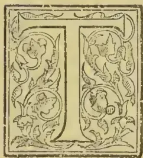

HERE are ten elements absolutely essential for the production of plants. These are nitrogen, hydrogen, oxygen, carbon, sulphur, phosphorus, potassium, calcium, magnesium, and iron. It is to the first-named element (nitrogen)

that I wish to call attention, and I will endeavour to show how important it is that we should become well acquainted with it. Nitrogen was discovered by Rutherford in 1772, and is a colourless inert gas, slightly soluble in water. It occurs free in the atmosphere, of which it constitutes 79 per cent, or 11 lb. to every inch of the earth's surface. The nitrogen and oxygen of the atmosphere combine under the influence of electric discharges, nitrous acid being formed, which is converted into nitric acid by the action of ozone or peroxide of hydrogen. It forms several compounds useful to those engaged in horticultural and agricultural pursuits. Ammonia is a compound of nitrogen and hydrogen.

Owing to the complicated changes of nitrogen in the soil, it is of the utmost importance that we should study the natural sources of its loss and gain there if we wish to become well acquainted with the difficult question of soil fertility. How does the soil obtain nitrogen in a natural way? The presence of organic nitrogen which is found in the soil has been formed by the decay of vegetable and animal matter. It is also brought down in rain as organic nitrogen, ammonia nitrates, and nitrites. The amount obtained in this way was determined at Rothamsted to be  $4\frac{1}{2}$  lb. per acre per annum. But this varies in different parts of the country. It is estimated that an acre of fertile soil contains from 6,000 to 30,000 lb. of nitrogen in the first 18 inches, but the larger half is in the

first 9 inches, and the quantity decreases the deeper we go, 96 per cent. of it being present as organic matter.

From the above it seems that we have an inexhaustible supply of nitrogen in the soil, when our most exhaustible crops (Turnips) only remove about 150 lb. per acre. But probably not more than 5 per cent. of the nitrogen in the soil is in the form of nitrates, and thus available as plant food. Fallow land always contains a much higher percentage of nitrates than land under crop; for instance, the first 27 inches of soil over an area of one acre of fallow contains from 33 to 60 lb. of nitrates; land under crop only contains from 5 to 14 lb. in the same bulk of soil. This shows how quickly the nitrates are taken up by a growing crop.

These nitrates are most abundantly formed during the late summer and early autumn months, when the soil is warm, especially after cereal and other summer crops are removed. Nitrates, it should be remembered, are very soluble in water, and if light sandy soils are allowed to remain bare during the winter a very large proportion of this valuable manure will be washed out by the heavy rains. To prevent this loss some kind of winter crops should be grown, as these take up the nitrates. If the crops are of no other use they can be dug in during the early spring, and will then form a good organic manure which is beneficial to light sandy soils, as it helps to make them more retentive.

I have stated that our most exhaustive crops remove about 150 lb. of nitrogen per acre, and from experiments at Rothamstead it was found that from 35 to 45 lb. of nitrates per acre were washed out of the soil into the drains per annum, making the total loss of nitrogen about 157 lb. per acre in one year. Gardeners must bear in mind that this loss goes on the same in garden soils, and therefore to keep it in a fertile condition we must replace this loss by the application of some nitrogenous manure, such as the following.

*Ammonium Sulphate.*—This is a compound of ammonia and sulphuric acid. It contains 20 per cent.

101------------------------------------------------

76THE TROPICAL AGRICULTURIST.[AUG. 1, 1895.]

of nitrogen, equal to 25 per cent. ammonia. This is the most concentrated of all nitrogenous manures and is very soluble in water.

*Potassium Nitrate.*—This is a compound of potash and nitric acid, and usually contains 13 per cent. of nitrogen, equal to 16 per cent. ammonia. It also contains about 45 per cent. of potash. It is a very valuable manure. Any gardener can increase the supply by the following process:—Make a compost heap of vegetable matter, such as garden refuse, and mix with it a fair proportion of wood ashes and lime. The wood ashes, which are rich in potash, can be obtained by burning all fruit tree prunings and hedge trimmings. The lime added helps to decompose the organic matter and liberate the nitrogen, which then chemically combines with the lime; but another change takes place by which the nitrogen leaves the lime and combines with the potash, thus forming potassium nitrate. The compost heap must be frequently turned so that all parts become thoroughly oxidised.

*Sodium Nitrate.*—This is a compound of soda and nitric acid, and contains about 15 per cent. of nitrogen, equal to 19 per cent. ammonia. It is very soluble in water, and contains its nitrogen in a form that can be immediately appropriated by plants.

*Peruvian Guano.*—This manure varies from 1 to 12 per cent. of nitrogen. It is a more general manure than the preceding, as it contains nitrogen in three forms. 1, As organic nitrogen; 2, ammonia; 3, nitrates, and is, therefore, a more lasting manure.

*Dried Blood.*—Blood contains nitrogen equal to from 12 to 16 per cent. ammonia, but it is slower in action than any of the above manures, as it has to undergo decomposition before it is available as plant food.

*Fish Guano.*—This is also a slow acting manure. It contains nitrogen equal to from 8 to 10 per cent. ammonia.

*Farmyard Manure.*—This is the most general of all manures. One ton contains from 9 to 15 lb. of nitrogen, besides other valuable manurial ingredients, such as potash and phosphoric acid.

*Animal Urine.*—One ton of this from horse stables contains 36 lb. of nitrogen; from cows, 30 lb.; and from sheep, 38 lb. Most gardeners can get a good supply of stable manure, and many persons have noticed the black streams draining away from it. If the value of the fertilising ingredients of this liquid contain was better known it would not be allowed to waste as it does. This is the analysis of it in 100 parts. Water, 82 per cent., and dry substance, 18 per cent. The dry substance is made up as follows:—

<table>
<tbody>
<tr>
<td>Ash .. ..</td>
<td>10.7</td>
<td>Magnesia .. ..</td>
<td>0.4</td>
</tr>
<tr>
<td>Nitrogen .. ..</td>
<td>1.5</td>
<td>Phosphoric acid ..</td>
<td>0.1</td>
</tr>
<tr>
<td>Potash .. ..</td>
<td>4.9</td>
<td>Sulphuric acid ..</td>
<td>0.7</td>
</tr>
<tr>
<td>Lime .. ..</td>
<td>0.3</td>
<td>Silica .. ..</td>
<td>0.2</td>
</tr>
</tbody>
</table>

It will be seen by this analysis that the liquid contains, in addition to nitrogen, five of the mineral ingredients that are essential for the production of a healthy growing plant; the one not mentioned is iron, but plants only require a trace of this ingredient. And it is usually present in soils. It must be borne in mind that all the manures mentioned, except the sodium nitrate, the potassium nitrate, and part of the Peruvian guano had to undergo a process, next to be dealt with, before they can become available as plant food.

*Nitrification.*—This is effected in the soil by two micro-organisms (Bacteria). The first, known as the nitrous organism, converts ammonia into nitrous acid; the second, the nitric organism, converts the nitrous acid into nitric acid.

Carbon as organic matter must be present for the existence of these micro-organisms. Air, heat, and moisture are the three things that promote nitrification. It is very feeble at a temp. of 40° F., and ceases at 32° F. It is, therefore, necessary that the soil should be well drained. If the soil is waterlogged the air is shut out, and nitrification ceases, the nitrates present becoming denitrified, with the result that the nitrogen is set free. We must understand that nitrification takes place exactly the same in the soil of the smallest pot, under the gardener's

care, as it does in any prepared border, or in the open field. If the soil in pots become waterlogged nitrification ceases, and if allowed to remain long in this condition the roots will perish.

*Basic Condition of soils.*—Sufficient lime and potash must be present as carbonates or sulphates for the nitrates when formed to combine with, nitrate of lime and nitrate of potash then being formed, and these are the two sources from which all plants obtain their nitrogen from the soil. If any soil is not in a good basic condition it cannot be fertile.

*How Plants Obtain Their Nitrogen.*—The dry substance of plants usually contain from 2 to 3 per cent. of nitrogen, and they all (except the leguminous plants) obtain it from the soil principally as nitrates. Some gardeners still favour the idea that the foliage of plants has the power of absorbing nitrogen as ammonia from the air, but the most eminent botanists in England and on the Continent have concluded that the quantity obtained by plants in this way is so small as not to be worth considering. We may deduce from this that damping down houses, when closing in the afternoon, with liquid manure, as practised by some gardeners, does not benefit the plants so much as they think. Some, however, consider that the fumes of ammonia are injurious to red spider and other insect pests.

*Leguminous Plants.*—Peas, Beans, and Clover belong to this family. These plants have some power, not yet properly understood, of absorbing the free nitrogen from the atmosphere. Mr. Paul Sorauer, in his popular treatise on the "Physiology of Plants" (1895), says "As far as our scientific knowledge goes, the leguminous plants can subsist on the nitrogen they take from the atmosphere, while cereal crops, fruit trees, and indeed all other phanerogams, must obtain this substance in some soluble form from the soil. Nitrates seem to be the most suitable form of salt from which plants obtain their nitrogen. Ammonia, which can probably be absorbed in minute quantities even in a gaseous state, is less suitable." It is a fact that leguminous plants can be grown in a soil devoid of nitrogen. These plants do not rob the soil of this element, but act as purveyors of it to the soil.

*Why is Good Loam so Valuable?*—The first 9 inches of an old well-drained pasture is full of nitrogen, in three forms—nitrates, ammonia, and organic matter. The first 9 inches of soil in 1 acre, if weighed when dry and all roots removed, would contain about 2,250,000 lb. of soil. At 0.10 per cent. of nitrogen this quantity of soil would therefore contain 2250 lb.; but the turf we use for potting has all the roots in it, and these by their decomposition yield a large supply of nitrogen. Clove being a leguminous plant, greatly increases the nitrogen in a pasture.

*How is the Nutrition of Pot Plants Effected?*—The various composts we use for potting purposes should contain sufficient food for the growth of the plants; but the food in the richest soil can only last for a short time in the limited space of a pot, and therefore we should try to make the best of the soil. It is a common practice when sifting soil to throw but the lumps of turf that will not pass through the sieve. This is a great mistake. These lumps should be rubbed through, as their decay greatly increases the supply of nitrogen to serve as plant food.

When the soil in pots is getting exhausted the plants cease to grow vigorously, the foliage becomes pale, and the plants is weak in the growing point. We must now supply it with food. Soluble artificial manures are generally used where good liquid manure cannot be obtained. Great care should be taken not to overfeed, as this encourages rank growth; young tissues are built up too fast; the plants are not well matured, and when in this condition are more liable to prevalent diseases. Dr. Sorauer says that "the majority of diseased plants he received from gardeners was the result of overfeeding."

I have used tons of chemical manure, and from practical experience I find it better to under than over-feed. If we wish to keep our plants healthy

102------------------------------------------------

AUG. 1, 1895.]THE TROPICAL AGRICULTURIST.77

we should know the composition of the soil we have to deal with; also the composition of manure, and the ash constituents of plants. We should then be able to mix our own compounds to suit plants under our care. In conclusion I may say that of all the elements essential for plant life nitrogen is the most important. It is one of the chief elements of protoplasm, and this is the substance which gives life to plants.—(Paper read by Mr. J. Gay, at a meeting of the Wormley and District Horticultural Society).—*Journal of Horticulture*.

### THE VITALITY OF SEEDS.

In the course of his investigations on the behaviour of matter at low temperatures, Professor Dewar was led to consider the effect of great cold on bacterial life and seeds. Although bacterial life is destroyed by boiling in water at a temperature of 100° C., it can still endure unaffected a degree of cold much greater in proportion. Professor Dewar submitted seeds for the space of an hour to a temperature of 182° C., and found that they afterwards went on putrefying or germinating as the case happened to be. In a moment of scientific inspiration, Lord Kelvin suggested that the first life might have been brought to this planet by a seed-bearing meteorite. But though it has yet to be explained how this meteorite was ever originally equipped with seeds, the discoveries of Prof. Dewar are interesting in a way because they give colour to Lord Kelvin's theory. They show that spores may live upon a planet through long periods of low temperature. The popular press is never tired of trumping up the old stories of the power of mummy-wheat to germinate after long ages of time. Let it suffice to say that these exaggerated estimates of the powers of retaining vitality which seeds possess, have not been substantiated.

In a recent number of that interesting journal, *Science Gossip*, Mr. H. B. Guppy put forward a proposal which we commend to all who are interested in biological science. In his investigations on the dispersal of seeds, Darwin came to the conclusion that a period of twenty-four hours as the limit of time, and 500 miles as the limit of distance, was the most that could reasonably be permitted to the agency of birds in stocking islands with seeds carried either on or inside their bodies. Mr. Guppy suggests that observers should examine such specimens of water-fowl as are common in their neighbourhood in order that we may have more definite data as to the dispersal of seeds and their vitality.

Some observers have testified to the fact that wild ducks frequently carry seeds a distance of perhaps a thousand miles or more, and that these seeds retain their vitality and germinate, sometimes without much delay, at other times after a year or two. We know that the common European species, *Xanthium spinosum*, has spread over the whole of South Africa, and we are probably right in thinking that the seeds of this plant have been carried in the wool of sheep. Here the seed did not, as in the case of the water-fowl, pass into the stomach of the animal, but there seems to be no reason why birds should not transport seeds in their internal organs across oceans and continents. Modern experiments with the seeds of cereals show that they lose their vitality after ten years at most, and usually much sooner; but much depends on the state of the seeds at the time they are gathered from the parent plant, the mode of preservation, and the influences they may have been exposed to during preservation. Mr. Sowerby, who has, at the garden of the Royal Botanic Society, in Regent's Park, experimented with a variety of seeds of various ages, and produced in quite distinct countries, declares that he has not met with any of fifteen years of age, to his own knowledge, to grow. The most aged seeds he has known to vegetate were those of the Australian Baobab Tree (*Adansonia Gregorii*), ten years old. One of the most curious cases of the vitality of seeds is reported in the *Journal of the Royal Botanic Society* for 1885. A handful of fruits of *Aucuba*, taken from a shrub in the gardens at

Regent's Park, were planted in a pot in July, 1882; two plants appeared above ground in February, 1883; fourteen in 1885, and two more in February 1886. It may, perhaps, be found that the process of ripening after the fruit has been removed from the parent, especially when buried in moist earth and at a less rapid pace, may account for the difference in time of germinating.

Another point on which more light is wanted is the vitality of seeds after being carried over long distances by winds. Of course, with *Cryptogamia* the matter is easy enough, for we have in the wind an agency capable of distributing spores over long distances; but with phanerogamous plants difficulties arise. Berthelot, indeed, avers that after a violent hurricane he saw an annual belonging to the *Composite* (*Erigeron ambiguus*), widely distributed throughout the Mediterranean region, suddenly appear at various spots on the Canary Islands, where it was previously unknown. It is probable, therefore, that the seed had been blown across from Portugal or North Africa. How interesting would it be if we could place a mark on certain seeds, and casting them to the winds, find the identical ones in some spot hundreds of miles away from home! *The deities of a Seed*. What a sale such a book would have among botanists and biologists!

Darwin's experiments to determine the vitality of seeds in sea-water, the results of which were published in this Journal, do not seem to have been imitated by more recent investigators; but here surely is an interesting field for study. We may perhaps be allowed to quote one of the experiments. Darwin found that out of eighty-seven kinds of seeds, sixty-four germinated after an immersion of twenty-eight days, and a few survived an immersion of 137 days; and in another, that out of ninety-four dried plants, eighteen floated for above twenty-eight days. Combining the results of the two experiments, Darwin concluded that fourteen plants out of every 100 in the flora of a country might be floated by currents moving at the average rate of the several Atlantic currents, a distance of 924 miles, and might, on being stranded, furnish seeds capable of germinating.

While on the subject of the power of seeds to withstand the power of water, it may not be uninteresting to state that it is a well-known fact that the Coco-nut is one of the first plants to make its appearance on coral islands, and it is, according to Sir John Lubbock, the only Palm which is common to both hemispheres. The seeds of the Coco-nut are, of course, well protected against mishaps by the loose texture of their husks, and can float easily on the water. The seeds of the common Duckweed, again, lie dormant at the bottom of the water all through the long autumn and winter, but at the approach of spring they rise to the surface with unimpaired vitality, and germinate forthwith.

Some years ago the British Association took up the question of the vitality of seeds, and instituted a series of experiments, in which Professors Danby, Henslow, and Lindley took part. In the Report for 1857 we find a valuable summary of the results of the experiments from 1841 to 1857 inclusive. In the table showing the greatest ages at which the seeds experimented with germinated, we find that the seed of a species of *Colutea* belonging to the *Leguminosæ* germinated after forty-three years. This is the only plant mentioned in the list whose seed preserved its vitality for so long a time as forty-three years, though it would appear in general that the seeds of leguminous plants retain their vitality for a long time.

We are unaware that any experiments are being carried on at the present time on this interesting subject; certainly the British Association dropped the matter after the year 1857.

De Candolle in 1816, experimenting with seeds about 15 years old, obtained results which go to prove that the natural orders, *Malvaceæ* and *Leguminosæ* excel all the orders examined in the duration of the faculty of germination. Comparing these results with those obtained by the British Association investigations, we find that the longest period a species of *Malvaceæ* retained its vitality was 27

103------------------------------------------------

78THE TROPICAL AGRICULTURIST.[AUG. 1, 1895.

years. Beside the Leguminosæ, the seeds of species of the following orders retained their vitality after a period of twenty years. Tiliaceæ, Rhamnaceæ, and Myrtaceæ. Returning for a moment to the statements mentioned above, as to the powers of different seeds of resisting external influences, we find that cereal grains have been proved by Edwards and Colin to bear a short exposure of 122° F. in water, as well as a dry cold of 70° below the freezing point; while Hemingway, in a paper published in the *Ann. of Nat. Hist.*, 1st series, viii, 317, states that seeds of Elder germinated after being twice boiled in making wine, being present during the vinous fermentation, and remaining for twenty months in the dregs of the cask. *H. C. F.—Gardener's Chronicle*

## TROPICAL AGRICULTURE IN NORTH BORNEO.

COFFEE—COCOA—COCONUTS—PEPPER—

GAMBIER &c.

It is always interesting to know what other people think about you, and especially so when the critic is a shrewd observer and a man of practical experience, and for these reasons what Mr. Strutt has to say about us is read with particular attention. It is very satisfactory to find him referring favourably to the growth of coffee, Manila hemp, cocoa, coconuts, sugar cane, cotton, pepper, gambier, sago and arrowroot; the growth of these plants that is: as to whether their cultivation is likely to pay Mr. Strutt says there are two ways of judging (1) by the full knowledge of the future supply of other tropical countries and of the probable demand (2) by comparing the cost of production with other places where the particular plant is grown, but it may be better to divide these points under three heads 1 Possible competition, 2 Probable demand, 3 Cost of production as compared with other countries.

We will in the first place consider gambier. This product grows in Malaya only and as it is imperative that gambier gardens should be in large forests and with facilities for cheap transport, there are not many places left, even in Malaya where a conjunction of these two advantages exists. As to the probable demand, a reduction of the present London sale price would cause a large increase of consumption while as to comparative cost of production, we have tens of thousands of acres of the best forest covered gambier land permeated by rivers that facilitate its being put on board the export ship at a minimum of expense; one of the main items of its cost in the Straits is that the forests now have been felled so far inland that the gambier has to be carted over miles of roads, whereas here the carriage would all be by water which is of course much cheaper than the cheapest form of land carriage. The price of gambier was \$5.30 in 1885 \$6.50 in 1892 and \$9 now.

Next, as to sago, the prices of the last three years have caused practicable sago swamps generally to be drawn upon to about their limits of production. The price of pearl sago now is \$3.60 per pikul as against \$2.50 in 1884 and new uses for sago are constantly being discovered, no falling off in demand therefore need be apprehended, rather the reverse, while the production is limited to Malaya and its islands solely.

Manila hemp has been produced in those parts of the Philippines only that have a suitable climate, and nowhere else at all, and owing to the heavy taxes and other causes at work in those islands, the Philippines have very much to fear from our competition than we from theirs.

With regard to these three products therefore we may claim a portion of a monopoly of supply, while the demand is capable of enormous expansion at a reduced sterling price such as the fall in silver, plus the unusual facilities North Borneo has to offer, entails.

Tapioca though not referred to by Mr. Strutt is the next product we will mention. It can be grown in most tropical countries in the world and it is therefore under the third head, comparative cost of production, that North Borneo would be in a better position than elsewhere; in the West Indies where tapioca used to be largely made the cost of labour is much higher than with us while in the Straits from whence much tapioca was exported some few years ago, increase of population has taken for other purposes a lot of the land then used thereby causing, as in the case of gambier the cost of land transport to be so heavy that it would necessitate a considerable rise in price to make it pay, while in North Borneo the factory could be erected at the mouth of a river and the roots carried there by boat, and subsequently taken by lighter to the export ships side.

Much the same has to be said about sugar; the advantages that North Borneo has to offer for the cheap production of this product are so numerous and so great that it becomes a question whether even at the present phenomenally low price, sugar could not be produced at a profit; our cane flourishes with a vigor rarely equalled in any other country, its juice yields saccharine matter of a density in excess of that elsewhere, the labourers' wages are cheaper than in almost any other sugar country, much cheaper than in most of them, we cannot be beaten in our transport and shipping facilities, and there is an enormous market in Hongkong where one refinery alone puts through two hundred thousand tons of rough sugar annually. In Queensland last season the simple cutting of the cane and carriage to the mill cost as high as 5.6 a ton which is more than half the entire cost of cultivation, upkeep, cutting and transport to a well situated mill in the Sandakan district, would be.

As to coconuts though they can be grown in most tropical countries yet the actual land most suitable for them is circumscribed and the demand for them grows with the increase of population in the tropics and with the discovery of new uses for their products in Europe faster than fresh trees can be planted up. Singapore exported to Europe last year over Pels. 890,000 of copra. Coconuts are one of the best paying, steady and reliable plants to cultivate.

As to cotton, the demand for it in this part of the world may be said to be only beginning now, and yet Japan imported 153,000,000 lb. in the year 1893.

It will therefore be seen that with regard to Mr. Strutt's three points we have little to fear from the competition of other countries, that the demand for most of our possible products is steadily increasing, and that we are singularly well situated with regard to advantages for cheap production. It is rather other countries that have to fear us than we them.

As for the "sample" Mr. Strutt speaks of, the sample of sago North Borneo sent forward in 1893 was valued at over \$160,000 and this is only an earnest of what we could do with all the products we have mentioned if only their cultivation was once properly started.

Mr. Strutt speaks of crops that take two or three years to produce results, but cotton begins to bear at nine months of age, cane also takes the same length of time to mature, tapioca is an eleven or twelve month crop and gambier a fifteen or sixteen months one.

Mr. Strutt speaks reassuringly as to the health of the country, this is a much misunderstood question. North Borneo is freely acknowledged by those who should know best, its European inhabitants most of whom have had plenty of experience in other tropical countries, to be particularly healthy. It must not be forgotten that the class that has almost exclusively come under the cognizance of Europeans at a distance has been almost entirely employed on tobacco estates, and tobacco planting at the best is not a healthy occupation while under the conditions that prevailed on most of the estates when first started, it was simply deplorable; but all others in North Borneo, employers, natives and coolies alike are healthy enough, as witnesses the staff of Government Officials.

104------------------------------------------------

AUG. 1, 1895.]THE TROPICAL AGRICULTURIST.79

On the whole therefore we have to congratulate ourselves that we have been visited by so close an observer and one who while friendly is quite prepared to be critical as Mr. Strutt is, for the more keenly everything in connection with the country is looked into the better the facts will show.—*British North Borneo Herald*.

## AUSTRALIAN HARDWOODS AND THEIR USES.

(Being the substance of a Paper, read at the Imperial Institute, by C. R. FENWICK, Esq., A.M.I.C.E., some time Manager of the West Australian Land Company.)

In the forests of the Australasian Colonies, and especially in those of Victoria, New South Wales, West Australia, Queensland and Tasmania, there is a great variety of excellent timbers, which come under the designation "hardwoods," the chief of which are the iron barks, (*Eucalyptus siderophloia*, (*E. crebra*, *E. Sideroxylon*, *E. paniculata*, and *E. r. ryata*), stringy barks (*E. obliqua* and *E. piperita*) blue gum (*E. globulus*), flooded gum (*E. saligna*), box (*E. hemiploia*), black butt (*E. pilularis*), woolly butt (*E. longifolia*), black wood (*Acacia Melanoxylon*), beech, banksia, the so-called myrtle, rose wood (*Dysosylon fraserianum*), mountain ash (*Myrtus*), and two varieties of the *Eucalyptus* peculiar to West Australia, namely the Karri (*diversicolor*) and the Jarrah (*marginata*).

These timbers are applied to numerous purposes. The iron bark, black butt, and box, are extensively used in harbour-works and railway construction. Iron bark, however, has practically become scarce, as, although there are large areas of this timber in the interior of New South Wales and Queensland, most of the accessible timber has already been cut.

The question has been raised by the Governments of the above Colonies as to the policy of encouraging the export trade in timber, in view of its growing scarcity and of future local requirements.

As regards West Australia, however, no doubt can be entertained as to the superabundance of timber in that Colony; moreover, the climate there is more favourable to rapid growth than that of the Eastern Colonies.

Of the hardwoods of West Australia, Karri and Jarrah possess the most practically useful qualities, and at the same time, command facilities for transport and shipment, as these trees flourish in vast quantities in near proximity to the coast. They have been used extensively in railway construction, in harbour-works, and for bridges, roof-timbers, ship-building, etc. The opinions of many railway engineers may be quoted, testifying to the strength and durability of Karri timber, as well as to its superiority over Baltic pine for railway sleepers.

Among the smaller varieties of timber *Yate* (*Eucalyptus cornuta*) should be mentioned as a hard, dense wood, somewhat similar to lancewood, adapted for wheel-spokes and carriage-shafts. Its cost, in the Thames, should be from £9 to £10 per load.

The Jamwood tree (*Acacia acuminata*) is close-grained and hard, takes a high polish, and merits the notice of cabinet-makers. The she-oak (*Casuarina*) is also worthy of mention as being useful for higher work, such as panels, wheel-spokes and tool-handles.

The question as to the paving material best adapted to the heavy street traffic of our large towns is one of very great importance; and opportunities have been taken for testing the adaptability of the Australian hardwoods for street-paving purposes. Many of these have been tried, but Karri and Jarrah assert for themselves a marked individuality; they have been laid in many parts of London and in other towns, and with them the nearest approach to the perfection of street-paving has been attained, the difference between the wear of Jarrah and of Karri having proved to be inconsiderable. Both preserve an excellent surface under heavy traffic, and they have out-worn soft wood laid near them to a remarkable degree. A pavement of Karri blocks, laid in the City of London, on a gradient of 1 in

27, has remained dry and not slippery, while the adjoining soft wood pavement, which retains more moisture, was slippery and dangerous.

The Surveyors to the Vestries of St. Pancras and Chelsea, in which districts hardwood pavements have been laid, are of opinion that it is economical to use these blocks for street-paving where there is heavy traffic.

Investigations made by Mr. Thos. Luslett, Inspector of Timber for the Admiralty, into the relative merits of some of the best known timbers, show that Australian hardwoods, when under tensile, transverse and crushing strains, take high rank as compared with British oak, greenheart, teak and red pine. Thus, among seven timbers, Karri stands fourth under the heading of tensile strain, and second under crushing strain, and ranks next to greenheart. Under crushing strain the resultant figures are Karri, 5.13 tons; English oak, 3.41 tons; Jarrah, 3.19 tons per square inch, and blue gum, 3.07 tons. It is to the high resistance to crushing strain that Karri chiefly owes its superiority as a paving material. The hardwood pavings preserve a more even surface than those of any other woods, hence they are much more durable. Those of Jarrah and Karri having lasted at least three or four times as long as soft wood pavements, the cost of relaying and the consequent serious interference with traffic and public convenience are, therefore, very greatly reduced by the employment of those woods.

All hardwood paving should be laid with close joints. A better and more even surface is preserved with closely laid bitumen-jointed blocks, and the objection that space is afforded by wood pavement for the accumulation of foreign matter, is thus reduced to a minimum. One square yard takes 46 blocks, closely laid. The price on railway trucks, in London, for most of the Australian hardwoods is about £6 per load, for large scantling and piles about £7 10s. per load. (A load, 50 cubic feet, weighs about 1½ tons, or 1¼ tons ship's measurement, and contains 800 blocks 9 ins. by 3 ins. by 4 ins.)

A word of advice may be given to the producer; it is, that more care must be exercised than at present in the selection, cutting, and seasoning of timber intended for the European market. Complaints have been made of samples, that they have been shipped when green, and therefore unfit to stand the ordeal of a voyage through the tropics, the result having been their condemnation at sight. A bad impression, thus created, is not easily overcome.—*Imperial Institute Journal*.

## THE CULTIVATION OF COFFEE IN MAURITIUS.

He who would advocate the culture of coffee in Mauritius would probably be looked upon by those who consider themselves to be in the know as a fit subject for Beau Bassin Lunatic Asylum. Yet, on a close examination of the subject, it will be found that the reasons which can be given why the cultivation should not be a success are but few.

We admit of two, and those probably powerful ones, namely, leaf disease (*Hemilia Vastatrix*) and the havoc that hurricanes might produce.

Although coffee was formerly, to a very limited extent, grown in Mauritius, it was never cultivated; that is to say, it never received that care and treatment which is usually accorded to the plant when grown as an article of commerce. It was left in a wild state: topping, handling, and pruning, if ever heard of, never being carried into practice; in fact it was left in that state which is generally known as Native Coffee.

There is no doubt whatever, that leaf disease does still exist in Mauritius on the few remaining trees that are occasionally to be met with, and, in any experiment that may be made to promote the industry, the area brought under cultivation would certainly be, more or less, attacked by it. But it must be remembered that in Southern India and Ceylon, where the disease was most virulent, it took many years before the tree was rendered too weak to

105------------------------------------------------

80THE TROPICAL AGRICULTURIST.[AUG. 1, 1895.

respond to the efforts of nature to throw out new wood or to mature the crops; and, further, that before this happened, large returns had been obtained from the Estates.

In certain localities, although affected by disease, coffee is still being successfully cultivated in Ceylon, and many planters, afraid that Tea is being over-produced, are returning to their old love.

The supposition is, that even though the trees may eventually succumb to the effects of the disease, a sufficient number of remunerative crops can be obtained to justify the initiatory expenditure.

Unfortunately, there is very little virgin forest left in Mauritius, so that the culture would here be handicapped in respect to soil, from the commencement; but, on the principle, "nothing venture, nothing win," we see no reason why, at suitable elevations, small areas should not be put under coffee on land which has been cropped with sugar cane. The cost would be very small compared with that which has to be incurred when opening up primeval forests in new districts, where the timber has to be felled and cleared away, where bungalows, coolies, stores &c., have to be built and roads and drains have to be made. On very many Sugar Estates all these are already provided. The formation of nurseries, and subsequent luing, holing planting, and periodical weeding, comprise the whole of the absolutely necessary expenditure, until the trees come into bearing.

We are not prepared to say positively, that land which has already been under sugar cane is suitable for coffee cultivation, but we consider the experiment is worth a trial; for if only four cwts per acre be obtained, the return would far exceed, acre for acre, any that has ever been in the past or ever will be in the future, derived from the growing of sugar cane.

How the coffee would be affected by hurricanes is entirely speculative.

Fortunately visitations such as that of 1892 are few and far between and frequently many years elapse without Mauritius experiencing a stronger blow than is annually felt in some of the coffee districts of Ceylon. There are, at certain seasons of the year, the air has been known to be thick with leaves torn off the trees by the wind, yet, the crop suffered but little. In such exposed places, the trees were topped low, from 2 feet to 3 feet, and the plants, when young, were carefully staked. Were this to be done in Mauritius, and wind-belts judiciously planted, there is no reason why the ordinary hurricanes that visit the island should have any more effect upon the coffee, than have the strong winds which prevail in other countries where the bean is grown.

We invite those of our readers and their friends, who are sceptical about the growth of *Coffea Arabica* in Mauritius, to visit the Experimental Tea Garden at Curepipe, where a small clearing of this species may be seen in a perfect state of health and vigour.—*Mauritius Planters' Gazette*.

#### AGRICULTURE IN BRITISH HONDURAS.

In continuation of previous information on this subject (*Kew Bulletin*, 1894, p. 97), the following extract is taken from the Annual Report for 1893 (*Colonial Reports*, Annual, No. 116, 1894) on the agricultural resources of British Honduras. It is noticed by the Governor that a valuable impetus has been given to the cultivation of fruit for export by the organisation of a new steamship company by local capitalists. Already, owing to this cause, increased applications have been made for the purchase or lease of Crown lands, and better facilities are afforded for the disposal of agricultural produce:—

The principal products of the Colony, in addition to mahogany and logwood, are sugar, rum, Indian corn, bananas, coconuts, and plantains, and, according to the returns supplied, the quantity produced during 1893, and in the case of bananas, coconuts, and plantains, the quantity exported for the same

period, are as follows: sugar, 1,490,920 lb.; rum, 57,178 galls.; Indian corn or maize, 47,607 bushels; bananas, 189,420 bunches; coconuts, 1,177,315; plantains, 506,400 fruits. The returns for sugar, rum, and Indian corn cannot, however, be considered as strictly accurate, and probably are very much below the actual quantity produced.

Under bananas, coconuts, and plantains only the quantity exported has been given, as no reliable figures could be obtained as to the quantity grown. In endeavouring therefore, to arrive at an approximate estimate of the bunches of bananas and the number of coconuts and plantains annually produced in the Colony, a reasonable allowance must be made for home consumption by a population of nearly 33,000 souls. There is a very considerable decrease in the quantity of bananas, coconuts, and plantains exported in 1893 as compared with the four previous years, but this decrease is almost entirely attributable to the disastrous effects of the gale of the 6th of July, which wrecked or very seriously damaged nearly all the plantations in the southern districts of Stann Creek and Toledo. Considering the geographical position of British Honduras, the fertility of its soil, and the general salubrity of its climate, it is surprising that the number of its agricultural products as articles of commerce is not greater than it is. By the establishment, through the efforts of his Excellency Sir Alfred Moloney, K.C.M.G., in 1892, of a Botanic Station at Belize attached to the grounds of Government House, an attempt has been made to create a nursery for the cultivation of plants of economic value of all kinds. But the condition of the soil in Belize and the proximity of the station to the sea have proved the present site to be not altogether suited for its purpose, and it is hoped to shortly transfer the Botanic Station to the Stann Creek district, where a site of some 75 acres, admirably adapted for its purpose, has been generously placed at the disposal of the Government by the board of directors of the British Honduras Syndicate. Even at Belize the Botanic Station has proved of value, for, from the experiments made there, and from experience gained of the resources and capabilities of the Colony, it seems clear that the following products, addition to those which have already proved successful, can be grown with advantage and with profit to agriculturists; cocoa, castor-oil plants, coffee (*liberica* for the lowlands, *arabica* for the highlands), rubber (*Castilloa elastica*), *Cola acuminata*, cotton, grape-fruit, ground nut, henequen, jute, lemon, lime, nutmeg, pine-apple, pimento, *sapodilla*, shaddock, tobacco, and vanilla. In addition to the above the following kitchen-garden products, as they are generally termed, can be readily cultivated: artichoke (Jerusalem), asparagus, beans of various kinds, cabbage, carrot, cauliflower, celery, corn, cucumber, edible gourds, Indian kale, lettuce, melon, mint, ochro, parsley, potato (Irish and sweet), peas, spinach, and tomatoes.

Bearing in view the short-sighted policy of depending on logwood and mahogany as the staples for the Colony's trade, it is to be hoped that the oft-repeated exhortation of his Excellency the Governor that the future of British Honduras must depend on its agricultural development will be borne in mind, and that in time this Colony will become, what it is eminently fitted by its climate and fertility to be, the garden of Central America.—*Kew Bulletin*.

#### PEPPER-RAISING IN CAMBODIA.

The pepper plant, says M. Adhemard Leclerc, in the *Revue Scientifique*, is not a bush, as some writers say, but a vine, which has to be supported by a tree when wild, and by a strong stake when cultivated. The author has seen the vines growing nearly wild near Chandoe in Cambodia, where they had been planted by the villagers and left to themselves. They grew vigorously and to a considerable length, but bore only a few bunches of fruit, and that of an inferior quality. An abundant crop of good Pepper can be obtained only by careful and skilful cultivation. The industry thrives in the province of Kamput,

106------------------------------------------------

AUG. 1, 1895.]THE TROPICAL AGRICULTURIST.81

where it is pursued in some twenty villages. At the village of Suam Ampil there are eighty-nine planters, and more than a hundred plantations, containing 48,441 stocks. The plants are propagated from cuttings, which are made about eighteen inches long, and are taken from stocks two or three years old. They are supported by stakes about ten feet high, which are solidly planted in the ground; and are fertilised at the season every year with a special manure, which is composed of eight parts of good soil and one part of pounded shrimp shells. The plants are liable to attack by a minute parasite that destroys their fruitfulness, to obviate which they are treated with a decoction of tobacco. The first crop, but an insignificant one, appears in the third year from planting. A crop of about a kilogramme per stake of two plants is gathered in the fourth year, and the increase continues for eight or ten years. Exceptional plants in good soil may return four kilogrammes per stake; but a crop of from two to two and a half kilogrammes is considered a fair average. Some plants will live fifty years, but they are seldom remunerative after forty years, and, as a rule, a plant thirty-five years old is considered of no further value. The plants bloom in May and June, and the gathering of the crop begins in February. The bunches which have turned red are picked and the others are left for future visitations. The berries are stripped from the bunches and dried in the sun till they are black, when they are packed and made ready for sale. White or grey Pepper is produced by letting the berries get a little riper, and cleansing them from their outside envelopes. In some districts the removal is assisted by soaking the berries in sea-water. One labourer can usually take care of about one thousand stakes.—*The Indian Agriculturist*.

#### PEACH CULTURE IN THE SIMLA DISTRICT.

We have received from Mr. W. Coldstream, C.S., Superintendent of Hill States, Simla, Tract No. 8, on the advantages of cultivating peaches. Considering that three persons, if not four, were associated in its production we are somewhat disappointed by this meagre pamphlet of six pages, even though we see that it is printed and published for the edification of local zemindars. After describing the advantages of having trees planted round houses, the conclusion is arrived at that the *peach* is the best tree to plant as "it grows rapidly—comes to maturity, or fruit-bearing—in three or four years—is most easily cultivated from the seed and is usually very prolific." We are then told that "in very rich soil trees six years old have yielded one thousand peaches each in a single crop," and here at the outset we find ourselves obliged to protest. Any one who has ever tried it, even on poor soil, knows that one can get lots of peaches, but that to get good peaches, not the rubbishy bitter little hard green peaches of the villages, you must obtain the best kinds, must cut off about three-quarters of the fruit when set, must prime carefully and manure heavily, and these are just what the villagers will not do. No doubt, on the outskirts of hill villages, manure of a sort!—is plentiful, only too plentiful, but who ever heard of a native fruit-grower cutting off any of the young fruit to improve the rest, any more than he heard of a native gardener who would of his own accord gather his peaches before they were as hard as bullets, or his turnips until they were more fit to give rope-fibre than food?

No doubt, peaches, if only some attempt is made to get good ones, are good things to grow, and even when hard and bitter they make good stew; but there are other fruits as good, such as apricots, Bokhara plums, and, above all, apples. It seems to us that there is no want of fruit trees generally in the North-west Hills, but that what is wanted is improved cultivation and consequent improved quality. Hints on these important matters are unfortunately absent from Mr. Parson's 'directions for sowing and rearing' which we need hardly reproduce, as they contain nothing but what any Forest officers must have known long ago.

We take the greatest interest in the work with which officers like Sir Edward Buck and Mr. Goldstream have identified themselves, but we hope that in future Tracts of the kind, Mr. Goldstream will impress upon his ranas and zemindars the advantages of improvement in quality as much as those of increased number of trees.—*Indian Forester*.

#### AGRICULTURAL INDUSTRIES—OLD AND NEW—IN MAURITIUS.

In previous issues of our paper, we have commented on Agricultural Industries that we think might be successfully cultivated on a large scale in Mauritius, such as Ramie fibre, Coffee, Tea, &c. We now purpose, briefly, to treat on minor ones, which with proper attention should prove equally if not more, lucrative, acre for acre.

*Vanilla*.—We hesitate to touch on the subject of Vanilla culture, seeing that Mauritius has for many years held its own in the London and Continental markets against the produce of other countries, and that, in the cultivation of the plant and preparation of the bean, Mauritius planters have never been excelled. This being the case, we would eschew any attempt at giving instruction to a maternal grandparent, and content ourselves by saying that, disappointing as the cultivation of the vine has been of late years disheartening as it is to see plantation after plantation succumb to a disease which has hitherto baffled all attempts at eradication and elucidation, both by experienced planters and scientific men, by selecting either virgin forest or wellgrown coppice, and by planting on live wood which has been freed from excessive shade, vanilla can still be grown to give a handsome profit on the small expenditure this mode of cultivation would entail.

*Cacao*.—Experience shews that in some parts of Mauritius the soil is well adapted to this culture. The few trees that are to be found in the country are strong, healthy specimens, and they crop freely. It is a tree that should be planted only at low elevations—not more than 500 feet above sea level—and in deep, rich soil; it requires a well distributed rainfall and should be sheltered from the effects of wind as much as possible. The specimens that there are in Mauritius suffered severely from the hurricane of 1892, but the recuperative powers of the tree are great, and in twelve months after that calamity, those referred to were laden with fruit. The cultivation is very simple, and the preparation consists in removing the seed from the ripe pod and drying it sufficiently for transport to European markets.

*Banana*.—The development of this industry is sadly behindhand; a surprising fact, considering how freely the tree grows, and the quantity of land there is available for its cultivation. The varieties appear to be but few; whether this be the case or not, it is seldom that any but the poorer sorts are offered for sale. No effort appears to be made to cultivate the fruit systematically; stools are stuck into the ground anyhow, the tree is allowed to grow without any attention being paid to it, and when, or before, the fruit is *pleine* it is cut down and sent to market. In countries where the banana is cultivated for export, the land is thoroughly prepared, laid out in squares and properly drained, irrigation being resorted to when necessary, where water is available. That considerable care is given to its culture is not surprising as steamers of 1000 tons and upwards are often fully freighted with bunches of bananas collected in Fiji and the adjacent islands; these find a ready sale in the Australian capitals. An acre or two of land, near to a railway station, cultivated on systematic principles, would not only keep the wolf from the door, but enable its owner to live in comparative luxury. Apart from its value as a dessert fruit, it has a marketable value in the shape of flour. Not long since a sample of flour prepared from the Moko plantain was sent to London, for which six pence per lb was offered. A 15 lb bunch will yield 3 lb of prepared meal, which at 6d per lb—one shilling

107------------------------------------------------

82THE TROPICAL AGRICULTURIST.[AUG. 1, 1895.

and six pence per bunch. A piece of land, one hundred and twenty square yards in extent, is said to be capable of yielding four thousand pounds of fruit annually. Should this be the case, at the above price, the return per acre would be almost fabulous. This is a minor cultivation which should commend itself to the attention of small capitalists.

There are other cultures to which we hope to draw the attention of our readers in a future issue. *Mauritius Planters' Gazette*.

### SPRAYING FRUIT TREES.

It is generally understood by orchardists having British experience that quassia chips are largely used in preparing liquid for syringing fruit trees. A recent issue of the *Gardeners' Chronicle* contains a series of recommendations by the Board of Agriculture for preparing such liquid. 1. The extract of 7 lb. of quassia, obtained by boiling quassia in water, to 100 gallons of water with 5 lb. of soft soap. 2. The extract of 5 lb. of quassia to 100 gallons of water, with 5 lb. of soft soap and five pints of paraffin (kerosene) well stirred. 3. Extract of 4 lb. of quassia to 100 gallons of water with 4 lb. of soft soap and four pints of Calvert's carbolic acid, No. 5. 4. Six pounds of soft soap and 2 lb. of finely-ground Uelzebure and a quart of kerosene, boiled and well stirred together. This is sufficient for 100 gallons of water.

The soft soap is dissolved in a tub with hot water. The quassia chips are boiled in water and put into another tub. Where paraffin is used it should be well stirred up with boiling soap and water before it is mixed with the cold water. Water-carts or ordinary barrels or wine casks set upon frames with wheels should be brought full of water to where the materials are being prepared, either at the farm buildings or in an extemporised shed with a copper in it, and the requisite amount of dissolved soap and other ingredients added. Knapsack and other hand machines can be used for small apple trees, plum and damson trees, and for filbert and cob-nut trees.

It is important that syringing should be commenced early in the spring. Directly there are signs of infestation the process should be begun. As the hatching out of caterpillars is not simultaneous, but is extended over some days, the syringings must be renewed if necessary.

Some fruitgrowers in several parts of the country have tried the cheap arsenical insecticides used extensively in the United States and Canada. These have not yet been generally adopted in Great Britain on account of their intensely poisonous properties, although from experiments made with them they have been proved to be most effective there.—*Australasian*.

### THE KADAMBA TREE.

This tree is indigenous to Ceylon, and is known among botanists as *Anthrocephalus Kadamba* (the Kadamba of the Tamils). It has an erect stem with many branches; the flowers, which have a peculiar sweet smell, forming a small globe. The fruit is about the size of an orange; this is eaten by the poor natives in India, while the leaves are given to cattle as fodder. The bark is considered to be of great value as a febrifuge and tonic; its taste is bitter and astrigent. The fresh juice of the bark is applied to the fontanelles of children when that soft portion of the head sinks; at the same time a small quantity mixed with cumin and sugar is given internally. The juice of the bark mixed with an equal quantity of lime juice, opium, and alum has been applied with great benefit round the orbit of the eye to subdue inflammation. The tender leaves, when applied in the form of a paste, resolve glandular swellings, and the large leaves prove an efficacious remedy for eczema. A decoction of the leaves is used as a gargle in cases of aphthæ and stomatitis. The fruit is considered to be cooling, a destroyer of phlegm and impurities of the blood. The wood of the Kadamba tree is of great economic import-

ance, is soft, yellow-coloured, and even-grained, weighing about 40 lb. per cubic foot. It is used for building purposes in Assam, and may be used as material for beams and rafters, being also good for joiner's work. In Calcutta it is one-third as cheap as mango wood. Kadamba trees grow wild throughout India, and are principally used for fuel. The closely allied *Manjal-Kadamba*, the *kolon* of the Sinhalese (*Adina Cordifolia*), and Nir-Kadamba or Chelembo, the Helamba of the Sinhalese (*Stephanyne parvifolia*), are sometimes used by carpenters in Ceylon. The wood of the former is extremely fine and like that of the box tree being light and durable, though it does not stand damp well; it is used in Bombay for planting for the floors of houses. The former, which is of a light chestnut colour, fine and close-grained, has also been used for flooring-planks, packing boxes, and similar purposes.—*Indian Agriculturist*.

### VARIOUS PLANTING NOTES.

ANTHRACITE COAL v SOOT AS A MANURE.—Will you allow me to ask your readers' opinions as to the value of small anthracite coal instead of soot for agricultural use. I am in a position to get quantities of anthracite "duff," i.e., coal not much coarser than sand, at a very small cost; and as it contains over 90 per cent. of carbon, it has occurred to me that I might use it as a substitute for soot. There will, of course, be many of your readers who will be able to advise me on this matter. G.S.H.—*Gardeners' Chronicle*.

BIG ORCHARD.—The largest orchard in the world is said to be that belonging to Elwood Cooper, of Barbara, California. It is a tract of 1700 acres, and contains 10,000 Olive trees, 8,100 in full bearing, the remainder being young trees set out during the past year and a half. Besides the Olive trees there are 3000 English Walnut trees, 4,500 Japanese Persimmon trees, 10,000 Almond trees, and about 4000 other fruit and nut trees. The 10,000 Olive trees yielded 40,000 quart bottles of olive oil last year, which found a ready market at 4s. a bottle. The nut trees bore thousands of bushels of nuts, to say nothing of the Japanese Persimmons. Taken in all, it has been calculated that Mr. Cooper's orchard brings him in an income of not less than 750 dols. per acre every year. *The People*.—*Ibid*.

AGRICULTURAL EDUCATION IN ABERDEEN UNIVERSITY.—Rev. Dr. Smith, Newhills, Aberdeenshire, convenor of the Committee on Education in Agriculture of the Aberdeen University Court, has issued a circular on the subject to County Councils. He points out that the Ordinance of the Scottish Universities Commission, which is expected to receive the Royal assent, and so become law in the course of a few weeks from this date, lays down a systematic course of study for the B.Sc. degree in Agriculture, extending over not less than three academic years, and embracing, in addition such residence and practical work at a farm as shall be required, at least twelve courses of instruction in the following subjects, viz.:—1, Mathematics or biology (i.e., zoology and botany); 2, Natural Philosophy; 3, Chemistry; 4, Principles of Agriculture (i.e., Agriculture and Rural Economy); 5, Agricultural Chemistry; 6, Geology; 7, Veterinary hygiene; 8, Agricultural Botany; 9, Agricultural entomology; 10, Economic Science as applied to Agriculture; 11, A course in one of the following—(a) Forestry, (b) experimental physics, (c) engineering; 12, Engineering field work. The above enumeration of subjects presents an adequate field out of which to construct various useful curricula of study, and it will be the duty of the University Court, when matters are more advanced, and when the views of the County Councils have been ascertained, to organise such courses so as to suit the agricultural needs of the northern province. A conference of public bodies interested will take place in Aberdeen University Buildings on July 12 next.—*Ibid*.

108------------------------------------------------

AUG. 1, 1895.]THE TROPICAL AGRICULTURIST.83

TEA PLANTERS AND COOLIES:  
THE CEYLON SYSTEM OF "ADVANCES" AND  
"TUNDUS."

We publish no less than five letters elsewhere on the subject of the relations between planters and coolies and the evils attendant on the system of heavy "advances" and "tundus." There is a remarkable diversity of opinion on some points; but all the writers—and indeed all who have joined in the discussion during the past month—are agreed in their condemnation of the extent to which advances and the giving-out of "tundus" has been carried. In the first place, as to the actual scarcity of labour, taking the plantation districts as a whole, we have the same difference of opinion now that has distinguished the correspondence from the beginning. We had the support of the Chairman of the Planters' Association in saying that in some, if not many districts, there were enough of coolies for the work in hand, while the day was fast approaching when, probably, "short-time" would again become the rule through too much labour. An old friend and planter, however, calls us to task today for hinting at a sufficiency of coolies—he does not know an estate that has been even fairly supplied since November last. But lower down in the same column, another "Old Planter"—writing on the same day—says:—"I don't think there is any scarcity of labour in the island; quite the contrary." However, such diversity of observation and experience does not really matter so much now; for, we are, confessedly, on the border of the slack time of the year for flush, and the season when the flow of coolies sets in to the island rather than from it. A practical question arising out of recent experience is, how, next year, to try and prevent so large a home-going of coolies in what are the busiest months for flush with many of the planters, namely March-June; and to transfer this ebb of the tide to the slack months? We suspect the answer of the coolies will be in many cases,—how can we go travelling with our women and children in the wet monsoon season? A difficulty this, which might certainly be blotted out by *through Railway communication*.

We now turn to the Advance and Tundus system; and we really think that the discussion is ripening for practical action by the Committee of the Planters' Association. One writer, it is true, says it is no use of the Association passing Regulations, for no one will keep them. But on this line of argument, we might as well be told, there is no use in having District Associations or a Parent Institution at all. We gather from the present and previous correspondence that a large majority of the planting community agree with us that no kangany and coolies going about the country seeking a new employer, should be taken on, unless they can show a satisfactory letter of all being clear with their last employer; and, further, that if such a regulation were generally in force, much of the difficulty about recovering advances would be overcome. If these two propositions are admitted, it surely ought to be possible for the Parent Committee to call on each District body to consider and advise on the wisdom of formulating and promulgating such a Rule as we have named and to take the signatures of the employers in every district who are prepared to abide by it when once it has passed a General Meeting of the Planters' Association. The penalty of a breach after that date should, of course, be that the offender be

sent to ——— Jerieho! And although public opinion is not strong nor united in some districts, we scarcely think that many would care to incur the risk of being regarded as outside the pale and of having their names returned to the Kandy Committee. The difficulty about giving up "tundus" altogether and forthwith, as suggested by "Agricola" is well-shown by "37 years in the country," namely, that a refusal is met by a proctor's letter, "a case in Court," and the loss of all advances through the recalcitrant Superintendent being referred to "a civil case" against his triumphant kangani. We cannot see how this obstacle in the way of abolishing "tundus" is to be got over, unless "J.A.R.'s" practical suggestion of a heavy stamp duty at the outset on every tundu would act as a deterrent?

We are less inclined to call on Government to interfere with the rate of interest—always a ticklish matter—but certainly, coolies and kangani debtors to Chetty and other usurers deserve protection quite as much as the ryots in India, to the extent that the interest claimed should never aggregate more than the principal.—In conclusion, we think it quite time that a Sub-Committee of the Association be named to take the whole subject into consideration and to prepare a circular to be sent to every District Association as well as to the principal Agency Houses if not the Chamber of Commerce, on the lines already indicated.

THE NEED FOR HORTICULTURAL  
SHOWS IN CEYLON.

(From a Planter.)

From the *Observer* just to hand I find Ceylon is quite famous now-a-days for its varied and numerous festivities, and I trust, Horticultural exhibitions and Flower Shows may be added to the festal programme. Pity it is that the minor industries of Ceylon are not sufficiently encouraged, by occasional Exhibitions, and well supported, and surely if delicate basket work, tortoise shell work, and lace work, were taught at the Orphanages and public Girls' Schools, they would attract visitors and purchasers. A Horticultural and Industrial Exhibition is a quiet but very interesting display, and must not be forgotten in these days of public festivals.

TEA IN THE UPPER CHINDWIN.

The following is the report of Mr. C. W. A. Bruce, Assistant Conservator of Forests, on the tea industry of the Upper Chindwin:—

The following is a list of the villages of the Upper Chindwin which export tea-seeds, the inhabitants of all being Shans:—Kaungkan, Tingin, Kawya, Maungkan, Tason, Onbet, Mainwe, Tawanthe, Malin.

Tradition says that these *kins* (clearings) were cleared and planted some 200 years ago, the seed having been brought from Palaung (Northern Shan States.) No one has ever heard of wild tea in the jungle; the gardens were originally planted for the sake of the leaves, that is, to make lotpet, the so-called pickled tea of Burma. However, some 20 years ago there arose a demand for the seed, at first intermittent, but since British occupation steady, and this has now become the main source of income to the owners, though the pickled tea is still collected and made as of old.

The first thing to be done in planting a *letpetkin* is to find the right kind of soil, what is known as myeni, literally red earth. In this soil the tea-tree flourishing to perfection, the look of this earth is very characteristic, being a light red

11

109------------------------------------------------

84THE TROPICAL AGRICULTURIST.[AUG. 1, 1895.]

or buff-coloured friable loam, which occurs in patches, and wherever these patches of red earth are found on the banks of the Chindwin there villages have been built and tea planted. The jungle being cleared of all brushwood and undergrowth, 3 or 4 seeds are dibbled into holes, the holes being either 2 or 4 cubits apart. The object of dibbling in more than one seed is to guard against blanks; however, all the seeds that germinate are allowed to grow. After the plants come up all the tending the gardens receive is periodical clearing of grass, small plants, weeds, and brushwood; the ground is never hoed nor the plants pruned, except when the ravages of a parasite known as *Chibaung* have become so extensive as to kill the portions above ground, the dead tops are then hacked down with the ordinary Burmese dama, the plant at once throwing up stool shoots or root-suckers which in three years take the place of the old cut down plant. The small plants become large enough to give a crop of leaves in 3 years if the *kin* is kept free of jungle, but not till 5 years if the garden is dirty. Seed is borne when the plants are 8 years old, but they do not come into full bearing till 15 years of age, the normal existence of a tree being 40 to 50 years if not attacked by the parasite mentioned above. Some trees last longer than this, but old trees do not bear such good crops of seeds or leaves as middle-aged ones, being usually stag-headed, and are generally cut down, their places being taken by vigorous shoots thrown up by the stools, some stools as large as 3 feet in girth being seen. A light shade is beneficial to the plants and lessens the labour of keeping the gardens clean, as the shade kills out the rank grasses, such as *thekke* &c., which spring up if there is no shade. Heavy rains are not good for the seed-crop, as the seeds drop off without ripening; however, if the seed-crop is poor the leaf-crop is usually good and *vice versa*.

Each house owns from one to three *kins*, the various properties being bound by rough cactus hedges.

As already stated there are two kinds of crops—the leaf-crop and the seed-crop. (1) *The leaf-crop*. The trees flush three times a year in—(1) Tagu to Kason (April—May); (2) Wazo to Waganug (July—August); and (3) Tawthalin to Thadingyut (September—October). Of these three flushes the first gives the best leaf and brings the highest prices. The method of plucking is to pluck the whole shoot except one leaf which is left. Thus if there are three leaves in a shoot the shoot is nipped off just below the second leaf. Each owner then takes his crop of leaves and throws it into an iron cauldron full of boiling water; it is left in this water till the leaves turn a yellow colour; the water is then thrown away and the leaves rolled by hand on mats; it is then ready to be sold to traders, who take it away either packed in bamboo crates or in the internode of the *myetsangye* bamboos (*D. Hamiltonii*). If one wanted to keep this tea it must either be kept buried in the ground or the crates and bamboos must be kept in water. Kawya village which has the largest extent of *kins*, makes on the average 20,000 viss of *letpet* annually. The price at the village for the produce of the first flush is usually R16 per 100 viss, for the other and later flushes R12.8.0 per 100 viss.

The seed-crop ripens in October and November; it is then collected, dried in the sun, and sold to Burmese traders, who come up for it. The trader shoots the seed into the bottom of his boat, the bottom being roughly lined with mats, and then takes it down to Kettha or Tonhe, where he sells it to the native agents of "tea-seed chiefs."

The price of the tea seed on the garden varies from R3 to R10 per basket, but to understand the method of buying the seed one must bear in mind that the trader, always a Burman comes up in January or February to bargain for the seed crop of the following November. If possible, the trader makes a contract that the owner will sell him all the produce of the garden for a fixed sum per basket. Thus in January 1894 the Maungkan villagers contracted to sell all their seed at R5 a basket. The trader then advances on the condition that, if the villagers cannot pay him back in tea-seed, they must pay him 100 per cent. on his money. If the trader cannot get a con-

tract for the whole crop he always manages to make advances for a certain proportion of the crop on the same condition. Thus this year all the villagers of Kawya have had advances on the condition that they pay back next November (in seed), each basket to be counted as R3. Any left after the villagers have paid back their advances usually brings double the contract price. The trader then hires boats and takes the seed to Kettha or Tonhe, the rate of boat hire being from 2 annas to 1 annas per basket, according to distance, at Kettha. He will sell to agents of the tea planter for an average of R17 per maung (a maung=1 basket 10 pyis or 26 pyis). This is practically the end of the business as far as Burma is concerned, as from here it is carried by Chin or Manipuri coolies in baskets, Scotch fish-wife fashion, to Manipur. No tax is collected or any transit dues exacted anywhere along the route. The Chins are said to carry a load of one basket and a quarter, the average weight of one basket being 14 viss, and get R5 to R6 for the journey.

It will be seen that as in most trades the middlemen are the best off and absorb most of the profit. The Burman trader makes, even if he does not go in for the advance system, over cent per cent, and of course his profits are doubled if he does. The Thaungdut Sawbwa has, I am told, petitioned the Government to be allowed to levy transit dues on the tea-seed passing through his State, though on what he bases his claim to the right, I fail to see. No Thaungdut coolies or men in any way are interested in the trade, the development of which is solely due to the Bengalis and Burmans. The Sawbwa's clerk Maung Kyauk Lon, alleges that the Sawbwa used to collect 6 annas per basket in Burmese times; this statement is false, according to every other person I have questioned. The only transit tax the Sawbwa has ever levied was one on boats and rafts passing Thaungdut town; this has of course now been long discontinued and had never anything whatever to do with the tea-seed trade. I believe Messrs. The Bombo Burma Trading Company are experimenting as to the feasibility of sending seed to Assam and Calcutta; of course if they succeed that will settle all matters of transit dues both for Thaungdut and Manipur. I see no reason why the Bombay Burma should not succeed as no care to prevent shaking, the effects of damp or of heat, is taken, any way prior to the seed reaching Manipur, by the present method which seems to be as unscientific as possible, and yet the tea-seed has, as is well-known, a first class reputation in Assam for germinating properties. The tea-seed experimented with, however, I would recommend being bought at any cost in November; the best way, of course, would be to advance money on the following season's crop, this system being the custom; or else only the leavings and old seed which has been lying about can be got, which naturally would not have the same germinating power as fresh ripe seed.

From what I saw of the gardens they were wonderfully healthy considering the little care taken with them, as, with the exception of the parasite referred to, the tress all seemed clean, vigorous, and full of leaf. I should say tea-planting with European methods would be a great success if only the labour question could be successfully dealt with. That once settled, all a planter who proposed planting in the Chindwin would have to do would be to prospect for red earth, and from my own experience of the forest I am sure I have come across several tracts of similar earth to that on which the tea is grown. I enclose a specimen of the tea parasite.—*M Mail*.

#### COFFEE, TEA, COCONUTS, &c. IN SELANGOR.

Coffee is the staple product of all estates in the district excepting the properties of Messrs. T. H. Hill, M. Listor, W. W. Bailey, none of these estates are more than six years old. "Batu," "Uganda," and "Setapakdale," together with portions of "Lincoln," "Hawthornden" and "Klang Gates" Estates, to the amount of 2,500 acres (approximately), have been granted only within the past two years.

110------------------------------------------------

AUG. 1, 1895.]THE TROPICAL AGRICULTURIST.85

It is probable that the best planting land is to be found in the Kuala districts. It is more than probable that the Ulu districts contain a greater proportion of land generally suitable for planting purposes. I venture to urge, as I have done before, the necessity of speedily determining, however roughly, what lands must be reserved on account of their metalliferous value and what may be regarded as immediately alienable to agriculturists. All lands in the State are liable to resumption for mining purposes. No great harm is therefore done if stanniferous deposits are found to underlie planted land.

Pepper cannot be grown at any considerable rate of profit at present. It is, however, to be found in a few native gardens, and may be seen to better advantage on Weld's Hill and Batu Caves Estates.

Gambier and tapioca do not obtain in the district.

Coconuts are of course grown in all parts of the district, but are used only as articles of consumption. The largest portion of land applied to their exclusive cultivation in the district is on the Ampang Road, 60 acres in extent, the property of Kok Kang Kean, widow of the late Captain Chua, Yap Ah Loy.

There are a few fine specimens of the toddy palm (Kitul) on the Weld's Hill Estate.

Nutmegs are to be planted between coffee trees on a portion of Kent Estate. They are a lucrative though risky article of cultivation, in which, owing to the time and care required, a Malay peasantry is neither qualified nor disposed to indulge.

Tea has been planted by Mr. T. Hill on Weld's Hill and Eveleen Estates in small quantities, but with such success that I should like to see it more generally taken up.—*Selangor Government Gazette*.

#### CORK TREES FOR NATAL.

Mr. Robert Topham has asked the City Botanic Society to import a couple of thousand young cork trees, as the country was particularly suited to their cultivation. The same benefit was to be derived from the bark of the cork tree as from wattle, only that the trees when stripped were not destroyed, but bore another crop in about five years. In Spain the industry already benefited those who had taken it up to the tune of about half-a-million per annum. The suggestion was adopted, says the *Natal Witness*.

#### TEA IN TABLOIDS.

It sounds somewhat extraordinary, does it not, that so few housewives succeed in making really good tea? But it is undoubtedly true. That is, perhaps, partly the fault of the housewife, but it is still more the fault of the tea. Fresh tea leaves, as everyone knows, have to undergo a process of "curing" before they are capable of producing the beverage with which we are so familiar, and this process is generally by no means thoroughly carried out. In old days, when tea was a luxury, and fetched a high price, only the smallest and topmost leaves of the plants were plucked; but, in the present day, the demand for tea being so universal, and the price so low, planters in order to gain their profits, find it needful to pluck the larger leaves also. Now, the inner portion of these larger leaves is usually not reached by the "curing" process at all, and the uncured parts produce the unpleasant and bitter taste which characterises tea which has been over-brewed, or which has stood for a little while. The presence of this uncured portion can be shown in another way. If you take a good-sized tea leaf, and soak it in water, so that it uncurls, the centre of the leaf will be found to be quite green. But in buying ordinary tea, you pay for this uncured, and consequently useless portion, and also for the middle of the leaf, which is also useless. There is no reason whatever why you should. If you use "Tabloids" of compressed tea you will succeed in making a perfect cup of tea, since the before-mentioned useless and harmful portions are carefully removed before compression. If comparison

be made between 100 "Tabloids" of tea and the quantity of loose tea possessing the same amount of virtue, the economy in bulk will be found to be enormous. Tea ("Tabloids") secure economy and uniformity, and prevent waste, and they enable the consumption of tea in the household to be regulated with the utmost nicety. They are very specially adapted for tourists, travellers, picnic parties, &c.—*Colonies and India*.

#### COFFEE IN THE WEST INDIES.

The following interesting account of coffee planting in the West Indies is an extract from a private letter of a former well-known S. E. Wynaad coffee-planter, which has been placed at our disposal:—

I only got home some three weeks ago having been for a yachting cruise round the West Indian islands, a pleasant way of spending nine weeks of an English winter like this one has been! We went out *via* Teneriffe, then across the ocean to Barbadoes, where we met the cricketers, some of whom I knew. They were, I think, if the truth were known, awfully surprised at the way the representatives of that island walked into them. But they had only just landed after a very rough crossing and were thus greatly handicapped. From there to Trinidad, one of the finest islands of the lot, and so on through the Windward Isles across to Jamaica, Cuba, Bahamas and Bermuda and from there home *via* Madeira, landing at Plymouth on one of the most lovely warm Spring days (only a sample of two vouchsafed) imaginable. England may have its faults, but taking it all round it is a hard place to beat, and every time I get there after having been to other countries I vow I will never go out of it again. To us hardened *voyageurs*, the West Indies in many respects are the same as the East, and one felt annoyed at being considered lacking in wisdom when one refused to rave over the masses of tropical and tangled vegetation as we drove past them, or take an active interest in the glimpses of village life. As through clouds of dust and with the glass at 90° we bumped over bad roads in vehicles built in the year 1, drawn by horses foaled about the same time, it was very like doing the lowest part of your good city, Madras, on a particularly hot day in July. The flora and tropical growth in none of these islands to my mind touch those of Ceylon, and though one sees many new species, one sees a vast number of old friends, though not nearly so luxuriously grown. So when you read Froude's History of the West Indies, keep a salt cellar within reach so as to take a pinch or two of that proverbial qualification, and apply for an author's copy of the *new* edition which shortly will be edited by your humble servant.

Were it not for that terrible scourge, labour, even worse in these islands than with you, there would be, I think, a wonderful opening for capital and English producers, perhaps more paying than that "Golden lode" in the Londonderry mine of which we are all full of now. (I'm a shareholder!) As one sees those miles upon miles of densely clothed hills which run up to 5,000 feet and over on which grow many of the trees that are found on our best coffee and tea land, one notes the lovely "lays" and the abundant streams in every creek and one just longs for a gang of Kurumbers. You might knock down thousands of acres of forest mixed with dense bamboo and undergrowth and never come across a ridge or bit of grass. I went to many of the botanical gardens, and most of them had tea and coffee growing in them luxuriously. At Jamaica I was specially struck with a patch of coffee Arabica growing under fig shade. Though utterly uncultivated, unpruned, etc., and grown in what must have been very poor soil compared to that inland, it looked wonderfully healthy and robust. It was "wintering" a bit, but though I looked carefully at the leaves, I could not detect any signs of that fatal "russet" nor trace any marks of *rust* on those gradually yellowing leaves so well-known to us. And shall I own it, for this

111------------------------------------------------

36THE TROPICAL AGRICULTURIST.[AUG. 1, 1895.

felt sad. For I am still an East Indian coffee planter at heart, though out there I have frequently been mistaken for a gentleman! But I gathered comfort when I detected the somewhat slow and laborious work of our old friend the "Borer" and my fingers itched to place my boot against the stump and with my right hand draw the stem to me wondering whereabouts it was going to snap! "Give Borer time," I said to one of the botanical scientists who watched me attentively, "for his work must be done slowly, but when finished it will be done well!!" And like things are arranged often in this world, this man, who doubtless could have afforded me much information on other topics, seemed totally ignorant of this particular grub. As far as I could gather they did not suffer much from "leaf" in fact many of those to whom I talked had not seemed to have heard of it. I hear in St Vincent that land can still be picked up very cheap on Government leases and the American Market is within about 9 days. It was quite like old times to see this "fascinating" tree growing wild all over the place in most of the islands, and were I a younger man I think I would chance the labour difficulty and quietly begin opening—at St. Vincent for choice.

The Assam hybrid tea-bush too grew wild in the Government gardens at Jamaica. The cocoa planters seemed to have caught on to a good crop. To see the robust way these trees grow and fruit is a puzzle. Why on earth won't they do in the Wynad? For here you see exactly the same *jungle* trees growing side by side with the cocoa trees that we have in Wynad, where this "peevish" tree utterly refuses to do. I wonder if the Viceroys could tell us! And such a casual cultivation as it is too. The trees are planted some 10 ft. (more or less) apart, and grow to look very much as the rhododendrons do on the Nilgiris, strong and hardy, though perhaps slimmer, and the fine plump scarlet pods as they hang in bunches amid the dark green leaves look most tempting. I believe no manuring has been done to the trees in any of the islands; in fact I went out with a man who had come from home expressly to find out what effects manuring would have in the yield. I do not know if when young the plant requires care, but the estates I saw looked exactly like the surrounding jungle, with the exception that all the undergrowth was cut under the trees, which grew as it were out of grass land, utterly ignorant of the invigorating touch of the fork or manure. The wily mougoose was introduced here some years since and the place swarms with them. True, they have destroyed every snake, but they have also killed other reptiles who used to keep down in their turn, together with the snake, many insect pests which now, having Nature's enemy removed, attack the different products of the isle, cocoa included, the revenue of the island losing some £10,000 annually by their ravages. So much for trying to assist Nature! How can we expect better luck if we try to improve the value of the rupee by legislation?

I was greatly struck with the physique of the negroes. One would dread one's Roll Call had we to deal with two or three hundred of these chaps. The [gentle] coolie I allow thinks himself as good as his master in these days of education, and no doubt in some cases he is, but these go much further and think themselves *better*. No, believe me, there is nothing like travelling to find out the truth of things, and this trip has taught me that India, that place when we were there, at which we used to grumble so, getting up an hour before daybreak so as to get a good start, and then forced to sit up in our long arm-chairs, cheroot in mouth and drink, some of it inside, of the best near our hand, is not half a bad place after all. Granted, if one has been fortunate enough to "marry an heiress and declare a dividend" England is the place to spend it. But should we have missed our chance of becoming a partner in so good a commercial undertaking, there are far worse countries than India, and I often look back with sorrow to those jolly old days which used to be mine—sorrow I say that they have passed. It was jolly to think that your particular way of working your place was a little better than your neighbours. Your new horse (just coming on) had a turn of speed,

wasn't hammer-headed, didn't turn his toes out when he galloped, nor wanted another rib, and that when the rupee just went a leetle lower, say to 9d, you really would go home, and after having spent your store of sovereigns, just place a few in some South African or Australian mine, and coming out with those few sovereigns now taking bags to hold them, get some R25 for each and so be able to prove to your partner that the trip was not an extravagance but a saving.—*Madras Mail*.

## COFFEE BLIGHT IN THE HAWAIIAN ISLANDS.

PROFESSOR KOEBELE ADVISING.

From the *Hawaiian Planter's Monthly*, we learn that resolutions have been adopted by the Kona coffee planters relative to the blight, which is reappearing in that district, and creating uneasiness among planters. The reply of the Commissioner of Agriculture, which follows, explains the reasons why the lady-birds have not done the work expected of them:—

The selection of the *Cryptolemus Montezumae* lady-bird for *Pulvinaria* coffee blight is entirely due to the instructions received from Professor Koebele, who sent this valuable insect from Australia, and in parts of the islands where the lady-bird was sent (with the exception of Kona) the results obtained have been in keeping with his excellent judgment.

Under date of September 3rd, 1894, Professor Koebele writes as follows: "I have written you previously in regard to the feeding habits of the *Cryptolemus* and *Rhizobius*. You will do best always to select the *Cryptolemus* for the insects or scales upon the coffee plant, as this is the beetle to destroy the *Dactylopids*, as well as *Pulvinaria* and *Lecanium*, while *Rhizobius Ventralis* will not feed upon the mealy bugs." That the *Cryptolemus* has done good work on all the *Dactylopids* and on the *Pulvinaria* is an established fact, to support which there is abundant evidence.

After the first few broods of these insects had been liberated in Honolulu, several months elapsed before they became numerous enough to enable us to gather colonies and send them to the other islands. Kona was the first district to receive the lady-bird, and the first reports received from there were quite encouraging. Mr. C. D. Miller, manager of the Hawaiian Tea & Coffee Company, writes under date of October 16th, 1894, and speaking of the *Cryptolemus* says: "The larva of the latter are doing good work on the infected coffee trees, and I believe in course of time the scale will be very scarce." Soon after this, letters were received from Mr. W. Muller and Mr. M. F. Scott, stating that from some cause or other, the lady-birds do not increase; and in another letter Mr. Muller stated that an insect attacked the larva of the lady-bird and destroyed it. From Mr. Muller's description, I recognized this insect to be the larva of the lace-winged fly, a *Chrysopa*, species unnamed. This insect is quite common all over the islands, and is classed as among the beneficial insects. I have bred numbers of them together in the same jar with the *Cryptolemus*, and with careful observation I have never seen them attack the larva of the latter.

I therefore suggested to Mr. Muller that he was mistaken in his conclusions, and that the true cause of the *Cryptolemus* not increasing was that the non-breeding season of the lady-bird was approaching, during which no increase was possible. All this was duly communicated to Professor Koebele, and his opinion asked as to the cause of the lady-bird not increasing. His reply is as follows: "The *Cryptolemus* beetle has its rest during the winter in Australia, when it does not breed, and the same will be the case in the islands; but you will see good work during the summer." This fact has been fully demonstrated in Honolulu. During the summer months the beetle increased to a marvellous extent, and its work on the *Dactylopids* and *Pulvinaria* was

112------------------------------------------------

AUG. 1, 1895.]THE TROPICAL AGRICULTURIST.37

truly wonderful; but as the winter months approached, its numbers began to grow less, until during November, December, January and February hardly one was to be seen; and the several blights on which it fed commenced to increase again. At the present time the *Cryptolemus* is again increasing, and wherever any of the blight is seen, the larva of the *Cryptolemus* is seen feeding upon it. I have spoken to Mr. Muller and Mr. Scott when they were in Honolulu and stated to them the above facts, and asked them to have a little patience until the summer set in, when there would be good work done by the *Cryptolemus*. I believe with Professor Koebele that this will be the case.

Your resolutions seem to imply (though I trust such was not your meaning) that I, as Commissioner of Agriculture, had selected and sent to your district the *Cryptolemus* lady-bird independently and without the sanction and advice of Professor Koebele. If such is your way of thinking, I must assure you that you are mistaken. In all matters pertaining to the entomological work of Professor Koebele with which I have had any connection, I have relied upon and implicitly followed his instructions in every particular.

You have done well to express confidence in Professor Koebele, but you are decidedly wrong in believing that he is in ignorance of the state of affairs in Kona. Just so far as I have been informed by the people of Kona, so has he been informed, and a copy of your resolutions will be sent to him by the next mail. He is now in Japan, a country which he reports as being much infected with scales and blights, and it is quite possible that he might find an insect to supplement the work of the *Cryptolemus* beetle.

Had my duties permitted me, I would have visited Kona and consulted with your coffee planters concerning blights and other matters but I have been quite unable to leave Honolulu. Constant vigilance is necessary in order to prevent the introduction of pests and blights, some of which, if introduced, would destroy the coffee industry in short order. I can assure you that as soon as possible after the arrival of Professor Koebele he will visit your district and do what is possible to relieve you of the blight on your coffee.

Trusting that you will soon be able to see the *Cryptolemus* at work on the *Pulvinaria*, and assuring you that anything that is in the power of the writer to help your industry will be done, I have the honor to remain.

### TEA SALES IN BOMBAY.

As we announced the other day, an auction sale of Indian teas took place, on Saturday, at the office of Messrs. Grindlay, Groom & Co., of this city. Some of the tea-planters in Dehra Dunn, Kangra, and Kunnaon have arranged with Messrs. Grindlay, Groom & Co. to hold periodical sales of their teas in Bombay, and the first such sale took place at noon on Saturday, when four hundred and twenty-nine cases were put up, with the condition that the vendors had a reserved bid for each lot, and that the article would not be sold under their fixed prices. The first lot consisted of forty cases of orange pekoe from the Dehra Dunn Tea Company, for which the highest offer made was six annas and ten pies per lb. Whereupon it was bought in at seven annas per lb. Upon this the wholesale dealers called the attention of the agents to the fact that in Calcutta, where such sales were regularly held, the consignments of teas were sold without any reserve, and that such a course should be followed here so as to develop and promote the new business. But as the agents were determined to hold to their reserve prices, the dealers left the room in a body. However, on the sale being proceeded with, only five boxes of orange pekoe from the Raipur tea estate were purchased by a Persian shopkeeper at eight annas and one pie per lb., leaving four hundred and twenty-four cases unsold. In Calcutta a large trade in tea is done for export to England, Australia, and other countries by the vendors selling their stock without reserve.—*Times of India*.

### GAS LIME AS A MANURE.

Gas lime is a waste product in the manufacture of gas. It has not a high reputation, and can be bought at a low figure, and may sometimes be had for carting away. In its fresh state it has an evil smell, and contains sulphuret of lime and other sulphur compounds that give off sulphuretted hydrogen, and are injurious to vegetable life. It is these the farmer who uses it must guard against, and failure to do this brings about disastrous results, but when rightly understood the danger may be reduced to a minimum, for if gas lime is exposed the oxygen of the atmosphere soon destroys the bad smell by changing the sulphuret of lime into sulphite, and finally sulphate of lime or gypsum: in other words, by changing it from a positively poisonous substance to a well-known fertiliser.

In a sample of gas lime from which the water (that constituted about 40 per cent of it) had been evaporated, and that had been kept long enough to be used with safety as a manure. Dr. Voelcker found the following compounds of lime:—Sulphate of lime, 4.61; sulphite of lime 15.19; carbonate of lime 49.40; and caustic lime 18.23 per cent. A substance rich as this in lime compounds cannot fail to be of considerable service to farmers, and in actual practice it is found to have much the same effect as ordinary lime. The crop on which it does the most good are clovers of various kinds, beans and peas, tares and turnips. It is said to cause scab on potatoes, but this is probably only when it has been incorporated with the soil in a fresh state. On grass land it should be spread in frosty weather at a time when vegetation is dormant, so that it may have changed to a mild form before the growth of grass in spring; or, better still, it should be made into a compost with road-scrapings, ditch-scourings, or other refuse, before being applied. It is of great service in destroying moss, heath, acid-loving plants, and certain other useless vegetable growths.

On arable land it should be spread three or four weeks before being ploughed in, and it may be used at the rate of two, three, or four tons per acre. It is said that if applied quite fresh and ploughed in at once, it will destroy coltsfoot, or other weeds that may have taken absolute possession of the soil, and cannot be removed by ordinary means.

Miss Ormerod and Dr. Voelcker recommend it as an almost certain cure for "Finger-and-toe" or "Anbury" in turnips. The latter makes the following interesting statement:—"On visiting the fields where the turnips were effected (by the above-named disease) by wart-like excrescences, and forked and twisted into the most fantastical forms, I noticed a spot on which the roots were nearly all sound. On stooping down and examining the soil, I picked up some bits of a whitish-looking substance which appeared to me like dried gas-lime, and I learned afterwards that on this very spot a cart of gas-lime had been unloaded the year before. The chemical examination of the soil on this field showed merely traces of lime; and at my recommendation, the occupier applied a heavy dose of gas-lime which completely cured the evil."

Considering the above, we can come to no other conclusion than that gas-lime is of value to those who can easily obtain it.—*N. B. Agriculturist*.

### A CELEBRATED OLD TREE.

Lecturing, last week, before the Royal Horticultural Society, Dr. D. Morris, Assistant-Director of the Kew Gardens, mentioned the presence at Kew of a living branch of the celebrated dragon-tree of Orotava destroyed by a storm in 1867. This was one of the most celebrated objects in the annals of natural history. It was first described—being even then a venerable tree—by the navigators in the early part of the 15th century, and was considered by Humboldt and others to be of extreme antiquity. The specimen at Kew was obtained many years ago and it is, probably, the only portion of the original tree now existing.—*London Times*, May 24.

113------------------------------------------------

88THE TROPICAL AGRICULTURIST.[AUG. 1, 1895.]

### DYSENTERY AND TYPHOID FEVER AMONG PLANTERS

Within a very short period of time we have had to record the death of an unusually large number of victims *upcountry* to Dysentery and Typhoid Fever, the two fell diseases which Europeans in Ceylon chiefly have to dread. We also know that a much larger number of cases have occurred than the public are aware of, in hospitals, hotels, and private houses,—where, if the patients have not succumbed, they have often been at death's door. We have repeatedly warned young planters of the necessity for keeping a careful watch over the water they use, and last week we struck another serious note of warning, for the appearance of which many expressions of satisfaction have reached us. We therefore think the time has come to speak out more forcibly and more plainly than ever, concerning this matter of the greatest importance, more especially as it affects our *upcountry* friends, the planters. No purer, or more wholesome, water exists in the world than that which issues from the thousand times ten thousand springs on our mountain sides, free as the air that peremptorily blows over and sways the trees that clothe them; and when a bungalow is built—as every bungalow should be, where possible—close by the source of such a “spring,” only the grossest carelessness and indifference can cause such a supply to become the means of conveying disease-germs into the food, or the vessels used for cooking. Yet so thoughtless and unsuspicuous are some of the younger men amongst our planters, that older men, with long experience, often have to point out to them very objectionable arrangements in connection with even so pure a supply of water as this. With such a flow, issuing through a short spout from the ground, the rule should be that no open receptacle—neither a low tub nor a reservoir (unless protected), nor a hole in the ground, should be allowed under it, or near to it. A lazy kitchen cooly will often dip his bucket into such receptacles rather than wait for the bucket or saucepan to fill from the pure source; and as an eternal watch cannot be kept, such convenient receptacles are certain to be often contaminated by the people about the place.

But unfortunately the bungalows that exist and were built so many years ago,—as well as many which the exigencies of the case require to be built now—have not been and cannot always be built where this great desideratum of a pure spring of water, exists. Only the other day we heard a planter boasting of the beautiful supply of water to his bungalow, through a spout close to his kitchen door. And truly it was one to make the heart glad, if only it had issued there and then from the ground; but what he knew, but overlooked, and what we noticed was, that it had travelled over a mile by the road side from its source; and in walking along that road quite close to the bungalow, we had observed such things as decided us to be very careful not to drink of that water during our visit. Under such circumstances nothing but covered pipes to convey water from its source will insure it against contamination in an Eastern country. Our late senior, Mr. A. M. Ferguson, once offered a reward of R1,000 to anyone who could devise a satisfactory latrine arrangement for the lines in Abbotsford, and induce the coolies always to use it! Every planter knows how absolutely indifferent Tamil coolies are in this respect, rather, it would almost seem, preferring to

be surrounded by an environment of filth than otherwise, and justifying the joke of a planter that a cooly returning home in the dark lifts up not his ears for sounds from the lines, but his nose for the odour saying:—“Ah! I must be near home.” Well, no one earned the old editor's reward, and we think the Planters' Association or some of our large Proprietary Companies might safely repeat the offer. Not that we think the solution of the problem requires any special invention, so much as the best way to influence the coolies themselves, in a direction, for their own good, short of Government compulsion to which complexion it may have to come. For, the condition of things not only on the estates, but generally *upcountry*, has already become so bad as to be beyond further endurance. And it behoves every European who values his own health, and every estate owner, large or small, who values the health of his coolies, to put an end to vile habits, which, we say without fear of contradiction, have already counted their victims by the thousand, and which are responsible for the serious illness of planters and coolies who are at this moment hovering between life and death.

---

### TEA CULTURE ON THE CAUCASUS.

Professor Krasnov says we have reproduced his opinions and information on this subject, as stated in conversation, very correctly; but there is an addition he made this morning which we deem of very considerable importance. In his opinion, there can never be large returns of leaf in the latitude and climate of the Batoum district. “The climate,” said the Professor, “is mostly like today in Colombo—very moist, with a great deal of rain nearly all the year round, and not nearly enough of sunshine or heat to induce such flushes of leaf as I see gathered in Ceylon and India.” He likens the climate on the side of the Black Sea to what is experienced in India at 8,000 feet above sea-level “and there,” he added, “I find planters do not cultivate tea—it is beyond the paying limit.”

The courteous and very intelligent Professor—whose home and university are in one of the richest provinces half-way between the Crimea and Moscow—cordially repeated his invitation to visit Southern Russia and see their beet-root culture (for sugar), wheat, fruit, &c.; and he added the best route is by steamer from Alexandria to Constantinople and thence by a first-class Russian line of steamers to Batoum.

---

### THE INDO-CEYLON RAILWAY AND THE COOLY SUPPLY: HOW TO SAVE 650,000 DAYS OF COOLY LABOUR.

It is quite amusing to us to observe the crass ignorance displayed about the connection between our Labour Supply and the construction of an Indo-Ceylon Railway. Let us take the very a-b-c. of the connection between the two, of which our local contemporaries are either ignorant, or else which they deliberately keep out of sight. At present some 35,000 to 45,000 coolies travel down the North road every year after a long journey through Madura and the crossing to Pessalai. In this way, it is not too much to say that from ten to fourteen days of work are lost both to the coolies and the planters. Now allowing for the risk of a proportion of the number having to pass some days in quarantine

114------------------------------------------------

AUG. 1, 1895.]THE TROPICAL AGRICULTURIST.89

in the Cooiy Depôt—North of the Kelani river, or wherever it might be situated—we think we are safe in taking ten days for 40,000 coolies arriving by the Northern route as a very moderate average reckoning for the total loss of time. This will give us 400,000 days which an Indo-Ceylon Railway is likely to save to coolies and to planters. This means, to be again on the safe side the placing of R100,000—one hundred thousand rupees at least—into the pockets of the labourers and giving to the employers, the equivalent of an addition to their total cooiy force of from 1,600 to 2,000 coolies. These great advantages derivable from the construction of an Indo-Ceylon line are patent and are in the very front of the undertaking. Nor should the saving of time in travelling back to Southern India be lost sight of. Quite so many coolies do not travel by land to the North as come in that way; but 25,000 may be taken for the departures and we have then a further saving of 250,000 days' labour or R62,500 to the coolies whose one great object in coming to Ceylon is to gather in as many rupees as possible to carry back to their villages.

As for the doubt cast on the opinions or desires of Mr. Edward J. Young, it is to us, who know how enthusiastic Mr. Young is about the early construction of an Indo-Ceylon Railway, perfectly absurd. Mr. Young did everything in his power to interest the Ceylon Government in the project and was woefully disappointed when he found that our present Governor received the scheme with disfavour. However he secured the publication of all the papers in the possession of the Government together with a preliminary Report from Mr. Waring and an expression of opinion on the part of the Resident Engineer for the South of India Railway. Moreover, Mr. Young hoped while in England to increase the interest felt there in the proposal; and we feel sure nothing will delight him more than to find the way made clear for the early consummation of a Railway union between this island and the opposite Continent.

As for the time when this important undertaking should be taken in hand, the late Duke of Buckingham—one of the shrewdest and most practical of British administrators—would fain have seen a commencement made twenty-two years ago and Sir Wm. Gregory bitterly regretted he could not put his hand to the work, while he intimates in his autobiography that had Mr. Kyle's scheme for a steam-ferry come before him at the outset, the would probably have been able to state the Duke's proposal. At any rate, with an influential Syndicate now in existence, whose one object is to promote this Indo-Ceylon Railway, is it not rather absurd to be told that the proposal should be relegated to some unknown limbo of the future? In answer to Mr. Caine, Mr. Sydney Buxton intimated that "any well-considered scheme of railway extension (in Ceylon) which may be brought (by private enterprise) to the notice of the Secretary of State will receive attention." We trust this may encourage Sir Geo. Bruce and Mr. Shelford to lay a formal proposal before Lord Ribon. They have already secured the consent and full approval of the Indian authorities, Mr. Fowler being understood to be especially favourable to their project, and the sooner the Engineers formulate a scheme of their own—say to connect Mannar and Colombo by a metre-gauge line—for the consideration of the Secretary of State for the Colonies, the sooner will they get a distinct pronouncement by the local as well as home authorities, and

know exactly how they stand in regard to the Ceylon Government.

One thing is very certain, namely, that only the prospect of interest-and-sinking-fund as well as working expenses being fully covered, is likely to induce the Colonial Office to sanction further additions to the Ceylon Railway Debt for new Extensions. If this be true, as we believe it to be—to judge from information from home—the time would appear to be most seasonable for the introduction of "private enterprise;" and it therefore behoves the Syndicate that has taken the Indo-Ceylon Railway in hand to formulate a proposal without further delay for the consideration of the Secretary of State.

#### A CEYLON PLANTER IN CALIFORNIA.

We take the following interesting extracts from a letter just received from Mr. T. A. Cockburn:—

The demand for your teas continues here, but does not increase so rapidly as I would like; the great want seems to be some attractive method of Advertising, something out of the common rut, and I need not again enlarge on the tremendous sensation caused by Natives, men and women, appearing on the streets in their striking and picturesque costumes and jewellery, and serving tea in the high class stores free of charge: I have very fully explained how these natives could very profitably be employed between the large Expositions being constantly held in some part or other of this vast country, and of course I include Canada.

I have had enquiries for Ceylon cinnamon and other produce, through a friend connected with a large tea house and general importing business of very great extent, and I furnished him with a list of well-known Ceylon firms and some of their London Agents. I also handed him a copy of your *Overland Observer*, containing a list of those firms connected with Ceylon, so I hope something will come of this enquiry: some 250 bales of cinnamon alone, were required immediately, I don't know if this is a large quantity but presume it is a fairly good order.

I have heard from three only of those to whom awards were given at the late Midwinter International Exposition, as to their wishes *re* medals and duplicate diplomas, and I trust that those who have not yet communicated with me, will do so as soon as convenient, as the authorities would like all matters connected with the Exposition, disposed of as soon as possible now.

#### THE RUSSIAN TEA COMMISSIONERS IN CEYLON:

##### TEA CULTURE NEAR BATOUM.

The Russian Commission sent out to inquire into and report on the cultivation and preparation of tea in the East consists of four members. But it does not seem to be considered requisite that they should travel together. We have already referred to the visit of Mr. Klingen and the interest he took in our Colombo tea sales, as well as in tea cultivation and preparation up-country. Two other Commissioners, Mr. Simonsen and another, devote their attention chiefly to preparation and machinery and they have also been taking notes in Ceylon, feeling that nowhere have factories been more fully or admirably fitted up than here. They will probably be back in November to decide on what machinery they should recommend for the Caucasus. But meantime, they feel, that the Ceylon and Indian system of fermenting and firing do not give the teas which are desired in Russia and they think they can learn more under these heads from the Chinese. And so all three have gone off to the Far East.

Meantime, we have had a call from the fourth Commissioner, M. Krasnov, Professor in Charkov University, a learned Ethnologist as well as Naturalist and an authority on Soil and Cultivation,

115------------------------------------------------

90THE TROPICAL AGRICULTURIST.[AUG. 1, 1895.]

Professor Krasnov, true to his tastes, first visited our "Buried Cities" and then he passed to the Bintenme country to see something of the Veddahs, taking photographs as convenient. He travelled back to Colombo through Uva and Nuwara Eliya and on the way saw some of our tea country and factories. He is impressed with the careful system of cultivation and preparation observed in Ceylon, and thinks if we could only adapt our teas a little more to Russian taste—less fermenting and firing—that there should be a large demand. M. Krasnov says "less fermenting" because experiments made in this direction when he was in the Darjiling district shewed that suitable teas could thus be prepared for the Russian taste; and our visitor is strongly of the opinion that unless there be some such adapting, it will take a long time for our teas to make way with the Russian people. He tells us how some of the leading Russian tea dealers have commenced to "blend"; but also that he and others have had to change their custom because they must have the teas to which they were accustomed and not the harsher and stronger Indians and Ceylons.

Professor Krasnov has very little faith in successful Tea Cultivation to any great extent in Southern Russia on account of the cost of labour, although as he admits the heavy customs duty—about 2s per lb. on tea—should afford much encouragement in a wide margin of protection. He tells us that the soil and climate along the coast of the Black Sea and for a certain distance inland are very suitable for tea. Hitherto, experiments have been confined to the neighbourhood of Batoum. The first attempt was by a merchant who got some tea plants from China. These grew and bore seed and he planted a few acres and M. Krasnov has tasted tea made from his trees. Then came M. Popoff who introduced some Chinese as well as seed and planted up a small garden; but he has never done much with it and apparently lost interest in it. The Government so far has not more than a few acres under cultivation. They may increase this to a few hundred acres if the Commissioners so advise; but M. Krasnov has not much faith in the enterprise spreading. He tells us a British planter (and Indian coolies if he could get leave to take them over) would be readily welcomed by the Russian authorities and allowed to profit by the "protection" of the 2s per lb. tea duty. But of course, how to get labour—the coolies—is the difficulty.

Professor Krasnov takes a deep interest in Ceylon altogether,—in its varying climates and vegetation—East and West, high and low,—as well as in the past history of the island and people. He hopes to spend some more time here on his return from the Far East. He leaves for China by the M.M. ss. "Natal" now due from Marseilles.

#### JOTTINGS ON TOUR.

(By a Planter.)

PRICES OF CEYLON TEA.—The reason for the present good demand for Ceylon common and fine tea is thus explained in a letter received by the last mail: "In order to sell at 1 shilling a pound, the grades under 7d are likely to continue intrinsically dearer than those at 8d to 10d; for although China Congou is selling down to 3½d. the packers can only use a certain small proportion of it for the one-shilling packet. The new season's Hankow teas are being bought largely for Russia at very high prices. Buyers for England have mostly to stand by, as teas costing 6d. are only worth at present prices 4½d. in this market."

WEATHER is a little more monsoonish today. Great complaints of want of water for Factory purposes, are made in many districts. Residents in such cool districts as Dolosbagie, where prickly heat was unknown, are now suffering from that troublesome, if not dangerous, complaint. It becomes a very serious matter when Dysentery and Typhoid Fever are but too prevalent. I fear the present unhealthy season will not tend to Life Insurance Societies reducing their premiums.

THE IMMIGRANT RETURNS are much pleasanter reading to the Planter, than they were. The totals weekly show a thousand or so to the good.

TEA EXPORTS are not formidable. We shall certainly have rather poor outputs from many Factories when the slack time comes. There is a lot of pruning in arrear now which must be attended to, and when this work has been delayed, it means that the bushes take a long time to recover from the action of the knife. Tea trees, like everything else in nature, require rest.

FRANCE is ceasing to be the home of the elaret drinker, as I learn from the letter of a Special Commissioner sent to Paris by one of the leading English papers which shows, alas, how spirit-drinking is spreading among the French.

CEYLON TEA COMMISSIONER IN AMERICA.—Is it not possible for Mr. Mackenzie to rile our American cousins by showing up their little peculiarities. Dickens, who, perhaps, wielded a more artistic pen than even our Commissioner, got into terrible trouble by his American notes. If Mr. Mackenzie would write less, and stay more in America, our cause, perhaps, would flourish better.

THE COMMITTEE OF THIRTY, it strikes an outsider, seems to be encumbered with red-tape, and does not seem to have the power of getting hold of the money that is accumulating in the banks from the collection of the Cess.

#### TEA AROUND GAMPOLA AND PUSSELLAWA.

In sending us information for our Directory, an old planter writes:—

Very few natives make their own tea. I only know one Chetty that does and he adjoins me. He calls his estate New Angamone, and it is some 120 acres. This is not in your Directory. You have Angamone as belonging to heirs of A. Brown and natives. The heirs of A. Brown have not owned it for years back!

#### HORTON PLAINS FOR A TROUT HATCHERY.

(From a Correspondent.)

Undoubtedly Horton Plains is where the hatchery should be. £500 would put up all the necessary buildings &c., and all other plant (not much required) taken from Nuwara Eliya. I believe that there it would be quite possible to raise yearlings. But there should be a European on the spot, or failure is inevitable.

One great drawback with the present arrangements is that Mr. Tringham has too far to go to see the ponds during the night, and indeed during the hatching of the ova, these should be attended by some one with little or nothing else to do. That is of course for say 3 weeks after the ova are put into the trays.

The present ponds are utterly unsuited for rearing trout.

THE SELANGOR PLANTATIONS Syndicate, Limited, has been registered by Linklater and Co., 2 Bond-court, Walbrook, with a capital of £25,000 in £100 shares. The object is to acquire from H. Huttenbach certain estates, plantations, &c., in the State of Selangor, in the Malay Peninsula, and to develop and turn to account the same in such manner as the company shall see fit. The directors are J. Somerville, A. Kent, and L. Huttenbach. Qualification one share; remuneration, 5 per cent. of the net profits divisible. —*L. and C. Express* May 24.

116------------------------------------------------

AUG. 1, 1895.]THE TROPICAL AGRICULTURIST.91CEYLON MANUAL OF CHEMICAL ANALYSES.

A recent number of *The Chemical News* has the following review of Mr. M. Cochran's useful volume printed and published at this office:—

A HANDBOOK OF ANALYSES connected with the industries and Public Health of Ceylon. For Planters, Commercial Men, Agricultural Students, and Members of Local Boards. By M. Cochran, M.A., F.C.S., Professor of Chemistry in the Ceylon Medical College, City Analyst to the Municipality of Colombo, Member of the Ceylon Branch of the Royal Asiatic Society. Colombo: A. M. & J. Ferguson. London: Kegan Paul, Triibner, & Co.; Geo. Street & Co.; J. Haddon & Co. 1895.

This work ought to be highly prized not merely by the classes to whom it more directly appeals, but by every true Briton. Tropical and Subtropical agriculture is a pursuit in which a large portion of our national capital is invested, and engaging directly or indirectly a still larger proportion of our industry. It may claim our attention the more urgently as it is now attacked on various sides. The parasitic fungi and animalcules of tropical regions, the synthetic chemistry of Germany, the development of rival products, and the frauds of our own merchants, are all tending to reduce the most valuable lands of India, the West Indies, etc., to useless deserts. Hence the instinct of self-preservation should urge us to bring all the resources of chemical and biological science to bear on the questions involved.

To this good task Mr. Cochran here supplies a valuable contribution. He does not attempt to lay down new or special methods of chemical analysis but gives us results. He gives us, firstly a view of the composition of the soils and rocks, showing us the conditions under which such determinations are to be trusted here supplied it would seem that the soils of Ceylon are very rich in quartz and insoluble silicates. He explains the demands made upon the soil respectively by coffee, tea cinchona, and cacao, and what manures are needed to keep up a supply of suitable plant-food. Unfortunately, as far at least as coffee is concerned, its failure in Ceylon cannot be remedied by any fertilisers, since it is due to a parasitic fungus. This pest is spreading to Fiji, and we fear to Java. Whether a richer manure would enable the coffee trees to resist the enemy remains to be proved, and perhaps chemical research may lead us to some fungoids able to destroy the scourge.

We next pass to cereals, especially rice. The proportion of phosphoric acid in the mineral matter of rice is relatively high. According to the analysis of Kellner, Japanese rice is richer in fatty matter than that of America or of India.

A table is here given showing the average composition of cereal grains as produced in different countries, no Ceylon samples having been apparently analysed. Nor do we find any analyses of Australian or African grains.

As regards the cultivation of rice, the author recommends that it should receive nitrogen both in the form of nitrates and of ammonical salts. We regret to find that there is no analysis given of the drainage-waters from rice-fields. This water is said to be especially dangerous, and it would be important to know if this opinion is well-founded, and if so, whether the mischief is due to chemical ingredients or to the presence of morbid organisms.

The products of the coconut palm are considered at some length. The yearly value of a coconut plantation on good soil is said to be £8 15s. per acre. Attention is called to coconut butter, an article recently placed upon the market, and in many respects superior to the margarines.

The tea-crop makes a heavy demand upon the potash, and the phosphoric acid in the soil. There is no special mention of the composition of the soil of the "Mazawatee" estate, which is now, according to advertisers, producing such a large proportion of the tea consumed in Britain.

The tannin question is not overlooked. The author quotes Mr. Hooper for the statement that the finest teas are those which contain most tannin. A short

time ago an attempt was made to depreciate Indian and Ceylonese teas in comparison with those of China, on account of the greater proportion of tannin which the former were asserted to contain. The differences which the patriotic (?) authors so eagerly pointed out seemed due not to any inherent difference in the quality of the tea, but to a different manner of preparation.

Cinchona barks are cultivated in Ceylon on a commercial scale, the principal species being *C. succirubra*, *C. officinalis*, and *C. calisaya*. The proportion of quinine in the *succirubra* natural bark is 1.20 per cent, and the renewed bark 2.73, in addition to cinchonidine, quinine, and cinchonine.

The cacao grown in Ceylon is chiefly the Caraccas variety, and it is much esteemed for the manufacture of chocolate. Much of it is exported first to America, and thence to Mexico. According to the analysis of Dr. Tatlock, F.R.S.S., it is exceptionally rich in albumenoids and in the characteristic alkaloid theobromine. It is an exhausting crop as regards phosphoric acid.

Into the useful information on tobacco, areca-nuts, arnatto, coca (erythroxylon), cotton, and datura, space does not allow us to enter.

Pepper, opium, indigo, and ipecacuanha do not seem to rank among the agricultural productions of Ceylon.

The latter part of the book is devoted to sanitary analysis. It is remarkable that the only sample of lemonade which came under the author's hands contained a considerable quantity of arsenic! It is noticed that the sender had "merely tasted it"—a fact which raises some difficult questions.

In fine, to all whom it may concern, this book deserves to be warmly recommended.

TEA ON THE NILGIRIS.THE CEYLON IMPORT TEA DUTY.THE AMERICAN TEA CAMPAIGN.THE NEW BOMBAY TEA MARKET.

Last month the Nilgiri Planters' Association appointed a small Sub-Committee of five of its members to enquire into one or two points connected with the tea industry. The question of chief interest had reference to import duty on tea in Ceylon, and after due consideration the Sub-Committee framed this Resolution on behalf of the Association:—"That this Association, deeming it improbable that Government would consider any proposal to impose a protective import duty on 'foreign' tea coming into India—and so follow the precedent afforded by Ceylon for many years—informs the United Planters' Association of Southern India that, in its opinion, it is useless to agitate in that direction, but that it is in favour of the Government of Ceylon being approached with a request to remove the present prohibitory import duty on 'foreign' teas introduced into that Island and so to enable Indian tea planters to enjoy in Ceylon privileges which India extends to Ceylon tea-producers." This is a very sensible resolution, in that there is every chance of its producing some result. The matter now rests with the U. P. A. S. I., which must represent the matter in its proper light to the Governor of Ceylon, and at the same time ask the Ceylon Planters' Association and the Colombo Chamber of Commerce for their support. The Sub-Committee, already referred to, at the same meeting as the foregoing Resolution was passed at, placed on record that it was unanimously in favour of supporting the Indian Tea Association. With that view the Honorary Secretary was asked to find out in what manner (whether by acreage or per pound of tea turned out) subscriptions were levied from other bodies joining that Association. It was further agreed that when this information had been received, an enhanced subscription should be levied (per pound of the produced or otherwise) with which to defray the expenses of directly pushing Nilgiri teas in other markets. We are glad to find that the Nilgiri planters are not going to stand aloof from the American campaign. Money is needed, and as whatever good is achieved must affect the whole industry

12

117------------------------------------------------

92THE TROPICAL AGRICULTURIST.[AUG. 1, 1895.

in India, it is only right and proper that all should pay their quota. We notice that a special fund is to be formed in order to directly push the sales of Nilgiri teas alone. An attempt is now being made to conduct tea sales in Bombay.

There is so far as we can see, no reason why a market should not be formed in Bombay. There must be a good demand for tea in that city, both for Home consumption and for export, more especially to the Persian Gulf. At first there is bound to be some difficulty in opening up a new business like this, and the seller will have to make some concessions. In this direction a local fund such as the Nilgiri Planters' Association proposes to raise might be of great service.—*Madras Mail*.

### TEA-SWEEPINGS.

TO THE EDITOR of *Fair Play*.

Dear Sir,—Referring to your article in *Fair Play* of the 10th inst., headed "An Important Question for the Tea Trade," we disposed of our tea-sweepings and damaged tea the seasons before last to a Hamburg firm; previously and since we have burnt all; but your return puts our quantity down as 40 tons, whereas it was composed of ship or country-damaged, 4 tons 10 cwt., sweepings, 19 tons 1 cwt., or 23 tons 11 cwt, in all, which equals a loss of one and one-sixth ounce per half-chest of tea landed and worked here during the season in question; and as we land more Indian tea which has to be bulked than the Dock Companies, or any other wharfinger, it is fair to assume that your returns are all wrong, and, so far as this wharf is concerned, incorrect. The Customs take the gross weight of every package of tea when landed, and the same weight has to be brought to the scale at final weighing, so that duty is paid on the net weight of tea as landed, consequently no loss through sweepings is caused to the importer or revenue. If loss is caused it must be through bad stowage, defective condition of chests, or bad working. By checking the landing weights with their invoices importers can easily see if they have any cause of complaint against the landing, housing, and working their teas in this port.—*Yours truly, BUTLER'S WHARF, LIMITED, HY. LAFONE, Managing Director.*

Southwark, S.E., 13th May, 1895.

### THE ORANGES OF JAMAICA.

THE BEST OF THE FRUIT GROWS WILD.

(From the "Weekly Times," of New York.)

In the month of February, 1894, the island of Jamaica exported 164,800 oranges. In the month of February of this year the exports of this fruit amounted to 5,752,150. In February of last year Jamaica's great competitor in the orange trade, Florida, enjoyed ordinary weather. This year found Florida ice-bound or frostbitten. It was Jamaica's opportunity, the greatest it has ever had, and how well it has improved it the foregoing figures show.

#### WHAT JAMAICA CAN DO.

What Jamaica can do to fill the gap made by the frost in Florida is indicated by the figures quoted. Yet it could have done a great deal more. When despatches from New York reported a steady demand for Jamaica oranges, the fruit was said to be rotting on the trees in the Parish of Manchester, from which the finest oranges grown in this colony come.

#### WHAT JAMAICA NEEDS.

"I know it," said the Jamaican, placidly.

"What we want here is American money, and enterprise, and push,"—which is as true as the truest kind of Gospel. But this fact should be borne in mind, and it is of the utmost importance to orange growers who are hoping to buy or lease groves here. Orange growing in Jamaica is not a business in itself. It is incidental to other labor, and not counted as a specially profitable

industry. Strictly speaking, there is not an orange grove, as the Florida grower understands the word grove, on the Island of Jamaica. Oranges grow wild here. As nearly as I can learn, the only cultivated orange trees on this island are owned by Mr. J. P. Clark, the Custos of Manchester, and I was told last night by an officer of the Colonial Government, whose duties make him familiar with the agriculture of the colony, that the cultivated trees had not done as well as the wild ones. The owner of a farm or property of, say, 1,000 acres, no more thinks of putting it all into oranges or relying exclusively on that fruit, than a market gardener on Long Island would devote all his energies to lettuce, and let the rest of his garden take care of itself.

The Government owns nearly, if not quite, 200,000 acres of land on the island, and much of this is well suited to orange growing. This land is sold at public auction. Any man may pick out a piece of Crown land he would like to buy, and notify the proper authorities. The land is then advertised to be sold at auction. On the appointed day the would-be purchaser appears and offers a certain sum. If the Government is satisfied with the offer, and there are no other bidders, the offer is accepted. If there are other bidders, the highest one gets it. Land sold in this way costs from \$1 to \$10 an acre. The dollar-an-acre land is generally rather inaccessible, the only road to it being a sheep path. The higher price represents land near a high road. To clear wild land, simply to "brush" it, costs from \$5 to \$8 an acre. Young orange trees can be bought at the Botanical Gardens.

Intelligent men here do not advise Americans to come here with the sole idea of growing oranges. Come to Jamaica and look around they say. Find the land you want, and buy it. If it will grow oranges, it will grow coffee and cacao, and a variety of other products. Many of these are far more profitable than oranges. Fruit-growing in Jamaica has proved remunerative even with old-fashioned haphazard methods. Backed by American enterprise, energy, and intelligence, it ought to be an excellent lent investment.

### THE MAHAUSA TEA COMPANY, LIMITED.

Directors: W. L. Watson, Esq., S. Boulnois, Esq., A. Bryans, Esq. Offices: 45, Leadenhall Street, London, E. C. The following is from the report to be submitted at the sixth ordinary general meeting:—

The crop amounted to 148,287 lb. (an increase over 1893 of 4,989 lb.), and this has realised £5,301 0s 7d, or say an average of over 8½d (8.59d) per lb.; 1d more than last year. The expenditure amounted to £3,652 17s 9d (the expenditure at the estates being £45,844.45, or at exchange 1s 1½d—£2,602 12s 8d.) The average cost per lb. was therefore 5.91d. The profit on the year's working amounted to £1,722 10s 1d, and this, after making an adjustment on account of previous year, and allowing for manager's commission, interest, &c., leaves in profit and loss account a balance of £1,642 11s. 11d. Out of this the directors have paid a dividend at the rate of 10 per cent. per annum for six months, £607 10s. This leaves for distribution £1,035 1s. 11d. And from this the directors recommend a final dividend at the rate of 10 per cent. per annum, absorbing £607 10s.; and leaving a balance to be carried forward of £427 11s. 11d. The total dividend for the year will thus be 10 per cent. The estimate of crop for 1895 is 155,000 lb., and the estimated expenditure at garden is £43,027.

118------------------------------------------------

AUG. 1, 1895.]THE TROPICAL AGRICULTURIST.93COCOA.

Mr. Alexander Leckie, St. George's House, Eastcheap, E. C., agent for Van Houten & Zoon, gave some interesting evidence last week regarding the cocoa trade. He stated that of the 2,500,000 lb of prepared cocoa annually imported into the United Kingdom, over 2,250,000 lb. comes from Holland, and more than half the total imported is Van Houten's cocoa. The process for making this soluble cocoa is not patented, but is kept secret. An essential part of it is the removal of a portion of the fat from the seeds. Fifty per cent is the average, and Van Houten's contains between 26 and 33 per cent. The witness was examined at great length regarding what the public consider cocoa to be and from his experience he said would not recommend any prohibition of the sale of mixtures of arrowroot, cocoa and sugar, or of soluble cocoas. He was also questioned as to how the latter are prepared, and as to the addition of alkali. Replying to the latter, he said there was no cocoa in the British market which contained any alkaline substance whatever. It could not contain alkali without spoiling the cocoa.

Mr. Leckie was then questioned as to the desirability of the standard for cocoa, and as to the law in foreign countries. He explained that Belgium has passed an edict declaring that cocoa which had been deprived of part of its fat could not be sold as genuine cocoa, although it might be sold as cocoa-powder. It further stated that cocoa which had in it any increase of mineral constituents whatever should be called *alkalinise*, and if there was more than 3 per cent it should not be sold. It was to have come into force on April 1st this year, but he had heard nothing of it. There had been no prosecutions. Van Houten had a large trade in Belgium, and they had taken steps in the matter, and had put the case before the Ministry, and had asked them to take steps to say whether the edict applied to Van Houten's cocoa. The Belgian authorities had issued an explanation which showed that *alkalinise* applied to free alkali.—*Chemist and Druggist*, May 25th.

CEYLON TEA IN AMERICA.

We have received a long letter from Mr. Elwood May on the subject of his revived "Ceylon Planters' Tea Company" in New York and the advantage of our planters backing up his work of advertising and distributing their teas. Mr. Elwood May must understand now finally, that the day for the Ceylon planters supporting any Company or individual separately in the tea-trade is altogether over,—that their money (the Cess) is meant to be spent for the benefit of all dealers in Ceylon tea in America,—and that (for good or evil), to Mr. Wm. Mackenzie as sole representative and Commissioner has been delegated all power under certain instructions from the "Committee of Thirty." It will be therefore a mere waste of time to address letters to Ceylon on this particular subject.

Another correspondent expresses his great surprise at finding that Mr. Blechynden, the Agent for the Indian Tea planters, has been empowered by Mr. Mackenzie to sell or give out Ceylon tea but without distinctive Ceylon labels, so that India gets credit for a tea much better suited to the American taste. This seems a grievous offence in the eyes of our correspondent and especially for the reason that the Ceylon planters so emphatically refused to unite with their Indian brethren at Chicago. We are not going to defend the consistency of our planters; but otherwise to us it seems a small matter which country gets credit so long as Indian and Ceylon teas supersede China's and Japan's. Let it be all India, or all Ceylon, yet both countries equally benefit by the relief to the London market.

Thirdly, we have an interesting letter from Miss Anna Ballard, the well-known lady writer, who lived for some time in Ceylon and whose services we know, Mr. Mackenzie wished to utilize, in writing descriptions of Ceylon tea plantations, preparation, &c., &c. for the American press. Miss Ballard adds:—

"I have just obtained a good point from a Scotsman, New Zealander of 14 years, on a visit to his relatives in Chicago and Scotland. He told me that

New Zealanders prefer the Ceylon tea to Indian. They like the Ceylon tea's flavour and delicacy. They find the Indian tea rather strong. He said that Ceylon tea needs no pushing there; for New Zealanders have already adopted Ceylon tea to the exclusion of all that is raised in any other country,—anywhere."

LIBERIAN COFFEE IN CEYLON NOT ECLIPSED.

(From a Kandy Correspondent.)

From time to time I observe statements of marvellous growth and bearing powers of Liberian Coffee in the Straits, Sumatra, Travancore, Borneo &c.

The general effect of such reports is to show how degenerate Ceylon is by comparison. The flavour of brag is upon all of them.

The last I saw was that on a 20-month old clearing a Liberian tree had attained the height of 58 inches and a spread of 50 and one of 60 inches with a spread of 54 inches.

The paragraph ended with the very shrillest of Cock-a-doodle-doos.

In reference to this, my attention was called to a clearing of 18 months old in Matale. The highest specimens were 6 feet 3 inches high and 5 feet 3 inches spread—wholly beating the size of those mentioned as something very extraordinary in the Far East.

I do not think that correct impressions are conveyed by taking measurements of isolated trees in clearing.

I wish I could elicit from other growers of Liberian Coffee whether my belief is shared by them as to any improvement in Liberian Coffee from its acclimatisation here, and whether it is not a much earlier bearer than it used to be. The cultivation has been going on now for some little time and we should be hearing something about the new openings unless the silence is that of people who have found a good thing.

[As one indication, we had a planting visit from a high district the other day who said he was going in for a Liberian Coffee clearing in the lowcountry forthwith.—ED. T.A.]

CURRENT NOTES.

(By an Old Planter long resident in a Northern District.)

The last Observers just to hand are very interesting to me; first of all and of most importance to the Ceylon Tea Planters we have the

TAMIL LABOR QUESTION

brought before us full of all sorts of complications and puzzles. To meet the present scarcity of labor on many tea estates in Ceylon, I would venture to suggest

FREE STEAMER PASSAGES,

for a few months only; some Companies joined by sundry estate proprietors might make private arrangements to convey coolies free to Colombo from Tuticorin to their estates; small steamers might be employed to bring these coolies; and the present general arrangements need not be in any way interfered with. There are estates and estates in Ceylon. Some tea estates will always be favourites, with the Tamil coolies, others quite the reverse, except the Superintendents hold out

SPECIAL INDUCEMENTS

for the coolies to locate on them. Roomy and solid and well-built lines, small gardens allowed, and encouraged, and, more than all, all the protection to the working coolies the superintendent can possibly give him, by keeping his account in the advance book in detail and saying practically to his kangan "Hands off, no unjust or extortionate interest on this estate if you please." Some tea estates are healthy for the coolies; others quite the reverse—some are steep, rather so!! Others level, and easily worked and greatly liked by

119------------------------------------------------

94THE TROPICAL AGRICULTURIST.[AUG. 1, 1895.]

the cooly men and *women* and boys: some get better rice than others, some have *long rice transport* which coolies detest, and abominate; where can you draw THE LINE, I wonder?

IMPROVE THE CONDITION OF THE ESTATE

for the Tamil cooly, make it more comfortable and he will be quick to find out the benefits you have secured for him and flock to the Tom, if it is not most unhealthy for him to live on. The present ancient kangani system is welded into all the Tamil Labor Ordinances of Ceylon and is an Institution too strong and vigorous, to be roughly handled,—though perhaps it might be modified in various ways. Finally, this I will say: that coolies are keen observers, and will spread reports quickly—too quickly sometimes—on the Coast, respecting the advantages of various tea-districts and various estates; and whether they are protected by the Dorai or not from the grip of the kangani.

And now to change the subject as it were: I read your recent remarks in *Observer* and can say there can be little doubt that

LOW-LYING SEA LANDS IN THE TROPICS

are often *very unhealthy*. I know this from bitter experience. Take the mangrove swamps of the West India Isles, real hot-beds for fever and ague; even a fringe of mangrove swamps washed by the tropical sea-tides will produce fevers of various kinds. The fact is the fermentation that at times takes place under the shade of the mangroves and the fetid smell beneath the trees is the *true* cause of the miasma that rises for these swamps during certain months when the winds blow inland, and even if a Planter resides at an elevation and above these lowlying sea water swamps, at certain times of the year, he is liable to malarial fevers and kindred complaints; and coolies also. There is a spot only some 4 miles from Eastern Haputale where malarial fever abounds, most of the year—a veritable graveyard for the Sinhalese and Tamil cooly labourer. What is the cause of it. Fever laden winds from *Wellaway* and the lowlying country—all around that *village or town* in fact—all the country covered as it is with scrub to Hambantote is feverish and most unhealthy.

CEYLON TEA IN AMERICA.

THE AMERICAN TEA COMMITTEE OF THE INDIAN TEA ASSOCIATION

met some members of the Tea Committee of the Ceylon Association in London on the 2nd May, to discuss a proposal that the pushing of Indian and Ceylon teas in America should, to a certain extent be done conjointly and not in opposition, Mr. Mackenzie, the delegate sent by the Ceylon Planters' Association to America, having reported that he thought it would be possible to work together for the benefit of both countries and that working in opposition was, in his opinion, distinctly opposed to the benefit of both.

It was pointed out that the subscriptions from India would only amount to about £3,000, whereas the funds to be devoted by Ceylon to the same object amount to about £7,000.

After a general conversation as to the feasibility of the plan, and all those present having signified their approval of the idea, provided the details could be satisfactorily arranged, it was left to Messrs. W. Mackenzie and A. Bryans to draft a proposal to be submitted to the full Committees of both Associations in London on Monday, the 6th inst., it being understood that, if such scheme commended itself to the London Committees of the two Associations, it should be transmitted for approval to the Calcutta and Ceylon Associations with a strong recommendation from London for its adoption. The chief points are as follows:—

(1) That both Associations should contribute £2,500 each towards a joint fund to be used for advertising the teas of both countries in America.

(2) That, with a view to saving expenses, these funds should be administered by one Commissioner, to whose maintenance in America the Indian Association should also contribute £500 and the Ceylon £1,000.

(3) That the nomination of such Commissioner should be left in the hands of the Ceylon Association, but that the appointment should be subject to the approval of the Indian Tea Association.

(4) That a small Committee of business men in New York (not necessarily connected with Tea) should be appointed, if possible, to advise the Commissioner as to the best way of administering the funds at his disposal and carrying out the proposal for advertising British grown Teas.

N.B.—The object of this Committee being to gain for the Commissioner the experience of business men in America, and to save time by avoiding the reference of matters of detail to London and Ceylon, it was thought that the Commissioner's hands should be as free as possible to carry out the work subject to the advice of this New York Committee provided:

(a) That he worked for the interests of both countries and

(b) That the money was spent on the advertisement of the Teas of both countries.

(5) The term "advertisement" is understood in its broadest sense and the Commissioner will be empowered to advertise the Teas on the lines already adopted, viz:

(a) By attending stores, food shows and other places, with native servants and sales ladies, if he considers it advisable.

(b) By the distribution of samples of Teas of both countries.

(c) By advertising in the Press, more especially, perhaps, in such towns as he may be holding exhibits of the natives aforesaid.

(d) And this is strongly recommended by the London Committees, by subsidising such persons or firms as are already pushing, or will undertake to push the sale of the Teas of both countries, provided such firms are willing to contribute a like amount, or an amount to be agreed upon, to such subsidies, and to render, from time to time, an account of the expenditure so made, it being considered desirable to leave the exact method of how this money should be spent to the firms receiving same, always provided it was spent on advertising, in some form or another, the teas of Ceylon and India, the subsidies to be repeated from time to time, provided the Commissioner is satisfied that they are being properly administered by those to whom they are granted.

(e) By such other methods of advertisement as may commend themselves to the Commissioner and be approved of by the Committee in New York.

(6) The Commissioner to have strict instructions to show no bias in favour of the teas of one country over those of the other, and all advertisements, of whatever nature, to be equally fair to both, this being the only basis on which it is felt that such a joint scheme can be worked to give satisfaction to those interested in both countries.

(7.) That a Joint Committee be appointed in London consisting of three members of the Indian Tea Association and three members of the Ceylon Association in London and the Secretaries of each Association, who will have the appointment of the New York Committee and the administration of the funds remitted from Ceylon and India, and will consult together with reference to the reports of the Commissioner, and to whom he will be responsible, as far as the joint funds are concerned, and will advise their own Associations of the progress of events.

(8.) That this joint agreement shall remain in force for one year or until such time as the aforesaid funds have been disposed of in America.

CEYLON ASSOCIATION IN LONDON.

Report of the Executive Committee. For the year 1894-1895. To be laid before the Seventh Annual General Meeting on 10th June, 1895.

The number of names on the roll of the Association is 135, the same as in the previous year.

The year has been uneventful and the duties of the Committee have been light.

The only business before the Committee has been in reference to the Military Contribution of the

120------------------------------------------------

AUG. 1, 1895.]

THE TROPICAL AGRICULTURIST.

95

Colony. The increased demands, recently made by the Home Government on Hong Kong and the Straits Settlements on this account, aroused much alarm in Ceylon, where the Legislative Council, the Chamber of Commerce, and the Planters' Association with one accord passed resolutions deprecating in forcible terms the imposition of any increased charge on the Colonial revenue for Military purposes. These resolutions have been forwarded through His Excellency the Governor to the Secretary of State, and a request was made by the Chamber of Commerce and the Planters' Association that the President and Committee of this Association should take immediate steps to prevent any contemplated increase in the Military Contribution being enforced.

Your Committee has entrusted the fulfilment of this request to a Sub-Committee consisting of Lord Stanmore, Sir A. N. Birch, Messrs. Rutherford, Shand and Leake, and a letter has been addressed to the Secretary of State in support of the arguments used and emphasising the unanimity and strength of public opinion on the subject in Ceylon. The receipt of this letter has been duly acknowledged : but it is understood that no decision as to the future has yet been arrived at by the Home Authorities.

By the death of Mr. J. F. Churchill the Committee loses one of its original members, whose long career in connection with the Public Works Department had enabled him on many occasions to do good service to the Colony.

The Committee regrets the loss also of Mr. H. R. Farquharson, M.P. who died recently on his voyage homewards from a visit to Ceylon.

The Report of the Tea Committee and the yearly accounts are appended, as usual, to this Report. A further dividend of 1s. in the pound has been received from the New Oriental Bank Corporation, Limited.

REPORT OF THE CEYLON AND LONDON TEA COMMITTEE, MAY 1895.

The Committee has held three meetings during the year.

The first subject to engage its attention was a proposal that Ceylon should take part in the Empire of India Exhibition at Earl's Court, especially for the representation in some form of the Tea industry and for the supply of tea to visitors. As considerable expense would be involved in such a representation and it did not appear that an adequate advantage would be gained therefrom, the Committee declined to take any action in the matter.

Some alarm was caused towards the end of last year by the report to the Association of several cases of serious thefts of tea from packages *en route* from the estates to London. There was great difficulty in ascertaining with any certainty where these thefts were effected, for the packages that had been tampered with came from various firms in Colombo and had been carried by different lines of steamers and landed and warehoused at different Docks and Wharves in London. The Committee addressed a circular letter to the Dock Committee and the London Warehousemen, requesting that any similar instances of serious deficiency of weight on arrival in London might be reported to the Secretary of the Association ; and at the same time public attention was drawn to the matter in the Ceylon newspapers. For a time these thefts seemed to have been checked, but during the present month two fresh cases have been reported.

The attention of the Committee was drawn by Mr. Francis Peek, Chairman of the London Wholesale Tea Dealers' Association, to the manner in which the Tea sweepings in some of the London Warehouses had been dealt with, an instance being given where the sweepings had been sent to the Continent and thence re-shipped to London for sale in Mincing Lane. Mr. T. Christy also pressed this subject on the attention of the Committee. The issue by the Customs, under date 4th March last, of London Port Order 11 of 1895, disallowing the exportation of "damaged" Tea from the Bonded Warehouses, will probably put an end to the practice complained of.

In consequence of the prevalence from time to time of rumours of excessive shipments of Tea from Ceylon, circulated, no doubt, with a view unduly to depress the market, arrangements have been made for the despatch from Colombo at the beginning of every month of official telegrams, giving (1) the actual weight of Tea shipped during the past month, and (2) the estimated weight of Tea to be shipped in the current month. These telegrams are circulated immediately on arrival among the Merchants and Brokers interested in the Trade.

The Committee had the advantage of hearing from Mr. William McKenzie, the Commissioner appointed by the Thirty Committee to visit America in the interest of Ceylon Tea, his views on his mission. Mr. McKenzie has subsequently laid before the Committee a scheme, drawn up by him in concert with the American Tea Committee of the Indian Tea Association, for joint action between India and Ceylon in advertising British grown Tea in the United States. A resolution in support of this scheme will be submitted for the consideration of Members of the Association at the Annual Meeting.

In concluding this Report the Committee would say a word of congratulation on the steadily increasing prosperity of the Ceylon Tea industry. It is a very satisfactory feature in the position that, though the prosperity is general and widespread, it has not so far given rise to undue speculation or inflation of values.

Account of Receipts and Expenditure, 1894-95.

RECEIPTS.

<table border="0">
<thead>
<tr>
<th>1894</th>
<th>£</th>
<th>s</th>
<th>d</th>
<th>1895</th>
<th>£</th>
<th>s</th>
<th>d</th>
</tr>
</thead>
<tbody>
<tr>
<td>May 21 To Balance with Messrs. Smith, Payne &amp; Smiths</td>
<td></td>
<td></td>
<td></td>
<td></td>
<td>90</td>
<td>18</td>
<td>11</td>
</tr>
<tr>
<td>To Dividend from New Oriental Bank Corporation, Limited, @ 1/- in the £</td>
<td></td>
<td></td>
<td></td>
<td></td>
<td>6</td>
<td>3</td>
<td>2</td>
</tr>
<tr>
<td>To Subscriptions—</td>
<td></td>
<td></td>
<td></td>
<td></td>
<td></td>
<td></td>
<td></td>
</tr>
<tr>
<td>Planters' Association</td>
<td>60</td>
<td>0</td>
<td>0</td>
<td></td>
<td></td>
<td></td>
<td></td>
</tr>
<tr>
<td>Ceylon Chamber of Commerce</td>
<td>50</td>
<td>0</td>
<td>0</td>
<td></td>
<td></td>
<td></td>
<td></td>
</tr>
<tr>
<td>Members—1891-92</td>
<td>1</td>
<td>1</td>
<td>0</td>
<td></td>
<td></td>
<td></td>
<td></td>
</tr>
<tr>
<td>" 1892-93</td>
<td>2</td>
<td>2</td>
<td>0</td>
<td></td>
<td></td>
<td></td>
<td></td>
</tr>
<tr>
<td>" 1893-94</td>
<td>10</td>
<td>10</td>
<td>0</td>
<td></td>
<td></td>
<td></td>
<td></td>
</tr>
<tr>
<td>" 1894-95</td>
<td>137</td>
<td>11</td>
<td>0</td>
<td></td>
<td></td>
<td></td>
<td></td>
</tr>
<tr>
<td>" 1895-96</td>
<td>2</td>
<td>2</td>
<td>0</td>
<td></td>
<td></td>
<td></td>
<td></td>
</tr>
<tr>
<td></td>
<td></td>
<td></td>
<td></td>
<td></td>
<td>263</td>
<td>6</td>
<td>0</td>
</tr>
<tr>
<td></td>
<td></td>
<td></td>
<td></td>
<td></td>
<td>£360</td>
<td>8</td>
<td>1</td>
</tr>
</tbody>
</table>

EXPENDITURE.

<table border="0">
<thead>
<tr>
<th>1894</th>
<th>£</th>
<th>s</th>
<th>d</th>
<th>1895</th>
<th>£</th>
<th>s</th>
<th>d</th>
</tr>
</thead>
<tbody>
<tr>
<td>By Secretary's Salary</td>
<td></td>
<td></td>
<td></td>
<td></td>
<td></td>
<td></td>
<td></td>
</tr>
<tr>
<td>" Rent</td>
<td></td>
<td></td>
<td></td>
<td></td>
<td>100</td>
<td>0</td>
<td>0</td>
</tr>
<tr>
<td>" Firing, etc.</td>
<td></td>
<td></td>
<td></td>
<td></td>
<td>80</td>
<td>0</td>
<td>0</td>
</tr>
<tr>
<td>" Room for Annual Meeting</td>
<td></td>
<td></td>
<td></td>
<td></td>
<td>3</td>
<td>16</td>
<td>0</td>
</tr>
<tr>
<td>" Newspapers, Books, etc</td>
<td></td>
<td></td>
<td></td>
<td></td>
<td>2</td>
<td>2</td>
<td>0</td>
</tr>
<tr>
<td>" Printing and Stationery</td>
<td></td>
<td></td>
<td></td>
<td></td>
<td>12</td>
<td>19</td>
<td>5</td>
</tr>
<tr>
<td>" Expenses of Meeting at Imperial Institute</td>
<td></td>
<td></td>
<td></td>
<td></td>
<td>8</td>
<td>2</td>
<td>10</td>
</tr>
<tr>
<td>" Book Case</td>
<td></td>
<td></td>
<td></td>
<td></td>
<td>6</td>
<td>9</td>
<td>0</td>
</tr>
<tr>
<td>" Ellam's Duplicator</td>
<td></td>
<td></td>
<td></td>
<td></td>
<td>10</td>
<td>10</td>
<td>0</td>
</tr>
<tr>
<td>" Telegrams to Colombo</td>
<td></td>
<td></td>
<td></td>
<td></td>
<td>1</td>
<td>18</td>
<td>0</td>
</tr>
<tr>
<td>" Postages and Pettes</td>
<td></td>
<td></td>
<td></td>
<td></td>
<td>7</td>
<td>15</td>
<td>2</td>
</tr>
<tr>
<td>May 25 " Balance</td>
<td></td>
<td></td>
<td></td>
<td></td>
<td>4</td>
<td>13</td>
<td>7</td>
</tr>
<tr>
<td></td>
<td></td>
<td></td>
<td></td>
<td></td>
<td>122</td>
<td>2</td>
<td>1</td>
</tr>
<tr>
<td></td>
<td></td>
<td></td>
<td></td>
<td></td>
<td>£360</td>
<td>8</td>
<td>1</td>
</tr>
</tbody>
</table>

Examined and found correct, WM. BOLLO,

London, 27th May 1895.

Notice is hereby given that the seventh annual general meeting of the Association will be held in the Council Room, London Chamber of Commerce, Botolph House, No. 10, Eastcheap, E.C., on Monday, 10th June, 1895, at 12 noon to receive the annual report, to elect Officers for 1895-96, and to consider the following resolution:—"That this meeting approves generally of the scheme submitted to this Association by the Indian Tea Association for joint action between India and Ceylon in advertising British grown Tea in the United States of America and desires to submit the same for the approval of the Thirty Committee in Ceylon."

A copy of the scheme proposed is enclosed herewith. By order of the Executive Committee, WM. MARTIN LEAKE, Secretary.

4, Mincing Lane, London, E.C., May 27th, 1895.

121------------------------------------------------

96THE TROPICAL AGRICULTURIST.[AUG. 1, 1895.]FOOD FOR TYPHOID PATIENTS.

An upcountry lady of experience sends the following recipe as a useful suggestion for change of food:—

MILK JELLY.

1 oz. gelatine, 1 pint milk. Dissolve the gelatine over night in cold water. Next day boil 1 pint milk and pour over it; stir till dissolved and go on stirring until cold. Flavour to taste. A little cinnamon is invaluable in typhoid cases.

Two other simple preparations of milk are given in Dr. Vanderstraaten's chapter of Invalid Cookery at the end of his invaluable book on the Diseases of Children, and they are very easily prepared. We quote as follows:—

A NOURISHING BLANC-MANGE.

To one pint of milk slightly warmed stir in a large dessert-spoonful of liquid rennets and set aside to cool. This makes a soft blanc mange, very easily swallowed. Powdered cinnamon and sugar may be taken with it.

MILK AND EGGS.

Pour a quart of milk into a large, perfectly clean bottle; drop in the whites of three new eggs, cork the bottle and shake hard.

THE SEASON IN MADRAS.

Yesterday the Board of Revenue telegraphed to the Government of India for the week ending the 8th instant:—"Rainfall moderate in parts of the Circars and Deccan Districts and Salem. Light showers elsewhere. None in the Carnatic. The rainfall to date generally is below the average in the West Coast and Carnatic Districts. Ploughing and sowing is going on slowly in parts. Standing crops are generally fair. Pasture scarce, but fodder sufficient. Cattle is generally in good condition. Prices practically stationary."—*M. Mail*, June 12.

COFFEE, CACOA AND TEA IN SUMATRA.  
A DREAM OF THE FUTURE.VIII.

(Translated from the *Deli Courant*, 21st-24th Sept. 1892.)

In the year 1905, after 13 years' absence, I returned by chance to Deli, and I recalled to myself the recollection of former events. I speak of 1892 and the following years. By Jove! How all is changed! I might say half a century has passed over Deli, so much has it altered and improved in this time. If I direct my memory to previous times I see a country just passed through a severe crisis. The cultivation of tobacco which in 1889 has reached its culminating point, and which seems to be destined to run a course of prosperity without end, was, in consequence of the universal fall of prices in 1891, menaced with ruin. A panic followed: and a sensible diminution of credit, withdrawal of capital, and want of confidence in the future were the consequences of it. Carelessness of what tomorrow might bring forth, the privilege of the spoilt child of fortune, gave place to uneasiness. In addition to this came in 1892 an unlucky planting year caused, according to the idea of some, by sickness in the tobacco nurseries, which was a mystery to science, and mocked every attempted remedy. (Same as H. V. in Ceylon.—Translator) and according to the idea of others, by the exhaustion of the soil, and the bad climatic conditions of this particular season.

It is said that different ideas coming into conflict lead to enlightenment. But in this special case it remains a dark secret: and it was as difficult to see light, as to see your hand before your face on a dark night. For my part I made up my mind that I could not comprehend it at all; like the turkey-cock in the fable who could see something, but could not distinguish properly what it was. What I did not forget, although so many years had passed over, was the heart breaking appearance of so many estates. A lot of tobacco fields with plants dying from the root upwards: leaves crinkled up, or hanging limp and lifeless; and no sap in the stem.

The general result of the yield reached barely half that of our average crop. Surely this was the forerunner of the seven following lean years of the Bible. Some people—lucky fellows—escaped the prevailing plague, and made splendid crops. Without sorrow they saw the shrinkage in the production of the country; because it was bound to lead to a rise in prices; and they felt confident that what is in Deli true, as in Timbuctoo, the fortune of one arises from the misfortune of the other. Take it all round however, the cultivation of tobacco had received a severe check; and now you could see how weak was the foundation of the prosperity of the country. In the crowds at a Paris Fair you always hear the cry from the lottery booths: "Step up, gentleman, step up: every ticket wins." But it isn't quite the same in the big lottery, as you may call the tobacco planting enterprise in Deli. Some people win somewhat: but many lose ten times as much. Thus you could see at the time of which I am speaking, a number of hitherto prosperous plantations, collapsing like houses of cards, leaving behind them nothing; and worse than nothing, a land condemned for years and years to sterility. Yes: this land which ought to sweat out gold—so much has been put into it,—was now burning in many places—a dreary wilderness, a lurking place for wild beasts, and a rendezvous for wild pigeons. On this massacre of the poor innocents, the little ones were soon swallowed up; and one by one their plantations fell into the hands of some big companies, which at this date of 1905 are the sole owners of the soil, and possess, as you may say, the monopoly of the tobacco cultivation in Sumatra.

Victory always goes to the biggest money bag; and this rule has always proved true. If you look over all, this buying up of the land, you may almost say at a squeezing price, did no harm to Deli. Owing to their big capital, these Companies were enabled to introduce new modes of treating the tobacco, which were more in harmony with the progress of time. It is true that these changes were only made by degrees: but in these countries where habits once adopted are not easily eradicated, and where the *jalan p'lan-p'lan* (go slow) of the Malay has almost reached the force of law, you can only expect improvements and progress to make way gradually. But already in the year 1891 we have seen the first appearance of the steam plough in Deli. This was the first sign of the new departure; and a more systematic and rational style of cultivation appears to be set on foot here. Other improvements soon followed. Folk gave up the rough and awkward model of the sheds used for hanging and drying the tobacco. This old relic so past times, which especially was the cause of so much broken leaf in the tobacco, was superseded by the much simpler and more easily constructed sheds which you may now see everywhere, where tobacco once hung in the lower part of the sheds, will at once be lifted in big frames of from 500 to 1,000 trees each, so that it will not have to undergo any more the wretched manipulation so ruinous to the leaves, of lifting each single pole with 10 trees on each. The system of treatment and manuring of the soil, facilitated by the use of the steam plough, has improved since the time when a handful of guano was the Alpha and Omega of the whole artificial fertilisation. Without rest, people formerly wanted two or three successive crops from the same soil. Besides the working of the land with a mamoty about a foot deep, nothing was done to renovate the soil: and the strangest thing was that men succeeded in forcing from this overworked stuff one crop more! But as they came back to again re-plant the same fields, they found them sterile; and could not with even a double dose of guano restore the already lost fertility. Like the dried-up breast of a woman, the earth refused to give nourishment, and the soil which, perhaps, has no comparison in the whole East for richness, could produce nothing more than miserable, sickly looking tobacco. If our poor old Europe with its meagre soil had been treated in like manner, we should certainly by this time have reverted to the epoch of the ichthyosaurus!

122------------------------------------------------

AUG. 1, 1895.]

THE TROPICAL AGRICULTURIST.

97

But with the commencement of the power of the large Companies mentioned above, important progress was effected, of which the result was, that notwithstanding great vicissitudes, Deli has remained at the head of the tobacco-producing countries, and its produce has sustained its high reputation in all the markets of the world. A second benefit, rich in consequences to the future of Deli, was the outcome of the tobacco cultivation falling into such strong hands. These Companies, the sole owners of the whole of the tobacco lands, rightly avoided extending their cultivation on land which past experience had proved to be unsuitable for profitable cropping: indeed after the regulation of the production, the Sumatra tobacco regained its high prices; and the Companies found therein such a source of profit that they did not care to embark on other cultivations.

They left free hands to the small capitalists, so that they could obtain big abandoned concessions; and now, having learnt by past experience, these gave up tobacco planting in order to go ahead with New Products.

From this time dates the foundation of the splendid plantations of COFFEE, CACAO, and TEA which make Upper Deli and Serdang the veritable garden of the East.

*Conclusion.*

The commencements were modest, and involved much hard work, capitalists venturing only cautiously into enterprises requiring long waiting, especially in a country accustomed by so many years of unexampled prosperity, to rapid strokes of fortune. It was necessary at first to combat the prejudices of a community devoted entirely to the cultivation of tobacco, and whose recent reverses had not yet shaken their firm faith. Further, there had here and there been experiments made in the culture of coffee, nearly all turning out badly: that was sufficient to condemn all new attempts in this direction. They did not ask themselves if the previous loss of the money was owing to the unsuitability of the soil, or to ignorance and to a want of confidence on the part of those who had undertaken the first experiments, and who, for the most part, took no trouble to pay attention to a cultivation the commissions on which would go to their successors. No; coffee had not proved at the first stroke that it could give 50 per cent per annum on the capital sunk; and that was sufficient to bury the question for ever. The cause was judged; and it was no good re-opening it. *Deprofundis!*

Meantime, some are returning to it: and the movement once started, will stop no more. The conviction in men's minds was growing, little by little, contrary to the prejudices entertained hitherto, that Liberian can give in this country truly surprising returns.

A planter having taken in hand the wreck of a small abandoned Liberian plantation in Serdang, not far from Loba Pakam, will show what this cultivation can give if worked with determination and energy. Many of the trees were dead, choked by lalang and want of air: others, left to themselves, existed, but barren. In fact, at this time it was but the skeleton of a plantation. Notwithstanding that, there were in September some 1892 trees of really enormous strength and whose crop was as much as 15 and 20 catties of cherry per tree. These giants which had struggled for life in deplorable conditions of abandonment were the living proof that the coffee tree had found its real home. What is more, the young plants, 15,000 to 20,000, put out in 1890-91 and reared with careful attention showed incomparable vigour, giving their first blossom at 20 months which promised to ripen at about 2½ years old. All these small bushes were healthy and well-grown, not bearing a sign of *Hemileia* which formerly caused so much disaster in Ceylon. An eloquent fact, which itself is worth a volume of prose was also acquired, viz: that compared with the coffee trees of the neighbouring countries, the Straits Settlements for example, where the cultivation of Liberian coffee has been carried on for a number of years, the tree of Sumatra gives not only a more abundant return, but also a heavier fruit. The following experiment proves it. Desiring to try some seed from outside,

Mr. de G. secured 10,000 from a well-known plantation in the Straits; seeds specially picked for nurseries: i.e. the biggest and heaviest, and which were beautifully and carefully invoiced at so many handsome dollars per 1,000 seeds.

My opinion having been asked as to the value of these seeds, I advised that they should be weighed by comparison with the seeds of the plantation itself.

Herewith are the figures of comparison:—

1st weighing.

200 Singapore selected seeds = 86 gr. = 3 oz.  
200 Sumatra " " = 120 " = 4½ oz.

2nd weighing.

200 Singapore seeds, not selected = 81 gr.  
200 Sumatra " " = 114 gr.

3rd weighing to prove the above.

823 Singapore seeds not selected—exactly 334 gr.

It will be seen that these figures follow and confirm each other. Going further on we find that

1,754 seeds Sumatra } = 1 kilo = 2 1-5th lb.  
2,470 " " Singapore }

from which

108,748 Sumatra seeds } = 1 pie. 62 kat. = 1 cwt. 99 lb.  
153,140 Singapore " " }

That is to say, for a given weight it would need about ¾ more of Singapore seeds than Sumatra; or again, that an acre which gives say 6 pls. in Singapore, gives 8 to 9 pls. in Sumatra. These trials were made before witnesses, and in perfect good faith, the beans being counted one by one: and the conclusions I derive from them appear unassailable. [Quite so: but the seed from the Straits would have to be at least ¾ dried to prevent fermenting, sweating or rotting on the journey: whereas the local seed was probably quite fresh, and only dried to the extent of the water being off it.—*Translator.*]

Thus one goes on: and little by little confidence in the future of coffee gains ground: then came the first virgin crops; and from that moment, like a flash, there was a rush for coffee. For who remembers the Deli of 1892? What a change! and what leeway it has made up. In place of this medley of rough tracks through a rugged country there has grown up a net work of roads which act now as arteries to this emporium of wealth which Upper Deli has become.

From these plateaux formerly almost inaccessible to European enterprise, come down today in abundance the thousand and one products which help to feed the trade always increasing from the coast.

It is with the introduction of fixed and permanent cultivations that the fortunes of the country definitively rest on a solid foundation: the earth, no more confined to hysterical production only, and prematurely forcing out some thousands of piculs of tobacco, afterwards to be abandoned to brambles: but now, the land, everywhere and always at work, pours its unbroken tide of treasure into the hands of man. Behold the secret of the upward flight which the Deli of 1905 has taken!

Following the general progress the Railway, which in 1892 ended at Deli Toewa, that is to say nowhere, has now reached the glorious plateaux of Seblangit and Betenous, passing lightly over hills and dale; and who can predict that, link by link some day it will not penetrate even to the mysterious regions beyond which are still unknown. Lake Tobah has become a Spa!

And then what a sight for sair een: what a dazzling sight those thousands of coffee trees in blossom! This milky whiteness falling in the days of blossom like a bridal robe upon the earth, gives something of repose to these lands of violent contrast: here a monotonous dulness: there a wildness surpassing in abruptness the wildest of the Alps.

Another effect not less happy than the lasting nature of the cultivation is the greater attachment of us Europeans to the country in which we formerly were, so to say, birds of passage. In those times no one dreamt of spending his life in this road-side caravanserai. Like a bird on the branch: no one cared to build a nest. The only wish was to take wing and leave far behind a land without charm and without gaiety. Now they live and can manage to forget old Europe. E. M.

123------------------------------------------------

93THE TROPICAL AGRICULTURIST.[AUG. 1, 1895.]KEW GARDENS IN MAY.

People who can only manage to come once to Kew Gardens during the month of May do well to time their visit so as to hit off the moment when the hardy azaleas are in flower, and the wild hyacinths are making a blue carpet in the beech-wood that neighbours the plot of garden where these delightful shrubs grow. It is not every year that the bluebells and the azaleas are out at the same time. That only happens in fortunate springs. But this year spring is very fortunate, and the two events are coinciding perfectly. The azaleas will outlast the bluebells. The grey-blue haze that makes the little copse look as if the sky had dipped down into the grass, will have passed away long before the reds and pinks and oranges of the azalea garden are over. But at this moment both the wild flowers and the cultivated ones are in their prime; and we do not remember having ever seen their effects more happily combined. The colours of the azaleas are, or seem to be, unusually brilliant this year, while the recent spell of hot, dry weather has allowed their flowers to open without any disturbance. Neither the tints nor the forms of the blossoms have been spoilt by rain. Not a single flower has yet fallen; and though of the mass of buds upon the shrubs only a small proportion have yet opened, there is blossom enough to make the parterre a blaze of wonderfully lovely colour: and the brilliancy of this centre of glory is delightfully set off by the freshness and delicacy of its surroundings.

Mid-May, when alternate rain and sunshine have done their parts as they have done this year, is an exquisite moment for foliage. The trees are full, but they have not ceased to be transparent. Green is a colour still, not yet an obscurity. There is no trace of dust or dryness; not yet the grey oppression of midsummer density. All is delicate, vivid, diaphanous, fresh. The horse-chestnuts, the thorns, the lilies, the laburnums are in flower. Lawns are powdered with daisies, longer grass is covered with fieldrush, butter-cups, and ground-ivy. The oaks and the Spanish chestnuts have advanced to the point of delicately defined leaf; while the beeches, though they have come out of that early ethereal stage when they seem rather to be sprinkled with green than clothed with leaves of definite shape and consistency, are still so slightly covered that little is lost of the stately forms of their grey boles, while new beauties are gained by the breaking up of the sunshine into dancing lights and shadows. The leaves are still small enough for the outline of each to complete itself distinctly to the eye; there is as yet no merging of detail in mass and group, and the general effect is bright and merry, like the flecking of mackerel clouds on a summer sky.

There is no part of the Gardens from which the eye may not take its fill of the vivid greens that belong specially to spring. But if we want to enjoy at one glance the greatest variety of tints, and the most striking contrasts of colour, we must follow the walk that leads between the Azalea garden and the beech-grove where the bluebells are, cross the low-lying shrubbery where the rhododendrons grow, climb the slope on the further side, and take our stand with the river to the left, and the beech-wood to the right, and the rhododendron valley in front of us. So we shall be able to see all at once the irregular screen of Scotch firs, cedars, and dusky hollies, that makes a dark foreground to the grove of light-green beeches; the deep-red, pale mauve and opal-white of the few rhododendrons, already in flower, which show up so finely against the green masses of their slower-flower-

ing neighbours; the flame-colours of the azaleas; the warm and tender pink of the young leaves of the copper-beeches that are scattered so generously about this part of the plantation; and the blue gleaming of the river through the belt of fine trees that girdles the grounds.

But though this spot commands at this moment the most beautiful view in the Gardens, and the blaze of azaleas in flower makes the most splendid show of all the year,—yet there is about it all just that touch of sadness that belongs to any climax. It is the best, but it is also the last show of spring. The next changes, the next showers will usher in the summer. Not only will the foliage be never again through all the year so tender, so vivid, and so varied as it is now, but so many flowers are already over, so many beautiful pages of the year are turned. The wild daffodils that made a little while ago such charming pre-Raphaelite pictures all about the Gardens are quite gone. So are all the rarer kinds of same family that filled the formal beds a little later, and contributed so handsomely to the yellow effects that make an essential part of the radiance of spring. The fine magnolia that stood like a white beacon in the centre of the Azalea Garden in the beginning of the month, has shed almost all its flowers. The Siberian crabs have shed theirs also, though some of their consins from China and Japan are only now coming into bloom. Over, too, is the splendid show of tulips that filled the space between the round pond and the Palm House. And though a few tulip-beds near the hot-houses still keep their brightness, the flowers are mostly overblown, and their magnificence is degenerating into garishness. One is not sorry to pass from them to the rock walk and enjoy the contrast of the quiet beauties of the multitude of interesting plants, common and uncommon, springing up in its crannies. Periwinkles, white and blue, scillas and fritillaries, a few lingering primroses, common dog-violets, ferns, familiar and unfamiliar, neuruling their rough and tender fronds; saxifrages, columbines, forget-me-nots, lilies of the valley, white and yellow alyssums—all our common shrubbery friends mingle here in studied disorder with rare foreign plants. One of the first things to attract attention as we enter the walk, is the exceedingly tiny and exceedingly brilliant flower of the white sandwort from New Zealand, the minute foliage of which clings to the stones like moss, while each little blossom stands out with the distinctness of enamel. Another white flower of very different character that no one could pass without admiration, is the noble *Trillium grandiflorum* from North America. A week ago the most beautiful object in the whole rockery was a lovely double peach, covered with deep-pink blossom, which stood like a sentinel at the far end of the walk, seeming to guard the little defile. Now that also has lost its glory, and one passes its place almost without noticing that there is a tree there. But if some blossoms are passing away, others are still opening. Everywhere about the Gardens, the common yellow broom is coming into flower, and two magnificent bushes of the earlier flowering variety, known as *Genista procera*, are still (or were when the writer saw the Gardens a day or two ago), in full beauty. With the afternoon sun shining upon them they flash and radiate like immense fires, but seen later in the evening, the coolness and tenderness of their pale yellow strikes one most. Some excellent effects of colour are got in beds without the use of a single flower by mixing the copper varieties of mint, plum, berberis, and beech, with variegated ribes,

124------------------------------------------------

AUG. 1, 1895.]THE TROPICAL AGRICULTURIST.99

euonymus, dogwood, and maple, and a most beautiful blood-red shrub that well deserves its name of *Acer sanguineum*. Everywhere there is an extraordinary profusion and variety of colour to delight the eye. And sight is not the only sense to be delighted in this seductive paradise. The air is sweet with most delicious scents, and the groves are musical with the songs of birds.—*Spectator*.

#### VISIT OF A BOTANIST.

Dr. Phil Carl Holtermann of Munster, Westphalia, is on his way out to Java where he will stay a year or so at Buitenzorg, specially studying the "fringi," and afterwards visiting New Guinea, Borneo, and Sumatra. Dr. Holtermann has been a few weeks in Ceylon, chiefly with Mr. Nock at Peradeniya and Hakgalla. He is anxious to see our pitcher plant (*Nepenthes distillatoria*) which used to be very common in the damp hollows between the Museum and Victoria Park, and specimens of which, we trust, are still to be found in that neighbourhood to interest such visitors as Dr. Holtermann. If not, they can be freely seen off the Galle road near Mount Lavinia and Ratmalane. We shall take care Dr. Holtermann sees at least one plant before he leaves by the ss. "Bayern" on the 21st. He hopes to spend a month in Ceylon on his return and to meet Dr. Trimen.

#### THE LAST CINNAMON SALES.

We were able, in last Wednesday's issue, only to call attention to the Report of a leading Firm of London Agents, on the Quarterly Sale of Cinnamon held in Mincing Lane on the 27th May last. The prices realized were in every way satisfactory—we mean, having regard to those which had ruled for months and years past, though values have not by any means approximated to those which the spice had fetched, say in the sixties and seventies. At the February Sales, there was a slight advance, which was said to be chiefly due to the limited quantity offered—only 766 bales—and to the scarcity of fine qualities. As we noted at the time, only two of the well-known marks aggregating less than 100 bales, were then represented, A.S.G.P. (Golna Pokma) and F. B., Franklands—the latter only a small parcel of 9 bales which showed an advance of fully 1½d a lb. It was feared that fuller supplies might affect prices prejudicially at the May sale; but so far from this being the case, the whole of the 1,063 bales offered found buyers and there was an advance in price in all grades, from ¼d to as much as 1½d. The cheering features are, that none of the Cinnamon had to be bought in, and that the common and medium barks shared in the advance. At the February sale, it was only fine that showed any appreciable rise in price. Nor can the general rise be referred to a limited supply, as in May last year, the quantity which offered was much the same—1,073 bales; so that we are entitled to assume that there is an improving demand for our spice. It cannot be said that there has been any serious falling-off in our Exports, though from the better known estates there have been complaints of the effect of recent droughts and of the scarcity of peelers. Somehow, the Customs figures are maintained, chiefly, we suspect, from the produce of Native Gardens, from which in emergent barks is obtained

all the year round. Anyway, 1894 with an export of close on two million lb. of quilled bark, was a good average year, the quantity shipped having been exceeded only thrice before at intervals. This year, too, the exports have been fair—the quantity of quilled bark being in excess of that exported during the corresponding periods of the two last years, and having been exceeded in 1892 by only 50,000 lb.; while in chips the current year is well ahead of the past three years with more than 100,000 lb. in excess. The explanation of the statistical position of the article being good is, we suppose, that there have been larger deliveries. Can any expert tell us what is the explanation of this? We have recently read of the value of cinnamon as an antiseptic being recognized in Western Medicine—the natives have always believed in its efficacy as such—and in a sick room, especially in typhoid, we have heard that a small quantity burnt at intervals in a brazier has a very wholesome effect. Then, there was much talk a short time ago of its efficacy—has the statement been confirmed by local medical experience?—in cases of cancer; but it is hardly likely these have told appreciably on the demand. Its chief use is for flavouring purposes—the growing consumption of chocolate and cocoa preparations should lead to an active demand—and in the preparation of incense in Roman Catholic countries. Whatever the explanation, the improved demand and the consequent better prices must be good news to long-suffering Proprietors, and will we trust continue and even grow; for even on the best estates the profits from cinnamon are but small, as compared with tea and coconuts. Let us hope a good time is coming for our historical spice.

Turning to the catalogue we find Golna Pokma, the well-known Kadirana property owned by the family—the proprietor, we believe died as Mayor of Bristol—heading the list with its spicesselling up to 1s 4d per lb. F. S. W. S.—Wester Seaton the property of the veteran Frederick Schrader—runs in its neighbourhood with prices ranging only 1d less; and is closely followed by Kimbulpitiya (also Mr. Schrader's property) and the marks of Rajapakse Mudaliyar, which fetched prices up to 1s 1d. The medium marks ran up to 9d; and even "unworked" cinnamon—that protest against needless and expensive handling of the spice in London Docks and Warehouses—was not neglected, as it usually is at the auctions, but was all taken off at prices ranging from 6½d to 8½d per lb. Good so far; and we are not surprised to find cinnamon reported locally as "firm." May it be always so!

#### NOTE ON EXTRACTION OF AGAVE AMERICANA FIBRE AT COIMBATORE.

When on tour in the Madras Presidency in 1892 I was much struck with the excellent quality of the fibre of *Agave americana*, which was exposed for sale in many shops in the Coimbatore bazaar. A small quantity of the fibre was sent for report to the Imperial Institute, in connection with which I was at that time engaged in the investigation of fibres of Indian production which are, or might be, utilized for brush manufacture.\*

Quite recently the Madras Agri-Horticultural Society received a communication from Dr. T. Cooke, Technical Sub-Director of the Imperial Institute, South Kensington, stating that fibre of *Agave ameri-*

\* See Imperial Institute, *Hand-book of Commercial Products*, No. 12, Fibres used for Brush-making.

13

125------------------------------------------------

100THE TROPICAL AGRICULTURIST.[AUG. 1, 1895.

cana (grown, I take it in the gardens at Madras) has been very well reported on, and is considered to be nearly as good as Manila hemp.

The only specimens of fibre of *Agave americana* which were sent to the Imperial Institute from the Madras Presidency were those obtained by himself at Coimbatore, which must be those which have been thus favorably reported on.

Dr. Cooke's letter to the Agri-Horticultural Society was communicated to me, together with a series of questions by a fibre expert, I accordingly deputed the Museum Herbarium Keeper to visit Coimbatore and gave him specific instructions as to the nature of the inquiries which he was to make. The result of his inquiries *in loco* is embodied in the following note—

*Agave americana* grows in all soils (red, black and gravel) in the Coimbatore district. It is planted extensively as a protective hedge along the Madras Railway line, and flourishes, in the open, freely exposed to the sun, and unsheltered by trees, shrubs, &c. In some places between Coimbatore and Erode where the agave is overgrown with creepers, the plants are unhealthy; and in other places (e.g., near Tudiyalur), plants which are shaded by tamarind, nim and other trees, are stunted, while those which grow in the open, are rich in leaves and luxuriant in growth.

The age of the plants from which the leaves are taken for fibre is six to seven years. The old green leaves falling onwards from the central stem are cut for fibre.

The fibre is, as a general rule, extracted immediately after the leaves have been cut, or after a lapse of a few hours. Sometimes, however, the leaves are kept for a day or two and the fibre is extracted when the people have leisure.

The extraction of the fibre is performed by hand and no machinery is used. The fibre is extracted by two methods, viz. (a) scraping and (b) maceration.

(a) *Scraping*.—The leaves are cut, the sharp spines removed with a knife, and about six inches cut off from the top of the leaf. The leaf is then split longitudinally into four or five pieces, which are beaten with a wooden mallet and placed on a board 4" x 4" x 3" held firmly by the toes. The pulp is then removed by means of bamboo scraper, one edge of which is shaped in the form of a blade, and the fibre dried by exposure to the sun.

The fibre obtained by this simple process without washing or bleaching is very clean and free from pulp. The staple is not, however, very long. It is made into thread, which is used in weaving grass mats.

(b) *Maceration*.—As in the previous method of fibre-extraction, the leaves are cut, and the spines removed. The whole leaf is then beaten with a wooden mallet, and thrown in bundles into tanks or wells, in which it is left to macerate for a fortnight to twenty days, or until the pulp is quite decomposed. The bundles are then taken out dried and bleached in the sun.

The fibre obtained by this process is longer than that obtained by scraping, but is not nearly so clean.

A very large supply of the fibre could be obtained, if a demand of it arose. At present it is sold in the bazar at the rate of 2 annas per lb., but if a regular trade in it was started, the price would doubtless be reduced.

The mean temperature of Coimbatore is 78° ranging between a maximum of 97° and a minimum of 64°. The annual rainfall of Coimbatore is about 21 inches, of which half falls during the north-east monsoon (October to December), the remainder being distributed over the other months of the year.

(Signed) EDGAR THURSTON,  
Superintendent, Govt. Central Museum.

#### DR. CLEGHORN AND REMINISCENCES.

I see from the *Observer* that Dr. Hugh Cleghorn is no more. I have a very kindly recollection of the dear old man whom I met when in Edinburgh between 1887 and 1889. Writing of Dr. Cleghorn reminds me in what good stead the fact of my "belonging to Ceylon" stood me in the West. (Alas! it is a stumbling-block and an offence to our

Government in Ceylon!) Through it I made many friendly and pleasant connections in many parts of England and Scotland, and it once served me well in Paris. But I must tell you of a strange experience I had in Scotland. I once happened to be travelling with a friend—a "visiting agent" we would call him here—who was bound for a sheep farm in the wildest part of Gallowayshire. I remember now passing Craigenvuy (with its associations of Carlyle) on our way, and finally reaching our destination for the night—a shepherd's cottage on the borders of Loch H—.

After supper my friend and I trudged across the moor to visit another herd's cottage about a mile off. It was a "misty, moisty" dark night, and as we walked along we heard the sound of footsteps approaching along the lonely road—for except for one country house, there were no dwellings but scattered herds' cottages for miles around. "Good night, Sir," called out my companion to the ghost of a tall man that came by us; then after a few words "Let me introduce you to my friend Mr. D." But the tall stranger seemed to have received a shock. "D— D—," he muttered, "Where did I hear that name? Of course—you belong to Ceylon—any relation of Major D— of the 'Rifles'?"

And so he rattled on till he carried us into the only decent house in the countryside, and there introduced me to the Sheriff of L— and his daughter, who were his guests. But I had to say all I knew about Ceylon that night, for the benefit of my new friend who had last seen the place long before I had been born, and gave me what to me, was an amusing account of Colombo in his day.

But to return to Dr. Cleghorn; I once came before him for an "oral" in Botany. He was a venerable looking old man with a grey beard, and looked very much older than he must have been (about 7 years ago) for I find that he was only 75 when he died. Besides the good Doctor seemed to be more infirm than he should have been. "You belong to Ceylon!" he exclaimed as I presented myself before him, and straight-way we started to compare notes,—my venerable Examiner seeming quite cheered by the recollection of the "beautiful place" as he called it. But before we were aware that the prescribed ten minutes for the "oral" had slipped by, the sound of a hand-bell (indicating that the candidates must "move on" to the table of the next examiner) was heard. "What is the botanical name of the rice plant?" he hurriedly asked. I gave it him. "Quite right, quite right!" said the dear old doctor, shaking inwardly with laughter, while my lecturer on Botany who sat behind the Examiner, was literally convulsed. On another occasion I went before Marshall Ward and Prof. Balfour, and again through my Ceylon connection no doubt, I got the question:—"Is the fruit of the coconut palm a nut? If not, what kind of a fruit is it, botanically speaking?" I scored there, and as I returned after my oral I found two of our men discussing the nature of the coconut fruit. "Why, man," said one, "if a coconut is not a nut, what is it?" "It's a drupe of course—a fibrous drupe," replied the other, and added maliciously "not unlike your head!" But every time I look at the signature of "H. Cleghorn, L.L.D." written in a fine bold hand among the rest of the names at the bottom of my diploma-sheet, I cannot help smiling at the recollection of the little incident I have referred to above, and of how *Oryza sativa* pulled me through my Exam, and saved the conscience of dear Doctor Cleghorn. D.

#### GREVILLEA ROBUSTA IN ENGLAND.

(From the *Gardeners' Chronicle*, May 11th.)

Looking in recently at the Botanic Gardens at Cambridge, where visitors will always find much of beauty or of interest, either out of doors or in the fine open ranges of well-furnished glass-houses, I found an unusually fine specimen of this graceful plant. Considering the grace and beauty of Grevilleas, of which there are many species, it is rather surprising to find them so little and so seldom grown, unless for foliage plants in a small state. And yet

126------------------------------------------------

AUG. 1, 1895.]THE TROPICAL AGRICULTURIST.101

there are few greenhouse plants more readily raised from seed or cuttings, if inserted at the right time, or more easily grown. While for the clothing of walls, pillars, rafters, and arches, few plants can equal or excel Grevilleas. And yet I have known several good gardeners who have never seen these plants in bloom, unless at Kew, or in other botanical gardens.

This is the more surprising as they are about as easily grown as a *Cytisus*. The contrast between the two species may be said to be between glare and grace, and the glare of the gold has won by ten-hundred to one or more. In other words a thousand *Cytisus* are bloomed annually to one *Grevillea*. This proportion would assuredly be greatly altered if visitors to botanic gardens at this season of the year would enquire for *Grevillea robusta* and other species in flower. The specific name will probably surprise the uninitiated; for though we have such species as *elegans*, *elegantissima*, &c., few can beat the normal species for the extreme gracefulness of its drooping flowers.

For changes of habit or of colour, the following species may also be grown:—*G. alpina* (*alpestris*), *G. Fosteri*, *G. Drummondi*, *G. fasciculata*, *G. asplenifolia*, *G. Manglesi*, *G. lavendulacea*, *G. I. rosea*, and *G. glabra*. The fine specimen in the Botanic Garden, Cambridge, is planted out, and has a free head, which suits it admirably. *Grevilleas* also form model rafter plants, sweeping back to the ground lines with inimitable grace and elegance. The flowers also have great persistency after cutting, if the simple precaution is taken to cut the stems afresh every second day they are in water. Cut spray invases and baskets in living rooms have thus been kept fresh and beautiful for a fortnight or three weeks after cutting.

There should be money in *Grevilleas* in bloom in a small state to the first enterprising florist who succeeds in putting them on the market in quantity, in sizes but little taller than the market samples of *Cytisus racemosus*.—D. T. F.

## CHEAP TRANSPORT AND HOW TO GET IT—No. IV.

BY J. DAVIS-ALLEN.

### RAILWAY TARIFFS.

The late Water Bagehot, Editor of the *Economist* and trusted adviser of the English Treasury Bench, avers in a posthumous work that chief among the essentials of a good business man is stupidity. Now stupidity is not commonly ranked among the virtues, and to call a man stupid is on all hands accounted inde; it would seem, therefore, as if Bagehot's literary executor had played the *Fronde* with him. But what he meant by stupidity is clear enough, and leaves one all the more surprised at his use of so opprobrious a term. He meant unflinching repression of the intellect to the here and the now; judicious indifference to the flaws and hitches of an argument so the conclusion be as desired; impatience of any display of wisdom beyond the needs of the case in hand; above all, abhorrence of originality as being akin to the caperings of a wild ass: aptitudes these with which the fortunate are born, to which the well-advised aspire, and without which the arts and pursuits connected with the *exchange* as distinguished from the *production* of commodities, notably of those commodities popularly known as "Scrap," cannot be successfully prosecuted. Now and again a man like the Premier of Cape Colony, Mr. C. J. Rhodes, despite his portentous originality and the far-brought and epic considerations by which he is habitually actuated, is able to exploit the commercial spirit by commercial methods for eminently uncommercial ends. Such cases are, however, rare, and of the bulk of the world's

business Bagehot's doctrine holds good. But not of all of it; not, for instance, of that department of railway administration which is concerned with the problems and devices of the

### TARIFF.

In this field so unusual are the aptitudes in demand that those accounted "experts" (or let us say "authorities" and leave the unclean word "expert" to the law-courts and predatory finance) are not above a score, taking England and the United States together. How they groped their way to the views and methods in vogue today, and how little by little the labyrinthine tariff schemes which now obtain were elaborated, may be studied in the Parliamentary Reports and legislative measures extending from the Railways Regulation Act of 1840, the first of the general Acts, to the important Railway and Canal Traffic Acts of 1888 and 1894. In the earlier railway bills provision was made for allowing private individuals to run their own conveyances on the metals with the same rights as on the public highway! The tariff notions of those days were to match: so much a mile for so much weight, and (odder still to the modern man dead against preferential rates) special terms to regular customers. The numerous and often recondite considerations by which the classification and rating of freight are now determined were then accounted of only academic interest. Starting with the axiom common to most industries that cost of production is one of the chief determinants of price, the first railway managers anxiously endeavoured to assimilate the charge for every service to the cost of it, whereas now there is no pretence that the charge in any particular case bears any relation to the prime cost to the administration. The "Canadian Pacific" carries, or used a little while back to carry, wheat from Fort William at the N.W. end of Lake Superior to the Atlantic sea-board at under prime cost of conveyance—stress of competition of course,—charging on the far shorter Fort William-Winnipeg section rates so much in excess of prime cost of conveyance as to average out at a profit on the entire system. So with most railways: local traffic and through traffic, long hauls and short hauls are differently rated; and places where there is competition with, say, water carriage, or which can supply return freight, get easier rates than places where the railway is the sole means of transport, or from which the cars run back empty. Or (still illustrating the same principle) an industry struggling under severe competition will be assisted by the concession of a pepper-corn rate on its output, it being to the interest of the railway to keep the industry on its legs for the sake of the inward traffic it puts on the metals. It should be noted that the grant-in-aid, for this is what the reduction of the rate amounts to, is made on the outward rather than on the inward traffic, because the latter, consisting for the most part of articles in general demand, any lowering of the rates thereon would necessarily be enjoyed by persons and industries needing no such assistance.

The late Mr. C. H. Parkes, Chairman of the Great Eastern Railway (England) once said to the present writer that while no hard and fast rules could be laid down for the classification and rating of railway traffic,

### FOUR CONSIDERATIONS

were always present in his mind in dealing therewith; (1) that there is no assignable limit to the extent to which traffic may be created by the increase of facilities; (2) that the judiciousness of any proposed tariff change is best measured by its remoter effects; (3) that any

127------------------------------------------------

102THE TROPICAL AGRICULTURIST.[AUG. 1, 1895.]

change substantially detrimental to the public will "in the long run"—a favourite phrase of his—prove detrimental to the railway; (4) that with respect to industry, railway rates are in the nature of a tax, of a tax too which, being heavier in proportion to the ratepayer's distance from his market, is levied on disability, and is therefore in conflict with the sound principles of taxation. If it be objected that there is more philanthropy than business in these maxims, we point for answer to the work which Mr. Parkes did in the light of them. He found the "Great Eastern" virtually bankrupt, a by-word and a shaking of the head to shareholders and public alike; he left it in 1893, after 19 years of original and intrepid management, a "first-class" railway, in many respects *primus inter pares*, notably in the frequency and punctuality of its train services, and in its treatment of third-class passengers. Few railway companies are well spoken of by shareholders and public alike: Mr. Parkes's Company was so spoken of. We cite him here because his achievements, among them the working men's suburbs East of the Lea which by means of the half-penny fare he may be said to have created, demonstrate the power of the tariff for good, and afford an object lesson in the wise use of it.

Often unhappily

#### THE POWER OF THE TARIFF

is either ignored or misused, and is shown in the disorganisation of business and the paralysis of industry. It is not too much to aver that the collapse of the English agricultural industries and a good deal of wrong-headed political agitation ensuing therefrom are mainly due (we say "mainly," because it cannot be too clearly kept in mind that no large economic change is referable to a single cause) to the amazingly low "long-haul" rates to the sea-board which obtain on the trans-Atlantic railways: a trifle over a farthing per ton per mile (6.39 mills exactly) being average rate for all classes of freight on the wheat lines of the United States.

English agriculture thus got its first wound from foreign railways; it would appear to be about to receive its death blow from English railways: and this by means of preferential rates in favour of imported food-stuffs. Aided, however, by the London Chamber of Commerce and the Mansion House Association, the imperilled industries have instituted in the Court of the Railway and Canal Commission a test-action against the London and South Western Railway under clause 27 of the Railway and Canal Traffic Act of 1888, which provides "that no Railway Company shall make, nor shall the Court or the Commissioners sanction, any difference in the tolls, rates or charges made for, or any difference in the treatment of, home and foreign merchandise in respect of the same or similar service." The applicants alleged that in the case of certain specified kinds of merchandise, namely bacon, fresh meat, lard, butter, cheese, hops, hay, and wool, the Company charged on the imported article an uniform rate of 6s per ton from Southampton Docks to London (76 miles) whereas from Southampton and intermediate stations to London the rates on the home-made article ranged from 9s 8d to 23s. The respondent Company admitted the preference, but justified it on the following among other grounds: That the lower rate on imported goods was an apportioned amount of a through rate covering ocean carriage; that it did not include certain terminal charges which for

fair comparison with the higher but inclusive rate must be taken into account; that the arrangement complained of was necessary to enable them to compete with water carriage to London; that the local traffic became insufficient in volume, badly packed, and necessitating more shunting, supervision, and risk, could not profitably be carried at the lower rate. In result the Court ruled that the Company had made good their answer in respect of all the articles in question except hay, hops, and fresh meat, on which three the rate was ordered to be lowered. The report of the trial

"MANSION HOUSE ASSOCIATION *v.* L. & S. W.

RAILY. COY.

and the comments of the Press thereon merit careful study on the part of all concerned in railway administration. It is a leading case, and as Lord Jersey's recent motion in the House of Lords portends, will be followed by fresh legislation. For as the law stands, it has been shown to be inadequate to safeguard the trade of the country under the tremendous powers of control exercised by the railway companies through the tariff.

The Railway and Canal Commission mentioned above is a tribunal created by Act of Parliament in 1873 and reconstituted with enlarged powers in 1888. Its business, as we have just seen, is to adjudicate on the legality of rates and charges, and of claims to reductions thereof in virtue of certain "special circumstances" which have received statutory recognition. Questions of the classification of freight come within its jurisdiction; and it has power to order such "reasonable facilities" for traffic as the interests of the public may require. Similar functions are discharged in the United States by the Inter-State Commerce Commission. In several of English Colonies where the railways are in the hands of Government no important

#### TIME-TABLE OR TARIFF-CHANGES

are made without prior reference to the Chambers of Commerce, which are thus invested, and to the common good, with a quasi-official status in the Railway Department. Says the General Manager of the Cape Government Railways in his Administration Report for 1893.—"The plan I have adopted in concert with the Chief Traffic Manager of consulting in greater detail with Chambers of Commerce, and of meeting other public bodies interested in railway management will, I trust, remove some of the causes of complaint to which attention has been called. I think the Department is now more in touch with the public; and while I cannot expect total exemption from complaint or criticism I trust the public is satisfied that as much as possible is being done to meet its requirements. After all the whole object of the Department should be to meet the reasonable wishes of the public."

So far we have discussed our subject without specific reference to local needs and circumstances; to these we now turn. And first: the probable enlistment of

#### PRIVATE ENTERPRISE

for railway purposes in Ceylon has excited a good deal of enquiry as to how the public is to be protected against extortionate administration, and with this in view it has been suggested that with respect to rates Government should at the outset fix a maximum tariff. But we submit that such a provision would fall ludicrously short of efficient protection. As the facts to which in this article we have sought to draw attention clearly show, it would barely touch the more serious sources of danger. And supposing a schedule

128------------------------------------------------

AUG. 1, 1895.]THE TROPICAL AGRICULTURIST.103

of maximum charges were enacted, the cardinal question would still remain open, what may the public demand in return for the statutory rates? Mere conveyance from point to point? If more—how much more? Conveyance is only one of the services rendered by a railway Company. Handling and safe custody of goods at stations and in transit; special provision for fragile and perishable merchandise; collection and delivery of goods; passenger conveniences in all their variety; police safeguards—such are a few of the appliances, cited by way of reminder, which it is the multiform business of railway administration to provide: are all of them covered by the statutory rates? If not, which may be charged for separately, and on what scale? How ineffectual against rack-rating and undue preference are the popular expedients of statutory tariffs and classifications (the two necessarily go together) is exemplified in the case of the Mansion House Association *v.* L. and S. W. Railway Company, and in greater detail in the 1892 Report of the Special Parliamentary Committee on Railway Rates (England). Nor are the expedients merely ineffectual; they are themselves evils inasmuch as they conflict with the pliability which is indispensable if tariffs are to be kept adjusted to the ever-varying needs and contingencies of trade.

Attempts to provide in advance and once for all against the innumerable points and varieties of conflict of interest stand now discredited. The best opinions are in favour of the reservation to Government of a right of control for specified purposes: which power shall be exercised as and when circumstances require by a tribunal similar in status and powers to the Railway and Canal Commission of England or, perhaps better, the American Inter-State Commerce Commission, and from whose ruling both parties have a right of appeal to the Supreme Court. Be it noted, that such a tribunal, with such powers is every bit as necessary where the railways are in the hands of a Government Department as it is where the railways are in the hands of a Board of Directors. It is indeed more necessary, for the red-tape of your public official is a deal less open to reason than the rapacity of your private capitalist.

Turning now to another matter, let us begin with Mr. Parkes' fourth maxim. In stigmatising

#### RAILWAY RATES AS A TAX

levied on disability, he had in mind, we may presume the first of the four principles of taxation enunciated by Adam Smith in the concluding section of his "Wealth of Nations," the principle that the subjects of a State should be laid under contribution for the purposes of Government 'as nearly as possible in proportion to their respective abilities.' That remoteness from market as a disability is obvious, and the inequitableness of taxing a producer *pro rata* on his remoteness is obvious too; what perhaps is not so obvious is the appropriateness of the word "tax" to such payments, and it may freely be admitted that whereas in England railways are private property, Mr. Parkes's description of railway rates might not be allowed to pass unchallenged. Where, however, railways are an appurtenance of Government, and are worked as a source of general revenue as in Ceylon, the appropriateness of the description is beyond reach of challenge. Consider the following statements of facts abstracted from the official returns for 1893:—(1). That after providing for Working Expenses, interest on Capital, up-keep,

and new works, the Ceylon Government Railway contributes Rs. 1,096,065 to general revenue, or in other words sustains nearly 8 per cent of the cost of the other Departments. (2). That this item of general revenue is drawn for the most part from the Tea industry which contributes upwards of 40 per cent of the gross receipts of the Ceylon Government Railway. (3). Those estates which send their Tea to and obtain their supplies from the coast otherwise than by rail escape the tax altogether. The inequality of incidence with respect to the industry as a whole may be ganged by the fact that in 1893 about 28,000 tons (net) of Tea were enrailed against 37,000 tons shipped; (4) that not only is some tea taxed and some (say 25%) not, but even upon the taxed section of the industry the incidence is most unequal, the Haputale estates, for example, being amerced more heavily than the Kandy estates in the ratio of their mileage from Colombo; (5) and generally, that in so far as the C.G.R. is employed as an instrument of taxation the coast is released from the burden of the cost of Government at the expense of the interior.

These considerations go to show that between the yield of say, the Customs and the surplus paid into the Treasury by the Railway Department there is no difference except the inequitableness of the latter; and, further, how ill-suited are railways for taxational purposes.

Under the circumstances which obtained in some of the Colonies, possibly also in Ceylon, it may be politic to make the existing lines contributory, within limits, to extensions, but even then the contribution should be equitably levied. Always it should be a principal care with a Government administering the railways of a country to redress geographical disabilities by one or other of the tariff expedients—the "zone system" to name only one, devised and practised by private enterprise.

A third peculiarity claiming a large share in the shaping of the Ceylon railway tariff—the fiscal tariff too—is to be found in

#### THE CURRENCY.

Accepting Mr. Parkes's principle of levying rates as if they were taxes, traffic will be classified and assessed according rather to ability than to prime cost of transportation, the aim of the management being to make a profit, not on each transaction, but upon all of them taken together. Now it is clear that in a silver-using country like Ceylon, so long as the gold-value of silver continues fluctuant, the kind of ability under discussion will hinge largely on exchange; and, further, that of two industries that industry should be able to sustain the higher rate which pays most in silver and is paid most in gold. What modifications exactly would require to be made in the existing tariff if in the classification and rating of merchandise these considerations were allowed their due share, we are not prepared to say. We need first a schedule of industries scaled according to the degree in which their incomings and outgoings are liable to be affected by the gold-price of silver; and such a schedule presupposes an investigation similar to that instituted by the German Government prior to the adoption of a gold standard.

COFFEE IN MATANG: MONTHLY REPORT FOR APRIL.—Che Muntil, who owns a coffee garden, near here, applied to me for 20 acres more land for the same purpose, and I hope more people will soon take up this cultivation.—A. T. Dew, District Magistrate, May 20,—"Perak Government" Gazette.

129------------------------------------------------

104THE TROPICAL AGRICULTURIST.[AUG. 1, 1895.]INDIAN PATENTS.

Calcutta, the 6th June, 1895.

Applications in respect of the undermentioned Inventions have been filed, during the week ending 1st June 1895, under the provisions of Act V of 1888.

FOR FLOORING STABLES AND PORTICOES.—182 of 1895.—H. Fornaro, Engineer and Contractor, residing at No. 17, Convent Road, Entally, for flooring stables, porticoes, passages for carriages and horses, foot-paths, etc., etc., in such a substantial way as has never been done before.

FOR IMPROVEMENTS IN THE CONSTRUCTION AND MANUFACTURE OF SHINGLES FOR ROOFS, WALLS, FLOORING BOARDS, AND SUCH SIMILAR PURPOSES.—185 of 1895.—Joseph Heim of Singapore and Penang, Merchant, residing at Penang, in the Colony of the Straits Settlements, for improvements in the construction and manufacture of shingles for roofs, walls, flooring, boards, and such similar purposes.

FOR IMPROVEMENTS IN AND CONNECTED WITH MACHINERY FOR PRODUCING COTTON SEED MEAL.—367 of 1894.—George Henry Coker, an Inventor, of 18, Bellevue Road, Seacombe, in the County of Chester, England, for improvements in and connected with machinery for producing cotton seed meal from cotton seeds. (Filed 23rd, May, 1895.)—*Indian Engineer*.

“CAMPHOR”—A NEW PRODUCT:  
WORTHY OF SPECIAL ATTENTION FROM  
CEYLON PLANTERS.

THE Acting Director of our Botanical Gardens deserves the thanks of the planting community for being on the alert at this time, to bring his available supply of camphor plants under their notice. For, we have observed, equally with Mr. Nock, that the market reports speak of an anticipated famine of the raw product in the Camphor trade, and the camphor tree is one that may readily be grown in many parts of Ceylon. This is proved by the success which has attended the cultivation both at Peradeniya and Hakgalla, and it is Mr. Nock's belief that it will flourish—in the drier districts especially—anywhere between 2,000 feet and the frost-line. These conditions make it plain that there must be a wide extent of land suited to the cultivation of the camphor tree and we cannot help thinking that the present would be a favourable time for some of our more enterprising planters to commence to give it a trial. We learn that a small, young, plantation of camphor trees, is growing well at Peradeniya Gardens and the trees are in perfect health and vigour at Hakgalla. Uva ought from all accounts to be a “paradise” for the camphor tree!

The annual export of this product from Japan averages about 5,000,000 lb. (five million pounds) and the prices quoted in the *Pharmaceutical Journal*, dated 8th June, are for “Crude” Camphor from 15s to 160s per picul (picul = 133½ lb.) and for refined Camphor the quotation is 1s 9½d per lb. and even up to 1s 10½d. Camphor is an article of daily consumption; for it is “used as a medicine in diseases—from the most fatal form of Asiatic cholera to a mere cold in the head.” It is also used in the manufacture of explosives and, we believe, enters largely into the composition of the smokeless gunpowder.

Apart from these possible outlets for large quantities, we must remember that the plant is an ever-green ornamental tree of the laurel family, and yields valuable wood for cabinets (especially for entomologists) and fancy articles. It is also used in ship-building, and the oil it produces is useful for illuminating and other purposes. Then again the

camphor is a long-lived tree. Some trees in Japan are said to be upwards of 300 years old, and in the *Pharmaceutical Journal* of Sept. 30th, 1893, it is stated “that in a village in Kochi (Tosa) there is a group of thirteen trees about 100 years old; and it has been estimated that these are capable of yielding some 40,000 lb. of Crude Camphor, and are, therefore, worth as they now stand (in 1893) 4,000 silver dollars!” The camphor is prepared from the wood of the tree by boiling the chopped branches in water, when, after some time, the camphor becomes deposited, and is purified by sublimation. We shall give a good deal of further practical information on the subject in our *Tropical Agriculturist*.

The drawback to the cultivation of camphor appears to be that the trees require to attain a certain age before its branches, &c., yield the thing in any considerable quantity. But this delay was the objection in Ceylon, with cinchona at first, and we must remember how our planters soon narrowed down the limit for returns in the case of cinchona to a few years; but, meantime, Mr. Nock would do a public service by experimenting with one or two of his trees and reporting the yield according to age. As, besides the branches, camphor is found in every part of the tree from the root to the leaves, we have no doubt that if the tree is found to grow well, a way will speedily be found to overcome the difficulty of age and we may then find it become one of our more important minor products, with a steadily increasing value as an aid to our staples. Let a fair and full trial then be given to camphor.

NOTES FROM MID-UVA.

June 21st.

As yet we cannot boast of a pukka monsoon. After a few stormy rainy days, we have sultry weather here; today the vast dome overhead is arched and high, and the blue heavens are flecked with silvery clouds. Will it last? If so, the monsoon is almost a failure here, and the goiyas will suffer for want of a sufficient supply of rain, and this means to the native cultivators, privation and poverty.

THE TEA ESTATES look well, the recent high winds, however, have checked the flush; the coolies on most estates are healthy, but where streams are almost dry, and the coolies get their water from pools, full of decaying vegetable matter, there are bowel complaints; bad water, full of feculencies is the very bane of cooly life on some estates in Ceylon. Large tanks of various kinds might be introduced, with great advantage on some estates; and the water given out once a day to the labourers.

There are many CIVIL SERVANTS in Ceylon in these harsh times, who have retired from public life, in the prime of their intellectual life; what are they intending to do for their native land in their declining years, I wonder, now that they have leisure and settled incomes. I hear one old veteran has a little tea estate near Galle; might he not add an orchard also; how little grafting of fruit trees is carried out in Ceylon, compared with other countries. Might not old civilians take a liking to the cultivation and improvement of the various kinds of tropical fruit trees that grow in our fertile isle; the mango needs greatly to be improved by grafting, &c. Pensioned civilians in India have paid attention for years past to the improvement of fruit trees, have introduced new varieties and spent the evening of their lives in the cultivation of orchards and flower gardens to the benefit of the land of their adoption. Let the Ceylon retired civilians take a lesson from their learned brethren of India and who have retired on pension from public life.

130------------------------------------------------

AUG. 1, 1895.]THE TROPICAL AGRICULTURIST.105NORTHERN PROVINCE, CEYLON.

(Extracts from Mr. Hopkin's Report on the Vavuniya District for 1894.)

Area, 1,062 square miles; Population in 1891, 8,159.

WEATHER, CROPS, AND FOOD SUPPLY.

The year's rainfall at Vavuniya was far below the average, but this is no criterion of the rainfall for the district, for in Kilakkannulai South there was a failure of the north-east monsoon, whilst the tanks filled fairly in other divisions.

**Tobacco.**—The area cultivated was 114½ acres as against 147 acres in 1893, the people having been discouraged by the great fall in prices obtainable during 1893.

The yield is estimated by the headmen at 661,000 leaves, against 607,200 last year. This does not mean that the outturn was really better this year, but that the estimates of yield were more reasonable. As I pointed out in last year's report, the headmen's figures are very unreliable. The returns for this year show a yield of 5,772 leaves to the acre, but this is still under the mark. An acre of tobacco is valued at R50 to R80, and tobacco of the second quality is worth 50 cents per bundle of fifty leaves. Taking this as the average price for all qualities, the yield would be from 5,000 to 8,000 leaves per acre.

Prices as below:—

<table>
<thead>
<tr>
<th></th>
<th>R.</th>
<th>c.</th>
</tr>
</thead>
<tbody>
<tr>
<td>First quality, per 1,000 leaves</td>
<td>20</td>
<td>0</td>
</tr>
<tr>
<td>Second quality, do. ..</td>
<td>10</td>
<td>0</td>
</tr>
<tr>
<td>Third quality, do. ..</td>
<td>5</td>
<td>0</td>
</tr>
</tbody>
</table>

This shows an improvement on the prices obtainable in 1893.

**Food Supply.**—The food supply was sufficient during the year. There was a little scarcity in Panankamam towards the end of the year, but this was, I believe, due mainly to debt and improvidence.

The total outturn of paddy was estimated at 48,048 bushels, which is, I daresay, nearly correct.

This converted into rice would make 24,024 bushels, or 2.94 bushels per head of population.

To this must be added 9,420 bushels of kurakkan, or 1.15 bushel per head.

Garden cultivation is unknown, except in some Sinhalese villages. A few vegetables are grown in the chenas, mostly pumpkins, cucumbers, and "kecri."

I noticed a fine crop of mustard in a chena in Vavuniya clearing, but this was grown by a Sinhalese boutique-keeper.

NEW AREAS OF CULTIVATION.

Three hundred and twenty-nine acres 3 roods 23 perches of Crown land were sold during the year, the principal item being a block of 200 acres under the Maha Rambaikulam, which was sold to a Vavuniya syndicate.

Survey fees were deposited for 140 acres, and a sum of R1,150.50 as upset price of land applied for.

New Areas Cultivated.

<table>
<tbody>
<tr>
<td>Paddy, Tamil tanks ..</td>
<td>39</td>
<td>0</td>
<td>0</td>
<td>of 2 bushels</td>
</tr>
<tr>
<td>Paddy, Sinhalese tanks ..</td>
<td>25</td>
<td>3</td>
<td>8</td>
<td></td>
</tr>
<tr>
<td>Garden lands (Sinhalese)</td>
<td>7</td>
<td>0</td>
<td>0</td>
<td></td>
</tr>
<tr>
<td>Total..</td>
<td>71</td>
<td>3</td>
<td>8</td>
<td></td>
</tr>
</tbody>
</table>

WORK OTHER THAN ROUTINE.

The experimental garden is the only work which can properly be classed under the above heading. Fair progress was made during the year, and by the end of December fully half the garden was completely cleared and laid out. On September 1st I re-commenced planting in anticipation of the rains, and planted seedlings of mangosteens, nutmegs, guavas, custard apples, Colombo mangoes, and Para rubber, and a number of pineapple cuttings, all of which the Government Agent kindly procured for me in Colombo, and despatched to me via Mannar. Some breadfruits, limes, oranges, and crotons were received later from the Government Agent and planted out. From Anuradhapura Garden I received seedling bilimbis, with some shrubs and rose cut-

tings, and from Peradeniya Gardens two dozen Calcutta guavas. From seeds sent me by the Director of the Peradeniya Gardens I raised in the nursery Liberian coffee, jak, nutmegs, rambutans, bilimbi, avocado pear, and loquats, all of which thrived remarkably well: so well indeed that I think it will be better in future to raise from seed, where it is possible, all the plants required for the garden or for distribution.

The Liberian coffee planted is an experiment in which I am greatly interested. Should it succeed (and I am sanguine that it will) the people may be induced to plant and tend a few bushes in their compounds for their own use.

The Ratemahatmaya, who has received some coffee seeds to plant, tells me that there are a few bushes of *Coffea arabica* in Iratperiyakulam, which fruit fairly, but the people do not make any use of the berries, as "there are so few." He has sown a nursery with seeds of *Coffea arabica* procured from Matale, and intends to plant a small garden at Iratperiyakulam with plants of both kinds. I trust it may be a success.

TEA BLIGHT.

Dr. George Watt, who is at present in Assam enquiring into the causes of tea blight, has been making some interesting observations in the Naga Hills upon the wild tea plant. He has found only two blights upon the wild plant, and these the least serious of the many to which the garden plants are subject. Dr. Watt is, therefore, inclined to think that cultivation accounts to a large extent for the prevalence of disease in the gardens. He is of opinion that improvements should be carried out more on the lines of healthy cultivation, better seed gardens, purer (*i. e.*, blight-proof) stock than in insecticide. He also recommends that the jungles should be kept as far away from the tea as possible. One of the most remarkable pests is the "blister blight." Under this plague the leaves become blistered and shining on the upper surface, forming deep, circular pits all over the margin mainly of the leaf, each depression being from one-eighth of an inch to half an inch in diameter. On the under surface these pits appear as swellings or blisters covered with a white grey fungus. Some notion of the ravages of this blight may be gained by the fact that on the gardens of one Company alone 1,500 acres are more or less affected by it. Among other centres Dr. Watt has visited Kohima, Wokla, Mokokchang, Nazira, Moriani and Golaghat. His future movements will include Nowgong. In addition to his investigations into tea blight he has been engaged in botanical work. It has been discovered that the Sau tree, a plant belonging to the Mimoseæ, bears root tubercles—a fact hitherto unknown to botanical science.—*Englishman*.

THE USE OF "PEAT" FOR MANURE AND IN AGRICULTURE.

The following extract from a Queensland paper is worthy of attention by planters and other agriculturists in certain parts of Ceylon:—

ACIDULATED PEAT DUST.

To the Editor of the *Queenslander*.

Sir,—Some time ago some paragraphs appeared in the *Observer* on the above subject, when it was suggested by a correspondent that a most valuable manure for our farmers might be provided by utilising the peat from the bog at Dunwich, instead of the ordinary soil, for night-soil purposes in Brisbane. I enclose a letter on the subject cut from the *Farmer and Stock Breeder* in the hope that you will give it a place, believing that the subject is worth inquiring into.—I am, sir, &c.,

Q.

Sir,—When other nations are exhausting their soil and natural resources, we should conserve and not waste the immense store of plant food which is being poured so lavishly upon us. Our soil may, by this means, become so fruitful that in ten years it is pos-

131------------------------------------------------

106THE TROPICAL AGRICULTURIST.[AUG. 1, 1895.]

sible to treble our food supply and Britain again be self-supporting. We have only to carry out nature's laws to do this, for such is the compensating scheme throughout the products of nature that which the body does not appropriate the vegetable luxuriates in; and though we cannot create a single atom, we can, by conforming to the conditions of nature, change that which is already created into more useful forms, and convert what looks dead to the eye, and which has served its original purpose, into new and vital forms of usefulness. Nature has provided material in our almost inexhaustible peat bogs, which only require our surplus labour organising to dig out, dry, and prepare with acid, and we have at once the most perfect and complete disinfector, deodoriser, and absorbent. Night soil sprinkled over or mixed with one-eighth its weight of dry acidulated peat-dust is converted into a harmless black soil, without smell, inoffensive to the eye, clean to remove, and has no danger to health; becomes at once a fertiliser of incalculable value to agriculture, and an untold blessing to the country from a national, economic, and sanitary point of view. The following advantages are claimed for this over any other system:—1. This has the greatest absorbent and deodorising properties, and can be used without mechanical contrivances to either the pail system, the ordinary midden closet reconstructed, or the dry earth closet. 2. The acid combines with the ammonia in the urine, and forms sulphate of ammonia, the most powerful of all manures; in all sewage systems this is lost. In addition to the sulphate of ammonia, the product contains all the other elements necessary to the growth of plants on which we live. 3. The acidulated peat dust, by its acidifying the mass, destroys all germs of disease; bacteriologists have proved that these are destroyed in an acid medium. 4. Peat not only prevents offence in the removal and transit of refuse, but supplies very valuable humus to the soil. Besides this there would be no necessity for such a nuisance as manufacturing manure in towns, as this product may be profitably sent away (without offence) from large towns by either boat or train loads, or by steam tramways, to county depots, which might be established by Country Councils in convenient districts for farmers to reach.—WILLIAM BOWLER, Longsight, Manchester.

We invited the opinion and criticism of Mr. M. Cochran, F.C.S., on the above, and he has been good enough to write as follows:—

Referring to the letter of William Bowler in the *Queenslander* on the subject of acidulated peat dust as a sanitary absorbent and basis of a manure, I think his remarks are not unworthy of the attention of Municipal authorities when both the peat and the acid can be had exceedingly cheap, and where there are market gardens to utilise the product. I have no doubt the acid referred to is sulphuric acid, as this is the only cheap acid that would both char the peat, and retain the small quantity of nitrogen in it. Whether the process could be applied with economy to the Muturajawella and Nuwara Eliya peat is another question, seeing the sulphuric acid would have to be imported. Hitherto, I think the class of manures made from the sanitation-products of towns has never been rich enough in fertilising ingredients to admit of other than a short carriage from the place of production to the place of application.

In order to use our own resources of peat deposits for sanitary and fertilising purposes, I think we should have to be contented with drying and charring the peat by heat. Charred peat should certainly make a first-rate absorbent, instead of earth, for the dry system of disposing of excreta. The product might be afterwards used on land near the town either before or after incineration, as might be found more economical. Peat charcoal absorbs all sorts of gases and especially ammonia. According to Stenhouse's experiments  $\frac{1}{2}$  gram of peat charcoal (7 $\frac{1}{2}$  grains) absorbs 96 cubic centimetres of ammonia gas.

It would be interesting to know if anyone in Ceylon has ever tried the effect of charred peat pure and simple on land. It is true that chemical analysis does not reveal much manurial value in peat. Perfectly dry peat won't contain on an average more

than 1 $\frac{1}{4}$  per cent of nitrogen, a large proportion of which would be lost by charring. The ash left by burning air-dried peat varies between wide limits from about 1 to 33 per cent. A large quantity of it has from 2 $\frac{1}{2}$  to 10 per cent of ash, surface peat containing least ash. Of the ash not more than 1 $\frac{1}{4}$  per cent of phosphoric acid or 1 per cent of potash could be reckoned on. It would thus seem that charred peat would be rather a poor manure to spread on land; yet we find it stated in "Johnston and Cameron's Agricultural Chemistry" that 50 bushels per acre of charred peat has been used alone for the turnip crop with as good a return as was obtained from 50 carts of farmyard manure. It is not easy to account for a result like this if it was not a case of mistaking *post hoc* for *propter hoc*. The power charcoal has of absorbing atmospheric ammonia could scarcely account for it. We know that charcoal has the power of condensing oxygen in its pores and this oxygen oxidises other gases that are absorbed in a condensed form by the charcoal. If it could be shown, though I am not aware that it ever has been shown, that charcoal has the power of oxidising even to a very small extent the free nitrogen of the air to nitric acid, a plant food, then the mystery would be explained.

Professor Newth in his new book on Inorganic Chemistry 1894 mentions the results of more recent experiments thus "Saussure found that recently heated beechwood charcoal was capable of absorbing 90 times its own volume of ammonia gas; while Hunter by employing charcoal made from coconut shell found that 171.7 volumes of ammonia were absorbed by one volume of charcoal."

All this information from Mr. Cochran is of great importance to our planters and agriculturists and suggests several directions in which experiments ought to be made.

## THE AMSTERDAM CINCHONA-MARKET.

June 6th.

Our Amsterdam correspondent, telegraphing on Wednesday night, observes:—"The exports of cinchona bark from Java in the month of May amounted to 462,700 half kilos. In April they were 615,000 half-kilos. On June 13th, 5,691 bales and 239 cases (weighing together 539,230 kilos) of Java cinchona bark will be offered by auction in Amsterdam. The total equivalent of sulphate of quinine in the manufacturing bark is 26,273 kilos, in the pharmaceutical bark 372 kilos. This gives an average of 5 per cent for the manufacturing bark. The May shipments from Java, continues our correspondent, give a moderate figure, and the feeling here is that the total shipments for 1895 will show a smaller figure than for the preceding year; thus far the deficiency is in fact rather marked. The feeling for our bark-sale of 13th instant is rather firm than otherwise, in spite of the heavy supply of bark. The diminished stock of quinine in London is also considered a favourable feature of the position of the two articles, and likely to work well for bark in a short time.—*Chemist and Druggist*.

MOSS TEA. Yet another probable rival to India as a tea-growing country! The province of Batoum has been favourably reported on as being suitable for tea cultivation by M. Krasnov, a Professor of Geography at the Krasnov University, who said that, if cultivated, portions of Batoum would compare favourably with the tea plantations of Japan and Ceylon. The Agricultural Society of Russia, which has taken up the question of tea cultivation in Batoum, has instructed Mr. Khugen to purchase large plots of land near Charka. Messrs. Krasnov, and Khugen and some other gentlemen will visit the chief tea-producing centres of the world, including Darjiling, Ceylon, China, Canton and Japan, and they were to leave Odessa for this purpose about the end of February last.—*The Planter*.

132------------------------------------------------

Aug. 1, 1895.]

THE TROPICAL AGRICULTURIST.

107

Correspondence.

To the Editor.

GUINEA FOWLS.

DEAR SIR,—Will some one of your correspondents inform me (a) how long Guinea fowls' eggs take to hatch out, and (b) how best to rear the chicks.

ENQUIRER.

THE FIBRES OF CEYLON AND THOSE NOW IN DEMAND.

London, 24th May 1895.

DEAR SIR,—We have to acknowledge receipt of *Ceylon Observer* of 27th April for which we thank you, and are prepared to give anyone who may favour us with inquiries, all the information available in respect to fibres of various kinds.

The experience of manufacturers this season leads them to favour No. 2 "Pia" and No. 3 "Skin of palm leaf," &c, rather than the No. 1 Bamboo,—the latter being found brittle in working. We therefore send you duplicate samples of Nos. 2 and 3 only.\*

The small quantity of No. 2 "Pia" that has so far come to Europe has realised fabulous prices which it would be misleading to quote for later supplies; we consider there will be a fairly permanent demand for this and similar material; from 6d to 1s per lb. appears at present a safe limit, according to quality. It is said that "Pia" is a shaving from the stem of the "Cabage Palm" (?) (the French call it "chou-chou"); but we are unable to say whether this statement is correct.

No. 3 "Superior Raffia" is described as a shaving from the wood of the "cryptomeria Japonica" (?)—to us it looks more like the skin of a palm leaf,—similar but superior to the ordinary Raffia, which is the outer skin of the leaf of the *Raphia Palm*. The latter or ordinary Raffia is not good enough for our present requirements, the present value of the latter is about 5d per lb., the "Superior" (our No. 3) would be worth about double this price if here today; but for future shipments something lower may have to be accepted say from 6d to 9d per lb., but extra good even quality might realise considerably more. We think the demand for this material will be permanent, for several seasons at least.

We also enclose a specimen of "Rhea Fibre" in the Bark (or Ribbon as it is called).\* The tendency of this manufacture is to work on the fibre in this rough state, provided it can be supplied in large quantities at low prices, that is, in hundreds or thousands of tons at from £6 to £8 per ton in London. It is said large contracts have been entered into at £7 per ton or less, but we doubt the possibility of getting supplies at this price, and we believe that if any important quantities could be regularly shipped say 100 to 500 tons per month at say £10 per ton cost freight and Insurance terms, or even at a little more, buyers would be willing to enter into contracts, provided a guarantee of regular supply could be given.

We would repeat our suggestion that likely materials of various kinds should be tried and a few lb. of each sent to us for report. Practical trials shall be made of all such as may appear suitable for any of the various manufactures using such materials.

\* These can be seen at our office.—Ed. T.A.

In conclusion we would ask for samples of the silk cotton (or floss) from the seedpod of the "Calotropis Gigantea" or "Mudar" for which a demand appears to be springing up again, present value about 6d per lb. landed in London.

"Semul" or tree cotton now called "Kapok" is wanted in fairly clean condition at 4d per lb. in London.—Yours truly,

THIRKELL & CO.

We referred the specimens to the Principal of the Agricultural School, who writes:—

School of Agriculture, Colombo, June 13.

DEAR SIR,—I am returning you the specimens from Messrs. Thirkell & Co. No. 5 silk cotton from the pod of *calotropis gigantea* (the Sinhalese *wara*) and No. 6 "Semul" or tree cotton, our kapok or (as it called by the natives) "puling" are both available in fairly large quantities in the island. The former as a wild shrub is a good deal scattered about the country, but in certain localities forms rather extensive thickets. Still its collection would be somewhat expensive. It has been mentioned as a paper fibre and a silk substitute. Dr. Watt considers that the cultivation of the plant will be profitable, as besides the floss from the pod, it also yields a bark fibre of excellent quality, and gutta-percha from the sap.

The "tree-cotton" is a favourite boundary tree and some trade in the cotton is at present being done in the Matale district, where it is very commonly met with.

Trial shipments might well be made with both the above "cottons" in order to make sure whether exportation to London will pay at the prices quoted.\*

Superior Raffia, described as a shaving from the wood of the *Cryptomeria Japonica* would be difficult to match in Ceylon. It does not seem likely, on trial with screw-pine and yucca, that a substitute could be found, though some research in the direction of the sedges is advisable. The length of the sample sent is nearly 4 feet ††

Pia (said to be probably from a *musa* or *arum*) is more likely to be matched. Here is a strip taken at random from a bamboo which is something like it.

Rhea we cannot supply yet, but ought to before long. I have heard of land-prospecting for rhea in the Panadura district. We have about 100 plants flourishing here (at the school) and I hope to send you a sample of our fibre within a month. The sample sent is in a very rough state.

I wonder what Messrs. Thirkell & Co. would think of our *Niyanda* (*Sansevieria*) and *Muruwadul* (*Marsdenia*). The latter Dr. Watt considers "far superior to rhea." I enclose two samples from these specimens I have.

PALM.

*Kew Bulletin*, No. 45, September, 1890.

97. *Raphia Raffia*, Mart. The midrib of the leaf of this palm, which sometimes reaches 35 to 45 feet in length, is used chiefly for poles for ladies' palanquins, ladders, &c. The fibre from the young unopened leaves is employed as string, and is largely exported to Europe under the name of "Raphia Grass." Various kinds of cloth, which are known as "Jabo," "Jiafotsy," "Sandiadiaka," and "Sikinivola," are

\* There is a considerable trade in "Kapok" sent to Australia, United Kingdom and even India: the exports equalled 2,236 cwt. in 1891, but have fallen off greatly since.—Ed. T.A.

† Here is a strip of the bark of *Gyrinops Walla* (Sin. *Walla*) which may perhaps be suitable for the same purpose as "Raffia" though not quite like it,

14

133------------------------------------------------

108THE TROPICAL AGRICULTURIST.[AUG. 1, 1895.

made from the fibre. From the stem the natives obtain a sweet liquid called "Harafa," and the shells of the fruits are employed as receptacles for various small articles and as snuff boxes. (Widely spread in the island, but always in valleys.) *Rojá* or *Fómby*.

The above is a reference to the palm which is said to yield the ordinary raffia. The "fibre" referred to in this cutting must of course be quite distinct from the material known as "Raffia," and is no doubt of the same nature as "African Bass" the product of *Raphia vinifera* or "Bamboo" palm, noticed on page 3 of the accompanying *Kew Bulletin* (which please return) and also on page 248 of the *Tropical Agriculturist* of October, 1894, under the title of Piassava fibre.

Dr. Trimen mentions *Raphia Raffia* on page 18 of his "Hand-guide," and again refers to it on page 25 thus:—"Worthy of special notice are the *Raphia* palm of Madagascar (*Raphia Raffia*,) &c."

#### THE "BODIRI" SPECIES OF COCONUT AND HEAVY BEARING.

SIR,—If the species of the coconut reported at Galle be the *Bodiri*, the gathering of so many nuts as reported by your correspondent is no unusual thing, as trees of this species of coconut are known to yield more than the number mentioned at one crop, even when planted with coconuts of different species. The *Bodiri* is a small-sized coconut. D. A.

#### THE TRAVELLER'S PALM WATER: A TIMELY WARNING.

DEAR SIR,—It will be as well to warn your readers against imbibing the water from the above-mentioned palm, for I yesterday drew off some of the water from one of them into a tumbler, and found it to be infested with a number of thread-like worms. These "poochies" may or may not be inimical to humanity, but it would be as well to avoid the chance of their being so. The warning is not unnecessary, for I have frequently seen persons put down their heads and partake of the water as it gushed from the stem of the tree. E. F. T.

#### THE FIRST INTRODUCTION OF COFFEE INTO BRITISH CENTRAL AFRICA:

HONOUR TO WHOM HONOUR IS DUE.

DEAR SIR,—In your issue of May there is a statement *re* "the introduction of the coffee plant into Nyassaland which I cannot allow to pass without contradiction, as I am in a position to do so, being well acquainted with the facts. Although not personally acquainted with Mr. John Buchanan C.M.G. of Zomba, still, he has been known to me for at least 15 years, and from all accounts I have heard, I am certain he is too much of a gentleman to take the credit of being the first to introduce the coffee plant into Nyassaland, when the credit belongs to a brother planter. Mr. Johnston must have been misinformed as the parent plant of the thousands now flourishing there, was the survivor of three plants. *C. Arabica* which were taken out by Mr. Jonathan Duncan from the Botanical Garden, Edinburgh in 1878. This plant I believe is still alive at Blantyre. I may also inform you that this same statement was made by Mr. Johnston when in Scotland last year, but was contradicted in a local paper by a correspondent in Nyassaland who no doubt like myself was in possession of the real facts. By giving this a corner in your next issue you will greatly oblige.—

Yours &c., D. B. CAMERON,  
South Syllhet, India.

#### CINNAMON PEELERS AND THE DIFFICULTY OF GETTING THEM HONESTLY TO FULFILL CONTRACTS:

THE OPINION OF AN EX-CINNAMON PLANTER.

SIR,—I was greatly interested in reading in the *Observer* of the 22nd inst, a record of some recent proceedings, in the Police Court of Negombo, in certain cases instituted by the Superintendent of Goluwa Pokma estate against defaulting cinnamon peelers; the Magistrate's decisions thereon; and your editorial upon the whole matter. Having suffered myself from the misconduct of "peelers" my sympathies went out at once to the Cinnamon Planters who, by the decision of the Magistrate, are left helpless against the wiles of the unscrupulous peeler. Their position hitherto has not been an easy one, and now it is made more difficult; if, indeed, it will not make cinnamon cultivation on estates so precarious as to render it profitless. To any one acquainted with the preparation of cinnamon it will be apparent that the first requisite is the certainty, as far as it can be made so, of the command of a sufficient force of skilled peelers at the times when the bark is in a fit condition to peel from the sticks. But if with the dread of a criminal prosecution and imprisonment for breach of contract hanging over them many now evade their responsibilities, what may we not expect will be the state of affairs when it becomes known that by breach of the contract and being once punished they can go free; or by evading the notice to come to work they can defy the Superintendent? I need not enter into a description of the conditions under which cinnamon cultivation and preparation have hitherto been conducted, as that has been done in a full and accurate manner by the gentleman who supplied you with that information in your editorial of the 22nd. I will only briefly narrate a few of my experiences with reference to defaulting peelers and make one or two observations. As Superintendent of Goluwa Pokma estate for nearly six years I had a surfeit of this kind of work: the most distasteful, and yet the most imperative, I was ever called upon to perform.

When I first entered upon my duties I knew next to nothing of cinnamon cultivation and nothing at all of preparation; and worst of all I was quite ignorant as to the character of the cinnamon peelers as a class: but knowledge came in time! My first enlightenment was on the occasion of giving out fresh advances. I had been instructed to increase the peeling force so as to make certain of having more than sufficient, allowing for a fair proportion of absentees, and gave orders to the kanganies to look out for men. As far as numbers went I had no reason to be dissatisfied; but when peeling time came not half of the new hands turned up. After a reasonable time I took out warrants against these men and then learnt that a good many were fictitious names, others those of children, and of men who had never peeled a cinnamon stick. The kanganies to get money for themselves had hired men, at 50 cents a piece, to appear and sign the contract, receive the advance, and then hand it over to them. Kanganies and men thus combined to defraud the estate, and also to jeopard the crop. In time this state of affairs improved by the weeding out of notoriously bad workers, but to the end there were always a certain number of men who took advances with no intention whatever of working them off. They

134------------------------------------------------

AUG. 1, 1895.]THE TROPICAL AGRICULTURIST.109

either cleared out from their village and disappeared for months together, visiting their homes by stealth; or they were screened by the kanganies and headmen, who returned the warrants with the remark "not to be found", &c. I partially overcame this difficulty by making it worth the headmen's while to find the defaulters; and remarkable to say, coincident with this arrangement many of the men returned to their village! I have had to institute as many as 100 cases in one day, and quite 200 within a year! Let any one consider what this means, namely, that out of a skilled force of say 300 men, which you have done your best to make sure of by giving out advances on a contract, you find that when your peeling is at its best, and you could secure a large quantity of fine bark, quite one-third of your force absent themselves; not because they have any excuse for doing so, but that they are working on some other estate, where they have also taken advances, or are taking in the cinnamon from their own or a friend's few acres. When this is done, and the best of the season over, they *may* condescend to come and work for you, making lying excuses for not having come before, the kangany backing them up, for as likely as not the men have been taking in the cinnamon from his garden, while the Superintendent is at his wit's end to know what to do to secure his crop. Such a state of things is exasperating, for when kanganies and men combine to deceive, you are helpless. I am afraid that their conduct has often caused me to explode, and to use words not necessary to the sentences uttered; and if the kanganies had had anything but paehydermatous consciences they would have winced under the home truths told them.

In instituting cases against defaulting peelers, I have had to appear before 9 different Magistrates who occupied the Negombo bench in succession during the time I was on Goluwa Pokuna, and all held that if a defaulting peeler, after undergoing punishment, did not go back to work he was liable to be again brought up and punished: the offence was considered a continuing one.

The present Police Magistrate of Negombo seems to doubt the legality of this procedure; and as his decision has quite unsettled the previous views held on the subject, and his successor may disagree with his views, I think it was unfortunate that the Attorney-General did not allow an Appeal in case No. 19,217, as I understand he was asked to do. In the interest of the peelers themselves a ruling by the Supreme Court seems necessary; and it is much to be wished that the Attorney-General would reconsider his objection, as regards giving notice to peelers to come to work. As a matter of fact, at the commencement of peeling every peeler receives notice to attend; also at the resuming of work after each stoppage; but when men are away from their villages it is not possible to give them notice, for their whereabouts are often not known; and when these men absent themselves for weeks or months, and on their return are prosecuted, for the Magistrate to discharge them on the plea that they were not served with notice to attend seems to me unreasonable. Giving notice is really a matter of form, for every peeler knows perfectly well when his services will be required, and when he should attend. When dealing with men who have no fear of losing their character or influence in their village by its being known that they have made money by *successful* fraud—but who are rather looked up to and envied as clever fellows—it is, I hold, necessary when advancing money for which they are responsible, to make them

criminally liable. This may seem hard; but if a cinnamon peeling kangany is to be held only civilly liable for the money advanced to the men he brings as peelers, there is nothing to prevent his acting in the fraudulent manner I have described as practised on me, and the Superintendent has no remedy; for it is next to impossible to bring home the charge to the kangany, as none of his peelers would have the temerity to dare give evidence against him, knowing full well that to do so would mean his ruin. I have stated that prosecuting peelers and getting them put in jail was most distasteful to me, and in dozens of instances I have taken them back on their promise to return to work. The Magistrate often cautioning them not to break their word; but this leniency was so systematically abused by the men never coming to work and so necessitating fresh warrants being taken out that I afterwards, as a rule, refused to take them back before they were punished. I found that severe measures were the kindest to them and to others. Cinnamon peelers may not be worse than others of their class under like temptations, though some of their countrymen seem to think that they are, for they use this saying against them:—"Never trust a Haleya or a pig!" Be that as it may, their conduct was the main motive for my leaving Goluwa Pokuna; and I envy no man who has to make his living by depending upon them. Apologising for taking so much of your valuable space.—I am, &c.,  
W. J.

#### AUSTRALIAN HONEY FOR CEYLON.

June 5th.

DEAR SIR,—I enclose a short account of the Grampian Apiaries, Dunkeld, Victoria, which has been sent to me, and as I am trying to introduce Victorian honey here, I thought it might perhaps interest your readers to learn something about the industry.—Yours truly,

PROGRESS.

[We can speak of the Australian honey as being excellent.—ED. T.A.]

#### BEE-FARMING IN AUSTRALIA.

Next to the world-renowned deep mining of the Golden Cities of Ballarat and Bendigo in Victoria and the gigantic search for silver from the equally deep mines of Broken Hill in New South Wales, there is perhaps no industry contributing to the original wealth of the community, which so fascinatingly appeals to the interest of the visitor to the Australian Colonies as does the culture of bees both by the Areadian charm of its surroundings and by the novelty of its workings. Of all those parts of "the continent," as the Australians like to call it, where the professional Apiarist is wooing "the fickle goddess" with his stock-in-trade, the Victorian Valley is at once one of the best adapted by nature and decidedly *the* most widely exploited for the production of honey on a commercial scale. With the advantage of the dry and sunny climate common to the whole of Southern Australia this district is protected by mountain ranges from great extremes of temperature and is peculiarly suited by the comparative poverty of its sandy soil to the brilliant display of a great wealth of blossom on those trees and shrubs from which the bees can most economically gather their supplies in their work of laying up a winter store.

Leaving the train at the little way-side station of Dunkeld after a tedious journey from Melbourne at a speed which at its best would hardly equal that of a modern Atlantic liner, ten hours having been taken to cover one hundred and eighty miles! and proceeding in a buggy across country to the Northward, one's sense of beauty is soon agreeably impressed by the generally park-like aspect of the Plain with its undulating paddocks irre-

135------------------------------------------------

110THE TROPICAL AGRICULTURIST.[AUG. 1, 1895.]

gularly studded with splendid flowering specimens of the red and white gums and acacias. Cheerily bowling along a well-kept road and rapidly nearing the lofty peaks of Mt. Sturgeon and Mt. Abrupt, which rise precipitously on either hand for several hundreds of feet, the visitor's attention is attracted to the opposite thickly wooded slope of "the Picaninny," stretching picturesquely between the rocky heights of its frowning neighbours, and which on its lower levels is patterned in clusters of white half hidden by the green of the bush, recalling the well filled cemeteries of the malarial coasts of Africa. Even a carefully guarded question invokes a supercilious smile from the driver over the "new chumm's" innocence with the information that the apparently marble grave-stones flashing back the sun-light are merely the painted hives of the Bee-Farm. A little later further evidence is forthcoming by an all-pervading drowsy hum, ever increasing till the Farm is reached, when the air is seen to be so alive with excited bees as to cause considerable feelings of alarm in the mind of the visitor. With the welcome protection of a veil, supposedly sting proof, and affecting a *sang froid* which he is far from feeling the novitiate accepts, though with doubtful pleasure, the invitation of the Manager to watch the robbing of the hives, a form of entertainment which he will appreciate only till some more tender part of his anatomy is pierced by the far reaching stings of a few particularly savage and persistent bees.

The hives are built up of several layers of rectangular wooden cascs, the two lowest of which are set apart for the "brood nest" where the "Queen" deposits her eggs and the young bees are hatched; above these are the "supers" for the storage of honey "beyond" that required by the bees, a specially perforated sheet of zinc between the "brood nest" and the bottom "super" being fitted to bar the access of the Queen-bee but allow that of the smaller worker bees.

The "supers" are arranged to hold thin oblong "frames" or square thick "sections" to form receptacles for the honey according as it is required in its viscous extracted state or in a complete comb for table use; in the former case the honey is removed from the frame by the centrifugal force due to rapid revolution round the vertical axle of a cage into the groves of which the frames after removal from the supers to the honey-room are placed for "extracting."

The comb of the frames, which is about one inch in thickness, is emptied by this means without being in the least degree injured, hence the frames are at once available for being refilled by the further industry of the bees, altogether a great saving of their time and labour on the old system of breaking up the comb by hand for the extraction of the honey which involved the building of new combs every time of honey-getting.

The number of supers varies from one to three depending on the strength of the colony; and in what the Apiarist calls a good "honey-flow," each super or set of supers yielding thirty to sixty lbs. will require to be emptied once in seven to ten days. From the extractor the honey is drawn off and passed through wire strainers of fine mesh into large iron tanks of several tons capacity, of which the interiors are painted with beeswax; in these tanks the honey is allowed to stand for several days that all minute particles of wax may rise to the surface and be skimmed off, after which there only remains the work of putting up the honey into differently sized tins and the wait for a rise in the market, often in these days of Victorian repentance for fiscal sins of the past, the most trying experience of the Apiarist.

But, of all one learns in the course of an object lesson from an expert on Bees, of the most absorbing interest are some points in the natural history of the Queen-mother and the way she governs; her remarkable fecundity which amounts to the laying in the height of the season of from three to four thousand eggs a day; her discriminating power exercised in depositing at will eggs of workers, drones, or queens, each in their special cells; the royal demands she makes upon the attentions

of the workers to her sufficient feeding and warmth and the general distress occasioned throughout the hive by her removal; these, together with the curious relations of the sexes in the internal economy of the hive, in that all the workers, warriors and law-makers are female endowed with a plenitude of power over the luckless drones or males, almost comparable to that among men to which soar the dearly cherished aspirations of the most rabid women's rights society, are some of the features which almost beguile into a deeper study of the habits of bee-life.

From the unlimited supply of bee-food scattered broad cast over the land, from the length of the bee season, practically from September to May, through which the blossoms last and the bees can work and lastly from the abnormal disparity between the honey values quoted in the English home market and the cost of its production here, even enhanced as it is at present by the evil effects of a prohibitively high tariff, it is evident on the face of it that under ordinarily favourable conditions of transport there is a great field for the expansion of this industry in Victoria.

There can be no doubt in fact that with its many advantages this Colony can in this respect successfully compete with California or other of the Americans, and that were only the excellent quality of the honey produced sufficiently known in Europe, the yearly output would quickly increase to the tune of several hundreds of tons and the retail price there become so reduced as to bring the luxury of its daily use within the means of the toiling masses of the great cities of the Old World.

## THE RUSSIAN TEA COMMISSIONERS IN CEYLON.

On board steamer, 3rd June, 1895.

DEAR SIR,—Totally unforeseen affairs hindered me in my travelling, and when I returned to Colombo, I only just had time enough to fulfil some very urgent business and get on board the steamer in time before it sailed. In this manner I was deprived of the possibility of seeing you again. This was a double grief to me as it would have given me the greatest possible pleasure to see you once more as I should very much have liked to have narrated to you all my experiences and to have had the pleasure of hearing your valuable opinion about them.

As a matter of course, on my returning from China and Japan to Ceylon, my first visit will be to you. But now you must allow me, although it can only be by letter to thank you from the bottom of my heart for all your kindness to me and for the active help you gave me in my mission, thanks to which help I was enabled in a very short time to examine several large tea estates, and collected some most costly material for studying the tea business in the most advanced and modernized tea-country, which no doubt Ceylon is in comparison with any other tea districts of India. The European art, the amazing energy, the ingenuity, the expediency and practicalness, that is to be seen in the organisation of the total management as well as in respect to all the technicalities of the business, struck me as being most wonderful. I add in conclusion that the Planters received me everywhere in a very kind and hospitable manner and with the greatest readiness showed me their business; communicated to me a whole quantity of useful knowledge, obtained by many years practical experience, all of which was of the greatest value to me.

I should like to have once more the opportunity of shaking hands with those clever planters, who were my first instructors in tea matters and to whom I shall always feel exceptional and thankful acknowledgment,

136------------------------------------------------

AUG. 1, 1895.]

THE TROPICAL AGRICULTURIST.

III

In the hope of seeing you again, I remain,  
Yours very sincerely,  
JOHN KLINGEN,  
Chief of the Russian Expedition of the Appanage.

P.S.—I examined the following estates :—  
1. Abbotsford, 2. Dessford, 3. Naseby, 4.  
Scrubs, 5. Pedro, 6. Oliphant, 7. Monkswood,  
8. Kandapola, 9. Portswood, (the last 5 by the  
letters of introduction from the Russian Consul,  
Mr. Frisch), and 10 Peradeniya Estate.

YOUNG PLANTERS AND PROMOTION :  
A COMPLIMENT !

C. P., June 20.

DEAR SIR,—Have you heard the latest news?  
Visiting as well as Colombo Agents now-a-days,  
in filling up Superintendentships, are particular  
in asking about the "tastes" of applicants. One  
of these young men, puzzled as to what was meant  
by the query, replied—"Well I'm a regular  
reader of the *Ceylon Observer*, and its monthly  
*T. A.*;" and at once got the rejoinder—"That  
will do, you are the man to look after an  
absent proprietor's interests" and so got the  
post! Yours truly,  
FACT.

PRACTICAL ENQUIRIES ABOUT TEA  
FROM A SOUTH OF INDIA PLANTER.

DEAR SIR,—Will your tea authorities kindly  
state the probable results on the quality of the  
manufactured tea when the roll is slowly broken  
up before fermentation. Would any other effect  
than irregular fermentation result?

What effect has the late weather had upon  
the quality of the tea made?—Yours faithfully,  
PLANTER.

TEA PREPARATION—QUERIES  
ANSWERED.

1,600 ft. Elevation, June 20th.

DEAR SIR,—Re "Planter's" enquiries—I do  
not think the slow breaking up of the roll  
would have any beneficial effect on the quality  
of the tea. At this elevation, with the long  
rolling now common in Ceylon, the leaf is, as  
a rule, almost ready for the drier on being  
taken out of the roller, and any process that  
would retard the firing would tend to make the  
liquor soft.

In the very dry weather before April the teas  
gave a thin, harsh liquor, with some flavour,  
and with a greenish, mixed outturn. In the  
rush of leaf after the April rains the liquor  
was dark, dull, and pointless, with a dull out-  
turn—the unfavourable weather for withering  
may have had something to do with this.  
Lately the teas have given a fairly thick,  
bright liquor, with strength and fair flavour,  
and a bright even fermentation.—Yours faith-  
fully,  
J.

ANTHRAX AND CARBUNCLES.

Colombo, June 25.

DEAR SIR,—The Malay planter's knowledge  
of Anthrax is very limited I am afraid. An-  
thrax has no relation whatever to "Carbuncle"  
and cannot produce Carbuncle, but does in  
man produce that fatal disease Malignant Pustule.  
—Yours truly,  
J. WILSON BARKER,  
M.R.C.V.S.

SHOULD CEYLON—AS THE CENTRE OF  
TROPICAL PLANTING LANDS—HAVE  
AN "EMPLOYMENT" OR "LAND  
EXCHANGE" BUREAU?

Among the Hills, June 28, 1895.

DEAR SIR,—I have been very much struck of  
late, with the many countries and varied planting

interests you seem to touch upon in the *Ceylon  
Observer*.

I have not been long in Ceylon; but in one  
week, I have seen correspondence in your paper  
giving planting news or asking for information  
from Florida, North Carolina, Jamaica, Central  
Africa, the Malayan Peninsula, Labuan, Borneo,  
&c. Now, it has struck me that something  
like an Employment and Land or Exchange Bureau  
might well be opened in your columns, to afford  
young men, who have been trained in Ceylon,  
the means of knowing where their services are  
required in other tropical lands, or where a  
little capital could best be invested to advantage  
where good land is available and cheap, &c.—  
Yours truly,  
JUNIOR PLANTER.

[Our correspondent must know that it is our  
monthly issue of the *Tropical Agriculturist*—that  
forms the special bond of union between all sub-  
tropical planting countries. We are quite open to  
take up our correspondent's suggestion; but the  
first move ought to be on the part of owners of  
available cheap lands—whether Governments or  
private individuals—in other countries, and of  
proprietors wanting young trained Superinten-  
dents, or working partners with some capital.  
We should readily devote a column or a page of  
the *T.A.*, to such information, making a very  
nominal charge for the advertising. We sup-  
pose something of this kind is what "Junior  
Planter" means?—ED. T.A.]

LIBERIAN COFFEE.

DEAR SIR,—Can you or any of your readers in-  
terested in the growth &c. of this coffee, supply in-  
formation much needed in the infant stage of the  
cultivation of this product. What is the best distance  
to plant? 12 ft. x 12 ft. or 10 ft. x 10 ft. as in the  
Straits, Perak, &c. The price of specially made  
pulpers is too high for small clearings varying from  
20 to 30 acres. Can cleaning machines be obtained,  
as used in America for cleaning the dried cherry?  
Is it preferable to sell the parchment or the clean  
coffee? Some say the price of clean Liberian is the  
same as that obtained for clean or "rice" coffee  
per cwt., and that in the native market! Is it so?  
I have trees 20 months old averaging 700 cherries!  
At what age and before manuring are they likely  
to give 2,000—the tested yield in Madagascar and  
Penang;—lastly is topping objectionable? If so  
why?

YOUNG COFFEE.

[This correspondent is pretty well answered  
beforehand by "L. de S.",—given below—and from  
the Colombo Iron Works, he would no doubt  
learn all he requires about pulpers.—ED. T.A.]

LIBERIAN COFFEE CULTIVATION.

SIR,—A very interesting letter recently appeared giv-  
ing particulars of yield in Serdang of this variety of  
coffee. The letter came from an old Ceylon coffee  
planter, and therefore, carries much weight. At present  
the clearings in Ceylon in bearing are few, and of these  
but a small number are properly attended to. Ex-  
tended cultivation is going on quietly, but too slowly.  
Ceylon tea averages  $\frac{7}{12}$ d now. What will it be five  
years hence? When Arabian coffee began to fail,  
the cry was that planters had only one string to  
their bows, and then many products were recklessly  
tried. In Liberian coffee there is money to be  
made even if the yield is less, per, tree, than in  
the Eastern States. The yield per tree varies there  
from 2,000 to 6,000 cherries. A bushel holds 8,000  
to 11,000. The early berries are larger here, as in  
the Straits. Taking 10,000 cherries as the average  
per bushel, and with trees in Ceylon planted 6 ft.  
x 6 ft. or 7 ft. x 7 ft. and yielding only 1,000  
to 3,000 cherries, it is possible to obtain in parch-  
ment at least 20 bushels per acre. At R10 to  
R12 per bushel present local rates, which are never

137------------------------------------------------

112THE TROPICAL AGRICULTURIST.[AUG. 1, 1895.

likely to be less for another ten years at least, there is an ample return, after meeting expenses, to give R100 to R150 per acre.

The cultivation has, of course, to be carefully carried on, and those who do not do it "on the cheap" will probably get nearly *double* the above yields. In poor soils I would advocate 5½ to 6 ft. apart, and in rich soils 7 to 8 ft., and not more in *Ceylon*. Good 2-ft. holes cut in poor soils and 18-inch holes in better land. Surface soil conserved and filled in. No dibbling and careless planting. Transplanters freely used for vacancies. Dadap and jak shading should be commenced early. Coconut or cocoa should also be put in. Much will depend on the climate, lay of land, &c., which of these auxiliary products will be selected. In some cases both can be planted at proper distances. Eventually such a thing as abandoned plantations will hardly be known. Hitherto Liberian coffee will be the favorite till some hybrid takes its place. It is not necessary to look for another variety as long as this kind gives an ample yield and fetches good prices. In a year or two more there will not be wanting positive proof of this. Judging by the appearance of certain fields, the proprietors of which are "ticking down the costs, &c., to a cent," and when found equally paying, or as nearly paying as the plantations in the Straits, &c., then there will be, no doubt, "the rush".—I am, &c.,  
Panilwewa, June 29th. L. DE S.

#### VARIOUS PLANTING NOTES.

FAILURE OF THE ORANGE CROP IN FLORIDA.—One of our *Tropical Agriculturist* readers in Florida, writing by last mail, reports:—

We note on p. 663 that mention is made that the orange crop of Florida will not be over 2,500,000 boxes. We only wish it would be that large. We doubt if there will be 50,000 shipped from the whole state. As to lemons there will not be 1,000 boxes.

DR. D. MORRIS, C.M.G., ON THE CANARY ISLANDS.—In the course of an interesting letter from our old friend Dr. Morris, who continues to take a great interest in Ceylon, he gives us the following useful, not to say interesting, information:—

"The 'fibre lectures' will be published in full in the 'Society of Arts' Journal' in July and August.—I am glad to say I keep very well. I take my vacation in the winter and have lately visited the Canary Islands. They are charming places to go to. It is wonderful what English enterprise is doing there. The islands supply England with nearly all the bananas consumed in this country as also tomatoes, early potatoes and green vegetables. Geographical position is the essential factor in these matters.—We were very sorry to hear of Dr. Trimen's ill-health. We hope he will pick up during his stay in this country."

A CAMPHOR TREE INDUSTRY.—Exactly the same sneering objections as the local "Times" ventilated on Thursday, were offered at the beginning of our cinchona enterprise. "Who would care to cultivate a medicine tree?" was the cry; but how bitterly the scoffers regretted their attitude when the planters who put in a few hundreds or thousands of plants, cut them down or harvested the bark after 7 or 10 years—the cultivation costing nothing—and netted as much as 10s to 20s per tree. Now, in respect of the camphor tree, we are told, Dr. Trimen some years ago, discouraged its cultivation by planters; but surely the fact that there are successful clearings *now* of the tree at both Peradeniya and Hakgalla is sufficient to indicate that Dr. Trimen, were he here, would probably alter his opinion, that is if he ever expressed himself as our contemporary says. In any case, it is childish to discourage planters who are busy putting out trees of various kinds on their boundaries or among their tea, or in separate patches, from giving a trial

to the handsome laurel-like camphor tree, plants of which are now available at the Botanic Gardens. In this journal, our readers can see what American and English journalists—taking opposite views—say about the prospect. Our local contemporary in place of discouraging ought to feel it his bounden duty to do all in his power to get planters to add any likely product to their one string "tea"; and the fact that the Chinese and Japanese have been cutting down their store of indigenous trees, without re-planting, is just the strongest reason why Ceylon planters should begin at once to try what cultivation can do.

TEA PLANTING IN BURMA is the title of an article in the *Asian* which discusses the question "may not Burma one day take her place among the tea-producing countries of the East"? The following is the concluding paragraph:—

"Planting in Burmah has not been conspicuously successful hitherto. Liberian coffee did well in an experimental garden at Mergui, when supervised by an energetic Deputy Commissioner, but attempts at planting on the Tavoy hills proved a failure, despite the liberal terms given by the local Government to enterprising men who took up land for the purpose. Tea, if we mistake not, has never got beyond the purely experimental stage, and Mr. Bruce's very interesting report, if it does not open up a rosy vista of opulent possibilities, at least *gives food for thought*."

TEA FACTORIES; STEAM ENGINES; TURBINES AND ELECTRIC LIGHT INSTALLATIONS.—A planter in sending in information for the Directory states:—

I don't know whether you require a memo of steam engines &c. on estates which perhaps in a Directory would be useful and if so:—there are two here, one 6 h.p. and one 12 h.p.—and water power—electric installation in factory and bungalow.

Now the fact is, we shall be glad to have a note of the power of every Steam Engine and Turbine on plantations, and also a note of wherever the electric light has been installed. We trust, therefore, many more will follow the example of the above correspondent. We have already got most of the information. We have always separately specified Tea Factories preparing from 500,000 lb. and upwards in our prefatory review.

COFFEE IN BRAZIL.—The committee of coffee factors appointed for estimating the crop for the year 1895-96, reports as follows:—"Heavy rains during the last three months have contributed to hasten development of seasonable and late fruit, but have hindered the production of *café das aguas*, which is almost a total failure. The committee accordingly believes that the future crop will be of good quality unless injured by rains during the process of gathering and drying. The quantity of available for exportation will, it seems, hardly exceed 1,750,000 bags, subject, however, to be increased by the remainder of the previous crop, whose shipment is delayed by various well-known causes. In addition to the lack of efficient labour, agriculture continues to suffer from insufficient transportation facilities on railways, which, although they regulate their freight rates by a sliding scale varying with the fluctuations in exchange, fail to offer safe, speedy and regular means of conveyance either for imports or exports, thus increasing the cost of labour and even occasioning periods of famine in certain localities in consequence of the death of food-stuffs. This committee, then, in the performance of its duty calls the attention of the proper authorities to the just complaints of the planters, who require sure and speedy means of transportation and the actual responsibility of someone for the number and weight of the packages delivered here or in the interior.—Rio de Janeiro, March 19th, 1895.—Joaquim de Mello Franco.—Cesar Duque Estrada & Co.—Miranda Jordao & Co.—Araujo Maia & Co.—Hermano Joppert."

138------------------------------------------------

AUG. 1, 1895.]THE TROPICAL AGRICULTURIST.113

**OLD CEYLON RESIDENTS AND FIJI ESTATE PRODUCTS.**—Mrs. James Dickson, the wife of a former Ceylon coffee planter, was at Colombo yesterday on her way to Fiji by the s.s. "Prinz Regent Luitpold." Mr. Dixon has a sugar estate, Navua by name, coffee having gone under there as in Ceylon, owing to leaf-disease. With the beet cultivation in Europe and elsewhere came sugar manufacturing is also but a wreck of what it was, and a number of planters in Fiji have turned their attention to such other products as tobacco and tea. The greater cost of Tamil labour, brought there from India, however, has prevented the tea planters from competing profitably in the world's markets; and consequently tobacco cultivation appears to be the most promising one of those mentioned. Fruit cultivation, it seems, has also been resorted to considerably, because we were informed that Fiji already supplies Australia with all the bananas that country required, and also with a large quantity of pine-apples. There are still a number of former Ceylon men in Fiji.

**THE TEA TRADE IN AUSTRALIA.**—Mr. Thomson, of the firm of Messrs. Finlay, Muir & Co. returned to the Island by the "Areadia" this week; but he has little information to afford as the result of his fortnight's stay in Melbourne and Sydney as inspecting agent for Messrs. Finlay Muir & Co., The taste for British-grown teas, he says, is undoubtedly growing; but he does not anticipate a very great increase in the near future, nor has there been a very marked one in recent months. His view is a decidedly pessimistic one. Three years ago, before the boom the Colonies were in a very different condition from what they are now, and, when one of our representatives said to him today: "The press of Australia tells us more of the sport there than it tells us of colonial commerce, he replied: "That's just it; the principal products of Australia at present are the horse and the book-maker." All the same, he thinks, British-grown teas are going ahead down there, though how far Sylhet and Finlay Muir teas are progressing he would not say. Mr. Thomson will remain for the present in Colombo.

**COMMERCIAL FIBRES.**—Dr. D. Morris, in a series of Canter Lectures before the Society of Arts, when reviewing the fibres of the palm order, recently drew attention to the remarkable vegetable substance, resembling whalebone in strength and elasticity, called bass or piassava. This was extensively used for making brooms and brushes, and consisted of the indurated fibre bundles thickly clothing the stems of palms. The fibres yielded by the husk of the coconut were of considerable commercial importance. They afforded material for brushes, mats and matting, cords, ropes, and tow. Coconut refuse, on account of its wonderful properties of absorbing moisture, had been recommended for use as a backing material for steel plates in the construction of men-of-war. Of all vegetable substances the most noted substitute for horsehair was the fibre of the Spanish moss (*Tillandsia usneoides*). The plant grew in long, hanging tresses on cypress trees in the swamps of the Southern United States. The supply of material for paper-making was becoming more dependent on wood pulp. The lecturer concluded the course by discussing in some detail, problems connected with the introduction of new fibres, the improvement of fibre plants by systematic selection and cultivation, and by a general review of the methods hitherto adopted by mechanical and chemical means for the extraction of commercial fibres.—*Chemical Trade Journal*, May 11.

**A VISIT TO NORTH TRAVANCORE.**—Mr. G. D. Brabazon of New Peacock, Pussellawa, and Mr. J. Coles of Ruauwela, returned yesterday (2nd) morning from Travancore. Both gentlemen speak highly of what they saw in Travancore. The climate, the soil, and the tea—though of this in bearing there does not appear to be much in bearing at present—all beat those of Ceylon; and the outlook for the district is in every way excellent if only the labour difficulty can be got over and better outlets provided for produce. While staying with Mr. Knight, Messrs.

Brabazon and his companion paid a visit to Mr. Benzie, who, it will be remembered, was got up from Ceylon by Messrs. Finlay, Muir & Co. to trace an outlet from their new property to Cochin on the west coast. The journey from Colombo to Travancore does not appear to be a very formidable one, and Mr. Brabazon declares that it is possible, within forty-eight hours after leaving Colombo, to reach the portion of Travancore he visited, the route being by B.I. steamer to Tuticorin, then by rail, then on horseback by road to the foot of the ghauts, a stiff ride up the ghauts, and you are at your destination in a beautiful climate, very much like that upcountry in Ceylon, but a good deal drier. The country Mr. Brabazon went over ranged from 2,000 to 8,000 ft., at which elevation, it is needless to say, it was "considerably cool." Though some of the land was very steep and broken, a good portion of it is undulating country, of patana interspersed with blocks of jungle, very similar to the Uva country, though the visitors declare that Travancore grass land is much superior to what we have in Ceylon, the short grass there being suitable for grazing purposes, and, as far as could be judged, as well adapted for tea as a good deal of the jungle in Ceylon. The jungle soil is pronounced to be splendid, and the little tea that was inspected, though not of the best jât. was doing excellently; the cinchona, of which there is still a little left in the district, though it was steadily coming out, was in very good heart: and at the lower elevations coffee promised to do very well. At the higher elevations Mr. Brabazon thought it possible that the frost they have occasionally there might damage the tea, but in every other respect he was wonderfully struck with the suitability of the country for its cultivation. As stated above, however, there is a difficulty about labour, and it is this that has decided Messrs. Finlay, Muir & Co. to, at first, only open a small portion of their twenty square miles of land, beginning with about three hundred acres and opening about ten thousand within the next three or four years. This will be only small portion of the virgin jungle which covers about half the enormous acreage they have purchased. They hope to work up a labour force by degrees and, no doubt, they will be as generous in the matter of advances and rates of pay as they are known to be in Ceylon. The coolies in Travancore, who are all Tamils and are recruited from much the same districts as our own in Ceylon, seem to work on a very different system to the latter. They are advanced money in just the same way as are our own but, on arrival at the estate, they proceed to work the advances off at once and, as soon as this is done, they clear off apparently without much further ceremony, leaving the planter without any labour unless he goes on sending fresh advances out for more coolies. The coolies there, too, have the same objection to go to newly-opened land that they have in Ceylon, and altogether there is undoubtedly hard work to be done before Travancore planters put their labour supply on a firm and permanent basis; but Messrs. Finlay, Muir & Co., who are the principal—and nearly the sole—proprietors in that part of Travancore, have immense capital at their back, and are determined to persevere till they have brought their fine and extensive property under tea. If they succeed in doing this in the near future, it will undoubtedly throw a large amount of tea on the markets of the world to swell the already big total from India and Ceylon, and, as they procure their labour force from the same parts of South India as Ceylon planters do, their competition cuts in two ways. But this cannot be helped, and the only way to meet it is for us to increase our endeavours to open up new markets, and to grapple practically and speedily with the labour supply difficulty. Mr. Brabazon and his companion speak highly of the main roads in Travancore, which are kept in excellent condition, though they seem to require little attention compared to what our roads up-country do, owing probably to a lesser rainfall and to the superiority of the soil there for road purposes. One road Mr. Brabazon went over, and which was in first-rate condition, had not been repaired for some five years.

139------------------------------------------------

114THE TROPICAL AGRICULTURIST.[AUG. 1, 1895.]

**NATIVE ENTERPRISE IN TEA.**—It may be judged that we have fully entered on a native era in tea when we are told of an ordinary Sinhalese proprietor near Ambalangoda, booking with a Colombo Firm, for 5 maunds of tea seed at £135 per maund, and in order to make sure of the seed, offering to pay three-fourths of the money down.

**CINNAMON.**—A report on the London Quarterly Sales held on 27th May, will be found elsewhere; there was keen competition and better prices, and surely the improvement should continue with limited stocks, and the troubles out here this year with "cinnamon peelers" and an erratic season?

**TEA CULTIVATION IN SOUTH CAROLINA.**—Mr. Shepard, the pioneer of Tea cultivation in the United States, is a regular reader of our *Tropical Agriculturist*. In a letter just received from him about his "T.A.," he adds,—

My little tea-farm is coming along very nicely, and is generally regarded as a success. But I want the experience of a few more years before making that claim myself.

"CANNOT WE AUSTRALIANS GROW OUR OWN Tea" is asked in an editorial note in the Melbourne *Herald*. Reference is made to the growth of "Chimonanthusiragrans" in England and the writer says that "the project to grow tea in Australia, a contingency which would make the continent self-contained, does not imply anything like breeding polar-bears at the equator!" But to grow tea to pay, cheap labour is indispensable and also a good deal of rain well distributed.

**THE NATIVE TEA PLANTING INDUSTRY** is rapidly extending and the amount of money spread among the people in the Gampola, Nawalapitiya and Matale valleys, in consequence, is very considerable. One calculation said to be a safe one, is that not less than 2½ to 3 million lb. of leaf from native tea gardens will be bought this year by the factories in and around Gampola and Nawalapitiya. Then there has also been a very large amount of money paid away in these and adjacent districts to the Sinhalese for plucking on the regular plantations; but the people are so well-off now that it is difficult to get them to come to work where, a few years ago, they were begging for employment!

**CINNAMON IN DYSENTRY.**—We draw special attention to the following paragraph from the *Lancet* together with the note of the editor of the *Pharmaceutical Journal* :—

Surgeon-Major Avetoom has found the administration of a bolus of a drachm of powdered cinnamon bark taken morning and evening, washed down by a mouthful of water, very successful in thirty cases; observations were extended over a period of two years, ordinary cases were cured by one or two doses, the worst by six administrations (*Lancet*, March, 1895).

[These results would render the trial of cinnamon oil or cassia oil in suitable doses interesting, the therapeutic result would probably be the same and would obviate the necessity of swallowing a large amount of inert "woody fibre."]

The other day we reported the wonderful effects of cinnamon in so-called cases of cancer. Now Ceylon is the special home of cinnamon, and it boasts of medical men of no mean reputation. How is it that one of them—say Dr. H. M. Fernando, M.D., B.Sc., London, Fellow of University College, does not give the world the benefit of original experiments with cinnamon, and tell us for the good alike, of European and native sufferers, whether the spice is of the value ascribed to it above and in threatened cancer.

**THE VALUE** of land in Knala Lumpur so signally depreciated some four years ago is now reported to be as high as ever. The value of house property is also said to be undoubtedly greater than it has ever been.—*Pinang Gazette*.

**SYNTHESIS OF CAFFEINE.**—At the present time, when the production and price of caffeine are in a somewhat critical state, the announcement of the synthesis of the alkaloid has a special interest, although we must say the lines upon which Professor Emil Fischer, the successor of Von Hofmann, at Berlin, and his pupil Lorenz Ach do not appear to give immediate hope of the application of the process in a commercial scale. As this is the first synthesis of caffeine, details of the methods used will be looked forward to with considerable interest.—*Chemist and Druggist*.

**THE ACTION OF COCAINE.**—We observe from a recent paper by Ehrlich and Einhorn that they say that MacLagan first observed in 1857 that the alkaloid from *Erythroxylon Coca* produced a sensation of numbness when placed on the tongue: thus apparently anticipating Von Anrep, who found in 1879 that cocaine has the property of a local anaesthetic. It would be interesting to know upon what grounds the authors make this statement. We have the best reason for saying that Sir Douglas MacLagan made no observations of the kind in the year given.—*Chemist and Druggist*.

**PROFITS OF DOOARS TEA ESTATES.**—Twenty-nine per cent per annum all round for the tea-companies of a district is probably the biggest average upon record, yet this is what Messrs. Barry & Co. record for the season of 1894 in the Dooars gardens. Analysing the results of ninety-five joint-stock tea companies registered in Calcutta, they write:—"The highest profit realised, by any individual estate, approached 62 per cent, and the Dooars district takes the lead with an average return of 29 per cent on a capital of 46½ lakhs." In Assam and Darjeeling the average profits were over 12 per cent, while in Cachar and Sylhet they approached this figure, the average for all district being nearly 15 per cent.—Local "Times," June 6.

**AT WHAT AGE DOES YUCCA GLORIOSA FLOWER?**—A correspondent from Peterhead, N. B., sends us a photograph of a plant of *Yucca gloriosa*, now in flower in that northern locality for the first time, though it has been planted forty years. It certainly produces flowers much sooner than that in the south, and although it does not flower every year, it does so very frequently, and as is natural, it always excites admiration. Neither is the production of flowers in this case to be looked on as a death warrant. Our Peterhead friends seem to have mixed up some story they have read about the Agave with the Yucca. The Agave really does die after flowering, but the Yucca—well, it is hard to kill a Yucca. Even London fogs will not do it. We saw one or two in flower on the Thames Embankment this year, and, indeed, the Yucca is an excellent town plant.—*Gardeners' Chronicle*.

**PLANTING IN LOWER PERAK DISTRICT.**—The coconut trees planted by the Penghulu and others are splendid, many five year old trees being full of blossom and fruit. The Indiarubber trees, too, have, done remarkably well, even on the poorest soil, but the coffee and pepper are very miserable. But several circumstances must be taken into consideration; first that the soil is very poor, secondly that much of it was poisoned by the cultivation of *nilam*, and that the Malays never could be brought to realize till too late the vital importance of keeping the land clear and the young coffee trees free from grass and weeds. They allowed grass to grow up and the coffee was permanently injured, besides which fires occurred and quantities of both pepper and coffee were burned. Further inland the soil improves and the gardens look much better. Where the coffee has been taken care of it is bearing heavily, and the fruit trees are very healthy.—Cecil Wray, Acting District Magistrate, April 19.—*Perak Government Gazette*.

140------------------------------------------------

AUG. 1, 1895.]THE TROPICAL AGRICULTURIST.115

PRÆDIAL PRODUCTS THEFTS  
COMMISSION.

Mr. James Westland as Chairman of the Northern Districts Planters' Association, and member of the Prædial Products Thefts Commission sends us copies of the questions now circulated by the Commission. Mr. Westland is most anxious to impress upon all growers of cacao and other products who have suffered from thefts, the absolute necessity of promptly answering these questions. Replies must be in the hands of the Hon. G. F. Walker by 5th July—so that it is a case of "now or never." Mr. Westland very properly remarks:—"As careful lists are kept of the names of all to whom these papers are posted, it may be taken for granted that those who do not reply, are not sufferers and have no cause for complaint."

QUESTIONS REGARDING THEFTS OF CACAO, COFFEE,  
GREEN TEA LEAF, CARDAMOMS, OR OTHER  
PRÆDIAL PRODUCTS.

1. 1. Have you personal experience of thefts from estates under your charge? If so, from what estates, and to what extent?
2. 2. Whom do you consider to be the thieves generally,—estate coolies, villagers, or others, resident or non-resident?
3. 3. To whom is the produce disposed of? Do you know if there are known habitual receivers of stolen produce in your neighbourhood? If so, who are such receivers generally?
4. 4. Can you estimate roughly what your annual loss is proportionately to your crops?
5. 5. Do you sell any of your produce locally? And to what extent? And to whom?
6. 6. What precautions do you take against thefts of produce? And what does this cost you annually?
7. 7. Do you make use of watchmen, and what is your experience of their efficiency?
8. 8. Have you instituted cases in any Police Court? If so, in what court, and with what results? If not, why have you not done so?
9. 9. Do you consider the existing laws afford sufficient protection? If not, what alteration would you suggest?
10. 10. Have you experience of police patrols? And if so, do you advise the introduction of such patrols throughout your district?

QUESTIONS REGARDING THEFTS OF MADE TEA.

1. 1. Have you actual experience of thefts from factories under your charge, and on what estates? If not, do you know of such thefts elsewhere; or, on what do you base your opinion that such thieving is carried on to an appreciable extent?
2. 2. Do you consider this is due to general pilfering on a small scale, or to occasional and more serious thefts?
3. 3. What precautions do you take to prevent this? Have your coolies free egress and ingress at your factory? Or is any system of searching or of other preventive measures adopted?
4. 4. Do you sell tea locally? And to what extent, and to whom?
5. 5. Whom do you consider to be the buyers or receivers of stolen tea?
6. 6. Do you know or suspect that there are habitual receivers in your neighbourhood?
7. 7. What remedies do you suggest?

CINNAMON.

THE SECOND QUARTERLY AUCTIONS of the year took place yesterday, when 1,063 bales Ceylon were offered, as compared with 766 bales at the February Auctions, and 1,073 bales at this period last year. The moderate supply met very good competition from the opening, and resulted in the entire quantity being disposed of at better prices, the rise in common and medium grades ranging from  $\frac{3}{4}$ d to  $1\frac{1}{2}$ d per lb. a similar advance being also realized for the good and fine sorts.

"Firsts" ranged in value from  $11\frac{1}{2}$ d to 1s 4d for fine to superior, 10d to 11d for good, and  $8\frac{1}{2}$ d to 9d for ordinary and medium. "Seconds" fine to superior  $11\frac{1}{2}$ d to 1s 2d, ordinary to good 8d to  $9\frac{1}{2}$ d. "Thirds" good to superior,  $9\frac{1}{2}$ d to 1s 1d, ordinary to middling  $7\frac{1}{2}$ d to 9d. "Fourths" good to fine  $7\frac{1}{2}$ d to 10d, and ordinary and medium 7d to  $7\frac{1}{2}$ d per lb. "Unworked" sold at  $6\frac{1}{2}$ d up to  $8\frac{1}{2}$ d per lb for fourths to firsts.

Of Chips 228 bags were offered and sold at 2 $\frac{1}{2}$ d to 2 $\frac{3}{4}$ d per lb.

15

Stock of Ceylon 3,158 bales against  
1894 1893 1892  
2,871 3,237 and 4,042 Bales.  
The next auctions will take place 26th August.  
London, 28th May, 1895.

TROUT-HATCHING AT HORTON PLAINS.

Mr. Drummond Deane writes:—"As regards a Hatchery at the Horton Plains I think it would be successful if the waters could be leased from the Government and the hatching and fishing run by a Club. At present, to my knowledge, many people catch trout in the vicinity of Nuwara Eliya who have never paid a subscription to the fund and some of them well able to afford to pay."

How would it do to have Mr. Tringham's whole time secured for trout operations and to inspect and control the fishing?

Mr. Drummond Deane had some very good fishing at Nuwara Eliya a few days ago, catching with a March Brown fly between 4 and 6 p.m., four trout weighing 2 lb. 12 oz., 1 lb. 2 oz., 1 lb. 4 oz. and  $\frac{3}{4}$  lb. respectively. The weights were verified at the Club. The water was, of course, clear.

A DIETETIC AUTHORITY ON CEYLON TEA:  
ITS SALE IN FRANCE, &c.

We have received a communication from Dr. Yorke-Davies, London, author of a work on health and dietetics in which some highly complimentary references to Ceylon tea were made and which we adverted to in these columns in our review, some time ago. Dr. Yorke-Davies writes:—

"I am very much obliged to you for your kind review of my book. I am also grateful to you for pointing out to Ceylon planters that they owe a little gratitude to me, and you certainly put it very plainly to them that they might do worse than 'oil the machine.' I am quite aware from what I have heard and read that I have popularized the use of Ceylon tea, the world over. Some years ago Sir Andrew Clarke wrote letters against it in the papers and in praise of Chinese teas, and I went at him I remember, as I did not think his remarks were justified.

"I have no personal interest in Ceylon now, but for the sake of 'auld lang syne,' I have no doubt I shall from time to time have something to say about it, and there is no man in England whose opinion on dietetics has half the weight that mine has. As the work you were kind enough to review will soon be in its third Edition in England and America, its influence will be beneficial, and it is better that a British colony should be benefited by my aid than that China and its unsavory inhabitants should profit. I am quite aware that hundreds of firms in England sell Ceylon tea, but I am equally aware that many of them sell it to retailers who *mix* it with other teas. As it is essential for my purposes it should be *pure* Ceylon only I mention this firm for this purpose. But my advocacy of Ceylon tea benefits all equally."

Dr. Yorke-Davies also sends us an advertisement from France headed the *Association du Thé Agra Ceylan...Opinion au Docteur Yorke Davies*. (Translation), "The Agra Ceylon Tea receives at present from the public the high favour which is due to it. There is no doubt that it is better and has a more delicate bouquet than any other; and, as it contains more theine and less tannin than India and China teas, it is also more healthy. It is not injurious even to those to whom digestion is difficult."

The doctor adds: "This was sent me by a patient in France so that you will see that even there my name is used to strengthen public opinion as to the merits of Ceylon tea."

141------------------------------------------------

116THE TROPICAL AGRICULTURIST.[AUG. 1, 1895.]EXTENSION OF CULTIVATION.

(Extracts from Mr. H. W. Brodhurst's Report on the Kalutara District for 1894.)

There was a great demand for land during the year under review, and applications were received almost daily at the local Kacheheri. The return of lands sold in 1893 and 1894 is as follows:—

<table border="1">
<thead>
<tr>
<th rowspan="2">Year.</th>
<th rowspan="2">No. of Lots.</th>
<th colspan="3">Extent.</th>
<th rowspan="2">Avr. price per acre.</th>
</tr>
<tr>
<th>A.</th>
<th>R.</th>
<th>P.</th>
</tr>
</thead>
<tbody>
<tr>
<td>1893</td>
<td>36</td>
<td>99</td>
<td>2</td>
<td>1</td>
<td>R. c.</td>
</tr>
<tr>
<td></td>
<td></td>
<td></td>
<td></td>
<td></td>
<td>14 60</td>
</tr>
<tr>
<td>1894</td>
<td>158</td>
<td>1,494</td>
<td>3</td>
<td>35</td>
<td>26 36</td>
</tr>
</tbody>
</table>

The returns furnished by the Mudaliyars show an increase of cultivation under the following heads:—

<table border="1">
<thead>
<tr>
<th></th>
<th>Aeres.</th>
<th>Acres.</th>
</tr>
</thead>
<tbody>
<tr>
<td>Paddy</td>
<td>1,040</td>
<td>Cocoanuts 310</td>
</tr>
<tr>
<td>Tea</td>
<td>647</td>
<td>Other products 88</td>
</tr>
<tr>
<td>Cinnamon</td>
<td>107</td>
<td></td>
</tr>
</tbody>
</table>

On the other hand, there has been a large decrease under the head "Fruit Gardens," which can only be accounted for on the ground that cocoanuts, tea, &c., are found to be more remunerative than fruit-growing.

With regard to the extent under paddy cultivation, which is estimated at 41,040 acres, as compared with 40,000 acres cultivated in 1893, the correctness of the figures cannot be guaranteed, but there can be no doubt that there has been a considerable increase. In the case of private lands by is probable that many fields which did not repad the cost of cultivation when the grain tax was levied are now being cultivated. But, on the other hand, there has also been an increase in the number of leases Crown fields at the usual rental of R2 per bushel, the figures being—

<table border="1">
<thead>
<tr>
<th>Year</th>
<th>No. of Lots</th>
<th>Extent Bushels.</th>
</tr>
</thead>
<tbody>
<tr>
<td>1893</td>
<td>78</td>
<td>219</td>
</tr>
<tr>
<td>1894</td>
<td>105</td>
<td>284</td>
</tr>
</tbody>
</table>

This increase would seem to indicate that in the Kalutara District at any rate paddy cultivation is not altogether an unremunerative branch of agriculture.

The crops were fair, though some little damage was caused by drought. The rainfall amounted to 71.99 inches, the average of the previous five years being 88.22.

I am indebted to the Secretary of the Kalutara Planters' Association for an estimate of the amount paid to Sinhalese labourers on the tea estates. The sum expended in 1894 was approximately R300,000, an increase of about R50,000 over the figures, for 1893. The influx of this capital has done much to improve the condition of the people, especially in the Pasdun korale, and the steady extension of the tea industry is an important factor in the rapid development noticeable in the District.

THE NAHALMA TEA ESTATES COMPANY, LIMITED.

The first annual ordinary general meeting of the shareholders of this company was held yesterday, at the offices of the company, 39, Victoria Street, Westminster, S.W. The chair was occupied by Mr. Arthur W. Marshall, chairman of the board of directors.

The Secretary (Mr. John Holgate Batten) having read the notice convening the meeting, the chairman proposed, and Mr. Macbey seconded, "That the directors' report and balance sheet to December 31, 1894, be adopted." The resolution was carried.

The Chairman then proposed, and Mr. Abernethy seconded, "That a final dividend at the rate of 2 per cent on the ordinary shares of the company be paid so soon as the realisation of the produce of the company's estates permits of such payment, making, with the interim dividend of 4 per cent, paid December 13th, 1894, a distribution at the rate of 8 per cent. per annum, from April 1st to December 31st, 1894. That such dividend be paid to those shareholders whose names appear in the share register on this day, and that after this date such shares be transferable ex, such said dividend." The resolution was carried unanimously.

The Chairman next proposed "That the share holders of the Nahalma Tea Estate Company Limited, beg to express their sincere sympathy with the family of the late Mr. H. H. Anderson in the sad loss they have sustained, and they instruct the directors to enter upon the minutes of the company their appreciation of his zeal and energy in promoting the best interests of the company." The resolution was seconded by Mr. Abernethy and carried unanimously.

Mr. Macbey proposed, and Mr. Noel Paton (by proxy) seconded, "that the directors' remuneration from the date of the formation of the company be paid to them free of income tax." The resolution was adopted.

The Chairman proposed, and Mr. Macbey seconded, "that Mr. John Abernethy be re-elected a director of the Company." The resolution was carried.

The re-election of Messrs. Fox, Sissons, and Company as auditors to the Company for the year ending December 31st 1895, at a remuneration of seven guineas, was proposed by the Chairman and seconded by Mr. Abernethy and carried unanimously.

A vote of thanks to the Chairman closed the proceedings.—*H. and C. Mail.*

PLANTING AND PRODUCE.

TEA SWEEPINGS.—In our issue of March 8 we congratulated the Indian Tea Association and the tea planting industry generally on the issue of an official Order by the Customs authorities dealing with the question of tea sweepings. We assumed that this order would be effective in putting an end, or at least mitigating, the abuses about which there have been so many complaints. The tone of our brief note seems to have been too much for the feelings of a correspondent who contributed to a Ceylon paper a letter upon the subject of the Customs Order. The correspondent referred to not only does not think much of the Customs Order, but he rebukes us for offering any congratulations upon it, and thinks that in crediting the Indian Tea Association, which we did innocently enough, with agitating in the matter, we have done an injustice to Mr. Christy, who has taken a prominent part in directing attention to it. According to our critic we said "all is well" when "all is not well." If there is going to be further trouble over this tea sweeping business, and the correspondent, we imagine, will feel disappointed if there is not, our congratulations were, to say the least, premature. We thought that the Customs order was a step likely to prove effective in remedying the evil, until this correspondent opened our eyes. He complains of the vagueness of the Customs order, and suggests that either the owner of the teas dealt with should be able to claim the spillings of their chests, or all sweepings, whether previously placed in the "damage box" or not, should be subject to the admixture recommended to Mr. Gosehen by Mr. Christy. Possibly this view is a sound one, but in the meantime it is but fair to give the Customs Order a trial, and if it prove the dead failure the correspondent predicts, something might be done towards furthering his own views.—*Ibid.*

SALE OF ESTATES.

Mousagala estate in the Passara District which was recently sold by Mr. C. B. Smith to the Namunukula Tea Estate Company realised £5,000. We recall the very first clearing on this fine property during our visit to Thomas Wood of Spring Valley in 1865. Mousagalla was then the property of Mr. G. S. Duff and he handed it over to his friend Mr. C. B. Smith for a very moderate price. It proved a veritable gold mine to the latter as a coffee plantation and coffee continued to do well up to a recent date. It is now however all in tea—323 acres with 25 acres reserve.

We also learn that Florence and Tunisgalla Estates in the Knuckles District have been pur-

142------------------------------------------------

AUG. 1, 1895.]THE TROPICAL AGRICULTURIST.117

chased by Messrs. A. H. Pargiter and J. H. Brown for £6,250. They comprise some 300 acres in tea, 30 acres cardamoms and 200 acres uncultivated or reserve.

### CEYLON TEA TRUST COMPANY.

(From our Correspondent.)

June 14.

A very big Company is just being advertised that has a Ceylon connection. It is called the Ceylon Tea Trust, and has been incorporated with a capital of £60,000 for the purpose of developing tea estates in Ceylon. Enclosed you will receive copy of the lengthy advertisement made by this new Company in the London Times. You will observe that the only estate mentioned is that of Oolapane. This is not a very extensive estate apparently, and the project advertised, we presume, is intended to cover the acquisition of other properties, though none of these are mentioned. The scheme appears to be fathered by a body calling itself the Nugget Exploring Company, though what this may be, or what possible connection it can have with the tea enterprise, I neither know nor can surmise. The title chosen of the Ceylon Tea Trust may intimate a very wide range of business:—

The subscription List will Open this Day (Monday), 10th June, 1895, and Close at 4 p.m. for both town and country on Wednesday, 12th June, 1895.

The Nugget Exploring Company (Limited), through their Bankers, invite subscriptions for 60,000 shares at par.

The Ceylon Tea Trust (Limited), Incorporated under the Companies Acts 1862 to 1890, whereby the liability of the shareholders is limited to the amount of their shares. Share capital £60,000, divided into 120,000 shares of 10s each. Issue of 60,000 shares, payable 2s on application, 3s on allotment, and balance, 2s 6d on 1st July, 1895, and 2s 6d on 1st September, 1895.

Directors.

H. W. Pritchett, Esq., 1, Winchester-avenue, Monkwell-street, E.C.

F. C. G. Bitso, Esq., 3, Bernard-street, Russell-square, W.C.

E. C. Bredin, Esq., 58, Stratford-road, West Kensington.

A. H. Baily, Esq., 32, Goldhurst-terrace east, South Hampstead.

This Company is formed to acquire, cultivate, and develop Tea Estates in Ceylon, an industry which of recent years has yielded satisfactory returns on capital invested.

The following quotations for Ceylon Tea Companies' Shares are taken from the Ceylon Observer of 3rd April, 1895.

From Messrs. Gow, Wilson, and Stanton's List of May, 1895.

**Acreage.**—This Estate, consisting of 164½ acres situated in the heart of the tea-producing portion of the Island of Ceylon, has already been profitably worked by the present owner, having 100 acres in full bearing, with the remainder just commencing to bear.

Besides this, 400 acres highly suitable for tea growing, adjoining the Oolapane Estate, can be secured by this Company, which increased area, when properly cultivated and in full bearing, should enormously enhance the profits now being earned.

**Situation.**—The estate is situated at an elevation of 1,800 feet in close proximity to the celebrated Mariawattee Estate, whose average yield from the earliest planted fields has for years past been nearly 1,000lb. per acre per annum.

**Transport.**—The facilities for transport on this estate are exceptionally favourable, as, in addition to the Ceylon Government Railway passing through it (a station being actually on the property), it is intersected by good cart roads.

**Water Supply.**—The estate being bounded by the Mahawela Ganga (the principal river of Ceylon), there is an unfailing supply for working a tea factory.

**Yield.**—Despite the small portion of the estate in full bearing, last year's crop amounted to about 60,000lb. while, judging from the yield of the oldest planted tea the capacity per 10 acres of cultivated land should yield at no distant period about 100,000lb. of tea per annum, this year's crop being estimated at 80,000lb.

It is proposed to erect a large factory, which on the present output of this estate should effect a considerable economy; in addition to which a large profit may be derived from the purchase of native tea from adjoining estates to be manufactured and sold by this Company.

### THE INDO-CEYLON RAILWAY:

THE VIEWS OF MR. SHADBOLT: COLOMBO TO BE THE "LONDON" OF ASIA."

We are pleased to be able to lay before our readers, the following very clear conclusive letter addressed to us by Mr. Shadbolt, Chief Engineer on the Madura-Paumben Survey, whose Report on this and on the crossing to Ceylon we reviewed the other day. It will be observed that Mr. Shadbolt is convinced the line must be on the metre-gauge and run direct to Colombo traversing Adam's Reef by means of a solid breakwater rather than by screwpile bridges as proposed by Mr. Waring. This is very important; for, we believe the Indian Engineer must have consulted the Marine Surveys and based his Report on the information therein contained. A breakwater, we need scarcely say, depends chiefly on local labour and material and every year should see it grow more stable, requiring nothing in upkeep if the surmise be correct as to the reef rising and being added to steadily. Here is Mr. Shadbolt's letter:—

To the Editor, "Ceylon Observer"

Coonoor, 25th June, 1895.

DEAR SIR,—I have to thank you for copies of the *Ceylon Observer* of 8th and 18th June. I see in the latter a reference to my Report, so I suppose you have seen it. It has apparently been placed at the disposal of the Press on this side, so there is no impropriety in my now sending you a copy.

So far as you have referred to the matter, your views on the subject appear to be in sympathy with my own. The following seem to me the most important points:—

(1.) The line must be on the metre-gauge; The whole of Southern India is occupied by this gauge.

(2.) The line must run direct to Colombo and not be hampered and depreciated by trying to work it in with existing lines.

(3.) With regard to Adam's Bridge the shoals have a tendency to increase and become more stable and a form of construction should be adopted which would encourage this. See "Report" for views on the water currents.

These are three points in which I fancy I differ essentially from Mr. Waring.

The following are matters of speculation rather than observation:—

(4.) I believe the natural position of Colombo ensures it a future of immense importance. Its situation will make it for Asia what London is to Europe.

(5.) The political value of the railway would be enormous with regard to the Far East in allowing the military resources of India to be concentrated at such a commanding point.

(6.) The fear of Ceylon being merged in India is absolutely futile and rests on nothing. The idea of Madras annexing anything is almost unthinkable.

143------------------------------------------------

118THE TROPICAL AGRICULTURIST.[AUG. 1, 1895.]

I am merely sending these remarks as you appear to be warily interested in the matter.—  
Yours faithfully, E. I. SHADBOLT.

We need scarcely say that we are greatly obliged to Mr. Shadbolt for expressing so strong an opinion as to the future of Colombo and on the political value of the Railway to the Imperial and Indian Governments. No less to the point is his rebuff to those who would raise the bogey of Annexation at this time in order to block the path of an Indo-Ceylon Railway. We feel sure that Mr. Shadbolt's letter putting so many points with such admirable clearness, will have a good effect both in Ceylon and in England, in removing obstacles in the way of commencing an undertaking which on local, Indian and Imperial grounds is so desirable and potential for good.

#### THE OUTLOOK FOR CAMPHOR.

An American journal—the *New York Drug Report*,—interested from the wholesale and retail point of view?—thinks there is no need now to fear a scarcity:—

The speculation, which is now the feature of the crude camphor market in London, is of considerable interest to the refiners of this very important drug.

Ever since the war commenced between China and Japan there has been more or less speculation in crude camphor, and the price of the refined has been advanced several times since last summer, but at times the price has weakened, owing to lack of support from consumers and temporary withdrawal of speculators in the crude. The latest advances in the refined which our market reports have chronicled, were caused by another speculative manipulation in London of the crude, and it is reported that a well-known financier is at the back of the movement. The price has recently been advanced from one hundred and twelve shillings to one hundred and fifty shillings, c. i. f., and very heavy purchases have been made by those engaged in manipulating the market. The speculation is doubtless based on the condition of affairs at the sources of supply. Judging from all the information that has been received, the conditions do not appear to warrant any movement of the character of the present one. While it is true that for several years the output of Japan and Formosa amounted to 60,000 piculs, of one hundred and thirty-three pounds each, and while it is also true that the production of Japan has been steadily declining, with the prospect of the camphor forests of that country soon becoming extinct, the fact must not be overlooked that Formosa has enormously increased her output, which had been greatly curtailed by the action of the Chinese authorities in heavily taxing the gum. Concessions granted by the Chinese to a syndicate some three years ago did away with the vexatious restrictions upon this important industry, with the result that the production is greater than it ever was, and now exceeds that of Japan. The production of both varieties in 1893 was, in round numbers, 56,000 piculs, and in 1894, 55,000 piculs, almost up to the output of some years ago. The supply has proved more than ample for all requirements of the trade, notwithstanding the large increase in certain directions in the demand for the refined article, as naphthaline has to a considerable extent taken its place as a moth destroyer. Quite a larger supply of crude has been carried in Hongkong, and at no time has there been any prospect of a scarcity.

#### A CAMPHOR FAMINE.

The news that the price of camphor was advancing at the rate of a penny or two per pound every day, as the result of the recent war between China and Japan, and that England and the Continent were threatened with something like a camphor famine, has caused considerable alarm. That this should be so is not surprising, seeing that camphor

is an article of daily consumption, used as a medicine in diseases from the most fatal form of Asiatic cholera to a mere cold in the head. Its value as a disinfectant is thoroughly established. Beyond this, its use has helped to check the spread of Asiatic cholera. It has been tried in Naples by the famous Dr. Rubini, whose testimony to the merits of camphor as a cure of cholera has never been disputed. In the great cholera epidemic of 1854, he administered camphor, taken internally, to 400 cholera patients, every one of whom recovered. Proctor, during the cholera epidemic in Liverpool in 1866, treated 123 cholera patients with camphor, and there were but three cases of relapse. The drug has indeed even more beneficent properties than the general public are aware of. A large dealer in the drug says the present unprecedented demand for it is due to the fact that more camphor has been sold for future delivery than is at the moment obtainable, and that the stock on hand does not exceed four or five thousand hundredweight.

The greater portion of our camphor comes from China and Japan. Before the war it was cheap, but as soon as hostilities were begun the price went up. With the close of the war the manufacturers thought camphor had reached its top price and must recede, so they did not increase their stocks. But it turned out that they were wrong, and those who delayed buying had to pay a higher figure for camphor, the price of which, like that of everything else, is regulated by the relation of demand to supply. Camphor costs today from £7 to £8 per case of a hundredweight; but a few years ago the price touched £9, and at a former period even reached £20. There is no reason why the price should not advance beyond the very moderate figure it stands at now, which is not excessive compared with what it was in former years. Camphor is dearer in China today than in London, a case that costs £7 16s here being sold in China for £9.

It would appear, therefore, that there is less camphor in England today than is necessary to meet the requirements of the manufacturers; and when the Continental buyers begin to purchase heavily, it is more than likely that camphor may fetch £12 or perhaps even £14 a case. A good deal of camphor is held by a syndicate, who, however, will, it is understood, sell to manufacturers at a moderate price sufficient camphor to carry on their business. But speculators who have sold camphor they did not have, and could not now obtain, will suffer. Should a warm summer bring dysentery or cholera to England, the demand for the drug will be very great. Camphor has been nearly all obtained by the Chinese, who are greatly demoralized by the results of the war, or by the Japanese, whose Government have restricted the production by passing a law that the camphor-trees shall not be cut down but only tapped. It will take the Chinese seven or eight months to prepare the new crop of camphor for the market, camphor-making from the gum being a very tedious process. The gum has to be washed and spread in the sun to dry, and undergo other treatment. Camphor-making is not a regularly organized industry, but a monopoly of certain tribes in China, some of whom are now in rebellion against the Government.—*St. James's Budget*, May 31st.

#### OUVAH COFFEE COMPANY, LIMITED.

Report to be presented to the Thirty-second Ordinary General Meeting of the Company, to be held at No. 5, Dowgate Hill, London, on Wednesday, the 19th day of June, 1895, at 12.30 o'clock p.m.

The following annual accounts are now presented to shareholders viz.:—Profit and Loss Account for Crop 1893-4, Balance Sheet made up to 31st March, 1895.

CROP 1893-4.

In the Directors' last report the coffee crop of the above season was estimated at about 600 cwts., and it will be seen that the actual weight sold in London amounted to 556 cwt. 2 qrs. 6 lb.

144------------------------------------------------

AUG. 1, 1895.]

THE TROPICAL AGRICULTURIST.

119

The proceeds amounted to £2,774 9s 2d, giving an average of 99s 8d per cwt., against an average of 99s 2d obtained for the previous crop. Coffee sold in Ceylon realised £119 7s 11d.

The crop of tea was estimated at 540,000 lb. and the actual weight sold from the Company's own estates was 555,650 lb. Besides this, 446,147 lb. of tea manufactured from leaf bought from neighbouring estates were sold.

The value of all tea sold was £36,185 2s 4d, or an average of 8.66d per lb. as compared with 10d for the previous season.

Cocoa, weighing 57 cwt. 0 qrs. 21 lb. realised £172 12s 4d, the average selling price being 60s 4d per cwt., against 71s 4d for the former year's crop.

It will thus be seen that the total value of all produce sold amounted to £39,251 11s 9d.

The total expenditure for the year in Ceylon and London, amounted to £31,499 16s 1d, and deducting this from the value of the produce, a profit is shewn on the season's working of £7,751 15s 8d. To this has to be added the sum of £331 5s 3d, brought forward from last year, giving a total of £8,083 0s 11d at the credit of profit and loss account.

An Interim dividend of 2½ per cent. on the capital of the Company was paid on the 10th January last, which absorbed £2,500 of the above-named sum, and the Directors now recommend that £3,500 be applied to the payment of a further dividend of 3½ per cent., making 6 per cent. for the year, and that the balance of £2,083 0s 11d be dealt with as follows:—

<table border="0">
<tr>
<td>To be written off Cost of Ledgerwatte..</td>
<td>£1,000 0 0</td>
</tr>
<tr>
<td>To be credited towards Cost of Badulla</td>
<td></td>
</tr>
<tr>
<td>Tea Factory.....</td>
<td>1,000 0 0</td>
</tr>
<tr>
<td>To be carried forward to next Account..</td>
<td>83 0 11</td>
</tr>
</table>

£2,083 0 11

The coffee crop was less than half that of the previous season, the crop of 556 cwt. being secured from an area of 765 acres, or at the rate of about three-fourths of a cwt. per acre. The proceeds of the coffee crop were £2,893 17s 1d as against £6,876 7s 7d for the previous year, shewing a falling off of £3,982 10s 6d.

The crop of 555,650 lb. of tea was obtained from an area of say 1,310 acres, being equal to an average yield of 424 lb. per acre, but this area include 254 acres of young tea from which only small pluckings were obtained.

Shareholders will see from the above that the returns from tea are well up to expectations, and that the shrinkage in revenue as compared with last year is entirely due to the short coffee crop.

Cinchona bark weighing 19,607 lb. has been shipped to London on account of crop 1893-4, but not yet realised. Owing to the low prices ruling for bark the proceeds will be very small, and they will be credited to crop 1894-5.

CROP 1894-5.

The promise for this season is good and it is hoped that the following crops will be secured:—

<table border="0">
<tr>
<td>Coffee</td>
<td>..</td>
<td>..</td>
<td>1,000 cwt.</td>
</tr>
<tr>
<td>Tea</td>
<td>..</td>
<td>..</td>
<td>575,000 lb.</td>
</tr>
</table>

If prices remain at or about their present level the year's working should therefore result in a highly satisfactory profit.

The factory at Badulla, referred to in last report, was opened for the manufacture of tea in January last, and since then has been working continuously and giving entire satisfaction.

During the past year 150 acres have been planted up in tea, and it is proposed to plant up a further 150 acres in the autumn of the current year.

The area now under tea is as follows:—

TEA.

<table border="0">
<tr>
<td>Over 5 years old</td>
<td>..</td>
<td>1,017 acres.</td>
</tr>
<tr>
<td>Planted November-December 1890</td>
<td>283</td>
<td>..</td>
</tr>
<tr>
<td>Do</td>
<td>.. 1891</td>
<td>109</td>
</tr>
<tr>
<td>Do</td>
<td>.. 1892</td>
<td>45</td>
</tr>
<tr>
<td>Do</td>
<td>.. 1893</td>
<td>115</td>
</tr>
<tr>
<td>Do</td>
<td>.. 1894</td>
<td>150</td>
</tr>
</table>

<table border="0">
<tr>
<td>Total area under tea</td>
<td>..</td>
<td>1,719 acres.</td>
</tr>
<tr>
<td>Total area under coffee..</td>
<td>669</td>
<td>..</td>
</tr>
</table>

INDIAN AND CEYLON TEA.

ANNUAL REVIEW.

38, Mincing Lane, 11th June, 1895.

The close of another year, marked by the issue of the statistics for the twelve months ending 31st May, finds the position of the two main branches of the Tea Trade attracting general attention; and not without reason, in view of the vast commercial interests involved.

In contrast with the discouragement that some have had to face in other departments of the Empire's commerce, producers of Indian and Ceylon tea have the satisfactions of being identified with a stable and promising Industry—liable, it is true, to fluctuations affecting the degree of its prosperity, but built upon the secure foundation of administrative experience, and freed as far as any industrial undertaking can be from dependence upon the chances of a merely speculative enterprise.

The result of the year's work has been exceptionally good. To some extent, circumstances have contributed to make it so: an increase of only moderate dimensions in the production; sustained demand at home; growing demand from other markets; low rates of exchange and freight—have told in favour of producers. But behind these several factors of success stands the evidence that those on whom the burden of responsibility primarily rests—the managers and those who direct and assist them—have shown their capacity to maintain the general excellence of their produce; often to increase the productiveness of their gardens; and to do so without excessive expenditure.

The outcome has been to widen the margin between cost and proceeds to the point which enhances the value of plantations for the time being, and enables provisions to be made for contingencies of the future.

How far these contingencies may affect us in years to come it is difficult to forecast; but it would seem mainly to depend upon—

1. 1. Whether increase in production be gradual or excessive in any one year.
2. 2. The point to which the total supply eventually expands.
3. 3. The result of the efforts made to induce consumers abroad to use our tea.

Higher rates of exchange or freight; difficulty in obtaining labour, have, of course, to be regarded as possibilities; but they may be counterbalanced by economies resulting from amalgamation of small estates with larger ones; by abandonment of outlying or inferior plots difficult to cultivate profitably; and by gradual increase in the productiveness of the plant itself arising from high-cultivation, of which some are now reaping the fruit.

Should the conditions hereafter be less favourable than they are today, the wisdom of the policy that has made extensions, roads, and bridges; given a complete equipment of buildings and machinery; and created reserve funds—out of revenue—will be emphasized.

These are matters of deeper concern than market movements, variations of climate, the relative success of one locality as compared with another, or the temporary transference of demand from one class of tea to another—important as these are to individual interests. The stability of the industry, as a whole, rests upon a wider basis: and its position will be appraised and its prospects gauged by the record of results achieved during a series of years, adverse as well as prosperous. This record entitles Managers to look back on the past with satisfaction, and justifies proprietors in regarding the future with reasonable confidence.

Among the features that have marked the season now closed, two stand prominent, viz., that the United Kingdom has taken a larger quantity of British-grown tea than ever before; and, that a higher price has been obtained for it than for the previous crop. But we are approaching the limit of consuming power at home; there only remains a margin of 11 per cent. to be gained; and we cannot expect the other kinds in use to be entirely displaced.

145------------------------------------------------

120THE TROPICAL AGRICULTURIST.[AUG. 1, 1895.

The need of opening up fresh markets consequently becomes pressing. Outside the United Kingdom such markets exist; they are capable of taking far more than the surplus production of India and Ceylon, and they must be won—for the result will be worth the trouble and expense of gaining entrance to them. Looking merely to statistics, the progress made in this direction may seem slow; but the fact is that during the past season prices have not admitted of its being more rapid. The development will be seen when there is plenty to spare from the home market, and quotations for the lower qualities are not maintained here at a level which checks Colonial and foreign trade. That consumers abroad do not yet appreciate our finer qualities, and as a rule only take the cheaper sorts, is a matter of regret. In time they may do so; but it is well to take note of facts—and those who are prepared to spend money on an enterprise of a somewhat missionary character in other countries will best do so in helping to create and foster the sort of business most likely to follow through the ordinary channels of trade.

Seeing that since 1887 we have lost ten million lb. of the annual re-exporting trade of the United Kingdom, the gain since then of 5 or 6 millions in the quantity of British-grown tea that we yearly send abroad is the more significant.

Another feature of the year is the reduction of the margin between quotations for the commonest and good medium grades. This need not be taken to indicate any indifference on the part of consumers to the quality of the tea they buy; the prices paid for the finest descriptions negative such an idea—it is the natural result of receiving a large percentage of good tea. The Assam crop as a whole has been especially good: Darjeeling has sent much high-class tea; while other districts and Ceylon have either maintained or gained ground in respect of quality. The net result has been a crop of high average merit, containing a smaller percentage of common tea than the previous one—which has raised the average value, while to some extent contracting the range of quotations.

This has proved of more advantage to some districts than to others—but to regard it as a reason for relaxing efforts to make fine tea, and for merely aiming at a heavy yield, would be unwise: although upon this point we would not lay down a rule for general application. For while experience teaches that a heavy crop of low average quality leads to general depreciation of values for all but the very best tea—it also shows that some estates cannot trust to the chances of a short crop, inasmuch as their plant does not enable them to reach the market's standard of fine tea.

A wide variety in character, in order to meet the varied tastes of consumers in different parts of the Kingdom, is necessary; and we repeat our suggestions to Managers to keep to a type of tea distinctive of their estate; if they have not found the one most suitable to their soil and plant, to make experiments until they succeed; and not to change it in order to make some other kind said to be in demand. Other points to aim at are—

1. Such regularity as may be possible all through in grading and liquor, so that when buyers see the mark for sale they may have some assurance of finding what they have waited for.

2. Avoidance of breaking the leaf, or of needless subdivision into various grades; which will help to raise the size of brooks—a matter of increasing importance as shipments become larger.

3. Bringing produce to market at regular intervals from the beginning to the end of the season.

The policy outlined has been followed with good results by many of the largest producers. It fits in with the modern principles on which the Home Trade work; viz., of buying regularly through the nine busy months of the year, and of keeping to a growth found suitable to their particular business.

By attention to the points we have named sellers gain their special outlets and keep them.

We would especially bring these matters under the notice of our friends in Ceylon, asking them to avoid

shipping so many separate invoices at short intervals; and to do their utmost to prevent their teas from losing their individuality. In some cases this has occurred, and it is a risk which Ceylon—whose prospect as a tea-producing country are most promising—must guard against: for it tends to bring down prices to a dead level; and may possibly account for the average value of Ceylon tea having fallen more than that of Indian during the past four or five years.

There are other matters of detail conducive to the profitable working of Estates, but they are of minor importance, and we leave them for direct reference to advisers in London as occasion arises.

There remains a subject of general interest, viz., the effect of the war in the East upon the production and export of China tea. As regards the home trade, there should not be cause for apprehension, for the low point to which our cost of production has fallen makes it unlikely that China Congou sufficiently good can be laid down here cheap enough to undersell our teas and so displace them to any considerable extent.

We will therefore conclude by calling attention to the statistics below; and to the statement of results realised by most of those who sell in London, which by the courtesy of our friends we are permitted to publish.

They justify a hopeful view of the future of the Industry if it is worked on the business-like lines that have hitherto been followed, and the efforts to extend it still further are tempered with caution.

The following figures show the proportions used at Home and Exported:

Of duty payments for the twelve months ending May 31st—

<table border="1">
<thead>
<tr>
<th></th>
<th>1895</th>
<th>1894</th>
<th>1893</th>
<th>1892</th>
</tr>
</thead>
<tbody>
<tr>
<td>Proportion of</td>
<td></td>
<td></td>
<td></td>
<td></td>
</tr>
<tr>
<td>Indian</td>
<td>52.50 %</td>
<td>54.50 %</td>
<td>51.51 %</td>
<td>50.80 %</td>
</tr>
<tr>
<td>Ceylon</td>
<td>33.50 "</td>
<td>32.00 "</td>
<td>30.52 "</td>
<td>28.15 "</td>
</tr>
<tr>
<td>China and Java</td>
<td>14.00 "</td>
<td>13.50 "</td>
<td>17.97 "</td>
<td>21.05 "</td>
</tr>
<tr>
<td></td>
<td>100</td>
<td>100</td>
<td>100</td>
<td>100</td>
</tr>
</tbody>
</table>

Of Exports from the United Kingdom for the twelve months ending May 31st—

<table border="1">
<thead>
<tr>
<th></th>
<th>1895</th>
<th>1894</th>
<th>1893</th>
<th>1892</th>
</tr>
</thead>
<tbody>
<tr>
<td>Proportion of</td>
<td></td>
<td></td>
<td></td>
<td></td>
</tr>
<tr>
<td>Indian</td>
<td>12.50 %</td>
<td>10.30 %</td>
<td>9.10 %</td>
<td>11.30 %</td>
</tr>
<tr>
<td>Ceylon</td>
<td>18.50 "</td>
<td>13.30 "</td>
<td>10.32 "</td>
<td>8.20 "</td>
</tr>
<tr>
<td>China and Java</td>
<td>69.00 "</td>
<td>76.40 "</td>
<td>80.28 "</td>
<td>80.50 "</td>
</tr>
<tr>
<td></td>
<td>100</td>
<td>100</td>
<td>100</td>
<td>100</td>
</tr>
</tbody>
</table>

The progress of the Ceylon trade is shown by the following statistics:—

<table border="1">
<thead>
<tr>
<th>Year ending 31st May</th>
<th>Imported lb.</th>
<th>Sold in Auction Pkgs.</th>
<th>Avr. price per lb.</th>
</tr>
</thead>
<tbody>
<tr>
<td>1895</td>
<td>.. 74 million</td>
<td>870,000</td>
<td>8½d</td>
</tr>
<tr>
<td>1894</td>
<td>.. 72½ "</td>
<td>850,000</td>
<td>8¼d</td>
</tr>
<tr>
<td>1892</td>
<td>.. 64 "</td>
<td>790,000</td>
<td>9¼d</td>
</tr>
<tr>
<td>1890</td>
<td>.. 34 "</td>
<td>450,000</td>
<td>11d</td>
</tr>
</tbody>
</table>

INDIAN CROPS—Results of some of the crops sold in London, Season 1894-5.

Districts:—Assam, Assam and Cachar, Sylhet, Darjeeling and Terai, and Dooars Chittagong.

Totals:—Acreage-yielding 97,120, Crop 42,284,000 lb., Per acre 435 lb., and Average price 1894-95 10.55d.

<table border="1">
<thead>
<tr>
<th>Returns for</th>
<th>Acreag</th>
<th>Quantity.</th>
<th>Per Acre.</th>
<th>Price per lb</th>
</tr>
</thead>
<tbody>
<tr>
<td>1893-94</td>
<td>91,300</td>
<td>40,083,000</td>
<td>439</td>
<td>9.65</td>
</tr>
<tr>
<td>1892-93</td>
<td>85,780</td>
<td>34,900,000</td>
<td>406</td>
<td>11.30</td>
</tr>
<tr>
<td>1891-92</td>
<td>78,500</td>
<td>34,640,000</td>
<td>441</td>
<td>10.17</td>
</tr>
<tr>
<td>1890-91</td>
<td>71,600</td>
<td>29,600,000</td>
<td>413</td>
<td>11.75</td>
</tr>
</tbody>
</table>

WM. JAS. & HY. THOMPSON, Brokers.

TEA: MESSRS. W. J. & H. THOMPSON'S ANNUAL TEA REPORT is always good reading. We give it in full above, with such statistics as are of interest. It is satisfactory to find that the leading Mincing Lane Brokers take so hopeful a view of the stability of the enterprise, while they afford some admirable advice to the planter. We commend the Report to the careful attention of our readers.

146------------------------------------------------

AUG. 1, 1895.]

THE TROPICAL AGRICULTURIST.

121

DRUG REPORT.

(From *Chemist and Druggist*.)

London, June 6.

**QUININE**—The last business reported before the holidays was at the rate of 12½d per oz for B and S or Brunswick quinine on the spot, and at 13½d per oz for ditto, October delivery; the London stock has again been considerably reduced in the course of the last month, the warehouse figures being:—

<table border="0">
<tr>
<td></td>
<td style="text-align: right;">oz.</td>
</tr>
<tr>
<td>Imports in May</td>
<td style="text-align: right;">24,202</td>
</tr>
<tr>
<td>Deliveries in May</td>
<td style="text-align: right;">139,784</td>
</tr>
<tr>
<td>Stock on May 30</td>
<td style="text-align: right;">2,332,164</td>
</tr>
</table>

No business is reported this week, and 12½d per oz remains the general spot quotation.

**CAFFEINE**—Very scarce on the spot; business has been done this week in small quantities, at 27s per lb on the spot, and we hear that one of the makers has sold at 21s per lb for August-September delivery. On the other hand, another manufacturer is said to be willing to accept 19s per lb for delivery not before end of July.

**CINCHONA**—The exports of cinchona from Ceylon during the periods from January 1st to May 6th have been—

<table border="0">
<tr>
<td>1895</td>
<td>1894</td>
<td>1893</td>
<td>1892</td>
</tr>
<tr>
<td>lb</td>
<td>lb</td>
<td>lb</td>
<td>lb</td>
</tr>
<tr>
<td>276,220</td>
<td>827,579</td>
<td>1,723,379</td>
<td>2,136,843</td>
</tr>
</table>

**COCOA-BUTTER**—On June 4th about 70 tons of Van Houten's cocoa butter were sold by auction in Amsterdam at an average price of 64 73c per half-kilo, the lowest price realised by any lot being 64 1c, the highest 65 ½c. The tone at the auctions was quiet.

**COCAINE**—The reduction in the convention-price announced last week was followed on June 1st by another, and still more drastic, move on the part of the combined makers, the price then being reduced by 1s 6d per oz at the time—viz from 16s to 14s 6d per oz for lots of at least 100 oz, and from 16s 6d to 15s per oz for smaller quantities. The cause of these continued reductions is thought to be the determination of the combined makers to crush out an outsider in Southern Germany, who has just started cocaine-making. It was thought that the last shot would have silenced this intruder; but the contrary was the case, the "outsider" replying to the challenge by a further reduction in his quotation to 14s for 100-oz lots which still leaves him six-pence below the convention-price. The end of the fight will probably be the inclusion of the outsider in the syndicate, followed by a general advance in the quotations. From another quarter we hear that the object of the cocaine refiners in reducing their quotations is not, as is generally supposed, that referred to above, but that their intention is simply to secure cheaply certain parcels of raw cocaine which have just arrived.

THE AGAVE OR ALOE FIBRE.

TO THE EDITOR, "THE INDIAN & EASTERN ENGINEER."

SIR,—Some months back a letter appeared in the columns of your paper, asking for information as to the methods of preparation of the so-called Aloe Fibre.

A brochure, entitled "All about Aloe and Ramie Fibres," was published in 1890, at the press of the *Ceylon Observer*, by Messrs. A. M. and J. Ferguson, one of the many contributions of that firm to the literature of Tropical Agriculture, embodying a translation of a pamphlet published in 1882, from the pen of M. Evenor de Chazal, of Mauritius. The translation does not, however, include the diagrams of the somewhat crude machinery then employed in the extraction.

On the estate in Ceylon where the present writer is employed, the ropes used for suspending the sacks of tea to the runners on the wire shoot, are made on the estate, from aloe fibre, prepared without any mechanical appliances whatever.

The coolie takes a leaf, cuts off the ends square, and hooks one end on to a nail projecting from a board. The leaf previously beaten with a stone is scraped with a half coconut shell, till the fibres at one end are loosened. These are then tied in a free knot, and hooked on to the nail (the leaf being reversed), allowing the fibres to be set free at the other end.

The fibres are next hung up to dry, twisted into a yarn, which is wound on to spools, which yarn the operator twists into a 3-ply rope, his toes being used as **fingers to hold** the yarn during twisting.

Notwithstanding the extremely barbarous *modus operandi*, the ropes are cheaply made and stand their work very well.

Having in view that the aloe plant requires no cultivation whatever, it would seem to suggest the possibility of remunerative enterprise in this island.—Yours, &c.,

J. S. S.

Ceylon, June 4, 1895.  
—*Indian Engineer*.

PLANTING AND PRODUCE.

**THE CEYLON ASSOCIATION IN LONDON**.—The annual meeting of this Association is a matter of more than ordinary interest. The work performed by the Association is thoroughly practical, and there is such evidence of life and vigour about its whole proceedings that the year's record is well worth careful attention. The Ceylon Association, whether it undertakes work great or small, always means business. It is, therefore, very gratifying to find that the movement for joint action between India and Ceylon in advertising British-grown tea in the United States was one of the chief items of the Association's programme at its meeting. We do not wish to under-estimate the difficulties attending a completely harmonious union of forces in this matter. That the basis for a workable arrangement should have been arrived at reflects credit on the diplomacy of those concerned in bringing it about. The force of circumstances has out-weighed minor considerations, and in view of the absolute necessity for finding new and important markets it has been decided to endeavour to sink small differences and avoid friction. It augurs well for the future prospects of the joint scheme that it has received the approval of the Ceylon Association in London.

**PRODUCE AND THE BOARD OF TRADE RETURNS**.—The Board of Trade Returns for May are fairly satisfactory. As regards produce, the clearances for home consumption of tea, coffee, and cocoa show increases, tea in particular. The quantity of tea is 23,816,000, compared with 18,169,000 lb.—an increase of 5,647,000 lb. Of this increase 2,000,000 are due each to India and Ceylon, and 1,000,000 lb. to China.

**THE AVERAGE PRICES OF PRODUCE**.—A new issue has just been made by Mr. Effingham Wilson of Mr. Augustus Sauerbeck's chart of the average prices of general commodities in England. The figures again demonstrate that the period of decline is not yet at an end, or was not so in 1894. Mr. Sauerbeck takes forty-five representative, or principal, commodities, and compares their prices with the average of the ten years 1867-77, which is adopted as "100." As they rise or fall against those prices, the index number goes above or below this 100, and since 1873 the course of prices has been almost uninterrupted downward. From 1888 to 1891 the average was about 70, or 30 per cent. below the standard of 100; and in 1894 it was under 64, or 36 per cent. below. Taking particular articles in illustration, the average price of tea was 11 ¼d. per lb. in the ten years adopted for standard of comparison. That price, in other words, together with the "average important price," was 100 in the index number. In 1894 tea fell to 4 ½d per lb. which brings the number to 47, or a fall of 53 per cent. In no instance, except that of coffee, which has risen 17 per cent, is the price now higher than it was five-and-twenty years ago.

**NUGGETS AND TEA**.—A prospectus has been issued this week of a company called the Ceylon Tea Trust, Limited. The share capital of the concern is £60,000 in shares of 10s, and the object as stated in the prospectus is "to acquire, cultivate and develop tea estates in Ceylon." There are numerous extracts in the prospectus from various newspapers in praise of Ceylon tea, but the main fact of importance which we gather from the prospectus about the Ceylon Tea Trust is that the directors "have in view the purchase of several well-known estates, and have already practically arranged to acquire, on terms most favourable to the shareholders of this company, the Oolapane Estate. Upon the board of a tea trust it is natural to look for the names of men

147------------------------------------------------

122THE TROPICAL AGRICULTURIST.[AUG. 1, 1895.

well-known as representatives of the Ceylon tea industry. Subscriptions to this project are invited by the Nugget Exploring Company, Limited, while the directors of the Trust are H. W. Pritchett, 1, Winchester Avenue, Monkwell Street, E.C.; F. C. G. Ritso, 3, Bernard Street, Russell Square, W.C.; E. C. Bredin, 58, Stratford Road, West Kensington; and A. H. Baily, 32, Goldhurst Terrace East, South Hampstead. These gentlemen may be acquainted with all that concerns tea planting, but their names are not familiar to us in that connection. If they understand tea planting they are unnecessarily modest in failing to mention the fact. Investors, although they are prepared to ignore details at times, are apt, when in more thoughtful mood to attach great importance to information of this kind.—*H. and C. Mail*, June 14.

### NEW AREAS OF CULTIVATION IN KEGALLA.

The extent of land, exclusive of chena, which was newly brought under cultivation during the year, is computed in round numbers to be 2,500 acres; and the area of the various products is estimated approximately in the following proportions:—

<table>
<tbody>
<tr>
<td>Tea ..</td>
<td>..</td>
<td>..</td>
<td>1,250</td>
</tr>
<tr>
<td>Coconuts ..</td>
<td>..</td>
<td>..</td>
<td>1,000</td>
</tr>
<tr>
<td>Fruit gardens ..</td>
<td>..</td>
<td>..</td>
<td>150</td>
</tr>
<tr>
<td>Cacao ..</td>
<td>..</td>
<td>..</td>
<td>100</td>
</tr>
<tr>
<td colspan="3" style="text-align: center;">Total ..</td>
<td style="text-align: center;">2,500</td>
</tr>
</tbody>
</table>

The extension of coconut planting is noticeable, but the other denominations require no comment. Paddy cultivation does not perceptibly increase, for the very good reason that there is hardly any more land which is capable of being asweddumized.—*Mr. F. H. Price's Administration Report for 1894*.

### CEYLON TEA IN THE UNITED STATES OF AMERICA.

(To the Editor "Tropical Agriculturist.")

Sir,—At the request of the Chairman, I enclose the accompanying letter from himself and the connected papers for publication in the newspapers for general information.—I am, &c.,

A. PHILIP,  
Secretary.

Kandy, July 2nd, 1895.

(Copy of Letter.)

Sir,—A wish has often been expressed that more could be published about our representative's actions in America and London with a view to pushing Ceylon tea in foreign lands—a wish with which I sympathise fully. But it must be remembered that Mr. Mackenzie's relations with the Committee must necessarily be confidential, as his duty is to advise the Committee; and in doing so he is bound to mention names and occasionally some disagreeable facts and incidents, which it would be quite impossible to publish.

I enclose, for publication, some extracts from a letter recently received, with names in most cases omitted.—I am, &c.,

A. MELVILLE WHITE.

Madukkelc, July 1st, 1895.

Extracts and precis of Mr. Wm. Mackenzie's letters to the XXX Committee, June 2nd to 7th, 1895.

Mr. Mackenzie writes:—

I have had a long interview with Mr. ———— who appears to be the agent in Chicago for ———— of Colombo. He says he took up Ceylon tea after the close of the Chicago Exposition. He says:—"In 1894 I sold 5,000lb. pure Ceylon of which I imported 3,000 lb. Since the beginning of 1895 my importations to hand and on the way amount to 17,000lb. and before the close of the year will be 50,000lb." He condemns giving quantities of samples and says Indian teas are being sold as Ceylons. He says dealers have the call for Ceylon tea, but India has the market.

Of course the condemnation of samples and trade, against India have been caused by the circulation of a quantity of your samples by the Iowa Company and the Sylhet Company's agent in Chicago. We must be prepared for such complaints of rival agents. I have thanked him, have pointed out that the Bounty system is not approved of and that India gives no bounty, yet its teas are selling freely; have added, 'I shall be glad to hear from you how we can specially assist you by some other means than a bounty.' I have assured him Ceylon teas are beating Indians in all countries outside Britain, and am to send him Gow, Wilson & Stanton's diagrams."

Mr. Mackenzie goes on to say he is in correspondence with a strong firm in New York who are compiling a very stylish book on Ceylon teas which they are to distribute to educate Americans. This firm writes:—"We are prepared to take hold energetically and can guarantee you large results. We are willing to spend our own money, but should like you, who are alike to reap the benefits of our advertisements, to share in the expenditure."

Mr. Mackenzie says they wish to import direct on through bill of lading, and to have their packages leave Ceylon with their own marks and brands.

Mr. Mackenzie further writes:—"I have not yet met Mr. Rogivue, but I have had an interview with one of the principals of his financial agents. That gentleman speaks enthusiastically of past results and future prospects, but was not in a position to give me definite figures, which I am promised when I meet Mr. Rogivue himself. The difficulty with the Russian tea business is the enormous amount of ready capital it requires. The duty is 1s 10 $\frac{1}{2}$ d per lb and has to be paid *in full* on each shipment before any of the tea can be removed. . . . It is very gratifying to know that Ceylon teas sent to Russia have increased from 500,000 lb in 1890 to 2,100,000 lb. in 1894. I had a long and very interesting interview with Mr. Densham of Mazawatte fame. He has so far been disappointed with the result of his advertising and pushing in America. The same expenditure would have increased his business to a greater extent here than it has done in America, and *mark this, when, in the future, results from our efforts may be disappointing*, he thinks our fund and that of India combined, is a fleabite; just about a fourth of what his firm think well to spend in Britain and Ireland. He says Ceylons are his main teas, his high priced teas being pure Ceylon. . . . I find it generally believed here that we must make a market for Indian tea in view of the expected increase of shipments from there. Other countries take Ceylon in preference—see Indian decrease and Ceylon increase to Australia. Here in Britain Indians are taken more readily, and to prevent a glut in London we must find markets for our teas which are preferred abroad. . . . As I have had the "wire" intimating that I might spend the £1,000, I have sent £100 to Chicago and have the written assurance that this sum will be covered by a similar amount, and I hope to get it covered twice perhaps three times. . . . I am also arranging for some more advertising in Commercial journals and in the Canadian *Grocer* papers which reach the trade rather than the consumer. To touch the latter is a very expensive undertaking and cannot be begun till I know you have plenty of funds in hand. . . . If we can interest a few strong people, and the enquiries I am making prove that interest is being roused, and these few make a business; other dealers must handle article in self-defence. . . . I have now seen a wire from Chicago to the effect that the £100 I gave the Co. for their agency there has been covered by a large distributing house. Messrs. ———— also covered it.

"I met Mr. Rogivue at the office of his agents here two days ago. He is confident his work in Russia has materially helped to bring about the rapid increase in the consumption of Ceylons there during the last four years. His own business is increasing by leaps and bounds. His figures for 1893 were double those of 1892; and 1894 was nearly 70 per cent a head of 1893. His success has stimulated many Russian dealers to take up our tea. Russia is such an important field that I think the Committee might

148------------------------------------------------

AUG. 1, 1895.]THE TROPICAL AGRICULTURIST.123

well devote £— per annum to helping Mr. Rogivue's work. I saw the standards kept at the office of ——— & Co. for their guidance in buying teas for Russia. They are similar to those which are required for America—whole leaf long wiry twist and well free of broken and dust. Neither Russia nor America care for Broken Pekoes, but will take cagerly long wiry well twisted Broken Pekoes. . . . . I was asked at Lipton's why Ceylon now shipped so large a proportion of broken teas. The market does not want them, as is proved by the fact that high grown B. P.'s are selling down to the price of Pekoes and good Souchongs."

39, Artheuhall Gardens, Hampstead, June 14th 1895.

The Secretary Thirty Committee Kandy.

SIR,—I have to acknowledge receipt of yours of 15th ultimo.

I enclose some letters I have had from America. You will note proposed Canadian Exhibition is defunct. It was the idea of *promoters* interested in pickings.

I have replied to ——— that he shall induce his principals in Colombo to go into the tea business when we could assist him, with others, by *general advertising*, and when results justified perhaps some special assistance might be given. One *trade* advertisement in trade journals is attracting notice. I send the Chairman a paper today with an advertisement I inserted. That is the first in this paper. I am arranging for a page with a startling illustrated advertisement in the Canadian Grocer. I have had an application for some aid to start a *Ceylon tea packet* in Toronto. The firm is a strong one and would cover once, any amount I gave. I have asked these to cover twice, when I might think of it. But so many are pushing Ceylons in Canada, that beyond general advertising, I don't consider we need do much. I might be tempted if I had our contribution twice covered.

Messrs. Brown Sinclair and I had an interview with Mr. Rogivue and his supporters here three days ago. They satisfied us as to the financial position, and we agree in thinking strong support should be given. Mr. Rogivue says advertising is very cheap in Russia where journals are few. He would advertise, distribute samples, and have a booth at the Novogrod fair if he is supported. His sales now are about 250,000 lb. per annum, and he expects a considerable increase this year. Indirectly, by stimulating other dealers to import Ceylons, he has done us great good

In 1890 India sent 100,000 lb. to Russia.

„ 1894 „ 400,000 „

Ceylon 1890 500,000 lb.

1894 2,100,000 „

I am, &c.,

WM. MACKENZIE.

(Extracts from letters from Mr. Mackenzie to Mr. Bryans representing Indian interests.)

I, and a good many others, regard the position of our teas as follows:—We cannot, for reasons connected with labor and scarcity of suitable available land, extend much in Ceylon. We are getting near the limits of our output. We have a market here for 100,000,000 lb. of our teas, if I may except the opinions of our largest handlers. We are besides cutting out India in *all other countries*, see our increase to such during last five years, and compare with India's.

Britain takes Indian teas, but last year *imports* slightly exceeded *deliveries*. Indian exports may increase very largely, and will have difficulty in finding markets. Ceylons, will, we grant, suffer if Indians have great increase.

We must, therefore, for our protection against India, endeavour to find outside markets for our teas. But surely under the circumstances India should make a more strenuous effort than she has hitherto done. Her £3,000 a year is a mere bagatelle.

Extract from Wilson, Smithett & Co.'s Circular, June 10th, 1895:—

EXPORTS FOR MAY, 1895.

<table>
<thead>
<tr>
<th></th>
<th>Ceylon. lb.</th>
<th>British India lb.</th>
</tr>
</thead>
<tbody>
<tr>
<td>To U. S. America ..</td>
<td>160,613</td>
<td>73,188</td>
</tr>
<tr>
<td>To British North America..</td>
<td>155,439</td>
<td>83,712</td>
</tr>
</tbody>
</table>

FOR 5 MONTHS, 1895.

<table>
<thead>
<tr>
<th></th>
<th>Ceylon. lb.</th>
<th>British India lb.</th>
</tr>
</thead>
<tbody>
<tr>
<td>To U. S. America ..</td>
<td>640,346</td>
<td>473,775</td>
</tr>
<tr>
<td>To British North America..</td>
<td>399,276</td>
<td>269,276</td>
</tr>
</tbody>
</table>

Extract from Colombo Chamber of Commerce Circular, June 26th, 1895:—

EXPORT DISTRIBUTION, 1894-95.

<table>
<thead>
<tr>
<th></th>
<th>1894. Tea lb.</th>
<th>1895. Tea lb.</th>
</tr>
</thead>
<tbody>
<tr>
<td>To Russia ..</td>
<td>16,588</td>
<td>136,196</td>
</tr>
<tr>
<td>To America ..</td>
<td>72,484</td>
<td>197,018</td>
</tr>
</tbody>
</table>

(Advertisement in the "Shipping and Commercial List and New York Price Current.")

"TEA: What kind do you drink?

"It is easier to imagine than describe the impurity imparted to tea, when rolled to produce the necessary twist, for nearly an hour in a hot room under a perpendicular sun by the hand and arm of an unclean, perspiring, and half-naked Jap or John.

"CEYLON TEAS ARE MACHINE MADE AND ABSOLUTELY PURE."

EXTENSION OF CULTIVATION IN SABARAGAMUWA.

The area of cultivation extends gradually but surely every year, though in the absence of any regular surveys it is extremely difficult to assign any definite acreage to this increase in native gardens. Tea cultivation is becoming more common among Kandyans, and in Kukuln korale, at Ayagama, considerable clearings, have been made by lowcountry Sinhalese.

Finlay, Muir & Co. continue their clearings at Hopewell and Meddekande, and Messrs. Leaf and Worship at Morahela are cultivating Liberian coffee as well as tea with cacao.

On receipt of the long expected survey plans of lands at Massimbula and Yahalewela in Atakalan korale, I hope to bring forward for sale lands well suited for cacao and coconut cultivation.—*Mr. Wace's Administration Report for 1894.*

CULTIVATING CAMPHOR.

In a recent issue of the *Gartenlaube*, the leading illustrated weekly of Germany, there is an article on "A German Industry in the Virgin Forests of the Island of Formosa." The writer treats his subject, which relates to the manufacture of camphor, from a patriotic point of view, not omitting to call attention to the fact that the intrepid pioneers to whom the extension, if not the creation, of the trade is due are his German countrymen. Only the coast-trip of the island, he says, is under effective control of the Chinese, and the dangers connected with the pursuit of camphor-distillation in the inhospitable forest-covered mountains of the interior are by no means slight, the country being inhabited by warlike savages, who distrust all foreigners, and entertain particularly inhospitable feelings towards the Chinese, whom they are fond of decapitating and torturing in a casual way—an attention which the Chinese repay with interest when they get the chance. In spite of these unpropitious conditions, German traders at the port of Tamsui, in the north of the island, organise regular camphor-expeditions into the interior, often many days' march from the coast. Camphor-trees, like primroses and Minor Poets, grow in clumps, but, unlike the last-named class, the trees cannot roll each other's logs. They must wait until the hardy German pioneers perform that work, cutting them up and boiling the valuable principle out of the chips, looking round uneasily the while to see that no Philistine Savage lurks in ambush. This is the reason

18

149------------------------------------------------

124THE TROPICAL AGRICULTURIST.[AUG. 1 1895.]

that the camphor trees (unlike the Poets) often flourish unrecognised for a century, without anyone to make known their essential worth. At last, however, their turn comes, and they are none the worse for the maturing—a ripe, fifty-year old tree yielding upon an average as much as a picul (133½ lb.) of camphor. The German traders at Tamsui own some 900 or 1,000 rough stills, which they carry along with them on their expeditions, and put up in the first favourable location they meet with. A charge of about 2 cwt. of camphor-wood chips yields from 4½ to 7 lb. of camphor, and this is a fair day's work for a still. The chips are boiled in water over an open fire, and the resulting steam, upon cooling, yields both essential oil of camphor and camphor. In Formosa most of the oil is thrown away; in Japan it is employed in lacquer-making, and for other purposes. From Tamsui the camphor is sent to Hong-Kong in cases, and is thence brought into European commerce. The yearly value of the trade has lately been about 35,000/. Now that the Japanese own the island, we may expect the enterprising German to take a back-seat; for if there is anything the Jap can do well, it is to make the most of camphor-wood and its solid and liquid distillation-products.

The *Spectator* adverts to a curious incident in connection with the Formosa cession. That event, he states, will directly affect every druggist and manufacturer of projectiles in Europe in consequence of camphor being produced only in Japan and Formosa, and of the use that is made of it in medical practice and in the composition of all the new explosives. The Japanese have limited and taxed the export of camphor, and its cost is therefore going up and may reach a high figure; but if the Japanese push their advantage too far, the *Spectator* thinks that Science will avenge herself and provide a substitute. The *Spectator* is so innocent that we scruple to add that Science is trying every day to make artificial camphor, and we doubt whether the Formosa affair will hasten the consummation a bit.—*Chemist and Druggist*, June 8.

#### INTERTROPICAL ADVERTISING.

A professional man writes:—

"I think the suggestion of 'Junior Planter' is a good one. If you had a heading in 'T. A.' 'Situations Wanted, Assistants Wanted &c.' many men would advertise. I send an advertisement to start." We are quite ready to devote a column of the *Tropical Agriculturist* to special short advertisements of the kind referred to at a very moderate rate, and our correspondent's will begin the list.

#### SPRING VALLEY COFFEE COMPANY, LIMITED.

REPORT.—To be presented to the Thirtieth Ordinary general meeting of the Company to be held at No. 5, Dowgate Hill, London, on Wednesday, the 19th day of June, 1895, at 1 o'clock, p.m.

The following annual accounts are now presented to shareholders, viz.:—Profit and loss account for crop 1893-4. Balance sheet made up to 31st March, 1895.

##### CROP 1893-94.

In last year's Report shareholders were informed that the coffee crop of the above season was estimated at 720 cwt., and it will be seen that the actual weight sold amounted to only 660 cwt. 1 qr. 13 lb., exclusive of clean and refuse coffee sold in Ceylon. This crop realised £3,345 11s 9d, the average selling price in London being 98s 5d, as compared with 99s per cwt. obtained for crop 1892-3.

The yield of Tea from Spring Valley amounted to 196,650 lb., the estimate in last Report being 200,000 lb., and this, together with 52,700 lb., bought from neighbouring estates and manufactured at Spring Valley, sold for £9,507 5s. 6d., or an average of 9.15d per lb., the average selling price last year being 9½d per lb.

Cinchona Bark to the extent of 23,641 lb. was also sold for £192 6s., the average selling price being 1¾d per lb.

The total proceeds from the sale of produce amounted to £13,045 3s. 3d., and deducting from this £11,730 7s. 5d., the total expenditure in Ceylon and London,

there remains a profit of £1,314 15s. 10d. on the year's working.

To this has been added the sum of £1,517 15s 11d brought forward from last year, making a total of £2,832 11s 9d at the credit of profit and loss.

On the 10th January last an interim dividend of 1½ per cent was paid on the capital of the Company, and the Directors recommend that a further dividend of 2 per cent be now declared, making 3½ per cent for the year, and leaving £32 11s 9d to be carried forward to next account.

The result of the above Crop is in accordance with the estimate given by the Directors in their last Report, in which they pointed out that season 1893-94 could only work to a small profit on account of the very small Coffee Crop, the large area of Tea not in bearing to be maintained, and the necessity of incurring considerable expenditure on the further extension of Tea.

##### CROP 1894-95.

The Coffee Crop for this season has been variously estimated, and at one time it was feared that it would be no larger than that of last year. The bushes are, however, reported to be maturing their Crop much better than was expected, and the last advices from the Estate point to a Crop of about 1,400 cwts. being secured.

The Crop of Tea from Spring Valley for 1894-95 is expected to be about 215,000 lb., against 196,650 lb. secured for 1893-94.

If the above Crops of Coffee and Tea are secured, the Board expect that a reasonable profit will be earned, but it must be remembered that the Company has a large area of young unproductive Tea to be maintained, and that it will also be necessary to still further increase the tea area during 1895. The acreage to be planted up will, however, largely depend on the condition of the coffee after the present crop has been gathered.

From the following statement it will be seen that 164 acres of tea have been planted up during 1894, bringing the total area up to 1,003 acres.

The area under tea on Spring Valley is as follows:—

<table>
<thead>
<tr>
<th colspan="3">T E A.</th>
</tr>
</thead>
<tbody>
<tr>
<td>Over 5 years old</td>
<td>..</td>
<td>521 acres.</td>
</tr>
<tr>
<td>Planted Nov.-Dec.</td>
<td>.. 1890</td>
<td>100 "</td>
</tr>
<tr>
<td>Do</td>
<td>.. 1893</td>
<td>218 "</td>
</tr>
<tr>
<td>Do</td>
<td>.. 1894</td>
<td>164 "</td>
</tr>
<tr>
<td>Total area under tea</td>
<td>..</td>
<td>1,003 acres.</td>
</tr>
<tr>
<td>Total area under coffee</td>
<td>..</td>
<td>565 "</td>
</tr>
</tbody>
</table>

The attention of shareholders is directed to the notice calling an extraordinary general meeting with regard to the acquisition of Kottagodde Estate by the Company.

J. ALEC ROBERTS, Secretary.

10th June 1895.

#### NORTHERN PROVINCE.

(Extracts from Mr. Jackson's Report on the Mannar District for 1894.)

Area, 432 square miles; Population, 23,800.

The total of the paddy crop reaped during the year is estimated at 6,371 bushels, against an estimate of 5,035 reaped in 1893; while in 1892, when there was a good crop throughout the District, the amount reaped must have reached 150,000 bushels.

The tanning bark industry afforded means of support to a considerable number of people. The quantity of bark collected, however, has dwindled down to a fourth of that collected during the previous year, due to the increasing scarcity of bark in the jungle. Only 82 tons were exported during the year under review, as against 328 tons in 1893.

(Extracts from Mr. Hopkins' Report on the Mullaitivu District for 1894.)

AREA, 936 SQUARE MILES; POPULATION IN 1891, 7,342.

##### FOOD SUPPLY.

Taking two bushels of paddy as yielding one bushel of rice, the grain available for food is: rice, 23,932½ bushels; dry grain, 6,016 bushels; total 29,948½ bushels.

150------------------------------------------------

AUG. 1, 1895.]

THE TROPICAL AGRICULTURIST.

125

bushels, which is equivalent to 4.08 bushels per head of population, which is perhaps fairly correct.

*Palmyrahs and Coconuts.*—The planting of these is gradually increasing:—

<table border="0">
<tr>
<td>Acreage in 1893</td>
<td>..</td>
<td>798</td>
<td>..</td>
<td>782</td>
</tr>
<tr>
<td>Acreage in 1894</td>
<td>..</td>
<td>806</td>
<td>..</td>
<td>814</td>
</tr>
</table>

There is no reason why large plantations should not be made in Karikkadnmulai South, where there is much suitable Crown land available.

*Manioca.*—I am glad to see that this valuable product has "come to stay." Introduced by Mr. G. M. Fowler in 1886, it made its way very slowly at first, but now the cultivation is advancing "by leaps and bounds."

Three cart loads of plants were sent from Jaffna by the Government Agent in 1886 and distributed amongst the people of Putukudiyiruppu. I can find no mention of the produce until last year, when the yield was reported to be 9,400 lb., value R470 at 5 cents per lb. In 1894 the yield was 20,000 lb., value R800 at 4 cents per lb.

*Indian Corn* is strangely neglected in the Wanni. It is reported that a quarter of an acre was sown in 1894, which yielded 5 bushels.

<table border="0">
<thead>
<tr>
<th colspan="3">New Areas Cultivated.</th>
<th>Acre.</th>
</tr>
</thead>
<tbody>
<tr>
<td>Paddy</td>
<td>..</td>
<td>..</td>
<td>102</td>
</tr>
<tr>
<td>Kurakkan</td>
<td>..</td>
<td>..</td>
<td>28</td>
</tr>
<tr>
<td>Coconuts</td>
<td>..</td>
<td>..</td>
<td>31</td>
</tr>
<tr>
<td>Tobacco</td>
<td>..</td>
<td>..</td>
<td>31</td>
</tr>
<tr>
<td colspan="3" style="text-align: right;">Total</td>
<td>.. 192</td>
</tr>
</tbody>
</table>

PROGRESS IN OLD PUSSELLAWE : AND THE NATIVE TEA INDUSTRY.

And old planter who had not been above Gampola and through Pussellawe for 30 years, gives his impressions of a recent visit as follows:—

"I drove six miles up the Pussellawe road last week in a burst of the monsoon; but as it is nearly 30 years since I was last up there, I remember nothing but mere names, and an occasional field of coffee, and coffee stores now *non est*. But patnas have been, and are being planted up everywhere, rendering it impossible to recognize old boundaries to all but those engaged in, or watching the proceeding. Added to this, extensive *grevilled* plantations and old landmarks have become undistinguishable. It was thought the natives would never recover from the loss of their coffee gardens, but tea has more than compensated them in the surrounding patnas, and doubtless these have been the salvation of many of our own old estates also. For one native proprietor of coffee garden, there must be a dozen in tea. Little, well-planted, well-kept, model estates of 30 acres, giving 300 to 500 lb. an acre are common enough in native hands. Yet the old king still flourishes along this road better than I have seen it elsewhere, and all the trees are heavy with crops. If coffee was 'king,' tea seems likely to be 'emperor,' not 'queen.' I asked a native the other day, if he would sell such a garden of 31 acres, and he replied,

'NOT FOR R500 AN ACRE!'

A European bought one some time ago and I am told it is now giving 650 lb. made tea an acre, and that his price is R600 an acre—made out of patna land. These gardens are all, of course, in small tracts; but there are large tracts of such land belonging to estate proprietors still unplanted. Against this, the tea on the old estates, planted in old coffee and cinchona land, does not seem to be doing half so well, and some of it rather badly. The old 'Black Store' on the Pussellawe road, so well-known, (and familiar enough to me 30 years ago) is still in existence, bearing evident signs of old age: store walls have followed decay, or ravages of white ants upwards, till now only the upper half is left. Between this and Gampola extensive tea factories enliven the scene in every direction, and strings of leaf carts meet you at every turn."

EMIGRATION FROM SOUTHERN INDIA.

Emigration from the Madras Presidency is the subject of a leading article in the *Madras Mail* of a recent date. A decrease of 17,746 in the number of emigrants, as compared with the previous year, is applicable to all the countries which tap India for their labour supply, with the single exception of Mauritius. The favourable character of the season in Tanjore and other districts is stated as the cause of the falling off, in this connection, it being explained that it is difficult to give accurate figures owing to the impossibility of distinguishing between passengers and emigrants. As regards Ceylon, it is stated that the number decreased from 91,021 in 1893 to 87,235 in 1894. Of the labour-agencies maintained at Madras by the Mauritius and Natal Governments, it is recorded that the accommodation and the treatment of coolies were all that could be desired. Interesting figures are given, having reference to Burma, the Straits Settlements, Mauritius and Natal.

PLANTING NOTES FROM COORG.

SOUTH COORG, June 19.—Dr. Voelcker has said that the laterite soils of the coffee and tea districts of Southern India are deficient in lime. Knowing the composition of bones and that they are largely made use of as manure for coffee, one is led to infer that this deficiency is made up for and hence the coffee thrives. But although bones may supply the food requirements of the trees of lime, yet it is to be feared that they play a very unimportant part in correcting any sourness that may result in the soil from an overplus of humus. This is a matter of some importance as all coffee estates are the sites of old forest land, which are consequently very rich in humus, and this is being continually augmented by cattle manuring, the burial of weeds and other debris and the droppings of shade trees. I am afraid that many of the ills that coffee suffers from are to be put down to the sourness resulting in the soil from an overplus of humus. Professor H. Tanner, F.C.S., says:—"The phosphate of lime present in bones is the tricalcic phosphate. When the bones are acted upon in the soil by rain-water, which, as you know, contains carbonic acid—or when acted upon by the carbonic acid produced in the soil—in each case we get one equivalent of the lime removed by the carbonic acid, and the tri-calcic phosphate acted upon then becomes bi-calcic phosphate and carbonate of lime. The bi-calcic phosphate dissolves gradually in water, and is thus taken up into the circulation of plants in a soluble form." Bones, then, act in a small way like quick lime in absorbing the carbonic acid produced by the decay of humus in the soil. But the union that is effected between the one equivalent of lime (tri-calcic phosphate consist of one part phosphoric acid and three parts lime) and the carbonic acid renders it inactive and of very little further good. And when the small quantity of lime that is liberated is taken into consideration, it becomes almost insignificant. The conclusion one naturally arrives at then is that, although bones are used as manure, applications of quick lime are necessary.—*M. Mail*.

TEA SWEEPINGS.—We are indebted to Mr. John Hamilton of Messrs. S. Rucker & Co. for an admirable letter on this subject which puts the whole business in a very clear light. Mr. Hamilton shows that those interested in tea plantations are no losers. For, although the tea sweepings may be from the shippers' own estates, by the system of weighing in vogue they had already been credited with the tea before the package was opened, so no loss falls on them. Re-selling tea sweepings is of course another question, and there the planter is injured, as Mr. Hamilton readily admits.

151------------------------------------------------

126THE TROPICAL AGRICULTURIST.[AUG. 1, 1895.]

### “THE DEVELOPMENT OF NEW MARKETS FOR INDIAN AND CEYLON TEA.”

Under this heading, Messrs. Gow, Wilson & Stanton have prepared one of the diagram-circulars for which they are so famous and a supply of which is promised us by next mail. From a single copy in advance we gather that the present publication is due to the development of the trade in British-grown teas outside the United Kingdom and the considerable influence this has begun to have on the London market. We are told, in fact, that “the growing of Tea in British Dependencies is gradually revolutionizing the Tea trade of the world. The change of taste in favour of Indian and Ceylon Teas, which commenced in Great Britain, has been gradually but steadily extending to other countries,” and then the new London firm adds:—“we are so impressed with the *absolute necessity which exists* for continuing to encourage foreign demand, that we again bring the matter forward without apology.” By means of coloured blocks, the increased consumption in each country from 1890 to 1894 is very clearly shown. The result is very remarkable, for whereas in 1890, less than 13½ million lb. of Indian and Ceylon tea sufficed for the demand outside the mother country, in 1894 the total requirements equalled no less than 28,400,000 lb. or an increase in five years of considerably over 100 per cent. Nevertheless, that there is need for further efforts in order to get a greater hold of outside countries, is made evident from the following:—“With the coming crop from India estimated at about 140,000,000 lb., and that from Ceylon at about 91,000,000 lb., the importance of using every available means for increasing the consumption of British-grown Tea becomes so great that no efforts should be neglected by which new fields may be opened up. The prosperity of the Tea trade depends mainly upon the creation of sufficient demand to cope with the ever-increasing production; and unless constant attention is bestowed upon the discovery of new outlets and the extension of existing markets, the danger of over-production which has been the ruin of so many flourishing industries, might prove equally disastrous to the Tea producer. Looking at the diagram, it is clear that many markets which five years ago were comparatively insignificant, have since attained sufficient importance to exercise considerable influence upon the course of prices.” Interesting particulars are given respecting the Australian, American and Continental markets and the advance may be shewn as follows:—

Approximate quantities of British-grown Tea used outside the United Kingdom:—

<table border="1">
<thead>
<tr>
<th></th>
<th>1890. lb.</th>
<th>1894. lb.</th>
</tr>
</thead>
<tbody>
<tr>
<td>Australasia ..</td>
<td>7,500,000</td>
<td>12,300,000</td>
</tr>
<tr>
<td>U. S. A. ..</td>
<td>1,300,000</td>
<td>3,300,000</td>
</tr>
<tr>
<td>Turkey and Persia ..</td>
<td>1,100,000</td>
<td>4,300,000</td>
</tr>
<tr>
<td>Canada ..</td>
<td>800,000</td>
<td>1,900,000</td>
</tr>
<tr>
<td>Russia and Germany ..</td>
<td>600,000</td>
<td>2,500,000</td>
</tr>
<tr>
<td>All other places ..</td>
<td>2,100,000</td>
<td>1,100,000</td>
</tr>
<tr>
<td></td>
<td>13,400,000</td>
<td>28,400,000</td>
</tr>
</tbody>
</table>

We shall not forestall by giving further details from a document which is certain to be of the greatest interest to every tea merchant and planter; but we may allude to what is said about “tea prospects.” The industry, both in India and Ceylon, is considered “sound”; in the former it has lasted 50 years without any serious blight or enemy attacking it, and there are now some 380,000 acres under tea and a capital of about £15,000,000 sterling invested in the enterprise. In Ceylon, the industry is

said to date back some 15 years—(but Loolecondra plantation has been uniformly cropped for over 23 years now)—and our area is put at 280,000 acres under tea, representing £11,000,000. We shall very shortly be able to give the exact figures for the Ceylon Tea Industry up to the middle of 1895, and we suspect they will not—allowing for native tea gardens—fall far short of the 300,000 acres. But we shall see. With the markets of the world before them, and no other countries besides China, Japan, and Java, producing any appreciable quantity of tea, the planters of India and Ceylon are rightly exhorted to make strenuous exertions in the direction of fostering the outside demands and then they may feel secure against any danger to the immediate future of their industry.

### PROGRESS IN LOWER PERAK.

The following day Towkay Leong Fee, of Ipoh, came to see me and applied for a grant of 1,500 acres of land between Teluk Anson and Changkat Jong. He proposes to plant Coconuts, Liberian Coffee, etc.—*Mr. Wray*.

### PROSPECTS OF TEA AND BIMETALLISM.

A shrewd observer writes:—“I see no cause for misgivings about tea—apart from the *rupee*. There is no knowing what Balfour, the bimetalist, may attempt during the two years he may be leader of the House. Albeit he knows no more about it than ———— you or I do.”

### THE SELANGOR PLANTATIONS SYNDICATE, LIMITED,

has been registered at home by Linklater & Co., 2, Bond-court, Walbrook, with a capital of £25,000 in £100 shares. The object is to acquire from H. Huttenbach certain estates, plantations, &c., in the state of Selangor, in the Malay Peninsula, and to develop and turn to account the same in such manner as the company shall see fit. The directors are J. Somerville, A. Kent, and L. Huttenbach. (Qualification, one share; remuneration, 5 per cent of the net profits, divisible.—*Pincang Gazette*, June 17.)

### LIBERIAN COFFEE—JAVA COFFEE.

The British Consul of Batavia reports that the cultivation of the Liberian bean, both in Mid and West Java, is rapidly increasing, and the satisfactory results obtained from its introduction become year by year more apparent as the principal difficulties attending the preparation of this coffee for the market are gradually being successfully surmounted. As a result, a marked improvement in the appearance and quality of coffee is noted, and its favor is becoming more and more assured. The continued recurrence of the so-called “leaf” disease in the Java coffee on low-lying lands, from which the Liberia still preserves comparative—though by no means entire—immunity causes more confidence to be felt in the latter, and many lands which have suffered most severely from the ravages of this disease in the Arabian plant are being replanted with Liberia. It has been decided to give up the Government cultivation of coffee in the Krawang Residency, and on January 1st, 1895, the law rendering the delivery in that district to Government obligatory was repealed.—*American Grocer*.

QUININE AND IPECAC IN DYSENTERY.—The following combination has been used in the Mandoli Regiment at Bhnrtpole in many cases of acute dysentery. It is said never to fail:—Sulphate of quinine, 2 grains; powdered ipecac., 5 grains; ammon. chloride, 10 grains; tinct. opium, 12 grains; water, to 1 ounce. To be given every four hours (*Practitioner*, May, 1895.) *Pharmaceutical Journal*, June 15,

152------------------------------------------------

AUG. 1, 1895.]

THE TROPICAL AGRICULTURIST.

127

THE MALAYAN PENINSULA AND ITS MINERAL AND PLANTING ENTERPRISES.

Mineral statistics of the world, show the important position held by the Malayan Peninsula in respect of mineral resources. We ask ourselves what the relative condition of Ceylon would be were she as highly favoured as to mineral deposits as is the country of which the Straits Settlements form a chief division. Our own output of minerals is almost entirely confined to plumbago, with a certain proportion of gems in rubies, sapphires, &c., and the export value of the whole is insignificant as compared with that of the exports of the Malayan Peninsula. Since 1888 the output of tin alone from the latter has been 30,000 tons, being more than half of the total production of the world in the time mentioned. The balance is made up of the production of England, stated at 9,000 tons; that of Australia at 6,500 tons; and a residue from America, Tasmania, and some European countries, at 13,090 tons. What coal is to Great Britain, tin must be to Singapore and surrounding States. It is a never-failing source of revenue and we are only surprised that, as the Straits Settlements command the whole of the trade, they have not long ago surpassed in the race for wealth every other Colony possessed by Great Britain. As the great wheat production of India and Canada has almost wiped out the cultivation of the staple at home, so has the tin industry of the Malay Peninsula operated upon the output of the tin mines of Cornwall. Cornish enterprise has had to compete with the almost entirely surface yield of the same metal in the highly favoured peninsula.

If, in the future, our Eastern neighbour can be made in addition to rival the planting industries of Ceylon, it must attain a pre-eminence in prosperity. With its enormous natural advantages it is hard to see how its progress towards this pre-eminence can be checked. Already many Ceylon planters have become the pioneers of tea and coffee cultivation both in the British Provinces and in the Protected States. A wise policy has for years been pursued towards the latter, and their Malayan rulers seem to have cordially availed themselves of it. Among these none have shown themselves more capable than our past frequent visitor, the late Sultan of Johore. Should his successor continue steadfast to the policy of progress inaugurated by the deceased Prince, and that policy be followed by other native rulers, the day must soon come when the Malayan Peninsula will be one of the most progressive and wealthiest corners of the globe.

TEA SHIPMENTS FROM COLOMBO TO THE UNITED KINGDOM.

The figures, month by month, and the official estimates, are respectively as follows:—

<table border="1">
<thead>
<tr>
<th rowspan="2"></th>
<th colspan="2">Shipments.</th>
<th>Estimate.</th>
</tr>
<tr>
<th>1891.</th>
<th>1895.</th>
<th>1895.</th>
</tr>
</thead>
<tbody>
<tr>
<td>January</td>
<td>6,255,140</td>
<td>8,252,147</td>
<td>7,500,000</td>
</tr>
<tr>
<td>February</td>
<td>4,912,602</td>
<td>5,903,169</td>
<td>6,500,000</td>
</tr>
<tr>
<td>March</td>
<td>7,208,470</td>
<td>6,752,570</td>
<td>7,250,000</td>
</tr>
<tr>
<td>April</td>
<td>7,006,095</td>
<td>7,080,228</td>
<td>7,600,000</td>
</tr>
<tr>
<td>May</td>
<td>8,104,333</td>
<td>10,527,182</td>
<td>9,500,000</td>
</tr>
<tr>
<td>June</td>
<td>9,225,740</td>
<td>8,255,000*</td>
<td>9,250,000</td>
</tr>
<tr>
<td>Total</td>
<td>42,712,380</td>
<td>46,770,296</td>
<td>47,600,000</td>
</tr>
</tbody>
</table>

\* About.

The above shews that the estimates have generally been liberal and yet wonderfully correct, seeing that for the six months, they are less than one million lb. in excess.

VARIOUS PLANTING NOTES.

CROPS IN INDIA.—Says the *Pioneer* of June 30:—The latest season report shows that the crops in every part of India are doing well, and 1895 may prove a most prosperous year for the cultivators. The cattle are in good condition, and fodder is reported sufficient from every province.

WANTED A NEW OIL.—As regards essential oils, a letter from Mr. Geo. Piesse, of the perfumery firm of Piesse and Lubin, says "if as a result of distillation, you can find an essential oil which is soluble in spirit and if odourless, it will be of much commercial value, as such an oil would be used for the reaction of strength of odors without destroying their bouquet. The odour of some woods, flowers, plants etc., is so intense and so small in bulk, that they have to be reduced in perfume and increased in bulk, for ordinary trade and manipulative purposes. This is at present done with spirit or castor oil, both of which are imperfect."

THE IMPORTATION OF BANANAS INTO AMERICA.—In a recent Consular report from Baltimore, it is stated that of all the tropical fruit now imported into the United States, the Banana reaches there in the largest quantities. Its cultivation for the foreign market in Jamaica only dates back about twenty years, and it is from that colony that fully eighty-five per cent. of those consumed in the Atlantic States are now derived. There are at present four steamships exclusively employed in the Banana trade with the port of Baltimore, and which can land their fruit from Port Antonio in a little over five days, and almost as fresh and green as when cut. A proportion of each cargo is disposed of in the city of Baltimore, but the largest part is transferred to heated or refrigerated cars according to season, and sent by rail as far west as Chicago. In connection with the orange culture in Florida, it is stated that the crop which is the chief source of supply for the eastern States was completely destroyed by the severe weather, and that the growers are actually buying oranges in California to meet their engagements.—*Gardeners' Chronicle*.

THE INCREASED PRODUCTION OF TEA.—At the annual meeting of the Dooars Tea Company the Chairman specially referred to the question of the enormous increase in the production of tea both in India and Ceylon, and said this would be one of the dangers they would have to meet, unless they could open up new markets abroad:—

He feared that without some such relief it would be a case of "the survival of the fittest," but he was pleased to say that the Dooars Tea Company were strong enough to stand the test and that they would be found among the fittest. It was certainly a matter of congratulation to observe how by degrees they were obtaining new markets. Probably there was nothing that required the attention of all who took a keen interest in the welfare of the tea industry more than this question of new markets. During the past year he had been on the American committee which was endeavouring to push the consumption of Indian teas there and he was quite certain that Indian tea was getting better known and appreciated in America. The danger, however in this country in their having a larger supply than they could get rid of was great, and to show them how they had to guard against this he would point out that the tea crop for India last year was 125,000,000 lb. of tea, and, according to the latest estimates, this year's crop would be 140,000,000; while the crop for Ceylon last year was 84,000,000 lb. and this year it was estimated to be 91,000,000 lb. showing altogether an increase of some 21,000,000 lb. over last year. In this country the normal increase was only 2,000,000 lb. so it would be seen that it was of vital importance that the exports to other countries should be increased,

153------------------------------------------------

128THE TROPICAL AGRICULTURIST.[AUG. 1, 1895.

SPRING VALLEY COFFEE CO., LD.—We are now enabled to publish the Report of the sister Company to that of "Ouvah," given yesterday, Mr. Alfred Brown being Chairman of both, and the Colombo Commercial Co., local Agents. The Spring Valley is not quite so prosperous, but its total of  $3\frac{1}{2}$  per cent of dividends is likely to improve and the Company has done well to acquire Kottagodde estate adjacent to Spring Valley and which has a good deal of tea further advanced than that on the main property. We think this is bound to strengthen the "Spring Valley Coffee Co."

PLANTERS, MANURE AND AN ANALYTICAL EXPERT.—Our London Correspondent in writing about the need of an Expert on the spot for planters to consult in connection with their manuring operations, forgot that we have Mr. M. Cochrane, M.A., F.C.S., who has already done so much good analytical work here, and in conjunction with Mr. Hughes, and who, we have no doubt, often now is consulted by planters to test the manures they buy or import. Mr. Cochrane's Manual lately published by us, ought to be in the hands of all planters engaged in extensive manuring operations; for it contains a vast amount of information of service in a variety of ways to Managers of Estates.

THE STRANGEST INSECT IN THE WORLD.—The aweto, as the Maoris or natives of New Zealand call it, or *Hipialis virescens*, as naturalists term it, is found in New Zealand, and is a vegetable caterpillar of from three to four inches in length, and, so, far, science has not been able to say whether it is a vegetable or an insect. It is always found at the foot of large myrtle-trees that have beautiful red flowers on their stems, and a beautiful creeping clematis as white as the snow. The Maoris call this tree by the name of rata. The aweto buries itself among the roots of the rata, a few inches below the ground, and there lives until it is full grown, when it undergoes a most wonderful change. The spore of a vegetable fungus, termed by naturalists *Sphaeria robertsii*, fastens itself to the neck of the caterpillar, just between the head and the first ring, and then grows upwards to the height of from six to eight inches. Many people assert that there is never more than one stem, but such is not the case, for some have been found with two stems, although very rarely. The stem shoots up out of the ground, above where the caterpillar is living, about two or three inches; below the earth it grows into the aweto, until it fills up every possible space within the outer skin without changing the form of the insect in the slightest way whatsoever, but simply substituting a vegetable matter for animal matter. As soon as this takes place both the plant and the caterpillar become dry and hard and die, but retain exactly the same form as when alive. The whole has a brown colour, and the insect appears a wooden caterpillar, with a huge horn standing up from the back of its neck. How the caterpillar manages to propagate its species no one can tell. Usually the caterpillar becomes a chrysalis, the chrysalis changes into a moth, the moth lays eggs, and these eggs again become caterpillars, and so on without stopping. Many reasons are given why the plant shoots up from the back of the neck of the aweto. One is that the aweto has a slimy substance oozing out from its neck, which, while the aweto is boring at the foot of the rata tree for its only food, catches the seed of the fungus and holds it fast there till the latter begins to grow. When it has sucked all the vegetable life out of the aweto it must naturally die, for it finds no further nourishment. The aweto is often found in large numbers.—*Public Opinion*.

THE DIRECTORS OF OUVAH COMPANY LIMITED—have a very satisfactory Report to present this time and we congratulate the shareholders on its contents. A full 6 per cent for the year will be realized in dividends and the prospects are good. The £10 paid shares of the Company which a few years ago were under £3, are now fast approaching par.

CAMPHOR TREE CULTIVATION.—We attract attention to further interesting extracts given elsewhere bearing on this subject. We have no doubt that a good many planters will give a full and fair trial to the tree, now that plants have been made available. Our contemporary of the "Times" takes an utterly wrong view of the comparison which may be instituted with cinchona. Is he ignorant of the fact that the bark tree proved the salvation of scores if not hundreds of Ceylon planters—the bridge which enabled them to cross from the era of "coffee" into that of "tea?" That there came a wild rush and loss of money afterwards, carries its own lesson for the future camphor-tree planter; but certainly the lesson is not that there should be no fair trial of the new product. It will be time enough to bring up the latter portion of our cinchona experience when we see a few scores or hundreds of acres under camphor beginning to turn into thousands; if such a time should ever come.—Meantime, Mr. Nock informs us that he has not got a tree large enough, he thinks, to experiment with; but he has coppiced some at Hakgalla with good effect and may be able to collect from 50 to 100 lb. of bark and twigs to experiment with. Perhaps Mr. Cochrane of Colombo could give an opinion as to the value of the product.

THE FIVE-FINGERED ORANGE.—The five-fingered orange is a queer thing. It grows in exactly the shape of a human hand, with a thumb and four fingers. It is a half-open hand, that of this curious fruit, and the close resemblance to a lean, long-nailed Chinese hand is startling. Even the nails are identical, hard-pointed and claw-like, tipping the orange fingers with a length equal, in some cases, to three inches. It is no interloper in a well-regulated family of oranges, but a regular member, belonging to the orange variety. It has a family name and a Christian name of its own, but its pet name is "five-fingered orange," and nobody but the botanist cares to call it by the long one, which means the same thing. The orange tree is a ragged little shrub that does not average more than five or six feet in height. It does not grow straight, and it would be very difficult to find two consecutive inches in the entire tree whose line of direction is the same. Even the branches grow in spiral forms, so that the width of the tree is often as great as the height. There is a generous supply of thorns hidden under the leaves; they are slender, tough, and long, and are located in all sorts of unexpected places. The leaves are fleshy, long, and narrow, and of a dark green colour. They resemble a lemon leaf more than an orange leaf. Indeed, in both this instance and in the colour of the ripened fruit, this singular plant seems to claim a very close consinship to the large lemon family. The flowers come out in June and July, and are very similar in appearance and odour to the ordinary orange blossoms, save that instead of the familiar creamy white colour they have a delicate pinkish tint which is very beautiful. They commonly grow in clusters of two or three blossoms on alternate nodes. The strangest thing connected with the perfume is that it is the

154------------------------------------------------

AUG. 1, 1895.]THE TROPICAL AGRICULTURIST.129

fruit and not the flower that is most odorous. The fruit when ripe is so redolent that its scent can be recognised a mile from where the orange is growing.—*Public Opinion*.

TEA IN IRELAND.—Some curious information on this subject will be found elsewhere given before a Royal Commission: Irish witnesses made out that the finest of Indian teas were drunk in Ireland, that tea makes an excellent substitute for milk and meat and that if the population of Ireland had not been allowed to fall off through emigration, Ireland would require nearly a million sterling worth more of tea per annum than at present.

ARECA PALM: ABNORMAL GROWTH.—A Negombo correspondent sends us a part of the top of an areca palm with a series of young plants developing from the fruit—a case of vegetable monstrosity in fact. The Director of the School of Agriculture who has seen it, writes:—

“Instances are fairly common of premature germination of seed as in the jack fruit and papaw—the latter fruit when cut very ripe sometimes presenting a mass of little seedlings. But to judge from the specimen sent the ovary would seem not to have developed into the typical fruit, and the ovule on being fertilized would appear to have passed into seed (which then germinated prematurely) while the pericarp became suppressed. It is impossible to assign an ultimate cause for such abnormal growths.”

SISAL HEMP (AGAVE RIGIDA, VAR. SISALANA) AT VERA CRUZ.—In a report on the trade and commerce of Vera Cruz, reference is made to the Henegren or Yucatan hemp, which has become more generally known of late as Sisal stated to be from the fact that the fibre was first exported from Sisal, a small coast port about 27 miles west of Progreso. In view of the low price that has ruled from Sisal hemp for some time past, it will be of interest to know that the export from Vera Cruz varies from 19,000 to 45,000 bales per month, the average weight of each bale being about 350 lb. It has been remarked that this year 1895 will have the maximum quantity of land under hemp cultivation in Yucatan, which means that the production of hemp has reached its limit. Under the existing circumstances of low prices, high monetary exchange, and scarcity of the Indian labour, many of the farmers are planting Maize instead of replanting hemp. New lands as well as old hemp-growing areas, are now being used for growing Maize and other products.—*Gardeners' Chronicle*.

COFFEE IN SIAM.—A recent visitor to Singgera tells us that he found there a coffee estate, managed by a European, which was most healthy and flourishing. There was not the faintest trace of disease, while every indication was present of a bumper crop in November. There were 500 acres all fully planted with trees 8 ft. apart. In the centre of each group of four is a pit about 18 in. deep, and measuring 18 in. by 12 in., into which all the prunings are thrown, together with cattle manure. The son of the Governor, we are told, has also gone in for the same cultivation, but on a different principle. He has 400 trees planted about 20 ft. apart, and he manures them in the Java style. That is to say, he digs a circular trench one foot wide and two deep, at about 18 inches from each tree, into which he puts cattle manure. Then, at about 6 inches from the trunk, he digs a second smaller trench in which rotten fish is placed. The result of this rich feeding has been that the trees went ahead well at first, but are now beginning to droop. We also know of a coffee plantation not 100 miles from Bangkok the progress of which is being very anxiously followed. So far all is going well, and the first crop is beginning to show itself. It looks so promising that it seems a pity to have to sacrifice it to the law which declares that, to allow the first crop to mature, is to ruin the trees.—*Siam Observer*.

CACAO AND “WILL YE NO’ COME BACK AGAIN.”—The American cacao buyers whose absence from the London market we have all had to deplore, and whose spirited bidding and solid coin are still with gratitude remembered, are said to be turning up again at Mincing Lane and “feeling around” cacao. A London correspondent writing on the 25th June says:—“The market for cacao is better during the past two or three weeks, and our brokers are more hopeful of the future. Some American orders have come on the market, and prices have hardened.”

THE “OIL FIND” AT CALCUTTA.—With reference to the supposed discovery of kerosine oil in Calcutta, the theory now put forward to account for the phenomenon is that, some time ago, retail dealers in explosive oils, such as kerosine, were restricted from having on their premises, at any one time, more than a few cases. The dealers, however, found it more advantageous financially to purchase a large number of cases at once; and to evade the restrictions imposed upon them; all cases in excess of the number allowed by law were carefully buried so as to be out of the way when the authorities came to inspect their premises. It is supposed that, while the cases lay buried on the plot of ground in question some or all, of them succumbed to the effects of damp and rust, and the contents of the cases escaped into the ground. To make matters certain, the piece of ground not yet excavated will be dug up, and there is little room for doubt that what remains of the original oil cases will be found.—*Times of India*.

THE CEYLON CINCHONA ENTERPRISE.—What a pity that “Baillie Street” planting publications are not in the hands of our contemporaries. The following is from the local “Times”:

A handful of early pioneers, who had planted cinchona unwitting of the high value of its bark, and who were able to harvest before the great rush into cinchona in 1878, 1879, and 1880, undoubtedly made large sums of money. Those who were wise enough to grow cinchona seed or plants for new clearings also did remarkably well, but for the remainder, who made use of this same seed and these same plants, only to find their fields of cinchona killed out ruthlessly and suddenly by canker, in spite of all precautions, their experiences were sad in the extreme. Now, the first private planting of cinchona in Ceylon took place in 1868, and the prices continued to be remunerative up till 1884-5—or for 17 years. One would think, following the above parallel that the time to warn Ceylon Camphor pioneers would be in 1912 and not in 1895—just as the enterprise is beginning!

THE TEAK TRADE OF SIAM.—An extremely interesting State paper on the teak trade of Siam has been written by Mr. J. S. Black, Acting British Vice-Consul at Bangkok. He states that practically the whole of the extensive teak forest of Siam are in the hands of British subjects, either in virtue of original lease, or by an arrangement which practically gives a lease of the forests. Nearly half of the purchasers of the wood are also British subjects, many of these are Burmans, who are generally men of small means. With the traditional tact of their race these tradesmen manage to win the confidence of Bangkok capitalists who advance them almost the whole of the necessary outlay. This is no ordinary undertaking, for three or four years must elapse between the times, when operations commence to the time when the wood reaches the market. In addition to this large numbers of expensive elephants require to be secured, while considerable disbursements have to be made in the shape of advances to coolies. Serious loss is occasioned every year, again by thefts of the teak, which is apt to get stranded in the rice-fields, or stuck in the banks in its passage down stream. At these points thieves are always watching, and they seldom miss an opportunity of making off with the loss. More than half a million sterling is said to be embarked in this industry.—*Pioneer*, June 23.

155------------------------------------------------

130THE TROPICAL AGRICULTURIST.[AUG. 1, 1895.

THE MONSOON IN SOUTH OF INDIA.—Great uneasiness is felt in Madras at the continued delay of the monsoon. The crops in South India, are beginning to wither up, and, unless rain comes soon, famine is sure to follow. The heat is intense. In Bombay rain began falling on the eve of the 11th instant, and it is hoped that the monsoon has set in.—*Madras paper*.

“A SHORT GEOGRAPHY OF BENGAL,” by W. H. Arden Wood, B.A., F.C.S., Principal of La Martinere College, Calcutta, Examiner to the Calcutta and Punjab Universities with maps and illustrations, is a very full and useful little book giving first of all a general view of the province, (its surface features, river system, climate, plants and animals, products, industries and commerce, &c.) and then dealing separately with each division,—Bengal proper, Bihar, Orissa and Chota Nagpur. There are 12 minor maps besides the chief one and some 20 other illustrations, one showing the “Snowy Range above Darjeeling from the Railway and Cart Road” being particularly effective.

TEAS AND THEIR STRENGTH.—The Budget Speech specially dwelt on the difference in strength between Indian and China teas in referring to the supercession of the latter in the United Kingdom. Sir Wm. Harcourt said:—

In quantity, the increase is 5,650,000 lb. in excess of that of last year; and the rate of increase is 26 per cent, which is a good deal more than twice as great as the increase of the population. It is a satisfaction to know that, whilst our people at home have the benefit of the increased consumption, our dependencies abroad have the advantage of the profits of production. (Hear, hear.) The teas of India and and Ceylon now constitute 86 per cent. of the whole, whilst in 1864 they formed only three per cent. of our consumption. And it must also be borne in mind that the much stronger growths of Indian tea, admitted at the same duty, really represent a far larger consumable commodity than corresponding quantities of the Chinese growth, and I would ask the Committee to observe this fact, that really the introduction of this stronger infusion at the same duty is, in fact, equivalent to a reduction of the tax, because you get a larger consumable quantity of liquid at the same tax

THE INDIAN TEA CROPS ESTIMATE.—In some quarters the belief in tea as a paying speculation is unbounded and large sums of money are being invested in gardens. It is only to be hoped that the larger outturn will not so flood the market as to bring down prices to a point which will not pay the proprietors. The following table, compiled by the Indian Tea Association, gives the estimated outturn from the various districts for 1895-96:—

<table>
<thead>
<tr>
<th></th>
<th>lbs</th>
</tr>
</thead>
<tbody>
<tr>
<td>Assam .. .. .</td>
<td>57,531,590</td>
</tr>
<tr>
<td>Cachar .. .. .</td>
<td>19,403,880</td>
</tr>
<tr>
<td>Sylhet .. .. .</td>
<td>22,272,900</td>
</tr>
<tr>
<td>Darjeeling .. .. .</td>
<td>8,069,210</td>
</tr>
<tr>
<td>Terai .. .. .</td>
<td>3,176,000</td>
</tr>
<tr>
<td>Dooars .. .. .</td>
<td>19,854,210</td>
</tr>
<tr>
<td>Chittagong .. .. .</td>
<td>112,000</td>
</tr>
<tr>
<td>Chota Nagpur .. .. .</td>
<td>238,800</td>
</tr>
<tr>
<td>Kangra .. .. .</td>
<td>3,000,000</td>
</tr>
<tr>
<td>Dehra Dun, Kumaon, and Kangra</td>
<td>2,006,000</td>
</tr>
<tr>
<td>Private and native gardens ..</td>
<td>4,000,000</td>
</tr>
<tr>
<td>Total .. .. .</td>
<td>139,690,520</td>
</tr>
</tbody>
</table>

As compared with the actual outturn of the past year, this shows an estimated increase of 13 million pounds—an advance of 10 per cent., the bulk of which will be thrown upon the London market. The trade in China tea is declining gradually and may be said to be practically out of the field; and yet it is an undoubted fact that by removing taxes and other obstructions, China tea could be so reduced in cost as again to enable it to take its place as a competitor.—*I. P. Gazette*.

THE CHINESE LIKE TEA-TABLOIDS.—Forwarding tea to China is very like sending coals to Newcastle but that is what Messrs. Burrows, Wellcome & Co. have been doing. A correspondent of the firm's in the interior of China (South Shan-si), in acknowledging two cases of tea-tabloids, says:—“All over China north of the Yellow River, tea is comparatively little drunk, the soil and climate being unsuitable for its cultivation, and the time and difficulty encountered in transporting up from the Yang-tse Valley rendering it somewhat expensive. Boiled water and thin gruel of millet are the usual drinks of the masses so that the tea-tabloids are greatly appreciated. The ingenuity which is displayed in the tabloid is very striking in the eyes of the Chinese as well as our own.”—*Chemist and Druggist*.

KINDS OF IVORY.—Four principal kinds of ivory are known in the market: that of Guinea, the Gaboon, or Angola, which is a little greenish, so that it is sometimes called green ivory, and which whitens with age; Cape ivory, which is of a dull, light, somewhat yellowish colour; Indian or Siamese ivory, very rare and white, with a tinge of rose colour; and the fossil ivory of Siberia, remains of the mammoths of the olden time. Of these, the West African ivory is most highly prized, being finer and more transparent than the others. It is pretended that experts, when they see a well-preserved tusk, can tell whether the animal that wore it came from East or West Africa, or north or south of the equator. The farther north the animal's habitat, and the more elevated and dry the situation, the more the ivory is coarse and inferior. The principal market for ivory is at Liverpool, and nearly one-third of the stock imported there is used in the Sheffield cutleries. Another considerable market is at Antwerp. The annual exports of ivory from Africa represent the product of sixty thousand elephants, and this means a rapid reduction of the elephantine population of the continent. Various artificial ivories, or imitations, are manufactured to supply the increasing demand. There are vegetable ivory—tagua seed from Peru, or wood injected with chloride of lime; sheep bone, macerated with the wastes of white skins; paper pulp with gelatin, celluloid, and caoutchouc; a preparation of potatoes; and a substance obtained by treating milk with certain reagents. The expediency has been suggested of establishing elephant farms, to form a more certain source of supply than hunting wild elephants is destined to become. Ostrich farming has proved practicable, why not elephant farming, too?—*Home paper*.

THE JAVA GOVERNMENT CINCHONA PLANTATIONS.—We direct attention to the following interesting statement referring to the Cinchona industry in the hands of the Government in Java:—

The cinchona bark harvest in the Government cinchona gardens in Java in 1894 was 590,214 half-kilos, of which 522,051 half-kilos were *Ledgeriana* bark, possessing an average yield of 6.55 per cent of sulphate of quinine. The total cost of harvesting, transportation to the trade centre of Bandoeng, and other expenses in 1894 were 52,195 florins. The total cost per half-kilo of producing cinchona-bark in the Java Government gardens and supplying it free to the collecting centre has been:—

<table>
<thead>
<tr>
<th>In 1890</th>
<th>per half-kilo</th>
<th>22 30c</th>
<th>or about</th>
<th>4d per lb</th>
</tr>
</thead>
<tbody>
<tr>
<td>1891</td>
<td>do</td>
<td>19 15c</td>
<td>do</td>
<td>3½d „</td>
</tr>
<tr>
<td>1892</td>
<td>do</td>
<td>15 87c</td>
<td>do</td>
<td>2½d „</td>
</tr>
<tr>
<td>1893</td>
<td>do</td>
<td>16 29c</td>
<td>do</td>
<td>3d „</td>
</tr>
<tr>
<td>1894</td>
<td>do</td>
<td>14 71c</td>
<td>do</td>
<td>2¼d</td>
</tr>
</tbody>
</table>

These figures show a remarkable reduction in the cost of production, but it must be remembered that nothing seems to be allowed for the cost of land or capital, and that the figures therefore do not represent the probable cost of production to a private planter. The expenses on the bark in Java from the plantation to ship board are 4c per half-kilo (equal to about ¾d per lb.). The net profit of the Government gardens in 1893 was 18,449 florins on the sale of bark, and 745 florins on that of young trees and seed.—*Chemist and Druggist*.

156------------------------------------------------

AUG. 1, 1895.]THE TROPICAL AGRICULTURIST.131COFFEE PLANTING IN MEXICO.

CITY OF MEXICO, May 20.—The demand for good coffee lands in Mexico continues, although few sales of importance have been reported recently, and the work of planting young coffee trees goes on without abating. It may be said that within the last three years the coffee industry of Mexico has received more attention than all others combined; it now, according to the *Two Republics*, "ranks second or third in importance," and it is believed that within a few years it will take first place, leaving silver mining the second place. There is every reason why coffee culture should assume a very important place among Mexican industries; the wonder is, in fact, that it should not have taken that place long ago. But there is no reason why other industries quite as reliable and remunerative should be abandoned for coffee. Yet at present there is danger of too much attention being given to coffee. It is a convenient fact that the soil that will produce coffee will also produce many other valuable articles of commerce; so that on the same plantation may be grown coffee, sugar, tobacco, and cotton, besides cereals and vegetables. Of course, all these crops cannot be grown everywhere; but there are many sections where they can be, and everywhere in the semi-tropical regions the majority of them can be grown. This being the case, it would seem to be rash to place all one's reliance on a single crop, no matter what that one may be. In fact, the future of the tobacco and sugar industries of Mexico is probably as bright as that of coffee. The quality of Mexico's tobacco is being constantly improved as the planters gain experience, and the foreign demand for it is constantly increasing; so that it may be taken for granted that the time is not very far distant when tobacco growing will be one of the country's greatest industries. When it is stated that, notwithstanding the fact that Mexico probably possesses more first-class sugar lands than any other country, she does not manufacture enough sugar to supply the home market, it will be understood that there is a future for the sugar business in Mexico. In some sections cotton must assert its importance, and should not be neglected in those sections, since Mexico, instead of exporting that fibre, is actually importing it. Then there are the cereals which grow practically everywhere coffee does, and many valuable vegetables that the coffee planter should not neglect. Experience has everywhere proved that it is not wise to centre all hopes in a single crop. The Southern planters of the United States have learned by bitter experience that it will not do to place their entire trust in sugar or cotton; but in both combined they may rely, or in either combined with cereals or vegetables. The coffee growers of Mexico should likewise be fruit growers, sugar growers, and tobacco growers, as well. One crop may fail, and possibly two, but it is very seldom that all crops fail; there may be overproduction of one crop, but hardly more than one the same year."

WALNUT-SHELLS IN GROUND CINNAMON.

It appears that there is a big demand in certain quarters of commercial London for walnut-shells, which are used for adulterating ground cinnamon. Dr. Bernard Dyer and Mr. J. F. H. Gilbard have been looking into the matter, and they say in the *Analyst* that the microscopic detection of powdered walnut-shells in the cinnamon is not difficult, the selec-

renchyma of each being so different. The following figures of the chemical examination seem, however, to be more generally useful:—

<table border="1">
<thead>
<tr>
<th></th>
<th>Average of five samples of chips and quill</th>
<th>Ground walnut-shells</th>
</tr>
</thead>
<tbody>
<tr>
<td>Moisture (loss at 100deg C)</td>
<td>12.41</td>
<td>9.97</td>
</tr>
<tr>
<td>Approximate volatile essential oil</td>
<td>1.57</td>
<td>0.27</td>
</tr>
<tr>
<td>Fixed ether extract</td>
<td>2.14</td>
<td>1.60</td>
</tr>
<tr>
<td>Alcoholic extract after ether</td>
<td>12.57</td>
<td>3.67</td>
</tr>
<tr>
<td>Total ash less sand</td>
<td>4.22</td>
<td>0.87</td>
</tr>
<tr>
<td>Ash soluble in water</td>
<td>0.46</td>
<td>0.37</td>
</tr>
<tr>
<td>Ash insoluble in water</td>
<td>2.76</td>
<td>0.50</td>
</tr>
<tr>
<td>Fibre</td>
<td>34.25</td>
<td>47.67</td>
</tr>
<tr>
<td>Nitrogen</td>
<td>0.51</td>
<td>0.20</td>
</tr>
</tbody>
</table>

The items 'volatile oil,' 'alcoholic extract,' 'insoluble ash,' and 'nitrogen' would all be of assistance in calculating the percentages in mixture of ground cinnamon and walnut shells.—*Chemist and Druggist*.

CULTIVATION OF THE ROSE.

(BY A HOOSIER, FLORIST, INDIANA.)

SITUATION AND SOIL.—The rose does not require as sunny a situation as is often given it, but can be grown far more satisfactorily if planted where it will get all the morning sun, but be shaded through the afternoon; and they should not be planted so near to trees as to be overhung by them.

The best soil for rose gardens is a compost of two parts rotted sods and one part well decayed manure. The manure should not be on the surface, but buried down into the earth, for the roots of roses penetrate a considerable distance. A quantity of fine gravel and sand mixed through the soil will be highly beneficial, as this will give a drainage.

SUMMER TREATMENT.—If the season is hot and dry, the first part of July spread the clippings of the lawn around the rose bushes, to the depth of six inches; the growth will then not be retarded by the drought, and the latter part of August will give again a shower of fine bloom. Shallow hoeing can be practiced weekly with good results. A liberal supply of water twice a week will be sufficient, unless the season is very dry.

STIMULANTS.—The best stimulant is liquid manure made from old rotted cow manure. To prepare it take two gallons of manure, pour over it boiling water to extract the strength and destroy insect life. The liquid drained from this quantity of manure and mixed with clear water, until it is the color of tea will be sufficient to water three dozen rose bushes.

Soot tea can also be used occasionally with happy results. A quart of boiling water poured over a table-spoonful of soot will make a fine fertilizer. One half-pint of this liquid can be used to each plant once every month. The two stimulants must not be used together.

ANTS A PEST IN THE ROSE GARDEN.—It is very often the case when rose bushes do not thrive as they should, that the trouble is caused by ants burrowing around them. A good remedy for this is to dig a good coating of ashes into the soil around them. This never fails to drive all insects from the soil, and soon the bushes will resume a healthy look, and grow all the better from the application of this fertilizer.

GRUBS.—The grey grub is very destructive to young rose bushes. The surest and best way to get rid of the grubs is to lift the bush and search the soil carefully. They are often found one foot away. Before planting again scatter a little wood ashes through the soil. Grubs are not found of soil which contains wood ashes.

INSECTICIDES.—There is nothing better to keep rose bushes free from all kinds of insects than tobacco insecticide soap. If this is used on the foliage there will be no trouble with lice, worms or any of the many pests which soon destroy the foliage and flowers.—*The Mayflower*.

17

157------------------------------------------------

132THE TROPICAL AGRICULTURIST.[AUG. 1 1895.TAR PAVING.

This is made by mixing with fine breeze or small coke just enough of thick refuse coal tar to make it somewhat sticky. After preparing the foundation (which, by the way, should be of concrete), put a thin layer on the smooth prepared surface, then spread a couple of inches of metal or pebbles, or coarse gravel, or even small coke, then another layer of prepared breeze covered lightly with fine sand. The whole is now patted to an even surface. Sifted coke ashes will do; it is essential that all ingredients should be thoroughly dry, and the tar made hot and mixed with breeze and put on whilst hot.—*From Work* for October.

A SIMPLE AND EFFECTIVE WAY TO STAIN FLOORS.

Take one pint of methylated spirits, in this dissolve 4 oz. of shellac, then add as much brown umber as will give the tone required in at least two applications; this will give a walnut finish. Similarly, Venetian red may be added for mahogany, and yellow ochre for pine. When dry, smooth down with fine glass-paper; it may then be kept looking fresh by wiping over with a little linseed oil applied with flannel. It also forms a capital basis for wax or French polish; or it may be finished bright by giving two coats of best oak varnish.—*From Work*.

THE KIRKLEES ESTATE COMPANY, LIMITED.

The memorandum of Association of "the Kirklees Estate Company, Limited," is published in Friday's *Gazette*. The object for which the Company is established are stated to be: To purchase all that estate called Kirklees, situated in the District of Uda Pussellawa, Ceylon, together with all the buildings, machinery, and stock thereon and thereto belonging, and the crops thereof (as from the first day of January, One thousand Eight hundred and Ninety-five, for the sum of Ninety thousand Three hundred and Fifty-two rupees and Ninety-four cents (R90,352.94) Ceylon currency, upon such terms and conditions as may be agreed upon between the Company and the proprietor or proprietors of the said estate, and to manufacture tea leaf and (or) other products. The nominal capital of the Company is R100,000 divided into 1,000 shares of R100 each. The following gentlemen have already purchased a share each:—Messrs. James Forbes, Thos. Jones, G. W. Carlyon, G. H. Alston, Alf. H. Ayden, A. J. Sawyer, and C. E. H. Symons.

FORMOSAN CAMPHOR.

Formosan resources and industries are of course attracting a good deal of journalistic attention in Tokyo. The camphor forests of the island are spoken of as a probable source of wealth, in view of the facts that Japan and Formosa are practically the only camphor-producing countries in the world—the Borneo vegetable being of a different character—and that the demand for camphor has increased of late years. A naive comment is made by one of our vernacular contemporaries, namely, that camphor has been discovered to have properties fatal to the mildew parasite; an assertion that might have been addressed with greater interest to our ancestors several generations ago. What we specially note, however, is that the writers in the vernacular press seem to ignore the important point that Formosan camphor can not be suitably refined without the addition of a certain proportion of the Japanese

vegetable. If the experts of this country can discover the cause of that peculiarity, they may succeed in imparting a greatly increased value to the camphor forests of Formosa.—*Japan Mail*.

HYDRAULIC LIMESTONE IN CEYLON.

We are asked if we can mention any localities in Ceylon in which limestone of a character suited for burning lime having an hydraulic property can be obtained. So far as we know there are only one or two districts where stone of this description is found. Recently a letter appeared in these columns the writer of which attributed the fertility of the soil of the Jaffna peninsula to the presence of an extensive formation of limestone. This is to be found therein in deposits over a large area, and it is a very curious formation. It is to the presence of this that the growth of the peninsula is due. Upon and around it the coral insect has for ages been busy, and gradually the neck of land with its outlying islets, have arisen above sea-level. Owing to the large admixture of magnesia in this limestone, its result when burnt is distinctly hydraulic. Indeed it has been used for construction work in the salt lagoons that intersect the peninsula for very many years, the lime obtained from it setting very fairly well under water, whether salt or fresh. It is not powerfully hydraulic, perhaps owing to the limited amount of magnesia present in the rock. The stone is readily recognised by its hardness and pale yellow colour. It is expensive to burn, as it requires firing for a much longer time, and with a more intense heat, than suffices to calcine the ordinary coral limestone to be found in the neighbourhood. Consequently the cost of this lime is fully four times as great as that of ordinary coral lime. For above-water work, however, it possesses many advantages over ordinary lime. It sets to an extreme hardness, and is susceptible to a high polish, while its natural straw colour remains in the plaster obtained from it. Probably, the stone may hereafter form a valuable item of export from the Jaffna Peninsula. It is possible, moreover, that by some chemical admixture the hydraulic properties possessed by the lime it yields may be materially increased, nor is it likely, that with the artificial Portland cement imported into this island at the present low rate, it would pay to attempt such experimenting on any commercial scale. Owing to the enormous competition in the manufacture of Portland cement by the Belgians and Dutch, the cement mills of England can now hardly be made to pay. The product of these, although decidedly superior in quality of that of their foreign competitors, has an enforced sale at prices which admit of export at an exceedingly low rate, and it is at least questionable whether any local production could compete with it in either price or quality. Nor can it be likely that such an exhaustion of raw materials for English cement-making can arise as to ever raise the price of it to a point at which we could expect successfully to compete except, perhaps, in localities where the cost of inland transport might reduce the balance. Chalk and clay, the two prime ingredients of the artificial Portland cement, are too plentiful throughout England to make it likely that the manufacture can ever become restricted for want of these two items. Here, in Ceylon, the first of these is wholly absent, while the second is not of the quality best suited for the production of cement. While, therefore, answering the question addressed to us to the best of our ability,

158------------------------------------------------

AUG. 1, 1895.]

THE TROPICAL AGRICULTURIST.

133

we should recommend the preference to be given to the best cements imported to the exclusion of any attempt to utilize local material. At the same time we should be glad to hear from correspondents who may be aware if the magnesia limestone we have mentioned, and which some believe, to be limited to the Jaffna Peninsula, is to be found elsewhere in the island.

THE AMSTERDAM CINCHONA TRADE IN THE FIRST HALF OF 1895.

June 20.

During the first half of 1895 five public sales of cinchona-bark have been held in Amsterdam, the following being the quantities of bark offered at them:—

<table border="1">
<thead>
<tr>
<th></th>
<th>Jan 24</th>
<th>Feb 28</th>
<th>April 4</th>
<th>May 9</th>
<th>June 13</th>
</tr>
</thead>
<tbody>
<tr>
<td>Bark which had been offered previously (packages)</td>
<td>2,431</td>
<td>3,232</td>
<td>3,051</td>
<td>1,319</td>
<td>2,287</td>
</tr>
<tr>
<td>New lots (packages)</td>
<td>5,335</td>
<td>4,906</td>
<td>2,755</td>
<td>4,563</td>
<td>3,401</td>
</tr>
<tr>
<td>Total</td>
<td>7,766</td>
<td>8,188</td>
<td>5,306</td>
<td>5,902</td>
<td>5,691</td>
</tr>
<tr>
<td>Average per cent</td>
<td></td>
<td></td>
<td></td>
<td></td>
<td></td>
</tr>
<tr>
<td>sulphate of quinine</td>
<td>4.63</td>
<td>4.85</td>
<td>4.91</td>
<td>5.10</td>
<td>5.00</td>
</tr>
</tbody>
</table>

It will be seen that, out of a total of 33,353 packages, fully one third has been offered more than once—a circumstance which, although intrinsically of little importance, has contributed to intensify the already depressed condition of the market. The bark offered consisted of the following varieties:—

<table border="1">
<thead>
<tr>
<th></th>
<th>Kilos</th>
</tr>
</thead>
<tbody>
<tr>
<td>C Succi rubra</td>
<td>101,635</td>
</tr>
<tr>
<td>C Ledgeriana</td>
<td>2,606,566</td>
</tr>
<tr>
<td>C Schuhkraut</td>
<td>2,207</td>
</tr>
<tr>
<td>C Officinalis</td>
<td>20,032</td>
</tr>
<tr>
<td>Hybrids, &amp;c</td>
<td>310,747</td>
</tr>
<tr>
<td></td>
<td>3,050,187</td>
</tr>
</tbody>
</table>

It deserves attention that druggists' barks of really fine quality are steadily becoming scarcer, the Government druggists' barks especially having fallen off greatly in respect to appearance. The richest parcel of bark offered during the half-year was one of 13 bales broken stem-quill of C Ledgeriana. It represented 13.05 per cent of sulphate of quinine. The average richness of the manufacturers' barks was 4.88 per cent. The total quantity of sulphate of quinine in the bark at the five first auctions of the last five years has been—

<table border="1">
<thead>
<tr>
<th>1895 kilos</th>
<th>1894 kilos</th>
<th>1893 kilos</th>
<th>1892 kilos</th>
<th>1891 kilos</th>
</tr>
</thead>
<tbody>
<tr>
<td>143,237</td>
<td>96,158</td>
<td>93,809</td>
<td>77,849</td>
<td>56,609</td>
</tr>
</tbody>
</table>

The division of the bark by weight, according to the percentage of quinine represented by it, was—

<table border="1">
<thead>
<tr>
<th>Per cent</th>
<th>1-2</th>
<th>2-3</th>
<th>3-4</th>
<th>4-5</th>
<th>5-6</th>
</tr>
</thead>
<tbody>
<tr>
<td>Kilos</td>
<td>23,985</td>
<td>235,612</td>
<td>594,77</td>
<td>897,514</td>
<td>742,235</td>
</tr>
<tr>
<th>Per cent</th>
<th>6-7</th>
<th>7-8</th>
<th>8-9</th>
<th>9-10</th>
<th>10 and over</th>
</tr>
<tr>
<td>Kilos</td>
<td>407,017</td>
<td>110,030</td>
<td>11,800</td>
<td>16,113</td>
<td>4,230</td>
</tr>
</tbody>
</table>

The following figures show the exports from Java up the last four years in Amsterdam lb. (about half-kilo each);—

<table border="1">
<thead>
<tr>
<th></th>
<th>1895</th>
<th>1894</th>
<th>1893</th>
<th>1892</th>
</tr>
</thead>
<tbody>
<tr>
<td>January</td>
<td>657,000</td>
<td>893,000</td>
<td>900,000</td>
<td>370,000</td>
</tr>
<tr>
<td>February</td>
<td>756,000</td>
<td>458,000</td>
<td>355,010</td>
<td>433,000</td>
</tr>
<tr>
<td>March</td>
<td>449,000</td>
<td>522,000</td>
<td>626,000</td>
<td>360,000</td>
</tr>
<tr>
<td>April</td>
<td>615,000</td>
<td>515,000</td>
<td>679,000</td>
<td>350,000</td>
</tr>
<tr>
<td>May</td>
<td>402,700</td>
<td>900,000</td>
<td>714,000</td>
<td>490,000</td>
</tr>
<tr>
<td>January-May</td>
<td>2,879,700</td>
<td>3,288,000</td>
<td>3,244,000</td>
<td>2,012,000</td>
</tr>
<tr>
<td>June-December</td>
<td>—</td>
<td>8,917,700</td>
<td>7,342,000</td>
<td>6,532,000</td>
</tr>
<tr>
<td>Total</td>
<td>—</td>
<td>12,205,700</td>
<td>10,586,000</td>
<td>8,544,000</td>
</tr>
</tbody>
</table>

—Chemist and Druggist.

AN INVESTMENT IN TEA.

Mr. J. M. Murdoch left for Ratnapura today after spending a few days in Colombo. A year ago he purchased Carney estate, Ratnapura, and the object of his visit to Colombo this week was to dispose of a three-quarter share of that property to Mr. George Wilson, who came to the island on a globe-trotting trip two months ago and has been staying with Mr. Murdoch, and who leaves tonight for Bangkok by the "Oxus." Mr. Wilson hails from Dumfrieshire, and he was through Colombo some years ago. The price he has paid for the three-quarter share of Carney is £6,000. The estate com-

prises in all 204 acres; of which 142 are opened in tea, yielding 600 lb. to the acre. Six acres of the property formerly formed a part of Mr. W. G. Sandison's Asoka estate, and this portion is therefore producing seed-bearers—a fine paying little block. Mr. Murdoch will continue in sole charge of the estate.

THE WORK OF BACTERIA.

The investigations of bacteriologists during the past fifteen years have been of great benefit in the treatment of diseases and in explaining many operations and phenomena that were little understood. It has been discovered that the majority of the diseases which afflict man and animals are caused by bacteria. Bacteria are small plants, and represent the lowest form of organised life. They are invisible to the naked eye, and can only be studied by the aid of the most powerful microscopes. Twenty-five thousand of them placed side by side would not make a line more than an inch long. They consist simply of a single cell and multiply, not by the seed, but by each individual simply dividing itself into two or more. They are in the air, in the earth, on the clothing and body, in the mouth and nose, in fact everywhere, almost. We are indebted to these little plants for boils and abscesses, for fevers that exhaust our vitality, and the more deadly contagious diseases that decimate our population. They cause the dreaded tuberculosis in our cattle, cholera in our pigs, and glanders in our horses. And yet their work is not at all bad. While some are destroying others are building up. While some are working against us others are working with us. The bread we eat is made light and palatable by the work of some of these little plants; beer acquires its head from the same source. The delicate flavour so characteristic of good butter is mainly produced by the work of bacteria in decomposing the casein. They cause the souring of milk and the ripening of cream, which enables us to avoid heavy losses of butter-fat in the buttermilk.—*Mark Lane Express*.

INDIAN PATENTS.

Calcutta, 27th June 1895.

The fees prescribed have been paid for the continuance of exclusive privilege in respect of the undermentioned inventions for the periods shown against each:—

FOR IMPROVEMENTS IN STOVES OR AIR-HEATING APPARATUS.—21 of 1891.—Samuel Cleland Davidson of Sirocco Works, Belfast, Ireland, Merchant, for improvements in stoves or air-heating apparatus. (Form 15th July 1895 to 14th July 1896.)

Whereas the inventors of the undermentioned inventions have respectively failed to pay the fee within the time limited in that behalf it is hereby notified that the exclusive privilege of making, selling, and using the said inventions in British India, and of authorising others so to do, has ceased:—

FOR IMPROVEMENTS IN THE MEANS OR APPARATUS FOR DRIVING FANS FOR VENTILATING AND OTHER PURPOSES.—213 of 1890.—Mr. S. C. Davidson's invention for improvements in the means of apparatus for driving fans for ventilating and other purposes. (Specification filed 21st March 1891.)—*Indian Engineer*.

THE COFFEE ENTERPRISE IN MEXICO is evidently going to be an important one to judge by the intelligence quoted on our fourth page. Mexico has hitherto given a total export of about 200,000 cwt. of our old staple; but we may expect her to run up to the half-million and even the million cwt before many years are out.

159------------------------------------------------

134THE TROPICAL AGRICULTURIST.[AUG. 1, 1895.

## THE UNITED PLANTERS' COMPANY OF CEYLON LIMITED.

REPORT, 1894.

The Directors now present to the Shareholders their fourth annual report, with the accompanying accounts to the 31st December, 1894, and are glad to be able to show continued satisfactory progress. With the rather finer system of plucking recently adopted, the yield of tea has been somewhat smaller than the previous year. This must, however, be partially attributed to the abnormally dry season in Ceylon, but slightly improved prices have compensated for the shortness of yield. During the year 129 acres of new land have been planted in tea, and are reported upon satisfactorily. The accounts now presented show a balance of profit of £6,823 19s. 8d., after paying an interim dividend at the rate of 5 per cent. per annum, all current expenses and upkeep of machinery and buildings, and after writing £2,000 off the Factories and Machinery account, £1,000 off the new clearings account, and making further provision for the Superintendents' Fund. The Directors now propose to add £1,000 to reserve account, bringing the amount of that account up to £5,000, to pay a final dividend of of 3½ per cent., free of Income Tax, making 6 per cent. for the year, and to carry forward a balance of £944 19s. 8d. The Directors have again to express their satisfaction with the energy and zeal displayed by the Superintendents in the management of the estates.

### PLANTING AND PRODUCE.

**WEIGHTS AND TARES.**—Referring to the growing tendency in Mincing Lane to do away with tares and allowances of very description, the *Grocer* says: "This has been shewn in the consideration of an alteration in the terms under which various articles of produce are being sold, proposed by importers, and which is receiving considerable opposition from the dealers. At present those proposals are, we believe, confined to coffee, cocoa, pepper, and sugar, though it is not at all unlikely that, if the proposed alterations were to be adopted, tea, various spices, and other articles would soon receive attention with a view to the abolition of draft allowances. At present it is not practicable to give the exact nature of the proposals, as we understand there is difference of opinion even among those by whom they are advanced. With reference to coffee, it will be remembered that on casks a draft varying from 1 lb. to 5 lb., according to weight, is allowed, and on bags from 1 lb. to 4 lb. The allowance on sea damaged packages was in addition to these ordinary drafts, which therefore remain though the damage allowance is discontinued. In the opinion of some the remaining draft allowance is unreasonable because excessive, and it is even urged that such allowances are felt to be detrimental to the port of London, because shippers prefer to send their consignments to Continental ports, where it is stated, these allowances do not exist. Inquiries have, however, been made into the matter, and it has been found that though there is no draft generally allowed on the Continent or in the United States on Brazilian coffee, yet drafts similar to those of London are allowed in the case of East India and Central American, and all other coffee which forms the bulk of the trade of London. Seeing the loss which there is upon coffee from sampling (brokers' samples being very heavy), etc., it is not unreasonable to expect that there will be considerable opposition to any attempt to abolish the draft. With reference to cocoa, pepper and sugar, certain alterations in the present methods of weighing and taring are also suggested, whilst a strong protest is being made against what is considered an excessive amount of 'turn of the scale' which is recognised in the port of London. The advocates of the change urge that what they call the liberal terms which are now obtained by buyers from importers are having a detrimental effect on the trade of the port, and that

shippers are sending their produce to ports where they have not to make such large allowances. Careful inquiry as to Continental customs, however, shows that many of the terms which prevail in London are similar to those of foreign ports. It has also been pointed out that trade in the port of London is more affected by steamship competition than by such questions as drafts and tares. Whatever be the explanation of the alleged falling off in the trade of the port, care must be taken that the buyers are not unjustly treated in order to assist the importers."

—*H. and C. Mail.*

### LOCAL NEW MANUFACTURING INDUSTRIES.

We had no idea that Messrs. Cave & Co. had got so far as "construction" of new instruments in what we supposed to be their Musical Instrument Repairing Department; but this is what we read with both surprise and satisfaction in their latest "Review":—

To test the skill of our staff we attempted the manufacture of a pianoforte. The result was most successful. The piano sold for a good price within a few days of completion, and stands in excellent order. We have built a pipe organ with success. We have manufactured harmoniums, and for value in this line we challenge competition with English manufacturers. Our staff of Sinhalese mechanics connected with our pianoforte-repairing department is now very large. The head men have been with us for ten years or more. During this time they have worked under experienced European assistants and have become very proficient. Their work is always accurate and reliable.

Our picture-framing department has become very extensive, giving employment to a large number of hands. It is fitted with machinery and appliances enabling us to execute framing work, in the best possible style, expeditiously and economically. We hold large stocks of materials necessary for this class of work, including 30,000 feet of various kinds of moulding. With this large stock we are able to manufacture frames, suitable for the smallest miniature or the largest oil painting, in two hundred different patterns. We can also make photo-screens and frames of other materials than wood, such as plush, leather &c. as well as of any of the woods of Ceylon.

We have, ourselves, given considerable attention to the manufacture of golf clubs, which have been very readily appreciated by purchasers, and our increasing sales are an indication of our success in this matter. All material used in their manufacture is imported, and is of the finest quality. The timber both of heads and shafts is thoroughly seasoned, and the irons are of the best material and finest models procurable. We invite the comparison of these clubs with those of any other maker, for strength, finish, modelling, lay, driving power. The price, which is considerably lower than that of imported clubs, is a further recommendation.

These results in so many departments—reflect the highest credit on this enterprising Firm and their staff and we would point out that nothing is more desirable in an agricultural country like Ceylon than the establishment of such manufacturing industries and nothing more deserving of encouragement at the hands of an intelligent, progressive Government. But what do we find? That most of the raw material used by Messrs. Cave & Co. is taxed at the Customs and this is also the case to a great extent with the extremely interesting new industries started by Messrs. Geo. Armitage & Co. In both cases, the tariff is decidedly discouraging although we pointed out at the time, how easily the necessary raw materials in these industries could be added to the free list, when a revision was made last year. Messrs. Cave & Co. furnish us with the following memorandum:

160------------------------------------------------

AUG. 1, 1895.]

THE TROPICAL AGRICULTURIST.

135

All raw material has to bear duty. For Pianos, organs and harmoniums:—Wires, reeds, felts, leathers, celluloid, &c.; Framing:—Moulding, glass and boards for backs as well as cardboards for mounts. Golf Clubs, &c., all raw materials pay duty. We are making the last by the gross at a time. Our new Oil Engine is likely to be ready for work early next week; but how wrong that we have to pay 25 cents duty on every gallon of oil used for it.

We trust the time is fast approaching when Ceylon may have a far more enlightened Customs Tariff than the present one.

VARIOUS PLANTING NOTES.

CENTRAL TEA COMPANY OF CEYLON, LTD.—Under this title a new company has just been registered, with a capital of £45,000 in 10 shares. Object, to carry into effect a certain agreement, and to acquire certain tea estates in the island of Ceylon. The directors are J. S. Holmes, H. K. Rutherford, and W. H. Anderson. Qualification, £250. Remuneration to be fixed by the company. Registered office, 21, Mincing Lane, E.C.—*H. and C. Mail.*

VALUE OF PLANTATION PROPERTY IN COORG.—From the Travancore *Star* do we get the following interesting paragraph. Such estimates have seldom been made outside of Ceylon:—

The planters of Coorg have done a wise thing in trying to estimate the value of their industry. Being a first attempt, it cannot be viewed as more than an approximation to accuracy, but it goes far to show the magnitude of the interests involved, and for the reason will be found useful. According to this estimate European and Native Coffee Estates in Coorg represent a capital value of from £1,700,000 to £2,000,000, they circulate annually about £300,000 in upkeep and employ 50,000 labourers. Coorg is a small province and if it can show so large a stake, how much larger must that be of the Nilgiris and Malabar, the Shevaroys, the Pulnis and Travancore combined.

A CAMPHOR INDUSTRY.—We have seen nothing to discourage planters of camphor trees from anticipating a time when such trees should prove profitable yielders of the valuable product, or add considerably to the wealth of their properties. Cinchona trees in South America forests were very old in many cases; but marketable bark was also got freely from trees of five years and upwards.—Here is an account of the process of camphor extraction:—

After a tree is felled, the wood is cut into chips, which are placed in the rude boiler or still. This is provided with a false bottom, through which the steam rises, and as it passes through the wood it carries with it the camphor. The vapor is then conducted by the pipe to a condenser containing several partitions filled with cold water; in the sides of these partitions are apertures opening alternately, so that the vapor takes a circuitous route, and in the passage the camphor is deposited in crystals upon the bamboo screens. From these screens the crystals can be readily removed, and they provide an efficient means for draining off the oil. The process is an ancient one, but it is so firmly adhered to by the natives, and it suits the purpose so well that there appears to be a long future for it.

Experiments are likely to be made locally before long, and we shall publish the result, meantime collecting all useful information on the subject.

**DEAFNESS.** An essay describing a really genuine Cure for Deafness, Ringing in Ears, &c., no matter how severe or long-standing, will be sent post free.—Artificial Eardrums and similar appliances entirely superseded. Address THOMAS KEMPE, VICTORIA CHAMBERS, 19, SOUTHAMPTON BUILDINGS, HOLBORN, LONDON

AGAVE RIGIDA VAR. SISALANA.—We have at present planted out 14 large plants each about 5 to 5½ feet high, the largest leaf measuring 54 inches long by 4 inches broad; 36 smaller sized plants, 3 feet or under: 90 plants, 2 feet or less; 42 plants about 1 foot high and 95 plants about 6 inches high. These two last are waiting favourable opportunity to plant out. Altogether we have 277 plants and about 30 more suckers just beginning to show from the base of the old plants.—*Agric. Horticultural Society of Madras.*

CEYLON STAPLE EXPORTS.—The comparison for two half-years as shown in the Chamber of Commerce return, 1st Jan. to 1st July, is as follows:—

<table border="1">
<thead>
<tr>
<th></th>
<th>1894.</th>
<th>1895.</th>
<th>Increase.</th>
</tr>
</thead>
<tbody>
<tr>
<td>Tea, lb.</td>
<td>45,225,500</td>
<td>51,667,796</td>
<td>6,442,296</td>
</tr>
<tr>
<td>Coffee, cwt.</td>
<td>12,981</td>
<td>38,303</td>
<td>25,322</td>
</tr>
<tr>
<td>Cocoa, "</td>
<td>11,178</td>
<td>18,962</td>
<td>7,784</td>
</tr>
<tr>
<td>Cardamoms, lb.</td>
<td>163,761</td>
<td>213,742</td>
<td>49,981</td>
</tr>
<tr>
<td>Cinchona, "</td>
<td>1,029,998</td>
<td>498,973</td>
<td>531,025*</td>
</tr>
<tr>
<td>Cinnamon, "</td>
<td>892,513</td>
<td>1,107,183</td>
<td>214,670</td>
</tr>
<tr>
<td>Coconut Oil, cwt.</td>
<td>189,243</td>
<td>143,629</td>
<td>45,614*</td>
</tr>
<tr>
<td>Plumbago, "</td>
<td>122,582</td>
<td>130,539</td>
<td>7,957</td>
</tr>
<tr>
<td>Dessicated Coconut, lb.</td>
<td>1,648,487</td>
<td>3,588,915</td>
<td>1,940,428</td>
</tr>
</tbody>
</table>

According to the Customs Department, the comparison for the same periods, is as follows:—

<table border="1">
<thead>
<tr>
<th></th>
<th>1894.</th>
<th>1895.</th>
<th>Increase.</th>
</tr>
</thead>
<tbody>
<tr>
<td>Tea, lb.</td>
<td>48,320,114</td>
<td>53,962,285</td>
<td>5,642,171</td>
</tr>
<tr>
<td>Coffee, cwt.</td>
<td>13,129</td>
<td>41,104</td>
<td>27,975</td>
</tr>
<tr>
<td>Cocoa, "</td>
<td>12,372</td>
<td>20,298</td>
<td>7,926</td>
</tr>
<tr>
<td>Cinchona, lb.</td>
<td>803,143</td>
<td>528,777</td>
<td>274,366*</td>
</tr>
<tr>
<td>Rice, (imported) bushels</td>
<td>3,184,117</td>
<td>3,572,992</td>
<td>388,875</td>
</tr>
</tbody>
</table>

\* Decrease.

TROUT IN THE HORTON PLAINS.—Mr. Thomas Farr of Bogawantalawa has a letter in the local "Times" on this subject which is a little puzzling. He says no one has hitherto poached; but what is "fishing without a license" but poaching in a special degree? However, we are glad to learn that it is unlikely coolies or other natives interfere with the fish and the following information is interesting:—

"It may not be generally known that there are about ten miles of the Belihuloya on the Horton Plains, running at an elevation of from 6,600 feet to over 7,000 feet, of sufficient depth and volume to be eminently suitable for the well-being of trout, and every effort should be made to thoroughly stock the whole river. Funds will, I feel convinced, be readily available as soon as it becomes known that this splendid stream is to receive the attention it merits from the Trout Fund Committee. That the fish will breed it is, I should say, very probable, and the larger the number of fry introduced the greater will that probability become. Between fifty and sixty good fish have been taken out of the stream during the past six months, and very nearly all of these are from the 250 fry turned down by Mr. Fowler last year. Judging by the condition and growth of the fish, there seems to be abundance of food, in spite of the entire absence of any indigenous fish upon which they could prey. These fish, the so-called stone loach, so common in all other up-country streams, could easily be introduced, should the stock of trout become so large as to make this desirable."

It is not very likely, however, we repeat, that the present Trout Fund Committee will go on stocking Horton Plains stream if the subscribers are to be charged Rs per day for fishing, apart from their present or prospective contributions to the Fund, seeing it would be open to any outsider who gives nothing to said fund, to get on equal terms by a five-rupee license. Clearly the Committee must get full control from Government of all the streams it undertakes to stock and look after, and then one subscription-license-fee will be enough for fishing in any or all. As soon as this is arranged, we feel sure funds will flow in most liberally—but not before.

161------------------------------------------------

136THE TROPICAL AGRICULTURIST.[AUG. 1, 1895.]DRUG REPORT.(From *Chemist and Druggist*)THE AMSTERDAM CINCHONA-AUCTIONS.

June 13th.

Our Amsterdam correspondent telegraphing on Thursday night, states that at the cinchona-auctions held in that city 5,930 packages of Java cinchona were offered, of which only 3,474 sold at an average unit of 2.87c per half kilo, or about 9.16ths d. per lb., a decline of about 2 per cent on the auctions of May 9th, when the average was 2.92c. The result of the sale was a great disappointment to many holders, who had expected a slight advance. The approximate quantities of sulphate of quinine (in kilos) purchased by the principal buyers were as follows:—Philadelphia and Paris, 8,227; Brunswick, 984; Mannheim and Amsterdam, 461; Frankfort-on-Main and Stuttgart, 2,471; Auerbach, 1,791; Howards & Sons, 2,445. The range of prices for manufacturers' barks was from 13c to 29c, for druggists' from 7½c to 75½c per half kilo. The general tone is dull and depressed.

London, July 4.

**CAFFEINE**—Very firmly held, and almost unobtainable on the spot—27s per lb being the nearest quotation. For delivery 21s to 22s per lb is asked.

**ESSENTIAL OIL**—Citronella oil is very firmly held at 1s 4d on the spot for fair native brands in tins or bottles, and 1s 4½d for ditto in drums. The prices for arrival are 1s 3d for tins, and 1s 3½d for drums, c i f terms—shipment within the next six months. Lemongrass oil rather scarce and firm at 1½d per oz on the spot and 1¼d c i f terms. Bids in the last-named position slightly below the quoted price have been refused.

**QUININE**—Rather easier. Small sales have been made this week at 12½d per oz for HB brand, second-hand. B & S brand in the same position cannot easily be had below 12½d per oz.

INDIAN TEA SALES.(From *Watson, Sibthorp & Co.'s Tea Report*.)

CALCUTTA, July 23rd, 1895.

14,857 packages changed hands in the sales held on the 18th instant. There was an active demand from various markets and prices for all grades, although somewhat irregular, were very firm with here and there an upward tendency, especially on the better grades. The demand for the Colonies and Bombay was stronger than it has been lately and kept suitable teas very steady.

The average price of the 14,857 packages sold is As. 8.0 or nearly 8½d per lb. as compared with 15,531 packages sold on the 19th July 1894 at As. 10.5 or about 10½d per lb. and 15,607 packages sold on the 20th July 1893 at As. 8.0 or about 9½d per lb.

The Exports from 1st May to 20th July from here to Great Britain are 22,968,603 lb. as compared with 19,426,878 lb. at the corresponding period last season and 17,162,847 lb. in 1893.

**NOTE**—Last sale's average was As. 8.3 or about 8½d per lb.

**EXCHANGE**—Document Bills, 6 months' sight, 1s 1.5.16d

**FREIGHT**—Steamer £1.16.3 per ton of 50 c. ft.

(From *William Moran & Co.'s Market Report*.)

CALCUTTA, July 23rd, 1895.

**TEA**—During the past fortnight there has been a rather better feeling in the market, and at both the weekly auctions, held on the 11th and 18th instants there was more spirit in the biddings. Good to fine teas have sold at firm prices, occasionally showing some slight advance. Medium sorts have been very steady, excepting good leaf pekoes without much liquor, which have gone a trifle easier. Common and ordinary sorts are, if anything, a shade higher.

The quality generally has been rather better, though the proportion of really good and fine teas has not been large. The quantity offered was 30,946 packages, of which 30,608 were sold.

TOTAL QUANTITY OF TEA PASSED THROUGH CALCUTTA FROM 1ST APRIL TO 21ST JULY.

<table border="1">
<thead>
<tr>
<th></th>
<th>1895.</th>
<th>1894.</th>
<th>1893.</th>
</tr>
</thead>
<tbody>
<tr>
<td>Great Britain</td>
<td>23,074,574</td>
<td>20,455,878</td>
<td>17,575,502</td>
</tr>
<tr>
<td>Foreign Europe</td>
<td>81,033</td>
<td>38,720</td>
<td>32,419</td>
</tr>
<tr>
<td>America</td>
<td>55,940</td>
<td>46,170</td>
<td>23,330</td>
</tr>
<tr>
<td>Asia</td>
<td>611,408</td>
<td>349,312</td>
<td>373,586</td>
</tr>
<tr>
<td>Australia and New Zealand</td>
<td>1,077,244</td>
<td>855,236</td>
<td>835,480</td>
</tr>
<tr>
<td></td>
<td>24,900,199</td>
<td>21,745,316</td>
<td>18,840,317</td>
</tr>
</tbody>
</table>

VARIOUS PLANTING NOTES.

**CAMPHOR** is one of the articles which have of late been mounting up in price. From about 75s to 170s per cwt., such is the extent of the recent rise in the value of this article. For years past, it appears, a wholesale destruction of the camphor tree forests has been going on in order to obtain the product, and to such an extent have the depredations been carried that there was considerable danger of the tree a few years hence becoming completely extinct. With the object of preventing this it has been decided that in future the trees are not to be felled, but only bled, and as a consequence supplies are likely henceforth to be on a smaller scale. Already the imports have greatly decreased, only 3,355 tubs having been landed this year in comparison with 6,410 in the corresponding period; but consumption is likewise adapting itself to the restriction of supplies, the deliveries having fallen from 6,710 to 3,550 tubs, and so stock show very little alteration from a year ago, being now 4,015 tubs, compared with 4,585 in May last year.—*Dundee Advertiser*.

**MOTH-CATCHING PLANT**—Read letter from Rev. G. Richter, dated Mercara, 22nd February, 1895 (at Agri-Horticultural Society, Madras,) forwarding a cutting from "Public Opinion" dated January 18th, of a Moth-catching plant and recommending the Society to introduce the plant:—

"This plant (*Arangia albens*), which is a native of Southern Africa, was introduced to New Zealand quite accidentally about seven years ago, and since then it has been extensively propagated there, on account of its effective service as a killer of destructive moths. Wherever the climate is mild the plant is an exceedingly free grower; it twines and climbs with great luxuriance, and produces immense numbers of white or pinkish flowers, which have a very agreeable scent. These flowers attract innumerable moths. On a summer evening a hedge of arangias will be covered by a perfect cloud of moths, and in the morning there will not be a single flower that does not imprison one or two, and sometimes as many as four insects of various sizes and genera. The action of the arangia is purely mechanical. The calyx of the flower is rather deep, and the receptacle for its sweet juices is placed at its base. Attracted by the powerful scent and the prospect of honey, the moth dives down the calyx, and protrudes its proboscis to reach the tempting food. But before it can do so the proboscis is nipped between two strong, hard black pincers, which guard the passage and once nipped there is no escape for the moth, which is held as in a vice, by the extreme end of the proboscis, and dies miserably. The rationale of the process is not yet explained. A plant of arangia, covering a space of ten yards in length will destroy many hundred moths every night, and consequently prevent the ravages of fifty times as many larvae. It is however, a singular fact that in New Zealand, where the plant has often been cultivated for the express purpose of destroying the detested codlin moth (*Carpocapsa pomonella*), that wily insect declines to enter the trap.—*Detroit Free Press*.

**THE BEST SOAPS FOR WARM CLIMATES** are CALVERT'S TOILET SOAP (6d. Tablets) and PRICKLY-HEAT SOAP (6d. and 1s. bars), pleasantly perfumed, for Bath or Toilet, containing 10 per cent. of Pure Carbolic. Very serviceable as preventatives of Prickly-heat and other skin irritation. Sold at Chemists, Stores, &c.

F. C. CALVERT & CO., MANCHESTER.

162------------------------------------------------

AUG. 1, 1895.]

THE TROPICAL AGRICULTURIST.

137

COLOMBO PRICE CURRENT.

(Furnished by the Chamber of Commerce).

Colombo, July 29, 1895.

EXCHANGE ON LONDON.—*Bank Selling Rates* :—On demand 1/1 1-16; 4 months' sight 1/1 3-32; 6 months' sight 1/1½. *Bank Buying Rates* :—Credits 3 months' sight 1/1 7-32; 6 months' sight 1/1½. Documents 3 months' sight 1/1½; 6 months' sight 1/1 9-32.—Closing rates.

COFFEE.—Plantation Estate Parchment on the spot per bushel, R16.00 to R16.50. Estate Crops in Parchment, delivery per bushel,—No quotations. Plantation Estate Coffee, f.o.b. on the spot per cwt, R83.00 to R85.00. Plantation Estate Coffee f.o.b. Special Assortment per cwt,—No quotations. Liberian parchment on the spot per bushel, R12.50. Garden and Chetty Parchment on the spot per bushel,—None offering. Garden and Chetty Coffee f.o.b. per cwt,—No quotations. Native Coffee f.o.b. per cwt, R75.00.—Asked.

TEA.—Average Prices ruling during the week: Broken Pekoe, per lb 59c. Pekoe per lb 50c. Pekoe Souchong, per lb 37c. Broken mixed and Dust, per lb 27c.—Averages of Wednesday's sale.

CINCHONA BARK.—Per unit of Sulphate of Quinine per lb 01½c. to 3c.—1 to 4 % nominal. Twigs and Branch.—No quotations.

CARDAMOMS.—per lb 90c. to R1.90.

COCONUT OIL.—Mill oil per cwt, R15.62 to R16.00.—Asked. Dealer's oil per cwt.—Asked. Coconut oil in ordinary packages f.o.b. per ton, R347.50 to R352.50.

COCOA.—(Unpicked and undried) per cwt, R30 to R40.

COPRA.—Per candy of 560 lb R42.00 to R48.50.

COCONUT CAKE.—(Poonac) f.o.b. per ton, R50 to R50.00.—Nominal.

COIR YARN.—Nos. 1 to 8 per cwt, R6.00 to R15.00.

CINNAMON.—Nos. 1 and 2 only per lb 57½c. Ordinary Assortment, per lb 53½c. to 54c.

PLUMBAGO FIRM :—Large Lumps per ton, R150 to R330. Ordinary Lumps per ton, R130 to R290. Chips per ton, R80 to R150. Dust per ton, R30 to 100.

EBONY.—Per ton.—Govt. sales in August.

RICE.—Soolye per bag, R6.75 to R7.90.

Pegu and Calcutta Calunda per bag R6.87 to R7.75.

Coast Calunda per bushel, R3.05 to R3.20.

Muttusamba per bushel, R3.25 to R3.62.

Kadappa and Kuruwe per bushel,—No quotations.

Rangoon Raw 3 bushel, bag, R10.50 to R10.62.

FREIGHTS.

<table border="1">
<thead>
<tr>
<th>Cargo.</th>
<th>Per ton s. d.</th>
<th>London per str.</th>
<th>N. York s. d.</th>
<th>Trieste s. d.</th>
<th>Marilles R. c.</th>
<th>Hamb' s. d.</th>
<th>Bremen &amp;c.</th>
</tr>
</thead>
<tbody>
<tr>
<td>Tea</td>
<td>25/</td>
<td>..</td>
<td>..</td>
<td>25/</td>
<td>25</td>
<td>22/6</td>
<td>..</td>
</tr>
<tr>
<td>Coconut Oil</td>
<td>25/</td>
<td>..</td>
<td>..</td>
<td>25/</td>
<td>25</td>
<td>22/6</td>
<td>..</td>
</tr>
<tr>
<td>Plumbago</td>
<td>22/6</td>
<td>..</td>
<td>..</td>
<td>25/</td>
<td>25</td>
<td>22/6</td>
<td>..</td>
</tr>
<tr>
<td>Coconuts in bags</td>
<td>25/</td>
<td>..</td>
<td>..</td>
<td>25/</td>
<td>25</td>
<td>22/6</td>
<td>..</td>
</tr>
<tr>
<td>Other Cargo</td>
<td>25/</td>
<td>..</td>
<td>..</td>
<td>25/</td>
<td>25</td>
<td>22/6</td>
<td>..</td>
</tr>
<tr>
<td>Broken Stowage</td>
<td>12/6</td>
<td>..</td>
<td>..</td>
<td>..</td>
<td>..</td>
<td>..</td>
<td>..</td>
</tr>
</tbody>
</table>

SAILERS.

<table border="1">
<tbody>
<tr>
<td>Coconut Oil</td>
<td>..</td>
<td>32/6</td>
<td>..</td>
<td>..</td>
<td>..</td>
</tr>
<tr>
<td>Plumbago</td>
<td>..</td>
<td>32/6</td>
<td>..</td>
<td>..</td>
<td>..</td>
</tr>
</tbody>
</table>

New York rates per steamer with transhipment 12/6 @ 15/ above London rates.

LOCAL MARKET.

By Mr. A. M. Chittabalam, 7, Baillie St., Fort.

Colombo, July 31st, 1895.

<table border="1">
<tbody>
<tr>
<td>Garden Parchment :—</td>
<td>R15.00 to 15.25</td>
<td>per bushel.</td>
</tr>
<tr>
<td>Chetty do :—</td>
<td>15.50 to 16.00</td>
<td>do</td>
</tr>
<tr>
<td>Native Coffee :—</td>
<td>65.00 to 66.00</td>
<td>per cwt.</td>
</tr>
<tr>
<td>do f.o.b. :—</td>
<td>72.00 to 73.00</td>
<td>..</td>
</tr>
<tr>
<td>Liberian Parchment, do Coffee,</td>
<td>13.00 per bushel (nominal). 67.00 per cwt.</td>
<td>..</td>
</tr>
<tr>
<td>CARDAMOMS.—</td>
<td>0.70 to 2.00 per lb. (nominal).</td>
<td>..</td>
</tr>
<tr>
<td>COCOA.—(nominal)</td>
<td>22.00 to 35.00 per cwt.</td>
<td>do</td>
</tr>
<tr>
<td>RICE.—Market is quiet :—</td>
<td></td>
<td></td>
</tr>
<tr>
<td>Kazla</td>
<td>R6.40 to 6.50</td>
<td>per bag.</td>
</tr>
<tr>
<td>Soolye</td>
<td>6.75 to 7.25</td>
<td>do</td>
</tr>
</tbody>
</table>

<table border="1">
<tbody>
<tr>
<td>Callunda</td>
<td>7.00 to 7.37</td>
</tr>
<tr>
<td>Coast Calunda</td>
<td>2.75 to 2.90 per bushel.</td>
</tr>
<tr>
<td>Kuruve (Scarce)</td>
<td></td>
</tr>
<tr>
<td>Muttusamba</td>
<td>3.15 to 3.40 do</td>
</tr>
<tr>
<td>CINNAMON.—Quoted Nos. 1 to 4, at 53c and Nos. 1 and 2 at 56 cents per lb. (nominal).</td>
<td></td>
</tr>
<tr>
<td>CUPS.—R55.00 per candy (nominal).</td>
<td></td>
</tr>
<tr>
<td>COCONUTS.—Ordinary</td>
<td>R35.00 to 38.00 per 1,000 (nominal).</td>
</tr>
<tr>
<td>do Selected</td>
<td>42.00 to 45.00 do do</td>
</tr>
<tr>
<td>COCONUT OIL.—</td>
<td>15.75 to 16.00 per cwt. do</td>
</tr>
<tr>
<td>COPRA.—Market quiet :—</td>
<td></td>
</tr>
<tr>
<td>Kalpitiya</td>
<td>R47.00 to 48.00 per candy.</td>
</tr>
<tr>
<td>Marawila</td>
<td>46.00 to 46.50 do</td>
</tr>
<tr>
<td>Cart Copra</td>
<td>40.00 to 45.00 do</td>
</tr>
<tr>
<td>POONAC.—Gingelly</td>
<td>100.00 to 105.00 per ton.</td>
</tr>
<tr>
<td>Chekku</td>
<td>75.00 to 80.00 do</td>
</tr>
<tr>
<td>Mill (retail)</td>
<td>55.00 to 57.50 do</td>
</tr>
<tr>
<td>EBONY.—quotations at</td>
<td>R100 to R185 (nominal).</td>
</tr>
<tr>
<td>SATINWOOD.—cubic feet</td>
<td>1.50 to 2.12 do</td>
</tr>
<tr>
<td>HALMILLA.— do</td>
<td>1.00 to 1.25 do</td>
</tr>
<tr>
<td>KITUL FIBRE.—Quoted at R30.00 per cwt. (nominal).</td>
<td></td>
</tr>
<tr>
<td>PALMYRA FIBRE.—Quoted nominally :—No buyers.</td>
<td></td>
</tr>
<tr>
<td>Jaffna Black.—Cleaned</td>
<td>R15.00 to 17.00 per cwt.</td>
</tr>
<tr>
<td>do Mixed</td>
<td>10.00 to 13.00 do</td>
</tr>
<tr>
<td>Indian do</td>
<td>7.00 to 9.00 do</td>
</tr>
<tr>
<td>Do Cleaned</td>
<td>10.00 to 14.00 do</td>
</tr>
<tr>
<td>SAPAN WOOD.—Quoted.</td>
<td>55.00 to 60.00 per ton.</td>
</tr>
<tr>
<td>KEROSENE OIL.—American</td>
<td>7.00 to 7.12 Per case.</td>
</tr>
<tr>
<td>do Russian</td>
<td>6.25 to 6.30 Per case.</td>
</tr>
<tr>
<td>KAPOK.—Cleaned f. o. b. :—</td>
<td>26.00 to 27.50 (nominal.)</td>
</tr>
<tr>
<td>do Uncleaned</td>
<td>5.00 to 5.50 do</td>
</tr>
<tr>
<td>Croton Seed</td>
<td>13.00 to 17.00 do</td>
</tr>
<tr>
<td>Nux. Vomica</td>
<td>2.50 to 3.00 per cwt.</td>
</tr>
</tbody>
</table>

CEYLON EXPORTS AND DISTRIBUTION 1895.

<table border="1">
<thead>
<tr>
<th rowspan="2">P'bg</th>
<th colspan="2">Coconut Oil.</th>
<th rowspan="2">Cinnam.</th>
<th rowspan="2">C'moms</th>
<th rowspan="2">Cocoa</th>
<th rowspan="2">Tea</th>
<th rowspan="2">Cinchona.</th>
<th colspan="2">Coffee cwt.</th>
<th rowspan="2">Plan- tation</th>
<th rowspan="2">COUNTRIES.</th>
</tr>
<tr>
<th>1894 cwt.</th>
<th>1895 cwt.</th>
<th>1895 lb.</th>
<th>Total.</th>
<th>Native</th>
</tr>
</thead>
<tbody>
<tr>
<td></td>
<td>52348</td>
<td>106926</td>
<td>187376</td>
<td>141506</td>
<td>18075</td>
<td>5395401</td>
<td>413802</td>
<td>32164</td>
<td>36</td>
<td>32128</td>
<td>To United Kingdom</td>
</tr>
<tr>
<td></td>
<td>6416</td>
<td>13633</td>
<td>5600</td>
<td>..</td>
<td>100</td>
<td>2350</td>
<td>78484</td>
<td>3156</td>
<td>100</td>
<td>3056</td>
<td>" Austria</td>
</tr>
<tr>
<td></td>
<td>228</td>
<td>8321</td>
<td>16500</td>
<td>..</td>
<td>542</td>
<td>4206</td>
<td>7900</td>
<td>24</td>
<td>509</td>
<td>614</td>
<td>" Belgium</td>
</tr>
<tr>
<td></td>
<td>23332</td>
<td>483</td>
<td>2800</td>
<td>..</td>
<td>373</td>
<td>24036</td>
<td>148251</td>
<td>1123</td>
<td>..</td>
<td>445</td>
<td>" France</td>
</tr>
<tr>
<td></td>
<td>4069</td>
<td>18322</td>
<td>129640</td>
<td>..</td>
<td>510</td>
<td>..</td>
<td>20474</td>
<td>445</td>
<td>..</td>
<td>..</td>
<td>" Germany</td>
</tr>
<tr>
<td></td>
<td>..</td>
<td>..</td>
<td>..</td>
<td>..</td>
<td>..</td>
<td>10781</td>
<td>21647</td>
<td>..</td>
<td>..</td>
<td>..</td>
<td>" Holland</td>
</tr>
<tr>
<td></td>
<td>..</td>
<td>4525</td>
<td>40880</td>
<td>..</td>
<td>50</td>
<td>146418</td>
<td>..</td>
<td>152</td>
<td>..</td>
<td>152</td>
<td>" Russia</td>
</tr>
<tr>
<td></td>
<td>..</td>
<td>906</td>
<td>..</td>
<td>..</td>
<td>..</td>
<td>29675</td>
<td>..</td>
<td>..</td>
<td>..</td>
<td>..</td>
<td>" Spain</td>
</tr>
<tr>
<td></td>
<td>..</td>
<td>99</td>
<td>1190</td>
<td>..</td>
<td>45</td>
<td>750</td>
<td>..</td>
<td>..</td>
<td>..</td>
<td>..</td>
<td>" Sweden</td>
</tr>
<tr>
<td></td>
<td>..</td>
<td>..</td>
<td>..</td>
<td>..</td>
<td>..</td>
<td>5517</td>
<td>..</td>
<td>..</td>
<td>..</td>
<td>..</td>
<td>" Turkey</td>
</tr>
<tr>
<td></td>
<td>..</td>
<td>18808</td>
<td>..</td>
<td>..</td>
<td>..</td>
<td>542127</td>
<td>..</td>
<td>1340</td>
<td>..</td>
<td>468</td>
<td>" India</td>
</tr>
<tr>
<td></td>
<td>..</td>
<td>1327</td>
<td>50</td>
<td>..</td>
<td>2</td>
<td>565884</td>
<td>..</td>
<td>5645</td>
<td>..</td>
<td>5014</td>
<td>" Australia</td>
</tr>
<tr>
<td></td>
<td>..</td>
<td>65548</td>
<td>8776</td>
<td>..</td>
<td>112</td>
<td>232751</td>
<td>..</td>
<td>536</td>
<td>..</td>
<td>536</td>
<td>" America</td>
</tr>
<tr>
<td></td>
<td>..</td>
<td>..</td>
<td>22400</td>
<td>..</td>
<td>5772</td>
<td>62767</td>
<td>..</td>
<td>..</td>
<td>..</td>
<td>..</td>
<td>" Africa</td>
</tr>
<tr>
<td></td>
<td>..</td>
<td>1579</td>
<td>..</td>
<td>..</td>
<td>..</td>
<td>141520</td>
<td>..</td>
<td>79</td>
<td>..</td>
<td>79</td>
<td>" China</td>
</tr>
<tr>
<td></td>
<td>..</td>
<td>3208</td>
<td>..</td>
<td>..</td>
<td>..</td>
<td>16882</td>
<td>..</td>
<td>1</td>
<td>..</td>
<td>1</td>
<td>" Singapore</td>
</tr>
<tr>
<td></td>
<td>..</td>
<td>..</td>
<td>..</td>
<td>..</td>
<td>..</td>
<td>92231</td>
<td>..</td>
<td>808</td>
<td>..</td>
<td>354</td>
<td>" Mauritius</td>
</tr>
<tr>
<td></td>
<td>..</td>
<td>..</td>
<td>..</td>
<td>..</td>
<td>..</td>
<td>43295</td>
<td>..</td>
<td>..</td>
<td>..</td>
<td>..</td>
<td>" Malta</td>
</tr>
<tr>
<td></td>
<td>137.83</td>
<td>160262</td>
<td>415142</td>
<td>250373</td>
<td>20523</td>
<td>61102615</td>
<td>543203</td>
<td>45473</td>
<td>2602</td>
<td>42871</td>
<td>Total exports from 1st Jan.</td>
</tr>
<tr>
<td></td>
<td>163.09</td>
<td>243635</td>
<td>296463</td>
<td>182723</td>
<td>12954</td>
<td>52046376</td>
<td>1619007</td>
<td>16251</td>
<td>465</td>
<td>15786</td>
<td>to 29th July</td>
</tr>
<tr>
<td></td>
<td>259.250</td>
<td>187233</td>
<td>314168</td>
<td>223991</td>
<td>23245</td>
<td>50291164</td>
<td>2513455</td>
<td>38720</td>
<td>1735</td>
<td>1893</td>
<td>do</td>
</tr>
<tr>
<td></td>
<td>251.029</td>
<td>295580</td>
<td>305924</td>
<td>219440</td>
<td>13853</td>
<td>46851226</td>
<td>3863624</td>
<td>30627</td>
<td>1341</td>
<td>28786</td>
<td>do</td>
</tr>
</tbody>
</table>

163------------------------------------------------

<!-- stage4: ACCEPT_TABLE vsplitV/V_002:175+176+177+178+179 -->

138THE TROPICAL AGRICULTURIST.[AUG. 1, 1895.MARKET RATES FOR OLD AND NEW PRODUCTS.*(From S. Figgis & Co.'s Fortnightly Price Current, London, 3rd July 1895).*

<table border="1">
<thead>
<tr>
<th data-bbox="55 442 240 541">EAST INDIA. Bombay, Ceylon, Madras</th>
<th data-bbox="240 442 405 541">QUALITY.</th>
<th data-bbox="405 442 515 541">QUOTATIONS.</th>
<th data-bbox="515 442 695 541">EAST INDIA <i>Continued</i> East Coast Africa, Mala- bar and Madras Coast.</th>
<th data-bbox="695 442 855 541">QUALITY.</th>
<th data-bbox="855 442 964 541">QUOTATIONS.</th>
</tr>
</thead>
</table>

Coast and Zanzibar.

<table border="1">
<tbody>
<tr>
<td>ALOES, Socotrine ... ..</td>
<td>Good and fine dry liver...</td>
<td>£3 10s a £5</td>
</tr>
<tr>
<td>Zanzibar &amp; Hepatic</td>
<td>Common and good ...</td>
<td>30s a 80s</td>
</tr>
<tr>
<td>BARK, CINCHONA Crown</td>
<td>Renewed ... ..</td>
<td>2d a 4½d</td>
</tr>
<tr>
<td></td>
<td>Original stem .. ..</td>
<td>1½d a 3d</td>
</tr>
<tr>
<td>Red ... ..</td>
<td>Renewed ... ..</td>
<td>1d a 4d</td>
</tr>
<tr>
<td></td>
<td>Chips and shavings ...</td>
<td>1 ¼ a 4 ¼</td>
</tr>
<tr>
<td>BEES' WAX, White ... ..</td>
<td>Sli. sof. to gd. hard brig.</td>
<td>£7 10s a £8</td>
</tr>
<tr>
<td>Yellow ... ..</td>
<td>Dark to fair ... ..</td>
<td>£6 a £7</td>
</tr>
<tr>
<td>Mauritius &amp; Madagascar...</td>
<td>Fair to fine ... ..</td>
<td>£6 12s 6 a £7</td>
</tr>
<tr>
<td colspan="3"><b>CARDAMOMS—</b></td>
</tr>
<tr>
<td>Allepee ... ..</td>
<td>Fair to fine clipped ..</td>
<td>1s a 2s 6d</td>
</tr>
<tr>
<td>Mangalore ... ..</td>
<td>Bold, bright, fair to fine...</td>
<td>1s 10d a 2s 8d</td>
</tr>
<tr>
<td>Malabar ... ..</td>
<td>Clipped, bold, bright fine</td>
<td>1s 8d a 2s 3d</td>
</tr>
<tr>
<td>Ceylon ... ..</td>
<td>Middling, stalky &amp; lean</td>
<td>1s 3d a 1s 6d</td>
</tr>
<tr>
<td>Tell cherry</td>
<td>Good to fine</td>
<td>1s 6d a 1s 8d</td>
</tr>
<tr>
<td></td>
<td>Brownish</td>
<td>9s a 1s 4d</td>
</tr>
<tr>
<td>Mysore</td>
<td>Fair to fine pmp. clipd.</td>
<td>1s 9d a 4s 2d</td>
</tr>
<tr>
<td></td>
<td>" " small ...</td>
<td>1s 2d a 1s 5d</td>
</tr>
<tr>
<td>Long Ceylon ... ..</td>
<td>Shelly to good ..</td>
<td>1s 1d a 2s 11d</td>
</tr>
<tr>
<td></td>
<td>Seeds ... ..</td>
<td>1s 11d a 2s 1d</td>
</tr>
<tr>
<td>CASTOR OIL, 1sts</td>
<td>White ... ..</td>
<td>2½d a 3d</td>
</tr>
<tr>
<td>2nds</td>
<td>Fair and good pale ...</td>
<td>2½d a 2¾d</td>
</tr>
<tr>
<td>CHILLIES, Zanzibar ...</td>
<td>Fair to fine bright ..</td>
<td>27s a 30s</td>
</tr>
<tr>
<td></td>
<td>Ord'y. and middling ...</td>
<td>24s a 27s</td>
</tr>
<tr>
<td>CINNAMON, 1sts</td>
<td>Ord'y. to fine quill ...</td>
<td>8½d a 1s 4d</td>
</tr>
<tr>
<td>2nds</td>
<td>" " " " ...</td>
<td>8¼d a 1s 3d</td>
</tr>
<tr>
<td>3rds</td>
<td>" " " " ...</td>
<td>7¾d a 1s</td>
</tr>
<tr>
<td>4ths &amp; 5ths</td>
<td>Woody and hard ..</td>
<td>7d a 9d</td>
</tr>
<tr>
<td>Chips</td>
<td>Good ordinary ...</td>
<td>2¾d</td>
</tr>
<tr>
<td>CLOVES, Zanzibar } Fair to fine bright ...</td>
<td>3d a 3½d</td>
</tr>
<tr>
<td>and Pemba. } Common dull and mixed</td>
<td>2¾d a 3d</td>
</tr>
</tbody>
</table>

<table border="1">
<tbody>
<tr>
<td>STEMS</td>
<td>Common to good</td>
<td>... 1d</td>
</tr>
<tr>
<td>COCULUS INDICUS ...</td>
<td>Fair sifted... ..</td>
<td>8s a 12s</td>
</tr>
<tr>
<td>COFFEE .. ..</td>
<td>Bold to fine bold colory</td>
<td>108s a 115s</td>
</tr>
<tr>
<td></td>
<td>Midding to fine mid</td>
<td>101s a 117s</td>
</tr>
<tr>
<td></td>
<td>Low mid and low grown</td>
<td>93s a 100s</td>
</tr>
<tr>
<td>COLOMBO ROOT... ..</td>
<td>Good to fine bright sound</td>
<td>10s a 20s</td>
</tr>
<tr>
<td></td>
<td>Ordinary &amp; middling</td>
<td>7s a 8s</td>
</tr>
<tr>
<td>CROTON SEEDS, sifted...</td>
<td>Ordinary to fine fresh</td>
<td>28s a 31s</td>
</tr>
<tr>
<td>CUTCH ... ..</td>
<td>Fair to fine dry</td>
<td>20s a 32s</td>
</tr>
<tr>
<td>DRAGONS BLOOD, Zan.</td>
<td>Ordinary to good drop</td>
<td>2s a 50s</td>
</tr>
<tr>
<td>GALLS, Bussorah &amp; Turkey</td>
<td>Fair to fine dark blue</td>
<td>47s a 50s</td>
</tr>
<tr>
<td></td>
<td>Good white and green</td>
<td>35s a 40s</td>
</tr>
<tr>
<td>GINGER, Calicut, Cut A.</td>
<td>Good to fine bold</td>
<td>67s a 76s 6d</td>
</tr>
<tr>
<td>B &amp; C</td>
<td>Small and medium</td>
<td>60s a 65s</td>
</tr>
<tr>
<td>Cochin Rough...</td>
<td>Common to fine bold</td>
<td>34s a 36s</td>
</tr>
<tr>
<td>" ... ..</td>
<td>Small and D's</td>
<td>32s a 33s</td>
</tr>
<tr>
<td>Bengal Rough,</td>
<td>Fair to good</td>
<td>22s 6d a 25s</td>
</tr>
<tr>
<td>GUM AMMONIACUM ...</td>
<td>Blocky to fine clean</td>
<td>20s a 50s</td>
</tr>
<tr>
<td>ANIMI, washed ...</td>
<td>Picked fine pale in sorts</td>
<td>£9 a £11 10s</td>
</tr>
<tr>
<td></td>
<td>Part yellow &amp; mixed do.</td>
<td>£8 10s a £8 15s</td>
</tr>
<tr>
<td></td>
<td>Bean &amp; Pea size ditto</td>
<td>£4 a £7 10s</td>
</tr>
<tr>
<td></td>
<td>Amber and red bold</td>
<td>£5 a £7</td>
</tr>
<tr>
<td>scraped...</td>
<td>Medium &amp; bold sorts</td>
<td>£4 a £7</td>
</tr>
<tr>
<td>ARABIC E.I. &amp; Aden...</td>
<td>Good to fine pale frosted sifted</td>
<td>40s a 42s 6d</td>
</tr>
<tr>
<td></td>
<td>Sorts, dull red to fair</td>
<td>30s a 37s 6d</td>
</tr>
<tr>
<td>Ghatti ...</td>
<td>Good to fine pale selected</td>
<td>32s 6d a 45s</td>
</tr>
<tr>
<td></td>
<td>Sorts middling to good</td>
<td>23s a 30s</td>
</tr>
<tr>
<td>Amrad cha.</td>
<td>Good and fine pale</td>
<td>35s a 45s</td>
</tr>
<tr>
<td></td>
<td>Reddish to pale brown</td>
<td>25s a 32s</td>
</tr>
<tr>
<td>Madras ...</td>
<td>Dark to fine pale</td>
<td>20s a 35s</td>
</tr>
<tr>
<td>ASSAFETIDA</td>
<td>Fair to fine pinky block and drop</td>
<td>50s a 100s</td>
</tr>
<tr>
<td></td>
<td>Ordinary stony to midlin</td>
<td>20s a 45s</td>
</tr>
<tr>
<td>KINO ... ..</td>
<td>Fair to fine bright</td>
<td>£25 a £30</td>
</tr>
<tr>
<td>MYRRH, picked</td>
<td>Fair to fine pale</td>
<td>£5 a £7</td>
</tr>
<tr>
<td>Aden sorts</td>
<td>Midding to good</td>
<td>65s a 75s</td>
</tr>
<tr>
<td>OLIBANUM, drop...</td>
<td>Fair to fine white</td>
<td>30s a 55s</td>
</tr>
<tr>
<td>" ... ..</td>
<td>Reddish to middling</td>
<td>17s a 25s</td>
</tr>
<tr>
<td>pickings...</td>
<td>Midding to good pale</td>
<td>8s a 14s</td>
</tr>
<tr>
<td>siftings ..</td>
<td>Slightly foul to fine</td>
<td>9s a 13s</td>
</tr>
<tr>
<td>INDIARUBBER ... ..</td>
<td>Red hard clean ball</td>
<td>2s 1d a 2s 5d</td>
</tr>
<tr>
<td>East African Ports, Zanzibar and Mozambique Coast</td>
<td>White softish ditto</td>
<td>1s 8d a 2s 2d</td>
</tr>
<tr>
<td></td>
<td>Unripe root</td>
<td>10d a 1s 4d</td>
</tr>
<tr>
<td></td>
<td>Liver and Lamu Ball</td>
<td>1s 8d a 2s 2½d</td>
</tr>
<tr>
<td></td>
<td>Sausage, ordinary to fine</td>
<td>1s 3d a 2s</td>
</tr>
<tr>
<td></td>
<td>" without sticks</td>
<td>2s 2d a 2s 5d</td>
</tr>
<tr>
<td>Assam, ... ..</td>
<td>Good to fine</td>
<td>1s 7d a 2s</td>
</tr>
<tr>
<td></td>
<td>Common foul &amp; middling</td>
<td>9d a 1s 5d</td>
</tr>
<tr>
<td>Rangoon ... ..</td>
<td>Fair to good clean</td>
<td>1s 6d a 2s 2d</td>
</tr>
<tr>
<td>Madagascar, Tamatave, Majunga and Nossibe } Good to fine pinky &amp; white</td>
<td>2s 1d a 2s 5d</td>
</tr>
<tr>
<td>ISINGLASS or } Fair to good black</td>
<td>1s 6d a 1s 9d</td>
</tr>
<tr>
<td>FISH MAWS } Tongue. } good to fine pale</td>
<td>1s 8d a 2s 6d</td>
</tr>
<tr>
<td></td>
<td>dark to fair</td>
<td>9d a 1s 4d</td>
</tr>
<tr>
<td>Bladder Pipe</td>
<td>Clean thin to fine bold...</td>
<td>1s 6d a 2s 6d</td>
</tr>
<tr>
<td>Purse ...</td>
<td>Dark mixed to fine pa'e...</td>
<td>4d a 1s 2d</td>
</tr>
</tbody>
</table>

<table border="1">
<tbody>
<tr>
<td colspan="3">Car and Madras Coast, Bengal.</td>
</tr>
<tr>
<td>Kurrachee Leaf</td>
<td>Good and fine pale</td>
<td>2s 1d a 3s</td>
</tr>
<tr>
<td rowspan="4">INDIGO Bengal</td>
<td>Rel part thin ..</td>
<td>1s 2d a 1s 11d</td>
</tr>
<tr>
<td>Middling to fine violet...</td>
<td>4s 6d a 5s 6d</td>
</tr>
<tr>
<td>Ordinary to middling ...</td>
<td>3s 21 a 4s 3d</td>
</tr>
<tr>
<td>Fair to good reddish violet</td>
<td>2s 8d a 3s 6d</td>
</tr>
<tr>
<td rowspan="3">Madras (Dry Leaf)</td>
<td>Ordinary and middling</td>
<td>1s 9d a 2s 6d</td>
</tr>
<tr>
<td>Middling to good ...</td>
<td>1s 8d a 2s 10d</td>
</tr>
<tr>
<td>Low to ordinary ...</td>
<td>7d a 1s 6d</td>
</tr>
<tr>
<td rowspan="10">5s IVORY--Elephants' Teeth</td>
<td>60 lb &amp; upwards ...</td>
<td>Soft sound</td>
<td>£5s a £66</td>
</tr>
<tr>
<td>over 30 &amp; under 60 lb</td>
<td>" "</td>
<td>£48 10s a £61</td>
</tr>
<tr>
<td>60 a 100 lb. ...</td>
<td>Hard "</td>
<td>£35 a £42</td>
</tr>
<tr>
<td>Scrivelloes ...</td>
<td>Soft ,, close &amp; wile</td>
<td>£22 a £35 10s</td>
</tr>
<tr>
<td>Billiard Ball Pieces 2<math>\frac{3}{8}</math> a 3<math>\frac{1}{2}</math> in</td>
<td>Sound soft ...</td>
<td>£80 a £97</td>
</tr>
<tr>
<td>Bagatelle Points ...</td>
<td>Sli, def. to fine sound soft</td>
<td>£51 a £63</td>
</tr>
<tr>
<td>Cut Points for Balls ...</td>
<td>Shaky to fine solid sd. sft</td>
<td>£65 a £78</td>
</tr>
<tr>
<td>Mixed Points &amp; Tips...</td>
<td>Defective, part hard ...</td>
<td>£33 a £44</td>
</tr>
<tr>
<td>Cut Hollows</td>
<td>Thin to thick to sd. sft</td>
<td>£25 a £41</td>
</tr>
<tr>
<td>Sea Horse Teeth - ...</td>
<td>Straight crked part close</td>
<td>1s a 3s 6d</td>
</tr>
<tr>
<td rowspan="4">MYRABOLANES, Bombay</td>
<td><math>\frac{2}{3}</math> a 1<math>\frac{1}{4}</math> lb.</td>
<td>Bhimlies I, good &amp; fine</td>
<td>7s 9d</td>
</tr>
<tr>
<td></td>
<td>" II, fair pickings</td>
<td>3s 6d a 4s 3d</td>
</tr>
<tr>
<td></td>
<td>Jubblepore I, good &amp; fine</td>
<td>6s a 7s</td>
</tr>
<tr>
<td></td>
<td>" II, fair rejections</td>
<td>3s 6d a 4s 6d</td>
</tr>
<tr>
<td rowspan="4">Madras, Upper Godavery</td>
<td></td>
<td>Vingorlas. good and fine</td>
<td>4s a 5s 6d</td>
</tr>
<tr>
<td></td>
<td>Good to fine picked ...</td>
<td>5s 6d a 6s 6d</td>
</tr>
<tr>
<td></td>
<td>Common to middling ...</td>
<td>3s 3d a 4s 6d</td>
</tr>
<tr>
<td></td>
<td>Fair ...</td>
<td>4s 4d a 4s 6d</td>
</tr>
<tr>
<td rowspan="2">MACE, Bombay</td>
<td>Pickings ...</td>
<td>Burnt and defective ...</td>
<td>3s 3d a 4s</td>
</tr>
<tr>
<td></td>
<td>Dark to good bold pale..</td>
<td>1s 6d a 2s</td>
</tr>
<tr>
<td rowspan="3">NUTMEGS, "</td>
<td></td>
<td>W'd com. dark to fine bold</td>
<td>4d a 6d</td>
</tr>
<tr>
<td></td>
<td>65's a 81's ...</td>
<td>1s 11d a 2s 10d</td>
</tr>
<tr>
<td></td>
<td>90's a 125's ...</td>
<td>1s 3d a 1s 10d</td>
</tr>
<tr>
<td>NUX VOMICA</td>
<td></td>
<td>Fair to good bold fresh</td>
<td>6s a 9s</td>
</tr>
<tr>
<td>OIL, CINNAMON</td>
<td>Good heavy ..</td>
<td>3<math>\frac{1}{2}</math>d a 1s 6d</td>
</tr>
<tr>
<td>CITRONELLE</td>
<td>Bright &amp; good flavour...</td>
<td>7d a 1d</td>
</tr>
<tr>
<td>LEMONGRASS</td>
<td>" " " ...</td>
<td>8s 6d</td>
</tr>
<tr>
<td rowspan="3">ORCHELLA</td>
<td>Ceylon ...</td>
<td>Mid. to fine, not woody</td>
<td>11s a 15s</td>
</tr>
<tr>
<td>Zanzibar</td>
<td>Picked clean flat leaf ...</td>
<td>12s a 18s</td>
</tr>
<tr>
<td>Mozambique</td>
<td>" wiry ...</td>
<td>22s a 32s</td>
</tr>
<tr>
<td>WEED</td>
<td></td>
<td></td>
<td></td>
</tr>
<tr>
<td>PEPPER—</td>
<td></td>
<td></td>
<td></td>
</tr>
</tbody>
</table>

<table border="1">
<tbody>
<tr>
<td>Malabar, Black sifted</td>
<td>...</td>
<td>Fair to bold heavy</td>
<td>..</td>
<td>2½d a 2½d</td>
</tr>
<tr>
<td>Alleppe &amp; Cochin</td>
<td>..</td>
<td>„ good „</td>
<td>..</td>
<td>1½d a 2½d</td>
</tr>
<tr>
<td>Tellicherry, Black</td>
<td>..</td>
<td>„ „ „ nom.</td>
<td>..</td>
<td>3½d</td>
</tr>
<tr>
<td>PLUMBAGO, Lump</td>
<td>...</td>
<td>Fair to fine bright bold</td>
<td></td>
<td>15s a 16s</td>
</tr>
<tr>
<td></td>
<td></td>
<td>Middling to good small</td>
<td></td>
<td>10s a 13s</td>
</tr>
<tr>
<td>Chips</td>
<td>...</td>
<td>Dull to fine bright</td>
<td></td>
<td>1s 6s a 8s 6d</td>
</tr>
<tr>
<td>Dust</td>
<td>...</td>
<td>Ordinary to fine bright...</td>
<td></td>
<td>2s a 6s</td>
</tr>
<tr>
<td>RED WOOD</td>
<td>...</td>
<td>Fair and fine bold</td>
<td>..</td>
<td>£3 10s a £4</td>
</tr>
<tr>
<td>SAFFLOWER, Bengal</td>
<td></td>
<td>Good to fine pinky nominal</td>
<td></td>
<td>95s a 100s</td>
</tr>
<tr>
<td></td>
<td></td>
<td>Ordinary to fair</td>
<td>..</td>
<td>70s a 80s</td>
</tr>
<tr>
<td></td>
<td></td>
<td>Inferior and pickings</td>
<td>..</td>
<td>30s a 50s</td>
</tr>
<tr>
<td>SANDAL WOOD, Logs</td>
<td></td>
<td>Fair to good flavour</td>
<td>..</td>
<td>£30 a £50</td>
</tr>
<tr>
<td>„ „ Chips..</td>
<td></td>
<td>Inferior to fine</td>
<td>..</td>
<td>£4 a £8</td>
</tr>
<tr>
<td>SEEDLAC</td>
<td>...</td>
<td>Ordinary to fine bright</td>
<td></td>
<td>50s a 10s</td>
</tr>
<tr>
<td>SENNA, Tinnevelly</td>
<td>..</td>
<td>Good to fine bold green</td>
<td></td>
<td>6d a 8d</td>
</tr>
<tr>
<td></td>
<td></td>
<td>Fair middling medium</td>
<td></td>
<td>3d a 5½d</td>
</tr>
<tr>
<td></td>
<td></td>
<td>Common dark and small</td>
<td></td>
<td>½d a 2d</td>
</tr>
<tr>
<td>Bombay</td>
<td>...</td>
<td>Ordinary to good</td>
<td>..</td>
<td>1d a 2d</td>
</tr>
<tr>
<td>SHELLS, M.-o'-P.</td>
<td>...</td>
<td>EGYPTIAN—bold clean...</td>
<td></td>
<td>50s a 55s</td>
</tr>
<tr>
<td></td>
<td></td>
<td>medium thin and stout</td>
<td></td>
<td>70s a 77s 6d</td>
</tr>
<tr>
<td></td>
<td></td>
<td>chicken, part oysters</td>
<td></td>
<td>52s 6d a 77s 6d</td>
</tr>
<tr>
<td>large</td>
<td>...</td>
<td>BOMBAY—poor to fine thin</td>
<td></td>
<td>57s 6d a 62s 6d</td>
</tr>
<tr>
<td>medium part stout</td>
<td>...</td>
<td>clean part good color</td>
<td></td>
<td>75s a 90s</td>
</tr>
<tr>
<td>chicken part stout</td>
<td></td>
<td>„ „ „</td>
<td></td>
<td>85s a 90s</td>
</tr>
<tr>
<td>oyster &amp; broken pec</td>
<td></td>
<td>„ „ „</td>
<td></td>
<td>77s 6d a 8's 6d</td>
</tr>
<tr>
<td>Mussel</td>
<td>...</td>
<td>medium and bold sorts</td>
<td></td>
<td>40s a 50s</td>
</tr>
<tr>
<td></td>
<td></td>
<td>small and medium sorts</td>
<td></td>
<td>18s a 34s</td>
</tr>
<tr>
<td>Lingah Ceylon</td>
<td>..</td>
<td>Thin and good stout sorts</td>
<td></td>
<td>9s a 20s</td>
</tr>
<tr>
<td>FAMARINDS</td>
<td>...</td>
<td>Mid. to fine black not stony</td>
<td></td>
<td>9s a 11s</td>
</tr>
<tr>
<td></td>
<td></td>
<td>Stony and inferior</td>
<td>..</td>
<td>4s a 6s</td>
</tr>
<tr>
<td>TORTOISE-SHELL</td>
<td>...</td>
<td>Sorts, good mottle, heavy</td>
<td></td>
<td>28s a 38s</td>
</tr>
<tr>
<td>Zanzibar and Bombay</td>
<td></td>
<td>Pickings thin to heavy...</td>
<td></td>
<td>9s 6d a 21s 6d</td>
</tr>
<tr>
<td>FURMERIC, Bengal</td>
<td>...</td>
<td>Leanish to fine plump</td>
<td></td>
<td></td>
</tr>
<tr>
<td></td>
<td></td>
<td>finger</td>
<td>..</td>
<td>9s 6d a 11s 6d</td>
</tr>
<tr>
<td>Madras</td>
<td>...</td>
<td>Fin. fair to fine bold brgt</td>
<td></td>
<td>10s 6d a 12s 6d</td>
</tr>
<tr>
<td>„</td>
<td>...</td>
<td>Mixed middling</td>
<td>..</td>
<td>10s</td>
</tr>
<tr>
<td>„</td>
<td>...</td>
<td>Bulbs</td>
<td>..</td>
<td>9s 9d a 10s</td>
</tr>
<tr>
<td>Cochin</td>
<td>...</td>
<td>finger</td>
<td>..</td>
<td>9s a 11s</td>
</tr>
<tr>
<td>VANILLOES,</td>
<td></td>
<td></td>
<td></td>
<td></td>
</tr>
<tr>
<td>Bourbon,</td>
<td>1sts</td>
<td>Fine, cryst'ed 5 to 9 in.</td>
<td></td>
<td>16s a 25s</td>
</tr>
<tr>
<td>Mauritius,</td>
<td>2nds...</td>
<td>Foxy &amp; redd sh 5 to 8 in.</td>
<td></td>
<td>12s a 18s</td>
</tr>
<tr>
<td>Seychelles,</td>
<td>3rds...</td>
<td>Lean &amp; dry to mid, un-</td>
<td></td>
<td></td>
</tr>
<tr>
<td></td>
<td></td>
<td>der 6 in.</td>
<td>..</td>
<td>7s a 10s</td>
</tr>
<tr>
<td>Madagascar,</td>
<td>4ths...</td>
<td>Low, foxy, inferior and</td>
<td></td>
<td></td>
</tr>
<tr>
<td></td>
<td></td>
<td>pickings</td>
<td></td>
<td>5s s</td>
</tr>
</tbody>
</table>

164------------------------------------------------

# THE AGRICULTURAL MAGAZINE, COLOMBO.

*Added as a Supplement Monthly to the "TROPICAL AGRICULTURIST."*

The following pages include the Contents of the *Agricultural Magazine* for August:

Vol. VII.]

AUGUST, 1895.

[No. 2.

## DAIRYING.

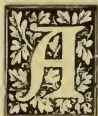A decorative initial letter 'A' in a square frame with floral patterns.

DAIRY, as the term is commonly understood, is an establishment where cattle are kept for the production of milk, either for sale or for the manufacture of butter and cheese. As dairying is carried on in Colombo, the cattle kept may either be the property of the nominal proprietor of the establishment or not. Where they do not belong to the proprietor a contract of some kind is entered in to between him and the real owner of the cows. Commonly, the owner or owners of the animals agree to defray the cost of feeding them, and also to pay the coolies who attend on the cattle, on condition that all the milk produced should be purchased by the proprietor at a uniform rate of say 12 cents per "bottle" of 26 oz. On the other hand, the so-called proprietor sells the milk to his customers at from 18 to 20 cents per bottle. If strict supervision be carried out, especially during milking hours, the system would not be so objectionable, but as a rule this method of dairy is adopted by those who are employed at other work, with the result that the proprietor exercises little or no control over the establishment, and while its sanitary arrangements are neglected, there is generally ample scope for the adulteration of milk, and wilful carelessness in the matter of dieting, with which, indeed, from his position, the proprietor has little right to interfere. To the proprietor himself the system is at least temporarily remunerative, for without any expenditure of capital on his part, he secures a fair return for his enterprise.

In the system where the cattle kept in the dairy are the property of the proprietor, the most frequent cause of failure is the want of system in management, due to a deficiency in technical knowledge, the result of which is that while at one time the dairy is found to be in a flourishing condition, with a large output of milk which is readily disposed of, at another the dairyman has a large number of dry cattle thrown on his hands, and finds that the cost of feeding the stock greatly exceeds the value of the milk sold. No dairy of any dimensions should be without a stock-bull, and if the services of this animal are judiciously made use of, and the calving of the cows carefully regulated, one of the chief causes of failure in this connection will be prevented.

One modification of the system, according to which the proprietor is the owner of the dairy stock, is the plan of immediately disposing of the cows as they go dry and purchasing fresh animals to replace those sold. In many ways, especially from a financial point of view, this is an admirable plan, but it has its drawbacks in that the dairyman will be selling and buying stock all through the year, that these sales and purchases will be regulated by market rates which he is of course not in a position to control, that he will be constantly running the risk of importing disease into his dairy, that there may not always be a supply of cattle to meet his requirements, that the dairyman forfeits the future advantage of securing a select herd of cows by breeding.

It is manifestly injudicious for any owner of stock to dispose of a cow which is a good milker and a regular breeder, because it has to be fed while

165------------------------------------------------

140Supplement to the "Tropical Agriculturist."[Aug 1, 1895.

it yields no milk for the time between its going dry and coming into milk again: and it would be equally unwise for a dairyman to retain animals that do not combine the above qualities, and continue to feed them with the prospect of their coming into milk again at some time, and yielding the owner supplies that are below the average.

The object of every dairyman should be to put together as satisfactory a herd of milking cows as can be had, and when he has got them to keep them as long as he can with advantage to himself. It is, of course, not possible to do this all at once, but it can be done gradually. All animals in the first selected herd which have turned out to be poor milkers or irregular breeders should be got rid of; and such cows as in course of time may become unthrifty or old, should be weeded out. But let the good animals be retained, a good stock-bull kept, and good progeny for the future use of the dairy secured, and the stock so managed that a uniform supply of milk will be always kept up. Here we have an ideal system of dairying or rather dairy farming. The advantages—financial and otherwise—of such a system cannot correctly be guaged till at least the fourth year of its working, by which time the heifers bred on the farm will have begun to supply the places of their dams, after which there should be little if any expenditure of capital on account of stock purchased. Under these conditions the sale of the bull calves born on the farm will be an important item of revenue. The management of a dairy worked on this system, in addition to securing financial success, will combine all the pleasure that can be desired by a cattle-fancier in the complete control he could exercise over his herd, and the opportunity afforded him of applying his technical knowledge of stock to the best advantage, and seeing results work out to his satisfaction.

#### OCCASIONAL NOTES.

The amount realized by the sale of stock held at the Government Dairy on the 12th July was R1,262.00. The twelve cows fetched R787, or an average of R65.58. Of these fifteen, five were Sind cows which realized R533.00, or an average of R106.60. The calves (fourteen in number) fetched R475.00, or an average of R34.00. Of these nine were Sind bull calves which realized R421, or an average of R46.77. The different purchasers were Messrs. S. C. Obeyesekere, F. Schrader, Drs. Rockwood and Stork, Messrs. Jacob de Mel, Rodrigo, Farquharson, Maricar, Robson, Juanis, Buckworth, and J. W. Vanderstraaten. On the whole the sale may be considered a very satisfactory one.

Of late there has been some discussion in the press as to the relative merits of the Guzerati and Sind breeds of cattle. Without taking any sides in this discussion, we should wish to state that the Sind breed of cattle have been given a good trial in the Government Dairy and have not been found wanting. To the Government Dairy authorities is due the credit of having selected the breed for the purposes of the dairy and so introduced them into the Island, and to the notice of the Ceylon public. By the sales which are periodically held in the dairy, the public are given an opportunity of securing animals of a superior type for improving the breeds of cattle

already existing in the Island. Before very long the influence of Sind cattle upon the indigenous breed should be marked.

We would draw attention to the specially interesting paper on Contagious Diseases in Insects, by Professor Woodworth of the State University, which we have taken over from the official organ of the Department of Agriculture of the Cape Colony. The question of how to get rid of our plant pests is always an important one to the agriculturist, and any contribution that shows the way to solving it in some measure, is always welcome.

An editorial note in the *Indian Agriculturist* again reminds us how much in need we are of stock inspectors in the Island—for the matter of that in Colombo—to carry on work that, from being distributed among a number of irresponsible parties, is imperfectly done or altogether neglected. The suggestions made by Mr. William Smith in his notes on "Murrain" which appeared in the pages of the Magazine a little time ago, should surely have carried weight as coming from one who is not lacking in local experience, or knowledge of stock, and is a veterinary surgeon to boot. Veterinary Science—at least in its relation to cattle—has up till now been in that state which has been suggestively described as "marking time."

Here is how the *Indian Agriculturist* refers to this subject:—In a country like India, whose interests are almost entirely agricultural, the importance of a training college for veterinary assistants is too obvious to need demonstration. Agricultural stock is the standby of the cultivator all over the country, and not only in those districts where stock-raising is undertaken as a regular and independent pursuit. The necessity, then, is clear of having a body of men distributed throughout the country sufficiently acquainted with the principles of the morbid pathology of animals to detect and report special outbreaks of serious disease in due time. Experts are not wanted, and could not be supported, except at a few more important centres. But there is, we believe, an opening for youths who have attended a veterinary college long enough to advise stock owners as to the precautionary measures that should be taken to protect their animals against contagious and infectious diseases, to superintend the inland trade in cattle, to treat ordinary animal ailments, to take charge of public veterinary dispensaries or private stud farms, and to collect information upon veterinary subjects generally for the public benefit. A great cry is periodically raised about the degeneration of the live stock of the country, and unfortunately it is too seriously warranted by the facts. It is difficult to see how any permanent improvement can take place, or even how the process of degeneration is to be arrested, unless more attention is paid to animals and the conditions under which they thrive. Like everything else, live stock needs study, and its importance in the economy of Indian life is surely a strong reason for the bestowal of pains upon it.

166------------------------------------------------

Aug. 1, 1895.]Supplement to the "Tropical Agriculturist."141RAINFALL TAKEN AT THE SCHOOL OF AGRICULTURE DURING JULY, 1895.

<table border="1">
<tbody>
<tr>
<td>1</td>
<td>..</td>
<td>13</td>
<td>13</td>
<td>..</td>
<td>Nil</td>
<td>25</td>
<td>..</td>
<td>01</td>
</tr>
<tr>
<td>2</td>
<td>..</td>
<td>01</td>
<td>14</td>
<td>..</td>
<td>01</td>
<td>26</td>
<td>..</td>
<td>01</td>
</tr>
<tr>
<td>3</td>
<td>..</td>
<td>Nil</td>
<td>15</td>
<td>..</td>
<td>04</td>
<td>27</td>
<td>..</td>
<td>Nil</td>
</tr>
<tr>
<td>4</td>
<td>..</td>
<td>Nil</td>
<td>16</td>
<td>..</td>
<td>Nil</td>
<td>28</td>
<td>..</td>
<td>Nil</td>
</tr>
<tr>
<td>5</td>
<td>..</td>
<td>Nil</td>
<td>17</td>
<td>..</td>
<td>Nil</td>
<td>29</td>
<td>..</td>
<td>Nil</td>
</tr>
<tr>
<td>6</td>
<td>..</td>
<td>Nil</td>
<td>18</td>
<td>..</td>
<td>Nil</td>
<td>30</td>
<td>..</td>
<td>Nil</td>
</tr>
<tr>
<td>7</td>
<td>..</td>
<td>Nil</td>
<td>19</td>
<td>..</td>
<td>Nil</td>
<td>31</td>
<td>..</td>
<td>Nil</td>
</tr>
<tr>
<td>8</td>
<td>..</td>
<td>Nil</td>
<td>20</td>
<td>..</td>
<td>Nil</td>
<td>1</td>
<td>..</td>
<td>Nil</td>
</tr>
<tr>
<td>9</td>
<td>..</td>
<td>Nil</td>
<td>21</td>
<td>..</td>
<td>07</td>
<td></td>
<td></td>
<td></td>
</tr>
<tr>
<td>10</td>
<td>..</td>
<td>Nil</td>
<td>22</td>
<td>..</td>
<td>Nil</td>
<td>Total</td>
<td>..</td>
<td>84</td>
</tr>
<tr>
<td>11</td>
<td>..</td>
<td>Nil</td>
<td>23</td>
<td>..</td>
<td>23</td>
<td></td>
<td></td>
<td></td>
</tr>
<tr>
<td>12</td>
<td>..</td>
<td>24</td>
<td>24</td>
<td>..</td>
<td>22</td>
<td>Mean</td>
<td>..</td>
<td>027</td>
</tr>
</tbody>
</table>

Greatest amount of rainfall in any 24 hours on the 12th instant, 24 inches.

Recorded by P. VAN DE BONA.

LAWS OF CEYLON RELATING TO AGRICULTURE.CHAPTER VII.—(Contd.)

7. The Governor in Executive Council may call upon the Central Board to report on similar works.

8. On receipt of such report and estimate the Governor, with the advice of the Executive Council, may ask the Legislative Council for a money vote.

9. The Central Irrigation Board shall cause the specific works in aid of which money shall have been voted to be undertaken and executed by the Provincial Irrigation Board of the province in which such works have to be constructed; the sum voted shall be expended upon such specific work exclusively, and for no other purpose. Provided that any unexpended balances may be reserved so that the same may be applied in reduction of the amount which the Legislative Council may be asked to vote for other specific works.

10. (1.) The cost of irrigation works shall be a first charge on allotments of land benefited thereby, except in case of exemptions by the Central Irrigation Board.

(2.) The Government Agent shall have power to alter and amend the specification from time to time, and to enlarge it as additional lands may be benefited.

(3.) Such specification shall be conclusive on the point that the several allotments of land mentioned in it are liable for the repayment of the said cost, which shall be a first charge on the allotments, and shall take precedence over all mortgages, hypothecations and encumbrances whatsoever.

(4.) Every specification prepared under this chapter and all amendments and alterations of the same shall from time to time be published in the *Government Gazette*.

11. Such charge shall extend as respects each allotment to the proportion due from each allotment as assessed under the provisions of this Ordinance, and shall be recovered in the manner provided in Chap. IX. of this Ordinance.

12. The Provincial Irrigation Board shall cause all irrigation works to be executed, the option being left to the proprietors to perform the necessary earthworks at their own expense, unless such proprietors shall have been specially exempted. Provided that the officer in charge of the work shall cause the earthworks to be otherwise performed if the proprietors fail to perform the work when required to do so, or perform the same unsatisfactorily.

13. If land be wanted for keeping watercourses and channels free from obstruction, or for the construction or repair of any irrigation work, and there is any hindrance to its acquisition, the Governor may declare that the land is needed for public purposes, and order the land to be bought by Government according to the laws now or hereafter to be in force for the acquisition of land for public purposes. The sum paid for the land shall be included in the cost of the work, to be recovered as hereinafter provided.

H. A. J.

(To be continued.)

BAZAAR DRUGS IN VETERINARY PRACTICE.

*Arsenic.*—White arsenic or arsenious acid is often sold in the native drug bazaars under the name of *S. Sudu pasanam* or Tamil *Vella pāsānam*. White arsenic is prepared by heating arsenical iron ores, it is either met with in the shape of a white powder or porcelain-like pieces. When a small quantity of the powdered arsenic is heated in a glass tube, the vapour which escapes cools on the sides of the glass in the form of minute crystals. Arsenious acid dissolves in water very sparingly, generally about 1-100, but in the presence of an acid or an alkali, it dissolves more easily. Arsenious acid is an irritant poison and is used medicinally only in very small doses. Animals often tolerate this drug to a great degree, but this toleration depends on their respective humours,—if the term may be used,—for cases are on record, where even dram doses of arsenic administered daily have not affected animals, and in other instances twenty grains have often killed an animal. It is a cumulative poison, as even small doses of the drug repeatedly given have known suddenly to develop serious symptoms resulting in the death of animals.

Arsenic in medicinal doses acts beneficially in the stomach by promoting appetite and increasing the functions of the organ. It readily enters the blood and even all the tissues and organs, but is as readily expelled. The drug increases, the tissue changes and acts as a valuable alterative and tonic. It is useful in chronic rheumatism, nervous diseases such as epilepsy and paralysis, also in chorea in the dog. By increasing the tissue changes it acts beneficially in mange and other skin diseases by tending to cast off the scaly diseased portion of the skin. Externally arsenic is an irritant, caustic and an antiseptic. It is useful in troublesome skin diseases when applied in the form of a paste consisting of one of arsenic to five of charcoal and ten of lard. But this must be used with great caution, as any abraded surface of the skin would cause absorption of the substance into the system with serious results. In treating scab

167------------------------------------------------

142Supplement to the "Tropical Agriculturist."[Aug. 1, 1895.

in sheep, arsenic is the chief ingredient in the dipping mixture; a very useful dipping mixture is prepared by taking eight ounces each of arsenious acid and carbonate of potassium, six ounces each of soap and sulphur, and boiling the whole in twenty gallons of water. This quantity is sufficient to dip twenty sheep.

For internal administration arsenious acid is generally mixed with the food; but a solution of arsenic is prepared by heating together four grains each of arsenious acid and potassium carbonate to an ounce of water. Tuson gives the doses as follows:—Horses and cattle take from 5 to 10 grains, sheep 1 to 2 grains, and dogs  $\frac{1}{5}$  to  $\frac{1}{10}$  of a grain. The liquor as prepared above is given to horses and cattle one to two fluid ounces, sheep  $\frac{1}{2}$  to 3 drams, dogs 5 to 20 minims. The liquor is always given diluted in a sufficient quantity of water to form a draught.

*Lime.*—Calcium oxide, Sing. *hunu*, Tam. *shunambu*. Lime is prepared by burning limestone, coral or marble. Burnt lime or what is commonly known as quicklime takes up a certain quantity of water when added to it and forms calcium hydrate. Lime water, which is much used in medicine, is prepared by stirring quicklime in water, and filtering or decanting the liquor. When thus prepared it is a colourless inodorous liquor, possessing a peculiar alkaline taste. When lime water is exposed to air a thin film or layer is formed on the top of it consequent on the combination of the lime, with the carbonic acid gas of the air. Lime water also turns milky if the air from the lungs is blown into it.

Lime is an irritant, it has a corrosive action, it prevents acidity. Both slaked lime and lime water are used as antacids in diseases of animals, the more useful and handy preparation being the lime water. In indigestion and hovent it is given with much benefit. Young calves suffering from diarrhoea are given milk diluted with 50% of lime water with very beneficial results. In vomiting in dogs lime water often proves useful.

Externally equal parts of lime water and oil form a very useful application in burns and scalds. This mixture is commonly known as carron oil. Horses and cattle take from one to two drams of quick lime and dogs five to twenty grains. Four to five ounces lime water are given to cattle and horses and two to eight drams to calves and dogs.

*Chalk.*—Calcium carbonate, Sing. *ratahunu*. Pure chalk though not met with naturally here, is imported largely and is easily procured at any bazaar. It is prepared for medicinal purposes by finely powdering the crude substance and triturating in water, thereby removing the coarse particles of foreign matter which are often found with it. When thus prepared it is of a dull white colour, is porous and has an affinity for water. Chalk is very useful in the treatment of indigestion, chronic diarrhoea, and dysentery. Externally the powder may be used as a reliable desiccant for wounds.

Dose for a horse, one to two ounces; cattle, two to four ounces; dogs, eight to twelve grains. It is best given with milk or congee. Chalk when given in large quantities should be followed by a laxative. It may with advantage be given in cases of diarrhoea with catechu, and in indiges-

tion with ginger and coriander. In dysentery, when much pain is evinced, opium and chalk form a useful compound.

*Ammonium Chloride.*—Salammoniac, Sing. *Nava-saran*. Is met with in the bazaars in a more or less crude state. It is prepared by adding hydrochloric acid to "gas liquor" and evaporating the excess of water. The salt is of a fibrous structure and has a "saltish" acid taste. It dissolves readily in water. Large doses of this drug are poisonous to animals. In medicinal doses it is a useful stimulant, it also promotes the secretion of urine and sweat and increases the action of all glands. Ammonium chloride is given with good results in fevers, pneumonia, diarrhoea, rheumatism and dropsy. Externally a solution of the drug is a stimulant to bruises and sprains; a useful cooling lotion is made by dissolving equal parts of ammonium chloride and nitre in cold water. Doses: horses and cattle take from  $\frac{1}{2}$  to  $1\frac{1}{2}$  ounces and dogs five to twenty grains.

*Sulphate of Magnesia.*—Epsom salts, Sing. *hunu* (purative). The vernacular term for Epsom salts is the same word as is applied to any salt, but in the bazaars it is known under the name of "purative" salts. It is found in its natural state in certain mineral waters, but is generally prepared from the mineral magnesite by treating it with sulphuric acid. The salt as found in the native bazaars is often in the form of large rhombic crystals, but sometimes the crystals are small, much resembling sugar. It has a nauseous saline bitter taste, and a cool sensation is felt when a crystal of the salt is placed on the tongue.

Magnesium sulphate is a purgative and a useful febrifuge. For cattle and other ruminants it is the best known purgative, though it is not advisable to give purgative doses of the drug to horses. In this animal it has certain ill-effects, inasmuch as it is often productive of gripe. Cattle take from one to two pounds as a purgative. Horses two to three ounces as a febrifuge.

*Sulphate of Iron.*—Green vitriol, Sing. *annawedi*. Is met with in the bazaars in the form of green crystals. It is obtained by dissolving iron in sulphuric acid, but more frequently got in large quantities by treating ferruginous shale with the acid. The crystals of iron sulphate are of a bluish green colour and on exposure deposit a white powder.

In large doses this drug is an irritant, but medicinal doses act as a very useful tonic in debility. It is an astringent in diarrhoea, and is also given with advantage in diabetes and dysentery. Doses: horses and cattle one to two drams and dogs one to ten grains.

W. A. D. S.

---

#### LADY BIRDS.

---

Lady-birds belong to the family Coccinellidae, of the order Coleoptera. They may be shortly described as follows:—Hemispherical; upper side convex; under side flattened; head small, retractile; antennæ eleven-jointed, thickened at their tips; legs short; feet apparently three-jointed, the second joint being very small; colour usually variegated, many species black with red, or red with black spots. When grasped the insects emit a yellowish unpleasant-smelling fluid from the

168------------------------------------------------

Aug. 1, 1895.]Supplement to the "Tropical Agriculturist."143

abdomen. The blunt, four-cornered, usually variegated pupæ hang on leaves. The fully-developed larvæ are longer than the beetles; they closely resemble those of the leaf beetle, but are not so thick-set, and their longer legs stick out more laterally. They are covered with warts and little spines. The larvæ and beetles of most species feed chiefly on aphides and shield-lice; they are therefore useful. The yellow eggs are laid in heaps.

We have lately heard a good deal in Ceylon about Mr. Koebele and his Australian lady-birds, in connection with the visit of that gentleman to the Island. Through his agency the white scale (*Iceya Purchasi*) which did such damage to the apple orchards of California has been entirely eradicated by means of the lady-bird, *Vedalia cardinalis*. Professor Cook of the California University, an entomologist of repute, has lately published a report of his observations with reference to the work of the Rhizobiids—another species of lady-bird introduced by Mr. Koebele into California. The most troublesome pest in connection with orange and lemon culture is the black scale, scientifically known as *Lecanium Oleæ*, but it is now authentically announced that this pest can be got rid of through the agency of Rhizobiids—the three important species being *Rhizobius too-woombe*, described as a small black beetle with a brown head and thorax; *R. debilis*, which is about the same size as the other but is entirely black above and below, and *R. ventralis*, which is larger, entirely black above, with short light hairs and brown below. A single pair of Rhizobiids, according to Albert Koebele's estimate, could produce 15,000,000,000 in a single year, and Professor Cook considers this, from his observations, to be a reasonable estimate. Details of the wonderful effect of the lady-birds in clearing orange, lemon, and olive orchards are given by Professor Cook, who says: I have been a hard student of entomology for thirty years, and I am free to say that it is the wise and certain policy for this great fruit state to keep Mr. Koebele in Australia for some years hunting and shipping to us more of these natural aids in fighting our insect foes.

The Pacific Rural Press likewise expresses its views in enthusiastic terms on this matter, thus: "The triumph of the *Vedalia* over the cottony cushion scale has been counted the most sweeping victory for entomological science, but it is now a question whether the rout of the black scale by the Rhizobiids will not indeed prove a greater victory because the area invaded by the black scales is wider . . . . Now there seems to be demonstration which cannot be controverted, and Mr. Koebele's later achievements in the gathering and shipment of these friendly insects to California may beat his record on the *Vedalia*.

The two pests about which at present the planting community in Ceylon are exercised in mind are the green coffee bug, *Lecanium viride* and *Orthezia nacreæ*, a comparatively new pest, which, however, it is apprehended, will do much damage to tea. In a communication to the *Tropical Agriculturist* for June last Mr. E. E. Green, our local entomologist, states that he is daily expecting a consignment of lady-birds from California to experiment with on the above-mentioned pests, mentioning that the two species indented for are *Novius Koebeli* and *Vedalia cardinalis*. Whether the beetles have arrived yet and

what results have followed so far, we are not aware. Seeing the success with the Rhizobiids on *Lecanium oleæ* it is a pity that some of the latter were not imported for trial upon the local species of *Lecanium*—the green coffee bug, but no doubt Mr. Green has been well advised, and we await the result of trials with much interest.

[Since the above was written we have heard with regret that the lady-birds consigned from California were all found to be dead on reaching Ceylon.—Ed. A.M.]

---

## THE VALUE OF KAINIT.

---

The best known and most used of potash manures is *Kainit*, a mineral deposit occurring in Germany, and consisting chiefly of chloride of potassium, sulphate, of magnesia, and water, with usually chlorides of magnesium and sodium. An average sample should contain about 13½ per cent of potash.

Dr. Fream referring to the value of potash says that light soils generally yield better crops after treatment with potash salts, and also recommends it for vegetable soils. A paper by Dr. Marloth which appears in the Cape Journal of Agriculture gives interesting details of experiments which go to show the importance of mineral fertilizers, and particularly of potash. Referring to kainit he says: "Kainit, one of the most excellent crude potash salts, is rich in magnesia compounds, which by their water-absorbing properties have a marked effect in making and keeping the soil compact and moist. It is thus exactly what is needed by light sandy soils." The writer then goes on to state that on ascertaining by analyses the relative proportions of the principal food ingredients removed from the soil by the commoner crops, it will be found that there is always much more potash removed than phosphoric acid, while all natural fertilizers as well as most artificial mixtures contain comparatively little or almost nothing of potash. To this then is attributed the fact that soil cultivated for a long time by means of natural or artificial manures, without the additional application of potash, do not give results that are expected of them. Many soils again are naturally deficient in potash and need special applications of potash manures to improve them. "It is to be specially noted," says Dr. Marloth, "that the potash supply derivable from ashes is exceedingly small, limited, and the quality so variable, that purchase is only advisable if the strength is guaranteed by chemical analysis." This writer then goes on to give details of experiments which would appear to conclusively prove that special applications of potash salts, preferably in the form of kainit, are necessary for the production of large, healthy and early crops. Kainit is also believed to be injurious to all ground-pests (including the irrepressible white-ant), and, if this can be conclusively proved, it will greatly enhance its usefulness in the tropics.

Kainit guaranteed to contain 12 per cent potash, is obtainable for about £2 per ton in England. We should be glad to see trials made with this and another cheap and useful fertilizer (Basic einder) in the colony.

169------------------------------------------------

144Supplement to the "Tropical Agriculturist." [Aug. 1, 1895.AN IMPORTANT LETTER ABOUT RHEA.

The *Agricultural Gazette* of N.S. Wales for April last publishes a letter from Mr. W. Leedham Crowe, of 10, Jeffrey's Street, St. Mary Axe, London, which contains some valuable information about Rhea from a practical source. The following is taken from it:—"For many years I have been greatly interested in the properties and possibilities of this fibre, and have examined many processes, more or less successful, for treating it. Twelve years ago I presided over a meeting in London of merchants and brokers, on which occasion fabrics of every description were exhibited, made from pure Rhea, and from Rhea mixed with wool or other fibres. It was there demonstrated by tests that in the case of fire-hose Rhea had something like three times the existing power to moisture of flax. These fabrics were all made in Augouleme from Rhea grown in Algeria, and treated, I believe, by the Favier-Renny process. The quantity grown there, however, is small, and not of the best quality. I have been interested in growing Rhea in Johore, and in its importation from China and other places.

"In India it cannot be grown successfully to pay. Undoubtedly in N.S. Wales and Queensland there are districts where it could be cultivated to advantage. The two main difficulties are, however, its decortication and the insuring a regular supply at a sufficiently low price. Where I differ from your article is the necessity for a machine to decorticate the stems. I am convinced that the cost and expense of working machinery would be too great for the value of the fibre. Some very efficient machines for this purpose have been produced, those of Messrs. Death & Ellwood among others, and which were tried in Johore, but abandoned. The simplest method of decortication appears to be the Favier process—of subjecting the cane to steam in chests for about 20 minutes, when the covering can be removed by hand, and the ribbon left free. Hitherto it has been decorticated, brought to this country in ribbons, and then treated chemically to remove the gum, but the carriage upon ribbons is very heavy, and the entire process should be carried out upon the spot where it is grown. Many processes have been patented for treating the ribbons, but the most successful appear to be the simplest—a treatment with soda and hot water. If Rhea fibre in merchantable condition can be produced in quantity and laid down in London at a moderate price, it has an immense future. A number of syndicates and small quantities have at various times been formed here to work special methods of treating the fibre. All have failed, and why? First, for want of a regular supply; secondly, because the cost of the fibre when prepared was excessive. Our manufacturers are ready to buy and use Rhea, and anxious to get it, but must have a continuous supply ensured. They will not otherwise alter their machinery, or introduce a new fibre to the market. Rhea must largely compete with cotton, which is now very low, but if the finished fibre, which packs closely, were sent home, it might do this successfully. I have at various times imported the Rhea ribbons from China at a cost of seldom much under £20 per ton delivered here, but such a price is prohibitory. If a small regular supply were ensured to commence with, and the

practical use of the fibre established, a stimulus would be given to production, but until that takes place, Rhea will remain the Will-o'-the-Wisp of sanguine speculators."

CONTAGIOUS DISEASES OF INSECTS.

Insects have long been known to be subject to contagious diseases. This knowledge, however, has not been widespread, and comparatively few have considered it in its bearings on practical agriculture. That it has important bearings in this direction no one can doubt who has observed the progress of an epidemic amongst insects. None of the plagues recorded in history has ever carried such destruction in its path as to be compared with the havoc wrought by some of the common insect diseases.

The earliest known of insect epidemics was the disease known as *muscardine*, affecting most seriously the cultivated silkworm in France and Italy. This disease was easily recognised by the fact that the dead worm became in a short time covered with a whitish powder. Between thirty and forty years ago another still more serious disease was recognised in these countries and called *pébrine*. This disease at one time threatened the very existence of the silk industry of European countries. Still a third disease of the silkworm, the *flacherie*, rivalling even *pébrine* in its destructive power, was first discovered and carefully studied by the renowned M. Pasteur. The disease of the bee known as foul brood was recognised as a contagious disease fully twenty-five years ago, and has claimed, and still claims, the attention of beekeepers on account of the enormous losses it has cost. Another, quite as important as the diseases just mentioned, and one full of suggestiveness, is the disease attacking the chinch bug of the eastern United States. This disease has been known for more than a quarter of a century, but never carefully studied till during the last ten years. Who has not heard of the wonderful effects obtained by spreading the disease in Kansas, an effect as striking as the work of our *Vedalia cardinalis*.

Every one has probably noticed some examples of these contagious diseases, even if not recognizing their nature. The common house flies often seen dead and sticking fast about the window, and surrounded by a whitish halo, is a common form. Scale insects, especially *lecaniums*, covered and almost hidden by a whitish powdery substance, are commonly to be seen.

Plant lice are not uncommonly found sticking to the plant, dead and discoloured and looking much as though killed by kerosene emulsion, but when no treatment had been made. Caterpillars may often be found hanging by one leg to the plant and the whole body soft and rotten, or dried, stiff and shrivelled. In some one or another of these forms we have quite likely become acquainted with a few of the diseases of insects, but it is doubtful if any of us has a proper idea of their extent and prevalence.

These diseases are all due to the multiplication within the body of certain specific organisms, certain germs. An epidemic may be due to one kind alone or may be a number of diseases attacking the insect together. Three different kinds of organisms are known to produce diseases among insects.

170------------------------------------------------

Aug. 1, 1895.]Supplement to the "Tropical Agriculturist."145

1. *Protozoa*, represented by the organism causing *pébrine*. It is a very lowly organised animal, which in its growing condition is simply a mass of protoplasm of no definite shape and of microscopic size. It finally becomes spherical and motionless, and the whole interior becomes broken up into a minute mass of oval spores. The contents of each spore breaking out through one end of the spore wall and beginning to feed and grow, completes the life history of the animal. All the organs are attacked, and besides being hereditary the spores are scattered over the leaves from a diseased insect and are eaten by the others with their food and thus the disease spreads.

2. The *bacteria*, which are credited with most of the contagious diseases of man, are also important insect parasites and may be represented by the disease of foul brood. These are very lowly organised plants, increasing almost wholly by simply separating into two equal halves, growing to full size and again dividing, and so on, though a few produce spores occasionally. The species producing insect diseases belong to the genera *micrococcus* and *bacillus*, the former spherical and the latter cylindrical.

3. The true *fungi*, such as produce the *muscardine*, are much higher developed plants, and two, or perhaps three, very distinct groups are parasitic on insects. They all have this in common, that they are composed of long threads, the mycelium, and short round or oval bodies, the spores. As a rule the spores germinate on the surface of the body; the plant burrowing its way down into the insect there grows till the insect dies, and then again passing through the skin produces the spores, which are so conspicuous on insects dying from these diseases. The spores may not be produced, or only in limited numbers, when the weather is dry or when the insect is so small as to dry up too soon. In these cases a splendid crop may be produced if the dead insect is dropped into a bottle partly filled with water.

The fact that most insects lay many times, often many hundred times as many eggs as can, under ordinary conditions, develop to maturity, is quite well understood. The destruction of the great majority of the young insects is chiefly accomplished through the attack of their natural parasites, and of these parasites the contagious diseases are by all odds the most important. My own observations at Berkeley for three years are to the effect that at least nine out of every ten deaths of such insects due to parasites are caused by some form of contagious disease. For these insects, therefore, nothing else determines the abundance or scarcity of scale insects as completely as do contagious diseases. A very little lessening of the virulence of a disease during any season will enable the scale to overrun the plants, and on the other hand a little increase in the severity of the attack will practically annihilate the scale insects. Everyone has seen examples of these conditions. I have repeatedly seen cases where a disease was particularly abundant and the decrease of scales ascribed to some useless wash or to lady-birds, when these latter were even less abundant than usual. Mistakes of this kind should never occur with a reliable observer, but are very liable to occur unless

care is exercised. This is especially necessary when a new wash or insect parasite is introduced.

The relation of lady-birds to diseases is well worthy of attention. There seems to be evidence that would indicate that a great increase in the numbers of our native species of lady-birds follows or is associated with a serious attack of some form of contagious disease on scale insect or plant louse. This apparent relation between lady-birds and disease of the food of lady-birds, coupled with the fact that the relatives of the lady-birds are fungus eaters and that the lady-birds themselves were once undoubtedly also fungus eaters, suggests very strongly that with some species at least disease of the food is necessary to great lady-bird increase.

Another point in reference to diseases must also be considered. There must be some means of conveying the germs of a disease from insect to insect. While the scales are active there appears to be sufficient means for the spread of the disease. It is a fact that the largest number usually die soon after settling and have apparently become affected while active. Those that have escaped the infliction up to this time, however, would seem to be very unpromising subjects for the disease, both by their freedom from contact and on account of their special means of protection. Now, it would seem that lady-birds serve a very important function in the spread of the diseases. Any one who has observed the actions of a lady-bird either while it is a larva or an adult will have noticed that it does not settle down and devour each scale it comes in contact with; instead, it has the habit of moving restlessly about, nibbling here and there and only now and then taking a full meal. A better arrangement for spreading diseases could not be desired than this habit of the lady-bird. Indeed, the relation of the ladybird to contagious diseases opens a wide field for study, and at the present time I know of none in the whole range of applied entomology more interesting and of more practical promise.

---

#### DAIRY PICKINGS.

---

The Colonial Veterinary Surgeon of Cape Colony writes with reference to the occurrence of blood in cows' milk:—If it is real blood there must be rupture of some small blood vessel in the glands of the udder. If it is merely a bloody-looking sediment which appears in the milk especially at the bottom, there is some diseased condition of the ducts of the gland. It would be as well to ascertain first, whether it is in one or more quarters of the udder; this could easily be done by milking each teat into a separate vessel, and if it is found to be in one only, the milk of that teat could be thrown away, and the milk from the others used. Regarding treatment, I would recommend that the cow be kept in the house or in a small camp where she would not be hustled about or have to walk too much, and relieve the udder by milking her thoroughly dry three times a day. Examine the udder carefully after it is milked out, and if there is any undue hardness or stiffness about any of the quarters, bathe it with warm water after each milking and rub on some fat or oil over the affected quarter immediately after. Rub the udder with a pressing motion in a downward direction.

171------------------------------------------------

146Supplement to the "Tropical Agriculturist."[Aug. 1, 1895.

"We never could fathom the inwardness of the practice of wet milking. No milker we ever met could give a satisfactory reason for adopting the habit. Every milking we ever examined in which this method was adopted had a decidedly cowy odour that was not present when the herd was dry milked. The habit of the wet milker in placing his fingers in the milk, or squirting the fluid on them direct from the cow, is an all-sufficient cause for the odour. Such milk is unclean, and no treatment that can be applied to it can sensibly alter its character. A person afflicted with the wet milking habit, for it is a grievous affliction, should be scrupulously neat concerning the things he handles at milking time. A thorough washing of hands should be a cardinal requirement with him previous to beginning the operation of milking, and a vessel containing clean water to moisten the fingers, should be among the chief requisites of the proceeding. Better still, abandon the nasty method by learning the cleanly dry way of milking. The latter has the advantage of leaving the teats uninjured by chaps in cold weather, as well as relieving the milker of the suspicion that he is in some degree responsible for the offensive odour in the fluid. The matter of chapped teats in winter is one that is a trouble to the cow and milker. When the latter is of the wet sort the chap trouble is constantly augmented, for the reason that the cause for it is reinforced at every milking until the cow becomes fractious at such times, and gives an inferior yield in quantity and quality. Wet milking has always been in our thought as filthy milking, and it is barbarous withal. Cows dry milked can be stripped easier and better than by the other method of milking. In a dark stable during the winter, the accidents possible to milk, when the cow is handled by a wet milker, are too suggestive to require description. The best that good care and feed can accomplish can be overcome by the foulness that is inseparable from wet milking."—*Diary Review*.

We read in the Cape Journal of Agriculture that there is nothing to equal tobacco water (using about 2 oz. of tobacco) for animals puffed up with gas (hoven). The tobacco solution should be given in 3 or 4 doses.

The *Diary Review* draws attention to the trouble that can arise from rusty cans in dairies. Thorough rinsing out with warm water or steaming will not remedy the evil to which special attention must be paid. Milk carried in rusty cans are said to acquire a "beastly smell and a tallowy taste," which even cling to the butter made from the milk. Analyses of milk kept in such showed it to contain "a considerable amount of iron," which we have little doubt must be hurtful to those (particularly young children) who consume the milk.

A cheap and successful remedy for sore teats is zinc ointment, which should be always kept in a dairy.

## CAMPHOR.

Camphor is a concrete volatile oil found in different species of plants, and especially those of the Lauraceæ order. Camphor of commerce is chiefly obtained from the *Cinnamomum Camphora*. This plant is also known as *Camphora officinarum* and *Laurus camphora*. The camphor laurel is a tall tree with smooth-handsome evergreen leaves: it is much branched and bears small yellow flowers. It is largely met with in China, Japan and Formosa. The wood and leaves of this tree contains the volatile oil which forms the camphor. Most of the camphor imported to Europe is the produce of Formosa; Japan stands second and China third in this respect.

Camphor is prepared by the dry distillation of the chips of wood of the camphor tree. The distillation is carried on by boiling the chips in water contained in wooden vessels and allowing the steam to pass through vessels containing straw dipped in water. The volatile camphor as it passes crystallizes among the straw from whence it is collected. This forms the crude camphor of commerce. The best camphor and the largest quantity is obtained in Japan from trees growing close to the sea, the sea air exerting a beneficial influence in the production of the article. Crude camphor is purified by a process of resublimation, in this the object being to have as much interstitial water in the camphor cake as possible. The crude camphor is mixed in the proportion  $\frac{1}{4}$  to  $2\frac{1}{2}$  of water, and is heated in a copper vessel which is kept cool by dashing cold water on to it; after about three hours' heating the vessels are opened, and camphor deposits in the form of small cakes found on the sides of the vessel are taken and thrown on to cold water. In Europe camphor is refined in quite a different way, and at one time this process was a secret in the possession of Hollanders, but refineries are now met with in all parts of the continent and in England and America. Crude camphor is mixed with 3 to 5 per cent of slaked lime and 1 to 2 per cent of iron-filings. This mixture is introduced into a series of flasks made of glass, placed on a sand bath and heated by means of metal plates without directly introducing fire, the heating going on for about forty-eight hours. The flasks are then removed from the sand bath and broken by sprinkling cold water on them, when large cakes of camphor formed in the flasks are removed.

India imports about six lacs worth of camphor from China and Japan.

There are two other important plants which yield camphor, viz., the *Dryobalanos camphora* of Sumatra and the *Bhemen balsamifera* of China.

W. A. D. S.

## COMMON MORTAR.

(Concluded.)

The third and last ingredient used in the preparation of mortar is sand. The word sand is generally used in a very wide sense, and is applied to any kind of rock or mineral matter in a fine state of division, or to any earthy matter containing a fair admixture of silica. Sand, however, is strictly speaking, pure silica, or oxide of silicon—and its

172------------------------------------------------

Aug. 1, 1895.]Supplement to the "Tropical Agriculturist."147

chemical formula is  $\text{Si. O}_2$ . In a free state as well as in combination (as a constituent of rocks and minerals) silica forms about half of the solid matter of the earth. It occurs free in nature in two crystalline forms as quartz and tridymite, and in the amorphous state as opal. Calcedony, flint and agate are mixtures of amorphous silica with quartz and tridymite. The aluminium, potassium, calcium and iron silicates mixed in different proportions constitute a large number of minerals. The sand used in the preparation of mortar though not quite free from impurities is almost pure quartz sand or silica. Sand is mixed, with mortar to distribute the contraction caused by the slaked lime imparting with the water with which it is combined or mixed and becoming converted into carbonate of lime. The presence of sand in mortar thus prevents, to put it in a practical way, cracks and inequalities in the plaster when it dries. Besides this, it is believed that the silica also gradually combines with lime and that silicate of lime is thus formed, which tends to increase the hardness of mortar as it sets. When evenly and carefully applied to a stone structure, after wetting the bricks in order that they may adhere the more firmly by the mortar, soaking into the pores of the bricks, the adhesion caused by good mortar is astonishing. There are various opinions as to the superiority of some qualities of sand over others. River sand for instance is very generally considered to be the best for preparing mortar, but sea-sand is more commonly used, probably, for one reason, because it is more conveniently obtainable. The practically pure sandy deposits that occur in some situations (geologically, no doubt, old river beds or former tidal areas of the sea) are considered by some to be quite suitable for the purpose of mortar, though others insist on the sand coming fresh from the sea or rivers. Excellent samples of mortar are prepared by grinding down the white sand from these dry-land deposits, and a beautiful marble surface produced on walls by polishing the mortar after application with a smooth rock-crystal. In the preparation of this special mortar, lime made from shells is used.

Ordinarily, coral lime is preferred to lime prepared from lime-stone.

In mixing mortar it is advisable to use two parts of sand to one of lime, for setting bricks in buildings that are required to be particularly substantial; for ordinary brick work and plastering,  $2\frac{1}{2}$  of sand to one of lime may be used. But on these practical points I would rather not say anything authoritatively. My endeavour, in this paper, has been to tell you something about the chemistry of mortar, and I trust I have explained my subject with tolerable clearness.

#### RHEA (RAMIE) AND CHINA GRASS—A DISTINCTION.

In a note on Rhea Fibre by Dr. Watt, in the *Agricultural Ledger Series*, he states that it was Roxburgh who first pointed out certain differences between the plants, called by the above names, as they were grown in China and in India. Other botanists following him also attempted the separation of the two forms. Modern writers, however, regard these as only varieties of a common species. A

few years ago Dr. Watt himself in the first volume of his *Dictionary of Economic Products*, pointed out that whatever views botanists might ultimately uphold, there was a practical consideration of the greatest value that hinged on the controversy. This may be here briefly stated, viz., that the plant that yields the true China grass is met with in cultivation in tracts of country that have a sub-temperate climate, while the Rhea—that is to say, Malay and Bengal stock—occurs in moist tropical regions. The latter is, moreover, a more robust plant, has longer and narrower leaves with white tomentum on the veins of the under-surface only; while the former has large broad leaves with the base subcoriaceous, concave and densely coated below with adpressed white hairs. Now, if this distinction holds good, it would obviously be a mistake to attempt the cultivation of the temperate-loving plant in the tropical plains of India. From time to time fresh supplies have been imported from China and distributed all over this country, so that India may fairly be characterised as having fully attempted the acclimatisation of the China grass, but done little or nothing towards endeavouring to extend the production of what (for the sake of convenience of expression) we may characterise as its indigenous stock. On this subject Mr. W. T. Thiselton Dyer (Director of the Royal Botanic Gardens, Kew) has written:—

"The point raised by Dr. Watt from the botanical point of view, has been dealt with by Sir Joseph Hooker in the *Flora of British India*. The further distinction in adaptability to climatic conditions, which chiefly concerns planters, has been observed in nearly every part of the world where these plants are grown for fibre purposes. The Ramie or Rhea, properly so called, may be looked upon as the tropical representative of the China-grass, and it is on that account probably better adapted for cultivation in hot and moist countries. Under such conditions it is a very robust plant and yields valuable fibre.

"Whether this fibre is at its best really as good as the best China-grass (*Boehmeria nivea*) is a point that appears not to have been definitely settled. It may turn out to be simply a question of soil or climate. At Kew we find we cannot successfully grow *B. tenacissima* in the open where *B. nivea* itself remains in the ground all the winter, and furnishes in the summer a large crop of vigorous stems. The China-grass may, therefore, give a larger and better supply of fibre under cool conditions, whereas the Ramie or Rhea may do equally well under essentially tropical conditions. The question as regards India may be settled by cultivating under various conditions of climate and soil authentic specimens of each plant, and by instituting, as suggested by Dr. Watt, a careful chemical and microscopic analysis of the fibres yielded by Indian-grown plants of what are known to be the true *Boehmeria nivea* and the true *B. tenacissima*."

#### GENERAL ITEMS.

The *Mark Lane Express* thus refers to the value of seaweed as a manure:—Seaweed decomposes very rapidly and should either be applied fresh as a top-dressing or ploughed in at once on arable land. It also makes an excellent compost with any vegetable refuse, ditch parings, peat, mould,

173------------------------------------------------

148Supplement to the "Tropical Agriculturist."[Aug. 1, 1895.]

etc. The quantity of water which the fresh weeds contain will always restrict its use to land near the coast. It is too bulky in this state to cart far inland, but when partially dried before removal, this objection is in some measure overcome. In this way it is said to be largely dealt with on the west coast of Ireland, the fishermen collecting and half drying the seaweed by exposure to the air, and then selling it to farmers to be carted inland as a dressing for their fields. There can be no two opinions as to the value of seaweed as a green manure, containing as it does all the substances required for the growth of either cereals or green crops. Its ash is rich in salt, potash, sulphuric acid, and phosphate of lime. In fact, chemists tell us that this product of our shores contains at least twice the quantity of these valuable matters as the plants which are ordinarily grown by farmers as green manures. When, therefore, it is intelligently used so as to conserve in addition its most important nitrogenous constituents, seaweed is a fertiliser which is not easily beaten. Consequently, those who are fortunate enough to farm within easy reach of the coast will be very unwise if they neglect to avail themselves of such a valuable manure. Farmers so situated may well betake themselves to the "harvest of the sea" after the harvest of the land is safely gathered in.

It is claimed by those who offer kainit in the market, that the manure is death to all insect life—grub, white-ant, cutworm, &c., &c., and that it is of more importance from a manurial point of view than it is generally considered to be. Indeed, a number of experiments carried out at the Cape have gone to show that when added to farm-yard manure, guano, and other practi-

cally perfect manures, it has a wonderful effect. Kainit is comparatively cheap, and some experiments with it might with advantage be carried out in this country.

The chocho appears to be making satisfactory progress in N.S. Wales. The Editor of the *N.S.W. Gazette* draws attention to the fact that the plants may with advantage be allowed to remain in the ground till they shoot up the second season. After the second season it is recommended that the root should be carefully removed, when it will be found that a large tuber has been formed, somewhat jelly-like in appearance when cut, which can be utilized either by boiling as a vegetable, or fed to pigs, for which purpose it is considered particularly valuable.

It would appear, from the result of a trial shipment of passion-fruit that no very certain or remunerative trade in the article could be expected in England.

We hear of the successful treatment of horses affected with ticks, fowls with lice, and other animals with either of these pests or with scab, by means of sulphur administered internally. The results would appear to be quick and effectual, and the treatment worth trying, but the doses must be regulated and not given at random.

Dr. Patterson, in the *Gardeners' Chronicle*, has recently advocated the cultivation in England of the "aubergine" more commonly known amongst us as the "Brinjal," partly on the ground of its being "an excellent remedy for those suffering from liver-complaints."

174------------------------------------------------

# \* The TROPICAL AGRICULTURIST \*

## ◇ MONTHLY. ◇

Vol. XV.]

COLOMBO, SEPT. 2ND, 1895.

[No. 3.

### CINNAMON OF CEYLON.

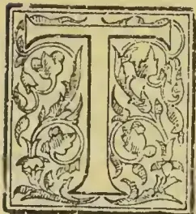

HE following interesting paper is specially contributed by Mr. PETER DE ABREW, of Colombo, a Fellow of the Imperial Institute:—

The island of Ceylon has always been noted for its cinnamon (*Laurus Cinnamomum*), a spice which finds a ready market in Europe, especially in its southern countries, Spain and Italy. The South American States use it chiefly for incense, and other countries purchase it for chemical and confectionery purposes.

A species of cinnamon grows in the Malabar coast of India, Manilla, Cochin China, Sumatra, Leeward Islands, Bourbon, Brazil, Arakan, and in some parts of Queensland, but the quality of the spice grown at those places is far inferior to that produced in this island of "spicy breezes," and its marketable value does not compare favorably with ours. Ceylon cinnamon was at one time a considerable source of revenue to the Government of the island, but now, owing to the lowness of the price, its value in this respect is comparatively small.

As far back as the time of Augustus Cæsar, the Romans had communication with India, and it is said that they traded largely in cinnamon obtained from Ceylon. A pound of it is recorded to have fetched as much as £8 at Rome. Its value now is about 7½d. per lb.

When the island was invaded by the Portuguese, the Sinhalese king, who lived not far from Colombo, paid an annual tribute of seven thousand pounds of cinnamon to the European invaders. There is no authentic record to show how the native monarchs caused the spice to be prepared, but it is known that they were very jealous of foreigners knowing the *modus operandi*. In 1602 the king of Kandy sent, as a present, some pepper and cinnamon to the king of Holland.

When the Dutch held sway here, they, knowing the value of the spice, paid much attention to the cultivation and production of it. Finding it to be more profitable than they expected, His Excellency Governor Fa'ck in 1670, encouraged the industry and the systematic cultivation of cinnamon. His successors were much benefited by his labours; they reaped rich harvests before they eventually left the island, but did not pay any attention to the preservation of the shrubs.

When the British first occupied the island they found the gardens neglected, and His Excellency Sir Frederick North set about putting matters to rights and encouraged the development of the cultivation.

Cinnamon grows in both the low and the high districts of the island. In the former it thrives well in a loose sandy soil, and its quality is of a superior and more marketable grade than that found at higher elevations. As at present cultivated, it is not allowed to grow to more than the size of a shrub. The slender sticks, from which the bark is to be peeled to make the cinnamon of commerce, are cut down as soon as they reach a height of five or six feet.

There are records that pieces of furniture have been made from the wood of the full-grown cinnamon tree, but that must have been prior to the introduction of the present method of cultivation. The wood is white and light, and is used for fuel. It is questionable whether it would be suited to the making of furniture even if allowed to develop fully.

The leaf, when tender, is dark red or s arlet. As it matures it gets to be deep green. The blossom is a very pretty white one.

The fruit is somewhat like an acorn, but not so large. When ripe it used to be gathered up and put in nurseries for germination, but this is seldom done now. Says an old historian:—" . . . . .

"It is gathered by the natives for the purpose of "extracting oil from it. The process they employ "is to bruise the fruit, boil it, and skim off the oil. "This they use for the hair and body on great

175------------------------------------------------

150THE TROPICAL AGRICULTURIST.[SEPT. 2, 1895.

“occasions, and also for burning in their lamps. When mixed with coconut oil it gives an extremely good light. The kings of Candy use it for this purpose, and formerly commanded their subjects to bring them a certain quantity as a yearly tribute. When any ambassadors are sent to these princes they always burn this oil during the time of audience.”

There are no records extant, nor information attainable indicating that either the Portuguese or Dutch conquerors manufactured any oil from the fruits. Neither during the early period of the British sway, nor now, is the process practised. Perhaps the mention of it here may lead to some experiments in this line, which may ultimately result in a marketable oil.

The fruits are devoured by crows and other birds, and the propagation of the shrubs in their wild state is due to these birds, which swallow the berries, the kernels of which, not dissolving in their stomachs, are passed out uninjured.

The Sinhalese name for cinnamon is *Kurundu*, and it embraces the following different species—

1. 1. *Paney Kurundu* or Honey Cinnamon.
2. 2. *Capuru* “ “ Camphor “
3. 3. *Sevel* “ “ Soft “
4. 4. *Dawoul* “ “ Flat “
5. 5. *Kimbul* “ “ Crocodile “
6. 6. *Veli* “ “ Sandy “
7. 7. *Nalu* “ “ Chippy “
8. 8. *Kela* “ “ Wild “
9. 9. *Pothu* “ “ Strippy “
10. 10. *Mas* “ “ Fleshy “
11. 11. *Nika* “ “ Long-leaved like *Nika*.

Each variety is characterised by some quality more or less closely related to the name applied to it.

During the time of the Dutch and the early British period, the Government monopolised the cinnamon trade, which monopoly was commonly known as the “*Mahabadda*.” Government paid every attention to the cinnamon department, as the produce then was the chief source of revenue. The gardens were well protected and responsible officers appointed to supervise the department. These officers were “sons of the soil” of distinguished birth, and were held in the highest esteem by the Government. They had unlimited powers vested in them. The name of Rajapakse Maha Mudaliyar may be mentioned as one of them. J. H. C. makes the following reference to this distinguished chief in the *Saturday Magazine*, published in London in 1835. “ . . . When the Dutch slave masters agreed to consider as free, all the children of their slaves, this amiable person not only followed their example, but was even anxious to bestow immediate liberty upon all slaves possessed either by himself or by any of his relatives. He is extremely hospitable to Europeans, a man of extensive information, and the best Sanskrit and Pali scholar in the island. The print represents Raja Pasa in the rich costume of his country, attended by two servants bearing umbrellas. It is copied from a picture kindly lent by Sir Alexander Johnstone.” It may also be mentioned here, that this noble chief was given a burial with British military honours, a mark of recognition which no other native gentleman had.

There are hardly any landmarks left now of the old cinnamon monopoly days. The “*Walawwa*” (residence of a chief) of the Maha Mudaliyar Rajapakse, and a store house of the department, are now rejuvenated and are residential bungalows. There are no traces of other buildings left.

Captain Percival, writing in 1805, refers to the “*Maha Badda*” as follows:—

“Each particular district where the cinnamon grows is bound to furnish yearly a certain quantity of cinnamon, proportioned to the number of villages and inhabitants which it contains. The Cingalese, and inhabitants for their services, have each a piece of land allotted them, rent free. They are also exempted from other government services, and enjoy other privileges in proportion to the quantity they deliver. Those who are employed to bark the trees are called ‘*schajalias*’ by the Dutch, and by us

“*cholia*.” Over them are placed officers of a superior class, whose business is to superintend the workmen, to take charge of the woods, and to prevent cattle and improper persons from trespassing there. Besides these there is a set of officers of a higher caste called cinnamon *Moodeliers*, whose business is to judge and punish all small offences, and to superintend the different districts and villages where the *cholia* reside. Over the whole a head-officer, usually known by the Portuguese name of Captain *Cannailé*, which means Captain Cinnamon. . . . . The chief *Moodelier* receives all the reports concerning the woods and the cinnamon affairs in general from the inferior officers and transmits them to the Captain, who is accountable only to the Governor.”

With the depression in the market the department was abolished, and the grounds have been since sold. What was left as crown land is leased out, and gradually its area is also diminishing owing to Government land sales. There are, however, large private blocks still under cultivation, but it is feared that coconuts will replace the cinnamon before long.

There are two crops or seasons for the preparation of cinnamon, called the “*Maha Mosama*” and the “*Kuda Mosama*,” or the big and the small season respectively. The “*Maha Mosama*” begins in May and ends in August, and the “*Kuda Mosama*” from the middle of October to about Christmas. During crop time the workmen go in gangs to the gardens and cut down the peelable sticks, which they easily find out from the colour of the leaves, or by making an incision on the bark of the tree. The knife used for cutting the sticks is called the “*keththa*.” As the cutters go on from bush to bush, cutting down the sticks and putting them on the ground, another gang of men gather them into bundles and carry them on their shoulders to the “*waduja*” or peeling shed, erected on a central site. When a sufficient quantity of sticks has been cut down and brought to the shed the cutters return, and after the noontide meal they begin peeling operations.

Seated on the ground with outstretched bare legs, which serve as a support for the sticks, they peel the bark off in longitudinal sections with a knife of the shape of a spatula. They are remarkably clever and quick at the work, and they have to be so, or else the bark would dry and the sticks would be unfit for peeling. The peeled sticks are gathered by boys, and stacked away in a heap to be eventually sold as firewood.

The bark that is peeled off is packed into blocks in layers, and put away in a cool place for several hours, being occasionally sprinkled with water. It is then taken out from the blocks, and the outer skin is scraped off with a curved knife. This is chiefly done by women or boys. A small tripod of cinnamon sticks about a foot and half high is made. Another stick about three feet long is run down from the apex of the tripod to the ground. On this stick is placed the bark, which, held by the pressure of the heel, is gently scraped with the curved knife. The bark then gets to be of a yellowish or greenish hue, which depends on the maturity of the sticks from which they have been peeled off. It is carefully put aside for a few hours, and is then made into long quills by fitting in one strip of bark into another and filling up the inside with small pieces of it. The cleanest and the brightest barks are used for the outer covering of the quills, and the rest is used for the stuffing. As the quills are turned out they are gently raised from the ground, and are placed in a stretcher made of coil strings and suspended from the roof. The moisture is thus evaporated and the quills get hardened, and after a few days they are slightly exposed to the sun daily until removed to the market. The ends of the quills are cut off to the usual length. The cinnamon is now ready for sale, and it is bundled into bales of one hundred pounds in weight, more or less.

The unpeelable sticks have their outer skin scraped, and the bark is clipped off. It is dried in the sun and “picked” and “bagged.” It is then sold under the trade name of “*Chips*.”

176------------------------------------------------

SEPT. 2, 1895.]THE TROPICAL AGRICULTURIST.151

It is usual after the "Kuda Mosama" to prune the bushes, clear and weed the ground, and turn over the soil. This process of giving nourishment to the bushes, secures a profitable crop in the "Maha Mosama" of the following May.

Cinnamon is brought down for sale to the native merchants, who get it first hand. They examine the quality of the bark by smell and taste in a few minutes, and accordingly fix a price for payment—a very easy process, indeed, to what was done in the early days! . . . "The next step after the cinnamon has been carried into the Company's storehouse is to examine its quality. This task is imposed upon the Company's surgeons, and a disagreeable one it proves to be. It is performed by taking a few sticks out of each bundle and chewing them successively, as the taste is the only sure method of ascertaining the quality. The cinnamon, by the repetition of this operation, excoriates the tongue and the inside of the mouth, and causes such an intolerable pain as renders it impossible for them to continue the process above two or three days successively. The surgeons are, however, obliged in their turns to resume it, as they are responsible for the goodness of the cinnamon; it is customary for them to mitigate the pain by eating a piece of bread and butter between whiles." . . .

Before the cinnamon is exported it is sorted into grades of the following assortment:—

<table>
<tr>
<td>No. 1 quality.....</td>
<td>20%</td>
<td>No. 3 quality.....</td>
<td>26%</td>
</tr>
<tr>
<td>No. 2 "</td>
<td>50%</td>
<td>No. 4 "</td>
<td>4%</td>
</tr>
</table>

Superior and extra superior grades are sold separately. The bales are packed in jute cloth when shipped.

Genuine cinnamon oil is obtained from the chips and cuttings from the quills. Inferior oil is obtained from a mixture of the bark (chips) and leaf. The Dutch paid the greatest attention to the distillation of the oil. They were the first to introduce the present process of distilling. Capt. Percival describes it as follows:—

"The fragments and small pieces which happen to be broken off in packing up the bales are collected and put into large tubes, about a hundred weight into each, with just as much water as is sufficient to cover them completely. This mass is left for six or seven days to macerate and afterwards poured, by little and little, into a copper alembic, to which a slow fire is applied. The water which comes over, called '*Aqua Cinnamomi*' is received in glass vessels of a peculiar construction, and it is nearly of the colour of milk, and the oil floats at the top of the glass recipient. The process is slowly and cautiously conducted; one tub being usually distilled off in twenty-four hours. Two commissaires (who were members of the Council of Justice in the time of the Dutch) are appointed to superintend the whole of the process, and one of them is always required to be present to prevent the Apothecary who conducts the distillation from smuggling any of the oil. After remaining for some time in the recipient, the oil is carefully skimmed off under the eye of the commissaires and put into large bottles, which are sealed with the Government Seal and brought to the Governor, by whom they are placed in a chest secured in the same manner. The reason of all these precautions is the great scarcity and value of this oil. It is only made at the Company's laboratory at Colombo, and the quantity is much less than can be procured from an equal weight of any other spice."—*Imperial Institute Journal*.

## SOME WELL-KNOWN TEA PESTS.

### REMEDY FOR RED SPIDER.

At the meeting of the Microscopical Society on Monday night, Mr. Miles read an interesting paper on Tea Pests, which was illustrated by slides. He said:—For many years planters in the various tea-growing districts have suffered in varying extent from the ravages of two well-known pests *viz.*, the tea mite (*Tetranychus bioculatus*), more commonly

known as "Red Spider," and the Tea Bug (*Holopeltis thevora*) or "Mosquito Blight." There are several other pests to which I shall refer later on, but as these occur only spasmodically, their visits are not so much dreaded as the first two named.

I shall first proceed to give you a short account of the Tea Mite or "Red Spider" of which I exhibit a coloured drawing of the male species. I am indebted to the work of the late Mr. J. Wood-Mason for the following description of its structure and habits:— "The mite lives in societies on the upper surface of the full-grown leaves beneath an exceedingly delicate web, which it spins for itself as a shelter. This web, ordinarily invisible to the naked eye, is often rendered visible by the deposition upon it of dew in minute globules, which give to the leaves, when bathed in the sun, an indescribably splendid appearance of being sprinkled over with minute diamonds.

"The mites lay their eggs in hollows close to the ribs of the leaves usually. The eggs are oblate spheroids, flatter at one pole, by which they are firmly and broadly attached to the leaves, thin at the other, at which their transparent shell is suddenly drawn out into a long and tapering and slightly curled glassy process. They are red, like the Mite itself, and at the close of segmentation on present at their surface a beautiful reticulated pattern, due to the presence of a concentrated and dark-coloured layer of protoplasm around the nuclei of all the cells of the blastoderm. The young arachnids leave the eggs as six-footed larvae, which do not attach themselves as parasites to the bodies of insects and spiders, as do their distant relations the Trombididae, nor undergo any of those strange changes which many other mites pass through in the course of their development, but attain to the adult condition by a simple change of skin that usually, though not perhaps invariably, is made on the same leaf as that on which they emerged as larvae from the egg. The shells of the hatched eggs remain glued to the leaf for some time as microscopically small objects resembling porcelain saucers.

"Preparatory to the final moult the Mites draw all their legs in under them, become perfectly motionless, and appear to change from red to white; but no change of colour actually occurs, the appearance of whiteness which the thin and colourless old skin presents being due to the access of air to the interval between it and the new.

"The male differs from the female not only in size but also remarkably in the form of the body. The former sex is the smaller, and in the shape of the body resembles a plover's egg, being broadly round at the interior end and pointed posteriorly, while the latter resembles an egg which is similar and semi-circular in outline and nearly equal at both ends.

"The mite injures the tea plant by repeatedly puncturing the leaves and pumping out the liquid contents of the epidermis (? and parenchyma) through the punctures by the aid of the pharyngeal pump with which it, like all other arachnids, is provided. A freshly punctured leaf exhibits a regular and pretty pattern of irregular star-shaped patches of light green worked upon a dark ground. The pale spots are caused by the mites, and in the centre of nearly every one of them two most minute punctures can only with difficulty be made out even by the aid of a microscope. In order that the manner in which the punctures are made may be understood it will be necessary briefly to describe the mouth-parts of the animal. These consist of (1) a conical rostrum or beak, the sides of which are embraced and partly formed by (2) a pair of short, stout and jointed palpi or feelers which end in a pair of pincers, and answer to the great claw-bearing feelers of the scorpion and to the first maxillæ of an insect, and of (3) a pair of jaws or mandibles, which do not enter into the composition of the beak above and in front of which they lie but between which of them, on the contrary, there exists a wide interval. The rostrum is not serrated on the edges so as to resemble that of an ordinary tick, as it is in the European *T. telarius*, but on each

177------------------------------------------------

152THE TROPICAL AGRICULTURIST.[SEPT. 2, 1895.

side of the minute slit-like opening which constitutes the mouth, and is placed at its lower extremity, it bears two minute, curved and probably moveable spines. At the end of the short fixed arms of the pincers of the feelers open the ducts of the *glandula*, which furnish the viscid secretion wherewith the animals spin their protective webs. The mandibles or jaws are a pair of long and delicate needle shaped rods which ordinarily lie retracted out of sight into their sheaths ready to be shot-out with lightning rapidity. It is a remarkable fact that the sheaths, which appear to be none other than the basal joints of the mandibles, retain their primitive embryonic distinctness throughout life and do not coalesce in adult life so as to form a single common sheath as they are said to do in *T. telarius*. It is more probable that the leaves are punctured by these mandibular needles, and that the two little moveable spines placed at the sides of the rostrum serve only to keep the sucker-shaped elevation around the mouth closely applied to the wounded spots in order that the buccal pump may act as effectually as possible, than that the latter perform the double duty of lancets and retentive hooks.

"I propose for the tea mite, which would appear to be unknown to science, the name of *Tetranychus bioculatus*, in allusion to its double (really two pairs of eyes)."

The tea mite is most destructive in the early part of the season, and increases at such a rate if there is a drought that a tea garden appears of a dull brick-red colour even when viewed from a distance. As soon as the heavy rains set in it disappears from the eye, but considerable numbers must be lying dormant as they quickly reappear if there is a break in the rains accompanied with hot sun.

The most important matter so far as planters are concerned is the discovery of an effectual remedy against this pest, and I take the following from Indian Museum Notes. Vol. 3. No. 1. Although experiments have not been conducted on a large scale, and therefore further tests are necessary before pronouncing a definite opinion, it would seem that a most valuable discovery has been made:—"A very complete and interesting series of reports by Mr. G. F. Playfair, on the results experiments conducted in Cachar upon the subject of the sulphur treatment or red spider, have been furnished by Messrs. Barry and Co. Five tons of refined flowers of sulphur were sent up to the garden for application as a remedy against red spider (*Tetranychus bioculatus*), which is one of the tea planter's most inveterate enemies. The sulphur was applied over an area of 138 acres, and the results appear to be so successful that the treatment seems likely to prove of the very greatest value.

"The method adopted was to put the sulphur into bags made of loose woven cloth and sprinkle the tea bushes by simply shaking these bags over them. In some cases the bushes were first splashed with water, but in localities where water was not easily obtainable the sulphur was applied without any previous watering. The sulphur was found to adhere fairly well, even on dry bushes, in spite of the high wind which blew both at the time that the sulphur was going on and afterwards. The average cost of the treatment has been estimated by Mr. Playfair at Rs 8.4 per acre, including the price and freight of the sulphur and the cost of application. The sulphur was applied in the first instance at the rate of one hundredweight to the acre, but a large area was afterwards sulphured at the rate of two hundredweight to three acres, and an experiment was made over eleven acres of sprinkling a mixture of one part of sulphur with two parts of sifted lime. The last application does not appear to have been so successful as the undiluted sulphur. Besides destroying the red spider most effectively, Mr. Playfair is of opinion that the sulphur treatment is also useful against the mosquito blight (*Helopeltis thevora*) which is perhaps an even more destructive pest than red spider. Upon this point it will be useful to make further observations, as mites (such as red spider) are the only pest against which sulphur seems to have hitherto been successfully used in other parts of the world.

"It may be noticed that washes made of soap and sulphur combined have been recommended both in the United States and in England for use against mites like the red spider. The wash is sprayed on to the plants by means of a force pump fitted with a nozzle to give a very finely divided spray. This method of applying the sulphur may possibly prove cheaper and more effectual than dusting it on to the leaves, though Mr. Playfair's experiments with sulphur in powder seemed so successful as to leave little to be desired. Compounds of soft soap and sulphur can now be purchased in England ready made, so as only to require the addition of water."

It is well to know that this insect can be of use to man, as the following curious note will show:—

"A note written some years ago by Mr. M. H. Clifford, late of the Forest Department, has recently been found among some old papers in Dehra. According to this note native lakims extract a kind of oil from the large velvety red mites (*Tetranychus* sp.) commonly known as red spiders of *Birbhota* in the North-West Provinces. The oil is sold for medicinal purposes at a high price, and even the insects themselves fetch as much as a rupee per tola. It will be interesting to learn if anything further is known of the medicinal virtues attributed to this mite."

I have been searching through various old records to find out the earliest reference to these pests, and it would appear that in the year 1868 attention was first drawn to the subject. This date is also confirmed by enquiries I have made of these in a position to know when visiting the various tea districts. I shall now give you two extracts from the Proceedings of the Agricultural and Horticultural Society of India for 1869 and 1874, respectively.

I think there can be no doubt that these refer to "red spider" and "mosquito blight," the black spots of the latter being at first mistaken for a fungus. It is extremely probable that these pests were in existence for some time prior to the year 1868, but their depredations must have been on such a small scale as to prevent any serious notice being taken of them. Here is an extract dated 20th January, 1869:—

"The Secretary stated it would probably be in the recollection of some of the members present that Dr. Thomas Anderson had kindly offered to send to the Rev. M. J. Berkley certain specimens of tea leaves from Assam affected by a kind of black smut, and of blighted tea leaves from Cachar, both which were submitted at the monthly meeting in September last. Dr. Anderson had recently received a reply from Mr. Berkley, of which he now submitted the following extracts:—

"(1.) From Cachar I do not find any fungus. The spots are like those which occur in the genus *Depazea*, but there is not a trace of perithecia and they may arise either from some constitutional condition or from some peculiarity of weather. In many of the spots the whole of the parenchyma has vanished, and there is scarcely anything left in the centre, except the discoloured cuticle. The spots in this case are quite transparent when held up to the light. (2.) Black Smut. I have in vain hunted for perfect fruit. The fungus belongs, as far as external characters go, to Leveille's genus *Asterina* but it is different from any species in my Herbarium. I should be glad to have specimens gathered early in the season, and then I may perhaps tell you whether it is undescribed or whether it really belongs to *Asterina*. (3.) One leaf has incipient *asterina* without any perithecia, and the other has been sprinkled with the eggs of some mite, but I should not think with the red spider of our hot-houses.

"It would be well to get me a fresh supply of diseased leaves from one or more estates, and I shall have great pleasure in examining them. It is very desirable to have further specimens of No. 1. The fungus in No. 2 is superficial, and belongs, as I believe, to a genus very widely spread, and requires damp for its development."

Dr. Anderson mentioned that since he had sent the leaves from Cachar to Mr. Berkley he had himself observed the diseased form of leaves (gene

178------------------------------------------------

SEPT. 2, 1895.]THE TROPICAL AGRICULTURIST.153

ally) called "blight" by the Cachar planters) on some tea plants at Darjeeling. He carefully examined the diseased bushes, and could find no diseased leaves in any other stage of the disease but that forwarded to Mr. Berkley. He, however, found several leaves with a small insect lying under the epidermis of the leaf, and he supposed that this insect must have devoured the parenchyma and caused the transparent spots ("blight") with which the leaf was covered. Dr. Anderson exhibited some of these leaves with the insect in position; also a few leaves with minute eggs of an insect, collected in patches on the surface of the leaf. Dr. Anderson said that he found many of the indigenous plants in the forest adjoining those tea estates in which blight had been observed were also affected. He particularly noticed *Gordonia Walliehi* a ternstroemiaceous plant nearly allied to tea and *Polygonum*, an *Osbeckia* and *Moesa Montana* as suffering much from the blight. Dr. Anderson showed young leaves of *Chuehona Suceirubra* from a tea estate at Darjeeling; these leaves were covered with blight spots.

Since the meeting was held, Dr. Anderson has examined the insect with the microscope, and finds that it is the pupa of an insect, probably a beetle, and that it lies under the epidermis. Probably the destruction of the parenchyma is caused by the larva, and thus the almost microscopic eggs on the other leaves may belong to the same species.

The Secretary submitted the following extract of a letter from Mr. Grote on this subject:—

"Now about your tea bug, which on referring to your Gardener's Chronicle, 21st February you will find I brought before our R. H. S. Scientific Committee I now enclose a letter from Mr. Moore which expresses an opinion in support of Westwood, and assigns the bug to *Helopeltis*, a genus described by Signoret, who has figured a Ceylon species. I have pointed out to Mr. Westwood that his proposed remedies are hardly applicable to large acres of plantation. I hope that the pessimist view of the bug's ravages may not be borne out by results. Similar insect visitations have occurred and again disappeared in the coffee plantations of Ceylon and the Wynad."

The following are Messrs. Westwood and Moore's letters above referred to:—

"It is well known to me," observes Mr. Westwood "from the very remarkable upright horn on the scutellum. It belongs to the Ciniideous family (Capsidae) and is closely allied to a species which sneaks our chrysanthemum buds and greatly damages the blooms. The only chance of checking it seems to me to ascertain the place of deposition and destruction of the eggs if possible. Another plan (which has been suggested for checking the ravages of the Vine Tortrix) is to burn green weeds to windward of the plants. I should also think that if bird-limed strings were stretched over the plants, great numbers would be trapped, or light bags with the insides coated with some sticky material run along the top of the plants, like fishermen's landing nets, the flies would be thrown and caught in the nets."

I have made several references to "mosquito blight," and I shall next proceed to give you a short account of this insect, which is even more destructive than the former pest. It is so named from its resemblance to the ordinary mosquito, although there is no relationship between them. It punctures the leaves and absorbs the juices leaving nothing but the upper and lower epidermis sticking together. After a time the leaf appears covered all over with brown spots which, however, soon change to black. The effect of this is to retard the growth of the plant, and although it makes a vigorous fight against its enemy it slowly succumbs to the attack.

This pest makes its appearance early in the rains, and gradually increases in numbers until the month of September, when it is in full force. By the end of this month many gardens in the Terai have to stop manufacture, as the tea bushes have entirely ceased to grow. Its effects are felt more or less in all the tea-growing districts, but its ravages are greatest in the Terai and lower Darjeeling Hills.

The first to draw attention to this particular pest was Mr. S. E. Peal, a well known planter in Assam, whose description of it appeared in the Proceedings of the Agricultural and Horticultural Society of India for 1872. There are eleven different species of this insect in various parts of the world, but only one so far has been recorded in India.

Another blight, known as "green fly," is reported from various places, but appears to be most prevalent in Darjeeling. It attacks the young shoots and prevents their opening out and development, whereby the outturn is considerably diminished. On the other hand, this retarded growth undoubtedly improves the quality of the yield, as the tea made from such leaf is always prettier in appearance and more flavonous in cup and usually realises extraordinary high prices. This pest therefore cannot be looked upon with the same degree of disfavour as the previous two.

Scale-insects made their appearance in the Kangra Valley and Assam in 1889, as several specimens were sent to me. I will read you a short note which I wrote at that time:—

"Since 1868 when they first began to attract attention, the family of Scale-insects have made themselves notorious as one of the most dreaded and destructive of all the known enemies of plant life. First noticed in Australia, they travelled on to Cape Colony, and finally appeared in California, and as soon as they had established themselves in a new district proceeded to spread in all directions. In Cape Colony and California the principal sufferer was the orange tree, and so great was the damage done, that many owners of orange groves were ruined. In Ceylon, the Scale-insect has done immense damage to the coffee plant, and many plantations have been closed in consequence.

"In order to mark its coming of age, so to speak, it has turned its attention to tea, and already it has done an inconsiderable amount of damage to the bushes. It first appeared on two gardens in the Kangra Valley in the early part of this year (1889), and has since been reported from Assam, but there is nothing to show the manner of its introduction in either district. There is reference in part I. Vol. I. Indian Insect Pests, to a new coccid found on *Chuehona* in Sikkim which matures about April, and as the Scale-insect was first observed on tea about that time, there may be some connection between the two.

"There is little to describe about the actual insect, as it has not yet been observed in a free state. When a plant is attacked it soon becomes covered with little brown scales about one eighth of an inch in diameter, which adhere closely to the stem of the plant, but can be easily removed by inserting the blade of a penknife under them. Under the microscope these appear to be cases only, as there is no structure apparent, and in several I have detected a small puncture through which I imagine the imago escape. The insect appears to be most active in bright weather and almost disappears in the rains. Some specimens forwarded to me in November last were of quite a different character to those described above, the scale being soft and pulpy and covered on the outside by a thick coating of soft white waxy-looking substance. This may prove to be the female.

"Its effect on the tea plant is somewhat similar to that caused by the tea bug, but more marked, as the Scale-insect appears to absorb the juices of the plant through the stem, and the bush immediately begins to sicken, and would soon die down unless prompt measures were taken. The most effective remedy is the kerosine emulsion which has been used with very good results in the United States and Ceylon, against the form of Scale-insect attacking the orange tree in the former and coffee in the latter country.

"The formulae for preparing the kerosine emulsion recommended by the U. S. Department of Agriculture, were reproduced in Vol. VII., Parts II. and III., of the Society's Journal.

"I have already discovered a parasite of the Scale-insect which closely resembles *Coccophagus cal-*

179------------------------------------------------

154THE TROPICAL AGRICULTURIST.[SEPT. 2, 1895.

formicus, figured in the periodica' Bulletin of the U. S. Department of Agriculture, division of Entomology, for March 1889. Though it may take some time for it to develop properly in order to be an effective enemy of the Scale insect, it is satisfactory to know that it is in existence.

"This short note is merely intended to draw attention to a subject which may occupy a prominent position in the near future. Though not wishing to appear as an alarmist, I fear that tea is threatened with a new danger, which may do more harm than any of its predecessors, judging by what has happened in other parts of the world. I would seriously impress on all connected with this great industry, more especially managers of gardens, to be on the alert, and at the first indication of this pest, to adopt remedial measures at once to stamp it out, otherwise there is no telling what the consequences may be."

Various other pests in the shape of white-ants, caterpillars, beetles, moths, etc., attack the tea plant from time to time but usually over limited areas and at irregular intervals. Although their visits cause a good deal of trouble and annoyance to the gardens concerned, besides occasioning losses, yet the amount of damage done is so small in comparison with the former ones that they do not attract much attention.—*Indian Planters' Gazette*

### TEA IN THE UPPER CHINDWIN.

The following is a list of the villages of the Upper Chindwin which export tea seeds, the inhabitants of all being Shans:—Kaungkan, Tingin, Kawya, Maungkan, Tason, Onbet, Mainwe, Tamanthe, Malin.

Tradition says that these *kins* (clearings) were cleared and planted some 200 years ago, the seed having been brought from Pa'aung (Northern Shan States). No one has ever heard of wild tea in the jungle; nor have I ever come across wild tea in the forests in spite of having always kept a very sharp look out for it, and it is my opinion that the tea plant is not wild, at any rate west of the Irrawaddy (by the way, wild cinnamon [*C. Zeylanicum*] has been found by me fairly common in the evergreen forests of the Uyu).

The gardens were originally planted for the sake of the leaves, that is, to make *letpet*, the so called pickled tea of Burma. However, some 20 years ago there arose a demand for the seed, at first intermittent, but since British occupation steady, and this has now become the main source of income to the owners, though the pickled tea is still collected and made as of old.

The first thing to be done in planting a *letpet-kin* is to find the right kind of soil, what is known as *myeni*, literally red earth. In this soil the tea-tree flourishes to perfection; the look of this earth is very characteristic, being a light red or buff coloured friable loam, which occurs in patches, and wherever these patches of red earth are found on the banks of the Chindwin there villages have been built and tea planted. The jungle being cleared of all brushwood and undergrowth, 3 or 4 seeds are dibbled into holes, the holes being either 2 or 4 cubits apart. The object of dibbling in more than one seed is to guard against blanks: however, all the seeds that germinate are allowed to grow. After the plants come up all the tending the gardens receive is periodical clearing of grass, small plants, weeds, and brushwood; the ground is never hoed, nor are the plants pruned, except when the ravages of a parasite known as *chibauung*\* have become so extensive as to kill the portions above ground, the dead tops are then hacked down with the ordinary Burmese damas, the plant at once throwing up stool shoots or root-suckers which in three years take the place of the old cut down plant. The small plants become large enough to give a crop of leaves in 3 years if the *kin* is kept free of jungle, but not till 5 years if the garden is dirty. Seed is sown when the plants are 8 years old, but they do not come into full bearing till 15 years of age, the normal existence

of a tree being 40 to 50 years if not attacked by the parasite mentioned above. Some trees last longer than this, but old trees do not bear such good crops of seeds or leaves as middle-aged ones, being usually stagheaded, and are generally cut down, their places being taken by vigorous shoots thrown up by the stools, some stools as large as 3 feet in girth being seen. A light shade is beneficial to the plants and lessens the labour of keeping the gardens clean, as the shade kills out the rank grasses such as *thekke*, &c., which spring up if there is no shade. Heavy rains are not good for the seed crop, as the seed drops off without ripening; however, if the seedcrop is poor the leaf-crop is usually good and *vice versa*.

Each house owns from one to three *kins*, the various properties being bounded by rough cactus hedges.

As already stated there are two kinds of crops—the leaf-crop and the seed-crop, (a) *The leaf-crop*.—The trees flush three times a year in—(1) Tagu to Kason (April—May); (2) Wazo to Wagaung (July—August); and (3) Towthalin to Thadingyut (September—October). Of these three flushes the first gives the best leaf and brings the highest prices. The method of plucking is to pluck the whole shoot except one leaf which is left. Thus if there are three leaves in a shoot the shoot is nipped off just below the second leaf. Each owner then takes his crop of leaves and throws it into an iron cauldron\* full of boiling water; it is left in this water till the leaves turn a yellow colour; the water is then thrown away and the leaves rolled by hand on mats; it is then ready to be sold to traders, who take it away either packed in bamboo crates or in the internode of the *myetsangye* bamboo (*Dendrocalamus Hamiltonii*). If one wanted to keep this tea it must either be kept buried in the ground, or the crates and bamboos must be kept in water. Kawya village, which has the largest extent of *kins*, makes on the average 20,000 viss of *letpet* annually. The price at the village for the produce of the first flush is usually Rs. 16 per 100 viss, for the other and later flushes Rs. 12-8-0 per 100 viss.

The seed-crop ripens in October and November; it is then collected, dried in the sun, and sold to Burmese traders, who come up for it. The trader shoots the seed into the bottom of his boat, the bottom being roughly lined with mats, and then takes it down to Kettha or Tonhe; where he sells it to the native agents of "tea-seed chiefs."

The price of the tea seed on the garden varies from Rs. 3 to Rs. 10 per basket, but to understand the method of buying the seed one must bear in mind that the trader, always a Burman, comes up in January or February to bargain for the seed crop of the following November. If possible, the trader makes a contract that the owner will sell him all the produce of the garden for a fixed sum per basket. Thus in January 1894 the Maungkan villagers contracted to sell all their seed at Rs. 5 a basket. The trader then advances on the condition that, if the villagers cannot pay him back in tea-seed, they must pay him 100 per cent. on his money. If the trader cannot get a contract for the whole crop he always manages to make advances for a certain proportion of the crop on the same condition. Thus, this year, all the villagers of Kawya have had advances on the condition that they pay back next November (in seed), each basket to be counted as Rs. 3. Any left after the villagers have paid back their advances usually brings double the contract price. The trader then hires boats and takes the seed to Kettha or Tonhe, the rate of boat hire being from 2 annas to 4 annas per basket according to distance to Kettha. He will sell to agents of the tea planter for an average of Rs. 17 per maung (a maung—1 basket 10 pyis or 26 pyis). This is practically the end of the business as far as Burma is concerned, as from here it is carried by Chin or Manipuri coolies in baskets, Scottish fish-wife fashion, to Manipur. No tax is collected or any transit dues exacted anywhere along the route. The Chins are

\* The ordinary De of Burma, exactly the same as that which cutch boilers use for cutch boiling.

\* *Loranthus* Sr.

180------------------------------------------------

SEPT. 2, 1895.]THE TROPICAL AGRICULTURIST.155

said to carry a load of one basket and a quarter, the average weight of one basket being 14 viss, and get Rs. 5 to Rs. 6 for the journey.

It will be seen that as in most trades the middlemen are the best off and absorb most of the profit. The Burman trader makes, even if he does not go in for the advance system, over cent. per cent, and of course his profits are doubled if he does. No Thaungdut coolies or men in any way are interested in the trade, the development of which is solely due to the Bengalis and Burmans. I believe Messrs. The Bombay Burma Trading Co. are experimenting as to the feasibility of sending seed to Assam *via* Calcutta; of course if they succeed that will settle all matters of transit dues both for Thaungdut and Manipur. I see no reason why the Bombay Burma Trading Co. should not succeed as no care to prevent shaking the effects of damp or of heat, is taken, any way prior to the seed reaching Manipur, by the present method which seems to be unscientific as possible, and yet the tea-seed has, as is well-known, a first class reputation in Assam for germinating properties. The tea-seed experimented with, however, I would recommend being bought at any cost in November; the best way, of course, would be to advance money on the following season's crop, this system being the custom; or else only the leavings and old seeds which have been lying about can be got, which naturally would not have the same germinating power as fresh ripe seed.

From what I saw of the gardens they were wonderfully healthy considering the little care taken with them, as, with the exception of the parasite referred to, the trees all seemed clean, vigorous, and full of leaf. I should say tea-planting with European methods would be a great success if only the labour question could be successfully dealt with. That once settled, all a planter who proposed planting in the Chindwin would have to do would be to prospect for red earth, and from my own experience of the forests I am sure I have come across several tracts of similar earth to that on which the tea is grown.

There are two other points to be touched on, viz., a "maung" weight is spoken of above; this I am pretty sure is only a corruption, or rather the Burmese pronunciation of the word maund. I was informed that a "Maung" weighed about 22 $\frac{1}{3}$  viss (viss=3.68 lb.) and that would bring the "Maung" to about 80 lb, i.e., the Bazaar maund of India.

2ndly, I believe some people still doubt that "Letpet" the pickled tea of Burma is made from *C. Theifera*; the plant in the Chindwin and Katha is undoubtedly *C. Theifera*, and is not *Elocdendron*; and it seems absurd that such a point should need proof, considering most of the gardens in Assam have had all their extensions for some years planted with plants grown from Chindwin seed. Besides this Mr. Oliver sent specimens in 1892 to Calcutta which were identified as *C. Theifera*.—Indian Forester.

C. W. A. BRUCE,  
Div. Forest Officer, Upper Chindwin.

### THE CULTIVATION OF CHICORY IN BELGIUM.

The Belgium Government considers chicory a perfectly legitimate drink, on an equal with coffee and chocolate, for the adulteration of coffee, chicory, and chocolate, and the sale of such adulterated articles, are prohibited by law. All varieties of chicory, according to Jussieu, are indigenous to the European continent. The United States Consul at Ghent says that all these varieties may be traced back to the *Chicorée sauvage* (*Cichorium intybus*) and the *Chicorée endive* (*Cichorium endivia*). The former, commonly called small chicory, is especially cultivated for its leaves, which make an excellent salad. This wild chicory, so-called, is a very common perennial plant in Belgium, and is frequently cultivated in gardens. It has a fusiform and taproot; its stalk grows three feet or more in height. It is abundant along the roads and in the pasture lands of Belgium; in the gardens it develops much more, the height of the stalk often exceeding six feet, and its leaves are larger. The plant is sown in the spring

sometimes in beds, but more often along the borders. It only requires watering, and ordinary tilling and weeding. The green leaves only are ordinarily employed in medicine and domestic economy. For this purpose it is necessary to cut them from time to time, thus inducing new and more tender leaves to shoot forth; the stalk, too, must be frequently cut in order to delay as much as possible the florescence. Wild chicory is also an excellent fodder plant. Its most valuable property is its ability to grow in the worst soils, even such as are barren, chalky, or clayey. Almost all cattle eagerly hunt for the plant, and cows, which at first dislike it, rapidly become accustomed to its taste. By reason of its bitterness, it acts as a tonic, and animals who feed upon it are much less exposed to cutaneous diseases. Swine are especially fond of the roots. Among the varieties of wild chicory just described, the most important is chicory with large roots, known as "coffee chicory." It is a perennial plant, whose root, by torrefaction, acquires a bitter flavour, and an aroma, which is not unlike that of sugar converted into caramels. This is the variety which is daily increasing in commercial and industrial importance. In Belgium it largely replaces coffee in the lower ranks of society. West Flanders, in the district round Courtrai and Roulers, is its principal home. The method of its cultivation greatly resembles that of the beet. The seeds, which are very small, are sown by a hand drill, three rows at a time, during the months of April and May, and they are sown at a distance of about 15 inches apart. There are several varieties, or, rather subdivisions, of this variety. The two chief ones are known as the "wide-leaved chicory" (*à larges feuilles*), and the "eel-headed chicory" (*frisées à têtes d'anguilles*), of which the latter is considered the best. The seed is obtained by replanting in the month of March, the old stalks being dug out during the preceding autumn. In the course of a few weeks these go to seed. Each plant gives about 30 grains of seed. Another estimate gives 530 lb. of seed per acre. A temperate climate is required, and a vigorous soil, even slightly clayey, produces the best chicory with the heaviest roots. Sandy soils also are good, but the roots are generally lighter. The soil must be ploughed several weeks in advance. About 160,000 plants are raised per acre. A crop of from 11 to 14 tons of green roots is produced per acre. The harvest takes place in October and November. The roots must be immediately washed and dried, and then may be preserved for fifteen to eighteen months. The seeds, if put in a dry place, may be kept for seven years. The plant has no known disease, but is subject to the attacks of a worm which eats the roots. The leaves of the plant generally grow in a small tuft, are narrow, and do not exceed ten or twelve inches in height. The roots are carrot-shaped (slightly larger), dark grey in colour on the exterior, and nearly dead white in the interior. The roots are dried on perforated racks in kilns by means of coke fires, and are then cut by machines into small pieces. These are known as cosettes, and chicory is generally exported to America in this form. Afterwards it is ground and sold in powder under the name of granulated chicory. Only very recently a Royal decree has been promulgated in Belgium declaring the essential qualities of pure chicory, requiring all packages to be legibly marked with the name, and forbidding, under heavy penalties, the sale of any adulteration as the genuine article. A similar law exists respecting coffee.—*Journal of the Society of Arts*.

### CAMPHOR AND CHINESE VEGETABLE PRODUCTS.

The reports of the British Consuls at the various ports of China and Formosa, that are now being issued from the Foreign-office, contain much that is interesting on the natural products of the countries in relation to the late war. Thus, for instance, with regard to the camphor supply, the trade in which, it was feared, would be seriously injured, even if the supply were not actually stopped. Consul Hurst,

181------------------------------------------------

156THE TROPICAL AGRICULTURIST.[SEPT. 2, 1895.]

of Tainan, gives the following sketch of the business done in camphor. Last year, 1894, he says, shows a satisfactory development. 13,971 cwts. having left the port, as gained 7,530 cwts. in 1893. From January to July the prices ruled rather low. In the latter month, camphor fetched, in the Hong Kong market, only £3 2s. per cwt. In August, however, on the outbreak of the war between China and Japan, there was a boom in the market, and the price rose at one time to £5 14s. per cwt. This was due to apprehensions entertained in Hong Kong of a blockade of the Formosa ports. The market quickly recovered from this abnormal figure, but prices were well maintained throughout the remainder of the year, the average price being about £1 per cwt. During the year, two more British firms (Parsees) have started in the business. There are now five foreign firms in Tainan, engaged in the camphor trade, namely, four British and one German.

In the course of the past year new districts have been opened up at Antoapo, Chan-lin-Ping, and other places in the Kagee district. An attempt was made last spring by the Kagee Magistrate to compel foreigners to convey camphor produced in Chan-lin-Ping by a circuitous road on its transit to the coast, instead of by another direct road, which shortened the journey by two days, on the plea that the former offered greater facilities for official inspection; but the Tao'ai, on being appealed to, at once admitted that foreign merchants were at liberty to convey their goods under transit pass by any route they pleased. The camphor produced is all brought down under transit pass; 71 passes were taken out in 1894, as against 57 in the previous year.

The new camphor forests are situated on the borders of savage territory, and the Chinese operatives, when cutting down trees and camphor distilling, are liable to attack by the savages. The hazardous nature of the occupation suggested to the Chinese authorities the levy of an impost, known as the "fang fei" or protection tax, on all camphor produced to pay for the maintenance of frontier guards to protect the camphor workers. Recently, owing to the exigencies of coast defence, the camphor districts have been largely denuded of troops, whose services were desired elsewhere. The continuance of the levy caused a certain amount of discontent on the part of the foreign merchants, as they said that these operations received merely nominal protection. Some outrages by savages had, at the time of writing, been reported from places in the district of Chip Chip. The camphor states had been destroyed and the operators murdered, and the savages had escaped punishment.

In Chinkiang we are told that the chief item among native imports is wood oil, obtained from *Meurites cordata*, which is invaluable in China for preserving or varnishing woodwork, and was imported to the value of over £150,000, though it is not exported to Europe.

A branch of culture, which, it is suggested, is open to fruit growers, is the extended growth of a kind of hawthorn, whose fruit is known in the north of China as "Shan cha." It is described as having a very agreeable, delicate, acid taste, and can be used either stewed, dried, or made into a jelly. Though largely consumed in Chinkiang, it is more especially a native of Shang Tung and Corea, and appears to be the *Crataegus pinnatifida*, Brong. The plant is described as a very ornamental one in spring.—*Journal of the Society of Arts*.

## LADY BIRDS IN THE KONA COFFEE DISTRICT.

KALLUA, KONA HAWAII,  
June 6, 1895.

C. D. MILLER, Esq., President Kona Planters' Association.

Sir:—Your committee appointed to investigate the blight on coffee and the work of the lady bird *Cryptolaemus*, beg to report as follows: About three years ago this blight, a species of *Palvinaria*, made its first appearance in Kona, along the mauka government road at Hohnalea. Thence it has spread and is still increasing and spreading until to-day,

it has possession of about one hundred square miles of valuable land. It not only infects coffee, but also a large variety of trees, shrubs and herbs, including even the taro.

Nearly a year ago we received the first colonies of the lady bird *Cryptolaemus*, and during the five succeeding months many thousands were sent to us by the Hon. Joseph Marsden, Commissioner of Agriculture. All of these colonies, with the exception of a few that were placed among the guava and ohia-ai trees, were liberated among our young coffee trees, which were then already suffering greatly from the effects of blight.

After the lapse of so many months, even allowing for a scanty reproduction during the winter months a decided increase of the lady bird should be noticeable. Instead of that, in all places where there was no restocking, the lady birds are practicably extinct, and the blight has increased to a frightful extent, particularly upon cultivated coffee.

On the other hand the lady birds have found a more suitable habitat upon the guava, and since the beginning of summer have been increasing freely in those localities where colonies had been liberated upon coffee in their vicinity, and it is an undoubted fact that the larva feed upon the oggmasses and thus help to check the increase of the blight. The fact has recently been observed that the scaled off, curled up bark of the guava affords such favourable shelter for pupation, seems to be largely the cause of the increase of the lady bird amongst those trees. To the fact that the coffee tree does not afford such shelter is possibly due the apparent dislike of the lady bird to these trees, and the suggestion that artificial shelter so afforded is in this connection of value. That the lady bird is feeding and increasing in localities makes it a valuable addition to the already existing enemies of *Palvinaria*. The history of its work so far, however, and particularly its long winter rest, makes it very unsafe to say, at this time, that it will afford speedy or permanent relief to coffee planters, and we do not advise that we rest satisfied with what has been so far attained, but that while acknowledging the valuable work that has been inaugurated by Mr. Marsden, we should urge upon him that further efforts be made with the view of discovering other enemies of the *Palvinaria* to reinforce such as have been already introduced. Whether, in the meantime we resort to spraying or to constant restocking with lady birds from the guava, we trust that every member of this association will agree with us in concluding that a well managed coffee plantation in Kona will still prove a profitable investment.

[Signed]

WOLDEMAR MULLER,  
Chairman.

—Planters' Monthly.

## SEAWEED AS A MANURE

"There can be no two opinions," a writer in the *Mark Lane Express* says, "as to the value of seaweed as a green manure, containing as it does all the substances required for the growth of either cereals or green crops. Its ash is rich in salt, potash, sulphuric acid, and phosphate of lime. In fact, chemists tell us that this product of our shores contains at least twice as much of these valuable matters as the plants which are ordinarily grown by farmers as green manures. When, therefore, it is intelligently used so as to conserve in addition its most important nitrogenous constituents, seaweed is a fertiliser which is not easily beaten. Consequently, those who are fortunate enough to farm within easy reach of the coast, will be very unwise if they neglect to avail themselves of such a valuable manure. Farmers so situated may well take themselves to the 'harvest of the sea' after the harvest of the land is safely gathered in." In Australia, especially where seaweed is used, it should be either quickly ploughed in or made into a compost with any vegetable refuse, leaves, stable litter, etc., and soil if laid upon the soil and allowed to dry before being covered its decomposition when it is ploughed in is much less rapid.—*Australian Agriculturist*.

182------------------------------------------------

SEPT. 2, 1895.]THE TROPICAL AGRICULTURIST.157THE CEYLON CINNAMON TRADE IN DAYS OF OLD:

AN OLIO.

In going through the old East India Company's Letter Books at the India Office, I have come across some interesting passages relating to

THE CEYLON CINNAMON TRADE,

and the attempt of the Company to introduce THE CULTIVATION OF CINNAMON INTO ST. HELENA. I have copied the passages *verbatim et literatim*: the first is as follows:—

London 28 Januarie 1660 [1].—Our Agent and Factors at Fort St. George.— . . . We have in several of our letters both to you and our Factors, in ye Bay, desired that you would procure for us, as much cinnamon of any sort as you could get, and being still very desirous of ye Commodity, wee have taken into our consideration, tho setting of a Factory for that purpose on ye Island of Zeilon, and have concluded, in regard of ye vicinity of your Residence, to ye said Island, that it will be most proper for you to undertake this negotiation. We doe therefore give you Commission and desire you seriously to consider how it may be put in execution, and brought to effect, and to send some fit and able person to treat with ye King or his deputies for ye setting of a commodious Factory on ye Island, and that you draw up such commission and Instructions, as he may thereby be enabled, to capitulate upon sure and profitable terms. Wee leave this affaire, to your prudent, and serious management, and desire you to proceed therein with all diligence, And not to be disanimated, or beaten off, from this or any other hopeful, and profitable Designe, by ye Dutch whose wee believe will not now dare, to disturb us in our trade, or abuse us as formerly they have done, it having pleased ye Almighty to restore our Kings Maty, by whose royall favour and assistance, wee doubt not but to recover from them due satisfaction for what is past, and a good settlement with them in trade for the time to come. However, if it should so happen, that ye said Dutch shall at any time hereafter, interrupt you in your lawful way of Commerce at any place, or bring any losse, or damage upon us, wee require you to protest fully against them, for ye same, and to drove up ye damage to acerteyne some which having attested under your hands, let it be sent home unto us, and wee doubt not but to receive full satisfaction from them.

Soon after the above was written (viz. in June 1661) the Marriage Treaty between Charles II. and the Infanta of Portugal was concluded by one clause of which it was agreed, that if either Great Britain or Portugal should ever take Ceylon from the Dutch the cinnamon trade was to be divided between the two nations. The next extract is as follows:—

London, the 20th. February 1661 [2].—Our Agent and Factors at Fort St. George.— . . . By our ship *Discovery* wee advised you of our desires to have as much Cinnamon [*sic*] sent us home as might be procured, and to that purpose we Ordered you to endeavour the setting of a Factory upon the Island of Zeilon, and then referred it to your serious consideration how it might be put in execution, and brought to effect, and wee hope some progress is made therein. Wee now confirm that our Order, and if it shall not be alreadie done, then wee desire you to undertake the same, with all convenient expedition, at an easie charge. That an attempt was made by the English Agent at Fort St. George to gain such a footing in the island is pretty certain; for in the *Beknopte Historie* (as translated in the C.B.R.A.S. Vol. IX) we read:—

At the end of the year 1663, the Governor Rijckloff van Goens returned to Batavia, and was replaced by Heer Jacob Hustaert, during whose administration nothing further happened, save that the English endeavoured to gain a footing on the Island by the

aid of the Candian Court: this they were, however, unable to do, as the relations between the King and the Company remained peaceable.

Of course, this may be a mere misapprehension of the unsuccessful mission sent by Sir Edward Winter in 1664 for the release of the English captives in Ceylon, as mentioned by Valentyn (see translation in *Lit. Reg.*, Vol. III, p. 424); but I think that it was hoped to kill two birds with one stone, and that the Dutch suspicions were well founded. Raja Sinha seems to have acted with his usual duplicity; for, which in 1666 he "communicated to His Excellency Van Goens a letter which he had received from the English" in 1667, we read, the company "captured some persons whom the King had sent as Ambassadors to the English, then enemies of the Honourable Company, at Madraspatnam, and brought them to Colombo." In the next extract, it will be seen, the Company unite the questions of the redemption of the captives and the acquisition of cinnamon in the frankest way:—

London, 7 December 1669.—Our Agent and Counsell in Fort St. George.— . . . We take notice what you write concerning ye Captives in Zeilon, and could heartily wish you could find out some way for their redemption, and to treat with the King of Can'y by some Portuguese or natives about it, and the bringing downe Cinnamon to the Eastward port of Zeilon, and advise us how it is with *Cuttiarow*, for that the Dutch affirm, they have erected two forts there, and if any such be, advise us when done, for that wee believe, it is purposely done, since wee have bin treating with them, and insisting upon that, as a free place, thereby to prevent us from having recourse thither.

It was quite true that the Dutch had recently occupied Kottiyar, and erected a fort there; as may be seen by the statements in the *Beknopte Historie* and in the Considerations written by Governor Van Goens for his successor, as given in Valentyn (*Ceylon*, p. 211). From the latter it would appear, that the occupation was for the purpose of levying customs duties on the extensive trade with the Coromandel coast; and that the earthen fort was intended to last but a couple of years. Finding that all their efforts to obtain a share in the Ceylon cinnamon trade were in vain, the Company then determined to try and grow cinnamon in St. Helena, as is seen by the next extract:—

London 8th January 1674 [5].—Our Agent and Counsell at Fort St. George. . . . . If you can by means of the natives from Ceylon procure any cinnamon plants, we would have you send a Box of them for St. Helena, and what directions you can for the cultivating of them, for we would, by all means improve the plantation of yt. Island and if it cannot be raised by the plants, then if by seeds, or fruites, or by what other means and send them to St. Helena to ye. Governr. with what directions you can get. In the next extract the cinnamon question takes precedence of the captives, though great sympathy is expressed for the latter:—

London, 15th December 1676.—Our Agent and Counsell at Fort St. George.— . . . Wee againe recommend to you the procuring of some Cinnamon Plants for St. Helena, and the release of Captives at Ceylon for whom wee have a great compassion.

From the next extracts it will be seen that the Company determined to have two strings to their bow; and, if they could not obtain plants of the true cinnamon from Ceylon, to grow cassia and other bastard kinds of cinnamon:

London 12th December 1677.—Our Agent and Counsell at Fort St. George.— . . . Wee have now made Cinnamon Trainboone Cinnamon Cassia Lignum and Turmeric our own Commodities, which you are to note, and if you can procure any Cinnamon Plants from Zeilon send them to St. Helena with Directions for Planting thereof, which we would doe to make an experiment.

20

183------------------------------------------------

158THE TROPICAL AGRICULTURIST.[SEPT. 2, 1895.]

London, 15th March 1677 [8].—Our President and Council at Suratt.— . . . Wee recommend to you the procuring us what quantities you can of the Sorts of Cassia Lignum formerly written for, and canot beleve but you may procree some for us, as easily as the Commanders doe for themselves, which they could not doe but by yor Permission or at least connivance, wee would have you obtain some Plants of Tramboone Cinamon and Cassia Lignum as also Pepper and send them to St. Helena and Bombay with directions for the Planting and ordering them. (At the same time the Company wrote to their Agent and Council at Bantam to send clove and nutmeg plants to St. Helena.) In the next extract the Ceylon captives are referred to first, but the most stress is laid on the procuring of cinnamon plants :—

London, 3rd January, 1678-9.—Our Agent & Council at Fort St. George.— . . . Wee must still (and alwaies) reminde you to use all possible endeavours for redemption of the poor English Captives from the King of Candy, and would have you omitt no Invention for procuring Cinamon Plants to be sent as formerly directed, with great care, and the rather because (though it be a small thing) it may in consequence prove a great advantage to your native Country; One piece of a Sugar Cane carried by a Madera Ship to Barbadoes was the first cause of that Plantation and manufacture of Sugar, and that within the memory of some yet living.

The accuracy of the last statement I cannot verify. The last extract on this subject is as follows :—

London April 22th, 1681.—Our President & Council at Surat.— . . . There is also another matter of Nationall concernment as relating to our owne interest, which must in most especial manner recommend to your assistance our care and invention vizt. The procuring for us by all possible contrivance very great quantities of Cassia Lignum Cinamon Tramboone & Cinamon Lamatt, which is the best expedient we can think of to keep downe the exorbitant price of the Dutch force England and all other Nations to pay for Cinamon since they were masters of the sole trade of Zeilone, wherefore to compasse all that is possible of those bastard kinds of Cinamon if our Stock should fall short you may take up money, and for price shall not limit you, knowing you will use this liberty with justice and discretion.

At the same time the Agent and Council at Bantam were instructed to buy at any price all the "cassia lignum" they could get, and send it home; and to continue this until countermanded. In the Court Book of the Company a few years later the following entry appears :—

15th October 1685.—Resolved, that the owners and Commanders of ye Compa shipping be permitted to bring home Cinamon of the growth of Ceylon free of stated damage.

So much for cinnamon.

As to TEA, there are many references in the Company's books to this commodity. Here is one, in which the price mentioned will make Ceylon planters sigh for the "good old days" :—

8th Sept, 1675.—It is ordered that a warnt be made out for payment of ye moneys due to the Governor for pots of Thea by him presented to several persons of quality for ye compa service, as also for 3 pots D.D. to Mr. Harris for ye Compa own use, weighing in all 74lb : 14oz :  $\frac{1}{2}$  after ye rate of 20s per lb. according to a report now read and approved.

In one of their letters to Bantam, the Company request 100 lb. of good tea to be sent ("no trash") for their own use, properly packed.

The conversation turning on  
CEYLON TEA.

one of the members of the Council (who is also a member of the Council of the Royal Asiatic Society), said that he was very fond of cold tea, but found that it always turned thick. He had

asked planters for a remedy; but could learn of none, except the addition of more water. Perhaps some of your readers may be able to suggest a cure.

A meeting of the Royal Asiatic Society was held last Tuesday, when the Secretary read a paper by Hofrath Georg Bühler, C.I.E., P.H.D., on "Future Archaeological Explorations in India." In this the writer depreated the abandonment by the Indian Government of archaeological explorations &c.; and urged the confining of work to the most important sites. The R. A. Society was asked to move the Indian Government in this matter. In the subsequent discussion Dr. Leitner, Mr. R. Sewell and others took part, the former at great length very discursively. Ceylon Buddhists may be interested to learn, that, in Dr. Leitner's opinion, the mahant at Buddha Gaya is the best possible person to be in charge of the Mahā Bodhi temple.

D. W. F.

Croydon, June 14th.

## THE CAMPHOR TRADE :—FORMOSA AND KOBÉ.

The Orient for Orientals and Japan for the Japanese is a cry among merchants of this country which must not be lost sight of in considering the question. Formosa now being a part of this Empire, the Japanese are fairly entitled to make the best of it in their own interests. Already preparations are being made to lay a cable from Japan to Formosa, and regular steamers will shortly be running to the island, proving that Japan intends to monopolize the trade if that be found possible.

It will be learned with interest that Admiral Kabayama, the Governor-General of Formosa, has already been approached by Japanese merchants interested in the camphor trade and desirous of extending their operations to the South, with a view to obtaining permission to explore the camphor woods. His Excellency was, however, so exclusively occupied with strategical and political considerations that he was unable to make any reply. It is, however, assumed by those who are in a position to have accurate information that the camphor woods in Formosa, most of which are in the hands of the State, will be placed under strict control by the Government. It is a fact not generally known that there are large tracts of country in Japan covered with camphor trees which are yet practically untouched. These, however, belong to the Government, while the trees in the hands of private owners are rapidly dwindling in number and those remaining are in almost inaccessible mountain regions, where there is little or no water for distilling purposes. The Government forests are strictly protected, only the felling of old trees being here and there permitted, although it is generally believed that the axe of wood-pachers is not altogether absent. It has been the policy of the Government for several years to rigorously preserve its quasi-virgin forests, both for the general good of the country and in view of its own future wants, such as for naval yards and so forth.

Now to apply these facts to Formosa, it is suggested that the Government may adopt similar methods with regard to the camphor woods there. Admiral Kabayama, the Governor-General, being a naval man, will doubtless bear in mind the necessity for preserving trees with a view to the wants of the navy—a matter which will be of the greater importance, if as is rumoured, a great naval port is to be established at the Pescadores. Be that as it may, it is but reasonable to assume that in Formosa forest culture will henceforth be conducted on the same lines as in Japan. Those Japanese who are most interested in the development of Formosa believe that no camphor will be forthcoming thence for at least a year after the Japanese occupation is completed,—perhaps longer,—and that no cutting of trees will be permitted until the politi-

184------------------------------------------------

SEPT. 2, 1895.]THE TROPICAL AGRICULTURIST.159

cal state of the island is settled and the title-deeds of the lucky possessors of camphor domains have been investigated and acknowledged by the new Government, after which permits will be issued with the greatest reserve.

As is already well known among those interested in Camphor production, the Nitrate King, Colonel North, has done a splendid stroke of business in cornering the article, which within a few months has gone up 100 per cent., and in the hands of such a powerful concern the price is not likely to give way, while, if it suits the ring, it may be driven up to almost any figure. It must be borne in mind, also, that it is to the interest of the Japanese to work with these speculators at home, as by carefully husbanding supplies producers can dictate terms to the whole world and derive great pecuniary benefit from the production of camphor in their own land and the newly acquired territory. They are indeed perfectly safe from competition, it being a well-known fact, as our Formosan correspondent remarks, that a camphor tree, like the oak, is a tree of slow growth, and for generations hence there will be no fear of production in territory outside of Japan. It should be remarked by the way, that woods of Camphor trees in Japan and Formosa are merely found interspersed among other trees; indeed we learn from the report of a Japanese who was recently sent by an important house of business to investigate the matter that the camphor trees in Formosa are by no means as plentiful as is sometimes supposed, the tree only growing in certain favourable situations. The production of camphor in Formosa cannot, therefore, be relied upon as inexhaustible.

One word more with regard to the probable direction of the future export from Formosa. It may be considered as certain that the Japanese will attempt to dispose of the article by way of Japan, unless, of course, they should see a marked advantage in sending it to Hongkong. That port, as is well known, has a reputation for wild speculation in camphor; it often occurs there that prices are 10 per cent. above those in Japan and if the consuming markets at home; and in the merchants of Hongkong choose to put so much extra money into the pockets of Formosa camphor producers, they will doubtless be made welcome to do so when opportunity occurs after on.—*Kobe Chronicle*.

### THE COCAINE HABIT.

A *Tit-Bits* representative has had a talk with a London West-end pharmacist about fortunes spent on drugs, and the pharmacist has poured some sad tales into the willing ear. About cocaine, for example, the chemist said he has a customer, a very wealthy gentleman with an affection in his legs, who spends no less than £3 a week in cocaine. He is not alone in this respect, the chemist said; he could name hundreds of cases where members of the aristocracy only keep themselves going by means of cocaine or morphia. At present the cocaine habit is a perfect curse to many ladies in the West-end, who are ruining their constitutions and spending small fortunes in the purchase of the drug. A lady went to this disciple of Galen the other day, entering the shop in a very stealthy manner—a characteristic which most people addicted to the cocaine habit have—and bought right away 6 oz. of cocaine, costing over £20, and in a comparatively short period was back again, wanting the bottle replenished.

We admire the grand manner in which these West-end men speak of their customers who are rarerly less than "members of the aristocracy." The curious thing is that we never meet in real life with pharmacists of position who talk so freely about what their customers take.—*Chemist and Druggist*.

### "IN TROPICAL LANDS."

[This is from an old friend of a Ceylon planter now at home,—a county magnate of the old school. It must amuse the author, and his comments on Free Trade sound like a voice from the middle ages and his style exactly like Pepys;

He is the only man however, who notes the remarks on the manipulation of tea—and he is *right there*; only Ceylon has to provide for depraved tastes!]

(From a very Old Hand.)

Mr. Sinclair's book on Peru, &c., is very interesting. I have read all the Peru part. He seems to recommend the temperate parts to Europeans, the chief objection being at present insufficient carriage, but the valley of the Amazon is apparently too hot and steamy for any European workers.

I think at page 32 he suggests that tea should be dried in the sun like coca leaf, and undergo no other manipulation. This is just what was done years ago with very good Indian and, I believe, China tea. Dr. Bridge, of Wellington who was *very* fond of tea used to have it always, he told me from a friend of his, in that way and in sacks of leaves uneurled. They looked like a spread out yellowish brown leaf. Mr. Sinclair seems a bit of a Radical and a Free Trader. He says the potato famine of 1846 compelled Free Trade. This is not so, for it was decided in 1843 or rather in September 1841. When Parliament opened for business Major Beresford, afterwards War Minister, asked me to come and dine with him that day, for he would come home to Pall Mall and leave again for the House of Commons, but during an hour or so told me everything. He said he did not at all like what Peel was saying about Free Trade. I expect in 1846 the remaining half-crown of duty was taken off, many shillings having been taken off before that.

### THE HALF-YEAR'S EXPORTS FROM CEYLON: JANUARY TO JUNE 1895.

It may be useful to offer a few remarks on the comparative table of exports, for the half-year ended the 30th June last, which we published in our Overland Edition of the 4th instant, and to bring some of the more important figures contained therein into a focus. Coffee, by prescriptive title, although alas! no longer by its total intrinsic value and its weight, occupies the first place in the table; and we are glad to note that it shows some increase. It is not a little that, after its lamentable decadence from over a million cwt. in the seventies, it should present even so respectable an outturn as 38,303 cwt. for the half year, as against 12,981 cwt. for the first half of 1894, and 32,939 and 25,392 for the corresponding periods of the two previous years. It would be too much, perhaps, to expect that our exports of this article at the end of the year will exhibit the same progressive increase, and that 1895 will show thrice the outturn of last year; but with the growing attention paid to the product—attention fully justified both by current and prospective prices and by the unwisdom of rushing into Tea—we may hope that Coffee has at last touched the bottom, and that there will be a gradual, if not very startling, growth in exports of all varieties of the fragrant bean.

The downward tendency of Cinchona has not been arrested, and is not likely to be, so long as prices remain what they are; but what a fall from the 3½ million, 2½ million and more than 1 million lb., of bark sent away in the first half of 1892, 1893 and 1894 respectively to the less than half million lb., of the past six months! The time, though not yet, may come some day for the resuscitation of Cinchona; but meanwhile there is more than compensation in the steady

185------------------------------------------------

160THE TROPICAL AGRICULTURIST.[SEPT. 2, 1895.]

increase in the output of Tea. We have sent away already more than 51 million lb., of tea, as against 45 million, 42 million and 40 million lb., during the first half of the three years preceding. If the increase has been steady, and so far gratifying, it is satisfactory to note that the advance is no longer by the leaps and bounds which gave the whole Colony such pleasure when the industry was in its infancy. We are quite content, to let other countries outship us as they may, that the development of the industry should keep pace with the demand. For one thing, we are not lagging behind; nor have we come to the end of our tether; and the readiness with which all the tea that we produce is taken up is the best evidence that we are not going too fast. On the other hand, it would be a fatal mistake, against which we have uttered more than one note of warning, to place any restrictions on the reasonable and natural extension of cultivation. To do so while we are doing our best to find new markets for our teas and to strengthen our position in markets we have already won, would be to place ourselves in the unfortunate position of not being able promptly to respond to the very demand we have toiled to create, and to divert capital, as has already been done, from our own shores to other lands. While not relaxing in the least in the efforts which have made our teas known in every civilized country in the world, we should see to it, in our own interest, that the lack of Ceylon tea of any grade, would not bring our rivals into prominence, and thus weaken our own position in any place in which we have gained a footing. While saying thus much, are we not justified in drawing attention to the lower average which our teas fetch, week after week, in comparison with Indians, and even to the difference in price between our "stand out" teas and those of our big neighbour? In this connection we would draw special attention to the counsel contained in Messrs. Gow, Wilson and Stanton's circular, which we issued as a Supplement on last Tuesday. We cannot aim too strenuously after a high standard, and at the same time strive to maintain, and even increase, the fertility of our soils by the aid of manures and by intelligent cultivation. We wish we could believe that sufficient attention is being paid to these matters throughout the country. Of course, there are honourable and striking exceptions; but the general rule seems still rather too like contentment with things as they are.

The uncertainty of Cocoa crops is exhibited in the figures before us, which at 18,962 cwt. for the half year, give an advance of over 50 per cent on last year's exports, while they are short of those of 1893 which stood at 21,324 cwt. for the six months, the figures for the same period of 1892 having been 12,404 cwt. The alternative big and little crops which characterized coffee seem now to distinguish this product; but if the output of the current year should fall short of that for 1893, the producer will be entitled to much sympathy, especially in view of the way that prices have tumbled down. Still, cocoa is a very useful string to the planters' bow, as are also Cardamoms which, with an export of 213,742 lb., are a minor product by no means to be despised. The figures for the current year are in excess of those for the three previous years, and, with the prices now ruling, there is every encouragement for extensions into moist and shady corners of estates.

Cinnamon, despite reports of bad seasons and trouble with peelers, holds up its head bravely—the exports for the half-year of 693,891 lb. of

quilled bark, being in excess of the figures for the two previous years, though 100,000 less than the first six months of 1892 showed. In Chips, however, this year distances the three preceding years by between 130,000 to 140,000 lb., so that in the total it stands first. Prices too, after a long interval, are continuing to be satisfactory; and the steady demand for the spice angurs well for the future. The mysteries of Coconut Oil are difficult to fathom. The falling-off in exports this year of 46,000 cwt., as compared with last year, and of about 107,000 cwt. as compared with 1892, brings 1895 almost on a line with 1893, when 146,112 cwt. were exported during the first six months; but prices have not risen in sympathy with the limited supply. Can it be that the supply has shrunk in view of the restricted demand? The seasons have, no doubt, had something to do with the exports of Coconut Oil, as with those of Copra which stands at about one-fourth of last year, one-half of 1893, and one-fifth of 1892. The droughts of last year have told on Coconut crops, while the Desiccating Mills have proved greedy customers for all the nuts produced within a certain radius. The quantity of the desiccated preparations which have left our shores, is returned at 3,588,915 lb. or somewhat more than double the figures for last year; but it must be remembered that the latter half of 1894 saw a considerable increase on the first half, and that 1895 so far shows an advance of only half a million lbs on the figures for the corresponding months of 1893. An increase of 15 per cent in the output of desiccated preparations in two years should be nothing remarkable, if the taste for them is growing; but there are murmurs of over-production and leading to falling prices. We fancy that mills in which quality is studied, and the processes are carried on with cleanliness and thoroughness, have nothing to fear. Of Cocoanuts we exported over 5 million—an average number; but in Plumbago, there is a falling-off about 50 per cent as compared with 1892 and 1893. This year is slightly ahead of last year, when the exports of the mineral were only 122,582 cwt.; but as a demand has sprung up, and better prices are said to be ruling, the second half of 1895 may possibly see heavy exports. Coir shows an increase in rope, yarn and fibre, but not anything much, though the supply is believed to be in excess of the demand in London. The remaining minor exports call for no special remark; but deer, elk and sambur horns make a very small show with only 159 cwt.—a natural result, we suppose, of the measures taken to check the indiscriminate slaughter of game.

#### PLANTING IN SUMATRA:—TOBACCO vs. COFFEE.

Deli-Sumatra, July 6.

You are quite right, Sumatra would be better than German East Africa. But there are no billets going here as coffee is yet in its infancy; and the fine tobacco prices realised for last crop have, for the present, rather thrown coffee into the shade again. What is wanted is a moneyed partner for coffee here. I can imagine no better investment. Tobacco of course is better for those that know it. But it fully bears out the old Duke's saying—"A high rate of interest means bad security." The other day I was travelling with a Manager of a Tobacco Co, whose operations last year cost £35,000. and half of the crop has just brought in £70,000!! Pro-di-gi-ous!!

I have just had a run over to Perak: but only saw the immediate neighbourhood of Taiping. In no way was I favorably impressed: but I am prejudiced against the Peninsula perhaps.

Somebody in Kandy has got his hair off about my cock-a-doodle-doos!

186------------------------------------------------

SEPT. 2, 1895.]THE TROPICAL AGRICULTURIST.61"DEATH IN THE TEAPOT."

WE believe the above saying to be "as old as the hills." Presumably, there must have been some reason why it found currency. Probably it had its origin in the ignorant use of the leaf during the early days of its introduction into Europe. But there certainly exists a further cause for it which does not seem to have become extinct even after a prolonged period in the extended use of tea. It is astonishing how little attention is paid by some housekeepers to the condition of the teapot. We have heard recently of a case of illness occurring in England due to this neglect. For some time all the members of a family seemed to sicken, and for no cause that could be assigned. At length it became noticeable that the nausea experienced was more frequent after the breakfast tea had been drunk. This led at first to a confirmation of the belief that had arisen that the tea obtained was not of the same quality or description that had been in customary use. Reference, however, proved that this belief was incorrect. It was then noticed that the disagreeable flavour and subsequent nausea was not experienced with and after the morning tea partaken of before the family got up. The fact that this was made in a different teapot to that in use at the table, led to examination of both. The result of this was to find the strainer of the latter, almost choked by a foul black deposit the issue to months of careless cleansing. The strainer was then wholly removed and the tea poured through one of the little wire strainers fixed to the spout now in such general and preferred use. After doing this the disagreeable flavour and unpleasant after-result to the tea drinking ceased. In many families too little attention is given to this matter of clearing the strainers of all deposit after use. The fixed strainer that was the cause of the ill-effects mentioned had far better go entirely out of use. Even with ordinary care this is always liable to retain some stale leaf, and it is the case that their use is being gradually abandoned for the suspended outside strainer. When this has not been adopted, much complaint may have arisen from the cause indicated. It cannot be too strongly impressed upon housekeepers that an absolutely clean teapot is essential to the good making of tea. Directly this precaution is neglected, the infusion of the best tea becomes more or less spoilt as to flavour, and, as in the particular case referred to, this neglect, if long continued, may become the source of illness. It has often been remarked that the common earthenware teapots make sweeter tea than those of metal, and it is probable that this advantage is due to the fact that the former are rarely provided with inside strainers.

ROYAL BOTANIC GARDENS,  
PERADENIYA.

Mr. Hugh F. MacMillan has been appointed in Mr. Clark's place as head-gardener of Peradeniya, and is expected out on the 22nd in the B.I. "Rewa." He has been at Kew Gardens for the last two years and is highly spoken of.

A NEW TAPIOA FACTORY was recently opened at Sungei Ujong. The factory is believed to be the largest in the Straits. The boiler is of 20 H.P. and the engine 16 H.P., the plant being capable of putting through 300 pikuls of tapioca root daily with ease.—*Pinang Gazette*.

COCONUT PLANTING NORTH OF THE  
MAHAOYA.

July 16.

Of course the absorbing topic of interest to all agriculturists is the weather; and to those in the lowcountry the interest is intensified by its utter uncertainty of recent years.

THE SOUTH-WEST MONSOON

this year is, if ever it could be so characterized,

A MISERABLE FAILURE.

The little monsoon opened with over 5 inches in 24 hours, and shut up five days after with a total of 6.81. The big monsoon opened on the 11th June with over 5 inches and there was another heavy plump on the 18th of 4.50 and the monsoon closed with 11.77 inches. If quantity only is looked to, there was ample rain for the two months, but when it comes in deluges, in two or three days, when more than half runs off the soil, it is simply a snare; for it induces cultivators to sow, and, as rain does not follow at reasonable intervals the grain only sprouts to be burnt off. This has been the fate of numerous cheenas this year, and only those who happened to sow with the April rains have anything to harvest. This is hard lines for the poor goiyas.

Those who have had

COCONUT CLEARINGS

to plant have also suffered, and I know of one superintendent who is having the plants over a large acreage watered. From the 20th June to date, with the exception of two light showers, there has been no rain. Throughout all this time the weather has been very cloudy, the sun rarely shining for half an hour at a time. The clouds are all carried by a stiff breeze to the hills and I see that Maskeliya is already complaining of too much rain.

This has also been a very

SICKLY SEASON,

not only in the N.-W. Province but, as far as my information goes, all over the low country. This has greatly interfered with all works. Not much paddy was sown for the *Yala* crop, but there is much activity in preparing for the *Maha* sowing.

I see that all ordinary filters are condemned as tending rather to contaminate than purify the water. Can you or any of your learned readers tell me if the ordinary three chatty filter can be included in this category, supposing that the charcoal sand and pebbles are changed once a month?

THE CAMPHOR INDUSTRY IN CEYLON.

A gentleman who is experimenting, writes:—  
"You will find in the *Tropical Agriculturist* of November 1st 1893, p. 326 an account of Formosa Camphor Industry, but I cannot make out yet exactly how the camphor is caught. I have had some leaves and twigs boiling for 48 hours and the steam smelt very strongly of camphor; but it appears to have all boiled away, as I cannot find any camphor. I wish I had a proper still as I have some damaged branches that might be experimented on. It is a plant that coppices first rate, sending up strong shoots from the old stump in abundance. Old books I have, state that the camphor is 'extracted from the roots, leaves and young twigs' and if so why could not the trees be coppiced every 4 or 5 years?"

Another correspondent writes:—

"What is the nature of the camphor from the chips. I should not think it volatilizes and I should think that after boiling, it would float on the surface. A simple worm could be made for a few rupees; I'll be glad to show any one how."

Clearly the camphor tree industry has come to stay with us, whether on a little or big scale, time will show. We are on the lookout for more exact information as to preparation. Has any one in Ceylon got Spon's "*Encyclopaedia*" (we miss the volume for "c")? Meantime we quote from the "*Encyclopaedia Britannica*" in reference to Formosan camphor as follows:—

187------------------------------------------------

THE TROPICAL AGRICULTURIST.[SEPT. 2. 1895.]

The crude and primitive process of distillation is thus described by Mr. E. C. Taintor in his *Trade Report of Tansui*, 1869:—"A long wooden trough, frequently hollowed out from the trunk of a tree, is fixed over a furnace and protected by a coating of clay. Water is poured into it, and a board perforated with numerous small holes is luted over it. Over these holes the chips [of the camphor-wood] are placed and covered with earthenware pots. Heat being applied in the furnace, the steam passes through the chips, carrying with it the camphor, which condenses in the form of minute white crystals in the upper part of the pots." It is collected and stored in vats to await exportation, during which time it gives out from 3 to 4 per cent of uncrystallizable camphor oil of a yellowish colour, which has been suggested for use in medicine and the arts in the same way as spirits of turpentine.

### CEYLON TEA IN RUSSIA: WHAT M. ROGIVUE IS DOING.

M. Rogivue has written to Mr. A. Philip, Secretary of the Planters' Association, regarding the steps he has taken to push the sale of Ceylon Tea in Russia and giving an indication of his plans for the future. Through the courtesy of Mr. Philip we are enabled to publish the letter, which we do herewith in a slightly abbreviated form:—

Mockba, Moscow, May 16th, 1895.

A. Philip Esq., Secretary to the Planters' Association of Ceylon, Kandy.

Dear Sir,—Since my last private report to the late Chairman of the Planters' Association (Mr. G. F. Walker), and my letter to you of the 27th July—8th August 1894 the "Tea Fund"—as I have seen in the Ceylon papers—has been dissolved and replaced by the Committee of "Thirty" which, seemingly, devoting its entire time and available funds to and for the American Campaign, has none left for me, judging, at least, from the fact that since the beginning of its sitting, it never passed a word on my subject or on my work in this country.

I am however certain that the Committee of the "Thirty" and the Tea Planters of Ceylon will not forget and ignore that if Ceylon Tea is now making its ways in Russia it is entirely due to my efforts, to the work I have done, and the expenses I made during the past four years to introduce it, and that after all—although the progress may perhaps appear to be somewhat small and slow and not quite to expectations—I have done more for this purpose than I had promised to do with the limited funds placed at my disposal as free grants from the Tea Fund.

No doubt the progress would have been more rapid and worthy of note had I had the necessary means to advertise on a larger scale than I did.

I will however not complain any more and will leave it to the Ceylon Planters, their Associations or Committees to judge for themselves whether it is good policy from their part not to devote a little more attention on this part of the world, such a large country of tea drinkers as Russia is.

Reverting to the past four years of my operations since my arrival in Russia (July 1890) when Ceylon Tea was almost unknown in the country, and nobody would drink it, I may report the progress of its imports—resp., Consumption, in Moscow only as follow;

Imported by me up to 31st December;—

<table border="1">
<thead>
<tr>
<th></th>
<th>1891</th>
<th>1892</th>
<th>1893</th>
<th>1894</th>
</tr>
</thead>
<tbody>
<tr>
<td>Russ. lb.</td>
<td>49,153</td>
<td>112,280</td>
<td>161,579</td>
<td>209,256</td>
</tr>
</tbody>
</table>

by other Firms from

London, especially  
through Germany

<table border="1">
<tbody>
<tr>
<td>about.....Russ. lb.</td>
<td>10,000</td>
<td>25,000</td>
<td>21,200</td>
<td>380,000*</td>
</tr>
<tr>
<td></td>
<td>59,153</td>
<td>137,280</td>
<td>373,579</td>
<td>589,256</td>
</tr>
</tbody>
</table>

for Moscow alone more than half a million pounds in 1894, to which is to be added the shipments from

\* It is difficult to get here the exact figures at the Customs but these are about correct.—M. R.

London (direct or via Germany) to other places than Moscow\* and the direct shipments from Colombo to Russia which in 1894 have been over 35,000 Eng. lb.

I have now four Retail Magazines in Moscow, one in Nijni Novgorod and one in Warsaw selling only *Pure* Ceylon Tea in packets and cases, of which the signboards with the words, "*Ceylon Tea Pure and Economical*" conspicuously shown in large gilt letters on black ground is a useful advertisement, as well as the magazines of my *now* 16 special agents in the province who have the monopoly of my mark, selling only *Ceylon Tea* and *Ceylon products*, to the entire exclusion of Chinese Tea. Besides I am selling my Tea wholesale to more than 400 clients—shop-keepers, retailers, Hotels, Restaurants, Buffet-keepers Hospitals, etc. all over Russia.

The teas I sell most are Pekoe and Pekoe Souchong worth in London 8½d to 10d and 6½d to 6¾d respectively which as a rule are found good qualities and answering the requirements according to the purse and taste of the generality of my customers, and all classes of Russians. Better teas like broken and orange pekoes, though selling also in small quantity, are not quite suitable, Russians as a rule, preferring a *whole leaf tea* and finding these latter sorts (broken and orange pekoe) too strong.

I have not overcome yet all the difficulties and have still to struggle hard against the Chinese Tea competitors who are sparing nothing for doing me wrong with nasty and dirty tricks to run me and my tea down. Not later than six weeks ago I was summoned to appear before the Kiew Criminal Court in order to answer a charge of having sold an article of consumption "Ceylon tea"—injurious to the health of people. The charge was a malicious one brought against me, no doubt by someone paid by the competition. The short of it was that a few sorts of my tea were analysed by the police laboratory, found all right and I was let off. \* \* \*

In the year 1893 I spent Roubles 2,500 and in 1894 over Rb. 3,500 cash for advertisements in Newspapers, placards, pamphlets, circulars &c. and gave away *gratis* a great part of the tea the Tea Fund has sent me; but what is this for such a wide country like Russia! Five times more money ought to be sacrificed every year for, at least, three years still, but I really cannot do it alone.

Mr. Rogivue then refers to a forthcoming exhibition at Nijni Novgorod and states what, in his opinion, would be the best method for bringing the tea before the public at the Exhibition. He gives details as to the most effective method of advertising and sums up by saying:—

In all a sum of about Roubles 15,000 (say £st. 1400) would be required for the purpose, and I would be very thankful if the Committee of "Thirty" was to help me in the limit of possibility in covering it, for it is not in my power to bear it entirely alone.

I only wish that some Ceylon men interested in the subject would come over here and judge for themselves what I am doing to represent Ceylon Tea in this country.

You might have already heard of the expedition, the Russian Government has sent out for the sake of studying the cultivation of tea. As far as I know, the expedition consists of four gentlemen amongst them Professor Krasnow and Inspector Klingen, and according to the newspapers they arrived at Calcutta and are proceeding to the Northern Districts of India whence they will go, I think first to Ceylon and afterwards to China and Japan. The aim of this expedition is the study of tea planting for the Russian Government intends to make a trial with Tea plantation in the Caucasus, first in the district round Batoum. It was proposed to me to join the expedition.

Having sometimes difficulties with the Russian authorities, I should like to be able to prove to them

\* Other places in Russia would be impossible for me to control, but I know that Odessa and St. Petersburg are importing a pretty large quantity.—M. R.

188------------------------------------------------

SEPT. 2, 1895.THE TROPICAL AGRICULTURIST.163

that I am the sole Agent in Russia for the Ceylon Planters' Association, and would thank you to send me a certificate to to this effect, legalized by the Russian Consul in Colombo.—I am, &c.

(Signed) M. RODGER.

### PLANTERS' DIFFICULTIES IN THE STRAITS, SELANGOR.

So much has been written in the local press and elsewhere, on the alleged difficulties and restrictions connected with European planting enterprise in Selangor, that it would not be fair to the State to leave the subject entirely unnoticed in this Report, although I do not propose to deal with it in detail. I am not prepared to assert that difficulties and restrictions do not exist, although their extent has been somewhat exaggerated, but such of them as are not necessarily incidental to the conditions of the State (*e.g.*, the keen competition for labour between contractors, miners and planters, and the occasional clashing of planting and mining interests in the inland district) will, I hope, gradually be removed, and planters may rest assured that Government is as anxious as they are themselves that their enterprise should be rewarded with every success. Experience, however, has shown that granting concessions of large areas of land for planting purposes, without any provision for actual cultivation, conduces rather to the promotion of companies than the encouragement of agriculture, and I am glad to be able to state, from personal observation, that *bona fide* planters do not object to a fair cultivation clause, and also to call attention to the fact that every coffee estate in Selangor is now being cultivated with success. The formation of a Planters' Association, of which Mr. E. V. Cavey is the energetic Chairman, is a matter for general congratulation, as European planters can now express their views on any subject with the weight attaching to conclusions arrived at by a representative body, and the Government can deal with them collectively, instead of individually. I hope that the time is not far distant when a representative of the planting interest will be invited to become a Member of the State Council.—*J. P. Rodger, Acting British Resident.*

### PLANTING IN SELANGOR (STRAITS) 1894.

The development of planting, mainly in connection with the cultivation of Liberian coffee, both by Europeans and natives, has made very rapid strides during the last few years, and is one of the most reassuring features connected with the progressive development of the State. There is still, of course, a large area of metalliferous land, unworked or only partially worked, for mining purposes, but sooner or later, the deposits of alluvial tin (and no true lodes have yet been discovered) will be worked out, and the continued prosperity of the State will then depend upon whether or not tin mining has been replaced by some more permanent industry. Fortunately, the planting of Liberian coffee in Selangor has now passed beyond the experimental stage, and may fairly be considered an assured success, not merely at Klang, although planters have recently shown a special predilection for that district, but in every district of the State. It may now also be asserted, without much fear of contradiction, that contrary to the opinion formerly prevailing, Liberian coffee grows as well as, or even better, in rich, low-lying ground than on the hills. As far as Selangor is concerned, this has been conclusively proved by the present condition of the coffee estate planted in the neighbourhood of Klang, some ten years ago, by the Datoh Dagang, as the coffee on this estate, notwithstanding the somewhat neglected cultivation of native landholders, compares favourably with the most high-cultivated hill-grown coffee in any part of the State. The importance of his discovery can scarcely be over-estimated, as it renders immediately available for profitable cultivation vast

tracts of land in the coast districts, where metalliferous deposits are practically unknown, whilst it leaves the inland districts fully available for purposes of mining. Again, although the high price of coffee has recently attracted the special attention of planters to this particular form of cultivation, the soil and climate of Selangor are well adapted for other tropical products—such, for example, as pepper, gambier, indigo and sugar: possibly also cocoa and tobacco—and the fluctuation of prices may at any time cause a rapid change in the relative areas of land under cultivation for one product rather than for another.—*J. P. Rodger, Acting British Resident.*

### THE FLORA OF MOUNT KINABALU.

In the *Transactions* of the Linnean Society, Dr. Stapf treats of the flora of Mount Kinabalu, drawing his conclusions from the collections of Dr. G. D. Haviland in 1892, and also using the material obtained by Sir Hugh Low more than forty years ago, and the more recent investigations of Mr. F. W. Burbridge. Dr. Stapf distinguishes four zones. The first, the Hill Zone, extending from the foot of the mountains up to 3,000 feet, is almost entirely occupied by cultivated land and young jungle, in which are found palms of the genera *Areca*, *Pinanga*, and *Calamus*, and numerous bamboos. In the cultivated fields grow *Caladium esculentum*, rice, bananas, tobacco, and vegetables. Next comes the Lower Mountain Zone, extending up to 6,000 feet, occupied for the most part by old jungle or primeval evergreen forest, abounding in creepers, epiphytes, and shrubs. The ground is covered with ferns and mosses, and bamboos grow in thick clumps. In the Upper Mountain Zone (6,000 to 10,500 feet) two formations occur, namely, evergreen dwarf forest and bogs. The forest consist of stunted, twisted, and weather-beaten trunks thickly draped with dripping moss and festoons of lichens. Only conifers grow into fine trees in sheltered spots. The shrubs blossom all the year round. Nine kinds of rhododendrons adorn the ridge, and at least five species of pitcher plants are seen climbing the trees or straggling along the ground. Ferns attain their most luxuriant development in this zone. The bogs are confined to a few spots, and produce a *Drosera*, a *Utricularia*, and some interesting Plants of Australian affinity. From 10,500 feet to the summit at 12,698 feet most of the ground is bare rock. Shrubs extend to 12,000 feet, and buttercups, potentillas, and gentians grow in certain boggy spots.—*Natural Science.*

### INDIAN TEA FOR TIBET.

With reference to the necessity of extending the markets for Indian tea our correspondent with the Sikkim-Tibet Boundary Commission makes a suggestion which ought to commend itself to the Tea Association. The Tibetans, he says, only require their tea to possess three qualities—it must be Chinese, it must be coarse and strong, and it must cost from R2 to R2.8 per seer. They are also partial to receiving it in the form of bricks. If supplied in the ordinary way it would only confuse them. Our correspondent thinks that, bearing these preferences in mind, Indian tea planters might easily produce a tea which would just suit the palates of our Tibetan neighbours. But it must be Chinese, hints some objector. Why not? Let it be made up into bricks and smuggled across the frontier, the merchants taking care to sell it at fancy prices and calling it by some high-sounding Chinese name. But would that not be cheating? Well, if it comes to that, we should simply be deceiving the Tibetans for

189------------------------------------------------

164THE TROPICAL AGRICULTURIST.[SEPT. 2, 1895.]

their own good. There is no doubt ordinary Indian tea is better than ordinary Chinese tea, and if the Tibetans once began to drink it they would not be able to leave off. But with true Mongolian prejudice they refuse to believe in any except the Chinese plant. As our correspondent says: "There is hardly a doubt that it would be bought up greedily, but once let it be known that it is not the real (*i.e.*, the Chinese) article, and no Tibetan would take it as a gift." Upon such narrow-mindedness the everyday devices of commerce would be expended in vain.—*Englishman*.

### CAMPHOR TREE IN NORTHERN INDIA.

It is not only in Ceylon that the idea of planting the camphor tree is attracting attention. In a specially contributed article in the *Planter* to hand, the subject is seriously discussed, and attention is drawn to the probable suitability of the cooler ravines and valleys of the hill countries in India. It is pointed out that the camphor tree is no stranger to this country. We have tolerably good evidence from the records of the East India Company that at one time it flourished in Nepal and the ancient kingdom of Tipra, or Tipperah, which in the middle of the 17th century embraced the lands between the present Megna and the Upper Irrawaddy. Even within the present century, camphor was exported from Chittagong. The discovery by the hillmen of the secret of extracting camphor from the root of the tree probably led to the extinction of the plant. There is no reason, however, why it should not be revived.—*M. Times*, July 19.

### VARIOUS PLANTING NOTES.

COFFEE PLANTING promises to be the most important industry of British Central America. The export of coffee for 1893 was nearly double that of 1892, and in 1894 again nearly doubles 1893, and the coffee crop of 1895 can now be definitely expected to fully double that of 1894. The land under cultivation for coffee has been greatly extended during the past year, and probably the acreage now planted is quite double what it was two years ago. The average coffee crop gathered throughout the country during the past year has been satisfactory, and the prices obtained on the London market have been good.—*Echo*, 3rd July.

CEYLON TEA IN RUSSIA.—In another column we publish an account of how Ceylon tea is being pushed in Russia by Mr. Rogivne. That gentleman, according to his own showing, has not found the task an easy one, and he too raises the cry for more money. One thing that will strike the reader is that, many as the difficulties are in America, they do not include the risk of being charged in the Police Court with attempting to poison the lieges! Truly the Russians are in a bad way and almost deserve to be left to poison themselves with China tea!

CEYLON TEA: PACKAGES AND SWEEPINGS.—We are indebted to our friend Mr. Thos. Christy for two interesting letters by last mail to which we call the attention of our merchants and planters. In one place he pays a special compliment to our Ceylon packages; but he wants for West Africa and other moist regions that a special airtight lid should be adopted for cases of tea.—We regret very much that any injustice should inadvertently be done to certain London Tea Warehouse owners; but we feel sure Mr. Christy's letter will make all clear and give satisfaction.—Mr. Christy deserves well of our tea planters in every way; he gives an immense amount of time to the working of the manufacture of tea sweepings into caffeine or theine, and latterly has seen how a quantity of old stuff lying in the warehouse for a long time, could be utilised, much to the satisfaction of the importers, the merchants and the brokers.

PATENT 2,608.—February 6th 1894. Packing tea &c. Davidson, S. C. Sirocco Engineering Works, Belfast, and McGuire, F. G. Colombo, Ceylon. The machine shown is for shaking, during packing, the chests or receptacles in which tea and other granular materials are packed. The receptacle S is secured on a table C between jaws Q and the table is oscillated about its trunnions N by the crank F and may be at the same time rotated about the central pin M.—*Patent Journal*, June 26th.

TEA PESTS.—Mr. Miles read an interesting paper on well-known tea pests at the Microscopical Society, Calcutta, on Monday. It appears that the red spider leads off in warm dry weather. The rains when they set in wash this pest away, only to start another—the mosquito blight. When the rains, cease, this pest also ceases, and in bright weather is succeeded by the scale insect, and so on. One pest seems to be a benefactor—the green fly. But in that case why call it a pest? The enemies of the tea-plant are many, and Dr. Watt has lately discovered a host of new pests and blights. Altogether Dr. Watt has, we believe, collected between sixty and seventy pests and some thirty fungoid blights.—*Englishman*.

PRECIOUS STONES AND CHEMISTRY.—Mr. Arthur Chamberlin, in the *Mineral Collector (U.S.)*, says:—"An accurate scientific method has at last been discovered, whereby precious stones may be distinguished from the fraudulent gems which are now so numerously manufactured in the laboratories of Paris and other Continental cities. This is by testing them for their specific gravity, but not by the scales occasionally used for large stones, and which, however delicate, are unreliable. The new means of detection of bogus gems is simple and ingenious, and is likely to be widely adopted in the jewelry trade. It is the chemist who has added this knowledge to the lapidary's art. Several liquids have been discovered, which are more than three and a half times as dense as water, and in which, therefore, the amethyst, the beryl, and other light stones will actually float. The most useful of these liquids is methylene iodide, which has a specific gravity of 3.3, and in which the tourmaline readily floats. Moreover, it is not corrosive or in any way dangerous. It being impossible for the lapidary to prepare a number of liquids each having the specific gravity of a different gem stone, the methylene iodide is easily deluted by adding benzine to it. Each drop of benzine added makes the liquid less dense, and so it may be used to separate the tourmaline and all the lighter gem stones from each other. If it be doubtful whether a certain gem be an aquamarine or a chrysoberyl, all that is necessary is to place it in a tube of the liquid, together with a small fragment of true aquamarine to serve as an index. If it be a chrysoberyl which has a specific gravity of 3.6, it will sink like lead. If it be an aquamarine, which has a specific gravity of 2.7, it will float. If the liquid be then stirred and diluted until the index fragment is exactly suspended, the gem also will neither float nor sink, but will remain poised beside it. This method may be adopted with all of the lighter stones. But for heavier gems, like the carbuncle, the jargon, the sapphire, the ruby, the spinal, the topaz, and the diamond, a different liquid is necessary. This has lately been discovered by the Dutch mineralogist Retgers. He has found a colourless solid compound which melts at a temperature far below that of boiling water to a clear liquid five times as dense as water, and therefore sufficiently dense to float any known precious stone. This compound is the double nitrate of silver and thallium. Its most remarkable property is, that it will mix in any desired proportion with warm water, so that by dilution the specific gravity may be easily reduced. This fused mass may be reduced in density by adding water, drop by drop, so as to suspend in succession carbuncle, sapphire, ruby and diamond. These tests of precious stones may be made in a few minutes, and are absolutely reliable, as all stones of the same nature have the same specific gravity. None of the bogus rubies or diamonds have the same weight as those they are made to imitate."—*Public Opinion*.

190------------------------------------------------

SEPT. 2, 1895.]THE TROPICAL AGRICULTURIST.165CEYLON LABOUR SUPPLY AND THE PLANTERS' ASSOCIATION:GOOD ADVICE TO YOUNG SUPERINTENDENTSBIG AND FIRMS; THE INDO-CEYLON RAILWAY.

The Memorandum laid before the "Labour Supply Standing Committee" of the Planters' Association, and by it, amended and published in the form given elsewhere, is unquestionably one of the most practical deliverances of the kind, that has appeared for a long time. Leaders of the Association have been accustomed to say they can do little or nothing in respect of labour supply and management; but if only they gave us periodical bulletins of the kind before us—we speak of its positive not its negative opinions—good must inevitably result. It is no secret that when Mr. Melville White called this particular Committee together to discuss a question with which the country was supposed to be "ringing" there was not a single scrap of paper, no letter nor resolution from a District Association to lay before it. Even Dimbula, Maskeliya (the home of Mr. A. E. Wright) and the Kelani Valley were silent! Surley this shews how great has been the change which had come over the dreams of the planters since "the Ides of March"! Every one, a few months ago, supposed that enormous advances, multiplied crimping and a generally short coolie supply were to be the rain of the Tea industry and our printers could scarcely keep pace with the letters and remedies which poured in upon them. Where are those dreamers, or physicians now? How marvellous the change which three months' steady immigration of coolies has wrought! And this brings us at once to a notable practical omission from the Memorandum before us, namely, a recommendation to Superintendents to endeavour to influence the coolies who wish to visit their country, to do so a little later and if possible to distribute their visits more equally over the year. In other words, it has to be pointed out to "Ramasamy"—who would not be at all slow to appreciate the situation—that the arrangement which fitted in admirably with "coffee"—through which all and sundry were allowed to make for "the cost" early in the year,—does not at all suit "tea"; for, indeed, the early months of the year and on up till May are frequently among the busiest. We do not think it would be at all impossible, to get the period of departure gradually shifted to what are really the slack months, say beginning about 15th May. We know that the risk of exposure to wet weather in passing to and fro, is a great objection; but with through railway communication, and even now with rail and steamer, this is bound to be obviated.

We now come to the Memorandum itself, and as the most notable passage in the whole document—and here especially do we recognise "the fine Roman hand" of the Chairman, we quote:—"The coolie is very much what the master makes him and there is far less change in the coolie than there is in some Superintendents "of the day." This is most true, and it is a text on which Mr. Melville White and his fellow Committee men might very well enlarge. All the trouble which brought a Medical Aid Ordinance and tax on the planters in the "seventies" arose from the appearance of a generation of young planters whose one object was "to make haste to be rich" and who had little or no sympathy with the coolies or care for their welfare. To the very same cause in the present day may be traced the

evil of "over advancing," crimping and the flying about of "tundus" to the unsegregation of gangs and the disorganisation of coolies. How different from the old typical planter after the pattern set by Robt. Boyd Tytler, Peter Moir—who has just passed away—and may more of a similar order. Who ever heard of coolies neglected in the lines, or sent to the Court to settle their quarrels in their day? And why should not Managers and Superintendents take as much pains in the present era? The very first requisite, indisputably, is a thorough working command of the language of the coolies. Can every young planter of the present day in charge of an estate, really understand a coolie who comes to him with a complaint, it may be, against his gang? Are we going too far in suggesting that the Planters' Association might establish a form of examination in coolie Tamil and grant a certificate to young men satisfying two or three competent examiners? Such certificate would of course, not be all-important, but we venture to say, it would by no means be scouted by proprietors and agents looking out for men to take charge of estates. Very good advice is given as to the management of coast advances and we would press home their responsibility on our chief Agency and Proprietary Firms and Companies, as pointed out in the concluding portion of the Memorandum. For "crimping," evils of the "tundu" system and all other ills associated with the local transfer and scarcity of coolies, it is most correctly and comprehensively alleged that there is no better remedy than to increase the supply of coolies.

And now we come to what is said about "facilitating the journeys of coolies to and from Ceylon." Here we regret to find that the Chairman has forsaken the best traditions of the Planters' Association—ever in the van of progress,—and has adopted a narrow-minded, parochial, lukewarm view of a great and important undertaking. Here is what Mr. Melville-White wrote (as published by the local "Times"):

"The question of the Indo-Ceylon railway seems hardly within the range of practical politics yet and there may be a fear that the journey by rail will be too expensive and possibly bring the home of the coolie too near the country of his adoption." This reminds us of nothing so much as the worse than lukewarm, the sneering allusions, with which certain individual leaders were wont to meet our programme for a Nawalapitiya-Haputale Railway in the early "seventies." The late Mr. George Wall was not alone in trying to give it the "go-by"; for several others supported him in "tickling the ears of the groundlings" by saying that it was not within the region of "practical politics" nor would be for a decade or score of years to follow. We need not say how such criticism and opposition served but to whet the earnestness of the few who stood by us; and to do the Association justice, that body as a whole gave uniform support to the memorials which the then far-away and neglected Uva Planters laid before it, although several of the leaders would have sneered them out of court if they dared. Now, we trust and believe it would be the same in the present case. For, let it be noted, the Indo-Ceylon Railway is the child in the first instance, of an eminent and very old member of the Association, Mr. Edward J. Young. He was specially chosen by the Association to visit Southern India and report on the Labour Question, and valuable as his Report may be in other respects, there can be no question than any im-

21

191------------------------------------------------

166THE TROPICAL AGRICULTURIST.[SEPT. 2, 1895.

partial critic,—as well as Mr. Young himself—would confess that his most practical and notable suggestion for the improvement of the Cooly Labour Supply, was his starting, or rather revival of, the proposal for an Indo-Ceylon Railway. That being the fact, we would expect the Planters' Association to back up their Special Commissioner,—to be in the very forefront in urging on this great and notable work,—in place of its Chairman truckling to petty official and a miserably local unofficial opinion, by telling us "it is hardly within the range of practical politics." How is it to be brought within that range? How was sanction for a Railway to Nanuoya first and then to Haputale secured—after seven years' battling in the one case and sixteen in the other? Not certainly by the Association or any of its leaders stating, this does not mean "practical politics." We might, however, pass this over on the part of the Chairman if he did not add the really childish remarks to apparently justify his position, that the journey by rail would be too expensive for the cooly and possibly bring him too near his home. The one proposition we would suppose, might be regarded as antagonistic to the other! But fancy anyone supposing that a Company, or other owner of an Indo-Ceylon Railway would not adapt their rates so as to catch the great cooly traffic from Southern India to Ceylon! Is it any wonder that the "Standing Committee" struck out two-thirds of the foolish sentence of the Chairman and contented themselves with saying (evidently not with unanimity):—"The question of the Indo-Ceylon Railway seems hardly within the range of practical politics as yet." It is a case with us of being "thankful for sma' mercies;" but certainly the day will come when the gentlemen who subscribed to this half-hearted declaration will be ashamed that they did not do their little best to show the world that they were practically and specially interested in an Indo-Ceylon Railway and that they were prepared to welcome and encourage every effort put forth to mature, and secure the beginning of what must be one of the most notable works of improvement ever undertaken in Ceylon or Southern India. For the planters it not only means a far more abundant supply of coolies with the means of tapping new and over-populated districts, but it also means cheaper and more regular freights from the great additional importance which must be given to the port of Colombo. For the coolies, it would not only mean freedom from much exposure to wet, cold, malaria, fever, and fatal illness; but also a great saving of time, which means money to them and their employer. We need say no more for the present. There is no better means of bringing any desirable undertaking—however, large—within "the range of practical politics" than by urging it on public attention and by getting together all possible information concerning it. A work that has been the subject of two important Reports from leading Engineers in Ceylon and Southern India, with estimates and the results of surveys,—that has been taken up by a strong Syndicate in London with the favour it is understood of the India Office authorities, if not of those of the Colonial Office,—can scarcely be treated with the offhand remark that it is not yet, or "hardly yet within the range of practical politics."

GUTTA PERCHA IN THE STRAITS.—In Pahang, after 11th August, a Government notification prohibits absolutely the search for and export of gutta percha.—*Piping Gazette.*

## THE LABOUR SUPPLY QUESTION IN CEYLON.

### LABOUR SUPPLY STANDING COMMITTEE.

Minutes of proceedings of a meeting of the Labour Supply Standing Committee held at Kandy on Friday, the 12th day of July 1895, at three o'clock in the afternoon.

Present.—Messrs. A. Melville White, (Chairman Planters' Association of Ceylon); A. Philip, (Secretary, Planters' Association of Ceylon); Hon. Mr. Giles F. Walker (M.L.C.), Messrs. W. D. Gibbon, James Westland, J. H. Barber, R. S. Duff Tytler, A. L. Cross, W. Maitland, A. W. S. Sackville, John H. Staray.

The notice calling the meeting was read.

The minutes of proceedings of a meeting of the Labour Supply Committee held at Kandy on Thursday, the 10th August, 1893, were read. Resolved:—"That they be and they hereby are confirmed."

Considered memorandum by the Chairman on the Labour Question. Resolved:—"That as amended it be adopted and published; (2) that copies of the memorandum be forwarded to the Ceylon Chamber of Commerce, and to the various District Associations for consideration."

The Labour Supply Standing Committee then adjourned. A. PHILIP, Secretary.

Memorandum referred to:—

### THE LABOUR QUESTION MEMORANDUM.

The so-called Labour Question may be conveniently divided into 5 parts, some of which are no doubt inseparably connected with the others, and act and react on each other.

These are:—I The supply of and demand for coolies.

II Facilitating the journeys of coolies to and from Ceylon.

III Coast Advances and local advances.

IV Crimping.

V The "tundu system."

In one or other of these forms the Labour Question has ever recurringly been before the Planters' Association almost since its foundation.

It is desirable to remember that the Planters' Association

(a) has no power to bind even its own members to carry out its decisions, much less non-members;

(b) its members are scattered all over the country and cannot be summoned to meet at a moments notice and without something fairly important for discussion, attendance involving an absence from other business of from 2 to 3 days.

(c) although the work of the Association is deputed to be carried on by a committee of 12; members yet the real work is voluntarily done by at most 10 members who attend nearly every meeting. Consideration of these conditions seems to indicate,

(1) that the Planters' Association is in no position to undertake the actual recruiting and introduction of coolies to Ceylon. It has no machinery and no funds for the purpose. Private effort has been successful hitherto in increasing the labour force in Ceylon from time to time; and if any scheme for combination is launched it will be found best to group a few neighbouring estates which are short of labour or which for other reasons desire to join. These have the motive of self-interest to make them work the scheme, it is in a manageable compass, each would (or should) know the men employed as recruiters, to whom advances could be given, one of their number might go to the coolies districts if necessary, and being a small body agreements binding every one could be entered into at little cost. Such combinations will not be accomplished however until the Labour Question is a good deal more acute than it is at present. It is desirable however to state as emphatically as possible that it is not and ought not to be any part of the functions of the Association to procure coolies for those who are short of labour or in any way to interfere between employer and labourer except by way of recommendation. This has been the invariable attitude in the past, and circular after circular has been issued by the Planters' Association and Chamber of Commerce. Notoriously the recommendations in

192------------------------------------------------

SEPT. 2, 1895.]THE TROPICAL AGRICULTURIST.167

these circulars have not been carried out generally by the planting community but no blame can attach to the Association for that, and that body can but repeat what has been recommended in the past.

(2) Facilitating the journeys of coolies to and from Ceylon is a work well within the province of the Association and a perusal of recent reports of its proceedings shows that it has never been backward in its endeavours to secure such facilities. Doubtless any further improvements which can be suggested in that direction will receive the early attention they deserve. The question of the Indo-Ceylon railway seems hardly within the range of practical politics as yet.

(3) Regulation of Coast advances, and local advances. This again is a matter entirely beyond the province of the Association except by way of recommendation. If the advice of the Association is not generally followed that body should not be reproached with the results. Individual effort *generally applied*, can best reduce advances, coupled with the introduction, of fresh coolies from the coast. Small combinations of estates could introduce fresh labour and in some of the small Districts these combinations might work well, but it is doubtful if small combinations could reduce advances where immense areas of cultivated land are adjacent, as coolies will naturally go where they can get most money and least work. There appears therefore to be no better remedy for the evil of high advances than *Increasing the supply of Coolies*.

(4) Local advances, crimping, and the "tundu" system are all bound up together and inseparably connected; and as with regard to Coast advances the Association can do no more than recommend a certain course. This has frequently been done in the past and nothing more can be done but to repeat the recommendations in the hope perhaps that some day they may be carried out. It is impossible to say that local advances should not be given. Opportunity to change from one estate to another must be permitted to coolies as well as to others, and notwithstanding all that is said against the "tundu" system, in it properly used and not abused lies the best safeguard of the employer. Like all the other *panaceas* proposed for the evil, its complete success depends on its universal use. As its universal use cannot among the planters be hoped for, so its success can only be partial. No one can be compelled to give a "tundu" although many are under that impression, but it must be manifestly unfair to the labourer to refuse invariably and under all circumstances to give a "tundu" *if the system is universally adopted*. To enable an employer practically to prevent a coolie obtaining employment elsewhere would be unjust, and would have the effect of driving labour from the country. At present "tundus" are far too recklessly given and those with "tundus" as well as those without "tundus" are far too recklessly taken on.

Crimping is at present intimately connected with the "tundu" system but that is because the system is abused or improperly used. Nor is Crimping confined to coolies or kanganies alone. The Superintendent who at a day's or a week's or a month's notice tells his kangany that he the (Superintendent) must have more coolies, must be perfectly well aware that the kangany can only get these by crimping.

The Superintendent who can foresee his wants and takes the trouble to calculate what these wants may be, sends to the coast 6 or 8 months before he really wants them and will be prepared to give them work if they arrive before he expected them. And this in fact brings one to the root of the whole question. The coolie is very much what his master makes him and there is far less change in the coolie than there is in some Superintendents of the day.

If a coolie is ill, he gets a letter to hospital. Some Superintendents neither know nor care what is the matter with him, in many cases do not even know them by sight! If there is a row in the lines they are told to settle it themselves or go to Court.

It is useless to attempt any remedy whatever until the adhesion is gained of certain large employers of labour whose visiting agents must be aware of the difficulties existing on many estates including their own.

Until these large employers insist on their Superintendents procuring coolies from the coast annually and show them how to set about it, small individual proprietors cannot be expected to introduce new coolies on a scale large enough to remedy the evils, as if they did so the probable effect would be to enable the Superintendents of the large employers to recruit *their* force from such newly-imported coolies. It is desirable that Superintendents should show in their estate accounts what advances, given out in any month, are sent to the coast and what given for local labour, and the number of coolies so obtained should be shown in the same way.

#### BOUND FOR NYASSALAND.

Mr. G. M. Crabbe, of Uva—who has had eight years' experience as a planter in Ceylon—and is in every way fitted to be a Central African pioneer planter, leaves for Nyassaland via Bombay, Zanzibar and Chinde, at once. Mr. Crabbe will be associated with Mr. Owen in the service of the Nyassaland Coffee Co.; and we feel sure will do justice to his selection. We trust he may have an enjoyable voyage across, arrive in good health on the Company's land and have a successful experience of Central Africa.

#### PROGRESS IN NORTH BORNEO.

From a letter dated Sandakan, 18th June, we are allowed to quote as follows:—

We have seen but little of Mr. Henry Walker for some months as he has been busy on the West Coast climbing mountain gorges and doing other laborious tramps. Here things are progressing though slowly, it is said that tobacco land is getting short and when the pinch comes then we shall begin to see the country go ahead on proper lines I hope. Our coffee comes on well, and gives every promise of dividends before long; it is already in heavy bearing.

#### THE CENTRAL TEA CO. OF CEYLON, LIMITED.

We have before us a memo of Association of this Company under The English Companies' Acts which is subscribed to by Messrs. J. Sancroft, Holmes, H. K. Rutherford, David Reid, H. Todd, W. Herbert Anderson, A. Crabbe and William Johnston.

The capital of the Company is £45,000 divided into 1,500 preferent shares of £10 each, and 3,000 ordinary shares of £10 each. Two estates—Somerset in Dimbula, and Kabberagalla in Matnrata—have been purchased by the Company for £38,750 sterling.

#### THE TRAVANCORE CARDAMOM MONOPOLY.

The Travancore Government has at last decided to abolish the cardamom monopoly against which the planting community has been agitating for years past. The cardamom gardens were all surveyed last year and a regular assessment will be fixed on each holding, which it is expected will amount to the average income obtained by the Government from this source. —*M. Mail*.

INDIAN TEA IN AMERICA.—Says the *Pioneer* of July 27:—The Indian Tea Association has just issued another circular to all proprietors and agents of tea gardens, appealing for further contributions (four annas per acre on area and half an anna per maund on produce) in support of the endeavour to push Indian tea in America. The measures adopted by Mr. Blechynden at the Chicago Exhibition seem to have borne good fruit, and the Indian planter may rest assured that the game is well worth the candle.

193------------------------------------------------

168THE TROPICAL AGRICULTURIST.[SEPT. 2. 1895.]

COLOMBO TEA TRADE REGULATIONS:  
THE CEYLON IMPORT DUTY OF 25 CENTS  
PER LB. ON TEA.

We direct attention to the full report of the proceedings at the meeting of the Colombo Tea Traders' Association, published on some of the following pages, which cannot fail to be of interest to planters both here and in India. In respect of the first two subjects discussed and the Resolutions eventually carried, we do not know that much need be said. It seems only right that the planters should mark the gross as well as the net weight on the boxes if this is specially desired by the buyers in Colombo; while as regards the strengthening of boxes in the manner suggested, we shall doubtless hear a good deal more from the planters in their several Association meetings. One cannot help thinking Mr. E. B. Creasy's suggestions on the subject, published by us the other day, well worthy the consideration of practical men in the tea-planting community, and the various opinions expressed yesterday will all help to a right decision on the subject.

We now come to the third and last subject of dissenison—bearing on “Ceylon and South Indian tea,”—and arising out of a Memorial addressed to Governor Havelock by Mr. G. L. Yonge, Secretary, on behalf of the United Planters' Association of Southern India; and we may say at once that we are amazed at the reception accorded to the Memorial in a meeting composed mainly of merchants and brokers. We are quite aware of the prejudice which prevails upcountry about admitting the teas of Southern India on an equal footing to the Colombo market. It is an unjustifiable prejudice in our opinion, and more particularly so, seeing how Ceylon teas have invaded certain markets in India without a word of remonstrance so far as we are aware. But still planters may very well say:—“We do not want to increase the supply of tea for competition with our own in the Colombo market.” That is an easily understood argument, although looking at the question in any broad light, it is not one that merchants or statesmen would usually regard.

On the other hand, however, one would expect every steamer agent, merchant and broker to view the matter in a very different light and at least to admit fairly and openly that it was to the advantage of the Colombo market and port to encourage the addition to the local public sales of all the teas of Tinnevelly, of South and North Travancore, and even of the districts beyond, should they find age.it to their advant. But we cannot find that there was one at the meeting to advance this undoubtedly correct argument from the trading and business point of view. Now what is the explanation? We suppose it can only be that all present look at the matter almost entirely with the planters' eyes and as a matter of fact, the estate proprietary interest carries the day in the mercantile and broking circles of Colombo? Now, personally, our very limited interests are identical with those of the producers, and we are of those who, selling all their tea in Colombo, may be benefited, perhaps, by restricting the supply, and at any rate, by shutting out Indian teas from local competition. But is that a reason why as journalists, we should deal with this question after what seems to us, the illiberal and shortsighted fashion of the speakers at the meeting in question? We could scarcely believe our eyes in reading the remarks of the Hon. W. W. Mitchell, Chairman of the meeting, Mercantile representative in Council, one of our oldest merchants having close trading relations with

Southern India; and yet he stands up to justify at this time the maintenance of a local import duty of 25 cents per lb. on tea because there is a five per cent ad valorem duty in India! Why, the Ceylon duty, as Mr. Mitchell and every one in the room knew well—though not one mentioned it—is equal to fully fifty per cent ad valorem on the average teas that would come to us from Southern India. Now, before we go further, we would ask: “Is it fair as a matter of ordinary justice between man and man to take advantage of the low duty to send all the Ceylon teas we can to India, and to refuse to reciprocate on an equal footing?” We could understand Mr. Mitchell if he argued: “Let the Indian Government raise its duty against Ceylon teas to 25 cents per lb.—we don't want in respect of tea, to have any dealings whatever with the opposite Continent.” That would be conservatism worthy of Pekin; but it at least would indicate consistency, and a wish for equal dealing all round. *Fiat justitia ruat caelum.* Suppose, the Viceroy indicated in answer to the United Planters of Southern India, that unless the utterly prohibitory Ceylon duty were reduced, he would direct a similar rate of tax to be levied at all Indian ports, and especially Bombay, would Mr. Mitchell speak and vote as he did yesterday? And will any fair man amongst us say that Lord Elgin, on being told of this Colombo meeting, would not be justified in issuing some such ukase as we indicate?

But the Chairman had another argument: the planters of Southern India want to sell their teas in Colombo as their nearest market and Mr. Mitchell tells them, “there is no obstacle, you can do so in bond.” Now, we are not up to the mysteries or technicalities of trading; but although the Chairman was allowed to indicate, *nemine contradicente*, that the complaint of South India teas being shut out from the Colombo sales “fell to the ground,” we might well expect anybody interested in Travancore, had such been present, to act the part of one of Ingoldsby's well-known characters:—

The Sacristan said not a word to indicate a doubt,  
But he put his thumb up to his nose and spread  
his fingers out!

Can sales be made in “bond” as favourably as in the open market in Colombo or is it putting South Indian teas on the same footing in our sales to have them in bond? Of course not; and therefore, surely, Mr. Mitchell trifled with the question at issue when he spoke of sales in bond. The issue was reached when reference was made to “blending” and it is a great pity we think that all reference to “bond” and an “Indian 5 per cent duty” was not left out, and an open avowal made at once that “tea planting opinion” in Ceylon was dead against Indian teas being allowed into the Colombo market to be bought, sold or blended on an equal footing with Ceylon teas, and that in deference to this feeling, the Chairman and the meeting agreed to oppose Mr Yonge's Memorial. That is, we suppose, the actual fact and if we proceed to ask for a reason for this feeling, must it not be somewhat as follows:—

I do not like thee Dr. Fell.  
The reason why I cannot tell;  
But this I know and know full well,  
I do not like thee Dr. Fell.

For, can Mr. Mitchell or any other merchant or broker in Colombo, tell us in what respect the average Travancore teas differ from the average for Ceylon districts of the same altitude? Practically, the whole agitation circles round “Travancore” which as

194------------------------------------------------

SEPT. 2, 1895.]THE TROPICAL AGRICULTURIST.169

a planting district, has from the very beginning been considered an outlying division of Ceylon. Its tea must be superior to a good deal of our lowcountry produce; for Ceylon it is well-known turns out some of the poorest as well as some of the best of teas and one or two parcels of "Ceylon's" (as the Chairman knows) have even been rejected by Customs authorities, a thing that we suppose never happened to Travancore tea. One more illustration of the extraordinary anomaly to which Mr. Mitchell would bind us: Travancore coffee and cardamoms can come without hindrance for sale to the Colombo market, where they can be blended or shipped as "Ceylon;" it is only tea that is to be shut out! Then again and finally, we were told not so long ago, that our tea duty was specially required to shut out Java and China teas, and that there would be no objection to Indian teas coming freely into Colombo; but yesterday, we do not find a single voice indicating such an opinion! What has led to this change of view in Colombo? We pause for a reply.

#### COLOMBO TEA TRADERS' ASSOCIATION.

A Special General Meeting of the Colombo Tea Traders' Association was held in the Chamber of Commerce Rooms yesterday afternoon at three o'clock. In the absence of the Chairman, the Hon. W. W. Mitchell, C.M.G., was called to the chair; and there were present:—Messrs. F. M. Mackwood, G. H. Alston, C. A. Leechman, E. Benham, A. H. Thompson, H. Tarrant, L. Davidson, W. Haslam, W. E. Drury and C. E. H. Symons, Secretary.

##### SHORT WEIGHTS OF PACKAGES.

The CHAIRMAN said that the present being a special meeting there were no minutes to be read. He proposed that the meeting should therefore proceed to dispose of the business on the agenda. The first resolution was as follows:—

"To consider the following proposed addition to rule 8 of the present Sale Conditions:—In order to afford to buyers of tea a partial check on the weights of packages, it is proposed to add to clause 8 *all packages to have the gross weights marked upon them.*"

This resolution, he said, had been prepared by the Committee as a result of complaints, which had been very frequent of late, of weights turning out to be short—that was complaints of packages not turning out to be such as to correspond with the weights buyers had paid for. A number of instances had been brought before the Committee of the Association lately. Complaints had been laid before them where very serious discrepancies were shown to have taken place and the complaints were supported by the weights from the London Warehouses, showing the Customs weights, and affording proof that the packages did not contain the quantities that had been paid for. The Committee on various occasions, when these instances were brought before them, afforded the best advice which, in their opinion, they could give to these persons who brought the complaints before them. But as the outcome of it, all the Committee thought that, it would be well if some means were devised to enable buyers to check weights when taking delivery from the sellers' go-downs. At present, under clause 8 of the conditions of sale, it was stated "to ascertain actual net weights 10 per cent of each break, but not less than three packages to be turned out and weighed, and the average result taken as representing the actual net weight of the tea in each package of the break,"—so that when a buyer went to take delivery of tea from a seller's go-down it was practically im-

possible to give effect to this. Clause 8 of the conditions of sale was therefore practically a dead letter. Buyers generally—at least a good many—took teas to the godown and there weighed them and then turned them out to ascertain whether they contained what they were represented to contain. They could not very well comply with the terms of condition No. 8 and it was in order to enable them to have some practical check that the motion had been brought forward, to require that all packages should have the gross weights marked upon them. If they had this, the buyer could, on taking delivery, pass a few packages over the scale and see whether the weights corresponded with the gross weight marked on the packages, and, if there was a discrepancy, to there and then draw the attention of the seller to it. He thought that was a very reasonable request. Some Superintendents of Estates marked both the gross and the net weight upon packages. They had, of course, to mark the net weight—they need not necessarily mark the tare—but if they gave the gross weight it would afford an opportunity for checking to some extent the weight of packages and to see whether the man's scales in the factory were correct or not. No one, of course, had any desire to pass off short weights, but at the same time weights and scales would get out of order and the resolution would enable them, on receipt of a complaint, to see where the weights were wrong. It was not asking anything unreasonable, and therefore he begged to propose the resolution.

##### THE GROSS WEIGHT SYSTEM.

Mr. MACKWOOD said he had great pleasure in seconding the resolution, and it would be only reasonable, to give effect to the motion, if they asked the brokers, when printing their catalogues to state the gross weights of the packages offered. It was a great assistance to know that teas were bulked, and also an advantage to know that packages were hooked, and, he thought, that while it might not lead to increased bidding it would lead to bidding with more confidence if the gross weight were marked. He had all the more reason in supporting the resolution because he had himself been for the last three or four months considerably worried and troubled over this question in both capacities,—as a buyer, in having to get allowances made him, in some cases satisfactory and in others, unsatisfactory, and as a seller he had had the same trouble. Rule 8 as it at present stood absolutely debarred any man from making a claim in respect of tea if he had taken it out of a go-down. The rule was neither conducive to kindly feeling in the town nor to the advance of business. As a rule they could only send in claims to the man who knew all about the matter and the only man who was in a position to tell was the man on the estate. As things at present stood it was largely a matter of courtesy whether a seller would make a refund for shortage or not. He asked what could a buyer do supposing his claim was objected to. He could not go against an assurance by a man he had known for years and in whom he had the utmost confidence. He was of opinion that the gross weight system would help them very much. On the other hand, as regarded claims, he thought a line should be drawn somewhere as some of the claims were really frivolous. He had one before him at present. His firm recently sold 5 chests of tea that were probably not weighed in Colombo. They weighed it and it was found deficient according to the customs weights, to the extent of 5 lb. and a claim was made accordingly. With all the care that was taken in factories, trifling mistakes were likely to occur. This was a sub-

195------------------------------------------------

170THE TROPICAL AGRICULTURIST.[SEPT. 2, 1895.]

ject in which he took a deep interest. He had always passed a loss of weight when it did not exceed  $1\frac{1}{2}$  per cent and he always expected to buy with the risk of such a loss. His personal opinion was that any claim made for one per cent, in view of the Customs' allowance and the rules of the trade, was simply frivolous.

#### THE USE OF THE SCALES.

Mr. ALSTON concurred generally, mentioning instances in his own experience where short weights had been discovered and where much trouble would have been avoided had the gross weight been marked on the boxes.

The CHAIRMAN spoke of a similar case which occurred last week, where if they had had an opportunity of passing the packages over the scales and comparing with the gross weight they would have been able to detect the shortage at once. As regarded Mr. Mackwood's suggestion as regards the brokers' catalogues it seemed to Mr. Mitchell that marking the gross weight on the packages became a condition of sale so that the suggested course would have been necessary.

Mr. MACKWOOD said he was all the better pleased, and remarked that if they did not meet each other in a fair and honest way and declined to come in, the men who stood aloof would suffer in the long run.

Mr. SYMONS pointed out that a considerable time might elapse before the purpose of the motion came into operation, and in the meantime the brokers should state it in the catalogues.

Mr. ALSTON:—If we make a condition of sale we must name a day on which it is to begin so as to give people a reasonable time.

Mr. MACKWOOD:—It is absolutely no trouble.

Mr. THOMPSON:—Notice should at once be given.

Mr. LEECHMAN suggested the 1st October.

Mr. MACKWOOD was of opinion that there was no necessity for delaying so long. He mentioned 1st September as the date when it should come into operation. So far as a date went the men who were willing to come in would do so at once.

The CHAIRMAN suggested that the words "to take effect from September" be added.

The motion with this addition was then put to the meeting and carried unanimously.

#### COMPLAINTS FROM OVER THE SEAS.

The CHAIRMAN said the next resolution was:—

"That in view of the numerous complaints of shortness in weights of contents of packages of tea it be urged upon Planters that in the interest of the grower as well as the buyer, it is important that greater regularity and accuracy in weights should be observed."

The Committee, observed Mr. MITCHELL, had had a good many complaints from over the seas. The following was received the other day from Australia as follows:—

"Weights.—We have had a lot of trouble with our Customs regarding the irregularity of weights and with very few exceptions we find that the weights marked on the packages are in excess of actual contents. Now this is a most serious matter, and as it entails in some instances the opening of every package it naturally much depreciates the value as you can well imagine; we therefore think that it is an important point for you to bring before your Chamber of Commerce for unless something is done to overcome this serious discrepancy of weight, Ceylon Teas will undoubtedly get a bad name in our market, solely on this account and it will mean a heavy loss to importers, for buyers are only too anxious to take advantage and make claims specially when they know that it can be proved on examination." He did not think the resolution needed much discussion. The above was not the only letter on the subject which had been received. He merely took it as a sample of the lot that had been

forwarded from different parts of the country. They could do nothing more than pass the resolution as an expression of opinion by the Association and with the view of impressing upon Planters and Superintendents the necessity for greater accuracy.

Mr. MACKWOOD supposed that in a good many cases all necessary care was taken. They had to recognise that Planters had a great deal of difficulties to contend with. His tea-maker might be dishonest and by wrong initiaing, try to represent a larger quantity, than there really was. They had to deal also with a certain amount of moderate carelessness. For himself he thought where a good deal of the trouble arose was from the machines not being tested periodically.

The CHAIRMAN:—Weighing machines?

Mr. MACKWOOD:—Yes.

Mr. SYMONS remarked that the former resolution would come in and check that.

Mr. MACKWOOD, (continuing) said on the other hand there were certain eccentricities in tea which it was impossible to trace back to the factory. Last year amongst several other lines of tea his firm bought from 2,000 to 3,000 lb. for the Canadian market. To suit the purpose of their client they repacked the tea at Colombo at Messrs. George Stewart and Co's. Mills and the up-country man's weight was found to be perfectly correct, yet when the tea was sent to Liverpool for transhipment to Canada it was found to be four per cent. short.

The CHAIRMAN:—Do I understand you to second the resolution?

Mr. MACKWOOD said he would second the resolution to be in order, adding that he had never been enabled to get behind the cause of the discrepancy he had mentioned.

The CHAIRMAN:—I shall be glad to hear the experiences of any other gentleman. It is a matter of importance and unfortunately we all know it only too well.

The resolution was then put to the meeting and carried unanimously.

#### FAULTY TEA PACKAGES.

The CHAIRMAN submitted the following motion:—

"That in view of the fact that Ceylon tea is now, much more than formerly, distributed to all parts of the world the transit involving in many cases more than one transhipment the half inch Ceylon wooden planks at present used for tea chests are in the opinion of this Association insufficient for the weight contained in them and they consider that planks of at least  $\frac{3}{8}$ th of an inch should be used."

This motion the CHAIRMAN proceeded to say was brought forward to some extent with the view of eliciting an expression of opinion from the members of the Association. Some, he knew considered half-inch planks were sufficiently thick, other members that packages ought to be of a different shape, while others considered they are not sufficiently thick. The last was his opinion, for, he had seen again and again packages coming down to Colombo altogether insufficient for the carriage of tea. After they had been delivered and nailed up after being opened he had known many instances where they were not fit to go the length of the Port.

Mr. MACKWOOD:—Are you sure that they were made of half-inch wood?

The CHAIRMAN was understood to reply in the affirmative, and, proceeding, he said they would have imperfect planks now and again; but he could not help thinking that if planks were more than  $\frac{1}{2}$ -inch that that would go a long way to meet the difficulty. If they were a little thicker

196------------------------------------------------

SEPT. 2, 1895.]THE TROPICAL AGRICULTURIST.171

that would provide a margin for imperfect planks. If the planking was thicker it stood to reason that it would stand better. Nothing had been said about imported packages of more select wood from Japan. He did not think the motion would apply to that. Perhaps others who knew more about the subject would say something about it. If, at all events, wood a little thicker were used, tea would have a much better chance of reaching its destination in better order, than at present. It might be said that the China packages were very thin. That was true but they were bound with rattans and being flexible were able to stand a great deal more knocking about than their Ceylon packages. Indian packages he thought, were of the same thickness, but he was not competent to speak on the subject and would be glad of information. As members knew, a great deal of Ceylon tea was subject to transhipment and that was increasing because more tea was going to the United States and Canada. The half-inch packages such as they get from upcountry were altogether insufficient to bear the strain. The half-inch hoops put on at present were useless. In many cases before reaching Colombo the hoops were torn off and thus served no purpose. He should be very glad to hear an expression of opinion on the subject.

Mr. BENHAM seconded in a few words.

Mr. MACKWOOD differed. He was of opinion that half-inch planks were sufficient, as regarded moni packages, and sufficient for country made packages providing these were covered with Jute hessian. Of course this only applied if the wood was properly seasoned and there must be no mistake in substituting wood  $\frac{3}{8}$  of an inch thick for  $\frac{1}{2}$ -inch wood. The majority of them packed their teas presumably for transhipment. The tea went out of the Southern Ports of the Island and the question arose whether the man upcountry had to bear the cost of  $\frac{3}{8}$ -inch packages, which after all might not be necessary, or whether the buyer had to bear the cost. Jute hessian and a half-inch planking would stand any amount of knocking about and the cost of it would be cheaper.

Mr. ALSTON said he had tried covering packages with gunny. He had had to fight against the Company and only sometimes had he succeeded in getting claims paid. When gunny was used the shippers said "We can do what we like with it" and they tumbled it up till tea, wood and lead were all mixed up together and then they handed it to the consignee like a carpet bag. (Laughter).

Mr. MACKWOOD:—That is not condemnatory of the form of package. It is condemnatory of the bad usage.

Mr. DRURY said that, taken all over, there was nothing much to complain of and the boxes as used at present stood a fair amount of knocking about. The experience of his firm was that country-made packages, in many cases, were very bad indeed, particularly after they had been sampled, when the nails were apt to split them.

Mr. ALSTON suggested that "Country-made packages" should be specified in the motion.

The CHAIRMAN replied that there was no objection. Proceeding he went on to say that Mr. E. B. Creasy had written to the Association on the subject. That gentleman's letter had already been published in the newspapers. He suggested, instead of altering the thickness of the wood that it would be better to make the packages of a different size  $20\frac{1}{2} \times 20\frac{1}{2} \times 20\frac{1}{2}$ —perfectly square, and they would then carry very much better than at present. Probably that was correct.

Mr. MACKWOOD remarked that that was a matter for planters. If they liked in sufficient numbers to adopt it there would be a supply to meet their wants.

The CHAIRMAN said it was very difficult to nail up again, a plank that was only half an inch thick. The motion was merely an expression of opinion. They could not force planters to adopt the course proposed. It was for them to follow it out if they chose.

Mr. MACKWOOD said that it should be left to planters to deal with accordingly to supply and demand. If they were going to express an opinion that  $20\frac{1}{2}$  inches cube would be preferable—

The CHAIRMAN.—We do not do that. Do you move an amendment?

Proceeding, Mr. MACKWOOD said he did not. The fault of most of the wood—not all—was inherent, that was, a tendency to split, and so far as that point was concerned he could not see  $\frac{3}{8}$ -inch Ceylon wood was any better than  $\frac{1}{2}$  inch. He had not sufficient knowledge of the structure of the wood, but he understood it was this splitting tendency that was to blame.

Mr. DRURY said it was difficult for a person who had no experience to give advice. It seemed to him that two things had to be guarded against, splitting and, very often, the coming asunder of the joints.

Mr. MACKWOOD:—That is want of seasoning.

After further discussion Mr. Mackwood suggested that the better way would be to refer the matter to the Planters' Association with the view of eliciting their opinion.

The motion was put to the meeting and carried unanimously with the addition "that the experience of the Planters' Association in this subject be solicited."

#### THE DUTY ON INDIAN TEA.

The CHAIRMAN intimated that the Secretary had been addressed by Government with reference to a memorial by the United Planters' Association of Southern India with the view of being furnished with the views of the members. The memorial was as follows:—

To His Excellency Sir Arthur E. HAVELOCK, G.C.M.G.,  
Governor of Ceylon, Ceylon.

Your Excellency,—I have the honour to address you on behalf of this Association regarding the import duty on Tea now in force in Ceylon.

I am directed to point out that whilst the tax, which has now been in force for several years, is quite unremunerative to the Revenues of your Excellency's Government, it operates very injuriously against the interests of Tea Properties in Southern India.

Ceylon possesses a market for teas from which all those of Southern India are shut out owing to the existence of the import duty and this Association ventures to urge the repeal of the Act imposing this duty not only in the interests of the Planters of Southern India but also in those of Ceylon itself.

The Association would respectfully advance the opinion that whilst no possible injury would be inflicted on the local market by the abolition of the duty a considerable impetus would be given to the tea industries of both countries.

It is well known that both for the London and the Colonial markets each of the teas finds a ready sale when blended and it would be a distinct advantage to both countries if the blending could be performed in Ceylon instead of at the various Ports of sale.

I am further directed to point out that the natural market for South Indian teas is Colombo and, the larger the quantity attracted thereto, the better for Ceylon.

Ceylon is in no way benefited by the exclusion of Indian teas as the latter is naturally absorbed at the various Ports in any case.

197------------------------------------------------

172THE TROPICAL AGRICULTURIST.[SEPT. 2, 1895.]

In conclusion I am to ask for your Excellency's best consideration of the prayer of the Association, and I have the honour to be your Excellency's obedient and humble servant, G. L. YONGE,  
Secretary.

The CHAIRMAN remarked that the two salient points in the letter were first of all in regard to the sale of teas grown in Southern India in the Ceylon market, and secondly, as to the advantage or otherwise of their blending the teas. In regard to the former there was nothing to prevent the Planters of Travancore selling tea in Ceylon in bond as they had done before, so that fell to the ground. As to the advantage derived from blending, he thought, most of them would agree with him that they would much rather not have any teas blended with their Ceylon teas. (Hear, hear.) What they had always prided themselves on was that their teas were pure and were not mixed with anything whatever that would cause them to be looked on with less favour. To abolish this duty would be to do away with the only safeguard preventing such a thing from taking place. —(Hear, hear.) If tea was let in from Southern India it would be mixed up with their Ceylon teas and sold, perhaps not labelled as "Pure Ceylon tea," but sold as "Ceylon tea." There was no possible advantage to be gained by their abolishing the duty and he strongly recommended the Government to continue the import duty against the very thing that these gentlemen recommended. (Hear, hear.) They could not now complain that in India they did not pay a duty on Ceylon tea, for 5 per cent. was levied in India.

Discussion took place as to whether the matter could competently be discussed, seeing it was not on the agenda.

The CHAIRMAN decided in the affirmative remarking that while there was no intention to push the matter he did not see any harm in passing a resolution.

Mr. MACKWOOD held the opinion that the Committee might be authorised to reply to the letter very much in the terms indicated by the Chairman. He was prepared to go very much further than Mr. Mitchell. If there was one problem staring them in the face it was the scarcity of markets for their plentiful supplies. To do what was proposed would be to add to their own natural increase some unknown millions of pounds of tea. He moved "That the opinion expressed by the Chairman that the duty on teas imported into Ceylon should not be repealed has the unanimous approval of this meeting and that he be asked to convey the same to the Chamber of Commerce."

The resolution having been duly seconded was carried unanimously.

The CHAIRMAN suggested that it should be circulated to all members of the Association so that those who were absent might receive official notice of the discussion.

Mr. LEECHMAN remarked that this course of procedure would strengthen the hands of the Association in replying to the Chamber of Commerce.

The meeting adjourned shortly after four o'clock, a vote of thanks having, on the motion of Mr. Mackwood, been accorded to the Chairman.

#### LOCAL TEA SALES AND SALES LISTS.

A Kelani Valley planter writes to the *Observer*—

"Considering the large quantity of tea now disposed of in the local market, I think it would be an improvement, if you were to issue the local sale list, as a *Supplement* of a convenient size for filing; and

arranged in the same way as G. W. and S's London circular; i.e. with the Estates in alphabetical order, and the prices for the different grades of tea printed in columns. This would make it very much easier to compare the prices realized by different estates in the same district; and one would see at a glance if any estate in which one was interested, was represented or not. Should you not care about making the alteration, perhaps some of the brokers might adopt my suggestion."

Does our friend know the *Tropical Agriculturist*? In it he will find both local and home tea sales bound up each month in the convenient size he desires, though not alphabetically arranged in the case of local sales. Were it only for the convenience of easy reference to these sales, a practical Visiting Agent has said that every Tea Factory in the country should file the *T.A.*

#### "MODERATE CARELESSNESS" IN THE TEA FACTORY

At the meeting of the Tea Traders' Association, carelessness at the Factory, was stated to be one of the chief causes of these shortages, which not infrequently, lead to so much trouble. Mr. Mackwood, recognising the evil, makes allowance for "moderate carelessness." I wonder if the following *facts* can be included under this category:—Some time ago the representative of a well-known firm of buyers went Upcountry on pleasure bent. At a tennis party he was introduced to a planter, who in a burst of confidence told how keen he was on tennis saying:—"I have not seen a coolie for a week and I haven't been inside the factory for three weeks!" Curiously enough, about this time, the firm whose representative was tennis playing Upcountry, had occasion to make a claim for shortage on the identical planter who "hadn't been in the factory for three weeks." As is usual in such cases correspondence passed between the parties, and when the tennis-playing tea buyer had returned to his desk he received a letter stating that it was impossible that there could have been any shortage as the weighing and sending out of the tea were *invariably* done under his (the Planter's) personal supervision. A reminder of the tennis party and the conversation thereat resulted in a cheque being received by return. —*Cor.*

#### BATAVIA NEWS.

The *Batavia Nieuwsblad* says that the plantation called "Tjiseureh" on the "Gedeh," belonging to the "West Java Cinchona Company," has been purchased by Messrs. Mundt and J. C. Vanson. This plantation, covering an area of about 1,400 acres, will be planted with tea.

A new line is being laid between Butenzorg and Bandong in order to expedite communication between Batavia and Semarang. The cost of this line is estimated at fl. 6975.

A concession for Pearl Fishery in the territorial waters of the Islands about the Lampolg districts, in the Sunda Straits and Semangka Bay, has been granted to Mr. Steenstra Toussaint.

The *Batavia Nieuwsblad* is informed that the Cinchona Company "Kertamanah" (directors Messrs. Tiedeman and van Kerchum) at Batavia at the last meeting of shareholders resolved to buy up a lot of shares in the new Java Cinchona Company which will soon be established here.—*S. F. Press*, July 16.

LIBERIAN COFFEE IN THE STRAITS.—"Edinburgh" is the name of the latest addition to European-owned estates in Selangor; it is situated at Kepong, and will be opened up with Liberian coffee by Mr. Dougal.—*Pinyan Gazette*.

198------------------------------------------------

SEPT. 2, 1895.]THE TROPICAL AGRICULTURIST.173INDIA PATENTS.

CALCUTTA, July 11.

Applications in respect of the undermentioned inventions have been filed, during the week ending 6th July 1895, under the provisions of Act V of 1888:—

For "The Killum-right, or Giant Blight Destroyer."—218 of 1895.—Daniel Powell, of No. 2 Bolton Road, Newport, in the County of Monmouth, in England. Gardener, for "The Killum-right or giant blight destroyer."

Specifications of the undermentioned inventions have been filed, under the provisions of Act V of 1888.

For improvements in the extraction and preparation of the fibres of rhea and other grasses and fibrous vegetables.—115 of 1894.—Henry Cecil Fellowes, of Leadenhall Buildings, 1, Leadenhall Street, in the City of London, England, Merchant, and William Robert Crozier, also of Leadenhall Buildings, 1, Leadenhall Street, in the City of London, England, Merchant, and Henry Ferguson, of 60, Ranelagh Road, Leytonstone, late of 10, Cleveland Terrace, Ranelagh Road, Leytonstone, in the County of Essex, England, Engineer, for improvements in the extraction and preparation of the fibres of rhea and other grasses and fibrous vegetables. (Filed 1st July 1895.)

For improvements in and connected with beating apparatus employed in opening and cleaning cotton and other fibres.—375 of 1894.—August Kirschner, of 19, Rue Cambon, Paris, in the French Republic, Engineer, for improvements in and connected with beating apparatus employed in opening and cleaning cotton and other fibres. (Filed 1st July 1895.)—*Indian & Eastern Engineer*, July 20.

PLANTING NOTES FROM COORG.

COORG, July 15.

A sad event has occurred in the Bamboo, which has cast a gloom over the community there. Mr. Bell, a long-resident planter who was highly respected and esteemed, passed away on the 2nd instant and was interred the next day in the new Protestant Cemetery in the precincts of the new Bamboo Church.

THE ATTEMPT TO RAISE LIBERIAN HYBRIDS IN COORG.

AN UNSUCCESSFUL VENTURE.

It will not be out of place here to notice the non-success of Mr. Brooke-Mockett, the well-known Mysore planter, to raise many hybrids like the chance hybrids he has in his Liberian field. It was said at one time that he had a lot of seed like what he thought had produced the hybrids in question, which are a cross between the Liberian and Arabian species. The seed was sown, but after the resulting plants had been planted out and had grown up, it was found that although some of them bore some resemblance of the parent trees, there was marked degeneration. To those who knew anything of the matter, the result to the experiment was only to be expected if the seeds, as was most probable, were taken from the hybrids. The why and the wherefore of this is easily made clear. It is well-known that hybrids only bear heavily when their flowers are fertilised by the pollen of one of the parents, i.e., if we have a hybrid between a Liberian and an Arabian coffee tree, in order that it may bear well and that its seed may be fertile its flowers must be fertilised by the pollen from either an Arabian tree or a Liberian or from both; but then it must be abundantly clear that the plants resulting from such seed cannot possibly be true hybrids; they would bear a stronger resemblance to, and have more characteristics in common with either the Arabian or Liberian *jât* than to their immediate parent, the hybrid, according to which pollen it was that fructified the flowers of the latter. It is said that Mr. Brooke-Mockett was offered as much as Rs. 1,000 per bushel for his hybrid seed, but he declined the offer. He would have made a good thing out of it if he had accepted it, but the purchasers would have been dreadfully "sold." I am aware that some of this has appeared in other papers, but the importance of

what is here contended for does not appear to have been generally appreciated, so I trust it will prove interesting to your planting readers. Each hybrid is the result of the fertilisation of the flowers of one species by the pollen of another, and not the flowers of the hybrid itself by either its own pollen or the pollen of another species.—*M. Times*.

IMPROVED TEA MACHINERY.

Mr. J. R. Dalgarno, representing Messrs. Jackson's Patent Tea machinery, is once more in Ceylon and as usual he comes to introduce something new and an improvement on all its predecessors. One of the latest of Jackson's tea-drying machines is the "Paragon," a specimen of which has been erected on Labukelle estate, Ramboda, and another on Diyagama estate, Dimbula, drying from 350 to 390 lb. of tea per hour. The special machine under notice this time is the "Chota Paragon," a self-contained and very useful machine equal to from 160 to 200 lb. per hour and very compact, inasmuch as it occupies no more than 8 by 16 feet of floor space; while the consumption of dry wood fuel is equal to about  $\frac{3}{4}$  lb. the lb. of dry tea. One of these machines has just been erected on Great Western and gives special satisfaction to so good a judge as Mr. Mackie. Among the improvements introduced into this machine are the following:—

1. In this new air-heater the tubes are placed across the Stove and the furnace bars. The first two vertical lines of tubes are pushed in and locked from one side of the Stove; the next two vertical lines from the opposite side and so on; so that half the cold air enters from one side of the Stove and half from the other, and is delivered uniformly heated along the two sides of the Stove, no matter how the furnace bars may be covered with fuel.

2. The drying chamber is placed on the top of the air-heating Stove in this machine, and special notice is directed to the fact that the hot air by this arrangement of Stove is admitted to the drying chamber along the two sides and one end of it, thereby ensuring the most uniform distribution of heat all over the drying surfaces, and a consequent increased drying effect and economy in fuel. By this arrangement all heat generated from the Stove must pass up through the drying chamber, which still adds to economical working.

3. The drying chamber being elevated to the top of the Stove provides for a great improvement in the discharge arrangement, which is now 3 feet above the floor level.

The drying chamber is fitted with 4 slow moving drying surfaces, the chains carrying these having motion imparted to them one independent of the other; so that each of these having the strain of only one travelling web on it will run for years without any special attention. A slow moving short feed travelling web is provided for the attendant to scatter the leaf on. The travelling webs can have 5 different speeds imparted to them, and the velocity of the air can be controlled for drying heavy and light teas.

We have no doubt that very considerable interest will be taken in Ceylon in this new machine, by the owners of estates who require an Automatic Dryer, and yet cannot afford any of the larger ones. The manufacturers of the machines are Messrs. Marshall Sons & Co., Ltd., Gainsborough.

COFFEE PRODUCTION AND CONSUMPTION.

To a Ceylon planter who is specially interested in "Coffee" we are indebted for the following interesting information and estimates in reference to the future production and consumption of our old staple. The figures and prognostica-

22

199------------------------------------------------

174THE TROPICAL AGRICULTURIST.[SEPT. 2, 1895.

tions will no doubt be closely scanned by all who are looking to coffee as the safe product of the future:—

Extract from "The Export World and Herald" (published by Flint, Eddy & Co. New York) dated 29th April 1895.

COFFEE.—As the question of the future value of coffee is very interesting to many of our readers, we publish below an article prepared by a gentleman long familiar with foreign commerce in this article. The whose opinions cannot fail to be interesting. men problem is a very complex one, and the arguments in favor of his views are certainly most strongly put.

The idea prevailing in some quarters that ruling values of coffee are too high, because there has been a large shrinkage in the price of nearly every other product, is entirely wrong if values are governed at all by supply and demand. We purpose showing in this article that the consumption of coffee throughout the world has been and is steadily increasing, while the supply continues almost without appreciable change. There can therefore, be no permanent decline if any, in the price of coffee, unless the yield of several consecutive crops be in excess of yearly requirements. Our figures show that the consumption and production are almost equalized. The stocks in all countries, about the middle of the present year will probably show very little difference as compared with the same period of the preceding year, while during the season of 1895 to 1896 the visible supply will be smaller.

A careful study of coffee statistics enables us to present the following data which, we are sure will be interesting to our readers in coffee producing countries.

The production of the world in 1893-1894 was 9,110,000 bags, and careful estimates show the probable yield in the following years will be: 1894-1895 11,120,000 bags. 1895-1896 10,260,000 bags, divided as follows:—

<table border="1">
<thead>
<tr>
<th></th>
<th>1893-94.</th>
<th>1894-95.</th>
<th>1895-96.</th>
</tr>
</thead>
<tbody>
<tr>
<td>Africa, Mocha, etc. ..</td>
<td>150,100</td>
<td>199,000</td>
<td>200,000</td>
</tr>
<tr>
<td>Ceylon ..</td>
<td>26,300</td>
<td>38,000</td>
<td>39,000</td>
</tr>
<tr>
<td>Hayti ..</td>
<td>426,200</td>
<td>398,000</td>
<td>448,000</td>
</tr>
<tr>
<td>Java ..</td>
<td>433,100</td>
<td>799,000</td>
<td>750,000</td>
</tr>
<tr>
<td>Menado ..</td>
<td>5,000</td>
<td>1,000</td>
<td>4,000</td>
</tr>
<tr>
<td>Padang ..</td>
<td>89,700</td>
<td>47,000</td>
<td>50,000</td>
</tr>
<tr>
<td>Macassar, Timor, etc. ..</td>
<td>30,000</td>
<td>42,000</td>
<td>39,000</td>
</tr>
<tr>
<td>East Indies and Manila</td>
<td>270,000</td>
<td>250,000</td>
<td>298,000</td>
</tr>
<tr>
<td>Central America and Mexico ..</td>
<td>1,466,300</td>
<td>1,249,000</td>
<td>1,348,000</td>
</tr>
<tr>
<td>Colombia and Venezuela ..</td>
<td>1,206,900</td>
<td>800,000</td>
<td>1,000,000</td>
</tr>
<tr>
<td>West Indies ..</td>
<td>185,800</td>
<td>200,000</td>
<td>224,000</td>
</tr>
<tr>
<td>Bahia ..</td>
<td>365,000</td>
<td>300,000</td>
<td>350,000</td>
</tr>
<tr>
<td>Santos ..</td>
<td>1,767,000</td>
<td>4,000,000</td>
<td>3,500,000</td>
</tr>
<tr>
<td>Rio, Victoria and Ceara ..</td>
<td>2,697,000</td>
<td>2,800,000</td>
<td>2,000,000</td>
</tr>
<tr>
<td>Total ..</td>
<td>9,110,000</td>
<td>11,120,000</td>
<td>10,260,000</td>
</tr>
</tbody>
</table>

The Consumption of Coffee in 1894 was 11,350,000 bags, as follows:—

<table border="1">
<thead>
<tr>
<th>Bags.</th>
<th>Bags.</th>
</tr>
</thead>
<tbody>
<tr>
<td>United States .. 4,300,000</td>
<td>Asia Minor .. 65,000</td>
</tr>
<tr>
<td>France .. 1,140,000</td>
<td>Spain .. 100,000</td>
</tr>
<tr>
<td>Belgium .. 390,000</td>
<td>Portugal .. 35,000</td>
</tr>
<tr>
<td>Germany .. 2,110,000</td>
<td>Egypt .. 85,000</td>
</tr>
<tr>
<td>Austria .. 600,000</td>
<td>Bulgaria .. 15,000</td>
</tr>
<tr>
<td>Canada .. 25,000</td>
<td>Sweden .. 280,000</td>
</tr>
<tr>
<td>Great Britain .. 205,000</td>
<td>Norway .. 150,000</td>
</tr>
<tr>
<td>Switzerland .. 135,000</td>
<td>Pacific Coast .. 145,000</td>
</tr>
<tr>
<td>Denmark .. 120,000</td>
<td>Holland .. 520,000</td>
</tr>
<tr>
<td>Italy .. 200,000</td>
<td>Australia .. 335,000</td>
</tr>
<tr>
<td>Turkey .. 140,000</td>
<td>Russia .. 200,000</td>
</tr>
<tr>
<td>Romania .. 25,000</td>
<td>Greece .. 16,000</td>
</tr>
<tr>
<td>Servia .. 14,000</td>
<td></td>
</tr>
<tr>
<td>Value over 30 million stg. .</td>
<td>11,350,000</td>
</tr>
</tbody>
</table>

While the production is subjected, from natural causes, to frequent fluctuations, the consumption has been continuously on the increase as may be verified by consulting the tables of deliveries in the United States, France, Belgium and Austria, which show that, from the year 1867, when the aggregate average yearly deliveries amounted to 4,200,000 bags,

they have gradually but constantly increased, until at the close of 1894 they footed 9,520,000 bags, this being more than double in the comparatively short space of 27 years.

A greater increase has been shown in the average annual consumption per capita, of coffee in the United States, than of almost any other article. except sugar, that of coffee having increased from 5.01 pounds in 1867 to 8.25 pounds in 1893. This is largely attributed to the improved methods of preparing coffee for retailing which presents it to the consumer in more convenient form than was the case several years ago.

The outlook, therefore, would seem to be for at least stationary values for some time to come. The figures given here certainly prove that present prices, rather than being fictitious, as some would have them appear, are in reality on a sound commercial basis.

## THE RUSSIAN GOVERNMENT AND INDIAN TEA.

The Russian Government has lately removed the prohibition that has hitherto existed on the importation through Batoum of Indian teas intended for places in Central Asia. Until now this trade has been carried on through the ports of the Persian Gulf, but since the new decree has been issued it is being sent from Bombay to Port Said for transhipment there to Russian steamers proceeding to the Black Sea.—*M. Mail.*

## PLANTING AND PRODUCE.

TEA COMPANIES' SHARES AS INVESTMENTS.—Under this head there was an article in a recent number of the *Economist*, together with a table showing the dividends distributed of the principal companies, the past and present market valuation of their shares, and the yield obtainable on the basis of last year's distributions. Says the writer in the *Economist*: "In view of the constantly diminishing return obtainable upon 'giltedged' securities, on the one hand, and the heavy losses sustained by investors in some other classes of Stock Exchange issues, on the other hand, it is scarcely to be wondered at that the shares of several varieties of industrial undertakings have grown steadily in public favour. . . . There can be no doubt, indeed, that the tea cultivating industry in Assam and Ceylon has been placed upon a thoroughly sound basis, with the result that so far at all events, as the United Kingdom, is concerned, the Chinese article has been practically beaten out of the field. In India tea planting has been going on for about fifty years, and at present about 380,000 acres are under tea cultivation, representing a capital of something like £15,000,000; while in Ceylon, where the industry dates back for only fifteen years, 280,000 acres are at present under tea, representing a capital of about £11,000,000. The fall in the value of silver, the introduction of machinery, and improved means of communication have, of course, greatly assisted the development of the tea estates in India and Ceylon; but when the fullest allowance is made for these advantages, the displacement of the Chinese supplies in our markets has been not a little remarkable. Naturally the supersession of the Chinese commodity has been accompanied by a very great reduction in the market values of tea, the decline in the past ten years having averaged about fifty per cent, but the reduction in the cost of production has more than compensated for the fall in price. The Indian and Ceylon companies have, therefore, been making larger profits of late, as a rule, last year's results having been benefited also by a slight improvement in the average price realised. Until quite lately, indeed, dealings in many of the Indian and Ceylon tea shares were matters of private negotiations, but gradually the efforts of some of the people largely interested in the industry to create a market for the shares are meeting with success."

200------------------------------------------------

SEPT. 2, 1895.]THE TROPICAL AGRICULTURIST.175

**THE POSITION AND PROSPECTS.**—The *Economist* then sums up the outlook as follows: "Beyond the essential facts concerning individual Companies, which investors can readily procure for themselves, there are two or three features in the position and prospects of the Indian and Ceylon tea Companies as a whole which call for some remark. In the first place, it has to be borne in mind that hitherto the Indian and Ceylon planters have not only been able to supply the normal increase of consumption in this country, but they have also provided for the gradual displacement of the Chinese commodity; in future they will have to depend mainly upon the first of these factors for increased sale here, for it is not at all probable that the consumption of China teas will go altogether out of favour. It is obvious, therefore, that India and Ceylon will have to secure fresh markets for their constantly increasing production. At present the great bulk of the tea grown in both countries is shipped to the United Kingdom. Last year, for example, out of a total export from Calcutta of 125,446,000 lb, 116,083,000 lb. came to this country, while out of 84,592,000 lb. shipped from Ceylon 75,350,000 lb. were for the United Kingdom. Australia and New Zealand are the next largest customers, taking over 12,000,000 lb. from the two sources of supply; but other important markets require to be established if Indian and Ceylon tea is to command remunerative prices. Strenuous efforts are being made to foster a taste for British-grown tea in the United States and in Russia, and it is said that the prospects in both directions are encouraging; and in the trade it is thought that the expenditure of a little energy and a little money by the Indian and Ceylon tea planters would suffice to open up many other channels for their produce. The area of cultivation is being constantly increased and it is obvious that if fresh markets are not found there will be a tendency towards over-production, and a consequent reduction in prices. In the second place, skilled labour is becoming scarcer and more expensive both in India and in Ceylon, and as the new areas which have been planted in recent years begin to bear, the labour difficulty may increase. This, however, would cut both ways, for if labour becomes scarcer the tendency to over-production will naturally be checked. In the near future there is not likely to be any great increase in the outturn of tea either in India or in Ceylon, for it is one thing to open up new areas, and quite another thing to bring them to fruition. The only other point to notice is the value of silver and its effect upon the tea-planting industry. That the low price of the 'white metal' has been of great benefit to tea planters is indisputable, and it is equally obvious that any sudden and important rise in the value of silver would be prejudicial to the Indian and Ceylon industries, as it would diminish the purchasing power of the metal as measured in gold. That, in the opinion of the bimetalists, is 'a consummation devoutly to be wished,' but probably the tea-planting interest would regard such a movement with much less favour. It is scarcely worth while, however, to discuss the problematical effects of an international agreement which is never likely to take place, and without such an agreement no such rise in the value of silver as would materially affect the tea industry is at all probable. The outlook for the Indian and Ceylon tea companies is, therefore, generally satisfactory, though it is tolerably clear that the fears of over-production will only be removed by the success of the efforts which are now being made for the opening up of new markets, and the vigorous development of existing ones."

**TEA TABLOIDS.**—In an official report of a tour by Mr. W. R. Hearn\* through the German and Italian colonies in the State of Rio Grande, Brazil, Mr. Hearn reports on his visit to one of the principal inns, where the accommodation and food were extremely bad, and adds by way of consolation: "Luckily we had with us a supply of tea tabloids, so that if the resources of a dwelling consisted of nothing more

than a tin of hot water, we could always be sure of a refreshing cup of excellent tea." Messrs. Burroughs, Wellcome and Co., the manufacturers of these tabloids, have conferred a great benefit on travellers by thus enabling them to carry their tea about with them.—*H. and C. Mail.*

### QUININE-MAKERS AND THE CINCHONA SUPPLY.

We announced some time ago that Dr. Buchler, of the Brunswick Quinine-factory, was now in Java for the purpose of inquiring into the condition of the cinchona-industry in that island. It appears that Dr. Buchler is the delegate of the combined German quinine manufacturers, and of Messrs. Howards & Sons, and in that capacity has made proposals to all the cinchona-planters in Java to make a contract for the purchase of their bark for a period of five years. The manufacturers propose to pay a fixed price of 6c. per unit per half-kilo of bark, and in addition to that to allow the planters one-half of the profit on all sales of sulphate of quinine above 24ff. per kilo, which is equal to about 1s 2d per oz. The Java cinchona-planters on their part would have to agree, severally and jointly, not to supply more than one-half of 235,000 kilos of quinine in the bark, these figures being estimated as the total annual consumption of the world. This would reduce the shipments of bark from Java to about one-half of their present quantity, the total exports from the island in 1894 having been equal to 211,750 kilos. of sulphate of quinine. Under the arrangement the German and English manufacturers together would monopolise the whole of the bark-supplies in Java, consequently the American and French markets would have to depend upon the supplies from British India, Ceylon, South America, and Africa, and it would follow that acceptance of the proposed agreement by the Java people would lead to an immediate advance in the price of quinine. It is considered very doubtful whether Dr. Buchler will be able to come to a satisfactory arrangement with the planters, as there is no trace of co-operation among the latter. About three years ago, when a similar plan was proposed by leading merchants in Batavia about one-half of the planters agreed to limit their shipments for a year to three quarters of their estimated possible output. Very few of those who had agreed to do so, however, kept their promise, and the experiment ended in total failure.—*Chemist and Druggist.*

### RETIREMENT OF A WELL KNOWN INDIAN BOTANIST.

Mr. M. Lawson, the Superintendent of the Government Gardens and Cinchona Plantation on the Nilgiris, is permitted to retire from the service on the 31st instant. As, however, there will be some difficulty in filling his place, it is unlikely, an Ooty paper says, that he will be relieved on that date. Mr. Lawson, who was formerly Professor of Botany at Oxford, and in charge of the exquisite garden which stretches along the bank of the Cherwell, which Macaulay described in a beautiful passage, came out to India in 1883 at the instance of Sir M. E. Grant Duff. Since then he has done wonders for the gardens at Ooty, and established and worked, unaided by any expert assistance, the Quinine Factory, which now does such good work for Government.—*M. Times.*

### FIBRE MACHINES.

There are few subjects that have for some time back so much engaged the attention of mechanical engineers, and generally of those with an inventive turn of mind, as the construction of machinery for treating fibrous plants. A great incentive was, moreover, given to the prosecution of this search in a particular direction, by the magnificent reward offered by the Government of India for

\* Who will be remembered when in Ceylon.—*Ed. T.A.*

201------------------------------------------------

176.THE TROPICAL AGRICULTURIST.[SEPT. 2, 1895.

an ideal machine to treat the fibre of the Rhea or Ramie plant (*Boehmeria nivea*) commonly known as China grass. It is needless to enumerate the advantages to be derived from the use of suitable machinery for extracting various fibres; but hitherto none of the several machines that have been patented in England, the Continent and America, has given entire satisfaction when put to the test. Of late, attention has been specially attracted to a patent known as the "Todd Machine," of American origin, in connection with the fibre industry in the Bahamas and Florida, where it is reported to treat Sisal and allied leaf fibres with great success; while still more lately the "Gomes' patent" (said to be a purely chemical method) for extracting fibre from Rhea and other members of the nettle family and from the cortex of other plants, promises to revolutionize the trade in such fibres.

A prospectus issued by a Manchester Engineering House, which has reached our hands, offers to supply all descriptions of machinery for dealing with fibre plants, such as the extractor, decorticator, crushing machine, willow softening, seeding, scutching and brushing machine; rope-making machine, &c—capable of dealing with leaf fibres, stem-fibres and coir. We are specially interested in "Extractor No. A" said to be capable of extracting the fibre from all descriptions of leaves and stems, when worked up in a green state and freshly cut. The hand-power machine of this description, suitable for small planters and agriculturists, and guaranteed to produce 150 lb. of cleaned fibre per day, is offered at a moderate price. It would seem to be a machine of wonderful capacity, and if one of the kind could be set up in Colombo, and the quality of its work demonstrated to satisfaction, we have little doubt of a local demand springing up in a country so rich in plants capable of yielding excellent fibres, particularly at the present time when fresh interest appears to have arisen in the fibre industry. The Manchester House concerned ought to establish a local agency and give the necessary demonstrations.

#### COFFEE CULTIVATION IN NETHERLANDS INDIA.

Papers laid before the Netherland States General give details of coffee cultivation in the islands beyond Java. In West Sumatra, and North Celebes, or Minahassa, coffee is grown as in Java by the inhabitants for Government at a fixed price on delivery—the price being far below the market value. The result is that the yield is declining. Elsewhere in these islands coffee-growing is free. At Bencoolen, where the inhabitants would not plant coffee under the compulsory system, free cultivation has proved such a success that several thousands of piculs of the berry are now exported. The coffee is grown in the mountains, and its cultivation affords an abundant means of livelihood to the people. The cultivation of the Liberian berry is extending also there, and promises to benefit the inhabitants of the low country as well. From Palembang, the yearly quantity exported has now risen to over 14,000 piculs, and the people living in the mountains draw so much profit from the cultivation of the berry that many of them take to it by neglecting the cultivation of rice. In the independent district of Korinchi, in S. W. Sumatra, coffee-growing has widely extended and gains increasing favour among the people. In South Celebes, too, the natives are actively engaged in laying out fresh plantations under coffee, and the same is reported from Bali. There, the export of coffee from Buleling in 1893 reached 21,000 piculs. In the Lampung Districts (Sumatra), coffee is taking

the place of pepper, the cultivation of which is on the decline owing to the fall in quotations for that spice. In the Kwantan district (Rhio), the people steadily proceed with clearing forest land in order to plant coffee from seeds supplied by Government.—*Straits Paper*.

#### VARIOUS PLANTING NOTES.

MANURING OF TEA.—We hear that an Indian tea planter of long experience has been giving an opinion quite the opposite of that of the German Agricultural Professor from Japan. Large doses of artificial manure are no doubt undesirable; but small proportions with bulky stuff ought to do good in every way. A trial of small doses of bonedust with the buried prunings might be desirable.

TEA PLANTERS UP NORTH have been having an anxious time of it with red spider and backward leaf, but a change appears to have set in with the rains. Red spider is always destructive in the early part of the season, disappearing with the heavy rain. Mr. G. F. Playfair suggests the sulphur treatment as the most effective way of getting rid of the pest. The method is to put refined flowers to sulphur into bags made of loose woven cloth, and to sprinkle the tea bushes by simply shaking the bags over them. This treatment, it appears, is useful also in mosquito blight, the dreaded *Helopeltis thievora*. The sulphur, it is said, adheres fairly well even on dry bushes, and is applied at the rate of from 1 to 2 cwt. to the acre and costs about Rs. 4 per acre, including freight in Cachar, where the experiments were made.—*M. Times*.

CEYLON TEA IN RUSSIA.—Read letter from Mr. M. Rogivue, Moscow, reporting on his work in Russia, and applying for monetary support towards advertisements, pamphlets, photographs, Snow-bills &c., for distribution, Erection and fitting of a Pavilion at the Nini Novgorod General Russian Exhibition &c. &c. Read letter from Mr. James Sinclair, also extracts from letters of Mr. William Mackenzie, in reference to Mr. Rogivue, and his work in Russia. Resolved:—(1) That the sum of £1,000 Sterling, be granted to M. Rogivue for the sole purpose of advertising and pushing Ceylon Tea in Russia in the manner indicated in his letters, dated 29th April and 6th May 1895 (2) that a credit to that amount be granted to the Ceylon Association in London, to be held at the disposal of M. Rogivue as he may require; (3) that a copy of this Resolution be forwarded to Government for approval, to the Ceylon Association in London, and to M. Rogivue; (4) that a letter on the lines of the draft approved by the Committee be forwarded to Mr. Rogivue, through the Russian Consul in Ceylon.

INDIAN TEA will not by any means have a walk over in America, Ceylon and China are already in the field and now Japan is preparing to enter the lists and run a tilt against its older and more firmly-established rivals. The American taste has yet to be educated to appreciate tea and just now it is very much in doubt as to what to adopt. Ceylons and Indians have rapidly risen in favour, but there are many who hanker after China tea and evince a special predilection for the Oolong of Formosa. It is said to be in strong demand all through the country but more particularly in the eastern states. We are told that compared with Japanese tea, no particular superiority can be claimed for tea produced in Formosa, but it holds a better place in the American tea market, commanding a price higher by 10 to 20 dollars per 100 cattles. The total export of Oolong tea every year to America is about 17 million pounds, worth 5 to 6 million yen. It has been proved that any attempt to grow Oolong tea in Japan is idle, but now that the island of Formosa has become Japanese territory, it will pay that country to abandon its hitherto unsuccessful experiments to produce Oolong at home and turn its attention seriously to the improvement of the original industry in Formosa and the extension of its markets.—*Indian Planters' Gazette*.

202------------------------------------------------

SEPT. 2, 1895.]THE TROPICAL AGRICULTURIST.177

### THE NATIVE TEA GROWING INDUSTRY IN CEYLON.

It is quite clear that we must lay to account in discussing the future of tea in Ceylon, a very large and growing area planted in gardens owned by members of the native community. In the height of its prosperity, the Native Coffee Enterprise was a very important one in the island; for, in 1868 as much as 218,584 cwt. of "native" coffee were exported against 789,090 of "plantation" coffee, or about a fifth of our total exports had to be credited to the native gardens. It will be a long time, before we can say the same of tea; for apart from the period required to bring the exports from native gardens up to 18 or 20 million lb. of tea, there is the fact that simultaneously with an extended cultivation under native auspices, will come an extended local consumption, so that probably from one-half upwards of all the tea produced by Ceylonese-owned gardens will be sold in the towns, villages and wayside boutiques for the benefit of the Ceylonese themselves. There is every reason why this extended use of tea among the Sinhalese and Tamils should be specially encouraged. To keep the people away from the arrack-shops will be one notable advantage, derived from tea-drinking, and also to conserve the health of a people who, from their carelessness in respect of the water they drink, frequently get fever and dysentery, where a little care, or the drinking of tea instead, might save them from such attacks. Then to get a market at our doors for the common kinds of our teas, is of course so much of a relief to the markets served by exports. The Indian tea planters have long seen the advantage of getting the people of India to become tea drinkers, and the Government has taken special steps and much trouble in the endeavour to encourage a taste by the establishment of wayside tea boutiques and refreshment stalls. In Ceylon, this part of the work may be left to the enterprise and intelligence of the native boutique-keepers themselves; just as the garden owners in the Gam-pola, Nawalapitiya, Kotmalie, Pussellawa, Kadugannawa, Matale and many more valleys required no official nor foreign prompting to take to the cultivation of a plant which they saw was to be as profitable to them as ever coffee was. In some cases they have gone so far as to turn their paddy fields into tea gardens and splendid tea is grown on such alluvial flats. The progress upcountry may be judged from the information made available to us for the Gam-pola-Nawalapitiya valleys. In native tea gardens around Gam-pola extending from 1 to 125 acres each and aggregating 938 acres, the Manager of Mariawatte writes:—

"I buy leaf from these estates and gardens, but there are a great many more that sell to other factories. Messrs. Walker of Shamrock, Anderson of New Peradeniya, S. Agar of Kandy, C. E. Rowlands of Attahagie, F. H. Wiggins of Sogama, A. L. French of Ascot and G. C. Bliss of Atgalla could probably assist you with information as to other native holdings in tea. The acreages given are supplied by the owners, but how far they are correct I cannot say. Most of the gardens are only partly in bearing."

We are also indebted to Mr. T. R. Walker for a list of 44 native tea gardens extending from  $\frac{1}{2}$  acre to 110 acres giving a total of 533 $\frac{1}{2}$  acres; and of another list counting up 33 places from  $\frac{1}{2}$  to 30 acres each or a total of 119 $\frac{3}{4}$  acres. Both these lists will be given in our Directory. Mr. Walker in his letter adds:—

"Many factories take leaf now and if you could get them all to give you a somewhat correct list you will be astonished at the acreage. Barnagalla,

Mossville, Craighead, St. Clive, Carolina, Imbool-pitiya, Goorookoya, Atgalla—all take in native leaf and from Polgahawella, Matale, Peradeniya, Pussellawa and Gam-pola you would get many acres. In the lowcountry—in Galle, Morawaka, Balangoda, Ratnapura, Kalutara, Kelani Valley there must be many native gardens and from what I see travelling about here, the native produce will be very great in a very few years."

The Manager of New Peradeniya estimates that he buys leaf from about 450 acres of native tea gardens. We shall, of course, be very glad to receive further lists of any gardens not likely to be in the above, if sent at once. But meantime, we may mention that our returns for the lowcountry of the Western and Southern provinces, indicate wonderful activity on the part of a number of Sinhalese in planting tea; and it is quite clear to us that in a very few years, we shall have to make a liberal allowance for the native crop of tea in Ceylon.

### THE INDIAN TEA ASSOCIATION IN LONDON.

#### REPORT OF THE GENERAL COMMITTEE FOR THE YEAR 1894-5.

The following is from the fifteenth Annual Report of the Association:—

The General Committee of the Indian Tea Association (London) have the pleasure to submit to the members the following statement, on the conclusion of the fifteenth year of its operations.

#### RE-ORGANISATION.

At a general meeting held on July 9th last, at which Mr. S. E. J. Clarke, Secretary of the Calcutta Branch of the Association, and of the Chamber of Commerce of that city, was present; an interchange of views took place on this subject, and, as a result, a small Committee was appointed, under whose guidance arrangements were made with a view to keeping members more fully informed of the meetings, and of the work done by the Association, and its several Committees, and especially of maintaining closer touch with the Calcutta Committee. A set of suggested new rules was prepared by S. E. J. Clarke, while in England, and these have been placed in the hands of a special Committee for consideration and report, but up to the present no definite conclusion has been arrived at.

#### NEW MARKETS.

1. MR. BLECHYNDEN'S WORK AND ASPECT OF OPERATIONS IN AMERICA.—This subject has received continued attention from the American and Foreign Tea Committee, which met sixteen times during the year to consider Mr. Blechynden's operations and reports. These operations mainly consisted of "demonstrations" with native servants at four food shows at New York, Brooklyn, Chicago, and Washington, and in eighty-five "stores." But in the last few months these "demonstrations" have been strengthened by the addition of "sales-ladies," who, though affording a less striking and exceptional advertisement than the natives of India, speak no unknown tongue, and are thus able to explain effectively the merits of the tea. Mr. Blechynden has also included in his operations lectures, interviews with members of the Press, and notices in the newspapers.

There are no figures or ascertained results by which to gauge the measure of success resulting from these operations; but this, at least, may be safely accepted, that they have helped to stimulate curiosity and awaken interest about Indian teas in the States, and though the committee cannot prove that the operations have increased the consumption of Indian teas in America, there can be little doubt that they have served as good advertisements to start with. The mere fact that Mr. Blechynden has been able to send a list of one thousand grocers in the States, who profess to stock Indian teas, is good evidence of the increased attention given to those teas; and it

203------------------------------------------------

178THE TROPICAL AGRICULTURIST.[SEPT. 2, 1895.]

is not unreasonable to attribute the expanding consumption at least in part, to Mr. Blechynden's efforts.

On a careful consideration of the position the committee is of opinion that it is time to make a further advance. They think that there is not much more to be done through the medium of these small demonstrations at exhibitions, food shows, and stores. Something more is required, and the committee believe that it is to be found first in co-operation with Ceylon, and next in supporting the efforts of private firms and others, who are endeavouring to introduce Indian teas to the American public. The question of co-operation with Ceylon is dealt with below. The sale of British-made teas in America is now being pushed by many agencies and firms, among whom may be mentioned Mr. Lipton and Messrs Tetley and Co., who are both reported to be doing well, Messrs. P. R. Buchanan and Co., the Indian and Ceylon Tea Company, the Mazawattee Tea Company and others. Some two years ago, under the advice of Messrs. Gow, Wilson, and Stanton and Mr. Blechynden, this Association arranged to give some pecuniary facilities to Messrs. Reid, Murdoch & Co., of Chicago, for the purchase and sale of Indian tea, and since then 55,920 lb of the tea have been sent to that firm to keep up their special blend. The firm is also believed to be doing a good business in other Indian teas. The American and Foreign Committee, having considered all the facts before them, have no hesitation in recording their opinion that the opening of America to Indian teas can now be most effectually promoted by judiciously assisting, by advertisement and otherwise, the efforts of firms and persons now engaged in pushing the teas. This assistance of private firms can be effected either in co-operation with Ceylon or independently.

With further energy, perseverance, and the necessary funds, the future of Indian tea in North America is now assured, but the committee again wish to reiterate the necessity for such a subscription or levy from those interested in the future of the tea as will enable the committee to press forward with vigour for one more year at least the work of advertising and introducing the tea to the American public.

A note of the receipts and payments in connection with Mr. Blechynden's work in America from June 1894 to June 1895 is appended.

The names of the members of the American Tea Committee, who were empowered, at a meeting of the General Committee, to deal, not only with matters connected with America, but with those of all foreign markets, are: Messrs. A. Bryans, R. Lyell, A. G. Stanton, W. H. Verner, and C. W. Wallace, to which the name of Mr. J. N. Stuart was added, on his return to England.

2. PROPOSAL FOR JOINT ACTION WITH CEYLON IN AMERICA.—The committee have lately had under their consideration a proposal for joint action with Ceylon in America, and as the result of interviews with members of the Ceylon committee in London, aided by the report and advice of Mr. Wm. Mackenzie, the delegate of the Ceylon Planters' Association, who has just returned from visiting the United States, a scheme has been prepared for the consideration of the Associations, both here and in India and Ceylon. The scheme referred to was submitted to, and received the approval of, the special American Tea Committee and the General Committee of your Association; a copy has been sent to Calcutta; it has also received the unanimous approval of the Ceylon Committee in London, and it now awaits the sanction and approval of the Ceylon Association in Colombo.

The principal heads are: 1. Each of the Associations contributes £2,500 towards a joint fund to be used for advertising the teas of both countries conjointly. 2. In order to save expense these funds are to be administered by one commissioner, towards whose maintenance Ceylon will contribute £1,000 and India £500. 3. Ceylon will appoint the commissioner, but the appointment to be subject to the approval of India. 4. A small New York Committee to be appointed to advise the commissioner locally as to his

action in disposing of the funds, and in advertising, the latter to be understood in its broadest sense such as: (a) Attending food shows, stores, &c. (b) Distribution of samples of the teas of both countries. (c) Advertising in the press. (d) (This is strongly recommended.) Subsidising such persons or firms as are pushing British grown teas in such ways as have commended themselves, provided they are willing to contribute a like sum, and to render accounts of the expenditure. (e) Such other methods as may be approved of by the New York Committee. 5. The commissioner to use no bias in favour of India or Ceylon; all advertisements to be equally fair to both countries. Lastly—a joint committee here of six members (three members representing India, and three Ceylon) to appoint the New York Committee, administer the funds, and consult as to the action taken, and to advise their respective associations of the progress of events. The arrangements to be in force for one year.

Note.—Since this report was in type the committee has learned with regret that the scheme is disapproved of in Ceylon, and consequently falls to the ground.

3. UNITED PLANTERS' ASSOCIATION OF SOUTHERN INDIA.—Communications have passed between your committee and this Association as to the important subject of new markets, and it is satisfactory to learn that the planters of Southern India have identified themselves with their brethren in Bengal in the endeavour to find fresh outlets for Indian tea, and have generously subscribed to the fund raised for that purpose in Calcutta.

4. INDIAN TEA IN SOUTH AFRICA.—Copies of a communication received from a resident of Capetown suggesting the opening of business relations with that colony by the Association were received from Calcutta, and copies circulated for general information. The suggestion that the Association should interfere in trade matters received but little support.

5. INDIAN TEA IN SPAIN.—A proposition was held before your committee to make a grant for three years of £180 per annum towards the establishment of a tea room in one of the best parts of Madrid, where the want of some advertisement of Indian tea appears to be felt. But in view of the small consumption of tea in Spain and the paucity of funds it was thought unwise to divert money in that direction, although the field was a somewhat promising one, the price demanded for good tea being prohibitory.

#### THE CHINA-JAPAN WAR.

Little or no excitement has been caused on this side by the existence of hostilities between China and Japan, which might have been expected to interfere with the course of trade between China and those countries in the habit of receiving her teas. The fact, however, of hostilities lasting so long will, no doubt, have drawn one attention of consuming countries to the existence of other sources of supply, and have thereby led in a great many instances to the production and trial of British-grown teas, with results which cannot fail to be advantageous to producers in India and Ceylon.

#### MR. A. G. STANTON'S PAPER ON TEA.

A valuable contribution to the literature on the object of the supply and distribution of tea is made by Mr. A. G. Stanton, a member of the General Committee, in a paper read by him, before the Society of Arts, on January 23rd, followed by a discussion on the relative merits of Indian, Ceylon, and China teas. Copies of this number have been sent to America, India, and elsewhere, and quotations from the article are continually being made in trade journals abroad, particularly in Chicago. The diagrams, maps, and tables have been reproduced en bloc, and can hardly fail to impress the American public with a just idea of the importance of the industry.

[A reproduction of Mr. Stanton's paper is given in the appendix to this report.]

#### "TIMES" ARTICLE.

Under the head of "Indian Affairs" a valuable article appeared in the *Times* of 6th August, calling attention to the urgent need of new markets. This article was reprinted, with some correspondence re-

204------------------------------------------------

SEPT. 2, 1895.]THE TROPICAL AGRICULTURIST.179

lating to it, and widely circulated both in England and in India. Copies were also sent to America and elsewhere, and it is hoped that the effect will be to convince planters of the necessity for combined and vigorous action in the direction of finding new outlets for Indian tea.

[A copy of this article and the correspondence is given in the appendix.]

#### THE LABOUR QUESTION.

The all-important question of labour supply has been under the consideration of your committee, and papers in connection therewith, received from Messrs. Begg, Dunlop, and Co., Calcutta, secretaries to the Tea Districts Labour Supply Association (with which is amalgamated the General Coolie Recruiting Association), were circulated to members.

A meeting of the General Committee was held on February 21st which was well attended, and a resolution was arrived at that it was advisable to support the action of the Managing Committee in Calcutta as to recruiting coolies through the established agency of the Association, with a view to removing the evils attending the system of obtaining coolies from Arkattis and contractors outside the association. A subsequent meeting was held on May 6th which was also largely attended, and at which Mr. D. Cruickshank was present, and explained fully the latest aspect of the question. A Committee was elected, consisting of Messrs. R. J. Boyle, D. Cruickshank, R. B. Magor, J. N. Stuart, and J. Stewart, to further consider the question. This Committee is now engaged on that work.

#### INDIA MUTUAL LINE AND THE "CONFERENCE" NEW AGREEMENT.

This line cannot be said to have worked quite satisfactorily to shippers, owing to the inability of the owners, from various causes, some of which were quite beyond their control, to maintain a thoroughly effective service, in terms of their contract. To the owners the result was not a financial success, and an appeal was made by them for more favourable terms, in consideration for improved service and an extension of the term of contract. At the same time they admitted their liability to continue on existing terms, and left the shippers at liberty to cancel the contract and make other arrangements, if they considered it in their interest to do so. On this, negotiations were opened with the "Calcutta Steam Conference," and several important meetings of tea shippers were held to consider the question, with the result that Mr. Magor was authorised to represent the shippers in these negotiations; and, mainly through this gentleman's efforts an advantageous agreement was entered into with the "Conference the chief points of which are: 1. Five years' agreement, terminable by two years' notice on either side, but not before March 31st, 1,900. 2. Freight to be 10s net above the average rate for rough cargo. The advantages of the "conference" service will be manifest to all, and the vexatious question of rebate, against which your committee has strenuously protested for many years, has at last been eliminated.

#### SMALL BREAKS.

Representations having been received from India that some of the Darjeeling planters found it difficult to comply with the new rule fixing the limit of a full break at twenty chests, thirty half-chests, and fifty boxes, the Tea Brokers' Association of London was communicated with on the subject, and the operation of the rule was carefully watched, while the Calcutta Association was requested to nominate a delegate to represent the views of the Darjeeling planters. Mr. C. Milner, of Messrs. Lloyd and Co., having been named, that gentleman was invited to attend the Committee. Further experience seems to show that the new rule is working beneficially to tea proprietors all round, including those of the Darjeeling district.

#### REGULATION OF SUPPLIES.

Information, with a view of creating a more healthy public opinion on this subject, was sent to all members and at no time during the year was there such pressure on the market as to cause any serious collapse of prices.

#### BHUTAN-DOOARS ACT.

The proposed substitution of Act X. of 1859 for the Bhutan-Dooars Act received the attention of those members of the General Committee who, from their official life in India, were practically acquainted with the question, and representations on the subject were made to the Government of India through the Association in Calcutta.

#### THE DUTY ON TEA.

This remains as before at 4d per pound (to which point it was reduced in May, 1890), although the usual anticipation of a further reduction was indulged in before the Budget was produced this year. In connection with this question an interesting letter written by Sir Henry H. Howarth to the *Times* will be found in the appendix.

#### INDIA AND CEYLON IN THE IMPERIAL INSTITUTE.

The ill effects of blind rivalry between Ceylon and India were illustrated at the Imperial Institute, where a monopoly, obtained by Ceylon for the sale of its teas at a cost of £300, resulted in a heavy loss to those who found the money, and the discontinuance of the arrangement at the close of the year.

#### TREATMENT OF TEA COOLIES IN ASSAM.

A series of articles in a weekly publication, headed "More Slavery Under the British Flag," "The Free and Happy Coolie," &c., attacking the system of recruiting, and indirectly reflecting upon the planting community in Assam, having appeared, and being greatly based upon misapprehensions, Surgeon-General A. C. C. De Renzy, C.B., kindly undertook to reply to them, and an able letter from him (published in the *Home and Colonial Mail*) will be found in the appendix. The attention of the various London Tea Companies was called by the secretary to the importance of giving in their annual reports vital statistics as to their labour force, and other information evidencing the care which is usually taken for the coolies' well-being and comfort. This has been generally done.

#### ANTWERP INTERNATIONAL EXHIBITION.

The Indian Planters' Co-operative Tea Supply Association, Limited, supplied Indian tea both in cnp and in packet at the exhibition. Samples of fine Indian tea, including those lent by Messrs. J. B. Barry and Son, were shown, and information as to the progress of the industry was supplied by statistical tables furnished by Messrs. Gow, Wilson, and Stanton, also by handbills. A large number of circulars in Flemish and French were distributed. The secretary visited the exhibition with a member of the General Committee, and a report of his visit will be found in the appendix. A silver medal was awarded to the exhibit.

#### EMPIRE OF INDIA EXHIBITION.

Arrangements have been made for a tea house in the Indian City at this exhibition, which was opened on the Queen's birthday. Mr. E. F. Langdale, who is well known to the members, having previously had charge of the Indian Tea Stall at the International Health Exhibition, held at South Kensington in 1884, has undertaken the responsibility of the teahouse. In connection therewith will be an exhibit of Indian teas, and of other matters of interest in connection with tea planting in India, for which samples, &c., are being sent from Calcutta in response to a circular issued by the Association there. Messrs. Gow, Wilson, and Stanton have kindly supplied a large coloured diagram illustrating the progress made by British-grown teas, and the falling off in the use of China and Japan teas.

#### LONDON TEA SWEEPINGS.

Various methods had in times past been tried in order to get rid of the tea sweepings, including refuse and damaged tea. Consigned to the dust bin, they had been picked out, manufactured, and sold to the poor. Burnt, they had proved a nuisance to the neighbourhood. Consigned to the sea they had involved a considerable expense. Their destruction having been accordingly relinquished, they were after treatment exported to the Continent, and in some cases found their way back to this country, and were sold as good tea on this market. After considerable corres-

205------------------------------------------------

180THE TROPICAL AGRICULTURIST.[SEPT. 2, 1895.

pondence, and with the assistance of Mr. T. Christy, the well-known chemist, who interested himself in the matter, a Port Order was issued by Her Majesty's Customs (copy of which will be found in the Appendix), which effectively stopped any further exportation of sweepings to the Continent. These teas are now "de-natured and converted into "cafeine."

#### A NEW INDUSTRY.

"Caffeine," or "Theine," is a new industry by which low class tea dust, as well as prunings and injured tea, hitherto considered not worth shipping, can be converted into money, much of the material being shipped from Calcutta in bags or boxes at a low rate of freight as "tea refuse."

#### "ADIATODA VETICA."

This is a new insecticide which has been discovered in India, in connection with which your committee have been in correspondence with Mr. R. J. Doyle, the Curator of the Indian Section of the Imperial Institute, to whom two complete sets of the papers received from Calcutta referring to this plant have been sent. A set of these papers can be seen at the office of the Association by members at any time.

[An appendix given with the report contains the following reprints, which have already appeared in our columns: "A paper on Tea by A. G. Stanton (of Gow, Wilson, and Stanton, 13, Rood Lane, E.C.), read before the Society of Arts, January 23, 1895;" "Foreign Markets for Indian Tea, article on Indian affairs, the *Times*, August 6, 1894;" "Ocean Freights," "Sir H. H. Howorth and the Tea Duty," "Treatment of Coolies in Assam," "The Antwerp International Exhibition," "London Tea Sweepings." ]—*H and C Mail*, July 12.

#### ROADS, RAILWAYS AND PLANTING IN PERAK.

As usual, Mr. F. A. Swettenham, C.M.G., renders a full and able Administration Report on the State of Perak for 1894. Of much importance is it to note Mr. Swettenham's sympathetic deliverance in reference to the Planting Enterprise as follows:—

If the falling price of silver is helping the miners of the Malay Peninsula to crush all rivalry in Cornwall or Australia, the same cause will give a manifest advantage to the planter who sells his coffee, tobacco or spices in a market where payment is made in gold. The conditions of soil, of climate and rainfall that he requires are here, the transport facilities are good and improving yearly, labour is cheap and may be made plentiful, and all that remains is that the Government should be liberal in the terms on which it alienates the land. It is the opportunity of the planter, and it is also the opportunity of the Government; it would be a serious blunder if the fact were not grasped that the interests of both are identical.

Failures cannot benefit the Government, and at this moment, when European planting in the Malay Peninsula is still in its infancy, the man who brings us his capital, invests it in agriculture and loses it, can only serve as a scarecrow to frighten away intending planters.

Mining is and must ever be surrounded by risks; it is an unfortunate fact that many Europeans have invested considerable sums in mining ventures in the Malay States and have lost them, and yet it is not and has not been urged that the Government has placed difficulties in the way of acquiring mining land. When the British Government undertook to advise the Malay Chiefs in the Government of their countries there were no alluvial tin-mines in any British territory nearer than Australia, and no objection has therefore been raised to the regulations framed in the Malay States for the conduct of an industry that has now no rival in the world in the magnitude of its operations. We give to the miner what is often fine land covered with magnificent forest, and when he has destroyed the

timber he turns the soil upside down and after a few years abandons it, leaving huge stretches of country a sightless waste of water-holes.

Whilst the operations last the Government secures a large revenue, and, as I have already explained, that revenue has been very usefully employed.

The case of the planter is the exact reverse. He converts the jungle into produce-yielding fields, he settles on the soil, it is to his interest to foster to the utmost a property which will only give him a fair return after the investment of capital and years of toil. His object is to keep the land in cultivation, and when one product fails (as coffee failed in Ceylon) he immediately turns his energies to the introduction of another.

Here also there is a permanent revenue to be gained from the export duty on produce, and it wants no great effort of imagination to see a day when the duty on agricultural exports may exceed that on minerals. The returns in the latter case are much more rapid; but to make it easy to mine successfully and difficult to plant with profit may be good shop-keeping, but seems indifferent administration.

I feel very strongly that the Government cannot pursue a wiser policy than the encouragement of the planter. I have been told that the terms in which land has been granted to planters in the Malay States under the regulations which I drafted are too liberal, that they are thriftless, and I have failed to safeguard the future interests of the Government and retain the power to share in the rising value of alienated lands. The revenue returns of the last five years given in paragraph 63 *ante* are some indication of the result of the policy hitherto pursued in Perak, a policy which was endorsed by the great experience and sound judgment of Sir Hugh Low. Up to the present time planting in Perak has been confined, with very few exceptions, to small native cultivators, but while the Government retains the power to determine the amount of the export duties and while there remain millions of acres of land available for planting, and the total area granted is only 157,209 acres, I do not think the interests of the State can be said to have been greatly neglected in the past or seriously endangered for the future.

#### SEVEN CEYLON TEA PLANTATION COMPANIES DECLARING HANDSOME AD INTERIM DIVIDENDS.

At the office of the Agents and Secretaries—Messrs. Whittall & Co.,—the Directors of the following Tea Companies met on 3rd August and declared the very liberal ad-interim dividends mentioned opposite each name:—

<table>
<tbody>
<tr>
<td>YATIYANTOTA TEA COY. LD.</td>
<td>..</td>
<td>10 per ct.</td>
</tr>
<tr>
<td>WE OYA TEA COY. LD.</td>
<td>..</td>
<td>10 per ct.</td>
</tr>
<tr>
<td>DUNKELD ESTATE COY. LD.</td>
<td>..</td>
<td>9 per ct.</td>
</tr>
<tr>
<td>UPPER MASKELIYA ESTATES COY. LD.</td>
<td>..</td>
<td>8 per ct.</td>
</tr>
<tr>
<td>GLASGOW ESTATE COY. LD.</td>
<td>..</td>
<td>8 per ct.</td>
</tr>
<tr>
<td>AGRA-OUVAH ESTATES COY. LD.</td>
<td>..</td>
<td>8 per ct.</td>
</tr>
<tr>
<td>MAHA UVA ESTATE COY. LD.</td>
<td>..</td>
<td>8 per ct.</td>
</tr>
</tbody>
</table>

It should be noted that the above are the actual percentages to be paid—the rate per cent *per annum* being of course double the above figures.

INDIA POSSESSES IN ITS TAMIL POPULATION a wealth of resource that it has not properly realised, says the *Madras Times*. Wherever Tamils go they are acknowledged to be wonderfully adept agriculturists or planting coolies; they are cheap, even as imported labour; and they are generally more law-abiding than the natives of the places they sojourn in. This being the case, why are they not made more use of at home? Why is the Indian planter crying out for labour, and why are innumerable industries in which the Tamil cooly could shine neglected or untried altogether.

206------------------------------------------------

SEPT. 2, 1895.]

THE TROPICAL AGRICULTURIST.

181

PLANTING IN THE STRAITS.

(From Mr. Martin Lister's Administration Report on the States of Sungei Ujong and Jelebu, for the year 1894.)

COFFEE.—Three leases were issued to coffee planters in the Seremban District, the area leased being about 2,500 acres. In the Coast District there were seven applications by natives for small areas amounting to 69 acres. The Collector of Land Revenue, Seremban, reports that the proprietors of the various coffee estates have largely extended their operations; that a new field has been opened on the Linsm Estate and that the Ribu Estate has been greatly improved. The Syndicate owning the Sinawang Estate has opened up about 300 acres of coffee, and Mr. Dunman has shown great energy in the opening up of a considerable area at Terentang, adjoining Sinawang. A fair area of land also has been opened on the Gunung Angsi Estate.

PEPPER.—There is a considerable cultivation of this creeper in the Coast District, and, as pepper requires mulching, gambier is grown in connection with it, and the refuse after cooking the gambier and extracting the juice is used to cover the land on which the pepper is planted.

(From Mr. Cecil Wray's Monthly Report on Lower Perak, April 1895.)

The few cocoa trees at the penghulu's house have grown a great deal and look very healthy and are full of fruit, but the nutmegs do not look very flourishing. Some vanilla brought from Mauritius looks well and flowers freely, but does not set any fruit, which is only to be expected, as the owner does not understand the cultivation of the plant. A great deal of new land has been applied, for along the old road running through the Mukim from Kampong Padang to Kota Lumut, and the people are anxious to have the road cleared and put in order.

The penghulu has three splendid orange trees grown from seed given to him by the late Mr. F. W. Brewster some years ago. They are certainly the finest I have seen in the Straits. One of them, the largest, bore over 1,000 ripe oranges last year, and is now breaking down with the crop on it.

(From Annual Report on Krian District.)

SUGAR.—About 31,000 acres have been alienated for sugar planting in Krian, of which 13,000 acres are under cultivation, and employ permanently 7,500 Chinese and 2,000 Tamil labourers, besides Javanese and Malays. The price of brown sugar, which is the chief product of these estates, averaged between \$4.35 and \$4.85 from January to September, and fell in October to \$4.10, in November to \$3.40 and in December to \$3.10, since which it has gone as low as \$2.60 a pikul, a price that will barely cover the cost of production. The price of white sugar also fell steadily, till at the end of the year it had reached a figure the sterling value of which is lower than has been known before. The Gula Estate, which is the largest in Krian, is the only one under European management. I am indebted to the manager for furnishing me with a review of the year's progress. At the close of the year considerably over 2,000 acres were under cultivation; the area actually yielding a crop being over 1,600 acres. Owing to the difficulty of obtaining a supply of Tamil labour, part of the estate has been sub-leased to Chinese on what is known as the *rumah kecil* system.

The whole labour force at the end of the year was:—

<table border="0">
<tr>
<td>Tamils, indentured</td>
<td>..</td>
<td>..</td>
<td>930</td>
</tr>
<tr>
<td>Do. free</td>
<td>..</td>
<td>..</td>
<td>570</td>
</tr>
<tr>
<td>Chinese Sinkels</td>
<td>..</td>
<td>..</td>
<td>54</td>
</tr>
<tr>
<td>Do. Laukens</td>
<td>..</td>
<td>..</td>
<td>150</td>
</tr>
<tr>
<td>Malays and Javanese</td>
<td>..</td>
<td>..</td>
<td>175</td>
</tr>
</table>

Total .. 1,879

excluding women and children who are not labourers but who reside on the estate and number between four and five hundred. A new hospital was built on the estate; a steam still for manufacturing rum was erected, and sugar store, office and laboratory added to the plant, at a total cost of \$45,000.

23

A concession of 5,000 acres adjoining the Gula Estate has been taken over by the same Company from the concessionaries, Messrs. Kennedy & Stewart. The concession is now being demarcated: no work except a little jungle felling having been done up to date.

Mr. Koch, a private surveyor, surveyed 7,455 acres of sugar land during the first four months of the year, in addition to the work done by Government.

INDIAN PATENTS.

Calcutta, July 18th.

Applications in respect of the undermentioned inventions have been filed, during the week ending 13th July 1895, under the provisions of Act of V. of 1888:—

For a cleaning Apparatus for the "Acme" Tea Sorting Machine or other machines of the Reciprocating Class—223 of 1895.—George Murray Collom, Engineer and Tea Planter, care of W. G. Forbes, Esq., H. M. Mint, Calcutta, for a clearing apparatus for the "Acme" Tea Sorting Machine or other machines of the reciprocating class.—*Indian Engineer*.

TAPIOCA IN MALACCA.

A Syndicate has just purchased a tapioca estate of 5,000 acres belonging to Cho Bun Pu, and situated in the Negri Sembilan about 38 miles from Malacca. It is said that one third of the purchase money of \$28,000 will be furnished by the Hylam domestic servants of Singapore.—*S. F. Press*.

MAURITIUS.

Port-Louis, July 5.

THE WEATHER AND THE CROP.—The plantations have been well watered during the past month and the rain continued falling till the beginning of the month of July. The ripening of the canes has been retarded by the heavy rains with a rather high temperature. It will not be possible to begin cutting the canes before the 15 of next month or the end of August.

VANILLA.—The market is quiet. We have no sales to record. As we mentioned in our last, the outturn of the coming crop will not exceed 3,500 kilos.

We quote nominally:—

<table border="0">
<tr>
<td>1st quality</td>
<td>-</td>
<td>R33 to 34</td>
<td>per kilo</td>
</tr>
<tr>
<td>2nd do</td>
<td>-</td>
<td>26 to 28</td>
<td>"</td>
</tr>
<tr>
<td>Good to middling</td>
<td>-</td>
<td>20 to 21</td>
<td>"</td>
</tr>
<tr>
<td>Vaniloes</td>
<td>-</td>
<td>14 to 15</td>
<td>"</td>
</tr>
</table>

ALOE FIBRES.—The market is quiet. We have no sales to record. We quote nominally:—

<table border="0">
<tr>
<td>1st quality</td>
<td>-</td>
<td>R240</td>
<td>per ton.</td>
</tr>
<tr>
<td>2nd do</td>
<td>-</td>
<td>200</td>
<td>"</td>
</tr>
</table>

—*Merchants and Planters' Gazette*.

MYSORE PLANTING NOTES.

SOUTH MYSORE, July 26.—We have had seasonable monsoon weather for the past six weeks, but little rain has fallen for the last few days, although it can hardly be said that we have had a single break since the monsoon burst on the 4th of June, as rain has fallen every day and the sky has always been overcast.

The very long drought experienced has acted detrimentally on the coming crop. There was a big promise on most estates and an extraordinary show of bud on many places. On some trees I counted 54 spike in a bunch and the average would have been about 40. It is well-known that big bunches generally constitute a good crop. The extreme and prolonged hot weather dried up a lot of the bud. A lot of fine wood has totally failed to set its blossom. Luckily on account of the fine condition of the coffee after a small crop last season and the abnormal show of bud, even after the failure very good crops will, as a rule, be picked.

207------------------------------------------------

182THE TROPICAL AGRICULTURIST.[SEPT. 2, 1895.]

The scarcity of good Government jungle in favourable localities and the price of coffee keeping up and steady, has naturally caused a corresponding rise in the price of land; but I think the price of very ordinary jungle of about 12 acres near Mudigeri, which was sold by one Gowda to another for R7,000 "takes the cake." R214 per acre was paid some time ago by a European planter in public auction for a piece of scrub adjoining his estate, and by another, an extensive piece of deciduous jungle was only secured by him at the rate of nearly R200 per acre, the villagers having run the price up. These are exceptionally fancy prices, but they are instances of the upward tendency which has lately taken place in the price of jungle.—The borer has been rather more active this season than last. The rubbing of the stems of the coffee trees in the pruning, and just before the fly lays its eggs, seems only partially to check the pest, as the trees which are bored generally break off at the foot of the stem and often under the soil. The inference to be drawn is that the fly finds its way to the stem below the soil and deposits its eggs there. It will be necessary to rub as low down as possible in the next operation. The silver oak (*Grevillea*) has gained in favour, and a good many planters have been led to look favourably on it as a desirable shade for coffee. It is a light shade and its deposit is doubtless valuable; it grows quickly, which is another great point in its favour. As regards labour, most managers are not so well-off in this respect as they were a year ago.—*M. Mail*,

#### PICKINGS WITH A LOCAL APPLICATION.

An Australian exchange thus refers to the enterprising seed merchants and nurserymen of Heneratgodu:—

The available information in Queensland concerning tropical products is not great. This in the past has been largely due to the fact that the agriculturist on our Northern coast lands has up to the present confined himself to cane, coffee, and rice, and the commoner varieties of tropical fruits. Attention is, however, being devoted to other products, and at this juncture a useful budget of literature reaches us from Ceylon. Messrs. J. P. William and Bros., seed merchants and nurserymen, forward us their descriptive price lists of tropical seeds and plants, bulbs, tubers and yams, and a number of leaflets dealing with new products and with special varieties of old ones. All the seeds are those of tropical and sub-tropical cultivation, and the publishers show praiseworthy energy in pushing to the front new varieties and new species which are finding a ready sale in the markets of the world. We have a large area capable of growing pepper, spices, and oils, besides fruits, etc., and if we cultivate from the best of seeds and stocks, success should be assured. As an instance we may quote the giant pineapple, weighing from 10 to 28 lb., a fruit unknown to us here, where the heaviest pine never exceeds the lower figure.

KAPOK has lately been mentioned in connection with the revival of the fibre industry and the following correspondence in the Cape Colony *Agricultural Gazette* with reference to this article is interesting:—

The Melbourne *Age*, January 23th, urges the Victorian Minister for Agriculture to experiment with the South Sea Island (*sic*) plant kapok: which in the Goulbourn Valley, near Melbourne, rapidly reached a height of 12 ft. and bore numerous pods full of seeds and fibre; the latter being largely imported into Sydney and Melbourne for stuffing mattresses, cushions, etc.

The matter has been mooted in Parliament by Mr. Pendergast, M.L.A. showing that the Australian soil and climate suited the shrub, and that if grown freely, the fibre might soon form a new export to Europe. It is already grown in the Horticultural Gardens, Burnley, Victoria, and also at Shepparton by Mr. Matthews, so that it clearly deserves some help from the executive, and if its merits are attractive enough to extract a small cheque from the Cape Government, a rood of it may in good time be seen

flourishing on the Cape Flats, where seed could be sent broadcast through the Colony and South Africa. Cape Town, February, 27th 1895. P. F.

If our esteemed correspondent will look up the back issues of this *Journal*, he will see that utilization of kapok down is a very old scheme here, even if it be a novelty in Victoria. Compare Vol. i. p. 120, where a report is given on what a correspondent sent as "East India Thistle Down." Then follows on page 162 a letter in which the plant providing it is reported from Calvinia; page 251 refers to proposals to mix it with silk and page 313 giving name and address of a manufacturer willing to pay cash for any quantity of it. Also consult *New South Wales Agricultural Gazette* V. p. 7, where a figure of the plant is given. Cape kapok is in the same predicament as Cape fibres, and so many other things that are Cape. They are bulky and will not bear our extravagant freights. They grow without labour or culture, yet the cost of collecting amounts to more than the stuff will fetch at the store of the exporter. It is true that the down of *Bombax Ceiba*, and to some extent of *Calotropis procera* are imported into Holland for upholstery stuffing, but who is it does the collecting? Not any person comparable to our well-fed darkie population, but famine stricken Indian ryots and their families, whose wage is calculated on a nice perception of the exact amount of pice and annas which will serve to keep their bodies and souls together. The lines have fallen to our labourer in far too pleasant places for him to go bothering about after *Gomphocarpus* down, and get perhaps sixpence for his day's collection.

The plant producing the down grows all over the colony, and could be cultivated as easily as hemp or ramie. But when manufacturers propose to go in for utilizing a new product they have an awkward knack of saying "Are you prepared to guarantee us under penalty not less than £ tons per annum, so that we may be recouped for our outlay and initial charges, and not find ourselves stopped short for want of material?" And nobody here will answer "Yes." Believe me, it is this obvious necessity of the manufacturer's position that has strangled in the birth dozens of fair-seeing proposals for the utilization of things which have a small value, a large bulk, and which unfortunately will not gather themselves, and jump into the exporter's bales without hands. My old friend, Samuel Cawood, spent a small fortune in trying to get the natives to grow and pick Sea Island cotton down along the Albany and Kaffrarian coast. He gave them the seed for nothing and offered fourpence a pound for the product. They put the seed in, some of them, and—let the cotton blow away. So speculative Samuel never got beyond the second or third bale. And mind you this was not cheap kapok for filling pillows, but costly long stapled cotton, beloved of Lancashire spinners. We are a peculiar people at the Cape, and if a staple won't pay for collecting and exportation, we let it severely alone.

P.M.O.

Dr. Weir, District Surgeon of Engcobo, Tembuland in a communication to the Department, states that he has found a combination of Ipecacuanha and Ammonia a very effective antidote in snake-bite. The method of treatment which he adopts is as follows:—"Scarify the wound and sprinkle a small quantity of powdered ammonia upon it, then apply a poultice of linseed meal with  $\frac{1}{2}$  ounce of ipecacuanha powder. Give an emetic of ipecacuanha and follow it up immediately with ipecacuanha wine in medicinal doses combined with rather large doses of aromatic spirits of ammonia until recovery is complete." Finding this combination so effective in snake-bite he tried it in the treatment of the contagious lung-sickness of cattle, and with encouraging results. Mr. Smith the gaoler at Engcobo, who attended to the cattle, cured six out of seven cases affected. The prescription for a full-grown beast was:—

208------------------------------------------------

SEPT. 2, 1895.]THE TROPICAL AGRICULTURIST.183

Ipeca cuanha powder  $\frac{3}{4}$  ounce, Carbonate of ammonia  $\frac{1}{2}$  ounce. Mix in a pint of water and administer. If necessary half the above quantity may be repeated in 36 hours.

The same prescription has been successful in the treatment of influenza in horses.

The following is a description of how maizena is made from Indian corn, by one who has been making it for 8 years. The account appears in the Cape Journal:—

I take a big basing so that a few persons can sit around it. I then throw the mealie cobs into the water which softens the grain.

I then rasp the grains in the cobs, so as to make a rough meal, till all are rasped off. I then wash the cob and put all the meal, which is obtained by the above process, into clean water, and then put all the fine meal through a strainer into another basin. On the husks left in this first basin I pour a jug of water so that all the meal may be washed out; after that strain it through a piece of linen into a porcelain bowl. After the meal has settled, the dirty scum floating on the top must be removed, then clean water must again be thrown on and the white sediment stirred up. It must be treated in this manner until bubbles cease to come up, then it is taken out and placed in fine linen bags, which must not be too full. The bags should then be placed on a framework made of netted wire, so that air can reach them on all sides. Two or three times a day it should be turned over and the lumps broken up. When it is dry it is sieved and put into bottles. The bags protect the maizena from dust which is otherwise difficult to keep out. I usually make the rasp I use out of sardine tins.

## AN OLD PLANTING DISTRICT WELL TO THE FRONT:

GO-AHEAD RANGALLA.

(From a Visitor.)

2nd Aug.—Just come back from a visit to Rangalla. The old district is coming to the front with fine central factories such as "Duckwari" with its telephonic communications 'twixt Manager's bungalow and his Factory and Assistants' bungalows; and new district cart road in the Nitre Cave direction and which the P.W.D. take their time to complete. The pleasant thoughts of such resuscitation of the go-aheadness of the old district are much mixed with sorrow at the loss of such men as the Martins and Nicol. It has still connected with it the Youngs, Pattenson and Burke—good men and true. Natives seem to be enjoying the prosperity of the tea enterprise. Good, large native gardens and well cultivated, attract the eye.

## CUBAN SUGAR PLANTERS.

Consul Baker, at Sagua la Grande, Cuba, under date of June 12, reports to the State Department upon the sugar crop, saying:—"The sugar crop of 1894-95, having been marketed, leaves no doubt of a material decrease from the yield of the previous year. This, together with the very low price realized by the planters, leaves the sugar growers of Cuba in a helpless condition. They now frankly admit that they will not be able to secure loans with which to make the coming crop, which means that not exceeding one-half of the usual acreage in new cane has been planted, and a corresponding neglect in the gleanings of the present crop. In truth, the condition of the planters of this island is distressing; and the end is not yet, for when it is recalled that fully one-third of the inhabitants depend on the plantations for employment and a living, and that the owners thereof cannot obtain money to engage their labours, actual suffering must ensue."—Bradstreet's.

## THE TICK PEST IN THE TROPICS.

Those living in temperate climates have probably small idea of the virulence of insect and other pests in the tropics. A plague of caterpillars may destroy a season's crop in England, but there is the winter's frost to be passed through before a second attack need be feared. It is otherwise in the tropics. Vegetation is much more luxuriant, and the food supply is permanent; and, when once a plague has obtained a firm foothold, there is no apparent reason why it should cease its ravages before it has entirely destroyed its particular host. It is fortunate for agriculturists that the great increase of any particular parasite seems ultimately to work out its own destruction; and frequently when all hope seems over, the plague rapidly and unaccountably disappears.

Surprise has been expressed that ticks infesting cattle have received so little real study. Quite recently the statement appeared that these parasites formed the least known part of the tropical fauna. But a great deal has been done in this direction of recent years, and there seems some hope of real progress being made.

Taking the conditions into consideration, it is a matter of great wonder that so few ticks exist in many parts of the tropics. No real attempt has been made to decrease their numbers, and there appears to be no season of the year when the climate is fatal to them. Vegetation is rank, and we know now that they can live to a great extent upon vegetable matter; further, even where there is a scarcity of small indigenous mammals, there are plenty of horses and cattle. The multiplying powers of ticks are enormous. In one case I determined the number of eggs from one female as over 20,000 (see Fig. 3), and almost all of these were fertile and produced young ticks. The increase in numbers of ticks in most countries is not marked, however, and we are driven to the conclusion that there is here, in the animal kingdom, a waste of material analogous to that in the seeding of parasites and saprophytes among plants.

It is not surprising now and then to hear of a long-continued plague of ticks from one place or another where cattle-rearing is a staple industry. In Jamaica, it is by no means uncommon for the traveller to get covered with "grass-lice." On pushing aside the branches overhanging the riding path, I have been immediately covered with firmly attached young ticks which needed much care and patience to remove. The ticks of Jamaica are now a very serious source of anxiety in cattle-pens, and much loss is attributed to these parasites.

During my stay in Antigua, complaints were loud and frequent of the ravages of a large tick, which infested the cattle between the months of May and September. In the cattle and sheep farms of the Cape of Good Hope and Australia the "tick" matter is absorbing much attention. Specially large and annoying forms are described from parts of India, Central Africa and Central America; while extraordinary tales are told of the destruction caused by these parasites in cattle-rearing districts of South America. Elaborate and expensive researches have been conducted in the United States Southern Experimental Stations upon the life-history of the ticks and their relations to cattle; and the exhaustive reports, issued from the Bureau of Animal Industry, form by far the most valuable part of our economic literature on these pests.

The books of travellers teem with references to the annoyance caused by ticks. Sir Joseph Hooker, in his "Himalayan Journals," describes their abundance in the frontier regions between Sikkim and Nepal, in pathless tracts destitute of animal life. He writes the following concerning the neighbourhood of Touglo: "A large tick infests the small bamboo, and a more hateful insect I never encountered. The traveller cannot avoid these insects coming on his person (sometimes in great numbers) as he brushes through the forest; they get inside his dress, and insert the proboscis deeply without pain. Buried head and shoulders, and retained by a barbed lancet, the tick is only to be extracted by force which is very

209------------------------------------------------

184THE TROPICAL AGRICULTURIST.[SEPT. 2, 18]5.

painful. I have devised many tortures, mechanical and chemical, to induce these disgusting intruders to withdraw their proboscis, but in vain."

Bates, on passing through the grassy lanes of the second-growth woods on the Amazons, often found himself covered by ticks. It occupied him, he says, a full hour after his day's work to clear himself of the parasites.

Belt refers to the "grass-lice" on the plains of Nicaragua, as quickly covering any one travelling through the country, so much so, that the herdsmen or "vacqueros" keep a ball of soft wax with which to rub themselves. The smaller ticks are thus removed from their skin, while the larger ones are picked off by hand.

Many a time, in walking through grass in the Leeward Islands, I have been conscious of the peculiar itching at the ankles caused by the attacks of "bête rouge." The bête rouge is not in reality a tick, although often confused with it. Horses seem to be particularly liable to its attacks, with the result that they lose all the hair about the face and eyes. In all probability the poor animals suffer a good deal, for the personal irritation is extreme. The bête rouge is exceedingly minute, and, as its name implies, is of a brilliant scarlet. At night, after retiring to rest, the warmth of the body seems to increase the irritation to the utmost pitch, and sleep becomes absolutely impossible. Rubbing or scratching the parts attacked merely intensifies the discomfort, the creature pushing itself deeper into the flesh. Most painful sores are the result if the greatest care is not taken. The one certain remedy seems to be to anoint the inflamed spots with vasline. This substance not only soothes, but appears to destroy the bête rouge by stopping up its breathing pores. I have never succeeded in detecting the creature on the skin, but, when reading in or near an infested lawn, I have captured many by watching for the minute scarlet dots travelling over the white paper.

The damage done by ticks to cattle is undoubtedly very serious. According to observations by Leidy, the adult female tick is able to absorb 100 times its weight of blood, swelling during that time to an enormous extent. This food is rapidly changed into eggs. The adult male does not increase appreciably in size, but his demands upon the host have probably been greatly under-rated. An account of tick-infested cattle in Queensland states that they were so completely covered that the branding-iron had to be burnt through the ticks before it was possible to reach the animals' skins. A case in Texas is mentioned where it was found impossible to lay a silver dollar upon the body of the animals without touching some ticks. Again in Texas, 100 full-grown ticks were collected from each car of a pony, while many immature ones were left behind. The mere abstraction of blood must, in this case, be a very serious drain upon the system.

When one considers, further, the irritation experienced by travellers from the few ticks fixed upon them in their daily rambles, it may be safely concluded that the penetration of the countless proboscides into the skin of cattle must of itself be a source of great discomfort, especially as these animals are quite unable to get rid of them. Calves not uncommonly are destroyed by the formation of balls of hair in their stomachs; and in tick-regions this is undoubtedly due to an attempt to get rid of the parasites by licking and biting them off.

It is quite conceivable, then that ticks do really cause the death of multitudes of cattle on the great estates where it is impossible to examine them closely. We should, however, approach this part of the subject with caution. Sickly cattle are usually covered by ticks, while the healthy ones have only a few; but it is questionable whether the ticks are the real cause of their emaciation. The case of ticks seems rather to be analogous to that of scale insects on plants. The latter pests appear in great quantities at any period of stress, when from lack of nutrition or other cause the plants become weakly. Thus, in Antigua, there is a marked disappearance of scale insects with the commencement of the rainy season. It seems probable that the prevalence of ticks upon

certain cattle is rather due to conditions of the blood or skin of the animal, closely connected with its general nutrition. This is an exceedingly important matter for determination, for upon it as will presently be shown, depends the only means of freeing the cattle from these pests.

Thus far the direct effects of ticks upon cattle have been considered. Certain alarming facts have lately been brought to light with regard to the relations existing between ticks and different well-known cattle diseases. The subject is by no means new having long been a fascinating one for cattle-breeders. The "louping-ill" or "trembling" of the north of Britain has been traced by some directly to the presence of ticks upon the sheep. The same may be said of a disease called "heart-water" at the Cape of Good Hope. Finally, the United States Department of Agriculture has for the last five or six years been conducting exhaustive experiments upon the connection between ticks and the Texas cattle fever, the results of which have appeared in the annual reports of the Bureau of Animal Industry already referred to. There is, in this latter case, present in the blood of the cattle suffering from disease, an infusorian which quickly destroys the red blood corpuscles. This minute organism has also been detected in the body of the tick. It has been again and again transferred from diseased animals to healthy ones by means of the tick, and tick alone.

Ticks, then, are in certain cases connected with the transmission of deadly disease. In how many more cases this is so remains to be investigated. It is quite possible that some of the obscure cattle diseases in different parts of the world are caused by ticks, and that other countries will, in their turn, be forced to face this problem.

There is now and then an outbreak of a severe skin disease among cattle in Antigua; and this disease does not appear to be known in the neighbouring islands. Judging from the climate and peculiar conditions of Antigua, the scarcity of water and lack of nutritious food for part of the year might be considered sufficient to account for a local disease; but there is also a large tick present, which has not been recorded from the other islands of the group. A loose theory has thus arisen that this "gold tick" is connected with, if not the direct cause of the cattle disease.

The evidence available does not tend to confirm this idea, but it is obviously impossible to solve the problem in the absence of proper appliances. I was led, however, to commence observations upon the gold tick, which may be of interest.

In considering the remedies for ticks, one is soon forced to the conclusion that direct measures against the parasite themselves will be of little avail. Methods of prevention are always preferable to those of cure, and in no case is this more so than with parasites of this class. Besides this, they are practically invisible at the most dangerous stage; and when we see the ugly, swollen, mature specimens, we know that their evil work is done. All large females should be carefully collected and burnt, however, as thus future attacks will be diminished.

The treatment of pastures is a very important matter. Here probably the parasite spends the greater part of his early life—usually on the ragged bunches of old grass left from previous years. The proper feeding or cutting of the grass, and the liming and draining of the pastures, will destroy myriads of the infant ticks or "grass-lice." For the sake of the animals, there is every inducement to render the pasture as nutritious as possible; and ticks do not seem to trouble the sleek cattle of the herd. It is an undoubted fact, moreover, that the improvement in food, due to change of pasturage, does in certain cases cause all the ticks to drop off infested animals. The first class of remedies will aim at cutting off the supply of ticks by treating the pastures.

The second class—one might say almost the only one which is attempted in the tropics—is the destruction of ticks upon the cattle.

The common method of tying the legs of the animal together, hurling it to the ground, and

210------------------------------------------------

SEPT. 2, 1895.]THE TROPICAL AGRICULTURIST.185

smearing some tick-destroying compound over it, cannot be too strongly condemned, especially as there is no need for it whatsoever. Cattle may be handled with impunity if some form of cattle-bail is employed; by this means they may be driven one by one into a small trap, where they can be treated. But even this is hardly necessary if the application to the skin is in the liquid form; for with a powerful spraying machine, as many as one hundred cattle have been completely covered in the space of an hour.

Of pastes and powders and fluids recommended there is no end; and it will serve no useful purpose to give detailed lists discussing the merits of each. The points to be kept in view are that the liquid should be of an oily and non-poisonous nature, capable of clogging up the air-pores of the ticks. It should be cheap, and easily applicable without handling the cattle; it should, finally, not easily evaporate, or be washed off by the rains. A full discussion of remedies has recently been published by me, the following being taken from the summary at the end: "A number of types of washes for spraying are selected for description. All poisonous ones should be rejected, as there are non-poisonous preparations equally effective. Carbolic acid dips and other liquids, which evaporate quickly, need frequent applications, and should be disallowed in favour of oily liquids or emulsions where the latter are equally effective. The best of all these is the kerosene emulsion regularly used for plants. There are many formulae for the preparation of this; a useful one (for ticks) is given." The formula referred to is as follows: "In two quarts of boiling water dissolve half a pound of soap; remove from fire; immediately add one pint of kerosene, and agitate. In from three to five minutes the liquid becomes creamy. It may be stored in this form in bottles or barrels. For use, add three of water to one of emulsion; mix thoroughly, and apply with a spraying pump."\*

The third and most important class of remedies is closely connected with the nutrition of the animal. If we can render the skin or blood of our cattle so distasteful to the tick that the latter will not attach itself, we have a solution of the whole matter. We should confer immunity upon our animals, and, at one stroke, do away with the necessity of all the laborious and expensive methods now in vogue for the destruction of these parasites.

The first step in this direction has been taken; and, in various parts of the world, most excellent results are recorded from the addition of small doses of sulphur to the animal's food.

It has already been noted that the food of animals has an influence upon their infestation by ticks. Cases are not uncommon among cattle-breeders where a mere change of pasture will cause all the ticks to drop off. This change is obviously felt through the animal's skin.

It has also been mentioned that the ticks seem to congregate upon cattle in poor condition, while those with sleek skins are more or less untouched. Dr. Cooper Curtice (late of the United States Bureau of Animal Industry) suggests, as an explanation of this, that there is in well-fed cattle an oily condition of the skin obnoxious to the ticks; and this suggestion is the more worthy of consideration when we remember the aversion of these creatures to grease of any kind.

It is certain that sulphur taken internally will render the skin evil-smelling, by the exhalation of sulphuretted hydrogen, a substance highly obnoxious to all parasites. The following seem to be the physiological changes which take place during the passage of the sulphur through the animal's body to the skin. Sulphur taken in with the food passes the stomach unaltered. In the intestines a small portion is changed into sulphides of hydrogen and the alkalies. Part of these sulphides pass into the blood, and into the tissues from the blood, and act chiefly upon the central nervous system. The sulphides in the tissues are variously excreted. By the kidneys they are excreted as sulphates; if in excess, part is also ex-

creted in the form of sulphides. By the skin they escape as sulphides, giving the characteristic foul odour to the perspiration, and somewhat increasing its amount.

The doses of sulphur should be small, but they should be constant. The form in which the medicine is offered to the animals will best be decided by the manager of the estate. With stall-fed cattle there can be no difficulty at all; but with the cattle of large estates, which are seldom handled and sometimes not seen for long periods, it will be necessary to prepare the sulphur with salt as a "lick," to which cattle will readily help themselves if it is scattered about.

The success of this sulphur treatment has so far been encouraging, both at the Cape of Good Hope and in the United States. Doubtless with continued study other similar preventive remedies will from time to time be discovered, and thus rid the stockowners of the tropics of one of their most dreaded enemies. —*Nature*. C. A. BARBER.

## DRUG REPORT.

(From *Chemist and Druggist*.)

London, July 11.

ANNATTO.—Seed realises good prices. Twenty bags of bright quality from Coconada brought 3½d per lb. today. A 44 bag parcel of good Madras seed is held for 4½d per lb. and another lot of 17 bags was bought in at the same price.

ARECANUTS.—Still tending downwards. Two packages of fair quality from Ceylon sold today at 10s 6d per cwt.

CAFFEE.—Easier. The market has quieted down considerably, and although 27s 6d is still asked on the spot, it is by no means easy to sell at that price. For October delivery the quotation is 22s to 23s per lb.

CAMPHOR (CRUDE) has been quiet all through the week, but this afternoon the syndicate buyers again appeared upon the market and purchased 100 piens of Formosa camphor at 157s 6d per cwt. c.i.f., near at hand, thereby imparting a firmer tone to the drug. At auction 62 cases of Formosa camphor (1893 import) were bought in at 165s per cwt. Ninety-four tubs of Japanese camphor (1890 import) were also offered and bought in at 170s per cwt. which seems to be the lowest price. A bid of 167s 6d per cwt was refused.

COCA LEAVES.—From 10d to 11d per lb is asked for fair green broken Truxillo; a bid of 9d per lb. however, is to be submitted.

KOLA.—Tending easier. At the auctions several parcels were bought in at 1s per lb., for fair partly damaged seed and 1 bag of fair West Indian kola realised 11½d per lb.

OILS (ESSENTIAL).—At today's auctions several parcels of essential oils were offered, but the bulk was, as usual, bought in. Of Cinnamon oil 8 cases offered without reserve, and realised, respectively 6d and 3d per oz. Fair quality was bought in at 1s per oz.

QUININE.—A dead letter. No business has been reported this week. For second-hand German bulk 12½d per oz. is nominally asked, but 12½d would probably buy.

VANILLA.—At today's auctions a small supply sold at fair prices:—Fine cottony, 7 to 8 inches, 19s 6d to 22s; 3½ to 5½ inches, 16s to 17s 6d; brownish, 14s to 17s 6d per lb.

WORK ON THE PALLEGAMA GRANT.—Mr. Russell Cox, who has lately taken over charge of Pallegama from Mr. Ross Wright, was in Colombo to-day on business, and we learn that considerable progress has been made with the new clearing on Pallegama. On the old clearing some 300 acres, abutting on the road from Pallegama to Nalande, were opened, and now the block that is being cleared is the corresponding stretch down the banks of the Kaluganga—about 210 acres. Felling is going on, and it is expected that the turn-off will take place at the end of the current month. When that is done the lower part of the grant will have been completely encircled; it will then be roaded; and, from that point, the *concessionaires* will work inwards, making roads on the watch-spring pattern till they get to the centre of their land, when they will make a straight road cutting through all the others to the lower end of the grant. The weather at Pallegama is very hot now; but the health of the place is good, and there is little trouble about labour. All the settlers on the land are doing well, and there is no lack of applicants for settlement.

\* For further details, see papers in *Leeward Islands Agricultural Journal*, Nos. 1-3.

211------------------------------------------------

186THE TROPICAL AGRICULTURIST.[SEPT. 2, 1895.SALE OF A DIKOYA ESTATE.

We learn that Mr. Duncan Skrine has sold Warleigh estate, Dikoya, to Mr. Papillon for £7,000, Messrs. Skrine & Co. continuing as agents. The property is a compact one of 250 acres, all but 10 acres in tea. Warleigh was well-known as one of the best planted and richest coffee plantations ever opened in a Ceylon high district. It first appeared in our Directory for 1869 as 184 acres of coffee and it continued to bear heavily long after leaf disease had wrought havoc on some of its neighbours. We well remember Mr. L. H. Kelly on one of his periodical returns to Ceylon expressing "indignation" (or something akin to it!) that Mr. Skrine should have allowed the coffee which had given him so big a fortune, to be overgrown and choked by cinchona; but the answer of a practical man was,—"Warleigh is more valuable as it stands now, than ever it was in coffee alone." Whether the proprietor was fortunate enough to harvest his bark before the prices fell, we do not know. At any rate, we may congratulate both seller and purchaser in these days of tea, on the satisfactory contract just concluded, and we believe Warleigh will long yield heavy and good crops of tea leaf.

PLANTERS AND THEIR LABOUR LAWS.

In the Native States of Southern India are in a sad pickle as to debts, advances and contracts with coolies and maistries who may bolt into British territory, there being no common law. Mr. G. L. Yonge on behalf of the United Planters' Association in writing to the Government of Madras says:—

"The planting industry has assumed very large dimensions in the Native States and fresh capital is annually being employed in opening up the waste lands. The cultivated area in the three States of Mysore, Travancore and Cochin, to which the figures now submitted apply, amounts to 132,200 acres, with an annual expenditure of R93,78,000. The average amount of advances now outstanding on these properties is R30 per acre, or R39,66,000, of which R10 per acre, or R13,22,000, are considered bad or have been written off within the last four years. *The greater portion of this large loss is due by coolies and maistries now residing in British territory, against whom under the existing law there is absolutely no remedy.*"

And further on:—

The value of all the lands held on planting tenure in the three Native States amounts to £6,356,950, and it is for the better safeguarding and conserving of this valuable industry that the Association asks for the intervention of His Excellency in Council. The Association recognises with respectful gratitude the sympathetic attitude of the Madras Government, and it ventures to hope that, when the Government of India is made fully acquainted with the large interests which are at stake in Southern India, it will no longer refuse to give its consent to such remedial measures as may be necessary and which the Association trusts may be supported by His Excellency in Council.

In conclusion, I have the honour to forward the following Resolution which was unanimously passed by the Association at the meeting held at Bangalore early in this month:—"That Government be asked to empower British magistrates in the districts, in which accused resides or in which the contract was made, to endorse and cause to be executed summonses or bailable warrants against the said accused issued by a magistrate in a Native State." The Madras Government was favourable; but the Government of India saw difficulties in the way and so the *Madras Mail* advises:—

"The Secretary of State is the person to go to. We hope that the U.P.A.S.I. will decide to send to England representatives who are thoroughly au cou-

rant with all the facts, if necessary paying their expenses. There are 27 lakhs of good debts still outstanding in Mysore, Travancore and Cochin, and it will be worth expending some diminutive percentage of this huge sum in the endeavour to collect it. Lord Wenlock will be in England early next year, and we have but little doubt that he will do all he can to further the success of any representation that the planters of Southern India may think proper to make direct to the Secretary of State."

THE TEA CHEST QUESTION.

Ceylon planters are seriously considering the question of tea chests. The imported "momi" chests are apparently quite satisfactory, but the locally manufactured boxes, made of  $\frac{1}{2}$  inch planks, do not stand opening for sampling purposes and nailing down again, and split up and break in transit. Making the chests a little heavier, it is rightly argued, will not make them any better, but it does not seem to have occurred to anyone that a batten diagonally placed on each surface would greatly strengthen the chests, if the opposite diagonals were taken on the corresponding sides. What smashes up a box is being dropped on the corner.—*Madras Times*, August 1st.

YATADERIA TEA COMPANY OF CEYLON, LIMITED.

An Extraordinary General Meeting of this Company was held at the Office, 13, Queen Street, on 2nd instant at 3 p.m. Present:—Messrs. H. V. Masefield in the chair; J. H. Starey (Managing Director); D. Fairweather (Director); B. G. L. Bremner (Secretary); J. R. Fairweather, and C. M. Gwatkin; and by proxy W. W. Church, A. H. Dingwall and H. W. Hornby.

The Secretary read the notice convening the meeting.

THE MANAGING DIRECTOR said that as usual no accounts were presented at the half-year meeting, but the shareholders would be interested to know that the tea remaining for sale at end of 1894 had realised more than was estimated by 8,838 lb. The profit for the half-year to 30th June (not including 10% brought forward from 1894) was about 21% on the capital. The tea secured in 6 months was 265,547 lb equal to 48.28 per cent of estimate of which to 30th June there had been sold 129,640 lb all the tea had been shipped to London. Seeing that at 30th June last year a smaller proportion of the year's crop was secured—which is a circumstance to be explained by the incidence of the pruning—it was evident that the very favorable result was due to the recent good demand for "teas for price," such of the crop as had been accounted for having averaged about 41 cents per lb. The value estimated for tea not accounted for being only 35 cents.

On a shareholder inquiring whether a larger interim dividend than usual might not be declared it was replied that of the 129,640 lb sold at 30th June, only 92,440 lb had been accounted for; and the majority of the meeting expressed approval of following, the usual practice of moderation.

THE CHAIRMAN then moved that "an *ad interim* dividend at the rate of 12½ per cent for the half year ended 30th June, 1895 be declared." This was seconded as recommended by the Directors by Mr. J. R. Fairweather and carried unanimously. Vote of thanks terminated the proceedings.

MANGANESE.—The Government of India having learnt that there are increasing exports of manganese ore from the ports in the Madras Presidency, has asked the Madras Government, if there is a prospect of the continuance of the trade, to publish the figures in the monthly account of trade and navigation. It has also asked to be furnished with information as to the quantity and value of manganese ore exported from this Presidency to foreign countries during each of the last three years.—*M. Mail*.

212------------------------------------------------

SEPT. 2, 1895.]THE TROPICAL AGRICULTURIST.187

## THE MOCHA TEA COMPANY OF CEYLON, LIMITED.

### GENERAL MEETING.

A general meeting of the shareholders of the above Company was held today, at noon, at the Office of Messrs. J. M. Robertson & Co., (the Agents and Secretaries), when Mr. H. Bois presided, the others present being Messrs. W. B. Kingsbury, W. Moir, C. Minto Gwatkin, R. Webster, and Captain Sandeman.

Mr. MOIR read the notice convening the meeting, and after that the minutes of the last meeting, which were confirmed.

### ADOPTION OF THE REPORT.

The following is the

### REPORT OF THE DIRECTORS.

The Directors have the pleasure to submit their report and accounts for the year ending the 30th of June last, which are, they consider, of a satisfactory nature.

Both estates have slightly exceeded their estimates, 310,810 lb., having been made against 305,000 lb. estimated for: 108 bushels of pounded coffee were also secured on Mocha.

The yield of tea is equal to 375 lb. per acre in bearing, and deducting capital expenditure and that on produce other than tea, the cost per lb. delivered in Colombo was 26 cents, while the nett average price realised was 57.49 cents per lb., as compared with 54.01 cents per lb. averaged last season.

The nett profit for the year is R102,534.40, which is 25.38 per cent. on the capital of the Company, and adding R992.52, the balance brought forward, there is R103,526.92 to be dealt with.

<table>
<thead>
<tr>
<th></th>
<th>R</th>
</tr>
</thead>
<tbody>
<tr>
<td>Out of this, the Directors have already paid an interim dividend of 8 per cent., absorbing ..</td>
<td>32,320.00</td>
</tr>
<tr>
<td>A bonus has been paid to Mr. Maclure and Mr. Trench, the Superintendents on the Estates, of</td>
<td>2,000.00</td>
</tr>
<tr>
<td>Expenses on clearing on Glentilt have been written off ..</td>
<td>623.01</td>
</tr>
<tr>
<td>There has been transferred to depreciation account ..</td>
<td>7,580.20</td>
</tr>
<tr>
<td>There has been transferred to reserve fund ..</td>
<td>15,000.00</td>
</tr>
<tr>
<td>Leaving available a balance of ..</td>
<td>46,003.71</td>
</tr>
<tr>
<td></td>
<td>R103,526.92</td>
</tr>
</tbody>
</table>

Out of this balance it is proposed to pay a further dividend of 11 per cent. (making 19 per cent for the year) which will absorb .. 44,440.00 and to carry forward the balance of .. 1,563.71

R46,005.71

The Company's properties now consist approximately of:—

<table>
<tbody>
<tr>
<td>834 acres tea in bearing</td>
</tr>
<tr>
<td>15 ,, under one year</td>
</tr>
<tr>
<td>60 ,, grass land</td>
</tr>
<tr>
<td>125 ,, forest and fuel trees</td>
</tr>
<tr>
<td>21 ,, buildings, roads, &amp;c.</td>
</tr>
</tbody>
</table>

1,055 acres.

The estimates for season 1895-96 point to similar, or slightly better, results than those obtained in 1894-95.

Mr. F. W. Bois and Mr. E. Christian having left the island, Mr. H. Bois and Mr. W. Moir have joined the Board at the invitation of the Directors.

The CHAIRMAN briefly moved the adoption of the Report. He had nothing of interest to add beyond the information contained in the Report. The working of the estate for the past year had been very satisfactory, and he had no doubt that the result of the coming year's work would be equally so.

Mr. WEBSTER seconded the motion, which was carried *nem. con.*

### DECLARATION OF DIVIDEND.

Mr. GWATKIN proposed that a dividend of 11 per cent. be declared, making with the interim dividend of 8 per cent. already paid, a total of 19 per cent. for the year 1894-95.

Mr. WEBSTER seconded.—Carried.

The CHAIRMAN moved that Mr. W. Moir, one of the directors retiring by rotation, be re-elected to the board.

Mr. WEBSTER seconded.—Carried.

### ELECTION OF AUDITOR.

Mr. GWATKIN proposed that Mr. H. J. Scott be appointed Auditor for the year.

Mr. WEBSTER seconded.—Carried.

### REMUNERATION OF AGENTS AND SECRETARIES.

The CHAIRMAN then moved:—"That from the 1st of July, 1895, the remuneration of the agents and secretaries be as follows:—For office rent, Secretary's and clerical work, R1,500 per annum; for tea shipped  $\frac{3}{4}$  cent per lb.; return commission on freight for receiving, transporting, shipping etc;  $\frac{1}{2}$  per cent. commission on drafts drawn. as agents and secretaries of the company; on tea sold locally half cent per lb.; and one per cent. commission on account sales for receiving, transporting, storing, fire insurance, opening and closing, sampling, arranging sales and collecting proceeds."

Capt. SANDEMAN seconded.—Carried.

### VISITING AGENT'S REMUNERATION.

The CHAIRMAN proposed:—"That from July 1st 1895, the fee of the visiting agent for each estate be R500 for four quarterly visits."

Mr. GWATKIN seconded.—Carried.

Mr. KINGSBURY proposed a vote of thanks to the chair, and this terminated the proceedings.

[We are indebted to our evening contemporary for the proceedings, our own reporter having through a mistake, missed the meeting.]

## "COCHRAN'S HANDBOOK OF CHEMICAL ANALYSIS":

### AN INDISPENSABLE GUIDE TO THE MERCHANT AND BROKER AS WELL AS PLANTER.

MR. John Hughes, Agricultural Analyst, writing from London on July 12th in acknowledgment of a copy of the above work, says:—"I noticed some weeks since that a copy had been forwarded to the Chemical Society Burlington House, where it will be a useful work for reference in regard to Tropical Agricultural Analyses."

"The book is one that deserves to be generally known in order to be fully appreciated, for its contents are of practical use to the merchant and broker quite as much as it must naturally be to the planter. In regard to the latter I can safely say that if he will only carefully peruse its closely filled pages it should not be necessary to search elsewhere for practical information respecting the composition of Ceylon soils and manures. The work does great credit to the author who has compressed years of hard work, and many hours of calculation of the analytical results, into a practical form available for *immediate* use."

"Indeed the daily demand upon its contents, would suggest that a stronger and more substantial binding should have been added; but this is a matter that can be remedied in future issues."

## TEA, COFFEE AND CINCHONA PLANTING IN JAVA.

Mr. A. E. Wright returned today by the M.M. steamer after two months' absence, chiefly spent in visiting his property in West Java. At Singapore when coming back he met at Mr. Swettenham's residence, Mr. Talbot on his way to East Java, and as he thought not looking very well. Mr. Swettenham was in good health and spirits, over his new work, and as Acting Governor.

In Java, Mr. Wright has this time travelled a good deal seeing the principal districts of the island; but we can only notice for the present, his "Wangiewatte" estate of over 1,600 acres—half in cultivation, half forest, all available, elevation 3,000 to 4,000 feet, such soil as Ceylon can nowhere shew—490 acres coffee giving good crops for a few years; but Mr. Wright has no faith in its permanency; 240 acres of cinchona; and at present 105 acres of tea, about 70 in

213------------------------------------------------

188THE TROPICAL AGRICULTURIST.[SEPT. 2, 1895.]

bearing. Mr. Wright and his partner Mr. Bingley believe in tea and have already a Jackson's Roller and a big Sirocco available, while 53 maunds of selected seed sent from Ceylon have been supplemented by some very fine "Assam" purchased on the spot—showing that Java planters and merchants have begun to import the best Indian seed freely. Evidently "Wangiwatte" and many more Java properties are going to be gradually turned into tea plantations. The climate and soil are all that can be desired; the labour fairly plentiful—lazy but cheaper than in Ceylon. As for transport Mr. Wright travelled from Batavia by rail 100 miles to within 10 miles of the property and then had to ride. All produce is carried on pingoes for these ten miles by the Javanese who contract for this work and like it; but a cart road is talked of, before the present Private Company is turned into a Public one about two years hence. We do not know what the Shareholders of the Upper Maskeliya and other local Tea Companies will say to our friend's enterprise in thus pioneering a Tea industry in a new division of Java; but there is this to be said that Mr. Wright had this Java property in a manner placed before him three years ago in England, and something had to be done with it. He is full of faith in what tea at 3,000 to 4,000 feet will do in Java. Hitherto the 6 to 8 million lb. per annum of Java teas have been produced in the low-country and from poor "jat." Now the era is approaching of high-grown fine teas from superior bushes and the result will be an increasing and serious rivalry to India and Ceylon.

As for climate, we can vouch for Mr. Wright returning in capital health and spirits;—only a little bit troubled by his fellow planters in Ceylon not taking up the local Labour Question (with reference to next Spring's difficulties, and the extended Irrigation Works in Southern India) a little more seriously and practically.

#### THE CASTLEREAGH TEA COMPANY OF CEYLON, LIMITED.

The Directors of this Company have declared an *ad interim* dividend of 7 per cent in respect of the half-year ended 30th June. The crop prospects are exceedingly good, the estimate of tea for the whole year being nearly secured in the first half of the year. This should be good news not only for the shareholders, but for Mr. L. H. Kelly and Mr. Wm. Mackenzie who came in for a great lot of criticism last year, a good deal of it, as it would now appear, of an unjust character. The unfortunate shareholders who sold out at R65 or anything below par some months back, are to be pitied. The shares are worth now fully R140.

#### COFFEE PLANTING IN SERDANG, SUMATRA:—NO IX.

(From an ex-Ceylon Planter.)

I see that some one in Kandy (C. O. 15th June) has had his nerves shaken by the shunness of my cock-a-doodle-doos. Tell him to let his hair grow quietly and knock off whisky, which is bad for nerves. At the same time I am glad to learn from him that "Liberian Coffee in Ceylon is not eclipsed." Nevertheless I would he could see things here for himself. I stated before that H. V. in Sumatra was present, but had to be sought for; and this is the case. Dr. Timen in his report for 1894 (T. A. April 1895) says, "No doubt Liberian coffee suffers severely from leaf disease, but with liberal treatment and abundant manure it crops well."

I have seen most of the

#### LIBERIAN COFFEE

growing on the East Coast of Sumatra; and can safely say that it does *not* suffer from leaf-disease. The suitability or the extra fatness of the soil is, in my opinion, the reason for this. And further, my cock-a-doodle-doo does not extend to *all* of the land that I have seen in this country. Regarding purchase of seed, I was talking a few days ago to another ex-Ceylon planter who recently imported some Liberian seed from Ceylon, one reason being that it was cheaper than local seed. With respect to disease, he said certainly it was prevalent in Ceylon, at the same time agreeing with my views as to its non-prevalence here. He further said that he had put his Ceylon nurseries far apart from those planted with local seed, for fear of sickness. I have not seen my friend's nurseries; but I hope to hear the result. However, I am not afraid for the Ceylon seed: and to show the nervous man of Kandy that I am not crowing Sumatra against the world I give the following facts. One of the finest fields in this neighbourhood is grown from seed from an estate in Singapore which always suffered more or less severely from H. V. though manured up to the neck. The coffee here, which has had no manure, shows no sign of sickness: which looks as if seed even from sickly trees may do well, when planted in more suitable soil.

As promised, I visited

#### THE GENIUS OF THE TAP-ROOTS.

He was a tobacco planter who took up coffee: but knowing naught about the planting thereof, jammed his plants in anyhow: and was horrified to be told by a Java coffee man that all his tap-roots were turned, and his labour wasted. Having exhausted all the language at his command (he is not much of a linguist but a fine languageist) he set to work. His bushes at this time were considerably over a year old. He bored down the root on one side until he came to the first kink. Just above this he cut clean through the root with a pair of strong garden scissors: and again 3 or 4 inches below, leaving the bottom part of the root to rot in the ground. Then covering up the hole, he tied the offending member to the lowest primary, so that he should know his man again.

We saw this operation in process: but my friend and I wished to see results. So we were taken to the coffee which had been first experimented on, some four months previous to our visit. Boring down, as before, we came to where the tap-root had been cut, and there found a strong healthy sucker, going straight; and well-established in the ground. The coffee was in perfect health; though our host told us that for some weeks after the operation it lost colour; the rich dark green returning after the subsidiary tap-root had made itself felt. The man himself was a perfect poet, both for fluency and force of language.

#### VARIOUS PLANTING NOTES.

A CORRESPONDENT WRITES FROM SOUTH-EAST WYNAAD:—"We are having a very heavy monsoon. During the past three days the average daily rainfall has been 2.55 inches and we are about 12 inches about the average to date for the year. Coffee generally looks very promising, but would be the better for a little sunshine, which I think we must soon have, as the wind has shifted a little during the past 24 hours, and there was some thunder yesterday.—M. Mail.

COFFEE IN GERMAN EAST AFRICA.—The German newspaper *Das Echo* says that Dr. Richard Hindorf of Rnhort, well-known for his activity in Wilhelmland, German East Africa, and German South Africa, and now in the service of the *Deutsch-Ostafrikanischen Gesellschaft*, will shortly proceed by way of Ceylon and Java to East Africa, and that he will arrange to visit plantations of coffee in Ceylon and Java, where he formerly stayed for some time, in order to acquaint himself with the cultivation of tropical plants. He will also endeavour to procure skilled laborers. The coffee plantation at Usambara was laid out by him some years ago.

214------------------------------------------------

SEPT. 2, 1895.]THE TROPICAL AGRICULTURIST.189Correspondence

To the Editor.

CEYLON FIBRES IN REQUEST.

Loudon, 29th May, 1895.

SIR,—My letter of 15th March was not written with any view to publication, but I have none the less to thank you for giving so much prominence to the subject.

I have also to thank "X" for his remarks, but it does not appear to have occurred to him, that if the proper scientific names could have been given, and the "habitat" known of any fibre or other material in demand, one would not have required to trouble public-spirited men like yourself to call attention to the subject, orders would rather have been sent for what was wanted, through the usual commercial channels.

Unfortunately whilst our countrymen—and may I say it, Colonists also—have been apathetic, other nationalities have been active in developing their over-sea resources and it has fallen within my own observation, that during the past year or two very large profits have been made in similar materials by our more active continental competitors who for obvious reasons withhold the *real* names of the plants from which the materials are obtained.

Surely we are not prepared to admit that French Colonies for example possess a monopoly of the valuable products which their greater enterprise have lately brought into the market? Rather should we endeavour to stir up all whom it may concern to make such inquiries, investigations and trials as may enable them to develop the supply of suitable novelties of all kinds.

The various collections of products in the Imperial Institute, Kew, and elsewhere are highly interesting, and valuable for many purposes, but those who would keep abreast or ahead of their competitors must look further afield and endeavour to utilise for themselves more of the natural products of such countries as Ceylon.

I may add for the information of "X" that "Piamater" is the name of the "innermost of the three membranes covering the brain"—not an inapt name for a medical botanist to give to the inner membrane (or shaving) of a plant. The French call it "choux-choux" (or cabbage stalk); consequently the cabbage palm has been suggested.

I have a beautiful specimen described as "Arum Exculentrum" sent by an American Botanist from the tropics (very similar in structure and grain to the common arum). This is a valuable product.

Specimen No. 3 has been described as from the "Cryptomeria Japonica." I have seen similar specimens from the narrow leaf of a palm of which the "Raphia Raphia palm" yielding the ordinary Raffia may be cited as a type.—Freycinetia, &c.

At present the demand is running mostly upon the No. 3 class of fibrous materials. I would suggest the skins of the long leaves of the "Pandanus" or screw pine as specially worth attention, and any similar or other plants yielding suitable skins should be sampled.—Yours truly,

C. E. COLLYER.

Note on above:

*Pia* is said to be a shaving from the cabbage palm. *Areaa Oleracea* is known as the cabbage palm of the West Indies: but the *Sabal Palmetto* of the South United States is also there known as the cabbage palm or cabbage tree. As the word cabbage refers to the edible terminal bud of palms, it is probable that the term cabbage palm is given to different species of palms in different countries: compare "Coconut-Cabbage." A specimen of Palmetto is to be seen at Peradeniya. In Mr. Collyer's letter the reference to *Pia* and its derivation and the account of how the name cabbage palm was hit upon, leads one to suspect that the shaving is probably from the *cabbage* (or terminal bud) of palms. I shall endeavour to test this theory.

I see that Mr. Collyer again suggests that the leaves of the screw-pine (*Pandanus*) should be looked to for "Raffia." I think there must be a good deal in the way of getting out the skin of screw-pine and palm leaves. It is not so easy for the uninitiated to do it, I am making further trials.

CEYLON TEA EXPORTED TO MOIST CLIMATES: A PRACTICAL SUGGESTION.

London, June 25th, 1895.

SIR,—With your permission I would like to put before some of your advanced tea producers the necessity of adopting some plan to meet a requirement which has come specially to my knowledge by those with whom I work in our colonies in Africa, especially in the moist climate on the West Coast. The men in the Botanical Garden found that the tea being supplied to them, for instance at Old Cabaral was quite other than that which they had been accustomed to get in England. They ordered out small canisters, but these did not seem to answer because they could not be packed in bond. It then occurred to me to send out to Ceylon what are known in the trade in England as Canisters with self-opening lids. I therefore had some cases prepared to hold 4 tins, each tin, as far as we could get at the weight here, would hold about 25 lb., making 100 lb. of tea for a chest. These are now on their road to Ceylon, and the object is that they will arrive in the docks with the gross and tare marked on them, and these chests can be shipped to any of our clients, so that when a store-keeper in a town receives one of these chests, he can sell off 25 lb. in a tin. The party who buys this will be able to take out during the dry part of the day, just what is required for a week's consumption, put this air tight lid down again, and there is a canister perfectly secure, and the Tea will keep fresh to the last. As it is now, the chest is opened, a good deal of it gets spilt and lost, other parts get mouldy of course in a few hours with the damp, and the result is that a good cup of tea can hardly ever be depended upon.

I want to carry this point one step further. As I use these tins very largely and they are very much liked by colonists and people abroad, and they are very simple, I would wish to inform tea planters that they can order out the self-opening lids by the gross, then if they have no machine for making or bending the top plate of their tin box they can order out a top sheet with the lid fitted, so that all they will have to do will be to solder on the sides and the bottom from ordinary tin plate.

In conclusion I would wish to remark that, not having had any experience in this department in Ceylon, I make every apology for perhaps having brought forward a thoroughly well-known threshed out subject. On the other hand the facts that I put forward may point to the necessity of some such plan as I have suggested being adopted, as the colonies I have referred to and have been in communication with know nothing about this subject, and have never seen tea sent out in self-opening tin canisters nested in a case.—Yours truly,

THOS. CHRISTY.

CEYLON TEA AND TEA-SWEEPINGS: WHO WERE NOT AND WHO WERE TO BLAME:

CEYLON TEA PACKAGES PRAISED.

London, June 28th, 1895.

SIR,—The remarks based on your London correspondent, on page 576, headed "Mr. Christy of London on tea-sweepings and tea sales," has naturally. I think, irritated the gentlemen who own the Tea Warehouses of London, and some of them I have seen, feel hurt that all are brought under the lash when they have, up to the present time, endeavoured to hold the scales equally between the various interests affected.

24

215------------------------------------------------

190THE TROPICAL AGRICULTURIST.[SEPT. 2, 1895.]

In every letter that I have addressed to you or any information that I have given I have invariably stated how very much I am indebted to the majority of the owners of Tea Warehouses and to the gentlemen conducting them for the great assistance they have rendered to me. While I have in hand an "explanation" which is only due to these Tea Warehouse-keepers of London I would like, with your permission, to add the dates at which I commenced to work:

In 1888 I found that tea-sweepings were such an incubus to the warehousemen who did not know how to get rid of them that they paid as much as £5, and very often much more, for each clearance or riddance of a parcel of tea-sweepings. These tea-sweepings were sold by the parties who took them from the warehouses at a low price, to Germany, but of course very remuneratively, as they paid nothing for them: part was used for food purposes and passed through a very large tea establishment that was erected at Hamburg, and part was used in Germany for the manufacture of caffeine.

Knowing the state of affairs that existed I applied first to every one of the Government establishments, starting with the Custom House. Some of the replies I received were not even polite. Nothing daunted, I persevered, and put copies of the letters together with my applications, before Sir Frederick Dixon Hartland and Sir John Lubbock. I then went to the wholesale manufacturing Chemists who were most likely to work at such a product as caffeine. They smiled at me, saying "We wish you good luck and shall be very glad if you can carry this point. We have tried for years, and have only received snubs." Notice of motion was given in the House and Mr. Goschen was supported by the whole of the official clement in the different departments in ridiculing the proposition that the chemical, Caffeine should be made in this country, as it was in Germany, from a material which was a waste product and actually cost money to destroy.

Mr. Goschen was eventually convinced that an alkaloid only was intended to be obtained and referred the matter to Mr. Prowse, the Secretary to the Custom House, who sent for me, and, to cut a long story short, with the assistance of Mr. Cobden Samuels, the chemist to the Custom House, a material satisfactory to all concerned for rendering the tea-sweepings totally unfit to be ever used for food was discovered in asafetida and lime. Within 6 weeks from this it was permitted to denature the tea-sweepings and refuse Tea in England.

The Wharves were, as a rule, quite as dubious as any of those interested, and felt confident of constant irritation and trouble from the Customs. Suffice it to say that they have not had one single instance to ground their fears upon in the work ever since 1888, so perfectly had the Secretary of the Customs arranged all the detail. In 1893, every wharf but one passed their tea-sweepings through our house to the manufacturers. By this time stocks of tea-sweepings were getting low in Germany, and the foreigners were able to bring sufficient pressure to bear to induce some few of the warehouses to allow them to have tea-sweepings again. They disregarded any interest I might have in the tea-sweepings, which only amounted to 3/ per ton, and barely paid the expenses of stamps, clearance at the Customs and arranging cartage of the tea under the supervision of the Customs officer, and other incidental expenses.

These Wharves who have not acted as I consider fairly towards me ignore all the trouble and expense I have been to; they ignore also the interests of the tea-producers and of the English manufacturers of Caffeine. They ignore also the special permission which had been granted by order of Mr. Goschen and the work carried out by the Custom House, which was a positive gain at the time of the transaction to these wharfingers, as I have shown in the former part of this letter, and this in spite of the Port Order No. 33, 1888 Regulations for the delivery of damaged tea free of duty for the Manufacture of Caffeine.

After reiterating all the facts, as you no doubt will be addressed by some of the Bonded Warehousekeepers I would like to ask them in reply—

1. If they have sold tea-sweepings to Germany after the Port Order was issued, stating that no further Tea sweeping should be shipped to Germany.

2. As another order has been issued stating that tea-sweepings may be denatured in this country and shipped off, whether they are now selling or whether they intended to sell their Tea sweepings (which are the produce of tea produced in the British possessions) to foreigners to be ground up under Customs supervision in this country and shipped abroad, thus entirely working against the British industry and British trade, and in direct opposition to the work done by the Chamber of Commerce, who assisted me with their valuable support when asking the favour of this Port Order in 1888.

Another question that it would be interesting to get them to answer is—

3. If the Caffeine manufacturer in this country do not offer them a higher price than they can obtain from anyone else.

I must ask you to accord this letter the prominence that you have put upon the writing complained of in your widely circulating journal.—Yours truly,

THOS. CHRISTY.

P.S.—Important matter is often consigned to a postscript, as in this instance. "The tea packages from Ceylon are so well put together that there is a minimum of leakage." This is the experience in some of the tea warehouses; hence the volume of tea-sweepings is decreasing.

#### WIND GALORE IN SOME PLANTING DISTRICTS.

New Galway, July 1st.

DEAR SIR,—The letter of the local "Times" correspondent quoted by you last week would appear to give this district "the cake for wind." Well, certainly we have had it pretty stiff lately doing considerable damage to young timber trees, store roofs &c., and although we must not forget the incident of the grindstone that was dislodged and carried away by its action on lower Ambawelle during the time of the great Alister of Bagpipe renown, the Kandapolla district can now cap that, as during the storm that laid our U. P. M. low, a stone mile-post of the usual dimensions—i.e. about 4 feet long and embedded more than half its length in the ground, was overturned, to say nothing of the scores of large *acacia melanoxylon* and other trees uprooted, twisted and broken off.

The mile-post above alluded to is either the 7th or 8th from Nuwara Eliya—at any rate it is just above the coffee store on Maclaren's Park estate, and any one so inclined can "parka" it by the road-side unless it has been carried farther away or re-erected since Saturday last.—Yours,  
WINDY CORNER.

#### HYDRAULIC LIMESTONE IN CEYLON.

July 16.

DEAR SIR,—Re your article on this subject (appearing on page 132) you will find hydraulic limestone in a cave just below the high road a little beyond Padiyapellella in the Maturata district of Nuwara Eliya.

—Yours truly, M.

#### LIMESTONE AND CLAY IN THE SOUTHERN PROVINCE.

SIR,—I have read your recent article re "Hydraulic Limestone," and as you seek for information whether the magnesia limestone is to be found elsewhere, I must refer you to the Southern Province. The hard palish-yellow stone is to be found

216------------------------------------------------

SEPT. 2, 1895.]THE TROPICAL AGRICULTURIST.191

from the residence of the late Perera Mudaliyar at Unawattuna, in the Galle district till about Pelena in the Matara district, and has been largely used on the public works and private dwellings. You attribute the fertility of the soil of the Jaffna peninsula to the presence of an extensive formation of limestone, but I can assure you that the fertility of the soil between Unawattuna and Pelena is not in any way behind. Anyone who has visited this part of the country can well speak of the luxuriant growth of coconut trees and the well-bearing of nuts. Another thing unknown to many is that a good deal of the limestone, is not collected in outlying islets in the sea, but dug out from the ground where coconut trees over fifty years old are found growing. The veteran Government Agent at Galle should obtain fuller particulars on this point and make them public.

Mention has also been made by you that no good clay can be found in the island for the purpose of making cement. I should wish to know whether the clay in and around Dickwella, a village mid-way between Matara and Tangalla has been tested by anyone; it is the best clay I have yet seen and bids fair to be of great use hereafter. The pottery turned out at Dickwella is harder than that you see in the Colombo market; and on this point the energetic Assistant Government Agent of Matara, Mr. Lushington, should be able to furnish interesting data as well as send specimens of pottery to be tested.—Yours truly,

EX-MATARA RESIDENT.

#### THE FUEL QUESTION: WOOD-FUEL COST.

ING 3 CENTS (AGAINST COAL 12.5 CENT)  
PER LB. MADE TEA?

Madulkellie, July 17.

DEAR SIR,—I have read with interest in the columns of your valuable journal the report of the Dimbula P. A. by which I was surprised to see that wood fuel is costing some estates over R2.50 per yard delivered at their factories. This seems quite prohibitive. Would not coal be cheaper? I should be very much obliged if any of your readers can give me the results of experiments with coal.

I have been told that coal in one engine in this district costs 1.25 cts per lb. made tea. From carefully kept figures I calculate that wood fuel at R2.50 per yard in my engine would cost quite 3 cts per lb. made tea. The fuel question is daily getting a more serious one and wood fuel is by no means plentiful.—I am, sir, yours etc.

ECONOMY.

#### THE TEA-BUSH, TAP-ROOT, AND MANURING.

South India, July 20, 1895.

SIR,—With reference to your correspondent's remarks regarding Mr. Hughes' statement *re* the tap-root of the tea-bush, in connection with manuring, the latter-mentioned gentleman is made to appear ignorant of the principles of agriculture! How often will it be necessary to repeat the fact that deeply penetrating tap-roots are almost entirely destitute of the fibrous spongioles which alone are able to appropriate nourishment from the soil?

An examination of any deep-lying tap-root will convince the most sceptical on that point. It is true that even the dense, woody, cellular construction of a tap-root permits of the ascent of water, and it is equally true that salts in solution may be found in that water, *but*, (and this is an all-important "but") no nitrogen is present, and that owing to the following fact. The food of plants must first be nitrified before becoming fit for absorption and assimilation.

This necessary preparatory process of nitrification does not go on in the soil at a greater depth than two feet below the surface—consequently below that depth the tap-root finds no oxidized, nitrified food fit for appropriation. Your Ceylon soils being much more open in texture, as a rule, than the dense Indian soils, the process of nitrification may go on a few inches deeper below the surface, but virtually there is no appreciable degree of nitrification going on that is of any practical value to the plant, at a greater depth than two feet below the surface.—Yours faithfully,

J. MCKENZIE.

#### PEPPER-VINE GROWING:—A SERIES OF QUERIES BY A WOULD-BE PLANTER.

SIR,—I have a small Estate in Hewagamkorle about 12 miles from Colombo in the Cotte Road near the property once owned by Mr. Grinlinton. The soil is cabook and clay. It is partly planted with coconuts, and though the trees are about 15 years, they do not bear well. I intend trying pepper on it; with this view I procured your valuable book "All about Spices" from which I derived much information. But before I begin operations, I wish to supplement the information obtained from that Book with the following particulars, which I hope some one of your readers will oblige me by furnishing:—

1. 1. Is the soil suitable.
2. 2. Is it advisable to allow the vines to creep on the coconut trees; will the pepper-vine injure the coconut trees?
3. 3. What is the effect of pepper among cinnamon?
4. 4. What are the native (Sinhalese and Tamil) names of the following trees: Dadap, Kapok, Erythrina Indica, Nava, Halamba, Madre de Cacao, Chingkariang, Inga Saman, Boonglai, Jacca tree (these names are taken from the Book on Spices.)
5. 5. A practical planter in the same book says that vines which grow on non-deciduous trees bear better; of the trees mentioned in 4 and of the following trees which are non-deciduous. Jack, Godapora, Goraka, Thiapora, Mille, Imbul Suriya, Erabaddu, Coconut, Arecanut, Hikgalia, Albizzia, Mollucana.
6. 6. Which of these trees enumerated in 4 and 5 grow fast, or rather how long will they take to grow so large as to support pepper vines; and which of these trees will the pepper vine injure? Thanking in anticipation.—Yours faithfully,

S. W.-N.

P. S.—What product will best suit this soil and climate?

#### COCONUT PLANTING AND THE BEETLE ENEMIES OF THE PALM.

Singapore, July 22nd.

DEAR SIR,—I have been told that you are a great authority on the diseases of coconut trees. I should deem it a great favour if you would tell me if you know of any cure or means of exterminating the Red Beetle. Here none is known, and the place is gradually being eaten up by them. Do you consider it possible to save a tree when once attacked by this beetle? Again, I should much like to know the Ceylon method of catching the Black Beetle,—and do you do anything in the way of stopping up the holes made by them. As I am in charge of a plantation here, any details you can give me on the subject would exceedingly oblige.—Yours faithfully,

R. DUNMAN.

217------------------------------------------------

192THE TROPICAL AGRICULTURIST.[SEPT. 2, 1895.]

P.S.—Is there any reliable pamphlet published on the subject of coconut-growing?

[We regret to say that our Manual "All about the Coconut Palm" is out of print; but a fresh edition is being prepared, and in it Mr. Dunnian will find all the information he requires, including the mode in which the black and red beetles are killed on plantations in Ceylon. There must be Tamil coolies in the Straits, we should think, who know the kind of iron rod with a bend or hook at the end, used to get at the big black beetle in his burrowings in the top and heart of the palms. The red beetle is a far more serious customer; but there is nothing for it, but to hunt him down and cut down and burn at once all trees affected beyond cure which probably contain a family of the beetle. Clear the estate too of all rubbish likely to give cover and then the attacks ought to be greatly diminished until they finally disappear.—ED. T.A.]

### THE PLANTERS AND THE INDO-CEYLON RAILWAY.

DEAR SIR,—Your recent article on the P.A. Committee's memo. on labour is much to the point. It is evident from what appears in your contemporary's article that the Chairman's draft was considerably modified in Committee, and if the editor of the "Times" is correct, for some reasons properly so. This must be said for the Chairman, that his draft may not have conveyed his own views say on the railway to South India, but may have been intended to summarise the opinions in regard to it held by various sections of the Planting Community.

What do the Committee mean by the crude paragraph:—"The question of the Indo-Ceylon Railway seems hardly within the range of practical politics as yet"? If the Committee had added "but it will be no fault of the P.A. Committee if it continues in that state longer"—a very excellent point would have been carried in support of a movement that must better our condition as employers of the Indian coolie. You hear some, but very few planters saying:—"If we join our estates to the Indian villages by Railway, we place Ceylon in the same position as estates, say in Travancore with the labor in the villages adjoining them." What nonsense! It will cost the Indian labourers at least *R3 to 4* going singly, or *R2 to 3* in gangs from Matale to India, and that is a sum the India coolie will think twice before he spends. For every cooly who will leave to go home by railway we shall have two coming back, for in any sudden difficulty arising on an estate from leaf coming in too abundantly, the Manager will be able to send a Kangany with *R50* to the Coast in 30 hours, and in a week he would return with a gang of coolies. If every planter will take the trouble to think over this matter, he will see that the Planting Industry must be benefited by quick, comfortable, and safe Railway transit service from India to Ceylon. I can understand the little magnates of our Ceylon Civil Service having the feathers in their little wings ruffled by the idea of Ceylon having its Civil Service carried on more in harmony with its size if we had closer communication with India; but I see no reason why the Planting community need fear any harm to its Indian labour supply, when brought into real touch with the regions from which that supply is drafted.

If the Chairman took the trouble to draft what was on the whole an able Memo., so as to bring the discussion on the Labour Question to a point, I believe he could bring his clear level

head to draft a Memo. on the pros and cons of the Ceylon-Indian Railway, that his Committee would lick into shape so as to prove conclusively that our Planting interests will be most materially strengthened, so far as its labour is concerned by a Ceylon-Indian Narrow Gauge Railway.—Yours truly,  
PROGRESS.

### CEYLON AND INDIAN TEAS: PURITY AND PROTECTION.

July 27.

SIR,—You "pause for a reply." You shall have it! India sends 140 million lb. of tea into the markets of the world and its purity is unchallenged, although 5 million lb. of China tea is annually imported for business (? blending) purposes into Calcutta.

Ceylon sends out 90 million lb., has a prohibitory import duty of 50 per cent on value of tea (monstrous anomaly in this year A.D. 1895) to ensure purity; and yet on at least two occasions, some of its tea produce has been stopped by Customs authorities as "unfit for human food."

One fact more:—Ceylon tea averaged 8½ per lb. last year, falling year by year, notwithstanding its protection of 50 per cent duty. Indian tea averages a penny more and improved its position last year, notwithstanding that all the protection it gets is 5 per cent.

Send the above and your yesterday's paper with my compliments to Mr. Chamberlain and let him see how his latest Colonial C.M.G. has been arguing—as a Manchester man and Free Trader. I enclose my card.—Yours truly,

CYNIC.

### THE "LADY BEETLES" IMPORTED TO FIGHT "GREEN BUG" ON COFFEE.

St. Leonards, Nwara Eliya, July 28th.

DEAR SIR,—I regret to inform you that the Beetles "Vedalia Cardinalis" to destroy green bug sent by the State Board of Horticulture, California, to Mr. E. E. Green have all arrived dead, owing to their having been packed in a closed pill box.

I have written to Mr. Cran, Chairman of the Board of Horticulture advising him of the condition the beetles arrived in and asking him to forward another lot suitably packed.—I am,  
CHAS. H. BAGOT.

### PLANTING IN THE NORTH BORNEO: A LETTER FROM MR. PRYER.

Sandakan, July 7th.

DEAR SIR,—A further few notes from here may not be uninteresting to your readers.

COFFEE PLANTING is always more or less in progress, but not on a quarter the scale it ought to be. Still a few more acres here and a few more acres there are put in almost monthly, while the existing gardens are always improving. Some of my coffee is now ten feet high, of a handsome pyramidal shape, and the branches cracking with the weight of fruit. This last fact is largely owing to dry weather during the last three months having retarded ripening and as soon as rain sets in, picking will be proceeded with rigorously.

I was looking at some 10 months' plants a few days ago, they were over 4 feet high, well shaped, and were showing fruit as large as small marbles, with any quantity of buds forming, these were from 8 leaf seedlings; but the latest idea is to put in plants already

218------------------------------------------------

SEPT. 2, 1895.]THE TROPICAL AGRICULTURIST.193

showing laterals, the nurseries must be close to the fields in order to do this, and the planting requires a little extra supervision, but six months' weeding is saved.

As to thinning out crop or entirely stripping young trees as recommended by some people, I must say that after you have done nothing but spend money for two years or so and when you do see \$40 a picul clustering on your trees, to pull it off and throw it away does seem to me a curious thing to do.

As for the practice of the thing; first the planter makes a big hole, then he fills that hole with the most fruit-producing food, then he severely handles the trees so as to further force on fruit and then when the fruit comes he pitches it away! The whole thing is as tho' one took a child, fed it up on turtle soup and sherry, pork chops, cheesecakes and Christmas pudding, and then was surprized that he got bilious, and proceeded to give him castor oil. If what is wanted are trees that don't bear so soon, all that has to be done is to make small holes and fill with poor soil. But why people should prefer their trees not to bear soon, seeing that the main purpose and intention of a coffee estate is to earn income as large and as soon as possible, is inscrutable to me. As for any idea that early cropping is hurtful I have never seen any evidence of it, while it is always one's best trees that crop earliest. Mr. Hill in Selangor judging from his crop returns was not afraid of raking in the dollars as soon as they showed.

As to other cultivations, COCONUTS continue to be put in, and all promise well. The Gambier gardens are constantly being enlarged, and look like becoming of importance soon; a little cotton is being tried in three or four places, and there is a tendency to nibble at sugar and Manila Hemp.

Beyond this, matters in the country are not very bright, the tobacco news is the reverse of good and if the Chartered Company does not mind it will find a serious falling-off in its exports and consequently in its revenue. Up to the present its policy has been of a Micawberish character "waiting for something to turn up." Nothing does turn up, rather the contrary, and meantime any quantity of opportunities in coffee, sugar and other things are allowed to slip and the magnificent soil remains disregarded. However, the shareholders are clamouring for more action, and a new policy has been inaugurated. At first a few slips and errors may be anticipated, but the attitude of the shareholders and their instructions to their Directors seem to be: "Find out for us what this country really can do." It cannot be too strongly impressed upon them that the main resource is the soil, and in view of the shareholders demanding real action, it is to be hoped that this, the future mainstay of the country will have that attention devoted to it that it deserves, and which it has never yet received. If not, disaster is inevitable.—Yours very truly,  
W. B. PRYER.

#### WHO FIRST INTRODUCED THE GREVILLEA (SILKY OAK OF QUEENSLAND) INTO CEYLON.

Fairieland, Kandy, Ceylon.

SIR,—Can you or any of your numerous correspondents inform me who has been the benefactor to Ceylon, in introducing the "Grevillea" into the island?—Yours, &c.,

SHELTON AGAR.

[We should suppose it came in first through the Royal Botanic Gardens and we know that

the late Dr. Thwaites was very strong in his recommendation of it as an ornamental tree. He persuaded the late Mr. A. M. Ferguson in the "sixties" or "seventies" to try grevilleas in his garden at Aloe Avenue; but the sea-air played havoc with them. The proper altitude in Ceylon is from 1,500 to 4,000 feet above sea-level.—ED. T.A.]

#### FRUIT IN UVA—AND THE MARKET?

July 10.

DEAR SIR,—Now we have our usual dry and hot season in Uva with gusty wind, more especially during the night and up to say 9 a.m. in the morning. Thunder showers are always welcome visitors to us in Uva at this time of the year, and the tea estates in Uva Province do tolerably well with occasional showers of rain till October and the periodical rains arrive. Just now our oranges are ripe on the trees, and you may take my word for it that there are few better climates for oranges, *et hoc genus*, than the Province of Uva affords. Sun and clear skies are essential climatic constituents, for all fruit-yielding lands, and the little sheltered valleys of Uva could be made to produce lemons (and they pay well), limcs, oranges and shaddocks in great abundance. When choosing a spot for an orchard it is necessary to seek for a well-sheltered hill-side or valley, and if the soil be fairly fertile, it will do well in Uva; and if the land is poor C. P. manure can be used.

I wonder the Burgher landlords in Badulla do not pay more attention to their orchards than at present and extend them and introduce fresh varieties of fruit-bearing trees. Halkgala Botanical Gardens could I fancy supply young and good trees; next October I hope the Badulla house-holders will plant out fruit trees, they will yield them a nice income in a few years, with a Railway now to Bandarawela. I sent a basket of delicious oranges the other day to Colombo, each orange wrapped in thin paper, and they arrived in perfect condition. "OLD GARDENER."

P.S.—Just now a lady says it is all very well to grow oranges, mangoes, &c., but how about the ready market for them? I at once reply: Colombo with large steamers arriving daily and crowded with thirsty passengers, will buy 1,000 oranges a day and at a fair price.

[Colombo certainly ought, and yet we have heard of Matale men losing by consignments of fruit. Oranges have been as high in Colombo as 25 cents each, though usually 5 cents.—ED. T.A.]

#### VARIOUS PLANTING NOTES.

THE COMPANY for the working of the Pamanoeikan and Tjiassem lands has issued its annual report, which shows that a loss has been sustained in the preceding year of fl 268,346. This loss is ascribed to the small coffee crop of about 9,600 piculs; to losses on timber of fl 112,488; losses on rice of fl 51,005; charges for law suits fl 16,323, and further to a loss of about fl 80,000 on the working charges on the preceding year. Against this there is a profit of fl 240,000 on interest account. The prospects for coffee are favourable, and the estimate for this year exceeds the crop of 1894 by 4,000 piculs, good prices have already been made for the crop.—*L. & C. Express*.

THE OUTLOOK FOR INDIAN TEA.—Says the Calcutta Commercial Correspondent of the *Pioneer*:—

Calcutta, July 20.—The outlook for Indian tea is decidedly promising. The consumption is extending to Persia and Russia as well as in the United Kingdom, Canada, the United States, Germany and the Australasian colonies, which means that although supply is increasing, the demand seems likely to keep pace. Tea shares may therefore be considered a safe medium of fair interest-paying investments at the present time, and this is confirmed by the advanced prices of all stocks.

219------------------------------------------------

194THE TROPICAL AGRICULTURIST.[SEPT. 2, 1895.]

**HAPUTALE, July 31.**—Coffee is doing splendidly up here, and estates are giving crops such as they have not done these last six years. Of course, it is taking it out of the trees considerably; but at present prices proprietors are getting returns from the old berry that few of them expected to secure again. Tea is also doing very well, generally speaking. Undoubtedly our tea, like the coffee in the old days, takes a long time to show up, and is very slow maturing; but Haputale will by-and-by be as good a tea district as any in the island. Its climate is not forcing like most other districts, and the growth is slow, but there is the soil, and one of these days there will be a rush to buy estates, and the voice of the company-promoter will be heard in the land.

**TEA EXTENSION IN THE SOUTHERN PROVINCE.**—Mr. J. Simpson Scowcroft, the well-known planter returned to Colombo today (5th) from Galle, having been engaged on the work of further opening up Mr. Jeronis Dias's property at Matugama in the S. Province, where Mr. Dias will eventually have a very large tea property. He originally bought 650 acres, 200 of which were lately opened up in tea by Mr. Scowcroft while the latter is now busy felling the timber on another 300 acres, and he expects to burn off in a month. The proprietor of the land is negotiating for the purchase of another 150 acres adjoining his present property, and has in view the acquirement end of 1,000 acres in all, in which case he will be the owner of one of the largest estates in the S. Province.

**THE CASTLEREAGH TEA COMPANY.**—This concern, until the end of last year, and while it failed to even approach the prospects formed of it, was naturally a "much-abused company." With no interim dividend for 1894, the shares—eleven months ago—stood at R65; but on the strength of a rather unexpected dividend of 8 per cent. for the year, they reached par in March last. Then, as it became known that the estimate of yield for 1895 was being realised practically in half the period, the price advanced until the shares were quoted, as now, at R135, ex-dividend. The dividend for the half-year ending June 30th—paid on Saturday last is 7 per cent., although, we understand, the profit for the same period ran into "double figures." The estimate for 1895 was 130,000 lb. of which 125,000 lb. were secured in the first six months. The superintendent has raised the figures for the year to 180,000 lb. only, to be on the safe side, but it is expected that this yield will be greatly exceeded. Mr. A. F. White is the manager of the estate, and he deserves more than a word of praise for his work.

**COFFEA STENOPHYLLA.**—Read the following report from T. J. Ferguson, Esq., dated Calicut, 27th February, 1895:—"In reply to your letter of the 16th instant. I planted the small supply of seed (in cherry) of the *Coffea stenophylla* immediately on receiving it from you about the end of June last. Only 10 or 12 of the seeds germinated and I only succeeded in raising 8 plants, all were weak and sickly at first. Several seeds germinated 2 months after the others. I got fine well-grown healthy plants which have now 3 pairs of primaries, and average eight inches in height. I have two healthy young plants with five pairs of leaves, and one sickly plant with four pairs of leaves. One of the largest plants has been planted out in the open here for some months among some Arabian and Liberian hybrids fine robust plants among which the Sierra Leone plant looks a dwarf. I am sending all the plants, except the one referred to above, to be planted in Wynaad. A hybrid between these and Liberian might prove a valuable addition to the Planters' fields. It is difficult to believe that the Sierra Leone plants can bear large or even ordinary crops, it is so much smaller than the smallest *Arabica* of the same age."

Reports also were received from Mr. Woodrow, dated Poona, 26th February, 1895; Mrs. H. Munro, dated Poornad, 25th February, 1895; Mr. W. Gollan, Saharanpur, dated 7th March; and Rev. Richter, Coorg, dated 22nd February 1895, stating that none of the seeds sent germinated.—*Proceedings Agri-Horticultural Society of Madras.*

**TREE TRUNKS AS FILTERS.**—"A well-known Austrian engineer, M. Pfister," says the *Railway Review*, "is stated to have discovered a remarkable property of the trunks of trees, namely, that of retaining the salt of sea-water that has filtered through the trunk in the direction of the fibres. He has consequently constructed an apparatus designed to utilise this property in obtaining potable water for the use of ships' crews. This apparatus consists of a pump, which sucks up the sea-water into a reservoir and then forces it into the filter formed by the tree trunk. As soon as the pressure reaches 1.5 to 2.5 atmospheres the water is seen—at the end of from one to three minutes, according to the kind of wood used—to make its exit from the other extremity of the trunk, at first in drops and then in fine streams, the water thus filtered being potable, freed, in fact, from every particle of the usual saline taste which is such a drawback to water obtainable by ordinary manner.—*Public Opinion.*

**THE "INDIAN FORESTER."**—June 1895 has for contents:—Original Articles and Translations.—A Tour in the Landes and visit to the French resin works, by E. McA. Moir. Note on the Regulation of Forest Concessions in Oudh, by 'O.C.' The quality of quickly grown Teak-wood, by P.M. Lushington. Correspondence.—The Legal Position of Forest Rights, letter from 'B.H.B.P.' Seeding of the Thorny Bamboo, letter from T.F. Bourdillon. Official Papers and Intelligence.—The Resolution on Forest Policy: Circular letter of the Inspector General of Forests. Reviews.—Forest Administration Reports for 1893-94 for Ajmere and the Forest Surveys. Report on the Nagpur Experimental Farm for 1893-94. Forest Administration in Southern Australia, 1893-94. Shikar and Travel. Elephant Catching Operations—The Sad Sequel. Elephant Catching, letter from H B Bryant. Extracts, Notes and Queries.—Obituary—H H Davis and G A Richardson, Death of a Cape Forest Officer, Walking Sticks and Umbrella Handles from New South Wales, by J H Maiden, Consumption of Timber in the British Isles, by W R Fisher. The Whittall Memorial. Timber and Produce Trade.

**THE COST OF AN INDICATED HORSE-POWER.**—An interesting paper under this title was submitted at the recent Montreal meeting of the American Society of Mechanical Engineers by DeCourcy May, who summarised his subject in the following table, showing the total cost of 1 I.H.P. per annum for various engines:—

<table border="1">
<thead>
<tr>
<th rowspan="2">Kind of Engine.</th>
<th colspan="4">365 days of 24 hours.</th>
<th colspan="4">308 days of 10½ hours.</th>
</tr>
<tr>
<th colspan="4">Coal per 2,240 lb.</th>
<th colspan="4">Coal per 2,240 lb.</th>
</tr>
</thead>
<tbody>
<tr>
<td>Triple-expansion, pumping, Allis, 20 revs. ..</td>
<td>$ 2</td>
<td>$ 3</td>
<td>$ 4</td>
<td>$ 5</td>
<td>$ 2</td>
<td>$ 3</td>
<td>$ 4</td>
<td>$ 5</td>
</tr>
<tr>
<td>.. ..</td>
<td>48</td>
<td>55</td>
<td>61</td>
<td>67</td>
<td>31</td>
<td>33</td>
<td>35</td>
<td>37</td>
</tr>
<tr>
<td>Triple-expansion, without pumps, Allis, 50 revs. ..</td>
<td>27</td>
<td>33</td>
<td>39</td>
<td>45</td>
<td>16</td>
<td>18</td>
<td>20</td>
<td>22</td>
</tr>
<tr>
<td>Compound mill, best engine ..</td>
<td>29</td>
<td>36</td>
<td>44</td>
<td>51</td>
<td>17</td>
<td>19</td>
<td>21</td>
<td>24</td>
</tr>
<tr>
<td>Compound mill average ..</td>
<td>39</td>
<td>46</td>
<td>52</td>
<td>58</td>
<td>22</td>
<td>25</td>
<td>28</td>
<td>30</td>
</tr>
<tr>
<td>Compound electric light average ..</td>
<td>122</td>
<td>139</td>
<td>159</td>
<td>174</td>
<td>78</td>
<td>84</td>
<td>90</td>
<td>96</td>
</tr>
<tr>
<td>Compound trolley..</td>
<td>48</td>
<td>58</td>
<td>68</td>
<td>79</td>
<td>29</td>
<td>32</td>
<td>36</td>
<td>39</td>
</tr>
<tr>
<td>Triple-expansion trolley ..</td>
<td>45</td>
<td>54</td>
<td>64</td>
<td>74</td>
<td>26</td>
<td>29</td>
<td>33</td>
<td>36</td>
</tr>
<tr>
<td>Condensing mill ..</td>
<td>45</td>
<td>52</td>
<td>61</td>
<td>69</td>
<td>25</td>
<td>24</td>
<td>32</td>
<td>38</td>
</tr>
<tr>
<td>Non-condensing, 50 to 200 horse-power..</td>
<td>70</td>
<td>76</td>
<td>81</td>
<td>88</td>
<td>49</td>
<td>53</td>
<td>57</td>
<td>60</td>
</tr>
</tbody>
</table>

The figures for engines below 50 H.P. vary so widely that they have been omitted. The above table has been calculated, says the *New York Electricity*, as far as possible from actual engines running under ordinary conditions, but it is not pretended that the figures represent true average values, the writer not having been able to collect information from a sufficient number of cases. The engines are nearly all high-class and of large powers; the figures in the table are therefore rather below than above the average.

220------------------------------------------------

SEPT. 2, 1895.]THE TROPICAL AGRICULTURIST.195

**COFFEE IN UVA AND DUMBARA.**—This is evidently going to be a great year for what remains of coffee in Haputale and Madulsemma, and even the natives are beginning to look after their old trees. A traveller the other day from Lower Maturatta via Dumbara to Kandy, found the Sinhalese busy clearing out and manning their coffee trees and full of the belief that all the troubles of coffee were now over, and that an era of prosperity was to set in!

**WEST HAPUTALE, August 2nd.**—Tea doing very well up here, one or two of the older places giving as much as 600 lb. an acre, though high up. A big clearing has just been burnt off on Meeriatenne, belonging to Mr. G. Anderson, and of which his son is in charge. There is a small clearing on Yellatenne, and there will be more land opened on Callander next year. The road through the Valley to Ohia is nearly completed, there only being a few more stones to blast, and rice and tea find their way to the railway along it. The four miles have been constructed for less than the planters' estimate, which was so much under Mr. Harvey's estimate.

**CEYLON PLANTERS BOUND FOR THE FAR EAST.**—Mr. E. Walker, of Galloway Knowe, Nilambe is in Colombo at present, and will leave for Singapore by the French steamer on Thursday; his object being to go on to Borneo, to a place to which he has been recommended by Mr. W. D. Gibbon, Mr. Walker intending to plant coffee there if he likes the look of the land after inspecting it. If he decides to invest he will remain in Borneo, but if he does not like the prospect he will probably go on *via* Japan and America to England, in which case he will return to Ceylon later. In any case he hopes to get some good shooting in Borneo. His place on Galloway Knowe has been taken by Mr. C. C. Herbert, of Badulla, who has been working under Mr. Alison. Another Ceylon planter bound for the Far East is Mr. W. Greig, who will arrive in Colombo tonight or tomorrow. Mr. Greig has for long worked on Beaumont, Pussellawa, but that estate has lately been taken over by a Limited Liability Company, and he is going to Selangor to plant coffee. He will leave by the same steamer that takes Mr. Walker. Mr. Picken goes to Beaumont to join his brother, the superintendent, in the working of the estate.

**PROGRESS IN NYASSALAND.**—The British Consul (Mr. Sharpe) who had just reached England has been giving information, reproduced in the London *Times* of July 20th, respecting the general prospects of Nyassaland, as follows:—

“The coffee crop this year is fully double that of last year, and last year's was double that of the previous 12 months. From present indications the 1896 crop will be double that of this year, so it is evident that enormous strides are being made. Although the industry is only in its infancy, this year's crop will be over 200 tons. The revenue is steadily increasing, and the returns up to April were considerably in excess of those of 1894. British Central Africa, with the Shiré Highlands, is as yet the solitary instance of a successful agricultural colony within tropical Africa. The work has not been done by borrowed capital; it is genuine and sound business, nearly all done by Scotchmen with their own small capital, who are now getting good returns. A great point about the country is its cheap labour, so that in the future it will be able to compete with any coffee-producing country. Another point is the comparative cheapness of transport, which must speedily become cheaper. A railway is badly wanted from the head of navigation on the Shiré to Blantyre, the centre of the coffee district, a distance of 60 miles.” The protectorate itself as it stands is about as large as Great Britain, and it will be a very long time before anything like the whole of it can be opened up. In conclusion, Mr. Sharpe said:—“An attempt is being made to see if it is not possible to tame the zebra and make him of use for purposes of transport. If this can be done the tsetse fly will cease to be a terror so far as beasts of burden are concerned.”

**ELEPHANTS TO THE RESCUE.**—Not alone in Madulsimma and Hewa Eliya are elephants desiderated as transport aids by tea planters. We hear that there is room also for them in the Kelani Valley and we may shortly have an experiment of the kind on a Valley estate. A docile working elephant to drag in firewood, carry tea-boxes down and bags of rice up, might be a very useful adjunct to a big Tea Factory.

**THE ORIENTAL ESTATES CO.**—This is one of the few Companies connected with Ceylon planting, whose shareholders cannot be congratulated. There is no dividend to declare, although there is an appreciable balance on the right side to carry on, in the Report we print elsewhere. But then Ceylon is not at all to blame—the fault is all with Mauritius, as the following figures shew—

<table>
<tr>
<td>Ceylon: Income..</td>
<td>..</td>
<td>£56,827</td>
</tr>
<tr>
<td>” Expenditure</td>
<td>..</td>
<td>39,388</td>
</tr>
<tr>
<td>Profit</td>
<td>..</td>
<td>£17,439</td>
</tr>
</table>

<table>
<tr>
<td>Mauritius: Income</td>
<td>..</td>
<td>£51,732</td>
</tr>
<tr>
<td>” Expenditure</td>
<td>..</td>
<td>52,753</td>
</tr>
<tr>
<td>Deficit</td>
<td>..</td>
<td>£ 1,021</td>
</tr>
</table>

**OUR TEA SHIPMENTS** up to the end of July are in excess of those to the same date of last year by over 9 million lb. Even if this excess were not increased during the remaining five months, our total shipments for 1895 would be 93½ million lb. or 3½ million in excess of the official estimate. Past experience shows that about 55 per cent of the year's crop is shipped in the first six months and 45 per cent in the latter half. This year gave a total of 51,667,716 lb. up to 30th June and applying the proportion, we would get 42,273,651 lb. from July to December or a total of 93,941,447 lb. which is very close on our previous estimate. The lesson would seem to be that between this date and the end of the year Ceylon is not likely to ship—at any rate to the United Kingdom—much (if any) more tea than she did during the same period of last year.

**HOW BRITISH CENTRAL AS WELL AS East Africa**—is to be opened by railway and steamers is well shown in the latest *Contemporary*. If the following plan is adopted, it will be a good thing for the Nyassaland planters:—

The *Contemporary* contains a plea by Mr. G. F. Scott Elliot for making our route into Uganda not a Mombassa railway, but a highway, half to railways and half of rivers and lakes *via* Nyassaland. He would make the merchant and his balcs on the way to Uganda, go first by steamer up the Zambezi and Shiré Rivers to the Shiré highlands. Thence, by a railway one hundred and twenty miles long to be constructed to Matope, from which point the upper Shiré is navigable, and goods can be carried to the north end of Lake Nyassa. Here another railway (two hundred and forty miles) would lead to Lako Tanganyika. Tanganyika gives a clear waterway of four hundred miles to its northern end. Then another railway to the Karega River, and finally, down the Karega River to the Victoria Nyanza. In favour of this route Mr. Scott Elliot urges two things. It would cost about half-a-million less than the Mombassa railway, and it would kill two birds with one stone,—that is, while opening up Uganda, it would also open up the already flourishing settlements of British Central Africa, and make a beginning of the Cape-to-Cairo route. The proposal is a fascinating one, and will no doubt be carried out some day; but whether it ought to be done instead of—not as well as—the Mombassa railway, we cannot profess to decide. That is a matter not for us, but for experts like Captain Lugard and Colonel Colville.

221------------------------------------------------

196THE TROPICAL AGRICULTURIST.[SEPT. 2, 1895]

THE CACAO CROP—now setting in the Matalé and other districts is likely to be late through the effect of the prolonged drought. It is possible that the harvesting may not take place till January, so making a considerable difference in the exports of cacao for this year.

COFFEE CULTIVATION AT PORT DICKSON.—During June Mr. D. M. Lumsden arrived for the purpose of taking up his concession of 2,000 acres of land at the 11th mile on the railway for the purpose of cultivating coffee, and the survey has since been completed; clearings for three nurseries have been made and extensive felling of jungle is to be started in September next. Mr. Lumsden is expected to return in November from England.—*Pinang Gazette*.

GREEN BUG ON COFFEE AND LADY BEETLES.—We regret to learn from Mr. Bagot, whose letter appears elsewhere, that so far, Mr. Green's enterprise in indenting for the lady beetles—(said to be the special enemy of the bug insect on the orange trees and expected to do the same good service on coffee)—has not met with success. The beetles ordered, all arrived dead, through being put into pill-boxes without any air holes. We should have expected the State Board of Horticulture, California, to have understood better how to send such insects on a long voyage. We trust the next attempt may prove a full success, both for Mr. Green's sake and for that of our remaining holders of coffee upcountry.

OVERPRODUCTION OF TEA.—Mr. J. Berry White, Chairman of the Jokai Tea Company, had some caustic remarks about his neighbours in his address at the annual meeting of the Company:—

In our report we refer to this in the paragraph regarding the market price during the last year, which was, on the whole, very favourable. The firmness of the market was no doubt in a great measure due to the fact that the yield was several million pounds under what was expected. In the current season an increase of nearly 20,000,000 lb, is expected from India and Ceylon. This increase, I have no doubt, will be absorbed, but at the cost of a fall in the average sale price of all low and medium class teas. I do not expect the special teas of Darjeeling and of Upper Assam will be much affected, as they have particular qualities which cannot be produced elsewhere; so the loss will fall on what I regard as the chief sinners in causing over-production—the Indian districts of the Doons and Sylhet and the Island of Ceylon. I have spoken in a somewhat pessimistic tone of the consequences of this over-production. I hope you will not misunderstand me: I have no fear whatever for the future of our properties. We have been looking forward to some crisis consequent upon over-production for some time past, and have been putting our house in order. We have now our properties so fully equipped with labour, machinery, buildings and transport that after this year our expenditure must be very much less, and, notwithstanding the heavy outlay on betterments, we have kept the capital cost per acre of our cultivation at about £40. I do not apprehend that there will be any reason for reducing our dividend in future years, unless the crisis, when it comes—if it ever does come—be of a much more severe and far-reaching character than there is any reason at present to expect.

Mr. Alex. Laurie of the Jhanzie Tea Association at the annual meeting, was more genial:—

Before making the proposal to adopt the report, let me impress on our shareholders the great advantage that would arise to the tea industry generally, if everyone interested in Indian and Ceylon tea would combine to promote an increased demand for these teas. If everyone would only help a little by writing to friends in America, Canada, and similar places, urging the advantages offered by the use of Indian and Ceylon teas, in preference to the weaker teas from China and Japan, the aggregate of good to the industry would be immense.

KOLA NUT.—As of general interest to the cultivators of Kola, we readily give a place to the following information sent us by Mr. Philip, Kandy:—

"Our foreign agents write under date 25th June, 1895 as follows:—'You will have to be very careful to see that you do not plant or distribute what is known as 'Sweet Kola,' that is the seed that has four or five cotyledons and divisions in it, as it is most difficult to do anything with it. The seed is principally sold in powder to adulterate the ordinary 'Kola' (*sterculia acuminata*). Our Kola nut plants are of the true cultivated superior variety.'"

ADVERTISING CEYLON TEA.—The Ceylon tea planting industry is regarded with great interest by London journals, who are always ready to extend a friendly lead to reports concerning it. It reflects great credit on all concerned in pushing the interests of Ceylon tea that the industry receives a remarkable amount of gratuitous advertising, and this has done a great deal towards popularising Ceylon tea with the British public, who like to have their attention continually directed to a really good thing. This is what an evening paper says: "Some idea of the extent of the Ceylon tea industry may be gathered from the fact that to produce last year's crop of exported tea no less than 340,000,000 lb. of green leaves were gathered from the plants, and conveyed for the most part on the backs of the pickers to the factories for manufacture. Last year there were about 305,000 acres of land in the island planted with the tea shrub, and there is every prospect of this acreage being doubled within another ten years."

THE INDIAN TEA ASSOCIATION IN LONDON.—We direct attention to the able and comprehensive Report of the Committee of this body for the year 1894-95, as given on our fourth page today. "New Markets" is of course one of the most important subjects treated and in this "America" leads the way. The Committee is extremely hopeful of the prospect, due mainly to the good and persevering work of Mr. Blechynden with the comparatively small amount of funds at his command. We read:—"With further energy, perseverance and the necessary funds, the future of Indian tea in North America is now assured;" but the Committee call on the planters for subscriptions, so as "to press forward with vigour for one year more—at least, the work of advertising and introducing the tea to the American public." Now we consider this good news to be as important in the interests of Ceylon as in those of India; and indeed our Planters' Association might well pass a vote of thanks to Mr. Blechynden and his Committee for the valuable solid advance they have made against the common foe, during a period lost by Ceylon through prolonged discussion. In the report before us we have the proposal for "joint action" very clearly put and after reading the "conditions" we are almost as sorry as the Committee that it has fallen through. Two points of importance were that India had to contribute as much as Ceylon namely £2,500; while it also gave £500 for the Commissioner against £1,000 from Ceylon which was to have the selection. The scheme for working, so far as the heads in this Report go, seems quite a feasible one. But it is no use regretting what is beyond our reach now, and we can only hope Mr. Mackenzie will do his best in advertising, at Food Shows and by other means to accentuate and increase the advance already made.—There is a good deal more of useful information in the Report which indicates a great deal of work done on behalf not simply of Indian, but of British grown teas.

222------------------------------------------------

SEPT. 2, 1895.]THE TROPICAL AGRICULTURIST.197VARYING CLIMATES AND EXPERIENCES.

Life in the Tropics—as we are daily reminded—is not without its drawbacks. Some are even disposed to think that our own favoured isle of Ceylon has more than her fair share of discomforts. Yet those who take the trouble to compare the conditions of other climes, find that the worries and sufferings—like the blessings—are upon the whole pretty equally divided:—

“As different good by Art or Nature given

To different nations makes their blessings even.”

Few who experienced and survived the last winter in Britain will live long enough to forget the severity of the frost during January and February of this year, and now from the Antipodes we have accounts of a similarly abnormal wave of icy cold in July, the height of winter of course there. Private letters speak of the thermometer approaching Zero, with burst water-pipes in the inland towns of New South Wales; while daily skating on the upper roaches of the Lachlan adds a new experience doubtless much enjoyed by the young “Cornstalks.” But what about the orchards? There’s poor Towser who left his native Devon 30 years ago to devote his life almost single-handed to the formation of an Orangery. What a sad disaster this bitter frost must be to him!—apples, pears and grapes are of course safe; but alas for those delicious oranges which promised such a rich reward! I might have imagined the thermometer of my friend being a little out—like the Irishman’s which “did not affect the temperature”; but here comes a cutting from the *Sydney Morning Herald* of the 11th July:—

The Cold Weather.—At 6 o’clock yesterday morning the lowest reading at the Observatory within the 24 hours was reached, namely, 29.2 on the grass, or over 4½ degrees higher than on Tuesday morning. Some of the inland temperatures were, however, startling in their frigidity. At Kiandra the mercury fell to 10 deg. below zero, 42 degrees of frost. Kiandra, holding the most elevated position in the colony, is always sure to be returned at the head of the poll, under the circumstances. Yesterday afternoon a block of ice 2½ in. thick was brought into Parramatta from Castle Hill. It was taken out of a pond in one of the orchards. In the morning the ice in this pond was over 3 in. thick.

Imagine the effect of 2½ inches ice at Parramatta.

The great drawback to the Australian climate is not however the danger from extreme cold, but the extreme variability of the temperature. It is this that kills off the poor Anglo-Indian who goes in search of a perfect climate, tortures the squatter’s wife with neuralgia and himself with rheumatism. A daily variation of 40° to 50° Fahrenheit is quite common. More safe is the old country with all its severity.

Here in Ceylon we do not boast of a perfect climate, but we at least run no risks from frost, while the range of temperature at medium altitudes is marvelously little. In the bungalow in which I reside, situated at 2,000 feet above sea level, the thermometer has just varied 3° viz., from 74° to 77° within the past month. Warmer than necessary certainly, but quite compatible with perfect health. As a proof of this I lately came across two European ladies who for 30 years have not been off the estate for a single night and never a day ill. After this, who will dare to disparage the climate of Hantanc.

But apart from the climate, Australia has many disadvantages from which we are spared in this comparatively free country. The iniquitous system of Protection still prevailing there, the hateful jealousy of neighbours, the unutterable selfishness of the “squatter” are fast completing the ruin of these disjointed colonies; and it is much to be feared that, until the Japs or Chinese seriously threaten an invasion, no united action for any good or useful purpose is possible there. I take the following cutting from the *Sydney Mail* of 13th ult. to show the absurd length to which protection can be carried even in the most enlightened and liberally disposed of those ridiculously over-governed colonies:—

Under date 3rd June, 1895, Mr. William Hicks writes from South Apsley, Cow Flat P.O., N. S. W.,—“Having met with a severe accident at George’s Plains in March 1894, by which I lost a leg, I am importing an artificial leg from America. On arrival of the limb in Sydney I am informed that I must pay a duty of £2 5s 10d on the same. Now I think that is very unjust. Before ordering

the leg I did not take the trouble to find out if a duty was to be paid, never dreaming for a moment that a cripple would have to pay duty on an artificial limb in any part of the British Empire, and I was very much surprised to find that such is the case. The Government might as well charge a passenger with an artificial leg, or crutches, a duty before allowing him to walk ashore, even if the same was attached to his body. Will you please bring the case before the proper authority, with the object of obtaining a refund of the duty, and notify me if such can be obtained? I would not ask you to do this for me only I think that the omission of artificial limbs from the free list is an error, owing, no doubt, to the rarity of such imports, and that the duty is very severe on a man in my position.” As previously stated, no redress could be given.

Now our Government may be urgently in need of much improvement. We have the indefensible one-sided tax on rice, and the contemptible tax on light still staring us in the face; but we have not come to anything so asinine as a tax on wooden legs which a whole Legislative Council could not repeal! One would imagine that there the all-powerful working man had these matters very much in his own hand, but it must be confessed that the Australian labourist is politically the very prince of idiots.—*Old Colonist*.

The present mail brings us worse news still from New Zealand in regard to weather. Fancy 200,000 sheep perishing in one county! The following extract, is sent us from Dunedin by an old Ceylon resident:—

CHRISTCHURCH, July 10.

Snow commenced to fall in the city about 8 o’clock this morning, and a couple of hours later was lying on the ground to the depth of three inches. In the northern districts the fall is heavier. The farmers are having an anxious time in removing stock to sheltered spots. The snowstorm this morning was the heaviest in the district for years. It thawed very little during the day, and there is a very sharp frost tonight. It is feared there will be a great loss of sheep in the back country.

News from country districts states that the fall of snow this morning has been very heavy. The mortality among sheep within the district will be very heavy, and it is stated that 80 per cent of those got are very weak, and have been subsisting by eating the wool off the dead ones.

The loss of stock in the Mackenzie country is expected to prove serious. The rabbits are said to be dying in numbers, and are so tame that they will allow themselves to be handled. They can be seen in scores in the sheep camps, disputing the sheep’s right to a solitary tussock brought to view by the continual movement of the sheep. The latter are so weak that they can hardly walk out of the camp when tracks are made for them. The winter has been worse than any previous one because the snowstorms have been so continuous, without a thaw to form a crust on which the sheep can walk. It is estimated on good authority (says the *Oamaru Mail*) that 200,000 sheep have perished in the Waitaki County during the late severe weather.

THE HYDROSCOPIC PROPERTIES OF TEA.

A gentleman with a scientific training writes us:—I have received by this mail a brief note regarding tea from a friend who is working in conjunction with me in my researches. I mentioned some time ago, what, my customers said regarding tea sent home in bulk and packet. That the bulk tea was as different from the packet tea, “as night from day.” The flavour being quite different. I instructed my friend to try and find, what the loss of flavour was due to in the bulk tea which was retailed out, in paper packets. In his letter he says that he opened a lead packet and exposed it to the action of the air, the tea was carefully weighed exactly 452 grammes. It was laid aside for 56 hours and then weighed was found to weigh 455.792 grammes, and at the end of three days, that is 72 hours, it was again weighed and the increase was found to be 5.42 grammes, that is the tea weighed 457.42 after exposing it for 72 hours to the action of the atmosphere; or to be better understood by those who are not used as yet to the metric system, the weight increased by nearly 1½ drams, 452 grammes being equal to one lb. almost. This increased weight was soon lost by placing the tea in a mattress containing Calcium Chloride, and heating it to 100° F. This proves that the increase was due to the absorption of moisture from the atmosphere. I hope to hear more from him regarding his further experiments. I think the above ought

25

223------------------------------------------------

198THE TROPICAL AGRICULTURIST.[SEPT. 2, 1895.]

to be sufficient to make the planters pay some attention to Mr. T. Christy's letter appearing in the columns of the *Observer* of the 19th ult. Mr. Christy does not need to apologise for the advice given as it is of the utmost importance, to exclude the atmosphere from Ceylon tea owing to their Hydrosopic properties.

## EARLY DAYS ON THE AGRAS.

(From a Correspondent.)

I began on Sutton in the Agras in 1871 and '72, and subsequently on Clydesdale and Ardlaw in '74, all in coffee. Perhaps some of the present-day planters of that district could scarcely picture to themselves the rough life led by the pioneers in those districts  $\frac{1}{4}$ -of-a-century ago. How when hunting Elk we came upon Glasgow estate then in the middle of jungle, and where we killed a Sambur while swimming or wading across the stream. And many a hunt we had on Holmwood (then not opened) bordering the Bopats; when the meet of the Dimbula Honnds with Wiggins, Tom Brabazon, young Renny, Pilkington, MacCall and the Grays often hunted on the plains—separately with packs; when the melted glass of the burnt down Duke's Hut, could be found on the Patnas, near Fisher's Pool; and when Atherton's bungalow near Land's End was standing, and now only a chimney marks the spot as you say.

## INDIAN PATENTS.

Calcutta, the 25th July, 1895.

Applications in respect of the undermentioned inventions have been filed, during the week ending 20th July 1895, under the provisions of Act V of 1888.—

For an improved device for Weeding Nurseries or Plantations—230 of 1895.—William Hose, of Roydon Rectory, Diss, in the County of Norfolk, England, Planter for an improved device for weeding nurseries or plantations.

Whereas the inventors of the undermentioned inventions have respectively failed to pay the fees within the time limited in that behalf, it is hereby notified that the exclusive privilege of making selling and using the said inventions in British India, and of authorising others so to do, has ceased:—

For improvements in machinery or Apparatus for Rolling or curling Tea Leaf.—142 of 1888.—Mr. H. Thompson's invention for improvements in machinery or apparatus for rolling or curling tea leaf. (Specification filed, 17th April 1889.)—*Indian Engineer*.

## COFFEE-GROWING IN PERU.

In a consular report on the trade and commerce of Callao, Mr. G. W. Wilson has embodied a pamphlet in regard to the coffee-growing districts of Peru, printed in Lima last July. The writer of this says:—Peru has been known for many years as a coffee-producing country, but the coffee grown on the coast has been absorbed by domestic consumption, and Peru's appearance as an exporter of coffee is of recent date, although she is now likely to be a considerable competitor with other countries. Coffee-planting began and coffee is still cultivated with success near the port of Pacasmayo. But although the cultivation on the coast could be somewhat extended, it must always remain restricted, as there are only certain favoured localities in which the planter can hope for a good return. The region which Peru offers to the coffee planter, unsurpassed in fertility, and almost unlimited in extent, is situated on the eastern slopes of the Andes, among the network of streams and rivulets that find their way into the great affluents of the Amazon. This region, known as the *montana* has hitherto been shut off from the world by lack of communications, and

above all by the difficulty of crossing the high ridge of the Cordillera that bars it from the coast. In spite of these difficulties, coffee has been cultivated both in the south in the gold-bearing districts of Sandia and Carabaya, and in the centre of Peru in the valleys of Chanchamayo, Vitoc, and Huanuco. It is the Chanchamayo district—for most of the coffee that passes under the names of Vitoc or Huanuco comes from Chanchamayo—which is the real coffee-planting district of Peru, and it is the production of this region that has elevated Peru to the rank of a coffee-exporting country. This is due to the completion of the central or Oroya railway by the Peruvian Corporation to its present terminus at Oroya. . . . The output of coffee from the whole region was about 1,500 tons in 1893, but extensive planting has lately taken place, and production will shortly be trebled.

It is considered that coffee can be raised at the expense of 5 Peruvian soles per quintal, or 100 lb., the yield of a tree after the third year being about 3 lb. Clearing ground is easy, the hill-sides being covered with dense but light timber, easily felled and burned. The average cost of clearing may be taken at 65 soles (6 $\frac{1}{2}$  10s) a hectare, or 26 soles (2 $\frac{1}{2}$  12s) per acre. The number of plants that can be introduced with advantage on a hectare is about 1,700 to 1,800, or say 700 to the acre, although a larger number are often put into the ground. Young plants can be obtained for 5 soles (10s) per 1,000.

Coffee is usually bought at the planter's door by Italian houses in Tarma at prices varying from 18 soles (1 $\frac{1}{2}$  16s) to 30 soles (3 $\frac{1}{2}$ ), and the cost of transport of a quintal from Chanchamayo or from the Perené to the port of Callao by mule and railway is from 4 to 5 soles per quintal. Recent lots have been sold in New York at 22c (gold) per lb., a price which is equal to that of the best Mexican or Central American with the exception of one or two favoured qualities, and will improve when the coffee is better cleaned for the market. Freight to New York from Callao by the Merchant's Line is 3 $\frac{1}{2}$  per ton, while the British Royal Mail Company have recently put down their rates from 5 $\frac{1}{2}$  to 4 $\frac{1}{2}$ , in expectation of increased production.

The principal difficulty of cultivation in the Peruvian *montana* lies in the broken character of the ground. This in itself is favourable to coffee cultivation, as the hill-sides afford slopes where the young plants can be raised without being exposed to the sun all day long, and the expense of protecting the young plants by artificial shade is avoided. . . . Besides coffee, cocoa, tobacco, indigo, rice, sugar-cane, maize, &c., can be grown on the Perené, while wild vanilla is found in the forest, and could be brought under domestic culture. An experimental plantation of tea is also being made.

—*Grocer*, June 22.

## FASHION IN TIMBER.

For many years there has been a falling-off in the demand for many varieties of ornamental timber such as were at one time generally used by cabinet-makers in England. The effect of this has been especially noticeable in the periodical circulars issued by the large timber-broking firms, such as Messrs. Churchill and Sime and others. Our own local sales are also evidence of this fact. Not very long ago, ebony offered for sale here failed to obtain anything like satisfactory bidding. A correspondent remarking upon the failure, observes that there must be some reason for this falling-off. He finds this, he tells us, in the unsatisfactory character of the work now done in hard woods generally. He says that he recently imported some of the antique ebony furniture offered for sale at the London curio auctions. In his opinion there was no comparison to be drawn between the work in such wood of a century or two back and the modern exemplars of it to be obtained from the London cabinet-makers, even of those of the highest standing. It is rather difficult to decide why this should

224------------------------------------------------

SEPT. 2, 1895.]THE TROPICAL AGRICULTURIST.199

be the case; but the explanation is probably to be found in the disinclination of buyers of the present time to pay the prices of a bygone age. In ebony furniture more than one century old, one can find none of that loosening and gaping of joints that is said to characterize the work of modern manufacturers. Why this contrast should be observable, it is difficult to account for, save under the supposition that the present rage for cheapness renders it impossible for the careful work to be done that is noticeable in the masterpieces of some of the older cabinet-making celebrities. As the result we learn that ebony and many of the ornamental timbers are going out of fashion at home. The beautiful carved work of Bombay is for the same reason largely ignored, while for cabinet work of two centuries back almost fabulous prices are still given. It cannot be denied that the tools fitted for working in these hard woods have greatly improved in quality, and are at the same time much lower in price than they were when these antique specimens, so eagerly sought after, were made.

A safe conclusion is, therefore, that the reason for the change in fashion which tells so seriously upon the prices obtained for many of our hard ornamental woods is more due to inferior workmanship than to any other cause. Improvements in mechanical working fail to compensate for that laborious and loving work that characterized the furniture of a century or so back. Even the best machine-made watches fail to compete with the hand-work of some sixty or seventy years ago. One critic says he has in use a chronometer worn by himself and his father before him for over sixty years. It never varies from its regulated speed, and from year's end to year's end it never requires alteration. No modern machine-made watch, however costly, gives such results. Analogous reasons, it is believed, are the cause for modern hard wood ornamental furniture failing to find its former demand. Ebony, owing to the peculiarity of its grain, cannot be satisfactorily fashioned by any mechanical process. Each separate piece requires to be dealt with separately and intelligently. The art of doing this does not remain among even the most skilled workmen of this age. In this fact, is found the reason why of late years there has been a marked falling-off in the demand for furniture made of this class of woods, and for the failure to obtain prices for ebony, satinwood, &c., equivalent to those of even a quarter of a century back. Under all the conditions of our time, we fear the demand can scarcely be likely to rise again to its former level.

---

#### ORIENTAL ESTATES COMPANY : THE CAUSES WHICH HAVE AFFECTED THE COMPANY'S REVENUE—THE OUTLOOK FOR SUGAR.

The ninth annual ordinary general meeting of the Oriental Estates Company, Limited, was held yesterday, at Winchester House, Old Broad-street, E.C., under the chairmanship of Mr. Quintin Hogg.

The Secretary (Mr. Henry Greey) having read the notice convening the meeting.

The Chairman said: In moving the adoption of the report and accounts, I should like to give you a sketch of what has been going on both in Ceylon and in Mauritius, the good we have met with and the evil that we have had to contend against, and the results of our stewardship. Let me begin with Ceylon. The weather there, though not very adverse, has not been very favourable, and the result has been a slight diminution in the output of the estates, which however, is not of import-

ance. It amounts to about 40,000lb in the production of tea but that has been met by a more than corresponding economy in the cost of production. This cost is, I think a fraction below that on other large blocks situate somewhat the same as ours. The price, which in July last year had fallen to a very low ebb indeed gradually rose until it showed an advance of nearly 2d per lb. This year there has been a gradual decline again until we have nearly reached the figure ruling last July. One element in the low prices last July was the heavy stock with which we commenced the year, and the price obtained for tea to-day is by no means helped by the rumours which come to hand from more than one quarter of very considerable extension in India of tea plantations. It seems that we can take here something like 120,000,000lb of Indian tea 80,000,000lb, of Ceylon and 40,000,000lb. of China. If there should be a fall in price, it is not unreasonable to expect that some of the lower qualities of China tea may fail to come here, and they may be further supplanted by the lower qualities of Indian and Ceylon. It is difficult to foretell what may occur; but there seem to be reasonable grounds for that hope. Those of you who have for some time followed the conditions of our Ceylon estates have noticed that there has been a considerable amount of land under cultivation which has not yet come into bearing. The policy of the board before I joined it, which was recommended by Mr. Rutherford and approved by you here, was to extend and get into cultivation all the land fit for that purpose that you possessed. There are about 1,200 acres which are opened and under cultivation, and which give us no return. When these areas come into bearing, our general cost of tea will be reduced. Then, again, we have had not infrequently during the past to erect a factory at an expense of several thousand pounds, and although, as we carry on such a large business, we may expect in the future to have some small items of machinery and extension to provide for; yet we hope we shall not have to erect a new factory or to spend so much as during the last few months. The lines laid down by Mr. Rutherford have been satisfactory to the board, and have worked out very well; I hope they meet with your approval also by their results.

Now let me turn to the Mauritius potion. I stand before you somewhat envious, because it is much more hopeful to grow sugar in a silver country than in a gold country. What Mauritius would be with a gold standard I cannot think; but by paying your wages in silver there you have a much better chance of weathering the storm than in the bulk of English colonies, where paying wages in gold means paying almost double. For many estates last year, with its extraordinarily low prices and most disastrous fall, is the worst I have known in my business career. I had only one estate that did not lose considerably. On your estates you lost a comparatively small sum. I suppose there are few sugar-cane estates, with the exception of those silver countries and with virgin soil and special reasons for cheap production, which can show anything like an even balance-sheet this year. The great fall occurred in 1884, and we have had nothing approaching it since, but in 1894 we had a fall below the lowest point yet reached, both beet and cane going lower than ever before in the history of sugar. Though this was a serious matter, and involved a loss of £4 a ton on low-priced sugars and of £3 a ton on the better classes, the trouble was aggravated by two other minor matters, which we should not, however, under ordinary circumstances, have looked upon as being minor ones. I refer to the weather, which in Mauritius was not at all favourable, and also to the cane disease. At the last meeting I told you there was a slight loss from cane disease. No provision had been made for it in the previous estimates, as our manager did not think it would amount to anything very serious; but last year in estimating for the crop about which we are talking today he did allow on one estate. It is not one of the company's estates, though you practically control it. The allowance made was 500,000 lb. out of 5,000,000 lb., which we thought was not unreasonable; but the misfortune was that it was only one-third of what ought to have been allowed

225------------------------------------------------

200THE TROPICAL AGRICULTURIST.[SEPT. 2, 1895.]

the loss amounting to 1,500,000 lb. That loss, together with the low prices, instead of making that estate the head of the list for production and profits, put it very low down in the list indeed. The disease did not affect the other estates to anything like the same extent, and so, though the quality of the cane was not so good, we have no great reason to complain of the disease. At Britannia the sugar in the cane, instead of averaging a trifle over 13 per cent., averaged only a little over 11 per cent.

The three adverse factors, therefore, have been the low prices, the disease, and the weather. The weather is not a serious item. It has diminished our output, but to nothing like the same extent as the disease. We have had, very unwillingly, slightly to increase our holding in Mauritius; but there was an estate which was being partitioned right in the heart of one of our properties, and which we took up owing to the need of giving a certain amount of land rest at Britannia. You have in your employ Mr. Nash, our head attorney, and Mr. Byrd, who take a very intelligent interest in the cultivation of sugar, and who are very well up to date in their operations. They have been resting the land largely, and giving it nitrogen by growing green crops and ploughing them in. Not only have they been able to give the necessary nitrogen in a better form than by the application of manure, but the manager tells me there is the greatest possible difference in the appearance of the canes which have been under these green crops and those which have not been so treated. To enable us to put the land thrown out under these green crops 300 acres were bought near the Britannia property. The directors did not want to buy the land but Mr. Nash recommended them to do so, and, believing it was in the interests of the company, the purchase was sanctioned. The opinion of the board is that we ought not to increase in Mauritius if we can avoid it. I am glad I did not prophesy last year as to the future of the sugar estates, for I should not have prophesied a fall of £4 a ton, and that fall would have nullified any remarks I should have had to make. We have now all we can do to weather the storm. We have sent out the most stringent instructions about the limitation of expenditure, we have been through the estates and found out the lowest point at which they could have produced in favourable years, and we have given a definite limit which will prevent your losing money at these prices. I do not think they can continue, and for this reason: Other people are losing very much more heavily than we are and it, is quite clear that the present price of sugar is below the cost of production on the Continent, and also below the cost of production in most parts of Cuba. Of course, I must except a few places with special advantages; but in the long run I look for some increase in the price of sugar. We must not lose sight of the disturbances in Cuba. Some men were expecting 1,000,000 lb. from the island; they are now talking of 600,000 lb. or 700,000 lb. I believe both figures are extreme; for the production could hardly have reached 1,000,000 lb., and it would not be as low as 600,000 lb. Apparently, the insurgents are insisting on the managers not cultivating their estates. You will have noticed something in the *Times* about it. The insurgent leaders have been saying that the Spanish officials will stay in the island as long as there is a revenue, and the only way to send them back is to stop the revenue—that is, the cultivation—and these declarations may have a certain amount of effect. The insurrection is not confined to any particular spot, but the insurgent leaders have gone on the principle of scattering their forces all over the country, and harrying those who do not agree with them. Some sugar estates are escaping this by paying a subvention to the insurgents; but all will not do that, and perhaps some, after they have done it, will still be harried. The result in Cuba must tend, at any rate, to have some beneficial effect upon the price of sugar in the market. I will now formally move the adoption of the report and balance-sheet which are in your hands.

Mr. Alex. W. Crichton seconded the resolution, and, in doing so, attributed the non-declaration of a

dividend entirely to the climatic and other circumstances which had existed in Mauritius.

In reply to questions,

The Chairman said that £45,000 represented mainly controlling interests in certain Mauritius estates which were not acquired by the present board, but which were part of its inheritance. The directors were working them to the best of their ability. With regard to dividends, the directors deemed it unwise to distribute anything at the present time, as it was necessary for the company to have a certain amount of working capital. Borrowing at high rates was often ruinous, and the sugar business was very risky. The reserve was on deposit at the bank.

The report was adopted.

On the motion of the Chairman, seconded by Mr. Rutherford, Mr. Norman W. Grieve was re-elected a director.

Messrs. Welton, Jones & Co. were re-appointed auditors, and a further resolution was passed to request them in future to add to the certificate the following words, or words to a like effect—viz, that "the balance-sheet is a full and fair balance-sheet, and correctly exhibits the true position of the company."

Mr. C. J. Thomas proposed a vote of thanks to the chairman and directors, which was seconded by Mr. C. Bishop, and passed unanimously.—*Financial News*, July 26.

## CHINA TEA EXPORTS AND CONFUSING STATISTICS.

The experienced journalist who is good enough to send us the special telegrams of Tea Shipments from the Far East to the United Kingdom, writes under date, Hongkong, July 25:—

"Of course you understand that these telegrams only cover the shipments to Great Britain. There is now a good deal which goes direct to the Continent, beside what goes to Odessa, which alone takes more than Great Britain does now that you, by putting tea into the mouths of the people there, have taken the bread out of the mouths of your unfortunate brethren in China.

"Statistics are becoming increasingly difficult to get; merchants go by the season; the Customs by the year; some returns are in chests and half-chests, some in lb., and what is worse the Chambers of Commerce of the different ports won't work together and the merchants even won't work with their own Chambers. Not even the Customs figures when they come to be made up are correct, for they do not include what comes to Hongkong by junk from Kwangtung and Kwangsi for shipment here. I wish Japan had been allowed and induced to take over the whole of China and 'run' it in the intelligent and enterprising way they do things in their own country."

## THE AGRICULTURAL MAGAZINE.

The following are the contents of the August number:—Dairying, Occasional Notes, Rainfall taken at the School of Agriculture during July, Laws of Ceylon Relating to Agriculture, Bazaar Drugs in Veterinary Practice, Lady Birds, The Value of Kainit, An Important Letter about Rhea, Contagious Diseases of Insects, Dairy Pickings, Camphor, Common Mortar, Rhea (Ramic) and China Grass—a Distinction, and General Items. The two articles on lady birds and contagious diseases of insects are specially interesting, as dealing with a subject which is prominently before the planting community at present, viz., the taking advantage of natural means of destroying insect enemies. The article on kainit serves to show that potash is a far more important ingredient of manures than it is generally considered to be. We are glad to find that there is a demand on the part of private land-owners for the animals bred in the Government dairy farm.

226------------------------------------------------

SEPT. 2, 1895.]THE TROPICAL AGRICULTURIST.201SALES OF CROWN LANDS.

We direct the attention of the Government—since the Durbar has already closed—to the letter of a practical planter on this subject in another column. It shows how great is the amount of red tape which clogs the way of business in the direction referred to, and how very discouraging is the present attitude of, at least some, Government Agents and the officers whom they influence, in respect of applications for land. Never were the doings of an obstructive circumlocution office more fairly delineated, or the unwise action of the Government Agent for the Western Province more explicitly condemned. But the point is whether such action may not be the outcome of the deliberate, though undeclared, policy of the Government? It has apparently taken credit in some quarters for laying an embargo on local land sales, the result being as our correspondent point out, to drive a great deal of capital out of the island, and some of our best and most experienced colonists to exploit new planting enterprises in Java, Sumatra, the Malayau Peninsula, and Central Africa. We have no fault to find with such new enterprise; but certainly from the point of view of the people and taxpayers of Ceylon—whose interests (and not those of any one limited class) should be guarded and promoted by Government,—the movement is a dubious one. In supposing that their do-nothing policy checks local “over-production,” our Government forgets how entirely relative is this term. Limit Ceylon to 90 to 100 million lb. of tea exports and what benefit will there be, when Travancore, the Dooars, and high districts in Java send forth the extra millions of lb. which might just as well have been turned out in Ceylon? There will be the same markets to go to and the same competition to meet. But how great the difference, as our correspondent shows, to the wage-earning classes in Ceylon is the fact that the extra production occurs outside, instead of inside the Colony! And very soon too, the General Revenue must suffer from this do-nothing policy—a policy which in being extended to minor applications for blocks of land, as additions to existing plantations, becomes at once specially worrying as well as ridiculously obstructive.

VINE-GROWING IN CEYLON.

An interesting experiment has just been commenced in the neighbourhood of the Agricultural School in Viticulture. M. Zanetti, an Italian, with some previous experience of this Colony has brought a consignment of young vine plants and cuttings from Australia. These have been put out on a piece of land allotted by the Principal of the School to the following extent:—800 plants, 2 years old and younger, down and growing, and nearly 1,000 cuttings. M. Zanetti wanted land and help *at once*, as the plants had been over a month out of the soil and could not have been kept much longer, so Mr. Drieberg came to his rescue. He says that his experience is that there is no objection to any amount of moisture, provided the soil is open and naturally well drained. He, however, means to give trials in other places as well. This is all very interesting; but we have always regarded the Jaffna peninsula, Puttalam, Chilaw and Hambantota as peculiarly the districts in Ceylon suited to the vine. Bennett in his “Ceylon and its Capabilities” reported that his garden in the Magampattu (Hambantota district) produced very fine grapes from vines introduced by him from

Teneriffe in 1821. He used bones as manure, and got bunches double the size of those got from unmanured vines. In writing to a contemporary M. Zanetti says:—

Though not altogether so easily as in other tropics and soils, I am of the firm opinion, that vine growing in Ceylon, could be effected as a paying enterprise. The difficulties, presented by the rainfall and the want of certain chemical properties in the soil, could be surmounted; the first, by selecting only such soil as would be most permeable and most likely to keep its surface free from collected water and easily dried, such as sandy or very light gravel soil; the second, by using those fertilizers only, whose chemical qualities added to those of the soil, would furnish the plant the necessary nourishment, wanted to produce the delicious fruit and bring it to its full maturity, which, I believe has not yet been done, neither in Jaffna, nor by the amateur growers in the island.

It is well to remember that experiments with imported vines have not been unknown in the present generation. Capt. Bayley some years ago did much in this way, at Galle, in the Morowa Korale and other localities; but without such success as would warrant perseverance.

THE DOOMO TEA ESTATES COMPANY.

“The Domo Estates Company” is (as already mentioned) to comprise the Verelepatena Estate purchased from Mr. Channing Esdaile for, about £14,000 and the Domo estate bought from Mr. Mason for about £7,000—or R250,236 and R127,600 respectively. The total area of both properties is 983 acres of which 560 are in tea, 120 coffee. Mr. Mason is likely to be Manager on Verelepatena.

CLUNES ESTATES COMPANY.

The annual general meeting of the Clunes Estates Company of Ceylon Ltd. was held in the registered office of the Company No. 18, Upper Chatham Street on the 16th August. The Chairman, Mr. Donald Cameron, presided, and there were also present Captain Sandeman, Messrs. W. R. Tatham, James Forbes, George Vanderspar, John Guthrie, V. A. Julius, W. Forsyth and Gordon Frazer, secretary.

The notice calling the meeting having been read and minutes having been approved

The CHAIRMAN said that the report of the Directors had been in the hands of the shareholders for the last two weeks and might perhaps be held as read. The balance sheet showed a very satisfactory result for the past year's working. After writing off the balance of preliminary expenses and allowing liberally for depreciation of the Clunes factory and machinery (Erracht factory being only just completed nothing required to be written off for depreciation this year) and carrying forward to next year a balance of R2,566.29 the Directors were able to recommend a dividend of 15 per cent which, with the interim dividend of 5 per cent, already paid, is equal to a dividend of 20 per cent for the year. The Directors were pleased to report that the labour on the estate was sufficient, and that the cart road, just completed, greatly facilitated working. It devolved on the meeting to elect a Director in the place of Mr. Julius who retired and as that gentleman was leaving the island, he did not seek re-election. The Directors regretted to report the resignation of Messrs. Buchanan, Frazer & Co. as Agents and Secretaries. The thanks of the shareholders were due to the firm for the very satisfactory manner in which they had conducted the business of the Company since its formation.

227------------------------------------------------

202THE TROPICAL AGRICULTURIST.[SEPT. 2, 1895.]

The meeting would also require to elect an auditor in the place of Mr. Guthrie who retired but who was eligible for re-election.

Several questions were asked by Mr. George Vanderspar relative to the acreage coming into bearing and the amount of reserve available.

Mr. TATHAM moved the adoption of the report and the payment of a dividend of 15 per cent.

Mr. VANDERSPAR seconded and the motion was adopted.

On the motion of Mr. TATHAM seconded by Mr. FORSYTH. Mr. W. H. Figg was elected a Director in succession to Mr. Julius.

Mr. Gordon Fraser moved and Mr. Tatham seconded that Mr. Guthrie be re-elected auditor. Agreed.

The meeting, on the motion of Mr. Forbes seconded by Mr. Vanderspar, resolved to accord a hearty vote of thanks to Messrs. Buchanan, Fraser & Co. the retiring agents and secretaries for the satisfactory manner in which they had conducted the business of the firm since its formation.

A vote of thanks to the Chairman brought the meeting to a close.

#### SALE OF A NATIVE TEA GARDEN AT PUSSELLAWA.

Aug. 17.—The nearly 6 acres of 2 year old vigorous tea was sold R700 to Ludowicke, owner of adjoining garden. There was a good attendance of native proprietors intent only on securing a bargain, if possible. Under all the circumstances it fetched about its actual value.

#### THE CORAL TRADE.

Owing to the depression in the coral trade, the Italian Government forbade coral fishing on the Sciacca banks in 1891. Manufacturers have thus been working their old stocks out. The finest coral still commands its price, but unless new banks are discovered its quantity must decrease from year to year, the Messina banks being practically exhausted. Some years ago a new bank was discovered not far from Malta, but the fishermen did not take the bearings of it with sufficient accuracy, and, although her Majesty's Government at Malta gave assistance, the bank has never again been found.—*East Anglian Times*.

#### EILA TEA COMPANY.

A general meeting of shareholders of the Eila Tea Company of Ceylon was held in the Registered Office of the Company, No. 6, Prince Street, on the 16th August. Mr. Henry Bois presided, and there were present Sir G. W. R. Campbell (by his attorney, the Chairman), Messrs. Tarrant, H. G. Bois and W. Moir. The Report, which is in the following terms, was held as read:—

The Directors have the pleasure to submit their Report and Accounts for the year ending 30th June, 1895.

The result of the working for the year may be considered satisfactory. The estimated crops have been realized and the prices obtained for the Tea sold have been considerably higher than those of last year. The average net price for 1894—95 is 42.83 cts. per lb. against 36.27 cts. per lb. in 1893—94.

No further Tea extensions have been undertaken in 1894—95, the expenditure this year having been incurred on the land opened previously.

The net profit for the year, after allowing R9,372 85 for depreciation, is R52,864.28 (equal to 17½% on the Capital of the Company) to which must be added the balance brought forward after payment of the Dividend for 1893—94 of R2,331 65 and the surplus value of 1893—94 Crop R1,899 20 together aggregating R57,095 13. Out of this an interim dividend of 5% has been paid leaving R42,095 13 available for distribution.

The Directors recommend that this sum be disposed of as follows, viz:—That Dividend of 10% be dec-

lared on the share Capital of R300,000 (making 15% for the year) .. .. R. 30,000 00

<table border="0">
<tr>
<td>That a sum of R10,000 be carried to</td>
<td></td>
</tr>
<tr>
<td>Reserve Fund .. .. .</td>
<td>10,000 00</td>
</tr>
<tr>
<td>Leaving to be carried forward to</td>
<td></td>
</tr>
<tr>
<td>next a/c .. .. .</td>
<td>2,095 13</td>
</tr>
<tr>
<td></td>
<td>
R42,095 13</td>
</tr>
</table>

The Estates now consist of

<table border="0">
<tr>
<td>Eila ..</td>
<td>410 acres Tea, 5 years and upwards</td>
</tr>
<tr>
<td></td>
<td>50 acres Tea, 1 year old</td>
</tr>
<tr>
<td></td>
<td>105 acres Tea, under 1 year</td>
</tr>
<tr>
<td></td>
<td>392 acres Forest</td>
</tr>
<tr>
<td></td>
<td>
957 acres</td>
</tr>
<tr>
<td>Kanangama ..</td>
<td>200 acres Tea, 5 years and upwards</td>
</tr>
<tr>
<td></td>
<td>15 do 2 do do</td>
</tr>
<tr>
<td></td>
<td>108 acres Forest</td>
</tr>
<tr>
<td></td>
<td>
323 acres</td>
</tr>
</table>

Mr. H. Tarrant retires in accordance with the Articles of Association, but being eligible offers himself for re-election.

The Shareholders will also have to elect an Auditor for Season 1895-96.—By order of the Board of Directors, J. M. ROBERTSON & Co., Agents and Secys. Colombo, 30th July 1895.

The CHAIRMAN in moving the adoption of the Report, said the information which was before the meeting embodied everything which, he thought, would be of interest to shareholders, so that unless anyone had a question to ask there was nothing he could add to what had been submitted regarding the working of the past half-year. The price obtained for tea during the 12 months ending 30th June was considerably in advance of the price obtained in the previous year, which, in itself, was a very satisfactory feature. The crop on Eila was estimated at 210,000 lb. and on Kanangama 150,000 lb.—very much the same figures as last year. The condition of Eila estate was in every way satisfactory. Mr. Gibbon in his report of date 1st August wrote that the new clearing was a great addition to the value of the estate. This new clearing would produce now 15,000 lb of crop. The report on Kanangama was not very satisfactory. Mr. Gibbon wrote: "Kanangama, I am sorry to say, is suffering from an attack of *Helopeltis*, more especially, in field No. 2 and No. 3 division which had the disease so badly two years ago; Nos. 8 and 3 fields are not so badly attacked; No. 1 is fairly free and coolies are now collecting the insects at the rate of 3,000 per day." In the reports for the last two years very much the same report was sent in. In 1893 there was a bad attack and 1894 did not seem to have been so bad. Still the conditions were not very different, but, as energetic measures were being taken to keep the pest in check, he did not think they had any reason to believe the property would be seriously effected. The fields that had been attacked had been pruned down for a time, and that would affect the yield, but he gathered from what Mr. Gibbon and the superintendent wrote that the yield of crop would be pretty much what had been estimated. He moved the adoption of the report.

Mr. MOIR seconded and the report was adopted. Mr. MOIR moved that a dividend of 10 per cent be declared on the capital of the Company.

The CHAIRMAN seconded on behalf of Sir G. W. Campbell and the motion was adopted.

On the motion of the Chairman seconded by Mr. H. G. Bois, Mr. Tarrant was re-elected a Director, and it was proposed by Mr. Moir seconded by Mr. H. G. Bois and agreed to, that Mr. Shattock be appointed auditor for the ensuing year the remuneration being fixed at R50.

This was all the business and the meeting terminated with a vote of thanks to the Chair.

228------------------------------------------------

SEPT. 2, 1895.]

THE TROPICAL AGRICULTURIST.

203

VARIOUS PLANTING NOTES.

**SEED-GERMINATION.**—It has been ascertained by an extended series of experiments that rye and winter wheat will germinate in soil the temperature of which is as low as 32 degrees. Barley, oats, flax, clover, and peas will sprout at 35 degrees. The turnip is as cold-blooded as the rye and winter wheat, but the carrot needs 38 degrees, and the bean 40 degrees before they will make the initial effort to send the life-shoot in search of air and light.—*Home paper.*

**TOBACCO IN NORTH BORNEO.**—In North Borneo on the receipt of news of the very low prices fetched for last season's tobacco quite a stir was created in the colony. It is surmised in some quarters that the Bornean leaf was really worth a good deal more than it fetched, and that the cause of all this disappointment is attributable to the manoeuvres of a powerful Dutch "ring" which is believed to be doing its utmost to "smash" the Borneo tobacco trade and then buy up the estates cheap when the worst comes to the worst.—*Pinang Gazette.*

**TOBACCO AT TRINCOMALIE.**—Tobacco now being cured, has been grown extensively this year at Nilavelli, where Mr. Alvapillai of Ploy, better known by the very familiar name of Muthalaliyar, there owns several acres of tobacco lands. In consequence of the increased demands yearly for jungle lands at Nilavelli for growing tobacco, the Government has already surveyed several lots of ground there, and has notified the sale of a few plots early in May ensuing. The acre rate, it is thought, will range between thirty and sixty rupees.—*Cor., Local "Times."*

**THEY APPEAR TO HAVE A ROUGH AND READY WAY OF TREATING TEA** on its way down from Sylhet. A planter noticed the other day that some forty chests of tea—his tea which were packed in front of the saloon were getting wet. An official noticed it too, and had them covered up with an old purdah, which was secured to the boxes by nails driven into them. As the nails were two inches long, of course they pierced the lead. The advantages of the metal tea chest are apparently quite realised by Sylhet and other northern planters, but they are afraid to use them on account of the rough treatment they will have to put up with. It is a wonder the planters stand this sort of thing.—*Bombay Gazette.*

**NOTES FROM UPPER BURMA.**—A former Ceylon man writes to a contemporary from Upper Burma:—"I have been over two months in Burma now, and have managed to travel more than 1,500 miles, and have seen a lot of varied country. The farthest point north I have reached is Shwedwin, 688 miles from Mandalay by boat. I had some fair shooting—sambur, wild duck, goose, and peacock; also saw tracks of bison and elephant, but had no time to follow these up. All the country up there is more or less hilly, and looked the very spot for tea and coffee—plenty of water and big timber, and the rainfall about equal to some parts of Kotmale and the country round Kandy; but the difficulties of labour and transport I am afraid, could not be got over. Freight by river steamers is enormous, and is more or less a monopoly of the Irrawaddy Flotilla Company, Limited."

**TEA: AN OUTCOME** of the overproduction scare has been the envy with which tea planters have come to look on the millions of people in India who should be, but are not, tea-bibbers. Several suggestions have recently appeared for capturing the Indian taste among which was the issue of free samples. It is realized now, however, that this would be rather an expensive experiment, while another point which has impressed itself on enthusiasts is that it would be fatal to create a demand for highclass tea at low prices. The idea apparently is to teach the native to drink tea, the cheapest kind for choice, and then to feed the taste with stuff that will suit the depth of his pocket. One curious suggestion for arousing a passion for tea is to supply the jails free for a time, and to sell the tea later on at low rates. This is beginning at the bottom of the social ladder with a vengeance! It would be no bad idea to subsidise public places of amusement to hand round tea free of charge on feast occasions and to advertise it as a fine medicine against certain prevalent disorders.—*M. Times, July 11.*

**THE "AGRICULTURAL GAZETTE"** of New South Wales, Vol. VI. Part 5. May, 1895. Contents:—

Useful Australian Plants, Beech or White Beech, (*Gmelina Leichhardtii*, F. v. M.), J H Maiden; Weeds of New South Wales, Part III.—Digests of Reports from Country Districts (continued), J H Maiden; Botanical Notes, Yorkshire Fog (*Holcus lanatus*, Linn.); Is Goodia Poisonous to Stock?; Range of *Marlea vitiensis*, Benth, J H Maiden; Winter and Summer Protection for Bees, A. Gale; Report on an Investigation into the Potato Diseases prevalent in the Clarence River District, R Helms; Prospects of the Frozen Meat Trade on the Continent of Europe, A. Bruce; Beef-producing Breeds of Cattle, J L Thompson; New South Wales Tobacco in London, C R Valentine; Export of Poultry to England, C R Valentine; Practical Vegetable and Flower Growing, Directions for the month of June; Orchard Notes for June; General Notes, Warning to Fruit Exporters: Abortion in Cows; Remedies for Plant Diseases; To Destroy Stumps of Trees; Opium Poppy; List of Agricultural Societies' shows, 1895.

**"LADY BIRDS" AND COFFEE IN HAWAII.**—The following is on the whole encouraging for Mr. Green's experiment:—

"A report from the Kona Coffee Association, states that the blight still threatens to seriously injure the coffee estates in that district, owing to the fact that the lady birds prefer the guava bushes to the coffee trees, both being affected in the same way with the blight. The report assigns as a probable reason for this preference for the guava bushes, the fact that the latter furnish a better breeding place for the larva. If this be so, the trouble will only be a temporary one, as the lady birds must soon increase in such numbers as to cover all the bushes and trees in the district that furnish food for them. In other words, it is a question of owt; but whether the planters can afford to mile so long is quite another matter—one of daalrs and cents, as well as patience."—*Honolulu Planters' Monthly, for June.*

**TEA CULTIVATION IN JAVA.**—It will be seen from the figures we append that Java last year sent to Europe over 8½ million lb of tea. The *Bataviaasch Nieuwsblad* states that the cultivation of tea is extending more and more in the Preanger. Tea is gradually taking the place of coffee and cinchona on the old plantations of Pandan Aroca belonging to Mr. Massink, Tjiwangi owned by Mr. Bingley, North Tjempaka belonging to Mr. Holland, and on Passia Telaga Warna; which new plantations have been opened on the estates of Tjidiangkar, Goenoeng Besir and on a piece belonging to Mr. van der Smithe. All these estates lie in the neighbourhood of Goenoeng Kosa. In the Bandong district also new tea plantations are being cultivated: *inter alia* Mr. A. Mohr has bought a large lot in the neighbourhood of the Kadjamandala from the N. I. Handelsbank, and Mr. Furth is busy with a newly opened plantation.

The Exports of Tea from Java to Holland and England for the eleven years 1884-94 have been as follows:—

<table border="1">
<thead>
<tr>
<th colspan="3">To Holland.</th>
<th colspan="3">To England.</th>
</tr>
<tr>
<th></th>
<th>Kilograms.</th>
<th>Eng. lb.</th>
<th></th>
<th>Kilograms.</th>
<th>Eng. lb.</th>
</tr>
</thead>
<tbody>
<tr>
<td>1884..</td>
<td>788,903</td>
<td>= 1,735,586</td>
<td>1,974,381</td>
<td>= 4,343,638</td>
</tr>
<tr>
<td>1885..</td>
<td>750,446</td>
<td>1,650,981</td>
<td>1,705,850</td>
<td>3,752,870</td>
</tr>
<tr>
<td>1886..</td>
<td>1,074,804</td>
<td>2,364,568</td>
<td>2,084,698</td>
<td>4,586,335</td>
</tr>
<tr>
<td>1887..</td>
<td>1,399,999</td>
<td>3,079,997</td>
<td>1,539,477</td>
<td>3,386,849</td>
</tr>
<tr>
<td>1888..</td>
<td>1,635,676</td>
<td>3,598,487</td>
<td>1,603,812</td>
<td>3,528,336</td>
</tr>
<tr>
<td>1889..</td>
<td>1,461,037</td>
<td>3,214,281</td>
<td>1,821,579</td>
<td>4,007,473</td>
</tr>
<tr>
<td>1890..</td>
<td>1,376,041</td>
<td>3,027,290</td>
<td>1,256,093</td>
<td>2,763,404</td>
</tr>
<tr>
<td>1891..</td>
<td>857,516</td>
<td>1,886,535</td>
<td>1,782,919</td>
<td>3,922,421</td>
</tr>
<tr>
<td>1892..</td>
<td>2,097,444</td>
<td>4,614,372</td>
<td>1,897,535</td>
<td>4,174,577</td>
</tr>
<tr>
<td>1893..</td>
<td>1,905,804</td>
<td>4,192,768</td>
<td>1,979,246</td>
<td>4,354,341</td>
</tr>
<tr>
<td>1894..</td>
<td>2,495,209</td>
<td>5,489,459</td>
<td>1,311,268</td>
<td>2,884,789</td>
</tr>
<tr>
<td></td>
<td>15,812,879</td>
<td>= 34,851,324</td>
<td>18,956,858</td>
<td>= 41,705,083</td>
</tr>
</tbody>
</table>

A DIVIDEND of 35 per cent has been declared by the Hindoo Tea Company, Limited, for the year 1894, and is payable to the shareholders at the Company's registered office at Darjeeling.—*Indian Planters' Gazette.*

229------------------------------------------------

204THE TROPICAL AGRICULTURIST.[SEPT. 2, 1895.]

**THE HEATHEN CHINESE IS PECULIAR.**—In the good old days of the China tea trade the little dodges of the Chinese, or some of them, for it is not fair to tar them all with the same brush, were numerous and varied. It has been said that the decline in the tea trade would teach the Celestial a lesson, and that he would set his house in order and teach the world many things. Presumably he has not commenced to reform yet, or else old habits fondly cling to him. The following extract from the Hankow report of Messrs. Evans, Pugh, and Co. shows that "tricks that are dark" still find favour with John when an opportunity occurs. "There has been very great trouble and annoyance on all sides," says the report, "in consequence of teas, Ningchows in particular, having been sold from false muster chests. In some cases 'cents' have been sufficient to allow for the difference in quality, but there are many instances where condition is poor, and actual rejection the only safe course."—*H. and C. Mail*.

**THE COLOMBO "PACKET" TEA INDUSTRY THREATENED.**—We fear the example of Messrs. Nelson Moate & Co. of New Zealand is likely to be followed in the other Colonies and that the prayer presented will be acceded to, at any rate where anti-Free Trade views prevail. The substance of the Petition to the New Zealand Parliament is as follows:—

2. That a very large quantity of tea is annually imported into this colony in wholesale packages or parcels.

3. That after its arrival in the colony it has been the custom of the importers, for the purpose of the tea trade, to divide the wholesale parcels into packages of 1 lb. and  $\frac{1}{2}$  lb. weight, and boxes of from 5 lb. to 20 lb. weight.

4. That in the making up and the sale of such small packages regular employment is given to many hundreds of men, women, boys, and girls in making wooden cases, paper bags, tin cases, printing labels, and mixing, wrapping, and packing the tea, and thousands of feet of timber are annually used in connection therewith.

5. That recently a practice has been started of having the small packages of tea packed in India, Ceylon, and elsewhere by coolie, Cingalese or other foreign labour, and so imported into this colony, to the great detriment of the labour industry of New Zealand.

6. That such practice is largely on the increase, and if the Parliament do not impose an extra duty of 2d per lb. on all packets and boxes of tea under 20 lb. in weight it will only be a matter of time before all the tea merchants in the colony will have their teas packed for them in Ceylon, India, or China, and thus many thousands of pounds now annually spent in employing labour in New Zealand will be expended in the above-mentioned foreign countries.

7. The following businesses and industries will suffer considerably, viz.:—Timber merchants (because thousands of feet of timber are used every month for making cases), carpenters (who are employed to make up the cases), bag makers, paper manufacturers, printers, tinsmiths, tea mixers, packers, and property owners.

8. That the component parts used in the making up of the packages made up in India, Ceylon, or China escape duty altogether, whilst those traders who pack up in the colony have to pay duty as follows:—viz.: 25 per cent on paper bags and labels, 1s 6d per cwt. on lead.

9. That it having been found that the above practice was seriously affecting the tea industry in the colony of Queensland, an extra duty of 2d per lb was imposed by the Legislature of that colony on all tea imported in packets and boxes.

10. The public will also in many cases be defrauded by having very common and inferior tea imposed upon them, in packets, upon the pretence that being labelled as "packed in Ceylon" or "India" the tea must be of good quality.

**COFFEE PLANTING IN KLANG, STRAITS SETTLEMENTS.**—Mr. J. H. M. Robson sums up the position of Klang as a field for coffee in his annual report by showing that 2,740 acres have been taken up by Europeans during the year, while 3,810 acres have been surveyed and will shortly be offered for sale. Coffee is, in fact, King of Klang. We shall give detailed information in an early issue.

**FAMINE AT NYASSALAND.**—Mr. R. Caldwell writes to *De Paarl* from Nyassaland, saying: "A great famine has come upon us. Millions of locusts have arrived, and have devoured every green thing, except coffee plants. The kafirs' meals were all consumed. They sowed again, with the same result. . . . Hunger and death stand at the doors of the people of this land, unless provisions can be imported. For the people around us, a famine fund of £1,500 would be required."—*Natal Mercury*, June 14.

**CEYLON TEA IN AMERICA.**—Our readers will be interested to know that the Ceylon Planters' Tea Company whose admirable brands of tea, Bhud, Tiffin and Bungalow have won their way into the Vanderbilt, Astor, and leading families in all the large cities, are willing to send a sample free of charge to all applicants. The president of the company, Mr. S. Elwood May, whose skill, energy and intelligence has done so much for the island of Ceylon, informed me that they were giving away thousands of samples daily.—*American Paper*.

**HOW CAPITAL IS LEAVING CEYLON THROUGH THE OFFICIAL LAND-SALES POLICY.**—A proprietary planter of large experience writes:—"I was pleased to read 'A.J.I.'s' letter and your editorial remarks in the *Ceylon Observer* of 15th inst. I endorse every word you and he write. There is no doubt the colony is at a standstill, and, as you truly remark, a great amount of capital is leaving the island, more, perhaps than one thinks. I conclude £80,000 to £100,000 is invested by Ceylon men at the present moment in coffee, tea and coconuts outside Ceylon, and all in the space of the last 3 years, and more going and more bound to follow, all of which might well have remained in the island. Capital must find vent somewhere. I have had several applications for investments outside Ceylon from men who cannot get a 'wee bit' of land put up in the island. Many men are putting their money, having nothing better to do with it, into old abandoned, poor, wasted, unsuitable land, whereas India is opening and extending on virgin soil. This will tell against us in time." We commend these remarks to the serious attention of the Ceylon Government.

**COCONUT PLANTING** appears to be a thriving and promising investment in Ceylon just now. The price (in silver) has gone up, it is said, beyond the most sanguine expectations of those interested, and as a result the cultivation is extending rapidly. Capitalists invest their money in coconut plantations, with the greatest confidence, and the acreage of new lands that will be opened during the next planting season will be much over what it was in previous years. The question that suggests itself is whether the present prices will keep, up, or if they should come down, how far should it be to appreciably affect the industry. No other planting product, whether native or English, rice or tea, could stand just at present a fifty per cent. reduction, but "it can be safely said that coconuts would survive even a much greater reduction." The price may come down through over-production, but but such an eventuality as over-production is not likely to occur for, perhaps, ten years, or till all the young plantations which exist at present come into bearing; it may go down through a waning of the demand, but there is no immediate likelihood of another product replacing the coconut partially or wholly; in fact, the field for coconut products is daily extending. It is admitted that the fall of exchange has not been without influence in promoting this industry.—*British Trade Journal*.

230------------------------------------------------

SEPT. 2, 1895.]THE TROPICAL AGRICULTURIST.205CEYLON AND INDIAN TEAS.

LONDON, July 26.

I had not had the opportunity before my last letter of reading the report of the Indian Tea Association. This, and what passed at the meeting of that body held last week, you will have been informed by the *Home and Colonial Mail* posted you last Friday. I refer to this matter now, because what fell from Mr. Berry White, the Chairman of the Association, has an important bearing upon a subject that was discussed by me this week with a well-informed ex-colonist. We were referring to recent writings by you on the subject of the mutual interests of

CEYLON AND INDIAN TEAS

in opening new markets for the teas of both countries, and more expressly that of America. "The *Observer*, to my mind," remarked my interviewer, "omits from consideration one, and that the most important, point of difference between the two tea-growing countries. It insists that by finding new outlets for Indian tea, the home market is strengthened to the advantage of both India and Ceylon. This would, I think, be perfectly true if both of those countries were on the same footing as regards the possibilities of further and extended cultivation. But while Ceylon can do but very little more in that way, the end of her tether being nearly reached, the possibilities for India are almost boundless. Let Ceylon, therefore, in her sinking of all rivalry, aid India in widening the scope of her markets, and she offers a direct inducement to her great rival to open out fresh land and to pour increased supplies into all the markets wherein Ceylon and India will compete. In that sense I cannot concur with the *Observer* in its denial that there exists any competition between India and Ceylon, or in its accusation that both countries have identical interests. Ceylon is, in fact, chained to a stake. India can enlarge her circle at will. Ceylon only holds her own because her teas always secure a preference among newly attacked communities. Yes, I know perfectly well that the *Observer* has the weight of general opinion on its side, but there are some who, like myself, differ from that general opinion. Read Mr. Berry White's speech as Chairman of the Indian Tea Association, and you will see how strongly he holds the view I have stated to you. He goes even further than I am prepared to go, and sees rivalry and competition in every step of progress made by either of the competing countries. Nor, it is evident, will he admit that Ceylon can be acting honestly in any desire she may express for joint action, or at least for the sinking of any apparent rivalry. Ceylon, Mr. White evidently thinks, must anticipate—as she probably would secure—getting the best in the results to any such arrangement. Well, I don't go the length of Mr. White's arguments, but it seems evident to me that any mutual action must be limited and restrained by the consideration I have mentioned:—viz. that India has boundless possibilities for extending her cultivation. Ceylon is markedly almost without a chance for it."

I have mentioned the opinions recorded above to those whom opportunity has afforded me a chance of discussing them with. I find, however, the view almost unanimously held that India and Ceylon teas are of so closely

ALLIED A CHARACTER,

that where one penetrates, the other will possess equal chances. Also that this alliance of character ranges them against

a common opponent, China tea, wherever it may be met with, and that united effort should be made to "cast out the devil" wherever he may be met with. But although it is admitted that I find this view almost universally prevalent, it seems to me that there is some cogency in the reasoning stated by the friend quoted above. It is difficult to realize a thorough community of interest when the aspects for the future are so wholly unlike. However I don't pretend to offer an opinion on a subject of which I know so little.—London *Cor.*

[We cannot follow the logic of our correspondent's friend. Suppose that Ceylon reaches its maximum export at 100 million lb. and that India goes on to 200 million lb., unless a market is found for the Indian surplus in America, will it not come on the London market and there drive down the Ceylon, equally with the Indian average price? We are, however—as we have often said—against the policy that would limit cultivation and production in Ceylon, as only tending the more to encourage planters in India, Java, &c., to cultivate tea far more extensively than they would do if they thought Ceylon men under the auspices of their Government, were going ahead.—ED. T.A.]

BRAZIL COFFEE NOTES.

In the interior of S. Paulo coffee trees have been injured by frost. A. S. Paulo telegram of the 28th ult. says that "the future coffee crop is appraised at about thirty millions." Thirty millions what? It is to be presumed that sterling is referred to, but it would be well to make all such statements precise.

The *Diario Popular* of Sao Paulo says that the recent cold weather was exceptionally severe at Sorocaba, the thermometer making one degree below zero (Cent.) There were heavy frosts, and it is said that the coffee plantations have suffered severely.

The exportation of Coffee from Santos during the year ending the 30th ult., is given by one of our exchanges as 3,904,078 bags.

The damage caused by frost to young coffee trees in the municipal district of S. Simao, Ribeirao Preto, Batataes and Jaboticabal is said to be enormous and will, it is thought, diminish considerably the crop for next year, which was expected to be large.—Rio News, July 2.

CEYLON PATENTS.

The following Grants of Exclusive Privilege have been made under "The Inventions Ordinance" during the half-year ended June 30, 1895:—

457.—To William Wellesley Pole Fletcher of Wisford, Lindula, Ceylon, at present residing at 3, Edinburgh Terrace, Kensington, in the county of London, England, Civil Engineer, for "improvements in vehicles adapted for conveying chests of tea or other goods along common roads."—Jan. 2, 1895.

422.—To James Adam Hunter of Sunnycroft estate in Ruwanwella in Kelani Valley in the island of Ceylon, for "improvements in apparatus for cutting and gathering tea shoots and leaves."—Feb. 7, 1895.

445.—To Alfred Francis Bilderbeck Gomes of 24, Alfred Place west, south Kensington, in the county of London, England, chemist, "for an improved process for the preparation of textile vegetable fibres."—March 2, 1895.

448.—To Charles Meray Htorvath of Arad in the Kingdom of Hungary, publisher and engineer, for improvements in and connected with apparatus or machines for producing type-matrices."—March 17, 1895.

449.—To John Carlyon Roberts of 16, Cromwell Grove West Kensington, London, England, planter, for improvements in the manufacture of folding boxes or cases.—March 7, 1895.

26

231------------------------------------------------

206THE TROPICAL AGRICULTURIST.[SEPT. 2, 1895.]

451.—To Charles Smith of 39, Albert Road, Peckham, London, England, Commission Agent, for improvement, in sheets, counter-panes, quilts, curtains, shrouds and other like r'ile for protection against flies and other insects.—May 14, 1895.

456.—To William Jackson of Thorngrove, Mannofield, Aberdeen, North Britain, for improvements in apparatus or machinery for disentangling or separating tea leaves that get interwoven or united to each other in the process of rolling.—May 14, 1895.

454.—To Mir. Sultan Mohedee of Madras, for an invention for sultan water lifts and buckets.—June 1, 1895.

453.—To Henry Cecil Fellowes and William Robert Cruzier, merchants, both of Leadenhall Buildings, 1, Leadenhall street, in the city of London, and Henry Ferguson, Engineer, of 60, Ranelagh road, Leytonstone, late of 10, Cleveland Terrace, Ranelaghroad Leytonstone, in the city of Essex, England, for improvements in the extraction and preparation of the fibres of Rhea and other grasses and fibrous vegetables.—June 1., 1895.

452.—To Edward Robison of 4, Castl nau Gardeu, Barnea, London, England, merchant, for apparatus for drying Tea, grain and other su'stances.—June 5, 1895.

447.—To William Gow, of 13, Road Lane, in the city of London, England, Tea broker, for improvements in apparatus for treating tea leaves.—June 5, 1895.

E. NOEL WALKER,  
Colonial Secretary.

Colonial Secretary's Office,  
Colombo, August 4, 1895.

## INDIAN PATENTS.

Calcutta, Aug. 8.

Applications in respect of the undermentioned inventions have been filed, during the week ending 3rd Aug. 1895, under the provisions of Act V of 1888:—

For Improvements in Apparatus for Rolling Tea Leaf and the Like.—238 of 1895.—William Jackson, of Thorngrove, Mannofield, Aberdeen, North Britain, Engineer, for Improvements in apparatus for rolling tea leaf and the like.

For Improvements in Tea Leaf Withering Racks.—240 of 1895.—Edward Bulteel, tea planter, at present residing at Kalacherra, in the district of Cachar, in the Province of Assam, and Henry Joseph Kersting Green, Engineer, of 30, Clive street, and 14, Garden Reach in the town of Calcutta, for improvements in tea leaf withering racks.

Specifications of the undermentioned inventions have been filed, under the provisions of Act V of 1888:—

For Improvements in Tea-rolling Machinery.—197 of 1894.—Lawrence Herbert Sutton, of Panitolla, Lakhimpur, Assam, Engineer, of the Jokai Assam Tea Company, Limited, for improvements in tea-rolling machinery. (Filed 26th July 1895.)—*Indian Engineer*.

## PLANTING AND PRODUCE.

TEAMEN AND GROWERS IN CHINA.—Consul Mansfield, in his report on Foochow, says that to the teamen, or native traders, the 1894 season has, with few exceptions, been a fairly profitable one, while the growers are said to have done only indifferently well. As regards the latter, even if they have profited but little on the sale of their produce at the new low scale of prices now ruling, the fact of their having made any profit at all goes to show how large their gains must have been in years gone by. The foreign shippers felt themselves heavily handicapped early in the season by the depression of trade both in Europe and Australasia, but through being able to buy at low prices, and helped by some improvement in the consuming markets later in the year, the season has not been altogether an unprofitable one to them. Prospects are not bright as far as they can be judged of at the moment. So far from there being any chance of an alleviation of the imposts which weigh so heavily on the trade, it is understood that there is to be an increase in the like

duties as a special war tax. Then there is a serious continual falling off in the deliveries of China tea from the London bonded warehouses, and the Australian markets have been taking year by year less China tea. Certainly the export figures show our trade with America to be steadily improving, but as yet that continent is only a small customer for Foochow Congous. No definite information is yet to hand with regard to the increased likin proposed to be levied on tea coming down from the interior. Should the rumour prove true, every possible effort will be made to induce the Chinese authorities to recognise the fact that the trade cannot bear increased taxation, and that the result can only be in the long run diminished supplies and proportionately reduced revenues.

QUESTION OF QUALITY.—Much is said in the home papers, says the Consul, about the inferior quality of Chinese tea shipped to England, and recommending improvements in this direction. The fact is, however, that, speaking generally, it is only the lowest grades that find a ready market for mixing with the higher priced Indian and Ceylon teas in what is known as the "shilling canister."—The higher priced teas of good quality frequently show losses which shippers can ill afford to meet. The great bulk of the teas now shipped from Foochow arc, therefore, the commoner kinds at a value, roughly speaking, of from £1 3s to £1 9s per picul (133 1-3lb). Before this tea leaves the port it has to pay in likin and export duty about 10s 6d., which is out of all proportion to its cost. The tariff duty of 2-5 Haikwan taels (say 8s) per picul was, when the tariff was drawn up in 1858, supposed to represent an average *ad valorem* duty of 5 per cent. At the prices now ruling for the leaf, the duty on finest quality, which is only exported in small quantities, is over this 5 per cent. estimate, while the common tea, which, as above stated, forms the bulk of the export, pays about 30 per cent. *ad valorem* for export duty alone, without taking likin or inland taxes into consideration. The profits made by those engaged in the business are now so small and precarious that this heavy impost is slowly but surely undermining the whole existence of the trade. From Chinese accounts the coming season's crop promises to be extraordinarily good, but the movements of the Japanese fleet in the neighbourhood of Formosa have caused something like a panic among the native merchants here, who are afraid to send their money into the country for the purchase of tea. It is difficult to foretell what the effect may be on the trade during the season now approaching.

FREE INSURANCE AND PACKET TEA.—This is the latest plan for pushing the sale of packet tea. The Lindoo Valley Ceylon Tea Company state that for the future every packet and every fancy tin of their Ceylon blends, from 1s 6d to 2s 8d per lb. will contain a free insurance policy against accidents up to the limit of £60 for three pounds £20 for one pound, £10 for half pound, and £5 for quarter pound. In addition every quarter pound packet will contain a coupon, every half pound two coupons, every pound four coupons; and when the consumer accumulates 104 of these coupons, they can be exchanged for a yearly policy of £1,000 against fatal injury or permanent total disablement, and £500 for permanent partial disablement.

A TEA-TESTING CONTEST.—We learn from the *Canadian Grocer* that quite a novel departure in the way of entertaining instruction for grocers' picnics and like gatherings was introduced recently in Minneapolis, at the grocers' picnic. It consisted in a tea testing contest, whereby over fifty grocers tried their ability to guess the price of different kinds of tea under the instruction of an expert from some wholesale tea house. "The tea testing contest given at the grocers' picnic of Minneapolis brought out some strange evidence of ignorance in the value of teas in the men to whom a good knowledge of teas would mean a good many dollars in the course of a year," says our Canadian contemporary. "The three samples of tea to be tested were valued at 25 cents, 26 cents, and 19 cents respectively.

232------------------------------------------------

SEPT. 2, 1895.]THE TROPICAL AGRICULTURIST.207

There were something less than fifty grocers taking part in the contest. The fact that one contestant marked the 19 cents tea up to 55 cents, and that there was a range of marking covering the whole range of price of teas, shows in a degree how many grocers simply make a stagger at guessing at the real value of the tea they buy. Now, not one of these grocers would think of taking some other man's word on the grade of butter they buy. Yet where a cent a pound is saved on butter by knowing how to test the grade, 10 cents a pound can be saved on tea, and this means 8 dols on a chest. The grocer who does not learn to test his own purchases of tea, yet insists on testing his own butter, simply wastes at the bung what he saves at the spigot."—*H. and C. Mail*, Aug. 9.

#### TRAVANCORE PLANTERS' ASSOCIATION.

Minutes of proceedings of an extraordinary meeting held at the Club, Trevandrum, Wednesday, 14th August, 1895.

Present:—Messrs. H. M. Knight (Chairman), J. S. Valentine, H. S. Buist, W. O. Milne, C. F. Ewart, R. T. Miller, C. Cary-Elwes and R. Ross, Hon. Secy. Visitors: J. E. Fowler, President, K. D. Association, and A. D. Adams.

The notice calling meeting having been read, the Chairman and Honorary Secretary resigned, but were unanimously re-elected.

The following resolutions were then put before the meeting and carried.

I. Proposed by Mr. J. S. VALENTINE and seconded by Mr. K. T. MILLER:—"That subscriptions to American Tea Fund be continued, viz., four annas per acre under tea, and half an anna per maund of tea produce being rates fixed by Indian Tea Association."

II. Mr. Ackworth's letter re Association paying half share of delegates expenses to United Planters' Association conference having been read. It was proposed by the CHAIRMAN that the following telegram be sent to Mr. Ackworth: "Travancore Association request you will act as delegate in terms of your letter 3rd Aug. Reply."

III. Proposed by CHAIRMAN, that a considerable deficiency exists in the current year's accounts. Each estate be asked for a donation of R10 for the year 1895, also that subscriptions for year 1895 be now called for.

IV. That the attention of Government be drawn to the resolution passed at general meeting held in 1894 re giving notice to owners of estates on which arrears of tax are due, and that an English translation accompany the vernacular, also that the Secretary be asked to revise the scale for calculating the duty on Liberian coffee the present rates on Easternside being equal to double duty.

V. That the following resolution be added to telegram to the Delegate "Trust that prompt action will be taken in laying the subject of Act XIII. before the Secretary of State by the United Planters' Association."

VI. Proposed by Mr. J. S. VALENTINE and seconded by Mr. H. M. KNIGHT:—"That this Association views with apprehension the evident determination of Government to refuse, on the plea of forest being reserved the granting of extensions to owners of present holdings, who have put all their available land under cultivation and that Government be urged to grant applications for such extension within reserves."

VII. Proposed by Mr. R. T. MILLER and seconded by Mr. H. S. BUIST:—"That with reference to the new medical grant-in-aid regulations, Government be requested to extend the grant to medical practitioners in residence in the tea districts."

VIII. That Government be requested to put in repair the bridle path from Kalthuritty bandy road via Shalakarey to Patanaveram, also that Government be asked to make a yearly grant of R120 to pay for boatman at crossing of river on the Rockwood cart road, the erection of Mynall and Kildonan bridges as per estimate and former applications; that the attention of Government be again called to the fact that no travellers' bungalow exists

between Coullapooly and Naduvanguad, a distance of 27 miles to the great inconvenience of travellers on that road.

Before closing the meeting the CHAIRMAN said he hoped before they met again next January, that a scheme would be formulated for combining the three districts of Travancore into one Association. The arrangement would not interfere with the present existing Associations, which would control their local business, but would strengthen their hand when dealing in matters with Government in which all were equally interested, and it must be obvious to all members of the Association, that it would be advantageous to have a Secretary near the Capital, who would act in common for the planting community. "Unity is strength," and he was sure that this fact would not be overlooked by any planter, at a time when Travancore seemed fairly launched into prosperous times; and provided fair justice is given us over Act XIII, he saw no reason why Travancore should not become the premier tea district of India.

R. Ross, Hon. Secretary.

(Signed) H. M. KNIGHT, Chairman.

#### THE RIVAL MANUFACTURERS OF CAFFEINE.

We (*Chemist and Druggist.*) understand that Messrs. Boehringer and Sons, of Mannheim have just opened a factory in London where they have put up a plant for denaturing tea, sweepings for exportation to Germany. The two English name manufacturers offered to take the entire supply of sweepings from the docks on contract at 10s. per ton above the regular quotation of 67. 10s per ton, but the Dock Company refused to entertain this proposal, and supplies all makers, British or foreign, equally at the old figure so far as supply goes. Four tons of denatured leaves are said to have just been shipped to Germany.

#### THE PLANTING DISTRICTS OF CEYLON IN 1895.—NO. I.

HOW IT STRIKES AN "OLD COLONIST."

"Together let us beat this ample field  
Try what the open what the covert yield."

The gentleman who objected to his estate being described as *abandoned*, merely because it ceased to grow coffee, had some reason on his side, especially if his estate lay at a moderate altitude in one of the fertile valleys of Central Ceylon. There are few more interesting scenes than a wild maze of vegetation, and this may now be seen in perfection, where 25 years ago the land was devoted to one product—

#### A THOUSAND VARIETIES

where erstwhile only one reigned supreme. The rugged hill-side with its stiff, forced and formal coating of coffee is now dressed in the softest of drapery, plants growing with a spontaneity and arranged with an effect which makes us marvel at the hand of nature. There stands out like a gigantic prince's feather, the grand old *Kitul* overtopping the noble *Juk*; the sweet-scented flowers of the *Sapu* perfume the air, while the leaves of the firmly rooted *Bogaha* quiver in the morning sun. There too the shapely *Toon* has taken its appointed place, more at home than in its own native country where with characteristic perversity it is called a cedar! The unbragious *Inga* has also found its way here and throws a refreshing shade over the tangled net-work of lovely creepers covering every inch of ground, the *Tropaeolum* trails through the *Lantana* while the black peeping eye of the *Thunbergia* looks out from amongst the sensitive plants,

233------------------------------------------------

208THE TROPICAL AGRICULTURIST.[SEPT. 2, 1895.]

Chiefly foreigners these, which have found a congenial home in Ceylon like the present ruling race; but there are many purely native plants equally beautiful and equally valuable, springing up wherever they can find space; the cinnamon and various kinds of camphor on the driest ridges, while cardamoms and ginger indicate where water is near. Guavas abound, and are much prized though to me always a disappointing fruit. But there is another and smaller fruit which deserves to be better known—not unlike the black currant, the virtues of which for colds and throat affections, the gudewives at home place so much faith in—it grows in pretty clusters on a handsome tree of moderate height—and curiously enough the Sinhalese call it "*Ugu-rassa*," *Ugu* meaning I believe, the throat.\* The *Papaw* is common and either for vegetable or fruit is a great boon; the *Avocado pear* is less seldom seen, and no great loss as the variety in Ceylon is rather a fraud; *Oranges* plentiful but sour. *Pines* might pass had we never tasted them at Gnayaquil. The sonsy *Soursop* is appreciated on a hot day, but is a poor relation and apology for the *Chirimoya*. The massive *Mango* tree provides in season the best of all Ceylon fruits. Plantains in profusion and *Tomatoes*—particularly the smaller kinds—in perfection, while the *Bead tree* from which we get our Margosa, the *Croton* and Castor oil plants are everywhere. These and hundreds more

"here disporting own a kindred soil  
Nor ask luxuriance from the planter's toil."

'Abandoned!' do you call it. Ye poor divident worshippers, may such abandon long be mine!

Seriously, the lesson to be learned from this is surely  
NEVER MORE TO ATTEMPT THWARTING NATURE especially in the tropics—by the vandalism of eradicating all the products save one passing or temporary favourite; the more mixed the more natural and permanent will the products become; and under such circumstances the "Watte" regained, will be much more interesting than the "Watte" lost.

How to turn the various Products to the best account is the absorbing problem for the planters of today. To arrange the robust and strong so as to shelter the more fragile from fierce winds and to nurse the shade-loving fruitbearer under the arms of unbragious mothers.

Some of the best examples of what it is possible to accomplish in this way I have recently visited,

#### ROSENEATH AND ANNIEWATTE

within a mile of Kandy. To those who remember these estates twenty or even seven years ago and have not seen them since, a visit now will indeed be a revelation. The erstwhile bleak, bare, washed and bleached ridges swept by both monsoons and greedily devouring half the refuse of Kandy with little to show for it. Now, see the sylvan shade; what a transformation in a few years!

The kindly and easily propagated *Erythrina*, the noble *Jak* and graceful *Grerillea* form the three best shade trees. Next comes the *Inga* (name after our fast vanishing friend the *luca* of Peru). Under these the cacao thrives and yields in a manner marvellous to see. True, no San Antonio can be expected here; but, such cacao as may be sufficiently remunerative; while tea and Liberian coffee, though not conring shade, prefer it to the wind-blown dry quartz which now responds more profitably to the manure.

\* One Sinhalese authority, says that it is of the bark of the tree, a decoction for throat purposes is made.—Ed. T.A.

The surface soil is greatly enriched by the falling leaves from the shade trees which drawing their chief nourishment from the subsoil, return 50 per cent more than they take from the food of the profit-giving products.

Altogether the transformation is very striking and pleasing, while the returns are, I believe, in keeping with the enhanced appearance of the estates. The possibilities are thus shown to be something not dreamed of in the early days of planting. In this immediate neighbourhood or within a radius of ten miles of Kandy

#### 400 SQUARE MILES

might be treated with equal success. Labour—or rather the want of it—is the chief difficulty which meanwhile bars the way.

The native has unquestionably deteriorated, both Tamil and Sinhalese especially near populous centres where they come in too frequent contact with Europeans. And this is one of the saddest facts that strike the returning Colonist:

"Man seems the only growth that dwindles here," And this does not apply merely to the poor demoralized coolie, but even more so to the families of the well-to-do Sinhalese.

Let me record one example out of scores:—Don Carolis—as I may call him—was a well-known and very presentable figure on the Gattember road 30 years ago—prosperous and deserved to be; honest, active, suave and gentlemanly; moreover as guileless a Christian as ever the C.M.S. were instrumental in saving. I well remember the late David Fenn taking a special interest in the faithful old Don and frequently calling at his pretty white bungalow by the lime kilns.

Don had a name-son, his special pride, a bright, keenly intelligent and promising boy. With what evident delight the old man smiled upon his son as he returned from school laden with books! No expense was spared in his education, though at home every economy was practised in order to leave at death the competence he had so carefully acquired, to his much loved son. Poor old Don is now gone, so too is his hard-earned wealth, and the precious son may now be daily seen loafing around the corner grog-shop, the bright intelligent eyes now blood-shot, glassy and void of expression, but with shameless persistency he begs a cent of the passer-by:

"I know you, sir," he said to me yesterday in better English than manners—"I remember you coming to my father's house with Mr. Fenn."

"*You drunken scoundrel!*" I replied. "Are you the son of good Don Carolis?"

I must leave the reader to moralize. My function being merely to see and try to tell in a plain way what may daily be witnessed around beautiful Kandy. Next week I purpose re-visiting some of the higher regions of the island.

#### A TOUR ROUND THE COCONUT DISTRICTS.

DELICIOUS MANGOSTEENS AND ORANGES AS WELL AS—COCONUTS GALORE! TWO PLANTING VETERANS: W. H. W. AND W. J.

At what age do mangosteens bear?—is a question often asked, and it may interest your readers to hear that on Mr. Wright's model coconut estate at Mirigama, there is a little grove of beautiful four year old mangosteens yielding a very nice crop which rather upsets the native theory that if you plant mangosteens your children get the fruit.

I tasted oranges also (the trees grown from seed) on the same estate, more delicious than any I have ever eaten before. They were a sort of large mandarin and almost seedless. Under the

234------------------------------------------------

SEPT. 2, 1895.]THE TROPICAL AGRICULTURIST.209

guidance of the veteran W.J., I have been making a tour round the coconut districts and Mr. Wright kindly put us up and showed us a model estate indeed! Over the whole 300 acres there is not a single vacaney, and the marvellous care with which every detail has been thought out, and wrought out, convince one that our host is a personality far above the average. The bungalow nestles in a grove of fruit trees and the garden is full of beautiful flowers, while many rare orchids and other plants have the constant care of the proprietor, and the hospitality dispensed is unbounded.

W.J. is building up a big thing in Coconut property for the Ceylon Tea Plantations Company and in a few years, even if their handsome tea dividends should disappear, their income from coconuts will be larger. Happy are the shareholders whose directors provide so amply for the present as well as lay up for the future as is being done in this Company. K.

#### CEYLON TEA IN NEW ZEALAND.

Mr. John D. Darley, formerly of our planting community and well-known in Ceylon, writes to us from New Zealand under date 18th July:—

I enclose you a cutting from a local (Auckland) paper with reference to your teas. I must say I do not agree with it, and find there is nothing to equal good Ceylon tea. But a quantity of the tea sold as "Ceylon" is mixed with an inferior quality thereby giving it a bad name:—

"In the tea market there is a plethora of undesirable Ceylons. The growers in the island where every prospect pleases and only man is vile, are apparently plunging into quantity, and are forgetful of quality. If this policy is continued good-bye to the favouritism of Ceylon teas, which up to now have steadily advanced in popular favour. Reckless consignments of poor Ceylons have been advised from all quarters, while the difficulty of finding high-class quality is more pronounced than ever."

#### NATIVE CULTIVATION IN UVA.

The villagers and cultivators are reaping their harvests of paddy which seem pretty fair, but this evening's thunderstorm will I am afraid spoil some of the stacks that are not threshed out and prove to some of the lazy ones, that there is "many a slip between cup and lip," and perhaps set them levying black mail on their neighbours.—Crime is about much the same as usual and by no means decreasing; the village headmen and town Arachchies are a farce as guardians of the public, all they are good for is to levy blackmail and share the "spoils-of-the chase" with the rogues and vagabonds.—Cor.

COFFEE LEAF DISEASE.—It never rains, but it pours. Just after the "Secretary to the Agricultural Department, Ceylon" received a letter from England claiming the reward (mythical) for the discovery of a cure for coffee leaf disease, there comes a telegram to the same effect from a gentleman in Coonoor, who is really near enough to know we have little coffee left in Ceylon, and who also ought to know that as the disease prevailed on young estates with virgin soil, as well as on old, it could not be due to a cause he names. Still, our Coonoor friend has coffee near by him in Coorg to experiment on.

**DEAFNESS.** An essay describing a really genuine Cure for Deafness, Ringing in Ears, &c., no matter how severe or long-standing, will be sent post free.—Artificial Ear-drums and similar appliances entirely superseded. Address THOMAS KEMPE, VICTORIA CHAMBERS, 19, SOUTHAMPTON BUILDINGS, HOLBORN,

#### TEA GROWING IN WENCHOW.

Consul M. F. A. Fraser writes in his Report on the trade of Wenchow for the year 1894, dated April 29th, as follows:—

The principal feature in the export trade was a large increase in the export of Tea, and this promises a large expansion hereafter, which is most gratifying to those interested in the progress of this struggling and ill-used port. Foochow will have to look to its rather faded laurels.

Green tea does not appear in the customs returns of cargo exported in steamers before the year 1893. In that year 149,467 lb of it were so exported, and in 1894 there were 253,733 lb of green, being hyson, gunpowder, and imperial. The beginnings recorded were very small, in 1877 there having been only 37,067 lb exported in steamer, and in the next year, 1878, only 90,667 lb all sorts included.

A visitor to Wenchow may see tea growing without the necessity of going so far afield as a visitor to Foochow. At Wenchow an hour's walk in almost any direction takes one into hills where tea is cultivated, as also tobacco, coir-palms, the tea-oil plant, the bamboo and the ubiquitous sweet potato. Even on the tiny river island on which the consulate stands, tea is grown by the Buddhist Priests. A cup of tea prepared "à la Chinoise" from leaves picked just outside the portals, and pure mountain water hard by, tastes delicious to the holiday pedestrian who has climbed up the steepest of stone-flagged parts over 1,000 feet to one of the numerous temples occupied by good Buddhist and Taoist priests in the surrounding hills.

Nearly all the tea exported, however, comes from the Ping-Yang region. The town of Ping-Yang is about forty miles south of Wenchow, and is reached by canals over which there is an enormous traffic, mainly in fast boats of small size propelled by hand. In the trade report for 1883, Mr. Parker mentions that an enormous export of alum to Ningpo, quite 12,000 tons a year, takes place from Ku-ao-t'ow, the port of Ping-yang, ten miles further to the south. It is from Ku-ao-t'ow, I am informed, that great quantities of tea, bought by four Ningpo Chinese merchants, is shipped on junks and taken to Hii-p'u for the province of Kiangsu, the province just north of this one, containing Shanghai, Soochow, and Nankin. The tea so shipped is of coarse complexion, and indeed it is easy to understand that the finer kinds of this delicate article better sustain a quick voyage in good steamers than a long one in "wind-jamers" like the native junk, in which conveyance of over 500,000 lb. of tea take their way to the neighbouring northern province.

As for finer teas no pekoe black tea appears in the customs returns of steamer export before 1894, and then only to the extent of 50 piculs, i.e., 6,667 lb., but this first-crop tea, called pekoe, "whitedown," from the whitish down with which the leaves are covered, is grown to a much larger extent annually, and a great deal is taken overland to Hangchow, the capital of the Ningpo-Wenchow Province of Chekiang, whence some finds its way to the large city of Soochow.

*Tea-firing.*—At present half of the Ping-yang product goes south to Foochow, but we may expect that this proportion will diminish if not disappear. In 1893 a beginning was made by establishing a tea-firing concern in Wenchow. It has 160 firing-pans, to attend to which eighty men are employed in the season, earning each 140 cash a day, that is to say about \$1 (2s) a week. About 100 women are also employed by it in picking out stalks, old leaves, &c. from the teas at wages of ten cash a catty (1½ lb). The workpeople engaged in the work of sifting and packing are from the enterprising population of Hui-chow, the mountainous prefectural district in the province of Anhui, bordering our province on the west. "No business can be done without Hui-chow men" says a proverb well-known in China. These skilled Hui-chow men are paid by the season, and a double the rates of the local men. The native tea inspectors or "chaszees" are also Hui-chow men. In 1894 another firm set up 140 firing pans. These two together exported about 5,000 chests of tea last year. Three more are in train, so that in

235------------------------------------------------

210THE TROPICAL AGRICULTURIST.[SEPT. 2, 1895]

the season of 1895 there will be five at work preparing green teas for exportation. This green tea, which is prepared at Wenchow, requires elaborate manipulation, covering a period of two months, which accounts for its greater cost. The preparation of black teas is not so elaborate. It seems almost a pity that one or two of our merchants do not settle here and buy locally. I am assured that as compared with Shanghai expenses they would save about \$3 per picul (133½ lb., the Chinese hundred weight) on commissions, coolie hire (porterage), cargo-boat hire, godown hire, and packing expenses. However, when the long-talked-of telegraph is built, the risk of losses in making such an experiment will be of course diminished.

The Wenchow *Orange* has an enormously thick skin, easily detachable. It is strongly scented and bitter, and is supposed to have medicinal virtues. It is exported chiefly to Tientsin and farther north, packed in tubs.

Whole streets in the city are occupied by the makers of the various parts of the paper umbrella, known to commerce as the *kittysol*, an ingenious perversion of a Spanish name for a parasol, "quitasol." Its simple components are bamboo and oiled paper, with the addition of a little decorative colour. The same thing is made in Japan, and called the "kasa," and depicted (*ad nauseam*) on Christmas cards, &c. Its domain is being invaded by what the Japanese graphically call "the bat's wing," the umbrella of European build; but while the large non-mandarin class of Chinamen are kept so poor, the difference between the shilling or two paid for the latter article and the four-penny "kittysol" will be a financial consideration to be taken into account.

*Fish-maws* are boiled into a nourishing glutinous soup.—*L. & C. Express*.

#### EXTRACT OF PALMETTO; A NEW TANNING MATERIAL.

The palmetto palm *Serenoa serrulata*, grows in North America, and is an evergreen tree having ribbed fan-like leaves of three to four feet in diameter. Round each bud four to six leaves grow every year, and these keep green for two years, when they become yellowish brown and die off. The stalks of these leaves grow to 1½ to 3 feet in length, the leaves are collected and cut up finely, the stalks being removed. The whole is then put into large tubs and lixiviated with hot or boiling water. The liquor is then concentrated to an extract when intended for shipment. To obtain the fibres, which are useful for rope-making, etc., the parts remaining in the tubs are treated after the liquor has been drained off with chemical agents. These have the effect of separating the silicic acid and decomposing the other portions, which become converted into a gummy mass that can easily be removed, leaving the pure fibres. The tanning process with palmetto extract is the same as with quebracho (*Apoth. Zeit.*, No. 30, 1895, p. 309)—*Pharmaceutical Journal*.

TEAS FROM THE FAR EAST.—Our Special Telegram elsewhere shows that the London demand for China teas—poor as it has been for these two seasons—is slackening even on the figures for last year. At the same time, as we learn from our files, the China exports to Odessa for Russia have increased considerably.

CLOSETS, Urinals, Night Commodes, Stables, Kennels, &c. should be lightly dredged (after cleansing) with CALVERT'S 15 per cent. CARBOLIC POWDER, to destroy bad odours and to kill or keep away insects.—The most effective preparation.—In ¼ lb., 1 lb. and 2 lb. dredgers, at 6d., 1s., & 1s. 6d. each, from Chemists and Stores.  
F. C. CALVERT & Co., Manchester.

#### DRUG REPORT.

(From *Chemist and Druggist*.)

London, August 8th.

ANNATTO SEED.—Good bright offering at 3½d per lb.  
QUININE.—Ten thousand oz Auerbach sold in auction at 1s 0½d; 1s 0½d is the outside price.  
COCA LEAVES.—A lot of dark-brown Ceylon should have been sold without reserve, but no offer could be elicited.  
CUBBS.—Only 17 bags were offered. The fruit was slightly mouldy fair brownish to grey, but there was practically no demand, 33s being bid and refused.  
KOLA-NUTS.—Privately several tons have been moved off at 10d to 10½d per lb. A few bags good West Indian realised 10½d to 11d per lb at auction.  
VANILLA.—Although the quantity brought forward was small it represented different varieties. Mexican beans are quite a novelty on the market, as there have not been any here for a long period. The lot was, however, withdrawn without quotation. Tahiti 4d to 7d; low foxy sold at 3s 9d per lb. Seychelles and Bourbon withdrawn.  
CAFFEINE.—The dearth of suitable raw material is still in evidence. This scarcity is likely to continue, as the supply of such material is, and will be, restricted. Makers, although not quoting right and left, are supplying consumers according to circumstances, at from 20s to 22s per lb. A few second-hand lots may be picked up here and there at 25s to 27s 6d per lb.

#### INDIAN TEA SALES.

(From *Watson, Sibthorpe & Co.'s Report*.)

CALCUTTA, August 27th, 1895.

Notwithstanding the unsatisfactory news from the London market the sales held here on the 22nd instant passed off with spirit and prices for teas showing any improvement in quality were generally higher, all grades, under eight annas may be quoted from 2 to 4 pie dearer, while the better sorts sold irregularly but mostly in favor of sellers. Buyers for the Colonies, Bombay and various other markets were very keen and secured a large proportion of the tea sold. 15,513 packages changed hands, of which nearly 5,000 packages go to markets outside the United Kingdom.

The average price of the 15,513, packages sold is As. 7-11 or about 8½d per lb. as compared with 18,994 packages sold on the 23rd August 1894 at As. 9-0 or about 9½d per lb. and 13,995 packages sold on the 24th August 1893 at As. 7-9 or about 9½d per lb.

The Exports from 1st May to 24th August from here to Great Britain are 41,786,089 lb. as compared with 39,781,288 lb. at the corresponding period last season and 39,295,591 lb. in 1893.

NOTE.—Last sale's average was As. 7-8 or about 8d per lb.

EXCHANGE.—Document Bills, 6 months' sight, 1s 17-16d.

FREIGHT.—Steamer £1-15-0 per ton of 50 c. ft.

#### EXPORT OF TEA FROM CHINA AND JAPAN TO THE UNITED KINGDOM.

EXPORT 2 MILLION LB. LESS THAN LAST YEAR'S.

CHINA COAST, Aug. 20.

The Exports of Tea up to date from China and Japan to the United Kingdom amount to 24 million lb., as compared with about 26 million lb. up to same date last year, 38 million lb. in 1893, and 24 million lb. in 1892.

CONFIDENCE IN CEYLON PLANTATION PROPERTY.—We learn that an absent proprietor of long business connection with the East and acquaintance with the ups and downs of plantation property, so values his Ceylon plantation that, on being lately approached with reference to a sale, he intimated that nothing less than *sixteen* years' purchase on his present annual profits would tempt him. This is certainly an indication of confidence on the part of a London man of business in the future of tea. Seven to ten years' purchase is usually considered enough for the tropics.

236------------------------------------------------

SEPT. 2, 1895.

THE TROPICAL AGRICULTURIST.

211

COLOMBO PRICE CURRENT.

(Furnished by the Chamber of Commerce).

Colombo, Sept. 2, 1895.

EXCHANGE OF LONDON, CLOSING RATES, on 6th Aug.  
*Bank Selling Rates* :—On demand 1/1 5-16 to 11-32 ;  
 4 months' sight 1/1 11-32 to 3 ; 6 months' sight 1/1 11-32  
 to 13-32. *Bank Buying Rates* :—Credits 3 months'  
 sight 1/1 15-32 to 1/2 ; 6 months' sight 1/1 15-32 to 17-32 ;  
 Doets. 3 months' sight 1/1 17-32 to 9-16.

COFFEE.—Plantation Estate Parchment on the spot  
 per bushel, R16.00 to 17.00.—nominal. Estate Crops  
 in Parchment, delivery per bushel,—no quot., Plan-  
 tation Estate Coffee, f.o.b. on the spot per cwt, R8  
 to 86,—nominal. Plantation Estate Coffee f.o.b.  
 Special Assortment per cwt,—no quot., Liberian  
 parchment on the spot per bushel, R12.50. Garden  
 and Chetty Parchment on the spot per bushel, R15.50.  
 Garden and Chetty Coffee f.o.b. per cwt,—no quot.,  
 Native Coffee f.o.b. per cwt, R73,—Scarce.

TEA.—Average Prices ruling during the week: Broken  
 Pekoe, per lb 67c. Pekoe per lb 50c. Pekoe  
 Souchong, per lb 43c. Broken mixed and Dust, per  
 lb 32c.—Averages of Wednesday's sale.

CINCHONA BARK.—Per unit of Sulphate of Quinine  
 per lb 01 1/2c. to 2c.—1 to 4 %. Twigs and Branch.  
 —No quotations.

CARDAMOMS.—per lb 80c. to R1.75.

COCONUT OIL.—Mill oil per cwt, R15.50 to 15.75.  
 Dealer's oil per cwt, R15.25 to 15.62 1/2. Coconut oil in  
 ordinary packages f.o.b. per ton, R347.50.

COCOA.—(Unpicked & undried) per cwt, R35 to R45.

COPRA.—Per candy of 560 lb R38.00 to R49.00.

COCONUT CAKE.—(Poonac) f.o.b. per ton, R45 to 55.

COIR YARN.—Nos. 1 to 8 per cwt, R6 to 15.

CINNAMON.—Nos. 1 and 2 only per lb 68c.—nominal.  
 Ordinary Assortment, per lb 65c.—nominal.

PLUMBAGO.—Large Lumps per ton, R150 to 330.  
 Ordinary Lumps per ton, R130 to 290. Chips per  
 ton, R30 to 150. Dust per ton, R30 to 100.

EBONY.—Per ton, no quotations.

RICE.—Soolye per bag, R7.10 to R8.00.

Pegu and Calcutta Calunda per bag R7.50 to R7.85.

Coast Calunda per bushel, R3.06 to R3.25.

Muttusamba per bushel, R3.30 to R3.65.

Kadappa and Kuruve per bushel,—No quotations.

Rangoon Raw 3 bushel, bag, R10.50.

FREIGHTS.

<table border="1">
<thead>
<tr>
<th>Cargo.</th>
<th>Per ton London s. d.</th>
<th>Per str. N. York s. d.</th>
<th>Per str. Trieste s. d.</th>
<th>Per str. Marilles s. d.</th>
<th>Per str. Hamb' s. d.</th>
<th>Bremen &amp;c.</th>
</tr>
</thead>
<tbody>
<tr>
<td>Tea</td>
<td>20/</td>
<td>..</td>
<td>25/</td>
<td>25/</td>
<td>20/</td>
<td></td>
</tr>
<tr>
<td>Coconut Oil</td>
<td>20/</td>
<td>..</td>
<td>25/</td>
<td>25/</td>
<td>20/</td>
<td></td>
</tr>
<tr>
<td>Plumbago</td>
<td>17/6</td>
<td>..</td>
<td>25/</td>
<td>25/</td>
<td>20/</td>
<td></td>
</tr>
<tr>
<td>Coconuts in bags</td>
<td>20/</td>
<td>..</td>
<td>25/</td>
<td>25/</td>
<td>20/</td>
<td></td>
</tr>
<tr>
<td>Other Cargo</td>
<td>20/</td>
<td>..</td>
<td>25/</td>
<td>25/</td>
<td>20/</td>
<td></td>
</tr>
<tr>
<td>Broken Stowage</td>
<td>10/</td>
<td>..</td>
<td>25/</td>
<td>25/</td>
<td>20/</td>
<td></td>
</tr>
</tbody>
</table>

SAILERS.

<table border="1">
<tbody>
<tr>
<td>Coconut Oil</td>
<td>..</td>
<td>35/</td>
<td>..</td>
<td>..</td>
<td>..</td>
</tr>
<tr>
<td>Plumbago</td>
<td>..</td>
<td>35/</td>
<td>..</td>
<td>..</td>
<td>..</td>
</tr>
</tbody>
</table>

New York rates per steamer with transhipment  
 12/6 @ 15/ above London rates.

LOCAL MARKET.

By Mr. A. M. Chittambalam, 7, Baillie St., Fort.

Colombo, Aug. 28th, 1895.

<table border="1">
<tbody>
<tr>
<td>Garden Parchment :—</td>
<td>R15.00 to 15.25</td>
<td>per bushel</td>
</tr>
<tr>
<td>Chetty do :—</td>
<td>15.50 to 16.00</td>
<td>do</td>
</tr>
<tr>
<td>Native Coffee :—</td>
<td>65.00 to 66.00</td>
<td>per cwt</td>
</tr>
<tr>
<td>do f.o.b. :—</td>
<td>72.00 to 73.00</td>
<td>do</td>
</tr>
<tr>
<td>Liberian Parchment, do Coffee,</td>
<td>13.00 per bushel (nominal)</td>
<td></td>
</tr>
<tr>
<td>CARDAMOMS.—</td>
<td>67.00 per cwt</td>
<td></td>
</tr>
<tr>
<td>COCOA.—(nominal)</td>
<td>0.70 to 2.00 per lb (nominal)</td>
<td></td>
</tr>
<tr>
<td>RICE.—Market is steady :—</td>
<td>30.00 to 40.00 per cwt</td>
<td>do</td>
</tr>
<tr>
<td>Kazla</td>
<td>R6.75 to 6.87</td>
<td>per bag</td>
</tr>
<tr>
<td>Soolye</td>
<td>7.00 to 7.50</td>
<td>do</td>
</tr>
</tbody>
</table>

<table border="1">
<tbody>
<tr>
<td>Callunda</td>
<td>7.00 to 7.37</td>
<td></td>
</tr>
<tr>
<td>Coast Callunda</td>
<td>2.85 to 3.00</td>
<td>per bushel</td>
</tr>
<tr>
<td>Kuruve (Scarce)</td>
<td></td>
<td></td>
</tr>
<tr>
<td>Muttusamba</td>
<td>3.15 to 3.40</td>
<td>do</td>
</tr>
<tr>
<td>CINNAMON.—Quoted Nos. 1 to 4, at 54c and Nos. 1 and 2 at 53 cents per lb (nominal)</td>
<td></td>
<td></td>
</tr>
<tr>
<td>CHIPS.—R55.00 per candy (nominal)</td>
<td></td>
<td></td>
</tr>
<tr>
<td>COCONUTS.—Ordinary</td>
<td>R35.00 to 38.00</td>
<td>per 1,000 (nominal)</td>
</tr>
<tr>
<td>do Selected</td>
<td>42.00 to 45.00</td>
<td>do</td>
</tr>
<tr>
<td>COCONUT OIL.—</td>
<td>15.37 to 15.50</td>
<td>per cwt</td>
</tr>
<tr>
<td>COPRA.—Market steady :—</td>
<td></td>
<td></td>
</tr>
<tr>
<td>Kalipitiya</td>
<td>R47.00 to 47.50</td>
<td>per candy</td>
</tr>
<tr>
<td>Marawila</td>
<td>46.00 to 46.50</td>
<td>do</td>
</tr>
<tr>
<td>Cart Copra</td>
<td>40.00 to 44.00</td>
<td>do</td>
</tr>
<tr>
<td>POONAC.—Gingelly</td>
<td>87.50 to 90.00</td>
<td>per ton</td>
</tr>
<tr>
<td>Chekku</td>
<td>75.00 to 80.00</td>
<td>do</td>
</tr>
<tr>
<td>Mill (retail)</td>
<td>50.00 to 55.00</td>
<td>do</td>
</tr>
<tr>
<td>EBONY.—quotations at</td>
<td>R100 to R185</td>
<td>(nominal)</td>
</tr>
<tr>
<td>SATINWOOD.—cubic feet</td>
<td>1.50 to 2.12</td>
<td>do</td>
</tr>
<tr>
<td>HALMILLA.— do</td>
<td>1.00 to 1.25</td>
<td>do</td>
</tr>
<tr>
<td>KITUL FIBRE.—Quoted at R30.00</td>
<td></td>
<td>per cwt (nominal)</td>
</tr>
<tr>
<td>PALMYRA FIBRE.—Quoted nominally :—No buyers</td>
<td></td>
<td></td>
</tr>
<tr>
<td>Jaffna Black.—Cleaned</td>
<td>R15.00 to 17.00</td>
<td>per cwt</td>
</tr>
<tr>
<td>do Mixed</td>
<td>10.00 to 13.00</td>
<td>do</td>
</tr>
<tr>
<td>Indian do</td>
<td>7.00 to 9.00</td>
<td>do</td>
</tr>
<tr>
<td>Do Cleaned</td>
<td>10.00 to 14.00</td>
<td></td>
</tr>
<tr>
<td>SAPAN WOOD.—Quoted</td>
<td>65.00 to 70.00</td>
<td>per ton</td>
</tr>
<tr>
<td>KEROSINE OIL.—American</td>
<td>7.00 to 7.12</td>
<td>Per case</td>
</tr>
<tr>
<td>do Russian</td>
<td>6.50 to 6.62</td>
<td>Per case</td>
</tr>
<tr>
<td>KAPOK.—Cleaned f. o. b. :—</td>
<td>26.00 to 27.50</td>
<td>(nominal)</td>
</tr>
<tr>
<td>do Uncleaned</td>
<td>5.00 to 5.50</td>
<td>do</td>
</tr>
<tr>
<td>Croton Seed</td>
<td>13.00 to 17.00</td>
<td>do</td>
</tr>
<tr>
<td>Nux. Vnomica</td>
<td>2.50 to 3.00</td>
<td>per cwt</td>
</tr>
</tbody>
</table>

CEYLON EXPORTS AND DISTRIBUTION 1895.

<table border="1">
<thead>
<tr>
<th>Pbge</th>
<th>1895 cwt.</th>
<th>1894 cwt.</th>
<th>1895 cwt.</th>
<th>Chips lb.</th>
<th>Bales lb.</th>
<th>Cocoa lb.</th>
<th>Cocoa cwt.</th>
<th>Tea lb.</th>
<th>Cinchona &amp; Trunk</th>
<th>Coffee cwt.</th>
<th>Plan- tation</th>
</tr>
</thead>
<tbody>
<tr>
<td></td>
<td>67955</td>
<td>7432</td>
<td>14917</td>
<td>221666</td>
<td>688755</td>
<td>150854</td>
<td>19075</td>
<td>60117221</td>
<td>450892</td>
<td>37750</td>
<td>37714</td>
</tr>
<tr>
<td></td>
<td>..</td>
<td>..</td>
<td>15918</td>
<td>5600</td>
<td>1000</td>
<td>..</td>
<td>100</td>
<td>2473</td>
<td>90728</td>
<td>3255</td>
<td>5155</td>
</tr>
<tr>
<td></td>
<td>..</td>
<td>..</td>
<td>9401</td>
<td>22100</td>
<td>27100</td>
<td>..</td>
<td>917</td>
<td>8113</td>
<td>..</td>
<td>25</td>
<td>..</td>
</tr>
<tr>
<td></td>
<td>..</td>
<td>..</td>
<td>483</td>
<td>2800</td>
<td>6500</td>
<td>..</td>
<td>373</td>
<td>30897</td>
<td>7900</td>
<td>1570</td>
<td>614</td>
</tr>
<tr>
<td></td>
<td>..</td>
<td>..</td>
<td>21553</td>
<td>143640</td>
<td>193215</td>
<td>..</td>
<td>637</td>
<td>176788</td>
<td>..</td>
<td>649</td>
<td>..</td>
</tr>
<tr>
<td></td>
<td>..</td>
<td>..</td>
<td>..</td>
<td>..</td>
<td>..</td>
<td>..</td>
<td>..</td>
<td>10781</td>
<td>20474</td>
<td>..</td>
<td>..</td>
</tr>
<tr>
<td></td>
<td>..</td>
<td>..</td>
<td>5533</td>
<td>40880</td>
<td>69500</td>
<td>..</td>
<td>50</td>
<td>49755</td>
<td>21647</td>
<td>..</td>
<td>..</td>
</tr>
<tr>
<td></td>
<td>..</td>
<td>..</td>
<td>1902</td>
<td>..</td>
<td>..</td>
<td>..</td>
<td>..</td>
<td>179289</td>
<td>..</td>
<td>152</td>
<td>..</td>
</tr>
<tr>
<td></td>
<td>..</td>
<td>..</td>
<td>99</td>
<td>1120</td>
<td>111000</td>
<td>..</td>
<td>45</td>
<td>38775</td>
<td>..</td>
<td>..</td>
<td>..</td>
</tr>
<tr>
<td></td>
<td>..</td>
<td>..</td>
<td>..</td>
<td>..</td>
<td>..</td>
<td>..</td>
<td>..</td>
<td>750</td>
<td>..</td>
<td>..</td>
<td>..</td>
</tr>
<tr>
<td></td>
<td>..</td>
<td>..</td>
<td>..</td>
<td>..</td>
<td>..</td>
<td>..</td>
<td>..</td>
<td>7367</td>
<td>..</td>
<td>..</td>
<td>..</td>
</tr>
<tr>
<td></td>
<td>..</td>
<td>..</td>
<td>20840</td>
<td>50</td>
<td>1100</td>
<td>..</td>
<td>..</td>
<td>617378</td>
<td>..</td>
<td>1540</td>
<td>468</td>
</tr>
<tr>
<td></td>
<td>..</td>
<td>..</td>
<td>2395</td>
<td>12192</td>
<td>4100</td>
<td>..</td>
<td>..</td>
<td>6246557</td>
<td>..</td>
<td>631</td>
<td>5894</td>
</tr>
<tr>
<td></td>
<td>..</td>
<td>..</td>
<td>76813</td>
<td>22400</td>
<td>30000</td>
<td>..</td>
<td>..</td>
<td>241501</td>
<td>..</td>
<td>686</td>
<td>..</td>
</tr>
<tr>
<td></td>
<td>..</td>
<td>..</td>
<td>..</td>
<td>..</td>
<td>..</td>
<td>..</td>
<td>..</td>
<td>77553</td>
<td>..</td>
<td>..</td>
<td>..</td>
</tr>
<tr>
<td></td>
<td>..</td>
<td>..</td>
<td>1705</td>
<td>..</td>
<td>..</td>
<td>..</td>
<td>..</td>
<td>185610</td>
<td>..</td>
<td>80</td>
<td>..</td>
</tr>
<tr>
<td></td>
<td>..</td>
<td>..</td>
<td>3709</td>
<td>..</td>
<td>..</td>
<td>..</td>
<td>..</td>
<td>21492</td>
<td>..</td>
<td>1</td>
<td>..</td>
</tr>
<tr>
<td></td>
<td>..</td>
<td>..</td>
<td>..</td>
<td>..</td>
<td>..</td>
<td>..</td>
<td>..</td>
<td>109703</td>
<td>..</td>
<td>1169</td>
<td>80</td>
</tr>
<tr>
<td></td>
<td>..</td>
<td>..</td>
<td>..</td>
<td>..</td>
<td>..</td>
<td>..</td>
<td>..</td>
<td>45595</td>
<td>..</td>
<td>..</td>
<td>367</td>
</tr>
<tr>
<td></td>
<td>..</td>
<td>..</td>
<td>..</td>
<td>..</td>
<td>..</td>
<td>..</td>
<td>..</td>
<td>..</td>
<td>..</td>
<td>..</td>
<td>..</td>
</tr>
<tr>
<td></td>
<td>190421</td>
<td>213962</td>
<td>214162</td>
<td>472448</td>
<td>1196170</td>
<td>250845</td>
<td>22025</td>
<td>729088</td>
<td>53572985</td>
<td>53202</td>
<td>49605</td>
</tr>
<tr>
<td></td>
<td>..</td>
<td>..</td>
<td>305468</td>
<td>350671</td>
<td>1075001</td>
<td>205090</td>
<td>15746</td>
<td>2102627</td>
<td>60450505</td>
<td>21482</td>
<td>1895</td>
</tr>
<tr>
<td></td>
<td>..</td>
<td>..</td>
<td>220280</td>
<td>340478</td>
<td>1015567</td>
<td>244486</td>
<td>24561</td>
<td>2867214</td>
<td>56650918</td>
<td>43723</td>
<td>1894</td>
</tr>
<tr>
<td></td>
<td>..</td>
<td>..</td>
<td>343771</td>
<td>347351</td>
<td>1278517</td>
<td>249885</td>
<td>14633</td>
<td>44718395</td>
<td>53572985</td>
<td>36142</td>
<td>1893</td>
</tr>
<tr>
<td></td>
<td>..</td>
<td>..</td>
<td>..</td>
<td>..</td>
<td>..</td>
<td>..</td>
<td>..</td>
<td>..</td>
<td>..</td>
<td>2030</td>
<td>1892</td>
</tr>
</tbody>
</table>

COUNTRIES.

<table border="1">
<tbody>
<tr>
<td>To United Kingdom</td>
<td>Jan.</td>
</tr>
<tr>
<td>" Austria</td>
<td>1895</td>
</tr>
<tr>
<td>" Belgium</td>
<td>do</td>
</tr>
<tr>
<td>" France</td>
<td>do</td>
</tr>
<tr>
<td>" Germany</td>
<td>do</td>
</tr>
<tr>
<td>" Holland</td>
<td>do</td>
</tr>
<tr>
<td>" Italy</td>
<td>do</td>
</tr>
<tr>
<td>" Russia</td>
<td>do</td>
</tr>
<tr>
<td>" Spain</td>
<td>do</td>
</tr>
<tr>
<td>" Sweden</td>
<td>do</td>
</tr>
<tr>
<td>" Turkey</td>
<td>do</td>
</tr>
<tr>
<td>" India</td>
<td>do</td>
</tr>
<tr>
<td>" Australia</td>
<td>do</td>
</tr>
<tr>
<td>" Africa</td>
<td>do</td>
</tr>
<tr>
<td>" China</td>
<td>do</td>
</tr>
<tr>
<td>" Singapore</td>
<td>do</td>
</tr>
<tr>
<td>" Mauritius</td>
<td>do</td>
</tr>
<tr>
<td>" Malta</td>
<td>do</td>
</tr>
</tbody>
</table>

Total exports from 1st Jan.  
 to 2nd September 1895  
 do 1894  
 do 1893  
 do 1892

237------------------------------------------------

<!-- stage4: ACCEPT_TABLE vsplitV/V_002:180+181+182+183+184 -->

212THE TROPICAL AGRICULTURIST.[SEPT. 2, 1895.]MARKET RATES FOR OLD AND NEW PRODUCTS.

(From S. Figgis & Co.'s Fortnightly Price Current, London, 31st July, 1895.)

<table border="1">
<thead>
<tr>
<th data-bbox="81 68 435 151">EAST INDIA. Bombay, Ceylon, Madras Coast and Zanzibar.</th>
<th data-bbox="538 98 688 128">QUALITY.</th>
<th data-bbox="784 103 988 133">QUOTATIONS.</th>
</tr>
</thead>
<tbody>
<tr>
<td data-bbox="84 193 438 251">ALOES, Socotrine ... Zanzibar &amp; Hepatic</td>
<td data-bbox="445 193 778 251">Good and fine dry liver... Common and good</td>
<td data-bbox="784 201 934 251">£3 10s a £5 30s a 80s</td>
</tr>
<tr>
<td data-bbox="84 251 438 333">BARK, CINCHONA Crown ...</td>
<td data-bbox="445 251 778 333">Ledgeriana chips ... Original stem .. Renewed ... ..</td>
<td data-bbox="784 251 934 333">2d a 3½d 1¼d a 3d 2d a 4½d</td>
</tr>
<tr>
<td data-bbox="84 361 438 419">BEES' WAX, White ... Yellow ...</td>
<td data-bbox="445 361 778 419">Chips ... .. Sli. sof. to gd. hard brig. Dark to fair ... ..</td>
<td data-bbox="784 361 934 419">1¼l a 2l £7 10s a £8 £6 a £7</td>
</tr>
<tr>
<td data-bbox="84 419 438 449">Mauritius &amp; Madagascar..</td>
<td data-bbox="445 419 778 449">Fair to fine ... ..</td>
<td data-bbox="784 419 988 449">£6 12s 6d a £7 5s</td>
</tr>
<tr>
<td data-bbox="84 449 311 479">CARDAMOMS—</td>
<td></td>
<td></td>
</tr>
<tr>
<td data-bbox="168 479 438 509">Allepee ... ..</td>
<td data-bbox="445 479 778 509">Fair to fine clipped ...</td>
<td data-bbox="784 479 918 509">1s a 2s 6d</td>
</tr>
<tr>
<td data-bbox="168 509 438 539">Mangalore ... ..</td>
<td data-bbox="445 509 778 539">Bold, bright, fair to fine...</td>
<td data-bbox="784 509 964 539">1s 10d a 2s 8d</td>
</tr>
<tr>
<td data-bbox="168 539 438 569">Malabar ... ..</td>
<td data-bbox="445 539 778 569">Clipped, bold, bright fine</td>
<td data-bbox="784 539 954 569">1s 8d a 2s 3d</td>
</tr>
<tr>
<td data-bbox="168 569 438 599">Ceylon</td>
<td data-bbox="445 569 778 599">Middling, stalky &amp; lean</td>
<td data-bbox="784 569 964 599">1s 3d a 1s 6d</td>
</tr>
<tr>
<td data-bbox="168 599 438 629">Tellicherry</td>
<td data-bbox="445 599 778 629">Good to fine</td>
<td data-bbox="784 599 964 629">1s 6d a 1s 8d</td>
</tr>
<tr>
<td data-bbox="168 629 438 659">Mysore</td>
<td data-bbox="445 629 778 659">Brown sh Fair to fine pmp. clipd.</td>
<td data-bbox="784 629 924 659">9d a 1s 4d 1s 9d a 4s</td>
</tr>
<tr>
<td data-bbox="168 659 438 689">Long Ceylon ...</td>
<td data-bbox="445 659 778 689">" " small ... Shelly to good ..</td>
<td data-bbox="784 659 964 689">1s 2d a 1s 5d 1s 1d a 2s 11d</td>
</tr>
<tr>
<td data-bbox="84 751 438 781">CASTOR OIL, 1sts</td>
<td data-bbox="445 751 778 781">Seeds White ... ..</td>
<td data-bbox="784 751 964 781">1s 11d a 2s 1d 2½d a 3l</td>
</tr>
<tr>
<td data-bbox="84 781 438 811">2nds</td>
<td data-bbox="445 781 778 811">Fair and good pale</td>
<td data-bbox="784 781 914 811">2½d a 2½d</td>
</tr>
<tr>
<td data-bbox="84 811 438 841">CHILLIES, Zanzibar ...</td>
<td data-bbox="445 811 778 841">Fair to fine bright</td>
<td data-bbox="784 811 914 841">27s a 30s</td>
</tr>
<tr>
<td data-bbox="84 841 438 871">Ord'y. and middling</td>
<td data-bbox="445 841 778 871">Ord'y. and middling</td>
<td data-bbox="784 841 904 871">24s a 27s</td>
</tr>
<tr>
<td data-bbox="84 871 438 901">CINNAMON, 1sts</td>
<td data-bbox="445 871 778 901">Ord'y. to fine quill</td>
<td data-bbox="784 871 934 901">8½d a 1s 4d</td>
</tr>
<tr>
<td data-bbox="388 901 438 931">2nds</td>
<td data-bbox="445 901 778 931">" " " "</td>
<td data-bbox="784 901 934 931">8¼d a 1s 3d</td>
</tr>
<tr>
<td data-bbox="388 931 438 961">3rds</td>
<td data-bbox="445 931 778 961">" " " "</td>
<td data-bbox="784 931 894 961">7½d a 1s</td>
</tr>
<tr>
<td data-bbox="308 961 438 991">4ths &amp; 5ths</td>
<td data-bbox="445 961 778 991">Woody and hard</td>
<td data-bbox="784 961 894 991">7d a 9d</td>
</tr>
<tr>
<td data-bbox="378 991 438 1000">Chips</td>
<td data-bbox="445 991 778 1000">Good ordinary</td>
<td data-bbox="784 991 834 1000">27d</td>
</tr>
</tbody>
</table>

<table border="1">
<tbody>
<tr>
<td>CLOVES, Zanzibar and Pemba.</td>
<td>Fair to fine bright ...</td>
<td>2½d a 3d</td>
</tr>
<tr>
<td></td>
<td>Common dull and mixed</td>
<td>2½d a 2½d</td>
</tr>
<tr>
<td>” STEMS</td>
<td>Common to good ...</td>
<td>1d</td>
</tr>
<tr>
<td>COCULUS INDICUS ...</td>
<td>Fair sifted... ..</td>
<td>8s a 12s</td>
</tr>
<tr>
<td>COFFEE .. ..</td>
<td>Bold to fine bold colory</td>
<td>106s a 112s</td>
</tr>
<tr>
<td></td>
<td>Midding to fine mid ...</td>
<td>97s 6d a 107s</td>
</tr>
<tr>
<td></td>
<td>Low mid. and low grown</td>
<td>97s a 100s</td>
</tr>
<tr>
<td>COLOMBO ROOT... ..</td>
<td>Good to fine bright sound</td>
<td>10s a 20s</td>
</tr>
<tr>
<td></td>
<td>Ordinary &amp; middling ...</td>
<td>7s a 8s</td>
</tr>
<tr>
<td>CROTON SEEDS, sifted...</td>
<td>Ordinary to fine fresh ...</td>
<td>30s a 40s</td>
</tr>
<tr>
<td>CUTCH ... ..</td>
<td>Fair to fine dry ...</td>
<td>20s a 32s</td>
</tr>
<tr>
<td>DRAGONS BLOOD, Zan.</td>
<td>Ordinary to good drop ...</td>
<td>2s a 50s</td>
</tr>
<tr>
<td>GALLS, Bussorah &amp; Turkey</td>
<td>Fair to fine dark blue ...</td>
<td>47s a 50s</td>
</tr>
<tr>
<td></td>
<td>Good white and green ..</td>
<td>35s a 40s</td>
</tr>
<tr>
<td>GINGER, Calicut Cut A.</td>
<td>Good to fine bold ...</td>
<td>68s a 77s 6d</td>
</tr>
<tr>
<td>B &amp; C</td>
<td>Small and medium ...</td>
<td>55s a 60s</td>
</tr>
<tr>
<td>Cochin Rough...</td>
<td>Common to fine bold ...</td>
<td>32s a 35s</td>
</tr>
<tr>
<td>” ...</td>
<td>Small and D's ...</td>
<td>29s a 30s</td>
</tr>
<tr>
<td>Beagal Rough,</td>
<td>Fair to good ...</td>
<td>22s 6d a 25s</td>
</tr>
<tr>
<td>GUM AMMONIACUM ...</td>
<td>Blocky to fine clean ...</td>
<td>20s a 50s</td>
</tr>
<tr>
<td>ANIMI, washed ...</td>
<td>Picked fine pale in sorts.</td>
<td>£9 a £11 10s</td>
</tr>
<tr>
<td></td>
<td>Part yellow &amp; mixed do.</td>
<td>£8 10s a £8 15s</td>
</tr>
<tr>
<td></td>
<td>Bean &amp; Pea size ditto ..</td>
<td>£4 a £7 10s</td>
</tr>
<tr>
<td></td>
<td>Amber and red bold ..</td>
<td>£5 a £7</td>
</tr>
<tr>
<td>scraped...</td>
<td>Medium &amp; bold sorts ...</td>
<td>£4 a £7</td>
</tr>
<tr>
<td>ARABIC E.I. &amp; Aden...</td>
<td>Good to fine pale frosted sifted ... ..</td>
<td>40s a 42s 6d</td>
</tr>
<tr>
<td></td>
<td>Sorts, dull red to fair ...</td>
<td>30s a 37s 6d</td>
</tr>
<tr>
<td>Ghatti ...</td>
<td>Good to fine pale selected</td>
<td>32s 6d a 45s</td>
</tr>
<tr>
<td></td>
<td>Sorts middling to good</td>
<td>23s a 30s</td>
</tr>
<tr>
<td>Amrad cha.</td>
<td>Good and fine pale ...</td>
<td>35s a 45s</td>
</tr>
<tr>
<td></td>
<td>Reddish to pale brown ...</td>
<td>25s a 32s</td>
</tr>
<tr>
<td>Madras ...</td>
<td>Dark to fine pale ...</td>
<td>20s a 33s 6d</td>
</tr>
<tr>
<td>ASSAFETIDA</td>
<td>Fair to fine pinky block... and drop ... ..</td>
<td>50s a 100s</td>
</tr>
<tr>
<td></td>
<td>Ordinary stony to midling</td>
<td>20s a 45s</td>
</tr>
<tr>
<td>KINO ... ..</td>
<td>Fair to fine bright ..</td>
<td>£25 a £30</td>
</tr>
<tr>
<td>MYRRH, picked</td>
<td>Fair to fine pale ...</td>
<td>£5 a £7</td>
</tr>
<tr>
<td>Aden sorts</td>
<td>Middling to good ...</td>
<td>65s a 75s</td>
</tr>
<tr>
<td>OLIBANUM, drop...</td>
<td>Fair to fine white ...</td>
<td>30s a 55s</td>
</tr>
<tr>
<td>”</td>
<td>Reddish to middling ...</td>
<td>17s a 25s</td>
</tr>
<tr>
<td>pickings...</td>
<td>Middling to good pale ...</td>
<td>8s a 14s</td>
</tr>
<tr>
<td>siftings ..</td>
<td>Slightly foul to fine ..</td>
<td>9s a 13s</td>
</tr>
<tr>
<td>INDIARUBBER ... ..</td>
<td>Red hard clean ball ...</td>
<td>2s 1d a 2s 5d</td>
</tr>
<tr>
<td>East African Ports, Zanzibar and Mozambique Coast</td>
<td>White softish ditto ...</td>
<td>1s 8d a 2s 2d</td>
</tr>
<tr>
<td></td>
<td>Unripe root ... ..</td>
<td>10d a 1s 4d</td>
</tr>
<tr>
<td></td>
<td>Liver and Lamu Ball ...</td>
<td>1s 8d a 2s 2½d</td>
</tr>
<tr>
<td></td>
<td>Sausage, ordinary to fine</td>
<td>1s 3d a 2s</td>
</tr>
<tr>
<td></td>
<td>” without sticks</td>
<td>2s 2d a 2s 5d</td>
</tr>
<tr>
<td>Assam ... ..</td>
<td>Good to fine ... ..</td>
<td>1s 7d a 2s</td>
</tr>
<tr>
<td></td>
<td>Common foul &amp; middling</td>
<td>9d a 1s 5d</td>
</tr>
<tr>
<td>Rangoon ... ..</td>
<td>Fair to good clean ...</td>
<td>1s 6d a 2s 2d</td>
</tr>
<tr>
<td>Madagascar, Tamatave,</td>
<td>Good to fine pinky &amp; white</td>
<td>2s 1d a 2s 5d</td>
</tr>
<tr>
<td>Majunga and Nossibe</td>
<td>Fair to good black ...</td>
<td>1s 6d a 1s 9d</td>
</tr>
<tr>
<td>ISINGLASS or Tongue.</td>
<td>good to fine pale ...</td>
<td>1s 8d a 2s 6d</td>
</tr>
<tr>
<td>FISH MAWS</td>
<td>dark to fair ...</td>
<td>9d a 1s 4d</td>
</tr>
<tr>
<td>Bladder Pipe</td>
<td>Clean thin to fine bold...</td>
<td>1s 6d a 2s 6d</td>
</tr>
<tr>
<td>Purse...</td>
<td>Dark mixed to fine pa'e...</td>
<td>5d a 1s 2d</td>
</tr>
</tbody>
</table>

EAST INDIA *Continued*  
 East Coast Africa, Mala-  
 bar and Madras Coast,  
 Bengal.

QUALITY.

QUOTATIONS.

<table border="1">
<tbody>
<tr>
<td>Kurrachee Leaf ...</td>
<td>Good and fine pale</td>
<td>2s 1d a 3s</td>
</tr>
<tr>
<td></td>
<td>Rel part thin ..</td>
<td>s 2d a 1s 11d</td>
</tr>
<tr>
<td>INDIGO Pengal</td>
<td>Middling to fine violet...</td>
<td>4s 8d a 5s 6d</td>
</tr>
<tr>
<td></td>
<td>Ordinary to middling ...</td>
<td>3s 3d a 4s 6d</td>
</tr>
<tr>
<td>Kurpah ... ..</td>
<td>Fair to good reddish violet</td>
<td>2s 10d a 3s 6d</td>
</tr>
<tr>
<td></td>
<td>Ordinary and middling</td>
<td>1s 10d a 2s 8d</td>
</tr>
<tr>
<td>Madras (Dry Leaf).</td>
<td>Middling to good ...</td>
<td>1s 8d a 3s</td>
</tr>
<tr>
<td></td>
<td>Low to ordinary ...</td>
<td>7d a 1s 5d</td>
</tr>
<tr>
<td>IVORY--Elephants' Teeth-</td>
<td></td>
<td></td>
</tr>
<tr>
<td>60 lb. &amp; upwards ...</td>
<td>Soft sound</td>
<td>£5s a £66</td>
</tr>
<tr>
<td>over 30 &amp; under 60 lb.</td>
<td>„ „</td>
<td>£48 10s a £61</td>
</tr>
<tr>
<td>60 a 100 lb. ...</td>
<td>Hard „ „</td>
<td>£35 a £42</td>
</tr>
<tr>
<td>Scrivelloes ... ..</td>
<td>Soft „ close &amp; wide</td>
<td>£22 a £35 10s</td>
</tr>
<tr>
<td>Billiard Ball Pieces 2<math>\frac{3}{8}</math> a 3<math>\frac{1}{4}</math> in</td>
<td>Sound soft ... ..</td>
<td>£80 a £97</td>
</tr>
<tr>
<td>Bagatelle Points ...</td>
<td>Sli. def. to fine sound soft</td>
<td>£51 a £63</td>
</tr>
<tr>
<td>Cut Points for Balls ...</td>
<td>Shaky to fine solid sd. sft</td>
<td>£65 a £78</td>
</tr>
<tr>
<td>Mixed Points &amp; Tips...</td>
<td>Defective, part hard ...</td>
<td>£33 a £44</td>
</tr>
<tr>
<td>Cut Hollows</td>
<td>Thin to thick to sd. sft</td>
<td>£25 a £41</td>
</tr>
<tr>
<td>Sea Horse Teeth — ...</td>
<td></td>
<td></td>
</tr>
<tr>
<td><math>\frac{3}{4}</math> a 1<math>\frac{1}{4}</math> lb.</td>
<td>Straight crked part close</td>
<td>1s a 3s 6d</td>
</tr>
<tr>
<td>MYRABOLANES, Bombay</td>
<td>Bhimlies I, good &amp; fine</td>
<td></td>
</tr>
<tr>
<td></td>
<td>pale</td>
<td>7s 9d</td>
</tr>
<tr>
<td></td>
<td>„ II, fair pickings</td>
<td>3s 6d a 4s 3d</td>
</tr>
<tr>
<td></td>
<td>Jubblepore I, good &amp; fine</td>
<td></td>
</tr>
<tr>
<td></td>
<td>pale</td>
<td>6s a 7s</td>
</tr>
<tr>
<td></td>
<td>„ II, fair rejections</td>
<td>3s 6d a 4s</td>
</tr>
<tr>
<td></td>
<td>Vingorlas. good and fine</td>
<td>4s a 5s 6d</td>
</tr>
<tr>
<td>Madras, Upper Godavery</td>
<td>Good to fine picked ...</td>
<td>5s 6d a 6s 6d</td>
</tr>
<tr>
<td>„ „ ..</td>
<td>Common to middling ...</td>
<td>3s 3d a 4s 6d</td>
</tr>
</tbody>
</table>

<table border="1">
<tbody>
<tr>
<td>Coast</td>
<td>...</td>
<td>Fair</td>
<td>...</td>
<td>4s 4d a 4s 6d</td>
</tr>
<tr>
<td>Pickings</td>
<td>...</td>
<td>Burnt and defective</td>
<td>...</td>
<td>3s 3d a 4s 6d</td>
</tr>
<tr>
<td>MACE, Bombay</td>
<td>...</td>
<td>Dark to good bold pale</td>
<td>..</td>
<td>1s 6d a 2s</td>
</tr>
<tr>
<td></td>
<td></td>
<td>W'd com. dark to fine bold</td>
<td></td>
<td>4d a 6d</td>
</tr>
<tr>
<td>NUTMEGS, "</td>
<td>...</td>
<td>65's a 81's</td>
<td>...</td>
<td>2s 3d a 3s 2d</td>
</tr>
<tr>
<td></td>
<td></td>
<td>90's a 125's</td>
<td>...</td>
<td>1s 5d a 2s 1d</td>
</tr>
<tr>
<td>NUX VOMICA</td>
<td></td>
<td>Fair to good bold fresh</td>
<td></td>
<td>6s a 9s</td>
</tr>
<tr>
<td>OIL, CINNAMON</td>
<td>...</td>
<td>Good heavy</td>
<td>..</td>
<td>3d a 1s 6d</td>
</tr>
<tr>
<td>CITRONELLE</td>
<td>...</td>
<td>Bright &amp; good flavour</td>
<td>...</td>
<td>4d a 1d</td>
</tr>
<tr>
<td>LEMONGRASS</td>
<td>...</td>
<td>" " " "</td>
<td>...</td>
<td>1s 1d</td>
</tr>
<tr>
<td>ORCHELLA } Ceylon</td>
<td>...</td>
<td>Mid. to fine, not woody</td>
<td></td>
<td>1s a 15s</td>
</tr>
<tr>
<td>WEED } Zanzibar</td>
<td></td>
<td>Picked clean flat leaf</td>
<td>...</td>
<td>12s a 18s</td>
</tr>
<tr>
<td></td>
<td></td>
<td>" wiry</td>
<td>...</td>
<td>22s a 32s</td>
</tr>
<tr>
<td>PEPPER—</td>
<td></td>
<td></td>
<td></td>
<td></td>
</tr>
<tr>
<td>Malabar, Black sifted</td>
<td>...</td>
<td>Fair to bold heavy</td>
<td rowspan="2">}</td>
<td rowspan="2">2s 3d a 2s 4d</td>
</tr>
<tr>
<td>Alleppe &amp; Cochin</td>
<td>..</td>
<td>" good "</td>
</tr>
<tr>
<td>Tellicherry, Black</td>
<td>...</td>
<td>" "</td>
<td></td>
<td></td>
</tr>
<tr>
<td>PLUMBAGO, Lump</td>
<td>...</td>
<td>Fair to fine bright bold</td>
<td></td>
<td>15s a 16s</td>
</tr>
<tr>
<td></td>
<td></td>
<td>Middling to good small</td>
<td></td>
<td>10s a 13s</td>
</tr>
<tr>
<td>Chips</td>
<td>...</td>
<td>Dull to fine bright</td>
<td></td>
<td>1s 6s a 8s 6d</td>
</tr>
<tr>
<td>Dust</td>
<td>...</td>
<td>Ordinary to fine bright</td>
<td>...</td>
<td>2s a 6s</td>
</tr>
<tr>
<td>RED WOOD</td>
<td>...</td>
<td>Fair and fine bold</td>
<td>...</td>
<td>£3 10s a £4</td>
</tr>
<tr>
<td>SAFFLOWER, Bengal</td>
<td></td>
<td>Good to fine pinky nominal</td>
<td></td>
<td>95s a 100s</td>
</tr>
<tr>
<td></td>
<td></td>
<td>Ordinary to fair</td>
<td>...</td>
<td>70s a 80s</td>
</tr>
<tr>
<td></td>
<td></td>
<td>Inferior and pickings</td>
<td>...</td>
<td>30s a 50s</td>
</tr>
<tr>
<td>SANDAL WOOD, Logs</td>
<td>..</td>
<td>Fair to good flavour</td>
<td>...</td>
<td>£30 a £50</td>
</tr>
<tr>
<td>" " Chips</td>
<td>..</td>
<td>Inferior to fine</td>
<td></td>
<td>£4 a £8</td>
</tr>
<tr>
<td>SEEDLAC</td>
<td>...</td>
<td>Ordinary to fine bright</td>
<td></td>
<td>50s a 100s</td>
</tr>
<tr>
<td>SENNA, Tinnevelly</td>
<td>...</td>
<td>Good to fine bold green</td>
<td></td>
<td>6d a 8d</td>
</tr>
<tr>
<td></td>
<td></td>
<td>Fair middling medium</td>
<td></td>
<td>3d a 5s 4d</td>
</tr>
<tr>
<td></td>
<td></td>
<td>Common dark and small</td>
<td></td>
<td>4d a 2s 4d</td>
</tr>
<tr>
<td>Bombay</td>
<td>...</td>
<td>Ordinary to good</td>
<td>...</td>
<td>1d a 2d</td>
</tr>
<tr>
<td>SHELLS, M.-o'-P.</td>
<td>...</td>
<td>EGYPTIAN—bold clean</td>
<td>...</td>
<td>50s a 55s</td>
</tr>
<tr>
<td></td>
<td></td>
<td>medium thin and stout</td>
<td></td>
<td>70s a 77s 6d</td>
</tr>
<tr>
<td></td>
<td></td>
<td>chicken, part oysters</td>
<td></td>
<td>4s 6d a 77s 6d</td>
</tr>
<tr>
<td>large</td>
<td>...</td>
<td>BOMBAY—poor to fine</td>
<td>ethic</td>
<td>60s a 67s 6d</td>
</tr>
<tr>
<td>medium part stout</td>
<td></td>
<td>clean part good color</td>
<td></td>
<td>75s a 87s 6d</td>
</tr>
<tr>
<td>chicken part stout</td>
<td></td>
<td>" " "</td>
<td></td>
<td>80s a 85s</td>
</tr>
<tr>
<td>oyster &amp; broken pcs</td>
<td></td>
<td>" " "</td>
<td></td>
<td>77s 6d a 82s 6d</td>
</tr>
<tr>
<td>Mussel</td>
<td>...</td>
<td>medium and bold sorts</td>
<td></td>
<td>40s a 50s</td>
</tr>
<tr>
<td></td>
<td></td>
<td>small and medium sorts</td>
<td></td>
<td>18s a 34s</td>
</tr>
<tr>
<td>Lingah Ceylon</td>
<td>...</td>
<td>Thin and good stout sorts</td>
<td></td>
<td>1s a 24s</td>
</tr>
<tr>
<td>TAMARINDS</td>
<td>...</td>
<td>Mid. to fine black knot stony</td>
<td></td>
<td>9s a 11s</td>
</tr>
<tr>
<td></td>
<td></td>
<td>Stony and inferior</td>
<td>...</td>
<td>4s a 6s</td>
</tr>
<tr>
<td>TORTOISE-SHELL</td>
<td>...</td>
<td>Sorts good mottle, heavy</td>
<td></td>
<td>26s a 34s</td>
</tr>
<tr>
<td>Zanzibar and Bombay</td>
<td></td>
<td>Pickings thin to heavy</td>
<td>...</td>
<td>9s 6d a 21s 6d</td>
</tr>
<tr>
<td>MURMERIC, Bengal</td>
<td>...</td>
<td>Leanish to fine plump</td>
<td></td>
<td></td>
</tr>
<tr>
<td></td>
<td></td>
<td>finger</td>
<td>...</td>
<td>9s 6d a 11s 6d</td>
</tr>
<tr>
<td>Madras</td>
<td>...</td>
<td>Fin. fair to fine bold brgt</td>
<td></td>
<td>8s 6d a 12s 6d</td>
</tr>
<tr>
<td>"</td>
<td>...</td>
<td>Mixed middling</td>
<td>...</td>
<td>10s</td>
</tr>
<tr>
<td>"</td>
<td>...</td>
<td>Bulbs</td>
<td>...</td>
<td>9s 9d a 10s</td>
</tr>
<tr>
<td>Cochin</td>
<td>...</td>
<td>Finger</td>
<td>...</td>
<td>8s 3d a 11s</td>
</tr>
<tr>
<td>VANILLOES,</td>
<td></td>
<td></td>
<td></td>
<td></td>
</tr>
<tr>
<td>Bourbon,</td>
<td>1sts</td>
<td>Fine, cryst'ed 5 to 9 in.</td>
<td></td>
<td>16s a 25s</td>
</tr>
<tr>
<td>Mauritius,</td>
<td>2nds</td>
<td>Foxy &amp; reddish 5 to 8 in.</td>
<td></td>
<td>12s a 18s</td>
</tr>
<tr>
<td>Seychelles,</td>
<td>3rds</td>
<td>Lean &amp; dry to mid. un-</td>
<td></td>
<td></td>
</tr>
<tr>
<td></td>
<td></td>
<td>der 6 in.</td>
<td>...</td>
<td>7s a 10s</td>
</tr>
<tr>
<td>Madagascar,</td>
<td>4ths</td>
<td>Low. foxy, inferior and</td>
<td></td>
<td></td>
</tr>
<tr>
<td></td>
<td></td>
<td>pickings</td>
<td></td>
<td>5s a 7s</td>
</tr>
</tbody>
</table>

238------------------------------------------------

# THE AGRICULTURAL MAGAZINE, COLOMBO.

*Added as a Supplement Monthly to the "TROPICAL AGRICULTURIST."*

The following pages include the Contents of the *Agricultural Magazine* for September:—

Vol. VII.]

SEPTEMBER, 1895.

[No. 3.

## GRAPE CULTIVATION IN CEYLON.

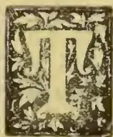

HE cultivation of the grape has been the subject of a number of communications which have from time to time appeared in the pages of this Magazine. Mr. E. T. Hoole in particular has written much on the subject, in which he has evinced peculiar interest, no doubt having first had his attention drawn to the possibility of extending grape culture in Ceylon by his long experience of the industry in Jaffna. In a late number, this correspondent contributed a most interesting account of the cultivation of grapes in North-West India, and commended the system there adopted to the notice of cultivators in at Ceylon. Not long after the publication of this account we had a visit from Mr. Zanetti, with whom arrangements were subsequently made for carrying on an experiment in grape culture on the grounds of the School of Agriculture at Colombo. Mr. Zanetti is an expert in this branch of agriculture, of which he has had long and intimate experience of an extensive nature both on the Continent and in Australia. Hitherto grapes have been cultivated to a very limited extent in Ceylon, the Jaffna peninsula being the locality where the largest number of vines occur. But as far as we are aware no single grape grower in Ceylon possesses more than a couple of plants in his garden, and these have been grown as spreading vines on bowers or pandals. The continental method which is now being adopted wherever viticulture is an established agricultural industry has, we believe, never before been attempted in Ceylon, and its demonstration will be one of the features of the experiment at the School of Agriculture, where, moreover, the most approved systems of pruning, manuring &c. will be practised. Some criticism has been raised by the choice of Colombo for the

experiment, as it is thought that the climate is too humid for the grape. Single vines have however been known to flourish in nearly every part of Ceylon, and it will remain to be seen whether given a suitable soil, selected varieties, and expert-treatment, a vineyard cannot be established in the metropolis. We believe, however, that Mr. Zanetti does not intend to limit his experiment to Colombo. Personally it is a source of great gratification to us that an opportunity has been afforded for the carrying out of so desirable an experiment, which we can only hope will prove an unqualified success. We have already had many communications on the subject of the experiment, and some of our correspondents have given us their own experiences of vine culture.

## LAWS OF CEYLON RELATING TO AGRICULTURE.

### CHAPTER IX.

#### *Recovery of Money due under this Ordinance.*

1. If default be made in the payment of any instalment, charge or rate under this Ordinance in repayment of any amount expended on the construction &c. of any irrigation work, it shall be lawful for the Government Agent or any person authorized by writing under his hand to seize the land herein declared specially bound and liable or any movables thereon to whomsoever such land crop or movables may belong, and to sell the same by public auction at any time not less than twenty-one days from the date of seizure.

2. If default be made in the payment of any other sum payable under this Ordinance it shall be lawful for the Government Agent or any person authorized in writing under his hands to seize any property belonging to the defaulter, wheresoever the same may be found, and to sell the same by public auction at any time not less than twenty-one days from the date of seizure. Provided that no seizure of any land be made if the defaulter surrenders free and unclaimed movable property to satisfy the total amount of the debt. Provided also

239------------------------------------------------

214Supplement to the "Tropical Agriculturist."[Sept. 2, 1895.

that no land seized under section 1 be sold until and unless the crop or produce thereof and the movables thereon, if any, shall have been first sold.

3. The sale of immovable property shall be carried on the spot unless the Government Agent shall otherwise direct, or unless the defaulter shall consent to the sale being conducted elsewhere.

4. The person making the seizure may, if so authorized by the Government Agent, keep a person in possession of the property seized.

5. It shall be lawful for the Government Agent or any person authorized by him as aforesaid to demand, take and receive from such defaulter the several sums of money mentioned as follows:—

(a) In cost of proceeding to seize property—a charge not exceeding 50 cents for every R10 due.

(b) For keeping a person in possession—a charge not exceeding 50 cents per day.

(c) For the expenses of sale—a charge not exceeding 25 cents for every ten rupees of the net proceeds of the sale.

6. After deducting the amount and costs due, the overplus, if any, shall be paid to the owner or joint owners of the property sold.

7. A certificate of sale signed by the Government Agent is sufficient to vest the property in the purchaser. Such certificate is liable to stamp duty fixed on conveyances of immovable property and to any registration or other charges authorized by law, such duty and charges being payable by the purchaser.

H. A. J.

---

#### LABOUR.

---

A season of unwonted prosperity has set in in many planting districts for the Sinhalese agricultural classes, owing to the want of Tamil labour felt on the plantations, and entire families are leaving their homesteads for residence in close proximity to European plantations. The system of weekly payments if not insisted upon has still become imperative, as the tide of labour generally sets in the direction of prompt settlement and from R1.50 to R1.80 per week is easily earned by an adult male, while a woman or child earns from R1.25 to R1.50 on an average. And thus the Sinhalese ryot who had hitherto to depend entirely on his paddy fields for the support of himself and his family has practically averted the calamity of starving during bad seasons of *maha* and *yala*. The Government have also thus been relieved of the anxiety of having occasionally to provide villages with relief works.

News comes from the coast of India that the recruiting grounds of our immigrant labour supply are being largely tapped by Singapore planters, who are offering more advantageous terms than the Ceylon planters do. If our labourers went gradually away from Ceylon to their old *Doves* in other parts, and also to others following their example, and if capital coming to Ceylon is also driven away to countries where land can be got on more advantageous terms, Ceylon need be in no fear of an over-production of tea. But the Surveyor-General may fail to control the deliveries at Mincing Lane.

The general effect of tea planting, although largely beneficial to the neighbouring villages, is by no means an unmixed blessing to the younger

generation as it is reported from the Sabaragamuwa Province that the attendance at the village schools have been greatly affected by the children being taken away to the neighbouring tea estates for gathering leaf. It may not be felt just yet, but it is the opinion of many reflecting minds that the suppression of crime among the Sinhalese villagers can be best attained by taking them in hand when young and teaching discipline and morality as in European countries. The school has ever been the nursery of the Church, and even if we did not carry the Christian's propaganda into the Buddhist villages, still Christian school masters who have oversight of the boys during school hours, can do an immense amount of good in watching their conduct generally and training them to love rectitude and truth and to control their natural impulses. To take a man whose character has been moulded and fixed and to flue scourge and imprisonment may satisfy the vindictive requirements of justice, but results have proved that it has neither cured the offender nor operated as a deterrent to others of his class. It is possible that compulsory education and the establishmen of normal schools all over Ceylon may do more to suppress crime by training the Sinhalese youth while young than the increased rigorous treatment in jails will do after the criminal has been made by the general neglect of his mere education in his early years.

P.

---

#### PALMYRAH PALM PRODUCTS.

---

Mr. G. E. Collyer, the fibre referee for the Imperial Institute, reports as follows on samples of Palmyrah fibre:—

"The stiff fibre extracted from the base or sheath of the leaf-stalk, when in mature condition, of dark colour, and tough and supple in quality, is in considerable favour as a broom and brush making material, and has rapidly become one of the best substitutes for Bahia Piassava, notwithstanding a tendency to curl in warm and dry weather.

The consumption has kept pace with the supply, and its use could be largely increased if sufficient quantities could be obtained at moderate prices, of which according to the available information there is much doubt.

The light-coloured fibre extracted from the leaf-stalk itself is of a different character, and is at present of comparatively small value;—its want of life, toughness, and strength to recover its straightness after being bent, limit its use to common mixing purposes, and it is considered inferior to African Piassava for the lowest uses. It is possible a better and more extensive use for this fibre may ultimately be found, but in the meantime shipments would come to a very doubtful market."

The wood forms a valuable rafter for houses. Toddy is got by fermentation from the sweet juice of the flower, as with the coconut and kitul palms. Sugar (jaggery) is made from the unfermented juice. Fans are constructed of the young leaves, which in the very young stage are also woven into braids and thus exported. Baskets, hats and other articles are also made of the leaves, which have also from time immemorial served the purposes of writing paper. The soft pulp inside the shell or stone of the fruit is eaten raw, or

240------------------------------------------------

Sept. 2, 1895.]Supplement, the "Tropical Agriculturist."215

hardened into thin slabs by the mixture of a little lime, on fried into cakes after being mixed with flower, sugar, and coconut scrapings. The cabbage or terminal bud is also eaten. The seedlings are sometimes eaten cooked as a vegetable or made into pickles, while the germinating embryo within the stone is considered a delicacy and is sometimes reduced to a flour.

Mr. J. W. Mollison, Officiating Director, Department of Agriculture, Bombay, supplies some information with reference to the uses of the tender root which the seeds send out at the time of germinating:—The palmyran fruit contains two or three kernels, and if these are to be eaten raw, the fruit has to be plucked before it is ripe. In this condition they are sold in N. W. India at 12 for one anna when good or say 6 fruits per anna. Fallen fruits only are used for planting in order to get the radicle to be used as a vegetable. These radicles are from 9 to 12 inches long and 1 to  $1\frac{1}{2}$  in. diameter at the thick end. The seedlings are grown as crowded as possible in the nursery, and are ready for digging in about four months. The vegetable is generally roasted before it is offered for sale, at the rate of 16 for an anna. Its cultivation in the Bombay Presidency, says Mr. Mollison, is important, because of the enormous value of outturn per acre, and because it might be economically imitated elsewhere in India. Nurseries, however, are seldom larger than  $\frac{1}{25}$  to  $\frac{1}{10}$  of an acre. In a nursery about 50 fruits are planted in a square yard, and these may produce 100 more young tap roots. The gross value of yield per anna at ordinary market rates is R1,800, but if the vegetable is dear, the outturn per acre may be worth R300.

#### DAIRY PRODUCE.

The native cow as most of us are aware is a very poor milker. In fact, a Ceylon cow's average yield of milk per day is hardly over three to four pints. In many instances the cows are never milked. The coast cows (animals of South Indian breeds) which are being imported to the Island yield on an average six to eight pints of milk a day, and those of the better Indian breeds, notably the Sind breed, which has been introduced to the Island through the Government Dairy Farm, yield on an average from twelve to sixteen pints daily. Dr. Parkes in his Manual of Hygiene, puts down the average of an English cow to be 20 to 25 pints daily and occasionally up to 50 pints. Thus it is seen that the milk yield of different breeds of cows varies greatly. It has also to be noted that milk differs in quantity and quality in different animals under different conditions, for instance, the age of a cow, the number of calves produced by it, the age of the calf, and the system of feeding the cow, has much to do with these variations.

The ridiculously small quantity of milk yielded by native cows, is undoubtedly due to neglect on the part of breeders for ages past, the native cow in the villages being considered not so much a milker, but a producer of calves, which when grown up are used either for agricultural work or draught purposes, such as for the conveyance of loads or for trotting. Again, the villager requires an animal to plough his fields, and any small sized animal will do the work with the native im-

plement. Such is the demand, and hence the supply keeps pace with it. As regards dairy produce, though in India milk and ghee are highly prized and often indispensable articles of diet, milk is seldom an article of diet in the villages here, and it is when used considered more or less a luxury. Ghee again is mostly used in medicine, and coconut milk is often considered a cheap and easily obtained substitute for it, whereas in India a native would be shocked to hear of the substitution of coconut milk for ghee, for he cannot conceive how one could be satisfied without the use of such an indispensable article. The only form in which milk is used in the villages is in the form of curds, and even for the production of this cattle owners have not sufficient encouragement, as there is no regular demand for the article. It is used generally on special occasions (feasts, &c.), but the curd obtained from cow's milk is considered to be inferior to that obtained from buffaloe's milk. These remarks do not apply to the villages in the vicinity of towns, for in towns on account of the different classes of inhabitants and their different tastes, there is always a demand for milk, and the villager is ever ready to meet it, and obtain the advantages of profit thus offered him.

It is no surprise that in the light of the above facts that dairying has not been an industry among the Sinhalese villages, and a good milking cow is a rarity among them.

In India the native consumes the produce of the dairy in a variety of forms. First and foremost, the ghee or clarified butter is an indispensable article in the preparation of his daily food. *Tak* a bye-product of ghee-making is never wasted; *mawa* or *khova*, a sort of dessicated milk is largely used by them; and lastly, curd is also a favourite with them.

In places where milk is turned into butter and cheese, and the bye-product obtained in the process of butter making, skimmed milk is also put to a variety of uses.

The conditions prevailing in Ceylon are such, that dairying as an industry will be more readily adopted in the vicinity of towns rather than in the villages.

In towns there is always a demand not only for pure milk but for its products. A large quantity of butter is annually imported to the island, and with all that, the consumers always prefer fresh butter, and are prepared to pay enhanced prices for the article they prefer. Dairy-farming in villages close to towns should prove a paying industry. When milk could be sold in a fresh state, there is not much difficulty in carrying on the trade profitably, but as it is doubtful when a large number of persons engage in the production of the article that there will be an equally large demand for fresh milk, it is essential that attention should be paid to the manufacture of butter.

A central factory where a cream separator could be worked, and where all the milk in the district could be disposed of, would be the best inducement for the villager to pay attention to this important industry. Under such circumstances, when they are assured of a ready market the inducement will be sufficient for them. A central factory need not cost much; a Baby Laval can be had for less than R250, and

241------------------------------------------------

216Supplement to the "Tropical Agriculturist."[Sept. 2, 1895.

a few more appliances such as cans, jars, churns &c. would meet all the requirements.

As an instance it may be mentioned that the experiments conducted in the Bombay Presidency and the North-Western provinces of India some few years back have given such an impetus to the industry, that at present there are over fifty or sixty small butter factories in the Bombay Presidency alone where cream separators are used with the greatest advantage. These factories have become central stations, where the out-put of milk in the adjoining villages is readily purchased. Bombay butter now not only meets the demand of the Presidency to a great extent, but as we are aware is obtainable even in many of the Colombo stores.

It has to be noted in this connection, that for the manufacture of butter the cost of fresh milk will have to be comparatively cheap, but if the price obtainable leaves a margin of profit to the owner of the cows, there is no reason to fear any possibility of failing in obtaining a proper supply of milk for the purpose of butter making.

The experiments at the Poona Dairy farm have shewn that 74 lbs. of cow's milk gave 3 lbs. 6 $\frac{1}{4}$  oz. butter or 1 lb. butter from 21.72 lbs. milk. Again, 43 lbs. of buffaloe milk gave 3 lbs. 10 oz. butter or 1 of butter to 14.29 of milk.

Thus it is seen that buffaloe milk yields a much larger percentage of butter than cows' milk, and there is no reason why buffaloe milk should not be put to this use here.

The following analysis of cow's milk (Sind) and buffaloe's milk, at the Poona Dairy Farm is also very suggestive:—

<table>
<thead>
<tr>
<th></th>
<th></th>
<th>Cows.</th>
<th>Buffaloe.</th>
</tr>
</thead>
<tbody>
<tr>
<td>Water ..</td>
<td>...</td>
<td>85.53</td>
<td>82.13</td>
</tr>
<tr>
<td>Butter fat...</td>
<td>...</td>
<td>5.43</td>
<td>7.73</td>
</tr>
<tr>
<td>Cacsin ..</td>
<td>...</td>
<td>2.95</td>
<td>4.03</td>
</tr>
<tr>
<td>Milk sugar</td>
<td>...</td>
<td>5.40</td>
<td>5.31</td>
</tr>
<tr>
<td>Mineral matter ..</td>
<td>..</td>
<td>.69</td>
<td>.80</td>
</tr>
<tr>
<td></td>
<td></td>
<td>100.00</td>
<td>100.00</td>
</tr>
</tbody>
</table>

W. A. D. S.

#### BLACK SMUT ON ORANGE TREES.

We have been sent some branches of an orange tree affected with black smut, with a request to suggest a remedy.

The fungus we may at once state is only a secondary disease dependent on a scale insect (probably a *lecanium*), and we advise that the ordinary treatment against scale insects should be at once adopted.

Make a solution (by boiling) of  $\frac{1}{2}$  lb. of hard soap or 2 quarts of soft soap to a gallon of water. Cut the hard soap previous to boiling in thin slices to assist solution. To every gallon of boiling soap solution (off the fire) add 2 gallons of kerosine. Then churn the mixture violently with a force pump or garden syringe, driving it backwards and forwards through the nozzle, keeping the latter always below the surface during the process. By this means an emulsion will be formed, which, if perfect, should be of the consistency of cream, and the oil should not separate out, even if the emulsion be kept standing for days, and it should mix freely with water in any proportion. This, when required, should be mixed with no less than nine times its bulk of water, which, if used warm, will facilitate dilution

in the event of the emulsion having become lumpy. This should be applied to the trees in as fine a spray as possible with the help of a suitable apparatus (such as the Vermorel "Knapsack," sprayer, or the Antipest sprayer).

All parts of the tree should be wetted, and the treatment should be repeated at intervals as necessary, as there are times and seasons when the treatment will be all ended with much better results than at others. In addition, the trunk and larger limbs of the tree may be advantageously painted over (by means of a paint or white-wash brush) with the following:—Flowers of sulphur, 4 lb; soft soap and water, 6 gallons; or with "Parker's remedy" which is made up thus: a thin flour-and-sulphur paste containing three parts by weight of sulphur to every one of flour, the paste to be made by boiling in the ordinary way, and the sulphur to be stirred in while the latter is still hot.

#### ABORTION IN COWS.

We take the following from the *New South Wales Agricultural Gazette*:—In a paragraph on this subject which appeared in our February issue, it was stated that no preventive measures had ever been found to be of the slightest avail. Owing to this statement, Mr. E. R. Dean, of Goulburn, has written to the Department, pointing out that some of the American agricultural journals speak with much confidence of the great value of *Viburnum prunifolium* as a preventive of abortion. He mentions that Dr. Phares, speaking of the action of *viburnum*, says:—"It is a preventive in habitual miscarriages. It prevents miscarriage from any cause. It has never failed to prevent a threatened abortion so far as I can learn." And the *American Veterinary Review* endorsed this as follows:—"We simply add this is literally true, and confirmed by the thousands of cases since treated all over the United States and in other countries. No other medicine, perhaps, ever came so soon into general use and met with so unanimous a verdict of approval among the medical fraternity. This wonderful medicine is found native in the forests of most of the States between the Gulf of Mexico and the Northern Lakes, and is generally known by the trivial name of 'black-haw.' The bark of the root is used for making a tincture; or in emergency the decoction of fresh bark serves well. \* \* \* If properly prepared and administered it is worth, for the purpose mentioned, more than all other medicines." Mr. Dean adds:—"Dose for a human being:—

<table>
<tbody>
<tr>
<td>Infusion ..</td>
<td>...</td>
<td><math>\frac{1}{2}</math> oz.</td>
<td rowspan="3">} Four or five times a day.</td>
</tr>
<tr>
<td>Tincture ..</td>
<td>...</td>
<td>1 drachm</td>
</tr>
<tr>
<td>Powder ..</td>
<td>...</td>
<td>1 drachm</td>
</tr>
</tbody>
</table>

Therefore say double or treble the quantity as a dose for a horse or cow."

(*Viburnum* is a genus belonging to the order *Caprifoliaceæ*, and is represented in Ceylon by two distinct indigenous species—*V. coriaceum* and *V. erubescens*.)

#### GAMBOGE AND BENZOIN.

Gamboge is a gum resin yielded by the bark of *Garcinia morella* of Ceylon and South India, and *G. Hanburyi* of Siam, Cambodia and Cochin China. It is from these latter places that practi

242------------------------------------------------

Sept. 2, 1895.]Supplement to the "Tropical Agriculturist."217

cally the whole of the gamboge of commerce is obtained. It is said to be a powerful cathartic medicine, but its principal use is as a pigment in water-colour painting. It is also used to give colour to lacquer varnish, for brass work &c.

The following reference to the gamboge tree of Siam is from a report on the trade of Siam for 1893, extracts from which appear in June-July number of the *Kew Bulletin*: "The trees grow to a height of 50 feet, and are straight stems with no lower branches, owing probably to the dense shade of the forest in which they grow. None of those I saw had a diameter of more than 12 inches. Ten year's growth is said to be required before the tree is ready for tapping. This is carried on by the Cambodian and Siamese Islanders during the rainy months—from June to October—when the sap is vigorous, by cutting a spiral line round the trunk from a height of some 10 feet downwards to the ground. Down these grooves the resin wells out of the bark and trickles in a viscous stream into hollow bamboos placed at the base of the tree, and from there it is decanted into smaller bamboos, where it is left for about a month to solidify. To remove the gamboge the bamboo is placed over a red-hot fire, and the bamboo husk cracking, there is left the article left as pipe gamboge. The trees can be tapped two or three times during the season. . . . Care must be taken to prevent rainwater mixing with the resin in the grooves." The *Indian Agriculturist* of August 1st makes the following reference to gamboge:—

As to gamboge, so far as is known, two trees are to be met with in India which yield this drug. The *Garcinia pictoria* is found in the high mountain lands of the Wynad, but attempts to cultivate it in the low country are said to have failed. A good kind of gamboge is extracted from this tree. The bark, according to Dr. Roxburgh, is spotted with many yellow specks, and contains considerable masses of gamboge inside. Samples sent to him he considered superior to most other kinds. This tree is to be found in the greatest abundance along the whole line of the Ghâts, and its produce would in time become an important article of export. The seeds yield an oil which is not purgative, like the gamboge resin. It has been said on high authority that "it is probable this gamboge might advantageously be applied to any use to which the gamboge of Siam is habitually put." The other Indian tree which yields a substance like gamboge is the *Xanthochymus pictorius*. It bears fine yellow fruit, like an orange, which is eaten by the natives, who find it very palatable. The fruit, when full-grown, but not ripe, yields a quantity of yellow resinous acrid gum like gamboge, of the consistence of a rich cream.

Benzoin—known also as gum Benjamin in English commerce—is a green resin obtained from the bark of trees in Sumatra and Siam. Benzoin is used as a stimulant and expectorant in chronic bronchitis, is one of the principal ingredients in Friar's Balsam, and is largely used for incense. White Sumatra benzoin is known to be yielded by *Styrax benzoin*, it is curious that the true character of the tree yielding Siam benzoin remains a mystery still, in spite of private and official efforts to clear up the matter. A report on the trade of Siam of 1893, referring to gum Benjamin, states that the whole of the Bangkok export goes to the

London market, and thence to France and Belgium to be manipulated into balsam, a small quantity being used locally for frankincense. Prices in 1893 are reported as bad, the first-class gum fetching about £165 per ton, the second-class about £10 per ton.

It is not generally known, remarks the *Indian Agriculturist*, that the *Terminalia angustifolia* is a tree which produces a variety of benzoin. It is obtained by wounding the tree, and is composed of large white and light brown pieces easily broken between the hands. When gently dried it forms a white powder formerly in great request as a cosmetic. It has a most agreeable smell. But the most striking ingredient of this resin is benzoic acid. In the churches in the Mauritius this benzoin was formerly used as incense.

---

### A NEW FRUIT TREE.

---

Under this heading the *Australian Agriculturist* refers to a well-known Ceylon tree known by the native name of *kumaranga*, and incidentally also makes mention of another fruit tree, common in gardens and much used as an acid in Eastern cookery, viz., the *bilim*. Verily, we do not appreciate our Ceylon fruit sufficiently and it yet may happen that we will find ourselves purchasing tins of kamaranga and bilim jam exported from the southern continent! The following is the notice referred to:—

For although known to experts for a number of years, the Averrhoa-Carambola may be classed as a new fruit tree, being almost unknown to the general public. We have tasted the fruit when ripe and when unripe. In its unripe state it is too sour and unpalatable for any use we know of. In its ripe state—but it must be quite ripe—we think it very good indeed. It has the taste of a plum not quite ripe. The fruit we saw was exhibited by Messrs. L. Summerlin and Company, and came from the garden of Mr. W. H. Day, Kedron Brook. We thought this tree the only one in the district, but we have since discovered several others in the Acclimatisation Society's Gardens, Boweu Park, from whence Mr. Day received his plant some 16 years ago. The Acclimatisation Society introduced the Averrhoa-Carambola or bitter Averrhoa, and the sweet variety or Averrhoa-bilimba, from China, but it has never become a favourite, so has been almost neglected. There is a fine tree at Bundaberg and some others on the Daintree River. From the mere tasting of the ripe fruit we were of the belief that it would make good jam and jelly. Our opinion has been confirmed, as we have been informed that Mrs. Soutter has made jelly of the fruit this present season, which Mr. Soutter pronounces to be "lovely," and "far before that of rosella." It would make splendidly into tarts. Its acidity, we believe, would act as a tonic and appetiser. The tree grows to a large size, some sixteen to twenty feet in height, and resembles the willow in form, the fruit hanging on long racemes which are drooped gracefully amongst the foliage. It yields all the year round and is always in bloom. The crop is said to be a heavy one. The fruit is oblong in shape, resembling in size and colour the sugar banana, but instead of being round like that well-known fruit, is ridged or furrowed with fine-pointed ribs running longi-

243------------------------------------------------

218Supplement to the "Tropical Agriculturist."[Sept. 2, 1895.

tudinally. We hope to see some notice taken of this really excellent fruit, as it has been too long in obscurity.

### POULTRY DISEASES.

Roup generally attacks poultry after exposure to chilly winds and rain. It begins with a cold and is attended with offensive discharges from the mouth and eyes. The disease is highly contagious, and is conveyed by the saliva of sick birds falling into water or food to which the healthy have access. Separate utensils should therefore be used in feeding the sick. Affected birds should be kept warm and given a grain of pepper twice a day. Another good prescription is the following: The bark of murunga root (horse radish tree), garlic and ginger, pounded, and the juice administered twice a day. If the bowels are constipated a little gingelly oil may be given. Roup generally runs a rapid course, and requires prompt treatment.

Diarrhoea is caused by acidity of the stomach or a chill. Unripe bael fruit (*Egle marmelos*) should be first roasted and a solution of the pulp, after filtering, given with a few drops of ginger. Poultry are sometimes killed by apoplexy which is generally the result of high feeding. It is seldom that anything can be done for the birds as they soon become unconscious. Relief may be given by opening the vein on the side of the neck (the jugular), and the head fomented with a mixture of vinegar and cold water.

It is a common experience for hens to lay soft eggs. This generally occurs with overfed poultry, and though sometimes caused by fright, is due to a deficiency of lime in the system. Bone dust should be strewn about the yard for the poultry to pick up.

For vermin on poultry, a mixture of powdered charcoal and sulphur should be rubbed over the body of the bird, and the poultry house cleansed and limewashed.

In damp or wet weather whenever fowls are found to be drooping or loose in the bowels, a small pill of mustard will be found beneficial, and help to ward off more serious complications.

A. M. FERNANDO.

### ROYAL COMMISSION ON TUBERCULOSIS.

In concluding their *Report*, dated April 3, 1895, and signed by all the Commissioners, they say:—

"We have obtained ample evidence that food derived from tuberculous animals can produce tuberculosis in healthy animals. The proportion of animals contracting tuberculosis after experimental use of such food is different in one and another class of animals; both carnivora and herbivora are susceptible, and the proportion is high in pigs. In the absence of direct experiments on human subjects, we infer that man also can acquire tuberculosis by feeding upon materials derived from tuberculous food-animals.

"The actual amount of tuberculous disease among certain classes of food-animals is so large as to afford to man frequent occasions for contracting tuberculous disease through his food. As to the proportion of tuberculosis acquired by man through his food, or through other means, we can form no definite opinion, but we think it probable

that an appreciable part of the tuberculosis that affects man is obtained through his food.

"The circumstances and conditions with regard to the tuberculosis in the food-animal which lead to the production of tuberculosis in man are, ultimately, the presence of active tuberculous matter in the food taken from the animal and consumed by the man in a raw or insufficiently cooked state.

"Tuberculous disease is observed most frequently in cattle and in swine. It is found far more frequently in cattle (full grown) than in calves, and with much greater frequency in cows kept in town cowhouses than in cattle bred for the express purpose of slaughter. Tuberculous matter is but seldom found in the meat substance of the carcass; it is principally found in the organs, membranes, and glands. There is reason to believe that tuberculous matter, when present in meat sold to the public, is more commonly due to the contamination of the surface of the meat with material derived from other diseased parts than to disease of the meat itself. The same matter is found in the milk of cows when the udder has become invaded by tuberculous disease, and seldom or never when the udder is not diseased. Tuberculous matter in milk is exceptionally active in its operation upon animals fed either with the milk or with dairy produce derived from it. No doubt the largest part of the tuberculosis which man obtains through his food is by means of milk containing tuberculous matter.

"The recognition of tuberculous disease during the life of an animal is not wholly unattended with difficulty. Happily, however, it can, in most cases, be detected with certainty in the udders of milch cows.

"Provided every part that is the seat of tuberculous matter be avoided and destroyed, and provided care be taken to save from contamination by such matter the actual meat substance of a tuberculous animal, a great deal of meat from animals affected by tuberculosis may be eaten by the consumer.

Ordinary processes of cooking applied to meat which has got contaminated on its surface are probably sufficient to destroy the harmful quality. They would not avail to render wholesome any piece of meat that contained tuberculous matter in its deeper parts. In regard to milk, we are aware of the preference by English people for drinking cow's milk raw, a practice attended by danger, on account of possible contamination by pathogenic organisms. The boiling of milk, even for a moment, would probably be sufficient to remove the very dangerous quality of tuberculous milk."

### CHEMICAL EXAMINATION OF CEYLON PLANTS.

Messrs. Hummel and Perkin of Yorkshire College, Leeds, have examined the *Toddalea acutecala* with a view to discovering the character of the colouring matter contained in it. The plant belongs to the order Rutacea and is locally known as Kudu-miris (S.). The root, about  $\frac{3}{4}$  in. in diameter, possesses an aromatic odour; it is of a pale, yellowish colour, has a woody centre and a brown bark covered with a light, yellow, soft, powdery, pith-like substance.

Ten grammes of the external yellow powder were digested for two hours with 100 c.c. of

244------------------------------------------------

Sept. 2, 1895.]Supplement to the "Tropical Agriculturist."219

boiling alcohol, filtered, and the residue again treated in a similar manner. To the orange-brown filtrate an alcoholic solution of lead-acetate was added drop by drop, as long as a colourless precipitate was formed. After this had been removed by filtration, the filtrate was evaporated to a small bulk, and poured into five times its volume of dilute hydrochloric acid. A viscous, yellow precipitate was thus obtained, which increased in quantity on standing; this was collected upon calico, then first rinsed with cold water, and afterwards digested with boiling water. The turbid yellow liquid thus obtained contained resinous matter in suspension, but this was readily removed by means of ether. After boiling the clear aqueous solution excess of hydrochloric acid was added, and, on cooling, it deposited long, orange-coloured needles, which were collected and washed with dilute hydrochloric acid. To purify this product, it was dissolved in boiling dilute alkali and the solution digested with animal charcoal, filtered, treated with hydrochloric acid, and allowed to cool; the yellow needles which separated were collected washed, with water, and dried at the ordinary temperature. The product weighed 0.35 gram.

For analysis, this was converted into the platinochloride in the usual manner, and the resulting amorphous, yellow powder dried at 100°. 0.294 gram, on ignition, yielded 0.0535 platinum = 18.19 p.c. The formula  $(C_{20} H_{17} NO_4) 2 H_2 Pt Cl_6$ , requires Pt = 18.02 per cent. The analytical numbers accorded, therefore, with those given by *berberine-platinochloride*. Its identity with this substance was shown by a comparison of the reactions of the hydrochloride above referred to, with berberine hydrochloride obtained from other sources. The inner bark of this root (60 gram.) was found, on examination by the above method, to contain but a trace of berberine, so small, indeed, that this was probably derived from traces of the preceding yellow powder still adhering to it. It contained, however, some quantity of a sticky, resinous product, which was insoluble in water or dilute acids, but readily soluble in ether, and appeared to be identical with the similar substance present in the yellow powder. The quantity obtainable was too small for extended examination, and the preliminary experiments were not successful in extracting from it any crystalline substance. The central woody portion of the root yielded no berberine.

We have already heard a good deal of the insecticidal properties of *adhatoda vasica* known in Sinhalese as *adhatoda* and *agaladara*. A quantity of dried leaves of the shrub from the Imperial Institute collections was sent at the suggestion of Dr. Lander Brunton to Professor Giacosa of the University of Turin for examination.

Professor Giacosa reports that by following the method of examination described by Mr. Hooper in the *Pharmaceutical Journal* for April, 1888, he has been unable to discover any alkaloid in the leaves, but that these are especially rich in potassium nitrate. Dr. Watt, the Reporter on Economic Products to the Government of India, suggests that the unsatisfactory results obtained from experiments on dried leaves in Europe, may be due either to the fact that (1) the active properties possessed by the leaves in the fresh state are in some measure, if not wholly, lost

when they are dried; or that (2) there are certain periods in the growth of the plant, or certain seasons of the year, when the alkaloid is present.

An investigation as to (1) can only be carried out on the fresh leaves in a laboratory in India, while a careful collection of the leaves of the *Adhatoda* at different seasons would be necessary to afford material to finally clear up the points raised by (2). As there seems no doubt from the experiments carried on tea estates, that the fresh leaves possess insecticide properties, further experiment on the nature of the substance which gives the leaves these properties may furnish interesting information.

---

## VINES AND LINE SUPPORTS.

---

(Communicated.)

The news that grape vines are found to thrive by the side of *Erythrinas* in Bombay, and that the cultivation is a simple affair would justify similar experiments being made in Ceylon with a view to the cultivation of grape in an extended scale.

In Jaffna it is become the fashion to have a grape vine in every compound, but beyond imitating an existing fashion and contributing a luscious fruit to the table, no attempt has been made by the comfortable and easy-going folk in the peninsula to extend its cultivation as an industry. And this may be due to the fact that there its cultivation is by no means an easy affair. Besides, the vines are permitted to cover a large area of ground over pandals, and one large vine well attended to and manured is amply sufficient to satisfy the demands of the grower. How well single vines can be made to bear has been illustrated in the well-known vine at Hampton Court. And this fashion set in Jaffna has been the method which has obtained in Ceylon all along wherever a vine was grown, whether in Kandy or Colombo, or Dumbara or Wahacotte.

The report of Mr. Hoole in the June number of the Magazine on Viticulture in India, at least in the vineyard referred to by him, affords a suggestion for extended experiments on the lines indicated by him. It may be that the *Erythrina* does supply nitrogen in quantity to satisfy the limited wants of a grape vine checked in its growth and dwarfed to the limits of the umbrage afforded by its host; or it may be that the vine is afforded certain natural and indispensable conditions at the foot of its living host which enables it crop without much artificial management beyond a supply of manure annually.

As regards the theory of nitrogen supplied by the *Erythrina*, while it may be interesting to cocoa planters to have it definitely settled, it may be also interesting to growers of pepper to know that the *Erabadu* and the *Dadap* do not show any better pepper vines on them than any other host from Jack to *Hoorie*, on which I have permitted my pepper to creep. I have found, however, that a live host is better than a dead stump for crop. The conclusion that is forced upon one is that the decaying leaves help to enrich the soil and thus to increase the crop. But there is yet another inference. A growing tree is known to supply itself with a large quantity of water from the ground by means of its roots, and this

245------------------------------------------------

220

Supplement to the "Tropical Agriculturist."

[Sept. 2, 1895.

constant action upon the soil round about its roots lead to two distinct and beneficial results in regard to the vine, whether pepper or grape, or any other creeper which may grow at its roots. During the wet season it takes away the excessive moisture which may lead to fungoid growths at the roots of the vines, and in the dry season it may without artificial aid, such as root pruning, bring about naturally and from the dryness of the soil the inspissation of sap which is necessary in a tree for the development of blossom and crop. If this is proved, then grape culture in Ceylon will be simplified into a system of superficial pruning and annual manuring.

PLANTER.

CEYLON WOODS.

(Continued from July issue.)

- 44 Leguminosæ (Papilionaceæ).
- 81 *Erythrina indica* Erabadu.
- 82 *Dalbergia frondosa*.
- 83 *Pongamia glabra*. Magul-karanda.
- 84 *Pericopsis nooniana* Nedun. (Cæsal pineæ).
- 85 *Poinciana regia*.
- 86 *Cassia fistula*. Ehela.
- 87 " *marginata*. Ratu-wa.
- 88 " *siamca*. Wa Aramana.
- 89 " sp.
- 90 *Dialium ovoideum*. Gal-siyambala.
- 91 *Tamarindus indica*. Siyambala.
- 92 *Bauhinia racemosa*. Mayila. (Mimosæ).
- 93 *Adenanthera pavonia*. Madatiya.
- 94 *Dichostrachys cineria*. Andara.
- 95 *Acacia planifrons*.
- 96 " *leucophtea*. Maha-andara. Katu-andara.
- 97 " *melanoxylon*.
- 98 *Albizia lebbek*. Mara.
- 99 " *odorotissima*. Suriya-mara.
- 100 " *stipulata*. Kabal-mara. Hulan-mara.
- 101 *Pithecolobium saman* (rain-tree.)
- 45 Rosaceæ.
- 102 *Pygeum wightianum*. Ununu.
- 50 Rhizophoraceæ.
- 103 *Carallia integerrima*. Dawata.
- 104 " *calycina*. Ubberiya.
- 105 *Weihea zeylanica*.
- 106 *Anisophyllea zeylanica*. Weli-penna.
- 51 Combretaceæ.
- 107 *Terminalia belerica*. Bulu.
- 108 " *parviflora*. Humpalanda.
- 109 " *glabra*. Kumbuk.
- 110 *Gyrocarpus Jacquinii*. Hima.
- 52 Myrtaceæ.
- 111 *Eugenia aquæa*. Wal-jambu.
- 112 " *gardneri*.
- 113 " *revoluta*.
- 114 " *assimilis*.
- 115 " *calophyllifolia*.
- 116 " *operculata*. Bata-komba, Kobo-mal.
- 117 " *jambolana*. Maha-dan.
- 118 " *bracteata*. Tembiliya.
- 119 " *nooniana*. Pinibaru.
- 120 *Barringtonia acutangula*. Ela-midella.
- 121 *Careya arborea*. Kahata (Patana oak).
- 122 *Eucalyptus globulus*.
- 53 Melastomaceæ.
- 123 *Memeylon capitellatum*. Dodankaha. Weli-kaha.
- 54 Lythraceæ.
- 124 *Lagerstroemia flos-reginae*. Muruta.
- 125 *Axinandra zeylanica*. Kekiriwara.

RAINFALL TAKEN AT THE SCHOOL OF AGRICULTURE DURING AUGUST, 1895.

<table border="0">
<tr>
<td>1</td><td>..</td><td>Nil</td>
<td>13</td><td>..</td><td>·22</td>
<td>25</td><td>..</td><td>Nil</td>
</tr>
<tr>
<td>2</td><td>..</td><td>Nil</td>
<td>14</td><td>..</td><td>Nil</td>
<td>26</td><td>..</td><td>Nil</td>
</tr>
<tr>
<td>3</td><td>..</td><td>Nil</td>
<td>15</td><td>..</td><td>Nil</td>
<td>27</td><td>..</td><td>Nil</td>
</tr>
<tr>
<td>4</td><td>..</td><td>·03</td>
<td>16</td><td>..</td><td>·11</td>
<td>28</td><td>..</td><td>·08</td>
</tr>
<tr>
<td>5</td><td>..</td><td>Nil</td>
<td>17</td><td>..</td><td>Nil</td>
<td>29</td><td>..</td><td>·02</td>
</tr>
<tr>
<td>6</td><td>..</td><td>·07</td>
<td>18</td><td>..</td><td>·07</td>
<td>30</td><td>..</td><td>Nil</td>
</tr>
<tr>
<td>7</td><td>..</td><td>·03</td>
<td>19</td><td>..</td><td>·23</td>
<td>31</td><td>..</td><td>Nil</td>
</tr>
<tr>
<td>8</td><td>..</td><td>·01</td>
<td>20</td><td>..</td><td>·03</td>
<td>1</td><td>..</td><td>·02</td>
</tr>
<tr>
<td>9</td><td>..</td><td>·12</td>
<td>21</td><td>..</td><td>Nil</td>
<td></td><td></td><td></td>
</tr>
<tr>
<td>10</td><td>..</td><td>Nil</td>
<td>22</td><td>..</td><td>Nil</td>
<td>Total</td><td>..</td><td>1·29</td>
</tr>
<tr>
<td>11</td><td>..</td><td>Nil</td>
<td>23</td><td>..</td><td>·15</td>
<td></td><td></td><td></td>
</tr>
<tr>
<td>12</td><td>..</td><td>·07</td>
<td>24</td><td>..</td><td>·03</td>
<td>Mean</td><td>..</td><td>·04</td>
</tr>
</table>

Greatest amount of rainfall in any 24 hours on the 19th instant, ·23 inches.

Recorded by W. O. ROWLANDS.

GENERAL ITEMS.

The Kew authorities and our local Entomologist would appear to be at some variance in regard to the new pest, *Orthezia insignis* vel. *naerea*. Mr. Green in his paper on the subject stated that "there is little doubt but that we owe the introduction of this pest to plants received from Kew," . . . "where it is now said to be doing an enormous amount of damage." In the June-July number of the *Kew Bulletin*, reference is made to this report in the Miscellaneous Notes, where we read, "It is undoubtedly possible that the *Orthezia* may have reached Ceylon by way of Kew. It is not, however, very probable, and the reverse may just as well have been the case. It exists in the public exhibitions, however, from which plants are not drawn for exportation. The plants in the propagating houses from which distribution is made are kept scrupulously clean, and every precaution is taken to send them out free from taint of any sort or kind . . . Mr. Green's statement as to the enormous amount of damage in the plant-houses caused by the insect, is very much exaggerated, . . . as far as Kew is concerned, the *Orthezia* is rather a scientific curiosity than a troublesome pest."

Owners of fruit trees who suffer from the ravages of the flying-fox might try this preventive, which is said to have been used in New South Wales with good effect:—"The alleged remedy is to dip strips of rag in hot melted sulphur, and hang them in the fruit trees. The idea was borrowed from an experiment in England where sulphur was used to keep off weasels and other vermin from destroying pheasants, partridges, etc., and it was thought that sulphur might have some effect on flying-foxes in keeping them off fruit trees. The remedy is simple enough, and an experiment on a small scale would be a trifling undertaking for the poorest fruit-grower."

Mr. Hugh McMillan, who has been appointed head Gardener of the Royal Botanical Gardens, Peradeniya is comes from Kew, where he entered the Royal Gardens in 1893, having been previously in charge of gardens in Wales. The *Kew Bulletin* notices two other Colonial appointments from Kew, viz, Mr. Charles Henry Humphries to the Gold Coast botanical station

246------------------------------------------------

Sept. 2, 1895.]Supplement to the "Tropical Agriculturist."221

in succession to Mr. William Crowther, and Mr. John Chisnall Moore to the botanical station at St. Lucia.

The *Scientific American* recommends the following treatment for destroying stumps of trees:—In the autumn bore a hole in the centre of the stump about 18 inches deep, and 1 to  $1\frac{1}{2}$  inches in diameter. Put in about 2 oz. of saltpetre and fill the hole with water; plug it up tight. In the following spring take out the plug, pour in 8 or 10 oz. kerosine, ignite, and the stump will smoulder, but not blaze, to the extremities of the roots, leaving only ashes.

A new method of preserving oranges has been discovered. The plan of burying oranges with three or four inches deep of soil above them is a decided advance in simplicity on the ordinary methods of keeping this favourite fruit. The inventor of this method is Mr. John Carson, of Clutha, Kew, whose reputation as an experienced grower of fruits is a guarantee of the efficiency of the new plan. The spot chosen for the experiment was on the shady side of a tall pine tree, to which the sun had access only for a time after rising. The oranges were buried as described on September 25, 1894, and they were lifted on Tuesday, April 9. They were quite ripe and perfectly sound and sweet when submitted to examination.

One of the unconsidered trifles that the Mikado has picked up as the result of the Chinese war is the monopoly of camphor. That drug is produced only in Japan and Formosa; and, though a variety known as Borneo camphor is obtained from Borneo and Sumatra, it cannot compete with the product of the evergreen laurel of the Eastern Asiatic islands. Inasmuch as camphor, apart from its many and varied therapeutic uses, is an essential ingredient in the composition of nearly all the new explosives, the demand for it is very large. The Japanese are well aware of the valuable monopoly they have blundered upon rather than sought, and have already begun to limit the export by imposing duties. As a natural consequence, the price of the drug has risen rapidly since the war came to an end, and bids fair to rise higher. Happily the commercial instinct of the Japanese statesmen is as sound as their political instinct, and they are not likely to abuse the monopoly they have acquired by forcing the price up to prohibitive rates. The chief concern of the Japanese Government will, for some time to come, be the finding of money to pay for the ships and munitions of war which will secure the Mikado in the possession of the spoils he has already won. Properly handled and wisely administered, camphor should prove a valuable source of revenue, and contribute a handsome quota towards the cost of the military preparations which pertain to the peace of the Dragon Kingdom.—*Indian Agriculturist*.

Mr. James Peter, of Berkeley, Gloucestershire, writes:—"I have received many inquiries asking for information regarding the use of carbolic acid as a preventive of abortion; and to save myself the necessity of answering so many letters, I give you the following particulars of the system I adopt:—'Commence by mixing with sufficient hot water to make a bran mash,  $\frac{1}{4}$  oz. ordinary

crude carbolic acid, then add the bran, gradually increasing the carbolic acid up to  $\frac{1}{2}$  oz., which is the maximum quantity I can get a cow to take in a bran mash. For a number of cows I measure out the requisite number of  $\frac{1}{2}$  oz. doses, and mix with the water and bran in a fodder barrow, and then give a good broad shovelful to each animal. Before I got rid of the disease I administered the carbolic mashes three times a week. I find it equally safe to give an animal a  $\frac{1}{2}$  oz. dose daily.' I may state that I have regularly used carbolic acid in this herd for the last three years as a preventive against bacterial diseases, and in all my experience I never had animals keep so healthy and well as they have since I have done so. My opinion is that its use internally is a valuable remedy and a preventive against microbic diseases. The Royal Agricultural Society has asked me to revise my evidence before their Abortion Commission, owing to the numerous inquiries for copies of the evidence, and I understand they are now about to publish it in pamphlet form. I hope to make further experiments in another form."—*Mark Lane Express*.

Says the *Agricultural Journal of New South Wales*:—It is satisfactory to be able to report that, according to notifications received by the Department, the various remedies recommended have been most successful. No less than fourteen fruit-growers, whose addresses cover a very large portion of the Colony, have been able to clear their vines of black spot and oidium. From four different districts complete success has followed the use of bandages for codlin moth. Resin and soda wash has proved efficacious for woolly aphid, while Bordeaux mixture, in addition to its good results in black spot, has also proved beneficial for removing pear scab, shot-hole fungus and apple-scab. Spraying with Paris green has given good results for codlin moth and caterpillars in potatoes. There is one reported failure from East Orange, where Bordeaux mixture failed to cure twig blight and powdery mildew. It must not be supposed that the cases here referred to cover all the orchards and vineyards of the Colony, as doubtless there are many trials which do not get reported, and what is still more to be regretted, there are many cases of disease where no attempt is made to effect a cure. It is hoped that the publication of the successful results will act as a stimulus to those who come within both the classes last referred to.

The English "Wild Birds' Protection Act 1894" supplies a list of wild birds to be protected, but other birds may on the recommendation of a County Council be added. Mr. Cecil Warburton of the Zoological Laboratory, Cambridge, has done good service in preparing a complete schedule of wild birds "undoubtedly beneficial to agriculture, and which in the interests of agriculture it is very desirable should be protected under the act referred to." The schedule consists of four columns headed respectively "bird," "food," "pest," "eggs." For instance, *Bird*, the wren (*Troglodytes parvulus*); *Food*, insects, *Nest*; dome-shaped, with side entrances—*Eggs*, 6-12, white generally spotted with red at larger end,  $67 \times 5$ , April—June. A schedule prepared after this plan should prove use in every country.

247------------------------------------------------

<!-- stage4: FAINT old-images-only -->

[Faint page: no legible print of its own could be verified; text withheld (stage 4 review list)]

This image is a scan of a blank page. The paper has a light beige or cream-colored tint. There are several small, dark specks scattered across the surface, which appear to be scanning artifacts or dust particles. No text, lines, or other markings are present on the page.

248------------------------------------------------

# \* The TROPICAL AGRICULTURIST \*

## ◇ MONTHLY. ◇

Vol. XV.]

COLOMBO

OCT. 1ST, 1895.

[No. 4.

### INDUSTRIES OF THE GOLD COAST.

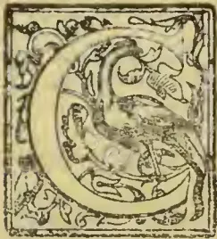

CONSIDERABLE attention is now being paid to the plantations of coffee and cocoa at the Gold Coast, in the cultivation of which, but more especially the former, the natives appear to have become interested. Along the road

leading from the botanical station through the country of Akwapin to the interior, are large numbers of small clearings in which coffee plants chiefly obtained by purchase from the botanical station, are to be seen in the most flourishing condition. The Liberian coffee plant appears to thrive best, but there are large quantities also of the Arabian coffee plant, the berry of which, however, is small and, apparently, deteriorated. The Colonial Secretary, at Accra, says in his last report that it will probably be necessary for the Government at no distant date, if the coffee industry is to be fostered, to instruct the native cultivators in the proper way of preparing the berry for export. At present the most primitive methods are employed. The berries are scraped, by hand, with a round stone worked in the hollow of a large stone, and after this process they are washed and dried in the sun. It is obvious that a large crop could not be so dealt with, and that the employment of machinery in the near future is imperative. The initiative will have to be taken by the Government because of the general ignorance on the part of the natives of all machinery even of the simplest character, and because no single native cultivator possesses sufficient capital, enterprise, or experience to take the matter in hand. The only manufactures carried on by the natives are manufactures which the necessities of life have driven them to undertake. The most important is the manufacture of earthenware pots of various sizes, ranging from a capacity of four to twelve gallons, for the purpose of carrying and storing water for drinking and household purposes. These pots are

made principally in the country of Shai, which lies behind the trade port of Pram Pram, where the clay is admirably adapted for the purpose. The pots, which in shape are exactly similar to the English glass bowls used by dealers in gold fish, are moulded by hand and shaped by eye. They are baked in the first instance, and are then subjected to a slow wood fire for three days, when if the latter and important process has been properly carried out the pots come out black and hard. Before the pots have cooled each is polished by hand, and for this purpose the covering of the palm kernel is used. This thready covering is heated over the fire in which the pots have been baked, and is then taken in the palm of the hand and rubbed over the outside of the pots. It acts as a varnish and imparts to the pots a brilliancy which may best be compared to a well polished fire-grate. The pots are then packed longitudinally in crates made especially for the purpose and adapted to conveyance as a head load, and are carried to the markets where there is a ready sale for them. The market prices for these pots ranges between one shilling and sixpence and three shillings and sixpence each, according to size. The drying of fish is also a staple industry of the country. All the large sized sea fish caught by the coast fishermen are split open and cleaned. They are then closed and kept in salt water for three days until they begin to get putrid—which condition affords the flavour dear to the natives—when they are again opened and covered with salt, to prevent the presence of flies and other insects. They are then sun-dried, and become ready for food. The herring, which is a common sea fish on the West Coast of Africa, is treated differently. It is not subjected to the cleaning process, as in the case of the bigger fish, but is quickly roasted in clay-made ovens, and then smoked over an open fire, which is arranged on a shallow pit, about one foot in depth. Fish are also salted into barrels. These especially prepared fish are carried to the markets throughout the country, and form a recognised article of native diet. Their presence is soon made apparent, especially in the case of the sun-dried fish, by the putrid

249------------------------------------------------

224THE TROPICAL AGRICULTURIST[Oct. 1, 1895.]

smell which arises from them, and which, as the Colonial Secretary points out, appears to be one of the principal attractions to the unsophisticated native. Baskets and crates, adapted for carrying goods on the head, are extensively made in every part of the colony, and on the coast all the fishermen make their own nets often from yarn which has been manufactured out of native-grown fibre and cotton. In many of the villages of Akwapim and Krobo there are blacksmiths' forges, where rough ironwork is turned out, such as door hinges, door handles, bolts, window fasteners, &c. Mining and working for gold is extensively carried on, especially in Wassaw and Akim. The country is rich in gold, it is to be found everywhere in large or small quantities, and there is no native family in the country without its family gold ornaments of the purest gold and often of artistic workmanship. The insignia of the Court officials of a native king are almost invariably covered with beaten gold, and gold dust among the natives is a common medium of exchange. The natives mine for gold in a very primitive manner; they do not use mercury, and their returns are much smaller than they would be if more perfected systems were adopted. A native miner has but few implements—a long-bladed spud or dagger, a wooden bucket for bailing out the water or hoisting out the stuff, and a bowl for washing or "vanning" make up the list. He rarely makes his shaft more than three feet in diameter. Planting one end of his digger into a recess in the shaft he places the other end diagonally against the opposite side of the shaft, and supporting himself by it his foot is placed in another of the recesses. He then lengthens out his body and fixes his back firmly against the side of the shaft. Thus supported he removes the digger, plants it in another recess below the first, and by repeating the operation gets to the bottom of the shaft. For many years past gold mining on an extensive scale has been carried on by several English mining companies in Wassaw.—*Journal of the Society of Arts.*

## A SHORT PROGRESS REPORT ON THE AGRICULTURAL INDUSTRIES OF TRINIDAD ("EXCLUDING SUGAR").

The Agricultural Industries may conveniently be divided into several classes.

<table border="1">
<thead>
<tr>
<th>Section 1.—Produce use for the preparation of Dietetic beverages.</th>
<th>Section 6.—Fruits.</th>
</tr>
</thead>
<tbody>
<tr>
<td>" 2.—Cereals.</td>
<td>" 7.—Spices.</td>
</tr>
<tr>
<td>" 3.—Starobes.</td>
<td>" 8.—Rubbers.</td>
</tr>
<tr>
<td>" 4.—Dyes and Tannins.</td>
<td>" 9.—Fibres.</td>
</tr>
<tr>
<td>" 5.—Vegetable Oils.</td>
<td>" 10.—Timbers.</td>
</tr>
<tr>
<td></td>
<td>" 11.—Miscellaneous.</td>
</tr>
</tbody>
</table>

In writing of the various tropical Agricultural Industries, it has not been attempted to arrange them in the order of their relative importance, but to take them *seriatim* as they fall under the heads into which I have, for convenience, divided them.

### Section 1.—PRODUCE USED FOR THE PREPARATION OF DIETETIC BEVERAGES.

**CACAO.**—*Theobroma Cacao*.—The success which has followed the cultivation of Cacao in Trinidad is known world wide, and no further words are needed to prove it. If other countries are to follow on the same lines, there are many points which should be most carefully and fully considered, the chief of which are brought to notice in a small book, entitled "Cacao" which is published at the Office of the Royal Botanic Gardens, but would be too lengthy to incorporate in a Report of this kind.

The yearly production by Trinidad for the past five years is as follows:—

<table border="1">
<thead>
<tr>
<th>Year.</th>
<th>Lb.</th>
</tr>
</thead>
<tbody>
<tr>
<td>1890</td>
<td>*21,552,593</td>
</tr>
<tr>
<td>1891</td>
<td>16,188,493</td>
</tr>
<tr>
<td>1892</td>
<td>25,041,635</td>
</tr>
<tr>
<td>1893</td>
<td>19,106,553</td>
</tr>
<tr>
<td>1894</td>
<td>21,608,384</td>
</tr>
</tbody>
</table>

**COFFEE.**—*Coffea arabica* and *liberica*.—It has been proved that *Coffee of first class quality can be successfully grown in Trinidad*, and the area under cultivation is slowly increasing. Arabian and Liberian varieties can both be successfully grown.

Machinery, which has enabled small planters to prepare their produce with economy has been recently introduced, and other inventions to hand, appear to be well suited to further aid settlers in this matter.

**TEA.**—*Camellia Thea*.—This does not grow well enough in Trinidad to warrant the belief that it could be profitably cultivated in competition with more favoured countries.

**COLA OR KOLA.**—*Sterculia acuminata*.—This product has lately come into some prominence, and the demand for it has much exceeded the supply; consequently, good prices have ruled.

It can readily be grown in the same kind of soil and under the same conditions of climate as "Cacao," and requires almost exactly the same treatment in every respect. The product however, does not require the expensive manipulation which has to be given to Cacao, having to be only well dried, to be ready for shipment.

Planters are now giving some attention to this matter and the demand for plants is increasing.

The industry appears a promising one.

### Section 2.—CEREALS.

The principal products under this head that need consideration are Corn and Rice.

**CORN OR MAIZE.**—*Zea Mays*.—This can be, and is, very successfully grown generally throughout the Colony, and the produce has been proved by analysis to be better and more nutritious than the imported article as generally received. If the culture of Cereals were better understood by the people much larger areas might be brought under cultivation.

As it is, there is a great want of knowledge, as to rotation of crops, and as to the conservation and application of manures.

**RICE.**—*Oryza sativa*.—Rice of various kinds has been successfully cultivated in the Colony. In some districts, large areas are annually planted.

The produce is of excellent quality and quite equal, if not superior, to the imported article.

**SORGHUM.**—*GUINIA CORN.*—*Sorghum vulgare*, *Sorghum saccharatum*.—As a grain producer, this plant is exceedingly useful.

There are several well marked varieties of each of the above species, and some are much more productive than others. The plant has been successfully grown in Trinidad. Under the name of "Joâr," it is one of the most important rainy season crops of India, forming with rice and wheat the chief staple foods of the country.†

**PISTACHE, PEANUT, GROUND NUT.**—*Arachis hypogea*.—This has been successfully produced on rich sandy soils, in the Siparia and other districts of Trinidad.

It produces an oil said to be a good substitute for olive oil, and often sent into the market as such.

The cultivation, so far as I can learn, is not extending.

**PIGEON PEA, CONGO PEA.**—*Cajanus Indicus*, Spreng. —This is probably one of the most useful legumes cultivated, and it answers well as a rotation crop with Sugar Cane, Corn, &c. It is most successfully cultivated in Trinidad, as well as other West Indian Islands.

\* The fluctuation in the annual production is caused by crops like that of 1891 being late and shipped in following year.

Church in "Food Grains of India."

250------------------------------------------------

Oct. 1, 1895.]THE TROPICAL AGRICULTURIST.225

**Legumes.**—There are many other leguminous plants which are successfully cultivated, and are especially useful for restoring nitrogen to the soil, as rotation crops; but they are so commonly known that it would be useless to discuss them here.

#### Section 3.—STARCHES.

The starch-producing plants are many, but they have so frequently been "trotted out" before the public at exhibitions that the majority are well known.

**CASSAVA OR MANIOC.**—*Manihot aipi* Pohl, and **ARROWROOT.**—*Maranta arundinacea*.—The first is a staple food for thousands of people in Mexico, Central and South America, and the West Indies.

The *Tortilla* properly prepared in Central American style, is a food which may be taken by the most delicate, relished by the most prejudiced, and enjoyed by the most particular connoisseur of dietetics. *Cassava meal* or *Farine* is also largely used in various ways. The starch of this plant is in common use throughout the West Indies. The plant is successfully grown in Trinidad and must be considered an important minor product.

Of the latter plant no large quantity is grown in Trinidad. An idea prevails that Arrowroot cannot be successfully cultivated.

This appears to have arisen from the fact that the variety generally grown is a very inferior one.

It has been successfully shown by the Botanical Department that when a superior variety is planted the produce is abundant and of first class quality.

#### Section 4.—DYES AND TANNINS.

**LOGWOOD.**—*Haematoxylon campeachianum*.—One of the principal products in this class is Logwood, which forms so considerable an article of export from many West Indian and Central American Ports.

It is fully proved that Logwood of first class quality can be produced in Trinidad. Shipments made to European markets of wood grown in the Colony, realized prices above that obtained by any other West Indian Islands, viz.: £7 16s. per ton.

This proves that our wood is one of the best quality and can be grown to perfection in our lands.

It grows on poor as well as rich soil, but reaches a larger size most quickly on the better lands.

Once trees are established they will produce self-sown plants over a large area, and the plants require little or no protection from stock. (See Bulletin, articles 35 and 105).

**DIVI-DIVI.**—*Casalpinia coriaria*.—This a well known tree, which produces seed pods used for tanning purposes.

It grows well in Trinidad and affords an article which has considerable repute. A large quantity is annually imported into European markets, and it obtains fair prices.

**GAMBIER OR GAMBIER.**—*Uncaria Gambir*.—This plant has only recently been introduced, and so far, I believe, only Dominica and Trinidad has succeeded in establishing the plants.

It forms an article of export from the East Indies, and the possibility of our being able to produce it economically in the West is a question which only careful experiment can solve.

**ANNATTO.**—*Bixa orellana*.—Some of the finest kinds of Annatto have been introduced to Trinidad where it has been as well grown as in the French Islands, which are the seat of the greatest production.

There would be no limit to the production, if the prices were such as would give good returns for its cultivation, collections, and preparation.

**MYRABOLANS.**—*Terminalia* of species.—These trees grow to a large size in Trinidad, and probably yield as much produce as in the country to which they are indigenous. Little attention is required after the first planting, and the collection of the produce is simple.

**MANGROVE.**—*Rhizophora mangle*.—This indigenous tree yields a bark which is excellent for tanning purposes, the only apparent objection to its use being the somewhat fanciful one of its giving the tanned hides a red colour.

Good "Cuteh" can readily be produced by a simple operation. From the Mangrove lands of the

Gulf of Paria is obtained the greater part of the fire-wood used in the city of Port-of-Spain.

No cultivation is required.

**TURMERIC.**—*Curcuma longa*.—This plant produces a well known yellow dye. The roots are locally known as yellow ginger and are in demand among the East Indian immigrants, for curries, &c.

It has been most successfully grown in the Royal Botanic Gardens, Trinidad.

**FUSTIC.**—*Maclura tinctoria*.—This plant produces a yellow dye. The plant is indigenous and grows to a large size in Trinidad. It is valued at from 60/- to 105/- per ton at this date.

#### Section 5.—VEGETABLE OILS.

**COCONUT.**—*Cocos nucifera*.—The process of extracting oil from the Coconut is well known. Large areas of land are cultivated in Coconut groves in Trinidad, and the export of nuts is a large one. Several oil factories are now working and the oil made is of excellent quality. The meal or cake produced when extracting oil is of first rate quality, and very suitable for feeding cattle, poultry and pigs.

**CARAP.**—*Carapi guianensis*.—Carap or Crab oil only needs to be mentioned. Better methods of extraction than those at present in use are urgently required.

**LEMON GRASS OR CITRONELLA.**—*Andropogon schænanthus*.—An essential oil can be distilled from the Lemon grass, which flourishes readily here.

**ORANGE.**—*Citrus aurantium* and other species.—Essential oils of Orange, Lemon, &c., &c., of high quality have been produced in Trinidad.

**BAY TREE.**—*Pimento acris*.—From the leaves and fruit of this tree is produced the celebrated Oil of Bay so much used in the composition of hair washes, &c. It is indigenous to Trinidad and grows well in almost any soil. The oil is easily extracted.

**CLOVE.**—*Caryophyllus aromaticus*.—From the leaves or fruits the essential oil of cloves is readily produced by aqueous distillation, the trees introduced in 1818 have reached a large size, and annually yield crops of fruit.

**NUTMEG.**—*Myristica moschata*.—From the fruit of the Nutmeg tree two kinds of essential oils are produced, namely that from the nut, and that from the mace which surrounds the nut.

Many other oils, natural, as well as "essential" can be readily produced.

#### Section 6.—FRUITS.

**BANANA.**—*Musa sapientum*.—Eight years ago it was scarcely possible to find the kind of fruit known as the Gros Michel or Jamaica Banana (the principal kind exported from Jamaica) in any district of the Island of Trinidad. The attempt to induce planters to grow it was so far successful that the larger portion of 40,000 plants imported by the Government were taken up by them, and large numbers were afterwards sold from Government Establishments.

For an Island, practically without a suitable fruit to export, to at once develop a fruit trade was not to be expected, and the attempt made in 1889 to set such an enterprise afloat, has succeeded, if not as fully as was expected, yet it has resulted in preparing us more effectually for any future effort that it may be necessary to make.

To-day can be purchased in the markets, fruit, that six years ago might be looked for in vain. At that time, little else was known here but the small varieties of fruit utterly unsuited for export, but now the demand for the better and larger variety is general among the people; and there are few indeed who do not know the Jamaica or Gros Michel Banana, and I look forward to the time when they will be generally cultivated both for home use, and for export.

Opinions differ as to the practicability of exporting fruit from Trinidad. Our first shipments consisted of small lots of fruit, inferior in size and badly packed, which naturally sold outside the ring in New York at low prices.

If we had had large cargoes and sent them by fast steamers, well packed, and had sold them, inside the ring; I am of opinion the result would have been different. But even this shipment would lead

251------------------------------------------------

226THE TROPICAL AGRICULTURIST.[Oct. 1, 1895.]

one to believe in ultimate success, for if such fruit reached New York, in good or even fair condition, as it is known to have done, it is easy to see, that it is practicable to get it there in much better order on a five days' steamer, than on one which takes ten or twelve days.

Moreover, sufficient fruit was not forthcoming at the time. It was not to be had in the Island; and we have practically now, (even after the importation of such a large number of plants by the Government) only the nucleus, for commencing the growth of the banana on a scale suitable for export.

Abandoned sugar estates lands are not always the best lands for bananas, though much available land of this kind may be well suited for the purpose. To ensure success in banana growing and shipping, several points are necessary: 1st—Suitable land. 2nd—Easy access to Railway of Port. 3rd—Quick dispatch, and fast ships, and Lastly—Interested persons; not competing against formidable rings, to sell them for you in the American market.

ORANGE, LEMON, &c.—*Citrus*, *sps.*—Oranges of several varieties grow well in Trinidad especially in the valleys of the Northern range of hills.

The Tangerine and St. Michaels varieties both produce highly flavoured fruit equal to any in the world. The St. Michael Orange could be exported if the supply were sufficient, but it is as yet hardly equal to the local demand except perhaps in some few districts.

I consider there would be no difficulty in growing oranges in Trinidad for the American Market provided that proper arrangements are made for their shipment and sale.

To make it pay, the proprietors must allow the New York Ring to obtain an interest in the matter, and to see that it does not militate against New York trade, on the lines already established.

The same remark applies to lemons, which are grown here from European seed of excellent quality.

I apprehend no special difficulty in sending oranges or lemons to the American market in good condition. Parcels have, we are fully aware, arrived in bad condition. That does not prove that the Trinidad orange cannot be carried safely, but simply proves that the shippers did not know enough of the business. To pack fresh gathered oranges in barrels or boxes in damp weather without drying is certainly not the means to adopt to get them safe to market. Oranges to go safely, must be gathered and packed in dry weather; must be handled as if they were eggs, and must be well dried before packing, in chambers where they can be placed in single layers. In our dry season from January to April, excellent oranges can be had, and oranges too of a flavour quite equal if not superior to the well known Jamaica orange.

#### Section 7.—SPICES.

VANILLA.—*Vanilla planifolia* has been successfully grown in Trinidad, and the native species give a saleable product. The cultivation of this product has not yet assumed proportions to place the article upon the export list.

CLOVE.—*Caryophyllus aromaticus*.—This tree grows well but does not pay for harvesting the crop in Trinidad.

GINGER.—*Zingiber officinalis*.—Has been successfully grown of excellent quality.

NUTMEG.—*Myristica moschata*—Nutmegs when planted in suitable situations, produce regularly good crops, and realize good prices.

Trees in the Botanic Gardens, yield crops valued at £2 each, annually.

CINNAMON.—*Cinnamomum Zeylanicum*.—Grows well, none exported.

#### Section 8.—RUBBERS.

RUBBER.—Rubbers of several kinds have been planted, but preference is given to *Castilloa elastica* or Central American Rubber. This has succeeded admirably in several places, and a systematic outlay would probably give ample return. No export of produce has yet been made, but our trees have now reached a size when it will soon be practicable to crop regularly. Thousands of trees have been sold,

and I learn good success has attended planting in nearly every case, this is corroborated by the demands for more plants.

I look forward to a great future for this Rubber in Trinidad.

*Hevea brasiliensis*, or the tree producing Para Rubber, also grows well in Trinidad and might be useful, but it does not come into crop so early as the *Castilloa* and does not, so far as I have seen, give an equal yield, until it becomes of very large size.

*Castilloa* Rubber can be planted 200 trees to the acre. These will yield on good land at the 7th or 8th year some two to three pounds of Rubber per tree; and will give an increased annual yield.

Three pounds at 2/- x 200 = £60. Present price—1/9 to 2/11 $\frac{1}{2}$ .

The planter can decide for himself whether this would be profitable or not. The visible sources of supply show a decrease, and prices rule high and regular. *Hevea* or *Para* Rubber takes longer to bear, but the quality is said to be better, and prices rule higher than for the product of the *Castilloa*.—3/- to 3/1.

#### Section 9.—FIBRES.

FIBRES.—The best kind of plants for producing fibre have been successfully introduced, and are now growing well in many places in the Island. Several machines have been tried, but we yet want a machine of economic character. We have a native fibre, *Abutilon periplocifolium*, which can be most successfully grown. It strips easily, and the raw material can be baled and sent to Europe; I believe there is a great future for this fibre; 1st from the ease with which it can be grown, 2ndly from the facility with which it can be prepared for shipment without machinery, and thirdly, from the ease with which it can be shipped as raw material to be prepared at home by flax machinery. It is to be compared with the best Jute.

Cotton can be very successfully grown, but it gives such a poor return in comparison with other crops that no one grows it.

HEMP.—*Agave rigida* var *Sisalana*.—Sisal hemp plants of the true kind are growing well in many places throughout the Colony and we cannot doubt the possibility of producing large quantities of material if the success of the culture in other colonies would warrant extension of the area.

#### Section 10.—TIMBERS.

Many people think it ridiculous to plant timber trees, but when we know that the visible supplies of many kinds are yearly decreasing, it would appear to be a safe investment to spend money on the cultivation of forest trees of the best kinds. In Trinidad, wherever planted, the cultivation of timber has proved a success, but it is the absence of a quick return, which at present, (and we fear will continue to) militate against any proposal to cultivate timbers on a large scale.

On estates however where other cultivations are in progress, it would be easy and inexpensive to start groves of quick growing timbers, whose growth in a few years would pay the proprietor a hundredfold for his outlay. It is indeed sad to witness the desolate look of some estates, on whose broad expanse not a tree is to be found, except perhaps round the homestead, where they serve the purpose of wind-breaks, and like

"Imperial Cæsar, dead, and turned to clay,

"May stop a hole, to keep the wind away."

An estate planted with *Mahogany* and *Cedar*, would pay better, once established, than the best forest land of Europe; *Cedar* may be taken to grow 1 $\frac{1}{2}$  inches in diameter per annum, *Mahogany* 1 inch. I can show trees planted eight years ago giving these measurements. After twenty years they will probably make an average of half an inch per annum for *Mahogany* and three quarters of an inch for *Cedar*. The supply of Furniture woods to European markets is daily becoming smaller, and there would be a mine of wealth in a well established area covered with such woods as *Purple Heart*, *Mahogany*, *Cedar*, and others.

252------------------------------------------------

Oct. 1, 1895.]THE TROPICAL AGRICULTURIST.227Section 11.—MISCELLANEOUS.

CINCHONA BARKS cannot be grown to advantage in Trinidad as there is very little suitable land for the purpose. On the hill areas, Succirubra or Red Bark would thrive.

TOBACCO.—A good quality of Tobacco has been successfully produced in districts where "vega" lands are available.

SARSAPARILLA has been successfully grown of excellent quality.

GENERAL REMARKS.

No one can, or wishes to deny, the importance of the Sugar interest to the West Indies, but its maintenance appears to depend a great deal upon how long European Governments will maintain the bounty upon the production of sugar from the Beet-root. In a fair fight there appears to be not the slightest doubt but that cane sugar can hold its own; but if the bounties are continued which give it an advantage, the cane sugar industry (unless something wonderful intervenes) appears doomed, and what can replace it? This alas! is a question which has been often asked, and perhaps, never yet satisfactorily answered. Something new is required, but it is quite certain that no one can miraculously devise a "branspan" new article of export which will at once step in and take the place of the Sugar cane, or it would have been done long ago. People engaged upon prominent industries seldom find time to do more than to look well after the immediate work they have in hand, and considerations for the future, practically have little place, until disaster is clearly foreshadowed. While all goes well, they "blow cold" on experiments undertaken in any other direction but their own, but as soon as difficulty comes, they are quite willing to "blow hot" upon anything advanced, in the hope of a solution of their trouble.

The Botanical Establishments of the West Indies, have, for many years past taken up the economic question of substitutes for current cultures, in view of their possible failure; and careful examination has been made into the various suggested means.

Numerous importations of plants have been made from all parts of the world, and cultivations hitherto carried on in the East, have been tried in the West.

There does not, however, appear much likelihood of our taking up the growth of any special Eastern produce, for the simple reason that we are at once placed in competition with East Indian cultures, and we know by comparison that the labour supply in the East and West favours production in the East, and unless disaster or disease sets in Eastward, there is little hope for the West successfully entering into competition, in the cultivation of the various products which can be grown equally well in both quarters of the Globe. This being so, the cultivator turns to the products of the West itself, in the hope of finding suitable ones for his purpose, and it is probable that his search in this direction has more hope of success; for it will be seen that our most promising substitutes are really Western products.

To fix upon articles in regular demand he first turns to "Food supplies" and secondly to "Manufactures."

Now the greater number of articles of tropical production are not "Food supplies" and failing Sugar, Cacao, and a few others, he can only rely upon the demand for the supplies of raw material, for supporting "Manufactures." The demand for manufacturing material is neither so constant or so regular, as the demand for Dietary articles, and careful examination is needed in selecting an industrial product that gives the producer the greatest security. Turning to a list of Tropical productions, (well seen in the pages of the "Public Ledger,") we find them very numerous indeed, and at first sight, it appears that it would not be difficult to find a substitute for any failing Industry, but planters know to their cost how much disappointment meets them at every turn in their attempt to do so. It thus appears that the only course left is to find out, what can really be well grown, and whether such is likely to have a steady market in the future, and whether the demand is from any cause increasing or diminishing.

I give a list of products, many of which might possibly be grown at a profit; but it must be clearly understood, that I do not for a moment suggest them, as in any way capable of at once becoming substitutes for the Major Industries; but simply mention them with a view of pointing out the possibility of turning attention to them: in a profitable manner, should our present cultures fail. It will be noted that possible productions other than those legitimately belonging to Tropical Agriculture are not mentioned, viz.: Mining produce, Manufactures, &c.

List of Products.

Arrowroot. .. Can be well grown.  
 Balata. .. A native product. A Balata forest 50 years hence would be a mine of wealth, both for gum, and for wood.  
 Bones. .. What is done with waste bones?  
 Canes— .. Bamboo cane can be grown in unlimited quantity here.  
 Bamboo  
 Citric Acid .. Large supplies can be produced from our Limes.  
 Cinchona .. Would grow at 3,000 feet, but we have Bark. little land at that height.  
 Cochineal. .. Easily produced.  
 Cacao. .. Trinidad is in the front rank with this product.  
 Coffee. .. Can be well grown of first class quality.  
 Cow. Coconut. No attempt made to utilize it to advantage.  
 Copra. .. Worth £13 per ton. Coconuts sell at 20 to 30/- per 1000.  
 Coconut.  
 Corosos. .. Thousands of tons could be easily grown. £6 to £9 per ton.  
 Ivory Nuts.  
 Cotton. .. Grows well, difficult to compete with old established countries.  
 Cutch. .. Fire "cutch" can be made from our Mangrove bark.  
 Dini Dini .. Grows well, worth 8/- to 11/- per cwt.  
 Dragon's blood. An indigenous tree produces this, growing in our swamps, worth £6 to £12 10 per cwt.

DRUGS:

Aloes. .. Can be well grown and manufactured here, worth from 15/- to 95/6 per cwt.  
 Areca Nuts. .. Grow, well, but waste on the ground, 8/6 to 12/- per cwt.  
 Balsam Capiri. A native tree, produce worth 1/- to 1/7 per lb.  
 Balsam Peru. Grows well here, worth 9/- per lb.  
 Beans. .. Grows well, cannot compete with forests of Venezuela.  
 Tonquin  
 Cardamoms. .. Grows well, and produce freely, worth 1/4 to 3/9 per lb.  
 Kola or Cola. Worth 1/5 per lb. Grows freely.  
 Nut Vomica. Worth 5/- to 8/- per cwt.  
 Oils Essential—  
 various. Can be well produced.  
 Sarsaparilla. Can be as well grown here as anywhere in the world, 1.2 to 1/5 per lb.

FIBRES:

Abutilon .. A first class fibre, easily manipulated and promises best of all.  
 Sisal .. Can be grown of first class quality.

FRUIT:

Bananas  
 Oranges  
 Lemons } Already discussed.

GAMBIER

.. Just introduced, production would have to compete with East Indian.

GUM KINO

.. This tree does well here, and samples of good gum have been produced, at present quoted at £20 to £25 per cwt.

INDIA RUBBER:

Castilloa .. 1.9 to 2/11½ }  
 Columbian .. 1/6 to 2/8 } per lb.  
 Hevea or Para 3/- to 3/14 }  
 Myrabolans .. Trees grow large and very quickly worth 3/6 to 8/- per cwt.

253------------------------------------------------

228THE TROPICAL AGRICULTURIST.[Oct. 1, 1895.]

<table border="0">
<tr>
<td><i>Oil, Coconut</i></td>
<td>Large quantities produced in Trinidad.</td>
</tr>
<tr>
<td><i>Rice</i></td>
<td>.. Can be well grown.</td>
</tr>
<tr>
<td colspan="2"><b>SPICES:</b></td>
</tr>
<tr>
<td><i>Mace</i></td>
<td rowspan="6">}</td>
</tr>
<tr>
<td><i>Nutmegs</i></td>
</tr>
<tr>
<td><i>Cloves</i></td>
</tr>
<tr>
<td><i>Cinnamon</i></td>
</tr>
<tr>
<td><i>Ginger</i></td>
</tr>
<tr>
<td><i>Pepper</i></td>
</tr>
<tr>
<td><i>Pepper Long</i></td>
<td></td>
</tr>
<tr>
<td><i>Tamarinds</i></td>
<td>.. 17/- to 20/- per cwt.</td>
</tr>
<tr>
<td><i>Topioca</i></td>
<td>.. Made from Cassava Starch, could be well made here if desirable.</td>
</tr>
<tr>
<td><i>Tea</i></td>
<td>.. I don't think we can compete with Ceylon, the plant grows here, but does not thrive.</td>
</tr>
<tr>
<td><i>Tobacco</i></td>
<td>.. Good Tobacco has been grown here, and Cigars have been made of excellent quality.</td>
</tr>
<tr>
<td><i>Turmeric</i></td>
<td>.. Can be well grown.</td>
</tr>
<tr>
<td><i>Vanilla</i></td>
<td>.. Can be produced of good quality.</td>
</tr>
<tr>
<td><i>Bee's Wax</i></td>
<td>.. Honey and Wax both produced here.</td>
</tr>
<tr>
<td colspan="2"><b>Wood:</b></td>
</tr>
<tr>
<td><i>Logwood</i></td>
<td rowspan="8">}</td>
</tr>
<tr>
<td><i>Fustic</i></td>
</tr>
<tr>
<td><i>Lancewood</i></td>
</tr>
<tr>
<td><i>Mahogany</i></td>
</tr>
<tr>
<td><i>Cedar</i></td>
</tr>
<tr>
<td><i>Furniture</i></td>
</tr>
<tr>
<td><i>Woods</i></td>
</tr>
<tr>
<td><i>Purple Heart, &amp;c.</i></td>
</tr>
</table>

In the foregoing list I have pointed out numerous articles that might be grown.

The circumstances which militate most against the introduction of new industries are those which are chiefly generated by the action of those who monopolize the Major Industries, in whose hands for the part rests the Legislation and Government of the Colony. Minor, Subsidiary or New Industries having always (as must be confessed is natural) to take a second place. Under these conditions, it is only when the tide turns, that they receive the attention they fully merit as industries which tend when combined as a whole, to the stability of the Colony. The Botanical Departments of the various colonies are always ready to afford the planter the benefit of any knowledge or experience they may have obtained, but they would not attempt to persuade anyone to enter into cultivation of what are called "Minor Industries," if the larger ones pay them better. Most certainly and emphatically No! But instead, it is for them to respectfully direct the attention of all planters in times of prosperity, to all such industries as may keep them from the serious error of carrying "all their eggs in one basket."

Probably the most encouraging of the so called "minor" or "subsidiary" industries are:—*Rubbers, Fibres, Cola, Dye-woods and Timbers.*

J. H. HART, F.L.S.

22nd May, 1895.

## NYASSALAND AND ITS RESOURCES.

(From a Correspondent.)

### COFFEE-PLANTING.

Coffee-planting, although still in its infancy, may be looked upon as the chief cause and support of our prosperity in Central Africa. Nyassaland coffee last year fetched the highest price in the London Market. The prospects of coffee-planting in British Central Africa are excellent at present, and the industry will have a great future, when more capital has found its way into the country. Even now, compared with coffee-planting in India. Its cultivation in Nyassaland offers advantages to the planter. The conditions of the country would seem to be admirably suited to coffee. There is an abundance of running water in all the coffee districts. This is an absolute necessity for the washing process. The fertile slopes of the Shiré Highlands and Mlange are covered with a rich soil which contains every

element necessary for the healthy growth of the plant, and as yet the coffee disease has not made its way into the interior, although it has appeared on the coast of German East Africa and in Natal.

### CHEAP LABOUR.

The greatest advantage of coffee-planting in Central Africa is the abundance of cheap local labour. Plantation work is very popular with the natives who live in the neighbourhood of coffee estates, while now that the country is quiet, people will come on foot for hundreds of miles to obtain work. Under their *capitaos* or native *maestries*, many of whom come from curious little colony of Mahomedans on the Lake, the coolies are admirably workers, steady, willing, industrious, and extremely cheap, 3s. 6d. a month being the cost of each adult male coolie to the planter. Land, of course, is excessively cheap, and a plantation cleared in May is planted the following December, the planter getting his first crops at the beginning of the third year, while in the fourth he may reasonably hope for a large return for his outlay. At present only the washing and pulping is done in the country, as there is no machinery for peeling and garbling in Central Africa, but some energetic planters have already set on foot plans for importing all the necessary machinery, which will shortly be established at Torona. At present the portering is the difficulty. Parts of the Shiré above Chiromo are unnavigable, and now the whole of the exports and imports of Central Africa are carried on the heads of native porters, some 10,000 natives being engaged in the transport of goods.

### TRANSPORT DIFFICULTIES.

They are, however, difficult to obtain, though cheap. The great want of the coffee planter is, railway from Chiromo to Blantyre; and it is easy to understand that those who have had the fruits of years of waiting and toil, detained perhaps for six months on the Shiré bank waiting for coolies, would gladly pay double to ensure their safe and speedy transport by rail. It is in fact a matter of life and death to the planter to get his produce out of the country before the heavy rains set in in November. It will, however, not be long before this dream is realised, as a company has already been formed, and a railway will shortly be laid down from Chiromo to Blantyre, which, it is hoped, will soon be extended to Matope, higher up the river.

### CLIMATE.

The Shiré Highlands, with Blantyre and the Mlange Districts, are at present the chief seats of coffee-planting, and both are admirably adapted for colonisation; these districts being over, 5,000 feet in latitude, while parts of Mlange reach 10,000 feet. The upper Mlange plateau is very wet, with a rainfall of nearly 75 inches; otherwise the climate is perfection, as regards temperature, and very bracing. The S. W. plateau has the makings of an ideal sanitarium. Its clear air and exhilarating climate would give new life to the visitor from the heated plains, and its acres of rolling grass land afford excellent pasturage for horses, cattle, and sheep, which thrive there. Many European vegetables will grow there. It would, in short, be a favoured hill station, which would eclipse any in India, except perhaps Ootacamund, surrounded as it would be by breezy downs, with a splendid natural race-course and polo-ground, and all these advantages being obtainable within two days of Blantyre.

### HOW THE COFFEE TREE BEARS.

There are, however, some difficulties to be overcome as regards Central African coffee-planting. The coffee shrub, although a native of Africa, is not found wild in Nyassaland, and does not grow there yet as it should, and as it grows in Ceylon. In Central Africa the tree at its first bearing produces an enormous crop of berries on the horizontal branches, but these then die off, and the tree, though it increases in height, bears very little more. It is then cut down, and at least two years must ensue before the new shoots make their appearance on the old roots. It is, however, hoped that by some new

254------------------------------------------------

OCT. 1, 1895.]THE TROPICAL AGRICULTURIST.229

process of pruning or manuring the coffee tree may in time give secondary branches which would rapidly increase the profits. The Nyassaland coffee, strange to say, was introduced into the country from Scotland by Mr. Buchanan, C.M.C., who brought a small plant from the Botanical gardens at Edinburgh. From this plant, which is still in existence in the mission grounds at Blantyre, all the trees in Nyassaland are descended.

There are, of course, at present very few so-called townships in Nyassaland. These are Chiromo, on the Shiré, Blantyre, the capital of the Shiré Highlands Fort Herald, Fort Johnston, and Fort Lister. Of these Blantyre is the most advanced. It is a picturesque little settlement of some thirty European houses, in the centre of the coffee-planting district, surrounded by plantations, beautifully situated beneath the hills in a well-wooded country. The climate is remarkably healthy.

#### DISEASES OF CATTLE.

There are difficulties which seriously impede the progress of colonisation in Nyassaland. First and foremost among these is the unhealthiness of portions of the country for cattle and horses. Horses die of the fatal lung sickness, which often clears off numbers of them, and they and the cattle die from eating certain poisonous plants that spring up at the commencement of the rains. Then there is the belt of tsetse-fly, fatal to all quadrupeds which come from without. It is a small grey fly, like an ordinary horse-fly, with crossed wings. It is the curse of the country. Were it not for the tsetse-fly the difficulties of colonisation and of extirpating the slave trade would be lightened a thousandfold. Were it not for this pest the whole country could be kept under control by a few troops of mounted police. Fortunately the tsetse-fly never appears in the hills or near the rivers, so that horses can be brought by boat up to Katunga. The following belt of country is also free from them, so that the horses can be taken in safety to the Shiré Highlands.—*Times of India*.

#### WHAT WILL NORTH BORNEO'S CHIEF EXPORT BE?

The cultivations from which we have to choose in seeking an answer to this question are coconuts, coffee, cotton, Manila hemp, rattans, sago, sugar and tapioca. To commence with:

*Coconuts.*—The demand for coconuts and their products is little understood in England where when an intention is announced of planting up say 20,000 fresh trees, people ask "are you not afraid of overdoing the supply?" it being supposed that the chief destiny of the coconut is to be sold in half penny slices to little boys with strong digestions, or to be given as a prize at Aunt Sally.

Coconuts are a large article of diet throughout the Tropical East, constituting the main ingredient for giving extra flavour to rice and curry; coconut oil is largely used as a luminant; while in the form of copra Europe imports enormous quantities of the dried kernel; the number of the nuts required for affording fresh oil for women's hair is very large, and coconuts or their products are in request for a dozen other minor purposes. Some hint of the demand may be gathered from the fact that Europe last year took from Singapore alone *cwt.* 1,000,893 of copra besides the quantity shipped from Java, the Philippines, Ceylon\*, &c.; the rice-eating people of the tropical East increase in a manner difficult if not impossible to estimate, all of them with a fondness for coconuts, while as a luminant it may be noted that when the price of kerosine oil rose the other day the retail price of coconut oil rose, too, several cents a bottle in Singapore. It is now recognized that the oil fields of America are exhaustible,

\* By reference to another column it will be seen that Ceylon's export of coconuts and their products totals over 50,000 tons a year on the average of late years.—EDITOR.

what will the effect on coconut cultivation be when this begins to be felt? But as it is, the present always enlarging demand for the various purposes mentioned caused by an increase of some millions of consumers yearly, most of whom live in districts where coconuts do not grow, calls for a supply that is barely met by the number of fresh trees planted yearly as is testified to by the fact, that copra has stood for months past at a price nearly \$1½ per picul higher than it commanded up to some three years ago.

Now the coconut is a particularly easy tree to grow requiring little up-keep after 30 months of age except from cattle (which also are profitable to raise) and the amount of coconut land, particularly in the district of which Sandakan is the place of export, is very large, capable of growing some millions of trees.

I think it may fairly be prognosticated that some time in the future the coconut oil making industry will assume enormous proportions in Sandakan Bay. A few coconuts have been put in in different places round the Bay, though not really many but it is at all events satisfactory to know that planting is always in progress.

*Coffee (Liberian).*—The amount of Coffee land in North Borneo is very extensive; if millions is rather a large word to use, at all events commencing from the rich soiled hills of the Segama and proceeding north-wards there are several hundreds of thousands. A start has been made in coffee planting in the country though on a comparatively small scale so far, but in two or three places the growing trees can be seen, gigantic in size and with their branches bending and cracking with the weight of fruit. No doubt South America is a strong competitor in production, but the consumption increases yearly (though not in England where the making of a cup of drinkable coffee is amongst the lost arts, and people spoil their digestions with raking Indian tea), but Europeans fight shy of South American, where at the worst you get your throat cut or are bombarded, while at the best your coolies are all liable to be called out for military service and the estate left to take care of itself, and let it be once widely enough known that there is a British protected State, virtually a British Colony, in which coffee can be successfully grown, and where wages are cheaper than in Brazil, and there will be no lack of intending planters.

Our coffee is quoted at 84s. per *cwt.* on the London market as against 68s. the price of fair channel R10 (Arabian).

*Cotton.*—An enormous expansion of the cottongoods making industry is in progress in China and Japan, and the suitability of North Borneo cotton for the mills has been most favourably reported upon, especially in comparison with Chinese. A large proportion of the cotton imported into Japan comes from Bombay, but we are much nearer Japan than Bombay is, while as against cheaper wages in India must be put the land tax for one thing and the expense of bringing the cotton from up country to ship's side there for another against no land tax and the sending of the cotton bales direct from the estate packing house to ship's side here, (when there is a cotton estate, at present there is not one). When this cultivation is commenced in earnest there are the prospects of a very large business as our cotton possesses several advantages, caring little if any thing for weeds and lasting for at least three years without replanting; one started in fact the expense of up-keep is very slight and little else has to be done but pick the crop as it ripens. The main difficulty I foresee is from deer and wild cattle which are very fond of the plant, but at the worst all that would be required would be wire fencing. However, our information on the subject of cotton is not yet complete enough to allow one to speak about it with quite the same certainty as about other things.

*Gambier* is a product which seems particularly adapted to North Borneo, owing to its demanding large supplies of firewood in the vicinity of the boiling house and to the need, it having hitherto been a low priced article, of cheap transport for it.

255------------------------------------------------

230THE TROPICAL AGRICULTURIST.[Oct. 1, 1895.

In few countries other than Borneo can a conjunction of these two advantages be effected. (The need for constant rains debars it from being grown in any country that has marked seasons). The export from Singapore has slightly risen during the last 10 years moving from 712,000 cwt. in 1886 to 812,000 cwt. last year; the price used to range from \$4.50 to \$6.50 per picul and at these prices the "gambier and pepper" hongs made enormous fortunes (in a great measure due to pepper however it must be confessed), but during the last few months the price has much gone up, and as I am assured at the gambier gardens here that our plants yield a first crop in two or three months less than in the Straits and also that the leaf matures again ready for picking in 3 months as against 4 there, it seems more likely gambier gardens will be opened here. As the forests get cut down for boiling purposes in the districts in the Straits and Islands where it is now made (as they are rapidly being done now) a gradual transference of this industry to Borneo is inevitable.

Manila hemp on the average year by year shows no great change in price while the export does not increase very fast, which seems to denote that we shall have to directly compete with and undercut the Philippines instead of merely becoming a fresh feeder to an increasing demand as in the case of copra, coffee, sago and other things. At present we lack a sufficient supply of properly qualified labour, but when we can show plantations of hemp large enough to guarantee uninterrupted work I think there will be plenty of workmen offering, at present owing to various causes we cannot do this and in fact the industry is in its extreme infancy, but that we can grow Manila hemp just as well as the Philippines there is no question, and in view of the harsh government and heavy taxes and exactions upon everything and everybody there, there is no reasonable doubt but that this industry also will gradually come over to North Borneo. Not to go any further, the export duty of \$1 a picul charged in the Philippines gives us a 100% advantage at once. In the Philippines it is mainly a "cottage" industry, the plants being usually grown in fields by "small" holders who bring the hemp to the towns where it generally passes into the hands of a middleman who passes it on to larger towns, sometimes on through consignment, sometimes to the agent of an open port firm, and in the event the hemp will sometimes travel once on a pony's back and twice in coasting boats, and pass through the hands of two middlemen and one merchant before finally being exported, all of which operations mean additional charges or profits, which however *per contra* means that the original producer there can make it very great deal cheaper than we can at present, but the fact that we can send direct from the estate to ship's side and without an export duty must tell in time. MYNAHL.

—*British North Borneo Herald*.

### HARDY BAMBOOS.

Mr. Freeman Mitford's paper at the Royal Horticultural Society on Tuesday last, proved one of the best and most interesting lectures that have been read before the Society. He had a grand subject and a novel one, and he handled it with the ease and knowledge begotten of enthusiasm and experience. It was by no means a compilation or a paper "made to order" or to fit an occasion. It is a matter for regret that it was not illustrated, either by specimens or by drawings. The Society, as too frequently happens in such cases, missed an opportunity. Nevertheless, when Mr. Freeman Mitford's paper comes to be read in full in the *Journal* of the Society, there is no doubt it will give a great impetus to the culture of these graceful and singular plants, and the Bamboo-garden at Kew already furnishes an excellent object-lesson open to the community at large.

We are apt to associate Bamboos with something tropical, and dimensions too gigantic for an ordinary English garden. Mr. Mitford's paper will do much

to correct this imperfect judgment. Big Bamboos there are, and many of them far too gigantic and much too tender ever to find a place in British gardens, but Mr. Mitford gave a list of between forty and fifty species and varieties, all of which are of suitable size, some dwarf, and adopted for carpeting the ground beneath trees, and all more or less hardy. Indeed, after a winter which has in many parts of our islands destroyed even the common Gorse, Mr. Mitford is able to say that not one of the species entirely failed. Nothing worse than a severe check has occurred, a check resulting in the formation of a sheaf of small canes, but richly provided with luxuriant foliage.

Mr. Mitford gave some excellent advice as to the necessity for not planting out the Bamboos till they have recovered from the effects of their removal from their native countries or gardens where they have been grown. When received, the roots should be soaked in water for twelve hours, and then potted. They should then be placed in a cool-house, and but little water given at first. In February the buds begin to swell, in March the leaves appear. Water should then be afforded freely. In May the pot-plants may be hardened off, and at the end of the month they may be planted out in their permanent quarters, which should be duly sheltered from their deadly enemy—wind. In handling the plants the greatest care should be taken not to injure the roots, nor the points of the shoots, which are very brittle. They should not be trodden in, but the roots well watered-in so as to enable them to get firm hold of the soil without risk of breakage. The soil should previously have been well double-dug. By preference it should be a rich loam, and the plants mulched with cow-manure. Wire netting may be provided toward off the attacks of rabbits or pheasants. A little fern or bracken thrown over the stools in winter might be advisable. We need not follow Mr. Mitford in his enumeration of the species, but refer the reader to Mr. Bean's classification of hardy Bamboos, given in our volume for 1894 (March), where the species cultivated at Kew and elsewhere are enumerated and described, with illustrative cuts, some of which we now reproduce as opportune to the occasion. *Arundinaria nitida*, fig. 33, one of the loveliest and hardiest, to quote Mr. Mitford, was formerly called *A. khasyana*, under the erroneous impression that it was a native of the Khasya mountains, a hot steamy region not likely to afford many plants hardy enough to withstand our climate. The species, it appears, is really a native of the Chinese province of Szechuen, a very different climatal region.

This instance, among many more, shows the great advantage that accrues from the association of Botanical research and practical cultivation. The culture of those plants, as in the case of Orchids, will lead to an immense advance in our knowledge of the plants, and to the gradual establishment of a correct nomenclature, and at the same time the information gleaned as to the native countries of the plants will afford most useful hints to the cultivator.

Incidentally, we may mention a curious co-relation alluded to, with becoming caution, by Mr. Mitford, and that is the circumstance that all, or almost all, the species known to be hardy have the smaller veins in the leaves arranged in small but conspicuous squares, the venation being, as it is called, tessellate. Mr. Mitford's paper was instructive and suggestive to a high degree, but as it will doubtless be printed in full in the *Journal* of the Society, we need now only counsel those of our readers interested in the subject to look forward to a future issue of the *Journal*. In the meanwhile we may refer them to Mr. Bean's *Monograph* already alluded to, and to Mr. Mitford's own communications to the *Garden*, and to our own columns.

At the conclusion of the lecture, some remarks were made by the chairman, Sir Alexander Arbuthnot, and by Sir John Llewellyn. Dr. Masters mentioned that *A. japonica*, better known as B. Mettke, Hort., thrives well in one of the densest and most insalubrious London suburbs, and even under the shade of some old Lime trees, where little or nothing can be induced to grow.—*Gardeners' Chronicle*.

256------------------------------------------------

OCT. 1, 1895.]THE TROPICAL AGRICULTURIST.231

FOREST CONSERVANCY:  
CONSERVATOR'S REPORT FOR 1894.  
SHOULD THE FOREST DEPARTMENT BE  
ABOLISHED AND KACHCHERI OFFICIALS  
BE MADE FORESTERS AS WELL AS  
POLICEMEN?

The Forest Department is understood to be standing on its defence. "Retrenchment" as a cry has rung through the island. Radical reform and retrenchment based on the sweeping-away of the immemorial Paddy Rents, and the absolute promise of Government, had been the idea in the public mind, as involving a corresponding entting-down and re-organisation of the Revenue service. But very cleverly has our Executive got a Commission to spread out its Inquiry over the whole body of Establishments and to furnish such a Report as may afford an excuse for ignoring the original purpose in view and for indulging in the very minimum of alteration. Some people indeed, think that the whole affair will end in the Colonial Secretary doubling up a couple of Magistracies here—the Judicial rather than the Revenue Service suffering!—and cutting off an unfortunate Survey officer or peon elsewhere. We shall see.

But meantime, it has struck more than one would-be critic,—afraid to face the real problem of Retrenchment,—that a safe outlet for zeal in the public interests would be found in some of the outlying Services or Departments which have neither revenue nor judicial justification for their existence. Among these, the Forest Department was especially singled out by a native Unofficial Member of Council, apparently with the sympathy if not encouragement of the Executive; and this has led to the belief that there would be no objection in high circles to imposing Forest, as well as Police, duties on the occupants of the different Kachcheries, in order to justify the continued existence of the latter on their present scale. It is peculiarly unfortunate that, at such a juncture, the Conservator of Forests should have to go on leave and that he should furnish—for the second time—what he himself considers an unfinished and inadequate Report. Such as it is, we give extracts representative of the more interesting, practical portions elsewhere. But we would say that the very first duty of Mr. Broun on his return should be to supply a special Report with "the case" for the Department as a separate entity—summing up what it has done in the past, is doing now, and may be expected further to do in the interest of the Colony. This will enable a proper judgment to be formed, and if after such is weighed in the balance, the Forest Department is found wanting, we should be among the first to cry for abolition or amalgamation. [But let not this side business, divert the public mind from the real object of Retrenchment, based as it was on the Paddy Rents abolition.]

In thinking of the *raison d'être* of a Forest Department, we are always reminded of the shrewd Scottish Laird's injunction to his son and heir:—"Keep stickin' in a tree, Jock, it will aye be growin' when ye're sleepin'." It may be said why should Assistant Agents not see to this. Why not indeed? But unfortunately, where is the district revenue officer who has given himself the trouble even to establish a model Kachcheri garden with products familiar to the people in order to show what proper cultivation means, and the results? If Forestry and arboreal plantations are to be attempted at all, it is quite clear that they must have skilled

direction and supervision. The work must be well done, or it had far better be left alone altogether. We do not know that practical planters speak very highly of some of the efforts of the Department towards establishing plantations in the hill districts, and it is possible, that after these are once started, there would be economy in giving out their upkeep—weeding, supplying, &c.—on contract to the nearest estate superintendent who might be inclined to take up the charge. Experienced supervision would still be required; but a contract, if feasible, should save the moving about, or engaging, of a special force of forest coolies.

We must, however, look more closely at the Report before us, and the first broad fact that comes out is that although there was an increase of income last year—timber and other produce sold—from R361,000 in 1893 to nearly R381,000 in 1894; yet the deficit on the working of the Department which was close on R39,000 for 1893, was no less than R72,000 for last year. The largest portion of this deficit has accrued in the Western and Central provinces; while the Eastern, Northern, North-Western and Uva provinces show a surplus. But it seems the Eastern has done less well with its timber trade than in previous years owing to the re-establishment of the Indian import duties; while the falling-off in the North-Central province is due to the low price obtained for ebony. Then again in the Central, a good deal of timber delivered in December could not be paid for or credited till 1895. Nevertheless, explanation is required, and not afforded, so far as we can see, in justification of the high amount of charges in the Western and some other provinces. It will be necessary to show how far the Colony can count on an adequate return for this comparatively heavy and continuous outlay, in the future. If such return is not assured, most certainly there is need for the shears of economy to be effectually applied. That the Conservator's office should make an increased appropriation in 1894, up to wellnigh 10 per cent of the total outlay, seems also to require examination.

To turn to some of the actual work done, we are told of a total area of reserved forests equal to 52,000 acres with 162,000 acres taken up to be reserved, waiting for final proclamation, and 72,000 acres of fresh areas gazetted for settlement last year. A good deal of work has been in demarcating forest boundaries, in surveys and "working plans," which latter term applies to sample plots with planted trees in which measurements for annual increment are registered—teak in the North-Central province showing one of the best results. We pass over departmental details, with prosecutions and the control of chena cultivation, to draw attention to the Conservator's remarks (reproduced) as to Forest fires. The seed crop appears to have been bad last year, all except of the satinwood tree. We direct attention to the notes on the progress of the different plantations as perhaps the part of Mr. Broun's Report that is of most general interest, especially to our planting readers. We should like to have some criticism of these from neighbouring planters. We do not quote for the Eastern or North-Western provinces, although good work seems to be done in both. In the natural forests, a good deal of creeper and undergrowth cutting as well as the regulation of felling occupy attention. Nothing seems to come amiss to the Forest officer and roads and buildings appear in his list of work, while we are told that the Batticaloa sawmill

29

257------------------------------------------------

232THE TROPICAL AGRICULTURIST.[Oct. 1, 1895.

is doing well and has more than enough to keep it going, and it saves R200 a month; wire shoots in the Central and Uva provinces are also said to save much labour.

There can be no doubt of the important bearing that a great deal in Mr. Broun's Report has on the development and prosperity of the Colony. Apart from the "Reserved" and "proposed-Reserved" Forests already referred to, the Conservator calculates there are 2,404,490 acres of other Crown Forests in the Colony. Of forest plantations at the end of 1894 there were altogether 1,712 acres; while 22 miles of roads and paths had been made by the Department. The total of trees felled during 1894 of all kinds was 28,609; while between R6,000 and R7,000 of forest produce was granted free of charge for various purposes. Finally, we ought perhaps to notice the fact that against the R72,000 of deficit on the year's working, a "summary of outstandings due to the Department" at the close of last year, gives a total of R62,586.

#### FOREST SETTLEMENTS.

The following areas were finally proclaimed to be reserved forests during the year:—

N.-W. PROVINCE—Baddegamuwa forest, area 619 acres; Nariagama forest, 615 acres.

SABARAGAMUWA—Yalpana forest, area 55 acres.  
Grand Total 1,289 acres.

In the case of the last named forest 223 acres were taken up, but the area of forest secured to the Crown was only 55 acres.

It cannot be said that two square miles of reserved forest obtained as the result of forest settlements for a whole year is a brilliant record. It is partly accounted for by the complicated nature of the settlements undertaken in Sabaragamuwa, and partly to the fact that certain areas await completion of boundary surveys by the Survey Department before the final Proclamation is published.

A reference to form 1 in the appendix will show that the total area of reserved forests was 51,361 acres, or 80.25 square miles, on 31st December, whereas it had been reported to be 52,144 acres, or 81.47 square miles, on the 31st December of the preceding year. In paragraph 6 of my last report I pointed out that many of the so-called forest reserves in Sabaragamuwa contain large areas which are useless for forest purposes. The work of expurgation of such areas has been begun, and 1,203 acres, chiefly in Bambarabotuwa, have been excluded from the reserves. If all the areas which should be so excluded were taken out now, I fear that the area of the true forest left as forest reserves would be very considerably diminished.

There are 162,352 acres, or 253.67 square miles, which have been taken up to be reserved, some of which await, and have for some years past been awaiting, final Proclamation; others, inquiry regarding which is now in progress, and others again in regard to which the preliminary notification has appeared in the *Gazette*, but a settlement of which has not gone through the first stage. Of those regarding which the final report of the Settlement Officer has been sent, I have mentioned some in paragraph 6 above others, such as the Barawa and Mettirigalla forests and others, mentioned in paragraph 9 of my last report, have been kept unreserved, as in the opinion of the Government Agent, it was desirable to acquire certain lands and to include them into the reserve.

The fresh areas gazetted for settlement during the year are the following:—

<table>
<thead>
<tr>
<th></th>
<th>WESTERN PROVINCE.</th>
<th>Aeres.</th>
</tr>
</thead>
<tbody>
<tr>
<td>Fuel reserves .. ..</td>
<td>.. ..</td>
<td>1,969</td>
</tr>
<tr>
<th colspan="3">CENTRAL PROVINCE.</th>
</tr>
<tr>
<td>Kelani Valley reserve (about)</td>
<td>.. ..</td>
<td>8,000</td>
</tr>
<tr>
<th colspan="3">NORTH-WESTERN PROVINCE.</th>
</tr>
<tr>
<td>Moragalla forest .. ..</td>
<td>.. ..</td>
<td>52</td>
</tr>
</tbody>
</table>

#### SABARAGAMUWA PROVINCE.

<table>
<thead>
<tr>
<th></th>
<th>Acres.</th>
</tr>
</thead>
<tbody>
<tr>
<td>Gilimale (second settlement)</td>
<td>17,760</td>
</tr>
<tr>
<td>Kitulgalla .. ..</td>
<td>660</td>
</tr>
<tr>
<td>Eratne .. ..</td>
<td>10,173</td>
</tr>
<tr>
<td>Godagampola .. ..</td>
<td>377</td>
</tr>
<tr>
<td>Mahawettekanda, &amp;c. ..</td>
<td>2,121</td>
</tr>
<tr>
<td>Yatipana .. ..</td>
<td>55</td>
</tr>
<tr>
<td>Udakarandapana ..</td>
<td>206</td>
</tr>
<tr>
<td>Kelani Valley (about) ..</td>
<td>28,155</td>
</tr>
<tr>
<td>Dehipahala .. ..</td>
<td>1,558</td>
</tr>
<tr>
<td>Badahelgoda .. ..</td>
<td>910</td>
</tr>
<tr>
<td></td>
<td>
61,975</td>
</tr>
<tr>
<td>Total ..</td>
<td>
71,996</td>
</tr>
</tbody>
</table>

or 112.49 square miles. All this area is not forest proper: over half will most likely turn out to be private land or chena land unsuitable for forest conservancy.

The third portion of form No. 1 in the appendix shows that there are estimated to be another 3,900 square miles of forest, regarding which no settlements have as yet been attempted. The estimate is, on account of the very imperfect surveys in our possession, only a very rough one, but even if the estimate were considerably reduced it would, at the rate at which settlements now progress, take very many years to make settlements for the whole forest area. There are other Provinces besides Sabaragamuwa which are in urgent need of settlement, and I should much like to see a beginning made in the larger forest tracts of the dry zone which produce our most valuable timbers.

#### WORKING PLANS.

Fellings were carried on in compartment 5 of Conical Hill forest near Nannoya, stripes Nos. 1, 3, 5, 7, 9, 11, and 13 being cut over. The yield has been greater than that calculated by the Working Plan Officer, 2,836 cubic yards of firewood being obtained, and the estimate being only 1,810 cubic yards. As the estimate has usually been rather under than over the actual yield, this surplus comes as a pleasant surprise. Compartment 5 is one of the richest in the forest, the yield per acre having proved to be 235½ cubic yards per acre.

Four strips cut over in 1893 in compartment No. 1 were planted with *Eucalyptus robusta* and *Acacia decurrens*, and four strips planted in 1893 were supplied during the south-west monsoon.

Sufficient experience has now, I think, been gained by our staff to try and work the forest on a more natural system. The cost of replanting after clearing absorbs a large portion of the revenue obtained, especially as the young plants suffer much from the inroads of animals, and I have instructed the Forester to limit his future fellings in the strips to the taking out of suppressed trees and trees on the decline. This will have more than one advantage, for it will be possible to come back much earlier to the adjoining strips which have now to be left untouched until the growth on the cleared strips has attained sufficient strength to resist exposure. The cost of planting will be almost entirely done away with, and the character of the forest will remain unchanged. Near a health resort like Nawara Eliya it is a pity to see the forest of indigenous trees give place to the more monotonous Australian trees.

Mr. Hansard was engaged until October in making rough surveys of the Crown lands in the Jaffna district bearing palmirah, and of lands suitable for planting. He has submitted a report containing his proposals for future operations, but it has not yet been submitted to Government owing to my having referred it back for some further data. His inquiries on the spot show that many areas are claimed on apparently very poor titles, and that at the rate at which palmirah is now being exported to India there will soon be none left. The only way to make up for the improvidence of the people is for Government to make extensive plantations, which will not only provide fruit after 15 or 20 years, but which after 80 years will supply timber.

258------------------------------------------------

Oct. 1, 1895.]THE TROPICAL AGRICULTURIST.233

In the month of August, Mr. Ferguson was placed on special duty in order to prepare a working plan for the Haputale reserved forest. This forest has been much overworked by the Railway Extension Department, and it is necessary that strict rules be framed in order to ensure that none but badly grown and suppressed trees be removed until the forest shall have recovered from the effects of the heavy fellings made in the last few years.

*North-Western Province.*—Two sample plots have been started in the Puttalam District: one for na (*Messua ferrea*) in the Galkuli forest, and one chiefly for satin at 3½ miles up the Kenankali road.

#### FOREST FIRES.

The Assistant Conservator, Eastern Province, followed the instructions I gave him in order to preserve the grass-surrounded teak plantations. I am glad to say that the result has been a total absence from fires during the year. I hope that this success will be continued, and that the plantations will benefit from the protection afforded.

The firing of patana and grassy plains to produce a fresh crop of herbage still goes on unchecked. Where the plains are surrounded by forest these are gradually giving way before the yearly fires. In the hills patana fires kill down seedlings and impoverish the soil. I should recommend that the patanas near the railway line be strictly protected, as the action of fire on the top soil encourages slips and fall of boulders when the rains begin. Apart from this, I think a little protection would have very beneficial results in improving the soil, and probably also the herbage. It is absolutely impossible for the more tender herbs to withstand the action of fires, and the ground is invaded by coarse mana and illuk grass, whose underground stems enable them to survive the fibre.

#### PLANTATIONS.

*Western Province.*—The plantations at Mirigama were cleared of undergrowth and creepers at a cost of R278.29. It was high time to take up this work, for the trees—especially the lunumidella and jak—were suffering much from the undergrowth and creepers. Domba, which a few years ago looked the least promising of all, is the species which has stood best. It is doing well, and the ground is already covered with self-sown seedlings.

*Central Province.*—Thirty-eight acres were added to the existing plantations viz., at Galboda 9 acres, at Kotagala 5 acres, and at Conical Hill 24 acres, bringing the total area of plantations in this Province to 529 acres.

The 9 acres at Galboda were added to the Blackwater clearing, and consisted of scrub and patana land. The plants put in were *Eucalyptus robusta*, grevillea, a few domba, and pepiliya (*Aporosa latifolia*). This piece is doing well, and hardly a vacancy is to be seen. The cost of this addition was R350, or less than R40 per acre. As a whole the Blackwater field is by far the worst of all the Galboda clearings. The soil in some portions is so poor that although there are few vacancies the plants will take a long time to make a start. I was glad, however, to note that the plants of *Acacia decurrens*, which were put in as supplies, have taken a sudden start, and that the portions planted with *Eucalyptus robusta* are doing well. In cool places, where domba and pepiliya had been put in, they are doing well. I do not think, however, that much can be expected from the portions planted with *Acacia melanoxylon*. Grevillea is doing better, and may make a start in another year or so. The total expenditure on this field for the year was R723.31. Dekinda No. 1 field is now doing well. It is planted with *Eucalyptus robusta* and grevillea, and the supplies put in were chiefly of indigenous species, such as domba, pepiliya, del, o'ambe, &c.

Dekinda No. 2 field is the best of the whole plantation. It is covered chiefly with grevillea, which is now forming leaf canopy. The cost of upkeep, chiefly of No. 1 field, amounted for the year to R851.54, 23.566 supplies having been put in.

Mapakande field has always been a source of trouble. However, I am glad to say that the plants are now doing well. Fifty acres were re-planted on this

field. About 135,000 plants were put out during the year, consisting of grevillea, take karavu, sapu, wild cinnamon, ctamba, pepiliya, domba, milila, wa, pehimbiya, and katuboda. The teak below the coolies is doing very well, but some had been put on clayey spurs, and does not show much progress. Most of the *Casuarinas* have been killed out by white ants. The cost for the year was R3,839.55. Penhros fields, on the whole, doing fairly well, that is to say, certain portions show good growth, while others make poor progress. The failure in many parts is due entirely to outside circumstances. For instance, some thousands of jak plants which were doing well have been destroyed by hares and pigs. *Casuarina*, which had attained a height of 10 to 15 ft., was killed by white ants as in the other clearings and white grub attached a number of *Eucalyptus robusta*. The supplies now put in will, I hope, do well. Experience now shows that the best supplies are those of indigenous species, such as katuboda (*Cullenia excelsa*), pepiliya (*Aporosa latifolia*), del (*Artocarpus nobilis*), damba (*Eugenia opereulata et eet sp.*), suriyamara *Albizia (odoratissima) liyan (Homalium zeylanicum)*, mihriya (*Dichopsis*, sp.), and other trees growing in the belts of forest close by. I myself made some experiments with some of these species, the seeds of which I dibbled mostly into poor soil, and the results have, I hear, been satisfactory. The total number of plants put out during the year was 34,029, and the expenditure on this field was R1,163.97.

The total expenditure during the year on Galboda plantations was thus R6,577.97, or R17.44 per acre. Since the beginning the total expenditure has been R39,414.81, or R104.55 per acre. If the revenue obtained from the plantation be deducted, the total expenditure amounts to R35,476.26, or R94.10 per acre.

Five acres were added to the plantation in the Kotagala reserve at a cost of R228.20, thus bringing the total area to 10 acres, which have cost altogether R455, or R45.50 per acre. The Assistant Conservator reports the plantations as doing well. The whole clearing was planted with *Eucalyptus robusta*. Twenty-four acres of strip clearings were added to the Nanu-oya plantations during the year, thus bringing the total to 106 acres. The clearings planted in 1889, 1890, and 1891 are not doing well, as most of the *Eucalyptus globulus* are attacked with canker. Happily in the older plantations a larger number of standards were left. These are now spreading their crowns and filling the vacant spaces. *Eucalyptus robusta* is doing well in the more recent plantations, and seems to be the tree best suited for the plantations, for *Acacia decurrens*, which would otherwise do well, gets eaten down by sambur. The plantations of the year at Conical Hill are doing well, but they also suffer from being browsed by deer. The plantations made near Scrubs estate and near the kachcheri are doing well. On the latter plantation, however, a portion of *Cryptomeria* trees are coming up only very slowly. They are somewhat exposed. The plantations near the nursery on Gallwey's land are doing very well. A wire was taken through the plantation by the Telegraph Department, and some trees hacked about, when it would have been practically quite as easy to have avoided the plantation altogether. On Christie's land the *Eucalyptus robusta* are doing well, but the *Acacia decurrens* have most of them been broken by cattle. The tables given in appendices B, C, and D show the rate of growth in the different plantations of the Central Province.

The total cost up to date for the 529 acres of plantations in this Province has been R49,330.55, or R93.25 per acre, or, after deducting revenue obtained from them, R31,630, or R59.79 per acre.

#### Province of Uva.

No money was spent on the Judges' Hill plantation, which can now be considered to be established.

At Elladaluwa no money was spent on the 13-acre block planted in 1889. It was found necessary to replant the whole of the 25-acre block planted in 1892, on account of the constant damage done by cattle. Several watchers were appointed in succession, but had to be dismissed on account of

259------------------------------------------------

234THE TROPICAL AGRICULTURIST.[Oct. 1, 1895.

neglect of duty. It appears to me that a few hundred yards of barbed wire would have come cheaper, and would have had better results. As the Assistant Conservator does not state by what means he proposes to protect the young crop he has again put in, I would suggest that even now the purchase of the barbed wire would be advisable. The cost during the year has been R904.39, or R32.88 per acre. The small block called "Mediriya" plantation in form No. 5 is the one mentioned in last year's report as having been planted with the large-leaf mahogany. Teak and toon and mahogany were planted in this area at a cost of R13.49. The mahogany has here also been attacked by borers. The Bandarawela plantations do not show a satisfactory progress.

**HAPUTALE PLANTATION.**—The  $4\frac{1}{2}$  acres planted with *Eucalyptus robusta* in 1889 are a great success, and it is time to thin out the suppressed trees. I have asked Mr. Ferguson, as part of his working plan work, to coppice a few trees, so as to test the capability of the stools to produce stool shoots. The next plantation, although not quite such a failure as anticipated last year, cannot be called a success, and many vacancies had to be supplied. Fifty acres were added to the plantation, but here there are also a number of vacancies, the result, I should say, of too late planting. The Assistant Conservator put them down at 15 per cent, but my estimate is higher. The cost of supplying and planting in this plantation during the year amounted to R2,042.15, or R37.13 per acre. The sale of 3,359 yards of firewood, chiefly remains of the trees taken by the Railway Extension Department, which were cleared out of these 50, brought a revenue of R5,497.

**OHIIA PLANTATION.**—Twenty acres in two blocks of ten acres of forest, which had been mostly cleared by the Railway Extension Department, were planted during the year at a cost of R1,037.29, or R51.86 per acre. The cost was more than covered by the sale of the firewood brought out of this clearing, by which R1,500 were realized after issue to the Railway Department. The cost of planting is higher here than elsewhere in the Province, but, on the other hand, the clearing can, so far, be considered a success. The Moratota plantation is said to be doing well. The cost of upkeep was R79.94, or R13.32 per acre. This is one of the small plantations which were started without reference to me. During the year 2,775 plants of different species were distributed free of cost to the Public Works Department and to the Local Board. I am not aware that this free grant was sanctioned by Government.

The total expenditure on the 161 $\frac{1}{2}$  acres of plantation was during the year R4,497.32, or R27.85 per acre, and the total cost since the plantations were started R13,750.65, or R85.14 per acre. As the revenue obtained during previous years is not stated, I cannot show the net expenditure on these plantations. Appendix E shows measurements taken in the plantations.

*Province of Sabaragamuwa.*

No addition was made to the Para rubber plantations no account of there being no suitable land close by. The blank spaces at Yattipawa were supplied with plants grown from seed produced at Edangoda plantation. These appear quite sound and healthy. The trees which produced the seed were planted in 1891. The plantations look sound and healthy, and are the better for the grass which has been allowed to spring up and protect the soil. Some trees have suffered from inroads of cattle.

The following measurements were taken by the Assistant Conservator:—

<table border="1">
<thead>
<tr>
<th>Name of Plantation</th>
<th>Year of Plantation</th>
<th>Number of Trees measured</th>
<th>Average Girth in Inches</th>
<th>Mean Annual Girth Increment in Inches</th>
</tr>
</thead>
<tbody>
<tr>
<td>Edangoda</td>
<td>1891</td>
<td>120</td>
<td>12.12</td>
<td>4.04</td>
</tr>
<tr>
<td>Do</td>
<td>1892</td>
<td>50</td>
<td>8.75</td>
<td>4.37</td>
</tr>
<tr>
<td>Do</td>
<td>1893</td>
<td>20</td>
<td>4.12</td>
<td>4.12</td>
</tr>
<tr>
<td>Yattipawa</td>
<td>1892</td>
<td>1.8</td>
<td>9.13</td>
<td>4.56</td>
</tr>
<tr>
<td>Do</td>
<td>1892</td>
<td>108</td>
<td>9.37</td>
<td>4.78</td>
</tr>
</tbody>
</table>

The trees measured at Yattipawa were respectively on eastern and western aspects. As will be seen,

those growing on western aspects show slightly better growth, and both of them have grown better than those planted in the same year at Edangoda. The jak plantation at Edangoda has unfortunately suffered so much from attacks of cattle, deer, hares, &c., that the Assistant Conservator is of opinion that it does not pay to extend it further. It is a pity, for there is a large extent of land which would be suitable were it not for these enemies of the plants.

The hal plants put out at Edangoda and Yattipawa do not show satisfactory progress. This tree requires partial shelter for young plants. Mendora is doing well, and so is nedun. Both of these species, however, like protection when they are young and tender.

**DEPARTMENTAL OPERATIONS.**

*Telegraph Posts* were supplied in different Provinces. I have requested all Government Agents to lay in stocks of telegraph posts in order that well-seasoned timber may be given without delay to the Telegraph Department to meet urgent indents.

It would also be satisfactory were the Public Works Department to give trials to a greater number of kinds of timber. For example, in the Eastern Province tumpalai was used for several kinds of works, and I have not heard that it has proved to be a bad timber, yet the Public Works Department now confine their indents to palu, kumbuk, and milla, the latter two of which cannot be said to be very abundant. The price of tumpalai is also lower, and the use of this timber would reduce the cost of public works for which it was used.

The work at the Central depot was ably superintended by Mr. Gillam. Although the sales of satinwood for export to England were almost entirely confined to flowered satinwood, there being little demand at home for plain logs, the total sales would have exceeded those of 1893 had the last ebony auction only been a success. The average prices for ebony sold were improved, and very satisfactory prices were obtained for satinwood. The total value of sales amounts to R51,286.67.

**CITRONELLA OIL.**

Few oils are more largely used nowadays in soap-manufacture than oil of citronella. Within the last ten years the exports of citronella oil from Ceylon, now the only country counting for anything in the production of the article, have increased threefold, and there seems hardly any limit to the capacities of its employment in the soap-industry. Formerly a good deal of citronella oil distilled by a European manufacturer used to reach our markets from Singapore; that particular brand, as well as another prepared by a European distiller in Ceylon, was considerably dearer than the "native" distillate, which composed the bulk of the supply, and both are now rarely met with in the open market. The great increase in the production of citronella oil in Ceylon has gone hand in hand with a depreciation of the article, which was arrested only when the last margin of profit had disappeared, and when, in consequence of the energetic action of one or two large buyers, adulteration of the oil with kerosene—long a favourite method of certain distillers and exporters of turning a dishonest penny, while yet keeping pace with competition—had been rendered so easy of detection as to become almost impossible. In 1881, when the export of citronella oil from Ceylon was less than one-seventh of last year's shipments, the price of "fair native brands" in the London market averaged about 3 $\frac{1}{2}$ d per oz. (the year before, during a temporary out-burst of speculation, it touched 6d per oz.), but in January, 1888, the same quality could be bought in London at 7-8d. per oz. The screw of competition could not be turned on any tighter than that figure, and in a trustworthy Ceylon report issued shortly afterwards we were told

260------------------------------------------------

OCT. 1, 1895.]THE TROPICAL AGRICULTURIST.235

that, although the cultivation of lemongrass and citronella plants for distilling purposes had attracted much attention in the western and southern provinces of the island, yet at the price then ruling a European distiller could make no other profit than was obtainable from the sale of the manure made from the grass after distillation. In that year the area under citronella and lemongrass in Ceylon, was estimated at about 10,000 acres, but in 1892, in spite of the unenviable market position of the article, the estimated area under cultivation had increased to about 25,000 acres, and it was then believed that over 450 native stills were employed in the industry. The subjoined figures, indicating the exports of citronella and lemongrass oils in ounces (an old-fashioned way of quoting the article which ought to have been abolished long ago) during the last fourteen years afford an indication of the enormous development of this industry:—

<table border="1">
<thead>
<tr>
<th>1881</th>
<th>1882</th>
<th>1883</th>
<th>1884</th>
<th>1885</th>
</tr>
</thead>
<tbody>
<tr>
<td>1,950,501</td>
<td>2,940,043</td>
<td>3,916,398</td>
<td>4,997,333</td>
<td>6,570,132</td>
</tr>
<tr>
<th>1886</th>
<th>1887</th>
<th>1888</th>
<th>1889</th>
<th>1890</th>
</tr>
<tr>
<td>6,745,794</td>
<td>8,823,578</td>
<td>10,559,465</td>
<td>10,263,433</td>
<td>14,559,075</td>
</tr>
<tr>
<th>1891</th>
<th>1892</th>
<th>1893</th>
<th>1894</th>
<td></td>
</tr>
<tr>
<td>15,263,581</td>
<td>13,512,626</td>
<td>10,696,481</td>
<td>15,015,532</td>
<td></td>
</tr>
</tbody>
</table>

The statistics here given refer to citronella and lemongrass oils together, no separate records being kept of the two, but as the use of lemongrass oil is insignificant compared with that of citronella the first-named oil may be left out of account for practical purposes.

Until last autumn the price of citronella oil showed little or no improvement, but a moderate advance then began to take place, and within the last two months there has been a further important rise, the quotation of "fair native oil" in drums having advanced from 9½d per lb., c.i.f. terms, last March, to 1s 3d per lb., c.i.f., terms, at the present moment. This unusual rise is partly due to speculation. Citronella oil has long been a favourite article of speculation with a few Mincing Lane houses, and this spring two or three of these firms appear to have sold oil on contract for future delivery without ascertaining whether there would be any difficulty in obtaining the material in the country of production. When the time came for covering their sales it was found that citronella oil had suddenly become scarce in Ceylon. It is said that the drought of last season had destroyed part of the crop, and as both citronella and lemongrass require a great deal of moisture, though they grow in poor soil, that statement may be true, but as the grass is cut and distilled twice a year a prolonged scarcity is not probable. Anyhow, the speculators were caught. They succeeded in purchasing a portion of the required supplies in America, where the use of citronella oil, formerly very large (in 1892 the States imported nearly 6 millions of ounces, in 1893 only 2½ millions), has greatly declined in the last two years; but when the Americans realised the real position of affairs they became buyers themselves, and with this fresh demand the Ceylon shippers have been able to run up their quotations still further. The first shipments of the summer distillation are due in London in August, and in all probability prices will again recede then, although a selling-price of less than 1d. per oz. seems to be an abnormally low one for the article. It is said that the consumption of citronella oil has increased enormously since last year, when the manufacturers of a much advertised soap began to use it largely.—*Chemist and Druggist*.

## THE U. P. A. S. I.

THE SECOND GENERAL MEETING of the United Planters' Association of Southern India assembled at Bangalore on Monday (19th inst.) The most important question that will have to be dealt with concerns the Labour Laws. The draft Bill for the Compulsory Registration of Maistries is another important question, which will occupy the attention of the delegates for several hours. Freights, we see, put down for discussion. If the United Association could devise a scheme which would enable planters to ship their crops home at the cheaper freight than heretofore, nothing could be better; but for the Association to try and squeeze the merchants who take on themselves the risk which the chartering of special steamers necessarily entails, is a petty and unworthy action. The Ceylon import duty on Indian teas is to come forward, and we anticipated that some action will be decided on which in every probability will meet with the approval of the authorities in Ceylon and permit the removal of the present inequitable impost in course of time.—*M. Mail*.

## SELANGOR PLANTERS' ASSOCIATION AND THE LABOUR QUESTION.

Minutes of a general meeting held at the Selangor Club on Saturday, 27th July, 1895. Present:—Mr. E. V. Carey (Chairman), Mr. Tom Gibson (Hon. Secretary), Messrs. C. Meikle and E. B. Skinner (Committee Members), and Messrs. Hurth, C. G. Glassford, R. C. Meikle, B. Nissen and A. C. Rendle.

Messrs. H. C. Rendle, H. M. Darby and J. Tait were elected members of the Association.

Proposed by Mr. Carey, seconded by Mr. Gibson.

"That the Hon. Secretary be requested to ascertain from the Government whether the following rules—

(a) All recruiters arriving in India with a letter from the Indian Immigration Agent, and those appointed by the agents of the Planters there, shall take out licenses in India;

(b) No agent or recruiter shall receive any commission on coolies not entered in the list of Indentured coolies (Form A)—in Circular dated Penang, 8th November, 1887, and distributed amongst the Planters of the Straits Settlements and Native States, are still in force; and if so that the hardship of Planters not being able to recruit free coolies in India through paid commission agents, be brought to the notice of the Government; and that the Government be asked to make exception in the case of mercantile firms of standing and other recruiting agents of accepted respectability."

Mr. Carey read a report of his visit to Southern India, fully and clearly explaining the necessity of the above resolution, which on being put to the meeting was carried unanimously.

Resolved that the Hon. Secretary take steps to have the report printed and distributed to members of the Association.

—*S. F. Press*.

## PLANTING AND PRODUCE.

CATCHING THE PROMOTER'S EYE.—The meetings of tea companies, which fell so thickly a few weeks since, are now nearly over. The present year is marked with a red letter in the history of Indian and Ceylon tea enterprise, and although the tide of success is high we will trust that it is still rising, and has yet to touch high-water mark. After allowing for favourable conditions in the form of low exchange and other advantages, there is a great deal to be said for the energy and adaptability of the planters on the spot and the representatives of the industry at home, who have placed the tea industry on such a satisfactory footing. The exercise of prudence as regards increased cultivation and perseverance about the question of new markets are points which have now to be steadily borne in mind. The success from a financial point of view of the leading Companies has caused the profes-

261------------------------------------------------

236THE TROPICAL AGRICULTURIST.[Oct. 1, 1895.]

sional company monger to look with greedy glances in the direction of tea gardens. We have heard of more than one instance of professional promoters in search of "properties" to turn to account. Fortunately the public are not likely to be caught in the toils of these gentry. The well informed amongst investors have become acquainted with most of the men of "light and leading" in tea, and are not likely to dance to the piping of mere outsiders. But no doubt we shall see some attempts made to float speculative tea projects on the strength of the past season's results, but unless the said projects are sponsored by the right people there is not much chance of their finding favour. The investor is not the wisest of mortals, but he is a little more shy than he once was of the wrong sort of joint stock company. All true friends of the tea industry, however, will fervently hope that the company jobber will continue to busy himself in other directions and leave tea severely alone.

**THE BLACKMAN DRYER IN DARJEELING.**—The first consignment of new season's Darjeeling tea ex Castleton, fired by the Blackman Drier, was sold at the Commercial Sale Rooms, Mincing Lane, on Monday last, by Messrs. Lloyd and Carter. The following prices were realised—viz., 27 half-chests orango Pekoe, 2s; 33 chests Pekoe, 1s 6½d.—*H. and C. Mail*, Aug. 2.

---

#### SALE OF CINNAMON AND COCONUT PROPERTY.

Mr. A. Y. Daniel, Auctioneer, put up for sale by Public Auction, at his rooms, today, (Aug. 21st) the lease for 7 years of the cinnamon and coconut property known as Cayton estate, situate in Talangama and comprising about 208 acres. Mr. C. D. Alwis opened the bidding with R500, and the lot was bought in at the last bid made by Mr. H. O. Abilem, of R2,000. The bidding was brisk at the beginning, but latterly was somewhat slack.

---

#### MANANGODA GOLDEN TIPS.

At today's (Aug. 21st) tea sale 1 box of Manangoda Golden Tips weighing 3 lb. was put up by Mr. Seale of Messrs. Somerville & Co. The bidding rose from R2 to R7.50 per lb. and the lot was knocked down to Mr. J. H. Love, the new Broker.

---

#### CAMPHOR TREES IN CEYLON.

An upcountry planter writes:—"I told you I would try and send you some information about camphor growing in Ceylon, but I can't. I got some seed here last year and as it grew very slowly (4,600 feet) I thought it would be better to try it elsewhere, so I sent some plants to a few friends in Haputale and some to near Gampola and told them their value. The Haputale trees are doing well, but I can't get any reply from Gampola. Here they grow decidedly slowly, but they are growing."

---

#### THE U. PLANTERS' ASSOCIATION OF S. I.

**BANGALORE, Aug. 19.**—The second Annual Meeting of the U. P. A. S. I. commenced its sittings at 11 a.m. today, 17 members being present. Mr. Digby T. Brett, the outgoing Chairman, delivered an address. He agreed with the action of the Government of Madras in abandoning the Estates Labour Bill and commended the sympathetic action of the same Government with regard to the Coffee Stealing Act, with

reference to which, he said, an opportunity would be afforded of waiting in deputation on the Viceroy during his tour in Southern India. Mr. Sprott Coorg was elected Chairman, Mr. Hockin (Wynaad) Vice-Chairman and Mr. Yonge, Secretary.

The first business dealt with was Act XIII of 1859 and the Estates Labour Bill. The Hon. Mr. Romilly moved that an address should be drawn up and presented by a deputation to the Viceroy on his tour in Southern India. The resolution was carried and a deputation was appointed to draw up the draft of an address. Mr. Parsons (Coorg) proposed that the Planting Member of the Government of India's Legislative Council should be advised to bring in an amendment of Act XIII of 1859, unless the Viceroy suggested another alternative, such as a Committee of Enquiry into the working of the Act in Southern India.

It was next proposed that the deputation should suggest the necessity of a Committee of Enquiry being appointed to enquire into the working of Act in Southern India. The Hon. Mr. Romilly proposed that the Viceroy should be addressed on the matter of the Coffee Stealing act, and, if necessary, an appeal should be made from him to the Secretary of State.

The resolution ran as follows:—"That the Sub-Committee already appointed to draw up an Address to the Viceroy includes in the Address an appeal for the Amendment of Section 9, Act VIII of 1878." Carried unanimously.

It was then proposed that, failing a favourable reply from the Viceroy, the deputation should inform the executive of the U.P.A.S.I. and take steps to wait on the Secretary of State.

---

#### CAMPHOR AND INDIA RUBBER.

A large number of camphor and India rubber trees have been planted at Jhansi as an experimental measure. The site selected, however, does not appear to be well chosen, owing to the absence of any deep wells in the locality.—*Madras Standard*.

---

#### HAWAIIAN COFFEE CROP.

The coffee crop this year will be much larger than that of last season. There is also a larger acreage bearing and the blight is not as bad as currently reported. There is very little coffee in the local market at present. Occasionally a few bags come in on local steamers which are readily bought up. Green coffee sold last week at 21 cents.—*Hawaiian Commercial Journal*, July 9.

---

**THE TRAVANCORE CARDAMOM MONOPOLY.**—The news that the Travancore Government has at last decided to abolish the cardamom monopoly against which the planting community has been agitating for years past is still going the round of the Indian press. As a matter of fact the Travancore Government although they did contemplate the abolition of the cardamom monopoly have been strongly advised against giving effect to their intention, as it would be practically impossible to assess each holding correctly. It would therefore be the source of regular loss to the Government, and this we learn has been satisfactorily explained to His Highness the Maharajah. The cardamom gardens were all surveyed last year and a regular assessment will be fixed on each holding, which it is expected will amount to the average income obtained by the Government from this source.—*Western Star*.

262------------------------------------------------

Oct. 1, 1895.]THE TROPICAL AGRICULTURIST.CACAO IN ITS NATIVE CLIME.

We are much interested in receiving a letter from Mr. Robt. Cross whose name was so closely associated with the early transfer of cinchona seed and plants from South America to Southern Asia. We had lost sight of Mr. Cross for some years and feared he had passed away like some others of the pioneers whose names are embalmed in the early volumes of this Journal, and which were "familiar as household words" among our planters twenty years ago.\* Mr. Cross now comes forward to give us some of his South American experience of caeao, and we direct the careful attention of our planters to what he says on the subject. He makes a mistake in supposing there is much coast land in Ceylon or indeed in India suitable for planting cacao. Our coast lands are as a rule poor in soil, and nothing is so suitable or profitable to grow in them as coconuts, while cinnamon and paddy (rice) claim their own peculiar divisions. In other parts in the face of the South-west monsoon, tea flourishes, the crop being one of leafage; but to produce good crops of the rich cacao pods requires a soil that, unfortunately, is not readily found in Ceylon. Certain of our valleys in our hill districts have proved best for plantations, while there are also some good estates 40 miles inland at the foot of the hills. So much we may mention for Mr. Cross's information. What he says about the value of cacao beans or chocolate to travellers, or to an army in the field, in South America we have heard also related of both coca leaves (*Erythrocylon coca*), and kola nuts, as also to some extent of maté or Paragnayan tea. In certain respects, Mr. Cross's information comes to supplement that afforded by Mr. Sinclair in his book on "Tropical Lands" descriptive of what he saw in Peru, Trinidad, &c.

We would ask Mr. Cross to suggest how seeds or plants of the "large, robust and prolific sort" of cacao he describes, can be got for Ceylon planters. The kinds planted in Ceylon have been generally classed by Dr. Trimen as *Forastero* (the pale-fruited caeao) and the fine Red Caracas which was the first variety that came to the island and fortunately proved one of the best that could have been introduced. Later on Dr. Trimen mentioned that the *Forastero* trees were proving, in the experience of our planters, to be the hardier of the two and were giving better crops, than the finer and more delicate variety. We question if we have soil rich enough in Ceylon to carry the large and more prolific sort referred to by Mr. Cross, although an experiment with it would be extremely interesting.

BRITISH CENTRAL AFRICA.

(From the *British Central Africa Gazette*,  
Zomba, June 15, 1895.)

Mr. Grieve Macrone, Civil Engineer, arrived at Zomba on the 3rd of June to obtain permission from H. M. Commissioner to commence surveys for various lines of railway in the Shire Province. Permission was granted and Mr. Macrone left Zomba on the 5th of June to commence his surveys, which he hopes to complete before the commencement of the wet season.

\* I considered it necessary that a practical gardener should assist Dr. Spruce in the forests, and establish the plants in the Wardian cases at Guayaquil, as well as accompany them on the voyage to India. For this work I selected a very able and painstaking Scotch gardener named Robert Cross, who was recommended to me by Sir William Hooker. He went out from England, and joined Dr. Spruce in Ecuador.—*Clements Markham in 1859.*

NOTES ON MLANJE DISTRICT.

(From Mr. Gilbert Sterenson's Yearly Report)

PROGRESS MADE IN DISTRICT IN 1894.

COFFEE.—Coffee continues to do fairly well, though its success up to date has not quite realized the expectations of the first settlers in the district. This is perhaps but natural. The enthusiasm that was first awakened on viewing the rich and fertile lands, which lie round the great Mlanje range of hills, has had time to cool; obstacles, which of course exist in every business venture, have had time and opportunity to make themselves apparent; but though experience has shown us that coffee planting is not altogether plain-sailing, yet it can truly be said that the coffee industry in the Mlanje district is a very promising one. Five plantations in all have been started: the oldest is 4 years old. An enthusiastic early settler in this district has termed Mlanje, "The home of coffee." A misapprehension has consequently grown up on this point. Wild coffee does not grow, as far as I am aware, anywhere in British Central Africa; nor prior to the advent of Europeans had natives cultivated coffee.

A TRIP TO MEXICO.

(FROM A CORRESPONDENT.)

After leaving Texas and entering Mexico from the north one is struck by the change in the conformation of the land. Texas is a low-lying flat country in the south, whilst Mexico is a succession of lofty rugged mountainous heights and fertile plains and valleys of a picturesque and interesting character. The boast of the Mexican is the climate, and well may he boast. It is as near perfection as possible. As I write this the thermometer stands at 72deg. in the shade at midday. In the sun it is always hot at midday, but wherever there is shadow there a cool refreshing air may also be found. There are no fire-places in any living rooms in Mexico, the temperature being almost equal winter and summer. Snow is unknown except on the highest mountains in winter time. The Americans are not slow to avail themselves of this salubrious climate, and a continual stream is constantly coming in from the States all the year round, in the summer to avoid the oppressive heat, and in the winter to escape the intense cold. Mexico City, which has a population of 400,000, is built on a plain which is some 7,000ft. above sea level, surrounded by mountains, two volcanic, rising some hundreds of feet; whichever way you may look out of the city mountains are seen forming a very picturesque background.

The tram service of the city is sufficient and maintained. The streets are well lighted with electric light. The railway service in the Republic is almost entirely under the direction of Americans, and as a rule comfortable travelling is to be obtained. Pullman cars are attached to all long journey trains. The lines in operation in the Republic up to September 16, 1893, reached an aggregate of 11,109 kilometres, earning about \$30,000,000 annually. The mileage and earnings are still on the increase. Tropical fruits are abundant and in great variety. Sugar, coffee, cocoa, and indiarubber grow luxuriantly. The country is very rich in mineral wealth, the principal metals being iron, copper, gold and silver, most of the mines working paying good dividends. Opals are found in quantities not far from Mexico City. Negotiations are pending with the Government for the construction of harbour and other works at the two termini of the Tehuantepec Railway, and when these works are completed there will be a regular service of mail boats from England, having

263------------------------------------------------

238THE TROPICAL AGRICULTURIST.[Oct. 1, 1895.]

their ultimate destination in Australia, New Zealand, China, Japan, &c. By this route the distance to these countries will be considerably shortened. With labour cheap, good, and plentiful, a climate that will produce sugar, india-rubber, coffee, &c., in abundance with only rudimentary farming, many square miles of valuable mines still undeveloped, under a Government founded on the firmest basis of equity and justice, and upholding in the strictest sense the rights of property, a better field for British enterprise does not exist, and deserves the immediate attention of financiers. There are several points of interest in the country that would well repay a visit, and a more pleasant, instructive, and healthy holiday could not well be imagined than a trip to Mexico.—*Morning Post*.

HOW IT STRIKES AN "OLD COLONIST."  
—NO. II.

"Up the steep hill-side, where the labouring train  
Marks the wide track that scores the level plain;"

PERADENIYA

has made marked progress during the past two years, notwithstanding the dry seasons. The cover is now closer even on the hill-side, while I never saw a race-course turned to such good account. The tea and Liberian coffee I saw being planted there in 1893 have thriven amazingly. Altogether this famous totum now comes in a good second to Mariawatte.

From the junction onwards to

GAMPOLA

there is not much worthy of note—the old paddy field which probably for thousand of years has been ploughed and harvested still gives a fair return. Tea is cultivated in a desultory way, the Sinhalese evidently preferring to plant on the bare ridges as being easier weeded.

Wherever there is a coffee bush it looks healthy, with decidedly less leaf blight than existed two years ago. About half way to Gampola is said to be the site of the "good white man's garden," Robt. Knox having lived there for some years—probably on the banks of the rivulet called Geeleoya.

Gampola itself shows but little sign of advancement; its chief product seems to be muck for the two adjoining estates, which are of more intrinsic value than all this ancient township.

SINAPITTIYA

is even a greater marvel than Mariawatte. Washed by a hundred monsoons during the time it was in coffee, one would have supposed there was little left to sustain the tea plant, but there it is worth £100 per acre!

*Mariawatte* itself leaves little room for improvement. I note that the little hill behind the bungalow with its nondescript soil, has now got pretty well covered but even tea draws the line at certain portions of the next estate. "A poor subject" as honest Willie Leggat said of it years ago.

Further up towards

NAWALAPITIYA

and for a little beyond, there are some very good and well cultivated fields. *Hyndford*, and *Fyffe* will be interested to hear, is, though "gey" backward in patches, by no means amongst the hindmost of tea estates. *Gallebodde* has more substance, and is doubtless doing well, but somehow it always strikes me as a dreary, inhospitable sort of place, which I am glad to get past. I almost forgot to mention the forester's experimental plantation at Blackwater, which, however, does not strike me as likely to be a credit

to the department. I do not think if the whole Central Province had been searched, more unsuitable soil could have been found in which to grow such trees as teak—or a worse locality for the various natives of Australia which so clearly love a dry climate. The finest *Eucalypti* in the world grow where the rainfall does not exceed 25 inches per annum, so that the idea of selecting the worst end of *Ambagammwa* is so outrageously absurd that the man ought to be strangled in red tape who suggested such a thing.

*Carolina* shows the hand of a thoroughly practical planter.

Poor wet *Watawala* was always a straggling cold bedraggled place. *Rozel*, too, is somewhat mixed; but there are some beautiful fields of tea on the opposite side of the river, though farther up the same side we got a little mangy again with a tendency to overpluck the goose.

Before reaching

HATTON

we pass through part of one model totum—as well it might be, for the jungle cost over £20 sterling per acre, and here lie buried the savings of more than one poor doray! Albeit the place is a credit to the man who did the practical work of lining and planting the tea.

Hatton itself, the scene of the poor old Squat-tor's labours—and lying on the dividing ridge—never was, and never can be a very pleasant climate to live in, though tolerable for a time to the *Kadai Karen* who hatters on his 125 per cent profits. The township is characteristic of Ceylon and looks as if the crows had dropped it. In this respect we might learn a little from our friends in Australia or even the Spanish Colonist in the West who invariably lay out their villages with some method, the humblest hamlet having its "Plaza." Here we have a hideous jumble of sheds, overlooked by a somewhat garish looking hotel.

In

UPCOUNTRY

life generally, I find of course considerable changes during the last 20 years. Some for the better, some for the worse. There are better facilities for moving about, more amusements, more gaieties, but fewer substantial comforts. The food and ordinary home comforts of the average Superintendent have unquestionably deteriorated; partly perhaps his own fault, but chiefly is he the victim of circumstances. The beef for instance, never very good has now degenerated till often quite unfit for human food, and in this matter there seems a lamentable lack of enterprise in Colombo in not arranging for the import of good Australian meat. The other day I saw scores of splendid carcasses being landed at Port Said from an Orient Liner. If Egypt can, why not Ceylon? Manritins also, and I believe Hong-kong get regular supplies from Sydney—while here we are still chewing the old cart bullock.

But beef is but one thing, there are many other little items which used to be considered necessary to life—now apparently out of date. In olden days every doray had his dozen or half dozen kye and the first thing one heard in the morning was the thumping of a bottle upon a cushion, the nett out-come of which was a pretty pat of fresh butter on the early breakfast table. Nor were these luxuries for the doray alone. Poor parturient Carpie whose own font had failed to feed the shaggy baby, called daily for a supply of milk, while Carnpen himself recovering from gastric fever was never sent empty away. Now alas; the tables are turned,

264------------------------------------------------

Oct. 1, 1895.]THE TROPICAL AGRICULTURIST.239

and it is the Kangani who has the cow: but such a cow! Recently a doray tired of the tinned article resolved to treat himself to a little real milk and sent his kitchen ecolie for a supply from the lines. Would the fat shareholder as he reclines in his armchair, like to see the dairy arrangements on his estate? Let him follow me in imagination, down the rugged path to yonder lines and along the not over sweet-smelling verandah, in the farther end of which stands a poor corrugated little cow, suffering somewhat from diarrhoea, but this is her normal condition; beside her stands the attenuated ghost of a calf, weak and trembling from sheer starvation. But here comes the milkman, see him as he crosses the stream which runs past the sick coolie line, hastily washing out the old meat tin, leaving a little in the bottom with which to begin operations. Need I describe the tugging at the poor tortured creature; the supply was indeed meagre, but the mixture was sufficient to do its deadly work at the bungalow. Will any man marvel to hear that this doray got typhoid and shall we longer wonder that labour is getting scarce?

#### A CEYLON PLANTER IN CALIFORNIA.

San Francisco, California, U. S. A. July 10th 1895.

I have been to see several

##### TEA PEOPLE

lately, and the demand for "Ceylon" keeps increasing I am glad to say.

I met Mr. Leechman, a brother of the worthy Colombo merchants, he is a broker with good connection: Mr. Dent, an old Ceylon and China man, is now the Tea man of Messrs. Levy & Co., a very wealthy and large wholesale Grocery house; they are doing well and are "pushing" "Ceylon" in this market. A new man has come here, a Mr. Coppin, well-known on the London market; he intends to work up the Indian and Ceylon teas here, he does not do anything with Chinas or Japans. M. J. Brandenstein & Co., the largest handlers of teas on this Coast, tell me the demand for your teas is increasing slowly; I do not think *they* are *pushing* our teas, however, and I must talk to them and try and convince them of the error of their ways!

Mr. R. V. Webster is due in New York today having been to Canada, Chicago, &c, since he left here four weeks ago: He has done very well so far, this trip.

#### LIBERIAN COFFEE PLANTING IN SERDANG—SUMATRA.—NO. X.

The nervous man of Kandy raises two very interesting questions: (1) is Liberian coffee improving with acclimatisation? and (2) does it not bear earlier than it used to?

The first question is a very wide one. In this district I know three clearings all the same age: the conditions are very similar; and the seed is all from the same source. Two of the clearings are very fine, growing broad pyramid or cone-shaped bushes, all throwing out their primaries close to the ground, having a sturdy compact look, with only a run-away here and there. The other clearing, planted under exactly the same conditions and from the same seed—from the same nurseries, in fact, as one of its neighbours—is almost entirely composed of run-aways; great long-legged spindly things, six or seven feet in height, and no sign of a primary. Succulent green wood all the way, no sign of its ripening; and the more you cut it the more it runs away again. The only thing to do with such a beast is to cut it out and supply it; or to let it grow at its own sweet will, for there is nothing on it to handle; and it refuses to answer to the knife. The question is, how do you account for it? There are of course always

some run-aways; but for three quarters of a clearing to grow in this provoking way—"Oh, now, this is fair redek'lous!"

##### THE AOE OF BEARING

is an easier question to tackle; for we can fall back on "chiefs that winna' ding." For instance Mr. Hill in his figures which he has given to the public, shows us that on Linsum estate in 1884, 28 acres under four years, and 12 acres under three years, together gave 99 cwts. on S'lian Estate, also in Sungei Ujong gave 92 cwts. from 8 acres under four years, and 28 under three in 1885. Weld's Hill in Selangor 1886 produced 325 cwts. from 19 acres under four, and 36 acres over four years old: while Batu Caves in Selangor in 1883 gave 78 cwts. from 11½ acres under four years old.

In Serdang I have just seen a sample sent to Europe from trees not yet two years old: and the same trees I estimate will have produced more than a picul per acre (13½ lb.) before they are three years. Regarding these trees the following blossoming figures may be of interest. The first blossom appeared in June 1894 when the bushes were between 10 and 11 months old. From this was taken the sample I have just mentioned. There was again a blossom at Christmas: but the first large blossom opened on 23rd February 1895. This was a very fine one; and was followed by others, all useful, and some distinctly good ones, on 23rd March, 24th and 25th May, 2nd and 12th June, and 3rd July.

Now if our nervous friend will give us the dates of blossoming and bearing in Ceylon in the seventies, the eighties and the nineties, the comparison will be most interesting. I am sure H. W. will be only too glad to give us his B. N. B. figures as well.

Perhaps few people know how much bucketing about a Liberian tree can stand. There is an instance of it here. Last Yule Tide a two year old tree was dug up, put into a tub and used as a Christmas tree, "After the opera was over" the tub was removed into the garden where it stood neglected for some months, when it was noticed that the coffee tree was throwing out suckers. It was promptly sawn down, and transplanted, with the earth round the roots, to fill up a vacancy, and is now coming on well, with three healthy suckers already throwing out primaries.

I should like to know if, by practical men, it is considered good to allow the first blossom to fruit, or whether it should be stripped "to allow the bush to strengthen." I saw some double distilled dunderhead writing to the latter effect in a Bangkok paper recently. Beneficent nature does not like her gifts thrown back in her face; and if she gives you a good blossom and you strip it, you may bet your last pair of boots that next season will be a bad one. The old dame will have it out of you one way or another. Who does not remember the prudent man who was not going to shave his einchona until a certain age? What did canker do for him? And where was the market when he came on it? Take what you can get and be thankful.

##### COFFEE

is going ahead here. In this district another "contract" of 2,000 or 3,000 bouws has just been taken up and will be opened forthwith. But there will be some awful howling grief in the future: and serve 'em jolly well right too! The idea here is for a man who could not tell the difference between K'Koffee K'Kokkonuts and K'Kabbages to open land close by an established coffee estate, and to copy the mode there as well as he can. Unblushingly they try and suck your brains. More land is shortly to be taken up; and, in short, it may be said that coffee is going ahead.

Once before I said that I would like to penetrate

##### THE BATTAK COUNTRY.

Many thanks, old man, I'd rather take a split—not too much soda. A short time ago I heard something about the Battak Postal Service. Just now a neighbour has had a nearer experience of it: and I find that on this estate the Battak Post has been used more than once: but before my time!

30

265------------------------------------------------

240THE TROPICAL AGRICULTURIST.[OCT. 1, 1895.]

Thanks be! But it may come again. I remember in Hcwaheta years ago a planter who used to survey with pride every morning "the best clearing in the district, sir," with its splendid maiden crop. One fine morning the best clearing in the district looked strangely gray in the distance. It had been cut down in the night, the bushes carried into the jungle and stripped. The Battaks cut down trees from another motive. If they have trouble among themselves, or between themselves and a Malay faction they proceed by night to their nearest European, neighbour and cut down a few of his bushes, tobacco or coffee as the case may be, just sufficient to attract attention. On the spot they stick a decorated bamboo into the ground. Their message to you is scratched on the bamboo, and the decorations are symbolical of what you may expect if you take no notice of it: a box of matches; a bow with an arrow tipped with the very inflammable black hair of the sugar palm (*arenga saccharifera*): or something else tending to show that if you don't settle their little affair they will burn you out. In the case of our neighbour they first cut down 20 two-year old coffee trees; and this not having had the desired effect, they have since cut down 150! What they want is rather difficult to arrive at; but it has something to do with a man who was dead before any of the present lot of Europeans were in this district! The matter of course has been reported to the Battak Controleur. A similar case happened here a few years ago, and the man who cut down the tobacco was caught and got six months' hard. Poor devil! Perhaps a few words about

LAND TENURE

may not be out of place here. The system seems pretty much the same as that in the Native States across the water. A certain sum down, a lease for 75 years; and an annual quit-rent of one guilder (1s 8d) per bouw (1½ acres). I must confess that the lease-and-quit-rent system sticks in my throat. I think most Englishmen like to feel that their property is their own. I don't know what price is asked for land now. But one piece I know of, that could have been got for next to nothing two years ago, was spoken of at the rate of six dollars per bouw a few months since: and I doubt if that would fetch it now. The big contracts of 4,000 and 6,000 bouws are of course a drawback to any one who only wants a modest 500 acres of coffee. The Sultan of Serdang realises this and is prepared to give out his land in "lots to suit purchasers"; and late comers will have a hard job to find blocks with sufficient water. For though the country is a network of rivers, there are large tracts between the rivers without a drop of water.

THE WORLD'S GREAT FORESTS.

At a recent meeting of the American Association for the Advancement of Science reports were read by several members giving the results of their investigations as to where the greatest forests in the world are situated. The object of these investigations, remarks the *Journal of Horticulture*, was principally to ascertain the exact influence of forests for equalising the climate and the rainfall of the globe. In the provinces of Quebec and Ontario, north of the St. Lawrence river, there is one great continuous tract of forest, which extends northwards to Hudson and Labrador, and which measures altogether about 1,700 miles in length and 1,000 miles in width. There is also another large area of timber lands in South America, which occupies the valley of the Amazon, embracing large portions of Northern Brazil and Eastern Peru. This forest is estimated to measure about 2,100 miles in length by 1,300 in width. Recent explorations have shown that Central Africa possesses a tremendous forest. This forest is situated in the valley of the Congo, bounded on the north-east by the waters of the Nile, and by the Zambezi on the south. Its

width has not yet been surveyed, but its length is estimated to measure at least 3,000 miles from north to south. Again, there is another in Siberia, ranging from the plain of the Obi River, on the west, to the valley of the Indighinka, on the east, and embracing the great river valleys of the rivers Olenek, Lena, and Jana. The average breadth of this great forest region is 1,700 miles, and the average length from east to west about 3,000 miles. The principal trees in that vast and extensive taigas and urmans are the conifers, comprising pines of several varieties, firs, and larches. The central parts contain thousands of square miles which have never been explored, and to which not even the most experienced trappers have ventured to enter. It is stated that the beautiful semblance of the lofty conifers, which exclude the pale Arctic sunshine, is extremely bewildering to the eye—so bewildering that all sense of direction is lost. Their height averages about 150 feet, and they stand so closely together that walking among them is difficult.—*Australasian*.

A CUBEB MOVEMENT.

August 1st.

Our Amsterdam correspondent writes, under date of July 31st:—We have had a much better market for cubeb the last day or two, and higher prices have been paid. A holder today placed upon the market two parcels of cultivated berries, one of 16 bales (585 kilos), for which he asked 20 cents per half-kilo, another of 196 bales (8,300 kilos), for which he asked 25 cents. Both parcel sold very readily at full rates.—*Chemist and Druggist*.

PLUMBAGO IN SCOTLAND.

An important discovery of plumbago has been recently made near Newton Stewart, in Wigtonshire. Two beds are said to have been opened up, each about 20 feet wide. This is good news, as it will restore the trades connected with the mineral to the original source for raw material. British supplies are otherwise practically exhausted. Ceylon is at present the chief producer.—*The Investor*, July.

TEA IN NATAL.

The importance to the colony of the rapid and permanent advancement of our local industries can hardly be over-estimated, and that the tea planters have achieved remarkable success was amply demonstrated during the recent exhibition. The tea industry spends thousands of pounds annually in this Colony, and has been established in our midst for a number of years. We may instance the case of Messrs. W. R. Hindson & Co., Limited, of the Clifton Tea Estates, as indicative of what has been, and is being, done by growers. Commencing with an output of some 600 lb. in 1887, their return for present season is upwards of 250,000 lb. Over 500 acres are planted with tea bushes. A huge factory, equipped with the latest machinery, driven by water power, deals with the leaf during the many processes it undergoes on its way from the bush to the tea-chest, and gives employment to about 300 hands. A feature of the exhibit was the free distribution of thousands of neat little packets, containing about 2 oz. of the blended teas which have created such a sensation recently.—*Natal Mercury*, July 26.

LIBERIAN COFFEE IN WYNAAD.

The following is an extract from the Proceedings of a meeting of the Agri-Horticultural Society of Madras held on the 1st ult.:—Read the following letter from Mr. H. B. Winterbotham, dated Anda Todi Estate, Vayitri, S. Wynaad, 6th May 1895:—"I am in receipt of your letter of the 4th May and I shall be glad to give you any information which

266------------------------------------------------

OCT. 1, 1895.]THE TROPICAL AGRICULTURIST.241

may interest you regarding Liberian coffee in which I take great interest. The height of this place above sea is about feet 2,400. The Liberian we find will grow from 500 feet to 3,000 feet. It ripens earlier at the lowest level and takes 14 months from blossom at this elevation to ripen its fruit, but it seems to bear very satisfactorily from 2,000 to 2,500 feet. The small piece from which I am collecting seeds planted 10  $\times$  10 and now 14 years old has averaged over 12 cwt. clean coffee per acre for 8 years past. The trees are now 20 feet high or more, and the fruit has to be picked by small boys with ladders. The first two trees planted by me 20 years ago came from Kew. They are now large trees 33 feet high near my bungalow and from these nearly the whole district has been planted, there being now nearly 4,000 acres under this variety planted during the past 6 or 8 years and most of this will soon be coming into bearing and will I believe replace Arabian coffee almost entirely at low elevations.

Temperature during monsoon is steady at about 68° during winter (November to end of January) it is cold at night 50° sometimes running up to 80° in sun in middle of day. From February to May temperature runs up to 85° in the shade. Liberian coffee does not mind sun but requires a certain amount of moisture with good drainage and does not like heavy wind. Rainfall here is from 110 to 130 inches a year, very little falls from November to end of March. The country is rather steep and hilly. But the Estates near the ghauts get sometimes 200 inches. Those inland as little as 60. On all these places, there is good Liberian to be seen. The sample of coffee of this giant kind is good; something like a date-stone in appearance, has lately been valued at 85 to 90s. in London or say 10s per cwt. less than arabica. I am supplying seedlings to planters in large quantities, these if put into nurseries 6"  $\times$  6" apart shaded and watered till following June, should be plants 12" high and ready to go out into the open in pits 20"  $\times$  20". The plant does not grow very much the first year; after two years it comes on quickly. We find topping the tree or pruning in any way seems to put them back. Any other questions I shall be glad to answer."

Recorded with thanks.

### PLANTING AND PRODUCE.

ANOTHER OUTCRY AGAINST TEA DRINKING.—The crusade against tea drinking carried on by some medical men deserves the attention of the Tea Association. It is not in the medical journals alone that doctors fulminate against tea. In these journals there is less chance of real mischief arising because they are not seen to any great extent by the unprofessional public. In the current number of the *Windsoor Magazine* there is an attack on tea written by Dr. J. E. Cooney, which is very marked in its hostility. After recounting the well-worn stories of adulteration and "facing" of tea, and referring to these Chinese dodges as though the introduction of Indian and Ceylon teas had not put an end to them, so far as tea in this country is concerned, Dr. Cooney expresses the opinion that tea drinking "not only produces, but promotes and prolongs dyspepsia." This we have heard before. "Black tea is bad enough," he says, "but green tea is worse." He does not sufficiently emphasise the fact that scarcely any green tea is now used in this country. Indeed, he has very little that is new to say of tea, nor anything in its favour, except that it is refreshing under certain circumstances, and useful, medicinally, for "the headache of nervousness and exhaustion." He says "the difference between alcoholic drinks and non alcoholic tea infusion is in many respects but a question of degree; both are abused, and may be safely abolished and prescribed only as medicaments." If Dr. Cooney had confined himself to calling attention to the mischief arising from excessive tea drinking and improperly infused tea he would have done some real good; but he is less concerned with anything in its favour than with piling up all the old

arguments for or against the use of the leaf except under medical direction. The public are to a certain extent hardened against the warning of medical men, who continually cry out against the evils of eating and drinking generally, and say there is danger in almost every article of human food. They are constantly letting us know what we should not eat and drink; but, unfortunately, they do not console us with anything liquid but water, and that, they tell us, should be boiled. Most people are aware that strong tea cannot be sipped all day long with impunity, nor is it conducive to a healthy condition of the stomach when the leaf is stewed and served up at frequent intervals. On the other hand, there is plenty of testimony in favour of the refreshing and invigorating influence of tea consumed under rational conditions. Tea drinkers have many arguments on their side, and it is high time a "counter-blast" of some kind were issued in the interests alike of grocer, dealer, and consumer. This abuse of tea by medical men has become monotonous.—*H. and C. Mail*.

### SYSTEMATIC FRUIT-GROWING ON A LARGE SCALE :

A NEW INDUSTRY FOR CEYLON :—ORANGES, LEMONS, &c., SUCH AS HAVE NEVER BEEN KNOWN HERE.

Last year we had a very interesting visit from Mr. F. Caley Smith of Messrs. L. Smith & Sons, Yolumba, fruit and wine growers and exporters. He travelled a good deal in Ceylon and right to the North of India, taking notes everywhere as to fruit; but also doing business for his firm. At Nuwara Eliya and Hakgalla, he gave and got information and was much interested in the small private fruit gardens he saw. The S.S. "Himalaya" has brought his brother Mr. Walter Smith on a similar business tour; but he is accompanied by Mr. Pearson, who after being several years in Ceylon, has latterly put in five years at fruit-growing in Mildura, and who is now convinced that given 100 acres of suitable land—sheltered, undulating, not too steep, decent soil,—oranges and lemons such as have never been seen here, can be profitably grown for export in Ceylon. We have recommended both gentlemen to visit Uva, but to take Peradeniya Gardens and Mr. Nock, as well as "Old Colonist" on the way. If our visitors are prepared to introduce the very best descriptions of fruit, and to take all the risk of their experiment, we would certainly recommend, if a suitable lot of Crown land—not exceeding 100 acres—can be found, that it be granted to them on certain conditions, after the fashion of the Pallagama grant?

### MATALE : A NEW DEPARTURE. A PIONEER IN NEW PRODUCTS AND HIS SUCCESSORS.

It is said that Wiharagama estate, so long the property of Mr. Munton has been leased, with right of purchase, by Mr. E. Gordon Reeves.

Mr. Munton has been for a great number of years a proprietor in the Matale district, and well-known as being one of the earliest to experiment in new products when the fate of coffee seemed sealed. So far back as 1878 attention was given to Liberian coffee and cocoa on this estate; and it was one of the estates also that gave scope to the experiments of Mr. Schrotky in the campaign against the leaf disease.

From time to time after the reverses in coffee various enterprises were taken up, and this is one of the very few estates retaining the original Liberian coffee, if indeed there are others,

267------------------------------------------------

242THE TROPICAL AGRICULTURIST.[OCT. 1, 1895.

while cocoa, rubbers of various kinds, nutmegs and experimental hybrids of coffee, maragogipe, and cocoa and a number of other things have been taken in hand. It has been the means of supplying seed from the *Albizzia* trees in the island, and latterly meeting the demand for lands being opened up in Liberian Coffee, &c.

The lessees are said to be opening the reserve lands in tea, and as tea in the neighbourhood, over the river, opened by Mr. Munton for Mr. Ross is very successful, there is no doubt whatever of the certainty of its success here.

Mr. Munton was associated in the fresh enterprises of those days with such pioneers, as George Wall, A. G. K. Borron, Alexander Ross and others and has contributed not a little to the district by maintaining its value despite the backwardness of the tea industry in this particular locality.

With the further string to their bow, the new owners will ensure, with the reserve lands in tea, even better results than the present.

#### CINNAMON IN LONDON.

The third Quarterly Sales took place yesterday in Mincing Lane, when we learn by a telegram received this morning through Renter that the quantity offered amounted to 700 Bales, of which 600 found buyers. The market was excited, and consequently prices ranged from those which ruled at the May Auctions to 2d higher. The telegram adds, "reported large advance believed fictitious." It is somewhat difficult to determine exactly what this means as the sentence now stands; but if the word *shipments* be substituted for *advance*, it would make it clear that the heavy shipments which would appear to have been reported as coming from Ceylon were believed to be fictitious—hence the excitement and the consequent rise in value. Prior to the auctions telegrams were received wanting Cinnamon; but the knowing ones would not entertain any offer whatever, seeing that the exports were comparatively small. The next sales may see a drop of 2d.; but we hope that the price will be maintained. The prices realised at the May Sales for Ordinary were as follows:—

<table>
<tr>
<td>No. 1</td>
<td>9d.</td>
</tr>
<tr>
<td>2</td>
<td>8½d.</td>
</tr>
<tr>
<td>3</td>
<td>8d.</td>
</tr>
<tr>
<td>4</td>
<td>7d.</td>
</tr>
</table>

The comparison, therefore, with the August Auctions will be:—

<table>
<tr>
<td>No. 1</td>
<td>11d.</td>
</tr>
<tr>
<td>2</td>
<td>10½d.</td>
</tr>
<tr>
<td>3</td>
<td>10d.</td>
</tr>
<tr>
<td>4</td>
<td>9d.</td>
</tr>
</table>

Cinnamon Chips are badly wanted today, and R56 has been quoted per Candy.—Local "Examiner."

#### A LARGE ORDER FOR QUININE.

General Martinez Campos has asked for 600 kilograms of quinine for the army in Cuba. The Spanish Minister of War has consequently ordered that this enormous quantity of quinine be procured at once, and on consulting the chief of the military laboratory 200 kilos. was promised to be ready for delivery during the present month.—*Pharmaceutical Journal*, Aug. 18.

#### CHINA TEA IN SOUTH AFRICA.

As everybody knows, China tea is being rapidly ousted from the European market by the leaf of India and Ceylon, and not even the divorce of the rupee from silver, caused by the closure of the Indian mints, has arrested the movement. On the other hand, it is curious to find indications of a boom in China tea in the South African market. The steamer "Umkuzi," the name of which faintly recalls Mr. Rider Haggard's novels, cleared for Natal and other South African ports on the 10th current, carrying no fewer

than 12,416 chests of China tea which had been transshipped at Calcutta from Hongkong. Algoa Bay takes 7,568 chests, Natal 1,920, Cape Town 1,570, the remainder being divided between East London, Delagoa Bay and Morrell Bay. These figures bulk largely when compared with the export of Indian tea to South Africa, which in 1894-95 was only 19,986 lb.—*Pioneer*.

#### A GLUT IN THE TOBACCO MARKET.

At Amsterdam, a cry of alarm has been raised that there is too much tobacco in the market. The *Deli Courant* finds that there are good grounds now for fearing a glut in the tobacco market in the near future. Experts hold that danger arises the moment the output of tobacco in Deli exceeds 200,000 bales a year. That limit was reached by the crop of 1894. The outlook in 1895 points also to a heavy yield, and, should matters not mend, a crash is unavoidable in 1896 or 1897.

#### SUCCESSFUL AGRI-HORTICULTURAL SHOW IN THE STRAITS SETTLEMENTS.

From Mr. A. B. Stephens' Report on the Agri-Horticultural Show Held at Batu Gajah on the 12th and 13th July, 1895, we quote a few paragraphs:—

ECONOMIC PRODUCTS—was a poor show compared with last year, a sugar cane from Matang 35 feet long getting one of the first prizes. Coconuts were very fine, the best coming from Setiawana. Coffee had 12 native exhibits. Copra was exceedingly fine. Seven lots of oils were shewn. Rattan was well represented, so was pepper, 20 lots being exhibited, Gapis Estate being first, Syed Musa second. Tapioca flour had 16 exhibits, but tapioca only one. Waterloo and Kamuning each won first prize for Arabian and Liberian Coffee, respectively.

MINERALS.—This was a new departure and a number of valuable collections of Ore and Minerals were shewn—Mr. C. Wray's being the best, then came Mr. Fincham's, Mr. Plumbe's and others also being good. A very good working model of a mine was erected and the whole smelting operations for tin were shewn.

ELEPHANTS.—About forty animals were shewn, a very handsome spectacle—only about five elephants were exhibited at our Taiping Show. The elephant race was very amusing and a close finish witnessed; the elephants were afterwards put over some obstacles.

The Larut gaol sent three railway truck loads of rattan and wood-work exhibits of furniture, and they were so much admired that not a single article remained unsold and H.H. the Sultan of Kedah wished to buy the whole lot as they stood.

The gentlemen who took charge of the different sections worked hard to make their divisions a success. Messrs. Metcalfe, Berwick, Cox, Harfleet and Fincham working exceedingly hard, and to the last named is due all that was shewn in the Mining Department. Mr. Hanson gave me a great deal of assistance, and to him I owe the wire fencing which have such a finished appearance to the buildings generally. Mr. Marks did a great deal of hard work and was always ready and willing to push on everything, and to him a great deal of the success of the Show is due.

For the outside districts, as far as one could judge by results, I would mention Mr. Voules first, then Mr. Berkeley, who managed the elephants, etc., so well, and then Mr. Bowen, who if he did not win many prizes, tried hard. Lower Perak and Krian sent a great number of handsome and valuable exhibits, Upper Perak, Batang Padang and Larut sent very few exhibits. Kuala Kangsar had most of the fruit exhibits and got the prizes for them.—*Perak Government Gazette*, Aug. 16.

COFFEE NOTES.—The *Popular de Taubaté* tells of two planters who gather their coffee with the pulp already removed, this service being performed for them by bats, which eat the pulp as fast as the coffee ripens. This species of bat should be cultivated:

268------------------------------------------------

Oct. 1, 1895.]THE TROPICAL AGRICULTURIST.243

### COFFEE IN HAPUTALE. FIELDS WHITE WITH BLOSSOM.

Coffee blossom fell out today, and a really fine show, nothing to equal it for some years. Weather for setting has so far been all that could be wished. Leaf disease disappeared some time ago, and has not been bad at all this season. Up to date green bng practically nil. I wonder if the old king is really to take a new lease of life. I returned yesterday morning from a tour round the Haputale side of the district: Coffee on Nayabedde was one white sheet; not so much on Gonamotava and Roehampton. I understand they have just finished gathering a very big crop. Haputale and Sherwood, especially the latter, was a sight sufficient to gladden the heart of any old stager who can remember the blossoms of the sixties. Thotalagalla was very fine on their big acreage of fine coffee left. I would say they had blossom for an average of 4 cwt an acre, and on a few acres here and there more than double. Pita Ratmalie had also a good blossom; but somewhat pately. On this estate it is reported the proprietors contemplate opening a hundred acres of their fine forest reserve in *coffee* next season, so that faith in the old king is also reviving. Nothing could look better than the coffee on Dambattenne, and that just after giving a crop of over 5 cwt an acre. Not so dusty in these degenerated days!—Cor. 27th. Aug.

### THE U. P. A. S. I.

Thursday evening witnessed the conclusion of the second Annual General Meeting of the United Planters' Association of Southern India, which had assembled at Bangalore. The business before the meeting was transacted without waste of time and a perusal of the Report leads to the conclusion that the delegates have grown more familiar with the rules and customs of debate than heretofore. Thirteen District Associations were represented, one of which was that of the Coorg Native Planters. The Mysore Native planters had no delegate this year, Mr. Subbaiya, the President of the S.M.N.P.A., being prevented at the last moment from attending on account of ill-health. Mr. Digby T. Brett, who had made an efficient President for two years, retired and in his place Mr. Sprott, of North Coorg, was elected; Mr. Hockin, of Wynaad, being chosen Vice-President to fill the vacancy caused by the retirement of Mr. G. R. Evans, of South Coorg. Two or three well known faces were missed, the most notable absentee being Mr. Thomas Clarke, of South Travancore. However, his place was taken by Mr. Acworth, Honorary Secretary of the Central Travancore Association, who represented the whole planting community of the Province and who took a leading and able part in all the debates. On the last day a vote of thanks to H. E. Lord Wenlock was carried with acclamation for the sympathy and consideration which he has always shown to any representation of grievances or requirements from the United Association.

Turning now to the business transacted during the three days that the meetings sat; undoubtedly the most important question that came up for discussion was the deputation to the Viceroy. The greatest weight should be attached to the appointment of a Committee of Enquiry. The primary object to be attained is, we understand, not the redress of certain grievances, but the education of the Government of India in the circumstances which surround the planting industry in Southern India.

A fairly long discussion arose on the question of the affiliation of the United Association with the London Chamber of Commerce, some gentlemen being of opinion that such an action would be prejudicial to the planting interests. This is a subject on which a great deal can be said on both sides, so we will merely observe that it is a tentative proposal; that the affiliation can be subsequently cancelled if deemed

advisable, and that in Mr. Sandersoh, a well-known broker of Mincing Lane, a representative has been obtained who is in close touch with the planters of Southern India and who can be safely trusted to advance a their interests by every means within his power. We are surprised that no mention was made of affiliation with the Indian Tea Association of Calcutta, an important organisation whose aid might be found invaluable at times when questions in which the Supreme Government is directly concerned are brought up. Mr. Acworth spoke at some length on the Ceylon Import Duty on Indian teas, but we are unable to follow his line of argument. Ceylon tea, as we know, is usually sold in England in packets, being first blended with Indian tea. But, said Mr. Acworth, it is a mere piece of clap-trap to say that Ceylon men wish to prohibit their teas being blended with an inferior article. By an inferior article, be it distinctly understood, a Ceylon mau means cheap China trash. Considering the situation of Colombo we consider the danger a very real one if ever blending became a big business in that island, as it probably would if the import duty were removed. If Mr. Ackworth would tell us exactly what the Travancore planter wants in this direction, he would place the matter in a better position than it stands at present and enable Ceylon to know exactly what the Indian tea-planter requires.—*M. Mail.*

### THE SECOND ANNUAL MEETING. *Second Day.*

(FROM OUR SPECIAL CORRESPONDENT.)

BANGALORE, 21st Aug., 1895.

#### CEYLON IMPORT DUTY ON INDIAN TEAS.

This was the next subject for discussion.

Mr. G. L. YONGE (Secretary) read the correspondence with the Ceylon Government on the question.

Mr. G. L. ACWORTH (C. Travancore) said:—

MR. CHAIRMAN AND GENTLEMEN,—I do not know if anybody has seen the Ceylon papers which gave an account of the meeting of the Ceylon Traders Association at which our letter was read. They were handed over to me, and when I read the account I was exceedingly surprised that what purported to be a dignified meeting could deal with such a letter in so flippant and almost insolent a tone. One argument brought forward for the import duty was "why should not we have it? Ours is only 6½ per cent, while they have only 5 per cent in India." That is not the case. The import duty, on tea in Ceylon is 25 cents. That is, roughly speaking, from 3½ to 4d. That is pretty nearly 50 per cent of the value of Ceylon tea in London. Another argument they used was that they wished to prohibit their teas from being blended with inferior articles. That is a mere piece of claptrap. As a matter of fact, Ceylon tea, it is very well known, is hardly sold in England at all except in packets. There is not the slightest doubt if, in spite of all the spacious advertisements at the railway stations, &c., it is blended with Indian teas, that the people will hardly drink it without this. When my tea was first sent to England some years ago my broker said, "Don't trouble yourself about the flavour, we don't want that; we can get flavoury tea from Upper India. What we want is good strong liquoring tea." Ceylon has taken the place of China tea, and we want something to fortify it. I am a great admirer of the Ceylon planter; I admire his energy, push, perseverance and pluck, but at the same time he need not crow so loudly about it himself. Personally I do not much care about the duty being removed. I do not send my tea to Ceylon now, and I am not likely to send any. But the Association I represent is very strong on the subject, and I was particularly asked by the South Travancore Association to speak about it. I think myself the Ceylon planters are a good deal blind, or at any rate the Ceylon merchants are blind to their own interests. They seem to think that our tea would flood their market if blended with theirs. But looking at it from a merchant's point of view, is it not a good thing, does it not

269------------------------------------------------

244THE TROPICAL AGRICULTURIST.[OCT. 1, 1895.]

increase the volume of trade, and does it not increase prosperity? For many years there has been a large market in Calcutta for Indian teas. It would have been 25 years ago of great assistance to the Upper Indian Planter if he could have got China tea in the Calcutta market to blend with his own. For nothing was more unpopular when they were first introduced than the Indian teas in the London market. Everybody spoke against it. I well remember the time. It would have been an excellent thing for the Calcutta planters to have got China tea to blend with their own, marked the chests as Indian tea, and sold it as Indian tea in London. This was never done, and I never heard of its being done. I cannot see how there can be any more danger of the Colombo market being flooded with our tea than the Calcutta market could be flooded with China tea. At any rate, there is not the slightest doubt that the enormous duty on Indian tea is contrary entirely to the spirit of British legislation or British trade. As the removal of it might be of use to the growers of Indian tea, I beg to move the following resolution:—"That in the event of an unfavourable reply from the Governor of Ceylon, the Secretary of this Association be requested to again address him with a view to the abolition of the heavy import on tea."

The Hon'ble Mr. G. ROMILLY (Wynaad),—In seconding this resolution, I should like to add a few words. When I went to Ceylon I was given to understand that there was a very strong feeling in Travancore on the subjects which apparently does not exist. At any rate, I thought it a good thing to see H. E. the Governor of Ceylon on the matter. I see that in a leading article the *Ceylon Observer* does not take up the same attitude as the Ceylon Traders' Association, and certainly from the conversation I had with the planters upcountry, I am perfectly certain that the planters themselves would not treat our letter with derision.

The resolution was put to the vote and carried.—*Madras Times*.

#### TEA PACKERS.

With reference to these machines we may mention that one of the Davidson-Maguire packers has been tried on Gammadua estate—among others—with excellent results, namely 10,000 lb. of tea packed as follows:—Broken Pekoe 2,666 lb. in an hour, at the rate of 110 per chest; with pekoes 2205 lb. packed per hour, packing 105 lb each chest; of souchong and coarse teas, the packing was at the rate of 1,710 lb per hour or 96 per chest.

#### BOUND FOR EAST AFRICA.

##### AN IMPORTANT APPOINTMENT.

Count Von Zech leaves Ceylon tomorrow for German East Africa. In January 1889 the Count first came to the island, where he made a short stay, afterwards taking up an important position as Director of the German New Guinea Company. In April last Count Von Zech returned to Ceylon and since then he has been engaged in acquiring knowledge of planting matters. In this he has shown much aptitude and he now leaves Ceylon well equipped with a knowledge of high and low country planting in the matter of tea, coffee, and coconut cultivation. Count Van Zech's latest appointment is one on which we desire to heartily congratulate him. He has been appointed Imperial Commissioner in Usembara, German East Africa. This important advancement will be learned with pleasure by his many friends in Ceylon, more particularly in Kandy where he has resided for some time. The New Imperial Commissioner leaves by the N.D. "Preussen" tomorrow. At Aden he will tranship and proceed to Dar es, Salem, where he will present his credentials to the Governor, the well known Major Von Wiseman.

#### PEERMAAD PLANTING NOTES.

Another estate, Arnakal has now got machinery, having for its motive power an oil engine, which it is hoped will be a success, for on many estates where the water in the dry weather is so deficient it is the only power which could be used. Although oil engines have not met with much favour in Ceylon there is no reason why they should not be successful. Their cost is not more, probably not so much as a steam engine, neither is the up-keep more expensive, for the consumption of oil is not great and they do not require a man in constant attendance while working. Once set going in the morning they can be left to run by themselves till work is over for the day.—*Cor. Western Star*.

#### SELANGOR NOTES.

Mr. J. H. French, Assistant Treasurer, Selangor, after a long spell in Ceylon and the Straits, is now going home on well earned leave.

The new Pension notification, whereby officers in the Selangor Service will in future draw their pensions at a lesser rate of exchange than at present exists for this purpose, provided they receive an increase of ten per cent on their salary during the rest of their service in the state, was a surprise to all concerned. Nobody expects to work for 10, 15 or 20 years without promotion, so that it practically means goodbye to a four shilling pension for all officers concerned, with perhaps 2 per cent exceptions. Nor apparently can this rate be relied on. There is no reason why the rate should not be further reduced.—*Singapore Free Press*.

#### MR. H. M. STANLEY ON TROPICAL AFRICA AND ITS DEVELOPMENT.

##### REFERENCES TO CEYLON.

One of the most interesting speeches at the Geographical Congress was made by Mr. H. M. Stanley, the intrepid explorer of "Darkest Africa," and the newly-elected Unionist Member of Parliament for North Lambeth, in the course of the discussion following a valuable paper read by Sir John Kirk, who took as his subject the important question of the extent to which Africa is suited for development by white races. Mr. Stanley, who was very warmly received, said he thoroughly agreed with the paper read by Sir John Kirk. It was a wise and an able paper, but he thought it looked too far ahead. Sir John talked about the fitness of Africa for colonisation, but so far, in Central Africa he knew no intention to colonise any part of it. He did know, however, of a good many intentions to make the thing possible in the region called Central Africa, and in the way of commerce, in the way of improving the blacks, and in the way of making the country fit for colonisation in the distant future. Their aims on the Congo were simply to develop the commercial possibilities of that region and prepare the way for those who would exploit the products of Africa. In 1876 and 1877 he descended the Congo, and he was then possibly as great a pessimist as any one could be. When he saw the immense river expanding broader and broader, and the shallows increasing, it seemed impossible that the river should ever be able to be invaded by a flotilla of steamers. But after diverging from one channel to another he found there was a certain rule and mode to be kept in the navigation, and possibly steamers might be constructed which would be able to go over the shallows and find the deeper channels. Then, on looking at the banks, he found there were certain seasons when the river rose very high, and finally he came to a place where the river contracted

270------------------------------------------------

OCT. 1, 1895.]THE TROPICAL AGRICULTURIST.245

and gave them an enormous depth. It was not, however, till he reached the sea and could take the whole question broadly into view that he saw the possibilities of the Congo, and he wrote in the last letter he sent from the mouth of the Congo in 1877 :—"The time will come when this great river, now known for the first time, will be an international question. Happy the nation that will take time by the forelock, and be warned." They all knew the way they set about founding the State of the Congo. They did not lose any time in studying scientific geography. He had never seen a Colony that had been founded upon scientific geography. He asked what was known of scientific geography by John Smith, founder of Virginia, by the Pilgrim Fathers, by Cortes and Pizarro, or by the founders of New Zealand and Australia. To take another instance—Cecil Rhodes, the redoubtable hero of South Africa—he doubted very much whether he knew anything about scientific geography, and yet he had planned Colonies so vast as to be the wonder of the century. He did believe, Mr. Stanley continued, in pioneering slowly and cautiously, and not going too recklessly into rash enterprises. The pioneer must clear the way, find out whether a country was liable or not, and he must try to make the mechanical instruments of civilisation do for him a part of the work, such as travelling. On the Congo they had something like 40 steamers and 800 white men, where 16 years ago there was not one. Now, if those men had to travel on shanks's mare, with all the knowledge of science they might have, he doubted very much whether they would go very far; but, being taken aboard those vast steamers, they could travel thousands of miles north and south, east and west. So now they had the whole of the Congo basin navigated, and this was what they were trying to get the British Government to do in British East Africa. They thought they would be able to show that Central Africa was just as livable as India or Brazil. It required Sir Samuel Baker to go up to the mountainous parts of Ceylon to find that that region was capable of supporting English families and children. They had also found that English people and English children could live on the Congo. When they had completed the railway to Stanley Pool, and had got steamers going 15 or 16 knots instead of six or seven, and when they had got telegraph stations, they would have done wonders, and by that time they would have carried hotels and all necessaries of civilisation into those regions. People went to Africa and found that there were no hansom cabs, that they could not even get a cup of *café au lait*, that if they offered a thousand pounds for a loaf of white bread they could not get it. They found they had to carry their house and stores on their backs. So they went home at once and condemned Africa. Now that was not the way to look at a great region. India had been the white man's grave, but they found people there who never thought of going over to England. They found people in Brazil who never thought of going to Portugal, their mother country; people in Chili, Peru, and Mexico, who never thought of going to Spain, who had made their homes there and intended to live and die there; and the time would come when the whole of Central Africa, barring the maritime regions, of course, would be in the same position as Mexico and Brazil and Ceylon. But it took a long time for a nation to learn how to live. He had been in a certain State in the United States where there were more fevers in 24 hours than could be found in any part of Africa. He was

constrained to live in it for a certain number of months, and he had more fevers in that time than he had in five years in Africa. At that time that State contained only 425,000 men, women, and children, and now it contained 1,650,000. Why? Not because they had learned science, he was sure, but because they had learned the art of living. Take, on the other hand, New York. There they had a great city growing from year to year, and yet the most inventive people in the world had not learnt the art of living in hot weather. It was the same in Australia. A little commonsense only, not the study of scientific geography, would have enabled them to live, and people would have been able to pass safely from one street to the other instead of being stricken by the sun. It was the art of living they needed to teach in tropical countries. He had tried to teach young men from England and Scotland how to live in Africa, but he invariably failed, because if one saw one's good advice rejected, one got sick and tired of preaching it. He had seen a young fellow who, after going there with a whole-sonled desire to distinguish himself, walked under the very hottest sun with a black cloth cap he was accustomed to wear in the temperate regions of Scotland. That man never returned to Scotland. He had seen another too fond of the liquor bottle, and he had said :—"My dear fellow, you do not need Dutch courage in this country any more than you need it in your own. Take a teaspoonful at night as a nightcap if you want it, but not in the day, when the sun is hot. Take a tabloid of quinine. That will be ever so much better." But those men never returned. He had gone himself seven times into Africa, twice across, and altogether he had been there 23 years, and he felt just as strong today as though he had never been there. He mentioned various other cases of men who had lived in Africa for many years and were quite as healthy as when they went to it. At present we were sending young men fresh from the college and from the University, fresh from their mothers' laps, into Africa, and they perished almost the first day they found a different atmosphere and a different sun. Before sending these young men into Africa they should go and study for two or three months the various arts of conquering these fevers, warding them off, and living wisely.—*Colonies and India*.

#### COFFEE CULTURE IN HONDURAS.

The United States Consul at Tegucigalpa in a recent report to his Government deals with the subject of the prospects of coffee culture in Honduras, and states :—

"The cultivation of the coffee plant is yet in its infancy in the Republic of Honduras. While there are numerous so-called plantations of coffee, they are small and indifferently cared for, and, consequently, the production is far from being up to the proper standard.

"The soil, climate, and conditions in Honduras are equal in every respect to those of Guatemala, Nicaragua or Costa Rica, where the coffee industry has already reached large proportions. The only drawback in Honduras is lack of means of transportation and facilities for shipment to the coast. At present there is practically no exportation of coffee from Honduras, the product of the plantations being readily sold at home. I have known the price of coffee, even in time of peace, to reach the sum of 40 cents (gold) per pound, and in time of war, as much as 75 cents, notwithstanding the splendid adaptation of the country to its production.

"The Honduran coffee is equal in every respect to the Mexican, Guatemala or Costa Rica on product,

271------------------------------------------------

246THE TROPICAL AGRICULTURIST.[OCT. 1, 1895.

and is well known to be of a superior quality, commanding a price in the great markets of from 20 to 25 cents per pound.

"In the Republic of Honduras land can be had in either of three ways—by direct concession from the Government or municipalities, by pre-emption under the agricultural law, or by direct purchase from individuals. In the first, two ways the lands will cost nothing, or a nominal price; in the latter the lands will cost from \$5 to \$10 per acre.

"A new plantation of coffee will commence to produce a profit by the end of the fourth year after planting, and after the seventh year a profit of from 100 to 300 per cent. on the capital invested may be expected. The average cost of the production of coffee, after the plantation is well started and five years old, will not exceed 7 cents per pound.

"The preparation of the land for a coffee plantation will consist only of clearing it off well and keeping it clean. The young trees are to be secured from a nursery and cost from \$10 per thousand. Nurseries of course, are maintained on every plantation. The young trees are planted from 10 to 12 feet apart, in regular rows, like an orchard in the United States, and the holes are dug about 1 foot square and 15 inches deep.—*Planters' Monthly*.

#### VARIOUS PLANTING NOTES.

THE ESTATES COMPANY OF UVA LIMITED,—we learn officially, have paid an Interim Dividend of 4 per cent for 1895. We congratulate the shareholders.

COFFEE CULTIVATION IN JAVA.—The statutes have been published of the French-Netherlands Java Agricultural Company with a capital of fl 200,000, fully taken up. The object is the cultivation of coffee and other produce in Java.—*L. and C. Express*.

A KAURI TREE blown down recently in Western Australia measured 174 ft. from the roots to the first branch, where it was 14 ft. in circumference. Mr. J. Ednie Brown, the forestry expert, cut down a Karri 160 ft. high, which he estimated to be only 35 years old.—*Australasian*.

"LADY-BIRDS" FOR COFFEE.—We direct attention to an interesting letter from Mr. E. E. Green by this mail. We hope a full measure of success will crown Mr. Green's experiment and then he will indeed be a benefactor of coffee in Ceylon.

THE PINEAPPLE TRADE OF SINGAPORE has expanded greatly within the last few years. There are now ten European firms and nine Chinese firms engaged in the business, and the annual exports amount to 150,000 two-dozen cases of preserved pine, valued \$200,000. The pineapple is preserved whole and retains its delicious juiciness.—*M. Times*.

CINNAMON.—The "Imperial Institute Journal" to hand by the French steamer contains a paper on "Cinnamon of Ceylon," by Mr. Peter de Abrew of Colombo. There is nothing new to us in Ceylon; but the information is concisely compiled—from our "All about Spices" and "Planting Review" among other sources.

ENGLISH PATENT.—4,741. March 6th, 1894. Packing, tea, coffee, etc. Moore, J. H., 7, Jansen Road, Leytonstone Road, Stratford, and Inger, J., 28, Minorities, both in London. Tea, coffee, cocoa, and the like are packed in small quantities in a transparent wrapper preferably of gelatine, which is soluble in the water, milk, or other liquid used for making the infusion of tea, etc. The package is encircled by a paper band bearing a description of the contents. It may also contain a caramel made by desolving about a pound of sugar in a quart of milk heating till the mixture becomes pasty, then solidifying it by cooling, and finally cutting up and coating with sugar.—*Patent Journal*, July 31.

INDIAN LABOUR IN WEST AUSTRALIA.—Mr. Aduljee Dinsha, a wealthy Parsee merchant at Perth, Western Australia, has been fined £100 by the local bench of magistrates for importing 40 Indian labourers without first entering into an agreement under the Imported Labour Registry Act.—*Times of India*, Sept. 2nd.

COCOA AND SUGAR IN TRINIDAD.—The exports of sugar from Trinidad this season keep well ahead of those of last year, and the expectation of a considerably larger crop will be fully realised. Cocoa also shows an excess over the hitherto record year (1892). Picking is now reported over, and attention is being already directed to the fall crop, accounts of which from various parts of the island being very conflicting. The weather when last mail left had been favourable, so that agriculturists generally were satisfied.—*P. Mail*.

TRAVANCORE PLANTERS' ASSOCIATION.—A meeting of the Travancore Planters' Association was held at the Club, Trivandrum, on the 14th inst. It was unanimously agreed to continue the subscriptions to the American Tea Fund. Mr. Acworth has been asked to represent the Association at the Annual Meeting of the Central Planters' Association of Southern India. Thus Mr. Acworth will find himself with 5 votes out of ten at his disposal viz. Central Travancore, Travancore, Kannan Daven, North Mysore State, South Mysore State.

REFORM OF BRITISH WEIGHTS AND MEASURES.—The Report of the Select Committee appointed to enquire whether any, and what changes in the present system of weights and measures should be adopted, has been published as a Parliamentary paper. It is recommended, according to *Nature*:—

(a.) That the metrical system of weights and measures be at once legalized for all purposes.

(b.) That after a lapse of two years the metrical system be rendered compulsory by Act of Parliament.

(c.) That the metrical system of weights and measures be taught in all public elementary schools as a necessary and integral part of arithmetic, and that decimals be introduced at an earlier period of the School curriculum than is the case at present.

THE HEAT OF THE SUN AS POWER.—If the coal mines of the world were exhausted, it would be a relief to know that other great sources of power are at our command; that no distress would ensue with such rapidity as to deprive us of a means of warmth. In fact our own mother country, England, has been contemplating the time when her fuel centres will have become diminished and the burrowed catacombs reaching far out beneath the ocean's bed will have been emptied of their precious deposits. Then the miner will take his pick and shovel and mount upward to the air and glistening sunlight. It will not be a useless errand to move towards the sun's light, because it is here, if all other resources fail, that we may look for greater power and wider possibilities. It is not the buried sunlight of the past ages that we need look for any more, for that is for ever gone. The heat of the sun, the living, reviving rays of our parent planet, will yield its energy for countless years to come to warm our bodies and light our homes. John Ericsson invented a machine with which he believed we would be independent of the coal supply, and make direct use of the heat rays of the sun. It might have been called a sun steam-engine—a steam-engine heated by sun-light. The vast tracts of the Sahara or the deserts of Asia can supply heat that would generate millions of horse-power in Ericsson's solar engines. The torrent of Niagara is not comparable to the incalculable waste of power on the scorching surface of these enormous plains. The engineering schemes of today will fade into insignificance in comparison with those that the fierce cry of future necessity will force men to execute. It would be a curious sight to see a fully equipped power-station situated in the centre of a dreary waste sending its threadlike lines across the desert to heat and light some distant town, thus guiding the warm sunlight that it may glow and glitter in the mosques and minarets of the Far East.—*Electrical Age (U.S.)*.

272------------------------------------------------

Oct. 1, 1895.]THE TROPICAL AGRICULTURIST.247

### AGRICULTURAL INDUSTRIES IN TRINIDAD AND BRITISH GUIANA.

A Commission in British Guiana has been inquiring how to "further the production of minor agricultural industries" and the Colonial Secretary in its behalf applied to the Government of Trinidad, for all the information available there on the subject. The matter was naturally referred to Mr. Hart of the Botanic Gardens who regarded it as "a large order"; but promised to collect a set of his Reports, although these had, in reality, been regularly forwarded to Mr. Jenman of the Guiana Botanical Department. Mr. Hart added the following pithy and practical paragraphs in his preliminary reply to his Government—paragraphs that carry a lesson for Colonies in the Far East as well as in the Far West;—

"While prices rule low, Sugar planters are specially kind to the Subsidiary Industries, but when prices are remunerative, they are, as a rule, at once put aside."

"How often I have advocated the planting of Logwood here, the Government knows, yet in only one or two instances has either Sugar or Cacao planter attempted to plant it. Yet I know of estates in Jamaica abandoned by sugar planters, which have paid their purchase money by the sale of the logwood grown on them, and many an abandoned sugar estate now pays as much or more in taxes to the Government (sold out as it is in lots to the settlers who grow "minor" produce) than when it was in full running as a sugar estate. Ruin of sugar estate proprietors, does not necessarily mean ruin to the country, but simply ruin to individuals. At least this is the outcome of the abandonment of estates in Jamaica in many cases. The sugar planter however does not see with the same eyes as a completely disinterested person."

However, Mr. Hart set about writing a special or as he calls it,—"A short Progress Report on the Agricultural Industries of Trinidad, excluding Sugar." It is certainly comprehensive as well as concise, and we are not surprised at its securing the special praise of Governor Napier Broome who had it published forthwith for local and general use. We shall probably reprint it in full in our *Tropical Agriculturist*, meantime remarking that Mr. Hart shews the Trinidad Cacao crop of 1894—21,608,384 lb.—to be almost identical with that of 1890, although the crop for 1892 was nearly  $3\frac{1}{2}$  million lb. ahead. Alternate crops of cacao seem to be the rule in Trinidad as they assuredly have been in Ceylon, although our highest crop of cacao in Ceylon as yet has only reached to 30,658 cwt. (in 1893) or 3,433,696 lb., against more than seven times that quantity for the maximum in Trinidad.

In sending in his report, Mr. Hart called special attention to a remark made by the Expert of Fibres at the Indian and Colonial Exhibition, as follows:—

"The authorities in the several islands should decide generally that the growth and preparation of a Fibre is desirable; then a particular Fibre, the best for each locality, should be selected, and the trade in that fibre thoroughly organized. The importance of an organization cannot be over-estimated, and in support of this we may cite the case of the trade in 'Jute.' There are as we know from the results of investigations, not a few fibres capable of replacing this particular cast, some in fact being superior in all essentials. Nevertheless the trade in Jute holds its own unassailed, and the cause in so far as it does not reside in intrinsic superiority and commercial fitness must be sought in the concentration of attention upon this fibre, and the resulting organization of the trade. These facts deserve to be borne in mind by all who are contemplating the founding of any such enterprise."

The Report itself is, as we have said, both full and concise: it is divided into the following sections:—(1) Produce used for the Preparation of Dietetic Beverages; (2) Cereals (including maize, rice, sorghum, pigeon and congo pea, ground nut, &c.); (3) Starches (cassava), &c.); (4) Dyes and Tannin (including divi-divi, gambier, mangrove, &c.); (5) Vegetable Oils; (6) Fruits (a great variety; a large trade in bananas as well as in oranges and lemons for the American market, being anticipated); (7) Spices; (8) Rubbers (Mr. Hart anticipates that Castilloa rubber, 200 trees to the acre, should yield at the 7th to 8th year 2 to 3 lb. per tree equal to a gross return of £60 per acre!); (9) Fibres; (10) Timbers (about which Mr. Hart says that an estate planted with mahogany and cedar, once established, would pay better than the best forest-land in Europe,—mahogany growing 1 inch in diameter per annum; the latter, cedar  $1\frac{1}{2}$  inch); (11) Miscellaneous (cinchona, tobacco and sarsaparilla). In conclusion, Mr. Hart winds up with some sensible general remarks, shewing that the practical planter has to find out what can really be well (and we must add, profitably) grown; and he gives it as his opinion that in British Guiana and Trinidad as in the West Indies generally,—the most encouraging of the so-called minor or subsidiary industries are:—Rubbers, Fibres, Kola, Dyewoods and Timbers. It remains to be seen in Ceylon whether the demand for Rhea fibre is likely to be so much beyond the natural supply as to warrant cultivation. Sapan wood for a dye is a favourite growth on many lowcountry estate boundaries, but we do not suppose, the profit encourages extensive culture. Many of our planters will ere long be able to shew what useful if not valuable timber trees can do for them at different elevations; and quietly but carefully on a few plantations at least is a sufficient trial being given to rubber, though not in so many districts as we should like to see it planted in Ceylon. Altogether, Mr. Hart's Report when it appears in full in our *Tropical Agriculturist*, will deserve the careful attention of all sub-tropical planters in Southern India, the Straits, Borneo, East Africa as well as in Ceylon.

### THE OTTERY TEA COMPANY OF CEYLON, LIMITED.

The Memorandum and Articles of Association of "The Ottery Tea Company of Ceylon, Limited," are published in the *Gazette*. 3. The objects for which this Company is established are—among others—To acquire the Ottery estate and half of Stamford Hill estate, subject as to the Ottery estate to a mortgage, whereof £2,500 sterling remains due, situated in the Dikoya District of the Island of Ceylon; to farm, manufacture, or cultivate tea, and (or) any other products or trees, plants, or crops which may hereafter be approved; to purchase tea leaf and (or) other raw products for manufacture, manipulation, or sale. The capital of this Company is R500,000, divided into five thousand shares of R100 each, with power to increase or reduce the capital. The following have each taken one share:—Harry Creasy, W. Bridgeman Kingsbury, Robt. H. S. Scott, Frances Augusta Scott, F. R. Cyril Coleridge, Emily Joanna Coleridge, and Celia Elizabeth Coleridge.

### VICTORIA REGIA IN THE GORDON GARDENS.

The plants that were sent from Madras died, I believe from not being sufficiently established before being sent over, this was no doubt due to their anxiety to send the Government plants as soon as possible. The seeds have germinated very well:—If have started and more may yet come up, so that all going well in a month or 6 weeks' time there will be an ample supply of plants for the Gordon Gardens.—Cor.

31

273------------------------------------------------

248THE TROPICAL AGRICULTURIST.[Oct. 1, 1895]

### THE WANARAJAH TEA COMPANY OF CEYLON, LTD.

The annual general meeting of this Company was held in the office of the agents Messrs. Baker S. Hall on 31st August. There were present:—Messrs. J. C. Dunbar, (Chairman); and Thos. Mackie, (Directors); J. G. Wardrop, J. Clark, L. Davidson, A. Stevenson, snr. The following were represented by proxy:—Mr. Keith Rollo, Mrs. M. Rollo, Messrs. A. Orchard, H. M. Alley, J. Maclesh, Eric S. Anderson, R. H. Eliot, Geo. Noel and F. H. Wiggin.

The following is the report:—

The Directors have the pleasure to lay before the Shareholders their Report, Balance Sheet, and Profit and Loss Account for the season ending 30th June 1895.

In pursuance of a special resolution passed at a general meeting of the Shareholders on the 14th day of September, 1894, and confirmed at a meeting held on the 19th day of October, 1894, the capital of the Company was increased from R315,000 to R378,000, by the issue of 125 new shares of R500 each, which were issued at a premium of R100 per share. The premium so obtained, R12,873, as shown in the Balance Sheet, has been appropriated for the purchase of manures for the past and current seasons.

The ordinary working of the estate shows a balance at credit of Profit and Loss Account of R80,473.38. Of this sum an interim dividend of 5 per cent was paid in January last, and the Directors now propose that the balance be disposed of as follows:—

<table>
<tbody>
<tr>
<td>5 per cent off cost of Buildings (Depreciation Account) ..</td>
<td>R. c. 2,271 60</td>
</tr>
<tr>
<td>10 per cent off cost of Machinery (Depreciation Account) ..</td>
<td>2,023 45</td>
</tr>
<tr>
<td>Dividend of 7 per cent ..</td>
<td>26,460 00</td>
</tr>
<tr>
<td>Balance carried forward ..</td>
<td>30,813 33</td>
</tr>
<tr>
<td>Total ..</td>
<td>61,573 38</td>
</tr>
</tbody>
</table>

The satisfactory result of this year's working may be mainly attributed to the good coffee crop secured, and the favourable prices obtained for this product as well as for the teas, the latter netting nearly 64 cents per pound as far as yet ascertained.

The general condition of the estate has been most favourably reported upon by the Visiting Agent.

The weeding, which has always been such an important and expensive work on this property, continues to show a marked improvement, and it is to be hoped that reductions will be made until the average cost per acre is in accordance with the general rate in the district.

The young tea planted under the coffee continues to fill out, while the forest clearings show good and even growth.

The supplying of the estate throughout had had careful attention.

**MANURE.**—The effects of manure are so encouraging, that the Directors have been induced to apply the premium on shares to this work, as they are confident that the benefit to be derived by the Shareholders will be shewn by increased returns in the near future.

**BUILDINGS AND MACHINERY.**—The water-course, which gave some trouble, as mentioned in the last report, is now in a sound condition. A set of lines were put up to suit this year's new clearing.

The extension of tea cultivation this year is limited to a clearing of 72½ acres, the works of which are progressing and well forward.

Prospects for current season are, as regards coffee, not favourable, some 200 to 300 bushels only being expected.

Tea, on the contrary, shows a considerable increase, the estimate being 170,000 lb. as against 117,697 lb. secured in 1894/1895.

Labour supply is in a satisfactory state, and the amount outstanding for coast advances is reasonable.

The Directors who retire by rotation, Messrs. A. Cantlay and J. W. Vanderstraaten, being eligible, offer themselves for re-election.

Mr. Guthrie, the Auditor, offers himself for re-election. By order of the Board of Directors, BAKER & HALL, Agents and Secretaries.

The CHAIRMAN in addressing the shareholders asked them to accept the report as read and addressed the meeting as follows:—I do not intend to delay you long today, as I think such a satisfactory report needs little comment; however as at the meeting of directors this morning a letter was laid on the table from one of the shareholders, asking for information on various points, I consider I cannot do better than answer these now. The first matter in the report for consideration is the premium on shares; this might have been paid back to the shareholders in the form of dividend, or placed to a reserve fund proper; but your directors think it better that the money should be utilised for manuring, as the V.A. and manager report so favourably on the effects of the manure applied to date. It is however for you, gentlemen, to confirm or not our action which I may say is quite in order under J.S.O. No. 4 of 1861 and clause 77 of the Company's Articles of Association. The next item in the balance sheet is the amount written off for depreciation, as our machinery and factory are practically new, I hope you will consider the amount sufficient.

**TEA.**—Final accounts of sales of tea have now been received and I am glad to say that they show a surplus of R1,435.10 over the amount shown in report. The average nett price obtained for the crop of 117,187 lb. of tea is 65.8.

**COFFEE.**—The disposal of the coffee crop was a matter which gave your directors a great deal of concern. The best offer made locally for the crop of 1st Parchment was R18.50, but as your Directors were aware that R19.25 and over with a falling exchange, had been offered for crops they refused R18.50, and instructed the Agents to ship if they could not obtain R19. Unfortunately the price obtained in London did not come up to the local offer; but your Directors did what, at the time they considered best in the interests of the shareholders. The actual crop was

<table>
<tbody>
<tr>
<td>3.248 bushels 1st parchment.</td>
</tr>
<tr>
<td>120 " 2nd "</td>
</tr>
<tr>
<td>50 " clean coffee.</td>
</tr>
<tr>
<td>250 " dried cherry.</td>
</tr>
</tbody>
</table>

**ACREAGE.**—It may interest you to know the acreage at present under cultivation—we have of

<table>
<tbody>
<tr>
<td>Tea 155 acres planted previous to 1890</td>
</tr>
<tr>
<td>136 " " in 90</td>
</tr>
<tr>
<td>250 " " in 91</td>
</tr>
<tr>
<td>541 under leaf season 1894-95.</td>
</tr>
<tr>
<td>300 planted in coffee 1892.</td>
</tr>
<tr>
<td>28 " " 1893.</td>
</tr>
<tr>
<td>101 " in Forest 1893.</td>
</tr>
<tr>
<td>72½ being planted in 1895.</td>
</tr>
<tr>
<td>1037½ acres of Tea</td>
</tr>
<tr>
<td>60 acres Grass and Timber</td>
</tr>
<tr>
<td>26½ Forest.</td>
</tr>
<tr>
<td>1,124</td>
</tr>
</tbody>
</table>

There was a considerable amount of coffee over nearly the whole of the tea acreage last season, but there were primaries on only 320 acres planted with tea '92 '93. Since the completion of the coffee crop these have been removed as they were past bearing. As the tea fields are being pruned, the coffee-suckers are being cut out except on the 320 acres where they are fairly promising and with good luck will give a considerable crop next season. As mentioned in the report the coffee crop for this season is to be a very short one; but the manager writes that he hopes to see the tea estimate of 170,000 lb. considerably exceeded, so that I think gentlemen we are now fairly started on the road for regular and good dividends, even though we do recommend you to carry forward such a large sum as R30,813. Next year if our anticipations are fully realized, you will be able to strengthen your position by putting a considerable sum to reserve fund.

Mr. ALEX. STEVENSON argued that the accounts as presented were not in order, and proposed the following amendment, which was seconded by Mr. CLARK and carried unanimously:—

274------------------------------------------------

OCT. 1, 1895.]THE TROPICAL AGRICULTURIST.249

That the following words and figures be substituted on the credit side of the Profit and Loss account in the place of those appearing under the heading of "value of tea" viz.—value of tea sold and estimated "value of tea in store and afloat 117,697 lb." R75,166.07.

It was then proposed by the CHAIRMAN and seconded by Mr. R. DAVIDSON:—"That the report and accounts as amended, be received and adopted" which was carried *nem con*.

The CHAIRMAN stated that the next matter before the meeting was the declaration of a dividend when it was proposed by Mr. CLARK, seconded by Mr. WARDROP, and carried,

"That a dividend of 7 per cent be declared payable forthwith, making with 5 per cent paid in February last, a dividend of 12 per cent per annum.

It was then proposed by Mr. CLARK, and seconded by Mr. WARDROP,

"That Messrs. CANTLAY and VANDERSTRAATEN be re-elected Directors of the Company."

Mr. ALEX STEVENSON, then proposed and Mr. Davidson seconded,

"That Mr. JOHN GUTHRIE be re-elected Auditor for the ensuing year at a remuneration of R100.

A vote of thanks to the Chairman and Directors for their excellent management of the Company during the past year which was proposed by Mr. CLARK and seconded by Mr. Wardrop, terminated the proceedings.

#### THE HAPUGAHALANDA TEA CO., LTD.

The first annual ordinary general meeting of this Company was held today at 12 noon at the registered office of the Company, 22, Bailie Street, Fort, those present being:—Messrs. Joseph C. Dunbar, Chairman; Thomas Mackie, Director; Wm. Taylor, by his attorney Robert Davidson; Mrs. Grace Stronach, by her attorney Thomas Mackie; R. Lewis M. Brown, by his attorney Robt. Davidson; Robt. Davidson as a shareholder and on behalf of the Agents and Secretaries.

The Report of the Directors for season 1894-95 was taken as read.

Report of the Directors for presentation to the first annual ordinary general meeting of shareholders to be held on 30th August, 1895, at 12 noon.

Your Directors beg to submit their first annual report and accounts for the season ending 30th June, 1895, which they trust may be considered satisfactory.

The quantity of tea manufactured for the season (including estate and bought leaf) was 173,585 lb.

After estimating the unsold tea at a safe valuation, the amount realized for this product has been R85,929.01, which is equal to fully 49½ cents per lb.

An interim dividend of 10% for the half-year ending 31st December, 1894, amounting to R17,000, was paid on 22nd February, 1895.

The sum now available for distribution (after writing off over half of the formation expenses of the Company, and setting aside R1,625 for depreciation on buildings and machinery) is R17,278, out of which the Directors recommend payment of a final dividend of 10%, making 20% for the year, leaving a balance of R278 to be carried forward to the next account.

The prospects for season 1895-96 are favourable.

The CHAIRMAN after proposing the adoption of same said:—"I have not much to add to the very satisfactory report laid before you. The season owing to absence of rain was not quite so good as expected and owing to the necessity of pruning a large acreage the crop secured fell somewhat short of the estimate. This season, however, the prospects are better and there is a considerable increase in the estimate of crop. The Visiting Agent reports very favorably of the general condition of the estate and the vigour of the bushes, especially in the fields pruned some six months ago. Since the publication of the report final account sales of tea for the season have been received and show a surplus over-estimated value of R629.60. This amount has, therefore, to be added to the balance carried forward."

Mr. R. LEWIS M. BROWN, by his attorney ROBT. DAVIDSON, seconded the adoption of the report which was agreed to unanimously.

A vote of thanks to the Chairman, proposed by Mr. THOMAS MACKIE and seconded by Mr. ROBT. DAVIDSON brought the meeting to a close.

#### TURBINES IN THE KALUTARA DISTRICT.

Mr. Starey is erecting a Turbine on Beecherton estate, equal to 20 horse-power, having a full water supply nearly the whole year round.

On Geekiyanakande, a 28 horse-power turbine is being erected, a boring for it being through 100 feet of rock, and here also the water supply is good.

#### SOME MORE ABOUT CAMPHOR TREES IN CEYLON.

Mr. Nock of the Hakgala Gardens is still experimenting. He made a still and condenser exactly like the one in Spon's *Encyclopædia* and charged it with 55 lb. of chips from a tree with a stem of 4 or 5 inches in diameter, and which he thinks is about only 6 or 7 years old. The fire was started and steamed away for 12 hours. The air all round about smelling strong and pleasantly of camphor, and the water seemed impregnated with it and even that which ran from under the condensers tasted strongly of it, but when he came to open the condensers, there was no camphor. He doesn't know if he had it too wet or not, but that is the only fault he can think of, and perhaps it was carried off in the water for the coolies? There is something he has not got hold of yet. Mr. Nock noticed in the paragraph in *Observer* of 22nd July:—"What we specially note, however, is that the writer in the vernacular press seems to ignore the important point that *Forinosa* camphor cannot be suitably refined without the addition of the Japanese vegetable." What is the Japanese vegetable and is it an article that has to be put in to make the vapour solidify or what? perhaps there is something in this?

Mr. Nock has one of the camphor trees at Hakgala that grows more like a willow than an oak. This is one that has been coppiced. There are a few small ones, about a year old planted in the Anuradhapura Gardens, and healthier plants no one need wish to see.

#### CITRONELLA OIL ADVANCING.

The market for citronella oil presents an interesting study just at the moment. The importations during the year which closed July 1st were nearly three times what they were the preceding year, being the largest on record, yet the market price has advanced over fifty per cent during the past six months, owing to a scarcity of oil, which is not confined to this market, but is felt in all commercial centers as well as in the primary market. Truly this is a very anomalous condition of affairs. What brought it about is what everybody interested is anxious to know. The most reasonable explanation that has been advanced is that the prevalence of low prices for several years has largely increased the demand from soapmakers, many of whom had been using some of the cheaper French essences. Especially during the past year has this increase been felt, which resulted in such an enormous export from Ceylon. The course of the market during the past six months is good evidence that the demand still exceeds the supply. The situation is such that lots which were contracted for to be shipped from Ceylon in 1895 will not come forward until December, instead of at intervals during the year, as was expected, which will bring them here in the Spring. The scarcity at the source of supply was first attributed to excessive rains, which were said to have interfered with the distillation, and quite recently to drought. Although the market price has been

275------------------------------------------------

250THE TROPICAL AGRICULTURIST.[Oct. 1, 1895.

in the neighbourhood of twenty-five cent per pound in drums for several years, during which there was a steady increase in the exports from Ceylon, it is among the possibilities that the natives, now that they are sure of a large and increasing outlet for their product, are desirous of obtaining a higher price than they have been accustomed to, or, perhaps, they cannot keep pace with the increase in the demand. At any rate, the indications point to a further advance in the price before a decline occurs.

We append a table which, with the single exception of the last line, was compiled from the United States Government reports, and includes lemon-grass oil, but as there is comparatively a small amount of this oil imported the figures will serve our purpose, as indicating the growth of the industry. The figures in the last line represent the importation of citronella oil alone:

IMPORTS OF CITRONELLA OIL INTO THE UNITED STATES.

<table border="1">
<thead>
<tr>
<th>July 1 to June 30.</th>
<th>Pounds.</th>
<th>Value.</th>
</tr>
</thead>
<tbody>
<tr>
<td>1889-90 .. ..</td>
<td>174,457</td>
<td>$39,818</td>
</tr>
<tr>
<td>1890-91 .. ..</td>
<td>355,735</td>
<td>73,764</td>
</tr>
<tr>
<td>1891-92 .. ..</td>
<td>477,623</td>
<td>113,750</td>
</tr>
<tr>
<td>1892-93 .. ..</td>
<td>411,151</td>
<td>86,924</td>
</tr>
<tr>
<td>1893-94 .. ..</td>
<td>274,279</td>
<td>56,811</td>
</tr>
<tr>
<td>1894-95 .. ..</td>
<td>743,663</td>
<td>....</td>
</tr>
</tbody>
</table>

—Oil Paint and Drug Report.

AN IMPORTANT PEAT INDUSTRY.

THE MOSS LITTER AND PEAT INDUSTRIES: MR. W. LAING MALCOLMSON AGAIN TO THE FRONT.

The prospectus of this promising company has now been issued to the public. The capital is 225,000 in 1*l* shares. The vendors take 75,000 fully-paid shares in part payment of the purchase consideration, this, be it noted, being the largest amount they are allowed to take under the rules of the Stock Exchange. The balance—150,000—are now offered for subscription. This Company has been formed of the purpose of acquiring and dealing with peat deposits, works, machinery and plant; also the valuable patents and patent right (with all future improvements) for the treatment of peat and peat fibre, which are now the property of the Peat Industries Syndicate and of W. Laing Malcolmson, and for the purpose of establishing and developing these industries in England, Ireland, and Scotland. Forty-three patents have already been granted for the following countries:—Great Britain and Ireland, France, Germany, Belgium, Sweden and Norway, Denmark, Austro-Hungary, Russia, Spain, Italy, the United States of America, and Canada. The peat moors, 1,757 acres in extent, with the fully-equipped freehold moss-litter factory, are situate at Schoeningsdorf, near Meppen, Hanover, and the two fully-equipped factories for the treatment of fibre and agglomerated materials (the principal of which is freehold) at Maastricht, Holland, and the depôts at Lingen, Dedenswaart, and Paris. The prospectus would seem to indicate that the company has excellent prospects of making a very respectable profit out of the enterprise, and shareholders who now take the advantage of the present opportunity or taking up shares are not likely to regret it.—*Colonies and India*.

MR. CHAMBERLAIN'S RAILWAY POLICY.—In answer to our application to a good authority, we have the following satisfactory expression of opinion:—

"You ask me what I think will be Chamberlain's railway policy. I think that wherever it is shown that the safeguarding of the Empire or the extension of its Commerce needs the construction of a line of railway, Imperial assistance in so far as it depends on Mr. C. and his colleagues will be given, and given with a promptness and liberality to which up to date we have not been accustomed."—Reuter's report of Mr. Curzon's speech published in our Saturday's issue points emphatically in the same direction.

SUGAR PLANTING IN GUATEMALA.

A successful coffee planter of Guatemala, Mr. Leodore Engelhardt, has gone to Germany to purchase an outfit for a sugar house. To a representative of the New Orleans *Picayune* has said:

"Guatemala is one of the best countries in the world for the cultivation of sugar cane. There is never any danger of freezes, and the cane grows very large. It is an ordinary thing to see a stalk 20 feet high, with the thickness of a man's arm. In addition to its bulk, the cane is exceedingly juicy. It is my intention to purchase machinery for a mill that will grind 1,500,000 pounds per annum. The cane grows down there with slight cultivation, labour is cheap and the market accessible on account of good railroad facilities."

Mr. Engelhardt also intends to cultivate Indian corn, as the supply of it in Guatemala does not equal the demand. The people have found coffee so profitable they have been contented to pay high prices for corn. One hundred pounds of corn, he says, is worth \$6 in Guatemala money, which is about \$3 in the currency of the United States. He believes that money can be made from the cultivation of the soil adapted to corn, and intends to send down about thirty Louisiana negroes to do the work in the fields. The natives are too lazy, and one good negro from the States does the work, without complaint, of more than half a dozen of the labourers of Guatemala. The soil produces three crops of corn in one year.

PLANTING IN SELANGOR.—THE RECENT LAND SALE.

This is for the eye of the new Resident-General of the Native States who will doubtless quite see the force of the plea that whatever be the fortunes of mining, planting is the industry which should receive every possible facility, encouragement, and actual assistance. A correspondent writes:—We have had a spell of fine planting weather, which has been taken advantage of. The land sale at Klaug on Monday last was fairly attended, but prices would have been far lower all round but for the receipt of Mr. Forsythe's commission to buy, just at the last moment. The Selangor Government ought to employ half-a-dozen extra surveyors, if only temporarily, and after selecting an expanse of good land, have it all cut up in blocks ready for sale, so that newcomers might have a chance of getting what they want at once, without having to wait an indefinite period for the next sale. It is in matters of this sort that the Government policy errs on the side of economy, though any amount of money is always available for building, and so on. The extra premium resulting from competition at these sales is a mere fleabite, and if the Government were content to get settlers, looking to the future for their reward in the shape of a swelling revenue, instead of adopting their present skin flint policy of auctioning, say 3,000 acres when 5,000 or 6,000 would be taken up and opened if obtainable on easier terms, it would be far better for the country.—*S. h. Press*.

CHEAP TRANSPORT AND HOW TO GET IT.—Mr. Davis-Allen favours us (see page 251) with another of his instructive papers, this time dealing with gauge in reference to curvature and gradient. It will well repay perusal. One question arises as to the advantage of the greater boiler-space available on a broad-gauge in climbing a heavy gradient. We travelled on the Queensland narrow-gauge in 1870 and our train—it did not seem a long one—had some difficulty in getting up the inclines: there were not a few unusual stoppages. But it is possible the engine was to blame. Great improvements in locomotives have been effected within the past 25 years. The Queensland narrow lines were designed by Mr. Fitzgibbon who was third on the original Ceylon Railway Staff in Sir Henry Ward's time, while we found the then Chief Engineer, Mr. W. T. Doyne, in 1870, busy engineering the first railway in Tasmania.

276------------------------------------------------

Oct. 1, 1895.]THE TROPICAL AGRICULTURIST.251

CHEAP TRANSPORT AND HOW TO  
GET IT.—NO 6.

CURVE AND GAUGE.

The destructive factors which come into operation during the movement of a train round a curve are: (1) the thrust of the leading outside wheel against the head of the rail due to the centrifugal swerve of the train; (2) the nip arising from the oblique position of the wheels relatively to the rails; (3) the sliding of the wheels owing to the outer rail being longer and the inner rail shorter than the centre line; (4) the crushing due to the load being thrown on to the inner rail by the elevation of the outer one. It is not to the credit of railway engineers that the manner and degree in which these factors are affected by gauge should be still debatable. The chaotic state of opinion and the lack of assured knowledge hereupon were aptly illustrated in the course of the controversies which arose over the Nawalapitiya extension: we continue to take our examples as far as possible from Ceylon. Writing under date November 11th 1874 Sir C. H. Gregory said "I do not consider that the existence of 5-chain curves, if unavoidable, would be a bar to the use of the gauge of 5'6";" adding later, "to work properly on such curves special appliances would be required both in engines and rolling stock, such as shortening the wheel-base and the use of radial axles or bogies \* \* \* these are no novelty, and the result of their use is an ascertained fact, and not a speculative question depending upon experiments to be made." But the local railway staff were of a different mind, and the Director of Public Works (Mr. J. R. Mosse), fearful lest the adoption of 5-chain curves should eventuate in break of gauge, and convinced of the possibility of securing at a slight additional cost a limiting radius of 6'37 chains, sent in to the Colonial Secretary an elaborate statement of his views on the subject, supporting them by quotations from a formidable array of authorities. Amongst them Sir Guildford Molesworth to whom he had submitted the following questions on the point in issue between himself and Sir C. H. Gregory:—"Have you practical experience on the State Railways in India of curves of 330 feet (= 5 chains) on a long gradient of about 1 in 44? Do you know of any means, by radial axle-box or the like, of adapting rolling stock on a gauge of 5'6" to curves of 330' radius?" To which Sir Guildford Molesworth replied:—"We have no practical experience of curves of 333 (*sic.*) on a long gradient and I sincerely hope we shall have none either on a gradient or otherwise\* \* \* I know of no method by means of radial axle boxes which would lessen the friction so as to reconcile me to curves to any extent of 330' radius." Nearly twenty years have gone by, and thousands of miles of railway on all kinds of gauges to all kinds of curves have been built, since Messrs. Gregory and Molesworth thus darkened one another's counsel, yet there is well nigh as much room for dissidence now as then.

All we know assuredly is:—First, that the resistance due to curves is much greater than would appear from Morrison's stale formula, still given in Molesworth's "Pocket Book," according to which the measure of the resistance is the figure obtained by dividing the product of weight of vehicle, co-efficient of friction of wheel on rail, and gauge plus wheel-base by twice the radius of curve. Second, that with a wheel-base the same multiple of the gauge (and it should not

be less than twice), the destructiveness of any given curve is less, the less the gauge. Hence it is that to accommodate broad gauge rolling stock to sharp curves, or (keeping to the particular) to enable 5'6" wagons to run round 5-chain curves without absolutely ruinous wear and tear, the wheel-base must needs be contracted to the dimension appropriate to metre rolling stock, namely 7 feet or thereabouts. Even so, the wear and tear continues greater on the broader gauge by the amount due to the heavier axle-load, speed being the same. Off the curve the expedient is all to the bad, because vehicles whose wheel-base is much under twice the gauge have a tendency to travel askew and spread the track; they swerve now to this side, now to that, striking the rail laterally with a force proportioned to their momentum.

Let us get to figures. According to Mellen Wellington's calculations, the destructiveness of a 5-chain curve per ton of train weight would be 61 per cent less on a metre than on a 5'6" gauge with a wheel-base in both cases approximately twice the gauge. And the same author's experiments on the New York Pennsylvania and Ohio railway gave the following noteworthy results: on two locomotive sections of equal mileage, with the same rolling-stock load, the one virtually straight, the other consisting for one-third its length of curves of 6'37 chains radius and for the remaining two-thirds virtually straight, the locomotive expenses alone during the trial year were 7 per cent greater on the curved than on the straight. The gauge was 4'8½." A similar series of experiments on the Ceylon 5'6" track should show that locomotive expenses are at least 12 per cent higher on sharp curve sections than on straight; probably more, on account of the higher degree of friction which obtains in climates like that of Ceylon. The heavier wear and tear caused by curvature is, of course, not confined to the locomotive; it is felt in almost every item of operating expenses, notably in maintenance of the track. Locomotive expenses are singled out merely because the difference may be more readily and accurately measured. The third item of certainty in the matter of curve and gauge is that in broken country, the shorter the limiting radius of curve the less the cost of construction; and (repeating what we have already said) the narrower the gauge the less the danger and damage accruing from this source of economy. Lacking better argument, the narrow-gaugers on the occasion of a famous test run over the "seven foot way" from Didecot to Goring, privily abstracted the grease from Brunel's axle-boxes. Under a similar necessity the broad-gaugers, Messrs. Hawkshaw and Bidder for example, have denied both these propositions, or, to be quite accurate, they have belittled the saving to be effected by sharpening the characteristic curve, and have affirmed that where a little railway can go, there, *and with equal ease*, a big railway can go also. To such amazing statements were truthful church-going men driven a quarter of a century ago in their laudable endeavours to prevent break of gauge. Sir C. H. Gregory on the contrary (and these samples of the extent to which opinion takes the place of ascertained fact in railway practice cannot be too carefully pondered), Sir C. H. Gregory was so convinced of the saving which might be effected in hill country by shortening up the limiting radius of curve by even a chain that, advising on the Nawalapitiya extension, he wrote, "if a sacrifice of efficiency must be made in order to limit the cost of the extension, I have felt that the sacrifice of the curves was

277------------------------------------------------

252THE TROPICAL AGRICULTURIST.[OCT. 1, 1895.

the one which would probably produce the largest saving of cost with the least amount of injury" and accordingly he made the characteristic curve what it is beyond Nawalapitiya, one of 5-chains radius. That he was right we will not say, in advising 5-chain curves, but his view of the effect on cost of construction was amply proved by Mr. McNair's surveys and estimates, according to which on the line in question a difference of 1.37 chains in the limiting radius of curve made a difference of £10,000 a mile, the line being in every other respect the same.

Queensland supplies another example. The Ipswich-Toowoomba railway, 78 miles in length, was in the first instance, surveyed for a 4'8 $\frac{1}{2}$ " track with a characteristic curve of 8.19 chains, the dimensions adopted in the older colony of New South Wales. The cost being found prohibitive, a new trace was surveyed for a 3'6" railway of the same quality but with a minimum curve of 5-chains radius. This was built by Messrs. Peto, Brassey & Betts at a total cost of 34% less than the estimate for the wider line, while on the mountain section where the line crosses the Little Liverpool and Main ranges the saving was nearly 70%. The Little Liverpool range 700', and the Main range 1400', above the level of the surrounding district are cut up into long thin spurs with deep, narrow, steep-walled ravines intervening; perhaps as difficult a bit of country from an engineer's point of view as any in the world; the kind of country where a difference of a chain in radius of curve makes an enormous difference in cost of construction. In this case close surveys and estimates showed that in the item of viaducts alone a reduction from 8.19 to 5 chains would effect a reduction in cost of no less than £20,000 per mile on the 22-mile section (1865 prices).

Much of what has been said under the head of curve and gauge might with equal propriety have been said under the head of

#### ALIGNMENT AND GAUGE.

We have seen why and to what extent sharp curves are less injurious to the narrower the track. With a grip on the practical corollary therefrom, namely that sharp curves may be more freely used in setting out a metre gauge railway than one of 5' 6", there should be no difficulty in apprehending the following crucial propositions. First, that except it may be in crossing a billiard table, the alignment to a broad gauge will rarely coincide with an alignment to a narrow gauge, the divergence being greater the more broken the country, the more closely it resembles the spur and gully type of formation. Second that a comparative estimate of the cost of a narrow gauge railway to the alignment of one of broad gauge is unfair and fallacious; and the more fallacious the more difficult the country to be traversed. A metre track should be allowed to pick its way, and to take full advantage of the greater facility with which it can mould itself to the natural contours of the surface, and thus elude the necessity for tunnels, cuttings, lofty embankments, and the long culverts which lofty embankments entail. To coerce a narrow gauge railway to the restricted alignment of one of wider type is to throw away a main source of its blandness and cheapness.

The fallacy should now be obvious which vitiates the cut-and-dry method employed in Westminster to calculate the saving in the item of earthworks resulting from a reduction of gauge: "subtract the cost of a parallelogram of the width of the difference of gauge and of

the depth and height corresponding with that of the cuttings and embankments"—quietly assuming, the reader will note, that in country broken up into spurs and gullies and on prairie or veldt as smooth as your Sunday hat, the alignment of the two will be the same! Where an orographical survey is available sufficiently detailed to show the contour lines for every tenth foot of altitude, alignment and quantities for a narrow gauge line may be approximately worked out from the plans and estimates for a broad gauge; but where as in Ceylon no such datum exists an absolutely independent survey is indispensable. And the assumption that all gauges must travel from terminal to terminal by exactly the same route is misleading with respect not only to earthworks, but to such costly features as tunnels, viaducts, bridges and culverts also; how misleading may be inferred from the instance already cited of the viaducts on the Queensland Southern and Western Railway.

#### GRADIENT AND GAUGE.

Were railways straight and level throughout, locomotives might be smaller or trains much heavier, so little would be the tractive power required—say from 6 lbs. to 18 lbs. per ton of gross weight behind the engine, according to speed, climate, and conditions of road and rolling stock; with about thrice this power of pull for starting. But very few railways are level throughout; most have a very appreciable percentage of their length on the slope; the Indian metre lines, for instance, have about 20 per cent, say 400 miles, of their united length on gradients worse than 1 in 200. The worst gradient on a line determines the weight of its locomotives, and with it all those items of construction and maintenance which in their turn are ruled by the travelling load.

But the influence of gradients does not end here; it is felt in cost of haulage also. For a gradient adds to the work of hauling the train, the much harder and costlier work of lifting it, and this at a rate such that the vertical rise per cent of distance traversed, the gradient in plain phrase, expresses the percentage of the train-load added to the resistance of haulage on the level. Thus if the resistance to haulage on the level be 10 lb. per ton of train-load, a gradient of 1 per cent (= one foot of rise per 100 feet length of rail) would add 22.5 lb. per ton of train load to the work to be done by the locomotive; a gradient of 2 per cent (1 in 50) would add 45 lb.; one of 2.5 per cent (1 in 40) 56 lb.; and so on. Or take a locomotive whose weight is so distributed as to throw 18 tons of it on the coupled wheels. Then reckoning its tractive power at one-sixth the instant weight, and the tractive power required per ton of train load on the level at 10 lb., such a locomotive should move 672 tons—on the level. But now see the reduction of haulage capacity when the train requires to be lifted as well as pulled: On a gradient of 1 per cent, the locomotive would be equal to a load of no more than about 260 tons; on one of 2 per cent. 120 tons; and on one of 2.5 per cent. 100 tons only. In view of these facts it should be easy to understand why where a heavy traffic is to be provided for, no outlay is begrudged to secure a level track, the saving in haulage and upkeep more than covering interest on the extra capital thus expended. Our concern, however, is with cases of light traffic, with cases, therefore where the limit set to capital expenditure by the prospective returns is soon reached. Here the prime consideration is a cheap line, and sharp curves

278------------------------------------------------

Oct. 1, 1895.]THE TROPICAL AGRICULTURIST.253

and steep gradients, *cum multis aliis*, are resorted to as making for cheapness. But these expedients (and the fact cannot be too clearly kept in mind), all entail some sacrifice of efficiency, some increase of operating expenses, and are justifiable only as the alternative to no railway at all—the predicament of most projects which hinge on traffic “in sight.”

Of expedients for cheapening first cost, curvature, as we have seen, is less objectionable on narrow than on broad gauges. In the use of gradients, on the other hand, all gauges enjoy pretty much the same facility with the exception of those of less than one metre, which labour under the disadvantage explained in an earlier article. In all cases the train has to be lifted, and the extra work thus thrown on the locomotive is in no wise affected by the space between the wheels.

When however, gradients are complicated by curvature, and in hilly countries the one is seldom found without the other, then gauge begins to tell, and the metre and its congener the 3' 6" resume their superiority in this respect over the 4' 8½" and 5' 6". It is customary to represent the effect of curvature on gradient as the equivalent of an increase in the angle of inclination, according to a formula devised by the late Professor Rankine of Glasgow. But the formula does not square with the observed facts of experience, and it would be nearer the mark to represent the combination of curve and gradient as equivalent to a sharpening of the curve.

#### COOLY LABOUR IN S. INDIA AND THE SUPPLY FOR THE STRAITS.

##### EXTRACTS FROM REPORT ON A VISIT TO SOUTHERN INDIA.

By Mr. E. V. CAREY, CHAIRMAN, Selangor Planters' Association.

As soon as I arrived at Negapatam I at once went to see Dr. Hardaker, who gave me application forms for four licenses (one for myself and three for my *Cangnies*) and a letter to the Assistant Collector, a native gentleman, who after hearing what I had to say, sent me on to the Port Officer, it being apparently the custom that the latter official should signify his approval of the applicant before the licenses could be issued. Having survived this ordeal I obtained my licenses, free of cost, but before availing myself of the privileges which they conferred upon me, I had again to take them to be countersigned, by the Port Officer and Emigration Agent. The time occupied by these proceedings was exactly five days, the previous record having been, I was told, a month, so I had every reason to consider myself extremely lucky; but I could not help thinking that the matter would be much simplified if licenses were issued direct on Dr. Hardaker's recommendation, which surely should be sufficient. There does not seem to be any other objection to the system of compulsory licensing, which to some extent prevents irregular recruiting by persons whose representations, as a rule quite false, must in the end do considerable harm to the cause of emigration to this country.

During my stay in Negapatam, whilst waiting for my licenses, I took the opportunity of sounding Messrs. Adamson, Mactaggart & Co. and Messrs. Ganapithay Pillai & Co., both of whom recruit indentured labour, with a view to ascertaining whether they would undertake the supply of free coolies also. The latter firm refused point blank on the ground that they were prevented by law and also that they could not work the two businesses harmoniously. Messrs. Adamson, Mactaggart & Co., however, acting upon my suggestion, addressed the Government upon the subject and endeavoured to find out what the legal position was, but up to the

time of my departure they had received no reply; they, however, expressed their willingness to recruit for us no reasonable terms provided no legal difficulties existed.

After some trouble and a lengthy search through many Immigration and Emigration Acts and Ordinances, I unearthed a Madras General Order dated 15th May, 1888—a copy of which I have handed to the Honorary Secretary for information of members—which does not seem to have been repealed and which covers copy of a Circular addressed by the then Acting Indian Immigration Agent, Penang, to Estate Managers in the Colony and the Native States. This Circular, which purports to have the force of law, is worded as follows, and is dated Penang, 8th November, 1887:—"I am directed to inform you that the following rules are to be observed with reference to the recruiting of labour in India. (a) All recruiters arriving in India with a letter from the Indian Immigration Agent and those appointed by the agents of the planters there shall take out licences in India. (b) No agent or recruiter shall receive any commission on coolies not entered in the list of indentured coolies (Form A).

"2. I will ask you to be good enough to communicate the above rules to your Agents in India—(Signed) H A THOMPSON, *Acting Indian Immigration Agent.*"

Commenting upon the above rules the Madras Government, in the same Government Order, p. 9 para 5, has the following:—"The proposal that agents and recruiters shall not receive a commission for any emigrants not entered in Form A cannot of course be enforced by this Government."

The position, briefly summarised, is therefore this: the planter may go to India and recruit free coolies, he may send his native agent from here for the same purpose providing he pays him no commission; but he cannot employ even the most respectable and trustworthy agents at Negapatam to do the same thing because he is not allowed to pay such agents any commission, free coolies not being entitled to have their names entered in Register A, which is reserved for indentured labour only. This, I venture to think, is an exceedingly anomalous and untenable position, and I have no doubt that when it is pointed out to the Government exceptions will be made in the case of firms and agents of standing and position. The fact of the Madras Government declining to enforce the Order referred to does not do away with the difficulty in Penang, which must clearly be set right, for such enormous and comprehensive powers are conferred upon the Immigration Agent there by Indian Immigration Ordinance, No. V. of 1884, that it is conceivable that coolies recruited on commission through Indian agents (the fact having become known to the Penang authorities) might not be allowed to proceed to their destinations in Selangor.

Leaving Negapatam I went for a 10-days' round of the recruiting grounds at which I hoped to collect coolies, visiting Madura, Chittambaram, Kumbakonam, Tiripatooroo, Tullikapetty and other towns and villages. Wherever I went I found the coolies willing enough to listen to all I had to say and many of them to come with me, though somewhat sceptical as to the existence of such a place as Selangor, with its salubrious climate, high wages and already settled Tamil community.

I regret that I am unable to announce what the net result of my trip was, as the *Cangnies* I left behind have not come in yet; but I believe that I have secured 100 to 150 coolies, which was all that I wanted, and I am certain that had I been able to stay in India for two months or so myself I could have recruited 500 if I had been desirous of doing so. In one or two villages I found coolies who had been over to the Straits, but under indentures, and it was only when I explained that I proposed to enter into no contract with them, that I could in these cases obtain a hearing at all, the native recruiters who had got at them in the first instance having, according to their own accounts, misled them not a little.

279------------------------------------------------

254THE TROPICAL AGRICULTURIST.[OCT. 1, 1895.]

To sum up, I attribute the poor influx of Tamil labour into this country to the following causes:—(1) Want of advertisement—the vast majority of the coolies I spoke to only knew the Straits by name as “Singapore” and had not heard of Selangor at all; (2) The heavy and steady drain upon the villages from the tea and coffee estates in India and emigration to other and better-known countries. In connection with which it may here be stated that the “congestion” cry appears to be much exaggerated; (3) The prevalence of the truck system, by which the labourer is practically kept always in debt to the “Jemindar” or headman, lessee of the land on which he lives, where he works, and from which he consequently often experiences great difficulty in getting away; (4) The system of recruiting as adopted by the agents of indentured immigration—viz., R16 per head paid to native recruiters for every coolie brought to the depot at Negapatam and passed by the Medical Officer. The recruits may not have had a rupee spent upon them, but the recruiter gets his money all the same, and these men are naturally strongly opposed to free labour operations where strict accounts of expenditure have to be kept. They are also practically the only recruiters the coolies in the villages have any experience of, and I should say the large majority of them are men who as long as they secure recruits, care little how they get them; and consequently command neither the respect nor the confidence of the inhabitants.

Although I saw many gaudy posters in the offices of the Negapatam houses which were supposed to be distributed as labour advertisements through the villages, I never came across one of them there myself, nor did I meet a single coolie who had seen one.

**INDENTURED IMMIGRATION.**—So much has been said of the unsuitability and poor physique of the coolies sent over through the agency of Messrs. Adamson, Mactaggart & Co., and other firms in Negapatam and elsewhere, that I took the opportunity of visiting the depot, which is situated in a rather out-of-the-way quarter of Negapatam, whilst several batches of these coolies were being examined by the Medical Officer prior to despatch to the Straits. The depot was a large airy building kept scrupulously clean, and the accepted recruits were as fine looking a lot of men and women as one could wish to see—indeed, Dr. Hardaker turned away several as unsuitable whom as far as physique went I would have been uncommonly glad of myself,—on the ground that their hands were not hardened by manual labour, or that they belonged to other than an agricultural caste. Each man was made to use the mammoth or changkoi in the presence of Dr. Hardaker until the sweat ran off his back, in order that his knowledge of the use of this instrument, which is more commonly used than any other for digging purposes, might be thoroughly tested. I also learnt that, in the case of Messrs. Adamson, Mactaggart & Co., a member of that firm almost invariably inspected their new recruits, after his Government examination, in order that there might be no doubt as to their fitness for exportation as agricultural labourers. I went over to India prepared to find the whole system of indentured immigration rotten, as I believed it, and as I know numbers of planters believe it, to be. But I soon saw for myself that it had a great deal to recommend it and that in many respects it was excellently worked, especially in every particular connected with the depot at Negapatam. It is the more to be regretted therefore that the many drawbacks which the system possesses, and which I do not propose to touch upon now, render it so unacceptable to planters who have been accustomed to free labour, that they do not care to avail themselves of its provisions and assistance.

The solution to the whole labour difficulty is to devise some means by which a sufficiency of labour may be attracted to the country, and not to compete for what we already have.

**GENERAL.**—I strongly recommend that the Association should have a native agent travelling by every steamer to and from Negapatam to look after and assist all coolies whose passages have been paid for

them by our Negapatam agents, and who unless in charge of some responsible and recognised guide, might easily get adrift in Penang.—E. V. CAREY.  
New Amherst Estate, 27th July, 1895.

#### AN IDEA FOR CAPITALISTS.

Mr. Gambier Bolton, F.Z.S., who ought to know, says that there is money in wild-beast raising. He says that an extremely large business is only waiting to be worked up in this line. Its aim would be to supply specimens to the ever-increasing number of private and public collections. A piece of land on the south coast, well sheltered from north and east winds, and with a sandy soil, is recommended by Mr. Bolton as the most suitable site for this novel farm. How to stock it! “A small expedition, already seriously talked about, would produce the African mammals, such as lions, zebras, hippopotamus, the rarer antelopes, and eventually giraffes and elephants; while a skilled buyer sent to Singapore could obtain tigers, Malayan tigers, and other Asiatic mammals; and bison, wapiti, and pronghorn antelopes can still be purchased in Canada and America.” Mr. Bolton has no fears of the result of a well-managed enterprise on these lines.—*New Budget*, Aug. 15.

#### LIBERIAN COFFEE IN WYNAAD.

*To Editor, M. Mail.*

SIR,—Your issue of the 22nd instant contains a letter on Liberian coffee, written by Mr. H. B. Winterbotham, of Vayitri, to the Agri-Horticultural Society, Madras. As this gentleman has, I believe, a longer experience of Liberian coffee in Wynad than any other planter, his opinions are valuable and should carry weight; but, in the course of the above letter, he makes two statements to which exception must be taken. He says:—“The Liberian we find will grow from 500 feet to 3,000 feet.” Again:—“It seems to bear very satisfactorily from 2,000 feet to 2,500 feet.” This would mean, by implication, that 3,000 feet is the highest elevation at which the cultivation of Liberian coffee could be successfully undertaken in Wynad. This is a mistake; for in Nellacotta (S.E. Wynad) we have very fine specimens which yield large crops, at an elevation of some 5,000 feet. I have some 60 trees, two of which were planted, as far as I can learn, about 18 years ago. These later are 30 feet in height, and bear heavily every year. They are now covered with immature fruit, the April blossom having been a fine one. The other trees, planted many years later, are from 12 to 15 feet in height, and also bear well. Avondale Estate contains two fine Liberian trees; while on Devera Shola Estate there are quite a number, 300 perhaps at a rough guess, all of which crop heavily. No Nellacotta planter has gone in for Liberian on anything like a large scale; but from the specimens extant it is quite evident that this species of coffee would do well. The limit of its successful cultivation can therefore be safely increased in Wynad to 5,000 feet.

Mr. Winterbotham says:—“The sample of this giant kind . . . has lately been valued at 85s. to 90s. in London, or say 10s. per cwt. less than ‘Arabica.’” The proof of the pudding is in the eating, and Messrs. Paty and Pasteur’s Market Report for the week ending the 24th July contains the sale price at auction of a consignment of Wynad Liberian (from S. Wynad I take it, and the first consignment I think ever sent home), “3 bags Wynad Liberian” are there stated to have realised 74s per cwt., “3 bags Travancore Liberian” brought 46 per cwt. less; and I greatly doubt whether it would be safe ever to reckon on higher prices than these. 73 bags Johore Liberian fetched the high price of 86s 6d per cwt. It would be interesting to know the reason for this large difference. Probably the latter is a better variety with a finer bean.  
TOD.

280------------------------------------------------

OCT. 1, 1895.]THE TROPICAL AGRICULTURIST.235ART EXPORTS.

If we examine the returns of nearly every Eastern country we shall see the large proportion that art productions bear to the general volume of exports. Japan probably takes the lead in this respect, and China makes a very respectable second, while many other countries at least make a respectable show. But Ceylon is almost entirely outside the category of art-exporting countries. India makes a show with the products of her looms, with her Benares and Delhi work, and with the large quantity of carved furniture produced in the Bombay Presidency. Why should Ceylon form such a notable exception in this respect? For it is undoubted that among the Kandyan, at all events, the faculty if not the genius for art is original. The taste shown in the designs of many Kandyan buildings of a former age, and in connection with certain work in metals, evidence the originality of this possession. Those designs have no parallel in any other country. They are unique. Anyone can recognise their features. Side by side with the work of India, Burma, Siam, or China, the trained eye immediately and without difficulty separates the work of the ancient Kandyan architect. It has a distinct and early recognisable style that is by no means deficient in attractive features and particularity. It is safe, therefore, to say that we have an original school of art among us, and the question thereupon follows why it remains so undeveloped and so unappreciated that its results bear no place in our export list? We have heard it argued that there is no appreciation of Kandyan productions in European countries, that they are not suited to the taste cultivated therein. But Japanese art is at least as eccentric as or even more so than, that of Ceylon, and yet the demand for its productions in Europe, far from waning, seems to increase day by day. Experts tell us that it is colouring that determines appreciation by European taste, and that the Japanese excel in this. Well, it must be admitted, we think, that Kandyan taste, with its affection for bright yellows and the sharp contrast that the use of these enforce, are scarcely consonant with the canons of European taste. If this be so, it seems a pity that failure to please in one department of art should exclude our native productions from appreciation by outsiders. Does it of necessity follow that because crudity in colour has existed through many ages that it must necessarily continue to deface native art? That crudity is at least peculiar and distinctive; but if it does not please, might not innovation upon it be allowed without carrying the stigma of Philistinism? Who, in Ceylon, is competent to advise and aid to some useful result.

CEYLON AND OTHER TEAS IN AUSTRALIA.

(From *Alfred Harvey & Co.'s Monthly Tea Report*.)

MELBOURNE, Aug. 29.

GENERAL.—The second series of sales of Foochow teas was held on the 14th, when equal to 21,000 half-chests were offered, of which 17,500 found buyers, the withdrawals, as in the first series, being almost confined to low grade common coarso. During the interval between the first and second sales, almost all held over from the first sales have found buyers at prices then demanded. The selection in the second cargo was, though limited, mainly good useful Panpong kinds, and for these the biddings were spirited throughout at 5 per cent. advance upon opening sales.

Some small sales of Indians ex "Bucephalus" were held on the 23rd, at which there was no change in value, and biddings were dull. Much larger printings will claim attention today—some 4,600 chests. The bulk shows no improvement in quality, and there is an increasing number of poor Kangra Valley and kindered growths boldly marked Darjeeling. It is almost a pity some of the more venturesome shippers do not send these *via* Colombo, marked with some crack Ceylon garden, and so avoid injuring the good name of one of their best districts.

Ceylon teas continue in very limited supply, and in consequence there has been a gradual firmness in all grades, with a substantial advance in good quality, especially fine and finest. Both the Foochow and Colombo markets are well above local values, and Calcutta remains without change. Stocks in bond on the 10th were 2,589,946 lb., against 3,576,816 lb. at same time last year.

CEYLON.—Shipments are 3,331,000 lb., against 2,203,000 lb. at the same time last year; or an increase of over 1,000,000 lb. in less than three months. Consumption is evidently much larger, as there is little or no stock on this market, and latter arrivals having been small, prices advanced for all kinds, more especially for hill-grown, fine quality showing 1d to 1½d advance. Prices paid were:—For dust, 5½d to 5¾d; bold red leaf, 5½d to 5¾d; good leaf pekoe souchongs, 6½d to 7½d; pekoes, 6½d to 8d; broken and orange pekoes, 7¾d to 11½d for choice. Stocks in bond on the 10th were 369,625 lb.

PLANTING AND PRODUCE.

TOO MUCH VIRTUE IN TEA LEAVES.—We had occasion last week to refer to the hostility to tea shown by some medical men. We can now give an instance where too much virtue was ascribed to the leaf. A chemist's assistant named Perdue recently appeared before the coroner for East London in connection with the death of a child. Perdue, in the course of the evidence he gave, said: "I have attended the sick, the dying, and bereaved in various parts of London." "Then the sooner you give it up the better for your patients and the safer for yourself," remarked the coroner encouragingly. "I am fully aware of it," continued to the unabashed chemist's assistant, "but I never charge anything from anybody, and its wonderful what I can do with my skill." "What can you do?" asked Mr. Baxter. "I can make anything out of tea leaves," answered the witness; "it's really wonderful what you can do with them if you only try." "But that does not give you the right to act as a doctor," suggested the coroner. "I live only to do good to others," replied Perdue, "and if I do wrong I will stand the risk." "Do you make your medicine of tea leaves?" queried Mr. Baxter. The young man, whom the coroner called foolish because of his answers, denied the impeachment, but those who smelled a bottle produced declared that the decoction smelled strongly of the fragrant plant. According to the testimony of a duly qualified doctor, the stuff Perdue had prescribed was harmless, and the child's death really resulted from bronchitis.

A TEA LEAF ADEPT.—Interviewed by a Press representative, Mr. Perdue revealed some further secrets in connection with his use of tea-leaves. The reporter found Mr. Perdue hard at work with his hands buried deep in a brown treacle compound, which proved to be his own new and original preparation for the cure of gout. Leaving his bowl of ointment, he led the way to his tea-leaf repository at the back of his premises. There, according to his own sweet will, he either turns the tea-leaf into boot blacking or ink. For the manufacture of the former the leaves are put through a drug press, then through various degrees of oxidation, and finally mixed with sugar, vaseline, and oils. The result is a solid compound, which is cut up into halfpenny cakes, not unlike burnt coffee, and solid as blacking. The ink is made by a different process, but this Mr. Perdue keeps hermetically sealed in his bosom. Whatever may

32

281------------------------------------------------

256THE TROPICAL AGRICULTURIST.[OCT. 1, 1895.

be his true title to fame he has certainly an inventive turn of mind, and has succeeded in getting himself his ideas, and his wares much talked about in the locality.

A NEW TEA COMPANY.—Under the title of the Tingri Tea Company, Limited, a company has been registered by Collyer, Bristow & Co., 4, Bedford Row, W.C., with a capital of £60,070 in 10 shares. Object, to acquire the business of tea, coffee, and cinchona planters and cultivators, as hitherto carried on by the Tingri Tea Company, Limited, in the province of Assam, in accordance with an agreement expressed to be made between the said Tingri Tea Company, Limited, and G. G. Anderson (the liquidator thereof) of the one part and W. Groundwater, on behalf of this company, of the other part, and to carry on and extend the same.—*H. and C. Mail*

#### CAMPHOR IN FORMOSA.

CAMPHOR.—The actual quantity of this valuable product shipped from Tamsui was larger in 1894 than in 1893 by about 1,000 cwt., but the average price obtained in Hong Kong was less per picul of 133½ lb. by 1.60 Haikwan tael for the same period. This and exchange account for the fall in total value from £16,836 to £90,149. There were unusual fluctuations of price during the year. The quotations in Hong Kong during the June quarter touched a lower level than for many years previously, while for the latter six months of the year prices recovered themselves partly owing to the disturbed state of the producing districts which threatened the supply, and partly in consequence of the war and an anticipated blockade.—*Consular Report for 1894.*

#### OOLONG TEA IN FORMOSA.

Oolong Tea is both the cause and the condition of the commercial prosperity, not only of North Formosa, but in great measure of the neighbouring mainland port of Amoy. And whereas not many years ago Tamsui might have been regarded almost as a dependency of the former port, it is a question whether the relative position would not soon be reversed were the normal political status of Formosa to remain unchanged. The total export for the year under review was very nearly 18,300,000 lb., valued at £480,566, against 23,017,000 lb., valued at £730,590 in 1893. In mere bulk this is a falling off of some 1,700,000 lb. Nevertheless the true Formosa crop was probably larger than in 1893, and the smaller figures are due to a satisfactory cause, the decrease, namely, in the import of inferior teas from the mainland for mixing with the island-grown leaf. As much as 60,000 half-chests, or 2,580,000 lb., it is estimated (though this may perhaps be too high) should be deducted from the export of 1893 on this account. The firm stand made in 1894 by the foreign buyers in declining to accept teas containing more than a certain percentage of dust had a good effect. The great feature of the tea season of the year under review was the settlement of nearly half the entire crop in Tamsui itself. Such a proportion has never been achieved before. The figures are for 1894, purchased in Tamsui 205,000 half-chests: in Amoy, 220,000.\* For the previous year the totals were, bought in Tamsui, 160,000; in Amoy, 305,000 half-chests. The standard of the crop, taken all round, was decidedly satisfactory, and showed more careful preparation by the Chinese than the crop of 1893. The autumn pickings were much better than any autumn teas for some seasons. Dollar prices were naturally high, owing to low exchange, and the country growers made money. So also did the native packers. And I may add that it is understood that the foreign firms engaged in this branch of commerce have no reason to be dissatisfied. Many native tea buyers closed their hongs and returned to the mainland when the war with Japan

commenced, a step which made matters considerably easier for the foreigners who remained and did business. The export of *Pouchong Tea* for Chinese, in the buying of which only native firms take part, increased by about 478,000 lb.—*Consular Report for 1894.*

#### TOBACCO IN FIJI.

Mr. Sutherland, the local manager of the Nadroga Tobacco Company, has been in town for the last day or two. He reports having harvested twenty acres of tobacco, which is now in the drying houses. Some 60 acres more are also in a forward state, and will soon be ready for cutting. The growth of the tobacco, we are glad to learn, is quite up to expectations, and leaves little to be desired with respect thereto.—*Fiji Times*, July 31.

#### TEA AND TARIFFS IN PERSIA.

Some light is thrown on the revolution in the tea trade which has recently occurred in Persia by the following extracts from the report for the financial year 1891-95 on the trade of Khorassan by Consul Ringler Thomson:—

The customs regulations as they affect British trade are as follows:—Persian and Afghan goods are charged a duty of 5 per cent. *ad valorem*. The importation of European and Anglo-Indian goods is forbidden, except pepper, ginger, and some other drugs (3 gold r per pound, 35lb): black tea (25 paper r per pound); green tea (14r 40c, paper, and 6r, paper, per pound, according to quality). Green teas destined for Transcaaspia and Bokhara may be sent in transit by Bitoun, Baku, or Ozanada, either to Ashkabad or to Bokhara, where the above duty must be paid. Now it is this last apparently simple clause which is to cause a revolution in trade here. In the first place, the natives of Russian Central Asia drink none but green tea, and up till now all of it has passed through either Afghanistan or Persia. But the pass in Afghanistan being very heavy, and the country sometimes disturbed, that route is not popular, and the great bulk of the green tea (either Chinese or Indian) has been brought from Bombay *via* Baudar Abbas to Meschel, and then sent on to Russian territory. In Persia, if the tea belongs to a British or Russian subject, only 5 per cent. *ad valorem* is paid on it; and, until the new regulations were introduced, 2½ per cent only was paid on the Russian frontier, and 2½ per cent more if it was despatched to Bokhara. Then if it entered Turkistan 14r per pound was levied on it. If the tea is the property of a Persian subject, the duty is nearly 10 per cent in Persia. The Chinese green tea is superior to the Indian, and costs about double as much, and therefore little or none of the Indian green tea entered Turkistan. But under the new regulations, the tea is to be taxed 5 to 10 per cent in Persia, and 6r or 14r 40c (paper), according to quality, on the Russian frontier, and nothing in Turkistan. In other words, the tea for Transcaaspia and Bokhara, which comes by this route, is to be taxed something like 50 per cent. The Russians, however, have hit upon a very clever plan, whereby the whole of the duty hitherto paid in Persia, say at least £3,000, will be swept into their pockets, after being multiplied by about ten (of course much depends upon exchange), and yet the price of Indian green tea in Transcaaspia and Bokhara (where it is drunk) will only be very slightly raised. The Chinese green tea will become, it is true, nearly 50 per cent dearer in Bokhara; but in Turkistan it will become considerably cheaper, and the Indian green tea so much cheaper that now it will probably find a sale in Turkistan.

#### HOW IT IS WORKED.

It has been managed in this way: Up till January last, all tea, black or green, arriving at Black Sea ports, paid a duty of 21r (gold) per pound (35 lb). The gold rouble is an imaginary piece of money. The only gold coins in Russia are half imperials, and these are equal to 5r (gold) each. At the present moment £1 sterling is worth about 9r 30 (paper),

\* Other figures which I have seen show an even closer approach to absolute equality.

282------------------------------------------------

OCT. 1, 1895.]THE TROPICAL AGRICULTURIST.257

and a gold rouble is worth about  $1\frac{1}{2}$  (paper). A paper rouble should be of the same value as a gold rouble, but such has not been the case since the Crimean war; and its value at one time was only half that of the gold rouble. Thus black and green teas arriving at Black Sea ports paid 21r (gold), or about 32r (paper) duty per pound. But now a concession has been made in favour of green tea, under which it may pass, in transit, through Batoum for Central Asia on payment of a duty of only 6r or 14r 40c (paper) per pound, according to quality. This great reduction in duty cannot fail to cause that route to be adopted in preference to the route through Persia for several reasons.

Firstly, the Russians have carefully worked it out, and reckon that the expenses by way of Batoum will save about 3r 12c per pound. If, then, we suppose 1 lb. of Indian green tea to cost 8s in Bombay, and 1 lb. of Chinese 1 rupee, we get the following result; but three factors must be kept in mind: 1. Exchange has been calculated at 1 rouble equals 6 krans equals 2 rupees, and it is sure to alter considerably. 2. The rate of transport through Persia to Bokhara (including the old rate of 10 per cent. duty) has been calculated at 4s per lb; that is the rate when forage is cheap and carriage easily procurable, but otherwise it would be much dearer. 3. The Russian estimate may be wrong, so that these statistics must be taken for what they are worth. This would make the Indian green tea 8c per 1 lb. dearer when brought by Batoum than it was before January when brought via Persia, but the Russians reckon it will only be perhaps 2c dearer. Secondly, by the route through Persia the tea takes at least three months to reach Bokhara from Bombay, and often six, because transport is not always procurable, especially when forage is scarce, or wells dry up, or an arctic winter prevails. On the other hand, a merchant steamer travels from Bombay to Batoum in twenty-two days, and the remainder of the journey can be performed by a traveller in six days. Goods, of course, would take longer, but they should not take longer than forty days in all. Green tea is all that may pass, in transit, at these rates *via* Batoum for Central Asia; but it is expected that the route will be adopted now for other goods, such as indigo and muslin. Indeed, a large quantity of the former article has recently been despatched that way. And there is no doubt the regulations will be modified hereafter, if necessary, so as to draw trade by the new route. Meantime the merchants here are very angry and profess to be very suspicious about it, and it is quite possible that some little time may elapse before it becomes really popular.

#### THE RUSSIANS INSIST ON THE BATOUM ROUTE.

The Russians themselves do not expect great results all at once, if only because there is enough tea now in Bokhara to supply Central Asia for two years. The people here say the tea will be spoilt by the long sea route. This old fallacy is exploded even in Russia. Tea properly packed in lead-lined cases cannot be affected by a sea journey of three weeks in a well-founded modern steamer. Moreover, the Chinese tea has, in any case, to undergo the sea voyage from China to Bombay, and by the Persian route from Bombay has another sea journey of ten days. Tea gets more shaken several hours daily upon the back of a pack-animal than in the hold of a vessel, and the case which contains it is liable to more damage in the constant loading and unloading it undergoes. Moreover, in the former case it is likely often to be exposed to heavy rain for hours together, and sometimes to be immersed in water while the animals are wading through rivers. This happened recently to a couple of cases of tea which were brought here through Afghanistan.—The merchants say, too, that the tea will be impregnated with naphtha passing through Baku, &c. They also declare that numerous vexatious restrictions exist in Russia which neutralise the other benefits. There may be some truth in this, but one point they brought forward was found to be exaggerated. They stated that a deposit equal to three times the value of the tea is demanded at Batoum, and not refunded for three months. This is

what really happens: On arrival at Batoum the tea is sealed and despatched to Baku, where it is examined, and a deposit taken equal to the customs duty which will eventually be paid on it at Askhabad or Bokhara. Then it is shipped to Ozanada (across the Caspian) where the weight is checked. After this, if the owner wishes again to send on the tea, in sealed waggons, the customs agent at Ozanada at once gives him an order for the refund of the deposit at Baku, and the tea is sent on to Askhabad or Bokhara, where the duty must be paid. If, however, the owner wishes to send on the tea unsealed from Ozanada the deposit is not refunded until information is received that the duty has been paid on the tea at its destination. The Bokharan merchants, who have no agents at Baku, may pay the duty at Bokhara, and it is now being arranged that no deposit at all will be required, and that the duty will simply be taken at Askhabad or Bokhara. Several points in the regulations are necessarily only tentative. The Russians mean that the Batoum route shall be adopted, and they are likely to have their way. Meantime, as abovestated because Bokhara is now overstocked, they expect very little green tea at Batoum for a year or two. But the merchants who hurried their teas across the frontier to evade the new rules have been in a measure checkmated, for the inner customs cordon at Samarkand and elsewhere is not to be withdrawn at any rate until July 1st to 13th next. Curious to relate, green tea has, since the new tariff came into force, been arriving at Meshed in just the same quantities as formerly, and it is being sent across the frontier and paying the new duty. Of course, this tea was ordered six or nine months ago, but it is quite possible that green tea will continue to arrive here for some little time to come. Orientals are very conservative, and especially suspicious of novel methods, but once convinced where their pockets are affected they soon adopt them. The man who introduced sewing-machines into Persia was ruined because no one would have anything to do with them for a long time. Now they are as much in use in the towns as in India.

#### THE EFFECT OF THE NEW REGULATIONS.

The new regulations, then, are causing this revolution in trade here. European and Indian articles are rigidly excluded from Russian Central Asia, except necessaries, such as tea, indigo, muslin, pepper, and spices, which Russia cannot herself supply, and these, too, are, as we think, pretty heavily taxed. But we must remember that the new customs system will cost a great deal to maintain, and that in Russia proper all foreign goods are heavily taxed. Indeed, the taxation on this frontier is light compared with it and the 6r taxation on Indian tea is a distinct concession to England. Had 14r. 40c been charged on all green tea the people would have been compelled to drink nothing but Chinese tea. Of course, the Bokharans who had been drinking Indian tea would then have had to pay double or treble (for a better quality, however), and there would have been some discontent, but still it could have been done. In Russia a peasant has to pay 2s 6d per lb. for the worst tea (the duty is 21 gold r, equals at present 32 paper r per pound; a pound is equal to 36 English or 40 Russian lb.) The tea drunk by the middle and upper classes costs from 7s to 11s per lb. In Central Asia Indian green tea will hardly cost 1s per lb.

Black tea can now pay 25 paper r on this frontier, or 21 gold r (*i.e.*, about 32 paper) at Batoum. It remains to be seen which route will prevail. Probably the black tea will still continue to come this way, because in Persia the people drink black and not green tea. Therefore, the tea can be brought for sale either here or across the frontier. But the amount of black tea which goes to Russian Central Asia is small. It is only the Persians there, and a few Russians (including soldiers), who use about £10,000 worth per annum. For some reason only about half that quantity crossed the frontier last year. The traders do not seem to have thought it worth while to get black tea across before the introduction of the new regulations, or they were too much occupied

283------------------------------------------------

258THE TROPICAL AGRICULTURIST.[Oct. 1, 1895.

with the green. The fact is, the pure Russian ahed not much taste for Indian tea (or what is called Indian tea, for it is said that in Moscow much Indian tea is sold as Chinese). Now, this is not all prejudice, for there is a difference between the Chinese tea the Russians drink and Indian tea; and, whether it comes from the soil or the method of drying and preparing the leaf, it is easily distinguishable. Good Indian tea has more flavour and fragrance, perhaps, but the tea in Russia seems to be softer to the taste and more delicate and less bitter. How is it that the tea one gets in even Russia, at a railway station, is always good? That tea is left simmering on the samovar sometimes for hours, but if a small quantity be poured into a glass, and the glass filled up with boiling water, the decoction is always drinkable. Indian tea is stronger, and the English people prefer strong tea, but that does not explain all. There is no doubt that a very large quantity of cheap bad tea comes from the Indian markets. All of that brought to Moshed is of the vilest description, and is probably damaged stuff which has been subjected to firing a second time. Russians themselves say our process of drying is to blame, and that if our tea were subjected to the same process as in China they would gladly buy it. The Indian Tea Association, London, state that in 1881 the average price of tea in the London market was 1s 5d; now it is 9½d (and this includes 4d duty), and the Indian has driven the Chinese tea out. In 1881 Great Britain, they say, consumed 112,000,000lb. of Chinese tea, and 48,000,000lb. of Indian and Ceylon tea. In 1893 the consumption was 36,000,000lb. Chinese and 172,000,000lb. Indian and Ceylon. They further say that it only takes a nation ten years to get rid of its taste for bad teas, and to acquire a preference for good ones. Also that "China has not a chance against India and Ceylon. Her rule-of-thumb methods produced an article inferior in flavour and in high-class strength to that which the scientific appliances, the costly machinery, and the chemistry of arrested fermentation enable the British tea planter to send to the market." This may, and ought to be, all true, and there is no doubt that India can and does, turn out as good and perhaps better tea than the best from China. But she also apparently sends out a quantity of very cheap bad stuff, and the fact remains that an Englishman can always drink what is called Russian tea, but a Russian often cannot drink Indian tea.

—H. & C. Mail.

#### SIR W. MACGREGOR IN NEW GUINEA.

Still energetic, our old Colonial Secretary, Sir W. MacGregor, is evidently intent upon developing his possession, as the following late telegram testifies:—"Mr. J. Fitzgerald, a Tasmanian miner and botanist, has been engaged by the Governor of New Guinea to explore the interior of that island for natural history specimens. Mr. Fitzgerald is highly recommended by Baron von Mueller.—*Fiji Times*, July 31.

#### TEA SHIPMENTS FROM SHANGHAI.

TEA.—The following notes on the tea market of last year have been supplied to me by a gentleman intimately acquainted with the trade. The Chinese have made fair profits this season all round. These profits encouraged free production of the leaf, and although the first crop showed a falling-off in quantity of 90,000 half-chests, or 12 per cent, the total season's yield amounted to 5 per cent. more than the previous season's total (say 45,000 half-chests excess). This quantity has proved rather more than was wanted, but notwithstanding this fact, the season's results have proved decidedly satisfactory to foreign buyers. Fine teas (especially Keemun, owing to their comparative scarcity and low sterling cost, and to the fact that fine Indian and Ceylon tea was likewise in short supply, paid handsomely in England, profits of 25 and 40 per cent being quite common; the lower grades, however, on the average did little better than cover cost or pay commissions. The

good average result of the season's operations is however, no indication of any revival of the China black tea trade with England, which continues to shrink rapidly. The export of Congon from North China to England this season was only 16,250,000 lb. or nearly 4,000,000 lb. less than last season, and this is more than is wanted. There is no abatement in the speed at which British grown tea is ousting its heavily taxed rival in the London market.—*Consular Report for 1894*.

#### PRACTICAL NOTES FROM UVA.

(By an old Northern Districts Planter.)

The subject of a sufficient supply of

##### FIREWOOD

for tea furnaces is a most important one, and I thought over it for some time past.

##### BLUE GUM TREES.

Some years ago I planted some 18 blue gum seeds in ordinary patana land close to my present abode, scarcely thinking they would grow well, the spot where I planted these seeds being much exposed to bleak and cutting winds. Nevertheless, these blue gum trees grew up fairly well, and some of them are from 30 to 40 feet high. Some months ago I felled 3 or 4 of the best of them and was quite surprised to find how solid the timber was, and what excellent fuel it gave.

I am quite sanguine that both blue and red gums will thrive on most ordinary patana lands, and if so, the fuel question will partly be solved to the great comfort of most tea planters. Let some planters try how these Australian weird-looking trees will grow on abandoned coffee estates. This is an important matter, and the experiment is well worth trying. No doubt some ordinary jungle trees would grow well if transplanted when young and large holes cut even in the patanas all about here and elsewhere too. This subject leads me naturally to say a few words about

##### WIND-BELTS.

Old coffee planters like myself know right well that many ancient coffee estates were much impaired by cutting the outside jungle of their estates, and letting in violent gusts of wind that comes at certain times of the year. I myself did so, I am sorry to have to confess, and a near neighbour of mine almost ruined his totum by felling a long strip of jungle that kept out the winds of the N.-E. monsoon. Now, in these days wind-belts prevent such mistakes from playing havoc with

##### A WIND-BLOWN ESTATE,

and there are many tea estates that are much freer from wind and storm; now, than they were when coffee estates thrived, owing to the judicious planting of wind-belts. Then, again, how well most tea estates are drained. There is little loss from

##### WASTE MOULD

being carried away when in heavy rain and storms now-a-days. So much for modern cultivation of tropical tea estates. This part of the island is rather celebrated, you know, for its extensive cultivation of

##### INDIAN CORN.

For many years when I lived on the Kandy side of Ceylon, I never saw such a lot of Indian corn, and I well remember Hamilton, the farrier &c., of Kandy town, first called my attention to the

##### MAIZE

grown in Uva Province asking me, a Western tropical if it was whole, or needing for horses and that he had just got in 200 bushels at R1 per bushel. Well just now it is selling at R1.50 to R1.75, while the price of paddy is R1.25 at Kolanle bazaar, I am told, and in the villages. By the bye, I hear many of the boutique-keepers are down with

##### FEVER,

and if I were to tell the readers of the *Observer* the number of fever cases treated monthly at the Dispensary they would hardly credit it!

OLD HAND.

284------------------------------------------------

Oct. 1, 1895.]THE TROPICAL AGRICULTURIST.259VARIOUS PLANTING NOTES.

THE "AGRICULTURAL GAZETTE" of New South Wales, Vol. VI. Part 7 for July 1895, has for Contents:—The Bathurst Barr, (*Xanthium spinosum*, Linn). J H Maiden. Australian Sandal-wood—J H Maiden. Economic Etymology—A S Olliff. The Honey Bee (Part III)—R Helm. Fruit from the Orchard to the Buyer—L G Corrie. Rotation of Crops—J L Thompson. Fluke and Liver Rot in Sheep—A Bruce. Analyses of Commercial Fertilizers—F B Guthrie. Practical Vegetable and Flower Growing—Directions for the month of August. Orchard Notes for August—General Notes. Agricultural Societies' Shows, 1895-6.

CEYLON TEA IN LONDON.—PEKOE SOUCHONG THE SAME AS LAST WEEK AND THE AVERAGE  $\frac{1}{2}$ D. UP.—Our Special Telegram from Messrs. Gow, Wilson & Stanton reports that the market generally is very firm, and good liquoring Pekoes are dearer, while the market for poor liquoring teas is very firm. The price of fair liquoring Pekoe Souchong is 7d and the average 8 $\frac{3}{4}$ d. Reuter reports:—"Tone of Ceylon Tea: Very firm; fine qualities  $\frac{1}{2}$ d higher, common qualities  $\frac{1}{4}$ d higher." Fair Pekoe Souchong he quotes at 6 $\frac{1}{2}$ d and the average at 8 $\frac{3}{4}$ d, both shows an advance of  $\frac{1}{4}$ d. 15,000 packages of Ceylon Tea were offered for sale, of which 14,000 were sold.

POISONED BY COCAINE.—"Death from misadventure" was the verdict returned, on August 11, upon the body of William Patefield, aged 22, a solicitor of Bradford, who died on the platform at the Leeds Midland Station. He had been in the habit of taking cocaine hypodermically, and before starting for London he went to the lavatory, drank a quantity of the drug mixed with water, returned to the platform, fell, and expired. The deceased's arms, forcarms, and thighs were covered with marks such as would be caused by a hypodermic needle, and a quantity of cocaine was found in the stomach. Dr. Roberts, of the Leeds Infirmary, said in small doses the drug was a stimulant, and in large doses it produced a kind of intoxication. Eight or ten grains would be fatal, and it would be easy for a person to administer to himself an overdose.—*Pharmaceutical Journal*.

JAVA COFFEE.—The British Consul of Batavia reports that the cultivation of the Liberian bean, both in Mid and West Java, is rapidly increasing, and the satisfactory results obtained from its introduction become year by year more apparent as the principal difficulties attending the preparation of this coffee for the market are gradually being successfully surmounted. As a result a marked improvement in the appearance and quality of coffee is noted, and its flavor is becoming more and more assured. The continued recurrence of the so-called "leaf" disease in the Java coffee on low-lying lands, from which the Liberia still preserves comparative—have been imported and laid under the streets, distributing though by no means entire—immunity, causes more confidence to be felt in the latter, and many lands which have suffered most severely from the ravages of this disease in the Arabian plant are being re-planted with Liberian.—*Am. Grocer*.

THE INFLUENCE OF TREES.—As far as influence upon neighbouring crops is concerned, trees exert a deleterious influence upon the immediately adjoining portions of either by their shade—and some species are shadier than others, hence a difference in degree of effect—or by their competition for moisture. Some kinds, like cottonwoods, willows, and elms, require not only more water than others, but their root systems are capable of rapid and enormous extension in search of water, so that their influence is far-reaching. Grape-vines are of the same nature, so that it is almost useless to cultivate in the neighbourhood of a vine-yard, unless the soil contains a superabundance of moisture. The taproot trees are less injurious, because they supply themselves from greater depths; while the shallow-rooted ones, like black locust, beech, spruce, &c., compete on the same level with the annual crops.—*Public Opinion*.

THE COFFEE CROP OF LIBERIA has proved an almost entire failure this season. The prices for Ceylon and Straits crops of Liberian ought to rise.

FLUFFY TEA DUST.—It is rather extraordinary that Mr. Peter Short can nowhere in the Dimbula district, find a planter willing to supply the fluffy dust of the tea, now either sold to natives or burnt. We suppose the difficulty is to make up a sufficient quantity. If Mr. Short or the firm's Agent would start a cart or carts to itinerate and call at every store once-a-week, we should think all the fluffy dust could be secured with the minimum of inconvenience to the planters. It certainly does not seem businesslike for a bye-product worth 3d to 4d a lb. to be comparatively wasted or worse than wasted.

"TRIANGULAR" versus "SQUARE" PLANTING is a subject exercising Tea planters in some places up North. With the same distance between the trees, the former system seems to be the most economical as far as ground is concerned, bringing in 2,012.18 trees to the acre, against 1,742.47 on the "square" method. Triangular planting too, is said to possess the advantage of simplicity of execution. This is the method given in the *Planter*: Measure out a base line on flat land if possible. On the base line take any number of stakes, say, when planting 5 feet by 5 feet, take 21 stakes (20 spaces). Have two chains of 100 feet each, lay them out to the front from the 1st and the 21st stakes, and makes the ends meet, holding them straight and tight, put in a stake and there is the apex of your first triangle. Then lay the chains from the 21st to 41st, make another triangle, and so on; the triangles can be filled in by small boys. Simple enough indeed for anyone.

CINCHONA PLANTATIONS.—There are nearly four million living cinchona plants at the Government plantation in Sikkim and Nimbong. The outturn of the cinchona factory during 1894-95 was 8,318 lb. of sulphate of quinine, the produce of 393,150 lb. of yellow bark, and 4,032 lb. of cinchona febrifuge, the yield from 105,560 lb. of red bark. The outturn in 1893-94 was 4,765 lb. of quinine from 230,100 lb. of yellow bark and 3,848 lb. of the febrifuge from 91,800 lb. of red bark. Thus, while it took nearly 24 lb. of red bark to yield a pound of febrifuge in the previous year, 26 lb. of the bark were required for the manufacture of a pound of febrifuge during the year under review. On the other hand, in order to produce a pound of quinine, 47 lb. of yellow bark were required during 1894-95, against 48 lb. in the previous year. Owing to the increased demand for quinine, two or three hundred additional acres have been prepared for being planted with new trees. *Pioneer*, Sept. 7.

OFFICIAL RETAILERS OF QUININE IN ITALY.—A proposition exciting a great deal of indignation among Italian pharmacists has just been presented in the Chamber of Deputies by Signor Garlanda, who wishes the Government to supply sulphate of quinine in 1 gramme tubes to the general public at 10 centimes each, through the licensed vendors of tobacco and salt (this latter is a dutiable article in Italy). This bill reads as follows: "For public and hygienic reasons the Minister of Finance is empowered to furnish to the general public sulphate of quinine by means of the vendors of dutiable articles. The sulphate of quinine shall be supplied to the vendors in hornetically sealed glass tubes, each containing 1 gramme. Upon each tube shall be placed a stamp value 10 centimes, which will be the selling price of the said tube." The Neapolitan pharmacists at once telegraphed to the President of the Chamber of Rome in those terms: "The Neapolitan pharmacists strongly protest against the proposition Garlanda, which violating sanitary law, injures vested interests and gravely offends professional dignity." Besides the Neapolitans, the chemists of Florence and Venice, as well as the pharmaceutical associations in Italy generally, are actively agitating for the rejection of this unjust and illogical bill.—*Ibid*.

285------------------------------------------------

260THE TROPICAL AGRICULTURIST.[OCT. 1, 1895.]

**COFFEE IN MEXICO.**—A Mexico telegram of June 18th to the Boston *Herald* says:—"The coffee crop is estimated this year as available for export at 25,300 tons, against 20,700 tons last year. Many new plantations come into bearing this year."

**VINE CULTURE IN COLOMBO.**—We call attention to interesting details given elsewhere; but it will be time enough a year hence—or even later—to begin to speak of success, if such be the outcome of M. Zanetti's experiment. The very description of the soils in which the vine delights, indicates the boldness of the experiment in Colombo or its neighbourhood.

**THE UNITED PLANTERS OF SOUTHERN INDIA** are reminded by the *Madras Mail* of the proverbial saying: "Everything comes to him who knows how to wait"; but instead of the last word, an intelligent compositor has made it "wait"; and so the Indian Government is to hear some *wailing* with reference to planting wants.

**PAVING STONES.**—Colonel Waring mentions—in the *Review of Reviews*—that in New York the city ashes have been utilised by being converted into paving stones:—

Fifteen parts of ashes to one part of Portland cement, producing a concrete that would be admirably suited for the foundation of stone-block, asphalt, or other pavement.

**SHIPMENTS OF CINNAMON.**—For the last few days there have been unusually large shipments of cinnamon to London, the largest shippers being Messrs. Volkart Bros., Schultze & Co., and Messrs. de Soysa. Altogether over a thousand bales have been shipped, and the product is at present in great demand. An unfortunate mishap occurred this morning alongside the "Glen Orton," for a large bale of cinnamon, while being put on board, fell from the slings into the sea. The contents were recovered as speedily as possible, but were found to be wet and useless. —Local "Times," Aug. 31.

**BRAZIL COFFEE CROPS.**—An old Sao Paulo subscriber, who is familiar with the coffee-producing districts of that State, writes us as follows:—"Noticing the accompanying paragraph"—the item in regard to the damage by frosts, which appeared in our last issue—"I may tell you that as the result of a personal visit to the districts named therein, within the past few days, you may take it from me that the damage is practically nil. So far as these districts are concerned nothing has happened up to now to materially depreciate the future crop."—*Rio News*.

**THE COORG COFFEE CROP: OFFICIAL FORECAST.**—According to the official forecast, the Coorg coffee crop for 1895/96 is estimated at 6,076 tons. Last year it amounted to 5,354 tons, and the annual average for ten previous years is set down at 3,561 tons. The coming crop is made up of 3,037 tons Plantation and 3,039 tons Native coffee. Putting the value of the former at £100 per ton and of the latter at £75 per ton, the coming crop represents £303,700 and £227,925 respectively, or in all £531,625. This at the current rate of exchange means 96¾ lakhs of rupees.—*M. Mail*.

**RUSSIAN TEA PLANTATIONS IN THE CAUCASUS.**—The cultivation of the tea plant in the Caucasus seems so far to have been very successful, and (our Moscow correspondent informs us) it is expected that in the course of time Russia will be able to grow a large portion of her own tea, instead of importing this product from China and Ceylon. A Russian tea merchant in Charkoff only recently paid 70,000 roubles to a tea-planter near Batoum, on condition that he could have all the tea grown by the planter for a period of ten years. It is said that the tea grown in the Caucasus is of excellent quality.—*Daily Chronicle*, Aug. 22.

**COFFEE PLANTING IN SELANGOR.**—The "Selangor Journal," of the 23rd August says:—"We have received an addition to the ranks of European coffee planters in Mr. Spencer St. George Carey and Mr. W. Greig, who have arrived from Ceylon to take up land in Selangor.—Local "Examiner."

**COTTON GROWING IN BORNEO.**—"There seems," says the *Kobe Chronicle*, "little doubt that the commercial men of Borneo will be encouraged by the expansion of the cotton-weaving trade to devote their attention to the cultivation of cotton, and we may look forward to hearing even more about Borneo than has been our wont"—*S. F. Press*.

"PLANTING OPINION, a Fortnightly Journal (with Weekly Market Supplement) written by Planters for Planters," is published at Coonoor, and a copy of No. 1 has reached us. It is a modest undertaking of about 14 pages the size of our *Tropical Agriculturist*. We wish the venture all success, and take some extracts from it elsewhere.

**TEA EXTENSION IN CEYLON.**—It is rather a striking fact that while 188,000 acres were planted with tea in the time of Sir Arthur Gordon between 1883 and 1890, only 85,000 acres have been added during the term of our present Governor. In 1883 the total area was 32,000; now it is 305,000 acres of tea valued, we suppose, at not much less than ten million pounds sterling.

THE "AGRICULTURAL GAZETTE" of New South Wales, Volume VI Part 6, for June, 1895 has the following Contents:—Useful Australian Plants, J H Maiden, Colonial or Moreton Bay Pine ("*Arancaria Cunninghamii*," Ait.); Forest Wealth of Gloucester, A Rudder; Remarks on Weeds, the Soil and its Fertility, J G O Tepper; Fruit Culture, A H Benson: Australian Entomophytes, or Entomogenous Fungi, and some account of their Insect Hosts, A S Oliff; Cultivation of Hops, J Coleman; Beef Producing Breeds of Cattle, J L Thompson; Chemical Notes, F B Guthrie; Poultry Notes, S Gray; Practical Vegetable and Flower Growing Directions for the month of July; Orchard Notes for July; General Notes; Scalline, an alleged Fodder Plant, Seedling of Red Clover, Sending Specimens to Department, Imports into United Kingdom in 1894; and Agricultural Societies' Shows, 1895.

**COCONUT PRODUCTS.**—We have a request from the Secretary of the "Jamaica Agricultural Society" for information in respect of the preparation of desiccated coconut and of coconut oil. The new edition of our manual will give nearly all that is necessary; but of course, machinery to express oil after the fashion of the few large mills in Colombo is an expensive matter; while even in respect of the desiccating process, a complete set of the machines used (including steam-engine and boiler to drive the same, if water power is not available) will run into £400 to £500. We understand that the Colombo Commercial Company has just shipped a set of machinery for a Coconut Desiccating Establishment to Zanzibar;—and no doubt the West Indies will want to follow.

**A CURIOUS TRADE.**—Consul Scott mentions a curious export from Swatow, viz., ducks' eggs, which he has observed on steamers bound south for Bangkok and the Straits. They have, for the most part, been incubated to within a few days of hatching. They are taken on board the steamers in shallow baskets in large numbers. In the baskets they are arranged in layers two or three deep, each layer carefully covered and surrounded with soft Chinese paper. No sort of artificial heat is applied to them. The baskets are placed anywhere about the deck, or slung to the awning supports. The soft paper and the heat of the climate as the vessel runs south are sufficient to preserve the newly-hatched ducklings from injury, and not only so, but before the vessels reach their destination most of the eggs are hatched out, and in lieu of the eggs that were shipped hundreds of healthy young ducks are landed at Singapore or Bangkok.—*Pioneer*.

286------------------------------------------------

OCT. 1, 1895.]THE TROPICAL AGRICULTURIST.261

**FRUIT FARMING IN CALIFORNIA.**—Mr. J. J. Macdonald, in a paper—in the *National Review*—entitled “The Fruit Farming Fiasco in California,” pours cold water upon the glowing pictures of fruit farming prosperity, and explains that fruit farming is very hard work, and yields very little profit :—

While California is not the “poor man’s paradise” which it is often represented to be, it is in many respects a good country, and there are many good people in it. One would naturally imagine that in a country of such extended area, with a population less than that of Chicago, a man willing to work should have no difficulty in getting employment, but there is no State in the Union in which the labour market is more congested, and it is far easier to get steady, continuous employment in Chicago than in California. Living, however, in cheap in California, and the luxuries of life are abundant. The fruit industry has been overdone, and the supply is greater than the demand. The country has been over-boomed, and is suffering from the reaction which follows that artificial mode of stimulation.

**KANGRA VALLEY TEAS MARKED “DARJEELING.”**—A merchant calls attention to the “general” paragraph of Messrs. Alfred Harvey & Co.’s Melbourne Tea Report—see another column—in which we are told of “an increasing number of poor Kangra Valley and kindred growths boldly marked Darjeeling”; and then the Melbourne firm adds :—“It is almost a pity some of the more venturesome shippers do not send these via Colombo, marked with some crack Ceylon garden, and so avoid injuring the good name of one of their best districts.” Of course this is meant as “a goak” by Messrs. Alfred Harvey & Co.; but in our estimation, it is a very sorry if not stupid one; for they must know that any one putting the name of “a crack Ceylon garden” on tea that did not belong to it, would run the risk of an action at law; and (2) that as tea is dealt with on its merits in Melbourne quite as much as in London, no one is likely to be deceived by “Darjeeling” or other highly esteemed marks on poor teas. Ceylon certainly cannot throw a stone at poor Kangra Valley teas; in view of the considerable quantity of inferior quality tea produced in this island as London and Melbourne as well as local prices show.

**AN INTERESTING FACTORY.**—Fray-Bentos which is about 45 miles distant. I daresay most people have heard of Liebig’s factory of Extract of Beef and this is the spot where the factory is situated. Before the factory was opened, this place was a small fishing village. It was founded by a friar, “Fray-Beneto.” The factory stands on a bluff overlooking the Uruguay which flows about a mile from the town. In the season, which lasts about five months, Liebig’s Extract of Meat Company here kill 1,000 cattle daily, and each carcass gives usually about 8 lb. of beef extract. The factory employs about 800 men, the staff including manager, clerks, engineers, tinsmiths, carpenters, physician, and school teachers. Capital schoolrooms are provided and there are two reading-rooms and an excellent library. During my stay the killing season was in full force, and in one day I saw 1,300 head of cattle killed. The rapidity with which it is done is remarkable. The average time of killing, skinning, and cutting up each animal being only seven minutes. The killing process is very good, far better than that practised at home. The Liebig’s Company import about 10,000 tons of coal yearly for the sole use of this factory. Mr. Gunther, a German, is the manager, and gave us some good partridge shooting, but the moquitoes were so bad that we had to stop and take refuge in the nearest house. At length the river rose some six feet which enabled me to leave for Praysandu, a town about 58 miles from here.—Commander Neeld of H.M.S. “Beagle.”—*The Devizes Gazette*.

**SIR WATER SENDALL**—so long and honorably connected with the Public Instruction Department of Ceylon—has been interviewed by the *Westminster Budget* on the subject of “Cyprus” and the result is a very interesting paper which will be found in our *Tropical Agriculturist*.

**ADULTERATED VANILLA.**—A colonial merchant M. Gaston Baraton, appeared at one of the Paris police courts a few days ago, on a charge of selling adulterated vanilla. He had disposed of a considerable quantity of vanilla in both Paris and Antwerp which had previously been treated with ground glass, as a means of increasing its marketable value. M. Baraton protested, in defence, that he had merely used boric acid for the manipulation in question, and as evidence of the quality of his products showed the awards that had been given him at various exhibitions. He was condemned to six months’ imprisonment, and to pay a fine of 1,000f. (40l).—*Chemist and Druggist*, Aug. 31.

**THE COLOMBO TEA MARKET** undoubtedly deserves the more liberal support of our planters, seeing the exceedingly good prices which have recently been obtained there. When a lowcountry estate Broken Pekoe sells at over 70 cents per lb. apart from other very satisfactory sales, we should expect very considerable additions to the quantity sent to the Colombo mart. Our new buyers naturally want larger sales, and instead of 5,000 would like to see 10,000 chests brought forward weekly. Mr. Lampard has a strong opinion that a great deal more might be done in developing the Russian and other foreign markets direct from Colombo, if we had bigger sales and a more liberal policy all round. His views well deserve the attention of the “Committee of Thirty” and Tea Traders’ Association.

**BANANAS IN THE UNITED STATES.**—The *American Grocer* shows that the imports of bananas into the United States are equal to one million pounds sterling per annum !:—

The imports of bananas for the past five years were valued at \$25,992,483, or an annual average of \$5,198,497. In 1884 the value of the imports was only \$1,892,013. Since then there has been a steady increase every year until 1891, the maximum year, as the following table shows :—

<table>
<tbody>
<tr>
<td>1884 ..</td>
<td>$1,892,013</td>
<td>1888 ..</td>
<td>$3,157,989</td>
</tr>
<tr>
<td>1885 ..</td>
<td>2,146,114</td>
<td>1889 ..</td>
<td>3,578,325</td>
</tr>
<tr>
<td>1886 ..</td>
<td>2,357,663</td>
<td>1890 ..</td>
<td>4,654,048</td>
</tr>
<tr>
<td>1887 ..</td>
<td>2,729,477</td>
<td>1891 ..</td>
<td>5,855,682</td>
</tr>
</tbody>
</table>

The banana has steadily grown in popular favor. It is nutritious, palatable, cheap and of great value as food. It is within easy reach of the poorest. For a nickel a day each member of a family of five may enjoy a ripe banana of good size and quality.

**PLANTING IN CENTRAL AFRICA.**—In Mr. Alexander Whyte’s report on the botanical aspect of the region over which he exercises influence in British Central Africa—principally the Shire Highlands—it is stated that when European implements are placed in the hands of the natives, they make good field labourers while with one or two exceptions all European vegetables do well, their plentiful supply contributing materially to maintain the health of the whites at the various stations. English potato tubers were spoiled in transit by the extreme heat; but by a little management excellent potatoes were raised from seed, and, as Mr. Whyte points out, the result is that the plants now growing are practically indigenous. They show no signs of disease, and are not so liable to degenerate as the offspring of English tubers would be. A large number of other economic and ornamental plants are also flourishing among them wheat, barley, oats, lobelias, roses, pinks, balsams, phlox mignonette, and so forth. In fact, the British settler in the Shire Highlands will find himself very much at home in his tropical garden. Some familiar home flowers, however, assume gigantic proportions under an African sun. Geraniums grow as high as hedges; and sunflowers, dahlias, amaranths, and cannas shoot up into tall, shrub-like plants.—*Pharmaceutical Journal*, Aug. 24th.

287------------------------------------------------

262THE TROPICAL AGRICULTURIST.[Oct. 1, 1895.

**TOBACCO.**—During the first half of the present year 106,292 lb. of tobacco—nearly the whole of which was in the form of cheroots—were shipped from Madras as against 77,005 lb for the same period in 1894.—*Ibid.*

**THE JUTE INDUSTRY** is increasing by leaps and bounds in parts of the Purneh district, and in a few years we shall in all probability see a greater area given up to its cultivation than is at present under indigo a crop which is far more precarious.—*Indian Engineer.*

**CHINA TEA EXPORTS.**—Our special telegram from the Far East shows a slight comparative falling-off in the current export of China and Japan teas to the United Kingdom. The important part of the season is now over and we cannot expect much addition to the figures just telegraphed.

**THE TUSSER SILK INDUSTRY** was once a flourishing one in many parts of India, but it has practically disappeared except in a very small way, and in but one or two districts. A certain difficulty attends the reeling of the silk from a tusser cocoon, and we are glad to hear that Mr. Otto Anz, of Hamburg, has the courage to propose to start a tusser reeling industry in India. A parcel of 20,000 cocoons was lately forwarded to him from Bilaspore, in the Central Provinces, where a certain amount of attention has been bestowed upon the industry during the past year. Mr. Anz's opinion of them is awaited with interest.—*Indian Engineer.*

**THE CALCUTTA TEA MARKET.**—We understand that the losses made by buyers during the first few months of the season—May to July—were simply appalling. Thousands of pounds sterling dropped by individual buyers form a very serious experience. The cause is found in the comparatively bad quality of the teas of this season, especially as compared with last year, and the Calcutta buyers in absence of good teas, appraised the value of those available, far above the value given to them in London. Teas judged as "finest" in Calcutta, were put down as only "fair" in London; "fair" became "medium," "mediums" were classed as "common," and "common" were deemed worse than "China's" or even the poorest "Ceylon's." India has evidently had one of the worst "tea" seasons experienced for a long time—hence the present firmness of our Ceylon average in the home and local markets.

**COAST-LANDS IN MADAGASCAR.**—The following is a passage from the letter of its Special Correspondent (Mr. Knight) in the latest London *Times* (Aug. 12th) descriptive of his journey along the South-East Coast of Madagascar:—

The coast scenery we passed on this journey is as beautiful as any I have ever seen. Spurs from the inland mountain ranges form grand promontories enclosing lovely bays. Every few miles some fine river pours its waters into the sea. All these rivers have narrow mouths, close to shipping by narrow bars, but open out inside the sand dunes into extensive lakes or lagoons, with shores winding in many capes and bays. The hills that slope into these lakes are clothed with tropical bush and groves of palms and traveller's trees, while the plains and rolling downs which extend to the distant mountains are generally covered with fine grass, affording excellent pasture. But this magnificent country is very thinly inhabited, and the greater portion of it lies waste. We often travelled all day without seeing a human being or a sign of cultivation, and it was only around the rare villages that small but luxuriant patches of rice, maize, cassava, and sweet potato testified to the richness of the soil. Sugar, coffee, and all tropical produce have been proved to thrive on this fertile coast, and this would certainly be as good as any country in the world for the white colonist, were it not for the coast fever, especially deadly at this season of the year—

the termination of the rainy season, when the subsiding waters leave leagues of foul mud to fester in the sun.

What has been said of parts of Ceylon is applicable:—

Thou'rt fatal as thou'rt fair.

**FOREST DEPARTMENT, CEYLON.**—Return showing the Revenue and Expenditure of the Forest Department for the five years 1890 to 1894, was called for by Mr. Coomaraswamy, M.L.C. It is unexpectedly satisfactory, the results as given by Capt. Walker being as follows:—

<table>
<thead>
<tr>
<th></th>
<th>R.</th>
<th>e.</th>
</tr>
</thead>
<tbody>
<tr>
<td>Total Expenditure for the last 5 years</td>
<td>2,199,635</td>
<td>37</td>
</tr>
<tr>
<td>Total Receipts for the last 5 years exclusive of value of free grants and of stock</td>
<td>2,131,801</td>
<td>67</td>
</tr>
<tr>
<td>Total deficit</td>
<td>67,833</td>
<td>70</td>
</tr>
</tbody>
</table>

The sum of R200,826.74 incurred during the five years on account of buildings, surveys, demarcation, planting, &c., from which no revenue can possibly be derived for many years to come, should not be shown as expenditure against the year in which it is incurred. This should appear as capital, being money sunk and invested in Government forests, the benefit of which will be derived in future years.

The large sum of R42,005.18, being amount of free grants of timber made during the five years, should appear as a credit to the Department, but which is not shown at all. Were these and other items correctly accounted for there would be no deficit, but on the contrary a large profit would appear to the credit of the Department; thus, the total receipts for five years being R2,131,801.67, to which, if added the value of free grants of timber amounting to R42,005.18, will give a total of R2,173,806.85. And if from the total expenditure for the five years, viz., R2,199,635.37, is deducted the amount expended for buildings, surveys, demarcation, &c., viz., R200,826.74, the total expenditure would be reduced to R1,998,808.63, thus showing a balance in favour of the Department of R174,998.22 for the five years.

**NEW PRODUCTS AND RETIREMENT OF A PIONEER.**—We call attention to the interesting paragraph headed "Matale" with the announcement that Mr. Munton has leased his Wiharagama property to Mr. Gordon Reeves and partners. This practically means the retirement of Mr. Munton from a long-continued series of experiments, struggles and successes with new products. Who speaks in Matale now of coconuts and arecanuts as new products—or of arnotto, ceara rubber, castilloa and para, cloves, nutmegs, the sowing of sapan, lunumidella, vanilla, pepper and plantains forsooth?—Cocoa, Liberian coffee and marogogipe?—and yet for all of these, in his day, Mr. Munton has been accounted an "eccentric" but never a "genius"! Nevertheless how much valuable pioneering has he not done; while the remembrance of many failures and disheartenments in the struggle with leaf-disease does not, we feel sure, prevent his present giving up of the Matale property being any less a wrench. Wiharagama is on the Sudinganga, not many hundred yards from where Mr. Munton first crossed the river on horse-back in August 1859; but the estate was not purchased by him until about 18 years ago. Mr. Munton's previous purchase was Loelnagar in North Matale, also a very profitable investment. We can all see now that the resolute sticking to new products was in bygone days and even up till today, a real and commendable effort; but in the "seventies" and early "eighties" chiefly so,—as the struggle then was frequently a ghastly one. All honour to Mr. Munton and further success to Mr. Gordon Reeves.

288------------------------------------------------

OCT. 1, 1895.]THE TROPICAL AGRICULTURIST.263DAYS OF OLD AND SPORT IN CEYLON.(By a famous *Raconteur*.)

August 16.

KANDY IN THE FORTIES.

To hark back a bit. In 1845 the only Hotel in Kandy was "Spencer's" kept by an old Mess Sergeant of the 18th Royal Irish. This was the building afterwards known as the office of Messrs. Keir, Dundas & Co. In this hostelry society was of a very mixed order, the food execrable, and discomfort rampant. Mr. Venn, in addition to his Colombo business, had a store in Trincomalee Street, Kandy, superintended by a "party" of the name of Walker. This unfortunate man met with some accident and Shipton cut his leg off. Asking Venn some time afterwards how this unfortunate fellow was getting on. "Oh!" said he, "first class, wonderfully cared for, public sympathy, my dear sir, public sympathy." But I doubt if he got very fat upon that. There was another shop of all sorts a little higher up, kept by a Mr. Hart, who besides announcing that he sold everything from a needle to an anchor, dabbled a bit in the fine arts, and did some sweet things in oils of a bold coloury nature. Remarking on one of these one day, I said, "Surely, Mr. Hart, that is copied from one of the old masters?" "Right you are," replied the artist, "that's taken from one of Crackers" (Caravaggio). Wolfe had a store on the Esplanade, Brodie was just opening in Malabar Street, and several other "Emporiums" were kept by Burghers. One of the evening amusements in Trincomalee Street was to inspect the bakers, where regularly every night the performance took place of a couple of perspiring coolies kneading an immense lump of dough with their naked feet! (This style may be going on at the present time for aught I know.)

At that period there was great progress being made in opening up

THE MATALE DISTRICT.

I well remember the Matale Resthouse being kept by a Mr. Carruthers, and an advertisement of his in the *Ceylon Herald*, in which Mr. Carruthers vaunted the extraordinary advantages offered by his establishment, adding "Here ladies may board themselves or can be boarded by Mr. Carruthers." At that time the Mahawiliganga was crossed at Katigastota by a ferry boat. The bridge was not completed until 1859 by the P.W.D., Churchill in charge; while my old friend Capt. Donald Graham built the Gampola bridge. Executions were carried out in public then, on a mound called "Gallows Hill," appropriately; somewhere about the regions of the Kandy new market. I happened to be present on one occasion, when the criminal, who was one of the biggest Sinhalese I ever saw, broke the rope three times in succession. Whether there was any collusion between the hangman and the culprit I don't know, but three times he was strung up and three times the rope failed to hold him—a grievous sight. Then young Kersterman who was afterwards in the Rifles, galloped off to the Pavilion where Lord Torrington happened to be staying at the time, and begged his interference which resulted in a temporary reprieve; this however came just in time to save a fourth attempt being made. The unfortunate man died afterwards in gaol, thus cheating the scaffold. I believe he was guilty of some atrocious murder.

Judging by your paper,

33THE MERRY BURGLAR

appears to be doing a thriving trade in your part of the world. During my Ceylon experiences I suffered severely from robberies—the worst being the theft of my wife's dressing case with between £300 and £400 worth of jewellery. This was stolen out of a safe during the time I was ill in Colombo. At the same time everything in the way of linen, blankets, sheets, &c., were stolen out of the Glenloch bungalow, in fact a clean sweep of nearly everything that was portable. But not a clue, or a trace of these was ever found, although my name was marked upon all the table and bed linen, and even woven into some of the blankets. With you still, robbery appears of nightly occurrence, and detection by the Police unusually disappointing. Now, how is this? I will enlighten you. Say a wholesale clearance is made of some bungalow, the loot is carried off at once to one of the native schooners or dhonies in the harbour, and is safely landed at Tuticorin, or some other adjacent port, in the course of a day or two, and there disposed of. It is never kept in Ceylon, but directly the haul is made the enterprising crackerman embarks his swag, most probably some of the gallant crew being his pals. This is the way it is done! and if a proper search is instituted, just as one of these craft are getting under weigh I'll be bound a haul will be made. I remember pointing all this out to your late Superintendent of Police, but nothing came of that. Police, Lord bless you, I know a bit, especially about police sergeants in charge of districts, you bet! A more corrupt lot did not exist in my day, but all that is changed *n'est pas?*

There was a good deal of

ELK HUNTING IN THE FORTIES

and beginning of the fifties. There were two fine packs in Dimbula in 1850. One was owned by William Fairholme at Wattegoda conjointly with Fred. and Edward Palliser at Radella. The other by Jack Bannister at Bogahawatte. The Dimbula jungles then with the enormous acreage unopened, swarmed with elk, and there were also many more leopards knocking about than in these days, and many a costly English foxhound fell a prey to these whilst returning jaded after a long unsneessful run; so that what with disease and occasional loss of hounds, a pack was an expensive establishment to keep up. The progeny raised from English stock were less subject to disease, better acclimatized, and not so subject to the prevailing maladies of pneumonia and enlargement of the liver, which was generally the case with all imported hounds. Many a nice pup have I seen brought up by a foster-mother in the shape of a Tamil girl, (no doubt this will shock your delicacy,) till they were able to lap the brose themselves, and good nurses they were, and proud of their four-footed charge.

AN ELEPHANT

put in an appearance in one of the ravines below Bogahawatte estate. Some coolies ran up to tell Bannister. He had no bullets in the house or bulletmould, so he set to work, and melted down some spoons, and cast two or three balls in a tobacco pipe, with which when hammered a bit into shape, he proceeded to load up; tracked the elephant down to the river, and shot him in the small stream close by where the short-cut goes up to Mt. Vernon above the Madecoombura Bridge. This happened just before I came to Kelliwattie, and I often saw the skeleton afterwards when out after elk. The head was sent to Warminster. Of

289------------------------------------------------

264THE TROPICAL AGRICULTURIST[Oct. 1, 1895.]

course the late Sir Samuel Baker and his brother John kept a fine pack of hounds at Nuwara Eliya, which afforded great sport, and to which the brothers devoted themselves, as described in those delightful works, "The Rille and the Hound" and "Eight Years in Ceylon."

In the beginning of the "fifties," there were merely native paths to the

#### UPPER DIMBULLA ESTATES,

Wattegoda, Radella, Louisa (opening) and Pal-laradella through the patanas down to the ford at Medacombara. All estate supplies were generally carried up by coolies, by way of Pus-sellawa, down to the Kotmale Ferry, through patanas and paddy fields to the Linekili Ferry, and then up a precipitous path through patanas to the Upper Wattegoda road, a mere track through the jungle, where now-a-days I believe the Medacombara, or Wattegoda Railway station is placed. There was a flat-rock where a halt was always made in completing the ascent from the river. This rock was always called "Rest and be thankful" and full advantage was taken of the same. I remember a fine powerful young Scotchman, David Bell, who was on Wattegoda and who carried a bushel of rice without a halt, from the Linekili to "Rest and be thankful" as an example for his coolies to follow.

I had a great horror of

#### SNAKES

in my earlier days, and could in common with many others, specially fishermen, relate a variety of tales connected with these. I have only seen two Europeans who were bitten by them, Mr. Langshaw, then in the Wynaad; and the present Major Quarry, then a Lient. in the C.R.R., was bitten by a tame cobra, he was in the habit of playing with—I believe a solitary case, except the late General de Saumarez, but the latter suffered to the end of his life from the virus. I once had a well-preserved python's skin offered to me. It was 22 feet long, and I afterwards regretted I had not accepted it, as it would have made a novel suit of clothes; this python was killed at Tippekardoo. Some of the old lowcountry Sinhalese can relate some very astonishing tales about snakes. I remember asking an old elephant tracker what might have been the length of the largest snake he had ever seen in the Trincomalee jungles. His reply was to this purpose,—"The longest snake I ever saw was about the length of the shadow of a coconut tree at 5. p.m." This must have been a whopper. The door leading into the verandah was the last I generally closed at Glenloch. One morning my appn called my attention to my having squashed the head of a cobra in shutting the door, a brute about five feet long! "One of the chief regrets that press on my mind in connection with my sporting adventures, and with which I never cease to reproach myself is as follows:—Whilst shooting in the Hambantotta country not very far from Maha-Tisserama, quietly plodding along a sort of deserted road leading to a ruined dagoba, in coming round a corner I suddenly almost ran up against a huge elephant; he was standing with his back to me, and grasping the situation as he slowly turned his head round I killed him with the ear-shot. Now this was a most wonderful elephant, a male, evidently stone-blind, and no doubt deaf, or he must have heard my approach. He was in very poor condition, much marked with leprous blotches about his head. His enormously large ears were torn and tattered all round their fringe; but the most remarkable thing was the formation of his head which instead of possessing the

concave features of the common or as one may say indigenous elephant of Ceylon, had hardly any temple depression but a rounded surface above the bulb of the trunk, in fact in every way he bore undoubted similitude to the African species. Now, how did this animal turn up in Ceylon. He was of a great age undoubtedly, the trackers said they had never seen the like, and in fact they first called my attention to this change in appearance. This I am now greatly exercised about, as it would have led to much discussion and many theories would have been started. I fully intended revisiting the spot a week afterwards, but both myself, and most of my coolies were seized with deadly fever. I lost some 14 of them, and how I ever got back into Badulla I don't know to this day. This was the result of being over-persuaded in a weak moment to accompany an Indian friend, who wished to kill an elephant, but who should not have chosen the month of August for his debut in the Hambantotta forests, and its malaria.

J. T.

#### A JAPANESE SEED AND PLANT FIRM.

The mail brings us a copy of the very ornamental and neat catalogue of L. Boehmer & Co., exporters of Japanese lily bulbs, plants, seeds, &c., Nos. 4, 5, and 28 Bluff, Yokohama, Japan, established in 1892. It is got up after quite an ornate Japanese fashion and includes photographs as well as lists and prices of plants, &c.

#### SALE OF HOOLANKANDE ESTATE.

The purchaser from Mr. Somes of this well-known Kellebokka estate is the Earl of Glasgow who is adding it to his Poengalla property which (though in Matale East) adjoins Hoolankande. Both estates are on the boundaries of their respective districts; but Hoolankande will henceforward be worked as one with Poengalla, the total area being 1,205 acres of which 800 acres are cultivated chiefly with tea though 10 acres are in coffee, 27 in cardamoms and 64 in timber, grass, &c

#### HOW IT STRIKES AN "OLD COLONIST," RE PREIDIAL PRODUCTS.

I'll example you with thievery.—Shakespeare.

Amongst the surprises I get on my return to the island is the apparent difficulty of obtaining evidence of thievery, and the consequent collapse of a Preidial Products Commission.

Now, I was never guilty of running down or disparaging the natives of Ceylon, my levings being quite the other way. I have been accustomed to think of the Sinhalese as—like the Irish—meritless "peasantry in the world" and for the island the raw material as imported,—I have a great regard.

But there are striking exceptions and these are almost invariably located around our populous centres—the educated loafers to wit—than which no viler type of bipeds ever trod this beautiful earth. Apeing all the worst vices and copying none of the virtues of Europeans.

About a quarter of a century ago I recollect writing to *The Observer*, and picturing as well as I could, the great chieftain thief of the mountain capital,

DON WANDEROO RAMY,

the employer of nocturnal coffee pickers, and prosperous merchant. Plump and sleek, as he drove in his own waggon to the railway station with buttons, rings and chains of gold, glittering in the morning sun. How he appeared in Baillie Street with his samples, and how the big mercantile bully of the day guffawed as he leaned back from the tiffin table declaring for the edification of all subs, that their own Agents in Kandy were the veriest fools in this island of imbeciles.

290------------------------------------------------

OCT. 1, 1895.]THE TROPICAL AGRICULTURIST.265

Here, said he, is Don Wanderoo Hamy again selling us 5,000 bushels good garden parchment at 1s less per bushel than the limit sent to our branch a week ago and at which the idiots are as yet unable to operate!

The matter attracted some notice at the time and a Commission was talked of which I was invited to join, but it came to little and soon after this a more insidious enemy to coffee absorbed our attention.

Don Wanderoo Hamy is dead and gone to the — land of his fathers; but he has left a marvelously prolific and feathery degenerate progeny around Kandy.

No evidence of stealing!

Let me in the plainest possible language tell my unadorned tale; I have only been in the island about three months at this time; but my experience has alas! been ample to qualify me as a first-class witness.

My first taste was from a "Contractor" who got heavy advances and under the impudent pretence of clearing for planting, carted off and sold all the timber, then bolted with all the estate tools and never more was heard of, leaving the dory to prepare the ground for planting as he best could.

Our special care and pride was, however, our nursery of the finest jât which we watched over and watered with tenderest solicitude till the rains came when ho, for planting out!

Imagine if you can, our exasperation at this stage, to find that during one moonlight night the whole of the available plants disappeared, nobody was supposed to know how or whither.

Not to be baffled by this we at once set to work to purchase and germinate the best seed obtainable for the purpose of planting at stake; but on taking a quiet walk last Sunday evening I found one estate coolie had been caught carrying off germinated seed. On hearing this I returned to the bungalow and sat down to dinner in no very thankful or Christian spirit.

"Boy! What is the matter with the curry tonight?" "No coconut sar." "Then why not coconut? Are 100 trees not enough to supply you?" "Only koorumbas, sar, thieves take all ripe nuts."

Well: I wouldn't like to write down all I said and thought on this occasion. I plead indigestion, and hope for pardon. I do not blame anybody in particular—except the devil, who seems peculiarly at home in this warm island. Least of all do I blame the present very able and painstaking P.M. who vigorously endeavours to do the best that *can* be done with such poor effete and pointless tools as are at his command; but pray do not drive me desperate by languidly saying, there is no evidence of stealing! Nor blame me if I adopt the remedy recommended by R.B.T. It may be rough. It may be risky, but meanwhile it seems the only feasible protection for honest industry.

## PLANTING AND PRODUCE.

**JAPANESE TEA.**—In his official report on the trade of Tokio for 1894 Mr. Consul Troup says: "The tea export of last year amounted to 29,946,528 lb., as against 28,760,695 lb. in 1893. On the whole, the quantity of tea exported from here does not vary greatly from year to year. The market for new teas opened towards the latter part of April, and a large business was done during the following three months. The quality of the crop was superior to that of 1893, and silver prices have ruled from 20 per cent to 25 per cent higher than in that year. The fall in exchange, however, has admitted of the tea being laid down in the American market at lower gold prices. An impression appears to have prevailed there that the outbreak of the war between the two countries would interfere with the export of tea from both China and Japan. This has certainly not been the case as far as this country is concerned, but this notion, together with the more favourable conditions existing in the United States, contributed to stimulate the export during the autumn months. The result was that considerable profits were realised, and the

causes above enumerated have made the year a good one for both exporters and producers. Stocks here at the end of the year were low, mostly of inferior qualities, and very dear.—*H. & C. Mail*

## THE AMSTERDAM MARKET.

August 22nd.

At the cinchona auctions, which will be held in this city on August 29th (writes our correspondent), 6,521 bales and 154 cases, weighing together 600,510 kilos, will be offered for sale. The manufacturing portion of this bark consists of 585,651 kilos, with an equivalent of 29,639 kilos of sulphate of quinine (5.06 per cent), the druggists' bark of 14,889 kilos, containing about 317 kilos of quinine.—*Chemist and Druggist*.

## TEA BLIGHTS AND INSECTICIDES.

The following letter from Dr. Watt, dated the 6th of July, was read at the Sixth Annual Meeting of the General Committee of the Assam Branch of the Tea Association:—I regret to say that I am not in a position at present to give the Association any very definite statement of my investigations. So far I have found, not three or four, but perhaps over 100 blights, the majority of which are at present of no serious moment. One or two are, however, very important, and certain of the others might suddenly assume alarming proportions. I think it therefore essential that every enemy of the tea bush should be thoroughly investigated.

### ADHATODA VASICA.

A special feature of my visit to Assam was to inquire into the value of Adhatoda Vasica as an insecticide. So far I have found: (1) That the value of the plant as an insecticide varies greatly according to the climate and nature of the soils on which it has been grown—richer in dry hot climates and poor soils than when allowed to run into large vigorous plants in damp rich soils. (2) That as found in Assam it does not appear to kill mosquito, though it undoubtedly stupifies the insects. I have, however, met a few planters who speak highly of Adhatoda in the treatment of mosquito, and I mention this circumstance since my personal experiments have not proved very satisfactory. (3) It kills red spider as also not of the minute insect pests.

These results are not, therefore, so far very encouraging, but I would caution the Association from rushing to the opposite extreme, *viz.*, that it is valueless. We have much to learn as to how we should grow the plant, when it should be cut and the way in which the insecticide should be prepared. I hold as strongly to my original opinion now, as I ever did, that we possess in Adhatoda an insecticide of considerable value. It costs nothing more than the labour of using it. The infusion possesses distinct manurial merit. It is quite harmless. I would not therefore abandon experimenting with it till we have conclusively demonstrated that it is less valuable than other insecticides, the merits of which more than compensate for their expense.

### AN ENEMY OF PURE JAT TEAS.

The members of the Association will doubtless admit that it is a very general experience that pure Assam jats of tea are, as a rule, pale yellowish green in colour and flush late. When this yellowness becomes abnormally high it will be seen that it is not natural. The leaves get in addition a pinkish tinge and later are bronzed, become spotted, dry and unhealthy looking; the bush is also bangled. This is especially common on badly drained soils, or during exceptionally hot seasons, and on dry exposed situations. I have found that when these conditions occur (say in April and May,) such leaves are covered with a very minute parasite that belongs to the family of mites. So far as I can discover this pest is new to the literature of Assam blights. I do not say that it is exclusively the cause of the paleness in the Assam plant (for it is naturally pale coloured), but simply that I have never seen very

291------------------------------------------------

266THE TROPICAL AGRICULTURIST.[OCT. 1, 1895.]

pale Assam tea without this pest. It is in fact all but universal on the Assam pure jats, and often makes plots of exceptionally good tea look mottled from the alternation of diseased and healthy bushes, or whole patches may have turned pinkish yellow. So far I have not found it on China or Hybrid. Now if it be confirmed by future observers that the flushing of the purer jat teas is retarded by this pest, Adhatoda will be admitted as assuming a new interest when I add that so far as my experiments go, it not only kills the mite, but the plants after one or two applications become bright green in colour and give indications of flushing. My experiments have not, however, been carried to the extent of demonstrating that the plants will flush as soon as the mite is killed, though they justify me in the expectation that this may possibly be found to be the case.

#### UNCOMPLETED EXPERIMENTS.

Besides being fatal to all mites the insecticide has proved invaluable in the hands of some planters against white ants. So far, however, I am disappointed with the results of my investigations into the subject of Adhatoda, but mainly because while moving from garden to garden I have not had the time to personally supervise the experiments that should be undertaken. It is on this account that I recommend that we should not too readily abandon the subject, since no insecticide possesses the advantages of Adhatoda, provided it can be proved to be a poison of the required potency.

#### BLIGHT-PROOF SEED.

But I would add that I am more than ever convinced that the pests of the tea plant are never likely to be destroyed by insecticides. Such treatment may assist, the more so when blights do not assume gigantic proportions. The subject will have to be dealt with on more general principles, such as improvements in the system of cultivation, more careful selection of seed, especially the production of blight-proof seed, and an extended study into the life histories of the blights, so as to put us in a position to deal with them at the stage in their lives at which they are weakest.—*Civil and Military Gazette*.

#### TEA BLIGHT IN ASSAM.

One of the most important results of Dr. Watt's recent deputation to Assam with reference to tea blight has been to convince the planters that, as Mr. Buckingham says, "there is as much to be learned on the subject of proper cultivation of the plant as in that of the remedy of actual blights." The Assam branch of the Indian Tea Association has approached the Government with a request that it will supervise the scientific labours of a chemist whom it is proposed to bring out with a view to his devoting several years to a thorough investigation of the chemical properties of the plant. It is felt that the Government of India is best qualified to select the most capable man for this undertaking, and in order that his work may be efficiently supervised it is proposed that he should be associated with one of the scientific departments. The Association is willing to pay his salary upon the understanding that the result of his investigations becomes its property.—*Englishman*.

#### A TEA EXPERT WANTED.

At the annual meeting of the General Committee of the Assam Branch Indian Tea Association, held last month, we notice that the question of the appointment of a scientific officer for the tea districts was discussed. We append for the benefit of our home readers the memorandum on the subject to be submitted to the Government of India. "The tea industry having for some years past felt the necessity of a thorough scientific investigation into the chemistry of the tea plant and its cultivation and manufacture desires to bring the matter before the Government of India for consideration and such co-operation as may be found possible. It

is understood that in a kindred subject—viz., investigation connected with silk—such co-operation, and even pecuniary support, has actually been rendered by the Governments of India and Bengal. It is accordingly felt that the support, not only of the Government of India, but also of local Governments, where tea cultivation is pursued, might reasonably be extended to an industry of such magnitude and importance. The Tea Association fully appreciates, the assistance which the Government of India have rendered, and are still rendering, in the deputation of Dr. Watt, the Reporter on Economic Products, to investigate into the subject of tea blights. Without anticipating the report which Dr. Watt is likely to publish, it may be said that he has convinced the planters in the districts visited that there is as much to be learnt on the subject of proper cultivation of the plant as in that of the remedy of actual blights. But this involves a scientific investigation mainly of a chemical nature, which the planting industry, unaided, is unable to accomplish, not so much financially as in proper control and supervision of the operations of a scientific officer. It is contemplated that a chemist of established reputation should be brought out to this country, for a fixed term of years, say five, to receive such salary as would ensure his devoting his entire energy to this enquiry, but on the distinct understanding that the result of his investigations should be the property of the Association. The selection of such an officer it is felt that the Government of India would be better qualified to make than the Association. The direct assistance which the Government of India, it is believed, could render would be in the equipment of a laboratory, since the apparatus required might be utilised by Government in its chemical laboratories, at the close of the contemplated investigation. It is also suggested that the major portion of the apparatus and chemicals might even be lent for the purpose here indicated. In venturing to suggest direct aid, the Association considers that supervision of chemical inquiries is of the greatest importance, and for this purpose the chemical officer might be associated with one of the scientific departments of the Government of India. This Association believes that the desired aim of the investigation might be frustrated through a scientific officer not being supervised, there being the liabilities of his attention being diverted from the main points at issue. But, in venturing to make this suggestion, the Tea Association desires mainly to obtain an expression of opinion from the Government of India, and the final scheme may be matured hereafter."—*H. & C. Mail*.

#### THE KOLA NUT AND ITS PROPERTIES.

The introduction of the kola nut is comparatively of recent date, and as a marketable commodity its advent here is somewhat of a novelty; but it clearly has a future as an article of commerce. Its remarkable invigorating qualities have been much talked about. By use of the kola it is stated that the burden which could only be borne by eight Brazilian negroes can easily be carried by four African negroes. According to Dr. Gustave Le Bon, who has devoted some attention to the nut and its properties in the *Revue Scientifique* the introduction of kola is only of recent date. From a chemical standpoint, the composition of the nut is still imperfectly known; from a physiological standpoint its effects have varied very considerably. When the grains of the kola tree first came to Europe, chemists submitted them to analysis, and as large quantities of caffeine were found, it was naturally supposed that caffeine was the active principle of the kola, and that, therefore, it was much more simple to substitute this alkaloid for it. Maintained at the French Academy of Medicine by the high authority of M. Germain Sec, this opinion naturally retarded for a long time, at any rate in France, the judicious use of the kola. The question of the principles to which the kola nut owes its properties has provoked numerous inquiries, and many results have been obtained by different experiments. The most important analyses are those published by Heckel. He

292------------------------------------------------

OCT. 1, 1895.]THE TROPICAL AGRICULTURIST.267

found in the kola nut 2.35 grammes per cent. of kaffeine and .023 grammes per cent. of theobroma. The original part of the analysis of Heckel was to establish a particular body; the red colour of the kola, which exists in the proportion of 1.3 per cent. in the nut, he obtained by treating with water the alcoholic solution of the kola, but did not succeed in defining its chemical constitution. Having seen by experience that caffeine alone would not replace the kola nut, and finding in it no other substance than caffeine, theobroma, and the red portion of the nut, Heckel was led to suppose that to this red portion of the kola was due in great part the action of the nut. A chemist of Orlongen has maintained that the red of the kola nut was a glucoside, susceptible of decomposition in the presence of water into caffeine and a colouring substance. The red of the kola nut, under the influence of mastication, is transformed in a great part into caffeine when it arrives in the stomach. Heckel cites in support of his experiments upon man investigations in the laboratory, which show that the kola increases and prolongs the intensities of the muscular contractions, while with the caffeine the stimulation is of very short duration and wears itself out very rapidly. For those who desire to make use of the kola nut the advice is given to consume it exactly as do the African negroes—that is to say by masticating slowly fragments of the fresh nuts, and to reject completely all other preparations. Fresh nuts are to be taken in preference to dried nuts, as the last are valued little by the negroes and are produced from a very inferior variety of the kola. Nothing is easier than to obtain fresh nuts when required, for medical or other purposes, from the coasts of Africa, at a cost of two or three francs a kilogramme, and to preserve them in this condition for a long time. They have been kept for more than six months by simply covering them with moist leaves, and by rolling them up in sugar, or some saccharine preparation, they may be kept for a much longer time than this. Fresh nuts, by reason of their characteristic appearance, cannot be adulterated, whereas when they are dried it is impossible to recognise by their appearance the true kola from the false. The negroes frequently substitute spurious kolas for the true ones, and the former belong to a very different family, containing no trace of alkaloids.—*H. & C. Mail.*

#### COCONUT AND OTHER CULTIVATION IN CHILAW AND PUTTALAM DISTRICTS.

(From a Colombo writer.)

Rain has not fallen over Chilaw, for the last few months and every thing looks parched up and dry. Coconut trees have however not been affected and the hardy tobacco plants look green and flourishing, but tobacco is planted on small patches of land and every shrub is daily watered. There is in most parts of the district no grass at all and cattle are fed with plantain and coconut leaves. Coconut cultivation is extending on all sides, Mr. Baur has over 400 acres under cultivation and bids fair to be one of the largest proprietors in the district. As much as R100 has been lately paid for good forest land. There are yet large tracts of land available for cultivation. There is just a little fever prevalent in some parts of the district but the people who suffer have in most cases to thank themselves for it. One "intelligent native" especially eschews quinine and has built his bungalow on the bank of a river! He is a firm believer in an Indian quack remedy in which quinine forms no part! The writer advised him to try quinine and run up an upstairs bungalow as far away from the river as possible, and it is to be hoped that his advice will be taken. It is surprising how people will not take the most ordinary precautions. The climate is not always to blame. The water is as a rule always bad, but yet very few think of boiling it before drinking. Young Drieberg who superintends Mr. Baur's group of estates has never known a day's illness all the time he has been in the district.

Mr. Thorburn, the hard-working Assistant Agent, it is expected will go up shortly to Kandy as Office Assistant and Fiscal being re-placed by Mr. Noyes. Mr. Carberry is doing good work as Magistrate at Chilaw, and sits for a week, a month at Marawilla. Mr. Lovering is under orders to proceed to Bandarawella after a turn in a fever district. Some portions of the road are a bit cut up and certainly the coach service leaves much room for improvement. The Postmasters along the road seem to be a sleepy lot, and the time occupied in the delivery of the mail bags seem to be altogether absurd. Last but not least, Chilaw boasts of a club with a first-class billiard table, and visitors from the Metropolis have no reason to complain of the warmth of their reception in the land of coconut.

#### CEYLON SEASON REPORTS FOR AUGUST.

The abstract of season reports for the month ended August 31st is published in the *Gazette*. The condition of paddy crops and harvest throughout the island is generally satisfactory, but Hapitigam Korale reports that some fields have suffered from drought. Cattle disease is reported from several districts, while in some places the spread of the disease has been effectually suppressed. Fever, dysentery, chicken-pox and measles have been prevalent in the Galle district and many deaths have occurred. Hambantota reports fever and dysentery; and Badulla, cholera, dysentery and fever. The health of the inhabitants in other districts is fair.

#### THE TEA ROLLER CASE.

An application was made today before their lordships in the Appeal Court, on behalf of the defendants and appellants to withdraw the Rs. 3,000 deposited as security for costs that would be incurred by the respondents in the hearing of the appeal before the Privy Council. The appellants having been successful in their appeal, the application to draw the deposit was allowed.

#### IVORY, SPICES, AND BARK.

The statements about the African elephant becoming extinct must be all bosh. So one thinks as one enters another warehouse, the ground floor of which is devoted entirely to ivory. One of the quarterly sales had just concluded, and at least 120 tons of the valuable material was lying about in "lots." India and Africa are the ivory exporting countries. The best quality comes from Zanzibar, and is remarkable for its density and whiteness. That which is sent from the Soudan has often been buried for years, and frequently gets damaged. Sometimes when it "cracks" in the warehouse it "goes off like a gun," and fetches of course a lower price than some of the other kinds. That from the West Coast, also, is not of first-rate quality, being worth about half that from Zanzibar. The ivory imported is of all shapes and sizes. One big tusk weighed 137 pounds, and was considerably over six feet in length. Tusks of the rhinoceros, teeth of the hippopotamus, are also found here, and many other animals, such as the walrus, the narwhal, the sperm whale, also possess teeth or tusks which are imported in quantities, and which can be used for purposes in the arts for which true ivory is employed. Altogether, the ivory at the docks is an interesting sight, and an inspection of it might throw some light on more than one of the vexed problems of Central Africa.—*Westminster Gazette.*

NORTH TRAVANCORE PLANTING INDUSTRY.—Elsewhere will be found full and interesting information respecting the condition and prospects of the North Travancore district, in which both tea and coffee are likely to make a brave show through the enterprise of Messrs. Finlay, Muir & Co.'s Syndicate in the next few years.

293------------------------------------------------

268THE TROPICAL AGRICULTURIST.[OCT. 1, 1895.]COMPANIES AND SHARES: A CALL FOR CAUTION IN CEYLON.

The pace altogether in Colombo, we are assured, is getting too fast, and while there is yet time it would be well for the public to pause and consider the future. "Hastening to be rich" is a habit with a long pedigree, and a bad reputation. Even in the childhood of the world, when there were only flocks and grain to deal in, the wise and experienced of that age lifted up their voice against it as a snare; and to the more civilized nations of today with their Bourses and Stock Exchanges, this race for riches which has too often ended in crashes and disaster, has been proved to thousands over and over again, to be a way of life hard in the extreme and full of pitfalls.

But then there is, undoubtedly, excitement in it, and often much self-satisfaction. Everybody—in the slang of the day—thinks himself so knowing, and as having got a "tip" which he feels sure will "land him the coin." Besides that, he knows somebody who has put him "up to the ropes," and got him "into the swim;" and although it often turns out that this esoteric knowledge is but poor stuff, and the expected reward eludes these enlightened ones in the end, still human nature is hopeful, and often thinks more of what may be, than of what is. In this way, speculation is fostered, and when once a community is properly inoculated, and has gone fully in for this species of madness, one does not require to be able to forecast how it will all end.

In Ceylon there has always been speculation more or less, much of it of a legitimate kind—the risks that a man must take when he follows his regular business. But since the advent of Tea Companies and a Local Share Market, which gives every facility for the transferring of scrip, "dabbling in stock" has become, we are told, common among almost every class of the community with any cash to spare, and to make money on the chances of the market, is now, we are assured, one of the absorbing aims of life, at any rate among not a few members of the business and planting communities. It is under these circumstances that we are asked to give a word of warning in our editorial columns and to place the danger before the Colony, of overdoing "speculation in shares" in a forcible light. At the same time we are aware there is another side to much of the criticism offered to us, and therefore, after continuing to give the one side of the shield as depicted to us by pessimistic critics, we shall endeavour as well to bring into relief the other side with the views of those who, it may be, are sanguine if not optimistic. We are told then, on the one hand, that because, within the last six months or so, prices of almost all the tea stocks have risen, and some have gone up with a bound, investors have in some cases nearly doubled their capital. Further that now we have a very feverish state of affairs with a marked tendency to inflation of prices and an excited number anxious to share in the spoil, whose blood—our critic warns us—is at too high a temperature for them to be able either to think or act with ordinary caution. Reports of the local Share Market, it is added, too clearly show that Tea Companies' scrip is now becoming a thing to speculate or even gamble with rather than a medium for honest investment: and many who know nothing of the real position of affairs, put their money down with the sole intention of lifting it ere very long, plus what the wis-

dom or unwisdom of others may have added thereto. "It's a queer thing if I can't find a bigger fool than myself," is how a deal at a fancy price is supported; and while the "boom" is on, the bigger fool is supposed to be sure to turn up and offer an enhanced rate. What has been said of tea shares, applies, it is urged by the pessimistic, to Company formation. Companies are springing up like mushrooms; and in a late report, the local Share Market is said to be "a trifle weaker" owing "to the amount of capital required for new Companies just incorporated, and being now negotiated." High values are offered for estates, and when the Company has been formed, and the shares placed on the market, a rush sets in, and before results have had time to be shown, shares are at a premium, and a new race in speculation is inaugurated. What then, says the critic, is all this sort of thing going to lead to? We hold as strongly as any one in our midst, the soundness of the Tea Industry: but, our pessimistic friends assure us that no kind of business can afford to be treated in this way, without a day of reckoning having to be faced. Then it is alleged that although it is some time since the local banks took alarm, and placed their ban upon Tea Company scrip: yet that the effect has been not to check speculation but to send the men borrowing elsewhere. The condition of affairs is therefore depicted as a wild hurly-burly altogether, and while it is yet time, the public are warned to be cautious. The reaction is sure to come, and when the present unhealthy excitement has exhausted itself, and the mad carnival is over, there will be to many a retrospect which is unsatisfactory; the fragments to be gathered up will be of a sorry nature and worst of all, there will be "the mischief to pay."

All this is calculated to sober the least thoughtful amongst us and to cause them to ponder whether the present is a healthy condition of affairs in our local Share Market. At the same time, it is impossible to deny the force of certain "facts and figures" which put matters in a different light. The very fact that "scrip" is not regarded as proper security for loans, surely shows that the buyers of shares are working chiefly with their own money. Banks, we believe, only take shares as collateral security; but it is urged that every quotation in Colombo so far, may be justified on the basis of a 10—or at least 7 to 8—per cent return on the price. It is therefore insisted that the business up to date is perfectly legitimate and sound, and considering the good position of Ceylon tea, every Company so far announced, and some more to follow, can all be shewn to have a solid basis. The transfer of estates from individual proprietors to bodies of shareholders, so spreading the risk, and providing a ready investment for local savings, is considered good policy from every point of view; and more Companies are to be approved of since they afford means for the safe and profitable investment of local savings as well as of cheap money from home.

There is much, of course, in all this; but the question remains as to the safe limit for speculation in shares. For one thing, Ceylon tea is having a specially favourable innings this year through a bad Indian season; but that cannot be expected to continue; and therefore to base calculations as to returns on recent or present experience, can scarcely be safe in respect of coming years; and the word of "caution" is, therefore, after all necessary.

294------------------------------------------------

Oct. 1, 1895.]THE TROPICAL AGRICULTURIST.269GRAPE CULTIVATION IN COLOMBO.

(Communicated.)

We have before referred to an experiment in grape culture that was going on in the neighbourhood of the Agricultural School in the Cinnamon Gardens. The vines were collected by Mr. Zanetti in different parts of the Central Districts of Victoria, and the cuttings taken from selected healthy plants under his supervision. Packing for transit was of course a most important matter, and particular attention had to be given to the vines during the voyage, in keeping the roots moist and at the same time preventing mildew. Ninety per cent of the rooted vines that were brought over are thriving well; the other ten per cent cannot yet be said to be total failures as they may in all probability strike from the bottom, though, of course in such cases, the crop will be delayed by two reasons. In connection with the Colombo experiment there are two nurseries. One nursery contains:—

<table>
<tr>
<td>125</td>
<td>Cuttings</td>
<td>Gordo Blanco</td>
</tr>
<tr>
<td>125</td>
<td>"</td>
<td>Champion Muscat</td>
</tr>
<tr>
<td>125</td>
<td>"</td>
<td>Black Prince</td>
</tr>
<tr>
<td>10</td>
<td>"</td>
<td>Lady's Finger</td>
</tr>
<tr>
<td>10</td>
<td>"</td>
<td>Snow Muscat Ambre</td>
</tr>
<tr>
<td>10</td>
<td>"</td>
<td>Gross Colman</td>
</tr>
<tr>
<td>10</td>
<td>"</td>
<td>White Marillion</td>
</tr>
<tr>
<td>100</td>
<td>"</td>
<td>Golden Chasselas</td>
</tr>
</table>

making a total of 740 cuttings.

A second nursery contains 150 cuttings chasselas (golden) 250 cuttings Muscat of Alexandra. Making a total of 400 cuttings.

The planted vineyard contains vines; two years old and under, of the same varieties as the cuttings excepting the Muscat of Alexandra, plants of which could not have been secured, and the Champion Muscat. A bundle of 50 plants of the latter variety were unfortunately stolen from Mr. Zanetti two days after their arrival in Colombo, and all attempts to trace the thieves proved unsuccessful.

The following notes the chief characters varieties that are being tried.

**THE MUSCAT OF ALEXANDRA:** A very easily grown grape, very prolific, fine flavour, small bunches but well filled, generally a very good cropper in lilly land of a rocky nature where patches of loose soil are obtainable.

**THE CHAMPION MUSCAT:** does not grow very rank or strong, but is a fair cropper, very large red berries with splendid flavour.

The vineyard contains about 750 plants of the following:—

**Gordo Blanco.**—Vines two years old, in their first bearing, very strong grower, good cropper, large bunches, though not very well filled, fine Muscat flavour, a white grape.

**Black Hambro or Hamburg.**—A medium grower, fair cropper, splendid large black berries, very sweet, bunches large and full.

**Black Prince.**—Rare variety, large oval black berries strong grower, but must be expected to fail to crop once every two years.

**Golden Chasselas.**—The earliest grape in Australia, brought over originally from the South of Spain, splendid cropper, easily grown, affects sandy soils, medium sized soft golden berries with sweet juice, large and well filled bunches. This Mr. Zanetti thinks, should be the most successful in Ceylon, and liked most for its flavour.

**White Marillion or Doradillos.**—Very strong grower, good cropper, though late, good sized berries of amber colour and fine flavour.

**Gross Colman.**—Strong prolific grower, large sized black berries, poor cropper, of very superior flavour. Vines two years old.

**Snow Muscat Hambro.**—Strong Muscat, good cropper, not very large berries but of very delicious flavour, very late.

**LADY'S FINGER.**—A strong grower, magnificent oval golden grape, came originally from Sicily, large bunches but loose, berries of exceptionally large size, very fleshy and of delicious flavour, hardier and more vigorous than any of the above, and all round the best. Vines two years old. The vines which were

over 6 weeks out of the ground were planted during the first week of August, and the 750 do not occupy much more than an acre. Supports have already been supplied and the vines tied on to them. Altogether the miniature vineyard of a month old presents a very pleasing sight, and it is as novel as it is interesting to see some of the little vines, two three feet in height, bearing blossom and a few actually with fruit. The experiment is one of vast importance to the Colony and will be watched with much concern by all. We heartily wish it all success.

QUININE FOR THE MILLION.

We are very pleased to find that the Ceylon Government is at length to follow that of India in a direction we have often recommended. The following is from Dr. Kynsey's Medical Report:—

"A scheme has been sanctioned by the Governor, and is in course of being introduced, for the sale at dispensaries and post-offices throughout the Island of quinine in small packets at a little over actual cost price. I anticipate that much good will result if the scheme proves a success; this valuable drug will be placed within the reach of the poorest village at trifling cost."

THE AGRICULTURAL MAGAZINE.

The following are the contents of the September number just out—I. Grape Cultivation in Ceylon. II. Laws of Ceylon relating to Agriculture. III. Labour. IV. Palmyrah Palm Products. V. Daily Produce. VI. Black Smut on Orange trees. VII. Abortin in Cows. VIII. Gambia and Benzoin. IX. A New Fruit Tree. X. Poultry Diseases. XI. Royal Commission on Tuberculosis. XII. Chemical Examination of Ceylon Plants. XIII. Vines and Live Supports. XIV. Ceylon Woods. XV. Rainfall taken at the School Agriculture during August 1895, and XVI. General Items.

Some discussion has been started in the pages of the Magazine on the subject of Grape culture—the outcome of the experiment at the School of Agriculture, where, from all reports nearly a dozen varieties of Australian vines have made a very promising start. It is to be hoped that these experiment will be the means of discovering the best varieties for grapes in Ceylon. The article on Dairy Produce is interesting, and the note on black smut on orange trees should prove of value to fruit growers. It is somewhat amusing to read of the high opinion in which the Carambola (a much despised fruit in Ceylon) is held in Australia.

NEW TEA COMPANIES.

THE CEYLON PROVINCIAL ESTATES CO., LTD.

The Memorandum and Articles of Association of the Ceylon Provincial Estates Company, Limited, are published in the *Gazette*. Among the objects for which the Company is established are—To purchase, or lease, or otherwise acquire any estate or estates, land or lands, machinery, implements, &c. in the island of Ceylon; to purchase tea leaf and (or) other raw products for manufacture, manipulation, and (or) sale; to manufacture tea leaf and (or) other raw products; to plant, grow, and produce, buy, sell, trade, and deal in tea, coffee, cinchona, cacao, cardamoms and other plants, trees, and natural products of any kind, or any of them. The nominal capital of the Company is one million rupees (R1,000,000), divided into two thousand shares of five hundred rupees (R500) each, with power to increase or decrease the capital. The following have already taken a share each:—Messrs. John Paterson, Stephen Brown, John N. Grant, F. J. de Saram, M. Bremer, Andrew Murray, and R. W. Paterson.

THE HIGH FORESTS ESTATES CO., LTD.

The *Gazette* also contains the Memorandum and Articles of Association of the High Forests Estates Company, Limited. The following are among the objects stated for which the Company is established:—

295------------------------------------------------

270THE TROPICAL AGRICULTURIST.[Oct. 1, 1895.

To purchase, or lease, or otherwise acquire any estate or estates, land or lands, machinery, implements, etc., of any kind whatsoever in the Island of Ceylon; to purchase tea leaf and other raw products for manufacture, manipulation, and or sale; to manufacture tea leaf and other products; to carry on the business of planters of tea and other products in all its branches. The nominal capital of the Company is one million rupees (R1,000,000), divided into two thousand shares of R500 each.

The following have already purchased a share each:—Messrs. G. W. Carlyon, W. Henry Figg, C. J. Donald, C. E. H. Symons, A. J. Suwer, G. H. Alston, and J. Armitage Ogden.

#### SALE OF A KALUTARA ESTATE.

The mail has brought news of the sale of Polgahakande estate, situate in the Kalutara District, by Mr. J. Wight to The English Ceylon Produce Company, Limited, for £5,750. There are 201 acres of tea and 69 acres of reserve. We never heard of this Company—it must be another new one?

#### THE CANTON TEA TRADE.

The Canton tea trade, season 1894-95, has proved fairly remunerative. Declining exchange has enabled shippers to lay down their purchases on the London market at a low and continually lower cost. This, combined with a considerable falling-off in production (the natives having lost money steadily of late years), has helped importers in feeding the greatly reduced demand at prices that have paid them as a rule, if only in a small way. Ten years ago the season's exports from these waters amounted to nearly 20,000,000 lb.; it is now less than 10,000,000 lb. The bulk of this is scented tea used for mixing purposes; but the natural pungency of Indian and Ceylon products is the cause of its going out of fashion. Little is now required, and that only if very cheap. The trade is dying out. Taxation is not likely to be less; exchange has risen; and the rate of freight this season is to be higher; so that prospects are altogether gloomy."—*L. and C. Express*, Aug. 23.

#### THE TEA TRADE.

An important point has been brought to notice by Messrs. McCleod & Co., in which the Ceylon tea shipper has hitherto had the advantage over his Indian competitor in the American and Canadian markets. We refer to the factory bulking and marking of teas on the chests. This, it seems the Ceylon planters have already attended to; but Indian gardens have often neglected it, though some large firms in America already make the bulking and tarring a *sine qua non*, and others give the preference to chests so dealt with. The matter is being taken up by the Indian Tea Association, who are circulating a minute on the subject, and now that attention has been called, it should not be difficult to remedy.—*Indian Daily News*.

#### ACACIA CATECHU.

Preparation of dark Catechu, or, as in trade, it is more correctly designated Cutch.

The trees that yield this substance are regarded as mature when about a foot in diameter. They are then felled and cut up into blocks two or three feet long. In some parts of the country the natives ascertain whether it will pay to cut the trees, by making a small notch into the heart-wood. Trees between twenty-five and thirty years old are regarded as best suited and are said to yield more or less according to the number of white lines perceived in the heart-wood. The bark and the outer sap wood are generally removed and rejected. The red heart-wood is then cut up into small chips. In certain districts the branches are not utilized in the preparation of the extract, in others they are so used.

The chips are then boiled in water in earthen pots for twelve hours. When the water is reduced

by one-half, the chips are taken out and the liquid placed in large iron pans or cauldrons and again boiled and stirred till it attains the consistency of syrup. The cauldrons are then taken off the fire and the stirring of the liquid continued till the mass is cool enough to be handled, when it is taken out and spread on leaves arranged within a wooden frame or mould and left for the night. In the morning the Cutch is dry and then exists as brick-like masses that each weigh 36 to 41 lb. These are broken up into pieces ready for the market.

The process of boiling and preparation of the dry extract varies considerably all over the region where the article is made, but the principle is the same as that given above, which may be said to be the Pegu system. Occasionally the chips are boiled a second time with the production of a small amount of inferior stuff. In other cases the red liquid is poured over fresh chips and again boiled.

From the widespread conviction of the necessity for stirring or beating the concentrated solution (on its being removed from the fire), it might almost be inferred that some chemical change was thereby effected similar to the oxidation produced by beating the indigo-vat solution. Thus, for example, in Baroda the decoction is strained through a blanket. For this purpose the blanket is dipped into the fluid, stirred about and then wrung out, while the blanket is being held at as great a height as possible. By this process the liquid falls through the air in a greatly divided stream or shower. And this is continued for an hour or so, the liquid being repeatedly wrung through the blanket, the trough is then covered over with a lid of split bamboos and the sediment allowed to subside. The water is then poured off and the extract cut into small cakes and allowed to dry.

In Biriya (Gujarat) the thick decoction is poured into pits, five or six feet deep, in the bottom of which baskets are placed. The liquid drains off, the chips are retained in the baskets, and the solid extract formed on the floor of the pits. This is removed and dried on leaves while exposed to the sun.

Speaking of the Pegu system, it is admitted that much difference of opinion prevails as to the value and extent necessary of the beating process. One writer says it is more of a "beating up" than stirring, "but I have never been able to ascertain what the object or effect of the process is. Cooks differ, too, in the amount of beating up that is desirable, some being satisfied with half an hour's application." It will be seen below in connection with the subject of *Kath* that a peculiar system of encouraging crystallization (which may be analogous to the beating) is considered essential.

As to the amount of Cutch yielded by heart-wood, it had been stated that from 3 to 10 per cent. in weight would be a good average. In other words, one ton of timber, in the round, might be taken as yielding 250 to 300 lb. of Cutch.

The Cutch of trade appears in several forms. The Pegu variety occurs in masses with layers of leaves between the successive preparations. But Cutch is also met with in cubes of various sizes which often show the markings of leaves used in the moulds, or it occurs in sharply defined cubes or blocks from having been cut up by a string or wire run through the still plastic mass. In other cases it is sold in rounded balls or flattened cakes made in the hand.

In colour it is externally of a rusty brown, internally a dirty orange to dark liver-colour, and in some cases almost black or port-wine coloured. It is inodorous, but has an astringent bitter taste, followed by a sense of sweetness. It is brittle and breaks with a more or less resinous, shining fracture.

Having regard to the results of the several experiments which I have made, I draw the following conclusions:—

1. That whether the Cutch extraction be performed by the native or in a factory, the wood should be preferably reduced to thin shavings.

2. That as little water be used as may be, ten parts or perhaps less would suffice.

3. That the boiling be continued for half an hour only.—*Agricultural Ledger*.

296------------------------------------------------

Oct. 1, 1895.]THE TROPICAL AGRICULTURIST.271Correspondence.

To the Editor.

COFFEE IN SUMATRA.

Aug. 16.

[To the Editor of the *Delhi "Courant."*]

SIR,—In a recent issue you stated that the rush for coffee in Serdang existed only in the imagination of the writer of the articles which have recently appeared in the *Ceylon Observer*.

Permit me to inform you of the following facts. Six months ago there were in Serdang seven contracts going begging, aggregating 25,000 bouws.\*

All these have now been taken up for the cultivation of Liberian Coffee.

I enclose my card, and am,  
THE SUMATRA CORRESPONDENT OF THE  
"CEYLON OBSERVER."

THE CACAO, COCOA OR CHOCOLATE TREE—"THEOBROMA CACAO"—IN ITS NATIVE COUNTRY.

Victor Park, Corstorphine, near Edinburgh, N.B.

SIR,—This remarkable tree the beans of which yield the most valuable beverage known, is a native of the hottest parts of tropical America, being found growing wild in the Republics of Ecuador, Colombia, Venezuela and Brazil. When travelling in those regions I observed that two distinct sorts of trees which might be regarded as separate species produced the Cocoa of commerce. One of these of low habit from 15 to 20 feet in height is the variety cultivated to the greatest extent in the Spanish Republics, the West Indian islands and Ceylon. It appears, at least in its native habitat, to bear most abundantly on the more slender boughs and branches which crown the trees; with some fruits, however, on the trunks also. The fruits are moderate in size but the beans they contain, although not numerous, are often large and fine. This variety is considered richest in quality and may be seen growing up to an elevation of 3,000 feet. Contrary to the statements of various persons the tree thrives well by irrigation. Some of the finest cocoa grown in South America is obtained from plantations cultivated by this method. I have seen in Colombia several aqueducts for irrigating cocoa plantations which had been originally constructed by the Indians before the discovery of America.

The other variety which sometimes shoots up to a height of thirty to forty feet is of far more robust growth and dense vigorous habit and yields twice or more the number of beans. This is the sort for planting in India, Ceylon, and the East generally, but only in the low-lying and hottest situations. The fruit which is dispersed on the trunk and larger and smaller boughs is at first streaked with yellow and purple, finally becoming totally a pale golden colour when perfectly ripe. The mature fruit much resembles in appearance a frame melon. There is an extensive coast region of India and Ceylon bordering on the brim of the ocean in great part overgrown with wild forest which would be found well adapted for the cultivation of this superb variety of cacao tree. The same remark applies to many portions of land on the banks of the Irrawaddy and Southern Burmah.

It is singular that this large robust and prolific sort of cacao has not been identified by any of the botanical writers on the flora of South America. This is explained by the fact that botanical collectors invariably aim at the acquisition of the greatest possible number of species without devoting much inquiry about the plants cultivated by the natives of the countries in which they travel.

Of the value of cocoa as a beverage when prepared pure, it might almost be difficult to say too much in its favour. In the densely humid debilitating hot regions no other description of food is found so supporting and nutritive as the native prepared chocolate.

The Indian tribes inhabiting the vast forest domain of the eastern Cordillera of Colombia and Ecuador will travel long fatiguing journeys for several days in succession with no other support than a moderate sized bag of cocoa beans. Those beans are, of course, in a raw state, the shell being removed by the hand and eaten while travelling. In the Spanish Republics the successful leaders of GUERRILLAS who have often overturned and replaced Governments in those countries frequently owed as much of their success to a good supply of chocolate in their undertakings, as they did to their shrewd strategy and knowledge of mountain paths and local influences.

Since 1860 the use of cocoa in the United States has increased more than six-fold while that of tea and coffee within the same period has not quite doubled. The annual consumption in France amounts to 26,000,000 lb., Spain 16,000,000 lb., Great Britain and Ireland 14,000,000 lb. Apart from the consumption of this product by the different countries of Europe we have that of the whole of the Central and South American Republics—from Mexico to Paraguay—more than half a continent—whose chief beverage is undoubtedly chocolate.

In conclusion I trust that these remarks regarding the large growing prolific variety of cacao tree of South America as yet unknown to cultivators or planters of this tree in either Ceylon, Africa or the West Indian islands may not be without interest to your readers.—I am, sir, yours obediently,

ROBERT CROSS.

HYDRAULIC LIMESTONE AT JAFFNA.

Jaffna, Aug. 20.

SIR,—The article on the above subject on page 132 attracted much attention here. If it is the same stone from which lime was prepared some time ago, under the auspices of the Government Agent at the Kalumunai point, for use at the reclamation road at the Jaffna lagoon, off Karioor, it certainly abounds in several places in the Jaffna Peninsula. The stone varies in consistency in different places, from the hard stone fit for building purposes, to the fine gravel dust used in levelling and smoothing of our roads. However stones exactly similar to that found at Kalumunai Point are met with in several parts of Jaffna, along the sea coast as well in the interior, almost to an unlimited extent, and our workmen would be able to supply the stone at very low prices, at a cent a bushel, as they would calculate upon converting the ground into good garden land, by filling up the hollow places with earth after the stone is removed.

The chief item of expense in the preparation of lime with this stone would be that of firewood. There is hardly any wood fit to be used as firewood worth mentioning in Jaffna. However a forest officer of some standing in Jaffna lately said that the Wanny part which is estimated to be of some 500 square miles in extent, abounds with decaying firewood timber which can advantageously be cut and removed, and the undergrowth allowed to attain maturity and expansion; can this firewood be availed of? and even if it can be, how can the firewood and stone be placed in proximity to each other. They are now lying at a considerable distance from each other. Can the contemplated railway or even the tramway be made to do service either to convey the firewood to a convenient place at Jaffna, or the stone to a similar place at the Wanny. If this is done, cheap lime can be had in any quantity for building purposes or for making cement.

The Government Agent of the Province is just now in Colombo, on his annual visit to the metropolis, and there is not another man in all Jaffna whether native or European who knows more about these two points of firewood and stone, than he;

\* 25,000 Bouws—43,750 acres.34

297------------------------------------------------

272THE TROPICAL AGRICULTURIST.[Oct. 1, 1895.

and he would be glad to furnish information, especially as the palmirah fibro industry which he at one time encouraged is fast dying out; and hundreds of people in the interior villages of Jaffna who used to make a living out of it are thrown out of employment.

With their numerous buildings, cheap lime is a great desideratum in Colombo and Kandy, not to mention the other towns which are rising into importance. Already there is a thriving trade between Jaffna and the Ports of Chilaw, Calpentyn, Pattalam, &c. in lime, and the trade would speedily develop if the supply could be maintained at a reduced rate. The value now paid for lime in the above ports is enormous, almost triplo of what it costs in Jaffna.—Yours faithfully,

PRO BONO PUBLICO.

### PHYSIOLOGY OF THE CIRCULATION IN PLANTS.—CAMPHOR TREES IN SOUTHERN INDIA.

South India, Aug. 22.

DEAR SIR,—Will you kindly allow me the opportunity of commending to the notice of my brother planters a suggestive book called "The Physiology of the Circulation in Plants, in the lower animals and in man." This book comprehends a series of lectures delivered at the Royal College of Surgeons. Would it not be helpful if you devoted a column regularly to the review of any works that may appear from time to time that are likely to be helpful to planters by throwing side-lights perhaps on important agricultural questions. The title of the book mentioned may not appear likely to promise any practical help. But if we are to acquire a thorough knowledge of the laws of health and vigour in plants we must begin systematically at the beginning and surely a thorough acquaintance with the various processes in the normal circulation of the sap in plants, may be considered to be almost the first essential. Before meeting with this book I had come to the conclusion that the circulation of sap in plants, and the resulting processes of nutrition, could not be thoroughly, and intelligently understood apart from some insight into the processes of the circulation of the blood in animals and in man, for an insight into the one helps to elucidate the other, as there is a striking analogy between all the processes of circulation in plant, animal and man.

I imagine I hear some practical man incredulously exclaim: "How on earth can there be any analogy between a plant that takes up its sap mechanically by its roots, and the intricate organs of the animal and human body?" Such a man however is too practical to be aware of the fact that the villi of the animal and human intestines are exactly analogous to the roots of plants, and perform exactly the same office interiorly that the root does exteriorly.

Of course with each rise in the scale of organization the construction of each organ is increasingly elaborate and complicate, but the principle in all remains the same. When we bear in mind that the very same law of osmoses that govern the transmission of the sap through the membranes of the cellular tissue of plants, also controls the transmission of the blood through the membranes of the cellular tissue of the human body, we begin to apprehend how close the relationship must be. In the volume under remark, there is collected a vast amount of information regarding the various processes of plant life, which has been carefully culled from the works of the best authorities—specially from our great lion Herbert Spencer, but unfortunately many erroneous statements have been perpetuated in its pages such as the theory of the capillary ascent of the sap. However it is correctly stated that the ascent of the sap is also governed by the law of the diffusion of liquids, or fluids. The editor however seems to be ignorant of the fact that the principal factor that controls the ascent of the sap is the rarification of the air within the intercellular spaces of the plant, in the presence of light and sunshine. The editor contends that there are two principal currents of sap in plants. That a downwar

diffusion of sap is needed in order to store up the contents of the sap within the bark, &c. in autumn, is evident, but to affirm the existence of a continuous downward current is unwarrantable.

The circulation of the sap in plants cannot be altogether compared with the circulation of the blood, as the sap is of varying density and composition in different parts of the same plants. In the stem near the roots, for instance, the sap is in a diluted state, whereas in the leaves it is considerably thickened by the evaporation of a large percentage of its contained moisture. Of course the editor might here refer me to the density of the contents of the chyle ducts in the human body, but that is just the reverse of the conditions in plants. Again the author has perpetuated the error that the stomata of plants close in dry weather and open in wet! The fact is that the opening of the stomata depends chiefly upon the degree of pressure exerted upon the guard cells by the aqueous vapour within according to its varying density. The author also seems to be unaware that leaves possess both air stomata and water stomata. The air stomata under the leaves and the water stomata along the margin of the leaf. Early in the morning of a warm day large drops of moisture may be noticed on the margin of some leaves, which one would be apt to call dew, but is really water excreted by the water ducts.

But I have not time at present to add more to these hasty remarks. Perhaps I may be permitted another opportunity of doing so. Meanwhile I would only add that the careful study of a book of this kind will give the clue to much that is obscure and perplexing, in our study of plant life.

With reference to the cultivation of Camphor. The Camphor trees I have grown here although of vigorous growth show a tendency towards a bushy habit of growth instead of making a clear stem. The same tendency is observable in the Camphor trees growing in the Botanical Gardens at Ootacamund. May I enquire whether it is the same in Ceylon?—Yours faithfully,  
J. MCKENZIE.

### "LADY-BIRD" BEETLES AND MR. E. E. GREEN'S EXPERIMENTS.

Mote Hall, Bearsted, Kent, August 23.

DEAR SIR,—I learn from your last issue of the *Tropical Agriculturist* just to hand, that the parcel of "lady-bird" beetles has at last turned up, but that the beetles themselves were all dead. Mr. Bagot considers this failure to be due to the fact that they were packed in closed boxes. But I think that the long and inexplicable delay in transit is the real cause. It is a mistake to suppose that insects require a large amount of air. They will generally obtain a sufficient supply through the natural crevices between the lid and the box. In fact in my experience of the receipt of living insects by post, I have more frequently had to complain of over-ventilation, leading either to the escape of the insects or the drying up of the food plant. In the case of the "lady-bird" beetles from California, Mr. Crow has had a large experience in sending these insects to various parts of the world. He despatched them in the full fed larval stage with a sufficiency of food to last them until they had pupated. It was calculated that the beetles would be hatching out about the time of their arrival in Ceylon. But a delay of about three weeks naturally upset these calculations. Perhaps it would be advisable on another occasion to have the parcel consigned to the U.S. Consul. It might come with less delay in the official mail bag.

Did Mr. Bagot examine the cotton wool or any debris in the boxes? This would probably have contained eggs laid by the beetles before dying, and a brood of young larvae might have been raised from them.—Yours very truly,

E. ERNEST GREEN,

298------------------------------------------------

Oct. 1, 1895.]THE TROPICAL AGRICULTURIST.273FRUIT CULTIVATION IN CEYLON.

Aug. 30th.

DEAR SIR,—Your correspondent who invites growers of oranges to send them down to Colombo, as he pays nine cents a piece, is unaware that there would be probably no profit to the grower.

It is my experience that all fruits which the grower cannot retail himself leave very little profit if any, even when grown with another standard product. This is the case even with plantains, which I have had more than once to sell at a loss, owing to rings formed by middlemen who, as a rule, make no less than cent per cent.

There are other reasons which make fruit cultivation a failure, that is that contractors for hotels and the shipping have no standard of quality to furnish and the Colombo residents are at the mercy of their Appoos! I have never seen in the hotels or in private houses of Colombo any prime fruit of the classes which can be cultivated. A look at the Colombo market is sufficient to prove my assertion, —Yours truly,  
A. V. D. P.

[For profit, fruit must be cultivated on a considerable scale for export to London; and we trust Messrs. Smith, Pearson and their friends will be able to give a fair trial to oranges and lemons.—Ed. T.A.]

CINNAMON CHIPS: RISE IN PRICE.

Negombo, Sept. 4.

DEAR SIR,—Can you or any of your readers account for the unprecedented rise in the price of cinnamon chips this season? In one of your recent issues I find it stated that the price had gone up to R65 per cundy, delivered at Colombo, I believe, you will be surprised to hear that the chips of Kimbulpitiya estate in Kadirane, belonging to Mr. Schrader of Western Seaton fetched R67 per cundy. Golua Pokuna estate following closely with R66.—Yours truly,  
CHIPS.

TEA ENEMIES AND REMEDIES.

Kandy, Sept. 7.

SIR,—With reference to the advertisement that has been appearing for some time now in the *Ceylon Observer* of the Chiswick Compound and Spraying Machines, we think it may be of public interest to know that there is not the slightest doubt as to the successful results that are being obtained. The following reports from three tea estates in India have been received by a recent mail and bear out many earlier reports:—

*Reports from three Tea Estates referred to.*—1. Red spider has been bad, but is now disappearing as the monsoon has broken. Chiswick Compound is invaluable for this disease, a couple of applications generally being sufficient to eradicate all trace of the disease.

2. Blight was noticed rather early in odd spots, and the spraying machines were put to play on it promptly, and during the fine weather 10 machines were working every day and have been successful in keeping it under, and preventing much increase.

3. Blight. The trees are wonderfully free from blight notably on the cut down. Insects are caught and the spraying machines do a great deal of good. Blight is very slightly noticeable on one tillah of No. 5 and it is also to be found on some of the tillahs of No. 6, but otherwise there is practically nothing. Orange beetles have done a certain amount of damage but red spider has not been so bad as last year.—We are, sir, yours faithfully,  
A. PHILIP & CO., Agents.

TEA AND ITS CHEMICAL AND PHYSIOLOGICAL ACTION.

Talawakele, Aug. 23.

SIR,—I read with much interest the account appearing in the local "Times" of H. H. C.'s interview with Mr. Rogers of tea tabloid fame. I would beg to point out that some five or six months ago I drew the attention of your readers to the fact that it was not to the tannin in tea that the bitterness was due. In my experiments on the action of tea

on the digestive system I have satisfied myself that the tannin is not so injurious to the digestive organs as many people make out. When introduced into the stomach it does not act, as is supposed by many, by tanning the mucous membrane of the stomach. It attacks the soluble albumen, or peptones, and is precipitated in the form of an insoluble peptone. This insoluble peptone acts mechanically only in retarding digestion. I find that there is no difference in the time required to digest meat fibre, to which infusions of tea have been added, the infusions vary from five to thirty minutes. Seven different glass tubes were used:

No. I. contained meat fibre & digestive fluid.

<table>
<tbody>
<tr>
<td>" II.</td>
<td>"</td>
<td>tea 5 m. inf.</td>
</tr>
<tr>
<td>" III.</td>
<td>"</td>
<td>" 10 "</td>
</tr>
<tr>
<td>" IV.</td>
<td>"</td>
<td>" 15 "</td>
</tr>
<tr>
<td>" V.</td>
<td>"</td>
<td>" 20 "</td>
</tr>
<tr>
<td>" VI.</td>
<td>"</td>
<td>" 25 "</td>
</tr>
<tr>
<td>" VII.</td>
<td>"</td>
<td>" 30 "</td>
</tr>
</tbody>
</table>

No. I. was the control experiment. The time in each case being noted, it was found that the five minutes infusion required the same time as the thirty minutes. I then repeated the experiment, but removed tannin from the tea with gelatine, and found no appreciable difference in the time occupied in the digestion of the fluid "sine" tannin and that with the tannin present. On removing the tannin from the five minutes infusion the bitterness was not perceptible, while, in the 10-30 minutes infusions it increased in proportion to the length of time infused. I have been able to isolate this bitter principle, and I don't agree with Mr. Rogers that it is *Crusta Tannic Acid*. It answers the tests for alkaloids, and I take it to be closely allied to "Thebaine" from what I have seen in people who use strong, boiled infusions or decoctions of tea. It is a yellowish powder. I have not delicate enough apparatus to ascertain its actual chemical formula. But I hope shortly to be able to give an account of its physiological action on the nervous system. The question of the detrimental action of the tannin in tea will ere long be a thing of the past. Why do those who consume large quantities of claret and other such wines at dinner not complain of the same symptoms, as tea drinkers, when these wines contain a much greater percentage of tannin than tea does? The astringent action of wine being most marked on the mucous membrane of the mouth even. With tea the action of the tannin is more than balanced by that of the caffeine. The discussion of the action of the caffeine I shall reserve for some future occasion. It is time the medical profession knew more about the chemical and physiological action of tea. 95 per cent of them know that it is the leaf of a plant that contains tannin and caffeine, and is used very much by ladies as a mild stimulant; further than that they don't trouble themselves. Apologising for taking up so much of your valuable space.—I am, &c.,  
P. M. SHORT.

FLUFFY TEA DUST—AND THE DEMAND THEREFOR—WHO WILL SUPPLY IT?

Talawakele, Sept. 10.

DEAR SIR,—I herewith enclose a letter which may interest many tea planters.

It applies to fluffy tea dust a sample of which I sent home for valuation, after experimenting with it myself. At present it is either burnt or thrown out, in many cases it is sold to itinerant Moormen who sift out any tea that may be present. It is no uncommon sight to see heaps of it lying in the bazaars and the fanning operations being carried on. There are two serious evils, that are likely to arise from this selling stuff at the factory door. First, it affords a means of selling other teas, thereby encouraging thefts, by factory hands. Second, the tea thus sifted out is used to make up inferior tea packets for sale in the Harbour, much to the detriment of Ceylon teas. Now that it is known that this bye product has a market value, it ought to be collected in all factories, and sent down to a central depot for baling and shipping.

299------------------------------------------------

274THE TROPICAL AGRICULTURIST.[Oct. 1, 1895.

The firms who are willing to buy it are well known in Ceylon, as you no doubt can testify to Mr. Editor. I am not at liberty to publish the name at present, but shall be pleased to furnish same to any firm caring to take the matter up, in the Planters' interest. A written guarantee will be given that no portion of the stuff will ever appear on the market in any form as tea.

I may say that red leaf can be put in also. Trusting that the Planters may move in the matter.—I am, dear sir, yours faithfully,

PETER M. SHORT.

Stratford, near London, E., August 8.  
Peter M. Short, Esq., Talawakele, Ceylon.

DEAR SIR,—We have received the sample which you sent us and we find its present value to be 3½d to 4d per lb, delivered to docks in London. At this price we could take a quantity, and if you can ship 5 or 10 tons promptly we should be glad to receive same and would pay the higher price if equal to sample. Payment to be made on arrival here.—We remain, yours faithfully,

[Please don't publish firm's name at present.—P.M.S.]

#### COOLY SANITATION.

SIR,—I noted your letter in the August *Tropical Agriculturist* in which this subject is handled, and reference has made to the unearned reward offered by your former chief for the best hints on this subject.

The cooly is a creature of habit and custom: once establish a custom and he will hold by it; he also readily conforms to any prevailing customs of the place he works in.

It has been found impossible, by trial, to make coolies restrict themselves in the way of latrines, but it may be possible to bring about the desired end by the use of a little diplomacy. Elephants are shy and powerful but they are eventually driven into a stockade, (of course, their real and moral well being) but the commencement of the "drive" is very wide. Imperceptibly they are drifted rather than driven to the desired centre.

On the same principle it might answer to enclose a large area of land adjoining the lines, out-side of which any pollution should be strictly forbidden. This area could be kept clean by special sweepers, the model latrine could be put up in the centre of the area, its use being optional, or merely advocated. Gradually the area could be reduced, and the latrine increased in size.

It would be used in wet weather, in fact its use would gradually become a custom. Should this system be adopted by a majority of estates which employ labour, it might have some success, but any trials on a small scale must be doomed to failure and the experimentalist would get a bad name. This plan entails time and patience, but as these two factors have already been spent without success, they might be employed again. There should be no appearance of hurry or coercion until indeed the custom is established to have become a law.

INDIAN PLANTER.

#### GRAPE GROWING AT 2,200 FEET IN CEYLON.

Hindugala, Peradeniya, Sept. 12.

DEAR SIR,—Could any of your readers give me hints as regards grape growing at this elevation—2,200 ft.

I have a Muscat vine, from a cutting brought out nine years ago, from a very good vine in England, and although apparently strong and healthy it shows no signs of bearing yet.

It is planted on a sheltered sandy slope facing south-west.—Yours faithfully,

M. Q. WEBB.

[M. Zanetti is good enough to give his opinion through Mr. Driemberg as follows:—

It would be a difficult matter to account for the non-bearing of a vine without seeing it *in situ*, but the following are the most probable reasons—its strength may be exhausted by the presence of suckers; the sap may be dissipated along unnecessary branches by the vine being allowed to grow rank without proper pruning, or lastly the cutting might have been got from a "water shoot" or non-fruit-bearing one in which case there is hardly a possibility of the vine ever bearing.

We should be inclined to advise Mr. Webb to try laying bare the roots as a means of checking growth, adopted with success by the late Mr. Dyke in Jaffna, who in that way, got his vines readily to bear fruit. But Jaffna has the peculiarly dry climate in which the vine delights.—ED. T.A.]

#### VARIOUS PLANTING NOTES.

LIBERIAN COFFEE.—A couple of firms in Nederland are endeavouring to buy up the whole Liberian coffee crop of west Java for 1896 and are prepared to pay sixty guilders per pikul.—*Daily Chronicle*.

COFFEE REDIVIVUS.—We attract attention to the very cheering account given to us to by a practical planter writing from Haputale, of the condition and prospects of our old ruling staple, on the estates that have retained an appreciable extent in cultivation. A comparatively dry season in our hill-country used always to be a good one for coffee. We congratulate the fortunate proprietors referred to, who should make a good profit, with coffee selling so well as it does now.

DANGERS OF PEAT LITTER.—In a meeting of the French Central Society of Veterinary Medicine, Mr. Railliet called attention to the dangers of peat litter as regards the propagation of intestinal parasites among horses. Having observed a veritable epidemic of worms among cavalry horses—over 250 out of 500 having, as he puts it, "their intestines literally crammed with ascarides"—he examined the turf litter used in their stables, and found in it an abundance of eggs of intestinal worms (*Acaris equorum*, *Oxyurus equi*) and even tenia, and he came to the conclusion that the turf litter was the hotbed of this epidemic of worms.—*L'Echo de l'Armée*.

THE EXTENSION OF TEA CULTIVATION IN CEYLON.—The following from the evening journal is a specimen of a series of unfounded statements:—

In fact, we were as good as told—and the editor of the paper (meaning the *Observer*) supported the contention—that Ceylon had seen her best days, that it had turned the corner of prosperity, and was starting on the downward track; all because the Government, falling in with the suggestions made by several District Planters' Associations, did not throw its reserve of jungle on to the market, and thereby unnecessarily increase the output of Ceylon tea.

Now the writer knows well that most of the above is from his own imagination,—that our special objection to the announcement of the Ceylon Government that it would sell no more land for "tea," was the effect it had in Northern India where an unprecedented extension in planting at once took place. Such a policy might, practically, have been followed, by only placing 2,000 to 3,000 acres a year in the market without the resulting mischief which the "Times"'s clamorous paragraphs about the wishes of Planters' Associations and the compliance of the Government, created on the minds of planters over the way. Our business has been to counteract this effect by shewing our Indian neighbours how large an area of available land there is in private hands in Ceylon—perhaps 120,000 acres, if reserves be counted,

300------------------------------------------------

OCT. 1, 1895.]THE TROPICAL AGRICULTURIST.275TEA SHIPMENTS FROM AMOY.

A consular report dealing with the exports from Amoy states that the total tea export and re-export to foreign countries, which, during the year in question, as in the previous year, consisted almost entirely of Formosa Oolongs, for the period from Jan. 1st to July 31st amounted to 13,505,497 lb. against 7,159,935 lb. for a corresponding period last year—that is, an increase of approximately 47 per cent.

These figures, however, do not present a really accurate statement of the condition of the trade, inasmuch as a very large quantity of stock was remaining over from last year's supply, and, contrary to the usual custom of the port, considerable shipments took place in the early months of the year. The figures from the commencement of the season, up to Aug. 6th as given in a report published by the Amoy Chamber of Commerce, nevertheless showed a considerable increase in the amount of tea shipped during the season—namely, 6,543,749 lb. against 5,422,840 lb. for the corresponding period in 1893. This increase of about 17 per cent was justly due to the fact that the tea season commenced somewhat earlier than usual, and also to the brisk demand in the American markets, in view of the possibility of the export being temporarily stopped should Formosa fall into the hands of the Japanese. The shipments continued to the end of the season, and the total export of tea for the year was 5,811,428 lb. in excess of last year's export, Formosa tea showing an increase of 5,246,411 lb. It will be understood how large a bulk of the tea from this port is exported to America, when it is stated that 78.49 per cent of the total tea trade was with the United States market. The quantities of the three classes of tea produced in 1894 was:—Oolong, 26,561,388 lb.; Pouchong, 1,500,108 lb.; Souchong, 18,325 lb.; total, 28,079,821 lb.

LADY BLAKE OF JAMAICA

is a frequent writer in magazines. Her latest paper so far as we know is entitled "A Day in Barbadoes" published in "Timeliri"—the British Guiana half-yearly journal—received by last mail. The article covers some 25 pages and is well-written; but a considerable portion is taken up with an historical retrospect. Lady Blake does not seem to have had on this occasion a pleasant experience of voyaging or steamer. She writes:—

After crossing the Atlantic from Southampton to the West Indies—a voyage which, under the most favourable circumstances is wearisome and tedious to a degree—it must be a very morose individual indeed, who fails to be pleased with the first sight of the bright little island of Barbados, glittering with greenness, and looking like a great emerald rising out of a sapphire sea. It is a relief to look forward to an escape of even a few hours from the discomfort of the steamer, which, since the anchor has been down, have become so aggravated—what with the maddening noise of the steam winches and the unendurable heat caused by the steam being turned into the pipes that work them—that one cannot help thinking that the early Christians paid the Church a very poor compliment when they typified it as a ship; had they been acquainted with the horrors of a modern steamer taking in cargo in Carlisle Bay, the ship would no doubt have been handed down to us as the type of the nether regions.

Before leaving the stuffy cabin where so many wretched hours have been passed, it is advisable carefully to fasten the port-hole. Boats innumerable swarm round the ships, and it is by no means uncommon for a brawny brown arm to be inserted through the cabin-window, in search of any goods or chattels that may be within reach, sometimes a thick hooked wire being used to fish up any bag or garment beyond reach of the hand. It is amusing to see the crowds of boats of all sizes and descriptions surrounding the steamer, from great bar-

ges, waiting to land cargo, to tiny little craft very much the size and shape of floating coffins, containing a couple of diving boys eagerly calling to the passengers to fling coppers to dive for. Making one's way as best one can down the rickety ship's ladder that sways uncomfortably over the side, it is a relief to find oneself ensconced in one of the boats, and after a pull of about half a mile over the blue waters of the bay, it is delightful to find one's feet once more on solid land.

From the sea Barbados looks not unlike the "Little England," she proudly calls herself. Fields of sugar-cane seen from afar resemble pastures, numbers of wind-mills crown the gentle slopes, and clumps of trees when looked at from the distance of a couple of miles or so, appear much the same whether they be mahogany or ash, sea-grapes or alders.

The Barbadians, or "Bims" as they are sometimes termed, are often laughed at by the inhabitants of the other West India islands for their patriotic devotion to their island but they have good grounds for pride in themselves and in their little spot of earth, for though in size and scenery it can claim no pre-eminence, its history is second in interest to that of hardly any other colony, and affords many striking pictures of loyalty, pluck and energy, often displayed under circumstances of much peril and difficulty.

Then follow some 11 pages of past history, which we skip in order to get at the more interesting parts:—

Having only a few hours to spend in the island we could not hope for more than a cursory glimpse of it. It was with great pleasure we availed ourselves of the kind invitation of the Governor and Lady Hay to accompany them on an expedition by special train to the south west of the island, which as the railroad runs right across, would give us an opportunity of getting a general impression of its characteristics. The capital, Bridgetown, is clean and picturesque, no sleepy worn-out place, with weed-choked streets and lazy inhabitants, such as West Indian towns are sometimes depicted. The shops are commodious and well stocked, the hum of business is on all sides. Tram-cars run along the principal streets, which are thronged with busy, chattering crowds of men, women and children; unkempt donkeys, carrying great loads, and drays of sugar, picturesque with many mules that form the team, the drivers cracking very formidable-looking whips. The women are mostly dressed in white, their heads being bound in white handkerchiefs very becoming to their dark skins. The houses are small and low, but generally neat, and altogether the town has a thriving, contented appearance. We passed a tavern with pink walls, on which were depicted sprays of inebriated looking roses; it bore the name of the "Rose of Devon," and the petition in large letters to "Heave to."

The suburbs of Bridgetown, through which the railway runs, are not prepossessing. The houses are so small that they resemble sentry boxes more than habitations, and are many of them in a very tumble-down condition; they are crowded closely together, and the fences and yards look shattering and neglected. Evidently the inhabitants have little cash, time or inclination to bestow on such minor matters as repairing or adorning their dwellings. Barbados is more thickly populated per acre than any other spot of earth, not excluding China. The negroes have there to encounter the hard struggle for existence from which their brethren in the other islands are exempt, and in consequence are hard working as the sternest of political economists would desire. But the island is small, the population very large, the profits from sugar cultivation are diminishing and wages consequently are low. Barbados has all her eggs in one basket, and one cannot help wondering, when hearing of diseased cane and falling-markets, what would become of the place should any number of the estates be "thrown up." Barbados altogether gives one a different impression from that one usually expects from a West Indian island. It is not

"A place for idle eyes and ears,  
A cobwebbed nook of dreams."

301------------------------------------------------

276THE TROPICAL AGRICULTURIST.[Oct. 1, 1895]

No land in which to eat the Lotus, and gather fruit that one has not shown; man and beast must there work their hardest, the struggle for existence is in full swing. "Little England" is

"A land of settled government,  
A land of just and old renown  
Where freedom broadens slowly down  
From precedent to precedent."

She may e'er long have the problem before her that is pressing unpleasantly close on Old England, what is to be done with a population which, should industry cease to pay, is superabundant. It is earnestly to be hoped the leading men in the island will endeavour to find a solution to the question before it is asked by a starving population for whom no work can be found.

The interior of the island is decidedly ugly and monotonous. In all directions stretch cane-pieces, with here and there, patches of sweet potatoes, yams or guinea-corn. There are no fences; occasionally come small clumps of mahogany trees of no great size, or a line of tall, slender cabbage-palms by a road-side, looking like so many green-headed mops. Hardly a flower is to be seen, every weed is turned up and hoed into the fields as manure. In one cane-piece we saw a white overseer, mounted on a sorry nag, superintending a gang of negroes. He wore a mask over the lower part of his face. We inquired the reason, and were informed that it is "the custom in the island," a custom which has probably arisen from the fact that when white people work in the fields exposed to the sun, their lips are apt to blister, and after a time to fall away from the teeth, the face becoming scarred as if from a burn. The manual labour on the estates is all done by negroes. They are divided into three gangs. The first consist of able-bodied men who each receive 10d a day; the second gang is composed of women who are paid 8d or 9d a day; in the third gang are all the children who do light work such as weeding, for which they are paid 3d to 6d a head. These wages are not high,—accordingly to ideas in England, they are ridiculously low,—but as things are in the tropics, they are sufficient to enable the negroes to live, to multiply contentedly, and though many of them would gain double or treble if they would emigrate to the other islands, their devotion to Barbados is like that of the Irish to Ireland previous to 1848, and they will not consent to seek work elsewhere. If the life of the labourer in Barbados is one of effort, that of the animals on the estates, must be one of nearly constant suffering, for all we saw looked more than half-starved. It was pitiful to see the small stunted oxen, looking almost like anatomical specimens, toiling painfully, many of them lame, dragging their heavy loads through the cane-pieces. When the weary work is over there are no refreshing pastures into which to turn them, only pens (in the English not the Jamaican sense) in ploughed up fields, where cane tops are flung to them as scanty nourishment. We passed some of the old estate "Great Houses," two-storied and substantially built. They had no gardens, the canes came close under the windows, and the "works" were hard by.

It was not till we reached the southern shore that we realized that Barbados has a claim to her share of the heritage of beauty that is the birthright of the West Indies. The coast-line rose so as to form cliffs of a considerable height, the dazzling white surf beating on a creamy coral strand at their feet, head-land stretched beyond head-land till they melted away in the blue hazy distance. The glossy foliage of manchineel trees growing luxuriantly on the shore; the green picturesque forms and beautiful colours of the sea-grapes that stretched their fine boughs towards the waves, as if to invigorate their copper-coloured and red-veined green leaves in the refreshing spray; while high over them towered the coconut palms, giving a tropical look to the scenery that hitherto has been absent. An oily substance was pointed out to us floating on the waves; this was petroleum. The rocks along the coast are coated with it, as it trickles down the cliffs. The hill form-

ing one of the highest of these cliffs still bears the name of Burnt Hill; its baked red earth is sometimes brought into Bridgetown and used for making walks and paths. This hill is said to have been found burning by the early English settlers, and so remained till it burnt itself out. The tradition is that it was set on fire by the Caribs, possibly by those who came hog-hunting from St. Vincent. At present no attempt is made to work the petroleum, which perhaps may ultimately prove a much-needed second string to the Barbadian bow.

We got out of the train—which literally drew up at the door of a sea-side lodge called "Quamine's." Long ago an old freed slave called QUAMINE had built a shanty there, and his name is kept green by the present comfortable little fishing lodge. The coast abounds in fish of all sorts and hues. There was a stage in the surf on which a fisher could sit at ease and fish in a deep pool beyond it for grunt, snapper, parrot fish, mullet; and fish of unknown names, wonderful shapes and indescribably vivid and beautiful colours. Outside the coral reef, in the deep ocean, is where the flying-fish are taken. To capture these the sea has to be "scented" with the previous day's catch, then a line is thrown out by a fisherman and as soon as he has hooked a flying-fish, it is fastened through a small aperture in the bottom of a shallow net some three or four feet in diameter. This is placed alongside the boat and in come the fish rushing headlong after their companion, and are forthwith ladled into the boat. Flying-fish are rather dry, but taste somewhat like smelts, the roes fried is a favourite dish with Barbadian epicures. As we walked down to the beach we passed a group of copper-coloured men and stopped to speak to them. They belonged to the class known in the island as "Red-legs." Though almost resembling Red Indians in colour, they are white men by race and have not mixed with the coloured population. The fierce sun of the tropics has burnt them to the hue of bricks, but the young children are quite fair-skinned. They are the poorest of the poor, eking out a scanty livelihood as fishermen; the white race cannot do hard work in the fields and survive long, they have no land or means of obtaining any, consequently their only resource is fishing. The name "Red-legs" is said to have originated in CROMWELL'S time, when his English soldiers seeing northern men advancing against them clad in kilts, called out in derision "Here come the Red-legs." \* \* \* \*

The possibilities that surround the ancestors of the "Red-legs" invest the poor people with a particular interest, though of course, the origin of many of them may be anything but romantic as now-a-days the white fishermen are all called "Red-legs." Those we saw had Scotch names and all they knew of their history was that their ancestors had come from Scotland. They were tall, well-made men, but they appeared dull and spiritless, and I was struck by the listless and cramped expression of their countenances. They seemed men who had small interest in their surroundings, and little hope in life.

Our day in Barbados was drawing to a close. It was time to return to catch the steamer, so we turned with regret from a search on the tempting beach for the tiny green shells found there sometimes in abundance and took our places in the funny little train, the lines of which curve along often unpleasantly close proximity to the edge of the cliffs. On our way back we noticed a large building surrounded by a wall. It was the prison. This stands in a district called St. Michael's, most probably what was the St. Michael's Town of former days.

Our ship was just ready to get under weigh, as we went on board. The tropic sun was sinking serenely into its ocean bed, and as we steamed westwards to the far more lovely island of our destination and watched "Little England" fading away in the distance, we heartily wished it "good-luck," and felt we should always retain a feeling of interest in the fortunes for "weal or woe" of the island whose soil has a certain sacredness on account of the sufferings and surviving of so many of our countrymen who toiled and pined and died in "Far Barbados on the Western Main."

302------------------------------------------------

Oct. 1, 1895.]THE TROPICAL AGRICULTURIST.277PARASITE AGAINST PARASITE.WHAT LADYBIRD BEETLES ARE DOING.

During recent years many workers have been studying to good purpose, so far as the agriculturist is concerned, the often curious relationship of one insect to another, or perhaps of a plant to an insect. However small it may be, every animal is sure to have some particular plant or other animal especially suited to prey upon it if it once gets the opportunity. We have before noticed how the common house fly is attacked by a fungus. In the same way other insects are liable to serve as hosts for different kinds of fungi or moulds, and as these insects are sometimes very injurious to fruit trees and crops, advantage is now taken of the fact in just the same way in which Pasteur proposed to take advantage of the liability of rabbits to disease.

More has been done in this way in America than in Australia, and the results have been in some cases wonderfully successful. In Kansas, for example, the well-known chinch bug had become a great pest when the idea occurred to the state entomologist, Mr. F. H. Snow, of fighting it by means of one of its plant enemies, a fungus. Taking one of the chinch bugs affected with fungus he confined along with it numbers of other healthy ones. These became affected, and when released in the fields carried the infection far and wide, and by this means the insect pest was kept under control. From Kansas the disease has been introduced into several other states.

In this distance we have a plant parasitic upon an animal which is itself a parasite. In other cases only animals are concerned.

Mr. Tryon, in Brisbane, has pointed out how the Moreton Bay fig tree is attacked by a small insect like a little jumping cicada, the life history of which is as follows. The insect lays its eggs upon the under surface of the leaf; the eggs are enclosed in strong leathery cases, out of which in course of time emerge little grub-like creatures. These soon begin to form a case which encloses them, and under the shelter of which they can bore their way into the soft tissues of the leaf. It is not easy to kill either the insects or the larval grub, as the former are very active and the latter only exposed for a very short time, while the eggs-eases are too thick to be penetrated by such fluids as kerosene emulsion. There is, however, another insect allied to the bee whose mission in life appears to be that of searching out the young grubs, and by means of a sharp pointed tube at the end of its body introducing its eggs right into the grub. The result is that the eggs grow at the expense of and finally kill the grub, so that here we see first an insect living as a parasite on the tree and then another insect living as a parasite on the first.

Still more interesting has been the discovery by Mr. Tryon of a special form of insect-eating insect. Though this particular insect and its habits were described in Australia by Mr. Tryon it is really better known in America than with us, owing to the fact that the Governments of the various states are far more alive to the economic importance of spending money in studying and experimenting upon such matters than we are.

There are numerous little insects which from their appearance are known as scale insects, and which do so much damage to trees, such as the orange and lemon, that if left unchecked the trees are often killed. However, fortunately for us, a natural check is close at hand; the little ladybird beetle, both in the adult and grub state, devours these scale insects by the thousand, and so effectively does it keep down the numbers that the Agricultural Department of the United States sent across an officer of the department en purpose to secure the ladybird and acclimatise it amongst the orange groves of California. It is somewhat strange to realise that the growth of oranges in California may be largely influenced by the application of knowledge derived by Mr. Tryon from the study of the life-history of so insignificant a creature as a little Australian ladybird beetle.—*Australasian*.

THE JAVA COFFEE CROP.

According to a telegram from the Governor-General of Netherlands-India, dated August 23, the Government's coffee crop in Java for this year is estimated at 338,200 piculs. It is said that there will be a deficit of  $3\frac{1}{2}$  million guilders on the war budget in consequence of the Lombok expedition.—*L. & C. Express*, Aug. 30.

TEA PLANTING IN THE CAUCASUS.

A Renter's telegram from St. Petersburg says that a tea planter in the Caucasus proposes to gather next month his first crop of tea. Present indications lead him to hope that this undertaking, which was an experimental one, will be crowned with entire success, in which case the area of cultivation will be very largely increased.—*Morning Post*, Aug. 27.

GREAT BRITAIN AND THE NETHERLANDS IN THE EAST.

Particulars of the arrangements made between Great Britain and the Netherlands concerning the boundaries between the possessions of the two countries in New Guinea have just been published. The boundary starts from the southern coast of the island at the middle of the mouth of the Bensbach River, situated at about  $141^{\circ} 1' 47.9''$  of east longitude (meridian of Greenwich), and proceeds to the north, following the meridian which passes through the mouth referred to up to the point where that meridian meets the Fly River. From that point the Fly River forms the boundary up to the  $141^{\text{st}}$ . degree of east longitude, which after this continues the boundary up to the point of intersection of the boundaries of the British, Netherlands, and German possessions. Navigation on the Fly River is free for the subjects of both contracting Powers, excepting as regards the carriage of warlike stores.—*European Mail*, Aug. 28.

BRITISH EAST AFRICA.

Mr. Alex. Whyte, in a report on the economic products of British East Africa, makes the following remarks:—

*Tobacco* has been extensively cultivated by the Messrs. Buchanan for some years, both at Blantyre and Zomba. They have now a large local sale for their cut tobaccos and cigars, which are excellent. They have also obtained remunerative prices for their leaf in the London market, much of which is available for "wrappers." Mr. Robert Buchanan, of this most enterprising firm, which has already done so much to develop the resources of Nyassaland, is now at home, and is busily engaged in the study of tobacco manufacture, and selecting coffee, sugar, and other machinery. There is unlimited scope for the cultivation of this promising product. In Ceylon and many other British possessions this industry has made no headway, owing to the expense of labour and the scarcity of suitable land. Here the one is perhaps the cheapest in the world, and the other almost boundless. The natives have grown tobacco for their own use for many years.

CINCHONA, of best varieties, had a fair trial in the Shire Highlands, and did well, but, from the extremely low price to which bark has fallen, it has not been found remunerative. But it costs little, need not be harvested until remunerative prices are to be had, and the older the trees become the more enhanced is the value of the property.

TEA of good varieties, Assam and China, has been introduced, but is not as yet cultivated to any extent. It grows luxuriantly, and ought to do well in some districts. Our long dry season would prevent its flushing so freely as it does in Ceylon or Assam, but against this we have to put the abnormally low price of labour at from 9d. to 1s. per lb. I see no reason why it should not become a profitable cultivation. I shall do all I can to introduce seeds and plants of the very best teas procurable.—*L. & C. Express*.

303------------------------------------------------

278THE TROPICAL AGRICULTURIST.[OCT. 1, 1895.

### AND GARDENS OF THE CANARY ISLANDS.

A paper read before the Royal Horticultural Society May 14, 1895. By D. Morris, C.M.G., M.A., D.SC., F.L.S. Assistant Director, Royal Gardens, Kew, late Hon. Treasurer, Royal Horticultural Society. We have received from Mr. Morris a copy of this very interesting paper, which will be fully noticed later on in our *Tropical Agriculturist*.

### THE METEOROLOGY OF CEYLON FOR 1894: ARE WE IN THE MIDST OF A DRY CYCLE?

This Administration Report for 1894 on the Meteorology of Ceylon is by Mr. D. G. Mantell, Surveyor-General. There is a considerable degree of monotony in reading a report of this nature, especially in the tropics, where the mercury in the barometer appears to the casual observer to be as fixed and immovable as the wall on which the instrument hangs. The thermometer, too, seems to be asleep in those latitudes. The heat at night is nearly the same as at midday in the shade, and the temperature of August differs little from that of December. What is the meaning, when we come to statistics, of the remark we sometimes make after a shower—"How deliciously cool it is now"? Briefly this, that the temperature has dropped perhaps some four or five degrees as shown by the Fahrenheit scale. What, on the other hand, do our friends at home mean when they tell us that the weather has suddenly become colder? Probably a drop of twenty or thirty degrees, or more, in the twenty-four hours. Consequently out here in stewy tropical Colombo when on an early North-East monsoon morning, our temperature sinks to the seventies (say 75 to 77°) old residents facing the keen air are apt to say, "it is bitterly cold." "Bitterly cold" with very much the temperature maintained in the palm-house, Kew Gardens! The tides seem to follow the same rule of doing as little work as as possible. We get our 18 inches here; at home we may have been accustomed to get 18 feet! We note that in the Meteorological system under the Surveyor-General there are 16 principal stations, that is, stations recording daily the readings of the barometer, the "wet bulb" and "dry-bulb" thermometers, the maximum wet and dry, the minimum wet and dry, the solar radiation thermometer, terrestrial radiation thermometer, anemometer, wind vane, and rain-gauge. In addition to these, there are 73 stations reporting only the rainfall.

Some of our readers may not be aware that the heat of the sun's rays in various parts of the island averages generally from 55 to 60 degrees above the mean shade temperature of the locality. At first sight, and in view of the remarks we have made above as to the difference between a cool day and hot day, this seems excessive. But it is not so bad as it looks, as we learn from the Report under review that the solar radiation thermometer is an instrument with its bulb blackened with lampblack to make it absorb all the heat it can get, and enclosed in a glass vacuum-jacket to preserve it from air currents and enable it to retain its heat. Few substances, we suppose, would acquire by exposure to the sun's rays in the open air the temperatures indicated by the solar-radiation thermometer of the meteorologist, a form of instrument which is adopted to facilitate the comparison of readings taken in different places.

The range of variation of shade temperature is very interesting. The greatest range in any one month was at Nnwarra Eliya, and amounted to 37° 8 in December. The greatest range in the whole year was also at the Sanatarium and amounted to 46° 7. The highest shade temperature registered at that station during the year being 78° 0 on the 17th May, and the lowest 31° 3 on the 27th December. Next to this comes Puttalam with a range of 38° 1; while Kandy is 35° 6, Colombo 25° 8, and Galle (the lowest) 20° 0.

The barometer tables are most uninteresting to the lay reader. The barometers do very little work apparently. The Colony supports sixteen standard instruments, worth, we suppose, several pounds sterling apiece and what do they do for their living? Sometimes they move a thousandth part of an inch, sometimes a hundredth, in a day. Of the whole sixteen, with every variety of climate, and all the care and attention that a poorly-paid staff of observers can afford to bestow, not one could show a variation of half an inch in the whole year! The British householder who taps the "weather glass" in his front hall every day of the year as regularly as clock-work, and as regularly infers from his observation that it will be prudent to take his umbrella, would be quite non-plussed in Colombo. If the hand pointed to "Set Fair" today, it would point to "Set Fair" every day "till further notice" or until the nail it hung on had rusted away!

When the atmosphere is hot, it can hold in suspension more moisture than when it is cold. For every degree of temperature, therefore, there is a certain quantity of moisture which can stay in suspension, and no more. If the air gets more moisture than that quantity, or if the temperature of the air falls, the moisture is condensed and falls in the form of rain, snow, or hail according to the climate. The dew on the outside of a tumbler of iced water is produced in this way. When the atmosphere contains all the moisture it can keep, it is said to be "saturated." Meteorologists express the degrees of humidity by calling the saturation-point 100 and absolute dryness, zero. When they state that the humidity is 50, they mean to signify that the atmosphere contains half as much moisture as it would hold at saturation point at the same temperature. The Report under review shows that the humidity was lower in 1894 than in the average year, at nearly every station, by an amount varying from 1 to 5 of the degrees just mentioned. It naturally follows from a low humidity that there must be less rainfall. This we find to have been the case in 1894. Nearly every station was short of rain to an amount varying up to 27 inches. The same experience is likely to be noted for 1895, so that it would really seem as if we were in the midst of one of Tytler's "Dry Cycles."

EXPORTS OF COFFEE AND PEPPER FROM SOUTHERN INDIA.—We call attention to the interesting letter and return sent us by our old friend, Mr. Ralph Tatham, on behalf of Messrs. Arbuthnott & Co. Two new ports having been included, a fair comparison with previous years cannot, perhaps, be offered; but we may mention that while 291,621 cwt. Coffee were sent away in 1894-95; the quantity recorded in the previous three years (for the same periods, but less two ports) were 239,960; 221,553 and 308,283 cwt. respectively. As to Pepper, the figures for four seasons compare thus under the same conditions:—

<table>
<thead>
<tr>
<th>Cwt.</th>
<th>Cwt.</th>
</tr>
</thead>
<tbody>
<tr>
<td>1894-5 = 152,439</td>
<td>1892-3 = 137,355</td>
</tr>
<tr>
<td>1893-4 = 172,863</td>
<td>1891-2 = 135,941</td>
</tr>
</tbody>
</table>

304------------------------------------------------

Oct. 1, 1895.]THE TROPICAL AGRICULTURIST.279LIBERIAN COFFEE.The Editor, *Madras Mail*.

SIR,—With reference to the correspondence in your paper about Liberian coffee, kindly allow me to state I have some 85 fine trees of this variety growing on my Clifton Estate here at an elevation of 3,750 feet, and not only growing, but cropping heavily. My recollection is, they took 5 years from seedlings before they did crop, but they have gone on cropping ever since without any cultivation specially applied to them, although no doubt, they have likewise benefited from the cultivation the Arabica coffee has had among which they are growing. They resemble young jack trees. The last few years I have kept a careful account of the outturn of parchment, or seed, coffee; and all I can say is, if Liberian is going to produce on the same scale in a large acreage, then there must be a big future before it somewhere in the country. One drawback to its cultivation no doubt is the time it takes to come into bearing. It certainly stands wind and exposure better, and will no doubt flourish, more or less, where Arabica will not. Mr. W. C. Dawson quotes an instance at Manantoddy. This disposes, I think, of Mr. Winterbotham's surmise that Liberian will probably only flourish up to 3,000 feet. But, as that gentleman explains in your issue received today, he only wrote of what he had personally observed. Quite so. "Toda," no doubt, meant to have written 4,000, instead of 5,000 feet, at which his Liberians are cropping. "Nemo" says, *he should say*, the average elevation of cultivation at Nellacotta would be 3,000 to 3,500 feet, but as I agree with him that more guesswork will not do, I am glad to be able to say that I have the average elevation of cultivation here—that is to say, 3,750 of the cultivation—recorded at 3,500 to 4,000 feet. "Nilgiri Wynaad" has kindly determined the highest point of Avondale at 3,800 feet, but it happens just to touch 4,000 feet. I have made several tests at various times with more than one aneroid. Then, as to prices. The *Public Ledger*—the official organ of Mincing Lane—I find quotes the sale in July last of "4 bags brown Liberian Ceylon at 72s, 3 bags brown Liberian Travancore at 72s 6d, and 3 bags Liberian Wynaad at 74s." At the same time, "78 bags Liberian Johore sold, good, bold and medium yellow, at 86s. 6d." "Mr. Winterbotham quotes instances of Wynaad Liberian samples having been valued at 85s to 91s per cwt. It is to be hoped, if there is anything in curing, the bulk will be as carefully prepared as these samples appear to have been, but unless the true Liberian bean is produced—that is, I believe, a bold yellow bean—I should say, don't expect prices approaching Arabica. I understand Mr. Winterbotham to say there is Liberian and Liberian coffee. I agree with him.

H. W. SHELDRICK.

Nellacotta, 9th Sept.

PLANTING AND PRODUCE.

SPICES AND BARK IN STORE.—In an article entitled "How London is Fed" a writer in the *Westminster Gazette* refers to a visit paid to the London and India Docks and the stores of spices and bark there. He says: "What though the spicy breezes—but one does not need to go to Ceylon to experience them. As the visitor ascends the stone stair to the cinnamon and spice departments he seems to meet all the perfumes of the Orient. Three great floors are devoted to the 'housing, working, and showing' of, among other like products, cinnamon and cloves, nutmegs, cassia, and Peruvian bark. Here at one corner are a group of men going carefully through great piles of nutmegs, examining each nut, and turning out all of inferior quality. A little further along, the 'weeding of mace, the inner covering of the nutmeg, is going on, and this membrane is actually lying on the floor in cartloads. Cloves are sorted in the same way, and emptied into cases. Cinnamon arrives in tightly packed bales, each one of which is opened out, gone through and elassed according to quality. Some of the cinnamon sticks

are beautifully fine others are coarse and much broken. Thousands and thousands of bales and cases of these spices lie around, and the wonder is wherever and how the contents are finally used up. This is especially the case as regards the Peruvian bark. The article which bears this name looks very much like the bark of an elm tree. It is peeled from the cinchona tree—a laborious and difficult operation. The name is derived from the fact that the Countess of Cinchon, the wife of the Viceroy of Peru, had been cured of an obstinate intermittent fever by means of it, and thereafter habitually distributed it to those suffering from fever. It goes, of course to the manufacture of quinine, which is carried on by only two or three firms in England. The conclusion one arrives at on glancing round the many thousands of bales at the docks is that it must take a large quantity of bark to produce a little quinine, or else there is a very large demand for the drug. But London is the market for the bark, and all the Continental supplies pass through here. The bark comes largely from Peru still. Formerly the mode of collecting it in the latter country was most wasteful, and it looked as if the tree was likely to become exterminated. The attention of European botanists was called to the matter, and there are plantations in India, British Burmah, Ceylon, and the West Indies, and it is a very important article of export from these countries. The trade in the bark has been active of late years. Has this been due to the influenza?"—*H. and C. Mail*.

INDIAN PATENTS.

Calcutta, the 29th August, 1895.

Applications in respect of the undermentioned inventions have been filed, during the week ending 24th August 1895, under the provisions of Act V of 1888:—

FOR IMPROVEMENTS IN APPARATUS FOR PACKING TEA OR OTHER SUBSTANCES INTO CHESTS.—272 of 1895.—Samuel Cleland Davidson, of Sirocco Engineering Works, Belfast, Ireland, Merchant, for improvements in apparatus for packing tea or other substances into chests, boxes or other receptacles.—*Indian Engineer*.

LABOUR IN NORTH BORNEO.

It is much to be regretted that the efforts of the Government to obtain immigrant labour upon cheaper terms than have hitherto prevailed have not been more cordially backed by the planting community of the Territory. The planters base their lukewarmness chiefly on the allegation that it is impossible to obtain a class of labourer as good as those brought down at existing rates for the reduced figure offered by the Government. No coolies, with one exception, have come forward under the arrangement proposed and this objection strikes us as somewhat "too previous." Meanwhile it may be interesting to state that the agent in Hongkong for some of the estates rejected over a hundred men, brought forward by the Government officer sent there, at \$34 per head and a few days afterwards sent the same men down to an estate at a cost of over \$60 per head. No complaint was made that these men were of inferior physique or otherwise unsuitable.

Whether the planters have been wise in refusing to support a scheme which if successful would have saved from \$20 to 25 per head i.e. \$25,000 per 1,000 coolies, is a matter which they will doubtless argue out with their shareholders at home. The great majority are not of British nationality and have large discretionary powers in the matter of the labour supply.—*British North Borneo Herald*, August 16th.

NORTH BORNEO PLANTING NOTES.

*Kabeli*.—Fair rains, coffee growing nicely, 5,000 holes made in new clearing for Trading and Planting Co. Crop for May 30 catties, June piculs 1.35, July 4.26, plants 30 months old.

*Loong Piasow*.—Fair rains, everything doing well; coffee blossoming freely, crop for May 4 catties, June 12 catties, July 22 catties. Oldest plants 2 years.

35

305------------------------------------------------

280THE TROPICAL AGRICULTURIST.[Oct. 1, 1895.

*Byte.*—Weather dry for last four months to 22nd ult. Coffee banking up, rains last week of month and picking in fair progress. Branches breaking with weight of fruit all over the estate. Crop May, piculs 12.12, June piculs 14.83, July piculs 23.58 parchment. Large increase expected for August.

The May crop was sent to Singapore for realization, and from thence the parchment portion of it was forwarded to Selangore to be husked from whence came the following report upon it: "the parchment was the finest "as regards colour that I have seen in the Straits."

Samples of Byte April crop sent to London were reported upon by Mr. Czarnikow the well-known coffee broker as of fair quality and valued at about 85/ p. cwt. for clean, as against 62/3 the quotation for ordinary Brazil ("fair Channel Rio") on the same date.—*North Borneo Herald.*

### CINNAMON: EXTRAORDINARY PRICES FOR CERTAIN MARKS IN THE LONDON QUARTERLY SALES.

THE news to hand by the mail of Aug. 30th, helps to explain so much of Reuter's telegram to his constituents here on the last Cinnamon sales, as was mysterious. The quarterly sale took place in London on the 26th ult., and the great news agency telegraphed an advance of 2d to 3d per lb.—at the previous sale in May there was an advance of 1d to 1½d; but added "reported large advance fictitious."5 As it was itself reporting an advance in price sufficiently large to delight the heart of growers—the average price for years having ranged in pence, instead of in shillings—one was puzzled to know what was fictitious. It could not be the news which it was then wiring out to its constituents; for then it would be serving up imaginary and misleading news, instead of correct information, for which alone commercial men would care to pay. The "Examiner," in a paragraph which we published in our issue of the 28th ult., surmised that "advance" was a mistake for "shipments"; and that what Reuter telegraphed was that the large shipments reported from this side being believed to be fictitious, buyers operated freely, and hence the advance in price. The explanation was ingenious; but we felt it could scarcely be the correct one, 1st, because Reuter generally telegraphs facts, and not surmises in London regarding crops in the Colonies; and 2nd, because the shipments of cinnamon from here have been large this season—certainly they have not been small as compared with past years, and those here knew better than Reuter that there was nothing fictitious about our table of exports. We preferred to suspend our judgment on Reuter's mystery. The Sale Lists to hand by the mail-steamer which came in on Monday, fully explain the mystery. The news telegraphed by the responsible agency was an advance of 2d, the advance which it warned its constituents against accepting, as being fictitious, was the much larger advance which the Sale Lists or Catalogues exhibit. The fine cinnamon which generally fetches about 33 per cent above the ordinary kinds, was represented, so far as we can see, only by two well-known marks, A. S. G. P. (Golua Poknna) and A. S. W. S. (Wester Seaton). The spice of these two estates sold at rates ranging from 10½ for fourth quality to 1s 6d for firsts—splendid prices having regard to those which have ruled for years past, and showing an advance of 2d to 3d per lb., or thereabouts, on the prices which the same marks or similar fetched at the May Sales. But what do

we find, when we turn to ordinary or unknown marks? C. H. De S. Kunwitte, an estate belonging to the De Soysa family which never set itself to the manufacture of fine spice, or "smarts," sells 23 bales of its first quality at 1s 7d. per lb. or 1d. ahead of Golua Poknna, and 2d. a head of Wester Seaton. Then D. R. in a diamond obtains 1s 7d. for its 2nd quality! V. B. obtains the same price for its firsts, 1s 6d. for its seconds, and 1s. for its thirds; but, greater marvel yet—the 4th quality of A & S. fetches 1s 4d. per lb. whereas its thirds fell to the hammer immediately before at 10d to 10½d.—good price enough! It seems pretty clear that these could not be genuine sales; and any advance based on these figures, wired from London to Ceylon, would be fictitious. If a sudden and heavy demand for cinnamon had sprung up, the best qualities should have shared the advance in prices; but not only do the well-known marks not show a corresponding advance; they are even distanced by medium and inferior sorts!

What is the explanation of this extraordinary feature in the sale? Gambling, we suppose; or worse than that. If it be gambling, the sales would be genuine, and lots probably passed into the hands of a powerful Syndicate which means to control the market. But we fear the bids were fictitious, and represent purchases which will never be completed, or figures at which the spice was bought in with some ulterior object. We shall probably hear more about these sales on the prompt day, when accounts have to be settled.

Meanwhile, as showing that the statistical position of cinnamon cannot explain the reported rise in price, we need only refer to our Export tables. True the stocks in London just now are 2,346 bales, against 3,707 in 1893 and 2,590 in 1892; they were lower, and stood at 2,066 bales and the market was in no way excited. The last compilation by the Chamber of Commerce, making up the exports of Cinnamon up to 16th September for the past four years, gives the following figures:—

<table>
<thead>
<tr>
<th></th>
<th>Quills lbs.</th>
<th>Chips lbs.</th>
</tr>
</thead>
<tbody>
<tr>
<td>1895</td>
<td>1,387,382</td>
<td>478,048</td>
</tr>
<tr>
<td>1894</td>
<td>1,220,203</td>
<td>379,543</td>
</tr>
<tr>
<td>1893</td>
<td>1,168,344</td>
<td>376,878</td>
</tr>
<tr>
<td>1892</td>
<td>1,404,767</td>
<td>395,316</td>
</tr>
</tbody>
</table>

It will be seen from the foregoing that this year is ahead of the three preceding years, and we believe of any year, in exports of both quilled Cinnamon and of Chips, and when the auctions were held a month ago, the figures were not against 1895. There can be little doubt that there is a better demand for cinnamon both locally and in London, due, we think, to new uses; but the wild bidding to which we have referred can scarcely accurately reflect this demand. We hope it may not prejudice it. Here is what a leading London Firm in the trade, reports:—

#### CINNAMON.

London, 27th August 1895.

The quarterly sales were held yesterday when 667 bales Ceylon were offered, comprising 267 bales "worked" quill, and 400 bales "unworked" compared with 1063 bales in May last, and 517 bales at this period last year. Most of the Cinnamon offered was sold, the small quantity of *fine* quill meeting good competition and realizing chiefly 2d to 3d per lb. advance on last sales' prices, these sorts being bought for the ordinary sources of consumption. As regards ordinary Ekelle descriptions, it is difficult to express an opinion as to the extravagant prices at which, in some instances, the hammer fell. Among others, the mark A.S. No. 3 was knocked down at 10d and 10½d and No. 4 of same mark at 1s 4d per lb. O.R. diamond No. 2 1s 7d or eleven pence higher than in May, while the *very finest* quill in the sale F. S.

306------------------------------------------------

Oct. 1, 1895.]THE TROPICAL AGRICULTURIST.281.

W.S. and A.S. G. P. brought 1s 5d to 1s 6d per lb. These inflated hammer rates, we have reason to believe, do not represent *bona fide* sales, but must be taken as a market operation to influence prices in view of the fact that speculators are reported to have purchased recently "to arrive" about 6,000 bales of these ordinary qualities.

No chips were offered.

Stock 2,346 bales Ceylon against

<table border="0">
<tr>
<td></td>
<td>1894</td>
<td>1893</td>
<td>1892</td>
</tr>
<tr>
<td>Bales</td>
<td>2,066</td>
<td>3,707</td>
<td>2,590</td>
</tr>
</table>

The next sales will be held 25th November.

FORBES, FORBES & Co.

#### PLANT LORE.

A home correspondent asks if we can say if any attempt has been made to collect the Plant Lore of the native races of this island. He tells us that year by year he finds the interest taken in this subject to be augmenting. He was astonished to learn from a collector of works bearing on Plant Lore that his list of books dealing exclusively with the subject, numbered over 12,000 volumes, many of them, as might be expected, being of very ancient publication. When it is remembered that it has probably been from ancient Plant Lore that a great deal of our present system of medicine has been evolved, the scope of the collection mentioned need scarcely evoke surprise. Upon the traditional medicinal value of plants, all sorts of curious and superstitious beliefs have been built. In one ancient work on the subject we have seen a curious illustration, for instance, of the goose or barnacle tree, the barnacles on the growing plant having developed as they ripened into a lively flock of geese taking naturally to the water beneath the parent tree! But underlying all the quaint traditions attached to particular plants and trees, there have nearly always been valuable treatises, that have largely led to the enrichment of the modern *materia medica*. Among the natives of Ceylon even, there has existed a knowledge of herbal simples, that, if collected might prove of much value. The same may be said of nearly all the people on the face of the earth, and in very many cases their Plant Lore has been carefully collected and published. We are not aware whether this course has been attempted with any system in Ceylon. Incidentally, of course, all botanical works dealing with the vegetation of the island have embraced many references to the subject. But to fulfil all the objects desired, it is necessary that these references should be collected and arranged. It is probable that there may be native writings extant dealing with this topic, but we are unable to say whether at any time these have been so dealt with as to be readily available of modern research. It would undoubtedly form a valuable contribution towards the European literature on the subject if this could be done. What is needed is the publication of facts connected with the Plant Lore of the island quite independently of merely botanical features. The experiences of medieval "simple" gatherers has largely contributed towards the success of modern medicine. Unsuspected, among the lore of our Sinhalese and Tamils might be found much that would aid usefully in the same direction.

A SMALL LOT OF SIX SEEDS of the Avocado Pear were lately received from Mauritius, through the post, by Mr. Barrant, who handed them for cultivation to Mr. Gueritz. We now learn that four of the seeds germinated and are planted out in four different local gardens. It will be a boon should the cultivation prove a success.—*Borneo Herald*.

#### BOUND FOR NORTH TRAVANCORE.

Mr. G. D. Gordon who left on the 20th. Sept. for North Travancore, via Tuticorin, will perhaps be remembered in Ceylon as one of the contractors of the Nanuoya Extension of our railway, and also of roads in Ceylon. He was here for 9 years before he went to the Straits 12 years ago, where he has since been employed in railway and road making. In working on the Perak railway, 17 miles in extent, through swamps, he contracted fever, and recently was ordered away to recruit. For the last four months he has been living at Ulapane, and owing, Mr. Gordon says, to our healthy climate, is now quite recovered. The object of his journey to North Travancore is to open out about 50 miles of estate roads through Messrs. Finlay, Muir & Co.'s land. The first road will commence from Munaar and finish at Anaikolum, in extent about 20 miles going towards the west; the other starting from the same place will go 30 miles to the north. The altitude rises from 1,000 to 4,500 ft. Mr. Benzie, of Mahavilla estate, Ulapane, is to follow Mr. Gordon in a few weeks' time for the same work.

#### A NEW PRIVATE ESTATES COMPANY.

We learn that the proprietors of three estates—Clyde, Kalganga and Liskillan—in the Kallutara district are likely to unite in forming an Association or Limited Company for their properties, so saving expenditure on separate Superintendents, Factories, &c. This is a very wise procedure. Clyde has, we believe, a Factory equal to the requirements of all. The total extent is 711 acres of which 508 acres are in tea.

#### THE "CEYLON FORESTER."

We have, by the courtesy of the Editor, Mr. H. C. P. Armitage, Forester at Trincomalee, received the first three parts of this new contemporary, which we cordially welcome, and to which we wish every success. It is a small Magazine of about 16 pages monthly, the subscription is Rs yearly, and the cover shows an old banyan tree with many root props, and a palmyra growing out of its crown.

The first number, that for January, 1895, has an Introduction, and then a short history of the Ceylon Forest Department. There are useful botanical notes on various trees and plants of the Ceylon forests, and the first part of a paper on elephant catching in the Northern Provinces. In the February number is described the saw-mill and Depot at Batticaloa; the botanical notes are continued, and there is a further instalment of the paper on elephant catching. The March number continues these papers still further, and has an interesting account of the Satinwood tree by Mr. Brown, the Conservator. We commend this new periodical to the attention of Indian forest officers, and especially to those in South India.—*Indian Forester*.

#### REPORTED SALE OF A NUWARA ELIYA ESTATE.

A Kandy correspondent writes:—"That splendid property Tommagong Estate in Nuwara Eliya, the property of Mr. James McLaren, has just changed hands, the purchaser being Mr. Megginson, who, it will be remembered, lately acquired Charley Valley for the long figure of Rs 700,000. The sum paid for Tommagong has not yet transpired, but is said to be quite a record price even in these flush days."—Tommagong and Park cover 248 acres, of which 180 are in tea, 45 fine coffee, 15 cinchona, 8 timber and grass.

307------------------------------------------------

282.THE TROPICAL AGRICULTURIST.[Oct. 1, 1895....PINE HILL ESTATES COMPANY.

The following is from the Report to be presented on the 28th inst:—

Owing to an abnormally dry season, especially in the Haputale District, the actual crop of tea from the Company's estates fell short of the estimate by 30,000 lb. Coffee was 95 bushels in excess of estimate.

<table border="0">
<thead>
<tr>
<th></th>
<th>lb.</th>
<th>£ lb.</th>
<th></th>
</tr>
</thead>
<tbody>
<tr>
<td>Pine Hill and Wavahena crop was</td>
<td>119,016 costlug cts.</td>
<td>32.21</td>
<td rowspan="2">} netting £ lb., cts. 49.21</td>
</tr>
<tr>
<td>Out-turn from purchased leaf</td>
<td>12,638</td>
<td></td>
</tr>
<tr>
<td>Nahakettia crop was</td>
<td>100,590</td>
<td>32.32</td>
<td>46.23</td>
</tr>
</tbody>
</table>

Average yield from the Company's acreage of Tea in full bearing was 454 lb. per acre.

The profit for the season is equivalent to 11½ per cent. on the paid-up Capital. Amount available for distribution is R16,793.36, which your Directors would propose to deal with as follows:—

<table border="0">
<thead>
<tr>
<th></th>
<th>R. ct.</th>
</tr>
</thead>
<tbody>
<tr>
<td>In writing of balance of preliminary expenses</td>
<td>596.49</td>
</tr>
<tr>
<td>Payment of dividend at the rate of 4 per cent.</td>
<td>13,916.00</td>
</tr>
<tr>
<td>To Reserve Fund</td>
<td>2,000.00</td>
</tr>
<tr>
<td>Leaving a balance to be carried forward of..</td>
<td>280.87</td>
</tr>
<tr>
<td></td>
<td>16,793.36</td>
</tr>
</tbody>
</table>

Estimates for season 1895-96 are:—255,000 lb. Tea and 250 bushels Coffee.

JAVA CINCHONA.

Sept. 5.

The August shipments of cinchona bark from Java according to telegraphic information from that island, amounted to 697,000 half-kilos. The total shipments for the first eight months of the year were 6,013,700 half-kilos. The following are the figures for the last five years from July 1 to June 30:—

<table border="0">
<thead>
<tr>
<th>Year.....</th>
<th>1894-5</th>
<th>1893-4</th>
<th>1892-3</th>
<th>1891-2</th>
<th>1890-1</th>
</tr>
</thead>
<tbody>
<tr>
<td>Half-kilos.</td>
<td>8,705,057</td>
<td>7,428,336</td>
<td>7,955,090</td>
<td>7,786,867</td>
<td>6,876,816</td>
</tr>
</tbody>
</table>

—*Chemist and Druggist.*

PLANTING AND PRODUCE.

THE TEA TRADE OF PERSIA.—A report on the trade of Bushire makes the following reference to Indian tea: "There has been a strong demand throughout the past year for Indian and Batavian teas, which seem to be steadily supplanting the China teas in favour with the Persian consumer. Heavy consignments, chiefly from India, were received by native merchants, who found no difficulty in disposing of them at a good profit. It was, however, at the port of Bunder Abbas that this trade received its most vigorous impulse, the import being more than double that of the previous year. This largely increased import was probably to a great extent due to an effort to take advantage of a favourable opportunity for supplying the demands of regions beyond the north-eastern frontier of Persia."

TEA DIRECT TO MANCHESTER.—As announced at the last half-yearly meeting of the Ship Canal Company, Messrs. Cayzer, Irvine, and Co. have made arrangements to establish a service of steamers from Calcutta, Madras and Colombo to Manchester, the sailings to be about once in every six weeks. The first steamer, the "Clan Mackay," 2,602 tons gross register, left Calcutta for Manchester on August 6th, and is now *en route*, having left the Suez Canal on August 23th. She will call at London, and, after discharging what cargo she has for that port, will come round to Manchester with a large consignment of tea, being expected in about a fortnight. From Manchester she will proceed light to Glasgow and Birkenhead, to load outwards, "and will thereby afford," says the *Manchester Guardian*, "local shippers a striking object-lesson in the influence of steamship conferences. Although hundreds of tons of merchandise are sent away daily from Manchester to Calcutta, and although steamers

from, and bound for, Calcutta will be actually discharging in the Manchester Docks, owing to 'Conference arrangements,' those vessels must steam away to Glasgow empty, and then come back to Birkenhead for the goods, which have in the meantime been sent thither by rail or barge. It is to be hoped that the Calcutta shippers will not be content with such an anomalous state of things when it lies in their power, by combining to induce the ring to recognise Manchester as a loading port, as is now done by the Bombay and China Conferences." The next of the Clan boats to load at Calcutta for Manchester will be the "Clan Mackinnon," 2,268 tons gross register, which will leave about the end of the present month, calling at Madras and Colombo.

FRUIT GROWING IN THE SOUTHERN STATES.—The particulars given of the peach harvest in Georgia are interesting. On one farm alone 520 hands were daily engaged during the season. They gathered and packed 25,000 baskets of peaches a day. Eighty per cent. of them camped out while so engaged, and they included all kinds of people, from college boys to coloured men and women. They began their work at four o'clock in the morning, and continued it as long as they could see. Not much trouble about "hours," it will be observed here, and no strikes in the labour market. The fruit was plentiful, and two-thirds of it paid a profit of from 25 to 75 cents per crate. The industry is in its infancy, however. The negroes wanted their pay in silver dollars. They were cumbersome to everybody else, but the darkeys enjoy the weight of the silver.—*H. & C. Mail.*

COFFEE PRODUCTION IN THE MONTANA OF PERU.

The acting British Consul at Callao says that the region which Peru offers to the coffee planter, unsurpassed in fertility, and almost unlimited in extent, is situated on the eastern slope of the Andes, at a height of from 6,000 to 12,000 feet above sea level, among the network of streams and rivulets that find their way into the great affluents of the Amazon. It is the Chanchamayo district—for most of the coffee that passes under the name of Vitoc or Huanuco comes from Chanchamayo—which is the real coffee-planting district of Peru, and it is the production of this region that has elevated Peru to the rank of a coffee exporting country. This is due to the completion of the Central or Oroya Railway, by the Peruvian Corporation, to its present terminus at Oroya, giving railway carriage over the crest of the Cordillera, and also to the opening up of the Perené and adjacent valleys which form its prolongation. Oroya is about 60 miles from Chanchamayo valley, and there is a fair road all the way, passing through the town of Tarma, the capital of a department with about 7,000 inhabitants. The Chanchamayo Valley, itself about 10 miles long, is now in the hands of private owners, but the rich and far more extensive valleys beyond it of the Perené, Pancartambo, and Rio Colorado, have now been linked on to La Merced, the last town in Chanchamayo by the extension of the Tarma-Chanchamayo road through a short but difficult defile. The output of coffee for the whole region was about 1,500 tons in 1893, but extensive planting has lately taken place and production will shortly, it is said, be trebled.—*The Cosmopolitan.*

[On which "Old Colonist" who has been to Peru, writes:—"This British Consul, writes from hearsay and hearsay in Peru is valueless. Only an ignorant idiot would talk of coffee up to 12,000 feet in any part of this earth. There is no coffee at Pacasmayo nor within 100 miles of it. One dealer I met there, however, boasted of having 6,000 trees in the interior. Not 100 acres at the famous Huanuco, nor a forest tree within 50 miles of it. *Perené* yes, but first get a settled Government and then talk about coffee in Peru.—*Ed. T. I.*]

308------------------------------------------------

Oct. 1, 1895.]

THE TROPICAL AGRICULTURIST.

283

THE NORTH TRAVANCORE COMPANY'S CONCESSION IN THE KANAN DEVAN HILL.

We have been favoured with an inspection of a map of the Kanan Devan Hills, showing the territory of which a concession was made by the Madras Government to the North Travancore Land Planting and Agricultural Society. The concession which is entirely in the State of Travancore is separated from Madras by the Cardamom Hills. It extends to about 120,000 acres between 40,000 and 50,000 acres (approximately) being suitable for cultivation. Within the area defined by the map are 27 estates. These estates were purchased from the North Travancore Society, each year a small rent being still exacted from the holders. The property of the North Travancore Society has since passed into the hands of the North and South Sylhet Tea Companies as represented by Messrs. Finlay, Muir & Co. In the last issue of our Directory was published a list of estates in the district. Since then the estates in the appended list have been opened up. From the table it will be seen that by far the largest portion of cultivable land is in the hands of the North Travancore Society or rather in those of Messrs. Finlay, Muir & Co. As shown in the Map, the Kanan Devan Hills consist for the most part of extensive tracks of grass plateaux, in the higher altitudes, and of forest land at a lower level. The land as yet is practically unopened, only 3883 acres being in cultivation.

The altitude of the Devan Hills ranges from 686 feet above sea level, on the west, to 8,840 feet—the highest point at Anemudi. Generally speaking forest land gives way to grass plateau at 5,000 feet, though at Cholemalai (6,200 feet) and in the surrounding district forest is met with at a greater altitude. In the matter of roads, as indicated, much work requires to be done. On paper the existing means of communication look somewhat imposing, but as a matter of fact the best of them is little better than a mere bridle-path. Joining a road to Nere-mangalain and Cochin a ent-road leads part of the way to Munar Camp from which combinations of footpaths and cart roads lead to the boundary of the territory, and descending to the valleys, communicate with roads leading to Anikolan and Coimbatore, to Wattawadde and Kodikanal and to Kotagudi and Bodinakanur. From Devakulam a cut road affords a means of transit to Munar Camp and taps the other roads to the north and east. It is also in contemplation to construct a road from the Munar Valley so as to secure direct communication with Cochin. The road will be about 20 miles long, its whole length in the Company's territory lying through forest land. A second road to the north, 30 miles in length, will be constructed to tap a road leading to Coimbatore. The country is well watered. Five streams of no inconsiderable magnitude with their tributaries flow to the west, an equal number drain the country on its southern face while another river runs parallel to the course of the projected road to Coimbatore. The district is healthy and, as will be seen from the table, the rainfall is heavy. Under existing conditions, transport is a matter attended with some difficulty. Communication is had from Tuticorin by train to Anmanai-kannur, thence by bullock cart to Bodinai-kannur, afterwards by foot road to Devakulam.

The forest land standing in name of the North Travancore Company is stated at 30,000 acres;

but this we are informed is only an approximation. At present steps are being taken to have it cleared and planted. Mr. W. Milne of Warwick Ambewella has just returned from a visit to the Kanan-Devan Hills and the work of road-making to which we have referred, will be carried out by Mr. G. D. Gordon, who, as stated in a previous issue was a Sub-contractor for the Nannoya Railway Extension, and who has acquired great experience of such work in the Straits and India. The recent visit of Mr. Milne, we are informed, has shown that large tracts in the Munar Valley district are suitable, on the west, for tea, and on the north, for coffee. The work of clearing this locality will be pushed on with as little delay as possible.

<table border="1">
<thead>
<tr>
<th rowspan="2">Names of Estates.</th>
<th rowspan="2">Elevation.</th>
<th rowspan="2">Average Rain-fall.</th>
<th colspan="2">Total Cultivated Area.</th>
<th colspan="2">Total Area of Estate.</th>
<th rowspan="2">Managers.</th>
</tr>
<tr>
<th>Tea under 2 years.</th>
<th>Cinchona under 4 years.</th>
<th>Waste Forest</th>
<th>Waste Grass</th>
</tr>
</thead>
<tbody>
<tr>
<td>Kanniamallai</td>
<td>5200</td>
<td>..</td>
<td>90</td>
<td>..</td>
<td>512</td>
<td>87</td>
<td>689 H. E. Tollemache</td>
</tr>
<tr>
<td>Cuddalaralle</td>
<td>4500</td>
<td>..</td>
<td>..</td>
<td>..</td>
<td>500</td>
<td>..</td>
<td>500 Messrs. Milligan &amp; Fleming</td>
</tr>
<tr>
<td>Munar</td>
<td>4750</td>
<td>135"</td>
<td>95</td>
<td>..</td>
<td>375</td>
<td>60</td>
<td>460 North and South Sylhet Tea Co., Ltd.</td>
</tr>
<tr>
<td>Periyavarrai</td>
<td>5800</td>
<td>120"</td>
<td>126</td>
<td>..</td>
<td>126</td>
<td>10</td>
<td>310 North and South Sylhet Tea Co., Ltd.</td>
</tr>
<tr>
<td>Craig Lamont</td>
<td>5250</td>
<td>90"</td>
<td>..</td>
<td>..</td>
<td>60</td>
<td>10</td>
<td>70</td>
</tr>
<tr>
<td>Chinnakanal</td>
<td>6500</td>
<td>..</td>
<td>..</td>
<td>17</td>
<td>17</td>
<td>8</td>
<td>25 H. G. Turner</td>
</tr>
<tr>
<td>Total</td>
<td>..</td>
<td>..</td>
<td>241</td>
<td>17</td>
<td>318</td>
<td>157</td>
<td>2054</td>
</tr>
</tbody>
</table>

The total extent of cultivatable land in the Northern Kanan Devan District of Travancore is now 40,000 acres (approximately) of which 4,000 acres are in cultivation—900 acres with tea, 1,300 acres with coffee, and 1,800 acres with cinchona. Of the balance 35,000 acres are forest (30,000 acres of which are alone owned by North Travancore Society) and 1,300 acres grass. Compared with the last returns, the above show an increase of 500 acres of tea and 200 acres of coffee, while the cinchona acreage has been reduced by 40 acres. The addition to the total area of estates has been 3,000 acres.

**DEAFNESS.** An essay describing a really genuine Cure for Deafness, Ringing in Ears, &c., no matter how severe or long-standing, will be sent post free.—Artificial Eardrums and similar appliances entirely superseded. Address THOMAS KEMPE, VICTORIA CHAMBERS, 19, SOUTHAMPTON BUILDINGS, HOLBORN, LONDON.

309------------------------------------------------

284THE TROPICAL AGRICULTURIST.[Oct. 1, 1895.]INDIAN TEA SALES.

(From Watson, Sibthorp & Co.'s Report).

CALCUTTA, Sept. 18th, 1895.

24,123 packages changed hands in the sales held on the 12th instant. The market was active, common sorts, especially Pekoes, being in very strong demand at a further slight advance, while the better grades sold irregularly with here and there a tendency in buyers' favor.

Buyers for the Colonies and Bombay were very keen, and suitable teas, particularly for the latter market, realised very full prices.

The average price of the 24,123 packages sold is As. 8-4 or about 8½d per lb. as compared with 18,967 packages sold on the 13th September 1894 at As. 8-9 or about 9½d per lb. and 15,381 packages sold on the 14th September 1893 at As. 6-7 or nearly 8½d per lb.

The exports from 1st May to 16th September from here to Great Britain are 55,798,142 lb. as compared with 55,169,921 lb. at the corresponding period last season and 47,776,962 lb. in 1893.

NOTE.—Last sale's average was As. 8-2 or about 8½d per lb.

EXCHANGE.—Document bills, 6 months' sight, 1s 1-11-16d.

FREIGHT.—Steamer £1-12-6 per ton of 50 c.ft.

THE SEASON IN MADRAS.

Yesterday the Board of Revenue telegraphed to the Government of India for the week ending the 21st instant as follows:—"Rainfall is good in Ganjam and Cuddapah; fair elsewhere, except in Coimbatore, Madura and Tinnevelly. Agricultural operations are proceeding. Standing crops are generally fair and improving after the recent rains, but withered or withering in parts of Madura and Tinnevelly. Want of rain is felt also in parts of Nellore, Cuddapah and North Arcot. Some harvest is going on with generally moderate yield. Pasture and fodder are generally sufficient. Cattle is in generally good condition. Prices are falling in parts of the Deccan; elsewhere generally stationary, but dry grains are slightly dearer in Godavari and Coimbatore."—*M. Mail*, Sept. 25.

DRUG REPORT.

(From Chemist and Druggist.)

London, Sept. 14th.

CAFFEINE. The manufactures are very busy executing orders, and for September delivery 22s per lb. is the quotation, although it might perhaps be possible to buy a fraction below that price. For October-November delivery the makers would accept 20s and the price for December delivery has recently been reduced to 18s per lb. Most people interested in the article seem inclined to think that it will not fall below that figure.

CINCHONA.—The following figures are given concerning the movement of cinchona-bark on the Amsterdam market. The Amsterdam stock on August 31 consisted of 16,000 bales of which 1,902 were produced on the Government plantations, the remainder on private plantations. The imports in the course of the month of August amounted to 4,640 bales, and the sales to 6,076 bales.

QUININE has been very neglected through the week, and no business of any importance can be reported. The nominal quotation for second-hand German, in bulk, remains 13½d per oz. at which there are sellers, but there are no buyers over 1s 1½d per oz.

VANILLA in small supply; good qualities, however, are firmly held, and sold at an advance of about 1s last week.

CHAFED SKIN, PILES, SCALDS, BRUISES, CUTS, STINGS, NEURALGIC and RHEUMATIC PAINS, SORE EYES, EAR-ACHE, THROAT COLDS, and SKIN AILMENTS quickly relieved by **CALVERT'S CARBOLIC OINTMENT**, use of Large Pots 13½d. each (English rate.) Sold at Chemists, Stores, &c.

F. C. CALVERT & CO., Manchester,

CEYLON TEA IN AUSTRALIA.

(Alfred Harvey & Co.'s Monthly Tea Report.)

MELBOURNE-SYDNEY, Sept. 17.

GENERAL.—The third series of sales of Foochow Teas, ex "Taiyuan," was held on the 5th, the features of which were the reluctance of the trade to bid the higher price that increased cost demanded, firmness upon that part of holders resulting in the greater bulk of the offerings being withdrawn, and the larger quantity of good Panyong kinds, sold from 5½d, to 6½d, being taken by a speculator. The position of both the markets of supply and consumption, as regards the stocks available seems to warrant the safety of the spec., irrespective of the strong advance in value of leaf since the Foochow market opened.

Much larger supplies of Indians have been available during the month, and these, owing to the heavy falling-off in supplies from Ceylon, found ready buyers at last month's rates, with an improvement in one or two choice breaks shown. Calcutta, in sympathy with its rival markets of production, has shown an advancing market during the month marked with a decided firmness at close, both in value of leaf and exchange.

The continued advance of the Colombo market has materially reduced shipments to Australian ports, and has resulted in very high prices being paid for the few small lots of true Ceylon-flavoured Teas offered. The lower qualities show no change, the falling-off in supply being no greater than that of demand.

Stock in bond on the 7th were 3,485,979 lb. as against 3,884,755 lb. at some time last year.

CEYLON.—The very high prices ruling in Colombo have checked shipments to all Australian ports; consequently for the few true-flavoured lots offered upon this market further strong advances have been paid. "Bombays," owing to the better supply of low-grade, clean liquoring Indians, have been not only without change, but the demand has fallen away as rapidly as the shipments have diminished. As usual, the bulk of the sales have been effected privately, only about 700 chests being printed, and these sold at fancy prices whenever the lot offered showed good Ceylon flavour, whether it was a Pekoe Souchong or Orange Pekoe. Prices paid were:—For Dust, 5½d to 5¾d; rough Leaf, 5½d to 5¾d; "Bombays," 5¾d to 6¾d; clean Pekoe Souchongs, 7d to 7½d; good flavour, up to 8½d; Pekoes, 7½d for clean, up to 10d for good flavour; Orange Pekoes, 8½d for tippy, up to 1s 1½d for fine hill-grown. Nothing choice shown publicly, but small lots sold privately at 1s 4d to 1s 6d. Stocks in bond on the 7th were 342,384 lb.

LONDON REPORTS ON CEYLON PRODUCE.COFFEE.

August Brazil receipts totalled 810,000 bags against 844,000 bags last year, and to date since 1st July 1,325,000 against 1,466,000 in 1894. The fact of such heavy receipts has led to the belief in some quarters that the estimates of the present crop will be exceeded. Messrs. Faria Cunha & Co., Rio, Messrs. Goetz Hayn & Co., and Messrs. James Mathew & Co., Santos, have cabled to this effect. Simultaneously favorable reports as to the 1896-97 crops have come to hand, advices stating that the weather is fine, and prospects under present conditions point to a large yield. It is certainly early to talk at all definitely as to 1896-97 crops, all we can gather is that the present conditions are favorable. These telegrams, combined with liberal receipts, have adversely affected terminal markets. In Havre prices have eased 1½ to 2 frs., in London 1s 9d to 2s. The undertone is easy, but speculation continues cautious, operators do not seem inclined to take strong views at least for the present, and a waiting market is the result. Cost and freight prices in Brazil keep remarkably steady. Buyers are reluctant, having the opinion that with heavy receipts Brazil must come to them. On the spot the public sales have been small, prices are steady, commoner kinds of Columbian only being more difficult of sale. Messrs. Dunring and Zoon's monthly figures just to hand by wire show a decrease in the European stocks of 2,850 tons, and an increase in the World's Visible Supply of 13,860 tons.—*L. A. Rucker & Beneraft's Report*, Sept. 5th.

310------------------------------------------------

Oct. 1, 1895.]

THE TROPICAL AGRICULTURIST.

285

COLOMBO PRICE CURRENT.

(Furnished by the Chamber of Commerce).

Colombo, Sept. 30, 1895.

EXCHANGE OF LONDON, CLOSING RATES, Bank Selling Rates:—On demand 1/1½, 4 months' sight 1/1 17-32; 6 months' sight 1/1 9-16. Bank Buying Rates:— Credits 3 months' sight 1/1 21-32; 6 months' sight 1/1 11-16. Docts. 3 months' sight 1/1 11-16; 6 months' sight 1/1 23-32.

COFFEE.—Plantation Estate Parchment on the spot per bushel, R17.00 to 17.50.—coffee quotations are quite nominal. Estate Crops in Parchment, delivery per bushel, R18.50. Plantation Estate Coffee, f.o.b. on the spot per cwt, R83 to 85. Plantation Estate Coffee f.o.b. Special Assortment per cwt.—no quot., Liberian parchment on the spot per bushel, R12.50. Garden and Chetty Parchment on the spot per bushel.—no quot., Garden and Chetty Coffee f.o.b. per cwt, R73. Native Coffee f.o.b. per cwt.—no quotations.

TEA.—Average Prices ruling during the week: Broken Pekoe, per lb 69c. Pekoe per lb 50c. Pekoe Souchong, per lb 41c. Broken mixed and Dust, per lb 37c.—Averages of Wednesday's sale.

CINCHONA BARK.—Per unit of Sulphate of Quinine per lb 1½c. to 3c.—1 to 3%. Twigs and Branch.—No quotations.

CARDAMOMS.—per lb 80c. to R1.50.

COCONUT OIL.—Mill oil per cwt, R15.25. Dealer's oil per cwt, R15.12. Coconut oil in ordinary packages f.o.b. per ton, R337.50.

COPRA.—Per candy of 560 lb R41.00 to R48.00.

COCONUT CAKE: (Poonac) f.o.b. per ton, R37.50 to 47.50.

COCOA.—(Unpicked & undried) per cwt, R35 to R48.

COIR YARN.—Nos. 1 to 8 per cwt, R6 to 15.

CINNAMON.—Nos. 1 & 2 only per lb 65c.

Ordinary Assortment, per lb 61½c.

PLUMBAGO: Weaker.—Large Lumps per ton, R150 to 330. Ordinary Lumps per ton, R130 to 290. Chips per ton, R80 to 150. Dust per ton, R30 to 100.

EBONY.—Per ton.—Govt. sale 7th October.

RICE.—Soolye per bag, R7.25 to R8.00.

Pegu and Calcutta Calunda per bag R7.70 to R8.00.

Coast Calunda per bushel, R3.12 to R3.32.

Muttusamba per bushel, R3.25 to R3.75.

Kadappa and Kuruwe per bushel.—No quotations.

Rangoon Raw 3 bushel, bag, R10.50.

FREIGHTS.

<table border="1">
<thead>
<tr>
<th rowspan="2">Cargo.</th>
<th colspan="2">Per ton London</th>
<th colspan="2">N. York</th>
<th colspan="2">Trieste</th>
<th colspan="2">Marlles</th>
<th colspan="2">Hamb'</th>
<th colspan="2">Bremen &amp;c.</th>
</tr>
<tr>
<th>s. d.</th>
<th>per str.</th>
<th>s. d.</th>
<th>per str.</th>
<th>s. d.</th>
<th>per str.</th>
<th>R. c.</th>
<th>per str.</th>
<th>s. d.</th>
<th>per str.</th>
<th>s. d.</th>
<th>per str.</th>
</tr>
</thead>
<tbody>
<tr>
<td>Tea</td>
<td>20/</td>
<td>..</td>
<td>..</td>
<td>25/</td>
<td>..</td>
<td>25/</td>
<td>..</td>
<td>..</td>
<td>20/</td>
<td>..</td>
<td>..</td>
<td>..</td>
</tr>
<tr>
<td>Coconut Oil</td>
<td>20/</td>
<td>..</td>
<td>..</td>
<td>25/</td>
<td>..</td>
<td>..</td>
<td>..</td>
<td>..</td>
<td>20/</td>
<td>..</td>
<td>..</td>
<td>..</td>
</tr>
<tr>
<td>Plumbago</td>
<td>17/6</td>
<td>..</td>
<td>..</td>
<td>25/</td>
<td>..</td>
<td>..</td>
<td>..</td>
<td>..</td>
<td>20/</td>
<td>..</td>
<td>..</td>
<td>..</td>
</tr>
<tr>
<td>Cocoanuts in bags</td>
<td>..</td>
<td>..</td>
<td>..</td>
<td>25/</td>
<td>..</td>
<td>..</td>
<td>..</td>
<td>..</td>
<td>20/</td>
<td>..</td>
<td>..</td>
<td>..</td>
</tr>
<tr>
<td>Other Cargo</td>
<td>..</td>
<td>..</td>
<td>..</td>
<td>25/</td>
<td>..</td>
<td>..</td>
<td>..</td>
<td>..</td>
<td>20/</td>
<td>..</td>
<td>..</td>
<td>..</td>
</tr>
<tr>
<td>Broken Stowage</td>
<td>10/</td>
<td>..</td>
<td>..</td>
<td>25/</td>
<td>..</td>
<td>..</td>
<td>..</td>
<td>..</td>
<td>20/</td>
<td>..</td>
<td>..</td>
<td>..</td>
</tr>
</tbody>
</table>

SAILERS.

<table border="1">
<tbody>
<tr>
<td>Coconut Oil</td>
<td>..</td>
<td>35/</td>
<td>..</td>
<td>..</td>
<td>..</td>
<td>..</td>
</tr>
<tr>
<td>Plumbago</td>
<td>..</td>
<td>35/</td>
<td>..</td>
<td>..</td>
<td>..</td>
<td>..</td>
</tr>
</tbody>
</table>

New York rates per steamer with transhipment 12/6 @ 15/ above London rates.

LOCAL MARKET.

By Mr. A. M. Chittambalam, 7, Baillie St., Fort.

Colombo, Oct. 5th, 1895.

<table border="1">
<tbody>
<tr>
<td>Garden Parchment:—</td>
<td>R15.00 to 15.25</td>
<td>per bushel</td>
</tr>
<tr>
<td>Chetty do:—</td>
<td>15.50 to 16.00</td>
<td>do</td>
</tr>
<tr>
<td>Native Coffee:—</td>
<td>65.00 to 66.00</td>
<td>per cwt</td>
</tr>
<tr>
<td>do f.o.b.:—</td>
<td>72.00 to 73.00</td>
<td>do</td>
</tr>
<tr>
<td>Liberian Parchment, do Coffee,</td>
<td>13.00 per bushel (nominal)</td>
<td></td>
</tr>
<tr>
<td>CARDAMOMS.—</td>
<td>0.70 to 2.00 per lb (nominal)</td>
<td></td>
</tr>
<tr>
<td>COCOA.—(nominal)</td>
<td>35.00 to 45.00 per cwt</td>
<td>do</td>
</tr>
<tr>
<td colspan="3">RICE.—Market is steady:—</td>
</tr>
<tr>
<td>Kazla</td>
<td>R6.75 to 7.00</td>
<td>per bag</td>
</tr>
<tr>
<td>Soolye</td>
<td>7.25 to 7.75</td>
<td>do</td>
</tr>
</tbody>
</table>

<table border="1">
<tbody>
<tr>
<td>Callunda</td>
<td>7.50 to 8.00</td>
<td></td>
</tr>
<tr>
<td>Coast Callunda</td>
<td>3.00 to 3.06</td>
<td>per bushel</td>
</tr>
<tr>
<td>Kuruve (Scarce)</td>
<td></td>
<td></td>
</tr>
<tr>
<td>Muttusamba</td>
<td>3.25 to 3.50</td>
<td>do</td>
</tr>
<tr>
<td colspan="3">CINNAMON.—Quoted Nos. 1 to 4, at 61c and Nos. 1 and 2 at 65 cents per lb (nominal)</td>
</tr>
<tr>
<td colspan="3">CHIPS.—R80.00 per candy (nominal)</td>
</tr>
<tr>
<td colspan="3">COCONUTS.—Ordinary R35.00 to 38.00 per 1,000 (nominal)</td>
</tr>
<tr>
<td>do Selected</td>
<td>40.00 to 43.00</td>
<td>do</td>
</tr>
<tr>
<td colspan="3">COCONUT OIL.— 14.75 to 15.00 per cwt</td>
</tr>
<tr>
<td colspan="3">COPRA.—Market quiet:—</td>
</tr>
<tr>
<td>Kalpiitiya</td>
<td>R46.00 to 46.50</td>
<td>per candy</td>
</tr>
<tr>
<td>Marawila</td>
<td>44.00 to 45.00</td>
<td>do</td>
</tr>
<tr>
<td>Cart Copra</td>
<td>38.00 to 42.00</td>
<td>do</td>
</tr>
<tr>
<td>POONAC.—Gingelly</td>
<td>77.50 to 85.00</td>
<td>per ton</td>
</tr>
<tr>
<td>Chekku</td>
<td>75.00 to 80.00</td>
<td>do</td>
</tr>
<tr>
<td>Mill (retail)</td>
<td>50.00 to 55.00</td>
<td>do</td>
</tr>
<tr>
<td>EBONY.—quotations at</td>
<td>R100 to R185</td>
<td>(nominal)</td>
</tr>
<tr>
<td>SATINWOOD.—cubic feet</td>
<td>1.50 to 2.12</td>
<td>do</td>
</tr>
<tr>
<td>HALMILLA.— do</td>
<td>1.75 to 2.00</td>
<td>do</td>
</tr>
<tr>
<td colspan="3">KITUL FIBRE.—Quoted at R30.00 per cwt (nominal)</td>
</tr>
<tr>
<td colspan="3">PALMYRA FIBRE.—Quoted nominally:—</td>
</tr>
<tr>
<td>Jaffna Black.—Cleaned</td>
<td>R15.00 to 17.00</td>
<td>per cwt</td>
</tr>
<tr>
<td>do Mixed</td>
<td>10.00 to 13.00</td>
<td>do</td>
</tr>
<tr>
<td>Indian do</td>
<td>7.00 to 9.00</td>
<td>do</td>
</tr>
<tr>
<td>Do Cleaned</td>
<td>10.00 to 14.00</td>
<td>do</td>
</tr>
<tr>
<td colspan="3">SAPAN WOOD.—Quoted 65.00 to 70.00 per ton</td>
</tr>
<tr>
<td colspan="3">KEROSENE OIL.—American 6.70 to 6.75 Per case</td>
</tr>
<tr>
<td>do Russian</td>
<td>3.12</td>
<td>Per tin</td>
</tr>
<tr>
<td colspan="3">KAPOK.—Cleaned f.o.b.:— 27.00 to 27.50 (nominal)</td>
</tr>
<tr>
<td>do Uncleaned</td>
<td>6.00 to 6.50</td>
<td>do</td>
</tr>
<tr>
<td>Croton Seed</td>
<td>13.00 to 17.00</td>
<td>do</td>
</tr>
<tr>
<td>Nux. Vnomica</td>
<td>2.50 to 3.00</td>
<td>per cwt</td>
</tr>
</tbody>
</table>

CEYLON EXPORTS AND DISTRIBUTION 1895.

<table border="1">
<thead>
<tr>
<th rowspan="2">COUNTRIES.</th>
<th colspan="2">Coffee cwt.</th>
<th colspan="2">Cinchona.</th>
<th colspan="2">Tea</th>
<th colspan="2">Cocoa Chmons</th>
<th colspan="2">Cinnamon.</th>
<th colspan="2">Coconut Oil.</th>
<th colspan="2">Pbgo.</th>
</tr>
<tr>
<th>Plan-tation</th>
<th>Native</th>
<th>1895 B'nch &amp; Trunk lb</th>
<th>1895 lb.</th>
<th>1895 cwt.</th>
<th>lb.</th>
<th>1895 lb.</th>
<th>lb.</th>
<th>1895 lb.</th>
<th>lb.</th>
<th>1895 cwt.</th>
<th>lb.</th>
<th>1895 cwt.</th>
<th>lb.</th>
</tr>
</thead>
<tbody>
<tr>
<td>To United Kingdom</td>
<td>41213</td>
<td>36</td>
<td>525688</td>
<td>65857110</td>
<td>19695</td>
<td>15.319</td>
<td>987547</td>
<td>234666</td>
<td>97506</td>
<td>167021</td>
<td>79791</td>
<td>..</td>
<td>..</td>
<td>..</td>
</tr>
<tr>
<td>Austria</td>
<td>3156</td>
<td>100</td>
<td>90728</td>
<td>2573</td>
<td>161</td>
<td>..</td>
<td>6000</td>
<td>5600</td>
<td>15707</td>
<td>19381</td>
<td>..</td>
<td>..</td>
<td>..</td>
<td>..</td>
</tr>
<tr>
<td>Belgium</td>
<td>25</td>
<td>..</td>
<td>..</td>
<td>513</td>
<td>917</td>
<td>..</td>
<td>27000</td>
<td>22100</td>
<td>3204</td>
<td>9810</td>
<td>..</td>
<td>..</td>
<td>..</td>
<td>..</td>
</tr>
<tr>
<td>France</td>
<td>913</td>
<td>1056</td>
<td>7900</td>
<td>31697</td>
<td>473</td>
<td>..</td>
<td>11500</td>
<td>8400</td>
<td>404</td>
<td>483</td>
<td>..</td>
<td>..</td>
<td>..</td>
<td>..</td>
</tr>
<tr>
<td>Germany</td>
<td>649</td>
<td>..</td>
<td>..</td>
<td>170738</td>
<td>637</td>
<td>..</td>
<td>198215</td>
<td>143640</td>
<td>10741</td>
<td>23651</td>
<td>..</td>
<td>..</td>
<td>..</td>
<td>..</td>
</tr>
<tr>
<td>Holland</td>
<td>..</td>
<td>..</td>
<td>20474</td>
<td>10781</td>
<td>..</td>
<td>..</td>
<td>..</td>
<td>..</td>
<td>..</td>
<td>..</td>
<td>..</td>
<td>..</td>
<td>..</td>
<td>..</td>
</tr>
<tr>
<td>Italy</td>
<td>152</td>
<td>..</td>
<td>21647</td>
<td>5473</td>
<td>50</td>
<td>..</td>
<td>99500</td>
<td>40880</td>
<td>..</td>
<td>6254</td>
<td>..</td>
<td>..</td>
<td>..</td>
<td>..</td>
</tr>
<tr>
<td>Russia</td>
<td>..</td>
<td>..</td>
<td>..</td>
<td>206895</td>
<td>..</td>
<td>..</td>
<td>..</td>
<td>..</td>
<td>..</td>
<td>99</td>
<td>..</td>
<td>..</td>
<td>..</td>
<td>..</td>
</tr>
<tr>
<td>Spain</td>
<td>..</td>
<td>..</td>
<td>..</td>
<td>42275</td>
<td>45</td>
<td>..</td>
<td>121000</td>
<td>1120</td>
<td>..</td>
<td>..</td>
<td>..</td>
<td>..</td>
<td>..</td>
<td>..</td>
</tr>
<tr>
<td>Sweden</td>
<td>..</td>
<td>..</td>
<td>..</td>
<td>750</td>
<td>..</td>
<td>..</td>
<td>..</td>
<td>..</td>
<td>..</td>
<td>..</td>
<td>..</td>
<td>..</td>
<td>..</td>
<td>..</td>
</tr>
<tr>
<td>Turkey</td>
<td>468</td>
<td>1072</td>
<td>630869</td>
<td>7367</td>
<td>..</td>
<td>..</td>
<td>..</td>
<td>..</td>
<td>..</td>
<td>..</td>
<td>..</td>
<td>..</td>
<td>..</td>
<td>..</td>
</tr>
<tr>
<td>India</td>
<td>6582</td>
<td>641</td>
<td>6867390</td>
<td>52</td>
<td>57061</td>
<td>..</td>
<td>1100</td>
<td>12192</td>
<td>4644</td>
<td>21010</td>
<td>..</td>
<td>..</td>
<td>..</td>
<td>..</td>
</tr>
<tr>
<td>Australia</td>
<td>686</td>
<td>..</td>
<td>297343</td>
<td>941</td>
<td>112</td>
<td>..</td>
<td>4700</td>
<td>22400</td>
<td>1983</td>
<td>2595</td>
<td>..</td>
<td>..</td>
<td>..</td>
<td>..</td>
</tr>
<tr>
<td>Africa</td>
<td>..</td>
<td>..</td>
<td>90726</td>
<td>..</td>
<td>..</td>
<td>..</td>
<td>50000</td>
<td>..</td>
<td>97945</td>
<td>91149</td>
<td>..</td>
<td>..</td>
<td>..</td>
<td>..</td>
</tr>
<tr>
<td>China</td>
<td>..</td>
<td>..</td>
<td>235601</td>
<td>..</td>
<td>..</td>
<td>..</td>
<td>..</td>
<td>..</td>
<td>129</td>
<td>..</td>
<td>..</td>
<td>..</td>
<td>..</td>
<td>..</td>
</tr>
<tr>
<td>Singapore</td>
<td>..</td>
<td>..</td>
<td>23752</td>
<td>..</td>
<td>..</td>
<td>..</td>
<td>..</td>
<td>..</td>
<td>474</td>
<td>1705</td>
<td>..</td>
<td>..</td>
<td>..</td>
<td>..</td>
</tr>
<tr>
<td>Mauritius</td>
<td>..</td>
<td>..</td>
<td>109703</td>
<td>..</td>
<td>..</td>
<td>..</td>
<td>..</td>
<td>..</td>
<td>9410</td>
<td>3709</td>
<td>..</td>
<td>..</td>
<td>..</td>
<td>..</td>
</tr>
<tr>
<td>Malta</td>
<td>..</td>
<td>..</td>
<td>59595</td>
<td>..</td>
<td>..</td>
<td>..</td>
<td>..</td>
<td>..</td>
<td>..</td>
<td>..</td>
<td>..</td>
<td>..</td>
<td>..</td>
<td>..</td>
</tr>
<tr>
<td>Total exports from 1st Jan. to 30th September</td>
<td>54293</td>
<td>3707</td>
<td>803834</td>
<td>74670751</td>
<td>23006</td>
<td>200255</td>
<td>1550562</td>
<td>491048</td>
<td>242653</td>
<td>205211</td>
<td>..</td>
<td>..</td>
<td>..</td>
<td>..</td>
</tr>
<tr>
<td>1895</td>
<td>22892</td>
<td>588</td>
<td>2210688</td>
<td>64940455</td>
<td>16111</td>
<td>212462</td>
<td>1372163</td>
<td>389632</td>
<td>348749</td>
<td>244827</td>
<td>..</td>
<td>..</td>
<td>..</td>
<td>..</td>
</tr>
<tr>
<td>1894</td>
<td>1893</td>
<td>1891</td>
<td>3070722</td>
<td>61827462</td>
<td>25005</td>
<td>233752</td>
<td>1257296</td>
<td>393081</td>
<td>253209</td>
<td>280442</td>
<td>..</td>
<td>..</td>
<td>..</td>
<td>..</td>
</tr>
<tr>
<td>1892</td>
<td>35353</td>
<td>2110</td>
<td>5018373</td>
<td>56098922</td>
<td>15043</td>
<td>274433</td>
<td>1536773</td>
<td>405166</td>
<td>388031</td>
<td>334928</td>
<td>..</td>
<td>..</td>
<td>..</td>
<td>..</td>
</tr>
</tbody>
</table>

311------------------------------------------------

286

THE TROPICAL AGRICULTURIST.

[OCT. 1, 1895.

MARKET RATES FOR OLD AND NEW PRODUCTS.

(From S. Figgis & Co.'s Fortnightly Price Current, London, 12th September, 1895.)

<table border="1">
<thead>
<tr>
<th colspan="2">EAST INDIA. Bombay, Ceylon, Madras Coast and Zanzibar.</th>
<th>QUALITY.</th>
<th>QUOTATIONS</th>
<th colspan="2">EAST INDIA. Bombay, Ceylon, Madras Coast and Zanzibar.</th>
<th>QUALITY.</th>
<th>QUOTATIONS.</th>
</tr>
</thead>
<tbody>
<tr>
<td colspan="2"><b>ALOES, Socotrine ...</b></td>
<td>Good and fine dry liver...</td>
<td>£3 10s a £5</td>
<td colspan="2"><b>Kutrachee Leaf ...</b></td>
<td>Good and fine pale</td>
<td>2s 31 a 34</td>
</tr>
<tr>
<td colspan="2">Zanzibar &amp; Hepatic</td>
<td>Common and good ...</td>
<td>30s a 80s</td>
<td colspan="2"><b>INDIGO Bengal</b></td>
<td>Rel part thin</td>
<td>8 61 a 14 11d</td>
</tr>
<tr>
<td colspan="2"><b>BARK, CINCHONA Crown</b></td>
<td>Ledgeriana chips ...</td>
<td>21 a 3½</td>
<td colspan="2"></td>
<td>Middling to fine violet...</td>
<td>4s 81 a 54 6d</td>
</tr>
<tr>
<td colspan="2"></td>
<td>Original stem ..</td>
<td>1½ a 31</td>
<td colspan="2"><b>Kurpah ...</b></td>
<td>Ordinary to middling ...</td>
<td>3s 31 a 4s 6d</td>
</tr>
<tr>
<td colspan="2"></td>
<td>Renewed ...</td>
<td>21 a 4½</td>
<td colspan="2"></td>
<td>Fair to good reddish viole...</td>
<td>2s 10 1a 34 6d</td>
</tr>
<tr>
<td colspan="2"></td>
<td>Chips ...</td>
<td>1½ a 21</td>
<td colspan="2"><b>Madras (Dry Leaf)</b></td>
<td>Ordinary and middling</td>
<td>1s 10 1a 2s 81</td>
</tr>
<tr>
<td colspan="2"><b>BEES' WAX, White ...</b></td>
<td>Slit. sof. to gd. hard brig.</td>
<td>£7 10s a £3</td>
<td colspan="2"></td>
<td>Middling to good ...</td>
<td>1s 8d a 3s</td>
</tr>
<tr>
<td colspan="2">Yellow ...</td>
<td>Dark to fair ...</td>
<td>£6 a £7</td>
<td colspan="2"></td>
<td>Low to ordinary ...</td>
<td>7d a 1s 51</td>
</tr>
<tr>
<td colspan="2">Mauritius &amp; Madagascar...</td>
<td>Air to flue ...</td>
<td>£67s 6d a £617/6</td>
<td colspan="2"><b>[IVORY--Elephants' Teeth</b></td>
<td></td>
<td></td>
</tr>
<tr>
<td colspan="2"><b>CAMPHOR, China</b></td>
<td rowspan="2">Fair average quality..</td>
<td rowspan="2">200s a 205s</td>
<td colspan="2">60 lb &amp; upwards ...</td>
<td>Soft sound</td>
<td>£52 a £64</td>
</tr>
<tr>
<td colspan="2">Japan</td>
<td>over 30 &amp; under 60 lb</td>
<td>Hard "</td>
<td>£51 a £60</td>
</tr>
<tr>
<td colspan="2"><b>CARDAMOMS--</b></td>
<td></td>
<td></td>
<td>60 a 100 lb. ...</td>
<td>Soft "</td>
<td>£38 a £43</td>
</tr>
<tr>
<td colspan="2">Alleppe ...</td>
<td>Fair to fine clumpe!</td>
<td>1s a 2s 6d</td>
<td>Serivellos ...</td>
<td>Soft ... close &amp; white</td>
<td>£22 a £35 10s</td>
</tr>
<tr>
<td colspan="2">Mangalore ...</td>
<td>Bold, bright, fair to fine</td>
<td>1s 10d a 2s 81</td>
<td>Gilliard Ball Pieces 2½ + 3¼ in</td>
<td>Sound soft ...</td>
<td>£9 a £10s a £ 05</td>
</tr>
<tr>
<td colspan="2">Malabar ...</td>
<td>Clipped bold bright fine</td>
<td>1s 8d a 2s 3d</td>
<td>Bagielle Points ...</td>
<td>Slit. def. to fine sound soft</td>
<td>£37 10s a £83</td>
</tr>
<tr>
<td colspan="2">Ceylon</td>
<td>Middling stalky &amp; lean</td>
<td>1s 31 a 1s 6d</td>
<td>Cut Points for Balls ...</td>
<td>Shaky to fine solid sl. soft</td>
<td>£70 10s a £76</td>
</tr>
<tr>
<td colspan="2">Tell cherry</td>
<td>Good to fine</td>
<td>1s 61 a 1s 81</td>
<td>Mixed Points &amp; Tips...</td>
<td>Defective, part hard ...</td>
<td>£33 a £41</td>
</tr>
<tr>
<td colspan="2">Mysore</td>
<td>Brown sn</td>
<td>9d a 1s 41</td>
<td>Cut Hollows</td>
<td>Thin to thick to sd. soft</td>
<td>£22 10 a £39 10s</td>
</tr>
<tr>
<td colspan="2">Long Ceylon</td>
<td>Fair to fine p.m.p. cl.pl.</td>
<td>1s 9d a 3s 6d</td>
<td>Sea Horse Teeth -- ...</td>
<td></td>
<td></td>
<td></td>
</tr>
<tr>
<td colspan="2"></td>
<td>" " small</td>
<td>1s 21 a 1s 51</td>
<td>¾ a 1½ lb.</td>
<td>Straight erkel part close</td>
<td>91 a 34</td>
<td></td>
</tr>
<tr>
<td colspan="2"><b>CASTOR OIL, 1st.</b></td>
<td>Shelly to good ..</td>
<td>1s 1½ a 2s 11d</td>
<td><b>MYRABOLANES, Bombay</b></td>
<td>Thin I, good &amp; fine</td>
<td>7s 91</td>
<td></td>
</tr>
<tr>
<td colspan="2">2nd.</td>
<td>See ts</td>
<td>1s 61 a 1s 81</td>
<td></td>
<td>" If, fair pickings</td>
<td>3s 61 a 4s 31</td>
<td></td>
</tr>
<tr>
<td colspan="2"><b>CHILLIES, Zanzibar ...</b></td>
<td>White ...</td>
<td>2½d a 31</td>
<td></td>
<td>Jubbepore I, good &amp; fine</td>
<td>6s 3d a 7s</td>
<td></td>
</tr>
<tr>
<td colspan="2"></td>
<td>Fair and good pale</td>
<td>2½d a 2d</td>
<td></td>
<td>" If, fair rejections</td>
<td>3s 6d a 4s 6d</td>
<td></td>
</tr>
<tr>
<td colspan="2"><b>CINNAMON, 1sts</b></td>
<td>Fair to fine bright</td>
<td>2s a 3s</td>
<td></td>
<td>Vingorlas, good and fine</td>
<td>4s a 5s 6d</td>
<td></td>
</tr>
<tr>
<td colspan="2">2nds</td>
<td>Ord'y. and middling</td>
<td>24s a 27s</td>
<td></td>
<td></td>
<td></td>
<td></td>
</tr>
<tr>
<td colspan="2">3r 1s</td>
<td>Ord'y. to fine quill</td>
<td>1s 41 a 1s 81</td>
<td><b>Madras, Upper Godavery</b></td>
<td>Good to fine picked</td>
<td>5s 6d a 6s 61</td>
<td></td>
</tr>
<tr>
<td colspan="2">4ths &amp; 5ths</td>
<td>" " " "</td>
<td>1s 21 a 1s 3d</td>
<td></td>
<td>Common to middling ...</td>
<td>3s 3d a 4s 61</td>
<td></td>
</tr>
<tr>
<td colspan="2">Chips</td>
<td>Woody and hard</td>
<td>10d a 1s 1d</td>
<td><b>MACE, Bombay</b></td>
<td>Fair ...</td>
<td>4s 41 a 4s 9d</td>
<td></td>
</tr>
<tr>
<td colspan="2"></td>
<td>Good ordinary</td>
<td>2½d</td>
<td></td>
<td>Pickings ...</td>
<td>Burnt and defective ...</td>
<td>3s 3d a 4s</td>
</tr>
<tr>
<td colspan="2"><b>CLOVES, Zanzibar and Pemba.</b></td>
<td>Fair to fine bright</td>
<td>2½d a 2½d</td>
<td></td>
<td>W'd com. dark to fine bold</td>
<td>1s 6d a 2s</td>
<td></td>
</tr>
<tr>
<td colspan="2"></td>
<td>Common dull and mixed</td>
<td>2d a 23-161</td>
<td><b>NUTMEGS, "</b></td>
<td>65's a 81's ...</td>
<td>4d a 61</td>
<td></td>
</tr>
<tr>
<td colspan="2"><b>STEMS</b></td>
<td>Common to good</td>
<td>1d</td>
<td></td>
<td>90's a 125's ...</td>
<td>2s 31 a 3s 21</td>
<td></td>
</tr>
<tr>
<td colspan="2"><b>COCULUS INDICUS ...</b></td>
<td>Fair sifted ..</td>
<td>8s a 12s</td>
<td><b>PEPPER--</b></td>
<td>Fair to good bold fresh</td>
<td>1s 51 a 2s 1d</td>
<td></td>
</tr>
<tr>
<td colspan="2"><b>COFFEE " ...</b></td>
<td>Bold to fine bold color</td>
<td>105s a 112s</td>
<td>Milabur, Black's sifted ...</td>
<td>Good heavy ..</td>
<td>6s a 9s</td>
<td></td>
</tr>
<tr>
<td colspan="2"></td>
<td>Middling to fine mid</td>
<td>97s 6d a 104s</td>
<td>Alleppe &amp; Cochín ...</td>
<td>Bright &amp; good flavour...</td>
<td>3d a 1s 61</td>
<td></td>
</tr>
<tr>
<td colspan="2"><b>COLOMBO ROOT...</b></td>
<td>Low mid and low grown</td>
<td>95s a 99s</td>
<td>Tellicherry, Black ...</td>
<td>" " " "</td>
<td>1½d</td>
<td></td>
</tr>
<tr>
<td colspan="2"></td>
<td>Good to fine bright sound</td>
<td>10s a 20s</td>
<td><b>PLUMBAGO, Lump</b></td>
<td>Mid. to fine, not woolly</td>
<td>11s a 15s</td>
<td></td>
</tr>
<tr>
<td colspan="2"></td>
<td>Ordinary &amp; middling</td>
<td>7s a 8s</td>
<td></td>
<td>Picked clean flat leaf ...</td>
<td>12s a 19s</td>
<td></td>
</tr>
<tr>
<td colspan="2"><b>CROTON SEEDS, sifted...</b></td>
<td>Ordinary to fine fresh</td>
<td>30s a 37s</td>
<td><b>WEED</b></td>
<td>" wiry ...</td>
<td>22s a 32s</td>
<td></td>
</tr>
<tr>
<td colspan="2"><b>CUTCH ...</b></td>
<td>Fair to fine dry</td>
<td>20s a 32s</td>
<td></td>
<td></td>
<td></td>
<td></td>
</tr>
<tr>
<td colspan="2"><b>DRAGONS BLOOD, Zanzibar</b></td>
<td>Ordinary to good drop</td>
<td>20s a 50s</td>
<td><b>PEPPER--</b></td>
<td></td>
<td></td>
<td></td>
</tr>
<tr>
<td colspan="2"><b>GALLS, Bussorah &amp; Turkey</b></td>
<td>Fair to fine dark blue</td>
<td>47s a 50s</td>
<td>Milabur, Black's sifted ...</td>
<td>Fair to bold heavy</td>
<td>2½d a 2½d</td>
<td></td>
</tr>
<tr>
<td colspan="2"></td>
<td>Good white and green</td>
<td>35s a 40s</td>
<td>Alleppe &amp; Cochín ...</td>
<td>" good "</td>
<td></td>
<td></td>
</tr>
<tr>
<td colspan="2"><b>GINGER, Calicut Cut A.</b></td>
<td>Good to fine bold</td>
<td>68s a 77s 61</td>
<td>Tellicherry, Black ...</td>
<td></td>
<td></td>
<td></td>
</tr>
<tr>
<td colspan="2">B &amp; C</td>
<td>Small and medium</td>
<td>50s a 60s</td>
<td><b>PLUMBAGO, Lump</b></td>
<td>Fair to fine bright bold</td>
<td>15s a 16s</td>
<td></td>
</tr>
<tr>
<td colspan="2">Cochin Rongu...</td>
<td>Common to fine bold</td>
<td>32s a 35s</td>
<td></td>
<td>Middling to good small</td>
<td>3s 61 a 13s</td>
<td></td>
</tr>
<tr>
<td colspan="2">" " " "</td>
<td>Small and D's</td>
<td>29s a 30s</td>
<td><b>CHIPS</b></td>
<td>Dull to fine bright</td>
<td>1s 6d a 8s 61</td>
<td></td>
</tr>
<tr>
<td colspan="2">Bengal Rongu...</td>
<td>Fair to good</td>
<td>22s 61 a 23s 6d</td>
<td><b>DUST</b></td>
<td>Ordinary to fine bright...</td>
<td>2s a 6s</td>
<td></td>
</tr>
<tr>
<td colspan="2"><b>GUM AMMONIACUM ...</b></td>
<td>Blocky to fine clean</td>
<td>20s a 50s</td>
<td><b>RED WOOD</b></td>
<td>Fair and fine bold</td>
<td>£3 10s a £4</td>
<td></td>
</tr>
<tr>
<td colspan="2"><b>ANIMI, washed ...</b></td>
<td>Picked fine pale in sorts...</td>
<td>£9 a £11 10s</td>
<td><b>SAFFLOWER, Bengal</b></td>
<td>Good to fine pinky nominal</td>
<td>95s a 10s</td>
<td></td>
</tr>
<tr>
<td colspan="2"></td>
<td>Part yellow &amp; mixed d's</td>
<td>£8 10s a £3 15s</td>
<td></td>
<td>Ordinary to fair</td>
<td>70s a 80s</td>
<td></td>
</tr>
<tr>
<td colspan="2"></td>
<td>Bean &amp; Pea sized d's</td>
<td>£1 a £7 10s</td>
<td><b>SANDAL WOOD, Logs</b></td>
<td>Inferior and pickings</td>
<td>30s a 50s</td>
<td></td>
</tr>
<tr>
<td colspan="2"></td>
<td>Amber and red bold</td>
<td>£5 a £7</td>
<td></td>
<td>Fair to good flavour ...</td>
<td>£30 a £50</td>
<td></td>
</tr>
<tr>
<td colspan="2">scraped...</td>
<td>Medium &amp; bold sorts</td>
<td>£4 a £7</td>
<td><b>SEEDLAC</b></td>
<td>Inferior to fine</td>
<td>£4 a £8</td>
<td></td>
</tr>
<tr>
<td colspan="2"><b>ARABIC E.I. &amp; Aden...</b></td>
<td>Good to fine pale frosted</td>
<td></td>
<td><b>JENNA, Tinnevelly</b></td>
<td>Ordinary to fine bright</td>
<td>5s a 16s</td>
<td></td>
</tr>
<tr>
<td colspan="2"></td>
<td>sifted ...</td>
<td>40s a 45s</td>
<td></td>
<td>Good to fine bold green</td>
<td>61 a 81</td>
<td></td>
</tr>
<tr>
<td colspan="2">Ghatti ...</td>
<td>Sorts, dull red to fair</td>
<td>30s a 37s 61</td>
<td><b>Bombay</b></td>
<td>Fair middling medium</td>
<td>31 a 5½d</td>
<td></td>
</tr>
<tr>
<td colspan="2"></td>
<td>Good to fine pale selected</td>
<td>45s a 45s</td>
<td></td>
<td>Common dark and small</td>
<td>½d a ¼1</td>
<td></td>
</tr>
<tr>
<td colspan="2">Amrad chu.</td>
<td>Sorts middling to good</td>
<td>25s a 32s 61</td>
<td><b>SHELLS, M.-o'-P.</b></td>
<td>Ordinar to good</td>
<td>1d a 21</td>
<td></td>
</tr>
<tr>
<td colspan="2"></td>
<td>Good and fine pale</td>
<td>35s a 45s</td>
<td></td>
<td>EGYPTIAN--bold clean</td>
<td>55s a 69s</td>
<td></td>
</tr>
<tr>
<td colspan="2">Madras</td>
<td>Reddish to pale brown</td>
<td>25s a 32s</td>
<td></td>
<td>medium thin and stout</td>
<td>65s a 82s 61</td>
<td></td>
</tr>
<tr>
<td colspan="2"></td>
<td>Dark to fine pale</td>
<td>2s a 33s 6d</td>
<td></td>
<td>chicken, part oysters</td>
<td>6s 61 a 7s 6d</td>
<td></td>
</tr>
<tr>
<td colspan="2"><b>ASSAFETIDA</b></td>
<td>Fair to fine pinky block...</td>
<td></td>
<td></td>
<td>BOMBAY--poor to fine</td>
<td>67s 6d a 75s</td>
<td></td>
</tr>
<tr>
<td colspan="2"></td>
<td>and drop ...</td>
<td>50s a 100s</td>
<td></td>
<td>clean part good color</td>
<td>75s a 82s 6d</td>
<td></td>
</tr>
<tr>
<td colspan="2"><b>KINO</b></td>
<td>Ordinary stony to middling</td>
<td>20s a 45s</td>
<td></td>
<td>" " " "</td>
<td>72s 6d a 87s 6d</td>
<td></td>
</tr>
<tr>
<td colspan="2">Myrrh, picked</td>
<td>Fair to fine bright</td>
<td>£25 a £30</td>
<td></td>
<td>" " " "</td>
<td>75s a 82s 61</td>
<td></td>
</tr>
<tr>
<td colspan="2">Aden sorts</td>
<td>Fair to fine pale</td>
<td>£5 a £7</td>
<td></td>
<td>" " " "</td>
<td>37s a 45s</td>
<td></td>
</tr>
<tr>
<td colspan="2">OLIBANUM, drop...</td>
<td>Middling to good</td>
<td>65s a 75s</td>
<td></td>
<td>" " " "</td>
<td>15s a 30s</td>
<td></td>
</tr>
<tr>
<td colspan="2"></td>
<td>Fair to fine white</td>
<td>3s a 55s</td>
<td></td>
<td>" " " "</td>
<td>9 a 20s</td>
<td></td>
</tr>
<tr>
<td colspan="2"></td>
<td>Reddish to middling</td>
<td>17s a 25s</td>
<td></td>
<td>" " " "</td>
<td>1s a 11s</td>
<td></td>
</tr>
<tr>
<td colspan="2">pickings...</td>
<td>Middling to good pale</td>
<td>8s a 14s</td>
<td></td>
<td>" " " "</td>
<td>1s a 6s</td>
<td></td>
</tr>
<tr>
<td colspan="2">siftings</td>
<td>Slightly foul to fine</td>
<td>9s a 13s</td>
<td></td>
<td>" " " "</td>
<td>24s a 30s</td>
<td></td>
</tr>
<tr>
<td colspan="2"><b>INDIARUBBER</b></td>
<td>Red hard clean bill</td>
<td>2s 1d a 2s 5d</td>
<td></td>
<td>" " " "</td>
<td>6s a 21s 61</td>
<td></td>
</tr>
<tr>
<td colspan="2">East African Ports Zanzibar and Mozambique Coast</td>
<td>White &amp; fish d's</td>
<td>1s 1½ a 2s 2d</td>
<td></td>
<td>" " " "</td>
<td>8s 4a 9s 4d</td>
<td></td>
</tr>
<tr>
<td colspan="2"></td>
<td>Unripe root ...</td>
<td>1d 1s 4d</td>
<td></td>
<td>" " " "</td>
<td>8. 6d a 12s 61</td>
<td></td>
</tr>
<tr>
<td colspan="2"></td>
<td>live and Lulu all</td>
<td>81 2s 11</td>
<td></td>
<td>" " " "</td>
<td>10s</td>
<td></td>
</tr>
<tr>
<td colspan="2"></td>
<td>Sausage, or liary...</td>
<td>1s 31 a 2s</td>
<td></td>
<td>" " " "</td>
<td>9. 9d a 10s</td>
<td></td>
</tr>
<tr>
<td colspan="2"></td>
<td>without sticks</td>
<td>2s 1s 2s d</td>
<td></td>
<td>" " " "</td>
<td>8s 3d a 11s</td>
<td></td>
</tr>
<tr>
<td colspan="2"><b>Assam</b></td>
<td>Good to fine</td>
<td>1s 7½ a 2s 2d</td>
<td></td>
<td></td>
<td></td>
<td></td>
</tr>
<tr>
<td colspan="2"></td>
<td>Common foul &amp; middling</td>
<td>91 1s 51</td>
<td><b>VANILLOES,</b></td>
<td></td>
<td></td>
<td></td>
</tr>
<tr>
<td colspan="2">Kangoon</td>
<td>Fair to good clean</td>
<td>1s 61 a 2s 21</td>
<td>Bourbon, 1sts ...</td>
<td>Fine, crysted 5 to 9 in.</td>
<td>17s a 2s</td>
<td></td>
</tr>
<tr>
<td colspan="2">Madagascar, Tamatave, Mauritius, Seychelles, 2rds...</td>
<td>Good to fine pinky &amp; white</td>
<td>2s 1d a 2s 5d</td>
<td></td>
<td>Foxy &amp; reddish 5 to 8 in.</td>
<td>12s a 18s</td>
<td></td>
</tr>
<tr>
<td colspan="2">Majunga and Nossibe</td>
<td>Fair to good black</td>
<td>1s 61 a 1s 9d</td>
<td></td>
<td>Lean &amp; dry to mid. under 6 in.</td>
<td>7s a 10s</td>
<td></td>
</tr>
<tr>
<td colspan="2"><b>ISINGLASS or Tongue.</b></td>
<td>Good to fine pale</td>
<td>1s 10d a 2s 9d</td>
<td></td>
<td></td>
<td></td>
<td></td>
</tr>
<tr>
<td colspan="2"><b>FISH MAWS</b></td>
<td>dark to fair</td>
<td>9d a 1s 61</td>
<td></td>
<td></td>
<td></td>
<td></td>
</tr>
<tr>
<td colspan="2"></td>
<td>Clean thin to fine bold</td>
<td>1s 6d a 2s 61</td>
<td></td>
<td></td>
<td></td>
<td></td>
</tr>
<tr>
<td colspan="2"></td>
<td>Purse... Dark mixed to fine pale</td>
<td>5d a 1s 2d</td>
<td></td>
<td></td>
<td></td>
<td></td>
</tr>
</tbody>
</table>

312------------------------------------------------

# THE AGRICULTURAL MAGAZINE, COLOMBO.

Added as a Supplement Monthly to the "TROPICAL AGRICULTURIST."

The following pages include the Contents of the *Agricultural Magazine* for October:—

Vol. VII.]

OCTOBER, 1895.

[No. 4.

## CEYLON FIBRES.

**T**HE following reports made by London experts on certain samples of Ceylon fibre sent from the School of Agriculture is rather disappointing in view of the frequently expressed

opinion that there is a great future in store for Ceylon in the development of its fibre resources

The following are the samples referred to:—

(1). Fibre and rope prepared from *Sansevieria zeylanica* (S. Niyanda).

(2). Rope made from the fibre of *Eucroa gigantea* (S. Gonegass), the common hedge plant generally referred was "Aloe."

(3). Floss from the pod of *Calatropis gigantea* (S. Wara).

(4). Fibre from *Sterculia balanghas* (S. Nawa).

*Report No. 1 on the above specimens*:—"We think that as commercial articles they are little wanted, the world's supply of fibre, generally, being already not only adequate but really beyond the actual consumption. Consequently all those special fibres, against which, the fibres you submit to us, would have to compete, are at the lowest point in record, and any new product coming into the market would not in any case find a very profitable market.

Sample No. 1. The fibre is too short, but is well cleaned: a limited market might be found at present at about £8 to £9 per ton.

Samples No. 3 and 4. We can give no opinion, it is certainly useless for the fibre (rope) trade.

Sample No. 2. No market here whatever for the rope, which is very nicely made. It could

only be sold for the commonest purposes, as scaffold cords, and as we have already mentioned other fibres are so low, that the English rope makers need not allow any foreign rope to compete with them.

We would not advise either fibre or rope to be exported to England, except in small quantities as a trial."

*Report No. 2*.—"In my opinion the fibre could be treated in England, but I could not possibly say until the fibre was tested in this country.

No. 3 sample. I cannot say as to this No. It is not silk; it looks like cotton.

I beg to say the ropes, or better called lines, look very well, and would sell here as they are if shipped in coils. All these Nos. 1 and 2 are worth about £20 per ton delivered in London.

*No. 1 sample larger-sized 1 in. rope*.—I have tested one of the strands three times, and this stands a breaking strain on the average of 265 lbs. test.

*No. 1 sample smaller size  $\frac{3}{4}$  in. rope*.—I have tested one of these strands, which averages 165 lbs. test.

*No. 2 sample 3 strands larger*.—The larger sample tested to 280 lbs.

*No. 2 sample 3 strands smaller*.—Tested 224 lbs."

## OCCASIONAL NOTES.

In our last issue on page 27 instead of the heading "Vines and Line Supports" read "Vines and Live Supports."

The reports on India Agave fibre as given on another page should encourage all land owners to adopt either *A. Americana* or *A. Vivipara* to the

313------------------------------------------------

283Supplement to the "Tropical Agriculturist."[Oct. 1, 1895.

exclusion of all hedge plants, for boundaries, with a view to supplementing their income from tea, cocoa, and coconuts by growing these fibres, and at the same time checking cattle trespass and solving the difficulty about suppressing theft of prædial products! But some enterprising person should set up a central factory for extracting the fibre by means of the most approved machinery.

We direct attention to an interesting extract referring to Weeds taken over from the *Agricultural Gazette* of New South Wales. We have ourselves written much on the subject of utilizing weeds to the best advantage by judicious treatment, instead of completely suppressing their growth under all circumstances. We know of some planters who have been bold enough to adopt the latter alternative and that with satisfactory results, but they are few in number. We commend the article referred to, to all agriculturists, and regret that owing to the limited space at our disposal we are unable to reproduce it *in extenso*.

It is satisfactory to be able to report that the experiment in Grape Culture at the School of Agriculture bids fair to be a success. About 750 rooted vines are now thriving well, and there are about as many cuttings making healthy growth. The following are the varieties being tried:—Gordo Blanco, Lady's Finger, Black Prince, Champion Muscat, Chasselas D'Or, Gross Colman, Snow Muscat Marillion, Black Ambro, Muscat of Alexandra, Black Hanbro, and White Marillion.

It is not two months yet since the vines were planted out, and many of the Gordo Blanco variety are already in fruit.

We learn through visitors and correspondents that vines are to be found nearly in all parts of the Island. We lately had the opportunity of inspecting two splendid vines in Matala, a very wet district, and on one of these counted over a hundred full bunches. A correspondent from Haugurankette writes us that he is growing purple grapes there. In Colombo, the owner of a vine in the heart of the town reckons on his R150 worth of grapes a year. All this must make M. Zanetti very hopeful about his experiment.

A small plantation of rhea fibre has been successfully established at the Colombo School of Agriculture, and the plants have stood out well against the late long and trying drought without any special attention given to them. Some demand has sprung up for cuttings, and it is likely that a few of our lowcountry landowners will give rhea a trial on a fairly extensive scale. The great advantage about rhea cultivation is that the grower has nothing more to do than to harvest his sticks once in two or three months and strip off the bark (which can be sold in Colombo) for shipment to London, where the extraction of the valuable fibre is now facilitated by chemical treatment, which, however, is a close secret. On making enquiries as to prices in Colombo, we were informed by one firm that they were prepared to

buy rhea bark in any quantities of not less than 5 tons in pressed bales at R9 or R10 per cwt. free on board. From another source the offer came of R150 per ton, nothing being said as to baling or placing on board.

As a general rule  $2\frac{1}{2}$  gallons of milk are required to produce one pound of butter. The market value of good cow's milk in Colombo is about 20 cts. per bottle of 26 oz. ("guaranteed" pure milk generally fetches 22 cents and sometimes more), so that it would take about R3 worth of milk to produce one pound of butter; but the prices of butter is about R1.50 per lb., and to cover cost of production (including labour) and leave a small profit—sufficient to give a fair interest on outlay—the separated milk should fetch at least 12 cents per bottle. And if householders are wise they should gladly pay that price for milk separated by a machine than give 15 and 16 cents for the ordinary milk vendor's stuff. But, unfortunately, separated milk has no recognised value with us yet.

#### RAINFALL TAKEN AT THE SCHOOL OF AGRICULTURE DURING THE MONTH OF SEPTEMBER, 1895.

<table border="1">
<tbody>
<tr>
<td>1</td>
<td>Sunday</td>
<td>..</td>
<td>02</td>
<td>19</td>
<td>Thursday</td>
<td>..</td>
<td>Nil</td>
</tr>
<tr>
<td>2</td>
<td>Monday</td>
<td>..</td>
<td>12</td>
<td>20</td>
<td>Friday</td>
<td>..</td>
<td>29</td>
</tr>
<tr>
<td>3</td>
<td>Tuesday</td>
<td>..</td>
<td>Nil</td>
<td>21</td>
<td>Saturday</td>
<td>..</td>
<td>03</td>
</tr>
<tr>
<td>4</td>
<td>Wednesday</td>
<td>..</td>
<td>Nil</td>
<td>22</td>
<td>Sunday</td>
<td>..</td>
<td>11</td>
</tr>
<tr>
<td>5</td>
<td>Thursday</td>
<td>..</td>
<td>07</td>
<td>23</td>
<td>Monday</td>
<td>..</td>
<td>07</td>
</tr>
<tr>
<td>6</td>
<td>Friday</td>
<td>..</td>
<td>25</td>
<td>24</td>
<td>Tuesday</td>
<td>..</td>
<td>02</td>
</tr>
<tr>
<td>7</td>
<td>Saturday</td>
<td>..</td>
<td>43</td>
<td>25</td>
<td>Wednesday</td>
<td>..</td>
<td>01</td>
</tr>
<tr>
<td>8</td>
<td>Sunday</td>
<td>..</td>
<td>Nil</td>
<td>26</td>
<td>Thursday</td>
<td>..</td>
<td>Nil</td>
</tr>
<tr>
<td>9</td>
<td>Monday</td>
<td>..</td>
<td>Nil</td>
<td>27</td>
<td>Friday</td>
<td>..</td>
<td>25</td>
</tr>
<tr>
<td>10</td>
<td>Tuesday</td>
<td>..</td>
<td>Nil</td>
<td>28</td>
<td>Saturday</td>
<td>..</td>
<td>80</td>
</tr>
<tr>
<td>11</td>
<td>Wednesday</td>
<td>..</td>
<td>Nil</td>
<td>29</td>
<td>Sunday</td>
<td>..</td>
<td>05</td>
</tr>
<tr>
<td>12</td>
<td>Thursday</td>
<td>..</td>
<td>Nil</td>
<td>30</td>
<td>Monday</td>
<td>..</td>
<td>88</td>
</tr>
<tr>
<td>13</td>
<td>Friday</td>
<td>..</td>
<td>09</td>
<td>1</td>
<td>Tuesday</td>
<td>..</td>
<td>34</td>
</tr>
<tr>
<td>14</td>
<td>Saturday</td>
<td>..</td>
<td>26</td>
<td></td>
<td></td>
<td></td>
<td></td>
</tr>
<tr>
<td>15</td>
<td>Sunday</td>
<td>..</td>
<td>38</td>
<td></td>
<td>Total..</td>
<td></td>
<td>4.60</td>
</tr>
<tr>
<td>16</td>
<td>Monday</td>
<td>..</td>
<td>15</td>
<td></td>
<td></td>
<td></td>
<td></td>
</tr>
<tr>
<td>17</td>
<td>Tuesday</td>
<td>..</td>
<td>Nil</td>
<td></td>
<td>Mean..</td>
<td></td>
<td>15</td>
</tr>
<tr>
<td>18</td>
<td>Wednesday</td>
<td>..</td>
<td>Nil</td>
<td></td>
<td></td>
<td></td>
<td></td>
</tr>
</tbody>
</table>

Greatest amount of rainfall in any 24 hours on the 30th instant, .88 inches.

Recorded by W. O. ROWLANDS.

#### THE SAFFLOWER. (*Carthamus Tinctorius*.)

There are many plants cultivated in India which yield valuable dyestuffs, but there are also others growing wild which, if taken in hand, are capable of producing useful dyes. It cannot be denied that vegetable dyes are being to a great extent replaced by the aniline dyes, the products of coal tar. This is mainly due to the cheapness of the dyes and the regularity of supply which can always be depended upon. A manufacturer who uses a particular substance is put to a deal of trouble and expenses if after a time there is any interruption in the supply of that substance. He adopts his machinery and appliances to the product which he is using. His workmen get used to the handling and

314------------------------------------------------

Oct. 1, 1895.]Supplement to the "Tropical Agriculturist."289

manipulation of their materials in a special way and thereby gain a sort of dexterity which is of great importance, in that work is done expeditiously. The few vegetable dyes that have been in use in India have met with no demand owing to the want of a regular supply and uniformity in quality. These two important requisites could be met only by a systematic process of cultivation and preparation. However gloomy the future may be for indigenous dyestuffs, there is some consolation in the fact, that vegetable dyes are superior in quality to any obtained artificially. The former are extremely well adapted for the purpose of dyeing costly materials and they are devoid of the poisonous properties possessed by many artificial dyes. If a systematic method of cultivation be adopted, if technical knowledge which at the present day is indispensable in every walk of life is employed in their preparation, and if the chemist's aid is called in at the proper time, there is no reason why the vegetable dyes should not hold their own and pay their way.

*Carthamus tinctorius* yields the carthamine dye of the English. It is called by the Germans *safran*, and by the Spanish *cartamo*. In Russia the dye is known as *polerroi* and in India *kusumba*.

There are two species of *Carthamus* known to botanists, one a wild species, the *Carthamus ocyacantha*, met with in the North-Western Provinces and the Panjab, and other *C. tinctorius* or the true Carthamin grown largely in India, Spain, Germany, Hungary, Italy and Russia, and even in South America and the Sunda Islands. The plant is also cultivated to a certain extent in China and Egypt.

*Carthamus tinctorius* is an annual herbaceous plant with large orange-coloured flower heads. The history of the plant is little known, as the plant is no where found in its wild state. De Candolle believes that the grave clothes of ancient Egypt were dyed with Carthamine. It is said the plant was introduced to China in the second century B.C. Indians at one time were not aware of the presence of the valuable red dye, but grew it for its evanescent yellow dye and for the oily seeds it gave.

#### EARTH-VELO.

This is a preparation patented by Strawsons Limited, the well-known firm whose name has been long associated with insecticides and machines for distributing them. The preparation is in the form of a powder, and special forms of it are known as Hop-velos, Vine-velos and Tea-velos, their use being intended particularly for ground pests of whatever nature. Earth-velos is said to be suitable for all crops, requiring neither skilled labour nor expensive machinery for its use. It is sufficient to spread it evenly over the soil, and hoe or plough in at the time of ordinary cultivation. It destroys wire-worms, leather-jackets, grubs, millepedes, beetles, aphides and all insect life in the soil—preventing insects from entering the soil to hibernate or change into chrysomelids and thence into grubs, and destroying those already there. For fruit gardens, the ground may be strewn over with the powder by means of a distributor such as Strawson's "Coronette" (specially designed for dealing with

insecticide powders, and costing only 30 shillings) at the rate of 1 or 2 cwts. per acre. About three dressings a year are advised. Where the roots of trees are deep and difficult of access a hole from 8 to 16 inches deep may be made with a stake and a teaspoonful of Earth-velos put in, the top of the hole being closed by means of the heel. Great success appears to have attended the use of this preparation against phylloxera in vines. The effect is in some respects like Bisulphide of carbon, but the preparation is safer and cheaper, being non-poisonous. Further, it can be kept any length of time if covered, but should be preserved dry and never mixed with water. Being combustible, however, no fire or artificial light should be brought in contact with it. Earth-velos is sold in packages of one shilling, two and six pence, and five shillings, or in large quantities at 32 shillings a cwt. or £28 per ton. We believe that the Eastern Produce and Estates Company is the agency for Messrs. Strawson, whose London address is 77, Queen Victoria Street, London, E.C.

#### INDIAN CORN AS HUMAN FOOD.

Indian corn—on what grounds, it is difficult to explain—is little fancied as a human food in many parts of the world where it could be cultivated with success. Probably there is a misconception as to its proper nutritive value.

In a bulletin issued by the Department of Agriculture, Brisbane, it is stated that excepting sugar cane, maize is the most important crop grown in Queensland—about one-half of all the cultivated land of the colony being devoted to it. The average yield per acre for 1894 is given as 25.8 bushels, which is higher than is obtained in the United States, the greatest of maize-growing countries. Dr. Wiley, chemist of the United States Department of Agriculture furnishes a table of analysis of leading cereal grains, which serves to show the chemical relations that maize sustains to other bread grains, and clearly indicates the value of the different foods, based upon the digestible food elements which they contain. The following is the table:—

<table border="1">
<thead>
<tr>
<th></th>
<th>Hulled Oats.</th>
<th>Wheat.</th>
<th>Rye.</th>
<th>Barley.</th>
<th>Maize.</th>
</tr>
</thead>
<tbody>
<tr>
<td>Water</td>
<td>6.93</td>
<td>10.27</td>
<td>8.67</td>
<td>6.53</td>
<td>10.04</td>
</tr>
<tr>
<td>Ash</td>
<td>2.15</td>
<td>1.84</td>
<td>2.09</td>
<td>2.89</td>
<td>1.52</td>
</tr>
<tr>
<td>Oil or Fat</td>
<td>8.14</td>
<td>2.16</td>
<td>1.94</td>
<td>2.68</td>
<td>5.20</td>
</tr>
<tr>
<td>Digestible carbohydrates</td>
<td>67.09</td>
<td>71.98</td>
<td>74.52</td>
<td>72.77</td>
<td>70.69</td>
</tr>
<tr>
<td>Crude carbohydrates</td>
<td>1.38</td>
<td>1.80</td>
<td>1.46</td>
<td>3.80</td>
<td>2.09</td>
</tr>
<tr>
<td>Albuminoids</td>
<td>14.31</td>
<td>11.95</td>
<td>11.32</td>
<td>11.33</td>
<td>10.46</td>
</tr>
</tbody>
</table>

[We might here add the following analysis of rice for purposes of comparison:—Water 13.0, flesh-formers 6.5, starch &c. 80.0.]

D. Wiley, commenting on the above table, says: "As indicated by the above analyses, maize is fully equal in value as a food to any of the cereals, making up in its contents of fat any deficiency which might be noticed in its nitrogenous matters and digestible carbohydrates. This conclusion, however, as to the food value of maize, does not rest alone upon the comparison of analytical data. The long years of use

315------------------------------------------------

290Supplement to the "Tropical Agriculturist."[Oct. 1, 1895.

of this article, by man and beast, has shown its high character. Whether to be used as food for producing muscle for labour, or as a means of fattening animals, it has been found to be of superior value to any of the other cereals produced in the United States."

Another reason that may be assigned for the prejudice against Indian corn as an article of human food is the fact that few know how to prepare it so as to form a palatable diet. Professor Shelton of Queensland condemns the grinding of maize into a fine powder as in the case of wheat, and states that maize flour in this condition is quickly converted by cooking into a sticky, pasty mass, which is both unpalatable and indigestible. Maize, he says, should be ground into an even and rather coarse meal—not flour—which, when cooked, gives the light granular bread and cakes seen in maize-consuming countries. He further recommends that the maize should be thoroughly kiln-dried before grinding, and the germ afterwards removed from the grain, explaining that this will give a better and more uniform meal that will keep without becoming rancid.

#### DAIRY PRODUCE.

The following extracts are from a valuable and exhaustive paper read by Surgeon-Captain P. W. O'Gorman before the Indian Medical Congress:—

If there be any article of diet in India that needs more than any other the earliest and most stringent regulations to be enforced against disease and adulteration, I claim them for our dairy produce—produce on which by far the largest proportion of our population, European and native, of all castes and classes—infants, children, invalids—subsist for long periods together, and these the most helpless and voiceless. Time after time is disease being specially traced to this produce: lives are being sacrificed every day, and outbreaks arise from every station in India against the present *régime*. The time is, therefore, ripe for legislation. All European countries have laws in force against adulteration of food, and the last were passed by the Senate of the United States in 1892, under the name of the "Pure Food Bill."

From the labours of Pasteur, Koch, Klein and others, much light has been thrown on the bacteriology of milk products. Schenk describes 25 pathogenic and saprophytic micro-organisms, but several others can be added. Milk may be contaminated either during milking or in the subsequent manipulation, and may exhale an odour owing to the substances so acquired (*Bacillus fœtidus lactis*), or become slimy or stringy (*Bacillus lactis viscosus*), or take on a bitter or an acid (*B. dahii*, Hankin), sweetish, putrid taste (*Bacillus fœtidus lactis*) or its colour may turn yellow, blue (*B. cyanogenes*), or red (*B. lactis erythrogenes*). Moreover, various pathogenic micro-organisms (parasitic) may be imparted to milk from the diseased animal furnishing it. Many dangerous organisms, however, may exist in it or in its products without exciting notice.

The following 13 diseases have been discovered to be due to milk contaminated, either directly or indirectly, by specific germs, viz:—

- Tuberculosis
- Typhoid or Enteric Fever
- Cholera.
- Diarrhoea (Enteritis)
- Vomiting and Purging (ptomaine poisoning.)
- Gastritis.
- Dyspepsia (acidity, etc.)
- Stomatitis and Apthœ.
- Diphtheria.
- Scarlatina.
- Foot-and-mouth disease (eczema epizotica).
- Peculiar febrile symptoms.

Peculiar "milk sickness" (vomiting, collapse, etc., from cows suffering from the "trembles.")

To these may very probably be added several others, including dysentery, malarial fevers, small-pox, rinderpest, pleuro-pneumonia, actinomycosis, and anthrax due to direct contamination or adulteration with befouled water, etc. Milk may also be contaminated by inflammatory products in nearly every disease to which the cow is subject. Professor Brown cites an instance where, in a case of septic mammitis, a milker actually milked into a pail a quarter of the contents of the udder, from which came nothing but pus, under the impression that it was peculiarly rich milk.

It ought also to be specially borne in mind that "*cheap*" and "*nasty*" are convertible terms in dairy produce. I wish to emphasise this fact that it is *absolutely impossible* to get good, pure, wholesome dairy produce at the *present prevailing rates*. They ought most certainly to be raised from one-third to one-half higher.

I have now, I think, made out a very strong case for legislative interference in the interests of both natives and Europeans. The Municipal Act should be amended and strengthened, and rigid inspection and regulations enforced on all the points I have indicated. And as the country at large is not yet ripe for such measures, I beg to earnestly urge that the amended Adulteration and Dairy Produce sections of the Municipal Act or a new separate *Pure Food Act* be extended to all cantonments, large railway stations, and all municipal towns, and perhaps subdivisional headquarters of districts. All inspectors to be properly qualified, and be Europeans in large towns and cantonments. Another thing I would beg to urge on Government would be the direct encouragement, in every possible way, of *European private enterprise in Dairy farming*, in preference to any Commissariat monopoly of such, as otherwise the civil population can never hope to enjoy the untold advantages of modern dairying.

#### WATER MEASURES AND R INFALL.

In connection with various operations in practical farming, conservation of water, rainfall and irrigation, the following measures and quantities, given in the Agricultural Journal of Cape Colony, will be found useful:—

##### Water Measure.

One Imperial gallon of pure water weighs 10 lbs.  
 " " " " " contains 277.274 cubic in.  
 1 cubic ft. contains nearly 6 $\frac{1}{4}$  Imperial galis. (6.23)  
 " " of water weight 62 $\frac{1}{4}$  lbs. (62.212)  
 " " yard contains 168 $\frac{3}{4}$  gallons,

316------------------------------------------------

Oct. 1, 1895.]Supplement to the "Tropical Agriculturist."291

1 Imperial pint of water weighs  $1\frac{1}{4}$  lbs.

" " contains 20 fluid ounces.

6 wine bottles are reckoned to contain one gallon of water, or  $26\frac{3}{4}$  ounces each.

#### Rainfall and Irrigation.

1 inch of rain is 144 cubic inches to a square foot.

" " 1,296 " " or  $4\frac{1}{2}$  galls. to the sq. yard.

" " 22,622 galls. to the acre (4,840 sq. yds.)

" " 113 tons to the acre.

" "  $14\frac{1}{2}$  million galls. to the sq. mile.

By an inch of rain is understood as much rain as would form a sheet of water one inch deep over the surface of the ground, if none of it soaked into the soil or ran off.

An inch of rain falling on a roof will be after the rate of a little more than half a gallon to the square foot. As the slope of the roof makes no difference, a house roof will, when an inch of rain falls, collect a half gallon of water for every square foot of area the house stand upon. So if a house is 40 ft. long and 30 ft. wide, the catchment area will be 1,200 square feet, and an inch of rainfall will supply to a cistern 600 gallons, allowing some 15 gallons for waste and evaporation. If there is 20 inches of rainfall during the year, then with proper spouting and cistern room, the abovementioned roof or area will furnish during the year 12,000 gallons of water.

An inch of rain over an acre of 4,840 square yards being 22,622 gallons to the acre, it is a matter of some interest to get the approximate quantity required for irrigating.

As I find that usually, even in a dry season, after 2 inches of rain have fallen, the land can be ploughed, I have suggested that 50,000 (fifty thousand) gallons be accepted as an estimate, the quantity required for irrigating an acre of land once.

Of course more or less water will be required according to the nature or staple of the soil, its dryness and powers of absorption. But still it is well to have a definite or approximate standard of measurement as to the quantity of water required, to be delivered by a pipe or furrow, or, it may be pumped for irrigation.

In Spain the regulation quantity of water for one irrigation is  $2\frac{3}{4}$  inches. This would be 52,210 gallons per acre.

It has been found in practice that one good watering is much better than two or three light ones. For unless the water soaks some way into the ground, it does not enable the crop to feed on the plant food in the soil. If only a little below the surface is kept moist, the roots of the plants will be encouraged to grow near the surface and suffer from the heat and drought, instead of penetrating deep into the soil and sub-soil.

Measuring the delivery of water as to quantity supplied in a given time, has been a question of some consideration, enquiry, and experiment.

The fact or difficulty to be dealt with is that the quantity of water delivered over a weir or through a pipe or any other kind of aperture constantly varies with depth or pressure of the head of water whence it is derived.

For instance, the quantity of water which is delivered through a four-inch pipe with two feet of water above the orifice will be 354 gallons per minute, while the quantity delivered through the same pipe with a head of one foot of water would be only 250 gallons per minute, being a difference of 1,240 gallons per hour.

So the problem to be solved was to invent or arrange some plan by which the water should always be delivered under the same pressure which would be secured if always the same head or depth could be maintained.

In Italy this water measurer is called a *module*. The principle of which is, that a stone trough is filled from the canal, river or spring, in which trough or module the water is always kept at one state of fulness or level, and so maintains the same pressure and consequently delivers exactly the same quantity of water at all times and in perpetuity.

In the United States of America the law of water delivery provides for the construction of a "module."

Water is sold by the *square inch*, that is the quantity which will be delivered by each square inch of the aperture through which the water flows. An orifice one foot long and two inches high, thus delivering 24 inches.

The law provides that "water sold by the inch by any individual or corporation shall be measured as follows, to wit, every inch shall be considered equal to an inch square delivery orifice under a five-inch pressure, and the five-inch pressure shall be from the top of the orifice of the box (module to the surface of the water." This will give a constant pressure of four inches.

A module thus constructed, and with this pressure, will deliver through every square inch of the orifice  $7\frac{1}{2}$  gallons (Imperial) every minute. and 450 gallons per hour.

A four-inch pipe under the same pressure will deliver 94 gallons per minute.

---

## LAWS OF CEYLON RELATING TO AGRICULTURE.

---

### CHAPTER X.—Miscellaneous.

1. As it is necessary to have channels of drainage, ponds, and tanks unobstructed, plans or surveys, made under the authority of the Surveyor-General, in which encroachments shall appear, shall be considered conclusive, unless satisfactory proof to the contrary shall be established.

2. It shall be lawful for the Government Agent to order verbally or in writing, any person obstructing or encroaching upon any watercourse, pond or tank within his Province, to remove such obstruction or encroachment, or to abate it. And if the person who is so ordered shall fail to comply with the same within a reasonable time, or if there be any doubt as to who is the proper person to whom such order should be given, the Government Agent may cause such obstruction to be removed; and the Government Agent, or any person authorised by him in writing, may use all reasonable means such as may be necessary for such removal. The Government Agent may recover the costs *bona fide* incurred in effecting such removal from the party whose non-compliance with orders caused such costs, in manner provided in Chapter IX. of this Ordinance.

3. If any person by clearing or draining any land, by doing any act whatsoever on the same, shall cause any channel, watercourse, or area used for irrigation purposes, to be blocked up, or obstructed by silt, earth, or other substance, it shall be lawful for the Government Agent of the

317------------------------------------------------

292Supplement to the "Tropical Agriculturist."[Oct 1, 1895.

Province within which such land may be situate, to give order to the owner or occupant thereof, by written notice, within a reasonable time to be specified in such notice to

(a.) Remove forthwith any such silt, earth, or other substance.

(b.) Provide all such drains, pipes, and other works as may be necessary to carry off the water from such land to some point where it can be passed over or under such channel, watercourse or elu.

4. A copy of such notice shall be affixed in some conspicuous place on such land, and another copy shall be sent by registered letter through the post, addressed to such owner or occupant, and if so sent shall be deemed to have been served at the time when the letter containing the same would be delivered in the ordinary course of post.

5. In proving such service, it shall be sufficient to prove that the letter was properly addressed and registered at the Post Office.

#### AGAVE FIBRE.

The following is a report by Mr. Collyer, the fibre expert, on two samples of Agave fibre sent from India—one from Saharanpur, N.W. Provinces, the other from Coimbatore, Madras Presidency.

"Saharanpur fibre, length 40" to 60", fair light colour, good strength, fairly clean, rather fine flattish fibre, similar in character but rather superior to *Furcraea gigantea*, equal for some purposes to fair current Manila hemp, but finer in fibre. Value £22 to £24 per ton.

Coimbatore fibre, length, cut ends 24" to 30", fair, yellowish colour, well cleaned cut ends, good strength, good roping quality, but short. Value £20 to £22 per ton.

Agave fibre, equal in quality to either of the above samples, would sell readily in any quantity at slightly under the fair current Manila hemp (£23 to £24), and its growth should be encouraged to the utmost."

The plant, *Agave americana*, is as a rule not grown for its fibre. In Upper India it is generally used as a hedge plant to prevent cattle trespass. It is said to grow on any soil, but that best suited is a mixture of clay and sand that may be described as a rich heavy alluvial loam. The plant grows both in the open (as along the Madras Railway Line,) as well as under shade, but best in the former position. In the Saharanpur sample the fibre was extracted immediately after cutting the leaves, by beating with a wooden mallet, washing out the pulp, and drying in the sun. In Coimbatore the fibre is generally extracted at once, but sometimes a day or two after cutting. The extraction is done by hand, either by maceration or scraping. The fibre got by scraping without washing or bleaching is very clean and free from pulp, though not very long: that by maceration is longer but not nearly so clean.

Mr. Gollan, Superintendent of Saharanpur Gardens, states that a plant of average age, or say from 6 to 8 years old, will annually produce from 12 to 15 mature leaves. The average weight of a fresh leaf of *A. americana* is 2¾ lb., in the case of *A. vivipara* ½ lb. The fibre of the latter though shorter is considered better, and the plant superior for hedges.

The Coimbatore plant is possibly *A. americana*, but it is to be feared that this species and *A. vivipara* are often confused, and hence probably the reports of varying quality in the samples of Agave fibre submitted to experts.

Aloe fibre is also produced from *A. vivipara* in the Bombay Presidency. The plant grows wild, but is not cultivated specially for fibre. It is of slow growth, and takes about 2 years before the leaf can be cut for fibre.

The following is an extract from the report of Mr. D. Morris of Kew Gardens:—

"It is evident, however, that the plants exists in Bombay in sufficient quantity to supply several hundred tons of fibre received in this country. After a consideration of the facts noted below, it might be found advisable to cultivate this species of Agave on waste lands in Bombay entirely for the sake of its fibre or the sisal hemp plant, *Agave rigida*, var. *Sisalana*, might be introduced on a large scale. This latter yields the most valuable fibre of any desired from species of Agave, and there is little doubt it would thrive equally well in India. The important fibre industry of Yucatan, created entirely within the last twenty years, is now of the annual value of about three-quarters of a million sterling; India has, therefore, good grounds for devoting attention to an industry which so far has established itself on a moderate scale in spite of adverse circumstances.

"In order to test the quality of the fibre produced by *Agave vivipara* when cleaned by machines similar to those in use for the preparation of Sisal-hemp in Yucatan and West Indies, a few of the broken leaves about a foot to two feet in length, taken from the larger plant received at Kew, were forwarded to the Death's Fibre Machine Company, 147, Leadenhall Street, E.C."

The sample of fibre produced by passing the leaves through the Death Machine as well as that cleared by hand in Bombay were examined by Messrs. Ide & Christie; and their report showed a great difference in quality and value between the two. Mr. Morris continues:

"The value of the machine-cleaned fibre ranges, according to length, from £25 to £30 per ton. The ordinary Bombay aloe fibre, cleaned by hand, is worth from £5 to £12 per ton. These figures fully bear out the opinion offered in my letter of the 21st February, 1887, that the Bombay aloe fibre industry was capable of being greatly improved. At the present time (1890), there is in stock in this country 1,000 tons of Bombay aloe fibre, which, prepared roughly by hand, will only realise (if sold) about £8,000, a price that will probably hardly pay expenses. If this fibre had been cleaned by machinery and presented in the condition of the sample produced by the Death machine, it would realise about £27,000, or more than three times its present value. It appears possible, therefore, without any extension of the present Agave plants in Bombay, to increase, to a very appreciable extent, the returns on the shipment of Aloe fibre from that Presidency. The following is the report of Messrs. Ide & Christie on the two samples of Aloe fibre mentioned above:—

We have your favour of the 4th inst., (February 1890,) with samples of fibre extracted by Death's process from the leaves of *Agave vivipara*. This

318------------------------------------------------

Oct. 1, 1895.]Supplement to the "Tropical Agriculturist."293

is an excellent fibre, of fair strength, fine colour (which however, may change somewhat under continued exposure to the air): and were it *three* times as long would be worth £30 per ton today in London; if twice as long, £27; and, as it is, it may be valued at £25.

The ordinary Bombay aloe of commerce presents a very different appearance to your specimen. Its value today is good, £12; common £5 per ton.

Sir Fredrick Abel, Secretary and Director of the Imperial Institute, considers that to the process of "retting" or steeping the leaves in water may probably be due the inferior quality of fibre, as it is a well-known fact that monocotyledonous fibres will not, as a general rule, bear retting. He further writes:—

It may, therefore, be of importance to the Bombay aloe fibre trade to bring to the notice of the authorities in the Agricultural Department of the Government of Bombay the fact that a better fibre than that usually supplied to the market as Bombay aloe has been obtained from Indian-grown *Agaves*. This was shown in the report of a fibre expert."

#### POULTRY NOTES.

According to *Town and Country*, M. Bournouf recommends in *Le Belier*, a French Journal of Agriculture, the following method of preserving eggs: Dissolve in two-thirds of warm olive oil one-third of bees-wax, and cover each egg completely with a thin layer of this pomade with the end of the finger. The egg-shell by degrees absorbs the oil, and each of its pores becomes filled with the wax, which hermetically seals them. M. Bournouf affirms that he has eaten eggs kept for two years in this manner in a place not exposed to too great extremes of temperature. He thinks that the germ may also in the same manner be preserved for a considerable time.

Dr. Ropenshaw in Poultry states, on the other hand, that all plans for preserving eggs are more or less unreliable, because the eggs experimented with are, so to speak, alive, or contain a living germ, which can only last for a certain time unless developed by incubation into a higher form of life, when the egg necessarily becomes "bad." He draws attention to the facts that unfertilized eggs are after being subjected to incubation found to be perfectly fresh, while fertilized eggs in which the germ has perished are found to be putrid.

"If a poultry-keeper wants to preserve eggs," says Dr. Ropenshaw, "let him not keep a cock. The hens will lay just as well without one (in my experience better), and the eggs will keep if carefully rubbed over with fresh butter and then put in a cool place, not heaped up one on top of another, but placed side by side on a shelf previously covered with a thin layer of sawdust or dry moss (not hay, which has a strong smell; or bran, which is apt to get musty): if they are turned half round now and then they will remain perfectly good for six months, possibly longer, but I have only tested them for half a year, and cannot speak positively beyond

that I consider the buttering a much better plan than pickling or soaking in lime water, for if the butter is fresh it imparts no taste whatever to the preserved eggs, which at the expiration of six months cannot be distinguished when cooked from eggs one to three days old. But they must be unfertilized eggs to begin with, for those that contain a living germ will not keep, no matter what method is adopted to preserve them. Moreover, maiden hens lay far more eggs than mated ones, and are not nearly so frequently 'broody.'

Turkey hens are to be preferred for hatching eggs for many reasons. As their period of incubation is longer, there is more chance of constant sitting, and they make very careful and attentive mothers. They will easily cover from eighteen to twenty hen-eggs, and will continue quite useful for five or six years.

A little powdered sulphur or carbolic should be sprinkled in the nests made for hatching; this will keep off vermin. In very dry weather it is advisable to sprinkle the eggs with warm water about three days before they are due to hatch out. The average time required for hatching out the eggs of the different kinds of poultry are

<table>
<tbody>
<tr>
<td>Ordinary fowls</td>
<td>...</td>
<td>21 days.</td>
</tr>
<tr>
<td>Ducks</td>
<td>...</td>
<td>28 "</td>
</tr>
<tr>
<td>Turkeys</td>
<td>...</td>
<td>26 to 29 days.</td>
</tr>
<tr>
<td>Geese</td>
<td>...</td>
<td>30 "</td>
</tr>
</tbody>
</table>

The two commonest diseases among fowl are Roup and Diarrhoea. The symptoms of roup are running at the nose and sneezing. Immediately these symptoms are observed the bird should be isolated. A tea spoonful of Epsom salts should be given immediately, and when this has acted the head and throat should be washed with diluted kerosine (two parts water to one part kerosine). Soft food only in a crumbly condition should be fed, and if the attack has been taken promptly the bird should recover within a week. Care, however, must be taken to watch for symptoms among the healthy birds, for if the disease is found to have affected several, it would be better to shift all the birds into another pen, and the infected pen should be closed and properly disinfected.

Diarrhoea is often caused by the drinking water being left in the sun, and also by feeding the soft food in a sloppy condition. If promptly attended to, a case may generally be cured by feeding a little boiled rice sprinkled with prepared chalk. If there appears a tendency amongst the birds in the pen to contract diarrhoea, a few drops of tincture of iron should be put in the drinking water, in addition to giving rice and chalk.

#### WEEDS.

The plants which endeavour to take possession of our fields, and are apt to choke the struggling crops (or apologies for such) are called "weeds," are despised, detested, and persecuted as "exhausters," while they really represent the means by which nature endeavours to replenish the exchequer, and to restore the productive power of the soil, of which it has been deprived by man's

319------------------------------------------------

294Supplement to the "Tropical Agriculturist."[Oct. 2, 1895.

inconsiderate actions. For what does he do? By ploughing, &c., he turns up the lower actively living soil, and brings it to the surface, while at the same time he turns down the dried-up dead surface soil, burying with it the dead and living vegetation, which under normal conditions is here revived, and adds to the fertility the products of last season's sun-force in the form of carbon and organically combined saline compounds (manures), which should be supplemented by fertilisers to make up for that portion removed in the form of grain, hay, fodder, &c., or washed out by rain. So far, it is all right. If the ground be sown while moist at slight depths, as is the case under cool and moist atmospheric condition (old world countries mostly), the young plants rapidly cover the surface and shelter it from the sun's rays. It then remains moist, and is thus preserved in constant vital activity, unless frozen. Then all manures, fertilisers, &c., can and do act to their full extent, being laid hold of by the natural organic and chemical forces, and made available for the higher plant life, and absorbed for man's advantage. In this way no deterioration or impoverishment follows or need follow, but instead regular improvement. In hot and dry countries like ours, other conditions prevail, but the same operations are persisted in mechanically, and result not in the same beneficial effects, but in constant deterioration proved by continually decreasing averages of our grain and vegetable crops, notwithstanding increased care, and the adoption of more or less scientific methods. We plough and fallow like our European forefathers. Moreover, before doing so, we feed off all the weeds and stubble, or rake them together and burn them, leaving the ashes and cinders to be blown away by the winds, and to be washed away by the floods, and leaving the soil as bare as a floor, and exposed to the glowing heat of the sun, which bakes the surface as hard as a rock and kills all the agents of fertility beneath, except the seeds of mischievous weeds, and the eggs of injurious insects. By fallowing in spring we loosen and bare the soil more mischievously still, under the mistaken ideas, that "it needs rest"; that weeds exhaust it; that the soil requires to be aerated, and that to make the air circulate the soil needs breaking up, and exposing to the sun, &c. The last is only necessary in soil reclaimed from morasses and swamps, when the soil, on the retreating of the water becomes compressed into a stonelike, airless, homogeneous substance by atmospheric pressure from above. There is some truth in all, but just enough to conceal the fallacies.

Acting on such fallacious ideas, we only succeed in converting our fields into deserts and blasting our future, for the causes which operated hitherto in reducing the 50 bushels per acre in early years to 5 at present, are still acting, and will reduce the 5 to less still, till not even grass or weeds will be able to exist. It is not enough to study books, or to consult "authorities" by the score, we must study nature herself. Word-knowledge is apt to prove delusive, thing-knowledge alone can guide us nearer and nearer to truth, which only he could fully gauge, who knew everything. This no man, least of all the multitude, can attain. The soil, as all other things, must not be merely considered from one aspect, but from as many as present themselves. What may be perfectly true from one point of view, or under one set of conditions

in one country, is, or may not be so under another elsewhere, nor does it matter how many experts or authorities (text-books included) entertain a belief, if it be false. We must always be ready to bring our beliefs and opinions into line with nature's laws if we desire to prosper. Look about you then for nature's facts. Do you find that the richest ground which is bare, or that which is reeking with plant life. Does the latter ever get rest? Certainly not, and yet its fertility and richness augment from year to year. Why should this be? Because the plants grown and growing there convert more and more of the purely mineral and chemical ingredients into sub-organic ones by the aid of worms, nitro-bacteria, &c., bringing out the actively fertile qualities more and more, and at the same time shelter the surface from being heated and dried up. Moreover, the growing plants and their dead remains arrest the flow of rain-water, compel it to move slowly, and conduct a very large proportion through root and worm holes to the subsoil, laying up a stock more or less in excess of their needs under ordinary circumstances. You can prove this any day for yourself. Dig in densely weedy or stubby soil, and measure the depth at which perceptible moisture is met with in summer, and you will find it at much less depth than in a large area of bare ground in constitutionally loose soil, at less than in hard-baked, nay, in the latter cases you may get through the moist soil into permanently dry lower down, a state of affairs perhaps never met with in plant-covered areas. Only such soil as had become waterlogged at some time (swamps, river-flats, &c.) when dried, needs breaking up and aerating by exposure, not naturally loose and porous soil. To render hard-baking soil loose no fallowing, &c., will permanently avail. That object can only be attained by the abundant addition of carbonaceous substances (stable manure, &c.), and lime or sand. The lime need not be quicklime, but ordinary lime stone crushed or ground, the smaller the quicker in action. Our customary farming methods, in combination with our climate, do their level best to withdraw both carbon and lime from the soil. The former is burnt up gradually by the long exposure of the bare, broken-up fields to the fierce heat of summer. The latter is washed out in the form of bicarbonate by the floods of winter, carried to sea, or into the deep porous subsoil, beyond reach of the roots of cereals, vegetables, or root crops finally. Why wonder then at the decreasing fertility? The fruitful soil has become sterile by losing the whole or a large part of two most essential constituents, is losing more still. Sand and clay, with a proportion of useless stones, and the colour remain, although even in this the black has given more or less way to the red, where carbon alone, and not mangaese, deepens it.

---

#### GENERAL ITEMS.

---

*Town and country* says with reference to mulching and watering fruit trees:—A dry season is very hard on fruit trees as well as on other plants. In such a season mulching is of the greatest benefit to all kinds of plants. Any vegetable matter will do for a mulch, but of course the most nutritious grasses and fodder plants answer best. Litter of all kinds more or

320------------------------------------------------

Oct. 1, 1895.]Supplement to the "Tropical Agriculturist."295

less impregnated with manure is especially valuable, as it will not only help to retain the moisture in the soil, but also manure it. Weeds, so long as they do not contain too much seed, brush wood, and muck of all descriptions will answer very well as a mulch. The depth of a mulch may vary with the conditions of the soil and the quantity of material at hand. Some people spread mulch all over the surface of their land to a depth of one foot, but perhaps a depth of from three to six inches is about the average. Water may be most beneficially applied in connection with mulch. Some people apply it by simply pouring it over the top of the mulch, and letting it soak through to the soil, while others remove the mulch from around the tree, open a small trench some five or six feet from the tree, and pour in a quantity of water, permitting it to soak into the soil and replacing the mulch. By the latter method a smaller quantity of water will probably suffice to moisten the soil than if poured over the mulch, as in the latter case a considerable quantity might be lost through evaporation, but if the mulch is kept moist it will decay all the quicker, and furnish its manurial ingredients to the soil. One of the chief objects of mulching is, however, to shade the soil from the sun's rays, and keep it from cracking and drying up. It also has a powerful capillary action in drawing the subsoil water to the surface and so keeping the surface moist, thus furnishing needful water to the lateral rootlets of the plant.

— — — — —  
 "Coal ashes," says the Editor of the Cape Agricultural Journal, "contain a small quantity of potash. Wood ashes vary in the quantity of potash they contain from 4 up to 10 per cent. .... All the sources of supply of this material should be most carefully hus-

banded and kept dry, as rain will soon wash all the potash out of ashes and under them almost valueless. Where lime is burnt with wood, the mixture of lime and ashes produced in the process will be useful for trees and crops. One of the principal sources of potash for manure is Gurnar kainit worth in London about £2 10s per ton, and containing, in the best quality, about 14 per cent of potash."

— — — — —  
 The *N.S.W. Agricultural Gazette* refers to a warning that comes from America as to a much-advertised so-called fodder plant known as sacaline. This is a polygonum, and, as European and American seedsmen's catalogues reach this country, it is just as well to take time by the forelock, and warn searchers after novelty against any extensive trial of this plant. It is stated that none of the more conservative seedsmen include it in their lists, and the reason of this is probably fully explained in the following opinion of it by the head man of one of the largest seed firms in Philadelphia. He says:—"Look out! for you will be terribly disappointed if you expect to realise the hopes that the glowing descriptions from Europe would seem to warrant. In a couple of years they will make roots the thickness of a man's arm, circling and running in all directions through the ground. When once the plants are established, you may try with all your might, but you cannot destroy them; they simply laugh at you, and grow so much the stronger. Farmers, do you want to spoil and infest your land? Then plant polygonum (sacaline)."

— — — — —  
 Never add lime to a manure containing nitrogen; and when lime has been applied to the land, do not use such manures until about three weeks afterwards.

321------------------------------------------------

<!-- stage4: FAINT old-images-only -->

[Faint page: no legible print of its own could be verified; text withheld (stage 4 review list)]

This image is a scan of a blank page. The paper has a light beige or cream-colored tint. There are several small, dark specks scattered across the surface, which appear to be scanning artifacts or dust particles. No text, lines, or other markings are present on the page.

322------------------------------------------------

# \* The TROPICAL AGRICULTURIST \*

## ◇ MONTHLY. ◇

Vol. XV.]

COLOMBO, NOV. 1ST, 1895.

[No. 5.

### DO PLANTS ABSORB NITROGEN ?

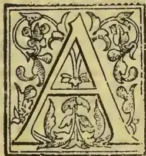

ALTHOUGH the question opened by "Student's" query in your last issue (page 231) would demand a special article dealing completely with the absorption of nitrogen by plants, a short note may be of some service.

Briefly stated, plants have access to nitrogen in two conditions—*i.e.* (1) As free uncombined nitrogen in the air; (2) In a combined state (as salts of ammonium, nitrates and organic compounds in the soil). A very large number of carefully conducted experiments have shown that the absorption and assimilation of nitrogen in a free state is confined to the lower orders of plants—mainly bacteria—and to leguminous plants among higher green vegetation. Wheat, Rye, Buckwheat, cruciferous plants, and many others not belonging to the Leguminosæ, always die of nitrogen starvation when grown in soil containing very little or no nitrogen, although they may be exposed to the air. Moreover, leguminous plants die under these conditions unless their roots are possessed of fleshy "nodules" (well seen on the roots of ordinary Broad Beans). It is from the combined forms that an ordinary green plant—Wheat, for example—obtains all the nitrogen it possesses, and this it takes up means of its root-hairs from the ground.

In the soil the plant has access to nitrogen in (1) complex organic compounds, resulting from partial decay of vegetable or animal remains; (2) ammonium compounds (*e.g.*, ammonium carbonate, sulphate; and also (3) nitrates, chiefly of sodium, potassium, magnesium, and calcium. It was formerly supposed that the ammonium compounds supplied plants with all the nitrogen necessary for growth, but definite experiments have shown that, although many green plants can be nourished by both organic compounds and pure ammonium salts, the results are in every

way inferior to those experiments where the plants are supplied with nitrates to their roots. These facts, coupled with the knowledge that both organic compounds and ammonium compounds soon give rise to nitrates in the soil, lead to the conclusion: that plants absorb or take up their nitrogen from nitrates, and seeing that nitrate of lime is most abundant in the soil it is concluded that this substance is the main source of nitrogen for plants.

"Student's" difficulty lies in the assumption, or statement, that nitrate of lime is taken into the plant as such—that is without any change. If this were true we should, as he remarks, expect to find the lime (neglecting the other bases, potash, soda, and magnesia), and nitrogen in something like the same chemically equivalent proportions as met with in nitrate of lime. This is found not to be the case. There is an excess of nitrogen and a deficiency of lime, as seen in the analysis quoted, and this has led "Student's" query and suggestion that the nitrogen must have been obtained from other sources than nitrates. The latter view has been amply refuted by most careful experiments, and the explanation of the apparent discrepancy is that the nitrate of lime is split up and decomposed at the very threshold of entry into the plant—*i.e.*, in the root-hairs and in the roots which are not included in the analyses given, which soon dry up and remain in the soil. The lime is thus separated and practically left in the soil, while the nitrogen enters into new combination, and helps to build up various more or less complex organic compounds. The ratio of the lime and other bases to the nitrogen in different plants grown even upon the same soil, and thus having equal access to nitrates, varies much.

The details of the chemical changes which nitrogen undergoes after entering the plant and where these changes take place are practically unknown yet. The changes are slow, compared, for example, with those undergone by carbonic dioxide, and difficult to follow. Different kinds of plants, growing with equal access to nitrates in the soil, show very different results as regards their method of taking up and utilising these compounds. In some cases the nitrates can be readily detected as such in all parts of the plant; in others only in the stem, or perhaps only in the root, or in no part at all.—*JOHN PERCIVAL.—Journal of Horticulture.*

323------------------------------------------------

298THE TROPICAL AGRICULTURIST.[Nov. 1, 1895.

## COFFEE PRODUCTION IN THE MONTANA OF PERU.

Peru has been known for many years as a coffee-producing country, but the coffee grown on the coast has been absorbed by domestic consumption, and Peru's appearance as an exporter of this article is of recent date, although she is now likely to be a considerable competitor with other countries. Coffee planting began, and coffee is still cultivated near the port of Pacasmayo, with success. But although the cultivation on the coast could be somewhat extended, it must always remain restricted, as there are only certain favoured localities in which the planter can hope for a good return. The acting British Consul at Callao says that the region which Peru offers to the coffee planter unsurpassed in fertility, and almost unlimited in extent, is situated on the eastern slope of the Andes, at a height of from 6,000 to 2,000 feet above sea level, among the network of streams and rivulets that find their way into the great affluents of the Amazon. This region, known as the Montaña, has hitherto been shut off from the world by lack of communications, and, above all, by the difficulty of crossing the high ridge of the Cordillera that bars it from the coast. In spite of these difficulties, coffee has been cultivated both in the south, in the gold-bearing districts of Sandia and Carabaya, and in the centre of Peru in the valleys of Chauchamayo, Vitoc, and Huanuco. It is the Chauchamayo district—for most of the coffee that passes under the name of Vitoc or Huanuco comes from Chauchamayo—which is the real coffee-planting district of Peru, and it is the production of this region that has elevated Peru to the rank of a coffee-exporting country. This is due to the completion of the Central or Oroya Railway, by the Peruvian Corporation, to its present terminus at Oroya, giving railway carriage over the crest of the Cordillera, and also to the opening up of the Perené and adjacent valleys which form its prolongation. Oroya is about 60 miles from Chauchamayo valley, and there is a fair road all the way, passing through the town of Tarma, the capital of a department with about 7,000 inhabitants. The Chauchamayo Valley, itself about 10 miles long, is now in the hands of private owners, but the rich and far more extensive valleys beyond it of the Perené, Paucartambo, and Rio Colorado, have now been linked on to La Merced the last town in Chauchamayo by the extension of the Tarma-Chauchamayo road through a short but difficult defile. The output of coffee for the whole region was about 1,500 tons in 1893, but extensive planting has lately taken place and production will shortly, it is said, be trebled. It is considered that coffee can be grown at the expense of 5 Peruvian soles (sole=2s.) per quintal, or 100 lb., the yield of a tree after the third year being about 3 lb. The average cost of clearing may be taken at 65 soles (£6 10s.) a hectare, or £2 12s. an acre. The number of plants that can be planted with advantage on a hectare (2.47 acres) is about 1,700 to 1,800, or, say, 700 to the acre, although a larger number is often put into the ground. Young plants can be obtained for 10s. per 1,000.—*Journal of the Society of Arts.*

## TAPPING RUBBER TREES.

Mr. D. P. Copeland, Deputy Conservator of Forests, Assam, gives the following report on the methods of tapping rubber trees adopted in Assam, and of collecting and preparing the rubber for the market:—

*The mode of extracting rubber as practised by Mr. Martin of Tezpur.*—Small funnel-shaped cane or bamboo baskets were prepared and coated with caoutchouc, after which the baskets were attached to the tree under the incision. The incision or cut was made diagonally and elliptical in shape, being about 3 inches across the centre and from 6 inches to a foot in length. Sometimes the cuts were made like an arrow head, thus V, the baskets being nailed with a bamboo nail just below the point. These baskets, when full, were emptied into cane receptacles coated with caoutchouc, and thus conveyed to the factory

where the milk was poured into large wooden boxes or bins 6 feet square, and partly filled with water, the caoutchouc, after a time floating on the top. The caoutchouc (being still fluid) was then taken out and boiled over a slow fire on iron pans, which are still lying in Tezpur, 4 to 6 feet in diameter and 2 to 2½ feet deep, two parts of water being added to the caoutchouc, and the whole stirred constantly. As soon as the rubber congealed into a mass, it was taken out with iron forks and pressed, and again boiled and pressed, and then dried in the sun, and finally washed over with lime. The rubber thus prepared was shipped direct to the London market.

*The Assamese and Nepalese mode of extracting rubber is as follows:*—The men begin from the top of the tree working downwards, making incision with their *daos* or *khukris* from 6 inches to a foot long and about 4 inches wide along the stem of the tree. The milk collects in these cuts, and also runs down the stems, some of the overflow falling to the ground. After four or five days, the rubber thus cut is dry, and can be pulled up very easily; it is then either wound round into balls or left loose. The ball rubber fetches a smaller price than the loose rubber, as very often a stone or other impurity is hidden inside the ball to add to the weight. The tappers try and get rid of their rubber as soon after collecting as possible, as it loses in weight by drying. The traders get over this difficulty by keeping it in water in barrels and wetting it well before shipping. The rubber undergoes no preparation in Assam, and is shipped to the Calcutta market in the same state as it is received from the forests, except, of course, the wetting with water already mentioned. I am informed that a machine has been put up at Margherita in the Lakhimpur division for cleaning rubber before shipping; but as I have only heard of the process, I cannot describe it. The most favourable time for tapping is from November till April, the dry-weather months. During the rainy season from May till October, the richness of the juice diminishes. From that time till January the rain diminishes, and the milk increases in richness.

While on the subject, I beg to describe a third mode of tapping rubber which has been the cause of the total destruction of our indigenous rubber forests in Assam; this system crept in gradually, and not having been suppressed with a strong hand, has left us ruined and killed out the rubber trees. I mean root-tapping. The Assamese, being too lazy to climb, were probably the first to find out that by tapping or cutting the root, of the tree along the ground much more rubber could be got and with far less trouble. I maintain, and can prove it, that stem-tapping, however severe it may be, unless it amounts to down-right girdling the stem, cannot kill out or permanently ruin the tree; but root-tapping, as practised in Assam, kills out the tree at once. The roots of the tree are followed up for 40 or 50 feet along the ground, and every yard or so a hole is dug, and the root is cut clean through with an axe, a few large leaves being placed over the hole to prevent rain or due wetting the rubber; a week later the rubber is removed from the hole, being found in slabs from half a pound to six pounds in weight. Stem-tapping cannot be done during the wet weather, as the rain would wash off the caoutchouc from the cuts; but root-tapping with a little care, provided the trees are growing above flood-level, can be done the whole year round.—*Madras Mail.*

## DIMINISHING MARGINS IN AGRICULTURE.

Where nature is prodigal, man is wasteful. Waste has been the rule in American agriculture. Accumulated mold of ages of vegetation was offered at \$1.25 per acre. Afterwards it was given away, subject to official fees for perfecting a title, both to natives and immigrants. With land free to all there was prodigality of fertility and economy of labor.

Thus in primitive agriculture, rotation, cultivation diversification were all sacrificed, and fertility was

324------------------------------------------------

Nov. 1, 1895.]THE TROPICAL AGRICULTURIST.299

transmitted into net cash. Because wheat could be grown without cultivation on the broken sod, and because it was always a cash crop, little else was grown; and because there was so much of it, and so few farm animals, the straw, which is worth as much in England as the whole crop is here, was burned to get rid of it; and because of this repeating of a crop without cultivation, weeds much more than loss of fertility reduced the rate of yield; until at last, because of extension of wheat area beyond the needs of consumption, price was reduced and profits destroyed. Thus nature, which can not be trifled with safely, has been avenged, and the wheat grower is muddled in trying to lay the blame upon the currency the tariff, or anything rather than his own uneconomical and wasteful practice.

The same abandon attended early efforts in animal industry. Unimproved breeds were kept four years or more, on lush grass in summer, in the lee of a haystack in winter, fattening at one season and existing at another, favouring the production of fat and lean, in layers, to be sold at low prices to unsatisfied consumers. The first butter dairies—for instance, Pratt's in New York—required forty pounds of milk to make one pound of butter. He, by selection and care, reduced the requirement almost one half, and now some Jerseys produce a pound of butter for thirteen pounds of milk. The "hogging down" of corn in feeding cattle and hogs was another wasteful procedure in primitive farming.

It was the same with cotton. The seed was wasted, or only used for manure. Sometimes stock was killed by being gorged over a pile of seed, but systematic feeding was unknown. Now forty million of dollars, more or less, represent the oil of the seed, which was wasted if applied to the soil, and almost as much more should be got from feeding the cake, with incidental foods to constitute a suitable ration, and costing almost nothing. In this way all the valuable elements of the seed are returned to the soil, with additional manurial value of other feeding material. Pork, if not beef, can be produced in the mild climate of the south with cotton seed cake, cow peas, and other fall and winter growing forage plants, even cheaper than the central west.

In wooded sections the first and largest opportunity for waste was found in the wanton destruction of wood and timber, and it was improved until large areas have become deserts. In every rural industry, exploration has been depletion and destruction. When flax became an auxiliary or successor to wheat, a million of acres went into cultivation for seed, and the straw was thrown away, though coarse fibre worth a hundred dollars per ton has been made of the straw as it lies from the mower; while, by a slight change of method of culture and treatment, as is done in Europe, far more valuable fibre can be produced. Flax-growers will say it cannot be done because they do not know how and will not learn, but it has been done and is done successfully and uniformly in other flax-growing countries.

Reduction in prices and competition in production are lowering the margin of profit more or less, though not equally or by regular gradation year by year. The most careless are pinched fearfully, the more systematic only feel the tightening pressure of reduction, while the most skillful and scientific still find a reasonable profit in agriculture. It is well that these wastes in their primitive recklessness are no longer possible. The richest soil in the world never made an increasing yield, or retained a permanent fertility until higher values of land and greater cost of production compelled economy and improved methods. England once made smaller yields than the United States upon soils naturally less fertile. Now its average grain yield is more than double that of this country.

Thus there are compensations in reduced profit in agriculture. It is a spur to improvement, to the education of the farmer, more potent than any he has yet felt, and it is all the more valuable because its rewards go to the energetic and mentally alert, while the laggards fall behind in the race, and the slothful vegetate.—(J. R. Dodge, in *Prairie Farmer*)

## THE COFFEE, CACAO, KOLA, &C. INDUSTRY IN JAMAICA.

### A PRACTICAL PROPOSAL.

The Secretary read the report of the Committee appointed by the Board on Coffee, Kola, Chocolate and Pimento, which was as follows:—"The Committee reports that it has met and considered the matter referred to it and now submits the following *ad interim* report:—"

Our remarks on coffee do not apply to the district of Port Royal Mountains, where the cultivation and curing of coffee is well understood and also the advantage of selling coffee in the cherry.

1. The general mode of "planting" coffee by the peasantry is as follows:—The land is cleared and burnt off; plants or "suckers" of from three to four feet high (which have been roughly uprooted) often having berries on them sometimes with diseased roots, are procured and frequently left to quail for a day or two before being replanted. As soon as the rains set in these suckers are planted among "ground provisions" without regard to regularity or distance from each other. After the "provisions" have been reaped the young coffee is often neglected and consequently when the trees arrive at maturity the yield is poor. In most cases too many large fruit trees are allowed to grow and overshadow the plants, thus depriving them of sufficient light and air;—again there is little or no attention paid to the invaluable practice of pruning, forking, &c., which is not yet understood by the peasantry.

Some years ago when the market price of coffee fell very low; in a great many instances the peasantry actually abandoned their cultivations.

2. The reasons generally given why so much apparently available land in close proximity to the dwellings of the peasantry is allowed to remain uncultivated, are, first, because the land has become impoverished by previous crops and is being left to nature to be resuscitated. Second, because they prefer to hold their own land in reserve against the time when they may not be able to rent land, and often the soil is unsuitable for coffee, such as clay.

3. The yield of coffee may be increased by better cultivation, proper pruning, and the use of manures. Cultivation and pruning are well understood by experts, but our people need to be instructed with regard to them, this we think may gradually be done by leaflets, lectures and demonstrations.

4. To practically demonstrate to our people the value of improved methods of cultivation such as planting, draining, forking, manuring, pruning, &c., it is advisable that the President's suggestion be carried out and "model grounds" be established in certain districts at the expense of the society, and we recommend that Mr. H. Cork's offer in Upper Clarendon for experimental purposes be accepted and that the Secretary in the first place be requested to visit the spot and arrange matters.

5. The inferior quality of coffee produced by the small settlers is due chiefly to the manner in which the article is prepared for the market. The primitive style (in most cases) of curing the coffee on the bare earth and in wet seasons actually resorting to the use of iron pots as a dryer, must affect the quality. Added to this the evil resulting from the reckless manner in which this article is purchased by the runner or buyer, without regard to quality certainly does not tend to improve matters. In our opinion therefore the best remedy on the state of affairs is the establishment of Central Factories for the purchase of coffee in the cherry and the proper curing by a good set of works. The advantages to be gained by these central factories should be brought to the notice of our people by leaflets and lectures.

6. We have carefully considered the subject brought to the notice of the Board of Management by the Colonial Secretary from a letter from the Collector of Taxes, for Manchester, calling attention to the poverty of the peasantry owing to the impoverishment of land in that parish, and as far as

325------------------------------------------------

300THE TROPICAL AGRICULTURIST.[Nov. 1, 1895.

our investigations have gone we are of opinion that assuring the existence of the state of things represented the cause and possibly a remedy may be found in the foregoing remarks.

7. We recommend the distribution of the leaflet on Cocoa published in July by the Director of Public Gardens, a large number of which have been placed at the disposal of the Secretary.

A leaflet on Kola is also being prepared which can be dealt with in the same manner.

8. The Curator of the Museum having taken up the matter of Pimento, the committee will not deal with it.

Mr. Burke moved the adoption of the report and said that it showed that the committee were doing their work well. They could not do too much for the cultivation of coffee, as recently he saw that the exportations of the article had greatly decreased, and the Society should press upon the peasants the necessity for new and improved methods.

The Chairman said he was planting about 60 acres of Liberian coffee in St. Catherine, and he would be glad to give the Secretary samples in order to supply the peasantry with them.

A resolution was passed approving of and giving effect to the recommendations of the Committee.

Mr. Burke called attention to the enormous waste of everything that could be used for manure in the Island. If some material were obtained and thrown in and the compost allowed to rot, a first rate manure would be got. The peasantry should be told that what they would thus put into manure would be returned to them from the land.—*Jamaica Agricultural Society*.

### WATERING.

There is probably no one operation in the whole routine of gardening that is more thoughtlessly carried on than that of watering. The individual requirements of particular plants are little thought of, and "watering" is administered indiscriminately to each and all alike. Where there is a mixed collection to be dealt with, the difficulties in adjusting the supply to the needs of the individual are, no doubt, great, but in market establishments, where large quantities of one plant are grown, and where a house or houses are set apart for the exclusive cultivation of some particular subjects, the difficulties are materially lessened, though not overcome. In any case it is most important to gain a knowledge of the principles which govern the relations between the growing plant, the amount of water it receives, and the period at which it receives the supply.

That a plant needs water, suffers if it gets too little or too much, that it requires more at one time than at another, and that different plants vary in their requirements according to their conformation and structure, and the circumstances under which they are growing—all this, of course, is well known, though in practice it is often not remembered or acted on.

Again, the influence of excess or deficiency of water may affect not only the individual plant, but may determine variations in the productiveness of the plant, and induce variations in the number, size and vigour of the seed and its contained embryo. In reference to these matters, the *Revue Scientifique* for July 6 publishes a report of a thesis prepared by M. Edmond Gain, and presented to the Paris Faculty of Science. The general character of this thesis may be gleaned from what has already been said, but it may be of interest to add a brief summary of the conclusions at which M. Gain, a well-known author on agricultural chemistry, has arrived, as they are of great practical importance. There is, says M. Gain, an alternation in the requirements of plants for water. Continuous deprivation or continuous supply of water are alike contrary to the physiological requirements of plants. In all M. Gain's experiments these plants which were supplied with water at the two critical periods—the commencement of the unfolding of the leaves, the beginning of the flowering period—and at

no other time, did as well as those provided with a continuous supply of water during the whole period of vegetation. Further, the experiments of M. Gain showed that this influence of moisture is not felt equally by all the organs: it has a greater effect on the aerial than on the subterranean organs. The result of this differing influence is shown in the fact that plants grown in dry soil have thicker roots than plants in damp soil, though the stems may be equal in weight. This is in accordance with the well-known fact that plants of very dry countries have frequently roots which are very large in comparison with the weight and height of their aerial parts.

With regard to the influence exercised by the greater or lesser quantity of water on the propagation of the species, the researches of M. Gain have established the two following facts, relating, the former to seeds, the latter to the tubers:—

1st. The humidity of the soil favours and greatly augments the number of fruit and seeds, but drought induces the formation of larger and heavier seeds. On damp soil a plant yields smaller seeds, which consequently, tend to bring about the degeneration of the species.

2nd. The number of the tubers is but little influenced by the variation in the retentive powers of the soil for water, but on damp soil the plant yields larger tubers. There is then an increase in weight; the poorness of these tubers is, however, not much marked, and they are consequently less perfect than those which have been submitted, in the heart, to relative dryness.

It may be repeated that moisture perceptibly increases the immediate yield, but tends to the formation of imperfect reproductive organs, which produce less vigorous plants. This is to the advantage of the individual, but to the detriment of the conservation of the species. The practical inferences are obvious.—*Gardeners' Chronicle*.

### IMPROVED PLANTING.

THE IMPORTANCE OF LARGE PITS.—To begin with the very important work of pitting.—What is the object of providing pits for young plants? Why not simply dibble them in anyhow? Simply because the tender young rootlets must have a free loose soil to enter on all sides, or the growth of the plant will be checked and its vitality impaired. This being so, is the size of the pits usually dug sufficient for this purpose or not? Who has not remarked the check young plants receive at that period of their growth when the rootlets have reached the hard sides of the pits and are too weak to enter the hard soil beyond. By the nature of things this check occurs at a very critical moment of their existence and has a lot to say to the prevalence of "failures." The pits usually dug, on the Nilgiris at any rate, and I believe in the other districts also, are so-called 18" cube circular holes. As a matter of fact the real size seldom exceeds 15", which is far short of the actual requirements of the plants.

PITS 3x2x2 JUST AS CHEAP AS 2' CUBE.—At first I made my pits 2' cube: now, as I find it entails no extra cost, I make them 3x2x2 deep. The seeming puzzle about the cost lies in the fact that in the latter pits the coolie is able to use a basket to remove the earth, while in the former he cannot. Perhaps the most uniformly successful of the older Nilgiri estates is Hillgrove, which was planted up many years ago by Mr. Riley in large 2ft and sometimes 3ft. pits, particular care being taken to remove all stones from the pits. Hillgrove is, I believe, the only estate in the district which has been planted up in this manner.

STIR UP YOUR SOIL.—As a class we planters seem to be now more appreciative of the value of what farmers at home call "tilth," and of the aeration of the soil. As it is difficult, though not impossible, to do very much without serious injury to the large roots on an old plantation, let us do all in our power at the start. What is the best model to copy from? I won't take my readers further

326------------------------------------------------

Nov. 1, 1895.]THE TROPICAL AGRICULTURIST.301

than the nursery from which the young plants were taken. Why not try and obtain as nearly as possible the same results on the estate, though of course by different methods.

**EXCELLENCE OF LARGE RENOVATION PITS.**—The nearest approach I can recommend is the digging over the whole area—when the estate is first planted—with large renovation pits, commencing with every other row. Fork them a full fork's depth at the bottom, leave them open for 2–3 months, and fill them up again with the same soil. When a block is finished, pit again over the alternate rows. Thus every four plants have a pit in their centre.

Almost every square foot of the land is thus dug up in time, say in the first three years from date of planting. This gives the young coffee roots from the very first a free access to the greater proportion of the soil. The ground is well aerated and its physical condition improved. The stones of food in the ground can be easily tapped, being rendered more soluble by the free access to the soil of air and rain, saving the cost of heavy manuring. Being porous, the soil absorbs every shower in the dry weather and drains off the excess in the monsoons readily through the subsoil. In droughts the coffee-roots can obtain the moisture required well below the surface, and in the wettest of weather are not troubled by any excess. It is clear that in all ways the estate with a cultivated depth of 3 feet (for this is what the above system comes to) has an immense advantage of those estates which have their soil only partially stirred up to the depth of 15 inches or less.

**RESULTS OF CAREFUL CLEARING.**—There is another point I have not yet touched on, and yet in the example before me, i.e., the nursery, it is a most important one,—I mean the careful removal of all roots and stones which would prevent the free growth of the tender rootlets. On estates the presence of stumps and large stones has yet another evil: it renders cultivation appreciably more expensive and a great deal less efficient. Were the surface of an estate quite clean and friable, it would be possible to do a great deal more in the way of adding fertility to the soil than is now dreamed of. For one thing huge amounts of fodder for cattle might be grown after the plants have reached their fourth or fifth year and borne their first good crop, any excess being preserved in the shape of hay, or better still, ensilage. As this would all go back as manure, the result would be a gain and not a loss. If the cultivation were carefully managed, the plants would suffer very little, and were the crop a leguminous one, the roots left in the soil would greatly enrich it in nitrogen. Instead of taking it off the land, it might be cut and dug in, or buried in pits. The change in the nature of the soil in green-manuring the estate would be simply marvellous. The effect of the humus would be far-reaching and, unlike cattle-manure, would furnish plant-food for a number of years before becoming exhausted. Some will scout at all this. Let me ask these wherein then lies the value of virgin forest and jungle soil?

**THE VANITY OF LARGE AREAS.**—None of these things can be done of course without some extra expense. It costs more, no doubt, *at first*, to plant up an estate carefully and thoroughly than to stumble along in the old ruts of routine. In opening up large areas, the question of first cost assumes very large proportions, but I hold that the rage for large areas has done us planters more harm than any known plant-disease or low prices. As the general rule seems to be that the larger the area, the less money ought to be spent in proportion, I hold that it is practically impossible to cultivate a large estate as well as a small one. The greed for opening land and the desire to be counted among the "large proprietors" has done an infinity of mischief. The vanity extends so far that I verily believe there are men who would rather own a third share in a three-hundred acre estate than be the sole owner of a compact 100 acre block, giving perhaps 200% more income. It has been said that a man is deserving of honour who causes

two blades of grass to spring where only one grew formerly. The burden of my remarks is that if a man is content with half the usual area, he can obtain quite double the usual yield. This, too, with a cost per acre but slightly higher than usual. There are numerous instances proving the truth of my contention to be found in every district, I believe, in South India. If this be so, what in the wide world can be called that twist of mind which compels men to open out in so many cases more than twice the land they can properly cultivate?

In agriculture all the world over the same thing is going on. In America they call it "intensive" versus "extensive" farming. Let us planters rank ourselves then among the intensive lot, and we may laugh at the mishaps which yearly befall the ill-regulated but arrogant extensives.—*Planting Opinion*.

## A PRIMITIVE TOBACCO FACTORY.

China is nothing unless she is primitive, and although the factory which forms the subject of these remarks is not exactly situated in Chinese territory, as it is in the Portuguese settlement of Macao, it is, to all intents and purposes, a Chinese factory, for it is owned and worked by Chinese. The premises comprise several large sheds with earthen floors, and one or two better built rooms, used as storehouses. The factory gives employment to several hundred Chinese men and women. I was accompanied on my visit by Mr. A. A. Pettigrew, a son of Mr. Pettigrew, of Cardiff Castle, who is at present (May) on a tour in the East. The tobacco is not grown at Macao, but at a place called Hokshan, about forty or fifty miles to the north-west of the former town, on one of the numerous mouths of the Sikiang, or Canton River. When the plants are properly dry, they are done up into bales about 2½ feet long, 2 feet wide, and 1 foot deep, and sent down to Macao in junks. On arrival at Macao, these bales are stored in the premises of the factory until such time as they are required for the manufacture of tobacco.

The first room we entered was devoted to stripping the leaves from the stalks, these being discarded in the manufacture. Women, sitting on the floor on their haunches, were busily engaged in this operation when we entered. The sight of us did not distract the women's attention, but several young children who were present on our arrival, scampered away to distant corners like mice into a hole. The dust from the tobacco leaves got into our noses and throats, and caused us to sneeze and cough, much to the delight of our celestial onlookers, as evidenced by the loud outburst of laughter which followed our discomfiture. Strange to say, we did not hear a sneeze or a cough from any of the Chinese whilst we were in the factory. After the leaves have been stripped from the stalks, they are carried into one of the sheds in large bamboo baskets by men, then spread on a wooden floor and damped with water. When sufficiently damp, they are made up into layers about 2½ feet long, 2 feet wide, and 2½ inches thick, and placed on boards. The next process is to make each layer into a solid cake. This is done in the following way:—About a dozen layers, with a board 1½ inch thick between each layer, are placed on the top of one another, and then pressure is brought to bear upon the whole lot by means of a lever of the second order, in the shape of a thick pole. One end of the lever is fixed firmly with strong ropes, and this constitutes the fulcrum; the weight of the resisting substance is the tobacco, and the power is applied at the other end of the lever by means of stout ropes, which pass round a wooden axle that is securely fastened to the ground.

When the tobacco leaves have been properly pressed, the cakes are taken out and cut crosswise into strips 4 inches wide, and the two ends cut off, as they are not sufficiently pressed. The next step is to tie half-a-dozen of these strips together by means of ropes. The next operation is to make the tobacco ready for use. This is done by means

327------------------------------------------------

302THE TROPICAL AGRICULTURIST.[Nov. 1, 1895.

of a plane, very similar in shape to an English carpenter's plane. The strips of tobacco are stood up on end on the ground, and kept in position by boards made for the purpose. As the strips are only about  $1\frac{1}{2}$  foot high, the men have to work the plane in a half-stopping position, a most uncomfortable way of working from an Englishman's point of view. However, the Chinese do not appear to mind it, as they work away contentedly from morning to night. The shavings of the tobacco leaves are the tobacco ready for smoking. Every man puts his shavings, as he takes them from the plane, into small heaps, weighing about a pound each, enclosing at the same time a ticket with the name of the firm on it in the centre of each heap. These small heaps are then put into papers, the two ends of the papers being left open. The packets are then weighed, and a little more tobacco is added or taken away according to whether the packet is too light or too heavy. When the packets are of the proper weight they are put into another paper, both ends closed up, and then packed in boxes ready to be sent away. There is a good deal of order in the way in which the factory is worked. Women are only employed in stripping off the leaves from the stalks, men do all the rest of the work. There is one lot for dampening and pressing the leaves, and another batch for cutting the pressed cakes into strips and tying them up ready for planing. The planers only make the tobacco and put it into heaps, a separate lot of men put it into the first papers ready for weighing. The men who weigh the tobacco pass it on to others, who put it into the second paper, and these finally hand it to the packers. The tobacco is of a dark brown colour, and is only used, so far as I know, by the Chinese. It has the reputation amongst them of being a particularly good brand, and the factory is said to be one of the largest in South China. It was very amusing to see the workers at 12 o'clock, as this is the time they take their mid-day meal. As soon as the clock struck twelve, everything stopped as if by machinery. In less than five minutes tables were produced from unlooked-for corners, basins of rice and other foods were placed upon them, and the men were busily engaged in emptying them by the aid of chopsticks. All the workmen took this meal in the same place as they had previously been working in.—W. T. Turcher, Botanic Garden, Hong Ko g.—*Gardeners' Chronicle*.

### VANILLAS OF COMMERCE.

The following historical and descriptive account of the species yielding aromatic fruits, more or less used in commerce, has been prepared by Mr. R. A. Rolfe, A.L.S., Assistant in the Kew Herbarium.

From historical accounts we learn that vanilla was used by the Aztecs of Mexico as an ingredient in the manufacture of chocolate prior to the discovery of America by the Spaniards, who adopted its use, and Morren states that it was brought to Europe as a perfume about the year 1510 at the same time as indigo, cochineal, and cacao, and ten years before the arrival of tobacco.

The earliest botanical notice of the vanilla is by Clusius, in his *Herbocorum Libri Decem*, published in 16105. This author had received fruits from Morgan, apothecary to Queen Elizabeth in 1602, which he described as "Lobus oblongus aromaticus" (p. 72), without being aware of their native country or use. He describes them as 6 to 8 inches long by half an inch broad, and terete, from which it is evident that they belonged to the true Mexican *Vanilla* (*V. planifolia*).

In 1651 a figure was given by Hernandez in his *Nova Plantarum Mexicanorum Historia* (p. 38), under the name of *Araco aromatico*, which shows both the characteristic growth and fruits of the plant, the flowers not being represented. The original of this figure was one of a series of 1200 executed at great cost in Mexico, by order of the King of Spain, during the previous century. Hernandez only mentions its use as a drug and gives its native name as "Tilxoshitl."

Piso in his *Mantissa Aromatica*, published in 1658, appears to have first put the name *Vaynil'a* on record, and also its use as an ingredient in the manufacture of chocolate (pp. 200, 201). He describes it as the fragrant silica or pod of the *Araco aromatico* of Hernandez, and that it was called *Vaynilla* by the Spaniards, who added it to chocolate, not only on account of its fragrance but because of its medicinal virtues. The name is the diminutive of the Spanish *vaina*, a pod or capsule.

In 1675 Redi figured the pod and seeds, the latter as seen under the microscope (*Experimenta*, p. 179). He called it *Vainiglias*.

Dampier next furnished some important information about the plant. Speaking of the coast of the Bay of Campeachy, South Mexico, under date 1676, he remarks:—"Here are great plenty of Vinellos," (*Joyages*, II., pt. 2., p. 123). And at Bocca-toro, in Costa Rica, which he visited in 1681, he observed:—"There grow on this coast Vinel'oes in great quantity, with much Chocolate is perfumed" (I., p. 38). At a place called Caibocoa in the former locality, Dampier remarks:—"We found a small Indian village, and in it a great quantity of Vinello's drying in the sun. The Vinello is a little Cod full of small black seeds; it is 4 or 5 inches long, about the bigness of the stem of a Tobacco leaf, and when dried much resembling it: so that our Privateers at first have often thrown them away when they took any, wondering why the Spaniards should lay up Tobacco stems. This Cod grows on a small Vine, which climbs about and supports itself by the neighbouring trees: it first bears a yellow Flower, from whence the Cod afterwards proceeds. It is first green, but when ripe it turns yellow; then the Indians (whose manufacture it is, and who sell it cheap to the Spaniards) gather it, and lay it in the sun, which makes it soft; then it changes to a Chestnut colour. Then they frequently press it between their fingers, which makes it flat. If the Indians do anything to them beside, I know not, but I have seen the Spaniards sleek them with Oyl" (I., p. 234). He further remarks that the Vines grow plentifully at Bocca-toro, where he had gathered and tried to cure them but without success, and that he had never met with a Spaniard who could tell him, which led him to think that the Indians had some secret. "Could we have learnt the art of it, several of us would have gone to Bocca-toro yearly, at the dry season and cured them, and freighted our vessel. We there might have had Turtle enough for food and store of Vinello's. . . . They are commonly sold for 3 pence a Cod among the Spaniards in the West Indies, and are sold by the Druggist, for they are much used among Chocolate to perfume it. Some will use them among Tobacco, for it gives it a delicate scent. I never heard of any Vinello's but here in this Country, about Caibocoa and at Bocca-toro" (I., p. 235).

The preceding accounts all clearly refer to the true Mexican *Vanilla* (*V. planifolia*), but in 1796 both Plukenet and Sloane introduce confusion into the records. The former includes the above under his "Vanillia's *Piperis arbori Jamaicaensis innaisceus*" (*Almagest. Bot.*, p. 381), though figuring the true plant (t. 320, fig. 4). The latter, while retaining Clusius' original name, and citing the above references, records it as growing spontaneously in the woods of Jamaica about Aqua-alta (*Cat. Pl. Ins. Jam.*, p. 70). In his *Natural History of Jamaica*, published in 1707, he further observes:—"It is said by several that they grow in this island about Aqua-alta, and that before the felling of timber and clearing ground, they were common in the shady bottoms of the inland parts of this island." (I., p. 180), so that it was evidently included on hearsay evidence, and probably the indigenous *V. inodora* (*V. anaromatica*, Griseb.) was mistaken for *V. planifolia*.

The Mexican Vanilla was, as already observed, introduced to England very early in the seventeenth century. The second volume of Miller's *Gardeners' Dictionary* appears in 1739. There the author remarked that he had some branches of the plant, gathered by Mr. Robert Millar at Campeachy, and

328------------------------------------------------

Nov. 1, 1895.]THE TROPICAL AGRICULTURIST.303

sent between papers by way of sample, and as the stems appeared fresh, though gathered at least four months, he planted them in small pots and plunged them in a hotbed of tanner's bark, where they soon put out leaves and roots. It is probable that they were soon afterwards lost.

Shortly afterwards Catesby gave a good coloured figure of *V. inodora*, including flowers and fruit, but in his remarks completely confounded it with the true economic plant.

Thus three distinct species had become confused together, and these are all included by Linnæus, in his *Species Plantarum*, in 1753, under the name of *Epidendrum Vanilla* (p. 952).

Between 1830 and 1838 Bauer and Lindley's *Illustrations of Orchidaceous Plants* appeared, and we find plates 10 and 11 of the *Genera* devoted to the structure of flowers and fruit of *Vanilla planifolia*, Andr., "drawn by Mr. Bauer in 1807." This is the first evidence of the production of fruit in Europe, and as the drawing was made in the same year as Salisbury's figure appeared, it is practically certain that it was made from the very same plant. How the flower became fertilised is not mentioned, perhaps accidentally or by some insect. Morren suggests that the fruit was drawn from a specimen of commerce, but the colour, the uniformly plump texture, and the fact that it is attached to the rachis, all show the contrary; quite apart from the fact that the vanilla of commerce was then thought to be produced by another species, *V. aromatica*, which even Morren states that he sought for in vain in the gardens of London and its environs, and at Kew, and wrongly supposes it to be the plant cultivated by Miller in 1739. Morren is also wrong in stating that the "*Vanilla planifolia* (?)" of Lindley's Herbarium is "the very same plant drawn in flower by Mr. Francis Bauer," for it came from a Botanic Garden near Moscow, as the ticket "ex horto Goreukensi" proves.

To Professor Charles Morren, of Liège, belongs the credit of first producing fruits in quantity, and of proving that *V. planifolia* was the source of the true vanilla of commerce. By a particular method of treatment adopted he succeeded in obtaining 54 flowers on one plant, and these he fertilised artificially, and obtained the same number of pods. The following year a crop of about 100 pods was obtained from another plant by the same method. His paper, "On the production of Vanilla in Europe," was read before the British Association at Newcastle, in 1838, and published in the following year (*Ann. Nat. Hist.*, ser. 1, III., pp. 1-9). He also succeeded in tracing his plant back to the one which originally flowered in the collection of the Right Hon. C. Greville, and also its introduction to Java, as has been already pointed out. Thus Morren first proved the necessity of artificial fertilisation, and he attributed its not bearing fruit in the East Indies to the absence of the species of insect which doubtless existed in Mexico, and there fertilised the flowers. He also suggested that vanilla might be produced in inter-tropical colonies, and also in European hothouses, by artificial fertilisation. Detiel states that artificial fertilisation was first practised by Neumann, in 1830, in the Jardin des Plantes, but Morren makes no mention of it. In 1845 Blanco described a species of *Vanilla* from the Philippines, which he had received from his friend Azaola under the name of *V. majalensis* (*Fl. Filip.*, ed. 2, p. 593), but it has since been referred to *V. planifolia*, and thus, if the determination is correct, it may have been at some time introduced from Mexico by the Spaniards. Blanco describes the pod as not aromatic, but it may not have been mature when he received it.—*Kew Bulletin*.

#### THE INSECT ENEMY, "ORTHEZIA INSIGNIS."

Dr. Trimen, in his annual report on the Botanical Gardens for 1893, mentioned the occurrence in the Peradeniya Gardens of an insect pest the *Orthezia luscipila*, which had proved rather destructive to the ornamental shrubs there. It afterwards spread to

the *lantana* outside, but Dr. Trimen was of opinion that it was mainly a garden pest, and that it would not spread to estates. Mr. E. E. Green, of Pundaloya, contributed what appears to have been a rather sensational article on the subject to the "*Tropical Agriculturist*" for January last; and it is replied to in the "*Kew Gardens Bulletin*" for June and July, just to hand. Mr. Green stated that the pest has, forunately, as yet shown no taste for either of our two most important products tea and cocoa. Coffee, however, does not share this immunity, for trees of Liberian coffee have been observed to be infested with the insect, and we have no reason to suppose that the Arabian species will be less liable to attack." The insect was first described by Mr. J. W. Douglas—with whose name it is consequently associated—from specimens found in Kew Gardens, where, Mr. Green remarked, "it is now said to be doing an enormous amount of damage in the plant houses. . . . Originating as it does in the Peradeniya Botanical Gardens, there is little doubt that we owe the introduction of this pest to plants received from Kew." The "*Kew Gardens Bulletin*" editor replies that "Mr. Green's statement as to 'the enormous amount of damage in the plant-houses' caused by the insect is very much exaggerated, and I am unable to ascertain the authority on which it is made." The Assistant Curator was also requested to report on the subject, and he states that their Hongkong *Strobilanthes* is not much affected, but species of this plant from India and Ceylon are much subject to *Orthezia*. No appreciable harm is done to the plants, even when badly infested, and it is the least harmful of all the insects parasitical on plants at Kew, where it is "rather a curiosity than a troublesome pest" Some interesting comments follow on the question of the introduction of the pest into Ceylon and we consequently give the two concluding paragraphs of the Assistant Curator's report *en extenso* :—

The dispersion of plant diseases through the interchange of plants is undoubtedly a peril requiring careful precautions. The *Phylloxera* was introduced from England into Switzerland. The Coffee-leaf disease (*Hemileia*) has been conveyed from Ceylon on the one hand to Fiji (with tea seeds), where it practically extinguished the promising coffee industry, and to German East Africa on the other. It has always been a matter of the deepest anxiety lest by any accident it should be introduced through Kew to the New World, where it does not at present exist. It has been no less a matter of anxiety lest the coffee-leaf miner should be introduced into the Old World. Kew extends, undoubtedly, an involuntary hospitality to many strange guests, which come unbidden no one knows whence. The remarkable land Planarian, described by the late Professor Moseley as *Bupalium Kewense*, which is generally to be found in the houses, is a case in point.

It is undoubtedly possible that the *Orthezia* may have reached Ceylon by way of Kew. It is not, however, very probable, and the reverse may just as well have been the case. It exists in the public exhibitions, however, from which plants are not drawn for exportation. The plants in the propagating houses from which distribution is made are kept scrupulously clean, and every precaution is taken to send them out free from taint of any sort or kind.—Local "Times."

#### A CHAT ABOUT JAPAN TEA.

Professor Dr. Max Fesca, went to the Far East country in 1882, for three years, as he thought. He has remained there ever since, but he now thinks it probable he will not return. The Professor has been engaged in geological and agricultural surveying in Japan, and he has, naturally, seen a good deal of tea cultivation. It was concerning this that our representative waited upon Dr. Max Fesca, at the Bristol, this morning, when he found him "ready to communicate."

329------------------------------------------------

304THE TROPICAL AGRICULTURIST.[Nov. 1, 1895.TEA VS. THE MULBERRY.

"The Japanese manufacture green tea almost solely," said the Professor in response to a question. "What is consumed in the country cannot be determined by accurate data; but they export from five to six million *yens* worth per annum, and this may be said to be all green tea, and almost all of it goes to America."

"Can you tell me why the amount exported is not increasing?"

"The mulberry," was the reply, "is already growing along with the tea, and silk culture and manufacture is far more profitable and attractive to the people. They export 16 million *yens* of silk, and this is a minimum estimate. Thus, I think, the export of the green tea will decrease instead of increasing; and that the extension of the mulberry will be preferred. The old famous tea districts will remain; but there will be little new land opened up in tea, and some will be changed in favour of silk production."

THE AGE AND YIELD OF TEA.

"Anything about tea interests us here, Professor; will you tell me what effect age has on the bushes?"

"There are shrubs 150 years old, and though the quantity is less the quality is better than when they were young. That is the rule in good districts where the soil is suitable. The average up to which the heavy yields continue is some 30 years, and then, as I have said, the quality rather improves. There are two seasons for plucking; in the year, the first commencing now, on a little later, with the summer monsoon. In a wet year there would be a third time of plucking; but this would be only inferior tea. Of course, bushes have a rest in the winter; but it is a striking fact that the annual yield per acre in Japan is larger than in Ceylon or Java. I have compared the yields, and so beneficial is the winter rest, apparently, for the subsequent enormous reproduction of leaves, that the months of idleness compared with plucking all the year round, represents no loss at all, but the reverse. The Japanese cut the shrubs one metre high, and only in those districts which in winter have rather much snow are they cut lower. Every year the bushes are pruned into shape."

"CONCERNING MANURING?"

the interrogator remarked.

"Oil cakes, which are expressive out there," replied the Professor, "are used on the most valuable plantations; but in the ordinary way any kind of manure is used, according as it is available. The manuring commences from the beginning, and is not only done annually but several times a year, each bush being manured. On many places it is recognised as a mistake to use forcing manure. It is better, of course, to use a gentle, strengthening kind that will benefit the shrubs themselves, rather than produce an abnormal flush."

THE DECADENCE OF GREEN TEA, AND CEYLON PROSPECTS IN AMERICA.

"I can remember the time," continued our visitor, "when we in Germany drank a good deal of green tea, and it was so in England, too, where you can remember black and green were blended. Now in Japan itself the Europeans mostly drink the black tea from China, which is less strong. The Japanese, who take tea without sugar or milk, drink their own strong beverage, and take it in small cups in consequence. I don't think it is injurious; and I have found it very refreshing, after walking a long distance and going into a tea house by the road side. The price of tea has been going down and down, and this has been disappointing to the producer; besides which, from the value of the total export which I gave you in Mexican dollars, you will see that there must be plenty of room for Ceylon tea in the United States. Japan

cannot by any means supply such increasing demands, though, of course" (in reply to a concluding question) "I am unable to say what Ceylon can do to induce Americans to drink its tea beyond the usual plan of making known what you have to offer, and showing that it is good value for the money. *Prosit.*"

"Thank you, and *bon voyage*, Professor."—Ibid.

VARIOUS PLANTING NOTES.

A NEW PENCIL.—The Blaisdell Paper Pencil Company, Philadelphia, U.S.A., has introduced a kind of pencil, the lead of which is seen, on examination, to be covered with many very narrow trips of paper. The pencil never needs cutting in the ordinary sense of the word, but, to expose more lead, all that is necessary is to make a small slit in the paper near the lead, thus raising a tiny flap. By gently pulling and unwinding this, working towards the point, a spiral of paper is twisted off, and a length of the lead is laid bare. This process can be repeated as required, till the pencil is too short to be used at all, and is less laborious, and is more certain in results than is cutting with a knife. The lead is excellent in quality, and keeps a good point. In appearance this pencil always resembles an ordinary cedar pencil, the "uncut" end of it being covered with red glazed paper, which increases the likeness, and is pleasant to handle.—*Gardeners' Chronicle*.

THE COTTON PLANT is losing its popularity as a "safe investment" in the very heart of the cotton-growing States of America. Time was—some forty years since—such an assertion would have been laughed at. "You cannot do without American cotton" was the article of faith set up by growers and brokers on the other side of the Atlantic; starvation in Lancashire during the cotton famine shook the belief in many minds, and alterations in spinning and weaving machinery brought under subjection cottons of short staple; planters and capitalists took up the cultivation of the plant; and to-day, Lancashire is no longer dominated by New Orleans or New York. But planters in the Southern States kept on; and in the face of a steady fall in prices, opened up all over the world a market for cotton seed, cotton oil, and cotton cake. Of course, the same products can be placed on the market wherever cotton is grown, and capital can be utilized. Should it be desired to learn where cotton is grown at the present time, the intelligence can be had from the "market" columns recording sales in any daily paper any morning in the week. And it has come to pass, that it has been determined to reduce considerably the growth of cotton in America. The result of the special investigation set on foot by the Federal Government's Agricultural Department in 720 Cotton-growing counties in the United States shows that in eighty-eight there will be little or no change in acreage as compared with 1894; five report an increase up to 10 per cent.; two, an increase of from 11 to 20 per cent.; three an increase of from 21 to 30 per cent.; and three an increase of over 30 per cent.; 127 show a decrease of 10 per cent. and less; 250 a decrease of from 11 to 20 per cent.; 158 a decrease of from 21 to 30 per cent.; forty-four a decrease of from 31 to 40 per cent.; seven a decrease of from 41 to 50; and thirty-three a decrease of more than half. This decrease in acreage is not confined to any particular locality, but covers a widespread territory, embracing almost the entire area devoted to Cotton culture. The extraordinary low price of the staple gave rise to the agitation as to the necessity for reducing the acreage in 1895; this resulted in a convention this year, and a rise in prices is hoped for. Doubtless, much may be done in improving the varieties now grown, and so placing on the market the highest class of raw material. Meanwhile, the above noted facts are surely well worth record.—Ibid.

330------------------------------------------------

Nov. 1, 1895.]THE TROPICAL AGRICULTURIST.305

THE PLANTING ENTERPRISE OF CEYLON:  
IN TEA, COFFEE, CACAO, CINCHONA,  
CARDAMOMS AND MINOR PRODUCTS:  
EXTENT OF CULTIVATION UNDER  
EACH PRODUCT IN SEPTEMBER,  
1895. NUMBER OF PLANTATIONS  
AND SUPERINTENDENTS, &c.

TOTAL EXTENT CULTIVATED IN PLANTATIONS 379,182 ACRES.

IN TEA 305,000 ACRES.

No tropical industry—and probably no agricultural enterprise outside the tropics—has had so much care bestowed on the compilation of substantially accurate statistics concerning its position and progress as has the Planting Enterprise of Ceylon in the products above-named, and to a lesser extent in Coconuts, other Palms and Cinnamon. The first Compilation of the kind was made by a Committee of the Planters' Association led by Mr George Wall in 1856. Thirty-nine years ago it was a comparatively easy task to frame a list of the then limited number of plantations in existence, and to sum up a cultivation confined entirely to one product. This was done, as we have said, by the Planters' Association in 1856; but no further attempt was made to collate the acreage in cultivation, for thirteen years afterwards, until 1869, when the present Editor of the *T. A.* first prepared a complete review with this information. Since then at thirteen distinct periods—in 1871, 1873, 1874, 1875, 1877, 1881, 1883, at end of 1885, in the middle of 1888, of 1890, of 1891, of 1893 and now in the latter half of 1895,—the compilation has been carefully made and the position of the Planting Industry accurately gauged, our figures being adopted not only by planters and merchants, but by the Government and Civil Servants as the only available and reliable returns of an Industry which must be regarded as the backbone of the prosperity of the Colony. We have, in fact, at the expense of much time and labour for twenty-six years back, been doing the work which properly appertained to the Agents of the Government, or to a special officer as Statist, and supplying information which in other Colonies and Dependencies, is only to be found in official publications. However, we have had our reward in the intimate acquaintance it has given us with all the phases of the more important industries of the country and in being enabled to follow closely each successive development of new branches of planting and agriculture generally. Especially interesting, although involving far more trouble, has been the work of collating the statistics since a variety of new products has been added to the old staple now so insignificant comparatively; and never perhaps has so much pains been taken as on the present occasion to secure accurate returns of the area planted with the all-important new king, TEA, and with minor Products, although no one can be more conscious than the compiler, of the impossibility of attaining perfect accuracy. Still for all practical purposes we believe, the results derived from our tables, may be taken as reliable statistics from which to gauge the present position of industries, the importance of which as regards the revenue, trade and general well-being of this community, cannot be over-estimated.

Taking first the total extent of the properties included in our Directory, namely 748,017 acres,—there is an increase of 23,212 acres on the return made up at the middle of 1893. This is owing chiefly to some 6,000 acres added to both the Kelani Valley and Matala East, partly through land sales and grants and partly transfers. Then there have been additions through more correct information or private purchases of about 1,000 acres to quite a number of districts, and in other districts additions are due to the revival of old properties for tea, that had fallen out of cultivation and notice. In other directions, more correct returns have slightly increased or reduced the totals for each district.

Turning to the more important figures representing the area now in cultivation with tea, coffee (*Arabica* and *Liberica*), cinchona, cacao, rubber, and the host of new and old products with which experiments are being made in different quarters, we find the grand total to be 379,182 acres, or an increase of 25,947 acres on the middle of 1893. This addition of 26,000 acres may not be considered much for the two years, more especially when it is remembered that over 4,000 acres additional have been brought into cultivation, in the Kelani Valley alone, 3,300 more in the Kalutara district and 1,700 acres in Matala East and Lagalla, in the interval; while Allagalla, Balangoda, Dikoya Lower, Dolosbage, Hewaheta Upper, Kadugannawa, Maskeliya, Matala West, and Udayussellawa, each show about 1,000 acres of cultivated increase. On the other hand, the higher districts, Dimbula and Dikoya, show scarcely any difference in their totals and Nuwara Eliya very little; but there is a distinct extension of cultivation both in Eastern and Western Uva if we take Haputale and Haputale West and the Badulla, Passara, Madulsuma and Monaragala groups together. In respect of old coffee land, a revival has

come in favour of tea. In Maskeliya, a comparatively young district, our cultivated return in 1883 was lower than in 1881 by 2,000 acres, indicating how coffee had then fallen out of esteem there; but all this has now been more than recovered under tea. On the other hand, it is noteworthy that neither in Dimbula nor Dikoya had any land gone out of cultivation—and the same is true of most of the Uva districts which, with the higher and younger divisions, never showed so large an area in cultivation as at present. That the total area under cultivation—after careful checking and verification of the returns—should stand so high as about 380,000 acres (or nearly 600 square miles), notwithstanding the adverse experiences of coffee and cinchona, is matter for surprise and gratulation, and shews how widely tea has been planted and how satisfactory, so far, have been the results.

PLANTERS AND PLANTATIONS.

Considering the efflux of planters from our shores during the period of coffee depression, no one will be astonished to learn that the total number of Superintendents fell from 1,389 in February 1881 and 1,108 at the end of 1883, to 1,079 by December 1885. Since then, however, the turn of the tide has set in steadily; for we had in July 1888 as many as 1,136; increased by June 1890 to 1,211; by August 1891, to 1,258; and in August 1895 to 1,334; while now we have the full number of 1,469 Superintendents and Assistants corresponding to 1,528 estates in cultivation out of a total of 1,962 properties. It is probable that more than 300 European planters left Ceylon in the four years, between 1881 and 1885; but a considerable number afterwards returned, while a very large quota of young men "to learn tea" have been added to the number of Assistant Superintendents. Perhaps we may fairly say that our planting community diminished at the rate of sixty Superintendents or Proprietor-superintendents a year, between 1880 and 1886—and that about 400 or about 45 per annum have since been added of old colonists returned or new men from home. The total now is higher than in the height of our coffee prosperity; although it is noteworthy that the number of separate plantations is not so large in proportion, a fact explained by the aggregation of small properties into one charge under the process which has given us so many Limited Companies among "tea estates."

THE ANALYSIS OF THE CULTIVATED AREA is, however, of more practical importance than the foregoing total results. We must explain the principle on which the returns have been compiled. After giving the matter a fair trial, on a former occasion, we found it quite impossible to work out a suggestion made to us of securing returns from each estate of the number of trees (in thousands) of each product. In respect of all products, save cinchonas, we had to fall back on the old plan of acreage returns, asking for the figures representing each product whether cultivated in fields by itself or interspersed with others. We have thus obtained, as far as possible, the acreage in tea, coffee, cinchona, cacao, cardamoms, &c., planted alone; of tea or coffee intermixed, or planted with cinchona, or cacao or rubber; also of each of the minor products separately; and of tea and cinchona; cacao and rubber, &c. The total results under each head may be seen at a glance from the following:—

(September, 1895.)

<table border="1">
<thead>
<tr>
<th></th>
<th style="text-align: right;">Acres.</th>
</tr>
</thead>
<tbody>
<tr>
<td>Total extent of Tea planted by itself . . . . .</td>
<td style="text-align: right;">296,753</td>
</tr>
<tr>
<td>Do of Coffee (<i>Arabica</i>) cultivated by itself . . . . .</td>
<td style="text-align: right;">15,142</td>
</tr>
<tr>
<td>Do of Coffee (<i>Liberica</i>) . . . . .</td>
<td style="text-align: right;">264</td>
</tr>
<tr>
<td>Do of Cinchona do . . . . .</td>
<td style="text-align: right;">932</td>
</tr>
<tr>
<td colspan="2">(besides 1,714,000 trees partly alone and intermixed),</td>
</tr>
<tr>
<td>Do of Cacao by itself . . . . .</td>
<td style="text-align: right;">13,328</td>
</tr>
<tr>
<td>Do of Coffee and Cinchona interspersed . . . . .</td>
<td style="text-align: right;">1,611</td>
</tr>
<tr>
<td>Do of Coffee and Tea interspersed . . . . .</td>
<td style="text-align: right;">5,038</td>
</tr>
<tr>
<td>Do of Coffee and Cacao do . . . . .</td>
<td style="text-align: right;">5,331</td>
</tr>
<tr>
<td>Do of Tea and Cinchona do . . . . .</td>
<td style="text-align: right;">3,596</td>
</tr>
<tr>
<td>Do of Tea and Cacao do . . . . .</td>
<td style="text-align: right;">448</td>
</tr>
<tr>
<td>Do of Tea and Liberian Coffee do . . . . .</td>
<td style="text-align: right;">146</td>
</tr>
<tr>
<td>Do of Cacao and Liberian Coffee do . . . . .</td>
<td style="text-align: right;">934</td>
</tr>
<tr>
<td>Do of Cardamoms alone . . . . .</td>
<td style="text-align: right;">4,615</td>
</tr>
<tr>
<td>Do of Rubber do . . . . .</td>
<td style="text-align: right;">201</td>
</tr>
<tr>
<td>Do of Tobacco do . . . . .</td>
<td style="text-align: right;">45</td>
</tr>
<tr>
<td>Do of Cotton do . . . . .</td>
<td style="text-align: right;">109</td>
</tr>
<tr>
<td>Do of Other Products and some of the above mixed . . . . .</td>
<td style="text-align: right;">18,385</td>
</tr>
</tbody>
</table>

[Some Cacao and Liberian Coffee are mixed with Annatto, Coconuts and other products.]

To arrive at a fair estimate of the total extent which may be taken to represent each product, we have, in the case of cinchona growing among coffee or tea, taken from one-third to one-fourth the acreage for the cinchona, and credited two-thirds or more to the staple. In the case of coffee and tea, or coffee and cacao, being planted together, we have divided the acreage into two equal parts. Of course this would not be a fair criterion in every case: some planters who may have their 100 acres of tea or coffee interspersed with 20,000 cinchona

39

331------------------------------------------------

306

THE TROPICAL AGRICULTURIST.

[Nov. 1, 1895.

trees will maintain that the tea should still be reckoned at the full 100 acres plus the cinehona. But knowing as we now do by experience that the cinehona, where it matures, does not benefit the other product, but the reverse, it is misleading to count the full acreage of the staple, in addition to a certain extent of new products interspersed. However we have left the figures in the Directory lists and in our tables as returned to us from the estates and agents, to speak for themselves, and it is possible that some may consider that tea and coffee area should be counted in full, even when mixed with cinehona, eacao, or rubber. We have no doubt however, that the majority will agree with us that, analyzing the above figures in the way we have pointed out, and with a moderate estimate for the average number of cinehona trees per acre,

THE POSITION OF THE CEYLON PLANTING ENTERPRISE AT THE MIDDLE OF SEPTEMBER 1895 MAY BE REPRESENTED SOMEWHAT AS FOLLOWS:—

<table border="0">
<thead>
<tr>
<th></th>
<th style="text-align: right;">Aeres.</th>
</tr>
</thead>
<tbody>
<tr>
<td>Total area of 1,962 plantations and planting properties . . . . .</td>
<td style="text-align: right;">748,017</td>
</tr>
<tr>
<td>Do do of 1,528 plantations in cultivation with 1,469 Superintendents and Assistants . . . . .</td>
<td style="text-align: right;">379,182</td>
</tr>
<tr>
<td>Total approximate extent under TEA . . . . .</td>
<td style="text-align: right;">304,419</td>
</tr>
<tr>
<td>Do do COFFEE (<i>Arabica</i>) . . . . .</td>
<td style="text-align: right;">21,634</td>
</tr>
<tr>
<td>Do do COFFEE (<i>Liberica</i>) . . . . .</td>
<td style="text-align: right;">2,804</td>
</tr>
<tr>
<td>Do do CINCHONA [4,483,000 trees over 2 years.] . . . . .</td>
<td></td>
</tr>
<tr>
<td>Do do CACAO . . . . .</td>
<td style="text-align: right;">18,278</td>
</tr>
<tr>
<td>Do do CARDAMOMS . . . . .</td>
<td style="text-align: right;">4,693</td>
</tr>
<tr>
<td>Do do RUBBER . . . . .</td>
<td style="text-align: right;">634</td>
</tr>
<tr>
<td>Do do TOBACCO (on plantation) . . . . .</td>
<td style="text-align: right;">82</td>
</tr>
<tr>
<td>Do do COTTON . . . . .</td>
<td style="text-align: right;">133</td>
</tr>
<tr>
<td>Do do GRASS (Cultivated) . . . . .</td>
<td style="text-align: right;">5,730</td>
</tr>
<tr>
<td>Do do of Anatto, Coea, Vanilla, Pepper, Cloves, Plantains, Citronella grass, Divi-Divi, Croton, Castor-oil, Aloes, Cinnamon, (on the coffee, tea, or eacao plantations) . . . . .</td>
<td style="text-align: right;">7,397</td>
</tr>
<tr>
<td>Of Fuel, Timber and Fruit-trees, Span, Coconuts, Areas, Nutmegs, Kapok (on the tea, coffee or eacao plantations) . . . . .</td>
<td style="text-align: right;">16,000</td>
</tr>
</tbody>
</table>

We have 8,400 fewer acres under Coffee now than in the middle of 1893, and more than 2½ million trees fewer of cinehona. On the other hand we have an increase of nearly 31,500 acres in the staple (Tea) which is of chief interest. The cultivation of Cacao shows an increase of 2,000 acres which is very satisfactory as is also the extent added (366 acres) to Liberian Coffee, while the extent in Cardamoms and minor products has either been stationary or shows a decrease due to the great attention given to tea in the past two years, save in the case of timber and fuel trees of which several thousand acres have been planted in the two years. In giving 305,000 acres as the total area of tea, it must be remembered that certain proportions of clearings planted during the enrrrent south-west monsoon, are included. Nevertheless it is clear that 310,000 acres of tea will shortly be reached, and exceeded, were it only through the supercession of both coffee and cinehona where these are at present intermixed with the staple, in the proportions credited this time to the latter products. We may expect, indeed, to see the 5,038 acres at present credited to tea and coffee, altogether tea, and so with cinehona and tea, so that we are quite prepared to find our once great staple reduced from 272,000 acres (as in 1877) to 20,000 acres by the time we make up another return, unless Mr. E. E. Green shows how green-bug and other enemies can be got rid of, and Liberian Coffee takes the start it deserves; while on the other hand tea will probably be represented by 315,000 acres in full cultivation by the middle of 1896.

In the returns of 1883, the considerable number of plantations with "abandoned" opposite their names, attracted attention: altogether they aggregated 53,540 acres; at the beginning of 1886 the aggregate was 40,000; but in the middle of 1888, the total of 293 "abandoned" properties stood at 69,432 acres; in July 1891 there were entered about 293 "abandoned" properties aggregating 73,262 acres; while in 1893 through more careful returns, the total number was 324 with an area of 74,217 acres. We have now substituted the term "uncultivated" and the total of such estates is 289—or 35 less than in 1893—covering 65,727 acres; but a certain proportion of this extent—probably one-third—must still be considered reserve and untouched forest or chena land.

Of good forest reserves mentioned in many of our district returns, though not in all, the aggregate is about 57,000, but even if we add one-third of the uncultivated, making a total of 85,000 acres, we feel sure this is far below the actual extent of forest land in private hands. How, then, is the difference between the total area of 748,000 acres and the cultivated area of 379,000, namely 369,000 acres to be accounted for? Our estimate would be that of forest land fit for tea, eacao, Liberian coffee or other products, there are counting all reserves and un

opened blocks about 120,000 acres in private hands; that 50,000 acres represents the area of land once cultivated, but abandoned within the last 30 years and now growing up in weeds and lantana, and that the balance of about 200,000 acres may be put down as representing chena and patana (a good deal of both fit for cultivation,—especially in Uva, where patana land is turning out so well in tea—should prices of produce keep up) besides swamps and other utterly waste portions.

WEATHER FALLACIES.

The weather and aught connected therewith, it is almost a truism to say, is of universal interest. And yet Meteorology has not attained the dignity of an exact science; all science is the result of experience, and scientific laws are generalisations deduced from an observation of natural phenomena and of concrete facts. That being so, Meteorology ought to have outdistanced all other branches of scientific inquiry in respect of the sum of systematised knowledge. For have not the data been apparent to man ever since he set foot on this planet, ever-present to his senses, moulding his character and determining his prosperity and comfort, more so than all other external surroundings? And what is the result? In a prominent position in the columns of our newspapers we have printed "weather forecasts," issued officially, which, like dreams usually go by "contraries" not to speak of a host of persons who style themselves "weather prophets." That is all. Hesiod, it is on record, was among the first who presumed to dogmatize upon the weather. He and his successors have much to answer for. Sunday school pic-nics, garden-parties, and out-door gatherings are postponed in consequence of predictions which usually come to pass not on the day named by the "prophet" but on that on which such events actually take place. Then the "prophet" is reviled and the Sunday school teachers make remarks which it is not advisable their pupils should hear. But people follow his counsel next year, all the same and should the "prophet" prove correct, as he cannot fail to do if he goes on long enough, the fact is advertised, his fame blazoned forth and his reputation established for another period of years. After all the "prophet" is but the quack of the Meteorological profession. The regular professors have done and are doing a great work in systematising the results of world-wide observation. And it is not of them we would speak flippantly. Some day, perhaps we shall be able to forecast with certainty what the atmospheric conditions will be. Man has now got the heels of the weather. Approaching storms, thanks to an international system of Meteorological stations connected by telegraph, are duly heralded and timely warning given. But still that nebulous personage, the Clerk of the Weather goes on in the same inscrutable, and, apparently haphazard fashion scattering his favours here and his buffets there without regard to the convenience of mortals. While in the East he may delay the monsoon, thereby giving old-stagers, periodical opportunity for declaring that the existing state of matters is "unprecedented," it is in Britain, particularly in the northern portion, that his vagaries may be seen to most advantage. There he often adds insult to injury, for a man certainly does look foolish and feels in no enviable frame of mind when, attired in winter garments, the temperature rises to "summer heat." The situation is scarcely less trying when after one has donned a summer suit there are suspicions of snow in the atmosphere!

332------------------------------------------------

Nov. 1, 1895.]THE TROPICAL AGRICULTURIST.307

These contradictions notwithstanding, men have seized upon certain phenomena as weather signs and it is with exposing these fallacies that the President of the Meteorological Society in his latest address—chiefly deals. The President of the Royal Meteorological Society candidly admits that research shows “how little we have ourselves advanced in some matters since the time of Hesiod, Theophrastus and Aratus.” In early times men, then as now, foretold what they desired, the wish being father to the prophecy and put down for a universal law that which was only a coincidence of totally independent events.

Mr. Inwards has no regard for St. Swithin, at least as far as the weather is concerned. According to him the saint has no more to do with the dryness or humidity of the season than has the sphinx. It is not always pleasant to be disillusioned even in the interests of truth and before Mr. Inwards' criticisms many will feel cherished ideas go by the board. There are, says he:—

“Forty weather saints, among the most prominent of whom is undoubtedly St. Swithin, whose day is July 15, and the superstition is that if it should rain on that day it will rain for forty days after. .... This date is very near a well-known bad time in wet years, as the terms, long in use, of “St. Margaret's flood” and “Lammass flood” abundantly testify. The fact that some of these heavy rains began on July 15 has been enough material for the adage-monger, and so we have another “universal” law laid down, a law which is, however, constantly broken, as every student of the weather very well knows. The whole thing is a fallacy of the most vulgar kind, and ought speedily to be forgotten, together with all the adages which make the weather of any period depend on that of a distant day.”

Regarding the attempts which have been made to connect atmospheric changes with the movements and position of the heavenly bodies Mr. Inwards shows that nothing has been proved to show that meteorological conditions depend in any way upon such factors. In this connection he quotes an interesting letter from Herschel dated Feb. 6th, 1814:—

“I am glad of an opportunity to say that prognostications of the weather are so much *above the knowledge* of astronomers that I have taken unknown pains publicly to contradict reports of predictions that have been ascribed to me. You may therefore be assured that what you have heard as my opinion about the frost is without the smallest foundation.”

The moon, according to Lord Byron, is responsible for many things, but Mr. Inwards acquits her of any complicity in affecting the weather:—

“Even the halo round the moon has been discredited, for Mr. Lowe found that it was as often followed by fine weather as by rain, and Messrs. Marriott and Abercromby found that the lunar halo immediately preceded rain in 34 cases out of 61.”

Coming down to earth the worker deals with the fallacies connected with the behaviour of plants and animals. He says:—

“Mr. E. J. Lowe, F.R.S., has endeavoured to put some of the rules from this source to the test of definite observation. He took a number of well-known signs said to indicate change and carefully noted what happened after each sign, and although he does not say that all indications from animals, birds and plants are useless, yet certainly those he did investigate seemed utterly to break down. He took the well-known signs of bats flying about in the evening, many toads appearing at sunset, many snails about, fish rising much in lake, bees busy, many locusts, cattle restless, land-rails clamorous, flies and gnats troublesome, many insects, crows congregating and clamorous, spider-webs thickly woven on the grass, spiders hanging on their webs in the evening, and ducks and geese making more than usual noise. Mr. Lowe found that in 361 observations of the above signs, they were followed 213 times by fine, and only 148 times by wet weather; so

that even after the prognostications for rain, there was a greater preponderance of fine weather. He called a day fine when no rain was measureable in the rain gauge. Mr. Lowe says that even swallows flying low cannot be depended on, as, especially at the close of summer and autumn, they almost invariably skim the surface of the ground, and Mr. Charles Waterton, the naturalist, decided, after careful observation, that the unusual clamour of rooks forms no trustworthy sign of rain. These must, therefore, swell the list of fallacies, although there are many other rules which have not been so carefully examined, but which may still be true. My own impression is that although it is painful to dismiss the animals from their ancient position as weather prophets, we may consider them as indicating what they feel, rather than as predicting what is to come, and that their actions before rain simply rise from the dampness, darkness or chilliness preceding wet weather, and which render these creatures uneasy, but not more so than they affect man himself.

As to cows scratching their ears, and goats uttering cries, and many other signs of bad weather, they are at least very doubtful; whilst the adage about the pig which credits him with seeing the wind, carries with it its own condemnation. The medicinal leech is still left on the list of weather prophets, though he has no doubt had his powers exaggerated.

Plants have also their advocates as weather indicators; and there is no doubt that in most cases they act in sympathy with changes in the dampness, gloominess, or chilliness of the air, and as these conditions generally precede rain, one cannot term the indications altogether fallacious. The pimpernel and the marigold close their petals before rain, because the air is getting damper, while the poplar and maple show the under surface of their leaves for a similar reason. Indeed, an artificial leaf of paper may be made to do the same thing, if constructed on the same principle as the natural one—a hard thin paper to represent the upper side of the leaf, and a thicker unsized paper for the lower side; these will, if stuck together, curl up or bend down in sympathy with the hygroscopic condition of the air. A slip of ordinary photographic paper will do the same, and will curl up at once when placed on the hand.

In 1892 attention was directed to a plant, the *Abrus precatorius*, a beautiful shrub of the mimosa kind,\* which has the property of being sensitive in a high degree, so that its pinnate leaflets go through many curious movements, and it was claimed that these form a guide of unerring certainty to foreshow the coming weather. Even earthquakes were said to be predicted by this wonderful plant. If it closed its leaflets upward, after the manner of a butterfly about to settle, fair weather was shown; when the leaflets remained flat, changeable and gloomy weather was indicated; while thunder at various distances was to be foretold by the curling of the leaflets, and the nearer the thunder the greater the curl, until when the points of the leaflets crossed, the thunderstorm was indicated as being overhead. Changes of wind, hurricanes, and other phenomena were to be shown by the various curious and beautiful movements of the leaflets and stalks. These movements undoubtedly took place, but when the plant was submitted to the unprejudiced observation of Dr. F. W. Oliver and Mr. F. E. Weiss, at Kew Gardens, those gentlemen failed to find any connection between these movements and the weather, and Dr. Oliver made a report on the matter, which hits the heart of the whole subject of plant movements, by ascribing them for the most part to the agency of light and moisture. Mr. Scott, of the Meteorological Office, gave the finishing stroke to the theory by proving that the movements had no connection with either cyclones or with earthquakes, so that the sensitive plant may be considered as out of the list of weather guides, in spite of having been made the subject of an English patent.”

The discharge of cannon as a means of producing rain is also discredited and to various other ideas, generally accepted, Mr. Inwards applies

\* Very common in Colombo gardens, with its pretty scarlet and black seeds.—ED. T.A.

333------------------------------------------------

308THE TROPICAL AGRICULTURIST.[Nov. 1, 1895.

the dictum,—‘and this too is fallacy.’ As for those who “prophecy” they are denounced as a generation of false prophets. The paper is destructive, not constructive and when the reader, driven from his strongholds of belief, asks what have we then to reply on, Mr. Inwards says:—

“I would venture to refer him to all the patient work which is being done in various countries, and by which a real Science of Meteorology is being slowly built up, while to the outdoor weather student I would offer this consoling reflection—There is still the sky.”

Some people will say, we ask for bread and these philosophers give us a stone! But this would not be fair; for in the Meteorological returns available even in Ceylon, much may be learned in working out averages, and in noting exceptional seasons as to rainfall, temperature, &c.

## WHAT REMAINS OF COFFEE IN CEYLON:

### HOW THE 22,000 ACRES STILL UNDER CULTIVATION ARE DISTRIBUTED.

#### GOOD NEWS FOR PLANTERS’ FROM HAWAII: “LADY-BIRDS” THERE CLEAR-COFFEE OF BUG &c.

In 1877-78, coffee reached its maximum area of cultivation in Ceylon with the aggregate close on 280,000 acres. Six years later, and no less than 100,000 acres of this extent had either been abandoned or practically superseded by cinchona, tea or other cultivation. Six years later still, in 1890, the area under coffee was returned at no more than 54,000 acres, in 1893 it had sunk to 30,000 acres exclusive of about 2,500 acres under the Liberian variety and now (Sept. 1895) it has gone down to 22,000 acres besides 3,000 acres of Liberian coffee. So great a transformation in agricultural enterprise within a period not much exceeding half-a-generation—as such is reckoned in temperate zones—has surely never been witnessed in the world’s history before.

It is of interest at this time to know over what districts in Ceylon the 22,000 acres that remain of the old staple—coffee *Arabica*—are distributed. North as well as South of Kandy, in districts that were once the stronghold of the coffee bush, scarce an acre now remains! For the Knuckles, Rangala, and Nilambe districts, for instance, no return whatever is made by a single planter,—under coffee the record is absolutely *null*. It is no better in Ambagamuwa, Medamahamuwara and Lower Dikoya; while only a very few acres appear for Kelebokka, Hunasgiriya, Dolosbage, Pussellawa, Ramboda, the Hewahetas, and Kotunale. Dumbara, Hantane, the Matales and Pundaluoya show a little more; but altogether in the Kandy districts proper, between Ramboda and Matale and Dolosbage and Medamahamuwara, once the mainstay of the coffee enterprise, with perhaps 100,000 acres under cultivation, the total under coffee now does not exceed 3,500 acres!

We now come to the three higher districts between Adam’s Peak and Great Western, which could—fifteen to sixteen years ago—show over 80,000 acres cultivated with coffee. Here is the return for the present day:—

<table>
<tbody>
<tr>
<td>Dimbula</td>
<td>2,109</td>
<td>acres</td>
<td>coffee</td>
</tr>
<tr>
<td>Dikoya</td>
<td>1,535</td>
<td>do</td>
<td>do</td>
</tr>
<tr>
<td>Maskeliya</td>
<td>160</td>
<td>do</td>
<td>do</td>
</tr>
<tr>
<td>Total</td>
<td>3,804</td>
<td>do</td>
<td>do</td>
</tr>
</tbody>
</table>

We then come to the Principality—to Uva and its allied districts—in which, for our purpose today, we include Maturata as well as Udapussellawa, and although compared with the maximum return fifteen or even ten years ago, our figures show a woeful decrease—still, it is a matter of satisfaction that so much good coffee remains, especially in Haputale, and still more that in place of every acre superseded, we have full compensation in flourishing tea or cacao. Uva could at one time boast of well-nigh 50,000 acres of coffee. Here is now the record with some extra districts:—

<table>
<tbody>
<tr>
<td>Haputale</td>
<td>6,119</td>
<td>acres</td>
<td>coffee</td>
</tr>
<tr>
<td>Haputale West</td>
<td>507</td>
<td>do</td>
<td>do</td>
</tr>
<tr>
<td>Badulla</td>
<td>2,419</td>
<td>do</td>
<td>do</td>
</tr>
<tr>
<td>Passara</td>
<td>1,222</td>
<td>do</td>
<td>do</td>
</tr>
<tr>
<td>Madulsima and Hewa</td>
<td></td>
<td></td>
<td></td>
</tr>
<tr>
<td>  Eliya</td>
<td>921</td>
<td>do</td>
<td>do</td>
</tr>
<tr>
<td>  Monaragala</td>
<td>143</td>
<td>do</td>
<td>do</td>
</tr>
<tr>
<td>  New Galway</td>
<td>114</td>
<td>do</td>
<td>do</td>
</tr>
<tr>
<td>  Udapussellawa</td>
<td>1,449</td>
<td>do</td>
<td>do</td>
</tr>
<tr>
<td>  Maturata</td>
<td>480</td>
<td>do</td>
<td>do</td>
</tr>
<tr>
<td>Total</td>
<td>13,374</td>
<td>do</td>
<td>do</td>
</tr>
</tbody>
</table>

Or let us say 13,500 acres which is equal to nearly two-thirds of the whole coffee extent in the island. Moreover, we are glad to learn that in certain parts of Uva, (as in Dumbara) successful clearings with the old staple with the Liberian variety—are being established, while the greatest care is being taken of the fields that remain. Considering the continued high price of coffee and good crops recently gathered, it is scarcely to be wondered at that this should be the case; but there is a further reason now for conserving coffee in the news just received from Honolulu that lady-birds there are killing the enemies of coffee.

As regards Liberian coffee, the 3,000 acres cultivated are chiefly distributed between the Kurnnegala, Kegalla and Polgahawela, Matale North and West and certain low-country districts; but there is no reason why a considerable extension should not take place. We hope to hear of further experiments being made with the Nalkanaad-Coorg and Mysore-hybrid coffees, as also with the hybrid between the Liberian and Arabian kinds reported some time ago to have been established in the Peradeniya Gardens.

## INDIAN AND CEYLON TEAS.

Mr. W. D. Gibbon, homeward-bound, drops a note to us as follows:—

S.S. “Malta,” Suez Canal, Sept. 1.—“We hope to be at Port Said at 12 noon after a very uneventful journey. The “Malta” is a most comfortable boat. I understand from a London buyer of tea just returning from Caleutta that buyers there have lost money by their purchases the London market for Indian teas being dull. Indian tea was nothing like the quality it had last year. The season has been bad, but the increased area coming into bearing will keep up the quantity so far as output is concerned. My informant, who says he has *no prejudice* on the subject, maintains that the keeping quality of Indian tea is far superior to Ceylon, and that there is a salty flavour in Ceylon tea not perceptible in Indian and which he tries to account for owing to Ceylon being an Island.”

## COFFEE, CACAO AND SHADE IN THE DUMBARA VALLEY.

In connection with our Handbook Planting Review, it is of special interest to learn how experiments with new or old products are proceeding and so we want to know from time to time about those in Dumbara with Coorg coffee mixed with cacao and all under shade, first begun on Kondesalle at, we believe, the instance of Mr. Hamlin and continued by Mr. Wilkinson; and also carried on by Mr. Vollar on Pallakelly. The Manager of Kondesalle has accordingly obliged us with the following very useful reports:—

Kondesalle Estate, Kandy, Sept. 21st, 1895.

DEAR SIR,—I have with the exception of one year, opened land in Arabian coffee and Forestero cacao and shade yearly since 1888.

All the coffee planted on this estate has paid well, especially the 40 acres clearing planted in July 1892, which last year gave a crop of almost 4 ewt. per acre and this year may give quite 1½ ewt. per acre, perhaps 2 ewt. per acre. This field is shaded with dadap. My previous clearings were shaded with the Coorg fig *i.e.*, *Picus glomerata*, which I do not believe in and am of opinion that from the experience I have had the *Picus glomerata* does not suit coffee as well in this district as I am told it does in Coorg. It certainly does not suit cacao except in occasional patches.

Although Arabian coffee has done so well on Kondesalle and Pallakelly, I know of four instances on other estates in another district where it has even on better soil, proved a failure.

All our seed was from Coorg. A few acres lately have been put into Liberian.

C. H. T. WILKINSON.

334------------------------------------------------

Nov. 1, 1895.]THE TROPICAL AGRICULTURIST.309

[The following was written to us four years ago, but omitted to be sent for publication at the time.]

July 24th, 1891.

DEAR SIR,—In the issue of your paper for 21st inst. I notice you draw attention to the coffee and cacao clearings on this estate under the heading of "Coffee Planting in Dumbara." There are one or two errors which I should like to correct as they may be misleading to those intending to plant cacao and coffee together, so you may publish as much of this letter as you think fit. My first clearing—50 acres—was planted in June-July 1888. Coffee plants were put out, but the cacao was planted seed-at-stake. The next clearing—54 acres—was planted June-July and August 1889 in the same way.

The cacao holes are 3 feet deep, and are 10ft. by 12ft., and not 11ft. by 11ft. as you have it, therefore the coffee is 5ft. by 6ft.

If the land is really good I advise coffee and Caraccas cacao being planted together at 10ft. by 12ft. I am inclined to think that the Caraccas or red variety is a heavier bearer than the Forestero, although not so hardy. Forestero grows faster than the Caraccas and requires more space as it spreads; therefore I do not think 15ft. by 15ft. too wide apart, for if the soil be really good, even at this distance, the branches will meet in 3 or 4 years, especially if the land be flat.

In parts of my 50 acres clearing where the soil is really good the Forestero Cacaos have spread so freely that their branches already touch—so are crowding out the coffee.

If Coffee and Caraccas be planted I recommend them being planted the same year as these Cacaos do not grow quite so rapidly and do not spread so much; but if the Forestero is required to be planted, I recommend putting the coffee in alone (*without shade plants*) the first year and Cacao and Shade Plants the year following. The Coffee will have a better chance by having a year's start and I find where the shade trees have not come on well at first, the Coffee bushes are much more luxuriant.

Shade Trees in my clearing have been planted 10 by 12 *i.e.* one for every Cacao tree. This in my opinion is far too close and is not required I therefore recommend one shade tree to be put in for every two Cacaos thus:—

<table border="0">
<tr>
<td>y</td>
<td></td>
<td></td>
<td></td>
<td>y</td>
<td></td>
<td></td>
<td></td>
<td>y</td>
<td></td>
<td></td>
<td></td>
<td></td>
<td>y</td>
</tr>
<tr>
<td></td>
<td>o</td>
<td></td>
<td></td>
<td></td>
<td>o</td>
<td></td>
<td></td>
<td></td>
<td>o</td>
<td></td>
<td></td>
<td></td>
<td>o</td>
</tr>
<tr>
<td>x</td>
<td>x</td>
<td>x</td>
<td>x</td>
<td>x</td>
<td>x</td>
<td>x</td>
<td>x</td>
<td>x</td>
<td>x</td>
<td>x</td>
<td>x</td>
<td>x</td>
<td>x</td>
</tr>
<tr>
<td></td>
<td></td>
<td>y</td>
<td></td>
<td></td>
<td></td>
<td></td>
<td>y</td>
<td></td>
<td></td>
<td></td>
<td></td>
<td></td>
<td></td>
</tr>
<tr>
<td>x</td>
<td>x</td>
<td>x</td>
<td>x</td>
<td>x</td>
<td>x</td>
<td>x</td>
<td>x</td>
<td>x</td>
<td>x</td>
<td>x</td>
<td>x</td>
<td>x</td>
<td>x</td>
</tr>
<tr>
<td></td>
<td>o</td>
<td></td>
<td></td>
<td>o</td>
<td></td>
<td></td>
<td>o</td>
<td></td>
<td></td>
<td>o</td>
<td></td>
<td></td>
<td>o</td>
</tr>
<tr>
<td>x</td>
<td>x</td>
<td>x</td>
<td>x</td>
<td>x</td>
<td>x</td>
<td>x</td>
<td>x</td>
<td>x</td>
<td>x</td>
<td>x</td>
<td>x</td>
<td>x</td>
<td>x</td>
</tr>
<tr>
<td>y</td>
<td></td>
<td></td>
<td></td>
<td>y</td>
<td></td>
<td></td>
<td></td>
<td>y</td>
<td></td>
<td></td>
<td></td>
<td></td>
<td>y</td>
</tr>
<tr>
<td>x</td>
<td>x</td>
<td>x</td>
<td>x</td>
<td>x</td>
<td>x</td>
<td>x</td>
<td>x</td>
<td>x</td>
<td>x</td>
<td>x</td>
<td>x</td>
<td>x</td>
<td>x</td>
</tr>
</table>

Cacao o. Coffee x. Shade y.

C. H. WILKINSON.

Mr. Vollar kindly reports as follows:—  
"Coorg coffee was planted in Dumbara, and at the same time cacao plants were also put out. Upshot:—got one or two good crops of coffee which more than paid all expenses of clearing and left a fair profit, and then the cacao trees overshadowed the coffee and snuffed it out. From what I observed, I have no belief that the coffee would have lasted or gone on giving good returns, if it had had its own sweet will, but it was a splendid catch-crop. We have still a fringe of coffee along the roadsides, which gives a fair crop every other year."

#### DR. TRIMEN'S "FLORA OF CEYLON."

We have to acknowledge the receipt of Part III. of this valuable work accompanied by 26 coloured plates executed in Messrs. Dulau & Co.'s (the publishers') best style. Reserving an adequate notice with examples of the information of

general interest afforded, we quote for the present, the title page of the volume:—

A hand-book to the Flora of Ceylon containing descriptions of all the species of flowering plants indigenous to the island, and notes on their history, distribution, and uses by Henry Trimen, M. B. (Lond.), F.R.S., Director of the Royal Botanic Gardens, Ceylon. With an Atlas of Plates illustrating some of the more interesting species. Part III. Valerianaceæ—Balanophoraceæ with Plates LI—LXXV. Published under the authority of the Government of Ceylon. London: Dulau and & Co., 37 Soho Square, W. 1895.

Among the more striking of the plates are:—"BARLERIA ARNOTTIANA, *Necs*, VAR. GLABRA, *Trimen*"; a double page with "IPOMEA JUCUNDA," *Thw.*; "IXORA JUCUNDA," *Thw.* with its dark-green leaves, red stems and wealth of white flowers; "WRIGHTIA FLAVIDO-ROSEA," *Trim.*; etc

#### HOOLANKANDE ESTATE, KELEBOKKA.

The price paid for this property the sale of which to the Earl of Glasgow (Governor of New Zealand) was recently announced is £12,750. The acreage is 668 of which 355 in tea, 40 in timber, rubber &c.

#### THE "TEA RING" OR MONOPOLY IN CALIFORNIA.

We can use no other term than the above after reading the following circular letter handed to us by a Colombo merchant. No doubt San Francisco tea dealers would prefer that there should be no intrusion of a new and better article such as Indian and Ceylon teas, seeing that the inferior and oft-adulterated Japan and China teas, afford them a wider margin of profit. But it is just their monopoly that has to be fought and if the large dealers refuse to hold Ceylon and Indian teas, then it will be for the producers to go direct to the consumers with samples and advertisements and to let them know how they are kept out of a wholesome superior article—and a more economical one in the end. To stop the steady supersession now of Japan-China by Ceylon-Indian teas year by year in America (as in Europe and Australasia), is a task parallel to that of worthy Dame Partington in trying to drive back the Atlantic Ocean. We quote as follows:—

San Francisco, July 27th, 1895.—Whereas the practice of consigning Teas to this market, to Agents and Brokers, has been steadily increasing and in consequence threatens to be a menace to legitimate Importers, by causing serious demoralization in prices, and general injury to the trade. Be it therefore resolved, that we request all Tea Houses in Japan, China, India, and Ceylon who consign Teas to this market, to cease doing so, and to sell only on orders from the Importers direct, or by sample or orders from their Agents or Brokers, representing them in this market. Be it further resolved, that the respective Agents or Brokers be at once notified that these resolutions will go into effect after due time has been allowed for communication with their Principals.

CASTLE BROTHERS,  
J. A. FOLGER & Co.,  
TILLMANN & BENDEL,  
S. P. LAUINGER  
Secretary.  
MCCARTHY BROS.  
M. EHRMAN & Co.  
WILLIAM CLUFF COMPANY,

MAU SADLER & Co.  
JONES & Co.  
M. J. BRANDENSTEIN & Co.  
A. SCHILLING & Co.  
ADELSDORFER & BRANDENSTEIN,  
EASTON & SCHWARTZ,  
W. A. W. MATHEW.

335------------------------------------------------

310THE TROPICAL AGRICULTURIST.[Nov. 1, 1895.

### THE TEA PLANTING INDUSTRY OF CEYLON IN 1895:

#### THE POSITION IN RESPECT OF ALTITUDE AND GROUPS OF DISTRICTS; INTERESTING ANALYSES.

##### THE RESERVE AVAILABLE FOR TEA.

Just as we have pointed out the location of what is left to us of "Coffee," so it may be well briefly to bring under review the great divisions or centres of "Tea" cultivation in the island. We may indeed be told that tea is everywhere, or be asked where it is not, within the recognised Planting divisions of the Mountain Zone and much of our South-Western lowcountry; but by grouping certain districts together and showing the total area in these covered by the tea plant, we may get a much better idea of the importance of the several zones of cultivation. In doing so we may first give an approximative estimate of the area with tea from an altitude of about five thousand feet above sea-level and upwards; secondly between five thousand and down to about three-thousand-five-hundred feet altitude; thirdly from the latter limit to say two-thousand feet; fourthly between two and one thousand feet and fifthly under a thousand feet altitude and in the low-country proper. Premising that the aggregate area planted for Ceylon is taken according to the latest Directory returus, at 305,000 acres, plus 5,000 acres in native gardens not in our lists, our estimate of approximative areas at the different altitudes works out roughly as follows:—

<table border="1">
<thead>
<tr>
<th></th>
<th>Feet.</th>
<th>Feet.</th>
<th>Acres.</th>
</tr>
</thead>
<tbody>
<tr>
<td>Tea above (or close on)</td>
<td>5,000</td>
<td>about</td>
<td>30,000</td>
</tr>
<tr>
<td>" "</td>
<td>3,500 and under</td>
<td>5,000</td>
<td>151,000</td>
</tr>
<tr>
<td>" "</td>
<td>2,000</td>
<td>"</td>
<td>67,000</td>
</tr>
<tr>
<td>" "</td>
<td>1,000</td>
<td>"</td>
<td>24,000</td>
</tr>
<tr>
<td>" under</td>
<td>...</td>
<td>1,000</td>
<td>38,000</td>
</tr>
<tr>
<td colspan="3">Total..</td>
<td>310,000</td>
</tr>
</tbody>
</table>

Next we may attempt some grouping as respects districts. Taking first the great expanse of cultivation between Great Western and Adam's Peak and including Lower Dikoya, we get of tea planted, as follows:—

<table border="1">
<thead>
<tr>
<th></th>
<th>Acres.</th>
</tr>
</thead>
<tbody>
<tr>
<td>Dimbula—area under tea</td>
<td>41,901</td>
</tr>
<tr>
<td>Dikoya</td>
<td>26,731</td>
</tr>
<tr>
<td>Dikoya Lower</td>
<td>7,996</td>
</tr>
<tr>
<td>Maskeliya</td>
<td>18,547</td>
</tr>
<tr>
<td colspan="2">Total - 95,175</td>
</tr>
</tbody>
</table>

Or, not far short of one-third of the total area planted in the country, and certainly by far the most valuable third. Let us by way of contrast place the Uva group of districts, going as far as Maturata and Nuwara Eliya on the one side and Balangoda—though this may seem rather beyond the Uva climate—on the other. We then get a return as follows:—

<table border="1">
<thead>
<tr>
<th></th>
<th>Acres.</th>
</tr>
</thead>
<tbody>
<tr>
<td>Haputale</td>
<td>11,630</td>
</tr>
<tr>
<td>West</td>
<td>1,197</td>
</tr>
<tr>
<td>Balangoda</td>
<td>3,412</td>
</tr>
<tr>
<td>New Galway</td>
<td>881</td>
</tr>
<tr>
<td>Udapussellawa</td>
<td>8,289</td>
</tr>
<tr>
<td>Maturata</td>
<td>5,129</td>
</tr>
<tr>
<td>Badulla</td>
<td>8,579</td>
</tr>
<tr>
<td>Passara</td>
<td>3,560</td>
</tr>
<tr>
<td>Madulsima and Hewa Eliya</td>
<td>6,609</td>
</tr>
<tr>
<td>Mouaragala</td>
<td>245</td>
</tr>
<tr>
<td>Nuwara Eliya</td>
<td>3,600</td>
</tr>
<tr>
<td colspan="2">Total - 53,141</td>
</tr>
</tbody>
</table>

Here we have over one-sixth of our total area under tea; but then it must be remembered that in this division there are also 13,400 acres of coffee and an appreciable area of cinchona against only 3,800 acres of coffee and very little cinchona in the Dimbula-Dikoya group.

It may be well next to show the area under tea in the districts North and South of Kandy respec-

tively. In the Northern, North-Western and North-Eastern divisions, we have:—

<table border="1">
<thead>
<tr>
<th></th>
<th>Acres.</th>
</tr>
</thead>
<tbody>
<tr>
<td>Matale East &amp; Laggala—area under tea</td>
<td>7,439</td>
</tr>
<tr>
<td>Matale West</td>
<td>3,095</td>
</tr>
<tr>
<td>" North</td>
<td>1,239</td>
</tr>
<tr>
<td>Kelebokka</td>
<td>4,887</td>
</tr>
<tr>
<td>Knuckles</td>
<td>4,095</td>
</tr>
<tr>
<td>Nitre Cave</td>
<td>329</td>
</tr>
<tr>
<td>Rangala</td>
<td>4,595</td>
</tr>
<tr>
<td>Medamahanuwara</td>
<td>988</td>
</tr>
<tr>
<td>Hunasgiriya</td>
<td>2,859</td>
</tr>
<tr>
<td>Panwila and Wattegama</td>
<td>1,913</td>
</tr>
<tr>
<td>Dumbara</td>
<td>60</td>
</tr>
<tr>
<td>(And let us add) Kurnnegala</td>
<td>1,368</td>
</tr>
<tr>
<td colspan="2">Total - 32,417</td>
</tr>
</tbody>
</table>

Or not far off one-ninth of the whole extent under tea and less than half the acreage included in the next group. South and West of Kandy, we place:—

<table border="1">
<thead>
<tr>
<th></th>
<th>Acres.</th>
</tr>
</thead>
<tbody>
<tr>
<td>Hantane—area under tea</td>
<td>4,840</td>
</tr>
<tr>
<td>Hewaheta Lower</td>
<td>4,004</td>
</tr>
<tr>
<td>" Upper</td>
<td>4,228</td>
</tr>
<tr>
<td>Nilambe</td>
<td>4,991</td>
</tr>
<tr>
<td>Pussellawa</td>
<td>12,211</td>
</tr>
<tr>
<td>Ramboda</td>
<td>3,637</td>
</tr>
<tr>
<td>Pundaluoya</td>
<td>3,345</td>
</tr>
<tr>
<td>Kotmale</td>
<td>8,198</td>
</tr>
<tr>
<td>Ambagamuwa</td>
<td>5,992</td>
</tr>
<tr>
<td>Yakdessa</td>
<td>1,761</td>
</tr>
<tr>
<td>Dolosbage</td>
<td>14,174</td>
</tr>
<tr>
<td>Kadugammawa</td>
<td>3,375</td>
</tr>
<tr>
<td>Alagalla</td>
<td>2,453</td>
</tr>
<tr>
<td colspan="2">Total - 73,209</td>
</tr>
</tbody>
</table>

This takes the second place, the proportion being nearly one-fourth of the whole.

Finally, we may give all that remain together as "Lowcountry," although the Rakwana, Kukulu and Morawak Korale districts are scarcely in that category:—

<table border="1">
<thead>
<tr>
<th></th>
<th>Acres.</th>
</tr>
</thead>
<tbody>
<tr>
<td>Kelani Valley—area under tea</td>
<td>22,322</td>
</tr>
<tr>
<td>Kegalla and Polgahawela</td>
<td>1,350</td>
</tr>
<tr>
<td>Kalutara</td>
<td>10,453</td>
</tr>
<tr>
<td>Udagama</td>
<td>3,970</td>
</tr>
<tr>
<td>Other Lowcountry Districts</td>
<td>3,749</td>
</tr>
<tr>
<td colspan="2">Total - 41,844</td>
</tr>
</tbody>
</table>

(Considerably higher.)

<table border="1">
<tbody>
<tr>
<td>Kuruwita</td>
<td>1,262</td>
</tr>
<tr>
<td>Rakwana</td>
<td>3,145</td>
</tr>
<tr>
<td>Morawak Korale</td>
<td>3,168</td>
</tr>
<tr>
<td>Kukulu Korale</td>
<td>1,053</td>
</tr>
</tbody>
</table>

Total - 50,472

In this total we have very nearly one-sixth of the grand aggregate for the island; but as time rolls on, if only encouragement is offered through prices keeping up, we may expect the lowcountry to show a further considerable development.

We have been asked by a Colombo merchant to state what proportion, according to our reckoning, of the reserved land in private hands may be available for planting with tea. The total extent of plantations being 748,017 acres and of cultivation 379,182

We get for total reserve 368,835. Of this very large extent we should say that about 120,000 acres represent forest and other valuable land fully available for cultivation if due encouragement is offered; and unless a fall in the price of tea through large crops in India interfere, we see no reason why 60,000 acres of this reserve should not be planted during the next five or six years—apart from any Crown land that may be made available—so let Indian tea-planters beware of supposing that there is no more tea land to plant in Ceylon.

336------------------------------------------------

Nov. 1, 1895.]THE TROPICAL AGRICULTURIST.311

## SUPPLEMENTING TEA WITH COFFEE IN N. INDIA.

First as regards the elevation required for growing coffee in the Bengal Presidency. We can start from the low country, where there is good drainage, to any fairly sheltered elevation below frost zone. There are a few coffee trees in Calcutta, but we will cite Rangoon, some 8 deg. south of it, where may be seen over an acre of coffee in their Botanical Gardens some 20 years old grown in "Native" fashion—cropping on suckers. Owing to want of method, it crops heavily every two years. There is no pampering, rather an intentional neglect to wisely prove that it thrives under difficulties. In Bengal we have the advantage of being—roughly—8 deg. north of Rangoon, where it thrives on the plains. We have a rainfall averaging 65 inches in the year, falling in the months best suited for coffee. A dry winter and spring, and showers in April, with a wet October—this last matures berry and future bearing wood. Coffee, like tea, will not do on a wet subsoil.—*Indian Planters' Gazette*, Sept. 14.

[And then follows practical advice.—Ed. T.A.]

## THE PREPARATION OF CAMPHOR.

In view of the failure of Mr. Nock's persevering attempts to collect camphor from decoctions of the bark, twigs, &c., of his trees, we applied to Mr. R. Porter to try and get some of his friends of the English Presbyterian Mission in Formosa, to compile and give us the necessary information. The result is eminently satisfactory, in the paper we append written from Taiwanfu, the capital of Formosa. We give the manuscript account in full and we trust the instructions are simple and clear enough to enable Mr. Nock to utilise them in a fresh experiment; there are three little sketches—of the furnace, the style of chips, and the beaten wood—which we also have had reproduced:—

### THE METHOD OF PREPARING CAMPHOR IN FORMOSA.

The method employed in Formosa for preparing camphor is very rough, and consequently not very economical.

I myself have not seen the process but have heard it described by several persons, particularly by the man who first had to do with this work in Formosa.

The apparatus and operation are as follows:—

1. A fire-place is built and a shallow iron vessel (the kind used in Formosa for boiling rice) inserted therein.

2. The walls of the fire-place are carried up a short distance and a meshed frame placed across the opening.

3. A large earthenware vessel is placed inverted over the top. It is made to fit more or less closely to prevent (as far as is safe) the escape of vapour.

4. The pieces of wood are chipped off from the tree with an adze diagonally to the grain.

5. Each piece of wood is then beaten till it splits more or less up along the grain. This is to expose the surfaces where the camphor lies. Some of the pieces of wood are about the size of one's hand, or less. The slices are not very thick.

6. Water—not too much—is put into the iron vessel.

7. The prepared pieces of wood are placed on the top of the meshed frame.

8. A wood or charcoal fire is lighted under the iron vessel. It must be a slow fire and the water must not boil violently.

[The idea seems to be like that in the making of beef-tea with steam, the water from which is generated being allowed only to simmer.]

9. The steam goes up through the grating or meshed frame and then through the pieces of wood. It gets impregnated with the camphor which is deposited in the inside of the inverted earthenware vessel.

10. The wooden chips are changed about every twelve hours, the exhausted ones being taken out and fresh ones put in.

11. The process goes on continuously for several days (nights included.) A sufficient quantity of camphor is obtained after six or seven days, but it is soft and apt to run into an oily fluid. To get a good hard quality the process should in all last about ten days.

12. When the camphor is properly ready, it is scraped off from the inside of the earthen vessel. This is the camphor of commerce, not the refined kind sold by chemists.

GEORGE EDE, E. P. Mission, Formosa.

## A NEW TURBINE FOR GEEKIYANA-KANDE ESTATE.

The Colombo Commercial Company are erecting a new turbine on Geekiyanakande estate, Neboda. The turbine is of Gunther's partial injection type, and is so constructed as to suit the requirements of both the wet and dry seasons when the supply of water will vary. The horse-power is 25, but the turbine could be efficiently worked even at 3 h. p. The fall of water is 70 feet, and the machine passes 250 cubic feet of water per minute. The pit is 45 ft. deep, the excavations made through rock being at a depth of 22 feet, the upper portion—23 feet—only, being through earth. The diameter of the pit is 6 feet 8 in. and the upper part is lined with 9-inch brick lining. The vertical shaft has a revolution of 240 turns a minute. The tail-race is 2½ chains in length—the cutting of the first two chains being through solid rock. This has been the first instance in Ceylon of such a deep turbine-pit. Work is now in full swing, and will be completed shortly.

## COFFEE IN THE NORTH OF QUEENSLAND.

It is an interesting fact that the Cairns district can now boast of the largest area under coffee in the whole of Australia. As a result of the enterprise of Messrs. Swallow Bros., of Hambleton Plantation, thirty-five acres of their estate have just been put under the coffee plant, there being 34,000 trees of the Arabian and 1,000 trees of the Liberian variety. It is anticipated that in from two to three years the thirty-five acres will give a total of about thirty-one tons of coffee beans per annum, which at the wholesale rate of 1s. per lb., represents a gross return for the thirty-five acres of £3,500 per annum. The seed from which the young plants were grown was obtained direct from Ceylon. We always thought there was "money" in coffee culture, these facts show it. Other agriculturists north-wards should follow this example!—*Australian Tropiculturist*, Sept 2.

## FOREST-THINNING.

Mr. J. A. Manton, who is in charge of the forest-thinning operations in the Murray district for the New South Wales Government, reports that the total area thinned to date is 50,500 acres. The average number of trees left is about 250 to the acre, and it is assumed that at least 100 will grow to marketable timber during the next 35 years. Placing the market value at only £1 per tree there will be a return of at least £100 per acre in 35 years. The cost of the thinning operations so far has been 5s 2d per acre.—*Australasian*.

337------------------------------------------------

312THE TROPICAL AGRICULTURIST.[Nov. 1, 1895.LIBERIAN COFFEE IN WYNAAD.

Kadur Dist., Sept. 19th.

Sir,—May I hope for a reply to the following queries from some of your numerous readers? About what should be considered "a good maiden crop" per acre from Liberian coffee growing at an elevation of 1,000 feet and planted 10 ft. apart—and also at what age may the first crop be expected?—ENQUIRER.

II.

Vayitri, Sept. 20th.

Sir,—As promised in my letter appearing in your issue of the 4th instant, I have now to inform "Toda," that the first shipment of Liberian coffee from this district was sold in London on the 19th ultimo and realised 84s per cwt. The consignment being a small one, the price is, I think, fairly satisfactory, and just 10s more than that secured for the coffee (grown in the lowcountry and erroneously marked Wynaad) referred to by "Toda" in his letter of the 3rd August last. It may interest "Toda" also to learn, that the outer husk or pulp, if carefully dried, finds a ready sale on the coast, and adds very materially to the value of a Liberian Crop.

R. LAMB.

III.

What's all this pother about the elevation of Nellacota? There is little doubt but that "Liberica" would grow at the top of Needle Rock if it could only find a footing there. The question we would like to have settled is, as to whether the said "Liberica" would bear paying crops of coffee at 4,600 feet or so above sea-level? That the tree has borne heavily and given half a ton and more of high-priced coffee per acre at about 2,600 feet elevation in Wynaad, seems to have been conclusively proved. It would now be very interesting to know how much coffee per acre may be expected from trees growing at 4,600 feet and over, or, well, let's say in the clouds or somewhere near the frosty regions! in a locality rather foreign to the habitat of "Liberica," which loves rather the hotter and more forcing climate to be found at a comparatively low elevation. I trust, however, that the "Liberica" at Nellacota may reward the enterprise of its planters by proving highly successful and remunerative.

Manantoddy Club, 23rd Sept.

EXCELSIOR.

IV.

As the elevation at which Liberian coffee will grow and crop well is, I believe, of much interest to many, kindly allow me a word in reply to "Nilgiri Wynaad," whose letter appears in your issue of the 19th. He impugns my recorded tests by aneroid on the ground that such tests can be comparative only; but having found out by a reference to Mr. Borough Smyth's map, that the highest point of Needle Rock is there given at 4,600 feet, he takes it for granted that is the highest point of the range, and at once draws an imaginary line from thence to where he supposes "Toda's" Liberians to be growing; and another imaginary line to Avondale Bungalow, which he supposes to be the highest point of Avondale estate. Against his imagination, I think my aneroid tests can be fairly placed. Such tests, I believe, are generally accepted as good enough for practical purposes—admitting their variations are understood, and allowed for. There is a trigonometrical survey point at either Needle Rock Peak, or Rockwood Peak. Aneroids set at sea level, I should think, would be found to agree very closely to that determined point; but I have not, though it is necessary to climb to the top of either Peak, in order to be able to rectify, possibly, a difference of a few feet. I leave that for "Nilgiri Wynaad" to do. As he says, no one will deny that Needle Rock Peak (or the highest point of the Needle, to be absolutely correct) is the highest point of the Range, he may be surprised to learn that it is not, but that Rockwood Peak is. Nor is Avondale Bungalow the highest point of Avondale Estate to which I

alluded. "Toda" has admitted to me that he ought to have written 4,000 instead of 5,000 feet, as being the elevation his Liberians are doing so well, and I understand him to be of opinion that Liberian might even be found to crop at 5000 feet. I agree with him that his Liberians are cropping at about 4,000 feet. We have the testimony of Mr. W. C. Dawson that they are doing ditto on the Bramagherries at 4,100; and it would be interesting to know whether other testimony of this variety cropping at even higher elevations could be adduced. I am inclined to the opinion of "Toda," without fixing so high a limit as 5,000 feet, but they might be found to crop well at over 4,000 feet. "Nilgiri Wynaad's" belief would probably not have found expression, had he been better posted up in local knowledge.

H. SHELDRIK.

—M. Mail, Sept. 23rd.

BRITISH CENTRAL AFRICA.

We have the official *Gazettes* from Nyassaland of July 1st and 15th. The first is full of Customs regulations; but in a Supplement we get some exciting news about lions:—

It is stated that a troop of lions made a determined attack on the cow-byre at the Mission Station at Blantyre the other day, and killed three cows. The increasing boldness of those animals is extraordinary and is probably due to the extinction of the game in the more settled Districts of the Protectorate. A few days ago one of the Zanzibari policemen at the Ntondwe post on the Zomba road met a lion walking up the same road in close proximity to the post. The lion was between the man and the little fort and stood his ground, not at all inclined to give way. The Zanzibari therefore fired at and wounded the lion who however charged him and the man received him on the point of his bayonet. Nevertheless, the lion managed to free himself, and though very severely wounded made off into the bush. In the struggle the Zanzibari had one of his toes torn off by the lion's claws. Otherwise he was uninjured, but the nervous shock was so severe that for some days he was incapacitated from duty, and would not leave the fort under the belief that the lion was lying in wait for him.

Major P. W. Forbes arrived at Zomba on the 23rd June to see H.M. Commissioner in reference to the taking over of the Administration of the British South Africa Company's Territories north of the Zambezi. The transfer of the Administration from the Commissioner to Major Forbes will have been completed by the date on which this Gazette is issued.

Major Forbes proposes to start in July on a tour of inspection round the Chambezi, Tanganyika Mwera and Luapula Districts. He hopes to be back in Blantyre in about two and a half months from the date of starting. Major Forbes proposes to make his headquarters at Blantyre for some time to come, as besides the administration of the Chartered Company's sphere he is charged with the completion of the Telegraph line from Blantyre to Tanganyika. No immediate alteration in the Administration of the Company's sphere is contemplated. The latter paper has articles about Angoli Labour and Coffee and the following paragraphs:—

It is interesting to notice the attention which the more intelligent of the native chiefs are now giving to the planting of coffee &c. Coffee planting has been started in the Marimba District by some of Jumbe's old headmen. Magnificent crops of potatoes are now being raised by the chiefs and headmen in the Zomba District, and those brought in for sale are superior in size to the best that can be turned out in our European gardens at this place. All these potatoes are derived from seed distributed amongst those chiefs by Mr. Whyte, two and three years ago. Unfortunately, the experiments with wheat were marred by the locusts, and it is to be feared that the natives are rather discouraged from planting corn for some time to come.

338------------------------------------------------

Nov. 1, 1895.]THE TROPICAL AGRICULTURIST.313

## EXPERIMENTS WITH TEA IN CEYLON 26 YEARS AGO.

[I send some notes on tea written by Mr. A. C. H. of Rangoon, formerly a planter on Mount Temple Estate, above Gaampola, which it will be interesting to publish. He is a very clever and original man, but unlucky in his speculations. At present he has a rice mill, and is preparing Burma rice in the same way they prepare it in Madras, steaming it to make Calunda rice, and is the first to introduce that system of preparing rice into Burma, which may benefit the rice growers there very much. He is very sanguine about making a fortune over it.—Cor.]

9th Aug. 1895.

In 1879 the following experiment was tried on five year old tea bushes by a restless spirit whose notions are out of the beaten track. A few old women were, after picking the usual flush of young leaves, set to strip every leaf off a certain number of bushes to ascertain what kind of tea could be made from the hard leaves.

About 8 trees a piece was all the old women got through, each tree producing as its total crop, over a pound weight.

The leaves were too dry to wither, roll, or ferment; the question was: what to do then?

A large-sized sausage machine being available the leaves were put through it, and cut up; they were then sprinkled with water, plenty of it, and with some trouble of attempted rolling (and palming, patting or pounding) got to adhere in the form of balls. In this state a certain amount of fermentation was set up, even to a reddish-green colour, and the tea was in due course fired, put into paper packets of 1 lb. each, and put aside for sale to natives who occasionally came for tea at 1s 6d each.

The originator of the experiment forgot it until some weeks after, a neighbour who turned up his nose at the very idea of Ceylon tea, ran out of his imported stuff and wrote over asking as a favor to be spared a few pounds of tea. By way of paying him off for the contempt he always exhibited with regard to the production of Ceylon tea, a couple of paper packets of the production in question were sent to him with a note saying that this was some rubbish sold to natives at 1s 6d a pound, and was the only tea available at the moment.

In the course of an hour or two an acknowledgement was received to the effect that the sample sent was the finest the writer had ever tasted, and he would be only too glad to buy every pound available at 1s 6d! So much for tea made from what 99 planters out of 100 consider of no value, because the remaining one has said so.

Twenty-seven days after that stripping, every bush treated threw out an abundant flush of pekoe tips or about ten times the quantity that any ordinary bush would yield under ordinary circumstances. At a rough calculation an acre of tea if stripped say twice a year would yield fully 800 lb. of tea from hard leaf. From only pekoe tips two pluckings, 50 lb. and more than its yield of average tea during the other 10 months in the year, because all the young leaves would be tender enough to manufacture if advisable.

The late Dr. Thwaites on being consulted, gave his opinion that stripping should not be resorted to "too often."

The question induced by the result of this experiment is "Does the Tea Planter under the prevailing system derive one quarter of the profit from his tea trees that they are capable of yielding?" the answer is, if you have full-grown bushes why not prove it?

A. C. H.

[We suspect that after each successive "stripping," the bush would prove less and less readily responsive and would in fact soon begin to show signs of suffering.—Ed. T.A.]

39

## HOW IT STRIKES AN OLD COLONIST. MOROWAKA REVISITED; THE COMING RESURRECTION OF BURIED SOVEREIGNS.

Passing along Craven Street a few months ago, I observed a brass plate bearing the words "Morowakkorale Tea Company, Limited."

The doorway had long been familiar to old Indian and Ceylon men, mercantile, civil and military, and perhaps was more frequently and hopefully entered in the olden time when the quaint little street came to a *cul de sac* ere reaching the bank of the Thames, than now when it is an open and busier thoroughfare.

Morowaka seems better known in London than it is in Colombo. "Where on earth is Morowaka?" said a leading Estate Agent the other day and as there are doubtless many in Ceylon equally ignorant of our southern hills, a brief record of the district's history during the past 30 years may not be out of place.

The Morowakkorale proper lies wholly within the Southern Province, though several of the estates such as Hayes, Valleyfield, Panilkande, &c., are within the limits of Sabaragamuwa, about 40 miles from Matara—60 from Gallo and 112 from Colombo, by such roads as are now available and those who complain of them ought to have "seen those roads before they were made."

The railway journey to Galle from Colombo unnecessarily tedious as it unquestionably is—taking four mortal hours to cover what in my native country would be accomplished in about 1½ hour. Still it is an improvement on the old coach, though the journey may be more monotonous. We are not now and then landed in the ditch we get no millgattawny at Bentotta. Albeit there is a considerable saving and for this we are duly thankful. In a few weeks more the line will be opened to Matara bringing us ten miles nearer our destination.

To anyone like myself who 30 years ago crept up from Akuresse through jungle paths,\* the present carriage drive seems splendid, and indeed it is a very creditable trace—but passes through a very poor and sparsely peopled country. There are no valuable forests and the greenery existing such as the bracken, only serves to show the poverty of the soil. Here and there the pretty and curious pitcher plant hangs over the steep embankment indicating a very moist and warm climate. The purple variety, by the way, only supposed to be found in Borneo, is here not uncommon. A few miles before reaching Akuressa—or about 20 miles from Galle—we come upon the first tea estate, a poor jât in a poor soil, but such is the result of 150 inches of rain per annum in a hot climate, that the flushes seem fairly good.

### AKURESSA

itself, with its comfortable bungalow, its pretty clump of teak trees and its navigable river, forms the only real oasis in this lowcountry wilderness. The road thence to Deniyai—29 miles—affords little worthy of note save the welcome and very pretty Resthouse at Morowaka where one can always get an easy chair, a refreshingly long drink and see such familiar objects as a copy of the *Tropical Agriculturist* and Sandy Brown's picture hanging on the wall.

### ARRIVED AT DENIYAI

where the frogs perpetually croak, the wearied travellers feel only fit to follow their example. There is not much to eat, less to drink; but we bless the Government Agent whose foresight had provided such splendid beds. Deniyai though barely 1,000 feet above sea level is cooler than Kandy, and we sleep as only moderately tired men with fairly good consciences can. Feeling refreshed next morning we start for a walk of 5 miles into the heart of the old coffee district; but before we had travelled a mile we had entered upon a tea waste of considerable extent, at the entrance into which stands a substantial stone and lime Church dedicated to St. Joseph built by the prosperous native

\* Our first and only visit to Morowakkorale and across Gongalla to Rakwana was in 1872.—Ed. T.A.

339------------------------------------------------

314THE TROPICAL AGRICULTURIST,[Nov. 1, 1895.

proprietor of the watté. The watté of about 100 acres showing a fairly good cover of—I am sorry to again add—rather poor jât, making up in flower what it fails to do in flesh.

#### THIS QUESTION OF JAT

is by the way one of the most tender topics that a visitor can touch in Ceylon. It took the pukka planter 6 years to arrive at its immense importance and he is loath to think that any occasional interloper should so far profit by his dearly bought experience as to become in 6 weeks an authority on the mysteries of Manupuri *v.* the so-called Singlo-hybrid. The bare possibility of any one seeing at a glance the superiority of pure indigenous, acts like worn wood on the man who has daily to look at his poor degenerate China jât and think "what it might have been had he but known."

The fact, however, seems to be that the produce of the purest and best seed-bearers deteriorates after 7 or 8 years, like most things in the tropics. Even planters themselves get musty and it would well repay proprietors to give them a change home every 8 or 10 years in order to rub off the rust.

But all this by the way. As we trudge along the 5 miles from Deniyai to Anningkande, where, after a hospitable reception, I am ready to stretch myself in the Verandah and tell all I know of

#### MOROWAKA AS A PLANTING DISTRICT.

It was in the very early sixties that in company with my most amiable friends, W. Hay Wodehouse the Temple Lands Commissioner, I first visited Morowaka, viewing it from the ridge above Berlepanatra, an unbroken range of forest save where the natives had nibbled away portions for koorukan or hill-paddy, and we pictured then and there the smiling homesteads that might some day be dotted over these verdant slopes. The natives were not numerous nor very bold. "All you who have never seen white men, now's your chance" was the message that was sent through the village by tuck of tom tom, and they came 'keeking' at us very timidly with hand on mouth, lest their breath should pollute us. Alas they are not quite so respectful now!

My next visit to the neighbourhood was with the redoubtable

#### J. W. BIRCH

—, "poor Colonial Birch," as H. O. Russell delighted to dub him—a different type from the polished Woody—or the aristocratic Russell; but a most useful and energetic public servant, albeit his manner of treating the natives was rough and ready in the extreme.

"Koorumba!" he called out as we came panting upon a Colonna village; but thinking he was only a Rakwane planter, the owner of the watté hesitated, when, immediately, the edict went forth that this man's garden be stripped of every green thing. "I'll teach him hospitality," said B. as his followers literally carried out his instructions.

We encamped for the night on what is now known as the Panikande flat, and early next morning as B. was bewailing the chenaing of so much fine forest, a native headman crept up salaaming and unfortunately began to complain of the inroads of a surveyor upon what he considered his inherited territory. B. was in no mood to listen to such grievances, and turning upon the aratchy he exclaimed, "You think—you thief,—that because you have been permitted to look at those hills all your lazy life they belong to you," and ended by administering such a castigation as headmen had never heard of. This now brings us to the days of Surveyor John Grinlinton, whose flowery description of the ferns in these valleys caused the Government of the day to raise the upset price of the land by 100%.

But before this—(1863)—Lemarchand and Clark had discovered and slyly secured a large slice of this *Eldorado*, quickly followed by Captain Bayley, Rlyth and others; but the big purchase at £0. (120) per acre was by J.R.H. for his Craven Street friends.

Anningkande was the first opened, and I well remember zig-zagging over from Berlepanatra to find C. G. Bury at work clearing, and who in the evening entertained me with the story of

#### HOW HE DID THE FISCAL IN THE CENTRAL PROVINCE.

Worried by unfortunate duns of the A. Saibo order, B. had made up his mind to seek relief by flight into the wildest and least accessible of new planting districts, but before starting determined to give his friends—the provision dealers—one more good order, and his brother planters a parting spread. Summonses to attend Court had been treated by B. as a joke. So on the eve of flight, as bad or good luck would have it, a warrant was issued and two belted peons were despatched to apprehend his body. These arrived just as dinner was announced; but the host took them aside and talked them over with such tact that they consented, nothing loath with such a prospect before them, to lay aside their belts and assist to wait at table! So fully entering into the humour of the thing, they ate and drank as much as any dora, feeling sure all the same that they would have their man in the morning; but long ere they awoke B. was treading up through Bogawantalawa *en route* for Sabaragamuwa, thence to this back o' the world called *Morowaka*.

Several more planters of the same jât followed till Morowaka became rather noted as a refuge for harassed debtors; but somehow proprietors began to discover that these were not the best type of men to develop successfully a new district and as one by one they were shunted or died off, their places were filled by the best and most trusted planters the C. P. afforded. And now we come to the time when Morowaka first had a fair chance

#### AS A COFFEE DISTRICT,—

when steady, faithful and practical men like S. LeCocq, A. T. Rettie, R. Morison, &c, entered upon the stage and well did they act their part. But it was of no avail. As a coffee district Morowakkorale was doomed, even before *Hemillia* put in an appearance. Those who knew the locality were well aware that (under no possible circumstances) could the life of the coffee tree be a very long one there. Ten years as a rule, had been its length of days as a paying product in the adjoining district of Rakwana, where any attempt to prolong its life by high cultivation only prolonged the misery. This was sufficiently exemplified under the liberal cultivation of C. Shand & Co., and King Coffee never had more loyal or generous subjects—yet so early as 1858 the sagacious Sir. H. Ward mildly reported:—"Some of the older coffee looks thin and poor." Nevertheless there were few districts in which coffee more amply repaid the planter: the first three crops—from 30 to 40 cwt, per acre—were sufficient to cover all outlay. The mistake Morowaka men made was in despising Rakwana experience and in hoping and working for a permanency. It was in vain that economy in permanent buildings was suggested. "Let us have no fears as to permanency of coffee if properly cultivated" said Craven Street,—"Look at the Hampton Court Vine, 200 years old and still bearing. If coffee fail, it is the fault of the planter whose duty it is to make the soil suitable and keep it up." All very beautiful in theory, but to those who know all about the old vine and young coffee, it sounds a trifle ridiculous.

At this stage came leaf blight, and to no district in the island did it prove a greater blessing. Would that it had been practicable to take more immediate advantage of the opportunity!—that, as in the younger districts of the C. P., the coffee had at once been supplanted by the new product. As it is, the Morowakkorale is still a somewhat sad spectacle to those who remember it in the first flush of hope. From Anningkande I can see the remains of the old Coffee Watté spread out like a map before me. Every foot familiar ground—from the Goshen *tugal* where clever Arnold White practised his scientific manning, to the Eastmost end where poor little Liddell did his dibbling. Right in front lies what was considered the cream of the district, where I can still see the roads so carefully traced by LeCocq, and along which I have so often wandered with that prince of practical planters. But even here no attempt has yet been made

340------------------------------------------------

Nov. 1, 1895.]THE TROPICAL AGRICULTURIST.315TO GROW TEA.

The fact seems to be that the hardy new product succeeds most abundantly in lands which King Coffee despised. J. R. H. laughed his londest when Silvakande was pointed out to him as the purchase of a neighbouring proprietor;—the representative of Craven Street *pro tem.* little dreaming that the straggling strip of forest which ran along the bottom of their estates would one day prove the veritable gold mine which would redeem their fortunes. There are in the island few finer fields of tea than this, and although there are in this district many patches equally good, it is not all Silvakandes, Campdens nor Beverleys, and much discrimination is required in the selection of suitable land. Any novice might select and successfully plant in such districts as Dimbula and Dikoya, but it requires a tropical agriculturist to discriminate here.

Immediately over the ridge lies the

KUKULU KORALE VALLEY

correctly described in the recent report of the Government Agent as "that infertile region." The valley comes in like a "gushet" twist Morawaka and Rakwana, contains about 10,000 acres and though for full five years I occasionally fossicked there in the hope of finding 100 acres of really good land, I had to give it up in despair. Yet during a wave of temporary insanity which passed over the island in 1872—3 the Government took the opportunity of seeing quite a number of blocks and there lie buried many a good sovereign. One can hardly sympathize with some of the investors who asked for advice and acted contrary to it, remarking it was "surely good enough to sell at a profit." Man naturally hopes that he can always find a greater fool than himself, but sometimes this is very difficult.

The only hope of a resurrection in Kukulu seems to be in Cardamoms. Once in a life-time a lucky man may pick up a gem, herbage for a herd of elephants might be found, and if leeches could be turned to account there is wealth there but beyond this the future of Kukulu is not hopeful.

From the ridge above Vegeria—which rises a little to the West of the grand Abbey Rock—may be seen some of the remains of good, old, hospitable

RAKWANA

through which I fain would now pass. "To those who know Rakwana," said Sir Henry Ward, "it is needless to speak of its hospitality." But, alas! King Coffee is gone, so too are the Dorays I knew of yore!

The time was when twenty bungalows would open wide their doors to welcome a wandering Visiting Agent, but shade of dear David Mitchell! now I know not whether the love of "Auld lang syne" would procure me the meagreest curry and rice. So with a sigh I once more turn my back on Rakwana and retrace my steps towards Galle.

BANANA FLOUR.

LIKELY TO DEVELOP INTO A VERY IMPORTANT INDUSTRY.

A good deal of attention has been drawn of late to the use of the banana as a source of flour or meal, and, though such an application is by no means new, or the discovery modern, it seems not at all unlikely that banana flour is an article that has a prospect of great development in the near future. Wherever the banana or plantain thrives, the fruits, when dry, are converted into meal, and used for making cakes, puddings, and for various other uses in cookery. An effort is being made to establish a factory for the manufacture of banana meal.

As to the use of banana flour for brewing purposes, Mr. Kahlke, one of the best known manufacturers of yeast in Germany, writes in this connection: "Banana flour, without doubt, from its richness in starch and its good flavor, is particularly suitable for the manufacture of yeast. This flour is easily rendered saccharine. The yeast obtained by adding banana flour to the other

ingredients has a good color, all the requisite properties of an excellent class of yeast, and moreover keeps well. The alcohol obtained from it leaves nothing to be desired, so that this flour may be introduced as an article of commerce, and employed without any special preparation. Satisfactory experiments have also been made in some breweries, where 20 per cent. of malt has been replaced by the flakes and flour of cananas. The flavor of beer was not altered, and the quantity of liquid was increased, and the malt was replaced by a less expensive substance. Experiments are being made in which the proportion of banana flour is increased."—*Fiji Times*.

DEMAND FOR LOW CLASS TEAS.

It is very satisfactory to notice, writes the *Planter*, from the proceedings of the meeting of the Calcutta Committee of the Indian Tea Association, held this month, that the result of the stoppage of the export of tea sweepings from London to Hamburg was a demand from Germany in Calcutta for low class teas and large quantities of tea dust. This proves conclusively that the tea sweepings scandal was affecting very injuriously the Indian tea trade, and that steps were not taken too soon to put a stop to it. It would be advisable to include in the arrangements on foot to push the sale of Indian tea measures for the exploitation of the German and other Continental markets. It is of no little importance to the industry to know where our low class teas and tea dust can be largely disposed of.

LIBERIAN COFFEE.

Steadily, little by little, Liberian coffee is outgrowing the prejudice with which it has for a long time had to contend. Planters in India are beginning, here and there, to pay some attention to it, and the results in nearly all cases have been a surprise. The old feeling, "why should I bother about an inferior cultivation while Arabica is doing so well," is in many places giving place to a desire to know more about the hardy Liberian plant and its prospects. In the Straits Settlements, in Sumatra and in Java, Liberian coffee has obtained a firm foothold, and in Java, the continued recurrence of the so-called "leaf-disease" in the Java coffee on lowlying lands, from which the Liberia still preserves comparative immunity, causes more confidence to be felt in the latter; and many lands which have suffered most severely from the ravages of this disease in the Arabian plant are being re-planted with Liberian.—*M. Times*, Sept. 26.

SANDAKAN NOTES.

Continual improvement in the coffee estates is reported. The Byte estate crop for August is reported to be 33 pikuls 35 katties. Part of this crop, as "husked coffee," goes to Hongkong. This coffee has been spoken well of in Singapore and Selangor. The amount of fruit in all stages of the growth to the shrubs shows no signs of diminution, and holds out every hope of monthly crops of ever-increasing bulk for some months to come. A gentleman representing a Ceylon Syndicate is in Borneo just now, looking for coffee land. He inspected the Byte estate, and is said to have expressed a high opinion of the coffee he saw there.

His Excellency the Governor visited the gambier gardens at the back of Sandakan the other day, and appeared much pleased with the progress made in that industry.

Upwards of 60,000 coconuts have been planted here during the last twelve months, and the commercial barometer is assuredly on the rise, despite the croakings of some people who look with doubt, not unmixed with cynical smiles, at the curious *modus operandi* suggested recently in the London office of the Chartered Company for the immediate enrichment of all who are either directly or indirectly connected with the country.—*S. F. Press*, Sept. 24.

341------------------------------------------------

316THE TROPICAL AGRICULTURIST.[Nov. 1, 1895.SELANGOR PLANTATIONS SYNDICATE.

The first ordinary general meeting of the Selangor Plantations Syndicate, Limited, was held on Tuesday afternoon, at the office, 147, Deadenhall-street, E. C., Mr. Ludwig Huttenbach presiding.

The Secretary (Mr. James Fitzpatrick) having read the notice convening the meeting.

The Chairman said: Gentlemen, as you have just heard from the notice which has been read, this is the statutory meeting of the company. We are compelled by law to hold this meeting within four months of the registration of the company, whether we have anything to say to you or not, and this is the very last day of grace, the four months having expired today. If that had not been the case we would have preferred to hold this meeting a little later, so as to be able to lay fuller information before you. As it is, we are not in a position to say very much. This may partly be attributed to the fact that our manager, who has been temporarily in Europe, left only on August 1, and, consequently, will only have arrived out there about a week or ten days ago, and there has not been sufficient time for him to send home any regular reports. All arrangements have, however, been made, so that immediately on his arrival out there the property would be transferred to the company. As stated, we have no recent specific news; but, generally speaking, we have no reason whatever to alter the favourable opinion, which we expressed when you were invited to take shares. I may further mention that although no formal reports have reached the directors, I have seen from private advices that things on the estates are in a very satisfactory condition. Instead of going now into further particulars, let me assure you once more, in general terms, that we are satisfied in every respect with the state of affairs, and that we feel that you are interested in a good, sound, and promising concern. I wish to emphasize once more the fact on which stress was laid when the company was formed—that Selangor is under British rule, and that we have every reason to expect that we shall be treated in all cases not only with ordinary fairness and justice, but, doubtless, with special liberality and consideration, as, from the character of the officials out there, I feel convinced that, our company being almost the first of any magnitude, they will give us every possible encouragement. Knowing, as I do, the officials out there, I feel sure this is the case, but if any confirmation were wanted I may tell you that we have had indications to this effect from, not merely a very high official, but the very highest official of the Selangor Government. (Applause.) As usual, I have kept the best to the end, and that is that it gives me special pleasure to see that this whole meeting is composed of old friends. I do not say this in order to mention something which may be pleasing to you, but because this fact of our knowing each other, and dealing with old friends, makes it still more incumbent on us to do everything in our power, which can possibly be done in furtherance of your interests, so as not to forfeit the full confidence you have hitherto reposed in us, and which I can assure you is highly gratifying to us. I don't mind telling you that some people have expressed the opinion that the anticipations we have as regards this Company have been exaggerated. Of course, this may be so, as in agricultural enterprises the possibility of unforeseen contingencies always exists; but I think I may remind you that when the Sumatra Tobacco Syndicate was formed we were also ridiculed in some quarters for holding out the probability of large dividends, and yet we ultimately paid, as the result of one crop, a dividend of 180 per cent. It has been remarked to me that I personally expressed myself at the time as not satisfied with this dividend. Well, I frankly admit that this was the case, and I am equally frank in telling you now that if our anticipations as regards the Selangor Coffee Syndicate are realised to the letter I shall likewise not be satisfied. I daresay you will, but I expect something still better, and I beg to repeat that our joint efforts will be devoted to bring about a perfect success. As I have mentioned, this is the statutory meeting and there is no resolution to be proposed. It is only a formal meeting, but I think

there can be no harm in following the usual custom of inviting any gentleman present to put any question that occurs to him, and, of course, if it is in our power we shall be only too happy to answer it. (Applause.)

No questions being put, the Chairman said: The following telegram from Selangor has just come in: "The property is now in course of transfer, which will probably be completed in a few days." When that transfer takes place we shall be in full swing—in fact, I might say we are in full swing at the present time.

A vote of thanks to the Chairman terminated the meeting.—*H. and C. Mail*, Sept. 13.

PLANTING IN SOUTHERN INDIA.

One of the greatest industries of Southern India is the cultivation of tea and coffee, which thrive on the sunny and rain-swept slopes of the Nilgiris and other hills of the South, and afford continuous and well-paid labour to a large proportion of the inhabitants of the hills and of the plains beneath. A planter's life is often considered by those who have no experience of it to be a dreary and monotonous one. In reality it is anything but that. It is a life full of variety and activity; quite redeemed from any danger of monotony by the element of speculation which enters into it, and which always brings a certain excitement with it. Black care and smiling hope may be said to hover in turns round the path of the planter, which is as full of ups and downs, and as much smiled and frowned upon by fickle Fortune, as is the career of a professional speculator. Coffee-planting, in fact, may almost be described as a fine gamble. A few years ago this industry seemed to be at a low ebb, prices being low and the demand small, but a turn of Fortune's wheel has completely changed the position of affairs. Prices are now high, and all goes swimmingly with the production of the fragrant berry, which has risen enormously in the favour of the public.

In selecting the site for a coffee plantation in these hills there are a variety of things to consider. The land should be sheltered from the wind, and, if possible, lie in the line of the showers that fall in the early part of the year, and yet not be exposed to the full fury of either the S. W. or N. E. monsoons, with their accompanying damp and constant mists and fogs. Land should also be chosen that is never affected by frost, as this scorches and blights the coffee and is as fatal to it as fire. Damp at the roots is another deadly enemy, and all land on which coffee is to grow requires careful drainage. Another great essential is a stream of water which runs during the whole of the crop season: this is a necessity for the process of "pulping" which will be described later. The coffee range varies from 300 to 450 feet or even to 600 feet on the eastern slopes of the Nilgiris. The most favourable site for a plantation is a sheltered valley with a running stream. Coffee is grown from seed, in nurseries, i.e., level plots of ground carefully prepared trenches for water. In about eight months the seedlings are ready for planting, the best time for this being during showery weather, soon after the rains have set in. When the young plants have reached a height of 3½ feet to 4 feet, which takes 3½ to 4 years, time greatly depending on climate, soil, and situation, the trees require topping to prevent their growing any taller. This idea is the outcome of experience, as in Arabia, the original home of coffee, the trees are allowed to grow to a height of from 12 to 20 feet, with a number of stems, nor are the berries plucked as with us, but shaken off, when fully ripe, into mats spread underneath and dried in the sun.

A Nilgiri coffee plantation is a pretty sight, with its lovely ravines, its giant trees which shade the undergrowth of dark green laurel-like shrubs, their branches laden with berries, some green, some gradually changing colour to the bright scarlet of the ripe ones, which closely resemble cherries.

342------------------------------------------------

Nov. 1, 1895.]THE TROPICAL AGRICULTURIST317

The coffee plant is a very hardy one and will survive and yield after years of neglect and repeated attacks from its many foes. These latter are numerous. Its living enemies are, besides the squirrels, monkeys, rats, and birds, who love the sweet pulpy covering of the ripe berry, the coffee-bug and the "borer," a most destructive insect. The chief diseases to which the coffee shrub is heir are leaf rot—which is caused by damp—and prevails in rainy, misty climates, and its worst foe, the dreaded leaf disease. This latter is the latest and most serious of plagues to which the long-suffering plant is subject, and it is as lasting, damaging, and incurable as the odium in the vine. This is a most serious disease, which appears to have its seat in the sap of the tree, appearing and disappearing with no apparent cause, on all soils, at every elevation. Although it has not yet made its appearance in so dangerous a form on the Nilgiris as in the lower-lying countries of the Wynad, Coorg, Mysore, or Ceylon, no coffee planter can say that his crops have not been reduced by leaf disease.

Although the day for realizing large fortunes in tea has gone by with a fall in the price of the leaf, that has brought it within the reach of the poorest, tea cultivation yields a steady, if not a big, profit to the planter, who is willing to devote himself to it; personal supervision and even labour being of the utmost importance in tea. The task of the tea-planter is altogether a bigger one than that of the cultivator of coffee. In tea there are at least twenty "pluckings" a year; it therefore requires more continual labour on the estate, as, unlike coffee, tea is prepared ready for consumption. Tea thrives best on the Southern and Eastern slopes of the Nilgiris, which get a fair share of both monsoons, and at the same time possess a warmer and more equable climate than the Western slopes. It requires sufficient moisture, and a certain richness of soil and good drainage; but the less the land on the plantation slopes, the better it is for the tea.

Like coffee, tea is raised from seed in nurseries, and while the seedlings are growing, the estate should be prepared, if necessary, by terracing and by "lining," or marking out and "pitting" cylindrical pits of 18 inches being the best size.

The quality of tea depends on the care bestowed on each of the processes it undergoes; the grade is determined by "sifting." This is performed by women or children, who do it by hand or by machinery, in sieves varying in size, the tea falling through them upon a cloth. The grades in tea are:—1. orange flower, or broken pekoe; 2. pekoe; 3. pekoe souchong; 4. souchong; 5. congou. The dust which results from all these manipulations especially from sifting, is sold by itself, and not mixed with the teas.

Labour has always been a matter of difficulty to the Nilgiri planter. Local labour, alas! is becoming scarcer with every year. It was formerly obtained chiefly from the Badegas, or "Northmen," descendants of Kanarese colonists from the Mysore country. These Badegas are a hard-working and a thrifty race, and thanks to their industrious habits they are becoming a comparatively wealthy people. Their villages are characteristic of their prosperity, and form a striking contrast to those of the other hill tribes, with their rows of neatly thatched or tiled houses, standing in fields of *korali* or *sami* and surrounded by well-stocked farm yards. Prosperity has made them very independent, and they are becoming very unsatisfactory workers, as they keep innumerable holidays, and stay away altogether on the smallest provocation. Having learnt, too, the principles of coffee-planting, and acquired a complete knowledge of its manufacture, they have lately set up as planters themselves in a small way, and quantities of coffee are grown and sold locally by the more wealthy Badegas. There are even instances of Badegas having taken over plantations on the death or retirement of the owner; and, idle and trying as they are as hirelings, they display the greatest energy on their own behalf, and will work night and day for themselves. When any district becomes congested, as Mysore did some five and twenty years ago, there is little difficulty in obtaining labour from it. On the other hand, should a country be blessed

by good seasons and consequent prosperity, or, again, should it be visited by a famine, which relieves congestion, the difficulty of obtaining labour is proportionately increased, and it becomes necessary to tap more distant districts. The southern districts of India—Trichinopoly, Madura, and Tinnevelly—are the great recruiting grounds for the planters of Ceylon, the Straits Settlements, and Mauritius. This naturally impoverishes the labour supply of the Nilgiris and other planting districts of Southern India. The labour question is the most important of all the difficulties that arise to harrass the planter, and when he has succeeded in obtaining labour his troubles are by no means at an end. Anyone who has had the slightest acquaintance with Indian life will realize some of the labour difficulties of a European employer, and will understand how constantly friction may arise between the planter and his coolies. At the head of all the labourers on the estate is the writer or overseer, who acts as a go-between between master and men, and supervises all the field labour. But in planting, as in most things, the eye of the master is of supreme importance, and only those planters who are willing to devote their whole time and attention to their estates can hope for a reasonable profit. The lowcountry coolies, who are brought often from a great distance, are housed by the planter on the estate in coolylines which every planter is obliged to build for them. Some owners also have a bazaar on the estate for their coolies, which is managed by the writer, and where the labourers and their families can obtain necessaries at the usual rate. Of all the lowcountry coolies those from Mysore are the most respectable. They are also the most careful, saving, and industrious, being of higher caste than the others. The low caste or Pariah coolies, on the contrary, are reckless, extravagant, and generally in want. The lowcountry coolies work from 7 a.m. till 5 p.m., while the hill coolies, who are not housed, but go to their homes after the day's work, come at 9 a.m. and leave again at 5 p.m. A male coolie employed in ordinary field labour earns 4 as., a woman  $2\frac{1}{2}$  as., and a child from 2 as. and under a day. Skilled labourers employed in the manufacture of tea and coffee are paid at a higher rate, and work overtime is paid for separately. It is a matter of great regret that the Supreme Government seem but little disposed to follow the excellent example set by the Ceylon Government, in enabling planters to contract for the services of coolies for a term of years, but are rather inclined to give as little encouragement and assistance as possible to this industry in the way of legislation, even when the Madras Government, who are in a position to understand local requirements, strongly recommended the adoption of certain measures sought for by the planters of Southern India. Instances of this indifference were given in their opposition to the Breach of Contract Act and the Coffee Stealing Prevention Act, and to other measures of the same character.—*Times of India*, Sept. 21.

---

## EXPORTS OF COTTON SEED OIL FROM THE U. STATES.

During the last fiscal year the exports of cotton seed oil reached 21,161,728 gallons, valued at \$6,806,313. This was a gain over the exports of 1894 of 6,203,419 pounds. Of the total exports 3,463,412 gallons went to the United Kingdom; to Germany, 2,674,263 gallons; France, 2,463,994 gallons; rest of Europe, 8,922,716 gallons; Mexico, 1,720,859; Brazil, 593,295 gallons; British North America, 423,067 gallons. It seems incredible that a few years ago cotton seed oil was not known as a commercial product, and that the cotton States wasted material which now brings the country nearly \$7,000,000 in a single year. The utilization of waste products is one of the most wonderful chapters in the history of recent times.—*American Grocer*.

343------------------------------------------------

318THE TROPICAL AGRICULTURIST.[Nov. 1, 1895.THE EXPORT TRADE OF INDIA FOR 1894-5.

INDIA exported "Spices" to the extent of 23 millions of pounds weight in the twelve months ending 31st March last; but "pepper" which used to be by far the most important product under this heading has fallen greatly from its old position; while the trade in "ginger" has developed in quite a wonderful way during the past three years from a total of less than 4½ million lb. in 1892-3 to more than 10½ million lb. in 1894-5. The official figures for the three years compare as follows:—

<table border="1">
<thead>
<tr>
<th></th>
<th>1892-93</th>
<th>1893-94.</th>
<th>1894-95.</th>
</tr>
</thead>
<tbody>
<tr>
<td>SPICES:—</td>
<td>b.</td>
<td>lb.</td>
<td>l.</td>
</tr>
<tr>
<td>Cardamoms</td>
<td>304,527</td>
<td>391,010</td>
<td>234,493</td>
</tr>
<tr>
<td>Ginger</td>
<td>4,714,203</td>
<td>6,534,529</td>
<td>10,243,707</td>
</tr>
<tr>
<td>Pepper</td>
<td>12,257,270</td>
<td>8,654,371</td>
<td>8,185,705</td>
</tr>
<tr>
<td>Other roots</td>
<td>8,825,884</td>
<td>7,711,279</td>
<td>9,395,262</td>
</tr>
</tbody>
</table>

Total lb. 23,101,881 23,259,189 23,009,367

In Cardamoms, it will be observed, there is a considerable decrease on the two previous years—so that all India now exports less than Ceylon which has shipped 260,000 lb. in the nine months of the current year. But then the very large home consumption in India must be remembered. SUGAR, refined or crystallized, including Sugar Candy:—

<table border="1">
<thead>
<tr>
<th></th>
<th>1892-93.</th>
<th>1893-94.</th>
<th>1894-95.</th>
</tr>
</thead>
<tbody>
<tr>
<td>To United Kingdom</td>
<td>cwt. 107</td>
<td>cwt. 106,850</td>
<td>cwt. 15,206</td>
</tr>
<tr>
<td>" Ceylon</td>
<td>23,193</td>
<td>16,317</td>
<td>31,048</td>
</tr>
<tr>
<td>" Other Countries</td>
<td>13,593</td>
<td>13,779</td>
<td>11,925</td>
</tr>
<tr>
<td>Total cwt.</td>
<td>37,461</td>
<td>146,946</td>
<td>60,179</td>
</tr>
</tbody>
</table>

SUGAR, unrefined, *viz.*, Molasses, and Jaggery or Goo and other Saccharine Produce:—

<table border="1">
<thead>
<tr>
<th></th>
<th>cwt.</th>
<th>cwt.</th>
<th>cwt.</th>
</tr>
</thead>
<tbody>
<tr>
<td>To United Kingdom*</td>
<td>698,771</td>
<td>940,122</td>
<td>855,657</td>
</tr>
<tr>
<td>" Egypt</td>
<td>50,531</td>
<td>82,916</td>
<td>75</td>
</tr>
<tr>
<td>" Other Countries</td>
<td>43,471</td>
<td>127,597</td>
<td>102,375</td>
</tr>
<tr>
<td>Total cwt.</td>
<td>798,773</td>
<td>1,150,635</td>
<td>958,107</td>
</tr>
</tbody>
</table>

Of the export and distribution of our staple "Tea" there is not much to remark except that the shipment to the United States is showing a continuous increase; but it is unsatisfactory to see the great decline in the quantity to Australia, although on the other hand, Ceylon exports are increasing. What we want is to see China teas altogether ousted and the taste fully established for India and Ceylon tea:—

<table border="1">
<thead>
<tr>
<th></th>
<th>1892-93.</th>
<th>1893-94.</th>
<th>1894-95.</th>
</tr>
</thead>
<tbody>
<tr>
<td>TEA:—</td>
<td>lb.</td>
<td>lb.</td>
<td>lb.</td>
</tr>
<tr>
<td>To United Kingdom</td>
<td>108,513,141</td>
<td>116,007,328</td>
<td>118,417,084</td>
</tr>
<tr>
<td>" United States</td>
<td>49,957</td>
<td>115,661</td>
<td>227,595</td>
</tr>
<tr>
<td>" Persia</td>
<td>1,406,625</td>
<td>2,497,525</td>
<td>3,172,896</td>
</tr>
<tr>
<td>" Australia</td>
<td>3,908,087</td>
<td>6,239,538</td>
<td>4,871,919</td>
</tr>
<tr>
<td>" Other Countries</td>
<td>841,637</td>
<td>1,472,423</td>
<td>2,409,912</td>
</tr>
<tr>
<td>Total lb.</td>
<td>114,722,447</td>
<td>126,332,475</td>
<td>129,099,816</td>
</tr>
</tbody>
</table>

The shipments of Cinchona Bark show a slight increase, and the decrease in the export of opium is noteworthy:—

<table border="1">
<tbody>
<tr>
<td>CINCHONA BARK lb.</td>
<td>2,813,637</td>
<td>1,665,647</td>
<td>1,737,318</td>
</tr>
<tr>
<td>OPIUM cwt.</td>
<td>104,658</td>
<td>97,910</td>
<td>94,645</td>
</tr>
<tr>
<td>TOBACCO:—</td>
<td>lb.</td>
<td>lb.</td>
<td>lb.</td>
</tr>
<tr>
<td>Unmanufactured</td>
<td>11,508,432</td>
<td>8,672,951</td>
<td>9,719,331</td>
</tr>
<tr>
<td>Manufactured</td>
<td>823,737</td>
<td>786,785</td>
<td>833,220</td>
</tr>
</tbody>
</table>

Next come a variety of products of more or less interest to us in Ceylon. The falling-off in Cutch ought to be of some concern to the new "Cutch" Company at Trincomalee. Of Myrobalans, Ceylon exports an appreciable quantity and a great deal more could be obtained under careful, extended supervision of our forests:—

DYEING AND TANNING MATERIALS:—

<table border="1">
<thead>
<tr>
<th></th>
<th>cwt.</th>
<th>cwt.</th>
<th>cwt.</th>
</tr>
</thead>
<tbody>
<tr>
<td>Cutch</td>
<td>22,316</td>
<td>187,115</td>
<td>155,032</td>
</tr>
<tr>
<td>Indigo</td>
<td>125,703</td>
<td>131,399</td>
<td>166,303</td>
</tr>
<tr>
<td>Myrobalans</td>
<td>667,549</td>
<td>830,529</td>
<td>1,123,113</td>
</tr>
<tr>
<td>Sallower</td>
<td>990</td>
<td>2,353</td>
<td>1,790</td>
</tr>
<tr>
<td>Turmeric</td>
<td>59,907</td>
<td>63,551</td>
<td>119,422</td>
</tr>
<tr>
<td>OILS:—</td>
<td>gallons.</td>
<td>gallons.</td>
<td>gallons</td>
</tr>
<tr>
<td>Animal</td>
<td>39,695</td>
<td>50,352</td>
<td>10,325</td>
</tr>
<tr>
<td>Essential</td>
<td>18,261</td>
<td>19,035</td>
<td>20,174</td>
</tr>
<tr>
<td>Mineral</td>
<td>71,789</td>
<td>67,377</td>
<td>48,391</td>
</tr>
<tr>
<td>Paraffinic Wax</td>
<td>21,278</td>
<td>28,858</td>
<td>25,453</td>
</tr>
</tbody>
</table>

Vegetable, not Essential:—Castor:—

<table border="1">
<thead>
<tr>
<th></th>
<th></th>
<th></th>
<th></th>
</tr>
</thead>
<tbody>
<tr>
<td>To United Kingdom</td>
<td>1,173,086</td>
<td>958,759</td>
<td>1,183,265</td>
</tr>
<tr>
<td>" Australia</td>
<td>678,807</td>
<td>545,262</td>
<td>635,050</td>
</tr>
<tr>
<td>" Other Countries</td>
<td>767,009</td>
<td>790,623</td>
<td>860,921</td>
</tr>
<tr>
<td>Total gallons</td>
<td>2,578,692</td>
<td>2,294,614</td>
<td>2,679,236</td>
</tr>
</tbody>
</table>

The increase in the export of Coconut Oil is very marked:—

<table border="1">
<tbody>
<tr>
<td>Coconut</td>
<td>Gallons 1,643,971</td>
<td>821,355</td>
<td>2,285,524</td>
</tr>
<tr>
<td>Til or Jinjili</td>
<td>" 122,610</td>
<td>165,084</td>
<td>282,242</td>
</tr>
<tr>
<td>Other kinds</td>
<td>" 359,174</td>
<td>328,763</td>
<td>529,192</td>
</tr>
<tr>
<td></td>
<td>cwt. 75,338</td>
<td>44,616</td>
<td>42,810</td>
</tr>
<tr>
<td>BORAX</td>
<td>cwt. 7,677</td>
<td>7,230</td>
<td>7,880</td>
</tr>
</tbody>
</table>

The shipments of Indian rubber, year by year, from India, keep wonderfully steady at between 9,000 and 10,000 cwt. collected chiefly in Northern Bengal and Assam forests:—

<table border="1">
<thead>
<tr>
<th></th>
<th>cwt.</th>
<th>cwt.</th>
<th>cwt.</th>
</tr>
</thead>
<tbody>
<tr>
<td>CAUCHEUCHE, Raw:—</td>
<td></td>
<td></td>
<td></td>
</tr>
<tr>
<td>To United Kingdom</td>
<td>7,712</td>
<td>7,721</td>
<td>6,695</td>
</tr>
<tr>
<td>" Other Countries</td>
<td>2,260</td>
<td>1,895</td>
<td>2,575</td>
</tr>
<tr>
<td>Total cwt.</td>
<td>9,972</td>
<td>9,616</td>
<td>9,270</td>
</tr>
</tbody>
</table>

BATS!

The *Popular de Taubaté* tells of two planters who gather their coffee with the pulp already removed, this service being performed for them by bats, which eat the pulp as fast as the coffee ripens. This species of bat should be cultivated in Selangor.—*S. F. Press*

THE PINE HILL ESTATES COMPANY, LIMITED.ANNUAL GENERAL MEETING.

The annual general meeting of this Company was, pursuant to notice, held at Mr. L. P. Fisher's office, Palace Square, Kandy, at 11-30 a.m. on Saturday last, when there were present Messrs. J. Roydon Hughes (in the chair), L. P. Fisher, R. E. Prance, H. St. B. Evans, Hunter, and Licut. Herbert. Miss Nicol was represented by attorney, and Messrs. S. H. Dyer, A. Jemmett Brown, and F. S. Hill, and Mrs. R. E. Prance by proxy.

The notice convening the meeting, and the minutes of the last general meeting, having been read, the report of the Directors for the season ending the 30th of June, 1895, was submitted to the meeting.

Mr. HUGHES proposed, and Mr. FISHER seconded, that the report be adopted. Carried.

Lieut. HERBERT moved that a final dividend of four per cent. be declared, making with the previously declared interim dividend of five per cent., a dividend for the year of nine per cent. Mr. HUNTER seconded. Carried.

Mr. HUNTER moved, and Mr. EVANS seconded, that a further sum of R2,000 be placed to the credit of the reserve fund. Carried.

Mr. R. E. Prance was re-elected Director, and Mr. Guthrie was elected Auditor for the ensuing year.

A vote of thanks to the chair then terminated the proceedings.—Local "Times."

BATS AND COFFEE.—*Apres* of your paragraph about bats and coffee is the following from Dr. Nicholls' work on *Tropical Agriculture*: "In crop time one will often see parchment coffee on the ground under the trees, this is usually called 'bat coffee' for the bats have eaten the pulp and dropped the beans enveloped in their parchment."—*Cor.*

\* Jaggery to be refined.

344------------------------------------------------

Nov. 1, 1895.]THE TROPICAL AGRICULTURIST.319A TEA MACHINIST'S FACTORY

I spent last week in

ABERDEEN,

where I was glad to meet several Ceylon friends. I also took the opportunity of visiting Mr. William Jackson's factory, where the models of his various inventions are prepared. Mr. Jackson showed me one of his new

PARAGON TEA DRIERS

(similar to the one which has recently been erected on Great Western estate) and explained the various improvements which it possessed over previous driers. I also saw in process of manufacture one of the new tea roll breakers which Mr. Jackson has just invented, a marked feature of which is its comparatively noiseless working. Upstairs were models of Mr. Jackson's various previous inventions; some of the latter ones, however, being absent, owing to their not having yet been returned after production in court at the recent trials of the famous law-suit. On the floor was a quantity of "withered" oaf,—not tea, but

ELDER LEAVES,

a boxful of which, after rolling and firing, stood close at hand. The leaf when hot from the firer has a smell not unlike that of tea, but this soon disappears. When Mr. Jackson first began utilizing the elder leaves thus, he noticed that his workmen, as they left of an evening, would pocket a handful of the fired leaf to carry home. He therefore asked his foreman to make inquiries as to what the men did with it; and he was amused to learn that two cupfuls of the decoction acted as

AN EMETIC!

Mr. Jackson tried one cup of the infusion himself; but it took a lot of cream and sugar to make it palatable. I was also shown a box of

TEA-DUST,

one of five which had been sent to Mr. Jackson from China with an order for a machine that would separate from the tea clay the dust that was mixed with it. (The tea dust, I should explain, was what is used for the manufacture of "brick tea"; and consumers have begun to resent having to pay for and swallow clay dust: hence the application.) The English agent of the Chinese firm was shown a machine which he thought would suit the purpose of his clients; but he would not fix on it until he had referred to them; and meanwhile he insisted on returning the boxes of dust to China. One box, however, Mr. Jackson retained as a curiosity.

TWO INGENIOUS MACHINES OF AMERICAN MANUFACTURE were shown me by Mr. Jackson. One of these was for boring holes in iron or wood, the borer being capable of being moved to any position upwards, downwards, or horizontally. The price was considerably less than that asked for an English machine of inferior capability. To the other machine

AN AMUSING STORY

was attached. One day Mr. Jackson was on the point of leaving for London, when he walked a Yankee, who asked if he would look at a machine for cutting wood, at the same time pulling from his pocket a bundle of prospectuses. Mr. Jackson replied: "I am leaving for London in ten minutes; so you had better show the papers to my foreman." "Oh, but I can show you the machine itself," said the Yankee. "Why, have you got it in your pocket?" asked Mr. Jackson. "No, but it is outside," returned our American friend; "and I can show it to you at work here within ten minutes if you wish." Mr. Jackson consented; and soon up drove a conveyance drawn by a couple of fine horses, with two men holding the machine. This was set up on the floor of Mr. Jackson's workroom; and ten minutes afterwards Mr. Jackson was on his way to the station for London, and the Yankee was away with a cheque in his pocket.

"That is how the Americans do business," added Mr. Jackson, "while the English workmen are napping." The machine, which is a very simple one, has over and over again repaid its cost to Mr. Jackson, who has never repented of his hasty bargain.

D. W. F.

NEW PRODUCTS.

An old planter writes:—"Thanks for the valuable information *re* Camphor; the tree would grow well here, there being several varieties indigenous. Another indigenous tree here might be turned to account the *Goraka* of the Sinhalese belonging to same family as the Mangosteen—and producing the *Gamboge* of commerce—what is the value of Gamboge at present?"

So far back as 1884, a consignment of Gamboge in its natural state from Ceylon fetched £44 5s per cwt. in the home market. This was from the *Garcinia morella* (the "Gokatu" or "Kana Goraka" of the Sinhalese). How collected we cannot say. In 1894 there were 17 cwt.-0.12 lb. of "Gum" exported from Ceylon, the local Customs valuation being R475. In 1893, the export was 41-cwt.-1.6 lb. valued at R1,550. The latest London quotations for Gamboge are:—Siam (pickings to good clean pipe) £6 10s to £10 5s (per cwt. we suppose).

WHOLEsome COFFEE.

A writer in *The Lancet* laments that good, wholesome, pure coffee, free from chicory, is not brought to the notice of the public by advertisers as much as tea, cocoa, or chocolate is. As he observes, those who have travelled on the Continent know that a cup of excellent coffee can be obtained at an almost trifling cost, and know what an excellent stimulant it is. Why (it is asked) should this be? and why, on the other hand, should coffee, even in the homes of the rich in this country, be too often wholly undrinkable? That there is no difficulty about the making of good coffee is held to be proved by the fact that the best is made in the simplest apparatus—a plain earthenware jug. This, with boiling water and a reasonable amount of berries, freshly ground, is all that is required. "Both the demand and supply of coffee in this country (adds the writer) are diminishing, but a more extended knowledge of its value as a stimulant and as an article of diet would ensure its increased use and in due time its reduced price."—*Daily News*, Sept. 5.

THE CANARY ISLANDS.

Although largely and necessarily of a highly technical nature, the lengthy article in the August number of the *Journal of the Royal Horticultural Society* on "The Plants and Gardens of the Canary Islands," by the Assistant Director of the Royal Gardens at Kew, will be read with considerable interest not only by scientific botanists (who will find, in addition to the general discussion of the flora of the several islands of the Archipelago, a list of such Canary plants as are at present under cultivation at Kew, and a catalogue, apparently the first that has ever been given in English, of the native and introduced plants in the Botanical Garden near Orotava), but by the annually increasing number of our countrymen who direct their steps to these southern resorts to escape the severity and the uncertainties of our winter climate, and also by market-gardeners, fruit growers, and indeed by all classes of tradesmen who are in any way connected with that complicated problem—the distribution of our food supplies, whether obtained from home or foreign sources. The Canary group is composed of 13 islands, six of which are very small. They are situated almost wholly between the parallels of 28deg. and 29deg. N., but they are scattered over several degrees of longitude, so that while Fuerteventura is within 60 miles of Cape Juby on the African coast, Palma and

345------------------------------------------------

320THE TROPICAL AGRICULTURIST.[Nov. 1, 1895.

Hierro are about 300 miles distant. In former times they were known as the *Fortunate Islands*. Pliny knew of their existence. Juba, King of Mauritania, despatched a fleet to visit them, afterwards reporting them to Augustus Cæsar as clothed with fire. He also sent to Rome two large dogs from the islands, and to this fact is attributed the probable origin of the name Canary. The Portuguese rediscovered the islands in the 14th century, the inhabitants being the brave Guanches. Early in the next century Fuerteventura and Lanzarote were taken possession of by the King of Castile, but it took until nearly the close of the century before the Spaniards succeeded in subjecting the gallant Guanches in all the islands. After cruel persecution at the hands of the conquerors the last of the original inhabitants had disappeared before the end of the 16th century. The islands have ever since been not a colony, but a Spanish province, and their fortune has been a very varied and capricious one. "Under the prescriptive policy of Spain," said one writer, "nothing depending on human exertion prospers, and though the Canary Islands are less exposed to its despotism than any other part of the Spanish Dominions, everything languishes." This, however, is only partially true, for, like our own West Indian Islands, the Canaries have suffered reverses through the changes which from time to time take place in the demands for various products, and the keen competition with which they have to contend. In the early days of the Spanish occupation the cultivation of the sugar-cane was the great industry of the islands, the African negro being the labourer. Vines were introduced long ago, Canary wine or sack being a famous beverage in England in the time of Shakespeare. But mildew, and not Spanish despotism, afterwards wrought sad havoc among the vineyards, and the public taste changed. Cochineal culture was introduced in 1826, and soon became an important industry, but science has discovered how to extract all the colours of the rainbow out of coal tar, and amongst the many sufferers were the Canary Islands, whose cochineal trade dwindled to a mere nothing. They have, however, entered upon another prosperous period, thanks to the indefatigable exertions of Mr. Alfred Jones, of Liverpool, who has induced the inhabitants to try other industries.

So far as invalids and holiday-makers are concerned the geographical situation of the Archipelago is all that could be desired. They are not in the Tropics, and they can hardly be described as being of the Temperate zone. But while the islands are all in about the same latitude, they present differences in aspect, climate, crops, flora, customs of the people, and so on the eastern islands being more African and the western ones more Atlantic in character, and, as Dr. Morris points out, the amount of vegetation in the several islands increases with their distance from the African mainland. At Las Palmas, in Grand Canary, the coldest month is January, but the mean temperature for this month exceeds 62deg., against less than 50deg. on the Riviera, and about 39deg., in London. July is the warmest month at the Royal Observatory, Greenwich, its mean temperature being 62½deg., so that mid-winter in Grand Canary is as warm as midsummer in London, the lowest night temperature registered at Las Palmas in five years being 51½deg. Passenger steamers frequently call at the islands, the voyage from Plymouth occupying five days, from London six,

and from Liverpool seven. The islands are almost entirely of volcanic formation—really the peaks of submerged mountains a continuation of the Atlas chain running westward from Morocco into the Atlantic. Since the close of last century there have been no volcanic outbreaks, but formerly they were rather severe, the eruption of 1704 destroying thousands of lives and a number of towns on the island of Teneriffe. To get at the volcanic mud, which is a rich fruitful soil, it is often necessary to blast the solid overlying lava, and this has to be piled up in heaps so that the country presents locally the appearance of an extensive stone quarry. Both soil and climate are favourable to widely dissimilar classes of vegetation, strictly tropical plants such as the sugar-cane, banana, the oil palm of Africa, and the coconut palm growing alongside the common oak, ash, bramble, white poplar, and other trees of our more northern latitude. The most remarkable tree in the Canaries seems to be the dragon's-blood tree, one "of the most celebrated in the annals of natural history." Strange to say, similar dragon's-blood trees are known to grow in various parts of Africa, across to Abyssinia, Somaliland, and still further east on the island of Socotra. Professor Bayley Balfour states that they are remains of an old African flora which covered the greater part of the continent when the climate was very much colder than it is now. Climatic changes had gradually driven it out and replaced it by more tropical plants.

The islands now depend for their living mainly on garden cultivation, there being no large estates or farms. All the fields are small, land being exceedingly valuable everywhere. Its letting value is from £15 to £25 per acre, and to this has to be added the cost of water, which runs to from £10 to £15 an acre. An acre of good land therefore means an initial expenditure of £40 and the cost of labour before any profit can be made. An excellent system of irrigation is, however, in operation, large tanks having been constructed to store up the winter rains for use during the dry season. The secret of the present prosperity of the Canaries is this provision to secure an abundance of moisture all the year round. Without it the land would be of very little value. As it is, the tenants are able to raise three, and even four crops a year—a fact which has been received with some incredulity by not a few English agriculturists. This prolific quality of the soil explains why the rents are so high, but with so many harvests it is not unusual for the thrifty and hard-working inhabitants to clear £30 an acre per annum—a very good profit on the large outlay. The whole of the work is done in the most primitive fashion, wooden ploughs drawn by oxen doing all the ploughing necessary. With what rapidity crops reach maturity may be gathered from the fact that a steamer leaving England with seed potatoes in the middle of November returns home with a cargo of new potatoes in the following February, the plants appearing above ground in about a week, and in another five or six weeks the tubers are dug up and shipped. England is the principal customer for the fruit and vegetables grown in the Canaries. In 1892 we received 59,508 tons out of the 63,601 tons of bananas exported from the islands; and of the 96,842 tons of vegetables 59,124 tons came to England, and 27,979 tons went to the West Indies. Most of the bananas come to us from Grand Canary and most of the tomatoes and potatoes from Teneriffe. We received in one year no less than 118,632 tons of fresh fruit from these fortunate

346------------------------------------------------

Nov. 1, 1895.]THE TROPICAL AGRICULTURIST.321

isles. Bananas are largely grown on Grand Canary and Teneriffe, flourishing only on well-irrigated land in warm localities near the sea. Each bunch is made up of from 150 to 250 fingers, and in 1893 Grand Canary alone exported 217,095 bunches. Canary oranges are of excellent flavour, and recall the now almost extinct St. Michael oranges. The trees unfortunately are little cared for, and they are consequently badly affected with disease. The tomato industry is quite a new one, but it has increased by leaps and bounds. Not until 1887 were any tomatoes exported, by 1893 there were 54,641 cases, and in the first half of 1894 the total was 85,000 cases. The actual cost of growing, packing, and delivering in London is estimated at 2d per lb. The potato trade is confined to the early months of the year, down to the end of May. In the first half of 1893 the number of cases shipped was 15,101, and for the corresponding period of 1894 it rose to 32,600. There is still some trade in wine cochineal, cereals, sugar, and many other fruits and vegetables, but it is evident that the inhabitants are concentrating their energies mainly on bananas, potatoes, and tomatoes, for the English markets in the first place.—*Morning Post*.

#### A FICUS STRANGLING A MANGO TREE.

Our illustration, taken from a photograph kindly furnished by Mr. G. M. Woodson, College of Science, Poonah, exhibits a Mango tree growing in a grove near Lanowlee, on the Western Ghauts, India, being killed in the embraces of a Ficus. The process of destruction is well and correctly described in the following words by Mr. James Rodway in the *Guiana Forest* :—

"Woe betide the forest giant when he falls into the clutches of the Clusia or Fig. Its seeds being provided with a pulp, which is very pleasant to the taste of a great number of birds, are carried from tree to tree, and deposited on the branches. Here it germinates, the leafy stem rising upward, and the roots flowing, as it were, down the trunk until they reach the soil. At first these aerial roots are soft and delicate, with apparently no more power for evil than so many small streams of pitch, which they resemble in their slowly-flowing motion downward. Here and there they branch, especially if an obstruction is met with, when the stream either changes its course or divides to right and left. Meanwhile leafy branches have been developed, which push themselves through the canopy above, and get into the light, where their growth is enormously accelerated. As this takes place the roots have generally reached the ground, and begun to draw sustenance from below to strengthen the whole plant. Then comes a wonderful development. The hitherto soft aerial roots begin to harden and spread wider and wider, throwing out side-branches which flow into and amalgamate with each other until the whole tree-trunk is bound in a series of irregular living hoops. The strangler is now ready for its deadly work. The forest giant, like all exogens, must have room to increase in girth, and here he is bound by cords which are stronger than iron bands. Like an athlete, he tries to expand and burst his fetters, and if they were rigid he might succeed. . . . The bark bulge between every interlacing—bulges out, and even tries to overlap; but the monster has taken every precaution against this by making its bands very numerous and wide. . . . As the tree becomes weaker its leaves begin to fall, and this gives more room for its foe. Soon the strangler expands itself into a great bush almost as large as the mass of branches and foliage it has effaced. . . . If we look carefully around us we see examples of entire obliteration—a Clusia, or Fig, standing on its reticulated hollow pillar, with only a heap of brown humus at its base to show what has become of the trunk which once stood up in all its majesty on that spot."—*Gardeners' Chronicle*, Sept. 21.

#### A FIRE RESISTING TREE.

An interesting account of a fire resisting tree is given by Mr. Robert Thomson in a Consular report on Colombia. He writes :—The thousands of square miles of natural pasturage on the plains and lower hills of Tolima assume during the rainy season the most beautiful verdure. But in the alternate season of drought the general aspect is that of a desert. These lands were originally acquired at a nominal cost. No conservation of the natural fertility of the land has ever been taken into consideration. On the contrary, the natural grasses, intermixed with scrub or brushwood, have been systematically burned from year to year, and the burnings effected during the most scorching periods of drought. The principal object attained by this process of despoliation is the reproduction of new and tender herbage or pasturage, which, with the advent of the rainy season, forthwith covers the parched surface. Vast pastoral regions—scores of thousands of square miles—in tropical America are thus maintained. Half a century, or it may be a century, of this treatment suffices to extinguish almost every trace of fertility in the soil. In Tolima alone hardly less than 2,000 square miles of savannahs and hills, ascending to some 3,000 feet, have in this way been transformed into comparatively barren wastes. And in other parts of the Republic many thousands of square miles have similarly lapsed by this devastating process.

#### A STRANGE SIGHT.

This persistent burning of the savannahs and hills for crops of renewed pasturage plays desperate havoc with all other vegetation, trees and brushwood. Isolated palm trees, with their intensely hard trunks and endogenous structure, together with groups of brushwood in sheltered or humid spots, sometimes withstand the fury of the flames. There is, however, one phenomenal exception to this subversive power of the fires. A humble tree with contorted and rugged trunks and branches and scabrous leaves, a tree presenting the most subdued and weird aspect conceivable; this pigmy tree not only resists the fury of the flames, but fire is actually congenial and subservient to its existence, for the tree, instigated by the conflagrations, forms itself into great plantations. The name of this tree is chaparro (*Rhopala obovata*), indigenous to Colombia and other South American countries. It attains a height of 15 to 20 feet, and its distorted trunks measure from nine to 12 inches in diameter. It is widely distributed in Colombia, for I have found it at the Sierra Nevada, of Santa Marta and dispersed inland 1,000 miles from the sea. In contact with great forest fires it maintains a precarious existence. But, as already explained, it usurps dominion in places where no other tree can grow. In Tolima it abounds on the slopes and ridges of the hills at elevations from 1,000 to 3,500 feet. In this department alone hundreds of square miles of the lower hills which have been reduced to sterility by incessant burnings are occupied by this diminutive tree, and it assumes the aspect of vast systematically formed and well-kept plantations. This is more than a triumph of the "survival of the fittest." It is very remarkable that these fire-begotten plantations are nowhere crowded to excess; on the contrary the trees are so regularly placed that their aspect vies with that of the most carefully formed plantations. There is a popular belief in Tolima where alluvial gold abounds that this tree flourishes only on those seductive lands, serving as a guide to searchers after the precious metal,—*Pioneer*.

40

347------------------------------------------------

322THE TROPICAL AGRICULTURIST.[Nov. 1, 1895.

## GOVERNMENT CINCHONA PLANTATION IN BENGAL.

The result of the year's operations of the Government Cinchona Plantation and factory in Bengal was that the total number of living cinchona plants at the Government plantations in Sikkim and at Nimbong, excluding the nursery stock at the close of the year, was 3,927,501. The demand for quinine having increased owing to the success of the picc-packet system, Dr King has ordered two to three hundred acres of land to be prepared for the purpose of being planted out with new trees. The crop of the year amounted to 500,534 lb. of dry bark, of which 295,054 lb. were obtained from the trees uprooted on the Government plantation in Sikkim, and 205,480 lb. were collected from the trees uprooted at Nimbong. The bulk of the bark, with the exception of 126,603 lb. of the red sort, was of the quinine-producing kind. The outturn of bark per tree was over a pound, as compared with less than half a pound per tree in the preceding year, when the majority of the trees cropped were dwarfed and feeble. The whole crop, less 1,959 lb. sold to a medical depot and to other purchasers, was, as usual, made over to the Cinchona Factory for disposal. The outturn of the factory was 8,318 lb. of sulphate of quinine, the produce of 393,150 lb. of yellow bark, and 4,032 lb. of cinchona febrifuge, the yield from 105,560 lb. of red bark. All these figures are decidedly satisfactory, but a precisely similar question arises in regard to the Bengal plantation and factory to that raised with reference to the Madras concern: Is it impossible for private plantations to supply Government with all the bark it requires in excess of the production of the Government plantations as they now stand? If it is, the extension of the plantations is justifiable. If, however, private enterprise is able and willing to meet the demand, than an extension of the Government plantations can only be regarded as a step in the direction of State interference with private trade. Such interference is opposed to the principles laid down by the British Government and the Government of India, and we trust that planters, and others, in Bengal will stand by planters down here in their representation to the effect that no extension of Government cinchona plantations in this country is necessary or desirable. The manufacture of quinine is quite a distinct matter from the production of cinchona-bark. Private enterprise has so far manifested no inclination to take the former in hand, so the Government is free to develop the manufacture as much as it likes.—*Madras Times*.

---

## COFFEE PLANTING IN THE HAWAIIAN ISLANDS:

250,000 ACRES OF SUITABLE LAND  
AVAILABLE:

2,500 ACRES PLANTED: 20,000 MORE  
EXPECTED IN 2 OR 3 YEARS.

A REPORT has lately been made to the Executive and Advisory Council of the Republic of Hawaii by a Labour Commission relative to the Coffee Planting industry. Having in view the disasters which have happened in certain British Colonies owing to shortage of labour the authorities in Hawaii are looking ahead and are considering what steps should be taken to render impossible in their case the evils referred to. The framers of the Report are fully aware of the danger which exists in allowing the island to depend entirely upon the single industry of sugar. In reviewing the present condition of the coffee industry the report states:—

The soil and climate of several districts are admirably adapted to the cultivation of coffee, and there is no reason why this industry should not in a few years, with proper encouragement, equal in the value of its product the sugar industry. In the Kona district of Hawaii, the land suitable for coffee plant-

ing covers an area of more than 80,000 acres. The excellent growth of the coffee plants and the quality of their fruit during the last forty years, demonstrate the exceptional adaptability of this district for the purpose. Aside from wild or uncultivated plants which cover considerable areas, there are probably 400 acres which have been recently planted and will soon be in bearing. This acreage is being added to every month, while buildings are being erected, and other improvements made. Several plantations have recently been started with considerable capital, men of experience and means are engaging in the business, and the majority of the planters reside on their plantations and superintend their own work. In this district the successful production of coffee has been thoroughly demonstrated. The greatest drawback, however, to its more extended cultivation here is the inability of settlers to acquire lands, owing to the fact that vast areas are covered by leasehold interests, which bring little revenue to their owners or the Government. If arrangements could be made by legal enactment or otherwise, by which these large areas could be generally opened up to settlers, there would be in a few years an extraordinary growth of the coffee industry in this district. In the Puna and Hilo districts there has also been within two years a great development of this industry. In the Olana section nearly 14,000 acres have been leased to proprietors who are now engaged in it. About 600 acres have been planted, while nearly 1,000 acres have been cleared at great expense, and are nearly ready for planting. In the Puna, Hilo and Hamakua districts of the island of Hawaii, there are probably 150,000 acres of land on which the coffee plant will grow to more or less advantage, and upon this land, also, fruits and vegetables may be successfully cultivated. None of the land herein referred to as suitable for coffee, is now planted with sugarcane, and most of it is unsuitable for sugar cultivation.

On the island of Maui there are a number of excellent coffee plantations. In Hamakualoa, about sixty Portuguese families have secured homesteads, and each of them has a coffee patch. The largest planter on the island is a Chinaman in the Kula district. Without attempting to give even approximate figures, it is safe to say that many thousands of acres of land on that island are suitable for this purpose. There is also a considerable acreage under cultivation on the islands of Oahu and Kanai. The opinion is expressed in the Report that coffee planting encourages a desirable class of settlers and in this connection it is mentioned:—

It is a significant fact that there are already over 200 intelligent, enterprising white men, mostly small proprietors, engaged in this industry, nearly all of whom will become permanent settlers. Regarding the extent of land in coffee plantations stated at 2,500 acres:—

In November, 1892, a committee of the Planters' Labor & Supply Company estimated that the acreage of the cultivated coffee land on Hawaii, Maui and Molokai was 1,325. If to this is added that of Oahu and Kauai, and also the large increase during the last two years, it is safe to estimate that the total acreage is now not far from 2,500. If there should be as now proposed by the Government, a wise and satisfactory adjustment of the land tenures, there may be within a few years not less than 20,000 acres under coffee. Moreover, it is very apparent that the sugar planters are closely watching the pioneers in coffee, and if they are successful, many of the former will place large areas of land now uncultivated, under coffee, and make this industry auxiliary to that of sugar.

For facts and figures the Commissioners refer to the case of Ceylon and the report states:—

In 1875 the official returns of the Island of Ceylon showed that 204,000 acres of land were under coffee, and that 200,000 laborers were required in the cultivation; that is to say, about one laborer to the acre. With the better class of labor and improved methods in these Islands, it is believed that one man can cultivate three, or in some cases, even five acres. But in the picking season there will pro-

348------------------------------------------------

Nov. 1, 1895.]THE TROPICAL AGRICULTURIST.323

bably be needed about one person to the acre. Women and children would supply this need to some extent, if men with families could be induced to immigrate and settle here. If there should be within the next few years 20,000 acres of land under coffee cultivation on Hawaii alone, there would be needed in the picking season, according to the above estimate, nearly 20,000 laborers including women and children. According to returns received at the office of this Commission, the number of laborers employed on all the sugar plantations on December 31st, 1894, was between 20,000 and 21,000. Such an increase in the coffee acreage would therefore require, during part of each year, as many laborers as are now employed in the great sugar industry of the country. The demand for laborers on the coffee plantations is now readily supplied by the Japanese whose contracts with the sugar planters have expired. The demand for this labor is as yet limited, but it is evident that with the present rate of increase in acreage there must inevitably develop a competition for laborers between the sugar and coffee planters which may prove disastrous to both, or may result in the irreparable losses before referred to as experienced in Demarara and the Strait Settlements. There is no doubt that in those countries the labor question was allowed "to take care of itself," and with the most disastrous results. A similar experience here, caused by a want of laborers, might be regarded as a national disaster in more ways than one. The subject, therefore, becomes one of supreme importance to the State and community.

The Commissioners proceed to put a valuation on the coffee plantations in the following manner:—

Regarding the coffee industry as a source of Government revenue, the Commission is informed that in the island of Ceylon, the coffee plants have, when in full bearing, for some purposes, the value of one dollar a tree. It seems to the Commission that the same valuation may be justly placed on the plants here, if the planters meet with anything like the success they expect. For purposes of sale coffee land with full bearing trees upon it, would be worth \$500 per acre, allowing only 500 trees to the acre and calling the land nothing. On this basis the value of 20,000 acres with coffee trees in bearing would be \$10,000,000, and at the present tax rate of one per cent., if taxed at that value, the annual revenue to the Government would be \$100,000. This estimate is, however, only suggestive, it being most likely that the coffee plantations would be valued for purposes of taxation, at considerably lower figures. The annual product of the crop from the moderate area named, allowing 800 trees to the acre, which is less than the average, would be, at one pound to the tree, 16,000,000 pounds, which, at the price of fifteen cents per pound, would amount to \$2,400,000, or about one-third the value of the present sugar crop. This gross return of \$2,400,000 would give, if equally divided, \$1,000 each to 2,400 families, or \$500 each to 4,800 families. Estimating four persons to the family, it appears that nearly 20,000 persons could derive a comfortable living from this moderate acreage, and with more comfort than the average moderate farmer in the United States is able to get. The value of other home products is not here taken into account. Small independent proprietors would produce for their own consumption, and by their own labor, vegetables, fruits, poultry, and meats, the value of which should be added to the income from the coffee crop. The value of these products, even if not sold, is of great importance in the economy of life. This estimate, if correct, shows again the importance and value of this industry in reconstructing the social and political situation in the Islands. If twenty thousand acres of land should be successfully placed under coffee cultivation within the next two or three years, there is no reason why 30,000 or 50,000 acres more should not be put under cultivation at no distant period. No article known in the world's trade as a staple article, saleable in all markets, has been up to the present time produced in these Islands, besides sugar and rice. The production of coffee now adds another staple article.

The Report goes on to deal with the labour question in detail. It is a question of whether occidental or oriental countries are to be tapped for labour supply. Sentiment, it is stated, is against eastern labour, a fact which by no means simplifies the position.

#### INDIAN GOVERNMENT BOTANICAL GARDENS NEAR MUSSOOREE.

We have received a copy of the report of the progress of the Government Botanical Gardens at Saharanpur, Mussooree. The financial results are satisfactory and considerable work has been done in the way of improvement. The Garden still continues to supply the Medical Department with drugs, but the demand during the year was less than usual. The Ceylon medical stores are at present doing something in the way of preparing ointments, tinctures, &c., by which a considerable saving is no doubt being effected, and the idea of "growing" some of their own drugs might with advantage be borrowed from North-West India. We note that there is a good sale of fruit from the Gardens, as much as R1,306 having been realized during the past year. The American Dewberry is again reported to give excellent results, but we have not yet heard of the plants at the Hakgala Gardens or those with Mr. J. W. Ebert at Demetegoda, as bearing fruit. Mention is made of the introduction of the "Red Ceylon Peach" into the Gardens from Florida, which however, turns out to be no stranger to Saharanpur. The report mentions the despatch of cow pea seed to the Superintendent of the Colombo School of Agriculture, who has already reported in his "Agricultural Magazine"—see file of *Tropical Agriculturist*—of the success of his trials. Sisal Hemp is stated to be making excellent progress, growing on raised embankments. Regarding Teosinte, another fodder plant successfully introduced into Colombo by the Superintendent of the School of Agriculture, and grown at the School and a few other places, we are told "the plant yields a nutritious and excellent green forage, so it cannot be made too widely known, or be too often brought to the notice of all who require to grow forage in large quantities."

#### OFFICIAL IGNORANCE ON PLANTING MATTERS:

##### A CLEVER AND ORIGINAL SPEECH.

The following speech, which was delivered by Mr. J. W. Hocking, of Wynaad, in moving the adoption of the address to the Viceroy at the last general meeting of the U. P. A. S. I., but which was inadvertently omitted by our reporter, deserves publication as it exemplifies clearly the ignorance prevailing on planting matters:—

A great deal had been said about the necessity of educating Government to a knowledge of their position. He could give an excellent instance of how one person had been educated to a knowledge of the planter's position. His wife was brought up on "Uncle Tom's cabin" idea that all planters were slave drivers. She had lived in the midst of a large labouring population and, through continually hearing their grievances, she became an ardent Radical in regard to improving the position of the labouring classes. But she met with the same difficulty planters are met with. Planters are recommended by Government to solve all their difficulties by raising the rate of pay. Talking over this subject with a Radical friend of hers, "the village mason, the same difficulty met Mrs. Hocking. It is quite true, she said, that you ought to have more wages, but if they were raised higher than they are now who in this parish could afford to employ you? The man scratched his head and said That is so, I never thought of that. Apparently the Government of India also had never thought of that. Planters had to make two ends meet; they paid their coolies as much as they could afford which was a very large increase on

349------------------------------------------------

324THE TROPICAL AGRICULTURIST.[Nov. 1, 1895.

what the coolies could earn in their own villages. Although his wife had repeatedly declared she would never marry a planter, she eventually did so, and had now over ten years' experience of planters and instead of classing them with the villain Segrce or even with the well-meaning St. Clair who found himself helpless in the face of the evil system then obtaining in America, she now classes planters with the benevolent squire and farmer in England without whom every one, except the most bigoted Radical, admits the country parish could not get on. No man is a hero to his own valet and few are so to a wife with Radical ideas, but if practical experience can convert a Radical wife to think well of planters' treatment of their coolies, planters need not despair that a similar experience may have a similar effect on the Government of India and the Secretary of State. It is for that reason that planters ask that an enquiry may be made into the working of Act XIII of 1859 in Southern India. Planters have every confidence that the Collectors of Southern India will report as the Commissioner of the Tea Districts in Northern India did that the practical working of the Act is "harmless and even beneficial." Planters have been repeatedly taunted by English lawyers that the measures they demand are opposed to the principles of modern legislation. In reply they would point to the English Merchant Shipping Act passed in 1854 and amended so lately as 1880. In that Act penal punishment is provided for the breach of a civil contract, doubtless because the merchant sailor being generally, not only penniless, but under an advance from the ship before she sails, no fine can be levied. Planters claim that their case is on all fours with that of the merchant captain; their coolies are not only penniless but, like the sailor, always in debt to some one and advances are absolutely necessary to provide for the coolies' families in their absence and to free them from the debt they always owe to the village landlord and trader who will not allow them to move until the debts are paid. No fine can be levied on coolies with no property but debt as it cannot be levied on a sailor in a similar case, and if the imprisonment of the English sailor for breach of civil contract is not opposed to the principles of modern legislation it is difficult to understand why the imprisonment of the coolies, for the same offence and under similar condition is.—*M. Mail.*

### TEA PLANTING IN CEYLON.

Rum-tom-tom, rum tom-tom, rum-tom-tom. These were the sounds that woke me up from my sleep the first morning after my arrival on the tea estate to which I had come out to learn my work as a tea planter under the premium pupil system. While I was wondering what all the noise was about, a servant knocked at my door and told me that the *tom-tom* was beating to summon the coolies to work, and that unless I wanted to be late I must dress quickly. It was then something after 5-30 a.m., and was just getting light. There is hardly any dawn or twilight in Ceylon. The variation of time, during the twelve months, of the sun's rising and setting is only a matter of about twenty minutes, and so practically all the year round daylight lasts from 6 a.m. to 6 p.m.

In less than no time I was dressed, for I was young and curious, and, after swallowing down a cup of tea along with some toast and a banana, away I rushed to the muster ground, to find the coolies all drawn up two deep in the form of three sides of a square, the men on one side, the women on another, and the children on the third. The "conductor," i.e., native overseer, and the "kanganies" stood in the centre, the latter vigorously chewing away at what I afterwards found to be betel leaf and tobacco. The betel leaf mixture is the regulation chew, and is as necessary to the natives as smoking is to us. The women and even the children use it. A small piece of areanut, a betel leaf smeared with lime, a bit of dried tobacco, *et voilà tout!* It is wonderful how national and individual tastes differ. I have often tried a chew, with

the only result of feeling distinctly unwell afterwards. Well, the coolies were then all sent to their respective occupations, each gang attended by one or more *kanganies*, the women and children to pluck the tea leaves, and the men to various other things, such as cleaning out drains, mending roads, *et hoc genus omne* of work.

I remember the first mystery I was initiated into was the plucking of tea leaves. The plucking coolies are all armed with cane baskets about 2ft. to 3ft. deep and from 1ft. to 1½ft. wide. These they tie round their waists or sling over their heads. Then each coolie is given a row of tea bushes, for the tea bush are always planted in rows about 3½ feet distant and 3½ feet from each other. When a coolie has finished her row she takes the first after the last row being plucked, and so they go on. Tea bushes are ready to be plucked every eight days or so, for by that time the new shoots have grown big enough, and if allowed to remain longer, the leaf runs away and gets too coarse. At different times of the year the shoots grow quicker or slower. The art in plucking is this. The new shoot starts with a small leaf called the fish leaf. Now, one leaf, or at all events, half a leaf, should be left above the fish leaf, and the stalk above nipped off and put into the basket, and the shoot should only have grown enough to have the spike and two leaves on the plucked stalk, thus. Of course, one cannot always get round the estate quick enough to get the leaf plucked off in this condition; during some parts of the year rushes will come on, and the leaf will run away. The result of which is a great deal of coarse leaf in the tea, which detracts much from the delicate flavour of the spike and first two leaves.

I did feel very foolish that first morning among the coolies, to hear them all jabbering round one like so many monkeys let loose out of the Zoo; to feel instinctively that I was the subject of their conversation, and yet not to understand a single word; to wander about and try to look as if I knew all about it, when I felt most distinctly that I knew absolutely nothing. To try to climb the steep side of the hill, holding on to the tea bushes for dear life, with the only result of tumbling back myself, or sending a shower of earth and stones on to the coolies beneath me amidst the suppressed titters of all except the one who received the shower. I guess she thought the more. Oh! it was most embarrassing. I thought the morning was never going to come to an end, but at last I was informed that it was time to weigh the leaf.

Weighing the leaf is quite a business. Every coolie brings up his or her basket of leaf, which is weighed with a pocket balance. The number of lbs. plucked is marked in a check-book, and the leaf is emptied into big baskets, which are carried down to the factory by coolies. One big basket of leaf weighs about 60 lb., and this weight a man coolie will carry on his head with the greatest ease. On many estates now they run the leaf in sacks from the tops of the hills down to the factory by one or more wire shoots. This method saves a great deal of labour.

As soon as the weighing was over, I toiled back to the bungalow to enjoy the luxury of a bath. And a luxury it was, too. We then had breakfast, or what they call breakfast, for to me it seemed like an early dinner. Mulligatawny soup, a couple of *entrées*, cold beef, curried fowl, bread and cheese, the whole washed down by excellent draught beer. 1-30 p.m. saw me out again, and, after losing myself two or three times on the estate roads, I at last managed to find the plucking coolies, who had just had their leaf weighed for the second time. Then till four o'clock followed almost repetition of the morning, only I was beginning to feel quite tired of myself by this time, for I could say "Ingeyá" (come here), "Ango po" (go there), and a few other like phrases. At four o'clock the horn blew at the factory, and away we went down there for afternoon muster. The leaf was then weighed for the third time, and every coolie who had plucked a certain amount of green leaf during the day got "full name," and those that had plucked under that amount "half name." Of course, the number of pounds varies according to the

350------------------------------------------------

Nov. 1, 1895.]THE TROPICAL AGRICULTURIST.325

amount of "flush" on the bushes, and the first thing one should do on going into the field where the pluckers are is to tell by looking at the "flush" how much each coolie must pluck in order to get "full name." A good coolie will pluck from 20 lb to 30 lb with a fair flush. Very often a cent cash is given for every pound over 20 lb and I have known a woman to pluck 60 lb and more in one day with a good flush on. By the time the leaf has been weighed, all the other coolies from other parts of the estate had assembled, and a mark put against their names in the check roll if they had done a full day's work, and half if they had not finished their task. By 4-30 muster was over, and so finished my first day's work on a tea estate. Quite an easy one, as I afterwards found out; for during most months of the year there are various works going on which have to be supervised very carefully—clearing, planting, pruning, &c. The weeding of the estate is always given out in contracts to the kanganies at so much per acre, and one has to see that these contracts are kept clear up to date.

The most important, and probably most scientific work on an estate is in the factory in the manufacture of tea. The process of turning the leaf from its green state when plucked off the tree into the condition in which we see it at home is one of great interest; and in large factories hundreds of pounds worth of machinery are worked by turbines or steam engines. The process is, when the leaf is brought into the factory it is spread out very thinly on tats of jute hessian cloth, stretched tightly 6 in. or so one above each other; there it is left for several hours to wither, on an average from sixteen to twenty-four. Of course the weather greatly affects the time of withering. When the leaf is sufficiently withered, it should feel, when squeezed up in the hand, something like a silk handkerchief. Then it is taken and put into a roller and rolled till all the capsules in the leaf are thoroughly broken, but the leaf itself, though rolled and pulpy, should not be chopped up. Nearly every planter has his own ideas as to the proper method of rolling, and certainly no hard and fast rule can be laid down. The planter must study the texture of his leaf, &c., and judge for himself what suits his estate best.

After rolling is over, the leaf is laid out on tables and allowed to ferment for a short time, then it is put through the firing machine, and it comes out at the other end tea, as the term is applied at home. But the process is not yet over. There are machines called sifters, and through them the bulk is sifted on wire meshes, of different sizes, the top mesh coarse, the next finer, the next finer still, and so on; and by this we get the different grades of Broken Pekoe, Pekoe, Pekoe Souchongs, &c. The tea is kept in big bins, and once a week or fortnight or month, as is necessary, the tea is packed in chests on which are stamped the grade, the name of the estate, and any other necessary information. The coolies carry it off to the storehouse on the Government road, from whence it is carried by bullock carts to the nearest station, often, as in the case of the district I was in, over sixty miles away.

The trains take the chests to the Agents in Colombo, who ship them off to the tea auctions in Mincing-lane. Only very intelligent coolies are employed in the factory, and, as a rule, they receive higher wages than the others. An ordinary coolie's pay averages from 8d to 9d per diem. The estate supplies him with rice, which is deducted from his pay, but rows of quarters called "lines" are supplied free. A coolie takes a  $\frac{1}{4}$  bushel of rice a week, but he is not allowed his full quantity unless he turns up for muster five days in the week, except in cases of illness. My experience of coolies is that they are very good fellows to work, provided they are justly and firmly treated. The cost of production of tea must necessarily be very cheap in order to make any profit. In fact it should be placed in the London market for something about 6d. per lb.

A tea planter's life in Ceylon is by no means an unpleasant one; indeed, I look back upon the time

spent there as some of the happiest years of my life but the work is often hard and very monotonous, and, to those who cannot stand tropical heat, most trying. The usual way of learning one's work is under the pupil system. You pay a planter from £150 to £200 for a year, for which he boards you, and lets you learn the work on his place, and also promises to do his best to get you a billet of "sina durai," i.e., under assistant, at the expiration of your year. A sina durai's billet usually begins with 83-33Rs. per mensem, that means a nominal £100 per month; but, of course, with exchange so low, it is not actually half that sum in sterling money. When I left Ceylon nearly two years ago the island was simply swarming with young fellows, and it was difficult to get these billets, and I knew lots of young men who were only too glad to work for their board. I think it is most imprudent for any young fellow to go out to Ceylon to become a tea planter unless he has got a fairly good capital to back him. I have seen very moderate estates indeed sold for £8,000. Of course, it is cheaper to open up land yourself, but then you must wait for three years before you can expect any returns.

For anyone fond of sport there is generally plenty to be obtained in the way of deer, pigeons, &c., and in the wet months snake. Down in the "low country" there is some big game, but nowadays elephants are getting so scarce that one has to pay a license of R100 for every one shot. I never met such thorough good fellows anywhere as the planters in Ceylon, most hospitable and generous, and I received more real kindness during my four years' residence there from people almost comparative strangers than I think I should have at home. No wonder that I entertain the happiest recollections of the years I spent in "sunny Ceylon."

VOYAGEUR.

—The Field.]

## CAUCASIAN TEA.

The successful experiments made with the tea cultivation in the Caucasus have led to very sanguine expectations as to the future. M. Bataline, the director of the St. Petersburg Botanic Gardens, has visited the Caucasian shore of the Black Sea for the purpose of reporting on its cultivation. In this report he says that the resources of the country are admirable, but little has been done to use them. "Over an extent of thirty versts, from Novorossiisk to Gheledjik," says the report, "the soil and the climate are not favourable to the cultivation of fruit. The only important orchards are those in the neighbourhood of Touapse. The strip of land between Gheledjik and the Asche River is, on the other hand, highly suited to this kind of cultivation. Here are found wild the chestnut, the laurel, the samschit or Caucasian palm, and, to the South of Gaza, even the olive. At Soukhoun plants can be cultivated which were formerly not dreamed of. Fruits and grapes are not good, but rice, indigo, cotton, olives, palms, lemons, and oranges have been acclimatised, especially on the property of M. P. Tatarinow. A tree nine years old produces, on this estate, about 400 oranges a year. The tea plant also grows here. The English were the first to demonstrate that the soil of this locality exactly resembles that of those parts of China where the best kinds of tea are grown. The first person who succeeded in growing the tea plant in the Caucasus was Colonel Solovtsov, who, however, had many difficulties to contend against. At first he had to import plants from China since none can be bought in Europe; the Customs formalities greatly hampered him. The Customs House officers went so far as to disinfect these plants, believing them to be vines, and hoping to prevent the phylloxera. The Societe Economique Libre sent M. Solovtsov a telegram congratulating him on his excellent results.

"At the meeting at which M. Bataline read his report, tea grown in the Caucasus was served and its flavor was found to be satisfactory. The tea plantations of Colonel Solovtsov are situated in the arrondissement of Batoum. He began to cultivate tea nine years ago and he has had excellent results,

351------------------------------------------------

326THE TROPICAL AGRICULTURIST.[Nov. 1, 1895.

The first attempts to grow the tea plant in the Caucasus were made thirty years ago, but they were not successful. Professor Boutlerow intended to renew them at Soukhoun, but the project was interrupted by his death and his successors had no success. Now the cultivation of the tea plant seems to be safely introduced into the province and it is under the protection of the Government." In conclusion M. Bataline says: "The events which are now proceeding in the Far East may bring about notable changes in the tea trade. The English have long been growing tea on the slopes of the Himalayas and in Ceylon, but the Colombo tea is disagreeable in flavour. Our Caucasian tea is superior in quality and we may, perhaps, look forward in a few years to drinking Russian instead of Chinese, which now costs us annually 42,000,000 roubles, just as the Russian wines are every day expelling more and more foreign wines from our daily consumption.—*Grocers' Review*.

#### VARIOUS PLANTING NOTES.

**TEA SHIPMENTS.**—The total shipments for September from Colombo to London were 5,078,000 lb. and the estimate for October is 5½ to 6 million lb. against actual shipments of about 4,900,000 lb. in October 1894.

**PEARL OYSTER CULTIVATION.**—London, Sept. 6th.—A Frenchman has asked Mr. Thomas Playford, Agent-General for South Australia, for the lease of a piece of the foreshore of the Northern Territory, to be devoted to the cultivation of the pearl oyster.

**GOOMERA TEA ESTATES CO.**—Good news for Shareholders in this Company, comes by the mail, to Messrs. Baker & Hall, in the shape of an announcement of a dividend of 17 per cent for the year ending June, and carrying forward an amount equal to 6 per cent.

**CINCHONA BARK AND QUININE**—are said to be on the rise, and the New York *Drug Reporter* winds up an editorial as follows:—

The bark situation is daily growing stronger, and another year may see the alkaloid considerably higher than it is today, based solely on natural conditions.

**THE CANARY ISLANDS.**—We promised our readers a review of Dr. D. Morris's interesting paper on these islands, which recently reached us. We are saved the trouble by being able to take over an excellent résumé and criticism, which has appeared in the *Morning Post*, and which will be found reproduced elsewhere.

**EXPORT OF CHINA TEA.**—Our Special Telegram from the Far East continues to give us satisfactory news about the export of China tea to the United Kingdom, the total to date being less than that at the same date last year by 2 million lb. The China tea season is generally considered to come to a practical close in this month of October, and there is no evidence of a revival of the trade this year, as some people anticipated.

"**HANDBOOK of Horticulture and Viticulture of Western Australia**" by A. Despeissis, M.R.A.C., late Consulting Viticulturist, Department of Agriculture, N. S. Wales, Expert of the Bureau of Agriculture of Western Australia, is issued by direction of the Bureau of Agriculture and a copy has just been sent us for review in our *Tropical Agriculturist*. This will be done; meantime we may mention from a glance that this volume of 338 clearly printed pages is exceedingly well put together with numerous useful engravings, a map of the South-west portion of West Australia—from Geraldton to Albany showing the Vine and Fruit-growing divisions; and a capital index.

**THE NEW SOUTH WALES LAND DEPARTMENT** is now offering homestead blocks at 7s 6d per acre, capital value. This low value has been fixed for the first time in the history of the colony.

**NEW LIMITED COMPANIES.**—A contemporary announces that the next Ceylon Tea Company to be floated will be one to purchase and work three well-known estates in Madulsima. We hear of one or two other new Companies besides to take over adjacent estates in other districts and work them economically by saving separate factories. This is the basis on which we have always advocated the establishment of Limited Companies, and most of the shares in these cases are taken up by the proprietors and their friends. A fourth, or it may be, fifth projected Company is of a somewhat different character, as it is to take up a new lowcountry industry which has already been successfully established. Details of all of these will no doubt shortly appear.

**SELANGOR PLANTATIONS SYNDICATE.**—The meeting of shareholders of this four months old Company reported in another column, though purely formal in character was of a gratifying nature. Opportunity was given to the Chairman (Mr. Ludwig Huttenback) to state his belief in the future of the Syndicate. This, he did in a happy speech, remarking that the Directors had no reason to alter the favourable opinion, which was expressed by them when shares were offered to the public. In British territory under a friendly official body he had no doubt, that the Syndicate would receive every assistance. From the confident tone of the Chairman's remarks, it looks as if there were good times ahead for the Syndicate.

**COTTON AND PEPPER EXPORTS FROM SOUTHERN INDIA IN 1894-95: WHY NOT PEPPER FROM CEYLON IN LARGE QUANTITIES?**—The valuable return forwarded to us by Mr. Ralph Tatham for Messrs. Arbnthnott & Co., ought to excite the interest of planters and progressive native agriculturists for this reason. Here is Southern India sending away in the year 1894-95, as much as 151,439 cwt. of Pepper, valued at R2,574,463; while Ceylon with all its advantages of climate, soil, cheap labour and transport, and the fact that a hundred years ago, it was a great pepper-growing and exporting country, and has among the Kegalla Sinhalese, a lot of natives well acquainted with the pepper vine and its ways,—cannot now get up an export exceeding 143 cwt. = R35,115 (in 1894)! And yet pepper is one of the few products for which there is a good and paying demand. We are aware that the veteran Mr. W. H. Wright at Mirigama and some others are pioneering once more with pepper, and we wish them all success. Every tea planter in Kegalla, Polgahawella, Western Dolosbage, the Kelani Valley and Kalutara, ought to find a second string to his bow in "Pepper." In 1650 A.D., Ceylon pepper was the most highly valued in Europe. In A.D. 1740, Governor Van Imhoff considered pepper in Ceylon more important than coffee, and the Dutch, the year before had exported nearly half-a-million lb. of this spice. In 1843, Bennett wrote that the one district of Kalutara ought to grow more pepper than the whole island then yielded. For a long series of years the Ceylon export exceeded 100,000 lb.; now it is about 16,000 lb.! There is no reason why we should not grow and ship up to the value of one or two million of rupees.

352------------------------------------------------

Nov. 1, 1895.]

THE TROPICAL AGRICULTURIST.

327

TEA PLANTING IN CEYLON.—“Voyageur” must be credited with affording readers of *The Field*, a very lively as well as instructive account of tea planting in Ceylon, and his winding-up will be generally appreciated.

VICTORIA REGIA.—There is now growing in the Victoria Tank of the Royal Botanic Society, in the gardens in Regent’s Park, one of the finest plants of the *Victoria regia* ever seen in London. The surface covered by the plant is over four hundred square feet. There are ten gigantic leaves, each measuring over seven feet in diameter, while several beautiful flowers are open almost at once.—*Standard*, Sept. 7.

ROADS—ROADS—ROADS!—It is very likely that our next Governor’s term of administration in Ceylon may be one of the most important as regards “roads” as well as railways and tramways, of any in our record. Not only do we hope to see all the sections of road and the bridges required to serve and feed the Uva railway, taken in hand and disposed of; but the long-talked-of connection between the Southern and Sabaragamuwa provinces by road should be effected, both by way of Morawak and Colonna Korales, and towards Hambantota for the salt traffic—a triune junction would seem to be wanted, the termini being Pelmadulla, Hambantota and Matara. Then again, the Central and Sabaragamuwa provinces should have their road communication by way of Bogawantalawa and Balangoda, apart from district extensions. Tramways in Colombo should at last be inaugurated, and a light locomotive line from Nannoya through Nuwara Eliya to Udapussellawa, as the pioneer of several more to follow; but, of course, still more important would be the inauguration of the metre-gauge for our Northern, and we trust Indo-Ceylon, railways. Altogether the next five or six years should witness a big step onwards in material improvement in Ceylon.

TEA SEED.—No wonder though tea planting should still be pursued so vigorously in Ceylon, seeing that considerably over half-a-million lb. weight of tea seed valued at R329,000 was imported from India during the two years 1893 and 1894:—

<table border="0">
<thead>
<tr>
<th></th>
<th>lb.</th>
<th>R Value.</th>
</tr>
</thead>
<tbody>
<tr>
<td>1893 .. ..</td>
<td>324,075</td>
<td>128,502</td>
</tr>
<tr>
<td>1894 .. ..</td>
<td>207,410 and 9 pkgs.</td>
<td>200,168</td>
</tr>
</tbody>
</table>

Up to date this year, the import is much less, the total being R35,360 as may be seen from the following statement kindly supplied by the Collector of Customs:—

*Statement showing the quantity and value of Tea Seeds,*

Imported from the several ports of India, from January to August, 1895.

<table border="0">
<thead>
<tr>
<th>Date</th>
<th>Name of Steamer</th>
<th>Whence Imported</th>
<th>No. of Cases.</th>
<th>Value</th>
</tr>
</thead>
<tbody>
<tr>
<td>January 2nd</td>
<td>ss City of Cambridge</td>
<td>Calcutta</td>
<td>20</td>
<td>1,114</td>
</tr>
<tr>
<td>do 16th</td>
<td>ss Logician</td>
<td>do</td>
<td>74</td>
<td>3,373</td>
</tr>
<tr>
<td>do 17th</td>
<td>ss Culna</td>
<td>do</td>
<td>62</td>
<td>2,763</td>
</tr>
<tr>
<td>do 17th</td>
<td>ss Logician</td>
<td>do</td>
<td>88</td>
<td>4,000</td>
</tr>
<tr>
<td>do 18th</td>
<td>ss City of Cambridge</td>
<td>do</td>
<td>201</td>
<td>18,000</td>
</tr>
<tr>
<td>do 23rd</td>
<td>ss Virawa</td>
<td>do</td>
<td>6</td>
<td>220</td>
</tr>
<tr>
<td>February 1st</td>
<td>ss Newshera</td>
<td>do</td>
<td>77</td>
<td>3,850</td>
</tr>
<tr>
<td>do 6th</td>
<td>ss Vita</td>
<td>Tuticorin</td>
<td>4</td>
<td>100</td>
</tr>
<tr>
<td>do 6th</td>
<td>ss Amra</td>
<td>do</td>
<td>6</td>
<td>150</td>
</tr>
<tr>
<td>March 5th</td>
<td>ss Aska</td>
<td>do</td>
<td>3</td>
<td>100</td>
</tr>
<tr>
<td>March 12th</td>
<td>ss Aska</td>
<td>do</td>
<td>3</td>
<td>60</td>
</tr>
<tr>
<td>May 13th</td>
<td>ss Aska</td>
<td>do</td>
<td>3</td>
<td>100</td>
</tr>
<tr>
<td>June 17th</td>
<td>ss Aska</td>
<td>do</td>
<td>2</td>
<td>1,500</td>
</tr>
<tr>
<td>August 15th</td>
<td>ss Vasna</td>
<td>do</td>
<td>5</td>
<td>300</td>
</tr>
<tr>
<td colspan="4"></td>
<td>R35,630</td>
</tr>
</tbody>
</table>

R. REID, Principal Collector, Colombo Customs, 19th Sept.

COCONUT PLANTING IN NORTH BORNEO.—The Governor of British North Borneo has ordered that any native planting 30 coconut trees in the year shall be exempt from poll-tax. The trees will become the property of the planters.—*S F. Press*.

JAVA Co.—The *States Gazette* contains the statute of the Agricultural Company Ngobo in this city, with a capital of fl 300,000, which has been fully subscribed. The company is to work the Ngobo estate in Java.—*L. and C. Express*.

COORG PLANTINO.—The Coorg correspondent of the *Planter* states that Mr. James Chisholm’s estates have been converted into a Company: one pound shares. He believes the management remains in the same hands.—*M. Times*, Oct. 4.

PLANTAIN TREES, PRODUCERS OF ELECTRICITY!—A Saigon Journalist has, it is alleged, discovered that the juice of banana trees acting upon zinc and copper batteries, develops electricity. By connecting a number of banana trees, with piles inserted in incisions, he worked a telephone 2,500 metres long for eight months.—*M. Mail*.

FROREN LILIES FROM AUSTRALIA.—The Orient steamship “Ophir” has brought home from Sydney a bouquet of Australian lilies enclosed within a block of ice. They have been sent to the care of the Agent-General for New South Wales with the request that he will ask Her Majesty to accept them.—*London Times*, Sept. 5.

THE HAMPTON COURT VINE.—“Old Colonist” referred to this vine the other day. We read in a paper by this mail:—

That wonderful vine in the gardens at Hampton Court maintains its reputation. Though it is 127 years old, and has once this season been pruned of 2,000 bunches of fruit, it has now over 1,200 “massive clusters” in process of ripening.

ROADS IN NORTH TRAVANCORE.—The beautifully-graded elephant tracks which have for so long been the only substitute for roads in North Travancore will soon be discarded. The very punishing Sylhet Tea Company is now hard at work in finding outlets from their property direct to Cochin. This means sixteen miles of roads through the Company’s property and another twenty to the existing road and river service to Cochin.—*Planting Opinion*.

MR. M. A. LAWSON, Superintendent of the Government Gardens and Cinchona Plantation on the Nilgiris, has retired from the Madras service. He was formerly Professor of Botany at Oxford, and in charge of the exquisite garden which stretches along the bank of the Cherwell, which Macaulay described in a well-known passage. Mr. Lawson went out to India twelve years ago, at the instance of Sir Mountstuart Grant Duff.—*Colonies and India*.

THE BORNEO TOBACCO CROP.—We are indebted to Messrs. Mansfield & Co. for the following note of tobacco exported (1894 crop) during this year, the whole of which was carried to Europe by Blue Funnel steamers.

<table border="0">
<tbody>
<tr>
<td>Kinabatangan</td>
<td>2,185 bales</td>
<td>against</td>
<td>2,175 (1893 crop)</td>
</tr>
<tr>
<td>Darvel Bay</td>
<td>1,058</td>
<td>“</td>
<td>866</td>
</tr>
<tr>
<td>Total</td>
<td>3,243</td>
<td>“</td>
<td>3,041</td>
</tr>
<tr>
<td colspan="4">of the above 2,614 were shipped to Amsterdam, 629 “ Rotterdam.</td>
</tr>
</tbody>
</table>

—*Borneo Herald*, Sept. 1.

RHEA.—A new use has been found for the fibre of the Rhea. In making the new American yacht “Defender’s” spinaker, the material to be used will be Ramie silk. This fabric would, if properly woven, no doubt take the place of cotton, as it is 25 per cent stronger than duck when dry and about 50 per cent stronger when wet. The reason for its very limited use in this respect, writes a contemporary, is due to the fact that only the Chinese understand the art of weaving it perfectly, and as a consequence it is dear. We think that the secret, if any such existed, is now known to others besides the Chinese, and the development of the Ramie-working industry on commercial lines is not very far distant.—*Indian Engineer*.

353------------------------------------------------

328THE TROPICAL AGRICULTURIST.[Nov. 1, 1895.

**PLANTING IN NORTH BORNEO.**—The August crop from the Byte Coffee Estate was piecils 33.35. Some ripe cocoa pods were also gathered.—*North Borneo Herald*, Sept. 16.

**NORTH BORNEO COTTON.**—A sample of Dusun cotton was picked last month at Loong Piasow after being subject to two or three days rain when ripe; the sample was sent to Hongkong and is reported as being of "fine quality, long staple, very clean, free from seeds, and of good colour." It is valued at 18½—19 per pieul as against a quotation at the same date of China cotton 17½ to 19½ and Indian at 14.16.—*Ibid*.

**THE "AGRICULTURAL GAZETTE" of New South Wales** Vol. VI. Part 8 for August, 1895 has for contents:—Honey: Its Composition and Adulteration—F. B. Guthrie; The Honey Bee—Foul Brood—R. Helms; Bee-keeping—The Inmates and Economy of the Hive—The Queen Bee—Albert Galt; Irrigation—H. G. McKinney; Harvesting in California—J. Martin; Fruits to Export and How to Export Them—A. H. Benson; Comparative Experiments with Sugar Beets—G. Valder; Poultry Notes—S. Gray; Practical Vegetable and Flower Growing—Directions for the month of September; Orchard Notes for September; General Notes—Cure of Black Spot; Gunning in Lemon Trees; Sending Specimens to Department; Agricultural Societies' Shows, 1895.

**ELECTRICITY SENT TO A DISTANCE.**—Electric power transmission for a distance of 105 miles is proposed by the Kern River & Los Angeles Electric Power Co., of Los Angeles, Cal. Mr. H. Hawgood, M. Inst. C. E., is the Consulting Engineer, and he now has a party in the field selecting the most feasible route for the transmission line between Kern River and Los Angeles. The scheme contemplates the development and transmission of from 10,000 to 40,000 H.P. The plant recently installed at Folsom, Cal., generates about 6,200 H.P., and transmits 5,000 H.P. to Sacramento, a distance of 19 miles, at a tension of 11,000 volts.—*Engineering News*.

**BREAKING A MONOPOLY.**—With reference to the report that the Travancore Government has decided to abolish the cardamom monopoly against which the planting community has been agitating for years past, the *Western Star* states, that although the Government contemplated the abolition of the monopoly, it has been strongly advised against giving effect to its intention, as it would be practically impossible to assess each holding correctly. It would therefore be the source of regular loss to the Government, and this, our contemporary learns, has been satisfactorily explained to H. H. the Maharajah. The cardamom gardens were all surveyed last year, and a regular assessment will be fixed on each holding, which it is expected, will amount to the average income obtained by the Government from this source.—*Indian Engineer*.

**THE "INDIAN FORESTER" for September, 1895 has the following contents:—**Original Articles and Translations—The Chemistry and Physiology of foliage leaves by Dr. Leather; The Cause of the dripping of Water from Forest Trees; A Note on Cereplastes Ceriferus (white insect wax), by E. Stebbing; How to get rid of blight. Correspondence—Privileges and Rights, letter from B. H. B.P.; Seeding of the Thorny Bamboo, letter from M. Kuppusawmy Chetty; Jadoo fibre: plants without earth, letter from A. W. Peet. Official Papers and Intelligence—Budget Estimates of the Forest Department for 1895-96; A Note on Plant Assimilation of Nitrogen, by Dr. J. W. Leather; Peculiarities in the distribution of certain Indian Leguminosæ, by Dr. G. Watt. Reviews—Annual Forest Administration Reports of Assam and the Central Provinces, for 1893-94; Report on Revenue Administration in the Central Provinces for 1893-94; Report on the Botanical and Afforestation Department, Hongkong, for 1894; Report of the Agricultural Chemist to the Government of India for 1893-94. Extracts, Notes and Queries—Marram Grass in Australia; Wood-pulp Mosaics; Chemical Wood-pulp; Woodlands in Sussex. Timber and Produce Trade. Extracts from Official Gazettes.

**THE POSSIBILITIES OF THE COW-PEA.**—A planter who was aware of our interest in the subject of green-manuring has drawn our attention to the cow-pea. This plant certainly has a future before it in our coffee districts, judging from the excellent work it has accomplished elsewhere. Some years ago a few plants were casually introduced in Queensland, where its value was promptly appreciated. Now it covers the best part of that province, where it is utilized in a three-fold manner, the most important of which is manuring the heavily-taxed sugar-cane fields. It can also be used as fodder for cattle, and the seeds form a valuable food for man. It can give two crops a year. It has been cultivated between perennial plants and trees with the most satisfactory results. The yield off one acre is put down as giving almost four thousand pounds of organic matter, which again yields very nearly 65 pounds of nitrogen. We should like particulars of this plant, as its double value for forage and green-manuring makes it take a front place in the list of leguminous plants, our indigenous plants being mostly poisonous to cattle.—*Planting Opinion*.

**THE TEA IN LOOL CONDURA: THE OLDEST CONTINUOUSLY CROPPED FIELDS IN CEYLON:—**We are very pleased to have the following corroborative report from Mr. J. N. Camphell, Manager of the Oriental Estates Company Limited:—

23rd. Sept.—The oldest tea on Lool Condera viz. the China Jât tea planted along the road sides is now 29 years old, and the oldest field 20 acres of Assam Hybrid is 27 years old. There is also a field of 80 acres of tea now about 23 years old. The whole of this 100 acres was planted in virgin forest at an elevation of nearly 5,000 feet and it is now as healthy and vigorous as ever and continues to give a fairly good crop.

This report and that of Mr. Bonner, are of interest and value to the entire tea planting community in Ceylon. How often, in the early days have our Indian planting visitors come back to us from the Gampola and Dimbula districts with the cry:—"Oh yes, the show is fine; but it is not going to last; a dozen years or so will see these fields worked out;"—and here are fields no better than the average, still yielding well and looking vigorous after 23 to 29 years!

**YATTANTOTTA, 3rd Oct.**—Last week brought us a spell of fine planting weather, and those with planting or supplying to do have taken due advantage. Now we are having bright mornings with wet afternoons and occasionally the Peak standing out clear and distinct. Does this mean the North-east monsoon? It cannot now I think be far-off. What I have seen of tea in the district looks very well. The oldest opened fields look as well as they have done any time for the last ten years. Of course here as on upcountry estates there are thin poor ridges which are always more or less backward and as the surrounding bushes expand they give to the casual observer the impression that the bushes on the thin ridges are falling-off. The same inequality of growth and spread of bush takes place upcountry, but the development of the more favoured bushes being slower the contrast is less pronounced. Referring to the question of weeds. It is not likely that we will ever attempt growing weeds along with the tea at least very generally; but the other day I noticed a small field of tea, on the bank of the Kelani Ganga with a complete surface of grass such as grows any where from here to Colombo. The tea belongs to a native and is about eight or ten years old. It had been lately pruned and looked quite healthy in spite of the grass. No doubt it would prevent wash and protect the roots from the sun. At another point on the river I saw a clearing, or rather plantation of arecanuts (grown trees) with the space between planted with tea which looked quite healthy though without much spread.—I think local Postmasters might use more despatch in receiving letters after the arrival of the mails and keep the receiving box open later before time of departure. Fancy, closing the receiving box half-an-hour before the advertised time of departure.—I notice one or two cultivators have commenced harvesting kurrakkan.

354------------------------------------------------

Nov. 1, 1895.]THE TROPICAL AGRICULTURIST.329Correspondence.

To the Editor.

PLANTING AND LIFE IN NYASSALAND.

Lauderdale, British Central Africa.

July 15th, 1895.

MY DEAR SIR,—I have just received your *Tropical Agriculturist*, a valuable Magazine I have taken (with a break) almost from its commencement. I have read with a sort of pitying amusement the unfavourable account of British Central Africa by a Ceylon Planter (Mr. Thornton, I presume.) As you appeal to me, I send a few notes, on this interesting case. The Ceylon Planter made a bad start, a very bad start, seeing his fellow passengers began to "eat medicine" on the second day up the river. Perhaps this very unwholesome diet was washed down by even more hurtful potations of spirits, which flow far too freely now: the wall of the C. P. may even have its sources as far back as this.

A young engineer, not a year out from home, certainly died, I am sorry to say, but had been seriously ill for at least a fortnight. Had he been better advised and "eaten" less medicine with unwholesome accompaniments, he would probably have been still alive.

"Any man who goes there gambles with death," so writes our C. P. But I have some figures, carefully made up in 1891, which will go much further than bare assertion, one way or the other. These refer to the employees of the African Lakes Company, which was started by my brother and myself in 1878. Up to 1891 there had been engaged in all 64 men. Three however, had only served a few months each in Africa, four had been dismissed, and one had been drowned on the coast, all of whom I exclude though their aggregate service would have added several years to my figures:—

<table>
<tbody>
<tr>
<td>25 of the rest were either in our employ or had completed their engagements with about.. ..</td>
<td>5½ years</td>
</tr>
</tbody>
</table>

<table>
<tbody>
<tr>
<td>Average service and a total of ..</td>
<td>130½ "</td>
</tr>
</tbody>
</table>

<table>
<tbody>
<tr>
<td>22 men had been a shorter time in all .. ..</td>
<td>38 "</td>
</tr>
</tbody>
</table>

<table>
<tbody>
<tr>
<td>5 were invalided, but two of these were consumptive, one of whom would probably have lived even a shorter time at home; the other recovered. These had an aggregate service of .. ..</td>
<td>22 "</td>
</tr>
</tbody>
</table>

<table>
<tbody>
<tr>
<td>4 had died, after serving .. ..</td>
<td>9½ "</td>
</tr>
</tbody>
</table>

56 men, therefore, had completed service of .. .. 200 "

There was, therefore, exactly according to these figures a death-rate of 20 per thousand per annum. But two of these died immediately in consequence of the severe and protracted exertions and anxiety, when we were fighting the Arab Slave-traders at the North end of Lake Nyassa. But for this, the death-rate would have been only half of what it was, or 10 per thousand, one per cent. But not one died in those early and hardest years of all, the first nine years, of pioneering work, of many privations, of occasional dangerous crises, and constant strenuous work. For instance in 1882-3, my first year of coffee work (my brother planted our first patch the previous season) my whole day was spent in out-door work, much of it at the coffee, while I did five nights of office work a week till 12 p.m. or 2 a.m.

But, and I think it accounts for the difference between my figures, and the impressions carried away by your Ceylon Planter, we only employed teetotallers in those early days. If a man will indulge in promiscuous drinking, he is not "gambling with death," he is selling his life at a price. We want none such.

I say no more, but shall detain this letter a few days, till I can send you my second year's meteorological record, which has an answer also to the fore-mentioned Ceylon Planter.—I remain, dear sir, yours sincerely, JOHN W. MOIR.

P. S.—29th July, 1895,—Since writing the foregoing an old Captain or Kangany came up to see me, and volunteered the statement, "in the old time no drinking, no one died; now every one drinks and many die."

I trust you will understand my Registers. The large ones are for 3 periods of 6 months each; the smaller for the last 6 months.

Each 6 months is added and averaged, as also each 12 months.

There are some columns to enable me better to foretell the weather, such as a "Crater" and "Chiperone"—the amount of cloud in each, which you would probably leave out.—Yours,

J. W. M.

[The Meteorological returns which are elaborate in detail, will be found elsewhere.—ED. T.A.]

"QUININE" TREE AND MALARIA.

SIR,—The *Madras Mail* is responsible for the following:—

"It has been discovered, says an English contemporary, that the famous tree from the bark of which quinine is obtained furnishes no quinine except in malarial regions. It is therefore claimed that quinine is a malarial poison drawn from the soil and stored up by this wonderful tree."

It is indeed wonderful that such ignorance should be thus countenanced! The fact that the richest barks are grown in regions where malaria is unknown such as in this Naduvatum and Ootacamund district, seems to be ignored!

Quinine is a waste-product in the economy of the tree, which is incidentally formed during the process of nutrition, but not being essential to either growth or nourishment is expelled as far as possible, namely to the circumference or bark of the tree.—Yours faithfully,

J. MCKENZIE.

[A fashionable London Doctor in a paper on "Influenza and its cure" in the "Nineteenth Century" first promulgated the error alluded to above, and we corrected it at the time in London.—ED. T.A.]

CAMPHOR IN SOUTHERN INDIA.

Sept. 18th, 1895.

SIR,—In former years you included camphor in your column of "Market Rates for Old and New Products," but for some time past that product has not been quoted. May I ask whether you have any objection to include camphor again in the list of monthly quotation at the end of the *Tropical Agriculturist*? It was the study of the progress of camphor as formerly quoted every month in your Market Rates for Old and New Products that induced me to procure seed all the way from Japan.

I may take this opportunity to remark that to the surprise of Mr. Hooper he obtained solid camphor from the leaves that I sent to him. Only oil of camphor is supposed to be obtained from the leaves alone.—Yours faithfully,

J. MCKENZIE.

[We shall certainly resume the quotations: we were not aware it was dropped. We shall be glad to hear of Mr. Hooper's experiments: has he tried the bark? —ED. T.A.]

41

355------------------------------------------------

330THE TROPICAL AGRICULTURIST.[Nov. 1, 1895.]

### AN ENEMY OF TEA—THE RED “BORER” ON A LOWCOUNTRY ESTATE.

Hanwella, Salawa Estate, Sept. 21.

DEAR SIR,—I have found in the new field of this estate certain kinds of insects which are called “*Parasa lepida*,” “*Zeuxera coffee*,” “*Eumeta sikkime*.” These insects destroy the young tea bushes, some eating the bark, some the leaves and others bore holes in the stems and eat the heart of the main stem. I learnt these names of the insects and their forms by reading the book which is called “*TEA INSECTS*” published by Mr. E. C. Cotes.

I am sorry I buried all the insects I found. I post to you a piece of stem in which you can see the tunnel made by the insects and how they eat. I showed all the insects to Mr. Richard Morgan and he advised me to direct them to you.—Yours truly,

CHAS. A. PIERIS.

[Salawa estate which is now included in the Kelani Valley district has 400 acres under tea; but Mr. Pieris does not tell us if the mischief is widespread, although we gather it is chiefly confined to the young tea. The enemy is the well-known red “borer” to which Nietner first gave a name and wrote:—

“This insect . . . destroys many trees, young and old, the caterpillar eating out the heart: for this purpose it generally enters the tree six or twelve inches from the ground, ascending upwards. Fortunately it is not abundant. It resembles the caterpillar of the goat-moth of England, is two inches long, and as thick as a goose-quill, nearly naked, of yellowish colour, back red, head thoracic, and anal plates blackish; when full-grown the colours are light and dirty. The sickly drooping foliage, and a heap of globules of conglomerated wood-dust at the foot of a tree soon indicate that the caterpillar is carrying on its destructive work inside. The chrysalis rests three months, and its skin half protrudes from the hole when the moth escapes, which is about February. The moth measures  $1\frac{1}{4}$ ” across the wings, which are white, spotted with steel blue; the upper ones, with one large spot and numerous series of small ones, placed in rows between the nerves; the lower wings are less spotted. Thorax with four spots near margin. Abdomen variegated with blue. Legs blue, second pair with white femora, third pair with white femora, and tibiae.” Mr. E. E. Green adds that the presence of the insect may usually be detected by the heaps of sawdust-like excrement to be found on the ground under the bush.

With regard to remedies, cutting out infested stems is the most promising treatment that has been suggested, though the damage occasioned appears to be seldom sufficient to make this worth while. In the case of coffee bushes Dr. Bidie remarks (*Report on the ravages of the borer on coffee estates*, Madras, 1867):—“If not much injured, the external opening should be closed with a wooden peg, which causes the death of the borer, and the tree will then in all probability recover.” Squirting kerosine oil into the whole or hooking the grub out with a barbed wire would also be likely to be effective in cases where the trouble was worth taking.  
—Ed. T.A.]

### THE VALUE OF PEPPER IN CEYLON AND INDIAN CROPS.

Dartry, Campola, Sept. 27.

DEAR SIR,—In your notice of Mr. Tatham’s returns of exports from Southern India, you say that in 1894 Ceylon only exported 143 cwt. of pepper=R35,115! Surely there is something wrong here? as this works out R245.63 per cwt. or R2.21 per lb. Southern India exported 1894-95 151,439 cwt. valued at R2,574,463 works out R17 per cwt. or say 15 cents per lb. This, I take it, is more in accordance with the facts, for as a small grower of pepper I know that I had con-

siderable difficulty in disposing of this year’s crop at 13 cents per lb. in Colombo. At these prices I don’t think there is much inducement to grow it.—Yours faithfully,  
J. A. R.

[We regret very much to find there was a misprint, the local Customs value was R3,515 or R24.50 per cwt., or not quite 22 cents per lb.; but Customs valuations when there is no duty are proverbially haphazard. The London quotation in our last “T.A.” is 2½d per lb. which corresponds with the local 13 to 15 cents. We are sorry to find that our correspondent does not think this price very profitable: is he not rather too high, however, for the proper pepper-growing region of heavy crops? —Ed. T.A.]

### CAMPHOR TREES AND MR. NOCK’S CAMPHOR EXPERIMENTS.

Ohiya, Sept. 28th.

DEAR SIR,—Concerning the Camphor industry, is it not possible that Mr. Nock’s failure to obtain camphor, is owing to his experimenting on too young trees? From a short paragraph in the “*Scientific American*” for August 18th, 1894, I extract the following:—

“The Camphor is extracted from chips taken from the roots or from the stem near the root, the wood yielding about 5 per cent of Camphor, and the root a larger proportion.

\*\*\* “Plantations of young trees are also making and are well taken care of, and, although Camphor has not hitherto been extracted from trees less than *seventy* or *eighty* years old, it is expected that under the present intelligent management equally good results may be realized in *twenty-five* or *thirty* years.”

From another volume of the “*Scientific American*,” I find that Camphorated oil has been used with success in the treatment of phthisical patients, in Berlin.

This paper also states that the Camphor tree is being domesticated in the United States, and that it was thought it could be produced there in paying quantities.—Yours faithfully,

G. H. G.

[We fear Mr. Green is correct; for Mr. Nock referring to the Formosan process writes:—“It is exactly as I did it except that I allowed no steam to escape, and had a wooden condenser. Perhaps too it was boiled too fast, and I did not keep on for 10 days. I’ll have an earthenware top made and try again as soon as I can find time.”—Ed. T.A.]

### THE KUKULU KORLE: IN DEFENCE AGAINST “HOW IT STRIKES AN OLD COLONIST.”

Kukulu Korle, Rakwane, Oct. 4th.

DEAR SIR,—In the *Observer* of 30th ultimo there appears a long descriptive article headed as above, and as some of the remarks contained therein are very disparaging in the reference made to the Kukulu Korle, and “good, old, hospitable Rakwane,” I cannot refrain from saying a few words in their defence.

It is much to be regretted that “O. C.” “fain” though he was, could not have passed down through Rakwane, and into the much despised Kukulu Korle, to refute, with his own eyes, the erroneous statements he has made, and to dispel the gloomy picture which presented itself to his over imaginative brain.

356------------------------------------------------

Nov. 1, 1895.]THE TROPICAL AGRICULTURIST.331

Step down "O.C." from the lofty heights of Vegeria where you have conjured up such strange and gloomy imaginings, and accompany me, and I will guide you through old Rakwane, and shew you fields of as fine tea as you would wish to set eyes upon, and which, for general appearance and paying capabilities, may be equalled, but not surpassed, in any other district of this sunny Isle. Then having fastened your eyes on the luxuriant fields of Barra, Stubton, Hatherleigh and Rangwelteme, let me conduct you up through old "Everton," the scene of your labours "in days of yore,"—alas now so changed—and so on, into the heart of Kukulu Korale North. I will here shew you fields of tea which have given, and are still giving their 600 lb. of manufactured tea per acre. What do you think of that?

You are wrong again "O. C." when you say that the Kukulu Korale is best adapted to the cultivation of cardamoms, for they have been tried and "found wanting."

Your most correct statement concerning the Kukulu Korale is with reference to the leeches, for their wicked little ways seem to have made as lasting an impression on your mind, as they doubtless did on your body, on the occasion of your ever memorable visit to the district of gems.

Now, as to your remarks calling in question the hospitality of the present generation of Rakwane Planters,—well, all I can say is, that you do them a cruel injustice, for although the bungalows are not now so numerous as in days gone by, still in the hearts of the present occupants of the lesser number of bungalows of today, there exists the same love of shewing hospitality—he be stranger or V. A.—as ever characterised the planter of old, with his hearty welcome, and offer of good cheer. Old Rakwane has changed in many ways since the days when coffee was King, but not so its residents, for the hospitality of those of today is like that of their predecessors, proverbial.

With these few remarks, I beg to subscribe myself,  
ANOTHER OLD COLONIST.

#### WEST HAPUTALE AND THE MINOR ROAD TO THE OHIYA RAILWAY STATION.

Callander, Ohiya, Oct. 7.

DEAR SIR,—My attention having been called to a query in a leader in the *Observer* of Oct. 3rd on the Uva roads, whether the Ohiya bridle-path has been finished, I have the pleasure of informing you that what you are pleased to designate as our "sma' mercy" has been completed and taken over by the Provincial Engineer: and I invite you next time you visit Uva, to come and have a peep at our 'right little tight little' valley and its "sma' mercy," and sniff our Highland breeze. A rickshaw could bring you down at racing speed, but corners might be inconvenient, and don't be alarmed at our milestones: they are made big and heavy that the wind can't blow them out!—Yours,

GEO: H. GREEN.

[We are heartily pleased to have Mr. Green's news and his cordial invitation to West Haputale which will not be overlooked; but surely neither the planters there nor the Railway Managers will long be content to have the traffic carried on coolies' heads (?), in rickshaws or single bullock carts? can a double bullock cart travel on the new road: if not, the sooner there is another vote the better, for bumper crops of leaf over an extended area must be looked for in West Haputale.—ED. T.A.]

#### VARIOUS PLANTING NOTES.

SUGAR FEEDING OF CATTLE.—The results of some experiments in the use of molasses and sugar in the feeding of cattle made at the sugar factory at Libnowes, Austria, are given by Mons. Vivien in *Le Fermier*. The trials extended over 30 days. Twelve beasts had added to their usual rations, for 7 days, 2 lb. 3 oz. of molasses per day; for the following 15 days, 3 lb. 4 oz.; and for the last 8 days, 5 lb. 6 oz. The average rate of each beast before the experiment was 1,120 lb., and, after the experiment was 1,204 lb. being a gain of 84 lb. per head, or a total of 1,008 lb. This is equivalent to a daily gain per head of over 2 lb. 9 oz. Twelve other beasts were experimented upon at the same time, and fed in the same way as the former, except the molasses. In 30 days they increased 784 lb., corresponding to 65 lb. per head, or an average of nearly 2 lb. 3 oz. per head per day. As to the profits, the net gain was calculated as equal to 3s. 8d. per head in favour of the molasses-fed animals. A further experiment is said to have demonstrated that even better results can be obtained by the use of red crystallised sugar instead of molasses.

COFFEE is, of course, largely adulterated—says the *Daily Chronicle* of September 10th:—

Of a number of samples collected in different parts of London, 43 in all, no fewer than 22 were labelled "French coffee," and nine of these "contained from 62 to 93 per cent of chicory, etc., averaging 70 per cent of other substances than coffee," and in the 43 samples the average amount of coffee was just 50 per cent. Ginger, too, is sadly adulterated. "The refuse left after the fermentation of ginger, in ginger-beer making, . . . is largely used to be mixed off with unexhausted ginger, and ground together to reduce the price." Exhausted caraways are similarly mixed with fresh. Fine oatmeal is adulterated with barely meal. Beeswax "is extensively sold in Mincing-lane containing as much as 50 to 60 per cent of paraffin wax." Pepper is adulterated with "ground rice, long pepper (which is not a pepper at all), olive stones," and other things. And there was no way of stopping the sale by public auction of 240,000 lb. of pepper-salvage from a fire, which had been soaking in Thames water for several weeks, was saturated with sewage, and had become most offensive. So it was duly ground and sold by retail, though "quite unfit for human consumption." Even candied peel is now made of peel from which the essences have been abstracted. Beetroot sugar coloured with aniline dyes is sold as Demerara sugar. But we must stop.

COTTON CAKE.—"Advanced Agriculture." Henry I. Webb, Ph. D., B. Sc. (London). Treating on oil cake as a stock-feeding product, he advises that all cakes be stored in a dry place, and packed in layers at right angles to each other, to admit the air between; this prevents them from becoming mouldy. Mouldy cakes should not be used for feeding; they are often *very dangerous*, sometimes causing blood poisoning and such diseases as anthrax. Decorticated cotton cake is a good food for mixing with others for cattle in winter and about the best concentrated food to give cattle on grass. It neutralises the purgative action of grass; it is very high in albuminoids, and contains a higher manurial value than any other food. It is also an excellent food to mix in a ration for a milking cow, but it should not be given too near her calving period, either before or after. Neither should it be given to stock under one year old, unless in very small quantities mixed with other foods of a more carbonaceous nature. The reason for this food being so unsuited to young stock seems rather difficult to explain, but it has lately been considered that its highly nitrogenous nature acts prejudicially on the liver. Many of these cakes, when badly manufactured, contain hard, indigestible lumps, and should be used with caution. Undecorticated cotton cake, possessing less feeding and manurial value, can only be recommended for cattle out at grass, though it is often used for mixing with other foods for cattle in the winter.—*Home paper*.

357------------------------------------------------

332THE TROPICAL AGRICULTURIST.[Nov. 1, 1895.ECHOES OF SCIENCE:

A rubber-yielding creeper, the "milk withe" (*Forsteronia floribunda*), has been discovered in Jamaica, through the attempts of botanists to acclimatise the india-rubber tree in that island. The climber is generally as thick as a man's wrist, and reaches the tops of the highest trees and rocks. The milky juice coagulates on exposure to the sun.

Gelsoline, the new fibre from the bark of the mulberry tree, is treated like flax, and purified with soap and water to prepare it for the weaving shed. The cloth, as now made in Italy, is ten times stronger than cotton, and only one-tenth the price of flax.

The flowers of the "mahwah" (*Bassia lotifolia*) are eaten in India. They fall at night in large number, and are gathered in the morning, then eaten raw. They are sweet, but of a sickly flavour and smell. The flowers are also dried and stored as food, especially by the Bheels.—*Globe*.

INDIAN PATENTS.

Calcutta, the 19th Sept. 1895.

Specifications of the undermentioned inventions have been filed, under the provisions of Act V. of 1888:—

For improved process and apparatus for the treatment of Rhea Grass and similar fibres.—178 of 1895.—Henry Hungerford Boyle, Chemist, of London, for improved process and apparatus for the treatment of rhea grass and similar fibres for commercial purposes. (Filed 10th September 1895.)

For improvements in and relating to machines for delinting cotton seed.—196 of 1895.—James Jones Fanlkner, Citizen, 94, Poplar Street, in the City of Memphis, County of Shelby, and State of Tennessee, United States of America, Machinist, for improvements in and relating to machines for delinting cotton seed. (Filed 10th September 1895.)

The fees prescribed have been paid for the continuance of exclusive privilege, in respect of the undermentioned invention, for the periods shown against each:—

For cutting and gathering leaves from off tea Bushes.—246 of 1889.—John Ashington Thompson, tea planter, for cutting and gathering leaves from off tea bushes by means of specially constructed shears, scissors, knives, hooks or sickles. (From 3rd November 1895 to 2nd November 1896.)—*Indian Engineer*.

THE TIMBER FUEL OF CEYLON.

We do not remember seeing any analyses of the relative value of the woods of this island as heat-giving and steam-raising fuel. If information on this subject could be collected and published, a considerable service would be rendered to steam users especially in tea factories, and indeed in all factories for drying purposes. As the distances increase over which fuel for estates has to be transported in correspondence with the denudation of proximate sources of supply, this information will become of very considerable importance. There would be direct and large sacrifice of economy in accepting a supply of wood possessing a lower degree of heat-raising properties than could be obtained from the better descriptions. What it is desirable to know is, which woods throw out when burnt, the largest amount of heat and leave the smallest residuum of ash. It must be manifestly unwise to use those woods which offend in respect to the latter quality. We doubt whether hitherto this question has been much studied. The widening area that now has to be traversed before wood fit for fuel can be obtained must

however, soon necessitate its study. No doubt the Railway Locomotive Department and the Managers of some of our Colombo Mills have already considered it. There must also be many planters who have, by this time, gained an extensive experience of the woods most efficacious in steam-raising, and we hope that some of them will make the result of their experience generally available. And such results, if collated and published, would be useful in other ways. For instance,—most of us are aware that damp wood fuel is a thorn in the side of the fire-raiser. But perhaps few are aware of the fact mentioned to us by one who has had considerable experience with wood fuel for steam boilers, that a certain proportion of green or damp wood, largely increases the heat of a wood fire burned under draught. There is a tendency when the fuel consists wholly of dry wood to "fly" when the draught is at all strong. An admixture of green wood will not only check this, but the steam given off greatly increases the general heat and promotes that slow combustion which it is desirable to obtain. Even in the splitting of the logs there are specialities, the observance of which has useful results, and these vary both with different kinds of wood and with those that are either dry or damp. Some woods burn better sawn transversely into billets, others yield their maximum of heat when split longitudinally. At all times the best results are obtained when a small proportion of coal can be burned with the wood, the combination of gases yielded by the two fuels largely increasing the heat and promoting ready combustion. Notes on the "topic" we have started from planters or others with local experience would be readily received and utilised by us, for the general benefit.

FRUIT UPCOUNTRY:

LEMONS—AVOCADO PEARs—CHERIMOYAS.

The reproach of our hill plantations having no proper gardens or orchards, is certainly in a fair way to be removed and a few years more should witness a great change. First, we have our friend Mr. J. G. Macfarlane of Ormidale, Maskeliya, writing:—

"There has been a good deal of interesting reading lately in the *Observer* re fruit culture. I send you under separate cover four lemons grown on this estate. What do you think of them? The tree from which they were gathered I planted here about ten years ago."

The lemons sent to us are quite equal in size and flavour to those recently brought from Mildura, Australia, and higher praise we can scarcely give. An orchard of 10 or 20 acres of such lemon trees, would be a splendid addition to a residential property in our hill-country, the crop being worth packing for the old country.—From Lower Haputale, Mr. Maartensz has sent us from the famous Macalden Garden some very fine Avocado pears which though rather too rich and buttery for our taste, we can judge must be as well grown and ripened as any in their native habitat.—Next "Old Colonist" and others will be interested in learning that our latest gift which comes from Mr. H. F. Dunbar of Gampaha, Udapussellawa, namely two well-grown "Cherimoyas" are as fine and luscious as any in the Far West, we venture to say. To Mr. Nock belongs the credit of introducing this fine fruit, the Gampaha tree being grown, we believe, from his seed first put in by Mr. J. Bagra.

What has become of our Mildura friends and their proposed Lemon and Orange plantation?—We hear now of a couple of planters who are

358------------------------------------------------

Nov. 1, 1895.]THE TROPICAL AGRICULTURIST.333

willing to go in for a fruit-garden experiment in the Kalntara district. They have fixed on a piece of land, of no service for tea, near a village and if they get 100 acres at R10 per acre from Government, they would undertake to plant 10 acres yearly with different fruits, and so show the Sinhalese how to grow fruit properly, as well as go on with what might become an important industry. We trust this application will be favourably considered by Government when it comes before it.

### PURCHASE OF ESTATES FOR A COMPANY.

An upcountry resident writes:—

“Have you not heard of the new Company? Rozel and Mottingham purchased by Thomson for some £26,700, I mean to take a few shares.” The purchase is, we presume, for a London Company of which Messrs. Whittall & Co., are the local Agents. The two properties named—one in Lower Dikoya, and one in Maskeliya—are returned as follows:—

<table>
<thead>
<tr>
<th></th>
<th>Total.</th>
<th>Tea.</th>
<th>Timber and Grass.</th>
</tr>
</thead>
<tbody>
<tr>
<td>Mottingham .....</td>
<td>258 ..</td>
<td>220 ..</td>
<td>16</td>
</tr>
<tr>
<td>Binoya or Rozelle ..</td>
<td>929 ..</td>
<td>441 ..</td>
<td>118</td>
</tr>
<tr>
<td></td>
<td>1,187 ..</td>
<td>661 ..</td>
<td>134</td>
</tr>
</tbody>
</table>

The bargain should therefore be a good one for the buyers.

### THE BRITISH ASSOCIATION: THE INAUGURAL ADDRESS.

Ipswich—Cardinal Wolsey’s town and coupled by him with Christ Church as “twins of learning”—is favored this year as the place of meeting of the British Association, an Association which has played, and continues to play, perhaps, a greater part in the growth and influence of science (natural knowledge), than almost any other in the world. The names of all our most eminent men are connected with its proceedings, and almost every important branch of industry has benefited by its labours and endowments. This year’s President is “Sir Douglas Galton, K.C.B., D.C.L., F.R.S., &c.” And no one, wishing to keep abreast of the science of the day, and of its history and conquests during the last sixty years, should fail to read his inaugural address. This address is not, as is so often the case, confined to an abstruse and technical dissertation on some particular branch of science, too learned for the appreciation and enjoyment of the general reader; but is a general survey of the gains that science has made during late years in every department, and can be read and understood by every intelligent person. It is, as usual, very long and the mere enumeration of its headings or sections would take up some space. But it is not too long, and does not contain a word too many, for those who love science for truth’s sake, as well as for the many who live by one or other of its ramifications and departments. The immense strides we have made in our general knowledge and industries are herein set forth; and only a very inadequate idea of the scope of the address can be gathered from our reference to some of its subjects. Thus, it opens with a glance at the history of the Association since its foundation in 1831, comparing, generally, the ignorance of that time with the knowledge

of today. It was at the instance of the British Association that Government undertook tidal observations at 500 stations on the coasts of Britain; “a subject necessarily of importance to England as a dominant power at sea.” It roused Government to make large-scale experiments in Ship-building and Naval Architecture. It caused Government to establish a general Registration of Births and Deaths in 1858. It instituted, long ago, an enquiry into the accuracy of Standard Weights and Measures of Length and Capacity; and “in the last session of last Parliament” a Committee of the House of Commons endorsed a recommendation of the Association to provide for a Uniformity of Weights and Measures with reference to the interests of science. In the eighteenth century English artisans were pre-eminent in the manufacture of instruments of precision, so much so, that practical Astronomy was kept mainly in the hands of British observers; “the sectors, quadrants and circles were then inimitable by continental workmen;” and “the foundation of the British Association was coincident with a rapid development of mechanical appliances in the engineer’s workshop.” Thus, “a young workman named Joseph Whitworth” realized that the basis of accuracy in “machinery was the making of a true plane,” a problem he at once proceeded to solve, followed by “an exact system of measurement generally applicable in the workshop.” Most people have heard of the Royal Observatory at Kew. In 1842 the Government gave it up, and as the Royal Society declined to take the charge, it would doubtless have lapsed had not the British Association accepted the responsibility, and after having maintained it for nearly thirty-years, at a cost of about £12,000, handed it over to the Royal Society in 1871. These facts will give some idea of the services the British Association has rendered to the country as well as to the Sciences, geographical, geological, chemical, astronomical, mechanical, and physical. Meteorology, Biology (animal and botanical), Anthropology, Bacteriology are all passed under review in this address; while sewage purification, smoke abatement, mechanical engineering (a boundless subject in itself) are all told of in the most interesting manner. Then a good deal is said about the “Influence of Intercommunication afforded by the British Association on Science Progress;” about Science in Germany; assistance to Scientific Research in Great Britain, and a general summing-up. How the British Association works is told in the following words: “Our meetings have been successful because they have maintained the true principles of scientific investigation. We have been able to secure the continued presence and concurrence of the master spirits of science. They have been willing to sacrifice their leisure and to promote the welfare of the Association, because the meetings have afforded them the means of advancing the sciences to which they are attached.” Again, “the British Association has distributed £60,000 to aid research since its foundation.” The President, in his opening remarks, rightly pays a tribute of respect to the memory of Professor Huxley, who took such a prominent part in the proceedings of the last meeting at Oxford, and, “whose energy and wealth of argument helped to win the battle of evolution, and to secure for us the right to discuss questions of religion and science without fear and without favour.”

Sir Douglas Galton concludes his address in these words:—

The various agencies for scientific education have produced numerous students admirably qualified to pursue research; and at the same time almost every

359------------------------------------------------

334THE TROPICAL AGRICULTURIST.[Nov. 1, 1895.]

field of industry presents openings for improvement through the development of scientific methods. For instance, agricultural operations alone offer openings for research to the biologist, the chemist, the physicist, the geologist, the engineer, which have hitherto been largely overlooked. If students do not easily find employment, it is chiefly attributable to a want of appreciation for science in the nation at large. \* \* Every year the field of usefulness of the Association is widening. For, whether with the geologist we seek to write the history of the crust of the earth, or with the biologist to trace out the evolution of its inhabitants, or whether with the astronomer, the chemist, and the physicist we endeavour to unravel the constitution of the sun and the planets or the genesis of the nebulae and stars which make up the universe, on every side we find ourselves surrounded by mysteries which await solution. We are only at the beginning of work. I have, therefore, full confidence that the future records of the British Association will chronicle a still greater progress than that already achieved, and that the British nation will maintain its leading position amongst the nations of the world, if it will energetically continue its voluntary efforts to promote research, supplemented by that additional help from the Government which ought never to be withheld when a clear case of scientific utility has been established.

### CENTRAL TRAVANCORE PLANTERS' ASSOCIATION.

#### CEYLON AND INDIAN TEA DUTIES.

A general meeting of this Association was held in the Bon Ami bungalow on the 28th ultimo at 10 o'clock. There were present Messrs. R. S. Imray (Chairman), H. W. Baker, J. Burrows, A. R. Cox, R. W. Courtney, J. Finch, R. H. Goldie, W. Graham, B. Laurie, A. E. Veale and G. L. Ackworth (Honorary Secretary); also as visitor of the Hon'ble V. B. Wilbraham. The minutes of the last meeting were taken as read.

*Ceylon Import Duties on Tea.*—The Honorary Secretary said:—Mr. Chairman, you will have noticed in the last leading article of the *Madras Mail* on the proceedings of the U. P. A. S. I., that my speech on this subject was referred to and the writer of the article demanded what it was the planters of Southern India required. I regret that my speech was not very accurately reported, but I am glad of this opportunity of stating again publicly, that what we want is, that the Ceylon Tea Import Duty should be placed on the same basis as that of India, so far as Indian teas are concerned. At present the Ceylon duty is about 50 per cent *ad valorem*, whilst that of India is only 5 per cent. Ceylon teas are therefore admitted into India practically free, whilst an absolutely prohibitive duty is placed on our teas in Ceylon. This is not only unjust but unstatesmanlike, as the two countries, whose interests are identically the same, ought to run hand in hand. We have no wish to relieve China of any other inferior teas, but our teas are as good as those of Ceylon, and ought to be treated on the same footing as the latter are in India.

#### VARIOUS PLANTING NOTES.

The COFFEE ESTATE of Messrs. Ramsey and Harrison at Singgora is said to be promising very well. Several hundreds of acres of very rich soil are under cultivation and the only difficulty the proprietors have to contend with is that of obtaining labour.—*S. F. Press*.

"TROPICAL COLONISATION."—Under this heading we give an article of fascinating interest from the *Spectator*. Special mention is made of Ceylon, in most flattering terms as to beauty of scenery, richness of vegetation, goodness of climate; but we agree with the editor rather than with Mr. Boyle as to the main question in dispute; and there is in this island, the experience of a century of British occupation and sixty years of planting settlement to point to, in support of the *Spectator's* argument.

### ODDS AND ENDS.

(From an Ex-Rangalle Planter.)

#### THE TEA BOOM.

The name of Ceylon no longer stinks in the nostrils of city men and speculators, and the one thing that all and sundry long for is the possession of some shares in the big dividend-paying tea companies, such as Yatiyantota, Yataderia, We-oya &c. &c. and now the much abused Castlereagh Company and Chmes Limited have come with a rush and intend paying handsome dividends, like the rest. Those shareholders, who, putting no faith in Mr. L. H. Kelly, sold out at R65 must feel a trifle sick when they see Castlereaghs quoted at R140, while, I can fancy, a benign smile playing around the chiselled features of L. H. K. Although rejoicing at the success of the Ceylon Planters, I would fain utter a word of warning, and would advise them strongly not to put too much faith in tea, but to keep some other irons in the fire. In Cacao for instance there is likely to be a boom since the interesting test was made recently by a French woman, who, with a view of testing the sustaining powers of chocolate, lived upon that alone for 60 days, and lost only 15 lb. in the interval. In these depressed times, to be able to live for two months on chocolate alone is a policy likely to be adopted by the thrifty, and so cocoa will be in demand. Planters, who are drawing big dividends from their tea shares, should also remember that tea can be grown in almost any country, the latest to enter the lists being Russia, where they are growing magnificent tea on the Caucasus, one planter there having received a firm offer of 20,000 roubles for his next season's crop. In New Zealand, Australia and the Cape tea grows well, the only advantage Ceylon has against these countries being cheap labor and continuous flushing, and this brings to me the subject of the

#### TUNDU-MANIA.

What has gone wrong with it? In the days of King coffee there was no trouble about tundes, one planter never dreamt of taking a mean advantage of another, so why do they do so now? The correspondence on this subject, which appeared in the *Observer*, was exceedingly silly, and the stupidity of it reached a climax when a "Buchan Loon" rushed into print with his experience, which he had, no doubt acquired in the Bog of Ardallie, or some other festive spot in Buchan. He modestly admits that conceit is characteristic of his native wilds; an undoubted fact, for, sometime ago, I pointed out, in these notes, that another Buchan Loon, Mr. Marr, had been lecturing, in Scotland, on Ceylon, he having spent a fortnight in your island, and his knowledge of the palm-fringed isle having been acquired amongst the Clydesdale horses of Cairnbrogie. The labour question appeared to me to have been threshed out by Mr. E. J. Young in his pamphlet on Indian labour fields: why don't the planters read that? They were willing to pay Mr. Young for going to India on their account, and yet they don't seem disposed to read what he has to say on the matter.

#### TEA-TONER.

—A new tablet just brought out in London is finding a place on the tea tray. It is a tea-toning lozenge, which is dropped into an infusion of tea and acts as a solvent to the tannin never absent from even the most delicately brewed of this beverage. Its component parts are gelatine and alkaline salts, and its alleged office is the neutralising of any injurious digestive effect of the cup which "cheers"—indeed at the moment of drinking, but often chides bitterly afterwards.

#### MODERATE CARELESSNESS.

Mr. Mackwood's allowance for moderate carelessness in the tea factory seems a peculiar idea, and would be all very well, for us home buyers of your tea, if the carelessness took the form of putting too much into the chest, and not, everlastingly, too little. Tennis has a great deal to answer for, but short weight in the tea chests is certainly a very reprehensible thing to lay to its charge.

360------------------------------------------------

Nov. 1, 1895.]THE TROPICAL AGRICULTURIST.335OLD DISTRICTS.

It is cheering to read such accounts of the old districts, as appeared in a late *Observer*. Dumbera natives getting their gardens weeded, in expectation of a crop of coffee, and Rangalla natives enjoying prosperity through the tea enterprize. Fancy Rangalla with telephonic communication, cart road to Nitre cave, a Church—and no necessity for a constable at that centre of commerce, Udispattu. I hope the Dumbera natives are not trusting to the talented Mr. E. F. Wright and his cure of leaf disease. Mr. Wright is not the first man who expected to draw in the Government reward of £10,000, but their names have long ago passed into oblivion, and the reward remains in Government hands still.

COSMOPOLITE.TROPICAL COLONISATION.

We wish we could heartily agree in the views of Mr. Frederick Boyle, but history, we fear, forbids. That gentleman, who has much and varied experience of tropical lands, argues, in the *New Review* for this month, that the English belief as to the impossibility of Europeans colonising tropical countries is a baseless, as well as an embarrassing, prejudice. We shall have to do it, he says, for the temperate regions are either getting full, or being closed to immigrants by the jealousy of their occupants; and we may therefore as well reconsider the objections to settling in the tropical or, to be more exact—for the description which includes Northern India in the tropics is a little vague—in the hotter regions of the globe. Mr. Boyle finds most of them unreal. That man as a being does not degenerate physically in the hot countries seems to him certain, and we should admit that the evidence is for the most part wholly on his side. The Bengalees may be allowing to be “a feeble folk”—though there is great exaggeration even about this—but the Arabs, the Soudanese, the Southern Chinese, and almost all negroes are remarkable for muscular strength, power of enduring fatigue, and physical energy in general. They have less perhaps of the habit of living than Northern Europeans—though half the centenarians of the world are negroes—but that probably results from special circumstances, the English from the twelfth to the eighteenth century having died at least as fast as any dark tribe. If they had not, they would have increased in number at a much quicker rate. The dark peoples are, in fact, as “strong” as Europeans; while as to courage, the Soudanese broke a British square, the West Indian negro soldiers can be entrusted anywhere, and if the daring of the South Chinaman is doubtful except when he is a pirate, no one has ever questioned that of the Malay, either in battle or in the wild adventures which led him to Madagascar and the islands of the Pacific. Nor is there much evidence of intellectual decay, for if the world owes nothing to the negro, she takes all her creeds from the men of the hotter lands, and the clearest-sighted professor in Europe is not superior in power of subtle thought to the Brahmin of Madras. If, then, man as a genus does not necessarily degenerate in the tropics, why should the white man, his most energetic species, degenerate either? As a matter of fact, there are families of Jews which, without mixing their blood, have retained all energies, in Persia, Bombay, and even Bengal, for centuries; while the people of Costa Rica, who are “nearly white,” are a singularly hardy peasantry, and we may add the Copts, who, if not white, are as nearly white as the Jews,

are still the most competent race in the valley of the Nile. Neither the Ptolemies nor their soldiers degenerated in Egypt and there are Spanish families in Mexico as strong and as able as ever their progenitors were in Old Spain. Why then, asks Mr. Boyle, should not some State try the experiment of a tropical Colony, which, if it succeeded, would open such vast regions to European immigration, nay, might even produce a race greater than any now existing, for Mr. Boyle sympathises a little with the naturalist, Mr. Bates, who, after years spent in the forests of Brazil, chiefly in the valley of the Amazon, found himself so fascinated by the vigour of Nature in the tropics that he wrote:—“The well-balanced forces of nature maintain here a land surface and a climate that seem to be typical of mundane order and beauty.....I hold to the opinion that, though humanity can reach an advanced degree of culture by battling with the inclemencies of nature in high latitudes, it is under the equator alone that the race of the future will attain to complete fruition of man’s beautiful heritage, the earth.”

It is a splendid dream, because it opens up new and almost infinite possibilities for the white race now dominating, though it does not colonise, all the continents; but we fear a dream only. History is opposed to Mr. Boyle. To begin with, that must have been a powerful instinct or a most operative law which originally divided mankind, so that the white race was confined to Europe, that the black race populated Africa, and that the huge bulk of Asia, the most fertile and tempting of all the continents, was filled with yellow and brown men. A scientific theorist would certainly say that some immutable law of convenience alone could have produced that result, which, amidst all the endless mutations of history, has remained substantially unchanged. Europe and Asia have fought for ever, but the bulk of the populations have remained European and Asiatic, while the great Roman invasion of Northern Africa and the Vandal invasion which followed it, alike ended in the triumph, more or less complete, of the brown races. Historians suggest no explanation of this cardinal fact, nor is any, we think possible, except that, whatever the meaning of the mysterious law of race—and science in no way accounts even for colour—the white peoples flourish best within strictly temperate regions. They can flourish in the highlands of the tropics, but they do not reach their highest level, and tend, when attacked for ages by autochthons, to recede, as they have done in Egypt, and are doing in many parts of Spanish America. It is probably true that they can labour in the tropics, for the white mechanics of the Southern States of the Union live and work there, and possible that, as governing castes, they would in the tropics develop marvellous energy; but they almost certainly would not advance as rapidly as in Europe. Englishmen are, we think, for some unknown reason, habitually unfair to Spanish Americans, who, whether pure or crossed, have produced men of singular daring, energy, and power of endurance; who have built great cities and reclaimed great regions of the earth; and who have besides a power of absorption and attraction acknowledged by all who settle in Spanish America, Italians more especially; but it would be foolish to say that the owners of Brazil or Central America or Mexico show any symptoms of developing into the superior race of mankind. Pure or crossed, an optimist would hardly say of them that they were better than their ances-

361------------------------------------------------

336THE TROPICAL AGRICULTURIST.[Nov. 1, 1895.

tors in Old Spain or Portugal. A "Southern gentleman" of English blood is often a very fine man; but he is not so much nobler than an English gentleman that he can be quoted to prove the truth of Mr. Bates's dream. That the hot lands are not fatal to energy may be true; but certainly they do not, with all their natural advantages, ever tend to produce it. If they did, the most glorious of all tropical countries, Ceylon, would have produced a grand race; and it has not done it. There, with land of all altitudes, and all kinds of powers of production, amidst perpetual summer and scenes which, if the theorists are right, should have bred in them an abnormal sense of beauty, dwells a race which we have no wish to decry, but which is certainly not more distinguished than, say, the Belgian or the Swede for any high qualities whatsoever. Whether an admixture of white blood would have altered the result, as we understand Mr. Boyle to half believe—at least if he does not believe it, we do not quite comprehend the drift of his remarks on the cross-breeds—is still an unsettled question; but it is clear that in the Southern States of the Union, in Spanish America, and in India, such admixture has not developed any markedly superior race. Mr. Bates's hope is a dream.

We should say, on a review of the whole evidence, that it pointed to this result. It is probably much more possible for white men to colonise a tropical country than is imagined, especially if the colony was so organised that sanitary laws could be enforced from the very first; but the first generation would suffer terribly from unaccustomed diseases—low fever, for example—from the depressing effect of a change of climate, and from the shock involved in a violent change of daily habits as to diet, hours of labour, and general social life. This suffering, involving much mortality, would discourage the average colonist to such a degree that he would not remain for the time which even Mr. Boyle admits to be necessary to secure complete acclimatisation. No generation of men will devote itself in this way for the benefit of its successors, and every experiment will therefore end either in failure, or in the importation of races able to relieve the colonists of all severe or exhausting toil. The second alternative may succeed,—has, for example, succeeded in Louisiana; but that is not colonisation by white men. It is "settlement,"—a very different matter, and one which cannot be said to have been as yet fairly tried. We can quite conceive of both the world and the whites being benefited by the settlement of a tropical region, in which dark men shall labour, and white men, few comparatively in number, shall guide their labour, and, while reaping a profit out of their exertions, shall deliberately endeavour to keep up among them a high and improving standard of civilisation. A body of white colonists working as a hieratic caste, and governing in the interest of the labourers as well as their own, might produce, under favouring circumstances, such results as the world has never seen, a civilisation in which poverty, disease, and crime were almost entirely absent, and the whole community exulted in struggling forward to some lofty ideal. The experiment, however, has never been made, except by the Jesuits in Paraguay, and it is difficult to imagine how it could succeed. The guides become arbitrary or the guided rebellious, or in the end some adroit man avails himself of human foibles to seize the reins of power, and we have, as under Dr. Franeia and his heir, a pure despotism which advances nothing, because in the interest of the

despotism individuality must be put down. We rather wonder, however, that the experiment has never been tried by laymen, who with a healthy African district before them, and two regiments of black freedmen from America, might achieve, for a time at least, a considerable result, and would certainly add considerably to the knowledge of mankind. A good many *phalanstères* have been started from time to time, and a philanthropic Baron Hirsch might try that one with some faint hope of success. It would, however, be a faint hope, the law of ages being clearly that Europeans and Asiatics and Africans will not, unless coerced by irresistible circumstances, work in continuous harmony together.—*Spectator*.

## PLANTING AND PRODUCE.

**COCOA ADULTERATION.**—On this subject Messrs. Cadbury Brothers write: "It may be true, as stated by a writer in the *Times*, that many 'of the leading manufacturers and the Government in the victualling yards' add 50 per cent. of sugar and arrow-root to the cocoa they prepare, but the word 'all' is incorrect. Our firm, which clears between one-third and one-fourth of the cocoa imported into Great Britain, has resolutely set its face against all such admixtures. Our cocoa is absolutely pure, and does not contain any addition of sugar or starch, nor any of those alkaline salts added by many of the Dutch makers to produce their dark-coloured and scented cocoas. Mr. George Cadbury, a member of our firm, in giving evidence before the Foods Adulteration Commission of 1872, proposed that the exact percentage of all the ingredients used in the manufacture of any articles of food should be distinctly given on the label. To this opinion we adhere, and believe the public would soon learn its value were it carried out. The public understand chocolate to be an article containing sugar and flavouring matters, such as vanilla. Our remarks, of course, only apply to brands offered as 'cocoa,' which as a beverage need not contain any starch and sugar, still less any addition of alkaline salts."

**SHADE TREES AND COFFEE PLANTING.**—Mr. Robert Thomson, who was for many years at the head of the Government gardens and plantations in Jamaica, has furnished to the Foreign Office for presentation to both Houses of Parliament an interesting report on the agricultural products of Tolima, in the Sierra Nevada of Colombia. He points out that in recent years a great impetus has been given to the cultivation of coffee in Colombia through the systematic interplanting of shade trees with coffee plants. The value of the coffee exported from the territory has increased from 810,000 dols in 1877-78 to 10,000,000 dols in 1894; and it may be assumed that in the course of two or three years the value of the total output will amount to 15,000,000 dols. Mr. Thomson mentions that thousands of acres in the district in question are being gradually reduced to a desert by the practice of burning the natural grasses during the most scorching periods of drought for the purpose of obtaining new and tender pasturage, and that the soil, is only preserved from sterility by the chaparro tree, which appears to flourish in consequence of the fires and the leaves, which form new vegetable mould.—*H. and C. Mail*.

## SALE OF THE MESSRS. CHAMBERLAIN'S BADULLA ESTATE.

We learn that Mahapallagalla estate, Badulla, has been sold by the Messrs. H. & W. Chamberlain (brothers of the Rt. Hon. Joseph Chamberlain, M.P.) to the Nahavilla Estates Co. for the sum of £7,000. The property includes 323 acres, of which 47 are in coffee, 200 in tea, 26 acres fuel trees and the rest patena. It ought therefore to be a bargain for the Company.

362------------------------------------------------

Nov. 1, 1895.]THE TROPICAL AGRICULTURIST.337

### SULPHUR AS A CURE FOR RED SPIDER IN TEA.

To the Editor of the *Home and Colonial Mail*.

Sir,—I regret not having had an earlier opportunity of examining, in your issue of the 30th ult., my two letters on "Sulphur as a Cure for Red Spider," which you were good enough to publish. In the one of April, 1893, which you reprint, several slight abridgments have been made, to which I take no objection, but, on the contrary, feel obliged that you devoted so much of your valuable space to the subject. But there is one serious omission of half-a-dozen words from the seventh paragraph from the beginning of that letter, on the "process" of applying the sulphur, that I trust you will kindly permit me to call attention to.

That paragraph should commence as follows: "Our process of application is simple and inexpensive. We put the sulphur in gauze bags or cloth of open texture, and after wetting the bushes thoroughly over and under the leaves, and the branches and stems, *by means of large hand garden syringes*, the sulphur is dusted over the whole bush," &c.

The words omitted—whether from a defect in the copy you had or through an oversight of the printer I know not—are in italics.

Apologising for again troubling you, and thanking you in anticipation for making this most necessary correction.—I am, &c., GEO. W. CHRISTISON.

### WHAT WILL NORTH BORNEO'S CHIEF EXPORT BE?

TAPIOCA.—Here is a cheap article of general request that can be grown to any extent on the banks of the rivers and waterways round the Bay and from thence floated to a central manufactory, while as to the demand, tapioca stands on much the same footing as sago; produced now in large quantities any material rise in the price of wheat would entail a sufficient rise in the price of tapioca to cause a vast increase in its production in countries best adapted to its cheap growth, manufacture and transport; and what country is better adapted to these ends than North Borneo?

Last year's export from Singapore alone of the various products I have spoken of, (sugar, Manila hemp and cotton omitted as they are not grown in the districts for which Singapore is the port of shipment) are as follows:

<table>
<thead>
<tr>
<th>Gambier.</th>
<th>Sago.</th>
<th>Copra.</th>
</tr>
</thead>
<tbody>
<tr>
<td>682,000 pcls.</td>
<td>695,000 pcls.</td>
<td>841,000 pcls.</td>
</tr>
<tr>
<td>Rattans.</td>
<td>Tapioca.</td>
<td>Coffee.</td>
</tr>
<tr>
<td>271,000 pcls.</td>
<td>372,000 pcls.</td>
<td>61,000 pcls.</td>
</tr>
</tbody>
</table>

making a total of 2,922,000 pcls. or say 172,000 tons. All these things we can grow just as well, as cheaply, and as profitably in the Sandakan district as in the places from whence those large supplies come; while the area of land centreing upon Sandakan is large enough to grow every picul as well as sugar enough for the Hongkong refineries and cotton enough for the Japan mills; no one I presume queries this; but when are we going to begin?

Which ever products offer most inducements to the capitalist are likely to be the things that will be most largely cultivated at first and a combination of quick returns and good profits are the points likely to have large influence on the question; the following list gives the length of time within which the various plants mature:—

<table>
<tbody>
<tr>
<td>Cotton</td>
<td>commences to give crop in 8 months</td>
</tr>
<tr>
<td>Sugar Cane</td>
<td>" " " 9 or 10 "</td>
</tr>
<tr>
<td>Tapioca</td>
<td>" " " 12 "</td>
</tr>
<tr>
<td>Gambier</td>
<td>" " " 15 "</td>
</tr>
<tr>
<td>Manila Hemp</td>
<td>" " " 20 "</td>
</tr>
<tr>
<td>Coffee</td>
<td>" " " 30 "</td>
</tr>
<tr>
<td>Rattans</td>
<td>" " " 48 "</td>
</tr>
<tr>
<td>Coconuts</td>
<td>" " " 60 "</td>
</tr>
<tr>
<td>Sago</td>
<td>" " " 140 "</td>
</tr>
</tbody>
</table>

But various other considerations have to be taken into account; a great deal depends upon which of these products receives attention first; for trials synonymous with success and profit, and success

and profit will mean the following up of that particular cultivation. Now the plants that are receiving most attention at the moment are in the order named coffee, sago, coconuts, gambier, Manila hemp, cotton and sugar. There is no doubt that coffee successful as it is will be followed up, but to do so on a large scale requires a good deal of capital and elaboration. Sago-palms will be planted in increasing numbers, but new plantations takes too long to crop to figure in an export sheet for years to come. Coconuts are planted in the Sandakan district at the rate of some 20,000 per annum, a rate likely to be accelerated in the future rather than reduced, but they also are a long crop: gambier is well in hand, the gardens are being increased in size, the leaves take but a short time to mature and at present prices the manufacture gives large profits where the transport bill is not too high, and gambier is the product that I expect to see exports of increase more quickly during the next few years than anything else, always remembering that it is in the power of sugar to go ahead and take a commanding lead at any time and at short notice. Manila hemp owing to the want of skilled labourers on the one hand and to the small returns it offers to the capitalist on the other will make its way but slowly, but it will give good and certain rents to the large land owner on the one hand, and a Manila hemp patch is a sort of bank that can always be drawn upon when the small occupier wants money on the other, so that although its increase will be slow it will be sure; cotton also does not promise large profits to the capitalists although it offers several attractions to the small occupier, but it may be that millowners in China and Japan may demand it and put their money in for other reasons than the profit the crop itself would pay and then it would rush ahead in a way second only to sugar. Sugar is barely started yet, but when once a start is made it will go ahead by leaps and bounds.

Demand is another factor in the matter; for sugar and cotton, the demand is practically unlimited, as also it is but on a smaller scale for coconut products, for coffee it is very big but there is a limit, for gambier the demand is smaller, but the area of production also is small and is always decreasing, for Manila hemp the demand is bounded by very well defined limits, while for rattans there is no probability of ever our producing them in such quantity as would affect prices; while tapioca and sago stand on a somewhat different footing, when wheat rises as rise it must some day the demand for these two products is capable of indefinite expansion, that the price of wheat will be over 40s per quarter twenty-five years hence is pretty certain but how much sooner?

Considering all these points therefore I am inclined to think that gambier will be the first product to go ahead largely and to hold the lead in our export list for a few years, but then I think sugar will pick it up and pass it by with coffee and coconuts third or fourth.

If I made a bet now as to the values of exports 20 years hence I should back (but should want long odds) sugar to be first, gambier second copra third, coffee fourth, cotton fifth, tapioca sixth, Manila hemp seventh, rattans eighth and sago ninth, and for a long shot at the future I should expect to see sugar always an easy first, sago second, tapioca third, cotton fourth, coffee fifth, copra sixth, Manila-hemp seventh, gambier eighth, (owing to the land for it being mostly worked out and then probably planted with tapioca) and rattans last.

Cocoa, India-rubber, tobacco, oranges and pumeloes pepper, nutmegs, arrowroot, betelnuts and various other agricultural products are likely to be exported in more or less quantities from the country; but never I think tea, cinchona or cinnamon, (always avoid anything Ceylon can really produce). If the cultivation of rice or of Indian-corn is taken in hand in the course of years, these things will very likely become large exports, and there is no knowing what else may turn up but as far as I can judge my remarks bound present probabilities.

MYNAH.

—*N. B. Herald*.

42

363------------------------------------------------

338THE TROPICAL AGRICULTURIST,[Nov. 1, 1895.CENTRAL AFRICA.

(From the British Central Africa Gazette.)

(Zomba, Aug 1st.)

Mr. Stotesbury, of the Survey Department of India, and a staff of Indian assistants have arrived in this country to undertake for the Government the systematic survey of the land in the protectorate. His work in addition to that of Messrs. T. H. Lloyd and Anderson would soon bring about the authoritative survey of all estates, and greatly facilitate the land settlement. Careful attention will be given to the mapping of native reserves.

Mr. Poulett Weatherly, the well known sportsman has written us an interesting letter from Momora, in the Ulungu country, south of Tanganyika, a portion of which we propose to publish in our next issue. Mr. Weatherly has started on a ten months' exploration through the Awemba country over a district quite unknown to Europeans.

Dr. Percy Rendall writes:—"During a visit I made to 'Woodlands' (a country house near Cape Town) I was interested to note a large herd of fallow deer that were being transferred to the Zoological collection in Mr. Rhodes' grounds. As far as I can ascertain fallow deer have never been acclimatised and bred in South Africa before. In addition to these, I saw Burchell's zebra and eland in captivity in the grounds of the High Commissioner."

JAVA QUININE.

The Java quinine-factory scheme, after many troubles, is now approaching completion. A syndicate of four gentlemen have sent out a circular saying that they have been supplied with funds for the erection of a factory which they propose to "locate" near Bandoeng. The factory will not purchase bark outright, but charge a fixed price for manufacturing—viz., 11s 8d per kilo, for quantities between 400,000 and 600,000 kilos per annum; 10s 10d per kilo for quantities between 600,000 and 900,000 kilos; and 10s for still larger parcels, calculated upon an average of 4 per cent quinine. It is thought that the Government gardens will assist the factory by sending their bark to it for extraction. The co-operation of many of the largest private planters has also been secured. The factory will commence with an annual capacity of 600,000 kilos bark. It is thought that from 15,000 to 20,000 kilos of the quinine made can be sold in Java and the neighbouring Dutch colonies. The trouble, it seems to us, will be to prevent the prepared quinine from being "slaughtered" on the European markets in the same way as the bark is now, for no provision is made to keep the manufactured product in the control of a central sale-office. On the contrary, it is to be handed back to the planter who supplied the bark, and who will, therefore, be under the same temptation to sell with regard to quinine that has been his undoing in the matter of the mother substance.—*Chemist and Druggist.*

INDIA AND CEYLON TEAS IN AMERICA:  
STATISTICS SHOW THAT THEIR SALE  
IS ON THE INCREASE.

Under the above heading the *New York Mail and Express* publishes the following:—

"Consumption of India and Ceylon tea in the United States and Canada is rapidly on the increase. In 1890 there was a total consumption of 2,100,000 pounds. In 1894 the figures were 5,200,000 pounds. These teas are pure and machine rolled.

"To one who has seen the Celestial at work rolling the tea leaves in his hands, the best recommendation that can be given to the India and Ceylon products is that they are machine rolled. Thus all foreign substances are kept out of the machine rolled India and Ceylon teas. They are also relatively cheaper than other brands. According to the sta-

tistics of the English Chancellor of the Exchequer, three pounds of them go as far as five pounds of Chinese or Japanese teas. They find a ready sale in the markets."

The same issue contains a clever and very much up-to-date advertisement of Ceylon and Indian teas. The "Valkyrie" and "Defender," the former flying a flag with "India" and the latter a flag with "Ceylon" imprinted on it are engaged in a neck and neck race while behind lay two junks "China" and "Japan." The letterpress in connection with the illustration says:—

"'Good Thing, Push it Along.'—The above diagram shows the types of the fastest yachts afloat, as well as of the old Chinese junks. There is as much difference between "Defender" and "Valkyrie" and the old-fashioned junk as there is between the delicate, well-flavoured, machine-made India and Ceylon teas and the hand-rolled and lead-colored Japanese and Chinese article. The comparison is striking, you say! Try the teas and be assured of the statement. Insist on your grocer supplying you with Ceylon and India teas. Three pounds of India and Ceylon tea go as far as five pounds of China and Japan teas."

The *Brooklyn Daily Eagle*, which gives prominence to the same advertisement has the following:—

"MACHINE VS. HAND MADE TEAS.—Tea drinkers in the United States have discovered that teas grown in Ceylon and India, being machine rolled and not subject to objectionable treatment by the hand, are more desirable than the Chinese and Japanese teas. Furthermore, no foreign substances are used in India and Ceylon teas for coloring the product. As to price, the English Chancellor of the Exchequer says that three pounds the former is equal to five pounds of the latter. The consumption of these British teas increased in 1890 from 2,100,000 pounds to 5,200,000 pounds in 1894."

The advertisement referred to and the figures quoted also appear in the *New York Daily News*.

The above was in type yesterday. Today's *Kandy* post brings us a packet from the Secretary of the Planters' Association giving cover to two letters (and sample advertisement cuttings) addressed to Mr. Wm. Mackenzie by Chicago and Toronto tea dealers; but the names are not given. The former has started "the Monsoon Tea" and has apparently been subsidised with a supply of circulars and 4,000 dollars, with which we are told a great work has been done in Chicago and the Western States in making known "the Monsoon" (pure Ceylon) tea. But they now want 10,000 dollars more from "both Associations" (? Ceylon and India—5,000 each) to work the East and South—including the Atlanta Exposition (which we had thought the Commissioner and Committee of Thirty had blown out of all consideration!). Here is perhaps the most important passage in the Chicago letter:—

"I do not know whether my plan of introducing Ceylon teas is the best or not, but what can be said of it is this: that two years ago scarcely a pound of Indian or Ceylon tea was used in Chicago or the West, and now every good grocer both here and over the Western country is offering it for sale, and repeat orders are coming in daily—sales amounting to about 400 half chests per month of 'Monsoon' alone."

Surely the writer does not mean that all the credit of the change is due to him or his plan? He calmly ignores the International Exhibition altogether!—The other letter is a much shorter one and is apparently from a firm exhibiting in a Canadian Food Show and mentions that thousands of cups of tea are being served out daily. The diagrams, and the ad-

364------------------------------------------------

Nov. 1, 1895.]THE TROPICAL AGRICULTURIST.339

vertisements of the "Monsoon tea", are certainly very striking. The Commissioner himself sends no comment on the letters (or advertisements) and these being without names, how are we to know what weight is to be attached to them? Surely it would be more business-like for the Commissioner to give a fortnightly or monthly report on what is being done, summarizing the letters of agents. But we much fear that trouble will arise through the subsidising of a few favorite firms or individuals and the neglect of others? That is a matter, however, for the Commissioner and Committee of Thirty to decide. We can only rejoice in all the evidences of advertising on a big liberal scale, brought before us, because we feel sure that this is the way to make our teas known and to lead to an extension of the demand for Ceylon teas.

FAILURE OF FIJI AS A TEA, &C.,  
GROWER.  
FAREWELL DINNER TO MR. A. J.  
STEPHENS.  
A GREAT DEAL ABOUT THE COLONY AND ITS  
PROSPECTS.

TAVIUNI, August 31.

Without the sensible and true avouch of our own eyes and ears, we might not have believed a few month's ago that there was any foundation for the rumour that it had been decided to close the Alpha Tea Estate, although we knew full well that its capable manager had been bravely fighting the fates for some time past. Now, all too well know the truth, and Mr. Stephens' friends have gathered round and have right royally done honour to one who has so manfully done honour to himself and his avocation. Too well, we all know the disadvantages at which he was placed to make the Estate the success the product deserved, for a better quality of tea is not produced here nor in any other of the tea-growing countries of the world. It was hoped up till the last that Mr. Stephens would not find it necessary to leave Fiji, but those hopes have now become blighted and we, here, paid a last tribute to him we like so well by being present at Mr. Tarte's residence on Friday evening, invited by that gentleman to a dinner given in honour of the departing pioneer. Excepting our popular medico (Mr. F. S. Finucane), who was unavoidably absent, all the leading Vuna Point planters and residents, including Mr. Stuart Black of Selia Levu, Mr. J. Guilliam Scott, of the Bank of New Zealand Estates Company, and Mr. H. Monckton, S.M., of Taviuni. After doing justice to their "inner man" off a table tastefully arranged with delicacies innumerable, even for our most pronounced epicures,

Mr. J. V. TARTE, the host, asked all to charge their glasses and drink the toast of the evening, "Our Guest, Mr. A. J. Stephens." He said:—It is with mingled feelings of pain and pleasure that I rise to propose the toast of the evening, "Our Guest, Mr. A. J. Stephens." With pain to think that we are so soon to lose from our midst a pushing energetic man, a kind neighbour and a sincere friend. (Much applause.) I remember some 17 or 18 years ago being on the Levuka Beach, when a tall dashing fellow hastily passed me, with a hat which for size and style I won't forget in a hurry, and on my asking who that was, I was informed, "O, that is one of those Ceylon fellows, who has come down here to show us how to grow coffee and tea." Gentlemen, notwithstanding the envious sneer, he has shown us how to grow both, for well I remember the glorious sight I witnessed when on an invitation from him and his partner, the late Hon. J. E. Mason, I visited Alpha and saw the glorious prospects that were before them by the appearance of their coffee plantation—prospects, however, which were never to be realised. That fearful scourge, the coffee leaf disease, breaking out, simply annihilated

the lot. However neither he nor his partner were the men to sit down quietly and suffer defeat. No, if coffee were a failure, they would try tea, and on that, gentlemen, I need not say much as you all know the success achieved in growing it and its quality. Alpha tea is a household word in Fiji and, were it not for the labour troubles and financial difficulties of the Company he represented of late, preventing him going into it on a large scale, it would have been as well known in the outside world as Ceylon tea is. Before sitting down I have one more pleasant duty to perform in presenting him with an address signed by all his fellow planters and residents on the island, and am sure he will appreciate it all the more when I tell him it was done by a fellow-planter as a labour of love, and for beauty and artistic design it could scarcely be excelled. Gentlemen, with your permission, I will now read and present it.

ADDRESS TO ARTHUR J. STEPHENS,  
late of Alpha Estate.

"We, the undersigned residents of Taviuni, understanding that you are about to leave us owing to the closing of the Alpha Estate by its owners, wish to express our sincere regret at the event. The loss the community will sustain by your departure is one which will be long felt. As a man and a friend you have always proved yourself a gentleman in whom thorough reliance could be placed and who was always ready to assist others. As a planter your energy and outspoken method of meeting all opposition to the general welfare of the community has done much to advance the colony. We deeply regret that circumstances have prevented your meeting with the success you deserved as the pioneer of coffee and tea planters of Fiji. We wish you every success in your future sphere of action and trust you will live long to enjoy it." Here followed the signatures.

The toast having been drunk with musical honours, Mr. STEPHENS replied saying that he was deeply moved by the kindness of the Taviuni residents generally. His friends at North End had already entertained him, but he was completely taken unawares by another dinner at Vuna, and with the address presented to him—a thing he never for a moment could have either expected or deserved. He said his planting efforts here had been a failure, but through no fault of his own. He had done everything in his power to make a success of Alpha. He had first of all, with the late hon. J. E. Mason (a better man than whom never lived), introduced the Arabian coffee, cinchona, cardamoms, and the Assam hybrid tea, and these adapted themselves to the climate and promised well until the unprocureableness of suitable labour, together with recent hurricanes in Fiji, weighed too heavily. He was very, very sorry to have to give up the fight, but more sorry than he could say to lose so many good and generous-hearted friends behind. He thanked them all heartily for the kind way in which they had entertained him and trusted that, wherever he went, he would find as pleasant and agreeable neighbours as he had in Taviuni.

A song by Mr. W. J. EWINS, "Remember Me," with words written specially for the occasion and dedicated to the guest and sung to the air of "You'll Remember Me," in good style, was followed by that gentleman proposing the toast of "The Government." He said in spite of the many hard things that are said of Crown colonies, we have many things to be thankful for. For instance, Queensland Sugar planters have been having an unpleasant time owing to the working man's vote, which has interfered with the coloured labour so necessary in a tropical climate. Our labour laws in this colony give us many advantages in working coolies and Polynesians that other colonies do not possess, and we are thereby enabled to get a fair amount of work from the labour.

Mr. MONCKTON, S.M., in responding, said he was given too short notice to make the reply he could have wished, but was very pleased with the views of the proposer as just delivered and he tendered thanks.

THE PLANTING INTERESTS were proposed by Mr. JAS. MCCONNELL:—We are here tonight to show our respect to Mr. Stephens. He has been for a number of years a Taviuni resident. I declare that he was always

365------------------------------------------------

340THE TROPICAL AGRICULTURIST.[Nov. 1, 1895.

eager to advance the interests of this island. We are all patriots, but the greatest patriots of us all has been Arthur J. Stephens. I never knew him to do any act or deed that was hostile or hurtful to the interests of this Province.

There are men who I know would sell  
The truth to serve the hour,  
And palter with eternal God for power.

When I was in Australia lately (and here in Fiji), I always embraced every opportunity of pointing out to people with capital and sons to settle that Fiji would be in time a great colony. I have been often grieved to hear the remarks made "that much capital had been wasted in Fiji. That a Government official, who now possesses the confidence of the Colonial Office, had at one time planted 40 acres of ramie on Taviuni and there was not then (or yet) any machine to clean or prepare it for the market." Then I have been reminded that "a large area of coconuts had been planted on the Nananas, the coconuts grew, but did not bear a remunerative crop." Because Taviuni would produce a good crop of nuts, it did not follow that Viti Levu would do so. Then we have been all reminded constantly about the capital wasted on the islands of Rambi and Mango, and at Douba. To hear of these visionary schemes having failed and to be told (as you all have been) that Fiji was not a good country, has been to me always very painful to listen to. I have generally, in reply, said:—"Dear friend, do you not know that Fiji is a Crown Colony. You only want to send your son to Fiji. What if he blunders and waste your money; the fact of having failed and lost your money and not having been a successful colonist will secure for him recognition at the Colonial Office. He will probably be made a Governor. He will be certainly qualified for, and made a Crown Colony Legislator. The chances are that he will be made a K.C.M.G., and may blossom into a Duke." (Cheers.) Gentlemen, the present is the most awful crisis that ever Fiji saw. During the past few years, the Mortgage and Agency Company, the New Zealand Loan and Mercantile Agency Company, and the Union Bank have withdrawn their capital, indicating that something must be rotten and decidedly wrong about the way that the affairs of this colony are administered, directed or managed, when financial institutions of the highest standing refuse to help the colony to develop the agricultural resources of the country. These, according to the estimate of competent men, should produce an annual return of twenty millions sterling, and just examine the beggarly show of empty boxes, and we have no parliament and a Legislative Council that is not capable (or competent) of re-arranging Colonial affairs on a solid basis. Sir, the entire colony must deplore and lament the closing up of the Alpha Tea Estate; the labour troubles have had much to do with this movement. The fact is the Government and the Legislature about this question and other matters are not in sympathy with the colony; they are only in touch with the wants of the residents at Suva and Levuka. History is only repeating itself. Western Australia, New South Wales and Natal each was for many years in its infancy directed by the Government of a Crown Colony, with a nominee Council. While so nursed the growth of each, like Fiji, was stunted and dwarfed. The first thing that the Representative Legislative Assembly of Western Australia did was to pass a law to give 1,000,000 acres of the waste lands to a syndicate to run a line of railway 300 miles into the interior, and open up the country for settlement. The policy was very beneficial and effectual; in less than six years the population has been doubled and within the last two years the revenue has risen from £400,000 to over £1,200,000. Fiji has been a Crown Colony for 20 years. I suppose, like Western Australia, the Colonial office will continue to spoon-feed and keep us in loading strings for another 20 years, unless by accident a Governor Weld or Sir Charles Mitchell be sent here, who will, do justice to the colony and explain to Downing Street that the attempt to guide the infant steps of the colony by a Nominee Council have been unfortunate and disastrous.

You all know the history of the Roman Emperor who fiddled while his city of Rome was burning. The history of Fiji shows that the Government and the Council have been very much like that Emperor. They have quietly sat (either through apathy or prejudice) and watched the tea and fruit industries being wiped out. The hill land of Taviuni is the best tea land in the world; Mr. Stephens has proved it beyond a question of doubt. The cost of labour prevents the industry being worked at a profit. The Alpha Tea Estate is closed up and abandoned; other estates for the growth of tea will not be started. The Government "native tax experiment" is responsible for the high cost of labour and its limited supply.

The fruit industry was extinguished long ago on the two most valuable islands of the group, covering half the lands of Fiji, Taviuni, and Vanua Levu. The fruit industry to be successful in Fiji should have been fostered and promoted on these two islands, the volcanic soil of which is pre-eminently well adapted for its growth. But not so; the clay subsoil along the coast of Viti Levu, the retentative nature of which holds the rainfall and causes the land to be what the farmers call sour; this generates disease in plants, the plants shipped from Suva are a miserable article, the land there will only produce one crop of bananas and they are a diseased abortion. The value of fruit for a few years after 1882 was over £10,000 shipped from Vanua Levu via Levuka. During 1893 only £281 worth; and last year there was to the value of £241 only. The centralizing policy at a distant place like Levuka on a barren islet has undoubtedly arrested the progress of Fiji. The future greatness of the colony depends upon the development and the cultivation of the soil of Taviuni and Vanua Levu.

It was during the time that Sir Charles Mitchell was here that I last brought the question of the shipping arrangements under notice of the Government. Sir Charles, having had West Indian experience, understood the question that the interests of an important island like Taviuni were not identical with that of another island at a distance of 100 miles away, and that to tranship the imports and exports of Taviuni at Levuka, Kadavu, or Norfolk Island, was not to be justified. \* \* \*

Mr. W. J. EWINS, being called upon to respond for the Planting Interests, said Mr. McConnell had said that Viti Levu lands had no chance against such as those we possessed, but apparently the fruit and cane growers there were not of his opinion; for they were by no means beaten yet, in spite of diseases in bananas and cane, as is being evidenced by the large areas the planters were still opening up. (Applause). Speaking as a sugar-planter he felt certain, in spite of the deplorable fall in the prices of sugar, that, incredible though it may seem, by judicious economy, careful and skilful management, we could still make a profit and felt by no means. With regard to tea and coffee, it was sad to think that many who had tried these industries had not met with better success. The high cost and difficulty of procuring local labor mainly contributed to such failures. It was a pity that the Fijian was not more easily and cheaply available for such work. He spoke a short time back for the Government, but now spoke as a planter and he must say that he thought it a pity that a system of native taxation, which was based on the Dutch policy in the Malayan Archipelago, should be continued in a British colony where a similar mode to that of the Dutch is impracticable.

Hon. J. M. BORROS proposing the Commercial Interest.

Mr. J. M. CONNELL, responding for the Commercial Interests \* \* \* You know that up to the present the mineral resources of the islands are an unknown quantity. They may be of great value for ought that man can tell. We have no mining class in Fiji to provide for. No manufactory of any importance has yet been started, unless you can call the Suva Desiccated Coconut Co. one. Its success is very doubtful. Manufactories might be established, and when these are attempted it will be a good thing for Fiji, if care will be taken in selecting competent

366------------------------------------------------

Nov. 1, 1895.]THE TROPICAL AGRICULTURIST341

Directors. A failure of any enterprize through want of prudence in that direction would do harm to Fiji. The wealth of Fiji is at present derived from the fruits of the soil; therefore the success of a commercial man in Fiji depends upon the prosperity of the planters and the progress that may be made in bringing under cultivation the waste lands of the colony. These waste lands amount to over 4,500,000 acres and there are only 39,000 acres under cultivation. Be assured that the Vuna Chamber of Commerce whether it had one or fifty members, will endeavour to secure for the planters of these two islands direct steam communication with the colonies, to enable the planters to grow and export fruit and save the planter double freight, and the intermediate charges now imposed by the middle man for transhipping.

### PERAK MILLING AND TRADING COMPANY, LIMITED.

The prospectus of the Perak Milling and Trading Company, Limited which has a capital of \$12,000 has been forwarded to us:—

The Company is being formed for the purpose of purchasing from Messrs. Tait, Tate and Company of Perak, Engineering Contractors, the following properties:—1,300 acres of *padi* land in the District of Krian in the Protected Native State of Perak in the Malay Peninsula, and of three other pieces of land respectively situated in Tanjong Piandong, Kurau and Bagan Serai in the aforesaid District, and of purchasing *padi* from the Native producers thereof and milling the same. The cultivation of *padi* in the State of Perak has of late years been rapidly increasing, and the Government recognising the importance of the industry has recently started a new Irrigation Scheme for the District of Krian by means of which it is confidently expected that the production of *padi* in the next four or five years will be more than doubled. At present the cultivation of *padi* is exclusively carried on by natives. They produce annually about 6,000,000 gantang of *padi* (a gantang being equivalent to a gallon in English measure) 4,000,000 of which are exported as *padi*, and 1,500,000 as rice which has been simply treated by hand mills.

The first mentioned property is held by Messrs. Tait, Tate and Company, under a Lease for 999 years from the Sultan of Perak. 100 acres of land have been planted with *padi* and another 100 acres will be cleared before the end of the year.

The Vendors are to receive \$35,000 in cash for the cost of the erection of the Mills and for the expenses incurred in opening up and cultivating the land till the end of the current year, and ten fully paid-up shares. It is proposed that the Company should open up 250 acres of land annually, thus bringing the whole estate into cultivation in five years. It is hoped that two crops a year may be produced as is the case in Ceylon.

In regard to the planting of 13,000 acres of paddy, the estimated profit per year for the first five years is \$5,000 and the estimated profit yearly after the fifth year \$16,000. The total expenditure for milling is stated at \$178,000 and the total receipts \$208,000 showing an estimated yearly profit of \$30,000 which with the average profit on the estate for the first five years shows a total profit of \$35,000.

### CAMPHOR IN JOHORE.

Datu Meldrum reports:—

Scarcely such a thing as Kapur Barus—*Dryobalanops Camphora* is to be found in the territory of Johore now. To obtain it involves the destruction of the tree and before a tree reaches maturity more than a generation must elapse. The price of Barus Camphor used to be twenty times higher than Japan or Formosan manufactured Camphor, *Camphora Larus*. No attempt to plant it has been made in Johore.

### THE MANUFACTURE OF INDIAN CIGARS.

#### A PROFITABLE UNDERTAKING.

We are (says the *Madras Mail*) glad to see that the manufacture of cigars in this country under European management gives every promise of developing into a large and profitable industry. The first annual general meeting of Messrs. G. Mengel & Co., Limited, was held at Dindigul on the 28th instant, when the balance sheet was presented which showed on the ten months' working a net profit of 12½ per cent. This is very satisfactory. There is no reason that we can see why all the cheaper brands of cigars smoked in Europe and Australia should not in course of time be obtained from Southern India. Public balance-sheets, such as Messrs. Mengel & Co.'s, conclusively show that there is money in the business, and we know that enterprise is not lacking. During the first half of this year 109,292 lb. of tobacco—nearly the whole of which was in the form of cheroots—were shipped from this port as against 77,006 lb. for the same period in 1894.

### LETTERS FROM JAMAICA: BY AN OLD CEYLON PLANTER.

Blue Mountains, July 31st 1895.

#### ORANGE CULTIVATION.

You appear to have in a gentle way, been "hauling me over the coals", in that I have not, as your Jamaica correspondent, given you more information as to the wonderful expansion of the Orange Trade and Cultivation on the North side of the Island. I was under the impression that in my first letter from Jamaica, I had dealt fully on that subject, and stated that "Pen" keeping, and "Banana" cultivation were the most paying investments in the Island. The growth of the orange trade has certainly been very remarkable. In 1884 the total value of fruit exports was £253,019; in 1889 it was £320,323 and in 1893-94 it had risen to £527,871. Last winter there was a terrible cold wave in Florida, and it damaged not only the crop, but the trees very severely, and those of our orange growers who had oranges left made a lot of money by shipping them, and for another year or two, until the Florida trees pick up again, there ought to be good times for our orange growers. But in Jamaica we have no orange groves proper, and the attempt to grow them on that principle does not seem to have been successful. Perhaps we want some Florida planters to come and teach us grafting and other "dodges." The best Jamaica oranges seem to be those sown broadcast by the birds, these usually come up sweet oranges, but I am told that if you plant seed most of it comes up Seville orange, so that

#### GRAFTING IS NEEDED

to turn it out a profitable tree. I hear one or two grafters have lately been imported, so we may do better in the future—"Experientia does it." The best oranges grow at an elevation of 2,000 to 3,000 feet above the sea—Manchester is famous for them, but they grow well all over Jamaica, and if they were picked at the proper time, and sized, and shipped carefully as Mediterranean, and St. Michael's fruit is shipped, they would certainly "take the cake" in the American markets, and there is no reason why they should not do the same in London and Liverpool. I have shipped a few boxes myself on trial to London, early in the season with most satisfactory results,

367------------------------------------------------

342THE TROPICAL AGRICULTURIST.[Nov. 1, 1895.AS TO BANANAS

(or plantains, as we called them in Ceylon) the edict has gone forth that the trade as regards Jamaica has passed its zenith and that competition from the Central American countries, and such places as Honduras, and Boca del Toro, Cuba, may even Colon will soon run the Jamaica exporter very hard, the more especially unless he improves the quality of his shipments, and makes them arrive at market in the "fittest condition."

OUR SETTLERS HAVE BEEN SO CARELESS

in the preparation of their products for shipment, be it Coffee, Cocoa, Bananas, Oranges, Pimento, etc. that except for mountain-grown and prepared Coffee, Jamaica obtains much lower prices for its products than would be the case, were they shipped in good order. I have seen it suggested in the papers that a law should be passed that would cause all produce to be inspected by Government officials before shipment; and that all bad and doubtful packages should be rejected and not allowed to be put on board ship. It would be a somewhat drastic measure, but it would be one to make "Quashie" sit up, and see his sins "of negligences and ignorancies." No fault can be found I believe as regards

RUM AND SUGAR,

except that if more modern machinery were universally adopted, better results would be obtained. The usine system is once more being urged upon our Sugar Proprietors, as a means of fighting Beetroot Sugar which under the subsidized system, the Cane Sugar Planter is not able to overcome. Something must ere long be done to enable our Sugar Planters all over the British Dominions to fight beet sugar and to hold their own, and it will be a most suicidal act on the part of Great Britain, if she allows her Colonies to be ruined, for the mere principle or "fad" of Free Trade. Trade to my mind is no longer free unless it is reciprocal, even Cobden himself were he alive would admit the present state of things is not just or equitable; and that when he started

FREETRADE,

he believed other nations would follow England's example, and that trade would universally become *fair* trade, and not all one-sided as it is now, to the serious loss and next door to ruin of our English Farmers and Manufacturers, and our Colonial Planters and Agriculturists and Stock growers all over the Kingdom. How Ministers, whether Unionist, or Liberal, do not see the unfairness of letting subsidized articles like beet root sugar come in freely, with non-subsidized sugar, has been a puzzle to me, and proves that politics are not honest and straightforward, but simply pandering for popularity to the mob, and the rag-tag and bobtail of the constituencies. Could I become ruler of Great Britain's policy, I would have free trade with our Colonies, getting them to

PROTECT ALL BRITISH PRODUCTS

by a favourable tariff, as against foreigners. I would also only have free trade with such nations as placed no duties on British productions, and I believe if this were done, the revenue would very much increase, and the money could be devoted to the better payment of our sailors and soldiers, and to the payment of pensions to people too old to work who have lived an honest and hardworking life. This would be making really good use of the money.\* We are shortly to have

\* In Ceylon we have had for three years "protection" of the local rice growers, and yet our imports of rice go on increasing!—Ed. T.A.

A GENERAL ELECTION,

as we are to have a Member of Council for each Parish in the island, and a very sensible law has been passed to the effect that such member must be a resident in, or be a proprietor in the parish. This will keep out lawyers of whom there are already too many in the Council; and also should prevent all demagogues, and those who wish to set the black man against the white, from airing their Radical and disloyal opinions in the Council.

W. S.

P. S.—I believe you still get the *Gleaner*—I see in its columns that there is a likelihood, of Jamaica supplanting Florida and that Americans are likely to come here to start orange groves.

OLD FARMERS AND MODERN AGRICULTURE.

Prof. Wiles of the Department of Agriculture, Washington, in an address on "the chemists, the farmer and the people," drew the following amusing picture in verse of the old-fashioned farmer, moralizing over modern agricultural science:—

And the fellers from the College of Agriculture, they  
Wuz thick az lightning bugs in June, and had a heap to say.  
There wuz one they called a chemist, and he kind a seemed to know  
All that wuz in the air above and in the ground below.  
He sed we needed nitergin, and showed us how the stuff  
Wuz awful high and skeeree for crops, while in the air enuff  
Wuz found to make us 'tarnal rich if we could only git  
Some cheap and sartin projeck of hitchin' on to it.  
He sed that poas and clover and other crops like them  
Wuz jist the stuff to do it and store it in the stem,  
And the yeerth is full of critters that eat this stuff, you see,  
And change it in a twinkle into ammonice.  
Since I come back from the institoot, it really appears  
That potash, nitrate, fosferus, wuz ringing in my ears.  
And, William, it seems perty tuff that you and Jim and me  
Hev went along so ign'rant of what we daily see.  
Jist hauled manure out on the pints and plowed and hoed and mowed  
And worked so bard for little pay, and never, never knowed  
Thet clover, peas, and beans, and sich ez the chimest mentioned there  
Hev the highly useful knaek of suckin niter from the air.

INDIAN TEA SALES.

(From *William Moran & Co.'s Market Report*.)

CALCUTTA, Sept. 17th, 1895.

TEA.—The market during the last fortnight has been strong, and of the 41,000 chests brought to auction, practically all were sold. Prices have ruled very firm for all descriptions, while common grades, especially leafy sorts, show a rise of from  $\frac{1}{4}$  to  $\frac{1}{2}$  an anna per pound.

Quality generally has been better, the most marked improvement being on teas from Assam, Dooars and Sylhet. This week's sale, being the last before the holidays, will be large, probably 33,000 chests. The following sale will be held on the 2nd October.

368------------------------------------------------

Nov. 1, 1895.]THE TROPICAL AGRICULTURIST.343TEA IN CEYLON AND S. INDIA.

The *Madras Mail* of October 4th, commenting on the figures given by the *Observer* of probable future extensions of tea in Ceylon, offers some remarks of interest to local planters. Admitting that there are 60,000 acres which may be put under tea in Ceylon during the next five or six years, it asks:—

"When these 60,000 acres are in bearing, what, in all probability, will be the extent of land under tea in Ceylon? Will it be the present acreage (*i.e.*, 379,182 acres) plus 60,000? We venture to assert that it will be nothing like this. Admitting that these 60,000 acres are in every way suited for tea, and are, as predicted, brought under cultivation, then, if we can attach any excellence to reports which have reached us they will not do very much more than replace the acres of poor soil and miserable land opened up in recent years, which will never give an adequate return, and which will naturally fall out of cultivation little by little year by year. The fact of the matter is that tea cultivation is being overdone in Ceylon, and, we hold, foolishly so, seeing what good land is available in Southern India. Travancore is fairly well-known in the island and Ceylon planters have given their attention to it; but a district which is but little known, and which is most admirably suited for tea, is the Wynaad. This district is divided into North, South, and South-East Wynaad. It is in the South and particular parts of the South-East where, in course of time, tea will be largely cultivated. That the plant will give splendid results there is evidence to prove. The soil in this district is most fertile; the land is either forest, bamboo or old coffee that has lain fallow under scrub for a decade; the climate is very suitable; and the communications are on the whole good. Owing to the gold mines, which were at work there fifteen years ago, roads have been traced all over the district, and in many places there are deserted bungalows and the foundations of old storehouses, mills, &c. Companies in Ceylon and individual planters would do well to prospect Wynaad before putting poor land under tea. So long as the present policy of pushing the product in new markets is pursued, we do not believe that the Indian and Ceylon tea-planter, with cheap labour and the best of machinery, need have any particular dread of over-production; the world still wants 200 million lb. of tea annually more than British plantations can produce. But, should over-production ever take place, or should, for other reasons, there be a fall in prices, it will then be a survival of the fittest, and the Company or the planter who has put every rubbish-heap under cultivation simply because it happens to be near his door, and who has deliberately ignored good soil, yielding 1,000 lb. and more of tea per acre, owing to its being at a little distance, will bitterly see his short-sighted policy. Wynaad, in a small way, has as great a future as a tea-producing country before it as either Ceylon or Travancore, and no one, we believe, would be more ready to accept this than any Ceylon tea-planter who might happen to visit that district.—Local "Times."

DRUG REPORT.

(From *Chemist and Druggist*.)

London, Sept. 19th.

**ANNATTO-SEED**—In good demand at rather firmer rates, 25 packages fair Madras realising from 3½d to 4d per oz.

**CAFFINE**—The spot price in second-hand is 21s 6d to 22s per lb., but very little is available. Whiffen's brand for October delivery offers at 20s, Howard's for December at 18s per lb.

**GAMBGE**—There has been an active demand for fine qualities of gamboge, mostly for America, and an advance of 10s has been established, good picked having realised 10½ 15s per cwt. At today's auctions no demand was manifested. For Saigon and Singapore mixed, small to medium prices, partly dull, reeled fracture, 9½ 10s per cwt is the limit. For fair pipe and lump a bid of 8½ 15s per cwt was refused.

**ESSENTIAL OILS**—Cinnamon-leaf oil is again dearer; 2½d per oz has been paid and 3d per oz is asked. Cinnamon-bark oil is also tending higher, a good deal of the supply

having been bought up. For a lot in sale today 1s per oz was asked. The Lemon crop outlook is said to be very unsatisfactory. Oil guaranteed to contain 7.7 25 per cent of citral offers at 3s 9d to 4s per lb., c i f prompt shipment. Citronella firm; small parcels have sold at 1s 3d per lb. For arrival there are sellers at 1s 1d per lb., c i f.

**QUININE**—A somewhat better tone prevails, and 20,000 oz of second-hand German bulk have changed hands at the slightly improved price of 13½d per oz on the spot. The following are the present manufacturers' quotations:—Howard's vials 1s 4d to 1s 5d; tins 1s 3d to 1s 4d. Whiffen's vials 1s 4d; tins 1s 2d. Pelletier vials 1s 5d. Fabrica Lombarda vials 1s 4d, tins 1s 2d; German tins 1s 2d per oz. In America the consuming demand for quinine is described as excellent. All the current orders go directly to the manufacturers, dealers having generally advanced their views to 25c, although jobbing orders might possibly be filled at 21½c in small lots. A parcel of 20,000 oz has just been shipped from New York to London by the "Europe."

**VANILLA**—A moderate supply, mostly of good quality, sold at very high prices.

FRUIT IN UVA.

(From a Correspondent.)

Re fruit culture, for which our district is remarkable and I should say the *best climate in the Island*, I am sending you by goods train a tea basket full of lemons, citrons and bitter oranges, (Seville oranges I think I have heard them called). The two latter citrons and bitter oranges grow like weeds, everywhere along the banks of streams and are gathered, and used by the natives in their diet, curries, &c. The lemons, I have grown from imparted seeds. The fruit I send you are by no means a good sample, as my soil is very poor and the cultivation spontaneous, without any manure. Besides these I have growing apples, pears, plums and peaches, all bearing fair crops on poor patana soil without manure. The local fruit trees, I also grow, and side by side, I can show you loquats, China and native guavas, mandarin and sweet oranges of varieties, mangoes, jacks, and plantains of varieties, limes, passion fruit, granadillas, grape vines, pine apples of varieties, in fact almost any indigenous fruit can be grown here, and if your Mildura friends want to live and enjoy life by fruit culture let them come to our glorious Uva climate in preference to any other place in the island or lowcountry, with its heat and malaria!

[We are obliged for the abundant sample of fruit: enough of acidity to sour even "Mark Tapley"; but Uva can produce sweet things too.—Ed. C.O.]

COFFEE PLANTING BY JAVANESE.

Three lots of coffee land at Seluna, Perak, amounting in all to forty acres, have been applied for by Javanese. The headman has gone to Kunning to buy seed and returning via Penang, will bring in about a hundred followers; he has had experience in coffee planting at Klang in Selangor. If these men settle permanently, and succeed, others will soon follow; the opening up of the new bed-bath from Alor Pongsu in Krian to the Ijok river ought to help the development of this District considerably and will open up a considerable area of bending land for settlement.—*Pinang Gazette*.

ORCHID COLLECTING IN NORTH BORNEO.

The British North Borneo authorities will issue no more orchid collecting permits for the present for Province Keppel or Kinabalu. Any person traveling or collecting orchids without a permit is liable to a fine of \$500.—*S. F. Press*.

369------------------------------------------------

344THE TROPICAL AGRICULTURIST.[Nov. 1, 1895.]

### THE LOWER PULNEYS PLANTERS' ASSOCIATION.

The following is from the Annual Report of this Association:—

**Labour and Crops.**—Our Labour supply is good and being chiefly local we are able to avoid the heavy outstanding advances current in many planting districts. The crops last year were good and this year, in spite of the unfortunate rains we had about the time of the opening of the blossom, and the scanty rain since, will, so far as can be judged now, be fair, though not as good as last year.—*M. Mail.*

### CYPRUS: ITS PRESENT AND FUTURE.

(From the *Westminster Budget*, Aug. 23.)

#### A TALK WITH ITS HIGH COMMISSIONER.

As Sir Walter Sendall, K.C.M.G., High Commissioner of Cyprus, had recently arrived in London, it occurred to us that he might be willing to give some information about the one British trophy of 1878. The island has so often, lately, been described as a white elephant that information about it from one, who could speak with authority, seemed likely to be generally interesting. The High Commissioner replied very courteously to the suggestion, and so a representative of the *Westminster Budget* found himself a day or two ago in pleasant *tête-à-tête* with Sir Walter Sendall not very far from Hyde Park Corner. Sir Walter at once remarked on the contrast between the climate of Cyprus and England, which he felt very much, as he happened to arrive in London just after the long drought came to an end.

#### CYPRUS AS A HEALTH RESORT.

"And is Cyprus fairly healthy?" I asked.

"It's an extremely healthy place," said Sir Walter. "It got a bad name when we occupied it first; but for a long time it has been the healthiest station for troops on the foreign roster. There's no doubt, if we had better roads, it would be much resorted to. The few people, who have come over from Egypt, say that the change from Cairo and Alexandria is exceedingly agreeable. They come over in the summer-time, of course."

As Sir Walter has held the Governorship of the Windward Isles and of Barbados, the following question naturally suggested itself to me:—  
"Is the climate at all like that of the West Indies?"

"It is during the hot months. Then it is like that of the tropical West Indies. But then we are, of course, north of the Tropics, and we have a really cold winter; fires all over the house, in every room."

"And the island is otherwise attractive?"

"The scenery in the mountainous part of the island is extremely beautiful. Unfortunately, the least inviting portion of the island is the part which first catches the eye of the visitor, and that is Larnaca and the road from Larnaca to Nicosia—a flat uninteresting country. The proper name of Nicosia is Lefkosia, from the white minarets of the Turkish mosques. The place itself is picturesque enough, and I reside there during the greater part of the year; but in the summer the Government moves to Troodos on the Olympus range, where the troops are stationed."

#### CYPRUS AS A SEAT OF WEALTH.

"In the olden time," said I, "Cyprus was wonderfully prosperous, was it not?"

"It was not only rich," said Sir Walter, "but a seat of commerce, and abounded in wealth of every description."

"And how is it that the British occupation has, so far, failed to benefit the island?"

"Well," said Sir Walter Sendall, "the main thing, of course, is want of money to develop the resources. Then, you see, it has been for 400 years under the Turks, steadily wiped out, and prevented from every kind of progress."

"The root of the whole matter is this," continued the High Commissioner, "that so large a proportion of the money raised by taxation leaves the island to make up the payment, which England is under an obligation to make to the Porte under the Convention, that it leaves the Government with the bare expenses of administration, without any surplus, which would enable them to embark upon any expenditure for improving the productiveness of the island. Cyprus is an improvable estate, but the Government have no money to spend on improvements."

### AGRICULTURE 2,000 YEARS BEHIND THE TIMES.

"And as the Cypriotes are poor they must plod along as best they can?"

"Their methods of agriculture," went on the High Commissioner, "are of the most primitive description."

Here Sir Walter took down from the mantelshelf a tiny model of a Cyprus plough. "There," said he "that's what they use today. It's just what Virgil describes. They haven't changed their implements of agriculture for 2,000 years. You see, it can only scratch the ground. Here again is a model of their threshing implements. Of course, with such materials, the grain must have a lot of dirt mixed up with it. As for the threshing-floors, they are precisely what they were in Palestine in the days of Aarannah the Jebusite. Every village has one or more of these."

Sir Walter Sendall declined to discuss the value of Cyprus as a place of arms, though he had no doubt whatever of its great usefulness as a sanatorium. He also considered the phrase "enchanted island" as somewhat overstrained, except as coming from a person who saw the Orient here for the first time.

TEA IN CEYLON AND SOUTHERN INDIA.—The Madras *Mail* in discussing our Planting Statistics for Ceylon has taken the opportunity to dilate on the great advantages presented by the Wynaad districts for intending tea planters. We have not a word to say against these advantages; but our contemporary goes too far in speaking at large of "acres of poor soil and miserable land" opened with tea in Ceylon. We have often said how India tea visitors so far back as 1885, declared after visiting our tea gardens that half-a-dozen years would see many of them snuffed out; but somehow these same gardens are now more prosperous than ever they were. Our contemporary makes a mistake over our statistics—not 379,000 acres are in tea, but 305,000 on plantations (the balance being coffee, cacao, &c.,) besides, perhaps 5,000 in native gardens not enumerated—making 310,000 acres altogether under tea in Ceylon today. When 60,000 acres are added, before the close of the century, we shall have 370,000 acres and we see no reason why all this area should not be in full and prosperous cultivation by A. D. 1900.

370------------------------------------------------

Nov. 1, 1895.]THE TROPICAL AGRICULTURIST.345COCONUT PALM ON FIRE.

Mr. Jardine writes:—"I never saw a coconut tree set on fire by lightning or meteorite, though I have seen hundreds killed by lightning."

Mr. W. H. Wright, writes:—

"I saw a tree some eight years ago take fire from a sky-rocket. The tree is situated at Colombo in Regent Street, the property belonging to Mr. W. Vanderstraaten, proctor. I may say that after a few months I saw the same tree giving a very large crop of nuts. I have taken this as a lesson; occasionally since, when I have found a tree not giving crop I set fire to it, so improving the tree and forcing it into crop.—Some time ago I witnessed a coconut tree taking fire from a flash of lightning and just before the rain came down; but I never saw any tree in a blaze during the rain, I suppose owing to the trees being wet and so the fire cannot ignite."

CLYDE TEA ESTATE CO., LD.

Incorporation of this Company with a capital of R300,000 divided into 3,000 shares of R100 each has been applied for by Messrs. Julius & Creasy. As has been reported the Company has purchased Clyde, Kaluganga and Liskillin estates in the Kalutara district.

MORE TEA COMPANIES.

The shares in the Ruanwella Tea Estate Company which is to have a capital of R260,000 have been privately subscribed more than twice over. Ruanwella belonged to Mrs. C. B. Deane, J. B. Lindsay and T. N. Christie, but has been sold by them to the promoters of the Company. There are 358 acres in tea out of a total of 576 acres.

We also learn that the Ederapolla and Ardross Estates, in the Kelani Valley, are being formed into a Company, with sterling capital. Messrs. Lyall Anderson Company, 16, Philpot Lane are to be Secretaries and Agents. The estates are to be taken over on 1st January. The vendors take a large proportion of the shares, and the balance was taken up at once, privately. Ardross belonged to Mr. Macmartin and has 212 acres in tea out of 294. Ederapolla belonged to Messrs. Jas. Bett and A. Watt with 395 acres tea out of 526 acres.

PROSPECTING IN CEYLON.

(By an Old Ceylon Planter.)

Three decades and more have passed away, since first I went "Prospecting" in the Central Province of Ceylon. For many years, as far as I remember, Government had not advertized in the *Gazette* any extensive forest lands for sale, suitable for the cultivation of the fragrant berry; but towards the end of the fifties, rather large blocks of land of virgin forest were advertized for sale in the Lagalla district, and I determined to have a look at them, with a view to purchase; true it was that evil reports had been circulated about Kandy to the effect that the whole of the Lagalla district was more or less exposed to violent and continuous gales at certain times of the year.

A JOURNEY BY COACH.

But "seeing is believing," and so a friend and I one fine breezy morning took our seats in the old coach, that trundled into Matale in those days daily at the rate of four miles to the hour. Two fat Tambys sat their shaky and unctuous figures in the coach, and looked as if they had been fed on ghee and olive oil all their days. Nevertheless they were mortals, and Moors seemed to enjoy the journey greatly, chatting in Tamil with each other and offering one another short cigars, which are generally called "Jaffnas" in Ceylon, and are found only in the native bazaars for sale.

The journey from Kandy to Matale town was a pleasant one, and in places the high road was shaded by over-hanging boughs, beaded with pearly tears soon to be dissolved by the growing morning. Before leaving Kandy town we had elected to leave our horses under the care of Jacob of ancient renown, as we did not wish to risk them in unknown and unroaded regions.

THE MATALE RESTHOUSE

was the spot where the coach pulled up. The hotel had a most uninviting appearance for travellers—shabby without and dingy within. The landlord, a tall, rickety-looking man, graciously informed us that breakfast was on the table, and waiting for us, visions of the inevitable estew, rose up before one,—often concocted as it was then of aged buffalo beef, swimming in a mass of half-frozen or half-melted fat of an inferior quality. It was soon off the table, and our landlord informed us that it was made from elk flesh,—but certainly it had the feel to the palate of stewed sponge! Then we had curry and rice; but alas! the *kokie* had purloined the "cream of the coconut," and left us only the saffron and aromatics. It was as harsh as a rasp and indigestible as a cucumber. Having duly blessed the *kokie*, landlord and resthouse, we mounted the sorry steeds that were waiting for us outside the front gate and left the spot. You can easily believe that

RESTHOUSE QUADRUPEDS

are not high-flyers as a rule, but the gallant grey and vicious-looking tat pony, with a coat as rough as a file and as red as rust, that waited for us were the veriest bags of bones I have ever seen offered to two fat coffee planters to ride on. The grey animal seemed as if his bony body was lifted up on stilts and Bob the tat, had a mouth so hard, that nothing but an Indian bit with points all around could hold him in when he chose to have a spree! There was no use complaining, and so I mounted upon the top of the grey, and my cheerful companion strode the Indian tat. As we thumped along the ill-paved streets of Matale town, I thought of King Richard and little John, as portrayed in my school history book long ago. And then fugitive ideas crowded my brain and I wondered if the jackals would have a meal off our fleshless nags in the Lagalla jungles. Bah! it was too ridiculous altogether. At last we passed over the new iron bridge and then hobbled into the

HAMLET OF RATOTA.

By the time we topped the East Matale coffee estates there was an aggravating sun overhead, and anon G.W.'s

FAVOURITE COFFEE ESTATES

were all before us. What a surprise they were, with the primaries of the coffee trees pruned so severely that in my native country they would have been called by the factory lads, switches. "Famous estates indeed," said my genial friend; "Why, I would not exchange my little totnm for one of these hungry-looking places, and I have a shrewd guess that G.W. will bury many a British sovereign in them before he has done with them." At last we managed with difficulty to reach the last estate of the district from which we could discern the

LAGALLA RANGE OF HILLS

in the distance, and made for the bungalow of the planter that was known to have two good tats, which we hoped he would let us have for the nonce. "Come in," he said, "and take pot luck. I see you have jaded brutes under you. Come in and wet your whistles. Where are you going to?" "Oh! to the jungle lots that are for sale shortly in Lagalla?" "Well, they are over yon range of hills some half dozen miles away, but with my galloways you can mount the crest of the hills before the sun goes down and reach the only shanty in the district, where you will find an old blue-jacket, and he will only be too glad to give you lodgings for the night. Then early in the morn you start for your diggings, and I will have the ponies sent for you by breakfast time." As we reached the road over the top of the hills and returned the ponies, we entered into dense forest and following a jungle path tried to find out the new clearing where the jolly sailor lived.

43

371------------------------------------------------

346THE TROPICAL AGRICULTURIST.[Nov. 1, 1895.

## COLOMBO TEA SALES: DEMAND FOR AUSTRALIA AND AMERICA.

(From a City man.)

London, Oct. 4.

The Planters are getting fine prices for their teas in Colombo; for some time they have been about 1*d.* per lb. ahead of prices here. I am glad to see the sales in Colombo increasing so rapidly; by last mail, I noticed, that about 18 million lb. had been offered at public auction from 1st January to 12th September, or more than 1-4th of the total export. In the best of the coffee days, local sales never exceeded 1-10th of the export. It is gratifying to note the rapidly increasing exports to Australia &c., it relieves the London market and does good all round. I hear the Americans strongly favor direct imports from Ceylon.

In London, prices have again advanced and a steady advance till high 'Xmas seems likely.

## THE LABOUR QUESTION IN CEYLON.

We direct attention to a special paper printed on "The Labour Question" in pamphlet form and which the writer has given us permission to reproduce in full. Though his name cannot be given at present, we may say that the planter responsible for the views now put forth is one who travels about a great deal and has special opportunities of judging of the condition of affairs and of the remedies so far applied. In his opinion, the proposal of the Dikoya Planters' Association to ask Government to give planters a first claim on coolies' pay for advances "requires a deal of trimming." But to turn to the paper itself, the writer is greatly impressed with the helpless condition of the average cooly as regards the burden of debt he staggers under-debt which he has often incurred himself, which has been thrust upon him, and which he has more often than not inherited. It is the heaped-up responsibilities of the cooly by this last-named iniquitous process which chiefly troubles our author, and which doubtless has troubled many conscientious planters before him. For, undoubtedly it is a circumstance that has been well known to, and understood by old planters; and the file of the *Observer* in olden days teems with suggested remedies, chief of which there has lately come into favour the only remedy insisted upon by this writer, namely, *monthly payments of wages to coolies*. In order that this rule should become universal we would have it made compulsory by law. The practice of imposing debts by inheritance is bad, and should be stopped on principle; but, perhaps, somewhat too much is made of this in the pamphlet. The chief end of most coolies has been and always is the same: somehow or other to get overhead in debt, however contracted.

In insisting upon his two points the writer uses arguments and illustrations which are forcible and true, and against which very little can be said. To break the power of the Chetty and kangani over the cooly has been the theme of many planting pens, and in some few instances there are planters who have had the courage of their convictions to brave all opposition, and to carry their theory of monthly settlements into practice. Pertinently enough the writer of this brochure speaks of the experience of "a friend of his" who has "paid his coolies every month for many years past, and has abundantly proved the blessings of this system." On the other hand we published not long ago, one or two letters from old Managers with the

deepest possible interest in their coolies, pointing out practical objections to monthly payment of coolies. One of these, a letter from Udapussilawa, excited a good deal of attention at the time. And if this question of "*coolly indebtedness and monthly settlements*" is to be threshed out, it should be done after the manner of those other planting questions, treating in detail and the discussions collected in a concise shape—together forming a little reference library—published by the *Ceylon Observer*. Let leading planters all give their opinions and experiences, and let their letters be collected into pamphlet form for distribution and comment. It is suggested to us that this could best be done by the Committee of the Planters' Association calling for reports from the different districts. In the meantime, the "paper" we give elsewhere deserves careful consideration.

(From a pamphlet by an experienced planter.)

With one or two exceptions, those who have lately written and spoken about the great "Labour Question" appear to me to have dealt with the subject almost entirely from the Proprietors' and Superintendents' point of view, while the canganioms and coolies have been represented to us as being for the most part demoralized, and quite different in many important respects to what they used to be in days gone by.

They are, however, in my humble judgment entitled to a great deal of sympathy, and the present may not perhaps be an inopportune time to state their case for public consideration rather more fully than has hitherto been done.

Taking our Tamil labourers as we find them in the present day, it will be admitted, that not only are they deeply involved in debt, but speaking of them generally, they are held responsible for the repayment of monies which they have only in part received, and for liabilities which they cannot, with any show of justice, and ought not, for many obvious reasons to be called upon to meet.

Dealing first of all with the indebtedness of these people, it will, I presume, be conceded that although the Coast Advance Account as shown in the Estate books is frequently a heavy one, it probably does not represent very much more than a fraction of what they are supposed to owe to the Chetties and Bazaar-keepers, to say nothing of Afghans and other creditors, and the hundred and fifty transactions running on between themselves! With the exception of the so-termed Coast Advances, all these debts carry interest, at more or less exorbitant rates, and instead of dying a natural death, as other debts frequently do, they are handed down from father to son in perpetuity. There is in fact no escape from them, and they multiply as they grow older. New coolies arriving from the Coast are taught to consider themselves part security for this accumulated debt, or bribed to do so, and children, instead of being born naked into the world, as in other parts of the globe, make their debut here with a halo of debt around them, which becomes rapidly denser as they advance in maturity.

If a Superintendent will patiently investigate the origin of any particular debt of long standing amongst his coolies, he will find in nine cases out of ten that it pertains largely to a generation of people who have long since passed away. The debt in fact has survived, while the debtors themselves have died.

In too many instances these debts had their beginning at the time of the collapse of coffee, when wages were hopelessly in arrears, and frequently not paid at all, and it is a reproach to us to be reminded that at this unfortunate period, while Europeans, Chotties, and traders were chasing each other through the Bankruptcy Courts, the canganioms and coolies were practically left outside in the compound. The burden of debt, though removed from others less deserving of relief, was not raised from their shoulders, and they and their children are still held liable for responsibilities incurred at that time.

372------------------------------------------------

Nov. 1, 1895.]THE TROPICAL AGRICULTURIST.347

The habit of inheriting and immortalizing debt is a feature in the character of the Tamils, which though praiseworthy enough in itself, has been traded on far too largely by employers of labour in Ceylon, and it is this monstrous system of extracting, or attempting to extract, from the living, the debts which rightly belong to the dead, and is largely, if not wholly, responsible for the present unsatisfactory state of affairs.

If what is involved in the above statement is denied or questioned, I would ask how it is that Estates hitherto have lost so little by Advances? If a planter of long standing is asked to name the sum he has from time to time written off his Coast Advance Account, the reply, in the vast majority of cases, indicates either that nothing at all has been lost, or at most something very trifling.

Now what is the precise significance of this admission? and what conclusions are to be drawn from it? Either it means that the Coolies who have died in his services have departed without leaving debts behind them, or that he has contrived somehow or other (through the Cangany) to recover them from the living. We know as a matter of fact that dying Coolies are always more or less in debt, and instead of the Estate bearing the loss as it ought to do, we carry on the account from time to time, knowing that if their surviving relatives do not themselves pay the money, the sword can be held over them until the debt is liquidated from other sources. On some Estates the proportion of debt due by deceased Coolies may not amount to very much, but on others, especially in parts of the low-country, where the mortality is heavy, it represents a very large sum, and is constantly accumulating.

Of late years we have gradually come to realize that it is practically impossible to recover all outstandings from the people, who are supposed to owe the money, and it has therefore become customary and more convenient to accept payment of advances from employers of labour; but at the same time, we take very good care that the Canganies and Coolies are not relieved in any way of the responsibilities in connection therewith, and every time the debt is transferred from one estate to another, it increases in bulk, like a snow-ball, with this one distinction, that it *never* melts. Not infrequently the coolies' pay is indiscriminately and unjustly withheld, as a set-off against these outstandings, and this combined with a wicked system of irregular payment of wages due, has necessarily produced a demoralizing effect on the labour supply of the country, and one may well enquire how it could possibly be otherwise?

Sometimes, an attempt is made to draw a distinction between the kanganies and the coolies; the latter it is urged are to be sympathised with to some extent, perhaps, but as for the former, they deserve all the abuse they get, and a great deal more besides.

No doubt, many cases could be quoted to show that the kangany has defrauded his employer, especially at critical times, when opportunities have given him a chance of dictating terms; but as a general rule, it may be taken that his position is a very unhappy one. He owes far more money than he can possibly pay, and far more than he has ever received, and after all he is only a cooly, with an umbrella to protect him from the rain in place of a cumbly.

The idea that Canganies are well off and that their head money is paid them in order that they may become security for advances, is quite erroneous. The head money has nothing whatever to do with advances, and the only security which the Cangany holds for debts standing in his name is the Cooly; and what is the Cooly worth? He is possessed of two things: his cumbly and his labour! The latter no doubt is a good marketable asset, while it lasts, but it should not be mortgaged too heavily, and people who complain that Coolies do not work so well as they used to, should remember that they have very little incentive to do so; in fact, it is rather the other way on.

In olden days their debts were never more than could easily be repaid, and they moreover received every month the where-withal to meet them. In the present day their liabilities are in the majority of

cases beyond reasonable prospect of liquidation, and it is no wonder therefore that they work more for Rice than for Wages. The former is served to them regularly, and they barter what they do not require for other necessaries. The latter is in a great number of cases and unknown quantity, which they may, or may not receive into their own hands, but in any case it is pretty certain to be doled out at long and uncertain intervals, and grabbed at by hungry creditors when payday arrives. So regardless have coolies become in respect to their balance-wages, that it is sometimes difficult to get them to travel from the lines to the bungalow for a settlement, and instead of expressing surprise that people so burdened with liabilities should work irregularly, and with indifference as to the future, the wonder is that under all the demoralizing influences of an unjust and ever-increasing debt, the labour arrangements of the island should continue as satisfactory as they are.

The system on which we have worked our coolies for years past, and which we are always impressing upon Government is as perfect as it well can be, encourages and fosters hereditary debts, and there is no escape from the conclusion that, if it is not directly responsible for bringing our labourers into a state of hopeless insolvency, it has at all events been closely associated with this unhappy result, and it is not very creditable to us that it should be so.

The labour difficulty of the present day is summed up in the one word "Debt." It is not that the coolies have individually changed, or that there is scarcity of them in the vineyard, but that surrounding circumstances are such as to render it difficult for us to make the most of the material at our disposal, and a state of affairs has been brought about, which shews it to be desirable that the Cooly should in future be protected to a greater extent than he has hitherto been, both from himself and from others.

Seeing that the Tamil Cooly is a pauper labour, it seems only fair and right that his debt should be buried with him when he dies, and as he has practically nothing but his labour to mortgage, his debt-contracting powers should be as limited as we can make them.

At first sight it may appear almost impossible, by any means short of a miracle, to better his position as regards debt, or to bring about a more healthy state of affairs generally.

The Cooly, we know, lives in an atmosphere of debt, and likes it rather than otherwise; but while conceding all this, and a great deal more besides, there is no sufficient reason why he should be *hopelessly* in debt, and mixed up irretrievably with the debts of others, or why indeed he should be any worse off in this respect than he was twenty-five years ago. In those days Coolies were, as a rule, regularly paid, and Chetties advanced them sparingly, because the balance of wages being practically confined to one month's pay, did not represent sufficient security for a substantial loan.

If we would wish to return to these happy times, it is imperative that wages should be *promptly* and *regularly* paid, but as the debts in the country are now so overwhelming, (assumed and otherwise,) the only hope of this system being generally adopted is to make it compulsory by Legislative enactment and penal in its operation.

So long as it is optional (practically) for a Superintendent to pay his Coolies once a month, or once in three months, as the case may be, no *general* change in the direction indicated need be looked for, but once make monthly payments *compulsory* and *penal*, and the debt-contracting power of the employed will be immediately and permanently lessened, while other very beneficial results may be expected to follow as a natural consequence.

Some years ago Lord Stanmore (then Sir Arthur Gordon) strongly urged upon the planting community the importance of monthly payments, and if he had had his way, the prompt settlement of wages due would then have been made law; but it was pointed out to him, amongst other things, that as the Island was only just emerging from the dark days of depression into the light of better times, it might be well to postpone legislative measures in this direction until the Tea industry had thoroughly established itself in the

373------------------------------------------------

348THE TROPICAL AGRICULTURIST.[Nov. 1, 1895.

country, and placed people in a position to meet their engagements from month to month without personal embarrassment.

It will not be denied that our position in the present day is such as to enable us, without much inconvenience, to pay our Coolies regularly, and it is high time that they shared, to this meagre extent at all events, in the general prosperity of the island.

The principle involved in the prompt and regular settlement of wages due, is one which cannot for a moment be contested, and if circumstances, have arisen, which render it impossible to give effect to this principle ourselves, we should be grateful if Government can be induced to step in and remove the obstacles for us.

The arguments which one hears against monthly payments from a practical point of view, are that Canganies and Chetties are opposed to it, and that it might lead to a loss of outstanding advances, &c.

The Canganies object because it deprives them, to a great extent, of the power of recovering debts of doubtful origin, which we insist upon them paying, but they very soon reconcile themselves to the change and as for the Chetties and other moneylending sharks if regular monthly payments result in a loss of outstandings in that direction, we need not repine. Real and just debts should of course be paid if they can be proved, but not those which have been carried forward from time immemorial, with interest added and in this connection it must be remembered that as the influence possessed by Chetties over our labourers has never been exercised for good, we may welcome anything likely to weaken the chain which has hitherto linked them together.

The question of outstanding Coast Advances is no doubt a more serious one, but let us look at things as they are. On the majority of Estates, as already mentioned, debts have accumulated to such an extent, that they are no longer recoverable in their entirety from the people who are supposed to owe the money, but rather from employers of labour, and as the amount increases almost every time the account is transferred from one Estate to another, it stands to reason that before very long whether the Coolies are paid regularly every month or irregularly as at present, *losses must occur*. The sooner this is realized by proprietors and their representatives the better, and the sooner the atmosphere will be cleared of the impurities which have for such a length of time withheld from our Coolies the light of more prosperous days.

If in dealing with large advances it were customary to regard them as merely so much money paid away temporarily for the benefit the Estate derives from the coolies' labour without any intention of recovering it from the labourers themselves, the system would be relieved of much of the scandal with which it is now associated, but we know that in a great number of cases the Coolies' pay is kept in arrears, and frequently confiscated altogether for the purpose of meeting these outstandings, and it is here where the injustice comes in; for in the majority of cases I repeat they probably do not owe very much more than a fraction of the money.

It may be asked why monthly payments should of necessity, or be likely to, lead to loss of Advances? The reason is that while coolies have no great objection to paying off debts even though they may have had little or nothing to do with contracting them, provided they can borrow money for the purpose, it is quite a different thing when they are expected to do so out of wages paid into their own hands. It is only under such circumstances that they began to realize the value of money, and pay away such as is due but nothing more.

I hardly think we shall ever see the day when Ramasami will deliberately repudiate a just debt, nor one which there is a moderate prospect of his being able to repay within a reasonable time; indeed, the tendency is all on the opposite direction.

A plauting friend of mine of great experience, in charge of a large and important Estate, has paid his coolies every month for many years past, and has abundantly proved the blessings of this system, his only regret being that he cannot pay them once a fortnight. His experience is that the

Coolies greatly prefer it to any system of irregular and deferred payments, and the Canganies learn to appreciate it also when they get accustomed to the change. He has no Coast Advances outstanding, and his transactions with the Chetties are few and far between.

It is his suggestion that a system of compulsory monthly payments throughout the Island may the means (slowly perhaps) of restoring order where chaos now reigns, and I pass it on to the readers of this paper with every confidence that he has not overstated the benefits likely to be derived from it. Referring to the proneness of the Cooly to get into debt, he naturally enough enquires how we can expect him to keep clear of it if we withhold from him the only legitimate means of doing so?

Possibly it might be found advantageous if compulsory monthly payments became Law to avail ourselves to some extent of *Indentured Labour* under conditions which Planters and Government might mutually agree upon, but the first and most important thing is to arrange for Coolies in all parts of the Island and on every estate to receive their wages regularly, which after all, is only their just due.

In a recent Memorandum from the pen of the Chairman of the Planters' Association, reference is made to the want of touch between Coolies and their employers such as existed in older days.

No doubt this is the case to a great extent, and strange though it may seem the Medical Aid Ordinance is probably more to blame than anything else for thus alienating the Coolie from his master. Government, of course, did not contemplate such a result as this when the Ordinance was introduced; but, nevertheless, it practically had the effect of taking Coolies out of the hands of the Superintendents as regards their little ailments and so forth, and in many cases they have been left to shift pretty well for themselves ever since.

There are, however, serious responsibilities attaching to employers of labourers in a country like Ceylon, and while there may not be any very general desire to avoid these responsibilities, the tendency has been rather in that direction for some time past, and I doubt very much if the Cooly would ever have drifted into his present position if he had been properly looked after.

It has been suggested that the abolishment of the Tundu system might go some way towards solving the labour difficulties, and special legislation in respect to runaway coolies has been put forward as a possible remedy for the evil, but neither of these appear to me to touch the real seat of the disease, and the mischief associated with the former would probably disappear to a great extent if a system of regular payments applied to every estate. The Chetty would not then have the power to shift Coolies about from place to place as he has now, and even if he had the power, he would gain nothing by doing so.

I have endeavoured to shew in this paper that our Canganies and Coolies are labouring under the demoralizing influences of an unrighteous and ever-increasing debt, and that we have no right to expect any great or permanent improvement in the labour arrangements of the country until this burden has been removed from their shoulder, or, at any rate, greatly reduced in weight.

Individual planters may quote their own and other cases to prove that the conclusions which have been arrived at are wrong or overstated, but I am not dealing with individual cases. I am dealing with Coolies generally, and that their position in respect to debt is practically as I have represented it to be will not be denied. If, however, it is questioned, I would again ask how is it that Estates lose and have lost so little by advances?

Hundreds of cases might be cited to prove the great injustice of making pauper labourers of the present day pay the debts of pauper labourers who have gone before them, and it is time in our own interest, as well as on other grounds, that the immortality of these outstanding should be destroyed. Our labour system will not rest on a sound basis until this has been accomplished.

374------------------------------------------------

Nov. 1, 1895.]THE TROPICAL AGRICULTURIST.349THE CEYLON IMPORT DUTY ON TEA  
AND SOUTH INDIAN PLANTERS.

SIR,—With reference to the enclosed circular, letter please give it attention as sent to your care carefully seeing to return to me all the accompanying papers.—I am, &c.,

A. PHILIP, Secretary.

Kandy, Oct. 19th, 1895.

(Copy.)

Colonial Secretary's Office, Colombo, July 23rd, 1895.

SIR,—I am desired by His Excellency the Governor to transmit to you the accompanying copy of a letter from the Secretary United Planters' Association of Southern India relative to the import levied on tea, and to ask your Association to be good enough to favour the Government with an expression of their views on this subject.—I am, sir, (Signed) H. L. CRAWFORD, for Colonial Secretary.

The Secretary, Planters' Association of Ceylon.

[COPY OF LETTER FROM THE SECRETARY, UNITED PLANTERS' ASSOCIATION OF SOUTHERN INDIA, TO HIS EXCELLENCY THE GOVERNOR OF CEYLON.]

To His Excellency Sir ARTHUR E. HAVELOCK, G.C.M.G., Governor of Ceylon.

Your Excellency,—I have the honour to address you on behalf of this Association regarding the import duty on tea, now in force in Ceylon.

I am directed to point out that whilst the tax, which has now been in force for several years, is quite unremunerative to the revenues of Your Excellency's Government, it operates very injuriously against the interests of tea properties in Southern India.

Ceylon possesses a market for teas from which all those of Southern India are shut out owing to the existence of the import duty; and this Association ventures to urge the repeal of the Act imposing this duty, not only in the interests of the planters of Southern India, but also in those of Ceylon itself.

The Association would respectfully advance the opinion that whilst no possible injury would be inflicted on the local market by the abolition of the duty, a considerable impetus would be given to the tea industries of both countries.

It is well-known that both for the London and the Colonial markets each of the teas finds a ready sale when blended; and it would be a distinct advantage to both countries if the blending could be performed in Ceylon instead of at the various Ports of sale.

I am further directed to point out that the natural market for Southern Indian Teas is Colombo; and the larger the quantity attracted thereto, the better for Ceylon.

Ceylon is in no way benefited by the exclusion of Indian Teas, as the latter is naturally absorbed at the various Ports in any case.

In conclusion, I am to ask for Your Excellency's best consideration of the prayer of the Association, and—I have, &c. (Signed) G. L. YORK, (?) Secretary.  
Kandy, Aug. 19th.

To the Hon'ble, the Colonial Secretary, Colombo.

Sir,—Having duly laid your letter of the 23rd July, and the accompanying copy of a letter from the Secretary, United Planters' Association of Southern India, relative to the import duty levied on tea, before the Committee of the Planters' Association of Ceylon at a recent meeting, I have now the honour to invite your attention to the annexed copy of the resolution passed on the subject—I am, &c., A. PHILIP, Secretary to the Planters' Association of Ceylon.

(Resolution referred to:—)

"That, in reply, it be stated that in the opinion of the Committee it would be highly detrimental to the interests of Ceylon Tea that the prayer of the petition from the United Planters' Association of Southern India be granted. That Ceylon has for many years worked hard to introduce her teas into foreign countries and to raise their credit for purity, and, now,

that some success has been achieved, it seems unwise to admit other countries on equal terms to the jeopardy of Ceylon's interests. That, regarding the question of blending, the Committee desires again to draw the attention of Government to the Resolution on the subject transmitted to Government with the Secretary's letter of the 26th January, 1894, which Resolution, and connected statement, the Committee again fully endorses."

Colonial Secretary's Office, Colombo, 29th August, 1895.

Sir,—In acknowledging the receipt of your letter of the 19th August, 1895, relative to the Import Duty levied on tea, I am directed to inform you that the proposals contained in the resolution transmitted with your letter of the 26th January, 1894, to which you draw my attention, as offering a protection against the dangers of removing the import duty on tea, did not seem practicable for any action of the Colonial Government, under the Merchandise Marks Ordinance of Ceylon, inasmuch as its provisions apply only to any false trade description as to the place or country in which any goods were made or produced, and to the material of which any goods are composed, and has no operation at home where the fraud would be committed.

2. It would, therefore, apparently be for exporters of blended and unblended tea to adopt Trade Marks to seek protection from any fraud in blending in Ceylon by means of registration under the Imperial Act and of vigilance in the markets of Europe and elsewhere.

3. I am to say, however, that any detailed suggestions by which the local Government could apply the provisions of this Ordinance, in order to carry out the proposal effectively, will receive attentive consideration, with a view, if possible, of meeting the wishes of the United Planters' Association of Southern India, an object which the Governor believes that your Association would desire to attain.—I am, &c., (Signed) H. L. CRAWFORD, for Colonial Secy.

The Secretary Planters' Association of Ceylon,  
Kandy.

Sept. 23rd, 1895.

The Hon. Colonial Secretary, Colombo.

Sir,—Your letter of the 29th August to the Secretary having been forwarded to me for my perusal, I deem the matter of so much importance that I reply to it, merely stating at the same time that your letter and copy of this reply shall be laid before the next Committee meeting of the Association.

2. I have the honour to point out that while the Association in no way desires to actively injure the interests of the planters of South India, yet it in no way sees that the planters of South India have any claim for favourable consideration at the expense of Ceylon planters. The Planting Community of Ceylon and unquestionably also the Mercantile Community, are of opinion that the removal of the Import Duty on tea would be injurious to the interests of the Ceylon tea enterprise.

3. The desire of the Ceylon Planting and Mercantile Communities is that the duty may not be removed or changed in any way, because while acting as in some measure a protection against South Indian tea being re-exported as Ceylon tea it in no way hinders South Indian planters selling their produce in the Colombo market in bond. This is in fact now done, and the statement made by the United Planters' Association that their teas are *shut out* is therefore inaccurate.

4. As regards blending, the Association is unable to see that it is in any way conducive to the interests of Ceylon tea to facilitate further than at present the opportunities for blending. But if further facilities are given, the Association is of opinion that absolute precaution should be taken that no blended tea can *possibly* be exported as Ceylon tea. Unless that object can be fully attained, the Association, I feel sure, would desire that further facilities should not be given.

5. Owing to the tenor of the third paragraph of your letter under reply, I venture to hope that the Government of Ceylon will, so far as it legitimately

375------------------------------------------------

350THE TROPICAL AGRICULTURIST.[Nov. 1, 1895.

may, in the first place guard and protect that industry which is its chief source of prosperity, and I regret to see that apparently His Excellency has misunderstood the desire of the Association as regards the request of the United Planters' Association of South India. It was the feeling of the Committee who passed the resolutions contained in the Secretary's letter of the 19th instant, that the requests of the Indian Association should not be granted both as regards the removal of the impost and the granting of further facilities for blending unless the Ceylon Government can make such arrangements for blending as shall absolutely prohibit the risk of fraud, and unless all expenses of such arrangements be borne by importers and there be no risk of loss or damage to the Ceylon tea enterprise. In claiming this consideration I feel confident I am not claiming more than is due from any Government towards the chief industry of the country.

6.—In consideration, I would press also that the Planting Community of Ceylon have for years now been spending time, labour and money in pushing their teas as *Ceylon* teas throughout the world, South India having done nothing to push her own teas, and any admission of South Indian teas to Ceylon without absolute safeguards that such shall not be re-exported as *Ceylon* teas would be a distinct injustice and injury to the Ceylon Planting Community. I therefore trust that His Excellency will not grant the requests of the United Planters' Association of South India.—I am, &c., (Signed) A. MELVILLE WHITE, Chairman. C. P. A.

Colonial Secretary's Office, Colombo, September 30th, 1895.

Sir,—Having laid before the Governor your letter of the 23rd of September, 1895, relative to the import duty levied on tea, I am desired by His Excellency to state that the planters of Ceylon may rest assured that the Government will do everything to protect their interests. It is not, however, politic to withhold friendly and neighbourly consideration to a proposal emanating from a country from which the planters draw their labour supply, and whose competition, if fairly and properly conducted, they should not fear.—I am, &c., (Signed) H. L. CRAWFORD, for Colonial Secretary.

The Chairman, Planters' Association of Ceylon.

Relugas, Madulkelle, October 1st, 1895.

The Hon. Colonial Secretary, Colombo.

Sir,—I have the honour to acknowledge receipt of your letter of the 30th of September, and in reply desire to thank His Excellency the Governor for the assurance that the Government will do everything to protect the interest of Ceylon planters.

2. A meeting of the Committee of the Planters' Association has been called for the 11th instant, at which the correspondence will be considered, and until then, further reply on my part seems unnecessary.—I am, &c., (Signed) A. MELVILLE WHITE, Chairman, C. P. A.

KANDY, October 19th, 1895.

To the Hon. the Colonial Secretary, Colombo.

Sir,—Having duly submitted to the Committee of the Planters' Association at a recent meeting the correspondence that has passed on the subject of the Import Duty levied on tea, I have now the honour to annex, for the information of Government, copy of the Resolution passed thereon.—I am, &c., A. PHILIP, Secretary to the Planters' Association of Ceylon.

(Resolution referred to:)

"That the Committee approves of the Chairman's letters to Government on the subject, and that a copy of this resolution be forwarded to Government."

THE LABOUR QUESTION.—An estate proprietor of long experience writes:—"I am against legislation that may tell in the wrong direction in times of adversity! However, it is a question that is in the air, and has to come forward for discussion."

#### ARTESIAN WELL BORING IN CEYLON; AND THE NEED OF A GEOLOGICAL SURVEY.

We are asked if the apparent total failure to obtain water by artesian boring at Mannar does not furnish strong additional proof of the necessity for a thorough geological survey of the Island. We are unaware of the data upon which it was concluded that the strata in and about Mannar island afforded prospect of success to the work undertaken and now abandoned as being fruitless. We are not disposed to cavil at the expenditure, even if it were only for the sake of experimentalizing. Mannar, like many other localities in Ceylon, has a very deficient water supply, and had the work undertaken there increased that supply, it would not only have been of local use, but would probably have afforded experience that could have been beneficially extended. Ordinarily, wherever artesian boring has been undertaken, it has been upon knowledge previously obtained as to the lay of the surrounding strata and the probability of that to be pierced, confining a supply of the precious element. We are unaware if any such previous knowledge had been obtained in the case of Mannar; but, indeed, we do not see how such knowledge could have been obtained unless it were derived from a survey of the geological features over a wide area. There has long existed a tradition—which has never been in the least degree verified—that the water of the Jaffna Peninsula is derived from the Pulney Hills in Southern India. It is upon this tradition that the extraordinary diurnal movement of the water in the celebrated well at Pootoor in that peninsula has been accounted for. Probably, it was the impossibility of assigning any local cause for such motion that gave rise to the tradition. And it must be admitted that, to a certain extent, the conjecture is not wholly colourless. The intermittence of the rise and fall of the tides in this well, which does not at all agree with the action of the tides on the adjacent coasts, seems to point to some distinct operating influence. How far similar phenomena may have been observed in the shallow wells about Mannar we have no knowledge. If such are known, and it has been ascertained that they have no correspondence with marine tides, we should hold that there were *prima facie* grounds for the hopes upon which the late artesian boring was undertaken. We should be glad to be enlightened as to this matter. Failing any such solution, we can scarcely comprehend why anticipations of success were entertained.

But certainly our querist is right in his conclusion that the failure of an experiment which, had it proved successful, might have conducted greatly towards an improved water supply in many thirsty districts of this island, affords a strong additional argument in favour of a Geological survey. Until this Survey be completed, and it be, moreover, connected with that of India, all efforts towards securing, among other things, the advantages of an extensive water supply in our driest districts, must be mere "leaps in the dark." It is not necessary that we should recapitulate our previous arguments in favour of such a survey. We content ourselves with adding this additional one to those we have on previous occasions set forth. And we hope that such a scheme may be favourably considered by our new Governor when he has sufficient acquaintance with the island to enable him to correctly estimate the value of a Geological Survey in a variety of directions, more especially in respect of our plumbers, mining and gemming industries, apart from the question of artesian well boring.

376------------------------------------------------

Nov. 1, 1895.]THE TROPICAL AGRICULTURIST.351VARIOUS PLANTING NOTES.

**SEASON REPORTS.**—The Season Reports for the past month are published in the last *Gazette*. The reports regarding paddy crops and harvest are generally fair; the Southern Province reports several districts where fever, chicken-pox, measles and dysentery prevail; hoof disease in cattle is reported to be increasing in the Eastern Province, and cattle murain in the Anuradhapura district.

**CACAO IN THE DUMBERA VALLEY.**—What is this we hear from a Colombo dealer, of cacao being uprooted on a well-known Dumbera plantation in favour of tea? Tea is said to grow and flush at a marvellous rate in the old rich valley. Another authority hints that coconuts, rather than tea, are likely to supersede the chocolate plant in certain divisions. We are very sorry to think there should be any circumscribing of the area under cacao.

**THE IMPORT DUTY ON TEA IN CEYLON.**—The Import duty on Teas in Ceylon is certainly unfair to India—says the *Madras Times*—and if it cannot be removed it should certainly be counteracted by a similar import duty in India. As Mr. Acworth says, the Ceylon duty is about 50 per cent *ad valorem*, while the Indian is only 5 per cent. In respect to tea duties, at any rate, Ceylon is considerably behind the age. Its trade is quite strong enough to dispense with a protective duty of 50 per cent, and if the duty is not protective, it must be useless.

**COCONUTS AND LIGHTNING.**—“Of course,” writes a correspondent,—“lightning, as you suggest, would be a sufficient explanation of a coconut tree on fire. Was it not witnessed in a garden near Christ Church, last year or the year before, about the time of that terrible storm on Galle Face when a horsekeeper was struck dead? But in Pondicherry a storm is not suggested. Indeed, I gather that it is its absence which suggested spontaneous combustion.”—There is such a thing as a bolt out of a blue sky; but, of course, it should be observed: what is the experience of Messrs. Lamont, Wright and Jardine?

“HOW TO SUPPLEMENT TEA WITH COFFEE”—is the title of a series of articles in the *Indian Planters’ Gazette* evidently for the benefit of North Indian tea planters. We wonder if the writer ever heard of the late Mr. Charles Anderson’s experience with 50 acres of coffee in Assam? If not, he had better enquire. Mr. Anderson (an old tea-planter) failing to persuade Ceylon (Dikoya and Maskeliya) planters in the late seventies to go in for “tea” (as they ought to have done and made a fortune 20 years ago), was persuaded by them rather to go in for coffee in Assam, with of course disastrous results.

**CROWN LANDS SOLD.**—Governor Havelock has sold a less area of Crown lands than any previous Governor of Ceylon during the past forty years. Sir Henry Ward (1855-60) sold 112,000 acres for about £200,000; Sir Chas. MacCarthy and General O’Brien (1861-65) 157,000 acres for £307,117; Sir Hercules Robinson (1866-71) 227,000 acres for £341,562; Sir Wm. Gregory (1872-77) 270,000 acres for no less than £612,000!—the maximum in extent and amount though not in average per acre; Sir James Longden (1878 to 1883) sold 149,000 acres for £375,000; Sir Arthur Gordon (1884-89) sold 115,000 acres for £218,000; while Sir Arthur Havelock sold (1890-95) 70,500 acres for £182,000—(highest average £2 11s 7½d per acre)—or if 1895 be fully added, in perhaps about 78,000 acres and £200,000. Although in the 40 years over 1,100,000 acres have realized over 2½ million pounds sterling going by the old currency throughout—or an average of over R20 an acre.

**ON THE MOVE.**—Mr. Maguire of Messrs. Davidson & Co., proceeds on a visit to Assam this week. His itinerary will be through the tea districts there, and he will, probably, return before the end of the year.

**SALE OF AN ESTATE.**—Mr. J. B. Lindsay, of Ruanwella, says a contemporary, has almost completed negotiations for the purchase of Rothies estate, Dikoya, the property of the late Mr. Arbuthnot Smith. It consists of 100 acres, of which 5 are planted in tea.

**A QUININE FACTORY IN JAVA**—so long talked of, is really *un fait accompli* at last. It is situated near Bandoeng, is under the control of four partners and is not at first to buy bark, but to manufacture at a fixed charge for planters. That charge is to be about 5s per lb. of quinine which ought to pay the producer very well if the quinine is worth 16s or over per lb. Further particulars will be found in another column.

**TEA TO MANCHESTER.**—Those responsible for the first direct cargo of Indian and Ceylon tea to Manchester are rather proud of the success attending the experiment. The tea has arrived, been discharged, and sold within fifty-eight hours. The importers congratulate themselves upon making a study of the market, for did they not send out samples in sealed bottles of the drinking water of Manchester to Calcutta and Colombo in order to see which teas were best suited to the Manchester market.

**COFFEE CROP PROSPECTS IN COORG**—we learn, are better than they were last year. Mr. R. Tatham writes from Tellicherry:—“We have had a good average monsoon, always a dreary time on the coast. I have gauged at our mills 111.41 inches from 1st June to date; it is all over now.” Mr. Tatham was about to start on his usual visit prior to crop. Another old Colombo resident, Mr. Noone is referred to, as well and busy.

**A NEW TEA COMPANY.**—The prospectus is issued of the British Darjeeling Tea Company, Limited, with a capital of £50,000 in £1 shares. The company is formed for the purpose of acquiring and working the freehold tea estates known as West Darjeeling Nigali, and Pusumbing situated in the district of Darjeeling, in the province of Bengal, India. The price to be paid for the properties is as follows: West Darjeeling and Pusumbing, R7,10,000, or £39,197 18s 4d; Nigali, £6,000 in fully paid-up shares. The present issue is of 29,000 shares and £25,000 in six per cent debentures. The directors of the company are: R. J. Boyle, Esq., chairman Moabund Tea Company, Limited; W. F. Rabau, Esq., director Moabund Tea Company, Limited; Sydney Thompson, Esq.; and Loftus R. Tottenham, Esq., late Judge of High Court Calcutta.—*H. and C. Mail.*

**PLANTING** between Chilaw and Puttalam is chiefly confined to coconuts, but we believe experiments are being made with cacao and Liberian coffee. The region is a rather dry one and a contemporary’s correspondent only shews 1.92 inch of rain from 1st July to date; but in the Rajakadaluwa division especially, the soil is never too dry and the roots of the palms seem to find all the moisture they require not far from the surface. The rainfall return is, however, for Mr. C. A. Seton’s Segersta estate 18 miles North of Chilaw, 12 North of Rajakadaluwa and 14 South of Puttalam. It is very satisfactory to find European capitalists pioneering in this fashion in remote and comparatively untouched parts of the lowcountry. Mr. Seton in the Puttalam district is balanced by Mr. Pole-Carew’s enterprise in palms, cacao, &c., in the equally dry and remote district, Hambantota. May both be very successful.

377------------------------------------------------

352THE TROPICAL AGRICULTURIST.[Nov. 1, 1895.

**NEW TEA ESTATES COMPANIES.**—We learn that the valuable tea properties—Chrystler's Farm, Dimbula, and Glenorchy, New Galway—connected with the estate of the late Mr. John Martin are to be formed into a Limited Company for which Messrs. Lewis Brown & Co. will be the local agents, and Messrs. Lyall Anderson & Co. the London Agents and Secretaries. The shares will probably be taken up by the heirs and others interested. A Company with such fine properties should have a good name, let us suggest: "THE HIGHLANDS TEA ESTATES CO. OF CEYLON"!—Another first-class Company will be "THE NUWARA ELIYA DISTRICT TEA CO."—to include Tommagong and Concordia estates, both purchased by Mr. Megginson for this Company at handsome prices.—A third Company on the tapis is said to be "THE RUANWELLA ESTATES CO."

**AUSTRALIAN TIMBER.**—It has for years been a pleasant duty to record any endeavour to popularise the use of Australian wood in this country, whether for paving or upholstering purposes. Gradually the Eucalyptus and other large timber trees have become popularly known, if not as popularly used. Today our vehicular traffic is carried on over roads constructed of wood from the Antipodes, and promise is not wanting that New Zealand and Australian timbers will soon obtain higher rank. The Manchester Ship Canal Company, we believe, are endeavouring to make a market hero for the wood noticed; they have brought, and continue to bring, to Manchester what may be looked upon as pioneer cargos for that section of the industrial world. The venture, we have been informed, has so far been successful, and there is no doubt that, when the capacity of the Eucalyptus is better known, it will enter in successful competition with most kinds of timber now on the market.—*Gardeners' Chronicle*.

**LABOUR CASES IN COURT AND OUR LABOUR LAWS.**—are evidently going to attract a good deal of attention as an appeal case elsewhere indicates. This magistrate who succeeds Mr. Northmore in his responsible post must certainly be one well up to his work under the Labour Ordinance. In this connection we direct attention to the notice of motion given by Mr. Robinson for the next meeting of the Passara Association. We know there is a strong feeling rising all over the country and especially among Visiting Agents in favour of "monthly payments." One old planter writing on the subject says:—

"It strikes really at the power at present in the hands of the chetties and kanganies."

And there are many more thoughtful men who consider that to make monthly payments compulsory will be of the greatest benefit both to planters and coolies.

**A COCONUT TREE ON FIRE.**—With reference to the paragraph in a late *Observer*, a planting correspondent writes:—"Can the explanation of spontaneous combustion stand, in the case of a healthy coconut tree, with a large head and full crop of fruits, which is found to be on fire? I mean is it likely on scientific grounds. Is it not more likely that the head of the tree was set on fire by a meteorite dropping between the branches which are ensnatched in an inflammable fibrous substance? I have known healthy trees snuffed out by the decay of the unopened leaf, but maintaining their vitality until the leaves die out one by one downwards; and I have never been able to detect any disease or insect pest. But, *per contra*, I have never seen a tree aflame, though I have accepted the Sinhalese explanation of *tharuka*, or meteorite, as the cause of the insidious defunction. Is it scientific?" What about lightning setting the palm on fire?

**THE SAMBUR: FROM A PLANTER'S POINT OF VIEW.**—If you cut a deep ditch and put a 4 ft. fence all round your garden, he will jump it. Even barbed wire will not stop him, for he will squeeze through somehow and leave some of his back hair on the barb for you to see in the morning. No young plant seems to be safe from his devastations. He treats my blue gums the same as he does my cinchonas, and he eats up the young shoots of pommeloos, citrons, mangoes and other trees when he gets a chance. Neither will we leave *Grevillea Robusta*, or coffee alone. Tea he tramples upon and breaks the branches of the plants. A young plantation is evidently his favourite playground, where high jinks appear to be carried on during the night time.—*Planting Opinion*.

**HONOUR TO AN EX-CEYLON PLANTER IN FIJI.**—Elsewhere will be found very interesting proceedings from the *Fiji Times*, in connection with a farewell dinner to Mr. A.J. Stephens—eldest son of the Patriarch of Dolosage—and himself well and favourably known here. We take over a great deal more of the proceedings than we usually do in such cases, because the several speeches reveal to us the present condition and prospects of planting in the Fiji islands far better than even a special report would. Perhaps after-dinner speeches—in *vinu veri as*—have to be credited with this result; but the whole proceedings afford very interesting reading especially to Mr. Stephens' many planting friends in Ceylon.

**THE DAVIDSON-MAGUIRE TEA PACKER.**—Messrs. Davidson and Co., of Belfast, have always shown enterprise in advertising, and they occupy with their announcements several additional pages in the *Home & Colonial Mail* of September 27th. In addition to this, the journal itself has a two-page illustrated article descriptive of the advantages of Davidson's Improved Patent Electric Portable (Davidson-Maguire) Tea Packer, for use in London tea warehouses. Mr. Davidson, in December last, exhibited his tea packer as then arranged, but now it has appeared in a portable form—no longer bolted to the floor of the warehouse, but capable of being easily moved all over it—and worked with an electric motor. It is considered possible that this new design will eventually supersede the present highly objectionable and destructive process of "treading in," when the refilling of chests in the London bonded warehouses is necessary. The writer describes the *modus operandi* of this crude process as follows:—

A layer of about 6 in. or 8 in. deep of tea is thrown into the chest at a time, and shaken down lightly by hand. A piece of cloth is thrown over the tea, upon which the typical dock labourer then mounts, and with his heavy hob-nailed boots crunches the tea down as hard as he can, first with one foot and then the other. Naturally the haviest man gets it crushed down soonest; but what, may we ask, are the results to the tea? Something to make any planter or estate proprietor sick at heart, after all the trouble and care that has been taken in the assortment of his teas into true unmixed grades, free from broken and dust, for this "treading in" process when applied to any well-sorted whole leaf tea so breaks it up that, if one of the chests was afterwards re-sorted, it would likely show from ten to fifteen per cent of broken leaf or dust, and for this result the tea estate proprietor (to add to his sickness of heart) has to pay 2s 6d to 3s 6d per chest according to the size of the package.

The new arrangement is considered so thorough in its working that, when the packing on the estate has been done by its means, re-bulking in London should be quite unnecessary. Consequently the suggestion is made that all the chests of machine-packed invoices should be branded in small but distinguishable letters with a hot iron (an instrument for which purpose Mr. Davidson would very likely supply along with his packets) as "Factory Bulked and Machine Packed," as on arrival in London this brand would soon be recognised amongst buyers as a "good character" mark.—Local "Times."

378------------------------------------------------

Nov. 1, 1895.]

THE TROPICAL AGRICULTURIST.

353

**COFFEE PLANTING IN NYASSALAND :**

**Summary of Meteorological Observations at Lauderdale, S.W. of Milanj.**  
 LAT. 15° 57' 30"; LONG. 35° 30'.—6 Months January to June 1895.

<table border="1">
<thead>
<tr>
<th colspan="2"></th>
<th colspan="3">Maxima :</th>
<th colspan="3">Minima :</th>
<th colspan="6"></th>
</tr>
<tr>
<th>Months,</th>
<th>Year.</th>
<th>Mean Max. and Min.</th>
<th>Mean Max.</th>
<th>Extreme Min.</th>
<th>Mean Max</th>
<th>Extreme Min.</th>
<th>Dry 6 a.m.</th>
<th>Bulb 2 p.m.</th>
<th>Thermometer 9 p.m.</th>
<th>Wet 6 a.m.</th>
<th>Bulb 2 p.m.</th>
<th>Thermometer 9 p.m.</th>
</tr>
</thead>
<tbody>
<tr>
<td>January</td>
<td>1805</td>
<td>72.415</td>
<td>78.74</td>
<td>85.8</td>
<td>66.09</td>
<td>60.0</td>
<td>67.26</td>
<td>75.89</td>
<td>70.70</td>
<td>64.73</td>
<td>72.07</td>
<td>68.23</td>
</tr>
<tr>
<td>February</td>
<td>do</td>
<td>74.790</td>
<td>81.40</td>
<td>87.0</td>
<td>68.18</td>
<td>63.3</td>
<td>69.16</td>
<td>77.72</td>
<td>71.38</td>
<td>66.40</td>
<td>73.50</td>
<td>68.82</td>
</tr>
<tr>
<td>March</td>
<td>do</td>
<td>71.960</td>
<td>78.23</td>
<td>83.0</td>
<td>65.69</td>
<td>63.1</td>
<td>66.49</td>
<td>76.43</td>
<td>70.13</td>
<td>64.06</td>
<td>71.88</td>
<td>67.58</td>
</tr>
<tr>
<td>April</td>
<td>do</td>
<td>69.620</td>
<td>76.37</td>
<td>80.8</td>
<td>62.87</td>
<td>58.0</td>
<td>63.33</td>
<td>74.28</td>
<td>67.85</td>
<td>60.68</td>
<td>69.02</td>
<td>64.65</td>
</tr>
<tr>
<td>May</td>
<td>do</td>
<td>66.695</td>
<td>73.29</td>
<td>82.3</td>
<td>60.10</td>
<td>55.0</td>
<td>61.26</td>
<td>71.56</td>
<td>65.14</td>
<td>58.42</td>
<td>66.74</td>
<td>61.69</td>
</tr>
<tr>
<td>June</td>
<td>do</td>
<td>63.050</td>
<td>69.04</td>
<td>73.4</td>
<td>57.06</td>
<td>54.1</td>
<td>57.81</td>
<td>67.43</td>
<td>61.14</td>
<td>54.17</td>
<td>61.81</td>
<td>57.43</td>
</tr>
<tr>
<td colspan="2">6 Months Totals..</td>
<td>418.53</td>
<td>457.07</td>
<td>492.3</td>
<td>379.90</td>
<td>353.5</td>
<td>385.31</td>
<td>443.31</td>
<td>406.34</td>
<td>368.46</td>
<td>415.02</td>
<td>388.40</td>
</tr>
<tr>
<td colspan="2">January to June '95 Means..</td>
<td>60.76</td>
<td>76.18</td>
<td>82.1</td>
<td>63.33</td>
<td>58.9</td>
<td>64.22</td>
<td>73.89</td>
<td>67.72</td>
<td>61.41</td>
<td>69.17</td>
<td>64.73</td>
</tr>
<tr>
<td colspan="2">6 Months Totals..</td>
<td>435.26</td>
<td>495.70</td>
<td>543.7</td>
<td>374.82</td>
<td>346.0</td>
<td>383.40</td>
<td>472.87</td>
<td>440.70</td>
<td>366.08</td>
<td>414.38</td>
<td>398.31</td>
</tr>
<tr>
<td colspan="2">July to Dec. '94 Means..</td>
<td>72.54</td>
<td>82.62</td>
<td>90.6</td>
<td>62.47</td>
<td>57.7</td>
<td>63.90</td>
<td>78.81</td>
<td>73.45</td>
<td>61.01</td>
<td>69.06</td>
<td>66.39</td>
</tr>
<tr>
<td colspan="2">12 Months Totals..</td>
<td>853.79</td>
<td>1052.77</td>
<td>1036.0</td>
<td>754.81</td>
<td>699.0</td>
<td>768.71</td>
<td>916.18</td>
<td>847.04</td>
<td>734.54</td>
<td>829.40</td>
<td>786.71</td>
</tr>
<tr>
<td colspan="2">July '94 to June '95 Means..</td>
<td>71.15</td>
<td>79.40</td>
<td>86.3</td>
<td>62.90</td>
<td>58.3</td>
<td>64.06</td>
<td>76.35</td>
<td>70.59</td>
<td>61.21</td>
<td>69.12</td>
<td>66.56</td>
</tr>
</tbody>
</table>

<table border="1">
<thead>
<tr>
<th rowspan="2">Difference 6 a.m.</th>
<th rowspan="2">Wet 2 p.m.</th>
<th rowspan="2">Dry 9 p.m.</th>
<th colspan="4">Rainfall.</th>
<th colspan="3">Wind.</th>
<th colspan="3">Aneroid.</th>
<th colspan="12">CLOUD.</th>
</tr>
<tr>
<th>Totals.</th>
<th>Days</th>
<th>Rain.</th>
<th>Date.</th>
<th>Largest Fall.</th>
<th>6 a.m.</th>
<th>2 p.m.</th>
<th>9 p.m.</th>
<th>6 a.m.</th>
<th>2 p.m.</th>
<th>9 p.m.</th>
<th>Cloud</th>
<th>General.</th>
<th>In "Crater."</th>
<th colspan="3">On "Chiperane."</th>
</tr>
</thead>
<tbody>
<tr>
<td>2.53</td>
<td>3.82</td>
<td>2.47</td>
<td>38.34</td>
<td>31</td>
<td></td>
<td>15th</td>
<td>12.41</td>
<td>0.45</td>
<td>0.98</td>
<td>0.80</td>
<td>27.177</td>
<td>27.112</td>
<td>27.162</td>
<td>7.1</td>
<td>8.4</td>
<td>7.0</td>
<td>3.0</td>
<td>2.7</td>
<td>1.1</td>
<td>6 a.m.</td>
<td>2 p.m.</td>
<td>9 p.m.</td>
</tr>
<tr>
<td>2.76</td>
<td>4.22</td>
<td>2.56</td>
<td>16.30</td>
<td>27</td>
<td></td>
<td>25th</td>
<td>4.35</td>
<td>0.54</td>
<td>0.95</td>
<td>0.63</td>
<td>177</td>
<td>135</td>
<td>175</td>
<td>6.8</td>
<td>9.1</td>
<td>7.0</td>
<td>2.2</td>
<td>3.0</td>
<td>3.2</td>
<td>...</td>
<td>...</td>
<td>...</td>
</tr>
<tr>
<td>2.43</td>
<td>4.60</td>
<td>2.55</td>
<td>13.07</td>
<td>26</td>
<td></td>
<td>2nd</td>
<td>1.74</td>
<td>0.70</td>
<td>0.76</td>
<td>0.72</td>
<td>219</td>
<td>186</td>
<td>220</td>
<td>5.0</td>
<td>7.8</td>
<td>5.4</td>
<td>1.9</td>
<td>3.9</td>
<td>3.3</td>
<td>...</td>
<td>...</td>
<td>...</td>
</tr>
<tr>
<td>2.65</td>
<td>5.26</td>
<td>3.20</td>
<td>13.79</td>
<td>20</td>
<td></td>
<td>25th</td>
<td>3.02</td>
<td>0.52</td>
<td>0.52</td>
<td>0.77</td>
<td>267</td>
<td>232</td>
<td>286</td>
<td>4.5</td>
<td>6.5</td>
<td>5.0</td>
<td>2.2</td>
<td>2.9</td>
<td>3.2</td>
<td>...</td>
<td>...</td>
<td>...</td>
</tr>
<tr>
<td>2.84</td>
<td>4.82</td>
<td>3.45</td>
<td>6.18</td>
<td>15</td>
<td></td>
<td>25th</td>
<td>1.77</td>
<td>0.60</td>
<td>0.64</td>
<td>0.66</td>
<td>335</td>
<td>312</td>
<td>345</td>
<td>4.3</td>
<td>6.7</td>
<td>4.1</td>
<td>1.5</td>
<td>1.8</td>
<td>1.6</td>
<td>5.8</td>
<td>3.2</td>
<td>4.0</td>
</tr>
<tr>
<td>3.64</td>
<td>5.57</td>
<td>3.71</td>
<td>4.37</td>
<td>18</td>
<td></td>
<td>7th</td>
<td>1.93</td>
<td>0.98</td>
<td>0.76</td>
<td>0.66</td>
<td>391</td>
<td>382</td>
<td>413</td>
<td>4.0</td>
<td>6.2</td>
<td>5.4</td>
<td>2.1</td>
<td>1.8</td>
<td>2.2</td>
<td>4.8</td>
<td>2.7</td>
<td>5.8</td>
</tr>
<tr>
<td>16.85</td>
<td>23.29</td>
<td>17.94</td>
<td>92.05</td>
<td>137</td>
<td></td>
<td></td>
<td>25.22</td>
<td>3.79</td>
<td>4.61</td>
<td>4.24</td>
<td>1.566</td>
<td>1.359</td>
<td>1.601</td>
<td>31.7</td>
<td>44.8</td>
<td>33.9</td>
<td>12.9</td>
<td>16.1</td>
<td>14.6</td>
<td>10.6</td>
<td>5.9</td>
<td>9.8</td>
</tr>
<tr>
<td>2.81</td>
<td>4.72</td>
<td>2.99</td>
<td>15.34</td>
<td>23</td>
<td></td>
<td></td>
<td>4.20</td>
<td>0.63</td>
<td>0.77</td>
<td>0.71</td>
<td>27.261</td>
<td>27.227</td>
<td>27.267</td>
<td>5.3</td>
<td>7.5</td>
<td>5.7</td>
<td>2.2</td>
<td>2.7</td>
<td>2.4</td>
<td>5.3</td>
<td>3.0</td>
<td>4.6</td>
</tr>
<tr>
<td>17.32</td>
<td>58.49</td>
<td>42.39</td>
<td>35.85</td>
<td>64</td>
<td></td>
<td></td>
<td>12.06</td>
<td>3.41</td>
<td>6.40</td>
<td>4.95</td>
<td>27.183</td>
<td>..</td>
<td>..</td>
<td>18.20</td>
<td>30.32</td>
<td>28.43</td>
<td>6.24</td>
<td>4.67</td>
<td>6.75</td>
<td>...</td>
<td>...</td>
<td>...</td>
</tr>
<tr>
<td>2.89</td>
<td>9.75</td>
<td>7.06</td>
<td>5.98</td>
<td>10</td>
<td></td>
<td></td>
<td>2.01</td>
<td>0.57</td>
<td>1.07</td>
<td>0.83</td>
<td>..</td>
<td>..</td>
<td>..</td>
<td>3.05</td>
<td>5.05</td>
<td>4.77</td>
<td>1.03</td>
<td>0.74</td>
<td>1.12</td>
<td>...</td>
<td>...</td>
<td>...</td>
</tr>
<tr>
<td>34.17</td>
<td>86.78</td>
<td>60.33</td>
<td>127.90</td>
<td>201</td>
<td></td>
<td></td>
<td>37.28</td>
<td>7.20</td>
<td>11.01</td>
<td>9.19</td>
<td>..</td>
<td>..</td>
<td>..</td>
<td>50.0</td>
<td>75.1</td>
<td>62.5</td>
<td>19.8</td>
<td>20.6</td>
<td>21.3</td>
<td>..</td>
<td>..</td>
<td>..</td>
</tr>
<tr>
<td>2.85</td>
<td>7.23</td>
<td>5.03</td>
<td>10.66</td>
<td>17</td>
<td></td>
<td></td>
<td>3.11</td>
<td>0.60</td>
<td>0.92</td>
<td>0.77</td>
<td>..</td>
<td>..</td>
<td>..</td>
<td>4.2</td>
<td>6.3</td>
<td>5.2</td>
<td>1.7</td>
<td>1.7</td>
<td>1.8</td>
<td>...</td>
<td>...</td>
<td>...</td>
</tr>
</tbody>
</table>

<table border="1">
<thead>
<tr>
<th colspan="2"></th>
<th colspan="3">Maxima.</th>
<th colspan="3">Minima.</th>
<th colspan="6"></th>
</tr>
<tr>
<th>Months,</th>
<th>Year.</th>
<th>Mean of Max. and Min.</th>
<th>Mean Max.</th>
<th>Extreme Max.</th>
<th>Mean Min.</th>
<th>Extreme Min.</th>
<th colspan="6">Dry bulb thermometer : Wet bulb thermometer :</th>
</tr>
<tr>
<th colspan="7"></th>
<th>6 a.m.</th>
<th>Noon.</th>
<th>6 p.m.</th>
<th>6 a.m.</th>
<th>Noon.</th>
<th>6 p.m.</th>
</tr>
</thead>
<tbody>
<tr>
<td>July</td>
<td>1893</td>
<td></td>
<td>73.00</td>
<td>...</td>
<td>60.29</td>
<td>..</td>
<td>54.25</td>
<td>68.87</td>
<td>61.00</td>
<td>53.75</td>
<td>63.75</td>
<td>59.15</td>
</tr>
<tr>
<td>August</td>
<td>do</td>
<td>69.845</td>
<td>79.40</td>
<td>85.0</td>
<td>64.45</td>
<td>54.0</td>
<td>60.40</td>
<td>75.60</td>
<td>68.50</td>
<td>58.46</td>
<td>68.30</td>
<td>63.89</td>
</tr>
<tr>
<td>September</td>
<td>do</td>
<td>75.115</td>
<td>85.78</td>
<td>91.5</td>
<td>66.28</td>
<td>58.0</td>
<td>66.46</td>
<td>82.09</td>
<td>74.45</td>
<td>61.85</td>
<td>69.79</td>
<td>65.84</td>
</tr>
<tr>
<td>October</td>
<td>do</td>
<td>75.580</td>
<td>84.88</td>
<td>93.5</td>
<td>68.87</td>
<td>60.0</td>
<td>68.02</td>
<td>81.31</td>
<td>76.39</td>
<td>64.16</td>
<td>68.09</td>
<td>68.15</td>
</tr>
<tr>
<td>November</td>
<td>do</td>
<td>79.580</td>
<td>90.29</td>
<td>94.8</td>
<td>68.63</td>
<td>61.0</td>
<td>71.48</td>
<td>85.40</td>
<td>79.91</td>
<td>67.21</td>
<td>73.19</td>
<td>69.33</td>
</tr>
<tr>
<td>December</td>
<td>do</td>
<td>77.030</td>
<td>87.23</td>
<td>96.0</td>
<td>..</td>
<td>66.5</td>
<td>70.70</td>
<td>80.91</td>
<td>75.72</td>
<td>68.82</td>
<td>74.10</td>
<td>71.39</td>
</tr>
<tr>
<td colspan="2">6 Months Total</td>
<td>378.050</td>
<td>500.58</td>
<td>466.8</td>
<td>328.52</td>
<td>299.5</td>
<td>391.31</td>
<td>474.18</td>
<td>435.97</td>
<td>374.25</td>
<td>417.22</td>
<td>397.75</td>
</tr>
<tr>
<td colspan="2">July to Dec. '94 Means..</td>
<td>75.610</td>
<td>83.43</td>
<td>92.2</td>
<td>65.70</td>
<td>59.9</td>
<td>65.22</td>
<td>79.03</td>
<td>72.66</td>
<td>62.37</td>
<td>69.54</td>
<td>66.29</td>
</tr>
<tr>
<td>January</td>
<td>1894</td>
<td>74.235</td>
<td>81.19</td>
<td>88.8</td>
<td>67.28</td>
<td>64.2</td>
<td>69.16</td>
<td>77.02</td>
<td>74.31</td>
<td>67.60</td>
<td>73.56</td>
<td>71.62</td>
</tr>
<tr>
<td>February</td>
<td>do</td>
<td>74.000</td>
<td>81.70</td>
<td>85.8</td>
<td>68.10</td>
<td>64.2</td>
<td>69.47</td>
<td>78.36</td>
<td>74.26</td>
<td>68.98</td>
<td>74.70</td>
<td>72.22</td>
</tr>
<tr>
<td>March</td>
<td>do</td>
<td>72.775</td>
<td>78.74</td>
<td>83.8</td>
<td>66.81</td>
<td>63.5</td>
<td>68.27</td>
<td>76.24</td>
<td>72.87</td>
<td>67.83</td>
<td>73.00</td>
<td>71.19</td>
</tr>
<tr>
<td>April</td>
<td>do</td>
<td>69.320</td>
<td>75.64</td>
<td>84.9</td>
<td>63.00</td>
<td>58.5</td>
<td>64.37</td>
<td>72.88</td>
<td>69.64</td>
<td>63.32</td>
<td>69.38</td>
<td>67.79</td>
</tr>
<tr>
<td>May</td>
<td>do</td>
<td>66.350</td>
<td>73.30</td>
<td>81.2</td>
<td>59.40</td>
<td>54.0</td>
<td>60.59</td>
<td>60.02</td>
<td>66.28</td>
<td>59.62</td>
<td>65.90</td>
<td>63.85</td>
</tr>
<tr>
<td>June</td>
<td>do</td>
<td>63.660</td>
<td>71.25</td>
<td>75.1</td>
<td>56.07</td>
<td>52.1</td>
<td>57.17</td>
<td>68.31</td>
<td>63.75</td>
<td>55.29</td>
<td>62.15</td>
<td>59.85</td>
</tr>
<tr>
<td colspan="2">6 Months..</td>
<td>421.240</td>
<td>461.82</td>
<td>499.6</td>
<td>380.66</td>
<td>356.5</td>
<td>388.97</td>
<td>442.73</td>
<td>421.11</td>
<td>382.64</td>
<td>418.78</td>
<td>406.52</td>
</tr>
<tr>
<td colspan="2">January to June '94..</td>
<td>70.207</td>
<td>76.97</td>
<td>83.3</td>
<td>63.44</td>
<td>60.4</td>
<td>64.93</td>
<td>73.79</td>
<td>70.10</td>
<td>63.77</td>
<td>69.80</td>
<td>67.75</td>
</tr>
<tr>
<td rowspan="2">12 Months July '93 to June '94</td>
<td>Totals</td>
<td>709.250</td>
<td>962.40</td>
<td>960.4</td>
<td>709.18</td>
<td>656.0</td>
<td>780.88</td>
<td>916.91</td>
<td>857.08</td>
<td>756.89</td>
<td>836.00</td>
<td>804.27</td>
</tr>
<tr>
<td>Means</td>
<td>72.663</td>
<td>80.20</td>
<td>87.31</td>
<td>64.47</td>
<td>59.64</td>
<td>65.07</td>
<td>76.41</td>
<td>71.42</td>
<td>63.07</td>
<td>66.67</td>
<td>67.02</td>
</tr>
<tr>
<td>July</td>
<td>1804</td>
<td>64.53</td>
<td>72.64</td>
<td>79.7</td>
<td>56.42</td>
<td>51.7</td>
<td>57.42</td>
<td>70.35</td>
<td>64.09</td>
<td>55.81</td>
<td>63.81</td>
<td>60.33</td>
</tr>
<tr>
<td>August</td>
<td>do</td>
<td>68.23</td>
<td>77.05</td>
<td>84.5</td>
<td>59.42</td>
<td>53.8</td>
<td>59.36</td>
<td>73.38</td>
<td>66.88</td>
<td>57.02</td>
<td>64.62</td>
<td>62.65</td>
</tr>
<tr>
<td>September</td>
<td>do</td>
<td>70.69</td>
<td>82.22</td>
<td>90.3</td>
<td>59.16</td>
<td>53.0</td>
<td>61.28</td>
<td>77.98</td>
<td>72.07</td>
<td>57.51</td>
<td>67.46</td>
<td>63.67</td>
</tr>
<tr>
<td>October</td>
<td>do</td>
<td>79.03</td>
<td>92.46</td>
<td>100.1</td>
<td>65.60</td>
<td>60.5</td>
<td>67.77</td>
<td>87.94</td>
<td>80.97</td>
<td>62.90</td>
<td>73.93</td>
<td>69.55</td>
</tr>
<tr>
<td>November</td>
<td>do</td>
<td>78.95</td>
<td>89.57</td>
<td>97.4</td>
<td>68.32</td>
<td>65.0</td>
<td>69.84</td>
<td>85.57</td>
<td>81.24</td>
<td>66.46</td>
<td>72.71</td>
<td>70.94</td>
</tr>
<tr>
<td>December</td>
<td>do</td>
<td>78.83</td>
<td>81.76</td>
<td>91.7</td>
<td>65.90</td>
<td>62.0</td>
<td>67.73</td>
<td>77.65</td>
<td>75.45</td>
<td>66.38</td>
<td>71.85</td>
<td>71.17</td>
</tr>
<tr>
<td colspan="2">6 Months Totals</td>
<td>435.26</td>
<td>495.70</td>
<td>543.7</td>
<td>374.82</td>
<td>346.0</td>
<td>383.40</td>
<td>472.87</td>
<td>440.70</td>
<td>366.08</td>
<td>414.38</td>
<td>398.31</td>
</tr>
<tr>
<td colspan="2">July to Dec. '94 Means...</td>
<td>72.54</td>
<td>82.62</td>
<td>90.6</td>
<td>62.47</td>
<td>57.7</td>
<td>63.90</td>
<td>78.81</td>
<td>73.45</td>
<td>61.01</td>
<td>69.06</td>
<td>66.39</td>
</tr>
</tbody>
</table>

379------------------------------------------------

354

THE TROPICAL AGRICULTURIST.

[Nov. 1, 1895.

<table border="1">
<thead>
<tr>
<th rowspan="2">Difference 6 a.m.</th>
<th rowspan="2">Wet Noon.</th>
<th rowspan="2">Dry 6 p.m.</th>
<th colspan="4">Rainfall.</th>
<th colspan="3">Wind.</th>
<th colspan="3">Aneroid.</th>
<th colspan="4">Cloud.</th>
<th colspan="3">Crater.</th>
</tr>
<tr>
<th>Totals.</th>
<th>Days Rain.</th>
<th>Date.</th>
<th>Largest Fall.</th>
<th>6 a.m.</th>
<th>Noon.</th>
<th>6 p.m.</th>
<th>6 a.m.</th>
<th>Noon.</th>
<th>6 p.m.</th>
<th>Months.</th>
<th>Year.</th>
<th>6 a.m.</th>
<th>Noon.</th>
<th>6 p.m.</th>
<th>6 a.m.</th>
<th>Noon.</th>
<th>6 p.m.</th>
</tr>
</thead>
<tbody>
<tr>
<td>0.50</td>
<td>5.12</td>
<td>1.25</td>
<td>7.17</td>
<td>15</td>
<td>11th</td>
<td>8.75</td>
<td>..</td>
<td>..</td>
<td>..</td>
<td>..</td>
<td>..</td>
<td>..</td>
<td>July '03</td>
<td>..</td>
<td>..</td>
<td>..</td>
<td>..</td>
<td>..</td>
<td>..</td>
<td>..</td>
</tr>
<tr>
<td>1.94</td>
<td>7.30</td>
<td>5.21</td>
<td>0.24</td>
<td>3</td>
<td>2nd</td>
<td>0.23</td>
<td>..</td>
<td>..</td>
<td>..</td>
<td>..</td>
<td>..</td>
<td>..</td>
<td>Aug. do</td>
<td>..</td>
<td>..</td>
<td>..</td>
<td>..</td>
<td>..</td>
<td>..</td>
<td>..</td>
</tr>
<tr>
<td>4.61</td>
<td>12.30</td>
<td>8.61</td>
<td>0.50</td>
<td>2</td>
<td>15th</td>
<td>0.43</td>
<td>..</td>
<td>..</td>
<td>..</td>
<td>..</td>
<td>..</td>
<td>..</td>
<td>Sept. do</td>
<td>..</td>
<td>..</td>
<td>..</td>
<td>..</td>
<td>..</td>
<td>..</td>
<td>..</td>
</tr>
<tr>
<td>3.86</td>
<td>13.22</td>
<td>8.24</td>
<td>1.92</td>
<td>7</td>
<td>9th</td>
<td>0.91</td>
<td>..</td>
<td>..</td>
<td>..</td>
<td>27.535</td>
<td>..</td>
<td>..</td>
<td>Oct. do</td>
<td>..</td>
<td>..</td>
<td>..</td>
<td>..</td>
<td>..</td>
<td>..</td>
<td>..</td>
</tr>
<tr>
<td>4.27</td>
<td>13.21</td>
<td>10.58</td>
<td>2.77</td>
<td>9</td>
<td>11th</td>
<td>1.76</td>
<td>0.36</td>
<td>1.00</td>
<td>1.00</td>
<td>526</td>
<td>27.578</td>
<td>27.464</td>
<td>Nov. do</td>
<td>2.45</td>
<td>5.33</td>
<td>4.00</td>
<td>..</td>
<td>..</td>
<td>..</td>
<td>..</td>
</tr>
<tr>
<td>1.88</td>
<td>6.81</td>
<td>4.33</td>
<td>10.20</td>
<td>26</td>
<td>9th</td>
<td>1.98</td>
<td>0.22</td>
<td>0.05</td>
<td>0.65</td>
<td>481</td>
<td>477</td>
<td>447</td>
<td>Dec. do</td>
<td>7.78</td>
<td>6.97</td>
<td>7.68</td>
<td>..</td>
<td>..</td>
<td>..</td>
<td>..</td>
</tr>
<tr>
<td>17.06</td>
<td>56.96</td>
<td>38.22</td>
<td>22.80</td>
<td>62</td>
<td></td>
<td>9.06</td>
<td>0.58</td>
<td>1.05</td>
<td>1.65</td>
<td>1.542</td>
<td>1.055</td>
<td>0.911</td>
<td></td>
<td>10.23</td>
<td>12.30</td>
<td>11.68</td>
<td>..</td>
<td>..</td>
<td>..</td>
<td>..</td>
</tr>
<tr>
<td>2.84</td>
<td>9.49</td>
<td>6.37</td>
<td>3.80</td>
<td>103</td>
<td></td>
<td>1.51</td>
<td>0.29</td>
<td>0.52</td>
<td>0.82</td>
<td>27.514</td>
<td>27.527</td>
<td>27.455</td>
<td></td>
<td>5.11</td>
<td>6.15</td>
<td>5.84</td>
<td>..</td>
<td>..</td>
<td>..</td>
<td>..</td>
</tr>
<tr>
<td>1.56</td>
<td>3.46</td>
<td>2.69</td>
<td>19.10</td>
<td>28</td>
<td>13th</td>
<td>3.31</td>
<td>0.23</td>
<td>2.08</td>
<td>1.00</td>
<td>27.460</td>
<td>27.460</td>
<td>27.430</td>
<td>Jan. '04</td>
<td>7.06</td>
<td>8.20</td>
<td>7.71</td>
<td>..</td>
<td>..</td>
<td>..</td>
<td>..</td>
</tr>
<tr>
<td>0.49</td>
<td>3.56</td>
<td>2.04</td>
<td>16.21</td>
<td>26</td>
<td>7th</td>
<td>2.95</td>
<td>0.31</td>
<td>1.00</td>
<td>0.66</td>
<td>476</td>
<td>470</td>
<td>440</td>
<td>Feb. do</td>
<td>6.69</td>
<td>7.82</td>
<td>7.64</td>
<td>..</td>
<td>..</td>
<td>..</td>
<td>..</td>
</tr>
<tr>
<td>0.44</td>
<td>3.24</td>
<td>1.68</td>
<td>14.89</td>
<td>28</td>
<td>18th</td>
<td>2.40</td>
<td>0.10</td>
<td>0.65</td>
<td>0.65</td>
<td>476</td>
<td>471</td>
<td>463</td>
<td>Mar. do</td>
<td>8.00</td>
<td>7.50</td>
<td>8.00</td>
<td>..</td>
<td>..</td>
<td>..</td>
<td>..</td>
</tr>
<tr>
<td>1.05</td>
<td>3.60</td>
<td>1.85</td>
<td>13.95</td>
<td>35</td>
<td>10th</td>
<td>4.35</td>
<td>0.78</td>
<td>0.75</td>
<td>0.51</td>
<td>575</td>
<td>568</td>
<td>554</td>
<td>April do</td>
<td>5.04</td>
<td>7.36</td>
<td>7.16</td>
<td>2.74</td>
<td>..</td>
<td>..</td>
<td>..</td>
</tr>
<tr>
<td>0.97</td>
<td>3.93</td>
<td>2.43</td>
<td>3.56</td>
<td>18</td>
<td>22nd</td>
<td>1.87</td>
<td>0.85</td>
<td>1.40</td>
<td>0.72</td>
<td>632</td>
<td>636</td>
<td>615</td>
<td>May do</td>
<td>4.30</td>
<td>6.10</td>
<td>4.97</td>
<td>1.60</td>
<td>..</td>
<td>..</td>
<td>..</td>
</tr>
<tr>
<td>2.42</td>
<td>6.16</td>
<td>3.90</td>
<td>0.77</td>
<td>12</td>
<td>27th</td>
<td>0.39</td>
<td>0.31</td>
<td>0.86</td>
<td>0.44</td>
<td>678</td>
<td>718</td>
<td>688</td>
<td>June do</td>
<td>3.60</td>
<td>6.60</td>
<td>5.70</td>
<td>0.68</td>
<td>..</td>
<td>..</td>
<td>..</td>
</tr>
<tr>
<td>6.93</td>
<td>23.95</td>
<td>14.59</td>
<td>68.58</td>
<td>137</td>
<td></td>
<td>15.27</td>
<td>2.58</td>
<td>6.74</td>
<td>3.98</td>
<td>3.297</td>
<td>3.323</td>
<td>3.190</td>
<td></td>
<td>34.69</td>
<td>43.58</td>
<td>41.18</td>
<td>5.02</td>
<td>..</td>
<td>..</td>
<td>..</td>
</tr>
<tr>
<td>1.16</td>
<td>3.99</td>
<td>2.43</td>
<td>11.43</td>
<td>23</td>
<td></td>
<td>2.54</td>
<td>0.43</td>
<td>1.12</td>
<td>0.66</td>
<td>27.549</td>
<td>27.554</td>
<td>27.532</td>
<td></td>
<td>5.78</td>
<td>7.26</td>
<td>6.86</td>
<td>1.67</td>
<td>..</td>
<td>..</td>
<td>..</td>
</tr>
<tr>
<td>23.99</td>
<td>80.91</td>
<td>52.81</td>
<td>91.38</td>
<td>199</td>
<td></td>
<td>24.33</td>
<td>3.18</td>
<td>7.79</td>
<td>5.63</td>
<td>4.539</td>
<td>4.378</td>
<td>4.101</td>
<td></td>
<td>44.92</td>
<td>55.88</td>
<td>52.85</td>
<td>5.02</td>
<td>..</td>
<td>..</td>
<td>..</td>
</tr>
<tr>
<td>2.00</td>
<td>6.74</td>
<td>4.40</td>
<td>7.61</td>
<td>17</td>
<td></td>
<td>2.03</td>
<td>0.39</td>
<td>0.97</td>
<td>0.70</td>
<td>27.538</td>
<td>27.547</td>
<td>27.513</td>
<td></td>
<td>5.62</td>
<td>6.99</td>
<td>6.61</td>
<td>1.67</td>
<td>..</td>
<td>..</td>
<td>..</td>
</tr>
</tbody>
</table>

JULY TO DECEMBER, 1894.

<table border="1">
<tbody>
<tr>
<td>1.61</td>
<td>6.54</td>
<td>3.76</td>
<td>3.32</td>
<td>12</td>
<td>19th</td>
<td>1.61</td>
<td>0.51</td>
<td>0.77</td>
<td>0.69</td>
<td>..</td>
<td>..</td>
<td>..</td>
<td>July '94</td>
<td>4.03</td>
<td>4.59</td>
<td>4.73</td>
<td>1.57</td>
<td>0.77</td>
</tr>
<tr>
<td>2.34</td>
<td>8.96</td>
<td>4.23</td>
<td>0.31</td>
<td>4</td>
<td>14th</td>
<td>0.14</td>
<td>0.84</td>
<td>1.49</td>
<td>1.13</td>
<td>689</td>
<td>697</td>
<td>668</td>
<td>Aug. do</td>
<td>2.52</td>
<td>5.50</td>
<td>3.89</td>
<td>0.54</td>
<td>0.99</td>
</tr>
<tr>
<td>3.77</td>
<td>10.52</td>
<td>8.40</td>
<td>4.39</td>
<td>10</td>
<td>3rd</td>
<td>2.12</td>
<td>0.73</td>
<td>0.96</td>
<td>0.60</td>
<td>664</td>
<td>648</td>
<td>631</td>
<td>Sept. do</td>
<td>1.82</td>
<td>4.39</td>
<td>3.74</td>
<td>1.24</td>
<td>1.00</td>
</tr>
<tr>
<td>4.87</td>
<td>14.01</td>
<td>11.42</td>
<td>0.26</td>
<td>4</td>
<td>28th</td>
<td>0.20</td>
<td>0.40</td>
<td>0.87</td>
<td>0.52</td>
<td>562</td>
<td>568</td>
<td>538</td>
<td>Oct. do</td>
<td>1.38</td>
<td>2.95</td>
<td>4.12</td>
<td>0.17</td>
<td>0.10</td>
</tr>
<tr>
<td>3.38</td>
<td>12.66</td>
<td>10.30</td>
<td>3.66</td>
<td>15</td>
<td>23th</td>
<td>1.11</td>
<td>0.54</td>
<td>1.39</td>
<td>1.29</td>
<td>617</td>
<td>672</td>
<td>612</td>
<td></td>
<td></td>
<td></td>
<td></td>
<td></td>
<td></td>
</tr>
<tr>
<td>1.35</td>
<td>5.80</td>
<td>4.28</td>
<td>23.91</td>
<td>19</td>
<td>22nd</td>
<td>6.88</td>
<td>0.39</td>
<td>0.92</td>
<td>0.72</td>
<td>172</td>
<td>186</td>
<td>165</td>
<td>Nov. do</td>
<td>4.80</td>
<td>5.93</td>
<td>5.91</td>
<td>1.57</td>
<td>0.60</td>
</tr>
<tr>
<td></td>
<td></td>
<td></td>
<td></td>
<td></td>
<td></td>
<td></td>
<td></td>
<td></td>
<td></td>
<td>194</td>
<td>195</td>
<td>142</td>
<td>Dec. do</td>
<td>3.74</td>
<td>6.96</td>
<td>6.24</td>
<td>1.85</td>
<td>2.33</td>
</tr>
<tr>
<td>17.32</td>
<td>58.49</td>
<td>42.39</td>
<td>35.85</td>
<td>64</td>
<td></td>
<td>12.06</td>
<td>3.41</td>
<td>6.40</td>
<td>4.95</td>
<td>2.339</td>
<td>3.290</td>
<td>3.136</td>
<td></td>
<td>18.29</td>
<td>30.32</td>
<td>28.63</td>
<td>8.94</td>
<td>4.47</td>
</tr>
<tr>
<td></td>
<td></td>
<td></td>
<td></td>
<td></td>
<td></td>
<td></td>
<td></td>
<td></td>
<td></td>
<td>6.366</td>
<td>0.381</td>
<td>0.307</td>
<td></td>
<td></td>
<td></td>
<td></td>
<td></td>
<td></td>
</tr>
<tr>
<td>2.89</td>
<td>9.75</td>
<td>7.06</td>
<td>5.98</td>
<td>11</td>
<td></td>
<td>2.01</td>
<td>0.57</td>
<td>1.07</td>
<td>0.83</td>
<td>27.648</td>
<td>27.658</td>
<td>27.627</td>
<td></td>
<td>3.05</td>
<td>5.05</td>
<td>4.77</td>
<td>1.16</td>
<td>0.94</td>
</tr>
<tr>
<td></td>
<td></td>
<td></td>
<td></td>
<td></td>
<td></td>
<td></td>
<td></td>
<td></td>
<td></td>
<td>27.183</td>
<td>27.890</td>
<td>27.153</td>
<td></td>
<td></td>
<td></td>
<td></td>
<td></td>
<td></td>
</tr>
<tr>
<td>24.25</td>
<td>82.44</td>
<td>56.98</td>
<td>104.43</td>
<td>201</td>
<td></td>
<td>27.33</td>
<td>5.99</td>
<td>13.14</td>
<td>8.93</td>
<td>6.536</td>
<td>6.613</td>
<td>6.326</td>
<td></td>
<td>52.98</td>
<td>73.90</td>
<td>69.81</td>
<td>4.96</td>
<td>12.47</td>
</tr>
<tr>
<td></td>
<td></td>
<td></td>
<td></td>
<td></td>
<td></td>
<td></td>
<td></td>
<td></td>
<td></td>
<td>0.366</td>
<td>0.351</td>
<td>0.307</td>
<td></td>
<td></td>
<td></td>
<td></td>
<td></td>
<td></td>
</tr>
<tr>
<td>2.02</td>
<td>6.87</td>
<td>4.75</td>
<td>8.70</td>
<td>17</td>
<td></td>
<td>2.28</td>
<td>5.01</td>
<td>1.09</td>
<td>0.74</td>
<td>27.594</td>
<td>27.601</td>
<td>27.575</td>
<td></td>
<td>4.41</td>
<td>6.16</td>
<td>5.82</td>
<td>1.33</td>
<td>1.38</td>
</tr>
<tr>
<td></td>
<td></td>
<td></td>
<td></td>
<td></td>
<td></td>
<td></td>
<td></td>
<td></td>
<td></td>
<td>27.163</td>
<td>27.890</td>
<td>27.153</td>
<td></td>
<td></td>
<td></td>
<td></td>
<td></td>
<td></td>
</tr>
</tbody>
</table>

VARIOUS PLANTING NOTES.

THE INDIAN TEA CROP.—Full particulars of the original and latest Estimates for the current season's crop will be found in our *Tropical Agriculturist*. Out of a total crop of 138,135,964 lb. for 1895, it is expected that 124,000,000 lb. will be shipped to the United Kingdom. This is against 118,417,084 lb. sent thither in 1894-95.

LIMITED COMPANIES IN CEYLON.—The year 1895 is likely to be a record one in the history of Ceylon in reference to the formation of Limited Companies: here is a list of the 21 Companies registered so far in Ceylon this year, and with a total capital of R10,195,000:—

<table border="1">
<thead>
<tr>
<th>1895—NAMES OF COMPANIES.</th>
<th>CAPITAL. R.</th>
</tr>
</thead>
<tbody>
<tr>
<td>Colombo Fort Land and Building Coy., Ltd.</td>
<td>750,000</td>
</tr>
<tr>
<td>Blackstone Estate Company, Ltd.</td>
<td>130,000</td>
</tr>
<tr>
<td>Kandy Hotels Company, Ltd.</td>
<td>400,000</td>
</tr>
<tr>
<td>Kelani Tea Garden Company, Ltd.</td>
<td>300,000</td>
</tr>
<tr>
<td>Beaumont Tea Company of Ceylon, Ltd.</td>
<td>500,000</td>
</tr>
<tr>
<td>Ottery Tea Company of Ceylon, Ltd.</td>
<td>500,000</td>
</tr>
<tr>
<td>Udabage Company, Ltd.</td>
<td>300,000</td>
</tr>
<tr>
<td></td>
<td>Noml. Capital</td>
</tr>
<tr>
<td>Union Estates Company, Ltd.</td>
<td>500,000</td>
</tr>
<tr>
<td>Hill Club Company, Ltd.</td>
<td>50,000</td>
</tr>
<tr>
<td>Gallo Face Company, Ltd.</td>
<td>500,000</td>
</tr>
<tr>
<td>Claremont Estate Company, Ltd.</td>
<td>65,000</td>
</tr>
<tr>
<td>Estates Company of Uva</td>
<td>750,000</td>
</tr>
<tr>
<td>Uvakellie Tea Company of Ceylon, Ltd.</td>
<td>500,000</td>
</tr>
<tr>
<td>Nyassaland Coffee Company, Ltd.</td>
<td>300,000</td>
</tr>
<tr>
<td>Kirklees Estate Company, Ltd.</td>
<td>100,000</td>
</tr>
<tr>
<td>Doomoo Tea Company of Ceylon, Ltd.</td>
<td>500,000</td>
</tr>
<tr>
<td>Ceylon Provincial Estates Company, Ltd.</td>
<td>1,000,000</td>
</tr>
<tr>
<td>High Forests Estates Company, Ltd.</td>
<td>1,000,000</td>
</tr>
<tr>
<td>Clyde Tea Estates Company, Ltd.</td>
<td>300,000</td>
</tr>
<tr>
<td>Ruanwolla Tea Company, Ltd.</td>
<td>750,000</td>
</tr>
<tr>
<td>Ceylon Hills Tea Estates Company, Ltd.</td>
<td>1,000,000</td>
</tr>
</tbody>
</table>

Total.. R10,195,000

A NEW LONDON standard of Indian "type tea" comes into force next month. It is said to be about a half-penny a pound inferior to the old.—*Madras Times*.

THE SEASON'S TEA CROP.—The revised estimate of the Indian tea crop, will probably not be issued by the Tea Association for another week or so; but it is generally expected that it will show a reduction on the original estimate, which put the crop at 140,390,520 lb. or 13,262,305 lb. over the actual out-turn of the crop of 1894. Shipments to the Colonies and other ports with local consumption were put at 14 millions, leaving about 126½ million lb. for export to Great Britain, against 115½ for 1894. Up to the 30th September, however, only 62,254,706 lb. have been shipped, against 59,509,612 lb. to same date last year.—*Indian Engineer*.

FALSE BRANDS ON TEA.—Here is what Messrs. Alfred Harvey & Co., of Melbourne and Sydney write in their Monthly Tea Circular received today:—

"Now that the Customs have commenced to prosecute traders for putting falso brands upon spirits, it is to be hoped they will next give some of our shippers, importers, or dealers a turn for putting false districts or descriptions upon packages of Tea. How much preferable to printing an untruth would it be to omit the false name of the district, and sell as Orange Pekoe, Pekoe, or Pekoe Souchong. Darjeeling has an envied reputation—so has hill-grown Ceylon and neither should be bosmirehed."

It is evident therefore that Ceylon teas sent to Melbourne are even now fraudulently misrepresented—to go and call a low-grown tea by the name of a high district, is just as bad as anything that could happen from blending and calling the result, "pure Ceylon teas"; but in Australia as in England there are experts whom nothing of this sort can deceive."

380------------------------------------------------

Nov. 1, 1895.]

THE TROPICAL AGRICULTURIST.

355

REVIEW OF THE TRADE OF INDIA.

WHAT IS SAID OF TEA, COFFEE, &c.

WE have received from the Government of India a copy of the Review of the Trade of India in 1894-95 referring to:—I, Foreign Tea-borne Trade; II, Trans-Frontier Trade; III, Coasting Trade; By J. E. O’Conor, C.I.E., Director-General of Statistics to the Government of India. It is, as usual, an able and full Report covering 72 pages. We had not realized before that Ceylon supplied sugar to India: here are the figures:—

<table border="1">
<thead>
<tr>
<th></th>
<th>1890-91</th>
<th>1891-92</th>
<th>1892-93</th>
<th>1893-94</th>
<th>1894-95</th>
</tr>
<tr>
<th></th>
<th>cwt.</th>
<th>cwt.</th>
<th>cwt.</th>
<th>cwt.</th>
<th>cwt.</th>
</tr>
</thead>
<tbody>
<tr>
<td>Ceylon</td>
<td>1,935</td>
<td>1,082</td>
<td>4,921</td>
<td>17,161</td>
<td>7,393</td>
</tr>
</tbody>
</table>

Of practical value is the part devoted to *imports* of tea, which shows that if we cultivated proper relations and equal tariffs with Bombay we ought to supply from Ceylon nearly 5½ million lb. of tea now got from China, Straits and Java. This tea is chiefly for the Persian market, but passes through Bombay:—

TEA.—This trade maintains a high level, though the imports last year were smaller than in 1893-94. The imports are:—

<table border="1">
<thead>
<tr>
<th></th>
<th>lb.</th>
<th>Rx.</th>
</tr>
</thead>
<tbody>
<tr>
<td>1890-91</td>
<td>4,770,008</td>
<td>325,141</td>
</tr>
<tr>
<td>1891-92</td>
<td>6,353,017</td>
<td>443,161</td>
</tr>
<tr>
<td>1892-93</td>
<td>6,022,883</td>
<td>443,326</td>
</tr>
<tr>
<td>1893-94</td>
<td>7,687,757</td>
<td>572,006</td>
</tr>
<tr>
<td>1894-95</td>
<td>6,336,122</td>
<td>424,666</td>
</tr>
</tbody>
</table>

The sources of supply are China, Ceylon, the Straits and Java, from which countries the imports in the last five years have been:—

<table border="1">
<thead>
<tr>
<th></th>
<th>China</th>
<th>Ceylon</th>
<th>Straits</th>
<th>Java</th>
</tr>
</thead>
<tbody>
<tr>
<td>1890-91 lb.</td>
<td>8,940,584</td>
<td>167,177</td>
<td>543,847</td>
<td>97,640</td>
</tr>
<tr>
<td>1891-92 ,,</td>
<td>4,680,232</td>
<td>849,737</td>
<td>589,953</td>
<td>216,261</td>
</tr>
<tr>
<td>1892-93 ,,</td>
<td>4,795,473</td>
<td>633,596</td>
<td>464,518</td>
<td>107,100</td>
</tr>
<tr>
<td>1893-94 ,,</td>
<td>6,016,244</td>
<td>980,507</td>
<td>360,770</td>
<td>308,333</td>
</tr>
<tr>
<td>1894-95 ,,</td>
<td>4,630,327</td>
<td>901,971</td>
<td>413,417</td>
<td>362,366</td>
</tr>
</tbody>
</table>

The Ceylon tea is consumed in India, but the greatest part of the other imported tea is re-exported, going chiefly to the Persian market by sea, and to the Afghanistan market by land.

Next comes a notable mention of Colombo made in reference to the re-export trade from India:—

With Ceylon the trade is relatively small, not half what it is with the Straits, though being so much closer it might have been supposed that the trade would be larger. The explanation is that Colombo is so happily situated geographically that it is admirably adapted to be an entrepôt for the supply of Southern India and other neighbouring regions, and that there is no necessity for that port to receive supplies of European goods except direct from Europe.

Then we quote what is said about *coffee*:—

The run of high prices has continued now for three consecutive years. The world is so largely dependent on Brazil for its supply now, that Ceylon has given up coffee, and the conditions in that country are so uncertain, that speculative influences have been in successful operation for a considerable time past. The range of high prices has not, however, been effectual in increasing the supply from India materially, for coffee-planting has been beset with difficulty and disappointment and the area under the plant continues to be very restricted. In Travancore, following the example of Ceylon, coffee has been largely abandoned in favour of tea, and in British India, according to the agricultural returns, the area has substantially diminished during the last four or five years.

Next we have a long paragraph on *tea*:—

Tea.—The exports of the last ten years are given below:—

<table border="1">
<thead>
<tr>
<th></th>
<th>lb.</th>
<th>(ooo's omitted.)</th>
<th>Rx.</th>
</tr>
</thead>
<tbody>
<tr>
<td>1885-86</td>
<td>...</td>
<td>68,784</td>
<td>4,306,133</td>
</tr>
<tr>
<td>1886-87</td>
<td>...</td>
<td>78,703</td>
<td>4,727,992</td>
</tr>
<tr>
<td>1887-88</td>
<td>...</td>
<td>87,514</td>
<td>5,174,440</td>
</tr>
<tr>
<td>1888-89</td>
<td>...</td>
<td>97,011</td>
<td>5,267,315</td>
</tr>
<tr>
<td>1889-90</td>
<td>...</td>
<td>103,760</td>
<td>5,277,650</td>
</tr>
</tbody>
</table>

<table border="1">
<thead>
<tr>
<th></th>
<th>lb.</th>
<th>(ooo's omitted.)</th>
<th>Rx.</th>
</tr>
</thead>
<tbody>
<tr>
<td>1890-91</td>
<td>..</td>
<td>107,015</td>
<td>5,219,233</td>
</tr>
<tr>
<td>1891-92</td>
<td>..</td>
<td>120,149</td>
<td>5,968,129</td>
</tr>
<tr>
<td>1892-93</td>
<td>..</td>
<td>114,722</td>
<td>6,292,348</td>
</tr>
<tr>
<td>1893-94</td>
<td>..</td>
<td>126,332</td>
<td>6,585,835</td>
</tr>
<tr>
<td>1894-95</td>
<td>..</td>
<td>129,099</td>
<td>7,555,745</td>
</tr>
</tbody>
</table>

In 1894-95 the quantity exported greatly increased and the prices obtained were higher even than in 1892-93, which was an unusually good year. The prophecies of the planters that the closure of the mints would be the signal for the ruin of their business have happily not been fulfilled, nor are they likely to be fulfilled. The Average Prices realised at the auction sales in Calcutta during the last six years were as follow, in annas and pie per pound:—

<table border="1">
<thead>
<tr>
<th></th>
<th>1889-90.</th>
<th>1890-91.</th>
<th>1891-92.</th>
</tr>
</thead>
<tbody>
<tr>
<td>Orange (and broken orange) pekoe</td>
<td>11-8</td>
<td>11- 2½</td>
<td>11-1</td>
</tr>
<tr>
<td>Broken pekoe</td>
<td>9-9</td>
<td>8-10½</td>
<td>8-7½</td>
</tr>
<tr>
<td>Pekoe</td>
<td>7-5</td>
<td>7- 2</td>
<td>7-0½</td>
</tr>
<tr>
<td>Pekoe fannings</td>
<td>5-7</td>
<td>5-10</td>
<td>5-3½</td>
</tr>
<tr>
<td>Pekoe souchong</td>
<td>5-7</td>
<td>5- 8½</td>
<td>5-3½</td>
</tr>
<tr>
<td>Broken ditto</td>
<td>5-0</td>
<td>5- 8½</td>
<td>4-9½</td>
</tr>
<tr>
<td>Other low class</td>
<td>4-8</td>
<td>5- 2</td>
<td>4-2½</td>
</tr>
</tbody>
</table>

1892-93. 1893-94. 1894-95.

<table border="1">
<thead>
<tr>
<th>Or, (and bro. orange) pekoe</th>
<th>13- 0 5-7ths</th>
<th>11- 1½</th>
<th>14-0 2-5ths</th>
</tr>
</thead>
<tbody>
<tr>
<td>Broken pekoe</td>
<td>11- 3 1-3rd</td>
<td>9- 2 4-5ths</td>
<td>11-8</td>
</tr>
<tr>
<td>Pekoe</td>
<td>8- 9</td>
<td>7- 2½</td>
<td>9-4 4-5ths</td>
</tr>
<tr>
<td>Pek fans.</td>
<td>6- 7 1-5ths</td>
<td>5- 7 1-5ths</td>
<td>7-3 6-7ths</td>
</tr>
<tr>
<td>Pek sou.</td>
<td>6- 5½</td>
<td>5- 4 4-5ths</td>
<td>7-2 5-7ths</td>
</tr>
<tr>
<td>Broken ditto</td>
<td>5-10 6-7ths</td>
<td>4-11 5-6ths</td>
<td>6-8 1-5ths</td>
</tr>
<tr>
<td>Other low class</td>
<td>5- 0½</td>
<td>4- 5½</td>
<td>5-6</td>
</tr>
</tbody>
</table>

The Exports are, in pounds (ooo's omitted):—

<table border="1">
<thead>
<tr>
<th></th>
<th>1889-90.</th>
<th>1890-91.</th>
<th>1891-92.</th>
</tr>
</thead>
<tbody>
<tr>
<td>United Kingdom</td>
<td>.. 98,731</td>
<td>100,209</td>
<td>111,169</td>
</tr>
<tr>
<td>Australia</td>
<td>.. 3,419</td>
<td>5,119</td>
<td>5,204</td>
</tr>
<tr>
<td>Persia</td>
<td>.. 1,118</td>
<td>1,221</td>
<td>2,789</td>
</tr>
<tr>
<td>Turkey in Asia</td>
<td>.. 65</td>
<td>89</td>
<td>340</td>
</tr>
<tr>
<td>United States</td>
<td>.. 103</td>
<td>79</td>
<td>83</td>
</tr>
<tr>
<td>Canada</td>
<td>.. 85</td>
<td>61</td>
<td>102</td>
</tr>
</tbody>
</table>

  

<table border="1">
<thead>
<tr>
<th></th>
<th>1892-93.</th>
<th>1893-94.</th>
<th>1894-95.</th>
</tr>
</thead>
<tbody>
<tr>
<td>United Kingdom</td>
<td>.. 108,513</td>
<td>116,007</td>
<td>118,417</td>
</tr>
<tr>
<td>Australia</td>
<td>.. 3,908</td>
<td>6,240</td>
<td>4,872</td>
</tr>
<tr>
<td>Persia</td>
<td>.. 1,407</td>
<td>2,497</td>
<td>3,173</td>
</tr>
<tr>
<td>Turkey in Asia</td>
<td>.. 115</td>
<td>456</td>
<td>1,399</td>
</tr>
<tr>
<td>United States</td>
<td>.. 50</td>
<td>116</td>
<td>228</td>
</tr>
<tr>
<td>Canada</td>
<td>.. 39</td>
<td>113</td>
<td>317</td>
</tr>
</tbody>
</table>

The United Kingdom continues to be the great market for Indian tea, as much as 92 per cent of the exports of the year having been shipped thither. Of the small quantity not shipped to the United Kingdom, Australia takes a considerable but unfortunately not an increasing share: Indian tea seems to make no headway in the Colonies in competition with China and Ceylon tea. Persia during the last four years has been taking larger quantities. As regards the trade with Persia Her Majesty's Consul at Bushire writes in his report for 1894: "There has been a strong demand throughout the year for Indian and Batavian teas, which seem to be steadily supplanting the China teas in favour with the Persian consumer. Heavy consignments, chiefly from India, were received by native merchants who found no difficulty in disposing of them at a good profit. It was, however, at the port of Bandar-Abbas that this trade received its most vigorous impulse, the import being more than double that of the previous year." Some of the tea at any rate imported into Bandar-Abbas was destined for consumption in Russian Asiatic territory, and it seems probable that the effect of recent fiscal arrangements of the Russians will divert the transit trade to Batoum and the trans-Caspian railway. A new feature in the trade of the year is the largely increased export to Asiatic Turkey, and it is to be hoped that the exports to this country may become larger. Exports to the United States and Canada have also developed very greatly, though the aggregate is still relatively trifling.

Calcutta is now, and always will be, the great centre whence Indian tea is exported; but, in consequence of the increasing demand from Persia and Asiatic Turkey, the exports from Bombay and Karachi are increasing.

381------------------------------------------------

356

THE TROPICAL AGRICULTURIST.

[Nov. 1, 1895.

The distribution last year was as follows:—  
 Bengal 123,000,733 lb.; Bombay 2,828,746 lb.; Sindh 1,067,359 lb.; Madras 2,149,006 lb.; Burma 53,472 lb.  
 Total 129,099,316 lb.

To the quantity of tea given above as exported from British India should be added about 780,000 lb. exported from Travancore and Cochin.

Then on *cinchona bark*:—

*Cinchona bark* is the only separate item of importance in the group "Drugs and Medicines," and this article has rapidly lost a great measure of its importance in recent years owing to the competition of other countries having so lowered the price of the drug, which planters once thought would be the source of untold wealth, as to make it what is commonly called "a drug in the market."

The exports would have been even smaller during the last two or three years if their volume had not been kept up by the bark sent for sale from estates whose owners got rid of their trees, root and branch, finding *cinchona bark* not worth the expense of cultivation. But though the bark has ceased to justify the expectations once formed of it as an article of export, and India will probably under ordinary circumstances never be a large exporter of the article, the cultivation of the tree by the Government has had a most useful effect in supplying large quantities of febrifugal alkaloids and the sulphate of quinine to the fever-stricken population of malarious regions in India.

It is of interest to quote the following in view of Mr. Crawford's local Cutch Company:—

*Cutch*.—This trade has not, as figures go, a flourishing aspect, the exports being:—

<table border="1">
<thead>
<tr>
<th></th>
<th>Cwt.</th>
<th>Rx.</th>
</tr>
</thead>
<tbody>
<tr>
<td>1890-91</td>
<td>156,493</td>
<td>236,355</td>
</tr>
<tr>
<td>1891-92</td>
<td>197,059</td>
<td>317,296</td>
</tr>
<tr>
<td>1892-93</td>
<td>229,316</td>
<td>382,484</td>
</tr>
<tr>
<td>1893-94</td>
<td>187,115</td>
<td>337,890</td>
</tr>
<tr>
<td>1894-95</td>
<td>155,032</td>
<td>292,136</td>
</tr>
</tbody>
</table>

The limitation of the trade is, however, ascribed by the Chief Collector of Customs in Burma, whence the bulk of the article is exported, not to absence of demand but to absence of supplies due to "the Government having further limited the issue of licenses in some of the cutch-producing districts and to the period allowed for cutch-boiling having been reduced from six to four months; also to the extension of forest reserves." The demand from outside markets, he says, was fairly good.

And finally there is mention made of trade across the frontiers North and North-East, as well as North-West of India which includes some tea:—

<table border="1">
<thead>
<tr>
<th>Tea:</th>
<th></th>
<th>1893-94.</th>
<th>1894-95.</th>
</tr>
<tr>
<th></th>
<th></th>
<th>Rx.</th>
<th>Rx.</th>
</tr>
</thead>
<tbody>
<tr>
<td>India</td>
<td>..</td>
<td>.. 40,751</td>
<td>.. 33,727</td>
</tr>
<tr>
<td>Foreign</td>
<td>..</td>
<td>.. 59,999</td>
<td>.. 46,328</td>
</tr>
</tbody>
</table>

THE CONSOLIDATED ESTATES COMPANY, LIMITED.

The General Managers have the pleasure to submit their Fourth Annual Report and Balance Sheet, together with Statement of Accounts for the Crop Year ending 30th June, 1895.

The Profit and Loss Account shows a balance (including £160 8s 11d brought forward from last year) of £2,700 13s 10d after paying Interest on the Debentures, and an Interim Dividend of 4 0/0 on the Preferred Shares.

Out of this sum the General Managers propose:  
 To pay a Balance Dividend of 4 0/0 on the Preferred Shares, which will absorb £320 0 0  
 To set aside for redemption of five per cent of the Debentures at 103 ... 618 0 0  
 To write off from the Factory Account the sum of ... 800 0 0  
 To pay a Dividend of 8 0/0 on the Ordinary Shares, which will require ... 800 0 0  
 Carrying forward the Balance, viz: ... 162 13 10

£2,700 13 10

The following shows the result of the year's working, viz:—

<table border="1">
<thead>
<tr>
<th>Net proceeds of Crop, viz:—</th>
<th>Average net Price</th>
<th>£</th>
<th>s.</th>
<th>d.</th>
</tr>
</thead>
<tbody>
<tr>
<td>Tea, 300,084 lb. About</td>
<td>£1. per lb. ...</td>
<td>8,622</td>
<td>5</td>
<td>11</td>
</tr>
<tr>
<td>Interest on Account</td>
<td>... ..</td>
<td>36</td>
<td>13</td>
<td>9</td>
</tr>
<tr>
<td></td>
<td></td>
<td>8,658</td>
<td>19</td>
<td>8</td>
</tr>
<tr>
<th>Expenditure on Estates, viz:—</th>
<td></td>
<td></td>
<td></td>
<td></td>
</tr>
<tr>
<td>Messrs. Geo. Stewart &amp; C.'s draft ...</td>
<td></td>
<td>4,707</td>
<td>18</td>
<td>7</td>
</tr>
<tr>
<td>Postages and Telegrams ... ..</td>
<td></td>
<td>0</td>
<td>5</td>
<td>0</td>
</tr>
<tr>
<td></td>
<td></td>
<td>4,708</td>
<td>3</td>
<td>7</td>
</tr>
<tr>
<td>Bonus remitted to Superintendent ...</td>
<td></td>
<td>185</td>
<td>0</td>
<td>0</td>
</tr>
<tr>
<td></td>
<td></td>
<td>4,893</td>
<td>3</td>
<td>7</td>
</tr>
<tr>
<td>Net Profit on Cultivation ... ..</td>
<td>£3,765</td>
<td>16</td>
<td>1</td>
<td></td>
</tr>
</tbody>
</table>

It will be seen that the crop was slightly in excess of the estimate—being 300,084 lb as against estimate of 300,000—and exchange was somewhat more favorable than was anticipated; while on the other hand the average price realized for the Company's Tea was rather lower than that current when the last report was issued, although slightly above the average price obtained the previous year.

The Shareholders are aware that the Company has recently acquired four new estates on terms which the General Managers believe to be favorable, and to promise satisfactory results. For convenience of reference the following approximate particulars of all the estates now held by the Company are appended:—

<table border="1">
<thead>
<tr>
<th rowspan="2">Name of Estate</th>
<th rowspan="2">Ceylon District</th>
<th rowspan="2">Total Acreage</th>
<th colspan="3">Acres Planted with Tea</th>
<th rowspan="2">Forest waste, water, etc.</th>
</tr>
<tr>
<th>Full Bearing</th>
<th>Partial Bearing</th>
<th>Reserve Suitable for Tea</th>
</tr>
</thead>
<tbody>
<tr>
<td>Wattegodde</td>
<td>Dimbula</td>
<td>895</td>
<td>800</td>
<td>Nil</td>
<td>Nil</td>
<td>95</td>
</tr>
<tr>
<td>Tallagalla</td>
<td>Kalutara</td>
<td>499</td>
<td>258</td>
<td>22</td>
<td>204</td>
<td>15</td>
</tr>
<tr>
<td>Ellagalla</td>
<td>Matale</td>
<td>445</td>
<td>207</td>
<td>13</td>
<td>20</td>
<td>205</td>
</tr>
<tr>
<td>Hoonocotua and Hennewille</td>
<td>Kotmale</td>
<td>713</td>
<td>588</td>
<td>20</td>
<td>55</td>
<td>50</td>
</tr>
<tr>
<td></td>
<td></td>
<td>2552</td>
<td>1853</td>
<td>55</td>
<td>279</td>
<td>365</td>
</tr>
</tbody>
</table>

The last four Estates have been purchased as from 1st July 1895 and therefore the working of them does not appear in the Accounts now presented which are for the Crop Year ending 30th June 1895.

The following are the Estimates of the current season's crops (1895-96) of the Company's Estates:—

<table border="1">
<thead>
<tr>
<th></th>
<th>EXPENDITURE, at 1/1½ per Rupee,</th>
<th></th>
<th>CROP</th>
</tr>
</thead>
<tbody>
<tr>
<td>Wattegodde</td>
<td>R82,958 = £4,666</td>
<td>7 9</td>
<td>300,000 lb. Tea</td>
</tr>
<tr>
<td>Tallagalla</td>
<td>32,983 = 1,855</td>
<td>5 10</td>
<td>140,000 ,, ,,</td>
</tr>
<tr>
<td>Ellagalla</td>
<td>25,903 = 1,457</td>
<td>0 10</td>
<td>90,000 ,, ,,</td>
</tr>
<tr>
<td>Hoonocotua and Hennewille</td>
<td>66,344 = 3,731</td>
<td>17 0</td>
<td>240,000 ,, ,,</td>
</tr>
<tr>
<td></td>
<td>R208,188 = £11,710</td>
<td>11 5</td>
<td>770,000 ,, ,,</td>
</tr>
</tbody>
</table>

On the basis of exchange as above and at the prices now current for Ceylon Tea the foregoing Estimates if realized would show very satisfactory results.

It is proposed to plant 70 more acres with Tea on Tallagalla and a few acres on Ellagalla and Hoonocotua during the current season. The cost of these extensions, and of a small outlay for requisite machinery and withering accommodation, is estimated at about £800. This will be charged to the Factory and Extension Account, but the General Managers propose to continue the present policy of writing off liberally from this Account out of Revenue in prosperous years.

The Preferred Shares to the nominal amount of £9,000 Nos. 801—1,700, both inclusive, and Ordinary Shares to the nominal amount of £9,000 Nos. 6,001—6,900, both inclusive, which were issued on 1st July

382------------------------------------------------

Nov. 1, 1895.]

THE TROPICAL AGRICULTURIST.

357

last, and are included in those enumerated in the annexed Balance Sheet, do not participate in the Dividends now proposed to be paid, these Dividends having been earned during the Crop Year which ended on 30th June last. For the same reason the Debentures to the nominal amount of £23,000, Nos. 121—350, will not participate in the next drawings for redemption.

ARBUTHNOT, LATHAM & Co.,  
GENERAL MANAGER.

33, Great St. Helens, E.C.,  
23rd September, 1895.

THE INDIAN TEA CROP.

In their circular of the 16th April last, the General Committee of the Indian Tea Association gave an estimate of the outturn of the present season's crop of Indian tea based upon the following figures, which they had been able to collect:—

ORIGINAL ESTIMATE OF CROP OF 1895.

<table border="0">
<thead>
<tr>
<th></th>
<th>lb.</th>
</tr>
</thead>
<tbody>
<tr>
<td>Assam</td>
<td>57,531,490</td>
</tr>
<tr>
<td>Cachar</td>
<td>19,405,880</td>
</tr>
<tr>
<td>Sylhet</td>
<td>22,272,000</td>
</tr>
<tr>
<td>Darjeeling</td>
<td>8,069,210</td>
</tr>
<tr>
<td>Terai</td>
<td>3,176,000</td>
</tr>
<tr>
<td>Dooars</td>
<td>19,864,240</td>
</tr>
<tr>
<td>Chittagong</td>
<td>842,000</td>
</tr>
<tr>
<td>Chota Nagpore</td>
<td>238,800</td>
</tr>
<tr>
<td>Kangra</td>
<td>3,000,000</td>
</tr>
<tr>
<td>Dehra Doon and Kumaon</td>
<td>2,000,000</td>
</tr>
<tr>
<td>Private and native gardens</td>
<td>4,000,000</td>
</tr>
<tr>
<td></td>
<td>140,390,520</td>
</tr>
</tbody>
</table>

From the figures which have since been obtained, a revised estimate has been prepared, based upon actual results to the 31st August, as follows:—

<table border="0">
<thead>
<tr>
<th></th>
<th>Manufactured to 31st Aug. 1894.</th>
<th>Manufactured to 31st Aug. 1895.</th>
</tr>
<tr>
<th></th>
<th>lb.</th>
<th>lb.</th>
</tr>
</thead>
<tbody>
<tr>
<td>Assam</td>
<td>32,987,585</td>
<td>34,286,191</td>
</tr>
<tr>
<td>Cachar</td>
<td>10,783,203</td>
<td>10,332,442</td>
</tr>
<tr>
<td>Sylhet</td>
<td>10,695,213</td>
<td>11,967,318</td>
</tr>
<tr>
<td>Darjeeling</td>
<td>5,164,574</td>
<td>6,089,418</td>
</tr>
<tr>
<td>Terai</td>
<td>2,004,966</td>
<td>1,707,738</td>
</tr>
<tr>
<td>Dooars</td>
<td>8,983,916</td>
<td>10,802,538</td>
</tr>
<tr>
<td>Chittagong</td>
<td>459,257</td>
<td>361,759</td>
</tr>
<tr>
<td>Chota-Nagpore</td>
<td>91,061</td>
<td>131,231</td>
</tr>
<tr>
<td></td>
<td>71,169,775</td>
<td>75,678,535</td>
</tr>
</tbody>
</table>

REVISED ESTIMATE OF CROP OF 1895.

<table border="0">
<thead>
<tr>
<th></th>
<th>lb.</th>
</tr>
</thead>
<tbody>
<tr>
<td>Assam</td>
<td>56,874,241</td>
</tr>
<tr>
<td>Cachar</td>
<td>17,421,950</td>
</tr>
<tr>
<td>Sylhet</td>
<td>22,910,208</td>
</tr>
<tr>
<td>Darjeeling</td>
<td>8,479,854</td>
</tr>
<tr>
<td>Terai</td>
<td>2,472,116</td>
</tr>
<tr>
<td>Dooars</td>
<td>20,044,489</td>
</tr>
<tr>
<td>Chittagong</td>
<td>921,746</td>
</tr>
<tr>
<td>Chota-Nagpore</td>
<td>202,360</td>
</tr>
<tr>
<td>Kangra</td>
<td>2,808,000</td>
</tr>
<tr>
<td>Dehra Doon &amp; Kumaon (Estimate)</td>
<td>2,000,000</td>
</tr>
<tr>
<td>Private &amp; native gardens do</td>
<td>4,000,000</td>
</tr>
<tr>
<td></td>
<td>138,135,964</td>
</tr>
</tbody>
</table>

being 2,254,556 lb. less than the original estimate of the crop. Estimating shipments to the Colonies and other ports with local consumption at 14 millions, there would remain about 124 million lb. for export to Great Britain. Actual shipments to date to Great Britain are 66,389,121 lb as against 61,908,561 lb. to same date last year.—*Madras Times*, Oct. 17.

THE DUTY ON TEA IN W. AUSTRALIA.—A gentleman writes from Perth, W. Australia, to a contemporary:—"As you are probably aware, our Government has placed tea on the free list, and the new tariff came into operation on the 1st September. The duty on tea has always been 4d. per lb., so that you will see the removal of such a heavy duty all at once has simply demoralized the market here. Teas are selling locally below cost."

CINCHONA IN INDIA.

Our Simla correspondent telegraphs us concerning a table compiled by Mr. O'Conor with respect to the cinchona industry in India. Statistics show, we are told, that there has been a steady decline in the cultivation of this product, the area under cultivation in 1886-87 and in 1894-95 being shown as follows:—

<table border="0">
<thead>
<tr>
<th></th>
<th>1886-87.</th>
<th>1894-95.</th>
</tr>
<tr>
<th></th>
<th>Acres</th>
<th>Acres</th>
</tr>
</thead>
<tbody>
<tr>
<td>Madras</td>
<td>8,989</td>
<td>5,819</td>
</tr>
<tr>
<td>Bengal</td>
<td>3,524</td>
<td>2,508</td>
</tr>
<tr>
<td>Mysore</td>
<td>271</td>
<td>350</td>
</tr>
<tr>
<td>Coorg</td>
<td>1,707</td>
<td>32</td>
</tr>
<tr>
<td></td>
<td>14,491</td>
<td>8,709</td>
</tr>
</tbody>
</table>

We are not in a position to question the accuracy of these figures, but the remark that the table points conclusively to a steady decline of the cinchona industry in India would appear to be challenged so far as Madras is concerned by a Blue-Book now before us. In a statistical abstract relating to British India for 1882-83 to 1891-92—a parliamentary blue-book—we find the area under Cinchona in 1891-92 given as follows:—

<table border="0">
<tbody>
<tr>
<td>Coorg</td>
<td>63 acres</td>
</tr>
<tr>
<td>Madras</td>
<td>10,799 "</td>
</tr>
</tbody>
</table>

so that in 1891-92 there was a larger area under Cinchona in this Presidency than there was in 1886-87 in Madras, Mysore and Coorg combined. There can, however, be no doubt that the Cinchona industry even in Madras is not what it was. For this the Government itself is partly to blame, but the main influence appears to have been the downward rush of prices that occurred a few years ago in consequence of Supply greatly exceeding Demand.—*Madras Times*.

EXTRAORDINARY SINGLE LEAVES ON THE VICTORIA REGIA.

From the measurements given in a recent issue of the *Gardeners' Chronicle* of leaves of the *Victoria Regia* in the Royal Botanic Society's Garden, Regent's Park, London, it would appear as though some of the leaves upon a plant of the same species growing in the Sheffield Botanic Garden are still larger. I have never seen a more vigorous plant, or one with finer leaves, than the Sheffield specimen. The tank in which the plant is growing is 28 feet in diameter, and even this width is insufficient for the leaves to develop fully, as they get damaged by being squeezed against the sides of the tank. The surface of the water is entirely covered with leaves; the flowers are large and numerous, and at the time of writing there are flower-buds in various stages of development showing above the surface of the water. Today, September 24, the largest leaf measured was 7 feet 3½ inches in diameter, inside measurement, with a turned up margin 3½ inches high, which gives the full measurement of 7 feet 10½ inches diameter. The next largest leaf is 7 feet 2 inches. Then there are three of 7 feet 1 inch, and 2 of 7 feet; two younger leaves, each 6½ feet and another 5½ feet. There are also upon the plant three smaller ones. Four leaves have been cut from the plant, each of which measured upwards of 7 feet in diameter. All the above measurements were taken inside, without calculating the rims, which vary from 3 to 4 inches in depth.—*William Harrow*, in "*Gardeners' Chronicle*."

DEAFNESS. An essay describing a really genuine Cure for Deafness, Ringing in Ears &c., no matter how severe or long-standing, will be sent post free.—Artificial Ear-drums and similar appliances entirely superseded. Address THOMAS KEMPE, VICTORIA CHAMBERS, 19, SOUTHAMPTON BUILDINGS, HOLBORN LONDON.

383------------------------------------------------

358THE TROPICAL AGRICULTURIST.[Nov. 1, 1895.]INDIAN TEA SALES.(From *William Moran & Co.'s Market Report.*)

CALCUTTA, Oct. 30th, 1895.

TEA.—The sales held since our last have comprised about 41,000 chests, all of which were sold. Prices all round have been somewhat lower, the fall being most noticeable on good to fine qualities. We hear that there has been some rain in Cachar and also in the Dooars, but the weather continues cold and manufacture must be shortly closing. Owing to this it is possible that the quantity available for export to Great Britain may not reach 20,000,000 lb. Tomorrow about 21,500 chests will be offered.

TOTAL QUANTITY OF TEA PASSED THROUGH CALCUTTA FROM 1ST APRIL TO 28TH OCT.

<table border="1">
<thead>
<tr>
<th></th>
<th>1895</th>
<th>1894</th>
<th>1893</th>
</tr>
</thead>
<tbody>
<tr>
<td>Great Britain ..</td>
<td>80,426,934</td>
<td>77,584,510</td>
<td>72,015,580</td>
</tr>
<tr>
<td>Foreign Europe ..</td>
<td>192,023</td>
<td>182,485</td>
<td>231,809</td>
</tr>
<tr>
<td>America ..</td>
<td>830,631</td>
<td>346,941</td>
<td>90,340</td>
</tr>
<tr>
<td>Asia ..</td>
<td>2,771,022</td>
<td>2,692,344</td>
<td>1,752,238</td>
</tr>
<tr>
<td>Australia and New Zealand ..</td>
<td>3,903,449</td>
<td>3,185,967</td>
<td>3,595,197</td>
</tr>
<tr>
<td></td>
<td>88,124,059</td>
<td>83,992,247</td>
<td>77,715,164</td>
</tr>
</tbody>
</table>

(From *Watson, Sibthorp & Co.'s Tea Report.*)

CALCUTTA, Oct. 30th, 1895.

In sympathy with London the sales held here on the 24th instant passed off without spirit; really good liquoring teas alone being much wanted and for these full prices were paid, but for all other sorts the market was lower; teas under six annas were only fractionally easier, but a decline of from 3 to 6 pie may be quoted on all grades above this price. 22,735 packages changed hands.

The average price of the 22,735 packages sold is As. 8.1 or nearly 8½d per lb. as compared with 18,763 packages sold on the 25th October 1894 at As. 9.3 or about 9½d per lb. and 25,404 packages sold on the 26th October 1893 at As. 6.9 or about 8½d per lb.

The Exports from 1st May to 26th October from here to Great Britain are 80,249,154 lb. as compared with 76,438,773 lb. at the corresponding period last season and 69,660,087 lb. in 1893.

NOTE.—Last sale's average was As. 8 or about 8½d per lb.

Exchange.—Documents bills 6 month's sight, 1s 1.15-6d.

Freight.—Steamer—£1.12.6 per ton of 50 c. ft.

HAWAIIAN TEA AND COFFEE CULTURE.

The Hawaiian Coffee and Tea Co. of North Kona have now on the market some native-grown tea from their plantation in that district. The brand is known as "Kona Tea" and each package in addition to the usual advertisements bears the following: "This package contains absolutely pure tea, prepared by machinery from the best Ceylon Hybrid." The flavor of this tea is similar to that of the well-known English Breakfast tea. The Company has about five acres which produces a very satisfactory yield. Unfortunately, however, the expense of harvesting is a great draw-back at present and is another convincing proof that the government will have to direct its energies to providing for enough cheap labour to meet the demand of planters engaged in the various kinds of agriculture and fruit culture in the proper season. This country cannot compete in foreign markets against other tropical countries unless it is on an equal footing as regards labour. As soon as the tea and coffee industries begin to approach the extent of development we all look for there will have to be an abundance of labour at hand when required otherwise disastrous failure will be the result. As the coffee season only lasts a few months it will be necessary to provide employment for the labourers required during the coffee season, in the interval. To do this successfully, crops that will alternate with sugar cane and coffee must be cultivated and the sooner a start is made in this direction the better.—*Hawaiian Commercial and Maritime Report.*

DRUG REPORT.(From *Chemist and Druggist.*)

London, Sept. 26th.

CAFFEINE.—Unaltered at 21s on the spot; the forward quotation remains the same as last week.

CINNAMON.—At the end of last week a parcel of 100 bales sold at 9½d per lb c i f terms, for August-October shipment.

CROTON-SEED.—Very scarce, and almost unobtainable on the spot. The value of fair East Indian is now from 35s to 36s per cwt.

ESSENTIAL OIL.—Lemongrass oil, which had been somewhat neglected lately, has become firmer again, and several transactions are reported for arrival. On the spot 1½d to 2d, landed terms has been paid, and about 400 cases have found buyers at 1½d rising to 1 17-32d per oz "c i f" for September-October steamer, and 1½d per oz "c i f" for September-January steamer shipment. Citronella oil offers on the spot at 1s 3½d to 1s 4d per lb according to quantity, and for shipment there are sellers at 1s 1d c i f terms.

QUININE has been more active, and closes at an advance of about ¼d on last week's rates about 30,000 oz having found buyers on Monday and Tuesday at 1s 1½d per oz for second-hand German brands in bulk. Business in second-hand, however, is somewhat hampered by the fact that there is only ¼d per oz difference now between the manufacturers' price and that of second-hand holders. The market closes very firmly, with few sellers at 1s 1½d per oz.

London, October 3rd.

KOLA.—Still tending easier. Of 31 packages offered to-day, 8 West Indian sold at from 10d to 11d for good, and from 7d down to 4d for ordinary to very poor.

QUININE Again slightly dearer, with sales of about 5,000 oz second-hand German bulk at 13½d per oz.

ESSENTIAL OILS.—Cinnamon oil was bought in at 1s per oz., but 8d per oz would be taken for fair quality. For Lemongrass 1½d per oz, c. i. f. is said to have been paid, which would be dearer. Citronella is also higher. On the spot 1s 4d per lb is reported paid; for shipment the quotation is 1s 3d per lb c i f for drums, but there are no buyers over 1s 2½d per lb.

THE CLYDE TEA ESTATES COMPANY, LIMITED.

The prices given for the properties purchased are as follows:—

1. 1. Clyde (including Enselwelle)...R150,000
2. 2. Liskillin ... ..R 48,000
3. 3. Kaluganga... ..R 43,000

The extents are:—(1) 320 acres, 241 in tea; (2) 205 acres, 137 in tea; (3) 186 acres and 130 in tea—the age of the tea has, of course, to be considered in each case.

A "CRACK" TEA ESTATE FOR SALE.

The death of Mr. K. C. MacIver has thrown his Lippakelle estate into the market and all Dimbula is watching to see if it will realize £100 sterling per acre, and so top the record for Ceylon. This price is not outrageous, if it be true that the profits for four years averaged from £15 to £16 per acre, so beating the return for any property in Ceylon. It is not settled yet whether Lippakelle may be put up to public auction: this course will be adopted if it is not sold privately.

THE BEST SOAPS FOR WARM CLIMATES are CALVERT'S TOILET SOAP (6d. Tablets) and PRIKCLY-HEAT SOAP (6d. and 1s. bars), pleasantly perfumed, for Bath or Toilet, containing 10 per cent. of Pure Carbolic. Very serviceable as preventatives of Prikly-heat and other skin-irritation. Sold at Chemists, Stores, &c.

F. C. CALVERT & CO., MANCHESTER.

384------------------------------------------------

Nov. 1, 1895.]

THE TROPICAL AGRICULTURIST.

359

COLOMBO PRICE CURRENT.

(Furnished by the Chamber of Commerce).

Colombo, Oct. 28, 1895.

EXCHANGE OF LONDON, CLOSING RATES, *Bank Selling Rates*.—On demand 1/1 13-16 to 27-32; 4 months' sight 1/1 27-32 to 2/3; 6 months' sight 1/1 29-32. *Bank Buying Rates*.—Credits 3 months' sight 1/1 31-32 to 2/3; 6 months' sight 1/2 to 1/2 1-32; Docts. 6 months' sight 1/2 to 1/2 1-32; 6 months' sight 1/2 1-32 to 1/2 1-16.

COFFEE.—Plantation Estate Parchment on the spot per bushel, R17 to 18.—quite nominal. Estate Crops in Parchment, delivery to Feb. 28,—no quot., Plantation Estate Coffee, f.o.b. on the spot per cwt, R83 to 85.—quite nominal. Plantation Estate Coffee f.o.b. Special Assortment per cwt.—no quot., Liberian parchment on the spot per bushel, R12-50. Garden and Chetty Parchment on the spot per bushel.—no quotations. Garden and Chetty Coffee f.o.b. per cwt.—no quot. Native Coffee f.o.b. per cwt. R73,—quite nominal.

TEA.—Average Prices ruling during the week: Broken Pekoe, per lb 61c. Pekoe per lb 45c. Pekoe Souchong, per lb 31c. Broken mixed and Dust, per lb 30c.—Averages of Wednesday's sale.

CINCHONA BARK.—Per unit of Sulphate of Quinine per lb 1 1/2c. to 3c.—1 to 4%.—Nominal. Twigs and Branch.—No quotations.

CARDAMOMS.—per lb 80c. to R1-50.

COCONUT OIL.—Mill oil per cwt, R15-12 1/2.—Nominal. Dealer's oil per cwt, R14-90 to 15-00.—Nominal. Coconut oil in ordinary packages f.o.b. per ton R332-50 to 335.—Nominal.

COPRA.—Per candy of 560 lb R40-00 to R49-00.

COCONUT CAKE: (Poonac) f.o.b. per ton, R12-00 to 50-00.

COCA.—(Unpicked & undried) per cwt, R35 to R48.—Nominal.

COIR YARN.—Nos. 1 to 8 } Kogalla per cwt. R7 to 19.  
Col. side ,, R6-50 to 16.

CINNAMON.—Nos. 1 & 2 only per lb 65c.—Nominal. Ordinary Assortment, per lb 60c.—Nominal.

PLUMBAGO:—Large Lumps per ton, R150 to 330. Ordinary Lumps per ton, R130 to 290.

Chips per ton, R80 to 140. Dust per ton, R30 to 90.

EBONY: per ton.—none offering.

RICE.—Soolye per bag, R7-25 to R8-00.

Pegu and Calcutta Calunda per bag R7-50 to R8-10.

Coast Calunda per bushel, R3-15 to R3-40.

Muttusamba per bushel, R3-40 to R3-75.

Kadappa and Kuruwe per bushel.—No quotations.

Rangoon Raw 3 bushel, bag, R10-00.

FREIGHTS.

<table border="1">
<thead>
<tr>
<th rowspan="2">Cargo.</th>
<th colspan="2">Per ton</th>
<th colspan="2">N. York</th>
<th colspan="2">Trieste</th>
<th colspan="2">Marlles</th>
<th colspan="2">Hamb'</th>
<th colspan="2">Bremen &amp;c.</th>
</tr>
<tr>
<th>s. d.</th>
<th>London per str.</th>
<th>s. d.</th>
<th>per str.</th>
<th>s. d.</th>
<th>per str.</th>
<th>R. c.</th>
<th>per str.</th>
<th>s. d.</th>
<th>per str.</th>
<th>s. d.</th>
<th>per str.</th>
</tr>
</thead>
<tbody>
<tr>
<td>Tea</td>
<td>25/</td>
<td>..</td>
<td>..</td>
<td>25/</td>
<td>25/</td>
<td>..</td>
<td>23</td>
<td>..</td>
<td>22/6</td>
<td>..</td>
<td>22/6</td>
<td>..</td>
</tr>
<tr>
<td>Coconut Oil</td>
<td>25/</td>
<td>..</td>
<td>..</td>
<td>25/</td>
<td>25/</td>
<td>..</td>
<td>25</td>
<td>..</td>
<td>22/6</td>
<td>..</td>
<td>22/6</td>
<td>..</td>
</tr>
<tr>
<td>Plumbago</td>
<td>22/6</td>
<td>..</td>
<td>..</td>
<td>25/</td>
<td>25/</td>
<td>..</td>
<td>25</td>
<td>..</td>
<td>22/6</td>
<td>..</td>
<td>22/6</td>
<td>..</td>
</tr>
<tr>
<td>Coconuts in bags</td>
<td>..</td>
<td>..</td>
<td>..</td>
<td>25/</td>
<td>25/</td>
<td>..</td>
<td>25</td>
<td>..</td>
<td>22/6</td>
<td>..</td>
<td>22/6</td>
<td>..</td>
</tr>
<tr>
<td>Other Cargo</td>
<td>..</td>
<td>..</td>
<td>..</td>
<td>25/</td>
<td>25/</td>
<td>..</td>
<td>25</td>
<td>..</td>
<td>22/6</td>
<td>..</td>
<td>22/6</td>
<td>..</td>
</tr>
<tr>
<td>Broken Stowage</td>
<td>12/6</td>
<td>..</td>
<td>..</td>
<td>25/</td>
<td>25/</td>
<td>..</td>
<td>25</td>
<td>..</td>
<td>22/6</td>
<td>..</td>
<td>22/6</td>
<td>..</td>
</tr>
</tbody>
</table>

SAILERS.

Coconut Oil .. 32/6 .. ..  
Plumbago .. .. ..  
New York rates per steamer with transhipment 12/6 @ 15/ above London rates.

LOCAL MARKET.

By Mr. A. M. Chittambalam, 7, Baillie St., Fort.

Colombo, Nov. 2nd, 1895.

<table border="1">
<tbody>
<tr>
<td>Garden Parchment :—</td>
<td>R15-00 to 15-25</td>
<td>per bushel</td>
</tr>
<tr>
<td>Chetty do :—</td>
<td>15-50 to 16-00</td>
<td>do</td>
</tr>
<tr>
<td>Native Coffee :—</td>
<td>65-00 to 66-00</td>
<td>per cwt</td>
</tr>
<tr>
<td>do f.o.b. :—</td>
<td>72-00 to 73-00</td>
<td>do</td>
</tr>
<tr>
<td>Liberian Parchment, do Coffee,</td>
<td>13-00 per bushel (nominal)</td>
<td></td>
</tr>
<tr>
<td></td>
<td>67-00 per cwt</td>
<td></td>
</tr>
<tr>
<td>CARDAMOMS.—</td>
<td>0-70 to 2-00 per lb (nominal)</td>
<td></td>
</tr>
<tr>
<td>COCA.—(nominal)</td>
<td>35-00 to 45-00 per cwt</td>
<td>do</td>
</tr>
<tr>
<td colspan="3">RICE.—Market is Likely to go down.</td>
</tr>
<tr>
<td>Kazla</td>
<td>R6-50 to 6-75</td>
<td>per bag</td>
</tr>
<tr>
<td>Soolye</td>
<td>7-00 to 7-50</td>
<td>do</td>
</tr>
<tr>
<td>Callunda</td>
<td>7-50 to 7-75</td>
<td>do</td>
</tr>
<tr>
<td>Coast Callunda</td>
<td>3-00 to 3-06</td>
<td>per bushel</td>
</tr>
<tr>
<td>Kuruve (New)</td>
<td>3-75 to 3-87</td>
<td>do</td>
</tr>
<tr>
<td>Muttusamba</td>
<td>3-25 to 3-50</td>
<td>do</td>
</tr>
</tbody>
</table>

<table border="1">
<tbody>
<tr>
<td>CINNAMON.—</td>
<td>Quoted Nos. 1 to 4, at 58c and Nos. 1 and 2 at 62 cents per lb (nominal)</td>
</tr>
<tr>
<td>CHIPS.—</td>
<td>R80-00 per candy (nominal)</td>
</tr>
<tr>
<td>COCONUTS.—</td>
<td>Ordinary R35-00 to 38-00 per 1,000 (nominal)</td>
</tr>
<tr>
<td>do</td>
<td>Selected 40-00 to 43-00 do</td>
</tr>
<tr>
<td>COCONUT OIL.—</td>
<td>14-75 to 15-00 per cwt do</td>
</tr>
<tr>
<td colspan="2">COPRA.—Market quiet:—</td>
</tr>
<tr>
<td>Kalpitiya</td>
<td>R46-00 to 46-50 per candy</td>
</tr>
<tr>
<td>Marawila</td>
<td>44-00 to 45-00 do</td>
</tr>
<tr>
<td>Cart Copra</td>
<td>39-00 to 43-00 do</td>
</tr>
<tr>
<td>POONAC.—Gingelly</td>
<td>77-50 to 82-50 per ton</td>
</tr>
<tr>
<td>Chekku</td>
<td>75-00 to 80-00 do</td>
</tr>
<tr>
<td>Mill (retail)</td>
<td>50-00 to 55-00 do</td>
</tr>
<tr>
<td>EBONY.—</td>
<td>quotations at R100 to R185 (nominal)</td>
</tr>
<tr>
<td>SATINWOOD.—</td>
<td>cubic feet 1-50 to 2-12 do</td>
</tr>
<tr>
<td>HALMILLA.—</td>
<td>do 1-75 to 2-00 do</td>
</tr>
<tr>
<td>KITUL FIBRE.—</td>
<td>Quoted at R30-00 per cwt (nominal)</td>
</tr>
<tr>
<td colspan="2">PALMYRA FIBRE.—Quoted nominally:—</td>
</tr>
<tr>
<td colspan="2">Jaffna Black.—Cleaned (Scarce)</td>
</tr>
<tr>
<td>do</td>
<td>Mixed do</td>
</tr>
<tr>
<td>Indian</td>
<td>do R7-00 to 9-00 per cwt</td>
</tr>
<tr>
<td>Do</td>
<td>Cleaned 10-00 to 14-00</td>
</tr>
<tr>
<td>SAPAN WOOD.—</td>
<td>Quoted 65-00 to 70-00 per ton</td>
</tr>
<tr>
<td>KEROSINE OIL.—</td>
<td>American 6-55 to 6-60 Per case</td>
</tr>
<tr>
<td>do</td>
<td>Russian 3-00 to 3-05 do</td>
</tr>
<tr>
<td>KAPOK.—</td>
<td>Cleaned f.o.b:— 27-00 to 27-50 (nominal)</td>
</tr>
<tr>
<td>do</td>
<td>Uncleaned 6-00 to 6-50 (Scarce)</td>
</tr>
<tr>
<td>Croton Seed</td>
<td>13-00 to 17-00 do</td>
</tr>
<tr>
<td>Nux. Vnomica</td>
<td>2-50 to 3-00 per cwt</td>
</tr>
</tbody>
</table>

CEYLON EXPORTS AND DISTRIBUTION 1894-1895.

<table border="1">
<thead>
<tr>
<th rowspan="2">COUNTRIES.</th>
<th colspan="2">Coffee cwt.</th>
<th colspan="2">Cinchona.</th>
<th colspan="2">Tea</th>
<th colspan="2">Cocoa C'moms</th>
<th colspan="2">Cinnamon.</th>
<th colspan="2">Coconut Oil.</th>
<th rowspan="2">Plba.</th>
</tr>
<tr>
<th>Plan-tation</th>
<th>N-tive</th>
<th>1895 B'nch &amp; Trunk th</th>
<th>Total.</th>
<th>1894 lb.</th>
<th>1895 lb.</th>
<th>cwt.</th>
<th>lb.</th>
<th>Chips lb.</th>
<th>1894 cwt.</th>
<th>1895 cwt.</th>
<th>1894 cwt.</th>
</tr>
</thead>
<tbody>
<tr>
<td>To United Kingdom</td>
<td>42069</td>
<td>36</td>
<td>557924</td>
<td>42105</td>
<td>62154683</td>
<td>19744</td>
<td>174987</td>
<td>1148249</td>
<td>313953</td>
<td>123078</td>
<td>176770</td>
<td>88161</td>
<td></td>
</tr>
<tr>
<td>" Austria</td>
<td>3176</td>
<td>100</td>
<td>..</td>
<td>3276</td>
<td>5252</td>
<td>161</td>
<td>..</td>
<td>6000</td>
<td>5600</td>
<td>18914</td>
<td>27150</td>
<td>..</td>
<td></td>
</tr>
<tr>
<td>" Belgium</td>
<td>25</td>
<td>..</td>
<td>90728</td>
<td>25</td>
<td>6671</td>
<td>917</td>
<td>..</td>
<td>27000</td>
<td>22100</td>
<td>3904</td>
<td>9810</td>
<td>11778</td>
<td></td>
</tr>
<tr>
<td>" France</td>
<td>913</td>
<td>1056</td>
<td>7900</td>
<td>1969</td>
<td>10970</td>
<td>473</td>
<td>80</td>
<td>24300</td>
<td>25200</td>
<td>404</td>
<td>483</td>
<td>433</td>
<td></td>
</tr>
<tr>
<td>" Germany</td>
<td>649</td>
<td>..</td>
<td>..</td>
<td>649</td>
<td>128660</td>
<td>784</td>
<td>41893</td>
<td>216315</td>
<td>166600</td>
<td>12779</td>
<td>23970</td>
<td>30081</td>
<td></td>
</tr>
<tr>
<td>" Holland</td>
<td>1</td>
<td>..</td>
<td>20474</td>
<td>1</td>
<td>600</td>
<td>..</td>
<td>..</td>
<td>..</td>
<td>..</td>
<td>401</td>
<td>..</td>
<td>4069</td>
<td></td>
</tr>
<tr>
<td>" Italy</td>
<td>152</td>
<td>..</td>
<td>21647</td>
<td>152</td>
<td>1695</td>
<td>50</td>
<td>..</td>
<td>100800</td>
<td>67763</td>
<td>706</td>
<td>7148</td>
<td>140</td>
<td></td>
</tr>
<tr>
<td>" Russia</td>
<td>..</td>
<td>..</td>
<td>..</td>
<td>..</td>
<td>34768</td>
<td>..</td>
<td>..</td>
<td>..</td>
<td>..</td>
<td>..</td>
<td>..</td>
<td>..</td>
<td></td>
</tr>
<tr>
<td>" Spain</td>
<td>..</td>
<td>..</td>
<td>..</td>
<td>..</td>
<td>39713</td>
<td>45</td>
<td>..</td>
<td>121000</td>
<td>6200</td>
<td>101</td>
<td>..</td>
<td>..</td>
<td></td>
</tr>
<tr>
<td>" Sweden</td>
<td>..</td>
<td>..</td>
<td>..</td>
<td>..</td>
<td>750</td>
<td>..</td>
<td>..</td>
<td>..</td>
<td>..</td>
<td>..</td>
<td>..</td>
<td>..</td>
<td></td>
</tr>
<tr>
<td>" Turkey</td>
<td>..</td>
<td>..</td>
<td>7867</td>
<td>..</td>
<td>7655</td>
<td>..</td>
<td>..</td>
<td>..</td>
<td>..</td>
<td>..</td>
<td>..</td>
<td>..</td>
<td></td>
</tr>
<tr>
<td>" India</td>
<td>493</td>
<td>1072</td>
<td>659196</td>
<td>1565</td>
<td>809442</td>
<td>..</td>
<td>61143</td>
<td>1100</td>
<td>..</td>
<td>4996</td>
<td>21135</td>
<td>358</td>
<td></td>
</tr>
<tr>
<td>" Australia</td>
<td>6715</td>
<td>641</td>
<td>763559</td>
<td>7356</td>
<td>5812448</td>
<td>72</td>
<td>112</td>
<td>4700</td>
<td>12192</td>
<td>1983</td>
<td>2702</td>
<td>768</td>
<td></td>
</tr>
<tr>
<td>" America</td>
<td>740</td>
<td>74</td>
<td>344541</td>
<td>814</td>
<td>174009</td>
<td>1041</td>
<td>5772</td>
<td>70000</td>
<td>22400</td>
<td>127968</td>
<td>107029</td>
<td>121339</td>
<td></td>
</tr>
<tr>
<td>" Africa</td>
<td>..</td>
<td>..</td>
<td>96782</td>
<td>..</td>
<td>71491</td>
<td>..</td>
<td>274</td>
<td>..</td>
<td>..</td>
<td>145</td>
<td>..</td>
<td>..</td>
<td></td>
</tr>
<tr>
<td>" China</td>
<td>80</td>
<td>..</td>
<td>302206</td>
<td>80</td>
<td>119375</td>
<td>33</td>
<td>1649</td>
<td>45400</td>
<td>..</td>
<td>475</td>
<td>1705</td>
<td>..</td>
<td></td>
</tr>
<tr>
<td>" Singapore</td>
<td>2</td>
<td>..</td>
<td>27866</td>
<td>2</td>
<td>16331</td>
<td>..</td>
<td>..</td>
<td>..</td>
<td>..</td>
<td>14284</td>
<td>3709</td>
<td>..</td>
<td></td>
</tr>
<tr>
<td>" Mauritius</td>
<td>372</td>
<td>802</td>
<td>139231</td>
<td>1174</td>
<td>84600</td>
<td>..</td>
<td>..</td>
<td>..</td>
<td>..</td>
<td>..</td>
<td>..</td>
<td>..</td>
<td></td>
</tr>
<tr>
<td>" Malacca</td>
<td>..</td>
<td>..</td>
<td>78595</td>
<td>..</td>
<td>42815</td>
<td>..</td>
<td>..</td>
<td>..</td>
<td>..</td>
<td>..</td>
<td>..</td>
<td>..</td>
<td></td>
</tr>
<tr>
<td>Total exports from 1st Jan. to 25th October 1895</td>
<td>55388</td>
<td>3781</td>
<td>836070</td>
<td>59169</td>
<td>79726659</td>
<td>23322</td>
<td>284310</td>
<td>1763864</td>
<td>641978</td>
<td>310108</td>
<td>257126</td>
<td></td>
<td></td>
</tr>
<tr>
<td>do 1894</td>
<td>24648</td>
<td>588</td>
<td>2256232</td>
<td>25236</td>
<td>69519831</td>
<td>16440</td>
<td>230411</td>
<td>1587509</td>
<td>475090</td>
<td>385616</td>
<td>279589</td>
<td></td>
<td></td>
</tr>
<tr>
<td>do 1893</td>
<td>45907</td>
<td>1964</td>
<td>3131982</td>
<td>47871</td>
<td>67250135</td>
<td>25238</td>
<td>281751</td>
<td>1507697</td>
<td>488100</td>
<td>292879</td>
<td>306659</td>
<td></td>
<td></td>
</tr>
<tr>
<td>do 1892</td>
<td>36102</td>
<td>2202</td>
<td>5625565</td>
<td>35303</td>
<td>60334802</td>
<td>15237</td>
<td>360818</td>
<td>1639996</td>
<td>4711693</td>
<td>446086</td>
<td>369790</td>
<td></td>
<td></td>
</tr>
</tbody>
</table>

385------------------------------------------------

<!-- stage4: ACCEPT_TABLE vsplitV/V_002:185+186+187+188+189 -->

360THE TROPICAL AGRICULTURIST.[Nov. 1, 1895.]MARKET RATES FOR OLD AND NEW PRODUCTS.*(From S. Figgis & Co.'s Fortnightly Price Current, London, 9th October, 1895.)*

<table border="1">
<thead>
<tr>
<th data-bbox="54 428 234 498">EAST INDIA. Bombay, Ceylon, Madras</th>
<th data-bbox="281 454 358 491">QUALITY.</th>
<th data-bbox="404 451 504 488">QUOTATIONS</th>
<th data-bbox="514 414 689 504">EAST INDIA. Bombay, Ceylon, Madras Coast and Zanzibar.</th>
<th data-bbox="734 434 811 471">QUALITY.</th>
<th data-bbox="859 424 961 461">QUOTATIONS.</th>
</tr>
</thead>
<tbody>
<tr>
<td></td>
<td></td>
<td></td>
<td></td>
<td></td>
<td></td>
</tr>
</tbody>
</table>

Coast and Zanzibar.

<table border="1">
<tbody>
<tr>
<td>ALOES, Socotrine</td>
<td>...</td>
<td>Food and fine dry liver...</td>
<td>£3 10s a £5</td>
</tr>
<tr>
<td>Zanzibar &amp; Hepatic</td>
<td>...</td>
<td>Common and good</td>
<td>30s a 80s</td>
</tr>
<tr>
<td>BARK, CINCHONA Crown</td>
<td>...</td>
<td>Ledgeriana chips</td>
<td>21 a 3½1</td>
</tr>
<tr>
<td></td>
<td>...</td>
<td>Original stem</td>
<td>1¼d a 3d</td>
</tr>
<tr>
<td></td>
<td>...</td>
<td>Renewed</td>
<td>21 a 4½d</td>
</tr>
<tr>
<td></td>
<td>...</td>
<td>Chips</td>
<td>1¼1 a 21</td>
</tr>
<tr>
<td>BEES' WAX, White</td>
<td>..</td>
<td>Sli. sof. to gd. hard brig.</td>
<td>£7 10s a £3</td>
</tr>
<tr>
<td>Yellow</td>
<td>..</td>
<td>Dark to fair</td>
<td>£6 a £7</td>
</tr>
<tr>
<td>Mauritius &amp; Madagascar</td>
<td>..</td>
<td>Fair to fine</td>
<td>£6 5s a £6 15s</td>
</tr>
<tr>
<td>CAMPHOR, China</td>
<td>..</td>
<td rowspan="2">} Fair average quality..</td>
<td rowspan="2">200s a 205s</td>
</tr>
<tr>
<td>Japan</td>
<td>..</td>
</tr>
<tr>
<td>CARDAMOMS—</td>
<td></td>
<td></td>
<td></td>
</tr>
<tr>
<td>Allepee</td>
<td>...</td>
<td>Fair to fine clippe!</td>
<td>1s a 2s 6d</td>
</tr>
<tr>
<td>Mangalore</td>
<td>...</td>
<td>Bold, bright, fair to fine</td>
<td>1s 101 a 2s 8d</td>
</tr>
<tr>
<td>Malabar</td>
<td>...</td>
<td>Clipped bold bright fine</td>
<td>1s 8d a 2s 31</td>
</tr>
<tr>
<td>Ceylon</td>
<td>...</td>
<td>Middling stalky &amp; lean</td>
<td>1s 31 a 1s 6d</td>
</tr>
<tr>
<td>Tell cherry</td>
<td></td>
<td>Good to fine</td>
<td>1s 61 a 1s 81</td>
</tr>
<tr>
<td></td>
<td></td>
<td>Brown sh</td>
<td>9d a 1s 4d</td>
</tr>
<tr>
<td>Mysore</td>
<td></td>
<td>Fair to fine pnp. cl pl.</td>
<td>1s 9d a 3s 6d</td>
</tr>
<tr>
<td></td>
<td></td>
<td>" " small</td>
<td>1s 21 a 1s 51</td>
</tr>
<tr>
<td>Long Ceylon</td>
<td>...</td>
<td>Shelly " to good</td>
<td>1s 1d a 2s 11d</td>
</tr>
<tr>
<td></td>
<td></td>
<td>See 1s</td>
<td>1s 10d a 2s 11d</td>
</tr>
<tr>
<td>CASTOR OIL, 1st</td>
<td></td>
<td>White</td>
<td>2½d a 31</td>
</tr>
<tr>
<td>2nd</td>
<td></td>
<td>Fair and good pale</td>
<td>2¼d a 2½d</td>
</tr>
<tr>
<td>CHILLIES, Zanzibar</td>
<td>..</td>
<td>Fair to fine bright</td>
<td>81 a 33s</td>
</tr>
<tr>
<td></td>
<td></td>
<td>Ord'y. and middling</td>
<td>24s a 27s</td>
</tr>
<tr>
<td>CINNAMON, 1st</td>
<td></td>
<td>Ord'y. to fine quill</td>
<td>1s 31 a 1s 61</td>
</tr>
<tr>
<td>2nd</td>
<td></td>
<td>" " " "</td>
<td>1s 1d a 1s 2d</td>
</tr>
<tr>
<td>3rd</td>
<td></td>
<td>" " " "</td>
<td>1s a 1s 1d</td>
</tr>
<tr>
<td>4ths &amp; 5ths</td>
<td></td>
<td>Woody and hard</td>
<td>11d a 1s 1d</td>
</tr>
<tr>
<td>Chips</td>
<td></td>
<td>Good ordinary</td>
<td>2½d</td>
</tr>
</tbody>
</table>

<table border="1">
<tbody>
<tr>
<td>CLOVES, Zanzibar and Pemba.</td>
<td>Fair to fine bright ...</td>
<td>21-61 a 2½d</td>
</tr>
<tr>
<td></td>
<td>Common dull and mixed</td>
<td>1½ a 2d</td>
</tr>
<tr>
<td>STEMS</td>
<td>Common to good ...</td>
<td>1d</td>
</tr>
<tr>
<td>COCULUS INDICUS ...</td>
<td>Fair sifted... ..</td>
<td>8s a 12s</td>
</tr>
<tr>
<td>COFFEE .. ...</td>
<td>Bold to fine bold color</td>
<td>105s a 112s</td>
</tr>
<tr>
<td></td>
<td>Middling to fine mid</td>
<td>97s 6d a 104s</td>
</tr>
<tr>
<td></td>
<td>Low mid and low grown</td>
<td>95s a 99s</td>
</tr>
<tr>
<td>COLOMBO ROOT... ..</td>
<td>Good to fine bright sour</td>
<td>10s a 20s</td>
</tr>
<tr>
<td></td>
<td>Ordinary &amp; middling</td>
<td>7s a 8s</td>
</tr>
<tr>
<td>CROTON SEEDS, sifted...</td>
<td>Ordinary to fine fresh ...</td>
<td>30s a 37s</td>
</tr>
<tr>
<td>CUTCH ... ..</td>
<td>Fair to fine dry ...</td>
<td>20s a 32s</td>
</tr>
<tr>
<td>DRAGONS BLOOD. Zm.</td>
<td>Ordinary to good drop ...</td>
<td>20s a 50s</td>
</tr>
<tr>
<td>GALLS, Bussorah &amp; Turkey</td>
<td>Fair to fine dark blue ...</td>
<td>47s a 50s</td>
</tr>
<tr>
<td></td>
<td>Good white and green ..</td>
<td>35s a 40s</td>
</tr>
<tr>
<td>GINGER, Calicut Cut A</td>
<td>Good to fine bold</td>
<td>68s a 72s 61</td>
</tr>
<tr>
<td>B &amp; C</td>
<td>Small and medium</td>
<td>50s a 60s</td>
</tr>
<tr>
<td>Cochin Rough...</td>
<td>Common to fine bold ...</td>
<td>33s a 36s</td>
</tr>
<tr>
<td>" ...</td>
<td>Small and D's ...</td>
<td>29s a 30s</td>
</tr>
<tr>
<td>Bengal Rough</td>
<td>Fair to good ...</td>
<td>21s</td>
</tr>
<tr>
<td>GUM AMMONIACUM ...</td>
<td>Blocky to fine clean ...</td>
<td>20s a 50s</td>
</tr>
<tr>
<td>ANIMI, washed ..</td>
<td>Picked fine pale in sorts</td>
<td>£9 a £11</td>
</tr>
<tr>
<td></td>
<td>Part yellow &amp; mixed do.</td>
<td>£8 10s a £3 15s</td>
</tr>
<tr>
<td></td>
<td>Bean &amp; Pea size ditto ..</td>
<td>£4 a £7 10s</td>
</tr>
<tr>
<td></td>
<td>Amber and red bold ..</td>
<td>£5 a £7</td>
</tr>
<tr>
<td></td>
<td>Medium &amp; bold sorts ..</td>
<td>£4 a £7</td>
</tr>
<tr>
<td>scraped...</td>
<td>Good to fine pale frosted</td>
<td></td>
</tr>
<tr>
<td>ARABIC E.I. &amp; Aden...</td>
<td>sifted ... ..</td>
<td>42s 6d a 50s</td>
</tr>
<tr>
<td></td>
<td>Sorts, dull red to fair ...</td>
<td>32s 6d a 40s</td>
</tr>
<tr>
<td>Ghatti ..</td>
<td>Good to fine pale selected</td>
<td>35s a 50s</td>
</tr>
<tr>
<td></td>
<td>Sorts middling to good</td>
<td>28s a 34s</td>
</tr>
<tr>
<td>Amrad cha</td>
<td>Good and fine pale ...</td>
<td>35s a 50s</td>
</tr>
<tr>
<td></td>
<td>Reddish to pale brown ...</td>
<td>27s 61 a 32s</td>
</tr>
<tr>
<td>Madras ...</td>
<td>Dark to fine pale ...</td>
<td>20s a 33s 6d</td>
</tr>
<tr>
<td>ASSAFETIDA</td>
<td>Fair to fine pinky block...</td>
<td></td>
</tr>
<tr>
<td></td>
<td>and drop ... ..</td>
<td>45s a 80s</td>
</tr>
<tr>
<td></td>
<td>Ordinary stony to middling</td>
<td>15s a 40s</td>
</tr>
<tr>
<td>KINO ... ..</td>
<td>Fair to fine bright ..</td>
<td>£25 a £30</td>
</tr>
<tr>
<td>MYRRH, picked</td>
<td>Fair to fine pale ...</td>
<td>£4 10s a £6</td>
</tr>
<tr>
<td>Aden sorts</td>
<td>Middling to good ...</td>
<td>60s a 70s</td>
</tr>
<tr>
<td>OLIBANUM, drop...</td>
<td>Fair to fine white ...</td>
<td>30s a 55s</td>
</tr>
<tr>
<td>"</td>
<td>Reddish to middling ..</td>
<td>20s a 25s</td>
</tr>
<tr>
<td>pickings...</td>
<td>Middling to good pale ...</td>
<td>8s a 14s</td>
</tr>
<tr>
<td>siftings</td>
<td>Slightly foul to fine ..</td>
<td>9s a 13s</td>
</tr>
<tr>
<td>INDIARUBBER ... ..</td>
<td>Red hard clean ball ...</td>
<td>2s 1d a 2s 5d</td>
</tr>
<tr>
<td>East African Ports, Zanzibar and Mozambique Coast</td>
<td>White softish ditto ...</td>
<td>1s 8d a 2s 2d</td>
</tr>
<tr>
<td></td>
<td>Unripe root ... ..</td>
<td>10d a 1s 4d</td>
</tr>
<tr>
<td></td>
<td>Liver and Lamu Ball ...</td>
<td>1s 8d a 2s 1d</td>
</tr>
<tr>
<td></td>
<td>Sausage, ordinary to fine</td>
<td>1s 3d a 2s</td>
</tr>
<tr>
<td></td>
<td>" without sticks</td>
<td>2s 3d a 2s 5d</td>
</tr>
<tr>
<td>Assam ... ..</td>
<td>Good to fine ... ..</td>
<td>1s 7d a 2s 2d</td>
</tr>
<tr>
<td></td>
<td>Common foul &amp; middling</td>
<td>9d a 1s 5d</td>
</tr>
<tr>
<td>Rangoon ... ..</td>
<td>Fair to good clean ...</td>
<td>1s 6d a 2s 2d</td>
</tr>
<tr>
<td>Madagascar, Tamatave, Majunga and Nossibe</td>
<td>Good to fine pinky &amp; white</td>
<td>2s 1d a 2s 5d</td>
</tr>
<tr>
<td>ISINGLASS or Tongue.</td>
<td>Fair to good black ...</td>
<td>1s 6d a 1s 9d</td>
</tr>
<tr>
<td>FISH MAWS { Tongue.</td>
<td>good to fine pale ...</td>
<td>1s 10d a 2s 9d</td>
</tr>
<tr>
<td>FISH MAWS { Bladder Pipe</td>
<td>dark to fair ...</td>
<td>9d a 1s 6d</td>
</tr>
<tr>
<td>Purse...</td>
<td>Clean thin to fine bold...</td>
<td>1s 8d a 2s 5d</td>
</tr>
<tr>
<td></td>
<td>Dark mixed to fine pale...</td>
<td>5d a 1s 2d</td>
</tr>
</tbody>
</table>

<table border="1">
<tbody>
<tr>
<td>Kurrachee Leaf ..</td>
<td>Good and fine pale</td>
<td>2s 3d a 3s</td>
</tr>
<tr>
<td></td>
<td>Rel part thin ..</td>
<td>1s 6d a 2s 2d</td>
</tr>
<tr>
<td>INDIGO Bengal</td>
<td>Middling to fine violet...</td>
<td>4s 8d a 5s 6d</td>
</tr>
<tr>
<td></td>
<td>Ordinary to middling ...</td>
<td>3s 3d a 4s 6d</td>
</tr>
<tr>
<td>Kurpah ... ..</td>
<td>Fair to good reddish violet</td>
<td>2s 10d a 3s 6d</td>
</tr>
<tr>
<td></td>
<td>Ordinary and middling</td>
<td>1s 10d a 2s 8d</td>
</tr>
<tr>
<td>Madras (Dry Leaf)</td>
<td>Middling to good ...</td>
<td>1s 8d a 3s</td>
</tr>
<tr>
<td></td>
<td>Low to ordinary ...</td>
<td>7d a 1s 5d</td>
</tr>
<tr>
<td>IVORY--Elephants' Teeth</td>
<td></td>
<td></td>
</tr>
<tr>
<td>60 lb &amp; upwards ...</td>
<td>Soft sound</td>
<td>£52 a £65</td>
</tr>
<tr>
<td>over 30 &amp; under 60 lb</td>
<td>" "</td>
<td>£50 a £60</td>
</tr>
<tr>
<td>60 a 100 lb. ...</td>
<td>Hard "</td>
<td>£38 a £43</td>
</tr>
<tr>
<td>Scrivelloes ...</td>
<td>Soft " close &amp; wile</td>
<td>£22 a £35 10s</td>
</tr>
<tr>
<td>Billiard Ball Pieces 2<math>\frac{3}{8}</math> &amp; 3<math>\frac{1}{4}</math> in</td>
<td>sound soft ...</td>
<td>£90 a 10s a £ 05</td>
</tr>
<tr>
<td>Bagatelle Points ...</td>
<td>sl. def. to fine sound soft</td>
<td>£57 10s a £63</td>
</tr>
<tr>
<td>Cut Points for Balls ..</td>
<td>shaky to fine solid sl. sf</td>
<td>£70 10s a £76</td>
</tr>
<tr>
<td>Mixed Points &amp; Tips...</td>
<td>Defective, part hard ..</td>
<td>£33 a £41</td>
</tr>
<tr>
<td>Cut Hollows</td>
<td>Thin to thick to sd. sft</td>
<td>£22 10 a £39 10s</td>
</tr>
<tr>
<td>Sea Horse Teeth - ...</td>
<td></td>
<td></td>
</tr>
<tr>
<td><math>\frac{2}{3}</math> a 1<math>\frac{1}{4}</math> lb.</td>
<td>Straight orkel part close</td>
<td>9d a 3s</td>
</tr>
<tr>
<td>MYRABOLANES, Bomba</td>
<td>Shimlies I, good &amp; fine</td>
<td></td>
</tr>
<tr>
<td></td>
<td>pale</td>
<td>7s 9d</td>
</tr>
<tr>
<td></td>
<td>" II, fair pickings</td>
<td>3s 6d a 4s 3d</td>
</tr>
<tr>
<td></td>
<td>Bubblepore I, good &amp; fine</td>
<td></td>
</tr>
<tr>
<td></td>
<td>pale</td>
<td>5s 3d a 7s</td>
</tr>
<tr>
<td></td>
<td>" II, fair rejections</td>
<td>3s 6d a 4s 6d</td>
</tr>
<tr>
<td></td>
<td>Vingorlas. good and fine</td>
<td>1s a 5s 6d</td>
</tr>
<tr>
<td>Madras, Upper Godavery</td>
<td>Good to fine picked ...</td>
<td>5s 6d a 6s 6d</td>
</tr>
<tr>
<td>" "</td>
<td>Common to middling ...</td>
<td>3s 3d a 4s 6d</td>
</tr>
<tr>
<td>Coast ... ..</td>
<td>Fair ... ..</td>
<td>4s 4d a 4s 9d</td>
</tr>
<tr>
<td>Pickings ...</td>
<td>Burnt and defective ...</td>
<td>3s 3d a 4s</td>
</tr>
<tr>
<td>MACE, Bombay ...</td>
<td>Dark to good bold pale</td>
<td>1s 6d a 2s</td>
</tr>
<tr>
<td></td>
<td>W'd com. dark to fine bold</td>
<td>4d a 6d</td>
</tr>
<tr>
<td>NUTMEGS, "</td>
<td>55's a 81's ...</td>
<td>2s 3d a 3s 2d</td>
</tr>
<tr>
<td></td>
<td>90's a 125's ...</td>
<td>1s 5d a 2s 1d</td>
</tr>
<tr>
<td>NUX VOMICA</td>
<td>Fair to good bold fresh</td>
<td>6s a 9s</td>
</tr>
<tr>
<td>OIL, CINNAMON ...</td>
<td>Ordinary to fair</td>
<td>7d a 1s 6d</td>
</tr>
<tr>
<td>CITRONELLE ...</td>
<td>Bright &amp; good flavour...</td>
<td>1<math>\frac{1}{2}</math>d</td>
</tr>
<tr>
<td>LEMONGRASS ...</td>
<td>" " " ...</td>
<td>1<math>\frac{1}{2}</math>d</td>
</tr>
<tr>
<td>ORCHELLA { Ceylon ...</td>
<td>Mid. to fine, not woody</td>
<td>11s a 15s</td>
</tr>
<tr>
<td>WEED { Zanzibar</td>
<td>Picked clean flat leaf ...</td>
<td>12s a 18s</td>
</tr>
<tr>
<td>{ Mozambique</td>
<td>" wiry ...</td>
<td>22s a 32s</td>
</tr>
</tbody>
</table>

<table border="1">
<tbody>
<tr>
<td><b>PEPPER—</b></td>
<td></td>
<td></td>
<td></td>
</tr>
<tr>
<td>Malabar, Black sifted ..</td>
<td>Fair to bold heavy ..</td>
<td rowspan="2">}</td>
<td rowspan="2">2½d a 2½d</td>
</tr>
<tr>
<td>Alleppe &amp; Cochin ..</td>
<td>" good " ..</td>
</tr>
<tr>
<td>Tellicherry, Black ..</td>
<td>" " " "</td>
<td></td>
<td></td>
</tr>
<tr>
<td><b>PLUMBAGO, Lump</b> ..</td>
<td>Fair to fine bright bold</td>
<td></td>
<td>15s a 16s</td>
</tr>
<tr>
<td></td>
<td>Middling to good sn all</td>
<td></td>
<td>3s 6d a 13s</td>
</tr>
<tr>
<td>Chips ..</td>
<td>Dull to fine bright</td>
<td></td>
<td>1s 6d a 8s 6d</td>
</tr>
<tr>
<td>Dust ..</td>
<td>Ordinary to fine bright...</td>
<td></td>
<td>2s a 6s</td>
</tr>
<tr>
<td><b>RED WOOD</b> ... ..</td>
<td>Fair and fine bold ...</td>
<td></td>
<td>£3 10s a £4</td>
</tr>
<tr>
<td><b>SAFFLOWER, Bengal</b></td>
<td>Good to fine pinky nominal</td>
<td></td>
<td>95s a 100s</td>
</tr>
<tr>
<td></td>
<td>Ordinary to fair ...</td>
<td></td>
<td>70s a 80s</td>
</tr>
<tr>
<td></td>
<td>Inferior and pickings ...</td>
<td></td>
<td>30s a 50s</td>
</tr>
<tr>
<td><b>SANDAL WOOD, Logs</b></td>
<td>Fair to good flavour ...</td>
<td></td>
<td>£30 a £50</td>
</tr>
<tr>
<td>" " Chips..</td>
<td>Inferior to fine ...</td>
<td></td>
<td>£4 a £8</td>
</tr>
<tr>
<td><b>SEEDLAC</b> ... ..</td>
<td>Ordinary to fine bright</td>
<td></td>
<td>50s a 100s</td>
</tr>
<tr>
<td><b>SEENNA, Tinnevelly</b> ..</td>
<td>Good to fine bold green</td>
<td></td>
<td>6d a 8d</td>
</tr>
<tr>
<td></td>
<td>Fair middling medium</td>
<td></td>
<td>3d a 5½d</td>
</tr>
<tr>
<td></td>
<td>Common dark and small</td>
<td></td>
<td>1d a ¼d</td>
</tr>
<tr>
<td>Bombay</td>
<td>Ordinar. to good ...</td>
<td></td>
<td>1d a 2d</td>
</tr>
<tr>
<td><b>SHELLS, M.-o'-P.</b></td>
<td>EGYPTIAN—bold clean</td>
<td></td>
<td>55s a 60s</td>
</tr>
<tr>
<td></td>
<td>medium thin and stout</td>
<td></td>
<td>65s a 82s 6d</td>
</tr>
<tr>
<td></td>
<td>chicken, part oysters</td>
<td></td>
<td>6s 6d a 77s 6d</td>
</tr>
<tr>
<td>large ... ..</td>
<td>BOMBAY—poor to fine</td>
<td></td>
<td>67s 6d a 75s</td>
</tr>
<tr>
<td>medium part stout</td>
<td>clean part good color</td>
<td></td>
<td>75s a 82s 6d</td>
</tr>
<tr>
<td>chicken part stout</td>
<td>" " "</td>
<td></td>
<td>72s 6d a 82s 6d</td>
</tr>
<tr>
<td>oyster &amp; broken pec</td>
<td>" " "</td>
<td></td>
<td>75s a 82s 6d</td>
</tr>
<tr>
<td>Mussel ... ..</td>
<td>medium and bold sorts</td>
<td></td>
<td>37s a 45s</td>
</tr>
<tr>
<td></td>
<td>small and medium sorts</td>
<td></td>
<td>15s a 30s</td>
</tr>
<tr>
<td>Lingah Ceylon</td>
<td>Thin and good stout sort</td>
<td></td>
<td>9s a 20s</td>
</tr>
<tr>
<td><b>TAMARINDS</b> ... ..</td>
<td>Mid. to fine black not stony</td>
<td></td>
<td>3s a 11s</td>
</tr>
<tr>
<td></td>
<td>Stony and inferior ...</td>
<td></td>
<td>4s a 6s</td>
</tr>
<tr>
<td><b>FORTOISE-SHELL</b> ...</td>
<td>Sorts good motile, heavy</td>
<td></td>
<td>24s a 30s</td>
</tr>
<tr>
<td>Zanzibar and Bombay</td>
<td>Pickings thin to heavy..</td>
<td></td>
<td>6s a 21s 6d</td>
</tr>
<tr>
<td><b>FURMERIC, Bengal</b> ...</td>
<td>Leanish to fine plum</td>
<td></td>
<td></td>
</tr>
<tr>
<td></td>
<td>finger ...</td>
<td></td>
<td>8s 6d a 9s 6d</td>
</tr>
<tr>
<td>Madras ...</td>
<td>Fine, fair to fine bold big</td>
<td></td>
<td>8s 6d a 9s 6d</td>
</tr>
<tr>
<td>" ..</td>
<td>Mixed middling ...</td>
<td></td>
<td>7s 6d a 8s</td>
</tr>
<tr>
<td>" ...</td>
<td>Bulbs ...</td>
<td></td>
<td>6s 6d a 7s 6d</td>
</tr>
<tr>
<td>Cochin ...</td>
<td>Finger ...</td>
<td></td>
<td>7s a 7s 6d</td>
</tr>
<tr>
<td><b>VANILLOES,</b></td>
<td></td>
<td></td>
<td></td>
</tr>
<tr>
<td>Bourbon, } 1sts ...</td>
<td>Fine, cryst'ed 5 to 9 in.</td>
<td></td>
<td>19s a 28s</td>
</tr>
<tr>
<td>Mauritius, } 2nds...</td>
<td>Foxy &amp; reddish 5 to 8 in.</td>
<td></td>
<td>14s a 20s</td>
</tr>
<tr>
<td>Seychelles, } 3rds ..</td>
<td>Lean &amp; dry to mid. under 6 in. ...</td>
<td></td>
<td>8s a 12s</td>
</tr>
<tr>
<td>Madagascar, } 4ths...</td>
<td>Low. foxy, inferior and pickings</td>
<td></td>
<td>6s a 9s</td>
</tr>
</tbody>
</table>

386------------------------------------------------

# THE AGRICULTURAL MAGAZINE, COLOMBO.

*Added as a Supplement Monthly to the "TROPICAL AGRICULTURIST."*

The following pages include the Contents of the *Agricultural Magazine* for November:—

Vol. VII.]

NOVEMBER, 1895.

[No. 5.

## AGRICULTURAL EDUCATION.

**B**RIEFLY stated, the object of agricultural education is to teach the most enlightened methods in the cultivation of the soil, so that the cultivator may secure the best results while the fertility of his land is maintained. As the wealth of a nation depends upon the agriculture of the country, it is but fitting that agricultural education should receive Government aid in as large a measure as any other department of education. At the same time agricultural education should be made as attractive as possible to all, for there are few persons, particularly in the Colonies, that have not a direct or indirect interest in the soil. It is a mistake to imagine, as some do, that the results of agricultural teaching can be gauged by the number of scholars, who after their training at school cultivate their own lands. If this test were applied to agricultural colleges abroad, it will be found that the majority of those who are being trained at these schools are by no means intended to be farmers. The more the individuals of a community—no matter in what capacity they are serving, whether as professional men, Government servants, or in private employ—know of agriculture, of the soil and the plant in all their bearings, the better for the community and the country to which they belong. We do not think of limiting the literary education of a boy because he may not intend to be a literary man, or what is popularly called his "scientific education," because he has not made up his mind to be a worker in science. The object of education in its widest sense is, we take it,

to expand the mind and enable men to think and act under the various circumstances in which they may be placed. It is but meet that we should make themselves acquainted with our natural surroundings—the soil, the air, plants and animals, and the various relations in which they stand to one another. Unfortunately there are some people who are proud to own their ignorance of these matters, and others who imagine or pretend that they know all about them, when in fact their ignorance is prodigious.

In this country we should greatly desire to see all minor native officials possessed of an up-to-date knowledge of agriculture, such as will equip as well as actuate them to take an active, intelligent, and honest interest in the welfare of their more ignorant and conservative brethren who are engaged in agricultural operations.

## OCCASIONAL NOTES.

The fertility of soils is always a subject of interest, and we therefore direct attention to a series of papers on this subject written by Professor Edward Kinch, the well-known chemical lecturer at Cirencester, the first of which appears in our present issue.

We have been favoured with a copy of the "Memoranda of the origin, plan, and results of the field and other experiments conducted on the farm and in the laboratory of Sir John Bennett Lawes, Bart., D.C.L., LL.D., Sc.D., F.R.S., at Rothamsted, Herts." The present year is the fifty-second year of the experiments. The pam-

387------------------------------------------------

362Supplement to the "Tropical Agriculturist."[Nov. 1, 1895.

phlet is replete with facts and figures derived from all manner of experiments with crops, manures, food-stuffs, &c., and should prove a valuable work of reference.

Whether the operations of the Cutch Company in the Eastern Province will result in the ultimate extirpation of the mangroves that flourish in our tidal areas is more than we can say, but the protest that has been raised in Jamaica against the destruction of the mangrove in that colony and the claim put forward for this tree as a sanitary agent are undoubtedly of local interest. The mangrove is said to solidify the mud where it vegetates and to raise it. From the leaves, bark and seeds which fall from the mangrove, we are told that the mud receives an immense amount of tannin—a powerful antidote against putrefaction. By catching and solidifying the mud it keeps it from spreading, and while preventing the increase of the fixed shell-fish aid the multiplication of other species, particularly the crabs—the greatest consumers of organic matter deposited on the banks. It is further stated that where the mangrove flourished, yellow fever and other disorders of an endemic character were unknown. If these statements are founded on fact, it would be well for us to take heed lest in our anxiety to encourage enterprise, we open the door to fresh evils.

Dr. George Watt suggested enquiry into the possibility of increasing the yield of Cutch by acacia catechu, by mechanical or other injuries to the plant. Dr. Leather, the agricultural chemist, remarks that it "appears to be probable that catechin can be drawn from the trees by wounding them, for it is a solid substance found in the heart-wood." The Director of the Imperial Forest School states, "if catechin were a gum obtained by exudation and chiefly from the sap-wood, no doubt wounding the trees would increase the production, but it is not a gum but a substance found in the heart-wood, and wounding could have little or no effect." In spite, however, of these opinions, Dr. Watt goes on to point out that the removal of gum or any other mechanical disturbance to the life of the plant through wounds, diseases, drought, &c. might easily enough cause a deposition of crystalline matter within the wood. He further refers to analogous cases thus: "The irritation caused by sand within the oyster shell is believed to be the exciting cause to the formation of the pearl. Barus camphor is deposited within the wood of *Dryobalanops camphora* very much after the same manner as catechin (kirsal) within that of acacia catechu. The crystals of that form of camphor are well known to occur within the heart-wood, hence it is said old trees are the most productive. In searching for trees likely to yield camphor, the natives pierce the stems to the heart-wood, thus injuring them materially; but it is said that a tree left for seven or eight years will then be found to contain deposits of camphor freely, so that the tapping process has come to be regarded as facilitating the formation of the much-prized article. The formation of Agar (a crystalline substance found within the wood of *Aquilaria agallocha*) is believed to be due to some diseased condition. The formation of the crystalline substance *tabashir*

within the bamboo has been demonstrated to be due to an insect. A native merchant (according to Mr. Peppe) tried to imitate the action of the insect, with the result that he found that by making a small perforation above a joint in half-mature bamboos the salt formed freely. This he practised systematically and made a considerable sum of money before he finally glutted the market with *tabashir*. (*Dict. Vol. I*, 385.) It is not unusual in fact in agricultural operations to check the growth of plants so as to cause the formation of reserve materials. In the production of *ganja* it is found necessary to remove the male plants since the fertilization of the female destroys the formation of the narcotic. But in some parts of the country (as in Burma) this same result is obtained by injuring the stems. Without mentioning other such examples it may fairly well be said that it remains to be demonstrated that the yield of catechin is not a matter that is capable of control. It was, however, from analogy in similar instances that the writer ventured to make the suggestion that the formation of catechin might be facilitated by mechanical agencies or other disturbances to the life of the plant. This, however, was only a suggestion, though it is one that might still be kept in view."

#### RAINFALL TAKEN AT THE SCHOOL OF AGRICULTURE DURING THE MONTH OF OCTOBER, 1895.

<table border="1">
<tbody>
<tr>
<td>1</td>
<td>Tuesday</td>
<td>..</td>
<td>34</td>
<td>19</td>
<td>Saturday</td>
<td>..</td>
<td>Nil</td>
</tr>
<tr>
<td>2</td>
<td>Wednesday</td>
<td>..</td>
<td>14</td>
<td>20</td>
<td>Sunday</td>
<td>..</td>
<td>2.36</td>
</tr>
<tr>
<td>3</td>
<td>Thursday</td>
<td>..</td>
<td>08</td>
<td>21</td>
<td>Monday</td>
<td>..</td>
<td>Nil</td>
</tr>
<tr>
<td>4</td>
<td>Friday</td>
<td>..</td>
<td>18</td>
<td>22</td>
<td>Tuesday</td>
<td>..</td>
<td>1.91</td>
</tr>
<tr>
<td>5</td>
<td>Saturday</td>
<td>..</td>
<td>57</td>
<td>23</td>
<td>Wednesday</td>
<td>..</td>
<td>3.07</td>
</tr>
<tr>
<td>6</td>
<td>Sunday</td>
<td>..</td>
<td>10</td>
<td>24</td>
<td>Thursday</td>
<td>..</td>
<td>1.17</td>
</tr>
<tr>
<td>7</td>
<td>Monday</td>
<td>..</td>
<td>04</td>
<td>25</td>
<td>Friday</td>
<td>..</td>
<td>01</td>
</tr>
<tr>
<td>8</td>
<td>Tuesday</td>
<td>..</td>
<td>1.98</td>
<td>26</td>
<td>Saturday</td>
<td>..</td>
<td>22</td>
</tr>
<tr>
<td>9</td>
<td>Wednesday</td>
<td>..</td>
<td>77</td>
<td>27</td>
<td>Sunday</td>
<td>..</td>
<td>59</td>
</tr>
<tr>
<td>10</td>
<td>Thursday</td>
<td>..</td>
<td>30</td>
<td>28</td>
<td>Monday</td>
<td>..</td>
<td>30</td>
</tr>
<tr>
<td>11</td>
<td>Friday</td>
<td>..</td>
<td>13</td>
<td>29</td>
<td>Tuesday</td>
<td>..</td>
<td>5.59</td>
</tr>
<tr>
<td>12</td>
<td>Saturday</td>
<td>..</td>
<td>1.00</td>
<td>30</td>
<td>Wednesday</td>
<td>..</td>
<td>3.91</td>
</tr>
<tr>
<td>13</td>
<td>Sunday</td>
<td>..</td>
<td>30</td>
<td>31</td>
<td>Thursday</td>
<td>..</td>
<td>75</td>
</tr>
<tr>
<td>14</td>
<td>Monday</td>
<td>..</td>
<td>1.78</td>
<td>1</td>
<td>Friday</td>
<td>..</td>
<td>07</td>
</tr>
<tr>
<td>15</td>
<td>Tuesday</td>
<td>..</td>
<td>13</td>
<td></td>
<td></td>
<td></td>
<td></td>
</tr>
<tr>
<td>16</td>
<td>Wednesday</td>
<td>..</td>
<td>1.03</td>
<td></td>
<td>Total</td>
<td>..</td>
<td>29.72</td>
</tr>
<tr>
<td>17</td>
<td>Thursday</td>
<td>..</td>
<td>34</td>
<td></td>
<td></td>
<td></td>
<td></td>
</tr>
<tr>
<td>18</td>
<td>Friday</td>
<td>..</td>
<td>90</td>
<td></td>
<td>Mean</td>
<td>..</td>
<td>95</td>
</tr>
</tbody>
</table>

Greatest amount of rainfall in any 24 hour on the 29th instant, 5.59 inches.

Recorded by J. D. S. JAYAWICKREMA.

#### PRINCE KRAPOTKIN'S ARTICLE IN THE "NINETEENTH CENTURY."

Prince Krapotkin has done good service as a chronicler in almost every department of Science, and his summary of the result of the researches into the nature of the relation between the plants, the soil, and the free nitrogen of the atmosphere is a valuable contribution to the literature of the subject.

Nitrogen, in one form or another, exists both in the soil and in the atmosphere, and it is curious to note that apparently contradictory

388------------------------------------------------

Nov. 1, 1895.] Supplement to the "Tropical Agriculturist."363

conclusions resulted from enquiries into the relation of both these sources of nitrogen with plant life, till fresh research in a new direction altogether, helped to reconcile the apparently contradictory results.

(1.) *As regards Atmospheric Nitrogen.*—Some fifty years ago, Boussingault, as well as Lawes, Gilbert, and Pugh conclusively proved that plants do not absorb free nitrogen from the air through their leaves. And yet Ville has brought forward no less conclusive evidence to prove that in some way unknown small quantities of nitrogen always find their way from the atmosphere into a vigorous plant (irrespective of the ammonia and nitric acid that might be derived from the atmosphere).

(2.) *As regards Soil Nitrogen.*—We are told that Liebig declared that cultivable soils have quite enough of nitrogen for agricultural purposes—left by previous generations of plants—and advised that the mineral salts carried away by plants should be returned to the soil. But it was found on the contrary that plants could not do without nitrogenous manures, and that the addition of stable manure gave vigour to plants and seemed to vivify these very nitrogen compounds previously present in the soil.

Prince Krapotkin then goes on to show how experimentalists gradually came to see that chemical experiments carried on in Laboratories were insufficient to explain away the apparent contradictions referred to above, and to account for the true relationship between the plant and the nitrogen found in the soil and the air; how, while we are more and more persuaded that chemical processes that are going on within are complex and unstable compounds are the real basis of life, we have also come to know that the seat of these processes must be looked for in the infinitesimal component parts of the organism and the microscopical inhabitants of its organs.

It has been proved to conviction that the progressive increase in the percentage of nitrogen in soil left uncultivated is due to the lower fungi and micro-organisms which develop in prodigious quantities in decaying vegetable matter. Neither the nitrogen shut up in vegetable mould or in the form of insoluble ammoniacal salts so easily formed in a clayey soil is of any direct avail to plants. It is now known not only that a "living ferment" is necessary for the production of nitric acid and nitrates in the soil, but also that the process of converting ammonia into nitric acid is performed by special microbes, and that two different bacteria are required to accomplish the full process—one to decompose ammonia and transform it into water and nitrous acid, the other to further oxidise this acid and convert it into nitric acid. Without these two microbes, which are continually preparing fresh nitric acid in the soil, while the previous stocks of it are washed into the subsoil, agriculture would be in a precarious state. In the enquiry into the relation between plants and free atmospheric nitrogen, it was first discovered (by Wilfarth and Hellriegel) that the roots of papilionaceous leguminosæ—which strikingly showed an apparent independence as regards soil nitrogen—were found in fertile soils to be covered with nodules originated from agglomerations of bacteria (*B. radicicola*) which have a sort of symbiotic association with the plants. It has been further

demonstrated (by Schlosing, jr. and Laurent) that various mosses and especially algæ (*Confervæ*, *Oscellaric Nitrsechea*) which usually develop on the surface of the soil also absorb nitrogen from the air. But leguminosæ are not the only higher plants that can utilize atmospheric nitrogen by the aid of bacteria. *Eleagnus angustifolia* (a garden shrub nearly allied to the laural tribe) has also been found to harbour the bacteria that utilize atmospheric nitrogen, though different from *B. radicicola*. Indeed, it appears that each species of leguminosæ has its own bacteria especially appropriate for entering into a mutual benefit association.

These discoveries, to quote Prince Krapotkin's own words "have solved enigmas of long standing, and to the practical agriculturist they promise a new method for improving the soil by watering it with liquids containing the necessary microbes. Once inoculated into the soil the nitromonade (or *nitrosomonas*) of the soil and the *Bacteria radicicola* in the root nodule will continue their work. . . . The fact that the nitromonade though devoid of chlorophyll is capable of making the synthesis of organic compounds out of purely mineral salts is of immense importance in the economy of nature."

It has been proved that the beech can only thrive when a mantle of mycorhiza fungi envelope its roots, and while obtaining their nutriment from the soil yield part of it to the roots of the tree. The same has been found true in the case of the pine.

In conclusion, to quote Prince Krapotkin again, "all these are evidently but separate instances of a much more general fact, which only recently became known under the general name of symbiosis, and appears to have an immense signification in nature. Higher plants depend upon lower fungi and bacteria for the supply of that important part of their tissue, nitrogen. Lower fungi associate with unicellular algæ to form that great division of the vegetable world the lichens. More than a hundred different species of algæ are already known to live in the tissues and the cells of animals, and to render each other mutual services. And so on, associations of high and low organisms are discovered every day; and when their conditions of life are more closely examined, the whole cycle of life changes its aspect and requires a much deeper signification."

## LAWS OF CEYLON RELATING TO AGRICULTURE.

### CHAPTER X.—(Continued.)

6. Provided, however, that nothing in sections 3, 4 and 5 of this chapter shall apply to—

(a) Any channel, watercourse or ela which has been or may hereafter be cut, opened, or constructed for irrigation purposes within a period of not less than one year after such land or premises or portions thereof shall have been cleared and drained for cultivation, except in so far as such channel, watercourse, or ela may be so blocked or obstructed by reason of any further and additional clearing carried on, or any further and additional drains opened, on such land or premises or portions thereof after such channel, watercourse, or ela has been so cut, opened, or constructed as aforesaid; or—

389------------------------------------------------

364Supplement to the "Tropical Agriculturist."[Nov. 1, 1895.

(b) Any channel, watercourse, or elu which has been or may hereafter be cut, opened, or constructed for irrigation purposes through, and without payment of compensation to the owner of any land or premises not cleared and drained for cultivation.

7. (1) The owner or occupant against whom any order is made under the last preceding section shall

(a) Perform within the time specified in the order the act directed thereby; or

(b) Apply within ten days from the date of service of the said notice, by petition to the District Judge of the district in which such land or premises may be situate, for an injunction to restrain the Government Agent from enforcing such order, on the ground that the same is contrary to law. And every such petition shall be accompanied by an affidavit containing a statement of the facts on which the application is based.

(2) Upon receiving such application the District Judge shall forthwith cause copies of the said petition and affidavit to be served on the Government Agent, and shall fix an early day for enquiry into the matter and give notice thereof, both to the applicant and the Government Agent. If the District Judge after taking evidence which the parties may adduce, or he himself may require, is satisfied that the order is contrary to law, he shall issue such injunction as aforesaid, but if he is not so satisfied he shall make absolute the order of the Government Agent, and in either case he shall award such costs as he shall deem meet.

8. If such owner or occupant to whom such order shall have been given shall refuse or neglect to comply with the same, the said Government Agent shall, if no injunction as aforesaid shall have been served upon him within thirty days from the expiration of the time specified in the notice, cause the obstruction by silt, earth, or other substance to be removed, and shall provide such drains, pipes, and other works as may be necessary: and for that purpose the Government Agent shall have power, and he is hereby authorised to enter into any land or premises, and to cause to enter therein such persons with such instruments and things as may be required.

9. (1) The costs which have been *bona fide* incurred by the Government Agent under section 8 shall be certified under his hand, and shall be a first charge on such land or premises, and on any crop or produce thereof, and on any movables thereon.

(2) The Government Agent shall proceed to recover such costs by seizing and selling such land, premises, crop, produce, or movables, in manner provided in section 1 of chapter IX., and the provisions of that chapter shall *mutatis mutandis* apply to every such seizure and sale.

10. All the powers, duties, and obligations entrusted to or imposed on, the Government Agent by this Ordinance, shall and may be executed and performed by any Assistant Government Agent within the limits of this district.

H. A. J.

## MICROBES.

The term microbe is often vaguely understood, though since of late it occurs very frequently in our daily readings. Professor Crookshank, one of the leading bacteriologists of the day, has contributed a very interesting paper on this subject to the Journal of the Royal Agricultural Society of England.

Microbes are now divided into four classes: Bacteria, yeasts, moulds and protozoa. The first three classes are of vegetable origin and the last includes animal organisms.

Bacteria are such minute objects that when magnified under powerful microscopes, a thousand times, often appear as mere commas or dots in an ordinary printed page. The different classes of bacteria, vary greatly in size and appearance. Some are egg-shaped and found singly, in pairs or in the form of chains, others are rod shaped and some others spiral. From these different shapes bacteria are divided into three classes, viz., micrococci or spherical forms, bacilli or rod forms, spirilla or spiral forms. Bacteria possess the power of motion, and under the microscope they are observed to move to and fro and often turn round and round. They reproduce by division. A bacterium increases in size, constricts in the middle and is divided into two. There is another mode of reproduction where distinct spores are formed and shed from the mother bacterium. It is said that a bacterium produces two new individuals in an hour; this is a formidable process of reproduction, as at this rate a single bacterium is capable of giving rise to a crop of nearly sixteen and a half million bacteria in a day. These bacteria, however, require suitable nourishment for their growth, and when this is not found they perish. If not for this provision the multiplication of bacteria would take place to such an extent as to exclude all other living things from the surface of the earth. Bacteria must be supplied with food, they require oxygen, nitrogen, carbon, water and certain mineral salts. They cannot thrive at all temperatures—high temperatures and very low temperatures easily kill them. They produce certain changes in the mediums in which they grow, and according to these changes they are classed as pigment bacteria (producing colour stuffs), ferment bacteria (setting up fermentation), putrefactive bacteria (producing decomposition), pathogenic bacteria (causing disease).

*Micrococcus prodigiosus* is given as an example of a bacteria that produces colour stuffs, it produces a red colour similar in appearance to blood, and is the origin of blood-rain which we often hear. It has even been suggested that this micro-organism was responsible for one of the plagues of Egypt, for it sometimes appears as a blood-red growth covering the surface of pools and ponds in marshy districts. Instances are given of its appearance on the bread of a military bakehouse in Paris, and in some places in Italy. Even in Ceylon we hear of blood-rains. The blood milk which milkmen here sometimes complain of and attribute to "evil eye" may be traced to the presence of this organism. There is also another organism, *Bacillus synechyanus*, which spoil milk by turning it a bluish colour. There are certain bacteria which causes phosphorescence. Fish thrown up on the shores of some coasts become luminous at night owing to the growth of these bacteria,

390------------------------------------------------

Nov. 1, 1895.] Supplement to the "Tropical Agriculturist."365

An instance of bacteria causing fermentation may be found in the case of wines which turn into vinegar. A yeast causes the fermentation of toddy into a liquid containing alcohol, and a protozoa causes a fermentation in butter.

The class of bacteria that causes putrefaction is important in that some of them are useful and others dangerous. These bacteria hasten the disintegration of bodies, and if not for their presence we will find all dead bodies to have mummified. The mummies of Egypt have been preserved by the use of certain ingredients which prevent the attack of putrefactive bacteria. In putrefaction certain alkaloids, *ptomaines*, are found which are very poisonous substances. The poisoning as a result of taking tinned meats &c. is produced by *ptomaines*.

The other class of bacteria are those that produce disease. It may be questioned that if it is true that varieties of bacteria are found in the air, water and dust and even in myriads on our own bodies, how could it be possible to attribute the cause of a disease to any of these. But the particular disease germs are met with in the blood and tissues, and when these are artificially cultivated and introduced into the healthy animal body cause disease of the same nature as that which the original person or animal suffered from.

"Foul air is full of germs, water may come from a polluted stream, or be contaminated with sewage from leaky drains, cesspools or with soakage from cemeteries carrying the contagia of typhoid fever, diphtheria or cholera. Rags and dust bins are the hamlets of germs, meat and milk may come from animals suffering from tuberculosis or other disease and be unfit for human food. Pure air, pure water, pure food, pure surroundings and a pure life—such are the weapons with which we must oppose these invisible enemies of mankind and avert the dangers to which we are otherwise exposed."

W. A. D. S.

### THREE WELL-KNOWN CEYLON GRASSES.

The introduction of *Panicum maximum*, Guinea grass (when and by whom) into Ceylon is not definitely recorded. It is known to have been growing here in 1824. The late Dr. Gardner introduced what he supposed to be a new fodder, but it eventually turned out to be identical with Guinea grass. It was introduced into Jamaica about 1744 from the coast of Guinea. Lunan in his *Hortus Jamaicensis* says that this most valuable grass is a native of Africa and was introduced into the West Indies by a mere accident. A gentleman by the name of Ellis brought over some birds from the coast of Guinea and with them some seeds for their support; the birds dying soon after, the seeds were thrown away as useless. From these seeds grew up some luxuriant grass which attracted Mr. Ellis' notice, and he had a horse and a cow brought where it was, when both greedily ate of it. It was then transplanted into a garden and gradually cultivated, till it became one of the most paying and useful plants in Jamaica.

Mauritius grass, *Panicum molle*, is erroneously so called as it is not native to that country. Its introduction into Ceylon is also obscure. The cultivation of the grass in Colombo was at one time

confined to a single firm, viz., Messrs. Wilson, Richie & Co, until their failure some years ago, when the Tamils and Sinhalese (particularly the former) began to cultivate it; and the grass now occupies every bit of lowlying land available in Colombo and the suburbs. Trinius gives Brazil as its native place, but it is said to have originally come to the Botanical Gardens at Culentta from Sumatra about ninety years ago, and Mr. William Ferguson thought that it very likely spread from there to the various places in which it is now cultivated. Roxburgh mentions that it was Dr. Charles Campbell who brought it to Calcutta in 1804.

*Cynodon dactylon* is the well-known *doob* grass (also called *Huryalee* and *Arngam-pillu* by the Tamils). It is considered the most nutritious of the natural grasses for cattle, and is indigenous to the Island. Hitherto it has been described under about a dozen scientific names, and is identical with the *Panicum dactylon* of Linnaeus. The grass occurs over a great part of the world—in England and other parts of Europe, India, China, Thibet, Australia, South and Central America and the Cape. It is believed to be the *Agrostis* of the Greeks, and its perfect flowers considered "among the loveliest objects in the vegetable world." Its usefulness and beauty have led to its being made "sacred" to some of the Hindu deities.

### NEW METHODS WITH TOBACCO.

The usual method of harvesting tobacco leaves for curing is to cut away the stalks of the plants and afterwards strip off the leaves. Another method is, however, being adopted in the Southern States of America, and the following account from the *Cultivator and Country Gentleman* shows the advantages of the new process over the old, and should be of interest to local tobacco growers:—

Under this system the routine of planting and cultivation need not differ essentially from that in general use. The first important divergence from the ordinary line of practice is made when harvesting begins. The usual way is to cut the stalk at the ground, at the time when the largest part of its leaves are ripe. Just previous to this, topping of the plant is done, when a number of the upper and immature leaves are broken off and thrown away. By the new plan, the leaves which ripe first are plucked from the stalk, leaving the rest to be gathered as they mature. The bottom leaves which are thus saved, as they are the first to ripen, would otherwise decay and be lost before the other leaves of the plant are ready to be harvested. The leaves are gathered at several different times, always from the bottom, until nothing of the plant is left in the field but the stalk and its suckers. Removing the first leaves is said to hasten the maturity of the rest, so that the entire crop may be secured earlier than it could be otherwise, thus lessening the danger from frost. Finally, the top leaves, which when ripened are not without value, are saved.

Removing a part of the leaves admits the sunshine more freely to the others and also to the ground at the roots of the plant. This is regarded as essential to the perfect distillation and secretion of the subtle oil that gives the finest wrapper leaf its delicate aroma, and which is complete only in the thoroughly ripened leaf.

391------------------------------------------------

366Supplement to the "Tropical Agriculturist."[Nov. 1, 1895.

A great advantage claimed for this process is the complete separation of the leaf from the stalk as soon as the leaf is ripe. It is said that, if the leaves are not removed, the stalks will extract nearly two ounces of the oil of tobacco from every pound of leaves cured on them, and that when the leaves are cured separately, the tobacco is about 15 per cent. heavier than it would otherwise be.

The leaves of the tobacco plant do not all ripen at the same time, and while the upper ones are maturing, the lower leaves are becoming worthless. This fact puts the farmer in a dilemma. If he leaves the plant until some of its leaves are over-ripe, it is believed that their oil is absorbed by the stalk and their value thus impaired. If he cuts the plant while some leaves are green, these immature leaves will be of little worth. It is urged that loss in either direction may be avoided by taking off the leaves as fast as they ripen.

In practice the leaves are gathered and laid in baskets 3 feet long, 18 inches wide, and 9 inches deep, and in them conveyed to the curing-house. This building is provided with heating apparatus, usually in the basement. The leaves are strung on steel wires, 84 leaves to a "stick." As soon as a "section" of sticks is filled, it is hoisted to its place. The leaves are cured in a very short time, compared with the process of air-curing on the stalk. House-burn, or pole-sweat, is said to be entirely avoided.

It is estimated that the tobacco stalks grown on an acre of average land contain 4,000 lb. of water. When damp or rainy weather prevails, it is believed that this quantity of water in the stalks is a serious drawback to good cures in tobacco sheds, and is a probable cause of pole-sweat. When the weather is propitious, and the best results with the stalk-cure are obtained, it is argued that the leaf is more or less impregnated with a bitter flavor, gathered from the tannin contained in the stalk.

The above are, in substance, the leading arguments advanced by the advocates of the leaf-cure as against the stalk-cure. As to the merits or demerits of the former, I do not care to express a positive opinion. Intelligent growers will doubtless investigate and judge for themselves. Several patents are held in connection with the process. In the few instances in which the leaf-cure has been tried in Connecticut and Pennsylvania, the growers have seemingly concluded that its advantages over the old method are more than offset by the great additional labor and expense involved.

#### CRUELTY TO ANIMALS.

Animals are cruelly treated under different circumstances. Many owners only think of getting as much work or making as much money out of their animals as possible. There are others who seem to derive a sort of morbid enjoyment by illtreating their beasts &c. There is yet a third way in which animals suffer, in that they are subjected to different methods of treatment which cause them pain, with the object of doing them some good. This last form of cruelty is more or less due to ignorance, the first-mentioned to selfishness, and the second to wanton cruelty.

In any scheme for the prevention of cruelty to animals no practical good can be effected without taking into consideration the origin of the forms of cruelty. Punishment is no doubt a necessity in most cases, but before a person is punished for alleged cruelty, it is always advisable to take into consideration the motive or motives that led to the act.

Here in Ceylon the forms of cruelty we meet with are not very numerous. Lame bulls or those with sore necks are put to the yoke, or lame horses are made to trot about with heavy traps all day. Children and often grown up people in a few instances illtreat harmless creatures, but such instances are extremely rare. Branding is the form of cruelty which is perpetrated through ignorance.

A Society is useful in checking these practices, but when that Society can employ only one or two paid agents to travel about the length and breadth of the island, the advantages gained will be very small, and perhaps nothing. The evidence of the activity of the paid agent should not be gauged from the number of prosecutions entered in the Courts nor the amount of fines recovered, but from the condition of animals that are seen about. It is a noteworthy fact that we come across, almost daily, horses used in waggons and cattle used in carts that are not actually fit for the work; but these are allowed to go about unmolesed, whereas a few are now and again prosecuted.

Cruelty to animals is a Penal Act in the island, and any breach of this Act should be duly noted by the guardians of the peace, and if in any way these officers neglect to do their duties, it is for the public and within the province of a Society to insist on their attention to this duty. A S.P.C.A., if it appoints paid agents at all, should do so to note the extent to which cruelty exists, and then to inform the Society not against the owner of animals but against those who neglect to perform their duties. It is a great pity that no one has yet recognized the fact that the very appointment of special agents to carry on the work of prosecuting those committing cruelty to animals is in itself the most damaging to the cause they have at heart: for by that means they imply that either an act of cruelty and a breach of the law in that respect is not of much importance, and the officers of Government who are specially appointed to see the laws of the Island carried out do not take a serious view of such acts, or that the cruelty exists only in the eyes of a band of persons who are joined together to form a Society for P.C.A.

The legitimate duties of a S.P.C.A. should be, if the aims of the Society are actually to benefit the animals and ensure their better treatment, to instruct the people in humanity, and to show them an example by providing suitable institutions for treating animals when ill or otherwise disabled. They may if they find their resources ample also devote some of them in seeing that the duly authorized guardians of the law do not neglect their duties in respect of paying due attention to cases of cruelty.

W. A. D. S.

#### CUTCH.

The *Agricultural Leaflet* No. 1 of 1895 is devoted to an exhaustive account of Acacia Catechu and its products. The three important

392------------------------------------------------

Nov. 1, 1895.]Supplement to the "Tropical Agriculturist."357

products of the tree are "dark catechu" or the commercial *Cutch*, "pale cutch" or *Katti* (identical with the "kaipoo" used by the Sinhalese to chew with betel, lime, tobacco, and areca), and kirsal or khersul, a resinous product of great value found imbedded in the wood. The following is an account of the method of preparing "dark catechu" or the commercial Cutch, the valuable tan in India and Burmah. (Query? Have the Cutch Company the "Rat-Kihiri" trees among those to be operated on?)

The trees that yield this substance are regarded as mature when about a foot in diameter. They are then felled and cut up into blocks two or three feet long. In some parts of the country the Natives ascertain whether it will pay to cut the trees, by making a small notch into the heart-wood. Trees between twenty-five and thirty years old are regarded as best suited and are said to yield more or less according to the number of white lines perceived in the heart-wood. The bark and the outer sap wood are generally removed and rejected.

The red heart-wood is then cut into small chips. In certain districts the branches are not utilized in the preparation of the extract, in others they are so used. The chips are then boiled in water in earthen pots for twelve hours. When the water is reduced by one-half, the chips are taken out and the liquid placed in large iron pans or cauldrons and again boiled and stirred till it attains the consistence of syrup. The cauldrons are then taken off the fire and the stirring of the liquid continued till the mass is cool enough to be moulded, when it is taken out and spread on leaves arranged within a frame or mould and left for the night. In the morning the Cutch is dry and then exists as brick-like masses that each weigh 36 to 44 lb. These are broken up into pieces ready for the market. The process of boiling and preparation of the dry extract varies considerably all over the region where the article is made, but the principle is the same as that given above, which may be said to be the Pegu system. Occasionally the chips are boiled a second time with the production of a small amount of inferior stuff. In other cases the red liquid is poured over fresh chips and again boiled.

From the widespread conviction of the necessity for stirring or beating the concentrated solution (on its being removed from the fire), it might almost be inferred that some chemical change was thereby effected similar to the oxidation produced by beating the indigo-vat solution. Thus for example, in Baroda the decoction is strained through a blanket. For this purpose the blanket is dipped into the fluid, stirred about and then wrung out, while the blanket is being held at as great a height as possible. By this process the liquid falls through the air in a greatly divided stream or shower, and this is continued for an hour or so, the liquid being repeatedly wrung through the blanket, the trough is then covered over with a lid of split bamboos and the sediment allowed to subside. The water is then poured off and the extract cut into small cakes and allowed to dry. In Bariya (Guzerat) the thick decoction is poured into pits, five or six feet deep, in the bottom of which baskets are placed. The liquid drains off, the chips are

retained in the baskets and the solid extract formed on the floor of the pits. This is removed and dried on leaves while exposed to the sun.

Speaking of the Pegu system, it is admitted that much difference of opinion prevails as to the value and extent necessary of the heating process. One writer says it is more of a "beating up" than "stirring," but I have never been able to ascertain what the object or effect of the process is. Cooks differ, to, in the amount of beating up that is desirable, some being satisfied with half an hour's application. It will be seen below in connection with the subject of *Kath* that a peculiar system of encouraging crystallization (which may be analogous to the beating) is considered essential.

In Pegu the manufacture of this article extends from June to March, but the months of December to March are regarded as the best. In April and May scarcity of water is supposed to stop the works, while in the rainy season the difficulty of transport checks the industry.

As to the amount of Cutch yielded by heart-wood, it had been stated that from 3 to 10 per cent. in weight would be a good average. In other words, one ton of timber in the round might be taken as yielding 250 to 300 lb. of Cutch.

The Cutch trade appears in several forms. The Pegu variety occurs in masses with layers of leaves between the successive preparations. But Cutch is also met with in cubes of various sizes which often show the markings of leaves used in the moulds, or it occurs in sharply-defined cubes or blocks from having been cut up by a string or wire run through the still plastic mass. In other cases it is sold in rounded balls or flattened cakes made in the hand.

In colour it is externally of a rusty brown, internally a dirty orange to dark liver-colour, and in some cases almost black or port-wine coloured. It is inodorous, but has an astringent bitter taste, followed by a sense of sweetness. It is brittle and breaks with a more or less resinous shining fracture.

## CEYLON WOODS.

(Continued from September issue.)

<table border="0">
<tbody>
<tr>
<td>56</td>
<td>Samylaceæ.</td>
<td></td>
</tr>
<tr>
<td>126</td>
<td><i>Homalium zeylanicum</i>.</td>
<td>Liyam.</td>
</tr>
<tr>
<td>57</td>
<td>Cornaceæ.</td>
<td></td>
</tr>
<tr>
<td>127</td>
<td><i>Alungium lamarkii</i>.</td>
<td></td>
</tr>
<tr>
<td>128</td>
<td><i>Mastixia tetrandra</i>.</td>
<td>Diya-taliya.</td>
</tr>
<tr>
<td>67</td>
<td>Rubiaceæ.</td>
<td></td>
</tr>
<tr>
<td>129</td>
<td><i>Sarcocephalus cordatus</i>.</td>
<td>Bak-ni.</td>
</tr>
<tr>
<td>130</td>
<td><i>Adina cordifolia</i>.</td>
<td>Kolon.</td>
</tr>
<tr>
<td>131</td>
<td><i>Stephogyne parviflora</i>.</td>
<td>Helamba.</td>
</tr>
<tr>
<td>132</td>
<td><i>Wendlandia notoniana</i>.</td>
<td>Ruwan-idala.</td>
</tr>
<tr>
<td>133</td>
<td>,, <i>zeylanica</i>.</td>
<td>do</td>
</tr>
<tr>
<td>134</td>
<td><i>Gardenia latifolia</i>.</td>
<td>Galís.</td>
</tr>
<tr>
<td>135</td>
<td><i>Canthium didymum</i>.</td>
<td>Porawa-mara, Gal-karanda.</td>
</tr>
<tr>
<td>136</td>
<td><i>Ixora parviflora</i>.</td>
<td>Maha-ratambala.</td>
</tr>
<tr>
<td>137</td>
<td><i>Morinda tintoria</i>.</td>
<td>Ahu.</td>
</tr>
<tr>
<td>74</td>
<td>Vacciniaceæ.</td>
<td></td>
</tr>
<tr>
<td>138</td>
<td><i>Vaccinium leschenaultii</i>.</td>
<td></td>
</tr>
<tr>
<td>79</td>
<td>Sapotaceæ.</td>
<td></td>
</tr>
<tr>
<td>139</td>
<td><i>Chrysophyllum Roxburghii</i>.</td>
<td>Lawulu.</td>
</tr>
<tr>
<td>140</td>
<td><i>Isonandra wightiana</i>.</td>
<td>Kiriwarala.</td>
</tr>
<tr>
<td>141</td>
<td><i>Dichopsis petiolaris</i>.</td>
<td></td>
</tr>
<tr>
<td>142</td>
<td>,, <i>grandis</i>.</td>
<td>Kiri-hembiliya, Kiri-hiriya, Mihiriya.</td>
</tr>
<tr>
<td>143</td>
<td><i>Bassia longifolia</i>.</td>
<td>Mi.</td>
</tr>
<tr>
<td>144</td>
<td>,, <i>neriifolia</i>.</td>
<td>Gan-ni.</td>
</tr>
</tbody>
</table>

393------------------------------------------------

368Supplement to the "Tropical Agriculturist."[Nov. 1, 1895,

145 *Bassia fulva*. Wana-mi.  
 146 *Mimusops elengi*. Mmamal.  
 147 ,, *hexandra*. Palu.  
 80 Ebenaceæ.  
 147(a) *Maba buxifolia*. Kalu-habaraliya.  
 148 *Diospyros montana*.  
 149 ,, *embryopteris*. Timbiri.  
 150 ,, *ovalifolia*.  
 151 ,, *ebenum*. Kalu-wara.  
 152 ,, *ocarpa*. Kalu-kadumheriya.  
 153 ,, *gardeni*. Katunberiya.  
 154 ,, *insignis*. Gona, Porua-malla, Wal-mediriya.  
 155 ,, *thwaitesii*. Ho-mediriya.  
 156 ,, *erumenata*.  
 83 Salvadoraceæ.  
 157 *Salvadora persica*. Mustard tree.  
 84 Apocynaceæ.  
 158 *Ochrosia borbonica*. Mudu kaduru.  
 159 *Alstonia scholaris*. Ruk-attana.  
 160 *Wrightia angustifolia*.  
 86 Loganiaceæ.  
 161 *Strychnos nux-vomica*. Goda-kaduru.  
 162 ,, *potatorum*. Ingini.  
 96 Bignoniaceæ.  
 163 *Stereospermum chelonoides*. Lann-madalu.  
 99 Verbenaceæ.  
 164 *Tectona grandis*. Tekka. Teak.  
 165 *Preunna tomentosa*. Bu-seru.  
 166 *Vitex trifolia*.  
 167 ,, *altissima*. Milila, Milla, Sapu-milila.  
 168 ,, *Leucoxylon*. Nebedda.

---

### THE FERTILITY OF SOILS.

(PROFESSOR KINCH.)

---

The fertility of a soil is partly dependent on its chemical composition, but also partly on its mechanical and physical condition. Its productiveness is influenced very largely by its environments of climate and weather. Upon the size of the prevailing particles in a soil its physical properties, and therefore its fertility, largely depends; the actual total number of particles amount to many millions, or even hundreds of millions, per grain weight of soil. When the size of the particles is large, good crops can only be grown with the copious addition of manures, especially those containing organic matter, or by means of irrigation. Grass grows well in soils with very fine particles. The coarser particles of the soil, including sand, have little cohesion, and little power of holding water. A gravelly or sandy soil is therefore easy to work with a plough, as its tenacity is low; it is dry, as it holds little water, and that is readily evaporated; it is, under most conditions, warmer than a clayey soil; it has some advantages for market gardening. Soils containing very fine particles and clay are tenacious, and, as such, stiff; they retain much more water than sandy soils, and do not dry so readily; their capillary power is greater; they are colder than sandy soils. Soils having very much the same ultimate chemical composition might be in either of these categories, according to the fineness of their particles. Both sandy and clayey soils are improved by the addition of humus, the decaying organic matter of the soil. In sandy soils it holds together or cements the soil particles; it increases their power of holding water and their power of absorbing water from the air, and so renders them less liable to be burnt up in dry weather. Organic matter added to clay diminishes its coherence, and makes it more easily worked; the

ameliorating effects of long dung on heavy clay are well known. Humus has a greater power even than clay of absorbing water. Humus not only exerts important effects of a physical nature, but it is important from a chemical point of view as a storehouse of the most valuable constituent of plant food. The good properties, and, therefore, the fertility of a soil, are increased by the presence in it of easily decomposable compound silicates, which exert an influence on its absorptive powers for some of the important ingredients of plant food.

Sometimes it is necessary to distinguish between what may be called the inherent and, to some extent, permanent fertility of the soil, and its temporary fertility or high agricultural "condition"—which latter has been brought about by the care, skill, and capital of the cultivator, and which he can to a large extent remove in his crops. The inherent fertility is much more difficult to remove, and only very slowly disappears under adverse circumstances; upon it the amount of the rent of land depends to a considerable extent.

#### CHEMICAL CONDITIONS OF FERTILITY.

Plants obtain from the soil all the ash constituents they contain, and most plants obtain thence, also, the nitrogen they require for their growth. It follows that if the most important chemical constituents of a soil are nitrogen, phosphoric acid, potash, and lime, the soil to be fertile must not only contain these constituents, amongst others, in a good proportion, but they must be in a form in which they are available to the plant as food. If they are locked up in a totally insoluble form, they might be present in the soil in large amounts and yet the soil be absolutely sterile. A soil to be fertile must also be free from poisonous and injurious matter—such as decomposable sulphides, excess of ferrous salts, excess of saline matter, especially of common salt, and even from too large a quantity of acid organic matter. But the actual fertility of a soil, as far as it can be measured by chemical means, is dependent mainly on the amount and the conditions of the four ingredients—nitrogen, phosphoric acid, potash, and lime.

It has been seen for many years that of any one factor making up the fertility of a soil the nitrogen is the most important. The nitrogen of a soil is almost entirely contained in the organic matter or humus, which consists of the residues of previous races of plants which have grown in the soil and decayed there. Sir John Lawes has pointed out more than once that "fertility is due to the organic residue of previous generations of plants, mixed with certain mineral substances, the most important of which are phosphoric acid and potash." Lawes and Gilbert, in a paper read to the Chemical Society in 1885, also state that "not only the facts adduced in this and former papers, but the history of agriculture throughout the world, so far as it is known, clearly shows that, pre-eminently so far as the nitrogen is concerned, a fertile soil is one which has accumulated within it the residue of ages of natural vegetation, and that it becomes infertile as this residue is exhausted." A soil rich in humus is rich in nitrogen, though the one is not an exact measure of the other, as the percentage of nitrogen in humus is somewhat variable. Also, this nitrogen is not all equally valuable to the plant. Some of it may be in a form in which it soon becomes assimilable,

394------------------------------------------------

Nov 1, 1895.]Supplement to the "Tropical Agriculturist."369

whilst part of the organic matter strongly resists the processes of oxidation and decay in the soil, and so the nitrogen in it remains for a long time in a locked-up form, in which the plant can make no use of it. This, indeed, is a very advantageous provision, as if the nitrogen all became available and soluble in a short time it would certainly be largely wasted by being washed out of the soil ere plants could utilise it. The chemical analysis of a soil is a matter requiring a good deal of time and a good deal of skill, and when it is done it may not tell us all we want to know. We can find out the total amount of nitrogen, phosphoric acid, potash, &c., in the soil, or the amount soluble in strong hydrochloric acid, or, with greater difficulty, the amount soluble in water; but none of these represents the amount of plant food which the plant itself is capable of attacking in, and absorbing from, the soil. Moreover, different plants have different powers of taking up the various plant food. All plants, however, can undoubtedly take up from soils matter which is not soluble in water, and this they no doubt accomplish by means of the acid sap in their rootlets or root hairs.

(To be continued.)

#### THE MANUFACTURE OF RHEA FIBRE.

So much of a contradictory character has recently been published regarding the Rhea fibre and the rival methods of preparing it, that the ordinary reader has learned to treat the subject as only in the experimental stage and of doubtful practical value. Our readers will therefore be interested in the following particulars of rhea in connection with the Gomess process of preparation. Only recently we have had an opportunity to see and examine samples of the rhea fibre in every stage of manufacture, including the finished and dyed article in the form of yarns, cords, and cloth, as prepared under the Gomess patents. The plant itself grows wild in many parts of India, and is already cultivated in several districts. Its productiveness may be shown by the following figures. From Mr. Favier's book on "Textile Nettles" it appears that Mr. Montgomery cultivated rhea in the Kangra Valley, and produced 1,900 lb. of rhea ribbons or bark per acre for twelve successive years. Mr. Gustav Mann, Conservator of the Assam Forests, produced 1,800 lb. per acre. The Indian Husbandry Co., at present working in Bengal, report their production to be over one ton per acre, and Mr. Manuel, of Lucknow, in his report gives the average production of dried rhea ribbons in well-manured and moist ground to be one ton per acre per annum; while Mr. Fredrick Pincott has contracted to supply the London Rhea Fibre Treatment Co., Ltd., 15,000 tons of rhea ribbon from India at £7 or Rs130 per ton f.o.b.

The ribbons after being separated from the natural gum by the Gomess process become *filasse* within twenty-four hours, with a loss of 30 per cent. on the original weight. There is thus 14 cwts. of *filasse* left, which, it is said, will find a ready market in England at £112 per ton. The product of an acre when washed is thus equal to £77 per ton. The present market value of rhea ribbon is from Rs120 to Rs140 per ton, but it is highly probable that more extended cultivation will bring it down to a price ranging from Rs80 to Rs100 per ton, or Rs60 to Rs65 per acre as the cost

of cultivation. Thus the cultivation of rhea will be much more profitable than that of cotton.

Considering the enormous cotton production of the United States it is a noteworthy fact that the Senate at Washington has just passed a Bill with a view to encourage the cultivation of the rhea plant, offering Government subsidies to successful cultivators in three of the southern states of the Union. From a practical point of view the strength of the rhea fibre is its chief physical quality. According to Dr. Forbes Royle, who tested it as an expert, its strength is equal to two and a half times that of Russian hemp. According to Trautwine, the best hemp ropes require 15,000 lb. strain per square inch of section to break them, while leather of the best quality gives way at 5,000 lb. We have thus the comparative breaking strength as follows:—

<table>
<tr>
<td>Hemp</td>
<td>.. .. .</td>
<td>15,000 lb.</td>
<td>per sq. inch</td>
</tr>
<tr>
<td>Leather</td>
<td>.. .. .</td>
<td>5,000</td>
<td>" "</td>
</tr>
<tr>
<td>Rhea</td>
<td>.. .. .</td>
<td>37,500</td>
<td>" "</td>
</tr>
</table>

Rhea is thus naturally designed for all purposes in which the utmost strength is required in cordage or cloth. The next physical property of the fibre is its fineness, which allows it to be mixed with all the finest animal and vegetable fibres known, and to be spun into the finest of yarns up to 300's. When prepared for spinning it is of the purest white colour, with a silky lustre, and it readily takes dye of every shade. The samples exhibited by Mr. Wookerjee, who has acquired all the rights of the Gomess Patents for British India, consist of the green plant; the raw ribbons as they come from the plant; dried ribbons freed from gum (*filasse*); *filasse* silver; rhea yarns plain and dyed from 10's to 60's; rhea cord, white and dyed; rhea tatted shawl dyed magenta; corded cloth of rhea and silk mixed; and figured cloth of rhea dyed. The beauty of these samples and the remarkable strength of the yarns cannot fail to impress all judges of textile materials or products. A small factory is at present being organized in Bombay where the Gomess process of removing the gum from the ribbon will be shown at work on a commercial scale, with apparatus of full size, and all persons interested in the use of goods made from rhea or in the manufacture of rhea will be invited to see this factory at work. In addition, apparatus will be prepared for carrying out comparative trials of strength of rhea and other cordage and yarns, by breaking them with deadweights. In this manner the value of rhea for main driving ropes in mills, driving cords and banding, belting, tent and heel ropes, traces, harness and reins, cordage for shipping, twines and threads, sailcloth and canvas for tents, and fishing lines and nets will be recognised. In many of the above instances the saving of weight is of great importance, as, for instance, in tent ropes and canvas, and the saving in cost for cordage or material of a given strength is illustrated in the case of belting, which is sold by weight.

Assuming Dr. Royle's experiments to be correct, the breaking strength of a rhea belt a little over  $3\frac{1}{2}$  of an inch in thickness would be equal to that of first-class leather  $\frac{1}{4}$  of an inch thick. Such a belt would not bear forked guides, but the difference in cost would pay for friction clutches, which, even for belt driving, will eventually supersede the clumsy and destructive fork. The experimental factory now being established and the operations that are to be shown therein will be of the highest

395------------------------------------------------

370Supplement to the "Tropical Agriculturist."[Nov. 1, 1895.

interest to all who are concerned in textile manufacture or business in India, and they will doubtless find that such a practical demonstration as is to be given will be more readily appreciated than any printed description.

One fact interesting to the cotton mill-owner has been published in the prospectus, *viz.*, that the existing cotton machinery can be adapted, with certain modifications and at a reasonable cost, for the manufacture of the rhea fibre, though the well-known firm of Messrs. Greenwood and Batley, of Leeds, have gone the length of designing special machinery for producing yarn and manufactured goods from the rhea fibre *filasse*. A parent company for India has been founded in Bombay, which has the right of forming sub-companies in different parts of the country, and in the meantime Mr. Cowasji Wookerjee has been empowered to grant licences for the manufacture of rhea according to the Gomess patent process. It is claimed for this process that it is the only invention of its kind which has been granted patents in Germany and the United States of America, besides other European countries and India. The subject, on the whole, deserves the careful attention and study on the part of the investing public, considering the wide field of utility the rhea fibre has before it. The shares of the London Company have been reported to be at a premium, and we hope the Indian companies will meet with the same success.—*The India Textile Journal*.

#### GENERAL ITEMS.

One of the most universally distributed orange scale is the *Aspidiotus aurantii* which is commonly found sticking on to the rind of the fruits, giving it a very unsightly appearance. Repeated applications of kerosine emulsion are most effectual for this as for all other scales.

A writer in an Exchange gives his experience of preserving orange: The plan I adopt is to leave the oranges on the trees till well ripened, carefully gathering in baskets and on no account allowing any that drop from trees to get into baskets, as the slightest bruise will rot an orange. I always had large packing cases in an outbuilding in which they were packed. I first put a layer of dry river sand, then one of oranges, which must not touch each other, and so on till the box is full. Oranges were gathered about the end of July and boxes opened for consumption in midsummer. The sand must of course be clean and perfectly dry.

In view of the extension of grape cultivation in Ceylon, the following from the *N. S. W. Agricultural Gazette* should prove of interest:—Mr. E. Herborn, of Minto, reports the successful treatment of black spot of the grape with sulphate of iron and sulphuric acid. He writes: "My vineyard had suffered considerably the previous season, and I determined to try the following (last) winter this remedy. I treated about half the vineyard only with one application only. As the spring advanced and foliage and fruit developed, the most unpractised eye would at once be struck with the remarkable difference in the appearance of the two halves of the vineyard. The one exhibited vigorous, healthy foliage,

with a good show of fruit; the other, scanty yellowish foliage, and shrivelled berries, or none at all. Had the whole vineyard been similarly treated the proof of the efficacy of the remedy would not have been so clear, as an improvement in the vineyard, as compared with the previous season, might have been attributable to other causes. Under the circumstances I have narrated, however, cause and effect were in unmistakable evidence. I shall not fail to treat my vines several times this winter. I use  $\frac{1}{2}$  per cent. sulphuric acid in a saturated solution of sulphate of iron, any time before the buds burst, following up with Bordeaux mixture, which latter is, I believe, also a specific for *Oidium*."

The black sooty appearance common on orange trees is due to the presence of the mycelium of a fungus, *Capnodium citri*, which grows on the sugary secretions of scale insects. It injures the tree by blocking up the stomata of the leaves. The true cause of the trouble being the scale insect, the tree should be treated persistently with kerosine emulsion.

An ointment, says the Editor of the Cape Colony *Agricultural Journal*, made of equal parts of flowers of sulphur and grease, laid on in a streak as broad as your hand all down the backs of horses and cattle will rid them of ticks. The diffusive qualities of sulphur are something not well understood, but may be easily tested.

The *Adelaide Observer* states that in making Bordeaux mixture it is of the greatest importance that air-slaked lime should be rejected. The lime must be strong and fresh from the kiln. The bluestone must be the best. This is the latest way to make Bordeaux mixture:—Dissolve 6 lb. of best sulphate of copper in 6 gallons of boiling water in one vessel large enough to hold 22 gallons. In another vessel place 4 lb. of fresh lime; pour on a little water, but not enough to cover the lumps; when that is taken up add a little more water; after a little add enough to make 4 gallons. Strain the lime water through a branbag or fine sieve into the vessel of bluestone water, and make up to 22 gallons by the addition of more water. Use the mixture without much delay, as it spoils by being kept for more than a few hours.

Leg weakness in poultry may arise from muscular weakness or from a deficiency of bony matter, and the symptoms usually manifest themselves between the ages of three and six months. The free use of bone dust is a preventative of this affection, but a cure is not difficult by using the following prescription:—Sulphate of iron 1 grain, strychnine  $\frac{1}{2}$  grain, Phosphate of lime 5 grains, and sulphate of quinine  $\frac{1}{2}$  grain. Make a small pill and administer three times daily—morning, noon and night.

Writing to the *Australasian*, "Grazier" says:—I have found the following a very easy and efficacious way of getting rid of worms:—Tie the horse up in the stable and starve him for at least 12 hours, and then give him about a quart of new milk quite warm from the cow. This will rid the horse of all the worms.

396------------------------------------------------

# \* The TROPICAL AGRICULTURIST \*

## ◇ MONTHLY. ◇

Vol. XV.]

COLOMBO, DEC. 2ND, 1895.

[No. 6.

### PLANTING AND AGRICULTURE IN COLOMBIA, SOUTH AMERICA.

(Special Report to the Foreign Office from W. Robt. Thomson.)

#### TOLIMA: ITS AGRICULTURAL PRODUCTIONS.

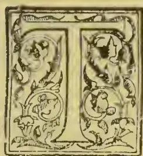

HIS department is situated in the southern part of the great Valley of the Magdalena, extending from 2° to 6° north latitude. And the department is embraced within the two great chains of the Colombian Andes, the Eastern and Central Cordilleras, which continue nearly parallel from latitude 2° 5' to 5°. Within these bifurcations of the Andes is also comprehended a large portion of the department of Cundinamarca, thus including the lofty and extensive savannah on which the city of Rogota (8,600 feet above sea-level) is situated. The average height of the Eastern Cordillera is from 12,000 to 13,000 feet above sea-level, whilst the highest ridges of the Central Cordillera are covered with perpetual snow, the culminating peak, Tolima, from which the department derives its name, being upwards of 18,000 feet, and the highest peak of the Andes north of the Equator. The River Magdalena, from its source, flows through the department some 400 miles to the river-port town Honda, which is the terminus of steamboat navigation with the coast, distant 600 miles. At Honda rapids in the river preclude continuous navigation higher up, but immediately above these rapids the river is again navigable for steamers for 100 miles, and for native craft 300 miles. The area of Tolima is 18,434 square miles, and the population 230,000. The department comprises a small area as compared with the total area of the Republic, namely, 513,845 square miles.

The plains and lower hills extending from the River Magdalena occupy an area of several thousand square miles, and the climatic conditions up to an altitude of from 3,000 to 4,000 feet are purely tropical, *tierra*

*ediente*. Within this zone nearly all the inhabitants of the department are settled. The chief industrial pursuit, in common with the rest of the Republic, is cattle farming.

A distinctly more temperate zone prevails between 4,000 and 6,000 feet above sea-level, *tierra templada*. This region consists of numerous ramifications of mountains, which are to a large extent covered with forest. Here the cultivation of coffee is becoming an important industry, a subject dealt with later on.

A still higher zone, designated *tierra fria*, extends from 6,000 feet up to the coldest climate in which European grains and vegetables can be grown. Potatoes and wheat are grown in patches at elevations ranging from 6,000 to 9,000 feet, and barley and oats thrive up to 12,000 feet.

The agricultural and planting prospects of Tolima, like those of the Republic in general, are only beginning to emerge into the domain of commerce. Up to a dozen years ago, for example, the value of the exportation of quinine-yielding barks, cinchona, and cuprea, obtained from the forest, was for many years far in excess of the value of the exportation of all other vegetable products combined. This bark business attained its maximum development in 1881-82, when the value of the article exported amounted to some 30,000,000 dol. Since then this trade in Colombia, notwithstanding that the trees abound in the forests, has completely collapsed, owing to the extensive cultivations of cinchona in the east.

As I have already said, the greatest industry of Tolima is cattle farming. The area of land appropriated to pastoral purposes practically occupies the whole of the zone which I have in the foregoing designated *tierra caliente*—several thousand square miles. Official statistics give the total number of horned cattle, horses, mules, and asses in Tolima at 390,000, the total number throughout the Republic being 3,465,000. There are also in the Republic goats, sheep, and swine, 3,487,000. Great cattle farms ("haciendas"), each containing from 1,000 to 4,000 cattle, abound throughout the department. To the favourable positions of Tolima, i.e., in proximity

397------------------------------------------------

372THE TROPICAL AGRICULTURIST.[DEC. 2, 1895.

to the most densely populated and richest community in the Republic, the community inhabiting the elevated savannah of Bogota, must be attributed its dominant position in regard to cattle rearing. Thus a lucrative market is assured for many thousands of cattle annually. These lowland cattle, though very inferior both in point of size and quality to those on the cold savannah, are reached under conditions calculated to assure their production at a minimum cost, that is to say, at much cheaper rate than is practicable in the cold regions.

The thousands of square miles of natural pasturage on the plains and lower hills of Tolima assume during the rainy seasons the most beautiful verdure. But in the alternate season of drought the general aspect is that of a desert. These lands were originally acquired at a nominal cost. No conservation of the natural fertility of the land has ever been taken into consideration. On the contrary, the natural grasses, intermixed with scrub or brushwood, have been systematically burned from year to year, and the burnings effected during the most scorching periods of drought. The principal object attained by this process of despoliation is the reproduction of new and tender herbage or pasturage, which, with the advent of the rainy season, forthwith covers the parched surface. Vast pastoral regions—scores of thousands of square miles—in tropical America are thus maintained. Half a century, or it may be a century, of this treatment suffices to extinguish almost every trace of fertility in the soil. In Tolima alone hardly less than 2,000 square miles of savannahs and hills, ascending to some 3,000 feet, have in this way been transformed into comparatively barren wastes. And in other parts of the Republic many thousands of square miles have similarly lapsed by this devastating process.

This persistent burning of the savannahs and hills for crops of renewed pasturage plays desperate havoc with all other vegetation, trees and brushwood. Isolated palm trees, with their intensely hard trunks and endogenous structure, together with groups of brushwood in sheltered or humid spots, sometimes withstand the fury of the flames. There is, however, one phenomenal exception to this subversive power of the fires. A humble tree with contorted and rugged trunks and branches and scabrous leaves, a tree presenting the most subdued and weird aspect conceivable; this pigmy tree not only resists the fury of the flames, but fire is actually congenial and subservient to its existence, for the tree, instigated by the conflagrations, forms itself into great plantations. The name of this tree is chaparro (*Rhaphia aborata*), indigenous to Colombia and other South American countries. It attains a height of 15 to 20 feet, and its distorted trunks measure from 9 to 12 inches in diameter. It is widely distributed in Colombia, for I have found it at the Sierra Nevada of Santa Marta, and dispersed inland 1,000 miles from the sea. In contact with the great forest it maintains a precarious existence. But as already explained, it usurps dominion in places where no other tree can grow. In Tolima it abounds on the slopes and ridges of the hills at elevations from 1,000 to 3,500 feet. In this department alone hundreds of square miles of the lower hills which have been reduced to sterility by incessant burnings are occupied by this diminutive tree, and it assumes the aspect of vast systematically formed and well-kept plantations. This is more than a triumph of the "survival of the fittest."

It is very remarkable that these fire-begotten plantations are nowhere crowded to excess; on the contrary, the trees are so regularly placed that their aspect vies with that of the most carefully formed plantations. There is a popular belief in Tolima, where alluvial gold abounds, that this tree flourishes only on those seductive lands, serving as a guide to searchers after the precious metal. The bark of the tree is peculiarly constituted. It consists of a congeries of integuments or semi-detached layers. The outer portion, about half-an-inch thick, performs no organic function, and this portion of the bark, in conjunction with its peculiar compositions, protects the inner vital integuments from injury by fire.

The form and structure of the tree may have originated from the severe ordeal through which it has survived. For instance, according to the theory of natural selection, some animals when they migrate into a colder climate become covered with thicker fur. As we have seen with regard to this plant, the powers of nature have been encroached upon, i.e. the plant having emerged from a state of nature it has made for itself a law of its own, for it has triumphed over the most disastrous element to all organic life. The hundreds of square miles of worn-out land covered by this beneficent tree in Tolima alone are undergoing a slow process of amelioration which, moreover, could be easily accelerated by the interposition of a few simple devices.

It is noteworthy that the chaparro prefers the slopes and ridges of the hills to the flat savannahs, on which it is seldom found in any considerable quantity, though widely dispersed. Fire ranges with far greater fury on the slopes and ridges of the hills than on the plains. I, however, attribute this preference of the plant for the hill-sides to the pernicious influence of the accumulations of water on the plains during the rainy season.

The illustrious Humboldt, during his travels in South America, noted the dispersal of this plant on the vast llanos stretching from the Orinoco, &c. These llanos are, for the most part destitute of vegetation other than *Gramineae*. The only trees that were found on many parts of these dreary wastes were specimens of chaparro and in more humid spots a palm. Thus, referring to the llanos which he traversed, he says, "For many square miles not a tree to be seen, but where a few solitary trees are found they are, in humid districts, the *Mauritia* palm, and in arid spots the *Rhaphia complicata*."

Vast deserts and semi-deserts abound throughout the tropical world many hundreds of thousands of square miles. It may be that the chaparro is destined to play an important part in the reclamation of these illimitable wastes for the decomposed leaves gradually form a crust of vegetable mould.\*

#### COFFEE.

In recent years a great impetus has been given to this Coffee cultivation in Colombia. The most reliable statistics show the following export returns:—

<table>
<thead>
<tr>
<th>Year.</th>
<th>Value.</th>
</tr>
<tr>
<th></th>
<th>Dollars.</th>
</tr>
</thead>
<tbody>
<tr>
<td>1877-78</td>
<td>810,000</td>
</tr>
<tr>
<td>1890</td>
<td>7,500,000</td>
</tr>
<tr>
<td>1891</td>
<td>10,000,000</td>
</tr>
</tbody>
</table>

It may be safely estimated, in view of the continual large extension of this cultivation, that in the course of 2 or 3 years the total output will have augmented to 15,000,000 dol.; no less than 37,000 tons.

I am unable to state the proportion of coffee which Tolima contributes, but it may be estimated at about 300,000 dol., a return greatly in excess of the production half-a-dozen years ago. The districts of Tolima in which this cultivation is chiefly carried on are distant inland from Honda from 100 to 200 miles. Thus, bearing in mind that coffee is cultivated at from 700 to 900 miles from the seaport Savanilla, credit is due to the enterprising planters. The River Magdalena, with several of its tributaries, afford to a large extent the means of transport to Honda. The produce is carried by mules from the mountain slopes to the river, thence in rafts down the current to Honda, from 3 to 5 days' journey. From Honda, whence also is shipped the produce from the great coffee-growing province of Cundinamarca, the coffee is conveyed by steamers, and two short railway routes, to the sea—600 miles. Independently of the Upper Magdalena and its tributaries, many thousands of mule-loads of coffee are annually brought to Honda, partly from Tolima, but chiefly from Cundinamarca, thus from 3 to 5 days' journey to Honda only. The cost of transport from the plantations to the coast amounts in English money from 1*l.* to 1½*l.*, thus respectively 9*l.* 6*s.* 8*d.*

\* An extract from a letter of mine to the Director of Kow Gardens relative to chaparro was published some years ago.

398------------------------------------------------

DEC. 2, 1895.]THE TROPICAL AGRICULTURIST.373

and 14/ per ton, a very heavy item. In this connection it may also be mentioned that from several of the large growing coffee provinces of the Republic the cost of transport is still higher.

Notwithstanding the great difficulties appertaining to distance from the sea, and the consequent cost of transport, the Tolima planters are quite able to compete with planters in far more favorably situated countries, countries which are in a position to transport coffee to their seaports at a comparatively trifling cost. Magnificent land abounds on the colossal Andes most admirably adapted for the cultivation. Well cultivated plantations on these Cordilleras are unsurpassed by those of any other country, and this observation applies not only to the quality of the produce, but also to the quantity. Land is obtainable, in general, at a nominal cost; and it is available to a large extent, though it may be mentioned, in the adjoining department of Cundinamarca, where great enthusiasm prevails relative to coffee cultivation, and where it is being much more extensively planted than in Tolima, the price of the more conveniently located sites for plantations has augmented very materially; indeed, as much as 40 and 50 dol. (paper currency), say 2/ 13s. to 3/ 7s. at exchange now ruling of 15 dol. to 1/ per hectare (2½ acres) is now paid.

The extension of this cultivation in Tolima, and this applies to the whole country, is in general confined to districts accessible to settlements or villages. More remotely removed from populated districts widely extending mountain slopes, eminently fitted for coffee, remain in a state of nature. It may also be noted that the quality of the labour itself is satisfactory, for it is on the whole industrious and intelligent. 80 c. (about 1s.) per day Colombian currency, are the average wages for peons, and for women about 50 c. (about 8d.).

As regards the productive capabilities of these Cordilleras, coupled with the labour resources, *i.e.*, where it is sufficiently abundant, it may be stated that the cost of coffee production at the plantation ranges from 30 to 35 dol. per mule-load of 250 lb., or from 12 to 14 dol., Colombian currency, per 100 lb. With the rate of exchange with has prevailed during several years (1 dol. ruling rather less than 2s.), this shows that planters are acquiring enormous profits. With money at par the nominal cost of production would be about the same, although in reality the price measured in gold would have much more than doubled. It should, therefore, be remembered that to the depreciation of Colombian currency must be attributed in great measure the rapid expansion of the coffee industry. At the same time exceptionally high prices for the article have ruled during recent years, a result partly due to the abolition of slavery, in coffee-growing countries, and partly to the revolutionary movements in Brazil, where coffee is grown on a gigantic scale. Now that coffee has become a staple industry of Colombian there can be no doubt that the country is able to maintain a prominent position among all rivals.

The number of coffee trees planted per hectare (2½ acres) in Colombian averages about 1,500. The general averages yield per tree per annum on well-kept plantations is 1½ lb., or 2,250 lb. per hectare—900 lb. per acre. On many other plantations the average yearly crop does not exceed 1 lb. per tree—600 lb. per acre. Thus the number of trees planted per acre in this country strikingly contrasts with the number planted in British Colonies, where twice as many are planted per acre, notwithstanding heavier crops are secured in Colombia. In the palmy days of coffee cultivation in Ceylon the average production was 5 ewt. per acre.

One of the chief elements of success appertaining to this cultivation in Colombia must be assigned to the systematic inter-planting of shade-trees with the coffee. At altitudes ranging from 3,000 to 5,000 feet more densely-foliaged shade-trees are employed than is the case at plantations between 5,000 and 6,000 feet, where a slender shade is afforded by a species of *Cassia*. The shade-trees utilised at plantations situated between 3,000 and 5,000 feet are a species of *Erythrina*, and another leguminous tree, a species of *Inga*, which latter is becoming very generally

adopted by planters. I would strongly recommend this *Inga* for adoption by British colonial coffee planters, as it is most admirably adapted for the purpose. It grows rapidly, and the large compound leaves fall abundantly at the season in which the plantation requires the least degree of shade, whilst the abundance of fallen leaves from this tree check in a very marked manner the irrepressible growth of weeds. Moreover, the general result of the beneficial influence of this congenial shade reduces to a minimum all cultural expenses; indeed, it may be safely computed that the good offices of this tree entail the cost of actual cultivation to the extent of some 50 per cent. as compared with coffee devoid of shade. It is a remarkable fact that British colonial coffee planters have in the main ignored the application of shade to the coffee tree. Without shade the tree certainly flourishes, but its full exposure to the sun, at any rate as the sun is wont to shine here, is detrimental in the long run to its most congenial state of productiveness. However, near the upper limit of this cultivation, namely, from 5,000 to 6,000 feet, shade is not to be recommended.

From the foregoing it will be seen that Colombia is making rapid strides in coffee cultivation, and the strides are so remarkable that it already produces about two-thirds as much coffee as all British colonies and possessions combined, and doubtless it will very soon overtake the total aggregate production of these colonies and possessions. When the vast productive tropical resources of the empire are borne in mind this seems anomalous. For example, the "Times," in a recent editorial, says with regard to the expansion of three of the great groups of colonies, not referring to the Eastern Empire:—"What is most remarkable about that growth is that it has already reached a point at which each of the groups exhibits the most extraordinary variety of climate, of produce, and of the conditions under which life may be lived." It is true that the production of this article in Ceylon has dwindled, owing to the fatal leaf disease, from 50,000 tons in 1874-75, to 3,750 tons in 1891. Though this disease has so seriously affected Ceylon and India, England possesses other eligible colonies exempt from the disease. For instance, in the New World, Jamaica may be mentioned as being capable of growing coffee on a very much larger scale than it does at present. There, however, during scores of years this product has remained almost stationary. Even compared with the neighbouring Republic of Hayti, the inhabitants of which are usually denounced for their aversion to progress, Jamaica comes out unfavourably, for Hayti, in spite, too, of revolutions, exports seven times more coffee than Jamaica.

As I am well acquainted with the productive resources of Jamaica, England's tropical American colony par excellence for coffee, it may not be amiss to give the following particulars touching coffee cultivation in that colony in comparison with the cultivation in Colombia. The total coffee production in Jamaica, about 10,000,000 lb., represents what is cultivated on an area of 11,000 acres in Colombia, but in Jamaica 22,476 acres are under cultivation. Thus, were the Jamaica plantations yielding to the same extent as those of Colombia the value of the output would be increased from 336,840/ to double that amount yearly. Moreover, the general average quality of the Colombian article is superior to that of Jamaica, though that island contains several plantations at high altitudes the produce of which is the finest in the world. There can be no doubt that the coffee industry of Jamaica would be greatly benefited by the adoption of the more advanced practical methods pursued in Colombia.

In a recent number of the "New Bulletin" reference is made to the slow development of the coffee enterprise in Jamaica and other British colonies. What that paper suggests in order to encourage the enterprise in Jamaica is the opening up of roads to facilitate transport, but Jamaica is already well provided with splendid roads; besides, the most eligible sites for plantations are nowhere situated more than some 20 miles from the sea, and seaports surround the island. I have already described how

399------------------------------------------------

374THE TROPICAL AGRICULTURIST.[DEC. 2, 1895.

remarkably different are the conditions of transport in Colombia, and how this, the most important commercial plant of tropical America, can be turned to better account in the colonies,

A glance at the following figures, which I have culled from the "*Ceylon Tropical Agriculturist*," &c., shows the relative position of the exports of the three great rival products—coffee, tea, and cacao, in the Old World and the New:—

<table border="1">
<thead>
<tr>
<th rowspan="3">Articles.</th>
<th colspan="2">Quantity.</th>
</tr>
<tr>
<th>Tropical</th>
<th>Old</th>
</tr>
<tr>
<th>America</th>
<th>World</th>
</tr>
<tr>
<td></td>
<td>Tons.</td>
<td>Tons.</td>
</tr>
</thead>
<tbody>
<tr>
<td>Coffee .. ..</td>
<td>640,000</td>
<td>105,000</td>
</tr>
<tr>
<td>Tea .. ..</td>
<td>Partially nil</td>
<td>216,000</td>
</tr>
<tr>
<td>Cacao .. ..</td>
<td>42,000</td>
<td>1,600</td>
</tr>
<tr>
<td>Total .. ..</td>
<td>682,000</td>
<td>322,600</td>
</tr>
</tbody>
</table>

To the foregoing Old World returns China and Japan contribute to the extent of fully 100,000 tons of tea, so that the total exports from the British Eastern Empire, together with Java, &c., amount to but little more than 200,000 tons of coffee, tea, and cacao, whereas the total output of coffee and cacao from tropical America amounts to 682,000 tons, and the value of this is 50,000,000/.

Touching the cultural requirements of these three products, cacao, though from an alimentary point of view by far the most important, is placed at a great disadvantage, inasmuch as this plant is exclusively adapted to hot and humid tropical zones, conditions which have undoubtedly restricted its cultural extension. Tea is an extra tropical product, though it is cultivated with great success on the mountains of the tropics. The coffee plant, like cacao, is essentially tropical, but it is constitutionally adapted to a far wider range of climatic conditions, for it grows in the hottest valleys, up to the genial temperature experienced at elevations between 4,000 and 6,000 feet above sea-level. As to cacao, it may be assumed that if this tree were susceptible of cultivation over the wide climatal expanse on which tea grows, instead of being confined to purely tropical climes, its cultivation would have long since attained greatly enhanced proportions.

#### CACAO.

This is a favourite article of cultivation among the natives, cacao and the beverage is very largely consumed throughout the Republic. In most parts it is used, probably, to the same extent as tea is in England. Anyhow, it may be safely computed that its consumption by the 4,000,000 inhabitants of the country amounts to not less than 3 lb. per capitum per annum; thus a gross annual production of 12,000,000 lb. The number of trees requisite to yield this quantity may be estimated at about 12,000,000, i.e., 1 lb per tree. And it may be mentioned that the number of trees thus indicated is considerably less than is under cultivation in the island of Trinidad. From a few districts of the Republic some hundreds of bales are exported, but it is notorious that, in spite of the illimitable resources of the country for the cultivation of this indigenous tree, the production falls short of the actual wants of domestic consumption. Were the plant more largely cultivated the internal consumption would be greatly increased, consequent on reduced prices, which are usually higher here than in Europe. Moreover, only recently several shipments of cacao have been imported from England, shipments transported at great cost to the interior of the country.

The explanation as to the abnormal position of this cultivation may be best indicated from the following extract of a letter of mine addressed to the President of the Republic, and published in the "*Diario Oficial*" of November 8, 1893:—

"I place this in the first class of the products which deserve the attention of the Government. The plant is indigenous here, and the article is one of general consumption in the Republic. Further, as an article intended for exportation, it is, in my opinion, more important than coffee. "Unfortunately, in many parts of the country the cultivation of it is found in

a most lamentably degenerate condition. In a note on this, and other similar matters, published in the "*Diario Oficial*" of November 7, 1887, I referred to an insidious disease which affected the cacao tree in various parts of the country. Many plants in other countries have been attacked from time to time by some disease, but without loss of time an investigation of the causes has been made. Here this industry is allowed to decay, and the country to suffer a loss of many thousands of dollars each year. In the document itself I pointed out as a likely means of combatting the evil the following:—"In all probability the most systematic and efficacious remedy which could be adopted would be the renovation of all the plants by selecting foreign seeds, thus in king impossible the reproduction of plants proceeding from diseased trees. Another effective remedy might be found in having recourse to the system of grafting healthy branches into the wild species of the cacao."

In continuation of this subject I made the following remarks in my former report, published by the Foreign Office in March, 1891:—"In two reports of mine, published by the Colombian Government, I strongly advocated the introduction of cacao seeds from Trinidad, with the view of ameliorating the degenerated plantations of the interior. The result of my excursion to the Sierra Nevada, as reviewed in this report, completely nullifies my former impressions as to the advisability of importing these seeds; now the conditions are reversed, the wild cacao being, par excellence, the kind for cultivation throughout the Republic. In those countries in which this product has become a staple the yield per tree hardly averages 1½ lb. With our wild cacao I feel sure that under careful cultivation that average can be doubled, though in making an estimate of returns I prefer to curtail this prospective average. The cacao planters of Tolima, where millions of pounds are cropped, annually obtain an average of little more than ½ lb. per tree. Hence the replanting of the degenerated fields of the interior, as well as the extension of this cultivation, with seeds from the Sierra Nevada, is a measure the importance of which cannot be overrated. Arrangements could be made for the acquisition of these seeds on a large scale."

In that report I also referred to the favourable conditions under which cacao flourishes in Trinidad, where this product is an important staple, and in making a comparison with these conditions, I summoned up—"How infinitely superior are the innumerable sites for plantations at the foot of the Sierra Nevada, sites which nature has disclosed." In this connection it should be mentioned that these favourable conditions are by no means confined to the district surrounding the Sierra Nevada (a system of mountains distinct from that of the Andes), that is to say, equally eligible lands abound in the great valleys at the feet of the Cordilleras of the Colombian Andes. Here thousands of square miles are most admirably adapted for the plant.

The disease affecting this cultivation is confined, as far as I am aware, to two provinces, namely to certain districts of Tolima and of Antioquias. Fortunately, though the disease is widely extended in Tolima, the southern confines of the department are in a great measure exempt from it. Yet attacks by parasitical insects are frequent sources of concern to the planter. In all probability the diseases to which this plant is subjected have been instigated by the injurious system of close planting resorted to, combined with the excessive shade imparted by an overgrowth of trees planted for shading the cacao.

In the south of Tolima, it is interesting to note, this cultivation is pursued on a considerable scale and with great success, under the influence of irrigation. The region in question is characterised by prolonged droughts, and the application of irrigation has thus proved most advantageous. Cacao thus produced has become quite an important industry. Planters in British colonies will be glad to learn that the plant is amenable to systematic irrigation, a condition that assures the extensive cultivation of the plant in comparatively dry regions, for excessively humid conditions of climate have been deemed indispensable requisite for the plant.

400------------------------------------------------

DEC. 2, 1895.]THE TROPICAL AGRICULTURIST.375TOBACCO.

This is a very important industry in Tolima, and it affords employment to many thousands of the peasantry, for the cultivation of the article entails incessant care and attention, and its subsequent manipulation, from the preparation of the crude product to the manufacture of cigars involves exceptional conditions of labour. Women and children are largely employed in the manufacture of cigars. The best cigars are sent to Bogota and other large towns. The price of these averages from 2 to 5 c. each (Colombian currency). There is comparatively little difference in the quality and aroma among these cigars. The higher priced kinds are the produce of the most carefully cured and best formed leaves. In point of quality, it is worthy of remark, there is a much wider range in this respect than is the case in the Jamaica cigars, which are no doubt superior, and this is a new industry in that colony. Among the common classes of people in Tolima a very inferior ill-made cigar is extensively smoked. These are sold in the districts in which tobacco is cultivated at the rate of some 30 for 1 real (about 2d.).

This cultivation in Tolima formerly occupied a much more important position than it now does. The great falling-off in cultivation is the result of a disastrous disease which attacked the plant about a score years ago. The cause of this disease has been attributed to the uninterrupted reproduction of the article on the same land. The plant is now generally cultivated in small patches, so that the effects of the disease is neutralised.

Anterior to the appearance of the disease, Tolima was the chief tobacco-producing centre of the Republic, now the quantity exported from Tolima is insignificant. At present the principal seat of this industry is occupied by the Department of Bolivar, which furnishes 50 per cent. of the total exportation from the country.

20 years ago the total quantity of tobacco exported from the country was somewhat higher than at present, then it was about 4,000 tons, valued at 2,500,000 dol. In 1891 it was 3,810 tons, valued at 1,480,000 dol.

Agriculture in general in the tropics is carried on in a rough and primitive fashion, weeding the fields constitutes the one dominant element inseparable from the cultivation of most products, that is to say, weeds grow apace in such a way that agriculturists unacquainted with the tropics are total unable to form the slightest conception of their rapid and irrepressible growth. Moreover, the system of weeding pursued is commonly performed in a most perfunctory manner. The conditions of climate are, of course, not conducive to painstaking efforts on the part of the peasantry. This is the kind of treatment usually accorded to most agricultural products in tropical America. These is, however, one notable exception to this rule; I refer to the cultivation of tobacco. It is a delicate plant, and easily overpowered with weeds and with insects, so that careful cultivation is indispensable. A tobacco plantation is, therefore, cultivated like a garden. Peasantry employed in this cultivation necessarily become trained to superior methods of cultivation. There can, therefore, be little doubt that a Government that fosters tobacco cultivation in tropical America fosters a genuine predilection for improved husbandry on the part of the agricultural labourer.

CINCHONA.

There is but little interest nowadays attaching to cinchona cultivation, but the following brief remarks may prove interesting:—

Several species are indigenous to this department, and prior to the great reduction in the price of quinine—a reduction from about 10s. per oz. to 8d.—large quantities of bark of excellent quality were exported from this department.

Cultivation was started in various parts of Tolima over a dozen years ago, when barks still fetched a high price, but coincident with the marked decline

in prices the plantations were abandoned. The largest and most important was established under my superintendence; some 400,000 trees, comprising the best species, were thus established at an elevation of from 6,000 to 8,000 feet above sea-level. Though abandoned for several years, a large proportion of the trees are growing, and as they assume larger dimensions will be turned to account some day. Seeds of the more important species grown in the east were obtained and planted to a considerable extent, thus, *C. succirubra*, *C. Calisaya*, var. *Ledgeriana*, and *C. officinalis*. These species flourished here, but, after half-a-dozen years of cultivation, one of them, viz., *C. officinalis*, began to show symptoms of what is denominated "canker," an insidious disease, and large numbers have since succumbed. This is exactly what occurred with regard to this species in the Jamaica cinchona plantations, which I also inaugurated.

Besides the above-mentioned species, several indigenous species were planted on a large scale, and these proved the most important, as will be seen from the analysis given below, which analysis was made by Mr. David Howard, of the well-known firm of quinine manufacturers.

A detailed account of the Colombian species was given at a meeting of the Pharmaceutical Society, in London, in April, 1892, by Mr. Holmes, the curator, and it may be here added that gentlemen then stated in regard to one of these varieties, viz., *Tuna*, "Probably the richest known in the percentage of quinine." The result of the analysis shows remarkable average richness:—

<table border="1">
<thead>
<tr>
<th></th>
<th>Quinine Sulphate.</th>
<th>Quinine.</th>
<th>Cinchonidine.</th>
<th>Cinchonine.</th>
<th>Quinidine.</th>
<th>Amorphous.</th>
</tr>
</thead>
<tbody>
<tr>
<td>Thomsoniana</td>
<td>5.94</td>
<td>4.45</td>
<td>0.27</td>
<td>0.82</td>
<td>0.26</td>
<td>0.74</td>
</tr>
<tr>
<td>Ledger, verde</td>
<td>4.90</td>
<td>3.68</td>
<td>..</td>
<td>0.01</td>
<td>0.20</td>
<td>0.44</td>
</tr>
<tr>
<td>Negra</td>
<td>7.30</td>
<td>5.48</td>
<td>..</td>
<td>0.10</td>
<td>Trace</td>
<td>0.78</td>
</tr>
<tr>
<td>Morada</td>
<td>3.06</td>
<td>2.30</td>
<td>..</td>
<td>0.04</td>
<td>0.50</td>
<td>0.38</td>
</tr>
<tr>
<td>Tuna</td>
<td>9.04</td>
<td>6.78</td>
<td>0.40</td>
<td>0.38</td>
<td>0.18</td>
<td>0.42</td>
</tr>
<tr>
<td>Pombiana</td>
<td>5.88</td>
<td>4.41</td>
<td>0.34</td>
<td>0.02</td>
<td>Trace</td>
<td>0.22</td>
</tr>
<tr>
<td>Officinalis</td>
<td>6.32</td>
<td>4.47</td>
<td>1.23</td>
<td>0.10</td>
<td>0.07</td>
<td>0.46</td>
</tr>
<tr>
<td>Succirubra</td>
<td>5.93</td>
<td>4.45</td>
<td>2.77</td>
<td>0.12</td>
<td>0.02</td>
<td>0.32</td>
</tr>
<tr>
<td>Hybrid</td>
<td>3.32</td>
<td>2.49</td>
<td>1.92</td>
<td>0.04</td>
<td>Trace</td>
<td>0.56</td>
</tr>
</tbody>
</table>

INDIA-RUBBER.

A very important species of rubber is indigenous and I am inclined to think peculiar to Tolima. Unlike other important kinds of rubber, it grows at high elevations, viz., at from 6,000 to 8,000 feet above sea-level. Some thousands of bales of it were exported a dozen years ago. But as the tree was only locally distributed, the source of supply was soon exhausted. The authorities at Kew have named this plant *Sapum biglandulosum*, a species which is also said to be found in British Guiana, where, however, it seems to be of no value as a rubber producer.

In connection with the cinchona plantations above referred to, a plantation of this rubber was made about 10 years ago. The trees grew with remarkable rapidity, with trunks a foot in diameter in six years; but this plantation shared the same fate as the cinchona, that is, it was abandoned years ago because the cinchona was abandoned. With renewed attention, however, this plantation may still be made important.

A few years ago I directed the attention of the Secretary of State for India to the advisability of cultivating this plant on a large scale in that country. My letter was referred to the Government of India. I think, however, that no progress has been made. This valuable plant could be cultivated over a wide range of latitude in India, thus extending from the elevated mountainous regions of Southern India to the low-lying valleys of the Himalaya as far as 26° north latitude. And this is a great advantage as compared with the limited zone in which the other important tropical American species of rubber introduced to India can be cultivated.

401------------------------------------------------

376THE TROPICAL AGRICULTURIST.[DEC. 2, 1895.]DEEP DIGGING FOR COFFEE.

A Correspondent in South Coorg writes to a Madras paper: The change that is worked in a sick piece of coffee by a deep digging is little short of marvellous; in a couple of weeks' time one would hardly know it for the same piece of coffee. Anyone has only to try it to be convinced of the fact. It seems strange under the circumstances that the important work of digging should in any case be neglected; and yet I have heard of its discontinuance being advocated, and of this being put partially into practice in several places. The argument used in favour of discontinuing digging is that it was very seldom done in the Spicy Isle, and yet crops used to be large. It would be well to call to mind, when using argument of this description, that almost all the coffee in that delectable land has gone out. It has also got to be remembered that soils differ and that work suited to one description of soil would be quite unsuited to another. In Coorg, for instance, digging is not generally so necessary in the open friable forest soils as it is in the Bamboo; although even there it would have been beneficial in all cases where the slope of the land admitted of its being carried out without the risk of loss of soil through wash. The result of stopping digging for a couple of seasons in the Bamboo or the Santikoppa District would cause such a rough awakening that I am sure it would never be attempted again; the lesson learned would be too severe to be easily forgotten. I may mention that the increase in borer alone would be startling; although it is as likely as not to be attributed to this cause. The following brief extract from Professor Johnston, although referring more particularly to the plough, is equally applicable to the fork, will afford some reasons as to why digging should naturally be beneficial. "By the use of the plough the parts of the land are more minutely divided—the air gets access to every particle—it is rendered lighter, more open, more permeable to the roots. The vegetable matter it contains decomposes more rapidly by a constant turning of the soil, so that whatever the fibres of the roots penetrate they find organic food provided for them, and an abundant supply of oxygen of the atmosphere to aid in preparing it. All soils contain, likewise, an admixture of fragments of the minerals of which they are formed, and which, by their decay, yield new supplies of inorganic food to the growing plant. The more frequently they are exposed to the air, the more rapidly do these fragments crumble away and decompose. There are few soils so stubborn as not to show themselves grateful in proportion to the amount of this kind of labour that may be bestowed on them. I might make many quotations from other authorities in support of the beneficial action of digging, but the above ought to suffice to convince any sceptic. In the case of the estates above referred to, it is the practice to place the manure on the surface of the hard ground near the stems of the trees, the idea being that it all sinks into the ground and that none of it is lost. This may look very well in theory, but in practice a two-fold loss is entailed on the manure, one by the wash and the other by the escape of the organic part as gas into the air, and I am sure that if the quantity of manure used were not large, the results would be very evenescent. One bad result of putting down manure in this way is that the stems of the trees throw roots into it above the surface of the ground, and these become exposed if any part of the manure is washed away; or they are injured if a coolie is careless with his mamooty in scraping weeds or digging; so that here also, as far as the trees are concerned, there is a further waste of manure. When the roots are injured they are deprived of the only means of taking in the manure just when they had begun to do so, Dr. Voelcker had said that it does harm to go upon the land when it is wet evidently because this tends to make it hard and compact. But how is going upon the land when it is wet to be avoided? The seasonable performance of the different works entails going upon the land often when it is very wet. The only way to coun-

teract the bad effects of this is to fork and stir the soil several times if feasible. But here the planter is exercised by the fear that this would cause too much root disturbance. So long as the roots are not turned up and exposed, I believe no harm results. The fork should be inserted deeply near the big trees and the soil be prised up. Even if some tearing of roots results, the injury is slight and is more than compensated for. This cannot be done in the case of young plants as they are apt to be lifted. In this connection the following will be of interest. Thus Mr. Phillips in "Principles of (Tropical) Agriculture":—"Mr. Mills is known as the grower of some of the finest pines ever seen, and the secret of his method is thus characterised in the *Gardeners' Chronicle*:—"The foundation of his success is common sense. He keeps his soil perfectly open and well drained; his roots are preserved by this means in a healthy condition; he does not cramp them. These are his great rules of conduct. They apply to other plants as well as pines."—*Indian Agriculturist*.

THE CEDAR OF CENTRAL AFRICA.

In Commissioner Johnston's report of the first three year's administration of the eastern portion of British Central Africa there is a sketch-map showing the agricultural condition of this country and the extent of such forests as yet remain. Mr. Johnston says:—"The dense forests are now mainly confined to certain hilly regions, where local circumstances protect them to some extent from destruction by bush-fires. They are always associated also with either an unusual rain-supply or the presence of underground springs. Slightly stagnant or surface water appears to contain too many salts in solution to be favourable to the growth of forest, and such forests as are usually found growing near swampy districts are palm thickets. There is one magnificent forest of *raphia* palms—one of the grandest sights I have ever seen in the vegetable world—near Jumbe's town, Kota-Kota, in the valley of a sluggish stream flowing into the Bua. As a remarkable feature peculiar to British Central Africa should be noted the splendid cedar forests on the upper plateau of Mlanje. Under the explorations of Mr. Alexander Whyte, the naturalist attached to my administration, it was not known that any conifer existed in Central Africa, south of Abyssinia, and north of the Drakensberg, with the exception of a few small juniper bushes discovered by Mr. Thompson growing on Mount Kenia and one or two other heights in Equatorial Africa. The existence of conifers on the top of Mlanje was first reported by the Rev. Robert Clelland, a missionary belonging to the Church of Scotland Mission. Not much heed was given, however, to this news, because no specimens were sent home for identification. But, undoubtedly, Mr. Clelland's information put us on the scent, and one of the first things I attempted on arriving here in 1891 was to have the upper plateau of Mlanje explored. As a consequence, Mr. Whyte discovered the grand conifer, of the genus *Widdringtonia*, to which his name was given. An account of this tree and the circumstances of finding it were given in an earlier report of mine printed by the Foreign Office. This *Widdringtonia* would appear to be nearest allied to the cypresses, as it unquestionably is by the shape of its seed vessels, and the nature of its foliage: at the same time, it is widely different to the cypresses in shape and size, and far more resembles the cedar, both in appearance and in the fragrant smell of its timber. It would seem now as though there were two different species of *Widdringtonia* growing on Mlanje, one a very lofty tree, reaching fully to 130 ft. in height, and the other scarcely exceeding 30 or 40 ft., and growing in a very struggling habit. There is a slight difference in the foliage of the two species. We have not yet been able to get the dwarf species identified, but hope to do so before long. In regard to this *Widdringtonia*, I might mention that Mr. Whyte has spared no efforts to introduce, or let us say, re-introduce its growth into all parts of the Shire highlands above

402------------------------------------------------

DEC. 2, 1895.]THE TROPICAL AGRICULTURIST.377

3,000 ft. in altitude. The tree would appear to flourish at a relatively low altitude, inasmuch as those planted in the grounds at Zomba, below the Residency, at an altitude not exceeding 2,900 ft. above the sea, leave nothing to be desired as regards their vigour of growth, some of the young seedlings having attained a height of 5 ft. in two years. Mr. Sharpe believes that he has seen a *Widdringtonia* growing on one or two of the more inaccessible peaks of Zomba, and, judging from what I could see through a field-glass, I think he is right in his opinion. Nowhere else, however, throughout British Central Africa, or in the adjoining regions, has any one reported the existence of this conifer. Baron von Eltz has made an active search over the lofty Livingstonia Mountains, at the north end of the lake, but has failed to find anything of the kind.

As an example of the rapid application to practical usefulness to which we have put this discovery of Mr. Whyte's, I may mention that, whereas the definite existence of the tree was only first made known in October 1891, in June 1893, Captain Johnson, commanding the Indian troops at Mlanje, was having the dead trees sawn up into logs, which were being sold to advantage in Blantyre, and later on, in the autumn of 1893, enough cedarwood was supplied from Mlanje to re-roof the whole of the Residency and its attendant buildings at Zomba, besides which a great many useful articles of furniture have been made of the wood.—*Timber Trades Journal*.

#### PRODUCTS OF BOLIVIA.

This mountainous country has great natural wealth. It is rich in the precious metals and has large stores of copper and tin. Lack of transportations facilities prevents free export of the natural products, other than high-grade minerals and cocoa.

"The torrid region extends from the low tropical plains and valleys of eastern Bolivia to an altitude of approximately 6,500 feet above the sea. It abounds in every variety of tropical fruits, including *granadillas*, *pepinos*, *paltas*, *pacaes*, a fruit of the genus *Junia*, consisting of thick pods about six inches long filled with a sweet, refreshing, white pulp; *chirimoyas*, a species of *anona*, one of the most highly prized of the Bolivian fruits; pine-apples, those of the province of Yungas being especially rich and fragrant; sugar cane, coffee, rice, a superior quality of white and yellow cotton, cocoa (*erythroxylon coca*), the dried leaves of which are a highly stimulating narcotic and are chewed by the Bolivian and Peruvian Indians, by travelers in the Upper Andes, and by the Bolivian soldiers, when in the field, just as betel is used by the inhabitants of the East Indies, cacao or chocolate tree, a species of *theobroma*, found also in the West Indies, which bears a pulpy fruit from the seeds of which chocolate is made. One of the peculiar productions of this zone is the *guayacu* tree from which is gathered a fruit containing a rich aromatic flour or powder neatly inclosed in a strong box-shaped cover or shell and esteemed more for its rich perfume than for food. It is known only by the name given it by the Aymara Indians, viz, *haku guayáca haku* in the Aymara tongue, meaning flour and *guayáca*, box; hence 'flour box' or 'box of flour.' The *guayaca* is perhaps the tallest tree of Bolivia, growing to the height of about 125 feet, with dense foliage and wide-spreading branches, thus making it one of the most delightful shade trees known to the *montaña*. This region also abounds in forest of ebony, mahogany, rosewood, satin wood, cedar, wax, and cork trees, palms, rubber trees (*caoutchouc*), and other varieties of wood of great beauty and value rarely met with in other countries, including a species of mulberry from the bark of which are made the curious shirts worn by certain tribes of the Bolivian Indians. Among the medicinal and other plants are *cinchona*, *jalap*, *matico*, *sarsaparilla*, *copaiba*, *tamarind*, *palma-Christi*, *ipecaquianha*, *camphor*, *gum arabic*, *balsams*, *valerian*, *cinnamon* and *vanilla*.—*American Grocer*.

#### SOME QUEER FOODS.

There is an old proverb to the effect that what is food to one man is poison to another, and the proverb is well illustrated at the department of agriculture at Washington, by an odd sort of exhibit of queer foods eaten by out-of-the-way people. Among the articles in the exhibit is a loaf of bread made from the leaves of a plant that is allied to the century plant, as also another kind of bread from a dough of juniper berries. These are relished by some kinds of Indians, while others make cakes out of different kinds of bulbs. The prairie Indians like a dish of wild turnips, and the "screw beans," which grow on mosquito bushes, are utilized by Indians for food. Soap berries furnish an agreeable diet for some tribes.

The Digger Indians in California do not disdain the seeds of salt grass, and the seeds of gourds are consumed in the shape of a mush by Indians in Arizona. The exhibit in question includes a jar of pulverised crickets, which are eaten in that form by Indians of Oregon. They are roasted, as are also grasshoppers. These delicacies are cooked in a pit, being arranged in alternate layers with hot stones. After being thus prepared they are dried and ground to powder. They are mixed with pounded acorns or berries, the flour made in this way being kneaded into cakes and dried in the sun.—*Rio News*.

#### A RETROSPECT.

We suppose it will be at least an orthodox, if not an interesting proceeding, if, in this our first number, we devote a small space to looking behind us, and trying to recall from out the fast receding years, a few facts as to the beginnings of the planting industry in the days when B. C. A., as we now know it, was still a vision of the future.

We need not here go over the story of the discovery of this part of the world by Livingstone in 1855 and it will be sufficient to note that it was in 1875 that the late Henry Henderson fixed on the site of the Blantyre Mission, a selection showing a judgment and knowledge, which has not since been equalled. It was one year later before the first mission party arrived among them Mr. John Buchanan. In 1878 Mr. Jonathan Duncan arrived bringing the now historic coffee-plant and in the same year Messrs. John and Fred Moir established themselves at Mandala. At the end of three years the maiden crop of the first coffee-plants was sown and the plants distributed, part being planted out at Blantyre, part sold to the A. L. C. and planted at Mandala, and part being sent to Zomba. The second year's crop was also sown and distributed and thus a beginning was made in coffee-planting.

In 1881 Mr. Buchanan started for himself at Mlungusi (below the Zomba Mission site) and put the question to a practical test as to whether coffee-planting would be a commercial success. Although many years, with varying vicissitudes, have passed since then we do not suppose. Mr. Buchanan would now materially alter the opinions he then formed and enunciated in his book "The Shire Highlands." In the light of present day experiences it is interesting to reread the verdict passed on the first sample of coffee from East Central Africa (Zomba district) placed before a London broker.

"The following is the report of Messrs. Patry and Pasteur, coffee-brokers, London:—

"The coffee particularly is remarkable for the depth and brightness of its colour, which gives to it a value probably much greater as a fancy coffee suitable for certain foreign markets, than it would possess merely from its strength when roasted; and it compares favourably, for appearance, with the products of European plantations in British India, Ceylon, and Java. It is, however, a rather soft coffee, and not likely to keep its fine colour very long.

"Indeed some of the berries are already getting a little faded, which, if it made further progress, would soon detract a good deal from its value in its present state. In all other respects the coffee is as

403------------------------------------------------

378THE TROPICAL AGRICULTURIST.[DEC. 2, 1895.]

well prepared as possible; it is large, well picked, and very clean-looking, smooth and even, and of bright, deep blush-green colour, and worth in this market about 85s. per cwt. in bond."

In connection with the preparation of the above sample, I am, in justice to it, entitled to state, that I had had no experience whatever in preparing coffee prior to my sending away the sample."

As this is merely an outline we are not able to go into the details of Mr. Buchanan's efforts in sugar planting in which he was ably seconded by his brother David Buchanan, who joined him in 1883, nor to relate how he made a wooden cane crushing mill and afterwards a wooden waterwheel, but we note that in 1885 he was able to write as follows:—

"There are now growing in the Blantyre garden orange, lemon, fig, pomegranate, peach, loquat, guava, apricot, nectarine, custard-apple, granadillas, and several others."

From 1885 onward was the period of the Arab war and Portuguese complications and the records of these years are chiefly in the archives of the Foreign Office. In 1887 it was, we think, that Mr. Sharpe came into the country elephant-hunting, which however had to be exchanged for the more serious business of fighting the Arabs, a work in which the late Mr. L. M. Fotheringham had his full share. In 1888 the *Blantyre Mission Supplement* was first published and a few stray notes here and there help us to follow the progress of events. It was in the same year that the present writer came into the country. At that time one could almost count the Europeans engaged in planting or trade on the fingers of one's hand and the chief stations were Blantyre and Mandala, Chirazulo, Zomba and Domasi. Mr. Robert Buchanan, who came out in 1885, was at that time in charge of Zomba.

In 1888 both Messrs. Lindsay and Smilie had been to some time in the country and Mr. Simpson was on the lower river. In March on the same year we read that "the Brothers Pettitt are still holding their own in the country. Mr. Pettitt and Mr. Marshall are on their road to Quilimane in the course of their trade" and in May we hear of Mr. Steblecki's arrival.

In December the *Supplement* reports Mr. Sharrer as "being on his way up" and having brought his streamer as far as Katunga's filled with his trade goods and two months later a note is made of the purchase of the site of his present head-quarters from Kapeni.

In April 1889 the following paragraph marks the progress of the Mission agriculture:—

"The Mission tea bushes are doing extremely well; the gums have seeded, and we have now plants from them; Mocha coffee is sown and springing oranges are maturing, and there has been a supply of vegetables for some time past."

With regard to "outsiders" we read:—

"Coffee seems to be doing well this year. The Mission patch shows some light berry in one small part but not so wide spread as last year. The acres of the Buchanan Bros. in the Michiru valley are perfect; level symmetry, lovely green and laden shoots have transformed the rough bush into a fairy land. The plants are all young and of the same age, so there is neither lightness in berry, borer in stem, nor irregularity in the rows."

Mandala coffee, much older and of course more tried, is doing well."

In October 1889 our present Commissioner passed up to the North End (of Nyasa) on his mission of peace and shortly after the country was declared a British Protectorate.

In 1889-90 the late Mr. Robert Cleland was frequently at Mlanje arranging for the opening of his station there and we well remember with what enthusiasm he spoke of the soil, the forest, the rainfall, and the general suitability of the place for coffee. During one of his visits he made a determined attempt to reach the highest point of Mlanje but failed, and he was the first to discover the well known Mlanje pine.

Mr. Duncan started his present estate at Upper Mudi early in 1890 and in July of the same year we read of a great storm of hail passing over

Blantyre. "The hail was worse than we have ever seen here before. It lay for days after and the natives gathered it in basketfuls."

In 1891 there are several arrivals. Mr. Bradshaw passed up the river and settled at Mlanje where Mr. Brown of Ceylon had preceded him. Mr. Brown opened up for the A. L. C. what is now Mr. Moir's Lauderdale Estate. Mr. Hastings also arrived and took up land at Chirazulo while numerous other purchases were completed and ratified. Mr. Adamson, now at Cholo, arrived shortly after Mr. Hastings.

The *Supplement* has a doleful note in April of that year—"Coffee is being planted in all directions.....Coffee plants have been unable hitherto to hold out above four or five years." The same note is struck in September 1892, at the time of Dr. Johnston's visit, but we notice that these views are contradicted in their issue for June of the present year where despondent planters are told to take a "little heartening" seeing that the pioneer patch of coffee in the Mission garden, which is fourteen years old, is "as flourishing as ever"

In August 1891 it records the aim of "The Buchanan Bros." to reach the number of 1,000,000 coffee plants that season.

"This sounds well and is no empty sound, for even the empty berry foe seems to be succumbing to treatment, as did the borer and leaf-scale. The highest price quoted is we believe this very Shire Highland coffee—we want some good name for it—the quotation being 112s.

"Mr. Sharrer's plantation's are said to have laid more ground, than any one else, under cultivation."

But it is time to stop as we are now, so to speak, on the very borders of the present regime, seeing that our Commissioner arrived in July 1891 by the Chinde mouth, and the history of the last four years must be tolerably familiar to most of us and if not, is it not written in the recently issued Blue-book? to which we refer those desirous of acquiring the latest information.—*Central African Planter*.

COTTON, COFFEE, AND VANILLA CULTURE IN TAHITI.  
—Referring to the cultural industries of Tahiti, the British Consul states that Cotton has always been the favourite culture of the native population, but owing to the extremely low prices that have latterly ruled, both locally and in Europe, its cultivation is being gradually abandoned. Tahiti Cotton no longer pays to produce, and it would be an excellent thing for the island and for some of its dependencies if the natives could be induced to undertake in its place the culture of Coffee, which grows in the island under the most favourable circumstances. The quality has been declared by European and American experts in Liverpool and New York respectively to equal West Central American in aroma and in general quality. Coffee would be the ideal culture for the natives, but so far only a few of them have been induced to set out small patches, for the reason that as they only live for to-day, they cannot as yet be persuaded to undertake an enterprise from which a return can only be expected after the first three years. The one attempt made by any foreigner in this direction—a small plantation of seven acres, planted some three years ago—shows conclusively that this enterprise could be made to pay. The annual production of Coffee is at present 3 to 4 tons only. The cultivation and curing of Vanilla in Tahiti is being neglected in consequence of the inferior quality as compared with that of Mexico, Bourbon, and Seychelles, and the corresponding low price that it commands. A hope, however, is current in the island that the market value may be increased by the adoption of a more efficient method of curing the bean than that at present in use. The annual export of Vanilla is about 15 tons.—*Gardeners' Chronicle*.

404------------------------------------------------

DEC. 2, 1895.]THE TROPICAL AGRICULTURIST.379THE LABOUR QUESTION.

We direct attention to two letters elsewhere from men of planting experience and long residence, writing the one from a Kandy, and the other an Uva, district. Both deprecate any appeal to Government for legislation to render monthly payments compulsory, and we think the parent Association will be very slow to accept a proposal of the kind until they see a good deal further into its working and consequences. These "consequences" are depicted by a contemporary after a graver fashion than is attempted even by the planters themselves, and we quote the following for the purpose of asking how far actual experience bears out the several anticipations of evil results all round:—

If the cooly's wages are paid into his own hand at the end of every month, it will be a good thing for him, but probably his creditors will see very little of this same pay, and either the debtor must go through the bankruptcy court and get a clean slate to begin again with, or else his creditors, including the estate proprietor, must face the loss of large sums of money in the shape of bad debts written off. This arrangement would, no doubt, be a splendid thing for the cangany, who, in spite of what is said about him, is often a distinct genus from the ordinary cooly, having inherited the gang that works under him, with his father's possessions and liabilities, and being a somewhat important personage in his way, more intelligent and unscrupulous than the cooly-cangany who has worked all his life in the field and has been merely promoted by the favour of his master. The former receives large sums of money from time to time, which are spent in other methods than advances to the humble cooly on the coast, and are often utilized for money-lending purposes and in the purchase of real estate. If the cangany is to get a release from these debts, simply because the coolies under him are unable to bear the burden of their indebtedness to the cangany, the latter will undoubtedly score all round, and we do not see how distinctions are to be made between one class of debts and another, or how the debt which has been rightly incurred is to be separated from that for which the debtor is not really responsible, and which he has never benefitted by in the slightest degree.

Now, while the writer of the pamphlet only makes mention of one friend who has for a considerable time practised "monthly payments" with the utmost satisfaction, there must surely be several other planters throughout the planting districts, who have had experience of the system. At the time when Sir Arthur Gordon wished very much to legislate in this direction, he had—if we remember rightly—a leading Dimbula planter and a well-known group of estates in Matale to refer to, in support of the case for "monthly payments." Now, in a matter of this kind, a single fact is worth a bushel of theories. Will the gentlemen who have actually carried on "monthly payments" for it may be half-a-dozen years, tell us exactly their experience. How have their Cangannies got on about the old debts; how about security for Coast advances; how about hereditary claims? We do not say that even if the answers should be satisfactory, the time is ripe for compulsory legislation. The case is one to which *Festina lente* pre-eminently applies. But if we have all the advantages, as realised in actual practice, related to us by those who are making monthly payments, and perhaps the drawbacks noted by observing neighbours who have watched the working of the new system, we are far more likely to arrive at safe conclusions than if we go merely speculating about consequences, without taking note of actual experience.

49THE ELK HILL COFFEE ESTATES COMPANY.

The Elk Hill Coffee Estates and Land Exploration Company, Ltd., of which we published the prospectus a few days ago, is a company formed with a capital of £100,000 in shares of £1 each to take over as a going concern the coffee estates and business of Mr. James Chisholm, a well-known and successful coffee planter in Mysore. The prospectus states that the books of the firm covering a period of ten years have been submitted to a prominent firm of chartered accountants in London, and the result of their examination shows an annual average profit of £7,703. On the Board of the Company are two late Commissioners, Colonel Henderson, C.S.I., and General Cole, who are well acquainted with the district and have visited it in their official capacity. The profits of the concern on the basis of ten years' working would be equal to the payment of 6 per cent. interest on the intended issue of £32,000 of cumulative preference share, and 10 per cent. on £50,000 of ordinary shares. The Indian Agents of the Company are the firm of Messrs. Pierce, Leslie and Co., well-known in Southern India, and the vendor and his friends take payment of a large portion of the purchase money in ordinary shares. The prospectus provides for the way in which intending subscribers in India should apply. The bulk of the Indian tea companies' capital on the Bengal side has been subscribed in England, and this seems to be an effort to apply the same principle to coffee, giving Indian subscribers an opportunity of investments also.—*Times of India*.

BENGAL CINCHONA PLANTATIONS.

Dr. King's report on the Bengal Cinchona plantations for the past year is, as usually, a most satisfactory record. The scope of operations was much extended owing to the purchase of the Lebong plantation from the Bhutan Cinchona Association, from which 203,000 trees (all quinine yielders) were cut down. Altogether 295,500 trees were uprooted for their bark, in addition to those from the Lebong plantation; the greater number of which were, however, feeble plants. The year's cropping reduced the number of trees to 3,277,000, but as there are still 650,000 trees growing on the Lebong property, the total number of living trees belonging to the Bengal Government at the end of the official year was 3,927,501 in permanent plantations and 20,000 in nursery beds. It is satisfactory to note that the demand for quinine, owing to the success of the pice-packet system, has increased. It is therefore intended, in view of a further increase in the demand, to plant out during each year an area in excess of that uprooted during the previous one. The year's crop yielded over 500,000 pounds of bark, the bulk of which was of the quinine-producing kind. The whole crop, with the exception of about 2,000 pounds sold independently, was made over to the Government Cinchona Factory. There was a slight falling off in the issue of cinchona febrifuge as compared with 1893-94, due mostly to a decrease in indents from the Government Medical Depôts at Calcutta and Mian Meer. Considering the low rate to which the price of quinine has fallen during recent years, and the still lower level to which the prices of cinchonidine and cinchonine have been reduced, says Dr. King, a diminution in the demand for cinchona febrifuge was inevitable. The diminution has, however, been more gradual than was anticipated,

405------------------------------------------------

380THE TROPICAL AGRICULTURIST.[DEC. 2, 1895.]

and the fact that during the past year the cash sales were reduced by only 37 pounds, Dr. King regards as a most satisfactory evidence of the public belief in the efficacy of this drug as a cure for fever. He notes that both cinchomine and emchinine have during the past year been pressed on Indian buyers at very low rates by European quinine makers who, obliged by the tests of the pharmacopoeia, to remove these alkaloids from their quinine, can find no market for them in Europe. The expenditure on the plantations and factory during the year amounted to R1,23,805, including the instalment of R50,000 paid towards the purchase of the Lebong plantation. The net result of the year's working was a surplus of R7,705, which, however, can hardly be regarded in the light of a profit, as the plantation from which a certain number of trees has been taken has not been increased by a corresponding number. Dr. King pays a high tribute of praise to the work done by Mr. J. A. Gammie who was in executive charge of both the plantation and the factory. Messrs. Pantling, Parkes and Hartless, the three assistants, are also favourably mentioned.—*Indian Daily News*.

#### TEA REPORT FROM NATAL.

Mr. G. W. Drummond, Kearsney Estates, writes us:—It seems likely that the new tea season will commence about the 23rd inst. The tremendously long drought we have had has, of course, had its effect on the backwardness of the young shoots. Our estimate for the Stranger district is 830,000 lb., out of which we hope to make at this factory 540,000 lb. and the total crop of the colony should be about 950,000 lb. If we get the favourable weather we got last year the estimate will be reached without a doubt, and probably exceeded. I have found that many people, most people in fact, who make Natal tea, give it exactly the same time to infuse as Indian or Ceylon tea. This is a mistake. Many a cup of Natal tea is spoilt by this mistake. Natal tea should be allowed to stand in fresh water, first boil, for fully three minutes longer than Indian tea, and two minutes longer than Ceylon tea. It is a tea that can be drunk by itself (pure)—no mixing—and has not the astringency of Indian tea, nor does it contain the same amount of tannic acid, which last is not wanted, and should not be allowed to find its way into the cup. Indian tea, 5 minutes; Ceylon, 6 minutes; Natal, 8 minutes.—*Natal Mercury*, Sept. 27.

#### TALIPOT PALM.

There is a fine talipot palm in flower above Mirigama on the right side of line from Colombo coming up.—*Cor.*

#### THE RUANWELLE TEA CO., LTD.

Application has been made by Messrs. F. J. and R. F. de Saram, Proctors, for the incorporation of the above Company with a nominal capital of R750,000 divided into 7,500 shares of R100 each. The subscribers to the Memorandum and Articles of Association are Messrs. A. Melville White, T. J. Anderson, G. W. Carlyon, C. E. H. Symons, G. H. Alston, C. J. Donald, and C. A. Leechman; the first Directors being Messrs. A. Melville White, Eric S. Anderson and G. W. Carlyon, and the Agents and Secretaries, Messrs. Whittall & Co.

RETURN FROM TEA.—With reference to an advertisement of Kitulgala estate in Maskeliya, it is remarked to us that "a return of R3,000 a year off 40 acres tea is not bad, seeing the leaf is sold." Very good we should say.

#### ELECTRICAL DEVELOPMENTS.

THE new "Non-polarising Electric Battery":—otherwise, "the new Voltaic Battery," are names which do not convey much to the minds of the ordinary reader not familiar with the details of up-to-date electrical science, with its barbarous nomenclature of "Volts, Webers, Ohms, Ampires," &c. But when told what work the new battery will do, at what cost, and in how convenient a manner,—provided these shew a great advance—all can understand that another great discovery has been made, affording "Light" and even "Power" from a cheap and simple source. In writing on the possible achievements of science, a short while ago, we ventured to say that a time would come when all the potentialities contained in a small lump of coal would be made available in some new form of battery. Well, recent discoveries, apparently, go very near to the realization of our prognostications. If we could accept all that is mentioned in the paper before us, the new battery for lighting purposes, seems to afford facilities unobtainable hitherto. For a sum of about £50—we are informed—an installation can be had for any factory or residence, which will run for 200 consecutive hours, against a hitherto possible maximum of 10 hours by any other battery doing the same work, at the same cost. No engines, dynamos, or accumulators are required—only a floor space of 4 ft. by 21 inches and 3 ft. in height. As a motor, it is stated that it will not be found to be of much use until it can be made to develop more power.

Unfortunately, at the same time, we are told independently by a Colombo householder, for whom a friend at home has been interesting himself in this "Non-Polarising Battery" that it has by no means been fully and practically developed yet. He has been watching it since February last, but so far without being able to recommend it.—Still another circular placed before us has reference to the "Boron Carbon Battery" mentioned in the *Chemical News* which says:—

"The conclusion of the all-too-brief description states that the new cells are unrivalled as a lighting agent for lamps and give off no fumes, whilst one usually succeeds to drive a motor, and three for the entire electro-chemical work of a large laboratory."

Verily, in the variety of candidates for further favour, there is a difficulty of choice. We must just allow the rivals to shew what they can do in the old country before trying them out here. But we are doubtless on the threshold of further discoveries which will afford us cheaper and greater "power" as well as more brilliant "light," and by the same safe, easy and inexpensive means.

Since writing the above, there comes from a correspondent, the latest story in lighting:—

"The Municipal Council of Paris has lately invited the Administration to study the practical means of lighting with 'Acetylene.' A mixture of 4 oz. of marble lime and 2½ oz. of coal of sugar submitted during 20 minutes to a heat of 3,500 to 4,000° celsius, gives 4 oz. of black crystals of 'carbure of Calcium.' Put in contact with water this decomposes immediately in giving gas bubbles, the 'acetylene,' which has a lighting power twelve times greater than gas. 2 kilos. 85 of carbure of calcium in 40 kilos. of water produce one cubic metro of acetylene. A manufacturer of aluminium of spray (North Carolina U.S.A.) is said to produce the carbure of calcium at £3 per ton of 908 kilos. At that price, taking into account its greater lighting power, acetylene will be ten to twelve times cheaper than ordinary gas. One may

406------------------------------------------------

DEC. 2, 1895.]THE TROPICAL AGRICULTURIST.381

foresee that lamps will be made in the recipient of which, in place of oil, a lump of acetylene will be placed in the water; this would be the downfall of kerosene and gas, as well as of electric light?"

## SOME RECOLLECTIONS OF EARLY DAYS IN CEYLON.

[BY MR. R. E. LEWIS—A PIONEER PLANTER IN  
THE EARLY "FORTIES" AND AFTERWARDS  
COLOMBO MERCHANT.]

The writer's recollections commence in

THE YEAR, 1841,

when Sir Colin Campbell was Governor of Ceylon. It was then ceasing to be merely a military dependency of the British Crown, but was becoming a Colony, while Mercantile and Planting enterprise were beginning to develop. It is not intended to give a history of the enterprises, but something may be said as to the causes for this change. In a word, it was the abolition of differential duties on coffee, which had been imposed on the produce of Foreign Countries and even on that of our own possessions in favor of the West Indies.

In these days, when few middle-class families have not some friend or relation connected with the Island, it may sound strange, that Ceylon in the "Forties" was very often confounded with Sierra Leone, and intending voyagers were sympathised with as going out to one of the most unhealthy countries in the world.

As early as 1837—perhaps earlier—some few plantations had been commenced; the Governor Sir Edward Barnes had himself opened land near Peradeniya, rendered possible by the opening of the road to Kandy under his energetic rule.

### PLANTING

was very experimental in those days, and much capital was wasted, by planting in unsuitable situations. The great rush for land however began in 1841 and land was then readily sold by the Government at 5s an acre, as a reference to the *Government Gazette* for that year will show. Unhappily much land was bought and planting commenced by Civil Servants and Military men and much disaster followed leading to regulations which have lately been revised prohibiting such investments. Experience in cultivation and finance had to be acquired, wanting which many proprietors were ruined and by the year 1847 few estates remained in the hands of the original owners. Experience at last came,—not a little assisted by the local press, through which every improvement became common property, producing valuable discussion. We've after wave of alternate prosperity and depression have characterised the Enterprise up to the time when Coffee had to give place to Tea.

In those early days the

### SOCIETY

outside the Civil and Military officers was very limited. A few merchants had offices in the Fort where their assistants mostly lived to protect the hard cash in the strong room; no Bank having been established until 1841, when the "Bank of Ceylon" was opened. There was no decent hotel in those times; the Colombo Resthouse would now be a disgrace to an outstation; but there was much hospitality to strangers, and Captains of ships were always entertained by the merchants, to whom their vessels were consigned. Admission to the use of the Library with the privilege of attending the dances every fortnight, was by ballot. There were then two Regiments of Royal Troops besides the Ceylon Rifles, Artillery and Gun Lascars. Not long before there had been

### FOUR REGIMENTS,

stationed in the island. With the influx of new people, houses and furniture were wanted and except old Dutch furniture in the houses of Burghers,—often very handsome and made of valuable woods,—there was little to be had, except a few articles manufactured outside and brought in for sale on pingoos chiefly,

It was not an uncommon thing for somebody to say to another about to leave the island:—"I am sorry you are going away,

HAVE YOU ANY FURNITURE TO SELL?"

Not only furniture but gentlemen's and ladies' clothing articles were difficult to obtain, be, and plain things which could be made by local tailors and needlewomen. The writer not knowing what head covering might be worn, brought out with him a silk hat costing 6s 8d which was admired by all beholders: many were the enquiries "Where did you get your hat?" At that time the Colonial Secretary was wearing a beaver, the color of a fox's brush. Soon after, things changed by a curious circumstance. A new Chief Justice came out and in his train a Scotch gentleman, who practised as a notary afterwards and later on as a magistrate at an outstation. His wife, with an eye to the main chance, brought with her an invoice of ladies' goods which were sold off at once. This lady saw at a glance the nakedness of the land and having a brother in the drapery trade, communicated her views to him, which resulted in the establishment of

### A GENERAL STORE

of high character and which celebrated its jubilee only lately. Retail business by Europeans has since progressed largely in all its branches. One of the most pressing wants at that time was

### ROADS IN THE INTERIOR.

The Kandy, the Kurnegalle, the Galle, the Gampola, the Negombo, the Puttiam and the Matale roads alone existed. Estates which did not adjoin these roads were reached at best by bridlepaths, but most often by a mere track through jungle over rock and river which caused those clever and sure-footed Pegu ponies to be in great request,—rice and stores reaching the estates by coolies and tavelam bullocks. The facilities for locomotion now enjoyed independently of railways, are chiefly due to the late Major Skinner and his able assistant Capt. Evatt and his subordinates. There were then mail coaches (so-called) on the Kandy and Galle roads which started daily at morning gun-fire. Our merchants were few; the business of coffee curing and shipping had not then come into existence; nor had the trade in piece goods and European articles been developed by the circulation of money on the plantations. A merchant leaving for Europe would be always accompanied to the Wharf by his brother merchants. Intercourse with Europeans was then almost entirely by

### SAILING SHIPS;

merchandise and produce coming and going in the same way. Mr. Wm. Tindall of Loudon and Scarborough was the owner of nearly all the vessels which traded with Ceylon; their Commanders being well-known men well received everywhere. Any one who wished to use the Overland Route organised by Waghorn, would go up to Bombay by our little multi-steamer, "Seventh" going on by Indian Navy steamer to Suez, and thence in a very rough way across the desert to Cairo and to Alexandria and onwards. Our Overland Mails came in and went out once a month. During the monsoon they were brought down by Dak from Bombay. In the North-East monsoon they came by the Colonial steamer "Seaforth" from Bombay. The arrival of the

### ENGLISH MAIL

was a very exciting thing; for it happened mostly, that the outward mail had to be despatched in a matter of hours after. Perhaps there is no European now living in Ceylon who remembers the arrival of the mail announcing the birth of H. R. H. the Prince of Wales and the Breach promotion in 1841. On that occasion after the steamer was signalled, Civilians, Military and Mercantile men were at the Wharf awaiting the Captain of the steamer to land. When he came, he announced to the recipients themselves their new honours. That gentleman after a prosperous career as a merchant in Colombo is now at a good old age, living near London. The passage of the mail was then about a month—possibly more—for when Capt. Ingledew the Pioneer of the P. & O. Company, brought letters to Galle in the

407------------------------------------------------

382THE TROPICAL AGRICULTURIST.[DEC. 2, 1895.]

steamer "India" in 30 days, it was considered a great feat. Since that time the large and powerful steamers of the P. & O. and British India Company, besides many other modern lines, with the opening of the Suez Canal, have reduced the time occupied in transit and expenses of travelling to about half of what they were up to as late as 1871. Postal facilities of all kinds now exist which were undreamed of in the 40's 50's and 60's. The early planters had among other difficulties, that of

#### FETCHING THEIR MONEY

in hard cash up to the estates which generally required a personal visit every month to Kandy. The provision of this money was by Government notes cashed at the Kandy Kachcheri. Considering the temptation to highway robbery and the facilities for it in lonely corners, it speaks well for the natives, that the number of these crimes might have been counted on the fingers of one hand. A greater trial to the planter was

#### THE LABOUR QUESTION

especially for clearing jungles for which Sinhalese villagers are specially adapted; those were not the days of contractors for felling and burning, and the immigration of Tamils for all the after operations had not been systematised.

#### AMUSEMENTS

were few, Governor's Balls, Race Balls and dinner parties in Colombo were about all. In the Planting districts perhaps the monthly visit to Kandy where the pioneer enjoyed himself very much like Jack ashoro, was a beneficial change which the circumstances of his life required. It might then have been said.

"The sound of the church-going bell  
These valleys and rocks never heard."

There were Chaplaincies in Colombo, Kandy, Galle and Trincomalee; Missionaries both Church, Presbyterians and Non-Conformists at several stations with Churches and Chapels in Colombo and Kandy, but the privileges of public worship which dwellers in the jungle now enjoy, though these might be improved and extended, did not exist. The most important improvement, and cause of the great contrast between the present and the earlier times has been the introduction of

#### RAILWAYS.

The facile communication between the Plains and the Hills is a boon to the health of Europeans, whilst its is an enormous advantage to the Planting Interest, on the prosperity of which, as soon by its ups and downs in sixty years, the well-being of the island depends.

R.E.L.

### JAPANESE CIVILISATION.

**BATHING.** Cleanliness is one of the few original items of Japanese civilisation. Almost all other Japanese institutions have their root in China, but not tubs. Their hot baths—for they almost all bathe in very hot water of about 110° Fahrenheit—also help to keep them warm in winter. For though moderately hot water gives a chilly reaction, this is not the case when the water is extremely hot, neither is there then any fear of catching cold. There are some eight hundred public baths in the city of Tokyo, in which it is calculated that three hundred thousand persons bathe daily, at a cost of 1 *sen* 3 *rin* (about a halfpenny of English money) per head. A reduction of 3 *rin* is made for children. In addition to this, every respectable private house has its own bath-room.

#### HOW TEA IS DRUNK IN JAPAN.

The tea drunk in respectable Japanese households generally costs about 25 cents a pound, while from 50 cents to \$1 will be paid for a better quality, fit to set before an honoured guest. The most expensive of Uji tea costs \$6 per pound. At the opposite end of the scale stands the so-called *bancha*, the tea of the lower classes, 5 cents a pound made out of chopped leaves, stalks, and bits of wood taken from the trimmings of the tea-plant; for this beverage is tea, after all, little as its flavour has in common with that of

Bohea or of Uji. Other tea-like infusions sometimes to be met with are *Kosen*, made by pouring hot water on a mixture of various fragrant substances, such as orange-pool, the seeds of the xanthoxylon, etc; *Sakura-yu*, an infusion of salted cherry-blossoms; *Mugi-yu*, an infusion of parched barley; *Mame-cha*, a similar preparation of beans. *Fuku-ja*, or "luck tea," is made of salted plums, sea-weed, and xanthoxylon seeds, and is partaken of in every Japanese household on the last night of the year. Japanese tea, unlike Chinese, must not be made with boiling water, or it will give an intolerably bitter decoction; and the finer the quality of the tea, the less hot must be the water employed. The Japanese tea equipment actually includes a small opening called the "water-cooler" (*yu-zamashi*), to which the hot water is, if necessary, transferred before being poured on the tea-leaves. Even so, the first brew is often thrown away as too bitter to drink. The consequence of this is that Japanese servants, when they first come to an English house, always have to be taught how to treat our Chinese or Indian tea, and generally begin by giving practical proof of their incredulity on the subject of the indispensable virtue of boiling water.—*B. H. Chamberlain*.

### THE OPENING UP OF NORTH TRAVANCORE.

**INTERESTING EXPERIENCES OF MR. BENZIE.**—Mr. Geo. Benzie, the well-known surveyor, gave us some interesting information yesterday on the subject of the big work he is now carrying on in Travancore, with Mr. Chas. Gordon, in connection with the cart-road to be made through the western side of the Sylhet Tea Company's new property, to provide an outlet for it in the direction of Cochin. The new road will only go to the boundary of the Sylhet Company's land, and between that point and the present termination of the Cochin road there is an interval through which it is hoped the Travancore Government will eventually make a road, so as to establish complete communication. In the meanwhile the Sylhet Company are pushing on with their road at all speed, the contract being in the hands of Mr. Benzie, assisted by Mr. Gordon.

Talking about his recent trip to Travancore, Mr. Bonzie said:—"I was over there for six weeks this time, and, when I left, the first eight miles of road-way were completed, and the work was going on under the supervision of Mr. Gordon. How long the road will ultimately be I cannot say, but I should think to the boundary of the Sylhet Company's land it must be from 30 to 35 miles. I spent the bulk of my time this last visit in exploring the country and looking for ways and means of cutting the road, for that part is nearly all jungle. It is a very wild country to have to travel through, and, in parts where I went, natives even had never been. The natives of this particular part of Travancore are a nomadic class. They put up grass huts and stay in them for a time, cultivating *kurakkan*, like our natives do here, one year, but the following year they may be 40 or 50 miles away. They are called *Mathuvars*, or back-carriers—that is to say, they carry everything on their backs. They are splendid jungle men and handle their jungle-knives well, and they work willingly enough, but unfortunately their numbers are few. They are Tamils, of course, but as compared with the Tamil coolies you see in Ceylon they are a civilised race. They are much the same as the coolies in regard to build and physical appearance, but their manner is more independent; they don't come up to you in the cringing way that a Tamil coolie does, and they are a heap pluckier than the coolies.

**THE HOME OF THE ELEPHANT.**—"The whole place swarms with elephants. On the Cardamom Hills, which belong to the Rajah of Travancore, and which abut on the Sylhet lands, it is estimated that there are fully 6,000 elephants, and you cannot leave a house or a tent of a night without a watchman and big fires without running a very great risk of its disappearing before the morning.

408------------------------------------------------

DEC. 2, 1895.]THE TROPICAL AGRICULTURIST.383

**CAMPING OUT.**—"Yes, I camp out the whole time sometimes sleeping in the open and sometimes under cover of a tent. The elevation is about 5,000 feet, and in February and March it freezes there of a morning, but at other times it is much drier than similar elevations in Ceylon, and it is not nearly so hot during the day as in Ceylon. And it is grand soil; very fine indeed. The very patana land even is better soil than a lot of the forest-land in Ceylon. On the Cardamom hills, as you know, cardamoms are indigenous; they are not cultivated in any way. The part of the Sylhet lands where I am working, as I have told you, is mostly jungle. You ask if it is not risky for the Company to make this road before getting a definite answer from the Travancore Government that will continue it. Other people have asked me the same question, and my reply has always been that the road is necessary for the development of that side of the Sylhet lands. Whether it be continued or not the road must be made. It is through the finest part of the Sylhet land."

**A NEW SANITARIUM.**—"The part of Travancore where I am working is in the same range as, and probably within 15 miles of, Kodi Kanal, which is said to possess the finest climate in India, and which has been fixed on now as the site for the chief Observatory in India. It is already largely used as a sanitarium, and there are many boarding houses there, the people who visit the place coming chiefly from Madura, Trichinopoly, and Madras, and they prefer it to Ooty. One gets there every English comfort, and plenty of pastime, such as good tennis, billiards, shooting &c. I could recommend it to Ceylon folk requiring a hill-change, the bugbear for Ceylon people being, however, the steamer trip between here and Tuticorin. Still, once at Tuticorin, one can get to it pretty easily and cheaply. One has to go by railway from Tuticorin and from the point where you leave the railway there is a journey of over 30 miles of cart-road, and then one of eight miles in saddle or in chairs. Steamer fare from Ceylon to Tuticorin is R21; railway fare from Tuti to the nearest station (120 miles) is R9; cost of conveyance over rest of the country R4; total R34 for the single journey, and (of course) less for the return trip. You can leave Tuticorin at 2 o'clock today and arrive at Kodi Kanal in time for breakfast tomorrow morning. I don't suppose the Nuwara Eliya people will thank me for saying all this, but it really is a very delightful sanitarium. I am off on Monday or Tuesday again for Travancore, and I shall be away there several months at all events."

## "LADY BIRDS" IN CALIFORNIA.

### DEATH OF THE ENTOMOLOGIST WHO INTRODUCED THEM.

Professor Charles Valentine Riley, whose death resulted from a fractured skull caused by a fall from a bicycle, was the leading agricultural entomologist of the United States. Born at Walton-on-Thames in 1843, he passed his early years there and at Chelsea. He was educated in France and Germany, where he acquired not only a knowledge of the languages, but became very skilled in the use of the pencil, an accomplishment that proved of great use to him as his love of entomology developed itself. In 1869 he crossed the Atlantic and settled on a farm in Illinois, where he devoted himself to agriculture and natural history pursuits. In 1864 he took part in the civil war in the ranks of an Illinois regiment of Volunteers. Four years later he was appointed State Entomologist of Missouri, and during his tenure of office he prepared a remarkable series of illustrated monographs. In 1877 he became the leader of a commission appointed to inquire into the ravages of the Rocky Mountain locust, and in the following year the office of Government Entomologist of the

United States was conferred upon him, a post from which he retired only a year ago. He published a large number of memoirs upon the Hessian fly, army worm, cotton worm, chinch bug, phylloxera, and other insect pests. One of his most brilliant exploits was the suppression of a scale insect which threatened to destroy the orange groves of California; this he did by introducing and acclimatizing from Australia an insect—allied to the English ladybird—which preyed upon the scale insect. Whilst at Washington he organized the Entomological Museum and started the periodical *Insect Life*, now in its seventh year. He lectured at different times at various Universities and colleges, and in 1889 the entire charge of the agricultural section of the United States display at the Paris Exhibition was intrusted to him. He had already received a gold medal from the French Government in recognition of his researches into the life history of phylloxera, and in 1889 the cross of the Legion of Honour was bestowed upon him. He was a frequent visitor to his native land, and was here as recently as last year, when he attended the Oxford meeting of the British Association.

## THE NEW DIMBULA COMPANY, LIMITED.

### REPORT, SEASON 1894-95.

In presenting their tenth Annual Report the Directors are enabled to recommend the payment in full of all arrears of dividend on the "B" shares and at the same time to commence payment of dividend on the "C" shares, which hitherto have not participated in the profits of the Company. The estimated yield of Tea for the past year has been exceeded, but prices have been lower than in the preceding year.

The estate is reported in good order; considerable additions have been made to the factory accommodation in the past year, and larger additions have been sanctioned for the present year to meet the increasing yield from the larger acreage now in bearing, and to provide as far as possible for the efficient treatment of the Tea. The full area of cultivated land (2,193 acres) will come into bearing during the present year.

The accounts now presented show a surplus of £16,270 3s. after writing off the balance of Tea Extension Account, viz., £69 8s 4d. and the balance £1,750 16s 11d. of the "Factory and Machinery Account." The Directors propose a dividend of 8 per cent. per annum on "A" shares for the year ended 30th June last, 4 per cent. of which was paid in March. The Directors also propose the payment in full of all arrears of dividend on the "B" shares amounting to 8 per cent, 4 per cent. of which was paid in March last, and a dividend of 8 per cent. for the year ending June 30th last, and the payment of 6 per cent. on the "C" shares. The Directors further propose an additional dividend of 2 per cent. on all shares, and the placing of £3,000 to a Reserve Fund.

The Directors have much pleasure in recording their appreciation of the General Management in Ceylon, and feel that special credit is due to the Resident Manager.—By order of the Board,  
A. CRABBE,  
Secretary.

## JAPANESE AND CHINESE FOR THE STRAITS.

The well known politician, Mr. Oi Keutaro, is now staying at Singapore, where he is believed to be engaged in business. In a recent letter to a friend at home, he speaks with admiration of the influence exercised by the Chinese population there, and of the general trustworthiness of Chinese merchants. Another surprise to him has been that the summer is more endurable at Singapore than in

409------------------------------------------------

384THE TROPICAL AGRICULTURIST.[DEC. 2, 1895.]

Tokyo, and a third cause of astonishment is the cheapness of house rent. He suggests that it might be profitable to organize a society for the emigration of carpenters, plasterers, and other artisans from Japan.

#### TEA PROSPECTS IN INDIA.

A Correspondent writes to the *Englishman* :—

"My advices from the tea-producing districts are anything but cheerful. There is now a complaint of want of rain, and the nights are too cold. The consequence is that the prospects for October (generally a favourable month) are very poor, and all circumstances point to an early, and I should say, for producers, a disastrous close to the season. The point I wish to dwell on forcibly is that the total crop of tea for 1895 will of a certainty be much less than that anticipated by the Indian Tea Association. This is no alarmist's prediction. I have no ulterior reason to induce my writing on so important a subject, and I give you my name as a guarantee of good faith. I am a large producer myself, and my only hope is that better prices will compensate in some degree for a short crop."

#### THE PREPARATION OF CAMPHOR

In answer to his enquiry on our behalf, Mr. R. Porter has received the following second reply from friends in China :—

Your enquiry about the manufacture of Camphor, I was totally unable to answer till the other day, when I met a very good fellow from Formosa. I give his information, in case it may be of use. The Camphor trees grow in the hills, none on the plains. They are more abundant in the northern portion of Formosa. Some of the trees are very large, 5 to 6 feet in girth, and proportionately tall. The larger trees give a better yield of Camphor. The Camphor is obtained as follows :—The roots of the trees are exposed, and with a kind of axe pieces about the size of a man's hand (sometimes twice that size) are cut from the external layers of the root. Some of the pieces may be an inch thick, some half an inch, all include bark, and a thin slice of the woody matter. The pieces of Camphor root are put into a large, somewhat shallow iron pot. The pot is covered with a jar, a little water is put along with the wood. Fire is applied, and the camphor distils, being caught on the sides of the jar. The workmen live in camps, and for each set of camps there is a central stove. The management of the manufacture is all in the hands of foreigners. Formerly the Mandarins tried to manage it, and sell the camphor to the foreigners, but this plan did not succeed. The number of trees is very large; they are not planted, but purely self-sown. The trees already sliced, generally, but not always, die."

#### TEA FOR TIBET.

Mr. A. de Rosthorn's pamphlet on the Tea Cultivation in Western Szechuan and the Tea Trade with Tibet via Tachienlu is very interesting and instructive, and in the compass of 40 pages gives much practical and valuable information about the Tea trade between China and Tibet. The information has been acquired by Mr. de Rosthorn partly by personal observation and enquiry and partly from official records. Mr. de Rosthorn shows, what some of us knew already, that of the so-called Tea, exported from China via Tachienlu into Tibet, a large proportion—about 65 per cent—is not tea but the leaves of wild trees, "brushwood." He gives an account of the manufacture of this "tea," tells us how much is exported, gives the revenue derived from it, the cost when laid down in Tibet, and other particulars interesting to the Indian tea grower. We have also a very suggestive reference to the political question which may be involved in the treatment of the Tea trade with Tibet by the Chinese Government.—*Luzac's Oriental List*.

#### TEA BULKING ON ESTATES.

As is well-known, it has for years past been the practice to bulk Indian and Ceylon teas at the gardens before they are despatched to the markets, or to bulk them in London if it has not been done at the gardens. This has been done to secure regular and uniform quality. Serious complaints have reached us, however, that some importers are neglecting this practice. They are bringing teas on to the English market which are not bulked, and are taking the risk of being detected. When the irregular character of the tea in the chests is discovered, and a claim is made, it is quietly allowed, and the matter treated as accidental. If the non-bulking is not detected, then the cost of the process is saved and goes into the pockets of the importer. The omission, however, if persisted in, must lower the confidence in Indian and Ceylon teas—a confidence which has naturally tended to enhance their popularity, and has contributed to the growth in consumption which has been such a marked feature of the tea trade for some years past. Such a policy, moreover, is dangerous. The greed of the Chinese, which led to the deterioration of Chinese tea, and the consequent falling off in the demand, ought to be remembered by all but the most indifferent or careless among the importers. There is little doubt that similar conduct on the part of those interested in Indian and Ceylon imports will lead to a like result. Once let the confidence of the trade and the public be shaken it will not be easily reinstated, and the continuance of these non-bulking tricks will do an amount of damage to the trade which cannot be readily estimated. At present the evil has not grown strong, but, unless checked, and that speedily, disaster is not far off. We hope the London Wholesale Tea-dealers' Association, which has rendered such practical service in the past, will take this matter up, and use its great influence to put a stop to it before our immense and still-growing trade in Indian and Ceylon teas is seriously damaged.—*London Grocer*.

#### PARTNER WANTED FOR LIBERIAN COFFEE.

An advertiser in our advertising columns, hailing from Sumatra, who has £5,000 of his own, seeks for a practical coffee-planting partner willing to furnish £2,500 with the right of participating in one-third the returns. The notice is a thoroughly genuine one.

#### "LADY BIRDS."

Our London Correspondent suggests that instead of making further trial of the importation of these little insects from California, a direct endeavour should be made to obtain some of the Australian variety. The success attained by the late Professor Riley in his introduction of this insect in relieving the fruit-growers of California from a great pest which threatened the distinction of their orange-groves, should induce us to persevere in the same direction. That victory has been described as the "most brilliant" achieved by the Professor during his career. We have in this a special encouragement to further effort in the same direction. We fear the death of the "lady-birds" during their journey onward to Ceylon that we previously reported, is not to be accounted for by the fact that all air was excluded from them. We are ourselves aware of the tenacity of insect life under such exclusion to which a recent correspondence bore testimony. Its vitality under circumstances even more likely to produce death, has been repeatedly evidenced, and we believe the cause of failure must be sought in some

410------------------------------------------------

DEC. 2, 1895.]THE TROPICAL AGRICULTURIST.385

other directions. It seems difficult to imagine that an insect that delights in the sun heat of a Californian summer would succumb to even the heat of the Red Sea while in transit. But there may be some other climatic influence unfavourable to the life of the "lady-birds" which caused their death in the long transit across America as well as Europe. It is certainly wise to make a fresh attempt with the allied form of Australian beetle, to which reference has been made. As this was successfully transported to and acclimatized in California, there can be little doubt, we should say, that it would bear the transfer to Ceylon; and our correspondent and others interested in England will be glad to hear that already steps have been taken by a Ceylon planter to endeavour to get a supply of the little enemy of the coffee as well as orange "coccus" (bug) from Queensland.

### DRUG REPORT.

(From *Chemist and Druggist*.)

London, October 10.

**CINCHONA**—A parcel of 20 serous fine cultivated Bolivian Calisaya (MC brand) has just arrived, and will shortly be offered for sale. The holders expect to get about 2s 3d per lb for it. The bulk of the supply of cultivated Calisaya in flat pieces which was offered at the last drug sales has been sold privately at firm prices.

**COCA-LEAVES**—Fine qualities have been rather scarce lately, but this week there have been a few new arrivals, including good bright South American Huano, for which holders expect to be able to get 1s 4d per lb. For fair but somewhat broken Truxillo 1s per lb is asked privately. There has also been an arrival of 22 boxes of very fine coca leaves from Ceylon, said to be the finest ever placed on the market from that island. This lot is held for 1s 6d per lb.

**ESSENTIAL OILS**—Lemongrass oil has been dealt in at 2d per oz on the spot for fair native brands. There are no quotations to arrive at present, as it is said that all available oil has been shipped. Citronella oil is still quoted at 1s 4d per lb for tins and drums on the spot. The quotations for arrival are more or less nominal—viz 1s 2½d per lb for tins and 1s 2½d for drums c f f. Cassia oil is firmly held at 7s 6d to 8s 6d per lb for 70-per-cent to 80-per-cent quality on the spot. The quotations for shipment are practically worthless, because no oil is offered above 45 per cent cinnamic aldehyde, and this quality is too low to engage attention.

**VANILLA**—Mauritius report that the market is very firm, while vanilla of good quality is wanting. The probable yield of the next crop is estimated at about 7,800 lb. The following figures show the exports of vanilla from Mauritius in the last three years:—

<table border="1">
<thead>
<tr>
<th></th>
<th>1892</th>
<th>1893</th>
<th>1894</th>
</tr>
<tr>
<th></th>
<th>kilos</th>
<th>kilos</th>
<th>kilos</th>
</tr>
</thead>
<tbody>
<tr>
<td>Weight</td>
<td>17,100</td>
<td>6,990</td>
<td>4,136</td>
</tr>
<tr>
<td></td>
<td>£</td>
<td>£</td>
<td>£</td>
</tr>
<tr>
<td>Value</td>
<td>174,074</td>
<td>88,895</td>
<td>32,720</td>
</tr>
</tbody>
</table>

**QUININE**—At the end of last week a considerable business was done at slightly higher prices, 5,000 oz second-hand German in bulk on the spot selling at 1s 1½d and 20,000 oz ditto for January delivery at 1½d per oz. One of the manufacturers also reported a sale 20,000 oz deliverable at the end of January at the full quotation of 1s 2d per oz. During the early part of the previous week there has also been a good demand, with sales on the spot at from 1s 1½d to 1s 1¾d, and January at 1s 1¾d. The market closes slightly weaker, with spot sellers at 1s 1d per oz. Some excitement has been caused by the sale a couple of days ago to a firm of brokers of a parcel of Brunswick quinine for April delivery at 1s 2½d per oz. The sale was made by the agent of the manufacturer, but as that gentleman also carries on business on his own account it is difficult to say whether it ought to be classed as the second-hand or first-hand transaction. If the latter, it would be, according to the other manufacturers, a breach of the spirit of the agreement which exists between the makers and which is understood to provide that they shall not sell further ahead than sixty days. A considerable business has been done lately by most of the manufacturers especially for export to the States.

London, Oct. 17th.

**KOLA**—The first hand supply of kola nuts in London is mostly in the hands of one firm, who are inclined to ask much higher prices, on account, they say, of the reduction in the supply. In September the arrivals were

only about 20 packages, and since then only one important consignment has come to hand in Liverpool. It consists of 21 packages, of which 15 are nuts in a fresh state. For best quality 1s 2d per lb is asked privately, which would show an advance of 4d per lb. Of 40 packages offered today only about 6 found buyers very little interest being manifested in the article, fair, partly broken, washed West Indian sold at 11d, dull mouldy at 5½d to 7½d, wormy at 6½d per lb. For fine washed kola 1s 3d per lb was suggested as the price.

**ESSENTIAL OILS**—Oils of Citronella and Lemongrass remain firm at the last spot quotations of 1s 4d per lb for the former in tins and drums, and 2d per oz for the last-named. Lemongrass and Citronella keep firm. Two cases oil of Cinnamon-bark sold today at 6d per oz; for a 4 case parcel of Cinnamon oil a bid of 3d per oz is to be submitted.

**QUININE**—No business is reported this week, and the market price is more or less nominal; 1s 1½d per oz would probably be the nearest quotation for second-hand German brands. At auction today 5,000 oz of Brunswick quinine in bulk were bought in at 1s 1½d per oz. No bids were made for the parcel. The manufacturers' prices remain as follows:—Howards in vials is 4d to 1s 5d, in tins 1s 3d to 1s 4d; Whiffen in vials 1s 4d, in tins 1s 2d; Pelletier in vials 1s 5d; Fabrica Lombarda in vials 1s 4d, in tins 1s 2d; all the German factories, in tins 1s 2d per oz.

**VANILLA**—A considerable business has been done in vanilla of all kinds since the last auction at extremely high prices. This article is now very dear, especially for the better grades; while vanilla suitable for essence-manufacturers, which not so long ago could be had at about 3s 6d, now easily realises from 12s to 12s 6d per lb. The stocks in first hands in London is said to be very low indeed. At auction today 81 tins were offered almost the whole of which sold with excellent competition at an advance of from 2s to 4s per lb. Fine slightly crystallised 8 to 8½ inch; Bourbon beans bought from 30s 6d to 31s; medium chocolate 5½ inches to 7 inches, 22s 6d to 23s; ordinary brownish, 4½ inches to 6½ inches, 15s to 18s; common foxy from 4s 3d down to 3s per lb. Reports from Bourbon indicate that prices are likely to be higher for the new crop.

### ARBORICULTURAL TRAINING AT EDINBURGH UNIVERSITY.

Mr. Long, President of the Board of Agriculture, received in Edinburgh on Oct. 23 a deputation from the Arboricultural Society with reference to a forestry in Scotland, and the limited facilities for obtaining forestry education in Scotland as compared with Germany and other countries. Mr. Long expressed himself as favourable to the appointment of an arboricultural correspondent in Edinburgh, in preference to a sub-office in connection with agriculture.—*O. Mail*.

### COFFEE LAND IN THE STRAITS.

Two blocks of land lying opposite the Port Dickson Coffee Co.'s concession, of 500 acres each, have been applied for by Messrs. Burt and Sharpe of Mincing Lane, London.—*S. F. Press*.

**NEW PRODUCTS**—It has been most interesting to us to learn from an experienced planter like Mr. A. J. Thomas, the great success which, in his opinion, is attending the cultivation of Liberian coffee and cacao as well as tea on the well-known Morankande property in the Madawalatenne district. It is quite cheering to hear of the "Liberian" flourishing as it does, while "catch" crops of "Nalknaad" coffee are arranged for, between both the Liberian and the Cacao.—Mr. Thomas was one of the few planters who gave truly effective evidence before the Prædial Products Commission; for, he and his neighbours have been and still are very much troubled with thieves. The Commission, unfortunately, has not resulted in much comfort for them.

411------------------------------------------------

386THE TROPICAL AGRICULTURIST.[DEC. 2, 1895.]THEFTS OF PRÆDIAL PRODUCTS.

One would not be justified in inferring, either from the tenor of the Report of the Commission appointed to advise on the theft of prædial products, or from our approval of the conclusions arrived at by the Commissioners, that there was no occasion for their appointment. Not only did the prevalence of thefts, especially of cacao pods from fields, justify the inquiry that was set on foot by the Government; but the inquiry itself has been useful in many ways. From the official point of view, there has been this great advantage, that the Government has by its action cleared itself from the charge, which had begun to be prepared against it, of being indifferent to the losses sustained by industries which are the mainstay of the prosperity of the Island, while the outcome of the inquiry has, to a great extent, justified its attitude, which too had exposed it to some reproach, of unwillingness to place further special legislation on the statute book. From the planters' standpoint, there is ground for satisfaction in the evidence that their complaints have not passed unheeded, and that the labours of the Commission cannot fail to make the official world better acquainted with the difficulties and the needs of the agriculturist than it had been before. At first sight it may appear that the planters failed to make out their case and that the inquiry was fruitless; and already such familiar expressions as *much ado about nothing*, *love's labour lost*, *the mountain in labour*, *much cry and little wool*, have been current; but we do not regret the appointment of the Commission. The Report should open the eyes of planters—their own brethren being witnesses—to the fact that they do not always take as great care of their goods as they should; and the lack of due watchfulness, it must be remembered, not only results in loss, but is also an encouragement to wrong-doing to people who have hazy ideas of *meum* and *tuum*, and who think the harm comes in, not so much in appropriating what does not belong to themselves, as in being so stupid as to be caught doing it. This caution is specially necessary in view of the circumstance that the labourers resident on estates are themselves not above suspicion, and that as often as not, if they are not the thieves, they are in league with them, or have knowledge of their doings. The value that the employer places on his products, as evidenced by reasonable precautions against their being stolen, is often their best protection; but if master takes scanty precautions against pilfering in the factory or in the store, or even in the field, Ramaswamy and Appu Sinho think nothing of helping themselves to what is so lightly valued. On the other hand, though the Government may not be able to protect the employer against his own employees on a large plantation, it is bound to afford every tax-payer the protection and justice which it is the function of civilized States to provide. By care in the choice of men for the rank and file of the regular and rural Police, by the provision of adequate detective machinery, by ensuring the due supervision of subordinates, by the appointment of qualified Magistrates, and by rendering the punishment of offenders deterrent, it can do much to prevent thieving and to protect the agriculturist. We use the word agriculturist in its widest sense; for it is not only the owner of large estates who suffers from the prevalence of thefts, but the humblest villager as well, to whom the loss of his garden produce is often a direct discouragement to industry.

These truths, we say, have been brought out by the labours of the Commissioners, not as discoveries, but as factors to be reckoned with in the agricultural enterprise of the Island. If special legislation cannot be justified on the evidence placed before the Commissioners, it is because that evidence, while proving that thefts were much more frequent and serious some time ago, established the efficacy of severe sentences by experienced magistrates, and rigorous prison discipline under a new *regime* in lessening thefts. The Report admits the latter cause, which implies the existence of the former; for without magistrates fully appreciating the gravity of thefts of prædial products, the jails would not have the materials on which to exercise their rigour. Another cause which is specially mentioned is deserving of attention—the employment of villagers on estates. It would be well, even at some inconvenience to show indulgence to the irregularity which is too often a distinguishing feature of village labour, not only as a matter of benevolence to neighbours, but also as a protection against thefts. The thieves of a village are generally the idlers, and there is no little merit in weaning people from dishonesty, while weaning them from idleness. But in order that a fair measure of success should attend such employment, the village headmen must be warned, both by the superior headmen, and by the revenue officers, that they should have an eye on the bad characters who may find employment on estates, and also rigorously prosecute those who have no ostensible means of livelihood.

These are general considerations, and we can lay no claim to originality on their behalf; but the remedies, though old-fashioned and slow, are likely to be permanently efficacious if persisted in. If education, into which morality enters, is the best means of arresting the spread of crime generally, industry should be the first step in that education. We content ourselves today with these general observations, and may touch on some special features of the Report in another issue.

VARIOUS PLANTING NOTES.

"PLANTING OPINION" understands that Government will shortly abolish the post of Quinologist, and that the Botanical Department will be quite separated from the Cinchona Department, the former having its headquarters in Madras. A former planter on the Nilgiris, lately in the Jail Department, will probably be offered the post of superintendent of the Cinchona gardens.—*Madras Times*.

A MAMMOTH POTATO.—America has broken the record with a "mammoth" potato, which is 28 inches long, 14 inches in diameter, and weighs 86 lb. 10 oz. This is equivalent in weight to over a bushel of ordinary potatoes. It was grown by Mr. J. B. Swan, of Loveland, Colorado, who raised 430 bushels of potatoes on a single acre last season. The mammoth potato is to be used for seed, it being "too big to eat."—*Globe*.

TRADE WITH AUSTRALIA.—A leading Australian house has sent a representative to Colombo to endeavour to establish between Victoria and Ceylon, trade relations in the following lines:—"Fresh fruit, fruit preserve—jam, &c., biscuits, cordials, candles, soaps (toilet and household), beef and mutton tallow, general produce of Australia." Taking so much of our tea as Australia does, it is very desirable we should become customers in turn, as far as this Colony possibly can use up the produce referred to.

412------------------------------------------------

DEC. 2, 1895.]THE TROPICAL AGRICULTURIST.387DEATH OF TREES BY SUNSTROKE.

At a time when local coconut planters are discussing the apparent "spontaneous combustion" of coconut palms due to the fall of meteorites, it is of interest to read the following in the latest *Gardeners' Chronicle*:—

During the late extraordinary warm spell, the writer of this paragraph was called upon to see a large Sugar Maple tree that was supposed to have been destroyed by a leak of the city gas-main at the root; but on examination showed that the tree died, literally, from sunstroke. It is strange that close observers of trees are unable to see when anything is out of the common run of things, and consequently note that something is going wrong. This Sugar Maple had been planted on the street probably a quarter of a century ago, and was about 4 feet in circumference; but the trunk was almost triangular, and yet this peculiarity seemed to attract no attention. The tree was simply triangular because on three sides of the tree the bark and wood had evidently been destroyed years ago, while the outer bark still continued to cover up the injury, and the only live wood was on the angles of the trunk. Only about one-third of the trunk was practically alive. When the exceedingly warm spell came, it was impossible for these limited ducts to supply the moisture required for such a large surface of foliage, and the tree, therefore, literally died from inability to furnish the moisture required for transpiration. It may be always taken for granted, that when the trunk of a tree naturally cylindrical, takes an angular form, there is something wrong beneath the bark, and an examination should at once be made. The flatter portions will usually be found dead. In this case, the bark should wholly be cut away from the dead portion, and the denuded part painted, in order to check rotting away. In time, the healthy wood may grow over the wound or lifeless part, and the life of the tree be eventually saved.

THE EAST INDIA TEA COMPANY

has been registered with a capital of £200,000, of which amount there will be a first issue of £170,000 in £10 shares. £85,000 of this amount will consist of preference shares at 6 per cent. The object of the Company is stated to be the amalgamation and taking over as going concern certain estates in India and Ceylon.

The estates to be dealt with in the manner indicated are those of the Doolabcherra, Mookhamcherra and Mahaousa Tea Companies, besides the gardens known as the Blackwater, Hapugastenne, and Waladowa. The properties altogether include about 12,660 acres, of which about 3,629 acres are already planted with tea. The prospectus states the properties in Ceylon include about 5,000 acres that will be available for the extension of cultivation in the island, and in view of the refusal of your Government to put up fresh land for sale for this, this available acreage will possess an exceptional value. A good deal of the land now cultivated is said not yet to be in full bearing, but the average profits for the past three years are stated to have been £9,875, while those for the past years were £12,586. The price to be paid for the four estates now yielding profits will be £158,000, and for the other two estates £7,000, the vendors taking as part of the purchase money 2,750 preference and 2,750 ordinary shares. The list for public subscription will close today. Enclosed with this I forward to you copy of the advertisement made, which includes the prospectus of the new Company.—*London Cor.*

VANILLA.—A report from Seychelles states that an abundant flowering of the vanilla vines is shown in all parts of the Archipelago, and the crop for 1896 is expected to be exceptionally good.—*Colonies and India*, Oct. 12.

THE EAST INDIA AND CEYLON TEA COMPANY, LIMITED.

CAPITAL .. .. £200,000,

Divided into 10,000 six per cent. Cumulative Preference Shares of £10 each, and 10,000 Ordinary Shares of £10 each.

The Preference Shares are entitled to a cumulative preferential dividend of 6 per cent per annum and a preference in return of capital.

Issue of £170,000, in 8,500 Preference Shares and 8,500 Ordinary Shares.

DIRECTORS:—P. R. Buchanan, Esq., 45, Leadenhall-street, F. C. (Chairman), Director of the North and South Sylhet Tea Companies, Limited; S. Boulnois, Esq., 3, Love-lane, E.C., Director of the Mahaousa Tea Company, Limited; C. T. Richardson, Esq., 31, Binswood-avenue, Leamington, Director of the Mookhamcherra Tea Company, Limited; A. Bryans, Esq., 45, Leadenhall-street, E.C., Director of the Chargola Tea Association, Limited; L. Davidson, Esq., Superintendent of the Gikyanakande Tea Estate, Ceylon (Resident Director in Ceylon).

Particulars of the properties to be acquired by the company will be found in the statement—accompanying this Prospectus. They comprise about 12,660 acres of land, of which about 3,629 acres are already planted with tea. (See our London letter).

The exceptionally large area of land available for cultivation in Ceylon, amounting to about 5,000 acres, is a special feature of the undertaking, and should greatly add to its value. There is ample factory accommodation on the estates for all present requirements and the factories are supplied with all necessary machinery. Labour is plentiful, and an experienced staff of managers and assistants is in charge of the properties. Although a considerable area of cultivated land was either too young to yield crop, or only in a partial bearing, the average profits for the past three years from the Estates under cultivation, as will be seen from the Auditor's certificate set forth below, amount to £9,874 19s 5d. It will also be seen that the profits for the past year were £12,586 7s 6d, and on this basis there would be sufficient to pay 6 per cent on the Preference Shares, and 9¾ per cent on the Ordinary Shares now being issued in respect of the four Estates under cultivation.

The prospects of the current season are good, and there was, on the 30th September last, an increase of 126,148 lb of tea over the crop at the same date last year; as the new planting comes into bearing the crop should be considerably increased, and larger profits in consequence realised. The Directors of the Company are all connected with the tea industry, and most of them have a practical knowledge of planting. The Company takes over the existing arrangements of the Vendor Companies, with their several officials and staff of employees, and the business will thus be carried on without break of any kind. The financial arrangements for working the estates now in force will also be continued by the Managing Agents in London, India and Ceylon. Provision of further working capital is thus unnecessary, except for the development of the uncultivated lands, which is provided for as stated below. The properties are taken over as from the following dates, viz.:—Those of the Doolabcherra and Mookhamcherra Companies from the 30th November, 1894; those of the Mahaousa Company from the 31st December, 1894, and the Blackwater Tea Estate from the 30th June, 1895. The several Vendors will receive interest at 6 per cent upon their purchase-money from these dates until the same is paid. It is proposed for the future to close accounts on the 30th November in each year. The price to be paid by the Company for the four yielding properties is £158,000. The price to be paid for the Hapugastenne and Walawadowa Estates is £7,000, the remaining £5,000 of capital now issued being reserved for the opening out of same. The £30,000 of unissued shares will be available for the further development of these estates, or the purchase of other properties, as may be deemed desirable by the Directors.

49

413------------------------------------------------

388THE TROPICAL AGRICULTURIST[DEC. 2, 1895.PLANTING AND PRODUCE.

**TEA IN DAMP CLIMATES.**—Mr. T. Christy recently made the suggestion that for the purpose of exportation to moist climates tea should be put up at the garden in what are now the familiar self-opening tins, in sizes of about twenty-five pounds each. The *Grocer*, supporting this view, he says: "It is well known that these tins are easily opened and closed, and that when properly made they keep their contents air-tight. The consumer using one of these tins would be able to take out tea sufficient for immediate requirements during the dry part of the day, and then close the package so that the leaf would keep fresh and sweet to the very last. It is important that care should be taken that tea at all times should be kept as free from any contamination as possible. It is so delicate in its nature—and the rapid modern methods of its preparation intensify this—that every precaution must be made to keep it fresh; and this simple and practical suggestion ought not to be overlooked by those interested in promoting this produce from Ceylon."

**THE NATAL TEA INDUSTRY.**—The development of the tea growing industry goes on apace in Natal. From very small beginnings—in 1885 the total crop was only 28,000 lb—the output has increased until about 1,000,000 lb of Natal tea is now produced chiefly for the South African market. We hear that extended cultivation is contemplated.

**A PLANT WITH A LAW OF ITS OWN.**—A valuable official report is that by Mr. Robert Thomson, formerly head of the Government plantations in Jamaica, upon the products of the department of Tolima in Colombia. It is the custom there to set the grasses and brushwood on fire in the dry season to prepare the ground for renewed pasturage. The effect of these fires, however, is very destructive, and many once-fruitful places are now barren deserts. But one plant flourishes, not only in spite of, but because of, the fiery ordeal through which it passes. This is the Chaparro, or *Rhopala obovata*, a dwarf tree, which "not only resists the fury of the flames, but fire is actually congenial and subservient to its existence." Its bark is peculiar. It consists of "a congeries of integuments or semi-detached layers. The outer portion, about half an inch thick, performs no organic function, and this portion of the bark, in conjunction with its peculiar composition, protects the inner vital integuments from injury by fire." Mr. Thomson points out that the plant has "made for itself a law of its own, for it has triumphed over the most disastrous element to all organic life."

**BANANA CULTIVATION.**—The cultivation of the banana is making rapid strides in the West Indies, where, now that the means of exporting fruit have so much improved, its cultivation is found to be more profitable than that of the sugar cane. There is a banana plantation in Cuba covering an area of fifty square miles, containing on an average 2,500,000 trees and keeping in constant employment 3,500 persons. A fleet of twenty-six steamers is required to transport the fruit to the United States.—*H. & C. Mail*, Oct. 18.

TEA IN MAURITIUS.

A few months ago Mr. J. T. Hawke was in Mauritius, and he says that Ceylon need fear no tea-planting rivalry in that part of the world, for there were only some 250 to 300 acres planted up, and the largest estate (one of 125 acres) belonged to the Assets Company. The tea was good—Indian jât,—and in the experimental gardens at Cuipeep there were 20 acres of tea planted, bearing 600 lb. to the acre, at an elevation of 1,800 feet, with a temperature equal to that of Nuwara Eliya. But tea is not likely to be cultivated largely in Mauritius; the French are too conservative and keep fondly to planting sugar, and to a small extent vanilla. On the other hand, Mr. Hawke says that the remarkable rise in the export of Ceylon tea to Mauritius is easily explained. The French Creoles like Ceylon tea, and are shewing a marked preference to it over the China article; while, over

and above all, to use Mr. Hawkes' own words, "They are at last beginning to realise what is very true, and that is that coffee is not the drink for a tropical climate, and they are taking to tea instead."

In three weeks Mr. Hawkes hopes to leave for the Seychelles. He is going there to plant coffee to a small extent, as he has seen coffee growing there and bearing remarkably well, and he does not see why it should not be done on a large scale. He will, however, begin with only 50 acres. He expects to start in a fortnight or three weeks, and will probably remain in the Seychelles for a twelvemonth.—Local "Times."

A CINCHONA ANNIVERSARY.

October 20th will be a notable anniversary-day in the annals of the drug-trade, for it is twenty-five years ago next Sunday that the first public sales of Java cinchona-bark were held at Amsterdam. For eighteen years previous to 1870 cinchona-plants had been grown in the island with more or less success, but few, if any, of those connected with their propagation foresaw the gigantic dimensions which the industry was destined to take. It was, in fact, chiefly in order to stop the mouths of inconvenient questioners in the Dutch Parliament, who, yearly, on the occasion of the debate on the Dutch-Indian Estimates, worried the Government about their alleged waste of 1,500 $\text{t}$  to 2,000 $\text{t}$  a year on the cinchona-gardens, that the Indian authorities decided to send home a consignment of cinchona that the critics might be convinced that there was something to show for the expenditure. This consignment, weighing 933 half-kilos. (about 1,026 lbs.), consisting entirely of *Calisaya javanica* and *C. Pahnudiana*, left Java in 1869, but it does not appear to have been sold until the autumn of the following year, along with further shipments. At any rate, the first public sale of Government bark (private plantations had not as yet come into bearing) was held on the date aforesaid. For size, compared to the Amsterdam cinchona-auctions of the present day, it was as the acorn to the oak, for it amounted to no more than 876 kilos, the loss in weight from the time of shipment to the day of sale having been no less than 13 per cent. The net proceeds of the sale were 1,935 florins (about 161 $\text{t}$ ), or nearly 2s per lb. The result of the sale, and the determination of the Government to encourage the culture of cinchona with more energy than before, gave a strong impetus to the industry. Private planters, who had hitherto looked askance at cinchona (before 1870 only two estate-owners, in addition to the Government, had laid down experimental plantations), started up all over the island, and literally sowed the seed of the over-production from which they are now suffering. In 1875 the first bark-crop from private plantations was exported. It amounted to 3,125 half-kilos. Last year the Javan Government exported 654,851, and private planters 8,266,741 half-kilos.

Ceylon, now an extinct volcano so far as cinchona-production is concerned, only preceded Java by a very short time as a producer. The first experiments in the island were made by Dr. Thwaites, the late Director of the Botanic Gardens at Peradeniya, in 1860; but for several years the coffee-planters looked upon his attempts as an amiable craze out of which nothing financially valuable could come forth. Up to 1867 the doctor had positively to beg coffee-growers to accept cinchona-plants for nothing, or to give them a trial on their estates. Several of these gentlemen put down succinbras around their bungalows as ornamental plants, but only one, Mr. R. J. Corbett, set a few acres apart for the culture—a venture which paid him handsomely in after years. In 1866 the first samples of Ceylon-grown bark had been sent to England for analysis, and in 1868 Messrs. Keir, Dundas & Co. sent a ton of *Officinalis* bark, grown on their estate at Loolecondera, for sale to London. This parcel was auctioned at No. 6 Mincing Lane in April, 1868, and realised such high prices that the consignees immediately made ar-

414------------------------------------------------

DEC. 2, 1895.]THE TROPICAL AGRICULTURIST.389

rangements for the planting of 250,000 *Officinalis* trees, while other planters rushed into the culture in an access of the same "cinchona-fever" which broke out in Java two years later. In 1869 there were about 100 acres of land under cinchona in Ceylon, in 1873 there were 1,500, and in 1883 the industry reached its maximum, with an area under cultivation of 64,000 acres, each acre being supposed to carry an average of 1,000 trees.—*Chemist and Druggist*.

### TEA ADULTERATION IN AMERICA.

The New York *Freeman's Journal* says:—

The importance of tea as a healthful, refreshing and invigorating beverage is so generally recognized that it is estimated the United States consumes 90 million pounds annually. While probably 60 per cent. of this possesses the qualities mentioned, the greater portion of the remainder is unfit for consumption and deleterious to health, acting as a slow poison, instead of a healthful beverage. The trade is so enormous that there is a great incentive to unscrupulous dealers to deal in cheaper sorts in order to increase profits. They either supply inferior grades, increase the weight by an ingenious treatment with plain blue mud, or furnish refuse leaves that have already been used in the kitchens of the Chinese families, redyed and colored with Prussian blue and soapstone. To such an extent were these deceits practiced that in 1883 the United States Government appointed tea inspectors for the protection of tea importers. These inspectors examine samples of every cargo that reaches this country and certify to its quality before it is landed. This precaution caused a decided improvement in most of the tea consumed here, but far more important results have been accomplished by the efforts of the planters and importers of Ceylon and India teas. The advantages of these grades are now so well understood that Great Britain uses several times as much of them as of the qualities grown in China and Japan, while thirty years ago 90 per cent. of the tea used there came from China.

### NEWS FROM FIJI.

(From our Correspondent.)

Sept. 29th 1895.

The new Sigatoka Tobacco Company have experienced great difficulty this season owing to the number of caterpillars which have retarded their planting, and spoiled a part of their crop. The native labourers have also been giving trouble. The tobacco I hear is now being harvested and the experts say that tobacco as good as that of Sumatra can be grown. It is sincerely to be hoped for the Colony's sake that this will turn out to be true.

A large Banana Company has been formed. The Nadroga natives have agreed to plant up 500 plants each, about 1½ acre. Over 400 have already signed contracts to this effect and 200 more are expected to do so. The Company agree to buy all approved bunches of 8 hands and over at 7d. a bunch, if the natives carry out their part of the agreement satisfactorily. The Company will swamp the markets with Fiji fruit and should be able to under-sell the Queensland and New Hebrides planters. I think the Company will experience great difficulty in keeping the natives up to the mark. Two Sugar Mills owing to the low prices will be closed at the end of the present season.

The Alpha Tea Estate owing to hurricanes and high price of labour, has been closed.

We have had a cold winter season; up at the Sanatorium the thermometer went down to 43°. I shall most probably be leaving for Ceylon shortly.—A. J. S.

### RAINFALL IN LAGALLA, MATALE NORTH-EAST.

I am enclosing memo. of rainfall for October from a group of estates adjoining one another, yet with very different results in daily and month's totals. I believe they are all record figures for this district for the month of October, which is always considered a S. W. month—with the exception of a few days about the 20th, all the rest were regular N. E. rains; Although our neighbours have beaten us by inches we are not jealous!

#### GROUP OF ESTATES, LAGALLA EAST: RAINFALL.

<table border="1">
<thead>
<tr>
<th rowspan="2">Month</th>
<th rowspan="2">Date</th>
<th>B.</th>
<th>L.G.</th>
<th>H.W.</th>
<th>M.G.</th>
</tr>
<tr>
<th>Rainfall</th>
<th>Rainfall</th>
<th>Rainfall</th>
<th>Rainfall</th>
</tr>
</thead>
<tbody>
<tr>
<td rowspan="31">October</td>
<td>1</td>
<td>..</td>
<td>02</td>
<td>07</td>
<td>08</td>
</tr>
<tr>
<td>2</td>
<td>..</td>
<td>04</td>
<td>04</td>
<td>..</td>
</tr>
<tr>
<td>3</td>
<td>28</td>
<td>..</td>
<td>..</td>
<td>..</td>
</tr>
<tr>
<td>4</td>
<td>138</td>
<td>40</td>
<td>..</td>
<td>30</td>
</tr>
<tr>
<td>5</td>
<td>112</td>
<td>64</td>
<td>..</td>
<td>..</td>
</tr>
<tr>
<td>6</td>
<td>18</td>
<td>22</td>
<td>..</td>
<td>38</td>
</tr>
<tr>
<td>7</td>
<td>185</td>
<td>130</td>
<td>30</td>
<td>125</td>
</tr>
<tr>
<td>8</td>
<td>270</td>
<td>255</td>
<td>180</td>
<td>315</td>
</tr>
<tr>
<td>9</td>
<td>310</td>
<td>200</td>
<td>230</td>
<td>320</td>
</tr>
<tr>
<td>10</td>
<td>02</td>
<td>15</td>
<td>250</td>
<td>06</td>
</tr>
<tr>
<td>11</td>
<td>60</td>
<td>40</td>
<td>154</td>
<td>110</td>
</tr>
<tr>
<td>12</td>
<td>120</td>
<td>130</td>
<td>..</td>
<td>105</td>
</tr>
<tr>
<td>13</td>
<td>112</td>
<td>80</td>
<td>..</td>
<td>..</td>
</tr>
<tr>
<td>14</td>
<td>290</td>
<td>234</td>
<td>48</td>
<td>325</td>
</tr>
<tr>
<td>15</td>
<td>230</td>
<td>240</td>
<td>400</td>
<td>350</td>
</tr>
<tr>
<td>16</td>
<td>22</td>
<td>215</td>
<td>222</td>
<td>123</td>
</tr>
<tr>
<td>17</td>
<td>328</td>
<td>250</td>
<td>115</td>
<td>140</td>
</tr>
<tr>
<td>18</td>
<td>16</td>
<td>50</td>
<td>153</td>
<td>10</td>
</tr>
<tr>
<td>19</td>
<td>05</td>
<td>67</td>
<td>..</td>
<td>18</td>
</tr>
<tr>
<td>20</td>
<td>..</td>
<td>10</td>
<td>..</td>
<td>..</td>
</tr>
<tr>
<td>21</td>
<td>..</td>
<td>42</td>
<td>02</td>
<td>..</td>
</tr>
<tr>
<td>22</td>
<td>212</td>
<td>150</td>
<td>28</td>
<td>115</td>
</tr>
<tr>
<td>23</td>
<td>385</td>
<td>235</td>
<td>58</td>
<td>150</td>
</tr>
<tr>
<td>24</td>
<td>108</td>
<td>93</td>
<td>175</td>
<td>100</td>
</tr>
<tr>
<td>25</td>
<td>133</td>
<td>64</td>
<td>212</td>
<td>40</td>
</tr>
<tr>
<td>26</td>
<td>18</td>
<td>15</td>
<td>58</td>
<td>05</td>
</tr>
<tr>
<td>27</td>
<td>..</td>
<td>15</td>
<td>..</td>
<td>15</td>
</tr>
<tr>
<td>28</td>
<td>..</td>
<td>10</td>
<td>09</td>
<td>52</td>
</tr>
<tr>
<td>29</td>
<td>212</td>
<td>116</td>
<td>14</td>
<td>3</td>
</tr>
<tr>
<td>30</td>
<td>160</td>
<td>154</td>
<td>25</td>
<td>153</td>
</tr>
<tr>
<td>31</td>
<td>..</td>
<td>..</td>
<td>155</td>
<td>20</td>
</tr>
<tr>
<td colspan="2">This month</td>
<td>3474</td>
<td>2942</td>
<td>2529</td>
<td>2676</td>
</tr>
<tr>
<td colspan="2">Previously</td>
<td>10314</td>
<td>6074</td>
<td>6040</td>
<td>5960</td>
</tr>
<tr>
<td colspan="2">Total for 10 months</td>
<td>13788</td>
<td>9016</td>
<td>8569</td>
<td>8636</td>
</tr>
</tbody>
</table>

### COFFEE IN TAIPING, STRAITS SETTLEMENTS.

(From Mr. Bower's Monthly Report, 5th Oct. 1895.)

Two more applications by Javanese for coffee land were received during the month. While on a visit to Ulu Selama during the latter part of the month I went to see the Arabian coffee gardens of Inche Karrim and Haji Abdul Rahman. This coffee is looking well and the older plants are bearing heavily; Malays, however, will not recognise the fact that to grow coffee successfully the ground must be kept quite free from weeds, etc.

A NEW COFFEE COMPANY.—The Port Dickson Coffee Company (Limited) has been registered by Sanderson and Co., 40, Queen Victoria-street, E.C., with a capital of £20,000 in £1 shares. Object, to acquire a certain tract of forest land of about 2,000 acres, situate in the State of Sungei Ujong, in the Straits Settlements, in accordance with an agreement expressed to be made between D. M. Lumsden of the one part, and this company of the other part, and to carry on the business of coffee (and other products) planters in all its branches. The directors are D. M. Lumsden, R. J. Boyle, A. J. M. McLaughlan, and R. B. Major. Qualification, £500 shares. Remuneration to be fixed by the Company.—*L. and C. Express*.

415------------------------------------------------

390THE TROPICAL AGRICULTURIST.[DEC. 2, 1895.PRÆDIAL PRODUCTS.THE COMMISSION'S "SCHEME" TO PREVENT THEFTS.

The sound common-sense which the Prædial Products Thefts Commission have exhibited, both in the conclusions at which they arrived and the reasons by which those conclusions are supported, is equally to be seen in the 'Scheme'—which they propound as worthy of adoption, should circumstances call for special protective measures. Although they felt themselves unable to recommend special legislation on the evidence before them, past experience and future possibilities suggested to them the need of being prepared for a contingency which could scarcely be considered remote. If the conditions which obviated the necessity for special measures just now were the prompt and vigorous punishment of offenders, the fall in value of the products most easily misappropriated and greater facilities forearning an honest living, any of these causes may cease to operate at any time, and there would then be a recrudescence of thefts. It is far more satisfactory to consider what should be done in that event now, when a calm and unbiased judgment can be brought to bear on preventive proposals, than when the public mind is excited by losses arising from impudent and daring thefts. Then, the acuteness of the disorder suggests violent remedies to the sufferers, while the recklessness of some of the proposals inspires in the Government distrust of the suppliants for aid. Here, further, were brought together a body of Officials and Unofficials, whose experience and moderation might not be forthcoming at some future time; and it was very advisable therefore that a scheme, formulated by one of their own number, should be considered and revised by the Commission already appointed. The necessity for another Commission, with the delays inevitable in appointing one and receiving and considering their Report, will not now arise. The Government will have in the scheme which has been put forth the materials on which to proceed if special measures are again demanded; and the thoroughly judicial way in which the *pros* and *cons* of special legislation are stated in dealing with the scheme, should be a further aid to the Government.

The scheme briefly is that all lands or gardens on which cacao or coffee is grown—these being the only two products whose protection cannot be accomplished by ordinary means—should be registered in the Provincial Kachcheri, with full particulars of the land, its estimated produce for the year, and the name of the proprietor or manager. The produce of registered lands can be removed only on permits, books of which in triplicate will be issued by the Government Agent. One of the permits (which will be numbered consecutively) will be given to the carrier; the duplicate will be sent to the Kachcheri for registration; while the original will be kept by the landowner or his representative, but only till such time as a second book is necessary, when the originals of the book previously issued must be sent into the Kachcheri. While the annual estimate of produce, which the Government Agent has power to have revised when necessary, will prevent the squatter from increasing the yield of his patch by appropriation from his neighbours,—the calling-in of old permit books before issuing new ones will prevent the dishonest manipulation of old forms. The inspection of Registers by any one on payment of a small fee; and the power of the Government Agent to inspect produce in transit, and

hold inquiries when irregularities occur and prosecute for frauds—are all useful provisions to check undue acquisitiveness in small land-owners. But dealers, too, want looking after—perhaps, more so than growers;—and they are to be licensed to buy and sell in specified places, where they are to keep records of their transactions. To them, too, the Government Agent will issue permit books in triplicate, different in form from those issued to growers, but for similar use; and without these permits no produce can be removed from a dealer's premises. As a corollary, no one may receive produce from a grower or dealer without a permit, and thus an effectual check will be provided against the class but for whose ready acceptance of stolen goods, the risks incidental to thieving would be greatly enhanced. As soon as the produce is received, the receiver must forward the permit with his endorsement to the Kachcheri. The dealer is guilty of an offence who has more or less produce than the permit warrants.

These are briefly the main provisions—avoiding details and exceptions—of the scheme; and there can be little doubt of their stringency, and even of their efficacy to reduce, if not to remove, the temptation to steal and to deal in stolen produce. But we must not lose sight of the obstacles they must present to legitimate trade in the case of the ignorant and lowly—those who cannot read or write, and who will have to pay for the smallest service which the sharper can render. The drawbacks have, however, not been overlooked by the Commissioners, who, after admitting that there must be "considerable interference with the ordinary course of trade," proceed to describe the scheme in these terms:—

It will mean registration of all lands cultivated with cacao or coffee, and the annual correction of registers with reference to producible quantities of crop, and frequent corrections with reference to change of ownership.

It will require the filling-in of a somewhat elaborate printed form whenever any produce is disposed of, and this, in the case of a poorly educated peasantry, must necessarily involve some hardship.

In crop time, when protection is most required, the checks provided will be difficult to enforce. So long as a grower has not sold the whole of the estimated produce of his garden, he will have a margin on which he can dispose of stolen produce; and if a man be both a dealer and a grower, he can remove produce on either a dealer's or a grower's permit as suits him best, and in such instances the checks provided may not prove sufficiently effective.

25th To render the scheme effective it will probably be necessary to largely restrict the number of licensed dealers.

It will be difficult to supervise or examine produce in transit, while the large number of permits and of permit books generally in use will open a door to fraud.

It will thus be seen that only under exceptional circumstances would the promulgation of the scheme be justified. Meanwhile, by the establishment of a special Police, in what may be called infected Districts, on the application of two-thirds of the owners, a handy means of relief will be provided—the Government contributing a moiety of the cost of the Police. This remedy, for the application of which means already exist in the Ordinance 16 of 1865, with certain modifications suggested in the Report, should be adopted promptly when thefts become frequent in any District. Meantime, let the suggested amendments of the Police Ordinance be asked for by the Planters' Association or the Planting representative, from Government.

416------------------------------------------------

Dec. 2, 1895.]

THE TROPICAL AGRICULTURIST.

391

CEYLON HANDBOOK AND DIRECTORY FOR 1895-6."

In directing attention to our Directory Supplement, we have to thank upcountry subscribers to this volume for their forbearance in respect of the delay attending its delivery. The last touches have now been given and the printer's work closes to-day—so that regular delivery from the binders to outstation subscribers in the order of the register will commence next week; and we trust before the end of the month, "the big book"—for we regret in some respects to say it is the biggest volume ever issued from our press—will be in everybody's hands. The mere addition of all the new TEA COMPANIES with their Boards, &c., added considerably to our pages; while the DIRECTORIES altogether are much fuller than ever before. In GENERAL INFORMATION, too, we have never given so much. Of many friends (and perhaps some will become critics of the bulk), each wants some one new thing given and the total result of additions, in the endeavour to be generally useful, is, of course, very great. One wants the Franking Minute in full; another Patent Rules and still another the Labour Laws; while as regards "facts and figures" woe betide us if everything possible, is not available! The PLANTING AND AGRICULTURAL REVIEW has been thoroughly revised and brought up to date. The MAP OF CEYLON in pocket form, adds to the bulk of the volume; and as our collotype portraits of H.E. Sir West Ridgeway have only just arrived, we have decided to add them to the Book as a frontispiece, just as Sir Arthur Havelock's portrait appeared in the edition of 1890-91.—The very first copy of the volume put together (without the final revise) was given to the Governor before his departure, and today we have received an appreciative acknowledgment from Mr. Ogilvy, Private Secretary.

Those who have a proper idea of the labour involved in compiling, arranging and printing, a volume of this kind with its 1,500 to 1,600 pages, will believe us when we say that the limited edition which after all a field like Ceylon can take off, does little more than cover the actual outlay. We should be in pocket probably if we had never touched this year's edition; but we should have known far less about the island, its condition and wants; and done far less to serve the public and to discharge a duty which, undertaken by the present Compiler, since 1863, is expected of us and which we are only too glad to be able to discharge. This, however, is probably the last of our very large volumes. We shall take steps to compress, leave out and reduce certain sections before another issue is called for.

The handy "GENERAL ADDRESS DIRECTORY" for the island will be ready about 1st December.

A STREET AND HOUSE-TO-HOUSE DIRECTORY FOR COLOMBO (by special request) is in course of preparation, most of the information being already in the printer's hand.

CEYLON AND HER PLANTING ENTERPRISE.

TO THE EDITOR OF THE LONDON "TIMES."

Sir,—At intervals during the past 30 years I have, at the cost of much time and trouble, compiled statistics of the planting enterprise of this colony, and have periodically sent you the results for publication. No agricultural industry in the world probably has a fuller or more reliable record than is obtained through the inquiry thus conducted. My last report was dated August, 1893, so that two full years have

elapsed, and all interested in the first of Crown Colonies and its most notable Industry will be glad to have the following figures:—

POSITION OF THE CEYLON PLANTING ENTERPRISE AT THE END OF AUGUST, 1895.

<table border="0">
<thead>
<tr>
<th></th>
<th style="text-align: right;">Acres.</th>
</tr>
</thead>
<tbody>
<tr>
<td>Total area of 1,962 plantations and planting properties</td>
<td style="text-align: right;">748,017</td>
</tr>
<tr>
<td>Total area of 1,528 plantations in cultivation with 1,469 superintendents and assistants.</td>
<td style="text-align: right;">379,182</td>
</tr>
<tr>
<td>Total approximate extent under—</td>
<td></td>
</tr>
<tr>
<td>Tea</td>
<td style="text-align: right;">304,419</td>
</tr>
<tr>
<td>Coffee (Arabica)</td>
<td style="text-align: right;">21,634</td>
</tr>
<tr>
<td>Coffee (Liberica)</td>
<td style="text-align: right;">2,804</td>
</tr>
<tr>
<td>Cinchona 4,483,000 trees)</td>
<td></td>
</tr>
<tr>
<td>Cacao</td>
<td style="text-align: right;">18,278</td>
</tr>
<tr>
<td>Cardamoms</td>
<td style="text-align: right;">4,693</td>
</tr>
<tr>
<td>Rubber</td>
<td style="text-align: right;">634</td>
</tr>
<tr>
<td>Tobacco (on plantations)</td>
<td style="text-align: right;">82</td>
</tr>
<tr>
<td>Cotton (on plantations)</td>
<td style="text-align: right;">133</td>
</tr>
<tr>
<td>Grass (cultivated)</td>
<td style="text-align: right;">5,330</td>
</tr>
<tr>
<td>Total approximate extent of annatto, coca, vanilla, pepper, cloves, plantains, citronella grass, divi-divi, croton, castor-oil, aloes, cinnamon (on the coffee, tea, or cacao plantations)</td>
<td style="text-align: right;">7,397</td>
</tr>
<tr>
<td>Of fuel, timber, and fruit trees, sapan, coconuts, arecas, nutmegs, kapok (on the tea, coffee or cacao plantations)</td>
<td style="text-align: right;">16,000</td>
</tr>
</tbody>
</table>

Without entering into any elaborate comparison, I may mention that in the two years 26,000 acres have been added to the total area under cultivation; but the increased extent under "tea" in the same period is over 31,000 acres, the difference being obtained by a further supersession of coffee (Arabica)—due to the persistency of its fungus enemy, and of cinchona (no longer a profitable product). While there are 8,500 acres fewer under ordinary coffee, the cultivation of the hardier Liberian species has slightly increased; and if an experiment now being made by a planter (Mr. E. E. Green) to import lady-bird beetles from California to clear off the bug (coccus) which is troubling coffee in our richest districts, be successful, it is possible that there may be a fresh departure with our old staple. At any rate, it is satisfactory to know that our export of coffee this year is likely to be very much larger than during any of the previous three years, the comparison so far being as follows:—

COFFEE EXPORTS, JANUARY 1 TO SEPTEMBER 16, 1892-1895.

<table border="0">
<thead>
<tr>
<th></th>
<th></th>
<th></th>
<th style="text-align: center;">Planta-</th>
<th></th>
<th></th>
</tr>
<tr>
<th>Total exports</th>
<th></th>
<th></th>
<th style="text-align: center;">tion.</th>
<th style="text-align: center;">Native.</th>
<th style="text-align: center;">Total.</th>
</tr>
</thead>
<tbody>
<tr>
<td>from Jan. 1 to Sept. 16, 1895</td>
<td>..</td>
<td>52,388</td>
<td></td>
<td>3,607</td>
<td>55,995</td>
</tr>
<tr>
<td>Ditto ditto 1894</td>
<td>..</td>
<td>22,201</td>
<td></td>
<td>587</td>
<td>22,788</td>
</tr>
<tr>
<td>Ditto ditto 1893</td>
<td>..</td>
<td>43,652</td>
<td></td>
<td>1,808</td>
<td>45,460</td>
</tr>
<tr>
<td>Ditto ditto 1892</td>
<td>..</td>
<td>34,967</td>
<td></td>
<td>2,030</td>
<td>36,997</td>
</tr>
</tbody>
</table>

The area under cacao (chocolate plant) is also, I am glad to say, slowly but surely increasing, about 2,000 acres having been added in the past two years. So also with the cultivation of rubber trees, a considerable advance has been made and interest taken in the culture by planters in several districts.

I am thus particular in specifying certain minor industries, before touching on the present overshadowing staple—tea—because it has been my constant endeavour in writing for the planters in our daily Press, as well as in the monthly *Tropical Agriculturist*, to impress upon them the great advantage, wherever possible, of having two or more strings to their bow, and my hope is to see the cultivation of Liberian (and perhaps as well Arabian) coffee, rubber, useful and ornamental timber trees freely extended during the next few years in the Ceylon planting districts.

Nevertheless, I am bound to confess that so far tea is the most encouraging as well as most profitable culture. Although we have now got beyond the maximum area ever planted with coffee (280,000 acres coffee in 1878-79, against 304,000 acres in tea in 1895), yet the tea plant is everywhere healthy and vigorous, and crops satisfactory. Nowhere, apparently, can tea be grown more economically than in the favoured divisions of Ceylon, and the enemies of tea can be much more easily fought and conquered than those of coffee. Shortness of the labour supply is occasionally in some parts a difficulty; but if the Indo-Ceylon railway now projected from Colombo to Madura were constructed, this difficulty would be at an end. There is room for a further expansion of the tea area, through private re-

417------------------------------------------------

392THE TROPICAL AGRICULTURIST.[DEC. 2, 1895.

serves of forest land being utilized. The Crown for the present sells very little land. But it may be of interest to mention that, during the administration of Sir Arthur Gordon (now Lord Stanmore), 1883-90, the area planted with tea rose from 32,000 to 220,000 acres, while 84,000 acres have been added in the time of Governor Sir Arthur Havelock, who is just leaving us. The export of Ceylon tea, which was only about 1½ million lb. in 1883, will, for this year, probably exceed 90 million lb.; and I see no reason why this should not be maintained and exceeded for many years to come.

I will not touch on the danger of "over-production" and consequently of prices falling below a paying level; because at present Indian and Ceylon planters are busy trying to conquer new markets for their staple in America and Russia as well as Australasia, where much progress has been made. At the same time I may mention that the ranks of Ceylon planters are very full at present and that there is little room for additions in young men who hope for a career here; although our plantations continue, in my opinion, to be the best tropical agricultural school for young men who are prepared after their training to pioneer (with coffee, cacao, &c.) in the Malayau Peninsula, Sumatra, North Borneo, or Nyassaland, in Central Africa.

A word or two may be permitted as to the more purely native agricultural industry in Ceylon. I calculate that there are some 50 millions of coco-palms growing in regular plantations or small native gardens in Ceylon, covering some 650,000 acres, and yielding an annual harvest nearly equal in value to that gathered from the 300,000 acres of our tea plant. A certain proportion of the "harvest" is exported,—in coconut oil, up to 500,000 cwt.; "copra" and "poonac" (the dried kernels), up to 200,000 cwt.; coir fibre, rope, and yarn up to 170,000 cwt.; in coconuts (10,000,000), as pulled or with the husk off; and in a new and fast-expanding industry in "desiccated coconut," six to seven million lb.—but a large, perhaps the larger, proportion is consumed for food and domestic use otherwise by the people of the island, apart from the large and unfortunately growing quantity of arrack (the whisky or brandy of Ceylon) prepared from the sap of a large number of palms set apart for that purpose. Of other palms (Palmyra, Kitul, and Areca chiefly) and fruit trees in great variety, I count the Sinhalese and Tamils of Ceylon have over 300,000 acres planted, and most yielding crops, as additions to the food supply and, in some cases, exports. Of our famous ancient spice—cinamon (which was carried from Ceylon and sold in Rome in the time of Augustus Cæsar for the equivalent of £8 sterling per lb.)—there are still about 35,000 acres planted in Ceylon, the annual exports of the quills and chips keeping in excess of 2½ million lb. This industry is in Ceylonese (chiefly Sinhalese) hands. Cardamoms, pepper, cloves, nutmegs, and some other spices claim more attention from the European planters; but the cultivation of citronella and other grass for essential oils is solely done by the natives, as also, of course, the great paddy, or rice-growing industry in Ceylon. Since the abolition of paddy rents from January 1, 1893, this industry is now "protected" (the Cobden Club Committee consenting) to the extent of a Customs duty of 29 cents per bushel on all rice imported from India; but the result so far has not affected our imports (\*), which are as follows:—

RICE IMPORTS, 1892-94.

<table>
<thead>
<tr>
<th></th>
<th>Bushels.</th>
</tr>
</thead>
<tbody>
<tr>
<td>1892.. Imported from India ..</td>
<td>7,282,411</td>
</tr>
<tr>
<td>1893.. " " ..</td>
<td>7,447,376</td>
</tr>
<tr>
<td>1894.. " " ..</td>
<td>7,556,505</td>
</tr>
</tbody>
</table>

Finally, I may mention that the trade in our only mineral of commercial importance, plumbago, is not very prosperous, though we continue to export between 300,000 to 400,000 cwt. of it, largely if not chiefly, to the United States, London coming next, while France and Germany have begun to take increasing quantities

\* If it should be said that the imports are for immigrant coolies, it must be answered that the total consumption by them cannot exceed 2½ million bushels, while local and imported rice competes in every bazaar in the towns and throughout the island.

indirect shipments. Ceylon has from time immemorial been famous for its precious stones—rubies, sapphires, cats'-eyes, and moon-stones—and these continue to be freely found, the digging and selling being in native hands and the proceeds largely carried away by visitors or despatched in registered postal packets.

May I wind up by saying that the two notable material facts in the history of Ceylon during the past 15 years are—(1) the rise of the tea-growing industry from 9,000 acres planted in 1880 to over 300,000 acres in 1895; (2) the immense growth and ever-increasing expansion in the tonnage and trade of the capital, Colombo. The total tonnage of the port in 1880 was 1,300,000; while last year the aggregate (inwards and outwards as before) had reached 5,328,000 tons. If, in place of being shackled with a long list of Customs burdens and restrictions, Colombo were to get some of the fiscal advantages of Singapore, or even Bombay, it would more and more rapidly become the great port of Southern Asia, and such increase of prosperity for the port and city would be further confirmed and extended if it were directly connected by an Indo-Ceylon metre-gauge railway with Southern India, as originally projected by the late Duke of Buckingham and Sir William Gregory.

I am, Sir, yours respectfully,  
J. FERGUSON, of the *Ceylon Observer* and  
*Tropical Agriculturist*.

Colombo, Ceylon, Sept. 19.

INDIAN PATENTS.

CALCUTTA, OCT. 24TH.

"For Improvements in Stoves or Apparatus for heating Air".—No. 321 of 1895.—Samuel Cleland Davidson, of Sirocco Engineering Works, Belfast, Ireland, Merchant, for improvements in stoves or apparatus for heating air.

Specifications of the undermentioned inventions have been filed, under the provisions of Act V. of 1888:

"For Improvements in Apparatus for Rolling Tea Leaf and the Like".—No. 238 of 1895.—William Jackson, of Thorn Grove, Mannofield, Aberdeen, North Britain, Engineer for improvements in apparatus for rolling tea leaf and the like. (Filed 11th October 1895.)

"For Improvements in Apparatus for subjecting Materials to the Action of hot Air".—No. 257 of 1895.—William Jackson, of Thorn Grove, Mannofield, Aberdeen, Scotland, Engineer, for improvements in apparatus for subjecting materials to the action of hot air more especially intended for use in drying tea leaves and other produce—(Filed 11th October 1895.)—*Indian and Eastern Engineer*, Nov. 2.

MARVELLOUS VICISSITUDES OF AN ISLAND.

TRY AND TRY AGAIN.

Away to the South of Asia and almost attached to the great empire of Hindustan, lies the ancient isle of Lanka.

Thousands of years ago,—aye, thousands of years,—perhaps before our British ancestors in paints and hides attired, unsuccessfully resisted the Roman invaders, this island had intercourse with the Chinese in the Far East, and the Arabians in the West. 'Tis hard to name a date so far remote that some of the arts, say pottery and architecture, were unknown to its people.

The Americans, who are the heirs of the ages, are not really the inventors of many things which their skill and intelligence have greatly improved, cheapened and utilized. The Chinese, who may have been as advanced five thousand years before the beginning of history as they are to-day, and if left to themselves would be five thousand years hence, were acquainted with the compass and the cantilever, with powder and printing centuries before Columbus was born.

The ancient capital of Lanka, whose gigantic ruins are now being uncovered in almost impenetrable jungle, was founded and with it the Buddhist religion in the island some five hundred

418------------------------------------------------

DEC. 2, 1895.]THE TROPICAL AGRICULTURIST.393

years before our Christian era. The ruins of its vast temples attest the skill of its ancient builders.

A sacred tree brought over there from India when a small plant, is still growing, and its history has been regularly recorded for nearly two thousand five hundred years, by the devoted priests of a Temple dedicated to it. It is now the oldest historical tree in the world.

But Lanka was known and its products utilized at an earlier age when a still more famous temple was built. I mean that of Solomon.

-----"That uxorious King,  
Who beguiled by fair idolatresses,  
Fell to idols foul."

If in the recently discovered African mines we have found the source of Solomon's immense stores of gold, in Lanka we recognize the source of his ivory. So skilful, too, were the dentists of those early years, that the ivory trunks were extracted from the live elephant; and so effectually were the molar roots drawn, that unlike the elephant of African India, Lanka's greatest beast has never since developed a large tusk, but has to be content with a small protuding stump, which like Monbodda's tail in man, merely indicates what has been.

Passing over two thousand years or so, a short time in the life of those eastern countries, during which Lanka was ruled by its native King, or by Invaders from the adjacent continent, and while its Gigantic irrigation works, now mere monuments, were being constructed, we find the Portuguese ruling the island during the 16th and 17th centuries. Then came the Dutch; until about the beginning of the 19th century, the English gained possession. The descendants of the Portuguese and Dutch are still numerous in the land.

About 1825, while Lanka had few Englishmen besides the Civil and Military Servants, an enterprising soldier introduced the cultivation of coffee. His example was soon followed by his brother officers, and within the next ten years a large tract of land carried the fragrant bean.

The success of the young Englishman attracted capital to the island, and hundreds of coffee gardens were planted during the following thirty years. The island's seaport became a place of great importance, and the planters a numerous and influential body. Roads were opened up, branching between ranges of lofty mountains into all the lovely and fertile valleys on whose slopes the grand primeval jungle gave way to the coffee tree.

Soon the railroad took the place of the road with its thousands of bullock carts.

Between 1865 and 1875 the exports of coffee ran from 750,000 to 1,000,000 cwt.; giving employment to a quarter of a million of coolies (native labourers), or with their families perhaps finding sustenance for seven hundred thousand people.

About 1868 or 1870 a curious looking powder was observed on the leaves of the coffee plant in many parts of the island. At first little notice was taken of it; then it became a curiosity, and in time the attention of a famous scientific authority—the Conservator of the island's beautiful botanical garden—was attracted to the phenomenon. After close observation the oracle spoke, and his utterances were a grave warning; the stranger was pronounced to be a dangerous and insinuating parasite, which penetrated into the cells of the leaves and prematurely destroyed them while their functions in assisting the trees to mature their fruit were still unperformed.

At first little heed was given to the sage's opinion. Manuring was resorted to and under the influence of good prices, hope, and faith, with an occasional note of distrust, which when expressed was immediately hooted down, ruled until about 1876-78. By this time it was evident to many that the weaker portions of their gardens were succumbing to the attacks of the parasite. Manuring no longer produced its old results; crops estimated to be good in their early stage gradually dwindled during the two months while the berries should have been maturing, until actual out-turn previously disappointed the poor planter.

Years before this, one gentleman of a botanical turn and a rare gift of foresight, had introduced the cinchona and other tree into Lanka. He planted fields of those, and soon found they were well adapted to the soil and climate and could be cultivated most profitably.

His example was generally followed so far as cinchona was concerned. Hundreds of millions of those trees were put out between 1870 and 1880. Those who planted them first reaped a splendid harvest, as the bark from which quinine was extracted sold readily at from three shillings to ten shillings per pound. Great fortunes were anticipated by hundreds of planters—single trees of the best qualities being valued at thousands of pounds, as seed bearers.

The exports of bark went up by heaps and bounds, until supply exceeded demand, when prices fell badly. Quinine fell from eighteen shillings per ounce to two shillings, and even to ten pence. Bark from a five shilling average per pound to five pence, and soon after became almost unsaleable. Thus another grievous disappointment befell the poor struggling planter. With household bills unsettled, and labourers' wages in arrear, the interest of an ever swelling mortgage became due with ruthless regularity every six months. Ruin and sequestration were the fate of many, while others strove bravely by hard work and strictest economy to stave off the evil day.

Meantime, attention was directed to that other plant which our far-seeing friend had introduced. Experimentally by many, and boldly and extensively by a few, its cultivation was attempted. Early in the eighties it was recognized as a useful friend which might help many whose properties lay in the Zone, to which alone it was then thought to be adapted. Gradually, with fear and trembling rather than faith, it was tried higher up in the mountains and further down the valleys—and still its capabilities did not fail.

By 1885 it was known that those who had planted it during the seventies were surprised at their success; and it gradually dawned upon all that from the sea level near the equator to winter snow about thirty degrees north, and seven thousand five hundred feet elevation, one variety or another of this Heaven-sent plant would grow, flourish, and pay handsomely. The moist climate of Lanka was found to be particularly suited for it. Cheap labour helped greatly and rapidly; falling exchange was a God-send to a country with a silver currency.

Other countries slow to grasp improvements, wedded to old customs, and not over cleanly habits, had been growing this plant and exporting products for centuries. Among them it was a family industry, as weaving of woolen and linen garments was last century in England and Ireland. The children plucked the leaves. The elders rolled them by hand and dried them over charcoal, as, and when, other household matters permitted.

In Lanka it was speedily recognised that machinery supplied the most economical and only cleanly way of manufacturing the article. It was universally adopted, both for rolling the leaf and firing the product.

In 1893 Lanka exported 1,000,000 pounds and in 1895 it will export 94,000,000 pounds of this useful, refreshing and grateful household need.

Great Britain now uses the machine-made product of Lanka and the adjoining continent of India almost exclusively whereas a few years ago the hand-made article had complete possession of every household. Other countries, chiefly Australia, Russia, and America including Canada, which took only four and one half million pounds from Lanka in 1891, will this year take seventeen, perhaps eighteen, million pounds.

Cleanliness is a factor in favour of the machine-made product, as is also economy in time and money. A cup can be made in half the time and with half the quantity of raw material required when the hand-made article is used.

Lanka is the ancient name of Ceylon, and the other plant of the far-seeing planter is the tea tree, from the young succulent leaves of which the now famous and almost universally drunk Ceylon tea is manufactured.

419------------------------------------------------

394THE TROPICAL AGRICULTURIST.[DEC. 2, 1895.]

tured. We would prescribe a soothing cup of its extract to all whose brains are wearied by business troubles and to the many whose digestion has been weakened by the too stimulating extract of coffee's fragrant bean.

W. MCK.

### LABOUR CONTRACTORS IN MADRAS.

We have before us the Draft of an Act which it is proposed to pass in the Madras Council, to provide for the licensing and registration of contractors who supply labourers to estates in the Southern Presidency. One of them is the Bill as prepared by the Advocate-General; the second embraces the alterations which the United Planters' Association of Southern India suggests should be incorporated in the Government measure. We are not sure if these alterations are "amendments" in the strict acceptance of the term; but it would not be wise to decide hastily on that point, without knowing something of the origin of the measure, and the reasons which have weighed with the planters in suggesting the alterations. Has the Bill been prepared at the instance of the planters, for the protection of their own interests, or has it been devised by the Government for the protection of the labouring classes from Recruiting Agents, whether of their own nationality, or strangers to the country? The superiority of one Bill over the other must depend on local circumstances on which we cannot pretend to be fully informed; but speaking generally, and subject to correction, we should say that the provision made by the Advocate-General for the registration of licensees, which the revised Draft omits, is a wise one. It is scarcely business-like to issue licenses without keeping some record of them; and if a Register is to be kept, it would be obviously useful that it should have legal recognition, both for purposes of reference, and as a means of verifying the license in the event of suspicion attaching to it, either as a whole or in respect of alterations in it. The chief difference between the two Drafts lies in the provision for a Register, and in the absence of such provision.

The Preamble sets forth the expediency of licensing [and registering], contractors who hire labourers for service on tea, coffee, and eichona estates, and of preventing unlicensed persons being employed in supplying gangs to work on estates. The interpretation clause is very full and precise, and defines such terms as 'planter' (to include owner and manager), 'estate', 'gang', 'contractor', and not least 'advance' which means "any money or thing given to any contractor, as a prepayment, in whole or part, on the consideration for his contracting to supply gang labourers, and includes any release of a balance due on a previous contract, when such release is by mutual consent treated as an advance." That strikes us as a very satisfactory definition, and one which might with advantage be incorporated into our local Labour Law, to guide the Courts in dealing with the indebtedness of coolies to estates and *vice versa*. Indeed, it may be a question whether we should not have a similar Act here, whereby the Kangany might be licensed and registered as a means of increasing his usefulness and limiting his readiness, sometimes, to flit from one estate to another. That however is a matter on which we should like large employers of labour to have their say, through the Press or in District Associations, so that the Parent Association might decide whether to approach the Government or not with a view to legislation.

Probably, the reason of the disinclination which Planters show to enter into written contracts with labourers, may also militate against the forging of any shackles for the Kangany, lest his conservative mind should rebel against the change. And, to 'leave wellalone' is a motto which has much to recommend it in this age of unrest and revolution.

But to proceed, the Bills we are noticing contemplate the restriction of the recruiting of labour for estates to persons duly licensed. The license is to be obtained from the Sub-Magistrate within whose jurisdiction the applicant resides; but we prefer the "may be granted" of the original Bill, to the "shall be granted" of the revised, because that would imply some discretion in the granting of licenses; and the withholding of a license by the Magistrate from an applicant of known bad character would be an advantage, rather than the reverse, both to the labourer and the estate. Any person acting as a labour-contractor without a license would expose himself to a fine of Rs for every day he so acts, and any planter who enters into a contract with an unlicensed person would similarly incur a like penalty for every day he so employs the man. Each license is to run for 12 months, but may be renewed, the renewal being recorded on the license under the signature and seal of the renewing officer; and it must contain a correct abstract, according to a prescribed form, of every contract entered into by the licensee. The abstract is required to be both in English and in the Vernacular which the Maistry understands, to be signed by both planter and contractor, and to contain particulars of estate, district, number engaged, duration of contract or specification of work, amount payable and how, and amount of advances. The license restricts the contractor to work within the jurisdiction of the licensing Magistrate, but if the coolies be engaged to work on an estate outside that jurisdiction, the contractor is bound within a week (a month in the revised Draft) to produce the license before the Sub-Magistrate, within whose jurisdiction the estate is situated, to have his signature and seal to the abstract. So with regard to all alterations and modifications of the contract. The Bill strikes us as both well-conceived and carefully prepared; and if a trustworthy class of contractors come to be licensed, there should be no reason why we (in Ceylon) should not ask for such an alteration of the law as might enable such licensees to recruit labour for our estates too, on terms and conditions to be hereafter arranged. Whether this be thought advisable or not, the connection between ourselves and Southern India is intimate enough to explain our interest in the proposed legislation.

TEA DRINKING IN CHINA.—In a paper on "Work in Heathen Homes," by Miss Horne and Miss Miller of Amoy, read at one of the L. M. S. Centenary meetings in London recently the writer says:—

Again, a rule of Chinese courtesy is that a guest must be offered tea, or a concoction of hot water poured over a Chinese fruit mis-called "tea." The lady worker inwardly groans as she hears the order given by the mistress of the house to prepare tea; in vain does she say there is no need to make tea, she has lately eaten, she would rather they sat down and listened. Their duty of politeness is to offer her tea, and tea she *shall* have. (Laughter.) So she has to endure the fumes of wood smoke, and then to politely taste the syrupy beverage, after which the household can spare a little attention to listen to the "doctrines."

420------------------------------------------------

DEC. 2, 1895.]THE TROPICAL AGRICULTURIST.395

## TEA PIONEERS IN ENGLAND: A FAMOUS FENCHURCH-STREET FIRM.

(*Abridged from the London "City Press."*)

From what was gathered at an interview the other day with the head of the well-known firm of tea merchants, Messrs. Davison, Newman, and Co., of Fenchurch-street, the question whether we drink good tea (writes a representative of the *City Press*) is open to much discussion. A cheap article nowadays sells, says the head of the firm, and thereby becomes popular. But whether the policy pursued by the community is one to be commended is open to grave doubts. Competition is the propelling agent of the age of merchandise, and to a large extent it is responsible for the many inferior kinds of goods that now glut the markets. The responsibility always rests with consumers, for the supply is made according to their demand.

The tea house of Messrs. Davison, Newman, and Co. is the oldest-established in this country. It was founded in 1650, when tea was "worth its weight in gold," by Daniel Rawlinson, the father of Alderman Sir Thomas Rawlinson, who was Sheriff of London in 1687, and Lord Mayor 1706. The "Annual Register" gives the following particulars of the founder of the firm: "Daniel Rawlinson, merchant, baptized 1614, died 1679." There is a fine portrait of him in the Hawkshead School. He rebuilt the latter in 1675. A monument is erected to his memory in St. Dionis Backchurch, Fenchurch-street. Samuel Pepys and Daniel Rawlinson (founder of the firm) were friends, and seeing how near to one another they lived the fact is not surprising. The diarist frequently refers to "Dan Rawlinson." Mr. Battersby (*vide* Pepys' Diary, p. 308, August 6th, 1666) informs Pepys that "after all this sickness, and himself (Rawlinson) spending all the last year in the country, one of his (Rawlinson's) men is dead of the plague, and his wife, and one of his maids sick and himself shut up." Whereat Pepys says that he was "mightily troubled." On August 9th, three days later, we learn from the same source of the death of Mrs. Rawlinson, the continued illness of the maid, and the fact that Mr. Rawlinson had been forced to quit his house. On September 8th, 1667, Mr. Pepys relates how he met Mr. Rawlinson in Fenchurch-street, the latter having been looking over the ruins of his premises destroyed by the Great Fire of the previous year.

The firm, which carries on business today almost on the same lines as it did in the days of that much-maligned monarch Charles II., is justly entitled to the term famous, for it is one of the first historic houses of business in the City. The business was commenced in Fenchurch-street 250 years ago, and was conducted at the same old place until 1890, when the successor was perforce obliged to remove. From No. 44 they migrated to No. 57, but deep was the regret of the firm, and perhaps quite as deep was the regret of their old customers, and everybody else, at the removal of such a grand old landmark. But it was compulsory owing to City improvements. The establishment is split up through it, however, for, while the retail business is carried on at the new address, the wholesale business is done at the large five-storey warehouse in Creechurch-buildings, Leadenhall-street. In 1763 the firm was known as Rawlinson, Davison, and Newman. In 1777 the style Davison, Newman & Co. was adopted, and is retained to the present day. In 1777 Monkhouse Davison and Abraham Newman admitted into partnership three of the clerks, who put various small sums into the business, no amount, however, exceeding £500; a Mr. Thwaytes invested £500. These small sums of money qualifying for partnership in a well-established firm whose capital was £80,000 seems ridiculous, but the fact is nevertheless, true. In 1792 the capital increased to £196,000. Our representative was privileged to inspect the original books and documents and many other interesting data of the old firm. In the "Annual Register" for 1799 we read the following: "Died this year, in Fenchurch-street, Abraham Newman, Esq. He was one of the richest citizens of London. . . . He acquired £600,000. . . . So forcible was his habit that he went every day to the shop and tea

his mutton chop at two o'clock . . . with his successors. To each of his daughters he left one hundred thousand pounds." He retired some years before he died. Monkhouse Davison died in 1793. The two partners were buried in one vault. The memorial tablet still exists in the church of St. Glave, Hart-street. Time eventually carried off all the original partners and also the two clerks, leaving Mr. Thwaytes the master of the whole concern. He realized an enormous fortune, for, after providing pretty comfortably for those who knew him best, he bequeathed £40,000 to the Clothworker's Company. The interest on £20,000 of that sum we understand, is now paid annually to the blind by that company. The following extract is taken from a book called "The History of Signboards":—"At 44, Fenchurch-street, a very old-established grocery firm still carries on business under the sign of the "Three Sugar Loaves." The house presents much the same appearance it had in the last century, with the gilt sugar loaves above the doorway, and is one of the few places of business in London conducted in the ancient style. The small, old-fashioned windowpanes, the complete absence of all show and decoration, the cleanliness of the interior, and the quiet order of the assistants in their long white apron betoken the respectable old tea warehouse, and impress the passer-by with a complete conviction as to the genuineness of its articles." This description, of course, referred to the old premises. Over the new premises, 57, Fenchurch-street, the identical old shop sign is still to be in the shape of a crown supporting three gilt sugar-loaves.

The connexion enjoyed today by Messrs. Davison, Newman, and Co. is of a nature fully commensurate with the honorable records of a prosperous commercial career of nearly two and a-half centuries. Their mercantile relations are of the most influential order, many of their customers having dealt with them for generations. This reflection (continues our representative) brings us back to the abstract question—tea. The late Sir Andrew Clark was no friend of the teas hailing from any plantations but those of China, our representative was told. In his lecture to the students at the London Hospital, the late *doyen* of the medical profession said:—"If you want to have, either for yourself or your patients tea which will not injure and which will refresh, get black China tea." It is the opinion of the principal that the tea which comes from fields not Chinese, and for which there is now such an enormous public demand, is not the best friend of the tea-drinker. Tea "critics" say that it is too pungent, and what money is saved in buying it for home consumption is lost in another way, for, by all accounts, the drinker of such tea can seldom make sure of retaining a healthy nervous system. Unfortunately the people are so wedded to cheap and strong teas other than Chinese that they do not relish the more delicate importations from the Flowery Land. India and Ceylon send over good tea as well as indifferent tea, but tea specialists, like the successors of the City's earliest firm of tea merchants, would never recommend the choicest products of those places in preference to those of China.\* Pure tea, pure coffee, and pure sugar are necessary to health and happiness. Among the working classes of the community it is generally believed that cheap, and thereby impure, stuff is only sold for them, and that the higher-priced foods belong to the world which is not theirs, the world of the "upper ten." But will it surprise them when they hear that many of the nobility today insist upon having tea at less than 1s 6d per pound? Will it surprise the readers of the *City Press* to hear that while it is possible to get at this establishment fine old-fashioned China tea at 2s 4d per pound, many of the best country families will not buy it, preferring the cheap Ceylon instead?† The finest tea that is imported into this

\* Sir Andrew Clark recanted this opinion afterwards and pronounced good Ceylon tea the best he ever tasted.—Ed. T.A.

† This just shows how behind the age the Firm's views are.—Ed. T.A.

50

421------------------------------------------------

396THE TROPICAL AGRICULTURIST.[Dec. 2, 1895.

country is the pure Souchong—Sir Andrew Clark's favourite.\*

It is a "tradition" that it was this old historic house which exported to America those celebrated chests of tea, which, being sunk in Boston Harbour, gave rise to the war of American Independence—hence our previously unexplained heading.

### THE DARJEELING-HIMALAYAN AND OTHER MOUNTAIN RAILWAYS.

The Report of the Directors of the Darjeeling Railway for the half-year ending 30th June 1895 shows that the revenue of the line continues to increase, and with the expansion of the tea industry the receipts must go on improving, says the *Pioneer*, which takes a rather different view of the situation from Mr. Waring. For one thing, the Government gets the half of any profits above 5 per cent. Our contemporary continues:—

As mountain lines to Simla and Mussoorie have already been projected, and others are in contemplation, it may be well to consider the causes to which the success of the Darjeeling Railway is attributable, as the experience gained in that concern should be a valuable guide in forming a judgment as to the feasibility of other schemes of a similar nature. The total length of the Darjeeling Railway from Siliguri to Darjeeling is 51 miles, of which 7 miles in the Terai are practically level, and the remainder comprises the mountain section. The gradients of this latter vary considerably from 1 in 23, which is the steepest, to 1 in 30, or more; and the sharpest curve is about 60 feet radius. The total rise from Siliguri to Ghoom station (3½ miles from Darjeeling) is some 7,006 feet, and the actual length of the ascent from the foot of the hills is 40 miles. From Ghoom there is a fall of some 200 feet into Darjeeling. The cart-road, which is utilised as far as possible, is a good metal road 25 feet wide, and had the lower section of it been as well laid out as the upper, there would have been considerable saving in the cost of the construction of the Railway. \* \* \* It may be as well to consider here if any direct advantages accrue to Government from conceding the use of an important mountain road for the purposes of a railway. In the case of the Darjeeling line the agreement between Government and the Company is, we understand, as follows:—The upkeep of the road is to be paid for by Government and the surplus earnings of the Railway over 5 per cent are to be divided equally between the two parties. Hence we find in the accounts under notice a sum of Rs30,365 entered as the Government share of the excess profits. This may be reckoned as a pure gain to the State. Instead, therefore, of discouraging the construction of railways on mountain roads, it would appear the Government policy should be to make it a condition that such roads should be utilised where possible. Whether a railway is made along them or not, such roads must be kept up at the public expense, but if it becomes profitable to utilise them for a line of railway, the State is both a direct and indirect gainer. It is argued that a good road may thus be converted into a bad railway, but such is not the experience of the Darjeeling route. It is true the road is hampered to a certain extent by the existence of the Railway, but as the rates of carriage on the latter are less than half of that by bullock-cart, while the speed is five or six times greater, it follows as

a natural consequence that the road traffic becomes insignificant and the necessity for a first-class road thus disappears.

The success of the Darjeeling line, both on account of its public utility and the profitable returns it gives to the shareholders (and it may be said to Government), should result in more attention being directed to the feasibility of other schemes of a similar nature. In the Dooars, where the tea industry is expanding so marvellously, there is a great opening for light railways: and the Bengal-Dooars line, which has so recently been opened, is already showing signs of becoming a highly remunerative enterprise. A mountain line up the Teesta Valley is discussed as a possible scheme of the immediate future, and as a good metalled road exists we believe to Kalimpong in Sikkim there should be little difficulty in promoting a scheme of this kind. There is a large tea area to be served; besides which the Tibetan trade follows this route. In other directions there are promising schemes to which promoters of light railways might well direct their attention. In the vicinity of Murree there are 12 or 13 depots in which British troops are located for 8 months in the year, and the cost of carriage for provisioning them alone must be a considerable item. A light railway from Rawalpindi to Murree would serve these depots, and would afford Government the means of transporting troops rapidly to the plains in an emergency. Simla and Mussoorie must also sooner or later be provided with railway facilities. If the same concessions were given as in the case of the Darjeeling line, doubtless companies could easily be formed to carry out the schemes. It is imperative that the public roads should be utilised for all these mountain lines, as in no case will it probably be found possible to build a railway on a separate alignment except at a prohibitive outlay.

### TREE-PLANTING IN SOUTH AFRICA.

The regulations for a tree-planting prize competition are as under:—Three prizes of amounts not exceeding £500, £300, and £200, for first, second, and third prizes respectively, are offered by the Government for the best plantation of forest trees. The award will be made in May, 1901. Persons intending to compete should give notice in writing of their intention to the Secretary for Agriculture not later than May 1st, 1896. The plantation, excluding roads, fire-paths, water-courses, rocks, and other ground unsuitable for planting, shall contain not less than 100,000 forest timber trees planted or sown in one block, which, however, must be subdivided into compartments by fire-belts; if the block be shaped as a band or shelter belt, its narrowest part shall be not less than 100 yards. The trees shall be spaced at an average distance of not less than 3 ft. by 3 ft. (equal 4,840 per acre), not more than 6 ft. by 7 ft. (equal 1,037 per acre). Trees planted sparser than 1,000 per acre, when inspected by the judge, will be excluded from the competition. The plantation must be clean and regular, the trees evenly distributed, and efficiently protected against danger by fire or grazing.—*Home paper*.

BRITISH CENTRAL AFRICA.—The *Gazette* of Sept. 1st is to hand by the French mail, but there is not much in it of outside interest, save that lions are prowling close to the capital, Blantyre, and alarming the residents with their nightly howling. Here is a paragraph referring to a proposed railway:—

Mr. Grieve Macrone reports very satisfactorily on the progress he is making with his railway survey. He hopes to have his work completed before the rains set in, and we shall then for the first time be able to judge of the feasibility of a line to be brought up from Chiromoto to Blantyre along the Cholo plateau.

\* The utter ignorance shown in speaking of pure "Souchongs"—a common China tea brand—as the "finest," can only make real authorities on tea smile.—Ed. T.A.

422------------------------------------------------

DEC. 2, 1895.]THE TROPICAL AGRICULTURIST.397VARIOUS PLANTING NOTES.

**PLANTING AND LIFE IN NYASSALAND.**—We direct special attention to the letter of Mr. J. W. Moir of Lauderdale estate, answering certain criticisms directed to us by a Ceylon visitor to British Central Africa in the early part of this year. As we said at the time, experience on the coast and up the river is very different from that of the resident at Blantyre and in the coffee hill region. Mr. Moir's life statistics are eminently satisfactory; and so are his rainfall and temperature tables,—given on pp. 353-354—as to the suitability of the hill country for coffee growing.

**TEA CULTIVATION AND THE OLDEST TEA IN CEYLON.**—It may surprise a good many to find that whereas in 1892-93, only 23,000 acres were added to the total in tea in Ceylon, in the past two years (1894-95) the total of land planted with the staple is 32,000 acres.—We are accustomed for each new edition of our Handbook to get a report on the oldest field on Loolecondura (now in its 27th year). Mr. Bonner, the present manager is good enough to respond to our request as follows:—

Loolecondura, Sept. 21.

To the Editor, *Ceylon Observer*.

DEAR SIR,—In reply to your letter re the Oldest Tea field on Loolecondura. This field is still very vigorous though one or two patches on the ridges are decidedly poor. The yield 1st January to 31st August is at the rate of 382 lb. per acre and though not so good as 1893, this may in a great measure be accounted for by its being only recently pruned.—Yours faithfully,

C. E. BONNER.

**LADY BIRDS AND COFFEE IN HAWAII.**—WE take the following important paragraph—important to Ceylon Planters with coffee—from the *Hawaiian Commercial Journal*, Augt. 13th:—

What has given the Kona people more encouragement than anything else is the rapid disappearance of the blight, which in the early part of the season threatened to destroy the whole crop. The ladybird recently introduced in the district did not begin operations on the coffee trees until about six weeks ago, confining themselves at first to the guava bushes. They lay dormant all winter and when the warm weather set in, appeared in small numbers on the guava trees. When they first appeared the planters feared they would not spread to the coffee trees but a few weeks later when the warmer weather set in myriads of the bright-winged strangers swarmed the coffee trees clearing them completely of all blight. The result will be that whereas the whole crop was threatened with total destruction more than half a crop will now be saved with the prospects for future seasons exceedingly bright.

**RUBBER CULTURE.**—Not alone in coffee—and Liberian coffee especially—are our Straits neighbours leading the way; but also it seems in respect of the cultivation of rubber. We have had a call from the proprietor of a plantation in Lower Perak on alluvial riverside soil, where there are either planted, or about to be planted, some 500 acres of Para rubber. The climate and soil ought to be as good for Para, as its native Amazonian region, and we look forward with much interest to hearing from Mr. Baker of the progress of his clearing and his eventual harvests of rubber.—There has, however, in the past two years been a good deal done in Para rubber in Ceylon, especially in the Kalutara and other lowcountry districts. The Conservator of Forests does not tell us much of his Sabaragamuwa plantations, but they appear to be growing all right. Perhaps 1,000 acres altogether are planted with rubber trees in Ceylon.

**MEM FOR PLANTERS.**—Never add lime to a manure containing nitrogen; and when lime has been applied to the land, do not use such manures until about three weeks afterwards.—*The Agricultural Magazine*.

**PLANTING ENTERPRISE IN NORTH TRAVANCORE.**—The following is from the *Madras Mail*:—

WE PUBLISH FROM THE *Ceylon Observer* an interesting account of the lands which have been bought in the Kanan Devan District by Messrs. Finlay, Muir & Co. from the North Travancore Company. We understand that it is the present intention of the proprietors to put 10,000 acres under tea within the next four years. Mr. H. M. Knight is the General Manager, and the property will be opened out under him in a thoroughly practical manner. We should like to see as vigorous a spurt in other planting districts.—*M. Mail*.

**HYDRAULIC MORTAR.**—May be obtained by mixing brick dust with quicklime. Blocks of such mortar half an inch in thickness, after immersion in water for four months, bore without crushing, crumbling or splitting, a pressure of 1,500 lb per square inch. It is asserted that the use of mortar of this composition largely prevails in Spain, and that it is found here to be superior to much artificial cement in the construction of drains, tanks, or cisterns. The proportions used are one of brick dust, one of lime, and two of sand, mixed together dry, and tempered with water in the usual way. There must be many occasions in which you would find this new mixture useful. It is not known to me if it will absolutely set under water, but probably a somewhat larger proportion of brick dust might ensure this. It seems reasonable to think so, for we know that artificial cements are made almost entirely of burnt clay and lime. Very little experimenting would be able to decide your local architects and engineers on this point. It may well be recommended to your Director of Public Works to make some trials in the direction mentioned.—*London Cor.*

**THE EXPORT OF CEYLON TEAS.**—The figures given in the Chamber of Commerce Price Current this week, relating to the exports of Ceylon tea to all parts of the world, are more than usually interesting, and show a most gratifying increase in the output of our staple (to 26th Sept). The American shipments have risen from 163,410 lb. to 272,290 lb. The export to Australia exceeds that of last year by 1,487,284 lb. But by far the most interesting increase is shown in the figures relating to the Russian market. The importance of that country as an outlet for our teas has long been recognised, and an energetic campaign has been carried on there against merchants' and dealers' prejudices in favour of China tea. From January to September, 1893, the direct shipments of Ceylon tea to Russia were 15,410 lb. From January to September, 1894, there were 33,328 lb. The shipments up to September 26th this year, however have been 206,895 lb., an increase of 650 per cent! This is a noteworthy rise, and one we are heartily glad to see. For it we owe thanks undoubtedly in a very great measure to M. Rogivue, who has done good work on behalf of our staple; but to Mr. Lampard, the latest addition to the ranks of our local tea-buyers, credit is also due, for since his arrival in Colombo he has been helping to develop foreign markets, and in regard to Russia we hear that he is now sending off something like fifty tons of our tea a month. 27 tons were shipped by him in the "Vindebona" the other day, and his shipments to Russia this month will be fully up to fifty tons. This is good news for our planting community, and we are glad to draw attention to it and hope to see the increase maintained.—*Local "Times."*

[Mr. Lampard is as strong as other large tea-buyers here in the belief that the trade direct with Russia, Australia, America, etc. could be increased manifold were the absurd Customs restrictions which keep Colombo in swaddling clothes removed.—ED. T. A.]

423------------------------------------------------

398THE TROPICAL AGRICULTURIST.[DEC. 2, 1895.]

**"COCONUT BUTTER."**—Mr. John Hughes' letter on this subject given elsewhere will be read with general interest: the new industry even if confined to America ought to lead to a large and growing demand for coconut oil, so benefiting Ceylon producers.

**NEW PRODUCTS.**—We attract attention to the useful and interesting letter of R. M. T.; we are very pleased to have the information he gives about greater attention being paid to new products. There is plenty of room for them in Ceylon without going to India.

**LADY BIRDS FOR COFFEE BUG, &c.**—We are glad to learn that Mr. G. H. Green of West Haputale is likely to supplement his brother's attempt at importing "lady birds" from California, by trying whether a supply can be got from Queensland. We heartily trust both these spirited ventures may be highly successful.

**INDIAN TEA COMPANIES.**—Mr. George Seton has published in tabular form the results of the 1894 season's working of 40 Indian tea companies registered in London, says the *Financial Times*:—The total share capital involved is £3,734,620 and on this sum an average dividend of 9 per cent. was paid, £335,970 being distributed out of total receipts amounting to £1,687,767. The 40 Companies have reserves and balances in hand equal to 9½ per cent. of their entire capitals, the Jorehaut (which pays 20 per cent.) showing 41·82 per cent. of its capital in this form. Only one Company paid no dividend; 27 paid 7 per cent. and over, while 22 paid 10 per cent. or over; and three paid 20 per cent. Few groups of industrial investments can show such consistently excellent results.

**THE SCOTTISH TRUST AND LOAN Co. OF CEYLON, LD.,**—whose annual Report will be found elsewhere—is one of the few Companies that began operations in the days of coffee, and would probably have come to utter grief when coffee collapsed, were it not for the pluck and perseverance of Mr. Thomas Dickson, senr., well supported by the local Agents, Messrs. Cumberbatch & Co. They never lost faith in the Company's properties although the returns dwindled woefully for some years; and then in the tea era came the reward of their faith and courage; for, now, all is prosperity with the "Scottish Trust," though the Directors are still in the process, it will be observed, of developing fresh property. For the year ending the 31st August last, the shareholders have divided 10 per cent in dividend and bonus. Altogether we congratulate the Company, its Officers and Managers on so satisfactory a Report.

**GOOD NEWS FOR CEYLON TEA PLANTERS.**—We are well pleased to learn that an influential Russian tea-buyer who has been on a visit to the island, has left so well satisfied with all he has seen and learned that he is likely to establish an Agency here next year and indeed that he has already withdrawn from his Agencies in Canton and Foochow. This gentleman was especially loud in praise of our high-grown teas. While the guest of Mr. E. S. Anderson in Dikoya (as well as in Colombo) he had the opportunity of testing a great many samples; and he thinks there can be no doubt of such teas going very largely into consumption in Russia in supercession of China teas. Already M. Popoff's house uses more and more of Ceylon teas in their blends, and while the delicate high-grown are in demand for the well-to-do classes, lowcountry Ceylons suit for the cheaper blends. To get a hold of the Russian market through buying Agencies in Colombo will be a great gain to the producer.

**SCORPION STINGS.**—A correspondent writes:—"A paragraph in a recent issue of your paper on scorpions prompts me to write and say that I have found phenyle an infallible and instant cure for stings from scorpions, bees, wasps and hornets. A little pure phenyle rubbed on to the wounded part will give immediate relief and effectually prevent inflammation. I have tried this simple remedy in dozen of cases, and it has never failed. Publicity of the fact will perhaps be the means of giving relief to many.—*Pioneer*.

**TEA AND TIGERS AT UPPER BURMAH.**—"I hope next week to go up to Tamanthi to look at some native tea gardens, which do a fair trade in pickled tea (let-pet), and in exportation of tea-seed to Assam. The actual cultivation is very poor, and I don't think they have ever succeeded in getting more than 300 lb. of green leaf per acre per annum off any garden. A very big tiger was shot in this district the other day by Sepoys at a post named Yebami, on the Uru river. I have the skull, a splendid one, but the skin was mangy. I measured the skin and it was exactly 10 feet from tip of nose to end of tail, so I suppose the tiger measured, when alive, about 8 feet 10 inches. The curious thing about the latter was that it only killed fowls, eating 54 in three days. The Sepoys fired 106 rounds at the beast, and only four bullets hit it!"—*Ibid*.

**TEA SPECULATION.**—The *H. and C. Mail* of Oct. 11th devotes most of its "planting and produce" paragraphs to the consideration of our "note of warning" about not allowing speculations in tea shares to go too far, and the need of "putting on the drag." Our contemporary introduces his review as follows:—

**THEY THINK SO.**—The idea has taken a firm hold in some quarters at home that the tea-planting industry is "wallering" in wealth just now, and that to be a tea planter is the next best thing to possessing a gold mine or occupying the proud position of a leading jockey. Perhaps the grocer may have helped to spread the notion that the tea planter is steeped in wealth, because in his playful way he sometimes tells his customers, when he is asked to explain how he can possibly sell such beautiful tea at such low prices, that the grower makes all the profit, and he, the retailer, in his abject despair at the prospect before him, wishes to heaven he had taken to growing tea instead of selling it over the counter. Then tea has been talked about almost as much as if it were a new beauty or the latest scandal. An article of produce is not a subject for conversation outside commercial circles as a rule, but tea is the exception. It is supposed to be grown under romantic conditions, and the tea planter is believed to be the most enviable of mortals living in an atmosphere of tropical horticulture tempered with polo and cooling drinks. Perhaps these pleasing fictions have helped to strengthen the general impression that to be connected with tea, especially the planting of it, is a blissful and remunerative association. The success of the past year's workings and the references of late in the financial papers all help to foster the notion, and it would be quite useless for a tea planter at the present moment to plead poverty in any form. Already, if we may judge by a note of warning in the *Ceylon Observer*, the planter in Ceylon is beginning to possess some lofty notions of his own as to the value of his product and the estates on which it grows. Had it not been that the minds of the company-mongering fraternity at home are engrossed over the goldfields of South Africa and West Australia, and their yearnings after the welfare of humanity consequently confined for the present to those spheres of usefulness, there certainly would have been some attempt to create a financial boom in tea. Something of the kind may happen even now, but tea estates are not quite on all fours with gold mines, and there are difficulties in the way. For all that, the public believe in tea, and they are convinced that tea proprietors who can snap their fingers at the low rate of exchange are more likely to revive the glories of the ancient order of Nabobs than any of their Anglo-Indian contemporaries.

424------------------------------------------------

DEC. 2, 1895.]THE TROPICAL AGRICULTURIST.399

A FOURTH CROP of Strawberries has just been gathered near Penzance. Chestnut-trees are in new leaf and bloom in north London. At Kendal damsons sold for a farthing a pound, and apples at less than a half-penny. A marrow weighing 32 lb. was displayed at the harvest festival in Eastbourne Wesleyan Church.—*Christian World*.

DEATH OF MR. ANDREW JAMIESON.—The *Kew Bulletin* for September announces the death at the General Hospital, Madras, on August 17, of Mr. Andrew Jamieson, Curator of the gardens and parks at Ootacamund, Nilgiris. Mr. Jamieson was fifty-three years of age, and had been connected with the Ootacamund Gardens for nearly twenty-seven years. He was formerly a member of the gardening staff at Kew, and was appointed to Ootacamund in September, 1868, being in sole charge of the gardens on the Nilgiris for many years, until they were placed under the control of the present Director, Mr. M. A. Lawson, who spoke most highly of Mr. Jamieson's skill and perseverance in all his duties.—*Gardeners' Chronicle*.

BRICK-MAKING IN CEYLON.—There is a report current that an effort is to be made at Nuwara Eliya to make bricks according to European methods in place of those hitherto in vogue. We wish the project all success, but we would point out that the demand for bricks in Nuwara Eliya cannot be large, while past efforts to improve the system of brick-making in Ceylon have not been very successful. During recent years two companies were projected at different times to start brick-making in Coloubo, according to the most approved methods, with European machinery and under European supervision, but they never got beyond the stage of projection; for some reason or other, the difficulty in one case being the personality of one of the projectors, which was objected to by the general public when they were asked to invest. An effort was also made, if we remember aright, by Government to make their own bricks when the new Post Office taken in hand, and some machinery was erected at the General Factory, but this scheme also fell through, although it was responsible to a great extent for the decided improvement in native-made bricks that has been observable during the last two or three years. And yet there are said to be large profits made in brick-making as at present carried on, and it has been urged that, were machinery imported and European methods adopted, instead of the primitive ways at present in vogue, still larger gains might be looked for, although, in our opinion, this does not necessarily follow, as experience of other enterprises—laundry work for instance—has convinced us that in some operations, especially where a large degree of skill is not required, the hand labour of the native can hold its own with the more expensive and complicated machine-work of the European, without taking into account the opposition of vested interests.

A PLACE WORTH OCCUPYING.—Sir Theodore Bent describes the only spot on the Arabian littoral which seems to be worth while annexing. This he describes under the title of the "Land of Frankincense and Myrrh":—

Dhofar is 640 miles from Muscat on the one side and 800 miles from Aden on the other, so it is situated about as far as possible from any civilised centre. Nominally it is under the Sultan of Oman: virtually it is ruled over autocratically by one Wali Suleiman, who was sent out there about eighteen years ago as Governor, at the request of the feud-torn inhabitants, by Sultan Tourki of Muscat. If ever this tract of country comes into the hands of a civilised nation, it will be capable of great and useful development. Supposing the harbour restored to receive ships of modern size, the Gara hills, rich in grass and vegetation, with an ample supply of water and regular rains, and, further-more, with a most delicious and health-giving air, might be of inestimable value as a granary and a health resort for the inhabitants of the burnt-up centres of Arabian commerce, Aden and Muscat. It is, as I have said, about half-way between them, and it is the only fertile stretch of coast-line along that arid frontage of the Arabian Peninsula on to the Indian Ocean.

JAPANESE MATTING.—The demand for Japanese matting, probably made from the culms of *Lepironia mucronata*, appears, from a recent report from Hirgo and Osaka to be still increasing. The progress made in the manufacture of this article is more and more noticeable each year, the export for 1894 amounting to over 277,000 rolls of 10 yards each, against 227,000 in 1893. The chief demand comes from New York, and the quantity carried to that port by sailing vessels alone amounted to over 170,000 rolls, being an average of over 12,000 rolls per vessel, which shows what an important factor as regards freight this industry has assumed. New designs of matting are constantly being invented by the Japanese, while the workmen are very ready to execute orders based on patterns received from foreign countries, so that the number of styles now available to the exporter are almost unlimited. The crop of Rush from which the matting is made was particularly good and abundant during the year, and the result has been that the trade proves capable of great expansion without any important change in prices, to the considerable advantage of both the Japanese and foreigners engaged in it. To all appearance, the demand for floor matting is likely to increase in the future.—*Gardeners' Chronicle*.

SHEET-LIGHTNING.—An interesting paper was read at a recent meeting of the Scottish Meteorological Society by Mr. C. Michie Smith, Government Astronomer, Madras, on the thunderstorms of Madras. Almost every night, he said, sheet-lightning could be seen on the horizon, and he attributed this not to the reflection from distant flashes, as was commonly and erroneously supposed, but to the meeting of land winds and sea winds. The first would be heavily charged with dust, while the latter would be free from impurity. He had frequently noticed that when sheet-lightning occurred the clouds were double, and he suggested that these two columns of sea and land clouds might be negative and positive to one another, and thus discharge is brought about between them. The succession of flashes was sometimes so frequent that three hundred could be counted in a minute, and this would go on for as long as an hour and a half. The Indian Government had decided to build an observatory at a height of 7,700 feet, at Kodaikanal, and although it was primarily intended for the study of solar physics, a certain amount of meteorological work would be done. Associated with this Observatory would be another building 7,000 feet below it, and at a distance of three or four miles. The foundation stone of the former was successfully laid this morning.

THE PROSPECTS OF QUININE will certainly improve greatly if war breaks out in South-Eastern Europe. Meantime the *New York Drug Reporter* has the following editorial remarks:—

The attempt to secure co-operation among the Java planters, with a view to restricting production, appears to have failed, but the statistics prove that, at any rate, individuals have been willing to try to obtain better prices for their output. One feature must not be overlooked, and that is that the supply of bark is gradually failing, the indications pointing to a repetition of what has occurred in Ceylon. Manufacturers of quinine would be perfectly willing to pay higher prices for their bark, as they could easily obtain a relatively much higher price for the alkaloid, without the consumption being affected in the slightest degree.

The quinine makers do not appear to be worried by the prospect of an early establishment of a factory in Java for the manufacture of the alkaloid. As a foreign contemporary says: "The trouble will be to prevent the prepared quinine from being slaughtered on the European markets in the same way as the bark is now, for no provision is made to keep the manufactured product in the control of a central sale office. On the contrary, it is to be handed back to the planter who supplies the bark, and who will, therefore, be under the same temptation to sell with regard to quinine that has been his undoing in the matter of the mother substance."

425------------------------------------------------

400THE TROPICAL AGRICULTURIST.[DEC. 2, 1895.

"HANDBOOK TO THE FLORA OF CEYLON."—Dr. Triemen's most useful handbook makes steady progress. The plates by which it is illustrated now number seventy-five. *Barleria Arnottiana*, with large tabular blue flowers would be a desirable introduction to our stoves. The text of the third volume has now reached the *Balanophoraceæ*. The terse descriptive paragraphs admitting ready comparison are in marked contrast to the diffuse dissertations admitting of comparison with difficulty if at all, which are employed by the laboratory school of botanists.—*Gardeners' Chronicle*.

THE NEW PUBLIC-GARDENS SUPERINTENDENT AT NAGPUR.—We learn that Mr. John Horne Stephen, formerly of Kew, and lately curator of the Lal Bagh Botanic Gardens at Bangalore, Mysore, has been appointed Superintendent of the Public Gardens at Nagpur, Central Provinces of India, in succession to the late Mr. J. R. Ward. Mr. Ward died in January last from smallpox complicated with other maladies. He had only held his post since 1893, but had already won general regard; his untimely death has cut short a career of promise.—*Kew Bulletin*, September, 1895.

A NEW GUINEA CORRESPONDENT WRITES.—"The well-known German traveller, Mr. Otto Ehlers, has started on his trip through New Guinea. With 45 carriers, he intends to follow the Francisco river inland, and to cross the mountains so as to meet the Heath river in the English territory. The direct distance from shore to shore is not much more than 90 miles, but nothing whatever is known of the country to be traversed, if it is inhabited or not, if the inhabitants are friendly or hostile, if food is to be procured or not and therefore the results are still doubtful.—*M. Mail*.

THE POSSIBILITIES OF COLONISATION IN THE TROPICS are discussed in the articles of Mr. Frederick Boyle in the *New Review*, and Captain Lugard and Mr. A. Silva White in the *Nineteenth Century* for September:—

Mr. Boyle revives and gives personal support to the opinion of Mr. H. W. Bates (the "Naturalist on the Amazon") that, "though humanity can reach an advanced degree of culture only by battling with the inclemencies of nature in high latitudes, it is under the equator alone that the race of the future will attain to complete fruition of man's beautiful heritage, the earth." Captain Lugard, eschewing transcendentalisms, continues his search after "New British Markets," this time in tropical Africa, and winds up with the enthusiastic prophecy that the "great policy" of Colonial development announced in the speech of August 22nd, but "first formulated in 1893," "will be identified in English history as Mr. Chamberlain's." Captain Lugard may learn some day, in company with more eminent persons, that it is not quite as easy to lead the Colonial Secretary by the nose as it appears to be.

THE PLANTING AND AGRICULTURAL ENTERPRISE OF CEYLON AND THE LONDON "TIMES." Very opportunely on the day we are publishing our "Directory" Supplement, the German steamer has brought us a copy of the London *Times* of Oct. 21st—three days later than our last mail—which, among other things, contains the long letter we ventured to address to the Editor on Sept. 19th on first arriving at a clear idea of the position of our Planting Enterprise. We reproduce the letter in full elsewhere and it will be observed that it refers to native Agricultural industry as well as to our Rice Imports, Customs Taxation, and the marvellous increase in the Shipping Trade of Colombo. Appearing at a time when Sir Arthur Havelock is about to hand over the reins in person to a new Governor, Sir West Ridgeway, this letter in leaded type in *The Times* cannot fail, we think, to attract a good deal of official and general attention in the mother country, and thereby to prove a good advertisement for Ceylon.

TAKE NOTICE.—The *Ceylon Observer* by the way issues a warning to Indian tea planters in italics and it only requires the accompaniment of slow music to render it melodramatic. Our contemporary says: "We have been asked by a Colombo merchant to state what proportion, according to our reckoning, of the reserved land in private hands may be available for planting with tea. The total extent of plantations being 748,017 acres, and of cultivation 379,182 acres, we get for total reserve 368,835 acres. Of this very large extent we should say that about 120,000 acres represent forest and other valuable land fully available for cultivation if due encouragement is offered; and unless a fall in the price of tea through large crops in India interfere we see no reason why 60,000 acres of this reserve should not be planted during the next five or six years—apart from any Crown land that may be made available—so let Indian tea planters beware of supposing that there is no more tea land to plant in Ceylon." The italics are copied from the *Observer*.—*H. & C. Mail*.

THE INDIAN TEA CROP.—A writer in the *Indian Planters' Gazette* says of the current crop:—

If the profit last year per lb. was estimated at 2d per lb. we would be inclined to think that all over it might be cut in two this year, as Assams, which principally keep up the high average price of Indian teas up to date, with a few, aye—very few—notable exceptions, have proved a "lame duck", and only contributed to lowering the average. It is true that lately a few of the sales have been exceptionally good, but this by no means represents the general bulk, and there can be little doubt this is entirely due to the atmosphere, as all cannot have lost the "cunning of their hand." In the beginning of this season a leading broker stated his opinion that the poorness of the Indian crop was entirely due to atmospheric causes, and planters must find it a great advantage to be informed by competent authority that the fault does not lie in the system of manufacture pursued, but in the air so to speak. At one time, the 1895 crop was talked about with "bated breath," but the wind has again been tempered for the shorn lamb, and season 1896 will be upon us ere we know what we are about, and there will be probably speculation as to the enormous increase again!

WHAT HAS BEEN DONE AND WHAT IS TO COME—formed the occurrence of a striking passage in the British Association President's address:—

Who, at the foundation of the Association, would have believed some far-seeing philosopher if he had foretold that the spectroscope would analyse the constituents of the sun and measure the motions of the stars; that we should liquefy air and utilise temperatures approaching to the absolute zero for experimental research; that, like the magician in the "Arabian Nights," we should annihilate distance by means of the electric telegraph and the telephone; that we should illuminate our largest buildings instantaneously, with the clearness of day, by means of the electric current; that by the electric transmission of power, we should be able to utilise the Falls of Niagara to work factories at distant places; that we should extract metals from the crust of the earth by the same electrical agency to which, in some cases their deposition has been attributed? \* \* \* But what will our successors bring discussion sixty years hence? How little do we yet know of the vibration which communicate light and heat! Far as we have advanced in the application of electricity to the uses of life, we know but little even yet of its real nature. We are only on the threshold of the knowledge of molecular action, or of the constitution of the all-pervading æther. \* \* \* It is only within the last few years that we have begun to realise that electricity is closely connected with the vibrations which cause heat and light, and which seem to pervade all space—vibrations which may be termed the voice of the Creator calling to each atom and to each cell of protoplasm to fall into its ordained position, each, as it were, a musical note in the harmonious symphony which we call the universe.

426------------------------------------------------

DEC. 2, 1895.]THE TROPICAL AGRICULTURIST.401

**"SABAI" GRASS FOR PAPER.**—Experiments are being made in the Deccan for improving the growth of the *sabai* grass, which is fast taking the place of the failing esparto in the manufacture of paper. The Deccan Paper Mill Company has obtained a free grant for five years of 50 acres of land for the cultivation of the *sabai* grass.—A small beginning was made in 1893-94 in the export of printing and writing paper from Bengal to Ceylon, Java, the Straits, and even to Australia when the export value was only Rs. 3,827. In 1894-95 it had increased to Rs. 8,036, and from all accounts there is a distinct probability of the export trade of India in paper taking a prominent position in the next yearly Trade returns.—*S. and E. Engineer.*

**"CENTRAL AFRICAN PLANTER."**—We have received a copy of the first number of this little periodical (12 pages) published at Zomba, dated September and edited by R. S. Hynde, F.R.S.G.S. We quote from the introduction as follows:—

We have already a paper devoted to Mission interests, a general Magazine, and a Government *Gazette*, but no organ devoted to the planting interests of the community—the interest, we venture to state, on which the commercial prosperity of B.C.A. depends. It will thus be seen that we are attempting to fill a place which has hitherto been vacant and that we have neither the wish, nor the intention, to trench upon the fields already taken up. Such is our apology and now a few words as to our plans. We propose to run the paper somewhat on the lines of the "*Tropical Agriculturist*" of Ceylon—a paper which, as most of us think, may be fitly styled the Prince of Planters' Papers. We will endeavour to put before our readers the latest information on Tropical Agriculture at our command and we also hope to publish, from time to time, original articles from residents in the country dealing with planting questions.

We appreciate the compliment to ourselves. The most important article is entitled a "*Retrospect*" as to coffee planting in Central Africa which we reproduce elsewhere. We wish the "*Central African Planter*" a successful career.

**SUNSPOTS AND RAINFALL IN INDIA AND CEYLON.**—The *Pioneer* has the following deliverance on this subject:—

Once upon a time everyone who aspired to do his duty at an Indian dinner table had to know something about the theory of sunspots. But now that Sir W. W. Hunter is gone, and the weather on the whole remains much the same, the interest of the subject in general conversation has rather waned. There is in fact only one region in India where it has been shown that a general agreement exists between the changes in the solar photosphere and the amount of rainfall. This region is the Carnatic, where the rainfall shows a very fairly regular increase and decrease which approximates in a very remarkable manner to the course of the sunspot variation. This is the more remarkable as the total rainfall of India affords no evidence of a similar eleven year variation, and the rainfall of the present autumn in Madras will hence be carefully watched by those who are interested in establishing a relationship between the progress of solar changes and terrestrial meteorology. A slight maximum of sunspots occurred in the beginning of 1884, and that year was one of heavy rainfall in Madras. The present year 1895 is also one of maximum spots, hence according to the theory heavy rains should be received over the Carnatic and Southern India generally during the prevalence of the present North-East Monsoon. So far this anticipation has been amply fulfilled, as during the past fortnight, *i.e.*, since the setting in of the monsoon, the rainfall has been abnormally heavy over the whole of the peninsula region. Thus Colombo has received 22 inches instead of 8 inches; Madras 8 inches instead of 6 inches; Masulipatam 8 inches instead of 5 inches; and Cochin 12 inches instead of 7 inches, a result which will be equally acceptable to the Southern India ryot as to the believer in direct solar action on terrestrial weather.

**DAYS OF OLD:** MR. R. E. LEWIS.—We are much pleased to have a long and interesting communication—to appear in an early issue—on "*Days of Old*" from this gentleman who pioneered coffee here in the early "forties"; and afterwards became Editor and author and merchant—joining the firm of Messrs. Darley, Butler & Co. Mr. Lewis was one of the very first to write the history of coffee-planting in Ceylon. He must now be over 75 years and yet it is interesting to learn that although Mrs. Lewis and himself "suffered from influenza—critically at the time—we are both well and I have regained my active habits."

**CINCHONA.**—Mr. O'Connor says that in 8 years the area under cinchona in India has fallen from 14,491 to 8,709 acres; but the Madras figures do not quite agree with this result. In Ceylon, however, in 8 years we have gone from 40,000 down to 5,000 acres!—Speaking of cinchona, we may here give figures—the latest available—supplied to us by Mr. Morey for the importation of bark and quinine into the United States:—

<table border="1">
<thead>
<tr>
<th></th>
<th>Quantity.</th>
<th>Value.</th>
</tr>
</thead>
<tbody>
<tr>
<td>Cinchona Bark</td>
<td>lb. 3,423,941</td>
<td>$299,998.00</td>
</tr>
<tr>
<td>Cinchoniada</td>
<td>oz. 11,483</td>
<td>1,586.00</td>
</tr>
<tr>
<td>Quinia [Sulph of]</td>
<td>oz. 2,686,677</td>
<td>542,440.00</td>
</tr>
<tr>
<td>All other Salts of Cinchona</td>
<td>oz. 156,442</td>
<td>22,366.00</td>
</tr>
<tr>
<td></td>
<td>oz. 2,854,602</td>
<td>$866,390.00</td>
</tr>
</tbody>
</table>

**TEA AND FINANCE.**—We are not infrequently asked to express an opinion as to the merits of certain tea companies as investments, and whether the new projects launched from time to time are worth attention. We leave to those who make a special study of the stock and share markets the task of acting as financial advisers in these matters. We have continuously pointed out that the shares in sound and well managed tea gardens are well worth attention, and as we give ample information about all that concerns these gardens week by week it is not a very difficult task for the intelligent investor to ascertain for himself the prospect before him. That tea planting is on a sound basis is quite certain. It will have its ups and downs, but in the case of well-managed properties it offers much that cannot be found elsewhere. The preference shares in some of the leading companies—the Jokai Company is an instance—are valued as highly by investors as Colonial Government securities, and this is evidence of the solidity of the tea industry from the investors' point of view. That every new tea concern whose prospectus is issued is necessarily a good thing by no means follows.

**INDIAN AND CEYLON TEA IN AMERICA.**—We understand that Mr. Mackenzie, special commissioner of Ceylon, is expected at Liverpool tomorrow (Saturday) by the ss. "*Etruria*." His report on the outlook for British-grown teas in America will be awaited with much interest. It is stated that the 304,000 acres of tea at present under cultivation in Ceylon will yield, this season, some 90,000,000 lb. of tea, and the revised estimate of the Indian crop is 140,000,000 lb., so that there will be no lack of tea to supply our American cousins. Mr. Blechynden's proposed scheme of operations is at present receiving the attention of the American and Foreign Tea Committee of the Indian Tea Association. His programme is, we believe, based in a great measure on co-operation with Ceylon, both in respect of demonstrations in Food Shows and in subsidising firms already engaged in the business of advertising and selling Indian tea. The scheme also contemplates enlisting the interests of newspaper men, and thus securing valuable notices. Mr. Blechynden's operations also include the services of six talented saleswomen, who discourse on the merits of Indian tea to select gatherings of the sex, in addition to which, as we stated last week, the agency of the Salvation Army has been enlisted in the joint service of India and Ceylon.

427------------------------------------------------

402THE TROPICAL AGRICULTURIST.[DEC. 2, 1895.]

**LABOUR LAWS IN INDIA.**—The Bengal Chamber of Commerce has addressed a strong protest to the Bengal Government against “the attempts made by a section of British manufacturing interests to retard the industrial development of India by forcing on this country, under the sanction of Parliament, labour laws wholly unsuited to the conditions under which labour has to be performed in India.”

**HANDBOOK OF THE FLORA OF CEYLON.**—The third volume, or third part, as it is designated, of this admirable work has just appeared. It contains the orders *Valerianaceæ* to *Balanophoraceæ*. With it are issued plates 51 to 75. These are of quarto size, and represent interesting or eritical species. Dr. Trimen, who is now on leave in this country, is to be congratulated on the rapid progress of his undertaking. For further particulars see *Kew Bulletin*, 1894, p. 34 and p. 227.—*Kew Bulletin*.

**CEYLON INVESTMENTS IN JAVA.**—From what we hear of the results of the investment of Ceylon capital in coffee in Java, the capitalists who have cried out against the local Government for withholding sales of Crown land and so forcing capital to find an outlet elsewhere have not much cause for complaint. Two and a half year old coffee giving  $4\frac{1}{2}$  cwts. an acre is equal to anything in Ceylon in the old coffee days, and a coffee estate in Java must be a finer property than the best tea estate in this island at present prices asked for estates or for jungle. There seems to be no difficulty about getting land in Java, and, with the splendid soil there, and facilities for working, the wisdom of planters having a second string to their bow instead of overdoing the tea output and swamping the market ought to be apparent to everybody.—Local “Times.” [And so our contemporary appears to rejoice in the development of Java with skill and capital from Ceylon, rather than in the extension of enterprise locally. This is certainly a new form of patriotism !—ED. T.A.]

**ADVERTISING TEA IN AMERICA.**—Another packet of Chicago, Brooklyn and New York papers shew that Mr. Mackenzie and Mr. Blechyn-den are not idle—for they seem to have joined forces in *advertising*, and wisely so, we think. The *American Grocer* has a really striking half-page which is headed,—“The Rise of Indian and Ceylon Tea and the Eclipse of China Tea”; but which ends:—“Insist on your grocer supplying you with the pure Ceylon Teas,” so this must be a Ceylon advertisement only.—In this connection we may notice that Mr. Elwood May send us a neat little pamphlet called “Tea Secrets” issued by his “Ceylon Planters’ Tea Co.” which ought to make a good advertisement of his tea and coffee brands.—In one advertisement, our Commissioner seems to show for the United States alone (?) a consumption of Indian and Ceylon teas in 1893 and 1894 equal to 2,500,000 and 3,300,000 lb. respectively. This is far above what our statistics for London, Colombo and Calcutta shipments prove, and we suspect though headed “U.S.,” that Canada is included. Mr. R. V. Webster has been telling our contemporaries that the imports for the present year are bound to be 40 per cent above those of 1894. That would bring us up—on our statistics—as follows:—

<table>
<tr>
<td>United States and Canada 1894</td>
<td>=</td>
<td>2,633,426 lb</td>
</tr>
<tr>
<td>40 per cent increase</td>
<td>=</td>
<td>1,453,368 ,,</td>
</tr>
</table>

U.S. & Canada in 1895 5,086,804 lb.

Of course, the bulk of this is sent from London.

**TEA CULTURE IN ASSAM.**—We have to acknowledge with thanks the receipt of a Blue Book on this industry for 1894 sent to us by Mr. J. Braine, of Joonkballie Tea Company, Limited. We are much obliged; we had already got the statistics and embodied them in our “Handbook and Directory.” There is a small map of Assam showing divisions, stations Railways and droas.

**THE NEW ZEALAND TARIFF.**—We are much obliged to an ex-Ceylon Colonist who sends us a copy of the new Tariff for New Zealand from which we quote as follows:—

CLASS 1—FOODS AND ARTICLES FOR HUMAN CONSUMPTION.

CLASS 4—NON-ALCOHOLIC BEVERAGES.

<table>
<thead>
<tr>
<th>Name of Article.</th>
<th>Former Duty.</th>
<th>Present Duty.</th>
</tr>
</thead>
<tbody>
<tr>
<td>Tea</td>
<td>6d lb.</td>
<td>4d lb.</td>
</tr>
<tr>
<td>Coffee, raw</td>
<td>3d lb.</td>
<td>2d lb.</td>
</tr>
<tr>
<td>Coffee essence</td>
<td>15 p.c.</td>
<td>20 p.c.</td>
</tr>
</tbody>
</table>

**TEA AND COFFEE IN BRITISH DELHI AND LANGKAT.**—The report of the British Delhi and Langkat Tobacco Company for the year ended December 31st, 1894, states:—Tea and Coffee.—Fair progress has been made in carrying out the estimated extensions of these new cultures. The exact particulars cannot be given, owing to the prolonged illness of the manager, Mr. Inch. His opinion, as an experienced Ceylon planter, completely bears out the estimate already formed of the entire suitability of the climate and soil for raising these products.—*London and China Express*, Oct. 18.

**CEYLON AND THE PLANTING ENTERPRISE.**—In a long letter to the *Times*, Mr. Ferguson, of the *Ceylon Observer*, points out the position and prospects of the planting enterprise of Ceylon, and supplements his letter with some interesting statistics. \*\*\* Mr. Ferguson winds up his letter by saying “that the two notable material facts in the history of Ceylon during the past fifteen years are—(1) the rise of the tea-growing industry from 9,000 acres planted in 1880 to over 300,000 acres in 1895; (2) the immense growth and ever-increasing expansion in the tonnage and trade of the capital, Colombo.” Oct. 25.

**CEYLON TEA IN AMERICA.**—The following report on tea in the *American Grocer*, of Sept. 25th, received today, shows that increasing attention is given to our product:—

Ceylons have been selling freely and at unusually low rates. The Ceylon Planters’ Commissioner has again been in this city and a good deal of advertising done, evidently with the view of attracting the consumer. Unquestionably it will bear its fruit and the demand for teas from this island become even more general. A rather unusual feature was this year observable in London at the opening of the season, viz.: Ceylons advanced in price while Indias gave way. The rapidity with which the output increased is remarkable—to say that a few years ago they exported 1,000,000 pounds, while this year the export will exceed 90,000,000 pounds. The quality of recent shipments shows improvement, and some good trade are offering.

Quotations are as follows:—Indias.—Pekoe souchong 16 to 19c; pekoo, style and cup, 21 to 22c; pekoe, extra, 22 to 23c; orange pekoes, 23 to 25c; orange sylhet, fancy style and cup, 26 to 28c. Ceylons.—Pekoe souchong, 15 to 17c; pekoe, ordinary 17 to 18c; pekoe, extra 18 to 21c; orange, pekoes 22 to 25c; B.O. pekoe, extra 28 to 35c; fancy orange, 45 to 50c. Darjeeling.—Pekoe souchong, good cup 25 to 32c; orange pekoe 40 to 55c; B.O. pekoe 55 to 65c.

Today at noon the Montgomery Auction and Commission Company will sell 3,652 packages of teas, viz.: 938 half-chests Moyune, including a “crack” chop; 1,264 half-chests and boxes Pingsuey, new season’s; 426 half-chests congou, new crop, including desirable pekoes; 67 packages India, Java and Ceylon; 229 half-chests and boxes Amoy; 225 half-chests Foochow; 503 half-chests and boxes Formosa.

428------------------------------------------------

DEC. 2, 1895.]THE TROPICAL AGRICULTURIST.403CORRESPONDENCE.

To the Editor.

GUTTA PERCHA TREES: EXPERIMENTS SUGGESTED.

Oct. 2nd.

SIR,—Your paper (the *Observer*) has such a wide circulation and letters have the advantage of appearing in the *Tropical Agriculturist*, which touches specially planters in foreign countries, that I would suggest to some of those interested to try the following experiment. I have very good grounds for stating that it can be successfully carried out and has been so.

Where the gutta percha tree exists, if the leaves are allowed to fall ripe and are then collected and withered, then rotted and time allowed for them to decay, and if the matter is then collected and ground up finely and treated with bisulphate of carbon a very superior gutta percha is produced. I have lately seen cakes of this gutta percha drawn out as thin and fine as rubber.

Naturally it will occur to anyone who is interested in this subject that by this plan the trees can easily be deprived of their leaves and twigs without in any way deteriorating the parent stem. Surely some gutta percha trees can be found in Ceylon and this experiment tried and reported upon in your paper.

It is only fair, however, to say that this matter does not originate from me, and that good work is being done and excellent gutta percha collected.

I am sending out to Africa by this mail information on this subject with the view of inducing some of the growers of *Landolphia* to try the experiment where a good supply of leaves can be produced. These species of *Landolphia* (four or five of which I have obtained) I find the greatest difficulty in growing and Mr. Horace Billington informs me that he experienced great difficulty in getting up a stock of these rubber-yielding plants.

Some of your readers will remember that I urged the collection of rubber and gutta from trees some years since by extraction and boiling of the fresh foliage, but, from all I can hear, this has not yielded a satisfactory result except in the boiling of the twigs and stems of the *Landolphia*.—Yours truly,

THOS. CHRISTY.

[Ceylon being a very paradise for *leafage*, would be the place for experiments. Planters with rubber trees should make a trial.—ED. T.A.]

VEGETABLE BUTTER.

London, E.C., Oct. 10.

DEAR SIR,—I enclose a cutting from *The Standard* of the 7th October in reference to the preparation of Coconut Butter which is made from a vegetable oil as opposed to Margarine which is made from animal fat. It might therefore be termed vegetable butter, and as such would be much appreciated by those who, either by education or inclination are opposed to the consumption of oil or fat of animal origin:—

"Some time ago it was reported that butter had been made successfully from coconuts, but it was supposed that the cheapness of margarine had prevented the discovery from assuming commercial importance. Now, however, an American dairy paper reports the establishment of an extensive factory for the manufacture of coconut butter, which is already being made at the rate of 10,000lb. a day. The crude coconut oil it is stated, is received from Cochin in tierees of 2,000lb. each. This oil is almost colourless and tasteless. After passing through two processes, which are kept secret, it emerges white and granular, and afterwards it is churned with skim milk or butter-milk to give it a butter flavour. At present most of the commodity is sent out in its natural white colour, for the use of confectioners and cooks in

restaurants, but that which is sold for table use is coloured to resemble butter, and for the best quality it is intended to add a little cream before churning. The so-called butter is said to possess a clean, sweet flavour, and to keep remarkably well. The oil from which it is chiefly made is declared cheaper and better than "neutral lard," emulsifying more easily with skim milk, and being more difficult to detect when mixed with real butter."

Some few years back I exerted myself to bring to the notice of an old Ceylon firm a project for the manufacture of this *particular butter* from coconut oil; but at that time the firm in question could not see their way to take up the matter; and now the ever enterprising Americans have perfected the process in a practical manner.—Yours faithfully,  
JOHN HUGHES.

A USEFUL GRASS.

DEAR SIR,—In last *Kew Bulletin* (Sept. 1895) reference is made to a very useful grass *Andropogon pertusus* known in the West Indies as "sour grass" and in Bengal as *palava*. Can you or any of your correspondents say if it is to be found in Ceylon and what is its local name.—Yours,  
&c., HAY.

[Mr. Nock will at once be able to tell us if we have this grass.—ED. T.A.]

MR. ROBERT THOMSON'S REPORT ON COLOMBIA, S. AMERICA.

Sydenham, Oct. 18.

DEAR SIR,—I have the pleasure to forward by book post today a copy of my last Report on Colombia. I was very pleased to see you had reproduced in your valuable work my previous Report. I think this was in the July (1894) number of the *Tropical Agriculturist*. One error slipped into the introductory part of that report, an error on your part, viz., you mentioned "Joseph" Thomson instead of Robert.—I am, your obedient servant,

ROBERT THOMSON.

[The Report referred to, gives us much useful and novel information and extracts will be found quoted elsewhere.—ED. T.A.]

"ANDROPOGON PERTUSUS."

DEAR SIR,—*Andropogon pertusus*, Willd. Sp. Pl., Rox. Fl. Ind. 1. p. 238, Thw. Ew. p. 437. A very common grass from the sea coast up to 3,000 feet elevation. Plentiful about Colombo. It is an excellent fodder grass, either in a green or dry state and cattle are very fond of it. It can easily be distinguished from the other species of this genus by a remarkable pit on the back of the calyx of the hermaphrodite flower. It creeps a little, but the culms rise from one to two feet with three to twelve digitate spikes of flowers. It is not known by any native name. J. A.

No. II.

DEAR SIR,—This grass is indigenous to Ceylon, but it apparently has no distinctive native name. W. Ferguson in his Notes on Ceylon Grasses says it is very common from the sea coast to 2,000 and 3,000 feet, and speaks of it as an excellent fodder grass either in a green or dry state. The following is his description of the grass: "It creeps near the root but has culms from one to two feet high and three to twelve digitate spikes of flowers. It can at once be distinguished from the other species of this genus by a remarkable pit on the back of the calyx of the hermaphrodite flower." Baron von Mueller states that in Australia it is regarded as one of the best grasses

51

429------------------------------------------------

404THE TROPICAL AGRICULTURIST.[DEC. 2, 1895.

to withstand long droughts, while it will bear any amount of feeding. There it is known as "Pitted bluegrass." The *Australian Gazette* for February 1893 contains a description with plate of this grass which it recommends as a lawn-grass especially in dry districts. Dr. Watt in his Dictionary quotes Dr. Stewart as saying that it is an "excellent fodder for bullocks, &c., and for horses when green."

AGRICULTURIST.

WANTED—THE EXPERIENCE OF PLANTERS WHO PAY THEIR COOLIES MONTHLY.

Glencairn, Oct. 23.

DEAR SIR,—*Re* the present discussion on the labour question,—there must be many Planters in the Island who pay their coolies monthly; will they kindly come forward and give their opinion *pro bono publico*. By monthly payments is meant, I presume, paying for October say on the 30th November. If such be the case, I think a large majority of estates do this already.—Yours faithfully,  
"TEA."

THE PAMPHLET UPON "THE LABOUR QUESTION."

DEAR SIR,—The writer on "The Labour Question" begins by a complaint that the writers and speakers upon the question have hitherto taken the views only of Proprietors and Superintendents, and represented the labourers as having become demoralized and different to what they used to be. Almost the whole of his paper confirms this great difference, and in one part he actually traces a cause of it, as far as the Government action in imposing a medical ordinance and altering relations between employers and employed. It does seem preposterous that a writer who virtually condemns Government action and interference in one direction should seek for more of it in another. He is equally inconsistent when he says that individual planters may quote their own and other cases to prove his conclusions incorrect, but that he is *not dealing with individual cases*. Yet his whole argument for monthly payment is supported by his reference to his *one* "friend of great experience." He must have more faith than is visible, if he supposes that the advance system stops at the estate, and does not enter into the Bazaar. It would be extremely interesting to know how his one friend's coolies shifted off their original and "immortal" debts, and what monthly payments enable them to do it.

It appears to me that the reckless issue of advances by young and inexperienced Europeans in new districts in former times, as well as now, somehow left the entanglement and embarrassment, if it be such, to the present Proprietors, and that as far as I can judge, Ramasamy is the only one who has increased in independence and not the Proprietors nor the Superintendents,

He makes far too much of the point of inherited debt. To whom are the orphans liable for the debts of dead parents? Do they inherit any rights or advantages as well as obligations? and how is the temporary proprietor to step in and control relations between kanganies and coolies when everyone knows it is an affair of their own ancient custom and selection.

He says, however, that it has of late years been found impracticable to recover the money from those who are supposed to owe it, but the debt is passed from estate to estate. Where, then, is the hardship? The cooly is absolutely free. He passes on where he wishes; increases his debts by the further mortgage of his security,

but *doesn't pay* it off, so the writer says, on account of his inherited woes. Why, surely, the orphan's inheritance of debt has enabled him to recover twice its amount ere this! At least on the writer's showing. For the kangany also, the writer expresses great sympathy—for he is said to have neither money nor security (only an umbrella). Now really it becomes an interesting question: the kangani has nothing, the cooly only debts, and the orphans an incubus of responsibility enough to bring tears to one's eyes, if only one wasn't wondering again about the money itself! Who got it? Where is it? All consumed by those dead coolies. At this point I thought I had solved the problem in the manner desired by the author, but alas! he says "in olden days their debts were never more than could easily be repaid." So now, indeed, the writer on the "Labour question" has complicated matters and certainly cleared up no mystery.

Formerly the system was one of "Coast Advances"; it underwent changes by reason of the needs of new districts and inexperienced planters and it became simply advances, and the wily and "able financier," the Tamil kangany, financed his cash to his native village and his debit balance and obligations to his foreign occupation, and therefore, according to the sentimental author, the poor orphan didn't pay his debts but only increased them, and therefore he should be relieved of them altogether! SIC.

NO. II.

October 23rd.

SIR,—Surely the present Labour Ordinance binds Planters down enough without asking Government for further legislation. Superintendents can now pay their coolies monthly or fortnightly if they think it is for the benefit of the estate.

It seems that the cry for a new Ordinance, comes principally from men who have only been working labour since tea took the place of coffee, and who are not in touch with their coolies and cannot manage them; these men must have some excuse for a short labour force and so they call for a new Ordinance to make coolies' monthly pay compulsory, fearing their labour might go to another estate when coolies are paid every other month.

Look at the scheme in another way; if a Superintendent likes, he can find out exactly how much each cooly owes for Coast Advances to his Kangany, and each payday could hand over a proportion of his pay, taking the balance for his monthly expenses; a cooly can easily live on R5 a month and pay for his rice out of this.

If the coolies are paid every month and there is nothing owing them, who is to be responsible for the Coast Advances, is each cooly to have a separate stamped advance account? The Kangany now keeps the coolies in a gang and sees that they are not crimped; why should he do this, or bring coolies, if he does not derive any benefit? Another item to be considered is the Tamil custom of hereditary debts, always practised on the Coast, would it be advisable for Ceylon to alter this; why not India first?—Yours faithfully,

"TAKE CARE."

LIBERIAN COFFEE AND COCOA, RUBBER &c.

Dedana Edda, Oct. 25.

DEAR SIR,—It is an incredible statement appearing in one of the Madras papers, that Ceylon planters dissatisfied with the profits of tea planting, were running all over Southern India to select land to plant their old love, Arabian Coffee. Not ten

430------------------------------------------------

DEC. 2, 1895.]THE TROPICAL AGRICULTURIST.405

per cent. of the original coffee planters (proprietors) of the period when the decade began are alive or resident here. What is being planted in Ceylon is Liberian Coffee, and that timidly and quietly by those with little or no experience, and none of these care to run over to India for the purpose, as there is much land available for this product in districts where Arabian Coffee in its best days would not yield very profitable returns. The cultivation of tea seems best to thrive in the hands of Limited Companies, and the gradual sinking in value of the article will not alarm the shareholders even if the dividends per annum are only five per cent. Individual proprietors of medium-sized estates would prefer products giving larger returns, and Cocoa and Liberian Coffee estates are what we expect to see in numbers in a few years. The price of cocoa has fallen, but not yet to its former *normal* price, and its present average value has been maintained, since its fall, from the unaccountable and most certainly, unexpected prices obtained a year ago. Liberian Coffee promises not only to maintain its present very paying price, but there is every probability of the price for bulk increasing.

The cultivation of these products is slower than tea, and has hence been overlooked. There has been much planted out this year, and the present weather has enabled the filling in of vacancies to be successfully carried out. At this season of the year small plants are preferred, as they take root sooner and stand the drought that follows much better than larger plants. These latter do well generally in the South-West season. In low districts dalap cuttings or seedlings should now be grown as shade. By January, when by then they are well rooted, they grow vigorously during the drought that follows, seeking moisture from below. Some time back Mr. Munton drew attention to the Castilloa rubber, used as a shade tree in South America. These trees grow very tall, afford excellent shade, as they do not shed their leaves during the hot months and at the end of eight or ten years yield profits. The planting of Liberian Coffee this season is an advantage, as the plants are generally free from disease and take a good start, fitting them, for an attack in June—July. A nursery for the South-East is best started in March—the end of the ripening season. R. T. M.

#### COOLIES AND LABOUR LAWS: IMPORTANT TESTIMONY.

Oct. 27.

SIR,—I was glad to see your correspondent "*Aberdonensis's*" letter in the *Observer* of 25th inst. My experience—and it has been a pretty large one—coincides entirely with his. To take the matter of "inherited debt," during the last few months I have been asked to take on a good number of coolies in small gangs of two or three, who had been paid off by me a year or two previously. In every case their debts had increased from R10 to R15 per head to from R40 to R60. The explanation of this is simple. The coolie knowing his value demanded from his Kangan further advances under the threat of leaving unless he got them; that money he has simply squandered to the benefit of the proprietors of Arrack Taverns and Boutiques. As an instance of this, I may quote a case which I know to be true. On the recent Tee Vali, an Arrack Tavern renter in this district, who supplies arrack at the most to a group of not more than ten estates, acknowledged that he had sold arrack to the value of over R2,000 in three days.

Some impulsive people have now jumped to the conclusion, that monthly payments will prove a panacea for all our troubles. A friend of mine, than whom no better or more practical planter exists tried them on taking up a large charge in another district, but was obliged to revert to his old system of three monthly payments as he found his labour force was becoming very unsettled. Heaven help us if Government are now to be asked to step in and compel us to pay monthly. Surely there has been enough legislation in recent years regarding our coolies, and does anyone for a moment suppose that were such a law passed, it would be anything but a dead letter in a number of cases. I have no doubt the same gentlemen who advocate the passing of the above law will shortly be clamouring for indentured labour, with all the necessary regulations and interference by Government.

The only way out of our present difficulties is to stop the system of bidding against each other for labour now in the country, and to endeavour to get more from India; but I must confess I see little chance of this happy consummation unless we Planters can be brought to one mind in the matter, and judging from past experience. I fear that will be a difficult matter.—I am, etc., M.

#### THE LABOUR QUESTION AND COOLY PAYMENTS.

Gammadua, Oct. 27.

DEAR SIR,—One of the recommendations of the Joint Committee of the Ceylon Chamber of Commerce and the Planters' Association appointed to consider the Question of Coast Advances, was the adoption of "a system of monthly payment of coolies wages within say 35 to 40 days, and in any event to make payments every two months." As I had the honour of serving on that Committee and supporting the recommendation my experience in the paying of coolies monthly may now be of interest to "Tea" and your readers and be useful in discussing the Labour Question.

My first experience of paying coolies monthly dates back five years, the first payment of a single month's balance paid to all my coolies was in September, 1880, when the July balance of pay was handed them and since then I have had a pay-day monthly with the exception of the following months:—

<table>
<tbody>
<tr>
<td>April, August and December ..</td>
<td>1891</td>
</tr>
<tr>
<td>February, September and November..</td>
<td>1892</td>
</tr>
<tr>
<td>March and September ..</td>
<td>1893</td>
</tr>
<tr>
<td>November ..</td>
<td>1894</td>
</tr>
<tr>
<td>September ..</td>
<td>1895</td>
</tr>
</tbody>
</table>

By special request of the kanganies the balance of pay then due, was held over till the following month and two months' balances were then paid together. To show that the monthly system of payment is favourable to the recovery of Coast Advances, I submit an abstract of the advances of three estates belonging to one group:—

<table>
<thead>
<tr>
<th>During</th>
<th>Advanced.</th>
<th>Recovered.</th>
</tr>
<tr>
<th></th>
<th>R c.</th>
<th>R c.</th>
</tr>
</thead>
<tbody>
<tr>
<td>1889 ..</td>
<td>1,414 71</td>
<td>637 30</td>
</tr>
<tr>
<td>1890 ..</td>
<td>977 81</td>
<td>1,271 15</td>
</tr>
<tr>
<td>1891 ..</td>
<td>1,797 00</td>
<td>1,685 78</td>
</tr>
<tr>
<td>1892 ..</td>
<td>1,715 25</td>
<td>1,679 41</td>
</tr>
<tr>
<td>1893 ..</td>
<td>1,570 00</td>
<td>2,073 83</td>
</tr>
<tr>
<td>1894 ..</td>
<td>1,897 50</td>
<td>1,809 46</td>
</tr>
<tr>
<td><math>\frac{1}{2}</math> of 1895 ..</td>
<td>2,531 00</td>
<td>1,846 13</td>
</tr>
<tr>
<td>4 mons. ,, ..</td>
<td>1,417 25</td>
<td>690 53</td>
</tr>
<tr>
<td></td>
<td>13,320 52</td>
<td>11,693 59</td>
</tr>
</tbody>
</table>

The average daily out-turn of coolies at 31st December 1888 was (taking 31 days in the month) 127 coolies. The average days for September 30th 1895 was 257 without weeding contractors' coolies.

Other three estates in my charge have no coast advance account and trifling sums advanced to the kanganies going or sending coolies to the Coast annually to recruit, are generally so small they are debited in the checkroll, and recovered in a month or two.

431------------------------------------------------

406THE TROPICAL AGRICULTURIST.[DEC. 2, 1895.

At first the kanganies were rather opposed to the coolies being paid monthly, as they were afraid they would be unable to recover the debts due by the coolies, and they would not be able to repay their coast advances, and the system had to be introduced gradually. Experience has now proved that the coolies are not more inclined to leave the estate (or in other words bolt) than when the quarterly payment system was in force. For many reasons the coolies prefer the monthly payment of their balance and as a rule many of them know exactly how much they have to get; but about a "peranal" time they like having a little extra cash, and hence the request that two months' balances *be* paid together. According to the law as it is at present one runs a risk of losing his coolies by withholding the balance of pay due to them for a longer period than sixty days.

I do not think it would be advisable to ask Government to make monthly payments compulsory, that it might be beneficial to the coolies I admit; but it might also be very inconvenient some months both for proprietor and coolies were the system enforced by law; but so many planters are finding out for themselves the advantages of the monthly payment system that it will probably ere long be almost universal without the interference of Government. I understand that there are Managers of estates who pay their coolies monthly balances the following month, and find it beneficial to do so; but my reason for holding one clear month's balance in hand is, that should a coolie be in debt to the check-roll that month, the debt is recovered from the previous balance about to be paid, and tell him this has been done. While the coolies are being paid those who admit being in debt to their kanganies, have by mutual agreement set aside from their pay, a sum towards the payment of the debt, and as a record of this payment is kept in the check roll, it can be referred to, should any dispute arise as to the amount recovered for the kangany. It is very seldom this has to be referred to, and as all recoveries of debt as a rule are made at the pay table, it is also seldom there is any squabbling over their debts at the lines. These recoveries made from the coolies, plus what can be recovered from the kangany's pay, go towards his Coast advance debt should that individual be in debt.

As to the debts due by the coolies to the kanganies, let any planter attempt to bring a gang of coolies from the Coast through a paid Agent other than a kangani, and he will very soon find how coolies' debts mount up. It is not only the advances on the Coast, feeding and transport, but after their arrival on the estate there is the cumbly, cloths, chatty pans and curry stuffs all go towards his debt before a day's work is done. Should he arrive in wet weather or at a feverish season he may be bowled over with fever, or if a lazy fellow, he may sham sickness and loaf in the lines for days and refuse to do any work. Rice has to be given him or he will soon be in a state he could not work. Or he may clear out within 10 days of his arrival, taking three or four of his companions with him, necessitating a further outlay of more rupees and coolies to search for, and when caught, bring them back to the estate. Being new coolies they are cautioned, that if they bolt a second time there is a method of punishing coolies in Kandy, which is graphically described; but even this has not always the effect of keeping them on the estate. Another attempt is made and getting clear away, more rupees are again dealt out and more coolies put on their track with instructions to go and find them. Ultimately they are discovered and brought back, and as they can give no satisfactory reason, if any, for running away, the master is compelled to make an example of them and to Court they are sent and receive the sentence of one month's rigorous imprisonment.

Under the presentable Administration of the Prisons and the system adopted for punishing offenders, not many coolies are likely to run away a second time after they have had only one month's rigorous imprisonment.

Though it may appear that the services of a coolie doing his month in Kandy are lost to the estate they are not so, if at the expiry of the month the coolies are brought back to the estate; their experience

of prison life is related in all the lines before they have been 24 hours on the estate, and for a time at least it has a very restraining effect and induces a more contented feeling amongst the others.

If Superintendents would take the trouble to send crimps, and men found loitering on their estates, to be dealt with by the Court, and succeed in getting them one month, there would be less dissatisfaction, amongst the coolies, less bolting, more work done and less debt.

While this is being done, Managers or employers of Tamil labour should send their advances direct to the coast as far as possible and discourage their Kanganies from taking on coolies with tundus. That there are occasions when it may be advisable to give money to pay up a debt due by relatives of one's coolies working on another estate, is admitted; but as a rule it is the readiness of the Kanganis, backed by the Superintendent to pay up the debts as shown in *these* tundus that have been the means of adding to the debts and the curse of the coolie.

Break up, by discouraging, this system, and the coolie will settle down to his work and in most cases gradually pay off what he owes.—Yours faithfully,  
JAMES WESTLAND.

## COMPULSORY MONTHLY PAYMENTS.

Kandy.

Sir,—The *Observer* of 17th inst. contains a Report of the proceedings of the Dikoya Planters' Association which includes the *result* of a discussion on the Labour Question, which must be of great interest and importance to the whole Planting community, and it is very much to be regretted that the arguments adduced in favour of the resolutions carried are not published.

It seems to me that there is an obvious intention to carry, if possible, the set of resolutions in each District Association and that then, backed up by such a weight of authority, the 'set' of resolutions should be brought before the Parent body and, as full reports of *discussions* at the District Associations are very rarely, if ever, reported and published, those of the planters who do not attend District meetings (very many of course) will have no opportunity of hearing any arguments for or against the proposals. No harm, therefore, can be done by discussing the matter.

Two resolutions were passed by the Dikoya Association (A) claiming that the coolie shall not be allowed to quit service until his advances are paid off, and that advances shall be a first claim over his wages. (B) That monthly payment of wages shall be compulsory. Now, really, sir, can the District Association lend itself to such an inference as the first resolution involves. Can anybody assert that it is the practice for coolies to quit service without paying off their Advances? I don't mean to say it is *never* done. But out of our community say of 2,000 planters do you believe 50 can come forward at the P.A. meetings or admit that their coolies have quitted service without in some way or another paying their debts? As a "practice," is not the inference from the resolution wholly and entirely wrong?

As regards making Advances a first claim against wages, or up to a certain limit, I am not prepared to raise any objection. It would be a perfectly fair claim considering the advantages already held by the coolie for the recovery of his wages against the estate and other privileges he enjoys if payment of wages is long delayed and I should urge that advances whatever the amount should be recoverable by means of the Court of Requests as is the case with actions taken by coolies for recovery of wages. But this very fair and righteous claim is so manifestly just in itself that it might well be urged on its own merits and not tacked on to a set of resolutions. Our Planting Representative in the Legislative Council might well direct his and our attention to it when the amended Court of Requests Ordinance comes up shortly in Council.

432------------------------------------------------

DEC. 2, 1895.]THE TROPICAL AGRICULTURIST.407

Now the second resolution (13) regarding compulsory monthly payments, calls for unpleasant comment in its singular position.

If it had stood honestly (though mistakenly) alone, it could have been dealt with by itself, but from the way the "set" of resolutions is worded it reads as if the Hon. G. F. Walker thought he was making a concession to somebody. Which is it the Government or the cooly? and that in return for the Government granting the demand of the first resolution, be implied approval of compulsory monthly payments proposed in the second, now there is here. Something very wrong, for the 1st claim is not founded on the general practice among coolies and his 2nd claim if a just one should be granted without any *quid pro quo*. Why should any (supposed) concession be made. Moreover what is conceded?

Every planter in Ceylon may at this moment if he chooses pay his coolies monthly. Yet, it is no exaggeration to say that not 7 per cent of planters do it. Why not? Because, now, as in the past, it is found to have no advantage whatever; none to the manager for he has more trouble and recovers less of his advances at a time, and the same disadvantage meets the kanganis also for same reason and on this account he is compelled to issue more advances for weekly requirement to his coolies, and also it is a disadvantage to the coolie because he gets less pay in his hand at a time. Mr. Giles Walker and others who agree with him will say the cooly is wrong and that it must be to his advantage and if he can't see it, he must be taught and made to see it by legislation. Curious how legislation, medical legislation, hopelessly failed in these directions years ago and, the cooly can't see it even yet!

Let the champions of monthly payments state the reasons for their belief—of several who have adopted the system, not one gives assurance that either he or his coolies are any better for the change.

The neighbouring coolies do not rush off in crowds to the gentleman who pays monthly to seize the advantages he is supposed to thrust on them. He is not better off than his neighbours, his advances don't seem to be less than his neighbour or better secured. But that is his own affair, let him pay monthly as every planter can if he wishes to. What I want to know is why should monthly payments of coolies be compulsory. Not long ago the leading planter in East Matale mentioned that his coolies had begged him to postpone paying one month and pay two so that for Tee Vali they might have more in hand. That gentleman, I believe, is also a great champion of monthly payments. It is presumed that he pocketed his principles and accommodated his coolies, but does this gentleman want legislation to prevent his meeting the wishes of his coolies and strengthen the backbone of such principles. Monthly payments, I advocate for all who wish, weekly even if they please, but not compulsory. I myself was requested by Sinhalese villagers a few months ago to keep 2 month's pay, yet there were people who once were paid every week. J. M.

#### TEA FREE OF DUTY IN WESTERN AUSTRALIA.

Colombo, Oct. 28.

SIR,—I beg to inform you, that I have received advices from Western Australia, that there is now no duty on tea entering that part of the Australian Continent.—Yours faithfully,

E. B. CREASY.

[Well done, the youngest Gold Colony!—ED. T. A.]

#### THE LABOUR QUESTION.

Kotmalie, Oct. 31st.

DEAR SIR,—It is difficult to understand what "Well-known Planter" would have us do unless it be to destroy our advance notes, write off all outstanding advances and give the cooly a fresh start with a clean sheet and compulsory

monthly payments. A very drastic remedy most planters will admit and worthy of the strongest of rank Socialists.

How long might I ask "Well-known Planter" would such a happy state exist were each cooly and kanganis relieved of his indebtedness to the estate? What would be the consequence of such action. I venture to say that the advance question would be in a far worse case six months afterwards than it is at the present time. Favourite estates would be overstocked with labour, while estates with new clearing work or long and unwieldy transport of tea chests, be deprived of the requisite labour and again have to resort to advances or if advances were illegal, offer increased wages which would be still more damaging the tea industry.

Coast Advances, we must give if we are to continue drawing on India for our labour supply. We must therefore have kanganies to recruit and pay out our advances.

The Coast cooly demands, and rightly so I think, an advance of money to leave with relatives who have been depending upon him for support, and this probably accounts to a great extent for the many inherited debts which we hear of among our coolies.

The "tundu" system is almost solely to blame for any difficulties we have with our labour force. We did very well without it twenty-five years ago. It is however an excellent thing in itself; but is in every instance abused both by planters and coolies, both using it at times as a threat when any difference, serious or trifling, arises.

It is this indiscriminate and thoughtless giving of tundus that has increased the indebtedness of our coolies, and the evil becomes worse each year as the busy plucking season comes round, and I see no hope of a better state of affairs till some combined action is introduced in regard to the issuing of tundus. Only the other day two gangs each of six coolies were engaged on tundus for R380 and R355 respectively for an estate in this district.

My experience of the cooly is that he prefers having his pay every two months. I have tried monthly payments and never found them satisfactory. On one occasion the money was in the bungalow to pay for one month and I was asked by the coolies at muster to return it to the Chetty and wait till they could be paid for two months.

Monthly, or even weekly payments will not keep Ramasamy out of debt. The greater his indebtedness, the more important a person he considers himself. Were he paid every Saturday, the whole in most cases would go on Sunday and after the manner of the English miner he would live on credit till the next payday.

A. F. S.

#### CEYLON TEA IN AMERICA.

DEAR SIR,—It was with great interest, I read Mr. MacKenzie's letter appearing in your columns of the 5th inst, regarding advertising in the journals, etc., in the United States.

I think that in your leader, you have sounded the key-note of success. Popular Lectures on the subject of Ceylon and Ceylon Teas, will, without doubt, be one of the best means of attaining the end in view. It is a well-known fact that lectures are very much appreciated by Americans of all classes.

I know of no more interesting series of lectures than the following would be:—

First—Ceylon, The Spicy Isle, Illustrated by Lime Light Views,

433------------------------------------------------

408

THE TROPICAL AGRICULTURIST.

[DEC. 2, 1895.

Second—The Products and Resources of Ceylon, Illustrated.

Third—The Rise and Progress of The Ceylon Tea Industry.

Fourth—The manufacture of Tea in Ceylon, compared with that in China, Illustrated by Lime Light Views and Diagrams.

Fifth. The value of Tea as a Dietetic, and the superiority of Ceylon Teas over China as such, owing to difference in Chemical composition.

Such a series of lectures could be adapted to suit all classes of Society from the most scientific, to babes and sucklings; yet all the while most interesting.

One important point about lectures is that you could give your audience, samples of the articles which you were pushing either in the form of a really good cup of Ceylon's finest tea to wash down the substance of the lecture, or in the shape of a small packet with which they could prepare an afternoon cup for themselves after being instructed by the lecturer as to the proper method of preparing same. Pamphlets could also be distributed bearing the names and addresses of dealers in Ceylon teas in each town where the lectures were delivered. Many would willingly take up the job to stump the States in the interests of Ceylon; in fact I would not mind the job myself for even less than is quoted by Mr. McKenzie for advertising in one of the American Journals, provided travelling and other expenses were paid, and I think I could make some impression on the Yankees, and get them to turn from their "evil ways" of green tea drinking to the more healthful Ceylon Broken Pekoe or Pekoe, I am etc.

EXPERIMENTUM CRUCIS.

[We should favour rather, one good lecture in each town. Americans are too busy a people to go in for a course by the same lecturer.—Ed. T.A.]

VARIOUS PLANTING NOTES.

TEA EXPORTS.—It is an interesting fact that if China keeps this season to a little less than her usual tea export of recent years, her total exports will almost exactly correspond with those of India and Ceylon. Thus the revised estimate for India gives 138 million (instead of 140 $\frac{1}{2}$ ) of which it is estimated 124 million will go to the United Kingdom. The Ceylon exports are not likely to fall below 92 million and although all the Indian may not be shipped, the aggregate for the two countries cannot fall far below 230 million lb. Now this is very near what we estimate for China Exports:—

<table border="0">
<tr>
<td>Russia say ...</td>
<td>90</td>
<td>million</td>
</tr>
<tr>
<td>U. Kingdom ...</td>
<td>45</td>
<td>„</td>
</tr>
<tr>
<td>N. America (besides 45 million Japan's)</td>
<td>55</td>
<td>„</td>
</tr>
<tr>
<td>Thibet and Central Asia (Brick tea, etc.)</td>
<td>15</td>
<td>„</td>
</tr>
<tr>
<td>Australasia and Cape...</td>
<td>14</td>
<td>„</td>
</tr>
<tr>
<td>Other places...</td>
<td>11</td>
<td>„</td>
</tr>
</table>

230 „ lb.  
India 138 million + Ceylon 92 million = 230 „ lb.

TEA is the most encouraging and most profitable culture in Ceylon, writes a Ceylon journalist, who, though his name is Ferguson, which suggests North Britain, does what is generally supposed to be purely an Irish practice—to wit, he perpetrates a "bull," for he includes precious stones and plumbage under planting enterprises. With respect to plumbage, which is the only Ceylon metal (mineral rather) of commercial importance, the trade therein is not very prosperous, though between 300,000 cwt. and 400,000 cwt. thereof are shipped annually. Most of it goes to the United States, London coming next, while France and Germany have begun to take increasing quantities in direct shipments. Ceylon has been long famous for its precious stones—rubies, sapphires, cat's eyes, and moonstones—and these continue to be freely found. The digging and selling are in native hands, and the output is largely carried away by visitors or dispatched in registered postal packets. Mr. Ferguson, omits to mention that the natives are in the habit of selling inferior stones at fancy prices to travellers who know nothing of the value of gems, and think they

are getting bargains. This fact possibly justifies the inclusion of the trade in stones among the "planting" industries of the island.—*Financial Post*, Oct. 22.

INDIAN TEAS FOR THE COLOMBO MARKET AND THE CEYLON IMPORT DUTY.—It is a little comical to read the letters on our back page in the light of actual facts:—(1) is it, or is it not the fact, that Ceylon produces some of the very worst, as well as some of the best teas under the sun? [To blend our good teas even with China or Java, much less Indian, teas would not be so bad as with some of the stuff occasionally sold in the Colombo market and twice rejected as unfit for human food at Melbourne.] (2) Do not the Ceylon tea planters live, to a great extent, by the blending trade? What are all the great tea sellers in London and the Colonies but blenders? How is our tea getting into Russia but by blending? Actually, Ceylon and China teas are at present sent to London, blended there and then sent back to Australia! Can it be said that the North Indian planters have not worked hard to make their teas known with their Calcutta and London Tea associations? and yet why are they not afraid to leave Calcutta an open port, although several million lb of China teas enter there for blending. Finally, it is absurd to suppose that the grand Port of Colombo, is to be shut off from its legitimate trade, as the port for Southern India and as the distributing port for Australasia. We are told that one solution of the difficulty is for Government to build large Bonded Stores for blending purposes. If so, the sooner they are built the better.

THE CEYLON FORESTER for October is a useful number albeit mainly taken up with a review of Mr. Brown's Forest Report for last year. It would be well if the Department's experience so far, of the four or five best timber trees to cultivate at different elevations, were put briefly and clearly before our planting and agricultural community. In reference to the Sessional Paper called for on the Department, by Mr. Coomaraswamy, Tamil M.L.C., we have the following satisfactory criticism:—

This return, as at present compiled, shews a loss of R67,833.70 for the 5 years, but, as the Conservator points out, this is not the true state of the case. In his remarks we notice, however, that the Conservator has not credited the department with the increased value of timber in depôt from January 1890 to December 1894, which amounts to R62,901.61, nor does he mention under the head of capital, stores, &c., as we believe this includes the sawmill at Batticaloa, which cost about R10,000, we think this item might also be included in capital expenditure.

<table border="0">
<tr>
<td colspan="3">The figures are as follows:—</td>
</tr>
<tr>
<td>Total Expenditure</td>
<td>..</td>
<td>.. R2,199,635 37</td>
</tr>
<tr>
<td>Deduct Capital Account</td>
<td>..</td>
<td>.. 200,826 74</td>
</tr>
<tr>
<td></td>
<td></td>
<td style="border-top: 1px solid black;">R1,998,808 63</td>
</tr>
<tr>
<td>Total Revenue</td>
<td>..</td>
<td>R2,131,801 67</td>
</tr>
<tr>
<td>Free Grant</td>
<td>..</td>
<td>42,005 18</td>
</tr>
<tr>
<td>Value of Timber in depôt on Jan. 1st, 1890</td>
<td>..</td>
<td>R196,732 00</td>
</tr>
<tr>
<td>Value of Timber in depot on Dec. 31st, 1894</td>
<td>..</td>
<td>R259,633 61</td>
</tr>
<tr>
<td>Increased value of Timber</td>
<td>..</td>
<td>62,901 61</td>
</tr>
<tr>
<td></td>
<td></td>
<td style="border-top: 1px solid black;">R2,246,708 46</td>
</tr>
</table>

In favor of Department.. R247,899 83

The above figures show that so far from the Forest Department not paying, the yearly average revenue derived is equal to R49,579.96 for the last five years, which, considering the increased protection given to our forests should be considered a satisfactory result.

Notes on Ceylon Birds are continued,

434------------------------------------------------

DEC. 2, 1895.]THE TROPICAL AGRICULTURIST.409THE NATIVE HOME OF COFFEE.

When we are enjoying a fragrant cup of coffee. It is pleasant to reflect that there is one country, though one only, where the coffee plant grows and flourishes without cultivation. This country—according to an Italian traveller—is Kaffa, in South Africa,\* from which town, it is surmised, the plant took its name. "I affirm what I have seen," says this traveller, "namely, that Kaffa is the only country in the world where coffee grows spontaneously, comes to maturity, and produces perfect fruit without any cultivation at all."† At the present day, he continues, there is not a house in Kaffa which does not possess a piece of ground planted with coffee, and he himself, during his two years' stay in the place, had about three thousand plants in the ground, but that which grows spontaneously in the woods, producing without artificial means, was always esteemed the best. And, in fact, rich people, in order to have good and fresh coffee every morning, keep a piece of ground apart in their farms planted thickly with the forest trees, beneath which the plant thrives and bears better and more aromatic fruit than when in the open. Here the berries are gathered daily for the family consumption. Another advantage mentioned with regard to forest-grown coffee is that it is never subject to any malady, whereas the other suffers from a variety of diseases. Again, the wild plant germinates in a fortnight, while the domestic one does so after several months only. It is usually believed that there are various species of the coffee plant. Our informant, however, is of the opinion that there exists but one plant, which, nevertheless, according to the different methods of cultivation, undergoes a certain change. As, for example, in the wild and domestic plant; and, again, in that which is favoured by climate and soil, and that which is not. Much also depends upon the cultivator. The same species growing wild produces small berries, which become double the size when cultivated. It is also impossible, we are reminded, that one harvest can produce nothing but fine full berries; consequently the bad and the good are mixed together for sale, or sold separately at different prices by the coffee merchants. The small unripe grains have neither taste, nor smell, nor form. An apparent variety in coffee is likewise produced, according to the time employed in and the manner of gathering the grains at harvest time. Coffee requires several months to come to maturity; in Kaffa ripe berries begin to appear in September, and are fit for gathering in November. Any small or unripe berries remaining are equally gathered and given to the servants or sent away for sale. The Arabians are reported to be the best coffee cultivators, because they know how to gather the grains at the most favourable moment, and take great care in sifting and cleansing them to send them in good condition to the markets.‡ Consequently, our traveller maintains that the good reputation that Moka coffee has maintained is due solely to the care referred to, inasmuch as the products of this country do not differ in the least from that which is sown and cultivated in other parts. What a pity it seems, then, that in a country where coffee comes to perfection in a wild state

there should be neither roads nor means of transport for converting it into an article of commerce. These necessary aids to business are, however, wanting in Kaffa, it is said. Neither do they exist even for the interior of the African towns, or for the regions of the Oriental coast. Consequently the production is a source of little or no profit to the country, whereas it might be one of great gain to the inhabitants. The only purpose for which it is utilised is for domestic use, as everyone is accustomed to this beverage. If by chance the provision should not suffice for one family, it is easily made up for by a neighbour, in return for a measure of corn. The great ivory, musk, and slave merchants purchase a certain quantity, but only sufficient for their journey, or for presents to their hosts *en route*, or to obtain a free passage over one of the frontiers, never for selling. Less important vendors, who pass through the country selling wax, coriander, and other small wares, buy it for selling again, but in such limited quantities that no one in Kaffa cultivates and gathers in the berries in the hope of gaining anything by such transactions. And if, in time of war, even these small itinerant merchants fail to pass, the cultivators, not knowing what to do with so much coffee in the house, do not trouble to gather the grains when ripe. Another authority on this subject, M. Massaja, confirms the above statements, and, basing his opinion on the traditions of the Kaffas and the Arabs of Moka and Jemen, says that this plant, which the greater part of botanists assert to be a native of Arabia, comes instead from Kaffa, whence it takes its name. "And this," he continues, "appears to me probable, as Kaffa and the adjacent territory are, as far as I know, the only places where the coffee grows so spontaneously, and with such force of vegetation in the woods. And the plants which vegetate under the shade of the great forests are, according to the natives, of excellent quality, and not subject to any of the diseases which generally attack those which grow in the open country. How far the assertion of the Kaffas is true, says this writer, I cannot venture to say; it is a fact, however, that rich proprietors, in cultivating this shrub near their dwellings, always select the most shady spot; and if trees are scarce, they have them planted in a manner so as to form small forests.

There is not a house in Kaffa which is not surrounded by coffee woods or plantations, the products of which always surpass the quantity necessary for the family's consumption. When the coffee is fresh, the natives eat it fried with salt and butter, or make an infusion of it, as we do. The plant is propagated in two ways in Kaffa—by transplanting and sowing. In the former case, they generally wait for the rainy season. Then, proceeding to the forest, such plants as have taken growth in others half fallen to the ground, vegetating to the detriment of the larger shrub by robbing it of its nourishment, are taken up. Care is however taken not to loosen the earth adhering to the young roots, which are replanted in a free spot, in holes about twelve inches deep, so that not more than nine inches of the plant remain above ground, and in a slightly slanting position. The sowing of coffee takes place, as soon as the ripe fruit is harvested, in ground freshly ploughed and well manured. After one or two years, the young plants are transported to a spot where they will remain till the time of production is finished. A little while after the transplanting or sowing, the Arabs take care to exterminate all weeds and useless growths. The Kaffas, however, do not trouble themselves about

\* No—rather North-East Africa or Abyssinia.—Ed. T.A.

† So long ago as the early "thirties" a Mission from Bombay to the Court of Abyssinia described part of their journey from the Coast as being under wild coffee bushes laden with berries.—Ed. T.A.

‡ This is absurd.—Ed. T.A.

435------------------------------------------------

410THE TROPICAL AGRICULTURIST.[DEC. 2, 1895.]

any weeds, except for the plants near their habitations, the result being that the weeds and parasites, increasing with all the force belonging to intertropical vegetation, often finish by suffocating the whole plantation. In Kaffa, as we are told, the coffee shrub reaches a height of from three to five yards. It begins to bear fruit, as in Arabia, about a year or two after transplanting, and three or four weeks after sowing. In the fifth or sixth year it attains to the maximum of production, and becomes sterile in the sixteenth or seventeenth year. In the Antilles or in Venezuela the plant bears fruit till the thirtieth or fortieth year. It is probable, however, says our informant, that if the plants were pruned at the base they would bear fruit in Kaffa for another five or six years. Contrary to the former authority, already quoted, Mons. Massaja says that the berries of the wild plant are somewhat larger than those of the cultivated ones; sometimes the pod contains but one grain, which, being free to develop itself at pleasure, takes a form almost round, and is called Moka by the coast merchants from the resemblance it bears to the coffee of Jemen. In Kaffa and the adjacent country the coffee selected for the consumption of the great dignitaries and the Court is preserved for two or three years in a dry place, because the older it is the more coffee develops its aroma and strength. That which is destined for commerce is sold before it is quite dry.—*London "Standard,"* Sept. 20.

#### THE PUTUPAULA TEA ESTATE CO. LTD.

At the annual general meeting held by the shareholders today, a dividend at the rate of 10 per cent per annum was declared:—

(From Directors' Report.)

<table>
<tbody>
<tr>
<td>Tea in bearing</td>
<td>..</td>
<td>..</td>
<td>391</td>
<td>Acres</td>
</tr>
<tr>
<td>" " partial bearing</td>
<td>..</td>
<td>..</td>
<td>30</td>
<td>"</td>
</tr>
<tr>
<td>Liberian Coffee</td>
<td>..</td>
<td>..</td>
<td>10</td>
<td>"</td>
</tr>
<tr>
<td>Forest</td>
<td>..</td>
<td>..</td>
<td>90</td>
<td>"</td>
</tr>
<tr>
<td>Grass &amp;c.</td>
<td>..</td>
<td>..</td>
<td>25</td>
<td>"</td>
</tr>
</tbody>
</table>

Grand Total 546 Acres

The Crop amounted to 132,389 lb. Tea (against an Estimate of 140,000 lb.) and 77½ bus. Liberian Coffee. The nett average sale price of the former was 47.36 cents per lb:—The latter realised R482.65. The net profit for the year amounted to R22,635.16, and the Directors recommend a dividend of 10 per cent for the year, carrying forward the balance R2,635.16 to the current year's accounts. A sum of R1,567.01 was spent in manuring a portion of the Estate, the benefit of which will be felt for a year or two, but the Directors decided to include the entire amount in the season's expenditure.

A small Down-draft Sirocco was purchased during the year, the cost of which, R3,520.65, was added to Capital Account. A further sum of R1,278.66 was spent in putting the existing Machinery in good order, and therefore it is not thought necessary to write off anything for depreciation this year, the property being worth more than the amount standing at the debit of Machinery account.

A sum of R1,500, has been allowed for improvements and repairs to the Superintendent's bungalow, and debited to capital account.

The estimated crop for 1895-1896 is 140,000 lb. Tea, on an estimated outlay on working account of R32,390. In addition to this expenditure, a further sum estimated at R9,110, will be spent in extensions, buildings, and manuring.

#### VARIOUS PLANTING NOTES.

TEA BULKING ON ESTATES.—With reference to the remarks of the *Grocer* on this subject, see elsewhere—would it not be possible for our London contemporary to get the information and publish the marks of offenders? The fact of a

threat of this kind would lead to greater care and it might be found that repacking in Colombo (after a local sale) was to blame.

THE NEW DIMBULA COMPANY, LIMITED.—The Shareholders in this Company may well be congratulated on the Report which the Directors present, as given elsewhere. It is particularly satisfactory to see the "C" shares coming in for a good dividend after a long period of waiting. The Company has undoubtedly got a valuable property and it is admirably managed.

THE OLD DUMBARA VALLEY will yet be a grand coconut planting district, a correspondent thinks. He has seen "over 1,000 acres in coconuts, on one property—a very wise planting. We'll live to see all the Valley a coconut grove yet—though cacao may still go on for a number of years, but the lack of moisture is against it and so can't compete with Trinidad if prices are to rule the same."

COOLIES IN COORG.—A writer in *Planting Opinion* says:—It is estimated that Coorg gives employment to at least 30,000 Canarese coolies in addition to the local labour and the labour from the coast. Of these Messrs. Matheson & Co., on their 7,000 acres in the Bamboo, employ 5,000 or thereabouts from six to eight months of the year. The 30,000 coolies, with their maistries, draw some 12 to 15 lakhs per annum in wages very nearly the whole of which eventually reaches Mysore either in payment of grain &c., or as surplus income which the coolies annually take with them to their country. The prosperity of Mysore is thus largely contributed to by the province of Coorg.—*M. Standard.*

THE NEW RUBBER TREE (*Sapium biglandulosum*) which Mr. Robert Thomson found to be indigenous in Colombia, South America, at elevations of from 6,000 to 8,000 feet, is one about which we should like to hear some more and to see the seeds made locally available through Hakgalla as soon as possible. We are quoting Mr. Thomson's interesting Report on coffee, cacao, cinnamon &c., as well as rubber in full into our monthly periodical; but meantime may mention that thousands of bales of the rubber have been exported from Colombia, but Mr. Thomson does not give the prize realized. He states however, that in a plantation formed of this rubber tree, the trees grew rapidly—trunks a foot in diameter in 6 years. It should just be the tree to try high up in Ceylon. Respecting the genus, we may quote from the "Treasury of Botany" as follows:—

SAPIUM—A genus containing about a score of trees or shrubs of the order *Euphorbiaceae*, found in the tropics of both hemispheres, and all of them yielding a milky juice, which in some is very acrid and even poisonous. The leaves resemble those of the willow, the popular, or the laurel, and at their point of union with the stalk are furnished with two round glands; while the small greenish flowers are disposed in terminal spikes, the lower portion bearing the fertile, the upper the sterile flowers.

*S. indicum*, a widely distributed eastern species, is known under the name of Boroo in Borneo, where, according to Mr. Motley, the leaves are largely used for dyeing and staining rotang of a dark colour. The acrid milky juice produces a burning sensation like that from a capsicum. The young fruit is acid and eaten as a condiment, while at the same time the fruit is one of the ingredients used for poisoning alligators. The ripe fruits are woody trilobed capsules, about an inch across, with three cells, and one oily seed in each.

The Milkwood of Jamaica *S. laurifolium*, receives its name from the milky juice which abounds in the stem, and is a source of annoyance to sawyers and others when the wood is green. *S. salicifolium* affords in Paraguay a bark which is used instead of that of oak for tanning. Most modern authors unite this genus with *Stillingia*, from which there are no reliable characters to distinguish it. [A.A.B.]

436------------------------------------------------

DEC. 2, 1895.]THE TROPICAL AGRICULTURIST.411CEYLON SOILS AND MANURES.

In the year 1877, under an arrangement with the Ceylon Planters' Association, Mr. John Hughes, F.C.S., the Analytical Chemist visited Ceylon, and after touring through all the most important districts, undertook the work—lasting over three months in Colombo—of analysing the country's soils and the more usual manures, the permanent outcome of which labours was a goodly little guide-book of 150 pages.\* We have recently been looking over this book, and we find that although it was written in the interests of coffee before the era of tea, it must, in the nature of things, be quite as valuable for the tea planter as it was for the coffee planter. Not that we ever heard of any sustained interest following its publication in coffee days: but that was not the fault of the book, but rather of the despair and losses which leaf disease caused to develop and fall upon all so rapidly after that date, everywhere in Ceylon. But now times are changed. In place of advancing despair, we have the strong forward march of prosperity and confidence; in place of a decaying staple over a limited area, we have a paying product spreading over an unlimited area of production, which cannot be all alike rich and fertile. It, therefore, seems to us that this book by MR. HUGHES ON SOILS AND MANURES will be found to be more valuable to the tea planter than, under adverse circumstances, it ever proved to be to the coffee planter. For it treats not only of the soils of many districts and well-known estates, but of the manorial values of all the available fertilizers ordinarily used. Such, for instance, as castor cakes, and other miscellaneous cakes, linseed, coconut, cotton-seed, bones, fish and compost. It teaches the use of lime and instructs all about limestone, calcareous sand, granite limestone, gas lime, wood ashes and cattle manure and pigs and oxen, and how to feed them.

The fact that tea flourishes wherever coffee grew, as well as in places where coffee would not grow, is sufficient proof that all that was good for coffee must be good for tea, and any tea planter of a practical turn desiring a trustworthy guide in scientific cultivation cannot, we think, afford to be without a copy of this important little work (along with Mr. Cochrane's Manual) bearing exclusively as it does upon Ceylon estates, soil, and climates. In his general remarks Mr. Hughes says:—"Bones, cake, and superior kinds of fish-manure are the materials which are best calculated to be economically used as fertilizers; also composts whenever the estates are sufficiently near a railway to allow of the application at a moderate cost." This broad rule applies equally to tea; for the cost of carriage to the estate, and distribution over the fields of the estate, must ever be the first items to consider after the cost of the article itself. How to discriminate in the selection of suitable fertilizers is a very important part of a planter's duty. Doubtless cattle, stable and lime manures will still be the planters' best friends, but on a large estate they go such a little way that other fertilizers must be thought of, and no better guide in their selection than Mr. Hughes' book—supplemented by Mr. Cochrane's Manual—can be got. We may add a couple of passages illustrating the usefulness of Mr. Hughes'

\* Special Report to the Ceylon Planters' Association by John Hughes, F.C.S., Fellow of the Institute of Chemistry of Great Britain and Ireland—to be got at "Observer" Office book-store, price v.p.p. R1.50 post free.

52

little book. On the use of "Lime," which in some localities is available for plantations and which can always be obtained on railway trucks from the sea-side as burnt coral, Mr. Hughes writes on page 30:—

THE USE OF LIME.—During my tour, I was very much astonished at the small value apparently attached to the use of burnt lime, prepared either from coral or from some of the numerous local deposits of magnesian limestone, which very fortunately occur in irregular masses interspersed among the prevailing granite formations of the Island. At home the value of lime upon all arable soils is so fully recognised by practical agriculturists that it would be unnecessary to enter at any length into a discussion of its merits. At the request of the Planters' Association I addressed a short note upon the use of lime in some form as a desirable manure for coffee, and I have reason to believe that it will in future be much more extensively employed.

Lime is a necessary constituent of all permanently fertile soils, for it is a requisite element of the ashes of plants. It assists in rendering both the organic and inorganic portions of soils available as plant food. On all flat land rich in organic vegetable remains, lime will be found especially valuable for improving the physical as well as the chemical condition of the soil. Sir Samuel Baker in his book ("The Rifle and Hound in Ceylon") mentions in reference to Nuwera Eliya, that "an absence of lime in the soil, and the cost of applying it artificially prohibit the cultivation of all grain, and restrict the produce of the land to potatoes and other vegetables." The analyses of upwards of 50 samples of Ceylon coffee soils drawn from different estates, would incline me to think that the great huntsman need not have limited his remarks to the neighbourhood of Nuwera Eliya, when speaking of the poverty of the soil as regards lime.

The difficulty of applying lime artificially is one which is fast disappearing under the annual extension and improvement in the means of transit; good roads, railway extension, and plentiful labour supply, will soon enable the planter to obtain burnt lime at a moderate cost, say 1s. per bushel, delivered on the estate.

I am told that ordinary burnt lime applied at low elevations (by which I assume anything under 2,000 feet) has been found too stimulating. This fact should rather be taken as a positive proof of its quickening efficacy at once indicating the powerful action upon the previously dormant qualities of the soil. With the alternations of heavy rainfall, followed by tropical heat, the effect of burnt lime, naturally is very powerful, so that caution must be used, and a far smaller dose applied than would be considered sufficient according to English modes of application.

Also on "Cattle Manure," the other nearly universal fertilizer, albeit not always in sufficient quantity Mr. Hughes on page 90 has the following:—

CATTLE MANURE.—It is quite unnecessary if not superfluous to say anything in favour of this manure, its merits as a general fertiliser for all crops has been long since determined, but there are one or two points connected with its production and subsequent use, upon which a few remarks may be made. Ferguson's Directory, 1878, contains a very able article upon "The true way to keep Cattle for Food and for Manure." The writer, who is evidently an experienced planter, states that "Ceylon is perhaps the only country where manure is the sole end and object of stock-keeping, and Ceylon is a most fortunate country if the operation will pay, even when coffee is above 100/ per cwt." The author adds: "there seems to me but one solution of all these complications, and that is, to make *the stock pay for their food in beef*, and have the manure over and above." Certainly this is the way to make manure profitably; but can it be done? and if it cannot, then does it pay to keep cattle? Doubtless this question has been seriously and anxiously considered over and over again by planters, who have at length come to the conclusion, namely, that of the two alternatives, it is decidedly the better.

437------------------------------------------------

412THE TROPICAL AGRICULTURIST.[DEC. 2, 1895.

Unfortunately, however, in too many instances, such manure, which has entailed a large outlay to make, is allowed to remain several months before being applied. Large sums of money have been spent by proprietors in the erection of expensive cattle-sheds, in the purchase of cattle and cake; and yet, when the manure has been made, it is left rotting in a heap, sometimes entirely exposed to the combined action of sun and rain, and nearly always liable to depreciation by drainage. I regret to state it, but frequently during my tour did I notice a dark stream wending its way from the manure heap to the nearest watercourse. It is unnecessary to point out that such dark fluid contains most valuable fertilising constituents. Voelcker, in his capital paper on "Farm-yard Manure," mentions that the drainings of dung-heaps are more valuable than the urine of domestic animals, such as the cow, horse, pig, &c. Coolies probably dislike carrying manure for many reasons, and it requires considerable energy on the part of the resident Superintendent to carry out this application of cattle manure at regular and frequent intervals.

#### TEA IN AMERICA.

NEW YORK, Oct. 9.

There is no improvement in the demand for invoices. New crop Moyune Greens are here and show very good cup quality, but in style of leaf are a trifle deficient. They bring very high prices, owing to small supply. Low grade Japans are very firmly held; also low grade Blacks particularly Formosas. On everything else it is a buyer's market. India and Ceylon tea is growing in favour. The aggressiveness and persistency of the campaign to introduce these teas is bearing fruit in an enlarged demand. One cannot help but admire the pluck and courage of Ceylon and Indian planters in pushing for a market in this country.

Today at noon the Montgomery Auction and Commission Company will sell 8,219 packages of teas, viz:—817 half-chests Moyune, new season's 3,508 boxes Pingsney, new season's; 83 half-chests Japan, new season's; 489 half-chests Congou, including new season's; 79 packages India, Java and Ceylon; 510 half-chests and boxes Amoy; 625 half-chests Foochow; 2,108 half-chests and boxes Formosa, including "Fancy" invoice, seasons 1895-96.—*American Grocer*.

#### TEA AND ROADS IN THE WYNAAD.

CALICUT-GUDALUR ROAD.—Extract from letter from the Honorary Secretary, Wynaad Planters' Association, to the Chief Secretary to Government dated 24th September 1895 to which no answer has as yet been received.

With regard to para 6, the Executive Engineer states:—"With regard to the coffee industry I believe that many of the estates have been abandoned and that the traffic along these roads is small and light compared to that anticipated when the improvements to these roads was first commenced." I am again instructed to question the accuracy of this statement. As a matter of fact the great abandonment of coffee estates occurred before 1885 when very low prices for their produce prevented planters from coping with leaf disease. In 1885 the price began to rise again and since then we doubt if there has been any falling off in the Coffee trade (except yearly fluctuations) and at the present moment the abandoned coffee estates are gradually being planted up with tea (as has been done so successfully in Ceylon) and prosperity is fast returning to the district.

In para 7 of the Executive Engineer's report he says:—"I do not think they would have much difficulty in maintaining these roads, now that they have been thoroughly made in an efficient state for light traffic." We would point out that the Executive Engineer speaks only of light traffic and he makes no mention of the very large timber trade which has sprung up since the road was constructed from the foot of the ghat [28th milestone] into Calicut which can certainly not be termed light traffic.

We venture therefore to submit that the statement of the case by the Executive Engineer, West Coast Division, is not verified by facts and we further venture to state that the circumstances in existence when the road was commenced are inexistence now, and that the traffic along the road has not diminished during the last few years and will now steadily increase owing to the tea trade.

#### ECHOES OF SCIENCE.

The American "snow plant of the Sierras" (*Sarcodes sanguinea*), which rears its thick sub-tropical spike of red flowers out of the snows of the mountains is, according to Mr. Meehan, an American physiologist, who has specially studied it, not a parasite (like the *Balanophores*, which it resembles), but a saprophyte: that is to say, it is nourished by dead organic matters. It is an annual, germinating on the radicles of conifers, but afterwards drawing its food from the ground, into which it thrusts very deeply.

Ladybirds are sometimes killed by persons ignorant that they are a good friend to the gardener, because they eat small vermin. The dragon-fly, or "needle case," is another useful insect, which is killed in some districts under the belief that it has a sting. He is an enemy of house and other flies.

Mr. Walter Hough recommends the following composition for preserving specimens of natural history from the attacks of insects:—570 grains of a saturated solution of arsenic acid, 570 grains of essence of petroleum, 140 grains of alcohol at 95° of proof, 1 grain of phenic acid, and 1 grain of a 10 per cent. solution of strychnine.—*Globe*.

Dr. Backhaus's artificial human milk is cow milk carefully and cleanly collected, then fermented by rennet. The serum produced is sterilised and cream added according to the quality of "human" milk required. Dr. Backhaus strongly recommends dairies to sterilise their milk before sending it out to customers. To show the importance of cleanliness in preparing milk, Herr Backhaus states that the inhabitants of Berlin consume 300 cwt of cow-dung with their milk every day.

Some of the shade trees in American cities are being killed by electricity. American electricians are far from being as tidy and scientific in their operations as British or Continental ones, and it is common enough for them to run wires through the trees. The result is that in wet weather the electricity escapes from the wire and destroys the tree. On the other hand, weeds are now killed on American railway tracks by watering them and giving them a powerful shock of electricity.

#### THE MERGUI PEARL FISHERIES.

As a result of the report made by the Queensland expert on the Pearl Fisheries in Mergui, a batch of thirty Japanese pearl fishers have been engaged by the Burma Government for employment there. The revenue during the past year from this service was R29,247.—*S. F. Press*.

#### TEA IN WYNAAD.

Some correspondence has been taking place in *Planting Opinion* concerning the cost of production and the yield per acre of coffee and tea. A gentleman, writing over the *nom-de-plume* of "Wynaad," stated that in that district planters get 600 lb. per acre and can put the tea on the London market at 4d per lb. "Not quite a Novice" now writes, in a doubting spirit:—If this is so, Wynaad planters

438------------------------------------------------

DEC. 2, 1895.]THE TROPICAL AGRICULTURIST.413

"would do well to go in for some advertising, if they want to boom their district. The figures given by 'Wynaad' are until now unheard of in the history of tea." Our contemporary also observes that the figures are astounding. Be this as it may, we know on reliable authority that "Wynaad's" figures are well within the truth. By the way, *Planting Opinion* evidently does not possess a copy of Mr. Standen's excellent essay on "Tea Cultivation in the Wynaad," otherwise it would never have appended the foot-note it did. Our Coonoor fortnightly contemporary is doing excellent work for the planting industry of Southern India in collating planters' views on different subjects, but before it expresses opinions on the capabilities of any district it should make itself *au courant* with the latest information on the subject. In South Wynaad there are fields of tea which have given 1,200 lb. to 1,500 lb. per acre, a fact which has been stated in these columns more than once. The only reason why the Wynaad is not for its acreage one of the biggest tea-producing districts of the day is that it is unknown. Let it be boomed and a change will come o'er the spirit of the dream.—*M. Mail*.

---

### DRUG REPORT.

(From *Chemist and Druggist*.)

London, October 24th.

CAFFEINE.—The market remains firm. Sales were made by second-hand holders at 20s per lb, spot terms, in the course of this week. The manufacturers have booked orders for the total of their capacity up to December. Some short time ago they were still selling at 18s per lb for November delivery, but at that quotation no orders could probably be executed at present. For December delivery also the makers will only sell small quantities.

KOLA-NUTS.—Fair West Indian nuts sold this week by auction at 10d per lb. Privately about 1d advance is asked on the recent rates.

QUININE tending somewhat easier. Several small sales of German bulk, B and S or Brunswick brands, have reported from second hands at 1s 1½d per oz. A parcel of 5,000 oz Fabbica Lombarda in bulk has been sold at 1s 1d per oz. The market closes rather dull, with sellers of the usual brands at 1s 1¾d, but no buyers.

VANILLA Mail reports from Port Louis, Mauritius, dated end of September, state that the market is bare of cured vanilla. No business has been transacted during the month. It is stated that the coming crop of Mauritius vanilla will be no less than 60 tons smaller than the last. A considerable business has been done privately in the last few days. Fine beans are very scarce, and high prices are asked. Good Mauritius, 6 to 7 inches, have been sold at 28s per lb. A parcel of Australian vanilla showing long but rather foxy shrivelled beans, which was bought in at the last auctions, has since been disposed of at 21s 6d per lb. Mexican vanilla, a variety not very often seen on our market, was bought in at the last sale at 40s per lb, which, however, must be regarded as a nominal price.

---

### TEA BLIGHT, AND LEGUMINOUS PLANTS.

Dr. Watt announces a discovery which may possibly prove of importance to the tea industry. He found that tea gardens over which *Sa* (*Albizia stipulata*) trees had been planted suffered far less from insects and mites than gardens where this was not the case. He writes:—"It soon had demonstrated to me that, far from this comparative immunity from blights being due to the shade afforded by these trees, the quality of the tea was distinctly lowered, though the volume afforded was increased. The *Sa* tree belongs to the group of Leguminosæ that according to the researches of investigators in Europe, should not produce the beneficial root tubercles discussed in the appended pamphlet. I was for a time puzzled to account for the facts narrated until through the kindness of Mr. Buckingham, I was permitted to have a young tree dug up so that I might examine its roots. To my no small delight I found that these were covered with multitudes of the tubercles, and further that under the microscope these were actually found to contain the

nitrogen-feeding bacilli. I extended my researches in this direction, and found that in Assam very nearly the whole of the members of the Mimosæ (the sub-order to which the *Sa* belongs) also produce root tubercles. I shall thus have to amend the review of the literature of that subject (as given in the pamphlet), and the Mimosæ to the Papilionaceæ as forming beneficial tubercles on their roots. But I was led to the practical consideration, and one that I now regard as almost of supreme moment to the tea industry that the cultivation of a herbaceous-leguminous plant to be hoed in as green manure would secure the strength to resist many blights without entailing the disadvantage of the shade given by the *Sa*. I accordingly recommended the Assam planters to sow in October and hoe in about February a crop of Matti Kalai or some other of the numerous pulse crops common to the neighbourhood. Many of my Assam friends have given practical effect to this suggestion (Mr. J. A. Thompson of Ligri Pukri more particularly) by examining all the wild or cultivated plants of the kind indicated in order to discover a quick-growing species with a copious production of root tubercles. I need only add in conclusion that the principle involved in this recommendation is identical with the time immemorial experience in the value of Clover in the agricultural rotation of crops pursued in Europe. By growing a herbaceous leguminous crop for a few months on the soil, some attempt is made to combat the evil effects of a perennial cultivation of the same plant on the same soil."—*Pioneer*.

---

### PROSPECTING IN THE "FIFTIES."

NORTH OF KANDY: PART II.

(By an Old Planter.)

The

SHADES OF EVENING

were fast closing around us and steady rain began to fall as we hurried along the jungle bridle-path, which led up to the new clearing, and soon a disc of light was visible in the distance, and then we alighted at the middle of a little coffee plantation; but it was not roaded, and we did not know which way to go. Peering into the distance before us we espied something big and high and white, and climbing over the trunks of forest giants prostrate on the ground discovered to our dismay that it was only

A GREY-COATED AND PRODIGIOUS BOULDER

and which we had fondly hoped was a cottage with white-washed sides. What was to be done? Here we were in a sad fix,—not a human voice to be heard, nor a building of any kind to be discovered, and we knew not which way to proceed, so we wandered on and on over planted clearings, till at last I fancied I heard the sound of a Tamil chant and then the thud of the rice-pounder, and it was so, and soon we reached a long set of

THATCHED LINES

and found Minatchy and Ramaswamy happy and lively and contented even in this lone and unroaded region, and guided by one of our dusky Tamil friends, we reached the gable end of another set of lines where resided our nautical host. "Who visits my cabin at this time of night, I wonder—friend or foe?" in a cheery tone he enquired. "Come in and get shelter from the rain." Right glad were we for his

HOSPITABLE INVITATION;

and then he gave us a brew of genuine Congou—all he had to give—we smoked the pipe of peace and listened to sailors' yarns, redolent of sea waves and white squalls and typhoons. Early next morning we started for

THE JUNGLE LOTS

some 2 or 3 miles away, and as we travelled over the new clearings I was delighted to see how sturdy and healthy the young coffee trees looked, springing up from a rich fertile loam, soft and springy beneath our tramp. As we proceeded, I noticed the Lagalla district—most of it, at any rate, had an unbroken and ominous descent, as far as the eye could

439------------------------------------------------

414THE TROPICAL AGRICULTURIST.[DEC. 2, 1895.]

pierce, and right down to the Mineriyawa Lake—which as an inland sea—shone like a burnished silver disc in the very far distance. Soon we reached our destination, and duly inspected the lots for sale. It reminds me of

ONE FINE LOT

especially, with a splendid outlook, gentle slope, covered with forest trees of say 2 or 3 hundred years' growth. What a temptation it was to a poor, but industrious coffee planter in those long-ago days! But I remembered the warning I had given me: "Take care, it may be wind-blown," and I thought of the rapid and unbroken descent from the top of the Lagalla hills to the flat and outlying low country. I enquired of our guide, if the district pleased him, and what were

ITS FUTURE PROSPECTS

as a coffee district. A shrewd sort of expression came over his face and he said only in a whisper. "Howling winds, three months on bud, trees stripped of leaves; berries size of an ordinary pea; hungry wolves howl around my wigwam for 6 or 8 weeks at a certain time of the year; rain, yes, torrents of it. The coffee tree may stand: but persistent gales of wind are death-blows to the tropical coffee planter's prospects." On our

RETURN JOURNEY

with a broiling sun overhead, I noticed as we neared Ratotta that the plant yielding

GINGELLY OIL

called in Tamil by coolies Nalyenna, was grown in native gardens, and onwards at places most of the way I think to Matale; and I was pleased to see the coffee shrubs grow well on the new clearings along the river's bank, as we crossed over it. As we arrived at

RATOTTA

which consisted then of a tiny Resthouse, Post Office, and store, kept by a Mr. Bone, if memory serves me right, we were lucky enough to get seats on Her Majesty's Royal mail-cart—a coffin-like vehicle—made to imitate, I suppose, the gay scarlet and gilded mail carts that used to start from St. Martin's-le-Grande, years ago, and a very poor model it was. Anyway, we were right glad to get rid of our stumbling ponies, and get a lift on the Ratotta mail-car to the Matale Resthouse. In the evening we met a few friends, the Government Surveyor and one or two others, unlucky proprietors of Lagalla lands; and afterwards I was assured that from Lagalla right down to Nitre Cave, persistent and cruel winds had mined many promising young coffee estates, in fact almost snuffed out the coffee enterprise in those storm-swept regions; which with good soil, could only be expected to grow root crops, such as ginger, arrowroot, &c.

PLANTING AND PRODUCE.

A GOLD MEDAL FOR INDIAN TEA.—In connection with the Empire of India Exhibition it is gratifying to hear that a diploma for a gold medal has been awarded for the exhibition of Indian teas made by the Indian Tea Association under the direction of Mr. E. F. Langdale. The diploma, which is in course of preparation, will be delivered at an early date.

A NATION OF TEA DRINKERS.—"The extent to which Ceylon and India on a small scale packet tea is pushed," writes a correspondent, "is remarkable. In remote villages in Cornwall and in small inland hamlets all over England you will find some form of Ceylon or Indian packet tea. The cottager when he can afford it takes his tea with regularity, and the village alehouse must suffer, I should imagine; for good or evil we have become a nation of tea drinkers." We agreed with our correspondent. Certainly the representatives of Ceylon and India have worked hard and well to push their products.

THEN AND NOW.—Those who object to the tea drinking ways which now prevail would no doubt have appreciated the customs of the Restoration period. In a new volume of "Seventeenth Century England" just published, we find that people then

had a "morning drought" of ale, with, bread, butter, and radishes for breakfast. Dinner was at 1 o'clock, and so early were the hours kept that the debauch often began then. There were plenty of drinks available. More than 12,000,000 barrels of beer were brewed in 1688; the one spirit in common use was brandy; of Spanish wines, canary, sack, malaga, and sherry were common, as were claret, burgundy, and Rhenish wines. Water was scarcely ever drunk, even children drinking small beer. In town, coffee was usual, tea rarer. Pepys's wife was informed by the "potti-carry" that tea was 'good for her cold and defluxions.' Merchants went to work at six a.m., and in summer the majority of folk were in bed at sunset.

GRATIFYING EVIDENCE.—The tabulated statement of the results of the working of Indian tea companies compiled by Mr. George Seton and published in our columns has called forth many favourable comments in the newspapers on the position and prospects of Indian tea. The *Grocer* says, referring to Mr. Seton's tables: "Both financially and commercially the British industry in tea affords very gratifying evidence of its growth and prosperity, as nearly all the companies have been doing well, and the rates of dividend in some cases have been exceptionally high. In this respect the Assam, the Brahmapootra, and the Jorehaut with their payments of 20 per cent. take the lead, followed by the Chandpore, the Lebong, and the Moabund concerns with their 15 per cent dividends. Next to these were the tea-growing districts of the Dooars, the Leesh River, the Attaree Khat, the Doom Dooma, the Doloo, the Allynugger, the Borjuli, the Chubwa, the Dapoota, the Jhanzie, the Jokai, the Lungla, the Mazdehee, the Morau, the Sephinjuri Bheel, and the Shumshernugger, where the dividends earned and paid have ranged between 10 per cent. and 12½ per cent. Other tea companies have distributed in this way rates varying from 5 per cent to 8 per cent., and in this group may be included the Baraooora, the Borokai, the British Indian, the Cachar, the Chargola, the Darjeeling, the Dejoo, the Endogram, the Indian of Cachar, the Land Mortgage Bank, the Majuli, the Mookhamcherra, the Noakacharee, and the Scottish Assam estates. A few gardens pay only from 2½ per cent to 4 per cent profit, and in one instance there was simply nothing to hand over to the proprietors. As regards the several crops, the aggregate weight of tea raised by the forty companies enumerated was 39,612,815 lb for the season 1894, and among the largest contributors to this grand result were the planters representing the Assam Company, the Jokai, the Dooars, the Assam Frontier, the Land Mortgage Bank, the Brahmapootra, the Borjuli, the Jorehaut, the Doom Dooma, the Chargola and the Upper Assam interests, producing a yield of from 1,243,458 lb to 3,251,127 lb each. The plantation yielding not more than from about 300,000 lb to 900,000 lb of tea apiece, though not necessarily associated with the least prosperous of their class were the Allynugger, the Attaree Khat, the Baraooora, the Borelli, the Borokai, the British Indian, the Cachar, the Chandpore, the Chubwa, the Dapoota, the Darjeeling, the Dejoo, the Doloo, the Eastern Assam, the Endogram, the Indian of Cachar, the Jhanzie, the Lebong, Leesh River, Lungla, Majuli, Moabund, Mookhamcherra, Moran, Noakacharee, the Scottish Assam, Sephinjuri Bheel and the Shumshernugger. The smallest crop grown—185,090 lb—was in the district of the Mazdehee Company, but such a drawback if it may be so termed did not prevent the cultivators from earning a dividend of 10 per cent and instances of this nature could be easily multiplied."—*H. & C. Mail*.

ROYAL GARDENS, KEW.—Bulletin of Miscellaneous Information for October has for contents:—New Rubber Industry in Lagos; Diagnoses Africanæ; VIII.; Citrus Fruits in Sicily; Miscellaneous Notes; Weather and Attendance of Visitors in September; Botanical Magazine: Queensland Cherry; Dried Plants from British North Borneo; Fruit of Sararanga; Hortus Fluminensis; Liberian Coffee.

440------------------------------------------------

DEC. 2, 1895.]THE TROPICAL AGRICULTURIST.415PERAK PLANTERS' ASSOCIATION.

A meeting was held at Taipeng on Nov. 2nd, Mr. H. A. W. Aylesbury in the chair.

The following bye-law was proposed by Mr. Gibson, and seconded by Mr. Stephens:—

"That no coffee plants or seeds tendered for sale by natives shall be purchased by any member of the Association unless the seller can produce written proof that the same are his *bona fide* property, or that he has been duly authorized by the owner to offer such plants or seeds for sale. Breach of this bye-law to involve a fine of \$50, to be paid into the funds of the Association by the offenders."

A discussion took place in regard to a proposal, which originally emanated from the Selangor Planters' Association, for a Central Association, or amalgamation of all the planters' Associations in the Native States and Province Wallesley. The meeting was unanimously in favour of this, and the Honorary Secretary was asked to communicate with the Selangor Planters' Association with a view to bringing about this much desired object.—*S. F. Press*.

A VETERAN PLANTER'S VISIT.

Mr. J. E. Todd, Meleny Estate, Assam, one of the pioneer tea planters in that country is at present on a visit to Ceylon, his second since 1861. Mr. Todd who was a passenger by the M. M. Co.'s ss. "Oxus," left for upcountry on Sunday morning on a visit to Mr. Anstruther of Tillicoultry. He will then proceed to Nuwara Eliya and revisit the places with which he is familiar in that district. Mr. Todd will make a sojourn of from 8 to 10 days, remaining in the Island till the arrival of the "Clan Matheson," on board of which he will meet Sir John Muir, head of the firm of Messrs. Finlay, Muir & Co. with whom he will travel to Calcutta.

SELANGOR PLANTERS' ASSOCIATION.

Minutes of a general meeting, held at the Selangor Club, on Saturday, 26th October, 1895. Present: Messrs E. V. Carey, (Chairman), C. Meikle, E. B. Skinner, R. Meikle, R. Kindersley, R. C. Tollemache, L. Dougal, H. Rowe, M. Stonor, C. Glassford, B. Nissen, F. A. Hurth, H. M. Darby, H. Hiittenbach, C. Jackson, and Tom Gibson (Hon. Secretary).

Mr. Forsyth, having expressed his wish to retire from the Committee as he no longer intended to reside in Selangor, Mr. H. Hiittenbach was elected in his place.

Correspondence with the Perak Planters' Association, re the proposed Central Planters' Association, having been read, the Chairman explained to the meeting that, taking advantage of the presence of Mr. T. H. Hill (Chairman of the S. U. P. A.) in Kuala Lumpur, the Committee had invited him to meet them on the 15th October, and it was then resolved that the Hon. Secretary should write to the S. U. P. A. and arrange a convenient date for representatives of the two Associations to meet in Kuala Lumpur and that notices be sent to planters in Johore and Perak.

GERMANY IN AFRICA.

Under this heading a home contemporary gives interesting information regarding German East Africa. The colony of Togoland which has only 73 white inhabitants, is made up of 19 officials, 22 missionaries, and 32 traders, who include six Frenchmen and four Englishmen. The value of the imports amounted in 1893-94 to £127,937, and of the exports, which consisted of palm nuts, palm oil, gum, ivory, skins and hides, ground nuts, and coffee, to £160,571.

In the Cameroons the white population numbers 231. The imports for the official year 1893-94 amounted to £232,131, and the exports to £238,707, the exports being similar to those from Togoland, with the addition of indiarubber, ebony, and cocoa. Reference is made to the official report on German East Africa. It is stated that in German East Africa the white population numbers 215. The exports of ivory rose from 242,449 lb. in 1893-94 to 317,777 lb. (14,692 tusks) in 1894-95. The fear expressed in the official report a year ago that the amount of ivory exported through German East Africa would diminish in quantity in consequence of the competition of the Independent State, and of British Central Africa, Uganda, and British East Africa, "which are all striving to attract the ivory trade to their own export markets," does not therefore, as yet, appear to be well founded.

INDIAN AND CEYLON TEAS.LONDON CONDITIONS OF SALE.

An alteration which comes into force today (Nov. 1st) has been made in one of the clauses for regulating the sale of Indian and Ceylon tea by public auction. We give below the Clause (4) as it formerly stood and as now amended:—

OLD CLAUSE.

These teas will be ready for delivery on the day of sale (excepting packages requiring coopering, which will be completed without delay), and three clear working days from that date are to be allowed for delivery of weight notes. The buyer to have the option of refusing to accept any lot or lots for which he cannot obtain the weight notes by 6 p.m. on the third day, by giving a written notice to that effect to the selling broker on the following morning. Missing packages, if equal to bulk, and not more than 5 per cent., are exempted from this condition, and are to be taken by the buyer at the original price and prompt if tendered within fourteen working days from date of contract.

NEW CLAUSE.

These teas have been weighed, inspected, bulked (if necessary) and tared, and will be re-weighed, papered, and leaded down by the evening of the day after the day of sale. All packages will be nailed down within six days. Delivery will be given on the day after the day of sale, and up to the delivery of weight notes, on notice being given (in writing) the day before it is required to the selling broker and warehousekeeper. The buyer to have the option of refusing any packages as to which the above conditions have not been complied with. Three clear working days are to be allowed for delivery of weight notes. The buyer to have the option of refusing to accept any lot or lots for which weight notes have not been delivered by the evening of the third day, by giving a written notice to that effect to the selling broker on the following morning, if, on application, he cannot then obtain them. Missing packages, if equal to bulk and not more than 5 per cent., are exempted from this condition, and are to be taken by the buyer at the original price and prompt if tendered within fourteen working days from date of contract.

—*London Paper*.

How to RENOVATE BROWN BOOTS.—First give the boots a tight treading up either with trees or soft paper (the former method is the best); then give them a good wash with soap and lukewarm water, but do not sodden them. This can be done with a sponge or very soft brush. Do not brush too much in one place, but only till the dirt is all off. When this is done, put them under a tap, or give them another wash with warm, clean water without soap. It would be best now to give them a wash with some scouring fluid, but in either case, when quite dry, give them a good creaming. It is always wise to treat brown leather as above before it gets too dirty, as continual creaming with the dust on helps to impoverish and wear away the grain and beauty of such leather, and so causes them to crack and show dirty lines when creamed.—From "*Work*" for September.

441------------------------------------------------

416THE TROPICAL AGRICULTURIST.[DEC. 2, 1895.

### THE AGRICULTURAL SCHOOL:—IN DEFENCE.

If the Unofficial Members of Council have not been very successful in their legislative battles, they have sometimes done good service in drawing the attention of the Government to what they believe to be errors of policy on the part of the Executive and thereby have brought the light of criticism to bear upon defects where they are alleged to exist. As we have already stated, we are rather at a loss to assign a motive for the vigorous attack which the Tamil Member made on the Agricultural School, particularly when we recall the fact that his zeal for the security of our finances seemed to forsake him during the debate on the Arrack Rent Sales. Mr. Coomaraswamy's plea for the suppression of the School was supported by two arguments, first, that the expenditure on the institution was excessive, and secondly that the School itself was a failure. In support of his first argument the Tamil Member quoted figures from the Blue Books to the effect that the net expenditure on the Agricultural School for the past three years was as follows:—

<table>
<tr>
<td>In 1892</td>
<td>..</td>
<td>R12,007.41</td>
</tr>
<tr>
<td>" 1893</td>
<td>..</td>
<td>R12,728.11</td>
</tr>
<tr>
<td>" 1894</td>
<td>..</td>
<td>R12,370.75</td>
</tr>
</table>

Now we find on reference to our Blue Books for three years that included in the above is a sum of R5,000 paid to the Colonial Veterinary Surgeon during each year. Why this sum should be included in the expenditure on the Agricultural School it is difficult to say. We should be sorry to think that the work of the Government Veterinary Surgeon was confined to the Agricultural School; and indeed if this be so, so large an expenditure on the salary of a teacher would not be warranted. We know, however, that this office of Veterinary Surgeon is for the whole colony, and that the Surgeon's special work lies in the study of large questions concerned with the stock of the country—especially with reference to the suppression of cattle disease. We presume that the Veterinary Surgeon besides, conducts a class in the Agricultural School; but it is nevertheless most unreasonable to debit the School with the whole salary of R5,000, when the salaries of the Superintendent and his staff of three Assistants aggregates not much more than R5,000! We should have thought that it would have been more consistent to attach the Government Veterinary officer, as a "Colonial Surgeon," to the Medical Department, where he ought to prove more useful under an able administrator like Dr. Kynsey. Indeed, it appears quite anomalous that a Colonial Veterinary Surgeon should have the Director of Public Instruction as his chief. If the change we advocate is made the veterinary class in the Agricultural School could still be taken by the Colonial Veterinary Surgeon or even by the Government veterinary scholar who had such a brilliant career at the Bombay College, and who we believe is already on the staff of teachers. Taking away the salary *at least* of the Government Veterinary Surgeon (for there may be other expenses for which he is responsible) from the cost of working the Agricultural School, we find the figures quoted by Mr. Coomaraswamy reduced to the following:—

<table>
<tr>
<td>1892</td>
<td>..</td>
<td>7,007.41</td>
</tr>
<tr>
<td>1893</td>
<td>..</td>
<td>7,728.11</td>
</tr>
<tr>
<td>1894</td>
<td>..</td>
<td>7,370.78</td>
</tr>
</table>

The Veterinary Surgeon's salary, therefore, forms 40 per cent of the expenditure on the School and as it should come under another head altogether, the above would be fairer figures for the Tamil

and Mercantile members to take in reckoning the cost per student and in comparing the total cost with that of the Technical School or Royal College. Mr. Coomaraswamy's assumption that the expenditure per year for the last 11 years was over R12,000 is quite unwarranted. Even if he, through an oversight, included R5,000 in 1892, 1893 and 1894, he should have remembered that there was no Veterinary Surgeon before 1892, and that the Superintendent, Mr. Drieberg, joined the staff only in 1889. The real expenditure for the 11 years is thus nowhere near R140,000 or R150,000, but more like R60,000 or R70,000. It is very surprising to us that there was no official—not even the Treasurer or the Government Agent of the Province—sufficiently up in the subject to correct the unofficial speakers! If the paid members of the Executive and Legislative Councils do not study the annual Blue Books, who can we expect to do so?

There is another point to which we may direct attention and that is that the Training School and Practising School are bracketed under the head of Agricultural School, though the expenses of the three are given separately. From this it would appear that the Principal of the Agricultural School is Superintendent as well of two other Schools. If so, then surely the salary of this officer should be divided proportionately in estimating the expenditure on these three establishments? We are further reminded of the existence of the Government Dairy—a separate institution from the School—against which in all reasonableness a large slice of Mr. Driebergs' salary should be debited. If not, the alternative must be that the proceeds of the Dairy should go to swell the receipts from the soil. The Director of Public Instruction in his Administration Report for 1894 speaks of a number of students being refused admittance into the Agricultural School; this would indicate that only a limited number is taken on, and if so the small numbers are not due to lack of applicants for admission. It would appear from the total receipts that the fees charged at the School are unduly low, and indeed the Superintendent in his Report for 1894 recommends that they should be raised. If this suggestion be acted on, we may hope to see the net expenditure on the school still further decreased.

Let us now refer to the second argument put forward, namely, that the School is a failure. But how has Mr. Coomaraswamy set about gauging the success or failure of the institution? It would seem from the character of the return called for, that the hon. member looks upon the School as an institution for training Agricultural Instructors and nothing more. It is true that the School was started on a very small scale at first and that Mr. H. W. Green, who was its initiator, tried the experiment of sending out a few Agricultural Instructors to certain districts. Whether this experiment was a success, is doubtful. We have heard of a few of these Instructors doing good work under the immediate supervision of progressive revenue officers, and we have also heard of some making no headway at all—left to themselves receiving no help from village authorities, *sans* funds, *sans* labour, *sans* land, *sans* everything that is necessary for establishing anything like an agricultural station. Indeed we believe that the attempt to disseminate agricultural education through Instructors has been a half-hearted one, owing (1) to the withholding of the expenditure that must necessarily be involved in carrying the system forward with any effect, (2) to the lack of support from village and district authorities, (3) to the opposition of conserva-

442------------------------------------------------

DEC. 2, 1895.]THE TROPICAL AGRICULTURIST.417

tive natives, and (4) the ill-considered rationale of the work of the Instructors themselves. The prime error in connection with this last cause of failure was the idea that the mission of the Agricultural Instructor was to force an English-made plough on the native paddy cultivator—to act indeed as an agent for Howards of Bedford—and that the central School in Colombo had concern only in this mission and took no heed of the unlimited sphere of usefulness indicated in the terse but significant motto of the Royal Agricultural Society of England:—"Practice with Science." We understand that of late since the number of Agricultural Instructors has been reduced, it has been decided to appoint Instructors only on the demand of revenue officers, who see an opportunity for fruitful results and who are prepared to take a personal interest in the work of the officers placed under their control. We have the further assurance that the interest and industry of these Instructors will, in future, be more closely enquired into by the provision—announced at the Agricultural School last prize-day—that the Superintendent has been appointed to inspect their work.

But we hasten further to say that the value of Agricultural Education is not, in our opinion, to be estimated by the success or failure of some half-dozen young men sent out as pioneers in a discouraging though meritorious enterprise; and we would further quote a passage—from Mr. Drieberg's Report, published some two years ago—which we commend to the notice of the Hon. Tamil Member who in his speech last Wednesday remarked with the complacent satisfaction of the rabid as well as ignorant conservative:—"We have got on well heretofore, and we wish to go on as before":—

In a paper on "Technical and Agricultural Education in the Colonies," read before the Royal Colonial Institute, the writer observes that "he would be a bold man who in the last decade of the nineteenth century would in the slightest degree undervalue what science can and does so largely give to agriculture; or who would argue that because yonder farmer has been a successful man, and yet could neither read nor write, he owes that success to the absence of education. In these days, education (not only in the principles which underlie his art but in the workings of the markets of the world) is so largely used against the farmer, that for the latter to neglect it would be the height of foolishness." He then goes on to show that as with the lawyer or medical man, soldier or sailor, a knowledge of the principles of his art is necessary to the Agriculturist. John Chalmers Morton, one of the leaders in the agricultural world, said when speaking before the Society of Arts:—"The sound preliminary education for which I am to argue, is not only the foundation-stone of a future building—it is the seed of a future life, with influence and guidance in it, as well as mere security and strength. And the agriculturist, whatever the distinctive features of his occupation may be, will, I believe, quite as much as any other busy man, benefit by an education which may open his eyes a little wider than they are at present to matters which really concern himself, though they may seem outside the limits of his day's work. Such are the opinions of those who have made a study of this subject; and such opinions are the securities for the benefits of agricultural education: I do not give them by way of apology for the instruction imparted here.

There can be no manner of doubt in the mind of any man of enlightenment that Ceylon, like every other country and colony, is all the better for the existence of a central School of Agriculture just as it is in having a Botanical Department, an Archaeological Commission and a Museum: to keep us in touch with the changing

times; to diffuse—it may be but slowly—knowledge of the great principles of scientific agriculture, of the natural laws which control and regulate plant-life, and to use the knowledge of both for local ends; to be able to note and if possible, utilise the results of recent research; and to be a means of communication with the Agricultural world around us. When we consider the large scope of Agricultural Education and the pettiness of the questions raised (such as that referring to local experiments with Agricultural Instructors) we cannot but decide that to give up the School would, as we have stated before, be "a backward step indeed and one not to be thought of."

One thing strikes us as very comical, namely the persistency, with which Unofficial Members, apparently encouraged by the Government, seek for objects of attack and possible Retrenchment (?) *outside the scope of the Retrenchment Committee's Report*. Surely their first duty is to insist on the recommendations in that Report being attended to and to hammer away at them, in season and out of season, until something is done. It is an uncommonly weak if not miserable thing, to seek out a struggling young institution with poor funds to back it in the interests of the native community—for the Agricultural School is purely for the benefit of the Ceylonese—and to strike a blow at such a School; while big officials and extravagant institutions are left unnoticed, and encouragement is given to throw away at one stroke some R250,000 of Arrack revenue—enough, by the way, to pay for the Agricultural School, for more than a quarter of a century. And yet there was no one in the Legislative Council to remind the Tamil Member of this fact!

---

## THE CEYLON HANDBOOK AND DIRECTORY.

An old resident and good judge of such work writes:—

I write hurriedly, but can only say how pleased I am with the Directory—its outward appearance, and its very full and varied contents, so far as a glance has enabled me to judge,—and how thankful to have received an early copy. I have always, even before I took to planting, been impressed with the general and special utility of two publications, both issuing from the *Observer Press*—the Directory and the Tropical Agriculturist. My admiration of them and appreciation of their value have not diminished by closer acquaintance; they have rather increased; but a new feeling has possessed me this year—wonder at the marvellous industry and perseverance which could put so big a volume through the Press, with all the cares of a daily paper on your shoulders. More strength to your hand and elbow!

---

BRIQUETTES OF COFFEE HUSKS.—The *Soerabaia Handelsblad* says, that at the last meeting of the Malang Coffee Planters' Association it was resolved to offer a prize for the discovery of a universally practicable and cheap binding substance for the preparation of briquettes of coffee husks. On account of the gradually increasing scarcity of firewood on the estates it is very necessary to look out for a substitute; and upon some estates coffee husks in a dry state are used for fuel. They burn up too quickly, however; and at the same time cause risk of fire through the quantity of sparks.

443------------------------------------------------

418THE TROPICAL AGRICULTURIST.[DEC. 2, 1895.]

## THE LANKA PLANTATIONS COMPANY, LIMITED.

DIRECTORS—George Allen, Esq., Chairman, William Austin, Esq., Henry Bois, Esq., and Edward Pettit, Esq.

AGENTS IN COLOMBO—Messrs. J M Robertson & Co.  
SECRETARY—Mr. Charles M Robertson.

Authorised Capital, £200,000, in 15,000 ordinary shares of £10 each and 5,000 preference shares of £10 each, of which only 1,470 have been issued.

REPORT to be presented at the fifteenth ordinary general meeting of the Lanka Plantations Company, Limited, to be held at the office of the Company, on Wednesday, the 13th November, 1895, at 12 o'clock noon.

1. The Directors now submit their Report for the twelve months ending 30th June last, together with the Balance Sheet and Accounts of the Company made up to that date and duly audited.

2. The Coffee Crop shipped to London was cwts. 1,371, against cwts. 789 last year, and realized £6,561 6s 2d net. The acreage under Coffee alone was 210 acres, and the trees after maturing a good crop are reported to be in excellent heart and condition. Patches of Coffee scattered about the fields of Tea added considerably to the total yield this year, but so large a crop can hardly be expected again.

3. The total crop of Cocoa gathered on Yattawatte amounted to cwt. 1,214, against cwt. 979 last year, and realized £3,038 10s 11d. There was a further drop in the market during the year, but even the very low rates now ruling leave a good margin of profit. During the season a further acreage has been planted, and 42 acres of available land adjoining the estate purchased. The cost of the new planting and the land have been charged to Capital Account.

4. The Tea received from the Company's estates amounted to 528,048 lb., and has been sold at an average of 8d per lb. net, realizing £17,507 3s 2d. Last year the Company received 518,136 lb., which was sold at an average of 7½d net, and realized £15,873 5s 5d. The total acreage under Tea now stands at 2,161 acres.

5. The following Statement shows the acreage and state of cultivation of the Company's Estates on the 30th June last:—

<table border="1">
<thead>
<tr>
<th>Estate</th>
<th>Coffee</th>
<th>Tea</th>
<th>Cocoa</th>
<th>Grass</th>
<th>Chena and Patana</th>
<th>Forest and Timber Trees</th>
<th>Total</th>
</tr>
</thead>
<tbody>
<tr>
<td>Ampitiyakande</td>
<td>50</td>
<td>414</td>
<td>-</td>
<td>4</td>
<td>167</td>
<td>70</td>
<td>705</td>
</tr>
<tr>
<td>Arnhall</td>
<td>-</td>
<td>225</td>
<td>-</td>
<td>-</td>
<td>12</td>
<td>-</td>
<td>237</td>
</tr>
<tr>
<td>Fruit Hill</td>
<td>-</td>
<td>767*</td>
<td>-</td>
<td>34</td>
<td>-</td>
<td>135</td>
<td>936</td>
</tr>
<tr>
<td>Fordyce, Garbon</td>
<td>-</td>
<td>-</td>
<td>-</td>
<td>-</td>
<td>-</td>
<td>-</td>
<td>-</td>
</tr>
<tr>
<td>Gongalla and Paramatta</td>
<td>-</td>
<td>-</td>
<td>-</td>
<td>-</td>
<td>-</td>
<td>-</td>
<td>-</td>
</tr>
<tr>
<td>Rappahannock</td>
<td>23</td>
<td>302*</td>
<td>-</td>
<td>31</td>
<td>30</td>
<td>87</td>
<td>473</td>
</tr>
<tr>
<td>Rillanulle</td>
<td>-</td>
<td>232</td>
<td>-</td>
<td>-</td>
<td>6</td>
<td>20</td>
<td>258</td>
</tr>
<tr>
<td>Thotulagalla</td>
<td>137</td>
<td>221*</td>
<td>-</td>
<td>4</td>
<td>109</td>
<td>84</td>
<td>555</td>
</tr>
<tr>
<td>Yattawatte</td>
<td>-</td>
<td>-</td>
<td>620</td>
<td>95</td>
<td>169</td>
<td>105</td>
<td>989</td>
</tr>
<tr>
<td></td>
<td>210</td>
<td>2161</td>
<td>620</td>
<td>168</td>
<td>493</td>
<td>501</td>
<td>4153</td>
</tr>
</tbody>
</table>

\* Partly in Coffee.

6. The net Profits for the past year amounted to £11,378 13s. 4d., to which must be added the sum £458 17s. 6d., the balance brought forward from the year 1893—94, making together £11,837 10s. 10d.

7. The Directors propose to take advantage of the unexpected increase in the net proceeds of the coffee crop to write off from the suspense account the sum of £3,714—being not only the one-tenth usually written off, but also the sums of £799 and £1,021 which, from circumstances, the Board was unable to write off in the years 1888 and 1889. This will enable the Directors, at the end of the current year, to strike out of the suspense account the sum of £4,544 5s. 7d., charged in the year ending 30th June, 1885, which by these payments will have been entirely paid off.

8. Having already paid a half-year's interim dividend on the Six per Cent. Preference Shares to the 31st December, 1894, amounting, less property tax, to £426 6s., the Directors recommend the payment of

the dividend on these Shares to the 30th June last, requiring, less property tax, a similar amount and they further propose a dividend of 8s per Share, free of income tax (being 4 per cent. per annum), on the Ordinary Shares, amounting to £6,000, carrying forward a balance of £1,270 18s 10d to the next account.

## VARIOUS PLANTING NOTES.

A NEW PLANTATION CO.—The Poonagalla Co. formed to take over Sir George Pilkington's properties is announced by this mail. The price paid for the four properties with about 1,200 acres in cultivation and as much more in reserve, cannot be considered dear at £27,050. In fact it ought to be quite a bargain for the Company and good dividends ought to result. Sir George will continue to be the chief shareholder himself, and the Company could not have a better Manager than Mr. James Bisset.

THE LANKA PLANTATIONS CO., LD., is one of the oldest connected with our planting industry and has always deserved well in the estimation of colonists. It suffered in the coffee-disease days; but we are glad to see how far prosperity has been renewed—though dividends still are small—and the very satisfactory prospect there is now before the shareholders. We congratulate Mr. Geo. Allen and his brother directors as well as the local Agents, Messrs. Murray, Robertson & Co. on this good result. The Lanka Company has still large interests in coffee (its crop for 1894-5 realizing nearly £7,000) and also in cacao (its cocoa selling for over £3,000) apart from tea. Gum seed was sold in Ceylon for £10 3s 6d; and "Leaf" (what "leaf"?) for £109 0s 6d. This must be tea leaf from an estate where there is no Factory?

THE CHINA TEA SEASON OF 1895—having now virtually closed, it may be well to give the total export figures. It will be observed there is a comparative decrease on 1894 to the United Kingdom of nearly 3½ million lb.; but to Odessa (Russia) an increase of nearly 4½ million lb. To North America the export of China is about the same, but from Japan there is an increase this year of over 4 million lb.:

### EXPORT OF TEA FROM CHINA TO GREAT BRITAIN.

<table border="1">
<thead>
<tr>
<th></th>
<th>1895-96.</th>
<th>1894-95.</th>
</tr>
<tr>
<th></th>
<th>lb.</th>
<th>lb.</th>
</tr>
</thead>
<tbody>
<tr>
<td>Canton and Macao</td>
<td>6,149,453</td>
<td>5,431,775</td>
</tr>
<tr>
<td>Amoy</td>
<td>330,015</td>
<td>601,040</td>
</tr>
<tr>
<td>Foochow</td>
<td>11,175,408</td>
<td>14,357,248</td>
</tr>
<tr>
<td>Shanghai and Hankow</td>
<td>17,335,211</td>
<td>17,509,220</td>
</tr>
<tr>
<td></td>
<td>34,990,087</td>
<td>37,899,283</td>
</tr>
</tbody>
</table>

### EXPORT OF TEA FROM CHINA TO ODESSA.

<table border="1">
<thead>
<tr>
<th></th>
<th>1895-96.</th>
<th>1894-95.</th>
</tr>
<tr>
<th></th>
<th>lb.</th>
<th>lb.</th>
</tr>
</thead>
<tbody>
<tr>
<td>Hankow and Shanghai</td>
<td>27,040,068</td>
<td>22,555,223</td>
</tr>
</tbody>
</table>

### EXPORT OF TEA FROM CHINA TO UNITED STATES AND CANADA.

<table border="1">
<thead>
<tr>
<th></th>
<th>1895-96.</th>
<th>1894-95.</th>
</tr>
<tr>
<th></th>
<th>lb.</th>
<th>lb.</th>
</tr>
</thead>
<tbody>
<tr>
<td>Amoy</td>
<td>9,489,775</td>
<td>12,800,107</td>
</tr>
<tr>
<td>Foochow</td>
<td>6,066,651</td>
<td>4,626,555</td>
</tr>
<tr>
<td>Shanghai</td>
<td>24,093,600</td>
<td>21,908,814</td>
</tr>
<tr>
<td></td>
<td>39,650,026</td>
<td>39,335,476</td>
</tr>
</tbody>
</table>

### EXPORT OF TEA FROM JAPAN TO UNITED STATES AND CANADA.

<table border="1">
<thead>
<tr>
<th></th>
<th>1895-96.</th>
<th>1894-95.</th>
</tr>
<tr>
<th></th>
<th>lb.</th>
<th>lb.</th>
</tr>
</thead>
<tbody>
<tr>
<td>Yokohama</td>
<td>27,496,112</td>
<td>26,542,481</td>
</tr>
<tr>
<td>Kobe</td>
<td>16,807,958</td>
<td>13,666,790</td>
</tr>
<tr>
<td></td>
<td>44,304,070</td>
<td>40,209,272</td>
</tr>
</tbody>
</table>

444------------------------------------------------

DEC. 2, 1895.]THE TROPICAL AGRICULTURIST.419THE NEW DIMBULA COMPANY, LIMITED.

Report of Proceedings at Eleventh Ordinary General Meeting, held at No. 52, Gracechurch Street, London, on Wednesday, 23rd October, 1895. H. Brooks, Esq., in the Chair.

The Secretary having read the notice convening the meeting, and the minutes of the last meeting, held on October 24th, 1894.

The CHAIRMAN said:—I have now to move that the report, balance sheet and accounts as presented by the Directors be received and adopted. I think you all have copies of the report and accounts which are in their usual form, and I hope are intelligible to the Shareholders. Your Directors have much pleasure in meeting you again with such a satisfactory report of the operations of the Company for the past year. The Statement of Accounts you will see shows that in spite of receding prices for tea during the past year, profits do not show any material falling-off from those earned in the previous twelve months; a result which is due, to some extent, to the prevalence of a favourable rate of exchange, but largely, I may say, to the fact that expenses in Ceylon have been kept down to a very low level, and to an increased yield. That, I think, is evidence of the careful management by our Resident Manager in Ceylon. I do not know that there are any items in the account to which I should call your attention. You will notice from the closing of the present Accounts for tea-extension and machinery and building, that the outlay on these items has now all been written off, and that the cost of all the new tea acreage has been provided for out of the profits, as well as the building and the machinery. I may now, perhaps, gentlemen, be permitted to congratulate the holders of the B Shares upon their receiving all arrears of dividends upon this class of Shares, and the holders of the C Shares upon their now participating for the first time in the division of the profits of the Company. And as this in a way marks an epoch in the history of the Company, it may not be out of place here to recapitulate the results of the Company from its formation, and it is perhaps with some pardonable pride that your Board may point out that not only has the conversion of the estate from coffee to tea been fully carried out, but that we now have a factory and plant in the highest state of efficiency, and equal if not superior to any other establishment for tea making in the Island, and that we have paid the Debenture holders of the old coffee company interest upon their money at 8 per cent. up to the present time. The Company has paid out of profits over £32,000 on tea extension, buildings and machinery, and has paid to the shareholders during the same period, no less a sum than £61,000 in about ten years. And I think, I may say you have now a property worth very much more than the amount at which it stands in the books of the Company. With regard to the future, we are hopeful that we may continue our successful career, but we are not unmindful that the possibility exists that the low rate of exchange which has helped us so much in the past season now under review, may not always remain in a condition so helpful to the successful operations of this Company. If there is anything in these accounts upon which any proprietor wishes to have any further information, I shall be pleased to give it if it is in my power. I now beg to move that the Report, Balance-Sheet and Accounts, as presented by the Directors be received and adopted.

General HARRIS having seconded the motion, Mr. JAMES ANDERSON asked what was the quantity of tea obtained from the estate, and what the cost per lb. free on board, and whether there was any intention of increasing the acreage in tea, and remarked that it appeared to him an unnecessary precaution to have a reserve fund.

General HARRIS having dissented from this view, the Chairman stated that 837,116 lb. Tea had been obtained, costing 3/26d per lb. free on board, and that the question of tea extension was under consideration. He also contended that it was desirable to have a reserve fund. The resolution was put to the meeting and carried unanimously.

The CHAIRMAN:—I have now to move the following resolution:—"That a dividend be declared on the A shares at the rate of 8 per cent. per annum; that a dividend be declared on the B shares at the rate of 16 per cent., viz., 8 per cent. for year ending June 30th, 1894, 8 per cent. for year ending June 30th 1895; that a dividend be declared on the C shares at the rate of 6 per cent per annum; and that an additional dividend of 2 per cent be declared on all shares; that the same be paid on October 24th, less the interim dividends on the A and B shares, paid in March last; and that £3,000 be placed to a Reserve Fund.

Sir A.N. BIRCH, K.C.M.G., seconded the motion, which was carried unanimously.

The CHAIRMAN: The next business on the Agenda is to notify that there is a vacancy on the Board through one of the Directors retiring in rotation. Mr. W. S. Bennett is the Director who now retires, and I have very great pleasure in proposing that he be re-elected as a Director of the Company, and I think from the amount of good work he has done for the Company, you should be very pleased to support him.—Mr. W. HERBERT ANDERSON seconded the re-election of Mr. Bennett. The resolution was carried unanimously.—Mr. BENNETT:—I thank you very much, gentlemen. I have been connected with this Company since its earlier troubles began, and I am glad to see it has merged from them in such triumph, and I hope it will continue to prosper.

Mr. JAMES ANDERSON:—I have much pleasure in proposing that Mr. George Sneath be re-elected Auditor for the ensuing year, and that his fee be 20 guineas. Mr. J. K. MORRISON:—I have pleasure in seconding that resolution. The resolution was carried.

The CHAIRMAN:—Before separating, I should like to move that a vote of thanks be tendered to the Resident Manager in Ceylon. You will see from what I have said, how much we attribute our success to the way our affairs are managed in the island, and I think we can do no less than express our feeling of satisfaction at the way in which things are done. I have therefore much pleasure in moving that a vote of thanks be accorded to the Resident Manager and Staff in Ceylon.

Mr. BENNETT; I shall have the greatest pleasure in seconding that, knowing Mr. Dick Lander and also his indefatigable work, and his knowledge of engineering and all other matters which help him in his work. Mr. C. J. SCOTT: May I say that I visited the estate last December, and I have very great pleasure in supporting that resolution. Everything was in perfect order, and the prospects of the Company look excellent. (Hear, hear.) The resolution was carried unanimously.

Mr. JAMES ANDERSON moved a vote of thanks to the Chairman and Directors for the way in which they had conducted the affairs of the Company, not only during the past year, but during the whole history of the Company. General HARRIS seconded the motion which was carried unanimously. The CHAIRMAN acknowledged the vote of thanks, and the proceedings terminated.

POONAGALLA VALLEY CEYLON COMPANY, LIMITED.

Capital £50,000, in 5,000 shares of £10 each.

Dividends will be payable as from 1st January, 1896, according to the amount for the time being paid or credited as paid upon the shares.

The estates were inspected and valued by Mr. Alexander T. Rettie, the well-known Manager of the Spring Valley Estates, in June last, with a view to the sale to the Company, and the following figures are taken from his Report:—

DIRECTORS.—Sir George Augustus Pilkington, Southport, Chairman (the Vendor to the Company). Robert Colvill Bowie (Portmore Estate, Ceylon), Ravensby House, Carnoustie, N.B. George Gray Anderson (Lyall, Anderson & Co.), 16 Philpot Lane, E.C.

Secretaries and Office.—LYALL ANDERSON & Co., 16 Philpot Lane, E. C.

53

445------------------------------------------------

420THE TROPICAL AGRICULTURIST.[DEC. 2, 1895.]

**PROSPECTUS.**—This Company has been formed to purchase from Sir George A. Pilkington the properties of Lunugalla, Udahena, Cabragalla, and Poonagalla, situated in the Kandapolla, or Eastern division of the district of Haputale, Ceylon.

The estates consist approximately of 2,554 acres in all, viz:—

**LUNUGALLA.**—Altitude, 2,500 to 4,500 ft. above sea level—228 acres tea in full bearing; 54 acres tea planted 1893 in coffee; 28 acres tea planted 1894-95 in coffee; 35 acres drained and roaded for planting; 35 acres fuel trees; 50 acres coffee; 358 acres Patna forest, waste &c. Total 788 acres.

**UDAHENA.**—Altitude, 3,000 ft. to 5,000 ft. above sea level—140 acres tea in bearing; 30 acres tea and coffee; 45 acres tea planted in 1893; 18 acres tea planted in 1894; 10 acres coffee; 80 acres cleared and drained for planting; 5 acres fuel trees; 325 acres ravines. Chena, Patna, Waste, &c. Total 653 acres.

**CABRAGALLA.**—Altitude, 3,000 to 4,500 ft. above sea level—100 acres tea in full bearing; 30 acres tea planted in coffee 4 and 5 years old; 20 acres tea planted in 1893; 18 acres tea planted in 1894; 30 acres coffee; 10 acres Fuel Trees; 17 acres Patna Ravines and Waste; Total 225 acres.

**POONAGALLA.**—Altitude, 2,800 to 4,000 ft. above sea level—116 acres tea over 3 years old; 35 acres tea over 2 years old; 52 acres tea planted in 1894; 20 acres tea planted under coffee 1894; 80 acres coffee; 6 acres Liberian Coffee (all drained); 2 acres fuel planted 1894; 577 acres forest, patna, waste &c. Total 888 acres.

The estates were valued by Mr. Rettie at an aggregate of £27,050 sterling, and the price to the Company has been fixed at that figure. The Company will also pay the amount of any capital outlay on the estates by the Vendor between 20th June last, the date of the valuation, and the 1st of January, 1896. Mr. Rettie's Report and Valuation is open to inspection at the Office of the Company. The properties will be taken over as from 1st January, 1896.

Sir George A. Pilkington has agreed to accept payment as follows:—  
£10,000 in fully-paid Shares; 8,500 in 6 per cent Debentures; 8,550 in Cash; £27,050.

**FACTORIES.**—Mr. Rettie reports that at Lunugalla the factory is a substantial building of three flats, 96 feet by 36 feet, with a 15-feet verandah on ground floor for machinery, which is in good order and sufficient for next two years; and that at Poonagalla there is a very nice compact factory of 60 feet by 40 feet, a ground floor and two upper floors, and ample supply of water, and the machinery all new, in excellent order and sufficient for some time to come. There are no factories at Udahena and Cabragalla, the tea from the former being made at Lunugalla, and from the latter at Poonagalla.

**EXTENSION OF CULTIVATION.**—In Mr. Rettie's opinion, on Lunugalla of the 358 acres of Forest, Patna, &c., 225 acres might be made available for Tea and most of the remaining 133 acres would grow fuel. On Udahena about 150 acres of Chena Patna, &c., could be planted with Tea and much of the balance could grow fuel. On Poonagalla about 200 acres of the 577 forest would probably grow Tea profitably and much of the remaining 377 acres would no doubt grow fuel.

**COFFEE.**—There are 50 acres of excellent Coffee on Lunugalla in good heart, on Cabragalla 30 acres very fine, and on Poonagalla 40 acres in good heart.

## THE VINE GROWING EXPERIMENT AT THE AGRICULTURAL COLLEGE.

With regard to the vine growing experiment at the Agricultural College, instituted by and carried out under the Supervision of Mr. Zanetti, Mr. Drieberg the Principal of the College is now in a position to report as to the first season of culture. As stated there are 800 plants, one or two years old, trained to a height of about 3½ feet. The plants are now beginning to show signs of "wintering" as they would naturally have done at this season had they been allowed to remain in Australian soil. Planted

four months ago, the vines came out in blossom two months after being put into the ground and shortly afterwards fruit formed on the two year old plants. There were fifteen bunches in all and the grapes forming these though inferior in size and appearance to the grape of Europe or to the hot-house grape of Britain, have an excellent flavour, very different from that of the Ceylon variety. So far as it has gone Mr. Zanetti is satisfied with the experiment and with the appearance and growth of the vines. Little importance is attached to the crop which has been produced as it is supposed to be due to the fact that the vines, having been two months out of the ground when they came from Australia, matured it when they were planted at the Agricultural College. The vines have been pruned down after the continental method and Mr. Zanetti is hopeful that when they again shoot up there will be indications of an improved crop. It is expected that there will be another blossom on the vines before the end of the year. The heavy rains recently experienced, it is satisfactory to note, have done little damage to the plants, as a matter of fact they do not seem to have been effected in any way special precaution being taken in the matter of providing for the water running away.

## SALE OF AN ESTATE.

Mr. T. C. Anderson has sold Kitulgalla estate, Kelani Valley, to Mr. J. B. Lindesay for £1,750 sterling cash. The property covers 172 acres—40 acres tea in full bearing, 40 acres heavy forest and 92 acres chena.

## THE GREAT WESTERN TEA COMPANY OF CEYLON, LIMITED.

The half-yearly general meeting of the Company was held at 12.30 p.m. on Nov. 1st, at the office of Messrs. J. M. Robertson & Co. Mr. J. C. Dunbar presided, and the others present were:—Messrs. J. F. Headrick, D. R. Marshall, R. L. M. Brown, Thos. Mackie, Geo. Vanderspar, Henry Bois and W. Moir (Secretary).

The SECRETARY read the notice convening the meeting and the minutes of the last general meeting which were confirmed.

The CHAIRMAN then said that the meeting had been called merely for the purpose of declaring an *ad interim* dividend. The Report was satisfactory and the Directors were highly pleased at the state of things. The quantity of crop for the half-year was considerably in excess of that for the same period during the previous season. Having gone carefully through the accounts, the Directors thought they were safe in recommending an *ad interim* dividend of 8 per cent. for the half-year.

Mr. D. R. MARSHALL thereupon proposed and Mr. R. L. M. BROWN seconded that an *ad interim* dividend of 8 per cent. be declared.—Carried *non con*.

Mr. VANDERSPAR inquired how much the crop for the half-year was.

The CHAIRMAN said it was 189,640 lb.—54,000 lb. in excess of the quantity secured during the same period last year.

Mr. VANDERSPAR then inquired if the first or second half of the year was usually the better for crop.

The CHAIRMAN remarked that it was the second half of the year.

The business then concluded with a vote of thanks to the Chair.

446------------------------------------------------

Dec. 2, 1895.]THE TROPICAL AGRICULTURIST.421

### OUR MONSOON AND "THE ELEVEN YEARS' CYCLE."

Our readers will remember certain interesting papers on the above subject written by Professor Archibald during his visit to Ceylon early in 1893, and some may recall his prophecy for the advent of the South-west monsoon of that year. It was not realized according to the date registered at the Master Attendant's Office; but Captain Donnan, like ourselves, would be free to admit that, in fixing an exact date for both the little and big monsoons, a certain amount of arbitrariness or guesswork must inevitably be applied in view of the means available at our Port for judging of the conditions. So much we readily grant to Professor Archibald who sends us from up-country another interesting letter on the subject. It is a pity notwithstanding all that is done through the Surveyor-General's and Public Works' Departments, that our Meteorological Returns should be so inferior evidently to those of India. In India, of course, there is a separate Meteorological Department, and a specially qualified head in Mr. Eliot, giving all his time and thought to the subject; and it is a pity we think, that in respect both of Meteorology and—if we may add—of a Geological Survey, Ceylon should not be identified with India, and worked as one. In respect of Meteorology, there can be no doubt that the observations and reports which Mr. Eliot would initiate in Ceylon, could not fail to have a very important bearing on the deductions which are regularly made from the Indian Meteorological Observations. We could not have a better Governor to approach on such a subject than Sir West Ridgeway in view of his special Indian experience, and we trust to see some improvement and assimilation in Meteorological work attempted in Ceylon during his term of Government, as also a Geological Survey commenced if not completed.

---

### "THE CEYLON HANDBOOK AND DIRECTORY FOR 1895-6."

(By an old Resident.)

I have to thank you Sir, for an early copy of the big "book"—as I see you call it in your editorial notice of its issue at last. This is a name often given, with a different meaning, to the Bible, and without irreverence we may call your Directory for 1895-6 the Ceylon Book of Books, or the Big Book of Ceylon. Lying before me is also a copy of your "Hand Book" for 1863. It is worth while to stay for a moment to compare the two. The book for 1863, while being also an 8 vo. is only one inch thick, including the covers, and weighs only 1½ lb. with 460 pages. Your new Directory just issued for this year, has a thickness of about three and half inches, and weighs 5 lbs., with over 1,500 pages. Now, as it would trouble anyone wanting a scrap of blank paper, for a note, or memorandum, to find a spare clear square-inch between the two covers, it follows that every inch of the surfaces of nearly 1,600 pages is covered with printed matter of use and value. But to continue the comparison between the books of 1863 and of 1895. These years indicate a period of 32 years, so that, in order to bring your Big Book "up-to-date" it has grown, or increased in size and contents, nearly four-fold, and by over 1,000 pages, in that time; or at the rate of 30 pages every year, on an average. But some years have been more prolific of new matter than others, and notably has this been the case with this new volume, for it is by one inch thicker than that of last

year, to go beyond the dimensions of which it was then thought almost impossible. It follows, therefore, that the present Directory contains over 200 more pages of matter than any of its ponderous predecessors. How such a little island-country can furnish material for so huge a Year-Book is a puzzle, until we sit down to a careful and patient study of its contents. Naturally, as we should suspect, it is pretty exhaustive of the useful information about everything Ceylonese from its INDUSTRIES past, present, and those possible in the future, to its LAWS, TRADE, INHABITANTS, MANNERS, and CUSTOMS, CLIMATES (and there are many) STATISTICS of all kinds, particulars of all PLACES, TOWNS, VILLAGES, DISTRICTS, PROVINCES, ROADS, RAILWAYS, RIVERS a CALENDAR, chockfull of useful information of many kinds; all useful Ordinances, full Military and Naval notes, and a thousand and one other details which only an exhaustive Index can show; and the Index of this Directory fills 32 pages of double columns.

The full and complete Directory contains the names of everybody who is anybody, and is brought up to the date of publication by nearly a dozen pages of "Errata and Addenda," necessitated by the nature of the case, for somebody is shifting his quarters, coming, going, or alas! dying every day of our lives. The details of each district, and of every estate in the island, are particularly valuable and complete, having been corrected up to the latest possible date, and I see that the old antiquated word "abandoned," opposite valuable properties not yet brought under suitable cultivation, is here for the first time itself abandoned in favor of the more appropriate and correct word "uncultivated." A year or two ago before the Japs had asserted themselves, I happened to be at the Mount Lavinia Hotel when a dozen of these Islanders called here as passengers *en route* to Europe. I noticed them well. They were in European clothes, and for the most part spoke English. One of their number sat pouring over good Mr. Link's copy of your big Directory for that year. Pretty dry reading, I thought, for tourists, till the gentleman jumped up, book in hand, searched out the manager, and declared he "must have one of these books," and offered to buy, and did buy and pay for that copy on the nail. Japanese, we have since learnt to know, are discriminative and appreciative, and good imitators, so that I should not be surprised to hear that your Directory has suggested one for Japan. It will take the Japs a good many years to get up such a book as this, but I suppose they will begin in a small way as you did over thirty years ago. It seems now, after nearly half-a-century, that it is scarcely possible to think of a single question to which a reference to the index will not direct you, amongst the subjects crowding these 1500 pages, to an answer. The man who does not possess a copy of this Directory is himself as a stranger in the land.

I must not forget the latest exceedingly valuable addition to this marvellous R16 worth of necessary knowledge, viz., the Map of Ceylon in a pocket in the cover. It was a happy as well as a liberal thought to present this along with the Book to subscribers; and I also see as frontispiece the presentment of our new Governor.

---

COFFEE IN THE STRAITS.—Considerable interest is being shewn in coffee planting in the Gopeng division, as the people are beginning to appreciate the value of the existing plantations around Gopeng and at the foreign settlement at Lentgravat.—*Kinta September Report.*

447------------------------------------------------

422THE TROPICAL AGRICULTURIST.[DEC. 2, 1895.]BORER IN TEA.

On Sept. 19.—Messrs. Macneil & Co. wrote to the Association enclosing copy of a letter from Mr. H. A. Hole Manager of their Doodputlee Garden Cachar, regarding damage done to an indigenous bush by a borer. The enclosure was in the following terms:—

I am today sending you by parcel post the shoot of an indigenous bush killed by a borer. There are two grubs within the shoot; I shall much like to know what they are. I never before saw any boring insect that attacked tea. Here it is comparatively common, as you will perceive, attacking the strongest and healthiest shoots of indigenous bushes, causing the shoot to wither and eventually rot off just where the bore commences. The grubs live on the pith of the shoot. The borer does not commence from the ground. The shoot I enclose rotted across about 2 feet from the ground, the pith of the lower portion being intact. I think many cases that are put down to white-ants are really the work of this borer.

The above correspondence and the shoot were forwarded to Dr. Watt requesting that he would kindly favour the Association with his opinion. In replying if Dr. Watt says:—

I have the honour to acknowledge receipt of your No. 326 O dated 9th instant. on the subject of a Borer caterpillar in a sample of Assam indigenous tea sent to the Association by the Manager of a Tea Garden in Cachar. I regret to say that the worm in question had so shrivelled up or possibly been so attacked by ants on transit that it was unrecognizable. From the appearance of its operations I should however presume it to have been the Red Borer, Zeuzera Coffee, an insect that I have repeatedly found doing much harm in certain gardens. You will find a figure both of the caterpillar and moth in Mr. Cote's "Account of the Insects and Mites which Attack the Tea Plant," p. 8.

2. I would invite you to kindly ask the Manager to cut off a few more twigs containing the borer, and to place these in a wide-mouthed bottle with spirits of wine sufficient to at least half fill the bottle. In this way the insect can be conveyed to me in a state that will admit of its final determination.

3. I would also desire you to be so good as to ask that certain observations be recorded regarding the insect. We do not know (assuming that it is Zeuzera Coffee) how many generations of that insect there are during the year. This could be best ascertained by completely enclosing an affected bush with wire gauze and allowing the insect to have its way with that particular plant. The number of times moths emerge should be carefully recorded. Some writers say that the moths emerge from the cocoons in February, others that there are more than one generation, while other species of the same family of insects are known to live for two or three years in the larval stage before they produce cocoons and perfect insects.

4. It would obviously be unwise to recommend any treatment till we discover the full life history of the insect. During my tour through Assam I urged on the attention of planters the necessity of their co-operation. We are not likely to advance the question of how to cope with the pests of the tea-plant till we possess more trustworthy particulars than we at present have regarding each blight and pest. Were each planter to give even five minutes every alternate day or so to the study of one out of the many insect pests we very soon would possess the desired particulars. The borers would be best studied in the way I have indicated. A few of the insects that escape should be collected, killed as carefully as possible, so as not to rub off all the plumage by which alone they are recognised. The others left to couple and lay their eggs. Cocoons, caterpillars and if possible eggs as well as perfect insects are necessary for a final determination. The preserved moths should be placed in a small box along with camphor. The date of emergence should be recorded, and the experiment extended for, say, two years in order to see how many times a year moths are produced.

5. For most of the larger insect pests of the tea plant I believe as effectual a method as any to battle with them would be to train a few children to catch the moths in ordinary insect-collecting nets. I have seen as many as 8 or 10 maunds of the common brown caterpillar (*Andraka trilochoides*) gathered daily in one garden. A few weeks later thousands of the harmless looking moths were, however, allowed to flutter about all over the garden, and deposit thousands upon thousands of eggs. I do not say the planters should stop collecting the caterpillar; by no means, but if it pays them to do so why not complete the process by catching the moths as well. The first step toward any such wholesale warfare against the larger insect pests is, 1st, to know both the caterpillar and the moth; 2nd, to know the months of the year when these should be looked for. In the case of borers it is obviously the more rational course to catch the moths, since the collection of the caterpillar very often means the destruction of the bush. The presence of the borer may at once be detected by the saw-dust like powder seen escaping from holes on the stem or branches, or accumulated around the base of the stem, and by the leaves of the tree all turning brown simultaneously and withering up along one branch or set of branches that spring from a distinct portion of the bush. These should be instantly cut off, and burned, as they can do no good, and may become the nursery for hundreds more of the same enemy.

TEA BLIGHTS.

We (*Indian Planters' Gazette*) have to acknowledge receipt of the following correspondence which will be of interest to our readers:—

From—Messrs. Macneil & Co. Calcutta, Sept. 7.

In a letter which we have received from the Manager of our Kalline Garden in Cachar he writes us as follows:—

"In *Englishman* of 23rd August a letter from Dr. Watt, read at Assam Branch of Tea Association, contains very valuable information under the heading of 'An Enemy of Pure Jhat Teas,' and solves a matter that has puzzled me for two years. Part of our very best tea has had the appearance, he mentions it had a close resemblance to red spider but you could not find the red-spider on the leaves as on hybrid. I am fairly sure it is the parasitic mite he writes of. These bushes have to a large extent recovered, but I should say, 10 per cent of them have given little or no tea for 2 years. I would feel much obliged if you could get me any further details or particulars of Dr. Watt's experiments or discoveries, and also if, when on this subject, you could get me a pamphlet or leaflet of his on the subject of introducing nitrogenous microbes into our soils by means of leguminous plants (a late German discovery). Mr. J. S. Hulbert, of the Assam Company, had been in communication with him about it."

We shall be much obliged if you can put us in the way of getting from Dr. Watt the further information which our Manager asks for.

Following upon this communication the Secretary of the Indian Tea Association communicated with Dr. Watt, Reporter on Economic Products to the Government of India.

Dr. Watt replied as follows:—

In reply to your No. 310—O., dated 10th inst., by which you forward to me an extract from a letter received by you from Messrs. Macneil & Co. on the subject of a blight observed at Kalline in Cachar, I have the honour to say that the blight in question is, doubtless, the new disease to which I have drawn attention.

The report on my explorations in Assam (at least in a preliminary form) I trust may appear very shortly, and will afford full particulars of the kind desired. In that report I am to recommend that the bushes should be syringed in March and April with either a decoction of *Adhatoda Visca* or kerosine emulsion. From my experiments I believe the simple insecticide we possess, in the wild plant *Adhatoda*, will very possibly be found completely

448------------------------------------------------

DEC. 2, 1895.]THE TROPICAL AGRICULTURIST.423

effectual. It is certainly killed the mite when applied to it under the microscope and was effectual also in the few practical experiments I was able to conduct during my rapid tour through Assam. But I am of opinion that unless applied with determination during the early stages of blights no insecticide is ever likely to be found a practicable remedy for any of the more serious maladies of the tea plant. Once they got fairly distributed over an area, say of 500 acres (which I calculate might possess 1,000,000 bushes), it seems to me that springing with insecticides is carried beyond the field of practicable operations.

Your further enquiry in which you ask to be supplied with a copy of my pamphlet on the Assimilation of Nitrogen through the Agency of the Root Tubercles in certain Leguminous Plants, I have much pleasure in enclosing two copies. I would add that while in Assam I made a discovery that I think of no small importance. The chemistry of most tea soils is admittedly deficient in nitrogen. You are aware that some years ago a hotly-contested controversy was conducted on the value of *Sa* (*Albizia stipulata*) trees being grown in tea gardens. The Hon'ble Mr. J. Buckingham was one of the very first advocates of this recommendation I found that tea gardens over which *Sa* trees had been planted suffered far less from blights, and from the mite alluded to above more particularly, than gardens where *Sa* trees were not grown.

[The remainder of Dr. Watt's reply we published in our issue of 16th inst. under the heading of "Tea Blights and Leguminous Plants."—Ed. T.A.]

#### A NEW CURE FOR SNAKE-BITE.

To allay, and cure, the intolerable pain following stings by scorpions, centipedes, hornets and their kind, which so often seek to share with us the shelter and comforts of our houses and couches in India, we have seen it stated that "*phenyle*" applied to the wounds has no equal as a remedy, and never fails. Be that as it may, we have now to consider a kindred subject of very much the greater importance as death after short agony is worse than pain however acute. We know from the statistics that a certain number of lives are lost every year from snake-bites; and although generally a marvellous immunity from such accidents is enjoyed by Europeans, still, so long as we live in a tropical country we are all liable to fall victims to lurking reptiles, while for the hospitals the subject is of vital importance. The world scarcely yet knows how tremendous is the debt of gratitude it owes to the great Frenchman, Dr. Pasteur, who has just passed away. He is even said to have 'put Lister on the path of his Antiseptic spray in Surgery'; and in France he saved the silk industry by curing the diseases of silkworms; he also cheapened the manufacture of beer by his pure yeast; he cured "Anthrax" in cattle, and following up this last discovery he was led to that still more important study the prevention and cure of hydrophobia. He saved hundreds of lives, and his system is now being followed all over the world. But these successes by no means exhaust the benefits conferred on mankind by this truly great man. Though he does not appear to have worked at the subject himself, it was he who again pointed the way, and it was at his institute that Calmette has conducted his researches for a "rational cure for snake-bite."

The principle is Pasteur's "immunised serum" possessing antitoxic powers. Pasteur's discoveries were directed against bacteria and bacterial infections, whereas the labors of Ehrlich, Behring, Kitasato, Calmette and Fraser have been to extend the same principal of serum-immunisation to other, i.e. non-bacterial, poisons. Not to weary the reader by following too closely the technical account of

these labours as we read of them in "*Nature*," we may quote, first, as follows:—"It had been demonstrated by several observers that, by means of oft-repeated injections of small sub-lethal doses of snake poison (rattlesnake, cobra, or viper venom), the resistance of an animal against the poison may gradually be increased considerably, it may be rendered 'giftest' to borrow a German expression. In fact, all the methods used for inducing a tolerance against tetanus poison can be shown to work in the case of cobra poison." The next step was, that Calmette showed that, "on mixing cobra venom with small quantities of serum obtained from an immunised rabbit, the deadly effect of the venom disappears, a fact at once confirmed by independent observations by Phisalix and Bertrand." Lastly, we read that "recently these French observations have received entire confirmation in their leading points by Prof. Fraser of Edinburgh." We, therefore, see that we are within a measurable distance of having a reliable cure for snake-bite at last. Of course it still remains to be perfected; but soon every hospital and every doctor will have a ready means of saving the lives of persons bitten by snakes, as well, it would seem of immunizing anyone who may be willing from all danger from a chance bite.

#### DRUG REPORT.

(From *Chemist and Druggist*.)

London, October 31.

ANNATTO—A few lots of fair seed from Madras realised 4½d per lb.

CAFFEINE—One of the manufacturers asks 19s per lb. for December delivery; the second one would probably accept 18s for the same position.

KOLA—There has been a good demand privately, sound but rather dull West African kolas having been sold at 5½d per lb. At auction today there was a good demand, fine qualities being held for very high rates. Other kinds were slightly dearer. Ten packages, out of the 41 offered, sold as follows:—West Indian, dull to good, but mouldy 6d to 9d; good 11¼d to 12d per lb.

ESSENTIAL OILS—Lemongrass and Citronella oils unchanged. Cinnamon oil at 1s per oz.

QUININE—Few Transactions are reported this week. There would probably be buyers of second-hand German bulk at 1s 1¼d, but no sellers can be found at that figure. Perhaps 1s 1¾d might be accepted. The parcel of Italian (*Fabbrica Lombarda*) quinine to which we referred last week, had been lying in a warehouse for many years, and was out of condition. The price of 1s 1d per oz. obtained for this lot is therefore not a fair criterion to its general value. At auction today 6,000 oz. Brunswick quinine (landed weights), 1888 import, sold at 1s 1d per oz.

VANILLA.—At today's auctions the fairly heavy supply of 202 packages, weighing in the aggregate about 2,000 lb., was offered for sale. Competition was exceedingly brisk, and the prices realised showed an irregular but all-round advance upon the last auction rates. Practically the entire supply was sold at the following rates:—Mauritius and Seychelles: fine, 7 to 8½ inches, 28s 6d; crystallised, 6 to 7½ inches, 27s to 28s 6d; medium to good fresh chocolate, 6½ to 7½ inches, 22s 6d to 27s; brownish to fair, 4 to 5 inches, 17s to 20s; fair crystallised, 4½ to 5 inches, 21s to 22s 6d; ditto, 5 to 6½ inches, 25s to 26s; common reddish, 12s to 17s per lb. Dull foxy Ceylon beans realised 10s to 10s 6d per lb.; ditto Java, 4½ to 6½ inches, 8s 3d to 9s 3d per lb.

TEA CULTURE AND BLIGHT.—We call attention to the discovery of Dr. Watt given elsewhere in favour of the planting of *Albizia stipulata* trees amongst tea, although the shade is not considered too favourable. As a substitute Dr. Watt recommends to the Assam tea planters the sowing of a crop of pulse and the digging in of the same; but the conditions in the Ceylon tea districts do not favour such an experiment, unless over a limited area.

449------------------------------------------------

424THE TROPICAL AGRICULTURIST.[DEC. 2, 1895.ROEBERRY TEA COMPANY OF CEYLON,  
LIMITED.

Incorporation of this Company with a capital of R500,000 divided into 500 shares of R100-00 each has been applied for by Messrs. F. J. and R. F. de Saram. The Company is purchasing we understand the two estates Roeberry and Dehe-galle both in Madulseeima. A contemporary states :—

The former property consists of 633 acres, 300 acres of which are planted in tea, and 20 acres with grevilleas; and the rest is forest, chena, and patana. The other estate is 400 acres in extent, 242 acres being in tea; 58 acres coffee; 40 available jungle; and 60 scrub and jungle. The estates are being sold by the trustees of the estate of the late Mr. George Alston and the Blackwood Coffee Company respectively for £8,500 and £5,200. This is equivalent to about R237,000; and the cost of the factory now being erected, viz., R35,000, is to be paid by the Company. Three thousand R100 shares are to form the present issue; and the provisional directors are Messrs. Geo. Alston, W. H. Figg, and Percy Bois.

“FERGUSON’S CEYLON HANDBOOK AND  
DIRECTORY 1895-96.”

(By an “Official.”)

A new edition is before us literally bulging with information, and though not overflowing, very full indeed. It is a compendium of information—the experience of years of unwearied industry, of dauntless labour, of unselfish love and study of the Editor’s tropical home—not the scourings of a bird of passage. Mr. Ferguson has given Ceylon more than any European has ever taken or can ever take away from it. No Dependency of the Queen has ever been served as he has served it, and may his shadow never grow less. The chapter on the rise and progress of the planting enterprise has been written down to the present year. As regards plantation coffee, it is satisfactory to find that the estimate for 1895 is 57,000 cwt. as against an export of 29,629 cwt. in 1894; and as regards native coffee an export estimate for 1895 of 4,000 cwt., as against an export of only 1,568 cwt. in 1894. These are encouraging indications that the decadence of the coffee plant has been arrested and that a slow but steady increase of the output of coffee may fairly be looked forward to. At present we have 505,000 acres of tea under cultivation. The export of tea has risen from 23 lb. in 1873, value R58, to 85,376.322 lb., value R16,103.214 in 1894. The imports of tea in 1873 were 69,494 lb., and in 1894, 242 lb. In 1878 10 cwt. of cocoa were exported; the estimated export for 1895 is 28,000 cwt. The export of cinnamon in 1893 amounted to 1,160,754 lb., value R580,370. The estimated export for 1894 is 2,784,754 lb., value R1,113,902. The area of land under coconut cultivation is 854,221 acres yielding 1,436,219,635 nuts at an average of 1,680 nuts per acre. The approximate estimate of area cultivated with the coconut palm in the world is 2,780,000 acres. The cultivation is also being extended in Northern Australia with success. To what extent the ever-increasing cultivation of coconut will in the future affect the question of price, can at the present time be only a matter of mere speculation.

It is impossible for want of space to touch upon the exhaustive treatment of all our products—cardamoms, cocoa, palms, cinchona, rubber, &c. One can only peruse with ever-increasing interest and wonder the various exhaustive articles on these subjects. The total area of land cultivated in Ceylon is estimated at 3,387,000 acres, with a probable eventual extension to 4,860,000 acres. The valuation of agricultural property in Ceylon is estimated at £40,510,500. I have thus very lightly indeed touched on the first part of the Directory. Part ii is entitled “Calendar and Useful Information.” The useful information is very comprehensive and minute—abbreviations used in connection with commerce—common chemical terms and their scientific equivalents—foreign patents, notes on boilers, table

of constant multipliers for finding weight of metals, a most exhaustive chronological table of events in Ceylon, a resume of the principal Ordinances, &c., &c., &c. The comparative statement of revenue and expenditure in 1892 and 1893 (and further on, 1894) is most interesting, as also the chapter on Ceylon Railways. There is a very full and interesting chapter on the Colombo Harbour Works. The Directories are very full, as also the Estate Directories. But I must stop. It is utterly impossible to convey any fair conception or any conception at all of the vast and varied amount of most useful information this “Handbook and Directory” contains. At the end of the book there is a pocket and in it we have an excellent map of the island. So that between the boards we have the island and all it contains. The labour involved in gathering and arranging the information must have been stupendous. The result is worthy of the builder and worthy of the subject. If the Government Record Room, and the Kachcheri Record Rooms in the island, were burnt to ashes tomorrow, “FERGUSON’S CEYLON HANDBOOK AND DIRECTORY” would supply all that they contained and a trifle more!

THE CHINESE TEA TRADE AND  
RUSSIA.

The following is an important extract from the letter of the St. Petersburg Correspondent of *The Daily Telegraph* :—

At a sitting of the Siberian Railway Committee, presided over by the Heir-Apparent, now the reigning Czar, on Oct. 31, 1893, it was resolved that the Government be urgently requested to take energetic measures to induce the Chinese authorities to allow the Russian railway to run through Chinese territory in two directions, viz., from the Transbaikal to the Gulf of Liaotung on the one hand, and through Mongolia to the Central Provinces of China on the other. The reasons alleged were reasonable enough—from a Russian point of view; viz., the necessity of winning the Chinese markets, and in this way of paying the expenses of the railway. The memorandum on this commercial aspect of the case is instructive. It set forth that the chief exports from China are costly—viz., silk and tea, amounting to about 68 per cent. of all exports from the Celestial Kingdom: that about two thirds of these pass through English hands, and that over and above, England is ruining the tea trade\* by her own plantations in Ceylon and India; that China, left to her own resources, is powerless to break down this competition; but that Russia, with the tea trade in her hands, could enable China to hold her own. The chief imports also could be supplied by Russia with advantage to both countries, viz., cotton &c., amounting to 41, and metal manufactures and woollen wares amounting to 10 per cent of all China’s imports.

Unless this be done, it was urged, the Siberian railway will prove ruinous to the country. The report wound up by affirming that in all that part of north-eastern Asia, the most important district for Russia, from an economical and strategical point of view, would be the contiguous territory of Manchuria, comprising the basin of the Sungaree, with the cities of Sansin, Ningoota, Tsitsikar, and Girin, the actual population of which is about twelve times that of all Ussuria. This territory must be brought under the control of Russia.

And this is precisely the land through which it has just been reported Russia is authorised to construct two lines: to be called the Nertshinsk-Tsitsihar-Vladivostok Railway and the Tsitsihar Port Arthur Railway respectively, besides which she has received the right of anchorage in Port Arthur.

The plan existed, as I have shown, at a time when China and Russia stood face to face as irreconcilable enemies. That it will be realised now that they have become fast friends cannot for a moment be

\* From 1886 to 1890 the export of tea from China fell from 90 to 67 million pounds.

450------------------------------------------------

DEC. 2, 1895.]THE TROPICAL AGRICULTURIST.425

doubted. The news may be premature. That it is absolutely false, no person acquainted with Russia's style of policy in the Far East can for a moment believe. Most of the reasons are obvious.

## THE FUTURE SUPPLY OF INDIA RUBBER.

*An English View of the Situation.*\*

Some twenty years ago sinister rumors as to the depletion of the rubber forests of South America caused a new departure in economic botany, namely, the systematic planting of rubber trees, and the results may be considered satisfactory as far as the possibilities are concerned, although the garden product, as we may term it, has not yet entered into serious competition with that from untended nature. The question now arises as to whether all the time and trouble has been expended needlessly or not. From what has appeared recently in the American technical press, this would appear to be the case, and it seems of some interest to briefly recapitulate those criticisms on what is almost entirely an English enterprise. Attention is drawn to the fact that vast forests of rubber trees exists untapped, and that any fear of curtailment of supply is illusory. This statement is supported by the fact that the market price of rubber remains practically stationary, while the demand has largely increased of recent years. A critic remarks that there is no good in doing what nature has already done so well for us; and another practical man, when asked why he did not support the rubber plantations, made answer by the query, "Why do I not go in for the cultivation of coal?" These and similar remarks go to show that in America there is no fear as to the supply running out, and that, therefore, any precautionary measures which prudence might dictate are unnecessary and uncalled for. The American business man cannot see any pressing need for the movement under consideration, and he is unwilling to embark his capital in an affair the benefits of which, to him at any rate, are so problematical. With regard to this point of unlimited supply, it may be noted that recent travellers in the upper parts of Brazil report that there is a large unworked area of rubber forests in the watershed of the Orinoco, and even where the forests are worked it is only in rare instances that more than the borders of the stream have been tapped, no trouble being taken to get spoil from the higher regions. Further than this there is a constant succession of trees arising from seeds. Count de Berthier has expressed the opinion that the Venezuelan forests could be made to yield 1,000 tons of the best rubber per annum if carefully worked, and he is supported in his optimistic tone by what the Baron de Marajó has written in a recent number of the New York India Rubber World. In Africa, although the supply is abundant, the want of navigable rivers has acted prejudicially against the due expansion of the trade, as under the conditions of portage at present obtaining in many localities the natives find it unprofitable to carry rubber any distance to the coast when the item of paying tribute to the various tribes encountered *en route* has to figure in the profit and loss account. While on this matter of Africa's addition to our supply, we should like to take the opportunity of referring to the statement of M. Chapel that if the African rubbers were collected and prepared for market by the more enlightened methods in vogue in South America, the resulting product would be equal to the best Pará rubber. We confess to a mild feeling of surprise at this statement, and consider it a bold assertion which is not supported by the facts of the case, though as it must be remembered that some kinds of African rubber are much superior to others, the author quoted may have had in his mind the best of the African sorts. As regards the bulk of the rubber, that from the *Landophias*, or the species of *Ficus* found on the west coast, we think the day is very far distant which will see them improved to the standard of Pará rubber,

though we certainly do not doubt that some amount of improvement is possible, and indeed, to our own knowledge, this has been effected of recent years in the case of the Lagos rubber, which, though at first practically worthless, now fetches a fair price in the market. However, we are rather wandering away from the lines of this article, and to return to the critics of the rubber plantations, it may be noted that they prognosticate great difficulty in obtaining labor if the plantations are carried out on anything like a large scale. The Indian, it is asserted, will not change the whole course of their lives and submit to the entire revolution of their methods of work, while it has been amply demonstrated that Europeans or Asiatics are incapable of sustained work in the climate. Other objections have been urged, but in face of the chief one, viz., unlimited supply, there seems but little use drawing attention to them. The case then seems a tolerably clear one for those who argue that rubber plantations are not warranted by the facts of the case. In passing judgment, however, on those who, in the light of recent discoveries, may seem to have acted somewhat precipitately, and without the exercise of due foresight, we should, of course, bear in mind that the common facts of today were not the common facts of 10 or 20 years ago. The discovery of these rubber forests is of recent date, and it cannot, therefore, be pointed at as an overlooked factor in the original consideration of the matter. It will be remembered by those interested that the representations made to our Kew authorities as to the depletion of the rubber forests, were couched in distinctly alarmist language, and therefore they quite merited the measures taken by the India Office. Of course it was possible for our government to have undertaken such explorations as have recently been made by private individuals, and this would probably have resulted in the alarmist rumors being somewhat discounted, as we may presume that the forests of today existed in much the same condition 20 or 30 years ago. However, it is easy to be wise after the event, and we shall certainly not be found in the ranks of those who seek to throw ridicule on the whole movement, because, whether the expense and trouble which our Kew authorities have been put to seem warranted or not at the present time, it has certainly been shown that rubber trees can be successfully acclimatized and grown in India and other districts far remote from their original habitat, and occasion may yet arise when the information thus gained may prove of much value to the India-rubber industry.

### COMMENT BY AN AMERICAN IMPORTER.

A gentleman thoroughly familiar with the conditions of trade and industry in Central and South America entertained somewhat different views from the above. "While," said he, "it is true that not much capital, American or foreign is invested in rubber plantations, the question is certainly in the air, and before long the vague notions and ideas on the subject will assume practical shape. The rubber countries are poor and naturally anxious to attract capital from outside to develop their industries and resources. On the other hand, it is beginning to be felt that some measures have to be taken to insure the future supply of the ever-increasing demand for rubber. As population grows, and as new applications or extensions of old applications of rubber in industry, are made, the demand for rubber increases, and it is a short-sighted policy to depend on existing rubber forests, which surely cannot last forever and access to which must become more and more difficult and expensive. Not only will rubber plantations be needed, but there will be more profit in them than in going to the inaccessible forests for the supply. The business world is not entirely ripe for it, but the subject is in the air, and you may expect to see the starting of a great many enterprises in that direction before many years go by. It is, however, to American capital that we have to look for this. Foreign capital will not go into anything the price of which is controlled by this country. We consume two-thirds of the rubber product of the world, and hence control prices. In twenty years our consumption has risen from less

\* From London Engineering.

451------------------------------------------------

426THE TROPICAL AGRICULTURIST.[DEC. 2, 1895.

than ten millions to not far from forty millions. The rubber countries look to us for capital. The natives in South and Central America have already begun the planting of rubber trees, and a traveler will meet here and there plantations of considerable importance. But American capital will do the real work when the time is ripe. There is, however, one serious drawback,—the lack of labor. There is no civilized population in the rubber districts, and the Indians cannot be depended on for regular, systematic, and continuous application. They are not accustomed to order and discipline, and they will work in their own way, getting drunk or loafing whenever it suits them.”—*India Rubber World*.

#### VARIOUS PLANTING NOTES.

WOOD ASHES, fresh and unbleached, are of great value as a manure for fruit trees generally and also for strawberries, but the bare advice often given that they be “stored for use” should be accompanied by instructions regarding the proper method of storing. If wood ashes are once wetted they will have lost much of their manurial value; therefore they should be stored as soon as made. They should be kept quite dry at all times; but better still would be the adoption of a system of applying them to the soil while fresh.—*Indian Agriculturist*.

THE NEW DIMBULA CO., LD.—We attract attention to the proceedings at the annual meeting of this Company in London as given in another column. They reveal a specially satisfactory state of affairs and it is no wonder though the shares in this Company are strongly held in view of the dividends paid, and the fact that 837,116 lb. of tea last season were placed on board ship at the very low rate of 3.26d per lb. Altogether, the vote of thanks to the Ceylon Manager was exceptionally well deserved.

THE “AGRICULTURAL GAZETTE” of New South Wales, Vol. VI., part 9, September 1895.—Contents:—Notes of a Trip to the North Central Coast Forests of New South Wales, J. H. Maiden; The Cultivation of Lucerne (*Medicago sativa*.) J. L. Thompson; Broom Corn or Broom Millet (*Sorghum vulgare*, Pers.) G. Valder; Comparative Test of Sorghums, G. Valder; Sugar-cane at the Experimental Farm, Wollongbar, Richmond River, G. M. McKeown; The Honey Bee—On the Relationship of all Bee-races, with suggestions for their Improvement, R. Helms; Bee-keeping—The Inmates and Economy of the Hive—The Queen Bee (*continued*) Albert Gale; Practical Vegetable and Flower Growing, Directions for the month of October; Orchard Notes for Oct., General Notes; Growing Flax; Table showing the Districts in which the under mentioned Timbers are obtainable; Wild Oats; Yorkshire Fog, Agricultural Societies’ Shows. 1895-6.

COFFEE IN GERMAN EAST AFRICA.—The *Deutsches Kolonialblatt* says:—

The firm of A. Zuntzel, Wye., has given the following report respecting a sample of coffee sent by the station Kilossa in German East Africa:—“The coffee resembles the increasingly scarcer fine Ceylon coffee. The bean is not yet fully developed; the roasted beans also appear somewhat shriveled; but probably the product could be brought to develop well by means of practical cultivation and rational treatment. The flavour of the roasted beans is good and resembles that of Ceylon coffee. The price of the raw coffee I should estimate at 85 to 90 pf. per  $\frac{1}{2}$  kilo, without duties. The price of good Ceylon coffee, or of its superseder, namely ‘West Indian cured,’ varies from 90 to 105 pf. per  $\frac{1}{2}$  kilo without duties. If I place the price of the sample sent lower, it is because it is still somewhat light and not so full of flavour as the kinds resembling it in the market.” From the above it appears however that a regular cultivation of the coffee referred to would in process of time pay, and should thus well be recommended.

LEEDS AND ITS TEA TRADE.—The “gift” system applied to the sale of tea is popular, we should imagine, in Yorkshire. In Leeds the generosity of the tea retailers knows no bounds. Furniture, upholstery, in fact almost anything from a child’s cot to a bootjack is included in the items given away with a pound or more of tea. Indeed, a large purchaser of tea who was about to start house furnishing might stock himself with tea and fittings upon reasonable terms, and upholster his residence from the kitchen to the roof, including the crockery and the carpets.—*H. & C. Mail*.

VICTORIA REGIA PLANTS.—Read the following letter from Mr. W. Nock, Acting Director, Royal Botanic Gardens, Peradeniya, dated 3rd September, 1895:—

“You will be sorry to learn that all the plants of the *Victoria Regia*, that you were good enough to send, have died. On the other hand you will be pleased to learn that 11 of the seeds have germinated and are doing well and I hope in a few weeks time they will be large enough to plant out. The only thing that has troubled them yet is a water slug which feeds on the small tender leaves. I am having these carefully hand picked and I trust all will now go well. I had much pleasure in despatching by post to your address on 22nd ultimo, 36 packets of Palm seeds which I trust have reached you safely and that they will prove acceptable. I very much regret that, at present, we have but a very few of the plants named in your list of desiderata, but I have instructed my assistant to propagate as soon as possible as many plants of those you ask for and they will be forwarded as soon as they are ready.”—*Agri-Horticultural Society, Madras*.

THE LABOUR QUESTION—like the poor—is always with us and there are signs as the letter of “A.F.S.” shows that scarcity of supply and pressing needs are likely to lead to multiplication of sharp practices. We fear the Government cannot take action in the way pointed out, more especially in respect of private land; but certainly the matter should be brought under the notice of the Planters’ Association.—A much larger question is opened up after a very interesting fashion by our correspondent “Egomet.” He begins by having a hit at the objectors to indentured labour, and then proceeds to point out to those whose averseness to this system appears to be based upon the regulations that obtain in Assam, that an organization yielding very desirable results, which he enumerates, exists on the Diamond Fields of South Africa and is very well worthy the consideration of our planters. In the concluding part of his letter he emphasizes the necessity for reform whether initiated by the Government or by the planters. On this point our opinion is that the matter is not ripe for legislation, at all events at present. “Egomet’s” proposal is nothing less than a revolution in the present system of dealing with the planting labour force in Ceylon. The sketch given of what has been done on the Diamond Fields is most enticing, more especially the substitution of arbitration Boards or officials for the Law Courts, the regulation of the supply of liquor, and the guarantee of a regular supply of docile labour. We fear in the case of Ceylon that the formation and working of a similar organization so as to cover the whole of our planting districts would be expensive. But the members of the Planters’ Association would do well to invite “Egomet” to lay the scheme before them in full detail.—In the minutes of the Udampussellawa P. A. we notice that a very sensible resolution has been passed recommending co-operation between the planters and the Chamber of Commerce as to making a suitable alteration with regard to paying coolies.

452------------------------------------------------

Dec. 2, 1895.]THE TROPICAL AGRICULTURIST.427Correspondence.

To the Editor.

PROFESSOR ARCHIBALD ON THE MONSOONS AND THE "ELEVEN YEARS' CYCLE."

Nov. 19.

SIR,—As I happen to be again passing through this earthly Paradise and may not have another opportunity of following up the question *in situ* I shall be glad if you will allow me a little space to refer to the "eleven year" cycle of the dates of arrival of the big monsoon at Colombo which I placed before your readers in 1893 and to advert to its apparent and exceptional failure during 1893, 4, and 5. From the averages for the cycle from the past dates since 1854 given in the list furnished by the Master Attendant, the arrival of the big monsoon ought to have been 2, 10 and 4 days early in 1893, 1894 and 1895 respectively, whereas it was 19, 16 and 30 days late—differences not only exceptionally large, but entirely opposite to those which occurred in the corresponding individual nine years of three preceding cycles covering a period of thirty years.

Of course the popular verdict will be that the theory has failed, and so I frankly admit that it has in these three years; but it would certainly be hasty to infer either that its existence is mythical or that it may not turn out to have a practical as well as scientific value in the future and I venture to put forward my reasons in support of this claim.

In the first place it was discovered by the remarkable unison that was found to be displayed by the arrival dates at Colombo and the yearly rainfall anomalies of the Carnatic, the cases in which early dates at Colombo and heavy rainfalls in the Carnatic and late arrivals and light rainfalls agreed, being no less than eighteen out of 22 with only one distinctly negative case. Such a parallelism itself argues the presence of law and even granting that three cases in which the parallelism fails, have now to be added, they only make the ratio of favourable to unfavourable eighteen to four instead of eighteen to one. Moreover, since the concurrent fluctuation in the Carnatic rainfall and the sunspots has been maintained all through, notably in the present year as referred to in the *Pioneer* of Nov. 5th, the exceptional feature seems to lie entirely with the Ceylon dates of arrival.

Now as the Master Attendant may be assumed to have only a small personal equation, we must evidently look either to some local peculiarity or to some general cause which without sensibly altering the supply of rain to the Carnatic or Ceylon has exercised some peculiar effect upon the conventional date of the arrival of the big monsoon at Colombo.

It is certainly a fact which has been officially admitted by Mr. Elliot, the head of the Meteorological Service of India, with whom I have been working during the past two years, that ever since the beginning of 1893, some extraordinary and abnormal set of conditions has prevailed, not only over India, but over the entire Indian ocean, as far as data are available. The monsoons of 1893 and 1894 were abnormal in respect both of quantity and distribution, and it was only the other day as he was leaving for a tour of inspection in Persia that Mr. Elliot asked me to investigate the possibility of these conditions being connected in some way with an unusual quantity of floating ice in the Southern Ocean, of whose presence an Orient steamer had a vivid proof the other day by receiving 70 tons of it on board without any manifest after colliding with a berg. It will surely be admitted that the presence of such a widespread abnormality as that which caused the monsoon of 1893 to stand out in contrast with all its predecessors, as the wettest ever known, and that of 1894

as the second wettest in India may be allowed to upset temporarily a law which depends on a regularly recurring and small variation of sun-heat. As soon as these abnormal conditions subside, the normal laws may be expected to act, and the cyclical law which I firmly believe exists, will resume its operations.

Before concluding, I should like to point out that the rainfall of Ceylon judging from Colombo unlike that of the Carnatic does not seem to be directly dependent upon the early or late advent of the S.-W. monsoon as estimated by the Port officer.

For example in 1893 when it was 19 days late according to his method, the rainfall of May at Colombo was no less than 20.39 inches or nearly double its average (11.34) for this month while the total for the year was 2 inches above the average. Some people would be inclined to fancy such a rainfall with a S.-W. wind would of itself constitute a monsoon, but I suppose the Port officer has his own opinion about what constitutes a burst. Again in 1872 when the burst was assumed to occur on May 1st which was 18 days earlier than usual the rainfall of May was 1 inch below the normal, and the total for the year 25 inches below the mean for 25 years, and nearly the lowest on record.

It would almost seem therefore from these instances that an early arrival of the big monsoon betokened a scanty rainfall and *vice versa*. I have therefore examined this point with the following results.

First I have taken exceptional years and then all cases of early and late arrivals. The results are given in a tabular form below:—

Table I.—Extreme monthly falls, arrival of big monsoon.

<table border="1">
<thead>
<tr>
<th></th>
<th></th>
<th>inches</th>
<th></th>
</tr>
</thead>
<tbody>
<tr>
<td>Wettest</td>
<td>May 1888</td>
<td>28.78</td>
<td>one day early*</td>
</tr>
<tr>
<td>Driest</td>
<td>May 1882</td>
<td>2.62</td>
<td>normal date.</td>
</tr>
<tr>
<td>Wettest</td>
<td>November 1870</td>
<td>36.23</td>
<td>9 days early.</td>
</tr>
<tr>
<td>Driest</td>
<td>November 1872</td>
<td>2.82</td>
<td>18 days early.</td>
</tr>
</tbody>
</table>

Table II.—Big monsoon exceptional arrivals.

<table border="1">
<thead>
<tr>
<th>(1) Early years</th>
<th>average date</th>
<th>May</th>
<th>Oct.</th>
<th>year</th>
</tr>
</thead>
<tbody>
<tr>
<td>1872</td>
<td>May 6th</td>
<td>in.</td>
<td>in.</td>
<td>in.</td>
</tr>
<tr>
<td>1874</td>
<td>(13 days</td>
<td>0</td>
<td>—4</td>
<td>—8</td>
</tr>
<tr>
<td>1883</td>
<td>early)</td>
<td></td>
<td></td>
<td></td>
</tr>
<tr>
<td>1887</td>
<td></td>
<td></td>
<td></td>
<td></td>
</tr>
<tr>
<th>(2) Late</th>
<th>June 5th</th>
<th>in.</th>
<th>in.</th>
<th>in.</th>
</tr>
<tr>
<td>1876</td>
<td>(17 days</td>
<td>+2</td>
<td>+1</td>
<td>—3</td>
</tr>
<tr>
<td>1885</td>
<td>late)</td>
<td></td>
<td></td>
<td></td>
</tr>
<tr>
<td>1893</td>
<td></td>
<td></td>
<td></td>
<td></td>
</tr>
<tr>
<td>1894</td>
<td></td>
<td></td>
<td></td>
<td></td>
</tr>
<tr>
<td colspan="2"></td>
<td colspan="3">Total annual fall anomaly</td>
</tr>
<tr>
<td colspan="2"></td>
<td colspan="3">in.</td>
</tr>
<tr>
<td colspan="2">All early years (11)</td>
<td colspan="3">+0.8</td>
</tr>
<tr>
<td colspan="2">All late years (12)</td>
<td colspan="3">+2.0</td>
</tr>
</tbody>
</table>

The balance is thus in favour of late years though the amount is not enough to be practically important. The general result appears to be that so far as Colombo is concerned the monthly and annual falls are not directly dependent on the early or late arrival of the south-west monsoon, but is due to certain secondary and probably local influences which mask any regular periodicity; but that in general the rainfall at Colombo both monthly and annual is greatest in those years when the arrival of the monsoon according to the port officer's definition is latest. An examination of the rainfalls at other places in the island is required before any deductions can be drawn for districts other than the neighbourhood of Colombo. I hope some one may be tempted to undertake it and send the results to the Indian Meteorological Office, which is studying the general conditions that affect the monsoons of the Indian ocean.—I am sir, yours faithfully,

DOUGLAS ARCHIBALD,

Fellow of the Royal Meteorological Society of London.

\* The average date for the arrival of the big monsoon is taken to be 19th May.

54

453------------------------------------------------

428THE TROPICAL AGRICULTURIST.[DEC. 2, 1895.]

## BRIQUETTES (BRICKS) OF COFFEE HUSK FOR FIRING PURPOSES.

November 20.

DEARSIR,—In the *Observer* of the 19th inst. I note that at the last meeting of the Malang Planters' Association it was resolved to offer a prize for the discovery of a cheap binding substance for the preparation of briquettes of coffee husk, etc., etc., and as I think I could throw some light on the subject, I would be glad if you could put me into communication with your Soerabaia friends.

For several years past I have been experimenting—off and on—with coir fibre dust mixed with a cheap, adhesive and inflammable substance, pressed into briquettes, the size and shape of a Scotch peat, which makes a good fuel, but has insufficient heat generating power, as only 19 lb. of steam could be got out of it although I stoked all I knew.

Had I got another 6 or 8 lb., it would have done my purpose, but unless some other cheap substance can be found, I must confess to being defeated, as have done many better men before me, who have tried their hand at it but the substance used with the coir-fibre dust would amalgamate with coffee husk equally well and would I know solve the Malang Planters' difficulty, as the coffee husk has in itself sufficient heat generating power for any ordinary steam pressure.—Yours faithfully,

ENGINEER AND PLANTER.

[This letter is sure to attract attention in Java (Malang and Soerabaya) and we shall be ready to give our correspondent's address when applied to. Meantime he might write to the Secretary of the Planters' Association referred to.—ED. T.A.]

## THE CEYLON LABOUR QUESTION.

Nov. 20.

SIR,—Indentured Labour to Planters would appear to be pretty much what Pork is to Jews. Why it should be so is a little hard to understand. Indentured Labour is of all sorts, is indeed just what you choose to make it. Its sole essential feature, the point in which it differs from free labour is this, that in the contract of service the employed is either represented by, or else has conjoined with him some responsible party, generally a Government Department or a Labour Bureau, which stands *in loco parentis*. All else, the obligations of the employer to the bureau and of the bureau to the employer, are as may have been arranged between the authorities and the representatives of the industries concerned.

When a Ceylon Planter grows inflamed over Indentured Labour he has in mind, I am told, the regulations which obtain in Assam; whereby, he declares, the Planter is converted into a sort of milch cow for his coolies, and the coolies into "fat and greasy citizens" who do a turn of plucking or weeding now and again just to keep them in health and appetite. However this may be (and the description strikes one as a trifle embroidered), I am not concerned to defend the Indian system; my purpose is to emphasise the fact that the Indian system is not the only one.

What is wanted in Ceylon, if I am correctly informed, is an organization which shall secure (1) to the Planter a sufficient and steady supply of labour, and this without recourse to recruiting agents or advances; (2) to the coolie, fair wages and treatment and protection from caprice and inexperience on the part of the employer; (3) to the Government the two *desiderata* of steady employment for the labouring classes, and the abolition of those incentives to drink, debt, and petty crime which are inevitable where the coloured labourer is treated, *quâ* labourer,

otherwise than as a legal minor. To which may be added, (for the solicitude of Government may surely be expected to extend thus far), the promotion of the interests of industrial Capital in so far as they hinge on Labour.

An organization yielding these results now exists on the Diamond Fields (not yet on the Gold Fields) of South Africa: outcome of twenty years experiment and discussion, not without noise and heat. It occurs to me that the Planting Community of Ceylon, in preparation for the revision of its labour arrangements which the accompanying of the tea industry now in progress will render necessary, might find it profitable to investigate the methods of regularising labour which obtain elsewhere, and this method in particular. A system which in disputes between master and servant, substitutes for the tedious untrustworthy processes of law the summary arbitration of skilled labour officials;—which safeguards employer and employed alike from the crimp and the pettifogging lawyer;—which makes it an indictable offence to serve liquor to a registered labourer without his master's written permit;—which treats a registered labourer who should leave the estate without a written permit as a vagrant, and any person who should enter the estate without a written permit as a trespasser;—which guarantees a steady supply of docile labour,—such a system is surely worthy study. For the substantial benefits aforesaid the employer in his turn is under sundry obligations which he may not shirk; but they are obligations which no man, fair-minded and possessed of the gift of working labour—and it is as much a gift as writing poetry—will consider vexations.

And now what like is the system in operation here in Ceylon? "Just perfect!" exclaims the orthodox Planter in reply. But one has not gone far in search of the perfection before one finds that like the joys of Paradise it is ineffable; no tongue can tell it. One hears how you catch your coolie, and how you keep him, and the way you pay him, and what happens when you and he fall out and invoke the aid of the law; but at the end of the story what appears is not the perfection of the system, but the patience of the Planter. In the light of the famous Labour pamphlet—I hear the unhappy author is hiding in the high jungle until the storm he raised is over—and the subsequent Correspondence, the Ceylon system would seem to have at its root—one might even say as its root—the habitual and hereditary insolvency of the coolie; gathered up and made available for the purposes of the Planter in the person of the *kangani*, and recorded in the *Tundu*: primarily a *caveat emptor* addressed to whomsoever the coolie seeking other employ, may address himself. Now the *tundu* is hardly a document to take into a Court of law, and an Auditor, a London Auditor, would treat it with scant courtesy. Its value is as a string round the coolie's leg; and it is this only, so long as the planters hang together and discourage the mobility of Labour.

The *tundu*, indeed the whole system, is the outcome of the Arcadian phase of the industry, when estates were all in the hands of private owners, and native cultivation had not begun. The planting community was then, and in no sentimental sense, a brotherhood from which any man who should play "dirty tricks," crimping his neighbours' coolies for example, was promptly banished. Camaraderie secured mutual fair-dealing. But private owners are now rapidly giving place to public Companies with neither bowels nor conscience, exercising no more rectitude in their dealings than the Law demands, and as much less as possible. And with the Companies is coming into existence a body of native planters who also will show small respect for the 10th commandment in the articles of manservant and maidservant. All this would not matter were the supply of labour in excess; but it is not in excess; it is, I am told, barely adequate. With demand unscrupulous and supply deficient, a state of things is inevitable, has indeed already begun within a few miles of where I am writing, which will issue disastrously to the employer or not, according as he takes the initiative in reform or leaves the initiative to Government.—Yours etc.,

EGOMET,

454------------------------------------------------

DEC. 2, 1895.]THE TROPICAL AGRICULTURIST.429MR. J. H. RENTON ON CEYLON TEA IN AMERICA.

Rehigas, Madulkelle, Nov. 24th.

STR,—Although enclosed is a private letter, I think the information contained is sufficiently interesting, coming from an independent source, to warrant its publication.—Yours truly,

A. MELVILLE WHITE.

New York, Oct. 25th.

My Dear White,—I have been some six or seven weeks in the United States and Canada, making myself personally acquainted with the conditions of the tea trade and write to you to say how very pleased I am with all that MacKenzie is doing for us. He is doing his very best with the small funds at his disposal. Six thousand pounds go a very little way in this country, but the lines he has adopted are the right ones, and I do most sincerely hope that for the sake of Ceylon he will continue to act as our delegate for another year or two. He has got in touch with the men, and now that he knows the ropes it will be a great pity if he were to leave and some new man take his place.

I think, however, that the Ceylon Planters might do more themselves to help the introduction of their teas into this market. First, by placing much more on the Colombo market. The American buyer would prefer to buy direct. He does not like the idea of playing second fiddle to London. He buys direct in China and Japan and does not see why he should not do the same in Ceylon; but as long as the London market remains at a penny a pound below the Ceylon market, he does not see the force of sending out any direct orders, and the general complaint is, that direct orders are not executed, owing to the lack of supplies of the proper kinds of tea for this market. The only advantage which the American buyer receives by buying direct at present, is that he gets his packages in good order. I have been into several warehouses and am perfectly ashamed at the condition in which the Ceylon packages arrive from London. 90 per cent are broken and tied up with bits of rope and hoop-ironed all over. This is the result of the teas being re-bulked in London.

Second.—What the Americans want are well-made, well-twisted leaf, light in cup, thin liquor and flavor. I know that it is difficult to make Pekoes and Pekoe Souchongs of this description for America, while the Broken Pekoes must be made differently for London and other markets; for Broken Pekoes are almost unsaleable here. The teas most suitable are Pekoes and Orange Pekoes.

Third.—I hear great complaints about our packages. Our chests are too bulky and clumsy for inland transport. The American prefers the Japan packages and there is a great deal in this complaint, when you consider the immense distances that they have to travel in the States. The Japan packages are made of Momi wood and run as a rule, 23 inches long by 15 broad by 19 deep. These are covered with matting. Now, as we import an immense number of Japan packages, is there any reason why we should not import packages of a size suitable for this market? We can import the same wood as what the Japanese use, viz. 3-8ths inch and the matting to cover packages of this reduced thickness. I think that if we could give them 1st, more teas; second, teas of the quality they want; and third, in the packages they want; there can be no doubt, we should do a much bigger business in Ceylon teas with America.—Yours very truly, J. H. RENTON.

A. MELVILLE WHITE, Esq., Chairman, Planters' Association.

**DEAFNESS.** An essay describing a really genuine Cure for Deafness, Ringing in Ears &c., no matter how severe or long-standing, will be sent post free.—Artificial Ear-drums and similar appliances entirely superseded. Address THOMAS KEMPE, VICTORIA CHAMBERS, 19, SOUTHAMPTON BUILDINGS, HOLBORN LONDON.

A DAY AMONG THE COCO-PALMS.

And such palms! We can well say after wandering among the classic groves of Mirigama that "the half was not told us." "Classic" in the sense of being almost historic as well as most interesting ground in connection with Ceylon planting; for who has not heard of "the Squire of Mirigama" and his famous work among the coconut palms?

After being a successful coffee planter in Dumbara so far back as the "thirties"—(twas sixty years ago!)—Mr. Wright took charge of Peradeniya and there opened up field after field with coffee, and qualified as well as horticulturist in the forties and early fifties. Thence he went as pioneer coffee planter to East Haputale in the fifties, sixties and seventies; and then we find Mr. Wright, after some years' residence in town, renewing his youth and showing both young and old coconut planters "how to do it," by opening and cultivating this model plantation of 250 acres in the vicinity of Mirigama. Its name "KANDANGOMUWA" means the place where the trunk of a beheaded man was buried—beheaded and buried no doubt "by order of the King" of Kandy. Not far away is the beheading place itself, and the locality being near the Kegalla frontier where there was often fighting between the Kandyan forces and their enemies, it is not unlikely that the punishment of both traitors and prisoners was more common here than in other parts of the country.

The slaughter, however, which has taken place on and around Kandangomuwa, during the past ten years has been of the enemies of the coconut palm. These are principally in the shape of beetles and against them and especially the kandapanwa or red beetle, Mr. Wright has waged deadly war, not simply on his own plantation, but also throughout the country-side around his plantation. The reason for this is very obvious when one remembers the terrible foe this beetle proves to young coco palms and the difficulty of knowing that they have found a lodgement, until their work is almost fatally done. It is generally too, the most luxuriant and promising, because tender and succulent palm that the red beetle pounces upon, and only after he has burrowed down to the heart and utilised the life-blood for his offspring, do the signs of the attack become externally visible. Occasionally the mischief is perceived before the plant is vitally affected, and if the beetle is got at and dug out at once and the tree properly treated, recovery is possible. But where the beetle has had time to make his deposit and rear his family, it is of the utmost importance that the tree should be cut down and utterly burnt before the swarm of beetles gets away. A single tree neglected, in what is too often the native fashion, until it becomes a perfect nursery of the kandapanwa, is enough to affect a whole district of plantations. In our walk through Kandangomuwa, we saw but one palm affected by red beetle and it was being promptly and effectually dealt with. But what would be the use of Mr. Wright's watching carefully over his 250 acres, or some 17,000 palms, if in the native gardens all round him, no care were taken to deal with trees affected by the beetle. Perhaps there is no more striking illustration in all the history of agriculture than this of how a careless owner may damage his neighbour's property. In Australia, a Thistle Act was passed to enable careful cultivators to clear up neighbouring properties of a wilderness of thistles, if such were neglected by the owner, at his expense, and in Ceylon in the old coffee days, a

455------------------------------------------------

430THE TROPICAL AGRICULTURIST.[DEC. 2, 1895.

similar Ordinance was often threatened in reference to white weed. But certainly, still more important should it be to have a measure to compel attention to the chief enemy of the coconut palm. The plan adopted by Mr. Wright is, however, an effectual one and very pleasing to his native neighbours. For, as soon as he hears of a palm attacked by red-beetle in his neighbourhood, though outside his own property, he hurries off with kangani and cooly, and pays the owner 50 cents for the privilege of being allowed to cut down and burn it out. At first, of course, this practice kept him busy enough; but now he has his reward in affected trees being few and far between, in the neighbourhood.

We have, however, run too far ahead in discussing one branch of the planter's work, suggested by the name of the estate. Kandangomwa is about three miles from Mirigama station which is fast becoming a busy centre of traffic. The thriving continuous village along the roadside and a great extension of cultivation in plantations, fruit and vegetable gardens owe very much to the establishment of this railway station, some years after the line was opened to Kandy. The experiment has been a highly successful one and it suggests the question as to whether one or more stations with equally good results might not be established at other points on the line. That is a matter for the General Manager and Government Agents to decide. Mr. Wright had undoubtedly very favourable land on which to plant at Kandangomwa. It is of that slightly undulating character in which the palm planter delights; while the soil—much of it a sandy loam—is such as palms luxuriate in.

(To be continued.)

#### PLANTING AND PRODUCE.

INVESTORS AND TEA SHARES.—There is one point in connection with investment in tea shares that should be noted. At one time the lists of shareholders in tea companies were composed mainly of people having some connection with Anglo-India and the planting interest. Now the general public are investing in tea shares, attracted by the stability of the industry. Both for Indian and Ceylon shares of the better class there is a steady inquiry, and there is no reason why tea shares should not increase in public favour. Investors require some reasonable security, with a probability of steady dividends. Mines and ventures of the lightning-change sort suit speculators, but the investor likes something that does not disturb his rest. Four or five per cent with comparative safety is a boon to the small capitalist, who wearies equally of the small returns upon consols and "gilt-edged" securities and the risks he has to accept if he trusts his money in the ordinary joint-stock project. Under these circumstances tea shares are attractive. In this connection we may mention that Messrs. Gow, Wilson, and Stanton, who devote special attention to the purchase and sale of tea shares, issue a useful list of prices and other particulars, and a quotation from this list will be found in another column.

INDIAN TEA AND THE SOCIETY OF ARTS.—We understand that arrangements are being made by the Indian Tea Association, in consultation with the Society of Arts (Indian Section), to have a very interesting paper read at the commencement of the session in January next on the practical side of Indian tea planting, dealing particularly with the improved methods of manufacture since the introduction of machinery, the increased attention paid to sanitation, and care taken of the labour force in supplying them with good water, food, &c., the advantage of railway communication, illustrated by numerous slides showing the gardens build-

ings, and various other details of an interesting nature. The reader of the paper will be Mr. G. W. Christison, who has practically devoted the whole of his life to this subject. We hope to give further details later on when the date of the lecture is fixed.

A NEW USE FOR TEA.—While experiments are about to be made in England in the direction of tobacco growing, there is a remote prospect that the new woman may use tea in a manner scarcely contemplated by tea planters. "At the house of a well-known lady where I visit," so a West-end physician has informed the representative of a weekly journal, "green tea cigarettes are invariably handed round after dinner; and I know three actresses of celebrity who give 'tea-smoking' parties twice a week, and a coterie of literary ladies in Kensington have formed a small club for the same baleful indulgence." As the supply of green tea in this country is not large, dealers must keep their eyes on this new development. The *Lancet* and the *British Medical Journal* will no doubt be ready with some suitable thunderbolts for the occasion. Meantime, if a lay opinion be of any value, we should say that green-tea cigarettes smoked at short intervals would produce an effect rivaling delirium tremens in variety of sensation and in the number of reptiles to be seen at a single glance.

#### DR. MARSHALL WARD.

At a meeting of the electors to the Professorship of Botany at Cambridge, held on November 2nd, Dr. Harry Marshall Ward, Sc.D., F.R.S., of Christ's College, Professor of Botany at the Indian Engineering College, Cooper's Hill, was chosen to succeed the late Professor Cardale Rabinington. Dr. Ward graduated B.A. as a member of Christ's College, obtaining a first-class in the Natural Sciences Tripos, 1879, with distinction in botany. In 1883 he was elected to a Fellowship, and in 1888 was elected a Fellow of the Royal Society.—*O. Mail*.

The new Cambridge Professor of Botany, Dr. Marshall Ward, may be briefly described as a plant physician. At the invitation of the Ceylon Government, he was successful in tracing the fungus which caused the coffee disease whereby the plantations of the island were devastated, and he followed up this brilliant beginning by studying the diseases of the salmon and the potato, the lily and the bean. His acquaintance with the parasitic plant is more intimate than that of any other botanist in the world, and it was owing to this special knowledge of his that he was invited to take charge of his special subject in the forestry department at Cooper's Hill. His presence in Cambridge will make a great change, because hitherto undue attention has perhaps been given in that university to the mere classification of plants.—*Star*, Nov. 5.

CEYLON TEA IN AMERICA.—It is indeed very gratifying to learn from the letter of the ex-Chairman of our Chamber of Commerce which has been placed at our disposal by the Chairman of the Planters' Association, that our Tea Delegate in America has proceeded to work on the right lines in endeavouring to popularise Ceylon Tea in the great Western Continent, and that, in the opinion of so shrewd and capable a business-man as Mr. Renton, the very best possible use is being made by Mr. Mackenzie of the limited sum placed at his disposal. Coming from an independent source, as Mr. White says, this information is not only interesting but extremely satisfactory, and amply justifies the appointment and continuance in office of Mr. Mackenzie. The American dealers wish to trade direct with Ceylon, and the points which Mr. Renton mentions (about better packages and suitable teas) in this connection will no doubt receive the careful consideration of all concerned. Altogether, Mr. Renton's is a very useful letter.

456------------------------------------------------

DEC. 2, 1895.]THE TROPICAL AGRICULTURIST.431ELK HUNTING IN CEYLON.

It was a perfect scenting morning, the hoar frost hung thick on the long grass in the deep hollows, and the rhododendron leaves were silvery with rime. There was hardly light enough to pick our way across a swamp or two we had to cross, and it was not until we reached the jungle edge that the pink tints in the eastern sky gave way to the dull grey of actual day. I had selected an isolated piece of forest for the morning's "draw," and expected to find an old and very large stag which had beaten me more than once. I had a strong pack out, about seven couples of foxhounds and four and a half couples of long-dogs and half-breds, including my grand old seizer, Zulu.

Posting three of my kangaroo hounds at the back of the jungle, so as to cover all the open patana lying between it and the main forest, I took the pack up the hill to the jungle side. I had posted Zulu near the river below me, with orders to the dog-boy to bring him to me on hearing a single note on the horn. June, who had been feathering on what seemed a very good line on the grass, opened at one just inside the jungle. Her first note was followed immediately by a savage "bay." Standing close by the jungle edge, I heard the growling of what I thought was an old stag—a sound I have heard many a time when I have run up against a stag in his lair in thick forest. Then suddenly I heard the unmistakable grunts of a boar. The bay lasted but a few seconds, and as one of the hounds howled in pain the boar rushed past within 10ft. of me, but hidden by the bramble thicket he had "stood" in. He then made a wide circle deep into the jungle. I called for Zulu, and with three coolies followed the pack; my other seizers were quite out of hearing I knew, so I had to do the best I could with what I had got.

After going about 200 yards through very thick "nillu" jungle I reached a clear spot about 20 ft. in diameter, where the undergrowth had been trodden down by deer and pigs. In the middle of this stood two small trees growing close together, and whilst waiting near these, listening to the "tongue" of the hounds as they approached me, I heard the thud of hoofs on my right. Glancing in that direction without moving I saw the boar trotting down a gentle incline in a direction that would take him past me about four yards distant, and the other side of the two trees. Having no weapon with me but my hunting knife, I took, for further security, one cautious step forward and sideways so as to place the two saplings between the boar and myself. I could see his wicked little eyes glistening as he stood and listened for the approaching pack, now, some 500 to 600 yards behind him. The movement I made, though very slight, did not escape his notice. He turned and raised his head, looking straight at me, and, quicker than thought, he was past the trees and upon me. My knife was in my belt, and I was absolutely powerless. Indeed, it was the feeling of my own impotence to deal with such a massive brute that struck me more than anything else.

Past the trees he reared himself upon his hind legs, and to the best of my belief, he had all four feet off the ground as he sprang upon me. I felt the rough bristles of his chest on my face as I fell to his charge. By the most extraordinary good fortune he passed on over me as I lay and rushed straight at two of my coolies who were standing some 10ft. behind me, one of them holding Zulu in slips. I picked myself up as quickly as I could, in time to see both the coolies on their backs and old Zulu's four feet in the air. About 10ft. beyond stood the boar, in thick "nillu," contemplating, as I believe, a fresh attack. But Zulu, having escaped from the hold of the dazed dog-boy, with slips and all, rushed furiously at the boar. In a second he was alongside of him, and in another had him by the ear. By this time the whole pack had come full cry on his line in a regular crash of music all round me. It was frantically exciting, for I could not tell how long the good old dog would hang on. The boar was ploughing his way through the dense undergrowth, dragging

Zulu with him, and I feared every moment the slips would catch in the bushes and choke him off. I seized the spear that the dog-boy always carries to meet emergencies of this kind, and rushed down with the pack. Twenty yards or so down the slope I caught the boar up, going slowly, with the whole pack baying at him. Not a hound would touch him though, most of them having had a severe lesson taught them at previous encounters with Sus indicus. It did not take me as long as it takes me to write this to get the spear into the brute's side. Then jamming it well home, I gave the butt end to one of my men to hold, and my knife soon did the rest.

As quickly as possible I got my hounds together, and examined all carefully. Zulu had four skin wounds over his ribs, inflicted, I imagine, when the boar first knocked him over. Rip, one of my Colchester lurchers, I found badly hurt, a large double or treble gash in the thigh cutting through the large tendons and down to the bone. He was the hound I had heard howling at the first bay, and had crawled out on to the patana, where I found him lying. He never recovered, and had to be shot some months afterwards. Hector, a strong, plucky, half-bred dog, had two deep cuts in his hind quarters; Juno, a foxhound, had a deep wound in her chest; and two or three others had a slight skin wound. I had no means of weighing the boar in camp, but he was one of the heaviest I have ever killed, and stood over 32 in. at the withers. His tusks are wonderfully perfect and sharp, and measure just under 9 in.

On looking over the pack I found three of my best foxhounds were missing. This was a shock to me for I naturally feared more damage had been done, and I was just going into the jungle again to look for them when I heard in the distance the familiar note of good old Lifter. Far away on the patana I could see three white objects flashing across to the nearest jungle. Giving the disabled hounds in charge of my coolies I ran my best speed across to where Bountiful, Gossamer, and Lifter were throwing their tongues to a merry tune. I laid on the rest of the pack and soon there was a grand chorus in the big jungle under Sudugalla. I now sent for my three long dogs, and by the time they arrived I heard a "running bay" about a quarter of a mile in, and felt sure then that hounds were running a good stag. The baying of the hounds now began to approach the patana, and getting forward Smiler, my fastest seizer, I was just in time to see a fine stag, some 300 yards off, trotting across the open towards the nearest jungle. Taking advantage of a slight ridge on the patana which lay between me and the stag, I got Smiler well forward, and as soon as I was sure he had viewed him he was slipped. It was a pretty course, but not room enough for the dog to reach him before he dashed into the jungle at full gallop. I could see he had a grand head, the points of his well polished antlers flashing white in the bright morning sun. In a few minutes the leading hounds were racing across the patana on his line, and with a few touches on the horn I hurried up the laggards. I could now guess fairly well his "point," especially as I was sure he was the stag that had beaten me before, and running all I knew to where I supposed he would again face the open and cross the river I saw his galloping slots on the grassy bank of the stream, and at the same moment heard hounds going hard on my right some 300 feet above me.

Getting over the ridge where I had last heard tongue, I again heard a "bay" about half a mile off. The country here was rather broken, sharp spurs running down from the main ridge and forming deep ravines with very steep sides. The jungle on the main ridge being too dense to allow of any pace, I had to take the broken country, thus giving more time than I liked for the stag to get his wind. As I climbed the last hill to the bay, I could hear every now and then the heavy strokes of his fore feet as he pounded at the more venturesome hounds around him. Within three yards of him, I could see his head just above the undergrowth. I gave the order to slip the seizers, but he either winded me or heard me, for away he dashed once more, crashing the "nillu" like a young elephant.

457------------------------------------------------

432THE TROPICAL AGRICULTURIST.[DEC. 2, 1895.

He now made a fresh point, which I more or less anticipated, and, making my best pace, I was just in time to hear the pack topping a distant ridge of forest, about a mile from where the last bay had occurred. Getting down the hill to cross the stream below me I heard, to my astonishment, the baying of hounds quite close to me. I soon found out the cause was a sambur hind, which some of the tail hounds and a couple of the seizers had charged on to in their last burst after the stag broke bay. She was fighting gamely, but I wanted every hound for the hunted stage, so, jumping into the water by her side, I got my knife well home behind her shoulder and dropped her in her tracks. Without waiting a moment, and, the few hounds whipped to me, I hurried on, and over the next ridge, some 300 ft. high, I once more was rejoiced to hear a grand bay in some very dense forest. Feeling sure the stag would not face the open again, nor take water in the adjacent river, I forced my way through one of the most awful thickets of thorns and bamboo I was ever in. The baying of the hounds was getting more and more savage, and, as I got nearer, the noise was almost deafening. The whole pack, barring the seizers which had somehow failed to keep with me, were pressing him close, and each time as I got within a few yards of them the stag broke bay again and again. Once more I think he winded me, for he made another bold bid for freedom by a straight run of about half a mile, but hounds would not be denied, and again they made him stand. He had been fighting hard the whole time, and I heard over and over again the heavy thud of his hoofs as he dashed at, and fortunately missed, some forward hound. At last I got up to him once more, and as I was trying to make out the direction of his head from the points of his antlers, which I could just see over the undergrowth, he rushed straight at me, knocking me over with one of his brow antlers. As I fell I gave him one behind the shoulder with my knife. This failed to stop him, and for another ten minutes or so it was the grandest fight I have ever seen. He charged the hounds right and left, wounding two or three of them with hoofs and horns, but they were now mad with fury, and pressed him harder than ever. Once more he broke away, and stood again near a small tree. Behind this I crept to within less than three feet of him, and then made a quick dash at his shoulder with my knife. The next thing I knew was that I had received two violent blows on my arm and shoulder, and I was lying on the ground with hounds running over me. My knife had gone home, though, this time, and it was his last kick, and a pretty bad one it was for me. He travelled about fifty yards after that and fell dead. He was an enormous stag, carrying a very symmetrical head, and for a Ceylon sambur a large one. The spread of his horns I measured 30½ in., and the length of beam along the outside curve was 29 in. His weight must have been considerably over thirty stone clean, and he stood more than 13 hands at the withers. I had no means of ascertaining the weight exactly, but I have weighed smaller stags that I have killed which have turned the scale at thirty-two stone clean.

It is only fair to mention to the credit of Zulu that he was thrown out after the first bay I slipped him at, being too heavily built a dog to keep up with racing foxhounds. Had he been with me the fight would have been over much sooner. The run lasted two-and-a-half hours.

T. FARR.

—Field.

SMOKERS SHOULD USE  
CALVERT'S DENTOL-PHENOLENE.  
A FRAGRANT LIQUID DENTIFRICE AND  
MOUTH-WASH.

Editor of *Health* says:—"The most effective preparation for ridding the mouth of the aroma of tobacco, and leaving a pleasant taste."  
Sold in 1s. 6d., 2s. 6d., and 1 lb. 7s. 6d. bottles,  
by Chemists, &c.

F. C. CALVERT & CO., MANCHESTER.

DRUG REPORT.

(From *Chemist and Druggist*.)

London, November 7th.

COCA-LEAVES—Fine Truxillo leaves are reported to be scarce, and held for more money.

VANILLA remains quite firm. It is said that in Mauritius there is nothing left in stock.

ESSENTIAL OIL.—Citronella oil: Native brands quoted on the spot at 1s 4½d to 1s 5d per lb. A fair amount of business has been done for November-December shipment, with Chemical guarantee of purity, at the rate of 1s 3½d per lb, c i f terms for oil packed in drums, and at 1s 2d per lb, c i f terms without guarantee, for November-January steamer shipment.

QUININE—The market is a trifle easier, 20,000 oz second hand German bulk (B & S or Brunswick) having been sold in the course of the week at 13½d to 13¾d per oz. There are sellers today at the last-named figure. The following are the London statistics of quinine:—

<table>
<thead>
<tr>
<th></th>
<th>Oz.</th>
</tr>
</thead>
<tbody>
<tr>
<td>Imported in October 1895</td>
<td>17,000</td>
</tr>
<tr>
<td>Delivered in October 1895</td>
<td>40,072</td>
</tr>
<tr>
<td>Stock on October 31st, 1895</td>
<td>2,069,904</td>
</tr>
<tr>
<td>do do 1894</td>
<td>2,896,368</td>
</tr>
</tbody>
</table>

At today's cinchona auctions in Amsterdam (almost the largest ever held in that city) about 4,500 packages Java cinchona—rather over three-fourths of the quantity offered—sold steadily at an average unit of 2½c per half-kilo, showing no alteration compared with the last Amsterdam public sales.

INDIAN TEA SALES.

(From *William Morant & Co.'s Market Report*.)

CALCUTTA, 27th Nov. 1895.

On the 21st instant, 17,672 chests were offered and 17,605 sold. Prices for all good quality teas were very firm and occasionally marked a rise; common sorts were again slightly lower. Tomorrow 18,000 chests will be offered.

TOTAL QUANTITY OF TEA PASSED THROUGH CALCUTTA  
FROM 1ST APRIL TO 25TH NOV.

<table>
<thead>
<tr>
<th></th>
<th>1895.</th>
<th>1894.</th>
<th>1893.</th>
</tr>
</thead>
<tbody>
<tr>
<td>Great Britain</td>
<td>96,941,284</td>
<td>90,838,733</td>
<td>87,690,370</td>
</tr>
<tr>
<td>Foreign Europe</td>
<td>223,988</td>
<td>204,635</td>
<td>257,314</td>
</tr>
<tr>
<td>America</td>
<td>881,558</td>
<td>430,537</td>
<td>210,976</td>
</tr>
<tr>
<td>Asia</td>
<td>3,227,913</td>
<td>3,044,128</td>
<td>1,135,849</td>
</tr>
<tr>
<td>Australia</td>
<td>5,259,049</td>
<td>3,661,952</td>
<td>4,502,279</td>
</tr>
<tr>
<td></td>
<td>106,533,792</td>
<td>98,179,985</td>
<td>93,796,788</td>
</tr>
</tbody>
</table>

(From *Watson, Sibthorpe & Co.'s Tea Report*.)

CALCUTTA, 27th Nov. 1895.

17,550 packages changed hands in the sales held on the 21st instant. Good liquoring teas were again in demand and sold at full prices, but other sorts were more or less neglected and found buyers only at a further decline of from 2 to 4 pie per lb. There was a fair amount of business done for the Colonies, Bombay and other places.

The average price of the 17,550 packages sold is As. 7-1 or about 7¾d per lb. as compared with 19,767 packages sold on the 22nd November 1894 at As. 9-8 or nearly 10d per lb. and 16,185 packages sold on the 23rd November 1893 at As. 6-11 or about 8¾d per lb.

The Exports from 1st May to 25th November from here to Great Britain are 96,809,667 lb. as compared with 91,159,735 lb at the corresponding period last season and 88,143,613 lb. in 1893.

NOTE—Last Sale's average was As. 7-3 or nearly 8d per lb.

EXCHANGE—Document bills, 6 month's sight 1s 1-13-16d.

FREIGHT—Steamer—£1-11-3 per ton of 50 c. ft.

VIOLET PERFUME.—In a *Tour Round my Garden*, by Alphonse Karr, translated by Rev. J. G. Wood, the reader is told that "the Violet alone refuses to separate its odour from itself; it is to be met with nowhere but in its own corolla. Perfumers are obliged to make, with the root of the Florentine Iris, a certain false and acrid Violet odour, of which every returning spring compels us to acknowledge the insufficiency." I would like to know if this is still the case, or if the difficulty has been overcome? William Cuthbertson, Rothesay.

458------------------------------------------------

DEC. 2, 1895.]

THE TROPICAL AGRICULTURIST.

433

COLOMBO PRICE CURRENT.

(Furnished by the Chamber of Commerce).

Colombo, Dec. 2, 1895.

**EXCHANGE OF LONDON; CLOSING RATES, Bank Selling Rates:**—On demand 1/13 to 25-32; 4 months' sight 1/1 25-32 to 13-16; 6 months' sight 1/1 27-32. **Bank Buying Rates:**—Credits 3 months' sight 1/1 29-32 to 15-16; 6 months' sight 1/1 15-16 to 31-32; Docts. 3 months' sight 1/1 15-16 to 31-32; 6 months' sight 1/1 31-32 to 1/2.

**COFFEE.**—Plantation Estate Parchment on the spot per bushel.—Nominal. Estate Crops in Parchment, delivery per bushel R17 to 18-25.—Nominal. Plantation Estate Coffee, f.o.b. on the spot per cwt, R18-25. Plantation Estate Coffee f.o.b. Special Assortment per cwt, R85 to 92-50. Liberian parchment on the spot per bushel, R12-50. Garden and Chetty Parchment on the spot per bushel, R14-50 to 15-50. Garden and Chetty Coffee f.o.b. per cwt.—no quot. Native Coffee f.o.b. per cwt. R72.

**TEA.**—Average Prices ruling during the week: Broken Pekoe, per lb 55c. Pekoe per lb 40c. Pekoe Souchong, per lb 33c. Broken mixed and Dust, per lb 23c.—Averages of Wednesday's sale.

**CINCHONA BARK.**—Per unit of Sulphate of Quinine per lb 1 1/2c. to 3c.—1 to 4 %.

**CARDAMOMS.**—per lb 80c. to R1-80.—Nominal.

**COCONUT OIL.**—Mill oil per cwt. R15-25 to 15-37. Nominal. Dealer's oil per cwt. R15-12 to 15-25. Coconut oil in ordinary packages f.o.b. per ton R335-00 to 337-50.—Buyers.

**COPRA.**—Per candy of 560 lb R42-00 to R48-00.

**COCONUT CAKE:** (Poonac) f.o.b. per ton, R40-00 to 47-50.

**COCOA.**—(Unpicked & undried) per cwt, R35 to R45.

**COIR YARN.**—Nos. 1 to 8 { Kogalla per cwt. R7 to 19. Col. side ,, R6-00 to 16.

**CINNAMON.**—Nos. 1 & 2 only per lb 62c.—Nominal.

**ORDINARY ASSORTMENT,** per lb 58c.—Nominal.

**PLUMBAGO:**—Large Lumps per ton, R150 to 330.

**ORDINARY LUMPS** per ton, R130 to 290.

**CHIPS** per ton, R80 to 140. Dust per ton, R30 to 90.

**EBONY:** per ton.—Government sales on 18th inst.

**RICE.**—Soolye per bag, R7-12 to R7-90.

Pegu and Calcutta Calunda per bag R7-75 to R8-10.

Coast Calunda per bushel, R3-15 to R3-35.

Muttusamba per bushel, R3-15 to R3-75.

Kadappa and Kuruwe per bushel, R2-95 to 3-24.

Rangoon Raw 3 bushel, bag, R10-00.

FREIGHTS.

<table border="1">
<thead>
<tr>
<th rowspan="2">Cargo.</th>
<th colspan="2">Per ton</th>
<th colspan="2">London</th>
<th colspan="2">N. York</th>
<th colspan="2">Trieste</th>
<th colspan="2">Marlles</th>
<th colspan="2">Hamb'</th>
<th rowspan="2">&amp;c.</th>
</tr>
<tr>
<th>s.</th>
<th>d.</th>
<th>per str.</th>
<th>s.</th>
<th>d.</th>
<th>per str.</th>
<th>s.</th>
<th>d.</th>
<th>per str.</th>
<th>s.</th>
<th>d.</th>
</tr>
</thead>
<tbody>
<tr>
<td>Tea</td>
<td>20/</td>
<td>..</td>
<td>..</td>
<td>25/</td>
<td>..</td>
<td>..</td>
<td>22/6</td>
<td>..</td>
<td>..</td>
<td>..</td>
<td>..</td>
<td>..</td>
<td>..</td>
</tr>
<tr>
<td>Coconut Oil</td>
<td>22/6</td>
<td>..</td>
<td>..</td>
<td>25/</td>
<td>..</td>
<td>..</td>
<td>22/6</td>
<td>..</td>
<td>..</td>
<td>..</td>
<td>..</td>
<td>..</td>
<td>..</td>
</tr>
<tr>
<td>Plumbago</td>
<td>20/</td>
<td>..</td>
<td>..</td>
<td>25/</td>
<td>..</td>
<td>..</td>
<td>22/6</td>
<td>..</td>
<td>..</td>
<td>..</td>
<td>..</td>
<td>..</td>
<td>..</td>
</tr>
<tr>
<td>Coconuts in bags</td>
<td>20/</td>
<td>..</td>
<td>..</td>
<td>25/</td>
<td>..</td>
<td>..</td>
<td>22/6</td>
<td>..</td>
<td>..</td>
<td>..</td>
<td>..</td>
<td>..</td>
<td>..</td>
</tr>
<tr>
<td>Other Cargo</td>
<td>20/</td>
<td>..</td>
<td>..</td>
<td>25/</td>
<td>..</td>
<td>..</td>
<td>22/6</td>
<td>..</td>
<td>..</td>
<td>..</td>
<td>..</td>
<td>..</td>
<td>..</td>
</tr>
<tr>
<td>Broken Stowage</td>
<td>10/</td>
<td>..</td>
<td>..</td>
<td>25/</td>
<td>..</td>
<td>..</td>
<td>22/6</td>
<td>..</td>
<td>..</td>
<td>..</td>
<td>..</td>
<td>..</td>
<td>..</td>
</tr>
</tbody>
</table>

SAILERS.

<table border="1">
<tr>
<td>Coconut Oil</td>
<td>..</td>
<td>32/6</td>
<td>..</td>
<td>..</td>
<td>..</td>
</tr>
<tr>
<td>Plumbago</td>
<td>..</td>
<td>32/6</td>
<td>..</td>
<td>..</td>
<td>..</td>
</tr>
</table>

New York rates per steamer with transhipment 12/6 @ 15/ above London rates.

LOCAL MARKET.

By Mr. A. M. Chittambalam, 7, Baillie St., Fort.

Colombo, Nov. 30th, 1895.

<table border="1">
<tr>
<td>Garden Parchment :—</td>
<td>R15-00 to 15-25</td>
<td>per bushel</td>
</tr>
<tr>
<td>Chetty do :—</td>
<td>15-50 to 16-00</td>
<td>do</td>
</tr>
<tr>
<td>Native Coffee :—</td>
<td>65-00 to 66-00</td>
<td>per cwt</td>
</tr>
<tr>
<td>do f.o.b. :—</td>
<td>70-00</td>
<td>do</td>
</tr>
<tr>
<td>Liberian Parchment, do Coffee,</td>
<td>13-00 per bushel (nominal)</td>
<td></td>
</tr>
<tr>
<td>CARDAMOMS.—</td>
<td>67-00 per cwt</td>
<td></td>
</tr>
<tr>
<td>COCOA.—(nominal)</td>
<td>0-70 to 2-00 per lb (nominal)</td>
<td></td>
</tr>
<tr>
<td>RICE.—Market is Steady :—</td>
<td>35-00 to 45-00 per cwt</td>
<td>do</td>
</tr>
<tr>
<td>Kazla</td>
<td>R6-50 to 6-75</td>
<td>per bag</td>
</tr>
<tr>
<td>Soolye</td>
<td>7-00 to 7-50</td>
<td>do</td>
</tr>
<tr>
<td>Callunda</td>
<td>7-75 to 8-00</td>
<td>do</td>
</tr>
<tr>
<td>Coast Callunda</td>
<td>3-00 to 3-06</td>
<td>per bushel</td>
</tr>
<tr>
<td>Kuruve (New)</td>
<td>2-75 to 2-87</td>
<td>do</td>
</tr>
<tr>
<td>Muttusamba</td>
<td>3-25 to 3-50</td>
<td>do</td>
</tr>
</table>

<table border="1">
<tr>
<td>CINNAMON.—</td>
<td>Quoted Nos. 1 to 4, at 53c and Nos. 1 and 2 at 62 cents per lb (nominal)</td>
</tr>
<tr>
<td>CIMPS.—</td>
<td>R80-00 per candy (nominal)</td>
</tr>
<tr>
<td>COCONUTS.—</td>
<td>Ordinary R35-00 to 38-00 per 1,000 (nominal)</td>
</tr>
<tr>
<td>do</td>
<td>Selected 40-00 to 43-00 do do</td>
</tr>
<tr>
<td>COCONUT OIL.—</td>
<td>15-12 to 15-25 per cwt do</td>
</tr>
<tr>
<td>COPRA.—</td>
<td>Market steady :—</td>
</tr>
<tr>
<td>Kalpitiya</td>
<td>R46-50 to 47-00 per candy</td>
</tr>
<tr>
<td>Marawila</td>
<td>44-00 to 46-00 do</td>
</tr>
<tr>
<td>Cart Copra</td>
<td>39-00 to 43-00 do</td>
</tr>
<tr>
<td>POONAC.—</td>
<td>Gingelly 65-00 to 72-50 per ton</td>
</tr>
<tr>
<td>Chekkn</td>
<td>80-00 to 85-00 do</td>
</tr>
<tr>
<td>Mill (retail)</td>
<td>55-00 to 60-00 do</td>
</tr>
<tr>
<td>EBONY.—</td>
<td>quotations at R100 to R185 (nominal)</td>
</tr>
<tr>
<td>SATINWOOD.—</td>
<td>cubic feet 1-50 to 2-12 do</td>
</tr>
<tr>
<td>HALMILLA.—</td>
<td>do 1-50 to 1-75 do</td>
</tr>
<tr>
<td>KITUL FIBRE.—</td>
<td>Quoted at R30-00 per cwt (nominal)</td>
</tr>
<tr>
<td>PALMYRA FIBRE.—</td>
<td>Quoted nominally :—</td>
</tr>
<tr>
<td>Jaffna Black.—</td>
<td>Cleaned (Scarce)</td>
</tr>
<tr>
<td>do</td>
<td>Mixed do</td>
</tr>
<tr>
<td>Indian</td>
<td>do R7-00 to 9-00 per cwt.</td>
</tr>
<tr>
<td>Do</td>
<td>Cleaned 10-00 to 14-00</td>
</tr>
<tr>
<td>SAPAN WOOD.—</td>
<td>Quoted 60-00 to 00-00 per ton</td>
</tr>
<tr>
<td>KEROSINE OIL.—</td>
<td>American 7-00 to 7-10 Per case</td>
</tr>
<tr>
<td>do</td>
<td>Russian 3-25 to 3-30 per tin</td>
</tr>
<tr>
<td>KAPOK.—</td>
<td>Cleaned f. o. b. :— 27-00 to 27-50 (nominal)</td>
</tr>
<tr>
<td>do</td>
<td>Uncleaned 6-00 to 6-50 (Scarce)</td>
</tr>
<tr>
<td>Croton Seed</td>
<td>13-00 to 17-00 do</td>
</tr>
<tr>
<td>Nix. Vnomica</td>
<td>2-50 to 3-00 per cwt</td>
</tr>
</table>

CEYLON EXPORTS AND DISTRIBUTION. 1894-1895.

<table border="1">
<thead>
<tr>
<th rowspan="2">P'bg.</th>
<th rowspan="2">1895 cwt.</th>
<th rowspan="2">1894 cwt.</th>
<th rowspan="2">1895 cwt.</th>
<th rowspan="2">1894 cwt.</th>
<th rowspan="2">Chips lb.</th>
<th rowspan="2">Bales lb.</th>
<th rowspan="2">Cocoa C'moms lb.</th>
<th rowspan="2">Cocoa cwt.</th>
<th colspan="2">Tea</th>
<th rowspan="2">Cinchona 1895 B'ch &amp; Trunk lb.</th>
<th rowspan="2">Cinchona 1895 Total.</th>
<th rowspan="2">Coffee cwt. Plan-N'tive</th>
<th rowspan="2">Plan-N'tive</th>
</tr>
<tr>
<th>1894 lb.</th>
<th>1895 lb.</th>
</tr>
</thead>
<tbody>
<tr>
<td>1895 cwt.</td>
<td>99486</td>
<td>182004</td>
<td>133897</td>
<td>1174627</td>
<td>343453</td>
<td>194583</td>
<td>20157</td>
<td>6793530</td>
<td>76240473</td>
<td>615827</td>
<td>42605</td>
<td>36</td>
<td>42569</td>
<td>..</td>
</tr>
<tr>
<td>1894 cwt.</td>
<td>14646</td>
<td>27547</td>
<td>22795</td>
<td>6960</td>
<td>5600</td>
<td>..</td>
<td>161</td>
<td>5252</td>
<td>4413</td>
<td>90728</td>
<td>3408</td>
<td>109</td>
<td>3308</td>
<td>..</td>
</tr>
<tr>
<td>1895 cwt.</td>
<td>433</td>
<td>9810</td>
<td>3904</td>
<td>27000</td>
<td>29100</td>
<td>80</td>
<td>917</td>
<td>6671</td>
<td>10913</td>
<td>7900</td>
<td>2259</td>
<td>1056</td>
<td>1255</td>
<td>..</td>
</tr>
<tr>
<td>1894 cwt.</td>
<td>34199</td>
<td>23970</td>
<td>404</td>
<td>24300</td>
<td>25200</td>
<td>41893</td>
<td>473</td>
<td>18366</td>
<td>34031</td>
<td>20474</td>
<td>649</td>
<td>..</td>
<td>649</td>
<td>..</td>
</tr>
<tr>
<td>1895 cwt.</td>
<td>4069</td>
<td>3820</td>
<td>401</td>
<td>242200</td>
<td>112563</td>
<td>..</td>
<td>784</td>
<td>141016</td>
<td>11281</td>
<td>21647</td>
<td>1</td>
<td>..</td>
<td>1</td>
<td>..</td>
</tr>
<tr>
<td>1894 cwt.</td>
<td>140</td>
<td>3006</td>
<td>706</td>
<td>102000</td>
<td>..</td>
<td>..</td>
<td>50</td>
<td>600</td>
<td>8376</td>
<td>..</td>
<td>1</td>
<td>..</td>
<td>1</td>
<td>..</td>
</tr>
<tr>
<td>1895 cwt.</td>
<td>..</td>
<td>99</td>
<td>101</td>
<td>153500</td>
<td>6200</td>
<td>..</td>
<td>45</td>
<td>3821</td>
<td>283198</td>
<td>..</td>
<td>152</td>
<td>..</td>
<td>152</td>
<td>..</td>
</tr>
<tr>
<td>1894 cwt.</td>
<td>..</td>
<td>..</td>
<td>..</td>
<td>..</td>
<td>..</td>
<td>..</td>
<td>..</td>
<td>500</td>
<td>57855</td>
<td>..</td>
<td>..</td>
<td>..</td>
<td>..</td>
<td>..</td>
</tr>
<tr>
<td>1895 cwt.</td>
<td>400</td>
<td>22034</td>
<td>8857</td>
<td>1100</td>
<td>..</td>
<td>69975</td>
<td>..</td>
<td>7655</td>
<td>9217</td>
<td>..</td>
<td>1644</td>
<td>1121</td>
<td>522</td>
<td>..</td>
</tr>
<tr>
<td>1894 cwt.</td>
<td>871</td>
<td>3155</td>
<td>1983</td>
<td>5760</td>
<td>12192</td>
<td>112</td>
<td>75</td>
<td>830171</td>
<td>672158</td>
<td>..</td>
<td>7866</td>
<td>681</td>
<td>7155</td>
<td>..</td>
</tr>
<tr>
<td>1895 cwt.</td>
<td>135882</td>
<td>111458</td>
<td>136515</td>
<td>115000</td>
<td>22400</td>
<td>5772</td>
<td>1041</td>
<td>6908446</td>
<td>8325256</td>
<td>136501</td>
<td>834</td>
<td>74</td>
<td>749</td>
<td>..</td>
</tr>
<tr>
<td>1894 cwt.</td>
<td>..</td>
<td>..</td>
<td>166</td>
<td>274</td>
<td>..</td>
<td>274</td>
<td>..</td>
<td>191407</td>
<td>370825</td>
<td>..</td>
<td>..</td>
<td>..</td>
<td>..</td>
<td>..</td>
</tr>
<tr>
<td>1895 cwt.</td>
<td>..</td>
<td>..</td>
<td>1262</td>
<td>65400</td>
<td>..</td>
<td>2204</td>
<td>33</td>
<td>71491</td>
<td>133872</td>
<td>..</td>
<td>121</td>
<td>..</td>
<td>121</td>
<td>..</td>
</tr>
<tr>
<td>1894 cwt.</td>
<td>..</td>
<td>..</td>
<td>16564</td>
<td>..</td>
<td>..</td>
<td>..</td>
<td>50</td>
<td>154382</td>
<td>312356</td>
<td>..</td>
<td>..</td>
<td>..</td>
<td>..</td>
<td>..</td>
</tr>
<tr>
<td>1895 cwt.</td>
<td>292825</td>
<td>302525</td>
<td>315034</td>
<td>1916442</td>
<td>791578</td>
<td>313593</td>
<td>23815</td>
<td>18991</td>
<td>29456</td>
<td>896</td>
<td>1174</td>
<td>802</td>
<td>872</td>
<td>..</td>
</tr>
<tr>
<td>1894 cwt.</td>
<td>499690</td>
<td>536156</td>
<td>536156</td>
<td>1843536</td>
<td>552435</td>
<td>343776</td>
<td>15755</td>
<td>45315</td>
<td>86245</td>
<td>..</td>
<td>..</td>
<td>..</td>
<td>..</td>
<td>..</td>
</tr>
<tr>
<td>1895 cwt.</td>
<td>292825</td>
<td>302525</td>
<td>315034</td>
<td>1751813</td>
<td>529814</td>
<td>1751813</td>
<td>26919</td>
<td>95205</td>
<td>75031570</td>
<td>3238403</td>
<td>27210</td>
<td>652</td>
<td>26538</td>
<td>..</td>
</tr>
<tr>
<td>1894 cwt.</td>
<td>499690</td>
<td>536156</td>
<td>536156</td>
<td>1808017</td>
<td>576294</td>
<td>1808017</td>
<td>15755</td>
<td>..</td>
<td>66756372</td>
<td>6474937</td>
<td>39634</td>
<td>2273</td>
<td>27361</td>
<td>..</td>
</tr>
</tbody>
</table>

Total exports from 1st Jan. to 2nd December: 1895 do 1894 do 1893 do 1892 do

459------------------------------------------------

<!-- stage4: ACCEPT_TABLE vsplitV/V_002:190+191+192+193+194 -->

434THE TROPICAL AGRICULTURIST.[DEC. 2, 1895.]MARKET RATES FOR OLD AND NEW PRODUCTS.

(From S. Figgis & Co.'s Fortnightly Price Current, London, 7th November, 1895.)

<table border="1">
<thead>
<tr>
<th colspan="2">EAST INDIA.</th>
<th colspan="2">EAST INDIA.</th>
</tr>
<tr>
<th>Bombay, Ceylon, Madras</th>
<th>QUALITY.</th>
<th>QUOTATIONS</th>
<th>Bombay, Ceylon, Madras</th>
</tr>
<tr>
<th></th>
<th></th>
<th></th>
<th>QUALITY.</th>
</tr>
<tr>
<th></th>
<th></th>
<th></th>
<th>QUOTATIONS.</th>
</tr>
</thead>
</table>

Coast and Zanzibar.

<table border="1">
<tbody>
<tr>
<td>ALOES, Socotrine ... ..</td>
<td>Good and fine dry liver...</td>
<td>£3 10s a £6</td>
</tr>
<tr>
<td>Zanzibar &amp; Hepatic</td>
<td>Common and good ...</td>
<td>30s a 80s</td>
</tr>
<tr>
<td>BARK, CINCHONA Crown</td>
<td>Ledgeriana chips ...</td>
<td>21 a 3½d</td>
</tr>
<tr>
<td>...</td>
<td>Original stem .. ..</td>
<td>1¼d a 3d</td>
</tr>
<tr>
<td>...</td>
<td>Renewed ... ..</td>
<td>2d a 4½d</td>
</tr>
<tr>
<td>...</td>
<td>Chips ... ..</td>
<td>1¼ a 21</td>
</tr>
<tr>
<td>BEES' WAX, White ...</td>
<td>Sli. sof. to gd. hard brig.</td>
<td>£7 10s a £8</td>
</tr>
<tr>
<td>Yellow ...</td>
<td>Dark to fair ... ..</td>
<td>£6 a £7</td>
</tr>
<tr>
<td>Mauritius &amp; Madagascar...</td>
<td>Fair to fine ... ..</td>
<td>£6 10s a £7</td>
</tr>
<tr>
<td>CAMPHOR, China ..</td>
<td rowspan="2">} Fair average quality..</td>
<td rowspan="2">200s a 205s</td>
</tr>
<tr>
<td>Japan ..</td>
</tr>
<tr>
<td>CARDAMOMS—</td>
<td></td>
<td></td>
</tr>
<tr>
<td>Allepec ... ..</td>
<td>Fair to fine clipped ..</td>
<td>1s a 2s 6d</td>
</tr>
<tr>
<td>Mangalore ... ..</td>
<td>Bold, bright, fair to fine...</td>
<td>1s 10d a 2s 8d</td>
</tr>
<tr>
<td>Malabar ... ..</td>
<td>Clipped, bold, bright, fine</td>
<td>1s 8d a 2s 3d</td>
</tr>
<tr>
<td>Ceylon</td>
<td>Middling, stalky &amp; lean</td>
<td>1s 3d a 1s 6d</td>
</tr>
<tr>
<td>Tellicherry</td>
<td>Good to fine</td>
<td>1s 6d a 1s 8d</td>
</tr>
<tr>
<td></td>
<td>Brown sh</td>
<td>9d a 1s 4d</td>
</tr>
<tr>
<td>Mysore</td>
<td>Fair to fine pmp. clip l.</td>
<td>1s 9d a 3s 6d</td>
</tr>
<tr>
<td></td>
<td>„ „ small ..</td>
<td>1s 21 a 1s 5d</td>
</tr>
<tr>
<td>Long Ceylon ...</td>
<td>Shelly to good ..</td>
<td>1s 1d a 2s 11d</td>
</tr>
<tr>
<td></td>
<td>Seeds ... ..</td>
<td>2s a 2s 1d</td>
</tr>
<tr>
<td>CASTOR OIL, 1sts</td>
<td>White ... ..</td>
<td>2½d a 3d</td>
</tr>
<tr>
<td>2nds</td>
<td>Fair and good pale ...</td>
<td>2½d a 2½d</td>
</tr>
<tr>
<td>CHILLIES, Zanzibar ...</td>
<td>Fair to fine bright ..</td>
<td>30s a 35s</td>
</tr>
<tr>
<td></td>
<td>Ord'y. and middling ...</td>
<td>26s a 30s</td>
</tr>
<tr>
<td>CINNAMON, 1sts</td>
<td>Ord'y. to fine quill ...</td>
<td>1s 1d a 1s 4d</td>
</tr>
<tr>
<td>2nds</td>
<td>„ „ „ „ ...</td>
<td>11d a 1s</td>
</tr>
<tr>
<td>3r. 1s</td>
<td>„ „ „ „ ...</td>
<td>9½d a 10d</td>
</tr>
<tr>
<td>4ths &amp; 5ths</td>
<td>Woody and hard ..</td>
<td>9d</td>
</tr>
<tr>
<td>Chips</td>
<td>Good ordinary ..</td>
<td>2½d</td>
</tr>
<tr>
<td>CLOVES, Zanzibar</td>
<td rowspan="2">} Fair to fine bright ...</td>
<td rowspan="2">21-161 a 2½d</td>
</tr>
<tr>
<td>and Pemba.</td>
<td>Common dull and mixed</td>
</tr>
<tr>
<td></td>
<td>1½d a 2d</td>
<td></td>
</tr>
<tr>
<td>STEMS</td>
<td>Common to good ...</td>
<td>1d</td>
</tr>
<tr>
<td>COCULUS INDICUS ...</td>
<td>Fair sifted... ..</td>
<td>8s a 12s</td>
</tr>
<tr>
<td>COFFEE .. ..</td>
<td>Bold to fine bold color</td>
<td>105s a 112s</td>
</tr>
<tr>
<td></td>
<td>Middling to fine mid</td>
<td>97s 6d a 104s</td>
</tr>
<tr>
<td></td>
<td>Low mid and low grown</td>
<td>95s a 99s</td>
</tr>
<tr>
<td>COLOMBO ROOT... ..</td>
<td>Good to fine bright sound</td>
<td>10s a 20s</td>
</tr>
<tr>
<td></td>
<td>Ordinary &amp; middling ...</td>
<td>7s a 8s</td>
</tr>
<tr>
<td>CROTON SEEDS, sifted...</td>
<td>Ordinary to fine fresh ...</td>
<td>48s</td>
</tr>
<tr>
<td>CUTCH ... ..</td>
<td>Fair to fine dry ...</td>
<td>20s a 32s</td>
</tr>
<tr>
<td>DRAGONS BLOOD, Zanz.</td>
<td>Ordinary to good drop ...</td>
<td>20s a 50s</td>
</tr>
<tr>
<td>GALLS, Bussorah &amp; Turkey</td>
<td>Fair to fine dark blue ...</td>
<td>50s a 52s 6d</td>
</tr>
<tr>
<td></td>
<td>Good white and green ..</td>
<td>40s a 47s 6d</td>
</tr>
<tr>
<td>GINGER, Calicut. Cut A.</td>
<td>Good to fine bold ...</td>
<td>68s a 70s</td>
</tr>
<tr>
<td>B &amp; C</td>
<td>Small and medium ...</td>
<td>52s 6d a 57s</td>
</tr>
<tr>
<td>Cochin Rough...</td>
<td>Common to fine bold ...</td>
<td>33s a 37s</td>
</tr>
<tr>
<td>„ ...</td>
<td>Small and D's ...</td>
<td>30s a 33s</td>
</tr>
<tr>
<td>Bengal Rough,</td>
<td>Fair to good ...</td>
<td>21s</td>
</tr>
<tr>
<td>GUM AMMONIACUM ...</td>
<td>Blocky to fine clean ...</td>
<td>20s a 50s</td>
</tr>
<tr>
<td>ANIMI, washed ...</td>
<td>Picked fine pale in sorts</td>
<td>£9 a £11</td>
</tr>
<tr>
<td></td>
<td>Part yellow &amp; mixed do.</td>
<td>£8 10s a £3 15s</td>
</tr>
<tr>
<td></td>
<td>Bean &amp; Pea size ditto ..</td>
<td>£4 a £7 10s</td>
</tr>
</tbody>
</table>

<table border="1">
<tbody>
<tr>
<td></td>
<td>Amber and red bold ..</td>
<td>£5 a £7</td>
</tr>
<tr>
<td>scraped...</td>
<td>Medium &amp; bold sorts ..</td>
<td>£4 a £7</td>
</tr>
<tr>
<td>ARABIC E.I. &amp; Aden...</td>
<td>Good to fine pale frosted sifted ... ..</td>
<td>42s 6d a 50s</td>
</tr>
<tr>
<td></td>
<td>Sorts, dull red to fair ...</td>
<td>32s 6d a 40s</td>
</tr>
<tr>
<td>Ghatti ...</td>
<td>Good to fine pale selected</td>
<td>35s a 50s</td>
</tr>
<tr>
<td></td>
<td>Sorts middling to good</td>
<td>28s a 34s</td>
</tr>
<tr>
<td>Amrad cha.</td>
<td>Good and fine pale ...</td>
<td>35s a 50s</td>
</tr>
<tr>
<td></td>
<td>Reddish to pale brown ...</td>
<td>27s 6d a 32s</td>
</tr>
<tr>
<td>Madras ...</td>
<td>Dark to fine pale ...</td>
<td>20s a 33s 6d</td>
</tr>
<tr>
<td>ASSAFÆTIDA</td>
<td>Fair to fine pinky block... and drop ... ..</td>
<td>45s a 80s</td>
</tr>
<tr>
<td></td>
<td>Ordinary stony to middling</td>
<td>15s a 40s</td>
</tr>
<tr>
<td>KINO ... ..</td>
<td>Fair to fine bright ..</td>
<td>£25 a £30</td>
</tr>
<tr>
<td>MYRRH, picked</td>
<td>Fair to fine pale ...</td>
<td>£4 10s a £6</td>
</tr>
<tr>
<td>Aden sorts</td>
<td>Middling to good ...</td>
<td>60s a 70s</td>
</tr>
<tr>
<td>OLIBANUM, drop...</td>
<td>Fair to fine white ...</td>
<td>30s a 55s</td>
</tr>
<tr>
<td></td>
<td>Reddish to middling ..</td>
<td>20s a 25s</td>
</tr>
<tr>
<td>" pickings...</td>
<td>Middling to good pale ...</td>
<td>8s a 14s</td>
</tr>
<tr>
<td>" siftings ..</td>
<td>Slightly foul to fine ..</td>
<td>9s a 13s</td>
</tr>
<tr>
<td>INDIARUBBER ... ..</td>
<td>Red hard clean ball ...</td>
<td>2s 1d a 2s 5½d</td>
</tr>
<tr>
<td>East African Ports, Zanzibar and Mozambique Coast</td>
<td>White softish ditto ...</td>
<td>1s 8d a 2s 2d</td>
</tr>
<tr>
<td></td>
<td>Unripe root ...</td>
<td>10d a 1s 5d</td>
</tr>
<tr>
<td></td>
<td>Liver and Lamu Ball ...</td>
<td>1s 8d a 2s 2d</td>
</tr>
<tr>
<td></td>
<td>Sausage, ordinary to fine</td>
<td>1s 3d a 2s</td>
</tr>
<tr>
<td></td>
<td>" without sticks</td>
<td>2s 1d a 2s 4d</td>
</tr>
<tr>
<td>Assam ... ..</td>
<td>Good to fine ...</td>
<td>1s 7d a 2s 2d</td>
</tr>
<tr>
<td></td>
<td>Common foul &amp; middling</td>
<td>9d a 1s 5d</td>
</tr>
<tr>
<td>Rangoon ... ..</td>
<td>Fair to good clean ...</td>
<td>1s 6d a 2s 2d</td>
</tr>
<tr>
<td>Madagascar, Tamatave, Majunga and Nossibe</td>
<td>Good to fine pinky &amp; white</td>
<td>2s 2d a 2s 6d</td>
</tr>
<tr>
<td></td>
<td>Fair to good black ...</td>
<td>1s 6d a 1s 10d</td>
</tr>
<tr>
<td>ISINGLASS or Tongue.</td>
<td>Good to fine pale ...</td>
<td>1s 10d a 2s 9d</td>
</tr>
<tr>
<td>FISH MAWS } } dark to fair ...</td>
<td>9d a 1s 6d</td>
</tr>
<tr>
<td>Bladder Pipe</td>
<td>Clean thin to fine bold...</td>
<td>1s 8d a 2s 9d</td>
</tr>
<tr>
<td>Purse...</td>
<td>Dark mixed to fine pa'e...</td>
<td>5d a 1s 3d</td>
</tr>
</tbody>
</table>

Coast and Zanzibar.

<table border="1">
<tbody>
<tr>
<td>Kurrachee Leaf ...</td>
<td>Good and fine pale Rel part thin ..</td>
<td>2s 61 a 3s 2d 1s 71 a 2s 31</td>
</tr>
<tr>
<td>INDIGO Bengal</td>
<td>Middling to fine violet... Ordinary to middling ...</td>
<td>4s 61 a 5s 21 3s a 4s 31</td>
</tr>
<tr>
<td>Kurpah ... ..</td>
<td>Fair to good reddish violet Ordinary and middling</td>
<td>2s 71 a 3s 1d 1s 61 a 2s 41</td>
</tr>
<tr>
<td>Madras (Dry Leaf)</td>
<td>Middling to good ... Low to ordinary ...</td>
<td>1s 71 a 2s 10d 7d a 1s 51</td>
</tr>
<tr>
<td>IVORY--Elephants' Teeth</td>
<td></td>
<td></td>
</tr>
<tr>
<td>60 lb &amp; upwards ...</td>
<td>Soft sound</td>
<td>£59 a £65</td>
</tr>
<tr>
<td>over 30 &amp; under 60 lb</td>
<td>" , ,</td>
<td>£50 a £62 10s</td>
</tr>
<tr>
<td>60 a 100 lb. ...</td>
<td>Hard , ,</td>
<td>£38 a £47</td>
</tr>
<tr>
<td>Scrivelloes ... ..</td>
<td>Soft , , close &amp; wile</td>
<td>£22 a £35 10s</td>
</tr>
<tr>
<td>Billiard Ball Pieces 2<math>\frac{3}{4}</math> &amp; 3<math>\frac{1}{4}</math> in</td>
<td>Sound soft ... ..</td>
<td>£90 10s a £103</td>
</tr>
<tr>
<td>Bagatelle Points ...</td>
<td>Sli, def. to fine sound soft</td>
<td>£54 a £63</td>
</tr>
<tr>
<td>Cut Points for Balls ...</td>
<td>Shaky to fine solid sd. sft</td>
<td>£67 a £76</td>
</tr>
<tr>
<td>Mixed Points &amp; Tips... ..</td>
<td>Defective, part hard ...</td>
<td>£33 a £46</td>
</tr>
<tr>
<td>Cut Hollows</td>
<td>Thin to thick to sd. sft</td>
<td>£25 a £41</td>
</tr>
<tr>
<td>Sea Horse Teeth - ...</td>
<td></td>
<td></td>
</tr>
<tr>
<td><math>\frac{2}{3}</math> a 1<math>\frac{1}{4}</math> lb.</td>
<td>Straight crkel part close</td>
<td>1s a 3s 1d</td>
</tr>
<tr>
<td>MYRABOLANES, Bombay</td>
<td>Bhimlies I, good &amp; fine</td>
<td></td>
</tr>
<tr>
<td></td>
<td>pale</td>
<td>7s 61 a 7s 9d</td>
</tr>
<tr>
<td></td>
<td>" II, fair pickings</td>
<td>3s 61 a 4s</td>
</tr>
<tr>
<td></td>
<td>Jubblepore I, good &amp; fine</td>
<td></td>
</tr>
<tr>
<td></td>
<td>pale</td>
<td>5s 3d a 7s</td>
</tr>
<tr>
<td></td>
<td>" II, fair rejections</td>
<td>3s 6d a 4s 6d</td>
</tr>
<tr>
<td></td>
<td>Vingorlas. good and fine</td>
<td>1s 61 a 5s 6d</td>
</tr>
<tr>
<td>Madras, Upper Godavery</td>
<td>Good to fine picked ...</td>
<td>5s a 5s 6d</td>
</tr>
<tr>
<td>" , , ..</td>
<td>Common to middling ...</td>
<td>3s 31 a 4s</td>
</tr>
<tr>
<td>Coast ... ..</td>
<td>Fair ... ..</td>
<td>4s 61 a 4s 9d</td>
</tr>
<tr>
<td>Pickings ... ..</td>
<td>Burnt and defective ...</td>
<td>3s 3d a 3s 91</td>
</tr>
<tr>
<td>MACE, Bombay ...</td>
<td>Dark to good bold pale ..</td>
<td>1s 6d a 2s</td>
</tr>
<tr>
<td></td>
<td>W'd com, dark to fine bold</td>
<td>41 a 6d</td>
</tr>
<tr>
<td>NUTMEGS, , ...</td>
<td>65's a 81's ... ..</td>
<td>2s 11 a 3s 21</td>
</tr>
<tr>
<td></td>
<td>90's a 125's ... ..</td>
<td>1s 51 a 2s</td>
</tr>
<tr>
<td>NUX VOMICA</td>
<td>Fair to good bold fresh</td>
<td>3s a 8s</td>
</tr>
<tr>
<td>OIL, CINNAMON ...</td>
<td>Ordinary to fair</td>
<td>41 a 1s 31</td>
</tr>
<tr>
<td>CITRONELLE ...</td>
<td>Bright &amp; good flavour .</td>
<td>1d</td>
</tr>
<tr>
<td>LEMON GRASS ...</td>
<td>" , , , ...</td>
<td>21</td>
</tr>
<tr>
<td>ORCHELLA { Ceylon ...</td>
<td>Mid. to fine, not woody</td>
<td>11s a 15s</td>
</tr>
<tr>
<td>WEED { Zanzibar</td>
<td>Picked clean flat leaf ...</td>
<td>12s a 18s</td>
</tr>
<tr>
<td>{ Mozambique</td>
<td>" , wiry ... ..</td>
<td>22s a 32s</td>
</tr>
<tr>
<td>PEPPER--</td>
<td></td>
<td></td>
</tr>
<tr>
<td>Malabar, Black siftel ...</td>
<td>Fair to bold heavy</td>
<td rowspan="2">} 25-16d a 2<math>\frac{1}{2}</math>d</td>
</tr>
<tr>
<td>Alleppe &amp; Cochin ..</td>
<td>" , good , , ...</td>
</tr>
</tbody>
</table>

<table border="1">
<tbody>
<tr>
<td>Tellicherry, Black</td>
<td>...</td>
<td>Fair to fine bright bold</td>
<td>1s a 16s</td>
</tr>
<tr>
<td>PLUMBAGO, Lump</td>
<td>...</td>
<td>Middling to good small</td>
<td>3s 6d a 13s</td>
</tr>
<tr>
<td>Chips</td>
<td>...</td>
<td>Dull to fine bright</td>
<td>1s 6d a 8s 6d</td>
</tr>
<tr>
<td>Dust</td>
<td>...</td>
<td>Ordinary to fine bright...</td>
<td>2s a 6s</td>
</tr>
<tr>
<td>RED WOOD</td>
<td>...</td>
<td>Fair and fine bold</td>
<td>£4 a £4 10s</td>
</tr>
<tr>
<td>SAFFLOWER, Bengal</td>
<td>...</td>
<td>Good to fine pinky nominal</td>
<td>7s a 9s</td>
</tr>
<tr>
<td></td>
<td>...</td>
<td>Ordinary to fair</td>
<td>6s a 7s</td>
</tr>
<tr>
<td></td>
<td>...</td>
<td>Inferior and pickings</td>
<td>3s a 5s</td>
</tr>
<tr>
<td>SANDAL WOOD, Logs</td>
<td>...</td>
<td>Fair to good flavour</td>
<td>£30 a £50</td>
</tr>
<tr>
<td>Chips</td>
<td>...</td>
<td>Inferior to fine</td>
<td>£4 a £8</td>
</tr>
<tr>
<td>SEEDLAC</td>
<td>...</td>
<td>Ordinary to fine bright</td>
<td>5s a 10s</td>
</tr>
<tr>
<td>SENNA, Tinnevelly</td>
<td>...</td>
<td>Good to fine bold green</td>
<td>6d a 8d</td>
</tr>
<tr>
<td></td>
<td>...</td>
<td>Fair middling medium</td>
<td>3d a 5½d</td>
</tr>
<tr>
<td></td>
<td>...</td>
<td>Common dark and small</td>
<td>1d a 2½d</td>
</tr>
<tr>
<td>Bombay</td>
<td>..</td>
<td>Ordinary to good</td>
<td>1d a 2d</td>
</tr>
<tr>
<td>SHELLS, M.-o'-P.</td>
<td>..</td>
<td>EGYPTIAN—bold clean</td>
<td>5s a 6s</td>
</tr>
<tr>
<td></td>
<td>...</td>
<td>medium thin and stout</td>
<td>6s a 8s 6d</td>
</tr>
<tr>
<td></td>
<td>...</td>
<td>chicken, part oysters</td>
<td>62s 6d a 77s 6d</td>
</tr>
<tr>
<td>large</td>
<td>...</td>
<td>BOMBAY—poor to fine</td>
<td>67s 6d a 75s</td>
</tr>
<tr>
<td>medium part stout</td>
<td>...</td>
<td>clean part good color</td>
<td>7s a 8s 6d</td>
</tr>
<tr>
<td>chicken part stout</td>
<td>...</td>
<td>“ “ “</td>
<td>72s 6d a 87s 6d</td>
</tr>
<tr>
<td>oyster &amp; broken pec</td>
<td>...</td>
<td>“ “ “</td>
<td>7s a 8s 6d</td>
</tr>
<tr>
<td>Mussel</td>
<td>...</td>
<td>medium and bold sorts</td>
<td>37s a 45s</td>
</tr>
<tr>
<td></td>
<td>...</td>
<td>small and medium sorts</td>
<td>15s a 30s</td>
</tr>
<tr>
<td>Lingah Ceylon</td>
<td>...</td>
<td>Thin and good stout sorts</td>
<td>9s a 20s</td>
</tr>
<tr>
<td>TAMARINDS</td>
<td>...</td>
<td>Mid. to fine black knot stony</td>
<td>9s a 11s</td>
</tr>
<tr>
<td></td>
<td>...</td>
<td>Stony and inferior</td>
<td>4s a 6s</td>
</tr>
<tr>
<td>TORTOISE-SHELL</td>
<td>...</td>
<td>Sorts, good mottle, heavy</td>
<td>24s a 30s</td>
</tr>
<tr>
<td>Zanzibar and Bombay</td>
<td>...</td>
<td>Pickings thin to heavy...</td>
<td>6s a 21s 6d</td>
</tr>
<tr>
<td>TURMERIC, Bengal</td>
<td>...</td>
<td>Leanish to fine plump</td>
<td></td>
</tr>
<tr>
<td></td>
<td>...</td>
<td>finger</td>
<td>7s 3d a 8s 6d</td>
</tr>
<tr>
<td>Madras</td>
<td>...</td>
<td>Fin. fair to fine bold brgt</td>
<td>8s 6d a 9s 6d</td>
</tr>
<tr>
<td>“</td>
<td>...</td>
<td>Mixed middling</td>
<td>7s 6d a 8s</td>
</tr>
<tr>
<td>“</td>
<td>...</td>
<td>Bulbs</td>
<td>6s 6d a 7s 6d</td>
</tr>
<tr>
<td>Cochin</td>
<td>...</td>
<td>inger</td>
<td>7s a 7s 6d</td>
</tr>
<tr>
<td></td>
<td>...</td>
<td>Bulbs</td>
<td>5s 6d a 7s 6d</td>
</tr>
<tr>
<td>VANILLOES,</td>
<td></td>
<td></td>
<td></td>
</tr>
<tr>
<td>Bourbon,</td>
<td>1sts...</td>
<td>Fine, cryst'ed 5 to 9 in.</td>
<td>22s a 33s</td>
</tr>
<tr>
<td>Mauritius,</td>
<td>2nds...</td>
<td>Foxy &amp; reddish 5 to 8 in.</td>
<td>16s a 24s</td>
</tr>
<tr>
<td>Seychelles,</td>
<td>3rds...</td>
<td>Lean &amp; dry to mid, under 6 in.</td>
<td>12s a 15s</td>
</tr>
<tr>
<td>Madagascar,</td>
<td>4ths...</td>
<td>Low. foxy, inferior and pickings</td>
<td>6s a 10s</td>
</tr>
</tbody>
</table>

460------------------------------------------------

# \* The TROPICAL AGRICULTURIST \*

## ◇ MONTHLY. ◇

Vol. XV.]

COLOMBO, JAN. 1ST, 1896.

[No. 7.]

### THE LATENT VITALITY OF SEEDS.

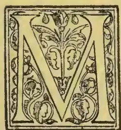

CASIMIR de Candolle has lately published an interesting paper entitled *La Vie Latente des Graines* (Archives des Sc. Phys. et Nat.; Bibl. Univers., 1895), in which he comes to the conclusion that if the external conditions necessary for the vital activities of seeds be absent for a long time they may be totally arrested, but yet the seeds may be alive and re-enter an active course of existence after, perhaps, an indefinite period. His experiments were conducted in a cold room of a meat refrigerator, having made a preliminary one as follows:—Three lots of Peas and Haricot Beans were placed (1) in free air; (2) in a tube of air, but sealed; (3) in pure carbonic acid. After two years (1) had increased in weight, and nearly all germinated; (2) had lost weight while a smaller proportion germinated; air now containing 11.4 per cent. of oxygen, and 3.8 per cent. of carbonic acid; (3) none came up. He asks the question whether the enfeebled vital activities had ceased before the end of the experiment, so that respiration and assimilation had completely stopped; if so, the protoplasm must become quite inert. He believes that to be the case. He now experimented with an intensely cold temperature, having previously determined that Peas, Haricots, and Fennel seed would germinate after an exposure of four days to a temperature of 148° F. He wrapped up some Wheat, Oats, seeds of Fennel, of the Sensitive plant, and of *Lobelia Erinus* in tin foil. All were well packed in a cylindrical iron box of 3½ cubic feet capacity: the lid being hermetically sealed. This was placed in an open wooden box for protection. The whole was subjected to an intermittent stream of intensely cold air coming direct from the refrigerator, from May to September, 1894, or 118 days.

The cold air was continued from eight to twenty hours per day; the average time being fourteen hours. On the greatest number of occasions (sixty-eight times), the cold was prolonged for twenty hours.

The lowest temperature reached was—65° F., and the highest—36° F.

In the intermediate periods the warming was very slow, for the temperature scarcely passed freezing-point at the end of two to three hours, after stopping the machine. Conversely, the cooling of the box was very rapid, as it was directly exposed to the current of cold air.

M. De Candolle asks the question whether the box could check the cooling. As an experiment in this direction, he completely filled a box with corn. The lid, being hermetically sealed, was then pierced to allow the bulb of a thermometer to pass through it, and the hole was then plugged with cotton-wool. He then observed the thermometer outside a window. The rate of cooling varied much according to the initial temperatures, and in proportion as the exterior air was calm or agitated. Thus, in a strong north-east wind, the temperature of the room being 18° Fahr., and 17.5° Fahr. outside, it took twenty-six minutes to ascend to 21° Fahr. On a calm day when it was 53.6° Fahr. in the room and at freezing point outside, it took one hour and eight minutes to descend to freezing point.

But, as M. De Candolle observes, this experiment does not bear much, if any, analogy to the cooling by the air from a refrigerator, for the box was placed in the direct current from it. Moreover the seeds were surrounded by a metallic paper, greatly facilitating the conductivity of the box. He thinks, therefore, that not more than a quarter of an hour would be required to put the temperature of the box in equilibrium with that of the cold air. On taking out the seeds, they were at once sown. Nearly all the Wheat, some of the Oats, and some Fennel seeds quickly appeared. Of sixty-six seeds of the Sensitive plant, thirteen only came up; while of numerous *Lobelia* seeds, only ten germinated.

The failure of the seeds of the Sensitive plant was not solely due to the cold, as many failed to germinate, while many *Lobelia* plants grew in a control experiment. The conclusion the author arrived at was that life, as expressed by vital functions, was completely arrested for a time; the protoplasm was inert, and could not either respire or assimilate.

461------------------------------------------------

436THE TROPICAL AGRICULTURIST.[JAN. 1, 1896.

The cause of some being killed was that their protoplasm had not yet become completely inert.

If this result be true, then, one would expect that seeds could be maintained with impunity in a medium unsuitable for respiration, provided there was nothing which could exert a deteriorating effect upon the internal chemical processes, as does carbonic acid.

He, therefore, tried the effect of plunging seeds in mercury; thus, 8 grains of Wheat were placed below 2.5 cm. of mercury for one month (October 19 to November 19). Of these four only germinated. Of 5 grains of Wheat under 13 cm. of mercury, from November 27 to December 28, four grew. Of 5 grains of Wheat under 5 cm. of mercury, from February 5 to May 5, all grew. Similarly 13 grains of Cress, under 5 cm. of mercury, for two months, all germinated.

This experiment, therefore, as that with a low temperature, shows that seeds can exist in a state of complete vital inertia; and that the internal changes of metabolism can be arrested, as long as the necessary external conditions of temperature, moisture, &c., are withheld.

M. De Candolle thinks that this state of chemical and vital inertia may last, perhaps, indefinitely. He then gives the following cases in illustration:—M. A. P. De Candolle mentions a case where grains of the Sensitive plant germinated very well after upwards of sixty years repose (*Physiologie*, p. 621). Girardin has seen Haricot Beans germinating which were taken from the herbarium of Tournefort, where they had lain for a century. In 1850 Robert Brown sowed, for curiosity, some seeds from the collection of Sir Hans Sloane, 150 years old, several germinated, as for example, one of *Nelumbinis speciosum*, of which the plant is still preserved in the Natural History Museum. He refers to the popular notion of "Mummy Wheat" having germinated, only to refute it, adding, that it appears that the grains were sterilised before being placed in the tomb—but he does not give the proof of this. The present writer finds the starch grains to be perfectly sound, and to colour readily with iodine; so that the grains could not at least have been boiled. The most extraordinary case to which he refers was observed by Prof. De Heldreich (*Garten Flora*, 1873, p. 323), the Director of the Botanic Garden at Athens. In botanising about the mines of Laurium he discovered in 1873 a new species of *Glaucium*, *G. Serpieri*. It made its appearance from under a thick layer of volcanic scoria, to which he would assign a date of 1500 years. He concludes with a reference to the investigations of M. Peter, who took soil from the interior of forests; and, after taking every precaution, found that soil from ancient forests gave rise to woodland species only; but soil from recent forests supplied species of open plains and fields, according as the forest had replaced these respectively. Admitting that his experiments did not decide the question, M. Peter thinks it would be safe to allow at least fifty years of duration of arrest of vital activity in the seeds buried in the soil of forests.—*Gardeners' Chronicle*.

### COMMERCIAL FIBRES.

By D. MORRIS, C.M.G., M.A., D.SC., F.L.S.,  
Assistant-Director of the Royal Gardens, Kew.

#### PLANTING AND BANANA FIBRES.

Besides Manila hemp, produced by *Musa textilis*, other species produce fibre useful for cordage purposes, for mats, and for making coarse paper. The plantain, in Jamaica (*Musa sapientum*, var. *paradisiaca*), produces a white, glossy fibre at the rate of 1.81 per cent. of the gross weight. The price of the best plantain and banana fibres is, however, seldom above £12 per ton, and they would only fetch this price when there is a high demand for white-rope fibres, and a short supply of Manila and Sisal hems. In spite of this, it is worthy of consideration, whether the immense number of banana stems cut down every year in the West Indies (estimated at 50,000,000) could not be utilised for their fibre. It is evidently not sufficiently good to compete with first-class rope fibre, but it might possibly be used for making

coarse paper, as a packing material, or even for the manufacture of *papier maché*. The Abyssinian banana, *Musa Ensete* yields a somewhat weak and dull-looking fibre. *Musa Bajoo* is grown in Southern Japan for its fibre, which is woven into cloth of an exceedingly durable character. *Musa sumatrana*, forming an impene rable jungle in the Malay Peninsula may eventually prove a useful fibre plant. A banana, native of the Solomon Islands, yields fibre which is woven into ornamental garments, bags, and sleeping mats.

#### PINE-APPLE FIBRE.

The common pine-apple (*Ananas sativa*) has a ressete of 30 to 50 narrow, strapshaped leaves, from 3 to 5 feet long. These contain an abundance of fibre which, though somewhat difficult to extract, is possessed of great merit. It is finer and stronger than that yielded by almost any other plant except China grass. In the East Indies it is manufactured into a beautiful fabric known as "piña" cloth. In the Straits Settlements, Sicra Leone, and some other localities in the Old World, this tropical American plant has become thoroughly naturalised. The leaves in these semi-wild plants are more highly devoted than in plants cultivated for the fruit, and hence are better suited for fibre purposes. In the Philippines it is also customary to pluck the fruit before it matures: this is said to cause a considerable extra development of the leaves.

Pine apple plants are grown in every tropical country and their cultural treatment is well known. They are easily propagated by means of offsets from the base. The leaves are fully developed in about 12 to 18 months, and each plant could yield at least 10 to 20 leaves every year. For piña cloth the fibre is extracted by scraping by hand, then washed and laid out to bleach in the sun. The steeping, washing, and drying are repeated until the fibres are considered to be properly bleached. The fibre bundles are very fine, transparent, strong, and supple. The ultimate cells are from 2 to 5 mm. long, fine, uniform in diameter throughout, solid and glossy.

A sample of pine apple fibre of excellent and extraordinary length (6 feet), grown at Malacca, was brought to this country by Mr. Derry in 1893. It was stated, in the "Kew Bulletin," 1893, p. 368, that one manufacturer was hopeful of using 1,000 tons a year or more of this fibre at the price of £30 per ton, delivered in London. "Pine-apple hemp" is a regular article of export from Formosa to Swatow, where it is made into fine "grass cloth," esteemed for its coolness as a summer wear.

#### CARAGUATÁ FIBRE.

Caraguatá (*Bromelia argentina*).—The best fibre of Paraguay is "Caraguatá ibera." It is described as long and silky. There is frequent mention of it in works of travel, and fine specimens were shown in the Paraguay Court at the Exposition Universelle, held at Paris in 1889. Specimens of the plant, abundant in a wild state, were received at Kew in 1890 and it was found to be a new species of *Bromeliaceæ* allied to the pine-apple, which it resembles both in habit and character of the leaves. In a report furnished to the Foreign-office by Mr. Arthur Herbert (No. 1,006, 1892), it is stated "the *ibera* is a sort of caraguatá, and its fibre is of a finer quality than that of its congener, but neither of them has obtained any importance in commerce owing to the cost of cleaning and separating the fibre from the leaves. Several attempts have been made but so far without any great success. From the interest that has been awakened in this product in European markets it would seem to deserve a more serious study, and the opinion seems to prevail that with improved machinery and more skilful administration more profitable results might be obtained." Any machinery that could successfully extract pine-apple fibre could also clean the caraguatá fibre. It is anticipated by those acquainted with the local circumstances that caraguatá fibre will some day form an important article of export from Paraguay.

#### OTHER BROMELIA FIBRES.

According to the "Kew Bulletin," 1887, April, p. 8:—

"There are several samples of a wild pine-apple (*Bromelia sylvestris*, Willd.) from the West Indies

462------------------------------------------------

JAN. 1, 1896.]THE TROPICAL AGRICULTURIST.437

and Central America at Kew, but there is no record of their commercial value. A sample supposed to be from this plant was lately sent from Trinidad, upon which the brokers reported as follows:—"Not yet in commercial use, but destined, we think, to a successful future; fine, soft, supple fibre, strong and good colour, ample length; say £30 per ton and upwards."

"The fibre of the Jamaica Pinguin (*Bromelia Pinguin* L.) would appear not to be of high value. The plant covers hundreds of acres in the plains and low-lands of Jamaica, and an effort was made some time ago to prepare the fibre for commercial purposes. The report of brokers upon a sample of 90 lb. was as follows:—"A long, towelled, weak fibre, of bad colour, coarse, no strength, and only fit for breaking up. Similar to St. Helena hemp tow. but not so good. We should think £12 to £10 per ton to the utmost value." Several samples of this Pinguin fibre from Jamaica and elsewhere, cleaned both by hand and by machine, are to be seen in the Kew Museum, No. II."

Another bromeliad (*Karatas Plumieri*) with leaves 8 to 10 feet long, armed with distant, incurved teeth, is common in Tropical America. It is a well-known and valuable fibre plant. It is said to be used by Indians in making the finest hammocks in Central America, Guiana, and Brazil.

#### BOWSTRING HEMPS.

The species of *Sansevieria* yielding Bowstring hems have creeping rhizomes and a rosette of leaves of a fleshy character, sometimes flat, concave, round, or spear-shaped. The flowers are in spikes or clusters, white or green. The leaves are dark green, more or less succulent, and handed or mottled with white or black markings. They abound in a very valuable fibre, remarkable alike for fineness, elasticity, and strength. The *Sansevierias* are chiefly of African origin, but one at least may be Indian. Some of the species are already widely distributed in tropical countries. They are capable of being propagated very readily. Usually the rhizomes are divided and planted; plants may, however, be raised from seed, or, better still, from the leaves, which, if cut into pieces about two or three inches long, readily take root in moist situations. Plants may be put out at 3 or 4 feet apart. The first leaves for cutting may be produced in three to four years. In India, with *Sansevieria roxburghiana*, 1 lb. of fibre was extracted from 40 lb. of small green leaves. It was calculated that "one acre would yield 1,613 lb. of clean fibre at a gathering, two of which may be reckoned on yearly." So far *Sansevieria* fibre is not in commerce. It is, however, used largely in India—where it first received the name of bowstring hemp—in Ceylon, and on the West Coast of Africa for twine and cordage, and is regarded as most valuable. The fibre of *Sansevieria cylindrica*, known in Angola as "Ifé," is said to be the best fitted for deep sea sounding of any fibre known. The special merits of the fibre yielded by each species will be mentioned below.

Konje Hemp (*Sansevieria guineensis*).—One of the oldest and best known species. The mottled leaves are somewhat flat and leathery, about 3 to four feet long, 3 inches broad in the middle. On the Zambezi it yields "a valuable fibre similar to Manila hemp." It grows "in great abundance in many places, keeping to the shade of woods." In Mauritius, Jamaica, Cuba, and Trinidad it is semi-wild and yields excellent fibre. In Jamaica the return, under favourable conditions, is estimated at  $1\frac{1}{2}$  tons of dry fibre per acre, of the gross value of £45. Samples received in this country from Trinidad, in 1886, were valued at £20 per ton, but the colour and strength were not normal. Good machine-cleaned fibre from Cuba is said to have realised £50 per ton.

*Sansevieria longiflora*.—This plant is a native of equatorial Africa. The leaves are like those of *S. guineensis*, but usually larger or flatter, and not invariably blotched with green. The best distinction is the individual flower, which is 3 $\frac{1}{2}$  to 4 inches long, while in *S. guineensis* it is only 2 inches long. Fibre from *S. longiflora*, grown at Kew, was described in 1887 as "very bright, clean, and strong; in every

way a most desirable commercial article. It would compete with the best Sisal hemp for rope-making purposes. Value £30 per ton."

Pangane Hemp (*Sansevieria Kirkii*).—The leaf is very horny in texture, with a brown edge, much mottled on both sides. This species was discovered by Sir John Kirk, who states, "It grows abundantly near Pangane on the mainland opposite the island of Zanzibar.....It is used by the natives and yields a long and useful fibre." The robust habit and large size of the leaf of this plant render it very valuable for fibre purposes. Under exceptional circumstances a single leaf will attain the height of 9 feet. Fibre from a plant grown at Kew was valued in 1887 at £27 per ton.

Neyanda (*Sansevieria zeylanica*).—This has long been cultivated in Ceylon. The leaves are semi-circular in transverse section, 1 to 2 feet long, dull green with a red margin, and copiously banded with white. The Sinhalese use the fibre in numerous ways for string, ropes, mats, and a coarse kind of cloth. Generally the fibre is prepared by retting or by simple beating and washing. The small size of the leaves, and the difficulty of handling them in large quantities, would render this species of less value commercially than any of the preceding.

Ifé Hemp (*Sansevieria cylindrica*).—This is a most distinct and curious-looking plant. The leaves are quite cylindrical and solid, about 3 to 4 feet long, and about an inch in diameter at the base. When growing they look like a cluster of sharp-pointed stems. The species extends across South Africa from Zanzibar to Angola. The fibre, as already stated, is very valuable. Specimens prepared from plants grown at Kew were valued at £28 per ton. *S. sulcata* is very similar, but the leaves are more slender, with rather deeper vertical grooves. The fibre is slightly weaker, and valued at £26 per ton.

#### SISAL HEMP.

Sisal hemp, Henequen, or Yucatan hemp, is produced by a species of *Agave*, native of Mexico, of which the common "American aloe" is the type. There are two, if not more, varieties cultivated for fibre. The chief one is the "Sicqui" (*Agave rigida*, var. *longifolia*). Plants were received at Kew in 1879, and again in 1890. The other is the "Yaxqui" (*Agave rigida*, var. *sisaluna*). The former has leaves with side teeth, and a strong terminal spine; the latter has the terminal spine only; the edges of the leaves are smooth.

Cultivation.—These *Agave* plants are propagated either by suckers from the base of the stem, by seed, or by bulbs (called "pole" plants) produced on the flowering branches. The latter appear in the axils below the flower, and number many thousands. They remain in the parent plant until they are about four to six inches long, and sometimes much longer.

The land suited for the cultivation of Sisal hemp is entirely different from that required for Manila hemp. The best fibre districts in Yucatan possess an arid climate, with gravelly, stony, or rocky soils; they are only a few feet above the level of the sea; the summer heat is intense. It is claimed that the fibre is stronger and more abundant in dry, hot soils than in rich, deep soils. The plantations are formed with young plants about 18 to 20 inches high. These are put out in rows, at distances varying from 6 to 12 feet apart, equal to about 600 to 1,000 to the acre. Broad lanes are left here and there for the purpose of making roads or tramways, all converging on the factory, where the leaves are cleaned. A plantation begins to yield in three to five years, depending on the size of the plants when first put in, and the nature of the soil and cultivation.

Harvesting.—When the leaves are fit to cut 10 to 20 are taken from each plant, beginning from below. The cutting may be repeated two or three times a year according to the vigour of the plants. As soon as a plant shows signs of "paling" it is regarded as useless for fibre purposes. The pole is cut out and the remaining leaves are harvested soon after. To provide for the continuance of the plantation "it is the custom to place at the foot of each plant (when about three-fourths of its life are spent) a small plant which replaces the old plant when the

463------------------------------------------------

438THE TROPICAL AGRICULTURIST.[JAN. 1, 1896.

latter is removed." The period of the life of a plant may extend from five to ten years or more. Cutting the leaves too severely will accelerate the paling of the plant and thus destroy its usefulness.

*Extracting the Fibre.*—The leaf-cutters are paid at the rate of 25 cents per day for 200 leaves. The leaves are conveyed from the fields to the factory either on mule back or by means of light tramways. Each mule carries 200 leaves each trip; a task of 10,000 leaves requires ten trips, with five mules each. On the tramway a mule can draw a waggon with 3,000 leaves and make five trips a day. Most of the large fibre estates in Yucatan are provided with light portable railways on the French Decauville system. The more common machine used for extracting the fibre is the "raspador." It is a rude piece of machinery consisting simply of a wheel like a four-foot pulley with a six-inch face. Across the latter are fitted pieces of brass an inch square and six inches long, running across the face about a foot apart. This wheel runs in a heavy wooden frame and makes about 110 revolutions per minute. The leaf is put in at one end of the machine and held by a strong clamp while exposed to the beaters. The pulp is soon crushed out of it, leaving only the fibre. The leaf is then reversed and the other end cleaned in the same way. The average work of one machine, requiring  $1\frac{1}{2}$  horse-power, is 7,000 to 9,000 leaves per day with two men feeding. It is estimated that 1,000 ordinary leaves will yield 50 pounds of dry fibre. Exceptionally they will yield 100 pounds, but from strong plants from five to seven years old 75 pounds would be a good yield. After the fibre is cleaned it is spread out in the sun to dry. It is afterwards pressed into bales by lever or screw presses or by hydraulic pressure. The latter method is becoming general. The bales vary from 350 to 400 pounds, with a cubic measurement of 22 feet. It is calculated that the total cost of growing and cleaning the fibre and of delivering it at Progreso, the port of shipment, is about  $3\frac{1}{2}$  cents to 4 cents per pound Mexican money (about  $1\frac{1}{4}$ d. to  $1\frac{1}{2}$ d. English money).

*Position of the Industry.*—The fibre plantations in Yucatan are estimated to cover about 24,000 acres. The total yield in 189 was 350,000 bales of 375 lb. each giving a total weight of 131,250,000 lb. For the whole country, this would be at the rate of 760 lb. per acre. The actual return is probably a good deal more, as the total area under cultivation is not all yielding fibre. The estimated yield of the Yucatan plantations in 1895 was 400,000 bales. A State duty of 20 cents per 100 lb. is levied on hemp exported from Progreso. A detailed account of the fibre industry in Yucatan is given in the "Kew Bulletin," 1892, pp. 272-277, and 1893, pp. 212-218. The latter was prepared by her Majesty's Vice-Consul at Progreso. A general account of Sisal hemp plants, and efforts to start industries in various countries is given in the "Kew Bulletin," 1892, pp. 21-40. Attached to this is a return of the average price per ton (spot value) obtained for Sisal hemp in this country for each month from January, 1879, to December, 1891. The following is a brief summary, based on this return, brought down to September, 1895:—

<table border="1">
<thead>
<tr>
<th rowspan="2">Year.</th>
<th colspan="2">Highest.</th>
<th colspan="2">Lowest.</th>
<th colspan="2">Average for the Year.</th>
</tr>
<tr>
<th>£</th>
<th>s.</th>
<th>£</th>
<th>s.</th>
<th>£</th>
<th>s.</th>
</tr>
</thead>
<tbody>
<tr>
<td>1879.....</td>
<td>32</td>
<td>10</td>
<td>21</td>
<td>0</td>
<td>24</td>
<td>0</td>
</tr>
<tr>
<td>1883.....</td>
<td>29</td>
<td>0</td>
<td>24</td>
<td>0</td>
<td>27</td>
<td>0</td>
</tr>
<tr>
<td>1889.....</td>
<td>56</td>
<td>10</td>
<td>45</td>
<td>0</td>
<td>50</td>
<td>0</td>
</tr>
<tr>
<td>1894.....</td>
<td>20</td>
<td>0</td>
<td>15</td>
<td>0</td>
<td>17</td>
<td>10</td>
</tr>
<tr>
<td>1895.....</td>
<td>17</td>
<td>0</td>
<td>13</td>
<td>0</td>
<td>14</td>
<td>7</td>
</tr>
<tr>
<td>Jan. to Sept.</td>
<td></td>
<td></td>
<td></td>
<td></td>
<td></td>
<td></td>
</tr>
</tbody>
</table>

The fall in prices, so marked in the United Kingdom since 1889, was equally prevalent in the United States. This will appear from the following:—

<table border="1">
<thead>
<tr>
<th>Price per lb. in.</th>
<th>1892.</th>
<th>1893.</th>
<th>1894.</th>
<th>1895. to Sept.</th>
</tr>
</thead>
<tbody>
<tr>
<td>Dec. 31.</td>
<td>6 to 6<math>\frac{1}{2}</math></td>
<td>3<math>\frac{1}{2}</math> to 3<math>\frac{3}{4}</math></td>
<td>2<math>\frac{1}{2}</math> to 2<math>\frac{3}{4}</math></td>
<td>2<math>\frac{1}{2}</math> to 4<math>\frac{1}{2}</math></td>
</tr>
</tbody>
</table>

Note added.—The monthly report on Sisal on the 15th September, 1895, showed a more favourable tendency. The spot value was £16 to £17 per ton.

#### BOMBAY ALOE FIBRE.

Bombay Aloe (*Agave vierparia*).—The plant is a native of tropical America, but widely spread in the East Indies. It is extensively used as a hedge plant in India, in B. m. b. a., and the North-West Provinces. The leaves are very long, narrow, and concave, with rather distant, brown teeth, and a terminal spine. Numerous bulbils are produced on the flower spike, hence the specific name. When white-robe fibres were in high demand, the fibre from *Agave vierparia* was prepared rudely by hand, and shipped from Bombay. It was, from the first, practically unsaleable. In 1890 the stock in this country had accumulated to over 1,000 tons. The prices quoted were from £5 to £12 per ton. As pointed out in the "Kew Bulletin," 1890, pp. 50-51, well cleaned fibre from this species was really worth at that time from £25 to £30 per ton. The difference in price was entirely due to the character of the cleaning.

A very similar fibre to Bombay aloe fibre was imported this year from Natal under the name of South African hemp. It was probably yielded by *Agave americana*. It was of bad colour, not well cleaned, and almost unsaleable. It is useless to ship fibre of this character from any British possession.

#### MANILA ALOE FIBRE.

Manila Aloe (*Agave vierparia*).—The plant known locally as "Maguey" is the same as that yielding the Bombay fibre mentioned above. It is also cleaned by hand. The value of the Manila fibre has always been slightly higher than the Bombay fibre, owing to its being presented in a cleaner condition. In March, 1893, Manila aloe fibre was quoted at 17s. per cwt., while Bombay aloe fibre was dull at 8s. to 13s. per cwt. It was only possible to produce the former when the price of white-robe fibres was exceptionally high. Of late years it has almost disappeared from commerce. In the Philippines the aloe fibre is used for making strings for violins. It is important to distinguish between this fibre and Manila hemp. The latter is yielded by *Musa textilis*.

#### MAURITIUS HEMP.

The Green or Fatted Aloe yielding Mauritius hemp (*Furcraa gigantea*) was introduced as a garden plant from South America, about 1790. It is known amongst the French as *Moës vert*. In 1837 it had established itself spontaneously in many localities in the island. About 1872, the quantity of plants growing on abandoned sugar estates suggested their utilisation for fibre purposes. The first exports were 214 tons, of the value of £4,934. Since that time, with some fluctuations, due to the ebb and flow of demand, the Mauritius hemp industry has steadily advanced. The value of the exports is now about £50,000 annually. The plant has much the habit of an "Aloe," but the leaves are bright green in colour, and with no teeth or terminal spine. The leaves are often 4 to 7 feet long, and 5 to 8 inches broad in the middle. The flowers are greenish white, on a branched peduncle or "pole" 10 to 20 feet high. Bulbils are produced as in some species of *Agave*. The plant is chiefly propagated by means of these. Regular plantations are established on the same plan as those described under Sisal hemp. Plants that have "poled," are replaced by strong young plants from nurseries. The life of a plant is about seven to ten years. They are, therefore, cut for about four or five years before they pole. Over-cutting the leaves tends to cause the plant to flower and die prematurely.

*Fibre Machines.*—The hemp industry in Mauritius was greatly advanced by the invention of local machines, called *grattes*. They cost about £20 each, and are worked by steam or water power. The grattes are on the same principle as the *raspador* of Yucatan, and consist of a drum, with bolted blades, which revolves at a great speed in front of a feed table, on which the leaves are placed. One *gratte* is served by two men, who work alternately; one of them must be left-handed. The out-turn of wet fibre for each machine is, on an average, about 94 lb. per hour; the out-turn of dry fibre per day of eight hours for each machine is 214 lb. The average cost of producing a ton of fibre ready for shipment in 1890 is 225 rupees. A full account of the Mauritius

464------------------------------------------------

JAN. 1, 1896.]THE TROPICAL AGRICULTURIST.439

fibre machine is given in the "Kew Bulletin," pp. 98-101.

*Mauritius hemp* is not largely used for cordage purposes. It has special application on account of its fineness and lustre, and is much used for ornamental purposes. The prices have been well maintained, in spite of the depressed condition of most fibrous substances during the last two years. In March, 1895, the quotations were:—"Good white, 21s. to 24s. per cwt.; fair, 17s. to 18s.; common, 14s." The imports in 1893 were 1,373 tons; in 1891, 681 tons.

*Furcraea gigantea* has been largely planted at the island of Anguilla in the Leeward Islands, under the direction of Sir William Haynes Smith, K.C.M.G. The plantation is about 350 acres in extent, and the first crop of leaves will be shortly harvested. Should the price of *Mauritius hemp* be maintained, the Anguilla plantation is likely to be very successful.

#### SILK GRASS.

Although this term is sometimes applied to some species of *Bromelia*, it is more generally applied to *Furcraea cubensis*, one of the "green aloes," very similar in appearance to the plant yielding *Mauritius hemp*. It is a native of tropical America, and is cultivated in Jamaica and Tobago as a fibre plant. The leaves are 5 to 6 feet long, usually armed with strong prickles, but sometimes unarmed (as in the variety *inermis*), or with few prickles. The yield of fibre is at the rate of 2.5 to 3.15 per cent. Samples of silk grass fibre from Jamaica were exhibited in 1884, at £27 per ton, and reported to be superior to Sisal." Another species, *Furcraea sellota*, with leaves 3 to 5 feet long, armed with brown horny teeth, is plentiful in Ceylon, but apparently scarce elsewhere. The fibre yielded by it is very similar to that of *F. cubensis*. Unlike the latter, however, it has no unarmed variety, and is therefore not likely to be widely cultivated for fibre purposes.

#### NEW ZEALAND PHORMIUM FIBRE.

The plant yielding this interesting fibre (*Phormium tenax*) is very variable. It belongs to the liliaceous order, and has very long, sword-like leaves, growing in opposite rows, and clasping each other at the base. There are two well-marked varieties. One has leaves 5 to 10 feet long, bright green above, glaucous beneath, with the flowers red; the other has shorter leaves, with the flowers yellow. The flowering stem is large, and alternately branched. It rises out of the centre of the leaves, reaching a height of 12 to 16 feet. The fruit is a three-valved capsule, containing two rows of small, flattened black seeds.

The Maoris are said to recognise about 55 sorts of the *Phormium* plant to which distinct names are given. The accepted number amongst Europeans is much less. Each shoot has five leaves, and about ten shoots go to a clump; there are therefore about 50 leaves in a clump. Exceptionally the leaves may be 10 feet high, but usually they are from 5 feet to 7 feet high. So far the *Phormium* plant is not regularly cultivated. The fibre is prepared wholly from wild or semi-wild plants. It is recommended to start plantations under favourable conditions, and make *Phormium* one of the established crops of the country. By such means it is anticipated that the leaves will be more uniform in character, and capable of yielding a better class of fibre.

*Phormium* has been the subject of extensive investigation in New Zealand for many years. Numerous experiments have been undertaken with the view of improving the methods of preparation, and extending the application of the fibre. The results have not been successful. The subject is still occupying the serious attention of the New Zealand Government. In 1893 the following premiums were offered:—(1) £1,750 for improvements in machinery which will materially reduce the cost of production of commercial fibre; (2) £250 for a process for utilising the waste products of the industry. The results of the trials in connection with these premiums have not yet been published. It is probable that experiments carried on in this country with fresh leaves would be more successful. It is to be expected that the conditions in New Zealand, in a comparatively new community,

devoted chiefly to agricultural pursuits, are not so favourable for inventions as in the large manufacturing centres of England. A suggestion on this point is offered later.

It may be mentioned that the fibre of *Phormium* is neither a flax nor a hemp in the usual acceptance. It would be more correct to call it simply "Phormium fibre." It is one of the oldest exports of New Zealand. Between 1823 and 1832, although New Zealand was then visited only by whalers and a few traders, no less than £59,000 worth was shipped to Sydney alone. At that time the Maori hand-dressed fibre fetched a high price in the English market, under the name of "New Zealand flax." The Maoris were careful in the selection of the leaves, taking only those in which the fibre was properly ripened, instead of cutting over the whole plant indiscriminately and at all seasons. Machine-dressed fibre did not come into commerce until 1861, and then only to supply the deficiency in Mauna for rope-making. It is estimated that an acre will yield about ten tons of sun-dried leaves, and that the usual yield of fibre is at the rate of 12 cwt. per acre. *Phormium* is pre-eminent for its high yield of fibre; this is at the rate of 15 to 20 per cent. of green leaves. The old Maori fibre was so well prepared that it was capable of being made into damask and towelling equal to fairly good linen. Specimens of these are in the Kew Museum. The machine-dressed fibre is defective in many respects, and not suitable for the manufacture of twine or for use in binding machines. It is felt that the full value of the fibre can only be obtained by the use of a combined scraping and chemical process applied to carefully selected and properly matured leaves. This is well brought out in the following extract from the "New Zealand Official Year Book" for 1894:—

"The greatest improvement of the present system will be effected by the cultivation and careful selection of the leaves, and by the substitution of a chemical retting process for the prolonged washing and sun-bleaching which at present obtain. . . . The soda-sulphate process suggested by Mr. Cross appears to be the most promising. The advantage of this process over any other is the very high yield of fibre it achieves, which exceeds one-fourth of the weight of the green leaf, no other process having yielded more than one-sixth. The quality of the fibre produced resembles the native-made fibre in lustre and strength. For the future, if the *phormium* plant is to become a source of fibre supply for the world's market, its cultivation must be established in favourable situations. The natural supply is now difficult to collect, and still more difficult to renew and perpetuate."

The shipments of *Phormium* are variable. Owing to the improved demand for fibres generally, the number of *Phormium* mills in New Zealand increased from 30 in 1886, to 177 in 1891. The approximate value of the industry during the same period increased from £13,094 to 234,266.

The exports of *Phormium* for 1881, and for the years 1885-93, showing the quantities and values, were as follows:—

<table border="1">
<thead>
<tr>
<th>Year</th>
<th>Tons</th>
<th>£</th>
</tr>
</thead>
<tbody>
<tr>
<td>1881.....</td>
<td>1,308</td>
<td>26,285</td>
</tr>
<tr>
<td>1888.....</td>
<td>4,042</td>
<td>75,269</td>
</tr>
<tr>
<td>1889.....</td>
<td>17,084</td>
<td>361,182</td>
</tr>
<tr>
<td>1890.....</td>
<td>21,158</td>
<td>381,789</td>
</tr>
<tr>
<td>1891.....</td>
<td>15,809</td>
<td>281,514</td>
</tr>
<tr>
<td>1892.....</td>
<td>12,793</td>
<td>214,542</td>
</tr>
<tr>
<td>1893.....</td>
<td>12,587</td>
<td>219,375</td>
</tr>
</tbody>
</table>

The figures since 1893 have shown a remarkable falling off in exports both to this country and America. The latter imported only 7,000 bales in 1894, as against 70,945 in 1893.

A careful investigation of *Phormium* fibre was undertaken by Mr. Cross in 1886. The results are published in the Reports of the Royal Commission of the Colonial and Indian Exhibition, 1887, pp. 373-376. As compared with Irish flax *Phormium* fibre contains a lower per-centage of cellulose, the actual figures being, Irish flax 80.2 per cent., *Phormium* 65.7 per cent. This cellulose in *Phormium* is also

465------------------------------------------------

440THE TROPICAL AGRICULTURIST.[JAN. 1, 1896.

shown to possess a lesser stability than in flax. It is pointed out there is a very close structural resemblance between *Phormium* fibre and Manila fibre, so that in case *Phormium* may not be so useful as flax for the higher textiles it may be brought into more active competition than at present with Manila hemp as a white-robe fibre. The structural resemblance between *Phormium* and Manila hemp above noticed is corroborated by what takes place in commerce, "*Phormium*," writes one authority, "mixes well with Manila. When the demand in the States for binder twices runs on Manila then New Zealand *Phormium* is in such demand for mixing that it may go above Sisal in price."

The outlook in this direction is, however not very promising. The supply of Manila, as well as Sisal hemp, could be considerably increased if prices went up, as there are large tracts of land still available for cultivation, and the labour supply is both cheap and abundant. Further, the question of freight has to be considered. Freight on New Zealand *Phormium* to the United States in 1892 was £4 10s. per ton, while on Sisal it was only £1. Again, by sailing vessel to the United States the freight on Manila was only £1 12s. 3d. per ton. By way of England it is more. The best opening for *Phormium* is evidently in the direction of supplying a good fibre for textile purposes, and here the field, at present at least, is not so fully occupied.

The prospects of the *Phormium* industry are very fully discussed in a paper presented to the Houses of General Assembly in New Zealand (H. 22, 1892), containing correspondence with the Agent-General in London. The latter states:—

"There are a number of skilled persons who, if they had sufficient inducement and full and proper opportunity [in this country] for ascertaining the nature of *Phormium tenax*, would direct their attention to the discovery of a means whereby the plant could be effectually and economically cleaned, so as to enable it to compete with Manila and Sisal."

He then offers the following suggestion:—

"It appears to me that what is wanted is the cultivation of the plant itself in this country to such an extent as would provide sufficient materials for the purpose of supplying those whose skill and attention would be directed, on sufficient inducement being offered, to the discovery of proper machinery for preparing the fibre for the market."

It may be added that the plant grows very freely in the South of England, the South of Ireland, and many localities with a warm climate south of the isothermal line of 51° Fahr. A plot of about five acres in extent would be amply sufficient to supply leaves for experimental purposes. The importance of the interests concerned would fully justify the New Zealand Government to act upon the suggestion here given.

#### PALM-LEAF FIBRES.

Several species of palms with feather-winged or pinnate leaves, are utilised for the fine fibre contained in the leaflets. This fibre is fine and hair-like, very soft, and, when unbleached, closely resembles flax. It is composed of the fine fibro-vascular bundles running through the substance of the leaflet. It is deftly extracted by hand in the young state before it is hardened by exposure to the sun. The process is slow and tedious, but the value of the fibre is undoubted. It is remarkable for great strength and durability.

**Oil-palm Fibre** (*Elaeis guineensis*).—The oil-palm is the most valuable plant in West Africa. It is distributed in a wild state over the greater part of tropical Africa. The yield in palm oil and palm kernels is of the annual value of about £2,000,000 sterling. The fibre from the leaflets of the oil-palm has long been known in West Africa. Only small samples have occasionally reached this country. A very clear and graphic account of the method of extracting the fibre is given in the "Kew Bulletin," 1892, pp. 62-67 (with wood-cuts). The young leaflet is, first of all, deprived of the mid-rib for a short distance below the apex, and it is then split horizontally so as to expose the fibro-vascular bundles. These are taken up one by one, and usually twisted,

at once into a thin cord. If not so twisted, they are kept in small tufts, and eventually made up into a bundle. The threads are "as fine and tenacious as human hair." It is a hard day's work to prepare six ounces of this fibre from 36 lb. of the raw material. It is estimated that the actual cost of this hand-made fibre cannot be less than about £75 per ton. It is almost exclusively used for making fishing lines and fine cord. A sample submitted to Messrs. Ide and Christie, in June, 1891, was described as of "great strength and fineness, and, if really spinable, worth £50 to £60 per ton." This must be regarded as one of the most valuable and lasting of tropical fibres.

**Gri-gri Fibre** (*Astrocaryum* spp).—In the West Indies, at St. Vincent, and on the Atlantic slopes of Central America the Caribs extract a fibre from the young leaflets of the Gri-gri and other palms identical in character with that of the oil-palm. Demonstrations in extracting fibre were given by the Caribs sent from St. Vincent to the Jamaica Exhibition, 1891. It is evident that the process is widely known amongst native races. Everywhere the fibre is regarded as most costly and durable. A fine fibre is extracted also from the leaflets of *Astrocaryum Tucuma* in tropical South America. This is knitted by hand into a compact web of so fine a texture as to occupy two persons three or four months in its completion. The handsome hammocks afterwards made from the web sell for £3 each, or even double that amount.

#### PALMYRA FIBRE.

A fibre very similar to West African bass, and nearly of the same character as Para and Bahia piassava, is obtained from the Palmyra palm, called by the Portuguese, *par excellence*, "palmeira," or "the palm tree" (*Borassus flabellifer*). In West Africa it is known as the Black Run palm. It is very tall, sometimes, but very rarely, branched, with large, fan-shaped leaves with spinous petioles. The fruit is nearly as large as a coconut, with one to three seeds. The Palmyra palm is widely distributed in India and Ceylon, but generally in a cultivated state. It is, however, truly wild in tropical Africa. In the East, it is a toddy or sugar palm. The young germinating nuts are cooked and eaten as a vegetable. The leaves are made into books, which contain the classics of the Pali and Singhalese languages. The timber is hard, and very durable; it is used for umbrella handles and walking-sticks. From the base of the petioles, or the sheathing leaf-stalks, is obtained a stiff, wiry fibre. This was at first called "bassine," to distinguish it from bass and piassava fibres. It came into notice as a commercial article in 1891, when the high prices of piassava induced the production of substitutes. At that time even split rattan, stained black, was requisitioned as a brush fibre. Palmyra fibre has steadily increased in quantity, and, contrary to what was at first anticipated, it has also risen in value. "The chief objection to Palmyra," wrote Messrs. Ide and Christie in 1892, "is that it lacks straightness, but experiments are being made in this country to overcome this defect, and should they prove successful it is claimed by importers and dressers that Palmyra should, for wear, be found equal to the best Para." These anticipations have, to some extent, been realised. Palmyra now has practically taken the place of West African bass. The latter, on the 16th Sept., 1895, was "dull, business small, £14 to £23 per ton." Palmyra fibre, on the other hand, was "good, £26 to £31; medium, £22 to £25; common, £15 to £19 per ton."

The natives in Ceylon and India are evidently copying the worst practices of the Indians of Brazil in sending consignments of Palmyra fibre to this country in a damp condition. The result is that as one firm complains, "the bales, on opening, are found wet, and the fibre to a large extent perished and powdery." Should the practice continue, the industry will be seriously injured. The bales are press-packed, and iron bound; they weigh 1 to 3 cwts., and measure 10 to 30 cubic feet.

#### KIRROOL FIBRE.

The Kittool or Kittul palm of India and Ceylon (*Caryota urens*) is a stout handsome plant with a

466------------------------------------------------

JAN. 1, 1896.]THE TROPICAL AGRICULTURIST.441

smooth annulated stem, 30 to 40 feet high. It has broad leaves, with the leaflets obliquely cuneate. The fruit is small and reddish. It is a toddy and sugar palm, and also yields sago.

Mr. J. R. Jackson, A.L.S., in "Commercial Botany," gives the following excellent account of the fibre yielded at the bases of the leaves of this plant:—"Kittool fibre," he says, "has been known in this country for some 30 or 40 years, but it is within the last 10 years that it has become a regular commercial article. When first imported, the finer fibres were used for mixing with horse-hair for stuffing cushions. As the fibre is imported, it is of a dusky-brown colour; but after it arrives here it is cleaned, combed, and arranged in long straight fibres, after which it is steeped in linseed oil to make it more pliable; this also has the effect of darkening it, and it becomes, indeed, almost black. It is softer and more pliable than piassava, and can consequently be used either alone or mixed with bristles in making soft, long-handled brooms, which are extremely durable, and can be sold at about a third the price of ordinary hair brooms."

The use of Kittool fibre is said to be spreading not only in this country, but also on the Continent. During 1895, Kittool fibre has not been much in demand. The values on the 16th September were quoted as follows:—"Long, 10d. to 10½d.; No. 1, 7d. to 7½d.; No. 2, 2d. to 2½d.; No. 3, 1d. to 1½d. per lb."

#### COCONUT FIBRES.

The Coconut palm (*Cocos nucifera*) is extensively cultivated in nearly all tropical countries. It exists in immense groves in Southern India, Ceylon, the Islands of the Eastern Archipelago, and Polynesia. Its cultivation is extending in the West Indies, and on the East and West Coasts of tropical Africa. The coconut palm is one of the first objects to be seen along the beach, and soon becomes one of the most familiar objects to travellers in the tropics. It is a valuable food plant for man and animals, and provides besides materials for the construction of houses, and numerous utensils in daily use. It has a cylindrical stem, usually gracefully curved, and attaining a height of 40 to 100 feet, surmounted with a crown of large feathery leaves. The plant is propagated by means of seed-nuts (the fruit); these germinate, if kept moist, in 3 to 5 months. The young plants are put out in their permanent places, when about 8 to 15 months old, at distances varying from 27 to 33 feet apart. The coconut begins to bear in 5 to 8 years. Usually, the nuts take from 8 to 10 months to mature before they fall from the parent plant. Each coconut palm bears from 30 to 60, and, very exceptionally, when well watered and manured, up to 100 nuts a year.

As shown above, the coir of commecree is yielded by the thick pericarp or outer fibrous covering of the fruit of the coconut palm. The word "coir" is said to come from the Malay *Káyar*, a twisted product. *Kayar* is also the Tamil for a rope. Although coir was known in Europe in the 16th century, it was not until about 1842 that it was brought prominently into notice. St. George's-hall, Windsor, in that year was laid with coconut matting on the occasion of the baptism of the Prince of Wales. Later a great impetus was given to coir manufacture by the Great International Exhibition of 1851.

Coconut fibre is tough, elastic, easily manipulated within certain limits, and eminently suitable for manufactures where lightness, cleanliness, and great indestructibility are required. It is understood that coconut fibre will not bear bleaching. Various shades of colour are, however, obtainable by using different descriptions of natural unbleached fibre. In an ornamental mat in the Kew Museum the various shades are obtained by using dark Fiji coir, medium coloured Ceylon coir, and very light Cochin coir.

Besides being made into rough cordage, coir is used in combination with wool to give richness and effect to hearth-rugs and carpeting. It is also used for brushes and brooms for household and stable purposes, matting for sheep-folds, pheasantry and poultry yards, church cushions and hassocks, hammocks, clothes-lines, cordage of all sorts, string for nursery-men, nosebags for horses, mats and bags for seed-crushers, oil pressers, and candle manufacturers.

Coir is one of the best materials for cables, on account of its lightness, elasticity, and strength. It is durable, and little affected by salt water. Of coir and coir-made rope, about 9,000,000 to 10,000,000 lb. are annually shipped from India; much is prepared in Ceylon; but Cochin is noted as the port of shipment for the best quality of yarns.

Certain varieties or cultivated forms of the coconut are better suited than others for the production of coir. Cochin (a small native state on the Malabar coast) produces a bright, light-coloured coir, which fetches the best price. On the other hand, a good deal depends on the age at which the nuts are gathered, and the time which elapses before they are husked and cleaned.

In the process of separating the fibre, the following commercial qualities are produced:—The mat, or long fibres, used for spinning purposes: the shorter, or more stubborn fibres (bristles), for brooms or brushes; the tow or curled fibre for stuffing cushions; and the dust or refuse for gardening purposes. When dyed black, the tow has been used as a substitute for horse-hair. A singular use was proposed a short time ago for coconut dust or refuse. Taken before it is quite dry, and subjected to great pressure, it is capable of forming plates of varying thickness, like millboard, only much more brittle. These boards, if used as backing for steel plates or ironclads, swell up on being punctured below the water-line, and soon close the orifice. If really effective, such plates could be produced at a trifling cost, for thousands of tons of coconut refuse float away annually down the rivers in India and elsewhere.

The first step in the preparation of coir is the removal of the husk from the hard interior shell. This is usually done by striking the nut on a pointed instrument stuck in the ground. A man can husk about 1,000 a day. The husks are then soaked in water. This is variously conducted. The water may be either salt, brackish, or fresh; in this the husks are kept for a lengthened period. The more recent method is to place them in tanks of water made warm with steam. The latter heatens the softening process, and improves the colour and quality of the fibre. Where machinery is used, the husks, when sufficiently soaked, are passed through a crushing mill, which flattens and crushes them ready for the extractor, or breaking-down machine. In the latter the fibres are completely disintegrated, and are then passed through a "willowing" machine, to free them from dust and refuse. It is calculated that, when treated in this country, 10,000 husks will produce 45 to 50 cwt. of "spinning fibre," and 9 to 13 cwt. of "brush fibre."

In Ceylon, 40 coconuts are said to yield 6 lb. of coir; in Madras, 3 large coast nuts yield 1 lb. of coir; in the Laccadives it requires 10 small nuts to yield a pound of coir, measuring, when made into yarn, 35 fathoms. In 1889, an attempt was made to export coir from Lagos. A bale of loose coir, weighing 42 lb., was prepared from 400 nuts. No attempt had been made to separate the "bristle" and "mat" fibres. Good Ceylon bristle fibre was then worth £30 per ton, and Ceylon mat fibre £10. The Logos fibre, when separated, was valued at £15 and £9 to £10 respectively ("Kew Bulletin," 1889, pp. 122-132). The average annual value of coir goods exported from Ceylon is put down at £60,000. The quantity exported in 1884 was as follows:—Coir rope, 10,419 cwt.; coir yarn, 84,057 cwt.; coir fibre, 12,732 cwt.; total, 107,208 cwt.

The principal exports of coir from India are from the Madras Presidency. For the five years ending 1880-81 they were 271,934 cwt., valued at R2,179,767 while for the year 1881-82 the value was R2,354,202. The exports from the Malabar coast alone amounted to R2,243,000. "From these figures an idea may be obtained of the immense importance of Malabar and the Laccadives as the chief seats of the Indian coir industry."

The approximate market value per ton of coir goods in London on the 16th September, 1895, were as follows:—

*Coir yarn:* Cochin, common to good, roping, £11 10s. to £14, weaving, fair to good, £20 to £25; Ceylon, fair to good, ballots and bales, £17 to £21.

467------------------------------------------------

442THE TROPICAL AGRICULTURIST.[JAN. 1, 1896.

*Coir fibre*: Cochin, fair to good, £11 to £20; Ceylon, clean, £8 to £9 10s.

*Coir rope*:  $4\frac{1}{2}$  to 6 inch,  $2\frac{1}{2}$  to  $3\frac{1}{2}$  inch, and  $1\frac{1}{2}$  to  $1\frac{3}{4}$  inch, £11 to £14.

*Bristle fibre*: Medium, £18 to £21; good, £20 to £30.—*Journal of the Society of Arts*.

## SWAMP PLANTING.

### EUCALYPTUS GLOBULUS AND OTHER EUCALYPTS.

Much has been written from time to time on the special antimalarial properties possessed by an Australian tree known as *Eucalyptus globulus* and such writings cause no inconsiderable number of enquiries at the Botanical Establishments of West Indian Colonies for plants of this species. It has been stated that the planting of this tree has lessened the amount of fever prevailing in the neighbourhood of the city of Rome and in other places, and it is therefore regarded as a suitable plant for any swampy district, and in this way, it has become a somewhat popular idea that *Eucalyptus globulus* should be planted in all malarial districts. I am conversant with what has been written on the subject by Baron Von Mueller and various other Botanists—but without controverting one word of what they have said, I must point out that in our case the circumstances and climate are so different, that I am sure that even Von Mueller himself would at once tell an applicant for information that it would be useless to plant under such conditions of climate as prevail in the lowlands of the West Indian Islands. During my twelve years in Jamaica I planted on plain and hill, and distributed year after year many hundreds of plants to others. Those on the hills succeeded, those on the plains invariably failed, and to plant in a swamp or near swampy ground was found to kill them at once. The tree, in the hills grow rapidly and Von Mueller, quoting from the records of the Department, states that trees had grown 60 feet high in seven years, and having been personally in charge of them for a period of six years I can fully confirm the statement. *Eucalyptus globulus* is a native of the Southern parts of Australia, where at times the temperature falls below freezing point, as in Victoria and Tasmania, so that it is not, in reality, a native of tropical regions, but requires, as do most plants coming from temperate climes, a season of rest or winter to enable it to thrive, and this our climate of the plains is unable to afford. The fact is, *Eucalyptus globulus* will not grow in the West Indian plains, and if planted it will not survive for more than a few months, and the reputation it has somehow or other obtained for being suitable for tropical growth is certainly nothing more than a popular fallacy. If we examine the reason given for its reputed anti-malarial properties, we shall find it stated. (Von Mueller, p. 151), "*Eucalyptus* leaves generate ozone largely for the purification of the air; and the volatile oil is very antiseptic." Not only is this true of *Eucalyptus globulus* but of many other plants of the genus, and also of some of our own West Indian plants, and where therefore *Eucalyptus globulus* is proved to fail, we should seek out other trees of a suitable character. If, however, *Eucalyptus globulus* will not grow with us, there are others of the genus that will thrive, among which we have *E. tereticornis*, and *E. citriodora* and others. Of the first, we have a tree in the Trinidad Gardens giving four feet in diameter of the stem at three feet above ground, and reproducing itself freely from seed, which of itself is a fair test of its acclimatization, but although *Eucalyptus globulus* has been continuously planted for years, not a single tree has thriven. Besides being ozone gives the Eucalyptii are rank feeders and absorbents of moisture, and it is highly probable that the tree acts in this way as a malarial antidote, far more than in giving off or dispersing an almost magic influence from its leaves, and that many West Indian or exotic trees of similar character would answer as well and serve the same

purpose. We may mention as suitable the Swamp Palm *Raphia to digera*, the Ivory Nut Palm *Phytelephas macrocarpa*, the Casuarinas, the Saman Guango or Rain Tree, *Pithecolobium*, Saman and the *Pterocarpus* of our own swamps. *Phytelephas* gives the ivory nut or "corossos" of commerce. Casuarinas in India have cost £1 to £10 per acre to raise, returning in eight years £13 to £32, (Von Mueller); and they are suitable for saline soils, and "thrive much better than *Eucalyptus globulus* in Lower Egypt," (Dr. Sweinfurth). The wood is admirable for fuel, and the tree has been proved to do well and grow rapidly on the Trinidad Lowlands. The Saman is well known for its beautiful wood and fast growing properties and the *Pterocarpus* give the Dragon's blood of commerce: but even such trees as these if planted directly into a swamp, will probably fail for many reasons; but if planted on small hillocks in or near such places, they will thrive and do well and ultimately take possession of it. Some may dispute the fact that *Eucalyptus globulus* will not grow in the districts indicated, and reference may be made to plants existing.

In such case I would recommend the cultivator to make sure of the species he has growing; for it may be safely assumed that it is not the plant supposed, but a species of the genus more suited to our climate. The species of Eucalyptii most suitable for cultivation here are those coming from the hottest and most tropical portions of Australia, such as the districts in the vicinity of Port Darwin or the most northern portion of the territory, and not those coming from the southern or more temperate regions. 12 June, 1881 J. H. H

## VARIOUS PLANTING NOTES.

THE DANGER OF WEED KILLERS.—We would draw the attention of all who handle weed-killers to the exceedingly poisonous elements sometimes included in such preparations. Messrs. Spiers & Pond were recently found to be a preparation of arsenic, without entering the signature and address of the purchaser. The preparation was sold as a weed-killer, and it said to have contained 75 per cent. of arsenic, and 25 per cent. of caustic soda, in all 2 lb. 13 oz. or sufficient to kill 6000 persons. Apart from the danger which might result to those buying such mixtures without due knowledge of their contents, there is no small risk involved if such violent poisons are left lying about in positions easily accessible to children and others ignorant of their nature or contents.—*Gardeners' Chronicle*.

"JOURNAL OF THE KEW GUILD."—We have already alluded to the recent publication of the number of May, 1895, and may now give some indication for its contents. It opens with a portrait and brief memoir of Sir William Hooker, the first Director. What he did, how great was his courtesy, and how potent his aid to young gardeners and students, is held in grateful remembrance by the older generation, and it is well that the new-comers should be made acquainted with the facts also. The main purpose of the guild, that of linking the Kew gardeners of the past with those of the present, seems to have been well accomplished, and no doubt the circulation of the present number will still further promote that co-operation and good fellowship which are so desirable. The items of Kew news have mostly been published already in the gardening papers, but it is very useful to have them collected in so convenient a form. The notes from far off members in all quarters of the globe are most interesting, and constitute a feature which we would fain hope may be much extended. Some notices of old Kewites who have passed away will be of interest to many who still hold their memory dear. There are some omissions which will probably be made good in subsequent issues. The list of old Kew men will prove very serviceable. We congratulate the promoters on the progress of the guild, and most heartily wish it all attainable success.—*Ibid*.

468------------------------------------------------

JAN. 1, 1896.]THE TROPICAL AGRICULTURIST.443

### THE HILL-COUNTRY OF CEYLON: THE BEST OF CLIMATES AND SCENIC ATTRCTIONS.

To see ourselves as others see us may occasionally shock our vanity, but it not infrequently produces precisely the reverse effect, and acts as a powerful antidote to the normal tendency of human beings to undervalue what is familiar to them. We are all aware of the floral and scenic beauty of our island. Every passing stranger sings its praises in our ears, and yet so immersed are we in the race for wealth that we scarcely have time to look about us and realise the marvellous gifts of climate as well as scenery with which nature has endowed this favoured isle. A pamphlet in manuscript lies before us by one who, as a recognised Meteorologist of high repute both in Europe and Asia, and a resident in many climes, is qualified to judge and speak with authority upon the merits of our hill Sanitaria. The author, Mr. Douglas Archibald, a former member of the Bengal Educational Service, has good reason to dread the deadly Bengal climate, which after four years sent him home in 1878, seriously invalided and no one than he can better judge of the superiority of even our sea-level climate over those of the Indian main land; and though he has recently returned to the scene of his former labours and been engaged in important meteorological work for the Government of India—amongst which a Monograph on the Climate of Calcutta is conspicuous,—he has wisely resided in the Himalayan Sanitaria, and is thus able to compare them from personal knowledge with our own Highlands.

Amongst the points which seem to have struck Mr. Archibald's imagination most forcibly are the accessibility of our hill resorts as compared with those of India. The journey to Simla for example, involves eight hours' weary jolting in an antiquated tonga, which occasionally, as he has told us happened to himself, breaks down and deposits its human freight in the road. This after 48 hours' railway journey in a May sun is enough to finish off the traveller altogether. To compare this with the delightful journey to Kandy, Hatton, and Nuwara Eliya, or Bandarawela seated in the refreshment car, eating iced bananas, qualling cool liquors, and gazing at our gorgeous scenery is like comparing barbarism with civilization! Another point is the relative cost of reaching our Sanitaria from say Calcutta. The journey to Simla from either Calcutta or Bombay including tonga is at least R120 or R130, and return about R160 or R170.

This spread over three days is R50 a day, whereas from Calcutta to Colombo, it is R180, return fare by P. & O. steamers spread over 10 days, or at the rate of R18 a day including feeding. In the other case the feeding by the way is all extra. Moreover, the sea-journey itself is incomparably pleasanter and alone one of the best of health tonics.

A further advantage upon which the author lays great stress is the vast superiority of our hotels right through to Bandarawela over the corresponding houses which adopt the title in India. We are not in the habit of considering ours altogether perfect but it is consoling to find that they are far ahead of most of those on the mainland, and though our prices may seem somewhat high, we at all events appear to get our moneys' worth.

The Eulogium pronounced by Mr. Archibald on Nuwara Eliya is to a great extent deserved especially in regard to the beauty of its scenery,

the facilities it affords for recreation of all sorts, and the absolute purity of its atmosphere and in these respects it deserves, as the author points out, to be better known and advertised. We are, so blessed with beautiful uplands that we are apt to underrate their supreme merits and forget that the enormous territory of Northern India has only one line of refuges from the heat at all of which the monsoon rainfall is far more disagreeable than at Nuwara Eliya. It must always be remembered that the rainy season in the districts of which Hatton is the centre is always declared by the resident planters to be about the healthiest, due to the equableness of the temperature, so that visitors should put this to the credit side even in the few months when the weather may seem to be against them. The "perfection of climate as we have frequently pointed out, is in the uplands of Uva, and the author fully recognises the remarkable feature of the climate of this district represented by Bandarawela in affording a complete shelter from the rains of the S.-W. monsoon while at the same time it has a mean temperature of only 3 degrees above the ideal of perfection viz. 65°. This means of escaping from the South-west monsoon rains is as Mr. Archibald points out a unique feature of Ceylon due to its insular position and is with a few exceptions such as Kashmir unattainable in India, and he draws attention to the peculiar advantages possessed by Bandarawela as a resort during June, July and August—or, indeed, from June till October.

### TIN-PLATE TEA CHESTS.

Mr. Frank Randell, of Llanelly, has written to the *Ironmonger* on the above subject, which is at present being largely discussed in Swansea tin-plate circles. He says:—"I will at once say that having had over twenty years' experience in the tea trade, the new style is, in my opinion, a very distinct improvement upon wood chests lined with lead, and I am convinced that it is the tea-chest of the future, now that I have seen the actual thing and the several advantages in its favour. I notice that there is a marked gain with regard to the weight of the chests or tare—viz., 10 lb. in every 100-lb. chest—and, therefore, in a cargo of, say, 10,000 chests, there is a saving of freightage of 100,000 lb., and a further gain of 1 to 2 inches cubic space per chest—two most important items in cost of transit. The tin-plate chest being hermetically sealed is a positive safeguard against any damage by water, either by sea or rail, and it is, moreover, proof against the possibilities of contamination by microbes or other germs of disease, to say nothing of a vast amount of tea being secured from running out through the cracked timber and other crevices often found in the wood chests, it being a well-known fact that several thousand pounds of tea are lost annually in this way during transit and handling from one warehouse to another. The use of tin chests further prevents the damp air getting into the tea, thus retaining its aroma and full flavour until wanted for use."

In view of an alleged scarcity of timber he holds that in cost the tin-plate chest will compare favourably with the wooden article. Commenting on the latter the *Ironmonger* says:—"It will be interesting to note whether the tin-plate manufacturers try to make a proper use of the opportunity. They seem to have a great chance of creating an enormous demand, and as China has lost her supremacy in tea, they have a magnificent chance of gaining converts in Ceylon, Assam, Japan, and other tea-growing countries. The Chinese may possibly adhere to the old chests, but elsewhere the tea-growers are progressive men, and if it can be shown that the tin-plate chests can be had at nearly the same prices at the wooden ones, they will almost certainly be adopted. Who amongst the tin-plate makers will take the matter up in an intelligent, level-headed, enterprising manner?"

469------------------------------------------------

444THE TROPICAL AGRICULTURIST.[JAN. 1, 1896.INDIAN AND CEYLON TEA IN AMERICA.

Mr. Mackenzie, the special commissioner for Ceylon, who is now in London, has sent us the following particulars referring to the campaign for pushing Indian and Ceylon tea in America:—"It is difficult to say anything about what is being done to push Ceylon and Indian tea in America without trenching on other people's business. And about that I have so often been asked to be discreet, that I think it well to say nothing. "But, vaguely and generally, I may say that I found much more interest is now taken in British-grown teas than was the case early this year. The vigorous efforts a few strong London firms have made to push their packet teas appear to have convinced American dealers that 'contemptuous indifference' is not the best attitude to assume towards the teas (Ceylon and Indian) chiefly contained in those packets."

"The advertising schemes which Mr. Blechynden and I propose to carry out were somewhat delayed by the uncertainty as to the amount of support we might expect from Calcutta. But beginning from December (next month), short pithy advertisements are to appear in twenty-seven periodicals of the weekly and monthly order, which concern themselves chiefly with ladies and household matters."

"Besides these, we advertise in the principal trade journals and in several New York and Brooklyn Saturday evening papers. We have also been assisting at food shows and in many other ways. Half-hearted measures are of no use, and are merely a grievous waste of time and money. We should strike strongly and at once. But unfortunately our Indian allies are, in my opinion, too niggardly with their funds. Then are rich enough and strong enough to furnish twice and much as Ceylon does. Yet it is with difficulty that *half* as much can be extracted from them."

"Several good firms have begun to handle our teas, chiefly because they have heard we are to assist largely in pushing them. It would be a pity were they to be disheartened because of failure on our part to do what they expect of us. Our opportunity is to be in 1896, and all our strength should be put forth during that year."—*H. & C. Mail*.

PRESERVATION OF BOOKS IN THE TROPICS.

In the *Kew Bulletin*, 1894, pp. 217, 218, an extract was given from *Indian Museum Notes*, Vol. iii. No. 3, on the best means for preserving books from the ravages of insects in the tropics. On this subject the following letter has been received from Surgeon-General George Bidie, C.R.E., formerly in charge of the Government Central Museum, Madras:—  
Berry View, Paignton, South Devon, 19th March 1895.

Sir,—In the *Kew Bulletin* for 1894, p. 217, there is a memorandum on the "Preservation of Books in the Tropics," and I now write to mention that so far as their protection from insect enemies is concerned, the subject was investigated by me years ago, when in charge of the Government Central Museum, Madras, and the practical outcome of the experiments recorded in the Museum Annual Reports for 1881 (p. 6) and for 1883 (p. 4). Indeed, it may be affirmed that the application of corrosive sublimate for the protection of books from tropical insects was first devised by the staff of the Madras Museum, and thereafter regularly used for the books in the scientific and large public libraries which it contains. Before bringing it into use it was carefully tested by placing books and papers poisoned with it in the nests of white ants, the most formidable of all the enemies of literature, and it was invariably found that the articles thus exposed came out of the ordeal uninjured. The composition of the Madras preservative was as follows:—

<table border="0">
<tr>
<td>Corrosive sublimate</td>
<td>..</td>
<td>1 oz.</td>
</tr>
<tr>
<td>Carbolic acid (Calvert's) (or Thymol, <math>\frac{1}{2}</math> oz.)</td>
<td>..</td>
<td>1 oz.</td>
</tr>
<tr>
<td>Mothylated spirits</td>
<td>..</td>
<td>2 pints.</td>
</tr>
</table>

This mixture was carefully and freely applied with a soft brush about the bindings and amongst

the leaves of the books, the eyes of the operator being protected with close fitting goggles. It dried quickly and was perfectly safe, as I have never seen or experienced any disagreeable effects from handling books poisoned with it.

My impression is that the value of this preservative was made known to all public departments by Government circulars, but apparently these never penetrated so far as Caleutta.—I am, &c.,

(Signed) G. BIDIE.

W. T. Thiselton Dyer, Esq., C.M.G., &c.,  
Director, Royal Gardens, Kew.

COLOMBIAN INDIA-RUBBER.

Through H. M. representative at Bogota (Mr. G. Jenner), Mr. Robert Thompson (who was for many years at the head of the Government Gardens and Plantations in Jamaica), has sent home a report on the agricultural productions of the department of Tolima (Colombia). The following is a reference of interest to our readers:—"A very important species of Rubber is indigenous, and, I am inclined to think, peculiar to Tolima. Unlike other important kinds of Rubber, it grows at high elevation, viz., at from 6,000 to 8,800 feet above the sea-level. Some thousands of bales of it were exported a dozen years ago. But as the tree was only locally distributed, the source of supply was soon exhausted. The authorities at Kew have named this plant *Sapium biglandulosum*, a species which is also said to be found in British Guiana, where, however, it seems to be of no value as a Rubber-producer."

"In connection with the cinchona plantations above referred to, a plantation of this Rubber was made about 10 years ago. The trees grew with remarkable rapidity with trunks a foot in diameter in six years; but this plantation shared the same fate as the cinchona, that is, it was abandoned years ago because the cinchona was abandoned. With renewed attention, however, this plantation may still be made important. "A few years ago I directed the attention of the Secretary of State for India to the advisability of cultivating this plant on a large scale in that country. My letter was referred to the Government of India. I think, however, that no progress has been made. This valuable plant, could be cultivated over a wide range of latitude in India, thus extending from the elevated mountainous regions of Southern India to the low-lying valleys of the Himalaya as far as 26° north latitude. And this is a great advantage as compared with the limited zone in which the other important tropical American species of Rubber introduced to India can be cultivated."—*India Rubber Journal*.

THE SEASON IN MADRAS.

Yesterday the Board of Revenue telegraphed to the Government of India for the week ending the 23rd Nov. as follows:—"Heavy rainfall along the East Coast and South of Nellore and moderate falls in the remainder of the southern half of the Presidency; showers elsewhere. Agricultural operations are progressing. Standing crops are generally good. Harvest is going on with a fair outturn. Pasture and fodder are sufficient. Cattle is in good condition. Prices are falling especially in the Deccan, Southern and West Coast Districts."—*M. Mail*.

VEYANGODA DESICCATING COCONUT MILLS

were never so busy as at present, working night and day and disposing of nearly 50,000 nuts a day, or the equivalent of the produce of over 10,000 acres per annum. The mills are most popular with the estate proprietors and villagers on account of the fair prices they give for the crops of nuts. Nearly 200 natives too, find profitable employment in these mills, an immense boon to the surrounding district. Native capitalists are trying their hands at mills on the Kelani and at Negombo.

470------------------------------------------------

JAN. 1, 1896.]THE TROPICAL AGRICULTURIST.445COPRA IN FIJI.

Attention is drawn in our advertising columns to an ordinance passed in Wallis Island for the purpose of improving the quality of the copra made on the island of Wallis and Futuna. The natives are forbidden to climb the trees except to obtain nuts for drinking or domestic use, and only nuts naturally fallen from the trees are to be used for copra making. Traders are liable to fines for buying bad copra, so that it is evident that the Government intends to improve the standard of their exports.

The native tax copra has been coming in very fast during the last month or two and has every prospect of continuing. It is expected that the yield will be quite equal to that of last year, so that there will be no diminution in the revenue of native taxes as was anticipated shortly after the hurricane of January last. A most unwelcome feature has however cropped up in connection with the product this season. Several cargoes brought to Suva have been rejected and sent back to the districts, owing to the copra being damaged by salt water. This has been caused principally by leaky vessels and faulty tarpaulins, while in one case at least the produce was spoiled by the ballast being taken out and the vessel completely filled with copra which was thereby damaged with the bilge water. The damage has occurred, not only on native boats, but also on European-owned vessels. Fully fifty tons have been rejected on this account, and a certain portion of this will be complete loss.—*Fiji Times*.

A DAY ON A LIBERIAN COFFEE ESTATE  
IN THE MALAY PENINSULA.

"SUDA PUKOL LIMA, TUAN" (5 o'clock, sir!). With these words am I awakened one morning by my Chinese boy. Though intensely sleepy, I have no further chance of rest, as my "boss," no gong being handy, begins to drum violently with a boot on the wooden partition of his room. So I slip out of bed and, after washing my face and hands, get hastily into my clothes, a costume consisting of a cotton vest, khaki trousers and button-up coat, merino socks and canvas boots. By this time it is half-past five, and the first streaks of dawn have been appearing for the last few minutes in the East, the mist is lifting, and the birds are already giving notice that a new day has begun. I shiver as I turn from the window, and am truly glad when my boy reappears to announce, "Te suda siap, tuan" (tea is ready sir).

I am soon at work on hot tea and the inevitable pouched egg in the dining-room, into which both bedrooms of the bungalow open. These three principal rooms form the main portion of the building, and stand on piles raised four feet from the ground. From the back of each bed-room, steps lead to the bath-room below; here also are two smaller rooms used respectively for stores and medicines, and the bungalow opens on to a verandah in front.

By the time my meal is finished it is quite light, so, putting out the lamp and whistling to the dogs, the manager and I start out. After some five minutes' walk we came to the coolie lines. Here are drawn up two long rows of coolies, Tamils from various districts of Madras, the men separate from the women and children. The manager then produces his small muster-book, and calls out from it the names of the coolies; opposite the names of those who are present he puts a dot, against those of the absent a cross. Muster being finished, he proceeds to tell off his coolies to their various works, so many to holing, so many to filling, so many to weeding, so many to pruning, two or three men to the nursery, and, lastly, some men to plant. The manager then goes back to the bungalow, saying he has some work to do, and that he will give out medicine to any coolies who are sick, and thus save me the trouble of returning to the bungalow for what is, as a rule, part of my duty.

I start off to the weeders. Weeds in this tropical climate ripen and seed wonderfully quickly, so quickly that we find it necessary to weed every portion of the

estate every three weeks. One weed in particular, called *vaalkie* by the Tamils, a kind of chick-weed, is the bane of every plantation; it roots very deeply, and if any portion of the root or head be left on the ground, it will revive as though it had never been touched. For this reason, all weeds are collected in sacks, and, after work is over, either burnt or buried. Each weeder is supplied with one small sack, and with a small pointed stick to loosen the soil at the weeds' roots. I give each coolie so many rows to weed, and am careful to notice whether the number of workers arrived at the spot corresponds with the number despatched from muster.

My way now lies through jungle, to the new clearing, and as I take the path all is shade, though in the open the sun has already begun to give its fierce heat. My dogs thoroughly enjoy themselves ranging on either side of the track in search of game. Squirrels of several kinds run up the trees for refuge, shaking off great drops of dew which fall on my pith hat with a thud. Trees rise up on all sides, ranging from the slender sapling to great giants of a hundred and fifty feet high, interlaced in many places with beautiful vines. The undergrowth is dense: nowhere can one see further than five yards, one close mass of creepers, palms and wild ginger leaves. Here, in the shadow of the trees, is none of that gorgeous colouring, or life, so much written about as existing in the forests of Brazil. It is true that from the open clearing, at certain times of the year, one does see the leafy tops of trees here and there glorified by tints that would shame an English autumn, but in the shade where I walk, the general impression is of a great green mass, relieved from monotony by one of the graceful rattan tribe. Save for the occasional scolding of a squirrel, or the chattering and shrieking of various sorts of monkeys, disturbed by the approach of man, the silence is wonderful. The birds seem to be ashamed of themselves. One rarely sees them; but on this path, wherever a gleam of sunshine manages to force its way, colour is supplied by hundreds of butterflies, some of striking brilliancy and beauty.

Suddenly my reverie is rudely disturbed by a great yelping of the dogs, who, seeming to scent something, keep rustling to and fro in the undergrowth, as they now find, now lose, the scent. It may be a wild pig! And I am cursing my ill luck in not having a gun with me, when a small form, no doubt the innocent cause of all the commotion, creeps suddenly out of the jungle some twenty yards away, looks round with frightened eyes, and then hops slowly across the bath, back into the jungle. This is a mouse-deer, the smallest of all deer, perfectly proportioned though but a foot high. The dogs soon give up the chase, and come back to my side just as I emerge into the new clearing. Here is what would seem to the uninitiated a scene of wildest confusion, trees lying about in all directions, some heaped on top of others, and all more or less charred by the fire that was applied to them a month ago. Now, in reality, everything is quite in order: if one looks closely, one can see pegs placed in line at a space of ten feet apart, this being the distance at which holes for the coffee plants are to be cut. Wherever a bough would have been in the way, it has been lopped off. The explanation of the seeming disorder is that, in this country, timber is never removed from a felled clearing. By its shade, it keeps the earth from drying too fast, and, decaying so rapidly as it does, it forms a valuable top-dressing for the soil.

My first business in the new clearing is to inspect the work done by the holers. Each of these is armed with a heavy hoe and a sort of iron scoop into which is fitted a long handle. The hoe is used instead of spade for digging, the other implement to trim the sides of the hole, and remove earth where the hoe cannot reach. I have first to set the coolies their task, then to see that they are doing their work properly, that the earth which they remove is neatly, piled in one or two heaps. We do not allow more, as the "filling coolie," whose duty it will be to refill these holes with top soil, would have to hard a task had he first to remove the earth left all round the hole by a careless "holing coolie."

471------------------------------------------------

446THE TROPICAL AGRICULTURIST.[JAN. 1, 1896.

A quarter of an hour or so I spend with the holers, then after checking their numbers I pass on to the fillers, whose task I set, and whose work I proceed to inspect. They must refill the holes with soil scraped from the top of the ground, which soil has to be carefully freed from roots before being put in. It is then stamped down, and more is added until the soil of the hole is raised three or four inches above the surrounding level, thus allowing any subsequent subsidence caused by rain.

The planters next claim my attention. They have just started work on the field, the small plants being brought from the nursery, which is handy, and given to a certain chosen few who understand the work. They, making a hole with a wooden peg in the earth of the hole itself place in this the tap-root of the plant, taking great care not to bend it, and completing the operation by pressing down the soil round the root with their fingers. After each of these planter coolies there comes another coolie, whose duty it is to shade the young plants with palm-leaves, which he places east and west of them, thus shielding them from the sun, but allowing a current of air to pass through from north to south. I watch the planters for some time. Coolies are very apt to bend the tap-roots; for this reason we never take the planting coolie, so he can never give the excuse of having been in a hurry. I glance at a young nursery, where two or three men are employed in watering the seed put in a few days before; then, on looking at my watch, find it is time to be off. So I turn homewards, only halting on my way for a few minutes' inspection of the pruner's work in an old clearing, and arrive at the bungalow again about eleven, very hungry and thirsty.

My boss, who is lying in a long chair, is apparently in the same plight, as he calls out to me to hurry up and change. This accordingly I prepare to do. But first I must have my bath. The bathe, one cannot call it bath, is a much more frequent and important occurrence in the East than in the old country, so it seems worthy of description. In one corner of the bath-room, which I enter by means of steps from my room above, stands a big earthenware jar full of water. This jar is, in my case, about three feet high, and rather more than a foot in diameter at the mouth broader below. Near it is placed a tin bailer, and with the help of this one is expected to throw water from the jar over oneself until refreshed. This, in such a hot climate, is a somewhat lengthy operation, but, oh! the relief of it. The pleasant feeling of that cool steam trickling from one's buzzing head, down one's hot spine! It is much more refreshing than the ordinary bath, but I well remember that when I first came out to this country I was much preplexed by this mysterious jar. I stepped boldly into it. But, alas! when my legs were in, there was no room to get at the water.

Eventually I was forced to appeal to my boss for advice. He roared with laughter at the idea of my getting into the jar, but after putting me right, he was obliged to admit that he himself had done the very same thing, when he first came out!

Dressing after my bath was not a work of much time, as in a bachelor establishment one does not trouble oneself with too many clothes. A vest, the sort of skirt called a "sarong" that is worn by all Malays, and a pair of grass slippers complete my toilet. We shent to the boys for food, which soon arrives, and consists of four courses—fish, mince, stewed chicken (chickens appear constantly under various disguises), and curry. I do not touch the last dish, as I find it makes me so sleepy that turning out again into the heat is distinctly objectionable. Our drink is whisky, beer being too bilious for ordinary occasions, though we sometimes do indulge in it by way of a treat on Sundays. When our food is over we enjoy a little interval of idleness, lying in our long chairs on the verandah and smoking. But at half-past one the work of the day begins again; we resumo our outdoor clothes; the manager goes off to see after the pruners, remarking that he has not much confidence in my skill in that line, and wants to see for himself what they are doing; while I start on my morning's round over again.

The coolies had been tasked, so that, if fairly industrious, they should be able to finish work between the hours of one and half-past two, at which time a horn is blown as a signal for all untasked, such as nurserymen to leave the field, while those of the tasked who have not then done their allotted portions have to remain to complete it.

As I have started out at half-past one, I expect to find that most of the coolies have finished, and on my way to the weeders, I do meet several from each of the works, who have evidently done what they had to do, and are hurrying back to the lines to wash themselves. When I reach the weeding party, ten men have finished and gone, and the others remaining have only a few yards to complete. Their work seems clean, so I go on to the new clearing. No holers! I ask the headman who has been looking after them where they are, whereupon he answers that they have all finished, except one who has gone sick.

It never does to trust any of these men too implicitly, so I proceed to count every fifth row, and find that though the correct number of holes has been cut, many are not of the proper size. As the headman possesses a gauge with which to measure the holes, he has no excuse to offer, especially as he has been warned only yesterday. So I dock two days' pay, firmness being the only method that answers with coolies, leniency they regard as weakness to be taken as much advantage of as possible. The fillers' work is satisfactory. And now all the coolies have finished, as the nurserymen and planters went off some ten minutes ago, at the blowing of the horn.

I have nothing more to do, and telling the headman to have the coolies ready for muster at four, I go back to the house. When 4 o'clock arrives, off I set to the lines, and put down the working coolies' names in the small muster-book. Then I have to check the different totals given me by the headman, and see that they, when totted up, agree with the grand total in the muster-book. This takes some time today, as the man who looked after the holer gives me one too many in his total, entirely forgetting to deduct the coolie "gone sick." After puzzling a bit, I find out his mistake, and am able at last to get back for a much-needed bath and change, while the coolies begin to cook the rice for their evening meal.

After tea there is some book-work to be done: I must enter the coolie's names from the small muster book into a big one; then the manager calls to me to take copies in the letterpress book of some business letters which he is writing. So I am well employed until dinner-time, half-past seven. Dinner does not differ materially from tiffin, except that soup always begins it, and curry is dispensed with. As our rising hour is an early one, we turn in about half-past eight, after smoking one pipe.

My day's experience may be taken as a pretty accurate example of work on most estates. If picking had been going on, of course we would have had also to measure the crop picked during that day, in the afternoon. To a man who becomes interested in the coffee, its growth, and cultivation, such work as I have described is not irksome; the morning's walk is always a pleasure; and though I must say that occasionally going out after tiffin into a burning sun is distinctly against the grain, still that is often the result of over-eating.

As to the amount of capital required to open a coffee estate in the Peninsula, £20 per acre is generally considered sufficient to bring the coffee into bearing. This should include all cost of buildings, &c.; of course, as one can easily see, the expenditure on a place of 100 acres will be greater in proportion than that on a place of two hundred, since a good manager would have to be paid quite as large a salary on the one as on the other, the store and bungalow would cost nearly the same, and so on with a good many items. For this reason it is better that no estate should be started with less capital than £1,000: this should allow for the opening of 200 acres.

I do not mean, by my account of a day's life on a coffee estate, to make out that the planter's lot is all work and no play. On the contrary, on Saturday and sometimes another day as well, we drive

472------------------------------------------------

JAN. 1, 1896.]THE TROPICAL AGRICULTURIST.447

into the nearest town and play either cricket or football. I see my reader shudder at the idea of football in 85 deg., in the shade—about the temperature at 5 p.m., when we begin to play—but I can assure him that not only is there no particular fatigue (except after the first try or two, when one is in no sort of training), but also I, for one, am certain that the exertion is of distinct benefit to the health of the many who, in towns, lead a life of too much liquor and too little exercise.

After football and a change, one repairs to the club, where there are to be met all the *elite* of the place, and where one can get a game of billiards. After a pleasant hour there, the cart is called, and in brilliant moonlight we drive home to our estate in time for the welcome dinner at half-past eight.

ABEL.

—Field.

## TRADE AND INDUSTRY OF DUTCH GUIANA.

Unlike British Guiana, Surinam has been at a standstill as far as her population is concerned. According to a statement in the Demarara "Argosy," the number of inhabitants in 1805 was 64,602; in 1811 59,453; in 1831 61,511; and in 1893 only 58,866, notwithstanding that several thousand coolies have been imported in late years. Yet the capital shows a considerable increase, but this is hardly a favourable sign as it means so many the less employed in agriculture. In 1847 Paramaribo contained only 13,266 inhabitants; today the town's-people number nearly 30,000.

The exports of produce from Surinam show the same vicissitudes as in Demerara. Coffee was at one time the main crop, and in 1817, eight and a half million Dutch pounds were exported. It never went entirely out of cultivation as in British Guiana, but in 1890 the amount had sunk to 437 lb. However, it is creeping up again, and in 1893, 30,514 lb. were exported. Cotton has gone out of cultivation entirely. In 1823, two and a half million pounds were produced, but in 1835 that amount had dwindled to 3,533 lb., and now it is *nil*. Sugar was of less consequence when cotton and coffee were to the fore, but when they fell, it assumed a greater importance. In 1816 the amount was eleven and a half million pounds, after which it increased, until in 1835 it reached thirty-seven and three-quarter millions, but in 1893 only fourteen and a half millions (say, 7,250 tons) were produced. This seems absurdly small, and, as may be supposed, the sugar industry might be eliminated without ruining the colony.

What then are the principal products of the colony? First of all comes cocoa. In 1817 it was exported to the amount of 113,454 lb.—in 1893 it reached to *nearly seven millions*. Several districts are entirely wanting in sugar estates, e.g., the Upper Cottica, which produced in 1893, 23,419 kilos. cocoa, 4,545 coffee, 10,275 corn, 7 450 ground provisions, and 17,368 bunches of plantains. Balata is an article of some importance, the exports in 1892 reaching 241,359 lb; and in 1893, although much smaller, the total was yet 65,092 lb. With regard to the Surinam gold industry, there are four gold-bearing districts, viz.: Upper Surinam, Upper Saramacca, Upper Marowyne and Lawa district. The output of the last ten years has not increased to any great extent, and it is almost impossible to say what has actually been collected, as the royalty (or export duty) is only paid when the gold is sent away. The consequence is that although in 1893 there appears to have been about the value in round numbers 1,200,000 guilders collected, the export amounted to nearly 1,600,000. This last sum is higher than the total of any former year, but, as may be seen, it only amounts to 640,000 dollars, as against about two millions and a half dollars in British Guiana. During the previous ten years the annual collections amounted to an average of about a million guilders per annum, and this seems to be fairly stationary. Of the districts the Upper Surinam produces more than half; then came the Lawa and the Saramacca, about equal, and

finally the Marowyne. The number of persons engaged in the industry is put down as 3,382, this total including every one interested, whether at the diggings or in the town. The village system appears never to have been introduced into Surinam. The abolition of slavery in 1863, when 37,000 people were emancipated, made a great impression, but was not so ruinous as the same change in the British Colonies. The output of sugar, coffee and cotton fell at once to half, and these products have not yet recovered, nor are they likely to do so. Possibly coffee may be replanted, but it is in cocoa that the hopes of the colony lie. This did not participate in the downfall of the other products, but advanced with rapid strides, rising to double in the 10 years from 1860 to 1870.

## AN ENGLISH COLONIAL EXPERIENCE.

### THE CULTURE OF TEA IN CEYLON.

*By Our Special Correspondent in the Far East.*

(Translated from the *Journal Des Débats*.)

On board the "Salazie," Oct. 7th, 1895.

I profit by the clemency of the sea in the Strait of Malacca to send you some notes that I have been able to gather on my passage to Colombo on the culture of tea in Ceylon. The chance—I ought to say the good fortune—of life on shipboard has already put me *en rapport* since leaving Marseilles, with Mr. C——, a planter of importance in the North of India. I will recount to you anon his experiences. They are not without interest to our colonists present and future. They appear to me to be the same which has been followed for fifteen years in "the Great island of the Indian Ocean" (Ceylon) of which the area, it should not be forgotten almost equals that of Ireland.

I will spare you my sensations of Colombo. All has been said elsewhere of the stupour of delight with which we were filled at the first revelation of tropical nature. One feels himself overwhelmed by the splendid luxuriance of plants and flowers. And yet I had only had a few hours of it when a grey sky burst in a waterspout of warm rain. I should not have regretted it much elsewhere. This drawback was sufficiently prolonged to help to accentuate the *bizarre* sensation of the extraordinary power of vegetation of this privileged island.

I had been recommended to go and see the Editor of the *Ceylon Observer*, Mr. Ferguson, who has resided in the island for 30 years and whose name is an authority in matters of tropical agriculture. He put himself with perfect willingness at my disposal. It is thanks to him, to the documents he was good enough to furnish me with, and notably to his book "Ceylon in 1893," that I am enabled, aided also by the recollection of my conversation with Mr. C——, to send you these remarks, a little unconnected it may be, on one of the most curious economic developments of these latter years.

Two groups of figures suffice to describe it. In 1873 Ceylon exported 23 lb. of tea to England. This year it has exported 92,000,000 lb. and the planters count on *two hundred millions of pounds* in 1897. The first exportation having seriously begun in 1884 (two million pounds) one can say that it has almost increased a hundred-fold in 10 years.

As to how long tea will last in Ceylon opinions are very different. My Indian planter who, I beg pardon of him from afar, is not perhaps altogether impartial, holds, that the soil of the island is in course of being impoverished, by the series of diverse and intense experiments to which it has been subjected during a period of thirty years. Old Ceylonese (I speak of European colonists) are on the contrary very confident. They say that they form an experimental corps which certain blights have rendered prudent. Their plantations are situated in a climate healthy and very supportable for the European. They, have prepared numerous and rapid means of communication and no one is situated more than a day's journey from Colombo which is a port admirably served by international navigation,

473------------------------------------------------

448THE TROPICAL AGRICULTURIST.[JAN. 1, 1896.

The planters have in the Tamils from the South Coast of India, who immigrate to the island by thousands, an excellent supply of labour. Their number is estimated at 150,000 on the tea plantations alone. The Planters of tea in Ceylon believe that their product, stronger but very much more pure and less adulterated than China tea, is beginning to be more and more appreciated not only in England, but in all the English Colonies. Regarded from this point of view the proximity to the Australian market will be without doubt more and more profitable to them.

They avoid devoting themselves exclusively to tea and reserve a certain place for coffee, cacao, cinchona &c. This tends to reduce the risks a little.

I hasten to return to the history of Mr. C. He is a fine example of what can be accomplished on the initiative of individual energy and it is because of that reason that I present myself to cite it.

Thirteen or fourteen years ago he joined with some friends and they subscribed a capital of about £30,000 (750,000 fr). They bought from the Government of India some thousands of acres in a district situated on the North frontier near to one of the Independent States—between the Peninsula and Thibet.

This district which is about 600 square miles, was thirteen years ago, an immense forest without a single tenant, habited by the elephant, the tiger &c., and where 300 or 400 savages vegetated. They have cleared it at their own expense. They have now a tea plantation of about 2,000 acres where they employ more than 2,000 workers, men, women and children, under the direction of four Europeans. I will not state the figure of interest which the undertaking brings to them. But one will have an idea if one reflects that generally, in "the case of a good yield," they count on a net profit of from £10 to £15 per acre, that is to say at least about 600 to 1,000 fr. per hectare. This district has actually a population of about half a million souls. This population has come liberally from the one and peopled districts of Bengal. The planters have always paid the passage of the workers that they engage, the others come at their own charge. Very many of these first have saved enough at the end of three or four years to buy lands from Government and to become small proprietors. The cultivation of rice, millet, and coffee is multiplying. All this population has naturally brought in its train representatives of all the trades necessary for the life of the community. In short a veritable little State is created in the space of a few years, thanks to the intelligence, to the enterprising spirit and to the capital of several men.

All this is done without the least interference of Government. When it was decided to make roads and a railway in the new territory opened to civilisation Mr. C.—and his friends decided for the first time to make an appeal to its aid. They asked Government to aid them in the construction, or at least, to guarantee a minimum dividend for the railway. For different reasons the Indian Government has refused this collaboration even under the latter form. Our four planters have taken their part in the enterprise. They have constructed themselves 56 miles (90 kilometres) of railway at their own expense. Today it returns to them 5 to 6 per cent and they are going to extend it.

But this abstention of the Government has had a happy counter effect and it is perhaps the most astonishing part of my authentic narrative, upon which we would do well to carefully meditate. For instead of multiplying officials the Viceroy "in his Council," following the legal formula, has given a sort of delegation of the principal administrative and judicial offices to certain planters designated by him.

Government have found profit in this affair. Here is a country which, in its primitive state cost dear enough. It was necessary to keep in it a Resident with his assistants over and above a staff of forest keepers. And now, thanks to the sale and the leasing of lands to the taxes which begin to come in, this district, is supporting itself without costing a cent.

On the other hand, the planters are satisfied that a population, menaced by famine in these districts in their original state, have found here remunerative work which has been a benefit to everybody.

## PLANTING AND PRODUCE.

COFFEE GROWING AT HOME.—The depressed state of agriculture at home leads to various speculative suggestions as to the possibility of growing plants hitherto associated with tropical climates. One day tobacco is talked of, another day it is coffee. Saturday's meeting of the Royal Botanic Society of London foreshadowed the cultivation of the latter tree. In the greenhouses are a number of coffee trees which have this season been remarkably fruitful. Mr. Sowerby, the secretary, had gathered some of the beans, which he had carefully roasted, ground, and decocted into coffee. This brew was submitted for the opinion of certain of the members known to be connoisseurs of the beverage, and their opinions agreed that it was excellent in every respect.

METAL TEA CHESTS.—Opinions are divided in the trade about metal chests for tea, but on the whole there is no prejudice against their use which may not be overcome, although the trade insist that lead lining must be used. At a recent meeting of Cardiff grocers the following letter on the subject was read from Mr. Randell, of the firm of Messrs. Randell and Sons, merchants, of Llanelly: "I have recently received a consignment of Indian tea, packed in 100 chests, direct from India, the same being of tinplate instead of wood, and lead lined, and I see in them very many advantages over the old mode of packing tea. As the use of tinplates is a very important question now for South Wales and Monmouthshire, I venture to ask you to bring the matter forward at the opening of the Exchange, with a request that the members will be good enough to co-operate in any movement which may be started in South Wales to induce tea brokers, merchants, and planters to use tin plates for the purposes of tea packing, especially when it clearly shows several advantages over the wood chests now in use. What is wanted is the co-operation of the grocers and tea dealers of South Wales and Monmouthshire to give it effect." This gave rise to a general argument upon the subject of tea packing. One speaker said "tinplates would not be at all suitable for packing tea. Could they be prepared in the right way no doubt it would be a good thing, but ordinary would not do. It would have to be lined with lead." The Chairman: "Or washed with lead." The first speaker: "Yes, some other mode of packing is certainly desirable; at present the Indian teas are disgracefully packed. It would be a great boon to the retail trade if tea were sold in uniform packages of 50, 60, 80, or 100 lb. If the tinplates were lined with lead and hermetically sealed the thing could be done, but, of course, the retail grocers would have to be provided with appliances for opening the chests." The chairman said "they were all agreed, he took it, that the present system of packing tea was unsatisfactory to the retailer, but what could they do in the matter?" Ultimately a resolution expressing their approval of Mr. Randell's idea and suggesting that he should bring the matter before the Grocers' Federation was carried.—*H. and C. Mail.*

## NEW TEA MACHINERY FOR CEYLON.

Messrs. Davidson, the well-known makers of tea machinery, will shortly introduce into the Island several new types of machinery used in the preparation of tea. The machinery we understand, will include an automatic tea-dryer of a new invention. This machine is designed on the endless wheel principle and is fitted with an improved make of cast iron stove. A new withering machine and a Davidson steam engine for use in tea factories, both of new design, will also be placed on the market, we understand, early next year.

474------------------------------------------------

JAN. 1, 1896.]THE TROPICAL AGRICULTURIST.449

## THE UNEQUALLED CLIMATE OF THE HILL-COUNTRY OF CEYLON.

When dealing more in detail with the climatic elements in the latter part of Mr. Douglas Archibald's pamphlet, attention is drawn by the writer to many features which only the microscopic eye of the Scientist, who never overlooks details, would have discerned. For example, our hill-stations are cooler than those of India at the same elevation although we are nearer the equator. In the Himalaya the rate of decrease with the ascent is one degree Fahrenheit for every 450 feet elevation. With us the rate is one degree for every 340 feet between Colombo and Kandy and one degree in every 260 feet between Kandy and Nuwara Eliya. Whatever may be the cause, and for practical purposes we may leave this alone, the result is decidedly in our favour, since we are not obliged to go so high or breathe so rare an atmosphere to cool ourselves as our less fortunate Anglo-Indian brothers.

Another feature peculiar to Ceylon from its propinquity to the equator is the small range of its monthly temperature during the year. Any one can easily see that on the Northern tropic where the sun has to travel 46 degrees from the Southern in order to reach verticality, there must be a greater range than near the equator when it never travels more than 23 degrees on either side of the Zenith; and this difference is exaggerated as we travel either poleward or inland where the presence of a solid surface accentuates temperature changes by its small capacity for heat and its great capacity for exhibiting heat or cold in the form of temperatures. Our small annual range in Ceylon applies to hills as well as plains and this, again, is a great advantage since it means that at Nuwara Eliya, for example, no month is excessively cold or hot as occurs at the best Himalayan sanitarium. To counteract the possible enervation produced by such a small annual change there is as Mr. Archibald points out, a remarkable compensation in the fact that the diurnal range of temperature is always greater than it is farther north or south, and even on an island like Ceylon when it should be less than on a continent in the same latitude, it is greater than at many Indian stations. This also means cool nights when the maxima during the day as with us are never very large, and even Colombo shows this when in July instead of a stifly 89 at night after 83 in the day we have a comparatively cool 77. At Kandy and Nuwara Eliya the effect is still more marked; the mean daily minima at Kandy all through the hot weather never being greater than 70°, and at Nuwara Eliya, where the range is provisionally smaller, never less than 50°. In other words, while an agreeable change during the day is experienced our hill stations are never too hot and never too cold. Of course, this in a great measure is due to the fact that owing to the double march of the sun over us in the year our hill stations experience in reality two summers and two winters of only half the normal dimensions of those outside the tropics.

The question of rainfall is another point on which the author throws some new light, since he points out the mistake of judging the average raininess of a place merely by inches or annual totals. The inches may fall in sudden pinnings, as is shown by a comparison of rainy days at Hatton 207 with 203 at Nuwara Eliya, while at the former the annual fall is 158 against 94 at the latter, and the falls may be pretty uniformly spread over the year and not as in India be

confined to the season of the S.W. monsoon. By a judicious series of transportations, the visitor may almost escape both monsoons, and in any case meet with nothing worse than what is called a "Scotch mist" at Nuwara Eliya if he avoids certain months.

It is curious to find that we embrace in Ceylon almost all the most desirable climates in the world. New Zealand is represented by Nuwara Eliya; South Queensland or the Cape by Bandarawela; Sydney by Hatton with a few inches of rain off; Cairo with its hot summer expunged by Kandy, and that while this latter station has a summer heat no greater than Rome or Madrid; the winter *cold* of Nuwara Eliya is no greater than the summer heat of Edinburgh.

What are we to say after all this? Have we made as much of our blessings as we might or advertised them as much as they deserve? We think not and while undoubtedly the best advertisement such places can get is the reports that visitors carry away with them of the air they have breathed and the comforts they have enjoyed, we quite agree with Mr. Douglas Archibald that a supplement might be added to the caution to strangers on landing against the dangers of sunstroke, so as to make it read as follows:—"Beware of sunstroke and go to our Hill-country."

---

## THE LANKA PLANTATIONS COMPANY, LIMITED.

The fifteenth ordinary general meeting of the shareholders of this company was held at the offices of the company, 12, Fenchurch Street, E.C., on 18th November.

The chair was occupied by Mr. George Allen, chairman of the directors, and the shareholders present were Messrs. F. Bois, E. F. North, A. Collinge, J. Hall, J. E. Dawson, J. Smith, J. Lee, and W. H. Haslam.

The secretary Mr. C. Robertson, having read the notice convening the meeting, and the minutes of the previous meeting having been read and confirmed, he chairman in moving the adoption of the report and accounts said:

Gentlemen, you will all agree with me that the duties before us today are pleasant and by no means difficult. I will deal first with the report which you have all received and are no doubt familiar with. You will notice that the coffee shipped to London was 1,571 cwt. against 789 cwt. last year, and realised £6,564. The acreage under coffee alone was 210 acres, and the trees, according to the latest reports, after maturing a good crop, were reported to be in excellent heart and condition; and as the superintendent is confident of his estimate, we may hope for fair profits for 1896. The total crop of cocoa gathered on Yattawatte amounted to 1,214 cwt., against 979 cwt. last year, and realised £3,038, and in spite of the very low rates now prevailing there was a good margin of profit left. During the season a further acreage has been planted, and forty-two acres of available land adjoining the estate have been purchased, the cost of the new planting and land having been charged to capital account. The estate is improving year by year, and the manager reports that there is every indication of a good crop for 1896. With regard to tea, there has been an increase of nearly 10,000 lb., which has realised an increase in cash of £1,600. As our teas are nearly all high-class teas, it naturally follows that we benefit by high prices. Mr. Bois reports that the estates are in good order, and everything points to a satisfactory result for the current year. Since the death (if I may term it so) of coffee we have spent £20,206 out of revenue in substituting cinchona for coffee, and then tea for cinchona. The directors propose to take advantage of the unexpected increase in the net proceeds of the coffee, to write off from the suspense account the

475------------------------------------------------

450THE TROPICAL AGRICULTURIST.[JAN. 1, 1896.

sum of £3,714, being not only the one-tenth usually written off, but also the sums of £799 and £1,021, which from circumstances beyond our control we were unable to write off in the years 1888 and 1889. This will enable us at the end of the current year to strike out of the suspense account the sum of £4,544 5s 7d charged in the year 30th June 1885, which by ten annual payments will have been entirely paid off. We are now able to declare a dividend of 4 per cent on the ordinary shares, leaving £1,270 to be carried forward. This is not only highly satisfactory to the original shareholders, but to those who have since bought shares in the company. I may mention that latterly there have been inquiries for shares at £6 per share. With reference to the loan of £12,000 in the last balance sheet, we paid off £3,000 with some money we had on deposit, and desiring to reduce the interest we applied to our old bankers for a loan of £9,000, but the request was refused; it was, however, willingly granted by the London and Westminster Bank, which paid off the balance, and we have thereby saved about £450 in interest. The most interesting subject to persons engaged in this industry is, of course, tea, and Ceylon tea is now so good that it *must* make its own way. I will give a few extracts from some of the leading brokers' circulars, which go to prove the truth of this. Messrs. Wilson, Smithett & Co., in their circular of a recent date, say: "Several Russian orders were in the market, and again comparatively few were executed, as they were generally for teas of exceptional character which certain home buyers were determined to have at almost any cost, but they had the effect of stimulating the competition and securing full prices, and leaving at the same time the reasonable hope of renewed orders at higher limits in the future. For the nine months the imports mark an increase of 5,800,000 lb, whilst home consumption has expanded to the extent of 2,000,000 lb and exports of 1,600,000." Messrs. George White and Co., in their circular of November 4th, report that "deliveries were  $1\frac{1}{2}$  million lb above the imports, so that the stock has been reduced by that amount since September 30th. For the four months from July 1st the quantity taken from the warehouses was more than  $3\frac{1}{4}$  million pounds over that received, indicating a very healthy condition of trade." Messrs. Gow, Wilson and Stanton, who take a great interest in these matters, report under date November 1st: "From North America reports are very encouraging, and there is every reason to believe that British-grown tea has now taken sufficient hold on the public taste, both in the United States and Canada to ensure a permanent and increasing demand for it, if only the work of the Indian and Ceylon Commissioners can be effectually and steadily carried on." I am not acquainted with the details of the work now being carried on in America, but this I may say, that when I was there recently a gentleman greatly interested in Ceylon tea complained to me that the tea was not made up to suit the tastes of the consumers. Another complaint was that the Ceylon Planters' Association is associated with the agent of the Indian Planters, and I understand that they occupy the same office. I may also say that I saw an advertisement consisting of a large block in which the quantities of Indian and Ceylon sold during the past year was marked, and of course the number of pounds of Indian tea sold looked much larger than those of Ceylon, putting Ceylon in an unfair position. I have sent this advertisement to our planting member of Council in Ceylon, pointing this out, but up to the present have received no reply. In conclusion I may say that I still continue to have a sanguine hope of the prosperity of the company, and that subject to climatic influences and other matters over which we have no control (for after all we are "tropical agriculturists" in the same position as farmers), the merits of Ceylon tea must come to the front. That small amount of tannin is in its favour, and I think it may safely be said that we are on the high road to prosperity.

Mr. Ford North stated that he wished to make a few remarks in a friendly spirit with regard to the

difference in the accounts of this company and others. With regard to the suspense account, it was very satisfactory to see that £3,700 had been paid off, but he was sorry to see that it had been taken off with one hand and with the other hand £1,256 had been added to the suspense account for machinery, buildings, &c. Most companies, he maintained, objected to a suspense account and charged all to revenue account. He would have liked to have seen this item not carried to the suspense account.

The Chairman, in reply, remarked that the directors courted rather than depreciated criticism on the part of shareholders. The new machinery and buildings were not likely to rust or wear out in a short time, as Mr. Ford North seemed to think, and he considered that what had been done had been done wisely. The price per acre of their cocoa land was £8 17s, and he had considered that the cocoa estate was one of their very best properties. He did not think that prudent men could have done better. They had paid 4 per cent., and had they wished to divide all their profits they might have paid a great deal more.

Mr. W. Austin remarked that he took a hopeful view of the prospects of the company. When the shares were very low he continually bought them, so that no one could say he took a gloomy view. He was the latest director who had been appointed, and he was extremely gratified at the way in which the business of the company was conducted. He had heard Mr. Ford North's remarks with great pleasure. The companies to which he, Mr. Ford North, had alluded had, however, great latitude, and if the suggestions he had made with regard to the accounts were carried out it would make the company appear to have earned a smaller profit than they had actually done. It would be a pity to issue new shares, as they would be at a discount. He considered that the Chairman had done a grand piece of financing in getting money at a low rate as he had done. The affairs of the Company were thoroughly well managed, and every £1 that was spent was severely criticised by the directors.

The following resolutions were put to the meeting and carried unanimously:—

Proposed by the Chairman and seconded by Mr. Pettit, "That the report and accounts be received and adopted."

Proposed by Mr. Austin and seconded by Mr. Pettit, "That the payment of a dividend on the 6 per cent. Preference shares for the six months ending December 31, 1894, be confirmed, and that for the six months ending June 30, 1895, be paid forthwith."

Proposed by Mr. Austin and seconded by Mr. Pettit, "That a dividend on the ordinary shares for the year ending June 30, 1895, at the rate of 8s per share, free of income tax, be paid forthwith."

Proposed by Mr. Ford North and seconded by Mr. Collinge, "That Mr. Allen, a director who retires on this occasion, be re-elected."

Proposed by Mr. Smith and seconded by Mr. Collinge, "That Mr. Edward Pettit, a director who retires on this occasion, be re-elected."

Proposed by Mr. Collinge and seconded by Mr. Haslam, "That Mr. John Smith be re-elected auditor of the company for the ensuing year at a remuneration of £21."

Mr. Ford North proposed a very cordial vote of thanks to the directors and also to the managers of the estates in Ceylon, and the chairman having briefly responded the proceedings terminated.—*H. & C. Mail.*

## ENGLISH AGRICULTURE.

Norfolk, Nov. 4.

Farmers have indeed been having a bad time of it. Many farmers have been let out of cultivation, and others only kept in cultivation by foregoing all rent. However it is to be hoped, that things have at last touched bottom and that an improvement may be looked for during the coming year. No Government can guarantee good harvests, but a strong one, such as the present, can do much to help the struggling tiller of the soil.

476------------------------------------------------

JAN. 1, 1896.]THE TROPICAL AGRICULTURIST.451BUILDINGS ON ESTATES:BALLARDIE'S AND OWEN'S PRIZE ESSAYS.

Does any planter want to build either a factory, cattle-shed, bungalow (large or small) or a set of lines, or to alter, or reconstruct anyone or all of these? If an experienced man, he at once prides himself on being what every good planter ought to be, and claims to be in his capacity of jack-of-all trades: a practical builder. In old coffee days, to engage the services of an architect was almost universally considered a useless waste of money. True, as regards coffee stores, very little variety was indulged in, the "stores" nearly everywhere having been designed and built on one unvarying plan. This was a custom that had more than one advantage: the cost was easily ascertained from the experience of others, and the native contractors became experts in constructing almost identical buildings wherever they went. The pulping-houses, however, demanded more variety of plan, and in constructing these the planter found his ingenuity considerably taxed. So, too, in the case of bungalows, every planter was free to follow his own taste and requirements,—if he did not—as at first nearly everybody did, early in the planting-era, run up a rectangular shed divided into three rooms with a long verandah in front. Those which were substantially built remain to this day, but often so transformed by "taking in the verandah" here, adding a wing there, that the original simple design is not easy to be distinguished. Well, all honour to the memory of the old planters, sturdy and independent as they were, and if mistakes were made and money wasted, why coffee could afford it, as it afforded many other items of expenditure that would surprise the economy enforced by strict Visiting Agents in these later days.

And it cannot be denied that a Tea Factory demands a greater practical knowledge of buildings than sufficed for the simpler coffee store. So, too, the greater number of married planters now have created a demand for more up-to-date homes and bungalows, while even the coolies are better housed. The old thatched roof on posts ten feet apart, open to all the winds that blow, will not do now-a-days for cattle, especially where manure is the object of their being, while also a vast number of valuable cattle are now kept for dairy purposes and for profits derivable therefrom. All these modern conditions call for greater care in the construction of buildings on estates for all these purposes, besides such subsidiary structures as lime-kilns, &c.

In 1879 Messrs. J. de Caynoth Ballardie and T. C. Owen wrote "prize essays" published together in a handy book on such estate "Buildings"; but like other works it came just too late to be of much service to the planter harassed by leaf-disease, loss and debt. But has not the time come round again when such a book ought to be one of the companions of every practical planter? How to design every conceivable building in an infinite variety of plans, is here given in detail graphically and textually, and even the old and expert builder will find valuable information in this book of designs and estimates. We can confidently recommend it to all in charge of tea and cacao estates and estates of every other produce as a reliable guide in designing and constructing and giving out contracts for every sort of building likely to be required in such places. This may be judged from the

following list of the plans "to scale" embodied in the volume to which we have been referring:—

(1) BRICK KILN.—Section of kiln—plan of kiln—trough and section—yoke—drying shed and section.

(2) LIME KILN.—(1) To burn 150 cubic feet per diem—(2) to burn 250 cubic feet per diem.

(3) BRICKWORK MASONRY.—English bond and Flemish bond.

(4) WALLS' ROOFING CLIP.

(5) KING POST ROOF.—King post—queen post—struts—tie beam—principal—ridge piece—purlins—common rafter—pole or roof plates—wall plates.

(6) QUEEN POST ROOF.—Queen posts—struts—tie beams—principal—ridge piece—purlins—straining beam—common rafter—pole of roof plate—wall plates.

(7) HERRING-BONE STRUTS: 2 in. square.

(8) JOINTS OR SCARFS.

(9) BEAMS AND PILLARS.

LINES.—Twelve-room set of Lines—wooden roof, wattle and daub walls—kanganies' row.

BUNGALOWS.—Door and windowframes—wooden plank ceilings—wainscoting—verandahs—chimneys—small bungalows—large bungalows.

PULPING HOUSE AND STORE.—Receiving pulping house and store (combined)—sections of pulpers—Walker's Gearless Pulper—Store Receiving House—Section of field Receiving House—Coffee spouting—waterbox—covered spout to carry water to outside hopper—Self-acting measuring boxes—Tube well—Cherry Discharge, Danis (composite and earthen, and wooden and iron doors) anicuts, weirs and spouts.

CATTLESHED AND PIGGERY.—Store for fodder—air passage—stone walls with permanent stalls—brick walls with moveable stalls—pillars—roadside cattle and pig shed.

ESTATE CARTROADS.

Eight plans illustrating buildings referred to in Mr. T. C. OWEN'S ESSAY, viz., Store and Pulping House—Cattle shed—big cattle shed—big store—pulping house—bungalow.

---

## SCIENTIFIC INQUIRY INTO TEA CULTIVATION.

From the Secretary, Indian Tea Association, to the Secretary to the Government of India, Department of Revenue and Agriculture, dated Calcutta, 11th November, 1895.

Sir,—Referring to your letter No. 352-13, of 7th March, in which it was stated that, pending the appointment of a successor to Mr. Cotes, who had resigned his appointment in the Indian Museum, the Government of India regretted they were unable to make any arrangement for the investigation of tea blights in Assam, I am now directed by the General Committee to submit for the consideration and orders of the Government of India a memorandum drawn up by Mr. J. Buckingham, C.I.E., Chairman of the Assam Branch of the Association, containing suggestions for the appointment of a scientific officer for the tea districts.

2. I am to state that this memorandum has received the approval not only of the General Committee, but of the branches of the Association and also of the Planters' Association in Darjeeling, the Terai, the Dooars, and the Kangra Valley, who are all agreed that the appointment of such an officer as suggested in Mr. Buckingham's memorandum would be a very great benefit to the tea industry, and, as a natural consequence, to the trade of the country.

3. The General Committee feel that they can add but little to the suggestions contained in Mr. Buckingham's memorandum, but they desire to take this opportunity of tendering their best thanks to Government for having deputed Dr. George Watt, Reporter on Economic Products to Government, to prosecute investigations in the Assam province, which latter will, without doubt, when his report has been published, prove of the greatest value to tea planters and the industry generally. The Committee are awaiting with much interest the publication of this report, and in the meantime they would commend Mr. Buckingham's proposal to

57

477------------------------------------------------

452THE TROPICAL AGRICULTURIST.[JAN. 1, 1896.

the most careful consideration of Government.—  
I have etc., S. E. J. CLARKE.  
*Secretary, Indian Tea Association.*

[Memorandum *re* appointment of Scientific Officer for the Tea Districts, to be submitted hereafter to the Government of India.]

The tea industry having for some years past felt the necessity for a thorough scientific investigation into the chemistry of the tea plant and its cultivation and manufacture, desires to bring the matter before the Government of India for consideration and such co-operation as may be found possible.

2. It is understood that in a kindred subject *viz.* investigation connected with silk, such co-operation and even pecuniary support has actually been rendered by the Governments of India and Bengal. It is accordingly felt that the support not only of the Government of India, but also of local Governments where tea cultivation is pursued, might reasonably be extended to an industry of such magnitude and importance.

3. The Tea Association fully appreciates the assistance which the Government of India have rendered, and are still rendering in the deputation of Dr. Watt, the Reporter of Economic Products, to investigate into the subjects of tea blights. Without anticipating the report which Dr. Watt is likely to publish, it may be said that he has convinced the planters in the districts visited that there is as much to be learnt on the subject of proper cultivation of the plant, as in that of the remedy of actual blights. But this involves a scientific investigation mainly of a chemical nature, which the planting industry unaided is unable to accomplish, not so much financially, as in the proper control and supervision of the operations of a scientific officer.

4. It is contemplated that a chemist of established reputation should be brought out to this country, or a fixed term of years (say five), to receive such alary as would ensure his devoting his entire energy to this enquiry, but on the distinct understanding that the result of his investigations should be the property of the Association. The selection of such an officer, it is felt, the Government of India would be better qualified to make than the Association.

5. The direct assistance which the Government of India, it is believed, could render, would be in the equipment of a laboratory, since the apparatus required might be utilized by Government in its chemical laboratories at the close of the contemplated investigation. It is also suggested that the major portion of the apparatus and chemicals might even be lent for the purpose here indicated.

6. In venturing to suggest direct aid, the Association considers that supervision of chemical inquiries is of the greatest importance, and for this purpose the chemical officer might be associated with one of the scientific departments of the Government of India.

This Association believes that the desired aim of the investigation might be frustrated through a scientific officer not being supervised, there being the liability of his attention being diverted from the main points at issue. But, in venturing to make this suggestion, the Tea Association desires mainly to obtain an expression of opinion from the Government of India, and the final scheme may be matured hereafter.

J. BUCKINGHAM,  
*Chairman, Assam Branch, Tea Association.*

—*Indian Planters' Gazette.*

#### SALE OF AN ESTATE.

It is reported that Gangwarily Estate, West Dolosbage, has been sold by Mr. John Drummond to Mr. W. Blackett.

#### SALE OF COCONUT ESTATES.

The price paid Mr. Jacob de Mell by the Ceylon Tea Plantations Company for the coconut estates Siringapatha and Tursina is R325,000. Mr. de Mell purchased these estates about 15 months ago from Messrs. Akbar Brothers for R280,000.

#### GALATA GROUP.

Mr. Tunnicliffe has, we learn, sold these estates for R100,000 to Messrs. Cresswell and Elwes.

#### DRUG REPORT.

(From *Chemist and Druggist.*)

London, November 14.

ANNATTO—Five bags of dull dark Madras sold at the low price of 1½d per lb.

CAFFEINE—Quiet. Some business has been done this week at 19s per lb on the spot.

CROTON-SEED—At today's auctions a parcel of 15 bags of seed from Colombo, not quite so nice as what offered at the preceding sale, was well competed for and again realised an advance of a few shillings, the whole lot being sold for 50s per cwt.

CUBEBs remain quite neglected. There was a fairly plentiful supply at auction, but no berries were sold; privately 32s 6d per cwt would be accepted for fair slightly stalky quality. At auction a bid of 27s was rejected for some berries of fair quality, slightly stalky. Seven bags cubeb stalks and berries sold without reserve subject to paying charges at 5s per cwt.

GAMBOGE was in very good demand today, medium qualities being steady. Of 40 packages, 22 realised £10 7s 6d for good pipe, partly blocky, of bright fracture, and from £9 7s 6d down to £9 for partly drossy and blocky pipe ricey mixed to fair blocky pickings.

KOLA—Holders are disposed to ask more money, *viz.* 1s 3d per lb for good bold washed and 1s per lb for small washed. It is doubtful, however, whether those prices given can as yet be made. At auctions today 28 packages were all bought in, bids of 10d being rejected for good washed quality. We understand privately that 11d per lb has been paid for fair washed from Africa.

NUX VOMICA—One hundred and sixty-six packages of small to fair pale quality from Bombay were all bought in today at 5s 6d per cwt.

ESSENTIAL OILS—Cajput oil 10 cases were bought in. Cinnamon oil sold, subject to approval, at 4½d per oz. Citronella oil is again dearer, 1s 5d per lb being now asked on the spot, while offers of 1s 3½d per lb c i f for oil in drums have been refused this week by Ceylon exporters, who say that there is no more oil to be had. Lemongrass oil is also very firm on the spot at 2d to 2½d per oz, without further arrivals in sight. The market in Cochin is said to have been cleared.

QUININE—At the end of last week there was a sale of 20,000 oz German bulk (B & S or Brunswick) at the price of 1s 1d per oz, showing a further decline of fully one-eighth. Since then the market has become slightly firmer again and buyers offered at 1s 1½d, which has not, however, been accepted. For second-hand German bulk on the spot 1s 1½d has been refused this week. Offer of 1s 1d per oz for Fabrica Lombarda quinine have also been refused, and the market is, upon the whole fairly steady.

FANILLA—The supply at today's auctions was fairly large—*viz.* 266 tins—but almost the entire quantity was made up of arrivals from France, the principal portion consisting of stocks which had been held back by large French holders. Good quality was well represented, but buyers were not such keen purchasers as at the last auctions, and the prices today ruled very irregular, and were on the average about 1s to 1s 6d per lb lower. The total quantity offered weighed about 4,200 lb, and was nearly all disposed of.

#### THE UNITED PLANTERS' ASSOCIATION OF SOUTHERN INDIA.

Following up the acknowledgment which we made of a copy of the proceedings of this Association for the year we would mention that the volume which is of a very convenient size, consists of 191 pages including the appendix. The main part of the record is a report of the proceedings at the second annual general meeting held in August last, and the variety of subjects then discussed shows how very important the organization is. We trust that it will long continue to keep a strict watch over all matters connected with the planting industry. After the report comes the accounts showing a balance on hand of R819, then correspondence, and lastly the appendix in which we notice is incorporated a copy of the Ceylon Labour Ordinance.

478------------------------------------------------

JAN. 1, 1896.]THE TROPICAL AGRICULTURIST.453MEXICAN COFFEE LANDS.

A former Ceylon planter, with large experience in the coffee countries of the world, has studied the possibilities of Mexico as a coffee-growing country. In an interview printed in the Chicago *Inter-Ocean* he says:

"I journeyed to Mexico to inspect the Mexican lands suitable for coffee from a business stand point. With hardly an exception, I found chaos reigning supreme, as far as cultivation was concerned, little or no attempt having been made to do anything but pick the crop. After thoroughly inspecting some of the newer districts, with which the older districts cannot be compared for a moment, it surprised me that these older districts had ever been taken up at all for coffee, the proximity to the railway being the only valid excuse, as neither in climate nor soil can these older districts stand their own.

"In choosing coffee lands what should be looked for first and principally is a suitable climate. Coffee wants a regular temperature of say, from 60 to 80 degrees Fahrenheit all the year round, with a rainfall of from 100 to 120 inches, the latter preferred; in fact, a warm humid atmosphere; when you can get that it matters little about the latitude or elevation. It is true that the high elevation bean is generally the most delicate in flavour, but the difference in price is so little that it will not nearly compensate for the difference in crop, and the planter, if he is wise, will confine himself to what will fill his pockets the quickest.

"Two districts specially caught my fancy, the one on the Tonto River, partly in the State of Oaxaca and partly in the State of Vera Cruz. I saw thousands of acres of magnificent rich loam covered with heavy forest which could be converted into most successful plantations. These districts are par-excellence, the home of the sugar cane. The district, however, on which my choice rested, and which in every way filled my bean ideal of the coffee district, was on the Gulf of Mexico side of the Isthmus of Tehuantepec, inclosed between the two rivers, Uspanapa and Coatzacoalcos, and intersected by others. Most of these rivers have deep water and are navigable far into the interior. Within this tract of country there is a large per cent of the finest coffee lands I ever saw in my life. I was thoroughly surprised with the rich, black soil and its uniformity; the nice, easy lay of the land, with its good drainage; its plentiful supply of live mountain streams, its fine navigable rivers, within easy reach of the seaports, where goods can be shipped to all parts of the world; its plentiful supply of fine, robust natives, willing and ready to work; its production in a wild and semi-wild state of coffee, sugar, vanilla, cacao, rubber, fruits of all kinds, corn and other products, and lastly, and a very important thing to the shelter, its fine, healthy climate. The residents of this district claimed for it a temperature and rainfall exactly in accordance with my views of what was perfect for coffee and my first glance at the vegetation verified their claim.

"The climate as regards health being one of the principal things to thoroughly investigate, this I did, and I found, first, that the death rate in Minitlan, the largest and most important town in this district—being also a shipping port—and seemingly in the most unhealthy part of it, is only 8.7 persons, in the 1,000 per year, while the death rate of Chicago averages about 18.2. The old residence Americans and foreigners speak highly of it in that respect.

"All over Mexico coffee is handled, almost without exception, in the most slovenly manner, being neither cultivated nor prepared for market properly." [Nevertheless some of the finest coffee seen in this market has been of Mexican growth.—Ed.] "If the old districts give handsome results with the present system, I venture to say that in the district referred to, on the isthmus, under judicious management, being essentially a coffee district, which most of others are not, the results, I think, could safely be multiplied by 10.

"There is any amount of valuable timber which can be made to pay handsomely, as well as growing

corn between the rows of coffee, which forms a good shade for the young coffee plant, and yields from sixty to eighty bushels per acre, and at least two crops at that rate per year. This, at the local rate for corn—about \$1.25 silver, or about 60 cents American—would, I think, almost, if not altogether, clear expenses of cultivation. The outlet to this district is Coatzacoalcos, where at present two steamers per week arrive and go on to Minitlan, load up and return to Vera Cruz, where they tranship their produce into the large New York and European steamers. This is necessary on account of a bar at Coatzacoalcos, preventing any steamer drawing more than fourteen feet of water coming in."—*American Grocer*.

THE FUTURE OF PETROLEUM AS A FUEL.

In an article contributed to the *Colliery Guardian*, Mr. R. Nelson Boyd, M. Inst., c.e., discusses the possibilities of petroleum replacing coal as a fuel for general purposes in this country. After referring to the numerous experiments and trials that have been made with liquid fuel, including those of Mr. Holden, on the Great Eastern Railway, where several locomotives are at present running, and have been for a number of years, with liquid fuel, he goes on to observe that the adoption of petroleum as a fuel to any practical extent has been limited to South Russia up to the present time, and it appears that its general use is a matter for the very distant future, except under special local circumstances.

The necessary elements for the economic use of petroleum are quantity and cheapness, and these are only to be found in South Russia—at any rate up to the present time. The production of crude oil in the South Russian field is about thirty millions of barrels, giving say, three to four millions of barrels of residuum, or so called "astatki," equal to about half a million tons, which represent in heating power one million tons of coal. This is, of course, a large and a sufficient supply for local purposes, including the steamers on the Caspian Sea and the locomotives and as there is no other use for the astatki, it is obtained at a low cost. But this is the only petroleum-producing field in the world where circumstances so favourable to the use of liquid fuel exist. The Russian oil is of such a character that in the process of distillation it leaves a large percentage of residuum, whereas in other fields almost all, if not all the distillates from the crude oil are applied to commercial purposes, and sold at prices which preclude their use as fuel except for special purposes, such, for instance, as heating where space and cleanliness, rapidity of lighting and extinguishing the fire are dominant over the question of cost. But these special applications cover only a small field of consumption, and in reality, as a competitor with coal as a fuel, petroleum is not in the market, at any rate in the country. In addition to the high cost comes the question of supply. The quantity of petroleum produced is certainly considerable, but when compared with the amount of coal raised in the world the figure sinks into insignificance—that is, from the point of view as fuel.

It would be difficult to estimate with exactitude the total production of petroleum in the world owing to the want of correct data. In the United States the returns show over 2,000 millions of gallons raised in 1894; in Russia, about 1,200 millions of gallons; and in Galicia, Austria, 50 millions of gallons; but the statistics of other countries are very uncertain. It may, however, be roughly estimated that the world's production will amount to between 4,000 and 5,000 millions of gallons. A very large production has sprung up in recent years in the far East, the statistics of which are not easily obtainable; but, taking the total production at 5,000 millions of gallons—say, 20 millions of tons, equal in calorific heat to 40 millions of tons of coal—we arrive at a figure which represents but a very small percentage of the world's production of coal. This is assuming the entire production of crude oil to be used as fuel, whereas only the small production of Russia

479------------------------------------------------

454THE TROPICAL AGRICULTURIST.[JAN. 1, 1896.

astatki is available for the purpose, if we eliminate the refined oils, burnt in so-called petroleum stoves, which are practically lamps, the cost of which is too high to enter into competition with coal for industrial purposes. The demand for illuminating and lubricating oils, as well as for other distillates of crude oil, is equal to the supply at present but is increasing day by day, and the produce of the new discoveries is being absorbed by the growing demand for the various petroleum products. Among the uses of these distillates must be remembered the oils used for enriching gas, and in petroleum engines, which though not applied directly as fuel, replace a certain, but a comparatively small, amount of coal.

Under these circumstances, it seems futile to look upon petroleum as a competitor of coal as a fuel, at any rate for the present or the near future. It is somewhat curious to note how slowly the already known petroleum fields are opened out in the face of a large demand and a lucrative trade. It is really only in the United States and in South Russia that the deposits are worked to any great extent. Crude oil has been known to exist in abundance in Peru for many years, yet the production does not seem to increase. The same may be said of the deposits of Japan, Java, Sumatra, and other fields in the far East which have been left in abeyance until quite recently. In Mexico and other South American States very good indications, to say the least, have been discovered, but they have not been practically followed up by the expenditure of any capital. The European fields, other than South Russia, are being opened out with much reserve, as if an opinion prevailed among capitalists that petroleum was but an ephemeral product, with not much present and no future profitable life. Yet the United States raise 2,000 millions of gallons of crude oil, and dispose of it all to advantage.

So long as this reticence of speculation in petroleum development prevails, the production will not become formidable, and oil will not be extensively applied to industrial purposes.—*Indian and Eastern Engineer*.

#### CEYLON PRODUCE.

**COCONUT OIL.**—The market is very treacherous, leaving the brokers in the "high seas." Even our old friend, "Peruma" is staggered at the present status of the market. Very conflicting reports come from all quarters *re* coconut crops and the battalion of millers and dealers take them for what they are worth—often swallowing an occasional "pill". A few days ago, the market was steady at R337.50 per ton f. o. b., and after gradually showing a tendency to an increase, reached the climax of R340—but only to fall back immediately in two ranges to R335.

**COPRA.**—The arrivals are few; and the quality is not much to be admired. For some weeks, hardly anything has come for the manufacture of white oil. Prices range from R38.50 to R47.

**POONAC.**—What a fall, compared with the prices fetched sometime ago! Good mill can now be had for from R45 to 47.50 per ton f. o. b.

**COFFEE.**—Plantation, new season's crop is quoted at R84.85; but a parcel changed hands last week at R82 per cwt. f. o. b. In Native firm offers are given at R72 and R71; but this is all moonshine as at those prices no mortal with a spoonful of braing can operate upon. R68 is nearer the mark.

**COCOA.**—The season is in full swing, and since the middle of last month hundreds of hundred-weighs are almost daily brought down to houses of Europeans, Sinhalese and Tamboes. The latter two have representatives upcountry, who are buying largely for them. Prices locally range from R32 to 45 per cwt. A fine parcel from "Woodsley" changed hands yesterday at R43; while "Gaugoruwa" and beans from other well known estates are in the hands of brokers.

**CARDAMOMS.**—The season's crop has not been a success, and this is due it is believed to the circumstances that, off and on during the whole year, there

have been pickings. There is a very great demand for Malabar from Bombay and the Borah and Parsee merchants have run up prices from R1.06 to R1.28 to 30 per lb. The European market supply will almost be nil in "Malabar." It is only recent by that Bombay has taken a fancy to Malabar. In the past its pet was the well bleached, white bold Mysore.—Local "Examiner."

#### PENGERANG PLANTING CO.

The ordinary general meeting of the Pengerang Planting Co. was held in the Exchange Rooms to-day at noon, the Hon'ble G. S. Murray (chairman) residing. There was also present Messrs. W. Hutton and E. J. Nanson, directors, and Messrs. A. P. Adams, McBain, Dittm. Eckhardt, W. W. Bailey, Manager, and Mr. A. J. Gunn, Secretary.

The Chairman said in adopting the report they would at the same time adopt the propositions that were put forward in it, that was, a dividend for nine months at the rate of 20 per cent per annum, absorbing a sum of \$10,500, and that the amount passed to rest account should be \$14,000, which would leave a balance of \$14,052.04 to be carried forward to new account. He hoped that the shareholders would look upon that report as a satisfactory one. The Company had now, he trusted, got to such a stage that they might hope to continue to prosper. It had not in the past been a very prosperous concern, and there were many reasons why in the early days of their enterprise they paid no dividends at all. They made many mistakes as a pioneer company in these parts, and they had other difficulties to contend with which he need not enter upon at that meeting. He hoped they were in smooth waters now. The only thing which occurred to him as at all likely to mar their progress, and it was certainly a very important one, was whether the price of coffee was to be maintained. That was a point which everybody interested in a coffee venture should keep clearly in mind. At present the price of coffee ruled very high: some were of opinion that the price would still improve, others held a contrary view. He was not prepared to say much with regard to the views which had been expressed as regards the cultivation of coffee in other parts of the world falling off, as no definite and reliable information could be got. They had to accept the good things as they came, and hope for the best in the future. He did not think it was necessary in the meantime that they should start any account for the depreciation of the estate. As a matter of fact the property was improving in value every day. No one knew the life of a Liberian coffee estate, and it seemed to him that so long as they kept on adding to the area under cultivation the estate was in a thoroughly sound financial position. It was carried, that the report and accounts as submitted should be approved and adopted.—*S. F. Press*.

#### NORTH BORNEO NEWS.

The Government is advertising free grants of land up to 500 acres in extent for the cultivation of Tapioca.

A very large extent of land, flat and of fertile soil has lately been discovered between the range in Ulu Lingkabau, (a tributary of the Sugut) which has Makatol hill at the northern and Mount Talin at the southern end—and the Bongon River above Timbang Batu. The locality is blank on the latest map. The land in question would appear to be accessible without much difficulty from Marudu Bay, the most easy road being up the Benkoka river to where a walk of half an hour brings one to the Tinandukan Nikampan Hill at the edge of the flat, which takes over four hours to walk across. Pangeran Mahomet of Sembali will act as guide to any one wishing to prospect.

The wet weather, succeeded by a spell of sunshine has benefited the Tobacco crop to a large extent.—*British North Borneo Herald*, Nov. 26.

480------------------------------------------------

JAN. 1, 1896.]THE TROPICAL AGRICULTURIST.455VARIOUS OILS.

(From Semi-Annual Report of Schimmel & Co.,  
Fritzsche Brothers.)

Leipzig and New-York, Oct., 1895.

**CINNAMON OIL, CEYLON.**—In conformity with the opinion which we expressed in our Report of April last, an enormous change has come over the market-values of this important article in the course of the past few months. The quotations for cinnamon-bark of the "usual assortment," (which is the ordinary condition of sale of cinnamon in wholesale quantities for shipment,) have risen from 8d to 11d per lb., those for cinnamon-chips, the raw material for the distillation of the oil, from 2d to 2½d per lb., or about 30 per cent. As the existing cheap stocks have been disposed of, the finer grades of cinnamon oil have in turn followed the upward course of the market, and it is therefore probable that this long neglected and unreasonably depreciated article will again acquire its proper position shortly. The cultivation of cinnamon has been just as unprofitable in Ceylon as the manufacture of cinnamon oil. Many planters have given up the culture and it is therefore impossible to deny that the present movement in the price of bark and oil rests upon a solid foundation.

In order to place ourselves in a position to form an opinion of the quality of the cinnamon oils of the London market, we caused to be sent to us a number of original bottles containing oil imported from Ceylon. The examination of these samples convinced us that there was not a single genuine oil among the lot, but that they were all largely mixed with cinnamon leaf oil. The following brands were examined:—

1. Cinnamon bark oil. N. G. de Silva. 2. Kaderana genuine Cinnamon oil. First quality. Distilled in Ceylon. 3. Genuine cinnamon oil. First quality. Distilled at Ekelle. T. A. Jayasekera. Colombo, Ceylon. 4. Charles Mendis Kaderana. Purest Plantation cinnamon oil. Colombo, Ceylon. These figures clearly show that none of these oils contained less than 50 per cent of cinnamon leaf oil. We do not allege, however, that this has been added to the cinnamon oil on purpose; in fact, it is more probable that in Ceylon the leaves and bark of the plant are distilled together, and that this is the cause of the inferior quality of the oil.

**CITRONELLA OIL.**—The price of this article, after having remained at the lowest level for several years, commenced to advance gradually in January of the present year and lately reached the highest point of recent times with a quotation, in Colombo, equaling 1/3d, or \$0.30 per lb.

The statistics, which show a very large export prove that the cause of the advance does not lie in a scarcity of supplies at the point of production, consequent upon a failure in the crop, but that it must simply be attributed to the constantly increasing use of this popular perfume. In particular it is said that a large English soap factory has recently commenced to use citronella oil, and has entered into contracts for large quantities with British wholesale drug-houses. It is added that the latter experienced some difficulties in fulfilling their engagements with respect to the delivery of the oil, and that, as they had accepted all risks, trusting to the long-established stability of the quotations they found themselves compelled to pay high prices, and not only to buy up everything available in England, but also to secure supplies from America.

At any rate it is certain that the speculators have received a wholesome lesson.

Vigorously supported by our New York house, which had purchased very large quantities of citronella oil before the commencement of the rise, we have been able to fill the requirements of our clients without stint and at moderate quotations. Careful investigation enables us to state that no reduction of price is at all to be expected in the near future. Moreover, considering the increasing consumption of the article, which is strikingly shown by the export-statistics reproduced below, it seems to us impossible that the price of the oil should again fall to the former bottom-figure.

Citronella oil is now generally tested in Ceylon according to the method published by us. That process has come to be considered authoritative in cases of dispute. It was certainly published just at the right moment for closing the door to further demoralisation of the trade in the article.

In an experimental investigation recently made by us for a leading importer of citronella oil, only one out of four samples stood our test; the other three being adulterated. It is true that the latter gave a clear solution with from 3 to 5 parts of 80 per cent alcohol, but they turned cloudy upon the addition of further alcohol, and caused a precipitate of a foreign substance at the bottom of the flask. This deposit did not consist of petroleum, but probably of East-Indian Gurjun-balsam or wood oil. An exact identification of the adulterant was prevented by the smallness of the samples.

**CAMPHOR.**—The advance in price in this indispensable article is due to the speculative tactics of a London capitalist and is therefore, at any rate in the extent it has assumed, without a solid basis. The question whether it is likely to be prolonged much further cannot be answered. At any rate there is very little spirit of enterprise shown for the article at its current market-rates, and businesses in the drug are restricted within the narrowest limits.

The question whether the island of Formosa will pass entirely into the possession of the Japanese is only of secondary importance. If that should be the case, however, the Japanese will hold the monopoly of the production of the article, and, with their notorious astuteness, they will then in all probability succeed in discovering a means of preventing direct shipments from Formosa, thereby maintaining prices, if not at their present level, but at a figure which will secure them a handsome profit.

The average price of Formosa camphor during the last thirteen months has been as follows:—

1894 September per cwt. 67s., 1895 August per cwt. 160.

Crude Japanese camphor reached its highest point (up to the present) in the middle of September, when 210/ per cwt. was quoted for it.

It scarcely requires mentioning that under the prevailing conditions no binding quotations for refined camphor can be given.

JOHORE COFFEE ESTATES.

The local coffee estates are looking well and good pickings are expected next month. On Theobroma the new clearings are looking very well, especially the swamp. Another swamp of about 50 acres is now being cleared and should this be as successful as the present one, it is hoped the future will be brighter than it hitherto has been. Mr. Abrams, the proprietor, is to be admired for his perseverance, as Theobroma is the only estate out of five originally opened up in the Pantei District still working. Mr. J. M. Crichton, an old Mysore coffee planter of over 15 years experience, has taken over the management of the Pulau Layaug estate. A new clearing of over 40 acres on this estate, commenced by the former manager, has been discontinued.—*S. F. Press.*

EDRAPOLLA TEA COMPANY OF CEYLON, LIMITED.

Mr. Porter, who represents this new Company in Ceylon, has, we understand, received a telegram from London informing him that the Company has been registered.

**A NEW INSECTICIDE.**—A gentleman in Calcutta, "who has made a special study of the subject, and has an extensive knowledge of the virtues of Indian plants," has, it appears, discovered a "perfect" insecticide and destroyer of mites and blights. His insecticide has the merits of simplicity, economy, and efficiency, while it has the great advantage of being non-poisonous to human beings, horses, dogs, etc. The new insecticide is as yet a secret, the discoverer holding back until he can make suitable terms for its disposal.—*Madras Times*, Nov. 28,

481------------------------------------------------

456THE TROPICAL AGRICULTURIST.[JAN. 1, 1896.PLANTING AND PRODUCE.

**TEA IN THE UNITED STATES.**—At the Food Exposition held at the Madison Square Garden, New York, the Indian and Ceylon Tea Court is a prominent feature. It is hung with rugs, and decorated with photographs showing the tea plantations of India and Ceylon, scenes in the tea fields, and the different processes of manufacture. The various interests have combined, waiving their own speciality, and united in a campaign to popularise Indian and Ceylon tea. A different blend or brand of tea is served to visitors each day by lady attendants, who set forth the virtues of Indian or Ceylon tea. The New York correspondent of the *Grocer* says apropos: "One cannot help admiring the tenacity with which the advocates of India and Ceylon tea have clung to the American field. They are determined to win, and their very aggressiveness and persistency have won the admiration of the people and traders, and secured for Indian and Ceylon tea recognition of its claims, as against Japan and China tea. Progress is being made, and in the right direction. With many consumers Indian and Ceylon tea will never be popular, they not liking the heavy liquor and sweetish taste. In each section of the United States a different sort of tea is in favour. Thus in New England and the Middle States the black tea of China is most popular, notably Formosa Oolong, although Philadelphia takes more kindly to Foochow. A great deal of mixed tea is sold, but these mixtures are not scientifically made, nor is the American grocer given to the use of machinery for sifting or blending; ten chances to one he will mix at random two or three sorts in the scale, while the customer watches the operation. The art of blending is very imperfectly understood here, which makes your correspondent think there is a field which English blenders might work with profit. Such tea does not encounter the strong prejudice which is shown towards straight teas of the Indian type. Japan tea is largely consumed in the more recently settled States, which also take the ranker sorts of coffee, while the older States prefer the milder sorts. It is incomprehensible to many why Japan tea, with its astringent, rank flavour, is so popular. I recently met a chemist who claims that flavouring Oolong tea with vanilla makes a delicious drink, and one which would please the American palate. The putting of a vanilla bean into a lot of tea for a short time is all that is needed. I have never tasted tea so prepared, but think that there is enough promise of success to warrant the experiment even in England. Those qualities which enable John Bull to open markets all over the world will be victorious in time in giving him a good market in America for Indian and Ceylon tea."

**THE EFFECT OF TEA ON THE DIGESTION.**—We are so used to the unmitigated abuse of tea that its condemnation with fair praise is quite a relief. Dr. McKechnie,\* of Colombo, has been making experiments with tea, with a view to ascertaining whether that popular decoction has the effect on the digestive organs ascribed to it. As the result of his investigations, Dr. McKechnie is of opinion that the tannic acid in the tea is not the injurious agent, but that the undoubted injury which arises is caused by some of the less soluble extractive matters. He is inclined, says the *Lancet*, to think that the action of tea is not so injurious as some writers think it to be. It greatly depends on the method of infusing whether its action is injurious or not. Long-infused teas seem to extract some substance, possibly an alkaloid, that has an inhibitory action on the nerves of the stomach. Dr. McKechnie also states that an infusion of tea of twenty minutes with the tannic acid precipitated has a similar bitter taste as the same tea with the tannic acid present, so that the bitterness in long-infused tea seems not to be due to the tannic acid, but to some other ingredient. Moral: Let the consumer know that tea should not be boiled in the same copper with the family washing, and that even twenty minutes' stewing does not improve it. Avoid long-infused tea unless you

\* Really "Dr. P. Mackechnie Short."

wish to extract the "some other ingredient" here referred to, because otherwise you may become a martyr to science without discovering what that "other ingredient" really is.

**COCONUT BUTTER.**—According to an American paper an extensive factory has been established for the manufacture of coconut butter, which is already being made at the rate of 10,000 lb. a day. The crude coconut oil, it is stated, is received from Cochin in tiers of 2,000 lb. each. This oil is almost colourless and tasteless. After passing through two processes, which are kept secret, it emerges white and granular, and afterwards it is churned with skim milk or butter milk to give it a butter flavour. At present most of the commodity is sent out in its natural white colour for the use of confectioners and cooks in restaurants, but that which is sold for table use is coloured to resemble butter, and for the best quality it is intended to add a little cream before churning. The so-called butter is said to possess a clean, sweet flavour, and to keep remarkably well. The oil from which it is chiefly made is declared cheaper and better than "neutral lard," emulsifying more easily with skim milk, and being more difficult to detect when mixed with real butter.—*H. & C. Mail*.

DOMINICA FOR PLANTERS:

HIS HONOR P. A. TEMPLER.

We are indebted to a correspondent for the following extract from a letter of His Honor P. A. Templer (such is his official designation) dated the 2nd August last which he supposes "may be of general interest especially at the present time when Plantation Companies seem to be all the rage." Since it was written Mr. Templer has had practical experience of anything but a pleasant nature, that Dominica is not quite as healthy as he believed. He describes the heat in August as equal to that of Colombo in April." Mr. Templer writes:—"Dominica is very healthy and if we could only get some money into it and a few Ceylon planters to open it up, it might do great things. It has as rich a soil as any place in the world, abundant rainfall, and in the hills a perfect climate. Some 80,000 or 90,000 acres of virgin forest full of fine timber are just waiting for men with capital to come and cultivate them with anything they like to grow. I saw a neglected patch of Liberian coffee away in the forest the other day, which was a little over two years old, bearing well and utterly unmindful of the fact that no one ever came near it or looked after it from the day it was planted. Any one can have the land for one pound an acre."

CEYLON INVESTMENTS IN JAVA.

From what we hear of the results of the investment of Ceylon capital in coffee in Java the capitalists who have cried out against the local Government for withholding sales of Crown land and so forcing capital to find an outlet elsewhere have not much cause for complaint. Two and a half year old coffees giving 4½ cwt. an acre is equal to anything in Ceylon in the old coffee days, and a coffee estate in Java must be a finer property than the best tea estate in this island at present prices asked for estates or for jungle. There seems to be no difficulty about getting land in Java, and with the splendid soil there, and facilities for working the wisdom of planters having a second string to their bow instead of overdoing the tea output and swamping the market ought to be apparent to everybody.—*The Indian and Eastern Engineer*.

482------------------------------------------------

JAN. 1, 1896]THE TROPICAL AGRICULTURIST.457

## THE AUSTRALIAN LADY-BIRDS RECEIVE KIND NOTICE IN HAWAII.

### SUCCESS ON COFFEE.

Mr. J. Marsden, Commissioner of Agriculture in Honolulu, writing to us on October 28th, reports:—

I mail you under separate cover the August number of the *Planters' Monthly*, in which you will find an account of the good work done by the *Cryptolaemus* Lady-bird on the Coffee blight in Kona, Hawaii.

We are the more eager to see lady-birds at work in Ceylon.—The extract referred to is as follows:—

Kailua, North Kona, Hawaii, Aug. 8, 1895.

EDITOR "PLANTERS' MONTHLY":—

Some eight months ago I wrote to you concerning the lady-bird which had been introduced to prey upon our coffee blight, expressing doubt, as to its utility, and until May of the present year, my remarks seemed to hold good, as, up to that time, very few specimens in any stage could be found, and the increase of *Pulvinaria* was simply terrible.

In his reply to the resolutions adopted by the local Associations on April 5th, Mr. Marsden informed us of the habit of *Cryptolaemus*? taking a winter rest, and some weeks afterwards an increase of the lady-bird was apparent on guavas growing in the vicinity of coffee, on which the original colonies had been liberated, but principally at a point about three miles on the Thurston road at an elevation of about 1,000 feet. Spreading from this place they have travelled in all direction, and are now to be found from the beach up to 2,000 feet on the mountain side, their distribution having been materially aided by large quantities of pupæ having been collected and carried to various parts of the district. So far they seem to breed more rapidly at low elevations and show a preference for blight upon any tree but the coffee. It is, however, gratifying to note that, having cleared out the blight on other vegetation, they take to the coffee, as a last resort, and keep on until that too is clean.

The work of *Vedalia Cardinalis* on the cottony cushion scale in California has hitherto been regarded as an exceptional instance of the complete extermination of an insect pest by a predaceous enemy; and, in a recent letter from the Washington Department, a doubt is expressed as to the wisdom of relying too much in that direction. The work of *Cryptolaemus Monstruosus* in the *Pulvinaria psidei* will, however, so far as present indications show, be just as remarkable as that of *Vedalia* in California, if it remains as industrious as it is at present.

Now that the dreaded White Aphid has been completely exterminated by *Rileyi*, the hopes that *Cryptolaemus* will inflict a similar fate upon *Pulvinaria* is making our Kona coffee planters jubilant and Prof. Koebele, as well as Mr. Marsden, will occupy a warm corner in their hearts.—Yours faithfully,

WILLIAM G. WAIT.

## THE NEW QUININE FACTORY.

The opening of the new English quinine-work at Stamford Hill, which we announced in our issue of last week, is not likely to have a serious effect upon the market-position of the drug. It is true that the entire output of the factory for the present month is said to have been sold already, but the works are described as only of "moderate capacity." The chief point of interest in the situation is that the new factory is the only one in Europe not bound by the "agreement," "convention," or "understanding"—call it what you will—which has existed for more than a year among the older makers, and has given a healthy tone to the quinine-market. The Imperial Quinine-works may set out on their career with the best possible intention against price-cutting, but theirs is an unknown brand, and they will naturally have to pay for their comparative obscurity as a manufacturing concern by accepting a lower price for their article than better-known makers. We have no reason to doubt the accuracy of the statements that were publicly made last week with regard to the excellence of the new

quinine, but it takes a long time to convince the average consumer, especially a British one, who is proverbially loath to leave his time-honoured sources of supply. Now, the fact that the new company, in spite of the alien origin of its leading promoters and its chemist, appeal specially to consumers of English quinine, will probably render it necessary for them slightly to undersell their rivals for a long time in order to establish a sure footing. If the makers already in possession of the market refrain from retaliating, things may settle down without much trouble into a condition in which the new English brand will assume a market position analogous to that taken by a certain quinine among German brands. But should the older makers be so ill-advised as to declare war upon the new comer, we may possibly again return to the price-cutting days of 1892, when quinine was purchasable below 10d. per oz., and, possibly, to a renewal of the system of unrestricted selling for forward delivery at competitive prices, which was responsible for the accumulation of such an enormous stock of second-hand quinine in the hands of speculators.

The new factory starts at a time when the older manufacturers were believed to be contemplating an all round advance in their quotations early in the coming year. From the quinine-makers' point of view the market has been mending for some time, notwithstanding the fact that there has been no improvement worth speaking of in the second-hand quotations, and that the makers' prices have remained unaltered for months. The second-hand stock of quinine in London has been reduced to manageable proportions, the cinchona bark supply in this country is too small to place any serious impediment in the way of a rise, and at least one of the large German quinine works has been deliberately kept closed all through the summer months. Only the Java producers remain hopelessly disunited. Their exports of cinchona bark last month reached the enormous total of over 1,200,000 lb. (1,000,000 Amsterdam lb.), and in their present disorganised condition they are almost at the mercy of the quinine-makers, so far as the price of their produce is concerned. At the present time the quinine manufacturers pay for the quinine in the bark only about one-fourth of the price at which they quote their finished product, and if only the second-hand stock of quinine were smaller than it is, they would not be at all badly off. For the sake of the stability of the industry it is to be hoped that they will admit the new firm into their comity with as little friction as possible. On the other hand, the brokers who at present act for the new factory are too experienced in questions relating to cinchona bark and quinine to be likely to provoke a contest of price-cutting.—*Chemist and Druggist*.

## LIBERIAN COFFEE AND COCOA PRICES.

Dolosage, Dec. 8.

The last London market reports contain the announcement that 86 bags Liberian (Ceylon) fine yellow fetched 90s 6d and brown at 86s. These prices for small consignments are excellent, seeing that the average for Arabian, realizing from 94s to 119s, at the same sale, was only 99s. Besides, small consignments of any product generally go "for a song." When Liberian coffee growing was first attempted, much was said about the markets for it. It will only sell at New York and low continental markets &c. That was fourteen years ago. It is important to note the colour of the coffee that fetched most. Bluish-grey and pale green were the tints for Arabian coffee years ago.

Cocoa has been reported as selling at 65s. for several months past, but the Ceylon medium, though not reported, have fetched from 67s to 69s, and best qualities up to 77s. The last report states that there has been a steady decrease of stock. Prices will, of course, improve. It will be remembered by a few that the price of coffee rose

483------------------------------------------------

458THE TROPICAL AGRICULTURIST.[JAN. 1, 1896.

in '73 from R6 to R11 per bushel in the local market, notwithstanding increased shipments from Ceylon and elsewhere. In or about 1881 the price with diminished exports, decreased to R8 per bushel! Cocoa at 50s. only in the London market won't deter those desiring a plantation, that is *never* abandoned or renewed "for nearly a century" as Sir James Longden remarked when he visited certain cocoa properties with a view to giving an impetus to its cultivation. He spoke from his knowledge and experience of plantations in Trinidad as well as in Jamaica. J. D.

#### VARIOUS PLANTING NOTES.

**VARIOUS OILS.**—Elsewhere we quote extracts from the semi-annual report of Schimmel & Co., Fritzsche Bros. of Leipzig and New York regarding the market for cinnamon and citronella oils of which a very hopeful account is given.

**COFFEE IN MEXICO.**—What a former Ceylon Planter has to say about the prospects of coffee-growing in Mexico will be found quoted elsewhere. He speaks particularly of two districts capable of being converted into most successful plantations.

**PETROLEUM AS A FUEL.**—An interesting article on this subject is quoted in another column. It contains the views of Mr. B. Nelson Boyd, M.I.C.E., who expresses the opinion that the general adoption of petroleum as a fuel is a matter for the very distant future.

**THE SHEVAROY PLANTERS' ASSOCIATION.**—We (*Madras Mail*) publish in the annual Report of the Shevaroy Planters' Association. It is stated that there is a scarcity of labour on the plantations on these hills, but considering how favourably they are situated in regard to the railway, no difficulty ought to be experienced in getting as many coolies as are wanted if only planters would combine and organise.

**LADIES AND TEA** have become inseparably associated, thanks to those charming afternoon gatherings with which everybody is familiar. There is a new guise in which the association appears, to which a correspondent directs our attention:—

"There is in London a firm of lady tea merchants who have an estate in Ceylon, and who employ members of their own sex exclusively as tasters, blenders, packers and agents."

**SALE OF AN ESTATE IN THE KELANI VALLEY.**—Mr. J. M. Brace has purchased from Mr. C. S. Warren, Mapitagama estate, Ruanwella, the price paid for the estate, which is one of the best small covers of tea in the K. V., being R57,500. The estate consists of 148½ acres, of which 100 acres are planted in tea.—*Cor.*

**A QUININE FACTORY IN LONDON.**—A new quinine factory has been established in England—at Stamford Hill, in the North of London. It contains brand-new machinery of the latest description, and has no connection with any previous English manufacturer of quinine. Its institution caused quite stir among the London druggists, and is expected to effect prices greatly. [A full report is given elsewhere.—*Ed. C. O.*]

**COLOMBO TEA MARKET AND THE CESS TAX.**—Mr. Arthur Lampard certainly gives us a thoroughly original suggestion for the disposal of the Tea Cess in his letter elsewhere:—distribute it among producers supporting the local market! There is more in Mr. Lampard's letter than appears at first sight. Colombo will never be a great tea-market until it is better supported and freed from absurd Customs shackles, and the more tea sold here, the sooner will we drive China's and Japan's out of America, Russia, and Australia.

**SALE OF LAND AT BATTICALOA.**—We hear that some Dikoya planters are going to bid for the lands, suitable for coconut cultivation, to be put up on the 19th instant, at the Batticaloa kachcheri, and that prices are likely to go high. This interest of Europeans in coconut cultivation is a good sign, especially when it leads to fresh land being opened up.

**SIR JOHN MUIR'S MOVEMENTS.**—Mr. W. Milne from the Sylhet Company's Travancore property, met Sir John Muir at Madras as arranged, but the latter decided to go on with his family to Calcutta, and returned in February to visit Travancore. The weather will then be less rainy, and the surveying and other work more advanced. Mr. Milne came down to Colombo, where he is now. He leaves for South India for good next week.

**THE QUININE FACTORY** which has just been opened at Stamford Hill is the subject of an article which we quote in another column from the *Chemist and Druggist* dealing with the effect which its existence is likely to have upon the market-position of the drug. Our contemporary does not think that the effect will be at all serious.

**CARDAMOM CULTIVATION IN BANGALORE.**—We understand that the reports of the Deputy Commissioner of Hassan and Kadur have been forwarded to the Superintendent of Mysore Revenue Survey on the subject of the reduction of assessments on estates cultivated with cardamoms in exposed situations of excessive rainfall with certain instructions for reclassifying and reassessing all such estates in the situations unfit for coffee owing to either excessive rainfall or exposure, with a request that definite proposals may be submitted so as to enable the Government to sanction the revised settlement being brought into effect during the current year.—*Daily Post*.

**GROWTH OF TREES.**—The following interesting results of experiments relating to the growth of trees at different times of the day have been sent to us by Mr. E. H. Thompson, the Government entomologist of Tasmania. Measurements were taken as far as possible every three hours, with the following results:—From 6 a.m. to 9 a.m., 8¾ per cent. of growth; from 9 a.m. to noon, 1½ per cent. of growth; from noon to 3 p.m., no growth; from 3 p.m. to 6 p.m., no growth; from 6 p.m. to 9 p.m., 1½ per cent. of growth; from 9 p.m. to 12 p.m., 3¾ per cent. of growth; from 12 p.m. to 6 a.m., 85 per cent. of growth. The greatest growths in twenty-four hours were banksia rose, 6½ inches; geranium, 5¾ inches; wattle, 4½ inches; apple, 2½ inches; pear, 1½ inch.—*Public Opinion*.

**THE CEYLON COOLIE.**—An experienced planter in Ceylon, writing to a local paper on the much vexed labour question, thus sums up Ramasamy: "Monthly, or even weekly payments will not keep Ramasamy out of debt. The greater his indebtedness, the more important a person he considers himself. Where he paid every Saturday, the whole in most cases would go on Sunday, and, after the manner of the English miner, he would live on credit till the next payday." And perhaps Ramasamy is not altogether wrong, for there can be little doubt that the money lending Chetty takes a lively and continuous interest in the coolie who is ever on his books, and out of whom he makes a steady income, and the Chetty is an influential man.—*Pioneer*.

**SCIENTIFIC ENQUIRY INTO TEA CULTIVATION.**—Elsewhere we quote from the *Indian Planters' Gazette* the full text of correspondence between the Secretary of the Indian Tea Association and the Government of India on this important subject. It is pleaded that as Government had rendered assistance in investigations connected with silk it might similarly give support to an industry of such magnitude and importance as tea by equipping a laboratory for the use of a chemist of established reputation who should be engaged for a period of five years' say.

484------------------------------------------------

JAN. 1, 1896.]ICAL AGRICULTURIST.459Correspondence

To the Editor.

VINE-GROWING NEAR COLOMBO.

Lenawatte, Padukka, 22nd Nov.

SIR,—I see in the *Observer* of the 20th instant that something is said about my vine-growing experiment; if you can spare a little more space of your valuable columns I would like to add something on my own account.

A vine requires four years before coming to its regular stage of bearing. Out of ninety two-year old plants, though a good few had been in blossom twenty days after being planted at the School of Agriculture, about fifteen bore fruit; I do not give much importance to this crop, as I must take into consideration the substances contained in the plants, and absorbed during their two years' origination in the other grape-producing country; but as one with a little experience in this culture, I must say, that the change of soil, climate and abnormal moisture to which these plants have undergone, have in no way affected their natural course of growth. Neither the quantity of fruit, would have been larger, nor the quality better, if left where originated "Gardo Blanco," the only two-year old vines I have, and the one that has been bringing this little fruit, is a Muscat. Anybody who knows this variety of grape, cannot say much about the appearance of its clusters and berries, but certainly must speak the highest about its flavour. The grape I had the satisfaction to taste from the School of Agriculture's Vineyard is just as good in appearance, and as delicious in taste as the Muscat grown in any other part of the world (the hot-house grape of Britain included). I have asked Mr. Drieberg to let you be persuaded of these facts by providing you with a specimen.

I have been pruning the vines at their very first signs of wintering so as to bring their next bearing, if any at all, in dry season. Mr. Drieberg, to whom we must be thankful if these experiments will prove successful, will carefully watch and keep me informed with all stages of growth in the plants. The pruning being done, our next attention will have to be paid to the "dishudding" a very important operation in order to secure healthy crop. I hope in a few more months to add some good and positive news re this experiment, while I remain, sir, yours faithfully,  
C. ZENETTI

PATENT TEA-PACKING.

Rambukana, Dec. 1.

DEAR SIR,—A contemporary of yours a few days ago mentioned that Mr. P. M. Short of Dimbula had commented very favourably on a patent tea-packing paper brought out by Mr. Anderson. Perhaps you have also seen the paper and will be able to tell, after comparing it with the sample sent, made for me by a large manufacturing firm in England, which is the better. I have not seen Mr. Anderson's paper but from a description given of it I think mine would be more serviceable. I shall be glad to give any further information and samples to anyone caring to try the paper. In the meantime I may state it is easily glued together, is perfectly air and water tight, is much stronger and lighter than lead and only one-third the price.—Yours truly,

F. C. THEOBALD.

[Is Mr. Theobald sure there is no infringement of patent? The packing sent to us seems very serviceable.—Ed, T.A.]

"TEA-MAKING A LOST ART."

DEAR SIR,—Under the above heading you print a letter in the *Observer* of Dec. 7, which consists, I take it, of an attack by a Planter upon Colombo Brokers, and as I represent neither of these interests I may possibly be better able to reply to it. The letter is a little rambling, but on dissection I imagine there are the following questions requiring a reply:—

The reason for Brokers' adverse comments upon the make of tea.

The reason for Brokers' adverse comments upon the liquor of tea.

The reason of the decline in price, and the policy of encouraging local sales.

The remark in the letter under review attributing to Brokers' ulterior motives in making their reports is one I regret was not expunged from an anonymously written letter prior to publication\*, as I feel sure it is perfectly unjustified and has no foundation in fact, and I am endeavouring to reply to this letter, only because many planters may be interested in this subject, which otherwise I would not attempt to do, for the benefit of up-country. Regarding the make of teas sold in the Colombo Market, I consider that speaking generally the Brokers are studying the planting interest in its truest sense in pointing out what is an admitted fact as regards the great bulk of the tea; and as one who has spent a good many years in the London market, I can state that in regard to this, the teas sold here are more roughly and coarsely made than Indians, Chinas or even Javas; and as this defect is a great handicap in Colonial and Foreign markets, comments drawing planters' attention to it can only be good in the interests of the industry. The reason for brokers' adverse comments upon liquor is because it is a fact, but the marked falling-off in this particular is a thing which the recent heavy rains are accountable for, and therefore beyond all human control. In common tea I admit the decline in prices; but it is owing to the fact that the whole of India's increased output consists of this grade of tea—which competes with low grown Ceylons—the two being practically an interchangeable article—buyers taking whichever appears the cheaper. The market in London for such grades of rough-leafed, sweet-liquoring teas is from 4½ to 5½d with a sick feeling and a tendency to lower rates.

Regarding good, well-made, teas, with Ceylon flavor, the market locally for these grades, of which far too few are sold in Colombo, has been an extremely good one during August, September, October; teas with stand-out point were realizing locally at least 1½d per lb. above London prices. The difference between this market and London is not now so marked, but is still in favour of Colombo.

\* The remark was as follows:—

"Nobody is taken in with it, except that the credit and motives of those who indulge in it are questioned. Selling brokers in Colombo are also buying brokers; and when a systematic attempt is made to call down the teas at local sale, the suspicion arises that there is something behind all this. If the market is bad and the teas fair, why not say his?—But in these days it is only the teas that are bad, and are steadily getting worse."

Now, in our opinion it is far better in the interests of Brokers and all concerned that such talk or suspicions as the above, should come out in black and white and be answered, than that they should become the common talk in upcountry bungalows without the chance of the other side being heard. Had we suppressed the sentence, what would "Upcountry" and his fellow-planters infer? Why that the Press had joined in a conspiracy of silence with their Colombo neighbours.—Ed, T.A.

58

485------------------------------------------------

460THE TROPICAL AGRICULTURIST.[JAN. 1, 1896.

Regarding the policy of encouraging local sales, I think the planting interest as a whole, by the efforts they have made and are still making, realize the importance of opening up fresh markets to deal with the increased supply the island will be producing in the near future, and thus prevent prices declining to an unenumerative point. I claim to be in a position to give an opinion upon this point, the result of personal experience, and I am convinced there is one way and one way only of doing this and that is by making Colombo a real representative market where colonial and foreign buyers may feel assured of having their orders properly executed. No real expense may be looked for in the foreign development, however much money the Planters' Association may spend, until this is done; for buyers abroad will not realize the advantage of buying Ceylon tea in London, plus 14d per lb. Freight, Dock and landing charges when they can import direct and satisfactorily both China and Japan teas, without any such import. I trust I may be forgiven for saying that I feel sure, the wiser method of employing the Cess-tax would be to distribute it amongst planters selling locally; for, in this way it would do some good and planters sharing it, would, in addition, obtain, year in and year out distinctly better prices than London rates and do more than anything yet done to open up the World's Market for Ceylon Tea.—Yours faithfully,

ARTHUR LAMPARD.

#### THE LOST ART OF TEA MAKING; A REPLY TO "UPCOUNTRY."

December 8th, 1895.

SIR,—In reply to Upcountry, who by-the-bye might have given us his name, it would be interesting to read some of the reports of "A Lost Art" that he has in his possession. As regards tea-tasting, I maintain we never had better men in Colombo than at present. I don't allude only to Brokers, but to the Trade generally. "Upcountry" is quite wrong when he asserts that "since the home markets got weak" the Colombo Brokers have developed "a keenness of vision" etc., etc. Local teas and reports are based on local prices and demand, and have now-a-days, very little to do with the home market. If a man requires a report for London he gets it and to the best of our ability; but it is no more possible for the local Broker to value, not report, teas sold five weeks hence in London than it would be for the London Broker to value, say, for Australia or Russia. It can only be done approximately, and quite near enough for advances against shipment. Certain marks, both here and in London, have their own supporters and will always upset any calculations as to value. My experience of late has been that the teas, both high and low grown, are in many instances quite as good, and some better and the market only *not the teas*, must be blamed for results. Another point I should like to draw attention to, "Upcountry" says "Selling Brokers in Colombo are also buying Brokers." Well, of course they are. God help them if they were not, at times, but so are *all the leading selling Brokers in the Lane* from the king (W. J. & Hy. T.) downwards. Surely a man must be very dense if he does not see or understand the "*pull*" his teas get, protected by good orders. His Brokers will always "find out" his own teas first and fill up his orders from his own catalogue where suitable, and failing that he goes on to his brother

Brokers and there will always be far less "taken out." There is no "blue funk" about. Only since August, with the advent of one or two new buyers, some tall orders from places outside the "little village," and a low exchange local prices have been about 1d-2d over London, and now when orders are filled for the *moment* and buyers are thrown back on home rates, the usual wail comes and Brokers are told they don't know *their* business!!!—Yours truly,

A. H. THOMPSON.

#### THE LOST ART—"TEA MAKING;" AND THE WORK OF BROKERS.

SIR,—When teas deteriorate, *some one* must be blamed, and 'Upcountry' vents his rage on the Colombo Broker—the man whose personal interest it is to keep prices up, to keep the market up and to satisfy as far as he is able his constituent, the seller.

He infers that we, tea-tasters, report on an invoice as inferior to the previous one in make. Liquor &c., when we find the market is weak. This of course he says in ignorance, but as every tea-taster who has had a practical education in Mincing Lane, knows as a rule *prices fall when teas deteriorate*.

For instance a buyer purchases a tea this week at a certain price and in a fortnight's time the same estate's tea is offered which he tastes with a view to "following" his previous purchase. He finds it 1d per lb. inferior, and what does he do? He either leaves it alone or bids 1d less than the price he paid before. The Planter who has made the tea, possibly thinks the invoice equal to the last and assures his agent that it cannot be worse, because he has not altered his manufacture in any respect, forgetting perhaps a change in the weather and ignoring the various, though perhaps trivial matters which cause differences in quality and character of teas, and which the "all-seeing" eye can and does detect, but which slight though important change may not be apparent to an unprofessional taster. But no!—it is the Colombo Broker's fault! The climate, the tea, the Superintendent are in no way to blame!!

If your correspondent will look at the local tea circulars published in August last, he will find such remarks as these "the quality of teas generally shows improvement;" "a large proportion of good teas were offered" &c; and in many tea reports he will find the same. But to say now that the invoices offered last week were generally better than those sold 5 weeks ago would be incorrect and misleading, though doubtless it would please the eye of illused "Up-country." His unprovoked assault on the commercial morality of Colombo brokers is unworthy of a reply. The auctions are public, and every one interested, can see and judge for himself if he suspects his teas are "called down" or that they do not receive fair and open competition.—Yours truly,  
TEA-TASTER.

[Teas made after pruning and during very wet weather must necessarily be inferior.—ED. T.A.]

#### DOMINICA AS A FIELD FOR CAPITAL.

The Grove, 9th Dec.

DEAR SIR,—Referring to Mr. Philip Templer's letter about Dominica as a field for Ceylon Planters I now enclose a cutting from the *Financial News* of 25th September last [quoted on page 464.—ED. T.A.] forwarded to me by my Agents

486------------------------------------------------

JAN. 1, 1896.]THE TROPICAL AGRICULTURIST.461

Messrs. Harvey Bros. on the same subject. The computation "that 20 hands will be sufficient to work a cacao plantation of 300 acres in full bearing, including picking and curing crop" written by Mr. Morris, certainly beats our experience. The hands must be either of very different activity, energy and skill from those of the Tamil labourer; or the mode of upkeep and cultivation must be materially different. It would be instructive to know more about this. Perhaps the weeding in Dominica is like the weeding of native coconut plantations in Ceylon and a saving is effected in that way.

The average yield also of from 80 to 100 pods per tree is a crop that we may well be satisfied with—if with such little cultivation such a crop can be got—and there can be no great reason for clean weeding if the saving is in the weeding. Your correspondent may I dare say be willing to obtain for us this information from the West Indies. Or Mr. Templer may most likely be glad to show us Ceylon men more economical modes of cultivation.—Yours truly,

JAS. H. BARBER.

#### VARIOUS PLANTING NOTES.

PROPOSED FORMATION OF A COMPANY IN COLOMBO TO PURCHASE COCONUT ESTATES.—We learn that a Company is in course of formation amongst some Europeans in Ceylon to purchase a group of coconut estates in various districts, and that a well-known broker is negotiating the sale on behalf of the owners of the properties. We stated a few days ago that a Syndicate was being formed in England with a large capital to purchase coconut estates in Ceylon. The properties were appraised, but negotiations have been going on for the last four months or so without any practical result, and the matter is still pending. In the meantime, we understand that one or two Colombo firms, in conjunction with up-country planters, have resolved to start a Company and buy up the same properties. The capital to be raised is, we understand, a very large one, but, as the properties are expected to yield very remunerative returns, it is expected that the shares will all be taken up readily.

ADVERTISING CEYLON TEA IN CANADA.—We have to acknowledge receipt from Mr. A. Melville White of a copy of the *Canadian Grocer*, a journal which, in point of excellence in artistic advertising, would be hard to beat. In its columns a large measure of space is devoted to advertising Ceylon tea, and we are sure no better medium could have been selected for bringing it under the notice of the trade. The advertisements themselves are smart, and cleverly got up. An article in the paper deals with the "Buying, Handling and Selling of Teas" by Mr. W. J. Forman, Ingersoll; and in it much valuable information is given to retailers as regards sampling, blending, advertising, &c. And then again the *Canadian Grocer* gives prominence to "W. MK's" article, "The Marvellous Vicissitudes of an Island" which has appeared in our columns. Mr. White also sends us a number of cuttings from American and Canadian papers containing advertisements, paragraphs and articles regarding our staple product. It is of interest to note from these that the Salvation Army have vigorously taken up the work of pushing Indian and Ceylon tea. They have issued handbills in their own characteristic style narrating the advantages of the article and assuring customers that "every cent of profit is devoted to extending the spiritual work of the army." A good stroke of business which Messrs. M'Kenzie and Blechynden have accomplished has been to secure the right of

advertising on the margin of the Salvation Army's note paper. In this connection it is stated by Mr. M'Kenzie that the Salvation Army's is the third largest mail that comes into New York. This should be a valuable adjunct to the work of advertising. From the papers which Mr. White has been good enough to send us we are pleased to observe that the campaign is being carried on vigorously.

THE GLENCOE ESTATES COMPANY, LIMITED.—This Company, with a nominal capital of R500,000, has been formed to take over Mr. John Clark's properties, Glencoe estate in Maskeliya, and Woodland estate in Lower Dikoya. Glencoe is well-known, and consists of 202 acres, of which 200 acres are in tea in full bearing; and Woodlands is also a good property, consisting of 110 acres of tea and 10 acres of tea and cinchona. The estates were valued at R220,000 and a purchase price has been fixed at R180,000, half of this being taken in shares, and half in cash, Mr. Clark continuing in charge. The Company is practically a private one, and the capital now to be issued, viz., R180,000, in R100 shares, has been subscribed, although applications are still coming in. The estimated return on the capital is 14 per cent. The first directors are Messrs. G F Traill, F R Williams (of Minna estate, Maskeliya), and E Booth, Mr. Clark joining the board after allotment. The agents and secretaries are Messrs. Bosanquet & Co. — *Local Times*.

PAPER MILLS IN INDIA:—From a Blue Book recently issued we take the following:—

There are nine paper mills—four in the Bombay Presidency, three in Bengal, one at Lucknow, and one at Gwalior. Another is under construction in Bengal. Of the nine, three are private concerns in the Bombay presidency, one of which has not been at work for many years. The others have an aggregate nominal capital of Rs. 492,200. The fibrous materials used for making paper are chiefly rags, babul and moonj grasses, straw, jute and hemp cuttings, and old jute bags and cloth. The quality of the papers made has much improved in recent years, and they have a large and increasing sale. Most of the white and blue foolscap and much of the blotting paper, note paper, and envelopes, used in the Government offices, is now obtained from the Indian mills. The total quantity of paper made in 1893 was about 29½ million lb. The number of persons employed is 3,157. There are a number of small paper works, for the manufacture of what is known as country paper, scattered through most provinces, but of these petty industries no statistical information is available.

"A STRONG MARKET FOR COCONUT OIL"—is the subject of an article in the *Oil Paint and Drug Reporter* dealing with the completion of a transaction in New York involving the sale of 500 tons of Ceylon oil which had formed the unsold portion of the stock of a local dealer who had made an assignment some months previously. It is explained that though the oil had not actually been retired as a competing factor in the market, it had passed into very strong hands and it was conceded that there was no probability of any of it finding its way into consumptive or other channels except at full and inflexible prices. The effect of the announcement of this deal was to immediately cause an advance on both varieties of oil, and the feeling of confidence which has thus been inspired is intensified by the knowledge that the supplies yet to be forwarded this year from the primary markets are comparatively light. Of Ceylon oil the next shipment is 550 tons expected in New York in the beginning of December. It is stated that the demand for coconut oil is slowly improving despite the fact that very many of the heaviest consumers are carrying rather full supplies.

487------------------------------------------------

462THE TROPICAL AGRICULTURIST.[JAN. 1, 1896.

**INDIAN GOVERNMENT CINCHONA PLANTATIONS.**—From the Revised Estimate for 1895-96 we notice (says the *Madras Mail*) that the Government Cinchona Plantations will show a profit on the current year's working of R17,700, receipts being set down at one lakh and expenditure at R82,300. It is possible that when the accounts for the year are made up, the profits will be even larger, owing to the constant daily increasing demand for quinine and febrifuge. The Budget Estimate for 1896-97 provides for a profit of over R12,500, that is if the sales continue stationary. In view of this considerable profit, Government should at once reconsider its decision to plant up new acreage. These increased sales of quinine are satisfactory, but if they go on and Government runs its factory on commercial principles, it must expect to hear shortly from the trade on the subject.

**FRUIT-GROWING IN AMERICA.**—Some idea may be gained of the scale on which fruit-farming is carried on in America—says the *London Echo*—from the operations of one establishment alone, the Hale Orchard Company, which, in 1891, planted 100,000 Peach trees in Georgia:—

During April and May this year 50 men were occupied all day in removing excess fruits in order to allow the rest to have room to develop. They began to come to maturity in June, and from the 20th of that month 350 men, aided by 50 mules, were engaged every day gathering and carting away, filling 4,000 baskets in the 24 hours. Imperfect, bruised and scratched fruits, separated from that in prime condition, amounted to 300 bushels a day. It took from 525 to 600 baskets to fill a railway refrigerator van, and each van load represented a value, including coast of gathering, packing, and transport of £100. From this single orchard 80 van-loads were sent away this year. In Houston County the cultivation of the Peach alone gives employment to 3,000 people.

**COCONUT PLANTING IN FIJI.**—The Editor of the *Fiji Times* is a strong believer in the coconut palm and urges his depressed fellow-colonists as follows:—

To owners, who possess land lying idle, situated other than on Viti Levu, where from some unexplainable cause the coconut does not thrive to the same degree as in other islands of the group, we would suggest the planting of such lands with coconuts. As they stand at present they are comparatively valueless, but once planted with the coconut palm, from the mere fact of their being so planted, their increment for the succeeding ten years at least would be an increasing one year by year, and so by some such practical means our waste lands would regain their wonted value once again, and with something on boot. Once in full bearing the produce from an acre of coconuts should be worth two pounds sterling, plus 10s for reducing the nuts into copra. At this estimate it will readily be seen, at a five per cent interest on capital—the days of 10 per cent have gone for ever—the value of an acre of coconuts would be worth about thirty pounds. As a warranty for so planting we have only to turn to Ceylon, where, for the past two years, quite a revival in coconut planting has set in, and is being pushed ahead with some vigor. We would like to see our unoccupied lands which are suitable for the production of the palm, put to a like use, and the ordinance lately passed to facilitate contracts being entered into between Europeans and natives will largely assist to this end, as no European oversight will be necessary, beyond what is specified in the contract. The native, at any rate will now be capable of planting and tending the nut for the first year or so, after which it may be left to take care of itself, and the owner of so much planted land will know that his possessions are increasing in value, for while he is sleeping his nuts will be growing. We hope, therefore, that some attention will be given to this suggestion by a large number of owners and agents of unproductive areas.

**"THE LOST ART: TEAMMAKING".**—As we expected, "Upcountry" has drawn forth a prompt reply, and he as well as others of the planters will be pleased to see such recognised authorities as Mr. A. H. Thompson (Broker) and Mr. Lampard (Buyer) giving the needful explanations called for by that letter. Now, in the face of such answering letters as we publish, it will surely be admitted that we acted very wisely in allowing "Upcountry" to have his growl (even including his insinuations) fully out. Far better that any uncomfortable feelings or suspicions entertained in upcountry factories should be brought into the light of day, and so be met, and dispelled, rather than that they should be denied publication, and so allowed to pass from one district to another and gather more and more force as they became common talk. Mr. Lampard must remember that many planters lead a lonely life, they cannot meet on 'change, or find a businessman among their accessible neighbours to explain Colombo matters that they do not understand, and therefore we feel a certain latitude should wisely be allowed, when those competent to clear away unfounded suspicions are available. So again, in respect of "anonymous letters." Many Estate Managers do not feel at liberty to sign their names without the permission of absent proprietors, and yet it is often in the interests of such that they feel bound to criticize Colombo businessmen. It is now for "Upcountry" to say how far he is satisfied with the letters of Messrs. Thompson and Lampard and whether he thinks any further explanations necessary? To our mind, the information given is satisfactory, if not conclusive.

**VEGETABLE PRODUCTS IN PORTO RICO.**—Besides sugar and coffee, both of which are intimately associated with Porto Rico, tobacco also holds an important position, but though already cultivated to a very large extent, it is stated that its growth might be extended almost indefinitely if it were not for the old question of excessive taxation. The soil is of the very best for tobacco growing, and quite equal to the best of the Cuban plantations, but as a rule, there is some carelessness in the process of curing. Good tobacco requires no great labour in its cultivation, but considerable care and attention, especially as regards insect pests, and when the leaf is stripped, selected and dried. In all these matters the native of Porto Rico is exceedingly careless, and this it is that prevents so good a final product being obtained as in Havana. Still, a considerable quantity of Porto Rico cigars find their way to the States, Spain, France, and England; but the tobacco trade is one which ought to be largely extended, if only proper facilities were given by the Government. Large quantities of tobacco-leaf are exported to Cuba, to be made up there into the world-famed Havana cigars. On the subject of fruits, it is said that, though the plantain, banana, &c., are grown everywhere, and are much used as fruit in the country, the export trade is not large nor yet of the pine-apple, which grows to perfection when any care is taken of it. It is remarkable that the pine-apple is not exported in larger quantities than is actually the case, seeing that it is a fruit that could easily be shipped and carried the short distance to the United States, where it can command good prices. The coconut grows in immense quantities all around the coasts of the island, and to a considerable distance inland, but little or no use is made of it, and exports are few and far between. The contents of the green nut are much used as a beverage, but the great bulk of the crop, which has a continuous growth, is allowed to go to waste. The mango, covered with its green and golden fruit, is common everywhere, and lines the roadsides in many parts for miles and miles. The Seville, or Bitter orange, grows wild in the woods, but none of the fruit is exported, and by far the greater part goes to absolute waste.—*The Gardeners' Chronicle*,

488------------------------------------------------

JAN. 1, 1896.]THE TROPICAL AGRICULTURIST.463

THE "AGRICULTURAL GAZETTE" of New South Wales, Published by the Department of Agriculture. Volume VI. Part 10. October, 1895. Contents:—Stinworth (*Inula graveolens*, Desf.) J. H. Maiden; The Weeds of New South Wales (Supplementary Notes, No. 1) J. H. Maiden; Botanical Notes—Mr. Charles Ledger of Cinchona and Alpaca faine, Note on Sassafras timber in the Bega District, Beech or White Beech, Additional notes on Colonial or Moreton Bay Pine, J. H. Maiden; The Cause of Gumming in Sugar-cane, N. A. Cobb; The Phylloxera in Europe.—Annual Report of the Chief Andres Blavia, of the Central Government Station of Viticulture in Spain, at Cette, Translated by H. Cambridge; Beekeeping.—Chapter II: The inmates and economy of the Hive, the Drone, Albert Gale; The Dairy Industry in Denmark, F. E. H. W. Krichauff; The Devon Breed of Cattle, J. L. Thomson; Chemical Notes, Beeswax, Testing Babcock's Flasks, Fowl Manure, Notices of some recent Text-books, F. B. Guthrie; Ticks on Cattle; Poultry Notes.—Cramming Fowls, Freezing Poultry for Export, S. Gray; Practical Vegetable and Flower Growing. Directions for the month of November; Orchard Notes for November; General Notes—A new Fruit-dryer, Remedy for Potato Scab; Agricultural Societies' Shows, 1895-6.

POISONOUS EFFECTS OF BORAX.—The extensive use of compounds containing borax, which under various names are sold for preserving foods, lends a special interest to some observations of Dr. Ch. Féré of Paris, who has used borax in the treatment of intractable cases of epilepsy, and with success in certain cases. It is true that for this purpose it was necessary to give large doses for long periods, but in the course of the trial he met with a considerable number of persons who were peculiarly susceptible to borax. In them, loss of appetite was succeeded by burning pain in the pit of the stomach, dryness of the mouth, and eventually by nausea and vomiting. Borax produces also a remarkable dryness of the skin, which is found to favour, if not to cause, various skin diseases, especially eczema. The hair also becomes dry and may fall out, causing complete baldness. The most dangerous result of the use of borax, however, is its power of producing kidney disease, or of converting a slight disorder of the kidneys into a fatal malady.—*British Medical Journal*.

COFFEE, COTTON AND A SPECIES OF "TEA" IN SOUTHERN ABYSSINIA.—The following extracts from an official Report are of general interest—more especially that part which indicates the existence of a shrub in Abyssinia which serves the people as a substitute for "tea" and is similar to the maté of Brazil and Paraguay:—

"But few people are more desirous or more capable of trading than the natives of Africa; and the facility with which factories can be formed is sufficiently proved by the reception heretofore experienced in various parts of the continent. Abundance of land now unoccupied could be purchased or, rented at a mere nominal rate, in positions where the permanent residence of the white man would be hailed with universal joy, as contributing to the repose of tribes long harassed and persecuted. The serf would seek honest employment in the field, and the chiefs of slave-dealing states, gladly entering into any arrangement for the introduction of wealth and finery, would, after the establishment of agriculture, no longer find their interest in the flood of human victims, which is now annually poured through the Highlands of Abyssinia. No quarter of the globe abounds to a greater extent in vegetable and mineral productions than tropical Africa; and in the populous, fertile, and salubrious portions lying immediately north of the equator, the very highest capabilities are presented for the employment of capital, and the development of British industry. Cotton of a

quality unrivalled in the whole world is everywhere a weed, and might be cultivated to any requisite extent. The coffee which is sold in Arabia as the produce of Mocha is chiefly of wild African growth; and that species of the tea-plant which is used by the lower orders of the Chinese flourishes so widely and with so little care, that the climate to which it is indigenous would doubtless be found well adapted for the highest-flavoured and more delicate species so prized for foreign exportation.

"Chaát is a shrub very extensively cultivated both in Shoa and in the countries adjacent. It is in general use among the inhabitants as a substitute for tea, which, in all its properties and qualities, it closely resembles. The plant is said to have been brought originally from the western mountains, of which the elevation being from five to eight thousand feet, agrees with that of the Chinese tea districts, whilst the average temperature does not exceed 60° Fahrenheit. In a light gravelly soil it attains the height of twelve feet; and the leaves being plucked during the dry season, and well dried in the sun, fetch from one penny to two-pence the pound. They are either chewed or boiled in milk, or infused in water; and by the addition of honey a pleasant beverage is produced, which, being bitter and stimulative, dispels sleep if used to excess. The virtues of the chaát are equally to be appreciated with those of the yerba mate, recently introduced into England from Brazil and Paraguay."

THE NEW CURE FOR SNAKE-BITE.—In our recent article we showed that the world really owed this suggestion, amongst so many other boons, to the great Frenchman, Pasteur. Since then, an article contributed by Profs. Geddes and Thompson to the *Contemporary* confirms this, in these words: "to the Chemist he has given a new theory of fermentation; to the physician many a suggestive lesson in the etiology of diseases; and a series of bold experiments in preventive and curative inoculation, of which Roux's treatment of diphtheria, and Prof. Frazer's new remedy for snake-bites, are examples at present before the public; to the surgeon a stable foundation, as Lister acknowledged, for antiseptic treatment." But besides its greatest men, the world contains many quiet, and sometimes obscure, workers, who often contribute very important help and make valuable original suggestions towards the elucidation of great discoveries. Apparently we have such an one (though by no means an "obscure" worker) in "DINSHAH ARDESHIR TALEYASKHAN," (who is "assisted by the Medical Staff of the Maharaja of Baroda") and who in January 1891 published a "Note on the probable discovery of snake-bite and cholera cure," which had a limited circulation in "Europe and America only." "At that time", he says, the task of discovering effective remedies was all but hopeless, and despaired of." D. A. T. in November 1895, publishes another "Note" in which he says: "To Prof. Frazer of Edinburgh, and Dr. Hafkeine of Paris is now due the whole credit of ransacking on the lines laid down in the Note of 1891." ANTIVENINE is the name given by Dr. Frazer to his snake-bite cure. We have not space to go into details, but having read D. A. T.'s Note of 1891 we think the claim he makes in his Note of 1895 not without some justification. But in these matters the man who by his labour and science demonstrates the proof is always the true discoverer.

489------------------------------------------------

464THE TROPICAL AGRICULTURIST.[]AN. I, 1896.TURPENTINE.

Capital lying idle in India for want of investments that will yield something less exiguous than the rate of interest on Government Paper, need not go far in search of employment. To judge from the account given by the Conservator of the School Circle of the United Provinces, the manufacture of turpentine is an industry which promises to pay well those who engage in it. The operations carried on at the Forest School for the distillation of the product from the fine resin collected in the Jaunsar forests have proved that the industry can be made profitable. At present of course, it is carried on departmentally under conditions that keep it, for all practical purposes, in an experimental stage. But in the large towns of the submontane tracks there is a market for a much larger quantity of turpentine than the Forest School can supply. It is therefore reasonable to suppose that, if private enterprise were to take up the manufacture energetically, it would find its reward. No limit need be assigned to the area of operations, and the Kumaon forests may just as well be tapped for the resin of the conifers as those of Jaunsar. The matter is, we think, worth the attention of those who seek new openings for the employment of their capital.—*Indian Agriculturist*.

DOMINICA AS A FIELD FOR CAPITAL.

It has for some time past been apparent that the West Indies must rely less on the old staple industry of sugar planting, and turn their attention more to the cultivation of the many and valuable fruits and vegetable products for which their situation and climate render them so eminently suitable. In no island can the experiment be made with a greater chance of success than Dominica, and few islands have a finer prospect before them. Trinidad and Jamaica are first in the field; but, in proportion to her acreage, Sunday Island should soon assume a high rank in the vanguard of the movement. The necessity for new capital is now recognised by those who have visited the islands, and already syndicates and companies are being projected which promise to return to their promoters and shareholders a high return. Dominica is 29 miles long by 16 miles broad, and has an area of 291 square miles, or 186,000 acres, of which about 20,000 acres only are under cultivation. In the official catalogue of the Colonial and Indian Exhibition of 1886 the following account of the Island of Dominica is interesting and important: "Its mountains are next in height to those of Jamaica; but right away to the top they are densely clothed with foliage. From peak to shore the island is a mass of virgin soil and an unopened forest, while from the heights can be seen sparkling streams and brooks which appear as fresh as those of Yorkshire. The finest lime groves in the West Indies may even now"—that is nearly ten years ago—"be seen there. A certain amount of cacao is already established. Of fruit in all kinds there is plenty. No place in the West Indies is better adapted for cacao or for fruit of all kinds. Cinchona will flourish there as well as in Jamaica. In short, whatever can be grown in the tropics will grow in Dominica." No island has such capacities for irrigation; nowhere can water-power be obtained so easily. The rivers and streams, which never run dry, number nearly 30; and, as the coast line does not exceed 90 miles, three rivers in every mile pour down past the estates to the sea. There is excellent steamship communication, not only between the islands themselves, but America, Canada, and the United Kingdom, and the trading world generally. There is an abundant rainfall, averaging about 82 in. per annum. The mean temperature is about 79 deg. Fahr.; the maximum 83 deg. 93 min. and the minimum 74 deg. 83 min.; so in respect to climate Dominica is vastly superior to Trinidad and other islands. The severe droughts of 1869 and 1873 in Trinidad were fatal to the lime trees throughout that island.

The most important of the vegetable products of Dominica are, no doubt, cacao and limes. Mr. Morris, in his work on "Cacao; How to Grow and How to

Cure it," says that "a good cacao tree, in good soil, yields from 50 to several hundred pods per annum. The average for well-cultivated trees at seven years old should be between 80 and 100 pods per annum. As it generally takes about 11 pods to yield 1 lb. of cured cacao, the above would indicate that a good mature cacao tree, under favourable circumstances, might yield, on an average not less than 7 1/2 cwt. of cured cacao. The average yield per tree at all stages on an estate of, say, 300 acres would probably not exceed some 2 lb. or 3 lb. per tree, or, taking 230 trees per acre, a return of 4 cwt. to 6 cwt. of cured cacao per acre. Under ordinary circumstances the actual working expenses on an estate in Trinidad are estimated at about 16s per cwt. At the sixth and on to the ninth year cacao trees should be in fair bearing, but they seldom reach their prime before their twelfth or fifteenth year, after this period, where the trees have been carefully established and well cultivated, a cacao estate is a comparatively permanent investment, and it may be expected to continue in bearing and yield remunerative returns for some fifty, eighty, or one hundred years. It is computed that 20 hands will be sufficient to work a cacao plantation of 300 acres in full bearing, including picking and curing crop. Land in Trinidad planted with a cacao fetches £50 and upwards per acre. The cost in Dominica of lands in forest is 10s. to £1 per acre, and under certain conditions the Government gives free grants. The following statement will give an idea of the expenses and profits connected with cacao planting in Dominica for the first six years. Afterwards, as we have already stated, the estates will yield far larger and heavier profits:—

<table>
<tr>
<td>100 acres of forest land to fell, clear, plant cacao; houses for manager, labourers, &amp;c., stock, &amp;c., complete, £20 per acre to sixth year</td>
<td>..</td>
<td>..</td>
<td>..</td>
<td>£2,000</td>
</tr>
<tr>
<td>Interest on £2,000 at five per cent for six years</td>
<td>..</td>
<td>..</td>
<td>..</td>
<td>600</td>
</tr>
<tr>
<td>Contingencies (say)</td>
<td>..</td>
<td>..</td>
<td>..</td>
<td>400</td>
</tr>
<tr>
<td></td>
<td></td>
<td></td>
<td></td>
<td><u>£3,000</u></td>
</tr>
</table>

<table>
<tr>
<td>Returns, sixth year—</td>
<td></td>
<td></td>
<td></td>
<td></td>
</tr>
<tr>
<td>5 cwt. per acre at 60s = £15</td>
<td>..</td>
<td>..</td>
<td>..</td>
<td>£1,500</td>
</tr>
<tr>
<td>Working expenses, at 2s per cwt.</td>
<td>..</td>
<td>..</td>
<td>..</td>
<td>625</td>
</tr>
<tr>
<td></td>
<td></td>
<td></td>
<td></td>
<td><u>£875</u></td>
</tr>
</table>

Another industry which promises well is the growth of limes and the manufacture of lime juice. There is no difficulty in the cultivation of the lime; indeed, as soon as it has begun to yield it looks after itself. The fruit is crushed by the same machinery employed to crush the sugar cane, and the juice is distilled by mechanical process. It is then boiled and run off into barrels to cool, when it is ready for exportation and sale. It is estimated that a lime estate should yield a profit of about £10 an acre. All the world knows of the lime juice of Montserrat, an island about one degree north of Dominica; but the climate and rainfall of the latter are even more suitable to the cultivation of the lime than Montserrat itself. Cacao and limes would doubtless, be the chief staple of a Dominica estate; but there is also a successful future open to the cultivator of oranges and bananas. The working expenses of an orange plantation are almost nominal. Prune the rotten branches, thin the fruit in its early stage, and manure the trees occasionally, and you have done all. The great germ of success in orange culture in Dominica lies in the fact that the fruit ripens some two months before the Florida crop; latter, moreover, is subject to severe and disastrous frosts. It is a fact that Florida orange-growers go to Dominica in the early fall to buy such oranges as they can obtain, to sell in the States prior to the ripening of their own crops. A crop of 1,000 orange trees should after the eighth year realise a net profit of not less than 10s per tree, or £500 a year. Dominica oranges have been sold in London this last winter at 2s a dozen. In November and December England and Scotland have no oranges, except some immature fruit from Spain and the States. Florida oranges ripen earlier, and so, at present, meet with no competition for practically two months. The

490------------------------------------------------

JAN. 1, 1896]THE TROPICAL AGRICULTURIST.465

oranges which ripen in Dominica in September should supply this competition. The banana is another product which has money in it. The tree is raised from a sucker, and fifteen months after planting produces its first bunch of fruit. It is also useful in acting as a shade tree for the young cacao plant; but it will grow in any out-of-the-way part of the estate. Mr. Morris refers also to this plant in his work on cacao, and shows to what proportions the trade in this and other fruit has reached in Jamaica. The annual profits on banana cultivation are estimated, he says, at £15 per acre, but as much as £20 or £30 per acre are realised in suitable districts. The banana is a perishable fruit, and requires a rapid transit to foreign markets; but it appears from a pamphlet published in 1890 by Dr. Nicholls that the Government of Dominica has made arrangements with the Quebec Steamship Company for making Dominica the last port of call on the line from the West Indies to New York. Dominica thus appears eminently suited to take a decided lead in the new commercial activity which will undoubtedly, in a few years, prevail throughout our West Indian possessions. If once she can show how to respond to an inflow of home capital there will be no lack of money forthcoming, and though the old West Indian nabob can never be resuscitated, and it is hardly expedient that he should be there is no reason why these new and valuable industries should not bring in their wake a fresh era of prosperity to the islands and a race of moderately wealthy and comfortable planters.—*Financial News*.

#### DRUG REPORT.

(From *Chemist and Druggist*.)

London, November 21st.

**CAFFEINE.**—Steady. The general quotation is 19s per lb., but for 100-lb lots 18s, it is said, would be accepted. It is very doubtful, however, whether the last-named figure applies to "spot" stuff. For December-January 18s is quoted.

**QUININE.**—There has been no business of any importance this week. Second-hand German bulk quinine offers at 1s 1½d per oz.

**ESSENTIAL OILS.**—Lemongrass Oil is firmly held at 2s per oz on the spot. Oil of citronella is again dearer, 1s 5d per lb having been paid on the spot for tin oil, and holders being now disposed to ask 1s 6d for that variety. The last business for shipment was at the rate of 1s 4d per lb c i f, and it is believed there are now buyers at 1s 5d per lb for drums, but no sellers.

#### TEA IN MAURITIUS: GOOD NEWS FOR TEA PLANTERS.

There is nothing like living under a good maternal Government, for the enjoyment of protection to industry and encouragement in production. The Tea Farm having proved a great success, and tea cultivation being likely to prove a source of profit to the country, it was not to be expected that the Financial Authorities would miss an opportunity to fritter away a little public money, and prove to the World at large, and to such of our planters in particular who have been unwise enough to invest their money in Tea Planting, how good and patriotic a thing it is, to endeavour to increase the resources of the Colony by any new enterprize. Open competition, no doubt, like open confession, is good for the soul, and is the very breath of Trade, and when Government happens to be one of the competitors, and, with the true instincts of maternity, chooses to supply the naughty little heathen Chinese, who won't buy nasty rum, with nice tea at a good deal below cost price, it is a capital thing for the Colony and of course helps out the Auditor General in the budget which we are given to understand he is preparing.

Mr. Mayer, Government Vendue Master, has, we are informed, sold today by public auction, by instructions from the Storekeeper General, about 2000 lb. of the Farm Tea at 0.80 per lb. We hope that the public will appreciate the fact, and be duly grateful to a Government which provides them with the cup which cheers but not inebriates, at such a

moderate price, and at a sacrifice of so little common sense. If they get the benefits—for it is rumoured that the whole lot found a ready purchaser in an astute 'revendedor' who finds no difficulty in passing it on at R1.50. The Farm Committee are naturally delighted—some are asleep—the Chairman is on a journey, and as when they are asked for their opinion, and give it, it is naturally never taken, they have ceased to be a necessary factor in the matter at all.

There will soon be another sale, and it is to be hoped that the price realized will encourage an export trade.—*Merchants and Planters' Gazette*, Nov. 6.

#### BOILER INSPECTION IN CEYLON: AN EXPERT'S VIEWS.

Connected with the controversy on the inspection of machinery and closely allied to it is a point, which, in our opinion, has been to some extent overlooked, viz:—the inspection of steam boilers. Speakers at the recent Chamber of Commerce meeting and elsewhere have shown that, beyond the danger inherent in the case of all machinery in motion and which no legislation can avert, in tea factories, the safety of those employed is in no way jeopardised. But in the case of steam boilers lies a source of danger, in the generality of cases, unapparent to those in charge and which under unskilled direction might be the cause of a terrible disaster. With a view of determining how far this danger exists our representative considered the best means of throwing light on the subject was to call on Mr. Lamont of Messrs. Walker and Co., than whom, probably, no one in the island is better qualified to express an opinion. Mr. Lamont very courteously expressed his willingness to submit to the process of being interviewed.

#### A FACTORY ACT SUPERFLUOUS.

You want to know what I think of the Ordinance for the inspection of machinery? he said. Well in my opinion a Factory Act for Ceylon is quite unnecessary.

In the case of tea factories only?

No, I should say all round.

What about textile factories and other places in which women and children may be employed?

We have only one textile factory and in it, so far as I am aware, there has not been a single accident. We have several coconut desiccating mills but, as I have never been inside, I am unable to say what arrangements are made for fencing machinery. In tea factories least of all, do I consider there is any necessity for Government interference. Tea-making machinery, generally speaking, involves a minimum of danger to the persons employed. They may become careless, indeed they do, often laying aside the brush which is supplied for sweeping in the leaves and using their hands. The loss of a finger or a hand may be the result. Such accidents, however, must be of comparatively infrequent occurrence, as one never hears of them. No legislation can put a stop to that. I don't see what further precautions you can take than to fence machinery in tea factories.

#### BOILER INSPECTION: LEGISLATION NECESSARY.

But what I want chiefly to know is—what about the steam boilers in use in tea factories?

Ah! that is a different matter. I am strongly of opinion that we should have an Ordinance rendering the inspection of boilers compulsory. All boilers, in my opinion, ought to be inspected at least once a year, either by a properly qualified inspector or by some other competent person.

You consider that the policy of *laissez faire* is conducive to danger?

491------------------------------------------------

466THE TROPICAL AGRICULTURIST.[JAN. 1, 1896.

Yes, I do. While I cannot recall any serious accident. I have seen boilers which *ought to have burst*. Why they did not I don't know. These I may say were in European hands.

Is there any particular type of boiler in use in tea factories, and is that particular type adapted for running for a considerable period without an overhaul?

The boiler most in use is of the locomotive type, ranging on an average from 12 to 14 nominal horse-power. With that particular type of boiler little inspection is required but, to my mind, that is an argument in favour of compulsory inspection. In this country the water used is comparatively free from lime and consequently the formation of "scale" is less than in other countries. Steam boilers, so far as tea factories are concerned, date only some ten years back. As time goes on these boilers will suffer from wear and tear and the danger will become greater. There is a strong temptation, especially when a boiler is in native hands, of putting off repairs and it is in all such cases that an Ordinance is required. In many tea factories the working of engines and boilers devolves on natives, and the Superintendent or the S. D. may supervise but, from the very nature of their training, they cannot be expected to detect any flaw which might arise.

#### A SYSTEM OF INSPECTION.

But is there no system of periodical inspection at present such as is carried out by the boiler insurance companies at home?

Oh yes. Some Companies employ a competent European engineer who is well qualified to inspect the boiler under his charge. This firm undertakes the work of boiler inspection. Once a quarter an inspector makes a round of estates in the Kelani Valley and inspects the boilers in use, for which a certain fee is charged. There is his book and here is an entry—Estate "safety valve leaking slightly; otherwise, boiler in good order; engine not so clean as it might be." a copy of the report is sent to the Superintendent and if a third copy is required for the proprietor it can also be had. Superintendents can thus keep the men in charge up to the mark, and the responsibility of having repairs done lies with them. Our Kandy firm do similar work Upcountry, and so, I understand, do Messrs. Brown & Co. of Hatton and other firms.

Then is this sort of inspection at all general?

Yes, I should say that most of the estates upcountry are visited by engineers.

#### WHERE THE DANGER LIES.

Then why render compulsory what is already done voluntarily?

For those who do not have their boilers inspected. It is in these cases that the danger lies.

In what manner would you propose to legislate?

I would render it compulsory to have all boilers inspected at least once a year, either by a Government inspector or by a competent engineer. I am in favour of the latter method because it does not entail the appointment of another official and because the owners of boilers would much prefer an engineer of their own choosing to come about their premises rather than a Government official. This would cause no hardship or inconvenience because, as I have said, most of them are in possession of certificates of efficiency for their boilers. To such as were in possession of these certificates a license might be given by Government. However, as regards the licensing of boilers that is a matter of opinion. I do think all the same that the certificate of a

competent engineer whether official or unofficial, should be insisted on by Ordinance.

#### "A COMPETENT ENGINEER."

In the case of an unofficial inspector how would you define a "competent engineer."

By a "competent engineer" I mean a person who has served an apprenticeship to engineering and holds a responsible position in an engineering firm.

Is once a year often enough to inspect a boiler?

I think it is. Of course, once in six months would be more likely to ensure absolute safety but it might be a cause of complaint, as an inspection would entail cessation of work. I may mention that under Lloyd's Rules a steamship's boilers are inspected once in four years only. Yes, once a year is quite often enough.

One more question. How will the new Ordinance affect your firm?

Not very much. An inspector coming poking about might bother us a little, but if he did come, though I say it myself, he could not show us very much that required to be done.—Good Morning.

#### TEA LEAD PAPER.

With reference to the enquiry by a correspondent the other day in regard to Tea Lead Paper we wrote to Mr. T. C. Anderson, Gartmore for the favour of his opinion. Mr. Anderson has been good enough to reply sending us also another sample for comparison, and from his letter we quote as follows:—

"My opinion is unfavourable. I and others have tried it, (or similar paper, a sample of which I send you) and the report from the Lane was that the teas had gone off, and this within two months. My patent lead paper is infinitely superior and has the following advantages as stated in the specification. It strengthens the lead and makes it more air-tight, thus enabling thinner and cheaper lead to be used, and the paper being *inside*, it prevents the contact of the tea with the lead, which is injurious to the tea. The only disadvantage it has, is that it is slightly dearer, but against this is the fact that the teas are better preserved. I have shipped teas to South Africa in this lead, and in the usual lead packets, and the former is preferred, and to South America. I use no other. The Colombo Commercial Company imported a consignment on trial some years ago, but it had been packed in London in a damp condition and the lot was unsaleable.

#### VARIOUS PLANTING NOTES.

THE NAHAVILLA ESTATES COMPANY.—The Report of this Company for the past year will be found in another column. It shows that a good deal of progress has been made both in tea and coffee cultivation, and that while the profit for the past year has been such as to permit of a dividend at the rate of 20 per cent—32½ per cent was the exact return; the prospects for the ensuing year are also very satisfactory. We congratulate the shareholders,—especially Mr. R. P. Macfarlane (who is ere long to take a well-earned holiday)—upon this fortunate state of matters and trust that the Company may long continue to be prosperous.

"DOMINICA AS A FIELD FOR CAPITAL."—We direct attention to the article on this subject which we quote elsewhere from the *Financial News* and to Mr. J. H. Barber's letter in criticism thereof. Both will be read with a good deal of interest here, and we trust that we may hear more on the subject from either Dr. Morris, or Dr. Trimen who is at present in England.

492------------------------------------------------

JAN. 1, 1896.]THE TROPICAL AGRICULTURE.467DIMBULA FELIX AND ITS TEA.

DIMBULA FELIX is unquestionably a prince amongst Tea districts: much more so than ever it could have been in Coffee.

After passing along the damp valley of Ambegambuwa and through the dismal dripping tunnel, the prospect on emerging, is very cheering. At first the estates retain just a little taint of the monldiness we had been passing through; but presto! all is changed, and by the time we skirt Chrystlers Farm we breathe a more stimulating air. The patriarch, alas! has gone since we last visited the locality; but his handy-work remains, and no planter ever did his work more neatly and methodically. Albeit, John Martin did not for years believe in tea. Compared with coffee, he said it was "— rubbish!" And he was not alone in this opinion; nearly all the crack planters said the same if less forcibly. Old R.B.T. often declared that "tea planting was only fit for creatures in comboys." Yet, here we are, in the midst of a general prosperity which the coffee era never brought us; for, it was only in exceptional cases that coffee paid the poor proprietors:—not altogether the fault of the coffee, much less that of the planter—but there was always too great a leakage in coffee,—too much Agency. What a change now in Colombo! Twenty years ago when a planter went to see his agent he approached the great man's office hat in hand. Now forsooth, he throws himself into a lounge at his hotel and sends a message for the fellow to come to him!

Dimbula is seen at her best as we approach the heart of the district. The broad belt of land stretching due South-west from the Great Western towards Adam's Peak is probably the pleasantest planting ground in the island, the soil so uniformly good, or fairly good, the climate so mild and even,—that any novice might plant with success and live as long and healthy a life as he could anywhere in the tropical world.

One is glad to observe a marked improvement in the general appearance of estates during the past two years. It is a relief to find that the experimental stage is past, and that the cultivation and preparation of the leaf has now been reduced to an approved system. No longer do we hear wild guesses at 600 to 1,000 lb. per acre; they are content to estimate an average return of 400 lb. No longer do we, here and there, see the unfortunate tree cut down to within an inch or two of the ground, the leafless stubble struggling between life and death. A more natural and rational system of pruning has been uniformly adopted. The cultivation and manufacture of tea has, in short, been fully grasped and without any reasonable doubt the industry has come to stay in Dimbula Felix.

EXOTIC TREES.

Nor is the general improvement confined to the tea plants: the beautiful belts of exotic trees interspersed throughout the district not only give a pleasanter aspect to the landscape, but they afford the tea a better chance of escaping blight than ever poor coffee had. It is all very well in temperate or cold latitudes to plant up wide expanses with the same product; but, in the tropics, plants are not so sociable and the greater the mixture the more natural and healthy is the vegetation. And yet some discrimination is necessary; for, all trees are not friendly to the tea plant, which after all must be our chief consideration. Many of the *Acacias* for instance are poison to tea; the *Sapu* is a sworn enemy—while the *Bamboo* is a beast that will tolerate nothing else to feed in its neighbourhood. Cinchona, like coffee, is a dead horse, and its place is well filled by more beautiful if less profitable substitutes, among which *Grevillea* is the chief favourite, so much so that it too threatens to be over-done; but I am glad to see many others cropping up. The rapid-growing *Eucalypti* adorn many a swamp and odd corner; but for rapid growth, shelter and harmless shade the *Albizzia* is the best I have seen,—the timber not so useful as that of the *Inga*; but the tree is more kindly to the products growing under it. Of all the recent introductions, however, commend me to the

*Bucklandia*\* a large leaved variety of poplar habit, well-suited for wind belts—and being closely allied to the *Liquidambar* of Formosa—chiefly used for making tea chests, the wood will doubtless one day come in useful.

GOVERNMENT RESERVES NOT REQUIRED.

With such a beautifully mixed cultivation it may well be asked what earthly necessity is there for large Government reserves? Let every estate proprietor be bound to cultivate, say 50 forest trees per acre, and dispense with the foresters and their antiquated notions regarding the cause of rainfall and water supply. The classic grounds of Abbotsford are a case in point, an example of what may be done by a mixed cultivation. Twenty-five years ago, men laughed at the seemingly haphazard way in which trees all and sundry were pitchforked into this property; but see them now, after judicious thinning out, and you will laugh with the other side of the mouth.

There is only one thing that cannot now be helped in Dimbula, and that is a considerable proportion of poor jât. What a contrast some of the fields show in this respect? And it is curious to note how much there seems to be after all in sheer luck. It isn't foresight, it isn't brains. "Brains," said the late James S. Martin, "are often a positive encumbrance to a planter," a crumb of comfort of which I was forcibly reminded in crossing a certain boundary the other day. On the one side the pure and beautiful broad and tender-leaved *manupuri*. On the other a nondescript jât with little leathery leaves.

Yet to think of the owners of these two adjoining properties a dozen years ago! The one with a gigantic intellect and with unique means of gaining information and supplies of every green thing obtainable. With the other, alas! nature had been very niggardly. Yet, look at the tea he planted. By mere good luck he simply stumbled upon the very finest jât, and now the estate he left is worth £20 an acre more than some of the neighbouring properties. Planters of the present day have indeed an immense advantage over their predecessors; profiting as they do by past experience. Yes, it was worth waiting. The advantage of good jât being now so palpable that it would be culpable folly to plant inferior stuff. The real difficulty is now however, where to plant. This reserve policy of a demented Government is really an outrage on common sense without a particle of reasonable argument in its favour while the loss to the Colony is incalculable. Again, I say, look at the mixed cultivation on these beautiful high-land estates. Could any forester suggest a better cover?

There are few prettier rural scenes in the Highlands of Ceylon than can be seen from the verandah of Abbotsford bungalow, a picture so often and so beautifully painted by an Old Master, that he would be a bold amateur who would now touch it, and I only approach the subject to record how much the near prospect has improved by the rapid growth of the many ornamental trees, particularly the *Corypha Australis* which thrives so much better here than in its own native land. I cannot however refrain from bewailing one little bit of vandalism by a neighbouring proprietor who has planted up portions of the pretty patana—Mount Pisgah to wit—in stiffly

\* We (Ed.) quote as follows from the "Treasury of Botany":—"Bucklandia. The name of a genus belonging to the order of witch Hazels, having stamens and pistils in the same flower, or in different flowers on the same plant; or some plants have stamens only, while others have only pistils. The calyx is almost bell-shaped, adherent below to the seed-vessel; the anthers are supported on awl-shaped filaments. The flowers are in head-like groups, each subdivision of which consists of eight flowers. The name *Bucklandia*, which has also been employed to designate certain fossil species of plants, was given in honour of the late Dr. Buckland, well known as a geologist. The only species is an Indian tree with the general aspect of a poplar; its leaves are alternate, stalked, and variable in outline. [G. D.]"

59

493------------------------------------------------

468THE TROPICAL AGRICULTURIST.[JAN. 1, 1896.]

straight lines, a dreadful eye-sore. Why could he not have been content or indneed, to follow nature in graceful curves, instead of that sickening irritating bee-line which disfigures the scene,—enough of itself to disturb the peaceful slumbers of him who so often and so fondly looked upon this prospect.

### THE NAHAVILLA ESTATES COMPANY, LIMITED.

A meeting of the Nahavilla Estates Co., Ltd., was held at the office of the Agents—Messrs. Geo. Stewart & Co., at 3 o'clock on 14th Dec. There were present:—Messrs. E S Grigson, Chairman, and A Orchard, Directors; Messrs. J Paterson, J Anderson, J Abel, J F Headrick, and Gordon Pyper; and *by proxy* Mrs. Catharine Margary, Messrs. T S Grigson, W Anderson and J L Gordon, Mrs H H Grigson, Messrs. Chas. Gordon, R C Wright, A F Souter, R J Drummond and R P MacFarlane.

The Report of the Directors dated 5th December was taken as read and unanimously adopted.

The following proposals were carried unanimously:—

1.—“That a final dividend at the rate of 10 per cent for the last half-year, making 20 per cent for the year, be paid forthwith.”

2.—“That Mr. R. C. Wright of Deaculla, Maputale, be elected Director in place of Mr. R. P. MacFarlane who retires by rotation.”

3.—“That Mr. John Guthrie be appointed Auditor for the year ending 30th September, 1896, on a remuneration of R100.”

The CHAIRMAN then made some remarks on the position of the Company and the results of the year's working, which, he thought, might be regarded as highly satisfactory. The recent acquisition of Mahapalagalla was alluded to, and the Directors hoped that it would prove a satisfactory addition to the other properties of the Company.

The following is the

#### ANNUAL REPORT.

The Directors have the pleasure to submit their Second Annual Report together with a Statement of Accounts for the year ended 30th September, 1895.

The accounts shew that a sum of R44,619.26 has been expended on the purchase of sundry allotments of land, in building and equipping the Factory on Ury with machinery, in planting and cultivating the area not in bearing, and this amount has been added to the cost of landed property.

The Directors therefore deemed it advisable to call up the remainder of the Capital to recoup the expenditure (*vide* Circular of 10th October, last).

The profits for the year including a small balance of R201.57 brought forward from last year, and after paying preliminary expenses in connection with the purchase of Ury Estate have been R67,515.94, equal to a return of about 32½ per cent. on the paid-up Capital of the Company.

An interim dividend for the half year of 10 per cent was paid, absorbing the sum of R20,800, and the Directors recommended the balance (R46,715.94) being disposed of as follows:—

<table>
<thead>
<tr>
<th></th>
<th>R</th>
<th>e.</th>
</tr>
</thead>
<tbody>
<tr>
<td>Final Dividend for the Season of 10 per cent, making 20 per cent in all</td>
<td>20,800</td>
<td>00</td>
</tr>
<tr>
<td>Directors' Fees</td>
<td>1,500</td>
<td>00</td>
</tr>
<tr>
<td>Secretariat and Office Rent</td>
<td>1,000</td>
<td>00</td>
</tr>
<tr>
<td>Reserve</td>
<td>23,415</td>
<td>94</td>
</tr>
<tr>
<td></td>
<td>46,715</td>
<td>94</td>
</tr>
</tbody>
</table>

During the year under review about 160 acres of new land have been acquired in the neighbourhood of Ury, 100 acres of which are now being planted with tea; and on Nahavilla further 23 acres of coffee land have been brought under this cultivation.

The definition of the two estates as at present constituted is as follows:—

<table>
<tbody>
<tr>
<td>Tea in full bearing</td>
<td>..</td>
<td>..</td>
<td>175</td>
<td>181</td>
</tr>
<tr>
<td>„ „ partial „</td>
<td>..</td>
<td>..</td>
<td>66</td>
<td>—</td>
</tr>
<tr>
<td>„ not in „ (includes land in course of planting)</td>
<td>..</td>
<td>..</td>
<td>93</td>
<td>127</td>
</tr>
<tr>
<td>Coffee</td>
<td>..</td>
<td>..</td>
<td>120</td>
<td>117</td>
</tr>
<tr>
<td>Forest</td>
<td>..</td>
<td>..</td>
<td>44</td>
<td>66</td>
</tr>
<tr>
<td>Cinehona, Patna, Serub, Chena, &amp;c.</td>
<td>..</td>
<td>..</td>
<td>103</td>
<td>158</td>
</tr>
</tbody>
</table>

Total .. 601 652 acres.

The Factory on Ury is in working order, and the prices realized for the teas have so far been satisfactory.

The coffee crops secured for the year exceeded expectations very considerably, and although prospects for 1895-96 do not point to so large a return from this source, still there is a fair crop on the tress, which together with the proceeds from the tea, should enable the Directors to present a fairly satisfactory report again next year.

The Directors have just concluded the purchase of Mahapahagalla Estate for the Company at a cost of £7,000, the acreage of which is as follows:—

<table>
<tbody>
<tr>
<td>Tea in full bearing</td>
<td>..</td>
<td>..</td>
<td>170</td>
</tr>
<tr>
<td>„ not in „</td>
<td>..</td>
<td>..</td>
<td>47</td>
</tr>
<tr>
<td>Coffee</td>
<td>..</td>
<td>..</td>
<td>35</td>
</tr>
<tr>
<td>Patna, Forest and Fuel trees</td>
<td>..</td>
<td>..</td>
<td>71</td>
</tr>
<tr>
<td>Total</td>
<td>..</td>
<td>..</td>
<td>323 acres</td>
</tr>
</tbody>
</table>

Mr. R. P. Macfarlane retires by rotation from the Board of Directors, and as he is shortly proceeding to England, it will be necessary to elect another qualified shareholder in his place.

### NEW TEA COMPANIES.

#### THE VOGAN TEA COMPANY OF CEYLON, LIMITED.

The memorandum and articles of Association of “The Vogan Tea Company of Ceylon, Limited,” are published in the *Gazette*. The main objects for which the Company is established are:—To purchase or otherwise acquire the Vogan and Iddagodde estates in Kalutara, and the Stamford Hills, and Barkindale estates in Dikoya; to prepare, manufacture, treat, and make marketable, tea, and (or) other crops or produce, and to sell, ship, and dispose of such tea crops and produce, either raw or manufactured, at such times and places, and in such manner as shall be deemed expedient. The nominal capital of the Company is one million rupees, divided into ten thousand shares of one hundred rupees each (of which seventy-two thousand rupees are now called up), with power to increase or reduce the capital. The following have signed the memorandum:—W W Mitchell, M Finlay, C S V Morrison, F Liesching, V A Julius, W Moir, and Henry Bois.

#### THE KANDYAN HILLS COMPANY, LIMITED.

The memorandum and articles of Association of “The Kandyan Hills Company, Limited,” are published in the last *Gazette*. Among the objects for which the Company has been established is:—To acquire the Pansalattenne estate, situated in the Matale district, or cultivate tea, and (or) any other products or trees, plants, or crops which may hereafter be approved, and either on the said estates or elsewhere within or beyond the limits of Ceylon, and to prepare, manufacture, treat, or make marketable the produce of any such farming or cultivation, or any like produce, and to sell, ship, and dispose of such produce, either raw or manufactured, at such times and places and in such manner as shall be deemed expedient. The capital of this Company is R300,000, divided into three thousand shares of R100 each, with power to increase or reduce the capital. The following have signed the memorandum and articles:—George J Jameson, Flowerdew Macindoe, E R Waldoek, Frank Duploek, E Benham, John Wilson, and F Liesching.

494------------------------------------------------

JAN. 1, 1896.]THE TROPICAL AGRICULTURIST.469

## THE VALUE OF TEA PLANTATIONS AND FORESTLAND

ought to rise still further if it be correct that the responsible head of a Planting Firm, whom we welcome back to the island, has been stating that, in his opinion, first-class forestland at a high elevation suitable for tea is worth £35 sterling per acre, and that he is prepared to buy at that rate. And yet with the standard of value already set for tea estate property in Upper Dimbula, the Agras, in Udayussellawa and around Nuwara Eliya, of £70 sterling and upwards per acre, who dare say that half that amount is too much for first-class forestland?

In any case, it seems to us that it behoves the Ceylon Government to take advantage of the present full tide of prosperity to have a certain proportion of its waste land between Dimbula and Haputale utilised for cultivation. It is perfectly absurd to have a first-class line of railway running for twenty miles through country that as yet does not yield a single ton of traffic! Over four millions of rupees may be said to be spent on the line between the last tea-field in Dimbula and the first encountered in Uva; and are we to be told that no traffic is to be drawn from the scores if not hundreds of square miles of Crown lands at present lying unutilised in this region? The idea is indefensible; and so is the old-fashioned notion that it is necessary to leave these higher forests untouched on account of rainfall or for the protection of the head-springs of our rivers. Let the Government enforce rules to conserve forest on each side of streams as they please; but far better in these days when the value of quick-growing timber and fuel trees is so fully realised, to lay down regulations for the planting up of a certain area in each lot sold with exotic trees which, indeed, would be done in any case for the shelter and benefit of the tea. There are besides, patana lands near Ambewella and below Horton Plains admirably adapted for tea; and much of the Oboya Valley ought to be utilised, to the benefit of the Railway, of the General Revenue and for the General Prosperity of the Colony.

## BEAUMONT TEA COMPANY OF CEYLON.

An extraordinary meeting of the shareholders of the Beaumont Tea Company of Ceylon, Ltd., was held in the offices of the Secretaries and Agents—the Eastern Estates and Produce Company Limited., on Dec. 16th. Mr. F. H. Wiggin presided, and there were present: Messrs. D. Michie, F. Liesching, F. S. Rashleigh, B. G. L. Bremner, and (by proxy) Mr. John Guthrie.

The CHAIRMAN explained that the meeting had been called:—

1. 1. To consider the advisability of purchasing additional estates and allotments of land.
2. 2. To confirm such purchases as shall have been made by the Directors.
3. 3. To consider and pass (if approved) the following resolutions or either of them (namely):—

(1) That the capital of the Company be increased by creating 5,000 new shares of R100 each and that the Directors be empowered to issue and allot the same, or any of them, in such manner, and at such time, or times, as they may think expedient, and at any premium, and generally on such terms and conditions in all respects as the Directors may determine.

(2) That the Directors be authorised to borrow money for the Company on mortgage debentures, and to that end to issue debenture bonds bearing interest at 6 per cent per annum for such amounts

as may be required for the purpose of the Company, but not exceeding in the aggregate at any time half the then issued capital of the Company.

4. To transact any other business that may be brought before the meeting.

The CHAIRMAN explained that the power to purchase additional estates and allotments of land was practically already conferred by the Articles of Association, but they wished to put the matter beyond all doubt.

Mr. RASHLEIGH moved and Mr. BREMNER seconded the adoption of the motion.—Agreed.

The CHAIRMAN stated that the Directors, exercising what they believed to be their powers, had arranged to purchase Delta Estate at a price which he had every reason to think would prove a satisfactory bargain for the Company. He therefore moved that the arrangement for the purchase of Delta estate be confirmed.—Agreed.

On the motion of Mr. RASHLEIGH seconded by Mr. BREMNER the other resolutions before the meeting were passed and that without comment.

Mr. RASHLEIGH asked whether, for the information of the shareholders, the price and other arrangements connected with the purchase of Delta Estate should not be made public.

The CHAIRMAN considered such a course inadvisable and intimated that a valuation of the estate can be seen by the shareholders at the office of the Company.

The proceedings then terminated with a vote of thanks to the Chairman.

## COCONUT PLANTING AT MIRIGAMA: A MODEL PLANTATION: No. II.

We have too long delayed to dispose of our further reference to the model coconut plantation of the Mirigama district, if not of the whole island. We have mentioned the exceptionally good soil and favourable undulating lay of land on which Mr. Wright had to work. Everything in these respects, was just what an experienced coconut planter would desire to have, and in the matter of ready access and easy means of communication, Kandangomuwa was also desirable; while the surrounding Sinhalese villagers soon prized the regular employment and prompt payment for work afforded them on the new estate. But all these advantages of soil, situation and command of labour would have been of little avail, if the utmost pains had not been taken in the selection of seed nuts, and in the various operations for nursery, holing, planting and care of the young plants. As to nuts, Mr. Wright proposed to pay a specially increased price in order to be sure of the very best possible article. He was allowed to select his own trees on various estates—famous for their fine nuts—and to put a mark on the same to shew that the coming crop was to be harvested for him, of course, paying in proportion for the privilege. The largest and ripest of nuts were thus secured, and none was passed for the nursery without such testing as eye, ear and hands could afford. We need not enter into the further planting operations, but may hasten on to the present condition of the property after six and seven years of growth has covered the soil with an umbrageous grove of palms, at the rate of only 66 tree to the acre—so giving an unusual area to each; and yet their branches already nearly meet over the intervals. The absolutely methodical, systematic style of management is shewn by the whole estate being marked off in different blocks, each of which is indicated by a small wooden sign board painted white with the number of tree-

495------------------------------------------------

470THE TROPICAL AGRICULTURIST.[JAN. 1, 1896.

in black figures—so that at a glance the Superintendent can see how far his weeding, clearing, manuring or harvesting work has progressed, as he walks or rides over the property. This is quite an original idea of Mr. Wright's, adopted so far as we know on no other property, and yet it has been admired for its usefulness and simplicity by all old planters who have visited Kandangomuwa. In the centre of his property, on a commanding position, Mr. Wright has erected a commodious bungalow and all the needful offices and stores; while all who know of his past career as a successful amateur Horticulturist, may be sure that he has not forgotten his cunning or tastes over the garden. Such splendid, well-cultivated as well as carefully selected mangosteens and other foreign fruit trees are nowhere else to be seen in the island—he has Singapore mangosteens, blood oranges from Aden, durians, chestnuts, Brazilian nuts, rambutans, and mangoes, &c. Mr. Wright's latest hobby—for he cannot possibly be idle in this direction—is Orchids, of which he has a delightful collection including some very beautiful specimens.

Mr. Wright is a great believer in manuring coconuts; and we feel sure that he is ready to subscribe to the opinion of that other veteran, Mr. W. B. Lamont, that no man ever spent up to a rupee per tree per annum in manuring his coco-palms, without pocketing 100 per cent on his outlay. The use of a stock of cattle is not neglected on Kandangomuwa; but Mr. Wright has more faith in sheep manure; and he began by introducing a valuable breed from Australia—a ram and three ewes about six years ago, and now he has raised a flock of close on a hundred sheep, a cross with native ewes; while he is determined to get the number up to 1,000 of a flock before he considers his property properly stocked. This is a new departure in stock-breeding of the utmost importance to the Colony at large, and for which Mr. Wright deserves very great credit and official thanks.

Mr. Wright is also a believer in the Veyangoda Coconut Desiccating Mills. He and other neighbouring proprietors are entirely satisfied with the liberal way in which their crops are purchased at this establishment. So far, it has been the day of comparatively small things with Kandangomuwa in its crops of nuts, rising from 1,784 nuts in 1889 to close on 40,000 this year. But, henceforward, the return going on at a geometrical ratio may be expected very soon to reach eight-hundred-thousand nuts. So mote it be—with a continuance for a century of cropping at the same rate to the benefit of Mr. Wright, his children and grand-children.

A few lines of "Reminiscences" of early years, will conclude our notice of Mr. Wright's work.

#### PLANTING AND PRODUCE.

THE FEAR OF OVER PRODUCTION.—If the tea planting industry is overdone it will not be because of the absence of warning on the subject. At home and on the spot tea growers are told that if they will persist in increasing the output they must look out for all kinds of trouble in the future. The temptation just now is very great no doubt to "open out" in tea, and there is every chance that the temptation will not be resisted while the demand is brisk. That the friendly warnings issued for some time past will, as in the case of warnings generally, be utterly neglected we do not doubt, but it is the duty of all well regulated minds to persist in uttering them all the same. We notice that a Calcutta prophet says that ere long we

—the planters—"shall have to face hard times." Well, we imagine that is precisely what will happen unless there is moderation in the outturn. New markets are very important, but they are necessary to relieve the British market of some of the present supply. Unless people discover some new virtue in tea the demand after all is limited.

THE NEW MARKETS.—There is no doubt that the demand for Indian and Ceylon tea is increasing outside the United Kingdom. Australia is steadily adding to the quantity annually consumed, and appears to be following the example of the United Kingdom in the gradual displacement of China tea by Indian and Ceylon. In Russia the use of Ceylon tea has lately received considerable impetus, and that market is now a very important outlet. South Africa, however, should not be overlooked, as recent advices from Cape Town state that the quantity of China teas shipped to Natal, although tea planting is carried on to a small extent there, has lately been on an increased scale.

A TEA GARDEN DISPUTE.—It is not often that a dispute about an Assam tea garden is heard in the Law Courts at home. In the Queen's Bench Division last week, Mr. Justice Mathow, sitting to try commercial cases, had before him the case of MacLaughlin v. Bardley, which was an action brought by Dr. A. J. MacLaughlin to recover a balance on account of the purchase of a plantation in Assam from Mr. William Mackenzie Bardley, of The Elms, Exmouth. Dr. Blake Odgers, Q.C. (with him Mr. Rose Innes), in opening the case, explained the purchase was admitted, defendant having from time to time made payments on account. The action related to the purchase of an estate, and defendant agreed to pay eight rupees an acre for land suitable for planting tea and one rupee for land not suited for that purpose. The dispute was in respect of the acreage of the estate, and there was a question as to survey made at the request of the defendant in order to avoid a difficulty with the Government. The property subsequently went into the hands of a Company, of which the defendant was chairman of the directors. The plaintiff was called in support of the claim, and was cross-examined by Mr. Turton, who represented the defendant. In the course of the evidence the counsel engaged in the case saw his lordship in his private room. On their return into Court Dr. Odgers asked his lordship to give judgment for plaintiff for £300 and costs, the settlement to cover and include all matters in dispute, and to be a final discharge of the settlement. Mr. Turton thanked his lordship for his interposition, and said it should be clearly understood that the settlement included all matters of difference arising out of this transaction. His lordship agreed, and gave judgment accordingly.

FACTS AND FIGURES.—*Financial News*, as will be seen from the following extract, throws doubt upon the statistics regarding the increased consumption of Indian and Ceylon tea abroad. It says: "some rather absurd statistics have got into circulation regarding the increased consumption abroad of Indian and Ceylon tea, one writer representing that up to the end of September the deliveries abroad were 35,000,000 lb., against 28,000,000 lb. for the whole of 1894. That the re-exports of Indian and Ceylon tea are growing fast is true, but these figures are far in excess of the truth. The Board of Trade returns for October show that in ten months the total re-exports of tea were 25,291,881 lb. of which three-fifths was Chinese. The re-exports of Indian tea rose from 2,832,838 lb. for ten months in 1894 to 3,192,288 lb. for the same period this year; while the increase in Ceylon tea was from 4,402,014 lb. to 6,073,288 lb. Of course, some countries take their Indian tea direct; but the London market is still the best criterion of the course of this rising trade." Messrs. Gow, Wilson, and Stanton's letter, which the *Financial News* prints today, is a complete answer to its own comments. This letter is as follows: "In your article upon the increased consumption of Indian and Ceylon tea abroad you have drawn attention to a matter which is of vital importance to the

496------------------------------------------------

JAN. 1, 1896.]THE TROPICAL AGRICULTURIST.471

British-grown tea industry; for it is upon the opening up of new markets for Indian and Ceylon tea that the prosperity of that industry now mainly depends. So generally is this fact admitted by the proprietors of tea estates that, in response to a petition from planters, the Ceylon Government imposed an export tax upon tea for the purpose of raising a fund to open up new markets, while Indian planters have raised a voluntary levy among themselves for the same purpose, the two funds annually reaching somewhere about £10,000. You comment upon a report having obtained circulation which erroneously states that 'up to the end of September the deliveries abroad were 35,000,000 lb, against 28,000,000 lb for the whole of 1894.' The total quantity of Indian and Ceylon tea used abroad for the first nine months of 1895 was about 27,000,000 lb, against about 20,000,000 for the same period in 1894. Of this quantity only 8,000,000 lb were re-exported from the United Kingdom in 1895, and 6,000,000 lb. during the same period in 1894, the remainder going direct from the countries of production. The total quantity of Indian and Ceylon tea used outside the United Kingdom during the whole of 1894 did amount to 28,000,000 lb., as stated in your article, and if the increase which has taken place during the first nine months of 1895 should continue in the same proportion to the end of the year the use of British-grown tea outside the United Kingdom should reach nearly 40,000,000 lb.—a quantity sufficient to materially affect the welfare of the enterprise. This matter is of such importance to one of our great national industries that we feel sure you will consent to give it publicity."—*H. & C. Mail*.

#### TEA DEALERS IN COUNCIL

The annual meeting of the London Wholesale Tea Dealers' association is always interesting to the growers and importers as a reflection of the views of the tea trade. Mr. Francis Peck presided over the meeting held last week, and the annual report was as follows: "Your Committee have delayed the issue of their report until now, as they were anxious to complete the negotiations respecting an amendment to Clause 4 of the Public Sales Conditions. These negotiations were only concluded at the end of Oct., and the clause as hereinafter referred to came into operation on the 1st. The subject of robbery of tea returns for sampling has again engaged the attention of your committee, and a special fund was raised, which assisted in the prosecution of another receiver and sampler. The case on being tried at the court resulted in conviction, the receiver being sentenced to eighteen months' imprisonment with hard labour, and the youth to three months. An account of the receipts and expenditure in connection with this fund is printed with this report, and shows a balance in hand to be used in future cases. In connection with this subject, the warehouse proprietors have a plan for abolishing the system of using returns for sampling still under their consideration, and your committee will favourably entertain any well-devised scheme which may not be opposed to the interests of wholesale dealers. A case was reported of some tea sweepings being exported, and after being subjected to a particular treatment re-imported, and, although then of an objectionable character, passed by the Customs authorities. Steps were promptly taken to effectually prevent such rubbish being used for home consumption. A further representation was made to the Customs authorities respecting tea collected in what are commonly known as damaged holes in some bonded warehouses, and an assurance was given that such tea should in future be destroyed. Complaints have been received of teas being put up for sale without any indication whether the teas were bulked here or abroad, also of the bulking operations being in some cases imperfectly performed, and steps have been taken to prevent such irregularities. A measure was drafted during the last Parliament, entitled the 'Warehousemen's Certificates Bill' and as it appeared to facilitate advances upon warrants without enquiry, and thus render fraud easy, your

committee considered it most objectionable, and will continue to oppose it if further steps are taken to introduce it in the House of Commons. With reference to the subject of Clause 4 Public Sale Conditions referred to in the first paragraph of this report, your committee have very carefully considered the matter, and after several interviews with the brokers' committee and the warehouse proprietors, have agreed to an amendment, which came into operation on November 1st. The original clause simply stated that the teas would be ready for delivery on the day of sale, but there was no penalty for any infringement of this undertaking, and in practice it was found that frequently delivery could not be obtained, and, moreover, that packages were often allowed to be left open for a long time, and the teas seriously affected thereby; whereas, by the amended clause, the operations to be completed on the day of sale are clearly stated, all packages nailed down within six days, and delivery given on the day after the day of sale, on a notice being given. This will not prevent any packages which are urgently required being in ordinary cases delivered on the day of sale, but, what is more important, gives the buyer the option of refusing any packages as to which the conditions have not been complied with. In some catalogues the words 'To be taken without allowance for any irregularity in quality' have been used, much against the interest of the buyer, and your committee are glad to report that upon the injustice of the condition being brought under the notice of the Brokers' Association an assurance was given that the objectionable words should be omitted in future."

The Chairman said, with regard to the amendment of Clause 4 the Public Sale Conditions, he supposed every one of them knew what an important matter that was. They had had to have a very great number of interviews with both importers and also with the brokers until they could get it satisfactorily settled. The negotiations were only concluded at the end of October, and the clause came into operation on the first of the month. He hoped it would be a great improvement on the last. Two or three members of their committee had taken a great deal of interest in that matter. As to the question of robbery of tea returns for sampling, he was afraid they had not got to the end of that yet, but at all events their action had had some effect. He did not think they would really stop it until they got a fresh system of sampling, but that at present seemed as far as ever. There was a balance of £34 on the fund raised for that prosecution. The cost did not reach the sum subscribed, and so it was decided to carry the balance to a prosecution fund in the event of a similar case being taken up. With regard to the paragraph as to the warehouse proprietors' plan for abolishing the system of using returns for sampling, the only difficulty was that the more they came to think over the different proposals the more difficult it was to arrive at any really satisfactory substitute for that which they now had. They would probably all know to what the next subject referred—that of tea sweepings being treated and re-imported. The sweepings of warehouses, mixed with dirt and every else, were sent to Holland, ground up, and reimported as good tea. The Customs passed it—how or why he had never been able to make out. He was in correspondence with the customs personally, and so were also the committee, but someone let the teas go through—they were very white, and he supposed the people thought they were Pekoe tips. They proposed to add one paragraph to the report on a matter which had been engaging the attention of the committee as follows: "The subject of dust teas being imported in packages not canvassed or otherwise protected has been under the consideration of the committee, and they urge on importers the desirability of having such packages properly packed." He supposed everyone knew there were a considerable number of complaints in respect to dust teas, that when they arrived at their destination they were short weight. The general feeling was that both in the interests of the importers and themselves such teas should be canvassed at the

497------------------------------------------------

472THE TROPICAL AGRICULTURIST.[JAN. 1, 1896.

port of departure. He would move that the report be adopted.

This was seconded and the motion carried.  
—*H. & C. Mail.*

### CINCHONA IN INDIA.

From the Revised Estimate for 1895-96 we notice that the Government Cinchona plantations will show a profit on the current year's working of Rs17,700, receipts being set down at one lakh and expenditure at Rs32,300. It is possible that when the accounts for the year are made up, the profits will be even larger, owing to the constant daily increasing demand for quinine and febrifuge. The Budget Estimate for 1896-97 provides for a profit of over Rs12,500, that is if the sales continue stationary. In view of this considerable profit, Government should at once reconsider its decision to plant up new acreage. These increased sales of quinine are satisfactory, but if they go on and Government runs its factory on commercial principles, it must expect to hear shortly from the trade on the subject.—*Times of India.*

### TEA-GROWING AT THE CAPE.

It has been a standing anomaly for many years that England has been almost alone in appreciating the superiority of Indian and Ceylon tea to the Chinese article. Many were the attempts made to find markets in other countries, but until quite recently, it seemed as if our planters would have to be content with British custom alone. A great change, however, has latterly occurred; during the first nine months of the present year the quantity of Indian and Ceylon teas sent out of the United Kingdom exceeded by 7,000,000 lb. the amount thus exported during the whole of 1874. At the same time the United States, Australia, and even Russia have considerably increased their direct imports of the British-grown herb, and it may be pretty safely assumed that, as the knowledge of its superiority spreads in these and other countries, the demand will continuously increase. The one exception is, oddly enough, South Africa, which still remains faithful to Chinese tea. Why this should be the case among people not particularly given to sticking to ancient ways remains to be explained. But for many years the goahcad Australians displayed the same strange preference, in spite of the most determined efforts to convince them that they would benefit by following the example of the mother country. Perhaps the "Capers" are merely making shift with their old source of supply until they can produce tea for themselves. It is already experimentally grown in some parts of Cape Colony, and experts predict that, before the end of the century, tea-growing will become an established and highly profitable industry in that marvellous land.—*Globe*, Nov. 20.

### AGRICULTURAL COMPANY OF MAURITIUS.

The twenty-second ordinary meeting of the Agricultural Company of Mauritius, Limited, was held yesterday at Winchester House, under the presidency of Lord Stanmore. Mr. Alf. G. Dick (manager and secretary) read the notice convening the meeting.

The Chairman, in moving the adoption of the report and accounts, said that when he addressed the shareholders last year he had a very pleasing duty to perform, inasmuch as he was able to tell them that the estates had produced a net profit of over £12,000, and that the directors were prepared to pay a dividend. He was sorry to say that this year he could not do the same. Of course, in such an industry as that in which they were engaged, there must be fluctuations. Last year they considered that the hurricane of 1894 was a slight one; it had not apparently done much harm; but when the crop came to be cut it was found that it had done a great

deal more harm than was supposed, and had damaged exceedingly both the quantity and quality of the canes. Then, again, there was a great amount of disease in the canes, and altogether the result was far from encouraging. Prices were bad, the produce was indifferent, and naturally the anxiety of the directors was great. Under the circumstances the directors conceived that it was their duty, while content with the management of the company's affairs in the colony, to make the strictest and closest inquiries into every detail of management on the several estates, and to exercise every economy in their power, in order to assist the recuperative process which they hoped in more favourable years to undergo. He was very glad that they did make that investigation, and that they had consequently delayed meeting the shareholders, because the result was much more satisfactory than some of them at first sight were prepared to expect. They found that their business was essentially in a sound position. They were clearing off debts running over several years, which were due to causes entirely beyond their control, and they were also largely diminishing the debenture debt, and the interest payable on account of it. There was every reason, he thought, to expect that, unless they had more bad luck than usually fell to the lot of men, they would be able next year to present a report as flourishing as the one submitted last year. He did not for a moment deny that if they were overcome by such an extraordinary concurrence of bad luck as to have hurricane upon hurricane, disease upon disease, and prices still going lower and lower, they would be in a serious position, but he did not think they had any reason to expect that such an extraordinary run of bad luck would continue. The last report received from the colony was decidedly encouraging. It was to the effect that the crop was satisfactory, and that prices had improved. Referring to the accounts, the shareholders would see that the amount of the share capital that was called up in March last was £4 a share. The calls so far had been fairly met, although not so well as the directors could have wished, and step had been taken to get in all arrears. The debenture debt had been reduced to £145,950, and since the making up of the balance-sheet to £132,630, showing a very substantial decrease as compared with last year. Altogether the liabilities had decreased by £29,460. The adverse balance carried forward was £19,900. Under the circumstances the Board had felt it their duty to exercise the strictest economy, and to reduce the expenses as far as possible without impairing efficiency. The office expenses had accordingly been reduced by 25 per cent., and the directors themselves had reduced their fees by a similar amount, although they had been reduced on a former occasion. The great reduction in the production of sugar all over the world, which amounted to something like 1,000,000 tons, must have its effect in raising the price of sugar, and he was quite satisfied that there was no occasion to think despairingly of the future of the company.

Mr. W. J. Tanner seconded the motion.

Mr. Haigh said the directors had collected from the shareholders over £80,000, and they had only reduced the debenture debt by £71,900. On the other hand the debts in Mauritius had been increased by £46,000. He complained also of the fact that the directors had paid an interim dividend although no profit had been earned. ("No, no.")

Mr. Tanner replied that the directors had only had £55,000 in the present balance-sheet with which to reduce their indebtedness, and not £80,000.

498------------------------------------------------

JAN.THE TROPICAL AGRICULTURIST.473

The Chairman also stated that the additional liabilities in Mauritius were incurred with the full approval and knowledge of the shareholders last year. The inquiry was instituted for the purpose of seeing whether the estates in Mauritius were likely to be worked at a profit or at a loss in the future, and, as the result had shown, the directors had every confidence that they could be worked at a profit.

The Secretary added that the company had called up altogether £90,000, including the 12s call made in June. £19,000 were outstanding, which left £71,000, and they had paid off £72,000 worth of debentures up to date.

After some further discussion, the report and accounts were adopted, and the other formal business transacted.—*Financial Times*.

### COCO-NUT OR COCOA-NUT.

Once again we call special attention to the following editorial note from the *Pharmaceutical Journal* of London. We have for several years back with the concurrence and approval of the highest authority in the island (the Director of the Royal Botanic Gardens) adopted "coconut" in all our publications. Emerson Tennent, the greater Historian of Ceylon, did the same. The difficulty usually is to get people at home to aid in a change of the kind, but now that the step has been taken by so good an authority in England, we trust all writers, printers and publishers out here will follow suit and do what they can to make the convenient and indubitable form of "coconut" universal. We would especially appeal to our contemporaries, to the Department of Public Instruction (and Agriculture?), and last not least, to the Government Printer to adopt what is so clearly and scientifically shewn to be the correct form. If we could only convince "Mincing Lane" we should like next to see "cacao" adopted for the produce as well as the tree; but this is more difficult, "cocoa" as pronounced being a universal household as well as "market" word for this food product and drink, in England. Still if "coco" is kept for the nut, there will be much less risk of "cocoa" beans, nibs, or paste being supposed to come from the palm tree. Here is the paragraph:—

"COCO-NUT OR COCOA-NUT.—A discussion as to whether this should be spelled c-o-c-o or c-o-c-o-a has recently been published. The palm yielding the coconut and the tree which furnishes the substance used as a beverage and called cocoa, are known by botanists, and hence by pharmacists, to have no connection. Nevertheless, many persons outside that intelligent circle have an idea that both are products of the same trees, or are connected in some way, and even botanists do not agree as to the correct spelling of the word coco in coconut. The evidence on the subject is briefly this:—In early botanical works and books of travel coco-nuts are mentioned, the word "coco" being derived from an Indian word coc or cocus, used to indicate the fruit of *Cocos nucifera*, on account of a fancied resemblance of the base of the endocarp, with the three circular impressions, to the face of a monkey whose conversational powers were limited to uttering a sound like coco or cocus. According to another authority the word "coco" in Portuguese means anything which frightens children, the monkey-like expression on the endocarp being perhaps used for that purpose. Linnæus in forming the genus *Cocos* probably founded the name on these variations, and how it came to be known as cocoa (c-o-c-o-a) nut is not quite clear, but there is nothing to warrant such a method of spelling. Now that the leaves of *Erythroxylon Coca* are also articles of commerce and known as coca (c-o-ca), it becomes a matter of much importance to discriminate carefully between the three substances of similar names but widely different nature."

### THE LANTANA.

(Abstract of report on Forestry from the *Planters' Monthly*.)

The lantana of which mention has been made in former reports of this committee, continues to spread with vigor in almost all districts of this country; Puna, as Mr. Rycroft believes, and Kula, Maui, according to Mr. von Tempsky, being happily free from the invasion. Where it attacks cultivated ground, or intrudes into land already wooded, its lead eradication is no doubt desirable. Mr. Lowry and Messrs. Gay and Robinson, for our 1888 report, described the process adopted by them in meeting the difficulty. The young plants lightly rooted are without difficulty pulled up; the older plants are cut off near the ground, and a few drops of kerosene oil are poured on to the exposed wood of the remaining trunk, after which the roots perish. Mr. R. W. Meyer and Mr. Colville clear their arable and pasture lands of lantana twice a year. As the committee suggested in 1888, the lantana is probably not without economic use, if it can be restricted to valueless or only slightly valuable land; but this restriction is of course the difficulty which presents itself; and no remedy seems to exist except the careful clearing of young plants where they can be reached. Moreover, where lantana is not interfering with any other growth, it is as Mr. McBryde points out, providing the seeds of mischief elsewhere. This gentleman writes that some landowners do not clear their lands at all, or do it so little that it amounts to nothing, giving as reasons that the clearing would cost more than the land is worth; whilst others after constantly and diligently clearing, find themselves constantly injured by the proximity of what are in effect nurseries for propagating the plant.

Of some economic service rendered by the lantana Colonel Spalding speaks as follows, in a very interesting letter with which he has favored the committee: "I think no one will dispute the right of the lantana to be regarded as in the front rank of 'noxious plants,' and yet I am by no means sure that this interesting individual has not been maligned. Having had over 12 years' experience with the lantana on Kealia, I am not prepared to say that it has been altogether an evil. The dying out of the kukui trees, some years ago (a circumstance I cannot attribute altogether to the cattle) left our middle lands on foot hills bare and exposed. In many places the soil was soon washed from the surface, and these lands became unfit even for pasturage. The lantana came and stayed. Naturally it has been kept out of the cane fields, and only allowed to extend itself over these middle lands that had been denuded and rendered almost worthless. It has continued to grow mauka, to some extent, but our best pastures on the upper lands are comparatively free from it. Now I find that the lands where the lantana has had its home for years had gained in strength of soil, and the cattle find good grass wherever they can push through the bushes. I attribute this to the fact that the thick bushes prevent the hot rays of the sun from drying up the ground, and serve to retain the moisture which causes decomposition of fallen leaves, and vegetable matter, adding to the strength and richness of the soil. I expect to see the lantana die out in the near future, and leave these lands in much better condition than if it had never grown."

Granting that the plant in question is to a certain extent useful, it seems likely that it will establish and take care of itself where it is wanted; and too great efforts cannot be made to keep in check; for in a balance of advantages and disadvantages the latter will be found in most districts to predominate.

[The Lantana, though regarded by many in Queensland as a pest, has its friends and these are increasing. When well grown it is easily uprooted by bullock teams. Colonel Spalding's views will find many adherents in this country.—Ed. T.A.]

499------------------------------------------------

474THE TROPICAL AGRICULTURIST.[JAN. 1, 1896.PALMETTO FIBRE.

The experiments made by Dr. Silas L. Loomis, of Fernandina, show clearly that the palmetto fibre is of great value commercially and that the plant, which not long ago was considered not only worthless, but a burden to the land, will in the future be of great importance. It will almost, if not, quite, equal cotton for varied uses and as a source of wealth. Dr. Loomis divides the possible application of the palmetto fibre into articles made of raw material and manufactured articles.

Of the raw material are the following:

1st. Roof covering and thatching for the sides of building.

2nd. Brooms such as are in use wherever the palmetto grows.

3rd. For scrubbing and other rough uses brushes are also made by binding leaves together, and are very cheap, easily made and useful.

4th. Hats and Baskets.—When the young leaves of different grades of fineness are split and bleached one has an article which, when braided in different styles, can be made into hats, baskets and bonnets which vary in price from 10 cents to \$3 and even \$20 according to quality and decoration.

5th. Food.—The bud of cabbage palmetto from which the plant derives its common name is edible both raw and cooked. Its taste is not unlike the cabbage.

6th. Piles.—Trunks of the cabbage palmetto show a wonderful durability as piles in under-water building. Piles in the wharves of Havana of this material are said to have been in use for more than one hundred and fifty years, and are still in a good condition. The foundation of Fort Moultrie was also built of palmetto.

7th. Potash.—Ashes of the palmetto lixivated and steamed yield a good quantity of potash.

ARTICLES MADE FROM THE SAP.

1st. Tanning.—Tannic acid is made from the roots, the trunk and leaves. The common progress of tanning with oak or hemlock barks always adds to the weight of the leather. As yet no method has been discovered by which, in tanning, an increase of weight can be avoided except by the use of tannic acid.

2nd. Medical Uses.—A certain preparation of the oak gives a medicine which has a happy effect when used for the throat and breathing organs.

3rd. Coloring Mat er.—Through simply steaming the clarified sap a known dye is obtained which dyes a pretty brown.

ARTICLES MADE FROM THE FIBRE.

1st. Brushes.—The rough, stiff fibres at the point of the leaf stalk made into brushes through a special process.

2nd. Mattresses.—The leaf is split to a requisite fineness, curled, then ran through a peculiar machine, pressed into bales and sent to the mattress manufactory.

3rd. Upholstery.—The durability of the fibre as compared with other materials, recommends it for upholstering purposes. The long tough fibre holds its place until the furniture has become unusable.

4th. Cordage.—The long tough fibre seems very suitable for certain grades of cordage.

5th. Paper-making.—The different grades of fineness which we have in this fibre make it a valuable addition to the article to be selected from in manufacturing paper. It is suitable for all qualities of paper, from the roughest roof paper to the finest sort of bank note and bonds.

6th. Wood Pulp.—The great solidity of palmetto wood pulp makes it of more value than any other wood pulp. It is to be recommended to manufacturers for the making of pails, tubs, casks, globes, scrolls, wheels, etc.

7th. Felt.—The finer fibres felt very easily and can be put to many uses, viz., in the place of wool felt in ship-building, and for the polishing of quartz and other stones. With a mixture of 48 to 60 per cent. of wool it can compare with all other felts.

8th. Stuffs and Carpets.—There seems to be no reason why the fine fibres cannot be spun and woven into stuffs and carpets of different qualities.

9th. Underground wires which are covered with chemically prepared palmetto fibre, have stood unusual tests without injury. For protecting single or small wires this fibre is perhaps the best covering that has yet been discovered.

Many of the methods for using the palmetto described above have borne the test of actual experiment. The number of these uses grows continually larger. The products have already become valuable articles of commerce. So soon as the achievements of Dr. Loomis, of Fernandina, have become known, capitalists in many of the favorable points of Florida will hasten to build factories for converting the palmetto into useful and ornamental articles of commerce. Then the hitherto neglected and worthless palmetto lands will become of high value to the country.—St. Augustine News.

DRUG REPORT.

(From *Chemist and Druggist*.)

London, November 28th.

CAFFEINE.—The market remains firm at last week's quotation—viz. 18s to 19s per lb according to quantity and position. The manufacturers are very busy, and do not much care to sell for some months ahead. They seem both to be of opinion that, if any change is made, it will be towards higher rates. It is said in the Ceylon papers that there has of late been a very strong demand for tea-finif, red leaf, and tea-sweepings on the part of dyers, who have found a profitable use for these articles in their industry.

CARDAMOMS.—At today's sales the supply was small. It consisted of 163 packages, of which 78 sold at steady prices—viz: Ceylon-Mysore, medium to bold round pale 2s 2d to 2s 3d per lb; smaller size, but good appearance 1s 8d; small to medium, fair pale to brownish 1s 4d to 1s 6d per lb. Seed realised from 2s to 2s 2d per lb.

CINCHONA.—At today's drug-sales several parcels of South American and other cinchona-barks were offered; The most interesting lot was one of 12 serons, recently arrived from Payta (Peru), which sold, with good competition at 10½d per lb for fair Loxa quill 7½d for mixed Huancoco, and from 2½d to 6½d per lb for damaged Huancoco. Sixteen bales of Marracibo bark realised from 7½d to 9d for sound and 8d per lb for damaged. Of the other lots offered, very little was sold.

VANILLA.—About 2,000 lb offered today and sold, with good competition, at steady rates, especially for short beans.

ESSENTIAL OILS.—Of Lemongrass oil 2 cases of Winter's brand were taken out, while 5 cases of Winter's Citronella were also bought in at 2½d per oz. Citronella oil is again much dearer; 1s 6d per lb has been paid for drums on the spot, and 1s 7d per lb for small parcels in drums. It is said that there are now no further sellers below 1s 8d per lb. Lemongrass oil is also firmer; 2d per oz has been paid on the spot, but 2 1-16ths d is asked. For shipment 2d per oz c i f, January-March, is reported paid.

QUININE.—Tending lower. No business is reported this week, but there are sellers of second-hand German bulk quinine at 1s 1d per oz.

COCA-LEAVES.—8 bales of damaged but otherwise fair thin Truxillo leaves sold without reserve at 10d per lb to 11½d per lb today. Sound quality was bought in at 1s 2d per lb, and good Huancoco character at 1s 6d per lb.

KOLA.—About 1d per lb dearer, with a fair demand. Of 39 packages, 5 sold at 1s to 1s 1d for fair to good West Indian, and at 7d per lb for ordinary Malta gitto.

FLOWER SEEDS AS A PAINT.—A South of India correspondent writes:—

"I believe we have made a discovery that in the hands of a clever person might lead to a new industry. Miss—had gathered a few seeds of that flame-coloured spiked flower—I forget the name that grows in several Nuwara Eliya gardens (like a sceptre) and put them in a little wooden box 7 or 8 months ago. Today on opening the box she found they had all melted into a thick shiny tarry substance. I tried to stick two sheets of the *Observer* together with it, but it is not so much like glue as a sort of paint. I have polished my boots and shoes with it and they look beautiful. Also I have painted the little white wooden box with it and it looks as if it had been done with black enamel paint." We are puzzled to know whether our correspondent means a Lobelia or "red hot poker"; the seed of the latter, however, we have not observed as at all conspicuous. Mr. Nock will be able to decide.

500------------------------------------------------

JAN. 1, 1896.]THE TROPICAL AGRICULTURIST.475

OUR MODEL COCONUT PLANTATION:  
ITS PLANTER AND OWNER:—A VETERAN  
PIONEER.

We have already referred to the early career of Mr. W. H. Wright, an example in so many ways, especially in his energy and ingenuity, to the rising youth of the island. Mr. Wright is now in his 75th year, but is wiry and muscular enough to warrant the expectation of another ten years of work with almost unabated vigour. His education as a boy in Colombo had not many advantages—he never entered Academy or College—but he got a fair grounding in the three “P’s” at the Orphan Asylum and it may have been his own fault that he did not go further; for in his very early years, he showed a greater interest in everything outside, than in the school-work. In every species of manual work he was certainly interested and in this way became a jack-of-all-trades—acquiring what proved invaluable accomplishments to him afterwards in his jungle-work, when he could, on an emergency, act tailor, shoemaker, carpenter, mason, doctor, or farrier as the case called for. Mr. Wright’s first engagement was under the Hon’ble Geo. Turner and David Baird Lindsay on Rajawella estate as Assistant on £2 10s (30 dollars) a month, of which—he it noted by the youth of the island—the young lad remitted £1 monthly to his mother. He worked so hard here, that Dr. Ferdinands who came the way, remarked to his Peria Durai: “Why you will kill this lad.” He, however, left soon after with good health and the best of certificates and next got a place in Kandy under Major Badly, R.E. From there Mr. Wright went to Peradeniya estate and by 1842-3 (when 21 years old) he had, practically, full charge of, and opened the coffee plantation of this extensive property—Messrs. Viscardi and Vallance, the chief Superintendents directing their attention more to the Sugar. From Peradeniya, a little later, Mr. Wright was accustomed (an evidence of his active habits) to drive to Colombo 72 miles after work on Saturday and be back for his duties by Monday morning. He won the full confidence of Mr. Christian and other members of the firm of Messrs. J. M. Robertson & Co., and whenever any member of the firm upcountry, wanted cash after the Kandy banks were closed, Mr. Wright could get them any amount of money up to a thousand pounds from De Soysa’s private bank without even a chit, only giving an order on the Colombo firm: such was the confidence placed in him alike by Europeans and natives.—While he was at Rajawella there was a terrible outbreak of cholera and coolies were dying, five and six a day, on other places round, but Mr. Wright was able to keep his coolies in health by a simple means: every morning at muster he had a supply of powdered charcoal (burnt coconut shell) near him and as each man answered to his name he had to come up and swallow a teaspoonful from the master’s hand, followed by a drink of water.

Mr. Wright’s first venture in planting on his own account was in the Wewakelle estate, Dolosbage, on which he spent R15,000 in 15 months and then sold it for R30,000 to Dr. Shipton. In the closing years of the “fifties” his attention was directed to Haputale and he bought several blocks of land from Government. Koslande was the only one that he retained eventually, and after about two years of work he bought from his partner Mr. John Hamilton, the veterinary surgeon of

Kandy, the half share of this property for £2,200. While living there he purchased Mr. Corbet’s two rifles and two of Mr. Jack Tyndall’s for £109, and after killing his forty elephants he sold the battery for the price which he originally paid for it. He saved Mr. Tyndall when attacked by hornets on a notable occasion. Mr. Wright was one of the pioneers in the South-eastern division of Haputale where we first met him in 1865. He did exceedingly good work there as a planter, while he was always ready to advise or oblige a neighbour or indeed passing visitors—as Sir Hercules Robinson found, when in journeying from Hambantota to Nawara Eliya, His Excellency was indebted to Mr. Wright for supplying his suite at a pinch with the services of some 50 coolies to carry baggage from Wellawaya to the Sanatarium. Eventually Mr. Wright sold his Koslande property to Messrs. Pineo and Bennett for £24,000. The history of this transaction is worth recording. Mr. Pineo asked: “Would Mr. Wright listen to any offer for the place?”—“Yes,” he replied, “if a fancy price were given.” “How much would you say?” “£24,000—that is £8,000 down and for the balance £2,000 every two years and interest at 8 per cent.” Mr. Wright was asked for a written statement of the offer, but he said: “No, I give you my word as a gentleman and expect you to take it as a gentleman. I give you one month to decide and at the end of the time I am free to sell elsewhere.” Next day another gentleman came and offered Mr. Wright £2,000 down as a bonus if he would sell to him on the same terms, but he refused and lost the £2,000 sooner than break his word. After selling, Mr. Wright returned to Colombo, where his enterprise in house-building and in gardening was much admired. Later he parted with his residence—“Wilhelmruhe,” Turret Road—and went to Mirigama to open Kandangomuwu coconut plantation.

Mr. Wright’s reminiscences go back to the days of Governor Sir Edward Barnes whose face and form he recalls, as also those of a long succession of British Governors, many of whom took notice of the enterprising Horticulturist by reason of his displays of new products at Agri-Horticultural Exhibitions in Colombo and Kandy. In this way, Sir Henry Ward took special pains to have Mr. Wright’s vanilla—then a rare product worth its weight in gold—sent to Europe for a French Exhibition. [Some of the vanilla that he cultivated at Peradeniya was sent home to Baring Bros. and fetched 5 guineas a pound.] Still more interesting is it to hear the veteran subject of our notice speak of Geo. Bird—the “father” of Ceylon coffee planting—whose stalwart form was only equalled by that of the brothers Reid of Rajawella, “Stumps” and others of the early planting pioneers. Long may the Chief of Ceylonese Coconut Planters survive to tell the tales of his early days and still more to point—with honest, justifiable pride—to the work of his brain and hands in what is, in our opinion, the model Coconut Plantation and Planters’ Fruit Garden of the island of Ceylon.

To exemplify still further Mr. Wright’s “pluck,” we may mention that should he sell “Kandangomuwu” for a fancy price, which may be learned on application, his determination is to get another block of waste land and open again in coconuts. This speaks well for a veteran of 75 with 60 years of work behind him and who has never been out of Ceylon, his only sea voyage being in a brig he chartered to carry rice from Colombo to Hambantota, to save his own and neighbourhood coolies in Haputale from starvation!

60

501------------------------------------------------

476THE TROPICAL AGRICULTURIST.[JAN. 1, 1896.

UVA: PLANTING NOTES BY AN "OLD HAND."

Bandarawella, Dec. 17th.

Lovely weather for the past week, but the hot sunshine is rough on young plants. The seed and plant market someway or another is always a lively one, and sunny Uva's young tea fields will require much supplying.

Crumbs of comfort for cacao planters are to be found in the following newspaper's paragraph. "There is no check to the revival of trade in America which has been such a feature of the situation in recent months. Phenomenal grain crops have been harvested and there is every sign that during the year the circle of business activity will continue to widen and expand." The M'Kinlay Bill and depression in America were the causes of our losing good prices for our cacao, but now that the last is absent, let us hope that the Americans will give such prices for our cacao that prosperity will again be our cacao planter's portion.

LABOUR.—This difficulty will again be a newspaper topic in April of 1896. Coolies have not come in from the Coast. The cultivation of tea is extending and, as the tea bushes grow older, the bearing increases. What do you say to the following? "As a matter of fact labour creates and employs capital and the labourer makes the advance to the capitalist. *Labour* in ninety-nine cases out of a hundred is performed before the wages are paid—and the wages are paid out of the product of labour, not out of capital." We have been all calling out for capital to come into the country and made no provision for the labour. The Ceylon Government will be very blind to its interests and to those of its subjects, if they don't quickly take the initiative in getting coolies from pastures new.

Bandarawella Hotel is most excellently managed. The food is plentiful and well cooked. Tourists and lowcountry people have only to stay a day or two at this comfortable Hotel to wish to repeat their visit and recommend it to others.

Trains are running well to time.

Pate's coach is well hosed.

CINNAMON:

THE PRICES AT THE LAST QUARTERLY SALE.

THE particulars which have come to hand by the last mail of the Quarterly Auction sale of Cinnamon held on the 25th ultimo, confirm the view we expressed on the previous sale of August last. The prices recorded at that sale, we felt, could not be maintained, if indeed some of them were not fictitious, or represented bids by speculators, who would be found wanting on settling day. This fictitious or doubtful advance had reference chiefly, if not solely, to common sorts of spice and medium marks. The advance in the price of the leading marks, such as Gohna Pokuna and Wester Seaton, though substantial, was not phenomenal, and indicated about 2d to 3d per lb. Part of this advance has been lost, the prices for the finest spice having receded from 1d to 2d per lb. The drop cannot be said to have been wholly unexpected, as the good brands had shared to some, though to a small, extent the benefit of the inflation. As compared with May sales, the rates must be pronounced satisfactory—A. S. G. P. (Gohna Pokuna) and D. S. W. S. (Wester Seaton) having realized from 7d. to 1s. 1d. according to quality.

J. D. S. R. (Rajapakse Mudaliyar, we suppose) took scarcely second place, having regard to quantity, with prices ranging from 9d to 1s 3d. Indeed, it looks as if his average must be quite equal to, if not higher than, those of the two brands we have named first. The drop in prices has been most marked, as was to be expected, with the brands which were run up extravagantly last August—as much as 100 to 150 per cent over previous averages, as against the 15 to 20 per cent. of the finest spice. Thus O. R. in diamond whose Seconds had sold at 1s. 7d., or 1d. to 2d ahead of the Firsts of the premier brands, and A. S. (whose Fourths were knocked down at 1s. 4d., while its Thirds fetched 10d. in August last) were nowhere at last month's sales. Then C. H. De S. Kurnwitte, an Estate belonging to the De Soysa family, had its spice run up at the sale before the last to 1s. 7d. per lb. for its Firsts, or about 100 per cent; while in November it ran down to 10d.—a price somewhat higher than its ruling average for years past. It would be interesting to know whether the Proprietors of the medium and common marks obtained the prices noted in the August catalogues on settling day.

• What is satisfactory is that, though there was a collapse in the inflation attempted four months ago, and though the prices receded somewhat for the marks whose spice had a *bona fide* sale, the prices which ruled last month were in every way reasonable and compared favourably with the averages which had ruled just before the fictitious and forced advance, and indeed with the averages for some considerable time past. It may be that prices were kept up by the speculators of August last, who stood to lose heavily if there was a sudden and serious drop; but more probably the prices which ruled represent the actual value of the spice at the present time, having regard to new uses and a consequently steady demand. This view is supported by the fact that more than two-thirds of the exceptionally large quantity catalogued found buyers at the last auctions, or immediately after, while the demand since, both here and in London, has not slackened. But for a genuine inquiry for the spice, the effect of rushing a large quantity into the market under the influence of the fictitious and speculative operations of August, would have been a serious fall in prices. That there was no such fall in the value of the brands which found *bona fide* buyers in August, is a healthy sign and promises well for Cinnamon Proprietors. The activity of the local inquiry for the spice just now, is confirmatory of our view, that new uses are creating a steady demand—though this inquiry is doubtless stimulated just now by the delay in harvesting operations. The exceptionally wet weather of October caused almost a general suspension of peeling; and since then a heavy leaf bud has rendered harvesting operations next to impossible. As a consequence, very little Cinnamon can be got ready to be shipped in time to reach London for the next sale on 24th February. Peeling is said to have only just commenced in a few places, but the sticks do not part with their bark easily; and if operations are not to be suspended, they will be necessarily slow. Meanwhile we learn that there are buyers for the ordinary assortment of quills at from 60 to 65 cents per lb.

This is what a leading London firm in the trade reports of the last sale:—

Cinnamon.—The closing sales of the year were held on the 25th inst., 2,817 bales Ceylon being catalogued, against 667 bales at the August auctions, an

502------------------------------------------------

JAN. 1, 1896.]

THE TROPICAL AGRICULTURIST.

477

and 2,516 bales at this period last year. On this occasion there was no speculative movement, and, as anticipated, values gave way, but a genuine trade demand prevailed and about 2,050 bales were disposed of in the room and immediately after the auctions, at decidedly easier prices when compared with August rates. As against May sales, regular rates, the prices now obtained must be considered favorable on the whole. In view of the inflated prices at the August sales, it is difficult to compare the rates now realized.

The fine and good brands sold from 7d to 1/4 per lb. for fourths to superior, and common to medium grades ranged from 7½d to 11¼d per lb. for fourths to first.

793 bags chips &c., were offered and sold at 3d to 3¼d per lb. quillings, clippings, and broken 7½d to 9d per lb.

Stock of Ceylon 5,716 bales against 1894, 3,567; 1895, 3,788; and 1896, 3,742; bales.

The next sales are fixed for the 24th February 1896. London, 27th Nov. 1895.

FORBES, FORBES & Co., Limited.

THE SALE OF ESTATES IN NUWARA ELIYA.

Regarding the sale of estates in the Nuwara Eliya district which we reported in our last issue, our evening contemporary says:—

Acting on behalf of a sterling London concern, the Nuwara Eliya Estates Company, Limited, Mr. W. Megginson of Carolina has just completed arrangements for the purchase of Portwood estate, Nuwara Eliya, from the Hon. Sir J. J. Grinlinton. The price paid is about £94 per acre. The adjoining estate, Kenmare, has also been purchased by him for the same company, and now we hear that the next estate, Tommagong, the property of Mr. J. MacLaren, and Lover's Leap adjoining, have also been acquired for the company referred to. The pick of the basket, however, is Pedro—the well-known property belonging to Captain Bayley—which, we understand, is also included in the sale, though the price paid has not yet transpired. Rumour, however, fixes it at considerably over £90 an acre. Besides these, Concordia has passed into the same hands—another valuable property in the vicinity. The properties thus acquired by Mr. Megginson form some of the finest and most remunerative estates in Ceylon.

From our Directory we take the following figures showing the acreage of the estates:—

<table border="1">
<thead>
<tr>
<th></th>
<th>Total.</th>
<th>Cultd.</th>
<th>Tea.</th>
</tr>
</thead>
<tbody>
<tr>
<td>Kenmare ..</td>
<td>230</td>
<td>170</td>
<td>170</td>
</tr>
<tr>
<td>Lover's Leap ..</td>
<td>150</td>
<td>139</td>
<td>139</td>
</tr>
<tr>
<td>Tommagong ..</td>
<td>248</td>
<td>239</td>
<td>180</td>
</tr>
<tr>
<td>Pedro ..</td>
<td>373</td>
<td>275</td>
<td>275</td>
</tr>
<tr>
<td>Portwood ..</td>
<td>502</td>
<td>256</td>
<td>240</td>
</tr>
<tr>
<td>Concordia ..</td>
<td>186</td>
<td>188</td>
<td>106</td>
</tr>
<tr>
<td></td>
<td>1,691</td>
<td>1,268</td>
<td>1,110</td>
</tr>
</tbody>
</table>

Our contemporary adds:—

Besides these estates, an attempt has been made to acquire two well-known Dimbula properties, but without success, for we hear that Messrs. Cross and Ballardie refused to part, even after £100 sterling an acre had been offered them! This certainly beats the record, and should have an important influence upon all tea estates property before long.

THE GOVERNMENT OF MADRAS, it is said, will shortly abolish the post of Quinologist, lately held by Mr. David Hooper, and separate the Botanical Department from the Cinchona Department, the headquarters of the former being transferred to Madras. An old Nilgiri planter lately connected with the Prison Department will probably be offered the post of superintendent of the cinchona gardens.—*E. Mail.*

COLOMBO TEA SALES.

Wednesday's sale closed the series for the year, and Messrs. Forbes & Walker show that the totals for the year (up to Dec. 11) are 415,697 packages = 25,431,523 lb. offered, of which were sold 237,728 packages = 19,122,336 lb. as compared with 255,722 packages = 20,281,265 lb. offered of which 193,343 packages = 15,279,141 lb. were sold to same date in 1894. We append a table with offerings, sales, and prices for the 12 months as compared with 1894. The highest average was 56 cents on the 2nd Oct.; and the lowest 40 cents on Dec. 18th; the biggest sale 600,718 lb. was on Jan. 16; and the smallest 178,254 lb. on Nov. 6. The average for the year is 48 cents as compared with 44 cents in 1894. The tables are as follows:—

SALES OF TEA IN COLOMBO DURING 1894 5 WITH AVERAGES.

<table border="1">
<thead>
<tr>
<th colspan="8">1895.</th>
</tr>
<tr>
<th rowspan="2">Date.</th>
<th colspan="2">Offered.</th>
<th colspan="2">Sold.</th>
<th rowspan="2">Semerville &amp; Co.'s Av.</th>
<th rowspan="2">Forbes &amp; Walker's Av.</th>
</tr>
<tr>
<th>Pks.</th>
<th>lb.</th>
<th>Pks.</th>
<th>lb.</th>
</tr>
</thead>
<tbody>
<tr><td>Jan. 4</td><td>68 9</td><td>515935</td><td>5324</td><td>449 37</td><td>53</td><td>54</td></tr>
<tr><td>" 9</td><td>5803</td><td>468776</td><td>4529</td><td>390885</td><td>53</td><td>50</td></tr>
<tr><td>" 16</td><td>10464</td><td>792974</td><td>8045</td><td>600718</td><td>53</td><td>52</td></tr>
<tr><td>" 23</td><td>7595</td><td>590646</td><td>6435</td><td>509936</td><td>53</td><td>52</td></tr>
<tr><td>" 30</td><td>4730</td><td>388247</td><td>3374</td><td>274720</td><td>55</td><td>55</td></tr>
<tr><td>Feb. 6</td><td>4413</td><td>394973</td><td>3006</td><td>291394</td><td>55</td><td>55</td></tr>
<tr><td>" 13</td><td>54 5</td><td>451875</td><td>4142</td><td>326223</td><td>52</td><td>53</td></tr>
<tr><td>" 20</td><td>7838</td><td>59083</td><td>3253</td><td>310040</td><td>52</td><td>54</td></tr>
<tr><td>" 27</td><td>4573</td><td>357967</td><td>3606</td><td>23 334</td><td>53</td><td>52</td></tr>
<tr><td>Mar. 6</td><td>5198</td><td>417716</td><td>3869</td><td>306925</td><td>53</td><td>54</td></tr>
<tr><td>" 13</td><td>6195</td><td>520470</td><td>4485</td><td>380557</td><td>50</td><td>50</td></tr>
<tr><td>" 20</td><td>62 2</td><td>51135</td><td>4337</td><td>388076</td><td>50</td><td>50</td></tr>
<tr><td>" 27</td><td>6147</td><td>542319</td><td>4436</td><td>3765 3</td><td>48</td><td>48</td></tr>
<tr><td>April 3</td><td>5517</td><td>44 603</td><td>4119</td><td>244180</td><td>48</td><td>47</td></tr>
<tr><td>" 9</td><td>5211</td><td>43620</td><td>4226</td><td>3557 7</td><td>46</td><td>47</td></tr>
<tr><td>" 19</td><td>7470</td><td>582909</td><td>4433</td><td>350557</td><td>46</td><td>44</td></tr>
<tr><td>" 24</td><td>525</td><td>47613</td><td>3632</td><td>307035</td><td>45</td><td>43</td></tr>
<tr><td>May 4</td><td>600</td><td>542577</td><td>4029</td><td>534735</td><td>45</td><td>45</td></tr>
<tr><td>" 8</td><td>6011</td><td>490799</td><td>3333</td><td>26 790</td><td>41</td><td>43</td></tr>
<tr><td>" 15</td><td>7311</td><td>585037</td><td>4706</td><td>769151</td><td>42</td><td>41</td></tr>
<tr><td>" 22</td><td>8761</td><td>717357</td><td>6092</td><td>555593</td><td>41</td><td>41</td></tr>
<tr><td>" 29</td><td>8239</td><td>644322</td><td>6 09</td><td>172522</td><td>41</td><td>41</td></tr>
<tr><td>June 5</td><td>6494</td><td>511596</td><td>5077</td><td>13780</td><td>43</td><td>44</td></tr>
<tr><td>" 12</td><td>81 5</td><td>656442</td><td>6536</td><td>491736</td><td>43</td><td>43</td></tr>
<tr><td>" 19</td><td>7560</td><td>63 225</td><td>6353</td><td>53175</td><td>43</td><td>43</td></tr>
<tr><td>" 26</td><td>695</td><td>51902</td><td>4542</td><td>4133 0</td><td>43</td><td>43</td></tr>
<tr><td>July 3</td><td>5331</td><td>451895</td><td>4325</td><td>352411</td><td>43</td><td>43</td></tr>
<tr><td>" 10</td><td>6055</td><td>5 2048</td><td>5271</td><td>44827</td><td>43</td><td>44</td></tr>
<tr><td>" 17</td><td>5999</td><td>613586</td><td>6 83</td><td>4229 5</td><td>44</td><td>45</td></tr>
<tr><td>" 24</td><td>5941</td><td>426128</td><td>5322</td><td>410141</td><td>44</td><td>44</td></tr>
<tr><td>" 31</td><td>75 4</td><td>45 836</td><td>5141</td><td>423161</td><td>51</td><td>49</td></tr>
<tr><td>Aug. 7</td><td>4581</td><td>371371</td><td>4277</td><td>234447</td><td>51</td><td>55</td></tr>
<tr><td>" 14</td><td>5521</td><td>450241</td><td>4641</td><td>379350</td><td>52</td><td>51</td></tr>
<tr><td>" 21</td><td>5838</td><td>432447</td><td>4819</td><td>38 839</td><td>52</td><td>52</td></tr>
<tr><td>" 28</td><td>5103</td><td>38 059</td><td>4237</td><td>521892</td><td>52</td><td>50</td></tr>
<tr><td>Sept. 4</td><td>4783</td><td>393277</td><td>3312</td><td>39 018</td><td>52</td><td>53</td></tr>
<tr><td>" 11</td><td>6197</td><td>516 28</td><td>5811</td><td>482799</td><td>54</td><td>55</td></tr>
<tr><td>" 18</td><td>6159</td><td>51000</td><td>4535</td><td>385 96</td><td>54</td><td>54</td></tr>
<tr><td>" 25</td><td>5779</td><td>457650</td><td>4519</td><td>3617 9</td><td>56</td><td>52</td></tr>
<tr><td>Oct. 2</td><td>6663</td><td>541162</td><td>5125</td><td>420763</td><td>56</td><td>56</td></tr>
<tr><td>" 9</td><td>68 1</td><td>458050</td><td>4262</td><td>333640</td><td>54</td><td>51</td></tr>
<tr><td>" 16</td><td>7 22</td><td>607321</td><td>4835</td><td>41942</td><td>51</td><td>51</td></tr>
<tr><td>" 23</td><td>6818</td><td>497953</td><td>4042</td><td>2 676</td><td>48</td><td>45</td></tr>
<tr><td>" 30</td><td>4249</td><td>345377</td><td>2300</td><td>18812</td><td>48</td><td>48</td></tr>
<tr><td>Nov. 6</td><td>3401</td><td>26 953</td><td>2126</td><td>17251</td><td>48</td><td>48</td></tr>
<tr><td>" 13</td><td>545</td><td>47635</td><td>3508</td><td>234361</td><td>48</td><td>47</td></tr>
<tr><td>" 20</td><td>8490</td><td>70 577</td><td>5923</td><td>52087</td><td>43</td><td>44</td></tr>
<tr><td>" 27</td><td>6573</td><td>512 3</td><td>4 91</td><td>32433</td><td>43</td><td>41</td></tr>
<tr><td>Dec. 4</td><td>7393</td><td>60 587</td><td>5089</td><td>455977</td><td>43</td><td>41</td></tr>
<tr><td>" 11</td><td>663</td><td>491635</td><td>5451</td><td>431433</td><td>42</td><td>41</td></tr>
<tr><td>" 18</td><td>9126</td><td>75 502</td><td>6437</td><td>517062</td><td>42</td><td>40</td></tr>
<tr><td>Total</td><td>324,103</td><td>26,715,941</td><td>241,962</td><td>19,571,023</td><td>43</td><td>43</td></tr>
</tbody>
</table>

503------------------------------------------------

478THE TROPICAL AGRICULTURIST.[JAN. 1, 1896.1894.NATAL TEA.

<table border="1">
<thead>
<tr>
<th></th>
<th>Pks.</th>
<th>lb.</th>
<th>Pks.</th>
<th>lb.</th>
<th>Av.</th>
<th>Av.</th>
</tr>
</thead>
<tbody>
<tr><td>Jan. 5</td><td>8113</td><td>68923</td><td>510</td><td>45394</td><td>31</td><td>35</td></tr>
<tr><td>" 19</td><td>5519</td><td>44041</td><td>429</td><td>34117</td><td>4</td><td>35</td></tr>
<tr><td>" 17</td><td>971</td><td>58505</td><td>553</td><td>43414</td><td>31</td><td>35</td></tr>
<tr><td>" 21</td><td>4094</td><td>21104</td><td>284</td><td>2646</td><td>31</td><td>24</td></tr>
<tr><td>" 24</td><td>555</td><td>25657</td><td>292</td><td>28684</td><td>6</td><td>35</td></tr>
<tr><td>Feb. 7</td><td>589</td><td>2037</td><td>349</td><td>15323</td><td>41</td><td>39</td></tr>
<tr><td>" 11</td><td>416</td><td>37041</td><td>419</td><td>32494</td><td>1</td><td>40</td></tr>
<tr><td>" 21</td><td>499</td><td>33045</td><td>335</td><td>30590</td><td>43</td><td>13</td></tr>
<tr><td>" 28</td><td>418</td><td>33372</td><td>325</td><td>15177</td><td>42</td><td>39</td></tr>
<tr><td>Mar. 7</td><td>1164</td><td>34333</td><td>187</td><td>12585</td><td>43</td><td>47</td></tr>
<tr><td>" 14</td><td>555</td><td>44945</td><td>489</td><td>37611</td><td>43</td><td>12</td></tr>
<tr><td>" 21</td><td>505</td><td>18204</td><td>234</td><td>26415</td><td>43</td><td>42</td></tr>
<tr><td>April 4</td><td>9157</td><td>52405</td><td>5786</td><td>44872</td><td>40</td><td>10</td></tr>
<tr><td>" 11</td><td>6427</td><td>47441</td><td>494</td><td>27563</td><td>37</td><td>47</td></tr>
<tr><td>" 18</td><td>594</td><td>50671</td><td>451</td><td>36411</td><td>6</td><td>37</td></tr>
<tr><td>" 25</td><td>1634</td><td>45915</td><td>466</td><td>37030</td><td>35</td><td>38</td></tr>
<tr><td>May 2</td><td>4258</td><td>31799</td><td>3096</td><td>23781</td><td>39</td><td>41</td></tr>
<tr><td>" 9</td><td>5044</td><td>39533</td><td>481</td><td>32963</td><td>42</td><td>11</td></tr>
<tr><td>" 16</td><td>751</td><td>61964</td><td>503</td><td>43652</td><td>38</td><td>39</td></tr>
<tr><td>" 23</td><td>1634</td><td>45308</td><td>473</td><td>21233</td><td>38</td><td>34</td></tr>
<tr><td>" 30</td><td>7359</td><td>5765</td><td>4803</td><td>25309</td><td>39</td><td>39</td></tr>
<tr><td>June 6</td><td>5373</td><td>41265</td><td>4185</td><td>28592</td><td>39</td><td>18</td></tr>
<tr><td>" 13</td><td>6417</td><td>15702</td><td>4996</td><td>38815</td><td>37</td><td>37</td></tr>
<tr><td>" 20</td><td>675</td><td>57104</td><td>5367</td><td>11303</td><td>10</td><td>40</td></tr>
<tr><td>" 27</td><td>6055</td><td>46533</td><td>434</td><td>16169</td><td>41</td><td>49</td></tr>
<tr><td>July 4</td><td>5042</td><td>40343</td><td>422</td><td>31390</td><td>44</td><td>47</td></tr>
<tr><td>" 11</td><td>5633</td><td>41503</td><td>4368</td><td>37559</td><td>42</td><td>42</td></tr>
<tr><td>" 18</td><td>6938</td><td>58341</td><td>5587</td><td>4003</td><td>40</td><td>10</td></tr>
<tr><td>" 25</td><td>575</td><td>45411</td><td>4774</td><td>38142</td><td>43</td><td>43</td></tr>
<tr><td>Aug. 1</td><td>4047</td><td>32104</td><td>383</td><td>31170</td><td>46</td><td>45</td></tr>
<tr><td>" 8</td><td>4158</td><td>33880</td><td>3519</td><td>24641</td><td>17</td><td>47</td></tr>
<tr><td>" 15</td><td>5127</td><td>40551</td><td>4272</td><td>33020</td><td>45</td><td>47</td></tr>
<tr><td>" 22</td><td>4641</td><td>31503</td><td>353</td><td>27302</td><td>13</td><td>45</td></tr>
<tr><td>" 29</td><td>5795</td><td>2395</td><td>3901</td><td>13927</td><td>47</td><td>47</td></tr>
<tr><td>Sept. 5</td><td>377</td><td>16106</td><td>2795</td><td>22011</td><td>44</td><td>45</td></tr>
<tr><td>" 12</td><td>406</td><td>33083</td><td>308</td><td>24879</td><td>47</td><td>48</td></tr>
<tr><td>" 19</td><td>4083</td><td>31343</td><td>313</td><td>24253</td><td>52</td><td>50</td></tr>
<tr><td>" 26</td><td>381</td><td>3169</td><td>3529</td><td>164573</td><td>52</td><td>52</td></tr>
<tr><td>Oct. 3</td><td>3137</td><td>241042</td><td>2329</td><td>19683</td><td>52</td><td>52</td></tr>
<tr><td>" 10</td><td>464</td><td>35298</td><td>3552</td><td>28809</td><td>51</td><td>52</td></tr>
<tr><td>" 17</td><td>5771</td><td>4453</td><td>4002</td><td>3161</td><td>51</td><td>52</td></tr>
<tr><td>" 24</td><td>3809</td><td>3207</td><td>274</td><td>2562</td><td>52</td><td>52</td></tr>
<tr><td>" 31</td><td>4541</td><td>35172</td><td>355</td><td>2703</td><td>51</td><td>53</td></tr>
<tr><td>Nov. 7</td><td>330</td><td>28296</td><td>2612</td><td>22682</td><td>50</td><td>55</td></tr>
<tr><td>" 14</td><td>570</td><td>4179</td><td>459</td><td>32389</td><td>51</td><td>53</td></tr>
<tr><td>" 21</td><td>4873</td><td>38013</td><td>3415</td><td>28667</td><td>51</td><td>54</td></tr>
<tr><td>" 28</td><td>5714</td><td>48665</td><td>1916</td><td>236461</td><td>50</td><td>54</td></tr>
<tr><td>Dec. 5</td><td>5180</td><td>4053</td><td>4094</td><td>32003</td><td>51</td><td>54</td></tr>
<tr><td>" 12</td><td>6220</td><td>49904</td><td>4531</td><td>36509</td><td>48</td><td>49</td></tr>
<tr><td>" 19</td><td>6602</td><td>53283</td><td>5907</td><td>17224</td><td>53</td><td>51</td></tr>
<tr><td>Total</td><td>261,209</td><td>20,913,082</td><td>158,699</td><td>16,053,10</td><td>44</td><td>41</td></tr>
</tbody>
</table>

THE NUWARA ELIYA TEA ESTATES COMPANY, LIMITED.

This is the title of the London Company which has just purchased the Pedro, Portswood, Lover's Leap, Kenmare, Tommagong, and Concordia estates in the Nuwara Eliya district. The Company has a capital of £150,000, and the directors are Messrs. C. A. W. Cameron (Messrs. Frith, Sands & Co.), Winchester House, Old Broad St., London; Charles R. Robson, Batchaere Hall, Newport, Salop; and H. J. St. J. Oscar Thompson, (Messrs. W., J. and H. Thompson, Mincing Lane). The bankers are the National Bank of India; the solicitors Messrs. Freshfield and Williams, 5 Bank Buildings; the secretaries and managing agents in London, Messrs. Frith, Sands & Co., Winchester House, Old Broad Street; Ceylon agents, Messrs. Leechman & Co.; and General Manager of estates in Ceylon, Mr. W. Megginson. The first issue of shares has already been subscribed and allotted, while the second issue has been fully applied for, and there are no shares available for subscription in Ceylon. There has been a good deal of exaggeration in the reports that have gained currency as to the sum paid for the properties, and we are able to state authoritatively that the price paid is £83 10s per acre of tea all round. With regard to the offer for Edinburgh and Inverness estates, while we are not in a position to give the exact figures, we are assured on authority that the price is considerably less per acre than that paid for the six above-mentioned estates.

During the past few years, the cultivation of tea in Natal has made rapid strides, the acreage now reaching four figures and the output six. These figures, at first glance, will not appear very formidable to Indian planters, for an area of but 2,000 acres, and a production amounting to something like 600,000 lb., represent but a bagatelle when compared with our local figures. Where the interest for the Eastern producer comes in, however, is in the fact that the Natalian infant, under the healthful influences of congenial climate, careful sustenance, and attentive nursing, is annually verging towards robust youth, and gives promise of developing into an exceedingly healthy and powerful adult. Last season's crop was an advance of about twenty per cent upon the production of the preceding year—a progress of most appreciable dimensions, and the present conditions of the trade indicate still more rapid advances year by year. The cultivation of coffee has practically given way to the sister industry, and even sugar—Natal's premier product—is experiencing the slight of defection on the part of some of its erstwhile adherents in favour of tea. Advocates of the tea industry in Natal claim as one of its chief advantages over the growth of coffee the comparatively small risk of destruction by hail; whereas tea is continually manured and gathered, the whole crop of coffee must stand, till it is ripe for the pluckers, a probable victim to a single heavy hailstorm, and the Colony knows only too well how it can hail periodically. A tea garden attacked by a hailstorm would present, it is reasoned, but one *flush* to the destroyer, representing but a portion of the crop, and this would not necessarily be devastated. In the case of coffee, the elements would enjoy an unrestricted walk over, wreaking, not only incalculable damage on the sticks, but perhaps wrecking the heart of the victimized planter. Then, as regards its merits over sugarcane cultivation, it is pointed out that there is no risk from fire, and cane fires—accidents sometimes but most often the act of a revengeful or discharged coolie—are the nightmares of the sugar planter. Again, it is claimed that, whereas coffee has suffered from the borer, *Hemileia vastatrix*, and short rainfall, and sugar by excessive expenditure for machinery and other drawbacks, tea has experienced immunity from pest or serious disease, and cheap female and juvenile coolie labour can be utilized in its production. The yield per acre, too, in the Colony is estimated to be considerably in excess of that of India, and equal to the best Ceylon gardens. Coolie labour there is, of course dearer than on its native soil, but only about half the number of hands are found necessary, and the market returns so far have afforded ample recommendation to planters to prosecute the industry. The rainfall, an average of about 39 inches, though necessarily less than the humidity of more tropical climates, is steady and gradual, and perhaps more effectual than torrential downpours, and for comfort in working in the gardens Natal claims favourable comparison. It will thus be seen that, from the Colonial cultivator's point of view, the industry offers much encouragement, and one is not astonished, therefore, at the leaps and bounds by which the production is progressing.

The principal tea district is situated a few miles to the north of Durban on the coast, close to the village of Stanger, on the main road to Zululand, about 29 degrees south, but at intervals all along the coast small areas are under cultivation, and at all these gardens convincing proof has been afforded of the suitability of climate and soil for the plant, specimens of which close upon forty years old, can now be seen enjoying a perennial youth. South coast planters have also lately been pushing forward, and extending their operations in the cultivation of tea, and already several limited liability companies have been established in the country for a more widespread prosecution of the industry. "Natal tea" is used pretty extensively locally, and commands a considerable trade in the Cape, Transvaal, and other States of South Africa, and now that railway extension in that continent has been pushed forward to limits hitherto only

504------------------------------------------------

JAN. 1, 1896.]THE TROPICAL AGRICULTURIST.479

reached by ox-wagon, a greater market has naturally become open to cultivators, and a greater stimulus has necessarily been given to the enterprise. One firm, not only employ an experienced traveller throughout South Africa, but periodically ship parcels of their produce to England. Natal tea has a decidedly characteristic taste, but it is said—and this is worthy of note—that, like Transvaal tobacco, the taste is an easy and pleasant one to acquire, and, when once acquired it is not readily relinquished. The Colonial planters depend entirely upon coolies for their labour, and this class of Indian subjects has long since become indispensable to our friends on the other side of the ocean, for a successful development of many of their outdoor industries. In this connection it may not be inappropriate to mention here that one enterprising planter lately put a hundred acres under rice, and the result attained was said to be very satisfactory. This was, we understand, an initial experiment, but probably more will be heard of rice cultivation in Natal ere long. Sufficient interest for the present attaches, for us, to the tea industry, and our Colonial cousins advance in this direction will probably be eagerly watched from this side. It may be mentioned that the plucking season in Natal commences in September and closes in June, so they are now in the middle of their operations. The official statistics of the output at the close of the season will be interesting.—*Capital*.

### TODDY AND TREE TAPPERS.

"Habit is everything." The profound wisdom of the old saw struck me very forcibly as I took my early morning ride through the almost boundless palmyrah topes which stretch away inland to the hills, on which the great blue-grey monsoon clouds are resting prior to a northern journey, and on the other side away to the calm warm sea.

In and out between the slender trunks of these lofty giants jogged the toddy drawer, pole over shoulder and with his "goods and chattels" suspended therefrom. In the left hand a wooden crutch. Hurrying from one tree to another to gather into their plaited baskets the night's yieldings. The average height of the trees roundabout was full 35 feet; while some conspicuous 50 foot wallahs reared their rustling fan-shaped leaves in all the dignity of their ripe years.

I watched one drawer. He deposited his pole and slung baskets at the tree foot and placed his crutch against the trunk. From a hanging side basket (from which protruded a forest of brush and knife handles) he withdrew a heavy bladed weapon. It was like the "kookrie," without a point to it, and heavier. A murderous weapon. This he sharpened on the pole of the crutch and replaced in his basket. Then he put on his climbing "irons" which consisted of a small circle of plaited palmyrah leaf!

The crutch gave him his first foothold, and then embracing the tapering trunk, up he went at a rapid pace. Up till he reached for the strong fibrous shiny "mattais" (the stalk of the leaves) and swung himself into the rustling leaves. Then leaning over here and there, supporting himself with his knee-pits, he emptied the small chatties into a division of side basket—trimming afresh each spathe before adjusting the chattie, with his heavy sharp knife, and coating each pot with lime from another division of his basket. A few rapid movements executed in the dizzy heights, and he was as rapidly descending the tree. Emptying the toddy into one of the larger slung baskets he shoulders his pole, reaches for his crutch and off for the next tree. He is not really drawing "toddy" but "pathani," which is boiled down into jaggery, for which he need take out no license. But the toddy drawer is doing exactly the same without limning the pots, for that process prevents fermentation.

There is toddy and toddy. The article freshly drawn, sweet and cool is excellent, but the foul smelling fermented sour liquid which stands in the big chatties in the reeking toddy shops is as unlike; it is a decomposed corpse to a young baby. The smell of a much frequented toddy shop is sufficient to intoxicate anyone but a confirmed drunkard or a Tamil

fisherman. But it was not the "habit" of drinking toddy which caused the old saw abovementioned to flash across me. It was the "habit" of drawing toddy. For months on and the toddy drawer is engaged, sometimes both at dawn and at eve at other places only once during the day, in scaling these tall trees one after the other. A man will go up twenty trees in an hour or so, and then walk his six or eight miles to deposit the toddy in a licensed shop! I do not know what this would pan out into in raising foot-pounds per second, but it seems to me that the result would be fairly "tall." But habit comes into the equation, and how much are we to allow for that? Not quite "everything," but a good deal.

The drawers down in these parts are, for the most part, well set up; broad chested, deep and muscular; points developed doubtless by continuous generations of toddy drawing. Physical development secured at the cost of the mental deterioration of the drinking community.

Stern and terrible are the threats held out by the Great Sirkar against those who infringe the laws regulating the import, export, transport, &c., of intoxicating liquor—up to one thousand rupees—six months or both! And yet many are the ways and means by which the crafty law-breaker evades the meshes of the law, small as they are. Tapping the silent trees at night and holding a revel by moonlight in the tope is a favourite amusement, and now and then the merry party are disturbed by a watchful Abkari officer with his band of men, and a rare game of hide and seek goes on in and out of the old trees ending, perhaps in the offenders planking down their five-rupee fine on the Magistrate's judgment, and returning to their unlawful pleasures "ek-dum."

The toddy shops about here are remarkably uniform. Usually situated on the outskirts of the village, they are conspicuous. A regulation T. S. consists of an inner room and outside three walls of palmyrah leaves and a roof and a few leaves for a carpet. Along one wall stands two or more toddy chatties—and the shop keeper during the day is usually asleep inside! There, with his license ready in a tin case for any questioning Revenue official, he remains doling out at the rate of 2 or 3 annas a gallon toddy to the thirsty souls. And when the sun gets low the little shop is quite animated as the workers of the day bring in their pie and sit round discussing the questions of the hour. These are the mofusil shops. The town shops are less pleasant. They smell evilly, and instead of the happy village folk we find the saturated arrack smelling gaol bird and harpies of the lowest type. The scum and the dregs of the most unfortunate of our fellow creatures. There they squat and drink the sour rotten liquid until night falls, and they reel out into the darkening streets to sleep off the fumes against the morrow. Those are the two types I have met down here. I should like to see the one shut up and the other more frequent. But that savours of "Utopia."—"T."—*Pioneer*.

### KOSHENA COCONUT ESTATE COMPANY, LIMITED.

The first statutory general meeting of the shareholders of the above Company was held this afternoon at the office of Mr. C. E. H. Symons. There were present: Messrs. John Clovis De Silva, C. Malingan, R. L. R. R. Itanamalaga Chetty, and Mr. R. M. Colenda Vlan Chetty and Mr. C. E. H. Symons. Mr. J. Clovis De Silva proposed and Mr. R. L. R. R. Itanamalaga Chetty seconded the following resolution:—That the following gentlemen be appointed Directors for the year 1896: Messrs. Symons, J. W. C. De Soysa, C. Ramalingan and Bastian Fernando.—Carried. Mr. J. Clovis De Silva also proposed, that the Secretary do visit the estate and report to the Directors at least twice a year, on a fee to be fixed by the Directors. Mr. R. M. Colenda Vlan Chetty seconded.—Carried. A vote of thanks to the chair closed the meeting.

505------------------------------------------------

480THE TROPICAL AGRICULTURIST.[JAN. 1, 1896.

### THE COCONUT-GROWING REGION BETWEEN CHILAW AND PUTTALAM.

SINCE the middle of 1888, we have made the journey from Colombo to the Rajakadaluwa district, north of the Deduruoya, half-a-dozen times at irregular intervals; and on each successive occasion, we have been more and more impressed by the need of that fuller, speedier and altogether more adequate means of transport which a Railway alone can afford. There are no wealthier native districts in the island than the maritime divisions of Negombo and Chilaw. The Marawila district is, we suppose, unequalled for its rich, continuous coconut groves and well-to-do population. Indeed for 50 miles north of the capital there is the same succession of villages, huts and gardens that marks the more familiar coast line towards Kalutara and Galle; but with evidences of much more prosperity and trading and travelling enterprise. Coaches and steamers as far as Negombo have full occupation, and very frequently native passengers wishing to be picked up on the roadside have to be left behind. Coaches and many other vehicles, north of Negombo, by no means suffice to meet the public needs. One thousand rupees per acre can scarcely purchase coconuts in full bearing in the neighbourhood of Negombo or Marawila; while, although we get into a drier region farther north—where tobacco gardens around Chilaw have to be regularly watered and where there is evidence of the palmyra palm finding a congenial home—still we have in the Madampe region some of the finest of Ceylon's coconut plantations as well as paddy fields; while there are also prosperous palm groves right up to the river.

It is, however, of the region north of Chilaw and the Deduru-oya that we have more particularly to speak. Rajakadaluwa is 56 miles north of Colombo, rendered readily accessible now by the fine iron bridge some 567 feet long with 8 pairs of iron screw piles, opened a couple of months ago and which bears the name of Governor Havelock and of Mr. W. C. Simmons, District Engineer. This officer of the P.W.D. has done excellent service not only in the successful erection of an important bridge, but on irrigation works in the remoter, and feverish divisions of Sabaragamuwa. What is now wanted to serve the Puttalam district (which we enter on crossing the Deduruoya) is a similar but less costly bridge across the Battaluoya (ten miles farther north) the neighbourhood of which is also the scene of active planting enterprise in coconuts, by Messrs. Seton, Baur and others. Indeed, all the way from the new bridge to Puttalam town, the land has been freely taken up for planting purposes, and ere many years elapse, the continuous expanse of jungle which, in the early "eighties," marked this road for well-nigh 30 miles, will be replaced by a continuous grove of palms with the inevitable multiplication of wayside boutiques, village settlements, labourers' lines, carters' sheds, &c., &c. Already the road—which we remember as undisturbed during a long afternoon over a good many miles, save by the one bullock cart, and a passing cheetah, which stood and gazed at the unusual intruders,—wears quite a lively appearance with native traders, villagers, carters, Chetties and Moormen and even horsemen and dogcarts. The development every year will be very rapid, both in cultivation and population; and the cry will be for more land which, we are glad to learn, is likely to be made accessible over a large division of the district, between the sea and a backwater which is expected to equal

the far-famed Kalpitiya (Calpentyn) peninsula in its suitableness for coconuts.

Native capitalists do not require urging where land suited to the palm is offered for sale; but many of our readers will be glad to see what can be said for coconut planting in the Puttalam district. Nearly eight years ago, an energetic Assistant Government Agent addressed us on the subject of the development of his district and the need of better communication with the capital. The facts and figures adduced by Mr. Lushington convinced us of two things:—(1) the need and great advantage of constructing a railway from Colombo to Puttalam (and indeed as Mr. Lushington then stated, that the line to Jaffna should come via Chilaw, Puttalam and Anuradhapura); and (2) the wisdom of planting coconuts beyond the Deduru-oya. To take the latter topic first, we may give an extract from the old letter of March 1888 now before us:—

I can assure you that in parts of this district the crops with little or cultivation are enormous. In the Puttalam district as it *now* stands, *i.e.*, since the recent division the average throughout is 36 nuts per tree. 75 tress to the acre 2,700 nuts per acre, and we calculate the price at 2½ cents per nut which gives a yield of R67.50 per acre—but the average here is much reduced by some of the old badly planted gardens of Akkarai Pattu. At Chena Kudirippu and Arachchivillu (suburbs of Puttalam) the average yield is 60 nuts per tree *i.e.* 4,500 per acre, and the same applies to the well-planted lands of Abharai Pattu and a few gardens near Kalpitiya and Karaitivu. This makes the yield equal to R112.50, but as most of the owners of gardens have numerous dependents who work in return for food they convert the nuts into copperah getting thereby 50 per cent increase in their returns. The average (good and bad together) throughout the Pitigal Korale South is calculated at 60 nuts per tree, while in the villages along the road from Madampe via Marawila to Vennappuwa and Nainamadam the yield is as high as 100 nuts per tree and in some gardens even higher. This brings the yield to 7,500 nuts per acre and the value R187.50.

Of course, we knew well that all the Puttalam district was not like Pitigal Korale South; but we also judged that if native gardens without cultivation or proper attention gave 36 nuts per tree per annum, there was great room for encouragement North of the Deduru-oya. At that time only one European planter had settled at Rajakadaluwa. We commissioned him to buy an adjacent block at the forestland sale for relatives; and, at the same time, the Messrs. De Mel and soon afterwards Mr. Baur and some others became neighbouring proprietors. A market was found for a good deal of the heavy timber cleared from the land; every care was taken in opening and planting; but unfortunately against our opinion and advice, the one Manager of nearly all the clearings would follow the native example of taking crops of plantains off the land while the coconuts were growing. The argument was that the plantains opened the soil—a superfluous work, as the good soil in these parts is specially open and friable—and sheltered the young palms while growing. Such experienced planters as Messrs. Jardine, Wright and Nicholas are dead against the use of plantains in such a case; while some of them think a crop or two of cas, sava kept at a proper distance from the palm—far less if at all injurious and useful in shading the newly-cleared soil. Be that as it may, a stop was put to the plantain-growing as soon as possible, more especially as the native contractor for the fruit (huge boatloads are brought 50 to 60 miles to the Colombo market from this district as from Kegalla and elsewhere) bolted

506------------------------------------------------

JAN. 1, 1896.]THE TROPICAL AGRICULTURIST.481

with the proceeds to the tune of some 1,000 to 1,500 rupees!

Seven years ago, we took Mr. Jardine to visit Rajakadaluwa: it was a new district to him. He was struck with the growth of the young palms and with the fact that, although a dry district, much of the land lying low had water within easy reach in the subsoil which would probably sustain the trees in time of drought. But Mr. Jardine did not quite approve of the soil—a mixture of sand and light loam—and doubted its “staying” power, considering that it would have to be early and continuously supported by manure to ensure paying crops. Meantime, the palms grew and they had to battle with one year of nearly entire neglect through the illness of the Manager and our absence in England. This entailed extra expense later on, and a disadvantage through the advent of troublesome weeds in some parts scarcely got over to this day, although special credit is due to the great improvement effected under careful supervision. However, the fields are now 6½ and 7 years old, and while unable to get Mr. Jardine again to visit the scene and perhaps revise his report of December 1888 in the face of a flourishing growth, we were fortunate in securing the presence of Mr. W. H. Wright with his unequalled experience of soils and cultivation in so many parts of the island. Mr. Wright had previously reported on plantations south of the Deduruoya; but he had never visited Rajakadaluwa. From the time we crossed the new bridge, during our four miles journey onwards, our companion was eagerly on the *qui vive* to note the peculiarities of the country, the vegetation, soil &c.; and he saw much which evidently did not please him. Indeed by the time we reached our destination, Toynbee, Mr. Wright had anything but a cheerful aspect. He, however, at once started off on a walk of inspection by himself and the result was eminently satisfactory. He found none of the dreaded burnt clay (“karameti”) which he feared from what he saw along and near the main road at several points; he tested the soil by the cuttings, diggings, anthills, &c. became across; but above all, he was completely satisfied by the actual growth and appearance of the palms and the number and size of nuts on those coming into bearing. Mr. Wright had a good deal of criticism to advance, of course. He utterly condemned, for one thing, sapanwood fences—judging from his own experience at Mirigama where he had to cut them down—as specially interfering with the adjacent rows of palms; and he had many hints to give in regard to improved cultivation. But on the all-important matters as to the suitability of soil for coconuts, he had a strongly favourable opinion. It was impossible to foretell what twenty years might bring forth; but finer or more vigorous trees of their age, he had never seen even in the Mahaoya Valley and he saw no reason why, with due cultivation and such economic manuring as he was using on his own young plantation in the application of ashes and sheep manure, the fields should not yield successive liberal crops of nuts for a long period to come. Of course, there was a great advantage in seeing an estate after seven years, as compared with six months, in judging of the capabilities of its soil and of its future. At the same time, it is evident that between the Deduruoya and Puttalam, as indeed in the Rajakadaluwa division itself, there are great differences in the soil, even within comparatively short distances. The stiff clay found in some parts has to be carefully avoided by the coconut planters; though no doubt “liming” and “tillage”

could do much to improve even such a soil. Mr. Wright is a great believer in the judicious application of wood ashes to palms at almost all stages. He would have all timber burnt and the ashes carefully gathered for application, rather than allow twigs and branches to gradually decay. The burning, too, is a preventive of malaria. All swamps and lowlying parts he would have carefully drained, squares raised and planted on. Of course, this is a common practice of good planters, though all may not have the means to do the works in the thorough systematic way which Mr. Wright has inaugurated near Mirigama. An estate Superintendent must cut his coat according to his cloth. Meantime we tender to the estate proprietors in Rajakadaluwa and beyond towards Puttalam, all the encouragement the veteran's opinion should bring to them;—only to profit by it, they must carefully cultivate their palms, weed regularly, cut down and bury all plantains, keep up a steady fight with the beetle enemies. It was pitiable to notice some fields of palms choked with weeds, or impoverished by plantains, or yellow and withered for want of drainage. Far better such should never have been planted; and even wealthy capitalists among our native friends are sometimes sinners in this respect—in not doing justice to themselves or their properties. However, visitors to a district should judge by the results due to proper planting and cultivation.

To turn now to the Railway: if its need was made plain to Mr. Lushington in 1888, we feel sure the encouragement and necessity have greatly grown since then and must go on growing every year. But a far greater importance is given to such a project when it is connected with an Indocelyn Line. A metre-gauge Railway from Colombo due north through Negombo, Marawila, Chilaw, Rajakadaluwa, and Puttalam will pay splendidly on its own account and then when connected at Manaar with the South Indian lines, and extended thence or from Puttalam into Ammadhapura and Jaffna, we should have by far the most economical and advantageous system that can, at this time, be desired and introduced.

There is much on the journey to and from Chilaw to interest the traveller by coach and one has now the felicity of crossing the Kelanganga by the grand new Victoria Bridge—longer and bigger, more costly and showy, but not more useful than the sister bridge over the Deduruoya. All along the route we noticed a prosperous well-to-do people and a country eminently in need of communication by railway. Meantime both steamers (to Negombo) and coaches there and beyond serve their useful purpose. We heard of the Chilaw coach being fined for want of punctuality by the Postmaster-General; but, in our experience, the longest delays by far were caused by the Post Offices along the route. “Waiting for the mails” was the rule at nearly every wayside post. This ought not to be the case; and if there are to be fines, let them be imposed on those really responsible.

#### THE UNITED PLANTERS' ASSOCIATION OF SOUTHERN INDIA.

We have received a copy of a circular containing correspondence with regard to affiliation with the London Chamber of Commerce, and requesting that each Association will, at an early date, send in the name of a Planter, either now resident in England or shortly proceeding there, who it would propose to nominate to represent the United Planters' Association of Southern India on the London Chamber of Commerce.

507------------------------------------------------

482THE TROPICAL AGRICULTURIST.[JAN. 1, 1896.

## COFFEE LAND IN BRITISH CENTRAL AFRICA.

An advertisement shows that land in the Shine Lands suitable for coffee cultivation is being offered for sale in large and small blocks. In "The Central African Planter" to hand by the German mail we notice an article by Mr. J. Buchanan, C.M.G., on the position and prospects of coffee in which he mentions that roughly speaking there are at present 6,000 acres under coffee in Nyassaland spread over something like 100 plantations. Of these the greater number are in their first and second year, so that 1897 is looked forward to with considerable satisfaction, it being very probable that the export of coffee in parliament for that year will reach an aggregate of 24,000 cwt. Land, he says, is yet available in quantity. Notwithstanding a very marked increase in value within the last few years there is yet good coffee land obtainable at from 5s to 20s per acre.

## NEWS FROM BRITISH CENTRAL AFRICA.

On pages 483-84 will be found some interesting and, alas! some very sad news from this quarter of Africa, so closely connected with Ceylon now, by planting and other ties. Pioneering as planters in a new country is, and must always be, a trying business and it is not surprising therefore, to learn of sickness and even deaths. Among the rest, Mr. J. P. Owen who left Ceylon some months ago in the service of the Nyassaland Coffee Co. has had a bad attack of fever, and has left Blantyre on his return to Ceylon; but we trust Mr. G. M. Crabbe will be able to persevere and get acclimatised like Mr. Buchanan, Mr. Moir, and Mr. Henry Brown (an old Ceylon planter). In the monthly "Central African Planter" for October, it is interesting to note the register of arrivals and departures from the infant Colony for a month as follows:—

**ARRIVALS:—**Mr. Jenkins arrived with Mr. Brown at Mlanje to assist in carrying on business under "Brown and Jenkins." Mr. and Mrs. Thomson for F. C. Mission Nyasa.

Per "James Stevenson"—Mr. G. M. Brable, for Nyassaland Coffee Co., Ld. Captain Bradshaw, of 35th Sikhs on furlough from India, to hunt, Mr. and Mrs. Armstrong, Mr. Lovell, Mr. Burnett, Mr. Steblecki (a younger brother of Messrs. K. S. Steblecki), Mr. Donaldson, Mr. L. A. Wallace and Mr. Clifton for Chiromo; Mr. Lindsay and Mr. Fleet of Baptist Mission of Scotland.

Per "Henry Henderson"—Miss Bell for Church of Scotland Mission.

**DEPARTURES:—**Mr. J. P. Owen for Ceylon, Mr. and Mrs. Thomson for Nyassa.

This monthly—conducted on much the same lines as the *Tropical Agriculturist*—has an article on "Coffee: its position and prospects" by John Buchanan, Esq., C.M.G., the pioneer planter, which we shall transfer to the pages of our periodical. The one chief drawback to coffee-planting, the writer says, is want of proper means of transport; but several schemes are on the tapis to remedy this. An article on Mr. Moir's Landerdale estate is also of interest: it was originally opened by Mr. Henry Brown; but the energetic proprietor has since done much for it and Mrs. Moir is evidently the right consort for a pioneer tropical planter, introducing fruit trees from Algiers, &c. Mr. Moir has cacao as well as coffee and is also interested in cattle and other stock. A third article from this journal as well as current notes we give on our

back page today as of special interest to Ceylon planters.—The return of Mr. H. Brown shows he has faith in the future of Nyassaland. The total coffee crop of this year is expected to equal 3,000 cwt., the average yield so far 3 to 4 cwt. per acre. A Chamber of Agriculture and Commerce had been formed, rates being regulated by acreage of land planted or closed, or by number of European Assistants employed! The office-bearers elected for the year, are:—

President, Mr. John Buchanan; Committee, Messrs, R. S. Hunter, Mackinon, T. M. Hastings, John Gibbs, Jonathan Duncan, and Robert Buchanan; Secretary Mr. W. J. Dow.

## VARIOUS PLANTING NOTES.

**COFFEE GROWING AT HOME.**—We notice that at a recent meeting of the Royal Botanic Society something was said about the possibility of coffee cultivation in England. Mr. Sowerby, the Secretary, had gathered some of the beans grown by the Society under glass, which he had carefully roasted, ground, and made into coffee. This decoction was submitted for the opinion of certain of the members reported to be connoisseurs of the beverage, and their opinions agreed that it was "excellent in every respect." A reference was made to the cultivation of a plant which "may ultimately help in some degree to cheer and brighten the existing depressed state of agriculture." Possibly this was meant for poetry. We feel sorry for the poor agriculturist in England who thinks he can cultivate coffee successfully. The Ceylon planters could give some useful information on the subject.—*H. and C. Mail*, Dec. 6.

**PUSSELLAWA PLANTERS' ASSOCIATION.**—The minutes of committee and general meetings which we publish elsewhere show that the affairs of the district are being very closely looked after by the Association. The business transacted had reference to roads, bridges, tolls, hospital accommodation, and postal and telegraphic communication. It is to be hoped that the P.C.M.O. will see his way to accede to the request of the Association in respect of a conveniently-situated and suitable building as an hospital. The resolution of the Dikoya Association with regard to the labour question was disapproved, and we think there will be very general concurrence in the opinion of the Association that any further interference on the part of Government in this matter is undesirable. The estimated tea crop for 1896 is 5,849,000 lb which, deducting the crop of three estates not included last year, is an increase of 348,250 lb.

**CEYLON NOTES FROM NYASSALAND.**—Coffee appears to be doing well in Nyassaland, and crops have so far come up to expectations. I note of late several men have come into the country, though more so for the purpose of prospecting for gold than for planting coffee, Mr. Henry Brown, formerly of Ceylon, has lately arrived, having been home for the purpose of floating a large company in Portuguese territory. Mr. Percy Owen, whom doubtless your readers will remember as having left Ceylon of late has, I am sorry to record, been exceedingly ill with black water fever, and, in consequence, had to leave the country to recoup his health, and has, I believe, gone South. Black-water fever seems prevalent throughout this part of Africa, Mr. Fotheringham, the manager of the African Lakes Company, and another gentleman in similar employ, having died from it lately; also Mr. Miller, late of the Agras. Mr. Lloyd, formerly of Ceylon, and now Surveyor-General to the Administration, is, I hear, leaving shortly for England for a trip. Mr. Mortimer Crabbe has just arrived from Ceylon to take up the appointment as manager of the Nyassaland Coffee Company, and starts for Milange almost immediately.—*Cor.*

508------------------------------------------------

JAN. 1, 1896.]THE TROPICAL AGRICULTURIST.483CEYLON AND NYASALAND.

Since the arrival of Mr. Brown, but perhaps more especially since Mr. Carson's visit, Ceylon has been, to judge from its newspapers, greatly exercised over the planting possibilities of Nyasaland. Reports, more or less accurate, have been published and extravagant statements duly commented upon while every little straw has been regarded as a weathercock. On the whole, however, opinion seems to be favourable as regards our coffee enterprise seeing that a Ceylon Company has been formed to develop the land which Mr. Carson purchased at Mlanje.

In a leading article in the *Ceylon Observer* the subjects of coffee-planting and health are discussed with special reference to our Commissioner's last Blue-book from which large quotations are made. It appears that H. M. Commissioner asserts that coffee bushes here bear only on their primary branches, that secondaries for some reason or other do not develop, and that after a time the bushes have to be cut down. This official diotum has naturally somewhat nonplussed our Ceylon friends and they refer to these "authoritative utterances" as "rather perplexing references" and note that it "is passing strange to us, now we have gone into the matter, that we can find no reference to the absence or failure of the second crop, or to the non-appearance of secondaries, in any other writings from Nyasaland."

It would, on the other hand, be passing strange to us if they had met with such references, for, with all due deference to our Commissioner's opinions, his statements are entirely misleading.

Undoubtedly the primaries have a tendency to bear too heavily as is the case in all hot, dry latitudes, and owing to ignorance have occasionally been allowed to bear such a crop as to kill themselves, but such phenomena are well known in most coffee countries. Undoubtedly, too, the old practice of allowing the trees to grow six feet high before topping has produced long bare trees with most of the green wood at the top, but such a practice is now exceptional. On the other hand secondaries not only grow but bear crops and tertiary trees may be seen on any average coffee estate in the country. In fact the growth and development of the coffee tree in this country are quite normal, only with our small rainfall it requires very careful handling.

For like reasons some of the bushes have had to be cut down on the oldest estates, one instance in particular being due to overforcing the maiden crop. The cutting down of bushes is however not the practice and we hope never will be. At Zomba and Blantyre there is coffee of over eight years of age still bearing and if such is the case in our two driest districts and with pioneer methods, the chances are that, with our improved methods of cultivation (especially in the wetter districts), the results will be eminently satisfactory.

A Ceylon planter who lately visited this country has given us an exceptionally bad character as regards health. He really believes the death-rate is as high as 20 per cent! and calls Nyasaland a country of "sudden death." On the subject of health we are at one with H. M. Commissioner in the summing up as given in his Blue-book in which he points out, "that the only malady to be really dreaded is Black-water fever." Even in the case of Black-water we believe that if all the cases could be at once put into the hands of a competent Doctor the mortality would be much less. In the cases which have had proper treatment and in which the termination has been fatal (very few) it has usually been so because the constitution of the patient had been abnormally run down either by a too prolonged residence, or, by over-exposure and exertion with insufficient nutrition. This is a subject on which Dr. Robertson might give us the benefit of his experience, meantime we would only remark that it is self-evident that, in a new country like ours, no one should come here who has not a sound constitution and who is unwilling to take due care of his health. In passing we may further remark that we were informed by an ex-Ceylon planter that the fevers

here are not nearly so severe as those of the Ceylon low-country, and that the heat at about 2,000 feet elevation here is as nothing compared with the heat at the same elevation in Ceylon. In fine, past experience has shewn that there is nothing in the climate of B. C. A. to deter planters from taking up land as freely here as in other tropical lands. As the Commissioner remarked to an interviewer when he was at home—if a man who has a good constitution, takes care of his health, and avoids alcohol there is every chance of his standing the country.

The chief difficulty which a Ceylon planter will encounter is the unsatisfactory state of the labour. Accustomed to coolies under long contracts he will be naturally somewhat non-plussed when he finds that the longest term for which he can contract labour is one year and that the usual term for which labourers contract is six months. So far as the drudgery of estate work is concerned this difficulty could be borne with, but, when it comes to the operations of pruning and handling and such work requiring skill, the full force of the evil will be felt. This is a hindrance which we trust our Commissioner will remove and one on which an expression of opinion by planters is desirable. It must be evident that, unless the difficulty is removed, the coffee industry will be severely crippled.

Another point, in which the conditions here are different from those in Ceylon, is the great isolation of estates and the want of what are called the amenities of civilized life, to which may be added one of the necessities of life anywhere, viz, a good cook.

These however are difficulties which are disappearing with the development of the country. With the extension of the cultivated area, a railway, and a greater influx of capital, the conditions of life here will greatly improve. By careful study of our meteorological records, by well directed experiment, and by adopting the best methods of cultivation, it ought to be possible so to master the conditions of coffee planting here as to place it on a permanent basis.—*Central African Planter*.

THE UNITED PLANTERS' ASSOCIATION OF SOUTHERN INDIA.

The following is the Report of the Deputation of the United Planters' Association of Southern India on the matter of the address that they presented to the Viceroy while at Madras:—

"The Deputation had a gracious reception from His Excellency, and from the tenour of his reply we do not consider that any further action need be taken.

As regards advances His Excellency, in his reply, referred to the correspondence that has lately taken place in connection with this subject in the Public Press, and alluded to the fact that there seemed to be some divergence of opinion as regards the necessity of advancing. We, as representatives of the United Planters' Association of Southern India, consider that some form of advance is absolutely necessary, and we cannot but regret that an irresponsible correspondence should have attracted the attention of His Excellency to the detriment of the interests of our community.

His Excellency did not allude to the subject of Extradition, but we infer that this matter is to be dealt with by the Committee of Inquiry which he proposes to institute.

With regard to coffee-stealing, His Excellency deprecated the idea that the Government of India had any sympathy with thieves, and at the same time alluded to the fact that his Government had not fully appreciated that we merely wished to protect what was in fact a product in its transition state between the producer and consumer, and was not in reality an article of consumption.—*Madras Times*, Dec. 19.

TEA CULTIVATION IN ASSAM.—At the end of last year the number of waste-land grants taken up in Assam for the purpose of tea cultivation was 9,169, of which the total area was 1,013,756 acres.—*M. Mail*.

61

509------------------------------------------------

484THE TROPICAL AGRICULTURIST.[JAN. 1, 1896.

### NYASSA: PLANTING AND PERSONAL NEWS.

Mr. Hunter of Cholo hopes to have 200 acres under coffee before the end of the rains. Mr. Mitchell is opening up at the Namiwawa stream near the Namadzi.—The A. L. C. are starting a cattle station at the north end of Chiradzulu. Mr. Lloyd intends going home soon. Mr. R. R. Stark leaves for home immediately.—Mr. D. J. Morkel is opening up an estate at Chiradzulo. It is called the Fort Roberts Estate and consists of about 600 acres. He intends rearing stock and growing wheat, barley, etc. Mr. J. P. Owen has left for Ceylon; after his severe illness he considers this a "no white man's country." We regret the death of Mr. J. G. Innes, of the A. L. Corporation, Ltd., who died at Mandala on the 6th September. He was only a few months in the country, and what makes his death the sadder was his parents' unwillingness that he should come to this part of Africa. Capt. Cavendish and Mr. Gordon Cumming have returned to Zomba; Corp. W. Fletcher has gone to carry on the further making of the road.—Capt. C. F. Beeching has left Mikolongo and arrived at Blantyre; he is we understand, superintending the construction of another new road, running from Sharrer's road towards Cholo.—The A. L. C. are now issuing English money from their Banking and General Departments; the natives are rather dubious about accepting half-crowns, or other large coins, but will no doubt learn in time, as they had to do with the rupee.—We are sorry to learn that Mr. W. A. Morman of the A.L.C. plantation Rivi-Rivi has had an attack of Black-Water Fever, assistance was immediately sent to him.—Sir John Kirk; whose name is so closely connected with this country, has been deputed to enquire into the recent troubles with the Brass natives.—Coffee is said by Captain Williams to grow almost wild at Uganda and on the islands of the Lake Victoria Nyasa.—Fowls cost eighteen-pence each and eggs two-pence each.—The A.L. Corporation's oil-press at Karonga's is now in working order. The yield at present is about three buckets *per diem*.—Mr. Hasting's crop amounted to ten tons. Mr. Steblecki's to four tons, and Mr. McPherson's to five tons. Mrs. Watson of Mandala lately performed the journey from Mandala to the Mlanje Mission Station in nine and a quarter hours actual travelling with two relays of machila men.—*Central African Planter*.

### PLANTING AND PRODUCE.

**BROKEN AND DUST TEAS.**—The following circular has been issued by the Indian Tea Association (London): "With reference to the packing of broken and dust teas, it is pointed out for the information of members that it is desirable, owing to the weight of these descriptions of teas, to pack them in half-chests either of metal or of well-made and iron-hooped strong wooden packages. The use of canvas coverings is objectionable. They not only serve to hide the condition of the packages, but probably less care is taken in handling them in transit, besides which any tea which might escape into the canvas would soon become unfit for use."

**INDIAN TEA IN AMERICA.**—Messrs. Reid, Murdoch & Co., of Chicago, who are well known for their enterprise in pushing Indian tea in America, have had an interesting exhibit of tea at a large industrial exhibition held at Milwaukee. We observe that the *Sentinel*, a Sunday paper published at Milwaukee, contains an illustration of the exhibit, and mention is made in the letterpress of the famous World's Fair Indian Teas—viz., "Light of Asia," "Star of India," and "Lalla Rookh," of which Messrs. Reid, Murdoch & Co. have exclusive control.

**TEA CHESTS AND THE TIN PLATE TRADE.**—The Welsh tea dealers and grocers are very interested in securing a more extensive use for tin plates in the manufacture of tea chests, and thus benefiting their local industries. At a special meeting of the Swansea Grocers' Association held last week the president said, as though it had quite hurt his feelings, he had recently received a consignment of chests, and he was greatly surprised to find that they were made of steel which was neither manufactured nor coated

in the neighbourhood. The movement, which had recently been initiated for utilising tin in the manufacture of chests for tea, was one which might result in a great increase in the trade of the town, and he hoped it would be enthusiastically taken up. Another speaker, who felt that the tin plate trade of the district was suffering from neglect in the matter, said that for a number of years he had been agitating for the use of tin in the packing of tea, because he believed it would create an immense demand for tin plates, which would mean increased trade to the neighbourhood in a number of directions. He thought the subject was one of special importance to the grocers of Swansea, for it was to their interest to get a chest that would preserve the tea and give little trouble. This result was secured by the chests which had recently been supplied to Mr. James Jones, Mr. Gale, and Mr. Hies. He had seen the chests, and, as a practical assorter, he knew at once that the roughly-coated plates out of which they were made were not manufactured in Wales. He had also seen and obtained some information from one of the directors of the company who supplied the chests. Feeling that the matter was one of importance to South Wales, Mr. Thomas Phillips, of the Tinplate Workers' Union, and himself paid a visit to the works at Glasgow last week, and ascertained from the inventor, who was also the manager of the concern, that the coated steel which formed the sides of the chest was in the first instance supplied as black plate from Coatbridge, and coated by the inventor himself, but that arrangements were subsequently made for obtaining the sheets from Belgium and coating them at Worcester. It was most unnecessary for him to make further comment, for it must be clear to everyone, from what he had already stated, that for the want of a little enterprise the trade which should be their own was presented to a foreign firm. He felt that this was the more to be regretted, for there should be no difficulty in producing a better and cheaper sheet in the vicinity of Swansea. But this was not all. They found the chest company preparing to do their own coating, a Welsh patent not having been already set up. It had occurred to Mr. Phillips and himself that if at Glasgow tin plate was successfully coated and used up, with coals cheap and a plentiful supply of steel, this might be the beginning of a competition between Wales and Scotland which might prove more disastrous to the Welsh tin-plate trade than American competition. He was, therefore, glad to attend that meeting of the grocers of Swansea in order to call early attention to the matter. In concluding, he expressed the hope that Swansea people would take the matter up with the view of inducing the chest company to construct the works they were contemplating at Swansea, which ought, he thought, to be its natural location.—*H. and C. Mail*, Dec. 6.

### COMPARATIVE HEIGHTS OF DIFFERENT ESTATES IN B. C. AFRICA.

The writer of this note, having during the course of business to visit various estates, has jotted down the different heights of the places named as given by a pocket aneroid. In the following list the Residency, Zomba, is taken as a standard and denoted by the amount of rise being denoted by plus, and the amount of fall by —, before the figures. By combining these figures with 2,968 the height of the Residency, a rough idea of the actual height of any of the places named may be obtained. Needless to say the figures given are only approximations and differences of weather and temperature have not been accurately discounted for.

The Limbi Estate plus 550; Upper Mudi Estate plus 550; Chipande Estate plus 300; Blantyre Estate plus 250; Nkawa (Cholo) plus 100; Mwalandnize (Cholo) plus 50; Lunzu Estate plus 50; Zomba; Namadzi Crossing 0; Mlanje Mission — 250; Midima Resthouse — 400; [Mlanje Road] — Mr. Simpson's Ho. — 450; Mombesi Crossing — 550; [Mlanje Road] — Sougani Estate — 600; Mr. Bradshaw's Ho. — 650; Mr. Moir's House — 650; Mr. Bradshaw's Estate [lowest] — 950; Mr. Simpson's Estate [lowest] — 1000; Mr. Moir's Estate (lowest) — 1000.—*Central African Planter*.

510------------------------------------------------

JAN. 1, 1896.]THE TROPICAL AGRICULTURIST.485A NEW CEYLON TEA COMPANY.

The Ederapolla Tea Company of Ceylon, Limited, has been registered, with a capital of £50,000 in 5,000 shares of £10 each. The company has been formed to purchase from Messrs. Bett and Watt, Ederapolla Estate, and from Mr. MacMartin, Ardross Estate, both properties being situate in the Kelani Valley District, Ceylon. The directors are Messrs. James Bett, Ederapolla Estate, Ceylon (vendor); J. M. MacMartin, Ardross Estate, Ceylon (vendor); G. W. Paine, Chairman of the Kelani Valley Tea Association, Limited; and R. Porter, Maskeliya, Ceylon, managing director of the Kelani Tea Association, Limited. The secretaries are Messrs. Lyall, Anderson & Co., of 16, Philpot Lane, E.C.—*H. & C. Mail*, Dec. 6.

A MONSTROUS PAPAYA.

At the last meeting of the Asiatic Society of Bengal, Dr. D. Prain exhibited a monstrous papaya, which, he explained, was an excellent example of a fruit within a fruit. Of this condition there may be two explanations. An adventitious fruit may occur within the ovary so as to occupy the position usually occupied by a seed. This is by no means an uncommon occurrence. But here was a different phenomenon. Inside the perfectly normal looking fruit has a second, about half its length, quite unconnected with the carpels of the ordinary pistil, and arising from the axis of the flower within the normal ovary, and therefore above the point of attachment of its parts. The edges of the carpellary leaves of this second ovary were more or less free, except at the base; through the interstices could be seen a third ovary proportionately smaller but rather more approaching the normal ovary in appearance and structure, owing to its component carpels being united, except at their tips. This third ovary was as free from the second as the second from the first. It occupied apparently the very extremity of the axis of the flower.—*M. Mail*.

INDIAN TEA IN AMERICA.

MR. BLECHYNDEN'S OPERATIONS.

The following are extracts from a letter dated New York, 13th October 1895, from Mr. R. Blechynden to the Secretary of the Indian Tea Association:—

On page 3 of my letter of the 29th July, under the head "in the week ending 13th July," I referred to an arrangement I was trying to make with grocers to use their cards for distribution through Mrs. Tipton in the course of her work, and getting them to give a reduction on the tea purchased within fixed dates by those presenting the cards. This arrangement was carried out with several men.

In all some 54 stores covering New York, Brooklyn and a few in Jersey city. The cards were used chiefly in connection with the *Tribune* (newspaper) fund for Fresh Air Excursions, referred to in my previous letter on this subject. The excursions went out regularly during the summer, and Mrs. Tipton accompanied the greater number of them.

I enclose a cutting from the *Tribune* summarising the operations of the season. In addition to the *Tribune* excursions some of the others were served, as for instance the 1st of August, the people's Tabernacle excursion, when 1,272 souls were on board, including 503 women, of whom some 300 were served. There was also a coloured people's excursion, when I gave Mrs. Tipton the assistance of some coloured girls, and she superintended the serving. This was on the 9th August.

On the 8th August there was a convention of Total Abstainers held in the Empire Hotel, a great demonstration, including a parade through the city. Delegates attended from distant parts of the country. By some arrangement, permission was obtained to serve tea to the women delegates in their Committee room; it would have been impossible to serve the general meeting. Some 76 of these influential ladies were served, and also the men who were transacting business with them, and samples of the tea given

to all present in the sample tin boxes over from the World's Fair.

As stated in a previous letter, I took advantage of a special opportunity which occurred to send a demonstrator to a country fair of some local importance at Newburgh. A firm of wholesale grocers at Newburgh, doing business all through that section of the country, applied to the Indian and Ceylon Tea Cos. for assistance to demonstrate teas at the Fair. They were referred to us, and as Mr. Mackenzie agreed to pay half the cost, I sent one of the ladies we have trained there, and the tea was supplied in packets by the India-Ceylon Company. The demonstrations proved successful enough to lead the firm in question to send an order for another 400 pounds, but the order was neglected, and I cannot say what the result will be. The Firm whom Mr. Mackenzie and I had an interview with when we went to the Fair, said that they intended pushing the tea through their travellers and looked to getting a good trade in it. The Fair was visited by thousands of people, and was quite a large affair. Regular buildings were put up for the accommodation of the exhibits, and our friends occupied an entire building.—*Indian Planters' Gazette*, Dec. 14.

VARIOUS PLANTING NOTES.

COFFEE.—The National Bank together with Messrs. L. Behrens Sons, in Hamburg, have purchased coffee plantations in Guatemala, the last year's crop of which amounted to 18,000 quintals. The purchase sum is reported at 4½ million marks. It is stated that the fifth part of the coffee plantations in Guatemala are now owned by Hamburg parties, and about one-half of the Guatemala crop comes to the Hamburg market.—*Planters' Gazette*, Dec. 1.

PRECIOUS STONES IN CEYLON.—It is news to us to learn from Mr. Siedle (who has long been an expert in respect of Ceylon gems) that the country in which our moonstones (an attractive form of adularia) are now found, is between Matale or Ukuwala and Teldeniya in the Dumbara Valley. The natives often tunnel considerable distances and, in their blasting, sometimes break up valuable pieces; for, the moonstones that are in request now, are pieces large enough to be cut and engraved in cameo-fashion. One such piece found on Crystal Hill estate, Matale, was of considerable value. The tiny stones are at present plentiful and cheap, a brisk demand from America some time ago having been oversupplied. The moonstone is really a very pretty stone, though not to be compared for a moment in value with our rubies, sapphires, cat's-eyes, or alexandrite. Ceylon rubies, however, are going out of fashion, being eclipsed in colour by those from Burma and Siam. But in sapphires much business in a quiet way is still done, and Mr. Siedle is able to tell us of really valuable finds by the natives in Sabaragamuwa—single stones up to R1,000 R1,250, and R1,500 in local value. Alexandrite, again, usually found in the Matara District and near Weligama, is much in request and a good many natives are keenly after it. Altogether, the mining and trade in Ceylon gems is by no means played out; but is as active as ever though there is no great show about it.—Mr. Siedle is, with justice, looking forward to the opening up of the Bambarabotuwa division of Sabaragamuwa as likely to bring more valuable gems into the market. In early days, this was a favourite scene for gemming; but natives do not care to work in dense forest. There is also a report of successful gemming having been lately begun near Hanwella, 20 miles from Colombo.

511------------------------------------------------

486THE TROPICAL AGRICULTURIST.[JAN. 1, 1896.

"THE TREATMENT OF TEA IN THE LONDON WAREHOUSE."—Under this heading we publish elsewhere a letter from Messrs. Davidson & Co. which contains good news for planters in regard to the treatment of their tea in re-packing in the London Warehouse. The example has been set by Messrs. Wrightson & Co. of the Trinity Bonded Tea Warehouses of securing a complete outfit of Messrs. Davidson's Tea-packers to do all their re-packing work, and we have no doubt that other firms will soon follow, so that, as the letter remarks, "there is every prospect of the objectionable 'treading in' process being entirely abolished in the near future."

CEYLON TEA IN AMERICA.—Our Tea Commissioner to America in the course of a letter to us remarks:—"I see you lately said I was subsidising favorite firms. You are right, but not as you mean it: favorite, because willing, in consideration of a little assistance to handle our teas, and use their organization to push them." We meant the term in no other sense: certain firms had got at the Commissioner or he had got at them. There are, no doubt, scores more in the United States willing to do the same, who never got the chance or heard of the arrangement. The fair thing all round is to advertise in the interests of all, and we were much struck the other day with the remark of a Colombo merchant (Mr. A. Forsyth) as the result of his observation during a recent visit to America, namely that the one thing to do in the United States for Ceylon tea is—to advertise. This bears out our own advice from the very beginning, and we are glad to recognise how much Mr. Mackenzie has done and is doing in this direction.

INDIAN PEASANT SETTLEMENTS.—We are in receipt of a memorandum containing the brief outline of a scheme which "General" Booth proposes to launch during his approaching visit to India. He proposes to ask Government and the Native States for say 50,000 acres of land in suitable blocks free of taxes for five years. On this land it is calculated that 10,000 families (or 50,000 people including children) can be settled, but it is proposed to begin with only half that number. The capital expenditure required for commencing operations, breaking up the land, sinking wells, building houses, buying cattle and settling first colonists is estimated to be about £50,000 which it is proposed to raise in donations, in loans from private sources and bearing interest at 3 per cent and repayable within a given term of years, and in loans from Government under the Takkari or agricultural loan law. Connected with each colony there will be an agency for acquiring waste land near the over-populated towns and villages. These tracts, it is said, will be cultivated by means of the labour of the adjoining villagers, thus saving all preliminary outlay for houses, wells, support of colonists, &c. It is also proposed to establish an agency for making loans on easy terms as the go-between for Government in obtaining loans for the depressed classes under the Takkari law, as the agents for banks and others desirous of investing in this way at a fair rate of interest, and on the co-operative village loan system. Another proposal to establish agricultural schools in course of time. This, in brief, is the scheme which the "General" proposes to launch upon us. It looks well on paper and has, we believe, been "generally approved" by leading English officials and others, but our own opinion is that the Salvation Army have not qualified to undertake Indian Administration in this way or to do better for the people than the Government does.

INDIAN TEA IN AMERICA.—The *Indian Planters' Gazette* publishes extracts (which we will reproduce later on) from a letter by Mr. Blechynden to the Secretary of the Indian Tea Association in which he mentions the success which had attended an arrangement he had tried to make with grocers to use cards for distribution and getting them to give a reduction on the tea purchased within fixed dates by those presenting the cards. The arrangement was carried out with several men—in all some 54 stores covering New York, Brooklyn, and a few in Jersey City. He also refers to co-operation between Mr. Mackenzie and himself.

THE KELANI VALLEY TEA ESTIMATE.—Mr Coles, the Honorary Secretary of the Kelani Valley Planters' Association, has kindly supplied us with the following corrected figures of the estimated crop for 1896 as compared with 1895:—

<table>
<thead>
<tr>
<th></th>
<th>Yield.</th>
<th>Acreage.</th>
</tr>
</thead>
<tbody>
<tr>
<td>1895 ..</td>
<td>9,942,000 lb.</td>
<td>23,188</td>
</tr>
<tr>
<td>1896 ..</td>
<td>11,715,000 ,,</td>
<td>26,606</td>
</tr>
<tr>
<td>Increase ..</td>
<td>1,773,000 lb.</td>
<td>3,418</td>
</tr>
</tbody>
</table>

Yield per acre is 530 lb.

The District shows an addition of 3,400 acres of tea for 1896.

PLANTING IN UVA.—This has been a very bad season for planting in Uva to judge by the following from a Haputale planter:—

"Your correspondent from Bandarawela was about right the other day when he said that a good deal of this season's planting would have to be replanted again. October planting—those who were lucky enough to get their planting done then will be all right. Plantings since then have been most disappointing—a couple of showery days and then ten scorching hot ones. Christmas usually can be depended upon for some rain. Today has blown a hot, dry, strong wind all day, and no indication of the much-needed rain. Truly we are in one of the late R.B.T.'s dry cycles."

DR. MORRIS, C.M.G., OF KEW.—This mail brings us a letter from Dr. Morris in which he mentions:—"I am just off for a winter trip to the Bahamas, to look up things there." We are sure to have an interesting paper on these islands as the result of this trip, similar to that written about the Canary Islands. Dr. Morris, in asking for some missing numbers of this journal is good enough to say:—

"I find on looking over my file of the *Tropical Agriculturist* that I am wanting the monthly parts for July and August 1895. As I have a complete set of this interesting and valuable work from the beginning I would esteem it a great favour if you would kindly send me the parts above mentioned." In the *Gardeners' Chronicle* we find the following notice of Dr. Morris' last course of papers now published as a volume:—

VEGETABLE FIBRES.—Dr. Morris's lectures on this subject before the Society of Arts have now been republished in a complete form, and may be had from the Society of Arts, Adelphi, London. They present within small compass a readable account of the nature, properties and source of vegetable fibres generally. On looking through this excellent summary, the reader will be struck with the small number of species which have, up to the present time, been utilised. This is the more astonishing, as the great majority of plants yield fibre in some form or another. Is there not here an opportunity for our botanical stations to institute, on a far larger scale than they have hitherto done, comparative trials of various fibre-producing plants, in order to ascertain which are of the most commercial importance. In the mean time we commend the present publication to the notice of all concerned.

Ceylon is a paradise for fibrous plants, and much could be done in developing trade and in cultivating the best kinds, if "tea," "cacao" and "palms" did not absorb capital and enterprise so completely.

512------------------------------------------------

JAN. 1, 1896.]THE TROPICAL AGRICULTURIST.487Correspondence

To the Editor.

A PRACTICAL QUESTION ABOUT TEA SEED: ITS GERMINATION AND GROWTH.

Dec. 12.

DEAR SIR,—I would be much obliged if you or some of your readers would inform me how it is that a large percentage of seeds which turn out sound in Colombo, and even on the estate when tested in water, never come to any thing; many of the seeds turn mouldy on the outside after being in the germinating beds a few days.

Is this due to any defect in the *mode* of germinating or not? And would a greater percentage turn out good if the seeds were spread out *each* on the ground and covered with light earth, in preference to the general method of germinating layer above layer with earth between? The above applies largely to Indian tea seed.—Yours faithfully,

‘ENQUIRER.’

[We shall hope to have the opinion of the Acting Director of the Botanic Gardens and of some old planters on the question raised?—ED. T.A.]

A CACAO PLANTATION YIELDING 19½ CWT. OF CROP PER ACRE IN FERNANDO PO.

Dec. 13.

DEAR SIR,—It may interest Mr. James H. Barber whose letter I notice in the *Observer* of 11th to know that I have seen in the island of Fernando Po (W. coast of Africa) a cocoa plantation of nearly 200 acres giving 19½ (nineteen and half)\* cwt. an acre. To ascertain this, I have surveyed the plantation and examined the books.

This plantation, like several others, was on the seaside and had no shade, the Forestero trees being from 5 to 8 years of age and at about 9 feet apart. The weeding of young fields, or rather a kind of sickling, was done about 4 times a year with *machetes*, light straight knives about 2 feet long, the cocoa plants receiving an extra hand-weeding of about 3 feet diameter.

The fields, from three years, had such a dense foliage that it was only necessary to cut down twice a year the scanty sheddy.

May I suggest that it might be interesting to Planters and give a fair idea of the profits to be derived from the cultivation of the main products, if in your yearly Table of Exports you added the approximate acreage in bearing and the average Colombo price. Of course account would have to be taken in the computation of the acreage, of the small holdings not mentioned in the district tables of estates of your valuable Directory.—Yours truly,

A. V. D. P.

THE COLOMBO AND LONDON TEA MARKETS:—HOW THEY ACT AND RE-ACT ON EACH OTHER.

Callander Estate, Dec. 13, 1895.

SIR,—Having read Mr. A. H. Thompson's reply to "Upcountry," I wish to ask him two questions. I have no intention of referring to the subject

\* Why not 20 cwt. at once, most planters will remark; but let it be observed that our correspondent verified the return.—ED. T.A.

raised by "Upcountry," which is invidious, and I suspect only half believed by himself. Mr. Thompson says: "Local teas and reports are based now-a-days on local prices and demand, and have now-a-days very little to do with the home market."

This is one of the chief arguments used by all Colombo brokers to induce proprietors or their agents to sell in Colombo. But I would ask Mr. Thompson and his brother-brokers,

1st.—How is it that the local market rises or falls with the London market? "Market up" or "market down" in the weekly report from the Lane, is the almost sure signal for a sympathetic rise or fall in the Colombo market.

2nd.—What does Mr. Thompson say to this? About two months ago (when the first severe drop occurred in Colombo) valuations were received by wire, by certain buyers, of samples of teas (my own amongst them) sent home for that purpose, which led them to believe that they had been given too high a price for them. The immediate consequence was a fall of from 1d to 2d per pound for high grown teas. I by no means attribute the whole fall since then to that, as I am painfully aware that the late weather has not been conducive to good manufacture, but that was the cause of the first fall (acknowledged by brokers), and I do know this, that this was in my case on teas valued by my brokers as highly as those which fetched 3d per lb. higher average the month previous.

If local prices have so little to do with Mincing Lane, what reason had those buyers in sending samples of certain teas to London for valuations, and why was the adverse report followed so immediately by a drop in prices?

I acknowledge that the arrival of a large order from Australia gives a temporary lift to local prices, and that these may even be for some period ¼d a lb. higher than in London; but experience proves that the Colombo market is ruled very considerably by the reports from the Lane. If it is not affected by the Lane and if it is usually higher (as asserted), how is it that there are so many speculators on our market, who buy to resell in the London market? I have not heard that any of them have gone "stony broke" yet.

Apologizing for the length of this letter,—Yours faithfully,  
GEO. H. GREEN.

REPLY TO "ENQUIRER" RE TEA SEED: ITS GERMINATION AND GROWTH: NO. I.

SIR,—I have this year germinated and planted out 12 mannds of tea seed with not more than 2 per cent failures. The seed was germinated in the usual way between layers of *river sand* in a dark room, and planted out when about an inch spring. Mouldiness is the result of the death of the germ, probably caused by the drying up of the essential oil. Water is no sure test of good fresh seed. A seed may sink and yet be defunct, may float and yet grow. "Seed spread out on the ground and covered with light earth" ought to germinate all right, but river sand is preferable to earth.—Yours, &c., S.

No. II.—RE INDIAN TEA SEED: THE TESTING OF SEED IN ANSWER TO "ENQUIRER."

DEAR SIR,—The water test in itself is not a safe one to be guided by in determining the percentage of good or bad seed, as perfectly rotten seed will sink.

513------------------------------------------------

488THE TROPICAL AGRICULTURIST.[JAN. 1, 1896.

Several hundred seeds should be broken and carefully examined as even when the kernel seems sound enough though somewhat "cheesy," if the germ looks sloughy, it is in all probability dead, and the seed should not be classed as in good condition.

Doubtful seed stands a better chance of germinating if spread thinly in damp sand or charcoal dust two or three layers deep only, than if placed in deep pits or boxes, as fermentation then sets in rapidly and the seed rots.

"Enquirer"'s seed had very likely suffered from over-fermentation already on its way down from Calcutta.—Yours truly, OLD TEA HAND.

### THE COLOMBO AND LONDON TEA MARKETS.

Dec. 18th.

DEAR SIR,—Mr. Thompson's little anecdote of the returned buyer is interesting and instructive, and I doubt not that he has already taken advantage of the 3d drop since that Wanderer's departure from the atmosphere of fog and smoke. True, I ought not to have used the word "ruled"; I only meant "affected" as throughout the letter. Well, if Mr. Thompson's contention is right and the Colombo market is not affected by London advices, then those adverse valuations quoted in my letter should not have been followed by a drop here; the Colombo buyers should have nobly and generously shut their eyes to such a trifle as a London report. But they did not, there's the rub: something wrong there! I will not deny Mr. Thompson's allegation there is an advantage in selling locally, for by doing so myself I own to the fact. Money is turned over quicker for one thing, and there are booms when large orders with high limits arrive from the cities of the world, but such do not flow in steadily all the year round; I wish they did.—Yours faithfully, GEO. H. GREEN.

### THE PACKING OF TEA FOR THE LONDON MARKET.

Kandy, 18th December 1895.

SIR,—At the request of the Committee, I enclose for publication for the information of the Planting Community, copy of letters received from the Ceylon Association in London. I am, sir, yours faithfully, A. PHILIP, Secy.

Copy.

4, Mincing Lane, London, 11th October 1895.

A. Philip, Esq., Secretary, Planters' Association, Kandy, Ceylon.

DEAR SIR,—I am instructed by the Tea and Produce Committee of this Association to forward to you for the information of all concerned in Ceylon a copy of letter dated 8th instant from the Secretary of the London Wholesale Tea Dealers' Association, and to say that the Committee agrees in the opinion that 170 lb. is too great a weight for a chest of Tea. I am also to call your attention to the reports that continue to come in from the London and India Docks Joint Committee of Packages of Tea arriving in London, the chests externally sound, but the weights of tea deficient. I annex particulars of reports that have lately reached me.

<table border="1">
<tbody>
<tr>
<td>30 May,</td>
<td>Norwood, ex Nubi</td>
<td>1 chest,</td>
<td>30 lb. short</td>
</tr>
<tr>
<td>22 June</td>
<td><math>\frac{1}{2}</math> chest ex P. &amp; O. steamer</td>
<td>16 "</td>
<td>"</td>
</tr>
<tr>
<td>6 July</td>
<td>Bitterne do chest</td>
<td>6 "</td>
<td>"</td>
</tr>
<tr>
<td></td>
<td>do do</td>
<td>4 "</td>
<td>"</td>
</tr>
<tr>
<td>10 "</td>
<td>Damblagalla do</td>
<td>12 "</td>
<td>"</td>
</tr>
<tr>
<td></td>
<td>do do</td>
<td>15 "</td>
<td>"</td>
</tr>
<tr>
<td>11 "</td>
<td>Mariawatta do</td>
<td>6 "</td>
<td>"</td>
</tr>
<tr>
<td></td>
<td>do do</td>
<td>8 "</td>
<td>"</td>
</tr>
<tr>
<td>1 Oct.</td>
<td>Lagalla ex Glenesk</td>
<td>10 "</td>
<td>"</td>
</tr>
<tr>
<td></td>
<td>do do</td>
<td>12 "</td>
<td>"</td>
</tr>
<tr>
<td>7 "</td>
<td>Dinegama, Senator</td>
<td>chest loss</td>
<td>not given.</td>
</tr>
</tbody>
</table>

All these are reported as apparently, "country plundered" and in most cases "canister cut." It is to be noted too that all deficient packages contain either Pekoe or Orange Pekoe.—I am, dear sir, yours faithfully, (Sgd.) WM. MARTIN LEAKE.

Copy.

London Wholesale Tea Dealers' Association, October 8th, 1895.

Wm. Martin Leake, Esq., Secy., Ceylon Association.

DEAR SIR,—Messrs. Appleton, Martin and Smiles bought recently 8 chests Ceylon dust and find by the weight notes that they were 170 lb. net.

They consider a package containing so much dust as this is very likely to leak when sent by rail; and as the weight is unusually large for chests, they wish me to draw your attention to the circumstance with the view of preventing a recurrence.—Yours faithfully, (Signed) R. SEDGWICK.

Copy.

4, Mincing Lane, London E.C. Nov. 22nd, 1895.

A. Philip, Esq., Secretary, Planters' Association, Kandy, Ceylon.

DEAR SIR,—I am requested by the London Tea Brokers and Wholesale Tea Dealers' Association to ask you to be good enough to draw the attention of those packing Tea for the London Market to the serious loss and inconvenience which arise from dust Teas being sent in packages not properly protected against leakage and to suggest in the mutual interest of both seller and buyer in London that it is desirable that such packages should be canvassed or otherwise protected before being shipped.—I am, dear, sir your faithfully, (Signed) WM. MARTIN LEAKE, Secretary.

### THE TREATMENT OF TEA IN THE LONDON WAREHOUSE.

"Sirocco" Machinery Depot., Colombo, 28th Dec. 1895.

SIR,—Those of your readers who are interested in Tea will be glad to learn that there is every prospect of the objectionable "treading in" process of repacking Tea in the London Warehouses being entirely abolished in the near future. Our head office advises us by wire that they have received instructions from Messrs Wrightson & Co. of Trinity Bonded Tea Warehouses, Coopers' Row, London, to supply at once a complete outfit of our Patent Tea-packers to do the entire re-packing work in their Warehouses.

This is a much-needed reformation. Teas that have been carefully packed in the Factory will now reach the Home Market in perfect condition, without being subjected to the "tramping down" treatment in the London Warehouse with its concomitant crushing and breakage of the leaf and "greying" of the Tea.—We are, sir, yours respectfully,

DAVIDSON & CO., H. M. HARRIS, Manager.

### DRUG MARKET.

QUININE.—The demand has continued of fair proportions and manufacturers are in a position to meet it. There has been considerable inquiry for speculative purposes, and 25c. was freely bid, but makers declined to sell, and no further lots of outside stock were secured. A portion of the recent speculative purchases of 60,000 ounces for foreign account has been exported by the St. Louis to London this week. The lot amounted to 21 cases, containing 13,000 ounces. The bark shipments from Java during October are reported as 1,100,000 lb. The London stock Nov. 1 was 2,069,901 ounces, against 2,896,368 ounces on the same date last year. The imports into New York have increased enormously during the past two months.—*Oil Paint and Drug Reporter.*

514------------------------------------------------

JAN. 1, 1896.]THE TROPICAL AGRICULTURIST.489A CINCHONA AND CARDAMOM CENSUS.

Our Ceylon contemporary, the *Tropical Agriculturist*, has just taken its periodical census of the area cultivated in Ceylon with produce for exportation, and publishes some interesting comments upon the results of its investigations. Concerning cinchona, it is stated that in September of this year there were only 982 acres of land under cinchona alone left in the colony, but besides the trees growing on this surface there were 1,714,000 cinchona trees growing in coffee and tea gardens, the area of mixed land of this character being 5,207 acres. This latter estimate is arrived at by crediting one-third of the mixed area to cinchona. The total number of cinchona trees over two years old in the island is estimated at 4,483,000, a decrease of 2,500,000 within twenty-seven months. The coffee area, by the way, has decreased in the same time from 30,000 to 21,634 acres, while the acreage under tea, the all-devouring crop of the moment, has risen from 273,000 to 304,419 acres. There are 4,693 acres under cultivated cardamoms, slight falling-off, which is attributed mainly to the absorption of planting energy by tea-growing, which accounts for a decrease in the cultivation of many of the lesser products. Ceylon also contain 7,397 acres of land partly under coffee, tea, and cocoa, but interspersed with annatto, coca, vanilla, croton, pepper, cloves, citronella, castor oil, and aloes. The *T.A.* is naturally proud of its census, and observes with justice that "No tropical industry—and probably no agricultural enterprise outside the tropics—has had so much care bestowed on the compilation of substantially accurate statistics concerning its position and progress as the planting enterprise of Ceylon."—*Chemist & Druggist*, Dec. 7th.

THE DUTCH PLANTERS AND COFFEE IN JAVA.

The First Chamber discussed last week the Java Budget, and it was principally Mr. Pynacker Hordyk, the former Governor-General, who criticised the policy of the present Colonial Minister. In many instances there was a considerable delay, and those reforms which were introduced had long since been prepared by the former Governor-General. Mr. Muller found that the price of fl.15 per picul paid for the Governments coffee was too low, considering that fl.60 per picul was made for it, and he advised that fl.20 should be paid to the natives in future. However, Mr. Hordyk observed that if fl.15 was an injustice, fl.20 would be equally unjust, and thus there would be no other way left than to abolish the Government coffee cultivation, the consequences of which would be so ruinous to the Treasury that plans for useful works, such as irrigation and construction of railways, by which the population is benefited, would be laid aside. In addition to this the Minister stated that in Menado the price had been increased from fl.20 to fl.25 per picul but since then not a single tree more had been planted. With regard to decentralisation, he said that no body desired it, and why should he thus make proposals in this respect? The Chamber did not enter into any further debate, and the Budget passed unanimously. According to a telegram from Governor-General of Netherlands India the Government coffee crop in Java for this year is at present estimated, at 335,700 piculs.—*London and China Express*.

AN INDIAN VIEW OF TEA COMPANIES IN CEYLON.

What the effect of this wholesale swallowing up of estates by the Company mania will ultimately be on the planting enterprise in Ceylon remains to be seen; but there can hardly be any doubt that it sounds the death-knell of the good old days, when

the position of the Ceylon planter was analogous to that of a country gentleman living on his property. It cannot but be that, with the disappearance of the resident proprietor, planting in the colony will lose much of its *prestige*, and become more and more a purely commercial enterprise, and that the change will be regretted in many ways and for many reasons. The change may be gradual, but it will be inevitable if the present state of things continues.—*Madras Times*.

TEA CULTIVATION BY THE SHANS, BURMAH.

Mr. H. A. Johnson, of Maskeliya, has an interesting story to tell of his recent trip to Burmah, whence he returned this week in the ss. "Cheshire." His visit to Upper Burmah was taken to see his brother, Lieut. G. W. Johnson, of the 3rd Punjaub Cavalry, who is in command of the Upper Chindwin Battalion of the Military Police, his headquarters being at Kindat, 390 miles above Mandalay. For this out-of-the-way spot Mr. Johnson started last April, and in the course of his visit he went out several times on circuit with his brother, his travels furnishing him with a number of most interesting experiences and some fine sport. He described the country as most picturesque—all jungle, but the scenery he has not seen surpassed anywhere. Having joined his brother at Kindat he stayed with him a short time, and then, acting on his advice, he paid a visit to the district in which tea is grown; his brother accompanying him there. They reached the first tea gardens at Koiya, but did not stay anywhere till they reached Maungkan, a pretty little place on the banks of the Chindwin river. They travelled thither in a Government boat, and Mr. Johnson says he was well repaid for his visit. Maungkan is where tea is grown in the largest quantity, and having become acquainted with a headman, he was shown over the nurseries and the gardens—all of which, by the way, are cultivated by Shans. The tea grown is pretty much the same *jat* as that cultivated in Ceylon—Assam Hybrid.—and is not indigenous to the Upper Chindwin, though it has been grown there for 200 years, when it was first imported from the Northern Shan States. The planters do not go in for clearings as here; all their tea is grown in the jungle under shade. From these plants the Shans take leaf and seed, all their bushes being allowed to become seed-bearers. They pluck coarse, taking even the very largest leaves, and nearly all the leaf is converted into a pickle which they call *letpet*. This pickle is dark-red, and is by no means a bad condiment at the lunch table. How it is made Mr. Johnson says he does not know; but the pickle comes out a rich dark colour; the tea resembles ordinary tea leaf after infusion, except that it is larger than what we see here; and the leaf loses all flavour of tea. The pickle has a large sale in Rangoon, and the seed is all exported. Some of the tea bushes Mr. Johnson saw were from 20 to 25 feet high. He brought away some of the bushes and planted them in his brother's garden at Kindat. The soil in the Maungkan district is perfect in his opinion for both tea and coffee growing. Later Mr. Johnson spent a long time on the river Uru, a tributary of the Chindwar, 400 miles inland from the mouth of the river, going as far up as Haungpa, which is very near the jade mines worked by the Chinese. Here he had some good fishing and splendid shooting—elephants, tigers, bison (and the Burmah bison is the largest in the East), sambur, leopards, bears, and deer being very plentiful, while one requires no license for shooting elephants or other big game. He had his first experience of big-game shooting from elephant-back in the course of his trip. Birds of all sorts are very numerous, and he had some fine snipe, quail, and teal shooting. Naturally he had some interesting experiences with the tribes on the Naga Hills and elsewhere—the head hunters and men of that sort—and he has brought back with him a number of Naga weapons. On the whole he put in a very enjoyable holiday in a country about which very little is yet known.—*Local Times*.

515------------------------------------------------

490THE TROPICAL AGRICULTURIST.[JAN. 1, 1896.PLANTING AND PRODUCE.

**INDIAN TEA AND THE LONDON MARKET.**—The position and prospects of Indian tea, from the grocer's point of view, cannot fail to interest the grower. We therefore reproduce the comments of the *Grocer* on the subject: "From whatever standpoint it is regarded—whether from the extent of its supply, the expansion of its deliveries here, or the quantity held in bond—this description of tea," says our contemporary, "undeniably occupies the leading position in the London market, and every year it takes a fresh stride towards a higher state of prosperity than before. Despite the dulness which has been reported in the market from time to time, the deliveries of Indian tea at this port during November progressed at an encouraging rate, and reached 12,146,450 lb., as opposed to 11,932,700 lb. in the corresponding period of last year, and 11,123,600 lb. in 1893, a total which excepting that of 14,492,000 lb. in May, 1890, when the new fourpenny duty first came into operation, is reputed to be the largest on record for a single month. Thus the aggregate delivery for the past eleven months is brought up to nearly 105,160,000 lb., or considerably more than that in 1893 to the present date, the amount in 1894 having fallen temporarily below the average. The imports have also been on a proportionately increased scale, embracing 102,500,400 lb. in the eleven months, against 101,515,200 lb. in the preceding year, and 94,386,200 lb. in 1893; and the stock remaining on hand on the 30th ult. comprised 45,270,950 lb., which was 1,827,950 lb. above that in 1894, and 4,481,600 lb. more than in the other year."

**ENLARGED DELIVERIES DUE TO REDUCED PRICES.**—"There can be no doubt that the enlarged deliveries of Indian tea now witnessed are ascribable to the reduced prices which have been current within the last two months, as it has been during that interval that the commoner qualities of tea have formed so great a proportion of the supplies at public sales, and the almost forced selling of these kinds has sent much heavier quantities direct into consumption. A more convincing proof of the salutary effects of cheapness in the freer use of an article of prime necessity could hardly be produced; for it was in the spring months of the year, when Indian tea was relatively dear, that the clearances for home consumption fell off perceptibly, and now that the article has become pence cheaper the deliveries have swelled again. It is, therefore, reasonable to expect that the improvement now set in will be fairly maintained, that what is still lost ground in relation to the deliveries in 1894 will soon be recovered, and that the trade throughout will work itself into a healthier and more active condition."

**THE NEW CROP.**—With reference to the new crop for 1895-96, it may be mentioned that the original official estimate was for a total of 140,000,000 lb., leaving about 126,000,000 lb. available for exportation to this country, and the revised estimate, prepared on the basis of onturn to August 31st, was 138,000,000 lb. of which it was calculated that, after providing for shipments to the colonies and local consumption, between 123,000,000 lb. and 124,000,000 lb. would remain for export to Great Britain. Since then, however, it has been understood that, owing to the unfavourable weather that has prevailed in the tea districts, the later estimate will not be realised, and it is expected by some authorities that the total shipments to the United Kingdom for the whole season will not exceed from 118,000,000 lb. to 120,000,000 lb., though there are unfirm in receipt of telegrams from private and unofficial sources who still put the probable total exportation at 123,000,000 lb., as compared with one of 115,000,000 lb. in 1894-5; so that it is not at all improbable that the boon of cheap tea to the consumer will continue to be enjoyed.

**TEA IN FRANCE.**—Dijon is suffering just now from an outbreak of typhoid-fever. A special allowance of tea has been ordered for the soldiers, because in France it is a popular belief that tea has curative effects in cases of fever of all kinds.

**CEYLON AND THE IMPORT DUTY ON TEA.**—In Ceylon the question of the import duty on tea is the subject of discussion. Though the Ceylon Planters' Association and the Colombo Chamber of Commerce have protested strongly against a movement for its abolition which has been started, some authorities in Ceylon maintain that the duty is distinctly inimical to the Ceylon tea industry and trade. The arguments on this side of the question are put as follows by a Colombo paper: "1. Is it, or is it not, the fact that Ceylon produces some of the very worst, as well as some of the best, teas under the sun? (To blend our good teas even with China or Java, much less Indian, teas would not be so bad as with some of the stuff occasionally sold in the Colombo market, and twice rejected as unfit for human food at Melbourne.) 2. Do not the Ceylon tea planters live to a great extent by the blending trade? What are all the great tea-sellers in London and the colonies but blenders? How is our tea getting into Russia but by blending? Actually, Ceylon and China teas are at present sent to London, blended there, and then sent back to Australia! Can it be said that the North Indian planters have not worked hard to make their teas known with their Calcutta and London Tea Associations? And yet, why are they not afraid to leave Calcutta an open port, although several million pounds of China teas enter there for blending? Finally, it is absurd to suppose that the grand port of Colombo is to be shut off from its legitimate trade as the port of Southern India, and as the distributing port for Australia. We are told that one solution of the difficulty is for Government to build large bonded stores for blending purposes. If so, the sooner they are built the better."

**TEA CHESTS AND TIN PLATES.**—The representatives of the tin-plate industry are making strenuous efforts to push their wares into use for tea chests. A paper was recently read by a Llanelly grocer before the Llanelly Chamber of Commerce on the subject. The opinions of various members of the tea trade were quoted in support of tin plates for tea packing.

**THE SISAL INDUSTRY OF THE BAHAMAS.**—Dr. D. Morris, C.M.G., the Assistant Director of the Royal garden at Kew, who lately visited the Canary Islands in connection with the sisal industry, sailed last week for New York, on his way to the Bahamas. There he proposes looking into the position of the sisal industry in these islands, and, as he has done in the case of other colonies, suggesting various other plants which might be profitably cultivated in a place like the Bahamas. As there is some affinity between the Canary Islands and the Bahamas, no doubt many of the plants which are profitably cultivated in the Canaries could be tried with advantage in the West Indian group.

**A RAMIE PLANTING COMPANY.**—The Anglo-Dutch Ramie Fibre and Paper Company, Limited, has been registered with a capital of £150,000 divided into 150,000 shares of £1 each, 100,000 of which are ten per cent. cumulative preference.

**COCONUT BUTTER.**—A company has just been formed in Paris to make butter out of the coconut. It has a plant calculated to produce over 4,000 lb. a day of this butter, and will soon be able to produce twice as much. The butter will be called by its name. The nuts will be supplied from the French possessions of Africa. —*H. and C. Mail.* Dec. 13.

VARIOUS PLANTING NOTES.

**TRAVANCORE AND THE AMERICAN TEA FUND.**—As will be seen from the letter which we publish in another column, the Travancore Planters' Association has contributed R1,472 towards the American Tea Fund.

**THE FIBRE INDUSTRY.**—So far as the coconut palm is concerned, there are several Fibre Factories at work now. A new one is about to be erected at a convenient point on the Negombo road for ex-Inspector Harrison who is very active in developing fresh industries.

516------------------------------------------------

JAN. 1, 1896.]

THE TROPICAL AGRICULTURIST.

491

TEA SALES IN LONDON IN 1895.

<table border="1">
<thead>
<tr>
<th>Date.</th>
<th>Packages sold.</th>
<th>Bonkers' Average.</th>
<th>Go v. Wilson &amp; Stanton's Average.</th>
<th>Wilson &amp; Smith's Average.</th>
</tr>
</thead>
<tbody>
<tr><td>1895.</td><td></td><td></td><td></td><td></td></tr>
<tr><td>Jan. 3</td><td>9000</td><td>10</td><td>10</td><td>10</td></tr>
<tr><td>" 10</td><td>2000</td><td>10</td><td>10</td><td>10</td></tr>
<tr><td>" 17</td><td>1000</td><td>10</td><td>10</td><td>9</td></tr>
<tr><td>" 24</td><td>2000</td><td>10</td><td>9</td><td>9</td></tr>
<tr><td>" 31</td><td>16000</td><td>9</td><td>9</td><td>9</td></tr>
<tr><td>Feb. 7</td><td>20000</td><td>9</td><td>9</td><td>9</td></tr>
<tr><td>" 14</td><td>16000</td><td>9</td><td>9</td><td>9</td></tr>
<tr><td>" 21</td><td>12000</td><td>9</td><td>9</td><td>9</td></tr>
<tr><td>" 28</td><td>11000</td><td>9</td><td>9</td><td>9</td></tr>
<tr><td>Mar. 7</td><td>22000</td><td>9</td><td>9</td><td>9</td></tr>
<tr><td>" 14</td><td>29000</td><td>8</td><td>8</td><td>8</td></tr>
<tr><td>" 21</td><td>15000</td><td>8</td><td>8</td><td>8</td></tr>
<tr><td>" 28</td><td>18000</td><td>8</td><td>8</td><td>8</td></tr>
<tr><td>April 4</td><td>16000</td><td>8</td><td>8</td><td>8</td></tr>
<tr><td>" 9</td><td>17000</td><td>8</td><td>8</td><td>8</td></tr>
<tr><td>" 18</td><td>—</td><td>—</td><td>—</td><td>—</td></tr>
<tr><td>" 25</td><td>19000</td><td>8</td><td>8</td><td>8</td></tr>
<tr><td>May 2</td><td>26000</td><td>8</td><td>8</td><td>8</td></tr>
<tr><td>" 9</td><td>20000</td><td>8</td><td>8</td><td>8</td></tr>
<tr><td>" 16</td><td>18000</td><td>8</td><td>8</td><td>8</td></tr>
<tr><td>" 23</td><td>26000</td><td>8</td><td>8</td><td>8</td></tr>
<tr><td>" 30</td><td>18000</td><td>8</td><td>8</td><td>8</td></tr>
<tr><td>June 6</td><td>11000</td><td>8</td><td>8</td><td>8</td></tr>
<tr><td>" 13</td><td>5000</td><td>8</td><td>8</td><td>8</td></tr>
<tr><td>" 20</td><td>2000</td><td>8</td><td>8</td><td>8</td></tr>
<tr><td>" 27</td><td>2500</td><td>8</td><td>8</td><td>8</td></tr>
<tr><td>July 4</td><td>2400</td><td>8</td><td>8</td><td>8</td></tr>
<tr><td>" 11</td><td>22000</td><td>8</td><td>8</td><td>8</td></tr>
<tr><td>" 18</td><td>11000</td><td>8</td><td>8</td><td>8</td></tr>
<tr><td>" 25</td><td>22000</td><td>8</td><td>8</td><td>8</td></tr>
<tr><td>Aug. 1</td><td>28000</td><td>8</td><td>8</td><td>8</td></tr>
<tr><td>" 8</td><td>9000</td><td>8</td><td>8</td><td>8</td></tr>
<tr><td>" 15</td><td>26000</td><td>8</td><td>8</td><td>8</td></tr>
<tr><td>" 22</td><td>23000</td><td>8</td><td>8</td><td>8</td></tr>
<tr><td>" 29</td><td>25000</td><td>8</td><td>8</td><td>8</td></tr>
<tr><td>Sept 5</td><td>15000</td><td>8</td><td>8</td><td>8</td></tr>
<tr><td>" 12</td><td>21000</td><td>8</td><td>8</td><td>8</td></tr>
<tr><td>" 19</td><td>14000</td><td>8</td><td>8</td><td>8</td></tr>
<tr><td>" 26</td><td>15000</td><td>9</td><td>9</td><td>9</td></tr>
<tr><td>Oct. 3</td><td>17000</td><td>9</td><td>9</td><td>9</td></tr>
<tr><td>" 10</td><td>16000</td><td>9</td><td>9</td><td>9</td></tr>
<tr><td>" 17</td><td>11000</td><td>9</td><td>9</td><td>9</td></tr>
<tr><td>" 24</td><td>12000</td><td>9</td><td>9</td><td>9</td></tr>
<tr><td>" 31</td><td>11000</td><td>9</td><td>9</td><td>9</td></tr>
<tr><td>Nov. 7</td><td>18000</td><td>9</td><td>9</td><td>9</td></tr>
<tr><td>" 14</td><td>12000</td><td>9</td><td>9</td><td>9</td></tr>
<tr><td>" 21</td><td>11000</td><td>9</td><td>9</td><td>9</td></tr>
<tr><td>" 28</td><td>14000</td><td>9</td><td>9</td><td>9</td></tr>
<tr><td>Dec. 5</td><td>14000</td><td>9</td><td>9</td><td>9</td></tr>
<tr><td>" 12</td><td>13000</td><td>9</td><td>9</td><td>9</td></tr>
<tr><td>" 19</td><td>20000</td><td>9</td><td>9</td><td>9</td></tr>
</tbody>
</table>

The Monthly Averages are as follows:—

Jan. 9 $\frac{1}{2}$ ; Feb. 9 $\frac{1}{2}$ ; March 8 $\frac{1}{2}$ ; April 8 $\frac{1}{2}$ ; May 8 $\frac{1}{2}$ ; June 7 $\frac{3}{4}$ ; July 7 $\frac{3}{4}$ ; August 8 $\frac{1}{2}$ ; Sept. 8 $\frac{1}{2}$ ; Oct. 9 $\frac{1}{2}$ ; Nov. 9 $\frac{1}{2}$ ; December 9 $\frac{1}{2}$ . Yearly Average 8 $\frac{3}{4}$ d, compared with 8 $\frac{1}{2}$ d also in 1894.

OUR TEA CROP FOR 1896.

Time was, not so very long ago, when we were very abundantly sneered at, our contemporary of the "Times" as usual leading the way, for anticipating an export of a hundred million lb. of Tea in one year from Ceylon; but now we have the same contemporary prophesying that the total export for next year is likely to be nearer 105 than 100 million lb. ! No doubt the district estimates will shew an aggregate equal to this quantity; but we would suggest caution about the total estimate, and for this reason:—True, for the present year, the total exports are likely to be between 94 and 95 million lb., or 4 $\frac{1}{2}$  million, say, in excess of the official estimates. But it must be remembered how 1894 (following on the large export of 1893) shewed little or no increase. To some extent, may not the experience be repeated, especially if India has a prosperous year in 1896 (as is fully anticipated to make up for the past bad season) and so forces many Ceylon planters to go in for fine plucking to make up

for lower prices? We would not, therefore, estimate anything above 100 million lb. of tea for Ceylon's total export in 1896; and of this quantity we should hope not more than 85 to 86 million lb. need go to the United Kingdom direct.

TEA SEED FOR CEYLON AND LOCAL PRODUCE FOR LONDON.

The ss "Simla" from Calcutta brought on the 30th Dec. 1895 239 packages of tea seed and takes away from Colombo 600 tons tea, and 50 tons cinnamon, eutch, &c.

DRUG REPORT.

(From the *Chemist and Druggist*.)

London, December 5th.

VANILLA. The London stock at the beginning of this month was only 370 tins.

CAFFEINE has been practically a dead letter this week. The quotations remain as given in our last report.

COCOA-BUTTER. At the monthly auctions 500 2-cwt cases of Cadbury's brand sold at a decline of about 2d per lb—viz., from 13 $\frac{3}{4}$ d down to 1s 1d per lb.

ESSENTIAL OILS. A considerable quantity of Citronella oil said to be 15 tons has been sold for shipment over four months at 1s 6d per lb, c i f in drums. The spot quotation also shows a fresh advance, the market having been cleared at 1s 8d per lb; second-hand quotes 1s 9d per lb. Oil of cinnamon leaf has become scarce and is higher, the price running from 3 $\frac{1}{2}$ d to 4d per oz.

QUININE is again lower. At the end of last week 5,000 oz. of second-hand German bulk were sold at 12 $\frac{3}{4}$ d per oz. and another 5,000 oz lot, of old import at 12 $\frac{3}{4}$ d per oz; but the quotations today are easier, a parcel being offered without guarantee of age at 12 $\frac{3}{4}$ d, while recently-made quinine is quoted 12 $\frac{3}{4}$ d per oz. The imports during November were 24,588 oz, and the deliveries 51,178 oz leaving a stock, on November 30th, of 2,040,298 oz against 2,810,816 oz on November 30th 1894. It is said that the lot offering at the low price mentioned above is part of a somewhat considerable quantity left behind by a deceased speculator, who paid about 1s 6d per oz for it. Bids of 12 $\frac{3}{4}$ d per oz were solicited for it today.

THE AMSTERDAM DRUG-MARKET.

Our Amsterdam correspondent writes on Dec. 4:—The exports of Cinchona bark from Java during the month of November (according to a cablegram just to hand) were again very heavy—viz. 1,264,000 Amst. lb (about 1,390,000 lb English). The total exports from the island during the eleven months from January 1st to November 30th have been:—

<table border="1">
<thead>
<tr>
<th>Years</th>
<th>1895</th>
<th>1894</th>
<th>1893</th>
<th>1892</th>
</tr>
</thead>
<tbody>
<tr>
<td>Amst. lb.</td>
<td>8,193,700</td>
<td>8,386,700</td>
<td>6,951,000</td>
<td>5,552,000</td>
</tr>
</tbody>
</table>

The public sale on December 12th will consist of 5,472 bales and 210 cases Java cinchona, weighing 528,935 kilos and containing 27,685 kilos of sulphate of quinine of which about 421 kilos are contained in the 17,020 kilos of pharmaceutical bark, and 27,264 kilos (average 5.51 percent) in the 511,915 kilos of manufacturing-bark. Exclusive of the bark to be offered at these auctions, the first-hand Amsterdam stock now consists of about 10,000 packages of manufacturing-bark. At auction on Tuesday 80 tons of Van Houten's Cocoa-butter sold at an average price of 73.53c per half-kilo. The tone of the market was irregular and generally quiet—*Chemist and Druggist*.

PURCHASE OF A WYNAAID ESTATE BY CEYLON PLANTERS.

We hear that the sale of a tea estate in the Wynaad has been effected, Messrs. Parry and Co. having disposed of Perrindotty Estate for a good price to Messrs. de Fonblanque and Beachcroft, well-known tea planters in Ceylon. There is, we are glad to say, considerable further enquiry in that island for land in the Wynaad for the cultivation of tea.—*M. Mail*.

62

517------------------------------------------------

492THE TROPICAL AGRICULTURIST.[JAN. 1, 1896]NORTH BORNEO NEWS OF 1ST DEC.

Mr. E. Walker, who lately went to prospect the land in North Borneo, has taken up land in Maranda Bay and has been engaged to trace the road from Little Brighton towards the tobacco estates.

Progress is being made by our old Ceylon friend, Mr. H. Walker, Commissioner of Land, with a new road he is making in Province Dent. It is now rideable for 18 miles. British North Borneo is prepared to give the grants of lands for tapioea up to 500 acres.

UVA: PLANTING NOTES BY  
AN "OLD HAND."

The P.W.D. seems to have abandoned the cart road between the Ginigatna Gap and Kitulgahina Resthouse. If some of the money likely to be wasted on costly improvements to this resthouse was spent on the upkeep of the road, possessors of valuable horses would feel in better temper with this department. How much depends on the Provincial head of a department! The roads in the Central Province are so much better looked after than those in the North-Western.

TEA.—The minds of the Editors of the *Observer* and "Times" seem now to be exercised at the prospects of increasing exports, now that the 100,000,000 lb. of tea are likely to be reached. Some of us remember the fuss that was made about the 1,000,000 cwt. of coffee. Curiously enough after that figure was reached the annual exports began to tumble down. *Absit enim*.

If manuring tea was carried out extensively, I believe in 3 years our exports would run to 30 per cent more than at present.

There can be no gainsaying the fact that 1895 has been an exceedingly good year for the Ceylon tea farmer. His Indian brother has not been so fortunate.

VALUING ESTATES.—8 years' purchase seems now to be the ruling figure for good lowcountry, and 10 years for good upcountry, estates. Does it ever strike the buyer at these figures whether the estate he purchases will be worth the same amount of money at the end of that period?

LABOUR.—It seems to be taken for granted that the Tamil labourer of today is not the man, woman, or child he or she was some 15 years ago—and the writer of the "Paper on the Labour Question" printed at the *Observer* Office, has, in some arguments he advances, like "Homocæa" touched the spots.

LARGE COAST ADVANCES.—Withholding of monthly payments, no doubt at the instigation of interested kanganies, and the habit our assistants have got into of putting their labourers  $\frac{1}{2}$  day instead of remaining in the field and making the labourers do their work—this last pernicious habit reduces the balance due to coolies on pay-day, and, as the writer of the pamphlet says, "the coolies have become regardless in respect to their balance wages."

THE COFFEE TRADE.

The coffee market has developed several features of interest during this month. The Brazilians, who for months—I might say years—have shown unflinching firmness, have at last changed this attitude, and have accepted reductions in the cost and freight price of good average Santos, amounting to 5s. per cwt. Operators in the "Term" markets, who for months have been content to look on, are beginning to move by cautiously putting out a few "bears." The weather for the next crop has been all that could be desired, and the combined

receipts at Rio and Santos from the present crop during the first three weeks of the month have come fully up to those for the same time last year.

I now propose to examine briefly the position of coffee in Brazil, in Europe, and in the United States. In Brazil the great feature is the immense crop to be expected next season. The trees are loaded as they never have been loaded before, but I think it is utterly impossible to find labour sufficient to cure and prepare this abundance for market. This applies specially to the province of Rio de Janeiro. In Sao Paulo, however, I believe that planters may be able to handle and deal with 5 million bags. The districts tributary to Victoria and Bahia likewise promise an exceptionally large crop. That a good deal of coffee will from various causes be wasted is unavoidable; but this, or even a short spell of unfavourable weather cannot now prevent Brazil from producing next season far away the largest crop she ever has raised. There can now be no question of disappointments, such as we have seen before. The favourable weather which has continued throughout November is a guarantee against that.

This splendid crop outlook is the cause of the changed attitude of the Brazilians. It has induced them to make concessions, and the extremely low rate of exchange (9 5-16d per milreis) has given them some compensation in the currency price they have received for their coffee. That they will have to make further concessions in cost and freight prices seems unavoidable, if they do not want to see stocks accumulate, and such will no doubt be made. But I do not believe that they will stop there. The Brazilians are a shrewd people, and I shall not be surprised if we shortly hear of them as large sellers of "Futures" in the "Term" markets, principally in New York and in Havre, for the purpose of protecting coffee they hold, and what they expect to raise.

In Europe the position of coffee is an easy one. The stocks at the leading ports make a respectable total, and when the heavy shipments on the way (brought about by the concessions) arrive, it will become still easier, leaving large stocks not only at the ports, but also with dealers in the interior. In fact, quite a respectable invisible supply is being gradually created, which will leave distributors in the interior in quite an independent position, and enable them to watch the progress of events. Many operators who for months have practically abstained from business in the "Term" markets will now resume business, and some may seriously consider whether it might not be policy to anticipate the action likely to be adopted by the Brazilians.

In the United States, the war of rates which has been going on between the leading roasters of New York and Chicago has had the effect of stocking up the retail dealers in most of the Western States. It has occurred to me that the large New York roaster, by initiating this campaign, has seen his way to accomplish two ends—one to damage his opponents, the other to force off large stocks of roasted coffee before the important decline takes place which he scarcely could help anticipating. The visible supply of coffee for America is large, the stocks which form part of it being about 100,000 bags larger than last year. Altogether, the position of coffee in the United States is also an easy one. Local operators have up to now shown little disposition to take sides, but I think that we must be prepared to see a change in this respect ere long.

The prospects of the market are distinctly in favour of a decline in the value of coffee. Whether this will take place slowly, or proceed at a rapid pace, the future will show.

A price will, after a time, be reached when merchants will stock up. What that price may be will be the subject of great difference of opinion. For my part, I believe that we must first see a reduction of cents per pound from the present price of Rio coffee No. 7.

ANTON HYSTENDAHL.

—*Statist*, Nov. 30.

518------------------------------------------------

JAN. 1, 1896.]THE TROPICAL AGRICULTURIST.493

### THE BEAUMONT TEA COMPANY OF CEYLON, LIMITED.

At a meeting of shareholders in this Company today (Jany. 6), the following resolutions were confirmed:—

(1) That the capital of the Company be increased by creating 5,000 new shares of R100 each and that the Directors be empowered to issue and allot the same, or any of them, in such manner, and at such time, or times, as they may think expedient, and at any premium, and generally on such terms and conditions in all respects as the Directors may determine.

(2) That the Directors be authorised to borrow money for the Company on mortgage debentures, and to that end to issue debenture bonds bearing interest at 6 per cent per annum for such amounts as may be required for the purpose of the Company, but not exceeding in the aggregate at any time half the then issued capital of the Company.

### GREATEST AREAS OF FOREST.

According to the *Rue Horticole*, the greatest areas of forest country in the World are the following: In North America, north of the river St. Lawrence, covering large districts of the provinces of Quebec and Ontario. The length of this forest which stretches to the Hudson on one side and to Labrador on the other is 1,800 miles, and its breadth 1,070 miles. In South America the tropical and semi-tropical forests of the Amazon Valley and High Peru have a length of 2,200 and a breadth of 1,800 miles. The most extensive of the African forests, stretching from the valley of the Congo to the sources of the Nile and Zambesi, is still unpenetrated; its length is unknown, but its breadth falls little short of 3,200 miles. Southern Siberia contains probably the most enormous forests in the world. From the river Obi in the West to the valley of the Indigirka almost the entire area is covered with timber—a stretch of 3,200 miles. The breadth of this huge belt of wood cannot be much less than 1,800 miles.—*C. World*.

### PLANTING IN THE NIGER PROTECTORATE.

Every effort is being made to plant out portions of the Niger Coast Protectorate as market gardens and orchards. A report just received by Lord Salisbury from Sir C. MacDonald, states that good progress has been made, and the Curator of the Botanical Gardens, Old Calabar, considers the condition of the gardens as satisfactory in most particulars. He continues:—The experimental part has been considerably extended, and there are now about twelve aeres planted up, nearly all with economic plants. The former nursery being quite insufficient, an additional one of two aeres has been taken in adjoining the gardens. Most of this is at the present time occupied with seeds and young plants, principally coffee seed for distributing the young plants to the natives. The large piece of bush that adjoined the gardens, between it and the barracks, has all been cut down and the roots grubbed up for the purpose of forming a coffee plantation. A portion of this, comprising about twenty-two aeres, has been fenced in with a good wire fence. There are now planted out in it 2,100 coffee trees, which were mostly raised from seeds by myself in April, 1893, and planted out in August last year. The condition of most of these trees is very good. Some have already flowered, and many will produce seeds during the next year. The remaining portion of the enclosure will be planted as soon as the nursery plants are fit for removal.

I consider this a most important and valuable addition to the gardens—continues the Curator—as it enables the natives to see properly how a plantation should be made, and the pointing out to them its commercial value will act as an impetus to them to follow out its example. As some plants have already been supplied to natives, and others have made applications, it shows the object is beginning to be appreciated by them. The growth that the

coffee plants first planted in the gardens have made has been excellent. These trees, that are only twenty-seven months old from the time of putting in the seed, average a little over six feet high, with a fine and well-formed head, have all flowered, and would have borne a fair crop had they been allowed to do so. It is, however, better to remove the first crop of berries. For experiment I left one of the Arabian coffee trees to seed, and have just lately gathered a few berries. Another large undertaking in connection with the department has been the laying out of an orchard to the extent of about ten aeres. This is situated facing the river between the barracks and Queen's Beach, and has planted in it 500 tropical fruit trees of the following varieties:—Orange, lime, bananas (Canary variety) (*Musa Chinensis*), Avocado pear, Akee, sour-sop (*Anona muricata*), papaw, and about 100 pineapple plants. It is now in a promising condition, though a good deal of trouble has been caused by the inroads of sheep and cattle. An avenue of mangoes has been planted along the road leading from the Government employees' quarters to the barracks, and another one along the straight path from the Botanical Gardens to the Consulate Hill. These plants, though small at present, will in the course of two or three years given an excellent appearance and shade to the roads.—*Planters' Gazette*, Dec. 1.

### ANOTHER CEYLON TEA COMPANY.

Under the title of the Nuwara Eliya Estates Company, Limited, a Company has been registered with a capital of £150,000 in £10 shares to adopt and carry into effect an agreement, made November 28, between W. Megginson of the first part, Frith, Sands & Co., of the second part, Leechman & Co., of the third part, and C. R. Speed, on behalf of this Company, of the fourth part; generally, to acquire certain tea and other gardens in Ceylon, and to carry on the business of tea planters, merchants, brokers, and shippers. These signatories, who take one share each, are J. Sands, 50, Old Broad Street, E.C.; C. A. W. Cameron, 50, Old Broad Street, E.C.; C. R. Speed, 50, Old Broad Street, E.C.; S. H. Smith, 50 Old Broad Street, E.C.; W. R. Sand, 50 Old Broad Street, E.C.; H. St. J. O. Thompson, 38, Mineing Lane, E.C.; P. Williams, 33, Hyde Park Gardens, W. The first directors, of whom there shall not be less than three nor more than five, are H. St. J. O. Thompson, C. A. W. Cameron, and C. R. Robson. Qualification, £250. Remuneration £50 each per annum when the subscribed capital does not exceed £33,000, £100 when it is between £33,000 and £100,000, and £150 each when it exceeds £100,000.—*H. & C. Mail*.

### DRUG REPORT.

(From the *Chemist and Druggist*.)

London, December 12th.

NUX VOMICA remains very low in price. A few odd packages of ordinary quality sold today at from 4s to 5s per cwt.

ESSENTIAL OILS.—The principal feature in the essential oil market this week is the continued advance in Lemon-grass oil. It is said that as much as 1s 11d per lb has been paid for this article on the spot, while for delivery business has been done at 1s 6s-16th d. per lb e i f (drums) for June and at 1s 6s-16th d. per lb e i f (drums) for April shipment. Lemon-grass oil is quoted at 2½d per oz the spot. Cinnamon-leaf oil has been in strong demand. Sales have been made at 4d and 4½d per oz, and as much as 5d per oz is now required. Four cases of fair Cinnamon oil sold at auction today at 10½d to 11½d per oz.

COCAINE.—Unaltered. A fair demand is reported at the previous quotations of 14s per oz for 100-oz lots.

ARECA.—Ten bags of fair quality sold today at 12s per cwt.

VANILLA.—At auction today 256 tins (about 1,800 lb) of vanilla met with less competition, and sold at lower rates for long beans, part of the supply being bought in. Fine crystallised 7½ to 8 inches, realised 22s 6d to 31s; good, 7 to 7½ inches, 27s 6d to 28s 6d; 6 to 6½ inches, 24s 6d to 26s; 5 to 6½ inches, 22s 6d to 23s 6d; 4½ to 5 inches 22s to 23s; dull and grey from 16s 6d down to 6s 6d per lb.

519------------------------------------------------

494THE TROPICAL AGRICULTURIST.[JAN. 1, 1896.]LAND IN SELANGOR.

In the *Selangor Gazette*, Mr Holmes writes from Kuala Selangor:—I received, during the month, 16 applications for land from Europeans and others for blocks varying in area from 32 to 1,000 acres, each applicant proposing to plant coffee. The Resident has since given instructions to the Chief Surveyor to have 20 blocks laid out in accessible parts of the district, and these will be put to auction at an early date. I have every reason to believe that the district will prove to be a planting one, and the fact of its having a port and its proximity to Penang should be in its favour.

Mr Skeat, on the same subject, in his report on Klang, says:—The land demarcated during October comprised 101 lots, aggregating 515 acres. The balance of land undemarcated has now been reduced to 1,885 acres. Mr. E. V. Carey took up 500 acres on the Sungei Binjai Road, and an application for 320 acres was also received on behalf of Mr T. Fairhurst for land adjoining Mr Carey's application. The land in the vicinity has been very favourably reported upon by all who have seen it, the soil lying nearer to the surface and being less fibrous than some of the land on this side of the river. The Sungei Binjai Road, if carried through to Ijoh, should have as bright a future before it as either the Langat Road or the Jalan Kabun; applications were also received from Mr Cropley for 50 acres and from Yap Ah Boon for 25 acres, of mining land at Bukit Kamuning.

PROTECTION OF INSECT-EATING BIRDS.

The following letter has been addressed to the editor of *The Argus*:—

Sir,—I have read with much interest the letters from Mr. C. French and Mr. F. R. Godfrey in your columns pleading for the Arctemidae, or wood-swallows. Are those gentlemen aware that the birds in question are among the worst pests the bee-keeper has to contend against? They are now in very great numbers in this district and may be seen flying about the orchards and gardens feeding upon bees.

My attention was drawn to this fact some years ago by a neighbour, who had a large number of hives, shooting the birds. On my remonstrating with him, I was shown a bird just shot with no less than 17 bees inside it. I watched the birds for some considerable time in my own orchard and saw them feeding on the bees, often flying within a couple of feet of a hive to seize a weary homeward-bound worker, evidently preferring those well laden with honey. I shot several and always found them full of bees.

This year the birds are far more numerous, consequently the apiarist suffers to a greater extent. I am well aware of the fact that these birds also destroy noxious insects in very great numbers, but when an apiarist finds his hives becoming weaker and weaker, and at last discovers the wood-swallow to be the cause, can it be wondered at if he protects himself by destroying them? I should much like to learn if apiarists in other districts have suffered in a similar manner.—I am, &c.,

EDWARD A. L. VIEUSSEUX.  
Grammar School, Berwick.

CLOSETS, Urinals, Night Commodes, Stables, Kennels, &c. should be lightly dredged (after cleansing) with CALVERT'S 15 per cent. CARBOLIC POWDER, to destroy bad odours and to kill or keep away insects. The most effective preparation.—In 1 lb., 1 lb. and 2 lb. dredgers, at 6d., 1s., & 1s. 6d. each, from Chemists and Stores.

F. C. CALVERT & Co., Manchester.

INDIAN TEA FIGURES FOR 1895.

The extraordinary fluctuations in the figures of Indian tea as published monthly surely require some explanation. Various reasons are given for these fluctuations, but we have been unable to get a sensible explanation, and we do not pretend in this to solve the difficulty nor to attempt it, but merely wish to draw more attention to the subject as it is bound to have an unsettling effect on the markets. Having before us the Brokers' circulars, we quote from them the following figures dated 2nd October. Exports from Cactutta, to Great Britain to date, from beginning of the season.

(As per Customs passes.)

<table>
<thead>
<tr>
<th>1895-96.</th>
<th>1894-95.</th>
<th>1893-94.</th>
</tr>
</thead>
<tbody>
<tr>
<td>62,870,708 lb</td>
<td>62,036,103 lb</td>
<td>56,738,723</td>
</tr>
<tr>
<td colspan="3">Landings in London during September.</td>
</tr>
<tr>
<td>1895.</td>
<td colspan="2">1894.</td>
</tr>
<tr>
<td>14,600,000</td>
<td colspan="2">18,802,000</td>
</tr>
<tr>
<td colspan="3">DELIVERIES.</td>
</tr>
<tr>
<td>1895.</td>
<td colspan="2">1894.</td>
</tr>
<tr>
<td>9,100,000</td>
<td colspan="2">8,931,000</td>
</tr>
<tr>
<td colspan="3">STOCK.</td>
</tr>
<tr>
<td>1895.</td>
<td colspan="2">1894.</td>
</tr>
<tr>
<td>33,941,000</td>
<td colspan="2">31,435,000</td>
</tr>
<tr>
<td colspan="3">Then going on, the same circular gives for four months, 1st June to 30th September—</td>
</tr>
<tr>
<td colspan="3">IMPORTS.</td>
</tr>
<tr>
<td>1895.</td>
<td colspan="2">1894.</td>
</tr>
<tr>
<td>33,732,036</td>
<td colspan="2">36,940,000</td>
</tr>
<tr>
<td colspan="3">and deliveries</td>
</tr>
<tr>
<td>1895.</td>
<td colspan="2">1894.</td>
</tr>
<tr>
<td>33,623,906</td>
<td colspan="2">33,981,000</td>
</tr>
</tbody>
</table>

During the period any one will observe that the deliveries this year are slightly under those of 1894: the imports have increased by about one million and three quarters whilst the landings in September were about 2½ million less than in 1894.

Take October again, the exports by Customs passes, were 81,560,480 lb. against 78,300,415 lb. the landings in London 19,000,000 against 17,724,000 lb. in 1894 Imports were 57,744,000 against 54,665,000 in 1894 And Stock on 1st November stood at 41,500,000 for 1895 and in 1894 37,688,000.

Can anyone reconcile these figures? Please note the landings in September were 2½ million lb. less than in 1894: the deliveries were practically the same, still the stock increased. Again, for November London Imports were for 1895, 15,800,000 lb. for 1894, 17,688,036 lb. deliveries 12,100,000 lb. against 11,932,701. Stock, 45,274,000 lb. against 43,443,024.

During the period, the exports from Calcutta from an increase of less than a million jumped to close on five million lb. the figures being as under on 2nd October—1895—62,870,708 lb. 1894, 62,036,103 lb. 6th December 101,175,256 lb., 96,704,720. and Stock stands very much as before. We are well aware that all this increase cannot be shown, but the leaps and bounds, which the crop takes every now and then, show that the present system of checking figures is wrong somewhere or else that figures and teas as well are suppressed for some ulterior reason. Taking the figures of the Indian Tea Association, the amount available for export is established at 124 million. Putting this into the manufacturing months, say 8, would give an average output of 15 millions monthly. Now September, was a notoriously bad month, and, the presumption, judging from a list of gardens in front of us, is there was less tea made in September this year than last. And October was not by any means extra favourable in the early part; although, undoubtedly, the weather was more genial towards the end, yet these hardly could have been manufactured during that time, say a fortnight. This gives an increase of 30 odd per cent; and the conclusion that must occur to any one is, that teas were held with a view to forcing the market, if not for what other reason? Had this occurred in the early part of the season, one could have found plenty of reasonable excuses, but when the season for floods and storms had long passed, the matter assumes quite a different phase, and we should be glad of some reasonable explanation.—*Indian Planters' Gazette*, Dec. 28.

520------------------------------------------------

JAN. 1, 1896.]THE TROPICAL AGRICULTURIST.495THE COCONUT OIL SITUATION.

In the *Reporter* of October 28th we pointed out editorially some features in connection with the position of coconut oils which seemed to warrant the conclusion that the market for both kinds would continue favorable to sellers during the balance of the year, if not longer, and since then the course of events has fully confirmed that view. As regards Ceylon oil, the situation, as explained in our previous article, has not materially changed, but recent developments in the market for Cochin oil have been decidedly interesting and important.

It has come to light that within the past ten days practically all the Cochin oil on the spot has passed under the control of two strong local houses. Small stocks are still held by two other concerns, but the quantity is comparatively insignificant and cannot possibly become a disturbing factor, even if the parties were disposed to release their holdings at prices below current quotations. But they are not so inclined, particularly as the oil is in demand and saleable at full figures, and the immediate outlook, at least, is a promising one. The negotiations which culminated in the acquisition of the supplies of Cochin oil, as stated, were conducted so quietly that few in the trade were aware of what was being done until the purpose aimed at had been accomplished. In making these purchases, the houses in question were guided by what they deemed a favorable opportunity to make a safe investment, and since the deal was consummated the market has responded by an advance, supplemented by increased firmness. The quantity that changed hands and the price paid for the goods have not been disclosed, though several hundred tons are said to be involved, and it is surmised that five and a half cents was the figure agreed upon. What lends special interest and significance to these transactions is the fact that virtually all of the Cochin oil due here this season has already arrived and passed either into consumption or under the control of the three or four operators alluded to, leaving the market at present with only a moderate supply. Furthermore, the offerings from primary markets are very limited, and prices there are gradually hardening. According to cables received this week from London, stocks there are considerably reduced, and it costs all of six and a quarter cents to buy there and lay down Cochin oil here. Mail advices show that the stock of coconut oils, all kinds, held in London on the 1st of November was 770 tons, against 968 tons on the 1st of October and 1,107 tons on the 1st of September, thus indicating a steady demand with diminishing receipts. The inquiry for coconut oils, particularly Cochin, has recently improved, and most of those dealers who are usually well equipped to meet all requirements have latterly been inconvenienced by curtailed supplies of Cochin oil. While this has not been true, to the same extent, of Ceylon coconut oil, the market has been seasonably active, and as stocks are under firm control prices continue steady and the general situation in that oil is characterized by a healthy tone.

The higher quotations now ruling for Cochin oil on the spot, are therefore due partly to a better consumptive demand, combined with increasing strength abroad, and partly to the fact that local supplies have been concentrated in strong hands. Present holders contend that existing conditions justify still further additions to current values, and there are reasons for believing that by degrees the price will be raised to a

point more in harmony with the import cost. In doing this the trade will, of course, bear in mind that, while even partial relief to the market cannot immediately be expected by direct shipments from Cochin, holders in London are in a position to spare moderate quantities, provided they can obtain satisfactory prices. It follows, therefore, that should the movement here continue in an upward direction, the limit will have been reached when values touch or closely approximate the cost to land the oil from London. At that centre the imports of coconut oil for the first ten months of this year were 3,105 tons, compared with 2,430 tons for the corresponding period in 1894; 2,464 tons in 1893, 2,705 tons in 1892, 5,078 tons in 1891 and 3,345 tons in 1890. The returns do not indicate what proportion of this is Cochin or Ceylon oil.—*New York Drug Reporter*, Nov. 25.

WYNAAD PLANTERS' ASSOCIATION.

Proceedings of a general meeting held at Poothacoolie Bungalow, on Wednesday, 18th December, 1895. Deputation to the Viceroy.—A circular from the Secretary of the V. P. A. S. I. giving the Viceroy's answer to the deputation was laid on the table. The Honorary Secretary stated that after the deputation to the Viceroy, Messrs. Acworth, Hamilton, Spott and himself had met and passed resolutions to the following effect:—1. That in the opinion of the deputation, the answer given by the Viceroy was so far satisfactory that no further action need be taken until His Excellency had returned to Calcutta and had sent in a definite reply. 2. That inasmuch as His Excellency the Viceroy had stated that he believed that there were many weighty opinions against the necessity of giving advances at all, we, as representatives of the community, put it on record that in our unanimous opinion the giving of some amount of advance when making contracts for labor was an absolute necessity. 3. Proposed by the chairman, seconded by Mr. C. A. Mackenzie and carried unanimously that this Association endorses the action taken by the Honorary Secretary and records its opinion that the giving of some form of advance is necessary.

TEA AND COFFEE GROWING IN FIJI.AN UNSUCCESSFUL EXPERIMENT.

The *Fiji Times* quotes a reference which appeared in our columns regarding a farewell dinner to Mr. Stephens, eldest son of the Patriarch of Dolosbage, on the occasion of his leaving Fiji. Our South Sea contemporary says:

Mr. Stephens will leave Fiji in the R.M.S. "Warimoo" on 3rd proximo on his return to Ceylon, a disappointed man. That he should be so, is only natural, considering that he has spent about fifteen of the best years of his life in this colony in the endeavour to grow tea and coffee at a profit. He has finally abandoned all hope of being able to bring the enterprise to a successful issue, labour troubles being the chief difficulty. We in common with the many well-wishers of the colony deplore his departure exceedingly. We understand that he has been offered an appointment in his first home, Ceylon.

DEAFNESS.

An essay describing a really genuine Cure for Deafness, Ringing in Ears, &c., no matter how severe or long-standing, will be sent post free.—Artificial Ear-trumps and similar appliances entirely superseded. Address THOMAS KEMPE, VICTORIA CHAMBERS, 19, SOUTHAMPTON BUILDINGS, HOLBORN, LONDON.

521------------------------------------------------

496THE TROPICAL AGRICULTURIST.[JAN. 1, 1896.INDIAN TEA SALES.

(From Watson, Sibthorp & Co.'s Tea Report.)

CALCUTTA, 24th Dec. 1895.

There was a good general demand in the sales held on the 20th instant. Prices for all kinds ruled rather irregularly, but without quotable change, the tendency being slightly in favour of buyers. 16,986 packages changed hands.

The average price of the 16,986 packages sold is As. 7-0 or nearly 7 $\frac{1}{2}$ d per lb. as compared with 15,552 packages sold on the 20th December 1894 at As. 9-10 or nearly 10d per lb. and 10,859 packages sold on the 21st December 1893 at As. 6-10 or about 8 $\frac{1}{2}$ d per lb.

The Exports from 1st May to 21st December from here to Great Britain are 106,362,937 lb. as compared with 101,035,102 lb. at the corresponding period last season and 99,178,598 lb. in 1893.

NOTE—Last Sale's average was As. 7-7 or nearly 8 $\frac{1}{2}$ d per lb.

EXCHANGE—Document bills, 6 month's sight 1s 2-1-32d.

FREIGHT—Steamer—£1-11-3 per ton of 50 c. ft.

(From William Moran & Co.'s Market Report.)

CALCUTTA, 24th Dec. 1895.

TEA.—The last tea auctions for 1895 were held on Friday, the 20th instant, when 17,528 packages were offered, of which 17,062 packages were sold.

The sale comprised a large quantity of brown and common descriptions, which were rather easier in tone; finest were also in rather less demand, while medium kinds remained unaltered.

The next auctions are fixed for the 3rd prox.

TOTAL QUANTITY OF TEA PASSED THROUGH CALCUTTA FROM 1ST APRIL TO 21ST DEC.

<table border="1">
<thead>
<tr>
<th></th>
<th>1895.</th>
<th>1894.</th>
<th>1893.</th>
</tr>
</thead>
<tbody>
<tr>
<td>Great Britain</td>
<td>106,553,481</td>
<td>100,963,271</td>
<td>98,178,598</td>
</tr>
<tr>
<td>Foreign Europe</td>
<td>242,782</td>
<td>209,041</td>
<td>351,519</td>
</tr>
<tr>
<td>America</td>
<td>1,008,146</td>
<td>451,707</td>
<td>261,838</td>
</tr>
<tr>
<td>Asia</td>
<td>3,649,352</td>
<td>3,384,609</td>
<td>2,275,030</td>
</tr>
<tr>
<td>Australia</td>
<td>5,879,771</td>
<td>4,462,083</td>
<td>5,059,720</td>
</tr>
<tr>
<td></td>
<td>117,333,535</td>
<td>109,500,711</td>
<td>106,126,700</td>
</tr>
</tbody>
</table>

INDIAN PATENTS.

Calcutta, the 28th November, 1895.

Applications in respect of the undermentioned inventions have been filed, during the week ending 23rd November 1895, under the provisions of Act V of 1888:—

FOR IMPROVEMENTS IN TEA LEAF ROLLING MACHINES.—No. 361 of 1895.—Samuel Cleland Davidsou, of Sirocco Engineering Works, Belfast, Ireland, Merchant, for improvements in tea leaf rolling machines.

Specifications of the undermentioned inventions have been filed, under the provisions of Act V of 1888:—

FOR IMPROVEMENTS IN APPARATUS FOR WITHERING TEA LEAF.—No. 145 of 1895.—Robert Thomson, of Kinning Park Engine Works, Kinning Park, in the County of Renfrew, Scotland, Engineer and Tea Planter, for improvements in apparatus for withering tea leaf. (Filed 1st November 1895.)—Indian and Eastern Engineer.

THE IMPERIAL CEYLON TEA ESTATES, LD.

We learn that Inverness and Edinburgh estates have been acquired by Mr. Megginson on behalf of this Company, the agents of which are Messrs. J. Whittall & Co. in London and Messrs. Whittall & Co. in Colombo. The estates which this Company have now arranged to purchase are as follows:—

<table border="1">
<thead>
<tr>
<th></th>
<th>Total Culti- acreage, vated.</th>
<th>Price.</th>
</tr>
</thead>
<tbody>
<tr>
<td>Inverness and Edinburgh</td>
<td>432 392</td>
<td>£38,600</td>
</tr>
</tbody>
</table>

<table border="1">
<tbody>
<tr>
<td>Binoya</td>
<td>..</td>
<td>..</td>
<td>929</td>
<td>441</td>
<td rowspan="2">£25,703</td>
</tr>
<tr>
<td>Mottingham</td>
<td>..</td>
<td>..</td>
<td>258</td>
<td>220</td>
</tr>
<tr>
<td>Nonpareil</td>
<td>..</td>
<td>..</td>
<td>549</td>
<td>402</td>
<td>£8,000</td>
</tr>
<tr>
<td colspan="6" style="text-align: center;">(coffee &amp; tea)</td>
</tr>
</tbody>
</table>

2,168 1,455 £67,703

The subscribers to the Company are:—

J. H. M. Shaw, 9, Fenchurch-avenue, E.C.; C. S. Lott, 9, Fenchurch-avenue, E.C.; S. Gray, 9, Tregothman-road, Clapham; C. R. Shaw, 92, Wimpole-street, W.; A. Thomson, 9, Fenchurch-avenue, E.C.; F. R. Cave 23, Clarendon-gardens, Maida Vale; J. Stevens, Loch Goil, Romford.

VARIOUS PLANTING NOTES.

THE CREOLE (RED) RICE OF LOUISIANA is pronounced by the Government chemist at Washington to be the richest of all rice in nutrient properties. This is no new thing, for its merits have been fully appreciated for a century past in the Southwest. In that locality it is given preference over white rice, and in view of the fact above noted and of its cheapness, ought to command a greatly extended patronage in the North and West.—*American Grocer*, Dec. 4.

ROYAL GARDENS, Kew.—The Bulletin of Miscellaneous Information for November has the following contents:—*Ai Camphor*; *Botanical Nomenclature*; *New Orchids*, 15; *Begonia Disease*; *Rafia* from West Africa (continued); *Diagnoses Africanæ*, IX; *Sumach*; *Liberian Coffee*; *Miscellaneous Notes*:—*Funeral of M. Pasteur*, *Botanical Magazine*, *Index Kewensis*, *Kew System of Greenhouse Construction*, *Rosa wichuraiana*, *West Indian Frog* at Kew, *Spot Disease of Orchids*, *Arabian Objects* for Museum, *Pictures of the Lake*, *Select Extra-tropical Plants*, *Cape Herbarium*, *Camphor*, *Shade Tree for Coffee*, and *Crop of Cider Apples*.

THE COFFEE INDUSTRY ON HAWAII, says the *Planters' Monthly*, is being pushed forward by as energetic and intelligent a class of men as ever engaged in pioneer work. They, however, labor under drawbacks of various kinds, which only time and perseverance can overcome. This industry requires five years to bring it into a paying condition: and to succeed, the pioneers need not only perseverance, but ample means to carry along their load, until the crops begin to come in freely, when brighter prospects will follow. No better coffee is anywhere raised than Hawaiian, and this fact alone should give firm assurance as to the ultimate result. All who have used it, both here and in other countries—some many years—are unanimous in the opinion that for delicious flavor and for permanent health-growing qualities, there is no equal to the pure Hawaiian coffee. Still, the amount for export this year will be small, as none of the new plantations are yet five years old; but in 1896, better returns may be expected.

GUMMING IN FRUIT TREES.—In Mr. Iggulden's very interesting remarks on Peach tree failures he says, "French experts think gumming is caused by the sun." While I think it may do so in France, I think cold may be one great cause of gumming in England, as we generally find a great deal more after severe winters, and I think the bursting of the cells, while the sap is freezing, has more to do with it than is generally supposed. The chief cause in Peach houses, as Mr. Iggulden says, is bursting the cells by injury from wires, or knocking the bark off by tools; but in each case the cells are burst, and the gum exudes out, and if this gum is left on the bark it injures it to such an extent that it has the appearance of canker, and if it drops on to a sound branch it injures the bark there, if the shoot is a young one with thin bark. I am quite aware that gumming is supposed to be caused by the *Coryneum* fungus. But is this fungus the first cause of gumming? or does it breed spontaneously in the sap after it has exuded? If so, the dropping of the gum (with the fungus in it) on to another branch would cause gumming there by rooting into the bark and into the sap. I find Plum trees on a north wall that have had no sun are badly affected.—J.L.—*Journal of Horticulture and Cottage Gardener*.

522------------------------------------------------

JAN. 1, 1896.]

THE TROPICAL AGRICULTURIST.

497

COLOMBO PRICE CURRENT.

(Furnished by the Chamber of Commerce).  
Colombo, Jan. 6, 1896.

EXCHANGE OF LONDON, CLOSING RATES, Bank Selling Rates:—On demand 1/2 1-32 to 1-16; 4 months' sight 1/2 1-16 to 3-32; 6 months' sight 1/2 3-16. Bank Buying Rates:—Credits 3 months' sight 1/2 3-16; 6 months' sight 1/2 7-32; Docs. 3 months' sight 1/2 7-32; months' sight 1/2 4.

COFFEE.—Plantation Estate Parchment on the spot per bushel, R16 to 17.—nominal. Estate Crops in Parchment, Jan. delivery, no quot., Plantation Estate Coffee, f.o.b. on the spot per cwt, R82 to 83.—nominal. Plantation Estate Coffee f.o.b. Liberian parchment; Garden and Chetty Parchment; Garden and Chetty Coffee f.o.b.—All these are no quotations. Native Coffee f.o.b. per cwt. R70.—nom.

TEA.—Average Prices ruling during the week: Broken Pekoe, per lb 55c. Pekoe per lb 38c. Pekoe Souchong, per lb 30c. Broken mixed and Dust, per q1 29c.—Averages of 18th December, 1895.

CINCHONA BARK.—Per unit of Sulphate of Quinine per lb 1 1/4c. to 3c.—1 1/2 %.

CARDAMOMS.—per lb 80c. to R1.50.—Nominal.

COCONUT OIL.—Mill oil per cwt. R14.87 to 15.25. Dealer's oil per cwt.—no quotations. Coconut oil in ordinary packages f.o.b. per ton R332.50 to 333.75.—Buyers.

COPRA.—Per candy of 560 lb R40.00 to R47.50.

COCONUT CAKE: (Poonac) f.o.b. per ton, R40 to 51.25.

COCOA.—(Unpicked & undried) per cwt, R30 to 42.

Do f.o.b. do .....

COIR YARN.—Nos. 1 to 8 { Kogalla per cwt. R7 to 19.  
Col. side ,, R6.00 to 16.

CINNAMON.—Nos. 1 & 2 only f.o.b. 64c.—Nom.

Ordinary Assortment, per lb 61c.—Nom.

PLUMBAGO:—Large Lumps per ton, R150 to 330. Ordinary Lumps per ton, R130 to 290. Chips per ton, R30 to 140. Dust per ton, R30 to 90.

EBONY: per ton.—No Sales.

RICE.—Soolye per bag, R7.00 to R7.90.

Pegu and Calcutta Calunda per bag R7.75 to R8.10.

Coast Calunda per bushel, R3.15 to R3.35.

Muttusamba per bushel, R3.35 to R3.85.

Kadappa and Kuruwe per bushel, R2.90 to 3.15.

Rangoon Raw 3 bushel, bag, R10.50.

FREIGHTS.

<table border="1">
<thead>
<tr>
<th rowspan="2">Cargo.</th>
<th colspan="2">Per ton</th>
<th colspan="2">London</th>
<th colspan="2">N. York</th>
<th colspan="2">Trieste</th>
<th colspan="2">Marilles</th>
<th colspan="2">Hamb'</th>
<th rowspan="2">&amp;c.</th>
</tr>
<tr>
<th>s.</th>
<th>d.</th>
<th>s.</th>
<th>d.</th>
<th>s.</th>
<th>d.</th>
<th>s.</th>
<th>d.</th>
<th>s.</th>
<th>d.</th>
<th>s.</th>
<th>d.</th>
</tr>
</thead>
<tbody>
<tr>
<td>Tea</td>
<td>22/6</td>
<td></td>
<td></td>
<td></td>
<td>25/</td>
<td></td>
<td>25/</td>
<td></td>
<td>25/</td>
<td></td>
<td>22/6</td>
<td></td>
<td></td>
</tr>
<tr>
<td>Coconut Oil</td>
<td>20/</td>
<td></td>
<td></td>
<td></td>
<td>25/</td>
<td></td>
<td>25/</td>
<td></td>
<td>25/</td>
<td></td>
<td>22/6</td>
<td></td>
<td></td>
</tr>
<tr>
<td>Plumbago</td>
<td>22/6</td>
<td></td>
<td></td>
<td></td>
<td>25/</td>
<td></td>
<td>25/</td>
<td></td>
<td>25/</td>
<td></td>
<td>22/6</td>
<td></td>
<td></td>
</tr>
<tr>
<td>Coconuts in bags</td>
<td></td>
<td></td>
<td></td>
<td></td>
<td>25/</td>
<td></td>
<td>25/</td>
<td></td>
<td>25/</td>
<td></td>
<td>22/6</td>
<td></td>
<td></td>
</tr>
<tr>
<td>Other Cargo</td>
<td></td>
<td></td>
<td></td>
<td></td>
<td>25/</td>
<td></td>
<td>25/</td>
<td></td>
<td>25/</td>
<td></td>
<td>22/6</td>
<td></td>
<td></td>
</tr>
<tr>
<td>Broken Stowage</td>
<td>11/3</td>
<td></td>
<td></td>
<td></td>
<td>25/</td>
<td></td>
<td>25/</td>
<td></td>
<td>25/</td>
<td></td>
<td>22/6</td>
<td></td>
<td></td>
</tr>
</tbody>
</table>

SAILERS.

<table border="1">
<tbody>
<tr>
<td>Coconut Oil</td>
<td>..</td>
<td>32/6</td>
<td>..</td>
<td>..</td>
<td>..</td>
<td>..</td>
</tr>
<tr>
<td>Plumbago</td>
<td>..</td>
<td>32/6</td>
<td>..</td>
<td>..</td>
<td>..</td>
<td>..</td>
</tr>
</tbody>
</table>

New York rates per steamer with transhipment 12/6 @ 15/ above London rates.

LOCAL MARKET.

By Mr. A. M. Chittambalam, 7, Baillie St., Fort.  
Colombo, Jan. 8th, 1896.

<table border="1">
<tbody>
<tr>
<td>Garden Parchment :—</td>
<td>R15.00 to 15.25</td>
<td>per bushel</td>
</tr>
<tr>
<td>Chetty do :—</td>
<td>15.50 to 16.00</td>
<td>do</td>
</tr>
<tr>
<td>Native Coffee :—</td>
<td>58.00 to 59.00</td>
<td>per cwt</td>
</tr>
<tr>
<td>do f.o.b. :—</td>
<td>70.00 to 64.00</td>
<td>do</td>
</tr>
<tr>
<td>Liberian Parchment, do Coffee,</td>
<td>13.00 per bushel (nominal)</td>
<td></td>
</tr>
<tr>
<td>do Coffee,</td>
<td>65.00 per cwt</td>
<td></td>
</tr>
<tr>
<td>CARDAMOMS.—</td>
<td>0.70 to 2.00 per lb (nominal)</td>
<td></td>
</tr>
<tr>
<td>COCOA.—(nominal)</td>
<td>35.00 to 45.00 per cwt</td>
<td>do</td>
</tr>
<tr>
<td>RICE.—Market is quiet :—</td>
<td></td>
<td></td>
</tr>
<tr>
<td>Kazla</td>
<td>R6.50 to 6.75</td>
<td>per bag</td>
</tr>
<tr>
<td>Soolye</td>
<td>7.00 to 7.50</td>
<td>do</td>
</tr>
<tr>
<td>Callunda</td>
<td>7.75 to 8.00</td>
<td></td>
</tr>
<tr>
<td>Coast Callunda</td>
<td>3.00 to 3.06</td>
<td>per bushel</td>
</tr>
<tr>
<td>Kuruve (New)</td>
<td>2.75 to 2.87</td>
<td>do</td>
</tr>
<tr>
<td>Muttusamba</td>
<td>3.25 to 3.50</td>
<td>do</td>
</tr>
</tbody>
</table>

CINNAMON.—Quoted Nos. 1 to 4, at 54c and Nos. 1 and 2 at 58 cents per lb (nominal)  
PIPS.—R75.00 per candy (nominal)

<table border="1">
<tbody>
<tr>
<td>COCONUTS.—Ordinary</td>
<td>R35.00 to 38.00</td>
<td>per 1,000 (nominal)</td>
</tr>
<tr>
<td>do Selected</td>
<td>40.00 to 43.00</td>
<td>do</td>
</tr>
<tr>
<td>COCONUT OIL.—</td>
<td>15.00 to 15.12</td>
<td>per cwt</td>
</tr>
<tr>
<td>COPRA.—Market steady:—</td>
<td></td>
<td></td>
</tr>
<tr>
<td>Kalpitiya</td>
<td>R46.50 to 47.00</td>
<td>per candy</td>
</tr>
<tr>
<td>Marawila</td>
<td>44.00 to 46.00</td>
<td>do</td>
</tr>
<tr>
<td>Cart Copra</td>
<td>39.00 to 43.00</td>
<td>do</td>
</tr>
<tr>
<td>POONAC.—Gingelly</td>
<td>65.00 to 75.00</td>
<td>per ton</td>
</tr>
<tr>
<td>Chekku</td>
<td>80.00 to 85.00</td>
<td>do</td>
</tr>
<tr>
<td>Mill (retail)</td>
<td>55.00 to 60.00</td>
<td>do</td>
</tr>
<tr>
<td>EBONY.—quotations at</td>
<td>R100 to R135</td>
<td>(nominal)</td>
</tr>
<tr>
<td>SATINWOOD.—cubic feet</td>
<td>1.50 to 2.12</td>
<td>do</td>
</tr>
<tr>
<td>HALMILLA.— do</td>
<td>1.25 to 1.50</td>
<td>do</td>
</tr>
<tr>
<td>KITUL FIBRE.—Quoted at R30.00</td>
<td>per cwt (nominal)</td>
<td></td>
</tr>
<tr>
<td>PALMYRA FIBRE.—Quoted nominally:—</td>
<td></td>
<td></td>
</tr>
<tr>
<td>Jaffna Black.—Cleaned (Scarce)</td>
<td></td>
<td></td>
</tr>
<tr>
<td>do Mixed</td>
<td>R17.00 to 18.00</td>
<td>per cwt.</td>
</tr>
<tr>
<td>Indian do</td>
<td>R7.00 to 9.00</td>
<td>do</td>
</tr>
<tr>
<td>Do Cleaned</td>
<td>10.00 to 14.00</td>
<td></td>
</tr>
<tr>
<td>SAPAN WOOD.—Quoted</td>
<td>60.00 to 70.00</td>
<td>per ton</td>
</tr>
<tr>
<td>KEROSINE OIL.—American</td>
<td>7.25 to 7.50</td>
<td>Per case</td>
</tr>
<tr>
<td>do Russian</td>
<td>3.35 to 3.40</td>
<td>per tin</td>
</tr>
<tr>
<td>KAPOK.—Cleaned f. o. b. :—</td>
<td>27.00 to 27.50</td>
<td>(nominal)</td>
</tr>
<tr>
<td>do Uncleaned</td>
<td>0.00 to 6.50</td>
<td>(Scarce)</td>
</tr>
<tr>
<td>Croton Seed</td>
<td>13.00 to 17.00</td>
<td>do</td>
</tr>
<tr>
<td>Nux. Vnomica</td>
<td>2.50 to 3.00</td>
<td>per cwt</td>
</tr>
</tbody>
</table>

CEYLON EXPORTS AND DISTRIBUTION. 1894-1895.

<table border="1">
<thead>
<tr>
<th rowspan="2">COUNTRIES.</th>
<th colspan="2">Coffee cwt.</th>
<th colspan="2">Cinchona.</th>
<th colspan="2">Tea</th>
<th colspan="2">Cocoa</th>
<th colspan="2">Cinnamon.</th>
<th colspan="2">Coconut Oil.</th>
<th colspan="2">Phygo.</th>
</tr>
<tr>
<th>Plan. N-tive</th>
<th>Total.</th>
<th>1895 B'nch &amp; Trunk b.</th>
<th>1894 lb.</th>
<th>1895 lb.</th>
<th>1894 lb.</th>
<th>1895 cwt.</th>
<th>1894 lb.</th>
<th>Chips lb.</th>
<th>1895 cwt.</th>
<th>1894 cwt.</th>
<th>1895 cwt.</th>
<th>1895 cwt.</th>
<th>1895 cwt.</th>
</tr>
</thead>
<tbody>
<tr>
<td>To United Kingdom</td>
<td>44315</td>
<td>44351</td>
<td>64293</td>
<td>7634864</td>
<td>23095</td>
<td>213642</td>
<td>1279530</td>
<td>362735</td>
<td>149191</td>
<td>240201</td>
<td>122273</td>
<td></td>
<td></td>
<td></td>
</tr>
<tr>
<td>" Austria</td>
<td>3585</td>
<td>3685</td>
<td>5335</td>
<td>6934</td>
<td>194</td>
<td>..</td>
<td>6800</td>
<td>5600</td>
<td>25838</td>
<td>33720</td>
<td>..</td>
<td></td>
<td></td>
<td></td>
</tr>
<tr>
<td>" Belgium</td>
<td>25</td>
<td>25</td>
<td>90728</td>
<td>8981</td>
<td>954</td>
<td>..</td>
<td>39500</td>
<td>26412</td>
<td>5610</td>
<td>11110</td>
<td>19300</td>
<td></td>
<td></td>
<td></td>
</tr>
<tr>
<td>" France</td>
<td>1233</td>
<td>2289</td>
<td>49586</td>
<td>18566</td>
<td>473</td>
<td>80</td>
<td>24300</td>
<td>25200</td>
<td>404</td>
<td>483</td>
<td>433</td>
<td></td>
<td></td>
<td></td>
</tr>
<tr>
<td>" Germany</td>
<td>649</td>
<td>649</td>
<td>281578</td>
<td>159637</td>
<td>784</td>
<td>47386</td>
<td>236615</td>
<td>323568</td>
<td>13822</td>
<td>26522</td>
<td>37540</td>
<td></td>
<td></td>
<td></td>
</tr>
<tr>
<td>" Holland</td>
<td>1</td>
<td>1</td>
<td>20474</td>
<td>2475</td>
<td>..</td>
<td>..</td>
<td>..</td>
<td>..</td>
<td>401</td>
<td>..</td>
<td>4069</td>
<td></td>
<td></td>
<td></td>
</tr>
<tr>
<td>" Italy</td>
<td>1</td>
<td>1</td>
<td>8556</td>
<td>4800</td>
<td>50</td>
<td>..</td>
<td>153500</td>
<td>130283</td>
<td>908</td>
<td>8360</td>
<td>140</td>
<td></td>
<td></td>
<td></td>
</tr>
<tr>
<td>" Russia</td>
<td>159</td>
<td>159</td>
<td>333548</td>
<td>41491</td>
<td>45</td>
<td>..</td>
<td>178500</td>
<td>12584</td>
<td>..</td>
<td>7628</td>
<td>..</td>
<td></td>
<td></td>
<td></td>
</tr>
<tr>
<td>" Spain</td>
<td>..</td>
<td>..</td>
<td>64285</td>
<td>45753</td>
<td>..</td>
<td>..</td>
<td>..</td>
<td>..</td>
<td>..</td>
<td>99</td>
<td>..</td>
<td></td>
<td></td>
<td></td>
</tr>
<tr>
<td>" Sweden</td>
<td>..</td>
<td>..</td>
<td>750</td>
<td>500</td>
<td>..</td>
<td>..</td>
<td>..</td>
<td>..</td>
<td>..</td>
<td>..</td>
<td>..</td>
<td></td>
<td></td>
<td></td>
</tr>
<tr>
<td>" Turkey</td>
<td>..</td>
<td>..</td>
<td>15017</td>
<td>9655</td>
<td>..</td>
<td>..</td>
<td>..</td>
<td>..</td>
<td>..</td>
<td>..</td>
<td>..</td>
<td></td>
<td></td>
<td></td>
</tr>
<tr>
<td>" India</td>
<td>1049</td>
<td>2284</td>
<td>831070</td>
<td>874905</td>
<td>..</td>
<td>105165</td>
<td>1122</td>
<td>50</td>
<td>14744</td>
<td>22307</td>
<td>506</td>
<td></td>
<td></td>
<td></td>
</tr>
<tr>
<td>" Australia</td>
<td>7749</td>
<td>8437</td>
<td>9379561</td>
<td>7446782</td>
<td>72</td>
<td>112</td>
<td>9260</td>
<td>12304</td>
<td>1983</td>
<td>3236</td>
<td>871</td>
<td></td>
<td></td>
<td></td>
</tr>
<tr>
<td>" America</td>
<td>740</td>
<td>814</td>
<td>393527</td>
<td>216422</td>
<td>1431</td>
<td>5772</td>
<td>125000</td>
<td>22400</td>
<td>148532</td>
<td>128063</td>
<td>149789</td>
<td></td>
<td></td>
<td></td>
</tr>
<tr>
<td>" Africa</td>
<td>..</td>
<td>..</td>
<td>150490</td>
<td>74789</td>
<td>..</td>
<td>274</td>
<td>..</td>
<td>..</td>
<td>166</td>
<td>..</td>
<td>..</td>
<td></td>
<td></td>
<td></td>
</tr>
<tr>
<td>" China</td>
<td>..</td>
<td>..</td>
<td>321431</td>
<td>155522</td>
<td>33</td>
<td>2204</td>
<td>65400</td>
<td>..</td>
<td>1262</td>
<td>1710</td>
<td>..</td>
<td></td>
<td></td>
<td></td>
</tr>
<tr>
<td>" Singapore</td>
<td>..</td>
<td>..</td>
<td>34551</td>
<td>23465</td>
<td>283</td>
<td>..</td>
<td>..</td>
<td>..</td>
<td>21178</td>
<td>4132</td>
<td>..</td>
<td></td>
<td></td>
<td></td>
</tr>
<tr>
<td>" Mauritius</td>
<td>..</td>
<td>..</td>
<td>186096</td>
<td>106675</td>
<td>..</td>
<td>..</td>
<td>..</td>
<td>..</td>
<td>..</td>
<td>..</td>
<td>..</td>
<td></td>
<td></td>
<td></td>
</tr>
<tr>
<td>" Malta</td>
<td>..</td>
<td>..</td>
<td>103265</td>
<td>46615</td>
<td>..</td>
<td>..</td>
<td>..</td>
<td>..</td>
<td>..</td>
<td>..</td>
<td>..</td>
<td></td>
<td></td>
<td></td>
</tr>
<tr>
<td>Total exports from 1st Jan. to 31st December.</td>
<td>60029</td>
<td>63970</td>
<td>921085</td>
<td>97939871</td>
<td>27420</td>
<td>374635</td>
<td>2169327</td>
<td>920136</td>
<td>384140</td>
<td>384921</td>
<td>339521</td>
<td></td>
<td></td>
<td></td>
</tr>
<tr>
<td>do</td>
<td>31553</td>
<td>32205</td>
<td>2497616</td>
<td>84591714</td>
<td>21110</td>
<td>306317</td>
<td>1969905</td>
<td>657726</td>
<td>487571</td>
<td>339521</td>
<td>337605</td>
<td></td>
<td></td>
<td></td>
</tr>
<tr>
<td>do</td>
<td>1893</td>
<td>52539</td>
<td>3571325</td>
<td>84406064</td>
<td>30658</td>
<td>428210</td>
<td>1995257</td>
<td>667115</td>
<td>559712</td>
<td>337605</td>
<td>..</td>
<td></td>
<td></td>
<td></td>
</tr>
<tr>
<td>do</td>
<td>40604</td>
<td>43143</td>
<td>6793320</td>
<td>71133657</td>
<td>17327</td>
<td>372519</td>
<td>1947538</td>
<td>615155</td>
<td>55977</td>
<td>429761</td>
<td>..</td>
<td></td>
<td></td>
<td></td>
</tr>
</tbody>
</table>

523------------------------------------------------

498

THE TROPICAL AGRICULTURIST.

[JAN. 1, 1896.

MARKET RATES FOR OLD AND NEW PRODUCTS.

(From S. Figgis & Co.'s Fortnightly Price Current, London, 18th December, 1895.)

<table border="1">
<thead>
<tr>
<th colspan="2">EAST INDIA.</th>
<th>QUALITY.</th>
<th>QUOTATIONS</th>
</tr>
<tr>
<th colspan="2">Bombay, Ceylon, Madras Coast and Zanzibar.</th>
<th></th>
<th></th>
</tr>
</thead>
<tbody>
<tr>
<td>ALOES, Socotrine ...</td>
<td></td>
<td>Good and fine dry liver...</td>
<td>£3 10s a £6</td>
</tr>
<tr>
<td>Zanzibar &amp; Hepatic</td>
<td></td>
<td>Common and good</td>
<td>30s a 8s</td>
</tr>
<tr>
<td>BARK, CINCHONA Crown</td>
<td></td>
<td>Ledgeriana chips</td>
<td>21 a 3½d</td>
</tr>
<tr>
<td></td>
<td></td>
<td>Original stem</td>
<td>1½d a 3d</td>
</tr>
<tr>
<td></td>
<td></td>
<td>Renewed</td>
<td>21 a 4½d</td>
</tr>
<tr>
<td></td>
<td></td>
<td>Chips</td>
<td>1½ a 2d</td>
</tr>
<tr>
<td>BEES' WAX, White ...</td>
<td></td>
<td>Sli. sof. to gd. hard brig.</td>
<td>£7 10s a £3</td>
</tr>
<tr>
<td>Yellow ...</td>
<td></td>
<td>Dark to fair</td>
<td>£6 a £7</td>
</tr>
<tr>
<td>Mauritius &amp; Madagascar...</td>
<td></td>
<td>Fair to fine</td>
<td>£6 10s a £7</td>
</tr>
<tr>
<td>CAMPHOR, China</td>
<td></td>
<td>Fair average quality</td>
<td>197s 6d</td>
</tr>
<tr>
<td>Japan</td>
<td></td>
<td></td>
<td>201s 3d</td>
</tr>
<tr>
<td>CARDAMOMS—</td>
<td></td>
<td></td>
<td></td>
</tr>
<tr>
<td>Allepec ...</td>
<td></td>
<td>Fair to fine cl ppe!</td>
<td>1s a 2s 6d</td>
</tr>
<tr>
<td>Mangalore ...</td>
<td></td>
<td>Bold, bright, fair to fine</td>
<td>1s 10d a 2s 8d</td>
</tr>
<tr>
<td>Malabar ...</td>
<td></td>
<td>Clipped, bold bright fine</td>
<td>1s 3d a 2s 3d</td>
</tr>
<tr>
<td>Ceylon</td>
<td></td>
<td>Middling, stalky &amp; lean</td>
<td>1s 3d a 1s 6d</td>
</tr>
<tr>
<td>Tellicherry</td>
<td></td>
<td>Good to fine</td>
<td>1s 6d a 1s 8d</td>
</tr>
<tr>
<td>Mysore</td>
<td></td>
<td>Brown sh</td>
<td>3d a 1s 4d</td>
</tr>
<tr>
<td>Long Ceylon ...</td>
<td></td>
<td>Fair to fine pmp. cl pl.</td>
<td>1s 9d a 3s 6d</td>
</tr>
<tr>
<td></td>
<td></td>
<td>" " small</td>
<td>1s 2d a 1s 5d</td>
</tr>
<tr>
<td></td>
<td></td>
<td>Shelly to good ..</td>
<td>1s 1d a 2s 11d</td>
</tr>
<tr>
<td>CASTOR OIL, 1st</td>
<td></td>
<td>Seeds</td>
<td>2s a 2s 2d</td>
</tr>
<tr>
<td>2nd</td>
<td></td>
<td>White ...</td>
<td>2½d a 3d</td>
</tr>
<tr>
<td>CHILLIES, Zanzibar ..</td>
<td></td>
<td>Fair and good pale</td>
<td>2½d a 2½d</td>
</tr>
<tr>
<td></td>
<td></td>
<td>Fair to fine bright</td>
<td>30s a 35s</td>
</tr>
<tr>
<td></td>
<td></td>
<td>Ord'y. and middling</td>
<td>26s a 30s</td>
</tr>
<tr>
<td>CINNAMON, 1st</td>
<td></td>
<td>Ord'y. to fine quite</td>
<td>3½d a 1s 3d</td>
</tr>
<tr>
<td>2nd</td>
<td></td>
<td>" " " "</td>
<td>3d a 1s 1d</td>
</tr>
<tr>
<td>3rd</td>
<td></td>
<td>" " " "</td>
<td>3½d a 1s</td>
</tr>
<tr>
<td>4ths &amp; 5ths</td>
<td></td>
<td>Woody and hard</td>
<td>7½d a 9½d</td>
</tr>
<tr>
<td></td>
<td></td>
<td>fair to Good</td>
<td>3d a 3½d</td>
</tr>
<tr>
<td>CLOVES, Zanzibar</td>
<td></td>
<td>Fair to fine bright</td>
<td>2 15-16d a 2½d</td>
</tr>
<tr>
<td>and Pemba.</td>
<td></td>
<td>Common dull and mixed</td>
<td>1½d a 2d</td>
</tr>
<tr>
<td>STEMS</td>
<td></td>
<td>Common to good</td>
<td>1d</td>
</tr>
<tr>
<td>COCULUS INDICUS ...</td>
<td></td>
<td>Fair sifted...</td>
<td>3s a 12s</td>
</tr>
<tr>
<td>COFFEE ..</td>
<td></td>
<td>Bold to fine bold color</td>
<td>105s a 112s</td>
</tr>
<tr>
<td></td>
<td></td>
<td>Middling to fine mid</td>
<td>97s 6d a 104s</td>
</tr>
<tr>
<td></td>
<td></td>
<td>Low mid and low grown</td>
<td>95s a 99s</td>
</tr>
<tr>
<td></td>
<td></td>
<td>Good to fine bright, sou</td>
<td>10s a 2s</td>
</tr>
<tr>
<td>COLOMBO ROOT...</td>
<td></td>
<td>Ordinary &amp; middling</td>
<td>7s a 8s</td>
</tr>
<tr>
<td></td>
<td></td>
<td>Fine fresh</td>
<td>50s</td>
</tr>
<tr>
<td>CROTON SEEDS, sifted..</td>
<td></td>
<td>Fair to fine dry</td>
<td>20s a 32s</td>
</tr>
<tr>
<td>CUTCH ...</td>
<td></td>
<td>Ordinary to good drop</td>
<td>20s a 50s</td>
</tr>
<tr>
<td>DRAGONS BLOOD, Zim.</td>
<td></td>
<td>Fair to fine dark blue</td>
<td>10s a 55s</td>
</tr>
<tr>
<td>GALLS, Bussorah &amp; Turkey</td>
<td></td>
<td>Food white and green</td>
<td>10s a 47s 6d</td>
</tr>
<tr>
<td>GINGER, Calicut Cu' A</td>
<td></td>
<td>Good to fine bold</td>
<td>18s a 70s</td>
</tr>
<tr>
<td>B &amp; C</td>
<td></td>
<td>Small and medium</td>
<td>32s 6d a 57s 6d</td>
</tr>
<tr>
<td>Cochin Roan...</td>
<td></td>
<td>Common to fine bold</td>
<td>33s a 37s</td>
</tr>
<tr>
<td>"</td>
<td></td>
<td>Small and D's</td>
<td>30s a 33s</td>
</tr>
<tr>
<td>Beugal Rough</td>
<td></td>
<td>Fair to good</td>
<td>18s a 22s</td>
</tr>
<tr>
<td>GUM AMMONIACUM ..</td>
<td></td>
<td>Blocky to fine clean</td>
<td>22s a 50s</td>
</tr>
<tr>
<td>ANIMI, washed ..</td>
<td></td>
<td>Picked fine pale in sort</td>
<td>29 a £11</td>
</tr>
<tr>
<td></td>
<td></td>
<td>Part yellow &amp; mixed</td>
<td>28 1/2s a £15</td>
</tr>
<tr>
<td></td>
<td></td>
<td>Bean &amp; Pea sized ditto</td>
<td>21 a £7 10s</td>
</tr>
<tr>
<td></td>
<td></td>
<td>Amber and red bolt</td>
<td>25 a £7</td>
</tr>
<tr>
<td></td>
<td></td>
<td>Medium &amp; bolt sorts</td>
<td>£4 a £7</td>
</tr>
<tr>
<td>ARABIC E.I. &amp; Aden...</td>
<td></td>
<td>Good to fine pale frost</td>
<td>12s 6d a 50s</td>
</tr>
<tr>
<td></td>
<td></td>
<td>sifted</td>
<td>32s 6d a 40s</td>
</tr>
<tr>
<td>Ghatti ...</td>
<td></td>
<td>Sorts, dull red to fair</td>
<td>10s a 50s</td>
</tr>
<tr>
<td></td>
<td></td>
<td>Good to fine pale lecte</td>
<td>2s 6d a 37s 6d</td>
</tr>
<tr>
<td>Amrud ch</td>
<td></td>
<td>Sorts middling to good</td>
<td>2s a 50s</td>
</tr>
<tr>
<td></td>
<td></td>
<td>Good and fine pale</td>
<td>7s 6d a 32s</td>
</tr>
<tr>
<td>Madras ...</td>
<td></td>
<td>Reddish to pale brown</td>
<td>20s a 33s 6d</td>
</tr>
<tr>
<td>ASSAFETIDA</td>
<td></td>
<td>Dark to fine pale</td>
<td>4s a 80s</td>
</tr>
<tr>
<td></td>
<td></td>
<td>Fair to fine pinky blue</td>
<td>15s a 40s</td>
</tr>
<tr>
<td></td>
<td></td>
<td>and drop ...</td>
<td>£25 a £30</td>
</tr>
<tr>
<td></td>
<td></td>
<td>Ordinary to fine</td>
<td>£4 10s a £6</td>
</tr>
<tr>
<td>KINO ...</td>
<td></td>
<td>Fair to fine bright</td>
<td>60s a 10s</td>
</tr>
<tr>
<td>MYRRH, picked</td>
<td></td>
<td>Middling to good</td>
<td>30s a 55s</td>
</tr>
<tr>
<td>Aden sorts</td>
<td></td>
<td>Fair to fine white</td>
<td>20s a 25s</td>
</tr>
<tr>
<td>QLIBANUM, trop...</td>
<td></td>
<td>Reddish to middling</td>
<td>5s a 14s</td>
</tr>
<tr>
<td></td>
<td></td>
<td>Middling to good pale</td>
<td>3s a 13s</td>
</tr>
<tr>
<td></td>
<td></td>
<td>Slightly foul to fine</td>
<td>2s 1d a 2s 5½d</td>
</tr>
<tr>
<td></td>
<td></td>
<td>Red hard clear bill</td>
<td>1s 8d a 2s 2d</td>
</tr>
<tr>
<td>INDIARUBBER ...</td>
<td></td>
<td>White somewhat</td>
<td>10d a 1s 5d</td>
</tr>
<tr>
<td>East African Ports, Zanzibar and Mozambique Coast</td>
<td></td>
<td>Unripe root</td>
<td>1s 8d a 2s 2d</td>
</tr>
<tr>
<td></td>
<td></td>
<td>Liver and Lamu ball</td>
<td>1s 3d a 2s</td>
</tr>
<tr>
<td></td>
<td></td>
<td>Sausage, ordinary to fine</td>
<td>2s 1d a 2s 4d</td>
</tr>
<tr>
<td></td>
<td></td>
<td>" without sticks</td>
<td>1s 7d a 2s 2d</td>
</tr>
<tr>
<td>Assam ...</td>
<td></td>
<td>Good to fine</td>
<td>1d a 1s 5d</td>
</tr>
<tr>
<td></td>
<td></td>
<td>Common foul &amp; middling</td>
<td>1s 6d a 2s 2d</td>
</tr>
<tr>
<td>Bangoon ...</td>
<td></td>
<td>Fair to good clean</td>
<td>2s 2d a 2s 6d</td>
</tr>
<tr>
<td>Madagascar, Tamatave, {</td>
<td></td>
<td>Good to fine pinky &amp; white</td>
<td>1s 6d a 1s 10d</td>
</tr>
<tr>
<td>Madagascar, Nossibe {</td>
<td></td>
<td>Fair to good black</td>
<td>21 a 21 9d</td>
</tr>
<tr>
<td>Madagascar, {</td>
<td></td>
<td>Good to fine pale</td>
<td>10d a 1s 8d</td>
</tr>
<tr>
<td>Madagascar, {</td>
<td></td>
<td>dark to fair</td>
<td>1s 8d a 2s 9d</td>
</tr>
<tr>
<td>Madagascar, {</td>
<td></td>
<td>Clean thin to fine bold</td>
<td>3d a 1s 3d</td>
</tr>
<tr>
<td>Madagascar, {</td>
<td></td>
<td>Dark mixed to fine pale</td>
<td></td>
</tr>
</tbody>
</table>

<table border="1">
<thead>
<tr>
<th colspan="2">EAST INDIA.</th>
<th>QUALITY.</th>
<th>QUOTATIONS</th>
</tr>
<tr>
<th colspan="2">Bombay, Ceylon, Madras Coast and Zanzibar.</th>
<th></th>
<th></th>
</tr>
</thead>
<tbody>
<tr>
<td>Kurrah e Leaf ...</td>
<td></td>
<td>Good and fine pale</td>
<td>2s 6d a 3s 2d</td>
</tr>
<tr>
<td></td>
<td></td>
<td>Red part thin</td>
<td>1s 8d a 2s 4d</td>
</tr>
<tr>
<td>INDIGO Bengal</td>
<td></td>
<td>Middling to fine violet...</td>
<td>4s 6d a 5s 2d</td>
</tr>
<tr>
<td></td>
<td></td>
<td>Ordinary to middling</td>
<td>3s a 4s 3d</td>
</tr>
<tr>
<td>Kurrah ...</td>
<td></td>
<td>Fair to good reddish violet</td>
<td>2s 7d a 3s 1d</td>
</tr>
<tr>
<td></td>
<td></td>
<td>Ordinary and middling</td>
<td>1s 6d a 2s 4d</td>
</tr>
<tr>
<td>Madras (Dry Leaf)</td>
<td></td>
<td>Middling to good</td>
<td>1s 7d a 2s 10d</td>
</tr>
<tr>
<td></td>
<td></td>
<td>Low to ordinary</td>
<td>7d a 1s 5d</td>
</tr>
<tr>
<td>IVORY--Elephants' Teeth--</td>
<td></td>
<td></td>
<td></td>
</tr>
<tr>
<td>60 lb &amp; upwards</td>
<td></td>
<td>Soft sound</td>
<td>£50 a £65</td>
</tr>
<tr>
<td>over 30 &amp; under 60 lb.</td>
<td></td>
<td>" " "</td>
<td>£51 a £62 10s</td>
</tr>
<tr>
<td>60 a 100 lb.</td>
<td></td>
<td>Hard " "</td>
<td>£38 a £47</td>
</tr>
<tr>
<td>Scrivelloes ...</td>
<td></td>
<td>Soft " close &amp; wide</td>
<td>£22 a £35 10s</td>
</tr>
<tr>
<td>Billiard Ball Pieces 2½ a 3½ in</td>
<td></td>
<td>Sound soft ...</td>
<td>£9 10s a £103</td>
</tr>
<tr>
<td>Bag-telle Points</td>
<td></td>
<td>Sli. def. to fine sound soft</td>
<td>£51 a £53</td>
</tr>
<tr>
<td>Cut P. into for Balls ...</td>
<td></td>
<td>Shaky to fine sound sli. soft</td>
<td>£57 a £76</td>
</tr>
<tr>
<td>M. xel Points &amp; Tips...</td>
<td></td>
<td>Defective, part hard</td>
<td>£33 a £46</td>
</tr>
<tr>
<td>Cut Hollows</td>
<td></td>
<td>Thin to thick to sd. soft</td>
<td>£25 a £41</td>
</tr>
<tr>
<td>Set Horse Teeth --</td>
<td></td>
<td></td>
<td></td>
</tr>
<tr>
<td>¾ a 1¼ lb.</td>
<td></td>
<td>Straight crck'd part close</td>
<td>1s a 3s 1d</td>
</tr>
<tr>
<td>MYRBOLANES, Bombay</td>
<td></td>
<td>Bhimlies I, good &amp; fine</td>
<td>7s 6d a 4s</td>
</tr>
<tr>
<td></td>
<td></td>
<td>" II, fair pickings</td>
<td>3s 3d a 7s</td>
</tr>
<tr>
<td></td>
<td></td>
<td>Jubbe, ore I, good &amp; fine</td>
<td>1s 6d a 5s 6d</td>
</tr>
<tr>
<td></td>
<td></td>
<td>" II, fair rejectings</td>
<td>5s 3d a 7s</td>
</tr>
<tr>
<td></td>
<td></td>
<td>Vingras, good &amp; fine</td>
<td>1s 6d a 5s 6d</td>
</tr>
<tr>
<td>Madras, Upper Godavery</td>
<td></td>
<td>Good to fine picked</td>
<td>5s a 5s 6d</td>
</tr>
<tr>
<td>" " "</td>
<td></td>
<td>Common to middling</td>
<td>3s 3d a 4s</td>
</tr>
<tr>
<td>Coast</td>
<td></td>
<td>Fair ...</td>
<td>1s 6d a 4s 9d</td>
</tr>
<tr>
<td>Pickings</td>
<td></td>
<td>Burnt and defective</td>
<td>1s 3d a 3s 9d</td>
</tr>
<tr>
<td>MACE, Bombay</td>
<td></td>
<td>Dark to good bold pale</td>
<td>1s 6d a 2s</td>
</tr>
<tr>
<td></td>
<td></td>
<td>Widcom, dark to fine bold</td>
<td>1s a 6d</td>
</tr>
<tr>
<td>NUTMEGS, "</td>
<td></td>
<td>55's a 81's ...</td>
<td>2s 1d a 3s 2d</td>
</tr>
<tr>
<td></td>
<td></td>
<td>90's a 125's ...</td>
<td>1s 5d a 2s</td>
</tr>
<tr>
<td>NUX VOMICA</td>
<td></td>
<td>Fair to good bold fresh</td>
<td>6s a 9s</td>
</tr>
<tr>
<td>QIL, CINNAMON</td>
<td></td>
<td>Ordinary to fair</td>
<td>4d a 1s 3d</td>
</tr>
<tr>
<td>CITRONELLE</td>
<td></td>
<td>Bright &amp; good flavour</td>
<td>1s 10d a 2s</td>
</tr>
<tr>
<td>LEMONGRASS</td>
<td></td>
<td>" " "</td>
<td>2½d</td>
</tr>
<tr>
<td>ORCHELLA { Ceylon</td>
<td></td>
<td>Mid. to fine, not woody</td>
<td>11s a 15s</td>
</tr>
<tr>
<td>WEED { Zanzibar</td>
<td></td>
<td>Picked clean flat leaf</td>
<td>12s a 18s</td>
</tr>
<tr>
<td></td>
<td></td>
<td>" wiry ...</td>
<td>22s a 32s</td>
</tr>
<tr>
<td>PEPPER—</td>
<td></td>
<td></td>
<td></td>
</tr>
<tr>
<td>Malabar, Black sifted</td>
<td></td>
<td>Fair to bold heavy</td>
<td>2½d a 2¾d</td>
</tr>
<tr>
<td>Allepec &amp; Cochin</td>
<td></td>
<td>" good " "</td>
<td></td>
</tr>
<tr>
<td>Tell cherry, Black</td>
<td></td>
<td></td>
<td></td>
</tr>
<tr>
<td>PLUMBAGO, L. m. p.</td>
<td></td>
<td>Fair to fine bright bold</td>
<td>15s a 16s</td>
</tr>
<tr>
<td></td>
<td></td>
<td>Middling to good small</td>
<td>3s 6d a 13s</td>
</tr>
<tr>
<td>Cups</td>
<td></td>
<td>Dull to fine bright</td>
<td>1s 6d a 8s 6d</td>
</tr>
<tr>
<td>Dus.</td>
<td></td>
<td>Ordinary to fine bright</td>
<td>2s a 6s</td>
</tr>
<tr>
<td>RED WOOD</td>
<td></td>
<td>Fair and fine bold</td>
<td>£4 a £4 10s</td>
</tr>
<tr>
<td>SAFFLOWER, Bengal</td>
<td></td>
<td>Good to fine pinky nominal</td>
<td>70s a 90s</td>
</tr>
<tr>
<td></td>
<td></td>
<td>Ordinary to fair</td>
<td>60s a 70s</td>
</tr>
<tr>
<td></td>
<td></td>
<td>Inferior and pickings</td>
<td>30s a 50s</td>
</tr>
<tr>
<td>SANDAL WOOD Logs</td>
<td></td>
<td>Fair to good flavour</td>
<td>£30 a £50</td>
</tr>
<tr>
<td>" " Chips..</td>
<td></td>
<td>Inferior to fine</td>
<td>£4 a £8</td>
</tr>
<tr>
<td>SEEDLAC ...</td>
<td></td>
<td>Ordinary to fine bright</td>
<td>5s a 10s</td>
</tr>
<tr>
<td>SENN A, Tinnevelly</td>
<td></td>
<td>Good to fine bold green</td>
<td>3d a 8d</td>
</tr>
<tr>
<td></td>
<td></td>
<td>Fair middling medium</td>
<td>3d a 5½d</td>
</tr>
<tr>
<td></td>
<td></td>
<td>Common dark and small</td>
<td>1d a 2d</td>
</tr>
<tr>
<td>Bombay</td>
<td></td>
<td>Ordinary to good</td>
<td>11s a 21s</td>
</tr>
<tr>
<td>SHELLS, M.-o'-p.</td>
<td></td>
<td>GYPRIAN—bold &amp; clean</td>
<td>70s a 77s 6d</td>
</tr>
<tr>
<td></td>
<td></td>
<td>medium to fine and stout</td>
<td>35s a 80s</td>
</tr>
<tr>
<td></td>
<td></td>
<td>chicken, part of ours</td>
<td>32s 6d a 77s 6d</td>
</tr>
<tr>
<td></td>
<td></td>
<td>BOMBAY—poor to fine</td>
<td>75s a 82s 6d</td>
</tr>
<tr>
<td></td>
<td></td>
<td>clear part good color</td>
<td>70s a 85s</td>
</tr>
<tr>
<td></td>
<td></td>
<td>" " "</td>
<td>77s 6d a 87s 6d</td>
</tr>
<tr>
<td></td>
<td></td>
<td>" " "</td>
<td>70s a 85s</td>
</tr>
<tr>
<td></td>
<td></td>
<td>medium and bold sorts</td>
<td>40s a 47s 6d</td>
</tr>
<tr>
<td></td>
<td></td>
<td>small and medium sorts</td>
<td>17s a 30s</td>
</tr>
<tr>
<td></td>
<td></td>
<td>Thin and good stout sort</td>
<td>1s a 11s</td>
</tr>
<tr>
<td></td>
<td></td>
<td>Mid to medium stout</td>
<td>1s a 6s</td>
</tr>
<tr>
<td></td>
<td></td>
<td>Stony and inferior</td>
<td>21s a 30s</td>
</tr>
<tr>
<td>Lingah Ceylon</td>
<td></td>
<td>Pickings thin to heavy</td>
<td>5s a 22s 6d</td>
</tr>
<tr>
<td>PAMARIND ...</td>
<td></td>
<td>Leaves to fine plumy</td>
<td></td>
</tr>
<tr>
<td></td>
<td></td>
<td>finger ...</td>
<td>7s a 8s</td>
</tr>
<tr>
<td>TORTOISE-SHELL</td>
<td></td>
<td>Fair, fair to fine bold big</td>
<td>3s a 9s 6d</td>
</tr>
<tr>
<td>Zanzibar and Bombay</td>
<td></td>
<td>Mixed middling ...</td>
<td>7s a 8s</td>
</tr>
<tr>
<td>PURMERIC, Bengal</td>
<td></td>
<td>Bulbs ...</td>
<td>6s 6d a 7s 6d</td>
</tr>
<tr>
<td></td>
<td></td>
<td>finger ...</td>
<td>7s a 7s 6d</td>
</tr>
<tr>
<td></td>
<td></td>
<td>Bulbs ...</td>
<td>5s 6d a 7s 6d</td>
</tr>
<tr>
<td></td>
<td></td>
<td></td>
<td></td>
</tr>
<tr>
<td>VANILLOES,</td>
<td></td>
<td></td>
<td></td>
</tr>
<tr>
<td>Bourbon, 1sts</td>
<td></td>
<td>Fine, crystallized 5 to 9 in</td>
<td>22s a 33s</td>
</tr>
<tr>
<td>Mauritius, 2nds</td>
<td></td>
<td>Foxy &amp; reddish 5 to 8 in.</td>
<td>18s a 24s</td>
</tr>
<tr>
<td>Seychelles, 3rds</td>
<td></td>
<td>Lean &amp; dry to mid. number 6 in.</td>
<td>12s a 15s</td>
</tr>
<tr>
<td>Madagascar, 4lbs..</td>
<td></td>
<td>Low, foxy, inferior and pickings</td>
<td>6s a 10s</td>
</tr>
</tbody>
</table>

524------------------------------------------------

# THE AGRICULTURAL MAGAZINE, COLOMBO.

*Added as a Supplement Monthly to the "TROPICAL AGRICULTURIST."*

The following pages include the Contents of the *Agricultural Magazine* for January :—

Vol. VII.]

JANUARY, 1896.

[Nos. 6 & 7.

## GRAPE CULTIVATION IN COLOMBO.

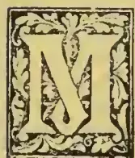

ZANETTI'S letter which appeared in the morning issue of the *Ceylon Observer* of the 22nd November takes a very hopeful view of the ultimate result of the experiment in vine-culture which is being carried on at the School of Agriculture. The ability of the vines to withstand the effects of a copious rainfall—generally supposed to be hurtful to the grape—was put to a severe test by the abnormally heavy rains of October, and it would appear that the plants did not suffer on that account. We recollect when the proposal to grow grapes in Colombo was under consideration, that M. Zanetti stated that in his experience no ill-effects were to be apprehended from a wet climate, provided a proper site was chosen—one in which the soil was porous and did not become water-logged. We understand that in Australia the vine thrives in wet districts where the physical properties of the soil are favourable to its growth. In a previous issue reference was made to the vines grown by Father Assauw of the Roman Catholic Mission at Wahakotte. These did very well for a time, but are reported to have been ultimately killed out by an excessively wet season. After the late experience at the School of Agriculture, we are inclined to think that it was the tenacious nature of the soil that made it impossible for these vines to make any growth during the abnormally wet season they experienced, for it is well known that the grape cannot thrive in cold and stiff soils that are practically impermeable to water. The Jaffna peninsula is generally spoken of as the most suitable district for vine-culture, but it is questionable whether this has been proved to satisfaction. It is time that there are a number of prolific vines flourishing in the North, but there the enterprising householders would seem to

concentrate much of their energy on one or two vines grown on trellises (so to speak, under their very noses), giving them as much attention as any hothouse grapes in England. We have heard that the main difficulty which the Jaffna grape-grower has to face is a water supply for the vines, which for the most part of the year have to be liberally treated with water owing to the extremely dry and arid climate which characterizes the north of the Island. The test as to whether grape cultivation can be made a successful industry in the Jaffna district would be to establish a vineyard of say a thousand plants and see whether anything will come of the experiment. Under the circumstances in which grapes are at present raised there, it would be unreasonable to infer that viticulture as an industry will be a success in Jaffna. There are many trees that we can grow well and force into fruit in our gardens by special attention, though we know that it would absurd to attempt to cultivate them on a large scale and expect remunerative results. Let us take the case of so common a tree as the orange, which is perhaps more frequently found in gardens than any other fruit-tree. With special attention it can be made to thrive almost anywhere and fruit excellently, but there are only a few situations in which one would be bold enough to attempt orange culture. It would seem that the good folk of Jaffna had their attention specially directed to grape growing (as also to the operation of grafting) by an enterprising official ruler with a strong predilection for agriculture, who by the force of his philanthropic nature no less than by the weight of his official influence, persuaded many of his subjects ready to follow his advice and example. (Would that we had more like him!) Indeed, we have heard it said that it is "the *fashion* for every householder in Jaffna to have a grape vine in his compound." So much the more credit for the Jaffna householder for the taste he displays.

We do not, however, mean to affirm that it is our conviction that Colombo is the best place for vine-growing, or even to assert that vine-growing

525------------------------------------------------

500

Supplement to the "Tropical Agriculturist."

[JAN. 1, 1896.

is bound to be a success in Colombo. Indeed, we have not had sufficient data to go upon to arrive at such conclusions. We can only state that as far as the experiment in vine-growing has gone, the varieties of Australian grapes—some ten in number—which have been planted in the grounds of the School of Agriculture have done remarkably well. We have yet to see whether they will continue to thrive as they have done, and whether the severe pruning which M. Zanetti has given them, in accordance with the system practised in Australia, will suit the vines in their present situation.

We are glad of one result of this experiment, and that is, that many enterprising gentlemen have secured cuttings of the excellent varieties of grapes which M. Zanetti has introduced into Ceylon. Some of these cuttings have gone to Chilaw and Puttalam, which have always been spoken off as suitable places for grape growing. The system of cultivation in connection with the experiment at the School of Agriculture has been to limit the spread of the vine to the accommodation afforded by a standard some 3½ feet high. It will thus have to be seen further whether this system will suit our conditions of soil and climate, in place of training the vines on trellises, the common method in Ceylon. What we should greedily desire is to see some of the best-flavoured varieties of the grape put into the skillful hands of the Jaffna vine-dressers instead of the "wild grape" which is hardly worth the energy which they spend upon its cultivation. This is a matter which the Government Agent of the Northern Province might interest himself in. With the knowledge of the process of grafting which the people of Jaffna possess, some of the introduced varieties of grapes might successfully be grafted on the vigorous stocks to be found in the North.

OCCASIONAL NOTES.

Writing at the end of 1895 we wish all our readers "A Happy New Year," and trust that 1896 has prosperous seasons in store for agriculturists in Ceylon and abroad, and that it will prove to be a year of plenty. For ourselves, we shall make the "fresh resolution" to do all we can, in our own little way, to further the interests of Agriculture in the Island through the coming year.

In less than a month after the pruning of the Vines—referred to in the article on Grape Cultivation—they have again made rapid growth, and, this time a fairly large number have put out blossom, which, if it set, should give a nice little crop early next year.

The "Model Farm"—now only so in name—is after a long period of neglect again beginning to look a bit trim. To keep such parts as are not under Mauritius grass in this condition is no easy matter, considering that it has been overrun by that most troublesome of weeds, the Sensitive plant. The new manager, Mr. Samarayanaka, has, however, made a good beginning in clearing away brushwood and cleaning the land, and while gradually extending the cultivated areas, improving such parts as are available for pasture. The extent of the farm is over two hundred acres. There are at present 25 head of

cattle from the Government Dairy at grass there. The only objection to the Model Farm—which is otherwise a most desirable site, and indeed a very picturesque spot,—is that a good part of it is liable to go under water at certain seasons of the year, but we will hope that before very long the working out of the flood outlets scheme will remove this defect.

We draw attention to the first part of a paper written by Mr. Mollison, on the management of Dairy Cattle. The writer who rendered such invaluable help at the inception of the Ceylon Government Dairy is admitted to be the best authority on stock in India. We commend Mr. Mollison's paper to the careful attention of all those who have anything to do with milch cattle.

Agricultural science will be much the poorer for the loss of Professor Hellriegel, whose name is so familiar to students of Agriculture, particularly in connection with the subject of the relation of the free nitrogen of the air to plant life.

RAINFALL AT THE SCHOOL OF AGRICULTURE DURING NOVEMBER.

<table border="1">
<tr>
<td>1</td>
<td>..</td>
<td>·07</td>
<td>12</td>
<td>..</td>
<td>Nil</td>
<td>23</td>
<td>..</td>
<td>1·05</td>
</tr>
<tr>
<td>2</td>
<td>..</td>
<td>·51</td>
<td>13</td>
<td>..</td>
<td>Nil</td>
<td>24</td>
<td>..</td>
<td>1·07</td>
</tr>
<tr>
<td>3</td>
<td>..</td>
<td>Nil</td>
<td>14</td>
<td>..</td>
<td>·02</td>
<td>25</td>
<td>..</td>
<td>Nil</td>
</tr>
<tr>
<td>4</td>
<td>..</td>
<td>·42</td>
<td>15</td>
<td>..</td>
<td>Nil</td>
<td>26</td>
<td>..</td>
<td>Nil</td>
</tr>
<tr>
<td>5</td>
<td>..</td>
<td>·27</td>
<td>16</td>
<td>..</td>
<td>Nil</td>
<td>27</td>
<td>..</td>
<td>·06</td>
</tr>
<tr>
<td>6</td>
<td>..</td>
<td>·15</td>
<td>17</td>
<td>..</td>
<td>Nil</td>
<td>28</td>
<td>..</td>
<td>Nil</td>
</tr>
<tr>
<td>7</td>
<td>..</td>
<td>·02</td>
<td>18</td>
<td>..</td>
<td>·08</td>
<td>29</td>
<td>..</td>
<td>·11</td>
</tr>
<tr>
<td>8</td>
<td>..</td>
<td>Nil</td>
<td>19</td>
<td>..</td>
<td>·94</td>
<td>30</td>
<td>..</td>
<td>1·53</td>
</tr>
<tr>
<td>9</td>
<td>..</td>
<td>Nil</td>
<td>20</td>
<td>..</td>
<td>·04</td>
<td>1st Dec.</td>
<td>..</td>
<td>·02</td>
</tr>
<tr>
<td>10</td>
<td>..</td>
<td>Nil</td>
<td>21</td>
<td>..</td>
<td>·03</td>
<td></td>
<td></td>
<td></td>
</tr>
<tr>
<td>11</td>
<td>..</td>
<td>Nil</td>
<td>22</td>
<td>..</td>
<td>·10</td>
<td>Total...</td>
<td>..</td>
<td>6·42</td>
</tr>
</table>

Mean... 15

Greatest amount of rainfall in any 24 hours, 30th November, 1·53 in.

Recorded by J. D. JAYAWICKRAMA.

RAINFALL TAKEN AT THE SCHOOL OF AGRICULTURE DURING THE MONTH OF DECEMBER, 1895.

<table border="1">
<tr>
<td>1</td>
<td>Sunday</td>
<td>..</td>
<td>·02</td>
<td>19</td>
<td>Thursday</td>
<td>..</td>
<td>1·09</td>
</tr>
<tr>
<td>2</td>
<td>Monday</td>
<td>..</td>
<td>Nil</td>
<td>20</td>
<td>Friday</td>
<td>..</td>
<td>Nil</td>
</tr>
<tr>
<td>3</td>
<td>Tuesday</td>
<td>..</td>
<td>·2</td>
<td>21</td>
<td>Saturday</td>
<td>..</td>
<td>Nil</td>
</tr>
<tr>
<td>4</td>
<td>Wednesday</td>
<td>..</td>
<td rowspan="2">·39</td>
<td>22</td>
<td>Sunday</td>
<td>..</td>
<td>·04</td>
</tr>
<tr>
<td>5</td>
<td>Thursday</td>
<td>..</td>
<td>23</td>
<td>Monday</td>
<td>..</td>
<td>·03</td>
</tr>
<tr>
<td>6</td>
<td>Friday</td>
<td>..</td>
<td>Nil</td>
<td>24</td>
<td>Tuesday</td>
<td>..</td>
<td>Nil</td>
</tr>
<tr>
<td>7</td>
<td>Saturday</td>
<td>..</td>
<td>·29</td>
<td>25</td>
<td>Wednesday</td>
<td>..</td>
<td>Nil</td>
</tr>
<tr>
<td>8</td>
<td>Sunday</td>
<td>..</td>
<td>2·17</td>
<td>26</td>
<td>Thursday</td>
<td>..</td>
<td>Nil</td>
</tr>
<tr>
<td>9</td>
<td>Monday</td>
<td>..</td>
<td>·08</td>
<td>27</td>
<td>Friday</td>
<td>..</td>
<td>·01</td>
</tr>
<tr>
<td>10</td>
<td>Tuesday</td>
<td>..</td>
<td>Nil</td>
<td>28</td>
<td>Saturday</td>
<td>..</td>
<td>1·29</td>
</tr>
<tr>
<td>11</td>
<td>Wednesday</td>
<td>..</td>
<td>Nil</td>
<td>29</td>
<td>Sunday</td>
<td>..</td>
<td>·54</td>
</tr>
<tr>
<td>12</td>
<td>Thursday</td>
<td>..</td>
<td>Nil</td>
<td>30</td>
<td>Monday</td>
<td>..</td>
<td>·56</td>
</tr>
<tr>
<td>13</td>
<td>Friday</td>
<td>..</td>
<td>Nil</td>
<td>31</td>
<td>Tuesday</td>
<td>..</td>
<td>·01</td>
</tr>
<tr>
<td>14</td>
<td>Saturday</td>
<td>..</td>
<td>·01</td>
<td>1</td>
<td>Wednesday</td>
<td>..</td>
<td>·1</td>
</tr>
<tr>
<td>15</td>
<td>Sunday</td>
<td>..</td>
<td>Nil</td>
<td></td>
<td></td>
<td></td>
<td></td>
</tr>
<tr>
<td>16</td>
<td>Monday</td>
<td>..</td>
<td>Nil</td>
<td></td>
<td></td>
<td></td>
<td></td>
</tr>
<tr>
<td>17</td>
<td>Tuesday</td>
<td>..</td>
<td>Nil</td>
<td></td>
<td></td>
<td></td>
<td></td>
</tr>
<tr>
<td>18</td>
<td>Wednesday</td>
<td>..</td>
<td>·92</td>
<td></td>
<td></td>
<td></td>
<td></td>
</tr>
<tr>
<td></td>
<td></td>
<td></td>
<td></td>
<td></td>
<td></td>
<td>Total...</td>
<td>7·75</td>
</tr>
</table>

Mean... 25

Greatest amount of rainfall in any 24 hours on the 8th instant, 2·17 inches.

Recorded by HENDRICK G. DHARMADASA.

526------------------------------------------------

JAN. 1, 1896.]Supplement to the "Tropical Agriculturist."501THE FEEDING OF ANIMALS.

"It is obvious that so long as a country is sparsely populated and the needs of the people are amply supplied under a comparative rude system of agriculture, in which extended area precludes the necessity for improved methods, there would be little either of scope or of inducement to study economy in the feeding of animals, or systematic practice in regard to it. But as population increases in proportion to area, there arises the necessity for increased production over a given area."—(*Larces & Gilbert.*)

The condition of native agriculture in Ceylon has been such that the needs of the people have hitherto been amply supplied by a comparative rude system of rural economy. But it is clear that as the population increases and the area under cultivation becomes limited, such a happy state of affairs cannot continue, and unless attempts are made to grow a greater variety of crops, and some attention is given to the such important questions as the manuring of land and the supply of "artificial" food for animals, the lot of the peasant farmer must before long become a very wretched one.

The rude system of managing land and stock at present in vogue will have to be gradually improved, if such a result is to be prevented. To the feeding of animals we are aware that the native cultivator pays little if any attention, allowing the stock under his care to roam about in search of natural pasture and forage for themselves as best they can. But the area under natural pasture is becoming diminished, and even the grass that is found in such land as is yet available has a tendency to become deteriorated. And, indeed, the results of these changes are before us. Years ago, there were many districts in the Island which raised a strong and healthy breed of cattle and buffaloes, and where the cows yielded a fair supply of milk. Any of the older inhabitants of these once-favoured districts will bear testimony to the degeneration that has taken place. Strong healthy bulls and buffaloes are now rarely met with, having been replaced by an unthrifty, undersized breed. The milch cattle now hardly supply sufficient milk to make it worth one's while to draw it. The native cultivator, as is well known, does not recognize the value of cattle manure, and though unable to ascribe a cause, he sees his lands getting poorer day by day. As it is beyond his power to account for this change for the worse, he will alternately blame the seasons and the weather, but it often happens that he is so resigned to his fate that he makes no attempt to discover any cause for the disappointing results of his operations. In some cases, he becomes so despondent, that he loses all energy, and considering it hopeless to attempt to bring about a better condition of things, he disposes of the few cattle he possesses and abandons his bit of land. Now, it is clear that the native cultivator must be made to recognize the necessity for increased production over a given area for the introduction of a variety of crops so as to supply food for man and beast. But it is only gradually that his mind can be trained to think in this way, by instilling into him the principles of the art which he professes to practise. Take the case of the feeding of stock, which is so important a matter, since the success of the agriculturist,

particularly in the East, depends so much on the condition and capabilities of his animals. It should be recognised that animals have to be fed differently for the different functions they are expected to perform, whether for the production of meat or milk or manure, or for the exercise of force.

Certain foods are characterised by the presence of some of the essential ingredients greatly in excess of others, so that from an economical point of view and also for producing the best effects of feeding, mixed diets are necessary; and in order to mix foods properly, the composition and cost of various foods should be taken into consideration. But before deciding upon certain mixtures we should keep in view what is expected of the animal, whether milk, meat or energy, and with a full knowledge of the capabilities of the various foods to help in producing these, we should mix accordingly.

(To be continued.)

NOTES FROM THE POONA FARM.

I trust the following notes culled on my late visit to the Poona Farm will interest your readers. The Superintendent, Mr. Mollison, so well-known in Ceylon by name, is considered an authority on Agriculture in India.

Of the Improved Ploughs Mr. Mollison prefers the Turnwrest to all the others for general use in India. It is interesting to watch how this plough is worked at the Farm. Two pairs of good strong Gir bulls yoked one pair behind the other are used for drawing it. The ploughing being begun at one end of the field, after each furrow is made the animals are turned short and the next furrow is taken just beside the former one without leaving any space between them, so that the furrow slice from each regularly covers the preceding furrow. Of course at each turn the mould-board and share are turned to the furrow side. The ploughing thus begun at one side of the field is finished right at the other without any unploughed strip of land being left in the middle; and the headlands are ploughed last of all.

2. The Gir bulls used in the plough are the ones kept for breeding purposes. They are worked in the morning and evening and allowed to rest during the middle of the day when the sun is powerful. The animals are all the better for the moderate exercise they get in this way, and are thereby better fitted to do their work as stud bulls than they would be when allowed to remain idle. Besides, when four animals are yoked together, the draught is so well divided among them that the strain on each individual animal is but slight.

3. It must be noted that it is not every breed of bulls that can thus be used uncastrated for draught work especially in the plough. The spirited kinds such as the Mysore and Deane are too mischievous to be so used without being converted into bullocks; but bulls of the Gir, Aden and Sind breeds, which are naturally docile and intended for slow work, can be used uncastrated. The Krishna Valley, Malwa and Coimbatore breeds are also noted as plough cattle.

4. The majority of animals in the dairy farm are buffaloes which are preferred, as they yield richer milk than neat cattle, and are therefore

527------------------------------------------------

502Supplement to the "Tropical Agriculturist."[JAN. 1, 1896.

more profitable for making butter. But a good number of Sind cows are kept on the farm, and these are held in great repute as they are by far the best milkers in Western India.

5. The points of a good milker are:—a mild temper, a clean cut head, forequarters light but allowing sufficient room for the heart and lungs, a large belly, well-sprung back ribs, and strong massive hind quarters, thus giving the animal a wedge-shaped appearance when viewed lengthwise from the front. The best signs of milking qualities are, however, to be found in the udder and the milk vein. The latter should be prominent, *i.e.*, easily noticeable all along the abdomen until it disappears at the brisket. The larger the capacity of the udder the better, provided it is not fleshy. It should extend well forward on to the abdomen and come well back between the thighs. The teats should be large enough to permit the milker to take a good hold of them. They should be squarely set in the udder, be of equal size and not grouped together in a cluster but be wide apart. Most of these points are found in Sindh cows, but the only defect in the shape of the udder noticeable in many of them is that it is too pendulous. This, however, is not positive.

6. All the green fodder and hay required for the dairy animals are grown and prepared on the farm itself, only the concentrated food such as oilcake, cotton seed, grains and pulses being purchased. The chief fodder crops raised there are Guinea grass, Maize, different varieties of "Jowari" such as *Sorghum vulgare*, *Sorghum saccharatum*, "Bajiri," *Penicillaria spicata*, Lucerne and other papilionaceous crops such as *Dolichos uniflorus*.

7. Of these, Guinea grass and Lucerne are the most important, as they are permanent or perennial crops, and are each the best of their own kind as fodder. Guinea grass grows equally well under the shade of big trees such as the mango and banyan as in the open. It also does well in damp situations if there is no stagnant water. If well manured and regularly watered it can be cut ten or twelve times in the year, the mowing being always done as close to the crown of the root as possible. A Guinea grass plantation has to be renewed once in every three years, because the tufts get overgrown in that time.

8. Lucerne ranks first of the leguminous family of fodder crops. If free from disease and properly attended to as regards weeding, manuring, &c., a lucerne field will last for four or more years, and can be cut ten or twelve times in the year. Its worst enemy is a fungoid disease which affects the roots. No remedy is known for this: but prevention must be sought in the selection of land, method of sowing and general care of the crop. It is best grown in a deep friable lime soil on ridges two feet apart, 10 lbs. of seed being used for an acre. It is said that when Guinea grass and Lucerne are grown as a mixed crop, the latter is less subject to fungoid disease.

9. When such cereal crops as Maize and Sorghum are grown solely for fodder, the seed is sown much thicker than when they are intended as grain crops. The quality of the fodder is thereby improved because the stalks grow thinner and more delicate: and further, the output per acre is increased. The best time to cut the crops

is when they are beginning to flower, as the nutritive properties of the plant are then well distributed throughout the whole plant. Later on the nutrition is more or less centred in the grain and the stems become coarse and woody. When fed on fodder cut before flowering, cattle are apt to get liven as the crop are too green and watery at the time. Maize grown as fodder is cut when the male flowers appear.

10. Any extra amount of green fodder grown on the farm during favourable seasons is preserved for after use in the form of hay. Guinea grass makes the best hay and next come the Sorghums and Millets. Lucerne is not suited for this purpose because the leaves get very brittle as the crop dries and a large proportion of them falls off and is lost. In hay-making the grass should not be allowed to get quite dry. If a little of the sap is retained a slight amount of beneficial fermentation occurs in the stack, a sweet flavour and fine aroma are developed, and the hay is thus rendered more agreeable to the taste and smell. Care should at the same time be taken that the hay is not stored too moist; for then the centre of the stack will be overheated by excessive fermentation, whilst near the outside the hay will get musty. Hay should be stored under suitable cover and in the Poona farm there is a spacious shed built for the purpose.

E. T. HOOLE.

2nd November, 1895.

#### THE FERTILITY OF SOILS. (PROFESSOR KINCH.)

In most published analyses of soils the total amount of nitrogen and the amount of various mineral matters dissolved by strong hydrochloric acid is stated. Such analyses are useful for some purposes, and in some cases are sufficient to indicate a deficiency of some particular form of plant food, but they by no means indicate the amount of available plant food in the soil. A few analyses have been made by extracting the soil with water charged with carbonic acid gas, and a few in which dilute acetic acid was the solvent used, these being thought to more nearly represent the action of the living plant on the soil. Recently an important advance towards determining the amount of available mineral plant food in a soil has been made by Dr. Bernard Dyer. He examined the juice or sap of the roots of about one hundred different plants, belonging to twenty different natural orders, as far as their total acidity went. No attempt was made to determine the actual acid present in each case, but only the actual acidity of the root sap. This itself is by no means an easy task, and any method used is liable to errors. However, he found that taking the average of the whole number of plants tried the total acidity of the sap came to rather less than that which would be produced by dissolving crystallised citric acid in water to a strength of 1 per cent. of weight of the acid. Some plants of the rose order—viz., *Geum* and strawberry, also evening primrose and thrift, *Armeria*, had a root sap with a higher acidity than this, whilst the root of leeks, some mangels, and some grasses were much less acid. Leguminous plants, white clover, red clover, and beans seemed to develop a much less acid root sap when grown in pots than

528------------------------------------------------

JAN. 1, 1896.]Supplement to the "Tropical Agriculturist."503

when grown in the field; possibly they had less necessity for the acid when in the probably richer soil of the pots. However, Dr. Dyer determined to try the effect of a 1 per cent. citric acid solution on soils of known composition and history to see if this would really act in the same way as the acid sap of the roots on the phosphoric acid and potash of the soil, and so be in some degree, at all events a measurer of the available mineral plant food of the soil.

Soils suitable for testing this point could only be obtained from one place in the world—viz., Rothamsted. Here alone have soils been under exact experiment and observation for a sufficient length of time for their agricultural capabilities to be accurately known. From Rothamsted then, with the kind assistance of Sir John Lawes, were obtained samples of soil from twenty-two of the barley plots in Hoos Field which have grown barley for forty years in succession under various treatments as to manure, and the exact amount of the produce from which each year is known, as well as in many cases the chemical composition of the produce. The weight of the fine soil of the plots, calculated to a depth of 9 inches per acre, varied from about 2 to  $2\frac{1}{2}$  million lb. In these soil samples were determined the amounts of phosphoric acid and of potash soluble in strong hydrochloride acid, much as in an ordinary soil analysis, and also the amounts of phosphoric acid and of potash soluble in a 1 per cent. solution of citric acid, which solution was allowed to act for seven days on the soil. The results obtained were very interesting and instructive. Calculating them into lbs. per acre of the soil to the depth of 9 inches, they showed that the plots which were unmanured or received no phosphatic manure contained from 2,500 to 3,000 lb. of phosphoric acid per acre, of which from 140 to 280 lb. were soluble in the dilute solution of citric acid. The soil of plots which had received phosphates in manure contained from about 4,200 to 5,400 lb. of phosphoric acid, of which generally from 1,000 to 1,500 lb. was soluble in citric acid solution. A plot which had received farmyard manure for twenty years, and then been unmanured for eighteen years, contained 512 lb. of phosphoric acid soluble in citric acid per acre in 9 inches of soil; and a plot receiving farmyard manure for the whole thirty-eight years contained 932 lb. of such soluble phosphoric acid per acre. The amount of potash soluble in hydrochloric acid in the soil of unmanured plots, or those receiving no potash in the manure, averaged nearly 3,000 lb. per acre: where potash had been given in the manure it averaged about 6,750 lb. per acre to a depth of 9 inches. But with citric acid solution the comparative results were far different, the potash soluble in a one per cent. solution of citric acid from the soil of plots receiving no potash was almost always under 100 lb. per acre, whilst from the soil of plots receiving potash in the manure it averaged over 800 lb., and was sometimes over 1,000 lb. per acre. The citric acid soluble potash in the farmyard manure plot to which the dung had not been applied for eighteen years was 336 lb. per acre, that in the continuously dunged plot was 669 lb. per acre. Now there is nearly six times as much phosphoric acid dissolved by dilute citric acid solution from the soil of the plots receiving phosphates as from those not receiving phosphates, and nearly nine times as much potash

from the potash receiving plots as from those which had received no potash for forty years. If these results of soil analyses are compared with the actual crops of grain and straw obtained during thirty-eight years, it is most clearly brought out that those soils in which citric acid soluble phosphoric acid is low are those suffering from deficiency of available phosphoric acid, and likewise when the potash soluble in citric acid solution falls below a certain limit that the soil and the crops upon it are suffering from deficiency of potash. Thus a plot not receiving phosphates and with 152 lb. of phosphoric acid soluble in one per cent. citric gave a yield in 1889 of  $22\frac{1}{2}$  bushels of barley, a plot treated in the same way except that it had  $3\frac{1}{2}$  cwt. superphosphate per acre annually in addition, yielded 1,073 lb. of phosphoric acid to the citric acid solution, and gave  $35\frac{1}{4}$  bushels of grain in 1889. Such cases might be repeated many times. In the case of the phosphoric acid it is found that the amount dissolved of citric acid is roughly proportional to, and approximately one half, the amount calculated to be left in the soil from applications of phosphates and not recorded in increase of crop.

From a careful consideration of the whole results, Dr. Dyer concludes "that it would not be unreasonable to suggest that when a soil is found to contain as little as 0.1 per cent. of phosphoric acid, soluble in a 1 per cent. solution of citric acid, it would be justifiable to assume that it stands in need of phosphatic manure." This amount would be equal to about 250 lb. per acre to a depth of 9 inches. Again, as regards potash, it is "more difficult than in the case of phosphoric acid to draw from the figures any fairly plausible suggestion as to what percentage limit of citric acid soluble potash should be regarded as marking the non-necessity of special potash applications. Probably this limit lies below 0.05 per cent." That is about 125 lb. per acre to a depth of 9 inches. This plan of treatment of soils with dilute solution of citric acid does undoubtedly give valuable indications as to the condition of some of the important mineral plant foods in the soil, and is a decided step in advance in the matter of soil analysis. We are very glad to know that Dr. Dyer is extending his observations to the soils of the celebrated wheat field (Broadhalt) of Rothamsted, where wheat has now grown continuously for more than half a century.

(To be continued.)

#### CEYLON WOODS.

(Continued.)

<table border="0">
<tbody>
<tr>
<td>111</td>
<td>Myristicaceæ.</td>
<td></td>
</tr>
<tr>
<td>169</td>
<td><i>Myristica laurifolia</i>.</td>
<td>Malaboda.</td>
</tr>
<tr>
<td>170</td>
<td>„ <i>irya</i>.</td>
<td>Ireya.</td>
</tr>
<tr>
<td>113</td>
<td>Lauraceæ.</td>
<td></td>
</tr>
<tr>
<td>171</td>
<td><i>Cryptocarya Wightiana</i>.</td>
<td>Galmora.</td>
</tr>
<tr>
<td>172</td>
<td><i>Persea semecarpifolia</i>.</td>
<td>Wéwarani.</td>
</tr>
<tr>
<td>173</td>
<td><i>Litsea sebfera</i></td>
<td>Bó-mi.</td>
</tr>
<tr>
<td>174</td>
<td>„ <i>zeylanica</i>.</td>
<td>Dawal-knennu; Kudu-dawulu.</td>
</tr>
<tr>
<td>175</td>
<td>„ <i>ovalifolia</i>.</td>
<td></td>
</tr>
<tr>
<td>115</td>
<td>Thymelæaceæ.</td>
<td></td>
</tr>
<tr>
<td>176</td>
<td><i>Gyropops walla</i>.</td>
<td>Walla; Patta-walla.</td>
</tr>
<tr>
<td>118</td>
<td>Santalaceæ.</td>
<td></td>
</tr>
<tr>
<td>177</td>
<td><i>Seleropyron Wallichianum</i>.</td>
<td>Katu-pamburu.</td>
</tr>
<tr>
<td>120</td>
<td>Emphorbiaceæ.</td>
<td></td>
</tr>
<tr>
<td>178</td>
<td><i>Bridelia retusa</i>.</td>
<td>Keta-kala.</td>
</tr>
</tbody>
</table>

529------------------------------------------------

504Supplement to the "Tropical Agriculturist."[JAN. 1, 1896.

179 *Phyllanthus emblica*. Nelli.  
 180 " *indicus*. Karawu.  
 181 *Hemicyclia sepiaria*. Wira.  
 182 *Mischodon zeylanicus*. Tammauna.  
 183 *Aporosa lactifolia*. Pepiliya, Ma-pat-kebella.  
 Hampotta.  
 184 " *lindleyana*. Kebella.  
 185 *Dimorphocalyx glabellus*. Weli-wenna  
 186 *Mallotus albus*. Bu-kenda.  
 187 *Macaranga tomentosa*. Kenda. Pat-kenda.  
 188 *Chaetocarpus castanocarpus*. Hedawaka,  
 Hedoka.  
 121 *Urticaceæ*.  
 189 *Holoptelea integrifolia*. Goda-kirilla.  
 190 *Celtis cinnamomea*. Gurenda.  
 191 *Trema orientalis*. Gedumba.  
 192 *Streblus asper*. Geta-netul.  
 193 *Ficus tsiela*. Elanuga, Ehetu.  
 194 " *glomerata*. Attikka.  
 195 *Artocarpus nobilis*. Del, Wal-del.  
 196 " *integrifolia*. Kos.  
 123 *Conifereæ*.  
 197 *Cryptomeria japonica*.  
 198 *Cupressus sempervirens*.  
 139 *Palmeæ*.  
 199 *Areca catechu*. Puwak.  
 200 *Caryota urens*. Kitul.  
 201 *Corypha umbraculifera*. Tala.  
 202 *Borassus flabelliformis*. Tal.

## THE MANAGEMENT OF DAIRY CATTLE.

BY MR. JAMES MOLLISON,

*Superintendent of Farms, Bombay Presidency.*

The constitutions of milch kine at time of parturition are delicate. Indian cows and buffaloes, although in a sense hardier than other milk breeds, are no exception to the general rule. Special care should at this time be exercised in providing suitable food and other comforts. If a cow or buffalo gives birth either during the monsoon or in the cold season, the animal must be protected from inclemency of weather. Experienced breeders will provide comfortable shelter during the wet days of the rainy season or the chill nights of the cold weather. A cool shady place will also be found for a newly-calved cow in the hot season. A recently-calved cow should not be turned out to pasture in the blazing sun and high day temperature of March, April and May. This practice must be deprecated even in the cooler parts of India. During the time a pregnant milch animal is "dry," which unfortunately (specially as regards the buffalo) is rather a lengthy period, the cow should be kept in good, but not high condition. A good pasture, well supplied with pure drinking water and shady trees, will ordinarily maintain in-calf cows in good condition. But when the natural pasturage fails, supplementary food of nutritive quality must be given. A full yield of milk during the next period of lactation need not be expected if the precaution referred to has been neglected. Beyond this a fairly liberal allowance of concentrated food must be allowed for at least six weeks just before calving. There is a very great variety of foods suitable and available for Indian milk cows. In the Deccan, kadbi (*i.e.*, Jowari, *Sorghum vulgare*, straw) or hay of fair nutritive value are the usual dry fodders; whilst various oil-cakes, cotton seed, dāl (*Cajanus Indicus*) husk (*chuni*) and wheat bran are the more common concentrated foods. Sesamum cake is perhaps the

best procurable oil-cake. *Khurásni* or niger-seed cake, though rather objectionable in appearance, is considered a safe and nutritive food. Safilower or *kusumbi* cake, although rather indigestible owing to the presence of a considerable percentage of fibrous husk has an advantage over other cakes, in that it can be bought at a season when it is cheap and thereafter safely stored. It neither moulds nor turns rancid on keeping. Cattle have to get accustomed to it, however, before they eat it greedily. Four to 6 lbs. per day of equal weights of oil-cake and bran, in addition to a fair allowance of dry fodder for the six weeks before calving, will keep a dry buffalo thriving. Less will suffice for a cow. A fortnight before calving, the quantity of concentrated food may, with advantage, be increased to 8 lbs. per day. The object is to supply the pregnant animal with concentrated food of a character which will not only exercise a slight laxative effect but will also improve the condition, so that free lactation may be expected soon after parturition. If in good condition, a full yield of milk forced by extra feeding will not debilitate the animal as would be the case if lean, when due to calve. For a week after calving, the feeding of the cow should receive close attention. The food should be of a laxative character and should not be too rich. Cotton seed, oil-cake and *chuni* (husk of *Cajanus Indicus*) should be at this time eschewed. There is no better food for a newly-calved buffalo cow than a mash consisting of boiled *bájri* (*Pennisetum typhoideum*) to which has been added an equivalent weight of bran whilst the cooked *bájri* was still hot. Five pounds each of *bájri* and bran will, with the ordinary allowance of dry fodder, provide sufficient ration for a day. Two oz. of salt added to the mash will make it all the more palatable. Good fresh green hay is at this time preferable to *kadbi* (*jowari*, *Sorghum vulgare*, straw) and if a limited allowance of green fodder, say 15 lbs. per day, can be given, the ration will be improved. Thus the ration for a day of a newly-calved buffalo would consist of—

<table border="0">
<tr>
<td>8 to 12 lbs. of good hay.</td>
<td></td>
</tr>
<tr>
<td>15 lbs. of green grass or other green fodder.</td>
<td></td>
</tr>
<tr>
<td>5 lbs. bran</td>
<td rowspan="2">} as a</td>
</tr>
<tr>
<td>5 lbs. <i>bájri</i> (<i>Pennisetum typhoideum</i>)</td>
</tr>
<tr>
<td>2 oz. salt</td>
<td>} hot mash.</td>
</tr>
</table>

A cow should receive about  $\frac{2}{3}$  rds of this ration.

Immediately after calving, a hot drink made up of a thin gruel or *kánji* of ground *bájri* and bran with a handful of salt tends to cause the after-birth to come away quickly.

In Europe, deep milking cows are liable to milk fever which is most prevalent among heavy milking cows producing their 2nd or 3rd calf. As a preventive, should there be any risk of milk fever, the cow is drenched with linseed oil and Epsom salts repeatedly during the week before calving. The practice, which does not seem to be necessary with Indian cattle, simply because they are generally poor milkers, is effective, because the laxative medicine keeps the bowels open and prevents any undue secretion of milk. Under the most favourable conditions an Indian cow or buffalo will not yield the full quantity of milk for a week or 10 days after giving birth. Then the full yield may be expected and ordinary food may be given. A buffalo in full yield requires to be specially well fed. I do not think, however, that any quantity beyond 18 lbs. per

530------------------------------------------------

JAN. 1, 1896.]Supplement to the "Tropical Agriculturist."505

day of concentrated food will increase the milk yield appreciably. A moderate-sized buffalo giving over 30 lbs. of milk per day (a quantity sufficient to make 3 lbs. of butter) need not get a larger ration. Any extra quantity of food would be wasted. A large framed Jafferabad buffalo requires a larger ration than the smaller sized Surat buffalo; and moreover the former in the Deccan are less profitable, because they require a greater quantity of concentrated food and fodder to produce a given quantity of milk. Similarly a Gir cow, because usually of large size, requires to be more liberally fed than the smaller sized Aden. The latter I have found to give an equal yield of milk to larger breeds on such less food. It is clear that no hard and fast lines can be laid down regarding the feeding of cows and buffaloes in milk. An experienced stock owner will very soon determine the quantity of food that can advantageously be given to any one of his cows or buffaloes. With good management either a good cow or a good buffalo will, in India, milk up to the full capacity for four or five months after calving, and during this period there should be little or no change in the daily ration. A milch animal has a palate, however, and occasional variety in the food is often desirable. If milk cows are fed from month to month with precisely the same food they sooner or later may reject it altogether or eat it with less greed and relish. An occasional change in the ration is, therefore, expedient. For this purpose dal (*Cajanus indicus*) husks (chuni), if not regularly given, can with advantage be substituted twice a week for part of the other food and occasionally crushed linseed  $\frac{3}{4}$  lb. per animal, per day, may be similarly given.

A milk register will, if carefully kept, show at once when the milk yield begins to diminish. A daily record of the milk yield of each animal furnishes useful data. A glance at the figures will show when there has been any irregularity or disturbing cause to re-act on the milk yield. Moreover, if carefully kept, it is a true guide as to the value of different animals. One cow may milk well to begin with, but the yield rapidly diminish. Another cow may yield steadily for a long time and be much the more valuable and profitable animal of the two, although producing at no time an abnormally high yield. The milk register will also indicate whether the management of the cows has been good, and moreover furnish data which will enable the farmer to discard one cow whilst he retains another because the latter has been proved to be the more profitable.

When the period of lactation has somewhat advanced and there is evidence of a lessening milk yield, the ration should also be diminished. It may be necessary to change the food at least once a month. The change will be regulated to some extent by the size and condition of the animal, but the main consideration is how much milk did the cow give during the previous month. An average buffalo giving 18 lbs. of milk per day and suckling her calf should have the ration noted below. I have found it both good and liberal:—

<table>
<tr>
<td>Dry fodder</td>
<td>..</td>
<td>..</td>
<td>15 to 20 lbs.</td>
</tr>
<tr>
<td>Cotton seed</td>
<td>..</td>
<td>..</td>
<td>4 "</td>
</tr>
<tr>
<td>Bran</td>
<td>..</td>
<td>..</td>
<td>4 "</td>
</tr>
<tr>
<td>Oil-cake</td>
<td>..</td>
<td>..</td>
<td>3 "</td>
</tr>
<tr>
<td>Chuni (husk of <i>Cajanus indicus</i>)</td>
<td>..</td>
<td>..</td>
<td>3 "</td>
</tr>
<tr>
<td>Salt</td>
<td>..</td>
<td>..</td>
<td>2 oz.</td>
</tr>
</table>

The cotton seed, *chuni* (husk of *Cajanus indicus*) and bran with salt added should be moistened. The oil-cake, broken into pieces, at most an inch in diameter, may be placed on the top of the moistened mass but not mixed through it. The concentrated food should be given in two meals and at milking times. This is perhaps a bad practice which, however, cannot be avoided. Indian buffaloes and cows have been so accustomed to get the food whilst being milked that without it they refuse to let the milk down. The enjoyment of eating doubtless induces a placidity of disposition at the time which premits the *gavh* (milkman) to milk rapidly and extract more milk than he otherwise would, especially from those animals which are unusually irritable and fractious. Two-thirds of the dry fodder should be given at night, the remainder in the forenoon. The cows should be milked at regular stated hours, and there should be no deviation therefrom under any circumstances: 6 a.m. and 5 p.m. are suitable hours. The concentrated food is usually given in two equal meals at these times. The cows should have free access to pure water three times a day. Buffaloes should be bathed or washed at least once a day. During the period that good grazing is available the dry fodder may be reduced to 6 to 8 lbs. given at night and the concentrated food reduced by  $\frac{1}{3}$  or if green food is available in reasonable quantity all the year round, it may be soiled to stall-fed cattle. A large buffalo may be allowed up to 40 lbs. per day of green food, and 6 or 8 lbs. of hay in addition, together with the concentrated food ration already noted. Usually 15 or 20 lbs. of green fodder per day is all that can be allowed. This quantity may be substituted for 8 or 10 lbs. of hay.

#### AILMENTS AND DISEASES OF THE HORSE.

**BOG SPAVIN.**—This disease resembles a wind-gall in its character, and is situated inside the hock joint. For practical work it is of no great consequence; it is, however, an unsightly sign of local weakness that pulls down a horse's value.

**CAPPED HOCK.**—Capped hock is due to kicking in the stable or in harness, or from standing and slipping in badly-paved stables. *Treatment.*—Cold water and friction; hobble the hind legs if a kicker.

**SANDCRACK.**—This is generally a crack from the coronet down the hoof. *Treatment.*—Pare out the crack and cut off the crack above and below, by searing with a hot iron; rest, and keep the crack clean with antiseptic lotion.

**SEEDY TOE.**—This is a parting of the crust of the coronet from the soft horn at the toe of the foot. *Treatment.*—Send for a good furrier or vet.

**NAVICULAR DISEASE.**—Navicular disease of the foot is very serious, and is ulceration of the interior of the hoof. The symptoms are great lameness. There is always likelihood of recurrence when the horse is worked. *Cause.*—Blows or bruises on the sole; concussion; heredity. *Treatment.*—Hot baths for the feet; hot swabs; perfect rest for some months and a cooling diet.

**LAMINITIS.**—Laminitis, or fever in the feet, may come on suddenly after a hard day on hard

531------------------------------------------------

506Supplement to the "Tropical Agriculturist."[JAN. 1, 1896.

ground. The symptoms are great pain in the fore feet, and a continual endeavour to get the weight off the fore feet, which are thrust forward. *Cause.*—Concussion; galloping on a hard road.—*Treatment.*—Sling the horse, if possible, to stable beams with ropes to take the weight off the fore feet, placing a ring under the body; or use a pair of cart shafts. Remove shoes by soaking its feet in hot water; and if necessary send for a vet.

**SCOUR.**—This disease is very common in foals, and serious if it lasts more than a few days. If scour continues, attend to the feeding of the mare with care, and give the foal two tablespoonfuls, from time to time, of 2 oz. of camphor dissolved in 2 oz. of spirits of wine diluted in about half a pint of water. With this simple remedy I have saved the life of a foal almost reduced to its last gasp.

**BROKEN KNEES.**—*Treatment.*—Keep the wound clean, and bathe constantly every hour with arnica lotion. If badly broken, send for a vet.

**SORE WITHERS AND BACK.**—*Treatment.*—Complete rest till quite healed and sound is the only way. When there is an abscess or fistulous tendency, send for a vet.

**BRUSHING BEHIND.**—This is generally due to weakness. Young horses very often grow out of it. *Treatment.*—On the first symptoms, before the skin on the fetlocks is injured, put on a cloth boot tied about the joint so that it falls over the joint, and see that the hind shoes are slightly within the hoof on the inside, so that they cannot cut.

**BRUSHING IN FRONT OR SPEEDY CUT.**—*Treatment.*—If a habit, sell as soon as possible.

**THRUSH.**—The symptoms of common thrush are soft or rotten condition of the frog, with a fetid discharge from the cleft, which cleft is absent, or nearly so, in the healthy foot. *Cause.*—Due to contracted feet, or standing on rotten litter. *Treatment.*—Careful shoeing and paring of rotten parts; constant washing and attention to litter; and a temporary introduction of Stockholm tow and tar into the cleft, with or without one part to ten of sulphate of copper. The cleft which appears with thrush will extend if neglected. To avoid thrush, the litter in the stable should be kept dry and clean. If it is desirable to save straw, great economy may be practised by the use of sawdust, which can generally be obtained at a nominal price. When this is spread thickly, all droppings removed daily, and the sawdust raked over every morning, it forms a clean, wholesome, and cheap substitute for straw, and does not require renewing for weeks. Sawdust manure is good for all soils on arable lands and can be applied conveniently for top-dressing, or ploughed in with any crop, so that farmers who require their straw may use sawdust without hesitation. Tan and sawdust mixed also make an excellent bed.

**ACUTE THRUSH.**—*Cause.*—"Stopping" the feet with cowdung, clay, and other beastliness, is often the cause of thrush. *Treatment.*—Fomentations, poultices, antiseptic lotions, mashes, green food, constant washing of the feet.

**SPLINTS.**—*Cause.*—Bony deposits that come from or are the results of blows, accidents, or concussion on the foreleg below the knee, also hereditary in tendency; and are the cause of lameness or not, according to their situation. If situated near a tendon or the knee joint, a splint may be serious. A small splint often gives more

pain while growing than when formed. *Treatment.*—Rest and cold water. If there is heat and inflammation, fomentations and poultices. If the splint does not yield to this treatment, blister. In bad cases the splint can be removed by a surgical operation.

**RINGBONE AND SIDEBONE.**—The following are the symptoms of this disease:—A filling or rising of the hoof; inability to flex the pastern joint. *Cause.*—Heredity. *Treatment.*—Poultice: rub in iodide of lead ointment.

A. E. PEASE.

#### ASTRINGENT BARKS.

We publish below a statement, which may be found of use to many readers, of barks used in tanning, analysed by the Madras Government Quinologist, Mr. David Hooper. Some mentioned in the list are now used, and others not at present used have been tested with a view to their probable future application. A tan bark should have two natural properties. In the first place it should contain a tannic acid, or modification of that substance, giving a greenish coloration or precipitate with salts of iron; and to make it commercially valuable it should contain a large quantity of tannic acid. The Australian acacias and eucalypti are said to afford barks containing a large percentage of tannic extract, and are consequently greatly esteemed by tanners. The barks of the Indian acacias are also largely used for tanning purposes, and a few cassia barks are also used similarly, while a few have a reputation for dyeing. The investigation of other astringent substances shows that India is not limited to a few drugs of their description, and the list given below might easily be extended.

The best bark is that of the *Anogeissus latifolia*, which is closely followed by the guava bark and the hill guava bark. The eugenias and the guavas belong to the same natural order, and their barks compare very favourably with the eucalyptus barks. The table appended gives the amount of pure tannin in each bark, the amount of extract obtained by exhausting the powder with hot water and evaporating to dryness, the amount of ash or mineral matter left on incineration, and the color reaction the decoctions of the barks afford with iron salts. The bark of the *Anogeissus latifolia* has hitherto been supposed to be one of the most astringent; but recently there has been found a bark much richer in tannin and obtained from the *Bridelia montana*, which belongs to the Euphorbiaceæ order, and is common on the ghāts of the Nilgiris and also in other parts of India. It is well known as a most valuable astringent in Western India and is used by the Goanese in certain diseases.

It seems strange that the tanners of this country do not seek drugs very rich in tannin, for they principally use the bark of the *Cassia auriculata*, which contains only eleven per cent of tannin. The bark of the Casuarina is used in Madras both for dyeing and tanning purposes, and the Myrica Nagi bark is used by Muhomedans and Hindoos in medicines where astringents are required. The Australian acacias or wattle, introduced many years ago on the Nilgiris, have firmly established themselves and are a source of annoyance in the towns. Yet nothing is done to

532------------------------------------------------

JAN. 1, 1896.]Supplement to the "Tropical Agriculturist."507

collect the bark as a commercial article. The common forms of wattle (*A. melanoxylon* and *A. dealbata*) are more plentiful on the Nilgiris than the species *A. decurrens* and *A. pyrenantha*, which yield rich tanning barks; but wherever the better species have been planted they have grown vigorously and well, and the bark is equally rich in tannin as that from trees growing in Australia. A sample of bark from *A. decurrens* grown on the Nilgiris was forwarded to London, and it was

stated that the sample was in good condition and rich in tannin. Mr. Hooper also made extracts or "Tannage" from these wattle bark preparations which hold the virtues in a concentrated form, and is much better than the crude bark for exporting. There is a good market in Europe for well-prepared wattle bark extract, and the demand has been on the increase during the last few years. The following are the tables referred to:—

(We have slightly curtailed the statement appended to the above which is taken from the *Indian Agriculturist*, and instead of the common English and Hindustani names give the vernacular names by which they are known in Ceylon).

<table border="1">
<thead>
<tr>
<th></th>
<th></th>
<th>Tannin.</th>
<th>Water.</th>
<th>Ash.</th>
<th>Colour with Iron Salts.</th>
</tr>
</thead>
<tbody>
<tr>
<td>1</td>
<td><i>Anogeissus latifolia</i> - Dawu S, Vekkali T</td>
<td>32.5</td>
<td>33.0</td>
<td>9.6</td>
<td>Blue-black</td>
</tr>
<tr>
<td>2</td>
<td><i>Psidium guayava</i> - Pera S</td>
<td>27.4</td>
<td>33.0</td>
<td>10.0</td>
<td>do</td>
</tr>
<tr>
<td>3</td>
<td><i>Acacia leucophleba</i> - Maha-andara, Katn-andara S, Velam T</td>
<td>20.8</td>
<td>29.4</td>
<td>7.5</td>
<td>Greenish</td>
</tr>
<tr>
<td>4</td>
<td><i>Acacia Arabica</i> - Kari-velam T</td>
<td>20.5</td>
<td>30.4</td>
<td>7.9</td>
<td>do</td>
</tr>
<tr>
<td>5</td>
<td><i>Rhodomyrtus tomentosa</i> - .....</td>
<td>19.5</td>
<td>30.4</td>
<td>9.0</td>
<td>Blue-black</td>
</tr>
<tr>
<td>6</td>
<td><i>Cicca disticha</i> - .....</td>
<td>18.1</td>
<td>30.0</td>
<td>16.4</td>
<td>do</td>
</tr>
<tr>
<td>7</td>
<td><i>Bassia longifolia</i> - Mi S, Illupai T</td>
<td>17.0</td>
<td>27.3</td>
<td>9.4</td>
<td>Greenish</td>
</tr>
<tr>
<td>8</td>
<td><i>Mangifera indica</i> - Amba S</td>
<td>16.7</td>
<td>32.1</td>
<td>6.3</td>
<td>do</td>
</tr>
<tr>
<td>9</td>
<td><i>Eugenia arbottiana</i> - .....</td>
<td>16.1</td>
<td>25.0</td>
<td>5.3</td>
<td>Blue black</td>
</tr>
<tr>
<td>10</td>
<td><i>Terminalia arjuna</i> - .....</td>
<td>16.0</td>
<td>23.0</td>
<td>34.6</td>
<td>do</td>
</tr>
<tr>
<td>11</td>
<td><i>Saxifera ligulata</i> (root) - .....</td>
<td>14.2</td>
<td>0.0</td>
<td>12.8</td>
<td>do</td>
</tr>
<tr>
<td>12</td>
<td><i>Cassia fistula</i> - Ehela S, Kovaui T</td>
<td>12.9</td>
<td>27.5</td>
<td>8.1</td>
<td>Greenish</td>
</tr>
<tr>
<td>13</td>
<td><i>Eugenia jambos</i> - Jambu S</td>
<td>12.4</td>
<td>20.7</td>
<td>8.4</td>
<td>Blue-black</td>
</tr>
<tr>
<td>14</td>
<td><i>Eugenia jambolana</i> - Ma-dan S, Naval T</td>
<td>12.0</td>
<td>16.6</td>
<td>9.1</td>
<td>do</td>
</tr>
<tr>
<td>15</td>
<td><i>Eugenia montana</i> - .....</td>
<td>11.9</td>
<td>20.1</td>
<td>6.0</td>
<td>do</td>
</tr>
<tr>
<td>16</td>
<td><i>Cassia auriculata</i> - Ranawara S, Awari T</td>
<td>11.9</td>
<td>22.3</td>
<td>4.1</td>
<td>Greenish</td>
</tr>
<tr>
<td>17</td>
<td><i>Minusops hexandra</i> - Palu S, Palai T</td>
<td>10.3</td>
<td>32.7</td>
<td>7.5</td>
<td>do</td>
</tr>
<tr>
<td>18</td>
<td><i>Eugenia calophyllifolia</i> - .....</td>
<td>10.1</td>
<td>15.5</td>
<td>8.0</td>
<td>Blue-black</td>
</tr>
<tr>
<td>19</td>
<td><i>Mimosa pudica</i> (root)* - Midi, Nidi-kumba S</td>
<td>10.0</td>
<td>16.0</td>
<td>5.5</td>
<td>do</td>
</tr>
<tr>
<td>20</td>
<td><i>Cylista scariosa</i> (root) - .....</td>
<td>9.9</td>
<td>23.0</td>
<td>9.3</td>
<td>do</td>
</tr>
<tr>
<td>21</td>
<td><i>Schleichera trifuga</i> - Kon S, Puvu Kula T</td>
<td>9.4</td>
<td>23.2</td>
<td>10.1</td>
<td>Greenish</td>
</tr>
<tr>
<td>22</td>
<td><i>Odina woodier</i> - Hik S, Othi T</td>
<td>9.1</td>
<td>15.1</td>
<td>9.3</td>
<td>do</td>
</tr>
<tr>
<td>23</td>
<td><i>Acacia pennata</i> - .....</td>
<td>8.8</td>
<td>14.2</td>
<td>14.1</td>
<td>Black</td>
</tr>
<tr>
<td>24</td>
<td><i>Careya arborea</i> - Kahata S, Arimaru</td>
<td>8.7</td>
<td>10.3</td>
<td>10.6</td>
<td>Blue-black</td>
</tr>
<tr>
<td>25</td>
<td><i>Hiptage madabloba</i> - Puwak gediya-wel S</td>
<td>8.5</td>
<td>15.3</td>
<td>7.6</td>
<td>Green</td>
</tr>
<tr>
<td>26</td>
<td><i>Eleodendrum glaucum</i> - Neralu S, Pieri T</td>
<td>8.0</td>
<td>18.4</td>
<td>18.1</td>
<td>do</td>
</tr>
<tr>
<td>27</td>
<td><i>Albizia lebbek</i> - Mara S, Mauchadi T</td>
<td>7.4</td>
<td>12.1</td>
<td>9.0</td>
<td>Greenish</td>
</tr>
<tr>
<td>28</td>
<td><i>Potentilla leschenaulti</i> (root) - .....</td>
<td>7.4</td>
<td>0.0</td>
<td>6.4</td>
<td>Blue-black</td>
</tr>
<tr>
<td>29</td>
<td><i>Litsæa zeylanica</i> - Dawul-kurimdu S</td>
<td>7.3</td>
<td>22.5</td>
<td>3.6</td>
<td>Greenish</td>
</tr>
<tr>
<td>30</td>
<td><i>Terminalia glabra</i> - Kumbuk S, Marusu T</td>
<td>7.2</td>
<td>11.1</td>
<td>12.1</td>
<td>Blue-black</td>
</tr>
<tr>
<td>31</td>
<td><i>Minusops elengi</i> - Munamal S, Muchalai T</td>
<td>6.8</td>
<td>20.3</td>
<td>9.4</td>
<td>Greenish</td>
</tr>
<tr>
<td>32</td>
<td><i>Cassia roxburghii</i> - Ratn-wa S, Vakai T</td>
<td>6.1</td>
<td>17.4</td>
<td>6.0</td>
<td>Brown</td>
</tr>
<tr>
<td>33</td>
<td><i>Thespesia populnea</i> - Suriya S, Puwarasu T</td>
<td>6.0</td>
<td>15.8</td>
<td>13.2</td>
<td>Blue black</td>
</tr>
<tr>
<td>34</td>
<td><i>Litsæa Wightiana</i> - .....</td>
<td>5.8</td>
<td>14.0</td>
<td>7.7</td>
<td>Green</td>
</tr>
<tr>
<td>35</td>
<td><i>Saraca indica</i> - Diya-ratambala S</td>
<td>5.7</td>
<td>10.2</td>
<td>10.8</td>
<td>Greenish</td>
</tr>
<tr>
<td>36</td>
<td><i>Cassia florida</i> - Wa Aramana S, Wage T</td>
<td>4.1</td>
<td>11.6</td>
<td>9.6</td>
<td>Brown</td>
</tr>
<tr>
<td>37</td>
<td><i>Acacia Farnesiana</i> - Siniya S</td>
<td>2.8</td>
<td>10.5</td>
<td>8.9</td>
<td>Greenish</td>
</tr>
<tr>
<td>38</td>
<td><i>Zizyphus vulgaris</i> - Masan S</td>
<td>2.8</td>
<td>7.8</td>
<td>16.6</td>
<td>do</td>
</tr>
<tr>
<td>39</td>
<td><i>Rhamnus Wightii</i> - .....</td>
<td>2.6</td>
<td>0.0</td>
<td>9.5</td>
<td>do</td>
</tr>
<tr>
<td>40</td>
<td><i>Bridelia montana</i> - .....</td>
<td>39.9</td>
<td>41.7</td>
<td>7.3</td>
<td>Blue-black</td>
</tr>
<tr>
<td>41</td>
<td><i>Acacia pycantha</i> - .....</td>
<td>33.8</td>
<td>46.7</td>
<td>3.5</td>
<td>do</td>
</tr>
<tr>
<td>42</td>
<td><i>Acacia decurrens</i> - .....</td>
<td>33.4</td>
<td>44.8</td>
<td>3.2</td>
<td>do</td>
</tr>
<tr>
<td>43</td>
<td><i>Kandelia Rheedii</i> - .....</td>
<td>27.4</td>
<td>45.5</td>
<td>9.1</td>
<td>do</td>
</tr>
<tr>
<td>44</td>
<td><i>Acacia melanoxylon</i> - .....</td>
<td>26.8</td>
<td>34.2</td>
<td>4.1</td>
<td>do</td>
</tr>
<tr>
<td>45</td>
<td><i>Macaranga tomentosa</i> - Kanda S</td>
<td>18.4</td>
<td>22.2</td>
<td>11.0</td>
<td>do</td>
</tr>
<tr>
<td>46</td>
<td><i>Casuarina Equisetifolia</i> - Kasa S, Chowkka T</td>
<td>18.3</td>
<td>22.1</td>
<td>9.5</td>
<td>do</td>
</tr>
<tr>
<td>47</td>
<td><i>Acacia dealbata</i> - .....</td>
<td>17.8</td>
<td>32.1</td>
<td>5.3</td>
<td>do</td>
</tr>
<tr>
<td>48</td>
<td><i>Ficus racemosa</i> - .....</td>
<td>14.1</td>
<td>20.5</td>
<td>12.2</td>
<td>Greenish</td>
</tr>
<tr>
<td>49</td>
<td><i>Myrica nagi</i> - .....</td>
<td>13.7</td>
<td>27.0</td>
<td>7.1</td>
<td>Blue-black</td>
</tr>
<tr>
<td>50</td>
<td><i>Dyospyros embryopteris</i> - Timbiri S, Panichikai T</td>
<td>12.4</td>
<td>19.9</td>
<td>4.9</td>
<td>do</td>
</tr>
<tr>
<td>51</td>
<td><i>Ficus indica</i> - Nuga S, Al T</td>
<td>10.9</td>
<td>17.2</td>
<td>8.0</td>
<td>Greenish</td>
</tr>
<tr>
<td>52</td>
<td><i>Fleaggen leucopyrus</i> - .....</td>
<td>10.3</td>
<td>20.5</td>
<td>3.5</td>
<td>Blue-black</td>
</tr>
<tr>
<td>53</td>
<td><i>Ficus religiosa</i> - Bo S, Arasu T</td>
<td>2.8</td>
<td>12.3</td>
<td>11.7</td>
<td>Greenish</td>
</tr>
</tbody>
</table>

\* The common name of this is given as the "Manilla Tamarind" and the botanical synonym as *Inga dulcis*, commonly known in Ceylon as the "Madras Thorn," which is evidently the tree meant and not the sensitive plant (*Jimosa pudica*).

## PREVENTION OF PLANT DISEASES.

In all civilized countries the respective Governments have thought it fit to enact laws to prevent the introduction or spread of animal diseases, particularly epizooties. There is no doubt that these acts and laws are based at least in their principle on laws regulating the preservation of the health of man. The necessity for the introduction of laws for protecting animals from

disease has been greater than exists in the case of man, since man is able to act for himself, and where he recognises danger he usually takes the first opportunity to avoid it. In the case of animals, there is little doubt that if they are allowed to have their own way their instinct would guide them and (as far as that is possible) to protect themselves from the ravages of epizootsie.

533------------------------------------------------

508Supplement to the "Tropical Agriculturist."[JAN. 1, 1896.

But they are domesticated and have to live in limited areas provided for them by their owners housed and fed according to "artificial" laws. Hence the laws that have been enacted to protect animals from infectious diseases whenever they occur, have in all cases resulted in much good to the animals and have reduced their mortality to a great extent.

But we are aware that plants too are liable to various forms of diseases, some caused by deadly fungi, others resulting on the attack of different kinds of insects. Many of these spread far and wide and destroy not only whole crops but even devastate large areas of land.

The fact that plants are stationery places them at the mercy of their enemies, and according to the degree of their helplessness, the means for protecting them should be increased. But in this respect the vegetable kingdom has been to a great extent neglected. Here in Ceylon we have had a sad example of the ravages of plant diseases in the history of Coffee cultivation. Our paddy-fields are in some districts attacked by the fly or bug and destroyed wholesale. Insects of various kinds prevent the successful raising of Cotton, and pests are beginning to interfere to some extent with tea. The coconut beetle has become a thorn in the path of the owners of palm plantations. If proper measures are taken to prevent the introduction and spread of the agents that do damage to plant-life, the revenue from agricultural pursuits should be more than doubled, while every agriculturist, and particularly the poorer class of cultivators should have great cause for thankfulness. The Australian Colonies have indeed passed acts and made orders and regulations to prevent the introduction and spread of plant pests. Under these acts the introduction of plants from other countries is regulated, and measures are enforced to control the spread of any pest which may break out in the Colony. An orchard or garden found to be infested is proclaimed an infected area, as it would be done here, if cholera or cattle plague was prevailing in a particular area. The owner of such a garden has to clear his land of such parts of trees, dry twigs, &c. as would harbour the particular pest and to keep the premises free of weeds &c. Besides, every owner is bound to report the occurrence of disease and to follow the instructions for their suppression as ordered by the inspectors appointed by Government. The importance of this subject is so great, though it appears slight at first sight, that it is not too early to adopt some such precautionary measures in this country, particularly so as almost all our chief products are subject to attack by some form of plant pest.

W. A. D. S.

---

#### NOTES ON RECENT RESEARCH ON THE FEEDING OF ANIMALS.

---

A maintenance diet for oxen at rest—that is a ration on which oxen at rest are able to live but are not able to put on fat—has been found by Dr. Gustav Kühn of the famous German Experimental Station at Möckern, to consist of 7 lb. of digestible albuminoids or protein matter, and 6.6 lbs. of digestible non-nitrogenous matter per 1,000 lbs. live weight. This closely agrees with

Henneberg and Stohman's maintenance diet, viz., .6 of protein and 7 lb. of digestible non-nitrogenous matter. Dr. Kühn found that when this ration was exceeded by less than .5 lb. of digestible protein the animal laid on fat and flesh.

With regard to the influence exerted by the different nutrients (nitrogenous and non-nitrogenous respectively), it was found that when the protein of the ration was increased by the addition of gluten or other nitrogenous nutrients, no more albuminoids were stored in the body than when an equal amount of organic matter containing only a small percentage of protein was used. That is to say, the putting on of flesh depends more on the amount of non-nitrogenous nutrients in the food than on the amount of nitrogenous nutrients. This is doubtless to be explained by the well-known fact that carbohydrates—that is, non-nitrogenous nutrients—act as "albuminoid conservers." They prevent the albuminoids from being used up, and thus permit them to be utilised in their specially characteristic function as "flesh-formers." It was further found that every increase of the nutrients above maintenance diet was followed by the production of fat in the body, and that for this production it made no difference whether the excess of nutrients over the maintenance diet consisted of nitrogenous or non-nitrogenous nutrients.

Among the other points brought out by these important researches, is the fact that no storage in the body can take place except when the food contains more nutritive material than is required for the maintenance of the animal. This fundamental principle of feeding is, of course, well known, but it is pleasing to find it corroborated by these careful experiments. They also bring out the fact, previously known, that, where animals are fed with an excess above the maintenance diet, no exact constant relation between the excess of nutrients and the storage of fat can be expected. This is on account of the individuality of the animals. Making due allowance for this variability, due to individuality, Dr. Kühn's results, on an average, may be said to show that for every one pound of excess over maintenance diet of digestible organic matter, .24 lb. of an increase of fat should be obtained. Thus, 1 lb. of starch meal in excess of maintenance diet yielded on an average .2 lb. of fat. How much of this was directly formed from the starch, and how much was the result of its conserving action, cannot be stated, but the experiments seem to bear out that carbohydrates can go to form fat.

Changes of the food of cattle should always be gradual. Another point to be remembered in the feeding of animals is to take care that the food is not affected by mould which so commonly happens in tropical countries in wet weather. Dr. Ostermann records a case where three cows became ill, two of them afterwards dying, on a farm where about 1½ lb. of cotton seed meal were fed per head per day to the stock. The disease was characterised by the presence of very great weakness. Externally, the cotton seed meal seemed all right, but on analysis it was found to contain highly poisonous putrefaction production (ptomines.) Dr. Siebert records a

534------------------------------------------------

JAN. 1, 1896.]Supplement to the "Tropical Agriculturist."509

similar case in which very mouldy rape-cake was fed to horses. The symptoms were unnatural redness of the lining of the mouth, hurried breathing and pulse. At this time the rape-cake had only been fed for two days. The animals recovered when the food was changed, without any further treatment. It is clear, therefore, that artificials should only be fed when they are sweet and free from mould, and should be stored with great care. Where there is the least ground for suspicion in cases of the kind, steaming should be resorted to.

#### GENERAL ITEMS.

The following remedy is recommended for the riddance of the guava coccus pest which produces a blackened condition of the leaves and twigs. It is said to be even more effectual than paraffine emulsion:—

<table>
<tr>
<td>Resin</td>
<td>..</td>
<td>..</td>
<td>20 lbs.</td>
</tr>
<tr>
<td>Caustic soda (98 %)</td>
<td>..</td>
<td>..</td>
<td>4 "</td>
</tr>
<tr>
<td>Fish oil</td>
<td>..</td>
<td>..</td>
<td>3 "</td>
</tr>
<tr>
<td>Water</td>
<td>..</td>
<td>..</td>
<td>80 galls (imp.)</td>
</tr>
</table>

Place the materials in a kettle, cover with water and bring to a boil, stirring the mixture occasionally until a solution is formed, and adding *hot* water when there is a tendency to slop over. Boil for three hours, gradually adding hot water until half of the whole quantity or 40 gallons is in the kettle. Then remove from fire and strain. This may now be diluted to 80 gallons with cold water for use, but while the wash is

being boiled, cold water should never be added for fear of precipitating the resin. The wash should be warm when applied to the trees. Four pounds of soft soap may be used instead of the fish oil.

"Flame trees" is the popular name given to trees with brilliant flowers which in most cases appear before the leaves, and when seen at a distance have the appearance of being on fire. The principal trees of this nature are *amherstia*, *nobilis*, *bombax malabaricum*, *butea frondosa* and *superba*, *cœsalpinia puiecherrima*, *cochchlospermum gossypinum*, *lagerstroemia hos-regina*, *poinciana regia*, *pterospermum acerifolium*, *rhododendron arboreum*.

According to a French paper a substitute for gutta-percha can be prepared as follows:—Tar, 1 part; paraffine, 10 parts; dissolve together at 120 degrees and then add caoutchouc, 2 parts. Keep at this temperature until a homogenous mass results.

According to Prof. Church in 100 parts of cleaned rice there are of water, 12.8; albuminoids, 7.3; starch, 70.3; oil, .6; fibre, .4; and ash, .6. Of this ash, the potash forms no more than .065 % of the rice, phosphoric acid .284.

Ceylon moss (*Gracilaria lichenoides*): s examined by O'Shaughnessy, yielded vegetable jelly 54.5 per cent, cellulose 18 %, gum 4 %, and inorganic salts 7.5 %.

535------------------------------------------------

<!-- stage4: FAINT old-images-only -->

[Faint page: no legible print of its own could be verified; text withheld (stage 4 review list)]

This image is a scan of a blank page. The paper has a light beige or cream-colored tint. There are a few very small, faint dark spots scattered across the surface, which appear to be scanning artifacts or dust particles. No text, lines, or other markings are present on the page.

536------------------------------------------------

# \* The TROPICAL AGRICULTURIST \*

## ◇ MONTHLY. ◇

Vol. XV.]

COLOMBO, FEB 1ST, 1896.

[No. 8.

### COFFEE IN SOUTHERN ABYSSINIA.

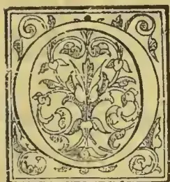

IN the Cotton and Coffee tree of Southern Abyssinia tradition assigns to the countries of Enarea and Caffa the indigenous residence of the Coffee plant. In Shoa Proper the cultivation and consumption are strictly interdicted, as savouring too strongly of the abhorred Mohammedan; but the plant in proper situations grows strong and healthy and in all the bordering districts subject to Sohela Selassie, where the restriction is not enforced, there the plantations are numerous and thriving.

Planted before the rains, the seed soon appears above the ground, and when six months old the offspring is transferred to take the place of some worn-out tree.

Water and the manure of the sheep are plentifully supplied, and the crop, which from a full-bearing adult is generally from thirty to forty pounds, is gathered in March and April. Averaging from eight to ten feet in height, with dark shining foliage, and branches loaded with fruit, it grows luxuriantly in the valleys in any sheltered situation, delighting especially in the soil produced by a decomposition of trap rock, which has been washed down from the adjacent heights; and although taking six years to arrive at maturity, it yields a slight return on the second season of its transplantation. The berries are in the first instance of a dark green hue which before pulling is suffered to turn red, a white milky-looking pulp called gullaboo meanwhile filling up the space between the cuticle and the seed. Having been shaken and gathered from the branches, the crop is spread in the sun until the pulp becomes sufficiently dry to admit of its removal, which, by continual free ventilation out of doors, is usually the case in one month. The seeds intended for the plantation are not divested of the husk, but sown by the handful in a small plot, which is carefully manured and watered, and the gullaboo, sold separately from the bean, is employed as a beverage with

the decoction of the choat. For the better security of his own monopoly at the ports of Vyayla and Berbera, the Emir of Hurrur opposes the importation of Coffee into his own dominions, both from Shoa and from the country of the Galla. The plant is extensively and successfully cultivated; but the price given at Hurrur is high in comparison with that paid in Abyssinia; and the average demanded on the coast by the merchants of the former principality, varying from five pence to seven pence a pound, would seem to be in unison with that customary at Massowah in the Red Sea.

The difficulties attending the tedious road to the coast; the lazy indifferent character of the Danakil camel owners, who, regardless of the value of time, spend months upon the journey; and the fitful caprice evinced by the various chieftains through whose territories the caravan must pass—all form great obstacles to the conveyance of the cheaper produce from Abyssinia, although they might doubtless be overcome within a reasonable period by the well-directed efforts of British perseverance. In Caffa and Enarea, coffee grows wild like a weed over the rich surface of the country. The beverage is in universal use among the inhabitants; the price paid is almost nominal; and the convenience of water carriage is alone wanting towards the transportation of the product in unlimited quantities to every portion of the globe. Cotton of two kinds grows in the sequestered nooks of the eastern face of the mountains of Shoa, and in the valleys at the extreme foot of the range; but from the superior luxuriance of the plant, and the amount of crop produced in the lower situations the natural climate would appear to exist in those sheltered spots which in atmosphere much resemble the more favoured parts of Western India. The *Efat* shrub varies according to the locality and supply of water, from three feet in height to upwards of seven, and usually assuming the form of a pyramid, extends its lower branches to a width equal to the stature; the size of the leaves, and the soft and yielding nature of the stem, imparting a strong external resemblance to the Bourbon cotton. Eight and nine inches in circumference are not infrequently attained; and the advantages of a very pro-

537------------------------------------------------

512THE TROPICAL AGRICULTURIST.[FEB. 1, 1896.]

ductive crop twice in each year, the existence of the plant during five seasons, and the heavy return of the particularly fine wool during the very first, award to the species a most deserving pre-eminence.\* The indigenous plant of Efaf is not, however, so much esteemed as that from Gondar, which instead of rising tall and straight from the ground, assumes a spreading dwarfy appearance.† The wool is considered superior, and the cloth produced is softer and more elastic, but the existence enjoyed by the exotic is limited to three years. Both are planted indiscriminately in the same field, although, when gathered, the crops are preserved unmixed; and after the fifth year the Efaf shrub is cut over close to the ground, which is then ploughed up, and sown with wheat and other grain, when, on the removal of the harvest, the young cotton shoots are well above the ground, and will yield during two further seasons. The seed having been placed for some time in wood ashes, is well rubbed with red earth before planting; and, wherever the locality is favourable to irrigation, water is not spared. The pod, when ripe, is cut with a knife, the husk removed, and the wool deposited in a bag with the utmost care to exclude extraneous matter. One full-bearing bush produces twice during the twelve months between four and five pounds of raw stuff.

*Coffea arabica* (Boon) grows wild in many of the warmer provinces, but is diligently plucked out by the Christian population, who consider the use of the berry to be as foreign to salvation as the doctrine of the false prophet. Where his followers abide in greater numbers, or uncontrolled, as in Giddem and in the countries of the Ittoo and Aroosi Galla, the Coffee-tree grows unmolested, no care, however, being taken of it; but its proper home seems to be far to the west and south, in the kingdoms of Caffa and Enarea, where a donkey's load is sold for the twentieth part of a dollar. Two kinds of jessamine grace, with their fragrant flowers, the hedges and groves. *Olea spec.* (Woird) is, with the juniper and yew, the principal forest tree of Shoa; sixty to eighty feet in height and four in diameter are its common dimensions. The wood of the wild olive-tree affords excellent fuel and timber; but no use is made of the fruit, which attains the size of a large pea.—*From a Traveller's Book.*

### THE DORMANT PERIOD IN PLANTS.

A fruitful cause of failure in the cultivation of exotic plants is due to ignorance of the climatal conditions under which the plants grow in the land of their origin, and especially the proper season for resting. In temperate climes, where the winter and summer are pretty clearly defined, deciduous plants discard their foliage as the year's temperature declines, and appear during the winter either as leafless objects or inconspicuous collections of dormant buds more or less hidden by the soil. Evergreen plants, on the other hand, retain their foliage till the spring, but only, as it were, on sufferance, active growth ceasing almost entirely, and the verdure only persisting by its own inherent toughness. This is easily seen by our familiar Christmas decorations, where the Holly, Ivy, Laurels, &c., last green for weeks unless placed in hot, dry rooms, where they perish by desiccation.

The resting period in these cases is clear enough, but it is another matter altogether when we import plants from tropical and sub-tropical regions, where the difference between the seasons may be very small indeed as regards range of temperature, and altogether dependent upon widely varying conditions of drought and moisture, so that instead of having a warm and

cold season, with a fairly evenly distributed rainfall throughout the year, we have a wet and dry season, with a constant high temperature. Under such conditions, we naturally find indigenous plants to be very differently constituted to ours, being fitted at once to withstand excessive drought and heat during their resting period, and to assume active development at short notice immediately the rains begin.

Now, these periods of drought and moisture vary considerably on different parts of the earth's surface, and the native plants adapt themselves in conformity to it. Nor is this merely a case of latitude and longitude; for, if it were, the matter would be comparatively simple, and the native country of a plant would determine its needs within certain fairly-defined limits. Elevation above the sea-level is, however, a most potent factor to be dealt with, and if ignored, leads to many mistakes being made in the methods of cultivation pursued. In the tropics we may by ascending the loftiest mountains, pass through every grade of climate from the hot plains of the sea-level, with an average mean temperature of 80° or so, to the region of perpetual snow where only the hardest alpiners survive. Yet, despite this obvious fact, many a plant has been collected, and safely transmitted from high, cool regions in the tropics, only to die in a warm stove, where they have been placed because they came from the tropics, where a high temperature has been presumed to be universal. In several cases, presumably dead plants of this category have been thrown to the rubbish-heap, only to astonish their owner by braving the elements, and obtaining a new lease by their accidental exposure to conditions more congenial to their needs.

A curious feature in this connection is the great fastidiousness of some plants, which will only thrive if their natural condition be very closely imitated, and the cosmopolitan tastes of others which will stand most diverse treatment with impunity. Our native *Asplenium marinum*, for instance, which thrives on our western coasts, where it must occasionally be subjected to some frosts, revels in a hothouse treatment, and becomes a huge and much robust plant. Such wide adaptability is, however, the exception, hence it is of great importance to the gardener to know something of the native natural conditions of growth, temperature, and humidity, and above all, when and how the plant assumes its dormant state, and for how long it maintains it. With plants which are to be forced into flower it is essential to withdraw them from all disturbing influences, and knowing when the dormant period is due, to lead up to it by reducing heat or moisture as the case may be, and maintaining them under such conditions until it is desired to start them into growth. Then the application of heat and moisture will be followed by a healthy vigorous growth, accompanied by an immunity from vermin, the presence of which is only too often an indication of a previous too short sleep and consequent weakness.

The period of rest seems, as we have indicated, to be determined mainly by the nature of the seasonal changes to which the plants are subjected in their native habitats, but in some cases it appears to be independent of this. The bulbs of Hyacinths, Tulips, and other spring-flowering plants are busy during the winter in forming their roots and even their leaves whenever not actually frozen up, and quite early in the year, little later indeed than many other plants that are beginning active growth, and long before the sun has attained very great power, they have flowered and formed new bulbs, their foliage has died down, and they lie in the dormant state for many months, only awakening when winter has again set in. This seems a very strange provision of nature that a bulb should resist all the vivifying influences of summer sun and shower, and wake up into active life when the soil is at or below freezing-point, and the great bulk of vegetation dead or asleep. It would be interesting to know how these bulbs would behave if shipped direct to the Antipodes in the spring. In those cases where the cycle of life has been fully completed, and the whole vitality of the flower is compressed within the rootless bulb, it seems feasible that if they could be at once sub-

\* *Gossypium Ifatense* seeds completely covered with a close down. Cotton white; capsules 3-celled, 3-valved; flowers small, with a red fundus, leaves 3 to 5 lobed; lobes acuminated.

† *Gossypium Gondarensis* seeds sprinkled with short hairs. Cotton white, capsules 3-celled, 3-valved; flowers large, yellow, 3 to 5 lobed; lobes commonly obtuse.

538------------------------------------------------

FEB. 1, 1896.]THE TROPICAL AGRICULTURIST.513

jected to their normal growing conditions, they could hardly be weakened by losing their rest; though, on the other hand, it must be assumed that some subtle recuperative process is going on in resting plants akin to that which renews animal vigour during sleep, or otherwise the shortening of the period of rest could hardly be so detrimental as it is, even when favourable conditions for growth accompany the re-awakening.

With regard to Antipodean plants which have long been introduced into this country, such as the New Zealand *Todea superba* and *pellucida*, they have fully adapted themselves to our climate, and rise in our early spring at precisely the time when at home their growth would be ceasing. How long, however, such a change takes to establish, we do not know. Amongst our native Ferns we have noted a certain obstinacy in retaining the home periods of awakening deciduous *Athyria* found in Scotland, starting into growth a week or two later than southern finds even after years of culture under like conditions. *Polypodium vulgare*, especially in its varietal forms, demands, curiously enough, a much longer period of rest, or rather starts into growth under glass very much later than normal plants in native habitats. They often, indeed, show no trace of starting under glass until July or even August, and this with perfectly cold culture, so that the lateness of their starting is not to be attributed to growth unnaturally maintained by warmth long after the normal dormant period should begin. This case is unique in our experience, culture under glass inducing, as a rule, and as one would expect, a somewhat earlier development than out-of-doors. Seedlings, as a rule, are more precocious in their growth than old plants, and quite deciduous Ferns, like *Athyria*, with very little warmth indeed, will the first year retain their fronds right through the winter, though later nothing will prevent them dying down in the normal way in autumn. We have found, however, that even in a few generations, it is possible, by selective culture under glass, to considerably lengthen the growing period of *Athyrium*s, shortening the dormant period in equal measure. Most of the plumose *superbum* section of this species remain quite green for fully a month after all their immediate progenitors in the same house have withered entirely down. One form, indeed (*A.f.f. plumosum*, Drury), is perfectly green at the time of writing (end of November), and has been so at Christmas; while, on the other hand, without any stimulus beyond its own inherent robustness, it rises into active growth a full month before its fellows. One year, indeed, a robust growth started on Dec. 2, before the old fronds had even turned colour, but frost immediately after stopped its progress.

It would almost seem by this case that further selections might eliminate at one and the same time the deciduous nature of the species, and the dormant period also; this latter being decidedly reduced one-half in two generations, and nearly as much in one, since its parent is not far behind it in the long retention of its verdure, while the grandparent growing by their side, dies down as early and as thoroughly as any *Athyrium* we are acquainted with.

How long the actual dormant period is, as compared with the apparent, is an open question, as well as that of the recuperative or strengthening processes which undoubtedly accompany them. The roots certainly commence to be active long before there is any sign of life in the crown. *Hyacinth* bulbs grown in glasses are a familiar exemplification of this; and as regards Ferns, even in the depth of winter the crowns will be seen to be fattening up, implying great root activity and preparation for the coming rapid growth in the spring. It is highly probable, therefore, that in most, if not in all cases, much of the dormancy is more apparent than real, and that a good deal of secret and subtle work is being done, of which we know little or nothing, but the need for which is evidenced by the weakness subsequently shown when the dormant period is unduly curtailed, and these processes are interfered with.—*Chas. T. Drury, F.L.S.*—in *Gardeners' Chronicle*.

#### GAS-LIME AS A MANURE.

I note with some interest what Mr. John Lambert states in reference to the use of gas-lime as an antidote for club in Cabbages, and for the extirpation of wireworm. In lecturing to cottage and allotment-holders, many complaints are made as to the ravages of the wireworm, and the occurrence of clubbing in Cabbages and Cauliflowers. If I understand Mr. Lambert rightly, he recommends the use of gas-lime in the crude state, just as it comes from the gasworks. It is true that he recommends its application in very small proportions, but I have met with allotment-holders who have applied it to their land just in the form in which it is received from the works, and then found it very difficult to grow anything on the land for a year or two. It is no doubt a useful agent, destructive to insect-life when used as recommended by Mr. Lambert; but my fear is, lest some might put too large a construction upon his words, and apply it unwisely, and with unfortunate effects. Mr. W. G. Watson, in his admirable paper on "Manures and their Uses," tells us that gas-lime "is a mixture of calcium hydrate and calcium carbonate, with sulphite of lime. The two latter compounds are in themselves poisonous to plant-life, but they are both converted into gypsum or sulphate of lime (a plant-food), by exposing the gas-lime to the action of the atmosphere." It may and, I fear, does happen, that when gas-lime is applied in a crude state as received from the gasworks, the two compounds, poisonous to plant-life, are present in undue proportions in the interests of safety, hence the unfortunate results which I have heard allotment-holders deplore. Mr. Watson further states:—"To prepare fresh gas-lime for use in the garden, it may be spread out on a layer of pondmud, night-soil, or coarse vegetable refuse, and exposed to rain and air." This I hold to be sound and necessary advice. If put on cleared land in the autumn, it can be laid upon the surface at the rate of 40 lb. or so per rod, but it should lie on the surface for several weeks before being forked in, taking care that it is distributed equally through the soil. It is undoubtedly a powerful remedial agent in clearing land of insect life, but needs to be applied with caution.—R. D. [It is doubtless safest to use gas-lime after some weeks' exposure in the open for surface-dressing, or when applying it to land dug to one spit in depth; but in the case of dressing the bottom soil in trenching and incorporating with the top spit, which is usually thrown into the bottom of the trenches in the small quantities recommended by Mr. Lambert, no harm, but rather good, would result from the use of gas-lime in the fresh state. Ed.]—*Gardeners' Chronicle*.

#### NOTES ON THE FUNCTIONS, COMPOSITION AND VALUATION OF MANURES.

BY DOUGLAS A. GILCHRIST, B.Sc.

Briefly stated, the following are the functions of manures:—(a) In many cases manures improve the physical and mechanical condition and the texture of the soils to which they are applied. Thus lime, when applied to sour land decomposes, and therefore renders harmless the sour organic acids, whose presence in the soil is the cause of the sour or acid condition of the land. When farmyard manure is applied to land, the texture and physical condition of the soil is much improved by the organic matter of which this manure is largely composed. (b) In many cases manures act on plant food already present in the soil, and convert this plant food into such a condition that it can be absorbed by the roots of plants. The manurial value of lime is due principally to the action of this manure on the food of plants already present in the soil. (c) The most important function of manures is to supply plant food necessary for the growth of crops, which is deficient in the soil.

The necessary constituents of plant food that are generally deficient in soils are nitrogen, phosphoric acid, and potash.

Nitrogen occurs in manures as:—(a) Nitrates, e.g., nitrate of soda. (b) Ammonia salts, e.g., sulphate of ammonia. (c) Organic nitrogen, e.g., dried blood.

539------------------------------------------------

514THE TROPICAL AGRICULTURIST.[FEB. 1, 1896.

Nitrogen as nitrates is immediately available as plant food

Nitrogen as ammonia salt soon becomes available.

Nitrogen as organic nitrogen is much more slowly available.

Phosphoric acid, combined with lime, is generally present in manures as:—(a) Insoluble phosphate of lime, *e.g.*, bone meal and basic slag. (b) Soluble phosphate of lime, *e.g.*, superphosphates and dissolved bones.

Insoluble phosphate of lime is converted into soluble or superphosphate by treating it with sulphuric acid.

Soluble phosphates are generally more active than insoluble phosphates in promoting plant growth.

Potash is the valuable ingredient in kainit and muriate of potash. Potash has generally a better effect on light than on heavy soils.

Superphosphate and nitrate of soda should not be mixed, or, if mixed, must be sown immediately. This also applies to the mixing of basic slag and sulphate of ammonia.

Artificial manures should be purchased on a guaranteed analysis, and the source from which the fertilizing ingredients of the manure are derived should be stated. This precaution is especially necessary in purchasing bone or mixed manures. The percentage of nitrogen in a manure should be stated in its equivalent of ammonia, that of insoluble phosphoric acid as phosphate of lime, soluble phosphoric acid as phosphate of lime, and that of potash salts in their equivalent of potash.

Artificial manures are valued according to the quantities of nitrogen, soluble phosphate of lime, insoluble phosphate of lime, and potash they contain, and are generally valued on the unit system. The amount of a unit is taken to be one per cent. of a ton. Thus one ton of nitrate of soda containing nitrogen equal to 19 per cent. of ammonia is said to contain 19 units of ammonia.

Farmyard manure contains all the ingredients of plant food. This manure is exceedingly variable in quality, as the quality varies with the nature of the food given to the animal, the nature and amount of the little used, the method by which the manure is produced, and its treatment from the time of production until it is applied to the land.

AMOUNT OF MANURIAL INGREDIENTS GENERALLY PRESENT IN THE MORE IMPORTANT MANURES.

<table border="1">
<thead>
<tr>
<th rowspan="2"></th>
<th rowspan="2">Nitrogen equal to Ammonia.</th>
<th colspan="3">AMOUNT PER CENT. OF</th>
</tr>
<tr>
<th>Soluble Phosphate of Lime.</th>
<th>Insoluble Phosphate of Lime.</th>
<th>Potash Salts equal to Potash</th>
</tr>
</thead>
<tbody>
<tr>
<td>Nitrate of soda (95 per cent. purity)</td>
<td>19</td>
<td>..</td>
<td>..</td>
<td>..</td>
</tr>
<tr>
<td>Sulphate of ammonia (97 ..)</td>
<td>24</td>
<td>..</td>
<td>..</td>
<td>..</td>
</tr>
<tr>
<td>Nitrate of potash (85 ..)</td>
<td>14</td>
<td>..</td>
<td>..</td>
<td>40</td>
</tr>
<tr>
<td>Dried blood ..</td>
<td>15</td>
<td>..</td>
<td>..</td>
<td>..</td>
</tr>
<tr>
<td>Horn dust ..</td>
<td>14</td>
<td>..</td>
<td>..</td>
<td>..</td>
</tr>
<tr>
<td>Bone meal ..</td>
<td>4-5</td>
<td>..</td>
<td>44-55</td>
<td>..</td>
</tr>
<tr>
<td>Steamed bone flour ..</td>
<td>1-2</td>
<td>..</td>
<td>56-65</td>
<td>..</td>
</tr>
<tr>
<td>Dissolved bones ..</td>
<td>3-5</td>
<td>16-20</td>
<td>19-14</td>
<td>..</td>
</tr>
<tr>
<td>Superphosphate (high class) ..</td>
<td>..</td>
<td>35-40</td>
<td>..</td>
<td>..</td>
</tr>
<tr>
<td>Superphosphate (low class) ..</td>
<td>..</td>
<td>26-28</td>
<td>..</td>
<td>..</td>
</tr>
<tr>
<td>Basic slag (best quality) ..</td>
<td>..</td>
<td>..</td>
<td>37-42</td>
<td>..</td>
</tr>
<tr>
<td>Kainit ..</td>
<td>..</td>
<td>..</td>
<td>..</td>
<td>12</td>
</tr>
<tr>
<td>Muriate of potash (80 per cent.) ..</td>
<td>..</td>
<td>..</td>
<td>..</td>
<td>30</td>
</tr>
<tr>
<td>Sulphate of potash (50 ..)</td>
<td>..</td>
<td>..</td>
<td>..</td>
<td>27-5</td>
</tr>
<tr>
<td>Peruvian guano (low class) ..</td>
<td>3-5</td>
<td>30-50</td>
<td>1-3</td>
<td>..</td>
</tr>
<tr>
<td>Ichaboe guano ..</td>
<td>10-16</td>
<td>18-30</td>
<td>2</td>
<td>..</td>
</tr>
<tr>
<td>Fish guano ..</td>
<td>7-12</td>
<td>17-35</td>
<td>..</td>
<td>..</td>
</tr>
</tbody>
</table>

The manures mentioned in the above table can always be purchased at a much cheaper rate than special manures, such as "grass manures," "cereal manure," "turnip manure," &c. Nitrate of soda should not be applied to any crop until that crop has reached an active stage of growth. Sulphate of ammonia is generally applied along with the seed of any crop. The phosphatic manures, bones, superphosphate, basic slag, &c., are not like nitrogenous manures liable to be lost from the soil, hence they may be applied for some time before the growth of a crop. As a rule, basic slag should be applied to

soils rich in organic matter and poor in lime. Superphosphate generally gives a better result on harder land. In the case of basic slag it is a distinct advantage to apply it in the autumn or early winter for a crop to be grown during the following season. The qualities of this manure, which contains phosphoric acid equal to 37 per cent. or more of phosphate of lime, give the best results, and this manure should be ground fine enough to allow 85 per cent. of it to pass through a No. 100 wire mesh. Superphosphate should always be in a dry powdery condition, and not pasty, as, if so, it is impossible to distribute it evenly in the soil. It is probably desirable to apply potash manures in the autumn or early winter. When artificial manures are applied some time before the growth of a crop, care must be taken that they are not buried too deeply.—*Mark Lane Express*.

NOTE.—The above was printed as an extract in the Agricultural Journal of the Department of Agriculture, Cape Colony, but it will doubtless be found of interest to agriculturists in general.—*J. H. H.—Trinidad Bulletin*.

COCONUTS ON THE EAST COAST OF FLORIDA.

A West Palm Beach correspondent of the *Citizen* writes:—

Although the fact that a vast number of coconut trees is to be seen along the east bank of Lake Worth has been told many times, yet few have been informed of the origin of these trees. Their being planted in rows and forming shaded walks from the lake to the Atlantic ocean and almost in a straight line from the Dimick place to Cragin's a distance of three miles, plainly shows that they were planted by hand, and with great care.

The story of their origin as related by Captain W. M. Lainhart recently, is as follows:—

"Some time in the middle of January, in 1878, I happened to be upon the beach one afternoon and saw a ship, which afterward proved to be the Spanish bark "Providence" carrying a crew of thirteen men, none of whom could speak a word of English except the mate and he only a few words. The vessel acted suspiciously, and I concluded to watch her. I waited until she was hid in the darkness, when I went home, resolved to come again the next day, I was upon the beach at day break, and saw that the vessel had been run ashore. With the assistance of H. F. Hammond, I soon had her stripped of the rigging, which we piled upon the beach.

"The vessel had about 20,000 coconuts aboard, which soon began to wash ashore. These we piled up along the beach and divided them among the various settlers, who set them out upon their homesteads, and they have since grown luxuriously.

"The coconuts which had their husks on them, came from Baracoa, in southeastern Cuba. The cargo was bound for Barcelona. From what I could learn from the mate, who was the only one I could understand, the vessel had been out only a few days from Baracoa. All of the men were drunk. They had plenty of provisions and liquor, and remained on the beach here for three or four days. They were present while we were stripping the vessel, and paid little attention to the boat after they had left her. In fact, it was my impression that the captain ran her upon the shore for the express purpose of getting the insurance.

"I was much sought for by all the members of the crew, from the captain down. They made me remain with them all night for fear of wild animals, Indians, etc. and, in fact, it was impossible for me to get away. I remember the second night more distinctly, it was very cold and disagreeable. I was forced to stay with them, and I had made up my mind to get home at all hazards. Finally, when the last one of them had dropped off to sleep, I slipped away and went home, returning at daybreak the next day without their realizing that I had gone. I was indeed glad when a ship

540------------------------------------------------

FEB. 1, 1896.]THE TROPICAL AGRICULTURIST.315

have in sight, which I signalled and they were all but on board."

From the 14,000 or more coconuts secured at that time their number has increased with each year. Captain Lainhart states that a few were growing there before that time, but where they came from he has never learned. About 6,000 of those that came from the wreck were washed ashore all along the coast, and have made stately trees that are now looked upon with much interest by all those who travel in this direction.—*Florida Agriculturist*.

## THE LAUDERDALE ESTATE, SOUTH-WEST MLANJE.

One of the best known of the original pioneers of B. C. A., whether to natives or Europeans, is Mr. John W. Moir the original of the name Mandala. In passing we may note that Professor Drummond uses Mandala in his recently published Lowell lectures on "The Ascent of Man" as an instance of the savage habit of generalising unconsciously from single terms. He gives the instance thus:—

"Mr. John Moir, one of the earliest white men to settle in East Central Africa, was at once named by the natives *Mandala*, which means "a reflection in still water," because he wore on his eyes what looked to them a *still water* (spectacles). Afterwards they came to call not only Mr. Moir by that name, but spectacles, and finally—when it entered the country—glass itself."

The Professor might have gone on to show how it was also applied to the house in which he dwelt and finally to the community over which at that time he presided. Although not now resident at Mandala, Mr. Moir's home at Mlanje is well known even to most of the new arrivals, and there are few visitors to that district who do not take away a pleasing reminiscence of the open handed hospitality of the modest bungalow over which Mrs. Moir presides. Mr. Moir has gone into coffee planting with his usual enthusiasm and his place is furnished with every modern requisite for the carrying on of the planting business. Unlike some of us who move, so to speak, warily, as feeling our way, Mr. Moir has an implicit belief in the coffee-planting industry. He has now some two hundred acres under coffee and intends going in for further extensions as he has several other tracts of land some of which he purchased during the last year. The Lauderdale Estate was first opened up by Mr. Brown of Ceylon for the African Lakes Company and some three years afterwards was transferred to Mr. Moir. Mr. Brown who is a relative of Alexander Brown of Ceylon, the writer of the original Ceylon "Coffee-planter's Manual", and who is now established at Danraven some three or four hours south from Mr. Moir's place, seems to have opened the estate on the most approved Ceylon methods. Unfortunately he did not allow for the violence of the Mlanje winds and hence the estate is somewhat wind-blown on exposed parts. Mr. Moir is however doing what he can to remedy this oversight and by means of bananas, trees of the *ficus* family and others, is endeavouring to shelter and shade his estate while on his new clearings he is judiciously leaving up shelter belts of the original forest.

The elevation of the estate is somewhat low, varying from about 2,000 feet to 2,500, but on the other hand its rainfall is about the largest recorded in the Protectorate. In 1893-4 it amounted to 91.18 inches and in 1894-5 to 127.70 with an average of 200 rainy days during each yearly period.

The crop in 1894 amounted to about one-and-a-half tons while this year about six tons (hulled) were gathered. The coffee is pulped by Gordon's cylinder pulpers driven by an iron overshot water-wheel, fourteen feet in diameter. There is also a hulling and separating machine and a circular saw driven by the wheel. Mr. Moir is the first to introduce an iron water-wheel the only other water-wheel in the country hitherto having been Mr. Buchanan's wooden wheel at Zomba which is now dismantled.

We were much interested in a cocoa plant, the only one in the country so far as we are aware, which seems to be doing well and is tended and watched most carefully. Besides the ordinary fruit trees we noticed also several mangoes which are making good progress. While on this subject it is interesting to call to mind that to Mr. Moir is due the honour of introducing the loquat into B. C. A. she having brought the seeds from Algiers, to which country she paid a visit some years ago. Besides coffee and fruit trees Mr. Moir has been experimenting with wheat and ginger and is also trying mustard as a green manure to be dug in amongst the coffee.

Mr. Moir's energies are not all directed to tropical agriculture, however, as may be seen from the young shorthorn bull and cows which adorn his herd of cattle. The young bull is pure bred from the sire which was introduced by Mr. Moir sometime ago and which unfortunately died last year. It is to be hoped that Mr. Moir's efforts in this and other directions will be crowned with success. It is by the efforts of such men as he that a country is benefited for each solution of a problem, whether positive or negative, is a distinct gain to the community.—*Central African Planter*.

## ROSES.

HOW ROSES OUGHT TO BE PLANTED.—Whenever it is possible, Roses should be given a bed to themselves, in an open spot, away from trees, and not planted among other flowers. A bed 3 feet wide will hold two rows of plants, and one 4 feet 6 inches wide three rows. The distance between the plants for dwarfs should be about 18 inches, and for standards about 2 feet 6 inches. The beds having been made ready, and the position of the Roses in them marked out, the next thing, and the most important of all, is to see that they are properly planted. Some of the plants should be carefully removed from the trench where they had been "heeled in," and brought to the side of the bed they are intended to occupy. A mat should always be thrown over them, to keep their roots from drying by exposure to sun or wind. A hole should then be dug about a foot square, and of sufficient depth, in the case of dwarf (or "bush") Roses, to allow the junction of the stock and scion to be about an inch below the surface of the bed when the operation is completed. In the case of standards the hole should be 6 inches deep. A plant should then be taken from beneath the mat, sprinkled with water, and held with the left hand in the centre of the hole, while with the right the roots are spread out horizontally and evenly in it, taking care that the roots cross each other as little as possible. Some of the finest soil available should next be sprinkled over the roots so as just to cover them. Over this light covering place 3 inches more soil, which may then be trodden in and the hole filled up. Tread the soil firmly round the plant when this has been done. Firm planting is very necessary for the future well-being of Roses.

In the case of heavy soils, or where the ground remains for any length of time is too wet a condition for the planting of Roses to be satisfactorily carried out, it is an excellent plan to secure some light gritty soil, such as the clippings obtained from the sides of roads when the grass-edges are being cut. A spadeful of this material may then with advantage be placed both above and beneath the roots instead of the natural soil. Soil of this character may be firmly trodden without caking together, and the grit in it encourages the early formation of roots. When planting Roses singly on lawns or elsewhere, the same method should be followed as when inserting them in beds. Where Roses are planted in the spring the shoots should be pruned before planting.

### SINGLE PLANTS ON LAWNS OR IN BORDERS.

Previous to planting Roses singly on lawns or in borders a hole should be dug for each, 18 inches square and 18 inches deep. The soil removed from the holes should be well mixed with one-fourth of its quantity of well-decayed manure, before being

541------------------------------------------------

516THE TROPICAL AGRICULTURIST.[FEB. 1, 1896.

restored to them. If the soil be found poor and unsuitable, better soil from another part of the garden or some truly loam should be substituted. No grass should be allowed to grow within at least 6 inches of the stem of Standard Roses planted on lawns.

#### CLIMBING OR PILLAR ROSES.

For Climbing and other Roses of very vigorous growth the whole prepared for their reception should be 2 feet square and 2 feet deep, and care be taken that the soil be of a suitable character and well enriched with manure. For it must be borne in mind that such Roses require much more root-room than those which are pruned back every year, and in most cases are intended to occupy the same positions for many years to come. Therefore, any extra care and attention bestowed on the planting of strong-growing Roses, like those referred to, will, sooner or later, will be repaid.

#### STAKING STANDARD ROSES.

As the planting proceeds, each plant should be secured to a firm stake of some kind. In order to avoid damaging any of the roots, the stakes should be driven firmly into the holes prepared for the reception of the plants before planting them. Dwarf or bush-plants do not need staking; but, to prevent injury from high winds, all long growths should be shortened previous to planting.

#### THE LABELLING OF ROSES.

Where there is only one plant of any variety, a permanent label, with the name of the Rose either written or printed upon it, should be attached to a small stake placed near it, and not to any part of the plant itself; but when several plants of the same variety are grouped together, or follow one another, labels will only be necessary at the beginning of each such group or row.—*Gardeners' Chronicle*.

#### A SO-CALLED "QUININE-BARK."

In our Trade Reports on page 838 of the issue for December 7 last, under the head of "Interesting Drugs," we referred to a small consignment of bark from the West Coast of South America from trees "growing in the same forests which yield the red cinchona-bark of commerce." The bark was further said to be used medicinally amongst the natives, and it was supposed to contain quinine. That the bark in question was rubiaceous there was but little doubt, but it could not be further identified at the time. Some new light, however, has since been shed upon it, though it by no means clears up its specific or even generic identity—indeed, to some extent, it is further mystified; but as the history of a bark which, if not identical, is very closely allied to it, may be interesting, and which may lead to its accurate nomenclature, we give the following, which we have been at some pains to trace. Referring, in the first place, to Guibourt's "Histoire Naturelle des Drogues Simples," published in 1850, we find amongst the *Rubiaceæ* a bark described under the head of *Quinquina bicolor*, which agrees in its structure, colour, and taste with the bark recently received in the London market. The tree, however, is said to be a native of Guadeloupe, where it is known as *Bois jaune*. Guibourt gives it as his opinion that this tree is identical with that described by De Candolle under the name of *Stenostomum acutatum*. The fact of this tree being a native of Guadeloupe, and the bark recently seen in the London market coming from the "West Coast of South America," would seem to be fatal to the chances of their having any affinity; but proceeding further in the search for more information on the subject of *Stenostomum* bark we find a reference in vol. xi. of the *Pharmaceutical Journal* for 1851, page 168, where in some remarks on *Cinchona Pitaya*, or pitayo bark, by Mr. R. W. Bull, reprinted from the *New York Register of Medicine and Pharmacy* for February, 1850, we read that the writer was shown by Professor Guibourt at the Ecole de Pharmacie in Paris a specimen of Pitayo bark which Guibourt was of opinion contained either quinine or cinchonine;

but the writer says he is "confident that it contains no alkaline principle whatever, and its tonic properties, if it possesses any, must be traced to other sources than to the presence of the principles which have hitherto been attributed to it." An editorial remark on this paper draws attention to the fact that the name Pitayo has been given to two entirely different barks, one of which is the *Quinquina bicolor* of Guibourt, and is the produce of *Stenostomum acutatum* DC., and the other a *Cinchona* bark, to which Professor Guibourt assigned the name of *Quinquina Pitayo*, is the produce of Colombia, and somewhat resembles *Calisaya* bark, and is probably yielded by *Cinchona academica* of Guibourt, which really equals *Cinchona officinalis* of Linnaeus.

The next reference to the bark of *Stenostomum* we find in a notice by T. C. Archer in vol. xiii., page 312, of the *Pharmaceutical Journal* for 1854, "on a few articles imported into Liverpool in 1853." It is said to come from Valparaiso and to have been introduced under the name of Peruvian bark, and is thus described:—In respect to size and general appearance this bark is not unlike the coarser sticks of cassia, for though evidently the external bark of a tree, it is remarkably smooth and neatly rolled into thin quills about 2 feet 6 inches in length. In thickness it is about that of a shilling, externally of a very light drab colour, rather darker inside the quills, but internally the colour is cinnamon red. Mr Archer further says that a sample was forwarded to London, where it was named *Stenostomum acutatum*, but he thought probably in mistake, in consequence of that plant being a native of Guadeloupe, and the bark coming from Valparaiso. He also suggests the probability of its being a species of *Guettarda*, and perhaps *G. cordata*. He bases this suggestion on the fact of the *Guettardas* being excellent febrifuges, and being used by the natives as such.

We have had an opportunity of examining a portion of the actual sample which came into Mr. Archer's hands in 1853, and comparing with it the fresh sample recently received in London, and, though there are points of difference, the similarity is very great. In the fresh sample the exterior is of a greenish colour, and not drab; the inside, however, is very like it, and identical in striation. In fracture the colour shows rather more yellow than in the old sample, but sections as seen under a lens are so much alike as to be scarcely distinguishable the one from the other. In taste, too, they are alike. The old bark is distinctly quilled, and somewhat thicker than the new, which is more flattened. The conclusions, then, to be arrived at are that the bark recently received in London is, if not produced by the same tree as that which made its appearance in Liverpool in 1853, the produce of a very closely-allied plant, but what the generic name of that plant or plants is it is still impossible to say in the face of the two coming from places so far apart. The suggestion as to its being a species of *Guettarda* we do not agree with, as in all the species of that genus we have had the opportunity of examining the barks are totally different and without the slightest trace of colour.

In conclusion, it may be well to say that the genus *Stenostomum* is now sunk in that of *Atirrhæa*, and that De Candolle's *S. acutatum* is now known as *Atirrhæa aristata*, Bth. and Hook. f.—*Chemist and Druggist*.

#### THE TREATMENT OF CASUARINA ON SAND-DUNES.

M. E. McA. Moir's interesting remarks on the treatment of sand-dunes in France in the *Indian Forester* for the month of June, and especially his remarks in connection with the growth of the small pines near the sea-shore though entirely "sheltered from wind" being stunted, as compared with those half a mile distant exposed to the "full force of the western gales," instigate me to record a few notes on the Casuarina under somewhat similar circum-

542------------------------------------------------

FEB. 1, 1896.]THE TROPICAL AGRICULTURIST.517

stances on the sea-shore near Bulsar in the Surat District.

Efforts have been made to establish the *Casuarina equisetifolia* on the sea-shore at this spot for some time past, and last year I managed to raise at least 25,000 transplants at a nursery established for the purpose in the vicinity. Unfortunately, just about the time when the final planting operations were to take place I was transferred to another Division. But nevertheless, I gained sufficient experience from the existing plants to justify the presumption that without some special method of treatment it would be impossible to rear the plant successfully. While trees at a distance of half a mile inland on private property were doing well, those on the sea-shore itself were stunted and unhealthy even when fairly well sheltered from the strong sea breeze. I came to precisely the same conclusion as to the cause of this as did Mr. Moir in the case of the pines on the coast of France; but whereas he seems to express some doubt, there is no occasion to entertain any, so far as the *Casuarina* are concerned. The sand deposit on the minute needles and on the bark and twigs was easily perceptible to the naked eye, and could be rubbed off with the finger. Under a powerful magnifying glass the appearance of the deposit was appalling and quite sufficient to suspend the physiological functions of any plant. These microscopic particles of sand, moreover, appear to travel with considerable force, penetrating the cortical depressions and irregularities and filling up the stomata of the leaf system. The dunes I refer to are partially covered by that valuable creeper the *Ipomoea biloba*, and in treating the *Casuarina* for this evil two courses seem to be open to us—(1) to greatly add to the quantity of this or any other creeper, a grass that may be induced to grow, thereby reducing the surface area of sand exposed to the wind, and (2) to occasionally wipe or syringe the plants free of the deposit that forms on them. The second course might, at first sight, strike one as being impracticable, but as the formation of this deposit is very gradual plants need not be subjected to such treatment very often. I cannot help wondering how the Madras Officers have got over this difficulty, for surely they cannot have been free of it, and I think it would be of considerable interest if one of them were to give us his experience in the *Indian Forester*.—W. A. WALLINGER, Godhra, Panchmahals.—*Indian Forester*.

### CLIMATIC INFLUENCE OF FORESTS.

This influence, says M. Charles Marsillon, in *Cosmos* (August 10) has long been recognized, but has been studied scientifically only since 1867. The results of this study show that the mean temperature of wooded regions is slightly less than that of open country, the difference being about one degree Fahrenheit near the ground and a little less at the tops of the trees. In general, it is cooler by day and warmer by night in the woods than in the open country. Thus forests are regulators of temperature, and have an important influence on the climate, and hence on the agriculture, of neighbouring regions.

The soil of forests also is slightly cooler than that of the open regions—a fact especially advantageous to agriculture in warm climates. In Wurtemberg the difference of maximum temperature between forest soil and that of the open country has reached 8 centigrade. The mean annual humidity of forest air exceeds by 3½ per cent that of the open country. This excess is in some cases as high as 14 per cent. Besides, the temperature of the tree themselves is lower than that of the surrounding air, whence that air, coming in contact with the trees, has its temperature lowered to a point nearer to saturation. If the air of the open country, already saturated with moisture, blows through the trees, and is thereby lowered in temperature, its moisture will, of course, condense and fall as rain; thus a wood may act as a veritable rainmaker. It is in fact generally recognized that rain is more frequent in the vicinity of vast forest regions than elsewhere. In parts of

the steppes of Russia where trees have been planted and forests have grown up in the past fifty years rain has notably increased. Forests also prevent floods, The forest soil is soft and spongy, retaining the rain-water and letting it out slowly into the streams. The absence of such a sponge, together with greater ease of evaporation, make destructive torrents much more frequent in barren than in wooded regions. Forests have an important hygienic influence. In warm countries, when a forest is cleared away, fever always makes its appearance, while if in insalubrious districts trees are planted in quantity, sickness disappears. Thus the Roman campagna and the Tuscan marshes, where luxuriant forests are now growing, have almost lost their traditional unhealthfulness. Another important hygienic factor of the forest is the fact that ozone exists in unusually large quantities in their neighbourhood. This fact, lately established by Fernow, has been held by him to show that a forest constitutes an important barrier against the approach of epidemics and infectious diseases.—*Indian Agriculturist*.

### COFFEE: ITS POSITION AND PROSPECTS.

By J. BUCHANAN Esq., C.M.G.

How great is the satisfaction of being able to sit down pen in hand and chronicle the march of progress in Nyasaland. Twenty years in the world's history is but a moment, and yet how much men may accomplish by steady perseverance and a determination to leave the world better than they found it even in so short a time.

The discoveries of the immortal Livingstone in Central Africa roused the civilised world to a sense of duty, and the great man's death by the shores of Bangweolo caused the hearts of thousands of his countrymen to throb with a desire to do something in answer to his prayer, "to heal the open sore of the world," the result by practical form in 1875, a handful of Missionaries take their lives in their hand and enter the Dark Continent. A year later follow more Missionaries, the Merchant, the Planter, the man of Literature and of Art.

Great are the difficulties to be overcome; dogged perseverance and British pluck soon tell. A footing is obtained on the shores of Nyasa, and later the Shire Highlands are taken possession of. From a commercial point of view one could not easily see great prospects of immediate trade, but there lay the country in its length and breadth, its hills and valleys, mountains and lakes, and the eye of the planter was keen to perceive a land full of promise, possessing great capabilities, ready to respond to the cultivator's magic wand, and to reward the husbandman with fruits rare and precious. Years pass on, experiments of all kinds are tried. Commercial Companies enter upon the field. There are wars and rumours of war; nations vie with each other in their effort to possess the coveted prize. The justice, however, of Britain's claim is recognised, and in 1889 Her Majesty's subjects had the satisfaction of seeing Nyasaland placed under British protection. For years previous to this coffee had been cultivated at Blantyre and Zomba, and the Messrs Buchanan Bros had staked their little all in it, while it was yet doubtful to whom Nyasaland would finally belong. Many were the forebodings they with others shared, but with the declaration of a British Protectorate difficulties disappeared, and from that pay the coffee industry has gone forward with leaps and bounds.

It is not the writer's intention at present to enter upon a detailed account of the coffee industry of the country nor to write the history of progress made. A medium is now being offered for the free discussion of matters which primarily concern planters, and it behoves all interested in planting to freely avail themselves of this means of obtaining and disseminating information regarding the industry which of all others is likely to prove the salvation of Central Africa.

The kindly interest taken in Nyasaland by people in almost every part of the world demands that the true position of the coffee industry and its probable

543------------------------------------------------

518THE TROPICAL AGRICULTURIST.[FEB. 1, 1896.

future be made known. Roughly speaking there are at this moment 6,000 acres under coffee in Nyasaland spread over something like 100 plantations. Of these the greater number are in their first and second year, so that the year '97 is looked forward to with considerable satisfaction, it being very probable that the export of coffee in parchment for that year will reach an aggregate of 24,000 cwt.

Very varied have been the returns per acre. In the early days on one occasion 17 cwt per acre was gathered. Time after time a maiden crop of 8 cwt has been reaped, far too much, but taking the plantations all over an average crop of from three to four cwt may be reasonably looked for. The general method of cultivation adopted, though not in every particular identical with the system in vogue in Ceylon and India, may be said to be practically the same, the first planters having obtained their knowledge chiefly from the well-known works of Indian and Ceylon men. At the same time considerable latitude has been allowed, local and climatic circumstances rendering it unwise to adhere slavishly to the methods followed in other countries, no matter how suitable for those particular countries such methods may be. For instance, in the clearing, for several years planters trusted chiefly to local labour which failed them just at the critical time with the result that great clearings, felled and burnt off during the dry season, ran the risk of reverting to bush and grass for want of labour when the rains fell, and much clearing and holing had to be done at the end of the wet season. Again the plantations were unavoidably allowed to become foul with weeds, and doubtless the early plantations sustained great injury in consequence.

It must be remembered that the country at that date was in a very unsettled state, and the natives would not be persuaded to leave their home for a journey of 40 miles, much less 300 miles, as is the case now, returning six months or twelve months after. The African Lakes' Coy. had succeeded in bringing Atonga by steamer from Lake Nyasa as far back as 85 to do their transport work, but the passage was costly, and it was not until '91 that the Atonga agreed to leave their home and accept work on Buchanan Bros.' plantation at Zomba. The position today therefore is totally changed. The local native being satiated with cloth and other goods does little or no work, their place, however, during the dry season is taken by Angoni who come from the table land to the west of the Shire, while the Atonga from further North are available for the wet season; thus it is that the planter today, notwithstanding the enormous increase of labour demand, is in a better position than was his pioneer brother. The Atonga labour supply has been rendered available to every planter in Nyasaland by the action of H. M. Commissioner in reducing to order several Yao chiefs on the west of Lake Nyasa who, up till then, would not allow gangs of Atonga to pass through their country. Let us hope that a year hence we may see the remaining Yao chiefs of the East of the Lake silenced and thus another vast labour supply rendered accessible.

One cannot prophesy as to the future of the labour supply, as many contingencies may arise. The discovery of gold, for instance, might seriously interfere with the planters' labour supply, but, taking no pessimistic view of the case, and all things being equal, there is really no reason why the supply should not go on increasing. There are yet vast fields of labour untapped, and as we advance and close in on the old order of things in Africa the natural corollary is that tribes come to learn that the new state is better than the old. Taking the Angoni as a case in point it seems like but yesterday since the writer saw villages burning, people flying for refuge, armies of Angoni raiding and pillaging. Now we have in the Shire Highlands year after year thousands upon thousands of those same Angoni who have exchanged the spear and shield for the hoe, and who prove themselves as capable labourers as they were warriors to be feared.

The rate of wages at the present time varies from 1 to 6/ per month for the ordinary plantation hand.

The more skilled labourer obtaining 10 or more rupees. Wages are yet to a large extent paid in barter goods such as calico, beads, brass wire, handkerchiefs etc. but a money currency, namely, the Indian rupee and the English coinage, is fast becoming general. Laud is yet available in quantity. Notwithstanding a very marked increase in value within the last few years there is yet good coffee land obtainable at from 5/ to 20 per acre. It is calculated that a plantation of 200 acres including, say 1000 acres more or less of land, may be brought into bearing in its third year for about £2000, though £2500 would be a safer estimate. The coffee in this country has a marked tendency to bear heavily in its first year. The writer has known coffee, not forced in any way, to bear a maiden crop of 8 cwt. per acre within 3 years of the date of placing the seed in the soil. The result of this is ruinous, and so weakens the trees that, in many instances, little more crop is obtained. Hence it would be well not to expect a maiden crop until the fourth year. As to how long the trees may go on bearing it is at present impossible to foretell. There are trees in the writer's possession now in their eighth year which have borne five continuous crops; while, on the other hand, trees that have borne heavily in their initial stage have had to be cut down and renewed.

The great drawback coffee has to contend with is the want of transport. One dreads to think of what may be the position two years hence, unless by that time we have a railway from Chiromo to Blantyre, if indeed it be not from the sea coast. The present transport arrangements are utterly inadequate to deal with the export of 2000 tons of coffee in a period not extending over three months. There are railway and tramway schemes in the air, both good enough in their way, but what is wanted is a thoroughly good railway 3' 6" gauge starting best of all at the sea coast, failing this at Port Herald or Chiromo and tapping all the coffee districts in its way to Blantyre. As yet the fatal leaf disease of Ceylon is unknown in this country, and stringent measures are in force to debar its entrance. There are here, however, several ills that coffee seems heir to in every country. The borer, for instance, we have ever with us; we have suffered also from blight and bug which every intending planter must be prepared to reckon with. The bug we have to dread most however, is an insect not unlike the lady-bird beetle in appearance though considerably smaller in size. At one time this insect was regarded rather as a friend than a foe. The mischief resultant upon its visitations is often serious, empty berry, diseased bean, and in some cases, no crop at all. Steps are, however, being taken to combat this enemy and we hope to publish the results in this magazine at an early date.

Summing up the position and prospects of coffee in Nyasaland there is every reason to regard coffee planting in the light of a staple industry. H. M. Commissioner Mr. Johnston, has all along recognised the importance of the coffee industry, and we would believe that future legislation will more than ever tend to aid the planter. Nyasaland planters are not slow to take advantage of accessory aid. They are loyal to those in power and alive to their own interests, and with the many advantages this country possesses, and the general intelligence of the planting community, we feel warranted in concluding that coffee planting has a bright future before it.—*Central African Planter*.

THE CACAO CROP.—A planter in the course of a letter to us says:—"No two persons can agree upon the cacao crop this year. Some say it is short and others that it is up to estimate. It is in my opinion rather shorter than otherwise generally. The Caracas in many places has a crop with an interval, or rather a crop for the old year and one for the new, separated from each other by an interval of some weeks, while the Forastero is spinning along with ripe and green and blossom again. As regards prices they are keeping up to previous figures in England. But there is no knowing what the Yankee and Armenian troubles may do to affect prices."

544------------------------------------------------

FEB. 1, 1896.]THE TROPICAL AGRICULTURIST.519

### THE RE-EXPORTS OF CEYLON AND INDIAN TEAS.

One of the most striking features of the reports periodically furnished by Messrs. Gow, Wilson & Stanton on the statistics of the tea trade is the statement given therein as to the re-exports of teas from the United Kingdom. The Report before us gives the figure for the re-export between the 1st June and 30th November for the years 1892, '93, '94 and '95. Briefly abstracted, this statement shows that since 1892 the re-export of China tea has fallen from sixteen million pounds to nine million pounds; that of Indian teas has risen from 1,638,451 lb. to 1,992,095 lb.; while the increase in the case of Ceylon tea is represented by a rise from 1,818,154 lb. to 3,780,377 lb.! Roughly speaking, while China has fallen seven million pounds, only some two and-a-quarter million of Indian and Ceylon have been sent from the United Kingdom towards redressing this falling-off. We presume this difference—or rather this discrepancy—has been made up by increase in the direct exports from China to foreign countries. This, however, is not the point that most directly strikes us with respect to the statistics above quoted. The question we should desire to see answered is: "Why has Ceylon so far outstripped India in this re-export of teas to foreign markets?" While India during the term reviewed has added but 300,000 lb. or so to her re-export, Ceylon has added not greatly under two million lb. Certainly this difference is a very striking one. How can it be accounted for? We can hardly assign as a reason that Ceylon agencies may have been more active in their respective fields of work than those of India. After all, such fields have been mainly confined to America and Russia. In the first of them the two tea-growing countries have been working simultaneously, and, to a great extent, in sympathy with each other. In Russia, it is true, M. Rogivne has succeeded in creating a considerable demand for Ceylon tea, but we believe Indian tea has not been without representation there. Australia may be left out of comparison, because she imports most of her tea direct from the producing countries. Failing effort to account for the difference mentioned on the lines above sketched, nothing remains but to assume that there exists a preferential taste for Ceylon over Indian teas in the outside markets of the world. We do not assert that this is so, but we can hardly suggest any other probable or possible cause for the relatively rapid progress made by Ceylon teas in this matter of their re-export from the United Kingdom.

### THE GOVERNOR OF THE STRAITS AND THE SELANGOR PLANTERS' ASSOCIATION.

TO HIS EXCELLENCY SIR CHARLES BULLEN HUGH MITCHELL, G.C.M.G. GOVERNOR AND COMMANDER-IN-CHIEF OF THE STRAITS SETTLEMENTS AND ITS DEPENDENCIES:

YOUR EXCELLENCY,—We, the undersigned members of the Committee of the Selangor Planters' Association, desire on behalf of our Association to offer to Your Excellency and Lady Mitchell on this the occasion of your third visit to Selangor, our most hearty and cordial welcome.

We feel sure that Your Excellency cannot but be struck by the great change in the aspect of the country, which has resulted from the rapid advance-

ment of the coffee enterprise. We desire to tender to you our sincere thanks for the vigorous steps you have taken to forward the cause of free labour, and we trust that Your Excellency's appeal to the Madras Government to send over Delegates with a view to ascertaining the exact conditions under which the Tamil immigrant lives in this country, will result in the Malay Peninsula being thrown open to unrestricted emigration from India,

We recognise and appreciate Your Excellency's wise determination to so foster and encourage agriculture that the State may in the future derive a large proportion of its revenue for this source and not, as in the past, be entirely depended on tin.

We trust that Your Excellency will permit us, as a body of practical men, to draw your attention to various points in the policy of the Government which affect labour and the planting enterprise—points upon which we believe Your Excellency will agree with us that our opinions, as coming from those most nearly interested in the question, are not unworthy of Your Excellency's close consideration.

LABOUR.—It is felt to be a great hardship that labourers can leave the service of their employers at a month's notice without settling their liabilities, unless bound by written contracts of service. It is true that employers have their civil remedy, but as, in the majority of cases, coolies' assets are nil, it is useless for employers to try to recover advances through the Civil Court. We submit that there can be no injustice in making it compulsory for coolies to either pay or work off their advances (taking, say, \$15 as a maximum indebtedness for each coolie) before leaving their employer's service.

It is claimed that written contracts obviate this difficulty, but we are of opinion that such contracts are utterly opposed to the spirit of free operations as binding the labourer to work for a fixed period exceeding a month, and we know that they are exceedingly unpalatable to the coolies themselves. We would have our labourers free to leave us at a month's notice if they choose and if we cannot so identify our interests with theirs as to make it to their obvious advantage to stay with us; but we ask that this freedom with regard to their movements should be contingent upon the proper settlement of their just liabilities, and we quote the instance of Ceylon where this principle is most strongly insisted upon by planters and recognised as equitable by the Ceylon Government. We sincerely trust that Your Excellency will see fit to meet our views in this connection before the new Labour Code becomes law.

AUCTION SALE OF FOREST OR "WASTE" LAND.—Your Excellency has inaugurated the system of selling forest or "waste" land in districts which appear best adapted to the cultivation of coffee, by auction sale; the size of blocks so sold has been limited to 320 acres approximately, and the usual clause providing for the cultivation of one fourth of the whole area within a period of five years has been inserted in all grants. Your Excellency has stated in a recent despatch to the Secretary of State for the Colonies that your object in introducing these innovations has been primarily the exclusion of the speculator in land. As *bonâ fide* planters ourselves we would record our entire approval of any measures which will achieve such a desirable result, but we are of opinion that the cultivation clause in itself is sufficient for this purpose, and moreover that the practical utility of this clause would be considerably enhanced by the issue of larger grants, inasmuch as the holder of a block of, say, 1,000 acres would find it a much more difficult matter to dispose of his land in the third or fourth year after purchase, with 250 acres to be brought under cultivation during the time that remained before the Government had the right of re-entry, than the holder of, say, three blocks of 320 acres each, who could very possibly place his land in three different quarters with the obligation attached to each of only opening 80 acres in from one to two years.

We also consider that blocks of 320 acres are insufficient in area to admit of economical working, and that the general effect of sales by auction is to put the trained planter who has selected his blocks, and spends time and money in doing so, at a serious disadvantage when

66

545------------------------------------------------

520THE TROPICAL AGRICULTURIST.[FEB. 1, 1896.

the sales come off. The land speculator attends the auction quite content to buy land that he knows must be worth acquiring, inasmuch as it is auctioned at the instance of the man of experience, and he can afford to bid higher than the other as he has incurred no preliminary outlay.

Again, if a planter desires to buy three contiguous blocks, the speculator may purchase the central one at a prohibitive figure and compel the planter eventually to buy him out at a price which leaves a substantial margin of profit for himself. Such abuses are inevitable in connection with sales by auction.

We would further ask that the delay in surveying blocks in the Kuala Lumpur District within the radius gazetted as subject to auction sales be rectified, and that blocks applied for in the above and other districts should be attended to and put up for sale with the same despatch as they are in Klang and Kuala Selangor. We would point out to Your Excellency that competition of these sales means the disappointment of at least one party, and that unless there is abundant land on offer, which there has not been hitherto, the result is one settler the less in the State.

We believe that general satisfaction would be given to the public if the Government would

(1) Construct rough service paths, of a width of six feet or so to commence with, through rich districts;

(2) Cut up and survey blocks of 500 and 1,000 acres in advance of applications;

(3) Price this land at a rate which the demand at the time being and completed sales would seem to warrant; and

(4) Dispose of the blocks to applicants in order as they come forward.

If such measures were adopted an intending settler would be able to make his selection, buy his land and commence operations at once, and there can be no doubt that the wide circulation of this fact would tend to bring numbers of investors into the country who are now holding off owing to the at present existing uncertainty connected with the acquisition of land.

It is of course of the highest importance that no such attempt to open up a district on the lines suggested above should be made without the soundest expert advice upon the suitability of the soil and locality for growing coffee.

Our Association hopes that the time is not far distant when your Excellency will concede to the planter the prior right to mine his own land himself, or to make arrangements for its being mined, as we are of opinion that it is an essential point that the holder of a lease in perpetuity should neither be deprived of any of the land comprising that lease, nor of the power to exercise control over such miners as, by virtue of the mineral rights retained by H.H. The Sultan, might at any period be empowered by the Government to prosecute the mining industry in the planter's land.

In cases of resumption of land by the Government for public purposes, we would again point out to Your Excellency that the existing terms of settlement by arbitration are, if not inequitable, at any rate not at all calculated to give satisfaction to proprietors. We maintain that the Court of final reference should in all cases of arbitration be composed of adjudicators without any interest whatever in the question at issue.

We do not at the present juncture desire to again urge upon Your Excellency the necessity for permitting lawyers to practise in the Law Courts, but we hope that the Administration of justice in Selangor will be one of the first points which will engage the attention of the Resident-General of the amalgamated Native States. We commend the foregoing suggestions and recommendations to Your Excellency's notice, feeling assured that Your Excellency will honour the views which we have advanced, and which we claim to be representative, with your kind consideration.

We beg to subscribe ourselves, Your Excellency's obedient humble servants,—E. V. Carey, Tom Gibson, C. Meikle, E. B. Skinner, H. Huttenbach, Committee, S. P. A., December, 1895,

## PLANTING AND PRODUCE.

THE PROGRESS OF BRITISH GROWN TEA.—In our last week's issue we quoted a circular from Messrs. Gow, Wilson, and Stanton, in which figures were given of data supplied by Her Majesty's Customs, showing the growth of the tea trade, and how British-grown tea is gradually, but surely, pushing Chinese leaf out of the home market. The eclipse of China tea has continued steadily, as the following figures for the past six months testify:

<table>
<thead>
<tr>
<th></th>
<th>1892.</th>
<th>1895.</th>
</tr>
</thead>
<tbody>
<tr>
<td>India ..</td>
<td>52,476,000..51 p.c.</td>
<td>58,285,000..51 p.c.</td>
</tr>
<tr>
<td>Ceylon ..</td>
<td>34,795,000..33 p.c.</td>
<td>41,125,000..36 p.c.</td>
</tr>
<tr>
<td>China ..</td>
<td>16,627,000..16 p.c.</td>
<td>14,493,000..13 p.c.</td>
</tr>
</tbody>
</table>

In 1877—not twenty years ago—China shipped 123 million pounds to the United Kingdom, India 28 million pounds, and Ceylon nil, a total of 151 million pounds. A reference to the figures given in our last issue will show the strides made since then.

DUST TEA AND PEKOE FANNINGS.—Messrs. Stenning, Iuskipp & Co. in their Report state:—"Complaints have come to our notice of heavy loss in weight arising from the broken condition of the leads and packages and the subsequent leakage; we would recommend that half-chests, either of strong wood, iron hooped, or of metal, be used for such descriptions."

"PLANT MANY THINGS."—The cultivation of tea and other products will no doubt be tried, at any rate experimentally, in countries in which until recently sugar-growing has been the leading industry. In his paper, read at the Royal Colonial Institute, on "The Future of our Sugar-Producing Colonies," to which we referred last week, Mr. Justice Condé Williams made reference to the possibility of further developments of tea-growing experiments. He urged upon the colonial planters the necessity of turning attention to the cultivation of tea and other products suitable to the soil. Of Mauritius he said, speaking of the difficulties attending sugar planting: "But where, as in this interesting and beautiful island, there remains to a community the possession, in addition to great natural resources, of a fund of unexhausted intelligence, pluck and spirit, as was abundantly manifested after the terrific hurricane in the island of 1891, and the fire of the following year, there is no room for absolute despair of the future. And Mauritius possesses certain resources which are still largely undeveloped. Not the mineral resources of British Guiana and Queensland, which add to the prosperity of a colony by leaps and bounds, but such as consist in new and varied species of agricultural production—vanilla, tobacco, fibre, and tea—suited to development by small cultivators, such as are found among the rapidly increasing body of Indian 'roots' of the island, who, so far, have devoted their energies mainly to the production of vegetables for the insular market, and of sugar canes." Referring to Natal, Mr. Justice Williams said: "Natal, in past days was called the 'Colony of Samples.' And if that were scarcely a respectful title to confer upon this plucky and salubrious little colony of South Africa, still less would it be so, in view of today's three principal staple exports of Natal, to pronounce her the Old Lady's Colony of the future. Yet tea, sugar, and coal are fireside essentials of the first order. And of tea, the latest annual output in Natal is said to be of 700,000 lb. from 2,500 acres under cultivation. Planters everywhere are learning the lesson which Mr. D. Morris, of Kew, has tried to teach—viz., that 'the history of all essentially agricultural communities teaches us that there is safety only *when we plant many things*'; or, in plain words, in agricultural as well as in commercial enterprise, it is not well to place all our eggs in one basket."

AGRICULTURE AND CURRENCY.—A paper was read at the Imperial Institute last week by Mr. W. E. Bear on "Agriculture and Currency." The reading of the paper was to show the advantages at present enjoyed by the Argentine over India and other countries in the production of wheat. The paper pointed out that the fall in prices since silver was demonetised in certain important countries was too well known. A

546------------------------------------------------

FEB. 1, 1896.]THE TROPICAL AGRICULTURIST.521

strong opponent of bimetalism, Sir R. Giffen had estimated the market value of the agricultural products of 1891 at £76,000,000 less than they would have been worth at the prices of 1871, and there had been a great further fall in most of the commodities since 1891. It was stated that the value of products sold off the land in 1891 was less than that of those products in 1871 by £38,000,000. No other commodity illustrated the effect of the artificial fall in prices so strikingly as wheat, which had been steadily going out of cultivation in the United Kingdom. The circumstances which caused a depreciation in currency to stimulate exportation were the maintenance, or partial maintenance, of the purchasing power of the depreciated currency in the exporting country in relation to the expenditure of the producers of the goods exported, and the ability of shippers to pay prices in currency high enough to yield satisfactory profits to the producers. The price of wheat in Europe had been so extremely low that export from India had been barely profitable, even with the advantage given by the fall in the gold value of the rupee. The Argentine Republic, with much greater currency advantages to exporters, had taken up the position recently held by India as third among the great wheat-exporting countries of the world. Previous to 1887 Argentina had never exported as much as half a million quarters of wheat in a year, and it was not till 1890, when 100 dollars in gold were worth 261 dollars in paper, that the period of extensive exporting began. Then the exports continued to expand till in 1891 they reached 7,648,000 quarters, including flour. The expansion was attributed to the high gold premium which had existed for the last eight years, and particularly the last four. The actual price of growing the grain, purchasing bags, and delivering it at the railway had been sent down at about 9s a quarter in a productive year, with gold at 350; that was when the gold premium was at 250 and 100 dols of gold exchanged for 350 of paper. Railway and ocean freights and other charges might bring the cost of landing wheat in England to 10s a quarter, and the balance of any price in excess of that sum was the profit to be divided between the owner of the land and the grower. It was only for a few weeks in 1894 that the price of wheat in England was under 20s. When Mr. Gastrell, the British Vice-Consul at Buenos Ayres, wrote his report in August, 1891, the price had not fallen below 13s on rail in Argentina, while the exchange value of 100 gold dollars was over 350 dols in paper; therefore the growers were getting 45s 6d a quarter in their paper currency. Can producers stand up against such a tremendous handicap as that? With the advantages existing, the Argentine grower would be able to undersell the rest of the farmers of the whole world. —*H. & C. Mail*, Dec. 20.

### THE WYNAAD

(Communicated)

The little book of 63 pages (nearly 8vo) by Francis Ford is a concise and admirably written description of Wynaad and the Planting Industry of Southern India; giving exactly the information intending investors require without any unnecessary padding. Investors there are, not a few, unfortunately, being now driven from this island by the utterly mistaken policy of the Ceylon Government in reserving lands, hundreds of thousands of acres of which might safely be made available for cultivation; and a considerable portion of which lies alongside the rail, way to Uva, the very existence of this land—indeed, being one of the chief recommendations for undertaking the important and costly extension. The land, as it is, is valueless, and answers no earthly purpose. Sold to the planter, it would realize from R150 to R200 per acre, and soon be clothed with a vegetation closer and more verdant than in its primitive state, greatly adding to our chief industry and con-

verting a non-paying into a highly remunerative railway. The only effect the present prohibition of land sales has had is to enhance for a time the value of existing estates, which, for no other reason, have 'boomed' up to figures unprecedented in the history of either tea or coffee; and, secondly to turn away intending investors to search for other lands by which they hope to compete successfully with the Ceylon planting industry.

For this purpose, there is not a more convenient and promising field than the *Wynaad*, which, as we are here reminded, is "A Hill district in the Madras Presidency, to the West." Its general elevation is from 2,000 ft. to 4,000 ft. It enjoys a good climate; its fertility is unsurpassed and its scenery wonderful. To the east rise the Nilgiri Hills or Blue Mountains as the name implies. This range has an altitude of 6,000 feet with peaks running up to 8,000, while to the north-west the chain of ghants stretches away into the rugged little province of Coorg, famed for its coffee; area about 1,020 square miles; rainfall from 50 in to 200 inches. We might, perhaps, be inclined to demur a little to the statement that "*Wynaad* is admittedly as favourable as Ceylon in respect to climate and far superior to both that island and Assam as regards a cheap labour supply," but, as to the suitability of the land for tea, there does not seem to be any room for doubt; and we suspect that if the present deplorable policy of our local Government continues, it can only be a question of a very few years when Southern India will outstrip Ceylon in the yield of all her pet products.

Coffee seems again to be profitably cultivated in these bamboo lands of which we have nothing analogous in Ceylon:—

"Experience has proved that there are localities in the *Wynaad*, notably Sultan's Battery and Nellacotta, where coffee flourishes excellently.

..... Shade and manure are essential to success; by means of them the planter is able now-a-days to hold his dire enemy *Hemileia vastatrix* at bay. An official statement of profits, on a block of estates, lately published, shows that the owner has made in ten years a net profit of £77,000 off 992 acres. In one season alone (1892) the net profit was no less than £18,000."

But it is to tea that the present race of crushed-out planters in Ceylon will most naturally turn, and here we have a descriptive report backed up by authorities and figures which seem to us unimpeachable.

"Tea is a product," says Mr. Ford, "which has been grown with such excellent results that the *Wynaad* promises to be one of the most paying districts in the East. 1,500 lb. per acre has been made on an estate in South *Wynaad*;"—and he quotes from the report of our own Wm. Taylor—than whom we have few better authorities—that "the nature of the soil is a sandy loam with some laterite; well suited for the growth of tea as proved by the size and vigorous appearance of the bushes—the lay of the land is mostly easy and undulating, and I may say that, as far as soil, lay of land and climate are concerned, this part of *Wynaad* would compare favourably with the bulk of the tea districts in Ceylon." Mr. Taylor, who, by the way, has just called upon us while writing this, remarks; "Yes; quite true; but they will have to go in for a better jât. Of all the rubbishy jât I have ever seen, the *Wynaad* can show the worst, and yet they get crops—marvellous flushes—but what might they not get with a better jât and better planting?" The author backs Mr. Taylor's opinion up by that of Mr. W. M. Standen, a

547------------------------------------------------

522THE TROPICAL AGRICULTURIST.[FEB. 1, 1896.

thoroughly practical tea planter enjoying a high reputation, who gained the prize for an essay on tea cultivation, in which he states that the few acres of tea planted in different parts of Wynaad are "showing such a vigour of growth as could hardly be excelled either in Assam or Ceylon."

The localities in Wynaad, where tea can be cultivated with the greatest success, we are informed, are: Vayitri and Meppadi in South Wynaad, Cherambadi, Pndalar and Devala in South-East Wynaad. "There is forest land still available, and whenever the cultivation of the tea bush is vigorously prosecuted, prosperity awaits Wynaad."

And yet the planter is not allowed to suppose that he has found a perfect paradise. As in Ceylon, the anxious planter will always have cares and troubles enough with labour. "As the law now stands," we are told, "protection is given to the scoundrel and fraudulent contractor: the planter has no redress." Much is expected from the coming Governor—Sir Arthur Havelock—to redress grievances and place the planter in a better position than he has hitherto held in Southern India. "This able statesman," says Mr. Ford, "has for the last five years been Governor of Ceylon, so he comes to the Presidency with the full knowledge of the value of the industry. One of the first things that will probably strike him when he arrives in Madras is that, whereas planting in the island he left was the backbone of the State, in the peninsula it is but one of many interests. But he will have realised in Ceylon what private enterprise is capable of achieving." Altogether, although we regret the necessity that has arisen, we think young aspiring planters in need of more elbow room may do worse than follow in the wake of Governor Havelock.

The author gives some very pithy and excellent advice to the young planter. "The qualities most needed on an estate," he is told, "are keen observation, untiring industry and consummate patience. After the newness of the life has worn off, the daily routine grows monotonous, the close inspection becomes a drudgery; but, if a man gives way to his feelings, the sooner he throws up the life the better for him. Patience, consummate patience, is needed in dealing with coolies, and he who cannot control and manage his labour will never be a good planter."

We have thus glanced over and indicated the contents of a very useful and interesting little volume, which let those looking out for pastures new buy and read for themselves: it is published at the *Madras Mail* press and only costs R1. We have now only to repeat our regret that there is no more scope for investment of capital in this island, but we venture to predict that, before many years are over, our Government will regret its present policy. We were amongst the first to suggest and agitate for railway extension; though assuredly, had we known that the extensive tract of available forest through which the line passes to Haputale was destined for ever to remain a wilderness, we should have been no party to the advocacy of a railway by that route.

#### PLANTING IN MATALE.

We were in error in stating elsewhere that Elkaduwa Group had given 800 lb. per acre all round over 300 acres: it should have been an estate in the Elkaduwa District. We are glad to hear however that some fields on the Elkaduwa Group have

also given close on 800 lb. per acre, but not to such an extent as 300 acres. Two well-known estates not 100 miles from Matale, have given 750 and 800 lb. per acre from 300 and 200 acres respectively. Not so bad for good old Matale, the once much pitied district.

#### PLANTING—PATENTS.

The following Grants of Exclusive Privilege have been granted under the Inventions Ordinance during the half-year ended December 31. 1895:—

No. 419.—To William Jackson, of Thorngrove, Manofield, Aberdeen, North Britain, engineer, for improvements in or connected with stoves or apparatus for drying tea leaf, coffee, grain, or other produce.—July 7, 1895.

No. 458.—To Clive Meares, of Wangi-oya estate, Talawakele, and James Brown, of Hatton, engineer, for improvements in machinery or apparatus for improvement in wire-shoot runners.—July 7, 1895.

No. 471.—To William Alfred Gibbs, of Gilwell Park, Sewardstone, in the county of Essex, England, for improvements in or connected with furnaces for the production of hot air for drying or other purposes.—July 21, 1895.

No. 466.—To Samuel Cleland Davidson, of Sirocco Engineering Works, Belfast, Ireland, for improvements in apparatus for withering tea leaf or exposing chemical or other material to hot or cold air or a mixture of air and vapour or gases, also for drying yarns, cloths, and other substances.—July 21, 1895.

No. 459.—To Samuel Cleland Davidson, of Sirocco Engineering Works, Belfast, Ireland, for improvements in centrifugal fans, and in apparatus connected therewith.—July 21, 1895.

No. 470.—To Samuel Cleland Davidson, of Sirocco Engineering Works, Belfast, Ireland, for improvements in apparatus for withering or limping tea leaf in the course of its manufacture into black tea, or for the finishing or facing of green tea preparatory to its being packed into chests.—July 21, 1895.

No. 429.—To C. J. R. Le Mesurier, for invention for compressed fuel.—August 15, 1895.

No. 461.—To Samuel Cleland Davidson, of Sirocco Engineering Works, Belfast, Ireland, merchant, for improvements in apparatus for exposing tea, coffee, cacao, grain, and other substances to the drying or other action of air, vapour, or gases.—September 16, 1895.

No. 476.—To Robert Thomson, of Kenning Park Engine Works, Kenning Park, in the county of Renfrew, Scotland, engineer and tea planter, for improvements in apparatus for withering tea leaf.—September 16, 1895.

No. 473.—To Augusto Ferreira Ramos, Civil Engineer, of San Paulo, in the State of San Paulo, Republic of Brazil, for improvements relating to the drying of coffee, grain, fruit, and to other materials, and to apparatus therefor.—October 7, 1895.

No. 480.—To Samuel Cleland Davidson, of Sirocco Engineering Works, Belfast, Ireland, merchant, for improvements in smoke-consuming furnaces for boilers and for air heating stoves.—November 11, 1895.

No. 465.—To Samuel Cleland Davidson, of Sirocco Engineering Works, Belfast, Ireland, merchant, for improvements in steam engines and in means for driving high speed shafts therefrom.—November 11, 1895.

No. 468.—To Dr. A. S. Lethbridge, Indian Medical Service, now of Calcutta, for invention for making glazed tea.

No. 472.—George Robson, Manager, Fairfield Ironworks, of Slave Island, Colombo, for invention for willowing or cleansing fibre and freeing it from dust and other extraneous matter.—December 4, 1895.

No. 474.—To Alfred Horatio Bell Sharpe, of 32, Charlesworth terrace, Ross Bank, Lincoln, in the county of Lincoln, engineer, but now residing at Spence's Hotel, Calcutta, for improvements in machinery or apparatus for drying leaves of the tea plant, the same being applicable for drying analogous substances.—December 4, 1895.—*Government Gazette*, Jan. 10.

548------------------------------------------------

FEB. 1, 1896.]THE TROPICAL AGRICULTURIST.523GEMMING IN CEYLON.

We take the following from the London letter of an evening contemporary :—

Doubtless such a welcome will be given to a new undertaking, that more will be heard of very shortly in connection with gemming and gold finding. Four undertakings of a similar nature have now been commenced in your island, and all have, I believe, ceased operations upon the grounds of the difficulty, not of finding gems, but of getting them brought in by the natives employed in finding them. I think it was Mr. Gow, of Gow, Wilson, and Stanton, who said "Gemming will never be successfully carried on in Ceylon until a means is found, or a machine invented, to prevent the native hands from picking and stealing." Undoubtedly, in mining for gem stones, the chief difficulty has been to actually secure the gems which pass from the washing machines to the picking tables. The lack of success of so many gem-mining ventures of late is mainly attributable to failure to detect gems on the picking tables, and actual theft of really valuable stones. The new company I speak of hope to change all that. A machine, the Automatic Gem Separator (Lockhart's Patent), takes the place of the picking tables, and, thus eliminating the greatest cause of loss, renders mining in such countries as Burma, Siam, India, Ceylon, and Australia practicable. After being dug from the mine or pit the gem-bearing ground passes, without handling or the possibility of being tampered with, through the washing plant to classifiers of special construction which size it and pass each size to the separator. Each separator selects its gems automatically and deposits them in a locked receptacle, rejecting the worthless gravel and allowing it to pass off as tailings. The process is essentially a continuous one, and, as there is absolutely no wear on the separators, their action when once regulated remains constant. Water is the only agent employed in the separation. It can be used over and over again, and, as the head required for effective work does not exceed ten feet, only very moderate pumping power is necessary to serve a large plant where a constant supply is not available. These separators are capable of greatly reducing the heavy concentrates from the machinery at present employed; and for alluvial gravels such as are found containing gem stones in Burma, Ceylon, and other parts of the world, the reduction ranges as high as over 95 per cent. I have this week had an interview with the inventor, and, from my two and a half years' residence in the district, Rakwana, where operations are, I think I gathered, already commenced or commencing, I was able to supply him with some information which was interesting to him. Already 25 acres of good ground have been secured, which provides a pretty good area for gemming. I was shown a very nice selection of stones—sapphires, anethysts, rubies, and others. Also a piece of gold which was found by simple washing, and a small nugget that had been extracted without difficulty. If this new operator could only show that gold in paying quantities is to be found in Ceylon, what a lift it would give to the colony. At least 50 tons of soil can be treated daily, and, if each ton produces, on a moderate estimate, 10s per ton (Mr. E. G. Harding, I hear, considers that estimate within the mark), the new undertaking, the capital of which is not heavy, should have a successful future.

This afternoon I have had the opportunity of seeing at the premises of Mr. W. S. Lockhart,

M.L.C.E., at Great Suffolk Street, Boro', the gem-separating machine. It seems certainly a most ample yet ingenious invention, and is very simply worked. The soil is put by a cooly into a receptacle. All is worked by water. This receptacle enables the large stones, roots, and grass to be got rid of. Thence the residue is carried by the force of water into a receiver, which again separates the soil and smaller stones. What is then left is only gravel and gems. Into half a bucket of gravel, which had come from Ceylon and was largely mixed with iron stone, 32 different gems were mixed. This was then placed in the separator. By virtue of the slight difference of the specific gravity, the gravel was separated from the gems, the lighter gravel floating upwards by the force of the water, and falling into the tailings heap, and the heavier gems falling into the locked receptacle below. Not one was missing, the whole 32 came through, but there were also a few iron-stones which were perhaps exceptionally heavy. This was a fault on the right side. The proportion of gravel was about  $99\frac{3}{4}$  to  $\frac{1}{4}$ , or perhaps much less, of gems, and the machine most accurately rejected the stuff without value, and preserved the gems. Another operation, showing how small gold pieces could be washed, was shewn. A small nugget, the size of a pea, came out of a machine almost by itself out of half a bucket of heavy Indian gravel, half composed of garnets. The machine could be set to separate garnets from gravel, as I saw had been done. Then a tiny piece of alluvial gold and 12 minute shot were put in to demonstrate soil washing, and separated as accurately. No constant attendance is required. The machines will go on from 1st January to 31st December; water only is wanted to work it, and without breaking it no cooly can get at a single stone. I think Mr. Lockhart, who is a thoroughly practical man has got what is required. So far it has not been a case of stealing the gems, but taking them. If, now, all that are found are secured, gemming may not be so entirely in the hands of the natives as it is at present.

Talking of gemming, there was one spot I always thought might yield a splendid harvest of gems, and that was the ground around and running away from the store at Nahaveena, Rakwana. It lies at the bottom of a lay of land, all natives used to assert, famed for gems. Goodness knows to what depth operations might be carried, and possibly enough lies beneath that waste piece to pay for the value of the estate, even at the price Mr. Layard purchased, a good many times over.

INDIAN PATENTS.

Calcutta, Dec 27th, 1895.

For a new process of tea manufacture.—No. 411 of 1895.—August Schulte, in Hofe, Ph. D. of Freiburg University, in Germany, temporarily living at 1, Vansittart Row, Calcutta.

For a combined wood and cast iron plate sleeper for metre gauge railways.—No. 155 of 1895 James Connor of Yalgivi, in British India, Permanent Way Inspector, Southern Mahratta Railway. (Filed 14th December 1895.)

For an improved tea, coffee or hot water boiler.—No. 201 of 1895.—Gopal Mahadeo Vidwans, draftsman, Sanitary Engineer's Office, Bombay, Presidency, Poona. (Filed 16th December 1895.)

For improved method of and apparatus for removing sand and like bars or banks in rivers and tideways, and for deepening the same.—No. 147 of 1890.—M. J. M. B. Baker's invention. (Specification filed 16th September 1891.)

For a new or improved method of treating and preparing hops and blending the same for infusion,

549------------------------------------------------

524THE TROPICAL AGRICULTURIST.[FEB. 1, 1896.

together with tea, coffee, cocoa, and other substances for which such prepared hops are applicable—No. 20 of 1891.—Mr H. A. Snelling's invention (Specification filed 18th September 1891.) *Indian & Eastern Engineer*, Jan. 4th

### BRITISH CENTRAL AFRICA.

(From the *British Central Africa Gazette*, Zomba, Oct. 15th, 1895.)

It is matter of considerable satisfaction to know that since the return of Mr. Robert Buchanan to British Central Africa, by the improvements in method of preparing tobacco which he has introduced, Messrs. Buchanan Brothers have now been able to place on the market a supply of native grown tobacco as good as any average kind imported from abroad. Smokers pronounce the samples submitted to them to be excellent, and a large sale is already springing up. Mr. Whyte has examined this tobacco, and has furnished us with the details on which this note is founded.

Since at the present time we are almost wholly dependent on coffee as our main export, the action performed by Mr. Buchanan Brothers, in showing that really first class tobacco can be grown in this Protectorate, is a matter of something more than local importance. This enterprising firm deserves the thanks of the community for adding an important and prosperous industry to the few other inducements which tempt Europeans to invest their capital in this Protectorate.

Showers of rain—some of them very heavy—have been falling in the Mlanje and Zomba Districts, and possibly elsewhere in the Protectorate during the month of September, a very unusual occurrence for the time of year. On the 1st of October, a great deal of rain fell at Zomba, and we understand that as much as two inches were registered on the same date at Fort Lister. In consequence of this unusually moist "dry" season, very few bush fires have taken place, and although bush fires are not really beneficial to the country under ordinary circumstances, they are actually much needed at the present time for the destruction of the locusts. This plague is certainly diminished in intensity. Mr. Marshall reports that the Tanganyika District is now almost free of locusts and they are little heard of on Lake Nyasa. They continue to swarm on the top of Zomba mountain on the upper plateaus of Mlanje in the vicinity of Fort Lister, on Mount Cholo, and on the hills in Matipwiri's country. It would almost seem as though locusts were beginning to prefer the elevated regions to the plains. They have up to the present done little or no damage to gardens or crops. Nevertheless, for the last week they have visited regularly every day the Residency grounds, but the firing of guns, shouting of men, and beating of drums have been up to the present effectual in dispersing them.

### AUSTRALIAN FLOWERS.

"There is nothing," we are told, "that astonishes the stranger visiting Australia for the first time so much as the variety and beauty of its flowers." Australia is, indeed, a land of floral loveliness, and nowhere has Nature been more lavish in her gifts of bud and blossom than in New South Wales, where, at almost every point, the landscape is an endless panorama of surpassing beauty. There is a plethora of colour in the flowers that everywhere meet the gaze. "They are not placed here and there only, to give one the impression of limit; they cover mountains and valleys in all kinds of form and shades of

beauty. Climbers, rich in crimson, and interspersed with every other colour, are multiplied by millions, and scattered with a prodigal hand that knows no stint nor bound, save that of immensity itself, until every shrub and plant and bush, robed in splendour, makes the country gay with blue and gold, and many coloured dyes." The gorgeous colouring of the Australian floral kingdom is hardly to be excelled elsewhere. Among the favourite native flowers is the stately Waratah, or Native Tulip, as it is sometimes incorrectly designated. It grows to the height of four or five feet, the slender stem being surmounted by a large dahlia-shaped flower of the deepest crimson. It is sometimes grown as a garden flower, but thrives best in the bush. The Native Rose, which has no resemblance, save in its delicate pink tint, to the favourite garden flower, is exceedingly plentiful. The blossom is small and modest, but wonderfully enduring, and forms a charming addition to an Australian bouquet. The Rock Lily, of which a beautiful specimen, embedded in ice, was lately sent to the Queen, is so called from its being most abundant in rocky country, where its masses of yellowish-white blossoms stand out in picturesque relief from the dense background of dark green foliage. The Gigantic Lily is, perhaps, the most magnificent of Australian native flowers. From a cluster of gracefully bending leaves, rises a stalk to a height of from ten to fifteen feet, crowned with about a dozen crimson flowers, forming a kind of natural bouquet, about a foot in diameter. The Magnolia grandiflora is found in parts of the mountain regions, its large white flowers and delicious fragrance rivaling those of the cultured plant. The wild Lobelia is sometimes found as abundant as buttercups in an English meadow, but its presence is much disliked by pastoralists, as cattle will not eat it. The red flowers of the Trumpet Jasmine are very beautiful, as are also the pale-yellow flowers of the wild Honeysuckle, while the rich masses of Golden Wattle-bloom are among the loveliest attractions of an Australian landscape. The Christmas Bush is, perhaps, the most popular of all Australian flowers. It takes the place of English holly as a Christmas decoration, the flowers being small and of a reddish tint. Large quantities of the flowers are sold in Sydney at Christmas time. There are many other flowers no less beautiful, such as the Planchet Flower and Native Fuehsia, but the foregoing will serve to illustrate the rare and unsurpassed beauty of the floral wealth which has made Australia a botanical paradise.—*Colonies and India*, Dec. 21.

### WILD COFFEE.

On his recent journey to the Mlanje District, H. M. Commissioner made an interesting discovery. In the valley of the little Nyungwi stream which flows direct into the Ruo about ten miles west of the confluence of the Likibula and the Ruo and close to the place where the Nyungwi is crossed by the main road to Fort Anderson, the Commissioner found growing a species of wild coffee apparently identical with that which is met with in the interior of Moçambique, on the Zambesi, and at Inhambane. By a happy chance this wild coffee was not only in blossom, but bore the ripe berries at the same time. In growth the tree was very straggling, and somewhat resembled the original cultivated coffee tree in the Blantyre Mission grounds. This wild coffee was found growing for several hundred yards along the banks of the stream. The Commissioner collected a large number of the berries, some of which were ripe, and these will be planted in the gardens at Zomba. Specimens were also collected of the leaves, flowers and fruit for transmission to Kew for identification.

It has generally been stated by the Commissioner himself amongst others, that there is no wild coffee indigenous to Nyasaland, and certainly up to the present discovery, it was believed that no specimens of the wild coffee had been found by any one. The Commissioner searched diligently in almost all the other stream valleys that he crossed in the Mlanje District for other specimens of the wild coffee, but was not able to find any.

550------------------------------------------------

FEB. 1, 1896.]THE TROPICAL AGRICULTURIST.525

It is just possible that these trees found on the Nyungwi stream close to the Portuguese border might have had their origin in seeds of the wild Zambezi coffee accidentally conveyed there. At the same time, seeing that coffee is indigenous to tropical Africa and is found in almost all the warm parts of the continent which are not absolute deserts, it is very extraordinary that a fertile region like Nyasaland should almost alone possess no form of indigenous coffee. The Commissioner therefore desires us to publish this discovery for the information of planters and others who, by careful investigations, may succeed in discovering a wild indigenous coffee in the British Protectorate. Meantime he has no objection to the berries of the wild coffee growing on the Nyungwi stream (which is on Crown land) being gathered by any persons who may like to try the experiment of planting this wild coffee.—*British Central Africa Gazette*, Oct. 15.

### PRESERVING FRUIT WITH BORAX.

One is inclined to think, judging from the successful experiments that have recently been made in preserving fruit with borax, that it should be well worth the while of the proprietors in the West Indies to send a few experimental shipments of limes, mangoes, and other fruit to London. I was told in Covent Garden that the London market prefers the small limes. Although it is perfectly true that the want of good roads, quays, and other shipping arrangements would be severely felt in some of the islands, for fruit requires most careful picking, packing, handling, even more so than eggs—and on these points, too, Mr. Meaden lays great stress—yet, considering the enormous quantity of limes and other fruit that could be grown per acre, the low price of borax, and by no means heavy rates of freight, I do not see why it should not pay to ship hand picked and carefully packed fruit to London and the Continent. I should like to see the Botanical Gardens Department of Trinidad leading the way by taking up the question, and making a few experimental shipments with a view to ascertaining which fruit stood the voyage best. I also note that Mr. George Christie, of New York, encourages the idea of a fruit trade from Trinidad, as he, too, believes that a profitable trade is to be done if growers would ship their produce in the right way and at the right time of year.—*Colonies and India*.

### DRUG REPORT.

(From the *Chemist and Druggist*.)

London, December 19.

**VANILLA.**—A Seychelles correspondent writes: "Our vanilla industry has experienced great disappointments lately; we have had two wretched crops in succession, so that our vanilla planters have made no profits whatever for over two years. However, when I left Seychelles at the beginning of October the vanilla-flowers were everywhere showing up well (in vanilla-planting to get a flower is half the battle won), and the Seychellois were rejoicing accordingly. The exports of vanilla from Mauritius during the last three years have been:

<table>
<tr>
<td>In</td>
<td>1892</td>
<td>1893</td>
<td>1894</td>
</tr>
<tr>
<td>Kilos</td>
<td>17,100</td>
<td>6,900</td>
<td>4,120</td>
</tr>
</table>

**PATCHOULI.**—Fifteen bales very stalky leaves of mar flavour were offered at the last sales, and 5 of these sold at 6½d per lb.

**ESSENTIAL OILS.**—Lemongrass oil remain very firm: 2½d has been paid on the spot, and a bid of 2¾d c i f has been rejected. Cinnamon leaf oil has remained exceedingly firm, nothing being now to be had below 5d per oz; it is even said that that figure has actually been paid. Citronella oil is again dearer, 2s being asked on the spot. A considerable business is said to have been done for arrival, and further transactions are expected.

### CINNAMON.

TO THE EDITOR "CHEMIST AND DRUGGIST."

Sir,—I read recently of a conviction for selling cinnamon which the analyst certified to be cassia, and on testing my stock get the following results:—

Palv. cinnamomi: a decoction cooled, and a solution of iodine added, gave a blue colour.

Palv. cinnamomi mixed with water (cold), and a solution of iodine added, gave a slaty blue.

Cortex cinnamomi, bruised in a mortar, boiled in water and the decoction cooled, gave a blue colour with a solution of iodine.

The B. P. says a decoction when cooled is not coloured by iodine.

Yours truly,

GEO. M. SLEGG.

Liverpool.

[The Pharmacopoeia is wrong, for cinnamon-decoction does give a blue colour with excess of tincture of iodine. If the tincture is added drop by drop, the first drops do not give a permanent colour, probably because the essential oil absorbs the iodine; after that the colour remains. Fluckiger and Hanbury fully worked out this point more than twenty years ago, and we presume that the retention of the sentence referred to in the B. P. is an oversight.—Ed. C. & D.]

### COFFEE PLANTING IN KUALA SELANGOR.

(From the *District Officer's Report*.)

During October applications were received for land from Europeans and others for blocks varying in area from 320 to 1,000 acres, each applicant proposing to plant coffee. The Resident has since given instructions to the Chief Surveyor to have 20 blocks laid out in accessible parts of the district, and these will be put up to auction at an early date. The land demarcated during October comprised 101 lots, aggregating 515 acres. The balance of land undemarcated has now been reduced to 1,885 acres. Mr E. V. Carey took up 500 acres on the Sangei Bingei Road, and an application for 320 acres was also received on behalf of Mr T. Fairhurst for land adjoining Mr Carey's application. The land in the vicinity has been very favourably reported upon. Applications were also received from Mr Cropley for 50 acres, and from Yap Ah Bosn for 25 acres, of mining land at Bukit Kamning.—*Straits Budget*, Dec. 31.

### THE AMSTERDAM DRUG-MARKET.

London, December 19.

Our Amsterdam correspondent writing after last Thursday's cinchona sales states that a very firm feeling prevailed at those auctions, and that it seemed apparent that the quinine manufacturers were anxious to have the unit quoted higher than in the November sale and therefore competed briskly at prices ranging up to 3c per unit. Of the 5,682 packages offered 5,249 found buyers, the quantity bought in representing the equivalent of 1,638 kilos of sulphate of quinine. It is expected that at the forthcoming January sale a further small advance in price will be established. The richest lot at auction consisted of 10 bales of crushed *Ledgeriana* bark analysing 10.70 per cent. It sold at 42c per half-kilo, while a parcel of 11 bales from the same plantation analysing only 10.40 per cent realised 42½c per half-kilo. The difference between the officially published analyses and those made privately by the manufacturers seems to have been larger than usual. A few lots of bark even realised above 4c per unit, but others sold as low as 2½c. Druggists' barks in quill were quite neglected and only a few lots sold. The average quality offering however was very unsatisfactory. Since the Java cinchona bark sale of December 12th, 41 bales containing about 152 kilos of sulphate of quinine and 61 cases of quill bark which were bought in at the auctions, have been sold privately at very satisfactory prices. A sale of fully 300 packages of Java bark which had not been offered in public auction at all, has also been made. No details are known, but it is said that the unit paid was fully 3c. The reports from the Continental quinine factories indicate a brisk demand for the manufactured article.—*Chemist and Druggist*.

551------------------------------------------------

526THE TROPICAL AGRICULTURIST.[FEB 1, 1896.TEA IN AMERICA.

New York, Dec. 11, 1895.

This market seems to be surfeited with trash, which sells all the way from 6@11c a pound, while low-grade teas, from 12@25c, are in great supply. Recently a line of choice Formosa sold at 62c. This class of teas, however, has a limited sale, whereas, were the American public educated to appreciate flavor and to drink tea on its merits rather than from habit, we would have the bulk of the importations high instead of low-grade. The general drift of the market is in buyers' favor. Formosa Oolongs are well held, but country Greens continue weak, as do low-grade Blacks. Dealers report a growing demand for Ceylon and India sorts. A line of fine Congous was sold at 55c.

Today at noon the Montgomery Auction and Commission Company will sell 9,226 packages, viz.: 1,611 half-chests Moyune, including some very attractive Chops; 4,001 boxes Pingsuey, new season's 227 half-chests Japan, new season's; 51 half-chests Japan, basket-fired and sun-dried, new season's; 209 half-chests and boxes Congou, new crop; 25 boxes Capers, new crop; 28 packages India, Java and Pekoe; 664 half-chest and boxes Amoy, new season's; 370 half-chests Foochow; 2,010 half-chests and boxes Formosa, new season's, and including an invoice of the well-known "Black Bear" Chop.—*American Grocer*.

PLANTING AND PRODUCE.

THE SUPPLY OF TEA AND THE MARKET.—Now that public sales of Indian and Ceylon tea have ceased for the year, the last auctions previous to January 2 having been held on 19th Dec. it will be seen that the quantities brought forward were large; but the demand was good, nevertheless, and prices were not affected by the unusually big supplies. From the beginning of June to date the increase in the quantity of Indian tea offered in London has been 58,864 packages, and of Ceylon 51,237 packages, the shipments from Calcutta during the same period having been 7,640,000 lb. greater than in the corresponding portion of 1894.

THE NEW FASHION.—As we mentioned some weeks since, a singular fashion is becoming popular in England. It is the habit of smoking cigarettes composed of tea in place of tobacco. Some ladies have conceived a passion for this new luxury. There are already in London special shops where tea cigarettes are sold, and there is talk of a club, the members of which are leaders of fashion, and who smoke nothing but these tea cigarettes.

INDIAN TEA IN AMERICA.—The following advertisement is taken from the *War Cry* of December 11, 1895, published in New York: "There is no doubt whatever that India and Ceylon teas are the best in the world. The difficulty in this country has always been the prices. Hitherto it has been almost impossible to get a pound of good India and Ceylon mixture under 1 dol. Many, therefore, have had to buy the cheaper and commoner teas, owing to their inability to pay the price asked. Now, however, guaranteed pure India and Ceylon mixtures can be bought from us at prices within the reach of everybody. Read the following extract from a letter just received: 'I have compared your India and Ceylon mixtures with those of seven other wholesale firms with whom I have been dealing, and must, without hesitation, give yours the palm. It is more pungent, and has that rich flavour only to be seen in the finest teas of these particular grades. I am ordering 100 lb. and you can look for larger orders in the future.' Auxiliary Blend, 60c. This is a mixture of India and Ceylon teas of the choicest and best of grades. Memorial Mixture, 50 cents. A mixture of same teas, unrivalled for quality and cheapness combined. In one pound or half-pound packages. These teas can be bought through our officers all over the United States. If you have any difficulty in procuring them, write to Trade Secretary, 120 to 124, W. Fourteenth Street, New York."

MOCHA MAINTAINS ITS REPUTATION.—It having been alleged that Mocha coffee is not all that poets and coffee drinkers have painted it, and that it is sometimes mixed with Java and Singapore descriptions at Aden, there has been some stir on the subject in the latter port. The Aden Chamber of Commerce issued a circular denying the accuracy of the reports. It appears that in the course of the present year 1790 bags of coffee have been received at Aden from Bombay, Singapore, Java, and the Malabar coast. A detailed statement of these imports is given in the circular, on the authority of the Assistant Political Resident at Aden, Lieutenant-Colonel W. B. Ferris, in which it is shown that 1,209 bags have been exported and 581 bags still remain in bond. Thus the whole of the imports are accounted for. Colonel Ferris adds that as the imported coffee is kept under lock and key by the Customs Department, and is exported under the eyes of the Customs officers, it is "hardly possible" that any of it can have been used for admixture with the superior Mocha or Harrar. Official statistics, furnished by the Assistant Resident and appended to the circular, indicate that the imported bean is sent to Zanzibar, Mokalla, Muscat and other minor neighbouring ports, where it is understood to be used for local consumption, its relative cheapness being regarded as sufficient compensation for its inferior quality.

PLANTING ON THE NIGER COAST.—A report presented to the Government from Sir C. MacDonald refers to experiments made in the Botanical Gardens, Old Calabar, including the cultivation of the tea plant. The curator says: "The growth that the coffee plants first planted in the gardens have made has been excellent. These trees, that are only twentyseven months old from the time of putting in the seed, average a little over 6 feet high, with a fine and well-formed head, have all flowered, and would have borne a fair crop had they been allowed to do so. For experiment I left one of the Arabian coffee trees to seed, and have just lately gathered a few berries. Another large undertaking in connection with the Department has been the laying out of an orchard to the extent of about ten acres. There are at present over 300 varieties of plants under cultivation in the gardens, and a number of varieties of useful seeds have recently been planted, including mahogany (*Swietenia mahogany*) and sisal hemp (*Agave rigida*). Also I brought one with me from England a valuable consignment of economic and ornamental plants, most of them arriving in good condition. Among these are nutmegs, Pará rubber, tea, and cascarilla (*Croton cascarilla*)—introductions that, in my opinion, will in time prove of value to the country."—*H. & C. Mail*, Dec. 27.

TEA IN AN OLD COFFEE DISTRICT.—It is quite cheering to hear, from an experienced planting visitor to the district, so satisfactory an account of tea on a great number of old Matale East coffee estates. What will former residents like Mr. Stewart Jolly and "Old Colonist" say to Midlands, for instance, being quite a picture in tea, and Nicholoya, Cottaratteme, Dangkande, &c., being equally vigorous—not to go farther afield? But there is room for improvement in communications: when we hear of the waste of labour, delay in transport, of a V.A. having to swim a river in order to get on, and all for the want of a bridge estimated to cost a few hundred rupees! What are the proprietors about, if the District Committee and "Peter Donaldson" of Matale name cannot be got at? We should say that a week's loss to the estates concerned in wet weather would pay for the bridge, so it better be put up forthwith and if a pattern is wanted, there is poor C. G. Burnett's bridge on the Mattagalla side, of which he used to be so proud ten years ago, and we suppose still a memento of his engineering skill?

552------------------------------------------------

FEB. 1, 1896.]THE TROPICAL AGRICULTURIST.527THE COMMERCE OF CEYLON IN 1895.

Following up the brief notice we have already given of the Commerce of Ceylon during the past year, the following review from a business point of view with which we have been favoured will be read with interest:—

IMPORTS.

**RICE.**—The annually increasing quantities imported indicate the presence of a large immigrant population in connexion with agricultural operations, as well as prosperity throughout the island. The figures for 1895 are the largest on record, viz. 7,356,778 bushels against 6,476,592 in 1894.

**COTTON GOODS.**—As a result of cheap cotton in 1894, and in the early part of 1895, our market was over-supplied with cotton goods from Europe, and a state of glut has almost become chronic, whilst prices that are obtained are, for the most part, unremunerative. The number of packages of greys imported was 2,888 and of coloured woven goods 1,009. During the latter half of 1895 imports have shown a tendency to fall off to an extent more in keeping with requirements.

**METALS.**—A large business has been done in metals and hardware and tea requisites, during the past year. A considerable portion of the goods coming under this head and many varieties of shop goods are now obtained from foreign manufacturers, chiefly because of their more suitable appearance and cheapness, compared with the same articles of British manufacture.

The Secretary of State for the Colonies seems anxious that such trade should be secured for Great Britain, but unless the manufacturers there can adapt their wares and their prices to suit the requirements of buyers, the tendency will be for trade with foreign manufacturers to increase.

**KEROSINE OIL.**—The importation in bulk and the working of the tank system seems to be answering the purpose well, but the consumer does not seem to derive much benefit as far as price is concerned, whilst the importation of kerosene oil has been largely curtailed if not extinguished. The heavy rate of duty extorted operates against the extended use of oil engines, and it is to be hoped that the efforts being made to procure a reduction of it will ultimately be successful.

EXPORTS.

**TEA.**—The quantities exported in the last two years are as follows:—

<table>
<thead>
<tr>
<th></th>
<th>1895. lb.</th>
<th>1894. lb.</th>
</tr>
</thead>
<tbody>
<tr>
<td>To United Kingdom</td>
<td>85,753,339</td>
<td>75,348,644</td>
</tr>
<tr>
<td>„ Continent</td>
<td>786,741</td>
<td>298,595</td>
</tr>
<tr>
<td>„ Australia</td>
<td>91,379,561</td>
<td>7,446,782</td>
</tr>
<tr>
<td>„ America</td>
<td>593,527</td>
<td>216,422</td>
</tr>
<tr>
<td>„ India</td>
<td>831,070</td>
<td>874,205</td>
</tr>
<tr>
<td>„ Other Countries</td>
<td>795,633</td>
<td>407,066</td>
</tr>
<tr>
<td></td>
<td>97,939,871</td>
<td>84,591,714</td>
</tr>
</tbody>
</table>

The increase in 1895 over the previous year is thus nearly 13½ million lb. a larger output than was expected but the weather has been favourable for flushing, and most estimates have been exceeded.

There is no land procurable, for planting in the higher elevations in Ceylon; but a good many clearings, mostly small, have been made in the low-country, and in 1896, 100 million lb. or over may be counted upon. The shipments to Australia and the Continent of Europe generally show, on the whole, a satisfactory increase, but to Russia there has actually been a falling off, significantly showing that renewed efforts will have to be made if access is to be gained to the large tea consumers of that country.

**COFFEE** shows some recovery in 1895, the export having been 63,920 cwt. against 32,205 cwt. in the previous year. Prices have been well maintained, but supplies of Brazil are reported to be very large and may cause depression in the current year.

**COCOA.**—The crop has been a fair one, amounting to 27,420 cwt., but prices have ruled very low and do not at the moment show signs of recovery.

**CINNAMON.**—The export in 1895 has been large, 2,169,527 lb. against 1,969,905 in 1894. The shipment has been largely stimulated by the high prices that have ruled during the latter half of the year, due to the operations of a syndicate in London where a "corner" was created in August-September, the effects of which have not yet passed away. To take advantage of high prices, the bushes have been cut very close, and supplies must be short until they have had time to grow again, probably till about April-May.

**COCONUT OIL.**—The total exports in the last two years have been as follows.

<table>
<thead>
<tr>
<th>1895</th>
<th>..</th>
<th>..</th>
<th>1894</th>
</tr>
</thead>
<tbody>
<tr>
<td>381,140 cwt.</td>
<td>..</td>
<td>..</td>
<td>487,571 cwt.</td>
</tr>
</tbody>
</table>

About 4,500 tons less have been sent to the United Kingdom than in the previous year, but America has taken 1,000 tons more. Prices have been depressed all through the year owing to the enormous supplies of tallow reaching England, and which can hardly be said to show any signs of falling off. The Indian import duty continues to restrict the quantity taken by that country. The present rupee price, Rs32.50 per ton, is a good deal in excess of the equivalent in London.

**COFFEE.**—The trade has been of about the same dimensions as in the previous year, and, like coconut oil, it will probably continue depressed so long as tallow is so abundant.

**PLUMBAGO.**—The quantity exported in 1895 was 334,921 cwt. against 339,521 cwt. in 1894—with a falling off to the United Kingdom of 1,400 tons, and an increase to the United States of about 2,300 tons. Owing to the slow revival of trade in America, enquiry has been kept within comparatively small limits. Supplies have been sufficient for the restricted demand, but it is feared these may be curtailed through the operation of legislation being enacted for the regulation of mines.

**FIBRES.**—In coir yarn and fibre a steady trade has been done of average extent, whilst palmira shows an increase of 4,300 cwt.

**ESSENTIAL OILS.**—A gradual annual increase has been shown in citronella oil, but cinnamon oil exhibits a slight falling off.

**DESICCATED COCONUT** shows 8,551,073 cwt. to have been exported in 1895 against 5,722,202 cwt. in 1894, and the demand for this article of our industry seems to be steadily growing.

THE NEW TEA ROOM AT MESSRS. LIBERTY'S.

As a concession to the comfort and convenience of their lady customers, Messrs. Liberty & Co. have recently opened a tea room at East India House. This is a desirable acquisition in any establishment, more especially in one like Messrs. Liberty's, where the choice of goods is so bewildering, that a shopping expedition there involves a stay of some hours. The scheme of decoration here is quite different from most of the tea rooms in London, it is approached by a wide staircase, carpeted with sage-green felt, and the walls, like those of the room itself, are covered with a tapestry paper, copied from one at Haddon Hall. The light is subdued and restful, coming through old windows, which have the appearance of the old bottle glass, only that they are tinted with varying shades of amber and yellow. They might have been taken from some old Flemish house; indeed, the whole room is a judicious blending of early Dutch and early English. The tables are tiled, and have oak rims and legs; they are in three shapes—oblong, squares, and octagonal; and are either old blue, green, or terra-cotta. The chairs are replicas of old Dutch studio ones; they are of oak, covered with interlaced leather and studded with fancy nails. The electric light and some bright draperies complete the furnishing of this comfortable apartment. The tea served is a blending of Indian and Ceylon, which Messrs. Liberty import direct.—*Queen*.

67

553------------------------------------------------

528THE TROPICAL AGRICULTURIST.[FEB. 1, 1896.COFFEE AND CAUTION.

The way that the receipts at Rio and Santos are maintained must be very discouraging to those continental operators who, on the basis of the early estimates of this season's crop, initiated a "bull" campaign, and many must begin to question very much whether the predictions of a five million bags crop for Brazil are not likely to prove somewhat wide of the mark. Up to the beginning of last month the position looked fairly encouraging for the "bull" party, the receipts in Rio being on a comparatively small scale, while those at Santos were only of moderate extent. The total receipts at the two ports were then 2,715,000 bags, as compared with 3,074,000 bags in the previous season, and fair channel Rio for December delivery touched 69s, while May delivery stood at 68s. The world's visible supply also marked a decrease of 600 tons for whereas stocks in Europe had increased by some 1,800 tons, those in America had fallen away to the extent of 3,000 tons. But, from this time, circumstances seemed to have conspired to defeat the ends of the wicked conspirators, and their position is not now an altogether enviable one.

In the first place, the Brazilian receipts have increased in an astonishing manner, and in place of a widening gap in the totals of this and the previous season's arrivals at ports of shipment, a narrowing down of the difference to about 255,000 bags has occurred. This materially alters the prospect of a five million bags crop, 3,156,000 bags having already been received at Rio and Santos in the space of scarcely five months and a-half, leaving little more than another million and a-half bags to come to hand during the intervening period to the end of June next, if the before-mentioned estimate is to be verified. Therefore, a sharp falling away of receipts will be necessary, but up to the present there is no sign of this occurring, for although the crop movement has been somewhat smaller during the last week or so, it is still greatly in excess of that of last season at Rio, while at Santos it is also somewhat heavier.

Secondly, the trade demand has of late been very disappointing, the financial difficulties caused by the collapse of the mining "boom" and the generally disturbed condition of the political situation no doubt, to some extent, accounting for this. Consequently with supplies exceeding expectations and deliveries on a smaller scale than looked for, stocks have augmented, and visible supplies, during last month, increased to the extent of 2,940 tons, being now, according to Messrs J. R. Rouse & Co., 196,040 tons compared with 162,910 tons a year ago. Last month's deliveries were especially disappointing, falling short of that of the corresponding month by nearly 10,000 tons, but as the imports were more than 13,000 tons smaller European stocks did not increase to so large an extent as they did in November last year. Still compared with a year ago, there is shown to be over 26,700 tons more coffee in store now than then.

In the third place we have to take into consideration the prospect of the growing Brazil crop and the extent of supplies likely to be received from other sources. The blossoming of the plant throughout Brazil was accomplished under favourable conditions, and although subsequently reports were received that the Santos crop had been damaged by excessive rains no revision of the estimates accompanied them. Certainly we have not lately heard of predictions of a yield of ten million bags, but conservative and trustworthy houses have not hesitated to estimate that should everything continue favourable we may have a crop of 3,500,000 bags next season from the Rio and Santos districts. Of course much may happen between this next June to occasion a revision of the estimates. The appearance of frost during the second flowering, for instance, would cause considerable damage and greatly shorten the yield of Café das Agnas, but the fruit of the first crop having set well, we are, under any circumstances, likely to see a larger crop gathered next season than during the present one. Reports from other producing countries, however, do not point to crops in all cases being as large as last year, when it is esti-

mated 256,000 tons was growing. But considering that the plantations are being extended and new districts are continually being opened up, it would be somewhat rash to at once jump to the conclusion that supplies from other countries than Brazil will be much, if any smaller, because somewhat reduced estimates have been received from the better known sources of supply.

One thing is certain, and that is, that while of late years the supply of fine growths has been continually decreasing the proportion of common grades has steadily increased, and therefore the quantity of coffee, such as is taken for the Continent, gradually becomes larger. These grades come into competition with Brazil coffees, and tend to diminish the rise of the latter, more especially when prices are artificially maintained, as is at present the case. The deduction is that, should the "bull" manipulation be continued, the commoner grades of other descriptions will be consumed instead of Brazil kinds, and arrivals of the latter will have to be taken up by the "bull" clique, which will in time find its holding grow to such unwieldy proportions as to become unbearable.—*Journal of Finance*, Dec. 18.

BURMA AS A MARKET FOR TEA.

Dipping into a book containing the early annals of the English in Bengal, lately published (of which more shortly), we came across the statement that about two hundred years ago tea was drunk all over India. It would be imagined that a conservative people like the inhabitants of India, who through centuries have retained their customs and habits without change, would not have lost, during the comparatively short period of two hundred years, their taste for the cup that cheers so completely as they have. The bulk of the Indian people at the present time are not tea-drinkers, nor would they appear to take kindly to the fragrant Bohea even when tempted to stray from the paths of water-drinking by the, to the Indian, almost irresistible inducement of *free* tea. Those interested in the Indian tea trade, while making heroic efforts to exploit foreign markets, bethought themselves suddenly one day of the profitable market which lay at their very doors if the 300 millions in India could only be induced to buy their tea. Small packets were made up and distributed free in their thousands, throughout the land. The people took them; some tried a cup of tea, but rejected the unaccustomed beverage, while the greater portion used the packages of tea as paperweights or for any other purpose than what they were intended for. The attempt to lead the people back to their ancient habit of tea-drinking was given up. If, however, Indian tea planters had looked a little further they would have found in Burma a few million people who might have been induced to drink their teas, as they are, for the most part, very partial to the mild stimulant. All the Mongolian races are tea-drinkers. It may be hard at first to get the people in Burma to take to Indian tea. China has been before us for a considerable time now, and the taste of the people has been long accustomed to the light teas of China. The China tea which is consumed by the bulk of the people is, also, cheap, so the Indian tea introduced here must be of a low price. Indian teas of a thin, light liquor should first be tried as a compromise between the two teas, and when the people become accustomed to the taste it will be a very short step to discarding China tea altogether in favour of the Indian article. We would seriously advise Indian planters to look into the matter. A representative might be sent over here to study the subject on the spot, and the knowledge and information acquired would be well worth the money spent on the undertaking. In a previous issue we had some remarks in favour of the cultivation of tea in Burma: the fact of a market for Burma tea being at hand in the very country should be a large inducement to speculators in this direction. We would much rather that the market in Burma was supplied with tea grown in the country, but if

554------------------------------------------------

FEB. 1, 1896.]THE TROPICAL AGRICULTURIST.529

this is not practicable; then, in preference to Chinese merchants being enriched, we would certainly prefer that the profit made out of the tea trade in Burma went into the pockets of the Indian planter.—*Rangoon Times*.

### INDIAN TEA AND COFFEE STATISTICS.

CALCUTTA, January 10th.—Mr. O'Connor has collected some very interesting statistics on tea and coffee cultivation in India.

The tea area at the end of 1894 was 422,551 acres, viz., 154,000 in Assam, 114,000 in Cachar and Sylhet, 121,000 in Bengal, and the rest in the N. W. P. the Punjab, and the South of India. From 1885 the increase in the area has been 48 per cent., and in the production over 88 per cent. The number of persons employed is reckoned at 383,000 permanently, and 156,000 temporarily.

Coffee at the end of 1894 showed 289,000 acres under cultivation, all being, except 37,000 acres in Burma, in the South of the Madras Presidency. Mysore claims 136,000 acres, Coorg 71,000, and the Nilgiris and Malabar 45,000 acres. The yield fluctuates largely, and Mr. O'Connor remarks that the attention of local authorities might with advantage be drawn to defects which seem to exist in the statistics. About 155,000 persons are engaged in the industry.—*M. Times*.

### TEA PLANTING IN INDIA.

JOREHAUT, JAN. 1.—Pruning is well in hand on many gardens. We are having superb weather, grand shooting, too, snipe being abundant this season.

DARJEELING.—Now that the Christmas and New Year festivities are over, the work of getting ready for the ensuing season has been taken seriously in hand. Matters of labour, pruning general, clearing up, and the usual cold weather operations are now well in hand in most gardens.

DAM DIM, Dec. 31, 1895.—Weather has been very cold and chilly at nights of late and a good deal of sickness is hanging about. Plucking is now over and pruning is in hand. Outturns, on the whole, have been fairly good. Recruiting reports so far are favourable, and already a few good coolies are on the way up. Some of the old gardens here are extending next season.

SILIGURI Jan. 2, 1896.—The season has entirely closed here, and as soon as the seasonable destructions are over, we shall be hard at it pruning again.—*Indian Planters' Gazette*, Jan. 4.

### TEA IN BURMA.

A contemporary asks why the cultivation of tea should not be added to the industries of Burma and be a paying undertaking also. When it is remembered, says the journal in question, that year by year in India large incomes are realized from tea estates, it seems a pity that such a source of wealth should be closed to Burma merely from want of enterprise. The rapid strides which tea-growing has made in Assam, a neighbouring province, may be perceived from the fact that tea alone accounts for nearly 500 lakhs out of a total value of exports of 680 lakhs of rupees during the year 1894-9. Burma possesses one advantage, and an important one, over many parts of India in which the tea plant now flourishes: the tea plant is indigenous to this country, while it had to be acclimatized and reared at much expense and trouble in India. There are, as a fact, flourishing estates in India which owe their origin to tea seed imported from some Shan plateau. The tea produced in Burma is of a coarse quality, unsuitable for liquoring and reaches the markets only as a pickled preparation. In fact, the natives do not understand the science of tea cultivation; we say science for it is now acknowledged everywhere that, in the future, scientific methods of tea cultivation will

be alone admissible if the industry is to remain profitable to those who undertake it. As mentioned above, the tea planter in Burma starts with the great advantage that the plant is indigenous to the country. There is another advantage, and one perhaps as important. All the knowledge which Indian and Ceylon planters have gained through years of toil at enormous expense, all the results of most recent scientific experiments in manures, blights, and other questions of vital importance in tea cultivation are at the disposal, at the cost of a few rupees, of the tea planter in Burma. He will not be grouping in the dark as many of his Indian *confrères* have done, and through there is much still to be learned in connection with tea cultivation the planter in this country need fear no losses or failure if he goes with his eyes open.

We do not, on the other hand, blind ourselves to the difficulties to be contended with. The chief difficulty is the want of labour, although a greater one may exist in a reluctance on the part of the Government to lease land on favourable conditions. The latter obstacle would, of course, place the subject out of consideration altogether. The scarcity of labour would not be an insurmountable difficulty. Almost without exception imported labour is utilised in the Indian tea districts and we see no reason why coolies who go readily to Assam and Cachar should not come to Burma. At the worst the question of importing Chinese labour might be considered and it would be a novel undertaking to make use of her own people in the competition which is now going on with China in the tea trade.

No time could be better than the present for the production of Burma tea. Indian and Ceylon combined, through Messrs. Blechhynden and Mackenzie, the Commissioners of their respective Tea Associations, are exploiting the American market in the interest of British tea, and in Australia and South Africa the taste for Indian and Ceylon teas is growing rapidly. China, which formerly possessed the monopoly of the world's market, is gradually falling behind, and when she is extinguished, as she no doubt will, the demand for British tea will be enormous and unless the cultivation is increased, beyond the supply. A start is required, and in a very short time Burma will be in the field as a tea supplier.—*Indian Planters' Gazette*, Jan. 4.

### THE IVORY TRADE OF ANTWERP.

#### THE BRITISH CONSUL'S REPORT.

The ivory industry which, of late, has sprung into new life at Antwerp is one of considerable antiquity. In old commercial Annals of the Town it is stated that in the year 1546 a Spanish vessel, the "Santa de Maria de Victoria," was captured off the coast of Spain by English privateers. This vessel, according to the old chronicle referred to, was proceeding from the African coast to Antwerp, laden with sugar, spice, oil, and ivory, the latter commodity consisted of 340 elephants' tusks (weighing altogether about 6½ tons), and was the property of a Spanish merchant named Rodrigo de Llanos, who resided in this city. The seized merchandise was taken to London and there sold. It may be surmised that the ivory trade of Antwerp was of some importance in the 16th century, as we have evidence that skilled artisans at that time occupied themselves exclusively in ivory working. As an instance of this, the will of one Hans Van Utrecht, an ivory turner, who died at Antwerp in 1580, contains an inventory of his effects, which comprised lathes, ivory saws and tools of all kinds, rare woods, ivory, buffalo horns, and manufactured articles, such as ivory boxes, combs, seals, etc. After the termination of the Spanish dominion in the Netherlands, however, it would seem that the ivory trade languished and finally disappeared altogether. No attempt appears to have been made to revive the trade until 1887, when, in view of the rapid growth of the Belgian interests in the Congo, and in order to make Antwerp the outlet for the natural products of that country, a company was formed named the Upper

555------------------------------------------------

530THE TROPICAL AGRICULTURIST.[FEB. 1, 1896.]

Congo Company, which interested itself largely in ivory, and succeeded in re-establishing the trade at Antwerp on a firm basis, and this town now bids fair to become the first ivory market of Europe. It is said to have already out-distanced Liverpool and to rival London in importance.

It will thus be observed that the ivory trade owes its revival almost entirely to the Congo, a fact which is proved by noting how insignificant are the importations of ivory into Antwerp from all sources except from that territory. Moreover, the markets of London and Liverpool, which formerly monopolised the ivory trade of Europe, could not have found a formidable rival in Antwerp had it not been for the regular communications between Belgium and the African coast, which were established in consequence of the intimate relations existing between this country and the Free State.

The following are the returns of ivory imports since 1888, the year in which the trade in that commodity commenced to assume importance:—

<table>
<thead>
<tr>
<th>Year.</th>
<th>Quantity.</th>
</tr>
</thead>
<tbody>
<tr>
<td>1888 .. ..</td>
<td>6,400 Kilos.</td>
</tr>
<tr>
<td>1889 .. ..</td>
<td>46,900 "</td>
</tr>
<tr>
<td>1890 .. ..</td>
<td>77,500 "</td>
</tr>
<tr>
<td>1891 .. ..</td>
<td>59,500 "</td>
</tr>
<tr>
<td>1892 .. ..</td>
<td>118,000 "</td>
</tr>
<tr>
<td>1893 .. ..</td>
<td>221,000 "</td>
</tr>
<tr>
<td>1894 .. ..</td>
<td>264,500 "</td>
</tr>
</tbody>
</table>

or a total of 796,500 kilos., or 786½ tons for the seven years, representing a value of 18,000,000 francs, or say, £720,000 sterling.

During the first eight months of the current year the figures representing the ivory imports have shown a notable increase, namely, 514,482 kilos., against 264,500 kilos, for the entire year of 1894.

With regard to the total sales of ivory in the United Kingdom and at Antwerp, the following returns may be thought of interest:—

In 1894, 376 tons, of which 205 tons were fresh imports, and the remainder the residue of the stock of 1893, were sold at London, 60 tons at Liverpool, and 180 tons at Antwerp.

During 1895, 219 tons, of which 130 tons were fresh importations, have been sold at London, 43 tons at Liverpool, and 203 tons at Antwerp.

The sales of ivory during the present year took place at Antwerp on three separate occasions, and the prices ranged between 5 francs and 30 francs per kilo. (2½ lb.) according to quality.

### THE TINTS OF PEARL.

We have been taught to believe that the beautiful iridescence of pearls and mother-of-pearl is caused by striations or fine grooves on the surface of the nacre, just as the iris of a dove's neck is due to the striations of the plumage; but according to Mr. C. E. Benham, although a little of the colour is produced in this way, most of it is caused by interference of the rays of light by reflection from the outer and inner surfaces of the thin layers of nacre forming the substance of the pearl. The colours of a pearl have therefore a similar origin to those of a soap bubble, or the iridescence of ancient glass which has been sealed by time.—*Public Opinion*, Dec. 27.

### BRITISH NORTH BORNEO

(From the *British North Borneo Herald*, Dec. 16th.)

HE the Governor returned from a visit to Labuan on the 7th per. ss. "Teresa," having left this on 18th November.

Captain Pinson has begun cutting billian at Dravel Bay thus tapping a new source of supply of this valuable timber.

It is satisfactory to note that good tobacco land has been found on the East Coast in a locality as yet untried by foreign enterprise. We understand that a grant has been applied for.

We are glad to hear that planting enterprise is on the increase. The agent of some gentlemen

at home is putting in hemp on the south side of Sandakan Bay and they appear to meditate an extensive trial.

A firm of good position at one of the South China Treaty Ports is offering to supply coolies of the class so greatly in favour with planters at a cost of \$25 per head f.o.b. As the additional cost of passage money should not exceed \$8 or 10, the proposition may be worth attention. Further particulars can be learned on application to the Editor.

Dr. Seelhorst reports on Nov. 23rd that he had arrived at the river Bole and was able to say that there is a very large area of auriferous gravel on both sides of the river. He is located a little above the junction with the Thak. A few days later he found the auriferous limestone and amphilogite and thinks so highly of the country that he is desirous of opening a better road to it at once.

We are glad to note that a large number of residents are keeping their eyes open for possible mineralogical finds. Some dozen or more specimens have been sent to the Museum or Dr. Seelhorst during the past month, one of which—*asbestos*—may prove of value should the commercial article be found underlying the rough outcrop from which the first specimens were obtained. Enquiries on such matters are constantly made by natives from the Hon. Curator of the Museum.

Collecting specimens of natural history seems to have "caught on" amongst our limited community some eight or nine ladies and gentlemen being interested in butterflies, insects, shells, &c., &c. As British North Borneo has a plentiful fauna and, probably, specimens new to science, we shall doubtless hear before long of a few discoveries. In one house over forty species of moth were captured in a single evening between 7 and 10 p.m.

Mr. G. Mac D. Ennis arrived by the "Banjermassin" on the 13th Nov. to take up his duties as Acting Resident, and has with the Resident made a tour round the tobacco and coffee estates.

### PLANTING NOTES

BYTE.—Plenty of rain, coffee cropping feely parchment pls. 83.60 for month. Doing up roads and paths supplying and erecting a drying chamber. More pickers arrived on estate including a gang of Japanese. Coffee blossoming almost continually; question if it sets owing to the continuous rain. Cocoanuts, two of the smaller kind showing fruit spaths, planted October 1893, 26 months of age. Cocoa very promising. Application for a further 180 acres of land.

KABELI.—Much rain, coffee difficult to dry; crop for month parchment, pls. 16.67.

LOONG PIASOW.—Crop parchment pls. 2.88, heavy flush of blossom.

The heavy rains are naturally interfering with the cotton crop, although the trees at the Park Reserve and Race-course are in good bearing. Meanwhile the present backwardness will be atoned for by the larger yield which may be expected when the rainy season is over.

### TEA-PEST INVESTIGATIONS.

The promised revelations by Dr. Geo. Watt, C.I.E., with regard to the different pests affecting the tea bush in Assam appear to have suddenly come to a dead stop, and it seems rather niggardly on the part of Government to step in at the eleventh hour and prevent their publication after whetting the lips of expectant tea planters for months. So far we are told a few generalisms, which makes no addition to our

556------------------------------------------------

FEB. 1, 1896.]THE TROPICAL AGRICULTURIST.531

present knowledge on the subject. Had the embargo come before time and money had been spent over the investigation, one would not have so much wondered at it, but now that Dr. Watt's time has been spent, and there is no recall, surely it seems a little ungracious on the part of a paternal Government to step in and say, "no further—the tea industry must pay for its information." What would the term be that would be applied were any Calcutta firm to conduct business on this principle? We fancy "Black-mail." To say the least, it would have carried more reason with it had Government, at the first start, put down its foot and said to the tea magnate world of Calcutta: "No, you are in a sufficiently flourishing condition to employ a chemist to make your own investigations, and we do not see our way to help you. But of this there was no mention, and we wonder to whom the inspiration occurred to put forward as an excuse for not publishing Dr. Watt's researches—the wealth of the tea industry! A few years back it suddenly occurred to some one in the Commissariat Department that the box was by far the most important item with regard to Indian black tea, as it could, after being emptied of its contents, be used as an almirah to keep uniforms for the Reserve, and, in accordance with this brilliant flash of economy, all attention has been paid to the outside of the platter, and the contents rank as nothing. It is far more important to examine the box and see it is properly polished, and not one screw too many or too few put in to spoil the symmetry of the lid. Can it be the same thing with regard to Dr. Watt's investigations that they really are not sufficiently far carried out to warrant their publication, and that a further period of investigation is necessary before publishing what knowledge he has gained? If this is the case, would it not be much more above board to say so, and insist upon the tea industry, furnishing any further pecuniary assistance to carry out the investigation, although we by no means advocate this course, as we consider it a duty devolving upon Government to assist all industries that are in or are likely to be in difficulties, and our own colonies set us an example in the matter, not to speak of foreign countries? Surely, the condition of Assam providing for many thousands of coolies from the other congested districts of India, aye, and continually crying out for more than are obtainable, should not be forgotten by our Governors; and should any sudden disaster, in the shape of preventible disease, attack the plant and deprive the thousands of their bread, upon whom would the greater burden fall? It is all very well for some people elated with last year's success (one which probably never will occur again) to argue that the tea industry can well afford to do all this work for itself, but the time will probably be changed when the year's results are published, and what of 1893 and many other years we could refer to? Many business men say tea is not worth investing in, unless it gives a steady ten per cent, and we doubt very much if any going concern can boast of such a record, and in consequence we deprecate the tendency to boom tea on the results of one good season.—*Indian Agriculturist*, Jan. 1.

### SCOTSMEN AS TEA PLANTERS.

The London correspondent of the *Indian Planters' Gazette* writing on 13th December says:—The following recently took my eye in a local newspaper here:—

"An Indian tea planter writes:—I have been a planter for one year only. When I came out to India I had hardly the faintest idea what I was coming to, in the way of work, climate and play, but the inducement of an outdoor existence proved too much for me.

"I find that tea planting is a profession which is by no means overstocked. On the other hand, young Europeans with health and strength are greatly sought after, both by tea agents and managers here. The men required are Scotsmen; those of good education—that is to say, gentlemen—and engineers.

Practical gardeners also will never want employment in the tea districts of India.

"When making preparation to come out, I should have given anything to have met a man who could have told me all about my new life and how it would affect my leaving Scotland. *An old planter's advice is worse than useless* as he looks on things from quite a different standpoint. Especially his description of the life and chances of getting on is misleading as he may be a successful or unsuccessful man. Then *his advice as to outfit, etc., is generally absurd*. At least I found I had made fearful mistakes through listening to the words of retired planters."

This is rather flattering to Scotsmen, but not so very complimentary to retired planters. Of course a Scotsman, whatever he might think, would be too generous to write this to any newspaper. Perhaps some of your readers of experience, competent to give an opinion will favor us with their views. I have but rarely heard an opinion expressed as to what nationalities are the best for tea planters. I once recollect a Scotch Manager of long experience being charged by a sagacious friend of mine with his partiality for Scotch Assistants, when he enumerated all the appointments made by him for over twenty years, and proved that only seven out of fifteen Europeans he had selected were Scotsmen, but stated that though he had exercised his patronage in that way, in order to be strictly impartial, judging from his experience and observation he considered Scotsmen, upon the whole the most suitable. From what I know of all the tea districts I am inclined to think that the majority of good planters have hailed from Scotland and the north of Ireland. I am not able to recall many really competent managers from the south of the Humber. Doubtless the Midland and South County or London Englishmen have very many superior qualifications, accomplishments, though they do not all go to make a successful planter. This may be felt by some to be rather a delicate subject, but still I think it ought to be discussed with the best of good feeling and taste, otherwise I would not have alluded to it.

### THE LATEST FROM MR. BLECHYNDEN.

The following extract from a letter, dated New York, 18th November 1895, from Mr. R. Blechynden has been placed at our disposal:—

Since my last Report the Food Show at the Madison Square Garden has been brought to a close. In my previous letters I dwelt from time to time on the importance of our taking part in this show, and the attendance and general character of it has borne out all I said on the subject.

The most important matter in connection with this, as with all other forms of advertising, was to arrange some plan whereby those whom we influenced to buy tea, would be able to obtain the same quality hereafter. On this occasion we adopted a new plan of getting this result.

#### THE FOOD SHOW.

I have hitherto distributed a list of grocers from whom our teas may be obtained, but as we were now to exhibit both Indian and Ceylon teas and there was no list of grocers supplying Ceylon tea available, we agreed to try and interest the firms packing tea in packets, and obtaining their co-operation to reach distributors. A letter on the lines of the draft I sent to you in my letter of the 27th August last was accordingly addressed to the various firms here, setting forth the advantages to be gained by taking part in the show, the probability of good attendance, the system on which the show was organised and the new plan of "High Teas." The firms were invited to participate in a joint show in one booth, where India and Ceylon teas could be displayed and where each of the participants would have his day in turn. To meet the cost of the booth and the general expenses, the firms agreeing to join in the scheme were to pay \$50 each by way of contribution, the entire balance of all expenses to be borne by the two Associations. This letter was sent to all the firms and agencies for packet teas of any consequence in

557------------------------------------------------

532THE TROPICAL AGRICULTURIST.[FEB. 1, 1896.]

this city. The terms were accepted by the agent for Messrs. Tettey & Co., the agent for Appleton, Machin and Smiles, by "The Ceylon Tea Co.," owners of the "Siva" brand, and by Mr. E. M. Payne, owner of the "Daruma" brand—four in all.

#### THE TEA BOOTH.

The show opened on the evening of the 2nd October and as the building was opened for the erection of booths, on the morning of the 1st we had to work very hard to get all in readiness, which we eventually did. We had harder work than most people having no contractor, as I looked after the work myself, and as our booth is always one of some pretensions to style, and is made well and strongly to admit of seating people who lean back against it and so on. I will have the pleasure of sending you a photograph of the booth, which, as you will see, is on the same lines as we have always adopted, the doors and windows following the style of Indian architecture. Seats ran round the four sides and the door stood at one angle and the counter, where tea was made, at the other, giving the booth a novel appearance. The whole was draped with Indian goods, and hung inside and out with photos of tea manufacture, as well as the different ornamental signs of the firms whose teas we exhibited and the charts of the rise of British-grown teas in the London Market. Within the booth in the centre stood a large square table 4' by 4' upon which a round table with revolving top was placed and the whole piled up with packets of the different teas. Over the windows, inside, ran shelves, on which also the teas were displayed, and over the counter there was a bracket, from which the name of the tea being exhibited was hung and changed daily.

#### THE ATTENDANTS.

The staff in the booth consisted of two sales-ladies and two coloured girls. The latter stood behind the counter and made the tea, which was handed by the sales-ladies. We had in addition for the latter half of the show a young man dressed in the turban and scarlet *chapkan* of our *khimtgars*, who stood at the door and invited people to enter and try the tea. After the first few days, when the crowded period began, his duties were more to try and keep undesirable people out, and put up the cords at the door when the place was full, regulate the number coming in to the seats available, etc. The salesmen of the different firms we had interested were in attendance each evening in turn to try and catch grocers, take orders, etc.

Visitors on being admitted were seated, the sales-ladies supplied them with tea, gave them the printed matter sent down for distribution by each firm, of which I send samples, and then tried to tell them about the qualities of tea, sell them packets and, failing that, samples. Each firm sent a supply of samples, Tettey and Appleton using well-made tin boxes enamelled in colours with their trade marks and the other two firms, being new to the business, used small baskets from China, miniature tea-pots, etc., more expensive and less effective than the others. Visitors desirous of booking orders through grocers could do so, and these were handed to the salesmen, or were sent up to the offices next day.

In the early part of the show, when the management got nervous that it would not be such a great success as they had expected it to be, I was able to arrange to be allowed to issue invitation cards and secured the unusual privilege of these cards being accepted at the gate in lieu of the regular tickets of admission. We issued 1,000 of these cards, each admitting two persons and sent them mainly to tea importers and jobbers.

#### "HIGH TEAS."

At this show an enterprising lady organised what she called "High Teas" and succeeded in interesting a number of charitable and other societies in the matter. A large hall within the building, separate from the immense Exhibition hall, was set apart for this purpose; the room was handsomely decorated by a number of the firms dealing in art furniture by way of advertisement and some of the leading caterers of the city lent their names, and in some instances, actually supplied the tables, serving what was in

reality a *table d'hôte* dinner, for which a charge of one dollar a plate was made. The ticket for the dinner gave admission to the room, which was nicely laid out in the manner of a good class restaurant. The *menu* included certain brands of coffee and of tea put in by way of advertisement.

I put up a booth, reaching the roof of the room, some 20 feet high, 15 feet long and 4 feet deep, in the most commanding place in the room. It was hung with Indian goods, which I had to buy from Tellery & Co., but got them at wholesale prices. The booth looked well and I had one American and one coloured girl here dressed in native costume.

#### HELP FROM THE SOCIAL PURITANS.

When there was some doubt of our taking part in the show, I had arranged with Mrs. Grannies, the head of the National Social Purity Organisation, to supply her at a booth she had with sample packets of Indian teas, which she was to sell for her society's benefit. This arrangement I carried out. I was able in addition to assist Mrs. Grannies in various ways and have made a firm ally, on whom I count for assistance in the future.

I should have said above that we had our cards and the tea displayed in the refreshment room attached to the show in return for the tea we provided the caterer.

We were only able to secure one day at the Cooking lectures, which are great features of these shows, when we served tea and where Mrs. Tipton gave a short talk to the ladies, who are practically the only ones who attend there.

#### CARTOONS.

During the show certain special advertising was done by Mr. Mackenzie in the newspapers, copies of which were sent you at the time. One of them, it will be remembered, was in allusion to the tea booth at the Exhibition and as they were "display" advertisements with cartoons, they could not fail to attract attention. The majority of these advertisements were topical allusions to subjects of the day—Mayor Strong and the Tammany Tiger; The race between *Valkyrie* and *Defender*, with Junks in the background; Crocker and Platt (Tammany leaders) drinking China tea and coffee, disturbed by Roosevelt and Public opinion with Indian and Ceylon teas. These cartoons appeared regularly every Saturday during the time the show lasted, and in my further reports I will allude to the form in which they have subsequently appeared.

In this report, as it is already so long, I will confine myself to the Food Show and write of other matters separately. The Indian Tea Association's share of the whole expenses apart from the advertising, for which separate arrangements were made between Ceylon and ourselves, will be approximately \$250, for which small sum we have had a most excellent advertisement, and done more good, both directly and indirectly, than we could, so far as I can see, have done by any other means with double the sum. In calculating our share of the expenses I deduct the amount paid by the tea packers to the joint fund.—*Indian Tea Planters' Gazette*, Jan. 4.

THE "CEYLON FORESTER" for November and December has reached us. The contents of the November number are as follows:—Forest Conservancy; Extracts, Notes and Queries; Botanical Notes on Trees; Notes on Trees and Plants used for Drugs, Dyes, Oils, &c. in the N.C.P.; Ceylon Woods; Dimensions of a Banyan Tree at Admiralty House. Tricornalce; Acknowledgments; The Relative Price of Timber and other Minor Produce in the Different Provinces; Rates Paid for Timber &c. in the Sabaragamuwa Province; Notes on Ceylon Birds; Government Gazette Notifications; and Result of Auction Sale of Ebony held at the Central Timber Depot on 7th November 1895. The contents of the December number are as follows:—Estimates for 1896; The Working of the Forest Department; Botanical Notes on Trees; Schlich's Manual of Forestry; Notes on Trees and Plants used for Drugs, Dyes, Oils, &c. in the N.C.P.; Weight of Halmille; The Mammals of Ceylon; Shikar; Notes on Ceylon Birds; Acknowledgments; and Government Notifications.

558------------------------------------------------

FEB. 1, 1896.]THE TROPICAL AGRICULTURIST.533VARIOUS PLANTING NOTES.

**THE PROGRESS OF INDIAN TEA CULTIVATION.**—A very valuable statement by Mr. J. E. O'Connor, Director-General of Statistics to the Government of India, has just been published showing the development of the Indian tea industry. We reproduce it from a Madras contemporary in another column.

**WYNAAD TEA.**—The first shipment of tea from the Erramaculla Estate, one of the new tea plantations that have recently been opened in the Wynaad, has been sold in Mincing Lane at the average price of 9d per lb. This is very satisfactory, seeing that an average of 6d per lb. is remunerative. It will be noticed that it is the same average as Ceylon tea sold on garden account for the week ending 2nd instant.—*M. Mail*, Jan. 7.

The fruit of the India-rubber trees is somewhat similar to that of the *Ricinus communis*, the castor-oil plant, though somewhat larger. The seeds have a not disagreeable taste, and yield a purplish oil. It is a fairly good substitute for linseed oil, though it dries less readily. Mixed with copal blue, and turpentine, it makes a good varnish. The oil may be also used in the manufacture of soaps and lithographic inks. The seeds are somewhat like tiny chestnuts, although darker in colour. The Indian girls are fond of wearing bracelets and necklets made of them.—*India Rubber Journal*, Dec. 12.

**TEA AND COCONUTS IN THE DUMBARA VALLEY** are to be the next great successes: Mr. Robert Brown (who in April is likely to go home) has already proved the former on Rajawella, getting very handsome returns from the pioneer field, the night dew in Dumbara being sufficient to give a flush; while he has also gone in freely for the palm. The fact is coffee was found no longer to give satisfactory returns, while something had gone wrong with cacao—so on Rajawella, and, we believe, Pallekelle, tea and coconuts are likely to become the ruling products.

**DIMENSIONS OF A BANYAN TREE AT ADMIRALTY HOUSE, TRINCOMALEE.**—By the courtesy of Admiral Drummond we are enabled to give the dimensions of the above tree, which in height and circumference of foliage exceeds the one mentioned a few months ago in the *Indian Forester*.

<table>
<thead>
<tr>
<th></th>
<th>ft.</th>
<th>in.</th>
</tr>
</thead>
<tbody>
<tr>
<td>Height (estimated by sextant angles)</td>
<td>66</td>
<td>6</td>
</tr>
<tr>
<td>Girth of central trunk at 3ft from ground</td>
<td>19</td>
<td>6</td>
</tr>
<tr>
<td>do do 5ft do</td>
<td>24</td>
<td>10</td>
</tr>
<tr>
<td colspan="3">Supernumerary trunks and roots which have taken root No. 58</td>
</tr>
<tr>
<td>Spread of tree in S.E. and N.W. direction</td>
<td>165</td>
<td>6</td>
</tr>
<tr>
<td>do N.E. and S.W. do</td>
<td>174</td>
<td>0</td>
</tr>
<tr>
<td>Circumference of foliage</td>
<td>541</td>
<td>0</td>
</tr>
</tbody>
</table>

Above dimensions were taken by Lieut. (N.) I. Tuke of H.M.S. "Boadicca" on 31st January 1894.—*Ceylon Forester*.

**MR ROBERT CROSS ON CACAO.**—In our correspondence column we give another valuable letter from Mr. Robert Cross on the subject of the large-growing variety of cacao and its cultivation in Ceylon. The information it contains will be read with interest by cacao planters; though it will be seen that Mr. Cross is not very sanguine as to the successful introduction of this variety into our island, unless someone goes to South America specially to select the young plants. Even then, if an attempt were made to procure plants of the large-growing prolific cacao tree from a Spanish plantation in South America, the thing would have to be gone about quietly; for, although there is now no law in those Republics to prevent the exportation of these plants, yet the natives have become extremely suspicious, owing to India and our colonies having absorbed so much of their commercial exports. Mr. Cross's hopeful words regarding the tea industry are also valuable, coming from such an experienced critic.

**THE IMPERIAL TEA ESTATE COMPANY.**—In "Notes from London" our evening contemporary reports the formation of this Company with a capital of £100,000 and a present issue of £27,500 for the Binoya and Mottingham estates; but in one or two respects the paragraph in which this announcement is made is misleading. In the first place the Company has been brought out, not by Messrs. Whittall & Co. of Colombo as might be inferred, but by Messrs. J. Whittall & Co., London,—a quite separate firm; and we are assured that there never was any question of a local rupee Company taking over the estates, and that the sellers were not in any way responsible for the formation of the Company. At the present market quotations of shares in a Company owning estates adjoining Mottingham the value per acre of tea is £70 stg.; while the price paid for the estates just sold is only equal to £40 an acre of tea in bearing. According to our Directory Mottingham has an acreage of 220 in tea and Binoya 441.

**THE IMPORTS OF TEA INTO AMERICA.**—The total imports of tea for the first nine months of 1895, compared with the same time in 1894, were according to the *American Grocer* of the 27th instant, as follows:—

<table>
<thead>
<tr>
<th></th>
<th>1895. Pounds.</th>
<th>1894. Pounds.</th>
</tr>
</thead>
<tbody>
<tr>
<td>From China</td>
<td>32,540,574</td>
<td>36,323,149</td>
</tr>
<tr>
<td>From Japan</td>
<td>27,811,747</td>
<td>28,749,097</td>
</tr>
<tr>
<td>From United Kingdom</td>
<td>2,942,273</td>
<td>2,852,039</td>
</tr>
<tr>
<td>From Asia and Oceania</td>
<td>1,145,961</td>
<td>211,730</td>
</tr>
<tr>
<td>From British North America</td>
<td>535,177</td>
<td>733,985</td>
</tr>
<tr>
<td>From East Indies</td>
<td>456,649</td>
<td>380,022</td>
</tr>
<tr>
<td>From other countries</td>
<td>23,774</td>
<td>8,460</td>
</tr>
</tbody>
</table>

Total imports - 64,436,155 69,258,482

We note growing imports of India and Ceylon tea, but not in a volume to cause much consternation among Chinese and Japanese producers that the American market is slipping away from them. The average cost of 1895 imports, as declared at port of shipment, was 13.8 cents per pound. That is not very flattering to the tastes of consumers, nor does it show much of an appreciation of the world's most famous leaf. There is wide room for improvement in the demand for fine tea.

**MR. BIERACH'S TEA ADVERTISING.**—Mr. S. Bierach has written from New York stating that he had just finished a Ceylon Tea Exhibit at the Philadelphia Food Exposition which had proved very successful. No fewer than 600 free cups of tea were served each day of the Exhibition, and hundreds of ladies had impressed on them the virtues of Ceylon tea. The brands on sale were those specially "run" by Mr. Bierach—the "Aryan," "Singha" and "Vihara" brands. Newspaper cuttings which have been brought under our notice corroborate the success of the Exhibit which was purely a Ceylon one. Mr. Bierach writes that if he cannot be employed by the Planters' Association to push the sale of Ceylon tea an exception should be made in his case and support and a grant of tea allowed him. Mr. Bierach adds:—"One thing I wish to impress upon you, is this: Ceylon should stand alone. India teas are too astringent, Ceylons are the favourites in America. Americans want good tea and will pay the price, and when the time comes your planters will be happy with better prices ruling. America has used rubbish long enough. The people are learning that what they want is a pure tea and they are quite willing to pay for a good article so you will see the importance of presenting the best."

559------------------------------------------------

534THE TROPICAL AGRICULTURIST.[FEB. 1, 1896.

**TEA ESTATES BETTER THAN FIVE YEARS AGO!**—Mr. Tom Gray, the veteran Ceylon planter, has returned to Colombo after a fortnight up-country; and reports that the tea in Dimbula, Dikoya and Maskeliya looks five years younger than when he last saw it! He thinks it sheer madness for any proprietor to sell his estate (unless forced to do so) at less than £100 the acre.

**SEASON REPORTS.**—The abstract of Season Reports for the month of November, 1895, published in the *Gazette*, shows that the paddy crops and prospects are generally fair, though in some parts, the recent rains damaged the crops to some extent. The general health of the people is good. Hambantota however, reports that fever prevails in some villages of the interior. Cattle hoof and throat disease is reported from Galle, Nuwara Eliya and Anuradhapura. The abstract of season reports for the month of December, 1895, has also been published in the *Gazette*. Paddy crops and prospects are generally fair. With regard to the health of the people, Mannar reports:—fever prevails to a great extent; Mullaitivu:—fever and cold, very prevalent; Badulla:—fever, sore-eyes and dysentery prevalent; chicken-pox and measles prevail in parts of the Kegalle district; Galle reports cases of dysentery and chicken-pox in Wellaboda-pattu.

**FROZEN FLOWERS FROM AUSTRALIA.**—It is stated in the *Westminster Gazette* of November 28, that a fine collection of blue and white Water Lilies (*Nymphaea gigantea*) has been sent by a leading florist in Sydney, N.S.W., through Sir Saul Samuel, the Agent-General, for presentation to her Majesty the Queen. The Lilies were frozen in ice, and received as long ago as August last by the Colonial Consignment and Distributing Company, Limited, being stored at Nelson's Wharf, until Wednesday, November 27, when they were delivered at Windsor. In spite of the length of time, the flowers were in perfect condition, and, seen through the transparent ice, were very attractive.

**SHADE TREE FOR COFFEE.**—A tree that is highly esteemed as a shade for coffee in the Republic of Colombia is described in the following extract from an interesting letter addressed to Kew by Mr. R. B. White, dated Palmira, August 6th, 1895. The tree has been identified as *Pithecolobium polyccephalum*, Benth., *Hooker's London Journal of Botany*, lii. (1814), p. 219. It extends to tropical Brazil, and was collected near Rio Janeiro by Miers. Mr. White writes:—"I enclose some seeds of a tree which is being used most successfully here as a shade for coffee. It has flowers in small white balls just the size of those of the sensitive plant, pods long, flat, compressed, with 15 to 20 seeds. Pods do not open, being held together by strong marginal veins; they simply break up when rotten. No one here knows the name of this tree. I have referred it to Mr. Lehmann, and he does not know it. It is a native only of Antioquia, and grows in a mean temperature of 75° Fahr. It is fond of stony poor soil. A tree 18 months old will cover 14 square yards of ground (12 x 12). It goes to sleep at night, allowing the dew and cool air to reach the coffee. When young the wood is soft, but on ageing it gradually gets a red heart and becomes hard and durable. The seed I send has been bathed in sulphate of copper solution, and I believe it to be good, as you can try a few seeds in Kew by way of curiosity and send the rest to one of our tropical establishments to be reported on. When full-grown this tree may be 50 feet high with a spread of at least 50 feet on all sides. Nothing can be better as a shade tree. It is a poor liver and does not exhaust the soil. It spreads out horizontally; it gives a good shade, not too dense, and during the night allows the dew to refresh the plants beneath. The leaflets do not litter the plantation and are too small to harbour fungi and moulds. It is easily trimmed and brought to shape. The umbrella ants will attack it, but they can only get hold of one little sub-pinna at a time. They cannot get a good bite and cut out a real imposing umbrella and so they do not care to draw much on this tree when once they have balanced up working expenses and output. This is an advantage."—*Kew Bulletin*, Nov. 1895.

**THE TRADE OF THE PORT.**—A merchant sends us the following complaint today:—"There is a serious dead-lock at the wharf, steamers delayed, warehouses blocked, no carts and coolies to be had, &c." This should stir up those responsible: holidays even may not stop Export and Import trade!

"THE AGRICULTURAL MAGAZINE" for January, 1896 has the following contents:—Grape Cultivation in Colombo; Occasional Notes; Rainfall at the School of Agriculture during November; Rainfall taken at the School of Agriculture during the Month of December 1895; The Feeding of Animals; Notes from the Poona Farm; The Fertility of Soils; Ceylon Woods; The Management of Dairy Cattle; Ailments and Diseases of the Horse; Astringent Barks; Prevention of Plant Diseases; Notes on Recent Research on the Feeding of Animals; General Items.

**THE AGE OF TREES.**—According to Herr Gericke, the German forester, trees in Germany have certainly lived to the age of 570 years. Pines in Bohemia, Norway, and Sweden also live to this age. The silver fir in Bohemia lives to the age of 400 years; the larch in Bavaria reaches 275 years. The evergreen oak of Aschaffenburg was 410 years old. A red beech at the same place was 245 years old. Ashes of 170 years, birches of 200, aspens of 220, maples of 225, elms of 130, and red alders of 145 years are also known.—*Globe*.

**FROST IN THE NILGIRIS.**—"The cold weather has set in with a vengeance and frost has been common for many night's past; but last night it visited us with unusual severity. The thermometer exposed outside my bungalow verandah registered 24° at half past 6 this morning. I have no record of what the minimum was, but I found ice a quarter of an inch thick in a tub outside my bedroom and icicles over 2 feet long were hanging from a raised sluice near the bungalow. As for my garden, the flowers have all gone. I believe it is many years since we were visited by so severe a frost."—*M. Mail*.

**THE MILDURA PRODUCERS** have apparently done well this last season. The official returns give the yield of raisins at 1,787,744 lb.; of currants, 10,960 lb.; apricots and peaches, 182,040 lb.; fresh fruit generally, 640,000 lb.; and of jams and canned fruits, at 81,288 lb. The almond crop is put at 6,300 lb. Although no wine appears to have been exported, the quantity made is put at 75,000 gallons. Altogether the produce raised is valued at 40,000/. As this is only the "beginning" of what can be done on the irrigation principle, it is clear that the Mildura cultivators may be congratulated on the progress that they have thus far achieved.—*M. Mail*.

**TEA AND COFFEE IN SOUTHERN INDIA.**—Dealing with a correspondence relative to irresponsible scribblers in the press with regard to planting matters the *Madras Mail* says:—

We have already said that there is ample room for a special planting organ in this Presidency, and it seemed as if the little fortnightly journal issued at Coonoor was to meet this want. It may still do so, but it will have to considerably modify or alter its views. In its last issue it states that it thinks the coffee industry is not permanent, and as for tea it is doomed. "The margin of profit in Upper India," it writes, "is steadily vanishing and may in a very few years disappear altogether." And this though, according to the *Economist*, the forty Northern India tea estates, registered in London, paid in 1894 an average dividend of 9 per cent., and the financial papers during the past few weeks have more than once mentioned how much greater attention English investors are paying just now to tea-shares on account of the steadiness of their returns. Never in the history of coffee cultivation in Southern India has the permanence of the industry been more fully assured than at the present, and as for tea, though there are elements of weakness in its position, yet the vigorous manner in which demand is being developed in new countries, and the rise of prices attendant on this development, are very favourable signs of its continued prosperity.

560------------------------------------------------

FEB. 1, 1896.]THE TROPICAL AGRICULTURIST.535PROGRESS OF INDIAN TEA CULTIVATION.

Mr. J. E. O'Connor, Director-General of Statistics to the Government of India, has drawn up the following statement :—

The area under tea in India at the end of 1894 extended over 422,551 acres, a little less than two-thirds of this area (nearly 61 per cent.) being in the valleys of the Brahmaputra and Surma, which contain as much as 268,796 acres, 154,281 in Assam (the Brahmaputra Valley) and 114,512 in Cachar and Sylhet (the Surma Valley). In extent of cultivation Bengal comes next, though the acreage is much smaller than in either of the divisions of Assam, the area under tea being 121,121 acres, or about 29 per cent. of the whole.

The cultivation of tea is, therefore, to the extent of between 92 and 93 per cent. of the whole area, limited to the two provinces of Assam and Bengal.

The relatively small extent of the remaining acreage is divided tolerably equally between Northern and Southern India, thus :—

<table>
<thead>
<tr>
<th colspan="2">NORTHERN INDIA.</th>
</tr>
</thead>
<tbody>
<tr>
<td>North-Western Provinces</td>
<td>- 7,652</td>
</tr>
<tr>
<td>Punjab</td>
<td>- 8,921</td>
</tr>
<tr>
<td>Total</td>
<td>- 16,573</td>
</tr>
<tr>
<th colspan="2">IN SOUTHERN INDIA.</th>
</tr>
<tr>
<td>Madras</td>
<td>- 6,102</td>
</tr>
<tr>
<td>Travancore and Cochin</td>
<td>- 9,079</td>
</tr>
<tr>
<td>Total</td>
<td>- 15,181</td>
</tr>
</tbody>
</table>

There is besides a small area of 880 acres in Burma.

Examining the localities a little more closely, we find tea cultivation thus distributed in the different provinces :—

<table>
<thead>
<tr>
<th colspan="2">IN ASSAM.</th>
</tr>
</thead>
<tbody>
<tr>
<td>Surma Valley :</td>
<td>Acres.</td>
</tr>
<tr>
<td>Cachar .. ..</td>
<td>59,586</td>
</tr>
<tr>
<td>Sylhet .. ..</td>
<td>54,926</td>
</tr>
<tr>
<td>Brahmaputra Valley :</td>
<td></td>
</tr>
<tr>
<td>Sibsagar .. ..</td>
<td>59,925</td>
</tr>
<tr>
<td>Lakhimpur .. ..</td>
<td>44,477</td>
</tr>
<tr>
<td>Darrang .. ..</td>
<td>33,101</td>
</tr>
<tr>
<td>Nowgong .. ..</td>
<td>11,837</td>
</tr>
<tr>
<td>Kamruk .. ..</td>
<td>4,534</td>
</tr>
<tr>
<th colspan="2">IN BENGAL.</th>
</tr>
<tr>
<td>Darjiling .. ..</td>
<td>70,038</td>
</tr>
<tr>
<td>Jalpaiguri .. ..</td>
<td>43,133</td>
</tr>
<tr>
<td>Chittagong .. ..</td>
<td>4,501</td>
</tr>
<tr>
<td>Lohardaga and Hazaribagh .. ..</td>
<td>3,349</td>
</tr>
<tr>
<th colspan="2">IN THE NORTH-WESTERN PROVINCES.</th>
</tr>
<tr>
<td>Kumaun .. ..</td>
<td>3,140</td>
</tr>
<tr>
<td>Dehra Dun .. ..</td>
<td>4,512</td>
</tr>
<tr>
<th colspan="2">IN THE PUNJAB.</th>
</tr>
<tr>
<td>Kangra .. ..</td>
<td>8,826</td>
</tr>
<tr>
<th colspan="2">SOUTHERN INDIA.</th>
</tr>
<tr>
<td>Nilgiris .. ..</td>
<td>5,697</td>
</tr>
<tr>
<td>Travancore .. ..</td>
<td>9,022</td>
</tr>
</tbody>
</table>

In Burma the cultivation, which is quite trifling, is carried on in the Upper Chindwin and Katha Districts. There are a few small areas also in Goalpara and the Khasi and Jaintia hills, in the Chittagong hill tracts, in Simla, Malabar, and Cochin. Where the acreage is largest, there also is the yield of leaf to the acre the largest. It is evident that tea cultivation in India has been mainly concentrated in those places where a heavy rainfall and a humid and equable climate permit of repeated pluckings and flushings. In the valleys of the Brahmaputra and Surma the yield averages about 420 pounds to the acre, and in Bengal about 330 pounds, the yield in Jalpaiguri (the Duars) being exceptionally large. In Dehra Dun and in Travancore the yield is about the same as in Bengal, while elsewhere it is much lower. The area under tea has expanded from year to year without a pause during the decade comprised in these tables. In 1885 the area was 233,925 acres; in 1894 it had increased to 422,551 acres, the increase being in the ratio of 48.8 per cent.

The number of acres added to the tea-growing area each year was :—

<table>
<thead>
<tr>
<th></th>
<th>Acres.</th>
<th></th>
<th>Acres.</th>
</tr>
</thead>
<tbody>
<tr>
<td>1886</td>
<td>14,294</td>
<td>1891</td>
<td>17,610</td>
</tr>
<tr>
<td>1887</td>
<td>14,584</td>
<td>1892</td>
<td>12,432</td>
</tr>
<tr>
<td>1888</td>
<td>11,525</td>
<td>1893</td>
<td>20,970</td>
</tr>
<tr>
<td>1889</td>
<td>9,374</td>
<td>1894</td>
<td>26,712</td>
</tr>
<tr>
<td>1890</td>
<td>11,126</td>
<td></td>
<td></td>
</tr>
</tbody>
</table>

The average of the acreage added in the last five years was very much larger (17,770 acres) than the average increase (12,444 acres) in the four preceding years. The largest increase of all, it may be observed in passing, was in the two years 1893 and 1894, the former of these being the year in which the Mints were closed, an event which was regarded by some as the herald of disaster to the tea-planting industry.

PRODUCTION.

The quantity of tea produced has increased in the decade in much greater ratio than the area under cultivation for, while the area has increased by less than 49 per cent, the increase in production has been over 88 per cent. Taking the area and production in 1885 as being in both cases represented by 100, the subjoined table shows the ratio of increase in each compared with that year. The figures of the actual increase of production each year over the production of the preceding year are also added :—

<table>
<thead>
<tr>
<th></th>
<th>Area.</th>
<th>Quantity produced.</th>
<th>Actual increase annually in lb.</th>
</tr>
</thead>
<tbody>
<tr>
<td>1885</td>
<td>.. 106</td>
<td>100</td>
<td>..</td>
</tr>
<tr>
<td>1886</td>
<td>.. 105</td>
<td>115</td>
<td>10,899,835</td>
</tr>
<tr>
<td>1887</td>
<td>.. 110</td>
<td>129</td>
<td>9,826,270</td>
</tr>
<tr>
<td>1888</td>
<td>.. 114</td>
<td>139</td>
<td>7,540,462</td>
</tr>
<tr>
<td>1889</td>
<td>.. 117</td>
<td>149</td>
<td>7,250,331</td>
</tr>
<tr>
<td>1890</td>
<td>.. 121</td>
<td>156</td>
<td>4,993,531</td>
</tr>
<tr>
<td>1891</td>
<td>.. 127</td>
<td>173</td>
<td>11,831,496</td>
</tr>
<tr>
<td>1892</td>
<td>.. 132</td>
<td>170</td>
<td>—1,873,628</td>
</tr>
<tr>
<td>1893</td>
<td>.. 139</td>
<td>184</td>
<td>10,253,626</td>
</tr>
<tr>
<td>1894</td>
<td>.. 149</td>
<td>188</td>
<td>2,465,144</td>
</tr>
</tbody>
</table>

In 1892 the production in Assam and Cachar declined, the decline in Cachar and Sylhet especially being so considerable as to affect the general results, though there was a large increase in Bengal and elsewhere. In 1894 there was again a decline, but a smaller one, in Cachar and Sylhet, and in Bengal there was but a small increase.

PERSONS EMPLOYED.

The number of persons employed in the tea industry in 1894 is returned at 383,505 (permanently and 156,120 (temporarily), or altogether a little over half a million people (539,625), which would work out to about 1.28 persons to the acre. The accuracy of the figures is, however, open to question.

EXPORTS AND CONSUMPTION.

The tea produced in India is exported mainly to the United Kingdom, to the extent of about 96 per cent on the average production. The subjoined figures give approximately the quantity of tea consumed in India, the figures representing the average of the last five years :—

<table>
<thead>
<tr>
<th></th>
<th>lb.</th>
</tr>
</thead>
<tbody>
<tr>
<td>Indian Tea { Produced ..</td>
<td>124,971,905</td>
</tr>
<tr>
<td>                  { Exported ..</td>
<td>120,439,095</td>
</tr>
<tr>
<td>                  { Left in India ..</td>
<td>4,532,810</td>
</tr>
<tr>
<td>Foreign Tea { Imported ..</td>
<td>6,789,337</td>
</tr>
<tr>
<td>                  { Re-exported ..</td>
<td>4,341,044</td>
</tr>
<tr>
<td>                  { Left in India ..</td>
<td>2,448,293</td>
</tr>
</tbody>
</table>

Thus the average consumption of all tea in India seems to be about seven million pounds, of which 4½ million are Indian and 2½ million are foreign. It may be added that Ceylon provides India with nearly a million pounds of the foreign tea imported.

This consumption comes to only 0.024 lb. per head of the population according to the census of 1891, or say one-fortieth of a pound, a quantity which contrasts strongly with a consumption in the United Kingdom of from 5¼ to 5½ lb. per head. Broadly, it may be said that the Indian consumption of tea per head is exceeded by the United Kingdom more than two hundred times. Indeed, such as it is, the consumption of tea in India is to a substantial extent due to the European population, for more than one million pounds are

68

561------------------------------------------------

536THE TROPICAL AGRICULTURIST.[FEB. 1, 1896.

taken by the Commissariat for the British Army, and at least an equal quantity must be consumed by the European civil population. However, the consumption is increasing among the population of the larger towns, especially the Mahomedans; there is room for great expansion in this direction.

PRICES.

The prices of tea in Calcutta have fluctuated greatly since 1873. Taking the price in March, 1873, to be represented by 100, it appears that until 1884 the level was well above that point, varying from 110 to 148. Coincidentally with the great fall in exchange and in general prices in 1885, the level fell to 90, and though in 1886 it rose to 96, a low level was maintained in the following years until 1894. In 1895 the level rose to 97. These figures all represent the course of prices of Fine Pekoe in January of each year as given by the Bengal Chamber of Commerce.

In the Statistical Bureau the average prices of the various descriptions of tea sold at the public sales held in Calcutta during the tea season have been computed of some years past, and the results are regularly published in the review of the trade of India. From these returns of prices the figures below are taken, being the prices per pound of the three descriptions which form the largest proportion of the tea sold:—

<table border="1">
<thead>
<tr>
<th rowspan="2">Season.</th>
<th colspan="2">Broken</th>
<th colspan="2">Pekoe.</th>
<th colspan="2">Pekoe Souchong.</th>
</tr>
<tr>
<th>As.</th>
<th>Pie.</th>
<th>As.</th>
<th>Pie.</th>
<th>As.</th>
<th>Pie.</th>
</tr>
</thead>
<tbody>
<tr>
<td>1889</td>
<td>9</td>
<td>9</td>
<td>7</td>
<td>5</td>
<td>5</td>
<td>7</td>
</tr>
<tr>
<td>1890</td>
<td>8</td>
<td>10<math>\frac{3}{4}</math></td>
<td>7</td>
<td>2</td>
<td>5</td>
<td>8<math>\frac{1}{2}</math></td>
</tr>
<tr>
<td>1891</td>
<td>8</td>
<td>7<math>\frac{1}{2}</math></td>
<td>7</td>
<td>0<math>\frac{1}{2}</math></td>
<td>5</td>
<td>3<math>\frac{1}{2}</math></td>
</tr>
<tr>
<td>1892</td>
<td>11</td>
<td>3<math>\frac{1}{2}</math></td>
<td>8</td>
<td>9</td>
<td>6</td>
<td>5<math>\frac{1}{2}</math></td>
</tr>
<tr>
<td>1893</td>
<td>9</td>
<td>2 4-5th</td>
<td>7</td>
<td>2<math>\frac{3}{4}</math></td>
<td>5</td>
<td>4 4-5th</td>
</tr>
<tr>
<td>1894</td>
<td>11</td>
<td>8</td>
<td>9</td>
<td>4 4-5th</td>
<td>7</td>
<td>2 5-7th</td>
</tr>
</tbody>
</table>

PROSPECTS OF BRITISH NORTH BORNEO.

Mr. R. S. Duff Tytler writes:—"I received the enclosed, which may interest you and others seeking 'light' on Borneo." The enclosure is the following letter from Mr. Henry Walker:—

Dec. 19th.

My dear Tytler,—I have just come across your note introducing — to me, and it just occurs to me that you would be glad to hear what he has done.

He was very pleased with all the coffee he saw in North Borneo. I happened to meet him at Labuan where I was a bit seedy and was taking a change to Sandakan so we travelled together. I advised him to go straight on to Sandakan and see the Governor *first* before doing anything. At Sandakan he saw Pryer's coffee which is very promising and beginning to crop well—planted in 1892 (about 180 acres). That induced him to see the Governor and he got a free grant of 500 acres subject to its being planted and then he went back in the same steamer with me to Kudat, and saw my plantings, also about 180 but we only opened 27 acres early in 1892 and gradually opened; the last 32 now being planted.

Our soil is better than the East Coast, besides we have some labour, not much but still it is a help. — stayed at Toritipan our place and the adjoining 4 tobacco estates and finally took up land on the Bay to the North of Toritipan, about 2 hours by boat. I had told him he would find good soil, but he must make sure of the water and he says he has both with a big village near. I hear he has felled 70 acres partly for Liberian coffee and partly for coconuts.

I think that coffee in North Borneo is the coming K. but I should like to see Arabian coffee grown. It grows and fruits well in many villages on the West coast and no leaf disease, but we shall get leaf disease so I do not lay any particular stress on that. My belief is we always had it in Ceylon.

Our hills begin at the sea-side and continue for 180 miles 7,000, 8,000, 14,000 feet high in the interior, behind the coast range, there are open plains and a lovely climate. I asked the Government in

1892 to make a road through the hills and pointed out a gorge which I thought would do, but the "powers" were against it and when it was said my road scheme was impossible they said 'we thought so.' However in 1894 a change was made in the Directorate and Roads were wanted. My letters were found and I got orders to make the Roads, and I have done 20 miles since March and shall finish 35 miles, I hope, in the 12 months—Bridle track.

The gorge slips in between hills of 3,400 feet up to a plain at 600 feet which rises steadily and extends North and South for 20 and 15 miles. Hills all round—and bad soil. The rainfall resembles Uva, about 70 in. well divided, and since March I have seen the sun every day. A fruit country and the jungle is full of wonderful blossoms, each in its season. I believe, it is a grand coffee country. This is the centre of our chief population. And there is any amount of yams. The directors now propose to run a railway up the gorge and if they do it will make this country go-ahead.

I was in Sandakan two months and then returned here so that I have had a lot of rough work this year, and I shall be glad to get back to Sandakan.

I hope to go to England in March or April and I should like to see the Ceylon men on my way. They ought to come here. We have our troubles but they can be overcome, only we want men with money—it's no use coming here for a job. My road will be a capital means of prospecting from sea-level gradually up through hilly land and valleys until the hills are 3,400 feet which is point of temp. means 1,000 feet more than in Ceylon. —With kind regards, yours sincerely,

HENRY WALKER.

BORNEO CHIT-CHAT.

Jan. 16th.

OIL MOTOR LAUNCHES for passenger and goods traffic in the bays and rivers of North Borneo are advocated by the *North Borneo Herald* of December. The amount of petroleum required is exceedingly small, a pint keeping the engine going for a considerable time.

GOOD BILIAN TIMBER LAND has been found on the east coast in a locality hitherto untouched. Coals are now being exported from Labuan weekly to the value of \$11,000.

A NEW COFFEE COMPANY (Sandakan Coffee Estate Company, Limited) has been registered and incorporated in London, £25,000.

TOBACCO.—North Borneo tobacco has been sold in Holland in 1894 value \$588,000, average price 37 $\frac{1}{2}$  Am. cents per Am. lb. Sumatra tobacco has been sold in Holland in 1894 value \$14,000,000, average price 43 $\frac{1}{2}$  Am. cents per am. lb.—Cor.

TEA LAND IN SOUTHERN INDIA.

We learn that Mr. W. S. Shaw, senior partner of Messrs. Parry & Co. of Madras, and President of the Board of Directors of the Bank of Madras, will arrive in Colombo per ss. "Goorkha" on the 23rd inst. Mr. Shaw's firm are at present offering suitable blocks of land in the Wynad for tea *vide* (advertisement). The demand for the land, we hear, is very keen, and intending purchasers should make up their minds at once.

TEA IN AMERICA.

New York, Dec. 18th.

The pressure to sell Greens has stopped and the result is a steady market for Piugsueys. High grade Formosas are in light supply and firm, with low grades steady and buyers holding off, believing they must go lower. Japaus unchanged. The general market is quiet and dull; the only activity is on the

562------------------------------------------------

FEB. 1, 1896.]THE TROPICAL AGRICULTURIST.537

part of the agents of the Ceylon and India tea planters, whose pluck, perseverance and aggressiveness command admiration. They are advertising liberally, and have succeeded in getting their teas into scores of the best stores—in short, they are making progress. The campaign never looked as well nor promised such good results as at present, and this is due in a large measure to the industry, intelligence and admirable way in which the representatives of the Indian and Ceylon tea interests have worked. Today at noon the Montgomery Auction and Commission Company will sell 3,820 packages, viz.: 647 half-chests Moyune, new season's including the "Qui Hong" Chop; 1,563 boxes Pingsuey, new crop; 157 half-chests Japan, new crop including fancy assorted 1-lb baskets; 154 half-chests Japan, baskets-fired and sun-dried, including fancy assorted 1-lb baskets; 305 half-chests and boxes Congou, new crop; 48 boxes Capers, new crop; 144 packages India, Java Pekoe and Ceylon; 19 half-chests and boxes Amoy; 483 half-chests Foochow; 300 half-chests and boxes Formosa, new season's.—*American Grocer*.

---

#### DRUG REPORT.

(From the *Chemist and Druggist*.)

London, December 24th.

There is very little news in the drug and chemical markets since our last report, business transactions being practically at an end for the remainder of the year.

Essential oils remain steady, at 10s to 10s 3d for star-anise, 1s 11d to 2s nominally for citronella, and 2½d to 2½d per oz for lemongrass oil.

Good East Indian annatto-seed has lately been sold privately in small quantities at 6d per lb.

In spices scarcely any business is passing. Zanzibar cloves remain fairly steady, with sellers for January-March delivery at 21-32nd d. per lb.

---

#### MISTLETOE AND MISTLE THRUSH.

The mysteries which have gathered round the mistletoe plant, the *Viscum album* of botanists, have struck their roots deep in the romance of folk-lore, in the evolution of cults and superstitious ceremonial, far beyond even the deep woodland ritual of the Druid priest. Even the most learned of philologists of the present day are not agreed as to the origin of the word. It fills, too, no inconsiderable space in realms of poetry. Our great Elizabethan dramatists have employed it and its imaginary properties and parasitical ways to point their morals. Under its boughs, at the merry Christmastide, many a life's romance, many human comedies and even tragedies, have received their first meaningless or passionate note of inspiration. In this article we must not be tempted, beyond this casual allusion, into a consideration of the mistletoe in any of these fascinating fields of speculation. Our purpose is to point out certain purely scientific phenomena in connection with the plant and the mistle thrush (*Turdus viscivorus*) about which much controversy has been waged, and in connection with which considerable ignorance still prevails, even among botanists and ornithologists. For instance, in one of the standard German works on sylviculture ("The Waldschütz of Kauschinger," by Hermann Fürst), the statement is made that the mistletoe plant "probably" owes its wide extension and reproduction to thrushes, which eagerly consume its berries, and "in cleansing their beaks from the sticky flesh of the fruit, leave a portion of it on the bark of the tree along with some of the seeds contained in it." That is not so, as we shall show, and the elements of science and romance are interwoven with this very theory of seed propaganda and of specific *modus operandi*. Curiously enough, the ancient theory which

found favour with Aristotle, Pliny, Aelian, Phile, and others, and which the poets followed blindly and enlarged upon in metaphor form, was rudely assailed by Lord Bacon in his "Sylva Sylvarum" (1635), and even more vigorously ridiculed by the very sceptical Sir Thomas Browne in his "Pseudoxia Epidemica" (1672), but is now established as true beyond the shadow of a doubt. The truth has been revealed by the labours of field naturalists and observant botanists working on the very inductive lines of reasoning that Lord Bacon is popularly credited with having "founded," and which undoubtedly were successfully employed by Sir Thomas Browne in exposing many "Vulgar Errors." Lord Bacon ventures upon reasons for discarding the ancient theory, which are altogether fallacious. The passage will be found on pages 139 to 142 of the edition referred to, the old spelling and punctuation and use of capital letters being followed.

"We finde no Super-plant that is a Formed Plant, but Misseltoe. They have an idle Tradition, that there is a Bird, called a Missel-Bird, that feedeth upon a Seed, which many times shee cannot digest, and so expeleth the whole with her Excrement which falling upon a Bough of a Tree, that hath some Rift, putteth forth the Misseltoe. But this is a Fable: For it is not probable, that Birds should feed upon that they cannot digest. But allow that yet it cannot be for other Reasons: For First it is found upon certaine Trees: And those Trees beare no such Fruit, as may allure that Bird to sit, and feed upon them. It may be that Bird feedeth upon the Misseltoe-Berries, and so is often found there: Which may have given occasion to the Tale, But that which maketh an End of the Question, is, that Misseltoe hath been found to put forth under the Boughes, and not [onely] above the Boughes: So it cannot be any Thing that falleth upon the Bough. Misseltoe groweth chiefly upon Crab-Trees, Apple-Trees, sometimes upon Hasles; And rarely upon Oakes; the Misseltoe whereof is counted verie Medicinall. It is ever green, Winter and Summer; And beareth a White Glistening Berry: And it is a Plant, utterly differing from the Plant, upon which it groweth. Two things therefore may be certainly set down. First that Super-fetation must be by Abundance of Sap, in Bough that putteth it forth: Secondly, that that Sap must be such, as the Tree doth excrete, and cannot assimilate. For else it would goe into a Bough; And besides, it seemeth to be more Fat and Unctuous, than the Ordinary Sap of the Tree, both by the Berry which is Clammie; And by that it continueth green, Winter and Summer which the Tree doth not.".....

The theories of Dr. Prior, Bosworth, and others who traced the word to the old English mistlan, "from 'mistal,' different, and 'tan,' a twig, being so unlike the tree it grows on," must be abandoned. It is possibly derived from the Scandinavian "mist," meaning dirt, or obscurity. But be that as it may, we have endeavoured to show that in the realm of pure science there are associations of mystery and romance quite as interesting as the associate ideas of Druidic ceremonial and cult, and almost as fascinating as the legendary significance kissing under the mistletoe, with all its far-reaching or, it may be, quite ephemeral consequences. Then the bird itself has been the object of much study and an infinity of "fine writing." The habits are now well known, and have been frequently described. To our mind, its piercing, but sweet, strain

563------------------------------------------------

538THE TROPICAL AGRICULTURIST.[FEB. 1, 1896]

of music, poured forth in the pauses of a wild February or March storm, possess the additional charm of mystery because, like the music of the robin or the wren, we cannot reconcile such voluntary bursts with the theory of sexual rivalry as the origin of avian song.—*Graham W. Murdoch*, in *Knowledge*.

### INDIGESTIBILITY OF FRUIT SKINS OR RINDS.

That the rind or "skin" of all fruit is more or less indigestible is a fact that should not be forgotten. We say *all* fruit, and the statement must be understood to include the pellicle of kernels and nuts of all kinds. The edible part of fruit is peculiarly delicate and liable to rapid decomposition if exposed to the atmosphere; it is therefore a wise provision of Nature to place a strong and impervious coating over it as a protection against accident, and to prevent insect enemies from destroying the seed within.

The skin of plums is wonderfully strong compared with its thickness, and resists the action of water and many solvents in a remarkable manner. If not thoroughly masticated before taken into the stomach this skin is rarely, if ever, dissolved by the gastric juice. In some cases pieces of it adhere to the coats of the stomach, as wet paperclings to bodies, causing more or less disturbance or inconvenience. Raisins and dried currants are particularly troublesome in this way, and, if not chopped up before cooking, should be thoroughly chewed before swallowing. If a dried currant passes into the stomach whole it is never digested at all.

In the feeding of domestic animals this fact should be kept in mind. If grain and leguminous seeds are not crushed or ground, much of the food is often swallowed whole, and the husk or pellicle resists the solvents of the stomach, causing a considerable loss of nutrition. Thus every horsekeeper should possess a corn-crushing machine for feeding purposes. Birds, being destitute of teeth, are provided with a special apparatus for grinding their seed, namely, the gizzard. The indigestibility of certain nuts is partially due to the brown skins. Blanched almonds on this account are more digestible than those which have not been so treated.—*Market Gardener*, Dec. 4.

### CENTRAL TRAVANCORE PLANTERS' ASSOCIATION.

The annual general meeting of this Association we see from the *Madras Mail* was held on the 4th Jan. The Hon. Sec. read the Annual Report, in the course of which he said:—

I myself, though I have taken some pains to make enquiries, have never met a planter of any experience who has not looked on advances as a matter of absolute necessity, and I am therefore led to believe that the assertions as to their inutility emanated from the younger portion of our community.

Another step forward this year was the re-institution after a lapse of nearly twenty years of public sales of waste lands, and it is much to be hoped that these will be continued there being unbounded room in Travancore for the expansion of the tea and coffee industries.

With unanimous consent Messrs. J. Grieve & Co. were appointed sole agents for the Association. These gentlemen have done much in exposing local traders making use of fraudulent marks and selling thereunder spurious teas purporting to be the produce of this District. I trust that the arrangements now made will go far to check this trade.

**INDIAN AMERICAN TEA FUND.**—Members are to be most heartily congratulated on their response to the appeal made to them for this Fund. Every estate and almost every Superintendent subscribed, and the Association, which remitted the very substantial sum of Rs. 1,500, has again received the special thanks of the Indian Tea Association. The past year has seen an average decline of fully 1d. per lb.

in the tea market, and I would warn members that a recovery in the coming season is unlikely. The estimates for the year have not yet appeared, but there can be little doubt that, given favourable weather, there will be an increased yield both from India and Ceylon. For this annually increasing production an outlet must be found. Mr. Blechynden, our representative is doing admirable work for us in America and his efforts are beginning to bear fruit, but to continue the campaign the sinews of war must be forthcoming, and I would therefore urge members by every means in their power to respond as liberally in the present season to the appeal that is certain to be made for funds as they have done in the past. It is practically a Life Insurance Fund, for on the success of the American campaign in a large measure depends our own prosperity, and, after all, the sum asked for from each individual estate is infinitesimal as compared with the interests at stake. It is satisfactory to note that coffee cultivation is again springing up in the District, and this too with every prospect of success. I heartily congratulate the enterprising gentlemen, who have extended their operations in this direction.

The result of the ballot for office-bearers was as follows:—Chairman.—Mr. F. M. Parker.—Committee.—Messrs. S. M. Dighton, R. H. Goldie and R. S. Imray, Honorary Secretary.—Mr. G. L. Aeworth.

Proposed by Mr. Imray seconded by Mr. Goldie:—"That this Association endorses the Resolution passed by the Wynaad Planters' Association and considers some form of advance as necessary to the existence of our industry." Carried *nem. con.*

**THE INSURANCE ON TEA FACTORIES.**—The Honorary Secretary drew the attention of the meeting to the fact that the principal Insurance Companies in London had raised the rates of premium in South India to what he himself could not but think an unjustifiable extent, a well equipped factory now costing some Rs. 1-4 to Rs. 1-6 per cent. per annum.

There was considerable discussion on the subject, which, on the motion of Mr. Imray, it was eventually agreed to refer to the Committee, who should have full power of action.

### BLACKSTONE ESTATE COMPANY, LIMITED.

#### STATUTORY MEETING.

The statutory general meeting of the Blackstone Estate Company, Limited, was held on Jan. 18th at No. 21 Baillie Street—the offices of Messrs. Carson & Co., Agents and Secretaries. Mr. J. N. Campbell presided, and the others present were Messrs. G. J. Jameson, H. Creasy, J. Guthrie and E. R. Waldock.

The SECRETARY having read the notice convening the meeting,

The CHAIRMAN said the Company was incorporated on the 25th of January 1895, and therefore it was necessary to call a general meeting within twelve months from that time. He explained that the present meeting was simply to re-elect Directors. The three Directors who retired, he stated, were eligible for re-election and offered themselves for such.

Mr. J. GUTHRIE moved, and Mr. E. R. WALDOCK seconded that Messrs. J. N. Campbell, H. Creasy and G. J. Jameson be re-elected Directors for the present year.—Carried *nem. con.*

The CHAIRMAN said that there was no more business before that meeting, which was to be adjourned to lay the accounts before the shareholders, notice of such adjournment being given to the shareholders, whereupon

Mr. G. J. JAMESON proposed and Mr. J. GUTHRIE seconded that the meeting be adjourned to the 8th prox.—Carried *nem. con.*

The meeting closed with a vote of thanks the Chair proposed by Mr. J. Guthrie.

564------------------------------------------------

FEB. 1, 1896.]THE TROPICAL AGRICULTURIST.539WEEDS.

A remarkable illustration of the ill-results that may and do attend the introduction and spread of weeds has been recently afforded. Australia seems to be more troubled by these and animal pests than any other country we have heard mentioned in such a connection. Simultaneously with a renewed outcry for the more systematic destruction of rabbits, we hear of a strong agitation proceeding for the adoption of measures calculated to keep down certain weeds, the growth of which is stated to have so extended as to seriously threaten the prosperity of the most important branch of Australian production, namely wool. It appears that a great falling-off in prices obtained for this at home of late has been due to the quantity of seeds of certain weeds contained in the fleeces. This reduction has amounted to something like two-pence per pound, as very considerable cost has to be incurred to free the wool from these seeds before it can be submitted to treatment. Although our productions in this colony are not likely to suffer in the same manner as this, we think the lesson should not be lost sight of by our planters. For, once allow weeds to gain head, and it is impossible to foresee what the result may be. Many of us recollect the time when that imported plant, the *lantana*, spread in most baneful luxuriance over the whole face of our coffee estates. The experience gained from the effect of that scourge has not been without its benefits, and it is the rule that our present generation of the planters are careful to eradicate all similarly useless and possibly pestilential growths. But immunity from direct consequences, when long-continued, often tends to engender carelessness and laxity. It is as well, therefore, that the lesson afforded by this newest Australian experience should be emphasized. The evil in Australia we believe to be comparatively one wholly unanticipated. The sheep farmers there have been mainly occupied by endeavours to combat the rabbit plague—endeavours that would seem by the light of very recent complaints to have been far from entirely successful. But, quite unsuspected, an evil, almost if not quite as great as that of the animal pest, has been progressing upon their pasturage grounds, until the result has shown itself in a very material loss upon the staple production. What has thus been insidiously working to the detriment of the Australian sheep farmer may be as insidiously working among ourselves unless all and everyone of our estates are kept scrupulously free from weed growth. For the presence of a single estate in a district upon which negligence in this respect is permitted may infect, so to speak, the whole of the area of that district. The forces of nature are ever working around us, and in no case with greater insidiousness or rapidity than in the instance of waste and valueless growths. If the effect of that particular force is to be met and overcome, it can only be by unanimous effort and unremitting watchfulness and care. Had these qualities been operating in the case of the Australian sheep-runs, their proprietors would not now be face to face with a loss that may mean ruin to many of them.

---

 THE HAPUGAHALANDE TEA COMPANY.  
 DECLARATION OF DIVIDEND.

The Directors of the Hapugahalande Tea Co. have declared an interim dividend of 10 per cent for the current season 1895-96.

MORE WRINKLES FROM AN OLD COCONUT PLANTER.HOW TO CLEAR AN ESTATE OF PORCUPINES AND PIGS.

Begin by digging a trench 18 inches deep, 12 feet long and  $2\frac{1}{2}$  feet wide at the opening, but the sides must gradually converge to a very narrow slit. Feed the porcupines well a little way off from the trench and induce to come and eat again and again. They are fond of green pineapples and cacnmut oil seeds; these grow plentifully in and about Kandy and indeed the oil, extracted from the seeds is what natives usually use for their lamps. Gradually begin scattering food close around and then in the trench, but be careful not to trample the soil or the wary creatures will not come near; bring the food nearer and then after the middle has been reached, put the food quite up at the end, they will eagerly wedge themselves in forward and others follow behind, but when they wish to turn and get away they find themselves fixed and fairly caught, their quills being their worst enemies.

Sometimes porcupines live in armadillo holes or caves and must be caught by another means. In this case, arm yourself with a long pole or stick to the end of which three dynamites are tied with a long fuse. Insert it into the cave as far as it will go and set a light to it.

Another way of getting rid of these destructive creatures is to drill small holes into 50 or 60 coconuts and put a little arsenic into each hole; sprinkle these about their feeding places, and there will be dead porcupines lying about everywhere.

PIGS.—Get  $\frac{1}{2}$  cwt. of poonae put in three different tubs 40 or 50 fathoms apart forming a triangle. Refill these each day and gradually place them nearer. When the pigs are accustomed to feeding there, concentrate all in one tub and mix a good dose of arsenic with the food—and the pigs will be found next morning lying about never more to rise.

FOWLS.—Are you troubled with sickness among the fowls? Try the following: 1 measure boiled rice,  $\frac{1}{2}$  m. bazaar salt,  $\frac{1}{4}$  m. chalk,  $\frac{1}{4}$  m. anthill clay; put all into a mortar and pound and make into a ball which keep in your fowl house. Also give the fowls iron water to drink, that is put some rusted iron into their water chatty.

---

 A CEYLON PLANTER IN AMERICA.

Mr. A.E. Scovell, Strathellie, Nawalapitiya, has just returned to Ceylon after an extended period of leave. Mr. Scovell, has travelled round the world and those who know him will readily understand that what he did not see and mentally digest in the places he visited was not worth seeing! He left on 22nd November last, but before setting out on his journey to New York he was fortunate enough to meet Mr. Wm. McKenzie, our Commissioner, who was good enough to give him introductions to the principal tea men in America and especially to Mr. Blechynden, the Indian Tea Commissioner, and to Mr. Robertson, who is acting Agent for the North and South Syhlet Companies, a gentleman who handles over one million lb. of tea per annum. Mr. Scovell is well satisfied with the tea propaganda in America. With regard to the food show at Philadelphia, Mr. Scovell thinks it a thousand pities that Ceylon was not officially represented, and he corroborates Mr. Bierael's letters regarding the success of his show. It is gratifying to think

565------------------------------------------------

540THE TROPICAL AGRICULTURIST.[FEB. 1, 1896.

that Ceylon has a charmed sound in the ears of our, at present, bellicose cousins, Ceylon tea. Mr Scovell stating as the result of his experience, being much oftener spoken of than Indian tea. The feeling that the Chicago big show had not commensurate results was, he thinks, due to the hope of reaping too soon what was sown. Very often in America he had Yankees say to him "Ah! I remember the tea I had at Chicago." Canada, he thinks, will prove a better outlet than the States. In San Fransisco where they go in for afternoon teas "same as the English do," there is a growing demand. The fruit-growing district in California was visited by Mr. Scovell. Oranges and lemons seemed to pay and for their cultivation land was in demand in the Lake Tulare district. Prunes, apricots and other kinds of fruits were less profitable; and from the fact that gardens could be acquired at seven years' purchase, there did not seem to be much confidence in their future. From San Fransisco, Mr. Scovell went on to Yokohama after a twenty days passage, protracted three days' beyond its normal extent by heavy weather. He visited the tea plantations at Uji, where is grown the most highly flavoured tea in Japan at the best a poor article, China tea of the worst jât. The methods of cultivation are the most primitive, and as far as tea-making is concerned, charcoal stoves and hand-rolling and sorting are resorted to. At Yokohama he saw in operation the "faking" process for giving the leaf that appearance which American *connoisseurs* delight in. Space forbids us publishing more of the information gathered by Mr Scovell in the course of his tour. We welcome him back to Ceylon!

#### SUGAR-CANE CULTIVATION.

Our Galle correspondent writes:—I think there is a great deal to be said in favor of Mr James Dixon's contention that Sugar-cane can be successfully cultivated in the lowcountry. Of late years several Sinhalese land-owners in Gangaboda Pattu have gone in for this cultivation and have established mills for sugar manufacture. E. A. Jayasinha Mudaliyar has 120 acres fully planted at Nagoda with a factory and all modern appliances for sugar refining. His sugars are well-known in the markets. In addition to this and Messrs. Winter's estates there are a good many gardens with mills, whose proprietors appear to do a thriving business. When Sir Arthur Havelock visited Baddegama the return trip was made in the Nagoda Mudaliyar's boat to Wakwella; and His Excellency was much pleased to view the large acreage under cane cultivation. Mr. Dixon's interesting letter is deserving of attention on the part of agriculturists and others seeking new investments for their capital.

#### PLANTING AND PRODUCE.

TEA PACKING IN TIN PLATE.—The controversy on this subject is carried on with considerable vigour in Swansea, and the local and trade papers discuss the subject. A grocer in Swansea raises an objection to the packing of tea in tin plates. "It will never do," says he. "You know that hay when stacked often causes sufficient heat to cause a blaze. Well, unless some outlet for the damp contained in tea is provided it will all go wrong. Of course the air cannot get to it to give it sufficient oxygen for a fire, but the result with air-tight tin boxes will be that the tea will get heated, then mildewed, and spoilt. Under the present arrangement the lead foil lining of the wooden boxes, not being hermetically sealed, allows the hot air to get away through the wood, and the tea arrives here quite sound and wholesome. It is my firm belief that it would not do so were it to

be packed in sealed tin boxes. Then, again, there is an extensive lead industry in China, and the people there will be sure to protest against the discontinuance of the use of lead foil." In an interview which a Llanelly correspondent has had with Mr. Frank Randell in reference to the question of tea packing in tin plate, and the objection thus raised, that gentleman said that if experts decided against the box being hermetically sealed the chests could be so made as to provide the required ventilation. The objection was no objection at all. As to China protesting against the change in the interests of the Chinese lead industry, he admitted that China would not come within the scope of the change until the advantages of the new packing had been made abundantly manifest. As to the suitability of the packing, this was conclusively proved by the enormously increased demand for metal chests for tea packing. In point of fact the tea even in the inside lead cases of the chests now chiefly in vogue was hermetically sealed up; but, for himself, he held an open mind. The objection raised, however, was completely answered by the fact that the tin plate chest could be easily ventilated as a wooden box. In the whole of his experience he had not found that the tea grew mildewed through the box having been hermetically sealed. In his opinion such conditions of packing were a safe guarantee against mildew. It was an admitted fact that the 2 per cent of the metal chests in which tea was now brought over was approved of by the planters and traders, and there was no reason why, in the interest of the South Wales tin plate trade, they should not endeavour to capture the remaining 98 per cent. An official of the Government Railways in Ceylon waited upon Mr. W. H. Ludford, the district manager of the Great Western Railway, at Llanelly a day or two ago, and asked to be supplied with full particulars of the new method of tea packing. He is reported to have said that as the industry of tea planting was so rapidly growing in Ceylon, the matter of adopting new methods of packing was of first importance, especially in view of the fact that the present wooden boxes were open to so grave an objection through being smashed in transit. He considered therefore that there was a great future for metal chests.

COFFEE IN MEXICO.—According to Mr. J. L. Pernet, of Orizaba, a well-known authority on coffee estimates, Mexico's crop this year will be only 300,000 centals, or fully 50,000 centals less than last year. The shortage is said to be due to the severity of last winter, to the lateness of the rainy season, and to the over-crowding of trees. It is still asserted, however, that, with little more experience, coffee planters in Mexico will become serious competitors with Brazil.—*H. and C. Mail*, Jan. 3.

#### THE TEA DUTY IN AUSTRALIA.

Referring to the discursive debates on the new tariff in the assembly at Victoria and the resolution to retain the duty on tea, the *Sydney Herald* contrasts the policy of the Victorians on this matter as compared with New South Wales. It says: "During the debates in the Assembly a motion had been tabled for reducing the duty from 3d per lb as at present, to 25 per cent ad valorem, the intention being to reduce the cost to the consumer of low qualities of tea. The proposer withdrew his motion when it was reached, but another member was ready to champion a more drastic reduction still, and invited the committee to include tea amongst the articles altogether exempted from payment of duty. He based his proposition upon the too familiar claim of 'a free breakfast table,' and Mr. Best, in replying for the Ministry, admitted that he had some sympathy with the policy of reducing the taxation upon an article in such general use. But the state of the finances did not encourage him at present to surrender a revenue of about £100,000 yearly. Should the public accounts present a favourable aspect later in the financial year, he might be willing to consider how a reduction could be made, but he asked the House to reflect on what the effect would be in England

566------------------------------------------------

FEB. 1, 1896.]THE TROPICAL AGRICULTURIST.541

if it were announced that so great an item of revenue was given up while the surplus was so small. The debate was postponed, and when the discussion was resumed nothing substantial was added, but the House decisively rejected not only the proposal for completely freeing tea from a duty, but also several suggested reductions of the existing duty.

"It is interesting to contrast this action with what has taken place in New South Wales. When early in 1892, the Customs Duties Bill of the Dibbs Government was submitted to the Legislative Assembly, the second clause contained a provision for wholly removing the duty then charged on tea, 3d per lb. Apparently, nothing but antipathy to anything like a purely revenue-producing duty animated the Ministry in this proposal. In England the duty is 4d, and even the staunchest free-traders approve of the tax. In the nature of the case it can have no protectionist incidence, and it produces a large return in taxation without being unjust or burdensome. At the time when the ad-valorem proposal was adding 10 per cent to the cost of every imported article say only those subject to higher specific duties, the protectionist Government remitted a Customs charge which had been in force for many years, had caused no dissatisfaction, and had given the Treasury an average return of £100,000 a year, and at the time Mr. See remitted it was yielding £125,000. The Treasurer had nothing more to say about the remission than that it would benefit the working-man, and might be set off against the new duties on agricultural produce. In such a light frame of mind did the Gibbs Government surrender revenue. The majority which that Administration had managed to get together was equally ready to remit a taxation which was hardly felt and to impose other duties which have been complained of ever since. Thus the tea duty disappeared. The Treasury lost a source of steady revenue which not even the English tariff seeks to dispense with. The loss was an argument the more for the mischievous ad-valorem duties. The consumer was not benefited, for it is not found that the public at once and wholly reaped the benefit of the remission of duty. The import trade was stimulated, and a salutary check upon the introduction of inferior teas was removed, with the result that we are frequently hearing complaints that the refuse of other colonies finds a safe market in Sydney, and at the present time we have the City Health Officer condemning perished teas sought to be landed and vend here. In such ways this community has to pay for the reckless policy of Sir George Dibbs and his Treasurer. The Victorian authorities are wiser. They know that to remit a tax is easier than to reimpose it—that it is impolitic to surrender a duty which is easy to collect and which the public hardly feels, and especially impolitic when in the nature of the case other taxation must recoup the Treasury, and that in the interests of the community a small Customs duty is beneficial as serving the purpose of a check upon 'lie tea.'

"There hardly is available to a Treasurer another article of consumption which is so fitted according to the canons of taxation to bear a duty as tea. It is nearly universal in consumption; therefore almost every person in the community bears the burden in proportion to his use of the commodity. Consequently also, a small tax is immediately and steadily productive. The article in itself is not, like alcohol, an object of conscientious scruples, nor, in spite of the opinion of doctors that the Australians drink too much tea, is it believed that the taxation raised in this way represents an evil done to the moral welfare of the people. Next, in practice the duty incidentally checks the importation of the inferior qualities of tea by loading them with a Customs charge which is heavy in proportion to their low intrinsic value. A further advantage is that the duty is as easy of collection as it is lightly felt by the consumer. Having no protective incidence, it does not interfere with industry, and does not coddle a parasitic local interest at the expense of the community. The article is wholly imported, and from one or two places; therefore the collection of Customs is facilitated, and the bulk and specific value are deterrents to smuggling. It is in

all these points of view an ideal subject for taxation, and it becomes clear that the duty never ought to have been sacrificed; or, having been given up, ought to have been reimposed by some wiser administration."—*H. and C. Mail*, Jan. 3.

## COFFEE CULTIVATION IN INDIA.

Mr. J. E. O'Connor, Director-General of Statistics to the Government of India, has drawn up the following statement:—

At the end of 1894 there were 289,080 acres of land under coffee in India, all of it, with the exception of 10,746 acres in Burma, being in Southern India. The cultivation of coffee is in fact restricted for the most part to a limited zone in Mysore, Coorg, and the Madras Districts of Malabar and the Nilgiris. In Mysore there are 136,052 acres, in Coorg 71,181 acres, and in the Nilgiris and Malabar 45,652.

If to these are added 6,587 acres in Travancore and Cochin, we find about 90 per cent of the coffee-bearing area of India concentrated in the hilly region above the south-western coast where the rainfall is heavy and the climate generally approximates to that of the coffee-bearing area of Ceylon. In the Madras Presidency coffee is not grown to any extent except in the two districts already mentioned and in Salem and Madura. The only other province in which coffee is grown is Burma, mostly in Toungoo, and the industry there is of recent origin. In the decade under review the area in the Madras Districts has fluctuated, remaining in 1894 at but little above the level of 1895. In Coorg there has been a sudden and large increase in 1894, in Mysore there has been a steady and considerable increase, while in Travancore and Cochin there has been no advance: in Travancore indeed many coffee-growers have abandoned that industry for the less precarious cultivation of tea. The yield has fluctuated greatly; in 1894 it was about 35½ million pounds, which was but little larger than in 1885, notwithstanding the increased acreage. Taking the figure 100 to represent both area and production in 1885, the ratio of yearly increase or decrease is shown in the subjoined table:—

<table border="1">
<thead>
<tr>
<th></th>
<th>Area.</th>
<th>Production.</th>
<th></th>
<th>Area.</th>
<th>Production.</th>
</tr>
</thead>
<tbody>
<tr>
<td>1885</td>
<td>.. 100</td>
<td>100</td>
<td>1890</td>
<td>.. 114</td>
<td>63</td>
</tr>
<tr>
<td>1886</td>
<td>.. 97</td>
<td>90</td>
<td>1891</td>
<td>.. 111</td>
<td>113</td>
</tr>
<tr>
<td>1887</td>
<td>.. 103</td>
<td>109</td>
<td>1892</td>
<td>.. 110</td>
<td>97</td>
</tr>
<tr>
<td>1888</td>
<td>.. 104</td>
<td>76</td>
<td>1893</td>
<td>.. 116</td>
<td>118</td>
</tr>
<tr>
<td>1889</td>
<td>.. 110</td>
<td>85</td>
<td>1894</td>
<td>.. 122</td>
<td>101</td>
</tr>
</tbody>
</table>

In 1894 the yield varied enormously in the different localities, the returns giving 472 lb. an acre in Toungoo; 354 lb. in the Nilgiris; 157 lb. in Mysore; 104 lb. in Coorg; 76 lb. in Malabar. A noticeable feature in the returns is the record of a yield of 1,511 lb. an acre in Cochin in 1893 followed by a yield of 175 lb. in 1894. The brief explanation given by the local authorities is "that it appears that the crop in the previous year was good, and that a good crop is almost invariably followed by a poor one." It is not explained, however, why in Cochin in 1893 the yield should have been as large as 15,111 lb to the acre when in the adjacent region of Travancore in the same year the yield was only 170 lb and in Malabar only 70 lb. There would seem to be defects in the statistics, to which the attention of the local authorities might with advantage be directed.

According to the returns there were, in 1894, 37,903 persons permanently and 118,014 temporarily employed on the coffee estates, making a total of 155,917 persons, which is equal to about one person (1.07) to two acres, while in tea estates the average is over 2½ persons to two acres. The difference is explained by the much greater labour required in the repeated plucking of tea and in the subsequent processes of preparing the leaf for the market.

The following figures are the average of the five years ending 1894-95:—

<table border="1">
<thead>
<tr>
<th></th>
<th></th>
<th></th>
<th>lb.</th>
</tr>
</thead>
<tbody>
<tr>
<td>Indian Coffee</td>
<td>.. Production</td>
<td>..</td>
<td>34,444,087</td>
</tr>
<tr>
<td>Do.</td>
<td>.. Exports</td>
<td>..</td>
<td>31,595,514</td>
</tr>
<tr>
<td>Do.</td>
<td>.. Left in India</td>
<td>..</td>
<td>2,848,573</td>
</tr>
<tr>
<td>Foreign Coffee</td>
<td>.. Imports</td>
<td>..</td>
<td>1,820,426</td>
</tr>
<tr>
<td>Do.</td>
<td>.. Re-exports</td>
<td>..</td>
<td>585,245</td>
</tr>
<tr>
<td>Do.</td>
<td>.. Left in India</td>
<td>..</td>
<td>1,235,181</td>
</tr>
</tbody>
</table>

567------------------------------------------------

542THE TROPICAL AGRICULTURIST.[FEB. 1, 1896.

It appears therefore that nearly 92 per cent of the production is exported, and that of the coffee consumed in India foreign coffee represents less than half the quantity of Indian coffee. The rate of consumption is little more than half that of tea, amounting to only 0.014 lb. per head of the population. It is said to be rather freely drunk by the native population in Southern India, but that is certainly not so in Northern India.

There is no trustworthy or complete record of the prices in India of Indian coffee; and in answer to enquiries I am informed that there are no materials for the preparation of a record of prices, and that the prices in fact depend upon and follow the fluctuations of prices in London of Ceylon plantation coffee, the price on Indian coffee being about 5s less than the price of Ceylon coffee. This being so, the prices in London, in February of each year of the last twenty years of Ceylon coffee (plantation) are here subjoined:—

<table border="1">
<thead>
<tr>
<th rowspan="2"></th>
<th colspan="2">Per cwt.</th>
<th rowspan="2"></th>
<th colspan="2">Per cwt.</th>
</tr>
<tr>
<th>s.</th>
<th>d.</th>
<th>s.</th>
<th>d.</th>
</tr>
</thead>
<tbody>
<tr>
<td>1876</td>
<td>..</td>
<td>89 0</td>
<td>1886</td>
<td>..</td>
<td>56 0</td>
</tr>
<tr>
<td>1877</td>
<td>..</td>
<td>85 3</td>
<td>1887</td>
<td>..</td>
<td>77 0</td>
</tr>
<tr>
<td>1878</td>
<td>..</td>
<td>80 0</td>
<td>1888</td>
<td>..</td>
<td>72 0</td>
</tr>
<tr>
<td>1879</td>
<td>..</td>
<td>64 0</td>
<td>1889</td>
<td>..</td>
<td>90 0</td>
</tr>
<tr>
<td>1880</td>
<td>..</td>
<td>68 6</td>
<td>1890</td>
<td>..</td>
<td>99 0</td>
</tr>
<tr>
<td>1881</td>
<td>..</td>
<td>59 0</td>
<td>1891</td>
<td>..</td>
<td>104 6</td>
</tr>
<tr>
<td>1882</td>
<td>..</td>
<td>64 0</td>
<td>1892</td>
<td>..</td>
<td>105 0</td>
</tr>
<tr>
<td>1883</td>
<td>..</td>
<td>74 0</td>
<td>1893</td>
<td>..</td>
<td>108 0</td>
</tr>
<tr>
<td>1884</td>
<td>..</td>
<td>69 0</td>
<td>1894</td>
<td>..</td>
<td>100 0</td>
</tr>
<tr>
<td>1885</td>
<td>..</td>
<td>54 6</td>
<td>1895</td>
<td>..</td>
<td>104 0</td>
</tr>
</tbody>
</table>

Ten years, from 1879 to 1888, of depressed prices, combined with the havoc wrought by the borer and the leaf disease, greatly discouraged coffee planting in India and Ceylon, and the prospects of the industry seemed so forlorn that both in Ceylon and India much coffee land was placed under tea. In 1889, however, there was a sharp rise in prices, and the level has ranged high since that year under the operation of speculative corners, political troubles in Brazil whence the main supplies of the world are derived, and other circumstances. The maintenance of prices at their present comparatively high level has given to the Indian coffee planter a stimulus and an encouragement which were greatly needed.—*M. Mail*, Jan. 16.

#### DINING FROM BOUQUETS.

Although it is well known that many kinds of flowers are used in medicine, the fact may not be known to many that the blossoms of certain plants are employed as articles of food. In many parts of India the flowers of a sapotaceous tree (*Bassia latifolia* or *mahweh*) form a really important article of food. These blossoms, which are succulent and very numerous, fall at night in large quantities from the tree, and are gathered early in the morning and eaten raw. They have a sweet but sickly taste and odor. They are likewise dried in the sun and sold in the bazaars. The Bheels dry them and store them as a staple article of food, and so important are they considered for this purpose that when in expeditions for the punishment or subjection of these tribes, when unruly, a threat is made by the invading force to cut down their *Bassia* trees, the menace most commonly insures their submission. An ardent spirit like whiskey is distilled from these flowers, and is consumed in large quantities by the natives of Guzerat, etc. The Parsees and hill people eat the flowers both raw and cooked, and often with the addition of grain, and also make sweetmeats of them. A single tree will afford from two to four hundred pounds of the flowers.

The blossoms of another species (*B. longifolia*) are employed in a similar manner by the natives of Malabar and Mysore, where it abounds. They are either dried and roasted and then eaten, or are bruised and boiled to a jelly and made into small balls, which are sold or exchanged for fish, rice and

various sorts of small grain. The flowers of the Judas tree (*Cercis Siliquastrum*) of Europe have an agreeable acid taste, and are sometimes mixed with salads or mado into fritters with batter, and the flower buds are pickled in vinegar. The flowers of the American species (*C. Canadensis*), the red bud, are used by the French Canadians in salads and pickles. The flowers of the *Abutilon esculentum* (*bengao de deos*) are used in Brazil as a boiled vegetable. The flowers of *Moringa pterygosperme* (the horse-radish tree) are eaten by the natives of India in their curries.

The large and showy flowers of *Tropæolum majus* (the Indian cress or nasturtium) are frequently used along with the young leaves as a salad. They have a warm taste, not unlike that of the common cress, and it is from the circumstance that the plant has obtained the name of nasturtium. The young calices of *Dillenia seabrella* and *D. speciosa*, which are swollen and fleshy, have a pleasantly acid taste, and are used by the inhabitants of Chittagong and Bengal in their curries and also for making jelly.

The flowers of *Rhododendron arboreum* are eaten by the hill people of India, and are made into a jelly by the European visitors. Yet poisonous properties are usually ascribed to the species of this genus, and it has been said that the *R. Ponticum* was the plant from whose flowers the bees of Pontus collected the honey that produced the extraordinary symptoms of poisoning described as having attacked the Greek soldiers in the famous retreat of the ten thousand. The flower buds of *Zygophyllum Fabago* are used as a substitute for capers, and the flowers of *Melianthus major*, a plant of the same order, are so full of honey that the natives of Good Hope, where the plant grows wild, obtain it for food by shaking the branches, when it falls in a heavy shower. *Coccoloba urifera* is remarkable from the peculiarity of the calyx, which becomes pulpy and of a violet color, whence the plant is called the seaside grape. This pulpy calyx has an agreeable acid flavor and is edible. The flower stalks of *Hovenia dulcis* become extremely large and succulent, and are used in China as a fruit. It is said that in flavor they resemble a ripe pear. The flowers of the pumpkin were cooked and eaten by some of the tribes of the American Indians, especially by the Aztecs, by whom they were highly esteemed. The cauliflower, which has been known from remote antiquity, differs in a remarkable manner from all the other varieties of the cabbage tribe, whose leaves and stalks alone are used for culinary purposes. Instead of the latter being used, the flower buds and fleshy flower stalks, which form themselves into a firm cluster or head varying from four to eight or more inches in diameter, here become the edible portion and one of the greatest of vegetable delicacies. The flower buds of *Capparis spinosa*, a plant which grows on walls, etc., in the south of Europe, are pickled in vinegar in Italy and form what are commonly known as capers. These are chiefly imported from Sicily, though the plant is largely cultivated in some parts of France. The cloves of commerce are the unexpanded flower buds of *Caryophyllus aromaticus* (*Myrtaceæ*), a small evergreen, native of the Moluccas, but cultivated in several parts of the East and West Indies. Before the expansion of the flowers, which are produced in branched panicles at the extremity of the branches and are of a delicate peach color, the buds are collected by hand, or else sheets and mats are spread under the tree and the buds are brought down beating it with sticks. They are cleaned and then dried in the sun. A uniform brown color is imparted by slightly smoking them over a wood fire. The flower buds of *Calyptranthes aromaticus*, another plant of the same order, may be advantageously substituted. The flower buds and the berries of the myrtle (*Myrtus communis*) were eaten as spices by the ancients, and are still used in Tuscany instead of pepper. Long pepper is furnished by the immature spikes of flowers of *Charica Roxburghii*, which are gathered and dried in the sun. In chemical and composition qualities it resembles ordinary black pepper and contains piperine.—*Scientific American*, Dec. 11.

568------------------------------------------------

FEB. 1, 1896.]THE TROPICAL AGRICULTURIST.543Correspondence.

To the Editor.

SUGAR CULTIVATION IN CEYLON.

Fiji, Nov. 1895.

SIR,—For about eight of the ten years I have been in the sugar industry, the question has been constantly in my mind, "Why are there no sugar-mills in Ceylon?" As I became better acquainted with the different varieties of the sugarcane, their habits and their needs, I wondered more and more, remembering, as I do, the soil, climate, and extent of your alluvial flats.

I know—in a vague way—that much money was spent, a great many years ago, in the attempt to grow cane and make sugar in Ceylon, and that failure was the result.

Precisely the same failure was made here between twenty and thirty years ago, when the site of the present capital of Fiji was all planted with cane and a large factory built. The whole of the money spent was lost, though sugar was then five times the price it is now, and the cost of labour seventy-five per cent less than at present.

In those days really nothing—comparatively speaking—was known of cane-growing and sugar-making. The price of sugar was so high that those tropical countries which stumbled into more or less right ways of doing things made huge fortunes, in spite of the now well-known fact that they only extracted about one-third of the sugar from their cane. Even so late as ten years ago, sugar planters were, for the most part, ridiculing the idea of chemical assistance in the factory! And at the present day the majority of cane-sugar-mills in the world are without chemists. In Fiji the sole survivors have employed chemists from the start, and do still; while those Companies who did not do so have all gone into liquidation.

But what was the cause of the failure with you? It was not the climate, that is quite certain, for the climate of your low-country is that of Demerara, than which there is no better for sugar in the world. There are canes which thrive in semi-tropical lands better than they do in tropical, and vice versa. There are canes for swamps, canes for dry lands, canes for wet climates, canes for dry climates. In the state of our knowledge of 20 years ago, there were any number of unknown reasons for the failure of sugar in any particular place. But tell a modern scientific sugar planter that sugar cannot be grown to pay in your climate on your alluvial flats, and he will laugh at you. Your latitude is the same as that of Demerara, and your labour is fully 50 per cent. cheaper; moreover you pay in silver and sell for gold.

The history of sugarcane-growing in Fiji is a curious one. First there was the *masco* mentioned above, then, a few years later, a small Company started on the Rewa river, and made sugar in a crude way for some years, and paid fairly well. Then the Colonial Sugar Refining Co. came down, in 1879-1880, and put up a large mill on the Rewa. At the same time a number of small Companies erected factories in various parts of the group, all of which have since failed but one, the Fiji Sugar Co., Ltd. The C. S. R. Co. have now two other mills in addition to that on the Rewa; the latter, owing to the absence of the very conditions which you possess, viz.: bright skies and great heat has only paid about one per cent; but the Ba river mill—when the rainfall in only from 60 to 80 inches and which is favoured with bright skies and great heat has been an unqualified success from the start; though the cost of buildings, is double what it is in Ceylon, and labourers cost 100 % more than with you.

This is a very moderate estimate for wages at 1s added to cost of introduction and losses by death, &c., bring the cost of a day's labour to 1s 8d.

There is nothing whatever—it is impossible that there could be—to prevent the successful cultivation of cane and manufacture of sugar on any or all of

your alluvial lands. Much has been said of the wonderful soil in Fiji; but chemical analyses and practical experience has proved this to be nonsense. Our soil is deficient in lime, nitrogen, potash and phosphates, and these we have to supply artificially and have been doing so for years. I should much like to have the analyses of some samples of your alluvial and compare the two. I would risk a good deal that yours is infinitely the better of the two.

Ceylon is still, I have no doubt, one of the most go-ahead countries in the world, and full of plucky and enterprising men. It has a climate—I speak of the lowcountry—which is a sugar planter's ideal: the cheapness and abundance of labourers coupled with the advantage of your currency, is equal to a bounty of several pounds per ton of sugar made. To think that all these advantages are unused because 30 years ago—more or less—some scores or hundreds of thousands sterling were lost in a futile endeavour to make sugar is at once ridiculous and exasperating. Ceylon and Southern India together could supply the world with sugar, and do it much cheaper than it is done now, and when they make a fair start, this and other sugar countries in which labour is scarce and dear will have to close their shutters.

Some of your readers may perhaps remember me. I was in Ceylon from 1875 to 1878, and most of the time on Kelvin estate, Dolosbage. To any old friends who see this letter I offer my salaams, and to any of your readers who may take an interest in the sugar question I shall at all times be happy to give any information in my power, being only too glad to help to find the way to the gold mine which I believe lies at your doors.—Yours faithfully,

JAMES D. DIXON.

CEYLON TEA IN CALIFORNIA.

San Francisco, California, U.S.A., Nov. 18, 1895.

MY DEAR "OBSERVER,"—As the present year of grace will have about run its course by the time a letter can reach you in Ceylon, I must write to wish you all in Ceylon a Merry Christmas and a Happy New Year; I hope 1896 will be a very prosperous year, and that with the advent of your new Governor several very necessary works, advantageous to the general community will be undertaken. I am glad to see prices for most products keep fairly high, especially those for Tea and Coffee. The old district of Madulsuma keeps in the front with the formation of good companies, all of which will, I am sure, pay well: with good jât, fair soil, careful management, salubrious climate and cheap transport, this favourite district has still to see its best days: *but* (there is always a "but") roads, roads, roads, are wanted very much for the out-lying sections of this scattered district, and I am sure even Government and P.W.D. will admit that the treatment meted out to long-suffering Moneragalla has been in the matter of roads, simply shameful.

Your "Overland" issue reaches me with wonderful punctuality, and, if delivered within 30 days from date, does not lose much time on the way. It is in great demand by several tea men, and last week I was asked for a few back numbers by a banker, who wished to read them! I have selected a few for him, containing the account of the opening of the Legislative Council, Galle Face Hotel meeting, Governor's Speech, etc., etc. The weather is usually cool about Galle Face, but there must have been a "hot wave" on the afternoon of that meeting.

"Pooh-Pooh" was certainly very severe on the bright little, right little, tight little island. Of course, Ceylon is abarantly *over*-governed, considering its size and population: no one for a moment will seriously contend the opposite. Can you give us the relative percentage per capita of the cost of governing—say Madras and Ceylon,—*everything* included, military, judicial, prisons and police, irrigation, education, etc., etc.? I think the figures will be interesting and surprising reading.

The other day I paid a visit to that fine iron ship the "Thomaseria MacLellan" of Glasgow, on the second voyage of which I was a passenger to New

69

569------------------------------------------------

544THE TROPICAL AGRICULTURIST.[FEB. 1, 1896.

Zealand nearly twenty years ago; she was then quite a show vessel, being the largest iron sailing vessel, afloat. I remember while we stayed in Rio de Janeiro for five or six weeks crowds of people used to visit and be shown over her. I noted the several changes in the fittings of the saloon, but the fine roomy cabins were still there. She can still do her 350 knots a day, and pass most sailers going. The present crew have been on board for over two years, which speaks well for the captain and officers.

I had the pleasure of meeting in a tea brokers' office last week Mr. W. D. Perry of Dublin. We talked tea, told stories, and found we had a mutual friend in Geo Kent Deaker, Passara, to whom he wished to be remembered. I gave Mr. Perry satisfactory news about our good friend, with which he was much pleased and delighted.

My delegate is once more in London. I hear pretty regularly from Mr. Bierach, who is still hammering away at Ceylon Tea. It must be somewhat discouraging, however, to him, with no support or recognition from Ceylon for the good *honest* work he is doing: I presume you have heard *he*, and he alone, represents Ceylon, with a Ceylon Court at the great Pure Food Show at Philadelphia!! He has had a large amount of advertising of Ceylon and her teas in numerous papers, *gratis*, and a man who can do this in America is worth something, for your delegate's accounts will doubtless show that advertising rates are pretty stiff here. I have one before me from the *Evening Post*, New York, said to cost some £16 each insertion! I hope India pays half of this; the "cut" is in the usual rough style,—I am perhaps hypercritical, but it is an extraordinary circumstance that the three ladies therein depicted should be left-handed. I call it the "left-handed ad.," but perhaps these ladies are "ambidextrous." The "Eclipse" advertisement for America is a mistake. In this country, to quote Shakespeare!—they don't care what kinds or quantities of tea are consumed in *Great Britain*. There are very many "lovely" Americans, who like and admire the English, but there is no use blinking the *fact*, that amongst the middle-class both upper and lower (amongst whom our customers are to be found in the future) there is a very strong prejudice against the British and anything British. This dictum applies to the great majority of the people, those who have no time for reading anything but the newspapers, from which source they derive their information (very frequently misleading) and form their conclusions and deductions (necessarily as frequently wrong and unjust).

This dressing-up of an ordinary woman as an Indian Princess and parading her about the New York Food Show is a mistake, a bad mistake (as a general rule mistakes are bad, but this is more so than usual): it savours too much of the Midway Plaisance, and Fake style of business, and does more harm than good eventually. You will hear of nothing like that at the Philadelphia Food Show. The Ceylon Importing Co. of Iowa also applied for a concession, but were informed that Mr. Bierach was the party who was most acceptable and best known to the management.

What a great pity a few natives were not sent out early to Mr. Bierach; he writes me he could do so much more if he had had a few Tamils and Sinhalese.

Doubtless you will have reports and figures when the time comes, direct from Mr. Bierach or through the "30 Committee," but you can judge of the good work being done through Mr. Bierach's personality solely, when 500 cups of tea are being given away free daily, at no cost to Ceylon up to the present. No doubt his application to your worthy delegate for some assistance to help to defray the heavy expense he has been put to, will be promptly attended to as it deserves to be, and as I am sure the Planters and "30 Committee" would wish.

To overcome single-handed many obstacles, in the absence of any tangible support or recognition even, perhaps almost ignored though having valuable experience in his own line of business, and to carry through to success, in spite of all that must have been disheartening, this Ceylon Court at the Pure Food Show at Philadelphia, is, I consider, an achievement of which Mr. Bierach or anyone else, might be

proud, and one that will merit and will gain the approval of Ceylon men, or I am very much mistaken.

It does seem most extraordinary to me that at a *Japan Tea Stand* in New York Food Shows the Planters' Association pamphlets (of Ceylon) should be distributed. This is entirely wrong; there is great ignorance about *Geography* as well as of Tea in this country, and people receiving these pamphlets from a *Japan Tea Exhibit* will naturally think "it is just some new kind of *Japan Tea*," and will, in most cases, continue to ask for *Japan Tea*.

I am awaiting papers with descriptions of the Ceylon Court at Philadelphia, which is much admired and is a great favourite. You will, along with most of your readers, have forgotten the name of Mrs. Rorer, the first authority upon cookery in America, who at the great World's Fair, Chicago, received a salary of \$1,000 (£200 sterling) a month for lecturing upon cookery and making demonstrations. Our Court in the Woman's Building was a great favourite of hers, and I can see her now, coming in there "for a cup of your delicious pure tea," followed by a number of leading ladies. She holds the same position at Philadelphia, and is a strong, personal friend of Mr. Bierach's; it is doubtless owing to her knowledge of him in a great measure that he has been enabled to secure for Ceylon so many advantages. She condemns all teas but Ceylons, and never will endorse *China or Japan teas*; she is official lecturer on cookery, but presided the other day at a 5 o'clock tea in the Ceylon Court, she would not do this for any other exhibitor, nor will she speak during her lectures in favour of the products represented by the several firms and companies at the Show. Her lectures are on cooking and she does not use them for advertising purposes: yet it greatly surprises exhibitors, that Mr. Bierach and his Ceylon Court are so much favoured by her; as each day at the close of her lecture she says: "Now we will adjourn to the Tea Room." From the description given me I imagine this Ceylon Court is all it should be, and very attractive. Mr. Bierach has wonderfully good taste, there is a handsome carpet and beautiful standard onyx banquet lamps, with pink silk shades, eastern draperies, Ceylon photos nicely framed in coconut wood, baskets, mats, some brass ware, satinwood teapots, lace, fans, &c., &c.

I have just received this moment a short hurried letter in pencil from Mr. Bierach. I think I may quote the following:—"Well, I am catching on, and solid with the management. In next week's programme, I am to have a *big ad.*; also in all the Sunday papers a send-off *FREE, no cost to Ceylon*. Last evening I had a call from the Associate Editor of the *Grocery World*, will have a free notice in that journal. And my article on Ceylon is to be published in *Household News*. All this for Ceylon." I respectfully and earnestly draw the attention of the "30 Committee" and the planting community to the above information, and I am sure, with their usual fairness, suitable recognition and appreciation will not be longer denied Mr. Bierach. I only speak of him as I know him and as I found him, he is suited to the requirements of Ceylon here, and the "glad hand" and *not* the "marble heart" should be extended to him.

I hope he will "come out even" if nothing more, though it seems such a result would be impossible when everything is *free to all*.

The weather is simply magnificent here for this time of the year, and I am inclined to agree with Californians when they say reverently and with deep conviction, "This is God's country."

I had the pleasure of being conducted by the proprietors over the new Cliff House now rapidly approaching completion, in the place of the old historic house, burnt down last Christmas: the house is over 100 feet high, and I must have walked miles and miles in the building; it was pretty hard work as the elevators are not yet running. This will be a favourite resort, and I know of no finer marine view, as members of ships and steamers pass in and out of the world-famous Golden Gate. There are 10 dining-rooms, magnificent restaurant dining-rooms to seat over 100 guests at a time billiard and smoking-rooms, 15-feet verandahs all

570------------------------------------------------

FEB. 1, 1896.]THE TROPICAL AGRICULTURIST.545

round the five storeys closed in with glass, stabling for 100 buggies and horses. The driveway from town through the famous Golden Gate Park, about 5 miles in length, is being lighted by electricity, and on moonlight evenings *thousands* of bicycles, Bloomers both male and female, go out to the famous place.

The old familiar names begin to drop off: I noticed that of good old G. H. Hall, an amusing and good fellow. I hope R. P. M. of Tonacombe well soon be fit once more: I will send him the information required in a few days.

The demand for Ceylons does not improve here as rapidly as one would like, some of the large people say "We have no use for Ceylons, we cannot make as much out of them as we do on Japans and Chinas, and why should we bother with them." Others are again openly hostile to these teas, but they will in time be bound to hold them in stock. The leading buyers of Japans and Chinas told me the other day "that I would have to unlearn all I knew about Ceylon tea to do any business here"; but I took the opposite view of the case entirely, and politely hinted that they would soon find it advantageous to have a specialist in Ceylon teas on the staff of each house on this coast, and it will come to that in time.

Some Ceylon teas received recently have not been quite so good as they should have been, the quality and appearance must be kept up, for I see frequently some magnificent "Formosas," tippy and beautifully made, and those are our severest competitors.

I was asked on Wednesday last if I had been out to visit the Memorial Museum at Golden Gate Park recently. I replied I had not. I was told, "You should go out; there are some lovely things there now, just brought from Europe, wonderful mummies from Egypt, all tied and wrapped up, *dead ones of course!*" This is a fact.

Now I have wandered on without thinking, and if the *dead* mummy brings a laugh to some countenance about Christmas, my reward will be ample.

With all good wishes for 1896,—Yours truly,

T. A. C.

P.S.—19th Nov.—Just received 2 letters from Bierach. He had seen A. G. Scovell, who was much pleased with the Ceylon Court at Philadelphia; he has my address, so I hope to see him soon. Bierach has had a letter from your worthy Delegate from London, who says—"I have left matters connected with the Philadelphia Exhibition in Blechynden's hands." This is rather amusing, as Mr. Blechynden has no more to do with the Exhibit than the man in the moon. Ceylon must stand by herself. Bierach is offered space *free* for a Ceylon Court at a pure food show at Wilmington, Delaware; another show is to be held in Washington. Mrs. Roror is to be there, and Bierach can make *good arrangements there also*, but he cannot undertake all these without assistance from Ceylon.

An average of 500 free cups are being given away free daily, and for 2½ hours Mr. Bierach "talked tea" the other evening to a large audience of ladies, Mrs. Roror being present. Numbers of free advertisements appear weekly for Ceylon's benefit, so I hope to hear soon that full advantage is being taken of his valuable services. Just going to call upon Mr. Hulbert, late of Ceylon. In haste,

T. A. C.

## THE LARGE-GROWING VARIETY OF CACAO.

Victor Park, Corstorphine, near Edinburgh,

Dec. 12, 1895.

SIR,—Respecting the suggestions contained in your kind editorial remarks on my letter of August 21st in the "*Ceylon Observer*" regarding the large-growing variety of cacao tree, I may state that the ordinary mode of "exchanges" in vogue between colonial and home botanic gardens might perhaps be tried in order to obtain some plants. The island of Trinidad, reported to have a very complete collection of economic plants, may possibly possess some trees of this large-growing sort of cacao. Purdie, a collector who travelled in the low-lying regions of Colombia

where this large-growing sort has in places been planted,—and was afterwards Curator of the Gardens in Trinidad,—is reported to have taken great interest in the cacao plantations of the island. I know not if he had any knowledge of the sort referred to; but it is possible that seeds or plants from this source might be procured. I fear, however, that plants would have to be relied on, as the germinating power of the seeds is said to vanish when dried. In planting in South America the fresh undried beans are always resorted to; and these are planted in the prepared sites at once where the trees are to remain permanently. But honestly I may state that I would have no strong expectations of the success of plants obtained through the medium of exchanges. This, because it is quite possible that the plants sent would be the same as those already growing in Ceylon; besides which there are other causes that might lead to failure. Undoubtedly it would be better for someone possessing the necessary knowledge to proceed specially to South America and make a collection of plants and convey them direct to Ceylon.

Geographically I may remark that Ceylon, together with a piece of Southern India, occupies, in point of latitude, the same identical position as the centre of the wild cacao region of South America. As regards suitability of soil, I may say that the most esteemed sites where cacao planting is carried on are the rich deep deposits usually met with on the banks of streams or rivers. Other comparatively level situations almost equally as good occur at the foot of the Cordilleras or in deep flat-bottomed valleys. These remarks apply more to the requirements essential for the large-growing prolific cacao tree; for the dwarf and hardier sort thrives under very varied conditions, growing from the level of the sea up to 3,000 feet in every variety of aspect, occasionally on bare hill-sides or in deep ravines, and with great diversity of soil, sometimes a clayey loam, or sand and gravel deposit, or quick-running sands all of which usually possess facilities for irrigation.

For shade a wide-spreading sparse-leafed leguminous tree admitting plenty of light is preferred; and although the tender growths and leaves of various of the cacao trees are as the natives say "toasted", yet no serious injury appears to result therefrom. After a number of years when the trees begin to yield diminished crops and the beans become small they are coppiced. When the growths from the stocks are one year old they are removed with the exception of one; and the result is that trees treated in this way soon become equal and sometimes superior to newly-planted ones. When removing the young shoots some care is exercised in leaving only the stoutest, most straight, and seemingly best adapted to grow up to form a tree.

In the drying of cacao in South America considerable injury is frequently done to it through carelessness, inattention or slovenly and protracted method of working by which means the proper natural reddish colour of the beans is changed and the price consequently lowered. The preliminary course adopted by some of fermentation previous to drying is in my opinion likewise injurious. Ceylon cacao which often holds a prominent position in the European market appears to be more carefully managed; although as in the West Indies planters seem to "pick" and "size" the beans, a thing never thought of by those who plant in a big way in South America. In conclusion I may state that I have some confidence that suitable localities will be found for the cultivation of the large-growing prolific trees in Ceylon. The flat, more or less wooded region stretching from the coast inland including the debouch of ravines together with the banks of streams or rivers should possess a number of appropriate sites.

Some years ago when in Southern India at Nilambur I travelled over about 14 miles of wooded lands bordering the river there where I observed various tracts with forest growth equally as well suited for cacao planting as the best land I have anywhere seen in South America. Similar sites I have no doubt exist in Ceylon. I may remark that those expressions of opinion are the result of ex-

571------------------------------------------------

546

THE TROPICAL AGRICULTURIST.

[FEB. 1, 1896.

periences after having travelled in South America over nearly 2,000 miles in which wild cacao trees and plantations abounded. Of course I refer to those river-side localities as being specially adapted for the growth of the large-growing prolific variety, which I may add possesses several most valuable and important characteristics for cultivation to which I have not as yet made any allusion. Some of your readers may not be aware that cacao planting in South America is not always as it might be a pleasurable and profitable occupation. I have seen the leader of a *guerrilla* going with a number of men to the *hacienda* of a plantation and carrying away all the cacao found therein without, of course, paying anything for it. This sort of thing is spoken of as "taking donations for the *causa* of liberty." Yet in spite of such disasters I have never yet seen a cacao plantation forsaken. On one occasion in Colombia after a protracted revolution I went from the head of the Magdalena Valley down to the sea a distance of over 700 miles with cacao plantations some large and some small on each side of the river all the way. I took special notice that while I saw many plantations of coffee and other cultivated products "run to bush" or deserted I did not find a single cacao plantation abandoned. Finally I may add it gives me great pleasure to address the remarks herein contained regarding the large prolific cacao tree to the "*Ceylon Observer*," the first journal, if I mistake not, to have taken up the cultivation of the commercial products of the tropics. In thus advocating an extension of cacao cultivation, tea planters need not be alarmed that such a course would affect the tea industry. On the contrary the consumption of tea is *young*; and in many of the towns and cities of South America there is a wide field, only at present it is difficult on account of custom and other duties to recommend a popular system of agencies for the introduction of Indian and Ceylon teas.—I am, sir, yours most obediently,

ROBERT CROSS.

RUBBER CULTIVATION IN CEYLON.

2 Powis Place, Queen Sq., W.C., London, 19 Dec. 1895.

DEAR SIR,—Some years back I obtained a copy of your book on Rubber (2nd edition), but I see very little now about Sinhalese Rubber in the trade papers. I am very much interested in the subject and have been asked by a Foreign Government to advise on acclimatisation of rubber trees. Would it be troubling you too much to ask you to send me a postcard with half-a-dozen words to say whether it has succeeded in Ceylon, or how much you exported last year and the price? Did you get any *profitable* help from New? Apologising for troubling you, I beg to remain, yours faithfully,

C. PURCELL TAYLOR, D.Sc.

[We have thought it best to give the above letter publicity in our columns. Rubber has, so far, not been the success that it might and ought to be in Ceylon. The causes of this are various; but the chief one is the unwillingness or inability of our planters to wait for the slow return of their money which rubber gives. The subject is dealt with in the Planting Review prefixed to our new Handbook. The export of rubber from Ceylon in 1894 was of the value of R4,440.—ED. T.A.]

TRAVANCORE AND THE AMERICAN TEA FUND.

Braemore Estate, Dec. 23, 1895.

DEAR SIR,—I beg to enclose the subscription list for American Tea Fund from this Association and would feel obliged if you would kindly find room for it in your paper. Yours faithfully,

R. ROSS, Hon. Secretary,  
Travancore Planters' Association.

TRAVANCORE PLANTERS' ASSOCIATION : SUBSCRIPTIONS TO AMERICAN TEA FUND, 1895.

<table border="1">
<thead>
<tr>
<th>Estates.</th>
<th>District.</th>
<th>Agent or Manager.</th>
<th>R.</th>
<th>A.</th>
<th>P.</th>
</tr>
</thead>
<tbody>
<tr>
<td>Poommudi Estate</td>
<td>Poommudi</td>
<td>J. S. Valentine</td>
<td>134</td>
<td>13</td>
<td>0</td>
</tr>
<tr>
<td>Braemore "</td>
<td>"</td>
<td>"</td>
<td>74</td>
<td>3</td>
<td>0</td>
</tr>
<tr>
<td>Invercauld "</td>
<td>"</td>
<td>"</td>
<td>59</td>
<td>1</td>
<td>0</td>
</tr>
<tr>
<td>Bonaccord Group "</td>
<td>"</td>
<td>"</td>
<td>183</td>
<td>2</td>
<td>0</td>
</tr>
<tr>
<td>Merchiston Estate "</td>
<td>"</td>
<td>W. Marshall</td>
<td>62</td>
<td>15</td>
<td>6</td>
</tr>
<tr>
<td>Seenikali "</td>
<td>"</td>
<td>Cameron Chisholm &amp; Co.</td>
<td>39</td>
<td>9</td>
<td>0</td>
</tr>
<tr>
<td>Hillside "</td>
<td>Ashamboo</td>
<td>"</td>
<td>34</td>
<td>14</td>
<td>0</td>
</tr>
<tr>
<td>Great Valley Est.</td>
<td>"</td>
<td>"</td>
<td>19</td>
<td>5</td>
<td>0</td>
</tr>
<tr>
<td>The Home Estate "</td>
<td>"</td>
<td>"</td>
<td>36</td>
<td>6</td>
<td>6</td>
</tr>
<tr>
<td>Belford "</td>
<td>"</td>
<td>"</td>
<td>40</td>
<td>2</td>
<td>6</td>
</tr>
<tr>
<td>Kimnylies "</td>
<td>"</td>
<td>"</td>
<td>39</td>
<td>4</td>
<td>6</td>
</tr>
<tr>
<td>Makendragherry Est.</td>
<td>"</td>
<td>"</td>
<td>48</td>
<td>6</td>
<td>6</td>
</tr>
<tr>
<td>Milonie Estate "</td>
<td>"</td>
<td>J. Fraser</td>
<td>16</td>
<td>0</td>
<td>0</td>
</tr>
<tr>
<td>Balamore "</td>
<td>"</td>
<td>"</td>
<td>42</td>
<td>13</td>
<td>0</td>
</tr>
<tr>
<td>Sea Field "</td>
<td>"</td>
<td>"</td>
<td>69</td>
<td>5</td>
<td>0</td>
</tr>
<tr>
<td>Corrimoney "</td>
<td>"</td>
<td>"</td>
<td>64</td>
<td>2</td>
<td>6</td>
</tr>
<tr>
<td>Glenmore "</td>
<td>"</td>
<td>"</td>
<td>68</td>
<td>6</td>
<td>6</td>
</tr>
<tr>
<td>Achencoil "</td>
<td>Shencottah</td>
<td>E. M. Ewart</td>
<td>50</td>
<td>4</td>
<td>0</td>
</tr>
<tr>
<td>Kockwood "</td>
<td>"</td>
<td>R. T. Miller</td>
<td>95</td>
<td>4</td>
<td>6</td>
</tr>
<tr>
<td>Venture "</td>
<td>"</td>
<td>H. M. Knight</td>
<td>194</td>
<td>4</td>
<td>6</td>
</tr>
<tr>
<td>Donation from North Travancore Society per H. M. Knight</td>
<td>L. P. and A.</td>
<td></td>
<td>100</td>
<td>0</td>
<td>0</td>
</tr>
</tbody>
</table>

Total 1,472 10 6

R. Ross, Hon. Secretary, T. P. A.

Central Travancore Planters' Association,  
Peermaad, *via* Periacolam, Jan. 6th.

DEAR SIR,—Enclosed I beg to hand you the list of subscriptions from this Association to the Indian-American Tea Fund, and shall feel much obliged if you will publish the same in your newspaper. It is satisfactory to note, that every estate in the district has paid its full quota to the Fund, and that almost every superintendent has given a donation.—Yours faithfully,

GRANVILLE L. ACWORTH,

Hon. Secretary.

<table border="1">
<thead>
<tr>
<th></th>
<th>R. a.</th>
<th></th>
<th>R. a.</th>
</tr>
</thead>
<tbody>
<tr>
<td>Arnakal</td>
<td>60 15</td>
<td>Woolbeding</td>
<td>40 10</td>
</tr>
<tr>
<td>Ashley</td>
<td>30 0</td>
<td>SUPERINTENDENTS.</td>
<td></td>
</tr>
<tr>
<td>Bon Ami</td>
<td>195 5</td>
<td>A R Cox</td>
<td>25 0</td>
</tr>
<tr>
<td>Carady Goody</td>
<td>43 2</td>
<td>R W Courtney</td>
<td>25 0</td>
</tr>
<tr>
<td>Chenkara Group</td>
<td>218 10</td>
<td>J Finch</td>
<td>25 0</td>
</tr>
<tr>
<td>Fairfield</td>
<td>67 4</td>
<td>H L Holder</td>
<td>25 0</td>
</tr>
<tr>
<td>Glen Veary</td>
<td>91 0</td>
<td>R L Inray</td>
<td>25 0</td>
</tr>
<tr>
<td>Mary Anne</td>
<td>195 5</td>
<td>Dr. Little</td>
<td>25 0</td>
</tr>
<tr>
<td>Mount</td>
<td>51 0</td>
<td>A E Veale</td>
<td>25 0</td>
</tr>
<tr>
<td>Oopocolam</td>
<td>102 3</td>
<td></td>
<td></td>
</tr>
<tr>
<td>Penchurst</td>
<td>96 5</td>
<td>Total</td>
<td>R1,503 7</td>
</tr>
<tr>
<td>Stag Brook Group</td>
<td>136 12</td>
<td></td>
<td></td>
</tr>
</tbody>
</table>

THE COLOMBO TEA MARKET.

Central Province, Jan 9th

DEAR SIR,—I consider the Colombo tea market at this time to be a veritable treasure trove to the fortunate buyers. London average is reported to be the same by wire—9d.—with good demand, and yet you find the following averages for estates in the following districts:—*Igras*, Colombo average 54c. equal to a

<table border="1">
<thead>
<tr>
<th></th>
<th>Gross</th>
<th>London av. of 9d</th>
</tr>
</thead>
<tbody>
<tr>
<td>Maskeliya</td>
<td>42c.</td>
<td>7½d</td>
</tr>
<tr>
<td>Nuwara Eliya</td>
<td>50c.</td>
<td>8½d</td>
</tr>
<tr>
<td>Rakwana</td>
<td>36c.</td>
<td>6½d</td>
</tr>
<tr>
<td>Kelani Valley</td>
<td>38c.</td>
<td>6¾d</td>
</tr>
</tbody>
</table>

Some of your broker friends may throw light on this rot in the Colombo market.—Yours truly,  
TEA FARMER.

WANTED : A WEED DESTROYER.

Colombo, Jan. 10th, 1896.

DEAR SIR,—Can any of your readers advise me as to how weeds, grass &c. can be destroyed on an unused barrene in Colombo? The roots are well down between the bricks, and it is quite impossible to get properly at them to dig them out. Is there any preparation or solution that would reach the roots and kill them off? I should be grateful for any information.—Yours faithfully,

572------------------------------------------------

FEB. 1, 1896.]THE TROPICAL AGRICULTURIST.547PLANTING IN MATALE.

Jan. 12

DEAR SIR,—In the *Observer* of 10th inst. under the heading of "Planting in Matale" you state that an estate has yielded 800 lb. of made tea per acre over 300 acres giving a profit of R250.00 per acre. It is not quite clear whether you mean for the year or only at that rate for the month of December?

If the former, it is very fine, but it means that the tea netted 50 cents per lb. and cost only 20 cents or a profit of 30 cents per lb. It is possible, but doubtful, especially on old land. At 8 years' purchase (the accepted figures for low-lying estates) this would work out about £120 sterling per acre!! This is "one better" than Nuwara Eliya.—Yours, &c., J. A. R.

[A corrected para appeared in the next issue of the *Observer*. The rate is for December.—ED. T.A.]

ARECANUT AS A VERMIFUGE FOR DOGS.

Tunisgala, Rangala, Jan. 16.

DEAR SIR,—As the letter in your Directory for 1896 headed "Arecaanut as a Vermifuge for Dogs" has been the means of killing the best beagle bitch I ever had, I think it only right that others should profit by my experience and be warned against taking the advice given in the letter.

Unless our dogs have insides similar to Capt. Vetro's, it is impossible for them to live after having taken but one-half of the *smallest* dose recommended by A.W. At least so I have been told since; and I unfortunately proved it in one case at any rate.

I prepared the powder myself, and it was all carefully sifted through a piece of ceiling-cloth. So the dog's death was not due to carelessness on my part.

From one-half to one teaspoonful is the correct dose, I am told; but it will be some time before I try even that except on a pariah.—Yours faithfully, J. HALL BROWN.

[We greatly regret that we should have been the indirect means of causing the death of our correspondent's dog. The information in our Handbook was supplied by a former well-known Ceylon resident of much experience with regard to animals. It first appeared over ten years ago, and has been reprinted in each of our Handbooks since; but we do not remember to have had its accuracy called in question before. We shall be glad of the opinion of other correspondents on the subject. From Dr. Geo. Watt's "Dictionary of the Economic Products of India" we quote as follows regarding arecanut:—

"Is very useful as a vermifuge in dogs. I have given half a nut powdered, mixed with butter, to terriers with remarkable effect." (*Surgeon K. D. Ghose, Khulna.*) "The powdered young bark is anthelmintic, used for tape-worm; useful in animals; supposed to be the principal ingredient in Naldire's worm tablets." (*Surgeon W. D. Stewart, Cuttack.*) "It is a good anthelmintic, and expels thread-worms. I have often given half a nut to a dog mixed up in butter with very good effect. The worms are expelled after one or two doses." (*Surgeon K. D. Ghose, Bankura, Bengal.*) "Is a good vermifuge for dogs in 1 oz. doses (powdered)." (*Surgeon-Major J. Byers Thomas, Waltair, Vizagapatam.*) "Nut cut small and soaked in milk is a good vermifuge for dogs." (*Surgeon-Major P. N. Mukerji, Cuttack, Orissa.*) "Very useful in worms in dogs and other domestic animals." (*Surgeon H. D. Masani, Kurrachee.*) "Is a valuable vermifuge for dogs, especially for round-worms." (*Surgeon George Cumberland Ross, Delhi.*)

—ED. T.A.]

VERMIFUGE FOR DOGS.

North Cove, Jan. 20th.

DEAR SIR,—In the *Observer* of the 17th I see a letter having reference to the Vermifuge for Dogs as given in your Handbook. Over leaf I send you the prescription I have always used for my dogs and have always found it effective and safe. It is always prescribed thus in "Answers to Correspondents" in the *Field*.—Yours &c.,

THOS. FARR.

*Vermifuge*—taken from *The Field*.—For a dog up to 10 or 12 lb. in weight:—

20 grains freshly ground arecanut and 2 grains of santonine followed in 2 hours by a table-spoonful of buckthorn and castor oil.

If the dog be more than 12 lb. in weight increase the arecanut at the rate of 2 grains for each lb. in excess.

THE WANARAJAH TEA CO., OF CEYLON, LD.

Jan. 20.

DEAR SIR,—We beg to inform you that the Directors of the above Company have declared an interim dividend of R40 per share for the half-year ending 31st December 1895, equal to 8 per cent on the capital of the Company.—Yours faithfully,

BAKER & HALL,  
Agents and Secretaries.PLANTING IN NYASSALAND.

Jan. 22.

DEAR SIR,—Enclosed we beg to hand you copy of a letter from our Superintendent in Nyassaland in which you may find something to interest the general public.—Yours faithfully,

P. pro. CARSON & Co.,  
E. R. WALDOCK,  
Agents and Secretaries,  
Nyassaland Coffee Co., Limited.

Nyassaland Coffee Co., Milange, Oct. 15th, 1895.  
Messrs. Carson & Co., Colombo.

Dear Sirs,—I arrived on the Company's land on the 10th and although far from being settled down I take the opportunity of sending you a few lines. I left Chinde on the 2nd September, but after 5 days on the river we had to return owing to the engine pumps breaking down. I again left on the 8th in another steamer, but owing to the river being very low, navigation was very difficult. I only reached Blantyre on the 1st October. I had to wait at the latter place 3 days for my luggage. I called on the Manager of the African Lakes Co. and made all arrangements with regard to banking, etc. Owing to labor being very scarce at present they were only able to give me 13 men to remain with me, beside sufficient labor to carry my goods, but I reached Milange on the 6th and had to stay two days with Mr. Bradshaw, as none of my boxes had turned up. I spent Saturday night at a village on the way as it is 55 miles from Blantyre to the Company's land; and as none of my boxes arrived, I had to be content with nigger grub (Indian corn and potatoes). I stayed one night at Lauderdale, but unfortunately Mr. Moir was away. At present I am camping out, and am busy building a temporary house.

EUROPEAN ASSISTANT.—While in Blantyre I tried to get an European assistant. Although I tried in several places I was unsuccessful. I found there was a big demand for Europeans and such a thing was not to be had. I then tried to get an English-speaking nigger. I also failed to get that, so I started off not knowing a word of the language, and with only 13 men. Since then I have picked up a good deal of the language which is not at all difficult. There is not the slightest doubt that a European assistant will be necessary to enable me to open up a large clearing next year, and as it seems impossible to get a man out here, it will be necessary to get a man from

573------------------------------------------------

548THE TROPICAL AGRICULTURIST.[FEB. 1, 1896.

Ceylon. It must be borne in mind that the labour here is very different to the Tamils in Ceylon, they are an ignorant lot, and it is a case of sheer necessity to stand by them all day, otherwise they will not work. The language is easily learnt, but the very fact of a European in the field keeps the niggers at work, to that an assistant would be useful immediately he arrived here. There is no experienced labor out here; they come for a short time and then go, hence the great necessity for an assistant. If I might suggest either of the following gentlemen both of whom expressed their desire to come out here, and at the same time, both have had a certain amount of experience with coffee, and certainly could show good testimonials, viz., Mr. G. C. Morris of Mahadewa, Madulsima, or Mr. Ch. Pinches, Naybeddy, Bandarawela. Mr. Morris I have known for some time,—he is a thoroughly conscientious and hard-working man and would be well adapted for this life. I mention this as it would be useless to send a man out here, unless he is prepared to lead a very lonely life, and at the same time great patience is required to work the niggers successfully, and the latter is of great importance as you are aware opening up land is any thing but healthy work and in consequence it would be advisable to let him have furlough at the end of four years. living out here is, I find, very expensive, the prices charged by the African Lakes Co. for tin things are exorbitant, and unfortunately they are the chief food, so I would suggest to start him on £150 with a £25 rise for each succeeding year. I might mention that the lowest paid man in the African Lakes Company gets £100 a year and his food found by the Company. Coffee, judging from the appearance of the coffee I have seen at Milange, has excellent prospect; the trees are healthy, and have lots of strong wood about them and yield well. I have as yet been unable to gather many statistics with regards to Milange coffee, but Mr. Buchanan of Blantyre told me a field of his 6 years old gave 7 cwt. an acre last year. I saw the field, and from appearances it could not be compared to Milange coffee. I noticed that what few fields have been carefully planted are doing considerably better than the majority of fields which have been hurriedly done. In most cases the coffee has been topped too high and the maiden crops (which are generally very heavy) have taken too much out of the trees. A considerable amount of empty berry is found in the Blantyre coffee but not in Milange, where the soil is undoubtedly better.

COMPANY'S LAND.—Although I have not been able to go over much of the land, yet what I have seen is undoubtedly very good, and ought to grow splendid coffee. The land is very undulating and is thickly wooded, but there is not much virgin forest. In places the land is indifferent and is not good enough to plant, but taking it all round there is a large percentage of very good land. The soil is of a dark chocolate colour, and is very free; there is, however, an absence of rock or stone. From what I can gather the rainfall averages about 60 to 70 inches and the elevation about 2,000 feet.

ARTIZANS.—There are very few trained native artizans in Blantyre, and they are all engaged, so in the meantime I have engaged an European carpenter to assist in building a house at a salary of £7 a month. He is new to the country and is unable to speak the language, so is not of much use. It would undoubtedly be a saving to the Company if they sent out an artizan for a year or so—a man who understands masonry as well as carpenter's work, for in addition to building a permanent bungalow, a pulping-house and cisterns will be necessary, bricks can be made in the property, but lime is very expensive. In my opinion a Malay would be the best man to send out. If an artizan does come it would be advisable for him to bring a good supply of rice, as it is very expensive here.

BUILDINGS.—I am at present putting up a small thatched hut which will do for a few months, but a permanent bungalow will be necessary next year, in the meantime I will try and train some men as sawyers. Owing to the exorbitant charges out here it would be advisable to send all necessary articles such as nails, screws, tools, etc., from Ceylon. I enclose list of articles necessary. I find the prismatic

compass has not been sent. I will require one to survey the blocks of land with.

FURNITURE.—Beyond a small camp table and a chair, I have no furniture, and so I would be obliged if the Company would send out some. It can be obtained far cheaper in Colombo than out here including freight. Following are the necessary articles required:—1 almirah, 1 dining-room table, 4 chairs with arms, 1 office table, 1 sideboard, 2 beds, 2 washstand stands and any other articles the boy may think necessary. The furniture can be taken to pieces and packed in long cases and I can put it together out here.

LABOR.—At present labor is very scarce; there has lately been a war close to Milange, and in consequence local labor is very scarce; there is also very little labor coming down from the lakes at present owing to the country being in an unsettled state about these. An expedition has already been sent off to quell a disturbance. However, there is not the slightest doubt that as soon as the country is more settled, labor will find its way here in large quantities, and that, I am told, will be soon. The men, as I have before mentioned, are very ignorant and have to be looked after like a lot of cattle. They are a lazy lot and the only way to get work done is to stick by them the whole day, hence the great necessity for an European assistant. Labor is almost entirely paid by calico and I think it would be a considerable saving, if the Company imported their calico direct from England in the future. On this subject I will write more fully in my next report. In the meantime I can get all I require from the African Lakes Company.

CLEARING AND NURSERIES.—The rains, I am told, do not commence till the middle of November so as soon as I complete my hut I intend starting a clearing, also to open up large nurseries. I have written to the Manager of the African Lakes Company, asking him to send me some more labor, and if I can possibly manage it I will open 20 acres this year; in any case I will start it. I have made arrangements about buying plants. I have also booked 500 lb. of seed from Mr. Buchanan, but he says he cannot guarantee it, although he thinks it will come up well. This will be sufficient to start, and later on I will get more. If you have received advice about the Brazil seed I would be glad if you would let me know as soon as possible to enable me get nurseries made for it. It is, of course, impossible for me to say what average I will be able to open next year, as so much depends on labour, but with the aid of an assistant I think I could manage to open up 150 acres well. I will start clearing early in the year, so the sooner an assistant is sent out the better.

STATIONERY.—I would be obliged if the Company would send out a case of stationery with the Company's address printed on the paper. I have bought sufficient in Blantyre for the meantime; I will also require a copying book and press (see list).

GENERAL.—Chiromo is the nearest port on the river to Milange, it is about 80 miles distant, so that all goods will have to come that way. When you send out an assistant advise him to stop at Chiromo and he can send a messenger across advising me of his arrival and I will then send down men to bring his boxes up. He ought also to be advised to stick by all his luggage, as the African Lakes Company are very careless, and if a box is left behind it will probably not be seen for months. All cases ought to be labelled Chiromo, B.C.A., and carefully numbered, I might add that I have got all my tools with me, but I omitted to bring a list of them from Ceylon, so would be obliged if you would ask Messrs. Walker, Sons & Co., to forward one on, to enable me to see if they are correct. I regret Mr. Owen's necessity to leave the country, I presume another man from Ceylon will be sent out in his place. If I can be of any assistance to him, I will gladly do so. I enclose an order for some goods on Messrs. Cargill & Co., and would consider it a great favor if the Company would settle the account in the meantime and on receipt of the amount, I will forward a draft through the African Lakes Co. The goods might be brought out by the assistant.—I am, dear sir, yours faithfully,

(Signed) G. MORTIMER CRABBE.

574------------------------------------------------

FEB. 1, 1896.]THE TROPICAL AGRICULTURIST.549A CUP OF TEA.

DEAR, SIR,—Although Ceylon and Indian teas contain possibly (?) more tannin than those of China, the taste for them is rapidly increasing, and it is to our interest to purchase the productions of our English planters rather than from the Chinese.

As tannin is a natural product of the tea-leaf, whether grown in China or Ceylon, and varies in quantity with the age of the leaf itself (as I am told by those who have grown it in Ceylon) we shall find its presence, even in the purest and best of teas. Moreover, people *will* drink tea, and many will not give a high price for it, nor make it with due care. They can, however, obviate all difficulties and dangers by making use of the *Tanocaea* tea-toning tablets—a simple, useful, and perfectly harmless addition to their tea, the qualities and virtues of which I cannot write highly enough about. We have used these tablets for one and a-half years, and I cannot drink my tea now without them. Even the purest tea is denied to me without them, for they prevent the tannin from entering the infusion—it remains in the pot with the leaves.—Yours truly, B. J. MATTHEWS.

—*Temperance Chronicle*, Dec. 27.

COFFEE PLANTING IN CENTRAL AFRICA.

PARTICULARS OF THE ENTERPRISE BY A FORMER

CEYLON PLANTER.

Mr. R. S. Hunter, who is now engaged in coffee planting in Central Africa, and who has been in the island for the past few weeks visiting the local coffee districts and a few old friends that he knew when he was a planter in Ceylon, has been interviewed by a contemporary, who reports:—

“Do you show more in the neighbourhood of Blantyre yet?”

“Well, we have got something like 6,000 or 7,000 acres there in cultivation by this time,” was the reply, “and that is not bad for two or three years’ work. The place is beginning to look like business now. There are not a great number of Ceylon men in the neighbourhood of Blantyre. A dozen? No not so many! perhaps eight; but then there are several white men up from South Africa, though some of these don’t know much about coffee; and there are other men from other parts of the world who have been engaged in coffee planting elsewhere, and have been attracted to invest. I should say that within a fair radius of Blantyre, there are now 300 white men; not all planters, of course, but planters, storekeepers, &c. Tonic coffee, there is no certainty about the planting, but, as far as we have got, the first crops seem to be very good and come on pretty fast and big, besides which it is much cheaper working there than here.”

THE LABOUR QUESTION.

The labour is very much cheaper than it is in Ceylon. We pay there in cloth—so much cloth per month calculated at sterling rates—and the average pay is from two shillings to half-a-crown a month. There have been tribal rows, but the Commissioner (Sir Henry Hamilton Johnson) has now dealt with the leading spirits in those disturbances, and the labour is now not much interfered with. The natives are fine, big, healthy men, who would each make three Tamil coolies, and they work very well provided they are properly supervised, but they require a vision and pushing on with the work. Kept at it, we get as much from our natives as you do from Tamils, and their women and children all work also. No; we don’t find them lines; they provide places for themselves, for the most part sleeping in grass-huts. Europeans are starting to put up decent bungalows, and the place is getting on; but the chief difficulty at present is

THE DIFFICULTY OF TRANSPORT.

We are at present unfortunate in the way of roads and railways; but a railway has now been sanctioned from Chiromo to Fort Johnson at the bottom of lake Nyanza, and another railway is in contemplation from Quilimane in the coast to Chiromo, where

it would join the line to Fort Johnson, and so we should get communication right up from the coast. That is what we hope for.

Already we may mention that Mr. Hunter urges that the Government should proceed with these works speedily, arguing that the planters are the backbone of the country. At present all the coffee grown is shipped to Chinde, where ocean steamers call, but Mr. Hunter says that this outlet will not be sufficient soon with the acreage now in bearing.

CEYLON MEN IN THE DISTRICT.

Not all Ceylon men that go over to Blantyre succeed, and according to Mr. Hunter some men have been the very reverse of successes there. He instanced one planter who got frightened at a dose of fever, and cleared at once, barely staying in the place a month. Personally speaking, Mr. Hunter says he finds the climate agrees with him. Fever is encountered with in clearing, as in Ceylon, but otherwise the district is healthy. On the other hand, he refers to Mr. Crabbe of Badulla, who went out to join the Nyassaland Company as a man who has made a very good start indeed, and one who seems to be the right man for the country. European planters, he says, now have little or no differences with the natives in those parts, and are not hindered by any warlike spirit displayed by the people there.

SUPERINTENDENTS AND MASON'S WANTED.

On this same subject we append some further information kindly given us by Mr. G. J. Jameson of the firm of Messrs. Carson & Co., who have just received from Mr. Crabbe interesting news as to his work in Nyassaland. Mr. Crabbe reports that everything is very encouraging indeed; but further supervision is required, and Mr. Jameson is trying now to get hold of a couple of good men in Ceylon to send down to Mr. Crabbe to assist him, as Mr. Crabbe has a large area to work upon. “If we can get the men to go,” said Mr. Jameson, Mr. Crabbe will proceed with opening-up operations to a large extent. We are going to have a meeting of the Directors of the Company next week to decide what is to be done. Mr. Crabbe cannot do anything on a large scale till he gets more assistance; but, given that, in the course of a year he would probably open up from 100 to 150 acres more. We also want to get some native artisans, Malays if possible—men who can do carpentering and masonry work. There is a good opening there for such men.”

We may add that Mr. Hunter said on this point that some masons got down from India by Sir Henry Johnson did not turn out very satisfactorily, as the climate seemed to get hold of them more than it did the Europeans.

WOOD PRESERVING IN SWITZERLAND.—A simple, effective and cheap way of preserving wood from decay is practised in Switzerland in the preparation of posts for the telegraph service. A square tank, having a capacity of some 200 gal., is supported at a height of 20 ft. or 25 ft. above the ground by means of a light skeleton tower built of wood. A pipe drops from the bottom of the tank to within 30 in. of the ground, where it is connected with a cluster of flexible branches, each ending with a cap having an orifice in the centre. Each cap is clamped on to the larger end of a pole in such a manner that no liquid can escape from the pipe except by passing into the wood. The poles are arranged parallel with one another, sloping downwards, and troughs run under both ends to catch drippings. When all is ready, a solution of sulphate of copper, which has been prepared in the tank, is allowed to descend the pipe. The pressure produced by the fall is sufficient to drive the solution, gradually, of course, right through the poles from end to end. When the operation is ended, and the posts dried, the whole of the fibre of the wood remains permeated with the preserving chemical.—*Work for December*.

575------------------------------------------------

550THE TROPICAL AGRICULTURIST.[FEB 1, 1896.VARIOUS PLANTING NOTES.

**TOBACCO AT TRINCOMALEE.**—We take the following from the "Jaffna Catholic Guardian":—"A fine species of tobacco much prized by Jaffna traders for its strength and aroma is grown at Nilavelly in the Trincomalee district, where it is now reported that the plants in gardens and nurseries have been destroyed by excessive rains."

**PLANTING IN MATALE.**—The Matale correspondent of a contemporary writes:—"Heavy cocoa crops are now being gathered throughout the district; the estates north of Matale are doing especially well. Liberian Coffee planting also making considerable strides. Messrs. Storey and Brockman are putting in 100 acres of Liberian alone on their new West Matale estate, and interplanting with cocoa is much in favour."

**THE FIBRE INDUSTRY.**—A correspondent of the "Jaffna Catholic Guardian" writes:—"The trade in Palmirah fibre which was reported by a contemporary as 'gone,' has again revived. The fact is, there was for sometime a rapid decline, not a total extension of it, owing to the fall in the London Market, which made it an unremunerative business to all concerned. With the rise in the price in London, the industry has begun to revive; but fibre cannot now be got as largely as formerly for love or money, owing to the very great havoc already made on palmirah plantations in every part of the province."

**NATIVE COFFEE PLANTERS IN INDIA AND IN JAMAICA.**—It is, says a contemporary, the intelligence and imitative faculty of the Indian peasantry that make them so valuable a factor in the labour market abroad. The want of these qualities are a drawback to industrial development. The most noticeable instance of this latter remark comes from Jamaica, where the cultivation of special products like coffee, cacao, kola, &c., have been carried on for a period sufficiently long to have been taken up by the indigenous population, if that population possessed these qualities to any appreciable extent. But we find a committee of horticulturists and planters, only now, proposing to improve indigenous industry in these directions, by lectures and the dissemination of leaflets containing instructions on new and improved methods. The native Jamaican coffee planter understands neither how to plant coffee, how to cultivate it, nor how to harvest it. Each of the processes is thoroughly understood by every coffee planting native of India, and some of the estates owned by them are models of up-to-date methods that will compare favourably with the properties of Europeans, whose practices they have imitated only too closely. No Indian coffee planter ever thinks of putting down a three-year-old coffee plant with berries upon it haphazard which the Jamaican native will not abandon, with the result that, at maturity, the tree is sickly, stunted and unprofitable. Nor will he allow his coffee to be over-shadowed or to remain unpruned and unweeded. He sees the benefits of these operations upon the estates of his European neighbours or of his erstwhile employers, and follows them so closely as oftentimes to make him a not contemptible competitor. In the matter of curing too, where self-interest, we should imagine, would dictate more rational methods, the Jamaican tries to dry his crop on the bare earth, in the wet season, actually resorting to the use of iron posts, as driers. Thus his coffee goes into the market defectively prepared, mildewed and in a condition that causes it to realize low prices. In this respect the Indian native coffee planter is immeasurably his superior, and although the latter's crop is not so presentable as that of the European, it turns it close. The committee to which allusion has been made above, talk of central factories in Jamaica for the purchase of coffee in the cherry, in order that it may be cured by a proper set of machinery. Something of the sort will have to be done if coffee planting is to be continued in the island. By latest statistics the exports are shown to have greatly decreased and to be gradually falling off. *Indian and Eastern Engineer*, Dec. 7.

**TEA IN INDIA.**—Remarking on tea cultivation in Northern India, the *Madras Mail* says that the margin of profit has for the last four years been generally on the increase. The Jorehant Company of Assam, for instance, has paid a steadily increasing dividend—in 1892, 10 per cent; in 1893, 12½ per cent; in 1894, 15 per cent; and in 1895, 20 per cent with the result that its shares which in 1892 only reached a maximum value of £34, have this year touched £52 and have never fallen below £44. The prices by the way for 1895 are taken from the November *Investor's Monthly Manual* so they are not quite complete for the year; but they show what we have already drawn attention to, viz. the greater demand that there has been for tea shares during the year. Referring to Southern India, our contemporary remarks that Travancore has gradually raised over the ruins of her coffee industry a splendid tea enterprise, giving once more an example of what optimism, backed by brains, can do in the face of actual disaster. Only last year Messrs. Finlay, Muir & Co. made a large purchase of land in this State for expressed purpose of tea cultivation, and not only are they opening out this tract of land as quickly as possible, but they are developing the whole country side; constructing roads and performing work which in any other country the Government would have gladly undertaken. On the Nilgiris tea has been cultivated for many years past, but so far as we are aware there has been no great extension within recent years. Reference is then made to the attention which is now being paid to the Wynaad.

**SUGAR CULTIVATION IN CEYLON.**—A former Ceylon planter, Mr. James D. Dixon, writes from Fiji (his letter is given on page 543) expressing the utmost confidence that—past failures notwithstanding—the cultivation of the sugarcane in Ceylon for the production of sugar can be made to pay, and pay handsomely. It will be seen that Mr. Dixon states his disbelief in our climate's having anything to do with the failures of former years; but on this point we have the support of experienced planters when we say that we fear it has everything to do with it. It has been proved by sad experience that locally-grown sugarcane contains too much water for its sugar to crystallize properly. However, if any capitalist is willing to risk his money in an attempt to produce cane sugar profitably in Ceylon, we have no doubt that Mr. Dixon will be willing to undertake the management of the enterprise. In the Planting Review prefixed to our Handbook we give a succinct account of past attempts at sugar cultivation in Ceylon,—Mr. Winter, the first editor of the *Colombo Observer*, being the pioneer of the industry in British times. From that Review we quote as follows:—

Mr. L. Wray of Perak writing to the *Tropical Agriculturist* (on page 493 vol. 1881-5) expresses confidence that Ceylon might become a great sugar-producing country if land were judiciously selected and all modern improvements in cultivation and preparation, utilized; and we had about seven years ago (July 1888) an enquiry from a European at Nagpore who wished to try new machinery in manufacturing sugar in Ceylon; while one of the first questions asked by H.E. Sir A. B. Havelock after assuming the Government (May 1890) was, why sugar was not grown in Ceylon with its cheap labour supply. It will be seen from the above that Mr. Dixon is not singular in his belief regarding sugar cultivation in Ceylon being made to pay. It must not be forgotten, that among the natives sugarcane would have to compete with the palm sugar (jaggery) so largely used.

576------------------------------------------------

FEB. 1, 1896.]THE TROPICAL AGRICULTURIST.551

### A FORMER CEYLON PLANTER IN BRITISH COLUMBIA.

We have received a letter from Mr. E. W. Harris, formerly a planter in Ceylon, and for some little time in charge of the fish-curing yard at Kalpitiya. Mr. Harris writes from Victoria, B.C., on Dec. 14 last:—

"How is Uva doing? Do you know if Mr. Crowther who worked on Blackett's estates (Kenakelly) is still in the island?" There is a large field for the sale of Ceylon teas both in Canada and the Pacific coast of the U. S. Can I be of any help in the matter? I pay 25c (equal to 50c of Ceylon money) for  $\frac{1}{2}$  a lb. of Ceylon tea here. I have been 8 years on this coast. Great things are being expected from the gold mines of Rooteney, but a lot of capital is required to develop the quartz in which it is found."

### THE INTRODUCTION OF "LADYBIRD" BEETLES INTO CEYLON.

Mr. E. Ernest Green writes to us from England:—

The failure of our first attempt to introduce "ladybird" beetles must not discourage us from trying again. The experiment seems to have been most successful in the Sandwich Islands, where the same kind of beetles that were despatched to Ceylon have increased rapidly and are doing good service against a scale-bug closely allied to our *Lecanium viride*. I have written to my friend Mr. Albert Koebele, who is responsible for the experiment in the Sandwich Islands, asking him to send us a supply direct from there. They would be consigned to care of my brother Mr. G. H. Green. I also propose to get another supply from California, to be sent to me here in England. I shall endeavour to propagate and establish them here in a greenhouse where I find a plentiful supply of a scale insect (*Lecanium alienum*). I can then choose my time and send out consecutive consignments to Ceylon. The initial difficulty will be to get the insects over to England. For I am surprised to find the same lack of convenience for interchange of parcels between this country and America as exists between the latter and Ceylon.

### THE PHILADELPHIA COMMERCIAL MUSEUM.

#### OFFICERS OF THE BOARD.

Wm. Pepper, M.D., LL.D., President; Charles H. Cramp, Vice-President; Clarence H. Clark, Treasurer; Wm. P. Wilson, Sc. D., Sec. pro tem, and Director of the Museum.

#### PLAN AND PURPOSE OF THE PHILADELPHIA COMMERCIAL MUSEUM.

The Philadelphia Economic and Commercial Museum is a municipal institution established by the City of Philadelphia.

The Museum consists of collections of natural products from all the countries of the world which have already entered our markets, or which may be made available for them, together with samples and cases of manufactured products from foreign countries, which may serve as aids to our manufacturers.

#### THE OBJECTS OF THE INSTITUTION.

1st. To bring before our manufacturers, dealers and consumers all the varied products of the world, that they may make the best selection for their own special interests.

2d. To publish all possible scientific and useful information concerning these products which may aid the manufacturer and consumer in his choice.

3d. To place on exhibition manufactured articles and samples, with full information from all markets which we ought to enter or control, and to furnish useful information concerning opportunities in foreign lands to our merchants and manufacturers.

\* Yes,—manager of the Kellie Co.'s estates.—ED.  
T.A.

70

The most important parts of the exhibits from Mexico Central and South America, Australia, South Africa, and many Asiatic countries at the World's Columbian Exposition, were, at its close, removed to Philadelphia. Similar products from all other countries have been secured, and are being rapidly added to the collections.

#### DIVISION OF EXHIBITS AND DEPARTMENTS.

#### I.

##### EXHIBITS ACCORDING TO COUNTRIES.

Under the classification a visitor may study the resources and commercial features of any particular country; can see the extent and variety of its products; investigate the character of its industries, climate and soil, means of transportation and manner of communication with the commercial world, and thereby be enabled to derive from the exhibits, maps, charts and other data collected, valuable information necessary in the conduct of his business.

#### II.

##### EXHIBITS ACCORDING TO KINDS OF PRODUCTS.

Under this classification the manufacturer, merchant or consumer interested in any particular commodity may here find systematically arranged and displayed samples of the various products which interest him, collected from all sections of the globe, with all obtainable data possible, whereby he may judge of their commercial value. For instance, the manufacturer of wood will have displayed for his benefit thousands of samples, embracing nearly all the woods of the world, in sufficient size and quantity, and with data necessary for him to determine their value in his particular industry. Likewise the textile manufacturer may here find samples of the wools, silks, cottons, vegetable fibres, etc., from every foreign country, comprising the most varied and complete collection of its kind in existence. The collection of hides, skins, leather, tanning materials, dyestuffs, food products, oils, medicinal drugs and herbs, minerals, etc., are intended to enable the dealer in these products to keep fully posted upon the constantly changing conditions of the markets of the world. These collections will be renewed or augmented as necessity may require.

#### III.

##### SAMPLES OF FOREIGN MANUFACTURES.

This will be a collection of samples of merchandise required in foreign countries, especially in the new markets of Spanish America, Australia, South Africa and other countries, the object being to show to the American manufacturer what his European competitor is doing in the foreign trade of these countries, and suggest to him new lines of goods which he may produce and sell with profit. Novelties and improvements made in European manufactures in standard goods and staples will be promptly reported. Detailed information as to the source, cost of production, selling prices, import duties, manner of packing, patent rights, etc., etc., will be furnished.

#### IV.

##### BUREAU OF INFORMATION.

Arrangements have been made with the Department of State at Washington for special reports on these subjects from consular officers in all parts of the world. The Museum will have correspondents in all foreign countries, men of experience, familiar with the conditions, and peculiarities of their markets, who will forward regular reports concerning commercial possibilities and the conditions of trade of their particular localities, thus enabling the manufacturer and merchant to keep in close touch with the markets of the world.

Business directories and copies of important periodicals will be kept on file; also books of reference in all languages, statistical reports from all countries, and other publications bearing upon the question of trade.

Detailed information will be furnished manufacturers, upon inquiry, concerning commercial opportunities and the demand for specified products in any locality, together with the reports upon prices, duties, credits, etc.

Special efforts will be made to procure early and complete information concerning the plans and spe-

577------------------------------------------------

552THE TROPICAL AGRICULTURIST.[FEB. 1, 1896.

cifications of proposed public improvements and private enterprises that may be open to contract.

V.  
A SCIENTIFIC AND EXPERIMENTAL DEPARTMENT.

In this department a careful study of the scientific and economic value of all products collected will be made. As for instance, tan barks will be carefully examined; woods will be studied; gums and resins will be tested. Many new vegetable fibres will be investigated with reference to new applications, and in general new articles will be subject to scientific investigation for the purpose of determining their commercial and practical value. Through the publications of this department, the institution will co-operate and exchange with all other scientific and educational museums of the world.

INDIAN TEA ASSOCIATION.

CALCUTTA, Dec. 16, 1895.

Abstract of Proceedings of a Meeting of the General Committee held this day.

Read letter of 2nd Oct. from Mr. E. C. Ringler Thomson, British Vice-Consul for Khorassan, and Sistan, Meshed, in reply to the Committee's letter dated 10th September, on the subject of inferior Indian tea exported to and sold in Persia. Mr. Thomson forwarded four samples of tea, with his letter in support of his previous official statement, and three of these on being valued were found to be absolutely worthless; the value of the fourth being estimated at not more than 7 annas per lb, although selling in Persia at R1-4, this being the one only one of the four samples sent, which was fit for consumption.

Mr. Thomson's letter is printed as an appendix to the minutes for general information and the Committee had since been in correspondence with the Kangra Valley Planters' Association on the subject. A reply had been received from this Association, but was too late to receive consideration at the meeting and the Committee are now endeavouring to find out the best means to prevent the export of such deleterious rubbish under the name of Indian teas.

Dated Meshed, the 2nd October, 1895.

From, E. C. Ringler Thomson, Esq.,

British Vice-Consul for Khorassan and Sistan.

To, The Secretary, Indian Tea Association Calcutta.

I have the honor to acknowledge the receipt of your letter No. 211 C, dated 10th September 1895, stating that certain remarks in my recent Trade Report are likely to do considerable damage to the Indian Tea Trade and asking me for samples and particulars of the tea sold in Khorassan.

In reply I send you four samples of tea which sell at about Re. 010-0, 012-0, 1-10 and 1100 per pound respectively. The two former are the qualities drunk by the mass of the people, and the two latter by the richer classes. Persian gentlemen have often complained to me that the after-effects of even the best of these teas is bad, and I agree with them. Really good Indian Tea is not procurable in the town at any price: but fair Chinese tea called here always "Russian Tea" can be obtained at a high price. Thus the people of Central Asia have come to believe that India cannot produce good tea. The Indian tea is brought here from Bombay via Bundar Abbas. The worst is packed in bags, sewn up in skins; and the better sort in boxes, also sewn up in skins. The parcels do not as a rule exceed 90 lb in weight, as camels are not always available at Bundar Abbas for transport, and donkeys are therefore generally employed. The bad tea I believe comes chiefly from Kangra. And I have only recently heard from a planter there that "200,000 lb of rubbish are going from this to Bombay this year consigned by native growers. It is sent to sell at 5 annas per lb or under and is about as bad as tea can be." This tea I imagine was intended for the Meshed market and seems to correspond with the cheaper samples I am sending you. I hope you will now allow that my remarks were justified. They were not dictated by a desire to damage, but to improve the Indian Tea

Trade and to remedy an evil by giving it publicity. The people here are now so accustomed to rank tea sweetened excessively that ordinary good tea at first appears to them flavourless. I have, however, found that it takes a very short time to teach them to prefer the latter. The green tea sent here from India seems to be much on a par with the black tea and comes from the same direction. I know by experiment also that a sample of Indian green tea specially manufactured by a planter at Kunmaon was preferred by a native of Central Asia to that from China. The duty on good Indian green tea would probably be the same as Chinese green tea.

I am obliged to you for pointing out my error about the selling price of black tea in London and I am sorry I made it. I learnt my mistake three months ago, but too late to alter it this year.—*Indian Planters' Gazette*, Jan. 11.

LAND RECORDS AND AGRICULTURE IN MADRAS.

We have had before us for some weeks, awaiting a convenient season for review, the Report on the operations of the Department of Land Records and Agriculture in the Madras Presidency, for the official year 1894-95. There is not much in it of local interest, but a cursory notice of it may suggest some points worthy of local adaptation, if not adoption. The document we are noticing emanates from the Board of Revenue and is a review of the operations of the Land Department. It is followed by the "Order" of the Presidency Government, approving or disapproving the suggestions and comments of the Board. The matters dealt with are very varied and comprehensive and embrace (1) The Organization and Maintenance of Village Records, (2) An Analysis of Districts, (3) The Collection of Revenue in Precarious Tracts, (4) Measures of Protection, (5) Agricultural Experiments, (6) Cattle Breeding and Veterinary Establishments, and (7) Miscellaneous.

The oversight of the Organization and Maintenance of Village Records devolves on the Director of Land Records and his Deputy who are aided by Revenue Inspectors. The year's work includes the re-settlement of villages in which the settlement had expired, the training in survey of *karnams*, or village accountants, who are employed in replacing boundary stones, subdividing survey fields, and generally aiding the permanent District Surveyors who are responsible for maintenance and correction of village maps and survey records. When the immense tracts of land to be dealt with in the Southern Presidency are considered, and also the constant subdivision of holdings, the importance of a subordinate staff can be readily understood; and the Superintendent of Survey has found it necessary to make arrangements for holding "annual survey schools," lasting for 10 or 15 days in each taluk, to prevent the *karnams* from forgetting what they have been taught, and to keep them in practice. In these schools the knowledge and work of the *karnams* are regularly tested by Survey Officers, to each of whom a certain number of schools are apportioned for inspection and report. The work of survey and re-survey done under this system is considerable. The area to be re-surveyed in four of the districts was found to be 9,889 square miles—or considerably over one-third of Ceylon—of which 8,101 square miles had been surveyed up to date—2,327 square miles having been completed within the year.

The second head—Analysis of Districts—has reference to statistical registers, showing the con-

578------------------------------------------------

FEB. 1, 1896.]THE TROPICAL AGRICULTURIST.553

dition of each village, of which a continuous record is thus available; bearing on irrigation, culturable extent, waste land, variations in holdings, the number and condition of flocks and herds. As, however, these particulars are available from other sources and reports, it has been recommended that the economic reports are of no practical value and should be discontinued; but the Government has reserved its decision on the point. In regard to the Collection of Revenue in precarious tracts the greatest consideration seems to be shown to the ryots, with the result that no difficulty has been experienced in the collection of revenue in any part of the Presidency. We remember complaints here, before the abolition of the Paddy Rent, that the rent was made payable before the crops were reaped; and opportunity was thus afforded to the wily headman to acquire the land or the crops under a forced sale, or the cultivator was driven to borrow at usurious rates—literally cent per cent, by undertaking to deliver to the lender paddy twice the value of the loan. On the adjacent continent, we find the time for the payment of revenue in instalments revised, so as to enable the ryots to sell their produce before being called upon to pay the Government dues. Further modifications have been recommended for the relief of the ryot, but they remain to be adopted. Had similar consideration been shown here, the Paddy Rent may have been saved; but rigid exaction did its work.

Under Measures of Protection are included the extension of communications, advances to agriculturists, and irrigation. Under the first head we note the completion of the East Coast Railway as far as Berhampur, 400 miles, and Surveys for Railways aggregating 458 miles—surely a goodly record for the year. Among the latter we find 102 miles of Madura-Pamban track, which we hope is destined some day to help to connect our little Island with its big neighbour. The advances to agriculturists represent a benevolent, and to a great extent, successful, attempt to combat the great evil of usury, on which we had occasion to write recently with reference to contemplated legislation. The loans during the year amounted to R279,591, a falling off as compared with the previous year when R450,921 found their way into the hands of needy agriculturists; but in the year before, the sum was as large as R2,275,159. It would be difficult to estimate the extent of relief which these enormous sums afforded to hundreds and thousands of families. We should think that state loans of this description are a far more efficient corrective of usury than direct legislation. The diminution in the sums lent the two last years is explained, partly by the magnitude of the previous loan, but mainly by the improvement in the seasons since the distress of 1892. Loans, however, are only a temporary expedient, and can only lighten distress. To avert famine, railways and irrigation works are needed, and both these are receiving attention year by year—the latter to help to increase the food supply, the former to transport food into the famine districts in emergencies, and generally to aid in the development of the resources of the country. On the Rushikulya works in Ganjam, the expenditure during the year was R3.11 lakhs, raising the total up to date to R36.80 lakhs, while on the Periyar project (with which the name of Colonel Penny-duck is honourably connected) R9.60 lakhs were spent during the year, or R73.56 lakhs up to date. The expenditure of these enormous

sums,—and they by no means represent all that was spent last year—if it proves the greatness of the needs of a teeming population, establishes also the solicitude with which the Government labours for the welfare of those under its rule, and may be regarded as one of the grand characteristics of British rule.

Agricultural Education does not seem to have proved a success, for we find the re-organization of the Agricultural College has been necessary, while as a means of increasing the number of students, the holder of an Agricultural Diploma is to be placed on a level with graduates, so far as employment in the public service is concerned. The College Farm continues to be managed as a Dairy Farm—the milk produced finding a ready local sale; and the development of the farm at Saidapet is contemplated so that, like our own Government Dairy, it should supply milk to the hospitals, and also to the troops in Madras. There is not much that is definite on experimental crops, and the inquiry into the cultivation of cotton and indigo which was begun two years ago has not been completed. As here, the difficulty of having iron ploughs repaired has stood in the way of their extended use. We do not read that objection was raised to the weight of the plough, but the cattle in India are of a larger and stronger breed than ours. The paragraphs on cattle-breeding and veterinary establishments are of interest, and suggest the need of some organized experiments here under Government auspices. We may revert to this subject again.

---

#### ARECANUT AS A VERMIFUGE.

It is well known fact that the arecanut contain a fluid and volatile alkaloid, Arecolin, closely allied to Pelletierin, the alkaloid contained in the bark of the pomegranate root, but much more poisonous than the latter. The arecanut has been introduced into veterinary practice in Germany over 12 years ago; but I am sorry I am unable to give you the doses used. No doubt they are carefully proportioned to the weight of the animal to be treated. I find that it has also been used in the human subject to expel tape worm, in doses from 60 to 90 grains for an adult. I do not however recommend its use, as it is highly poisonous, causing some peculiar and disagreeable symptoms, such as increased action of the bowels and violent diarrhoea, salivation and bronchitis, contraction of the pupils and a very irritable condition of the heart.

Death results from an overdose, as in the case of Mr. Brown's dog. M. DJ

---

#### TEA AND CAMPHOR IN FORMOSA.

In the *Scottish Geographical Magazine* for Nov. 1895 is an article on Formosa by John Dodd, being the abstract of a paper read at the meeting of the British Association, 1895. From it we make the following extracts:—

I may as well describe here how the Hakkas and others manufacture camphor. Small shanties are scattered over the hills where the camphor-trees grow, and in all directions the clearing of the woods is going on at a rapid rate. Some trees are cut up for camphor-making, others are sawn into planks and knees for the building of junks and boats of all descriptions. Fine specimens of camphor wood, ten feet and more in width and several inches thick, are sent down to the coast, though to facilitate transport they are often cut down considerably before they arrive at the port of shipment. Other timber is also exported, such as the *siao lam*, a beautiful wood nearly as light as maple, and suitable for furniture. There are also hard woods and black wood as

579------------------------------------------------

554THE TROPICAL AGRICULTURIST.[FEB. 1, 1896.

heavy as metal: at least seventy species of timber have been collected. On the hillsides are built distilleries consisting of oblong-shaped structures principally of mud bricks, and about ten or twelve feet long, six feet broad and four high. On each side are five to ten fire-holes about a foot apart and the same distance above the ground. On each fire-hole is placed an earthen pot full of water, and above it a cylindrical tube, about a foot in diameter and two feet high, passes up through the structure and appears above it. The tube is capped by a large inverted jar, with a packing of damp hemp between the jar and cylinder to prevent the escape of steam. The cylinder is filled with chips of wood about the size of the little finger, which rest on a perforated lid covering the jar of water, so that when the steam rises it passes up to the inverted jar, or condenser, absorbing certain resinous matter from the wood on its way. Whilst distillation is going on, an essential oil is produced, and is found mixed with the water on the inside of the jar. When the jar is removed the beady drops solidify, crystallisation commences, and camphor in a crude form, looking like newly-formed snow, is detached by the hand, placed in buckets lined with plantain leaves, and hurried off to the nearest border town for sale.

Tea is now by far the most important article of export, though camphor is still in demand. Other articles, such as coal, pith paper, skins, rattans, hemp, sugar, and indigo find their way to the mainland, and a good deal of timber—camphor and hard-wood—is also exported.

Coal is the principal export of Kelung. The trade has had many ups and downs, caused by the obstructions placed by the authorities in the way of foreign trade. The coal seams in the neighbourhood of Kelung and in the northern hills as far as the centre of the island are practically inexhaustible. There are also less important imports, such as kerosene oil, wood for tea chests, and pigs of lead to line them, and, when the Japanese have put things in order and the country has been more thoroughly explored, no doubt many other articles adapted for export will be found. With regard to camphor, as in other commercial matters, the Chinese Government has acted very foolishly. For over thirty years to my knowledge there has been a constant demand for camphor, and yet the administration has done nothing to prevent the reckless waste of the forests and taken no steps to provide for the re-afforestation of uninhabited tracts useless for cultivation. True, as far as I have explored the mountains of the interior, camphor-trees seem to be exceedingly numerous, and there is at present no fear that the supply will run short for many years to come. But the increased demand for camphor in these days of smokeless powder may hasten the destruction of the trees, and therefore it is to be hoped that the Japanese will assure the supply in the future by planting saplings on waste lands. I planted a lot in my garden in 1869, and when I left in 1890 they were trees thirty to forty feet high and upwards. From this experiment I conclude that trees fifty years old would be large enough for all ordinary purposes to which the timber is applied. As for camphor, it may be extracted from leaves and twigs, so that comparatively young forests will yield material for the industry.

While exploring the camphor districts in 1865, I came across cinnamon and wild tea plants, the latter being ten or twelve feet high. I got down a fair amount of cinnamon to the coast, but found that the expense of sorting the outer and inner barks and packing them for shipment to England was too great. With tea I was more successful. On making inquiries I found that between Kelung and Banka, and to the south-west of the latter town, small patches of tea were cultivated in the gardens of farmers, but that it was grown principally for home consumption. All the tea I could get I bought up, and finding that it fetched a good price in Macao, I at once made loans to the farmers, through my *compradore*, for the purpose of extending the cultivation, and also imported slips of the tea plants from Amoy. I then started firing on a small scale at Banka, and afterwards took larger premises at Twa-tu-tia. In the

course of three or four years, Formosan teas acquired a reputation in America, and before the end of the sixties I had dispatched in one year two sailing vessels to America, one with a full cargo and the other nearly full. Others followed my example, and the exports increased by bounds year after year. The Amoy and Fuchow merchants were not at first in favour of Tamsui becoming a tea-port, but before long they began to join in the Formosan tea-trade, and now nearly all the tea is sent to Amoy for sale, and the merchants there have done much to enlarge the yield by heavy advances to the planters. I have no statistics showing what is the present quantity of tea exported from Tamsui, but I should say that it is certainly not less than 500,000 chests, equal to about 20,000,000 pounds. The hills and soil of North Formosa are excellently adapted for tea-growing, and, indeed, for almost any crop.

#### INDIAN PATENTS.

For a method of rendering tea leaf pliable for purposes of rolling or twisting without resort to natural or artificial withering.—No. 8 of 1891.—Horace Drummond Deane, of Kintyre estate, Maskeliya, Ceylon, planter, and John Thomson Race, of Hatton, Ceylon Engineer, and thus preventing all fermentation and oxidation by the application of steam to freshly plucked tea leaf, and of an apparatus for applying steam to freshly plucked tea leaf. (From 5th January 1896 to 4th January 1897.)—*Indian and Eastern Engineer*, Jan. 18.

#### DRUG REPORT.

(From the *Chemist and Druggist*.)

London, January 2nd.

**NUX VOMICA.**—The new crop of this drug is now arriving at the Indian shipping ports. It is said that it is so wet as to be unfit for shipment at present.

**ESSENTIAL OILS.**—Without material alteration. For Citronella oil it is reported that is 10d per lb, c i f terms, is asked for present shipment while 1s 8d per lb, c i f is quoted for shipment end of May. On the spot the price is 2s per lb. Lemon-grass oil, 2½d to 2¾d per lb on the spot.

**QUININE.**—Has been extremely quiet this week, and no wholesale transactions have become known. Second-hand German in bulk is quoted at 13½d per oz. at which figure here would be sellers.

#### THE NUWARA ELIYA TEA ESTATES COMPANY.

The formation and operations of the Nuwara Eliya Tea Estates Co. mark a new departure in the history of Ceylon Plantation Companies and an important era in the Tea-planting Enterprise of the Colony. A good many years ago, Mr. Arthur Thompson, of the well-known Mining Lane Firm, while visiting Ceylon, made it clear that the tea estates in and around Nuwara Eliya, at an elevation of 6,000 feet and upwards above sea-level, stood on a basis of their own, apart, it might be said, from all other plantations in the island. Their teas were peculiarly *sui generis* for delicacy and flavour, and Mr. Thompson could only compare them with the fine "Danjilings" which always top the Indian tea market and of which the quantity producible is, and always must be, very limited. The same is absolutely true in the case of Ceylon in regard to the quantity that can ever be sent into the market of the specially delicate-flavoured teas of the Sanatarium and Kandapola. For, even if the Ceylon Government were permitted to utilize some of the Crown land over 5,000 feet for tea gardens, the area over 6,000 feet that could possibly be alienated for cultivation would be extremely limited; and it may be said there never can be such another stretch of tea in Ceylon at a similar

580------------------------------------------------

FEB. 1, 1896.]THE TROPICAL AGRICULTURIST.555

elevation as that below the Pidurutalagala range from Lover's Leap and Pedro eastwards and on the outlying spur of the Sanatarium. This being the case it will be readily understood that the Nuwara Eliya Tea Estates Co., in securing 1,520 acres of the very tea fields we are describing and in a continuous, almost unbroken area, has secured a uniquely valuable tea plantation property—unequalled perhaps, acre for acre, if quality as well as quantity produced is taken into account, anywhere else in India or Ceylon. For, it must be remembered, that not only is the climate of the Sanatarium and neighbourhood favourable to the production of the finest, most delicate teas, but the soil—deep black, friable loam—and the lay of the land, undulating easy slopes or flat plateaux can nowhere else be paralleled at least in this island. We suppose Pedro (sold to the Company by Capt. Bayley) is, acre for acre, certainly the richest tea garden in Ceylon when its producing capabilities up to 600 lb. per acre as well as quality of tea are considered, and Pedro as well as several other properties purchased have the immense advantage of lying under the Pidurutalagala range or spurs, a large portion under cliffs from which a perennial supply of fresh soil, equal to the best and most enduring manure, must trickle down, season by season, on to the slopes and flats below. Then in careful opening of the land, selection of jât, planting and cultivation, the tea properties purchased by the Company will compare with any that we know of, in our best cultivated districts. We need say nothing of the special salubrity of the district both for Europeans and coolies very near as it is to one of the finest climates in the world. Nor is the district behind in its popularity with coolies who develop bigness and strength unknown lower down, and who are specially proud of their vegetable garden privileges when these are made available. In transport facilities too, the district is specially favoured with a first-class road to the first-class railway at Nanuoya and the prospect of the first mountain road tramway in Ceylon being constructed from Nanuoya to Kandapola, passing right through the Company's estates. But these and several other advantages of a similar kind are not to be mentioned in the same breath with the superiority of the teas produced, the wonderfully heavy crops considering the standard of flavour and the fact that it is physically impossible—so far as we can judge—in either India or Ceylon to produce a superabundance of such teas. The demand rather must continue in excess of the supply, always ensuring a high standard of value for Nuwara Eliya and Kandapola teas.

Is it any wonder then that the capable London promoters and Directors of the Company which has secured the name of the Sanatarium, acting on the advice of a planter of the exceptional shrewdness of Mr. Megginson and an agency house with the long and varied experience of Messrs. Leechman & Co., should have determined to secure the group of continuous properties above referred to, even at prices hitherto unknown in the island? Allowing a fair value for the very fine land that is to be opened for tea forthwith and for the brickfields, bazaars &c., the price paid for the area planted with tea, averages £85 per acre. We think that everyone who realizes the unique position and value of the estates will consider this price most reasonable. Should the fine fuel reserves become exhausted after many years there will always be the large Crown reserves which border on all the proper-

ties to fall back on and this is an advantage of considerable importance for the future. We may be sure that the shrewd men of business here and at home, working for the Company, have well considered all the bearings and contingencies of the case; and we can only, for ourselves, congratulate the shareholders on securing the very finest selection of tea estates in Ceylon—unequalled too, as we omitted to say above, for the means of economical working, through their contiguity, easy lay of land and the fact of the main road running right through them. No matter what the future of the tea market generally may be, we truly believe that the Nuwara Eliya Estates Company will be one of the most solidly and permanently successful Companies connected with tea either here or in India—paying, it may be, not phenomenal dividends, but a steady good rate for a long series of years to come—indeed as long as a tea tree produces profitably anywhere in the island.

It only remains for us now to place on record an authentic statement of the Company's Estates purchased up to date with their names, cultivated and total acreage as follows:—

<table border="1">
<thead>
<tr>
<th></th>
<th>Heavy Forest- Tea land available for Tea.</th>
<th>Forest Re- serve and Patana.</th>
<th>Total Acres.</th>
</tr>
</thead>
<tbody>
<tr>
<td>Park ..</td>
<td>237</td>
<td>12</td>
<td>249</td>
</tr>
<tr>
<td>Concordia ..</td>
<td>180</td>
<td>8</td>
<td>188</td>
</tr>
<tr>
<td>Pedro ..</td>
<td>305</td>
<td>45</td>
<td>374</td>
</tr>
<tr>
<td></td>
<td>70</td>
<td>92</td>
<td></td>
</tr>
<tr>
<td>Portswood ..</td>
<td>300</td>
<td>50 good patana</td>
<td>512</td>
</tr>
<tr>
<td>Lover's Leap ..</td>
<td>138</td>
<td>7</td>
<td>150</td>
</tr>
<tr>
<td>Kenmare ..</td>
<td>170</td>
<td>32</td>
<td>232</td>
</tr>
<tr>
<td>Naseby ..</td>
<td>100</td>
<td>13</td>
<td>113</td>
</tr>
<tr>
<td></td>
<td>1,430</td>
<td>188</td>
<td>1,818</td>
</tr>
<tr>
<td colspan="4">8 years' lease of</td>
</tr>
<tr>
<td>Fairyland and</td>
<td></td>
<td></td>
<td></td>
</tr>
<tr>
<td>Hazelwood ..</td>
<td>90</td>
<td>20</td>
<td>110</td>
</tr>
<tr>
<td></td>
<td>1,520</td>
<td>208</td>
<td>1,928</td>
</tr>
</tbody>
</table>

Besides those for the superintendents there are excellent residential bungalows on Pedro and Portswood. Brick-making is carried on very profitably on the patana swamps of three of the estates. There are a few bazaars and there is demand for many more on the miles of Government road running through the properties. The total purchase price including the leases amounts to £129,800. We learn that last year's yield from the whole of the tea in full bearing was 460 lb. tea per acre which is a yield far above the average of the Island. The called up capital of the Company is £115,000 in ordinary shares and £23,000 of 6 per cent debentures and provides for opening up the reserve land and furnishing the factories to take in the increased crops expected. The Company is hopeful of obtaining a stock exchange quotation which would add greatly to the value of the shares as an investment. Nonpareil in West Haputale purchased with Pedro, we may mention, is to be handed over to another Company—so that the Nuwara Eliya Tea Estates Company will be true to its name. Long may it maintain the reputation of Ceylon for fine, delicate high-priced teas always so much in demand.

#### THE COCCIDÆ OF CEYLON.

BY E. ERNEST GREEN, F.E.S.

We have received a prospectus of the above-named work, which is described as follows:—

A Descriptive Catalogue of all the Species of Scale Insects at present recognised in Ceylon, including several New Genera and numerous New Species, illustrated by about 120 plates, chromolithographed in the finest style by P. W. M. Trap

581------------------------------------------------

556THE TROPICAL AGRICULTURIST.[FEB. 1, 1896]

of Leiden, from drawings made by the Author direct from nature.

To be published in Four Parts, each, containing Thirty Coloured Plates and about Sixty Pages of Letterpress (octavo).

The subscription price for the complete work is Five Pounds (£5), payable in advance, in one sum, or by 4 instalments of £1 5s each.

From a specimen plate, and page of letterpress, issued with this prospectus, we judge that it will be a work of much value as well as interest, Mr. Green being a careful observer and a facile artist. With the prospectus is circulated the following letter:—

To Messrs. Dulan & Co.—Having been informed that you are contemplating the publication of a work on *The Coccids of Ceylon*, by Mr. E. E. Green, we desire to point out that what is known of the distribution of this cosmopolitan group justifies the belief that many of the new species from Ceylon described by Mr. Green will prove, as inquiry advances, to be world-wide. The literature connected with this important group of insects is at present of a very scattered and fragmentary nature, and the creatures are not easily recognised from descriptions.

Having regard to this—to the economic interest of Mr. Green's investigation—to the fact that wherever possible he has recorded the leading stages in the life-history of the creatures, and that in all cases his delineations and descriptions are from materials studied in life—we have much pleasure in recommending the work to the consideration of subscribers, believing that a treatise like this, in which a great variety of forms will be figured with very numerous details, will be of great assistance to gardeners and to naturalists generally, and of considerable value to those engaged in economic entomology or in the management of plantations in any part of the world, as well as to systematic entomologists and morphologists.

R. McLachlan, F.R.S.; R. Meldola, F.R.S., F.R.S.; Newstead, F.R.S.; D. Sharp, M.D., F.R.S.; C. Swinhoe, B.A., F.R.S.; Walsingham, M.A., M.D., F.R.S.; G. B. Howes, Sec. L.S.

London, Dec. 1895.

From a private letter of Mr. Green's to us we venture to extract as follows:—

I have received most kind encouragement from some of the leading English Entomologists to whom I have submitted my drawings and notes. A few of them were good enough to form themselves into a committee to support and push the publication of the work. With this view they have allowed me to circulate the letter which I enclose with the prospectus. They also very kindly applied for a grant from the British Association at its meeting at Ipswich in September last; but earlier and more important claims absorbed the funds at their disposal. Another application is to be made at the next session this year.

My work will consist of a natural history of all the scale insects (coccids) of Ceylon; describing and figuring not only those species that have made themselves conspicuous as specially injurious insects, but every member of the family—many of them at present of no economic importance, though under special circumstances liable at any time to increase and multiply as suddenly as did the "green scale-bug" on coffee.

It is interesting to note how widely distributed many of these insects are. My list will include some species that have been recorded from America, Europe, India, Japan, Australia and New Zealand. In walking through the plant houses at Kew last week I noticed two species—attacking Bamboo and Kitul Palm (*Caryota urens*) respectively—which are identical with species found on the same plants in Ceylon. To show how easily scale insects may be imported from one country to another I may mention that I have found upon Tasmanian apples sold in Colombo living specimens of the "mussel-shaped scale"

(*Mutilaspis pomonum*). And more recently, upon oranges brought in a village shop in England, I have found living and breeding specimens of an important American pest (*Parlatoria pergandii*).

The demand for specialized work of this kind is so limited and the cost of production so great that I am compelled to put a high price upon the book. But when you take into consideration the fact that it will contain between 120 and 150 chromolithographed plates the cost will not appear excessive. I am bringing out an edition of 250 copies only; but I am warned that I cannot hope to dispose of more than half that number. My publishers estimate the total cost of production at £1,000; so I am bound to drop money over the business unless I receive assistance from the Ceylon Government.

We certainly hope that such assistance will be given by our Government; and we think the Planters' Association might also give a grant in aid of Mr. Green's work, which cannot fail to be of use to the Planters of Ceylon.

## TEA IN RUSSIA.

You will be interested in the following quotation of a paragraph appearing in the leading journal. The subject is one with which we may expect Mr. Rogivue to feel much concern, as it is evidently in contemplation to extend the cultivation of tea in Russia on a large scale. It may be concluded from the information given that Russia is desirous of making herself independent of any foreign supplies of tea. We do not recollect to have heard if the expedition which is said to have studied the subject of tea culture abroad included Ceylon among the countries visited. It seems going rather far afield to have studied the system of tea planting pursued in California, where the enterprise cannot but be as yet in its infancy.

TEA CULTURE IN THE TRANS-CAUCASUS.—The Consular report on the agriculture of the district of Batum, just issued, contains some interesting remarks concerning the cultivation of tea along the south-eastern corner of the Black Sea littoral. The experiments made during the last few years appear to have disclosed certain conditions which promise a great future for the industry. The soil, more especially in the hilly country round Batum, and the climate are said to be eminently suitable. A number of proprietors have acquired land for planting, among them the Imperial Domains Department, which has in addition sent a special expedition of inquiry to tea-growing countries. This expedition has already completed its tour through India, China, and Japan. In China it procured seeds and plants and machinery, as well as staying an entire month in a village near Shanghai to study the preparation of tea. In Japan, likewise, the expedition collected samples of tea plants and seedlings; and it is intended to engage Japanese labourers. Some of the members of the expedition are studying the American system of culture near San Francisco. The report concludes this part of its observations with the remark that, if tea is ever cultivated in the Trans-Caucasus in quantities which would enable Russia to profitably compete with China and other countries for the supply of her home markets, the bulk of such tea would have to be grown in the district of Batum.—*London Cor.*

## TEA IN AMERICA.

NEW YORK, Dec. 25, 1895.

It has been a very slow week with tea dealers. The market is unchanged in any particular. Buyers have the advantage on everything but Formosas. No auction sale this week, which emphasises the dull condition of the market.—*American Grocer* Dec. 25.

582------------------------------------------------

FEB. 1, 1896.]THE TROPICAL AGRICULTURIST.557PLANTING AND PRODUCE.

**A TRADE VIEW OF TEA IN 1895.**—In the course of its review of the tea trade the *Trover* says: "In taking a brief view of the history of the tea trade for the past year (1895), it cannot be considered to have been either a profitable or satisfactory one for the trade generally. Total consumption however, has been good, and shows an increase of nearly 4,000,000 lb. Duty payments for home consumption have increased about 8,000,000 lb. while exports have fallen off owing to Russia and the Continent having imported much more China tea direct. Had it not been for the high rates ruling for the first half of the year for Indians and Ceylons, our deliveries would have been much heavier, as the deliveries of Indian tea during that period fell off 3,000,000 lb. Since the commencement of the new season and lower prices, our deliveries of Indian teas are on a par with last year, while Ceylon teas have increased 3,000,000 lb. China teas for the year show a small increase in the deliveries, and would have been much greater had not the exports fallen off. We may take it, however, that home consumption of China tea has increased owing to the dearness of Indians and Ceylons at one part of the year, and not because the public taste is coming back to it out of choice, unfortunately. It has been a more or less falling market all through the year, and the losses to the dealers on their Indian stock were very severe in the spring and summer months. The general trade have found it a trying and difficult market, with only one short-lived spurt in common grades in the autumn to help them out of stale stock. Trade, however, has been good since August, and now that we have every prospect of a low range of prices for some months to come we trust dealers will have better times in the new year. Owing to the absence of any Russian demand this season, importers had to force off their dearly-bought Monings in October and November; the result has been a drop on opening rates of 3d per lb. on teas up to 9d, and 4d to 7d per lb. on the best. China exports are expected to be about 8,000,000 lb. less than last season, so that we shall not have too much tea from that quarter; if the present low range of value brings in an export demand, which is more than probable in the new year, we are likely to run very short, and there may be some nice profits going for those who have been bold enough to buy in the panic. An export from India, however, of 123,000,000 lb. is more than we want, and if this estimate is confirmed the price of common teas ought to keep very low. On the other hand, no common teas are coming from China, and a large quantity of the lower grades of Ceylon are being shipped direct to the colonies, &c. Low prices of Indians and Ceylons also attract Continental buyers, and other markets may be found to absorb the otherwise alarming surplus of supplies. Ceylon imports and deliveries for the year keep very evenly balanced, each year showing continued increases which even high rates cannot stop, whereas Indian tea is immediately affected by a high market for common grades. Figures look healthy, and we shall commence the new year with about the same stock as 1895. Prices are on a very safe level, trade is improving, and we may confidently expect that dealers will have a more prosperous new year."

**INDIAN TEA IN 1895.**—The consumption for the first six months of the year fell off 4,000,000 lb. on account of the high prices ruling for common grades, but no doubt this loss will be partly recovered by the end of the year, owing to the fact that of late the value of Indian tea has been much better to the consumer than Ceylon tea, and it is being used more freely in consequence. The total consumption for the season 1894-95 was 114 $\frac{1}{2}$  million pounds, or say 1,000,000 lb. less than 1893-94, while the import for the season was 115,000,000 lb. or 1,000,000 lb. more. The export of Indian tea from London to other countries is just under 4,000,000 lb. or some half a million more than in 1894. There was a very fair business done for the first half of 1895, and owing to the scarcity of common tea, prices opened high for this class, or, say, a quotation of 7 $\frac{1}{2}$ d to 7 $\frac{3}{4}$ d per

lb. which strengthened for the first two or three months, but afterwards gradually fell away in May and June. The weight of the supplies was in medium to fine grades, owing to the crop having been a very good one, and prices dropped very considerably. Dealers were landed with a heavy stock of this class. Nobody wanted them, and the consequence has been serious losses to holders, who could only get out of their holdings by degrees, the liquidation of which took them well into the new season's, and almost any price had to be accepted from those who were willing to relieve them of their stock. Quality fell off towards the end of the season, and finest being scarce, were well competed for at firm prices right up to the end. It is very unlucky that the new crop of 1895-96 has turned out a very poor one, as the low prices ruling in May to July for good medium to fine old season's made it almost impossible to get offers for similar grades of the new crop within 3d to 4d per lb. of the Calcutta cost on arrival. The first sales of new teas were held on June 10, and opened slightly over the previous season. Quality, however, was so poor that there was a very dragging market, with drooping prices until September 9, when an improvement in demand and prices for common grades—and, in fact, for all good liquoring teas—raised values very materially. Unluckily the improvement in value of common grades only lasted a month a telegram from Calcutta being received on October 9th with the news of a probable export of 124,000,000 lb for the season. An increased export of 8,000,000 lb could only mean a glut of common tea, and heavy auctions for the rest of the year have reduced the quotations of Pekoe Souchongs to 5 $\frac{1}{2}$ d and fine and medium Pekoes to 6d to 7 $\frac{1}{2}$ d (the latter are said to have never been so cheap), and these rates are driving them freely into consumption. We have already received about 8,000,000 lb more of the new crop, but if the revised estimate of 123,000,000 lb is confirmed, the stock next year will be greatly increased, as the deliveries for the year still show a falling off from 1894. Prices of common grades will doubtless still tend downwards, as the surplus consists of this class; deliveries, however, will probably increase materially, and show up well against the first six months of 1895, when prices ruled 2d over present rates for common to medium kinds. Good medium to fine Pekoes and broken Pekoes from 9d to 1s 3d improved almost imperceptibly for the last three months of the year, the improvement amounting to 2d and 3d per lb, as compared with the lowest point; finest grades from 1s 6d up have also been in small supply, and have brought good prices, quality considered. The outlook is not a happy one, bearing in mind the estimated crop of 123,000,000 lb and probable increased supplies from Ceylon; low prices may certainly increase our deliveries to, say 118 or 120 million pounds next year, but even then we shall end the season with a much larger stock than we need.

**CEYLON TEA.**—This most popular branch of the trade continues to expand, and is the last to feel the effects of high prices or poorness of crop. If the island could turn out the quantity, it is thought that its deliveries would soon take precedence of Indian tea. In 1894 we delivered 7 $\frac{1}{2}$  million lb. more than in 1893, and this year the increase amounts to over 4,000,000, or actually more than we have imported. The increase has been in the last half of the year, or, say, over 3,000,000 lb more than our imports from June 1st. The bulk of this year's supplies have been very poor in flavour, and quite lacking the Ceylon smack—mostly bakey or half cured; but as they are consumed almost as soon as they arrive, and certain people must have them, however poor in comparison with other kinds, losses on bad stock are not often very serious. A notable feature has been the low rates that have ruled for common to good broken pekoes throughout the year, and two or three times they actually got down to the same price as ordinary leaf teas. Often the breaks of pekoe sochong have been very small on account of colonial buyers taking them in Colombo. Fair to good pekoes have relatively fetched high prices,

583------------------------------------------------

558THE TROPICAL AGRICULTURIST.[FEB. 1, 1896.

the demand always being so strong by the blenders, an also for the Continent. Really good and fine liquoring teas have been very scarce throughout, and competition was so keen from them that prices have ruled very high, more particularly for the Pekoes and Pekoe Souchongs; their value, however, is so good that no other class of tea can compete with them for blending purposes. The market opened high in January with a quotation of 7½d for Pekoe Souchong, and soon rose to 8d to 8½d, with Pekoes at 9d to 10½d; but no change in Broken Pekoes at 10d to 1s. These prices only lasted a few weeks, and rates gradually eased off until the end of March, when we had quotations of 6½d for Pekoe Souchong, 7d to 7½d for Pekoes, and 8½d to 9½d for good broken Pekoes. The market then took a turn; demand improved, supplies came forward freely, but quality fell off. From Mid-June to Mid-July the crop was very common, and quotations were at their lowest—viz., 5½d for Pekoe Souchong, 5½d to 6½d for Pekoes, and plenty of Broken Pekoes at 6½d to 7½d. Quality and trade soon began to improve—common slightly, but better grades very materially. In September the real rise commenced, and by the middle of October sweet common leaf was carried up to 7d, or say a rise of 1½d from the lowest point. Fair to good liquoring Pekoes were also very strongly competed for at a rise of over 2d per lb. while fairly good liquoring Broken Pekoes were up 2d to 3d per lb. It is difficult to estimate the rise in really good and fine liquoring teas, but it was well sustained until the end of the year; common or ordinary Pekoe Souchongs fell quite 1d to 1½d per lb. during November and December owing to the better value offering in Indian growths. The supply of these kinds was not excessive, however, or the fall would have been more severe, as the trade devoted all their attention to the wonderful value offering in Indian kinds. In noticing the rise quoted in September and October, the improvement in quality must, however, be allowed for. The long prices that really fine pekoe souchongs, pekoes, and leafy broken pekoes have realised is principally to be accounted for by the strong competition for export and their general scarceness. It is most noteworthy that the export of Ceylon tea for the year is over 7,000,000lb, or say an increase of 2,000,000lb. over 1894, so that really the home trade has only increased about 2,000,000lb. for the year. Lower prices for the common and fair grades have stimulated consumption during the last six months, and deliveries are likely to increase still more as there seems no reason why we should have any material rise in the new year. The weather in Ceylon has been favourable, and increased supplies are expected.

**THE PROFITS ON COFFEE.**—One cause of the popularity of tea is the fact that the wholesale and retail dealer in it is able to make a fair profit out of it. With coffee it is not so. The sale of coffee has been as unprofitable to the home dealers during the past year as it was in several preceding ones; and interest in this favourite beverage of the breakfast-table has flagged so much that many grocers have ceased to push its sale and promote its consumption with the same energy that they did in bygone days, when quotations for the unroasted berry as imported were from 20s to 30s per cwt lower than they are now. This is mainly owing to the circumstance that the coffee which pays so handsomely to grow consists principally of common sorts, such as Brazil, that is consumed less in Great Britain than in other countries; whilst fancy kinds, which are strongest in request here, being by far the scarcest of any that are produced, fetch prices so extremely high as to virtually preclude the possibility of securing a reasonable scale of profits in preparing and disposing of them to British consumers.—*H. & C. Mail*, Jan. 10.

#### MARKET FOR TEA SHARES.

THURSDAY EVENING, Jan. 9.

**THE YEAR 1895.**—In referring to the new issues of the year we omitted in our review to mention

£17,500 fresh capital issued by the Jhauzie Company, which was readily subscribed for at £6 15s per £5 share, or at 1½ premium.

Business has been somewhat interfered with both by the Christmas holiday time, and also latterly by the unsettled state of the stock and money markets, resulting from the so-called South African scare, but nevertheless a steady investment business has been in progress.

**CEYLON SHARES.**—There is very little business in progress in most of these shares, but the great divergence of view as to the price between buyers and sellers rather prevents business.

**DEBENTURES.**—Some Eastern Assam 5½ per cent are said to have changed hands at a small premium. Upper Assam Company's "C" Debentures are being asked for at or about par.—*H. and C. Mail*, Jan. 10.

#### TRAVANCORE PLANTERS' ASSOCIATION.

Minutes of proceedings of a general meeting held at the Club, Trivandrum, on Wednesday, 15th January, at noon.

**Present** :—J. S. Valentine, W. Marshall, J. Stewart, J. B. Cook, A. D. Adams, (D. Cameron, visitor); D. G. Cameron, and R. Ross, Hon. Secretary.

Notice calling meeting having been read, it was proposed by J. S. VALENTINE and seconded by J. STEWART that Mr. Cameron take the chair.

Secretary's report having been read, Mr. Ross was again elected Secretary.

1. Proposed by J. S. VALENTINE and seconded by D. G. CAMERON :—"That those members who have not paid the extra donation of R10 asked for last year be again appealed to do so."

2. Proposed by W. MARSHALL, seconded by J. B. COOK :—"That subscriptions be raised from R15 to R20 per annum in order to meet expenditure."

3. Proposed by J. S. VALENTINE, seconded by W. MARSHALL :—"That a vote of thanks be conveyed to Government for granting extensions of estates within the reserved forest area and that a copy of this resolution be forwarded to the Dewan."

4. Proposed by J. S. VALENTINE, seconded by A. D. ADAMS :—"That Government be urged to sanction expenditures on bridges on Bonaccord and Braemore cart-roads, as well as other applications still before Government."

With a vote of thanks to the Chairman, the meeting terminated. R. ROSS, Hon. Secy.

(Signed) D. G. CAMERON, Chairman.

**CEYLON CACAO AND JAMAICA-TRINIDAD CACAO.**—Referring to the comparative analyses of Ceylon, Jamaica, and Trinidad cacao published in our issue of 27th November last, with an accompanying letter from Mr. John Hughes of London, that gentleman now writes :—"Perhaps you can obtain other analyses of Ceylon cacao and publish them side by side with these, as I daresay planters and merchants would be interested with the results. The chief difference between Ceylon cacao and that of Jamaica and Trinidad appears to be that it contains more fibre and less starch compounds, though in soluble, extractive, and flavouring constituents the Ceylon specimen is decidedly superior. No doubt the character of the season affects the particular quality of the cacao as is the case with tea." We shall gladly publish any analyses sent to us.

584------------------------------------------------

FEB. 1, 1896.]THE TROPICAL AGRICULTURIST.559Correspondence.

To the Editor.

CEYLON TEA IN AMERICA.

CHANCE FOR A CEYLON ROOM AT PHILADELPHIA MUSEUM.

SHOULD CEYLON WORK WITH INDIA OR SEPARATELY.

San Francisco, California, W.S.A., Dec. 14, 1895.

MY DEAR "OBSERVER,"—I did not intend again addressing you until *next year*, but the following letter received by Mr. Bierach, contains news so important to Ceylon's interests here, that I make no apology for sending you a copy; I hope the "Committee of 30" and general planting community will grasp the magnificent opportunity for such a grand *free* advertisement of Ceylon's products, especially as Philadelphia is a great commercial centre, and the letter was quite spontaneous.—[Letter of Dec. 5 to Mr. Bierach, as given in his letter below.—Ed. T.A.]

The above letter speaks for itself, and I need only remark, that Mr. Bierach does not care to avail himself of the handsome offer referred to in the latter portion of the letter. He wishes Ceylon to benefit here, and not merely his own private brands of tea: his remarks are as follows:—"Ceylon can have a fine show here, I can, I am sure, *arrange for a separate Ceylon Room*, if Ceylon will only appreciate the opportunity, cost will be so trifling." The funds at your disposal will soon tell you the heavy cost of advertising in America; and such chances as the above should in my opinion be snapped up at once. The Book Pamphlet of Plan and Purpose sent me, relative to the above Museum, I must retain, but doubtless you will receive one, and can quote therefrom, it is interesting, especially chap. 4, "Bureau of Information." Leading Ceylon papers, directorics, and books should be kept on file.

It appears to me that Mr. Bierach had the "pull" at Philadelphia. Where would Ceylon have been at that most important show, but for him, without a cent of support either from available funds? Why were none of the Planters' Association tea pamphlets even sent him for distribution? I think it would be good for Ceylon if your worthy Delegate (who is a rattling good business man) were to avail himself of Bierach's services. India is not in it (is it a question of supplies being stopped?); and besides Ceylon *must go by herself* as her teas are wanted in preference to those of India. *Don't mistake this point.*

So it seems S. Elwood May is again *disorganized*! Still we will probably hear shortly of his *organizing* something or other connected with Ceylon tea: this is I think a great pity, for obvious reasons.

Mr. Beling (one of the Burghers who remained in the country after the World's Fair) is now no longer connected with the Ceylon Importing Co. of Davenport, Iowa. These Johnnies seems to be all dropping out of it. Beling was a superior fellow, and I imagine a good business man.

I was glad to learn some time ago that the proceeds of the grant of tea voted to Mr. J. R. Foster were secured to the "30 Committee" and refunded them. Messrs. Castle Bros., who held the bill of lading and had a claim with others, against that gentleman, were *somewhat* surprised when I told them the final results of the transaction; they had previously informed me "that they would first pay themselves and *then* remit back to Ceylon any balance there might remain after satisfying their and their friend's claims. Thus has the wily Yankee (and Jews at that) been foiled.

I regret to learn that Mr. Bierach has been obliged to let the Wilmington Pure Food show go by, without a Ceylon Court, as he desires to concentrate all his efforts on a good showing at Washington next month. This is a pity, but he cannot be expected to run

shows all over the place for the benefit of Ceylon without any support; and it is unfortunate his experience, and the "pull" he evidently has with Pure Food people, should be lost to Ceylon.

Now, Mr. Editor, I will conclude, and wish you all in Ceylon good luck in 1896.—Yours truly,

T. A. C.

15th Dec. 1895 (Sunday).

P.S.—On taking the above down town yesterday afternoon to post, I found your *Overland* of date Nov. 7th, containing an interesting letter from your worthy Delegate which in some points surprises me. Truly advertising is expensive; and your Delegate will be all the more able to appreciate the telling amount of *free* advertising Mr. Bierach is able to get for Ceylon, without more cost to him than his valuable time, pen, ink, and paper; and not a cent of cost to Ceylon. I also received a few of the Association pamphlets which will be given by me to the leading grocery stores here, the largest of which, with its four magnificent establishments, continues its Ceylon Tea Demonstrations, by serving free cups daily. This being holiday time is the best season of the year. The tea is *good* and the brew perfect. I instructed the lady in charge, got small teapots used (one for each guest), a time-glass for her guidance, &c., &c. nice biscuits are served also. The teas used are the "Bee" Brands of R. V. Webster's, and they are very well liked. to the big show intended at Philadelphia did not come off; a great pity. £700 sterling (\$3,500) seems a large sum for a 3 weeks show; but, as Wm. Mc.K says, "Philadelphia is a great centre;" and everyone should be thankful that Bierach stepped into the gap. I believe £400 stg. and some natives was all he asked for the Atlanta Exposition which runs for over 4 months; but that is ancient history now, unfortunately for Ceylon. I sincerely hope the same mistake will not be made about Canada.

Are you in Ceylon aware that the British Association (for the promotion of science) meets next year at Montreal, Canada?" I presume this city was chosen on account of its Exposition.

It was very unfortunate your Delegate was not in America to push Ceylon at Philadelphia. How is it that even if India (why *must* Ceylon wait on India in these matters?) did not have the £350 stg. available as her share, Ceylon did not go right ahead, and make a good show by herself. Would such a course not have met with the approval of 9 out of every 10 men in Ceylon. Is it not their expressed wish that Ceylon stand on her own feet and not be dragged down by India, who is now merely hanging on to Ceylon's coat-tails, metaphorically."

Bierach's application for support at Philadelphia is referred by your Delegate "to Mr. Blechynden, to whom I have left everything in connection with the Philadelphia show." "Blechynden has the staff, booth &c." What staff? A few negroes I believe, one of whom is occasionally dressed up as an "Indian Princess"!!! This won't do for Ceylon; it savours too much of the "fake" dodge, and besides Mr. Blechynden's applications were refused by the Philadelphia authorities. Why? Doubtless Mr. Blechynden "likes having sole charge of the running," but how does Ceylon like it? Is it to Ceylon's best interests that an *Indian* man should have "sole charge of the running"? I think not. Fortunately he had sole charge of running nothing.

I am sorry to see that what your worthy Delegate says about poor teas being sent over here bears out what I wrote some time ago on the same subject. I had hoped this fatal mistake might only be local.

I hope Washington will be well pushed by Wm. Mc.K. and the application made by Bierach be favourably received. Don't you think America is right about the pamphlets? She has 70,000,000 people to feed; and if she can produce pamphlets, guns and chewing-gum, to be used in America, is she not quite justified in protecting her own industry and thereby employing, and paying wages to, her own people? Free trade is all very well in the abstract; but in the concrete it don't always work; and a mild protection is not a bad thing. I imagine the British farmer would like to try it, and get a paying price for his cattle, grain and other crops.

71

585------------------------------------------------

560THE TROPICAL AGRICULTURIST.[FEB. 1, 1896.

I gave the same answer, fortunately, to Mr. Perry, as you have given to Henry Cottam, not to go to Ceylon unless he had money to invest, in which latter case he might go to many a worse place.

T. A. C.

132 East 23d, Street, New York, Dec. 19th, 1895.

DEAR SIR,—While at Philadelphia a conducting a Ceylon Court in the interest of the Ceylon Tea Industry, at the food exposition, I was invited to a private view of the commercial museum (not yet open to the public), an institution that will be bound to benefit all countries represented by exhibits. *The plan is a good one.* The accompanying pamphlet will explain fully its purpose, and which I should be glad to have you *publish* with your comments. On the subject I have addressed a letter to the worthy Chairman of the "Thirty Committee," A Melville White, Esq., and the annexed letters will explain themselves and show Ceylon opportunities of which I sincerely hope, advantage will be taken.

The Philadelphia Museums, Philadelphia, Dec. 5th, 1895,

Mr. S. Bierach, 132 East 23d St., New York City.

Dear Sir,—I take the liberty to write you, through the suggestion of Mr. W. B. Smith. Allow me to state that I was extremely sorry not to have been in the Museum when you called some days since; I should take great pleasure in putting on exhibition here a complete collection of Ceylon Teas. When we are open we shall have great numbers of commercial men visiting our place and I feel it will be quite advantageous and as much in your interest as ours to make the collection a fine one of large samples including all varieties on the scientific side, I should like every different kind that you can furnish me with, regardless of its saleability. You can then give us the information with reference to those kinds you are particularly pushing and we will send people to you. *If you desire to arrange a handsome case with your own name upon it you are privileged to do so.* In such event we should like to have the samples in sufficient quantity that they might be tried.—Very truly yours, (Signed) W. P. WILSON, Sec. and Director.

Philadelphia Museum, Philadelphia 12, 16, 95.

Friend Bierach,—We send you via mail lot of books as requested, and I am instructed by Prof. Wilson to say we will be pleased to grant you a *special room* for show of Ceylon products and hope to make it a very interesting one. We will *furnish all cases and fix up* and will make a special endeavor to have with your assistance a show worthy of your efforts.

You will understand that we have some very large rooms and some not so big; and if you can arrange to get all the products of the island we can with your assistance make a fine display. Hope to see you soon.—Respectfully, (Signed) W. B. SMITH.

This museum of the products of the world is not intended for an Exhibition of a month, or six; *but to be permanent*; for this reason it is all the more desirable. The planters and commercial firms of Ceylon should not be slow in taking advantage of this offer.

I sincerely trust the response will be a *hearty one*. And that Ceylon will put *its best foot forward* by making a creditable representation at the Commercial Museum of Philadelphia.—I am, yours faithfully,  
S. BIERACH.

Copy. 132 East 23d Street, New York, Dec. 16th, 1895.  
Wm. Mackenzie, Esq.,

Ceylon Tea Representative, London, England.

Dear Sir,—With this it gives me great pleasure to hand you a copy of a letter that I have addressed to your worthy Chairman, A Melville White, Esq. The letter will explain itself. The object I am sure will meet with your approval; and I fully trust that on close investigation you will endorse the enterprise and that Ceylon will make a suitable display at the Philadelphia Museum.

I trust that you received the copies of the "Household News," "Grocery World," and the photo of the Ceylon Court at the Philadelphia, food show with

my letter covering same. Not to lose any time I shall forward this by the next outgoing mail, trusting that I shall have your favorable reply covering the Washington Exposition.

With best wishes for your health and with compliments of the season.—I am, dear sir, yours faithfully,  
S. BIERACH.

Copy

132 East 23rd Street, New York, Dec. 16th, 1895.

A. Melville White Esq., Chairman Planters' Association and "Thirty Committee," Kandy, Ceylon.

Dear Sir,—While at the Philadelphia pure food exposition on the invitation of W. B. Smith, Esq., of that city I paid a visit (Private View) to the commercial Museum not yet open to the public. This Museum is under Municipal patronage.

When complete in scope it will be beneficial to all countries represented. The idea is to show the products of the world and I am of the opinion its importance will be appreciated by all that are connected and represented by exhibits.

I promised that I would interest myself and communicate with your Association, Committee and delegate showing the importance of the enterprise for a display of Ceylon Products, particularly tea.

Your Committee and the Chamber of Commerce should take this opportunity into favorable consideration and make a representation of the products of your beautiful island. *Space and display costs nothing* and will do an immeasurable good, in fact, a standing advertisement for your products.

I know that if the proper commercial exhibits be sent I could arrange with the director, Prof. Wilson, or a separate Ceylon room thus making your advertisement standing out more prominently.

The cost for the proper exhibits would be but nominal, transportation moderate, and if your committee so desire I could install and arrange your exhibit personally and that would not add so very much to the cost.

Requirements for the exhibit:—"Golden Tips" bro. or pekoe, or pekoe, pekoe, pekoe sou. souchong, "Silver Tips," and hyson high and low-grown; coffee, cinnamon, cardamoms, cacao-beans, cloves, nutmegs, mace, desicated coconut, plumbago, animal and vegetable fibers, oils, coconuts in husks, &c. &c. &c.

Estates and firms could be invited to contribute for this purpose and in making the display have their products shown under estate or firm names so as to receive all possible benefit. Name of estate, temperature, rain-fall, elevation &c., to be given with tea exhibits.

The exhibit practically would cost your Committee nothing; the cost of transportation and arranging being so trifling in comparison to the benefits to be derived therefrom. The opportunity is a good one that should not be lost but promptly acted upon.

The Mayor of New York has inspected the Commercial Museum plan of the Municipality of Philadelphia and reported that a similar institution should be started in this city.

Trusting that your Committee, Association and the Ceylon Chamber of Commerce will appreciate the importance of making a good Show and taking advantage of this splendid opportunity. I await your favourable and early reply. With my best compliments to yourself, your Association and Committee.—I am, dear sir, yours faithfully,  
S. BIERACH.

#### MR. BELING AND THE CEYLON IMPORTING COMPANY, IOWA.

Colombo, Jan. 24.

Sir,—My attention was called to the para in Mr. Cockburn's letter in the *Observer* of the 23rd instant in which it is stated that Mr. L. Beling has severed his connection with the Ceylon Importing Company, Iowa. I have good reason to believe that this statement is incorrect. I would not care to contradict the statement if not that it might work prejudicially to the interests of the Company, and it is not likely from the information I have recently

586------------------------------------------------

FEB. 1, 1896.]THE TROPICAL AGRICULTURIST.561

had that any such thing had taken place. From a letter dated the 10th December, I learnt that the business, the headquarters of which is now at New York, was more full of promise and, having attained this much, that no efforts would be spared to make it a life success.

Unless the unexpected had happened between the 10th December and the 11th, the date of Mr. Cockburn's letter, the news of which could not have reached San Francisco so rapidly, the Ceylon Importing Company of Davenport and New York was at that date and is now I fully believe under the same management.

Mr. W. Mackenzie, the Ceylon Delegate, in one of his earliest letters, spoke of the Company as "perhaps the best friends the planters had in America;" and since then he has doubtless had ample opportunity of watching the work they are doing in pushing Ceylon products, especially tea. Mr. J. H. Reuton when in New York recently had called at the offices of the Company on several occasions; and as a business man and one actively interested in the pushing of Ceylon tea in new markets he would no doubt be able to speak authoritatively as to the work my brother is doing in the interest of Ceylon.

I hope the C. I. C. will long continue to push Ceylon tea without clamouring for extraordinary aid, magnifying their own efforts or crying down that of others in the same direction, nor attempt to interfere with the work of the responsible and duly constituted authority who could use his discretion and experience gained on the spot to push the Ceylon products to the best advantage.—Yours faithfully,

H. P. BELING.

#### ST. HELIERS TEA COMPANY.

Colombo, Jan. 30th.

DEAR SIR,—It may be of some interest to you and also to some of your readers to know that at a meeting of Directors of St. Heliers Tea Company held today it was resolved to declare an *interim* dividend, for the six months ending 31st Dec. last, of 10 per cent, which has been paid.—We remain, yours faithfully,

BOIS BROTHERS & CO.,

Agents and Secretaries.

#### COCA, PARÁ RUBBER, SABAI GRASS COFFEE, AND CAFFEINE.

Jan. 7th, 1896.

SIR,—After receiving the *Tropical Agriculturist* 2nd Dec. 1895 I digested the contents, and would like to remark as follows:—

*Products of Bolivia* (page 377).—Very little is said about the *Erythroxylon Coca*. I am following up this subject because I know that there is much to be learnt still. I had the satisfaction of knowing that I had introduced a valuable drug into England when I brought in the coca leaf and pushed it before the notice of medical men. None of the alkaloid makers supported me until Mr. Merck took it up. I have found out that the large-leafed variety from Bolivia is the most valuable to grow. Further, in testing the coca leaf grown in Java, there is hardly any crystallizable alkaloid; the substance that comes from the Java leaf is more like a glucoside. I had sent to me from India some coca leaf which had been passed through a tea desiccator and its appearance when it arrived here was that of a curled-up, dry leaf. It was pronounced by the authorities of the Pharmaceutical Society to be valueless; nevertheless I sent it to the works where they are most advanced in the manufacture of caffeine and they pronounced it very fine and said they would be glad to take any quantity that could be supplied, and, instead of the price of the Java coca leaf being worth about 3d., this

would be worth about 1s. The point to be noticed after reading these remarks is that this coca was grown at a high elevation in India, comparatively speaking, and the information that I have given to my friends in the report was: "Go up to Assam and try the coca leaf there (the large-leafed variety), dry the whole leaf like tea, pick it tight into bales and send it over. I believe it will then be worth 1s 6d to 1s 8d per lb. here for the extraction of the alkaloid." In testing trees, either for the leaf or for the berry in the instance of coffee, it is most misleading to take the first fruit or foliage from a young tree. We see this specially with coffee, because as the seed dries it "shrivels" off a young tree.

PARÁ RUBBER.—I think it will turn out a valuable enterprise to all those who are planting this variety of rubber in Ceylon. The trees can be planted a good distance apart, close to any moist or wet ground or on the sides of streams; it will be a great pity if they are put so close together that they crowd one another.

SABAI GRASS FOR PAPER.—I should be very glad if I could obtain some of the seed of this grass and also a specimen of the paper which is made from it. I am writing to the only clue that I can find in the article on page 401, viz., to the Deccan Paper Mill Co. for samples of their paper, because it will be very interesting if this paper will stand chemical treatment as well as the Manila paper does; this Manila paper I use in large quantities, perfectly free from any sizing and it is 40 inches wide. I should be very glad to see the Sabai grass if it came at the same price or cheaper and was equally strong as the Manila. This Manila paper makes a beautiful water-proof material, which there is a great demand for.

COFFEE.—I have lately been thrown considerably into company with some of the large coffee brokers and dealers, and they have informed me of the sums of money which they have collected to start places where pure coffee will be given, because when one asks for a cup of coffee one rarely gets it in this country, and hardly ever in Germany. If the hotels, restaurants and eating-houses were once compelled to give pure coffee when a cup of coffee was asked for, people would commence to know what the flavour of coffee was. They next would ask for coffee to be made strong, and the quantity of coffee that comes to this country would be quite inadequate to supply the demand. There are exceptional places in London and a series of establishments where pure, first-class coffee is to be obtained, and these are well-known and frequented by those who know what the flavour of a good cup of coffee is. The Liberian coffee which comes to England is so 1d at a good price because it has great strength and flavour and this goes to the north of England and the manufacturing places, but there is not more than 20 per cent to 30 per cent of coffee in the mixtures that are sold. It is a great question if the legislature could not compel restaurants to supply coffee when it is asked for.

You may like to hear that the CAFFEINE industry has gone on increasing and large quantities of tea are consumed. A much larger plant has been erected by the manufacturers so as to cope with the demand. All this industry has been brought into England since 1888. To prove how pernicious the action of some of the dock companies has been of allowing the Germans to have the British made tea sweepings from British warehouses to denature and send to Germany to be made into caffeine, to compete against British industry. An American firm has engaged a German to start a similar set of machinery in London, and to bring pressure to bear to obtain tea sweepings, so that the tea can be denatured and sent to America to be worked up and so compete against British industry.

In conclusion I am glad to say that some of these docks and tea wharves who formerly allowed the tea sweepings to go to Germany have repented and are now acting most honorably in sending the whole supply to the English houses.—Yours truly,

TH. CHRISTY.

587------------------------------------------------

562THE TROPICAL AGRICULTURIST.[FEB. 1, 1896.]

### EDERAPOLLA TEA COMPANY OF CEYLON, LIMITED.

We have received a copy of the prospectus of this Company which has been formed with a capital of £50,000 in 5,000 sharos of £10 each, to purchase from Messrs. Bett and Watt, Ederapolla estate, and from Mr. MacMartin, Ardross estate, both properties being situated in the Kelani Valley District, Ceylon. The Directors are Messrs. James Bett, Ederapolla estate, Ceylon (Vendor); J. M. MacMartin, Ardross estate, Ceylon (Vendor); G. W. Paine, Chairman of the Kelani Valley Tea Association, Limited; R. Porter, Maskeliya, Ceylon, Managing Director of the Kelani Valley Tea Association, Limited. Managing Director in Ceylon—Mr. Arthur Watt, Ederapolla estate, Ceylon (Vendor). Bankers—National Bank of India, Limited, 47 Threadneedle Street, E.C. Solicitors—Messrs. Murray, Hutchins, Stirling & Murray, 11 Birch Lane, E.C. Auditors—Messrs. Cape & Dalgleish, 8 Old Jewry, E.C. Secretaries and Office—Messrs. Lyall, Anderson & Co., 16 Philpot Lane, E.C. The estates have been reported on and valued by Mr. R. Porter, Managing Director of the Kelani Valley Tea Association, Limited, and the Company have acquired the properties at the values put upon them by Mr. Porter. The Vendors have agreed to accept payment as follows:—£12,660 in fully-paid shares, £6,340 in cash—£19,000.

### PLANTING IN THE STRAITS SETTLEMENTS.

From the Kuala Kangsar Monthly Report for Nov. 1895, published in the *Perak Government Gazette* of Jan. 17, we take the following:—

On the 29th instant, in company with the Acting District Engineer, I went to Padang Rengas, and there met the State Engineer; we then proceeded to Sungai Ati, a small river that takes its rise in the Hijau range: this river has washed down thousands of tons of earth from the side of the hill on which the Waterloo coffee estate is situated. This earth has covered the land in the valley to a depth of one or two feet and destroyed a great many valuable kampongs. There are several hundreds of acres of bendang land below this which will eventually be destroyed unless something is done, and that shortly. The State Engineer has decided to run one or more sections of levels across the upper end of the valley and then put in a succession of dams and turn this part of the valley, which is now worthless, into a sort of catch pit and by this means keep the falling earth from further encroaching upon the lower land. The sooner this is done the better. The original cause of this damage was owing to the fact that the jungle on Waterloo, which at one time, by means of its roots, held the earth together, has been cleared away and the hill being very steep has been washed down by every successive rain.

7. The kampongs that have by this means been totally destroyed belong to the ordinary Malay *raiois* who have been ruined by this. I think that these people should undoubtedly be compensated for the loss they have suffered. The attention of the Government was drawn to this early in the current year but up to the present nothing has been done.

Over 1,400 pikuls of coffee have been shipped from the Kamuning Estate for the year ending on the 31st October. Only 2½ per cent of this was number two coffee. There are altogether 399 acres under cultivation, 265 of which are in bearing. This gives over five pikuls to the acre, which at the present price means over \$200 per acre. There are thousands of acres of land equally suitable for coffee to the north of this estate, and with this land opened up by the Kamuning-Lassag road, which will be about 10 miles in length, access to this land will be easy. When the railway reaches Chumur it will only be a matter of 10 miles of cartage, instead of as formerly, 35 miles to Taiping and then trans-shipping into the railway and again into the Penang boats.

The owners of the Gapis Estate are pushing on with their clearing and planting very fast. The young coconuts on this estate are looking very well

and they have planted already about 70 acres in coffee.

I have had two applications for coffee land this month, from a party of Malays and a Chinaman respectively. Two Chinese towkays have also been inquiring about land for planting coffee. In one instance the would be planter is willing, I understand, to plant up as much as 1,000 acres if he can get suitable land and a good man to manage for him. If these men are prepared to put the monoy they make out of tin mining into planting, I think it will be a most excellent thing for the State as well as the men themselves. What is wanted now more than anything is a few experienced planters, who are willing to select and plant up and manage the land for them. I think it only requires one or two start, to shew the Chinese what can be done with European management, and many more will follow suit. I would suggest that special and very favourable terms be offered to the first three or four Chinese who are prepared to take up, and plant a certain area in coffee within a certain time. Let them either have the land at a reduced quit-rent free until the plants are in bearing. I personally do not think the Government can do too much to induce the Chinese to take to planting and I feel sure that the future of the State will greatly benefit if this is achieved.

The *Selangor Journal* has the following:—

Not only for coffee planting is there a demand for land in Kuala Selangor. We hear that an application has been received for a very extensive concession for pepper and gambier; also that a gentleman, lately visiting the district, expressed a desire to take up a thousand acres for coco-nut cultivation. This latter application is for land subject to tidal influence, which renders the area applied for useless for any other purpose. It is to be hoped that the application, at any rate, will be granted, for in that event the concessionaire has stated his willingness to import the necessary plant and machinery for the extraction of oil and the working of fibre, and start an industry that would bring wealth to the natives and to the Government. A high authority once informed us that our "tin won't last for ever," and that we were "going on the right lines in developing our agricultural resources." Therefore, let the development be encouraged.

A general meeting of members of the Selangor Planters' Association will be held in the Reading Room of the Selangor Club to on Jan. 11th.

### THE CEYLON LAND AND PRODUCE COMPANY, LIMITED.

#### ANNUAL REPORT.

Your Directors beg to submit the annexed Profit and Loss Account and Balance sheet for the year ending 30th June, 1895, duly audited.

The amount at credit of Profit and Loss Account is £8,836 15 6, which, with the sum of £358 0 2 brought forward from last year, leaves £9,194 15 8 to be dealt with.

On July 18th last, an Interim Dividend of 7½ per cent. on the Ordinary Shares and 3 per cent. on the Preference Shares was paid, and your Directors now propose to pay on the 21st day of January, 1896, the balance of the fixed Cumulative Dividend on the Preference Shares (3 percent.) making 6 per cent. for the year, and 7½ per cent. on the ordinary shares making 15 per cent. for the year, and in addition a bonus of 5 per cent. on the ordinary shares—all free of Income Tax. It is also proposed to transfer £2,000 from Profit and Loss Account to a Reserve Fund, and carry forward the balance of £1,307 15s. 8d., subject to the Directors' remuneration for the year under review, to be fixed at the general meeting, and to the payment of Income Tax, &c.

The result of the operations during the past season has been very satisfactory, the largest crop of Cocoa yet secured from the Company's estate having been marketed, whilst the realized net price of tea shewed an improvement as compared with the previous period.

588------------------------------------------------

FEB. 1, 1896.]THE TROPICAL AGRICULTURIST.563

TEA.—The year 1895 opened with rather high prices for common teas, and moderate rates for medium and fine. This position was about maintained for the first few months, but subsequently, as supplies increased, a lower range was established until July, when, owing to better teas coming forward, and some recovery in the value of medium and fine, the monthly average again commenced to rise. On the whole the quality of the crop has been a fair average one, and, as showing the increase in the trade, it is interesting to note that about 950,000 packages passed the hammer in the public sale rooms during the last 12 months, bringing in an average price for the whole of 8½d. per lb. or the same as was obtained for 876,300 packages in 1894, and comparing with 9½d. lb. for 834,000 packages in 1893, while the London Bonded Stock on December 31st was about on a par with that of 1894, so that the increase of nearly 6 million lb. has been practically absorbed. The export trade from London to the Continents of Europe and America is a growing one, and your Directors are pleased to be able to state that orders from buyers abroad now have considerable influence on the prices obtained in public sale for the classes of tea deemed suitable for their requirements. The total exported from London from January 1st to November 30th in the past three years is:—

<table>
<thead>
<tr>
<th>1895</th>
<th>1894</th>
<th>1893</th>
</tr>
</thead>
<tbody>
<tr>
<td>6,535,211 lb.</td>
<td>1,795,312 lb.</td>
<td>3,744,751 lb.</td>
</tr>
</tbody>
</table>

COCOA.—The market for this article has been disappointing, and prices have been lower than those of 1894. The position now looks more hopeful, although your Directors cannot at present look for a renewal of the record prices of past years.

COFFEE.—The prices obtained during the year have been satisfactory, but inferior to those of 1894. The highest price paid during the year for *Ceylon Liberian*, viz. 90/6, was obtained for a parcel from North Matale Estate. According to news from the producing countries a lower range of values must be looked for in 1896.

The following Statement shows the average of the Company's Properties at date:—

<table>
<thead>
<tr>
<th>Name of Estate.</th>
<th>Tea.</th>
<th>Cocoa, Coffee &amp; Coco-nuts.</th>
<th>Forest, Grass, Chana, &amp;c.</th>
<th>Total Acre-age.</th>
</tr>
</thead>
<tbody>
<tr>
<td>Alloowiharie</td>
<td>.. 107</td>
<td>410</td>
<td>153</td>
<td>670</td>
</tr>
<tr>
<td>Andangodde</td>
<td>.. 120¾</td>
<td>—</td>
<td>55¼</td>
<td>176</td>
</tr>
<tr>
<td>Fetteresso</td>
<td>.. 405</td>
<td>—</td>
<td>33</td>
<td>438</td>
</tr>
<tr>
<td>New Peradeniya</td>
<td>.. 386½</td>
<td>17½</td>
<td>54½</td>
<td>458½</td>
</tr>
<tr>
<td>North Matale</td>
<td>.. 226</td>
<td>822</td>
<td>459</td>
<td>1,577</td>
</tr>
<tr>
<td>Owella</td>
<td>.. 27</td>
<td>74½</td>
<td>77¾</td>
<td>179</td>
</tr>
<tr>
<td>Rickerton</td>
<td>.. 500</td>
<td>—</td>
<td>96</td>
<td>596</td>
</tr>
<tr>
<td>Strathisla</td>
<td>.. —</td>
<td>229½</td>
<td>111½</td>
<td>341</td>
</tr>
<tr>
<td>Forest</td>
<td>.. —</td>
<td>—</td>
<td>430</td>
<td>430</td>
</tr>
<tr>
<td></td>
<td></td>
<td>1,842¼</td>
<td>1,553¾</td>
<td>1,470</td>
<td>4,865½</td>
</tr>
</tbody>
</table>

At the request of the Board, and some of the largest shareholders, your Chairman and Managing Director, Mr. James Wilson, left this country on a visit to Ceylon in Jan. last year. He has visited each estate several times, and, speaking generally, found the Company's properties doing well. He reports that he is especially pleased with Strathisla, and that Tea bids fair to be a success where planted, both on Strathisla and Owella.

#### LITIGATION WITH FORMER AGENTS.

Your Directors have been obliged to embark upon litigation with their late Ceylon agents, and at the moment proceedings are in an advanced stage.

The crop prospects for season 1895-96 are, so far favourable, the estimates of tea being in excess of last year's intake.

Your Directors beg to report that they have amply provided for any possible reduction of the book values of the Company's properties in Ceylon, over £20,000 having been set aside from Revenue for this purpose during the past six years.

The mortgage over the North Matale, etc., Estates, which originally stood at £15,000, has been cancelled, and the relative deeds are now in the Company's possession; your Directors, therefore, wish to again

point out that the redemption of this mortgage increases substantially the value of the Debenture holders' security.

Your Directors wish to place on record their appreciation of the services so far rendered to the Company by the Chairman and Managing Director.

### THE UDUGAMA TEA AND TIMBER COMPANY, LIMITED.

The annual general meeting of this Company was held at the Company's offices, 20, Baillie Street, Colombo, at 12 noon on Jany. 28.

Present:—Messrs. Chas. P. Hayley (Chairman); H. Creasy and J. N. Campbell, Directors. Messrs. H. Unwin, E. Benham, C. J. C. Conran, by his attorney Chas. P. Hayley; L. M. Torin, by his attorney J. N. Campbell; and J. A. McGillivray representing the secretaries.

The minutes of the last general meeting having been read and confirmed, Mr. Unwin, attorney for Rev. W. E. Rowlands, moved the adoption of the report, which was seconded by Mr. E. Benham.

Mr. Unwin proposed and Mr. Benham seconded Mr. Creasy's re-election as a Director in place of Mr. H. Creasy resigned.

Auditor.—It was proposed by Mr. Chas. P. Hayley, and seconded by Mr. E. Benham, that Mr. Hercules J. Scott be appointed auditor for the current year.

The Chairman and managing Director, Mr. Chas. P. Hayley, stated that notwithstanding the loss incurred during the past year he had every hope that the Company will pay this year.

### COCONUT LAND IN THE KURUNEGALA DISTRICT.

"Welikela," the coconut land of the late David Perera, who planted it on the "lease system" which was generally condemned in a series of letters written to the *Observer* some years ago, was put up for sale on Saturday last, when the highest bid obtained was R21,000 for a block of 67 acres. There were various causes which led to this. Firstly, half-improved value has not yet been paid for the entire land which is about 95 acres. Secondly, the grant is not forthcoming. Thirdly, the land is under mortgage to a man in Kandy, and David Perera the planter and mortgagee who has since died, by his last will has provided that the mortgagee should have the refusal of the purchase. All thees conspired against the sale taking place, and the land had consequently to be bought. There is the lesson, however, learnt that whereas the official assessor, the Ramanahatmaya of the district valued the land at R75 per acre, a slight show of competition has proved that this is quite wrong, and raises the value to R260 per acre. Coconut land in this District is becoming more and more valuable and is attareting the attention of capitalists. Mr. Henry Daniels, the Superintendent of Minor Roads, Colombo, was up here some time ago to value Kohana estate, 1,000 acres of coconut; not for sale but to settle some dispute between the owners, de Silva brothers of Moratuwa. Mr. W. H. Wright came on a commission to value a land of de Mels, on the Dambulla Road near the Dedurnoya. It is close upon a hundred acres in extent, and De Mels want R600 per acre. In the direction of Wellowa 6 miles from Kuru. on the road to Trineo. extensive coconut plantations are coming up. In a few more years there will be hardly any land available for planting, within a radius of twelve miles from the town. European capitalists are reconnoitring the country and with the examples set by Messrs. Finlay, Muir & Co., Melville White and others, we shall sooner or later have a colony of Europeans among our coconut growers.—Cor.

589------------------------------------------------

564THE TROPICAL AGRICULTURIST.[FEB. 1, 1896.]TEA PLANTING IN RUSSIA.

A report on tea growing in the district of Batoum, Russia, has been prepared by Mr. Consul Stevens, from which it appears that great hopes are entertained by the Russian authorities that tea cultivation on a large scale can be successfully carried on in the district. The report says that experiments made in the growing of this article during the past few years, though hitherto on a somewhat limited scale, have brought to light certain conditions which promise a great future for the cultivation of tea in the Batoum district, and it is foreshadowed that before many years have elapsed such culture will become one of the most important industries of that part of Russia. The results obtained clearly demonstrate that the soil found in the hilly country around Batoum is specially adapted for raising the tea plant, since it contains silicious earth, ochreous clay, lime, magnesia, humidity, organic matter, chalk, oxidised iron, and phosphoric acid in the required quantities, besides which the average annual rain and snow falls, the moisture of the atmosphere, and the prevailing winds render the climate specially suitable for successful tea growing.

In addition to Messrs. Solovtzzoff and Popoff, the Imperial Domains Department, Mr. Sibiriakoff, Mr. Viaseusky, and one or two other proprietors, have acquired land in and about Chakva and Mahindjauri, both of which places are within a distance of eight miles from Batoum, for the purpose of laying out tea plantations; and the Imperial Domains Department, which has sent a special expedition to India, Ceylon, China, and other tea-growing countries to make a study of tea cultivation, has recently arrived at an agreement with Mr. Solovtzzoff, the pioneer tea planter of Transcaucasia, to plant out fifty-four acres for the department. It may be presumed that other capitalists will shortly follow their example and profit by the experience already gained by their predecessors, although for the present one or two of the latter are jealous of their respective undertakings, and insist upon the greatest secrecy being maintained as to their methods of cultivation. It is, nevertheless, a foregone conclusion that if tea is ever cultivated in Transcaucasia in quantities which would enable that country to profitably compete with China and other nations for the supply of her home markets, the bulk of such tea would have to be grown in the district of Batoum. Hitherto Mr. Popoff is the only person who has undertaken to carry out the experimental trials in the cultivation of tea on a somewhat large scale, and his three plantations at Chakva, Salibauri, and Kaprishuu are perfect models as far as the laying out of the grounds, roads on the estates, buildings for the employes and labourers, and other such-like arrangements are concerned, but only the few persons who are immediately connected with his plantations know anything about his methods of cultivating the tea, for his estates are practically a sealed book to all outsiders. According to reports only a small proportion of the seedlings which he planted out this season have taken, whereas on Mr. Solovtzzoff's plantations all the young plants are doing well.

The expedition sent out by the Department of Imperial Domains has by now completed its tour through India, China, and Japan. It spent a whole month in a Chinese village near Shanghai, at which place the preparation of tea was studied; and tea seeds and plants and machinery for the tea plantations near Batoum were procured. In Japan the expedition collected some valuable information respecting the soil and climatic conditions of the tea-growing districts in that country. One or two members of the expedition have recently proceeded to San Francisco to study the American system of culture, and the other members are to remain a short time longer in Japan for the purpose of engaging Japanese labourers and obtaining samples of Japanese tea plants and seedlings. It is reported that experimental trials in the cultivation of tea are also to be made in Khetia during the autumn of this year.

Apart from its reference to tea cultivation, Mr. Stevens's report throws light on the efforts when are being made by the Russian Government to improve the agricultural condition of Transcaucasia. It is admitted at the outset that the general condition of the district is "deplorable," and it is this fact which was induced the authorities to adopt special measures with a view to raising the social condition of the peasantry. The promotion of technical education is one of the means to this end; persons experienced in the scientific cultivation of the soil are continually being sent to the Batoum district from St. Petersburg and other educational centres to instruct the rural population, and sure though slow progress is being made. A scheme for encouraging the manufacture of agricultural machinery in the country itself by the extension of credit to would-be implement makers has been started by the Ministry of Finance, and practical mechanics instructed in the handling and repairing of machinery and implements are to be sent to Transcaucasia as itinerant teachers. Depôts of agricultural implements and machinery, and also of seeds, are to be opened by the Government. Increased grants have been made for the current year for the encouragement of meteorological observations, silkworm cultivation; the destruction of pernicious animals or insects, irrigation, and the establishment of experimental stations, model farms, primary agricultural schools, and agricultural societies. Already the cotton-spinning mills of Moscow are receiving supplies of cotton grown in Transcaucasia as well as Central Asia. The mildness and humidity of the climate and extensive tracts of available free lands are said to be favourable to the industry, and additional efforts are being made to induce the peasantry to experiment by the planting of Crown lands with cotton and the distribution of seed. Nearly 250,000 acres have also been planted with vines, and already upwards of 36,000,000 gallons of wine are produced in an average year; and specialists are engaged in combating the peculiar diseases of the vine, including the phylloxera, oidium, and mildew. Tobacco is also being successfully grown. Great efforts are being made to extend sericulture in the neighbourhood of Tiflis, and as the industry suffered severely last year through the importation of inferior eggs from Turkey, the central silkworm establishment at Tiflis is taking steps to supply the peasantry at moderate prices with eggs which have been selected after microscopical examination, and which, therefore, can be guaranteed as free from disease. Dairy farming on a large scale is being promoted. In regard to the cultivation of grain extremely primitive methods are still in vogue, and as the peasants do not possess the means of doing their ploughing independently, a system of co-operative ploughing has come into existence.—*H. and C. Mail*, Jan. 10.

TEA FOR THE NATIVES—The *Indian Planters' Gazette* says :—

In the interesting note on the cultivation of Indian tea Mr. J. C. O'Connor while showing that Indian tea is exported mainly to the United Kingdom—to the extent of about 96 per cent. of the average production—comments on the strong contrast between the quantities consumed in the United Kingdom, and India, remarking that the Indian consumption to a substantial extent is due to the European population, more than one million pounds of it being taken by the Commissariat Department for the British Army. That Indian tea is growing in favour with the natives (especially the Mohammedans), as he declares, is a well-known fact. Here, in the capital, the beverage is commonly sold to the masses by petty shop-keepers and itinerant *chahwallahs*; but tea-drinking does not seem to be so prevalent here as in Bombay, where an enterprising colony of Irani Parsees have pitched their tents and practically created what is now a thriving business in the tea shop line drawing extensive patronage from the Parsee, Mohammedan, Arab, Persian, Goanese and Surti communities—and even to some extent from the Hindoo community. There is an opening for similar enterprise here, we think.

590------------------------------------------------

FEB. 1, 1896.]THE TROPICAL AGRICULTURIST.565DRUG REPORT.(From the *Chemist and Druggist*.)

42 Cannon Street, E.C., Jan. 9.

**ANNATTO SEED.**—Still in fair demand, but slightly easier. Common East Indian sold today at 1½d, fair quality at 2½d per lb.

**CALUMBA** is unchanged. Good washed was bought in at 45s per cwt. while for fair rather dark mixed a bid of 8s was refused, 10s being the price at which it was bought in.

**COCA-LEAVES.**—Quiet. Ten bales were bought in today—Huanoco character at 1s 6d, broken pale at 1s 2d per lb.

**CUTTLEFISH.**—Rather slow of sale. Prices remain very low. Three cases of dull dark bone sold at today's auctions at 2d per lb., while for a 6-cask parcel from the Canary Islands, small to medium, barely fair, a bid of 2½d per lb. was rejected 2½d per lb. being the price

**GAMBOGE.**—Firmly held, several good bids being refused. Of 26 packages only six sold at 11l. per cwt. for fair broken pipe partly blocky, at 9l. 5s for damp partly blocky pickings, partly ricey in fracture, and at 8l. 15s for ordinary dark pipe of ricey fracture and dull colour. Good bright picked pipe was bought in at 12l. per cwt.

**NUX VOMICA** remains very low in price, although holders seem disposed to ask a little more money. A parcel of 120 packages small grey fair seed from Cochin was offered today at 7s 6d per cwt. but there were no bids above 4s 6d per cwt. Another lot, from Bombay, was bought in at 6s 6d per cwt.

**OILS, (ESSENTIAL).**—Extremely quiet. At today's auctions only 3 cases Nutmeg oil (1893 import) sold without reserve at 1½d to 1¾d per oz. Another lot was bought in at 3d per oz. The following oils were among those bought in. 13 cases Cinnamon at 6d to 9d per oz.; 14 packages Citronella at 1s 10d to 2s 2d (for one lot 1s 9d. per lb. was refused).

**PATCHOULI.**—Nine bales very stalky leaves were bought in at 4d per lb.

PICKING WITH A LOCAL APPLICATION.

In the Ceylon rainfall returns, the largest record for 1894 seems to be that taken at Padupola which aggregated 232.71 inches. I believe some 7 inches is supposed to represent the rainfall in Sind, but Murikandy (North-Central road, Ceylon) does not come far behind in 1893, with its 11.2 inches! Ganot mentions that the heaviest rainfall at any place on the globe is on the Khasia Hills in Bengal, where it is 600 in., of which 500 fall in 7 months. As regards England, the driest place is said to be Lincoln with a mean fall of 20 in., the wettest, Stye in Cumberland, with 165 inches.

In reply to an enquiry made by the Governor of Barbadoes as to what efforts had been made to plant economic plants other than sugar-cane, the Secretary to the Barbadoes Agricultural Society in his reply writes as follows:—During the present year the subject of Tobacco and Grape cultivation was brought prominently forward with the result that a Tobacco Process Association was formed: later the Society, in furtherance of the scheme, were able to distribute Tobacco Seed, Indigo Seed and Linseed, to some forty planters: all of whom have promised to plant small trial plots ranging from one quarter of an acre to one acre, of one or other of these seeds; but more especially Tobacco, and to report results in due course.

The following from *The Australian Tropiculturist* refers to coloured labour in New South Wales:—In the northern districts of New South Wales there is a great outcry about "an influx of coloured labour." The classes represented are Hindoos, Afghans, Cingalese, and Chinese, who are, it is said, "ousting white labourers from their legitimate sphere." Some of these aliens have even bought land, and are trying to establish sugar growing on an extensive scale. When employed by settlers the coloured folks work for less per week than the whites. Many of the Chinese have settled down as fruit-growers on leased ground. Their plan is to lease an orchard which is in a good state, and in a few years when it is worked out the owners are left lamenting, and "John" is missing.

The *Barbadoes Agricultural Gazette* writes strongly on the subject of "petty thefts" (predial thefts) and the leniency of the law in dealing with them. Such condonation and such paltry fines as are

usually imposed are not fair, it says to our struggling proprietors overburdened as they are already with a thousand expenses. Many estates are compelled to employ two watchmen during the ripening season: hundreds of able-bodied men are thus withdrawn from productive labour annually and paid to play hide and seek with wily thieves, who, if occasionally caught, can readily afford to pay the one shilling fine which magistrates usually exact, or without much inconvenience endure imprisonment for a few days. This kind of punishment unfortunately casting no slur on the individual. We protest against this leniency which demoralizes the people forters evil habits, is an absolute wrong done to proprietors and the struggling industries &c., &c.

For one thing we are better off as regards magistrates here!

Liquorice (an extract from the taproot of *Glycyrrhiza glabra*) is annually imported to England to the extent of 600 tons: Damascus exports £100,000 worth. It is also imported from the West Indies and Brazil.

Nelson's *Home Comforts* gives the following amusing "black man's recipe" for boiling rice:—Wash him well, much wash in cold water, rice flour make him stick, water boil all ready, very wash. Shove him in; rice can't burn, water shake him too much. Boil quarter of an hour or little more. Put one rice in thumb and finger; if all rub away him quite done. Put rice in colander, hot water run away. Pour cup of cold water on him, put back in saucepan, keep him covered near the fire, then rice all ready. Eat him up."

PLANTING IN THE MATALE NORTH-EAST DISTRICT.

A planter correspondent referring to a notice of tea land for sale in the Matale North-East district says:—

It looks like as if owners of old abandoned coffee lands and forest too high for coffee in the olden days, had begun to realize that now is the time to sell seeing that tea is doing so well in this district. When they knew that three of the smaller places 1st year gave 700, 600 and 500 lb. of made tea per acre and that the yield of the district has steadily been increasing, they are wise to try and sell their old properties, and new-comers will be most heartily welcomed.

Though it is an outlying district and far from the madding crowd, it is after all within the pale of civilization. It has its post office, dispensary and a very able genial doctor who is anxiously looking forward to the commencement of the new dispensary with six or eight beds it is hoped for patients, as the existing buildings are in anything but good repair. The site most suitable for the new buildings is the old tennis court on Calloogahatenne estate, being on the road side in a well sheltered hollow and a plentiful supply of good water.

Taking the post office as the centre, the district is seven miles only from the beef shop in Rattota. An enterprising firm opened there recently, and as they have made application to Government for a license to sell liquor by the bottle they hope to save their customers from sending further for their supplies.

Several estates do their own transporting to and from Matale and transport rice and produce for their neighbours with the regularity of transport agency firms specially established for the purpose. At present the chief difficulty is not being able to get good straw at a reasonable price. R2 per 100 bundles—and very small ones they are—have been paid during the past six weeks, and if the paddy field cultivators don't lower their prices when the new crop is harvested, Australia will have to be applied for compressed straw or feeding stuffs for cattle. Why this scarcity? Only once before during the past seven years has straw been over one rupee per 100 bundles, but that was before the paddy tax was abolished.

591------------------------------------------------

566THE TROPICAL AGRICULTURIST.[FEB. 1, 1896.VARIOUS PLANTING NOTES.

COMPARATIVE VALUE OF RICE, WHEAT AND POTATO AS NUTRIENTS.—A correspondent writes:—"I shall thank you to let me know whether rice, wheat, or potato, is more nourishing?" The order in nutrient value is (1) wheat, (2) rice, (3) potato. The last contains 75 per cent of water.

A CINCHONA MANUFACTORY IN JAVA.—It appears, from a prospectus received by the *Java Bode*, that a quinine factory is really to be built in Bandoeng. The ground has already been acquired, and permission obtained to build. The work is to be done by Mr. H. J. van Prehn. C.S.; and when the manufactory, estimated at a capacity of 80,000 kilograms of quinine, is ready, it will be taken over for £250,000 (its cost is not stated) by an anonymous company floated with a capital of £500,000, of which £300,000 will be first issued. The cost of manufacturing is estimated at £5 for a kilogram of quinine; and, as the planters will be charged £6, there will be a profit of £1.

THERE IS A SMALL COFFEE PLANTATION IN the Matang District, which is said to be an ideal one, and the trees are the healthiest in the State and bearing superbly. It is the property of a Malay. On the Jebong Estate, too, some of the plants, planted in March last, are said to be already in blossom. It has been said that coffee planting on low land is a mistake, and that the trees soon wither away. The *Perak Pioneer* is given to understand that the idea is erroneous, and that some trees planted in the Magistrate's compound at Parit Buntar, some fifteen years ago, are still in splendid condition and bearing.—*M. Mail*, Jan. 25.

COFFEE IN INDIA.—The *Times of India*, referring to the statistics of coffee cultivation which we quoted yesterday, remarked:—"The industry can hardly be said to be a very flourishing one, for despite a considerable increase in acreage in 1894, the yield was only a little over thirty-five and a-quarter million pounds, or hardly more than that of the preceding year." Nothing could be more fallacious than this, says the *Madras Mail*, for not only is the industry more stable and prosperous now than it ever has been before, but we very much doubt whether during any one quinquennium since coffee was first taken in hand by Europeans in Southern India fifty-five years ago, the average annual profits calculated over the whole area of actual cultivation have been so great as during the past five years.

THE VANILLA GENUS.—At a meeting of the Linnean Society held on Dec. 19, Mr. R. A. Rolfe gave an abstract of a paper entitled 'A Revision of the Genus Vanilla,' in which some 50 species were enumerated 17 of which were new, though five of them had been previously confused with older forms. The plants in this genus were described as tall forest climbers, some of them leafless, found almost throughout the tropics, though generally somewhat local in their distribution. Of the species described, 29 were American, 11 Asiatic, and 10 African. Six of the American species have aromatic fruits, and three of them are well-known in commerce, though only one of them, *Vanilla planifolia* (often confused with other species), is largely cultivated as an economic plant. Mr. Rolfe gave an account of the morphology and mode of fertilization of the genus, its affinities and geographical distribution, and an enumeration of the species with descriptions. As indicating a still imperfect knowledge of the genus, he remarked that it was even now uncertain to what species the peruvian plant with aromatic fruits belonged which was noticed by Humboldt more than eighty years ago. The paper was illustrated by a series of carefully made drawings.—*Athenæum*, Jan. 11.

THE SEASON IN MADRAS.—On Tuesday the Board of Revenue telegraphed to the Government of India for the week ending the 25th instant as follows:—"No rain except scattered showers in parts of Vizagapatam. Irrigation supplies are adequate except in the Southern districts. Some sowings are still made in places. Standing crops are generally fair. Harvests continue with generally a fair outturn. Pasture and fodder are generally sufficient. Cattle is in good condition. Prices are falling in the Southern districts, stationary elsewhere."—*M. Mail*, Jan. 30.

THE WYNAAD.—Commenting on the article we had recently, the *Madras Mail* says:—"We have steadily advocated the cultivation of tea here, and some two years ago we took occasion to point out that there was no need for Ceylon to fear any extensions in the Wynaad, as, comparatively speaking, it was but a small district. With reference to Mr. William Taylor's remark regarding the *jât* of tea, it may be mentioned that during the last two or three years only good pedigree seed has been used. There are now in the Wynaad some 800 acres of young tea, from one to three years old, all of which are planted up with bushes of an irreproachable *jât*.

SOCIETY OF ARTS (INDIAN SECTION).—Mr. George Curzon, M.P., was to preside at the opening meeting of the Indian Section of the Society of Arts on Jan. 16, when Colonel R. G. Woodthorpe, C.B., lately on special duty in the Mekong Valley, was to read a paper on "The Shan Hills: their Peoples and Products." The paper was to be illustrated by lantern views of sketches made on the spot by Colonel Woodthorpe. Other papers will be read during the Session as follows:—Sir James Lyall, G.C.I.E., on "Punjab Irrigation"; Mr. J. H. Glass, C.I.E., Chief Engineer, Public Works Department, Bengal, on "The Great Landslip at Golna in Gurhwal, and the measures adopted to prevent serious loss of life"; Mr. Walter R. Lawrence, I.C.S., C.I.E., on "Kashmir: its People and its Products"; Mr. C. Tripp (formerly of Snnatra) on "The Tobacco Industry of India and the Far East"; Mr. G. W. Christison, on "Tea Planting in the Darjeeling"; and Captain Charles Rolleston on "The Deserted City of Hampi." Sir Charles Crosthwaite, who was Lieut.-Governor of the North-West Provinces when the Golna disaster occurred, will preside at the reading of Mr. Glass's paper.

THE "INDIAN FORESTER" for December 1895 has the following contents:—I. Original Articles and Translations—Recruitment of Officers for the Indian Forest Service, by C.G.R. Pruning Spicormic Branches of Oak, by 'H H' with translation; Is the Lantana a Friend or an Enemy?; II. Correspondence—Dominate Trees, letter from C. P. Fisher; Flowering of Strobilanthes, letter from J. L. L. McG; The word 'Siwalik' letters, from E. Mc A. M. and M. Rama Rao; How to Utilize Papilionaceous Plants, letter from H. H. The Patiala Western Siwaliks, letter from G. S. Hart; III. Official Papers and Intelligence—The Reorganization of the Provincial and Imperial Services; Alteration of the Forest School Rules; D'Arcy's Working Plans; IV. Reviews A Manual of Forestry Vol. III. Forest Management by Dr. Schlich, C.I.E.; The 'Forester,' an American Illustrated Forestry Magazine; Forest Administration in Jeypore, in 1894; Forest Administration in Jodhpore, in 1894-95. VI. Extracts, Notes and Queries—Manufacture of Camphor in Formosa; Planting Shifting Sands on the Sea-Coast; Holigarna and its Blistering Principles; The Indian Forest Department and Cooper's Hill. VII. Timber and Produce Trade—Churchill and Sim's Circular, November 1895; Market Rates for Produce; Average Selling Rates in N.W.P. in November 1895. VIII. Extracts from Official Gazettes. Appendix Series—Agricultural Ledger—*Acacia Catechu*.

592------------------------------------------------

FEB 1, 1896.]THE TROPICAL AGRICULTURIST.567THE THIRTY COMMITTEE.

Minutes of proceedings of a meeting of the "Thirty Committee" held at Kandy on Wednesday, the 29th January 1896, at half past twelve o'clock in the afternoon.

Present:—Messrs. A. Melville White (Chairman); A. Philip (Secretary); J. N. Campbell; W. D. Gibbon; F. G. A. Lace; R. S. Duff Tytler; F. M. Mackwood; A. W. S. Sackville; A. E. Wright; Alex. F. Souter.

The notice calling the meeting was read.

The minutes of proceedings of a meeting of the "Thirty Committee" held at Kandy on Saturday, the 16th November 1895, were submitted for confirmation. Resolved:—"That they be, and they are hereby confirmed."

Read draft report.

Resolved:—"That the draft report, as submitted, be adopted, subject to additions by the Chairman as indicated by the Committee in the matter of Exports to foreign countries &c."

Submitted letters from the Treasurer of the Colony and from the National Bank of India, Limited.

Read letter from the Secretary, The Ceylon Association in London, in regard to proposed Tea Analyses.

Read letter from Messrs. Gow, Wilson & Stanton enclosing copy of a paragraph which appeared in the "Financial News," and of their reply.

Read letter from Mr. S. Elwood May.

Read letter from Messrs. W. Mackenzie and R. Blechynden to Mr. S. Elwood May.

Read letters from Messrs. C. K. Reid & Co. Resolved:—"That they be referred to Mr. Mackenzie."

Read letter from Mr. Edward S. Greece. Resolved:—"That the letter be acknowledged with thanks, and referred to Mr. Mackenzie."

Read letter from the Secretary the Ceylon Chamber of Commerce with letter from Messrs. Corbitt & MacLeary Company.

Read letters from Mr. S. Bierach. Resolved:—"That the Committee, while fully appreciating Mr. Bierach's services in pushing Ceylon Tea in America, and thanking him for the same feel bound to support the action of their responsible representative on the spot, to whom they fully entrusted the management of their work in America."

REPRESENTATIVE IN AMERICA.

Read letter from the Chairman dated 19th November 1895 to Government asking the approval of His Excellency the Governor to a further expenditure of £6,000 (six thousand pounds sterling) for the purpose of advertising Ceylon Tea in the United States by Mr. Mackenzie.

Read letter from the Colonial Secretary intimating that His Excellency the Lieut.-Governor has been pleased, with the advice of the Executive Council, to approve of the proposed appropriation.

Read letters from Mr. Wm. Mackenzie to Mr. White, dated respectively London, 1st November, 8th November, 10th November, 29th November, 12th December (2), 27th December 1895, 3rd January, 10th January, 1896.

Read Mr. White's letters to Mr. Mackenzie dated 19th November, 25th November, 6th December, 16th December, 1895, January 2nd, January 14th, January 25th, 1896.

Submitted Newspaper cuttings, advertisements, and other printed matter as received.

Read letter from the Manager National Bank of India Limited, enclosing letter of credit No. 33/28 in favour of Mr. Mackenzie per £2,000 sterling our rent till 31st August, 1896.

Read letter from the Manager National Bank of India, Limited enclosing letter of credit No. 34/5 in favour of Mr. Wm. Mackenzie per £2,000 current till 31st December, 1896.

Read cablegrams despatched and received.

Read letter dated 13th December, 1895 from Mr. Wm. Mackenzie to the Secretary enclosing a statement showing expenditure on behalf of the committee. Resolved:—"That the Committee hereby confirms the official and semi-official letters of the Chairman that have passed since last meeting, also

cablegrams from the Secretary, and the action of the Secretary in forwarding letter of credit No. 34/5 per £2,000 sterling on the 17th January." Resolved II:—"That the Secretary do obtain from the Bank a fresh letter of credit for £2,000 being balance of £6,000 sanctioned by Government and forward same to Mr. Mackenzie." Resolved III:—"That the Chairman be authorised to obtain the approval of Government to the expenditure of a further sum of £3,000 sterling in the United States of America on the lines laid down in the letter of instructions to Mr. Mackenzie dated 31st May, 1895, already approved by Governor."

SAMPLES OF TEA.

Read correspondence with Messrs Charles Mackwood & Co. regarding samples of Tea for Chicago desired by a buyer there. Resolved:—"That in further reply it be stated that the Thirty Committee regrets that the tea in question cannot be supplied as the boxes referred to were complimentary packages, the special marking of which cannot be repeated."

CEYLON TEA IN CALIFORNIA.

Read letter from the Agents of the C-ylon Tea Co. Limited transmitting a sale of 26 chests shipped per ss. "Darmstadt" with draft on the Bank of British North America, London for £51-7-8 in settlement.

CEYLON TEA IN THE TRANSVAAL.

Read letters from the Agents of the Ceylon Tea Co., Limited, advising payment of R116-89 to Mr. Souter on account claim for duty charges &c. on grant for free distribution.

CEYLON TEA IN RUSSIA.

Read letter from Messrs. John Tyndall & Co. inviting attention to the accompanying letter from Mr. Stewart M. Anstruther at present in Russia. Resolved:—"That the letter be acknowledged, and in reply that Messrs J. Tyndall & Co. be informed that any assistance granted by the Committee must take the form of advertisement of Ceylon Tea, and that Mr. Anstruther be asked to furnish the Committee with some information as to extent of his business, and his proposals in greater detail, for future consideration."

Read letter from Mr. Wm. Martin Leake advising Draft for R1314-61 equivalent of £250 at 1s 12s-3d per Rupee for remittance to Mr. Rogivue of Moscow.

Read letter from the National Bank of India, Limited. Resolved:—"That Mr. Rogivue be asked to furnish the "Thirty Committee" with a memo: of the quantity of Tea that has been imported into Russia through his agency in 1894 which will be considered confidential together with full particulars as to expenditure under the grant of £1,000 (one thousand pounds sterling) now being disbursed."

CEYLON TEA IN SMYRNA.

Read letter from Mr. G. A. Marinitseh. Resolved:—"That consideration be postponed."

Laid on the table sketch abstract of the Ceylon Tea (New Markets) Fund account as from July to 31st December 1895.

The "Thirty Committee" then adjourned.

A. PHILIP, Secy. to the "Thirty Committee."

THE IMPERIAL TEA ESTATES COMPANY.

We learn that Mr. W. Megginson, acting on behalf of the Imperial Ceylon Tea Estates Company, Limited, has just concluded the purchase of St. Vigeans and Friedland estates in the Bogawantalawa district. The first consists of 185 acres all in tea in bearing, and the latter of 165 acres of which 163 acres are in tea all in bearing except about 2 or 3 acres. Each estate has its own factory fully equipped with abundant water power to drive all machinery. The price paid for these two estates is, we learn, £18,800 sterling or under £54 sterling per acre which is a very moderate price indeed for such fine properties situate in one of the most favorite districts in the island. The new issue of shares in the Company to pay for these properties has all been fully subscribed,

72

593------------------------------------------------

568THE TROPICAL AGRICULTURIST.[FEB. 1, 1896.]TEA CULTIVATION IN MAURITIUS.

(Translated for the "Ceylon Observer" from the "Revue Agricole" for Dec. 1895.)

The cultivation of tea in Mauritius has during the past few years extended somewhat; and in view of the results already obtained and the promises for the future it deserves in spite of the small acreage actually devoted to it, to engage attention. The quality of the product obtained and the yield of marketable tea from the whole of the surface planted are of such a nature, so far, as to encourage the creole to devote himself thereto more thoroughly, especially if he considers that there are vast tracts of land which on account of their situation and climate, are little suited for sugarcane, as experience teaches daily. On the other hand, according to a very just theory, the danger is constantly being accentuated of having only one string to our bow, of cultivating only one product; and we dangle before our own eyes the spectre of bankruptcy, asking ourselves with anguish what would become of us if, at the end of a crisis which we dread more and more, which every year increasingly preoccupies the mind, and which will issue from that formidable coalition in which all the nations of the world have united to play at the game of who shall produce the most sugar and at the cheapest rate, we were obliged to abandon our single industry and our single culture.

The agriculture, industry and commerce of a country are not transformed in one day: time is needed, and a gradual change; so that, if such an eventuality ever presented itself, we should without doubt be close on ruin. "The Mauritians," a stranger has said in writing of us, "have put all their eggs in one basket." We may add that we live in constant fear of seeing the basket on the ground. Now if, under these conditions, we have localities that easily lend themselves to another cultivation beside and even on the top of that of sugarcane, and if, passing from theory to practice, we have found it remunerative, let us engage in it seriously and do not let us allow such a splendid opportunity of augmenting our resources to pass.

This has been the case very fortunately; and since the impulse was given, since the first plantation was made, we have seen others spring up in various places. But, after all, what does it amount to! By a careful computation we shall arrive at the very utmost at three hundred acres of tea in the whole colony. This is little indeed; only it must not be forgotten that it is a cultivation which is only in its early days, dating from a few years back, and that many of the existing plantations are not even in full production, so that it has not yet been found possible to establish in a very rigorous fashion the average yield per acre, although it is very good, as we said at the commencement. The example set by the first is being increasingly followed by others, so that the future in store for tea in Mauritius seems brilliant and allows of great hopes being entertained.

In 1894 the imports of tea into Mauritius amounted to:—

<table>
<tbody>
<tr>
<td>344 kilos</td>
<td>from England</td>
</tr>
<tr>
<td>8,824 "</td>
<td>from Ceylon</td>
</tr>
<tr>
<td>21,697 "</td>
<td>from India</td>
</tr>
<tr>
<td>8,490 "</td>
<td>from Hongkong</td>
</tr>
<tr>
<td>5,616 "</td>
<td>from Singapore</td>
</tr>
<tr>
<td>10,290 "</td>
<td>from China</td>
</tr>
<tr>
<td>1 "</td>
<td>from France</td>
</tr>
</tbody>
</table>

making a total of 53,262 kilos of a value of R47,232.

On examining the figures it will be seen at once that if the local plantations do not yet suffice to supply the consumption of the country they will not long delay. At present they are all young, and often enough one finds in the same plantation trees of different ages, so that, not only is the return not yet what it should be, but there reigns a certain uncertainty even with regard to what it actually may be. Nevertheless, on the Experimental Farm of Curepipe, where Government has had about a score of acres planted, five or six of which are of older date and extend back to eight years, there has this year been produced 6,000 pounds of tea, which makes the average yield

per acre work out at 300 pounds,—average yield, we say, because those plants that, being older than the others, are now in full bearing produced, per acre of cultivated surface, a quantity of marketable tea very much greater, and close on 600 pounds per acre.

Now, at 300 pounds the acre 300 acres would produce 90,000 pounds of tea per annum: that is to say, a quantity about equal to our consumption. Thus we may legitimately hope that we shall soon no longer be indebted to India and China for this article of consumption. But, much better, the Colony might even export some; and the really superior quality of the product would seem to assure for it an easy sale; for we have not forgotten the news, communicated to the public at the time and published by ourselves, that the tea from Chamarel, tasted in London by experts, had been properly appreciated.

The yield of 300 pounds per acre is a normal one; and from what we have said above of the almost double yield from a fraction of the plantation of the Experimental Farm (the only plantation, we think, of all that exist in the Colony, which has reached the age of 7 or 8 years), the planter may reasonably reckon upon it as an average; and it is certain that with an average revenue of at least R300 the acre he can cover expenses which are not more, after the cost of the first opening has been met, than expenses of upkeep.

In India a plantation is in full bearing at the age of six years. The first plucking is made after the third year, and then produces from 75 to 100 pounds of made tea the acre; but the production increases rapidly from year to year, and remains at about 250 pounds when cultivation has become regular and has attained its apogee. This yield is exceeded in Natal, and even considerably in certain cases, as it may amount to 600 or 700 pounds the acre; but these last figures are exceptional, and the quantity of made tea oscillates around 300 pounds—general average of the 2,000 acres of land planted in that colony. This is likewise the average yield of the finest "gardens" in Ceylon.

The variety mostly cultivated in Mauritius is the Assam Hybrid, which combines the qualities of the "China tea" and the "Assam tea," and for which the humid climate of Curepipe and of the highlands of the Savanne and Chamarel is specially suitable. At the Experimental Farm there has also been planted the "China tea," but in small quantity, and it is intended to abandon it entirely. The plants are separated by from 3½ to 4 feet every way. The pruning is done in July-August, and the plucking commences in September-October to terminate in June. The care exercised in plucking and the precaution of putting on one side the "tips" and more or less tender leaves allow, as is known, of the preparation of teas of various qualities, which are in order of merit and of fineness *Pekoe*, *Pekoe Souchong*, *Souchong* and *Congou*. The yield in made tea is about 25 per cent in weight of the freshly gathered leaves. With regard to the preparation it lasts two days and comprises the following phases:—1st, the partial desiccation of the leaves; 2nd, the rolling; 3rd, the fermentation; and 4th, the firing. The length of the fermentation, varying according to circumstances, is about an hour and a half to two hours, which only experience teaches to fix. It is during this phase of the preparation that the perfume, due probably to a kind of oxidation, is developed and accentuated. Finally the "fired" tea is tasted and classed according to quality.

Such is as nearly as possible the actual state of the new industry in our midst. We shall try to procure more complete and circumstantial information, which we shall in turn communicate to our readers.

MARKET FOR TEA SHARES.

Tuesday Evening, Jan. 16, 1896.

Since the reopening of business after Christmas there has been a resumption of investment buying, and prices keep steady.

The *Financial Times*, in its last Friday's issue, published a leading article on Indian Tea Companies

594------------------------------------------------

FEB. 1, 1896.]THE TROPICAL AGRICULTURIST.569

in 1895, and makes some very pertinent remarks regarding the importance of adjusting the par values of capital to actual market values, and it quotes the case of Armstrong, Mitchell, and Co., which company has lately followed this course with great advantage to its shareholders.

**FRESH ISSUES.**—The directors of the British Assam Co., we learn, acting under the powers conferred on them by the "Article," have issued 323 new Ordinary shares of £10 each (£3,230). They also announce an issue of £15,000 of 6 per cent. Cumulative Preference shares of £10 each in substitution of that amount of the 6 per cent. Debentures which fall to be paid off next month.

**MINCING LANE** though quiet keeps very steady, with Indian Teas rather firmer at the close.

**CEYLON SHARES.**—C. T. P. Co. Ordinary are wanted at 24½ upwards, but holders ask 25 the Prets are inquired for but not more than 16 to possibly 16¼ would be given for them.

Ceylon and Oriental Estates Ordinary shares are in inquiry, and par value might be paid for £3 paid shares.

Eastern Produce and Estates Co.'s Ordinary £5 shares are also wanted at or near 4½, with holders, however, asking more money.

Lanka Plantations are also inquire for.

New Dimbula B's are said to have changed hands as high as £17.

Oriental Estates Debentures (Six per Cents.) are being asked for, but they are not at present available.—*Home and Colonial Mail*.

## THE WYNAAD PLANTERS' ASSOCIATION.

From the annual report we take the following:—

I said in my last annual report that the coming years would be most important ones in the annals of Wynaad and this prophecy is now being fulfilled. The tea industry is developing slowly but steadily. The results of the sales of the first shipments of tea have just been received and give average of 9d and 9¼d per lb., which though not so good as Assam and not so good as we were led to expect, from valuations of samples, still leaves the ample margin of at least 4d per lb. profit, which in conjunction with the fact that the yields off the young acreages have been abnormally large, should lead to the more rapid planting up of land. We have lately seen a great deal written in the papers about our Wynaad and all in praise of it with the exception of what appeared in the column of a paper purporting to be written by planters for planters, and we may trust that this is merely the friendly rivalry of brother planters less favourably situated. At any rate the district has lately been visited by enterprising planters from Ceylon many of whom I am glad to hear are going to settle here. But I sincerely trust that the advantages of the situation will not be left entirely with them; and that the scheme so often advocated by this Association of small acreages under different proprietors with central factories may at last be put into force, and that the old residents may share with the new comers in the prosperity that is to come. Anyhow, those of us who are fortunate enough to hold reserves of land may congratulate themselves on its greatly increased value.

Arabian coffee notwithstanding the continued ravages of leaf disease continues to give handsome profits in certain parts of the district; and it remains to be seen what will result from the large acreages of Liberian which will shortly come into bearing. In conclusion, gentlemen. I beg to lay the accounts on the table and my resignation in your hands. It is with very true and genuine regret that I resign this office which I have now held off and on for ten years, and I thank you all most sincerely for the friendly support and sympathy which you have always accorded to me and without which my work would have been a toil to myself and of no avail to the district.

## THE OUTLOOK FOR CITRONELLA OIL.

The present position of oil of citronella is a very strong one, especially as it is based on natural rather than artificial conditions. We reviewed the situation in our issue of July 22nd, 1895, as it then existed, and predicted higher prices, which have since been realized. The general price in single drums is about fifty cents, and dealers are buyers up to forty-five cents. In fact, some purchases have been made at this price. The present level of values would have been reached ere this had everybody interested in the article allowed the market to take its course, but some dealers had made contracts at low prices, without having entirely covered their wants, hence they were desirous of preventing any advance until they had secured themselves against loss, if it was possible for them to do so. It is safe to say that with the price at twenty-five cents per pound, which it was a year ago, and which had been the average price for several years, dealers generally were not believers in higher prices. Even when the price commenced to advance later on, many were loath to believe in the permanency of values. Some dealers, however, purchased liberally in Ceylon, as they were persuaded, from the information in their possession, that the advance was warranted by conditions existing at the source of supply. As the market continued its upward movement they again bought liberally, and subsequent events have proved the soundness of their judgment. It appears that there was serious damage to the grass by drought, hence a short yield was the result. There is, and it is held at high prices, and is only available for January-March or January-July shipment, at the option of the seller. The price quoted is equivalent to about fifty cents per pound, cost and freight New York. The stock in the various consuming markets is also light, and London has more than once been a buyer here since last Spring, at high prices, but the goods were not obtainable, except in one instance last May, when a small quantity was exported.

It is very evident that at twenty-five cents per pound, the Sinhalese are satisfied to produce oil. As we have stated, this was the average price for several years. Under it the demand increased enormously during the year from July 1st, 1894, to June 30th, 1895. The imports into the United States for the last six years were as follows:—

<table>
<thead>
<tr>
<th>July 1st to June 30th</th>
<th>Pounds.</th>
</tr>
</thead>
<tbody>
<tr>
<td>1889-90 .. .. .</td>
<td>174,457</td>
</tr>
<tr>
<td>1890-91 .. .. .</td>
<td>355,735</td>
</tr>
<tr>
<td>1891-92 .. .. .</td>
<td>477,623</td>
</tr>
<tr>
<td>1892-93 .. .. .</td>
<td>411,151</td>
</tr>
<tr>
<td>1893-94 .. .. .</td>
<td>274,279</td>
</tr>
<tr>
<td>1894-95 .. .. .</td>
<td>743,663</td>
</tr>
</tbody>
</table>

Lemongrass oil is included in these figures, except the last year, but the imports of this variety have been light.

Consumers will doubtless continue to use oil of citronella, inasmuch as they would run considerable risk in changing the odor of their products, particularly of soaps. As a little oil goes a long way in perfuming, they will scarcely feel the enhanced cost of the oil.—*Oil, Paint and Drug Reporter*, Jan. 6.

## THE NEW YORK OIL MARKET IN 1885.

### COCONUT OILS.

The year was ushered in by an exceedingly light demand for both Ceylon and Cochin oils, and values denoted weakness despite the favorable statistical situation. This was induced principally by the depression in the price of tallow and other competing articles, supplemented by the four widely entertained that a large stock of Ceylon oil held here for advance made to a local dealer who had recently failed would be thrown upon the market. It was generally thought that until the status of this oil was definitely defined its influence would be detrimental to the stability of prices, and, accordingly, operators became rather timid and business dragged along in a perfunctory manner, with only slight variations in quotations throughout the earlier months of the year.

595------------------------------------------------

570THE TROPICAL AGRICULTURIST.[FEB. 1, 1896.

The range on Ceylon the first week in January was  $5\frac{1}{4}$ @ $5\frac{3}{4}$ c., and excepting a few unimportant changes from time to time these figures represented substantially the market value during the entire year. Cochin opened at 6@ $6\frac{1}{2}$ c., which was sustained with considerable steadiness for several months, but about the middle of June free arrivals brought about an easier feeling, and quotations fell to  $5\frac{3}{4}$ @ $5\frac{1}{2}$ c., and by the first of August the price for spot parcels declined to  $5\frac{1}{2}$ @ $5\frac{1}{4}$ c. The requirements of consumption having reduced the local supply of Ceylon oil quite materially, prices rebounded during the latter part of September and again reached  $5\frac{3}{4}$ @ $5\frac{1}{2}$ c., and there remained for some time. Meanwhile the market acquired increased strength, due to an improvement in the demand, and this was greatly promoted in November, when several prominent local houses secured control of the bulk of the Ceylon oil in New York. Immediately quotations were marked up to 6@ $6\frac{1}{2}$ c., and this was the range for several weeks. December was a quiet month, and while the general situation was fairly strong, buyers were indifferent, and near the close of the year sellers receded to  $5\frac{1}{2}$ @ $6$ c. Ceylon oil was materially strengthened in the latter part of October by the absorption of the bankrupt stock referred to above. The bankers who held it as security for a debt due by the insolvent owner, sold the oil to a syndicate of local dealers and this relieved the market of a long-standing menace. Values became firmer, and, as the arrivals had become less voluminous with the approach of Winter, the general situation presented a very favorable aspect. The year closed with Ceylon oil quotable at  $5\frac{1}{2}$ @ $5\frac{3}{4}$ c., and the consumption during the period under review reached a full average.—*O., P. & Drug Reporter*, Jan. 6.

## TIN CHESTS FOR CEYLON TEA.

Mid-England, Dec. 18, 1895.

### NEW MARKETS FOR THE WELSH TIN PLATE MAKERS.

The important proposal among the Welsh tin plate makers for seeking new markets for their product, now that the American trade is virtually lost to them, is gradually assuming a more definite form. The significant meeting of the trade, which I last week advised was intended, was held yesterday in Swansea, and it is alleged that the attendance numbered something like 70 makers. Particular emphasis was laid on the proposal that steps should be taken to encourage the movement for the packing of tea in tin chests. It was explained that the idea was that the makers should start a sort of limited liability company, and provide capital by fixing a certain contribution per mill—say a matter of £10, which for the 500 mills would realize £5,000. With this money "they could send commissioners to our colonies and other places; they could wait on the viceroys, governors and consuls, and try to get the advantages and uses of tin plates prominently put before the merchants of the various towns and cities they visited."

### THE PACKING OF TEA IN TIN CHESTS

was considered by the meeting to be important, but it was not I understand thought that any demand that might be created would be sufficient of itself to put the trade in a sound position, and other new sources of use would therefore have to be looked for as well. A resolution was proposed that a commission should be appointed, several speeches being delivered in support of the suggestion, and, finally it was resolved that a committee should be elected to consider the question. The committee is an influential one, representing all the tin plate districts of South Wales. Finally, with the idea of attempting to get unanimity, every member present was asked to pledge himself in support, and it is alleged that all replied in the affirmative, but for this statement there is nothing at present but "official" authority.

### WILL THE COMMISSION SCHEME BE CARRIED OUT?

The commission proposal, so far as it is foreshadowed in the terms given above as expressed

at the meeting, seems a somewhat Quixotic one, particularly as regards the class of people to be approached. Indeed, the phrasology under this head reads more like a Christmas story told to an eager throng of gaping children in merry-making attire than a serious business suggestion. I should not be surprised if the committee when they come to details will find a good deal of division among their ranks which may result in nothing being done after all. The Welsh tin plate manufacturers are historically slow to move, and exceedingly wanting in anything approaching cohesion. Still we shall see what we shall see, and meanwhile the Welsh position is being regarded by the other metalliferous industries of the country with a good deal of curiosity mingled with a lesser amount of expectation.

### FURTHER INFORMATION ON TIN PLATE TEA CHESTS

is forthcoming this week in an interview which a Welsh correspondent has had with Mr. Frank Randell in reference to objections which have been raised in the grocery trade that the fact of the tin being hermetically sealed would destroy the tea. It is pointed out that if experts decide against the box being hermetically sealed the chests can be so made as to provide the required ventilation. In point of fact the tea, even in the inside lead cases of the chests now chiefly in vogue, is hermetically sealed. In his opinion such conditions of packing were a safe guarantee against mildew. It was an admitted fact that 2 per cent of the metal chests in which tea was brought over were approved of by the planters and traders, and there was no reason why, in the interest of the South Wales tin plate trade, they should not endeavour to capture the remaining 98 per cent.

### GETTING HOLD OF THE CEYLON TRADE.

It is stated that an official of the government railways in Ceylon wanted upon Mr. W. H. Ludford, the district manager of the Great Western railway at Llanelly a day or two ago and asked to be supplied with full particulars of the new method of tea packing. This official is reported to have said that as the industry of tea planting was so rapidly growing in Ceylon, the matter of adoption new methods of packing was of first importance, especially in view of the fact that the present wooden boxes were open to so grave an objection through being smashed in transit. "He considered, therefore, that there was a great future for metal chests."—*American Manufacturer*, Jan. 8.

**MORE TEA COMPANIES.**—The talk all over business places is regarding the formation of Tea Companies. We learn that several of these are to be floated shortly, and the news now comes definitely to us that two Companies are to be formed in the Kelani Valley, ere long. Negotiations are in train for the purpose of forming Lyndhurst and Mapitigama estates in Avisawella into one company. The former belongs to Mr. J. R. Bell and Miss Bell, when an acreage of 262, out which 238 are fully planted with tea, and 2 acres in cardamoms. Mapitigama is adjacent to Lyndhurst and belongs to a well-known planter upcountry. The acreage of this estate is not as large as the former and only 100 is in tea. Another estate, also in the Kelani Valley, is to be floated into a company shortly. The revenue will no doubt benefit materially by the present boom in shares, as the stamps on the documents connected with the formation of new companies must also aggregate to something handsome.—*Local "Examiner,"* Feb. 1st.

**The Best Soaps for Warm Climates are**  
**CALVERT'S TOILET SOAP** (6d. Tablets) and  
**PRICKLY-HEAT SOAP** (6d. and 1s. bars), pleasantly perfumed, for Bath or Toilet containing 10 per cent. of Pure Carbolic. Very serviceable as preventives of Prickly-heat and other skin irritation. Sold at Chemists, Stores, &c.

F. C. CALVERT & CO., Manchester.

596------------------------------------------------

FEB. 1, 1896.]THE TROPICAL AGRICULTURIST.571CEYLON LAND AND PRODUCE COMPANY.GENERAL MEETING.

At the 11th annual general meeting of the shareholders of the Ceylon Land and Produce Company, Limited, held at the offices of the Company, Leadenhall House, 101, Leadenhall Street, on Friday, the 17th of January, 1896, at 2 p.m., in the absence of the Chairman, Mr. Jas. Wilson, Mr W. Keiller, of the firm of Jas. Keiller and Son, Dundee and London presided, and made the following remarks:—

RESULTS OF THE YEAR'S WORK.

I am sorry that our worthy Chairman is not with us today. It is against his wish and against his personal convenience, as you may well understand, that he has been compelled to stay in Ceylon for over a year; but his sense of duty to the shareholders of this Company compels him to sacrifice these feelings to the common good of all of us, and I for one gladly add my feeling of appreciation of the self-denial exercised by him, and I am sure the shareholders will agree with me. Your directors are pleased to lay before you such a cheerful state of things as is depicted in the report which has as usual been sent to every shareholder, and which I presume may be taken as read. It has been our good fortune during the year under review to harvest the largest crop of cocoa that has been handled since this Company has been in existence, viz., 2,836 cwts. The season most closely approaching this record was in 1892-93, when the intake was 2,200 cwts. The very large drop in prices has, however, been a source of regret when it is remembered that in the season 1892-93 the net prices for the crop, which is practically all sold in this country, was 90s 11d, as compared with 52s 9d, which was last year's net. The drop has been most severe and perhaps is more marked when I tell you that in February, 1893, we sold cocoa Nos. 1 and 2 bulked together that grossed 130s 9d, and that during the past season equally good cocoa has been quitted at one-h if the price. It is satisfactory, though, to add that whilst this drop eats very considerably into our profits, it by no means wipes it out, and that at present prices a moderate crop will give us a very fair return. As an offset against the drop in cocoa values an increase in tea prices has to be recorded for, whilst in 93-94 we realized 6¾d, net for our teas, in 94-95 we got 7¾d. Perhaps, it will be interesting to you to listen to a comparison of figures for the past five years compiled by the Secretary:—

<table border="1">
<thead>
<tr>
<th>Year.</th>
<th>Rate of Ex.</th>
<th>Net.</th>
<th>Cents.</th>
</tr>
<tr>
<th></th>
<th></th>
<th>d.</th>
<th></th>
</tr>
</thead>
<tbody>
<tr>
<td>90-91</td>
<td>1/6</td>
<td>9.10</td>
<td>48.61</td>
</tr>
<tr>
<td>91-92</td>
<td>1 4¾</td>
<td>7.81</td>
<td>46.63</td>
</tr>
<tr>
<td>92-93</td>
<td>1 3</td>
<td>7.70</td>
<td>51.33</td>
</tr>
<tr>
<td>93-94</td>
<td>1 2½</td>
<td>6.77</td>
<td>46.68</td>
</tr>
<tr>
<td>94-95</td>
<td>1 1¼</td>
<td>7.34</td>
<td>55.40</td>
</tr>
</tbody>
</table>

In addition to the better prices obtained a greater quantity of tea was auctioned, and I may add that all our teas are sold in this market. Since June tea has been flushing well at New Peradeniya, and we are ahead compared with same date last year, whilst from our other places we have good reports. We have under tea and in bearing 1,555¾ acres, spread over various districts, and they have produced 385 lb per acre, ranging from 280 lb. at Rickarton to 535 lb. at New Peradeniya. We have in addition 286½ acres of young tea, which will in a comparatively short time be making returns. Turning to coffee and cocoa, and including coconuts, we have 1,137 acres in bearing, and, beyond that, we have 416 acres planted during the past two-and-a-half years. This is an asset of growing value, and, in the course of time, the crops obtained will very sensibly increase our total revenue. The Directors think they are much indebted to their Chairman, for they feel it is due to his initiative that such a large area as nearly six hundred acres have been added to the Company's planted property, a vital point to bear in mind being that the total value of our properties, according to the Balance Sheet for year ending, June 30th, 1893, was £96,958, whilst the figures before you indicate the book value as £95,667. In other words, whilst nearly 600 acres have been cleared and planted in this period, the

capital according to the books has been reduced by £1,291. These figures speak for themselves I think; so that, not withstanding the fall of exchange, the Directors are confident that our assets are in the total fully worth what they are entered at in the Company's books. Indeed, in view of the very high price that have lately been paid for Ceylon tea property, perhaps we err on the side of caution in this matter; but, if that is so, then the difference between the book figures and the ideas of value that different people may put upon our properties constitutes an invisible reserve fund, which in itself should gratify each individual shareholders. Taking the acreage presently in bearing 1,556 Tea and dividing that into the book capital it works out a trifle over £35 per 1,137 Cocoa acre, but, including the whole of our 2,693 Acres planted acreage 3,395 acres, the result is £28 per acre. With regard to

the New Clearings, the Directors are very satisfied with the planting on *Strathisla* over 220 acres being brought into cultivation within the last two years. The largest portion is under cocoa, but we have also planted both Arabian and Liberian coffee and tea. Mr. Wilson says this place is doing very well, and speaks hopefully of the future. I will now refer to the Balance Sheet, comparing it with last year's figures. Our issued capital stands at the same figure, £47,950. Debentures issued are almost the same indicating an increase of £450. The mortgage account which last year amounted to £2,500 has now entirely disappeared from our Balance Sheet. The relative deeds are in our hands, and thus the mortgage deed for £15,000, which formed a first charge on North Matale and Alloowibarie, has been cancelled, materially increasing the value of the Debenture-holders, security; this security being represented by assets worth over £100,000, and uncalled capital £28,800. The deposits also indicate a small increase, about £280. Sundry creditors show a larger increase, viz., £3,300. Acceptance account shows a welcome diminution, viz., £5,500, whilst the balances due to Superintendents in Ceylon indicate an increase of £750. It will also be observed that the overdraft of £6,250 in last Balance Sheet has now been discharged. Our liabilities are thus reduced from £66,200 to £56,700, using round figures, a difference of £9,500. Turning to the other side of the account our estates capital account stands at much the same as last year. Produce in course of realization marks an increase, whilst the Estimated Produce account shows a reduction. Cash is in pleasing contrast to last year's report, whilst the Sundry Debtor's account has been reduced from £13,795 to £4,909. This speaks for itself. Coast advances are an increasing item. We will now pass on to the Profit and Loss account. The crop expenditure is somewhat in excess of that for last year. Interest remains at much the same figure. The main point of interest on the credit side of the account is the produce account, the total of which amounts to £35,500 roundly, we against £23,300 last year, an increase of £7,200. A vote of thanks was proposed to the Chairman and duly seconded, and which was unanimously carried, for the able way he had connected the business of the meeting, and his lucid remarks with reference to the company's report and prospects.

Mr. KEILLER, in returning thanks, said, "I feel that we ought not to separate today without recording our deep sense of indebtedness to our worthy Chairman and Managing Director, Mr. Wilson, for the exceptional services he has rendered to the company during the past year; only those who know all the circumstances connected with Mr. Wilson's long stay in Ceylon can have any idea of the amount of worry he has had to endure, and I consider the ability and devotion he has given to the company's affairs generally while in Ceylon to be beyond all praise, and I do not think there can be the slightest doubt but that his long sojourn in the Island has been of immense benefit to the company in every way. I would beg therefore to move that we give a very hearty vote of thanks to Mr. Wilson for his exceptional and able services during the past year."

597------------------------------------------------

572THE TROPICAL AGRICULTURIST.[FEB. 1, 1896.]INDIAN TEA SALES.

(From Watson, Sibthorpe & Co.'s Tea Report.)

CALCUTTA, Jan. 29th, 1896.

There was a good general demand in the sales held on the 22nd instant. Medium pekoes and pekoe souchongs were in strong demand for the Bombay side and the buyers secured about 4,500 chests at prices fully an anna per lb. over current London rates; other descriptions sold irregularly, the general tendency being upwards. 13,649 packages changed hands.

The average price of the 13,649 packages sold is As. 6-3 or about 7d per lb. as compared with 11,062 packages sold on the 24th January 1895 at As. 9-0 or about 8½d per lb. and 10,665 packages sold on the 25th January 1894 at As. 6-0 or about 7d per lb.

The Exports from 1st May to 27th January from here to Great Britain are 116,499,373 lb. as compared with 111,965,670 lb. at the corresponding period last season and 109,122,618 lb. in 1893.

NOTE.—Last sale's average was As. 6-6 or about 7½ per lb.

EXCHANGE.—Document bills, 6 months' sight, 1s 2 5-32d

FREIGHT.—Steamer—£1-12-6 per ton of 50 c. ft.

THE MOCHA TEA COMPANY OF CEYLON LIMITED.

Interim report for the half-year ending 31st December, 1895.

The Directors have the pleasure to inform the Shareholders that during the period under review both of the estates have made considerably more tea than in the corresponding months of 1894. The total quantity made on both estates has been 145,247 lb. the increase on Mocha being 6,782 lb. and on Glentilt 8,147 lb. The result of the half year's working enables the Directors to declare an Interim Dividend of 8% as was done last year, and after allowing for Depreciation to carry forward R5,035-71. The Dividend Warrants are posted herewith. The Company's Visiting Agent reports very favourably on the condition and prospects of both Mocha and Glentilt, and there is every probability of the estimated crop being fully secured. Mr. Maclure has resumed the superintendence of Mocha after eight months' leave, and Mr. Tench goes on furlough from 1st instant; Mr. Sevier, who has lately been in charge of Mocha, looking after Glentilt during his absence. The Directors are taking steps to increase the withering accommodation on Glentilt, which, they trust, will result in better prices being obtained for the tea from that estate.—H. Bois, J. N. Campbell, W. Moir, Directors.

THE TEA MARKET.

Rules firm with a fairly extensive business, the moderate range of prices inducing the trade to replenish stocks. Indian season is on the wane, but Ceylon shipments now commence on a large scale to keep the market well supplied. The total yield from all sources is not likely to be in excess of the requirements, the increase in the use of tea to all parts of the world showing satisfactory progress.—*L. & C. Express*, Jan. 17.

DEAFNESS.

An essay describing a really genuine Cure for Deafness, Ringing in Ears, &c., no matter how severe or long-standing, will be sent post free.—Artificial Ear, drums and similar appliances entirely superseded, Address THOMAS KEMPE, VICTORIA CHAMBERS, 19, SOUTHAMPTON BUILDINGS, HOLBORN; LONDON.

INDIAN TEA SALES.

(From William Moran & Co.'s Market Report.)

CALCUTTA, Jan. 29th, 1896.

TEA.—On the 22nd inst., 14,200 packages were sold. There was again a large percentage of common Red leaf tea, for which there was not much demand, but the few desirable liquoring kinds offered, were well competed for, and occasionally showed a slight advance on previous rates. Teas suitable for Central Asia were again much wanted, and were rather dearer.

TOTAL QUANTITY OF TEA PASSED THROUGH CALCUTTA

FROM 1ST APRIL TO 27TH JAN.

<table border="1">
<thead>
<tr>
<th></th>
<th>1895-96.</th>
<th>1894-95.</th>
<th>1893-94.</th>
</tr>
</thead>
<tbody>
<tr>
<td>Great Britain</td>
<td>116,743,240</td>
<td>111,563,871</td>
<td>109,678,128</td>
</tr>
<tr>
<td>Foreign Europe</td>
<td>275,085</td>
<td>240,144</td>
<td>440,191</td>
</tr>
<tr>
<td>America</td>
<td>1,073,664</td>
<td>555,870</td>
<td>313,971</td>
</tr>
<tr>
<td>Asia</td>
<td>4,377,731</td>
<td>3,622,443</td>
<td>2,569,735</td>
</tr>
<tr>
<td>Australia</td>
<td>6,482,923</td>
<td>4,745,216</td>
<td>5,498,563</td>
</tr>
<tr>
<td></td>
<td>128,952,643</td>
<td>120,727,544</td>
<td>118,500,588</td>
</tr>
</tbody>
</table>

VARIOUS PLANTING NOTES.

TEA CULTIVATION IN MAURITIUS.—On page 563 will be found a translation of an article on the above subject which appeared in a recent issue of the Mauritius *Revue Agricole*. It will be seen from this that there is a prospect of tea cultivation being taken up on a large scale in the sugar island in the immediate future, tea being produced for export as well as for local supply. We shall look with interest for the outcome of this movement in our sister colony.

BURMA RICE-CROP PROSPECTS, 1895-96.—From a Summary of the District Officers' reports on the rice-crop prospects on the 31st December, 1895, in the 14 chief rice-producing districts of Lower Burma, we learn that the area under paddy cultivation is now reported as 4,975,555 acres or 7,138 acres more than the area reported last month. Akyab, Hanthawaddy, Thongwa, Bassein, Amherst, Toungoo and Thaton show small increases, while Pegu and Prome show a small decrease: in the other districts the estimated area under crop is unchanged. In Prome, Thongwa, and Bassein the crop is now estimated at 12, 16 and 12 annas respectively against 13, 17 and 14 annas as given last month, while in Amherst the estimate has been raised from 15 to 16 annas. The decrease in the estimate of the Bassein crop is due to the failure of the later ripening showers. It is now estimated that there will be available for export 1,560,000 tons of cargo rice equivalent to 26,440,000 cwt. of white rice.

THE "THIRTY COMMITTEE."—The minutes of the last meeting of this Committee are given on page 567. They are to a large extent a purely formal record without details, but they show that a good deal of business was transacted. With regard to what is being done in America the Committee, while of course fully appreciating the services of Mr. Bierach, could not do otherwise than loyally support Mr. Mackenzie's action as being that of their responsible representative. A good deal of business refers to the finances in connection with the American campaign, and the approval of Government is required for the expenditure of a further sum of £3,000 stg. in the United States. The work of pushing the sale of our staple product in Russia is being taken up by Mr. Stewart M. Anstruther who is at present in that country, but the Committee are anxious to obtain information as to the extent of this business and his proposals before promising assistance in the shape of advertisement.

598------------------------------------------------

<!-- stage4: ACCEPT_CAP r1O/O_001:39 -->

FEB. 1, 1896.]

THE TROPICAL AGRICULTURIST.

573

COLOMBO PRICE CURRENT.

(Furnished by the Chamber of Commerce).  
 Colombo, Feb. 3, 1896.

**EXCHANGE OF LONDON: CLOSING RATES, Bank**  
*Selling Rates:*—On demand 1/2; 4 months' sight  
 1/2 1-32; 6 months' sight 1/2 1-16; *Bank Buying*  
*Rates:*—Credits 3 months' sight 1/2 5-32; 6 months'  
 sight 1/2 3-16; Docts. 3 months' sight 1/2 3-16; 6  
 months' sight 1/2 7-32.

**COFFEE.**—Plantation Estate Parchment on the spot  
 per bushel, R14 to 16.50. Estate Crops in Parchment,  
 Jan. delivery, no quot. Plantation Estate Coffee, f.o.b.  
 on the spot per cwt, R83 to 88.—according to quality.  
 Liberian parchment on the spot per bushel, R12.50  
 to 13. Native Coffee f.o.b. per cwt. R65.

**TEA.**—Average Prices ruling during the week: Broken  
 Pekoe, per lb 46c. Pekoe per lb 38c. Pekoe  
 Souchong, per lb 32c. Broken mixed and Dust, per  
 lb 25c.—Averages of Wednesday's sale.

**CINCHONA BARK.**—Per unit of Sulphate of Quinine  
 per lb 1 1/2c. to 3 1/2c.—1 to 4 %.

**CARDAMOMS.**—per lb 80c. to R1.70.

**COCONUT OIL.**—Mill oil per cwt. R15.25 to 15.37.—  
 Nominal. Dealer's oil per cwt. R15.12 to 15.18.—  
 Nominal. Coconut oil in ordinary packages f.o.b. per  
 ton R332.50 to 340.—Nominal.

**COPRA.**—Per candy of 560 lb R40 to R47.50.

**COCONUT CAKE:** (Poonac) f.o.b. per ton, R45 to 55.

**COCOA.**—(Unpicked & undried) per cwt, —No quot.

Do f.o.b. do

**COIR YARN.**—Nos. 1 to 8 { Kogalla per cwt. R7 to 19  
 (Col. side ,, R6.00 to 16.

**CINNAMON.**—Nos. 1 & 2, only f.o.b. 67 1/2c.—Sellers.

Ordinary Assortment, per lb 68 1/2c.—Sellers.

**PLUMBAGO:**—Large Lumps per ton, R150 to 330.

Ordinary Lumps per ton, R130 to 290. Chips per ton,

R80 to 140. Dust per ton, R30 to 90.

**EBONY:** per ton.—No Sales.

**RICE.**—Soolye per bag, R6.85 to R7.90.

Pegu and Calcutta Calunda per bag R7.75 to R8.10.

Coast Calunda per bushel, R2.75 to R3.35.

Muttusamba per bushel, R3.10 to R3.75.

Kadappa and Kuruwe per bushel, R2.70 to 3.00.

Rangoon Raw 3 bushel, bag, R9.00.

**FREIGHTS.**

<table border="1">
<thead>
<tr>
<th rowspan="2">Cargo.</th>
<th colspan="2">Per ton</th>
<th rowspan="2">N. York per str.</th>
<th rowspan="2">Trieste per str.</th>
<th rowspan="2">Mar'lles per str.</th>
<th rowspan="2">Hamb', &amp;c.</th>
</tr>
<tr>
<th>London s. d.</th>
<th>London per str.</th>
</tr>
</thead>
<tbody>
<tr>
<td>Tea</td>
<td>22/6</td>
<td>..</td>
<td>..</td>
<td>25/</td>
<td>25</td>
<td>22/6</td>
</tr>
<tr>
<td>Coconut Oil</td>
<td>..</td>
<td>..</td>
<td>..</td>
<td>25/</td>
<td>25</td>
<td>22/6</td>
</tr>
<tr>
<td>Plumbago</td>
<td>20/</td>
<td>..</td>
<td>..</td>
<td>25/</td>
<td>25</td>
<td>22/6</td>
</tr>
<tr>
<td>Coconuts in bags</td>
<td>20/</td>
<td>..</td>
<td>..</td>
<td>25/</td>
<td>25</td>
<td>22/6</td>
</tr>
<tr>
<td>Other Cargo</td>
<td>..</td>
<td>..</td>
<td>..</td>
<td>25/</td>
<td>25</td>
<td>22/6</td>
</tr>
<tr>
<td>Broken Stowage</td>
<td>..</td>
<td>..</td>
<td>..</td>
<td>25/</td>
<td>25</td>
<td>22/6</td>
</tr>
</tbody>
</table>

**SAILERS.**

<table border="1">
<tbody>
<tr>
<td>Coconut Oil</td>
<td>..</td>
<td>32/6</td>
<td>..</td>
<td>..</td>
</tr>
<tr>
<td>Plumbago</td>
<td>..</td>
<td>32/6</td>
<td>..</td>
<td>..</td>
</tr>
</tbody>
</table>

New York rates per steamer with transhipment  
 12/6 @ 15/ above London rates.

**LOCAL MARKET.**

By Mr. A. M. Chittambalam, 7, Baillie St., Fort.

Colombo, Jan. 22, 1896.

<table border="1">
<tbody>
<tr>
<td>Garden Parchment :—</td>
<td colspan="2">R15.00 to 15.25 per bushel</td>
</tr>
<tr>
<td>Chetty do :—</td>
<td colspan="2">15.50 to 16.00 do</td>
</tr>
<tr>
<td>Native Coffee :—</td>
<td colspan="2">58.00 to 59.00 per cwt</td>
</tr>
<tr>
<td>do f.o.b. :—</td>
<td colspan="2">64.00 to 65.00 do</td>
</tr>
<tr>
<td>Liberian Parchment, do Coffee, do</td>
<td colspan="2">13.00 per bushel (nominal) 65.00 per cwt</td>
</tr>
<tr>
<td>CARDAMOMS.—</td>
<td colspan="2">0.70 to 1.85 per lb (nominal)</td>
</tr>
<tr>
<td>COCOA.—(nominal)</td>
<td colspan="2">35.00 to 43.00 per cwt do</td>
</tr>
<tr>
<td><b>RICE.</b>—Market is quiet :—</td>
<td colspan="2"></td>
</tr>
<tr>
<td>Kazla</td>
<td colspan="2">R6.50 to 6.75 per bag</td>
</tr>
<tr>
<td>Soolye</td>
<td colspan="2">7.00 to 7.50 do</td>
</tr>
<tr>
<td>Callunda</td>
<td colspan="2">7.75 to 8.00 do</td>
</tr>
<tr>
<td>Coast Callunda</td>
<td colspan="2">3.00 to 3.06 per bushel</td>
</tr>
<tr>
<td>Kuruve (New)</td>
<td colspan="2">2.75 to 2.87 do</td>
</tr>
<tr>
<td>Muttusamba</td>
<td colspan="2">3.25 to 3.50 do</td>
</tr>
</tbody>
</table>

**CINNAMON.**—Quoted Nos. 1 to 4, at 56c and Nos. 1 and 2 at  
 60 cents per lb (nominal)

**CHIPS.**—R75.00 per candy (nominal)

<table border="1">
<tbody>
<tr>
<td>COCONUTS.—Ordinary</td>
<td colspan="2">R35.00 to 38.00 per 1,000 (nominal)</td>
</tr>
<tr>
<td>do Selected</td>
<td colspan="2">40.00 to 43.00 do do</td>
</tr>
<tr>
<td>COCONUT OIL.—</td>
<td colspan="2">15.00 to 15.12 per cwt do</td>
</tr>
<tr>
<td>COPRA.—Market steady:—</td>
<td colspan="2"></td>
</tr>
<tr>
<td>Kalpitiya</td>
<td colspan="2">R46.50 to 47.00 per candy</td>
</tr>
<tr>
<td>Marawila</td>
<td colspan="2">44.00 to 46.00 do</td>
</tr>
<tr>
<td>Cart Copra</td>
<td colspan="2">39.00 to 43.00 do</td>
</tr>
<tr>
<td>POONAC.—Gingelly</td>
<td colspan="2">65.00 to 75.00 per ton</td>
</tr>
<tr>
<td>Chekkul</td>
<td colspan="2">80.00 to 85.00 do</td>
</tr>
<tr>
<td>Mill (retail)</td>
<td colspan="2">55.00 to 60.00 do</td>
</tr>
<tr>
<td>EBONY.—quotations at</td>
<td colspan="2">R100 to R185 (nominal)</td>
</tr>
<tr>
<td>SATINWOOD.—cubic feet</td>
<td colspan="2">1.50 to 2.12 do</td>
</tr>
<tr>
<td>HALMILLA.— do</td>
<td colspan="2">1.25 to 1.50 do</td>
</tr>
<tr>
<td>KITUL FIBRE.—Quoted at</td>
<td colspan="2">R30.00 per cwt (nominal)</td>
</tr>
<tr>
<td colspan="3">PALMYRA FIBRE.—Quoted nominally:—</td>
</tr>
<tr>
<td colspan="3">Jaffna Black.—Cleaned (Scarce)</td>
</tr>
<tr>
<td>do Mixed</td>
<td colspan="2">R17.00 to 18.00 per cwt.</td>
</tr>
<tr>
<td>Indian do</td>
<td colspan="2">R7.00 to 9.00 do</td>
</tr>
<tr>
<td>Do Cleaned</td>
<td colspan="2">10.00 to 14.00 do</td>
</tr>
<tr>
<td>SAPAN WOOD.—Quoted</td>
<td colspan="2">60.00 to 70.00 per ton</td>
</tr>
<tr>
<td>KEROSINE OIL.—American</td>
<td colspan="2">7.25 to 7.37 Per case</td>
</tr>
<tr>
<td>do Russian</td>
<td colspan="2">3.35 to 3.40 per tin</td>
</tr>
<tr>
<td>KAPOK.—Cleaned f.o.b.—</td>
<td colspan="2">29.00 to 30.00 (nominal)</td>
</tr>
<tr>
<td>do Uncleaned</td>
<td colspan="2">6.00 to 6.50 (Scarce)</td>
</tr>
<tr>
<td>Croton Seed</td>
<td colspan="2">13.00 to 17.00 do</td>
</tr>
<tr>
<td>Nux. Vnomica</td>
<td colspan="2">2.50 to 3.00 per cwt</td>
</tr>
</tbody>
</table>

**CEYLON EXPORTS AND DISTRIBUTION.  
 1895-1896.**

<table border="1">
<thead>
<tr>
<th rowspan="2">Pbgo.</th>
<th rowspan="2">1896 cwt.</th>
<th colspan="2">Coconut Oil.</th>
<th colspan="2">Cinnamon.</th>
<th colspan="2">Cocoa.</th>
<th colspan="2">Tea</th>
<th rowspan="2">Cinchona.</th>
<th rowspan="2">Total.</th>
<th colspan="2">Coffee cwt.</th>
<th rowspan="2">COUNTRIES.</th>
</tr>
<tr>
<th>1895 cwt.</th>
<th>1896 cwt.</th>
<th>Chips lb.</th>
<th>Bales lb.</th>
<th>lb.</th>
<th>cwt.</th>
<th>1895 lb.</th>
<th>1896 lb.</th>
<th>1895 lb.</th>
<th>Plants</th>
<th>Native</th>
</tr>
</thead>
<tbody>
<tr>
<td></td>
<td>3118</td>
<td>13126</td>
<td>8057</td>
<td>8424</td>
<td>88670</td>
<td>5452</td>
<td>1726</td>
<td>7215626</td>
<td>6289570</td>
<td>69845</td>
<td>1351</td>
<td>5</td>
<td>1346</td>
<td>To United Kingdom</td>
</tr>
<tr>
<td></td>
<td>2059</td>
<td></td>
<td>705</td>
<td>14336</td>
<td>8700</td>
<td></td>
<td></td>
<td>..</td>
<td>1250</td>
<td></td>
<td>..</td>
<td>..</td>
<td>..</td>
<td>„ Austria</td>
</tr>
<tr>
<td></td>
<td>1904</td>
<td></td>
<td>2342</td>
<td>48552</td>
<td>23100</td>
<td>3360</td>
<td></td>
<td>278</td>
<td>2278</td>
<td></td>
<td>5</td>
<td>..</td>
<td>..</td>
<td>„ Belgium</td>
</tr>
<tr>
<td></td>
<td></td>
<td>..</td>
<td>103</td>
<td></td>
<td>22800</td>
<td></td>
<td></td>
<td>300</td>
<td>8212</td>
<td></td>
<td>..</td>
<td>..</td>
<td>..</td>
<td>„ France</td>
</tr>
<tr>
<td></td>
<td></td>
<td></td>
<td></td>
<td></td>
<td>2300</td>
<td></td>
<td></td>
<td>315</td>
<td></td>
<td></td>
<td></td>
<td>..</td>
<td>..</td>
<td>„ Germany</td>
</tr>
<tr>
<td></td>
<td>2501</td>
<td>5574</td>
<td></td>
<td></td>
<td></td>
<td></td>
<td></td>
<td>3000</td>
<td>1000</td>
<td></td>
<td></td>
<td>..</td>
<td>..</td>
<td>„ Holland</td>
</tr>
<tr>
<td></td>
<td></td>
<td></td>
<td></td>
<td></td>
<td></td>
<td></td>
<td></td>
<td>3000</td>
<td></td>
<td></td>
<td></td>
<td>10</td>
<td></td>
<td>„ Russia</td>
</tr>
<tr>
<td></td>
<td></td>
<td></td>
<td>21</td>
<td></td>
<td></td>
<td></td>
<td></td>
<td>..</td>
<td></td>
<td></td>
<td></td>
<td>..</td>
<td>..</td>
<td>„ Spain</td>
</tr>
<tr>
<td></td>
<td></td>
<td></td>
<td></td>
<td></td>
<td></td>
<td></td>
<td></td>
<td></td>
<td>7198</td>
<td></td>
<td></td>
<td>..</td>
<td>..</td>
<td>„ Sweden</td>
</tr>
<tr>
<td></td>
<td></td>
<td></td>
<td></td>
<td></td>
<td></td>
<td></td>
<td></td>
<td>32102</td>
<td></td>
<td></td>
<td></td>
<td>..</td>
<td>..</td>
<td>„ Turkey</td>
</tr>
<tr>
<td></td>
<td></td>
<td></td>
<td></td>
<td></td>
<td></td>
<td>2156</td>
<td></td>
<td>401350</td>
<td>507345</td>
<td></td>
<td></td>
<td>346</td>
<td>10</td>
<td>„ India</td>
</tr>
<tr>
<td></td>
<td></td>
<td></td>
<td></td>
<td></td>
<td></td>
<td></td>
<td></td>
<td>28375</td>
<td>40042</td>
<td></td>
<td></td>
<td></td>
<td>255</td>
<td>„ Australia</td>
</tr>
<tr>
<td></td>
<td></td>
<td></td>
<td></td>
<td></td>
<td></td>
<td></td>
<td></td>
<td>1633</td>
<td>6910</td>
<td></td>
<td></td>
<td></td>
<td></td>
<td>„ America</td>
</tr>
<tr>
<td></td>
<td></td>
<td></td>
<td></td>
<td></td>
<td></td>
<td></td>
<td></td>
<td>265</td>
<td></td>
<td></td>
<td></td>
<td></td>
<td></td>
<td>„ Africa</td>
</tr>
<tr>
<td></td>
<td></td>
<td></td>
<td></td>
<td></td>
<td></td>
<td></td>
<td></td>
<td>3300</td>
<td></td>
<td></td>
<td></td>
<td></td>
<td></td>
<td>„ Singapore</td>
</tr>
<tr>
<td></td>
<td></td>
<td></td>
<td></td>
<td></td>
<td></td>
<td></td>
<td></td>
<td></td>
<td>12750</td>
<td></td>
<td></td>
<td></td>
<td></td>
<td>„ Malta</td>
</tr>
<tr>
<td></td>
<td></td>
<td></td>
<td></td>
<td></td>
<td></td>
<td></td>
<td></td>
<td></td>
<td></td>
<td></td>
<td></td>
<td></td>
<td></td>
<td></td>
</tr>
<tr>
<td></td>
<td>9582</td>
<td>11228</td>
<td>11228</td>
<td>71812</td>
<td>145570</td>
<td>10968</td>
<td>1751</td>
<td>68764</td>
<td>68764</td>
<td>70677</td>
<td>1712</td>
<td>91</td>
<td>1621</td>
<td>Total exports from 1st Jan.</td>
</tr>
<tr>
<td></td>
<td>7224</td>
<td>18700</td>
<td>18700</td>
<td>17950</td>
<td>123104</td>
<td>15076</td>
<td>2377</td>
<td>7686544</td>
<td>7686544</td>
<td>46845</td>
<td>5404</td>
<td>..</td>
<td>5404</td>
<td>to 3rd Feby.</td>
</tr>
<tr>
<td></td>
<td>19404</td>
<td>24950</td>
<td>24950</td>
<td>58067</td>
<td>125162</td>
<td>30758</td>
<td>2563</td>
<td>7067723</td>
<td>7067723</td>
<td>311885</td>
<td>2631</td>
<td>..</td>
<td>2631</td>
<td>do</td>
</tr>
<tr>
<td></td>
<td>18378</td>
<td>18652</td>
<td>18652</td>
<td>52670</td>
<td>59921</td>
<td>30295</td>
<td>1847</td>
<td>6248512</td>
<td>6248512</td>
<td>469306</td>
<td>5880</td>
<td>52</td>
<td>5328</td>
<td>do</td>
</tr>
</tbody>
</table>

599------------------------------------------------

574

THE TROPICAL AGRICULTURIST.

[FEB. 1, 1896

MARKET RATES FOR OLD AND NEW PRODUCTS.

(From S. Figgis & Co.'s Fortnightly Price Current, London, 15th January, 1896.)

<table border="1">
<thead>
<tr>
<th colspan="2">EAST INDIA. Bombay, Ceylon, Madras Coast and Zanzibar.</th>
<th>QUALITY.</th>
<th>QUOTATIONS</th>
<th colspan="2">EAST INDIA. Bombay, Ceylon, Madras Coast and Zanzibar.</th>
<th>QUALITY.</th>
<th>QUOTATIONS.</th>
</tr>
</thead>
<tbody>
<tr>
<td colspan="2">ALOES, Socotrine ...</td>
<td>Good and fine dry liver...</td>
<td>£3 10s a £6</td>
<td colspan="2">Kurrachee Leaf ..</td>
<td>Good and fine pale</td>
<td>24 61 a 3s 2d</td>
</tr>
<tr>
<td colspan="2">Zanzibar &amp; Hepath</td>
<td>Common and good</td>
<td>30s a 80s</td>
<td colspan="2">INDIGO Fengal</td>
<td>Red part thin</td>
<td>1s 8 a 2s 4d</td>
</tr>
<tr>
<td colspan="2">BARK, CINCHONA Crown</td>
<td>Ledgerina chips</td>
<td>21 a 3½d</td>
<td colspan="2"></td>
<td>Middling to fine violet...</td>
<td>1s 61 a 5s 2d</td>
</tr>
<tr>
<td colspan="2"></td>
<td>Original stem</td>
<td>1½d a 3d</td>
<td colspan="2"></td>
<td>Or linnery to middling...</td>
<td>1s a 1s 3d</td>
</tr>
<tr>
<td colspan="2"></td>
<td>Renewed</td>
<td>21 a 4½d</td>
<td colspan="2">Kurdh ...</td>
<td>Fair to good riddish violet</td>
<td>2s 71 a 3s 1d</td>
</tr>
<tr>
<td colspan="2"></td>
<td>Chips</td>
<td>1½ a 2½</td>
<td colspan="2"></td>
<td>Primary and middling</td>
<td>1s 61 a 2s 4d</td>
</tr>
<tr>
<td colspan="2">BEES' WAX, White ..</td>
<td>Sli. sof. to gd. hard brig.</td>
<td>£1 10s a £3</td>
<td colspan="2">Madras (Dry Leaf)</td>
<td>Middling to good</td>
<td>1s 71 a 2s 10d</td>
</tr>
<tr>
<td colspan="2">Yellow ..</td>
<td>Dark to fair</td>
<td>£6 a £7</td>
<td colspan="2"></td>
<td>Low to ordinary</td>
<td>7d a 1s 51</td>
</tr>
<tr>
<td colspan="2">Mauritius &amp; Madagascar..</td>
<td>Fair to fine</td>
<td>£6 10s a £7</td>
<td colspan="2">IVORY--Elephants' Teeth</td>
<td></td>
<td></td>
</tr>
<tr>
<td colspan="2">CAMPHOR, China ..</td>
<td rowspan="2">Fair average quality</td>
<td>197s 6d</td>
<td colspan="2">60 lb &amp; upwards ...</td>
<td>Soft sound</td>
<td>£59 a £65</td>
</tr>
<tr>
<td colspan="2">Japan ..</td>
<td>201s 3d</td>
<td colspan="2">over 30 &amp; under 60 lb.</td>
<td>Hard ..</td>
<td>£51 a £62 10s</td>
</tr>
<tr>
<td colspan="2">CARDAMOMS--</td>
<td></td>
<td></td>
<td colspan="2">60 a 100 lb. ...</td>
<td>Soft .. close &amp; wide</td>
<td>£23 a £35 10s</td>
</tr>
<tr>
<td colspan="2">Allepee ..</td>
<td>Fair to fine clipped</td>
<td>1s a 2s 6d</td>
<td colspan="2">Serrullos ..</td>
<td>Sound soft ..</td>
<td>£23 a £35 10s</td>
</tr>
<tr>
<td colspan="2">Mangalore ..</td>
<td>Bold, bright, fair to fine</td>
<td>1s 10d a 2s 8d</td>
<td colspan="2">Billiard Ball Pieces 2¾ a 3¼ in</td>
<td>sli def. to fine sound soft</td>
<td>£9 10s a £103</td>
</tr>
<tr>
<td colspan="2">Malabar ..</td>
<td>Clipped, bold, bright fine</td>
<td>1s 8d a 2s 3d</td>
<td colspan="2">Bagitelle Points ..</td>
<td>Shaky to fine solid sli. sft</td>
<td>£54 a £33</td>
</tr>
<tr>
<td colspan="2">Ceylon</td>
<td>Middling, stalky &amp; lean</td>
<td>1s 31 a 1s 6d</td>
<td colspan="2">Cut Points for Balls ..</td>
<td>Defective, part hard</td>
<td>£67 a £73</td>
</tr>
<tr>
<td colspan="2">Tellicherry</td>
<td>Good to fine</td>
<td>1s 61 a 1s 81</td>
<td colspan="2">Mixed Points &amp; Tips...</td>
<td>Thin to thick to sd. sft</td>
<td>£33 a £46</td>
</tr>
<tr>
<td colspan="2">Mysore</td>
<td>Brownish</td>
<td>9d a 1s 4d</td>
<td colspan="2">Cut Hollows</td>
<td></td>
<td>£25 a £41</td>
</tr>
<tr>
<td colspan="2">Long Ceylon ..</td>
<td>Fair to fine pmp. chipd.</td>
<td>1s 9d a 3s 6d</td>
<td colspan="2">Sea Horse Teeth --</td>
<td></td>
<td></td>
</tr>
<tr>
<td colspan="2"></td>
<td>" small</td>
<td>1s 21 a 1s 5d</td>
<td colspan="2">¾ a 1¼ lb.</td>
<td>Straight crk'd part close</td>
<td>1s a 3s 1d</td>
</tr>
<tr>
<td colspan="2"></td>
<td>Shelly to good ..</td>
<td>1s 1d a 2s 11d</td>
<td colspan="2">MYRABOLANES, Bombay</td>
<td>Blmilies 1, good &amp; fine</td>
<td>7s 61 a 7s 9d</td>
</tr>
<tr>
<td colspan="2"></td>
<td>See is</td>
<td>2s 2d a 2s 41</td>
<td colspan="2"></td>
<td>.. II, fair pickings</td>
<td>3s 61 a 4s</td>
</tr>
<tr>
<td colspan="2">CASTOR OIL, 1st</td>
<td>White ...</td>
<td>2½d a 3d</td>
<td colspan="2"></td>
<td>Jubbeypore I, good &amp; fine</td>
<td>6s 3d a 7s</td>
</tr>
<tr>
<td colspan="2">2nd</td>
<td>Fair and good pale</td>
<td>2½d a 2½d</td>
<td colspan="2"></td>
<td>.. II, fair rejections</td>
<td>3s 6d a 4s 6d</td>
</tr>
<tr>
<td colspan="2">CHILLIES, Zanzibar ..</td>
<td>Fair to fine bright</td>
<td>30s a 35s</td>
<td colspan="2"></td>
<td>Vingorias, good and fine</td>
<td>1s 61 a 5s 6d</td>
</tr>
<tr>
<td colspan="2"></td>
<td>Ord'y. and middling</td>
<td>26s a 30s</td>
<td colspan="2">Madras, Upper Godavery</td>
<td>Good to fine picked</td>
<td>5s a 5s 6d</td>
</tr>
<tr>
<td colspan="2">CINNAMON, 1st</td>
<td>Ord'y. to fine quill</td>
<td>9½d a 1s 3d</td>
<td colspan="2">Coast ..</td>
<td>Common to middling</td>
<td>3s 31 a 4s</td>
</tr>
<tr>
<td colspan="2">2nd</td>
<td>" " " "</td>
<td>9d a 1s 1d</td>
<td colspan="2">Pickings ..</td>
<td>Fair ..</td>
<td>1s 61 a 4s 9d</td>
</tr>
<tr>
<td colspan="2">3rd</td>
<td>" " " "</td>
<td>8½d a 1s</td>
<td colspan="2">Bombay ..</td>
<td>Burut and defective</td>
<td>1s 3d a 3s 9d</td>
</tr>
<tr>
<td colspan="2">4ths &amp; 5ths</td>
<td>Woody and hard</td>
<td>7½d a 9½d</td>
<td colspan="2"></td>
<td>Dark to good bold pale</td>
<td>1s 6d a 2s</td>
</tr>
<tr>
<td colspan="2">Chips</td>
<td>Fair to Good</td>
<td>3d a 3½d</td>
<td colspan="2">MACE, Bombay</td>
<td>W'd com. dark to fine bold</td>
<td>41 a 6d</td>
</tr>
<tr>
<td colspan="2">CLOVES, Zanzibar</td>
<td>Fair to fine bright</td>
<td>2 15-16d a 2½d</td>
<td colspan="2"></td>
<td>65's a 81's ..</td>
<td>2s 1d a 3s 21</td>
</tr>
<tr>
<td colspan="2">and Pemba.</td>
<td>Common dull and mixed</td>
<td>1½d a 2d</td>
<td colspan="2">NUTMEGS, "</td>
<td>90's a 125's ..</td>
<td>1s 51 a 2s</td>
</tr>
<tr>
<td colspan="2">STEMS</td>
<td>Common to good</td>
<td>1d</td>
<td colspan="2"></td>
<td>Fair to good bold fresh</td>
<td>6s a 9s</td>
</tr>
<tr>
<td colspan="2">COCULUS INDICUS ..</td>
<td>Fair sifted...</td>
<td>8s a 12s</td>
<td colspan="2">MIL, CINNAMON</td>
<td>Ordinary to fair</td>
<td>41 a 1s 3d</td>
</tr>
<tr>
<td colspan="2">COFFEE ..</td>
<td>Bold to fine bold c lory</td>
<td>105s a 112s</td>
<td colspan="2">CITRONELLE</td>
<td>Bright &amp; good flavour...</td>
<td>1s 10d a 2s</td>
</tr>
<tr>
<td colspan="2"></td>
<td>Middling to fine mid</td>
<td>97s 6d a 104s</td>
<td colspan="2">LEMONGRASS</td>
<td></td>
<td></td>
</tr>
<tr>
<td colspan="2"></td>
<td>Low mid and low grown</td>
<td>95s a 99s</td>
<td colspan="2">ORCHELLA { Ceylon</td>
<td>Mid. to fine, not woody</td>
<td>11s a 15s</td>
</tr>
<tr>
<td colspan="2">COLOMBO ROOT...</td>
<td>Good to fine bright sound</td>
<td>10s a 2s</td>
<td colspan="2">WEED { Zanzibar</td>
<td>Picked clean flat leaf</td>
<td>12s a 1s</td>
</tr>
<tr>
<td colspan="2"></td>
<td>Ordinary &amp; middling</td>
<td>7s a 8s</td>
<td colspan="2">Mozambique</td>
<td>.. wiry ..</td>
<td>22s a 32s</td>
</tr>
<tr>
<td colspan="2">CROTON SEEDS, sifted...</td>
<td>Fine fresh</td>
<td>50s</td>
<td colspan="2">PEPPER--</td>
<td></td>
<td></td>
</tr>
<tr>
<td colspan="2">CUTCH ..</td>
<td>Fair to fine dry</td>
<td>20s a 32s</td>
<td colspan="2">Malabar, Black sifted</td>
<td>Fair to bold heavy ..</td>
<td>2½d a 2¾d</td>
</tr>
<tr>
<td colspan="2">DRAGONS BLOOD, Zan.</td>
<td>Ordinary to good drop</td>
<td>29s a 50s</td>
<td colspan="2">Allepee &amp; Cochin</td>
<td>" good ..</td>
<td></td>
</tr>
<tr>
<td colspan="2">GALLS, Bussorah &amp; Turkey</td>
<td>Fair to fine dark blue</td>
<td>50s a 55s</td>
<td colspan="2">Tellicherry, Black</td>
<td></td>
<td></td>
</tr>
<tr>
<td colspan="2">GINGER, Calicut Cut A</td>
<td>Good white and green</td>
<td>40s a 47s 61</td>
<td colspan="2">PLUMBAGO, Lump</td>
<td>Fair to fine bright bold</td>
<td>15s a 16s</td>
</tr>
<tr>
<td colspan="2">B &amp; C</td>
<td>Good to fine bold</td>
<td>6s a 70s</td>
<td colspan="2"></td>
<td>Middling to good small</td>
<td>3s 61 a 13s</td>
</tr>
<tr>
<td colspan="2">Cochin Rough...</td>
<td>Small and medium</td>
<td>52s 61 a 57s 6d</td>
<td colspan="2">Chips</td>
<td>Dull to fine bright</td>
<td>1s 6d a 8s 61</td>
</tr>
<tr>
<td colspan="2">" ..</td>
<td>Common to fine bold</td>
<td>33s a 37s</td>
<td colspan="2">Dust</td>
<td>Ordinary to fine bright</td>
<td>2s a 6s</td>
</tr>
<tr>
<td colspan="2">Bengal Rough,</td>
<td>Small and D's</td>
<td>30s a 37s</td>
<td colspan="2">RED WOOD</td>
<td>Fair and fine bold</td>
<td>£4 a £1 10s</td>
</tr>
<tr>
<td colspan="2">" ..</td>
<td>Fair to good</td>
<td>18s a 22s</td>
<td colspan="2">SAFFLOWER, Bengal</td>
<td>Good to fine pinky nominal</td>
<td>70s a 90s</td>
</tr>
<tr>
<td colspan="2">GUM AMMONIACUM ..</td>
<td>Blocky to fine clean</td>
<td>20s a 50s</td>
<td colspan="2"></td>
<td>Ordinary to fair</td>
<td>65s a 70s</td>
</tr>
<tr>
<td colspan="2">ANIM, washed ..</td>
<td>Picked fine pale in sorts</td>
<td>£9 a £11</td>
<td colspan="2">SANDAL WOOD, Logs</td>
<td>Inferior and pickings</td>
<td>30s a 50s</td>
</tr>
<tr>
<td colspan="2"></td>
<td>Part yellow &amp; mixed d.</td>
<td>£8 10s a £3 15s</td>
<td colspan="2">" Chips..</td>
<td>Fair to good flavour</td>
<td>£30 a 450</td>
</tr>
<tr>
<td colspan="2"></td>
<td>Bean &amp; Pea size ditto</td>
<td>£4 a £7 10s</td>
<td colspan="2">SEEDLAC ..</td>
<td>Inferior to fine</td>
<td>14 a £8</td>
</tr>
<tr>
<td colspan="2">scraped..</td>
<td>Amber and red bold</td>
<td>£5 a £7</td>
<td colspan="2">SENNA, Tinnevelly</td>
<td>Ordinary to fine bright</td>
<td>52s a 105s</td>
</tr>
<tr>
<td colspan="2">ARABIC E.I. &amp; Aden...</td>
<td>Medium &amp; bold sorts</td>
<td>£4 a £7</td>
<td colspan="2"></td>
<td>Good to fine bold green</td>
<td>61 a 81</td>
</tr>
<tr>
<td colspan="2"></td>
<td>Good to fine pale frosted</td>
<td></td>
<td colspan="2">Bombay</td>
<td>Fair middling medium</td>
<td>31 a 5½d</td>
</tr>
<tr>
<td colspan="2">Ghatti ..</td>
<td>sifted</td>
<td>12s 6d a 50s</td>
<td colspan="2"></td>
<td>Common dark and small</td>
<td>1d a 2½d</td>
</tr>
<tr>
<td colspan="2"></td>
<td>Sorts, dull red to fair</td>
<td>32s 61 a 40s</td>
<td colspan="2">SHELLS, M.-o'-P.</td>
<td>Ordinary to good</td>
<td>1d a 2d</td>
</tr>
<tr>
<td colspan="2">Amrad cha</td>
<td>Good to fine pale selected</td>
<td>40s a 50s</td>
<td colspan="2"></td>
<td>EGYPTIAN--bold c' eau</td>
<td>70s a 77s 6d</td>
</tr>
<tr>
<td colspan="2">Madras ..</td>
<td>Sorts middling to good</td>
<td>32s 6d a 37s 6d</td>
<td colspan="2"></td>
<td>medium thin and stout</td>
<td>65s a 8s</td>
</tr>
<tr>
<td colspan="2">ASSAFQETIDA</td>
<td>Reddish to pale brown</td>
<td>27s 61 a 32s</td>
<td colspan="2"></td>
<td>chicken, part oysters</td>
<td>32s 6d a 77s 6d</td>
</tr>
<tr>
<td colspan="2"></td>
<td>Dark to fine pale</td>
<td>2s a 33s 6d</td>
<td colspan="2"></td>
<td>BOMBAY--poor to fine</td>
<td>75s a 82s 6d</td>
</tr>
<tr>
<td colspan="2"></td>
<td>Fair to fine pinky block...</td>
<td></td>
<td colspan="2"></td>
<td>clean part good color</td>
<td>70s a 85</td>
</tr>
<tr>
<td colspan="2"></td>
<td>and drop ..</td>
<td>4s a 80s</td>
<td colspan="2">Liuqah Ceylon</td>
<td>.. medium and bold sorts</td>
<td>10s a 47s 6d</td>
</tr>
<tr>
<td colspan="2">KINO ..</td>
<td>Ordinary stony to middling</td>
<td>15s a 40s</td>
<td colspan="2"></td>
<td>small and medium sorts</td>
<td>17s a 30s</td>
</tr>
<tr>
<td colspan="2">MYRRH, picked</td>
<td>Fair to fine bright</td>
<td>£25 a £30</td>
<td colspan="2">FAMARINDS ..</td>
<td>Thin and good stout sorts</td>
<td>9 a 10s</td>
</tr>
<tr>
<td colspan="2">Aden sorts</td>
<td>Fair to fine pale</td>
<td>£4 10s a 16</td>
<td colspan="2"></td>
<td>Mid. to fine black not stony</td>
<td>3s a 11s</td>
</tr>
<tr>
<td colspan="2">OLIBANUM, drop...</td>
<td>Middling to good</td>
<td>60s a 70s</td>
<td colspan="2">FORTOISE-SHELL</td>
<td>Stony and inferior</td>
<td>1s a 6s</td>
</tr>
<tr>
<td colspan="2">" ..</td>
<td>Fair to fine white</td>
<td>30s a 55s</td>
<td colspan="2">Zanzibar and Bombay</td>
<td>Sorts good motile, heavy</td>
<td>24s a 30s</td>
</tr>
<tr>
<td colspan="2">pickings...</td>
<td>Reddish to middling</td>
<td>20s a 25s</td>
<td colspan="2">PICKINGS thin to heavy...</td>
<td></td>
<td>6s a 22s 61</td>
</tr>
<tr>
<td colspan="2">siftings ..</td>
<td>Middling to good pale</td>
<td>8s a 14s</td>
<td colspan="2">PUMERIC, Bengal</td>
<td>Leamish to fine plump</td>
<td></td>
</tr>
<tr>
<td colspan="2">INDIARUBBER ..</td>
<td>Slightly foul to fine</td>
<td>9s a 13s</td>
<td colspan="2"></td>
<td>finger ..</td>
<td>7s a 8s</td>
</tr>
<tr>
<td colspan="2">East African Ports, Zanzibar and Mozambique Coast</td>
<td>Red hard clean ball</td>
<td>2s 1½ a 2s 5½d</td>
<td colspan="2">Madras</td>
<td>Fine, fair to fine bold bright</td>
<td>8s a 9s 61</td>
</tr>
<tr>
<td colspan="2"></td>
<td>White softish ditto</td>
<td>1s 3d a 2s 2d</td>
<td colspan="2"></td>
<td>Mixed middling ..</td>
<td>7s a 8s</td>
</tr>
<tr>
<td colspan="2"></td>
<td>Unripe root</td>
<td>10d a 1s 51</td>
<td colspan="2">Cochin</td>
<td>Bulbs ..</td>
<td>6s 6d a 7s 6d</td>
</tr>
<tr>
<td colspan="2"></td>
<td>Liver and Lamu Fall</td>
<td>1s 8d a 2s 21</td>
<td colspan="2"></td>
<td>Finger ..</td>
<td>7s a 7s 6d</td>
</tr>
<tr>
<td colspan="2"></td>
<td>Sausage, ordinary to fine</td>
<td>1s 3d a 2s</td>
<td colspan="2">VANILLOES,</td>
<td>Bulbs ..</td>
<td>5s 6d a 7s 6d</td>
</tr>
<tr>
<td colspan="2"></td>
<td>" without sticks</td>
<td>2s 1d a 2s 4d</td>
<td colspan="2">Bourbon, 1ste ..</td>
<td>Fine, crysted 5 to 9 in.</td>
<td>22s a 33s</td>
</tr>
<tr>
<td colspan="2">Assam ..</td>
<td>Good to fine</td>
<td>1s 7d a 2s 2d</td>
<td colspan="2">Mauritius, 2nds...</td>
<td>Foxy &amp; reddish 5 to 8 in.</td>
<td>16s a 24s</td>
</tr>
<tr>
<td colspan="2">Rangoon ..</td>
<td>Common foul &amp; middling</td>
<td>9d a 1s 5d</td>
<td colspan="2">Seychelles, 3rds...</td>
<td>Lean &amp; dry to mid. under 6 in.</td>
<td>12s a 15s</td>
</tr>
<tr>
<td colspan="2">Madagascar, Tamatave, Majunga and Nossibe</td>
<td>Fair to good clean</td>
<td>14 61 a 2s 21</td>
<td colspan="2">Madagascar, 4ths...</td>
<td>Low, foxy, inferior and pickings</td>
<td>6s a 10s</td>
</tr>
<tr>
<td colspan="2">Majunga and Nossibe</td>
<td>Good to fine pinky &amp; white</td>
<td>2s 2d a 2s 61</td>
<td colspan="2"></td>
<td></td>
<td></td>
</tr>
<tr>
<td colspan="2">ISINGLASS or Tongue.</td>
<td>Fair to good black</td>
<td>1s 6d a 1s 10d</td>
<td colspan="2"></td>
<td></td>
<td></td>
</tr>
<tr>
<td colspan="2">FISH MAWS</td>
<td>Good to fine pale</td>
<td>2d a 2s 9d</td>
<td colspan="2"></td>
<td></td>
<td></td>
</tr>
<tr>
<td colspan="2">Bladder Pipe</td>
<td>Dark to fair</td>
<td>10d a 1s 81</td>
<td colspan="2"></td>
<td></td>
<td></td>
</tr>
<tr>
<td colspan="2">1 urse...</td>
<td>Clean thin to fine bold</td>
<td>1s 8d a 2s 91</td>
<td colspan="2"></td>
<td></td>
<td></td>
</tr>
<tr>
<td colspan="2"></td>
<td>Dark mixed to fine pale</td>
<td>1d a 1s 31</td>
<td colspan="2"></td>
<td></td>
<td></td>
</tr>
</tbody>
</table>

600------------------------------------------------

# THE AGRICULTURAL MAGAZINE, COLOMBO.

*Added as a Supplement Monthly to the "TROPICAL AGRICULTURIST."*

The following pages include the Contents of the *Agricultural Magazine* for February :—

Vol. VII.]

FEBRUARY, 1896.

[No. 8.

## GRAPE CULTIVATION IN COLOMBO.

**T**HE vine experiment at the School of Agriculture continues to give satisfaction. There is at present a small crop of fruit—nearly thirty bunches—maturing, some of them being of the black variety. The vines in fruit were planted in Colombo at the beginning of August last—about 6 months ago—and were raised from cuttings planted in Australia in September, 1894, so that they are now only 18 months old. It is therefore far too early to judge of the fruiting capacity of the new varieties of the grape that M. Zanetti has introduced in Ceylon, nor of the suitability of Colombo for their successful growth. In the beginning of January Mr. A. T. Pearson, who has had considerable experience of fruit-growing in Australia, visited the vineyard at the School of Agriculture, and his opinion of the experiment, as given in an "interview" published in the *Times of Ceylon*, is decidedly encouraging. We quote the following paragraph :—

"Mr. Pearson mentioned that he had been out to the Agricultural School in Colombo and inspected Sig. Zanetti's vines, and the appearance of these had given him still greater encouragement. He himself had undertaken viticulture in Australia, and ten acres of his land at Mildura were planted with vines, but he does not contemplate grape-growing here. He says that he should have thought Colombo particularly unsuitable ; but he found the vines as healthy-looking as the best he had seen in Australia, and he does not know how Sig. Zanetti has got over the difficulty

of perpetual summer, unless he has bared the roots of his vines and so introduced artificial dormancy. After what he had seen in Colombo, he thinks that grapes might be successfully grown on the hills."

While visiting Matale lately we took the opportunity of inspecting a vine which we saw last August carrying a very heavy crop of fruit. On our recent visit the vine had been pruned early in December, and was just putting out new leafage. The September crop had given half a cwt. of fruit, and after the taking in of the crop,—the vine, which had spread over a large 'pandal'—was subjected to an artificial wintering caused by the exposure of the roots for 7 or 8 days. Since then we have had a visit from a gentleman of Calpentyn who startled us with the results of his vine-growing in that arid clime. He said he had two 'pandals,' each of which carried three vines, and that he got a crop of 1,000 lbs. of grapes from each pandal, *i.e.*, 333 lbs. from each vine. We presume that this represented the annual produce. We were further told that each bunch of grapes weighed about 2 lbs., so that Calpentyn must be a veritable paradise for grape-growing. The climate there is exceedingly dry (we do not suppose that the annual rainfall could be much more than 30 inches, if it is as much as that), and it is necessary, we were told, to regularly water the vines. The wonder to us is, why grape cultivation is not carried on more extensively in the Calpentyn district. Taking only 50 vines (on the 'pandal' system) to an acre, and 300 lbs. per vine as a likely annual crop, we get no less than 15,000 lbs., which at 50 cents per lb. would fetch 7,500 rupees !

601------------------------------------------------

576Supplement to the 'Tropical Agriculturist.'[FEB. 1, 1896.]

RAINFALL TAKEN AT THE SCHOOL OF  
AGRICULTURE DURING THE MONTH  
OF JANUARY, 1896.

<table border="0">
<tbody>
<tr>
<td>1</td>
<td>Wednesday ..</td>
<td>10</td>
<td>19</td>
<td>Sunday ..</td>
<td>Nil</td>
</tr>
<tr>
<td>2</td>
<td>Thursday ..</td>
<td>18</td>
<td>20</td>
<td>Monday ..</td>
<td>Nil</td>
</tr>
<tr>
<td>3</td>
<td>Friday ..</td>
<td>01</td>
<td>21</td>
<td>Tuesday ..</td>
<td>Nil</td>
</tr>
<tr>
<td>4</td>
<td>Saturday ..</td>
<td>Nil</td>
<td>22</td>
<td>Wednesday ..</td>
<td>Nil</td>
</tr>
<tr>
<td>5</td>
<td>Sunday ..</td>
<td>Nil</td>
<td>23</td>
<td>Thursday ..</td>
<td>Nil</td>
</tr>
<tr>
<td>6</td>
<td>Monday ..</td>
<td>Nil</td>
<td>24</td>
<td>Friday ..</td>
<td>Nil</td>
</tr>
<tr>
<td>7</td>
<td>Tuesday ..</td>
<td>Nil</td>
<td>25</td>
<td>Saturday ..</td>
<td>Nil</td>
</tr>
<tr>
<td>8</td>
<td>Wednesday ..</td>
<td>40</td>
<td>26</td>
<td>Sunday ..</td>
<td>Nil</td>
</tr>
<tr>
<td>9</td>
<td>Thursday ..</td>
<td>146</td>
<td>27</td>
<td>Monday ..</td>
<td>Nil</td>
</tr>
<tr>
<td>10</td>
<td>Friday ..</td>
<td>Nil</td>
<td>28</td>
<td>Tuesday ..</td>
<td>Nil</td>
</tr>
<tr>
<td>11</td>
<td>Saturday ..</td>
<td>Nil</td>
<td>29</td>
<td>Wednesday ..</td>
<td>01</td>
</tr>
<tr>
<td>12</td>
<td>Sunday ..</td>
<td>Nil</td>
<td>30</td>
<td>Thursday ..</td>
<td>Nil</td>
</tr>
<tr>
<td>13</td>
<td>Monday ..</td>
<td>Nil</td>
<td>31</td>
<td>Friday ..</td>
<td>Nil</td>
</tr>
<tr>
<td>14</td>
<td>Tuesday ..</td>
<td>Nil</td>
<td>1</td>
<td>Saturday ..</td>
<td>Nil</td>
</tr>
<tr>
<td>15</td>
<td>Wednesday ..</td>
<td>08</td>
<td></td>
<td></td>
<td></td>
</tr>
<tr>
<td>16</td>
<td>Tuesday ..</td>
<td>Nil</td>
<td></td>
<td>Total..</td>
<td>208</td>
</tr>
<tr>
<td>17</td>
<td>Friday ..</td>
<td>21</td>
<td></td>
<td></td>
<td></td>
</tr>
<tr>
<td>18</td>
<td>Saturday ..</td>
<td>Nil</td>
<td></td>
<td>Mean..</td>
<td>06</td>
</tr>
</tbody>
</table>

Greatest amount of rainfall in any 24 hours on the 9th instant, 1.46 inches.

Recorded by J. D. S. JAYAWIKRAMA.

ORANGES.

The fruit-growing industry which has been so long neglected in Ceylon is at last beginning to be thought of seriously, and a pioneer in systematic fruit-farming has already appeared in Mr. A. J. Pearson. Mr. Pearson is not a stranger to Ceylon, where he had been a resident for some years in the planting districts before leaving for Australia. There he seems to have gained invaluable experience in the matter of fruit cultivation, and he has now returned with a strong determination to grow oranges and lemons successfully and remuneratively in Ceylon. Mr. Pearson will probably choose Uva as the scene of his operations, and intends bringing over grafted trees from Australia and planting at the rate of a hundred to the acre. To a contemporary's interviewer he is reported to have said: "As to the profits to be derived from orange-growing, I consider that £50 net profit per acre is a very moderate estimate—in fact, under the mark."

Mr. Pearson speaks of introducing three varieties of the orange, viz., the Washington Navel, the Mediterranean Sweet, and the Homosassa orange. The three varieties mentioned below (two of which have been chosen by Mr. Pearson for Ceylon) are, we believe, the most highly thought of in California:—

"The Washington Navel is the most popular and undoubtedly the best orange grown at this time in California. It matures at a season when the fruit is most acceptable. Being seedless, it is desirable to the old and young. At its best it is a happy blending of sweetness and citrous qualities. It is a strong and rapid grower when young, and fruits evenly and regularly. It ships well, having good protective qualities. It can be marketed early, and is well advertised.

"The Paper Rind St. Michael is a late variety. It outranks the Navel in thinness of rind, in acidity and the albuminoids; ranks well in sweetness, is of good flavour, and has seeds galore. The tree, like the Navel, is a strong, rapid grower, and requires about the same treatment in culture

and fertilization. It succeeds best under the same climatic conditions as the Navel. The albuminoids are more largely distributed in the flesh of the St. Michael than in other varieties. It is rich in sweetness and is winning its way to popular favour upon its intrinsic merit.

"The Mediterranean Sweet is an orange nearly seedless. Its form is oval and grows to an even size. It is good in sugar and citrous qualities. The tree is less vigorous in growth than either of the other varieties, both in root and leaf. The position of the leaves and short internodial spaces cluster the fruit which is usually evenly distributed over the tree. It ripens before the St. Michael and after the Washington Navels."

[These notes are taken from a paper by Mr. W. C. Fuller of California.]

We most heartily wish Mr. Pearson success in his new enterprise.

AN IMPORTANT DECISION IN AGRICULTURAL LAW.

THE USE OF LAND IN "MALA FIDE."

The House of Lords has recently decided a case of great importance in regulating the rights of a landowner. Contrary to the rule of Scotch law, it has been held that in England there is no ground for redress in law against a landowner who uses his legal rights over his own land with intent to injure a neighbour. A landowner, in other words, in England may dig pits in his land for no object except to intercept the flow of the subterranean water, and so to drive a neighbouring proprietor of water works to purchase his land from him at his own price. The facts of the case, which has now been finally decided by the House of Lords, are these:—The Corporation of Bradford as owners of waterworks, are entitled to take water from certain springs. The defender, who is an owner of adjacent lands, proceeded to make a tunnel for the alleged purpose of draining beds of building stone under his lands, but with the real purpose (as was alleged by the Corporation) of compelling the Corporation to buy his land; for the effect of these tunnels was to cut off the underground stream of water which supplied the Corporation waterworks. Mr. Justice North held that the charge against the defendant was well founded, and that his operations were intended for the drainage of his stone—not in order that he might be able to work it, but in order that the plaintiffs might be driven to pay him not to work it. That being so, he held that, though the defendant's act was lawful in itself, it was illegal, since done with the malicious intent of injuring a neighbour. Accordingly, Mr. Justice North granted an injunction against the defendant from proceeding further with his tunnelling. The Court of Appeal reversed this decision, and refused to prohibit the defendant from exercising his legal rights. They held that, since what the defendant proposed to do did not exceed his rights of the law of England, his motives were immaterial. The House of Lords, in an elaborate judgment, have upheld the decision of the Court of Appeal. They held that the landowner had a right to do what he had done whatever his object or purpose might be, and although the purpose might be altogether unconnected with his enjoy-

602------------------------------------------------

FEB. 1, 1896.]Supplement to the "Tropical Agriculturist."577

ment of his own estate. "This is not a case in which the state of mind of the person doing the act can affect the right to do it. If it was a lawful act, however ill the motive might be, he had a right to do it. If it was an unlawful act, however good his motives may be, he would have no right to do it. Motives and intentions in such a question as is now before your lordships seem to me to be absolutely irrelevant." This decision has caused widespread alarm in England. Every reservoir of public water supply in the kingdom, which depends immediately on subterranean springs and not on rivers, lakes, or surface streams, has become liable to interference and possible expropriation by owners of adjacent lands. The *Solicitor's Journal* and other papers suggest that the law must be altered by Act of Parliament.

## THE MANAGEMENT OF DAIRY CATTLE.

BY MR. JAMES MOLLISON,

*Superintendent of Farms, Bombay Presidency.*

Drinking water or succulent food given immediately before the animal is milked is believed by the *gavli* (milkman) to increase the yield of milk. The quality necessarily must be lowered in a corresponding degree. A native will, when he sells a buffalo guaranteeing a certain milk yield, invariably allow the animal to drink freely before proceeding to milk. It is possible that the milk yield may be affected in this way, for succulent food undoubtedly lowers the percentage of total solids in milk by making it more watery. In 1892, at the Poona Government Farm, during the hot season 10 lbs. buffalo milk on an average yielded a lb. of butter, whilst during the following rains when a good deal of the food was succulent, the average was 1 lb. butter from 12 lbs. milk. During 1893 it was found possible to feed during the whole year a limited quantity of green fodder, and the difference previously marked was not so noticeable although still appreciable. The actual figures were: during February, March, April and May, the average quantity of milk required to produce 1 lb. of butter was 11 lbs. 7 oz.; similarly for June, July and August, the average weight was 12 lbs. 8 oz.

The quality of the milk is in other respects influenced by food. Thus cream from milk of buffaloes, largely fed on oil-cake, will churn into greasy butter even if the temperature of the cream in the churn is lowered artificially to the most favourable point. Cotton seed tends to produce fine firm butter, and the cream can be churned at a comparatively high temperature. The cream from cows fed largely on *chuni* (husk of *Cajanus indicus*) gives butter which has a nice flavour and a better colour than usual.

When green fodder is given in fair quantity, cotton seed and *chuni* (husk of *Cajanus indicus*) can be fed to any reasonable extent. If otherwise, the allowance of each should not exceed 4 lbs. per day. Lucerne is not a good fodder for milk cattle in any quantity beyond 10 lbs. per day. *Jowari* (*Sorghum vulgare*) should be well in flower before it is cut as green fodder, otherwise like lucerne it has a tendency to cause tymanites.

is quite possible to over-do the feeding of milk cattle. A cow in milk should not be in high condition. An animal in very high condition will

give very little milk, and this probably accounts for a common practice with *gavlis* (milkmen,) viz., to give a less quantity of food to fat animals so that the milk yield may increase.

Indian cows and buffaloes are so excitable and irritable that a very trivial circumstance often affects the milk yield. Its secretion is influenced to a very great extent by good management. If the calf dies, the milk yield may be diminished permanently. There is an Indian proverb, the English rendering of which is "soil without manure is like a cow without her calf." Any sudden change in the food, a short journey by road or rail, a strange milker, a cold or wet day, any irregularity in feeding, and especially any irregularity in milking at once re-act on the milk yield. Indian cows, and more especially buffaloes, get attached often in a striking manner to the man that feeds and milks them, also to the companion animals occupying the adjoining stalls; at pasture they clique together in a curious way, and it will be easily understood that any disturbance of these friendly relations will have a distinctly unfavourable effect on milk secretion. Aden cattle are different. They have docile tempers and their milk yield is not easily affected by any irregularity. Moreover, their calves can be weaned and handled, whilst it is imperative that the calves of every Indian breed should suckle. At any rate such is the case unless the practice is begun when the cow has her first calf. The maternal instincts are very strong, and neither cows nor buffaloes will yield their milk unless the calf is sucking or is tied close by. When the calf dies it is common to stuff the skin and make a dummy calf which answers the purpose admirably. Where milk is dear it does not pay to rear calves, especially bull buffalo calves, and in many instances buffalo calves are quietly knocked on the head and the dummy substituted. Whether it is intended that the calf should suckle or be raised by hand it should be left with the mother until it is licked dry and clean. This has a salutary effect on the cow as well as on the calf. The viscous slimy matter which covers the calf has a beneficial laxative effect on the cow. When removed from the cow the calf should be kept out of sight and out of hearing.

The most noticeable signs of approaching parturition are:—

1. (1.) Full distention of the udder.
2. (2.) Loosening and enlargement of the external portions of the vagina.
3. (3.) Relaxation of the pelvic ligaments.
4. (4.) Restlessness a few hours before calving. The cow rises and lies down frequently in her stall and whisks her tail as if in pain.

(5.) Labour pains and the water bags. The membranes of the latter when broken allow of a slimy fluid to escape which lubricates the passage and facilitates the expulsion of the calf.

The cow, when nearly due to calve, should, when not grazing, occupy a roomy stall in a comfortable part of the byre. The stall should have a dry floor, and, if possible, should be littered with dry straw. This obviates the risk of an inflamed udder. If the udder appears swollen and feels hard, the milk should be drawn once a day even before calving.

In normal parturition the calf presents itself in the pelvic passage with the head resting on the forelegs. The cow generally requires no as-

603------------------------------------------------

578Supplement to the "Tropical Agriculturist."[FEB. 1, 1896.]

sistance, and none should be offered unless labour is protracted. The owner should, however, satisfy himself early that the presentation of the calf is right. Assistance is sometimes necessary, especially with heifers having their first calf. When given, the hands and arm of the operator should be clean and well rubbed with carbolic liniment. Assistance is most effective when the ewe lies on her side and the calf's legs pulled slightly downwards towards the hocks of the ewe. The operator should only assist each labour pain and should not pull at any other time. The afterbirth should come away at once or in the course of a few hours.

If labour is protracted owing to a false presentation or from any other cause, or if the afterbirth is retained, then if the stock owner has no technical knowledge as to treatment, the assistance of the nearest qualified veterinary officer should be obtained without any delay.

The milk of a ewe or a buffalo immediately after calving is of a peculiar nature. It is called "beastings," and its function appears to be to clear the intestines of any accumulated matter which of course should at once be excreted. There is no risk of costiveness, provided the calf is allowed to drink a fair quantity of the first milk. Ordinarily in India the calf is starved. It is allowed to suckle until the ewe lets the milk down. The moment milk fills the teats the calf is tied up near the head of the mother and all the milk which the gavli (milkman) can extract is taken. The calf is then untied and sucks all it can afterwards. It is impossible that it can get more than 2 lbs. per day. It, however, gets the richest part of the milk. All that it usually gets is barely sufficient to support existence. The difference in butter fat between the first and last milk drawn from a buffalo is shown by the following figures, the actual results of a test at the Poona Government Farm:—

<table border="0">
<tr>
<td>Percentage of butter fat in the first <i>ser</i> drawn</td>
<td>40</td>
</tr>
<tr>
<td>" " last "</td>
<td>10.1</td>
</tr>
<tr>
<td>Average percentage of butter fat in the whole milk of the buffalo</td>
<td>6.98.</td>
</tr>
</table>

---

#### HORSE-BREEDING.

---

The possibility of breeding serviceable horses in Ceylon has been treated of in the columns of the Magazine before now. The importance of the subject is brought before us daily by the large number of horses that are imported here annually from Australia and India. During the last twelve months, in the absence of reliable statistics, we may roughly estimate the number of Australian ponies and horses imported to the Island at 300, and Indians, Persians, and Arabs at 200, valuing an Australian horse on an average at R400, the cost of Australian horses imported to the Island comes to about R120,000, considerably over a lac of rupees. The two hundred Indians &c. may be valued at R50,000, so it is seen that we annually import horses to the value of about R170,000. Now the demand for horseflesh can at least partly be supplied locally, if we start the horse-breeding industry in the Island. There are large tracts of land in the North-Central and the Southern Province under natural pasture, and really good horse-runs can be established in any of these places. In Australia the breeding of

horses does not involve many troublesome details. In fact, the animals are to a great extent left to themselves, and in many instances the first attention paid to a colt is when it is about to be sold. In India, there are many breeding farms conducted on approved principles, but most of the horses are kept by small landowners, somewhat in the same way cattle are kept here. The horses thus bred are not a very superior lot, but they fetch fairly remunerative prices.

Before this industry can be popularized among our own small landowners, it will be necessary for Government to start one or two breeding farms to prove that horse breeding could be successfully carried on here. Fifty mares and two or three stallions would on an average yield forty colts annually. The initial cost of the purchase of the mares and stallions should not exceed R20,000; and after three years the annual produce of the farm may be put down at forty colts, which will fetch an average price of R200, or a total of R8,000. The expenses of the attendants, pasture, &c., will easily be recouped if the animals are kept in connection with a farm where they can be employed for agricultural work. The subject deserves careful attention at the hands of those interested in new industries.

W. A. D. S.

---

#### SOME RECENT UTTERANCES ON "AGRICULTURAL EDUCATION."

---

The winter session of the Agricultural Department of the Glasgow and West of Scotland Technical College was inaugurated on Wednesday last, by the delivery of Professor Campbell's lecture. Professor Wright presided at the lecture, and in introducing Professor Campbell, said: In beginning our course of classes for winter, I may be permitted to say a few words on a subject recently much discussed, viz., agricultural education. Many sensible things have been said and written, many also that cannot be so characterised. In particular, I think that some injustice has been done to farmers in one or two respects. Some speakers have assumed that farmers were a most ignorant class who knew nothing, and who wanted to know nothing. Now, my opinion is quite otherwise. I think there are few men outside the bounds of the learned professions who have such a wide, minute, and extensive knowledge as farmers. Only those who are at all acquainted with agriculture can know how extremely great is the range of knowledge required if a man is to be thoroughly acquainted with all branches of practical farming. I know of no business in which the requirements of knowledge are so great as in farming, and there is no class of the business community whose knowledge is so extensive as that of farmers, and I know of none in which the exercise of that knowledge is worse paid. It may be admitted that in regard to what is especially known as agricultural science, farmers generally are not so well informed as in regard to other branches of their business. But who is to blame for that? Not farmers. I am amazed, when I consider the poor opportunities they have had, and the difficulties they have had to contend with, to meet with so many farmers who have succeeded in acquiring a remarkable acquaintance with all branches of agricultural science and practice. Who

604------------------------------------------------

FEB. 1, 1896.] *Supplement to the "Tropical Agriculturist."*579

is to blame if all farmers are not so learned? I say again not the farmers, but the Government. My able colleague, Mr. Hendrick, has recently pointed out that no great comprehensive scheme of education has ever been established in any country, except by a Government or some similarly powerful authority. American, French, German, Danish, and all other systems of agricultural education owe their existence and their chief support to Government aid. In our own country a great system of elementary education has been instituted by a Government Department. Secondary education is organised by Government, and our universities receive large endowments and grants from Government. How is it expected that agricultural and technical education only should be left to voluntary effort? No intelligent man will question the importance of elementary education, but had it been left to voluntary effort alone, it is certain that no such complete and comprehensive system could ever have been instituted. This holds still more true of technical education; and if it be the case that there are branches of agricultural science with which farmers have little acquaintance, I affirm that the fault does not lie with them."

But it ought to be added, after all, the education in Agricultural Science can have only a limited influence on farming. There are many qualities, combined with great and minute practical knowledge, that go to make a successful farmer. Science is only of secondary importance as compared with these: it can only contribute a little more to help a man to success, but so far as it does so, it deserves the greatest attention from all friends of agriculture, and much greater support from them and from Government than it has hitherto received in this Kingdom.

The following is from an address by Principal Smith:—

"Those of you who have been but a short time at the College, and have learned something of the nature, composition, and uses of artificial manures, will be able to gauge the value of the instruction you receive when you are told that farmers may be met with who use superphosphate of lime instead of nitrate of soda for no other reason than that the former is cheaper than the latter. This is simply a matter of ignorance, which will not be possible when instruction in 'science' has become more general.

"Some practical people are prejudiced against 'science' and 'agricultural science.' But I do not think they will quarrel with the definition as given by Mr. Warington at Ipswich. 'Agricultural science should mean,' he says, 'the best knowledge of the day on the subject of agriculture, and a farmer will do wisely to obtain the aid of this knowledge in all his operation.' We do not ask for science to supplant experience, but to supplement and to aid it.

"In the discussion which followed the reading of Professor Warington's paper, Professor Marshall Ward pointed out that a system of practical agricultural investigation was one thing, and a system of agricultural education was another. That, I think, was a most appropriate remark. Research and education cannot go along together, and do not to any great extent in other departments of science: a teacher should seek to disseminate the information that has been gained

by research. It may be a humbler function than the office of adding to the stock of the world's knowledge by means of original investigation, but it is a no less necessary one."

## DAIRY FARMING AND MURRAIN.

We make the following extracts from the annual report of Mr. Mollison, Superintendent of Farms, Bombay, with reference to the Poona Dairy and dairy herd. [In 1894 the Ceylon Government Dairy was unfortunate enough to experience an outbreak of murrain (rinderpest) among the dairy herd; all the details with reference to this outbreak were made public at the time, and formed the subject of a special report by the late Colonial Veterinary Surgeon, Mr. Lye. With the recollection of that sad experience still fresh in our memory, we can deeply sympathize with the Superintendent of the Poona Farm on the outbreak which the Dairy experienced during the year ending March 31st 1895]:—

The financial results are shown in the appended balance-sheet. The profit for the year is R266-11-6 as against R2,254-13-2 last year.

The reason why the margin of profit is so small is due to a very serious outbreak of rinderpest during the year. If reference is made to Appendix V it will be seen that 54 cattle died during the year; of these one cow (our best Aden) was poisoned (intentionally I believe), one cow died from inflammation of the lungs, and a few calves were lost, as they ordinarily will be. There were 34 deaths due directly to rinderpest, and some calves which recovered from disease died from after-effects. They never recovered their strength though well cared for. The indirect loss due to diminished milk yield in the healthy cattle was probably more than that from death. The disease first broke out amongst unweaned calves, and these had necessarily to be separated from their dams. The maternal instincts of Indian cattle are very strong and the effect of separation from the calves upon the milk yield, especially of the buffaloes, was remarkable. The cattle were in full milk at the time, the whole herd giving about 700 lbs. daily. A week after the rinderpest appeared the daily yield was about 450 lbs., representing a daily loss of 18 rupees. It seems to be practically impossible to wean calves at birth from Indian milk cattle unless done when the heifer has her first calf, but the above results point to the necessity of doing so if possible. The carcases of the cattle that died were all burnt. This, with medicines, cost R266.

The number of deaths was about 70 per cent. of affected cases. It is significant that indigenous breeds escaped contagion to a far greater extent than exotic breeds. An English cow and calf belonging to his Excellency the late Governor were about the first to succumb. Two Bahrein cows of a noted milk-breed which I had bought at considerable expense from the head of the Persian Gulf, died within thirty hours of the first symptoms. Every Aden which came in contact with contagion became infected and died. We lost one Sind cow, but no Gir cattle, and only two buffalo-cows, though a number became infected but only in a mild manner. Young buffalo and cow-calves died very quickly. Cows advanced in pregnancy

605------------------------------------------------

580Supplement to the "Tropical Agriculturist."[FEB. 1, 1896.

were hopeless cases. Symptoms of abortion became apparent and inversion of the uterus resulted in every case. We had a *post-mortem* examination on one of these cases, and the foetus was found to have characteristic rinderpest symptoms.

As far as I could judge, careful veterinary treatment did very little good. The most effective medicine was carbolic acid given in gruel, its influence being a healing one on the highly inflamed membranes of the intestines. I believe the cure of cases to have been chiefly due to careful nursing and to drenching the animals with good gruel. The gruel consisted of linseed boiled with rice, fresh separated milk, and water. We got rid of the disease by segregation.

The disease was disastrous at the farm, but I can conceive that it was far more so in the city of Poona and the surrounding villagias where it was rife. Under existing conditions the spread of contagion is not only absolutely uncontrolled, but is encouraged. The Mhars eat the flesh of animals that die and they offer the diseased skins in any market where they can get a good price. The carcass is generally cut up on the bank of a *nala* or stream, and the offal is left there as a centre of contagion for every healthy animals that grazes in the vicinity. It is common knowledge that when outbreaks of rinderpest occur they generally spread along the course of streams or rivers. These are points affecting the healthiness of the cattle of the country. But there is another question, viz., that which affects the public health. It is absolutely certain that milk from cattle suffering from rinderpest was sold in Poona to the public during the prevalence of the disease. There is some comfort in the fact that as regards buffalo's milk, the public have some protection, inasmuch as a buffalo, unlike a cow, when infected with rinderpest or ailing in other ways almost always refuses to give any.

The dairy produce from about seventy milch cattle was sold for R15,303, cattle food, fodder and fodder grazing cost R10,968. There was a stock of on hand at the end of the year worth R1,507. If the dairy herd keeps healthy there will be no difficulty in any year in making the dairy a profitable institution. The price of dairy produce supplied to the Commissariat Department for sick soldiers in hospitals is lower than the rates charged to the public. The latter rates are fixed purposely higher than the rates of private dairymen in Poona. Yet we could sell to private families to a much greater extent than is done now if there was an available supply, which there is not.

#### THE DISPOSAL OF NIGHT SOIL.

The subject of the disposal of night soil is one of general importance, but particularly so in tropical countries, where owing to the heat and moisture which generally characterise them, decomposition and fermentation go on much more rapidly than in temperate climes. The views of competent authorities on the subject of night soil in its relation to India, and a reference to the methods of disposing of it there, should prove useful to us in Ceylon, where the conditions of life are so similar to those on the mainland.

Dr. J. W. Leather, agricultural chemist, writes a note on the subject, which is issued as one of the Agricultural Ledger series of publications.

There is perhaps no more important subject in relation to agriculture, says Dr. Leather, than the proper disposal of night soil and other town refuse, for it may be said without exaggeration that nearly one-half of the plant food extracted by food crops from the soil is contained in the materials which are included under these two heads. It follows, therefore, that on their proper disposal and return to the soil depends the addition of a large proportion of the food necessary for the crops. In the case of small villages in India, he says, the customs of the people in a great measure fulfil what is required. At the same time it would appear that there are exceptions even to this practice in some places. For instance, Dr. Nicholson, writing of the Coimbatore district says: "Generally speaking the lanes and hedges around houses are fouled with matter in its wrong place, and the chief manorial agent becomes a curse for want of employment."

In any case, in reference to the custom of the people of using the fields next to the village, there can be no doubt that it would be a great improvement, from a sanitary point of view, if the people could be persuaded to employ a covering of earth. The desirability of this will have been observed by all who have had occasion to visit villages. But in the case of the large towns a more systematic disposal of both night soil and sweepings is necessary.

Dr. Voelcker, in his report on the Improvement of Indian Agriculture, says: "I regard the spread of a good system of utilizing human and household refuse, street-sweepings, &c. on the land as a potent factor in the improvement of Indian agriculture, and having had among other duties to enquire into different schemes for town sanitation, I must record my conviction that the dry system is the one best suited to Indian circumstances, and that any system which diverts from its proper destination, the land, that which has originally come from it, would be attended by loss to the cultivator and to the State, and would not be satisfactory from a sanitary point of view."

Dr. Leather states that the practice in some places consists in depositing all refuse in pits about 3 feet deep and of considerable area, and after the whole has been thus filled, crops or fruit-trees are grown on the land. The objection to this practice, which is adopted in Dumraon, is, says Dr. Leather, that the refuse might be advantageously spread over considerably greater areas.

Another system referred to is the digging of long trenches about 6 inches or 1 foot deep and a foot wide, and filling them in with 3 to 6 inches of refuse and then covering over with the earth which has been removed. This, says Dr. Leather, is undoubtedly a good method, but even here there is a great concentration of the material, and it has been found in some instances, that owing to carelessness in putting more than the proper amount of night soil in one place, the earth thrown over the surface has been insufficient to properly deodorize the refuse.

Dr. Leather further goes on to remark that it is an advantage in the systematic disposal of night soil if it can be distributed over a large area and not concentrated unnecessarily in one place, and it is also an advantage if the system employed does not necessitate its removal after it has once been deposited in the soil.

606------------------------------------------------

FEB. 1, 1896.]Supplement to the "Tropical Agriculturist."581

Some time ago we undertook, at the instance of the then Mayor of Colombo (Mr. H. H. Cameron) to carry on an experiment in the trench system of dealing with night soil. The result of this experiment was so satisfactory, that the trench system has been adopted in connection with the conservancy of the School of Agriculture. The deodorization of the filth was so complete, that a valuable and by no means objectionable fertilizer is now utilized as manure. It has of course to be remembered that the deodorizing and oxidising power of the soil is not unlimited, and that the amount of filth disposed of must be regulated by the capacity of the trenches, while a proper covering of earth should be carefully laid on. Careless work will of course result in objectionable odours being given off from the trenches. If, however, the work is properly supervised, our experience of the "trench system" is that it is an admirable method of disposing of night soil.

(To be continued.)

---

## THE FERTILITY OF SOILS.

---

By PROFESSOR KINCH.

Another plan proposed for the estimation of the available plant food in a soil is due to Dr. L. Grandeau. He had been led to the conclusion that the effective mineral matter in a soil is always combined with organic matter—to a certain extent a return to the old humus theory of Thaer, which was thought to have been effectually buried by Liebig—which organic matter is essential to convey the food to the plant. The mineral matter in fertile soils is, he considers, in much the same state as it is in well-rotted farmyard manure. Grandeau therefore treats the soil with very dilute hydrochloric acid to remove bases and carbonates, and decompose humates, and then extracts the residue with ammonia; this solution, he considers, contains the available plant food material of the soil. Although this plan seemed to answer with certain soils, yet it is not altogether satisfactory. It is probable that the ammonium humate formed in the operation is the active solvent agent on the soil ingredients. It has been suggested that perhaps ammonium citrate in solution would answer, or a mixture of citric acid and ammonium citrate would probably still more closely represent the natural processes of the roots. A greater interest has been awakened in such method of soil analysis, and we may safely leave methods to be investigated and worked out by agricultural chemists.

The total amount of combined nitrogen which is found in soils of known capabilities, varies in the rather poor arable soils of Rothamsted from about '1 to '15 per cent. Generally, in the arable lands of this country it is between '1 and '2 per cent. in the surface soil. In the subsoil roughly about one-half of these amounts is commonly found. The surface soil of a pasture will generally contain more than this, from '2 to '3 or '4 per cent. There are many cases, however, in which the percentage of nitrogen in the surface soil is much higher than this, going up to '6 or '8 per cent., and then a very fertile soil, and one not easily exhausted, is found; the black earth of Russia, some of the prairie land of Manitoba, and, in this country, some of the Fen lands of Lincolnshire are

examples of these fertile alluvial lands full of the remains of previous generations of plants. When we remember that an acre of soil to a depth of 9 inches means about  $2\frac{1}{2}$  million pounds of fine dry earth, we see that the stores of combined nitrogen, even in a poor soil, means a large number of pounds; '1 per cent. means 2,500 lb., in the top 9 inches; '4 per cent. is equivalent to 10,000 lb. This nitrogen becomes available to the plant by the gradual alteration and oxidation of the organic matter in which it is combined; we know but little of the rate at which it becomes available, but even in a very poor and exhausted soil nitrates are formed annually, and at a rate, as in the Rothamsted drain guages, equivalent to the oxidation of about 35 pounds of nitrogen, or formation of 2 cwt. of nitrate of soda per acre per annum. In a soil in high condition, certainly twice this amount of nitrogen might be expected to be oxidised per annum, equivalent to about 4 or 5 cwt. of nitrate of soda. A factor which would be of use in estimating the fertility of a soil would be the knowledge of the rate at which the nitrogen became oxidised, and nitrates formed from the actual nitrogenous matter in the soil; this yet remains to be worked out.

The amount of phosphoric acid soluble in hydrochloric acid, as in an ordinary analysis, in a soil should never fall below '05 per cent. and in really first-class soils it will much exceed this amount, though, excepting in some clay soils, it rarely exceeds '5 per cent. As we have seen, the amount of phosphoric acid soluble in a '1 per cent. solution of citric acid should not fall below '01 per cent. The amount of potash soluble in hydrochloric acid in a soil varies within wide limits; in a fairly fertile sandy soil it may be less than '1 per cent., in a clay it may often be over 1 per cent. The amount of potash soluble in a 1 per cent. solution of citric acid should not be less than '005 per cent. of the soil. Lime, which is for the most part present in the form of calcium carbonate, exerts a considerable influence on both the physical and chemical qualities of a soil. In a very sandy soil it may not exceed one-tenth of a per cent., but in most good soils it is not under three-tenths of a per cent., and it may with great advantage rise to 2 per cent. of calcium carbonate. Lime in this form materially assists in the processes of nitrification and absorption going on in all fertile soils, and it helps to keep clay in a flocculated and more workable condition.

The effect of aspect, elevation, temperature, amount of rainfall, and other climatic conditions on the productiveness of a soil are matters of great practical importance, and always open to observation. The biological factors, especially the effect of minute organisms, are most intricate, and at present less well known, but very important. A farmer should obtain all the aid he can from chemistry and physics in studying the composition and properties of his soil; but we cannot too strongly advise him always to take in addition the "opinion of the plants" by making for himself on his own farm a few simple but systematic mural experiments with two or three different classes of plants—e.g., cereals, roots, leguminosæ. He will then learn much more thoroughly and effectively than in other ways whether his land requires nitrogen, phosphoric acid, potash, or lime, and on which crops these may be most beneficially employed.

607------------------------------------------------

582Supplement to the "Tropical Agriculturist."[FEB. 1, 1896.

### POULTRY NOTES.

It is unnecessary to feed chickens for twenty-four hours after they were hatched. The first feed given should be of eggs hard-boiled mixed with oatmeal or bread crumbs in a dry state, placed on a clean board for the chicks to feed from; give them a little new milk to drink.

Feed chickens six or seven times daily for the first eight weeks; always giving food fresh, never allowing any of the last meal to remain on the board. Do not give sloppy food as this causes diarrhoea which kills them off fast.

Give chickens a daily supply of fresh water in which a small portion of sulphate of iron has been dissolved in proportion of the size of a pea to one quart of water. Keep the water in a shady place, for water heated by the sun is fatal to the chicks.

The *Poultry Monthly* gives some interesting facts as regards the rate of the growth of chickens: The egg weighs, 2 oz.; the newly-hatched chicken,  $1\frac{1}{4}$  oz.; at one week old, 2 oz.; 2 weeks old, 4 oz.; 3 weeks old,  $6\frac{1}{4}$  oz.; 4 weeks old, 10 oz.; 5 weeks old, 14 oz.; 6 weeks old,  $18\frac{1}{2}$  oz.; 7 weeks old,  $23\frac{1}{2}$  oz.; 8 weeks old, 28 oz.; 8 weeks old, 32 oz.; 10 weeks old, 36 oz.; 11 weeks old, 41 oz.

The value of turpentine for the removal of intestinal worms in poultry and dogs does not, says the *N.S.W. Agricultural Gazette*, appear to be fully appreciated. It is a good plan to scatter a few drops—say two for each bird—over the soft food occasionally. Birds are more liable to worms after a spell of wet weather. Though this will help to remove them, it must not be forgotten that clean floors will do much to prevent them, which is far better.

Compared with well-rotted farmyard manure there are 48.60 of phosphatic acid in hen manure to 6 lbs. in farmyard manure; 41 lbs. of potash to 10 lbs. in farmyard manure and 67 lbs. of nitrogen to 11 lbs. in farmyard manure. This analysis is based on a ton each of hen and farmyard manure.—*N.S.W. Agricultural Gazette*.

### OBITUARY.

Hermann Hellriegel, "a type of those quiet and patient scientific investigators for which Germany is famous, and the scene of whose researches is gradually wresting from nature her hidden secrets," was born on October 21st, 1831. After his school career he gave himself up to agricultural research, and for 17 years he developed upon a scientific basis the method of sand-culture, i.e., the growth of plants in pure sand as far as possible free from all plant food, and adding thereto various food materials in known amounts; light, water, heat, &c., being so regulated that all the factors of growth were kept under exact control.

In 1886 he announced the discovery which at once took the scientific world by storm—the connection between the development of the nodules found on the roots of certain leguminosae and the assimilation of free nitrogen in the course of the growth of such plants. The general plan and

results of Hellriegel's experiments may be explained as follows:—

Quite consistently with common experience in agriculture and in accordance with the results of the Rothamsted and other experiments, Hellriegel found in his experiments, that plants of the grass, the beet-root, the buck-wheat and the turnip families depended on combined nitrogen supplied within the soil. On the other hand he found that leguminous plants did not depend entirely on such supplies. His results were indeed not only very definite, but they had a special bearing on the admittedly unsolved problem of the source of the whole of the nitrogen of leguminous crops.

In 1883 he commenced a comprehensive series of vegetation experiments in pots, in which he grew agricultural plants of various families, in washed quartz sand. To all the pots nutritive solutions, but containing no nitrogen, were added. To one series nothing else was supplied afterwards: to a second a fixed quantity of nitrogen as sodium nitrate was subsequently supplied: to a third twice as much, and to a fourth four times as much. The result was that in the case of the grass family and some other plants, the growth was largely proportional to the combined nitrogen supplied, while in that of the bean family it was not so. In the case of these plants it was observed that in the series of pots to which no nitrogen was added, most of the plants were apparently limited in their growth by the amount of nitrogen which the seed supplied. Here and there, however, a plant growing under ostensibly the same conditions grew very luxuriantly; and on examination it was found that while no nodules were developed on the roots of the plants of limited growth, they were abundant on those of the luxuriantly grown plants.

In view of this result, Hellriegel, with his colleague Dr. Wilfarth, instituted experiments to determine whether, by the infection of the soil with appropriate organisms, the formation of the root nodules and luxuriant growth could be induced: and whether by the exclusion of such infection, the result could be prevented. To this end they added to some of a series of experimental pots 25 or sometimes 50 cubic centimes of the turbid watery extract of a fertile soil, made by shaking a given quantity of it with five times its weight of distilled water, and then allowing the solid matter to subside. In some cases, however, the extract was sterilized. In those in which it was not sterilized, there was almost always luxuriant growth and abundant formation of root nodules: but with sterilization there was no such result. Consistent results were obtained with peas, vetches and some other leguminosae, but the application of the same soil-extract had little or no effect in the case of lupins, serradella, and some other plants of the family which are known to grow more naturally on sandy than on loamy or rich humus soils. Accordingly they made a similar extract from a diluvial sandy soil, where lupins were growing well, in which it might be supposed that the organism peculiar to such a soil would be present; and on the application of this to a nitrogen-free soil, lupins grew luxuriantly and nodules were abundantly developed on their roots.

Hellriegel died on September 21th, 1895. His further researches into the determination of the requirements of plants as regards phosphoric acid and potash have not yet been published, but their

608------------------------------------------------

FEB. 1, 1896.]Supplement to the "Tropical Agriculturist."583

continuation on Hellriegel's lines is assured in the hands of his friend and colleague Dr. Wilfarth.

Louis Pasteur, "the most illustrious scientist of this age, or, indeed of any age, in his own special subject of investigation," was born on December 27th, 1822. His father is said to have been a working tanner in poor circumstances, and Pasteur, after completing his general studies and spending some time in teaching, devoted all his time to Chemistry. With his discoveries in fermentation came the turning point of his career, for thenceforward he forsook chemistry for biology and the study of micro-organisms. Says Dr. Fleming writing of him in 1886:—"To have accomplished so much and so thoroughly; to have been the pioneer in investigations which have already revolutionized medical doctrine and greatly added to our knowledge of natural phenomena; to have effected large economies in important industries and agricultural operations; but, above all, to have given us the means of averting or resisting baneful and pestilential diseases, is the honour to which Pasteur is entitled, and which will be greatly accorded to him now, and in still larger measure hereafter." The great Scientist breathed his last on September 28th, 1895, at Garche near Paris, in a house which had been allotted him by the Municipality of Paris in order that he might pursue his studies of rabies therein.

Professor Riley, the greatest Agricultural Entomologist of our age, was born in London on September 18th, 1843, but the greater part of his life was spent in America, where he held important official appointments. Some idea of the extent of his writings may be gathered from the fact that in the "Bibliography of American Entomology" nearly 1,600 letters appertain to Riley alone. It is said of him that "he successfully set himself the task of baffling and circumventing the cunning devices of insect pests in all their bewildering variety. In the cotton-fields of the Southern States, in the orange groves of Florida and California, among the farm livestock of the Mississippi, in the hop gardens of Kent and in the vineyards of France he found work to do, and accomplished in a fashion which the world had never before witnessed."

Among the results of his work in the last few years, two may be specified which have been epoch-making in their influence. The one is the use of kerosine (paraffin), emulsified with milk or soap, against all sucking insects; and the other the invention and perfection of the "Cyclone" or "Riley" nozzles which are in almost universal use in the spraying of insecticides and fungicides.

Professor Riley died in Washington on September 14th, 1895.

#### GENERAL ITEMS.

The manufacture of Turpentine from the resin of conifers is an industry which, according to the *Indian Agriculturist*, promises to pay well. The operations carried on in connection with the Forest School of the United Provinces of India have proved that the industry can be made profitable. At present it is carried on departmentally under conditions that keep it, for all practicable purposes, in the experimental stage, and it is supposed that if private enterprise were

to take up the manufacture energetically it will find its reward.

In the number of the *Agricultural Ledger* which has just appeared, Dr. Watt throws an entirely new light on the preparation of Morinda dye. Prof. Hummel and Mr. Perkin of York College, Leeds, have, it seems, placed within the reach of Indian dyers an inexpensive process for simplifying the use of the dye, and point the way to the production of a valuable dye-material for import to Europe. (*Morinda tinctoria* is the Sinhalese *Ahu*, and *M. umbellata*, to which reference is also made in Dr. Watt's article, is locally known as *Kiri-wel*.)

The Inspector-General of Forests, India, gives the following "Simple and infallible means of removing leaf-bugs, smut, and blight from plants," which has come under his observation in Australia: Take a quantity of common starch, dissolved to the consistency usual when required for getting up linen, choose a fine bright morning, and before the sun gets hot, smear the starch well over the plants affected. In some fifteen minutes the starch rets, and in an hour or two it all peels off, taking with it the dead insects, along with their eggs or progeny, and leaving the plants quite clean.

The following figures, showing the imports into the United Kingdom, will convey some idea of the magnitude of the oil trade. In 1892 the imports into the United Kingdom were:—

<table border="0">
<thead>
<tr>
<th colspan="3">OILS (EXCLUSIVE OF ANIMAL OILS AND FATS AND TURPENTINE.)</th>
</tr>
</thead>
<tbody>
<tr>
<td>Palm Oil</td>
<td>.. £1,169,490</td>
<td></td>
</tr>
<tr>
<td>Coconut</td>
<td>.. 191,380</td>
<td></td>
</tr>
<tr>
<td>Olive</td>
<td>.. 762,516</td>
<td></td>
</tr>
<tr>
<td>Other Oil Seeds</td>
<td>.. 555,832</td>
<td>£</td>
</tr>
<tr>
<td></td>
<td></td>
<td>2,679,218</td>
</tr>
<tr>
<td>Seeds Cakes</td>
<td>.. 2,147,099</td>
<td></td>
</tr>
<tr>
<td></td>
<td></td>
<td>2,147,099</td>
</tr>
<tr>
<td>Oil Seeds:</td>
<td></td>
<td></td>
</tr>
<tr>
<td>Cotton Seed</td>
<td>.. £2,363,375</td>
<td></td>
</tr>
<tr>
<td>Linseed</td>
<td>.. 3,730,341</td>
<td></td>
</tr>
<tr>
<td>Rape</td>
<td>.. 1,032,829</td>
<td></td>
</tr>
<tr>
<td>Various Oil Seeds</td>
<td>.. 1,000,000</td>
<td></td>
</tr>
<tr>
<td></td>
<td></td>
<td>8,126,545</td>
</tr>
<tr>
<td></td>
<td></td>
<td>£12,952,862</td>
</tr>
</tbody>
</table>

The Boston *Journal of Commerce* in an article on Ramie or Rhea Grass makes the following remarks:—

The great importance of this fibre has been for many years appreciated in this country, and it is said millions of dollars have been expended to render it available. This added to the millions sterling said to have been expended in Europe and the East for a like purpose, is evidence of the vast value which it is believed this plant will add to textile productions. It is three times stronger than Russian hemp; it is long and of a silky nature. When woven it will not shrink or mildew. It can be easily mixed with cotton or wool, and when mixed with silk its beautiful sheen blends perfectly when woven with that brilliant costly material. There are at the present time several mills in Europe engaged

609------------------------------------------------

584Supplement to the "Tropical Agriculturist."[FEB. 1, 1896.

in spinning this fibre, to wit:—Two in France, two in Germany, one in Austria, one in Switzerland, and two in England. In this country the United States Ramie Co. has been recently organized with a capital of \$250,000 to spin these yarns, and it has leased the buildings formerly occupied by the Cranston Mill at Cranston R.I., and operations are to be commenced at as early a period as possible. The two most successful spinning mills at present are said to be those operated at Valobre, France, and at Emmendigen, Baden, Germany. The Valobre factory is now spinning annually 150 tons of yarns, 50 tons of silver, and 70 tons of noils. It spins yarn in numbers up to 90 in fineness. The company has added a dye-house to its plant, and is steadily enlarging its mills. It produces special threads for lace, passementerie, linen fabrics and other products of a higher grade in which the price of the materials is of less importance, while waiting until the abundance and cheapness of the raw material will permit the introduction of threads for coarser goods for which there will be a large demand.

The Editor of the *Australian Agriculturist*, referring to *Eucalyptus globulus*, says that it is only suited for comparatively cool districts. He

remarks that its value as a remedy for malarial fever has been disputed, and states that Dr. Aitken calls the planting of the Roman Campaign "a costly failure." We are told, however, that probably the truth lies half way, and that its absorbent power must make the tree of value in damp situations; also that the Trappist monks planted it largely near Rome with good results.

A farmer, who to cure vermin on stock had used various remedies, among the rest kerosene and lard, camphor dissolved in alcohol, and carbolic acid mixed with lard, and all without the desired success, says that finally he tried onions. Of the result he says:—"One particular animal, a yearling bull, was very full even after using the other remedies. I took a large onion, cut it in two, and rubbed him hard all over till I had used two or more onions and my eyes smarted. Then I gave him some of the pieces that were left, which he ate with relish, and I awaited the result. The second day I examined him, and to my astonishment and joy the hair was full of carcases, but not a live one could I find. Since then I have treated all the stock in the same way, but did not give the cows giving milk any to eat for fear of spoiling the butter."

610------------------------------------------------

# \* The TROPICAL AGRICULTURIST \*

## ∞ MONTHLY. ∞

Vol. XV.]

COLOMBO, MARCH 2ND, 1896.

[No. 9.

### THE PHILOSOPHY OF ARBORI- CULTURE AND LANDSCAPE GARDENING.

BY REV. J. G. MACVICAR, A.M., D.D.

(Reprinted from *Transactions of the Scottish Arboricultural Society*, Vol. II.)

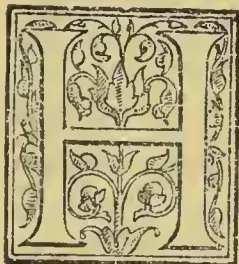

IGH is the calling of the cultivator. It is not to provide food merely, though of all things food is, of course, the most important; but it is in concurrence with the architect and the engineer to extend the power of man over nature in

a friendly way; it is to clothe mere material nature; in the beautiful lincaments of humanity Nature, indeed, even when left entirely to herself, is always respectable and never ugly—never mean. But how much more beautiful when she bespeaks man's intelligence and tasteful dealings with her; when the panorama on which the contemplative eye is invited to rest, displays not only rocky mountains, or wooded valleys, or open plains, but noble mansions

“Bosom'd high in tufted trees;”

adventurous bridges spanning ravines and rivers, smiling cottages, corn fields, and flower-gardens, parks and meadows, with frequent trees, standing like sentinels to guard the forest on the upland!

Next to the discharge of social duty, next to the endeavour to be a Little Providence in his own sphere, consulting for the happiness and well-being of all around him, the best way in which a man can spend his life, is to devote it to Nature, with a view to draw her out for man's behoofs, either by reminding her of seed-time and harvest, or by rendering her Beautiful for continual enjoyment. And in this there is great encouragement. Those powers in nature which refuse to be trained, and which resist all charge, are not more powerful now than they were thousands of years ago. The storms of the ocean are not more terrible. The rock of the alp is not harder. The climate of the district (if the surface of the ground beneath has not been

changed) is not more cold, or damp, or arid. But meantime man's power over nature has been marvelously increased. Nature can no longer resist him so effectually now as she could do in former times. Let the winds blow and raise the sea into what waves they may, the steamship can cut the waves through as they successively attack her, can hold right on her course in spite of them, and make head-way right in the wind's eye. As to the rocks of the Alps, be they ever so hard, it has been voted that they shall be put out of the way along a certain line, to the end that the traveller to whom time is an object may no longer have to go over Mont Cenis, but right across the base of the mountain. And in a few years a tunnel many miles long will be open right through from France to Italy. Nor is it the engineer alone who is thus coming into the possession of such dominion over nature. The forester also is acquiring such power even over climate—that element on which man's well-being depends more than on any other—what we expect our children will see vast tracts of country, which through the destruction of their forests have long since become arid and inhospitable, or lapsed into the state of mere bogs, restored to cultivation and amenity again, as also other tracts which are now too cold and rainy, rendered genial. Great, in fact, is the power and majesty of the forest tree. It is the finest symbol which the world supplies of the undying state—immortal life. No true man can have any other feeling but that of a sacred respect for a forest tree. Among our ancestors, indeed, or at least the inhabitants of this country, at that time when its history begins, this feeling was carried too far. They worshipped the forest tree. Or if with regard to them this may be a question—it is no question with regard to our fellow-subjects in India. There, some religious sects worship certain forest trees at the present day. And it seems to me not improbable that this worship may have been instituted by the priesthood both as an expression of the veneration which they themselves felt for the forest tree, and also with a view to impress upon the mass of the people an idea of the value of trees and forests. For the institutes of civilised heathen

611------------------------------------------------

586THE TROPICAL AGRICULTURIST.| MARCH 2, 1896.

ism, though, when they are viewed in the light of the true religion, they are very much to be deplored, are often possessed of much social and political value.

It is at all events certain that the way in which the inhabitants of the finest countries on the surface of our globe tend to bring upon themselves the greatest calamities, is by the thoughtless destruction of the forest, first around their dwellings, then all over the country. For a few generations at first, indeed, the felling of the forest is a triumph over nature, for ground that bears grain or annual crops of some kind, is always more convenient than ground that bears trees, however nutritious or delicious their fruit. But when the custom of wood-cutting has once been established in a community, and the necessity of more and more firewood and more and more material for building, as also of new clearings for the sake of obtaining a virgin soil increases with the increase of the population, the process of felling tends to go on too far—even till the whole accessible country is denuded of its forest, and the soil is laid permanently bare to the impact of the sunbeams. Now of this the consequences are most injurious. In the first place the rainfall is proportionally diminished. And though, as we know in Scotland, there are some countries where this would be an improvement, yet in reference to all intertropical countries, and indeed the surface of our planet generally, it is an evil. And in the second place, the soil, when stript of the clothing which the forest afforded, and exposed naked to the heat of the sunbeam, changes very rapidly from the rich mould which the long-continued fall of the leaf in the forest had made it, and becomes very unproductive. Had occasional trees in the forest been left to give shade during part of the day, the destination of the carbon in the mould would have been to be slowly converted into carbonic acid, and so to supply food to the successive crops growing on the soil as they required it. But when the sunbeam is left free to break in its full force on the soil all day long, it burns the carbon in the soil with great rapidity into carbonic acid. And this gas, unless there be in the soil some oxide having affinity for it to retain it, goes off as gas, injuring the salubrity of the air perhaps, and at all events wholly impoverishing the soil; for carbonic acid is the principal food of all plants. The same course of things, it might be shown, happens with regard to ammonia; and thus, both as itself the immediate food of plants, and as that which by oxidation yields nitre, ammonia is lost. Thus the indiscriminate destruction of forest over any great breadth of country, if that country have plenty of sunshine, is a great evil.

This is not mere theory. There is, on the contrary, good reason for believing that the view now given explains, to a great extent, the character of the surface and climate of all the old inhabited regions of our planet in the present epoch of the world. And what invests the subject with interest is this, that while it explains the cause of certain great evils which prevail very widely, it also suggests a cure for them. Thus, not only is the great breadth of Africa and Australia, in consequence of aridity, unfit for being the dwelling-place of civilized man, but Western Asia, and even the valleys of the Ganges, the Jumna, and the Indus, are greatly at fault in this respect. Now, of the former regions in former times we can say nothing for certain, because nothing of their early history is known. But with regard to those Asiatic regions which have been named, their ancient history is known. There can be no doubt that, in ancient times, they were more densely peopled, and that by races far more energetic than their present inhabitants. There can be no doubt that their climates were more genial and their soils more fertile than they are now. And why the difference? It is due, I believe, to the thoughtless destruction of the forest, with which nature ever tends to clothe the entire surface of our planet, so far as it is possible for her to do so. Hence in the present age a great decrease in the annual

rainfall, and its confinement to certain seasons depending on celestial, not terrestrial, influences, instead of a more uniform distribution over all the year. Hence a comparatively rapid combustion of the soil by the sunbeam, and the loss of the fertility imparted to it by the virgin forest now no more.

But why, it may be asked, press this theory? It is only a speculation. And granting that it is true, what can be made of it? To this the answer is, that it proclaims aloud to the philanthropic traveller, colonist, planter, soldier, and to any government in charge of such bare and desolated territories as have been described, to do all they can to encourage arboriculture to the utmost in their power, and to call for the restoration of the forest.

In reference to many at present inhospitable lands, there is no saying what benignant results might be effected in the course of even a few generations, if only trees could be stolen upon them, and ultimately established in such clumps, belts and breadths as might be required. With regard to Western Asia and Africa, indeed, the case, in consequence of the characters of the governments which rule there, may be hopeless in the present generation. But something might, perhaps, be begun to be done even now for the valleys of the Ganges and Jumna and their tributaries, and for those of the rivers of the Pnnjaub, and for Australia, which are all more or less under our own control.

But can nothing be done nearer home? Is our own much-loved country all right as to arboriculture? In answer to this it may be said, that it is at least very pleasing to consider what has been done. When the Emperor of the French was contemplating to do something for Mexico, he appointed one of the most learned men of science in France to give him in a report as to different nations, showing what nature had done for each of them, and what man had done. The result was, if I remember rightly, that of thirty which were compared, Scotland stood second as to what man had done for her, but lowest and last as to what nature had done for her; while as to Mexico, its position was as nearly the very reverse. Admirable, therefore, is that which man has done for Scotland already.

But from what has been advanced, with regard to other countries, the question may be legitimately asked here, Has our country, too, been denuded of its primeval forest by the unreflecting hand of man? Now, to this the answer is, that in our latitudes the hand of man is not required for that work. Where the temperature in the shade never rises high, the vegetable remains resulting from the fall of the leaf, instead of decomposing too rapidly, as they tend to do in tropical countries, scarcely decompose at all. On the contrary, the mould tends to give birth to certain chemical substances, such as tannin, and especially gallic acid, humic acid, &c., which are not only themselves not decomposable in ordinary course, but which preserve from decomposition the mould-molecules with which they are mixed. Hence the stratum immediately under the trees continually increases in thickness from age to age. Now, like other insoluble media, this sour soil is no food for the trees growing upon it. They spread out and send up to the surface the spongioles of their roots in vain. If they receive anything, it is only poison instead of food. And thus it comes to pass that ultimately the forest falls of its own accord; and its only recorders are the noble shafts of trees found prostrate in the moss when that moss happens to be cut into.

The state of the elements which produces this result extends over Europe for a breadth of about three degrees of latitude. In some regions, however, it is not so inimical to nature's determination towards arboriculture, but that where one forest has fallen she succeeds in rearing another spontaneously of a different kind on the same area. Thus archaeologists, in their recent researches into the antiquity of man, have brought to light by their diggings that Denmark, in successive epochs, has been clothed by three successive forests,—first of pine, then of oak, and now of beech. But to accomplish such an

612------------------------------------------------

MARCH 2, 1896.]THE TROPICAL AGRICULTURIST.587

end in our country seems to require the aid of instructed reflective man,—first in draining and so far reclaiming the bog and then in planting it anew with suitable timber.

(To be continued.)

## CAMPHOR LEAF OIL.

BY DAVID HOOPER, F.C.S.

The recent high price of camphor, on account of the war between China and Japan and trade monopolies, has caused some anxiety in countries where it is largely consumed, and China and Japan being at present the only two countries where camphor is produced on a large scale, it has been thought desirable that its cultivation should be taken up in other lands. In Japan the camphor trees grow at high elevations away from the sea, and only large trees of about one hundred years old are selected for use in making the camphor. From the export returns of this country, it seems that the supply is gradually becoming exhausted. In the island of Formosa the camphor trees are said to be by no means plentiful, and they grow only in certain favourable situations as far as the climate is concerned, with savage tribes in the immediate vicinity. Here the trees are not considered worth taking until they are fifty years old, and the wood only of the roots and stems is subjected to distillation.

The camphor tree grows very well in India. The Calcutta Botanic Gardens possess a fine avenue of trees which were introduced in 1802. It grows well in the Ootacamund Botanical Gardens and in other parts of the Nilgiris. It has been planted, as an experimental measure, at Jhansi in the North-Western Provinces, and in other districts in the plains. Camphor has been known and used in India for many centuries. In A.D. 642, Indian princes sent camphor as a tribute or offering to the Chinese emperors. At one time the tree flourished in Nepal and Tipperah, a large tract of land lying between Bengal and the Upper Irrawaddy. Within the present century camphor was imported from Chittagong, but it has been said that the discovery of the hill-men of distilling it from the root led to extinction of the trees.

In Ceylon the camphor tree grows well at elevations of 5,000 feet and less; it has the habit of a willow in the island, and it has been suggested that, like a willow, the trees should be coppiced, and the leaves and branches used for preparing the oil. The tree grows for ornamental purposes in Naples and other parts of Italy. Professor Maisch in 1891 reported on the cultivation of camphor in Florida, where it flourished in almost any soil. The solid oil was made from the leaves and branches; the yield was 4 per cent, and the product was more like that of Japan, as it had an odour of safrol. California has lately become the scene of an industry which has for its objects the planting of the laurel camphor and the preparation of the oil for the American market. The tree has also become naturalised in Java, Brazil, Jamaica, and other isles of the West Indies, Mauritius and Madeira.

It is very evident that the camphor tree is able to grow very luxuriantly and extensively in the warmer temperate and tropical parts of the world, far removed from China and Japan, but the slow growth of the tree would prevent all but large capitalists from opening up plantations and waiting for the plants to sufficiently mature. If it is true that in the island of Formosa the wood only of the larger trees is used, and the leaves and branches rejected, then there can hardly be a scarcity of the trees, or the manufacture must be conducted in a very reckless and extravagant manner. The camphor from the *Dryobalanops* tree is said to be quite liquid if a young tree is tapped, and solid if the tree is old. Under such circumstances it would seem that the liquid oil constituted the first stage in the development of the solid substance. It is stated in some text-books on *medica* that the stearopten exists in every part of the plant, including the leaves. On the other hand, it is remarkable that the leaves are not used in China and Japan; perhaps the natives have found that the leaves only give a liquid product which

cannot be profitably turned into camphor. As there is no definite information on this point to be found in any description of the industry, I thought it would be interesting to try the effect of distilling the leaves. Another reason that encouraged me to make some experiments in this direction was the hearty manner in which some energetic planters of Ceylon have taken up the camphor question.

A large number of experiments have been made, and a great deal has been written, with regard to camphor oil, the bye-product obtained in refining crude camphor before it is formed into blocks. This, has been proved to be a very variable liquid with a specific gravity ranging from 0.88 to 1.00, an erratic optical rotation, although usually to the right, and containing camphor in suspension, or in solution, or none at all.

The first sample of leaves came from an unbragacious tree growing in the Government Gardens at Ootacamund. Fifty pounds of the leaves in a fresh state were distilled in a large copper still with sufficient water for six hours. Eight fluid ounces of oil were separated from the distillate, giving the yield of essential oil one per cent. The oil had a slightly yellow colour, a specific gravity at 15° C. of 0.9322, and a rotation of +9°4 in a 2 decimetre tube. It gave off a small quantity of liquid at 160°, and began to boil regularly at 175°.

<table>
<tbody>
<tr>
<td>Collected below 180°</td>
<td>=</td>
<td>20.6</td>
</tr>
<tr>
<td>185°</td>
<td>=</td>
<td>31.0</td>
</tr>
<tr>
<td>190°</td>
<td>=</td>
<td>15.5</td>
</tr>
<tr>
<td>195°</td>
<td>=</td>
<td>10.6</td>
</tr>
<tr>
<td>200°</td>
<td>=</td>
<td>5.6</td>
</tr>
<tr>
<td>205°</td>
<td>=</td>
<td>3.3</td>
</tr>
<tr>
<td>Residue</td>
<td>=</td>
<td>8.6</td>
</tr>
</tbody>
</table>

95.2

The loss here was occasioned by some of the camphor congealing in the condenser; the amount, however, in this sample could only be about 10 or 15 per cent. The residue in the retort was quite solid in the cold, and had a yellowish colour and strong camphoraceous odour.

The second sample was obtained from some younger trees grown at Naduvatam on the Nilgiris, a district more than a thousand feet lower than Ootacamund. The leaves were distilled in the same manner as in the previous experiment, but a large quantity of camphor condensed during the process and almost choked up the worm of the still. About four ounces of liquid were collected, having a mass of crystalline matter suspended in it. The oil was strained through cloth, and the solid matter, pressed hard to remove all the liquid portion, was left as a cake of camphor, weighing two ounces. The clear oil had a specific gravity of 0.9314 at 15° C., and twisted a ray of polarised light +54° in a 2 decimetre tube. It began to boil regularly at 165°.

<table>
<tbody>
<tr>
<td>Collected below 185°</td>
<td>=</td>
<td>13.3</td>
</tr>
<tr>
<td>190°</td>
<td>=</td>
<td>20.0</td>
</tr>
<tr>
<td>195°</td>
<td>=</td>
<td>15.5</td>
</tr>
<tr>
<td>200°</td>
<td>=</td>
<td>20.0</td>
</tr>
<tr>
<td>Residue</td>
<td>=</td>
<td>25.0</td>
</tr>
</tbody>
</table>

93.8

The loss was again accounted for by some of the camphor condensing in the cool tube. About one-half of this oil consisted of solid camphor, or, calculating the camphor already separated, the oil from the Naduvatam leaves contained 75 per cent., which is a very satisfactory result. The camphor dissolved in rectified spirit, twisted a ray of light +30°. The altitude of the Government Gardens in Ootacamund is 7,300 feet, and it is possible that this elevation influences the formation of the solid stearopten in the leaves. At any rate, it is interesting to know that a large proportion of camphor can be obtained from the oil of the leaves and from the leaves themselves, and probably, if taken from trees grown at a much lower elevation, a much larger proportion of this useful substance could be collected.

—*Pharmaceutical Journal.*

613------------------------------------------------

588THE TROPICAL AGRICULTURIST.[MARCH 2, 1896.VARIETIES OF WOOD MORE, LESS, OR NOT SUITABLE FOR TEA CHESTS.

(Translated for the "Tropical Agriculturist" from "Teysmannia.")

Tea cultivation in Java, as has been the case with other cultivations, has entered upon its years of strict economy. In the good old times this was not so. Then it was profit. But necessity teaches one to pray; and the regally fortunate planters in that golden time would certainly have laughed, if they had been told, that a pound of tea can be made and delivered for the price that it now costs the planter.

Amazingly instructive is such a compulsory economy. If only the old prices came back again now! This sigh is generally uttered when once again a lot of tea is sold on less favorable terms. But they have not yet come back; and probably never will.

It is fortunate that tea cultivation in Java, in this "struggle for existence," still holds its own.\*

In such a general economizing attention must be given to every detail. One of these details is the article of tea chests.

As a rule the planter makes his chests himself. Only a few are in a position to buy chests cheaply. The transport and the profit which the contractor must naturally have make it too expensive. A sawing machine is found upon almost every estate. Some of the larger ones have frame-saws; but a single circular saw, driven by a water-wheel, can abundantly supply the need, and, without much trouble, yield planks for 8,000 to 10,000 chests, representing a production of 640,000 to 800,000 half-kilos of tea.

Sawing is best done with the hand; blocks of wood, still round and with the bark on them, cut up or sawn off to the length of the desired planks, are guided by the hand toward the saw, which turns at a speed of 600 to 1000 revolutions per minute. This method of dealing would not succeed if hard kinds of wood had to be operated upon. Tea-chest wood must be light, and at least so firm of fibre that a wire-nail will hold firmly in it. Further, it must dry easily, and not get mouldy too quickly or shrink too much.

Formerly the wild timber of the Government forests was mostly utilized. Innumerable varieties of all kinds of woods are to be found in these forests. But, partly because the distances, and therefore also the cost of transport, are too great, or because the tariff for these kinds of timber, even the lowest, of 1-5th of *djati* wood, is still too high, the planter had to seek other sources, which were found in *kampung* timber or their own planting. The *kampung*, with their surrounding little gardens, *hoemas*, ravines, &c., yield a number of varieties of wood, suitable for the purpose. Many fruit-trees, which in the lower districts yield sweet, juicy fruits, grow well in the mountains, but yield fruits edible only by natives or quadrumanous inhabitants of the forest, *tant soit peu*. Experience teaches, that the value of the timber of *nangka*, *doeren*, *rambutan*, mango, *djerock-besar*, *jambu*, &c., growing at 3000 feet, is greater than that of the fruit. For the tea planter, moreover, there is generally the full opportunity of making himself independent with his own timber by planting along roads and paths or in ravines, or if need be by systematic forest cultivation.

What variety of wood is the best for tea chests is still an open question. So long as that is not decided and an abundance thereof planted, the planter will still have to content himself with a number of varieties of wood, which are more or less suitable, and he will often have experience of varieties of wood which are not suitable for tea chests.

At a medium elevation of 3000 feet, in the heart of the Preanger, the tea-planter-chest-maker has to do with the varieties of wood mentioned in the following list. This cannot make the least claim to completeness. Many varieties of trees, however, exist in large numbers in some places, in others sporadically or not at all. Of the varieties of trees from

the primeval forest only a portion of the best known and most important, or that exists plentifully in the forest ravines outside the primeval forest, have been examined. A \* denotes the varieties that are suitable for tea chests, and \*\* those that are specially noteworthy, to be bought up or planted.

For the correctness of the Sundanese names, the writer can answer only so far as they are in use in his immediate neighbourhood, viz., the Malabar mountains to the south of Bandoeng. For the rest, most of the Sundanese names are pretty general over a large portion of the Preanger, if one does not attach too much credit to the unsubstantiated information which one sometimes gets. Not all natives are good arborists. The Latin generic names are taken from "Filet" and from the botanical dictionary of the trees of Java by S. H. Koorders. In that province, even in the generic names, great confusion still prevails. Each writer favours quite distinct names. I have ventured to retain several well-known names from "Filet," although in the work of Mr. Koorders quite different ones are found. For some it was not possible to give a Latin name except by means of a lucky guess. The spelling of the Sundanese names differs in many points from that followed by Mr. Koorders. The simple and rational method of spelling of Geerdink-Coolsma in my opinion deserves the preference.\*

1. *Albasu.*\*\* *Albizia moluccana*. A tree of great virtues and great faults. No variety of tree yields, in a short time, so great a quantity of wood, of very useful quality. The wood is somewhat too soft, and must therefore be sawn somewhat thicker and be fastened with longer nails. It is however very uniform, dries quickly, does not shrink much, and is pleasantly smooth to plane. The tree grows everywhere luxuriantly and incredibly quickly, but one loses much wood (1st) by the wind, which often breaks off the largest branches or causes the tree to split down to the roots; (2nd) by a green *boktor*, striped with yellow-brown on the wing-cases, which attacks the tree and causes it to die off on a large scale. The bark then falls off in pieces, and the wood is riddled like a sponge by the larvae of this chaser. As soon as one sees dying at the foot a fine wood dust, that makes its appearance through small holes in the bark, and gives the first intimation that the tree is doomed, it must be speedily cut down.

2. *Angrit.* *Quercus* spec. (See No. 33 *Kajang*.)

3. *Buros.*\* *Manglieta* spec. This tree has its home in the primeval forests. The wood is handsome in appearance, greenish, yellow-brown, but somewhat brittle. Also very suitable for building. The old trees are mostly called *Manglid*.

4. *Beleketche.*\* *Echinocarpus* spec. Wood very good for chests. Comparatively rare. Is very heavy.

5. *Beunjing.* *Ficus*. (See No. 42 *Kiara*.)

6. *Bintinoe.*\* *Melochia* spec. (Koorders). Good and useful, but even from older stems somewhat too hard; but seldom of sufficient proportions.

7. *Biroe.*\* *Canariopsis* spec. (Filet). A handsome, good wood; seldom met with.

8. *Bisoro.* *Ficus* spec. (See No. 42 *Kiara*.)

9. *Boengoer.* *Lagerstroemia* spec. This tree, which is every year covered with rose or violet flowers, yields an extremely hard wood, valued in the Government tariff equally with *djati*.

10. *Boctarowra.* *Quercus* spec. (See No. 33 *Kajang*.)

11. *Mangifera* spec. div. The wood of the varieties of mango is too hard and too heavy for tea chests. With the exception of *Limos*, and the wild-growing *Pari*, all varieties of the mango are called in the Preanger *Boewah*, not only the fruit, but also the tree.

12. *Dadap.* *Erythrina* spec. div. All the varieties of dadap, as also the thorny *Dadap tjoetjoek* and the *Tjangking*, must be condemned. The wood is too spongy.

13. *Damar.*\* *Dammara* spec. (Filet). Is specially planted for tea chests, in lower lying districts. At

\* The words from "struggle" to "own" are given in English in the original.—Tr.

\* In the Dutch system of spelling Malayan words *a* = English *oo*, *eu* = Eng. *u* in *burn*, *j* = Eng. *y*, *di* Eng. *ji*, *ij* = Eng. *ch*.—Tr.

614------------------------------------------------

MARCH 2, 1896.]THE TROPICAL AGRICULTURIST.589

3000 feet the tree does not always grow well, and it is liable to diseases. The wood must be of very good quality.

14. *Djadjawaj*. *Ficus* spec. (See No. 42 *Kiara*.)

15. *Djamboe*. [*Jambu*.] *Jambosa* spec. div. The wood of all kinds of jambu is hard and heavy. In the mountain regions the fruits are all inedible.

16. *Djamoedjoe*. *Podocarpus* spec. When planted outside of the primeval forest this tree grows badly. Its home is in the higher lying belt (4000-5000 feet), where it forms one of the forest giants. The wood is a good timber.

17. *Djati*. *Pectona* spec. Of well-known utility.

18. *Djengkol*.\* *Pithecolobium* spec. The quality of *Djengkol* wood leaves not much to be desired for tea chests, but it has an unpleasant odour, which, however, cannot penetrate through the tea lead. The tree grows quickly, and is to be met with in abundance. The fruits are unwholesome. He who eats much of them becomes *djengkoleum*, a peculiar disease.

19. *Djroek*. *Citrus* spec. div. Only the *Djroek gde* or pumelo attains to sufficient dimensions to enable it to be sawn into planks. The wood is however far too hard. The fruits consist (at 3000 feet) of  $\frac{2}{3}$  hnsk and  $\frac{1}{4}$  a sour, bitter, fibrous kernel.

20. *Djeunydjing*.\*\* *Albizia stipulata*. (Filet). Although this wood, which is obtainable in large quantities, is stronger and denser than that of *A. moluccana*, and is one of the most largely used for tea chests, yet serious defects attach to it. The tree is not so easy to plant, and grows much less quickly than its transmarine brother. On the other hand it is better able to stand the wind, and not so subject to damage from insects. The heart-wood and the sap-wood are very differently colored, which gives a mottled appearance to the chests. The sap-wood rots very easily, and then becomes permeated by a dark-colored mycelium. If it is not quickly and thoroughly dried and kept dry, the planks become covered with moulds and fungi, which cause them to adhere to each other. This disadvantage is not possessed by the wood of *A. moluccana*. This last, also named *Djeunydjing luot*, is in these regions mostly designated *Albasia* (See No. 1) by the inhabitants. Of one variety (?) named *Djeunydjing entak* the wood is totally useless. It shrinks to such an extent, that a plank becomes not only much smaller, but wholly distorted.

21. *Djoenti*. This large-leaved tree, with very small blossoms, is seldom met with. Superficially it resembles *Djati* or *Sempoer*. It grows in *tegal* districts, intermixed with *Malaka*, *ki-bodas*, *hintinoe*, &c. The wood is reddish-colored, pretty strong, but coarse.

22. *Djoewur*. *Cassia* spec. Very suitable as a shade-tree along big roads. The wood is much too hard for tea chests.

23. *Gadok*.\* *Bischofia* spec. Very useful for tea chests, but largely attacked by boring chaters.

24. *Galinggem*. *Bira* spec. More suited for living pagers.\* When well pruned the tree grows pretty high and stemmy and possibly suitable to be sawn into planks. The wood is also sufficiently solid.

25. *Hamcrang*. *Ficus*. (See No. 42 *Kiara*.)

26. *Hamiroeng*.\*\* *Vernonia* spec. A forest giant, belonging to the family of the Compositæ (in this respect unique ?). When planted from seedlings in the forest, the tree, with good pruning, grows up vigorously, but it has still to be seen to what dimensions it will attain. The wood is exceptionally suitable for tea chests.

27. *Hampelus*.\* *Ficus* spec. This variety of *Ficus* differs from all others by having a wood very suitable for tea chests. As in the leaf, which is on that account used as sand-paper, so the wood also appears to possess siliceous deposits, which render it tougher.

28. *Hantap*. *Sterculia* spec. The wood of the *Hantap* is, *faute de mieux*, useful. The tree, which becomes very large, allows itself to be planted everywhere freely, and planted along roads forms beautiful avenues. The scarlet-red fruits have a pretty effect.

29. *Haroeman*. *Albizia* spec. (or *Pithecolobium* ?). The wood is bad and moulds very rapidly.

30. *Hoemi*. *Antidesma* spec. Hard wood.

31. *Hoeroe*. The number of varieties of *Hoeroe* is legion, and very different in appearance. The best known are *H. manok* (*Acer* spec. ?), *H. konang*, *H. batos*, *H. pajong*, *H. leaem*, *H. hiris*. All yield a not very durable timber, which is however very useful for tea chests.

32. *Kadoe*. *Durio* spec. The well-known prized and abhorred *Durio*. At 3000 feet gives fine large trees, but small tasteless fruits. The wood is rather bad.

33. *Kajang*. *Quercus* spec. Among the Javanese oaks the "*Pasang*" is the most known, but the "*Kajang*" is apparently the best. The wood of the *pasang* is white and coarse of fibre. The red heart-wood is not inferior to the best European wainscoting. When freshly cut and sawn however it may split. It is very durable, when waxed or polished is prettily veined, and is impregnable to white-ants. In some forests the tree is found in large numbers. It is erroneous to speak of *pasang-kajang*, *pasang-kihioer*, &c.

34. *Kaliage*. A shrub, with twining branches, which sometimes attains the compass of a tree. The long, hard and sharp thorns are rightly very much feared.

35. *Kaliketan*. *Croton* spec. (?). Perhaps a corruption of *kaliki-oetan* (Filet 3321). In other places also called *ki-rantja*. The treelet is suited for living pagers, always handsome, either from the bright-red young leaf, or from the white clusters of flowers, or from the red berries. Deserves to be planted in gardens.

36. *Kalimorot*. *Castanea* spec. Good building timber, not suited for tea chests.

37. *Kamoening*. *Murraya* spec. Very hard wood, yellow-colored, seldom in dimensions of any consequence.

38. *Kananga*. *Cananga* spec. Coarse-fibred, pretty strong wood.

39. *Kanjere*. *Brielelia* spec. Seldom attains sufficient dimensions.

40. *Karet*. *Ficus* spec. (See No. 42 *Kiara*.)

41. *Kareumbi*. *Carambium* spec. A small tree, is not much noticed. Useful as undergrowth in forest planting.

42. *Kiara*. *Ficus* spec. The wood of all varieties of *Ficus*. *Urostigma*, or *Cordilia* (with the exception of *Hampelus* No. 27), is too weak for tea chests; some of them are only of value from their regally handsome growth, others as produces of caoutchouc. The genesis of the *Kiaras*, sometimes in the tops of other trees, is very interesting. The seeds are apparently deposited there in the dung of birds. The young plant sends downwards a rootlet as fine as a spider's thread, which at length reaches the ground and ends by becoming a stem that entirely overpowers and overgrows the supporting tree. Sometimes the supporting tree continues to live; and then one sees in a *Kiara* some branches with entirely different foliage, for instance of *Tewreup*; sometimes it dies and then forms a hollow cavity in the *Kiara* stem. When the primeval forest is felled and burnt such a *Kiara* chimney may sometimes stand for several days flaming and smoking. Sometimes two or more varieties of *Kiara* are found grown together on one stem, but bearing various leaves and fruit at different times.

43. *Ki-bako*. A quick-growing tree recommended by natives and easy to plant. Wood not yet tested.

44. *Ki-bolus*. *Blackwellia* spec. Exceptionally hard and durable wood, difficult to work. The tree belongs to the *tegal* flora and is proof against the yearly burning-off of the high grasses around its foot. This peculiarity it has in common with *Malaka*, *si-hiang*, *hempoer*, &c.

45. *Ki-endog*. *Xantophyllum* spec. A very large tree. Handsome white building timber, hard and very fine of texture.

46. *Ki-hiang*. *Albizia* spec. A *tegal* tree. Very hard and heavy wood. (See No. 44.)

47. *Ki-hioer*. *Quercus* spec. (Filet). (See No. 33 *Kajang*.)

48. *Ki-hoë*. *Cupania* spec. Very strong and tough wood.

\* Enclosures, fences.—Tr.

615------------------------------------------------

590THE TROPICAL AGRICULTURIST.[MARCH 2, 1896.

49. *Ki-laki*. *Grewia* spec. (Filet). Small and insignificant.

50. *Ki-leko*. *Sauraya* spec. Weak and unusable.

51. *Ki-mcong*. Easy to raise from seed. A handsome tree, with very strong, hard wood. Perhaps suitable for the planting up of roads.

52. *Ki-mêrak*. *Podocarpus* spec. This pine yields a handsome furniture wood, useful for all kinds of purposes; too good for tea chests.

53. *Kina*. *Cinchona* spec. div. From the wood of large *C. succirubra* tea chests can be made if need be. It is however somewhat too heavy and brittle for this purpose. It is of more use to the tea-and-cinchona planter as firewood for his drying machines, &c., &c., as well as for *paqers* and for posts for nursery beds &c. It is very durable.

54. *Ki-oraj*. This name appears to be applied in other parts of the Preanger to other varieties of trees also. Here it is generally used to denominate a not thick, but pretty high tree, which is met with in groups, with fine handsome foliage and small white papilionaceous blossoms. Apparently very suitable for shade-trees in coffee gardens, not subject to the diseases of the Albizzias. Rather hard wood.

55. *Ki-poëk*. *Pithecolobium* spec. This handsome tree, generally thick, of a dark green shade, allows itself to be easily planted from the black beans. The wood is little known, but may possibly be as useful as *djengkol*. Time must decide this.

56. *Ki-poetri*. *Podocarpus* spec. (as No. 52 *Ki-mêrak*).

57. *Ki-sampany*.\* *Erodia* spec. This tree much deserves attention on account of its beautiful white wood and quick growth. In forest plantations it sometimes springs up of itself in large numbers.

58. *Ki-sera*. *Cinnamomum* spec. (Filet). This fragrant wood is very hard, strong and durable. Its home is in the primeval forest.

59. *Ki-tedja*. *Cinnamomum* spec. Also a variety of wild cinnamon, found everywhere. Little or no odour. Hard building wood.

60. *Ki-tiwoe*. *Meliosma* spec. Bad and useless.

61. *Ki-tjareuk*. A forest-growing, straight-stemmed tree, with a leaf that consists of unlike halves (as in the Begonias). Is recommended by the natives. Wood not yet tested.

62. *Koekoen*. *Schoutenia* spec. Also called *Wali-koekoen*. Magnificently strong and pliable wood. One finds many shrubby-growing specimens, seldom a proper tree.

63. *Koeraj*.\* *Sponia* spec. In woody districts, between 4000 and 5000 feet, the tree *par excellence* for tea chests, although indeed somewhat difficult to saw in a moist state, from its great fibrosity, owing to which a plank of it appears as if covered with wood, yet easy to plane, light and sufficiently strong. Also little subject to decay. After the felling of the primeval forest, the *Koeraj* springs up *en masse* and in a short time forms a new forest. Planted in more open, lower-lying regions, the tree languishes very much, and is subject to diseases, which often cause it to die outright.

64. *Kondang*. *Ficus* spec. (See No. 42 *Kiara*.)

65. *Kopeng*. *Ficus* spec. (See No. 42 *Kiara*.)

66. *Kopo*. *Jambosa* spec. This tree strikes the eye chiefly in the blossoming season, when it is covered with rich white-rose flower-clusters. The wood is hard.

67. *Lame*. *Alstonia* spec. Quickly attacked by insects. Otherwise really good wood.

68. *Limoes*. *Mangifera* spec. A handsome tree, especially in the blossoming season. Hard building wood.

69. *Loa*. *Ficus* spec. (See No. 42 *Kiara*.)

70. *Mala*. *Liquidambar* spec. Among Europeans better known as "*Rasamala*." The natives say for short "*mala*." The king of trees in Java. The wood is often not sufficiently valued, apparently because one frequently bases one's opinion upon timber delivered by contract, which usually consists of comparatively young wood, the most manageable of stems, quite sufficient for the required dimensions. The hardest-wood of old, thick trees differs therefrom very much, and is extremely solid. In the primeval forest one sometimes finds trees

fallen from immemorial times, the bark and sap-wood of which have entirely decayed. Such a stem then forms a natural wall, into which the foot sinks when one stops upon it. The heart-wood is then still quite sound and apparently far superior to freshly cut wood. Planks of good *mala* wood lie in the open air, exposed to wind and weather for 20 years and perhaps longer, without rotting. The sharply defined territory of the tree is peculiar. On the Goenoceng Tiloe some portions of the forest consist almost entirely of *malas*; on the flat adjoining Malabar the tree is entirely absent. Yet it allows itself easily to be planted from seed, and there are 10-year old specimens that are growing vigorously.

71. *Malaka*. *Emblica* spec. One of the hardest and most durable varieties of wood. One can seldom get a fine, perfect piece of wood. Most of the stems are hollow and full of holes. The tree grows in open *têgals*, and does not die when the grasses are burnt off.

72. *Manglid*.\* *Manglietia* spec. (See No. 3 *Beros*.)

73. *Mara*.\* *Mappa* spec. (or *Pachystemon*?). The green-leaved or *Mara-têgal* is not so suitable, although also useful, as the brown-leaved or *Mara-beureum*. This tree allows itself to be freely planted, grows quickly, and yields a wood that has exceptional qualities for tea chests.

74. *Mindi*. *Melia* spec. The experiment tried (at 3,000 feet) with this tree for the first time lately in the Preanger has not been successful. The wood is soft and very liable to split. The tree grows up quickly, but, unless planted in favorable spots, the growth speedily comes to a standstill. Perhaps better suited for lower districts.

75. *Moentjang*. *Aleurites* spec. This wood, to be met with in great quantity, must alas! be condemned. The quality is too bad.

76. *Nangka*.\* *Artocarpus* spec. Although somewhat hard and solid, this wood must not be rejected, especially as it is to be had in pretty large quantity. The tree grows well on all kinds of soil, and as a fruit tree has scarcely any value. It is best to use this wood mixed with lighter kinds. Some planks of *nangka* or *waroe* wood, especially for nailing up strongly the bottom or top, add much to the strength of a tea chest. Also very suitable for clamps.

77. *Panggang*. *Paratropia* spec. Unutilizable. The wood fibre is always twisted in spirals, and splits correspondingly.

78. *Pari*. *Mangifera*. A tree from the primeval forest. Heavy hard wood.

79. *Pasang*. *Quercus*. (See No. 33 *Kajang*.)

80. *Pêir*. *Ficus*. (See No. 42 *Kiara*.)

81. *Pentenj*. *Parkia* spec. Forms high, very fine trees. Hard wood. Apparently well suited for tea chests.

82. *Pentenj-selong*. *Leucaena* spec. Too small to be noticed. The wood is besides exceptionally hard.

83. *Poeloes*. *Laportea*. Small trees in the primeval forest, without value. The leaves, which look harmless, burn so severely on being touched, that one feels the pain even after 6 weeks, especially when the burnt part comes in contact with cold water. It appears that vitreous hairs are left sticking in the skin. Natives when in the forest never fail to warn persons following them.

84. *Poespa*. *Schima* spec. Big forest trees with hard timber, resembling that of *mala*, but inferior to it. The tree can be easily planted, and is once a year fiery red from the new young leaves, by which one can recognize the *poespas* at a considerable distance.

85. *Ramboetan*. *Nephelium* spec. At 3,000 feet the tree seldom yields fruit, and then only small, sour ones. Nevertheless it grows well, and is suitable for planting along high roads. The wood is too hard for tea chests.

86. *Randoe*. *Eriodendrum* spec. The tissue of the kapok-tree can scarcely be called wood, and is perfectly useless, even as firewood.

87. *Renyas*. *Gluta* spec. Very handsome timber. The cutting of this wood causes swelling of the face and hands; this peculiarity condemns the tree.

88. *Sanintên*.\* *Castanea* spec. Very abundant, very useful timber, although somewhat hard for tea chests. It is also very quickly attacked by white-ants and *boeboek* or *toko* (boring chafers) and is therefore especially very inferior to oak-wood.

616------------------------------------------------

MARCH 2, 1896.] THE TROPICAL AGRICULTURIST.591

89. *Sempoer. Dillenia spec.* Especially at home in the *tégals* of the low-lying districts and proof against fire, Exceptionally hard wood. Another kind or variety is called *Sempoer tjai*.

90. *Soeren.\*\* Cedrela spec. div.* The quality of the *Cedrelas* indigenous to Java is very various. The *soeren* wood is mostly very suitable for tea chests. For planting, these trees are not to be recommended, Outside of the forest they suffer badly from diseases and soon die. It is otherwise with the Sumatran *Cedrela serrulata*, commonly called *Soerian*, and now universally distributed in the Preanger even by the natives, freely planted. Few varieties of wood are so useful for all kinds of purposes. It is tolerably strong, easy to work, prettily marked, on which account it can be used for polished furniture, and durable, and also not exposed to white-ants. The sap-wood also and that of young trees does not differ much from the older heart-wood. Even for building timber it is very satisfactorily strong. Tea chests made of this wood leave nothing to be desired. The growth of the tree is however not yet quick enough. At 3,000 feet about 15 years are needed to produce a beam of 20×20 cm.; with very favorable growth 25×25. Older trees are frequently hollow. Of the indigenous *Cedrela odorata*, the well-known cigar-box wood, specimens have been planted, which grow well, but even up to *ca.* 6 years of age yield no seed.

91. *Talingkoep. Claoxylon spec.* A tree, that attains to no large dimensions, but gives hard, durable wood. Is very abundant.

92. *Tangkalak. Lepidodendron spec.* (Filet). Soft, bad wood.

93. *Tangogo. Castanea spec.* (Filet). Hard timber. The best of the *Castaneas*.

94. *Teureup. Artocarpus spec.* A very large tree with very bad wood.

95. *Tisoek.\* Hibiscus spec.* Leaf and blossom greatly resemble those of the *waroe* No. 100. As fantastically and crookedly as the latter grows, so straight as a candle the *Tisoek* shoots on high. For some purposes, among others for building, it is therefore more useful, although it is not so solid as *waroe*. The *Tisoek* however does not attain to the bulky dimensions of the *waroe*. The natives often disfigure and damage the tree by lopping so high, that only a small crown remains at the top. Useful for tea chests

96. *Tjangkring. Erythrina spec.* (See No. 12 *Datap.*)

97. *Tjangtjaratan. Nuclea (Koordeers).* A straight-stemmed tree. Hard timber.

98. *Tjaringin. Ficus spec.* (See No. 42 *Kiara.*)

99. *Toengeureuk. Castanea spec.* Hard timber.

100. *Waroe.\* Hibiscus spec.* A very useful wood when one needs great breadth and little length. For tea chests also, *waroe* wood, although somewhat heavy, and difficult to sow owing to its fibrosity, can be used with advantage. If some planks and the clamps consist of *waroe* wood, the chests are very strong. The tree grows everywhere and is not fastidious. A drawback is, that many trees become as if overgrown with parasitic plants "*Maquanden*" (*Loranthaceae*), which frequently cause the otherwise so strong tree to die. This tree is very intolerable, just like bamboo. All that grows within reach of its roots languishes.

A. E. KERKHOVEN.

### FRUIT CULTURE IN THE HILLS.

"Cosmopolite" writing from Simla to our esteemed contemporary *The Statesman* endeavours to show that a writer in *The Madras Mail* takes a very pessimistic view of fruit culture; the correspondent of the latter journal deals entirely with orchards which have been started in the Nilghiris, and have, according to him, turned out dismal failures. The picture he draws is no doubt a gloomy one, and when one reads of the many drawbacks unfortunate proprietors have to contend against, he would indeed be a bold man who would sink capital in such an industry. Here are a few of them as related by the Nilghiri writer:—

"I can recall the case of a gentleman who at great expense imported some expensive varieties of dwarf fruit trees from home. After patient waiting in due course the fruit set and began to ripen under

its owner's eyes, but when about half-ripe the unhappy man found to his disgust, on entering his orchard, that not only had the fruit been stolen but the branches broken off with it. And worse was to come, for the following year the plants were found with their stems cut off close to the ground, in some cases actually rooted up and carried away! Though this fruit-grower had comparatively few animal and bird enemies to contend against, since he was living in Ootacamund itself, the *genus homo* proved almost too much for him. In another case a fruit-grower enclosed his little garden with a trench and a wall about three feet high. This proved ineffectual to keep out sambar, which vaulted over and did infinite damage nibbling off grafts, etc. Porcupines followed in a way best known to themselves, and they rooted up pineapples, and ate the ripening melons, and cucumbers, and tomatoes. When the porcupines were excluded the rats and squirrels came in and nearly completed the ruin of the orchard. By day the place was infested with birds, that nothing short of shooting could drive away. The depredations of beetles, plant-lice, borcs and other insect pests, though serious enough, can almost be passed over in comparison with these troubles. In addition, in this case, the would-be fruit-grower suffered from the depredations of his own servants, who went in one night and gathered some pines that were ripening and by their clumsiness destroyed several of the plants. As the pines were a valuable variety the owner's loss was a heavy one. It may not be generally known that the jackal is a terrible enemy to the fruit garden. Coffee planters know to their cost what he can do to their coffee. He will eat anything in the shape of fruit that he can reach—strawberries, Brazil cherries, melons, figs, etc. and the fable of the fox and the grapes has a practical significance for the fruit-grower which perhaps it may not have for others. The toddy-cat of the plains has a cousin on the Nilghiris who practically lives on fruit. It is a black greyish animal with white spots and more mischievous than the jackal, from the fact that it can climb trees and reach any fruit.

Now we have a firm belief that the real enemy to European fruit-growers is the gentle Aryan, and not the insects, birds, or animals which agriculturists all over the world have to contend against; and there is no doubt that as things stand at present, this enemy is unconquerable.

"Cosmopolite" in *The Statesman* takes a much more hopeful view of the industry and shows how successful it has proved elsewhere. He says:—"My main object, however; in writing to you is not to comment on the failure of fruit culture in the Madras Presidency, but to set off against it the inraked success which has attended that enterprise in the Himalayas. Indeed, so hopeful have been the results that the N. W. Himalayas bid fair to realise the proud distinction of becoming, what they have been called, the orchard of India. Let me glance at the results of an experiment which has scarcely lasted a dozen years.

"Formerly Simla used to be supplied with fruit from Naini Tal, and up to 1883 seems to have been destitute of any gardens of English fruit trees, except perhaps a private one on Summer-hill. Since then, however, Annandale has been covered with fruit trees bearing apples, pears, apricots, grapes, etc., no less than 5,000 plants having been grafted in its soil. Private enterprise has also been busy in the same direction, and Simla now numbers about a dozen gardens, owned by residents, containing 2,000 to 3,000 trees bearing English fruit.

"I do not possess particulars of the cultivation on the Kulu range of hills, which are visible from Simla; but Kulu apples have already gained a name in the market. Indeed, it has been established that apples, and pears flourish on high elevations, and if we compare the English fruit produced in these parts from imported seeds or grafts with the miserable small spongy and tasteless fruit known in Calcutta as Cabul apples, the enormous advantage of having Himalaya fruit instead becomes at once apparent.

"Imagine for a moment the improvements in the Calcutta market were scope afforded for the supply

617------------------------------------------------

592THE TROPICAL AGRICULTURIST.[MARCH 2, 1896.

of English apples from the hills, to say nothing of pears, apricots, grapes, strawberries, and other smaller fruit—why, you would be better off there than you were even in the days in which American apples used to be imported with ice, and sold at the rate of eight for the rupee. I have tasted better apples here than ever I did in Calcutta in the best days of American apples. And the experiment of importing apples from Australia would have no chance against fruit which could be put in the Calcutta market within four or five days of its being plucked. The Calcutta market, moreover, is only a single place where Himalayan fruit could be offered for sale. All the stations along the railway route, and indeed every accessible spot on the plains, would be available for the sale of the Himalayan fruit, were culture attempted on a large scale."

All this is perfectly true, but we are inclined to think that in the Nilghiris the wrong sort of people went in for the industry and that the system they worked on was rotten. They were evidently people who did little or no work with their own hands, but small capitalists who planted orchards near villages so as to obtain cheap native labour. Result, villagers reaped and ate of the fruit with gusto after having drawn good wages to grow and guard it. The proprietor's profits might be gauged solely in an expensively bought experience and a profound knowledge of the capacity of his Aryau brother in the picking and stealing line.

But there are evident signs that a revolution is looming over Anglo-Indian society, the depreciation of the rupee is bound to affect even those moving in the highest grades, much more so the middle and lower classes, and they will no longer be able to send their children home for education or go there so frequently themselves. Schools therefore must yearly increase in numbers and be gradually followed by the hills of India being colonised by many of the parents of children educated there. To supply these colonies and schools with vegetables, fruit and poultry, we look to the poor white and a robust class of Eurasians who will start small farms, market gardens and orchards, working themselves without the aid of native subordinates such people ought with fair work and economy to be able to make a far better living in the Himalayas or Cashmere than they would be able to do in a country so played out for agriculture as England. Calcutta and most of all the big Indian cities suffer during the hot weather from a want of English vegetables and fruits, but so far our hill stations can scarcely supply local demands. Let Government encourage soldiers who have served their time to settle out here and aid them with lightly rented land grants and small loans where necessary, and the worthy folk will soon create a valuable industry and colonise the hills with a race from which India can call her future soldiers and policemen.—*Indian Planters' Gazette*.

#### ANACARDIUM OCCIDENTALE, Linn.

##### (THE CASHEW NUT.)

The fruit of *Anacardium* is well known to West Indians, who besides eating it in the fresh state, make conserves of it in various ways. Though sweet, it is at the same time very astringent and said to be useful in cases of dysentery and diarrhoea. Many and various are the effects with which this tree, its fruit, bark, leaves and seeds are credited, and if all were true, it would indeed be one of the wonders of nature. It is said to possess aphrodisiacal properties, the leaves to be capable of producing drunkenness, the nuts or seed when roasted to excite the faculties, especially memory, so much so that a confection made therefrom has been called *Confection des Sages*; and the oil from the nut is said to be equal to that made from the finest olives—while an acrid oil is produced from the epidermis of the nut, which is said by Barham in *Hortus Americanus* 1791 to "cure herpes, and cancerous and malignant ulcers abounding in rotten flesh; it also kills worms in ulcers, and chigoes, it takes away freckles and liver spots, but it draws blisters and therefore must be cautiously made use of." "It has been observed that poor dropsical slaves that have had the liberty to go into a cashew walk, and

eat what cashews they pleased, and of the roasted nuts, have been recovered." Another writer brings an indictment against the West Indian fair sex for using it as a cosmetic when they have become tanned by exposure to the sun. He describes the process as follows: "They take a nut, scrape off the outside skin, and rub their faces with the exposed oily surface. The face swells and blackens, but ultimately the tanned skin peels off; and although the process necessitates rigid retirement for a fortnight, at the end of that time they "re-emerge with a new skin and complexion as fair as a babe." It has been also stated that the oil is to be found useful in Leprosy and that the fruit is a cure for the disorder which causes the patient to become what is known as a *dirt-eater*. The oil is probably worthy of further examination, but in the absence of a Physiological Laboratory prepared to undertake original work we are bound to obtain the interest of workers in European or American Institutions; and as these are for the most part fully engaged, it is somewhat difficult to secure their interest for the examination of tropical productions.

The tree produces a beautiful clear gum, which makes a fine varnish, and is said to possess especial virtue in preserving woods from insects. The sap of the tree, like its congener *Semecarpus anacardium*, produces an indelible stain upon linen. Professor Lindley makes Martius responsible for a statement that the nut has a wonderful effect upon chronic inflammation of the eyes, especially such as are of a scrofulous nature, when simply borne or carried by the persons affected. It is also a common belief in Trinidad that a necklace collar of Cashew nuts have a remarkable curative effect upon some of the diseases of the Canine Race, especially for coughs, or distemper.—J. H. H.—*Trinidad Bulletin*.

#### CULTURE IN WESTERN AUSTRALIA.

It is pleasant to learn, through the agency of the Agent-General, that fruit and vegetable culture are making satisfactory progress in the far-away auriferous portion of the globe which has so rapidly risen into fame all over the world. Orchards and vineyards are gradually being developed in valleys where rivers or streams of any capacity run, and in some places, as in Perth, we are told that Grapes are sold at 4d. per pound. Apricots, Peaches, and Melons also are gradually coming into market, and Strawberries, Raspberries, and Currants are to be found here and there. Of course, where the rainfall is limited in extent, cultivation is a ticklish job, but then irrigation is made to assert its beneficent power, and as population grows, so also does the extent of acreage under fruit and vegetable cultivation. Land is cheap enough, for it is stated that the cost of freehold in farms is something like 10s. per acre, the payment being extended over twenty years = 6d. per acre per annum! And so, possibly, it may come to pass that alluvial gold may by-and-by be found more easily of acquisition than diluvial—as in California. By-the-way, it may be noted that fruit trees and cuttings are sent from both New South Wales and South Australia. We are reminded by the Agent-General that grass seeds are now placed on the free list of imports, as well as garden seeds. In the tariff-free list are to be found bulbs, fruit, and ornamental trees, sions and tracts, manures of all kinds, plants, and Vine cuttings. The following pay a duty of 5 per cent. *ad valorem*:—Agricultural, horticultural, and viticultural implements and machinery (not garden rollers); wire netting and steel fencing wire, standards and staples.

The increase in the value of timber exports is surely worthy of mention here. In 1893 the value of this export was £33,848, last year this had increased to £74,809. It may not be generally known that the forest region of extra tropical Western Australia occupies an area equal to the whole territory of Great Britain—the intratropic zone of forest is also enormous, and there is many an indication that as time goes on more and more of the timber produced in those regions will find its way to the mother country. *E.C.*—*Gardeners' Chronicle*.

618------------------------------------------------

MARCH 2, 1896.]THE TROPICAL AGRICULTURIST.593SEAWEED.

We should be glad to know if there are any among our readers whose experience would confirm or the reverse, a statement made to us that seaweeds will not grow upon coral. Perhaps that statement should be qualified by saying that it was intended to apply in a limited sense only, and that it is admitted that certain of the finer seaweeds attach themselves to coral, but that the formation is deficient as affording a holding for those luxuriant growths such as are everywhere seen along the shores of Great Britain and furnish such a valuable supply of manure. It cannot be disputed, we believe, that around the coast of Ceylon there is a singular deficiency of seaweed. It is to be found, but only in certain localities, and there only in limited quantity. Undoubtedly this is a loss to agriculturists near our sea-shore, and we have been asked if we can explain the deficiency. It will be easy to afford this explanation, if it be correct that the coral of which so large a proportion of our marine barriers consist does not give the required foothold for the larger and stronger growths. We fancy that the same cause operates that we assigned as the reason for the sparseness of shingle on our maritime beaches when discussing that subject some years back. Rock formations are scarce upon our coast lines. Were these more common, we believe not only shingle but seaweed would be both more abundant than they are. We know that the fine rocky headland upon which Fort Frederick stands at Trincomalee is abundantly supplied with seaweed. The Galle harbour, too, where there is a good deal of rock "between wind and tide," furnishes a considerable amount. We have always understood that large seaweeds will only grow when the above condition exists. They must be exposed to the air between high and low tides. If we are right as to this, it must follow that the very limited range of our tides would largely account for the scarcity that is so strongly noticeable along our coasts. If to this cause may be added that asserted to be due to the unsuitability of coral for the promotion of growth, we can have no difficulty in giving the explanation asked of us. But it would be a satisfaction to know if the statement as to that unsuitability can be confirmed, or if it is known if rocks of granite type exhibit in any localities the same absence of seaweed growth as is noticeable in the case of coral.

VENEZUELA.

Everything connected with Venezuela has at the present time considerable interest for all English readers. A lengthy article appeared in *The Times* this week dealing with the condition of affairs in that South American republic, and the extract from this that follows will have a special interest for Ceylon as still a coffee-producing country. It cannot be all beer and skittles to conduct planting operations under the conditions mentioned in this extract:—

Coffee is the main staple of Venezuelan wealth, the cultivation extending in more or less degree to all districts of the Republic where soil and climate are suitable. The port of Maracaybo ships annually some 30,000 tons from the Andine States adjoining Colombia, Puerto Cabello about 7,000 tons from the country round about Valencia, and La Guayra from 12,000 to 13,000 tons from the districts within reach of Caracas. Venezuelan coffee deservedly bears a high reputation, and would gain still more in favour if greater attention was paid to the method of cultivation and preparation for the market. The total area under coffee is estimated at from 180,000 to

200,000 acres, and the average yield at a little under 5 cwt. per acre. The plantations have a neglected appearance generally—knee-deep with weeds and the trees unpruned and uncared for. The coffee is grown under shade trees, forming a strong protection from the hot sun. The total cost of cultivation and other charges up to the time of the delivery of the bean in a marketable state in Caracas or elsewhere is calculated at about 35s per cwt., thus leaving a considerable profit to the grower at present values. But many drawbacks exist to deter Europeans from embarking in the enterprise. A revolution breaks out, and the male labourers are requisitioned to serve as soldiers on one side or the other. Other difficulties incidental to these South American countries are always liable to crop up. In the sitting room of Mr. Middleton, her Majesty's former Minister Resident to this country, are two large water-colours. The one represents a coffee plantation at 8 a. m. everybody smiling and happy, and the routine work in full swing; the other shows the same place at 5 p. m. with dead and wounded men on all sides, and fierce firing going on between the Government troops and the insurgents. I know of no better example of the risks to which the owner of a coffee estate is constantly liable. All these dangers are equally present to the grower of cocoa, and, indeed, to any undertaking necessitating the employment of large numbers of labourers. Under such circumstances it is not a matter for wonder that merchants or others making advances against crops should ask and obtain unusually high rates of interest. The coffee or cocoa, once ready for the market, is despatched on the backs of donkeys or mules to the nearest commercial centre, and there bought for shipment to Europe or the United States. —London *Cor.*

PLANTING PROGRESS IN BRITISH NORTH BORNEO IN 1895.

The *British North Borneo Herald*, of Jan 1 says:—During the year considerable progress has been made in the cultivation of general products. We subjoin notices of the principal items:—

COFFEE has been started in one or two new localities, as, for instance, at the seventh mile stone outside Sandakan, on the Beaufort road, where a Chinaman has planted some 50 acres, while most of the existing estates have been enlarged. The following is the monthly crop of coffee in parchment since June last from the Byte Estate, which is estimated to be about 170 acres, and the average age about 2 years 10 months in July, to 3 years 3 months in December.

<table>
<tbody>
<tr>
<td>July ..</td>
<td>pcls.</td>
<td>23.58</td>
<td>October ..</td>
<td>pcls.</td>
<td>65.02</td>
</tr>
<tr>
<td>August ..</td>
<td>"</td>
<td>33.36</td>
<td>November..</td>
<td>"</td>
<td>84.22</td>
</tr>
<tr>
<td>September</td>
<td>"</td>
<td>44.73</td>
<td>December</td>
<td>"</td>
<td></td>
</tr>
</tbody>
</table>

The monthly advance shown by these figures cannot be considered as otherwise than very satisfactory. The crop is delivered in Sandakan on about the 30th of each month where it is at once sold, and the money sent up to the estate in time to pay the wages on the 1st. Byte clean coffee has been sold in Singapore at \$42.75 per picul for the whole parcel, the outside quotation then being \$43; and the better lines of a shipment from Taratipan fetched 89s per cwt on the London market.

The end of the year sees coffee coming in from Byte, Kabeli, Loong Piasow, Segalind, Western Jarvis, Sebuga, Taratipan and Kndat; the price in Singapore is \$45.60 per picul—higher than it has ever been before; and at the Byte, Taratipan, Kinabatangan Buluno and other places further fresh clearings are in progress for immediate planting.

GAMBIER.—This cultivation is extending steadily at Melinao; three boiling houses are at work and two more will be erected by June to meet the requirements of the young plants now some months in the ground, and it is anticipated that the monthly output will then be 180 piculs. The gambier produced is of the best quality and finds a ready local sale at full prices. Felling for fresh gardens is in progress.

75

619------------------------------------------------

594THE TROPICAL AGRICULTURIST.[MARCH 2, 1896.

**COCONUTS.**—This cultivation has only been seriously commenced by Europeans during the last four years, but now at a great many different places round the coast, coconut plantations have been started and fresh ones on an increasing scale are contemplated. As yet but very few of the trees are in bearing but when they once commence, the cut-turn of nuts will be continuous, and will increase until it becomes of large consequence to the country. Every month, at a rough estimate, something like a thousand fresh trees are planted at one place or another.

The dwarf nuts that bear in three years are being watched with interest.

**MANILA HEMP.**—The satisfactory growth of the plant producing this fibre has been fully proved, and in two or three places there are considerable patches of it, but so far difficulty has been experienced in getting a sufficient supply of skilled labour; several gangs of Sooloos that know something about it have been brought over, but after a short time they have always gone off to more attractive forms of work. Three hundred acres are being opened on home account opposite Loong Piasow and, at worst, natives easily learn the process of extraction by hand.

**SUGAR CANE.** has been experimented with in one or two places with satisfactory results so far as proving the extremely low price at which the raw material, the cane, can be produced, and its high quality and sugar-yielding capabilities, but up to the present the crushers used have been on altogether too small a scale; one is now at work on the Swan Lamba. It is urged that where the raw material is cheapest that is the place to erect factories for whatever the product may be, and nowhere is cane cheaper if so cheap as in North Borneo; and at the end of the year we hear that negotiations are in progress for the erection of a crusher on a larger scale.

**COTTON** is on trial in one or two places and promises well. Some of the earlier planted patches were in rather lonely districts and were almost entirely eaten up by deer and wild cattle which seem to have a great fondness for it. The later plantings are in places where these animals will not come. The Park Reserve trees are in good bearing.

**COCOA, SAGO, NUTMEGS** and other products have been planted by Europeans in several places and in all instances promise well. Samples of cocoa have already been obtained.

**TOBACCO.**—The prices realized in the latter portion of the year did not fulfil the hopes based on the previous sales. Messrs. Binger & Herschell's "Review of the 1894 Borneo Crop" gives the average price all round of 100 Dutch cents, the London and Amsterdam Borneo Co. again heading the list with 138 cents. Koyah commanded 129 cents or with Lamag an average of 99 cents and Lahad Datu 114 cents. The average of the 4 south Maruda Bay plantations was 99 cents, Benkuka fetching 91 cents; the other plantations varied from 81 to 55 cents. The total arrivals at Dutch ports were 9,794 bales, approximately valued at \$588,000. The present crops however are looking well and considerable progress had been made in cutting before the rainy season set in. At Bilit 630 piculs will be harvested and at Koyah 900. Lamag and Batu Putih are well advanced, the former averaging 5 piculs or a little more per field. Details from Lahat Datu and Maruda Bay are unfortunately wanting beyond the general assurance that the plantations are doing well.

#### PLANTING IN BURMA.

A planting contemporary points out the grand capabilities for planting enterprise offered by the Kachin Hills and the neighbouring immense tracts of primeval forest, but observes that the extreme scariness and dearthness of labour in the district stands in the way. A correspondent who knows the parts in question believes "the whole country would be an ideal planting district especially for tea. The climate is suitable, and the soil good, but labour is most expensive. There will shortly be a railway, however, to Myitkyina, and produce

would in no case be more than 40 miles away. During the cold weather there is a steamer service on the Irrawaddy, and country-boats, which are fairly cheap, are to be had all the year round." The tea-growing region he believes to be one of the best in the world. The height of the hills ranges from 1,000 to 6,000 feet, and the rainfall is abundant—or, as he puts it, there is, "a fertile soil and heaps of rain." *Planting Opinion* asks for particulars as to the possibilities of introducing Chinese labour in that part of Burma, and points out that the district in question being contiguous with the Chinese frontier no insuperable difficulties should exist. We may observe, in this matter, that the Chinaman, though a steady and hard-working fellow as a rule, as soon as he leaves the Celestial country has a somewhat exaggerated idea of his own value, usually demanding and receiving wages that would make planting unprofitable if Chinese labour were largely utilised. It is a common thing in Darjiling to see Chinese carpenters who receive as much as Rs 2-8 0 a day, whereas an equally skilful carpenter in Northern India would get only eight annas a day, especially in Behar. If coolies, therefore, and carpenters could be imported from Behar, as also from Dinapore, Patna, and other stations, it would be well. Coolies in Behar get no more than from two to three annas a day, and are glad to get that. Unfortunately, however, the coolie agent, in spite of all his blandishments, finds it difficult to persuade the average Behari to emigrate, even though his beloved country has nothing but semi-starvation to offer him at home. —*Madras Times*, Feb. 3.

#### THE REV. CHAS. MCLEAN ON TEA IN AUSTRALIA.

The Rev. Chas. McLean writes from Geelong on 15th January:

"I write to ask if you can send to me by the first mail a package of your leaflets about tea, how to infuse it &c., and also a list of those who sell *pure* Ceylon tea in the towns in Australia. I have been a good deal about since landing in Australia, and so far those I have met are in dense ignorance about Ceylon tea. They do not know where to get it, and even those few who have had samples, do not know how to infuse it. The way here is to put the tea in a tin can and *boil* it for half an hour on the fire. You can imagine the result!

"We had a very fine voyage from Ceylon to Adelaide, where we landed, and since then have been travelling about a good deal principally in the Mallee country which is noted for its growth of wheat, and the manufacture of eucalyptus oil."

#### BRITISH CENTRAL AFRICA.

From a private letter just received from Mr. A. Whyte, formerly well-known in Ceylon, we extract as follows:—

Via Chimbe, The Residency, Zomba, B.C.A.,

21st Nov. 1895.

I have often wished that I could write you from time to time, with some notes about this interesting country, but my duties are so numerous as to leave me no spare time for correspondence. I see, however, by the *Observer*, which I continue to *enjoy much*, that you are well posted up on what is going on here. By this mail I send you a report I drew up as to what we are doing towards establishing experimental gardens, and from it you may get a few hints as to the capabilities of our soil and climate. I should be sorry to pronounce the country *healthy for Europeans*, as our death-rate has been very high this season, yet it is not worse than, say, Lower Dikoya was when being opened up, and I have no doubt it will become annually more healthy. As to coffee, I do not hesitate to say, I think it is a safe investment here, and there is scarcely a tropical product which we could not grow with success. The country is still in some parts unsettled and insecure

620------------------------------------------------

MARCH 2, 1896.]THE TROPICAL AGRICULTURIST.595

from slave-raiding; but you will see by last *Gazette* that our Commissioner, Mr. Johnston, has gained a complete victory over Zerafi—our most powerful enemy. He (Mr. Johnston) is off again for a month to fight the Arab slavers at the north end of Lake Nyassa, and a tough job he will have; yet I have no fear of his ultimate success.

I am constantly sending home collections of the fauna and flora of the country, and many specimens have proved new to science, and of much interest to naturalists. It is a good game country, too, and the grand antelopes of Africa are still well represented on our plains.

I should like much to write you at greater length, but must deny myself that pleasure as time will not permit of it.

#### EILA TEA COMPANY, LTD.

A meeting of the Eila Estate Company Ltd. was held in the office of Messrs. J. M. Robertson & Co., Agents and Secretaries on 8th Feb. Mr. Henry Bois presided and present were Messrs. Percy Bois, Gordon Bois (Secy.), Herbert Capper and W. E. Mitchell.

The notice calling the meeting having been read, minutes of previous meeting were read and confirmed.

THE CHAIRMAN explained that it was an *interim* meeting and it was not customary to bring forward a printed report, although the Articles of Association provided that a meeting should be held. The yield from the Eila estate during the six months ending 31st December 1895 has been satisfactory, but owing to an attack of helopeltis on Kanangama that necessitated the pruning down of the tea, the yield from that estate has fallen considerably short of expectations; but the visiting agent's last report indicated that the estimated yield for the whole year may still be realised and, in the meantime the directors recommend the payment of an *interim* dividend of 4 per cent. for the half year against 5 per cent. paid for the corresponding period last year. He thought that was all the information that required to be put before the meeting, but the Directors would be glad to reply to any questions bearing on the subject.

The report was adopted.

Mr. MITCHELL proposed that a dividend of 4 per cent. be paid.

Mr. HERBERT CAPPER seconded.

The motion was adopted and the meeting thereafter terminated.

#### WEEDS IN CEYLON.

It is difficult to understand why the planters of Ceylon have such a holy horror of weeds on their plantations. Here in S. India a certain and increasing number appreciate them more at their true value, and though not going so far as to encourage them generally, yet at certain seasons of the year, actually welcome their growth. In a late number of the *Ceylon Observer* there appeared an editorial on the extreme danger of allowing weeds to grow on estates. A moral is drawn from the agitation going on now in Australia about the spread of noxious weeds in pastures, and we are gravely informed that "the presence of a single estate in a district in which negligence in this respect (in clean-weeding) is permitted, may infect, so to speak, the whole of the area of that district." The analogy between pastures and tea-gardens may be very obvious to our contemporary, but for ourselves we fail to see the slightest connection between them. As an old coffee planter remarked to us the other day, a moral of more value might be drawn from the utter collapse of clean-weeded Ceylon coffee and the flourishing condition of our weedy S. Indian estates. By the way

the danger to Australian sheep-growers lies in the seeds of certain weeds lodging in the wool, which greatly reduces the price.—*Planting Opinion*, Feb. 1.

#### SELANGOR PLANTERS' ASSOCIATION.

We have to acknowledge receipt of a copy of minutes of a general meeting, held at the Selangor Club on Saturday, 11th January:—

The Chairman, Mr. E. Carey, explained to the meeting that Government had intimated to the Association that the subject of discharge tickets for labourers had been under consideration, and although not prepared to pass a compulsory enactment, would be glad, as an employer off abour, to join in any equitable arrangement for the protection of employers against the wrongful employment of absconding labourers.

A draft of proposed suggestions to Government in connection with the above subject having been distributed to the members present, the following form was agreed to after some little discussion—viz.,

"That owing to the facility with which absconding coolies are at present able to obtain employment wherever they may offer their services, thus causing serious loss to employers, and laying the whole community open to the contingency of having the unpleasant charge of crimping preferred against them: it is desirable that immediate steps should be taken to put this question upon a more satisfactory basis, and with this object in view this Association submits for the consideration of Government the accompanying suggestions, the adoption of which it is believed will go far towards rectifying an evil which is becoming every day more apparent and which, unless checked, may lead to every serious results. It is therefore recommended that—

"All coolies being fresh arrivals in the State should be furnished with certificates to the effect that they are *bonâ fide* new comers, and therefore eligible for employment.

"All employers of labour, other than day labour, should be required under penalty of a fine of not less than.....to furnish a certificate of discharge to every cooly leaving their employ.

"It should be incumbent upon all employers, on a cooly applying for work, to demand from such cooly the production of his certificate either of arrival or discharge, and anyone found employing a cooly without such certificate, unless able to prove the cooly to have been a servant of his prior to the coming into effect of these rules, should be liable to a fine of not less than .. .. .

"Employers should be entitled to demand from every cooly applying for and obtaining work, the certificate which he possesses on his arrival.

"In the case of labourers employed and paid by the day, whilst their obligation to produce certificates, as in para 3 should remain the same, employers upon settling their accounts, should be required to return to labourers the certificates originally produced by them, under penalty of a fine of not less than .....

"Such rules should not be enforced for six months after they have been agreed to.

"Proceeds of fines to go towards cost of supplying passes."

The Chairman informed the meeting that His Excellency the Governor had suggested to the S. P. A. deputation that the Hon. Secretary should address the Resident on the following subjects:—

- (a) Written contracts with coolies;
- (b) Preferential claim to mining rights;
- (c) Arbitration on acquisition of land by Government.

A draft of proposed letter was then read to the meeting and agreed to.

The minutes of the S. U. P. A. general meeting, giving Mr. Hill's scheme for the importation of free Tamil labour, were read, and it was resolved that the subject should be left for discussion at the meeting of the United Planters' Association,

621------------------------------------------------

596THE TROPICAL AGRICULTURIST. [MARCH 2, 1896.TEA IN AUSTRALIA.

A fair business has been done privately in China tea, sales comprising 2,900 half-chests common congou to medium panyong at 4½d to 6½d 100 half-chests panyong at 7½d to 7¾d 200 quarter-chests buds at 5½d 750 quarter-chests medium buds, 160 quarter-chests buds at up to 7½d and 50 half-chests kooloo. Of Ceylon teas, 280 packages have been sold at prices ranging from 6½d to 11d. Of Indians, 50 chests have been sold at 6½d. The auction sales on Friday last were quiet, and prices realised for Ceylon teas showed a decline, which in some cases amounted to as much as ¾d. The quantity of Ceylon offered was 389 chests, 183 half-chests, and 172 boxes, and the quantity sold was 239 chests, 136 half-chests, and 172 boxes. Fine pekoe and broken orange pekoe realised 10½d to 1s 1½d; pekoe, 6½d to 9d; broken pekoe, 7½d to 8½d; and pekoe souchong, 5½d to 6½d. Of Indian teas, 929 chests and 109 half-chests were offered, but sales were only made of 94 chests and 31 half-chests, at 6½d to 10½d. At the auction sale of Indian teas yesterday (Thursday) only a small business was done, one of the catalogues being almost entirely passed in, as, although the bids were fully up to and in some cases over late market rates, the importers preferred to hold for an advance, looking at the character of recent advices from Calcutta. The total quantity offered was 2,655 packages ex "Argus," and sales were made publicly of 372 packages as follows:—Orange pekoe, 10d; pekoe, 6½d to 7½d; broken pekoe, 6½d; pekoe souchong, 6½d to 8½d; and broken pekoe souchong, 6d. Sales have since been made privately of about 700 chests at an advance on auction bids. Cable advices announce the closing of the Calcutta markets for the season 1895-96, and recommend the holding of recent shipments for price.—*Australasian* Jan. 25.

MARKET FOR TEA SHARES.

Thursday evening, Jan. 23.

Since last writing a steady business at rather hardening prices has been in progress for nearly all Indian Tea shares.

FRESH ISSUES.—We shall in future allude to the Cachar and Dooars and to the East Indian and Ceylon Companies in the sequel under their respective headings.

Mincing Lane has shown a distinctly hardening tendency, and even the commoner classes of Teas are now fetching advanced prices.

CEYLON SHARES.—C. T. P. Co. ordinary are still wanted at 24½ upwards, but holders ask £25. The Prefs. were taken early in the week at 16½, and have since changed hands at 16½, and more is now asked for them.

Ceylon and Oriental £3 shares changed hands as high as 3 3-16, or for the first time at a premium.

Eastern Produce and Estates Co.'s £5 shares are still asked for at 4½ without finding shares.

Lanka Plantations, after being rather asked for, are now sellers, and 5½ downwards would be taken for them.

New Dimbula.—In our last we strongly stated the price at which the "B" shares had been sold as £17, but we learn that the price was really £18, at which more business has since been done.—*H and C Mail*.

PLANTING AND PRODUCE

BRITISH ASSAM TEA COMPANY, LIMITED.—Advertising to the letter which appeared in our last issue referring to this company, we learn that at a subsequent meeting of the company the shareholders by a large majority passed the identical resolutions, as proposed by the directors, which had been negatived at the meeting of December 18th.

DEATH OF A WELL-KNOWN PLANTER.—It is with much regret that we announce the death of Mr. John Grant, who has been manager of the Needeen Tea Company in the Dooars since that company com-

menced operations some dozen years ago. No concern in the Dooars district has been more prosperous, or given more splendid profits throughout, than Needeen, and Mr. Grant is well-known as a very successful planter. Though not one of the very earliest pioneers, he was, we believe, the oldest Dooars planter remaining in the district. Mr. Grant was a native of Perthshire, and gained his first experience in tea in Sylhat, where he worked a few years before his engagement by the Needeen Company to open out their gardens in the Dooars. He long occupied a prominent position in the district, and was for years captain of the local Volunteers. He was widely known not only as a successful tea planter, but as a most kind-hearted, genial, and hospitable man. He passed away on New Year's Day, and his death is rendered all the more sad as he was just on the point of returning home from India for good, and had been contemplating this step for the last two years or more, without feeling able to break away from his congenial duties and surroundings as the time for saying good-bye approached. It seems too often the case with tea garden managers that they hold on a little too long. The sad news will bring much sorrow to Mr. Grant's many friends, and much sympathy will be felt for Mrs. Grant, who had gone home in advance of her husband, and is now in Scotland.

THE PRODUCE OF VENEZUELA.—*Propos* the Venezuelan dispute, the principal industries of Venezuela are the cultivation of coffee and cocoa, cattle raising, the growth of sugarcane and its manufacture into sugar and rum for local use, gold mining, and the collection of natural products, such as vegetable ivory, ebony, and other woods, dyewoods, and a variety of articles of minor importance for exportation. Coffee is the main staple of Venezuelan wealth, the cultivation extending in more or less degree to all districts of the Republic where soil and climate are suitable. The port of Maracaibo ships annually some 30,000 tons from the Andine States adjoining Colombia, Puerto Cabello about 7,000 tons from the country round about Valencia, and La Guayra from 12,000 to 13,000 tons from the districts within reach of Caracas. Venezuelan coffee bears a high reputation, and would gain still more in favour if greater attention was paid to the method of cultivation and preparation for the market. The total area under coffee is estimated at from 180,000 to 200,000 acres, and the average yield at a little under 5 cwt per acre. The plantations have a neglected appearance generally—knee-deep with weeds and the trees unpruned and uncared for. The coffee is grown under shade trees, forming a strong protection from the hot sun. The total cost of cultivation and other charges up to the time of the delivery of the bean in a marketable state in Caracas or elsewhere is calculated at about 35s per cwt., thus leaving a considerable profit to the grower at present values. But drawbacks exist to deter Europeans from embarking in the enterprise. Revolutions are of too frequent occurrence.—*H. and C. Mail*, Jan. 17.

THE MANCHESTER DIRECT TRADE IN TEA.—The steamer "Clan Drummond," the second of Messrs. Cayzer, Irvine and Co.'s new service to Manchester from Calcutta, arrived in Manchester early last week. Her Manchester consignments included between 5,000 and 6,000 chests of tea, imported by Messrs. Johnson, Dodds and Co., whose efforts to establish a market in that city have met with success.

CAMPHOR.

CAMPHOR FROM LEAF OIL.—The recent high price of camphor, on account of the war between China and Japan and trade monopolies, has caused some anxiety in countries where it is largely consumed, says Mr. David Hooper, writing in the *Pharmaceutical Journal*, and China and Japan being at present the only two countries where camphor is produced on a large scale, it has been thought desirable that its cultivation should be taken up in other lands. In Japan the camphor trees grow at high elevations away from the sea, and only large trees of about one hundred years old are selected for use in making the camphor. From the export returns of this country it seems that the supply is gradually

622------------------------------------------------

MARCH 2, 1896.] THE TROPICAL AGRICULTURIST.597

becoming exhausted. In the island of Formosa the camphor trees are said to be by no means plentiful, and they grow only in certain favourable situations, as far as the climate is concerned, with savage tribes in the immediate vicinity. Here the trees are not considered worth taking until they are fifty years old, and the wood only of the roots and stems is subjected to distillation.

**CULTIVATION IN INDIA.**—The camphor tree grows very well in India. The Calcutta Botanic Gardens possess a fine avenue of trees, which were introduced in 1802. It grows well in the Ootacamund Botanical Gardens and in other parts of the Nilgiris. It has been planted, as an experimental measure, at Jhansi in the North Western Provinces, and in other districts in the plains Camphor has been known and used in India for many centuries. In A.D. 642 Indian princes sent camphor as a tribute or offering to the Chinese Emperors. At one time the tree flourished in Nepal and Tipperah, a large tract of land lying between Bengal and the upper Irrawaddy. Within the present century camphor was imported from Chittigong but it has been said that the discovery of the hill-men of distilling it from the root led to the extinction of the trees.

**OTHER COUNTRIES.**—In Ceylon the camphor tree grows well at elevations of 5,000ft. and less; and it grows for ornamental purposes in Naples and other parts of Italy Professor Maisch in 1891 reported on the cultivation of camphor in Florida, where it flourished in almost any soil. California has lately become the scene of an industry which has for its objects the planting of the laurel camphor and the preparation of the oil for the American market. The tree has also become naturalised in Java, Brazil, Jamaica, and other isles of the West Indies, Mauritius, and Madeira. It is very evident that the camphor tree is able to grow very luxuriantly and extensively in the warmer temperate and tropical parts of the world, far removed from China and Japan, but the slow growth of the tree would prevent all but large capitalists from opening up plantations and waiting for the plants to sufficiently mature.

**DISTILLING THE LEAVES.**—As there is no definite information on this point to be found in any description of the industry, it was deemed interesting to try the effect of distilling the leaves. The first sample of leaves came from an ambageous tree growing in the Government gardens at Ootacamund. Fifty pounds of the leaves in a fresh state was distilled in a large copper still with sufficient water for six hours. Eight fluid ounces of oil were separated from the distillate, giving the yield of essential oil 1 per cent., yielding 10 to 15 per cent. of camphor. The second sample was obtained from some younger trees grown at Naduvatam on the Nilgiris, a district more than a thousand feet lower than Ootacamund. The leaves were distilled in the same manner as in the previous experiment, but a large quantity of camphor condensed during the process and almost choked up the warm of the still. About four ounces of liquid were collected, having a mass of crystalline matter suspended in it. The oil from the Naduvatam leaves contained 75 per cent of camphor, which is a very satisfactory result. It is interesting to know that a large proportion of camphor can be obtained from the oil of the leaves, and from the leaves themselves, and probably, if taken from the trees grown at a much lower elevation, a much larger proportion of this useful substance could be collected.—*H. C. C. Mail.* Jany. 24.

## DRUG REPORT.

(From the *Chemist and Druggist*.)

London, January 16th.

**ESSENTIAL OILS.**—Oil of cinnamon-leaf is again somewhat dearer, 5½d has been paid on the spot, and there is no more to be had at that price. Lemongrass oil unaltered. Native oils on the spot 2½d per oz; for arrival 2¾d. Citronella oil again slightly dearer, which sales of fair quality; usual conditions, on the spot at 2s per lb, but it is doubtful whether any more can be had at that figure, 2s 2d being the general quotation.

## AMSTERDAM CINCHONA SALES.

London, January 16.

Our Amsterdam correspondent telegraphing on Thursday afternoon, states that at today's public sales of Java cinchona bark 5,149 packages, representing five-sixths of the supply offered, sold at an average mit of 3c per half-kilo, which is equal to the price paid at the last sales. The principal buyers were: G Briegleb of Amsterdam, representing the American and English manufacturers who bought an equivalent of 5,925 kilos of sulphate of quinine; the Anerbach Factory 4,111 kilos; the Brunswick Factory 4,616 kilos; the Amsterdam and Mannheim works 6818 kilos; the Frankfurt-on-Maine and Stuttgart works 2,066 kilos; and general buyers 3,906 kilos. The prices paid ranged from 7½c to 40c (equal to 1¼d to 7¾d) for Druggists' barks, and from 9½c to 70½c (equal to 1¾d to 1s 0½d) per lb for manufacturing barks. The tone throughout the auctions was firm. The total supply consisted of 6,133 bales and 268 cases of Java cinchona-bark weighing 595,219 kilos, are to be offered. The bark contained the large quantity of 32,473 kilos of sulphate of quinine, being an average of 5.53 per cent for the manufacturing bark.—*Chemist and Druggist*.

## MR. G. W. CHRISTISON ON TEA.

On Monday week Mr. G. W. Christison gave one of his practical, instructive, and much-needed lectures on tea at Goose Green, East Dulwich, London. The subject was, "Tea Culture and Manufacture in Darjeeling." At the outset the lecturer gave a brief account of the origin and development of Darjeeling as a British territory as well as a tea-producing district, showing that up till 1815 it was a *terra incognita*; that the first effort to grow tea was made by Dr. Archibald Campbell, the first resident Government official there; and that experimental plots of a few acres in extent were planted fourteen years later, the first tea garden on a commercial footing having been started in 1858, or possibly a year earlier. In a few words the features and situation of the district were sketched, and the area under tea and population (native and European) employed on the tea gardens and resident otherwise employed were given.

Every operation in connection with cultivation and manufacture was described and illustrated by effective lantern representations, from the clearance for planting out on the hill side with the felled timber strewn over it (a graphic account being given of the lively and exciting scene during the burning), to the carrying of a tea chest up the mountain path on the way to market by a hardy Nepali hill-man, to whose climbing qualifications and powers of endurance an evidently hearty, and no doubt well-deserved, tribute was paid.

We shall not attempt a full account of the lecture, but may allude in a few lines to one or two points that struck us most forcibly. There can be no doubt that, as pointed out by the lecturer, a matter of extreme importance on estates so excessively steep (as shown by the views) is careful cultivation, by terracing and drainage, to prevent loss of soil not only by the operations themselves, but by wash from the great rainfall which often comes down in sudden and heavy downpours. From the several views, and the description of the coolie houses, and their water supply, which was given, we can not only easily credit that "space, comfort, and sanitation are provided up to and in most instances in advance of the tastes and wishes of the occupants," and that "in most cases all is now being done for the coolies' comfort that is practicable and wise," and we fancy, from what we have learned from friends from the tea districts, that these dwellings cannot fall so very far short of some of those provided for European assistants in other districts within the last few years. The system of leaf-plucking was fully illustrated by views, diagrams, and description, also by groups of coolies at work on the hill sides. In regard to manufacture every operation was made clear from the weighing of the leaf on its entry to the factory, "green, fresh, but often wet," till its discharge from the drying machine, "crisp, wiry, and black," and up till the chest was sent on its way to market as referred to. The changes that take place upon the leaf during the various operations were clearly pointed out. Specimens of the various machines were placed on the

623------------------------------------------------

598THE TROPICAL AGRICULTURIST.[MARCH 2, 1896.

screen and their action explained. No one could fail to be struck by the immense advantages in regard to cleanliness of the Indian mode of manufacture by machinery, now all but universally adopted, compared with the antiquated and unsavoury methods of hand and feet manipulation still practised by the Chinese. Views of some of these reprehensible practices were exhibited in contrast to the approved modern Indian methods. Another point rendered strikingly clear was the skill, care, labour, and practical many-sidedness required of those who would efficiently discharge the multifarious duties required of a planter in field and factory.

At the close Mr. Christison called special attention to the fact that his lecture must have gone some way to make clear that, in addition to the inherent superior quality of Indian over Chinese tea, was its immense superiority in regard to cleanliness of preparation. He pointed out that this subject might be much elaborated and he hoped soon to have views to display the contrast more fully. The subject was alone ample for an entire lecture. Speaking of the industry generally, he (the lecturer) doubted whether the producer realised more than half the price for his teas that he did twenty-five years ago; still, in most cases, with skill and industry he was enabled to carry on showing more or less profit over an average of years. This result was due to various causes, of which he had no hesitation in naming as the two which had contributed more than any others—labour-saving machinery and the fall in exchange. There were many subjects requiring a lecture to themselves he had only been able to touch upon very briefly; many others, such as the chemistry of tea, manufacture, &c., blights, manuring, management of natives, the labour question—all of vast importance—he had never once alluded to.

One matter, though only incidentally alluded to in the few introductory remarks referred to, seems startling. It is the fact that the hill district of Kalimpong, annexed from Bhootan in 1865, is "larger than the entire Darjeeling hill territory, and though a most desirable residence for Europeans, and as suitable for European colonisation as anywhere in the Far East can possibly be, it has been reserved by Government entirely for natives, and is now largely in the possession of Nepalese, who are *aliens*, though grants of land there were persistently refused to Europeans by our Indian Government."

The chairman, Mr. John Somerville, member of the Camberwell Vestry and Board of Guardians, in moving the thanks of the meeting to Mr. Christison for his "interesting and instructive lecture," said he had learned a great deal, and had many of his vague and erroneous ideas about tea manufacture corrected. He dwelt upon the universal ignorance on the subject which he felt certain prevailed amongst the very large majority of people of this country who had been drinking tea all their lives.—*H. and C. Mail*, Jan. 24.

### THE TEA MARKET

shows further improvement, and all Teas with point and character command good competition. The long spell of low prices look like giving way to a position for remainder of the season to the advantage of importers. Supplies will not be equal to the deliveries, and the cored stock is moderate. The clearances for the month exceed those of last year which were in advance of any former period.—*L. & C. Express*, Jan. 24.

### THE BLACKSTONE ESTATE COMPANY.

An ordinary general meeting of the Blackstone Estate Company, Limited, was held in the office of Messrs Carson & Co., the Agents and Secretaries, on 8th Feb. Mr. J. N. Campbell presided, and present were Messrs. G. J. Jameson, H. Creasy, Percy Bois and E. R. Waldock.

The CHAIRMAN proposed the adoption of

#### THE DIRECTORS' REPORT

which was in the following terms:—

The Directors have pleasure in submitting their Report and Accounts for the year ending 31st Dec. 1895.

The crop secured was 118,828 lb., being 1,172 lb. short of the estimate, but including 11,767 lb. derived from bought leaf represented an aggregate of 130,595 lb. Tea dealt with by the Company.

The sales realised R52,316.57, or an average of 40.10 cents per lb., while the expenditure thereon, exclusive of items under Capital Account, but including cost of bought leaf, amounted to R30,154.04, or an average of 23.11 cents per lb. The balance available for distribution to the Shareholders is R13,633.13 after providing

<table>
<thead>
<tr>
<th></th>
<th>R.</th>
<th>c.</th>
</tr>
</thead>
<tbody>
<tr>
<td>For interest on debentures ..</td>
<td>2,342</td>
<td>99</td>
</tr>
<tr>
<td>Depreciation on building and machinery..</td>
<td>3,341</td>
<td>73</td>
</tr>
<tr>
<td>And other items connected with the management of the Company amounting to ..</td>
<td>2,886</td>
<td>68</td>
</tr>
<tr>
<td>Total ..</td>
<td>8,574</td>
<td>40</td>
</tr>
</tbody>
</table>

The Directors have, in view of the bulk of the manure being recently applied, deemed it only necessary to charge one-third of the cost in the current year's accounts. From the beneficial effects of the manure on the older Tea land which may reasonably be expected during 1896, they hope the balance of such expenditure will be more than provided for by an increased yield.

The Coast Advances outstanding amount to R4,298.70, and being certified to by the Superintendent as recoverable, rank as an Asset.

The Directors recommend a dividend of 8 per cent out of the available balance profit which will absorb R10,400, carrying forward R2,500 to a Reserve Fund, and the balance R733.13 to next year's account. The debentures amounting to R40,000 commence to be repayable in 1900, but the Directors propose making provision for their redemption by an annual increase of the reserve fund proportionate to the results of the year's working.

The Superintendent estimates the yield for 1896 as 140,000 lb. Tea.

The following is an analysis of the yield of Tea for the past year, viz.:—

<table>
<thead>
<tr>
<th></th>
<th>Acres.</th>
<th>lb.</th>
</tr>
</thead>
<tbody>
<tr>
<td>190 yielded</td>
<td>..</td>
<td>109,684 or an average, 578 lb. per acre.</td>
</tr>
<tr>
<td>52 new clearing</td>
<td></td>
<td></td>
</tr>
<tr>
<td>    planted 1892..</td>
<td>7,705 lb.</td>
<td></td>
</tr>
<tr>
<td>12 do. 1893..</td>
<td>1,259 lb.</td>
<td></td>
</tr>
<tr>
<td>—</td>
<td>—</td>
<td>8,964</td>
</tr>
<tr>
<td>251 yielded</td>
<td>..</td>
<td>118,828 lb. Total yield of Tea.</td>
</tr>
<tr>
<td>36 planted 1894.</td>
<td></td>
<td></td>
</tr>
<tr>
<td>290 under cultivation.</td>
<td></td>
<td></td>
</tr>
<tr>
<td>50 forest available for Tea.</td>
<td></td>
<td></td>
</tr>
<tr>
<td>53 uncultivated.</td>
<td></td>
<td></td>
</tr>
</tbody>
</table>

393

Of the land available it is determined to open for cultivation upwards of 25 acres this year.

At the meeting held on Saturday, the 18th January Messrs. J. N. Campbell, H. Creasy, and G. J. Jameson were re-elected to serve on the Board for the year now entered upon.

The appointment of Auditor for the current year will rest with the meeting.

Mr. BOIS seconded and the report was adopted.

Mr. WALDOCK proposed and Mr. Bois seconded that a dividend of 8 per cent be declared and paid forthwith. Resolved accordingly.

Mr. BOIS proposed that Mr. Herenles J. Scott be appointed auditor and his remuneration to be fixed at R50 for each audit.

Mr. CREASY seconded, and the motion was adopted.

The proceedings then terminated with a vote of thanks to the Chairman.

624------------------------------------------------

MARCH 2, 1896.]THE TROPICAL AGRICULTURIST.599CURING COCOA.

The following "notes on curing cocoa for small settlers" are published by M. Cradwick, Superintendent of Hope Gardens, Jamaica, under the authority of the Department of Public Gardens and Plantations of that colony:—

The first important point to be observed when about to cure cocoa is that it must be quite ripe, but not over-ripe. The pods must have attained their full color whatever it may be, but if the beans shake about easily then the pod is over-ripe. The reason is that the beans are not ripe, the mucilaginous matter covering the beans is not properly developed into the stage when it will readily ferment. If left to get over-ripe, the mucilage commences to liquefy.

The best vessel in which a small cultivator can ferment cocoa is an ordinary flour barrel. To prepare this for the reception of cocoa beans, first bore about a dozen holes, each half an inch in diameter, in the bottom of the barrel then place about ten in of banana trash in the bottom of the barrel. Line the sides also thickly with trash, and have a sufficient quantity on hand to cover the beans when placed in the barrel. When the barrel is ready, break the whole of the pods and place the beans in the barrel, covering with the banana trash. The beans must be left to ferment for two days, then remove one-third of the beans and lay them in a heap on the floor and mix them thoroughly; remove the balance of the beans and mix them also, but do not put the two heaps together. After placing fresh trash in the barrel, put the beans which were at the top back into the bottom of the barrel and those which were at the bottom, place at the top. Cover with trash in the same way as before and leave for two more days, when the beans should be treated in exactly the same way as before. They should then be left for two more days, when they are to be taken out and washed thoroughly. On the day the beans are finally removed from the barrel the work should be commenced very early in the morning, so as to get all the sun possible on the first day, for the beans mildew very quickly. They should be washed immediately they are taken out of the barrel as this helps to keep them plump.

The proper amount of cocoa to ferment in one barrel is the quantity of beans obtained from 1,000 ordinary sized pods. If many more than this are put into one barrel, the fermentation is too great and the beans turn black.

If a less quantity, say below 700 pods, are to be fermented, the green trash and more of it must be used, and a weight not exceeding 28 lb. placed on the top which helps the fermentation.

When the cocoa is being dried, it is not advisable to expose it after the first two days to the extreme heat of the midday sun, it is better to take it in about 9 o'clock, and then put it out again between 3 and 4 o'clock. Those who use evaporators are warned against an excessively light temperature.

Great care must be taken when removing the spud from the trees that they be cut off with a good sharp knife, not pulled off. If pulled off, the little knob at the base of the stem of the pod is injured, and the tree will not bear from the same spot the following year. If the pods are cut off carefully, the trees go on bearing from the same spot year after year.  
—June 1895.—*Sugar Journal*, Nov. 15.

A TEA ESTATE AND THE LAW OF CEYLON.

In the Chancery Division of the High Court of Justice in London yesterday, Mr. Justice Romer mentioned the case of *Dickson v. Law*, which came before him on the 20th December, and was brought by Mr. Dickson a marine engineer, residing at Duntocher, for a declaration that Mr. Law was a trustee for him of the third part of an estate now belonging to Mr. Davidson, the third defendant, residing at Middlesborough, and which was a tea estate in the island of Ceylon. In the action Mr. Hopkinson, Q.C., appeared for the plaintiff; and Mr. Oswald, Q.C., for the defendants. His Lordship

said that when he looked into this case he saw that the contract was made in Ceylon, and therefore all questions as to its validity must depend upon the law of Ceylon. It was not like the case of a contract in England, and it therefore struck him that the evidence as to the law of Ceylon was very important, far more important than Mr. Oswald seemed to have considered, and he thought it would not be right to let the evidence stand in the way it did unless they were prepared to admit that by the law of Ceylon the contract was invalid, and could not be enforced at all. He had looked at the only evidence given, and as it stood it was somewhat dubious, though he thought that was the intention of the witness who gave it. But whether that was so or not, he remembered that Mr. Oswald had tendered another witness, but did not call him, being under the impression that the witness who had given his evidence was taken at conclusive upon the point. He understood that Mr. Hopkinson was not prepared to adopt that, and if that were so the case ought to be restored to allow Mr. Oswald to call his witness, and then, if necessary, he would give Mr. Hopkinson liberty to call evidence on the subject. If he might say so, he thought the case was argued too much on the footing that it was like an ordinary case of contract here with regard to land abroad, and that the same considerations would apply.

Mr. Oswald remarked that he argued that the contract being in Ceylon, the law of Ceylon applied.

Mr. Justice Romer said it was a question whether it would not be the best course to dismiss the action without prejudice to the plaintiff bringing an action in Ceylon, as there was a claim for payments that had been advanced by the plaintiff. The main case, however, was that the plaintiff was entitled to get one-third of the profits of the estate. He should like to have the matter thoroughly looked into, as it would be unsatisfactory to dispose of it in its present condition, and therefore he proposed to have it restored to the paper for further evidence and argument.

Mr. Oswald said he would prefer to have the action dismissed at once without costs.

Mr. Justice Romer said that so far upon the merits if he could have decided in favour of the plaintiff he would have done so, and he could not help thinking that if Mr. Oswald's clients were honourable gentlemen under any circumstances they ought to return the money that was advanced.

Mr. Oswald said that an offer of a very much larger sum was made, and it was refused.

Mr. Justice Romer had no wish to put the parties to any further expense, and he therefore asked Mr. Hopkinson if he would consent to a judgment for the amounts advanced without costs.

Mr. Hopkinson was prepared to accept that; but till he should like to have a little time to consider it.

Later in the day Mr. Hopkinson said that though he was himself satisfied with the evidence as it stood, it was thought it would be better if there were some discussion upon it, and therefore perhaps it would be better to restore it.

Mr. Justice Romer thought so also, and asked counsel to mention it again to him when it was ready to be restored. He would only say at present he thought from a sense of honour the plaintiff ought to be treated liberally.

The subject then dropped.—*Scotsman*, Jan. 18th.

A NEW TEA COMPANY.—The cry is still they come. The latest company is the Rondura Valley Tea Company, which has been formed to acquire the Rondura and Broadlands estates, situated near the Ginigahetenne gap. The estates are quite young, and consist together of 350 acres of tea in bearing, and 200 acres of reserve, mostly forest. The price paid was R250,000. A new factory is to be erected on Broadlands, and, as the jatt of the tea planted is high, and the soil good, the company ought to do exceedingly well at the price paid. All the capital has been subscribed, we need hardly add. Messrs. J. R. Robertson & Co. are the Secretaries, and Messrs. Henry Bois, A. E. Scovell, and Alfred Scovell, are the provisional Directors.—Local "Times."

625------------------------------------------------

600THE TROPICAL AGRICULTURIST.[MARCH 2, 1896.ON TEA.THE SECRETS OF MINCING LANE AND ITS  
IMMENSE TRADE.

One of the most remarkable buildings in the world is the Commercial Sale Rooms, Mincing-lane, in which it is estimated that merchandise to the value of nearly £1,000,000 changes hands every day. There are about twenty auction-rooms, each capable of accommodating between two hundred and three hundred persons; and the "items" disposed of are of such magnitude as to amaze the casual observer. For instance, the sale of 20,000 chests of tea, each containing a hundredweight, is considered quite an ordinary day's work.

It was here that the present writer met Mr. John Layton, the well-known tea expert, who has had nearly forty years' experience in Mincing-lane, and during the short chat which I had with that busy gentleman, I gleaned a good deal of interesting information concerning the tea trade.

There are now some 500,000 acres of land under tea cultivation in India, and that country, together with Java and Ceylon, produce more than two-thirds of the tea imported into the United Kingdom, which, by the way, is something like 250,000,000 lb. a year.

THE "HEATHEN CHINEE" TRADE.

The guileful "Chinee," it appears, is out of the running altogether, by reason of the rubbish which he has of late years considered good enough for the English market. The Rungsook Tea Estate is one of the smallest plantations, and covers only 100 acres; while that of the Assam Company is 9,068 acres in extent. The produce of every important Indian estate is brought to Calcutta and forwarded thence to the docks in London.

Dealers and merchants send a couple of men down to the tea-laden vessels and secure a number of two-ounce samples, which are subsequently paid back, because hundreds of tons of tea are annually consumed in this way.

Then comes the tea-tasting, to see which is quite as wonderful, and far more interesting, than any feat performed on the variety stage. Along polished counters twenty or thirty feet in length, rows of cups are ranged, and just behind each of these is a shallow tin canister containing the day tea, which will presently be brewed. At short intervals "standard test caddies" are placed, and on these are printed details of former price and quality, so as to guide the taster; the latter, however, usually prefers to rely entirely on his own judgment. All being ready, the weight of a sixpence in tea is placed in each cup, and boiling water poured upon it. After some little time the expert commences tasting, attended by an assistant, who has a catalogue of the day's sales.

THE TASTER AT WORK.

The assistant calls out the name and gross quantity of the tea, while the taster takes a mouthful from the cup, and after a moment's pause ejects the liquor into a large copper vessel. Immediately after this the expert determines the price to a farthing which the buyer will be safe in bidding for that particular consignment.

Some tea is unhesitatingly condemned: and it is nothing short of marvellous to watch two experts going over the same samples at different times, rejecting and pricing in exactly the same manner, although the various dry and liquid teas look, taste, and smell all alike to the uninitiated. Of course the tea-taster must take care of his palate; he rarely indulges in alcoholic stimulants, smokes very little, but drinks large quantities of fresh milk.

DANGERS OF TEA-TASTING.

The greater part of his work is done in the morning, and he can get through 300 or 400 samples between nine and twelve. In time, however, he becomes extremely nervous, and a perfect martyr to chronic dyspepsia. So surprisingly expert do the Mincing Lane men become that many can actually name the estate upon which a certain tea was grown, after having tasted a mouthful of the cold liquor.

A deposit of £1 on every chest bid for is required by the vendors, and if the purchase is not completed

within three months, the deposit money is forfeited, even though it should amount to £7,000, as in one case.

Some little time ago a parcel containing 15 lb. of "fancy tea" from the Galledodde Estate, Ceylon, was received at the sale rooms. This small quantity was the product of many acres, and consisted of very small golden tips, of which there are about six on each bush; these tips had to be gathered on strips of flannel, so minute were they, and so tedious the task of picking.

THE FINEST EVER GROWN.

The bidding for this tea, which, by the way, was exactly like fine bird's-eye tobacco, commenced at 86s per lb., and finally reached £8 10s. It was considered the finest ever grown, and a man had to walk three miles through the plantations before he could gather a single pound.

It is a noteworthy fact that many members of our aristocracy are first-rate judges of tea, yet they rarely pay more than two shillings a pound for it, whether required for private consumption or for five-o'clock reception after State Drawing Rooms. The late Duke of Marlborough, however, had a special tea imported for his own use in large quantities, for which he paid 4s 6d a pound.

Lady Hothfield is really a tea expert; so are the Duke of Connaught, Mrs. Gladstone, the Marquis of Ailsa, Lady Margaret Cecil, the Countess of Suffolk, Countess Cowley and the Countess of Portsmouth.

Our greatest private tea-consumer, however, is probably the Bishop of London, who, it is averred, is supplied by one firm with no less than 300 lb. a year.—*Evening News*, January 21.

COFFEE IN GUATEMALA.

The *Bulletin de Musée Commercial* publishes an extract from a report of M. E. Capouillez, Treasurer of the Government, in which he says that coffee constitutes almost the sole article of export from Guatemala. Thus in 1894, out of a total value of 20,325,000 piastres of goods exported, the value of coffee alone reached 19,406,000 piastres. The export trade is carried on through the ports of Champerico, San José, Oco and Livingston, and the principal countries of destination are Germany (342,000 quintals in 1894), United States (130,000 quintals) and England (108,000 quintals). Coffee pays an export duty of 2 piastres, one of which is to be paid in gold (a piastre equals 5 francs). In 1891 a sum of 1,141,533 piastres was thus raised, plus 594,910 piastres in addition on the exchange on that payable in gold, making altogether a total of 1,736,443 piastres. The exportation of coffee from Guatemala has not increased much during the past five years. Want of labor is the principal reason of this. The Indian only works when he is obliged, and experiments with Kanaka and Japanese labor have not yielded good results.—*American Grocer*, Jan. 8.

"THE PLANTER" writes:—"A private letter from a friend in the coffee region of East Africa bears unexpected testimony to the fact that the early, and seemingly incredible, trials of planters in India are now being endured with unconquerable determination by Scotsmen and Englishmen in the Dark Continent. The writer says that he never saw Europeans in a more miserable condition. Having no connection with the authorities, and being there simply to stake their lives on coffee, several Scotsmen are living in the most veritable native huts, with boards to sit on and eat off, with scarcely a change of clothing—one was actually shirtless owing to some exigence of life out there—and with nothing to read and nothing to do except to watch their coffee. Locusts come up and eat the seedlings, when the men patiently sow the field over again. More than one planter has sown his field thrice in the last season. Such men will succeed, or be followed by others who will succeed. They are the sort who have made India what it is, and who alone can carry it on as it is."—*M. Mail*.

626------------------------------------------------

MARCH 2, 1896.]THE TROPICAL AGRICULTURIST.601

### THE ASSIMILATION OF NITROGEN BY TEA PLANTS.

Dear Sir,—Enclosed please find a contribution to your Magazine "The Indian Forester"—which I trust may be accepted. The vast subject of *cultivation* has received a deal of research from me within the last fifteen years.—Yours faithfully,

Geo. W. C. Cock.

Notes on "Assimilation of Nitrogen through the Agency of the Root Tubercles in certain Papilionaceæ."

[From the Dictionary of Economic Products Vol. V, No. 169 a.]

1 It is now a recognized scientific fact that certain of the Papilionaceæ (called so because their flowers resemble the wings of butterflies) have the property of absorbing nitrogen, which sets up a disease on the rootlets in the shape of small nodules. In these nodules bacteria are bred.) When ripe, the nodules burst, and the higher plants—in our case tea—have the power to feed on those bacteria so set free.

2 For the above information we are entirely indebted to Dr. Watt, C. I. E.

3 Now, our object is to make use of this information.

The way we would suggest is as follows:—

Select a convenient spot near the Tea Garden, in forest land if possible. An acre or so would do nicely. Prepare the soil as we do in making a Tea-seed nursery. When the land is ready, sow broadcast seeds of Saw (*Albizia Stipulata*) or Sensitive Plant (*Mimosa pudica*) the latter appears to us to be more suitable as the rootlets are swarming with those nodules.

4 At the same time a Saw nursery should be prepared. When the trees are of a decent height they may be planted in the Tea Garden say 48 feet apart.

5 Now we come to what we consider of vital importance. The soil of the Sensitive plant nursery after a few months, should be carried away and spread around and below the Saw trees, which we have already planted in our Tea Gardens, as it will be found to be simply impregnated with nitrogen bacteria. These bacteria will fix on to the Saw tree rootlets and set up the irritation which is the cause of the disease which we see in the shape of nodules. These on becoming ripe, as we have seen before, burst and let loose bacteria which the higher plants—in our case Tea—have the property of living on.—*Indian Forester*.

### MR. BLECHYNDEN'S PROGRESS.

Extract from letter, dated New York, 13th Dec. 1895, from R. Blechynden, Esq.

MRS. TIPTON.

I propose in this letter to give some details of the work being done by Mrs. Tipton, in continuation of my letter on the same subject, dated the 13th October last.

During the time the Food Show was running in the Madison Square Garden, Mrs. Tipton passed a great deal of her time there, as she had charge of the arrangements for us in the High tea-room, and used the opportunity to get into contact with the different ladies' organisations that we were desirous of utilising. During October, T. Anderson, a grocer, with a very larger number of stores opened a new one and made a particular request that Mrs. Tipton should assist on the opening night and serve tea. This she did with the assistance of a colored girl and of a man whom we dressed up in one of the Khitnagar's uniforms, to the great satisfaction of Mr. Anderson. There was a good deal of work in connection with one or two of the societies, helping them generally making tea sherbet and seeing that they looked after the tea samples we gave them to sell. The acquaintances thus formed have in some instances already proved of use, and have led to work, and others will do so hereafter. One of the results of the High teas was a tea given at The People's Tabernacle, where several of those who were present remembered the tea being served at the Fresh Air Excursions; some ten gallons of tea were served on this occasion, 23rd October.

A very large number of people were interviewed, and the managers of every one of the organisations which had days for High teas. Many of these were useless and will lead to no result while others, as I have said, have already proved fruitful.

#### POLITICS AND PURITY.

On Election Day (5th November), Mrs. Tipton helped at one of the Election stations in the Italian quarter of the town, where a number of the ladies connected with the Social Purity and other societies had a refreshment and tea booth in a large building. Tea and coffee were served, but the people were poor and not of the class who drink tea, being mostly Italians. Some five gallons of tea were served during the day and much of it taken by the officers, police and others at the halls. The work was done principally to get into contact with the ladies who concern themselves so much about politics, and who have, in their own way, some influence through the clubs to which they belong. Many of the ladies Mrs. Tipton met during the day and in the evening are well known by name and will be useful to us.

#### TEA AND MUSIC.

On the 16th November Mrs. Tipton attended a "Musicale and Tea" given for the benefit of a Christmas Tree Fund in connection with a church in Brooklyn. The reception was given in a private house and admittance was taken in the shape of a dressed doll from each of the visitors. These, I believe, were afterwards sold. The house belonging to a Mrs. Smith, at which the reception was given, is in the best resident part of Brooklyn—211 Lincoln Place. The space assigned to Mrs. Tipton and the method in which these affairs are conducted, I will describe in Mrs. Tipton's own language as the affair was typical and this one description will serve for other similar functions we have attended:—"The space assigned me for the tea was an alcove (three windows) in the music-room which was between the parlour and dining-room. These windows I draped with the Indian goods. I covered the arch with a border and draped the sides, covering completely all wood work. The tea table was covered with an embroidered cloth ("phulkrie.") I had a small table for the packet teas to be sold from, and on this table I had a large palm. The dining-room was used for cake and candy sales, and with the folding doors open the three rooms were practically one. The tea table was very pretty, having a full tea service of silver, two high unique silver tea-pots and a sugar bowl, Dresden tea caddy and about fifty or sixty beautiful after-dinner coffee cups. The tea (which was supplied by Tetley's agent by arrangement made with him by Mrs. Tipton) arrived at three o'clock just as the first carriage drove up. We served from 3 to 6-30 p.m. fully 200 out of the 300 guests. Owing to the music and the recitations in the music-room, it left me very little opportunity to talk tea. I sold 6½ lb. in lb. packets."

#### AN UNPROMISING LINE.

On the 26th November Mrs. Tipton went with some ladies, who go there every year, to Blackwell's Island, where there are a number of Government institutions, including hospitals, lunatic asylums, etc. The party was made up of charitable ladies who go regularly before thanksgiving to give some of the unfortunate people confined there in the Epileptic Ward a dinner. The idea of Mrs. Tipton's going was to keep in touch with the ladies and get them to be accustomed to call upon her for services and to get at the doctors. Tea was served, but I don't think it will lead to anything.

#### "HELPERS OF THE HOLY SOUL."

On the 27th tea was served at the Stanton Street Mission at the request of Mr. Pearson of the United Charities and on the 30th, in accordance with arrangements made some time before, at the Waldorf Hotel, the finest hotel in the city, one of the most fashionable and "tony" in the country. A Reception and Bazaar was given by the "Helpers of the Holy Soul," a Catholic order, which was inaugurated at the Waldorf by a tea, admission being by card at a dollar a head, and, it was carried on for the three days subsequent at the Con-

78

627------------------------------------------------

602THE TROPICAL AGRICULTURIST.[MARCH 2, 1896.

vent of the "H. O. T. H. S." (I believe the full title of the Convent is "Helpers of Holy Souls in Purgatory.") The tea was made the special feature at the Waldorf, although there were the usual Bazaar nick-nacks, flowers, etc., sold, and the small sample boxes of tea were sold at the high price of 25 cents each, the usual price we have sold them being 10 cents. The table which was laid out in the best style by the Hotel people was crowded the whole evening. The Bazaar was continued at the Convent, where one room was given up to the tea and laid out with small tables and chairs, I supplied the new packages recently described and of which I sent a sample, and sent first 6 lb. which was sold at once and order taken for another 6 lb. Some difficulty was experienced at the Convent, as strangers are not allowed in the kitchen, and we had to arrange to meet this with our own gas stove.

#### FAIRS.

On the 19th to the 21st November there was a Fair held by the Y. W. C. A. at Ellerslie Hall in Harlem (126th street.) A small room was set apart for the tea beside the refreshment room, in which also the same tea was used. The room was hung with our Indian draperies and made to look very nice, and the tea was served by several young ladies, our own colored girl, on whom we can rely for making it properly, being behind a screen and making the tea. We got a supply of tea free from Tetley, and they also sent some packets to be sold, the proceeds to go to the Ind. In all some 20 lb. was used and sold in the three days. On the same three days there was a Church Fair at St. Thomas' Church, Brooklyn. Tetley gave 10 lb of tea in half-lb. packets, and we kept a girl there on whom we could depend to make the tea, which was served by two of the young ladies in native costume. The Church choir had charge of the Grocery Counter, where the teas were served and where there was everything from a barrel of potatoes upwards for sale, all donated by different people, some by way of charity and others, like ourselves, with an eye to advertising.

On the 3rd December a Fair opened at St. Andrew's Church, Harlem. We had a colored girl to make the tea and presented a lb of the new  $\frac{1}{2}$  lb packets. But as the India-Ceylon Co. had also given tea, we did not interfere further or push the matter at all. This affair went on from the 3rd to the 6th.

On the 4th December there was a "Birthday Party" given by the Westminster Presbyterian Church, Brooklyn, the name being given to affairs of this kind where those attending are expected to bring one cent for every year of their age. The school-room was set aside for the entertainment, and the corresponding room above it was for the tea; after the entertainment closed I gave a lecture with the aid of a professional who handled the light and lantern as I have no assistant; the charge strikes me as high, viz., \$12.50 for the evening. The lecture lasted just an hour and was quite successful, and some music and recitations followed. After this the whole of the company present—some 250 people—adjourned to the room upstairs, where tea was made by our own colored girl and served by three of the young ladies of the congregation dressed in native costume. I supplied six pounds of tea here in the  $\frac{1}{2}$  lb. packets.

A great deal of time has been given to trying to get a footing at the Jewish Fair in aid of Hebrew charities, which is now going on at the Madison Square Garden. Ever since the Food Show we have been trying to get a chance to get in here with some of the numerous Jewish ladies with whom Mrs. Tipton came in contact then. The Fair is a very important one as the Jews are powerful people here and they have organised the thing very cleverly. Yesterday, for instance, was "Military Day" and also "Authors' Day," and in addition to the uniformed Militia men, several more or less well known authors sold copies of their own works, and Melba and similar operatic and theatrical stars had booths. We struggled against some difficulties here, as Fisher of the caravan tea is a Jew and has his tea made "Kosher" (or whatever the

term is for ceremonially pure) by having the head Rabbi in New York bless or purify it in some way. The lady on whom we relied for help is unfortunately ill and so we were at some loss, but Mrs. Tipton managed to get a space in the "Russian Booth," where Fisher has also his caravan tea and where we are thus brought into sharper competition with him than I would have wished had I choice. I have presented some packets of the tea and will give as much more as they can sell as the Jews are great drinkers of black teas and want the best of everything.—*Indian Planters' Gazette*, Feb. 1.

#### TIN TEA CHESTS.

The movement already set on foot to carry out the suggestion made by Mr. Frank Randell, of Lanelly, of superseding the present means of conveying tea in wood boxes by substituting boxes of tin has resulted in several gentlemen connected with the tinplate trade taking the matter up in a practical way. Among them Mr. G. F. Dewdney, of the Cambrian Tinplate Works, Dumballs Road, Cardiff, has taken out a patent for a tin tea-box, which is to be brought before the notice of the Tinplate Makers' Association of South Wales and Monmouthshire. The box, which is remarkable for its simplicity of construction, is made of one cross tin, and is formed of four separate plates which fit together in grooves by which means the box is made air-tight. The object of making the box to take to pieces is, of course, so that when shipped out from the place of manufacture to the tea fields it shall occupy as little space as possible. Mr. Dewdney has sent a sample of his box to Messrs. Webb & Williams, of the Hendry and Glamorgan Tinplate Works, Pontardulais, and that firm is now in communication with London firms of tea packers, who, in the course of a few days, will express an opinion as to the suitability of the box for the purpose intended. If such opinion be favourable, Mr. Dewdney will, it is said, at once commence to build additional works, for which plans are now drawn up, and the manufacture of his box will be carried on in Cardiff.—*Iron and Coal Trades Review*, Jan. 17.

#### CORAL STONE.

We doubt if the value of the coral deposits in the northern part of this island is fully recognized. In them our builders have a source for material that might be usefully applied to many of their purposes; and we believe that hitherto this fact has not been fully appreciated. But what we should like to be informed upon is as to why this formation should so materially differ, as we believe it to do, from any coralline formation in any other part of the island. South of Mannar island, so far as we are aware, no solid deposit of coral, capable, as is that north of that limit, of being cut into large slabs and blocks, is to be found. The southern coral growths are characterizable only as "stick" or "branch" coral, and are of no commercial value, save for the manufacture of lime. What is there about the northern waters that tends to cause this distinctiveness of coral formation? And, further, what can be the originating cause of the difference of structure? By some it is thought that the coral stone of the north is due to the deposit throughout long periods of the broken "stick" coral and the consolidation of its *debris* by the pressure of the relatively still waters of our northern region. It seems difficult to assign any more likely cause, but some other suggestion may offer itself to the minds of some of our correspondents. The stone of the north has long been used in many departments of building. It is admirably suited by its lightness and toughness of texture for use as arch stones, being very readily shaped by an ordinary saw. Several long arched bridges

628------------------------------------------------

MARCH 2, 1896.]THE TROPICAL AGRICULTURIST.603

have been built with it in the Jaffna Peninsula and have proved its great durability as a building stone. It has also been applied to ornamental uses, the dressings and Gothic windows of St. John's Church at Chundikuli having been constructed of it. Cut into slabs it has furnished the covering for nearly all the road drainage of the same locality. We cannot but think that much employment could be economically found for this stone in our southern districts, its extreme lightness favouring the cost of freighting. It would be interesting to learn what is known as to the composition of these valuable deposits, as to which we have hazarded a conjecture.

#### VARIOUS PLANTING NOTES.

**LAND FOR SALE IN THE WYNAD.** Virgin forest land in the Wynad, suitable for tea cultivation, and situated at an elevation of from 3,000 to 4,000 feet, in blocks of 500 acres or more, is advertised for sale. Small blocks of 100 to 200 acres of coffee land in full bearing, adjoining forest land are also offered for sale.

**TEA IN THE WYNAD.**—The Price fetched by the first break of "Eranaella" Tea in the Home market was 9½d, not 9d as stated in the telegram from London. By the details given in Messrs. Gow, Wilson and Stanton's price-lists, to be found in our market-supplement, it will be noted that the shipment was a very representative one. These results reflect great credit on the Company's Tea Superintendent, Mr. Nicolls, who has had several years experience in Ceylon. The corrected prices, by the way, are 1½d above the week's Indian average.—*Planting Opinion*, Feb. 1.

**LIBERIAN COFFEE IN PERAK.**—In the Lower Perak Monthly Report for December 1895, Mr. E. J. Brewster, District Magistrate, says:—

I have visited the various small agricultural settlements and was disappointed to find so many people had left; various reasons are given; at the same time I am glad to report that the Liberian coffee gardens, when sufficiently drained, have come on wonderfully. The Chinese who have planted a little say it pays them well now; one Malay told me he had sold over four hundred dollars-worth off his holding and was extending it, the trees look remarkably well. I hope to be able to assist the Javanese settlers a little during 1896; they have cut many drains themselves. It is people like this I like to help, who are not above doing a stroke to help themselves.

**TANNING.**—Mr. F. C. W. Webb, a practical tanner, curer, and leather-dyer at Dharavie, in Bombay, is credited with being the inventor of the latest process of the art of tanning, which promises to revolutionise that art, at least in India. He has applied to the Government of India for permission to patent his invention. It is claimed for this process that it entirely dispenses with the use of any chemical substances or compounds, that it will supersede all systems in vogue in India by its effecting a saving of 75 per cent of labour to the manufacturer, and of 25 per cent to the public in cost, and lastly, that it will convert raw pelt into the finest tanned leather in from 24 to 48 hours (a thing which at present, by the best processes, takes nearly as many weeks to accomplish). This is regarded as its principal merit. The advantages in the tanned material by this process in Mr. Webb's machine are said to be:—The leather will have better weight and colour, and cost 25 per cent. less; greater durability and suppleness, with equal firmness (as good as that done by the 6 and 9 months systems); and development and retention of the industry in the country.—*M. Mail*, Feb. 4.

**DESHICATED COCONUTS.**—We learn from London that one of the parties to the coalition in connection with this article has withdrawn, and the Syndicate may now be considered as at an end. There has been a good demand recently, and a very large forward sale has been concluded; but the rate has not transpired. Meanwhile the various desiccating works are in full swing which gives employment to a very large number of hands who would otherwise have no work to do.—Local "Examiner."

**CINNAMON IN JAVA.**—In the latest number of *Teysmannia* Dr. van Romburgh has a paper on cinnamon, in which he describes the methods of cultivation, distillation of oil, preparation of bark, &c. He then proceeds:—

The cinnamon tree was introduced into Java about 1828. Under the culture system it was planted on a large scale, especially in Krawang, where the cultivation of it held the longest stand, without however yielding the returns that were expected from it. The cinnamon of *C. cylindricum* cultivated in Java is said to be not so fine as that grown in Ceylon, a fact that need not create surprise, if the statement be true, that the Ceylon cinnamon tree varies so much. The writer then mentions the existence in the Java experimental garden of trees of *Cinnamomum Cassia*, Blume, the bark of which variety is said to fetch high prices in China. After referring to oil of cassia, "Chinese cinnamon," and *Cassia lignea* and *Cassia vera*, Dr. van Romburgh concludes as follows:—

According to Dr. van Gorkom the *Cinnamomum kiamis* found in the high forests of West Java yields a bark the powder of which can serve very well as a surrogate for true cinnamon. It is not impossible, that by a rational cultivation of some of the varieties of cinnamon found growing wild a product of good quality in a form desirable in commerce may be obtained.

We have no fear that Ceylon's monopoly in the production of the finest cinnamon will be endangered by Java or any other country.

**WASTE LANDS FOR TEA CULTIVATION IN INDIA.**—Discussing objections made by the Indian Tea Association with regard to rules issued by Sir Charles Elliott for the grant of waste lands for tea cultivation and for regulating leases, the *Pioneer* says:—

One rule lays down that a grant of land on an individual application shall be limited to 1,500 acres, the Government view being that such an area affords sufficient scope for a garden to be worked with profit and advantage. The men who have developed the Duars and partly turned a wilderness of jungle into land yielding a handsome revenue contend that all practical experience shows the limitation to be too stringent. Cases can be cited where it has been possible to utilise for actual cultivation only one-third of the land acquired: and the area remaining to be taken up is far less promising than the older tracts, timber being sparse and the water supply scarce. It is argued that as in the past grants of 2,000, to 3,000 and even 4,000 acres have been given and, as the bigger gardens have invariably been successful, it would be a mistaken policy to lay down the strict limitation of 1,500 acres. The tendency nowadays is to amalgamate small concerns, capital being liberally provided for work on a large scale, and if capitalists are to be checked in their enterprise they will naturally turn their attention elsewhere. The Association ask that the local District Officer shall be given some discretion as to the extent of each grant, and that where very large areas are in question reference shall be made to the Board of Revenue. This seems only fair and reasonable. Again, objection is taken to a rule which apparently debars an applicant from applying again in his own name for more land until the five years of his first lease have expired. This is radically wrong, for the fact that a planter has already given hostages to fortune should not debar him from extending his holding—always provided that he can clearly establish his financial ability to open out more land,

629------------------------------------------------

604THE TROPICAL AGRICULTURIST.[MARCH 2, 1896.]

CALCUTTA TEA TRADERS' ASSOCIATION.  
*Report of the Committee for the year ending 31st  
 December 1895.*

The Committee have again to report an uneventful year so far as the affairs of the Association are concerned, but they feel that this is not a matter for regret, inasmuch as it goes to prove that the tea trade of Calcutta is carried on smoothly.

A suggestion for a new rule to the effect that 'Brokers should only deliver tea brought by native buyers for Bombay and elsewhere on receipt of cash,' was made to the Committee in August last; but it was considered that the matter was one which might well be left to the brokers to decide for themselves, as the selling broker could always protect himself by asking for cash, should he think fit, when the delivery orders were presented.

The working of the Port Commissioners' Tea Warehouse with an improved system brought into operation, and the increased supervising staff which it was stated last year had been sanctioned, has apparently given greater satisfaction to the trade, since no complaint has reached the Committee regarding it.

The subject of thefts from consignments of tea after same have left the gardens came up for consideration in November on a representation from the Indian Tea Association. There was a very strong suspicion that thefts occurred pretty frequently whilst the teas were in transit between inland and ocean steamers and a recent successful prosecution of a boat's *manjie* and crew by the River Police for a wholesale robbery of tea will no doubt have a deterrent effect upon this class, though until the receivers of the stolen goods are prevented from carrying on their illicit trade, there will always be inducements for robberies of this kind. The Committee consider the special thanks of the Association are due to Sir John Lambert, Commissioner of Police, for the very vigorous manner in which he has dealt with the matter of the representations of the Indian Tea Association, and they are also much indebted to Superintendent Hogg for his exertions.

*Claims.* There has been an increase in the number of claims submitted during the past year, the number being 70 against 17 in 1891. It is noticeable that where claims appear to be just and fair, there is a growing tendency on the part of the proprietors of the gardens interested to pay them without waiting for a reference to the Committee, and this fact in a great measure explains the comparatively small percentage of claims recommended for payment from amongst those which have finally come up for disposal. The Committee would here remark that much inconvenience and delay would be saved, if Members would instruct their Agents at home to obtain fully detailed Dock certificates in support of any claims they may desire to make for loss in weight. It is obvious that were a certificate gives only the total weight of tea instead of the weight of the contents of each individual chest, no opinion as to the probable cause of the loss can be arrived at. The following comparative statement shows the number of claims dealt with during the past five years:-

<table border="1">
<thead>
<tr>
<th rowspan="2">Year</th>
<th rowspan="2">Total Claims</th>
<th colspan="3">Aggregate Value.</th>
<th colspan="3">Average Value.</th>
</tr>
<tr>
<th>R.</th>
<th>As.</th>
<th>P.</th>
<th>R.</th>
<th>As.</th>
<th>P.</th>
</tr>
</thead>
<tbody>
<tr>
<td>1891</td>
<td>17</td>
<td>2,175</td>
<td>0</td>
<td>10</td>
<td>31</td>
<td>4</td>
<td>14</td>
</tr>
<tr>
<td>1892</td>
<td>16</td>
<td>1,564</td>
<td>7</td>
<td>4</td>
<td>31</td>
<td>0</td>
<td>0</td>
</tr>
<tr>
<td>1893</td>
<td>72</td>
<td>3,426</td>
<td>8</td>
<td>8</td>
<td>47</td>
<td>9</td>
<td>5</td>
</tr>
<tr>
<td>1894</td>
<td>17</td>
<td>1,892</td>
<td>2</td>
<td>2</td>
<td>10</td>
<td>4</td>
<td>1</td>
</tr>
<tr>
<td>1895</td>
<td>70</td>
<td>3,186</td>
<td>5</td>
<td>4</td>
<td>45</td>
<td>8</td>
<td>3</td>
</tr>
</tbody>
</table>

The claims for 1895 were distributed amongst the various classes of tea as under:-

<table border="1">
<tbody>
<tr>
<td>Orange Pekoe</td>
<td>-</td>
<td>-</td>
<td>-</td>
<td>1</td>
</tr>
<tr>
<td>Broken Orange Pekoe</td>
<td>-</td>
<td>-</td>
<td>-</td>
<td>8</td>
</tr>
<tr>
<td>Pekoe</td>
<td>-</td>
<td>-</td>
<td>-</td>
<td>9</td>
</tr>
<tr>
<td>Broken Pekoe</td>
<td>-</td>
<td>-</td>
<td>-</td>
<td>20</td>
</tr>
<tr>
<td>Pekoe Souchong</td>
<td>-</td>
<td>-</td>
<td>-</td>
<td>12</td>
</tr>
<tr>
<td>Broken Souchong</td>
<td>-</td>
<td>-</td>
<td>-</td>
<td>2</td>
</tr>
<tr>
<td>" Pekoe Souchong</td>
<td>-</td>
<td>-</td>
<td>-</td>
<td>1</td>
</tr>
<tr>
<td>Pekoe Fannings</td>
<td>-</td>
<td>-</td>
<td>-</td>
<td>11</td>
</tr>
<tr>
<td>Broken Tea</td>
<td>-</td>
<td>-</td>
<td>-</td>
<td>3</td>
</tr>
<tr>
<td></td>
<td></td>
<td></td>
<td></td>
<td>Total</td>
</tr>
<tr>
<td></td>
<td></td>
<td></td>
<td></td>
<td>70</td>
</tr>
</tbody>
</table>

—*Indian Planters' Gazette*, Feb. 1.

TO GROW COFFEE IN CALIFORNIA.

Col. Charles F. Crocker is going to start a coffee plantation in the San Joaquin Valley, and if his experiment proves successful the fertile ranches thereabout will have a boom that will be without precedent. The Pacific Mail Company's steamer *San Juan*, which arrived at San Francisco recently, brought from Central America 1,000 yearling plants with which Colonel Crocker will commence his interesting venture. The plants were carefully selected by Samuel Howe, Colonel Crocker's agent, who died on board the steamer December 1, but the object for which he made the trip has been accomplished, and the collection of plants, which perhaps cost him his life, was landed here safely, and will be taken in charge by Colonel Crocker's gardener.

The coffee plants which Colonel Crocker has secured for his experimental ranch are of the hardy Arabian variety, which produce the bulk of the coffee of commerce. They are mere slips now, and are completely boxed in such a manner that they do not take up much space and might be overlooked by the casual observer. But ever; precaution has been taken to protect their roots from the chill atmosphere, and they are as good and fresh apparently as when taken from their native soil. The plants will be set out this fall most likely, but six years must elapse before they will be old enough to bear berries.

Scientists who have studied the soil and climate of the San Joaquin Valley are some what doubtful as to whether coffee plants will thrive there. The coffee plant not only requires fertile soil and plenty of sunlight, but a certain amount of moisture, and that is where the rub comes in California.—*San Francisco Chronicle*.

DRUG REPORT.

(From the *Chemist and Druggist*.)

London, January 25th.

CROTON-SEED remains exceedingly scarce: The nominal price is about 50s per cwt for good quality, but none is offering.

GAMBGE: very steady. Eight packages sold at from 8s 5s for ordinary pickings up to £10 2s 6d for good, partly blocky pipe.

VANILLA:—A fair supply of about 170 tins sold today with good competition.

NEW VOMICA:—A trifle easier. Eighty bags fair bright small Cochin seed sold without reserve, at 6s per cwt, while 57 bags sound Bombay realised 7s per cwt. A parcel of 547 bags from Madras was bought in at 1s 6d per lb.

ESSENTIAL OILS:—No transactions of any importance took place at today's auctions. Two cases of Cinnamon oil sold at 7d per oz, and a parcel of Cinnamon-leaf oil at 5d per oz. For 5 cases HWB Eucalyptus oil is a bid of 8d per lb was refused, and 4 cases "Dawson" brand were bought in. An 800-lb drum of Citronella was bought in at 1s 10d per lb; privately 2s 2d per lb is asked.

ARECA-NUTS:—About 6d easier; 4 bags sold today 11s 6d per cwt.

COFFEE PROSPECTS IN NYASSALAND.

Mr. G. Mortimer Crahbe, Mlanje, British Central Africa, writes to a contemporary:-

It might interest your readers to know something about the prospects of Coffee in Nyassaland. Several Ceylon planters have visited the country, some of whom have a poor idea of the country and its prospects in coffee, while others have returned with glowing accounts. There are always two sides to a question, but, if the truth be told, the men who have the poor idea are men who have come and gone in a hurry, and who have seen little. Because our district is not quite a success, it does not follow that others are all the same. The men who have returned with favourable accounts are men who have taken the trouble to visit several districts, and who have worked out careful figures. That coffee has splendid prospects before it cannot be denied, but unfortunately the ideas of a good many local planters are strange ones: for instance, one planter who was in a hurry

630------------------------------------------------

MARCH 2, 1896.THE TROPICAL AGRICULTURIST.605

to get a return from his land planted Indian corn between the rows of coffee. Another, who imagined the higher his coffee grew the more crop he would get from it, topped his coffee at 5 feet, while the general idea is to plant large acreages in as short a time as possible. It is needless to mention the result, but there are always exceptions, and the few men who have planted a small acreage carefully have something to show for their money. For instance, I know of one estate of 240 acres, of which 160 acres are in bearing, that paid 20 per cent in its 4th year, while another planter got a maiden crop of 5 cwts an acre from a 40-acre field. Labor is very cheap, and it is almost entirely paid in calico, a man earning the equivalent of 2s a month, a woman 1s 6d and a child 1s. Transport is unfortunately rather heavy; but it is only a matter of a short time before that is considerably reduced. The country is sadly in want of some good roads, as the present so-called roads are but mere tracts. To men with plenty of energy and a small amount of capital, there are good prospects in this country.

### COCONUT CULTIVATION : MANURING.

(Communicated.)

A few months ago it was mentioned that the peasant proprietors of the Negombo district had taken to cultivating their coconut properties, stimulated thereto by the example of Mr. J. D. Vanderstraaten. If so, one contention of mine re the distribution of Agricultural instructors has received support and proof. I always contended that for improved cultivation to become popular it was necessary for Instructors to be moved about to demonstrate their methods and to prove their success. Mr. Vanderstraaten cannot rightly be called the apostle of the improved cultivation of coconuts, and yet his system of cultivation is said to be followed by the conservative villager. It is useful to enquire the reason for this. It is not far to seek. Its benefits and advantages have been brought home to him and state at him on every side. As far as the high cultivation of coconut is concerned, at least in the Western Province and in the Chilaw district, Mr. David Wilson, I believe led the way. He was known as one who went in for a variety of manures, though report says he was not very discriminating in his methods. At Kannwangalla and Waljapala he had a very hard soil in places to contend with, and the cost of working it must have been considerable and the returns not commensurate with it. The earthworks on these estates are monuments of his pluck and determination. Besides the estates of Mr. Wilson, high and intelligent cultivation had been carried on on Golna Pokuna and on the estates in charge of the veteran "W. B. L." and his contemporary Mr. Carry. If their examples had not been followed and that of Mr. Vanderstraaten has been, the reason is not to be found only in the advance of intelligence, but also because their examples were isolated and that of Mr. V. scattered. For energy and pluck commend me to this gentleman. He is a worthy example to all Ceylonese especially to the younger and rising generation. He is not so much in evidence as is Mr. W. H. Wright. His example like that of the veteran should always be quoted to point a moral.

After the Report of the Superintendent, one was not surprised at Mr. Coomaraswamy's motion in Council on the School of Agriculture. But he adduced strange reasons against the institution and its teachings. Because our fathers and forefathers pursued certain methods and were satisfied with their soundness and results, therefore no change was necessary or wanted. Why this conservatism on the part of an intelligent and enlightened man only as regards agriculture? Why does he not preach and practice it in everything else? He is looked upon as one of the most progressive men amongst the Tamils. He surely does not, on his estates, follow the methods of his forefathers.

If the landed gentry of all nationalities in the island realized the benefits of intelligent cultivation and consulted their interests better, their sons

would undergo a course of instruction at this school and carry out what they learnt, on their estates, instead of running after Government appointments for wages that will be scorned at by a first-class domestic. The school is a most useful institution and fills a void in a country whose industries are mainly agricultural. That it does not receive the support it deserves and occupies its present unenviable position is a serious reflection on all landed proprietors.

To the enthusiastic agriculturist there is no branch of his profession which is more fascinating than manures and manuring. Manure plays the most important part in his reaping the result of his labors. It was mentioned recently that Mr. Wright is a great believer in ashes for coconuts. Ashes are a very good manure, but should not be applied by themselves unless the soil to which they are applied has in sufficient quantity the organic matter necessary for the coconut tree. The composition of ashes varies with the substances that yield them. Some are rich in phosphoric acid, potash, lime and the other mineral matters necessary for the growth of vegetation. Others have these or some of these in comparatively small quantities, hence the disparity in the results of their application. The ashes resulting from the burning of the products of the coconut tree must of necessity be beneficial to it. I used to purchase any quantity of the ashes of husks delivered on the spot at 06 cents the bushel. As a sandy soil is very poor in organic matter, and ashes are composed entirely of mineral matter, they are seldom applied by themselves to such soils and are most beneficial to heavy, clayey soils when dug in. Mr. Wright does not stand alone in his belief in ashes. The other gentleman, whose name is mentioned before, is known in these parts as "Alu Mahatmaya" or "ashes gentleman," as he goes scouring the village for ashes. Except under certain circumstances, I do not believe in reducing vegetable matter to ashes for application to the soil. I think it better to bury it in the soil and allow it to decompose, giving out to the soil and the vegetation it is supporting the benefit of the gases evolved during the process. I may be pardoned for saying what is doubtless known to most agriculturists, that decomposition and decay are but another and slow process of combustion. The ultimate results of both processes are the same. As I said before, it is only under certain circumstances that I think that vegetable matter should be reduced to ashes before application. I may mention a few. When a substance takes very long to decay and is too bulky for application, such, for instance, as logs of timber, which take long to decay and benefit only the place where they lie. When, owing to the nature of the soil, burying becomes too expensive an operation. On a sandy soil which is usually characterized a hungry soil, I think it of paramount importance that every scrap of vegetable matter be buried. Owing to its texture, the operation is an easy and inexpensive one; and if year by year these burials take place in different spots, the texture of the soil will be changed as well as the growth of the vegetation which it sustains. On cinnamon estates, this system of burial is the usual thing; and on an estate I know of, which in its day was one of the best kept of estates and where a burial of one year was not disturbed till perfect decomposition had taken place, the usual sand had turned to a rich mould; and well-known cacao planter on watching a hole dug exclaimed "Just the soil for cacao. So rich in vegetable matter." Coconut cultivation is admittedly more remunerative than cinnamon and its cultivation, which in the usual acceptance of the term excludes manuring, costs very little, so that what is possible in cinnamon cultivation is doubly possible in coconut, and all vegetable matter including weeds, branches and husks especially in sand soils should be buried. Some people are aesthetic to a fault and do not like to see the soil, on their lawnlike plantation, disturbed by holes being cut in them. I always sacrifice aesthetics to expediency. The usual process of disposal of branches and husks is by burning. I have myself done this on heavy soils, and have further done what very few do, spread the ashes as far as possible and dug them in. A large surface of soil was

631------------------------------------------------

666THE TROPICAL AGRICULTURIST.[MARCH 2, 1896.

thus cultivated. Burning improves a heavy soil by altering its texture, and for the very same reason impoverishes a light sandy soil by burning out of it the little organic matter it has. In defiance of appearance, I used to cut and arrange the branches of the coconut tree round the stems in dry weather to act as a mulching and conserve moisture. With the first April rains, and when danger from fires has passed, I used to burn them.

B.

#### LIMES GROWN IN HAPUTALE.

Mr. J. A. Martensz of Macaldenia, Koslanda, writes:—"As there has been some talk lately of growing oranges and lemons &c. in Ceylon on a large scale, and that the Haputale district is likely to be most suited for such cultivation, I send you by today's tappel a small box of limes grown on this estate under ordinary circumstances. You will see that they are of fair size and weight (2½ oz. being about the average), and that they are not thick-skinned. With better cultivation I feel sure much larger limes could be grown."—The limes are fine, large ones; and the flavour and strength of the juice are much superior to those of the lowcountry limes.

#### CEYLON AND INDIAN TEA IN AMERICA.

Mr. Alex. Philip at the request of the "Committee of Thirty" has forwarded to us a pictorial cutting from the *New York Herald* and an article "A Romance of Commerce," received from Mr. Wm. Mackenzie. The former is an advertisement of Lipton's tea showing an attractively got up coloured girl emerging from a tea box with a packet in one hand and "directions from the tea gardens" in the other. "The Romance of Commerce" deals with the development of the Indian and Ceylon tea industry. It is written in a "taking" fashion and is all in praise of Indian and Ceylon tea.

#### NEW TEA COMPANIES.

##### THE ANKANDE ESTATE COMPANY OF CEYLON LIMITED.

The memorandum and articles of Association of "The Ankande Estate Company of Ceylon, Limited" are published in a recent *Gazette*. The objects for which this Company is established are, among others, stated to be:—to acquire the Ankande, Glenury, and Altwood estates, situated in the Districts of Matale North and Matale East, in the Island of Ceylon and to purchase tea leaf and (or) other raw products for manufacture, manipulation, or sale. The liability of the Shareholders is limited. The capital of this Company is R100,000, divided into 1,000 shares of R100 each, with power to increase or reduce the capital. Shares have already been purchased by T Watson Hall, H Creasy, William J Robinson, Laura Louisa Mary Robson, by her attorney William J Robson, Caroline Eliza Robson, by her attorney William J Robson, John F Baker, and Norman Baker.

##### STINSFORD TEA COMPANY OF CEYLON, LIMITED.

The memorandum and articles of Association of the Stinsford Tea Company of Ceylon, Limited, are also published in the *Gazette*. Among the objects for which the Company is established are—to purchase or otherwise acquire the Stinsford and Ivies estates in the Kelani Valley in Ceylon, or either of them or any part or parts thereof. To purchase tea leaf and (or) other raw products for manufacture, manipulation, and sale, and to manufacture, manipulate, and sell the same. To establish and maintain in the United Kingdom, in Ceylon, or elsewhere, stores, shops, places for the sale of tea, coffee, cocoa, and other articles of food, drink, or refreshment, whole-

sale or retail. The liability of the Shareholders is limited. The nominal capital of the Company is R500,000 divided into 5,000 shares of one hundred rupees each (of which only three hundred thousand rupees are now called up), with power to increase or reduce the capital. Shares have already been purchased by:—Henry Bois, W Forsythe, D R Marshall, D Cameron, Walter J Smith, Wm. F Robertson Reid and J A Hunter.

#### GLASGOW ESTATE COMPANY, LIMITED.

The annual ordinary general meeting of the Glasgow Estate Company, Limited, was held in the registered office of the Company, Queen Street (Messrs. Whitall & Co.'s), on the 15th ult. Mr. J. G. Wardrop the CHAIRMAN presided and others present were Messrs. C. A. Leechman and G. W. Carlyon (Directors), Messrs. J. H. Stacey, H. H. Capper, G. H. Alston, G. C. Walker, C. S. Warren, and by proxy Messrs. A. Thompson, W. H. G. Duncan and H. Tarrant, Mr. Wardrop was called to the chair. Notice calling the meeting having been read and minutes confirmed. The Report and accounts were adopted and a final dividend of 10 per cent was declared making 18 per cent for the year.

THE DIRECTORS' REPORT was presented as follow:—

<table>
<thead>
<tr>
<th colspan="3">ACREAGE.</th>
</tr>
</thead>
<tbody>
<tr>
<td>Tea in full bearing</td>
<td>..</td>
<td>403 acres.</td>
</tr>
<tr>
<td>Do. partial bearing</td>
<td>..</td>
<td>65 "</td>
</tr>
<tr>
<td>Do. not in bearing</td>
<td>..</td>
<td>141 "</td>
</tr>
<tr>
<td>Coffee amongst Tea (65 acres)</td>
<td></td>
<td></td>
</tr>
<tr>
<td>Grass..</td>
<td>..</td>
<td>2 "</td>
</tr>
<tr>
<td>Jungle, &amp;c.</td>
<td>..</td>
<td>100 "</td>
</tr>
</tbody>
</table>

Total Estate .. 714 acres.

The Directors have pleasure in submitting to the Shareholders the accounts of the Company for the past year.

The crop secured amounted to 232,239 lb. Tea and 562 bushels Coffee, against estimates of 205,000 lb. and 500 bushels respectively.

The net average price of Tea and Coffee were over 58½ cents. per lb. and R18 per bushel respectively; the prices in the previous year being 69½ cents. and R18.25.

After making the usual provision for Depreciation of Buildings and Machinery, the result of the year's working, including a small balance from 1894, is a profit of R71,086.64, equal to 21¾ per cent. on the Capital of the Company.

An interim Dividend of 8 per cent. was declared on 3rd August last, and the Directors now recommend the payment of a final Dividend of 10 per cent., making 18 per cent. for the year; and that R12,000 be added to the Extension Fund. After payment of R300 extra fees to the Directors, in terms of the Resolution passed on 18th February, 1893, a balance of R286.64 will remain to be carried forward.

The estimates for the current year are 242,000 lbs. Tea and 200 bushels coffee on an expenditure on working account of R67,414.80. It is proposed to bring under cultivation during this year further 15 to 20 acres of forest land, regulating this area by the demand from neighbouring estates for timber, for fuel and building purposes. The cost of this extension, of additional machinery and buildings, &c., is estimated at R5,870.

The Directors have sanctioned the construction of a weir across the Agra river and contracted for a complete Turbine installation for Glasgow factory at an estimated cost for the whole work of R22,000. When the above are completed, the factory will have at all times an ample command of water power, thereby economizing working expenses and doing away with the necessity for a large fuel reserve.

In terms of the Articles of Association Mr. J. G. Wardrop retires by rotation from the Board, but is eligible for re-election.

Mr. A. L. Cross being about to leave the Island Mr. Megginson has resumed the visiting of the Company's properties.

632------------------------------------------------

MARCH 2, 1896.]THE TROPICAL AGRICULTURIST.607

The appointment of an Auditor for the current year will rest with the meeting.

By order of the Directors, WHITTALL & Co.,  
Agents and Secretaries.

Colombo, 23rd Jan. 1896.

### THE DIMBULA VALLEY (CEYLON) TEA COMPANY, LIMITED.

The mail has brought us a copy of the prospectus of this Company, which has been formed with a capital of £200,000, in 40,000 shares of £5 each, the present issue being £150,000, in 10,000 six per cent cumulative preference shares of £5 each.

**DIRECTORS.**—James Sinclair, Esq. (late of Ceylon), 22, Fitzjohn's Avenue, N.W., Chairman and Managing Director; Keith Arbuthnot, Esq. (Sanderson & Co.), 37, Mincing Lane, E.C.; W. Forbes Laurie, Esq. (late of Ceylon), High Wycombe, Bucks.; Aneas Ranald McDonell, Esq., 32, Elm Park Road S.W.; C. J. Rowe, Esq. (Rowe, White & Co.), 16 Philpot Lane, E.C.

**BANKERS.**—The London Joint Stock Bank, Ltd, 5, Princes Street, London, E.C.

**BROKERS.**—Messrs. W. I. Carr, Sons & Tod, 2, Royal Exchange Buildings, E.C.

**SOLICITORS.**—Messrs. Templeton & Cox, 9, King's Bench Walk, Temple, E.C.

**AUDITOR.**—A. N. Frewer, Esq., A.C.A., 31, Nicholas Lane, E.C.

**SECRETARY AND OFFICES** (*pro tem.*). B. F. White, Esq., 16, Philpot Lane, E.C.

This Company has been formed mainly with the object of acquiring, working and developing Tea Estates in Ceylon. The success of the Tea Industry in the Island, especially in the Dimbula district, and the growing favour with which the Shares in Tea Companies are regarded by investors, are so well-known that no detailed reference thereto seems necessary.

The Directors have arranged for the purchase of the following six Estates in the Dimbula district, viz., "Bearwell," "Mousa Ella," "Tillicoultry," "Belgravia," "Elgin," and "Lippakelle." These Estates comprise a total area of 2,091 acres, of which 1,835 acres are under tea, 130 acres are available for planting with tea, and the remainder is forest jungle and grass land.

The Estates are in a very efficient state of cultivation, and lie at elevations varying 4,000 to 5,800 feet above sea level. Consequently the Tea produced are of a very high class, and owing to the quality of the soil and the favourable climate, the yield averages fully 500 lb per acre on fields at full-bearing. This compares well with the yield of Estates at lower elevations, with the advantage of a much higher price for the produce. The factories are equipped with modern machinery, the bungalows and lines are in good repair, and labour is plentiful. The conditions of transport are good, as Government roads connect the Estates with the railway. There are native bazaars on Tillicoultry and Belgravia, which are a source of revenue. Mr. James Sinclair, the Chairman and Managing Director of the Company, is the Vendor of "Bearwell," "Mousa Ella," "Belgravia" and "Elgin," and the price fixed by him for these 4 estates is .. £93,500  
The price fixed by the Vendors of "Tillicoultry" is .. 30,000  
The price of "Lippakelle" purchased at public auction (including commission) is .. .. 21,700  
Total for the 6 Estates .. .. £115,200  
Leaving for the general purposes of the Company .. .. 4,800  
£150,000

Taking the value of the bazaars at £4,000 (10 years' purchase of the present revenue), and of the land not planted with Tea, nearly half of which is bearing Coffee, at £5,120 (£20 per acre), the purchase price of the area planted with Tea works out at about 8 years' purchase of the estimated net revenue which the Directors consider a moderate rate.

The production for the current season of the Six Estates is estimated at not less than 800,000 lb. Tea which with the coffee crop may be expected to yield a net revenue of £16,500. Deducting therefrom the Preference Dividend of £3,000 there would remain the sum of £13,500, equal to 13½ per cent. on the amount of the issue of Ordinary Capital. Moreover, as some of the tea planted on the Estates now acquired is not in full bearing, and 130 acres of land have yet to be planted, the out-turn should, therefore, for some years be progressive.

The shares were fully subscribed for, we hear on, the very first day of publication. 29th January.

### DUNKELD ESTATE COMPANY, LIMITED.

The annual ordinary general meeting of this Company was held in the office of Messrs. Whittall & Co., the agents and secretaries, on the 15th ult.

There were present:—Messrs. C. A. Leechman (in the chair) and G. W. Carlyon, Directors; Mr. W. H. G. Duncan by his Attorney Mr. G. W. Carlyon, Messrs. C. J. Donald and G. J. Jameson.

THE DIRECTORS' REPORT.  
was in the following terms:—

<table>
<thead>
<tr>
<th></th>
<th>ACREAGE.</th>
<th></th>
</tr>
</thead>
<tbody>
<tr>
<td>Tea in full bearing</td>
<td>-</td>
<td>383 acres</td>
</tr>
<tr>
<td>Jungle, &amp;c.</td>
<td>-</td>
<td>53 "</td>
</tr>
<tr>
<td>Total Estate</td>
<td>-</td>
<td>436 acres</td>
</tr>
</tbody>
</table>

The Directors have pleasure in submitting to the Shareholders the accounts of the Company for the past year.

The crop secured amounted to 157,737 lb. tea, being 32,737 lb. over the estimate, and 54,220 lb. more than the yield in 1894. The net average sale price was about 51 cents per lb., as against 57 cents in the previous year; whilst the cost per pound laid down in Colombo was 29 cents.

The net profit for the year, after making ample provision for depreciation of buildings and machinery, and including a small balance for 1894, amounts to R23,652.65, or 19½ per cent. on the Capital of the Company.

An interim dividend of 9 per cent was declared on 3rd August last, absorbing R13,500, thus leaving a balance of R16,152.65 now to be dealt with.

The Directors recommend the payment of a final dividend of 10 per cent, making 19 per cent for the year; and that after payment of R400, additional fees to the Directors in terms of the Resolution passed on 18th February, 1893, the balance of R752.65 be carried forward to the new year.

The crop for this year is estimated at 150,000 lb. tea, on an expenditure of R41,510.

In terms of the Articles of Association, Mr. Chas. Young retires by rotation from the office of Director, but is eligible for re-election.

The appointment of an Auditor for the current year will rest with the meeting.

By order of the Directors, WHITTALL & Co.,  
Agent and Secretaries.

Colombo, 24th January, 1896.

The report and accounts were adopted and a final dividend of 10 per cent was declared making 19 per cent for the year.

THE NORTHERN DISTRICTS CROP ESTIMATE FOR 1896.—We are indebted to Mr. R. N. Anley of Malvern estate, Wattagama, Secretary of the Northern Districts Planters' Association, for the following figures, showing the tea crop estimate for the district for 1896, which was inadvertently omitted from the annual report recently submitted to a meeting of the Association:—

<table>
<tbody>
<tr>
<td>Hunasgiriya</td>
<td>.. 1,136 acres</td>
<td>Crop</td>
<td>515,000 lb.</td>
</tr>
<tr>
<td>Elkaduwa</td>
<td>.. 1,852 acres</td>
<td>"</td>
<td>700,000 "</td>
</tr>
<tr>
<td>Matala East</td>
<td>.. 5,935 acres</td>
<td>"</td>
<td>2,277,000 "</td>
</tr>
<tr>
<td>Panwila</td>
<td>.. 1,625 acres</td>
<td>"</td>
<td>565,000 "</td>
</tr>
<tr>
<td>Total</td>
<td>.. 10,548</td>
<td></td>
<td>4,157,000 lb.</td>
</tr>
</tbody>
</table>

633------------------------------------------------

608THE TROPICAL AGRICULTURIST.[MARCH 2, 1896.PLANTING AND PRODUCE.

**RUSSIA AND THE IMPORT OF GREEN TEAS.**—The Russian Minister of Finance has published a supplementary order permitting the import of green teas into Bokhara and Transcaspia over the Persian and Afghan frontiers, and by transit through Batoum, Baku, and Uzunata, irrespective of origin, according to the tariffs of July 18th and August 24th, 1894. The tariff of July 18th, establishing duties of 14 roubles 50 kopes, and six roubles paper per pood of 36 lb. according to the quality, is extended to tea imported through the custom houses of Irkeshtan, Naryn, and Issik Kul.

**JAPAN AND TEA MACHINERY.**—It has been hinted that the Japanese are anxious to improve their tea manufacture by the adoption of machinery. This may be so, but we do not think any British engineers will send tea machinery to Japan at present. Japan has refused to enter into patent and trade mark treaties. The explanation of her policy, as given by the chief examiner in the Japanese Patent Office, is as follows: Europe and the United States do not recognise Japan as a civilised nation. Our laws are not good enough for them, so they refuse to submit their subjects to the jurisdiction of our courts. They have also forbidden us to make our own tariff, in not allowing us to impose a duty of more than 5 per cent upon imported merchandise. How can they blame us, then, for being unwilling to make a treaty to protect their patents? Under the new treaties, which take effect in 1899, Japan becomes a member of the International Patents and Trade Marks Union, and will afford to foreign inventions the same protection as to her own.

**COFFEE PLANTING ON THE HAWAIIAN ISLANDS.**—In a report which has been made to the Executive and Advisory Council of the Republic of Hawaii by an American labour commission relative to coffee planting the experiences of Ceylon coffee planters are turned to account and a comparison instituted. For facts and figures the commissioners refer to Ceylon, and the report goes on to state: "In 1875 the official returns of the island of Ceylon showed that 204,000 acres of land were under coffee, and that 200,000 labourers were required in the cultivation; that is to say, about one labourer to the acre. With the better class of labour and improved methods in Hawaii, it is believed that one man can cultivate three, or in some cases even five, acres. But in the picking season there will probably be needed about one person to the acre. Women and children would supply this need to some extent, if men with families could be induced to immigrate and settle in the islands. If there should be within the next few years 20,000 acres of land under coffee cultivation in Hawaii alone, there would be needed in the picking season, according to the above estimate, nearly 20,000 labourers, including women and children. Regarding the coffee industry as a source of Government revenue, it is stated that in the island of Ceylon the coffee plants have, when in full bearing, for some purposes, the value of 1 dol. a tree. It seems that the same valuation may be justly placed on the plants in Hawaii if the planters meet with anything like the success they expect. The demand for labourers on the coffee plantations is now readily supplied by the Japanese whose contracts with the sugar planters have expired. This demand is as yet limited, but it is evident that with the present rate of increase in acreage there must inevitably develop a competition for labour between the sugar and coffee planters which may prove disastrous to both, or may result in the irreparable losses experienced in Demerara and the Straits Settlements.

**LAGOS INDIARUBBER.**—The newly-established export of indiarubber from Lagos continues to make rapid progress. In 1893 this trade was all but unknown, and in 1894 the total imports from the colony were only 76,272 lb., valued at £5,995. We learn, however, by the latest mail advices that during October, 1895, alone the quantity shipped was 1,059,158 lb., and the value £57,117, at the rate of £685,404 per annum. Indeed,

it is probable that next to Brazil Lagos has now become the chief source of supply of raw indiarubber. The addition of this new branch of commerce to the trade of the colony may be expected to increase still further the already expanding revenue of the Colonial Government. The official report for 1894, just published, shows that the total receipts for that year were £137,017, against £115,317 in 1893 and £68,421 in 1892. The actual expenditure in 1894 was £125,829, leaving a surplus of £11,188. The projected railway to Abbeokuta and Yoruba, the first portion of which will shortly be taken in hand, may be expected to give an additional stimulus to the trade of Lagos by reducing the cost and the period of transport of produce outward and of imports inward.—*H. & C. Mail*, Jan. 31.

TEA IN AMERICA.

There has been some speculative buying, and also something done in advocacy of a duty on tea, which, we believe, would be a good thing. But in view of the fact that the Presidential election is to take place this year, it is very improbable that Congress would dare put a duty on any of the necessities of life. Besides, it is almost impossible to get the two Houses of Congress to unite on any measure, owing to the political complexion of the Senate. This market—or, rather, this country—is obliged to take nearly all of the green teas of China. The result is, we have phenomenally low prices, Hyson selling as low as 5c per pound and first Young Hyson at 18d 19c. Formosa Oolongs of high grade are well held, with the lower grades easy. There is also a firmer market for low grade Japans, while other grades are barely steady. The general market is dull. Today at noon the Montgomery Auction and Commission Company will sell 10,122 packages, viz: 1,005 half-chests Moyume; 3,083 half-chests and boxes Pingsuey; 27 half-chests Japan; 836 half-chests and boxes Congou; 146 packages India, Java and Ceylon 50 boxes Capers; 354 half-chests Foochow; 2,505 half-chests and boxes Formosa, new season's.—*American Grocer*, Jan. 15.

MARKET FOR TEA SHARES.

THURSDAY EVENING, Jan. 30, 1896.

Owing, we believe, in a great measure to public attention being recently diverted to these shares in the public prints, more especially in our daily contemporary the *Financial Times*, there has been a very considerable buying of all the better known shares within the past week, and more than one advance is notified in the official list.

**FRESH ISSUES.**—The Dimbula Valley (Ceylon) Company offers the greater part of £150,000 to the public this week, one-third being 6 per cent cumulative Preference and the remainder Ordinary shares, all of £5 each. We learn that the former have been applied for six or seven times, over and the latter about twice over, and that the Prefs. are now quoted at a substantial premium, say from 10s to 15s.

**MINCING LANE** has again hardened this week, with some very high prices paying for the finest Teas, and with also an improving tendency for the medium grades as well.

**CEYLON SHARES.**—C. T. P. Co.'s Ordinary do not show any business, but the Prefs. after changing hands at 16½ came on for sale, and finished at 16 5-16 for a fair number.

Eastern Produce and Estates Company's £5 shares are said to have again found buyers at 4½.

Lanka Plantations, after being, we understand, as high as nearly £6, came on for sale at 5½, at which, however, a few shares were taken.

The Dimbula Valley (New) Company has been alluded to above under the heading of "Fresh Issues."—*H. and C. Mail*, Jan. 31.

634------------------------------------------------

MARCH 2, 1896.]

THE TROPICAL AGRICULTURIST.

609

PLANTING PRODUCTS.

(From the Forty-second Annual Report of the Ceylon Planters' Association, held 17th Feb. 1896.)

TEA.

The season has been a favourable one generally, most estimates having been exceeded. The average price for the year in London was the same as last year about 8½d per lb. with a lower average rate of exchange than ruled in 1894. The total Export for the year was 98,581,060½ lb. as against 85,376,322½ lb. in 1894 or an increase of over 13 millions. The Colombo Tea Sales reached a total of about twenty millions or an increase of about 4½ million lb. over 1894. The Home consumption of British grown tea shows the very satisfactory increase of nearly seven million lb. being a consumption of 5.65 lb. per head as against 5.52 lb. in 1894. Foreign markets show steady, although slow development. And whilst you are to be congratulated on the progress made abroad, your Committee would urge on you to in no way relax, but to increase, if possible your efforts to push your staple in all foreign markets, more especially in Russia and America. In this latter country your special Commissioner, Mr. W. Mackenzie, has set to work with the energy you expected of him, and he deserves your thanks. In Russia also Mr. Rogivue has made considerable progress, and has established a certain and, it is hoped, an increasing business, sufficient to encourage others to follow his example there. Local Companies have in nearly every instance declared high dividends. The year has not only seen a large increase in local companies, but also the formation of many sterling companies, and the purchase of some estates by London companies, at the highest figures yet given for tea in Ceylon, thus proving the estimation in which your staple is held at home. Extension has been steady in a small way during the year. The demand for seed has been very considerable more especially during the latter quarter showing that in some districts large extensions are to be made during 1896-97. Labour generally has been sufficient and Sinhalese labour now comes forward, as a matter of course, during the busy months March-June in all districts adjacent to the villages. There is also a considerable increase in the resident Sinhalese labour force on estates.

COCOA.

The South-West Monsoon was late in 1895 and this retarded the blossoms so that little of the Autumn Crop had been picked by the end of the year. The crops for the last three years are 1893 cwt. 29,775; 1894, cwt. 22,791; 1895, cwt. 27,522-3-20. From these figures it might be argued that the crop of 1896 will be a small one, but the probability is that it will be larger than the one just gathered. The area under Cocoa is about 18,000 acres of which some 6,000 acres have been planted since the beginning of 1891, and were therefore hardly in bearing for the crop of last year. To arrive at the probable yield per acre a further allowance must be made for Cocoa planted with other products, so that it is probably well within the mark to say that the crops of the last three years have been picked off 12,000 acres giving average annual crops of about 2½ cwts. per acre. A great deal of cocoa has been planted in very old coffee land, which means that the average annual yield per acre of cocoa planted in jungle soil, is very much above what these figures indicate. The prices for cocoa have continued low, and the stocks have not been much reduced.

COFFEE.

There has been a remarkable increase in the crop for 1895, as shown by the total exports of coffee. This is undoubtedly due to the exceedingly favorable blossoming season in several districts still maintaining Arabian coffee and points to no increase in the acreage, except in the case of Liberian coffee, which is being slowly extended in the lowcountry districts suitable for its cultivation.

CARDAMOMS.

The export of this product has been fully maintained in 1895, or rather slightly increased. Its extension on any considerable scale cannot however be looked for, but it is a valuable adjunct to tea properties which have land suited to its growth, as it enables the owner to get a good profit from his forest reserve while also conserving his fuel supply. As good and medium crops seem to come in alternate years this year's crop may be taken as an average one in a good year.

TOTAL EXPORTS.

By the courtesy of the Hon. the Principal Collector of Customs your Committee appends the following interesting tables for your information.

Statement showing the total exports during the years ended 31st December 1894 and 31st December 1895 from the Island of Ceylon of the following articles:—

<table border="1">
<thead>
<tr>
<th rowspan="2">Articles.</th>
<th colspan="2">Quantity</th>
<th colspan="2">Quantity</th>
</tr>
<tr>
<th colspan="2">1894.</th>
<th colspan="2">1895.</th>
</tr>
</thead>
<tbody>
<tr>
<td>Arcanuts</td>
<td>cwt</td>
<td>120,269-1-25</td>
<td>cwt</td>
<td>99,113-0-23</td>
</tr>
<tr>
<td>Coffee Liberian</td>
<td>"</td>
<td>790-2-04</td>
<td>"</td>
<td>759-1-10</td>
</tr>
<tr>
<td>" Native</td>
<td>"</td>
<td>1,567-2-16</td>
<td>"</td>
<td>6,076-0-21</td>
</tr>
<tr>
<td>" Plantation</td>
<td>"</td>
<td>29,629-0-03½</td>
<td>"</td>
<td>59,781-2-0</td>
</tr>
<tr>
<td>Cinchona</td>
<td>lb</td>
<td>2,529,261</td>
<td>lb</td>
<td>919,820</td>
</tr>
<tr>
<td>Cacao</td>
<td>cwt</td>
<td>22,791-3-11½</td>
<td>cwt</td>
<td>27,522-3-20</td>
</tr>
<tr>
<td>Cardamoms</td>
<td>lb</td>
<td>316,863</td>
<td>lb</td>
<td>135,090½</td>
</tr>
<tr>
<td>Coconuts</td>
<td>No</td>
<td>8,717,370</td>
<td>No</td>
<td>11,532,373 &amp; 1,072 pk.</td>
</tr>
<tr>
<td>Cotton</td>
<td>cwt</td>
<td>1,557-1-16</td>
<td>cwt</td>
<td>2,030-2-7</td>
</tr>
<tr>
<td>Pepper</td>
<td>"</td>
<td>142,3-22</td>
<td>"</td>
<td>237-2-0</td>
</tr>
<tr>
<td>Tea</td>
<td>lb</td>
<td>85,376,322½</td>
<td>lb</td>
<td>98,581,060½</td>
</tr>
<tr>
<td>Tobacco Unmanufactured</td>
<td>cwt</td>
<td>54,850-0-27</td>
<td>cwt</td>
<td>53,210-3-8</td>
</tr>
<tr>
<td>Manufactured Tobacco and Cigars</td>
<td>lb</td>
<td>480 14 oz</td>
<td>lb</td>
<td>132</td>
</tr>
</tbody>
</table>

Statement of Exports of Tea from the Island of Ceylon to the United Kingdom, and to other markets in 1891, 1892, 1893; 1894, and 1895:—

<table border="1">
<thead>
<tr>
<th>Countries</th>
<th>1891</th>
<th>1892</th>
<th>1893</th>
<th>1894</th>
<th>1895</th>
</tr>
<tr>
<td></td>
<td>lb.</td>
<td>lb.</td>
<td>lb.</td>
<td>lb.</td>
<td>lb.</td>
</tr>
</thead>
<tbody>
<tr>
<td>United Kingdom</td>
<td>62693676½</td>
<td>65824822½</td>
<td>73355849½</td>
<td>76434117½</td>
<td>86641427½</td>
</tr>
<tr>
<td>Aden</td>
<td>3360</td>
<td>5610</td>
<td>4455</td>
<td>9818</td>
<td>13254</td>
</tr>
<tr>
<td>Australia</td>
<td>2685932½</td>
<td>5042648½</td>
<td>6316410</td>
<td>6952038½</td>
<td>9109592½</td>
</tr>
<tr>
<td>British India</td>
<td>573241</td>
<td>810788</td>
<td>1036365</td>
<td>952729</td>
<td>826905</td>
</tr>
<tr>
<td>Cape of Good Hope</td>
<td>33251</td>
<td>8030</td>
<td>20482</td>
<td>13608</td>
<td>24594</td>
</tr>
<tr>
<td>Cyprus</td>
<td>2800</td>
<td>5400</td>
<td>4450</td>
<td>4600</td>
<td>2200</td>
</tr>
<tr>
<td>Gibraltar</td>
<td>24215</td>
<td>41355</td>
<td>34025</td>
<td>38370</td>
<td>41237</td>
</tr>
<tr>
<td>Hongkong</td>
<td>123527</td>
<td>79829</td>
<td>149176</td>
<td>135299</td>
<td>218473</td>
</tr>
<tr>
<td>Malta</td>
<td>16920</td>
<td>21745</td>
<td>33895</td>
<td>51655</td>
<td>75265</td>
</tr>
<tr>
<td>Mauritius</td>
<td>49572</td>
<td>81202</td>
<td>86126½</td>
<td>92392</td>
<td>168285</td>
</tr>
<tr>
<td>New Zealand</td>
<td>00</td>
<td>00</td>
<td>150137</td>
<td>266739</td>
<td>283149</td>
</tr>
<tr>
<td>Straits Settlements</td>
<td>13069</td>
<td>12568</td>
<td>29301</td>
<td>31106</td>
<td>47849</td>
</tr>
<tr>
<td>Canada</td>
<td>00</td>
<td>00</td>
<td>00</td>
<td>22858</td>
<td>14775</td>
</tr>
<tr>
<td>Africa</td>
<td>09</td>
<td>00</td>
<td>14850</td>
<td>16499</td>
<td>00</td>
</tr>
<tr>
<td>Arabia</td>
<td>9348</td>
<td>11631</td>
<td>00</td>
<td>00</td>
<td>38221</td>
</tr>
<tr>
<td>Argentine Republic</td>
<td>3669</td>
<td>2870</td>
<td>4641</td>
<td>2020</td>
<td>4005</td>
</tr>
<tr>
<td>Austria</td>
<td>00</td>
<td>60</td>
<td>1580</td>
<td>00</td>
<td>00</td>
</tr>
<tr>
<td>Belgium</td>
<td>5366</td>
<td>3444</td>
<td>8972</td>
<td>4576</td>
<td>7539</td>
</tr>
<tr>
<td>Buenos Ayres</td>
<td>20</td>
<td>450</td>
<td>4231</td>
<td>1999</td>
<td>8367</td>
</tr>
<tr>
<td>Bushire</td>
<td>3125</td>
<td>00</td>
<td>00</td>
<td>00</td>
<td>2250</td>
</tr>
<tr>
<td>Brazil</td>
<td>3784</td>
<td>420</td>
<td>00</td>
<td>00</td>
<td>00</td>
</tr>
<tr>
<td>Chittu</td>
<td>00</td>
<td>10</td>
<td>00</td>
<td>00</td>
<td>2150</td>
</tr>
<tr>
<td>China</td>
<td>30455</td>
<td>21480</td>
<td>19471</td>
<td>4098</td>
<td>64925</td>
</tr>
<tr>
<td>Demank</td>
<td>00</td>
<td>00</td>
<td>1270</td>
<td>2400</td>
<td>00</td>
</tr>
<tr>
<td>Dutch Indies</td>
<td>40</td>
<td>20</td>
<td>70</td>
<td>22</td>
<td>192</td>
</tr>
<tr>
<td>Egypt</td>
<td>18 61</td>
<td>88006</td>
<td>17723</td>
<td>17171</td>
<td>76302½</td>
</tr>
<tr>
<td>France</td>
<td>3691</td>
<td>8691</td>
<td>25004</td>
<td>29388</td>
<td>57882</td>
</tr>
<tr>
<td>French Indies</td>
<td>10</td>
<td>00</td>
<td>150</td>
<td>116</td>
<td>634</td>
</tr>
<tr>
<td>Germany</td>
<td>109653</td>
<td>190752½</td>
<td>215465</td>
<td>170696½</td>
<td>205444½</td>
</tr>
<tr>
<td>Greece</td>
<td>44</td>
<td>954</td>
<td>1935</td>
<td>2660</td>
<td>2850</td>
</tr>
<tr>
<td>Holland</td>
<td>00</td>
<td>783</td>
<td>5353</td>
<td>100</td>
<td>3152½</td>
</tr>
<tr>
<td>Italy</td>
<td>12568</td>
<td>9503½</td>
<td>5986</td>
<td>5125</td>
<td>15263</td>
</tr>
<tr>
<td>Jamaica</td>
<td>1480</td>
<td>00</td>
<td>00</td>
<td>00</td>
<td>00</td>
</tr>
<tr>
<td>Japan</td>
<td>262</td>
<td>1520</td>
<td>1055</td>
<td>1790</td>
<td>2435</td>
</tr>
<tr>
<td>Maldivé Islands</td>
<td>78</td>
<td>179</td>
<td>201</td>
<td>163</td>
<td>140</td>
</tr>
<tr>
<td>Jeddah</td>
<td>167</td>
<td>00</td>
<td>00</td>
<td>00</td>
<td>00</td>
</tr>
<tr>
<td>Mailla</td>
<td>250½</td>
<td>150</td>
<td>00</td>
<td>00</td>
<td>00</td>
</tr>
<tr>
<td>Mombassa</td>
<td>725</td>
<td>00</td>
<td>00</td>
<td>00</td>
<td>00</td>
</tr>
<tr>
<td>Portuguese Possessions in India</td>
<td>200</td>
<td>209</td>
<td>00</td>
<td>00</td>
<td>00</td>
</tr>
<tr>
<td>Norway</td>
<td>00</td>
<td>00</td>
<td>100</td>
<td>500</td>
<td>00</td>
</tr>
<tr>
<td>Persia</td>
<td>00</td>
<td>00</td>
<td>1092</td>
<td>60</td>
<td>140</td>
</tr>
<tr>
<td>Portugal</td>
<td>00</td>
<td>00</td>
<td>00</td>
<td>15</td>
<td>00</td>
</tr>
<tr>
<td>Philippine Islands</td>
<td>00</td>
<td>00</td>
<td>249</td>
<td>164</td>
<td>959</td>
</tr>
<tr>
<td>Russia</td>
<td>11249</td>
<td>505</td>
<td>43092</td>
<td>42234</td>
<td>836049</td>
</tr>
</tbody>
</table>

77

635------------------------------------------------

610THE TROPICAL AGRICULTURIST.[MARCH 2, 1896.

<table border="1">
<thead>
<tr>
<th>Countries</th>
<th>1891</th>
<th>1892</th>
<th>1893</th>
<th>1894</th>
<th>1895</th>
</tr>
<tr>
<th></th>
<th>lb.</th>
<th>lb.</th>
<th>lb.</th>
<th>lb.</th>
<th>lb.</th>
</tr>
</thead>
<tbody>
<tr>
<td>Russian Possessions in</td>
<td></td>
<td></td>
<td></td>
<td></td>
<td></td>
</tr>
<tr>
<td>China</td>
<td>00</td>
<td>150</td>
<td>60</td>
<td>20</td>
<td></td>
</tr>
<tr>
<td>Samoa</td>
<td>400</td>
<td>00</td>
<td>00</td>
<td>00</td>
<td>00</td>
</tr>
<tr>
<td>Seychelles</td>
<td>56</td>
<td>00</td>
<td>00</td>
<td>00</td>
<td>00</td>
</tr>
<tr>
<td>Spain</td>
<td>600</td>
<td>35</td>
<td>20</td>
<td>15020</td>
<td>65</td>
</tr>
<tr>
<td>Sweden</td>
<td>2589</td>
<td>770</td>
<td>4790</td>
<td>500</td>
<td>5525</td>
</tr>
<tr>
<td>Turkey in</td>
<td></td>
<td></td>
<td></td>
<td></td>
<td></td>
</tr>
<tr>
<td>Europe</td>
<td>5769</td>
<td>1950</td>
<td>2915</td>
<td>3190</td>
<td>3150</td>
</tr>
<tr>
<td>Turkey in Asia</td>
<td>00</td>
<td>00</td>
<td>1480</td>
<td>2110</td>
<td>3761</td>
</tr>
<tr>
<td>United States</td>
<td></td>
<td></td>
<td></td>
<td></td>
<td></td>
</tr>
<tr>
<td>of America</td>
<td>154219</td>
<td>85121</td>
<td>167691</td>
<td>46873</td>
<td>182622½</td>
</tr>
<tr>
<td>Syria</td>
<td>00</td>
<td>00</td>
<td>269½</td>
<td>0</td>
<td>00</td>
</tr>
<tr>
<td>West India</td>
<td></td>
<td></td>
<td></td>
<td></td>
<td></td>
</tr>
<tr>
<td>Islands</td>
<td>00</td>
<td>600</td>
<td>00</td>
<td>1500</td>
<td>00</td>
</tr>
</tbody>
</table>

Total lb. 67020084½ 72284524½ 82269352½ 85876322½ 95581060½

OFFICIAL ESTIMATE OF THE TEA CROP FOR 1896.

Your Committee, after due consideration, has decided to estimate the Tea Crop of the Island available for export in 1896 at 101,000,000 lb.

REPORT OF "THE THIRTY COMMITTEE"

CEYLON TEA IN AMERICA.

This being the first Report by the "Thirty Committee", it is desirable to begin at the point which had been reached in the last report on the subject by the Committee of the Planters' Association (*cide* Book of Proceedings for year ending 17th February, 1895) viz. the appointment of Mr. Wm. Mackenzie and Sir G. H. D. Elphinstone as representatives from Ceylon to the United States mainly on a mission of enquiry in the first place. It was found with regret that Sir G. H. D. Elphinstone could place so little of his time at the disposal of the Committee as to render it in their opinion undesirable that he should go. Mr. Mackenzie accordingly took up the work independently and has since carried it on alone. Mr. Mackenzie's chief duty on the occasion of his first visit was to find out those methods which were according to his judgment formed on the spot most suitable and most likely to further the consumption of Ceylon Tea in the United States and to ascertain who were the proper people to assist and to interest in our staple. He proceeded to America in February 1895 and returned in April 1895 to London, and his views are embodied in his letter to the Committee of 8th April 1895 which will be printed with the Proceedings for the past year. The salient points of his report are briefly (1) that as Americans drink green teas we should endeavour to make these (2) that the trade is deeply bound up in China and Japan teas which are so totally different in make and taste to ours that we will have to revolutionise the trade; (3) that even if the retailer makes as much profit per pound of our teas as he did from Chinas and Japans, yet he sells fewer pounds of ours because ours are so much stronger and therefore go further; (4) that our breaks are so small that dealers are often unable to match them whereas he has no difficulty in repeating a line of 500 at 1,000 chests of Chinas or Japans; (5) that methods of advertising as practised in England are unsuitable; (6) that the object should be to enlist in our cause men of capital and energy who are willing to take up our tea and push it and who will in time force the large dealers in the present tea trade to take our tea up in self-defence to assist such men by advertising and other ways and by further general advertising so far as funds permit. Pure food shows and other similar small exhibitions are approved of, but expensive exhibits at large exhibitions are viewed with little favour by Mr. Mackenzie. In accordance with the advice tendered by Mr. Mackenzie which is summarised above, a letter of instructions was issued by the Committee to Mr. Mackenzie, with the approval of the Government. Following the lines indicated, and indeed may be summed up in the word "advertise" though not in the limited sense usually understood as press advertisements. Under advertising the Committee included every form of making known our teas to the American trade and American consumer, so far as our funds would permit. Mr.

Mackenzie was re-appointed the Ceylon representative and returned to the States as soon as funds were remitted to him. At this time a renewed attempt was made through the Ceylon Association in London to bring about combined action with India. But the proposal made failed to meet with the Committee's approval and it was considered that Mr. Mackenzie's Letter of Instructions gave him sufficient scope to unite with India if in his opinion such a line of action was desirable in the interests of Ceylon. Since then it is satisfactory to know that Mr. Mackenzie has seen his way to join forces with India to a considerable extent, as anything like opposition to Indian tea might be prejudicial to the interests of both countries and it is hoped that the Indian Committee will continue to supply funds in the same proportion as Ceylon. A number of firms who are well established in the present trade and whose organisation is thus made available to push the new article have had assistance in advertising and some firms who have taken up our teas from the first and have put energy and capital into the business of pure Ceylon Tea have also received assistance. In addition to this, however, a great deal of advertising has been done in the press, regularly by contract, and specially on occasions of political or other excitement when an event of the moment was seized and adapted by Mr. Mackenzie to his purpose as for example the yacht race, the eclipse, the defeat of "Tammany Hall" and so on. In these special cases the advertisements were pictorial and of large size. At present an advertisement is running containing the names and addresses of all grocers and others who deal in our teas in New York and Brooklyn.

In addition to these advertisements proper, a large number of what are called "reading notices" have been inserted in daily papers and articles in magazines and all are changed at intervals. The cost of advertising in America is very great and the Committee wish to warn members of the Association of this in case they should think that with the funds at their disposal a great deal more can be done. Pamphlets and leaflets have also been largely distributed. The above is a brief outline of what Mr. Mackenzie and the Committee have been doing during the year. Obviously in a matter of this nature it is impossible to publish the names of firms and others who have assisted in pushing our teas and who have in turn received assistance in advertising, but the Committee consider that in Canada, Ceylon tea is now a household word and that it is becoming rapidly known in the Eastern States and Chicago, which are after all the great centres of dense population and they point with confidence to the figures of exports of Ceylon tea from London and from Ceylon direct to the United States and Canada. Nor must these figures be looked at merely in the aggregate. The rate of increase is after all the true test and the Committee venture to think that looked at in that light they are eminently satisfactory and prove that the efforts put forth in 1894 and 1895 have met with adequate reward. In this connection it may be pointed out that the Board of Trade returns of exports from Great Britain of Ceylon Tea were only made available in 1895 at the instance of the Planters' Association and are not available for previous years. The absolute necessity of maintaining and increasing our efforts during 1896 must be apparent to all in view of our increasing exports and the Committee express their earnest hope that these efforts will be still further increased in the future. To Mr. Mackenzie thanks are very specially due for he has thrown himself into his work with all his energy at considerable personal inconvenience. The Committee also desire to express their thanks to the Ceylon Government for its continued sympathetic attitude and its willing consent to the Committee's proposals.

CEYLON TEA IN RUSSIA.

The Committee have continued to give attention to this market, which cannot be considered any less important than the American market. Being already a black tea consuming people their change from China tea to Ceylon Tea may be expected

636------------------------------------------------

MARCH 2, 1896.]THE TROPICAL AGRICULTURIST.611

to be to a great extent a matter of price and more easy of accomplishment than in the case of America. The fact of Russia being a country with a foreign language and having many governmental restrictions renders it impossible for the Committee to extend their operations in the same way as is possible in an English-speaking country less fettered by trade restrictions. The Committee have accordingly continued their support to Mr. Rogivue who has in the past shown himself thoroughly deserving of assistance, and they are glad to think that that gentleman's efforts have not only resulted in his building up a good business in Ceylon teas for himself, but have also forced other large dealers in China teas to take up Ceylon tea and to stock them. This is undoubtedly the most effective method to adopt either in Russia or America and the larger Mr. Rogivue's business grows the better will it be for Ceylon tea and the more will other firms see that they must have it. It is right that Mr. Rogivue should continue to have assistance for he has for several years past proved himself a capable and straightforward man of business devoting himself to the sale of Ceylon tea through a good deal of opposition and hardship and if he has succeeded for himself, his success means success to the Ceylon tea interest. The Committee are glad to hear that he has at last established a good business for himself, and thanks him for his past services in aid of Ceylon tea.

ABSTRACT OF THE CEYLON TEA (NEW MARKETS) FUND ACCOUNT AS FROM AUGUST 1894 TO 30TH JUNE 1895.

<table>
<thead>
<tr>
<th></th>
<th>Dr.</th>
<th></th>
</tr>
</thead>
<tbody>
<tr>
<td>To Thomas North Christie</td>
<td>..</td>
<td>23-69</td>
</tr>
<tr>
<td>" Cheque Book</td>
<td>..</td>
<td>2-50</td>
</tr>
<tr>
<td>" Ceylon Tea Company Limited</td>
<td>..</td>
<td>8,087-93</td>
</tr>
<tr>
<td>" H. W. Cave &amp; Co.</td>
<td>..</td>
<td>59-75</td>
</tr>
<tr>
<td>" Ceylon Tea in America (Telegrams a c)</td>
<td>..</td>
<td>109-34</td>
</tr>
<tr>
<td>" Ceylon Tea in Switzerland</td>
<td>..</td>
<td>170-00</td>
</tr>
<tr>
<td>" A. M. &amp; J. Ferguson</td>
<td>..</td>
<td>111-00</td>
</tr>
<tr>
<td>" Julins &amp; Creasy</td>
<td>..</td>
<td>173-76</td>
</tr>
<tr>
<td>" Wm. Mackenzie £924-3-1</td>
<td>..</td>
<td>1,904-67</td>
</tr>
<tr>
<td>" National Bank of India, Limited</td>
<td>..</td>
<td>119,530-18</td>
</tr>
<tr>
<td>" A. Philip &amp; Co.</td>
<td>..</td>
<td>2,000-00</td>
</tr>
<tr>
<td>" Peons' services</td>
<td>..</td>
<td>160-00</td>
</tr>
<tr>
<td>" Postages, Petties and Sundry disbursements</td>
<td>..</td>
<td>279-30</td>
</tr>
<tr>
<td>" Petty Cash</td>
<td>..</td>
<td>60-70</td>
</tr>
<tr>
<td>" Secretary</td>
<td>..</td>
<td>500-00</td>
</tr>
<tr>
<td>" Skeen &amp; Co.</td>
<td>..</td>
<td>23-00</td>
</tr>
<tr>
<td>" Whittall &amp; Co.</td>
<td>..</td>
<td>29-02</td>
</tr>
<tr>
<td></td>
<td></td>
<td>
R148,224-85</td>
</tr>
</tbody>
</table>

<table>
<thead>
<tr>
<th></th>
<th>Cr.</th>
<th></th>
</tr>
</thead>
<tbody>
<tr>
<td>By Ceylon Tea (New Markets) Fund</td>
<td>..</td>
<td>142,874-64</td>
</tr>
<tr>
<td>" Ceylon Tea Fund</td>
<td>..</td>
<td>4,673-01</td>
</tr>
<tr>
<td>" Interest</td>
<td>..</td>
<td>677-17</td>
</tr>
<tr>
<td></td>
<td></td>
<td>
R148,224-85</td>
</tr>
</tbody>
</table>

E. & O. E.  
ABSTRACT OF THE CEYLON TEA (NEW MARKETS) FUND ACCOUNT AS FROM 1ST JULY TO 31ST DEC. 1895.

<table>
<thead>
<tr>
<th></th>
<th>Dr.</th>
<th></th>
</tr>
</thead>
<tbody>
<tr>
<td>To Albion Press</td>
<td>..</td>
<td>112-00</td>
</tr>
<tr>
<td>" Book of proceedings</td>
<td>..</td>
<td>474-78</td>
</tr>
<tr>
<td>" Charges Account (Bank Commission on small cheque)</td>
<td>..</td>
<td>0-50</td>
</tr>
<tr>
<td>" Ceylon Tea in Russia</td>
<td>..</td>
<td>4,385-14</td>
</tr>
<tr>
<td>" Ceylon Tea in Transvaal</td>
<td>..</td>
<td>116-59</td>
</tr>
<tr>
<td>" Ceylon Association in London</td>
<td>..</td>
<td>522-45</td>
</tr>
<tr>
<td>" Ceylon Tea in America</td>
<td>..</td>
<td>53-44</td>
</tr>
<tr>
<td>" Capper &amp; Sons</td>
<td>..</td>
<td>308-75</td>
</tr>
<tr>
<td>" National Bank of India Limited</td>
<td>..</td>
<td>162,545-00</td>
</tr>
<tr>
<td>" Wm. Mackenzie £2,552-4-5</td>
<td>..</td>
<td>45,203-30</td>
</tr>
<tr>
<td>" Miscellaneous Account</td>
<td>..</td>
<td>375-00</td>
</tr>
<tr>
<td>" To A. Philip &amp; Co.</td>
<td>..</td>
<td>1,000-00</td>
</tr>
<tr>
<td>" Postages, Petties and Sundry Disbursements</td>
<td>..</td>
<td>258-64</td>
</tr>
<tr>
<td>" Petty Cash</td>
<td>..</td>
<td>115-06</td>
</tr>
<tr>
<td>" To Secretary</td>
<td>..</td>
<td>500-00</td>
</tr>
<tr>
<td>" Stationery Account</td>
<td>..</td>
<td>142-34</td>
</tr>
<tr>
<td></td>
<td></td>
<td>
R216,292-99</td>
</tr>
</tbody>
</table>

Cr.

<table>
<tbody>
<tr>
<td>By Balance in National Bank of India, Limited, as per previous statement</td>
<td>..</td>
<td>119,530-18</td>
</tr>
<tr>
<td>" Balance in Petty Cash as per previous statement</td>
<td>..</td>
<td>60-70</td>
</tr>
<tr>
<td>" Ceylon Tea (New Markets) Fund</td>
<td>..</td>
<td>94,311-13</td>
</tr>
<tr>
<td>" Ceylon Tea Fund</td>
<td>..</td>
<td>940-08</td>
</tr>
<tr>
<td>" Interest</td>
<td>..</td>
<td>1,450-90</td>
</tr>
<tr>
<td></td>
<td></td>
<td>
R216,292-99</td>
</tr>
</tbody>
</table>

E. & O. E.

A POSSIBLE INDUSTRY.

The *Asian* suggests that the Indian people might profitably take up the farming of crocodiles as a new industry. For the skin of the crocodile there seems to be a large and profitable demand; and the teeth also command a price, though for what purpose does not appear. Alligator farming and artificial breeding have long existed in Florida, U.S.A., and the magnitude of the industry may be understood from the fact that between 1880 and 1894 as many as two and a half millions of alligators were killed. But the Florida trade has overreached itself and the American alligator is growing scarce. It is this fact that suggests possibilities for India. There is all around the Bay of Bengal a stock of crocodiles, for all practical purposes quite as valuable as alligators. With this stock ready made at hand, and with at least the means of a native staff versed in the habits and manners of crocodiles in the plucky crocodile fishers or hunters of Dacca, there really seems no reason why Eastern enterprise should not find its opportunity in Western losses. It will be conceded that there is something attractive about crocodile farming, apart from the lurking possibilities of fortune to be made out of a brisk demand for hides. There would be no lack of excitement in tending the stock, and as the business would have to be conducted on somewhat irregular lines, the killing would be more in the nature of sport than slaughter. It would hardly pay to raise crocodiles from the eggs, as the reptiles take as much as forty years to reach maturity, and are not supposed to attain their full size until 70 years old or more. But the adult supply is practically unlimited and the rough curing necessary to prevent deterioration of the skins on the voyage could be done by the native on the spot. In the Government reward the native has already a mild stimulus to slay the "mugger," and this tends to smooth the way of the dealer in skins who would thus enjoy the benefits of what would practically be a bounty on exports.—*Pioneer*, Feb. 11.

WYNAAD PLANTERS' ASSOCIATION.

From the proceedings of the annual general meeting held on January 22nd (Mr. Walker in the chair) we extract as follows:—

ANNUAL REPORT.

The most important business before the meeting was the drawing up of an address to the Viceroy, representing our two standing grievances, *i.e.* the amendment of the Labour Contract Act and of the Prevention of Coffee Stealing Act. The address has now been presented and was most graciously received by the Viceroy; and I think that we may take it for granted from the promise given by the Viceroy that a commission will be appointed at once to enquire into the whole question. This, if it takes place, will be the greatest concession that has ever been granted to the planters of Southern India, and it remains for us to make the most of it. As there will probably be only

637------------------------------------------------

612THE TROPICAL AGRICULTURIST.[MARCH 2, 1896.

one planter on the commission, it is of the utmost importance that we should be represented by a good man—a man, who can realise and understand the Government of India's and the English Lawyer's views of the question as well as our own, who has the advantages that we possess under the present Act and the disabilities that we suffer from at his fingers' ends, and who realises that as advances are to us an unfortunate, but absolute, necessity, we require a law which will protect these advances by deterring from fraud while inflicting the minimum of punishment. It will remain for us at this meeting to nominate a planter as a possible candidate to fill this important place.

**COFFEE STEALING.**—We can again record our satisfaction at the extraordinary immunity from theft which we have again experienced during the present season. Small drying grounds covered with cherry coffee along the roadsides and in the bazaars are no longer to be seen. This is due not to any amendment of the Act, but to the wonderful energy of our Police Superintendent, Mr. Fawcett. By his preventive measures and by the zeal with which he inspires those under him, the trade of receiving stolen coffee has at last received a rude check. But we must not congratulate ourselves too much upon it because after all it is only a check, and without the amendment of Sec. 9 of the Act it will be difficult to strike an effectual blow at the trade of dealing in stolen parchment or cherry coffee.

**GENERAL PROSPECTS.**—I said in my last annual report, that the coming years would be most important ones in the annals of Wynaad; this prophecy is now being fulfilled. The tea industry is developing slowly, but steadily. The results of the sales of the first shipment of tea have just been received and give an average of 9½d to 9¾d per lb., which, though not so good as Assam, and not so good as we were led to expect from valuation of samples, still leaves the ample margin of at least 4d per lb. profit which, in conjunction with the fact that the yields of the young acreages have been abnormally larger should lead to the more rapid planting up of land. We have lately seen a great deal written in the papers about our Wynaad and all in praise of it, with the exception of what appeared in the columns of a paper purporting to be written by planters for planters, and we may trust that this is merely the friendly rivalry of brother planters less favorably situated. At any rate the district has lately been visited by enterprising planters from Ceylon, many of whom, I am glad to hear, are going to settle here. But I sincerely trust that the advantages of the situation will not be left entirely with them, and that the scheme so often advocated by this Association of small acreage under different proprietors, with central factories, may at last be put into force, and that the old residents may share with new-comers in the prosperity that is to come. Anyhow those of us who are fortunate enough to hold reserves of land may congratulate themselves on its greatly increased value.

Arabian coffee, notwithstanding the continued ravages of leaf disease, continues to give handsome profits in certain parts of the district, and it remains to be seen what will result from the large acreages of Liberian which will shortly come into bearing.

In conclusion, gentlemen, I beg to lay the accounts on the table and my resignation in your hands. It is with very true and genuine regret that I resign this office which I have now held off and on for ten years, and I thank you all most sincerely for the friendly support and sympathy which you have always accorded to me and without which my work would have been a toil to myself and of no avail to the district.

The report was cordially approved and adopted unanimously.

**FINANCE.**—The accounts for the past year were laid on the table and passed. As these showed a considerable deficit a subscription was raised in the room to meet it, and it was resolved that the yearly subscription of members be raised from Rs 2 to Rs 5 per annum.

**COFFEE ROBBERY REWARD FUND.**—As the balance at credit of this fund is nearly exhausted it was resolved that the accounts be printed and circulated and fresh subscriptions invited.

**HONORARY SECRETARY.**—The Chairman proposed a cordial vote of thanks to the Hon. Mr. G. Romilly for his services, both as Planting Member of the Legislative Council, and as Honorary Secretary of the Association, for seven out of the last ten years. He felt sure that he was only expressing the feelings of every member of the Association, when he said no man could have done more for the Association than Mr. Romilly had done, and we were all most heartily obliged to him.—Carried with acclamation.

A testimonial to Mr. Romilly in recognition of his great services was presented by the resident members of the Association.

Mr. J. W. Hockin was elected Honorary Secretary for the ensuing year.

**GENERAL MEETING.**—The meeting being resolved into a general meeting the following proceedings were recorded:—

Resolved that in the event of the appointment of such a Committee by Government Mr. J. W. Hockin be nominated by this association as its candidate for the post of planting member.

Resolved that in the event of another planting member being appointed by His Excellency the Governor of Madras this Association nominates Mr. H. P. Hodgson as its candidate for the post.

#### COST OF TEA PRODUCTION.

The cost of production of tea on the Nilgiris seems to vary very greatly. The most reliable figures we have hitherto obtained are from a garden off which a (manned) yield of 300 lb. average is obtained per acre; the size of the garden is about 200 acres. The latest machinery is used, the firewood is grown on the estate—which is well roaded—and in fact the circumstances for cheap production seems as favourable for high elevation gardens as they could well be. Yet the cost on the estate per lb. of tea runs up to 6 as. 3 pie, a figure declared by others to be greatly above the mark, though even the most favoured in this district cannot approach the month-watering Wynaad rates.—*Planting Opinion*, Feb. 15.

#### KONA COFFEE INDUSTRY.

The coffee industry in Kona is exceedingly bright. It is now harvest time and from all of the coffee plantations, as well as in every shady dell, coffee is being picked and shipped. One of the largest crops will be from the estate of the Hawaiian Coffee and Tea Company, which will probably yield not far from 15,000 pounds. Mr. C. D. Miller, its manager, reports the most satisfactory results at an elevation of from 1,000 to 2,000 feet. The blight has entirely left the plants in his care and the trees now appear thrifty.

Mr. Carl Buchholz, who recently purchased 200 acres of coffee land in Kona from Mr. Monserrat, of Honolulu, is building his houses and making improvements preparatory to the commencement of active work. He will, as soon as possible, clear and plant at least fifty acres. Mr. Carl Buchholz, himself, leaves for Germany soon, but his brother is left in charge.—*Hile Tribune in Hawaiian Commercial Journal*, Dec. 31.

**TEA IN THE WYNAAD.**—The *Madras Mail* has an editorial on this subject which we quote elsewhere. Comparison is made with Ceylon, and the opinion is expressed that when the annual returns for the young estates that have just come into bearing are published, it will be found that so far as mere quantity of leaf is concerned the Wynaad is able to hold its own against any tea-growing district in the world. The healthiness of the district is also defended.

638------------------------------------------------

MARCH 2, 1896.]THE TROPICAL AGRICULTURIST.613

UVAKELLIE TEA COMPANY OF  
CEYLON, LIMITED.

The statutory meeting of the shareholders of this Company was held in the office of the Secretaries and Agents (Messrs J. M. Robertson & Co.), Prince Street, at noon on Feb. 2d. Mr. Henry Bois presided, and present were Messrs. W. D. Gibbon, W. B. Kingsbury, Moir (Seey.) and Vanderspar, Surgeon-Major Pike (by his attorney, Mr. W. B. Kingsbury), and Mrs. Gibbon and Mr. S. E. Tench (by their attorney, Mr. W. D. Gibbon.)

The notice calling the meeting having been read.

The CHAIRMAN submitted

THE REPORT.

The Directors have now to submit their First Annual Report and Accounts for the year ending 31st December, 1895.

The yield of tea during this period has been 97,711 lb.; the cost per lb. has been 29.81 cents; and the average net price obtained 51.84 cents.

The coffee crop has amounted to 899 22-32nd bushels; the net sum realised, after allowing a safe estimate for a small lot not yet sold, being R15,048.85.

The expenses in connection with the planting of tea, new caddies, and additions to factory have been passed to an Extension Accounts as Capital Expenditure.

After allowing for Depreciation on Buildings and Machinery 10 per cent. and 15 per cent. respectively, and writing off the whole of the Preliminary Expenses R1,140, there remains an amount of R25,722.61 for distribution.

It is proposed to pay out of this a dividend of 10 per cent. for the year, which will absorb R21,000, leaving R1,722.61 to be carried forward to next account.

The tea crop for the coming season has been estimated at 110,000 lb., and the coffee crop at 200 bushels parchment.

The Company's estate now consists of:—

<table border="0">
<tr>
<td></td>
<td>Aeres.</td>
<td></td>
</tr>
<tr>
<td>Tea 5 years old and upwards</td>
<td>300</td>
<td rowspan="4">} About 70 to 80 acres interspersed with coffee.</td>
</tr>
<tr>
<td>" 3 years old</td>
<td>60</td>
</tr>
<tr>
<td>" 2 "</td>
<td>50</td>
</tr>
<tr>
<td>" under 2 years</td>
<td>50</td>
</tr>
<tr>
<td></td>
<td>—</td>
<td></td>
</tr>
<tr>
<td></td>
<td>460 aeres</td>
<td></td>
</tr>
<tr>
<td>Forest, Chena and Patna</td>
<td>101 "</td>
<td></td>
</tr>
<tr>
<td></td>
<td>—</td>
<td></td>
</tr>
<tr>
<td></td>
<td>561 aeres</td>
<td></td>
</tr>
</table>

In terms of the articles of Association all the Directors retire, but being eligible, offer themselves for re-election.

It will be necessary to appoint an Auditor for the new season.—H. Bois, W. D. Gibbon, and W. B. Kingsbury.

Colombo, 8th February 1896.

The CHAIRMAN said the report and accounts which had been printed and circulated, he thought, gave all the information that would be of interest to the shareholders; but, if there was any further information desired, he should be happy to furnish it if it was in his power to do so. The certificate of incorporation of the Company was dated 6th March, 1895, so that the present was a statutory meeting as required by the Ordinance. The accounts covered a period of 12 months; but, inasmuch as the share capital or the bulk of the share capital was only paid on 16th March 1895, the revenue-earning period of the accounts was only 9½ months. The estimates for the coming year did not indicate that a very large dividend would be earned; but it had to be remembered that the Company was, to a certain extent, a development Company, having a considerable acreage of tea not yet in bearing;

and, he had no doubt, when the whole place was yielding full crops, that the dividend would be satisfactory to the shareholders. As regarded the dividend they now proposed to declare, he thought, after writing off preliminary expenses, and considering that the working practically only covered a period of nine months, the result was fairly satisfactory.

In reply to a question by Mr. Vanderspar, the Chairman stated that the Company took over the estate from 1st January 1895 and they had to pay the interest on the purchase money until the shares were paid for.

MR. VANDERSPAR:—In that case don't we get the benefit from 1st January?

The CHAIRMAN in reply to Mr. VANDERSPAR's question said they had the benefit of the working of the estate from 1st Jan.; but *per contra* they had to pay interest on the purchase money from that date.

MR. VANDERSPAR remarked that he thought the Chairman said 9½ months.

The CHAIRMAN:—The earning period is really 9½ months as the greater part of the earnings for two and a half months from 1st January is counterbalanced by the interest on the purchase money.

MR. VANDERSPAR seconded the adoption of the report.—Report adopted.

The CHAIRMAN said the next business was to declare a dividend. The Directors recommended a dividend of 10 per cent. for the year.

MR. VANDERSPAR proposed that a dividend of 10 per cent. be declared.

Surgeon-Major PIKE seconded.—Resolved accordingly.

Messrs. H. Bois, W. D. Gibbon and W. B. Kingsbury were, on the motion of Mr. VANDERSPAR, seconded by Mr. TENCH, unanimously re-elected Directors.

MR. VANDERSPAR asked if there was any reason for the shortage in the estimate of the tea crop. He had worked it out and he found that the dividend next year could not possibly be more than 8 per cent.

The CHAIRMAN:—That is so.

MR. VANDERSPAR:—Is the estate suffering from helopeltis?

The CHAIRMAN:—No. The tea crop is expected to come up to expectation, but the estimate for coffee is only 200 bushels as against 800 last year. It is due to the coffee. Mr. Gibbon informed him that, so far, the yield of tea was satisfactory and if the yield continued as it had done up to date they would do well. The coffee, on the other hand, was very uncertain.

On the motion of Mr. VANDERSPAR seconded by Mr. KINGSBURY, Mr. Hercules Scott was appointed auditor.

This was all the business.

QUININE POWDERS.—Having considered the report of the Government Botanist and Director of Government Cinchona Plantations, the Government observe that the figures furnished by that officer relating to the sale of quinine powders sufficiently prove that the experiment of the distribution of quinine packets by the Postal agency in the five districts originally selected has been on the whole a success, and that there is no reason why the introduction of the system into other districts should be delayed any longer. Mr. Lawson has accordingly been requested to arrange, in communication with the Post-master-General, for the supply of quinine to the postmasters of the undermentioned districts:—Bellary, Salem, Anantapur, Kistna, Godavari, South Canara, Coimbatore, North Aycot, Trichinopoly, Tinnevelly, Tanjore, Nilgiris, Madura, Nellore, and South Arcot.—*Madras Standard*, Feb. 8.

639------------------------------------------------

614THE TROPICAL AGRICULTURIST.[MARCH 2, 1896.TEA IN THE WYNAAD.

The cultivation of tea in the Wynaad has during the last few months been attracting attention outside the limits of Southern India. More than one capitalist has come up from Ceylon to prospect the district, and we have already chronicled the sale of Perindotty, the only old tea estate of any considerable size, to planters in that island. When the sales of the first breaks of tea from the Errumaculla and Chulika estates realised in the London Market 1d to 1½d per lb. over the average of the week for Indian teas, it became evident that the quality of tea from the Wynaad was all that could be desired. That the yield per acre is very heavy is beyond dispute. When the returns for Perindotty are made up for the current year, the yield per acre over the whole estate will, we understand, be, say, 550 lb. per acre. This figure in itself is not exceptionally high, but it must be remembered that it has reference to a plantation, many fields of which are planted up with bushes of what Mr. William Taylor, a Ceylon planter of long experience, has declared to be the worst *jat* he has ever seen in his life. This implies poor and infrequent flushing. When the annual returns for the young estates that have just come into bearing are published, it will be found, we believe, that so far as mere quantity of leaf is concerned, the Wynaad is able to hold its own against any tea-growing district in the world. The elevation at which the cultivation is carried on, viz. from 2,500 to 1,000 feet, will necessarily prevent any teas of exceptional quality being produced, but none the less they should be of those useful grades which always find a ready competition in Mincing Lane. In Ceylon we notice that Companies whose plantations lie at a similar elevation give handsome returns, though it must be admitted that the best dividends come from Companies in the low country or at an extreme altitude, *i.e.* from those estates which give either the biggest quantity or the highest quality. The cheapness with which tea grown in Southern India can be put on the London market will always be a most important factor of success. In both Travancore and the Wynaad the actual cost per lb. of tea to the producer varies from 1½d to 5d. In Ceylon we believe it is the same, but in Northern India it is stated to be 2d per lb. more. Too great stress can hardly be laid on this fact, for it allows the tea-planter of Southern India and Ceylon to either grow inferior leaf at the same profit or else to produce the same quality with nearly 100 per cent more profit to himself.

A correspondent, himself a tea-planter, but not of the Wynaad, has sent us the following note;—"The coffee crop for the past season may be looked upon as finished, and from all one hears the general result is somewhat disappointing as regards quantity. The high prices ruling at home and locally make the past season, however, a fairly satisfactory one taken all round. The recent boom in tea in the Wynaad seems to have suffered a little check. Several Ceylon planters who came here to prospect are said to have returned not by any means so favourably impressed to the future *El Dorado* that some proprietors in that district would try to make others think of the land they want to get quit of." We do not know on what authority our correspondent bases the latter statement. So far as we have heard, no Ceylon planter who has seen the younger clearings of tea in the Wynaad denies its extreme suitability for the cultivation. Some Ceylon men, we know, have gone back to the Island deterred by exaggerated accounts of the unhealthiness of the district. On this point *Planting Opinion* of the 15th instant writes:—"The Wynaad may not be able to boast of a sanatorium climate like Ootacamund or Nuwera Eliya, but generally speaking we believe it is fully equal, if not in fact superior, to any districts of like elevations in either India or Ceylon. Certainly it is very far from being so unhealthy, owing to its being so well opened out, as many 'new' districts we wrote of. As to labour, there is never any lack of it in the Wynaad, the supply there being probably better than almost any district in Southern India. We would have not dwelt at

such length on the matter, had we not good reason to believe that the above attempts to frighten off Ceylon capital, have been selfishly made by men who feared lest large extensions should raise the labour rates." We can hardly believe that any Wynaad planter could be so selfish or so blind to the interests of the district generally as to spread false reports about its unhealthiness merely to scare away capital because it might possibly at some future date raise his rates of labour. This would be playing the ear in the manger with a vengeance."

Mr. H. M. Knight, the well-known planter of Travancore and at one time in Ceylon, who has recently been through the Wynaad, writes as follows in a Report of his on the question of climate:—"It has been the custom for planters in most parts of the Wynaad to leave their estates in the hot months, March-May, and live on the adjoining hills at a higher altitude, say over 4,500 feet, or to go to Ootacamund or elsewhere. This when coffee was the sole product was a pleasant and suitable arrangement both for Superintendents and labour, and has lapsed into a regular custom, and this no doubt has given rise to the widespread idea that the Wynaad is very feverish during these months; undoubtedly there is some ground for the report as fever prevails more or less all over India at certain altitudes before the south-west monsoon is well in. But I cannot believe fever is more prevalent in the Wynaad than other places at same elevation, nor do I think from all I heard that it is a very severe type." These remarks are straight forward enough; and if they be wrong we should like to have them contradicted on reliable authority with facts and figures given in support of the contradiction. To the best of our knowledge not a single European has died in the Wynaad from the direct effects of malaria during the past ten years. It is moreover too often overlooked that this type of fever is endemic throughout the greater part of India. If Madras, for instance, were not the seat of Government, but only the headquarters of a Sub-Collectorate, we have but little doubt that double batta and extra allowances would be granted on account of the prevalence and virulence of malaria, and with a good deal more reason than is the case at the present time in the Wynaad.

Nothing definite can be said of the effect of the climate of the Wynaad during the hot months on large gangs of coolies, for as Mr. Knight has pointed out, it has been the custom in the district to get rid of labour as soon as the hot weather set in. So long as there was no demand at that season of the year, there would certainly be no supply, but given the demand it seems to us no difficulty will be experienced in obtaining the supply, except, of course, the initial trouble which always attends every new departure. It may be taken for certain that imported labour will not stay in the Wynaad during the hot months when there is no work to be done, but once let it be known that there are wages to be earned, we see no reason why the wage-earners will not be present. Tea has been grown profitably in the Dooras and the Terai in Upper India and in the Kelani Valley in Ceylon, where fever may be said to be prevalent all the year round, so we can hardly suppose that all other conditions being extremely favourable, it cannot be grown profitably in the Wynaad merely because during two months of the year there exists a mild type of malaria. If, however, there are Wynaad planters who are honestly of opinion that fever of such type prevails as to prevent the cultivation of tea, we here ask them to supply us with the facts and figures on which their belief is based for neither at Vayitri nor at Sultan's Battery nor yet at Nellacotta have we heard of this virulent malaria.

The Hon'ble Mr. Romilly, in his annual report of the Wynaad Planters' Association said that he sincerely trusted that the scheme so often advocated by this Association of small acreage under different proprietors with central factories might at last be put into force, and that the old residents might share with the new-comers in the prosperity that is to come. If only this scheme were car-

640------------------------------------------------

MARCH 2, 1896.]THE TROPICAL AGRICULTURIST.615

ried out it would be well for all concerned. It is, no doubt, all to the advantage of a District for the residents to have a direct interest in the staple enterprise and not to be merely paid servants. There has been and always will be a tendency to convert tea properties into Companies, but as Mr. Capper pointed out in his letter to us the other day, in Ceylon at any rate this course only means that instead of a man having all his capital invested in one concern, it is distributed over several. Coffee, both Arabica, Liberian and Hybrid, still flourish in the Wynad and so do pepper and cinchona, to say nothing of cardamoms, vanilla, jalap and annatto seed; indeed there is no district where so many products have been proved to thrive and give their yield in due season. Many of these unfortunately have small commercial value now-a-days, but tea is still a very profitable cultivation. Given the assurance of a central factory, every planter within the proper radius, wise in his own generation, will own fifty to one hundred and fifty acres of tea. —*M Mail*, Feb. 18.

### WEST AFRICAN COFFEE.

A small sample parcel of coffee has just arrived in Liverpool from the west coast of Africa. As this is the first lot grown on the coast and brought to this country some considerable interest attaches to it, as very great things are expected of this new industry. Some considerable amount of money has been spent in the experiment to grow coffee in the vicinity of Lagos, and the Ilaro Estates and Plantations, Limited, have at last succeeded in proving the capabilities of the soil and climate in producing a coffee of very rich flavour, which has been valued by experts at 109s per cent. The coffee, made without any adulteration by chicory, contains all the stimulating properties and carries the delicious aromatic flavour necessary to please fastidious coffee drinkers. The estate covers an area of about 50 square miles, and contains over 70,000 plants. —*Journal of Commerce*, Jan. 31.

### ANOTHER WONDERFUL COFFEE YARN.

South Carolina, as is now widely known, is already producing a first-rate article of tea for drinking purposes from plants grown in the State. We are glad to be able to make the encouraging announcement that there is now a very good prospect that it will soon be in a position to produce at home also much, if not most, of the coffee it requires for such purposes.

We have seen some of the home-grown coffee. A few seed were obtained last year by Mr. J.C. Ball, of Cordesville, and were planted on his farm, the Middleburg place, Cooper River, yielding a crop of about a bushel. Some of the product was roasted and ground and made into coffee, which was served to guests at his New Year's dinner a few days ago, and was pronounced by them to be of fine quality and flavour. Mr. Ball only claims for it that it is superior to Rio, and is sure that it will bear that claim at least.

Mr. Ball is so well satisfied with his experience of the new plant so far that he will plant several acres this year. —*Charleston News*.

The above is evidently the work of the professional liar, for a similar report is going the rounds, but applicable to other sections. Possibly it emanates from the same fellow who described the man with a marble leg, and who is given to originating all manner of improbable stories and sending them to the press. As it requires from four to six years for a coffee tree to come into bearing, it is apparent that the South Carolina climate must be phenomenal in its adaptability for coffee-growing, if a tree produces "about a bushel" in one year. Two pounds to a tree is a big average yield. We imagine it will be some centuries hence before our Charleston friends will meet their requirement for coffee from local plantations.

P. S.—The above was written based upon the clipping, which evidently was condensed from the original by one unfamiliar with the characteristics

of coffee. The full text of the article in the *News* indicates that the South Carolina coffee is not the coffee *Arabica* or *C. Liberica*, but a tree which produces a "bean" about the size of a "cowpea," and that in Europe it is called "German coffee," and is used as a substitute for true coffee. We imagine it is no more like coffee than burnt peas or rye mixture. The *News* article is misleading and calculated to puzzle the editor hunting for sensational paragraphs. —*American Grocer*, Jan. 15.

### A DISCRIMINATING DUTY ON TEA IMPORTED TO THE UNITED STATES.

The special correspondent of the *American Grocer* at Washington writes on Jan. 14:—

The first gun in the pure tea campaign has been fired in the House by Congressman Cummings, who, has introduced the following bill providing for a discriminating duty on teas imported from this side of the Cape of Good Hope:

"Be it enacted, etc., That there shall be levied, collected, and paid on all teas, the growth or produce of the countries east of the Cape of Good Hope, when imported from places west of the Cape of Good Hope, a duty of ten per centum *ad valorem*. And teas that have been entered for consumption or warehouse, or that have been permitted to remain unclaimed, or that have been permitted to remain for any purpose in any country intermediate between the country of export and the United States, shall not be considered as *in transitu* through such intermediate country, but shall be treated as teas imported from such intermediate country, and be valued and rated for duty accordingly."

This bill is being urged upon the attention of Congress by representatives of the tea trade, and a memorial has been presented to the Ways and Means Committee, in which some of the reasons for the legislation are set forth, and from which I abstract the following:

"Heretofore when the subject of duty on tea has been suggested, it has generally been opposed with the fiction of the 'free breakfast table' by some who have not understood the subject and the conditions which affect the production, distribution and consumption of tea. The fact is, the removal of the duty on tea has been a positive injury to the consumer, because of the poorer quality which has been imported since then.

"The Bureau of Statistics shows that in 1873 the average import price of tea was double the price of today, and the consumption 1.53 pound per capita, which is now only 1.34 pound per capita. The consumer pays the retailer nearly as much today for a pound of tea as he paid in 1873 and receives a much inferior quality, which accounts for the falling-off in consumption. In contrast with this, we find that in all countries where there is a tax on tea the consumption per capita has increased, most notably in England, where the consumption has increased within the last twenty-five years from 3.63 to 5.53 pounds per capita.

"In England, where the duty is 8 cents per pound and the consumer gets better value for the same money, the consumption is four times greater than in the United States, where there is no duty. Some twelve years ago Congress, upon the recommendation of the tea trade, passed a bill excluding adulterated and exhausted tea. Although the bill has been of advantage, it has not prevented the importation of large quantities of poor tea. Duty is the only real safeguard; its imposition, as has been proved by experience, would retard the importation of poor quality by American merchants and at the same time prevent native shippers in the producing countries from exporting to this country, where there is no duty, the inferior and trashy teas they cannot send elsewhere.

"In conclusion, our Government would obtain considerable revenue from a tax, which is recognized by all governments imposing a duty on tea as the most satisfactory tax that has ever been levied; and when the consumer can obtain a better quality of tea for

641------------------------------------------------

616THE TROPICAL AGRICULTURIST.[MARCH 2, 1896.

his money, we believe the consumption within a few years will increase very largely, thus benefiting the consumer, the trade, and the Government."

A vigorous effort will be made to secure a favorable report on the Cummings bill, and while there is little prospect of any action by the committee while the Dingley bill is pending, as soon as that is disposed of the situation will be ripe for prompt and energetic action by the friends of pure tea.

W. L. CROUNSE.

## DRUG REPORT.

(From the *Chemist and Druggist*.)

42 CANNON STREET, E.C., Jan. 30.

OILS (ESSENTIAL).—About 15 tons of Citronella oil in drums have been sold within the last few days at 18 10d per lb. c.i.f. for January, March, 18 9d c.i.f. for January-May, and 18 8½d c.i.f. for January-September steamer-shipment to London.

## CEYLON TEA IN AMERICA.

We are in receipt of a letter from Mr. T. A. Cockburn dated San Francisco, 10th January, in the course of which he says:—

I heard recently from Bierach, who is anxiously awaiting word from London as to the Washington Pure Food Show, for which he can have advantageous terms for a Ceylon Court. He, however, requires assistance in undertaking such demonstrations, and at this juncture it is, I think, unfortunate your Delegate is absent, nor is there anyone with authority to act in such matters. Why not have Bierach appointed assistant to your worthy Delegate?—Then all business matters and these shows could be attended to during the Delegate's absence from this country. I received a few of the Planters' Association pamphlets (some 8 or 10 only), which the leading *Grecers* were *glad to have*, and put in their windows, but, I could do with 200 or 300 easily, or as many more as could be spared. I received a nice photograph of Bierach's Ceylon Court at Philadelphia, which I am sending you under separate cover. It looks an attractive place and there is a glimpse of a cosy, pretty, and artistic room inside, which looks most inviting. I notice a copy of your Overland Edition on a basket in the foreground. It looks a nice attractive place, with the numerous photographs of natives, Ceylon Scenery, and tea manufacturing processes. It must have been a good advertisement for Ceylon Tea generally, and is very creditable to Mr. Bierach. I think this will be admitted by all. I have not had time to read the last two *Observers* received, but was grieved to notice the deaths of poor old G. H. Hall and Richard Mawt, who were fast friends and neighbours of mine for many years. They were alike in many respects, both clever, intelligent and well-read men. I got to know Mawt well, and to know him was to admire and respect him, for beneath his rugged exterior there beat a warm and true heart. Hard-working, thoroughly conscientious, and kind-hearted, he was a good friend and neighbour. Keen on a hunt, a game of chess, or a hand at whist, many are the pleasant hours I have spent with others, in the ramshackle rambling old thatched bungalow on the patana, which is, alas, along with its late owner, no more. He was well-informed, and a discriminate and intelligent reader, and loved his books: he had a good memory, and who does not remember how he loved to recite or read some favourite piece of poetry; nor will the writer soon forget his singing of his favourite song, old "Bennie Dundee"! I read with pleasure the sympathetic notice of your Kurunegala correspondent, and have seen the book mentioned, written by Mawt's father, for private circulation, and of which our friend was justly proud. I remember on one occasion when "Hallie" and he were having a game of chess, and Mawt was called away to speak to some *kangani* or other person. Rising abruptly from the table he capsized the whole business, table, chess-men, himself and his chair, and,

in trying to save himself, brought down a big centre circular table, with books, photo frames, large vase full of flowers, table-cover, tobacco and pipes, &c., &c. Somehow or other both "Hallie" and myself were *in* it too, but we succeeded in extricating; Mawt at last with paws and castles sticking in his ears, "Hallie," who was very amusing at times, remarking "He *always* does this, Cockburn, when he finds he is losing the game," and we chaffed Mawt often about it afterwards. On another occasion I acted as barber, cropped close and trimmed him à la *Fandyke*, and took him over the hill to a neighbouring family, whom he hadn't visited or spoken to for many years. After that they were good friends. He was an amusing and entertaining story-teller, and his opinions and remarks on things in general were invariably instructive, and very frequently amusing. He may have made a few enemies, none of us is perfect; let him who is so, cast the first stone. A long farewell, and may he rest in peace.

I enclose a short notice relative to the Canadian exposition, which is going ahead with all speed, I am informed. I trust, when the Delegate is fully informed on this subject, that Ceylon will be to the front.

"MR. STILES COMPLIMENTED.

"When calling at St. Lawrence Hall yesterday, the Premier, Sir Mackenzie Bowell, and Sir Adolphe Caron, Postmaster General, warmly complimented Mr. Stiles on his successful efforts for the exposition.

"Soon after the arrival of the High Commissioner, Sir Charles Tupper, Mr. Stiles will confer with him, the Premier and Mr. Foster, the Finance Minister, with reference to the diplomas and medals. There is every probability of these being provided by the Government, and those much coveted awards will go over the world a lasting advertisement for Canada as diplomas are never hidden."

Since writing the above, I have received a small packet of 25 pamphlets from Mr. Bierach: these will be distributed by me on Monday next. Long before the Delegate ever came to this country, I wrote strongly on the subject of better packages for this market. I even went the length of indicating a good and suitable one, and I am glad to see that your Delegate's remarks on this subject bear out my contention that more attention must be given by planters to the style of package they adopt for this market. The demand for "Ceylons" increases, but it is slow work, and we must be patient.

THE BLENDING OF TEA AT COLOMBO. — In the course of a review of a letter by our contemporary of the "Times" regarding the Colombo tea market, the *Madras Mail* says:—

We are surprised to read that the people of Ceylon fear the growth of blending business. We should pronounce Colombo to be an ideal place for such a business, for it might directly serve all the markets of the world, with the exception of those of the United Kingdom and the eastern countries of Europe, with teas mixed to the liking of consumers. We premise that blending has contributed considerably to the enormous increase of popularity of British grown teas in the British Isles, and, granting that our premise is correct, it should be an equally important factor in extending the popularity of the same teas in other lands. Why Ceylon appears so very suitable to us is not only because of its central position in respect to the great tea-growing countries, but far more so because there would practically be only one or at most two ports of entry and exit, so that it would be easy to check and control all shipments. Some simple law, somewhat similar in its effect to the Merchandise Marks Act, would have to be enacted which would prevent China trash being shipped as Ceylon leaf, and which would also provide penalties sufficiently heavy to deter the fraudulently-minded blender from doing harm to the local industry. There surely can be no difficulty in drafting and passing such an Act.

642------------------------------------------------

MARCH 2, 1896.]THE TROPICAL AGRICULTURIST.617COLOMBO TEA TRADERS' ASSOCIATION.

The annual general meeting of the Colombo Tea Traders' Association took place on 21st Febry. in the Chamber of Commerce Rooms. Mr. F. M. Mackwood presided, and present were: the Hon. W. W. Mitchell, Messrs. C. E. H. Symons (Secretary), Duplock, Henry Bois, Lampard, W. Seale, L. O. Leefe, W. Haslam, Barber, F. F. Street, A. H. Thompson, G. Thomson, Walker, W. E. Mitchell, A. Gordon Frazer, G. H. Alston, Haneok, R. Caddicott Smith, and W. H. Figg.

THE ACCOUNTS.

The SECRETARY read the notice calling the meeting and minutes of previous meetings.

TEA TRADERS' ASSOCIATION.

The CHAIRMAN said they had heard the minutes of three previous meetings, and if they met with the approval of the meeting, he would sign them. He was following the precedent that was established last year—this being the second year no report had been presented. It was taken for granted that the reading of the minutes of all the general meetings constituted practically a report of all that had been done, and that it was a record of the year's work. He proceeded to the presentation of what they might call their accounts. These accounts were very simple. They began the year by carrying forward a balance of R515.75. To that had to be added the subscriptions from members received since amounting to R370, making a total of R885.75. The Secretary had expended for advertisements, etc. the sum of R177.65, leaving a balance of R708.10 on hand, which was the result of their year's work as regarded finances. He inquired if any member present would like to speak on the question of accounts, or whether anyone might express the view which he heard in one or two quarters, that it would be better to have a report, however short, embodying in a few words what they had done from year to year. He left it to the members to speak on the subject.

Mr. LAMPARD moved the adoption of the accounts.

Mr. W. H. FIGG had pleasure in seconding. He thought it would be desirable to have a short report yearly. They had just heard the minutes of the general meetings read, but there was a certain amount of business done in Committee of greater importance of which the general community might know nothing. He would therefore suggest that a short *résumé* of the business of the year be issued in a report and circulated a week before the next annual general meeting.

The CHAIRMAN said that, personally, he was in favour of the proposal and he thought it would be well to have a short report ready for their general meetings. They had done a fair amount of work; they had made alterations on the rules, made certain suggestions and discussed certain matters of short weight which were likely to bring Ceylon into bad repute in other markets, to say nothing of the annoyance caused to sellers and buyers amongst themselves. He thought it desirable they should have a report.

The accounts were passed and the suggestion that a report be furnished to next annual meeting was adopted.

THE COMMITTEE

was then balloted for with the following result:—  
*Buyers*: Messrs. Duplock, Street, and Tarrant;  
*Sellers*: Messrs. Whittall & Co., Messrs. J. M.

Robertson & Co., and Messrs. Bosanquet & Co.; and *Brokers*: Messrs. Forbes & Walker, Mr. E. John, and Messrs. Somerville & Co.

The CHAIRMAN moved that the Secretary be authorised to write to the firms which had been appointed asking them to nominate a partner or member of their firm who would attend to the work of the Committee; and, in doing so, he trusted he might be permitted to express the hope that the gentlemen nominated would be those who would really attend. They had sometimes had to wait a considerable time, on one or two occasions they had had to wait half an hour, whipping up members before they could obtain a quorum.

Mr. WALKER thought it was a most desirable thing that the Secretary should continue to do as he had done that day, to send them a reminder on the morning of the meeting, otherwise some of them were apt to forget about the meetings.

The Chairman's motion was carried.

A RESOLUTION.

The CHAIRMAN said he now came to put the resolution of which they had all received notice. It was a fresh departure on which there might be some difference of opinion. The matter had been considered necessary by a great many, owing to the increased trade of Colombo, and although it did not originate with him he had been asked to put it from the chair, which, after some consideration, he consented to do. The resolution was as follows:—

"That on and after Wednesday, 4th March, the following alteration be made in Rule 4 of the Conditions of Sale:—The words 'within 5 working days of date of sale,' to be substituted for 'within 3 days of date of sale, Sundays and Public Holidays excepted.' There was a slight difference members would notice. They spoke of 5 working days instead of 3 days for the simple reason that five working days got rid of Sundays. He had no doubt some of the gentlemen who had felt the pressure of work and the annoyances connected with inspecting tea, getting railway orders and checking invoices &c. would speak to the meeting. He felt that, with what was an admirable rule two or three years ago when they were selling less than half the quantity of tea, it was now almost impossible to go through the necessary routine, if they were to get away their tea and exercise the simplest and smallest precautions as to the condition of packages, checking weights, &c. If all their tea was in separate warehouses or godowns in the Fort it might be possible to go on at present; but, when they recollected that a great deal of the tea, they bought might be found anywhere in stores north and south within a radius of two to three miles from the Fort, he thought it would convince anyone of the impossibility of carrying out the existing rule. He would therefore propose that this alteration come into force as from Wednesday, 4th March.

Mr. DUPLOCK said he begged to second the resolution. The Chairman had described the case tersely and clearly, and it was not necessary for him to emphasise what the Chairman had said, because, if he spoke for an hour he could not put it more plainly than the Chairman did when he stated it was utterly impossible to collect their teas. They did not mind paying for them—they would pay on the morning after the sale for that part—but then they often did not get in accounts till Saturday. Then they had got one half-day to collect their teas. They could not do it, try how they would; and some of them thought that the responsibility should last longer than a few hours with the seller, and if

78

643------------------------------------------------

618THE TROPICAL AGRICULTURIST.MARCH 2, 1896.

the responsibility were made to last two or three days longer, the sellers would only be taking on their shoulders that which they ought to take upon their shoulders. For his own part he thought the resolution was too modestly framed. He should have much preferred to see the five days made ten days but he was told that he should not have the least chance of getting ten days carried and therefore he accepted half a loaf in preference to no bread. The hardship came in when they parted with their money for tea which was lying, through no fault of their own, till Monday or Tuesday in other people's godowns, at their own risk. They thought the risk should rest with the sellers a sufficient time until buyers had time to collect their teas. He did not think any one could urge any objection to what had been proposed.

Mr. BOIS asked what was the time in Calcutta.

Mr. DUPLOCK replied that the time was 10 days. There, one did not pay for teas until he got delivery of them.

Mr. BOIS said they had already passed a resolution to give more time for tasting; now they were proposing to take that away.

Mr. GEORGE THOMSON said that passing the resolution would bring the conditions of sale more in accordance with those obtaining in other markets. He said let them go ahead with the times. So far as they know, the seller could store kerosine beside their tea. The buyer had no protection.

Mr. GORDON FRAZER although sympathising with the motion that some time should be given to buyers to take delivery of their tea, thought that the great advantage of the market to their upcountry clients—its quick returns—would be done away with, if two or three days were added to the time. Speaking for himself he would be quite prepared to accept responsibility for anything that remained in his store. He did not see there was any object in adding two days to the time, because it took off two days from the time the planter got his return. He understood from Mr. Duplock that it was not a matter of payment and that they were perfectly prepared to pay at once.

Mr. DUPLOCK replied that he spoke for himself, personally. He would pay for his tea on Thursday afternoon. But they never got their accounts until they had dunned sellers to send them in.

Mr. WALKER did not consider there was any use extending the time for delivery until they extended the time for payment. The planter would not get his money any sooner until the buyer knew whether his tea was right or wrong.

At this stage, Mr. GORDON FRAZER, after consultation with other members, withdrew his motion.

The CHAIRMAN said the question on which Mr. Frazer thought it would be better to move an amendment was one that was dissensed; and they felt it was impossible to separate the two days—taking delivery of tea and the matter of payment.

The Hon. W. W. MITCHELL said the resolution must be looked at from two points of view, the buyer's point of view and the seller's point of view. The resolution had been put forward in the buyer's interests.

The CHAIRMAN:—In the general interest, if I may say so.

Mr. MITCHELL (proceeding) said he sympathised with the buyer who could not take delivery within

a certain specified time, but he was of opinion that the longer time they gave people the longer would they take, and he was afraid people would not send in their bills until Monday or Tuesday, and then they would have no relief. Under the present system they cleared off one week's work before they took another on hand. If they went to take delivery of teas on Monday they would clash with teas coming from upcountry that day. Looking at it from the seller's point of view or the broker's, he would have to provide a larger amount of warehouse or godown accommodation. (Cries of "Hear, hear," and "So they ought.") Why should he be obliged to do that?

The CHAIRMAN:—Because it is his duty (and a voice "He is paid for it").

Mr. MITCHELL continuing remarked that for his own part he had not felt any inconvenience. He would rather see the rule as it was, because he felt that any alteration would simply lead to confusion at the beginning of the week.

Mr. FIGG said, with reference to what had fallen from the Hon. Mr. Mitchell, that up to a recent time the tea trade of the Colony had been a small one and they were only just now on level terms with bigger markets like Calcutta where he believed the time was 10 days. As their business increased, so must the time which was allowed. If the necessity of godown accommodation arose such accommodation must be provided for. It had got nothing to do with the buyer, and he was sure the planter had got everything in reason, and they were ready to meet the planter in every way possible, but the proposal before the meeting was nothing more than was reasonable.

The resolution was then put to the meeting and carried, Mr. Mitchell being understood to dissent.

Mr. A. H. THOMPSON asked when the five days terminated.

The CHAIRMAN said he should say up to one o'clock.

Mr. DUPLOCK said he was in favour of 5 o'clock.

Several members expressed the opinion that it should be up to the close of banking hours on Tuesday.

The CHAIRMAN concurred and this became the understanding of the meeting.

Mr. GORDON FRAZER suggested that it would facilitate the working of the trade from the broker's point of view by the cessation of contracts for the sale of tea. This was not done in London, and he never heard of its being done anywhere else. To a seller a contract was necessary, but what more contract did a buyer want than the knocking down of the hammer? It would insure the quicker delivery of accounts if they were allowed to waive this contract.

Mr. DUPLOCK said the contract was in force in Calcutta. For himself, personally, he never looked at his contract, but consigned it straightway to the waste-paper basket. (Laughter.)

Mr. GORDON FRAZER said it was never enforced in London and he thought it was useless. If it worked well in London, he did not see why it should not be applicable in Colombo.

The CHAIRMAN remarked that probably the Committee would consider the point.

The meeting then terminated with a vote of thanks to the Chairman proposed by Mr. FIGG.

644------------------------------------------------

MARCH 2, 1896.]THE TROPICAL AGRICULTURIST.619INDIAN TEA ASSOCIATION.ABSTRACT OF PROCEEDINGS OF A MEETING OF THE  
GENERAL COMMITTEE.

Submitted letters of 22nd and 23rd November and 6th December, from the Secretary, Indian Tea Association London. The principal matters referred to in these letters were the marking of weights on chest of tea intended for the American market and the packing of Dust Teas. Copy of letter of 20th November from the Secretary of the Tea Brokers' Association, London, was enclosed intimating they were not in favour of placing any marks on the packages. (The letter is printed as an appendix to the minutes.) With regard to the packing of Dust Teas, copy of letter was enclosed from Messrs. Stenning, Inskipp & Co., which is also printed as an appendix to the minutes, suggesting that Dust Teas should be packed in half chests either of metal, or in strong and well made wooden packages, iron hooped, and a circular embodying these recommendations had been issued by the London Committee, which is also re-printed below.

Submitted letter of 16th December, from the Chairman, Ceylon Planters' Association, asking for information as to the terms on which a reduction in passage money of Tea Planters was granted by the Liners' Conference. It was decided to reply to this letter stating that the only concession given to Planters by Liners was a reduction of R100 on the passage money from Calcutta to London; no rebate was given on the return passage, no allowances were granted on passages from Bombay nor any allowance for families. There were no printed rules governing the matter, but a reduction was given to all persons who were certified as planters by the Agents of Tea Gardens.

Considered letter of 9th January, from Messrs. Bathgate, Pimm & Co., enclosing copy of a letter they had received from London, regarding a firm in New York who were desirous of entering on the trade in Indian Tea, and asking if a guarantee could be given from the American Market Fund for such business. In reply to this letter Messrs. Bathgate Pimm & Co. were to be informed that they were under a misapprehension as regards business of this kind being subsidized.

Considered letter of 3rd January, from Secretary to the Government of India, Department of Revenue and Agriculture, forwarding for the consideration of the Association extract from a Memorandum by Dr. Watt, Reporter on Economic Products, on the proposal to appoint a scientific expert for the investigation of questions connected with the Tea Industry. Government had thought well to send the Memorandum in question before replying officially to the Committee's letter and it was stated that Woodburn would be quite ready to grant an interview to any representative appointed by the Association if they thought any useful end would be served by personal discussion. The Committee, however, considered it premature to enter upon a personal discussion of the matter at present, and it was resolved to forward the paper in the first instance to the Chairman of the Assam Branch from whom the proposal originally emanated and to ask him if he had any remarks to make upon it.

Submitted statement of contributions to the American Market Fund showing the total amount subscribed to the 31st December to be R88,879 representing a production of 77,067,618 lb. A detailed list of the Gardens' contributions was also submitted and a further statement showing that R6,983.15 was outstanding. The Committee considered the result of the levy was satisfactory.

(True copy).

W. PARSONS,

Assistant Secretary.

H. S. ASHTON,

Chairman.

THE TEA BROKERS' ASSOCIATION OF LONDON.

118, Dunster House, Mincing E.C.,

November 20th.

ERNEST TYE, Esq.,

Secretary, Indian Tea Association (London).

DEAR SIR,—In reply to the question contained in your letter of 16th September, with reference to the

stencilling of Gross Weight and Tare on packages of Indian Tea, I am instructed by our President (Mr. W. J. Thompson, Jr) to inform you that enquiry has been made amongst some of the leading dealers who are unanimous in objecting to such process as tending to cause disputes between themselves and their customers whenever a difference occurred between the Factory and Customs weight, one firm going so far as to say it would not knowingly buy any Tea so marked.

It is presumed, however, that the matter would be of indifference to the Blenders who now constitute a large section of the Buyers.

I am requested to send you the enclosed extract from letter received from the London Wholesale Tea Dealers' Association and to ask you to kindly bring the subject to the notice of your Members.  
Yours faithfully, W. G. PRICE, Secretary.

EXTRACT FROM LETTER, LONDON WHOLESALE TEA

DEALERS' ASSOCIATION,

Dated 18th Nov. 1895.

"I am requested to ask you to be good enough to draw the attention of importers to the serious loss and inconvenience which arise from Dust Teas being in packages not properly protected against leakage and to suggest in the mutual interest of Seller and Buyer, it is desirable that such packages should be canvassed or otherwise protected before being shipped abroad."

14, MINCING LANE, E.C.,  
November 26th, 1895.

ERNEST TYE, Esq.

Dear Sir,—We thank you for "Circular of yesterday's date. We would point out that so long ago as 27th March 1890, we wrote the following in our circular of that date:—"In view of some recent cases of heavy loss in weights in respect of small broken and dust descriptions we throw it out as a suggestion to Planters whether it would not be advisable to pack such Teas in future in metal boxes." To this we would now add that as the weight of the above sorts is so heavy, it would be better to pack in *Half Chests* either of metal or in strong and well made wooden packages, iron hooped.

We do not advise packages being canvassed for shipment as it would be impossible to see their condition besides it is also probable that less care would be taken in handling them in transit, and Tea that escaped into the canvas would be unfit for use.

We are, dear sir, yours faithfully,

STENNING, INSKIPP & CO.

THE INDIAN TEA ASSOCIATION (IN LONDON).

With reference to the packing of Broken and Dust Teas, it is pointed out for the information of Members that it is desirable owing to the weight of these descriptions, to pack them in half-chests, either of metal, or well made, and iron hooped wooden packages.

The use of canvas covering is objectionable.

They not only serve to hide the condition of the packages but probably less care is taken in handling them in transit, besides which, any Tea that may be retained by the canvas would soon become unfit for use.  
ERNEST TYE, Secretary.

5th December 1895.

—*Indian Planter's Gazette*, Feb. 8.

FROZEN FLOWERS FROM AUSTRALIA.—It is stated in the *Westminster Gazette* of November 28, that a fine collection of blue and white Water Lilies (*Nymphaea gigantea*) has been sent by a leading florist in Sydney, N.S.W., through Sir Saul Samuel, the Agent-General, for presentation to her Majesty the QUEEN. The Lilies were frozen in ice, and received as long ago as August last by the Colonial Consignment and Distributing Company, Limited, being stored at Nelson's Wharf, until Wednesday, November 27, when they were delivered at Windsor. In spite of the length of time, the flowers were in perfect condition, and, seen through the transparent ice were very attractive.—*Gardeners' Chronicle*.

645------------------------------------------------

620THE TROPICAL AGRICULTURIST.[MARCH 2, 1896.]THE WYNAAD.

The London *Times*, in an ably-written article, having for its text the deputation of the planters of Southern India that lately had an interview with Lord Elgin, recites the leading difficulties under which the planting enterprise in the Wynaad now suffers. Want of communication with the seaboard, of protection for produce in transit, proper organization of labour, and fixity of tenure, and of security of the results to taxation, are among the chief disabilities set out in this article. Our London Correspondent thinks it to be possible that those planters who, being crowded out from Ceylon by our local policy of restricting land sales, are seeking investments in the Wynaad may wisely have their attention called to the very full statement contained in the *Times*. It would seem certainly to be impossible that the planter in the Wynaad can have any reasonable chance of competing either with those of Ceylon or with his fellow tea planters in Assam and other districts of Northern India, while his interests are weighted by such cramping difficulties as those therein set forth. We are not without causes of complaint in Ceylon, wherein tea planting constitutes relatively the prime consideration of its governing power. But although these demand and obtain strong remonstrance—as yet relatively and in some instances ineffectually—we believe it will be admitted that Ceylon is, in comparison with the Wynaad at all events, the Elysium of tea planting. Certainly the *Times* by its revelations utters a by no means indistinct note of warning to those of our own planting community who contemplate investment in the district, the planters of which have such grave reasons to complain of want of attention to their interests. But the fact that there is now scarcely an opening to be found in Ceylon for the younger men who have come here to learn tea-planting inforees these turning their attention to the wider field open to them in Southern India. So compelled, the exodus will no doubt be made, and this must yearly increase the competition that Ceylon now experiences from India-grown teas. In India the area of tea cultivation will be yearly extending, while in Ceylon it must, if the present policy of our Government be persisted in, be restrained within its present area. Surely a policy productive of such a result cannot be a wise one for us to follow. We have repeatedly pointed out that this colony still possesses reserves of land suitable for tea planting that might be sold without injury to the maintenance of needed public reservations. We need not here recapitulate what we have before written as to this matter. But when we see as we do that, owing to this policy, we are doing our best to foster competition with Ceylon in India, it is time to reiterate our remonstrances formerly made. For although it is evident from the *Times's* article that tea-planting in the Wynaad is at present so heavily handicapped by the conditions under which it has to be carried on that competition by it with ourselves must be relatively hopeless, this cannot now long remain the case. When redress is granted, the few who now leave Ceylon for India, despite existing difficulties, will certainly have their numbers largely increased. All the capital, and all the talent and experience that might be retained in Ceylon will pass over to the opposite Continent to increase the competition against which we now have to contend.

TEA IN THE WYNAAD.

You recently referred to the desire of some of your planters to undertake operations in the Wynaad. We believe it to be the case that several of these have already acquired interests in that Indian district, one that appears particularly well suited to tea planting by Europeans. But there is no picture, we are told, however pleasing it may be, that has not its reverse side. What this last is in the case of the Wynaad has been luminously set forth in an article that appeared under the heading of "Indian Affairs" in the *Times* this week. That article contains numerous references, by way of giving contrast, to the condition of things in Ceylon, and is possessed beside of so many other points of interest that it seems desirable that you should be supplied with a copy of it. One is accordingly enclosed with this letter. [See page 621.—ED. T.A.] It is not known to us how far you may already be acquainted with the circumstances therein set forth. But any way the writer puts all the points with such remarkable clearness that his statement of the position cannot be without interest for those of your readers who may be contemplating acquiring properties in the Wynaad. He states that a deputation of the United Planters' Association of Southern India recently interviewed Lord Elgin on the occasion of his late visit to Madras. Its members strongly complained of the labour difficulties under which the planting enterprise in the district is conducted, and of the want of protection for their produce while in transit to the coast. The article recites many other disabilities under which the planters of Southern India lie. Want of good roads is the main objection taken to the present state of things, and in this respect comparison is made with the competing country of Ceylon. It is suggested that legislation is needed for Southern India of the character that now protects the planting industries in the northern districts of that continent. Assuredly all is not yet perfect in Ceylon, but, equally assuredly does it seem to be the fact, that, as compared with the Wynaad, your planters enjoy very great advantages. If those of the Indian district are to have a chance of successfully competing with those of Ceylon, it would seem to be evident that the existing inequality between the two in this respect of roads and of other matters must receive redress. To outsiders like ourselves the perusal of the article sent you leaves an impression that it can scarcely be desirable as yet for Ceylon planters to extend their operations to Southern India. It, however, seems to be the case that many are inclined to do so and that some have already invested capital there. Whether others will feel inclined, after reading the statements in the *Times*, to follow their example, cannot be predicted. Should they do so, however, they cannot say that they are now left in the dark as to difficulties they may have to contend against of a kind comparatively unknown to tea planters in Ceylon. It is evident that the writer of the *Times's* article thinks that in Ceylon you have none of the causes for complaint that have been advanced by the deputation that waited upon Lord Elgin. But it is only those who wear the shoe that know where it pinches, and probably the *Times* writer is unaware of your railway stations being left for years without means of access, and of other minor difficulties with which your planters have from time to time to contend.—London *Cor.*

646------------------------------------------------

MARCH 2, 1896.]THE TROPICAL AGRICULTURIST.621THE RAYIGAM COMPANY, LTD.

We have received a copy of the prospectus of this Company which has been formed with a capital of R1,000,000, in 10,000 shares of R100 each, of which only 4,250 will at present be issued. The provisional directors are Messrs. F. M. Mackwood, Gordon Frazer E. Rosling and A. Rosling; Bankers: Chartered Bank of India, Australia and China; Proctors: Messrs. Julius & Creasy; and Agents and Secretaries: Messrs. Mackwood & Co. The Rayigam Estate which is in the Nambapana division of Kalutara consists of 350 acres tea over three years old, 219 acres tea from one to three years old, 84 acres land now being holed, and 547 acres forest; total 1,200 acres. The property has been valued by Mr. E. D. Harrison at R402,500 on a seven years' purchase, and on the basis of yield of 500 lb. tea per acre. All the old tea has, however, given 560 lb. per acre. The price which the Vendors have agreed to accept is R40,000, half of it in fully paid-up shares, and balance cash—the remaining R25,000 being called up—is to provide permanent bungalow, two sets permanent lines, complete the new clearing, and take over Coast Advances. The property is being taken over from 1st Jan. 1896.

PLANTING AND PRODUCE.

PLANTING IN SOUTHERN INDIA.—Southern India as a field for tea enterprise is very much in evidence just now. Enterprising young men from Ceylon and elsewhere are turning their attention to it, and capitalists at home have their mind's eye in that direction. Planters on the spot are eager to show that they are quite aware of the strength of their position, and there is a general feeling of enterprise which will no doubt soon show important results.

A SEASONABLE PAMPHLET.—A pamphlet on "The Wynaad and the Planting Industry of Southern India," by Mr. Francis Ford, has recently been issued, and very effective it is as a graphic description of the country and the people. If the thousands of young men on the look out for something to do at home should chance to read some of Mr. Ford's word-painting there will be an increase in the European population of the Wynaad. Here is a description from Mr. Ford's pen: "It is January in the Wynaad. The coffee planter is still busy with his crop; the tea-planter is looking forward to his annual holiday, for during the following few weeks, there will be no rain, and the bushes will rest until the showers of March have fallen. The weather is lovely; bright days and chilly nights. When the moon is at the full the whole land is bathed in silver light, and so clear is the atmosphere that hills distant thirty miles may be discerned. This is the rutting time of the sambhur; sharp and defiant rings out the belling note all night, echoing among the silver hills. In the early morning there is a crisp feeling in the air which speaks of frost, though it never falls in these uplands. A light mist lies in the swamps and bottoms of the valleys, which quickly passes away once the sun has risen. All the day the planter is able to be out and about without minding the heat." Here is another: "Clouds lie low on the land. Looking down from an eminence it is as though a sea of grey silent waters covers the face of the earth. As the dawn comes up rays of gold glorify its surface, and there is a shimmer of opalescent light. Noiselessly subside the cloud-bilows; now one peak, now another appears; wooded promontories jut out and forests rise from the vaporous flood. Before the day is two hours old all the tumbled woodland scenery stands out in radiant loveliness, stretching away to the purple distance, with wreaths of snow white cloud sweeping round the hills." But Mr. Ford's main object, we take it, is to show that the Wynaad is the place where tea may be successfully cultivated, and his views are fairly rosy. It is with tea cultivation as with many other things, a case of the survi-

val of the fittest. If tea can be grown in Southern India to greater advantage than elsewhere the cultivation of the product will pay. In these days of plentiful production the weakest will assuredly go to the wall. It is not a question of more tea, but a case of who can grow it profitably. Those gardens which are handicapped in the general competition will suffer. The consumption of tea cannot go on increasing without limit. The Wynaad is, no doubt, in many respects a paradise for planters, but even in an earthly paradise the producer has to compete with his neighbour. Mr. Ford is right in advocating the view that tea planting can best be undertaken by a company, and if the proposed company set to work in a careful and economical manner there ought to be excellent prospects of successful results in Southern India.

PLANTERS AND THE GOVERNMENT.—The weekly article in the *Times* on Indian affairs is this week devoted to the planters of Southern India and the Government. Mr. Ford's book is referred to and quoted in it. The writer in the *Times* says: "Lord Elgin, on his recent visit to Madras, was addressed by a deputation of the United Planters' Association of Southern India. They laid before his Excellency the labour difficulties under which their enterprise is conducted, and the need of increased protection for their produce while in transit from the interior to the ports. The Viceroy, in reply, indicated a willingness to consider the expediency of issuing a commission of inquiry, and it is generally hoped that such an investigation will shortly take place. The grievances of the Southern Indian planter are very practical. He makes no great demands on the Government, but the demands which he does make he regards as indispensably necessary for the working of his business. Fixity of tenure in his estate, safeguards against fraud in the supply of his labour, protection of his produce against theft, and adequate means of communication towards the sea—these are the initial conditions for successfully planting in any country, and they sum up the total of the South India planters' requests. The truth is that in Southern as in Northern India the pinch of competition with other Asiatic countries is every year more keenly felt. The Indian planters merely ask that the Indian Government shall awaken to the fact of this competition, and shall give them the fundamental facilities which a good administration ought to give for carrying on their industry. In the north as in the south we see densely overcrowded districts, and at no great distance from them other districts into which labour has to be imported at almost a fancy price. Between certain of these underpeopled and overpeopled tracts the insufficiency of means of communication acts as a breakwater against the free flow of the population. We also see large sums of British money invested in reclaiming and planting the jungles, with inadequate guarantees as to the claims which may be eventually made by Government on the improvements. From the North as from the South come the same complaint of want of roads or of insufficient expenditure on works for the control of the rivers. A book just published at Madras, 'The Wynaad, and the Planting Industry of Southern India,' sets forth the result of this state of things. The author, who writes under the pseudonym of Francis Ford, has evidently had a very practical experience of his subject, both as a planter and as a coast agent. Until a few years ago, he says, it was idle for the British capitalist in Southern India to plead with the local government for the facilities necessary for the conduct of his industry. Even though he might be supported by the district officers, the reply that he practically received was this: 'You have come to the country avowedly to make money; you must accept things as they are; otherwise you are free to return whence you came.' This demeanour of Government is the main reason why the mineral resources of Southern India remain undeveloped; why manufacturers lag behind; and why the natives of the country do so little in their private capacity to open out new industries or to extend old ones." "We reproduce the foregoing sentences," says the writer of the article in the *Times*, "as they embody

647------------------------------------------------

622THE TROPICAL AGRICULTURIST. [MARCH 2, 1896.

the view of large numbers of Englishmen who have invested their capital in India. These gentlemen compare the starvation allowances for roads and facilities of communication in backward Indian districts with the liberal policy displayed by the Governments of competing countries, such as Ceylon and Japan, in creating facilities for internal development. It would almost seem as if the interests of the Indian Government are so vast and so varied that it is unable to give the same attention to European enterprise that is given by smaller and more self-centred Governments, such as that of Ceylon. The local taxation which an Indian Provincial Government may have thriftily got together for the purposes of internal development and local public works has been liable to be swooped down upon by the Supremo Government of India to make good the expenditure on a frontier war, or to avert a deficit due to other causes. This subjection of local finance to Imperial exigencies forms a recurring source of weakness in the position of the Provincial Governments of India. It is perfectly well known that certain of the tea districts of Bengal have been starved of the necessary means of internal development from such causes. It is equally well known that the Assam tea districts were similarly starved until erected into a separate administration with a strong succession of Chief Commissioners to insist upon their claims.

ADMINISTRATIVE STARVATION.—“Such periods of starvation are, however, seldom continuous. Even in Madras Lord Wenlock has done something to recognise officially the claims of British industry. Yet we believe it is little more than a year since a planter was appointed for the first time a member of the Madras Legislative Council—that is to say, of the body which regulates the *status* and rights of the planting industry in Southern India. So far as we are aware, no tea planter has been appointed as such to the Bengal Legislative Council, although the commercial member of that Council doubtless does his best for all the mercantile industries of the province. Mr. Ford insists on the shortsightedness of a policy of administrative starvation, even from the public revenue point of view. He states that the planting industry expends annually in Southern India 13,000,000 rupees on the cultivation of land which but for that expenditure would be unproductive. He maintains that if the same facilities for development were given in Southern India as in Ceylon this expenditure would rapidly increase. “There is no reason,” he writes, “why the cultivation of tea and coffee should not be regarded by the capitalist as favourably in the Peninsula as in the Island, except that hitherto communications here have been bad and that inadequate protection for the produce and no safeguards for the maintenance of a steady supply of labour have been granted.” We should accept these words as an expression of opinion rather than as a statement of ascertained facts. But Mr. Ford supports his opinion by a striking example. The Government of Mysore, while it remained under British rule, dealt with the question of independent British enterprise somewhat, although not altogether, in the same spirit as that shown by the Madras Government. The great famine of 1876-77 left Mysore almost bankrupt just before its rendition to the native dynasty in 1881. We lately recorded the recuperation of Mysore from its financial difficulties under the late Maharajah and his able Prime Minister. Sir Theshadri Iyer’s administration would do credit to any British province, and forms an important testimony to the capabilities of native rule. Mr. Ford points out, however, that in the high praise which ‘this splendid recovery’ won from the Government of India an important factor was overlooked. Sir Theshadri Iyer wisely encouraged European enterprise and strained his resources to the utmost to afford the administrative facilities such as roads and leases for developing it. The result has been that for many years the European plantations poured into Mysore a sum of 7½ million rupees annually in return of labour. ‘It was this Pactolus which made the task of the Diwans of Mysore not

only possible, but easy.’ As a matter of fact Mysore used to supply most of the labourers employed in the neighbouring British districts. It still supplies some of them, but a large proportion are now retained by profitable employments in Mysore itself. ‘To the planting enterprise,’ says Mr. Ford, ‘This province owes the strongest debt of gratitude for helping it to tide over those evil times.’ The South India planters think that there are special reasons why the commission of enquiry, half agreed to by Lord Elgin, should now be granted. The local officers are acquainted with their case and admit the justice of the claims. They have now a representative in the Madras Legislative Council, and they understand that the Madras Government recognises the expediency of legislation dealing with their special needs. But they have not yet been able to convince the Supreme Government. ‘The planter affirms,’ writes Mr. Ford, ‘the necessity of such legislation; the local administration, with a full knowledge of the facts of the case, supports him, but the Government of India stiffens its back in its ignorance and declines to hear reason.’ This puts the case perhaps too harshly, from the planters’ point of view. In the new Governor of Madras they will have an administrator intimately acquainted with the system under which Ceylon has made its brilliant industrial progress.”

THE INDIAN TEA ASSOCIATION (LONDON) AND THE *Times*’ ARTICLE.—Mr. Ernest Tye, the secretary of the Indian Tea Association (London) has favoured us with a copy of a letter referring to the above subject, which has been forwarded by him to the editor of the *Times*. The letter is as follows: “Your article of yesterday on the subject of the planters of Southern India sets before the public with absolute clearness the difficulties of planters, not merely in the south, but in all parts of India. The association which I have the honour to represent cannot but feel thankful to you for the effective way in which you have in your columns, for months past, set before the public one of the most important questions affecting the industrial development of British India. I refer to the persistent diversion of provincial funds to meet the demands of the supreme Government. As long as the Supreme Government in India is not allowed to raise sufficient revenue to meet its obligations, Provincial Governments will be fleeced again and again to supply its necessities, and will be required to strave roads, railways, and other public works. In its character as representing the whole of the planters of India, my association is highly gratified to observe that the Viceroy expressed willingness to consider the expediency of issuing a commission of inquiry into the grievances of the planters of Southern India, but possibly the scope of inquiry of such commission might be extended to other provinces of India besides Madras. Good roads, good means of communication, improved steamboat and railway services, are in crying request all through the planting districts. As you have pointed out, the condition of Assam has greatly improved in this and similar respects since, by its conversion into a separate Provincial Government it has met with the more direct attention of able administrators, but even in Assam there is much room for advance. Without the hearty co-operation of Government it must be impossible to make those improvements in obtaining and transporting coolie labourers which are urgently demanded, so as to reduce the enormous expense of recruiting and promote the health, comfort and well-being of the labourers. Other planting districts have not the safeguards of Assam. It was only as late as December 28 last year telegrams from India called attention to the neglect of the roads in the Dooars, one of the most important tea districts in India. The particular road referred to is one which has occupied the serious attention of the Indian Tea Association both here and in Calcutta. It is clear to my association that, if this road is allowed to decay, it will be hardly possible to obtain any help for less urgent claims in other districts. The local district board has not

648------------------------------------------------

MARCH 2, 1896.]THE TROPICAL AGRICULTURIST.623

the means at its disposal, and the provincial funds have been depleted in the urgent need of the Supreme Government for pecuniary assistance; and the result is that the road, which has been a public road for many years, and on which depends the transport of millions of pounds of tea to Calcutta, is, it is rumoured, to be practically abandoned. The vital importance of this road to a small but increasing community by whose exertions wastes have been converted into gardens, is fairly set forth in the following resolution, passed at a meeting of the planters held on the 7th ult.: 'That the Nagrakata Road is one of the most important in the Dooms. It is the only means of communication with the railway station and the outside world for fourteen gardens with 10,800 acres under tea, producing over 70,000 mds, or 5½ million pounds of tea annually, and giving employment to 20,000 coolies living on the estates; the road leads also to a Government bazaar, police station, and to several other bazaars, and there is a large community of resident native cultivators, shopkeepers, and others dependent upon this road for communication and food supplies.' The substitutes proposed are to maintain it as a cold weather track (the pressing need being for a road to carry the tea crop to the market during the season of heavy rains) and to construct a new and distant road outside the district and at the other side of dangerous rivers. What would the people of North Surrey say if their main road along the Thames were to be dismantled on the plea that a better road could be constructed on the other side of the Thames? Yet North Surrey has many alternative routes both by road and rail."

**TEA AND MONEY.**—The present mood of the investing public towards tea companies is distinctly favourable. Judging by the way the shares of one or two new concerns recently launched have been snapped up tea is very popular as an investment. The scarcity of investments other than those of the gilt-edge class naturally leads to a demand for anything of the industrial order that looks sound. As compared with the shoal of absolutely worthless rubbish that is handed to investors in exchange for their cheques, the shares of well-conducted tea concerns cannot fail to prove attractive.—*H. & C. Mail*, Feb. 7.

### THE WYNAAD TEA ENTERPRISE.

The Pioneer Tea Company, favourable mention of which we made in our last issue, seems to stand an excellent chance of being successfully floated. A large number of shares have, we understand, been already taken up in Ceylon and elsewhere, and before long things should be in working trim. There is apparently a notion in Ceylon that the district is extremely unhealthy and labour very difficult to procure. The Wynaad may not be able to boast of a sanatorium climate like Ooty or Nuwara Eliya, but generally speaking we believe it is fully equal, if not in fact superior to any districts of like elevations in either India or Ceylon. Certainly it is very far from being so unhealthy, owing to its being so well opened out, as many "new" districts we wrote of. As to labour, there is never any lack of it in Wynaad the supply there being probably better than almost any district in South India. We would have not dwelt at such length on the matter, had we not good reason to believe that the above attempts to frighten off Ceylon capital, have been selfishly made by men who feared lest large extensions should raise the labour rates. However, it may quiet their fears to learn that to make assurance doubly sure, arrangements are being made to establish Labour Agencies in the Tanjore, Trichinopoly, Madura and Tinnevelly districts, from which parts Ceylon draws its labour. In any case the move is a wise one, and it goes without saying that if coolies in the above-mentioned districts will go to Ceylon, it may be taken for granted that they will go to the Wynaad, if work is offered them there. No one can more heartily desire to advance the prosperity of any planting district in South India than we do, and it is with pleasure that we publish these remarks to remove any erroneous impressions in Ceylon concerning the Wynaad, Ceylon capital and

Ceylon energy, though perhaps over-praised in some quarters, will effect a great change for the better in South India. A yet more important point is that they will tend to bring us into much closer contact with home capitalists, who, we are glad to note, are now beginning to pay renewed attention to our planting industries.

In one of our Wynaad Season Reports last fortnight, the writer expresses a conviction that we hold the most depressing views on the capabilities of his district, and indirectly accuses us of being biased against it. Strange as it may seem to him and others of his thinking, we have been under the impression that the praise we have consistently given the district to be as hearty and unstinted as its most ardent supporters could wish for. True, we have expressed our opinions strongly on the future of the tea market generally and the unwisdom of rash extensions. But we have as strongly insisted on the fact that South India generally, and the Wynaad in particular, holds a very strong position indeed in the matter of cheap production. It is to Ceylon that we must look for capital to be invested in tea, and the planters there are so intensely sanguine of the continued prosperity of the tea-industry, that it will need a far greater show of authority than we can possibly lay claim to, to shake their faith in the staple. If men wish, as so many do, to invest in tea, no district in South or Upper India offers more advantages than does the Wynaad, with its abundant labour, fertile soil, and—best of all—excellent communications. The Chairman of the District Association, the Hon'ble G. Romilly, in the report printed in this issue, again brings the question of central factories to the fore, and most wisely. The scheme has already been exhaustively treated in Mr. Standen's pamphlet, and at this juncture men who may be opening up their land independently of each other, would do well in deed to put into practice the method alluded to.—*Planting Opinion*, Feb. 15.

### BEAUMONT TEA COMPANY, LD.

The statutory annual general meeting of the Beaumont Tea Co. of Ceylon, Ltd., was held in the offices of the Company, 113, Queen Street, on 25th Feby. Present:—Messrs. F. H. Wiggins (in the chair), D. Michie, F. S. Rashleigh, B. L. Bremner, and the Eastern Produce and Estates Co., Ltd.

Notice calling the meeting was read and the minutes of the extraordinary meeting of 6th Jan. were read and confirmed.

#### THE DIRECTORS' REPORT

was taken as read. It is as follows:—

The Provisional Directors have the pleasure to submit the Balance Sheet and Profit and Loss Account for six months ending December 31st, 1895. It has been decided that the financial and crop year shall commence on 1st January instead of 1st July. The Balance of Profit is, as shown in the accounts, R29,093.83. The Provisional Directors propose to write off one-third of the Preliminary Expenses, or R1,613.06; to declare a dividend at the rate of 5 per cent for the half year ended December 31st, 1895, absorbing R23,500 and to carry forward R3,980.77. The total tea crop secured from the Company's properties in the six months was 109,346 lb. and 49,747 lb. were made from purchased leaf, or in all 159,093 lb. The nett average realized including a portion estimated) was 9.96 cents.

The Company's property consists of the following, viz. :—

<table>
<tr>
<td>608</td>
<td>acres</td>
<td>Tea in bearing</td>
</tr>
<tr>
<td>122</td>
<td>do</td>
<td>Tea not in bearing</td>
</tr>
<tr>
<td>112</td>
<td>do</td>
<td>Fuel trees</td>
</tr>
<tr>
<td>10</td>
<td>do</td>
<td>Grass</td>
</tr>
<tr>
<td>322</td>
<td>do</td>
<td>Reserve and Waste</td>
</tr>
</table>

1,174 acres.

649------------------------------------------------

624THE TROPICAL AGRICULTURIST. | MARCH 2, 1896.

The capital cost as per balance sheet per cultivated area in tea stands approximately R644 per acre. The estimate of crop for the year 1896 is 230,000 lb. tea exclusive of tea from purchased leaf. Negotiations have been opened for the purchase of Delta estate which, it is hoped, will shortly be completed; when the additional share capital (which has all been applied for) will be allotted.

The Provisional Directors retire in terms of the Articles Association, but, being eligible, offer themselves for re-election. The Shareholders will be requested to appoint an Auditor for 1896 and to fix his remuneration.—By order of the Directors, for the Eastern Produce & Estate Co., Ltd.

JOHN H. STABEY,

Manager, Agents and Secretaries.

On the motion of Mr. F. H. WIGGIN seconded by Mr. F. S. Rashleigh the report and accounts were adopted.

Proposed by Mr. MICHIE, seconded by Mr. BREMNER, and agreed to, that a dividend of 5 per cent for the half-year ending 31st December 1895 be declared payable on 27th inst.

Mr. F. S. RASHLEIGH proposed that Messrs. F. H. Wiggins, D. Michie, J. L. Anstruther, and F. Liesching be elected Directors. Mr. BREMNER seconded, and the motion was agreed to.

Mr. John Guthrie, on the motion of Mr. BREMNER seconded by Mr. RASHLEIGH, was elected Auditor at a fee of R50 per annum.

Meeting adjourned.

#### DIMBULA VALLEY (CEYLON) TEA COMPANY, LIMITED.

If there is anything to be urged in favour of the Dimbula Valley (Ceylon) Tea Company, Limited, it is the circumstance that the now too-usual, and objectionable, "waiver" cause finds no place in its prospectus; and we note, too, that particulars of the contracts which have been entered into appear to be fully set forth. It is impossible, however, for us to express a favourable opinion in regard to the general prospects of this Company. The Company, having a capital of £200,000, has been formed to acquire six Tea Estates situated in Ceylon. Four of these estates, valued at £93,500, belong to a Mr. James Sinclair, who is the Chairman of this Company, and he is, apparently, to receive payment for them principally in cash. The total amount to be paid for the six estates (and the greater part in cash) is £145,200. The present issue of capital being £150,000, this leaves but £4,800 cash in hand, or working capital, or whatever it is, for the Company. The prospectus states that this sum of £4,800 is for "the general purposes of the Company"; but when we find further on that, quite contrary to the usual practice, this unfortunate Company has to pay "the legal expenses, brokerage, and expenses attending the issue of the prospectus and allotment," we feel a little in doubt as to the amount of the balance that will eventually be available for those "general purposes." The prospectus contains a number of general and indefinite statements as to the present condition of the tea industry, and the prospective value of the estates to be acquired. We cannot fail to notice, however, the absence of any expert opinion in regard to the property to be taken over. We merely find it "estimated" that, if the estates produce a certain amount of tea, the Company will derive therefrom a certain amount of revenue, &c., &c. Such prophetic ambiguities fail to convince us. We are inclined to think that there is too much of the "vendor" element upon the Board of Directors of this Company, too much cash to

be paid for the properties to be acquired, and too little cash provided to carry on whatever business the Company will get.—*Saturday Review*, Feb. 1.

#### UDUGAMA TEA AND TIMBER COMPANY, LTD.

At an extraordinary general meeting of shareholders of this Company held in the office of the Secretaries (Messrs. Mackwood & Co.) on the 25th Feby. the special resolution passed at a recent extraordinary meeting was passed. It is as follows:—

1. That the Directors be authorized to borrow money for the Company on mortgage debentures, and to that end to issue debenture bonds bearing interest at not more than 8 per cent. per annum for such amounts as may be required for the purpose of the Company, but not exceeding in the aggregate at any time One Hundred and Fifty Thousand Rupees (R150,000).

2. To authorize the Director to lend money to the Company.

#### THE CASTLEREAGH TEA COMPANY.

The annual meeting of this Company was held on the 26th Feby. at No. 13, Queen Street, Colombo. The following report was submitted:—

The Directors submit herewith the Balance Sheet and Profit and Loss Account for the year ending 31st December, 1895, duly audited.

The balance of profit (including R4,860.37 brought forward, and after writing off for Depreciation of Buildings and Machinery as shown in the accounts) is R41,876.39. Of this sum R16,800 has been absorbed in paying an Interim Dividend at the rate of 7 per cent. The Directors propose to declare a further Dividend at the rate of 8 per cent. payable on the 28th February, absorbing R19,200, and to pay a bonus of 5 per cent. on the profit divided in the second half-year to the Superintendent, absorbing R960; and to carry forward to 1896 account R7,916.39.

The total tea crop was 200,000 lb., against the estimate of 130,000 lb. (increase in July to 180,000 lb.), the season having been very favourable, particularly in the early months. The cost of the tea delivered to buyers, or put on boardship, was 25.61 cents per lb. including all charges, or 21 cents exclusive of charges for depreciation of buildings and machinery. 187,585 lb. were sold locally, realizing 46.44 cents per lb., and 12,415 lb. shipped to London realizing 51.41 cents. The net value realized from sales was 46.74 cents per lb., leaving balance of gain 21.13 cents per lb. Cost in 1894 was 33.88 cents, and value 52.32 cents, per lb.

5 28.32 bushels of coffee were secured, which sold for R47.

The new machinery came into use in February 1895, since which time no scarcity of water for power has been felt. The old pulping house has been adapted for withering leaf at a cost of R2,270.21. The old store now requires structural repair.

The cost of manuring carried to Suspense Account in 1894 is charged in the 1895 accounts, while a sum of R7,330.06 is reserved to be charged in 1896, representing unexhausted benefit from manure applied. Manure in small doses has been applied over about 143 acres with the object of promoting the growth where it was deemed advisable; the total area manured since the Company acquired the property being computed at 394 acres.

The Company's Property consists of:—

476 acres Tea under leaf. Yield in 1895=420 lb. Tea per acre.  
50 do. Forest.

Total 526 do.

The estimated crop for 1896 is 180,000 lb. Tea.

It will be seen that the property representing Capital stands in the Balance Sheet at approximately R508 per

650------------------------------------------------

MARCH 2, 1896.]THE TROPICAL AGRICULTURIST.625

acre cultivated, as compared with about R502 in the previous year's account, and that the profit per acre is R84.

Mr. Villiers Alexander Julius resigned his seat at the Board on his departure from the Island, and the Directors elected Mr. Harry Creasy in his stead. Mr. John Helps Starey retires from the Board by rotation, and is eligible for re-election.

The Shareholders will be requested to elect an Auditor for the current year.

The report was adopted.

## THE UNITED PLANTERS' ASSOCIATION OF SOUTHERN INDIA.

### THE TRUST FUND.

The following letters from the Chairman and Mr. Granville L. Aeworth on the subject of establishing a Trust Fund for the purposes of the Association have been circulated for general information:—

From W. H. Sprott, Esq., Chairman, United Planters' Association of Southern India, to the Planters of Southern India.

GENTLEMEN,—I have the honour to place before you Mr Aeworth's letter with regard to the funds of the United Planters' Association of Southern India and to appeal to you for your support to place them on a sound financial basis. At present the funds of the Association are only sufficient to meet current expenses, such as Secretary's salary, printing, etc, and at the end of this year owing to expenses incurred in sending a Deputation to meet H. E. the Viceroy in Madras, there will be a probable deficit of nearly R800. As Mr. Aeworth truly says, it is an unsatisfactory position for an Association representing such an enormous interest as ours does, to be in. We have started what Government now recognises as a powerful Association, and as the voice of the Planting Community, and now that we have it in our power to make our grievances heard with some chance of getting redress, it would be an eternal disgrace to the Planting Community, if they cannot raise sufficient funds to place the Association on a firm financial basis, so that it can meet all expenses, and be in a position to assume any line of action necessary for the furtherance of our interests. Government looks more and more every year to bodies like our Association, as the mouthpiece of the Community, and we should be throwing our chances away if we do not support the Association to the best of our ability. I appeal to you all, Gentlemen, for your generous support and must leave it to you, as to whether you will subscribe a lump sum or give an annual donation, and I hope that every proprietor in Southern India will come forward according to his means. At the next Meeting of the United Planters' Association of Southern India it will be decided how the fund is to be invested and Trustees appointed. Subscriptions will be received by the Honorary Secretaries of the various District Associations, or by G. L. Yonge, Esq., Secretary, United Planters' Association of Southern India, Madras.

From Granville D. Aeworth, Esq., Honorary Secretary, Central Travancore Planters' Association, to the Members of the Planters' Association of Southern India.

GENTLEMEN,—I think it must have struck every Delegate present at the last annual general meeting of the United Planters' Association of Southern India, that the Funds of the Association were in a by no means satisfactory condition and that an Association such as ours, representing as it does several millions sterling of capital and an annual expenditure of about three quarters of a million sterling, should only be able to show a balance at the close of the year of something over R850. This matter was discussed by the Members of the Deputation to the Viceroy, after the business of the day was over, and I was asked by them to bring the question to the notice of the various Associations represented on the United Planters' Association of

Southern India, to suggest some remedy. It will I think, be obvious to all that to raise the value of the subscriptions (or rather of votes) to the United Planters' Association of Southern India, is impossible, and that, even were it possible, the remedy would be insufficient. What we require is a fund amounting say, to about R200,000, which fund should be placed in the hands of Trustees appointed by the United Planters' Association of Southern India and invested by them, such part of the annually accruing interest as remains unspent at the end of the year to be also invested by the Trustees for the benefit of the Association. Money is power, and having such a sum at our command, we need never hesitate to undertake any action, such as sending a Deputation to the Secretary of State, which we consider as necessary to our interests. We might, and as a matter of fact it is our duty to, pay all the expenses of our representative on the Council of H. E. the Governor of Fort St. George. But there are half a dozen different ways, which will occur to any one, in which the Association might find itself at a disadvantage by not having a substantial income at its command.

Finally I think we might do something for our Superintendents. This of course is matter for future discussion, should the fund I speak of be established and assume reasonable proportions. It has however occurred to me that some scheme might be initiated by which any Superintendent subscribing to the fund a percentage of his income over a series of years, say 25 or 30 years, should at the close of that period receive a small pension, such as would at any rate relieve him from actual anxiety in the decline of life. The number of those coming to this country, who have no capital to invest and the great majority of whom will never be in receipt of such an income as will enable them without assistance to lay by a provision for old age, is annually increasing, and it appears to me to be the duty of proprietors many of whom are most prosperous, to aid these young men, if they themselves by their own thrift are willing to assist. This last scheme, I repeat, must be thoroughly threshed out and could not even be initiated until the Association has some capital at its back, but that it is capable of solution I have not the slightest doubt in my own mind. It now remains only to suggest the method, by which the sum I speak of should be raised, and it appears to me there are only two ways, one of these is, that proprietors should each of them pay down a lump sum, each man according to his means; that a register should be kept of all such proprietors as have subscribed together with the amounts thereof, and that any planter investing in the future should be appealed to for a subscription to the fund. A register could be kept by the Honorary Secretary of each District Association, who would forward a copy to the Secretary of the United Planters' Association, who would keep a complete register. By these means new proprietors could be at once identified. The second method is one which commends itself to my mind more than the former, for I think it likely would bring in more money, is that proprietors should be asked to subscribe an annual sum, until such time as the Association has a sum of at least two lakhs invested and in the hands of Trustees. In this case also a register should be kept and any new proprietor appealed to for a subscription over a series of years equal to those, through which the promoters of the scheme subscribed. In the event of the former scheme being adopted I am myself willing to pay a sum of £50 down. In the event of the latter I will subscribe R200 a year over a period of five years. I believe I am correct in stating that Messrs. J. G. Hamilton of South Mysore, G. Romilly of Wynnaad, and W. H. Sprott of North Coorg, would lend their countenance to some such scheme as the above. I am also authorised by the Chairman of my own Association Mr. R. I. Imray, to state that he is willing to become an annual subscriber for a term of years. I do not in the least wish to suggest that either of my plans for raising a fund for the United Planters' Association of Southern India should be adopted if a better one can be found, but I am of opinion that such a fund should

79

651------------------------------------------------

626THE TROPICAL AGRICULTURIST.[MARCH 2, 1896.

be raised, and it rests entirely with the *esprit de corps* of our community, whether we are to go on as heretofore from hand to mouth, or whether we shall have such a sum at our backs as will free us for any anxiety in the future as to assuming any line of action we please for the protection or the furtherance of our interests.

### INDIAN AND CEYLON TEAS.

One of the most striking episodes in the annals of modern commerce is the struggle going on between India and China for the tea markets of the world. In this connection, Japanese teas and the small supplies from other non-British sources are included under the general heading of China teas. One by one the markets of the world are falling down before the merit of India and Ceylon teas. As regards the markets of Great Britain, the fight has been already won by the India and Ceylon tea-growers, as the following figures will show:—During a period extending back thirteen years from 1884 China teas have been displaced in the British market to the extent of 76,000,000 pounds, and the price of the competing product has been reduced by nearly one-half. In 1881 the consumption of tea in Great Britain was 112,000,000 pounds of China teas, while in 1893 the consumption of those teas fell to 36,000,000. In 1881, 48,000,000 pounds of India and Ceylon teas were used there, while in 1893 the figures were 172,000,000 pounds. While the total British consumption of tea had increased by 43,000,000 pounds during thirteen years, the purchases of India and Ceylon tea increased 121,000,000 pounds, and the purchases from China decreased 76,000,000 pounds.

This great industrial revolution has been accomplished by an international rivalry almost without parallel. The Chinese and British growers have fought with all the characteristics of the two races. British enterprise has been met by Chinese persistence, and underlying it all the former has been fortified by the fact that the British-grown teas were of better quality. Machinery was introduced that enabled the India and Ceylon tea planters to do away with the hand-rolling process, the teas being manipulated by machinery, and when these facts, together, also, with the fact that no foreign coloring substances are used, were presented to the English tea drinker, and proven, it was only a matter of time when the efforts of the India and Ceylon planters to monopolize the British markets would be successful.

In every market where these teas have been introduced there has been a constant increase in consumption, and while in some it has been slow, largely from the fact that the people's taste has been formed upon the coarse leaf obtained from China and Japan, it has been gradual. The five flavors of the India and Ceylon teas are a revelation to most persons when taken for the first time.

Next to Great Britain the United States are the largest tea purchasers in the world, and the fight successfully won in Great Britain is now on here, and already great gains have been made. Purity and merit are the watchwords of the India and Ceylon planters, and in these days when food adulteration has gone to such an extent that the legislatures of the various states are constantly passing laws against such practices it needs no lengthy argument to prove that they must win.—*Grocer's Criterion*.

### YATADERIA TEA COMPANY.

The seventh annual general meeting of this Company was held on the 26th Feb. at 13 Queen's Street, when the following report was submitted:—

The Directors have the pleasure to submit the Balance Sheet and Profit and Loss Account for the year ending 31st December, 1895, duly audited.

The Balance of Profit (including R19,782.97 brought forward from last year, after crediting Reserve Fund

with R5,000 as voted at the last General Meeting; and after writing off for Depreciation of Buildings and Machinery as shown by the accounts) is R115,770.41. Of this sum R23,750 has been absorbed in paying an Interim Dividend at the rate of 12½ per cent., and the Directors propose that a further dividend of 12½ per cent. and a bonus of 20 per cent., absorbing R61,750, be declared and made payable on the 29th February; that R15,000 be transferred to the Reserve Fund account and that the remainder of R12,770.41 (after paying R2,500 special fee voted to the Directors at the General Meeting in 1893) be carried forward.

It will be seen that the property representing Capital stands in the Balance Sheet at approximately R255 per acre cultivated, as compared with about R266 in the previous year's accounts, and that the profit per acre is R137.

No new Factory buildings or Machinery have added during the past year, but it is intended in the present year to extend the factory, and to renew the Turbine and Sifters.

The total tea crop was 575,876 lb. or 25,875 lb. more than estimated in the last report. The plucking area was 700 acres. The total quantity of Tea for disposal was 575,917 lb. including 42 lb. made from purchased leaf; of which 105,437 lb. were sold locally averaging 38.71 cents per lb., and 470,480 lb. were shipped to London, of which 147,425 lb. had still to be accounted for; but the average obtained for the 323,055 lb. as yet accounted for is 38.06 cents per lb. The cost of the Tea delivered to buyers or put on board ship, including all charges and Depreciation of Buildings and Machinery was 25.09 cents per lb. (being 1.62 cents more than in 1894.) The net value realised from sales (a portion being estimated), was 37.17 cents per lb. (being .64 cents more than the previous crop). The sum written off for depreciation represents 1.18 cents per lb. of the cost.

The Company's property (including 60 acres purchased during the year) consisted on the 31st December, 1895, of:—

<table border="1">
<thead>
<tr>
<th>Tea planted in.</th>
<th>Acres.</th>
<th>Yield of tea per acre in 1895.</th>
</tr>
</thead>
<tbody>
<tr>
<td>1885</td>
<td rowspan="8">805 acres tea.</td>
<td>172 911</td>
</tr>
<tr>
<td>1887</td>
<td>208 819</td>
</tr>
<tr>
<td>1888</td>
<td>100 867</td>
</tr>
<tr>
<td>1889</td>
<td>43 872</td>
</tr>
<tr>
<td>1890</td>
<td>6 750</td>
</tr>
<tr>
<td>1891</td>
<td>52 928</td>
</tr>
<tr>
<td>1892</td>
<td>119 582</td>
</tr>
<tr>
<td>1894</td>
<td>68 not in bearing</td>
</tr>
<tr>
<td>1895</td>
<td>37 do do</td>
</tr>
<tr>
<td></td>
<td>22 Cocoa and Factory site</td>
<td></td>
</tr>
<tr>
<td></td>
<td>270 Forest, &amp;c.</td>
<td></td>
</tr>
<tr>
<td></td>
<td></td>
<td>1,097 as per last report.</td>
</tr>
<tr>
<td></td>
<td></td>
<td>60 purchased from Crown and Natives.</td>
</tr>
</tbody>
</table>

Total .. 1,157

Average yield from 700 acres 823 lb.

The Directors propose an extension of about 65 acres tea in 1896.

The estimated crop for 1896 is 626,500 lb tea.

Mr. David Fairweather retires from the Board in terms of the Articles of Association and being eligible, offers himself for re-election.

The Shareholders will be requested to elect an Auditor for the current year.

The report was adopted and a dividend of 12½ per cent for the half-year and a bonus of 20 per cent for the year declared.

Mr. D. Fairweather having retired from the directorship, and being eligible for election, was re-elected a director, and Mr. J. Guthrie was re-elected auditor.

652------------------------------------------------

MARCH 2, 1896.]THE TROPICAL AGRICULTURIST.627CENTRAL TRAVANCORE PLANTERS' ASSOCIATION.

From the proceedings of the annual general meeting, held on the 4th Jan., we extract the following:—

ANNUAL REPORT, 1895.

THE UNITED PLANTERS' ASSOCIATION, the importance and value of which we recognise more and more, held its Annual General Meeting in August. It is unnecessary to allude to the proceedings as they have already been laid before you, but there are two matters on which I would touch. The first of these is the funds of the Association. Everybody must admit that, for an Association representing some millions sterling capital and about three-fourth million sterling annual expenditure, these are in a most unsatisfactory position. It is likely that a scheme will shortly be laid before you to remedy this matter, and it is most earnestly to be hoped that all proprietors will come forward and give it their hearty support both materially and morally.

The second point is the Deputation to His Excellency the Viceroy on the subject of our labour laws and the amelioration therein we require.

It was most unfortunate that, just at this juncture, an irresponsible correspondence should have been appearing in the Public Press on the question of advances, some letters emphatically denouncing these as useless. His Excellency naturally laid great stress on the divergence of opinions on this point among planters themselves. Now Mr. Chairman, I myself, though I have taken some pains to make enquiries, have never met a planter of any experience who has not looked on advances as a matter of absolute necessity, and I am therefore led to believe that the assertions as to their utility emanated from the younger portion of our community. I would do all in my power to encourage writing to the Press and nobody can begin too early, but we are none of us infallible, not even the youngest of us, and I would therefore urge those who are only beginning their career, not to dogmatise on matters of public interest, of which they are hardly competent to judge. I may add that my opinion on the question of advances is backed by the Committee whom I have consulted.

LAND SALES.—Another step forward this year was the re-institution after a lapse of nearly twenty years of Public Sales of Waste Lands, and it is much to be hoped that these will be continued, there being unbounded room in Travancore for the expansion of the Tea and Coffee Industries.

TEA AND COFFEE THEFT.—There is much to be desired as regards legislation in this direction, but we can expect nothing from H. H. Government until the Supreme Government has led the way.

LOCAL TEA SALES.—With unanimous consent Messrs. J. Grieve & Co. were appointed Sole Agents for the Association. These gentlemen have done much in exposing local traders making use of fraudulent marks and selling thereunder spurious teas purporting to be the produce of this district. I trust that the arrangements now made will go far to check this trade.

ESTATES ON ASSOCIATION.—All estates in the district have been borne on the roll of the Association in the past year, but it is very much to be regretted that no representative has attended from the Chenkara Group. These valuable and extensive properties have most unfortunately been placed under the charge of a writer, a fact to be deplored both in the interests of the Association and of the estates themselves.

INDIAN AMERICAN TEA FUND.—Members are to be most heartily congratulated on their response to the appeal made to them for this fund. Every estate and almost every Superintendent subscribed, and the Association which remitted the very substantial sum of Rs. 1,500 has again received the special thanks of the Indian Tea Association. The past year has seen an average decline of fully 1d per lb. in the Tea Market, and I would warn members that a recovery in the coming season is unlikely. The estimates for the year have not yet appeared, but there can be little doubt that, given favourable weather, there will be an increased yield both from India and Ceylon. For this annually increasing production an

outlet must be found. Mr. Blechynden, our representative, is doing admirable work for us in America, and his efforts are beginning to bear fruit; but to continue the campaign the sinews of war must be forthcoming, and I would therefore urge members by every means in my power to respond as liberally in the present season to the appeal that is certain to be made for funds as they have done in the past. It is practically a Life Insurance Fund, for on the success of the American campaign in a large measure depends our own prosperity, and after all the sum asked for from each individual estate is infinitesimal as compared with the interests at stake. It is satisfactory to note that coffee cultivation is again springing up in the district, and this too with every prospect of success. I heartily congratulate the enterprising gentlemen who have extended their operations in this direction. It only remains for me to thank you, Mr. Chairman, and the members of the Committee for the support you have accorded me in the past year.

I now beg to lay the accounts on the table and place my resignation in your hands.

GRANVILLE L. ACWORTH,

Honorary Secretary,

Central Travancore Planters' Association.

On the conclusion of the above, the Chairman said he wished, before moving the adoption of the Report, to say that he heartily concurred with every word that had been said by the Honorary Secretary on the subject of advances, that he considered some form of advance absolutely necessary, and he would later, with the permission of the Meeting, move a resolution relating thereto. He now begged to move that the Honorary Secretary's Report be adopted and the accounts passed.

Carried *nem. con.*

The CHAIRMAN, who signed his intention to decline re-election, and the other officers having resigned, Mr. Goldie was requested to take the chair *pro tem.*, when the election of officers for the current year was proceeded with. The result of the ballot was:—

F. M. Parker, Chairman; G. L. Acworth, Hon. Secy.; S. M. Dighton, R. H. Goldie, and R. S. Imray, Committee.

Mr. DIGHTON, in moving a vote of thanks to the retiring officers, congratulated the Association on its strong position and vigorous life, asserting that it had done more good in the past two years than in the whole course of its previous existence. Mr. Laurie seconded the resolution, which was carried unanimously.

Proposed by Mr. IMRAY, seconded by Mr. GOLDIE, "That this Association endorses the resolution passed by the Wynnaad Association, and considers some form of advance as necessary to the existence of our industry."

Carried *nem. con.*

FIRE INSURANCE ON TEA FACTORIES.—The HONORARY SECRETARY drew the attention of the Meeting to the fact that the principal Insurance Companies in London had raised the rates of premium in S. India to what he himself could not but think was an unjustifiable extent, a well-equipped factory now costing some Rs. 1-4 to Rs. 1-6 per cent. per annum. There was considerable discussion on the subject which, on the motion of Mr. IMRAY, it was eventually agreed to refer to the Committee, who should have full power of action.

Resolved that the subscription for the current year be at the rate of 2 annas per acre.

Mr. ACWORTH reminded members that he had given notice that he would call attention to Mr. Knight's suggestion, that this Association should amalgamate with that of South Travancore. For his part he was strongly opposed to the idea. In the first place the Association was quite strong enough to stand alone, and he thought the argument that it would be to its interests to have a Secretary in the Capital would not hold water. The Association was much more likely to keep in touch with H. H. Government by communicating with that Government direct than by doing so in a roundabout way through a paid Secretary in Trevandrum. Moreover the Association had the advantage of the presence of the British Resident

653------------------------------------------------

628THE TROPICAL AGRICULTURIST.[MARCH 2, 1896.

in its hills during three months of every year, and it could always go to him for advice or support. Secondly, he could not see the advantage of having a United Association of Travancore, when there was a United Association of S. India. Like the gilding of refined gold, it was "wasteful and ridiculous excess." The U.P.A.S.I. would always accord this Association its hearty support, and with far more likelihood of success than even an amalgamated Association of Travancore would have.

Mr. DIGHTON backed Mr. Acworth's views, and Mr. IMRAY, in doing the same, said he thought it a pity that the Travancore Association did not style itself the South Travancore Association, the former name being suggestive of its representing the whole planting industry of the State, which was not at all the case and exceedingly misleading, and was by no means to the interests of the planting community in general. Why minimise the importance of the country? It was to the advantage of the planters of Travancore that the country should be thought of as one of importance and size, as it deserved to be, and this would be more likely to be achieved, were the three Associations respectively called "North Travancore," "Central Travancore" and "South Travancore" in lieu of "Kanan Devan," "Central Travancore" and "Travancore" as heretofore. "Kanan Devan" conveyed nothing to the minds of most people, whilst "Travancore Planters" conveyed a decidedly false impression. After one or two remarks from other members, it was unanimously resolved that the Association remain independent.

#### INDIAN TEA ASSOCIATION.

The following interesting figures have been placed at our disposal by the Secretary of the Association:—

In their Circular of the 7th October 1895, the General Committee reproduced the original estimate of the Indian Tea Crop in the following figures:—

##### ORIGINAL ESTIMATE OF CROP OF 1895.

<table>
<thead>
<tr>
<th></th>
<th>lb.</th>
</tr>
</thead>
<tbody>
<tr>
<td>Assam .. ..</td>
<td>57,531,490</td>
</tr>
<tr>
<td>Cachar .. ..</td>
<td>19,405,880</td>
</tr>
<tr>
<td>Sylhet .. ..</td>
<td>22,272,900</td>
</tr>
<tr>
<td>Darjeeling .. ..</td>
<td>8,069,210</td>
</tr>
<tr>
<td>Terai .. ..</td>
<td>3,176,000</td>
</tr>
<tr>
<td>Dooars .. ..</td>
<td>19,854,240</td>
</tr>
<tr>
<td>Chittagong .. ..</td>
<td>842,000</td>
</tr>
<tr>
<td>Chota-Nagpore .. ..</td>
<td>238,800</td>
</tr>
<tr>
<td>Kangra .. ..</td>
<td>3,000,000</td>
</tr>
<tr>
<td>Dehra Dun and Kumaon .. ..</td>
<td>2,000,000</td>
</tr>
<tr>
<td>Private and Native Gardens .. ..</td>
<td>4,000,000</td>
</tr>
<tr>
<td></td>
<td>140,390,520</td>
</tr>
</tbody>
</table>

They also published a revised estimate based upon actual results to the 31st August as follows:—

<table>
<thead>
<tr>
<th></th>
<th>Manufactured to 31st Aug. 1894. lb.</th>
<th>Manufactured to 31st Aug. 1895. lb.</th>
</tr>
</thead>
<tbody>
<tr>
<td>Assam .. ..</td>
<td>32,987,585</td>
<td>34,286,191</td>
</tr>
<tr>
<td>Cachar .. ..</td>
<td>10,783,203</td>
<td>10,332,442</td>
</tr>
<tr>
<td>Sylhet .. ..</td>
<td>10,695,213</td>
<td>11,967,318</td>
</tr>
<tr>
<td>Darjeeling .. ..</td>
<td>5,164,574</td>
<td>6,089,418</td>
</tr>
<tr>
<td>Terai .. ..</td>
<td>2,004,966</td>
<td>1,707,738</td>
</tr>
<tr>
<td>Dooars .. ..</td>
<td>8,983,916</td>
<td>10,802,538</td>
</tr>
<tr>
<td>Chittagong .. ..</td>
<td>459,257</td>
<td>361,759</td>
</tr>
<tr>
<td>Chota-Nagpore .. ..</td>
<td>91,061</td>
<td>131,131</td>
</tr>
<tr>
<td></td>
<td>71,169,775</td>
<td>75,678,535</td>
</tr>
</tbody>
</table>

##### REVISED ESTIMATE OF CROP OF 1895.

<table>
<thead>
<tr>
<th></th>
<th>lb.</th>
</tr>
</thead>
<tbody>
<tr>
<td>Assam .. ..</td>
<td>56,874,241</td>
</tr>
<tr>
<td>Cachar .. ..</td>
<td>17,421,950</td>
</tr>
<tr>
<td>Sylhet .. ..</td>
<td>22,910,208</td>
</tr>
<tr>
<td>Darjeeling .. ..</td>
<td>8,479,854</td>
</tr>
<tr>
<td>Terai .. ..</td>
<td>2,472,116</td>
</tr>
<tr>
<td>Dooars .. ..</td>
<td>20,044,489</td>
</tr>
<tr>
<td>Chittagong .. ..</td>
<td>921,746</td>
</tr>
<tr>
<td>Chota-Nagpore .. ..</td>
<td>203,360</td>
</tr>
<tr>
<td>Kangra .. ..</td>
<td>2,808,000</td>
</tr>
<tr>
<td>Dehra Dun and Kumaon (Estimate) .. ..</td>
<td>2,000,000</td>
</tr>
<tr>
<td>Private and Native Gardens (do.) .. ..</td>
<td>4,000,000</td>
</tr>
<tr>
<td></td>
<td>138,135,964</td>
</tr>
</tbody>
</table>

The Committee have now the pleasure to give you the figures showing the actual outturn of the Indian Tea Crop of 1895:—

##### ACTUAL OUTTURN OF CROP OF 1895.

<table>
<thead>
<tr>
<th></th>
<th>lb.</th>
</tr>
</thead>
<tbody>
<tr>
<td>Assam .. ..</td>
<td>55,604,187</td>
</tr>
<tr>
<td>Cachar .. ..</td>
<td>17,543,622</td>
</tr>
<tr>
<td>Sylhet .. ..</td>
<td>22,223,798</td>
</tr>
<tr>
<td>Darjeeling .. ..</td>
<td>8,257,179</td>
</tr>
<tr>
<td>Terai .. ..</td>
<td>2,513,938</td>
</tr>
<tr>
<td>Dooars .. ..</td>
<td>20,090,427</td>
</tr>
<tr>
<td>Chittagong .. ..</td>
<td>798,768</td>
</tr>
<tr>
<td>Chota-Nagpore .. ..</td>
<td>261,143</td>
</tr>
<tr>
<td>Kangra .. ..</td>
<td>2,186,000</td>
</tr>
<tr>
<td>Dehra Dun and Kumaon (Estimate) .. ..</td>
<td>2,000,000</td>
</tr>
<tr>
<td>Private and Native Gardens (do.) .. ..</td>
<td>4,000,000</td>
</tr>
<tr>
<td></td>
<td>135,479,062</td>
</tr>
</tbody>
</table>

The total shipments to all places from 1st April to 31st January 1896 are 128,303,860 lb. The exports to the Colonies and other Ports together with local consumption are not likely to exceed 14 millions which will leave about 121½ million lb. for export to Great Britain.—*Indian Planters' Gazette*, Feb. 15.

#### VARIOUS PLANTING NOTES.

WOODS SUITABLE FOR TEA CHESTS.—On pages 588-591 we publish the translation of a paper by Mr. A. E. Kerkhoven of Java, on "Varieties of Wood More, Less, or Not Suitable for Tea Chests." This, though referring specially to the trees grown at an elevation of 3,000 feet in the Preanger regions of Java, will be found useful by Ceylon planters; and it might be well worth while to introduce those trees favourably spoken of that do not at present exist in Ceylon.

WYNAAD PLANTERS' ASSOCIATION.—As will be seen from the extract which we publish elsewhere a change has taken place in the Secretaryship of this Association, Mr. J. W. Hockin having been appointed to the office in succession to the Hon. Mr. Romilly, the Planting Member of Council, who had held it for a period of seven years and performed the duties thereof in a manner which elicited highest encomiums. Mr. Hockin has also been nominated as Planting Member, and in the event of another member being appointed by Government the Association has recorded its desire to nominate Mr. H. P. Hodgson.

LAND JOBBING.—The introduction of sales of waste lands in the Dooars is not at all favourably regarded by the planters there, as being likely to bring land-jobbers on the scene. The system obtains in Assam, but there the planters have this safeguard that competing applicants must apply before the issue of the notification of sale, whereas in the Darjeeling and Jalpiguri districts it is proposed that if there is more than one application before the date fixed by notification for the sale of lands an auction must take place. In other words—says our Allahabad contemporary—the planter who has been at all the pains to prospect good land has no protection against the unscrupulous jobber. The latter sits at his ease waiting until a notification of sale is issued; he then sends in an application with a trumpety fee of Rs 5; and he is entitled to bid against the man who has been at heavy expense in surveying and examining a promising area. The jobber may offer to withdraw for a consideration, and if this be not given he may bid up the land in sheer malice. The *bona fide* investor, who may not have had experience in prospecting, can also wait his time and outbid the unlucky planter.

654------------------------------------------------

MARCH 2, 1896.] THE TROPICAL AGRICULTURIST.629THE JAPAN TEA PLANTATIONS.

(BY Y. OBAYASHI, OF TOKYO.)

The tea production of Japan amounts to 62,836,892 pounds and this tea is grown on plantations scattered within the limit of 31 deg. 20 min. to 41 deg. 30 min. N. lat., namely, from Chiran of Kagoshima to Matsumaye of Hokkaido. Though young buds can be plucked from the tea tree in the cold region as far as Hokkaido, yet it is an evidence of unnatural growth. The true limit of mercantile tea production may probably be 36 deg. 30 min. (the upper part of Ibaraki prefecture). In the upper region, or above 36 deg. 30 min., there are very few plantations, which only supply the local consumption and produce 2,047,486 pounds, or 3 per cent. of the entire production of Japan tea. In the middle part of the island there are three or four tea districts, of which the Uji region is the widest and most famous. Next to Uji is the Shidzuoka district, and next to that is the Sayama tract. In the Uji region there are Kyoto, Shiza, Nara and Miye prefectures of large production. In the southern part there found in abundant profusion wild tea bushes among the hills or forests. For those who would be more conversant in regard to the Japan tea districts I have grouped the tea districts according to latitude as shown in the following table:

<table border="1">
<thead>
<tr>
<th></th>
<th>above.</th>
<th>m. N. lat.</th>
<th>Production.</th>
<th>per ct.</th>
</tr>
</thead>
<tbody>
<tr>
<td>1 Plantations ..</td>
<td>36d</td>
<td>30</td>
<td>2,047,486 lb.</td>
<td>3.2</td>
</tr>
<tr>
<td>2 Plantations ..</td>
<td>35d</td>
<td>20</td>
<td>5,677,250 lb.</td>
<td>9.3</td>
</tr>
<tr>
<td>3 Plantations ..</td>
<td>34d</td>
<td>0</td>
<td>41,529,153 lb.</td>
<td>16.0</td>
</tr>
<tr>
<td>4 Plantations ..</td>
<td>33d</td>
<td>0</td>
<td>8,084,387 lb.</td>
<td>12.8</td>
</tr>
<tr>
<td>5 Plantations ..</td>
<td>31d</td>
<td>20</td>
<td>5,498,616 lb.</td>
<td>8.7</td>
</tr>
</tbody>
</table>

According to this classification the Sayama tea belongs to the second group, and in the third there are Shidzuoka and Uji.

It is well known that the crop tea per acre is very heavy, though the climate is colder than the regions of China or India. Every farmer knows how to cultivate tea with the aid of manure, but does not know how to get the best results without the manure. Every tea man knows that the tea leaves picked from the manured trees are rich in aroma and taste, but does not know how to produce fine tea from unmanured plantations. From a single acre there is sometimes obtained a crop of 2,083 pounds. The yield of the May and summer crops frequently amounts to 1,000 pounds in Shidzuoki, Uji, Miye, Sayama, etc. But as to the average it is far below as shown in the following table:

<table border="1">
<thead>
<tr>
<th></th>
<th>Tea Acreage.</th>
<th>Pounds per acre.</th>
</tr>
</thead>
<tbody>
<tr>
<td>1</td>
<td>11,650</td>
<td>175</td>
</tr>
<tr>
<td>2</td>
<td>23,110</td>
<td>202</td>
</tr>
<tr>
<td>3</td>
<td>76,436</td>
<td>542</td>
</tr>
<tr>
<td>4</td>
<td>21,953</td>
<td>368</td>
</tr>
<tr>
<td>5</td>
<td>11,300</td>
<td>487</td>
</tr>
<tr>
<td>Average</td>
<td>—</td>
<td>417</td>
</tr>
</tbody>
</table>

As to the flavour, tea raised on manured grounds is ranked first of all. As an example we have ceremonial tea, or the tea of Chanoyu, obtained from heavily manured gardens. Again Gyokuro tea (having high value) is also produced upon heavily manured land. Japanese gentlemen of and above the middle rank always use Gyokuro (\$2.00 per pound); therefore, they know the actual cost and pure flavour of Japan tea. I feel very sorry that your countrymen serve only inferior variety and cannot use the finest tea of Japan such as Japanese gentlemen consume. The American Consul at Amoy about 1892 said that among Formosa Oolongs there is found tea of very high value, and also in Japan, where a pound of Gyokuro, costing above \$10,000, may be brought in the large cities of the empire.—*Planter*.

MADRAS TEA SEED FOR CEYLON.—A Madras contemporary states:—"The Director-General of Statistics has requested the Madras Government to furnish his office with figure showing the quantity and value of tea-seed exported to Ceylon from the Madras Presidency during 1894-95 and first nine months of 1895-96, and that these particulars may, in future, be furnished monthly."

CEYLON HILLS TEA ESTATES CO. LTD.

An extraordinary general meeting of shareholders of the Ceylon Hills Tea Estate Co., Ltd. was held on Feb. 25th at Messrs. Bosanquet and Co.'s office, Chatham Street.

The meeting was held to consider the purchase of further estates, to increase the capital of the Company, and to authorise the Directors to raise money by issue of debentures.

There were present Messrs. J. F. Traill, G. C. Walker, F. Liesching, W. W. Kenny, Delmege, Reid and Co., (by Mr. Kenny) Misses. Henderson by Mr. J. B. Henderson. Mr. Traill was voted to the Chair. Mr. WALKER moved that the proposal to purchase Lammamoor estate from Messrs. Perry and Albrecht for £2,800, Mr. H. Perry taking R5,000 worth of fully paid shares ranking for dividend from 15th February 1896, in part payment, be approved.

Mr. FRANK LIESCHING seconded and it was carried.

Mr. WALKER moved that the proposal to issue 200 fully paid shares ranking for dividend from 15th February 1896 in part payment of Lammamoor estate be approved.

Mr. KENNY seconded, and it was carried.

Mr. KENNY proposed that Agra Oya estate be purchased from 1st April 1896 for £10,000.

Mr. LIESCHING seconded, and the motion was carried.

Mr. WALKER proposed that Rawley, Fawnhope, and Donhead estates be purchased for R60,000 on 1st April 1896.

Mr. KENNY seconded, and the motion was carried.

Mr. HENDERSON proposed that the Directors be authorized to issue not more than 4,050 fresh shares of R100 each, in such manner, time, and terms as the Directors may determine.

Mr. KENNY seconded, and the proposal was carried.

Mr. LIESCHING proposed and Mr. Traill seconded that the Directors be authorised to raise money for the Company on mortgage debentures at a rate of interest not exceeding 7 per cent, and to an amount not exceeding half of the called up capital of the Company.

Mr. TRAILL seconded and the motion was carried.

With a vote of thanks to the chair proposed by Mr. LIESCHING the meeting concluded.

THE PROPOSED TAX ON TEA IN THE UNITED STATES.—The Washington correspondent of the *American Grocer*, writing on Jan. 21, says:—

I described in my dispatch of last week the opening of the fight for pure tea, and I am now able to state that within a short time a bill placing a tax of from 10 to 15 cents per pound on all teas will be introduced. It is possible that the friends of this measure will delay action, in order that their course will not seem to complicate the tariff situation as long as the Dingley bill is pending in the Senate; but as soon as the tariff bill is out of the way, the tea bill will be brought forward. The measure which Representative Cummings introduced last week, and the text of which was printed in the *American Grocer*, provided a tax of 10 cents per pound on those teas only which are transshipped on their way to the United States. This bill will give way to the new one as soon as the latter is introduced. It is estimated that at 10 cents per pound the revenue for the first year would exceed \$10,000,000, and would steadily increase thereafter, for it is the experience of foreign countries that improvement in the quality of the tea imported is followed by a large increase in consumption.

655------------------------------------------------

630THE TROPICAL AGRICULTURIST. [MARCH 2, 1896.

### MR. TOM GRAY ON TEA IN AUSTRALIA.

Mr. Tom Gray returned this morning by the ss. "Massilia" from his trip to Australia, which he very much enjoyed, having found everyone most kind and hospitable. He visited the Blue Mountains, Mount Victoria, Jenelan Caves, &c., and was charmed with the scenery. But Ceylon tea, Mr. Gray says, is not being properly pushed in Australia. It is used chiefly for mixing purposes, and so simply acts as a vehicle for the sale of rubbish. The Planters' Association Committee should see to this.

### THE TEA MARKET.

Rules firm for British grown, but China still recedes as regards home consumption, though this is the cheaper market whence shippers can supply their requirements than from China. Yet the trade with this country could be resuscitated if our requirements were more studied. A future for China (Formosa) Teas now lies with the Japanese in their acquisition of that Island. It produces the finest flavoured, and is capable of easily putting 50,000,000 lb. on the markets of the world. With increasing consumption it would find an outlet.—*L. and C. Express*, Feb. 7.

### QUEENSLAND COFFEE GROWERS' COMPLAINTS.

When we find experienced coffee planters complaining of the apathy displayed by the Government in not giving more assistance in the shape of expert teaching, it is not to be wondered if the willing but uninitiated growl somewhat loudly. In addition to the two papers on coffee culture which appear in this issue, we have a communication from another constituent who has been struggling for over fourteen years, endeavouring to grow a payable crop. Although having spent thousands of pounds experimenting with coffee, he still persists in going on. Any one capable of forming an opinion will agree with us in believing that Queensland is destined to come to the very forefront as a coffee producer. Looking at the vast importance which the successful cultivation of this crop will add to the welfare of the colony, we cannot but express the opinion that neglect of a glaring character has been shown. Unlike many other crops, coffee can be grown over a very wide extent of country. The number of growers in the colony certainly warrants the introduction of an expert, so that valuable time and large sums of money be not needlessly wasted. There are other crops lying at the very threshold in the establishment of important industries, which are quite in the same category with coffee, but of these we have before spoken. The wine and tobacco industries are both in a most unsatisfactory condition for the want of technical knowledge in particular branches. The same with coffee. The proper machinery for manufacture is not available, and yet the Government are desirous of seeing the plant universally grown. Assistance has been given of a most substantial nature to the sugar, and to the dairy industries, and that assistance has been the means of resuscitating and prolonging the life of the one and of stimulating and placing the other in a position to come into contact with the outside world without fear of extinction. The cultivation of such crops as coffee, which, according to the ideas generally inherited by the average Australian, requires more than book learning, or even more than a mere putting-of-the-shoulder-to-the-wheel sort of teaching, and should not be left entirely to experimental training. We have always believed the Department of Agriculture to be thoroughly in earnest in their endeavour to do the best that lies in their power to assist the cultivators of Queensland, but the importance of agriculture has never as yet been recognised by the re-

sponsible authorities as it soon will and must be. The constituent referred to in our opening remarks is a gentleman of more than ordinary intelligence, and is a thorough believer (as may be readily credited) in Queensland as a climate second to none for coffee growing. He is one of the few who have yet succeeded in overcoming all the difficulties attendant on the proper preparation of the coffee bean for market. We are quite at one with our correspondent in thinking that the Government should, without further delay, import the latest and best machinery and give them in charge of an expert, who could visit the various coffee centres for the purpose of instructing growers in that most important of all subjects to coffee growers, viz: What to do with the crop after it is ready for plucking? We hold an opinion of our own that a coffee grower should not be a coffee manufacturer, but there are certain early stages in what some might call the manufacture of coffee which can best be done by the grower. It is about high time to speak out when we find so many of our most enterprising and valuable settlers disturbing their very wits in order to discover a way out of the difficulty of preparation, by inventing rude makeshifts of their own. The terms sugar planter and coffee planter generally infer that there is wealth behind, but, many of our best coffee enthusiasts have only small capitals on which to work. We trust the matter will be taken up by the proper authorities as the industry is fast assuming an importance which must be recognised.—*Queensland Manufacturer*, Jan. 25.

### INDIAN PATENTS.

Applications in respect of the undermentioned inventions have been filed, under the provisions of Act V of 1888.

FOR IMPROVEMENTS IN APPARATUS FOR ROLLING TEA-LEAF AND THE LIKE.—No. 38 of 1896.—William Jackson, of Thorngrove, Mannofield, Aberdeen, North Britain, engineer, for improvements in apparatus for rolling tea leaf and the like.

FOR A TEA SIFTER OR SORTER FOR THE SORTING OF GREEN OR "CUTCHA" TEA LEAF.—No. 41 of 1896, Henry George Hills, tea-planter, at present manager of the Silcoori Tea Estate, residing at Silcoori, in the district of Cachar, under the commission of the province of Assam, for a tea sifter or sorter for the sorting of green or "cutcha" tea leaf.

### BRITISH CENTRAL AFRICA.

In an interview published in a late issue of the *Bombay Gazette*, Mr. Rhodes Morgan, Deputy Conservator of Forests—so well-known amongst Nilgiri sportsmen—gives a very depressing account of the resources of Central Africa. Mr. Morgan has just spent some eight months in the country and his views should be of value. *Imprimis* comes the assertion that fever of a very virulent type is prevalent all over the country, "blackwater" fever being the most fatal. Dysentery was also common among Europeans and Natives alike. As to the commercial side of the question, Mr. Morgan states that the prospects are very poor.

NATURAL PRODUCTS.—The natural products of the country were few. India-rubber is to be found, but the natives spoil the vines as they do not know how to extract it. Another product is *strophanthus*, which is used in the cure of affections of the heart, but this market is very easily glutted and it does not fetch good prices, the supply being greater than the demand. Ground-nuts are cultivated to a very small extent by the natives. With regard to ivory the elephants are being killed off—day by day. If there were any elephants, they were mostly in Portuguese territory. Now and again some small herds might come into inhabited tracts, but as soon as a European or a Native heard of it, he immediately

656------------------------------------------------

MARCH 2, 1896.]THE TROPICAL AGRICULTURIST.631

went on to kill them. A large species of Sorghum, known as Mapeira, also grew and attained a height of about 14ft. Some species of Indiancorn, cucumbers, pumpkins, and tobacco were available. No other vegetables were grown there. Tobacco was grown only to a limited extent for the consumption of the natives. Ground nuts and gingelly oil-seeds were also obtainable. Castor-oil was not cultivated, although it grew luxuriantly in the wild state. Near the houses, Cassava is a good deal planted. Fruit trees are not grown anywhere, but a few lime and orange trees are found in one or two places. The valley of the Shiré River is extremely fertile. The soil is annually enriched by the inundations during the rainy season, and several crops are reaped in succession from these alluvial lands after the subsidence of the floods.

**GOLD SPELLS RUIN TO COFFEE.**—Then with regard to gold there were three companies who were now prospecting for the metal in British Central Africa. If gold was discovered, then the country must at once develop, and the wages of labourers go up. But, on the other hand, the coffee industry would be almost ruined by the discovery of gold; because the *Kaffirs* working on coffee plantations receive only a rupee and a half per month, where as the labourers working in gold mines were paid from three to four pounds. If gold was found in British territory, coffee plantations would cease to attract the labourers, nor would it be profitable to the planter himself in view of the increasing wages he would have to pay to the labourers, and therefore the industry would inevitably decay. African coffee was superior to Indian, and brought better prices in the London market. The labourers working in the mines at Johannesburg receive £3 or £4 per month as against only one rupee and a half in British Central Africa for working on coffee estates. Therefore, natives from places like Seena on the river Zambezi and Mashonaland and Beira went Johannesburg to work in gold mines; and there was no manner of doubt that this tendency to desert the coffee fields would be increased by the discovery of gold in the protectorate. Even at present coffee-farming was not an easy task.

**DIFFICULTIES OF PLANTERS.**—It was impossible to get manure because in the first place cattle was very expensive and most of them which were found near lake Nyassa died from cattle disease. Artificial manure was also quite out of the question, because the cost of freight was very high. The difficulty of navigating the Zambezi river was great, and the cost was absolutely prohibitive, being £6 from Chindé to Katunagas, although the distance between the two places is not more than 360 miles. Again there is another most discouraging factor. Longicorn beetles are very common in the Mlanji coffee district. They live upon the roots, and they destroy about fifty per cent. of the coffee plants, in which they lay their eggs. Again the soil in the Mlanji District and over the Shire Highlands has greatly deteriorated on account of the system of cultivation adopted by the natives. It is similar to that which is called Cheena in Ceylon and *Koonree* in India. Again, humus or surface soil is frequently washed away by the water, and the soil is greatly impoverished in consequence. After relating various other causes for the impoverishment of the soil and the deterioration of crops, Mr. Morgan observed that in certain districts of Natal and German East Africa leaf disease exists, and said if it once got into Central Africa it will absolutely ruin the coffee estates.

**COMMUNICATIONS.**—As to the future prospects of the country, Mr. Morgan referred to the projected railway to Blantyre for the development of the resources of the country. New roads were being made from Chiromo to Blantyre, but whether railway enterprise would be successful was quite a different matter. For his part he did not think that the railway would be a success there because there were not sufficient products in the country. If the coffee plantations ceased to exist there would be nothing in the country to be transmitted by rail that would pay. The protectorate was not at all adapted for colonisation by Europeans on account of its extreme unhealthiness.

Readers must, however, bear in mind that Mr. Morgan visited the country for sport, which apparently from his scornful remarks on the butchery of game by Europeans and natives alike, he did not find. His ill-success may possibly have biased his judgment on the economic advantages of the district. \* \* \*

Last of all, as a sort of *bonne bouche* (!) we give the following extract from the Calcutta *Planter*:—

A private letter from a friend in the coffee region of East Africa bears unexpected testimony to the fact that the early, and seemingly incredible, trials of planters in India are now being endured with unconquerable determination by Scotsmen and Englishmen in the Dark Continent. The writer says that he never saw Europeans in a more miserable condition. Having no connection with the authorities, and being there simply to stake their lives on coffee, several Scotsmen are living in the most veritable native huts, with boards to sit on and eat off, with scarcely a change of clothing—one was actually shirtless owing to some exigence of life out there—and with nothing to read and nothing to do accept to watch their coffee. Locusts come up and eat the seedlings, when the men patiently sow the field over again. More than one planter have sown their fields thrice in the last season. Such men will succeed, or be followed by others who will succeed. They are the sort who have made India what it is, and who alone can carry it on as it is.—*Planting Opinion*, Feb. 15.

## TEA IN AMERICA.

NEW YORK Jan. 29th.

Buyers have the advantage on nearly every grade but the better sorts of Formosa Oolong. The demand is slow—in fact, ultra conservative. Japans are weak, and despite low prices of other sorts, the market droops, droops, droops. Cause: Too much trash. India and Ceylon sorts steady.

Today at noon the Montgomery Auction and Commission Company will sell 12,132 packages, viz.: 2,693 half-chests Moyunc, including desirable chops; 4,093 half-chests and boxes Pingsuey; 234 half-chests Japan; 93 half-chests Japan, basket-fired; 1,530 half-chests Congou; 35 boxes scented Capers; 78 packages India, Java and Ceylon; 1,163 half-chests Foochow, new crop; 2,213 half-chests and boxes Formosa, including new crop.—*American Grocer*.

## DRUG REPORT.

(From the *Chemist and Druggist*.)

42 Cannon Street, E.C., Feb. 6.

**ARECANUTS.**—Sixteen bags sold at unaltered prices—viz., from 10s for damp to 11s 6d per cwt. for sound quality.

**BAEL-FRUIT.**—Two cases of whole peeled fruit from Bombay were offered; the appearance was good, but owing to the neglected state of the market the parcel only realised 1d per lb.

**CALUMBA.** Of 114 bags, imported *via* Bombay and Hamburg, 5 of ordinary dark quality sold at the low figure of 9s per cwt.

**CROTON-SEED.** easier. Twenty bags of rather dark seed from Colombo realised from 40s to 41s at today's auctions.

**OILS (ESSENTIAL).** Citronella oil is quiet; two drums shown at auction were bought in at 2s 2d per lb., but no bid of 2s per lb. could be obtained. The quotation for arrival is 1s 9d per lb. c.i.f., shipment within the next six months. Cinnamon oil was bought in at from 1s 8d per oz down to 9d per oz. Three cases leaf oil were bought in at 5d per oz.

**GRAPES GROWN IN COLOMBO.**—Mr. C. Driberg has shown us the firstfruits of the vine-growing experiment at the Agricultural College, in the shape of some dozen small clusters of grapes, mostly white ones, but a few of a red variety. These are from vines only eighteen months old, and only six months in Ceylon! The fact is, however, that the heat of Colombo has caused the grapes to ripen too rapidly. Nevertheless, considering the poor soil in which they were grown, and other drawbacks, the result is astonishing, and gives good hope of the success of Mr. Zanetti's experiment.

657------------------------------------------------

632THE TROPICAL AGRICULTURIST.[MARCH 2, 1896.PICKINGS WITH A LOCAL APPLICATION.

The following reference to the late Editor of the *Ceylon Observer* is from the proceedings of the Agricultural Society of Madras and is taken over in the *New Bulletin* of October last: The cultivation of Liberian Coffee was strenuously advocated in Ceylon by the late Mr. A. M. Ferguson, C.M.G., who published at Colombo an excellent "History of the Introduction and Progress of the cultivation up to 1878." It however made little progress owing to its unsuitability for the "topping treatment" which the Ceylon planters had been in the habit of applying to Arabian coffee, and latterly owing to the superior attractions of tea.

Haberlandt's "Tropenreise"—to judge from the review of the work in "The Forester" (New Jersey)—would seem to be a most exhaustive and entertaining book, containing graphic accounts of Tropical Vegetation particularly as seen in the Indo-Malayan Peninsula. On his return journey Dr. Haberlandt spent a few days in Ceylon before leaving for Egypt.

A correspondent of the *Indian Agriculturist* (who is careful not to reveal his secret) writes as follows on the subject of clearing for tea planting:—

It has always been a wonder to me why tea-planters ever spend any money on their jungle clearing, instead of making it yield them a large profit in the very first year, and also, probably, so prepare the soil of the new clearing that the growth of their new tea would be more advanced than it is by their present method. I have seen the simply marvellous effect of the method I have in view on a rice crop grown on such a clearing. I do not insist that the effect will be the same on tea, the plants being so very different; but it is just possible that it might be. At all events the new tea land would be not only cleared at no expense, but would also yield a large profit in the first year, which gain would go towards lessening, perhaps entirely covering, the expenses of the new tea extension. The outlay on jungle clearing is, as now done, unavoidable, so it ought to be worth the planter's while to try if it is not possible to avoid it, in these days of heavy labour difficulties and expenses. If any planter has any curiosity about the matter and the enterprise to try the experiment on his next small clearing job, I shall be most happy to give him all the information in my power, and should be delighted if my suggestion turned out a success, and feel proud that I had introduced a profitable new idea into Assam.

The name and address of the writer, which our tea-planters may be anxious to know, is Bukit Gantang (Larut).

The average consumption of tea in India is only one-fortieth of a pound per head of population. In England the consumption needs five pounds per head.

Veterinary-Major Kemp's report to the Indian Government makes the following reference to the Indian butter trade. "Dairy enterprise in India has been rapidly taken up and the market is now almost overstocked with butter of all kinds and qualities. The modern dairy machinery we presume, facilitates matters considerably, but it also assists to deceive the public. Now it sometimes happens that milk and butter are bought from a dairy where, in many instances, not a single cow or buffalo is kept. The milk is purchased from the bazaar *Gowala*, who obtains it in precisely the same manner as before from ill-fed or diseased cows. The milk is exposed to a vitiated atmosphere, kept in dirty vessels, and frequently mixed with polluted water. From this milk, butter is made, and although perhaps more attractive to the eye and taste is still no less dangerous."

Says the *Indian Agriculturist*:—

Divi-Divi is of immense value in tanning, dyeing, and for making ink; for each of these purposes the pod, or bean, is used. Divi-Divi contains a very large percentage of tanning. Used in tanning this product accelerates the process, and gives to the leather a clean, healthy appearance. The Divi-Divi tree thrives on any soil from the sea level up to some two thousand feet above. It is imported into India chiefly from Maracaibo, Paraiba, and St. Domingo, but it is under cultivation in many other places. A large plot of land near Madras is now under cultivation, with excellent prospect of success.

An article on the "Advance of Chemistry" in the *New Orleans Times-Democrat* refers to Vanalline as the greatest success in artificial flavouring, and remarks that this product is keeping down the price of vanilla beans, and it is likely to drive the latter out of the market. Already the chemists are manufacturing oil of banana, oil of pineapple, oil of pear, oil of apple, oil of raspberry, and many others. The essential oil of banana obtained by distilling the fruit, is identical chemically with the laboratory product. Oil of banana is a compound of acetic acid and amyl alcohol, the latter being the chief constituent of fused oil. Oil of bitter almonds has been counterfeited; though chemically different, it has the same flavour as the real. The chemists now know how to counterfeit lactic acid, which is the sour principle of sour milk. They also make citric acid, which is the sour of the lemon. A recent achievement of great importance is the manufacture of salicylic acid from carbolic acid. One of the best remedies for gout and rheumatism is salicylic acid; also it is useful as a preservative. Formerly it was obtained from the wintergreen plant and from certain varieties of willows, and it was very costly. At present it is made by the ton, and is extremely cheap—too cheap in fact, inasmuch as it is freely employed to give a better keeping quality to bottle and otherwise preserved foods. It kills the bacteria that produce decomposition, but in the stomach it destroys the digestive ferments, and on that account it is injurious to health.

The Botanical Department, Jamaica, in a bulletin referring to coconut cultivation, refers as follows to the method of treatment adopted in Bombay:—

It is calculated that in India there are 480,000 acres under the coconut, and the cultivation is attended to carefully. In Bombay, for instance, after the seedlings are planted out, they are watered every day or two for the first year, every two or three days for the second and third years, and every third day for the fourth and fifth year. "During the rains, from its fifth to its tenth year, a ditch is dug round the palm and its roots cut, and little sandbanks are raised round the tree to keep the rain-water from running off. In the ditch round the tree, 32 lb. of powdered dry fish manure is sprinkled and covered with earth, and watered if there is no rain at the time. Besides fish manure the palms get salt mud covered with the leaves of the croton-oil plant, and after five or six days with a layer of earth; or they get a mixture of cow-dung and wood ashes covered with earth; or night-soil, which on the whole is the best manure." (*Watt's Dict.*)

In the same bulletin we read:—

In the tropics of the old world generally, it is customary when the plant is one year old to dig round the roots and apply ashes once a month; when the tree is two years old to open up every year at the beginning of the rains the roots to a distance of 4 ft. to 6 ft. from the stem, to apply ashes and dry manure to the roots, and leave the opening until the end of the rainy season, then to fill in again the soil which had been removed, and level the ground. During the time the roots are exposed, the older worn-out roots may be cut away and the roots of other plants removed.

658------------------------------------------------

MARCH 2, 1896.]THE TROPICAL AGRICULTURIST.633CORRESPONDENCE.

To the Editor.

RUBBER CULTIVATION IN CEYLON :  
CAUSE OF ITS FAILURE.

Powis Place, Queen Sq., London, 31st Jan.

DEAR SIR,—Much obliged for paper. I think you must attribute the failure of the Rubber Enterprise in Ceylon to the mismanagement at Kew. I went to Kew to enquire into their methods; but there was nobody in the place who had ever been in a rubber country, or who knew an atom about cultivation, collection &c.; in a word they knew absolutely nothing beyond the Latin names of the trees. I am not a botanist, but I have seen rubber trees and collected rubber from them; and I feel sure that had your planters obtained help from natives of South America instead of from the incompetents of Kew Gardens, the caoutchouc industry would now be a most flourishing trade in your island.—With thanks for your courtesy, —Yours faithfully,

C. PURCELL TAYLOR.

TWIN AND TRIPLET COCONUT  
PLANTS.

Marawila, Feb. 19.

DEAR SIR,—I suppose you are aware of the phenomenon of two coconut plants growing out of one nut. This is often met with. A friend of mine once told me he had three growing out of one nut, and I was at first inclined to think he was romancing, more especially as he told me he had separated the plants and they were all growing. As a rule, when two plants grow from the same nut, one is weakly and does not bear. From where I write there are three trees growing together, evidently out of one nut. As regards size, vigour and bearing properties they are hard to beat.

A coconut, as every man knows, has three "eyes." The sprout is from one of these. I was always under the impression that each "eye" contributed a sprout when more than one plant resulted from one nut. The accompanying has disillusioned me. As you will see, the twin sprouts are from one eye. Others may have known and noticed this before. I did not. —Truly yours, B.

BLIGHT ON TOMATO PLANTS.

Jaffna, Feb. 21.

DEAR SIR,—Do you know any cure for the blight which makes vigorous tomato plant curl up their leaves and pretty much stop growing and bearing? T. S. S.

[Perhaps some correspondent will answer the above.—ED. T.A.]

THE KIND OF TEAS THAT ARE  
REQUIRED.

SIR,—I would draw the attention of planters to the following extract from Messrs. I. A. Rucker & Bencraft's weely tea circular, dated February 6th, received by this mail :—

"Last week we stated that broken pekoes were the cheapest teas on the market. This week they are 1d. to 2d. cheaper. Enquiry shews that the dealers are rather over supplied with this grade, of which a large proportion out of recent invoices has consisted. The practice of cutting up pekoes and pekoes Souchongs, and marking them broken pekoe, in order to secure a higher average, was a subject we discussed fully this time last year. It is now apparently about to work out its own cure. Seldom do we see the best made of the broken pekoes,

80

when the proportion is greater than 30 per cent of the whole invoice.

"Two or three invoices are before us in which the broken pekoes, and pekoe souchongs, so marked, are in the proportion of 50 to 75 per cent of broken pekoe."

At the present time when every effort is being made to open up new markets, this is worthy of special consideration, as particularly in both America and Russia the Trade must have well made teas, small broken flakey sorts are useless.—Yours etc., J. A. J. C.

THE PLANTING INDUSTRY OF  
SOUTHERN INDIA.

Madras, Feb. 29th.

SIR,—In your issue of 25th instant you commence your leading article headed "The Wynaad" in these words :—

The London *Times*, in an ably written article having for its text the deputation of the planters of Southern India that lately had an interview with Lord Elgin, recites the leading difficulties under which the planting enterprise in the Wynaad now suffers. Want of communication with the seaboard, of protection for produce in transit, proper organization of labour, and fixity of tenure, and of security of the results to taxation, are among the chief disabilities set out in this article.

The actual words used by the writer in the *Times* were as follows :—

The grievances of the Southern Indian planters are very practical. He makes no great demands on the Government, but the demands which he does make he regards as indispensably necessary for the working of his business. Fixity of tenure in his estate, safeguards against fraud in the supply of his labour, protection of his produce against theft, and adequate means of communication towards the sea—these are the initial conditions for successfully planting in any country, and they sum up the total of the South India planters' requests.

Allow me, however, to point out that these words of the *Times* do not refer specially to the Wynaad but to the planting industry of Southern India as a whole. The former is a single district, the latter includes fourteen different districts, and therefore what may be a genuine grievance to planters resident in one or other of these fourteen districts may have and does have no meaning to the Wynaad planter. For instance, the fixity of tenure and the means of communication with the sea-board are excellent in the Wynaad; and I do not think any Ceylon planter, certainly not one from the Dimbula district, would have cause to quarrel with the organisation of labour. As regards protection of produce in Southern India may I be allowed to quote these words from the Annual Report of the Planters' Association of Ceylon on cocoa stealing :—

"Your Committee regret that apparently the Government is apathetic in the matter and has taken no further steps to check what has been and again will be the scandalous insecurity of growing crops."

The planting industry of Southern India admittedly suffers from "beams," but is that of Ceylon altogether free from "motes"? I am afraid not. However my main reason for addressing you is to request you not to make the Wynaad the scape-goat of the whole industry. I feel that I am in part to blame for this; for had there been no reference in the article of the *Times* to my pamphlet, you would hardly have headed your leading article with the name of a district which is never once referred to by the writer in the *Times*. He confines himself entirely to the second chapter in my book which I have particularly mentioned has reference to the planting industry of our Southern India as a whole. —Faithfully yours, FRANCIS FORD.

659------------------------------------------------

634THE TROPICAL AGRICULTURIST.[MARCH 2, 1896]

THE CASTLEREAGH TEA COMPANY OF  
CEYLON, LTD.

The annual general meeting of this Company was held on Feb. 26th.

The Chair was taken by Mr. H. CREASY, who, after the usual preliminary formalities, moved the adoption of the fifth annual report now before the meeting.

The MANAGING DIRECTOR, in seconding, said that all possible detail and information having appeared in the report, he need, perhaps, only explain that though the profit earned was about 17 per cent it was necessary to carry forward a balance representing about 3 per cent because the manure applied in the concluding months or weeks of last year was for purposes of accounting more correctly, chargeable this year, though not constituting an asset available for dividend. The Company's investment exceeded the subscribed capital by some R6,000 and it would be seen that as yet there was no reserve fund which he thought every agricultural Company should maintain. The crop represented a yield of 420 lb. per acre against 229 in the previous year, having very considerably exceeded the estimate, which was in a great measure to be attributed to a very favourable season, allowing cost of production to be reduced though, at the same time, the value of the produce had somewhat fallen. The profits of the Company now depend in a marked degree upon the quality of the tea which it is the anxious desire of the management to improve. The new machinery was proving in every way satisfactory, while withering accommodation had been increased. The estimate for 1896 had been placed rather below the figure of 1895, and at present the weather was not favourable to a large yield. The capital account represented the moderate rate of R508 per acre, and the Proprietors who might have purchased at R150 per share had paid the comparatively moderate rate of R762 per acre for the tea. The number of shareholders is now 101, against 87 a year ago.

Mr. GORDON PYPER having expressed satisfaction with the report in all respects except that at present there existed no reserve fund, the formation of which, he thought, should be a first charge upon the profits; the report was put to the meeting and adopted unanimously.

Mr. C. D. PATULLO moved and Mr. J. A. MARTIN seconded, that a dividend of R8 for the half-year ended 31st December 1895 (making with the interim dividend paid in August 1895 a distribution of 15 per cent for the year 1895) be declared and made payable on 28th February 1896.—Agreed to.

Mr. GORDON PYPER moved, and Mr. C. D. PATULLO seconded, that Mr. John Helps Starey be re-elected a Director.—Carried.

Mr. C. D. PAULLO moved, and Mr. GORDON PYPER seconded, that Mr. John Guthrie be re-elected Auditor at a fee of R50 per annum.—Carried.

A discussion then took place on Mr. Gordon Pyper's suggestion as to reserve fund, which resulted in Mr. G. PYPER moving that the Directors set aside every year 2½ per cent of the profits till the sum of R25,000 be attained. This was duly seconded and carried.

A vote of thanks to the Chair concluded the proceedings.

THE YATADERIA TEA COMPANY OF  
CEYLON, LIMITED.

The following is the report of the proceedings at the annual general meeting held on Wednesday, the 26th Feb.

The notice of meeting was read and minutes of last meeting were passed. The report was taken as read.

In the absence of Mr. Masefield, the chair was taken by Mr. DAVID FAIRWEATHER, who, expressing regret at Mr. Masefield's unavoidable absence, mentioned that he had, however, paid his usual visit to the estate and had sent in a report to the Board which was receiving the best attention of the Directors. He moved the adoption of the seventh annual report now before the meeting.

The MANAGING DIRECTOR, in seconding, said the report had been framed with the object of giving shareholders (many of whom were unable to attend) all possible information in full detail, but he might explain the views of the Board in the proposals before them. It appeared that the profit earned during the past year was slightly over 50 per cent. of which about 30 per cent. had come out of the second half-year, and the proposal to divide only 45 per cent., and carry nearly 8 per cent. to reserve, carrying forward rather over 6 per cent. was made, in a spirit of moderation, in view of the exceptional prosperity of the past year when the weather had been very favorable and the market for teas for price had been much higher than it now is. In building up the reserve, the directors were obeying the mandate of former meetings, and, if the sum now proposed to be transferred, appeared to some unnecessarily large, the occasion for it arose out of the exceptional profits, while, at the same time, the proprietors were to receive half as much again in dividends this year as compared with last. There was another exceptional feature in the figures, in that the portion of 1894 crop not sold when those accounts were made up, had realised much more than expected, to the extent of 4½ per cent. profit now to be disposed of. This year, on the other hand, it was to be feared that, in consequence of the recent sudden rise of about 5 per cent. in exchange, the tea not yet sold might prove to have been over-valued, and hence it was advisable to carry forward a good balance though indeed, it was only about 1 per cent. more on the capital than that of last year. Under these circumstances he could not suppose there could be two opinions as to the wisdom of following a policy of moderation, rather than declaring record dividends which might perhaps not be maintained for even another year. He had heard of comparisons drawn, but in fact, there was no comparison in the rate of dividends unless other conditions were considered. He had only heard of one dividend exceeding that now proposed, and it was patent on the accounts that 45 per cent in the case of Yataderia showed a higher measure of success than 50 per cent in the other case. The total dividends of this Company would now amount to 167 per cent, while the property had greatly improved in value, the present price of shares representing about R1,275 per acre. The investments of the Company stood at R210,000 which was just balanced by the share capital and reserve fund; at the same time, more land was being purchased and being opened, while the Factory was about to be extended and the turbine renewed; and the time had not, in the opinion of the Board, arrived for scattering all the profits of the Company as fast as they came in. The estimation of shares in the market would stand much higher when there is a substantial reserve than otherwise. The undeveloped resources of the Company are represented by 105 acres tea not in bearing, and 330 acres of good jungle. He was pleased to say that labor was

660------------------------------------------------

MARCH 2, 1896.]THE TROPICAL AGRICULTURIST.635

an ample supply, there being nearly 1,200 coolies, with advances outstanding, averaging less than R4 per head. The crop of 1895 was 823 lb. per acre, against 698 lb. in 1894; the rainfall: 142½ inches, against 145 average for 5 years, and 35 inches more than in 1894. All fields showed increased returns except 2 not pruned in 1894. The estimate for 1896 was 768 lb. per acre. He begged to second the adoption of the report.

Two or three shareholders thereupon expressed their desire that a smaller sum should be placed to reserve, and 5 per cent. more be divided, carrying forward a smaller balance; but the Directors having stated that they could not consent to this without giving other proprietors the opportunity of expressing an opinion, agreeing or otherwise, with the deliberate recommendation of the Board, the proposal was not pressed, and the motion that the report and accounts be adopted was carried *nem. con.*

Mr. J. MARTIN then moved, and Mr. J. R. FAIRWEATHER seconded, "that a dividend of R12.40 per share for the half-year ended 31st December 1895, making (with the interim dividend of R12.50 per share paid in August 1895) 25 per cent. for the year 1895 and a bonus of R20 per share, or 20 per cent. for the year 1895, be declared and made payable on the 29th February 1896.—Carried unanimously.

Mr. GORDON PYPER moved, and Mr. J. A. MARTIN seconded, "that Mr. David Fairweather be re-elected a Director," which was agreed to.

Mr. J. A. MARTIN moved, and Mr. C. M. GWATKIN seconded, "that Mr. John Guthrie be re-elected auditor at a fee of R100 per annum."

Mr. J. A. MARTIN proposed, and Mr. GORDON PYPER seconded, a vote of thanks to the Director and the Superintendent of the Estate for their services and with the usual vote of thanks to the Chairman the proceedings terminated.

#### THE NATIYANTOTA TEA COMPANY, LIMITED.

The eleventh annual ordinary general meeting of Shareholders, was held on Feb. 29th, when the following report was submitted:—Directors: W. D. Gibbon, Esq., Eric S. Anderson, Esq., Chas. Young, Esq., G. W. Carlyon, Esq. Estate Inspector.—Chas. Young, Esq. Estate Superintendents.—Messrs. W. R. G. Hickey and A. Angus.

##### ACREAGE.

<table>
<thead>
<tr>
<th colspan="3">OLD POLATAGAMA.</th>
</tr>
</thead>
<tbody>
<tr>
<td>Tea in bearing</td>
<td>..</td>
<td>517 acres.</td>
</tr>
<tr>
<td>Tea not in bearing</td>
<td>..</td>
<td>148 "</td>
</tr>
<tr>
<td>Forest</td>
<td>..</td>
<td>338 "</td>
</tr>
<tr>
<td></td>
<td></td>
<td>
1,003 acres.</td>
</tr>
<tr>
<td colspan="3">River Reserves 39 acres.</td>
</tr>
<tr>
<td colspan="3">Grand Total..1,480 "</td>
</tr>
<tr>
<th colspan="3">NEW POLATAGAMA.</th>
</tr>
<tr>
<td>Tea and Coconuts not in bearing</td>
<td>..</td>
<td>225 acres.</td>
</tr>
<tr>
<td>Forest</td>
<td>..</td>
<td>212 "</td>
</tr>
<tr>
<td></td>
<td></td>
<td>
437 acres.</td>
</tr>
</tbody>
</table>

The Directors have pleasure in submitting to the Shareholders the Accounts of the Company for the past year.

The crop secured amounted to 310,010 lb. Tea, being 35,010 lb. over the Estimate and 46,479 lb. more than the yield in 1894. The net average sale price was 42½ cents per lb., whilst the cost laid down in Colombo was 21 cents per lb. The net profit for the year, including a balance of R431.08 from 1894 amounted to R61,024.42, equal to 61 per cent on the Capital of the Company. An Interim Dividend of 10 per cent was declared on 3rd August last, and the

Directors recommend a final dividend of 40 per cent making a total of 50 per cent for the year, and that after payment of R3,000 extra fees to the Directors in terms of the resolution passed in 1893, and a transfer of R1,750 to Special Reserve Fund, the balance of R6,274.42 be carried forward to the current year's Accounts.

The sum of R2,325.55 transferred to Special Reserve Fund last year has been written off, the debt being now deemed irrecoverable.

During the year River Reserves to the extent of acres 38.3.21 were purchased at upset price from Government.

To provide for repayment of Debentures which become payable on 1st January, 1897, and other debts of the Company, it will be necessary to increase the Capital or to reconstruct the Company before the end of this year, and a scheme will be laid before the Shareholders in due course.

The Estimated crop from Old Polatagama for 1896 is 310,000 lb. Tea on an estimated outlay on Working Account of R65,950. In addition to this expenditure it is estimated that the sum of R13,000 will be spent on Capital Account for a new clearing of 22 acres tea, additions to buildings, upkeep of young tea, planting coconuts, &c. The Directors have still under consideration the question of water supply to the Factory; but the estimates so far obtained have been considered too high to allow of the work being taken in hand at present. The expenditure on New Polatagama is estimated at R13,600, against which it is expected that 25,000 lb. Tea will be secured.

In terms of the Articles of Association, Mr. W. D. Gibbon now retires by rotation, but is eligible for re-election.

The appointment of an Auditor for the current year will rest with the Meeting.

By order of the Directors, WHITTALL & Co.,  
Agents and Secretaries.

The report and accounts were adopted and a final dividend of 10 per cent was declared making 50 per cent for the year. There were present:—Messrs. Chas. Young, (in the chair), G. W. Carlyon, W. D. Gibbon, Directors; A. Thomson and W. H. G. Duncan represented by G. W. Carlyon, and A. R. Wright by W. D. Gibbon.

#### THE TONACOMBE ESTATES COMPANY OF CEYLON, LTD.

The following is the report of the Directors presented to the second ordinary general meeting of shareholders of the above Company held on Feb. 28th:—

##### ACREAGE.

The Acreage of the Company's properties is as follows:—

<table>
<thead>
<tr>
<th></th>
<th>Acres.</th>
</tr>
</thead>
<tbody>
<tr>
<td>Tea in bearing</td>
<td>.. 357</td>
</tr>
<tr>
<td>Tea seed bearers</td>
<td>.. 6</td>
</tr>
<tr>
<td>Tea not in bearing</td>
<td>.. 155</td>
</tr>
<tr>
<td></td>
<td>
</td>
</tr>
<tr>
<td>Total Tea</td>
<td>.. 518</td>
</tr>
<tr>
<td>Cleared for planting in April</td>
<td>.. 22</td>
</tr>
<tr>
<td>Cardamoms in bearing</td>
<td>65 acres.</td>
</tr>
<tr>
<td>Do not in bearing</td>
<td>18 "</td>
</tr>
<tr>
<td></td>
<td>
</td>
</tr>
<tr>
<td>Coffee</td>
<td>.. 83</td>
</tr>
<tr>
<td>Forest and fuel plantation</td>
<td>.. 55</td>
</tr>
<tr>
<td>Chena and Patna</td>
<td>.. 32</td>
</tr>
<tr>
<td></td>
<td>
926</td>
</tr>
<tr>
<td></td>
<td>
</td>
</tr>
<tr>
<td>Grand Total</td>
<td>.. 1,636</td>
</tr>
</tbody>
</table>

During the nine months under review the total quantity of Tea secured was 98,521 lb., which have been sold at an average of 55.34 cents net.

The total Cardamoms picked amount to 9,525 lb., of which 3,377 lb. have been sold at an average of R1.67 per lb. The balance is estimated in the accounts to realise R1.50 per lb.

319½ Bushels of Coffee have been harvested and realised R5,234.38, or R16.36 per bushel.

The total expenditure amounts to R36,700.55.

The balance available after providing for Depreciation amounts to R27,854.12, of which R14,000

661------------------------------------------------

636THE TROPICAL AGRICULTURIST.[MARCH 2, 1896.

(=5%) was paid as an Interim Dividend in October, and the Directors now propose to pay a final Dividend of 4% absorbing R11,200; to place R2,000 to credit of "Extensions Account," and to carry forward R654.12 to the next account.

A wire tramway, rather over half mile in length from the factory to the end of the estate cart road, estimated to cost R10,000, is now being erected. This is a most desirable improvement, as transport, both of estate produce and rice, will be greatly facilitated and cheapened, besides which all cooly transport will thereby be done away with—a great consideration.

During 1896 it is proposed to plant 82 acres of land with Tea and 27 acres with Cardamoms.

The crops for 1896 are estimated as follows:—

140,000 lb. Tea.  
12,000 lb. Cardamoms.  
250 bushels Coffee.

on an expenditure of R18,955.50.

Of the Directors Mr. W. H. Figg retires by rotation, but is eligible for re-election.

An Auditor for 1896 will have to be appointed at this meeting.—By order of the Directors,  
CUMBERBATCH & Co., Agents & Secretaries.

The following are the minutes of the meeting:—  
*Present*:—Messrs. H. Cumberbatch (chairman), Directors Messrs. A. M. Vaughan Hughes and A. M. Caldicott Smith, and by their attorneys Col. E. Corse-Scott, Messrs. W. Bowden Smith, W. S. Bennett, A. Fetherstonhaugh, Col. Laugford Brooke and Major MacNab.

The notice convening the meeting was read. The minutes of the last meeting of the 3rd June 1895 were read and confirmed.

The CHAIRMAN said that there were only two items in the report on which he thought he need make any comment, the one being the acreage of the estate which, since the report was printed, had been increased by a purchase from Government of 22 acres, 2 roods, 16 perches, at a cost of R309.14, of which about 15 acres were forest and would be planted with cardamoms this year, and being conveniently situated would in time be available for fuel for the Factory.

The other item was the amount due on Debentures which the Directors had thought it prudent to show at the rate of exchange ruling at the time the properties were purchased by the Company viz., £5,000 at 1s 0d 31-32 = R92,550.12. As a matter of fact £5,000 at the exchange of the day say 1.2 11-16ths only represented R81,072.13.

Proposed by Mr. CALDICOTT-SMITH, seconded by Mr. VAUGHAN-HUGHES:—"That the report of the Directors as circulated among the Shareholders be adopted."—Carried.

Proposed by Mr. CALDICOTT-SMITH, seconded by Mr. A. M. VAUGHAN-HUGHES:—"That a dividend of four per cent be payable forthwith."—Carried.

Proposed by Mr. A. M. CALDICOTT-SMITH, seconded by Mr. A. M. VAUGHAN-HUGHES:—"That Mr. W. H. Figg, be re-elected a Director of the Company."—Carried.

Proposed by Mr. A. M. CALDICOTT-SMITH, seconded by Mr. A. M. VAUGHAN-HUGHES:—"That Mr. Hercules J. Scott be appointed Auditor for 1896 at the ordinary fee."—Carried.

#### THE UPPER MASKELYA ESTATES COMPANY, LIMITED.

The 4th annual ordinary general meeting of the Shareholders was held on Feb. 29th when the directors report was submitted as follows:—Directors: G. W. Carlyon, Esq., by C. A. Leechman, Esq., and W. D. Gibbon, Esq. Estate Inspector.—W. D. Gibbon, Esq. Estate Superintendent.—A. E. Wright, Esq.

ACREAGE OF BRUNSWICK & BLOOMFIELD ESTATES.

Tea in full bearing 446 Acres.  
Grass, Timber Trees, &c. 72 "

Total .. 518 Acres.

The Directors have pleasure in submitting to the Shareholders the Accounts of the Company for the past year.

The quantity of Tea secured in the year was 227,359 lb., being 7,359 lb. in excess of the estimate, and the average net price realized was about 48½ cents per lb.

After making the usual ample provision for Depreciation of Buildings and Machinery, the net profit for the year amounted to R41,145.84, in addition to which a balance of R14,451.76 was brought forward from 1894, making a total of R55,597.60 available for Dividend equal to over 20½ per cent. on the Capital of the Company.

An interim Dividend of 8 per cent was declared on the 3rd August, and the Directors recommend that a final Dividend of 10 per cent be declared, making 18 per cent for the year. The sum of R5,997.60 will then remain to be carried forward to the current year's account.

The estimate of tea 1896 is 223,000 lb. on an expenditure of R66,742.50, and the estimated profit from other sources is R8,809. In addition to the above expenditure the sum of R1,500 is allowed in the estimates for new caddies and rice store.

In terms of the articles of Association Mr. G. W. Carlyon now retires by rotation from the office of Director, but being eligible offers himself for re-election.

Mr. A. E. Wright having expressed his intention to be absent from the island for the greater part of this year, the management of the Company's estates has been placed in the hands of Mr. L. A. Wright.

The appointment of an Auditor for 1896 will rest with the meeting.—By order of the Directors

WHITALL & Co., Agents and Secretaries.

The report and accounts were adopted and a final dividend of 10 per cent. was declared making 18 per cent. for the year.

There were present Messrs. W. D. Gibbon (in the Chair), C. A. Leechman and G. W. Carlyon, Directors:—Messrs. L. E. Edwards, G. H. Alston, C. S. Warren, G. C. Walker, and C. M. Gwatkin. Messrs. A. Thompson and W. H. G. Duncan were represented by Mr. G. W. Carlyon, and Mr. Jas. Forbes by Mr. G. C. Walker.

#### THE WE-OYA TEA COMPANY, LIMITED

The annual ordinary general meeting was held on Feb. 29th. The report of the Directors was as follows:—

Directors:—Walter J. Smith, Esq.; Eric S. Anderson, Esq. and Chas. Young, Esq. Estate Inspector:—Charles Young, Esq. Estate Superintendent:—A. Angus, Esq.

<table>
<thead>
<tr>
<th></th>
<th>ACREAGE.</th>
<th></th>
</tr>
</thead>
<tbody>
<tr>
<td>Tea planted 1888—1893</td>
<td>..</td>
<td>381 acres</td>
</tr>
<tr>
<td>Do 1895</td>
<td>..</td>
<td>16 "</td>
</tr>
<tr>
<td>Grass ..</td>
<td>..</td>
<td>5 "</td>
</tr>
<tr>
<td>Cultivated..</td>
<td>..</td>
<td>102 acres</td>
</tr>
<tr>
<td>Forest ..</td>
<td>..</td>
<td>221 "</td>
</tr>
<tr>
<td>Total Estate</td>
<td>..</td>
<td>623 acres</td>
</tr>
</tbody>
</table>

The Directors have pleasure in submitting to the Shareholders the Accounts of the Company for the past year.

The crop (including about 250 lb. from purchased leaf) amounted to 195,491 lb. Tea, being 25,491 lb. in excess of the estimate and 49,787 lb. more than the yield in 1894.

The net average price realized for the Tea was about 41 cents per lb. against a cost laid down in Colombo of a little over 21 cents per lb.

The net profit for the year, including a balance of R3,215.25 from 1894 but excluding premium on new Shares, amounted to R36,001.61, equal to over 27½ per cent. on the paid up Capital of the Company. An interim Dividend of 10 per cent. was declared on the 3rd August last absorbing R13,000, and the Directors recommend a final dividend of 15 per cent., making 25 per cent. for the year, and that after payment of R1,000 extra fees to the Directors, in terms of the Resolution passed on 18th February 1893, R2,501.61 be carried forward to the current year's account.

662------------------------------------------------

MARCH 2, 1896.]THE TROPICAL AGRICULTURIST.637

On the 1st January, 1895, 250 shares of R100 each were issued at a premium of R50 per share. This premium, amounting to R12,500, has been credited to Profit and Loss Account; but the Directors propose that the amount should be transferred to "Depreciation Account" to provide for depreciation of Buildings and Machinery.

The new Factory referred to in last year's Report was, with the exception of some additions allowed for in this year's estimates, completed during the year, and the manufacture of Tea was commenced in it at the end of November. The cost has very considerably exceeded the Engineer's estimate, but the work has been most successfully carried out and the Factory is admirably suited for the present and future requirements of the Estate.

The Directors propose during this year to issue the unpaid balance of Capital (R20,000) and to offer the shares, in terms of Article No. 7 of Association, at a premium to be fixed later on, due notice of which will be given to Shareholders.

The crop in 1896 is estimated at 210,000 lb. Tea on an expenditure of R45,150 on Working Account. The estimated expenditure on Capital Account for the completion of the Factory and for upkeep of young clearings is R5,167.72.

In terms of the Articles of Association Mr. Walter J. Smith retires by rotation from the office of Director, but is eligible for re-election. Mr. A. Thomson, who was elected a Director at the last Annual Meeting, resigned his seat on the Board when leaving for England.

The appointment of an Auditor for the current season will rest with the meeting.

By order of the Directors,  
WHITTALL & Co., Agents and Secretaries.  
Colombo, Feb. 1st.

The Report and accounts were adopted and a final dividend of 15 per cent was declared making 25 per cent for the year. There were present Messrs. Chas. Young, in the Chair; and W. Smith, Directors; G. W. Carlyon, G. H. Alston, E. Young represented by C. Young and A. Thomas, by G. W. Carlyon, Major G. L. Gwatkin by W. D. Gibbon and W. D. Gibbon.

#### THE AGRA OUVAH ESTATES CO., LTD.

The annual ordinary general meeting was held on Feb. 29th. when the following report was submitted:—

Directors:—W. H. Figg, Esq., C. A. Leechman, Esq., A. Stevenson, Esq., G. W. Carlyon, Esq. Estate Inspector—Chas. Young, Esq. Estate Superintendent—R. K. Clark, Esq.

<table>
<thead>
<tr>
<th colspan="3">ACREAGE:—</th>
</tr>
<tr>
<th colspan="3">Agra Ouvah.</th>
</tr>
</thead>
<tbody>
<tr>
<td>Tea in full bearing .. ..</td>
<td>172</td>
<td>acres</td>
</tr>
<tr>
<td>" in partial bearing .. ..</td>
<td>28</td>
<td>"</td>
</tr>
<tr>
<td>" not in bearing .. ..</td>
<td>102</td>
<td>"</td>
</tr>
<tr>
<td>Coffee amongst Tea (102 acres)</td>
<td></td>
<td></td>
</tr>
<tr>
<td>Grass and jungle .. ..</td>
<td>29</td>
<td>"</td>
</tr>
</tbody>
</table>

Total Estate 331 acres

Frankerton.

<table>
<tbody>
<tr>
<td>Tea in full bearing .. ..</td>
<td>87</td>
<td>acres</td>
</tr>
<tr>
<td>" in partial bearing .. ..</td>
<td>17</td>
<td>"</td>
</tr>
<tr>
<td>" not in bearing .. ..</td>
<td>61</td>
<td>"</td>
</tr>
<tr>
<td>Coffee amongst tea (61 acres)</td>
<td></td>
<td></td>
</tr>
<tr>
<td>Grass, patana and scrub .. ..</td>
<td>23</td>
<td>"</td>
</tr>
</tbody>
</table>

Total Estate 193 acres

Grand Total 524 acres.

The Directors have pleasure in presenting to the shareholders, the accounts of the Company for the past year.

The crops secured were 191,685 lb. tea, or 31,685 lb. over the estimate, and 1,291 bushels, parchment and 13 cwt. clean coffee, against an estimate of 1,000 bushels parchment.

The average net prices realised for this produce were 66½ cents per lb. and R17.85 per bushel respectively; the prices in the previous year being 68½ cents and R18.20.

After making the usual provision for depreciation of buildings and machinery, the net profit

for the year, exclusive of R5,382.45 brought forward from 1894, amounted to R83,556.65, or about 22½ per cent on the Capital of the Company. An interim Dividend of 8 per cent was declared on the 3rd August last, and the Directors now recommend the payment of a final Dividend of 12 per cent., making 20 per cent for the year, and that R7,500 be transferred to the Extension Fund. This will leave a balance of R6,439.10 to be carried forward to the current season's account.

The estimates for this year are 200,000 lb. of tea and 400 bushels of coffee, on an expenditure of R80,186.24, which sum includes the cost of manufacturing 200,000 lb. of tea for neighbouring proprietors. The income from this source and from rents is estimated at R25,200.

The expenditure on capital account, chiefly to meet the increased requirements of the Factory, is estimated at R13,500, towards which outlay the above mentioned sum of R7,500 will be available. The Directors recognize the uncertain nature of income from manufacturing "outside" leaf, but they consider that additional accommodation in the factory is in any case necessary, in view of the increasing yield of the Company's own estates.

In terms of the Articles of Association, Mr. W. H. Figg retires in rotation from the office of Director, but is eligible for re-election.

The appointment of an Auditor for the current year will rest with the meeting.

By order of the Directors, WHITTALL & Co., Agents and Secretaries.

The report and accounts were adopted and a final dividend of 12 per cent was declared making 20 per cent for the year. There were present:—Messrs. C. A. Leechman (in the Chair), G. W. Carlyon, A. Stevenson, Directors, G. H. Alston, E. John, C. J. Donald. Mr. A. E. Wright was represented by Mr. W. D. Gibbon, and Mr. H. Tarrant by Mr. C. A. Leechman.

The first ordinary general meeting of the Ruawella Tea Company, Limited, will be held on Saturday, March 14 to receive the report of the Directors and accounts for the past year. The first ordinary general meeting of the Kirklees Estate Company, Limited, will be held on Saturday, March 14, to receive the report of the Directors and accounts for the past year and to declare a dividend. An extraordinary general meeting of the Kandyan Hills Company, Limited, will be held on the 7th March to pass the following special resolution:—That the Directors be authorized to grant a mortgage to Messrs. R. A. Bosanquet, G. F. Traill and J. D. Balfour, over the Pansalattenne estate, to secure the payment of the sum of £4,500 sterling (being the balance purchase money for the estate) on or before December 31, 1898, and until payment to pay interest thereon or on any balance remaining due thereon, at the rate of 7 per cent. The ordinary general meeting of the shareholders of the Drayton (Ceylon) Estates Company, Limited, will be held on March 10 to receive the report of the Directors and statement of accounts to December 31, 1895, to declare a dividend and to elect a Director and an Auditor.

#### NEW COMPANIES.

THE KNAVESMIRE ESTATES COMPANY, LIMITED.

The memorandum and articles of association of the Knavesmire Estates Company, Limited, are published in the *Gazette*. Among the objects for which the Company is established are—To purchase or otherwise acquire the Knavesmire estate and premises situated in the District of Kegalla. To purchase tea leaf and (or) other raw products for manufacture, manipulation, or sale. To manufacture tea leaf and (or) other raw products. To plant, grow, and produce, buy, sell, trade, and deal in tea, coffee, cinchona, cacao, cardamoms, and other plants, trees, and natural products of any kind or any of them. The liability of the shareholders is limited. The nominal capital of the Company is R500,000 divided into 5,000 shares of R100 each, with power to increase or decrease the capital. A share each has been pur-

663------------------------------------------------

638

THE TROPICAL AGRICULTURIST.

[MARCH 2, 1896.

chased by S. Payne Gallwey, Arthur Padwick, Thos. S. Grigson, Edward S. Grigson, F. J. de Saram, John Paterson and G. Chapman Walker.

THE RONDURA VALLEY TEA COMPANY OF CEYLON, LD.

The memorandum and articles of association of the Rondura Valley Tea Company of Ceylon, Limited, are also published in the *Gazette*. Among the objects for which the Company is established are—To purchase or otherwise acquire (1) the Rondura estate, situated in the district of Uda Bulatgama, containing in extent 196 acres or thereabouts, from Arthur Edwin Scovell; and (2) the Broadlands estate, situated in the district of Uda Bulatgama, containing in extent 316 acres 3 roods and 33 perches (according to Government title plan, but on subsequent re-survey found to contain 354 acres or thereabouts), from Arthur Edwin Scovell and Alfred Scovell and their co-owners. To purchase tea leaf and (or) other raw products for manufacture, manipulation, and (or) sale. The liability of the shareholders is limited. The capital of the Company is R500,000 divided into 5,000 shares of R100 each, with power to increase or reduce. A share each has been purchased by Henry Bois, Fred. Wm. Bois, Jas. Murdoch, P. Mould, W. Moir, F. J. de Saram and V. Christian.

THE RAYIGAM COMPANY, LIMITED

The *Gazette* also contains the memorandum and articles of association of the Rayigam Company, Limited. Among the objects for which the Company is established are—To purchase or otherwise acquire the Rayigam estate in the Neboda-Kalutara District, or any part or parts thereof. To prepare, manufacture, treat, and make marketable tea and (or) other crops of produce, and to sell, ship, and dispose of such tea crops and produce, either raw or manufactured, at such times and places, and in such manner as shall be deemed expedient. To purchase tea leaf and (or) other raw products for manufacture, manipulation, and sale and to manufacture, manipulate, and sell the same. To amalgamate with any other Company having objects altogether or in part similar to this Company. The liability of the shareholders is limited. The nominal capital of the Company is R1,000,000 divided into 10,000 shares of R100 each (of which R425,000 are now called up), with power to increase or reduce the capital. A share each has been purchased by H. Creasy, W. Somerville, W. Seale, Gordon Frazer, John Wilson, F. M. Mackwood and T. J. Anderson.

VARIOUS PLANTING NOTES.

TEA IN JAVA.—The tea estates in the Preanger regeney, Java, did well last year. The outturn from Sinagar Tjirohani was 1,050,000 pounds; from Parakan Salak without Tjisalak 900,000 lb.; and from Tjiboengoeer, which did best of all, 525,000 lb. from 300 bouws Assam tea. Pengalengan, a tract of virgin land of about 800 bouws, in the Bandong district, has been bought by Heer R. Kerkhoven of Gambong, and is to be formed into a tea estate worked by a company.

DR. MORRIS, C.M.G.—It is gratifying and inspiring to hear of the Assistant Director unfurling the flag of Kew, if we may so speak, not only in our colony of Bahamas, but in New York itself. Dr. Morris turned a winter holiday to account by visiting the Bahamas with a view of developing the vegetable resources of the colony, and of promoting the culture of the valuable Sisal Hemp. His lectures were attended by the Governor and the leading citizens, and there can be no doubt that good results will follow. In New York, a descriptive and illustrated lecture was given on the Royal Gardens at Kew, which was specially appropriate, in view of the establishment of a similar institution in the vicinity of New York. Dr. Morris, it appears, visited the proposed site, expressed his approval of it, and took the opportunity to wish God speed to the enterprise on the part of the botanical institutions of the Old World. Before leaving the city, he was entertained at dinner by the President and members of the Torrey Botanical Club.—(*Gardeners' Chronicle*, Jan. 31.

COLOMBO TEA AVERAGES.

Our evening contemporary has compiled the following list of averages of Ceylon estates selling in Colombo:—

<table border="1">
<thead>
<tr>
<th>Estate.</th>
<th>lb.</th>
<th>Avr. Price per lb.</th>
<th>Estate.</th>
<th>lb.</th>
<th>Avr. price per lb.</th>
</tr>
</thead>
<tbody>
<tr><td>Palmerston</td><td>14,140</td><td>75</td><td>Nugagalla</td><td>83,110</td><td>50</td></tr>
<tr><td>Tientsin</td><td>24,522</td><td>73</td><td>Kirklees</td><td>30,350</td><td>50</td></tr>
<tr><td>Denmark Hill</td><td>23,916</td><td>73</td><td>Harangalla</td><td>80,030</td><td>49</td></tr>
<tr><td>Callandar</td><td>16,005</td><td>71</td><td>Malvern</td><td>41,400</td><td>49</td></tr>
<tr><td>Naseby</td><td>13,135</td><td>70</td><td>Clunes (Eracht</td><td></td><td></td></tr>
<tr><td>Court Lodge</td><td>42,689</td><td>69</td><td>div.)</td><td>101,060</td><td>49</td></tr>
<tr><td>Agra Ouvah</td><td>124,990</td><td>69</td><td>Dunbar</td><td>69,484</td><td>49</td></tr>
<tr><td>Ardlaw &amp; Wish-</td><td></td><td></td><td>Augusta</td><td>77,569</td><td>49</td></tr>
<tr><td>ford</td><td>30,854</td><td>68</td><td>Periakandekettia</td><td>29,085</td><td>49</td></tr>
<tr><td>Langdale</td><td>81,662</td><td>67</td><td>Glencorse</td><td>80,806</td><td>49</td></tr>
<tr><td>Pedro</td><td>72,155</td><td>67</td><td>Anningkande</td><td>70,830</td><td>49</td></tr>
<tr><td>Scrubs</td><td>43,300</td><td>66</td><td>Labugama</td><td>28,425</td><td>49</td></tr>
<tr><td>Easdale</td><td>13,554</td><td>66</td><td>Stisted</td><td>70,205</td><td>49</td></tr>
<tr><td>Middleton</td><td>66,165</td><td>65</td><td>Roseneath</td><td>37,650</td><td>49</td></tr>
<tr><td>Radella</td><td>63,560</td><td>65</td><td>Ukuwella</td><td>103,765</td><td>49</td></tr>
<tr><td>Ottery &amp; Stam-</td><td></td><td></td><td>Kuruwitty</td><td>14,409</td><td>48</td></tr>
<tr><td>ford Hill</td><td>145,078</td><td>65</td><td>Ambiakande</td><td>48,830</td><td>48</td></tr>
<tr><td>Hethersett</td><td>14,116</td><td>65</td><td>Morankande</td><td>74,940</td><td>48</td></tr>
<tr><td>Sandringham</td><td>53,270</td><td>64</td><td>Rondura</td><td>26,670</td><td>48</td></tr>
<tr><td>Glenorchy</td><td>42,270</td><td>63</td><td>Kirindi</td><td>35,093</td><td>48</td></tr>
<tr><td>Mocha</td><td>81,600</td><td>62</td><td>Laxapanagalla</td><td>23,122</td><td>48</td></tr>
<tr><td>Harrington</td><td>43,037</td><td>61</td><td>Clunes</td><td>110,735</td><td>47</td></tr>
<tr><td>Glasgow</td><td>108,138</td><td>61</td><td>Logan</td><td>50,545</td><td>47</td></tr>
<tr><td>Avoca A. I.</td><td>49,313</td><td>60</td><td>Wattagalla</td><td>53,638</td><td>47</td></tr>
<tr><td>Gonavy</td><td>73,282</td><td>60</td><td>Walahanduwa</td><td>43,015</td><td>47</td></tr>
<tr><td>Cleveland</td><td>31,470</td><td>60</td><td>Eadella</td><td>75,960</td><td>47</td></tr>
<tr><td>Bismark</td><td>11,224</td><td>59</td><td>Eila</td><td>139,540</td><td>47</td></tr>
<tr><td>"Anchor"</td><td>54,907</td><td>59</td><td>Sirisanda</td><td>45,086</td><td>47</td></tr>
<tr><td>Tonacombe</td><td>112,200</td><td>58</td><td>Melrose</td><td>47,354</td><td>47</td></tr>
<tr><td>Treby</td><td>50,110</td><td>58</td><td>Arslena</td><td>53,050</td><td>47</td></tr>
<tr><td>Lameliere</td><td>35,113</td><td>58</td><td>Lonach</td><td>53,525</td><td>46</td></tr>
<tr><td>Dunkeld</td><td>62,289</td><td>57</td><td>Wcoya</td><td>138,414</td><td>47</td></tr>
<tr><td>Macaldenia</td><td>35,807</td><td>56</td><td>Ambalawa</td><td>36,817</td><td>46</td></tr>
<tr><td>Patiagama</td><td>29,550</td><td>56</td><td>Blackstone</td><td>73,080</td><td>46</td></tr>
<tr><td>Barkindale</td><td>10,324</td><td>56</td><td>Polatagama</td><td>155,250</td><td>46</td></tr>
<tr><td>Kaskieben</td><td>44,905</td><td>56</td><td>Kelani</td><td>111,751</td><td>46</td></tr>
<tr><td>Templestowe</td><td>50,310</td><td>56</td><td>Allakolla</td><td>70,140</td><td>46</td></tr>
<tr><td>Dammeria</td><td>114,543</td><td>56</td><td>St. Kolumbkelle</td><td>33,195</td><td>46</td></tr>
<tr><td>Daculla</td><td>60,205</td><td>55</td><td>Allington</td><td>9,665</td><td>46</td></tr>
<tr><td>Choughleigh</td><td>9,255</td><td>55</td><td>Maddagedera</td><td>73,960</td><td>46</td></tr>
<tr><td>Kelaneiya</td><td>66,065</td><td>55</td><td>Gallawatta</td><td>23,705</td><td>46</td></tr>
<tr><td>Torwood</td><td>58,999</td><td>55</td><td>St. Helen</td><td>71,050</td><td>46</td></tr>
<tr><td>Farnham</td><td>62,815</td><td>55</td><td>Benveula</td><td>25,600</td><td>46</td></tr>
<tr><td>Freds Ruhe</td><td>63,820</td><td>54</td><td>Madooltenne</td><td>44,400</td><td>46</td></tr>
<tr><td>Ferndale</td><td>19,812</td><td>54</td><td>Monrovia</td><td>46,300</td><td>46</td></tr>
<tr><td>Maha Uva</td><td>56,131</td><td>54</td><td>Verulupitiya</td><td>61,195</td><td>46</td></tr>
<tr><td>Poilakande</td><td>11,147</td><td>54</td><td>Knavesmire</td><td>87,318</td><td>45</td></tr>
<tr><td>Dickapittia</td><td>21,518</td><td>51</td><td>Ederapolla</td><td>109,115</td><td>45</td></tr>
<tr><td>Stinsford</td><td>57,083</td><td>53</td><td>St. Catherine</td><td>17,193</td><td>45</td></tr>
<tr><td>Queensland</td><td>55,222</td><td>53</td><td>Claremont</td><td>41,065</td><td>45</td></tr>
<tr><td>Clyde</td><td>42,480</td><td>53</td><td>Forest Hill</td><td>19,322</td><td>45</td></tr>
<tr><td>Agars' Land</td><td>18,815</td><td>53</td><td>Lyndhurst</td><td>51,502</td><td>44</td></tr>
<tr><td>Glentilt</td><td>82,210</td><td>53</td><td>Ascot</td><td>66,175</td><td>45</td></tr>
<tr><td>Watalawa</td><td>67,190</td><td>53</td><td>Ingeriya</td><td>26,756</td><td>44</td></tr>
<tr><td>Liskilleen</td><td>24,595</td><td>53</td><td>Kanangama</td><td>85,720</td><td>44</td></tr>
<tr><td>Ganapaha</td><td>24,873</td><td>53</td><td>Meemoranya</td><td>17,480</td><td>44</td></tr>
<tr><td>Wewessc</td><td>58,560</td><td>52</td><td>Tarf</td><td>27,105</td><td>44</td></tr>
<tr><td>Vogan</td><td>66,580</td><td>52</td><td>Ellekande</td><td>83,908</td><td>44</td></tr>
<tr><td>Penrith</td><td>150,605</td><td>52</td><td>Vincit</td><td>17,992</td><td>43</td></tr>
<tr><td>Alnoor</td><td>32,625</td><td>52</td><td>Bloomfield</td><td>102,380</td><td>43</td></tr>
<tr><td>Theberton</td><td>24,350</td><td>52</td><td>Ivies</td><td>23,165</td><td>43</td></tr>
<tr><td>Great Valley</td><td>134,976</td><td>52</td><td>New Tunisgala</td><td>26,367</td><td>43</td></tr>
<tr><td>Doranakande</td><td>27,860</td><td>52</td><td>Moragalla</td><td>7,047</td><td>42</td></tr>
<tr><td>Whyddon</td><td>20,565</td><td>52</td><td>Hunugalla</td><td>56,615</td><td>42</td></tr>
<tr><td>Glenrhos</td><td>60,390</td><td>51</td><td>Depedene</td><td>43,795</td><td>42</td></tr>
<tr><td>Castlereagh</td><td>71,055</td><td>50</td><td>Warakamure S.Y.</td><td>39,012</td><td>42</td></tr>
<tr><td>St. Heliers</td><td>80,488</td><td>50</td><td>Yatadera</td><td>83,160</td><td>42</td></tr>
<tr><td>Ayr</td><td>48,042</td><td>50</td><td>Ganapalla</td><td>91,390</td><td>42</td></tr>
<tr><td>Pansalatonne</td><td>53,800</td><td>50</td><td>Hagalla</td><td>31,030</td><td>40</td></tr>
<tr><td>Talgaswela</td><td>109,671</td><td>50</td><td>Hatdowa</td><td>26,626</td><td>40</td></tr>
<tr><td>Matale</td><td>30,720</td><td>50</td><td>Blackburn</td><td>34,900</td><td>40</td></tr>
<tr><td>Chesterford</td><td>80,670</td><td>50</td><td>Kalkanda</td><td>30,310</td><td>39</td></tr>
</tbody>
</table>

664------------------------------------------------

MARCH 2, 1896.]THE TROPICAL AGRICULTURIST.639

**THE TONACOMBE ESTATES CO. OF CEYLON, LTD.**—We congratulate the shareholders of this Company on the *interim* dividend of 4 per cent declared making 9 per cent for the year. The fact of the Directors being able to make such a recommendation and to carry forward R654.12, besides placing R2,000 to the credit of the "extension account" shows the Company to be in a flourishing condition.

**COFFEE CULTIVATION IN QUEENSLAND.**—The *Australian Agriculturist*, (Brisbane) of Feb. 1 says:—In the course of a report presented to the council, Mr. Sontter, manager of the Acclimatisation Society, stated that there were numerous applications for coffee received from all parts, many of which were totally unsuited to its cultivation. Correspondents residing where the conditions were unfavourable had been replied to, warning them against incurring unnecessary labour and expense in attempting the cultivation of coffee.

"**ROYAL GARDENS, KEW.**"—The Bulletin of Miscellaneous Information for January has the following contents:—Root Diseases caused by the Fungi; Great Frost for 1895; Leppett Tea; Decades Kewenses: XXIII.—XXV; Date Cultivation in Antigua; Miscellaneous Notes.—Visitors during 1895; Botanical Magazine; Index Kewensis; Palm House Terrace; Geranium wallichianum as a dye plant; Recent Presentations to the Herbarium; Coloured Figures of Fungi; Robert, Basse, and de Chastillon's Recueil de Plantes; Ipecacuanha in Southern India. The paper on "Leppett Tea" is reproduced elsewhere.

**A DUTY ON TEA IN THE UNITED STATES.**—The *American Grocer* of Jan. 29 says:—This we have always favoured as a source of revenue that would tend to improve the quality of the imports and would not be felt by consumers. A tax on tea and coffee makes all the people supporters of the general government with less inconvenience than any other tax it imposes, with the exception of a duty on sugar. A duty on tea and coffee would yield between twenty and thirty millions, and part, if not the most of it, would be paid by the producers. We have, however, little hope of such a duty being levied, because, as a distinguished Senator remarked, "It might be wise as a business measure, but it would be—bad politics." Neither party in Congress will be willing to be charged with destroying "a free breakfast table," and with a Presidential contest near at hand, it is very doubtful if a measure taxing tea and coffee could be made law.

**BURMA RICE-CROP PROSPECTS, 1895-96.**—The Department of Land Records and Agriculture, Burma, has issued the following summary of the District Officers' reports on the rice-crop prospects on the 31st January 1896 in the 14 chief rice-producing districts of Lower Burma:—The area under paddy cultivation is now reported as 4,970,228 acres or 5,327 acres less than the area reported last month. The areas reported from Akyab Kyaukpyu, Prome, Henzada, and Tavoy are unchanged. There is a large decrease (20,768 acres) reported from Pegu. A considerable increase in Thongwa, and smaller increases in Tharrawaddy and Thaton; in other districts the changes are unimportant. The annual estimates in Akyab and Amherst are now reported as 14 and 15 respectively against 15 and 16 respectively last month; in other districts the estimates given last month are unchanged. It is stated that the grain in some parts of Akyab is inferior and in parts of Amherst it is threshing out light, hence the decreases in the estimates for those districts. It is now estimated that there will be available for export 1,545,000 tons of cargo, rice, equivalent to 26,186,000 cwt. of white rice.

**CITRONELLA OIL**, if subjected to a certain process, will yield palma rosa or geranium oil.—*Oil Paint and Drug Reporter*, Feb. 3.

**COCONUT DESICCATING MILLS.**—It is reported in a contemporary that the firm of Messrs. Vavasseur & Co., who already possess an extensive establishment in Colombo, are opening out a branch establishment in the Chilaw District near Madampe for desiccating nuts. By this addition they will be in a position to tap the chief coconut districts of the North-Western Province. Six desiccators are to be erected, and the whole establishment is expected to be in full swing by the end of March.

**THE INDIAN TEA CROP.**—Commenting on a circular issued by the Indian Tea Association, the *Pioneer* says:—The new trade with Australia and New Zealand is shown to have made up the way it lost in the previous season. In that year the shipments were a million pounds weight less than in 1894, but in the ten months ending on January 31st they had sprung to over 6,185,000 lb., or 600,000 lb. more than in 1894 even. America, too, is taking far more tea from this country and the progress lately has been most marked. Two years ago less than a quarter of a million of pounds were sent to Canada and the States: now over a million pounds have been shipped in ten months. This means that the popularity of our teas is increasing and there may be a great future before this branch of the trade. If a good hold is obtained over the markets of the United States the annual shipments will go up by leaps and bounds. Great Britain is, of course, the greatest consumer of Indian teas and the clearances up to January 31st have been nearly 117 million pounds as against less than 109 million in 1894 and a little over 108 million in 1896. These figures speak for themselves, and in spite of the competition of Ceylon, Indian gardens seem to have a prosperous future before them.

**THE COLOMBO MARKET FOR SOUTH INDIAN PLANTERS.**—In an article on this subject, *Planting Opinion* of Feb. 29 says:—It is curious to note the great dislike in Ceylon to the extension of the blending business, and the fear that it might injure the name of Ceylon tea in foreign markets. Considering the fate that has more than once befallen pure unadulterated Ceylon tea in foreign ports, *i.e.*, being pronounced unfit for human consumption, the fears are slightly overdrawn. We thoroughly agree with the *Ceylon Observer* and the *Madras Mail* that with the ever-increasing direct shipments from Ceylon, the prosperity of Colombo would be immensely augmented were the obnoxious duty removed and every facility offered for blending. Ceylon tea, good as it is, is not yet perfect and a judicious admixture of the stronger liquoring Indian article would go far to increase the consumption of both. But as matters are at present Indian teas are shipped direct to foreign countries and have to stand or fall by their own merits. Generally speaking they are now not equal as *drinking* teas to the pure Ceylon, so that in sending to the Colombo market the style of manufacture should be somewhat changed. The great strength so which so much attention is paid in London, may be in part disregarded in studying the requirements of the nearer market. The liquors should be thick however, and the Broken Pekoes especially leafy and tippy. Some of our Nilgiri friends who excel in the manufacture of handsome and fine-flavoured drinking teas, might send a few trial breaks with advantage.

665------------------------------------------------

640THE TROPICAL AGRICULTURIST.[MARCH 2, 1896.PLANTING AND PRODUCE.

THE WILD TEA PLANT OF ASSAM: FROM THE *Daily News*.—"Leppett, or Letpet, tea, an article of local commerce in Burmah, is interesting our botanical experts. It is not entirely new to us. It seems to have been referred to under the name of 'pickled tea' in Watts's 'Dictionary of the Economic Products of India'; and Dr. McClelland identified it as the produce of the *Eleodendron orientale*. Mr. Thiselton-Dyer, however, who has been examining some specimens sent to Kew Gardens from the India Office, says:—'There can be little doubt that Leppett tea is the produce of *camellia theifera*, the wild tea of Assam, where it was discovered in 1834. And I learn from Sir Dietrich Brandis that as a matter of fact the plant is abundant in Upper Burmah and on the Upper Shan hills. The identification is historically interesting as rendering it probable that the Burmese were acquainted with the value of the indigenous plant before its discovery in Assam by Europeans. It further indicates the existence of a new area suitable for the tea industry.' Much curious information regarding the Leppett tea is brought together in the *Kew Bulletin*. It is grown in one of the Northern Shan States. Two crops of tea are secured each year, one in May and one in July. The leaves, while still green, are boiled in large narrow-necked pots made for the purpose. When thoroughly boiled the contents of the pots are turned into large pits dug in the ground and lined with thin walls of plantain leaves. The pit being full of boiled tea and the juices from the pots, a top made of plantain leaves is placed over it, and earth is piled above it, big stones and other heavy weights being finally placed on the top. The tea is thus preserved and compressed for months, the pits are opened, and the tea is sold to the traders, who comes with their caravans of bullocks and carry it away to the Mandalay market. For drinking, it is prepared by boiling it in an earthen kettle, and it is drunk with salt. In Lower Burma it is largely consumed in the solid. The leaves are soaked in oil, a little garlic, dried fish, &c., is added and the concoction thus formed is eaten as a great dainty. Among Burmans, at the important junctures of a man's life, such as birth, initiation into the Church, marriage and death, 'Leppett' plays an important part, and no ceremony is complete without its consumption."

TEA IN THE UNITED STATES.—Our Calcutta contemporary, *Capital*, takes a gloomy view of the attempts made to capture the United States tea market on behalf of Indian planters, and expresses the opinion, founded on statistics taken from the monthly return issued by the Washington Bureau of Statistics, that the special efforts made have so far had little result. Of the total amount of tea imported into the United States during the first ten months of last year China contributed 32,500,000, Japan nearly 27,000,000, while India sent only 437,000 lb. In a comparison of the invoice prices of the three varieties, China tea stands lowest at 6.9d per lb, Japan comes next at 7.2d, while Indian tea averages 7.7d. In order to compete on equal terms with the Far East, the Indian exporter must apparently contrive to place his teas in the Atlantic ports at least a half-penny per pound cheaper than he does at present. The taste for tea appears, however, to be on the wane throughout the States; for the imports during the first ten months of 1895 were more than 5,000,000 lb below those of the same period in the preceding year. Coffee, on the other hand, is consumed in increasingly large quantities, the figures for the two periods being 456,343,000 lb in 1894 and 495,721,000 lb in 1895.—*H. & C. Mail*. Feb. 14.

THE INDIAN RICE CROP, 1895-96.

The Statistical Bureau of the Government of India has issued the following final general memorandum on the rice crop in Bengal, Lower Burma, and Madras, for the season 1895-96:—

This forecast refers to the rice crop in Bengal, the Government villages in the Madras Presidency, which comprise about 2-3rds of the area of that province, and the fourteen principal rice-producing districts in Lower Burma.

The total area under rice in all three provinces amounts to 49,062,428 acres, which is not quite two per cent under the area of last year, but that area again was slightly under the average. The decline is confined to Bengal in which province there is a substantial reduction. In Madras and Burma there has been an increase.

The yield of the crop is estimated at 405,841,000 cwt., more than three-fourths of this quantity representing the production in Bengal, which is estimated at a fraction under 318 million cwt. The outturn in both Madras (39,667,000 cwt.) and Burma (48,258,000 cwt.) is materially larger than last year; but the yield in Bengal is nearly 24 per cent below that of last year, and is almost to the same extent smaller than the average.

The result therefore is, Bengal bulking so largely as a rice-producing country, that the total yield of all three provinces is expected to be about 18½ per cent smaller than last year and 21 per cent below the average.

In Bengal the area and outturn, in cleaned rice, compare with the average as follows:—

<table>
<thead>
<tr>
<th rowspan="2"></th>
<th colspan="2">Area in acres.</th>
</tr>
<tr>
<th>1894.</th>
<th>Average.</th>
</tr>
</thead>
<tbody>
<tr>
<td>Autumn rice</td>
<td>.. 7,045,100</td>
<td>7,400,000</td>
</tr>
<tr>
<td>Winter rice</td>
<td>.. 30,447,100</td>
<td>32,600,000</td>
</tr>
<tr>
<td></td>
<td colspan="2">— — —</td>
</tr>
<tr>
<th rowspan="2"></th>
<th colspan="2">Outturn in cwt.</th>
</tr>
<tr>
<th>1895.</th>
<th>Average.</th>
</tr>
<tr>
<td>Autumn rice</td>
<td>.. 45,289,900</td>
<td>54,400,000</td>
</tr>
<tr>
<td>Winter rice</td>
<td>.. 272,625,800</td>
<td>359,300,000</td>
</tr>
</tbody>
</table>

The estimate for the outturn of Bengal winter rice as given two months ago (in the second general memorandum issued from this office on the 21st December) remains unchanged. It was stated in that forecast that the season in Bengal had been very unfavourable, the rainfall in September and October having been deficient over large areas, while there was practically none in November. There has been no change since then to justify a favourable modification of the estimate.

In Madras the crop generally is reported to be fair, except in Nellore, North Arcot, Madura and Tinnevelly, in where, consequence of the failure of the early rains, the yield is estimated to be not more than nine-sixteenths of an average crop. The crop is also below the average in Godavari and Kistna owing to floods. On the whole the yield for the presidency is estimated to be nearly three-fourths of the average, which represents the outturn of five favourable years.

In Burma the yield is much less than the average in Akyab, Pegu, Prome, and Amherst; and slightly less in Henzada. Elsewhere it is above the average, and the total for all the reporting districts is fractionally in excess of the average and substantially larger than the outturn of last year. The estimate of the quantity available for export is now a little smaller than the estimate of December: it stands at 1,545,000 tons of cargo rice, equivalent to 26,186,000 cwt. of white rice.

MARKET FOR TEA SHARES.

Thursday, Evening Feb. 13.

There has again been a steady, and, indeed, almost an active business in many of the best Indian Tea Companies' shares.

CEYLON SHARES.—C. T. P. Co. Ordinary are said to have been done as high as 25 1-8th, but are now, we understand, sellers at that price or less. The Prefs. have touched 16¾, and now ask a higher price.

Lanka Plantations have been asked for, and 5½ or thereabouts might be given.

Scottish Ceylon Ordinary, after asking as much as 22¾, came to business, we understand, at £22.—*H. & C. Mail*, Feb. 14.

666------------------------------------------------

MARCH 2, 1896.]THE TROPICAL AGRICULTURIST.641COMPANY MEETINGS IN COLOMBO.

A considerable portion of our space today is devoted to reports of Company meetings; and we offer our congratulations to Messrs. Whittall & Co. upon being the agents and secretaries of so many flourishing concerns, and to the shareholders who have been so fortunate as to have their money so well invested, particularly those of the Yatiyantota Company, who are in the very envious position of being the recipients of a dividend amounting to no less than 50 per cent for the year. The Company was started in 1885, and since then it has paid 242 per cent to the shareholders in dividends and placed 37½ per cent to reserve fund. With close on 400 acres of young tea coming into bearing and 600 acres of reserve forest, and with such a record as it can show, the prospect before the Company can only be described as of a most extremely pleasing character to contemplate. Next comes We-Oya with a dividend of 25 per cent, followed by Agra Onvah with 20 per cent, and Upper Maskeliya with 18 per cent. Into details, we cannot here enter, but we think it will be admitted by all who peruse the reports that they are all very highly satisfactory, and we trust the Companies will long continue to flourish.

THE LATE MR. M. A. LAWSON.

The recent sad death of Mr. M. A. Lawson, Government Botanist and Director of the Madras Cinchona Departments, removes a figure long familiar to many planters on the Nilgiris and elsewhere. Of an extremely unassuming and retiring manner, Mr. Lawson made many fast friends among those whom his work at Naduvattam and elsewhere brought him into somewhat close contact. His record in the Government annals is a noteworthy one, and it is very largely due to his efforts that the present great success of the quinine piec packets distribution has been achieved. His chief forte was, however, in botanical work, and the exhaustive herbarium he collected will afford admirable material for any future botanical work on the flora of Southern India.—*Planting Opinion*, Feb. 29.

THE PLANTING INDUSTRY IN SOUTHERN INDIA.

It appears that in noticing recently an article published in the *Times*, reviewing a pamphlet by Mr. "Francis Ford," we inadvertently did an injustice to the Wynaad district, by stating that it laboured under certain disabilities, which, we are glad to hear, have no existence whatever. Under this heading, we publish elsewhere a letter from the author of the pamphlet putting us right in the matter; and we are very glad, indeed, to know from him, that the Wynaad does not participate in all, at all events, of the grievances mentioned, "fixity of tenure and the means of communication" being excellent. His pamphlet dealt with the Wynaad; and it was, as he recognises, the reference to it in the *Times* article that misled us. With his letter has also come to hand a copy of *Planting Opinion*, congratulating Mr. "Ford," as we heartily do, on the notice that has appeared in the "Thunderer"; and from the article in our contemporary we quote the following:—

It is, we fear, only by making people in England thoroughly understand the true position of British enterprise in India, in face of a rampant

officialism, that we shall get our grievances once for all removed. But the Provincial Government is by no means the most to blame, though the periods of "starvation" are certainly not of every-day occurrence. These gentlemen (the men who have invested their capital in India) compare the starvation allowances for roads and facilities of communication in backward Indian Districts with the liberal policy displayed by the Government of competing countries, such as Ceylon and Japan, in creating facilities for internal development. It would almost seem as if the interests of the Indian Government are so vast and so varied that it is unable to give the same attention to European enterprise that is given by smaller and more self-centred Governments, such as that of Ceylon. The local taxation which an Indian Provincial Government may have thriftily got together for the purposes of internal development and local public works has been liable to be swooped down upon by the Supreme Government of India to make good the expenditure on a frontier war, or to avert a deficit due to other causes. This subjection of local finance to Imperial exigencies forms a recurring source of weakness in the position of the Provincial Governments of India. It is perfectly well-known that certain of the tea districts of Bengal have been starved of the necessary means of internal development from such causes. It is equally well-known that the Assam tea districts were similarly starved, until erected into a separate administration, with a strong succession of Chief Commissioners to insist upon their claims.

COFFEE AND CINCHONA IN BORNEO.

For some time the idea has been considered to transfer the Netherlands Government's direct relation with the cinchona bark cultivation to another direction. The Government's plantations would be gradually decreased and limited to experimental stations, which could form a guide to private planters and at the same time reduce the Government's competition on the cinchona bark market to smaller proportions. As to the way in which this idea could be realised definitive proposals are to be expected from the India Government. From various sides the India Government has been requested to make a trial with the Indo guano for fertilising the Government's coffee estates, but a negative reply was received. The plan to levy a moderate direct tax from the native population in the Western part of Borneo seems to be certain, and it is probable that the measure will take effect in this year.—*L. & C. Express*, Feb. 11.

THE EAST INDIA AND CEYLON TEA COMPANY, LIMITED.STATUTORY MEETING.

The statutory meeting of the shareholders of this company was held at the offices of the company, Africa House, Leadenhall Street, E.C., on Wednesday.

The chair was occupied by Mr. S. Boulnois.

The secretary having read the notice convening the meeting,

The Chairman said: Owing to the absence of our chairman, Mr. Buchanan, who has been compelled to take a sea voyage for the benefit of his health, the pleasure of receiving you here today at this, our first, meeting devolves upon me, and while we sympathise with our chairman in the cause of his absence we cannot but be sorry for our own sakes that he is not here in order that we might hear from him some details about the properties of the company, both in India and Ceylon, of which he has an intimate and personal knowledge. However, he is expected to re-

81

667------------------------------------------------

642THE TROPICAL AGRICULTURIST.[MARCH 2, 1896.

turn to England next week, when we shall again have the advantage of his extensive and varied experience as a practical planter. Meanwhile, I will do my best, with your indulgence, to take his place on this occasion. You are aware that, this being the first or the statutory meeting of the company, there are no accounts to be placed before you, and no resolutions to be proposed, and we shall, therefore, confine ourselves to giving you all the information that lies in our power and is likely to interest you about what we are doing to continue the prosperity and promote the future welfare of the company. The company was duly registered on October 12th, and the prospectus having been issued the shares were at once all applied for, the preference being largely over-subscribed—I may say about six times the amount asked for—and all, both preference and ordinary, have been allotted. We have now 322 shareholders on the register. A Stock Exchange settlement and official quotation of the shares in the list have been granted by the committee of that association. By the terms of the agreement with the vendors they (the vendors) were entitled to receive interest at the rate of 6 per cent. per annum, from the time at which their accounts were last made up until the payment of such proportion of the purchase money as they were to receive in cash had been made. Your directors, therefore, deemed it advisable to at once satisfy them, and accordingly they arranged a loan with the company's bankers to enable this to be done, thereby effecting considerable saving in the matter of interest. The loan has since been paid off. The question of garden management at Mookhamcherra and Doolabeherra, which estates adjoin one another, having been carefully considered, it was deemed inadvisable to disturb existing arrangements at present, but your directors consider that at some near future date one superintendent for both divisions will be sufficient, and thereby some saving in the management expenses will be effected. Now, as to the Ceylon properties, you are aware—as it was stated with the “Particulars of properties to be acquired by the company” sent out with the prospectus—that with regard to Walawadawa Estate, that after it had been acquired, the Ceylon Government being anxious that this block should not be opened up, had agreed to an exchange of the same for other lands, to be approved by ourselves as equally suitable for the company's purposes, in the proportion of three acres to one, and by this arrangement the company will acquire 3,519 acres of suitable land, instead of 1,173, at the same price as they were to have paid for the smaller quantity. With reference to this, on December 15 Mr. Davidson, our colleague and resident director in Ceylon, wrote us that with the Government inspector he had seen some very suitable blocks of land which we could accept in exchange, but owing to the floods of rain that were falling, it was impossible to go fully into details with that gentleman, but he adds: “I purpose, when the weather has cleared in January, and after getting Government's reply to the various points alluded to, to take the matter in hand again, and remain on the spot till the selection of land to be exchanged has been carefully completed; and with proper outlet roads, well-selected land, free from wind as far as possible, and good supervision, the properties of the East India and Ceylon Tea Company in this district will, I believe, pay handsomely.” You will be sorry to hear that since writing this Mr. Davidson has been seriously ill, and has therefore been unable up to the present

to carry out the intentions expressed in his letter. In the meantime, on the Hapugastenne Estate we have been clearing the land with all possible speed, a manager has been appointed, and we hope to have at least 300 acres planted out during the ensuing season. On the whole, the reports from all the gardens and estates are satisfactory. The crop to November 30th, 1895, the date of the closing of our financial year from the various dates at which the company took over the properties, amounted to 158,600 lb. in excess of the crop yielded by the estates during the corresponding periods of the previous season. The estimates for the ensuing season are satisfactory, and point to a further increase in crop. Probably the most unsatisfactory feature with which we have to deal is the low price ruling for tea on the London market, but even in this direction there is room for a more sanguine feeling, as, certainly since the turn of the year there has been a continuous hardening of the market, and we look hopefully to some further improvement in this direction. While on this subject I may say that we are able to give you the gratifying information that we have shipped about 1,700 chests of the company's produce to the United States of America, and it is obvious that it must be the wish of your directors to encourage trade in this quarter to the utmost. Anything that tends to relieve the London market of the great pressure of supplies that at times takes place cannot fail to be in our interests. (Applause.) Some thirty years' experience of the tea market has taught me to be chary of prophesying as to its future fluctuations, but I have seen during that period an increase in consumption so remarkable that I do not for a moment doubt its *continued* expansion and the ever-growing success and prosperity of the East India and Ceylon Tea Company.

In reply to questions from shareholders, the Chairman stated that the 1,700 chests shipped to America had been sold at satisfactory prices as compared with those ruling on the London market. The bulk of the tea thus shipped was sold from samples sent from this country. The average price of their tea in the London market was about 7½d per lb. With regard to the labour question they had received excellent accounts. The two Indian places where the coolies were all imported from the North Western Provinces had never been in any difficulty with regard to labour. The property to be exchanged was undeveloped, and it was, of course, difficult to say how much capital it would take to bring those properties into full bearing, but ample had been provided for this purpose by the terms of the prospectus.

A vote of thanks to the Chairman was proposed by Mr. Sealeh and duly seconded.

The Chairman having briefly responded, the proceedings terminated.—*H. & C. Mail*, Feb. 14.

#### THE CEYLON TEA AND TIMBER SYNDICATE, LD.

We learn from London that a syndicate has been formed there to purchase the properties at Udagama in which Mr. J. Coryton Roberts and others are interested, together with the patent rights of certain improvements in the manufacture of tea chests. The name of the syndicate is the Ceylon Tea and Timber Syndicate, Ltd., formed with the object of reconstructing into or handing over to a larger working company, to plant, so it is proposed, a large acreage of the land in tea; this to be extended by degrees to other developments as far as the directors may

668------------------------------------------------

MARCH 2, 1896.]THE TROPICAL AGRICULTURIST.643

consider safe and advisable. If properly planted the properties are likely to do very well in tea, as they are most conveniently situated with regard to labour and cheap transport &c., and the land itself has been reported upon as of good quality and suitable. The late Mr. William Ferguson expressed an opinion that the timber on the principal block was the finest growth he had seen anywhere in the lowcountry; so that the Syndicate are not likely to lack supplies should eventually boxmaking &c. be decided upon. Very good opinions have been expressed of the improved tea chest; and it is believed that made up by machinery it can be turned out quite to compete in price with the ordinary wooden boxes at present used. The estates referred to are Carbeal, Kondegalla, and two other blocks, of a total acreage of 2,164, of which 55 acres are under tea, coffee, arecanuts and nutmeg. We hope to give further details regarding the Syndicate shortly.

#### BRITISH CENTRAL AFRICA.

It was with great regret that we heard of our Commissioner's illness when returning from the North-End. During the Arab war the expedition was greatly exposed and the passage down the lake was very stormy. The Commissioner was prostrated by an attack of blackwater fever and unfortunately Dr. Poole had also a very severe attack of ordinary malarial fever. It is eminently satisfactory to learn that both gentlemen have now recovered. The Commissioner spent a night at Domasi on his way from Liwonde's to Zomba.

Mr. Moore, F. R. G. S. and Mr. Williams of Zomba has been to Lake Shirwa to examine and report on the formation. Mr. Moore has taken samples of the Lake water and surrounding earth to send to England for analysis also specimens of the fish etc., and we believe he has also made a discovery of some commercial importance. Cattle have been selling as low as £2, 10s. per head.—Mr. Bowring, who has come to examine the accounts of the Administration Stations arrived at Zomba last month.—Major Forbes went South a month ago to consult with Mr. Rhodes. Rumour has it that he has sent for 200 soldiers (Makha) to clear out the Awemba and also that he intends to bring back 100 whites to help him in keeping order in N. Charterland.—Owing to the heavy rains last month planting was early begun this year in all the coffee districts.—Mr. Bloomfield Bradshaw reports the Mlanje coffee prospects as good.—Mr. Duncan McAlpine has seen two square miles of good land near the Palm Stream on the Zomba-Blantyre road.—Mr. Codrington left Chikala on December 19th. on a visit to Kawinga's at Kanjala's in the Manguru country. He expected to return in a week's time. It is the intention of the Administration to try and get Kawinga settled near Zomba.—Dr. Rendall has resigned his post in the B. C. A. A.—We have had an opportunity of sampling the tapioca made by Mrs. Smith of the Domasi Mission and can fully endorse Mr. Whyte's verdict that it is excellent. The price is 10d. per lb. and it should command a ready sale.—*British Central African Planter*.

#### THE INTRODUCTION OF COFFEE INTO B. C. A.

We have received the following communication from Mr. Jonathan Duncan of Upper Mudi Estate, Blantyre, giving the details of how he brought the first plants of *Coffee Arabica* to Blantyre. As a certain amount of confusion has been the result of H. M.

Commissioner's statement in his last Bluebook (1894) we hope the subjoined communication will set the matter finally at rest. We have also to thank Mr. Duncan for correcting a mis-statement in our first number by which we gave Mr. Simpson the honour of introducing Liberian coffee in this country. This honour, it appears, belongs to the late Mr. Henry Henderson, Pioneer of the Church of Scotland Mission in these parts.

Dear Sir,

In 1878 I was appointed by the Church of Scotland Foreign Mission Committee to proceed to Blantyre, East Africa. Before leaving, the Foreman (now Curator, and a friend of my own) of the Royal Botanic Gardens, Edinburgh, gave me the first coffee plants which I tended carefully on the way out, and, with the same care, they were planted in the Mission Garden.

In the year 1880 we had a small crop on the parent tree, about 1,000 beans in parchment which was all sown up. Four hundred of the seedlings were planted in the Blantyre coffee garden in Feb. 1881. In 1883, off the four hundred trees, fourteen and a half cwt. of coffee was gathered. I may mention the size of the pits was 6ft. wide by 3ft. deep; they were filled up with alluvial soil, cow manure and wood ashes. I believe this accounts for the enormous crop.

The last crop which I pulled off the mother tree, after, being pulped, washed and dried, weighed seven-and-a-half pounds and I am certain that the coffee culture in some parts of British Central Africa will turn out as well any other coffee-growing country in the world if well done to.

The late Mr. Henry Henderson, of the Blantyre Mission, brought from home in 1879 fifty-six pounds Liberian Coffee seed which I had the pleasure of sowing. Only seven grew to maturity; one was sent to Zomba, another to Mandala, the rest were planted in the Mission garden. They took nine years to bear fruit; the bean seemed to be sound and of good quality, but little has been done with this variety. Blue Mountain and Orange Coffee were introduced by Mr. John Moir or his brother while joint Managers at Mandala, but I cannot give the year of its introduction. The Blue Mountain as far as my experience goes is well suited for high elevations in the Shire Highlands. The orange Coffee is more tender and perhaps better suited to lower elevations; at the same time I have taken a good crop off the few plants which I have. As to the quality of the coffee I cannot give any opinion, nor as to its origin.—I am, etc.,

JONATHAN DUNCAN.

Upper Mudi, 10th Dec. 1895.

—*Central African Planter*.

#### WILD COFFEE.

To the Editor of the *Central African Planter*.

DEAR SIR,—I am forwarding you a specimen of some coffee I obtained growing abundantly about Chipanga on the Lower Shire. I learnt in course of conversation with some Portuguese gentlemen that this coffee was largely used here.

All the trees I saw appeared to be growing quite wild, and were bearing well; the best plants seemed those hidden in shady spots. None of the trees were higher than 3 or 4 feet. The leaves are long and narrow, and the berries very small. In one instance on cutting through a bean I found it to contain six very small and distant berries.

Trusting this may be of interest to your readers;—I remain, Yours truly,

W. A. MORGAN.

Chinde,

2nd November 1895.

[We duly received the specimen for which we thank Mr. Morgan. The leaves are small, about three inches long, but very narrow, only a little over half an inch in breadth. The berry is about the size of a pea, seems to have no pulp to speak of, and no parchment with the excep-

669------------------------------------------------

644THE TROPICAL AGRICULTURIST.[MARCH 2, 1896.

tion of the septum dividing the two seeds. The seeds are dark brown in colour and plano-convex like the ordinary coffee beans but have no cleft on the flat side.—*C. A. P.*]

## PLANTING IN SOUTHERN INDIA

LONDON Feb. 14.

Although the length of the following letter will make a heavy demand upon your space, it seems desirable that it should find place here in further elucidation of a subject which has received discussion, in previous letters of this series. Its writer, Mr. Ernest Tye, is a gentleman well-known to all those in any way connected with the tea-growing interests in India and Ceylon. What he writes we are all sure will embody the results to well-weighed experiences; and from his position as Secretary to the India Tea Association Mr. Tye must be exceptionally well qualified to appreciate the obstacles against which the Indian tea planters have to contend. What he has now and so ably written may be well taken into consideration by those of your own planting community who contemplated acquiring interests in their pursuit in the South Indian districts.

TO THE EDITOR OF THE "TIMES."

Sir,—Your article of yesterday on the subject of the planters of Southern India sets before the public with absolute clearness the difficulties of planters, not merely in the south, but in all parts of India.

The association which I have the honour to represent cannot but feel thankful to you for the effective way in which you have, in your columns for some months past, set before the public one of the most important questions affecting the industrial development of British India. I refer to the persistent diversion of provincial funds to meet the demands of the supreme Government. As long as the supreme Government of India is not allowed to raise sufficient revenue to meet its obligations provincial Governments will be fleeced again and again to supply its necessities, and will be required to stave roads, and other public works.

In its character as representing the whole of the planters of India my association is highly gratified to observe that the Viceroy expressed a willingness to consider the expediency of issuing a commission of inquiry into the grievances of the planters of Southern India, but possibly the scope of inquiry of such commission might be extended to other provinces of India besides Madras. Good roads, good means of communication, improved steamboat and railway services are in crying request all through the planting districts.

As you have pointed out, the condition of Assam has greatly improved in time and similar respects, since by its conversion into a separate provincial Government it has met with the more direct attention of able administrators, but even in Assam there is much room for advance. Without the hearty co-operation of Government it must be impossible to make those improvements in obtaining and transporting coolie labourers, which are urgently demanded, so as to reduce the enormous expenses of recruiting, and promote the health, comfort, and wellbeing of the labourers.

Other planting districts have not the safeguards of Assam. It was only as late as December 28 last your telegram from India called attention to the neglect of the roads in the Dooms, one of the most important tea districts in India. The particular road referred to is one which has occupied the serious attention of the Indian Tea Association both here and in Calcutta. It is clear to my association that if this road is allowed to decay it will be hardly possible to obtain any help for less urgent claims in other districts. The local district board has not the means at its disposal, and the provincial funds have been depleted in the urgent need of the *supplies*. Government for pecuniary assistance; and the result is that the road, which has been a public road for many

years and on which depends the transport of million of pounds of tea to Calcutta, is, it is rumoured, to be practically abandoned. The vital importance of this road to a small but increasing community, by whose exertions wastes have been converted into gardens, is fairly set forth in the following resolution passed at a meeting of planters held on the 7th ult. :—

"That the Nagaikata road is one of the most important in the Dooms. It is the only means of communication with the railway station and the outside world for 11 gardens, with 10,800 acres under tea, producing over 70,000 maunds, or 5½ million pounds, of tea annually, and giving employment to 20,000 coolies living on the estates; the road leads also to a Government bazaar, police-station, and several other bazaars, and there is a large community of resident native cultivators, shopkeepers, and others dependent on this road for communication and food supplies."

The substitutes proposed are to maintain it as a cold-weather track (the pressing need being for a road to carry the tea crop to the market during the season of heavy rains) and to construct a new and distant road outside the district and at the other side of dangerous rivers. What would the people of North Surrey say if their main road along the Thames were to be dismantled on the plea that a better road could be constructed on the other side of the Thames? Yet North Surrey has many alternative routes both by road and rail.

I am, sir, your obedient servant,

ERNEST TYE, Secretary.

Indian Tea Association (London), 14, St. Mary Axe,  
London, E.C., Jan. 4.

## POSITION OF COCONUT OIL.

It appears to be the almost unanimous opinion of the trade that the general situation in coconut oils has never been better, and the outlook seldom brighter, from holders' standpoint, than it is at the present time. This favorable view is founded partially upon the fact that the outlet for these oils is not only a wide one, but the near future is expected to still further extend the demand. In addition to this, the visible supply of both kinds is considered small for this time of the year, and prices in the primary markets are steadily hardening, owing to light supplies there. The quantity afloat is approximately stated to be 3,600 tons, and this comprises all the shipments that may be expected to reach this country up to the first of next July. Of this, the "Marguerite Elise," with 700 tons, and the "Servia," with 600 tons, are now about due, while the "Edmonton" and the "Nova Scotia," with 1,100 and 600 tons respectively, are expected to arrive during the present month. The Luzon, which is due in May with about 600 tons, will complete the importations of coconut oils for the first half of 1896. These cargoes, with an estimated stock on hand in our markets of about 1,100 tons, constitutes the supply in sight up to July 1st. How far this will go toward satisfying the requirements of consumers during the period in question cannot, of course, be accurately stated, but it is within bounds to say that there will be no surplus oil here at the end of June, and that meanwhile holders will have the advantage in the matter of prices.

It is said that the consumption of coconut oil in the United States has reached the large average of between ten and twelve thousand tons annually, and that the prospects favor a still further gradual increase. The demand for Cochin oil has made particularly rapid progress, and it is a fact that its use is now almost as extensive as is that of Ceylon, whereas, up to within a very few years past, the former entailed rather insignificant figures. Popular taste has called for a white soap, which no other material seems capable of supplying so well as Cochin oil, and despite its high price the consumption goes on with rapid strides. This does not seem to be the case with Ceylon oil, which continues to find employment in the usual quantities, and thus the favor extended to Cochin has not succeeded in displacing or curtailing the consumption of its rival.

670------------------------------------------------

MARCH 2, 1896.]THE TROPICAL AGRICULTURIST.645

The stock of oil on the spot consists of about 500 tons of Cochin and 600 tons of Ceylon, while the supplies to come forward will probably aggregate 1,500 tons of the former and 2,100 tons of the latter, so that, statistically, Ceylon is in a better position than Cochin. That the general trade understands this to be so is evidenced by the upward tendency in values which Cochin oil has recently displayed. Spot stocks are under the control of strong holders, and natural conditions tend to strengthen the firm views now entertained by them. In fact, it is pointed out that quotations in this market on Cochin oil are lower than the import value of the article, and that the tendency on the coast is to exact fall figures. As regards Cochin, very little has lately been available for shipment, owing, it is stated, to a reduced production, and hence there has been an accumulation of this grade in any of the markets of the world. On the first of January the total stock of coconut oil in London was only 594 tons, but of this only an insignificant proportion is supposed to be the Cochin variety, and on the same date the total quantity afloat from primary sources to London was only 200 tons, against 2,000 tons at the corresponding time in 1895. A portion of the stock of Cochin to arrive here was purchased at much lower figures than those now quotable, but as the goods were taken on contracts by actual consumers they will not come upon the market. From the foregoing there is ample reason to believe that prices for coconut oils, especially Cochin, will be characterized by uncommon firmness for some time to come.—*Oil Paint and Drug Reporter*, Feb. 3.

#### HOW PEARLS ARE GROWN.

Professor Stewart's lecture at the Royal Institution yesterday afternoon was chiefly about the shell-forming habits of the lamellibranchs, or oyster family. The shell-bearing molluscs are all endowed by Nature with the very valuable capacity of depositing beautiful films of calcite or carbonate of lime from the cells of their soft cuticle or outer skin. In this way they build up their shells. The detailed structure of the shell is well worth studying. The layers of calcareous matter nearest the cuticle are beautifully smooth and polished, forming the well-known mother-of-pearl, known to zoologists as nacre. The deposit takes the form of exceedingly thin semi-transparent films, and it is from this cause that the beautiful iridescence of nacre arises. Brewster many years ago thought he had proved conclusively that this iridescence was due to extremely fine lines on the surface, because a cast taken of the nacre in wax exhibited the same iridescence. Professor Stewart mentioned that he had repeated Brewster's experiment, and found that the iridescence of the wax was due to fine films of nacre adhering to it. It may now be taken for granted that the nacre films produce what are known as "interference" effects in diffracting light and give rainbow tints on the same principle as Newton's rings and soap-bubbles. The usual source of pearls found within the oyster appears to be the intrusion of some small foreign body, which sets up an irritation of the cuticle. The only means of defence open to the mollusc is to deposit a layer of nacre round the irritating particle, and thus cut it off from the soft, tender skin. A grain of sand, a small crustacean, or a diatom may slip in between the lips, and, setting up irritation, provoke the cuticle to deposit around it a series of thin films of nacre. These are added to from time to time like the skins of an onion, until ultimately the little nucleus is completely encysted and a pearl is the result. In this way many curious deposits are to be seen in mother-of-pearl, for the oyster applies the same remedy to all sorts of foreign bodies, of whatever character they may be. Thus Professor Stewart has even seen little fish embedded in the nacre. The Chinese with their ingenious habit of turning natural phenomena to account, have taken advantage of this to artificially excite the growth of pearls in oysters. A favourite device is to insert an H-shaped piece of wire into the mantle border, by means of which ordi-

nary pearl-shaped pearls are produced. But the process is not confined to producing ordinary pearls. Larger objects are inserted and coated with nacre, especially metal figures of Buddha, which yield much-prized copies in pearl of that divinity, generally used as charms.—*Daily Chronicle*.

#### INDIAN PATENTS.

Applications in respect of the undermentioned invention have been filed, under the provisions of Act V. of 1888.

FOR IMPROVEMENTS IN MACHINERY OR APPARATUS FOR DRYING OR WITHERING TEA LEAVES.—No. 49 of 1896.—Arthur William McLeod, Civil Engineer, of 31, Dalhousie Square, South, Calcutta, for improvements in machinery or apparatus for drying or withering tea leaves or similar substances.

FOR A MACHINE FOR BREAKING OR DECORTICATING AND SCUTCHING FIBROUS PLANTS.—No. 54 of 1896.—Taylor Burrows, of 88, Upper Kennington Lane, London, engineer, and Dick Edwards Radclyffe, of 56, Gloucester Crescent, Regent's Park, London, gentleman, for a machine for breaking or decorticating and scutching fibrous plants, stems or straws, such as ramie, hemp and the like, throughout the length thereof at one operation.

FOR AN INVENTION FOR AUTOMATICALLY ACTUATING OR PULLING PUNKAHS.—No. 55 of 1896.—John Phillip Rundlett, gentleman, of 24, Ripon Street, Calcutta, for an invention for automatically actuating or pulling punkahs to be called "Rundlett's punkah motor."

FOR A PROCESS AND MACHINE FOR HUSKING COFFEE.—No. 60 of 1896.—Thomas Frederick Doyer, of Pasoeroean, in the island of Java, inventor for a process and machine for husking coffee.

The fees prescribed have been paid for the continuance of exclusive privilege in respect of the undermentioned inventions for the periods shown against each:—

FOR IMPROVEMENTS IN TEA ROLLING MACHINERY.—No. 61 of 1889.—John Brown, of London, engineer, for improvements in rolling tea machinery. (From 10th September 1896 to 9th September 1897.)

FOR MACHINE FOR HULLING, CLEANING, AND POLISHING RICE AND OTHER GRAINS.—No. 96 of 1890.—The Engelberg Huller Company, a corporation organized under the laws of the state of West Virginia, United State of America, and having its principal place of business at Syracuse, in the county of Onondaga, and state of New York, United States of America, for machine for hulling, cleaning, and polishing rice and other grain. (From 2nd March 1896 to 1st March 1897.—*Indian Engineer*.)

#### THE CEYLON TEA AND TIMBER SYNDICATE

The registration of the Ceylon Tea and Timber Syndicate, Limited, was applied for on February 3rd, by Messrs. Ince, Colt and Ince, St. Benet's Chamber, Fenchurch St., E.C., with a capital of £3,000 in £100 shares. Object, to enter into an agreement with Mr. J. C. Roberts and to carry on the business of tea planters and exporters in all its branches. Registered office, 4 Guildhall Chambers, E.C. The signatories are:—Arthur Washington Rowe, Dashwood House, E.C.; Alfred Ledgard Hutchison, 4, Guildhall Chambers, E.C.; William A. K. Gostling, 13, Herbert Crescent, S.W.; John George Wylie, 19, Surrey Street, Strand; Richard W. Roberts, St. George's Club, W.; John Dunham Massey, Broad St. House, E.C.; George Brace Cold, St. Benet's Chambers, E.C.

**DEAFNESS.** An essay describing a really genuine Cure for Deafness, Ringing in Ears, &c., no matter how severe or long-standing, will be sent post free.—Artificial Earrings and similar appliances entirely superseded, Address THOMAS KEMPE, VICTORIA CHAMBERS, 19, SOUTHAMPTON BUILDINGS, HOLBORN; LONDON.

671------------------------------------------------

646THE TROPICAL AGRICULTURIST. [MARCH 2, 1895.THE HEALTHINESS OF THE WYNAAD.

A correspondent writing to the *Madras Mail* says:—

There is not the slightest doubt tea will flourish in Wynaad everywhere, the soil being especially adapted to its growth, but tea planters will find that the labour question is not so easily solved as some people imagine. Coolies will not stay in Wynaad during the unhealthy months, because they simply die like rotten sheep. Some districts, of course, are much healthier than others and those closest to the ghants are the best I consider, in these respects. Inland, Sultan's Battery, especially, is exceptionally unhealthy in March, April and May. I have had 19 years' experience of this district, and labour cannot be had in sufficient numbers during these months, and the few that are sometimes induced to stay on, die or are otherwise so saturated with malaria and fever that they are useless for any work whatever. I am perfectly willing to pay enhanced rates to labour that I can get in April to do certain important work which at that time of year can be done well and for half the cost against June, July and August, heavy wet weather. I have been trying to do this for the past 12 years and failed, with the exception of one year, when I did get up a gang of coolies in April, and after two weeks' work I lost seven from choleraic diarrhoea and the rest "cleared." With regard to Mr. Knight's remarks—quoted by you—that it has become a custom in Wynaad to leave the estates during the hot months, all I have to say is that it is a very good thing it has become a custom, which has probably saved several European lives and which accounts for the non-mortality owing directly to malaria among Europeans. I shall be certainly very pleased to see Ceylon men and Ceylon capital to the fore in Wynaad; but I will not say a district is healthy when it is not, merely to induce men to invest.

TEA IN AMERICA

New York, Feb. 6.—We still have a dragging market, particularly for Pingsueys and Country Greens, which are selling at phenomenally low prices. There is quite a large offering at this week's auction. English Breakfasts are dull and in buyers' favor. There is a fair demand for the better grades of Formosa which are not in ample supply, and, therefore, these grades rule strong, but other grades are weak. Japans are dull and easy for all sorts. It is the same disappointing, discouraging market that we have had for a month.

Today at noon the Montgomery Auction and Commission Company will sell 8,658 packages, viz.:—2781 half-chests Moyune including some very desirable chops; 4,342 boxes Pingsuey; 101 half-chest Japan and Nibs; 82 half-chests Japan basket-fired; 75 half-chest Japan dust; 631 half-chest Congou; 51 boxes Capers and orange pekoe; 66 packages India, Java and Ceylon; 486 half-chest Foochow, new season's 140 half-chests and boxes Formosa.—*American Grocer*, Feb. 5.

DRUG REPORT.

(From the *Chemist and Druggist*.)

February 15th.

ESSENTIAL OIL.—Citronella oil has been in good demand lately especially for shipment to America, and fair sales have been made. On the spot the quotation is 2s to 2s 2d per lb, and for arrival the following prices have been paid:—January-March steamer shipment 1s 10d; June shipment, 1s 9d; and August, 1s 8½d per lb., c.i.f.

February 15th.

THE AMSTERDAM CINCHONA-MARKET.—Our correspondent writes that the Java cinchona-bark auction which will be held in Amsterdam on February 20 will be extremely large, the total declarations amounting to 7,715 bales and 325 cases, together containing 725,219 kilos of bark. The average quinine contents of the bark is also exceedingly high, viz., 5.14 per cent, the total weight of Sulphate of quinine is the bark being 36,559 kilos, of which 36,005 k. is contained in the manufacturing bark; the total weight of the manufacturing bark being 702,002, and that of the pharmaceutical bark 23,217 kilos.—*Chemist and Druggist*.

AUSTRALIAN COCONUT OIL.

The manufacture of coconut oil is to be one of the new Australian staple industries. The first soil was turned recently at Balmain by Mrs. Lever, the wife of Mr. W. H. Lever, of Messrs. Lever Bros., of the first coconut oil mill in Australia. The establishment is to be of a very complete and extensive character, capable of turning out several thousand tons of oil and oilcake per annum. Mr. Lever has selected New South Wales for his operations because Sydney is the principal port for the South Seas, whence the oil mainly comes in the form of coconuts.—*European Mail*, Feb. 19.

AGRICULTURAL EDUCATION AND EXPERIMENT.

The following are the recommendations of the Committee appointed by Government under G.O., No. 699, Revenue, dated 23rd October, 1895, on the question of how best to adopt the system of education in Primary Schools to the requirements of the agricultural classes. (The Committee was composed of Sir Edward Buck, K.C.S.I., Secretary to the Government of India, Revenue and Agricultural Department, the Hon'ble Dr. D. Duncan, M.A., Director of Public Instruction Mr. H. M. Winterbotham, Acting Commissioner of Revenue Settlement and Director of the Department of Land Records and Agriculture, Mr. F. A. Nicholson, I.C.S., Collector of Anantapur, Mr. C. Benson, M.R.A.C., Deputy Director of Land Records and Agriculture, and Mr. W. Keess, M.A., M.R.A.C., Acting Principal of the College of Agriculture):—(1) That Agriculture should not appear as a separate subject in the curriculum of rural Primary Schools but that the effort should be to impart an elementary knowledge of it in the group, "Object Lessons and Elementary Science," which group should be made a compulsory subject; (2) that Agriculture should be recognised as a separate optional subject for boys after they have passed the Fourth Standard, and that, until properly qualified teachers become available, the study of a text-book on Agriculture in Lower Secondary Schools will be better than nothing; (3) that the necessary step is to provide for the training of the teachers of Lower Secondary and Primary Schools' rural schools, and that to this end, every training institution, where such teachers are trained, should (a) have on the staff a master qualified to teach Agriculture, and (b) have attached to it a school garden; (4) that to secure an adequate supply of trained teachers for the rural, Primary and Lower Secondary Schools an agricultural class should be developed in selected educational institutions, where the general education will be carried on up to the Upper Secondary Examination, and special education in Agriculture up to the Intermediate Standard. Such classes will need a small demonstrational farm for teaching purposes, and a portion of a Government experimental farm may be utilised for the purpose, if there be one in the vicinity; (5) that it is not otherwise expedient to combine a Farm School for the above purpose with an experimental farm, as proposed in the scheme of the Madras Government, and (6) that the early establishment of experimental farms, as separate organisations and designed for carrying on agricultural investigation, is advisable.—*M. Times*, March 2.

SMOKERS SHOULD USE  
CALVERT'S DENTO-PHENOLENE,  
A FRAGRANT LIQUID DENTIFRICE AND  
MOUTH-WASH.

Editor of *Health* says: "The most effective preparation for ridging the mouth of the aroma of tobacco, and leaving a pleasant taste." Sold in 1s. 6d., 2s. 6d., and 1 lb. 7s. 6d. bottles, by Chemists, &c.

F. C. CALVERT & CO., MANCHESTER.

672------------------------------------------------

<!-- stage4: ACCEPT_CAP r1O/O_001:40 -->

MARCH 2, 1896.]

THE TROPICAL AGRICULTURIST.

647

COLOMBO PRICE CURRENT.

(Furnished by the Chamber of Commerce).

Colombo, March 9, 1896.

EXCHANGE OF LONDON: CLOSING RATES. *Bank Selling Rates*:—On demand 1/2 21-32 to 11-16; 4 months' sight 1/2 11-16 to 23-32; 6 months' sight 1/2 23-32 to 3/2. *Bank Buying Rates*:—Credits 3 months' sight 1/2 29-32; 6 months' sight 1/2 29-32; Docts. 3 months' sight 1/2 29-32; 6 months' sight 1/2 15-16.

COFFEE.—Plantation Estate Parchment on the spot per bushel, R41 to 16-00. Estate Crops in Parchment, Jan. delivery, no quot. Plantation Estate Coffee, f.o.b. on the spot per cwt, R75-00 to 82. Liberian parchment on the spot per bushel, R12-00 Native Coffee f.o.b. per cwt, R60 to 62-50.—Nominal.

TEA.—Average Prices ruling during the week: Broken Pekoe, per lb 51c. Pekoe per lb 34c. Pekoe Souchong, per lb 33c Broken mixed and Dust, per lb 29c.—Averages of Wednesday's sale.

CINCHONA BARK.—Twigs and branch per lb 1 1/2c. to c3.—1 to 4 %.

CARDAMOMS.—per lb R1-00 to 2-15.—Scarce.

COCONUT OIL.—Mill oil per cwt, R15 to 15-25. Dealer's oil per cwt, R14-75. Coconut oil in ordinary packages f.o.b. per ton R330 to 335.—Nominal.

COPRA.—Per candy of 560 lb R42 to R48-00.

COCONUT CAKE: (Poonac) f.o.b. per ton, R40 to 50.—Nominal.

Cocoa f.o.b. R30 to 40

COIR YARN.—Nos. 1 to 8 { Kogalla per cwt. R9 to 18.  
Col. side ,, R7 to 14.

CINNAMON.—Nos. 1 & 2 only f.o.b. 67c.

Ordinary Assortment, per lb 64c.

PLUMBAGO: Firm.—Large Lumps per ton, R150 to 330. Ordinary Lumps per ton, R130 to 290. Chips per ton, R80 to 140. Dust per ton, R30 to 90.

EBONY: per ton.—Govt. sales on 16th instant.

RICE.—Soolyc per bag, R7-30 to R8-00.—Very scarce. Pegu and Calcutta Calunda per bag R7-85 to R8-15. Coast Calunda per bushel, R3-15 to R3-35. Muttusamba per bushel, R3-20 to R3-65. Kadappa and Kuruwe per bushel, R2-85 to 3-00. Rangoon Raw 3 bushel, bag, R9-00.

FREIGHTS.

<table border="1">
<thead>
<tr>
<th rowspan="2">Cargo.</th>
<th colspan="2">Per ton London</th>
<th colspan="2">N. York</th>
<th colspan="2">Trieste</th>
<th colspan="2">Mar'illes</th>
<th colspan="2">Hamb', Bremen &amp;c.</th>
</tr>
<tr>
<th>s. d.</th>
<th>per str.</th>
<th>s. d.</th>
<th>per str.</th>
<th>s. d.</th>
<th>per str.</th>
<th>s. d.</th>
<th>per str.</th>
<th>s. d.</th>
<th>per str.</th>
</tr>
</thead>
<tbody>
<tr>
<td>Tea</td>
<td>20/</td>
<td>..</td>
<td>25/</td>
<td>..</td>
<td>25/</td>
<td>..</td>
<td>20/</td>
<td>..</td>
<td>20/</td>
<td>..</td>
</tr>
<tr>
<td>Coconut Oil</td>
<td>20/</td>
<td>..</td>
<td>25/</td>
<td>..</td>
<td>25/</td>
<td>..</td>
<td>20/</td>
<td>..</td>
<td>20/</td>
<td>..</td>
</tr>
<tr>
<td>Plumbago</td>
<td>17/6</td>
<td>..</td>
<td>25/</td>
<td>..</td>
<td>25/</td>
<td>..</td>
<td>20/</td>
<td>..</td>
<td>20/</td>
<td>..</td>
</tr>
<tr>
<td>Cocoanuts in bags</td>
<td>17/6</td>
<td>..</td>
<td>25/</td>
<td>..</td>
<td>25/</td>
<td>..</td>
<td>20/</td>
<td>..</td>
<td>20/</td>
<td>..</td>
</tr>
<tr>
<td>Other Cargo</td>
<td>17/6</td>
<td>..</td>
<td>25/</td>
<td>..</td>
<td>25/</td>
<td>..</td>
<td>20/</td>
<td>..</td>
<td>20/</td>
<td>..</td>
</tr>
<tr>
<td>Broken Stowage</td>
<td>10/</td>
<td>..</td>
<td>25/</td>
<td>..</td>
<td>25/</td>
<td>..</td>
<td>20/</td>
<td>..</td>
<td>20/</td>
<td>..</td>
</tr>
</tbody>
</table>

SAILERS.

<table border="1">
<tbody>
<tr>
<td>Coconut Oil</td>
<td>..</td>
<td>32/6</td>
<td>..</td>
<td>..</td>
<td>..</td>
<td>..</td>
</tr>
<tr>
<td>Plumbago</td>
<td>..</td>
<td>32/6</td>
<td>..</td>
<td>..</td>
<td>..</td>
<td>..</td>
</tr>
</tbody>
</table>

New York rates per steamer with transhipment 12/6 @ 15/ above London rates

LOCAL MARKET.

By Mr. A. M. Chittambalam, 7, Baillie St., Fort.

Colombo, March 13, 1896.

<table border="1">
<tbody>
<tr>
<td>Garden Parchment:—</td>
<td>R14-00 to 14-25</td>
<td>per bushel</td>
</tr>
<tr>
<td>Chetty do:—</td>
<td>13-50 to 14-00</td>
<td>do</td>
</tr>
<tr>
<td>Native Coffee:—</td>
<td>55-00 to 57-00</td>
<td>per cwt</td>
</tr>
<tr>
<td>do f.o.b.:</td>
<td>63-00 to 63-00</td>
<td>do</td>
</tr>
<tr>
<td>Liberian Parchment, do Coffee,</td>
<td>12-00 per bushel (nominal)</td>
<td></td>
</tr>
<tr>
<td>CARDAMOMS.—</td>
<td>60-00 to 62-00</td>
<td>per cwt</td>
</tr>
<tr>
<td>COCOA.—(nominal)</td>
<td>0-70 to 1-75</td>
<td>per lb (nominal)</td>
</tr>
<tr>
<td>RICE.—Market is quiet:—</td>
<td>30-00 to 37-00</td>
<td>per cwt do</td>
</tr>
<tr>
<td>Kazla</td>
<td>R6-50 to 6-75</td>
<td>per bag</td>
</tr>
<tr>
<td>Soolye</td>
<td>7-00 to 7-50</td>
<td>do</td>
</tr>
<tr>
<td>Callunda</td>
<td>7-75 to 8-00</td>
<td>do</td>
</tr>
<tr>
<td>Coast Callunda</td>
<td>3-00 to 3-06</td>
<td>per bushel</td>
</tr>
<tr>
<td>Kuruve (New)</td>
<td>2-75 to 2-87</td>
<td>do</td>
</tr>
<tr>
<td>Muttusamba</td>
<td>3-25 to 3-50</td>
<td>do</td>
</tr>
</tbody>
</table>

CINNAMON.—Quoted Nos. 1 to 4, at 63c and Nos. 1 and 2 at 66 cents per lb (nominal)  
CHIPS.—R75-00 per candy (nominal)

<table border="1">
<tbody>
<tr>
<td>COCONUTS.—Ordinary</td>
<td>R35-00 to 38-00</td>
<td>per 1,000 (nominal)</td>
</tr>
<tr>
<td>do Selected</td>
<td>40-00 to 43-00</td>
<td>do do</td>
</tr>
<tr>
<td>COCONUT OIL.—</td>
<td>14-87 to 15-00</td>
<td>per cwt do</td>
</tr>
<tr>
<td>COPRA.—Market steady:—</td>
<td></td>
<td></td>
</tr>
<tr>
<td>Kalpitiya</td>
<td>R49-00 to 50-00</td>
<td>per candy</td>
</tr>
<tr>
<td>Marawila</td>
<td>47-00 to 48-00</td>
<td>do</td>
</tr>
<tr>
<td>Cart Copra</td>
<td>42-00 to 45-00</td>
<td>do</td>
</tr>
<tr>
<td>POONAC.—Gingelly</td>
<td>90-00 to 95-00</td>
<td>per ton</td>
</tr>
<tr>
<td>Chekku</td>
<td>100-00 to 105-00</td>
<td>do</td>
</tr>
<tr>
<td>Mill (retail)</td>
<td>70-00 to 80-00</td>
<td>do</td>
</tr>
<tr>
<td>EBONY.—quotations at</td>
<td>R100 to R185</td>
<td>(nominal)</td>
</tr>
<tr>
<td>SATINWOOD.—cubic feet</td>
<td>1-50 to 2-12</td>
<td>do</td>
</tr>
<tr>
<td>HALMILLA.— do</td>
<td>1-25 to 1-50</td>
<td>do</td>
</tr>
<tr>
<td>KITUL FIBRE.—Quoted at</td>
<td>R30-00</td>
<td>per cwt (nominal)</td>
</tr>
<tr>
<td>PALMYRA FIBRE.—Quoted nominally:—</td>
<td></td>
<td></td>
</tr>
<tr>
<td>Jaffna Black.—Cleaned (Scarce)</td>
<td></td>
<td></td>
</tr>
<tr>
<td>do Mixed</td>
<td>R17-00 to 18-00</td>
<td>per cwt.</td>
</tr>
<tr>
<td>Indian do</td>
<td>R7-00 to 9-00</td>
<td>do</td>
</tr>
<tr>
<td>Do Cleaned</td>
<td>10-00 to 14-00</td>
<td>do</td>
</tr>
<tr>
<td>SAPAN WOOD.—Quoted</td>
<td>55-00 to 60-00</td>
<td>per ton</td>
</tr>
<tr>
<td>KEROSINE OIL.—American</td>
<td>7-20 to 7-35</td>
<td>per case</td>
</tr>
<tr>
<td>do Russian</td>
<td>3-45 to 3-50</td>
<td>per tin</td>
</tr>
<tr>
<td>KAPOK.—Cleaned f.o.b.:</td>
<td>29-00 to 30-00</td>
<td>(nominal)</td>
</tr>
<tr>
<td>do Uncleaned</td>
<td>6-00 to 6-50</td>
<td>(Scarce)</td>
</tr>
<tr>
<td>Croton Seed</td>
<td>13-00 to 17-00</td>
<td>do</td>
</tr>
<tr>
<td>Nux. Vnomica</td>
<td>2-50 to 3-00</td>
<td>per cwt</td>
</tr>
</tbody>
</table>

CEYLON EXPORTS AND DISTRIBUTION 1895-1896.

<table border="1">
<thead>
<tr>
<th rowspan="2">COUNTRIES.</th>
<th colspan="2">Coffee cwt.</th>
<th colspan="2">Cinchona.</th>
<th colspan="2">Tea</th>
<th colspan="2">Cocoa C'moms</th>
<th colspan="2">Cinnamon.</th>
<th colspan="2">Coconut Oil</th>
<th rowspan="2">P'bgos.</th>
</tr>
<tr>
<th>Total.</th>
<th>Native</th>
<th>1896 B'nch &amp; Trunk lb</th>
<th>1895 lb.</th>
<th>1896 lb.</th>
<th>1895 lb.</th>
<th>lb.</th>
<th>cwt.</th>
<th>Chips lb.</th>
<th>1896 cwt.</th>
<th>1895 cwt.</th>
<th>1896 cwt.</th>
</tr>
</thead>
<tbody>
<tr>
<td>United Kingdom</td>
<td>2861</td>
<td>5</td>
<td>69845</td>
<td>1508463</td>
<td>15104989</td>
<td>380</td>
<td>8327</td>
<td>14444</td>
<td>106720</td>
<td>4365</td>
<td>23700</td>
<td>35220</td>
<td>17112</td>
</tr>
<tr>
<td>Austria</td>
<td>279</td>
<td>..</td>
<td>..</td>
<td>1415</td>
<td>380</td>
<td>..</td>
<td>..</td>
<td>..</td>
<td>1900</td>
<td>..</td>
<td>3855</td>
<td>3785</td>
<td>..</td>
</tr>
<tr>
<td>Belgium</td>
<td>..</td>
<td>..</td>
<td>..</td>
<td>3440</td>
<td>956</td>
<td>..</td>
<td>..</td>
<td>..</td>
<td>11200</td>
<td>..</td>
<td>904</td>
<td>204</td>
<td>3167</td>
</tr>
<tr>
<td>France</td>
<td>455</td>
<td>..</td>
<td>..</td>
<td>11433</td>
<td>2389</td>
<td>..</td>
<td>..</td>
<td>..</td>
<td>23100</td>
<td>..</td>
<td>..</td>
<td>..</td>
<td>408</td>
</tr>
<tr>
<td>Germany</td>
<td>553</td>
<td>5</td>
<td>..</td>
<td>24120</td>
<td>27470</td>
<td>500</td>
<td>193</td>
<td>16304</td>
<td>34300</td>
<td>..</td>
<td>2549</td>
<td>2614</td>
<td>6011</td>
</tr>
<tr>
<td>Holland</td>
<td>..</td>
<td>..</td>
<td>832</td>
<td>..</td>
<td>..</td>
<td>..</td>
<td>..</td>
<td>..</td>
<td>12600</td>
<td>..</td>
<td>103</td>
<td>..</td>
<td>..</td>
</tr>
<tr>
<td>Italy</td>
<td>59</td>
<td>..</td>
<td>..</td>
<td>46878</td>
<td>2404</td>
<td>..</td>
<td>..</td>
<td>..</td>
<td>5000</td>
<td>..</td>
<td>..</td>
<td>..</td>
<td>..</td>
</tr>
<tr>
<td>Russia</td>
<td>..</td>
<td>..</td>
<td>..</td>
<td>6700</td>
<td>9500</td>
<td>..</td>
<td>..</td>
<td>..</td>
<td>..</td>
<td>..</td>
<td>..</td>
<td>..</td>
<td>..</td>
</tr>
<tr>
<td>Spain</td>
<td>..</td>
<td>..</td>
<td>..</td>
<td>..</td>
<td>..</td>
<td>..</td>
<td>..</td>
<td>..</td>
<td>..</td>
<td>..</td>
<td>..</td>
<td>..</td>
<td>..</td>
</tr>
<tr>
<td>Sweden</td>
<td>..</td>
<td>..</td>
<td>..</td>
<td>3062</td>
<td>..</td>
<td>..</td>
<td>..</td>
<td>..</td>
<td>..</td>
<td>..</td>
<td>..</td>
<td>..</td>
<td>..</td>
</tr>
<tr>
<td>Turkey</td>
<td>122</td>
<td>..</td>
<td>1379</td>
<td>193585</td>
<td>98065</td>
<td>..</td>
<td>..</td>
<td>..</td>
<td>..</td>
<td>..</td>
<td>..</td>
<td>..</td>
<td>..</td>
</tr>
<tr>
<td>India</td>
<td>830</td>
<td>111</td>
<td>..</td>
<td>1871927</td>
<td>1388212</td>
<td>..</td>
<td>25</td>
<td>27805</td>
<td>1000</td>
<td>..</td>
<td>9480</td>
<td>253</td>
<td>..</td>
</tr>
<tr>
<td>Australia</td>
<td>81</td>
<td>..</td>
<td>..</td>
<td>57126</td>
<td>59341</td>
<td>..</td>
<td>..</td>
<td>..</td>
<td>26000</td>
<td>..</td>
<td>1002</td>
<td>285</td>
<td>18543</td>
</tr>
<tr>
<td>America</td>
<td>..</td>
<td>..</td>
<td>..</td>
<td>11710</td>
<td>5355</td>
<td>..</td>
<td>..</td>
<td>..</td>
<td>..</td>
<td>..</td>
<td>..</td>
<td>..</td>
<td>..</td>
</tr>
<tr>
<td>Africa</td>
<td>..</td>
<td>..</td>
<td>..</td>
<td>34108</td>
<td>45798</td>
<td>..</td>
<td>..</td>
<td>..</td>
<td>..</td>
<td>..</td>
<td>..</td>
<td>..</td>
<td>..</td>
</tr>
<tr>
<td>China</td>
<td>10</td>
<td>..</td>
<td>..</td>
<td>2088</td>
<td>3324</td>
<td>..</td>
<td>95</td>
<td>..</td>
<td>..</td>
<td>..</td>
<td>1404</td>
<td>2489</td>
<td>..</td>
</tr>
<tr>
<td>Singapore</td>
<td>..</td>
<td>..</td>
<td>..</td>
<td>..</td>
<td>..</td>
<td>..</td>
<td>..</td>
<td>..</td>
<td>..</td>
<td>..</td>
<td>..</td>
<td>..</td>
<td>..</td>
</tr>
<tr>
<td>Mauritius</td>
<td>..</td>
<td>..</td>
<td>..</td>
<td>..</td>
<td>10166</td>
<td>..</td>
<td>..</td>
<td>..</td>
<td>..</td>
<td>..</td>
<td>..</td>
<td>..</td>
<td>..</td>
</tr>
<tr>
<td>Malta</td>
<td>..</td>
<td>..</td>
<td>..</td>
<td>..</td>
<td>7390</td>
<td>..</td>
<td>..</td>
<td>..</td>
<td>..</td>
<td>..</td>
<td>..</td>
<td>..</td>
<td>..</td>
</tr>
<tr>
<td>Total exports from 1st Jan. to 5th March.</td>
<td>5266</td>
<td>121</td>
<td>72056</td>
<td>17372695</td>
<td>8646</td>
<td>59153</td>
<td>215120</td>
<td>165123</td>
<td>42997</td>
<td>4997</td>
<td>45505</td>
<td>34882</td>
<td>111228</td>
</tr>
<tr>
<td>do do</td>
<td>17153</td>
<td>281</td>
<td>149194</td>
<td>16767599</td>
<td>10195</td>
<td>108890</td>
<td>325970</td>
<td>115978</td>
<td>61734</td>
<td>67010</td>
<td>54467</td>
<td>..</td>
<td>..</td>
</tr>
<tr>
<td>do do</td>
<td>5622</td>
<td>85</td>
<td>543028</td>
<td>13903491</td>
<td>4722</td>
<td>72162</td>
<td>270537</td>
<td>66046</td>
<td>47751</td>
<td>..</td>
<td>..</td>
<td>..</td>
<td>..</td>
</tr>
<tr>
<td>do do</td>
<td>15456</td>
<td>134</td>
<td>1127027</td>
<td>14870347</td>
<td>9824</td>
<td>101259</td>
<td>205389</td>
<td>129446</td>
<td>..</td>
<td>..</td>
<td>..</td>
<td>..</td>
<td>..</td>
</tr>
</tbody>
</table>

673------------------------------------------------

648

THE TROPICAL AGRICULTURIST.

[MARCH 2, 1896.

MARKET RATES FOR OLD AND NEW PRODUCTS.

(From S. Figgis & Co.'s Fortnightly Price Current, London, 12th February, 1896.)

<table border="1">
<thead>
<tr>
<th colspan="2">EAST INDIA. Bombay, Ceylon, Madras Coast and Zanzibar.</th>
<th>QUALITY.</th>
<th>QUOTATIONS</th>
<th colspan="2">EAST INDIA. Bombay, Ceylon, Madras Coast and Zanzibar.</th>
<th>QUALITY.</th>
<th>QUOTATIONS.</th>
</tr>
</thead>
<tbody>
<tr>
<td colspan="2">ALOE, Socotrine ...</td>
<td>Good and fine dry liver...</td>
<td>£3 10s a £6</td>
<td colspan="2">Kurrul ee Leaf ...</td>
<td>Good and fine pale</td>
<td>2s 3d a 3s</td>
</tr>
<tr>
<td colspan="2">Zanzibar &amp; Hepatic</td>
<td>Common and good</td>
<td>30s a 80s</td>
<td colspan="2">INDIGO Pengal</td>
<td>Red part thin</td>
<td>1s 6d a 2s 1d</td>
</tr>
<tr>
<td colspan="2">BARK, CINCHONA Crown</td>
<td>Ledgerium chips</td>
<td>21 a 3½d</td>
<td colspan="2">Karpah ...</td>
<td>Middling to fine violet...</td>
<td>4s 8d a 5s 6d</td>
</tr>
<tr>
<td colspan="2"></td>
<td>Original stem</td>
<td>1½d a 3d</td>
<td colspan="2">Madras (Dry Leaf)</td>
<td>Ordinary to middling</td>
<td>3s 2d a 4s 6d</td>
</tr>
<tr>
<td colspan="2"></td>
<td>Renewed</td>
<td>21 a 4½d</td>
<td colspan="2"></td>
<td>Fair to good reddish violet</td>
<td>2s 8d a 3s 6d</td>
</tr>
<tr>
<td colspan="2">BEES' WAX, White ...</td>
<td>Chips</td>
<td>1½d a 2d</td>
<td colspan="2"></td>
<td>Ordinary and middling</td>
<td>1s 9d a 2s 6d</td>
</tr>
<tr>
<td colspan="2">Yellow ...</td>
<td>Sli. sof. to gd. hard brig.</td>
<td>£7 10s a £3</td>
<td colspan="2"></td>
<td>Middling to good</td>
<td>1s 7d a 2s 10d</td>
</tr>
<tr>
<td colspan="2">Mauritius &amp; Madagascar...</td>
<td>Dark to fair</td>
<td>£6 a £7</td>
<td colspan="2"></td>
<td>Low to ordinary</td>
<td>7d a 1s 5d</td>
</tr>
<tr>
<td colspan="2">CAMPHOR, China</td>
<td>Fair to fine</td>
<td>£6 10s a £7</td>
<td colspan="2">IVORY--Elephants' Teeth</td>
<td></td>
<td></td>
</tr>
<tr>
<td colspan="2">Japan</td>
<td>Fair average quality</td>
<td>nominal</td>
<td colspan="2">60 lb &amp; upwards ...</td>
<td>Soft sound</td>
<td>£36 a £62 10s</td>
</tr>
<tr>
<td colspan="2">CARDAMOMS—</td>
<td></td>
<td>197s 6d</td>
<td colspan="2">over 30 &amp; under 60 lb</td>
<td>Hard "</td>
<td>£51 a £58 10s</td>
</tr>
<tr>
<td colspan="2">Allepee ...</td>
<td>Fair to fine clippe?</td>
<td>1s a 2s 6d</td>
<td colspan="2">60 a 100 lb.</td>
<td>Soft "</td>
<td>£37 a £41</td>
</tr>
<tr>
<td colspan="2">Mangalore ...</td>
<td>Bold, bright, fair to fine</td>
<td>1s 10d a 2s 8d</td>
<td colspan="2">Serielloca ...</td>
<td>Sound soft</td>
<td>£33 a £26</td>
</tr>
<tr>
<td colspan="2">Malabar ...</td>
<td>Cipped bold bright fine</td>
<td>1s 8d a 2s 3d</td>
<td colspan="2">Billiard Ball Pieces 2½ to 3¼ in</td>
<td>Soft "</td>
<td>£38 a £42</td>
</tr>
<tr>
<td colspan="2">Ceylon</td>
<td>Middling, stalky &amp; lean</td>
<td>1s 3d a 1s 7d</td>
<td colspan="2">Bagtelle Points...</td>
<td>Sli. def. to fine sound soft</td>
<td>£50 a £56 10s</td>
</tr>
<tr>
<td colspan="2">Tell cherry</td>
<td>Good to fine</td>
<td>1s 6d a 1s 8d</td>
<td colspan="2">Cut Points for Balls...</td>
<td>Shaky to fine solid sli. sft</td>
<td>£10 a £12 10s</td>
</tr>
<tr>
<td colspan="2">Mysore</td>
<td>Brown sh</td>
<td>9d a 1s 1d</td>
<td colspan="2">Mixed Points &amp; Tips...</td>
<td>Defective, part hard</td>
<td>£33 a £16</td>
</tr>
<tr>
<td colspan="2">Long Ceylon</td>
<td>Fair to fine pnp. cl p.d.</td>
<td>1s 9d a 3s 6d</td>
<td colspan="2">Cut Hollows</td>
<td>Thin to thick to sd. sft</td>
<td>£24 a £41</td>
</tr>
<tr>
<td colspan="2"></td>
<td>" " small</td>
<td>1s 6d a 1s 6d</td>
<td colspan="2">Sea Horse Teeth ...</td>
<td></td>
<td></td>
</tr>
<tr>
<td colspan="2"></td>
<td>Shelly to good</td>
<td>1s 6d a 2s 11d</td>
<td colspan="2">¾ a 1½ lb.</td>
<td>Straight erkel part close</td>
<td>9d a 2s</td>
</tr>
<tr>
<td colspan="2"></td>
<td>Seeds</td>
<td>2s 6d</td>
<td colspan="2">HYRABOLANES, Bombay</td>
<td>Whitilies I, good &amp; fine</td>
<td>7s 6d a 7s 9d</td>
</tr>
<tr>
<td colspan="2">CASTOR OIL, 1sts</td>
<td>White ...</td>
<td>3d a 5½d</td>
<td colspan="2"></td>
<td>" II, fair pickings</td>
<td>3s 6d a 4s 6d</td>
</tr>
<tr>
<td colspan="2">2nds</td>
<td>Fair and good pile</td>
<td>2½d a 2½d</td>
<td colspan="2"></td>
<td>Jobblepore I, good &amp; fine</td>
<td>1s 6d a 5s 6d</td>
</tr>
<tr>
<td colspan="2">CHILLIES, Zanzibar ...</td>
<td>Fair to fine bright</td>
<td>2s a 2½s</td>
<td colspan="2">Madras, Upper Godavery</td>
<td>" II, fair rejections</td>
<td>4s 6d a 5s 6d</td>
</tr>
<tr>
<td colspan="2"></td>
<td>Ord'y. and middling</td>
<td>2s a 2½s</td>
<td colspan="2">Coast ...</td>
<td>Vinger as. good and fine</td>
<td>5s a 5s 6d</td>
</tr>
<tr>
<td colspan="2">CINNAMON, 1sts</td>
<td>Ord'y. to fine quilt</td>
<td>9½d a 1s 3d</td>
<td colspan="2">Pickings ...</td>
<td>Good to fine picked</td>
<td>Common to middling</td>
</tr>
<tr>
<td colspan="2">2nds</td>
<td>" " " "</td>
<td>9d a 1s 1d</td>
<td colspan="2">MACE, Bombay ...</td>
<td>Fair ...</td>
<td>Burnt and defective</td>
</tr>
<tr>
<td colspan="2">3rds</td>
<td>" " " "</td>
<td>8½d a 1s</td>
<td colspan="2"></td>
<td>Dark to good bold pale</td>
<td>W'd com. dark to fine bold</td>
</tr>
<tr>
<td colspan="2">4ths and 5ths</td>
<td>" " " "</td>
<td>7½d a 9½d</td>
<td colspan="2">NUTMEGS, "</td>
<td>65's a 81's ...</td>
<td>90's a 125's ...</td>
</tr>
<tr>
<td colspan="2">Chips</td>
<td>fair to good</td>
<td>3d a 3½d</td>
<td colspan="2">NUX VOMICA</td>
<td>Fair to good b 11 fresh</td>
<td>Ordinary to fair</td>
</tr>
<tr>
<td colspan="2">CLOVES, Zanzibar</td>
<td>Fair to fine bright</td>
<td>11s 16d a 2½d</td>
<td colspan="2">MUL, CINNAMON</td>
<td>Bright &amp; good flavour...</td>
<td>Mid. to fine, not woolly</td>
</tr>
<tr>
<td colspan="2">and Pemba.</td>
<td>Common dull and mixed</td>
<td>1½d a 2d</td>
<td colspan="2">CITRONELLE</td>
<td></td>
<td>Picked clean flat leaf</td>
</tr>
<tr>
<td colspan="2">STEMS</td>
<td>Common to good</td>
<td>1d</td>
<td colspan="2">LEMON GRASS</td>
<td></td>
<td>" wry ...</td>
</tr>
<tr>
<td colspan="2">COCULUS INDICUS ...</td>
<td>Fair sifted...</td>
<td>8d a 12s</td>
<td colspan="2">ROCHELLA { Ceylon</td>
<td></td>
<td></td>
</tr>
<tr>
<td colspan="2">COFFEE ..</td>
<td>Bold to fine bold c lory</td>
<td>105s a 116s</td>
<td colspan="2">WEED } Zanzibar</td>
<td></td>
<td></td>
</tr>
<tr>
<td colspan="2"></td>
<td>Middling to fine mid</td>
<td>100s a 104s</td>
<td colspan="2">} Mozambique</td>
<td></td>
<td></td>
</tr>
<tr>
<td colspan="2"></td>
<td>Low mid and low grown</td>
<td>95s a 99s</td>
<td colspan="2">PEPPER—</td>
<td></td>
<td></td>
</tr>
<tr>
<td colspan="2">COLOMBO ROOT...</td>
<td>Good to fine bright sound</td>
<td>10s a 15s</td>
<td colspan="2">Malabar, Black sifted</td>
<td>Fair to bold heavy</td>
<td></td>
</tr>
<tr>
<td colspan="2"></td>
<td>Ordinary &amp; middling</td>
<td>7s a 8s</td>
<td colspan="2">Allepee &amp; Cochin</td>
<td>" good "</td>
<td></td>
</tr>
<tr>
<td colspan="2">CROTON SEEDS, sifted...</td>
<td>Fine fresh</td>
<td>50s</td>
<td colspan="2">Tell cherry, black</td>
<td></td>
<td></td>
</tr>
<tr>
<td colspan="2">CUTCH ...</td>
<td>Fair to fine dry</td>
<td>20s a 32s</td>
<td colspan="2">PLUMBAGO, Lamp</td>
<td>Fair to fine bright bold</td>
<td></td>
</tr>
<tr>
<td colspan="2">DRAGONS BLOOD, Zanzibar</td>
<td>Ordinary to good drop</td>
<td>2s a 5s</td>
<td colspan="2">Chips</td>
<td>Middling to good small</td>
<td></td>
</tr>
<tr>
<td colspan="2">GALLS, Bussorah &amp; Turkey</td>
<td>Fair to fine dark blue</td>
<td>50s a 55s</td>
<td colspan="2">Dust</td>
<td>Dull to fine bright</td>
<td></td>
</tr>
<tr>
<td colspan="2">GINGER, Calicut Cit A</td>
<td>Good white and green</td>
<td>40s a 47s 6d</td>
<td colspan="2">CED WOOD</td>
<td>Ordinary to fine bright...</td>
<td></td>
</tr>
<tr>
<td colspan="2">B &amp; C</td>
<td>Small and medium</td>
<td>52s 6d a 57s 6d</td>
<td colspan="2">SAFFLOWER, Bengal</td>
<td>Fair and fine bold</td>
<td></td>
</tr>
<tr>
<td colspan="2">Cochin Rough...</td>
<td>Common to fine bold</td>
<td>3s a 37s</td>
<td colspan="2">SANDAL WOOD, Logs</td>
<td>Good to fine pinky nominal</td>
<td></td>
</tr>
<tr>
<td colspan="2">" Bengal Rough</td>
<td>Small and D's</td>
<td>30s a 33s</td>
<td colspan="2">SEEDLAC</td>
<td>Ordinary to fine bright</td>
<td></td>
</tr>
<tr>
<td colspan="2">GUM AMMONIACUM ...</td>
<td>Fair to good</td>
<td>17s</td>
<td colspan="2">GENNA, Cannevelly</td>
<td>Good to fine bold green</td>
<td></td>
</tr>
<tr>
<td colspan="2">ANIMI, washed ..</td>
<td>Blocky to fine clean</td>
<td>20s a 30s</td>
<td colspan="2">Bombay</td>
<td>Fair middling medium</td>
<td></td>
</tr>
<tr>
<td colspan="2"></td>
<td>Picked fine pale in sorts</td>
<td>£1 a £11</td>
<td colspan="2">SHELLS, M.-o'-P.</td>
<td>Common dark and small</td>
<td></td>
</tr>
<tr>
<td colspan="2"></td>
<td>Part yellow &amp; mixed d.</td>
<td>£5 10s a £5 15s</td>
<td colspan="2">large</td>
<td>Ordinary to good</td>
<td></td>
</tr>
<tr>
<td colspan="2"></td>
<td>Bean &amp; Pea sized ditto</td>
<td>£1 a £7 10s</td>
<td colspan="2">medium part stout</td>
<td>Egyptian—bold clean</td>
<td></td>
</tr>
<tr>
<td colspan="2"></td>
<td>Amber and red bold</td>
<td>£5 a £7</td>
<td colspan="2">chicken part stout</td>
<td>medium thin and small</td>
<td></td>
</tr>
<tr>
<td colspan="2">scraped...</td>
<td>Medium &amp; bold sorts</td>
<td>£1 a £7</td>
<td colspan="2">oy-ster &amp; broken pes</td>
<td>chicken, part oy-ers</td>
<td></td>
</tr>
<tr>
<td colspan="2">ARABIC E.I. &amp; Aden...</td>
<td>Good to fine pale frosted</td>
<td></td>
<td colspan="2">Mussel ...</td>
<td>Bombay—po-w-bonnetic</td>
<td></td>
</tr>
<tr>
<td colspan="2"></td>
<td>sifted</td>
<td>10s a 45s</td>
<td colspan="2">Lingah Ceylon</td>
<td>clean part good color</td>
<td></td>
</tr>
<tr>
<td colspan="2">Ghatti ..</td>
<td>Sorts, dull red to fair</td>
<td>32s 6d a 35s</td>
<td colspan="2">TAMARINDS</td>
<td>" " " "</td>
<td></td>
</tr>
<tr>
<td colspan="2"></td>
<td>Good to fine pale selected</td>
<td>40s a 50s</td>
<td colspan="2">PORTOISE-SHELL</td>
<td>medium and bold sorts</td>
<td></td>
</tr>
<tr>
<td colspan="2">Amrad cha</td>
<td>Sorts middling to good</td>
<td>32s 6d a 37s 6d</td>
<td colspan="2">Zanzibar and Bombay</td>
<td>small and medium sorts</td>
<td></td>
</tr>
<tr>
<td colspan="2">Madras</td>
<td>Good and fine pale</td>
<td>32s 6d a 40s</td>
<td colspan="2">CURMERIC, Bengal</td>
<td>Thin and good stout sorts</td>
<td></td>
</tr>
<tr>
<td colspan="2">ASSAFETIDA</td>
<td>Reddish to pale brown</td>
<td>25s a 30s</td>
<td colspan="2">Malirats</td>
<td>Mild to fine black not stony</td>
<td></td>
</tr>
<tr>
<td colspan="2"></td>
<td>Dark to fine pale</td>
<td>25s a 35s</td>
<td colspan="2">" "</td>
<td>Stony and inferior</td>
<td></td>
</tr>
<tr>
<td colspan="2">KINO</td>
<td>Fair to fine pinky bloom</td>
<td>4s a 8s</td>
<td colspan="2">" "</td>
<td>Very good brittle, heavy</td>
<td></td>
</tr>
<tr>
<td colspan="2">MYRRH, picked</td>
<td>Ordinary stony to middling</td>
<td>15s a 40s</td>
<td colspan="2">Cochin</td>
<td>Pickings thin to heavy</td>
<td></td>
</tr>
<tr>
<td colspan="2">Aden sorts</td>
<td>Fair to fine bright</td>
<td>£2s a £30</td>
<td colspan="2">" "</td>
<td>Leanish to fine plump</td>
<td></td>
</tr>
<tr>
<td colspan="2">OLIBANUM, trop...</td>
<td>Fair to fine pale</td>
<td>£4 a £5</td>
<td colspan="2">" "</td>
<td>finger ...</td>
<td></td>
</tr>
<tr>
<td colspan="2">" pickings...</td>
<td>Middling to good</td>
<td>50s a 60s</td>
<td colspan="2">" "</td>
<td>Fair, fair to fine bold bright</td>
<td></td>
</tr>
<tr>
<td colspan="2">siftings</td>
<td>Fair to fine white</td>
<td>3s a 5s</td>
<td colspan="2">" "</td>
<td>Mixed middling ..</td>
<td></td>
</tr>
<tr>
<td colspan="2">INDIARUBBER ...</td>
<td>Reddish to middling</td>
<td>20s a 25s</td>
<td colspan="2">" "</td>
<td>Bulbs ...</td>
<td></td>
</tr>
<tr>
<td colspan="2">East African Ports, Zanzibar</td>
<td>Middling to good pale</td>
<td>3s a 14s</td>
<td colspan="2">" "</td>
<td>finger ...</td>
<td></td>
</tr>
<tr>
<td colspan="2">and Mozambique Coast</td>
<td>Slightly foul to fine</td>
<td>4s a 13s</td>
<td colspan="2">" "</td>
<td>Bulbs ...</td>
<td></td>
</tr>
<tr>
<td colspan="2"></td>
<td>Red hard clean ball</td>
<td>2s 1d a 2s 5d</td>
<td colspan="2">VANILLERS, Bourbon,</td>
<td>1sts ...</td>
<td>Fine, crystallized 5 to 9 in.</td>
</tr>
<tr>
<td colspan="2"></td>
<td>White sotrush ditto</td>
<td>1s 8d a 2s</td>
<td colspan="2">Mauritius,</td>
<td>2nds...</td>
<td>Foxy &amp; reddish 5 to 8 in.</td>
</tr>
<tr>
<td colspan="2"></td>
<td>Urine root</td>
<td>10d a 1s 5d</td>
<td colspan="2">Seychelle,</td>
<td>3rds ..</td>
<td>Lean &amp; dry to mid, under 6 in.</td>
</tr>
<tr>
<td colspan="2"></td>
<td>Liver and Lamu call</td>
<td>1s 8d a 2s 1d</td>
<td colspan="2">Madagascar,</td>
<td>1sts..</td>
<td>Low, foxy, inferior and pickings</td>
</tr>
<tr>
<td colspan="2"></td>
<td>Sausage, ordinary to fine</td>
<td>1s 3d a 2s</td>
<td colspan="2"></td>
<td></td>
<td></td>
</tr>
<tr>
<td colspan="2"></td>
<td>" without sticks</td>
<td>2s 1d a 2s 4d</td>
<td colspan="2"></td>
<td></td>
<td></td>
</tr>
<tr>
<td colspan="2">Assam</td>
<td>Good to fine</td>
<td>1s 7d a 2s 2d</td>
<td colspan="2"></td>
<td></td>
<td></td>
</tr>
<tr>
<td colspan="2">Rangoon</td>
<td>Common font &amp; middling</td>
<td>3d a 1s 5d</td>
<td colspan="2"></td>
<td></td>
<td></td>
</tr>
<tr>
<td colspan="2">Madagascar, Tamatave,</td>
<td>Fair to good clean</td>
<td>1s 6d a 2s 2d</td>
<td colspan="2"></td>
<td></td>
<td></td>
</tr>
<tr>
<td colspan="2">Majunga and Nossibe</td>
<td>Good to fine pinky &amp; white</td>
<td>2s 1d a 2s 4d</td>
<td colspan="2"></td>
<td></td>
<td></td>
</tr>
<tr>
<td colspan="2">ISINGLASS or Tongue.</td>
<td>Fair to good black</td>
<td>1s 6d a 1s 10d</td>
<td colspan="2"></td>
<td></td>
<td></td>
</tr>
<tr>
<td colspan="2">FISH MAWS</td>
<td>Good to fine pale</td>
<td>21s a 2s 9d</td>
<td colspan="2"></td>
<td></td>
<td></td>
</tr>
<tr>
<td colspan="2">Bladder Pipe</td>
<td>dark to fair</td>
<td>10d a 1s 8d</td>
<td colspan="2"></td>
<td></td>
<td></td>
</tr>
<tr>
<td colspan="2">Purse ..</td>
<td>Clean thin to fine bold</td>
<td>1s 8d a 2s 9d</td>
<td colspan="2"></td>
<td></td>
<td></td>
</tr>
<tr>
<td colspan="2"></td>
<td>Park mixed to fine pale</td>
<td>5d a 1s 3d</td>
<td colspan="2"></td>
<td></td>
<td></td>
</tr>
</tbody>
</table>

674------------------------------------------------

# THE AGRICULTURAL MAGAZINE, COLOMBO.

Added as a Supplement Monthly to the "TROPICAL AGRICULTURIST."

The following pages include the Contents of the *Agricultural Magazine* for March :—

Vol. VII.]

MARCH, 1896.

[No. 9.

## SEASON NOTES.

JANUARY 1896.

**WESTERN PROVINCE.**—*Paddy.*—Maha harvest has commenced and preparation is being made for yala. Fruit and vegetable reported scarce in all districts except Colombo, where the vegetable supply has been fairly good. Harvest prospects good.

**CENTRAL PROVINCE.**—A good Maha-crop, dry grain good. Fruit and vegetable plentiful, rain-fall generally sufficient. *Stock.*—Foot and mouth disease appeared in Uda Hewaheta and Walapane.

**NORTHERN PROVINCE.**—*Paddy crop* prospects fairly good in all districts. Dry grains satisfactory everywhere except in Jaffna. Tobacco, planting completed, want of vigour in growth reported from some districts. *Stock.*—Cattle plague (murrain) and foot and mouth disease reported from Vavuniya district.

**SOUTHERN PROVINCE.**—*Paddy.*—Maha crop being harvested except in some parts of Hambantota district, where it is in different stages of growth. Vegetable and fruit scarce. Dry grains fairly good.

**EASTERN PROVINCE.**—Crop in good condition, except that on lowlands, damaged by rain. Fine grain good. *Stock.*—Foot and mouth disease on the decline.

**NORTH-WESTERN PROVINCE.**—Harvesting commenced. Maha crop being grown, prospects good. In Puttlam district insect pests reported.

**NORTH-CENTRAL PROVINCE.**—Crop in various stages, some being reaped, prospects good. Tanks full. *Stock.*—Cattle plague prevailing and no improvement.

**UVA.**—Yala crop harvesting, sowing for Maha going on, prospects middling, Chena crops good prospects. Fruit and vegetable plentiful except in Udukinda, where vegetables are reported to be scarce.

**SABARAGAMUWA PROVINCE.**—Maha crop being harvested; yield generally good. Dry grain out-turn satisfactory. *Stock.*—A few buffaloes in Kegalle district succumbed to cattle plague; disease did not spread further.

## AGRICULTURAL SHOWS.

Agricultural societies and agricultural shows have no proud record in this Island, for while societies have either sunk into oblivion through the apathy of its members or been transformed into political or other associations, shows, as held in Ceylon have never maintained their true character. Our so-called agricultural shows have generally been of the nature of expositions where the exhibits have been of a very miscellaneous description, and their main object would seem to have been to serve as a medium for recreation and amusement. We are strong believers in the utility of shows as agents in the improvement of agri-

675------------------------------------------------

650Supplement to the 'Tropical Agriculturist.'[MARCH 2, 1896.

culture, but to fulfil this end, they should be properly organized and managed. The holding of such shows only in capital towns, at very long intervals, and on an elaborate scale with a considerable and costly display of decorative taste, results in little benefit to the agricultural masses in a country such as ours. To be of value these shows should in the true sense of the word be agricultural, they should be held once or twice a year and at different country centres, while, last but not least, they should be under the control of a competent Committee of Management.

Our attention has just been directed to an "Order" dated Nov. 27th, 1895, of the Madras Government, containing a reference to the subject of agricultural shows, which we would respectfully submit for the consideration of our local authorities. It runs as follows:—"The attention of Government has in this connection been drawn to the general subject of agricultural shows and exhibitions. In paragraph 21 of G.O., No. 515, dated 4th July 1890, it was decided to confine expenditure upon these objects to the case of cattle and pony shows, but the Government is disposed to doubt whether this decision should be adhered to. According to the system in vogue prior to 1890, only two agricultural exhibitions were held every year for the whole Presidency, and the benefits derived therefrom were confined to comparatively small areas. As it appears to Government, what is required is rather the institution of exhibitions on a minor scale to be held in each district at much more frequent intervals, say every two or three years. The management of such exhibitions should be under the general supervision of the Director of Agriculture, the details being as far as possible left in the hands of a local committee, and the expenses being defrayed by means of local subscriptions supplemented by a small grant-in-aid from Government of, say, Rs 500 per district. The offer at such exhibitions of prizes for the best agricultural stock, produce and implements, would excite considerable local interest, and their institution might ultimately be productive of real good. Striking results could hardly be expected in the first few years.

"The question raised is one of considerable importance, and the Government desires that it should be discussed at the meetings of the Committee which has been appointed in G.O., No. 699, dated 23rd October, 1895, to confer with Sir Edward Buck on the general subject of agricultural education and experiment.

(Signed) E. GIBSON,  
Secretary to Government."

To show more clearly the practical value of agricultural shows in the East, we give the following extract from a report of the Director of Agriculture in the North-Western Provinces of India:—

During the year under report agricultural shows were held in the districts of Bara Banki, Etáwa, Aligarh, Bulandshahr, Muzaffarnagar, Muttra, Meerut, Khairabad, Bánda, Basti and Benazír (Rámpur State). The fairs at Etáwah, Aligarh, Bulandshahr, Meerut and Benazír were visited by the Assistant Director personally and the rest by other officials of the Department, mostly apprentices from the Cawnpore Farm, in order to arrange for the exhibition of agricultural implements. The Assistant Director delivered lectures on agricultural subjects in most of the

shows attended by him, and assisted in awarding the prizes for cattle, agricultural produce and implements. An interesting and very popular feature of all these shows is a competition between the implements in ordinary use, and the improved but more expensive implements supplied by the Department. The Watts, Kaisar and Baldeo ploughs are shown in competition with native ploughs; the chain pump is worked against the ordinary swing basket, the chaff-cutter against labourers using the chopper and so on. Samples of produce of the Cawnpore and Cherat Farms, chiefly Muzaffarnagar wheat, gur made from sorghum, and foreign varieties of cotton, were also exhibited in them; and prizes were given for the best samples of produce exhibited. A dairy in full working order was arranged under the management of Mr. Keenter at Rámpur, Aligarh and Meerut. The largest sale of ploughs and pumps took place at the Bulandshahr and Meerut shows.

"As stated in previous reports, the agricultural exhibitions are becoming more and more popular every year, and in these the Department finds the best opportunity for bringing improved implements and methods into public notice."

---

#### OCCASIONAL NOTES.

---

This being our first issue since the arrival of the new Governor of the Colony, we take the opportunity of respectfully welcoming His Excellency Sir Joseph West Ridgeway to the Island. Our new ruler has already expressed his sympathy with the cause of agricultural education and his interest in the introduction of new products into the Island, so that we may expect during his rule that every facility will be given for the improvement of the agriculture of the Colony in the direction that improvement is possible.

Tomato cultivation has been carried on at the School of Agriculture with marked success during the first two months of the year, and the credit is due to the manager of the Government Dairy (Mr. J. Rodrigo), late practical instructor at the School. In this connection we would draw attention to some useful Notes on the Tomato which we have taken over from the *Australasian*.

A small crop of grapes was taken from the vineyard at the School of Agriculture on the 23rd February and succeeding days. The crop of about 25 bunches of various sizes,—but none very large,—were the produce from plants only 18 months old, and which, moreover, were brought over from Australia about 6 months ago. The long drought and excessive heat that have been prevailing have tended to mature the grapes rather too fast, and so interfere with their proper development and flavour, but still the outlook is not unpromising for the experiment, which is, for one thing, giving ample opportunity for the study of viticulture from a local standpoint. There is of course much to be done in the way of modifying the treatment of the vines to suit the conditions under which they are at present growing.

We would draw attention to a most interesting contribution to our knowledge (hitherto so limited) of the subject of plant physiology, by Professor

676------------------------------------------------

MARCH 2, 1896.]Supplement to the "Tropical Agriculturist."651

J. Reynolds Green, which appears in the journal of the Royal Agricultural Society of England. The first instalment of Prof. Green's paper is given in the present issue, and all students of plant life will, we are sure, be interested in the article which will appear in parts in the pages of the Magazine.

The giving away of prizes and certificates to successful students at the School of Agriculture was practically a private function last year,—as it generally is every other year. The ceremony was performed by the Director of Public Instruction, who took the opportunity of addressing the students at some length on matters pertaining to their course of instruction at the school. Prizes were won in the senior class by W. O. Rowlands and M.D. Aryachandra, and in the junior class by H. P. Ratnayaka, B. Lucas Mendis, and D. P. Goonewardana. Three of the senior students who have completed their course were awarded certificates of merit by the department.

#### RAINFALL TAKEN AT THE SCHOOL OF AGRICULTURE DURING THE MONTH OF FEBRUARY, 1896.

<table>
<tbody>
<tr>
<td>1</td>
<td>Saturday</td>
<td>..</td>
<td>Nil</td>
<td>18</td>
<td>Tuesday</td>
<td>..</td>
<td>Nil</td>
</tr>
<tr>
<td>2</td>
<td>Sunday</td>
<td>..</td>
<td>Nil</td>
<td>19</td>
<td>Wednesday</td>
<td>..</td>
<td>Nil</td>
</tr>
<tr>
<td>3</td>
<td>Monday</td>
<td>..</td>
<td>Nil</td>
<td>20</td>
<td>Thursday</td>
<td>..</td>
<td>Nil</td>
</tr>
<tr>
<td>4</td>
<td>Tuesday</td>
<td>..</td>
<td>Nil</td>
<td>21</td>
<td>Friday</td>
<td>..</td>
<td>Nil</td>
</tr>
<tr>
<td>5</td>
<td>Wednesday</td>
<td>..</td>
<td>Nil</td>
<td>22</td>
<td>Saturday</td>
<td>..</td>
<td>Nil</td>
</tr>
<tr>
<td>6</td>
<td>Thursday</td>
<td>..</td>
<td>Nil</td>
<td>23</td>
<td>Sunday</td>
<td>..</td>
<td>Nil</td>
</tr>
<tr>
<td>7</td>
<td>Friday</td>
<td>..</td>
<td>Nil</td>
<td>24</td>
<td>Monday</td>
<td>..</td>
<td>Nil</td>
</tr>
<tr>
<td>8</td>
<td>Saturday</td>
<td>..</td>
<td>Nil</td>
<td>25</td>
<td>Tuesday</td>
<td>..</td>
<td>Nil</td>
</tr>
<tr>
<td>9</td>
<td>Sunday</td>
<td>..</td>
<td>Nil</td>
<td>26</td>
<td>Wednesday</td>
<td>..</td>
<td>Nil</td>
</tr>
<tr>
<td>10</td>
<td>Monday</td>
<td>..</td>
<td>Nil</td>
<td>27</td>
<td>Thursday</td>
<td>..</td>
<td>Nil</td>
</tr>
<tr>
<td>11</td>
<td>Tuesday</td>
<td>..</td>
<td>Nil</td>
<td>28</td>
<td>Friday</td>
<td>..</td>
<td>.03</td>
</tr>
<tr>
<td>12</td>
<td>Wednesday</td>
<td>..</td>
<td>Nil</td>
<td>29</td>
<td>Saturday</td>
<td>..</td>
<td>Nil</td>
</tr>
<tr>
<td>13</td>
<td>Tuesday</td>
<td>..</td>
<td>Nil</td>
<td>1</td>
<td>Sunday</td>
<td>..</td>
<td>Nil</td>
</tr>
<tr>
<td>14</td>
<td>Friday</td>
<td>..</td>
<td>Nil</td>
<td></td>
<td></td>
<td></td>
<td></td>
</tr>
<tr>
<td>15</td>
<td>Saturday</td>
<td>..</td>
<td>.35</td>
<td></td>
<td>Total..</td>
<td></td>
<td>.38</td>
</tr>
<tr>
<td>16</td>
<td>Sunday</td>
<td>..</td>
<td>Nil</td>
<td></td>
<td></td>
<td></td>
<td></td>
</tr>
<tr>
<td>17</td>
<td>Monday</td>
<td>..</td>
<td>Nil</td>
<td></td>
<td>Mean..</td>
<td></td>
<td>.013</td>
</tr>
</tbody>
</table>

Greatest amount of rainfall in any 24 hours on the 15th instant, .35 inches.

Recorded by J. D. S. JAYAWIKRAMA.

#### MEDICINAL PLANTS.

Among other important experiments which should find a place in the scheme of a properly-organized Agricultural Department in Ceylon, should be the trial of medicinal plants, used in European medicine, that might be expected to thrive under local conditions. We have often thought over the desirability of initiating such an experiment, convinced as we are that useful results will come out of it. We lately heard that among the trials to be made in connection with the proposed Experimental Farm with which Mr. Mahawallatene Ratemahatmaya has identified himself, is the growth of the more useful indigenous and Indian drugs used, we presume, in native medicine. Our attention has also been drawn to the importance of a series of experiments in growing English drug plants by a local chemist. The produce, if the experiment proved successful,

would of course in the first instance be available for the needs (by no means limited) of the Medical Department, but a demand from local druggists may also be expected. It is not every plant that could be expected to thrive under local conditions, but if the proposed experiment be not limited only to the lowcountry, but also extended to higher elevations, a fair number of cultivable medicinal plants will be found. In India, we are aware, a start has been made in the growing of drug-plants, and in the report on the Saharanpur and Mussoorie Gardens we note that *Hyocyamus* and *Teraxicma* are grown and also extracts made from them. *Hyocyamus* extract is sold to the Medical Department at R1.4 annas per lb., the dried folia at 4 annas per lb.; while *Teraxicum* extract is sold for R1 per lb. and the dried roots at 4 annas. We believe some saving has been effected in the Civil Medical Stores by the local preparation of certain tinctures, liniments, ointments and standard mixtures. We have no doubt that if the support of the Medical Department be given to local drug production, in the same way that the Department supports the Government Dairy, the proposed experiment will start under happy auspices and with many of the elements of success in it. But then provision should be made for the trials being carried out systematically and thoroughly, and to this end a scheme and estimate for the experiment should be drawn up and sanctioned. We hope in a future issue, to refer to some of the plants which might be locally grown for medicinal purposes.

#### DAIRIES IN INDIA.

The following descriptions of Indian Dairies (for which we are indebted to the *Indian Agriculturist*) give a fair idea of the progress of the dairy industry on the mainland, and are interesting for purposes of comparison with the working of our local establishment:—At Allahabad Government first made an experiment in dairy-farming in 1891, when a herd of 11 buffaloes for butter and 22 cows was purchased, and the supply of dairy produce to the military hospital most successfully taken up. The herd has gradually been increased by breeding and purchase, till at the present moment it consists of 125 buffaloes, 70 cows, and 156 young stock. The average daily output of milk is 1,550 pounds (or 775 seers), of which about 500 pounds is consumed by the troops as whole milk, and most of the remainder turned into cream, yielding 80 pounds of butter daily. The separated milk is sold at half the price of whole milk, and the unsold balance fed to the pigs. I do not here propose to encroach on your valuable space by entering into the subject of the breeding and keeping of well-bred pigs as an adjunct to a dairy farm, which subject is of equal importance to the public health. Although the dairy produce has been sold to the troops at bazaar rates, the Allahabad Dairy is a paying concern, and since its establishment in 1891 up to date has resulted in a financial profit of over R20,000. I think these results show that the experiment is an unqualified success, and I venture to assert that no better system could be adopted for other stations throughout India, and that further delay in establishing dairies on the same footing is valuable time lost.

677------------------------------------------------

652Supplement to the "Tropical Agriculturist."[MARCH 2, 1896.

While dairy farming is to the front, the attention of our readers may be drawn to what was, perhaps, the first private institution of the kind in India. This is the Chowkooree Dairy Farm at Berenag, Kumaon, which was opened some twelve or fourteen years ago, with the object of supplying good milk and butter to the British regiment stationed in Kumaon. Since then the farm has steadily prospered, the conditions being all in favour of such an enterprise. Labour is cheap, and so is grain. To consume the butter milk, Berkshire pigs are kept, and the farm manure goes on to the plantations, and 25 acres of ground which are under oats, barley, potatoes, &c. The proprietor has cart roads all over the estate to cart the manure to the fields, which is done by English pattern carts on Marshall & Son's iron wheels, carrying 25 to 30 maunds a-piece and drawn by four buffaloes. An English dairy-maid looks after the cream and butter-making, and the proprietor is now arranging to get out a Salenius Butter-Maker, which is said to "pasteurise" the milk, separate the milk, and churn it into butter—all in one operation.

The following is another description of the same institution:—Some 40 miles from Almora and 50 miles from Ranikhet stands the Chowkooree Dairy Farm at an elevation of 7,000 ft. It possesses 2,000 or 3,000 acres of fee-simple undulating land covered over with as rich grass as grows anywhere in Kumaon and plentifully supplied with springs of cool, clear water. This magnificent area is grazed by the Chowkooree cattle. No village cattle are permitted to enter, and pensioned Gurkhas are employed as rangers to enforce this rule. Thus, while rinderpest and foot-and-mouth disease yearly ravage village herds in Kumaon, often appearing in the vicinity of Chowkooree, the farm has been singularly fortunate in keeping its cattle free from infectious diseases. The Chowkooree Dairy Farm has now about 300 head of cattle, mostly of a breed of its own, obtained by judicious crossing of hill and plains cattle. They stand remarkably well the extremes of climate, and are none the worse for 100" of rain or a 12" fall of snow. Timber, stones, and labour being cheap and plentiful, large airy cattle sheds are suitably located on the estate. The dairy is fitted up with the usual modern appliances, and being in charge of an English dairymaid, is kept scrupulously clean. All the milk is made into butter only, and finds a ready sale in Kumaon. Besides the dairy there is a poultry yard containing well-known imported breeds of English fowls, and also a small piggery of Berkshire breed. The manure helps to cultivate large crops of Cape oats, barley, and rye, all of which is consumed on the farm. Chowkooree is not the outcome of separators, but was in existence as a farm long before the public out here began to take an interest in dairy farming. I may add, in conclusion, that all those little trifles which are essential to success in most concerns are kept in view, and that the Chowkooree Dairy Farm is conducted with no little industry and economy, directed by intelligence.

The only station in which a Commissariat Dairy Farm was maintained in India during the past official year, says a Rangoon paper, was Bernardmyo, which worked at a profit of over R350 against a loss of some R2,000 in the previous year.

This favourable result is attributable to a considerable reduction in the expenditure on account of the supply of food to cattle, which were sent to graze, and also in the cost of the establishment for its upkeep. The Government of India in December last, on the very strong recommendation of the local military authorities, sanctioned the continuance of the farm in supersession of their previous order, in which it was decided that the farm should be closed on account of its continued unprofitable working. The stock consisted of 25 cows and 42 calves on the 31st March last. During the year there was an addition to the stock by the birth of 29 calves and by the purchase of cows and cow-calves. The produce of the farm amounted to over 10,000 pints of milk, of which only 3,000 pints were issued to the hospitals at Bernardmyo and the rest sold as surplus, realizing some R1,300.

---

### PADDY PESTS.

---

*Calandra Oryzae*.—This small beetle attacks wheat, barley, Indian corn and rice. The weevil is a purely granary pest, and grain can therefore be preserved by isolation and other precautions against infection after it leaves the fields—hardy grains being more easily protected than the softer kinds. The wandering propensities of the weevil make isolation a difficult matter in the neighbourhood of infected localities. It would appear that the husk of rice is sufficient to protect it from the attack of the insect.

*Chætonema basilis*.—This beetle is said to do much damage to the young rice in parts of Burmah &c., appearing when the plants are about 6 inches high, and after first attacking the leaves passing on to the stem and roots. Some of the following means which have been found effectual with other members of the *Halticidae* have been suggested as remedies against this beetle:—(1) Sprinkling the plants with any finely-divided matter such as lime, soot, road dust, ashes &c. (2) Syringing or sprinkling with whale-oil, soap-solution, or an extract of wormwood. (3) Taking great care to keep the land clean. (4) Deeper cultivation. (5) Collecting the insects in kerosine or cloths soaked in kerosine.

Injuries to rice are also caused by insects which are probably "Cut-worms" (*Agrostis suffusa*), and Mr. Coates of the Indian Museum thinks that it is not improbable that much of the damage reported as due to obscure lepidopterous larvæ may also be done by insects belonging to this group. These larvæ attack the young crop just as it shows above ground, and not only feed on the young leaves, but cut through the stems, dragging the tender plants into their underground burrows where they feed on them at night. The following method of destroying the larvæ has been found effectual by Dr. Riley in America:—"Bundles of cabbages, turnip or clover are sprinkled with Paris green water, and laid at intervals between the rows of the crop to be protected. Before the plants come up these poison the cut-worms, which are thus got rid of before the appearance of the crop which they would otherwise attack."

The rice-sapper (*Leptocoris acuta*) is an insect which does considerable damage to rice. By the Sinhalese it is called goyan-messa. The insect is most destructive in the larval state, sucking out

678------------------------------------------------

MARCH 2, 1896.]Supplement to the "Tropical Agriculturist."653

the juices from the halm which withers and turns yellow. A common means of riddance is the smoking of fields by burning vegetable refuse to windward. As much as three-fourths of a crop is destroyed by this insect.

*Hispa ænescens* is another rice pest widely distributed through India. It is a beetle belonging to the family Chrysomelidæ, almost all the species of which feed on leaves, both in the larval and mature stage, by far the greater part of the damage being done by larvae. Mr. Coates of the Indian Museum writes thus of this pest:—"From the reports that have been received, it seems that the pest appears often in large numbers during the rains, when the rice has just been planted out, and is still young and tender, the insect feeding on the parenchyma of the leaves and stalks, leaving the fibre exposed so as to give the plants a white and withered appearance. The effect of the pest would seem to be to stunt and weaken the plants and cause them to yield but a small crop." The crop is apparently in no case completely destroyed by the insect, but the output may be reduced by from twelve to fifty per cent. The two common remedies against this pest are (1) smoking out the insects by burning paddy-straw covered over with green leaves, and (2) letting out the water from the fields. The latter, where practicable, is recommended by Mr. Coates, as it appears that only paddy which is almost completely submerged is attacked.

(To be continued)

---

## THE NUTRITIVE PROCESS IN PLANTS.

---

(PROFESSOR J. REYNOLDS GREEN, D.SC., F. R. S.)

There seem at first sight to be very great and almost characteristic differences between plants and animals in regard to their methods of nutrition. The food materials which the several organisms avail themselves of are at the outset very different, so simple in the one case, so complex in the other. The regularity with which the animal takes in nourishment at fairly constant intervals contrasts strongly with the long periods of absorption varied by long and irregular periods of intermittance which are characteristic of the plant. Yet when we come to study the details of the nourishment of the actual living substance of the plant, as distinguished from the absorption of the raw materials of which that nourishment is composed, the difference almost disappears. The study of the chemical process which go on in plants, or as it is technically called their metabolism, shows us that the apparent process of feeding, the absorption of very simple compounds from the air and from the soil, is not the feeding or administering of nourishment itself, but only a preliminary operation, enabling the living substance of the plant to construct its pabulum from these simple bodies, the pabulum really being as complex as that on which an animal is nourished, and consisting of almost the same substances, at any rate of bodies which correspond very closely to those of the animal diet. In other words both classes of organism feed upon the same or corresponding substances, the animal absorbing them from the exterior in a state in which they are almost fitted to nourish its living substances, the plant taking them in such a condition that an

enormous amount of preliminary constructive work has to be expended upon them before they are of nutritive value, this constructive work being the formation from the simple bodies absorbed—of materials such as the animal absorbs directly as its food. The difference between them thus becomes at the outset one of considerable interest. It is not that the protoplasm of the animal needs different food from that of the vegetable; it is rather that while in both cases chemical work has to be performed upon the absorbed material before it can be regarded as food in the strict sense, that work in the case of an animal is on the whole a breaking down of complex bodies, but in that of a vegetable it is a building up of simpler ones till the same stage is reached in both cases, namely, a material which protoplasm or living substance can absorb into itself, and from which it can be constructed.

But so far as the vegetable organism is concerned, this is not by any means the whole story. Leaving aside for the moment the cases of such plants as fungi, which can do nothing with the food supply yielded to a normal green plant by the atmosphere, we find that the conditions of life of an ordinary green plant involve a great extension of the original constructive process. It has no definite and regular meal times at which it can take in a certain quantity of food regulated partly by the needs of the organism, and partly by the mysterious factor which we call appetite. Its absorptive processes are much more under the influence of natural phenomena, the degree of light, the amount of warmth, moisture, &c. Periods of intermission of irregular length are caused by the alternation of day and night; in the case of perennial plants still greater disturbances are caused by the succession of the seasons of the year, and the alterations these produce in the amount of foliage which the plant preserves; weather and its vicissitudes form a series of disturbing influences. We have thus the certainty of failure to survive in the struggle for existence unless the initial absorptive and constructive process are supplemented by others which in some way shall make the organism indifferent to these changes and intermissions of supply, and capable of carrying out true nutritive work, though the initial stages of such work are checked or suspended. Such a secondary process involves the whole story of what it is usual to call *reserve materials*. It is evident to us all, from a very general consideration of the peculiarities of the vegetable kingdom, that the constructive process is very much the leading one in the history of most of its members. Growth proceeds for such long periods, that there is stored up in such a structure as a forest tree for example, an enormous amount of material and of potential energy. This gross accumulation, however, of which as food supply the organism makes no use, must be distinguished from the storage of material intended for, and ultimately applied to, direct consumption by the plant in the processes of nutrition. It is the latter which constitutes the material truly and properly called *reserve*.

---

## LIME IN AGRICULTURE.

---

There is perhaps no subject that is more often written about in agricultural publications than the value of lime in agriculture, and yet the im-

679------------------------------------------------

654Supplement to the "Tropical Agriculturist."[MARCH 2, 1896.

portance of "liming"—as the application of lime is generally called—is seldom fully recognised by agriculturists. If the reproach can be laid to the charge of Western agriculture, with much great force can this be done in the case of Eastern agriculture where the benefits of liming are but dimly recognised and the practice seldom adopted. The *Scottish Farmer*, taking as its text "Use more lime," summarizes the advantages of liming for the benefit of its readers, and we are inclined to think we cannot do better than follow our contemporary's example.

Lime is valuable as a direct plant food. Wherever soils are deficient in it, the application of even a limited quantity exerts a decided effect on vegetation. Its influence in hastening the decay of organic matter in the soil is of great value where that constituent is plentiful. Similarly, its action in liberating inorganic plant food, and making it readily available, is one of the most valuable benefits which it confers. Its indirect advantages in these ways are strong recommendations in its favour. The improvement which it brings about in the mechanical condition of the soil—especially heavy loams and stiff clays—ought not to be overlooked. But what we regard as one of its greatest advantages is apt to be either ignored altogether or made comparatively little of; we refer to its effect in sweetening soils and making them mellow by combining with or neutralising such injurious acids in the land as have made it sour. No other fertiliser exerts the same kind or degree of influence in this respect as lime. In fact, the extensive and repeated application of some classes of artificial manures has helped to generate these objectionable acids in the soil, and to that extent has checked its fertility. Such being the case, there is the greater reason why such an agent as lime should be used to neutralise these. Plain, practical men may be unable to understand the scientific side of this truth; but everyone who has observed at all closely the application of lime to land cannot but have noticed its practical operation, not only in its striking effect in stimulating luxuriant growth, but also in the more healthy character of the vegetation promoted by it. For a series of years after a judicious application of lime has been made to land it is apparent, even to the most superficial observer, that the plants at every stage of the rotation show a more healthy and vigorous life than on most land where that fertiliser has not been used. This is not simply that a more plentiful supply of plant food has indirectly, as well as directly, been made available, but that the general condition of the land has been improved by its being freed from sourness and other kindred objectionable elements which militate against the healthy growth of farm crops. To the value of lime in bringing about such results we attach much importance.

The *Agriculturist* of Florida for January 8th, also dilates upon lime "as a fertiliser and insecticide," and states that the purposes served by lime as a chemical constituent of the soil are at least of four distinct kinds:—

"1. It supplies a kind of inorganic food which appears to be necessary to the healthy growth of all cultivated plants.

"2. It neutralizes acid substances which are naturally formed in the soil, and decomposes or renders harmless other noxious compounds which

are not infrequently within reach of the roots of plants.

"3. It changes the inert vegetable matter in the soil, so as gradually to render it useful to vegetation.

"4. It causes, facilitates, or enables other useful compounds, both organic and inorganic, to be produced in the soil—or so promotes the decomposition of existing compounds as to prepare them more speedily for entering into the circulation of plants."

From these deductions it is plainly apparent that liming lands is requisite to greater success in cropping, whether newly cleared, fallow, or fields in actual cultivation. If no other result than the destruction of worms and insects in the soil were obtained, it would be a paying investment for truck gardeners alone.

This paper recommends that on high sandy soil 30 to 50 bushels of freshly-slaked lime is considered sufficient, but on such lands as are rich in vegetable matter, it must be still more abundantly applied—from two to three hundred bushels per acre: its application producing the best results when sown broadcast over the surface after the land has been worked up.

---

## THE MANAGEMENT OF DAIRY CATTLE.

BY MR. JAMES MOLLISON,

*Superintendent of Farms, Bombay Presidency.*

(Continued from last issue.)

If reared by hand, Indian calves, which are generally small, can be kept in fairly thriving condition on 4 lbs. of whole milk per day, given at two meals. This, if continued, for 4 or 6 weeks, will bring the calf to a time when it can be fed on other food. The whole milk can be replaced by separated milk, but every cow-owner cannot procure separated milk, and on account of the heat in India there is no such thing as sweet skim-milk. The young calf will soon learn to eat a little *chuni* (husk of *Cajanus indicus* or *dhal*) and bran, also a little good hay or green grass.

A handful of mixed *chuni* and bran (about  $\frac{1}{2}$  lb. per day) in two meals is all that is required at first. The quantity may gradually be increased until, when 8 months old,  $1\frac{1}{2}$  lbs. per day should be allowed. On the ordinary milk ration of Indian calves, large framed English calves would literally starve. When a calf is raised by hand it has to be taught to drink. Its instinct is to suckle and this is taken advantage of in giving the first lesson. If sufficient time after birth is allowed, the calf gets hungry. It will suck one or two fingers of the right hand if introduced into its mouth. If at the same time the head is forced gently into a vessel containing the milk so that the muzzle just reaches the milk, the calf will soon learn to drink. The first milk is drawn into the mouth unconsciously and swallowed in the act of sucking the fingers. The important points to be attended to in rearing hand-fed calves are that the milk and food should be clean and fresh and of course given in a clean vessel. Sour milk or milk tainted in any way is apt to produce diarrhea or scour. Well-ventilated and well-drained accommodation for calves is necessary. All excreta should be removed at least twice a day. The droppings from calves, fed on milk, soon acquire

680------------------------------------------------

MARCH 2, 1896.]Supplement to the "Tropical Agriculturist."655

a most disagreeable smell. Any unsanitary condition tends to cause scour. Over-crowded calves never thrive. They are subject to be attacked by parasitic vermin and skin disease, especially ringworm and itch. A piece of rock-salt should be placed so that the calves can lick it. If a hole is bored in the lump and the lump is suspended by a string, none of the salt is wasted. A lump of lime or chalk placed within reach will also be regularly licked. The chalk is beneficial, because it has a tendency to counteract that acidity in the stomach which always accompanies scour.

If proper attention is given to the feeding and management of calves during the first few months of their life, and if satisfactory progress has been made in growth during that period, they will continue to thrive often with much less care and with much less food than a young animal which has previously been half starved, and this remark is applicable to all animals. If young stock are to make satisfactory progress, even in India, a certain amount of shelter is necessary. The monsoon is decidedly the most trying season. Roomy yards with shelter standing must be provided to be used during excessively heavy rain. Grazing ground gets so soft and so easily puddled that any attempt to turn young stock out to graze would be alike harmful to them and to the pasture. In India the conditions associated with the rearing of young stock are different from those found in other countries. There is in India grazing of a sort all the year round. The grazing is not equally good at all seasons. Usually there is only green grass for 5 or 6 months, and the natural food must afterwards be supplemented by other food. The daily ration must be especially liberal at those seasons when the natural food is scarce.

Superabundance at one season and semi-starvation at another is a fruitful cause of loss. Particular care should be exercised when young grass begins to grow. It flushes up very suddenly in India. The first growth, although it is green, is not nutritious, and, being succulent, is not well suited as a change from the hard dry fibrous fodder previously given. Most of the cattle which die in India die at this season.

The change of feeding is so sudden that impaction of the stomach is induced. The innutritious fibrous food previously given collects in the rumen and becomes impacted, whilst the green food passes through the alimentary canal without being properly digested. The first symptom is that the animal scours. Young stock should be prepared before they are turned out to grass. Linseed meal is a useful food at this season on account of its laxative character and its softening effect on food with which it becomes mixed during the process of digestion; but linseed cake is not usually procurable in India. A cake rich in oil and free from fibrous matter, for instance sesamum cake, should be fed to all young stock for at least a fortnight before they are turned out to grass; 2 or 3 lbs. per day along with the usual ration of dry fodder will prevent the serious consequences which would follow a sudden change from dry fodder to green grass.

Indian cows and buffaloes are at the best irregular breeders. Some breeds are more irregular than others. Gir cows are very unsatisfactory in this respect. On the other hand, Aden cattle, if well fed, will come in season for the bull six weeks or

two months after calving. Buffaloes are less regular than cows. Green food given in moderation all the year round tends to bring cows and buffaloes sooner into "season" after calving. This would be the case even although the animals are otherwise well fed. A bull turned out to pasture with the cows periodically, say once a week, and especially a buffaloe bull with buffaloe cows tends to bring them into season sooner than would otherwise be the case. The following table of figures shows the average period of lactation and the average time between two successive births of the cow herd and buffaloe herd on the Poona Farm in 1893:—

<table>
<thead>
<tr>
<th></th>
<th>Av. period of lactation.</th>
<th>Av. period between two successive births.</th>
</tr>
<tr>
<th></th>
<th>Days.</th>
<th>Days.</th>
</tr>
</thead>
<tbody>
<tr>
<td>Whole buffaloe herd</td>
<td>364</td>
<td>524</td>
</tr>
<tr>
<td>Whole cow herd</td>
<td>360</td>
<td>475</td>
</tr>
</tbody>
</table>

The longer period between births in respect of buffaloes arises partly because buffaloes are longer pregnant than cows.

<table>
<tbody>
<tr>
<td>Buffaloes are in the average pregnant</td>
<td>315 days</td>
</tr>
<tr>
<td>Cows " "</td>
<td>282 "</td>
</tr>
</tbody>
</table>

An old cow will carry a calf 10 days or a fortnight longer than a heifer, and a cow bearing twins will usually go 272 to 275 days.

#### THE DISPOSAL OF NIGHT-SOIL.

In his last annual report the Superintendent of the Poona Farm gives an account of an experiment, undertaken on behalf of the Cantonment Committee, in the direct application of night-soil to cultivated land. The method of application is described as the shallow-bed system. We quote as follows from the report:—"Beds are formed along one side of the area to be treated. The beds must be sufficient in number and extent to receive the night-soil of the following day or night. The beds are best made moderately small, one for each cart-load of night-soil. The soil inside the bed should be dug up and loosened, so that the liquid part of the night-soil soaks at once into the soil. If the beds are small, the semi-liquid night-soil as it escapes from the carts distributes itself equally. It should be covered immediately with three inches of soil, the soil being obtained by digging out the beds necessary for the reception of the night-soil of the following day. When sufficient soil is removed to cover the night-soil properly, the bottom of each bed should be dug up to loosen the soil. If the beds are properly prepared, there is a guarantee that the night-soil is also sufficiently covered, consequently close supervision is not necessary. One inspection each day to see that the beds for next day's night-soil are properly prepared is all that is necessary.

The Poona night-soil carts have each a capacity of 200 gallons; probably on an average each cart contained about 120 gallons, or, say 1,400 lb. Approximately 200 cart-loads were applied per acre, and it is said that this was equivalent to 100 tons and probably 120 tons of mixed solid and liquid human excrements. The night-soil was applied between the 23rd June and the 9th July. There was hardly any noticeable smell when the night-soil was covered with the necessary quantity of soil, and in a day or two there was nothing offensive or insanitary. The night-soil layer (when brought to view) could be distinguished by its

681------------------------------------------------

656Supplement to the "Tropical Agriculturist."[MARCH 2, 1896.

characteristic slate colour, the colour of poudrette. There was absolutely no taint or odour on its exposure at the surface. It had been buried three or four weeks."

And yet Mr. Mollison believes that the manufacture of poudrette will continue, because cultivators will prefer to use this form of night-soil, which has nothing objectionable about it and is easy of transport, and also because manufacturers of the manure can count on a profitable business in it.

The *Indian Agriculturist* mentions that the last quarterly report of Surgeon-Lieutenant-Colonel King, Sanitary Commissioner of Madras, contains some correspondence which he has had with the Coouada Municipality on the subject of sewage farming, about which his advice was sought. It seems that the Municipality in question intended to confine its operations to the manufacture of poudrette; but Surgeon-Lieutenant-Colonel King points out how easy it is to combine this with ordinary fluid sewage irrigation, such as is carried on successfully by the Madras Municipality. He explains the simple means by which this can be effected, giving all the necessary details as regards the best and cheapest plant and the easiest system of cultivation. He remarks that hurrial grass is perhaps the most satisfactory crop to grow under sewage. The only care requisite is that sewage irrigation should be checked as the crop becomes ready for cutting for from five to ten days previously. As regards the poudrette system, the main feature to remember, the Sanitary Commissioner says, is that the trenches should be shallow. What degree of shallowness is used must depend upon the area of land at disposal. At no time should the trenches be deeper than 18 inches, the depth up to which microbic life is most active. No rule, he says, can be laid down as to when the manure is fit for use; this can only be ascertained by direct observation, as the results vary much in different soils. Some period within six months may be taken as a safe calculation. But by occasionally opening a trench the state of progress can always be easily gauged. What is required is that before removal the trench contents shall in no way be distinguishable from the surrounding soil, unless it be by the rich dark colour and a tendency to the character of garden mould. As regards the nature of the soil best fitted for the securing of the change required, the nearer the soil approaches the character of garden mould, the better, and from this one may, in descending order of choice, select gravel, sand, or clay. The latter soil, however, unless well mixed with sand, vegetable matter, or ashes, cannot be expected to enable the necessary nitrification to proceed. Having prepared the soil, the question simply resolves itself into one of careful husbandry—the only care requisite being to guard against the tendency to overload the plants with manure.

Dr. Leather in his note on night-soil refers to the methods of preparing poudrette in certain Indian towns.

The practice at Nagpore, in the Central Provinces, is to fill night-soil and town-sweepings into pits measuring 10 feet by 4 feet and 4 feet deep into which about 100 cubic feet of sewage is emptied in 10 or 12 portions, 3 or 4 inches of earth being thrown over each layer.

At Poona a similar practice prevails, the pits there being 18 feet by 15 feet and only 1 foot deep. Ashes are spread over the night-soil.

A similar system prevails at Cawnpur.

After a time the material becomes dry and nearly odourless and is taken out of the pits and sold for manure.

Regarding the chemical composition of such poudrette, it will be evident that this will depend on the proportion of earth which is mixed with the refuse, and secondly, on the comparative dryness or wetness of the material when taken out of the pits. The larger the proportion of earth and the wetter the condition of the poudrette, the smaller will be the percentage of plant-food ingredients, such as phosphoric acid and nitrogen.

The following analyses of samples of poudrette which have been made by Dr. Leather, himself, may be quoted:—

<table>
<thead>
<tr>
<th></th>
<th>Poudrette from Cawnpur.</th>
<th>Poudrette from Poona.</th>
</tr>
</thead>
<tbody>
<tr>
<td>Moisture ..</td>
<td>2.64</td>
<td>22.91</td>
</tr>
<tr>
<td>Organic matter ..</td>
<td>7.82</td>
<td>18.10</td>
</tr>
<tr>
<td>Earthy substance</td>
<td>89.54</td>
<td>58.99</td>
</tr>
<tr>
<td></td>
<td>100.00</td>
<td>100.00</td>
</tr>
<tr>
<td>Containing</td>
<td></td>
<td></td>
</tr>
<tr>
<td>Nitrogen</td>
<td>0.468</td>
<td>0.906</td>
</tr>
<tr>
<td>Phosphoric Acid</td>
<td>0.499</td>
<td></td>
</tr>
</tbody>
</table>

#### NOTES ON THE TOMATO.

This having of late become one of our most common and valuable fruits, it may interest our readers to know that the *American Agriculturist* reports a series of experiments made as to the chemical composition of both the fruit and the vine. These show that the crop requires almost twice as much potash as any other ingredient; and also that because nitrogen, the most expensive element of plant-food, can only have its full effect when available potash and phosphates are present in excess in the soil. Any excess of potash over the requirements of the crop will not waste from the soil by drainage, but will be retained in combination by the soil for use in future crops.

The experiments show that when potash is deficient in the soil, the growing plant, of whatever description it may be, becomes much more sensitive to adverse conditions of soil or season, and is more readily attacked by disease, especially mildew and other fungoid growths.

Wood ashes contain a large percentage of potash, and will be found an excellent manure for tomatoes. Not only do they correct any acidity in the soil, but they favour nitrification, and they supply carbonate of lime, of which a tomato crop requires at least 50 lb. to the acre. A small amount of available phosphate will in most cases be sufficient for a successful tomato crop. Having made sure of an excess of lime, phosphates, and potash salts in the soil, nitrogen should be used freely but economically; a small quantity given frequently is much better than a large dose supplied all at once.

Applications of soluble forms of nitrogen, and particularly of nitrates, seem to increase the yield

682------------------------------------------------

MARCH 2, 1896.]Supplement to the "Tropical Agriculturist."657

of fruit without retarding maturation, and even to hasten the latter, provided there is sufficient heat at command.

The usual distance apart tomatoes are planted is 4 ft. Upon this basis, an acre will contain about 2,700 vines, weighing after the last picking about 8,700 lb. The roots will weigh about 1,350 lb. Taking 10 tons as an average yield, a tomato crop will take from the soil in pounds per acre:— Nitrogen—In fruit 28 lb., in vines 28 lb., in roots 3 lb.; total, 59 lb. Phosphoric acid—In fruit 11 lb., in vines 6 lb., in roots 1 lb., total, 18 lb. Potash—In fruit 53 lb., in vine 44 lb., in roots 4 lb.; total 101 lb.

Dr. Jenkins, of the Connecticut Experiment Farm, reckons that one-half of what is taken up by the plants from the soil is returned to it again in the vines and roots, that is, presuming these are returned to the land as manure.

In some parts of the United States of America, the tomato crop is an important one, and with skilful cultivation 15 tons to the acre are often secured. The Canary Islands export to England about 150,000 cases, or something like 2,700 tons of tomatoes per annum. They are grown, packed, shipped, and delivered in London at a cost of 2d. per lb. The seed they import from England, and this is distributed among them on their undertaking to sell their produce at so much per cwt.

---

#### GENERAL ITEMS.

---

A cursory glance at the Report on the Aborigines, N.W. Provinces and Oude, for the year ending 31st March, 1895, reveals the fact that the authorities concerned have been very active in the matter of roadside aborigines. We are told in the report that the actual length of avenues at the beginning of 1894-95 was 8,251 miles; that 234 miles of new avenues were planted during the year; and that the total length of avenues on the 31st of March, 1895, was therefore 8,485 miles. Roadside aborigines in the neighbourhood of Colombo would seem to have almost died out with the late Mr. William Ferguson, with whom the work of tree-planting—for ornament and utility—was indeed a labour of love. Such tree-planting as is at present done is carried out in a perfunctory manner with little display of taste, and the result is that while many public thoroughfares provide no shelter from the burning rays of a tropical sun, the rest present wretched specimens of vegetation, left to struggle on as best they can.

Meehan's Monthly for December makes the interesting statement that the Tangerine orange, and possibly some other varieties, are formed through the effort of the orange to make a secondary fruit at the apex of the original one, only that it failed to make any original at all. In other words, the Tangerine orange is a well-developed secondary fruit. How this can be brought about may be readily understood by carefully examining the oranges known in the markets as the Navel variety. In these cases, a small orange can often be found at the apex, sometimes of considerable size. When this small one is largely developed, and the larger one wholly suppressed, then we have the Tangerine.

A writer (W. B. Hall) on "lemon culture" gives the following hints, which we take over from the *Rural Californian*:—"The distance trees should be planted apart depends somewhat upon the soil and their future management or training. I believe 25 feet to be generally about right. Head the tree about two and a half feet from the ground, keep it shortened in for three or four years, forcing a thick stocky basis for after growth. The tree by this time is bearing freely, and the fruit will pull or bend down the long shoots, which will then put up or throw out small fruit-bearing timber along the upper side of the drooping limb. I think this preferable to a continuous shortening of all long growth. A dense shady tree is what is wanted, since the denser the shade the more symmetrical and smooth the fruit will be. Limbs that reach to and lie upon the ground may from time to time (as needed) be tipped off."

The treatment of the lemon tree in Sicily is again very different from the method above described. In the report of the British Consul at Palermo (published in the *Kew Bulletin* for October 1895) we read with regard to lemons:—"Tree should be trained high to admit free ventilation, pruning to take place regularly once a year. The clearing away of dried twigs and suckers precedes the pruning and sometimes renders the latter unnecessary."

An exceptional crop of onions is said by an American paper to have been raised by the following method. A patch three rods long and two wide was selected. The ground was prepared in the usual way, well fertilized and raked smooth. Then foot boards 12 feet long were placed so as to leave an opening about 4 inches between them. Along this opening onion sets were planted about six inches apart. The boards were not removed during the growing of the crop, and acted as a mulch through which weeds could not penetrate. A very little labour kept the weeds out of the rows, and the crop matured in fine shape, giving an extraordinary large yield. It took sixty-six boards to cover the patch, and they cost the grower about \$5. The boards will last many seasons for this purpose, if taken up during the winter, and the cheapest kind of lumber will answer the purpose. The enforced idleness to the land conveyed by the boards adds greatly to the productiveness, claims the grower of the crop. Six-inch boards would answer the purpose fully as well, and then nearly twice the quantity could be grown upon the same amount of land.

The Madras Government lately appointed a Committee to report on several water-lifts for agricultural purposes that are now in the market. The Committee found some good points in these lifts, but suggest that a reward of R1,000 be offered for a really efficient lift suitable to the needs of the average ryot. As the matter is of imperial interest, the Government of India are to be asked to consider whether it would not be possible to promote a competition throughout the country by the offer of substantial prizes.

No absolute specific has yet been discovered for the various diseases to which the tomato plant is subject; but correspondents of the *Journal of Horticulture* recommend that the plants when

683------------------------------------------------

658Supplement to the "Tropical Agriculturist."[MARCH 2, 1896.

badly affected should be rooted up and burnt, and that the same soil should not be again used for tomato culture. If avoidable, organic manures should not be used. Charcoal is said to be good for keeping the soil sweet, and lime assists in preventing the drooping disease as caused by either slime or sleepy fungus. "Fostite," a French preparation of talc and salts of copper, has proved effectual as a remedy for fungoid disease incidental to the tomato. Green copperas applied to the land while fallow is also recommended.

F. Alberts, proprietor of Moulton Hill vineyard two miles south of Cloverdale, has for many years been experimenting on a process for the manufacture of a syrup from grape juice, and has at last succeeded in producing the article desired. Last season he manufactured nearly 25,000 gallons of this syrup. Its uses are manifold. It is excellent for sweetening wine and whisky, thus taking the place of cane syrup, which is not so desirable for that purpose. The syrup is also

used as a substitute for honey and cane syrup. This invention will be beneficial to the wine trade as it yearly withdraws grapes equivalent to 250,000 gallons of wine.—*San Rosa Republican*.

It is reported that most of the Florida orange groves have been destroyed by frost. The orange industry in Florida was of the annual value of nearly a million sterling. This failure has led growers to think of starting cultivation in Jamaica and the Bahamas. It is said that during 1895 only 100,000 boxes of oranges were shipped from Florida instead of 5,000,000 boxes!

We have to acknowledge with thanks the receipt of copies of *The Sugar Journal*, *The Barbados Agricultural Gazette*, *The Central African Planter*, *The Agricultural Gazette of Cape Colony*; and of local publications, *The Ceylon Forester*, *Our Boys*, *The St. Thomas' College Magazine*, *The Ceylon Commercial News*.

684------------------------------------------------

# \* The TROPICAL AGRICULTURIST \*

## ◇ MONTHLY. ◇

Vol. XV.]

COLOMBO, APRIL 1ST, 1896.

[No. 10.]

### THE PHILOSOPHY OF ARBORICULTURE AND LANDSCAPE GARDENING.

BY REV. J. G. MACVICAR, A.M., D.D.

(Reprinted from *Transactions of the Scottish Arboricultural Society*, Vol. IV.)

(Continued from page 587.)

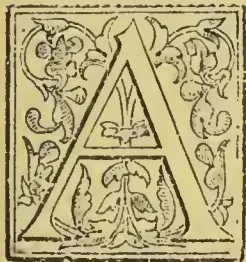

AND now for the labours of the arboriculturist, afterwards his enjoyments.

As in other matters, the arboriculturist in this country has many difficulties to contend with. Of these our very extensive sea-board, compared with our very limited interior,

is one. Particles of sea-salt, when plentiful in the air, are most inimical to the growth of forest trees in general. Even in the finest climates, if particles of sea-salt abound in the air, they attack and kill all expanded leaves and young wood, and prevent the formation of buds. On the Bay of Naples, in the south of Italy, just as on Bressay Sound in the Shetland Isles, deciduous trees can be grown, in the first instance, only under the lee of a wall. And each row of trees, as it is farther from the sea, only rises above the one that is nearer, like the roof of a house. Evergreens, indeed, whose leaves and life are more torpid, are not so sensitive; and the Bay of Naples, where man has not interfered, is beautifully clothed with orange and lemon trees. Some plants also have the power of absolutely resisting the entrance of sea-salt into their tissues, which, accordingly, may be seen encrusting their leaves; and they suffer nothing from salt. Other trees, again, as the coconut palm, may have a truly maritime habitat, and may refuse to be productive at any very great distance from the sea. But a large sea-board, especially in a windy country like ours, is certainly a great barrier to arboriculture. And those gentlemen and foresters who have

succeeded in giving old Neptune a sight of a group of goodly trees which they have raised within the reach of his breath, have a great triumph.

The great prevalence of westerly winds also in our latitudes is a great disturber of the growth and symmetry of trees, especially in those valleys which lie west and east from sea to sea.

But much, very much, has been done at once to protect, to enrich and to beautify our country by arboriculture. But happily for the earnest arboriculturist, much remains still to be done; and of his rural art, the praises stand in special need on being celebrated at the present moment, when, if consequence of the increasing demand both for corn-fields and pasture land, arboriculture runs such a risk of being neglected. It is certain, however, that in order to have the best, whether green hills meadows, or corn-fields, there must be in the landscape a fair proportion of trees.

There is another fact which, in reference to our own country, especially the southern and western-counties and highlands, invests arboriculture with peculiar claims; and it is this,—to a far greater extent than ever before, the draining of all boggy lands, both low lying and upland, is being practised. Now, this is all right. It is the hand of man doing for nature in our latitudes what nature is usually able to do for herself. It is the hand of man proceeding to abolish the bogs which were the death of the primeval forest in all those localities where trees could formerly grow. But if man is to take a second leaf out of the book of nature, it is that he should plant these new drained bogs again; for that is what she does whatever she can. Of this draining, the immediate consequence has been a great improvement in the quality of the grasses growing on the lands formerly bogs, and therefore a great encouragement to the agriculturist, and especially to the sheep farmer, to continue draining till no bog remains over which he has control—an encouragement which, at the present moment, is felt intensely in consequence of the unprecedented value of sheep.

685------------------------------------------------

660THE TROPICAL AGRICULTURIST.[APRIL 1, 1896.]

Now, there can be no doubt that this universal draining is ameliorating our climate, not perceptibly in reference to mean temperature perhaps, but certainly in reference to sunshine and fair weather. The southern and western counties—the Atlantic side of our island—is in point of rainfall approximating the eastern counties, or the Continental side. But this is what the western districts cannot stand with out serious loss to the country. The amount of rain to which they have been subjected for ages has carried out of the soil the most part of the aluminous elements, in union with water (for which alumina has a remarkable affinity) into the sea, or, at all events, into the lowest troughs of the land. The soil generally is consequently light and sandy, sharp and good for growing oats and grasses, and therefore for giving green hills instead of heathery hills, but less fit for wheat and beans, and even barley. Green hills must always be the peculiar treasure of the southern and western highlands of Scotland. And, accordingly, such is the character of those hills generally as elsewhere in the corresponding localities in England. They are remarkable for their verdure. They form in this respect a striking contrast to the Grampians and the mountains of Aberdencshire, which are very brown and purple, with rocks and stones, and heath or flower or in flower.

But will the southern and western mountains continue green in ages to come, when the whole country is thoroughly drained, as they have continued for ages past? No; even already it begins to be commonly said of many of the most profitable sheep-walks, that they could take a shower every day, and, at all events, they could take, and would be the better for more than they get, even in districts which were wont to be very wet. Is there any method, then, whereby the rainy character of a country-side, which has departed through the draining of that country, can be restored to the extent that is needed to preserve the green hills, so that the sunshine, which has been obtained by the draining, may be preserved, while yet the former moisture may be recovered for the vegetation? Is there any method, in a word, by which a habitual or muggy raininess of climate may be transformed into sunny showeriness?

This problem, I believe, the arboriculturist is appointed to solve. By judiciously planting the crests and slopes of the mountains, and giving to nature such breadth of forest as she requires, the hills may be kept perpetually green, and the beauty of the country at the same time immensely enhanced.

Moreover, the timber will in the course of time pay its own way, and something more. Even supposing the larch should refuse its assistance in the work, the great study now bestowed upon the conifers in their whole treatment, and their cultivation by many (and by none more admirably than by the President of this society), opens up the hope that some substitute for the larch may be found. And if even statesmen are making provision for times supposed to be coming, when coal-fuel, as is thought, will be scarce and dear, the timber of our country will acquire new value. At present, indeed, it seems as if it were thrust aside, and were put *hors de combat* by iron. The sound of the hammer in the navy-yard now is quite different from what it used to be. No longer may we sing—

“Heart of oak are our ships.”

But will it not be a pleasing conversion when our “wooden walls” protect our firesides, not on the stormy main, but at the very glowing ingle-neak itself. At all events, there is no reason to apprehend that the economic value of timber will ever cease. Rather let us anticipate a time when the reasonable supply of the wants of our population, both gentle and simple, and a general contentment, which alone is true wealth, will leave the general eye more open to the charms of beauty, and when people in general will drink in a far larger supply of enjoyment than they do at present, from communion with Nature and the contemplation of the Beautiful. An eye for beauty is in reality the richest inheritance. It needs no title to hold, but merely

one to behold, and this is the title of every man that has an eye to see with, and a soul to feel. And a true friend among his neighbours assuredly is that man who, by his art, has succeeded in presenting permanently to the spectator who is living there, or frequently passing that way, a beautiful object where there was none before. And here let us maintain, that whatever the field of the sculptor, or the painter, or the architect, however much of the beautiful they may possibly create in their respective provinces, the field of the arboriculturist and landscape gardener is more ample than any or all of them. The finest works of the sculptor or of the architect are manifestly only accessories to the landscape gardener. These artists have to come to him to assign a place where their creation may stand, or if they venture to fix upon that place themselves, it is only by becoming landscape-gardeners themselves for the occasion.

Not that there is any incongruity in their so doing if they have strength for it. The principles of beauty, whether in the elect field of the sculptor, the painter, the architect, or the landscape-gardener, are the same in all. And on these principles I shall here venture a few remarks, because I am not aware that they have as yet been advanced in connection with the landscape, while, even in ancient times, they have been verified in reference to architecture and sculpture, and some of the most eminent of modern sculptors have been eager to embrace them.

That in speaking of landscape-gardening I am not wandering from arboriculture, follows from this, that scarcely otherwise than by modifying the surface of the country by planting or felling, can man change the aspect, the beauty, and expression of a landscape at all. But let it not be inferred from this that his power to do so is but small. We all know to what an extent a man may change the aspect and expression of his head by beard and mustache gardening. Not less is the power of the landscape gardener in modifying the expression of the landscape, through the cultivation of trees and underwood.

As to the beauty of the landscape, then,—the mansion-house with its rural panorama and the cultivation of its beauty,—we cannot too soon draw a distinction between the effects of *colour* on the one hand, and of *form* on the other.

*Colours* are for the eye only. They can please, they can cheer, they can delight, nay, to some extent, they can awake delightful associations; or they can depress and awake mournful associations; but they do not move the soul as certain *forms* do; and they never attain the rank of picturesque or sublime. When beholding colours, also, the mind is quite differently engaged from what it is when contemplating forms. In beholding colours, the eye rests on the colour. The area, the space which the colour covers, is everything. In beholding forms, on the other hand, the eye, though secretly, is yet ever in motion, ever ranging along the contours or some line or other in the form beheld, conscious that therein the charm of the beauty lies, and very able to enjoy half beauty, though not to discover the secret of it.

Hence the development of beauty in reference to colour is easy:

(1) Colour, as to cheerfulness or gloom, must be answerable to the expression of the forms which it clothes.

(2.) Colour must be in breadths, not too small.

(3.) Colour must, however, be sufficiently varied and,

(4.) Every variation of colour must be harmonious, if the colour is not to interfere with the transparency and amplitude of the landscape.

The first and last of these conditions may be considered as of the same order. Scientifically considered, they are rather obscure; but happily the eye is an adequate judge. The conditions of harmony have, however, been completely ascertained in reference to music, and the same principles (though not the same ratios apply to colours. But on this subject let us content ourselves with saying that, as the musical composer of a great piece, almost indeed in every page of it, in order to keep the ear awake, finds it necessary to have recourse to discords and

686------------------------------------------------

APRIL 1, 1896.]THE TROPICAL AGRICULTURIST.661

modulations from one key to another, so does the gardener, both in reference to the landscape and the flower-garden. Of late, indeed, the principle of discord has ruled in the flower-garden; and this it ever must do when the object is to fill the eye with a great show of colour. For the harmony of colours imparts transparency; and though harmony be necessary, if every colour is to be seen in its purity, yet when the impression of all the colours is received simultaneously, they fill the eye much more completely when they are not in harmonious juxtaposition. Suppose for instance, three varieties of pansy, one of which consists of violet and yellow (both pure and finely modelled forms), so that they just balance each other, another which is wholly violet, and the third wholly yellow, then a bed composed wholly of the first, even at a very short distance from it, would soon cease to have any effect at all. Violet and yellow are harmonic or complementary colours: when, through distance, they overlap each other, or a confused sensation of both is received by the eye, all colour tends to vanish, and mere transparency, or the ground colours beneath, tend to remain. And indeed, almost all colour, even at the distance of distinct vision, may be made to vanish if the yellow and violet be in just proportion to each other and perfectly complementary or harmonious. By spinning the flower round under the eye with sufficient rapidity it will seem merely white or grey. If, again, half the flower-bed be planted with the pansies which are wholly violet, the whole bed will be seen to be looked at from some distance, and will still, in some measure, fill the eye. But let the violet colour, which is harmonious with the yellow, be removed and its place be taken by some discordant colour, such as bright red, and the bed, now half scarlet now half yellow, will send on its yellow as well as its scarlet to the eye, and fill it to a much greater distance. It is to be admitted, therefore, that though it seems at first as if there were much that is merely *bizarre* in the prevailing fashion of flower-beds, yet there is principle for it too.

But there must be no such tampering with the landscape. There, transparency and purity of tint come to be the primary object of regard; for the beauty of the landscape is that of expression, and almost everything depends upon form. Staring colours may, indeed sometimes be introduced with good effect, and serve a valuable purpose, but only to draw away the eye from defects, never to enhance beauty. One of the first demands of the soul in reference to the landscape, is for amplitude; and bright colours always give the impression of littleness. No doubt the idea of "sing," "box," &c., is not without a certain charm; but the treatment of such subjects lies outside the sphere of the landscape-gardener, except, perhaps, as a discord. That charm, in fact, is wholly of a social nature.

What, then let us ask, are the forms which impart beauty to the landscape and which the landscape-gardener and agriculturist has to observe and develop in order to perceive and to exalt the beauty of a domain or country side? To most persons this question will seem a very bold one, perhaps a needless one, since the general impression is that no such forms are discoverable in scientific way, but only can be seen, or rather, indeed, felt, when the beautiful objects are under the eye. It is certain, however, that the artist,—when fully entitled to the name, whether he be a musical composer, an architect, a sculptor, a painter, or a landscape gardener,—knows perfectly well that a certain expression uniformly attaches to certain modes of composition, and the development of certain forms on his part. He may not be, and, indeed, seldom is able to give an account, either to himself or to others, of the particular areas, forms or lines on which that effect depends. But never doubts that the pleasing effect has its cause in the visible features which his art enables him to introduce in his compositions. He never doubts that there are principles of beauty which never fail to strike and to please good taste. Nay, he knows and he shows that he is himself in possession of these principles, though he cannot disentangle them from their accessories or say precisely what they are.

Nevertheless, they have been disentangled to a great extent, and here let us shortly bring them forward. It will at least, be a pleasing exercise of mind for those whose calling is to converse with nature, to observe nature in relation to the principles of beauty in the landscape, and in its several elements now to be unfolded, with a view to verify these principles, and, if found true, to apply them in art.

What, then let us ask, is the secret of the beauty of the landscape, and how, in any given case, may that beauty be enhanced by the landscape-gardener, the architect, or other artist? Now, to this the answer undoubtedly is, that secret of the beauty of nature is one and the same thing with the secret of nature herself. It is the same economy which makes nature to be what she is which also makes her to be beautiful. In other words, the laws of nature are the source of beauty. And any landscape or scene which is eminently beautiful, is so beautiful just because their nature is moving according to her own laws in triumphal procession from the point of view of the holder.

But this theory, it may be justly said, is too general to be of any practical use. It is not disputed, but it cannot be applied. Now, this criticism is just. We must, therefore, ask in detail what are those features which the free and unimpeded operation of the laws of nature tend to induce in the landscape? And, as a first step in this direction, we must ask what it is that makes any portion of country to be entitled to the name of a landscape? Now, to this the answer is, that a portion of country becomes to the observer a landscape as soon as he regards it as a unity, that is, as soon as he can look upon it or fix his gaze upon it, without his thoughts or his eye wandering to other quarters. This will not be disputed. But, in making this step, we have also made a step in the discovery of the secret of beauty. The mind can never be happy except when it is moving in harmony with the laws of its own activity, that is the laws of intelligence. The Beautiful, therefore, which makes the mind happy, must be something which draws out the mind, and invites it to move in harmony with the laws of intelligence. Now of all these laws, one of the most imperative is, that the unity of consciousness, which is the very centre and characteristic of intelligence, shall not be disturbed, but, on the contrary, shall be supplied with some unity in the outward which it may fix upon. Hence the eye, in limiting for itself, and electing a portion of country as a landscape, has already disclosed what is the first principle of the beautiful in every department. And it is this, that the beautiful object, however vast, must still possess a certain *unity*. This, in the most general point of view, is the first principle of beauty, whether in the landscape or any other beautiful composition. The object must admit of being construed as a unity. The mind must be able, which effort, to embrace it as *one*.

But the mind such an agent, that while it will not and cannot give itself to more than one object at a time, it is so intrinsically active, that it weakens almost immediately if the unity which engages it be a unity or uniformity merely. Along with unity in the object, which is the first condition called for, because it is the condition of undisturbed attention or contemplation, the mental activity calls for variety in that object, so that the mind, without losing hold of it as a unity, may be free to ramble over it and discourse freely upon it.

(To be concluded.)

## A BIBLIOGRAPHY OF TEA, COFFEE, AND CACAO.

(To the Editor, "Tropical Agriculturist.")

HAMPSTEAD, LONDON.

DEAR SIR,—I herewith send you the sketch of a work which I hope soon to extend into book form, and which has occupied me off and on for the last three years. It is a "Bibliography of the Literature of Tea, Coffee, and Cacao"; and I thought it only

687------------------------------------------------

662THE TROPICAL AGRICULTURIST.[APRIL 1, 1896.

right that the *Tropical Agriculturist*, which has done so much (in connection with the *Observer*) to encourage and extend all that contributes to the true welfare of a country, should be the first to introduce it to the public; that is, of course, provided it be judged worthy of such introduction. The work has been one of absorbing interest, pleasure, and instruction to myself, and, I hope, will prove of some use to merchants, brokers, planters, and even consumers, of that most beneficial and least harmful of all products—Tea.

Just as "Ingè Vâ" was the putting into shape of my Tamil notes as a Sinna Durai on Scalpa Estate, so this "Bibliography" is the outcome of my own endeavours in the British Museum to read up on the subject of Tea. When I came over three years ago I vainly searched for a good list of titles and authors of books on this our leading staple. I first discovered in "Notes and Queries" a short "Bibliography of Tea, Coffee, and Sugar" (evidently by P. L. Simmonds), but it gave only about twenty books on Tea and had many mistakes. For instance, *Keen*, W., was evidently meant for William Skeen, and a book on Coffee in Ceylon was ascribed to Lewis, G. C. (i.e. Sir George Cornwallis Lewis!). This ought to be Lewis, R. E. I next lighted upon Bergsma's "Catalogus auctorum qui de theâ scripserunt," and this helped me considerably, though, being antiquated and in Latin, many of the names were indelicately mis-spelt. And besides, as nearly all scientific men in those days adopted a Latin form of their name, and as the British Museum authorities insist on giving the original form in nearly all instances, it was sometimes very difficult to trace the proper man. For instance, the real name of Bernhardus *Albinus* was B. *Weiss*, *albus* being the Latin equivalent of the German *weiss* (white). *Borrichius* stands for Borch; *Crockisius* for Crock; *Francius* for Fransz; *Francus* for Francke; *Frisius* or *Phrisius* for Vries or Fricke. Then again an author had a happy knack of appearing under a different name as quoted by different authorities. At one time he was Herrichen; at another Henrichem; at another Henichen. Ovington changes to Overton; Joseph Serer seems to be the same man as Giuseppe Scker; our English doctor John Coakley Lettsom appears in French as simple Jean Coakley; the real name of C. Bontekoe was C. Decker van Alkmaar; he got his nickname from the *boute loe* (spotted cow) on his father's signboard! [We have the word *boute* in our name for flags,—bunting.] There seems some inexplicable mystery about Elisha Mills Ely and S. Millesly: they wrote exactly the same book, and Mills Ely and Millesly sound suspiciously alike; yet they appear in catalogues as totally separate individuals. And whether Philippe Sylvestre Dufour was a pseudonym for Jacob Spon or *vice versa*, or whether they were two or more individuals, is, as far as I know, still an unsolved problem. One man I must mention: he was called by his contemporaries the "person of many initials": his proper name was Worp, but he is more often to be found under Peyma or Beintema; and his full title is Johan Ignatius Worp Beintema van Peyma. It may be interesting to mention that R. James was the doctor who first prepared the celebrated "James's Powders." Of the wretched quack who called himself Sir John Hill it was said "For physic and farces, his equal there scarce is, His farces are physic, his physic a farce is"; and of Motteux, who was a Frenchman, but who established an emporium in London, and who wrote vigorous English poetry, Lady Wortley Montague, in "The Toilette," makes mention, thus:—"Strait then I'll dress, and take my wonted range Through India shops, to Motteux's, or the Change." I found my smattering of many European and oriental languages most useful in making out the various titles; and it will be interesting to note how many nations are represented. The greatest assistance I derived was from Dr. E. J. Waring's "Bibliotheca Therapeutica," which contains very full lists of works on all sorts of articles of the materia medica, and from which I copy some of the most perplexing Latin equivalents of the towns where the volumes were issued. These

I append separately. In conclusion, I may say that to prevent the list from swelling to unmanageable bounds I had to limit it to such works as refer directly in their titles to Tea, Coffee, and Cacao.—I am, yours truly,

A. M. FERGUSON.

LIST OF LATIN AND FOREIGN NAMES OF  
SOME OF THE LOCALITIES OCCURRING  
IN THE "BIBLIOGRAPHY."

Argentoratum, Strasburg.  
Budissina, Bautzen (Saxony).  
Colonia Agrippina, Cologne.  
Colonia Allobrogum, Geneva.  
Erfordia, Erfurt.  
Francofurtum ad Moenum, Frankfurt-on-the-Main.  
" ad Viadrum, " " " Oder.  
Gedanum, Dantzic.  
Gravenhage, The Hague.  
Hafnia, Copenhagen.  
Hala Magdeburgica, Halle (in Prussia).  
" Suevica, " (in Wurtemberg).  
Holmia, Stockholm.  
Kilonium, Kiel.  
Lugdunum Gallorum, Lyons.  
" Batavorum, Leyden.  
Regiomontium, Königsberg.  
Ticium Regium, Pavia.  
Tigurum, Zurich.  
Trajectum ad Mosam, Maestricht.  
" ad Oderam, Frankfurt.  
" ad Rhenum, Utrecht.  
Utrajectum, Utrecht.  
Ulyssipolis, Lisbon.  
Vindobona, Vienna.  
Vratislavia, Breslau.

BIBLIOGRAPHY OF TEA.

*A. M. L.* Five o'clock Tea. By the Author of "Breakfast Dishes, &c." London. 1886. 80.

*Academies—London—Royal Asiatic Socy.—Batten, J. H.* Notes and Recollections on Tea Cultivation in Kumaon and Garhwal. London. 1878. 80. See *Batten, J. H.*

*Academies—Salerno—Schola Salernitana.* Commentaire en vers François, sur l'école de Salerne. où sont adjonctez. Le Thé, Le Caphé, Le Chocolate, &c. Lat. and Fr., Paris. 1671. 120.

*Advertisements.* A collection of curious advertisements and handbills, 1682-1836, reprinted by G. Sweeton. London. [1830-40.] 40. [Advt. 9. About Tea, Coffee, Brandy, &c.]

*Advice.* Advice to Parents on the Management of their Children in...Smallpox...to which are added some general Observations on the use of Tea, &c. Novomarchine (Newmark). 1793. 80.

*Advice.* Advice to the Unwary: or an Abstract of certain penal laws now in force against smuggling in general, and the adulteration of Tea, &c. London. 1780. 80.

*Ahandling.* Ahandling om Thee. Alburgi. 1777. 80.

*Afternoon Tea.* Afternoon Tea. Rhymes for children. with illustrations by G. J. Sowerby and H. H. Emerson. London. 1880. 4s.

*Aignan, François.* Le Prestre Médecin...Avec un traité du Caffé et du Thé de France, &c. Paris. 1696. 120.

*Albinus, Bernh: Praes.* Sae *Genge, J. M.* Dissertatio de Thee. Francof. ad Viadr. 1681. 40.

*Abrecht, Joh. Pet.* Klar entdeckte Unschuld der Thee und Coffee Getränke. Bremen. 1696. 80.

*Alcott, Wm. Mer.* Tea and Coffee, their effects on the human system. Fifth ed. New York. [1850?] 120. [Do New ed. 1853.]

*Alcott, Wm. Mer.* Thee und Kaffee...[transld. from the English]. Zweite Auflage. See *Weilshaeuser, E.* Gesundheit. &c. Bd. 12. 1868, &c. 80. [Oppeln. 1860. Berlin. 1869.]

*Allgemeine.* Allgemeine Bemerkungen über das Thee-trinken. Aus dem Englischen übersetzt. Lipsiae. 1795. 80.

688------------------------------------------------

APRIL 1, 1896.]THE TROPICAL AGRICULTURIST.663

*Almeida, Gab. d'.* Manuel do cultivador e manipulador do chá. Ponta Delgada. 1892. 80.

*Anderson, Robt. of Mincing Lane.* Anderson's Indian Tea Tables. Showing the equivalent value in London of Tea at prices per lb. in Calcutta, &c. London. 1885. fol.

*Anderson, Joseph* [and *Davidson, S. C.*] Letters on Tea. Belfast. 1886.

*Andronicus, pseud.* [Mich. Alberti]. Tractatus med. hist. de tribus impositoribus; oder Gedanken von...dem Getränck des Thee und Coffee, &c. Cosmopoli [i.e. Rostock]. 1738. 80. [? 1731. 120.]

*Andry de Boisregard, Nic.* see *Europe*. Le Thé de l'Europe, ou les proprietez de la Veronique. Paris. 1704. 80. [1712. 120.]

*Anti-Teapot Review.* The Anti-Teapot Review. A Magazine of politics, literature, and art. Edited by Members of the Universities, &c. London. 1864-9. 80.

*Armstrong, Chas. Sp.* Tea Cultivation: special paper. A. M. & J. Ferguson, Colombo. 1897. 160.

*Armstrong, Chas. Sp.* Tea and Coffee Cultivation in Ceylon. [From the Proc. of the Dikoya P.A.]. Colombo. 1883. 120.

*Armstrong, Chas. Sp.* Tea Cultivation in Ceylon. Paper read at a meeting of the Dimbula P.A. 1883. Secoued. Colombo. 1884. 120.

*Aronche de Toledo Rendon, Honorario José.* Pequena Memoria da plantação e cultura do chá. Rio de Janeiro. 1833. 80.

*Arrest.* Arrest du Conseil d'Estat du Roy, portant diminution de droits sur le Thé. Paris. 1718. 40.

*Assam.* Information on the discovery and character of the Tea plant in Assam. London. 1839. 80.

*Assam.* Assam: sketch of its history, soil and productions: with the discovery of the Tea plant, &c. London. 1839. 80.

*Assam.* A letter on the discovery and character of the indigenous Tea plant of Assam. By *Jas. Leonard*. London. 1839. 80.

*Assam.* Tea Operations in Assam. 1873 4.

*Assam.* Annual Reports on Tea Culture in Assam. By the Secy. to the Assam Govt. 1881-91.

*At.* 'At a drinking Tea.' The Tea Table Intrigue. [A song written] by Mr. Cooper. [London. 1720 ?] fol.

*Aubry-le-Comte, Ch. Eng.* Culture et préparation du thé. 1865. 80.

*Baier, Joh. Jac. Pras.* See *Charis. J. P.* Problemata quadam medica. [Tea. IV. 10.] 1706. 40.

*Baldon, Saml.* Tea in Assam...with an Appendix "Rural Life amongst the Assamese." Calcutta. 1877. 80.

*Baldon, Saml.* The Tea Industry in India. London. 1882. 80.

*Ball, Saml.* An Account of the Cultivation and Manufacture of Tea in China...with remarks on the...introduction of culture of the Tea Tree in other parts of the world. London. 1848. 80.

*Bamber, E. P.* Tea. [A description of its culture, growth, &c.]. London. 1868. 80.

*Bamber, Edw. Fisher.* An Account of the Cultivation and Manufacture of Tea in India. &c. Calcutta. 1866. 80.

*Bamber, M. Kelway.* A Text-book on the Chemistry and Agriculture of Tea, including the Growth and Manufacture. Calcutta. 1893. 80.

*Bannister, Rich.* Cantor Lectures on Sugar, Tea, Coffee, and Cocoa. [Soc. of Arts. Apr.-May. 1890.]. London. 1890. 40.

*Barker, Geo M.* A Tea Planter's Life in Assam...with...Illustrations by the Author. Calcutta, London. 1884 [1883]. 80.

*Barry, L.* Etude sur le Thé. Montpellier. 1890. 40.

*Battun, John Hal.* Notes and Recollections of Tea Cultivation in Kumaon and Garhwal. See *Academies* - London, &c. 1878. 80.

*Belchilgen, Count* [and *Cope, J. A.*] An Essay on the Virtues and Properties of the Ginseng Tea, with observations on the pernicious effects of Tea-Drinking in general. London. 1786. 80.

*Belli, Barth.* Kuitze...Beschreibung der Thee, Coffee und Chocolate, &c. Leipzig. 1695. 4.

*Bergemann, Joh. G.* Der Chinesische Thee and seine Surrogate. Breslau. 1810. 80. [Uratislaviae. 1750-2.].

*Bergsma, Corn. Ade.* Catalogus Auctorum qui de thea scripserant. Trajecti ad Rhenum. 1825. 80.

*Bergsma, Corn. Ade.* Dissertatio medico-botanica de thea. Trajecti ad Rhenum. 1825. 80. [? 1824.]

*Berries, Juniper.* Histoire naturelle du thé, du café, &c. 1683.

*Bertin, Jos. Eup.* See *Falconet, C.* Non ergo potus Theae, &c. Paris. 1739. 40.

*Bertin d'Antilly, Louis Aug.* Le Thé, ou la journal des dix-huit. Journal politique et littéraire. Paris. An V. (1799). 40. See *D', M.*

*Bidie, George.* Report of Coffee Borer. [Chapter on Tea, Nilgiris.] Madras. 1869. 80.

*Bietrie, Ant.* Le Thé: Botanique et Culture. Paris. 1892. 80.

*Bingham, G. Clifton.* The Tea Kettle songs. Illustrated, &c. Tuck and Sons. London, Bavaria, printed [1894]. 40.

*Blankaart, Steph.* S. Blancardi...Haustus Polychresti, oder: Zuverlässige Gedanken vom Thé, Coffee, Chocolate, und Taback, &c. Hamburg. 1705. 80.

*Blankaart, Steph.* Gebruick en misbruck von de Thee, &c. 's Gravenhage [Hagae Comitum]. 1686. 30. See *Groot: Bontekoe, C.*

*Blegny, Nicolas De.* Le Bon Usage du Thé, du Caffé, et du Chocolat, &c. Paris. 1687. 120. [Lugd. 1680. 120. Paris. 1687. 160. Lyon. 1688. 120.]

*Blend.* The Happy Blend; or How John Bull was suited to a T. [An illustrated advertisement of Tea.] London. [1885.] 40.

*Blending.* The Art of Tea Blending. A handbook for the Tea trade.

*Bohea Tea.* The volatile spirit of Bohee-tea. [An advertisement.] London. 1710. s.sh. 40.

*Bois, D.* Le Thé et ses succédanées.

*Bonnewyn, H.* Considérations sur le thé et sur son acclimatement en Belgique. Gand. 1856.

*Bontekoe, Corn.* Tractat van het excellenste Kruyd Thee...Den tweeden druk vermeerdert...van twee...verhandelingen. I. Van de Coffi. II Van de Chocolate, &c. 's Gravenhage. 1679. 80.

*Bontekoe, Corn.* Gebruik en Misbruik van de Thee. Amsterdam. 1686. [A new edition of his "Tractat, &c."].

*Bonynge, Francis.* The Future Wealth of America. ..the Commercial and Agricultural Advantages of cultivating Tea, Coffee and Indigo, the Date, Mango, &c. New York. 1852. 120.

*Book-Keeping.* Book-Keeping by Double Entry for the use of Managers, Assistants, and Conductors on Coffee, Tea, Cinchona or other Estates. Printed by the Ceylon Times Press Company, Limited. Colombo. 1881. 80.

*Borel, Pierre.* De Thea. [In Hist. et Observat. Cent. 3. p. 228.]. 16..?

*Borrichius, Olaus.* O. Borrichii de usu plantarum indigenarum in medicina, et sub finem de Thee specifico enchiridion. Hafniac. 1690. 40. [First appeared 1688. 80.].

*Bostonian.* Traits of the Tea Party, being a memoir of G. R. T. Hewes, one of the last of its survivors, &c. New York. 1835. 120.

*Boston Tea-Party.* A retrospect of the Boston Tea-Party, with a memoir of G. R. T. Hewes, a survivor of the little band of patriots who drowned the Tea in Boston Harbour in 1773, &c. New York. 1834. 120.

*Bouin, P.* Remarques et observations sur les inconveniens de l'abus du thé. Paris. 1810. 40.

*Brace, E. J. C.* Tea Cultivation in Southern India. [In Ferguson's Handbook.] Colombo. 1878. 80.

*Breakfast.* Breakfast, Dinner, and Tea viewed classically, poetically, and practically, &c. New York. 1860. 80.

*Broadbent, Humph.* The domestic Coffee Man, showing the true way of preparing and making of chocolate, coffee, and tea. London. 1722. 80.

*Brooke, Arthur, of Brooke, Bond & Co.* Tea; Its history, culture, preparation, and adulterations: 1877. 8c.

with a brief sketch of the tea-trade. London.

*Bruce, C. A.* An account of the Manufacture of the Black Tea, as...practised at Suddeya, in Upper Assam, &c. Calcutta. 1838. 80.

*Bruce, C. A.* Report on the manufacture of tea and on the extent and produce of tea plantations in Assam, Calcutta. 1839. 80.

689------------------------------------------------

664THE TROPICAL AGRICULTURIST.[APRIL 1, 1896.]

*Brunette, C.* De la détermination histologique des falsifications du thé. Nancy. 1883. 40.

*Buc'hoz, Pierre Jos.* Dissertations sur l'utilité et les bons et mauvais effets du tabac, du caffè, du cacao et du thé... 2de édition. Paris. 1788. 80. [1775. So. Liège. 1789. 160.]

*Buc'hoz, Pierre Jos.* Histoire Naturelle du Thé de la Chine, à laquelle on a joint un mémoire sur le thé du Paraguay, de Labiador, des Isles, &c. Paris. 1806. 80. [1805.]

*Buc'hoz, Pierre Jos.* Dissertation sur le Thé, sur sa récolte, et sur les bons et mauvais effets de son infusion. Paris. 1786. fol. [Liège, Paris. 1787. 80.]

*Buc'hoz, Pierre Jos.* Dissertation en forme de supplément sur les plantes qui peuvent remplacer thé. Paris. 1786. fol.

*Bunbuku Chagama.* The Lucky Tea Kettle (Bunbuku Chagama) and other stories, with coloured illustrations by Japanese Artists, &c. [no date.] 80.

*Burdach, C. C. T.* Das Thee-büchlein. oder über den Chinesischen Thee, &c. Leipzig. 1840. 120.

*Busk, Hans, Esq.* The Dessert: a poem. To which is added The Tea... Second edition. London. 1820. 80. [First edition. 1819.]

*C., J.L.M.* Naturgemässe Beschreibung der Coffee, Thee, Chocolate, Tabacks... Auss der Englischen [of J. Chamberlayne?...] durch J[ohann] L[ange] M[edicinæ] C[andidatum]. Hamburg. 1681. 120.

*Calkins, Alonzo.* Opium and the Opium Appetite: with notices of alcoholic beverages... and tea and coffee in their hygienic aspects, &c. Philadelphia. 1871. 80.

*Campbell, Duncan.* A poem upon Tea. Together with the sincere courtship of Dick and Amy. London. 1735. 80.

*Case.* The Case of the Dealers in Tea. [Praying for an ad valorem Duty.] [London. 1736.?] s. sh. fol.

*Cat.* The Cat's Tea-Party. [A toy-book]. London. 1866. 40.

*Ceylon.* A complete list of tea companies and tea gardens... in India and Ceylon.

*Ceylon Tea Fund.* Report of the Committee of the Ceylon Tea Fund, 1889 & 1890. Colombo: 1891? 80.

*Chamberlayne, John.* The Manner of making Coffee, Tea, and Chocolate... with their virtues, &c. [Transld. from P. Sylvestre Dufour and A. Colmonero.]. London. 1685. 120. [180.]

*China.* A glance at the interior of China obtained during a journey through the Silk and Green Tea Districts. Taken in 1845. [Shanghai. 1849.] 80.

*China.* China: as it was and as it is: with a glance at the Tea and Opium Trade. London. 1842. 80.

*China Tea-Cups.* Six China Tea-Cups. By the Author of the "Travelling Sixpence," &c. See Little Dot Series. 1883, &c. 80.

*China Tea-Pot.* The China Tea-Pot; or why I do not take sugar in my tea. London, Weymouth. 1873. 80. [A tract.]

*Clyers, Andreas.* De herba Thee Asiaticorum. Francofurti. 1680. 40.

*Coffee.* See P., G. V. Coffee and Tea. A Lecture. London. 1883. 80.

*Coffee.* Coffee, Tea, Chocolate, Tobacco. Their Natural History. London. 1682. 40. [See *Disdier*, P.M.; *Sylvestre Dufour*, P.; *Natural History*.]

*Cohausen, Joh. Hein.* Neo-thee, oder neu-angereichtete medicinische Thee-Tafel, &c. Osnabrück. 1716. 80. [Dritte Auflage. Lemgo. 1730. 80. (1728 120.)]

*Cohausen, Joh. Hein.* Neo-thee, of nieuwe Theetafel... om dezelve als Thee te doen Trekken, &c. Amsterdam. 1719. 80.

*Coles, Chas. B.* Tea; a Poem. London. 1865. 80.

*Collegium.* Collegii Medici Kangiorelse, om den misbruich som Thee och Caffè... at bruka i ställa för Thee. Holmiae. 1746. 40.

*Colmonero de Ledesma, Ant.* De l'usage du Caffè, du Thé et du Chocolat. 1671. 120. See *Elsage*.

*Comearius Elms (R).* Dissertationes tres de... usu et abusu potuum Theæ et Coffæe in his regionibus. Tubigæ. 1691. 80.

*Coniers, Claude De.* Le bon usage du Thee, du Coffee et du Chocolat, &c. Paris. 1687. 120. See *Bleyn, N.*

*Consilium.* Consilium de usu herbæ et potu thee, et de virtute et usu potionis granorum Coffee. Berolini. 1708. 40.

*Cope, J.A.* See *Belchilgen, Count.* An Essay on the Virtues of Ginseng Tea, &c. 1786. 80.

*Cosmius, Henr.* Magnæ naturæ oecnomia cum demonstratione Theæ, Coffæe, Chocolate. Francof. et Lipsiæ. 1687. 120.

*Cottam, Henry.* Tea Cultivation in Assam. A. M. & J. Ferguson. Colombo. 1877. 80.

*Couthier, Joan, Franc.* See *Garnier, A.* Dissertatio ergo Parisinis frequens potu Thea frequenti potu Caffæe salubri. Parisiis. 1794. 40. [? 1749.]

*Cranston, Stuart.* Theine versus Tannin: or China Tea versus Indian and Ceylon Tea. Glasgow, London. 1892. 80.

*Cressé, Pet.* See *Therart, A.* Ergo confort curandæ arthritidi The Sinensium. Parisiis. 1657. 40.

*Croekisius, Chr. Frid.* See *Emmerich, G.* Theologia: episcus infusum. Regismont. 1698. 40.

*Cui Bono.* Cui Bono? or the prospects of a free trade in tea. [T. C. Dublin Library.] London. 1833. 80.

*Cup.* A Cup of Tea. A Comedietta. See *Lacy, T.H.* Lacy's acting edition of plays, &c. Vol. 83. 1850. &c. 120. [1869. 120.]

*D.* Thee und Kakao. Stuttgart und Tübingen. 1815.

*Damme, O.* Koffie, thee en ehoeelade. Leiden. [1870.] 160.

*Davidson & Co.* Sirocco Tea. [See also *Anderson, Jos.* Letters on Tea. Belfast. 1886.]

*Day, Sam. Phil.* Tea: its mystery and history... with a preface in Chinese and English by Loh Fong Lo. London. 1878. 80.

*Deas, Francis T.R.* The Young Tea Planter's Companion: a practical treatise on the management of a Tea Garden in Assam. London, Edinburgh. 1886. 80.

*Debay, Aug.* Les Influences du Chocolat, du Thé et du Café sur l'économie humaine. Paris. 1864. 80. [120.]

*Décret.* Décret de la convention nationale relatif aux droits d'entrée sur les thé's. 1793. 40.

*Delio, H.* Untersuchungen über den Einfluss des Coffeins und Thees, &c. Dorpat. 1887. 80.

*Delius, Hein. Fried. von.* De infuso Theæ subito nigrum redditio. ? 1750.

*Demersay, Alf.* Étude économique sur le Maté ou Thé du Paraguay. Paris. 1867. 80.

*Derley, Jos.* See *Nuitter, C.* Une Tasse de Thé Come'die, &c. 1860. 120.

*Descubrimiento.* Descubrimiento de la Yerva Te' en Guatemala. Madrid. 1797.

*Despriseis.* Lecture on Tea. Royal Society of Arts and Sciences, Mauritius. Mauritius. 1885.

*Dessert.* The Dessert. A poem. To which is added The Tea. [by *Hans Busk.*] London. 1819. 80.

*Detharding, Geo. the Younger.* See *Thesendorff, Card. Theod.* Dissertatio de tribus Impositoribus... Potu Thee et Coffee. Rostock. 1731. 40.

*Deutschland.* Deutschland's Goldgrube: oder durch welche inländische Erzeugnisse kann der fremde Kaffee, Thee und Zucker möglichst ersetzt werden. Berolini. 1799. 80.

*Dialogue.* A comical and diverting Dialogue between a farmer... a tea-dealer... and their old friend the Devil. [London. 1830.?] s. sh. fol.

*Dillenius, Joh. Jue.* Dissertatio de Thea et potu Theæ. Giessæ. 1688? 40.

*Disdier, Franc. Mich.* Beschreibung des Caffee, Thee, Chocolate, und Tobacks. Hamburg. 1681. 120. See *Coffee: Natural History: Sylvestre Dufour, P.*

*Dolæus, Joh.* See *Waldschmidt, J.J.* J. J. W. & J. D. ἐπιστολαὶ ἀμφὶ βαιαὶ (Epistolæ amphiβaia), &c. 1689. 40. [Potus Theæ, &c. p. 258-61.]

*Dowling A.H.* Tea Notes. Published by D. M. Traill. Calcutta Advertiser Press. Calcutta. 1885.

*Ducour, F.* De la Cafeine. Des différences entre la Cafeine. pp. 7. Paris. 1874. 80.

*Duncan, Dun.* Avis salutaire à tout le monde contre l'abus des choses chaudes, et particulièrement du Thé, du Chocolat et du Thé. Rotterdam. 1705. 80. [1703.]

*Duncan, Dan.* Wholesome Advice against the Abuse of Hot Liquors, particularly of Coffee, Chocolate, Tea, &c. Done out of the French. London. 1706. 80.

690------------------------------------------------

APRIL 1, 1896.]THE TROPICAL AGRICULTURIST.665

*Duncan, Dan.* Vom Missbranch heisser...Speisern und Geträuke, Sonderlich des Coffec, Chocolate und Thee. Leipzig. 1707. 80. [120.]

*Durante, Castore.* Herbario nuovo...Hora...vi si posto infine l'herbe the', caffè', ribes de gli Arabi, c cioccalata. Venetia. 1684. fol.

*East Indian Tea Tree.* De Oostindische Thee Boom. getreckken of veeler hande gezangen, &c. [A song-book.] Deventer. 1777. 80.

*East Indies.* Les Indes, le Pays du The'. (6 plates). R. O. Hearsou. London. [1839.] 160.

*East Indies.* The Tea Trade. A...report of the ...proceedings at the East India House, at the commencement of the March Sale, &c. London. [1834.] 80.

*East Indies. East India Company.* Sale List of the India Company's December Tea Sale, 1823. (March. June 1824.) London. 1823, 4. fol.

*East Indies. East India Company.* Sale List of the East India Company's December Tea Sale, 1827. [London. 1827.] fol.

*Edyar, John Ware.* Note on the Reports on Tea Cultivation...submitted...to the Govt. of India. See *Bengal.* Papers regarding the Tea Industry in Bengal, &c. 1873. 80.

*Effects.* The good and bad Effects of Tea consider'd ...to which are subjoin'd some considerations on afternoon tea-drinking, &c. London. 1758. 80.

*Ellis, John.* Geschichte des Thees und Kaffees. Leipzig. 1775. See *Lettson, J.C.*

*Ellissen, Adolf.* Thee und Asphodels-bliüthen. Chinesische und neugriechische Gedichte, &c. Göttingen. 1840. 120.

*Eloy, Nic. Franc. Jos.* Reflexions sur l'usage du the'. Montpellier. 1750. 120.

*Elsholz, L. von.* Theerblätter, deutsch; hervorgefunden gepflegt durch L. von E. &c. München. 1833-40. 40.

*Ely, Elisha Mills.* Observations sur l'usage du the', d'après les auteurs les plus anciens, &c. Paris. 1827. 180. See *Millesly, S.I.*

*Emmerich, George.* Theologia, ejusque infusum. Resp. C. F. Neithard. See *Crockisius, C.F.* Regismonti. 1698. 40.

*English People.* Le Peuple A' glais bouffi d'orgueil, de bière et de the', juge'an tribuual de la raison. Paris. an IX. 1803. 80.

*Essay.* An essay on tea, sugar, white bread and butter,...and other modern luxuries. Salisbury. 1777. 120.

*Essay.* An essay on the nature, use and abuse of tea, &c. [For the second edition see *Physician.*] London. 1722. 80.

*Etienne.* Traite des glaces, du cafe', du chocolat et du the'. 1875. 80.

*Europe.* Le The' de l'Europe; ou les proprie'tez de la Ve'ronique, &c. [By N. Andry de Boisregard.] Paris. 1704. 80. [1746, 7. 120.]

*Europe.* A view of the rise, progress and present state of the Tea Trade in Europe. [By R. Wissett.] [London? 1801.] 80.

*Evenings.* Evenings at the Tea Table. London. 1871. 160.

(To be continued.)

### FRUIT TREE ROOTS.

Widely extended observation has convinced me that few greater mistakes are made in cultivation than by neglect of the roots of plants under our care. Early in my gardening career this truth was impressed upon my mind by many lessons from a respected tutor, and subsequent experience has served to confirm it in every respect. Whether we are dealing with plants in pots grown under artificial conditions as to heat and protection, or with occupants of the open ground, the results are similar. Work connected with potting or planting is too often carelessly or thoughtlessly performed, because the immediate neglect is concealed, but the effects are sure to become apparent later on, when it may be too late to repair the mischief. It is most difficult to convince beginners what delicate and important organs the roots of all plants are, and I have found close supervision, repeated and patient instruction, or sometimes stern reproof needed before the matter is properly grasped.

But it was not my intention to discourse upon root neglect generally just now. I wished to point out with regard to fruit trees one little attention that all should receive at planting time—namely, cutting the damaged ends of the roots cleanly, so that they can heal quickly and thoroughly. Thousands of trees are planted as they are received from the nurseries. Probably the roots are spread out carefully and the planting done in a correct in all other respects, but a large proportion of the labour is lost when that one point is overlooked. It is as necessary to cut the roots ends smoothly and sharply if fresh feeding fibers are desired as it is to make a clean section of a cutting to be rooted.

Some years ago I was present at a lecture delivered by Mr. J. Wright in the Crystal Palace, when the chief subject under consideration was, the treatment of fruit tree roots at planting time and the subsequent results. Diagrams were employed to illustrate what was being explained, and one of the most striking was that which depicted the effects produced by cutting the tips of roots cleanly as compared with rough hacking or non-attention to trimming. Such results had come under my notice many times in actual practice, but I had never seen the matter so clearly illustrated before, and that appeared to be the general opinion of those present.

It is so important that I thought a few examples would serve to call attention to it now. Specimens are therefore enclosed, cut from roots of dwarf Apple trees planted last year, and which have just been lifted to enable some alterations to be made in the garden. They are fair examples of several hundreds and were not especially selected.

Fig. 81 (Worcester Pearmain\* on the Paradise stock) is a portion of a root that was improperly cut. The lower portion has not healed, and the only new rootlets produced are a few in the upper part. Happily there are not many such unsatisfactory specimens, as nearly the whole of the root trimming was done by myself or under my immediate supervision. Fig. 82 (the same variety) includes examples of careful and clean cutting, where complete healing of the wounds has taken place, and a quantity of young feeding rootlets have been produced from the ring of new tissue formed round the cut edge; while in one case the whole of the cut surface has been covered with fresh cellular growth, which has emitted a thicket of fibrous roots. The value of such growth as this compared with the former cannot be misunderstood. In the latter the trees had not only recovered from the check, but they were even in a better condition as regards their roots than they were at the first planting. Fig. 83 is from the same variety of Apple on the Crab stock, and is sent to show the marked difference in the style of root growth in a very early stage, the roots few, straight, and comparatively fibreless.—A BRITISH GARDENER.—*Journal of Horticulture.*

### ORANGE CULTIVATION IN CEYLON.

MR A. J. PEARSON ON HIS NEW SCHEME.

Our London correspondent (two) weeks ago gave our readers some idea of the plans Mr. A. J. Pearson has in view for growing oranges and lemons in Ceylon on a much larger scale than has hitherto been attempted, and some further particulars supplied by Mr. Pearson in the course of an interview will, we feel sure, be read with interest. Mr. Pearson knows Ceylon well having resided in the island for several years before he went to Australia, and there has carried on fruit culture for the last five years on his own estate (of some 60 acres) at Mildura. Believing that what he had found so promising in Australia was likely to be even more so if tried in Ceylon, he availed himself of a trip to England to bring up some young orange trees from the Mildura groves and plant them up-country, at the same time inspecting some that he had sent up previously for planting to Mr J. Brown of Messrs. Brown & Co. of Hattou. He found the latter doing very well, and, though he has not yet had an opportunity of seeing those more recently planted, he says he has heard

691------------------------------------------------

666THE TROPICAL AGRICULTURIST.[APRIL 1, 1896.

nothing to lead him to suppose that they are not progressing equally well. He is, therefore, convinced that there is a very bright future in Ceylon for this new planting industry, and he has decided to remain in Ceylon for some time; seek a grant of land from Government on favourable terms; form a syndicate to work it; and start the new venture on a commercial basis.

#### MISS PLANS

"I propose to ask the Government," he said, "to let me have 300 acres of land, 50 of which would be planted up at first, and the remainder afterwards when we saw our first returns. In my opinion the best site would be some where in Uva, though Mr. J. L. Shand (of the firm of Messrs. Shand and Haldane) suggested Teldeniya. I, however, think Uva would be better, because we can be sure of dry weather there in the ripening season, and fruit which is ripened when the weather is dry has a better flavour and is firmer than fruit ripened in wet weather. The ripening season in Dikoya is when the monsoon is on, and the fruit consequently is watery and will not keep or carry so well as fruit grown in dry weather.

"What kinds of fruits do I intend growing? Oranges and lemons entirely at present, though lemons would not be a bad thing, for, when I was at home this time I found them selling for tenpence a dozen in Edinburgh I should, of course, cultivate the Lisbon lemon, while the classes of Oranges I should introduce would be three in number, namely, the Washington Navel, the Meditanean Sweet, and the Homosassa oranges. They are all very fine fruit. The Washington Navel was introduced to Australia from California, and it grows exceedingly well at Mildura. It is the best orange in existence in my opinion. It is seedless—only a very few of the oranges have a seed, and never more than one (in the centre); it has a very tough—but thin—skin; and it is double the size of the orange ordinarily seen here. That, of course, is the *desideratum* in orange-growing—to get the maximum of the edible with the minimum of the waste quantity in the fruit. The kind of orange I refer to sells at two-pence each in Melbourne; while the Earl of Ranfurly, one of the largest holders of land in Mildura, had an offer from Melbourne this season of £1 per case for 10,000 cases if he could supply them. At present all the oranges that are grown in Australia are sold there, and I anticipate that all we grow in Ceylon will be sold locally for a long time to come. In some ways, it seems to me, Ceylon is better suited for this cultivation than is Australia. The cost of labour is one very important matter, and labour is a great deal cheaper here, and there are other advantages. For the first few years we should not require a great amount of labour, but of course in the plucking season a lot of hands are necessary. The principal labour is wanted for picking and pruning, and that would be at one season in the year, though the season is protracted—especially for lemons.

#### THE TIME REQUIRED.

"I have heard the objection raised," said the interviewer, "that you would have to wait a long time for your first results. Is the orange-tree long in perfecting?"

"It depends whether you grow from seedlings or from grafted trees. If you grow from seedlings you have to wait a matter of seven years for a return, but with grafted trees you begin to get a return in three years. I should adopt the latter plan, and not only for the sake of quick returns. If you grow from a seedling you seldom get so good a class of fruit as you got on the parent-tree, whereas from a grafted tree you get a precisely similar fruit as the parent tree yielded. That is why orange-growing in Ceylon has deteriorated, the little there has been of it. Seeds have dropped off the trees and struck into the soil and grown, and then the young tree has been transplanted. I should, on the other hand, bring up grafted trees from Australia, plant them here, and also form nurseries for propagating varieties by grafting them later on."

#### THE CURING OF THE FRUIT.

"Do you think you could produce a really fine, flavoured fruit?"

"I feel sure of it; and, as for sending the oranges over long distances in good condition, the great thing lies in the curing. The oranges that are now sold here are as a rule simply picked and sold—not cured at all. What I mean by curing is this: the oranges are sweated in heaps and dried off, and the effect of this is to make the rind a sort of impervious shell, which prevents the fruit inside getting injured. When they are packed with the skins soft, they often rot, but curing prevents that, and, as shewing what can be done by curing, I may say that, when I came here in August, there was a Mr. Smith with me—a man who had been all his life orange-growing—and he brought up some cases of lemons from Mildura. They had been packed a month before they were shipped; they were, of course, three weeks in coming here but they arrived in perfect condition, and some cases that he intended to take on through India lay at the wharf for a fortnight and were examined at the end of that time and found to be still as good as when they were shipped. That I attribute entirely to the curing process."

"How many trees should I plant to the acre? I think that here the trees might be planted closer together than in Australia. Down there, as horse labour is employed, we plant 80 trees to the acre, but in Ceylon, where we should only have hand labour, I think we might put 100 trees to the acre. And as to the soil? The Ceylon soil is poor compared with Australia, but the orange tree is a surface-feeder, and orange cultivation is largely dependent on manuring, and some chemical fertiliser would have to be used."

#### A FEW FIGURES: £50 TO THE ACRE!

"And now for a few figures."

"Well," said Mr. Pearson, "it may be interesting to you to know that in Jamaica last year the output was over half a million sterling, and the output of Florida is a million and a half sterling; but there is still plenty of demand, for when I went home I interviewed a lot of men in Covent Garden and they said that if we in Ceylon could send home oranges from the beginning of August till the end of October almost fancy prices could be realised, for at present oranges cannot be had till the beginning of November, and then they are Jamaica oranges selling at two-pence a piece and very poor at that. As to the profit to be derived from orange-growing, I consider that £50 nett profit per acre is a very moderate estimate,—in fact, under the mark—and that return, of course, is far better than can be got from tea, seeing that £10 an acre of profit is considered very good indeed.

In conclusion Mr. Pearson mentioned that he had been out to the Agricultural School in Colombo and inspected Sig. Zanetti's vines, and the appearance of these had given him still greater encouragement. He himself had undertaken viticulture in Australia, and ten acres of his land at Mildura were planted with vines, but he does not contemplate grape growing here. He says that he should have thought Colombo particularly unsuitable; but he found the vines as healthy-looking as the best he had seen in Australia, and he does not know how Sig. Zanetti has got over the difficulty of perpetual summer unless he has bared the roots of his vines and so introduced artificial dormants. After what he has seen in Colombo, he thinks that grapes might be successfully grown up on the hills.—*Local Times*.

COFFEE IN JAVA.—In 1895 the total crop of coffee harvested from the private estates in Java was 318,574 piculs Java, and 30,987 piculs Liberian coffee, whereas the estimate for 1896 is 371,858 piculs Java, and 53,657 piculs Liberian coffee.—*London and China Express*, March 6.

692------------------------------------------------

APRIL 1, 1896.]THE TROPICAL AGRICULTURIST.667TEA AVERAGE AND INVESTMENTS.

A planting correspondent writes:—What low tea averages there are now. Scarcely 10 estates reach the 10d. 8½d tea with exchange at 1s 2½d will not make us fat. We hear that dabbler in tea shares are finding facilities for borrowing money becoming less and less available, and a very good thing too. When shares only give 10 per cent while tea is booming they are likely to give only 5 per cent in bad seasons or when low prices prevail.

You hear it argued, go in for sterling companies. Sterling Companies such as the old Ceylon, Company, Limited, and Lanka teach a different lesson. If you buy too dearly in either sterling or rupee companies, the day of reckoning comes.

THE KANDYAN HILLS COMPANY, LIMITED.

An extraordinary general meeting of this Company was held at the Offices of the Company, No. 21 Baillie Street, on the 7th March. The following special resolution was adopted by the meeting:—

“That the Directors be authorised to grant a mortgage to Messrs. R. A. Bosanquet, G. F. Trail and J. D. Balfour over the Pansalattenne Estate, to secure the payment of the sum of £4,500 sterling (being the balance purchase money for the estate), on or before the 31st December, 1898, and until payment to pay interest thereon or on any balance remaining due thereon at the rate of 7 per cent.”

COMPANY MEETINGS.

The first general meeting of the Kelani Tea Garden Company, Limited, will be held on Thursday, March 12, to receive the report of the directors and accounts to December 31, 1895; to elect directors, and to appoint an auditor. The first general meeting of the Udabage Company, Limited, will be held on Saturday, March 14, to receive the report of the directors and accounts to December 31, 1895, to elect directors and, to appoint an Auditor. The first ordinary general meeting of the High Forest Estates Company, Limited, will be held on Saturday, March 21, to receive the report of the Directors and accounts to December 31, 1895. The annual ordinary general meeting of the Maha Uva Estate Company, Limited, will be held on Saturday, March 21, to receive the report of the directors and accounts for the past year, and to declare a dividend. The annual ordinary general meeting of the Estates Company of Uva, Limited, will be held on Saturday, March 21, to receive the report of the Directors and accounts for the past year, and to declare a dividend.

TEAS TAKE A TUMBLE.  
MARKET OVERSTOCKED WITH CHEAP ARTICLES.TARIFF: A SUGGESTED REMEDY.

VIEWS OF IMPORTERS—MANY GROCERS NOT QUALIFIED TO MIX TEAS PROPERLY—MUCH RUBBISH SOLD.

Ever since the cessation of hostilities between China and Japan the price of tea in the markets of the United States has been gradually falling, until now it has reached a point beyond which it can hardly go and show a profit to the importer. This has been brought about largely by the fact that importers had rung the changes on the prospects of a long war, and advised the buying of large quantities of tea by the distributing trade, and the result is that there is now probably the largest stock of tea here that this country ever had, and apparently no outlet for it at the moment.

The proposed duty on tea is causing considerable comment in tea trade circles, and there is a great diversity of opinion as to just what effect a specific duty on tea would have in checking the importation of spurious and adulterated teas. A number of importers who were seen by the representative of the *Press* feared that the imposition of a duty of 10 or 15 cents a pound would not in itself check the importation of low-priced teas. They feel that the teas now pronounced unfit for use could still be imported, and that the only way to absolutely stop this admitted evil would be by the rigid enforcement of existing laws against the importation and sale of exhausted, adulterated and spurious teas.

VIEWS OF IMPORTERS.

Among the gentlemen seen in reference to this important matter were R. Blechynden, the Commissioner for the India Tea Association of Calcutta, who represented the India tea industry at the World's Fair. Mr. Blechynden was rather loath to talk on the subject, but he finally said:

“Of course, the duty, if imposed, would have some effect upon us, but it is difficult to say beforehand what that influence would be. Taking the figures put forth by the Tea Committee which started this agitation as correct, the average price of tea landed in the United States is 14.6 cents per pound. But the average price of India (in which may be included Ceylon) tea is 25 cents per pound. If the standard of quality is raised, the pure teas of India and Ceylon will have to face a sharper competition with the improved article than they do now, with what is confessedly mostly rubbish.

“But, on the other hand, an improved taste for good teas will be established. In this respect the duty will help the India and Ceylon planters. There are, however, two sides to every question, and the sale of rubbish is to some extent a help to the pure English-grown teas, as the grower can buy the former, say at 10 cents per pound, and by mixing them with 15 per cent. of pure India tea, which would cost say 20 cents per pound, he could produce an article which he could sell better and be of better value than the ‘rubbish’ at 15 cents per pound.”

NO COLORING USED IN IT.

Among others seen was the firm of Bottomely & Beling. Mr. Bottomely who has been a practical tea grower in Assam for sixteen years, said that while he was not competent perhaps, to speak of China and Japan teas, in the manufacture of teas in India and Ceylon, not the slightest coloring matter was used. The natural color of the manufactured leaf is black and not green, the tea being made entirely by machinery and dried in hot air furnaces.

“All green teas are colored with substances more or less harmful,” said he, “and the idea that most consumers have that the natural color of the leaf is green and not black is erroneous.”

Mr. Beling, who is a native of Ceylon, and was secretary to the Ceylon Commission at the World's Fair, said: “I was surprised to see the statement in a recent issue of a morning paper that not an ounce of pure tea comes into this country from China and Japan or any other tea-growing country, and that all tea leaves are colored as they are dried. This is certainly very fallacious and misleading. It may be true of China and Japan teas, but to embrace India and Ceylon would be absurd, and the importer who made the assertion is ignorant of the modern processes of manufacture in those countries.”

WILL IMPORTERS ACT?

Mr. Beling thought that in attempting to prevent the importation of spurious teas the matter lay in the hands of the importers. If they ceased importing tea at 3 cents a pound—tea made of willow leaves—the public would be served. Public taste could soon be improved, and tea drinkers would pay a fair price for a good article.

America is not as great a tea drinking country as it should be, because it has been made the dumping ground of tea offal. With the public satisfied that it is buying a pure article there is no doubt but that the consumption of tea here would rapidly increase, for as a beverage from a health

84

693------------------------------------------------

668THE TROPICAL AGRICULTURIST.[APRIL 1, 1896.

standpoint it is preferable to coffee, being less injurious to the nervous system, according to the best physicians of the land.

A. R. Robertson of No. 138 Front street said: "I think a duty upon tea a very wise move indeed. If people would sift the matter to the bottom, they would find out that it is almost the only remedy for the salvation of the business. The general trade has been ruined by offering consumers what virtually is either a bad, or at best, not a desirable beverage, to put it in mildest form.

"During my business career in this country, nearly 20 years. I have found out over and over again that if you can sell people good tea, you not only gain their confidence, but their trade. They flourish and so do you. Consumers buy their tea from a grocer with whom tea is only one branch, and although there are a large number of keen, intelligent men among the retailers, unfortunately there are few who have had the opportunity to study teas in such a manner as to be able to blend them scientifically, and which is really required to make a refreshing cup of tea. The bulk of tea sold is mixed, prepared in a slipshod manner behind the store or upon the counter.

"When they first start, they have a good mixture and get some trade, but as they grow busier they degenerate into buying tea on its appearance, taking for granted as long as it has the style the liquor will be all right. But the result is that the customer does not like the change and either moves his trade to another store or begins using more coffee and less tea, a fact that can be seen on the faces of dozens of people you meet every day.

#### HOW TO BUY TEA.

"Tea is a healthy, useful beverage and every one would do well by using some at least once a day for their own benefit. Tea should be bought entirely on 'cup' quality—never by appearance—as the idea that this sample looks as well as that and is ten cents a pound cheaper is the stumbling block of the business.

"The remedy is open for you. Put a heavy duty upon all teas, which will debar importers from taking chances upon rubbish even at a low price. The better teas imported will then be possessed of the refreshing, stimulating properties which we drink tea for, and then its benefits will be felt with the result that the demand will increase right along.

"Should the duty not be levied, then other means must be found to keep up standards of quality, and revive the business."—*The Press, New York*, Feb. 2.

#### PLANTING AND PRODUCE.

THE MARKET FOR TEA IN NORTH AMERICA.—From the figures given in the circular issued by Messrs. Gow, Wilson, and Stanton, it will be seen that the result of the efforts made to popularise Indian and Ceylon teas in North America is very encouraging, and that the outlook is most hopeful. An advance from 5,360,083 lb. to 9,283,141 lb. in a year is a really substantial result, and should encourage planters to go ahead in the same direction with renewed energy. As Messrs. Gow, Wilson, and Stanton point out, a market where 100 million pounds of tea are consumed annually is worth working for, and such an enterprise should not be retarded for want of funds. As a matter of business pure and simple, the work should be supported and encouraged in every possible way, even if it necessitates the raising of the levy for next year. To halt now would be a serious mistake, while a policy of enterprise and liberality cannot fail to show valuable results. The circular referred to shows that India and Ceylon teas are advancing in public favour everywhere, and that planters may congratulate themselves not only on the present extensive demand, but on the chances in favour of a steady increase in the consumption all over the world.

CHARGES ON PRODUCE.—The subjoined protest against the proposed agreement between the London and India Dock Joint Committee and the shipowners, involving an increase of charges on produce, has been signed by a very large number of merchants and other persons and firms: "London, February

10, 1896. To the London and India Docks Joint Committee. Gentlemen,—We the undersigned merchants, importers, exporters, and brokers of the City of London, hereby protest against the agreement proposed between you and the shipowners of London, relative to the delivery of cargo brought to this port, and to charges on same, as we feel certain that the advantage of any addition to your revenue which may result from these increased charges will be but temporary, and will be at the cost of great permanent and increasing injury to the trade of London. We must point out to you that the merchants and importers, who have hitherto had the right of taking their goods from the ship free of charge, have not been consulted, although it is now proposed to take away this right from them. That the existing London charges are already in many cases above those of competing foreign ports, and that already this fact and the increased facilities provided by the Continental ports have seriously interfered with our trade, and diverted a large proportion of goods from this port; and, therefore, that any increase in these charges will further cripple London produce business and divert it still further to other places. That, with reference to goods sold here for transhipment, the pursuance of such a policy as you propose can have no other result than to destroy the greater part of this foreign *entrepôt* trade of London, and give a further impetus to the same class of business at foreign ports."

THE OUTLOOK FOR COFFEE.—Referring to the position of coffee, which towards the close of 1895 was apparently involved, the *Grocer* says it has, in a comparatively short time, become more clearly defined, and what appeared doubtful and problematical is now seen to be almost certain of being attained. In the first place it may be noted that the expectations of a total yield of 5,500,000 bags for the Brazil crops of 1895-96 are in course of being confirmed by the increasingly heavy receipts that are taking place at the ports of shipment, Rio, and Santos; and so long as these keep up, so sure will the effect be to depress the principal markets of the world. A fact still more significant is that the entire production of Brazil coffee for 1896-97, which is even thus early beginning to arrest attention, is now boldly stated to be equal to about 8,500,000 bags, and may probably reach the highest calculation of 10,000,000 bags formed by sanguine individuals months ago. Without waiting for the actual realisation of so enormous a crop as the figures just named necessarily imply, no one can fail to observe that the moral influence of so tremendous a weight of supply being available, and at the disposal of buyers at no very distant date, has already been most powerful, and feeling of depression which showed itself at New York soon after the opening of the present year has since been extended to the "terminal" markets of Europe, where, in sympathy with the decline that has ensued at other *entrepôts*, a rather rapid fall in quotations has resulted. To appreciate this reaction at its full worth the trade must go back to the time (at the close of November last) when the rates quoted for fair Channel Rio at the London Produce Clearing House were as follows: 64s 6d to 63 6d for December to May deliveries, 61s and 58s 6d for July to September, and 55s 6d for December of this year. From the average of these prices there has lately been a reduction of 6s per ewt. making the value of the same quality and description of coffee on the 6th instant, 58s 5d and 58s 6d for March and May next, 55s for July, 53s for September, and 50s 6d for December, delivery, with the prospect of a further depreciation as the season progresses. For similar periods to the above the quotations in February, 1895, ranged from 70s down to 66s, showing unmistakably how great has been the concession in price from the then highest point.

THE REQUIREMENTS OF THE TRADE.—Nothing like so severe has been the drop in quotations for landed parcels of coffee in the London market, and even where there has been some approach to it the lower prices established have been principally, if not exclusively, for the commoner sorts, which the

694------------------------------------------------

APRIL 1, 1896.]THE TROPICAL AGRICULTURIST.669

trade, purchase with the utmost reluctance. The dealers however, have yet to receive the bulk of the supplies of the new season's crops from the East Indies and Central America, when the market on the spot will be fairly tested and business placed on a sounder footing than it is now. What the home trade really want is a liberal assortment of colory or fancy coffees, such as are to be found among the plantation growths, which are much too dear to make their larger consumption possible, and a return to a lower range of prices for these particular kinds would come as a boon to the retailers of genuine coffee throughout the kingdom. Spurious compounds and foreign admixtures, in imitation of the pure article, would then be less able to compete with the well-selected and carefully-blended preparations of the real aromatic coffee berry; and votaries of the same would have restored to them in all fulness the peculiar fragrance and gentle stimulus of their favourite, though long neglected, drink. The time of year is fast approaching when an ample supply of desirable qualities will be on offer, and, with the promise of more reasonable prices ruling while it lasts, there may be an opportunity for the dealers and others to secure better profits on their sales than they have been in the habit of obtaining hitherto.—*H. and C. Mail*, Feb. 21.

---

### THE PUBLIC SALES.

TO THE EDITOR OF THE HOME AND COLONIAL MAIL.

SIR,—It is pretty generally admitted in the market that some alteration of the days of the public sales might be made with great advantage to those whose duty calls them to attend regularly.

The point which strikes one most forcibly on looking into the subject is the utterly unreasonable policy of crowding the entire offerings of Ceylon tea into one day's sale in each week. The number of samples which have to be valued is proportionately greater than in the Indian sales, and the length of time taken to sell 1,000 packages of Ceylon tea being also greater owing to the smaller average size of the breaks the effect is that Ceylon buyers have on one day of the week a most exhausting ordeal to undergo if they faithfully sit through the whole sale. Common sense would suggest that in the interests of sellers, and for the greater convenience of buyers, the week's offerings should be spread over two days. But the difficulty is—which days should they be? Monday has been the Indian tea day for many years, and could scarcely be interfered with Tuesday has been the Ceylon sale day for a considerable time. Wednesday has been another Indian sale day, when generally about half a week's offering came to the hammer and Thursday has been a sort of make-weight day, when about a tenth of the total quantity of Indian tea offered in the week is brought to sale, Friday and Saturday being unappropriated. It is somewhat difficult to make changes that will be universally approved, but there is no question that much good would result from some lightening of the labour of those engaged in the Ceylon sales on Tuesdays, and it might perhaps be found a convenient way out of the difficulty to adjourn the Tuesday Ceylon sale punctually at two o'clock until Wednesday at twelve o'clock, when the remainder could be sold with the benefit of an extra morning's tasting. But, this, of course, takes away Wednesday from the Indian sale, and to meet this objection let the week's offerings of Indian tea be divided into two sales—Mondays and Thursdays—still retaining Monday for the larger part, say three-fifths of the total on Monday and two-fifths on Thursday. Then it is evident that the opportunities for tasting the samples would be more evenly distributed over the week, and confidence in the valuations, which is the surest guarantee of satisfactory biddings, would naturally result.—I am, &c.,

D. F. SHILLINGTON.

TO THE EDITOR OF THE HOME AND COLONIAL MAIL.  
SIR,—As your valuable paper reaches nearly all who

are concerned with Indian tea, will you kindly be the means of ventilating a proposal which, I understand, is likely to be made to importers and their brokers by some of the London buyers.

It is to do as Calcutta does, and to cease holding any public auction of Indian tea for some few weeks in the summer in order to give "the market a period of rest, and to agree to a date upon which the first public sales of new crop shall be held in London.

If the proposal be a good one, there is not much difficulty in carrying it out now that nearly all producers close their crops so much earlier than they used to; but such arguments in its favour as there may be will no doubt be put forward by those who urge its adoption.

My object in writing to you is merely to secure early consideration for the proposal; inasmuch as the co-operation of shippers in India with importers in London would be required to effect it. Speaking from somewhat considerable experience, however, I may perhaps be permitted to say that the small intermittent sales during June, attended by unwilling buyers, are not altogether conducive to the interest of producers.—Yours faithfully,

HERBERT S. PARKER.

38, Mincing Lane, February 20.—*H. and C. Mail*, Feb 21.

---

### DISEASE AMONGST COCONUT TREES.

TO THE EDITOR OF THE "TIMES OF INDIA."

Sir,—Coconut trees are attacked by a disease called in Goa *Mandolim*, which manifests itself in two forms, in one of which a gummy liquid runs out from small slits in the tree, and in the other a yellow powder is formed and thrown out from similar slits. The disease generally appears in the more healthy and luxuriant plants, and the cultivators comes to know that a tree has been attacked only when the leaves begin to droop lifeless and the fruits to fall. It is strange that no mention is made of the disease in either Watt's "Dictionary of Economic Products" or in the "Bombay Gazetteer," which leads me to the conclusion that the disease is localized. Can any of your readers inform me whether coconut trees outside Goa have been seen attacked by *Mandolim*, and also give me the causes and the remedies used in its cure. I myself believe that the disease is the result of a fungus, but I cannot be sure, as I am not an expert at examination with the microscope. In Goa the cultivator makes a hole through the tree above the part affected, but this cure is not always successful. I have with me specimens from trees attacked, and will only be too glad to show them to anyone desirous of seeing them. Mr. Bernardo Francisco da Costa, who lately died at Diu, has written an interesting book in two parts—*Agricultor Indiano*—in which he treats minutely of the disease. Before him a Jesuit, who was in charge of the vast plantations his Order possessed in Salsette, Goa, had described the disease in his *Arte Palmaricia*. The disease must be one which has existed for years. The specimens above referred to I obtained through the kindness of Mr. da Costa, just a month before he left for Diu.

J. C. LISBOA.

—*Times of India*, March 3.

A writer in the *Times of India* says:—In reply to Dr. Lisboa's letter in your issue of this day soliciting information as to whether coconut trees outside Goa have been seen attacked by a disease called in Goa *mandolim*, I have much pleasure in informing him that I have seen and examined coconut trees attacked by *mandolim* at Madras, Cochin, and Travancore, and even at Juvem, near Bandora, and I can assure him that the disease is not confined to Goa alone or localized, as he believes it is. In my own little garden at Mazagon I have two fine coconut trees brought down from Penang and planted some years ago, one of which was last year attacked by the disease or insect called *mandolim*, which was instantly removed by a Goanese toddy-drawer, almost all of whom are experts in coconut cultivation and

695------------------------------------------------

670THE TROPICAL AGRICULTURIST.[APRIL 1, 1896.]

the cure of trees attacked by *mandolin*. Not many months ago I read several well-written articles in the Goa newspaper called *India Portuguesa* on the cultivation of coconut trees and the insects which kill or attack them, and I would recommend our expert in Botany to peruse the same. A book on the same subject was also published in Trevandrum some 25 years ago by order of the Dewan, the late Sir T. Madhava Rao, copies of which are, I believe, still available in Trevandrum, and he will find that coconut trees both at Madagascar and the West Indies are also subject to the same disease; but, as in the case of the coffee-borers, bugs and leaf disease, no remedy has been discovered as yet to prevent a repetition of attacks from beetles, borers, mandolins, &c. The insect generally attacks young and luxuriant plants, particularly those well watered and heavily manured.

---

### THE DIMBULA VALLEY (CEYLON) TEA COMPANY, LIMITED.

By mail we have particulars of the prices paid for the several estates purchased by the Company, viz. Tillicoultry £30,000, Belgravia and Elgin and Bearwell and Mousa Ella £93,500.

---

### DR. TRIMEN.

We desire to welcome back to Ceylon Dr. Trimen, the respected Director of the Botanical Gardens, and to express the hope that he will enjoy a measure of good health, not only for his own sake, but for the sake of the great work on which he is engaged. Dr. Trimen is accompanied by Mr. Freeman, a young botanist from the Royal College of Science, South Kensington.

---

### TEA IN AUSTRALIA.

Business in China tea has been rather more active. Sales comprise 550 half-chests common congou, 800 half-chests congou at 4½d to 5½d 500 half-chests panyong at 5½d to 6½d 300 half-chests panyong at up to 7d½ 1,050 quarter-chests buds at up to 6d and 300 quarter-chests S.O. pekoe. Of Ceylons 60 half-chests have been sold privately at 8½d and of Indians 70 half-chests, at 9d. At the auction sale on Tuesday there was a good demand for the Ceylon teas, which generally realised firm rates. Out of 562 chests and 260 half-chests offered sales were made of 425 chests and 106 half-chests; pekoe at 6d to 9½d and pekoe souchong a 6½d to 9½d.—*Australasian*, Feb. 22.

---

### GREEN TEA.

(To the Editor of the *London and China Express*.)

DEAR SIR,—Your issue of 11th inst. In your "Monetary and Commercial" column the writer of the Tea Market Report appears to be under some misapprehension as to the position of "Green Tea." It is quite true the market is unprecedentedly low, and that certain kinds are almost unsaleable at the present moment, but it is altogether incorrect to remark that the class "*seems clearly going out of consumption*."

The writer of the report has apparently fallen into the popular delusion that because the "home consumption" may have fallen off the class is being displaced by "British grown" teas. As a matter of fact, the deliveries from the bonded warehouses last year were 600,000 lb. more than the previous year, and larger than we have had for some three or four years. The reason of the market this season being so low is because of the large increase in the supplies, both to America and this country. Perhaps you may think this matter worth correction in your next issue.—Your obedient servant,  
London, Feb. 18.

GREEN TEA.

### TEA-PLANTING IN INDIA.

#### ADVICE TO YOUNG MEN.

In reply to a query concerning the prospects of tea planting in India, a correspondent sends the following extracts from a lecture on the subject delivered by a planter of thirty years' experience:—

All the tea districts are now as a rule fairly healthy. The hill districts are the pleasantest to live in, but in the tea garden ranges in elevation more than, say, 2000 feet (and I resided upon and for twenty-eight years managed one which varied in elevation nearly twice that range), I doubt if, for most constitutions, it be so much more healthy than the plains districts, and I believe the statistics of mortality, if carefully examined, bear this out.

The prospects in tea are, I believe, much over estimated. With those who have tried the tea life the rule has been to retire in a few years disappointed or broken in health, or drag along penniless and often in debt—life being as it were a continual struggle for subsistence—the few successful men holding on too long, most finding a grave sooner or later. Retiring with fortunes or even a competency is the exception. No doubt a small proportion have come home with fortunes or a moderate competency, but those results have been obtained, as a rule, through the purchase and sale of lands, or investment in gardens, under specially advantageous conditions. But, alas, not a few of those who so retired, lived but a very short time, and seemed never to enjoy a day's real health after their return to their native land. The competencies even acquired by service to limited companies or private proprietors have been but few and far between; and though the prospects of private ownership or from speculation seems less promising now, the ventures of the majority in those lines in the past have often been doomed to disappointment or failure. We hear much of the prosperers few, but little of the misfortunes of the many. Such is a fair though unvarnished statement of the case, from a full survey and careful study of the statistics of careers within my knowledge and experience.

Rest assured, however, young men, that your inability to obtain desirable appointments and full scope for your energies, where such is the case, you have my fullest sympathy, having myself had that experience from forty to thirty-three years ago, and am well aware that competition is now even more acute. All considered, I am therefore free to admit that those with a capacity for conscientious work would be wrong to decline a really eligible offer in tea. Those suitable for the work and life—energetic, industrious, persevering, and determined to work unremittingly and get on, who can meet with an appointment in a good concern—are likely sooner to get into a position to support themselves, and if economical save a little money, and ultimately do as well as in most lines I know of.

I am further free to admit that India is a highly interesting country. The tea life comes to have many attractions for those who take to it, and whatever their fortune may be, there are few who altogether regret their experience. Besides, experienced, conscientious, competent men are always in demand, and sure to get on; but it is at the same time extremely difficult to obtain suitable candidates, and next to impossible to convey to them, before leaving home, any adequate conception of the life, duties, or necessary equipment.

As yet tea appointments have not been thrown open to competitive examination, nor could they well be, in so much as the tests ought to be character, industrious habits, and physical qualifications. The only way to obtain such appointments is through knowing proprietors, managing agents, directors, or estate managers. Appointments are much run upon, and therefore difficult to obtain. As a proof that the supply of applicants far exceeds the demand, many well educated young gentlemen join tea gardens as what is styled "creepers," that is, giving their services for nothing, in addition to paying their own board—some actually paying down a good round sum in shape of premium for permission to learn the business. Let

696------------------------------------------------

APRIL 1, 1896.]THE TROPICAL AGRICULTURIST.671

such at least make sure that they are going to a good climate, and not find themselves set down in the Darjeeling-Terai instead of the Darjeeling Hills, as has happened. No one should go out on chance on any consideration, but have an appointment assured before setting sail.

The main qualifications for an assistant on a tea garden in order of importance are a thorough practical knowledge of mechanical engineering, gardening or farming, building, surveying, accounts, tea-tasting, correspondence, medicine. But mechanical engineering is not now of the importance it once was, or which many attach to it, because in all districts there at the present day no lack of qualified engineers devoting themselves specially to that branch, a smattering of engineering being often worse than useless. The same in regard to medicine; a little knowledge in that line, as can easily be understood, is a dangerous thing; and there are now numerous qualified practitioners, with native doctors under them, on tea gardens. The same applies to tea-tasting, though also an important branch of the business. To be a successful planter a man need not necessarily be muscularly strong, but he should be endowed with a constitution sound in every fibre, and have good powers of resistance of fatigue and contagion. He had well also be a good pedestrian and a fair horseman.

Though the duties are not always exhausted throughout the whole course of the operations, the hours are generally long—often from 5 a.m. till 9 or 10 p.m. during busy and anxious times; and as a rule the more a man can be at his post or in readiness to drop into it, and the closer his supervision of details, the better. During from five or six months of the year Sunday labour and supervision are frequently unavoidable in connection with manufacture. The life, as a rule, is a retired and solitary one, beset with peculiar temptations, and often wanting in plain comforts. To resist the climate, the worries and monotony of the life, a sound mind in a sound body, is, in short, absolutely necessary.—*Weekly Scotsman*, Feb. 15.

## THE COMMERCIAL STORY OF QUININE.

BY FRANCIS B. HAYS.

At the bark auctions in Amsterdam Jan. 16th the bidding on cinchona augured a further advance in the price of quinine, and this naturally brings to mind that perennial subject, the varying figures at which that drug is sold from year to year. Speculation as to whether the price of that universally employed alkaloid will ever reach the figures which were once used in quoting it is out of order, as no sane person dreams that quinine will ever fetch more dollars per ounce than it has recently been fetching cents.

Although made in the laboratory as early as 1820 by Pelletier and Caventon, quinine sulphate remained little more than a curiosity for ten years, during which time it dropped in price from \$20 in 1823 (the first year when it was on the market commercially) to \$1.75.

The physician Maillet, to whom the credit of introducing this drug as a popular remedy for fevers belongs, more than to any other one man, perhaps, died recently at the age of 91. He gave it to French soldiers in Algiers in 1834, reducing the death rate from 1 in 3½ to 1 in 20 the first year.

In this country the variations in the prices of quinine sulphate from year to year and even during a single year have been phenomenal. The readily understood causes of the tariff, the opening of new groves, cultivation of the trees and such things have, of course, exerted influence on the commercial aspect of the drug, yet some rises and falls in the price seem to have been purely idiosyncratical, as it were. During the latter part of the '50s the low tariff brought quinine down to a lower figure than it had ever before reached. This price held the record until 1884; since then we all know the story. At the beginning of the war between the States, owing partly to increased consumption and greater perils of naviga-

tion, the price began a rapid climb, until in 1864 it was higher than it had been since its general introduction. The tumble the next year was sudden and decisive.

In 1877 the enormous price of \$4.50 per ounce was reached; this is high-water mark since quinine has been a staple. These variations I have shown in a graphic manner in the annexed diagram\* which needs no explanation further than the statement that the continuous tracing represents the highest prices at which quinine sulphate has sold each year from 1829 up to the present time, and that the dotted line beneath represents the lowest prices during the same period. As it was not possible to indicate with accuracy the prices in cents on a diagram of convenient compass, we append a table showing the precise figures. When quinine fell from \$4.50 in 1877 to \$1 in 1884 speculators bought large quantities of it, expecting it to go up again. Should any of them glance at this diagram, the magnificent and continuous downward sweep of the lines for several years past will probably produce a sensation similar to that made by taking an unexpected and too precipitous to boggan ride. John G. Longdon, who died at Kansas City, Mo., a few weeks ago, was one of the heaviest plungers into \$1 quinine. He took 100,000 ounces, which he was reported to be still carrying at the time of his death. He was not compelled to sell, and declared that he never would until he could make a profit, or at least come out even. A loss of \$75,000 or \$80,000 was not a very severe blow to him. Some others are less fortunate.

PRICE PER OUNCE.

<table border="1">
<thead>
<tr>
<th></th>
<th>Highest.</th>
<th>Lowest.</th>
<th></th>
<th>Highest.</th>
<th>Lowest.</th>
</tr>
</thead>
<tbody>
<tr><td>1823..</td><td>$20.00</td><td>$16.00</td><td>1860..</td><td>$1.80</td><td>$1.20</td></tr>
<tr><td>1824..</td><td>14.00</td><td>12.00</td><td>1861..</td><td>2.10</td><td>1.80</td></tr>
<tr><td>1825..</td><td>8.00</td><td>8.00</td><td>1862..</td><td>2.90</td><td>2.25</td></tr>
<tr><td>1826..</td><td>7.00</td><td>5.25</td><td>1863..</td><td>3.25</td><td>2.70</td></tr>
<tr><td>1827..</td><td>7.50</td><td>6.00</td><td>1864..</td><td>3.75</td><td>2.60</td></tr>
<tr><td>1828..</td><td>6.00</td><td>3.25</td><td>1865..</td><td>2.40</td><td>2.20</td></tr>
<tr><td>1829..</td><td>2.90</td><td>2.25</td><td>1866..</td><td>2.60</td><td>2.35</td></tr>
<tr><td>1830..</td><td>2.50</td><td>1.75</td><td>1867..</td><td>2.20</td><td>1.95</td></tr>
<tr><td>1831..</td><td>1.50</td><td>1.35</td><td>1868..</td><td>2.35</td><td>1.90</td></tr>
<tr><td>1832..</td><td>2.00</td><td>1.75</td><td>1869..</td><td>2.30</td><td>2.00</td></tr>
<tr><td>1833..</td><td>1.87</td><td>1.70</td><td>1870..</td><td>2.30</td><td>2.10</td></tr>
<tr><td>1834..</td><td>1.80</td><td>1.25</td><td>1871..</td><td>2.45</td><td>2.20</td></tr>
<tr><td>1835..</td><td>1.65</td><td>1.60</td><td>1872..</td><td>2.45</td><td>2.40</td></tr>
<tr><td>1836..</td><td>1.58</td><td>1.45</td><td>1873..</td><td>2.55</td><td>2.45</td></tr>
<tr><td>1837..</td><td>1.40</td><td>1.40</td><td>1874..</td><td>2.50</td><td>2.20</td></tr>
<tr><td>1838..</td><td>1.90</td><td>1.60</td><td>1875..</td><td>2.30</td><td>2.15</td></tr>
<tr><td>1839..</td><td>3.30</td><td>2.75</td><td>1876..</td><td>2.70</td><td>2.20</td></tr>
<tr><td>1840..</td><td>3.12</td><td>2.87</td><td>1877..</td><td>4.50</td><td>2.70</td></tr>
<tr><td>1841..</td><td>2.62</td><td>2.50</td><td>1878..</td><td>3.60</td><td>3.40</td></tr>
<tr><td>1842..</td><td>2.00</td><td>1.60</td><td>1879..</td><td>3.60</td><td>2.60</td></tr>
<tr><td>1843..</td><td>1.80</td><td>1.55</td><td>1880..</td><td>3.25</td><td>2.25</td></tr>
<tr><td>1844..</td><td>3.00</td><td>2.00</td><td>1881..</td><td>3.25</td><td>1.90</td></tr>
<tr><td>1845..</td><td>2.40</td><td>2.35</td><td>1882..</td><td>2.50</td><td>1.80</td></tr>
<tr><td>1846..</td><td>2.40</td><td>2.20</td><td>1883..</td><td>1.80</td><td>1.60</td></tr>
<tr><td>1847..</td><td>2.40</td><td>2.30</td><td>1884..</td><td>1.80</td><td>.90</td></tr>
<tr><td>1848..</td><td>2.70</td><td>2.60</td><td>1885..</td><td>1.05</td><td>.75</td></tr>
<tr><td>1849..</td><td>3.65</td><td>2.95</td><td>1886..</td><td>.80</td><td>.65</td></tr>
<tr><td>1850..</td><td>3.70</td><td>3.70</td><td>1887..</td><td>.70</td><td>.46</td></tr>
<tr><td>1851..</td><td>3.25</td><td>3.25</td><td>1888..</td><td>.50</td><td>.30</td></tr>
<tr><td>1852..</td><td>3.00</td><td>2.80</td><td>1889..</td><td>.30</td><td>22½</td></tr>
<tr><td>1853..</td><td>3.20</td><td>2.70</td><td>1890..</td><td>.32</td><td>23½</td></tr>
<tr><td>1854..</td><td>2.50</td><td>2.50</td><td>1891..</td><td>.24</td><td>18½</td></tr>
<tr><td>1855..</td><td>3.00</td><td>2.60</td><td>1892..</td><td>.20</td><td>.17</td></tr>
<tr><td>1856..</td><td>2.60</td><td>2.40</td><td>1893..</td><td>22½</td><td>17½</td></tr>
<tr><td>1857..</td><td>2.00</td><td>1.40</td><td>1894..</td><td>.25</td><td>.22</td></tr>
<tr><td>1858..</td><td>1.40</td><td>1.25</td><td>1895..</td><td>.27</td><td>22½</td></tr>
<tr><td>1859..</td><td>1.50</td><td>1.25</td><td></td><td></td><td></td></tr>
</tbody>
</table>

It will be noted by reference to the tables that the highest and lowest price in 1837 were the same. A similar uniformity existed in 1850 and 1851, and again in 1854, since which time such a coincidence has been lacking. The highest price did not vary for the three years beginning with 1845, and several times since then it has been the same for two consecutive years. The lowest prices, on the other hand, while not presenting such extremes, are

\* Not reproduced.—ED. T.A.

697------------------------------------------------

672THE TROPICAL AGRICULTURIST.[APRIL 1, 1896.

more vacillating, never falling into the same notch twice in two years. Bottom was touched in 1892, since which time a gradual rise has been noted. This is accounted for partly by the fact that manufacturers are keeping the drug out of the hands of speculators as far as possible, and only making enough each year to supply the legitimate demands of the trade.

The figures for later years refer to the foreign makes, some American brands being a couple of cents or so higher.—*Druggist's Circular*, Feb. 1896.

### DELFT GRASS.

The Principal of the Agricultural College write to us:—

The so-called "Delft grass" to which reference was made by you, as having been tried at the School of Agriculture, was, so far as growth is considered, a great success. I have referred to the experiment somewhat in detail in my annual report for 1895. My experience of the grass as a fodder is that neither stud-fed horses nor cattle will eat it, but cattle at grass will browse on it, particularly when other natural grasses are scarce. Indeed, it is what I am informed is the case even in Delft, and it is no doubt an advantage to have such a grass as is able to flourish when other grasses fail owing to drought and also that it is not eaten down except when these latter are scarce in pasture land. The grass (of which I forward a specimen) is variously known as "geranium grass," "rusa oil grass" and "oil of ginger-grass," its botanical name being *Audropogon Schoenanthus*, var. *versicolor*. It is said to be found wild in parts of India and some accounts mention that it is a favourite fodder for cattle. From the grass is extracted an oil which is used to adulterate attar-of-roses. The Tamil name for the grass is "attar pillu." Though it is supposed to exist in none of the other Northern islands except Delft, Mr. William Ferguson mentions that it is common at Wilson's Bungalow. It is most appropriately named the "anise-scented grass," and when bruised emits a strong odour.

### KALUTARA PLANTING NOTES.

Bentota, March 9.

WEATHER.—After a spell of 23 days of scorching weather we were last evening favoured with a small shower depositing however only 0.23. The drought we may say has lasted since the 29th January ready for me only had 0.47 during all Feb. The season so far as been very similar to last year, last year we had 6.35 in Jan. and 1.19 in Feb. This year 9.39 and 0.47. The weather has been very trying on the tea bushes especially those near rocks. Even the jungle shrubs and crotons about the bungalow are drooping. It looks cloudy again this morning and it is to be hoped we will get a more liberal supply of moisture some time during the day.

HEALTH.—Not much to complain of, on the score of health; a little fever prevails mostly brought over from other parts of the country.

COMMUNICATION.—Roads in good order and Munamawatta Bridge finished.

RAILWAY.—It is surprising to find that bullock carts can successfully compete with the railway, at all events as far as Alutgama, nearly all the boutique-keepers in Bentota and Alutgama got their goods across by carts. This surely should not be. The refreshment bar having taken up the ladies' waiting-room, lady-passengers are often put to very greater inconvenience. Then again no arrangements seem to be made for the third-class passengers: fancy a third-class passenger (female) travelling all the way from say Matara with no convenience nearer than their destination which may be Bandarawela.

LABOUR SUPPLY.—Sinhalese labour falling off yearly. Punchi Nona having laid by a supply of silver bangles and good comboys to last them for some time think

it not worth their while to turn out to pluck now unless the flush is exceptionally good and they can earn twice as much a day as their husband? Tamil coolies are however coming to the district from India more freely.

TEA FLUSH.—It is needless to say the flush is almost at a standstill, but on most places the tea bushes are in good heart and only require 2 or 3 inches of rain to make them burst out with a rush.

### THE DRAYTON (CEYLON) ESTATES CO.

The ordinary annual general meeting of this Company was held in the registered office (Messrs. Julius & Creasy's) on 10th March. Present:—Messrs. A. W. S. Sackville (in the chair), C. Wilson Wood, H. Whitham (Secy.), C. J. Donald, A. H. Dunsmure and F. Liesching. Notice calling the meeting was read and

#### THE ANNUAL REPORT

was submitted:—

The Directors beg to submit the annual balance sheet and profit and loss account for the year ending 31st December 1895.

After providing for depreciation of buildings and machinery the balance of profit available is R58,009.95. The Directors propose that a dividend of six per cent be declared, making with the interim dividend of nine per cent fifteen per cent for the year, and the balance R15,109.95 be carried forward to next year's account.

The crop of tea secured from the Company's Estates was 346,695 lb. against an estimate of 330,000 lb., and there were also 24,051 lb. tea made from Cwm leaf. The Cwm estate, consisting of 90 acres tea in full and partial bearing, has been leased by the Company for a period of three years from July 1895, at a rental of R4,500 per annum.

The total cost of the 370,746 lb. tea after deducting profit on made tea for other estates was 27.04 cents per lb., exclusive of depreciation, and estimating that the tea unsold will fetch 57½ cents per lb. the net value realised for the whole crop will be 60.07 cents, showing a profit of 33.03 cents per lb.

The Company's properties consist of—

<table>
<thead>
<tr>
<th>DRAYTON:—</th>
<th></th>
<th>Acres.</th>
</tr>
</thead>
<tbody>
<tr>
<td>Tea in Bearing ..</td>
<td>..</td>
<td>674</td>
</tr>
<tr>
<td>Young Tea ..</td>
<td>..</td>
<td>95</td>
</tr>
<tr>
<td>Grassland ..</td>
<td>..</td>
<td>8</td>
</tr>
<tr>
<td>Timber ..</td>
<td>..</td>
<td>10</td>
</tr>
<tr>
<td>Forest ..</td>
<td>..</td>
<td>17</td>
</tr>
<tr>
<td>Waste Roads, &amp;c..</td>
<td>..</td>
<td>79</td>
</tr>
<tr>
<td colspan="3">YUILLEFIELD:—</td>
</tr>
<tr>
<td>Tea in Bearing ..</td>
<td>..</td>
<td>200</td>
</tr>
<tr>
<td>Young Tea ..</td>
<td>..</td>
<td>10</td>
</tr>
<tr>
<td>Forest and Timber..</td>
<td>..</td>
<td>15</td>
</tr>
<tr>
<td>Waste ..</td>
<td>..</td>
<td>8</td>
</tr>
<tr>
<td>Total acres ..</td>
<td>..</td>
<td>1,116</td>
</tr>
</tbody>
</table>

The estimated crop for 1896 is 400,000 lb. to cost cents 27 F.O.B.

Mr. V. A. Julius resigned his seat at the Board on his departure from the island, and the Directors elected Mr. F. Liesching a Director in his stead.

In terms of the articles of Association, Mr. F. Liesching retires from the Board by rotation, but is eligible for re-election.

The shareholders will be requested to appoint an Auditor for the current year.—By order of the Board of Directors,

HARRY WHITHAM, Secretary.

Colombo, 2nd March 1896.

The CHAIRMAN moved, and Mr. DUNSMURE seconded the adoption of the report.—Report adopted.

A dividend of 6 per cent was declared, making, with the interim dividend, 15 per cent for the year, and the balance was carried forward to share account.

Mr. Liesching was elected a Director, and Mr. Hercules Scott re-appointed auditor.

698------------------------------------------------

APRIL 1, 1896.]THE TROPICAL AGRICULTURIST.673MR. BLECHYNDEN'S CAMPAIGN.

The following extract from letter dated New York 7th January 1895, from R. Blechynden, Esq., has been placed at our disposal by the Indian Tea Association:—

THE BAZAAR MEDIUM.

I have now the pleasure of submitting a General Report for the month of December.

As stated in my letter of the 13th ultimo, we assisted at a Bazaar got up by a Catholic community in aid of a Convent which was inaugurated at the Waldorf Hotel, the most fashionable Hotel in the city, and probably the finest Hotel in existence. Cards of invitation were sent out which entitled the recipient to buy admission tickets at one dollar each. We supplied packets of tea in  $\frac{1}{2}$  lb. paper boxes of the kind previously described, and the small sample boxes which were sold and the proceeds went to the fund. The cards of invitation were worded inviting people to a tea, and the tea was made the feature of the Bazaar. At the close of the affair at the Waldorf the Bazaar was continued for three days at the Convent, for a different class of people, where our tea was also served and sold.

A Bazaar was given by the St. Andrew's Church congregation at 129th Street Haarlem from the 3rd to 6th December.

We supplied tea in packets, and loose tea to be served, and kept a coloured girl whom we have trained to make the tea. The Bazaar also obtained a supply of Indian tea from a packer, so we did not push our packets against his. But continued to serve the tea, for the three days and nights the Fair lasted.

YOUNG LADIES DRESSED AS NATIVES.

A birthday party was given at Westminster Presbyterian Church on the 4th December. The name is given to affairs where entertainments are organised by the Church and where members contribute as the price of admission as many "penuies" (or cents) as their year's number. The Church is a well-to-do one and has good arrangements for such affairs in the shape of large rooms, kitchen etc. attached to the Church. I had arranged to give a lecture on "Some aspects of life in India" (the title was framed to conceal the advertisement) and it was listened to with attention. The lecture was followed by music, singing, and recitations and at the close all adjourned to a large hall over the one in which the entertainment had been given, and our tea was served by some young ladies of the congregation dressed in costumes we provided as natives of India. I subsequently received a letter of thanks from the management for my share in the entertainment.

TEA, CIGARETTES AND DIAMONDS.

The fair in aid of Hebrew charities to which I have alluded in previous letters, opened on the 9th December. The Jews form a very powerful body in New York, and many of them are well known as leaders in Commerce and Politics. The display of diamonds and dresses was something unique even for America. The Madison Square Gardens had been hired by the Organization, and booth laid out and decorated in a systematic manner. I had the promise of space from a Jewish lady whom I had met at one of the charitable booths at the Food Show, but unfortunately she was laid up at the time the Fair opened, and I had to send Mrs. Tipton on the chance of getting into touch with some one in a position to help us. After many rebuffs, Mrs. Tipton interested the "Russian Tea Booth" representing the Both-Israel Charity. Here tea, cakes, and cigarettes, (all Russian) were served. The Russian tea in this instance being our old friends B. Fischer and Co's Black packet Russian Caravan tea a blend of China, Japan and some India or Ceylon. This tea is largely advertised and is stamped by the Rabbi with a small lead seal, so that it is "Kosher" or clean in a ceremonial sense. Fischer has presented \$100 worth of tea (nominal value) to this booth, and was making an excellent advertisement out of it.

A NICE LOOKING SPANISH GIRL MAKES HEADWAY.

We had a good deal of opposition at first and for some time with the people Fischer had in the booth; as they were Jewish women, and could speak German, the language most used amongst Jews in New York. After some time, and by dint of steady and successful work and the display of a good deal of tact on the part of the young girl I put into our end of the booth, and by Mrs. Tipton, we got the support of the ladies in the booth. Our demonstrator here was a young half Spanish girl, who looked exceedingly well in the Native costume we dressed her in and who thus attracted a good deal of attention from the visitors to the fair, and made head in this way against the opposition which Fischer's people were able to work up at first. We supplied the packets I have described of Indian and Ceylon Tea, sample boxes, and tea in the cup.

JEWISH EPICURES.

If the work done at the Fair introduces the tea into a few Jewish families, it will do us a great deal of good. These people pay extravagant prices for the tea they use, two dollars a pound not being thought out of the way. Mrs. Tipton in her Report to me said:—"The Russian girls served the Russian caravan tea in glass with lemon, but towards the last everyone took the hot India (and Ceylon) even the ladies in the booth, who were Russian Jews came to Josie for tea."

MOTHERS' MEETING

A meeting of the mothers of the Bethany Chapel congregation was held in Brooklyn on the 11th December at night and Mrs. Tipton helped by the colored girl served tea there. She gave them a talk and there was a proposal made that I should give a lecture under their auspices, which they agreed to announce in the *Bethany Tiding*, but nothing further has as yet come of it.

TEA AT THE THEATRES.

As there are at present no Food shows in this neighbourhood, and those contemplated in Washington, Trenton and other places seem to me undesirable, I have turned my attention to reaching the Public in the same manner *i.e.* by actual demonstration, at the Theatres. Through the assistance of Mr. Williams, the gentleman through whom we placed our advertising, I got a footing in the Casino, a handsome theatre prettily fitted up in a curious mixture of Chinese and Indian styles, and put up a booth and began to serve tea there on the 24th December. The tea is getting to be appreciated, and the arrangements we made are effective enough to enable us to use them as a good introduction to other managers of theatres. We have here a good substantial booth decorated with Indian goods, and with one of the urns put in to heat the water. The attendant has been for some time the young lady we had at the Jewish Fair, but I think we can get along as well with a less expensive class of help and I am trying to get the waitress class. At the Casino the attendant is dressed as a Native, as the style of the Theatre, the decorations of the Foyer, and the fact that some of the assistant ushers are Japanese in costume, make this almost a necessity. The arrangements now in progress for other Theatres will come into the report for January, and I will not go into them now, as they are not completed, and take much time and tedious negotiating. The announcement that the tea is served is made in the Programme at the Casino and some of the merits of India and Ceylon teas are referred to.

AT THE CALL OF MRS. GRANNIS.

A convention was summoned by Mrs. Grannis and ladies from all parts of the States assembled at her home, delegates coming from Montana, Florida, California, etc. some 30 ladies in all. Mrs. Grannis met me by accident and told me of this, so with her permission I sent Mrs. Tipton and the colored girl to her house and had the tea served to the delegates. Mrs. Tipton reported the result as a great success, and that Mrs. Grannis had herself spoken to the people about the tea, referred to assistance I had

699------------------------------------------------

674THE TROPICAL AGRICULTURIST.[APRIL 1, 1896.

given her (I had helped to put up and decorate her booth at the food show myself, and had been at her call there) she enumerated the places and clubs where the tea had been served by us and then introduced Mrs. Tipton to give her regular tea talk. The ladies individually spoke to Mrs. Tipton afterwards asking where the tea could be had etc., so the next day I sent some of the packets round to be distributed by Mrs. Grannis to these ladies together with list of grocers.

PRINTED MATTER WANTED.

On occasions like this I miss the advantage I could take of suitable printed matter, giving some particulars about tea and its manufacture etc. If the Committee have any such matter in type, it would be easy to get a stereotype or cast for me, and I could have a few printed as required, at a small cost. Even the leaflet Mr. Mackenzie is having printed, or will have printed at some time would be useful if it included India. I must say, however, I would like something more interesting with many more cuts and less telegraphic in form.—*Indian Planters' Gazette*, Feb. 29.

THE COFFEE INDUSTRY IN HAWAII.

Coffee planting is making steady progress in these islands, and as the young trees come into bearing, as they are now beginning to do, the area will be rapidly extended. Thrum's Almanac for 1896 gives a table showing the parties engaged in this business, the extent of land cleaned and planted and the acreage of trees in bearing. The area shown as devoted to coffee comprises 4,806 acres. There are a few names and areas omitted, however, and the actual extent probably exceeds 5,000 acres. Within three years the whole of this will be in bearing, and giving crops which will show an increased yield each succeeding year, as the trees grow larger.

The average number of bearing trees to the acre is not over 500 in the best fields, and where forest trees are left standing for shade, the number of coffee trees is even less than that. Many more trees may have been planted, but in estimating for crops, it is safer to figure low. Even this area, with all its trees in good condition and bearing well, should return to the growers not less than 2,000,000 pounds annually, which will figure among the exports within a very few years. And this will only be the commencement of an industry which will continue to grow year by year, should no disaster overtake it. And yet there is room for hundreds of new coffee plantations.

Strangers frequently inquire regarding coffee land, and where is the best place to locate. As most of the coffee growers locate on Hawaii, it gives the impression to many that Hawaii is the only island in this group where coffee will flourish. There is just as good land, though of much less area, on Oahu, Kauai, Maui or Molokai as on Hawaii, and with this advantage that it is more accessible, especially when located on Oahu. We are glad to learn that a plantation is to be started at Makaha, which is about four miles beyond Waianae village on the line of the Oahu railway, and within two hours' ride from this city. Messrs. F. B. McStocker, J. A. Lowe and W. H. Hoogs are the promoters of this enterprise. Coffee is found growing in most of the valleys along the Walanae range of mountains, and also in those of the Koolau range on Oahu. One of the finest coffee plantations that we have ever seen was in the Hanalei valley on Kauai, cultivated by Charles Titcomb and later by Godfrey Rhodes, the latter gentleman being now in the city. Some years later the blight appeared in Hanalei and the valley was abandoned to sugar cane, which in turn gave way to rice. That was long before the lady bird proclaimed herself as the friend of the coffee and fruit grower. With her assistance, coffee may now be successfully grown in any part of this group wherever suitable land and moisture are found. But, like every other agricultural enterprise, it takes

time, patience and capital to develop a successful coffee, sugar or orange plantation here or anywhere else.—*Planters' Monthly*, January.

FOR A DUTY ON TEA.

THE IMPOSITION OF A DUTY ON TEA BEING ADVOCATED BY THE COMMITTEE ON TEA TRADE OF THE UNITED STATES.

We, the undersigned committee, representing of tea trade of the United States, beg to make the following recommendation:

That a specific duty be imposed upon importations of tea, sufficient to correct certain evils which cannot be avoided under present regulations.

Heretofore, when the subject of duty on tea has been suggested, it has generally been opposed with the fiction of the "free breakfast table" by some who have not understood the subject and the conditions which affect the production, distribution and consumption of tea. The fact is, the removal of the duty on tea has been a positive injury to the consumer, because of the poorer quality which has been imported since then.

The Bureau of Statistics at Washington shows that in 1873 the average import price of tea was double the price of today and the consumption per capita 1.53 pounds, since which time the average quality and price have steadily declined, together with the consumption, which is now only 1.34 pounds per capita. The consumer pays the retailer nearly as much today for a pound of tea as he paid in 1873 and receives a much inferior quality, which accounts for the falling-off in consumption. In contrast with this we find that in all countries where there is a tax on tea, the consumption per capita has increased, most notably in England where the consumption has increased within the last twenty-five years from 3.63 to 5.53 per capita.

In England, where the duty is 8 cents per pound and the consumer gets better value for the same money, the consumption is four times greater than in the United States, where there is no duty. The average price of tea at retail throughout this country is about 50 cents per pound and considering that one pound of good tea will make over 200 cups, giving four cups of tea for 1 cent, it will be seen that good tea is an economical beverage. The difference in value to the consumer between good tea and poor tea is very much greater than the public realizes.

Some twelve years ago, Congress, upon the recommendation of the tea trade, passed a bill excluding adulterated and exhausted tea. Although the bill has been of advantage, it has not prevented the importation of large quantities of poor tea. Duty is the only real safeguard; its imposition, as has been proven by experience, would retard the importation of poor quality by American merchants and at the same time prevent native shippers in the producing countries from exporting to this country, where there is no duty, the inferior and trashy teas they cannot send elsewhere.

The Russian Government imposes a duty of 45 cents gold per pound, and it is a well-known fact that the people of Russia receive the best tea of any people in the world. The duty on tea in France is equal to 21 cents, Germany 11 cents, Austria-Hungary 20 cents, Spain 28 cents, Portugal 48 cents, Norway 24 cents and England, a free-trade country, collects a duty of 8 cents per pound, not only from tea imported from China and Japan, but the same duty from her own colonies, India and Ceylon.

Worthy of mention in this connection is an article by Mr. Stanton, of Gew, Wilson & Stanton, London, one of the leading firms importing teas from British colonies, which was read before the Society of Arts, January 23, 1895, in which he states that no tax was more cheerfully paid, or more imperceptible in its weight than the duty on tea. Sir Henry Peek, baronet, confirmed Mr. Stanton's remarks and showed that the duty collected from tea in 1894 has amounted to £3,499,000, equivalent to about \$17,000,000, sufficient to provide the country with four new war-ships.

700------------------------------------------------

APRIL 1, 1896.]THE TROPICAL AGRICULTURIST.675

In conclusion, our Government would obtain considerable revenue from a tax which is recognized, by all governments imposing a duty on tea, as the most satisfactory tax that has ever been levied, and when the consumer can obtain a better quality of tea for his money, we believe the consumption within a few years will increase very largely, thus benefitting the consumer, the trade and the government.

(Signed)

COMMITTEE OF TEA TRADE OF UNITED STATES.

By Geo. H. Macy, Secretary.

The foregoing is a synopsis of arguments being used by those advocating the placing of the duty on tea.—*Interstate Grocer*.

### THE TEA TRADE OF WENCHOW.

A despatch, dated January 21, has been received from the Foreign Office, enclosing copy of a report on the Wenchow tea trade by Mr. Fox, Acting Consul at Wenchow, as follows:—

“The export of tea from Wenchow, hitherto insignificant, has increased so rapidly during the last three years that a few notes on the conduct of the trade and its chances of development should be of interest to British merchants.

For many years after the opening of the port to foreign trade (in 1877), the tea grown in this district was sent, in an unprepared state, either overland to Foochow, or by junk and steamer to Shanghai and Hankow. At these places it was mixed with other teas, losing both its name and distinctive flavour. The trade was entirely in the hands of Chinese merchants, who, with limited capital, bought only small quantities at a time, being unwilling to pay out either the large sums for the cost of conveyance to Shanghai or the coast trade duty levied there. This latter charge was in the nature of an advance, the amount being refunded to the merchant on re-shipment abroad. However, an arrangement was made in 1891 by which a bond was deposited by the owner of the steamer carrying the tea in lieu of the duty referred to above.

From this time forth the export of tea to Shanghai gradually increased. In 1893 a tea firing “hong” was established, and green teas (Gunpowder, Imperial, and Young Hyson) appear for the first time in the Customs' Export Returns. There are now (1895) five tea-firing establishments in Wenchow, and the export of tea (black, green, and unfired) has exactly doubled since 1893, the figures being 2,668,933 lb. for 1895 as against 1,331,600 lb. for 1893, a sufficiently remarkable result when compared with the stagnant state of the trade in old established tea ports, like Foochow, Amoy, and Canton. The following table will show the increase under the different headings since 1891.

<table border="1">
<thead>
<tr>
<th rowspan="2">Year. (Congou).</th>
<th colspan="3">Quantity.</th>
<th rowspan="2">Total. Lb.</th>
</tr>
<tr>
<th>Black Lb.</th>
<th>Green and other kinds. Lb.</th>
<th>Unfired. Lb.</th>
</tr>
</thead>
<tbody>
<tr>
<td>1891</td>
<td>313,733</td>
<td>10,667</td>
<td>582,533</td>
<td>906,933</td>
</tr>
<tr>
<td>1892</td>
<td>401,200</td>
<td>4,133</td>
<td>620,133</td>
<td>1,025,466</td>
</tr>
<tr>
<td>1893</td>
<td>530,133</td>
<td>—</td>
<td>851,467</td>
<td>1,381,600</td>
</tr>
<tr>
<td>1894</td>
<td>412,800</td>
<td>35,467</td>
<td>1,201,867</td>
<td>1,650,134</td>
</tr>
<tr>
<td>1895</td>
<td>476,534</td>
<td>679,210</td>
<td>1,513,120</td>
<td>2,668,933</td>
</tr>
</tbody>
</table>

The prices in Wenchow this year were good, and some of the merchants have made large profits. Black tea averaged from 14 to 16 dols. (best congou 25 dols.) per picul; green, from 13 to 15 dols. (best gunpowder 50 dols. per picul).

Tea can be prepared at less cost in Wenchow than many other places, owing to the cheapness of labour and the abundance of charcoal. Freight to Shanghai, owing to the monopoly of a Chinese steamship company, is at present excessive, but the competition which must inevitably come, should the trade of the port continue to increase, will effectually remedy this evil.

The time has certainly arrived for at least one British firm to establish a branch in Wenchow and buy teas locally. The expenses connected with coolie and cargo boat hire, godown, and packing charges are much lighter than in Shanghai and other places, the tea-growing districts are close at hand and easy of access. The Chinese dealers will be only too glad to sell their tea on the spot, instead of waiting for their

profits till it is sold in foreign markets. The quality of the tea is good and likely to improve. The superior kinds have already been favourably commented on by connoisseurs. There is, therefore, a good opening at the present time for foreign enterprise in Wenchow, and it is to be hoped that British merchants will be the first to take advantage of the situation.—*Board of Trade Journal*.

### CENTRAL TEA FACTORIES IN THE NILGIRIS.

Cheapness of production is a factor of the utmost importance in the cultivation of tea, as every one will readily admit. But beyond granting the truth of the axiom, so trite as to be almost needless to insist upon, how many have given really serious consideration to plans for effecting the reduction in cost aimed at. It is beyond all dispute that small independent gardens in Upper India generally, in Ceylon and also in Southern India will be the first to go to the wall. Writing on the vexatious restrictions to the cultivation of large areas of tea on the waste-lands of Upper India, newly introduced by the Government, in limiting individual grants to 1,500 acres, our *Culeutta* contemporary, the *Planter*, says: “Little planters, like little men in all industries, at home and abroad, are going to the wall and seeking absorption in large companies with plenty of capital. It is unpicturesque; it is cruel, it is perhaps unjust, but it is the fact.”

Dealing more directly with the question as it affects the Nilgiris, what do we find? Small and scattered areas, independent factories on each garden, high cost of production and worst of all, a low London average price. Now it is perfectly possible by means of combination to radically alter the last two drawbacks. Let all estates within say, a five-mile radius, agree to start a central factory and have all their leaf manufactured therein by the best man that money can procure. We are extremely loth to hurt the feelings of any of our readers, but we venture to think that Nilgiri tea should, if made in the latest approved methods, compare favourably with the bulk of Darjeelings and the best of Ceylon. In our small local factories the appliances and machinery are still in many cases, primitive to a degree. In addition to this, many tea-planters are also more or less interested in coffee, and consequently can give only a portion of their attention to the extremely important details of cultivation and manufacture. It were therefore absurd to suppose that teas of any high quality could be produced under these conditions.

Now this could be all changed by the adoption of central factories. If water-power were available, the factory should be installed there. If not, one of the existent factories could be enlarged and altered so as to suit the new requirements. The manner of arranging this matter seems very complicated at first sight, but is in reality simple enough. Supposing an existent factory be chosen, the value must be fixed by arbitration, and the amount, together with the cost of the improvements required, should be distributed among the shareholders, i.e., the owners of the various gardens in proportion to their yield or acreage. Should it be convenient, the original owner of the factory might arrange to accept a lien on the profits or even the estates, in lieu of cash payments. This being arranged, every owner of a contributory garden becomes part owner of the central factory.

We have left, however, what we think to be the most important part of the scheme, to the last. The best of buildings, the latest types of machinery are all good in their way and will of themselves largely reduce the cost of production. But like all factories, they want skilled supervision, and no money should be spared in obtaining the services of the best tea-maker available in Darjeeling or Ceylon, of proved capabilities and long experience in districts similar to these Nilgiri Hills. It would be but of the slightest use in engaging a man of average capabilities even though he hailed from Darjeeling or Ceylon. A man who could not rise above an average of 9d. for Hill teas is not the sort required. What is wanted is the best tea-maker to

85

701------------------------------------------------

676THE TROPICAL AGRICULTURIST.[APRIL 1, 1896.

be got in reason, say for anything under one thousand rupees a month. It seems a great deal to pay for a tea-maker alone, but in reality it works down to very little. Supposing an average of only even 500 acres of tea were attached to the central factory, and putting the yield at 250 lb. per acre, even Rs. 1,000 a month would only mean a charge of about one anna and six pias per pound. A man at this salary should be able to obtain a 11d. average for every pound of tea manufactured, which would easily pay his charges, and still leave a very handsome profit to the shareholders. In addition to this the cheaper cost of manufacture would very appreciably lessen this tax. Besides attending strictly to the manufacture, he would be able to place his experience of the latest and best methods of cultivation at the disposal of his employers.

Now let us see how this will affect the owners of the small gardens affiliated to the central factory. In the first place he is asked to contribute a round little sum in cash for his share in the factory, or also make an arrangement if possible to deduct this sum from the amount realised by the sale of his teas, giving as security a lien on his estate for the amount. It does not seem too sanguine to expect that if the arrangement were carried over two years, the increased profits alone (*i.e.*, the difference in profit between his former workings and the central factory scheme) would clear off his debt, and the third year he would have very materially increased his yearly income. By allowing the two years for payment of his share, his receipts for that space of time would be as usual and no inconvenience felt through want of funds for cultivation, etc.

This plan has been sketched out very roughly, but we venture to think that at bottom the scheme is sound enough, though of course as a working basis for a business undertaking a great deal of elaboration is required. The suggestion will not be acted on for many a long day yet, if at all, but even those who will decide the possibility of such a scheme being practicable, must acknowledge the great need to which its publication is intended to draw attention. — *Planting Opinion.*

## TEA AND EXPERTS.

(Communicated.)

In a daily contemporary lately we have seen defiance and defiance in the shape of Mr. Bamber's letter and the editorial *in re* the benefits that the tea plant derives from the tree called the *sau* being intermingled throughout the plantations. In the first, Mr. Bamber claims the discovery, and in the second, the Hare Street paper stands up for Dr. George Watt, C.R.C. Some time ago we pointed out with regard to what may be termed a "so-called discovery" by the late Mr. Wood-Mason with regard to mosquito blight and quoted by Mr. Cotes, if we remember rightly, that this was no discovery by Mr. Wood-Mason, but simply the information he had picked up during his visit to Cachar to investigate mosquito blight and for the purpose of suggesting a "remedy." We then stated our views, and we stand to our guns, that the total discovery amounted to classifying the destroying insect and giving it an unpronounceable name; that with regard to its habits and mode of destroying the flush, the information was all supplied by the practical planter, and for the remedy we are still looking. Now with regard to the *sau* tree, we are of opinion that in the records of tea planting compiled by the late Mr. Wyman if we are not mistaken, mention will be found of the benefits accruing from planting the shrub amongst the tea. At any rate, before Mr. Bamber's advent on the scene the Hon'ble Mr. J. Buckingham called the attention of the Indian Tea Association to the *sau* tree, and its beneficial results when intermingled with tea, and one estate we have in our mind's eye planted it over a large area, and this some ten years ago. Now, it cannot be supposed that so intelligent a body of men carry on tea plantations planted this tree for shade, as they are quite well aware of the disadvantages of shade. What then did they plant it for? We don't suppose

for pleasure or philanthropy. Be this as it may, it is amusing to read the vapourings of our "authorities" sent to the districts for a definite purpose, and who simply return from their "pleasure trip" to impregnate the air with a long string of technical terms, expressive of what?—the pickings of practical planters' brains and only exhibiting the "exuberance of their own verbosity." What has Mr. Bamber's visit to the tea districts and research into the chemistry of tea manufacture done? Has it raised the price of tea in the districts he visited a fraction of a penny per pound? What has Dr. Watt's visit done with regard to blight? Echo answers "What?" Up to date the planter has had to rely entirely on his own efforts, and so far as we can see is likely to have to do so in future. Those who in their enthusiasm ventured to think there was a millenium coming when they heard that a Government officer had been appointed to investigate their troubles, had better "bide a wee" and still go on in their old groove and act on the great principle of Smiles' "Self Help."—*Indian Planters' Gazette*, Feb. 29.

## THE PROPOSED DUTY ON TEA IN THE UNITED STATES.

A movement has been set on foot in New York, recently among importers of tea to urge upon the Ways and Means Committee of the House, the levying of a duty of 10 to 15 cents per pound upon tea. It is urged that a satisfactory duty should be imposed upon tea, sufficient to correct certain evils which cannot be avoided under the present regulations. As tea is now free of duty it is held that all of the low grades of tea produced naturally seek this market, whereas if a specific duty were levied upon teas, that then the higher grades would be imported to the advantage of consumers, and the lower grades excluded owing to the relatively greater proportion that a specific duty would bear to the cost value of these lower grades. It is said that the average import price of tea was in 1873 double in price of today, that the consumption was then 1.53 pounds per capita and has since steadily declined until at present it is but 1.34 pounds per capita; that the consumer pays nearly as much today for a pound of tea as in 1873, and gets tea of inferior quality which accounts for the diminished consumption.

This effort on the part of the tea dealers to have themselves taxed, brings to mind the altruism of the distillers two years ago in their earnest efforts to have the tax increased on whiskey. The distillers had such great consideration for the government finances that they thought it wise to have the duty on whiskey increased some 25 per cent., not that it would enrich them to the extent of several million dollars by the increased value of the whiskey on hand, but because the government would secure the much needed increase in its revenues. The facts are that the duties at the low rates were paid on a very large amount of whiskey to avoid the increase under the new law—the Wilson Bill—and the revenues from this source were largely diminished.

In like manner we can see that the importers of tea are now far more interested in the increase in the value of the stock on hand, which would inure to their benefit if the duty were levied upon tea, than any protection of the American people from low grade teas by their proposed modes of exclusion.

Long experience has shown that in the United States the most deally perfect article upon which to secure a competent revenue for the government is sugar. Any tariff levied upon this staple will produce a larger proportionate revenue than can be got from any other leading staple article. At the same time, any duty levied upon sugar would incidentally protect the existing American sugar industry, which is now able to supply some 15 per cent of the total amount of sugar consumed in the country and which is the one agricultural interest in which our country has thus far fallen behind Europe in its plans for legislative consideration and protection, and in which the largest possibilities now lie for Ameri-

702------------------------------------------------

APRIL 1, 1896.]THE TROPICAL AGRICULTURIST.677

can agriculturists north and south of Mason and Dixon's line. Nebraska, Colorado, Utah, California, Washington, and Arizona have before them wonderful possibilities in beet sugar production, while the whole tier of Gulf States can readily become enormous producers of sugar from tropical cane. If that consideration were given to the American sugar industry by our national legislature that is given to the sugar industry in France, Germany, and Austria, we should have it quickly placed on safe grounds and its rapid development made certain.—*Louisiana Planter and Sugar Manufacturer*, Feb. 8.

### DISEASE AMONG COCONUT TREES.

TO THE EDITOR OF THE "TIMES" OF INDIA.

SIR,—Without pretending to be an expert in botany, I would like to inform my friend Dr. J. C. Lisboa what I know from one year's experience in this land of coconuts. I came here from Baroda in December 1894, and during this time I have seen many a coconut tree wither and die of the disease called *mandolim* in Goa; but here it goes by the name of *ki*. I have seen here the gummy liquid that runs out from small slits in the tree, but not the yellow powder. The cause seems to be a worm that incessantly gnaws the pith of the luxuriant plant with its metallic teeth. The remedy used here is a concoction of camphor and salt that the cultivator injects into a hole made just above the part affected. This place has a lovely grove of coconut trees extending between Bandora and Versova.—  
Yours, &c., H. PEREIRA.

Juvem, March 4th.

—*Times of India*, March 5th.

### LIBERIAN COFFEE.

No 6. (Half-yearly.)

SINGAPORE, Dec. 31st, 1895.

CROPS.—From the Southern District of Johore, I am favoured with the following: "We have been busy the last three months (July to September) with crop, which has turned out well and has almost made up for the shortness of the crop in the earlier part of the year, which had been caused by the destruction of the blossoms by rain early in 1894. We have also had a series of good blossoms during this quarter of the year, all of which seem to have 'set,' those coming after the good blossoms of the early part of the year should ensure a good crop in 1896. We have had very little rain so far this year compared with the usual rainfall in this part, and the dry weather though favourable to outdoor work and curing of coffee is not altogether beneficial to the coffee plants themselves."

<table>
<thead>
<tr>
<th>KLANG REPORTS :—</th>
<th>Piculs.</th>
</tr>
</thead>
<tbody>
<tr>
<td>Total Klang District Coffee Exported in 1895</td>
<td>1,631.63</td>
</tr>
<tr>
<td>Total Coffee Exported from rest of Selangore</td>
<td>2,849.58</td>
</tr>
<tr>
<td>Total Exported from Selangore</td>
<td>4,481.21</td>
</tr>
</tbody>
</table>

"There are now fully 3,000 acres under coffee and owned by natives, and about 1,000 acres of this is owned in bearing and will give at least 3,000 piculs during 1896. About 1,000 acres have been opened by Europeans, of which 200 acres are in bearing. It is expected that from 1,500 to 2,000 acres more will be opened during 1896. High prices have been paid for coffee in bearing by natives, principally Chinese.

Coffee 2½ to 4½ years has parted hands at from \$350 to \$650 per acre, and it is reported that \$700 per acre has been refused for some 5½ years old coffee. This season's crop has come in very slowly, but with the advent of fine weather a rush may be expected. Very good crops from Kuala Lumpur district estates are reported, 5 and 6 piculs per acre from comparatively young estates being obtained."

CROP PRODUCTION.—The following figures shew receipt of coffee in Singapore for each month of the 3rd and 4th quarter of 1895.

<table>
<thead>
<tr>
<th>1895.</th>
<th>Piculs.</th>
</tr>
</thead>
<tbody>
<tr>
<td>July .. ..</td>
<td>1,720</td>
</tr>
<tr>
<td>August .. ..</td>
<td>1,310</td>
</tr>
<tr>
<td>September .. ..</td>
<td>883</td>
</tr>
<tr>
<td>October .. ..</td>
<td>896</td>
</tr>
<tr>
<td>November .. ..</td>
<td>812</td>
</tr>
<tr>
<td>December .. ..</td>
<td>589</td>
</tr>
<tr>
<td></td>
<td>6,183</td>
</tr>
</tbody>
</table>

MARKET.—Prices throughout the 3 months, July-September—remained steady at \$42 to \$43½ the differences in value being chiefly due to quality of different parcels. October shewed little change at \$42.50 to \$43.20, but November opened with a spirited advance at \$44½ finally reaching \$45.50 which latter is the record for the period under review. Beginning of December shewed a decline at \$45, closing value being \$44½ steady.

J. LYALL, Coffee Broker, Change Alley, Singapore.

### STATISTICS OF CINCHONA CULTIVATION IN INDIA.

#### AREA.

At the end of the official year 1894-95 there were 8,710 acres of land under cinchona cultivation, of which about 71 per cent was situated in Southern India, the remainder (nearly 23 per cent) being in Bengal. The area in Bengal, comprising 2,503 acres lies in and near Darjeeling. Most of the area in Southern India is in the Nilgiris and Malabar, thus: 2,409 acres in the Nilgiris, 1,902 acres in Travancore, 350 acres in Mysore, 33 in Coorg, 25 in Cochin, and 40 in Madura.

In Bengal the land under cinchona was in the main planted and is maintained by Government, the plantations of the State covering 2,351 acres. In the Madras Presidency on the other hand the industry has lain to much the largest extent in private hands, the State plantations covering only 821 acres.

During the ten years ending with 1894-95, the area under cinchona has fallen from 10,418 acres to 8,710 acres. There has been a substantial decline in Bengal, and in Coorg the cultivation has been almost entirely abandoned. The area in the Madras districts has fluctuated greatly.

The number of plants in permanent plantations has fallen in the same period from 17½ millions to 9½ millions. In 1894-95, a little over 7 millions were classed as mature, and nearly 2½ millions as immature plants.

#### PRODUCTION OF BARK.

The quantity of bark collected has largely increased. But, so far as the figures relate to Southern India, they have evidently been greatly understated, as they are in every year smaller than the quantities recorded as exported thence to countries out of India. In Bengal practically all the bark produced is manufactured by Government into febrifuge and sulphate of quinine and issued to medical stores and hospitals or sold to the public:—

<table>
<thead>
<tr>
<th rowspan="2"></th>
<th colspan="2">Bark Collected.</th>
<th colspan="2">Exports.</th>
</tr>
<tr>
<th>Madras.* lb.</th>
<th>Bengal. lb.</th>
<th>Madras.† lb.</th>
<th>Bengal. lb.</th>
</tr>
</thead>
<tbody>
<tr>
<td>1885-86 ..</td>
<td>344,158</td>
<td>223,010</td>
<td>849,742</td>
<td>7,298</td>
</tr>
<tr>
<td>1886-87 ..</td>
<td>750,478</td>
<td>255,631</td>
<td>1,252,328</td>
<td>32,881</td>
</tr>
<tr>
<td>1887-88 ..</td>
<td>856,316</td>
<td>342,410</td>
<td>1,397,919</td>
<td>51,394</td>
</tr>
<tr>
<td>1888-89 ..</td>
<td>1,140,302</td>
<td>445,100</td>
<td>3,042,084</td>
<td>32,006</td>
</tr>
<tr>
<td>1889-90 ..</td>
<td>827,884</td>
<td>420,705</td>
<td>1,854,632</td>
<td>..</td>
</tr>
<tr>
<td>1890-91 ..</td>
<td>1,656,872</td>
<td>416,272</td>
<td>2,984,126</td>
<td>11,719</td>
</tr>
<tr>
<td>1891-92 ..</td>
<td>1,473,204</td>
<td>435,560</td>
<td>2,692,251</td>
<td>1,608</td>
</tr>
<tr>
<td>1892-93 ..</td>
<td>2,065,177</td>
<td>459,232</td>
<td>2,813,637</td>
<td>..</td>
</tr>
<tr>
<td>1893-94 ..</td>
<td>1,170,801</td>
<td>338,025</td>
<td>1,665,647</td>
<td>..</td>
</tr>
<tr>
<td>1894-95 ..</td>
<td>1,449,947</td>
<td>577,682</td>
<td>1,728,418</td>
<td>8,900</td>
</tr>
<tr>
<td>Average..</td>
<td>1,173,514</td>
<td>391,363</td>
<td>2,028,078</td>
<td>14,581</td>
</tr>
</tbody>
</table>

\*Including Travancore and Cochin.

†Including exports from Cochin.

703------------------------------------------------

678THE TROPICAL AGRICULTURIST.[APRIL 1, 1895.COOLIES AND CONTRACTS.

The planters of Selangor have been making very strong representations to the Governor of the Straits Settlements on the Labour Question. Their greatest grievance is the fact that, under existing regulations, labourers can leave the service of their employers at a month's notice without settling their liabilities, unless bound by written contracts of service. It is admitted that employers have their civil remedy, but they urge that as, in the majority of cases, coolies' assets are nil, it is useless for employers to try to recover advances through the Civil Court. They submit that there can be no injustice in making it compulsory for coolies to either pay or work off their advances. The address proceeds:—

It is claimed that written contracts obviate this difficulty, but we are of opinion that such contracts are utterly opposed to the spirit of free operations as binding the labourer to work for a fixed period exceeding a month, and we know that they are exceedingly unpalatable to the coolies themselves. We would have our labourers free to leave us at a month's notice if they choose, and if we cannot so identify our interests with theirs as to make it to their obvious advantage to stay with us; but we ask that this freedom with regard to their movements should be contingent upon the proper settlement of their just liabilities, and we quote the instance of Ceylon where this principle is most strongly insisted upon by planters and recognised as equitable by the Ceylon Government. We sincerely trust that Your Excellency will see fit to meet our views in this connection before the new Labour Code becomes law.

Sir Charles Mitchell's reply was not very encouraging to the writers. Whilst sympathising with the difficulty experienced by planters in being unable to compel their labourers, if engaged on verbal monthly contracts, to either work or pay off their advances, H.E. held out no hope whatever that the relief asked for would be granted. He contended that the case of Ceylon, which had been quoted as a precedent, was no precedent at all, that Government always having had trouble over the labour question. And he assured the deputation that the matter had been thoroughly threshed out, and that the law officers of the Colony were very strong against connecting the element of criminality with breach of verbal contracts of service.

It is needless to say that this particular matter has been a subject of peculiar difficulty in British North Borneo. The local industry chiefly affected is wood-cutting, and, unfortunately, only certain races care to undertake that sort of work. Tamils will not do it, and but few Chinese, while Japanese are equally averse to it if required to reside at any distance from the settlements. Banjerece, Sooloo, and others belonging to the Malayan races are alone willing to make to their homes in the jungle for the necessary periods. But though excellent woodmen they are careless and absolutely unprincipled as regards money matters. They keep no accounts, and will deny the receipt of advances, food, &c., &c., in the most barefaced manner, in spite of absolute proof that they are speaking untruths.

To the suggestion that but very small advances should be given and that the labourers should not be allowed to run into debt, employers rejoined that, under such conditions, labour is unprocurable. They say that a large advance, and the certainty of always getting food and money, no matter whether the debt be paid off or not, is the only arrangement which tempts the shiftless native to sacrifice his independence and undertake regular work.

There is a good deal of truth in this assertion, but employers themselves might do much to break down a bad system if they would agree to work in concert. Were it thoroughly understood that *nobody* would advance more than a small sum easily repayable, and fix a fair limit to the amount of food and cash advanced during each month, from which there would be no departure by anyone, much of the difficulty would disappear. Nothing seems more strange to those familiar with complaints by and against wood-cutting labourers than the fact that no two men

seem to eat the same amount of rice or receive the same amount of cash during any given month. Were some such arrangement as above indicated made, it would immensely simplify the work of Magistrates and others who have to decide the numerous differences arising between employer and employed. Concerted action however would be necessary to carry this out, and the question is whether that can or will be adopted.—*British North Borneo Herald*, Feb. 16.

THE KELANI TEA GARDEN COMPANY, LIMITED.

The first general meeting of the Kelani Tea Garden Company, Limited, was held on 12th March at the registered office in Baillie Street. Mr. H. Creasy presided, and the others present were Messrs. G. J. Jameson, W. Shakespeare, H. M. Waldock, and W. Seale.

The notice calling the meeting was read by Mr. Jameson.

THE REPORT

for the past half-year was taken as read. It is as follows:—

ACREAGE:

<table>
<tr>
<td>282 acres in full bearing.</td>
<td></td>
</tr>
<tr>
<td>6 do ravines and swamps.</td>
<td></td>
</tr>
<tr>
<td>5 do grass.</td>
<td></td>
</tr>
<tr>
<td>295 do reserve and jungle mostly available for Tea.</td>
<td></td>
</tr>
<tr>
<td>588 acres.</td>
<td></td>
</tr>
</table>

Of the reserve 37 acres are in course of being planted, and it is intended to open up to 100 acres during the year.

The Directors have pleasure in submitting to the Shareholders, the accounts of the Company for the past six months.

The Crop secured amounted to 85,675 lb. realizing R36,298.42, or an average price of 42.35 cents per lb., as against an expenditure (exclusive of items under Capital Account and Profit on Rice) of R20,824.97, or an average cost of 24.30 cents per lb.

The balance at credit of Profit and Loss account after making provision for

<table>
<tr>
<td>Depreciation on Buildings and Machinery .. .. .</td>
<td>R2,702 57</td>
</tr>
<tr>
<td>Preliminary expenses in the formation of the Company .. .. .</td>
<td>3,088 78</td>
</tr>
<tr>
<td>Stationery and Postages, &amp;c. .. .. .</td>
<td>74 40</td>
</tr>
<tr>
<td>Auditor's fee and management expenses .. .. .</td>
<td>1,550 00</td>
</tr>
<tr>
<td>Less Transfer Fees and Interest .. .. .</td>
<td>7,415 75 98 14</td>
</tr>
</table>

Total .. .. . R7,317 61  
amounts to R8,255.84, which sum the Directors recommend being dealt with as follows:—

R5,000 to a fund for extension purposes.  
R3,255.84 to next account.

The Estimated Crop for 1896 is 180,000 lb.

The appointment of Directors and Auditor will rest with the meeting.

Carson & Co.,  
Agents and Secretaries.

On the motion of Mr. SEALE, seconded by Mr. SHAKESPEARE, the report was adopted.

On the motion of Mr. WALDOCK, seconded by Mr. SEALE, the retiring Directors were re-elected.

On the motion of Mr. SEALE, seconded by Mr. SHAKESPEARE, Mr. F. W. Waldock was elected as Auditor at R50 for each audit.

With a vote of thanks to the chair, moved by Mr. WALDOCK, the meeting terminated.

SA TREE IN TEA CULTIVATION.TO THE EDITOR.

Sir,—In your issue of December appeared an account of Dr. Watt's (the Reporter on Economic Products to the Government of India) recent visit to Assam for the purpose of investigating tea blights, &c. In this account I noticed that Dr. Watt claims to have made a discovery of no small importance, which

704------------------------------------------------

APRIL 1, 1896.]THE TROPICAL AGRICULTURIST.679

would necessitate his amending the review of the literature on the subject in Europe. The discovery is briefly this:—Some years ago on certain tea gardens in Assam the “Sa” tree (*Albizia stipulata*) belonging to the sub-order *Mimosæ* of the group of leguminosæ, was planted for shade purposes among the tea bushes. This sub-order was not known to produce the root tubercles, which contain nitrogen-feeding bacilli, and which make several other sub-orders of the leguminosæ so valuable in enriching soil with nitrogen, by their means. It was demonstrated to Dr. Watt that the effect of the shade was to lower the quality of the tea, while it increased the out-turn. To account for this increase, a young “Sa” tree was dug up, and examined by Dr. Watt, who observed that the roots were covered with multitudes of the tubercles, and further, that under the microscope these were actually found to contain the nitrogen-feeding bacilli. From this discovery he was led to the practical consideration, which he now regards as almost of supreme moment to the tea industry, that the cultivation of a herbaceous leguminous plant to be hoed in as green manure, would secure the strength to resist many blights, without entailing the disadvantage of the shade given by the “Sa.” Dr. Watt accordingly recommended the Assam planters to sow in October and hoe in about February, a crop of matti kalai, or some other of the numerous pulse crops common to the neighbourhood.

If you will kindly allow me I should like to draw attention to the fact that the discovery in question was made by me in 1892 in support of which I subjoin a few extracts from my book on the Chemistry and Agriculture of Tea published in 1893 by the Indian Tea Association. I may mention that while conducting my experiments in Assam (as Chemist to the Indian Tea Association), on a garden almost adjoining the one on which Dr. Watt made the discovery I had frequently pointed out to planters the effect of the “Sa” as a nitrogen producer for tea, the beneficial effect being at once apparent from the dark green colour of the leaves and the healthy growth of the tea plants beneath them. When visiting one of the gardens near Jorhat, the question of the “Sa” tree arose, and I obtained one of the trees, on which were the tubercles as described by Dr. Watt. On microscopical examination these contained certain bacilli, but as I had no means of obtaining pure cultivation of them, it was impossible on mere microscopical observation, to state absolutely that the bacilli in question were identical with the nitrogen feeding bacilli observed in Europe, although from the effect of the plant I have no doubt they were so.

The following extracts from the book above mentioned, will show that the subject has been previously brought to the notice of planters and others concerned in tea (page 142 lines 1-10):—“Numerous experiments and investigations have been made to determine whether plants had the power of utilising the free nitrogen of the air, and it has been found that certain orders of plants have that power of utilising the free nitrogen of the air, and it has been found that certain orders of plants have that power, free nitrogen being fixed by the agency of certain bacteroids which occur in nodules on the roots of plants. This discovery explained why certain plants enriched the soil by their growth even when the crop was removed, the roots containing a large portion of the nitrogen stored up in the above manner, which was liberated again as ammonia on their decomposition; this ammonia could then be utilised by other plants, which had not the power of fixing free nitrogen.” Again on pages 147-148, when treating of the sources from which the nitrogenous compounds of plants derive their nitrogen:—“In some cases it (nitrogen) is also derived from the free nitrogen of the atmosphere, which certain plants have the power of fixing and utilising by means of bacteroids in nodules on their roots.” (Page 178, lines 12-25):—“It is a curious fact that tea garden jungle in any district rarely contains plants of the Natural Order “Leguminosæ” as the clover or gram, perhaps partially due to all tea soils containing such a small proportion of lime. Trees of this order as the “Sau” (Sa) have been planted among tea in some gardens, as it was originally noticed that its

presence appeared to have a beneficial effect on the bushes, but it is now being generally removed, as its shade has been found detrimental to outturn to a great extent, and counterbalances any other benefit derived from its use. A great advantage would, I think, be gained if the jungle growth could be gradually and economically changed to the above natural order, as its powers of enriching soils with nitrogen which it derives indirectly from the atmosphere would make it the cheapest means of supplying that useful and necessary constituent to the tea.” (Page 181, 7 lines from bottom):—“The growth of other classes of weeds of a different natural order to the graminaceæ or grasses is an advantage during the cold weather, as they are gradually accumulating from the atmosphere, at a time when the tea plant is practically dormant, large quantities of carbonic acid and some nitrogen, which, when the weeds are buried and decomposed, are again liberated for the use of the tea.”

I should have laid more stress on the subject of “Sa” trees in the above book, but for the fact that on nearly every garden I visited, on which the tree had been originally planted for shade purpose, it was being cut down and removed owing to the detrimental effect of its shade on the quality of the tea produced beneath it. (Page 210.) As regards Dr. Watt’s suggestion to planters to grow mattikalai or some other of the numerous pulse crops common to the neighbourhood in my first report published in 1891, after a short tour in Cachar and Assam, I recommended the use of four leguminous plants for experimental green manuring viz:—Ground-nut (*Arachis hypogæa*), gram (*Cicer arietinum*), field pea (*Pisum arvense*) and lentel (*Ervum lens*) also to certain planters, during my tour in Cachar the growth of “matikalai,” which, I was informed, yielded the largest amount of green leafy material (for manorial purposes) of the pulse crops grown in the districts.

M. KELWAY BAMBER.

Muktesar, Kumaon, Jan. 27.

—*Indian Agriculturist*, March 2.

## DRUG REPORT.

(From the *Chemist and Druggist*.)

42 Cannon Street, E.C., Feb. 20.

CAFFEINE is very quiet at 18s per lb. The market, especially in America, seems to be a little over-supplied.

CALUMBA remains quite dull. About 55 bales ordinary dark sold at 8s 6d per cwt. subject to approval.

COCA-LEAVES. Five cases common dark and damaged leaves sold without reserve today at the comparatively high figure of 7½d per lb.

COCCULUS INDICUS—Tending lower; 30 bags were bought in today at 8s 6d per lb.

NUX VOMICA remains very low in price. Thirty-eight bags fair small to medium pale seed realised 6s per cwt. while a parcel of 547 bags from Madras and Calcutta was bought in at 4s 6d per cwt.

OILS (ESSENTIAL)—Two cases, described as Cinnamon bark oil of first quality, sold today at 7d per oz., an exceptionally low figure, if the statement in the catalogue be true. Another parcel of two cases fair cinnamon oil was priced at 8d per oz. Citronella oil 2s per lb. on the spot, or 1s 9d per lb. c.i.f. for June shipment. Lemon-grass oil tending a little firmer: spot 2½d per oz. asked; for shipment 2¾d c.i.f. per oz. for near-at-hand, and 2¾d per oz. c.i.f. for distant shipment.

AMSTERDAM CINCHONA TELEGRAM.—Our Amsterdam correspondent, telegraphing on Thursday night, states, that at the cinchona auctions held in his city today, 6,251 pkgs. of Java cinchona (out of 8,840 packages offered) sold at an average unit of 2.82c. per half-kilo, for the manufacturing bark, a decline of 0.18c., or, say, 6 per cent upon the January auctions, chiefly to the excessive quantities of bark placed on sale. The principal buyers were:—G. Briegleb (American and English makers), who bought the equivalent of 7,223 kilos, of sulphate of quinine, the Auerbach works 3,678 kilos, the Brunswick factory 3,495 kilos, the Mannheim and Amsterdam works 8,261 kilos, the Frankfurt-on-Main and Stuttgart works, 1,727 kilos, and various buyers 2,708 kilos. The range of prices was: Druggist barks 5½c. to 32½c. (= 1d to 5½d per lb.) manufacturing barks 6c to 76½c. (= 1¼d to 1s 3½d per lb.)—*Chemist and Druggist*.

705------------------------------------------------

680THE TROPICAL AGRICULTURIST.[APRIL 1, 1896.BRITISH BORNEO PLANTING NOTES.

The Byte December crop of parchment coffee, necessarily omitted from our returns of the 1st January, was piculs 103.25 totalling piculs 358.54, obtained from an area estimated at about 170 acres during six months. Thus is a shade over piculs 2 per acre for that period, which is a very fair result to obtain from trees of about three years of age considering that the seedlings when planted were some three or four months younger than is customary. The Kubeli crop for the same period was piculs 62.33 the trees being some six months younger on the average and the area about 60 acres. Seedlings when planted also under age.

From all sides we hear very encouraging accounts of the coffee. The last put-in plants are coming up stout and strong, older ones are shaping into very handsome trees, and more and more crop is collected every month. Even the old Sebooga, planted in 1884, deserted almost as soon as planted and most of the young plants trodden out by elephants and wild cattle, and its very whereabouts lost for years, is coming to the fore again; it gave something like a picul and a half of parchment for the month of December in repayment for a very little trouble in clearing up round the feet of the fine, strong, but very badly shaped trees. From all the estates an increase is expected for the month of January.—*British North Borneo Herald*, Feb. 16.

RUANWELLA TEA CO., LTD.

At the first annual ordinary general meeting of the Ruanwella Tea Co., Ltd., held on 14th March the report and accounts, as published, were adopted. There were present:—Messrs. A. M. White (in the chair), E. S. Anderson, G. W. Carlyon, Directors; L. E. Edwards, C. J. Donald, A. Thomson (by his attorney Mr. G. W. Carlyon), and F. G. A. Lane (by his proxy Mr. G. W. Carlyon). The report is as follows:—

<table>
<thead>
<tr>
<th colspan="3">ACREAGE.</th>
</tr>
</thead>
<tbody>
<tr>
<td>Tea in full bearing ..</td>
<td>313</td>
<td>Acres.</td>
</tr>
<tr>
<td>.. not in bearing ..</td>
<td>45</td>
<td>..</td>
</tr>
<tr>
<td>Jungle and Waste land ..</td>
<td>215</td>
<td>..</td>
</tr>
<tr>
<td>Total ..</td>
<td>573</td>
<td>..</td>
</tr>
</tbody>
</table>

The Directors have pleasure in presenting to the shareholders the accounts of the Company for December, 1895, from the 1st of which month the estate was taken over.

After providing for all expenses incidental to the formation of the Company, a balance of R254.87 appears at debit of profit and loss, which amount has been carried forward to the current year's accounts.

The estimated outlay on working account in 1896 is R36,742.50 against an estimated crop of 169,000 lb. tea. In the valuation obtained by the Company before purchasing the estate allowance was made for the cost of extension to the factory and new machinery, and in this connection it is proposed to spend R14,750 this year. Arrangements have been made for planting 30 acres jungle in tea this season, and ample nurseries of high jât Indian seed have been prepared. The cost in 1896 of this extension is estimated at R4,920.

The appointment of an Auditor for the current season will rest with the meeting.—By order of the Directors, WHITTALL & Co., Agents and Secretaries.

KIRKLEES ESTATE COMPANY, LTD.

At the annual ordinary general meeting of the Kirklees Estate Company, Ltd., held on 14th March the Report and accounts as published were adopted and a dividend of 12½ per cent for 1895 was declared. There were present:—Messrs. G. W. Carlyon and G. H. Alston, J. Armitage Ogden, and C. J. Donald (Directors), Mr. Jno. Gordon (by his proxy Mr. G. W. Carlyon), Mrs. E. Armitage Ogden (by her proxy Mr. J. Armitage Ogden), Mr. A. Thomson (by his Attorney Mr. G. W.

Carlyon), and Misses Clarke and Jumeaux, Misses Armitage, Mrs. J. Booth and Mr. C. Jumeaux (by their Attorney Mr. J. Ogden).

THE REPORT

is as follows:—

<table>
<thead>
<tr>
<th colspan="3">ACREAGE OF KIRKLEES ESTATE.</th>
</tr>
</thead>
<tbody>
<tr>
<td>Tea in bearing ..</td>
<td>200</td>
<td>acres</td>
</tr>
<tr>
<td>.. partial bearing ..</td>
<td>82</td>
<td>..</td>
</tr>
<tr>
<td>.. not in bearing ..</td>
<td>50</td>
<td>..</td>
</tr>
<tr>
<td>Total Tea..</td>
<td>332</td>
<td>acres</td>
</tr>
<tr>
<td>Cardamoms ..</td>
<td>21</td>
<td>..</td>
</tr>
<tr>
<td>Coffee ..</td>
<td>36</td>
<td>..</td>
</tr>
<tr>
<td>Timber and Uncultivated Land</td>
<td>325</td>
<td>..</td>
</tr>
<tr>
<td></td>
<td>717</td>
<td>acres</td>
</tr>
</tbody>
</table>

The Directors have pleasure in submitting to the Shareholders the accounts of the Company for the past year.

The crops secured in the year were 63,814 lb. Tea, 314 bushels Coffee and 613 lb. Cardamoms. The average net prices realised were 51¾ cents per lb. for the Tea, R15.28 per bushel for the Coffee and R1.21 per lb. for the Cardamoms.

After making ample provision for depreciation of buildings and machinery and writing off the whole of the preliminary expenses (R392.81) the net profit for the year amounted to R14,011.57, or about 14 per cent on the capital of the Company. The Directors now recommend the payment of a dividend of 12½ per cent for the year, leaving a balance of R1,541.57 to be carried forward to the current season's account.

The estimates for this year are 75,000 lb. Tea, 150 bushels Coffee, and 1,000 lb. Cardamoms, on an expenditure of R27,673.

The estimate of expenditure on capital account is R7,703, which provides for the upkeep of the 48 acres not in bearing and the planting up of a new clearing of 40 acres.

In terms of the articles of Association all the Directors now retire from office, but are eligible for re-election.

The appointment of an Auditor for the current year will rest with the meeting.—By order of the Directors, WHITTALL & Co., Agents and Secretaries.

THE UDABAGE COMPANY, LIMITED.

The first general meeting of shareholders of the Udabage Company, Limited, was held on 14th March at the registered office, No. 21, Baillie Street. Mr. G. J. Jameson presided, and there were present Messrs. E. B. Dawson and W. Shakespeare.

THE REPORT.

The following report was submitted by the Provisional Directors:—

<table>
<thead>
<tr>
<th colspan="3">ACREAGE :</th>
</tr>
<tr>
<th></th>
<th>A.</th>
<th>R. P.</th>
</tr>
</thead>
<tbody>
<tr>
<td>Tea in bearing ..</td>
<td>210</td>
<td>0 5</td>
</tr>
<tr>
<td>Planted in 1894 ..</td>
<td>6</td>
<td>0 0</td>
</tr>
<tr>
<td>.. 1895 ..</td>
<td>7</td>
<td>3 33</td>
</tr>
<tr>
<td></td>
<td>223</td>
<td>3 38</td>
</tr>
<tr>
<td>Jungle, &amp;c., mostly available for Tea ..</td>
<td>131</td>
<td>0 20</td>
</tr>
<tr>
<td></td>
<td>355</td>
<td>0 18</td>
</tr>
</tbody>
</table>

The Directors have to report that since the formation of the Company, a block of 66 acres 1 rood was purchased at Government sale at R25 per acre, and is now included in the acreage of the Company's property.

It is intended to open 100 acres this season, of which 60 acres have already been felled.

In order to commence the financial year on the 1st January, the Directors have made up the accounts to the 31st December last, which are now submitted, and from which it will be observed that after writing off the following items, viz:—

706------------------------------------------------

APRIL 1, 1896.]THE TROPICAL AGRICULTURIST.681

<table>
<tr>
<td>Part preliminary expenses in connection with incorporation of the Company .. ..</td>
<td>R1,709</td>
<td>33</td>
</tr>
<tr>
<td>Interest.. ..</td>
<td>91</td>
<td>48</td>
</tr>
<tr>
<td>Stationery, Printing, &amp;c. ..</td>
<td>119</td>
<td>00</td>
</tr>
<tr>
<td>Management, expenses, &amp;c. ..</td>
<td>637</td>
<td>50</td>
</tr>
</table>

R2,557 31

There is a balance in Profit and Loss account of R1,221.74.

The Directors estimate, that after making provision for further expenses in connection with the Transfer of the Estate to the Company, amounting to about R250, there will be a balance of R971.74 to carry forward to next account, which, in view of the fact that the Capital of the Company was only subscribed in January, may be considered satisfactory in that the incorporation of the Company has cost the Shareholders practically nothing.

It will be necessary to elect Directors and Auditor at the Meeting.

CARSON & Co.,  
Agents and Secretaries.

On the motion of Mr. DAWSON, seconded by Mr. SHAKESPEARE, the report and accounts were adopted.

On the motion of Mr. DAWSON, seconded by Mr. SHAKESPEARE, the Provisional Directors—Messrs. J. N. Campbell, R. P. Hudson, and G. J. Jameson were re-elected Directors for this year.

Mr. F. W. Waldock was re-elected as Auditor, and this concluded the business of the meeting.

#### THE SELANGOR PLANTERS' ASSOCIATION.

Minutes of a general meeting of the Selangor Planters' Association, held on Saturday, 22nd February 1896, at 10.30 a.m.

Present:—Mr. E. V. Carey (Chairman), Mr. Tom Gibson (Hon. Secretary), Messrs. C. Meikel, E. B. Skinner and H. Huttenbach (Members of Committee), and Messrs. Lake, J. Glassford, R. Meikle, Walker, Nissen, Dongal, Christie, Hicks, Stonor, Tollemache and Allen; Munro (visitor).

1. The notice calling the meeting was taken as read.

2. The minutes of last general meeting were read and confirmed.

3. The following gentlemen were elected members of the Association:—Messrs. T. North Christie, J. B. M. Leech, A. Lutyens, F. B. Hicks and M. S. Parry.

4. Read letter from Government Secretary in reply to suggestions from the Association re discharge tickets.

5. Read letter from Government Secretary, notifying that His Excellency the Governor had decided to refer to a Commission of five persons, consisting of the Resident Councillor, Penang, the Auditor-General, representative planters of Province Wellesley and Selangor, and an official from Perak, the following questions in connection with Indian Immigration:—

(1) What amendments it is desirable to make in Ordinance 16 of 1892, before bringing the same into operation; (2) Whether any further action on the part of the Government (as distinguished from individual action by employer, of labour) is desirable to promote immigrations or to benefit immigrants; and if so what action is recommended.

It was decided that Mr. E. V. Carey's name should be submitted to the Resident as the Selangor representative.

6. In the absence of Mr. Darby, Mr. Gibson proposed the resolution in his name:

"That the Government of Selangor be asked to reconsider Order No. 603 in the *Government Gazette* of 6th December, 1895, re sale of Government Medicines, and that the collection of payments for medi-

cines dispensed at District Dispensaries and Hospitals be made quarterly as is now done in the case of accounts for Hospital patients."

This was seconded by Mr. Walker and carried unanimously.

7. The Annual Report for 1895, having been distributed to members present, was taken as read and adopted *nem. con.*

8. Mr. Carey, vacating the chair, intimated that there was a general feeling amongst members that it was desirable that the Committee should in future consist of five members instead of three, and on this being put to the meeting the motion was carried, the change being subject to confirmation of the next general meeting.

9. Mr. Carey proposed that Mr. C. Meikle seconded that Mr. Dougal take the chair *protem*.

10. A ballot for office bearers for 1896 was then held, with the following result:—Mr. E. V. Carey, Chairman, Mr. Tom Gibson, Hon. Sec., and Messrs. C. Meikle, E. B. Skinner, A. B. Lake, L. Dougal and A. Walker members of Committee.

11. The meeting terminated with a vote of thanks to the chair at 12.15 noon.

THOS. GIBSON,  
Hon. Secretary.

#### THE ANNUAL REPORT 1895.

GENTLEMEN,—In submitting this, the third Annual Report, your Committee are pleased to state that during the year thirteen new members have been enrolled upon the books of the Association, and the attached statistics show an increase of 3,546 acres under cultivation and of 1,240 labourers of all nationalities employed on estates.

Great as the above increase is, there is every reason to think that it will be dwarfed by comparison with 1896, judging from the reported large clearings contemplated in the Klang, Kajang, and Kuala Selangor Districts.

This result is most encouraging and clearly shows increased confidence in the planting enterprise on the part of the investing public; and doubtless the good prices of \$42.50 to \$45, which have ruled steadily during the year, have much to do with it.

Besides the above acreage under European cultivation, a very large area is now planted with coffee by native holders all over the State, but particularly in Klang District, where it is estimated that not less than 3,000 acres are under native coffee, and the cultivation is extending rapidly.

MEETINGS.—During the year 1895, six general meetings and 11 committee meetings have been held, and as a rule were well attended. One extraordinary general meeting and one extraordinary committee meeting were also held during the year.

MR. CAREY'S VISIT TO INDIA AND REPORT ON SAME.—Early in the year the Chairman (Mr. Carey) having occasion to visit Southern India kindly offered in the interests of the Association to interview the officials of the Indian Emigration Department, and to make enquiries generally in connection with the recruiting of Tamil labour in that country. On his return to Selangor he submitted a lengthy and interesting report of his visit, which has been circulated amongst members. One thing in particular disclosed by the report was the fact that the main obstacle to the recruiting of free labour in India lay in an old Madras General Order dated 15th May, 1888, which contains a rule to the effect that no agent or recruiter shall receive any commission on coolies not entered in the list of indentured coolies.

With a view to having above restriction removed—or, at least, exceptions made in the cases of mercantile firms of standing—your Committee addressed the Government on the subject, and the outcome of this correspondence was a despatch from the Colonial Secretary, S.S., to Secretary to Government of India, Rev. and Agri. Dept., in which he says, that the Governor of the Straits Settlements, Sir C. Mitchell, hopes that the Government of India will secure for the congested districts of the Presidency of Madras, and the newly developed territory of the Protected States of the Malay Peninsula, the great boon of a free interchange of labour which will be highly

707------------------------------------------------

682

THE TROPICAL AGRICULTURIST.

[APRIL 1, 1896.

beneficial to both countries. If this step is likely to entail any long delay, then the Governor hopes that the request of the Selangor Planters' Association for a relaxation in the present law of recruiting in Indian labour for the Straits Settlements may receive the early attention of the Madras Government.

**DISCHARGE TICKET SYSTEM.**—When this question was laid before Government last year no reply was received, but in October last a letter was addressed to the Association by the Government Secretary intimating that Government, although not prepared to pass a compulsory enactment, would be glad as an employer of labour to join in any equitable arrangement for the protection of employers against the wrongful employment of absconding labourers.

Your Committee then submitted a form of rules which in their opinion would meet the case, but the Government Secretary in reply stated that the rules appeared to involve the passing of a compulsory legislative enactment; this the Government was unable to sanction, but would join the members of the Association in a mutual undertaking only to employ coolies in possession of a discharge certificate. As, however, such an undertaking might prejudicially affect Selangor employers of labour as compared with those of the Colony and the other Native States, it would, in the opinion of Government, be advisable to defer taking any immediate further action in the matter—at all events, pending the Federation of the Protected Native States.

**LABOUR CODE.**—The Acting Resident having appointed a Committee to report on a proposal to adopt the Perak Labour Code in this State, the Chairman of the Labour Code Committee wrote asking your Committee to appoint a representative of the Association to meet the Labour Code Committee, and to give them the benefit of the views of the planting interest in Selangor on the subject. Mr. C. Meikle attended said meeting as representative of the Association.

**UNITED PLANTERS' ASSOCIATION.**—Your Committee are glad to state that the hope expressed in last annual report of forming a powerful Central Association for all the Native States is nearly accomplished, as it has been arranged to hold a general meeting of members of the Selangor, Sungei Ujong and Pera Associations in Kuala Lumpur at the time of the forthcoming Selangor Race Meeting. A United Association on some such lines as the United Planters' Association of Southern India will undoubtedly be of great value to the planting interest and their representations to the Government will carry greater weight than those of any individual Association.

**DEPUTATION TO HIS EXCELLENCY THE GOVERNOR.**—The Association being of opinion that the occasion of His Excellency the Governor's visit was a good opportunity to interview him on certain subjects, it was decided to present an address praying for certain reforms which appear to be much needed in connection with land policy and other matters.

A deputation consisting of the whole of your Committee was received by His Excellency the Governor on the 19th December, when he granted them an interview of over two hours. His Excellency was of opinion that the points raised in the address should have been forwarded to him through the Resident, but nevertheless very fully discussed each question *ex officio*.

His Excellency sympathised with us in the matter of our inability to recover advances from labourers under verbal contract, but promised with regard to written contracts that the question of whether any document could embrace a number of contracts should be gone into. His Excellency also recommended that the questions touching (1) the planters' preferential claim to the mining rights on his own land and (2) terms of arbitration on acquisition of private land for public purposes should be reopened, and held out to the deputation, the hope that their views would be favourably considered.

In accordance with His Excellency's suggestion, your Committee have written to the Resident of Selangor fully on the above three points, but have not yet had an answer.

**FINANCE.**—Your Committee have the pleasure to announce that the substantial balance of \$510.83 stands to the credit of the Association at the end of the year 1895, and is arrived at as follows:—

<table border="0">
<tr>
<td>Balance in hand at end of 1894 ..</td>
<td>$243.83</td>
</tr>
<tr>
<td>Subscriptions paid during 1895 ..</td>
<td>385.00</td>
</tr>
<tr>
<td>Subscriptions still due ..</td>
<td>35.00</td>
</tr>
<tr>
<td style="text-align: right;">Total ..</td>
<td>$663.83</td>
</tr>
<tr>
<td>Less Printing, Postage, and Stationery ..</td>
<td>$67.00</td>
</tr>
<tr>
<td>Less Indian Advertisements, etc. ..</td>
<td>84.00</td>
</tr>
<tr>
<td style="text-align: right;">-----</td>
<td>153.00</td>
</tr>
<tr>
<td style="text-align: right;">Balance at credit ..</td>
<td>$510.00</td>
</tr>
</table>

E. V. CAREY, Chairman.  
Tom Gibson, Hon. Secretary.

STATISTICS OF ACREAGE UNDER CULTIVATION AND LABOUR EMPLOYED ON THE EUROPEAN ESTATES IN SELANGOR.

<table border="0">
<thead>
<tr>
<th rowspan="2">Names of Estates.</th>
<th rowspan="2">Acreage under Cultivation at end of 1895.</th>
<th rowspan="2">Estimated Crop in Pikuls for 1896.</th>
<th colspan="4">Labour.</th>
<th rowspan="2">Total.</th>
</tr>
<tr>
<th>Tamil.</th>
<th>Chinese.</th>
<th>Malay and Javanese.</th>
</tr>
</thead>
<tbody>
<tr><td>1 Tremelbyr ..</td><td>120</td><td>325</td><td>47</td><td>5</td><td>12</td><td>64</td></tr>
<tr><td>2 Klang ..</td><td>200</td><td>—</td><td>25</td><td>—</td><td>26</td><td>51</td></tr>
<tr><td>3 Klang Land ..</td><td>170</td><td>10</td><td>26</td><td>—</td><td>21</td><td>47</td></tr>
<tr><td>4 Lowlands ..</td><td>435</td><td>—</td><td>24</td><td>—</td><td>75</td><td>99</td></tr>
<tr><td>5 Highlands ..</td><td>65</td><td>—</td><td>—</td><td>—</td><td>20</td><td>20</td></tr>
<tr><td>6 Batu Unjor ..</td><td>135</td><td>30</td><td>16</td><td>—</td><td>46</td><td>62</td></tr>
<tr><td>7 Golden Hope ..</td><td>300</td><td>—</td><td>—</td><td>—</td><td>102</td><td>102</td></tr>
<tr><td>8 Blackwater ..</td><td>50</td><td>—</td><td>—</td><td>—</td><td>17</td><td>17</td></tr>
<tr><td>9 Datu Dagang ..</td><td>320</td><td>—</td><td>17</td><td>8</td><td>111</td><td>136</td></tr>
<tr><td>10 Simpang ..</td><td>—</td><td>—</td><td>—</td><td>—</td><td>17</td><td>17</td></tr>
<tr><td>11 Beaumont ..</td><td>200</td><td>—</td><td>—</td><td>—</td><td>35</td><td>35</td></tr>
<tr><td>12 Triangle ..</td><td>100</td><td>—</td><td>—</td><td>—</td><td>35</td><td>35</td></tr>
<tr><td>13 Lanka ..</td><td>20</td><td>—</td><td>—</td><td>—</td><td>15</td><td>15</td></tr>
<tr><td>14 Beverlac ..</td><td>70</td><td>—</td><td>34</td><td>8</td><td>—</td><td>42</td></tr>
<tr><td>15 Ebor ..</td><td>25</td><td>—</td><td>—</td><td>12</td><td>—</td><td>12</td></tr>
<tr><td>16 Glenmarie ..</td><td>150</td><td>310</td><td>38</td><td>14</td><td>10</td><td>62</td></tr>
<tr><td>17 Enterprise ..</td><td>125</td><td>350</td><td>18</td><td>7</td><td>5</td><td>30</td></tr>
<tr><td>18 Fenlands ..</td><td>105</td><td>—</td><td>4</td><td>1</td><td>58</td><td>63</td></tr>
<tr><td>19 Denmark ..</td><td>85</td><td>—</td><td>—</td><td>—</td><td>28</td><td>28</td></tr>
<tr><td>20 Pataling ..</td><td>240</td><td>—</td><td>55</td><td>30</td><td>25</td><td>110</td></tr>
<tr><td>21 Weld's Hill*</td><td>—</td><td>—</td><td>—</td><td>—</td><td>—</td><td>—</td></tr>
<tr><td>22 Selangor ..</td><td>60</td><td>150</td><td>20</td><td>—</td><td>17</td><td>37</td></tr>
<tr><td>23 Batu ..</td><td>200</td><td>200</td><td>20</td><td>—</td><td>90</td><td>110</td></tr>
<tr><td>24 Edinburgh* ..</td><td>—</td><td>—</td><td>—</td><td>—</td><td>—</td><td>—</td></tr>
<tr><td>25 Batu Caves ..</td><td>188</td><td>720</td><td>195</td><td>—</td><td>—</td><td>195</td></tr>
<tr><td>26 Kent ..</td><td>153</td><td rowspan="2">250</td><td rowspan="2">105</td><td rowspan="2">—</td><td rowspan="2">—</td><td rowspan="2">105</td></tr>
<tr><td>27 Uganda ..</td><td>74</td></tr>
<tr><td>28 New Amherst ..</td><td>533</td><td>400</td><td>267</td><td>40</td><td>—</td><td>307</td></tr>
<tr><td>29 The Mount*</td><td>—</td><td>—</td><td>—</td><td>—</td><td>—</td><td>—</td></tr>
<tr><td>30 Wardieburn ..</td><td>209</td><td>850</td><td>117</td><td>—</td><td>—</td><td>117</td></tr>
<tr><td>31 Setapakdale ..</td><td>306</td><td>150</td><td>117</td><td>—</td><td>36</td><td>150</td></tr>
<tr><td>32 Klang Gates ..</td><td>160</td><td>400</td><td>77</td><td>—</td><td>—</td><td>77</td></tr>
<tr><td>33 Hawthornden†</td><td>—</td><td>—</td><td>—</td><td>—</td><td>—</td><td>—</td></tr>
<tr><td>34 Lincoln† ..</td><td>—</td><td>—</td><td>—</td><td>—</td><td>—</td><td>—</td></tr>
<tr><td>35 Aberscross* ..</td><td>—</td><td>—</td><td>—</td><td>—</td><td>—</td><td>—</td></tr>
<tr><td>36 Inch Kenneth ..</td><td>225</td><td>—</td><td>50</td><td>—</td><td>46</td><td>96</td></tr>
<tr><td>37 Batang Kali ..</td><td>150</td><td>—</td><td>38</td><td>—</td><td>14</td><td>52</td></tr>
<tr><td>38 Braemar† ..</td><td>—</td><td>—</td><td>—</td><td>—</td><td>—</td><td>—</td></tr>
<tr><td>39 Balgownie ..</td><td>175</td><td>—</td><td>57</td><td>—</td><td>—</td><td>57</td></tr>
<tr><td>40 Riverside ..</td><td>—</td><td>—</td><td>19</td><td>—</td><td>41</td><td>60</td></tr>
<tr><td>41 Tapioca Estate ..</td><td>1,000</td><td>—</td><td>20</td><td>165</td><td>18</td><td>203</td></tr>
<tr>
<td style="text-align: right;">41 Totals..</td>
<td>6,348</td>
<td>4,145</td>
<td>1,406</td>
<td>290</td>
<td>917</td>
<td>2,613</td>
</tr>
</tbody>
</table>

22 Return for 1894 ..2,802 — 938 181 254 1,373  
 19 Increase in 1895 ..3,546 — 168 109 663 1,240  
 \* No returns received.  
 † These Estates do not belong to the Association and have sent in no returns.

708------------------------------------------------

APRIL 1, 1896.]THE TROPICAL AGRICULTURIST.683TEA IN AMERICA.

New York, Feb. 12.

Notwithstanding the general tone of business circles was lifted higher as the result of the bond sale, there was no improvement in the tea trade. The market drags its weary length along the rules in buyers' favour, except in those grades which are in limited supply. There has been a moderate invoice trade during the week, and we have no change to note in prices.

Today at noon the Montgomery Auction and Commission Company will sell 9,171 packages, viz.: 2,570 half-chests Moyuue, including many desirable chops; 3,123 half-chests and boxes Pingsuey; 262 half-chests Japan; 95 half-chests Japan, basket-fired; 60 half-chests Japan Nibes; 1,257 half-chests and boxes Congou, including all grades; 25 boxes Scented Capers; 183 packages India, Java and Ceylon; 1,596 half-chests and boxes Formosa, new season's, including the celebrated "White Bear" chops.—*American Grocer*.

UNDEVELOPED AUSTRALIAN INDUSTRIES.

(By John Plummer, Sydney, New South Wales.)

Australia abounds with the elements of successful manufacturing and other industries, which remain at the present moment, from various causes, in a neglected or undeveloped condition, especially in New South Wales, where the surroundings are of an exceptionally favourable character. Take, for instance, the flower farming industry. Although the colony has been described as a floral paradise, from the abundance and luxuriance of its native and cultivated flowers, the manufacture of floral perfumes and essences is unknown, although experimental scent farms have been established in the adjoining colony of Victoria. The quantity of eucalyptus oil annually exported from the colony is insignificant, yet the rich abundance of the trees from which it is obtained should enable the Australian trade to rival that of Algeria and California, from whence the world's supplies are principally obtained. The abundance of citrus fruits may at some future time lead to the establishment of manufactories for the preparation of candied citron, orange, and lemon peels, as well as of lemon, etc., oils and essences. The crystallization of mandarin oranges and the manufacture of orange marmalade are also coming industries; in fact, the latter has already been initiated on a limited scale. At present the chief obstacle to the development of the marmalade industry consists in the absence of the Seville orange, which could be introduced and acclimatized without difficulty. The olive is very sparingly cultivated, notwithstanding the fact that the soil and climate of New South Wales are identical with those of the leading olive-growing countries of Europe. The castor-oil plant grows luxuriantly in the humid coastal districts of the colony; as it does, indeed, in most tropical and sub-tropical countries, and in the regions bordering the Mediterranean, viz., Greece, Italy, and Spain. The annual consumption of castor oil in Australasia is over 600,000 gallons, of which 130,000 gallons represent the requirements of New South Wales. Nearly the whole of the supply is derived from India; and the wholesale price of the oil in Sydney is about 2s 6d per gallon. The initial cost of establishing the industry would be heaviest in the item of machinery for expressing the oil, although the price of labour would also have to be considered carefully, as the Calcutta oil is produced at a minimum outlay in this particular. Flax cultivation is another neglected industry. As is well-known the plant not only supplies flax and tow fibre, but also a valuable seed, of the greatest use as a fodder for cattle, in the form of oilcake, of which it forms the chief ingredient; also for medicinal purposes; and above all, linseed oil, which forms the base of all paint-medicaments. Cottonseed oil is imported to some extent, although it could be locally obtained, the cotton plant being capable of easy cultivation in many places. Indigo can also be readily grown. There is in the colony a wild plant, so abundant as to be a pest, from

which it was hoped tinctorial juice might be obtained; but experiments have hitherto proved unsuccessful. The true plant which supplies the indigo of commerce occurs wild in Queensland, and there is no reason why it should not be acclimatized in New South Wales, experiments in this direction always having proved successful. Hops are but little cultivated in New South Wales, although a few very small crops are picked in the neighbourhood of Orange. In Victoria, Tasmania, and New Zealand, however, they are successfully grown, the product being but little, if at all, inferior to the best Kentish hops. In the opinion of experts the plant could be successfully grown, in New South Wales, which imported during 1894 no less than 841,938 lb. of hops, valued at £36,010. Many other instances of neglected industries might be adduced, but the foregoing will suffice to show the opportunities afforded in New South Wales to those possessing the requisite capital, experience, and energy.

THE INDIAN TEA ASSOCIATION, LONDON,  
AND THE PROPOSED TAX ON  
OVERSIDE DELIVERY.

The following letter has been addressed by the Indian Tea Association to the Secretary of the London Chamber of Commerce, protesting against the proposed tax on the outside delivery of tea which, if it became operative, would seriously interfere with the customary transhipment of parcels destined for other markets than those of the United Kingdom.

"Indian Tea Association, London,

"14. St. Mary Axe, E.C.

"February 18, 1896.

"Kenric Murray, Esq., "Secretary,

"London Chamber of Commerce,

"Eastcheap, E.C.

"Dear Sir,—On the part of the Indian Tea Association I beg to signify their desire to join in the protest against the proposed agreement between the London and India Docks Joint Committee and shipowners, as being greatly detrimental to the interests of the Indian Tea industry, and I beg to request that you will be good enough to notify this fact at the meeting convened for today to consider the matter.—I am, dear sir, yours faithfully,

"(Signed) ERNEST TYE,

"Secretary."

—*H. & C. Mail*, Feb. 28.THE TEA MARKET,

early in the week, commenced with a strong feeling, but closes with a quiet, if not dull, tone. The fact is the trade will not buy forward to any great extent when the general run of imports proves so indifferent in quality. For any district Teas with point and character there is real competition. On the eve of another season in China there is again an opening to pick up the lost trade. Russia, however, now holds the field, paying not only prices far in excess of London quotations, but buying five-sixths of the northern grown Teas. Consumption is growing apace in Asiatic Russia, the Siberian railway opening up hitherto inaccessible regions.—*London and China Express*, Feb. 28.

PLANTING AND PRODUCE.

THE PROCEDURE AT THE SALE ROOM.—The correspondence which we published last week on the subject of the public sales of tea ventilates a matter, which has forced itself upon the attention of the trade. The growth of business in India and Ceylon tea renders the consideration of proposals tending in the direction of reform in the procedure of the sale room, a question of urgent importance. In our columns, Mr. D. F. Shillington called attention to the unreasonable policy of crowding the entire offering of Ceylon tea into one day's sale in each week, and made the suggestion that the week's offering should

86

709------------------------------------------------

684THE TROPICAL AGRICULTURIST.[APRIL 1, 1896.

be spread over two days. Admitting the difficulty of the choice of the other day, Mr. Shillington suggested that a convenient way out of the difficulty might perhaps be found if the Tuesday Ceylon sale were adjourned punctually at two o'clock until Wednesday at twelve o'clock, when the remainder could be sold with the benefit of an extra morning's tasting. But, as this takes away Wednesday from the Indian sale, Mr. Shillington would meet this objection by dividing the week's offerings of Indian tea into two sales—Mondays and Thursdays—still retaining Monday for the larger part, say three-fifths of the total on Monday and two-fifths on Thursday. "It would be evident," he points out, "that the opportunities for tasting the samples would be more evenly distributed over the week, and confidence in the valuations, which is the surest guarantee of satisfactory biddings, would naturally result. Coming from such an authority, the suggestion will, no doubt, receive the consideration it deserves. Mr. Herbert S. Parker in his letter directs attention to a proposal which is likely to be made to importers and their brokers by some of the London buyers. It is to follow the example of Calcutta, and to cease holding any public auction of Indian tea for some few weeks in the summer in order to give "the market" a period of rest, and to agree to a date upon which the first public sales of new crop shall be held in London. If the proposal be a good one, says Mr. Parker, "there is not much difficulty in carrying, it out now that nearly all producers close their crops so much earlier than they used to; but such arguments in its favour as there may be, will no doubt be put forward by those who urge its adoption." In these days of keen competition it is, no doubt extremely difficult to ensure combination in any plan which necessitates departure from established custom. There is, however, so much of "sweet reasonableness" in practical suggestions for relaxing on the one hand the "exhaustive ordeal" of sitting through the whole sale of Ceylon tea during one day, as described by Mr. Shillington, and obviating the need for calling together annually buyers to intermittent sales during June, as mentioned by Mr. Parker, that we feel sure those concerned will give due consideration to the remedies suggested, coming as they do from correspondents who are intimately acquainted with the ways of the sale room and the interests of the trade.

**INDIAN TEA CULTIVATION.**—Under this head the *Times* of Tuesday refers to the note in the *Gazette* of India, on Mr. J. H. O'Connor's statistics on tea cultivation, giving the following summary: The statistics show that the area under tea is somewhat less than half a million acres, about two-thirds of which is, in the Brahmaputra and Surma Valleys—that is, in Assam, Cachar, and Sylhet. The figures given by Mr. O'Connor show, that tea cultivation is almost wholly confined to Bengal and Assam, the tea gardens elsewhere being only 7 per cent. of the area under tea. At present the cultivation in India is concentrated almost entirely in districts with a damp and equable climate where repeated pickings are possible. One point brought out clearly by the returns, is that for years past there has been no check to the growth of the industry, which annually shows a considerable expansion. Every year since 1885 has seen an increase in the area cultivated, ranging from over 9,000 acres in 1889 to nearly 27,000 acres in 1894, and the percentage of increase is growing greater. The largest increase of all, Mr. O'Connor observes, was in 1893 and 1894, "the former of these being the years in which the mints were closed, an event which was regarded by some as the herald of disaster to the tea industry." One table given by Mr. O'Connor shows how completely the tea gardens of India are dependent on the external demand, the consumption of India being trifling in comparison with the whole production. Thus in 1894 nearly 125 million pounds of tea were produced in India, of which all but 4½ million pounds were exported. If to this be added the amount of Ceylon tea consumed in India—nearly 2½ million pounds

—it is seen that the population of India consumes about seven million pounds a year, or about one-fortieth of a pound per head, or one-hundredth part of the consumption of the United Kingdom. Indeed, if the quantity consumed by the small European population of India, including the Army, is deducted, there would not be very much left for the native population. Mr. O'Connor, however, records that the consumption of tea is increasing amongst the native population in the larger towns, especially amongst the Mahomedans.

**NATAL AND ITS PRODUCE.**—In his paper on Natal, read at a meeting of the Royal Colonial Institute on Tuesday, Mr. John G. Maydon, M. L.A., of Natal, made the following reference to the various productions of the colony, which are chiefly sugar, tea, and fruit growing. Of sugar he said: Sugar planting has, after a chequered history, now settled down into an occupation of very great importance, with a thoroughly established assurance of success, which is chiefly founded on the establishment of central mills enabled to deal with large growths of cane, and thereby to apply the most economic and approved methods to the actual manufacture of sugar, the production of which has accordingly become possible much more cheaply than heretofore. But the system has a much farther reaching consequence, because the actual planter has by it been enabled to turn all his attention and capital to the agricultural portion of his business, which is by so much the better and more profitably conducted. Moreover, sugar planting has by this means been brought within the reach of many men who, from lack of the very large capital necessitated to conduct the two operations of planting and manufacturing, were formerly debarred from the pursuit of this industry. A very modest capital will now suffice to start a sugar plantation, provided ordinary business energy and acumen are displayed. The demand for sugar in South Africa is, of course, far, beyond the production, and the consumption with the rapidly-increasing population, is likely to grow for many years to come in a quite disproportionate ratio to the possibilities of increased production. The cane will not thrive farther south than the river Umzumkulu, as although it grows still further south its sugar-producing qualities diminish, thus unfortunately the Cape Colony is deprived of the benefits of devoting its coast lands to this very remunerative and successful industry. Frost is, of course, fatal to sugar cane, and for that reason only the semi-tropical coast lands are adapted to its production, but in Natal many thousand rich acres, and happily situated, only await the mattock and the ploughshare to return an ample rich harvest to the planters who shall commence their tillage. This remark is especially applicable to the land lying south of Durban, now being opened by the railway in course of construction through it, and which is generally very fertile.

**NATAL TEA.**—Referring to tea Mr. Maydon said: It is only within the past five years that it has emerged from the experimental into the industrial stage, and to the dogged perseverance and industry of Mr. J. Liege Hullett this successful *début* is largely due. Even yet, however, the annual production has not reached quite 1,000,000 lb. though this present season of 1895-96 will probably see that limit exceeded. This increase of late years has been exceedingly rapid, which is partly due to an ever-growing acreage under tea cultivation, but also, still more largely, to the greater productiveness of the tea plant as it reaches maturity about eight years after being planted. The very slow growth of the tea shrub, and the consequent long period of waiting for a return on the capital invested, will always prove a deterrent to the wide embankment in this special industry; at the same time the very delightful nature of the occupation and its extreme profitability, when once established, offer a very strong inducement, and where a pleasant occupation is the desideratum, with a view to ultimate rather than to immediate return on capital, it is difficult to conceive a more attractive career. Tea planting is, like sugar, confined to the

710------------------------------------------------

APRIL 1, 1896.]THE TROPICAL AGRICULTURIST.685

coastlands, but being a harder plant, and thriving best on a lighter and less fertile soil, is conducted on a slightly more elevated plateau than it. Both industries are alike in offering a very wide field for expansion, and a demand far, far larger than production can reach for many years to come.—*H. and C. Mail*, Feb. 28.

### ORANGES, LIMES, AND COFFEE.

THE HAWAIIAN LAND AND IMPROVEMENT COMPANY'S ESTATE.

When men who have established and managed successfully large and extensive sugar plantations upon these islands, leave the line of their beaten track and engage in other enterprises, it means to the average mind something deserving of more than passing note. It shows that minds trained to business, with sagacity born from experience and success in all their undertakings, active from constant contact with others of like character, scent in the distance the trend of future enterprise and industries, and with their desire to be in the lead in the new as well as the old pursuits, they at once seek to secure that advantage which diligence gives, and will insure the success they so like. So, when the promoters of the Hawaiian Land and Improvement Company secured several thousand acres of Mr. W. H. Shipman's large tract of land, best suited to coffee raising and fruit culture, the coffee growers and fruit raisers in Hawaii at once felt encouraged, and these industries received a new impetus. When persons, who so long acted on the belief that sugar alone is king and the only product of worth here, and thought all other pursuits must be subordinate thereto, embark in coffee growing and fruit culture, it is because they believe in its success and future prosperity. That these men knew their ground well and had good reason for their action and for the selection made for their operations is now fully corroborated. While but little in comparison with their proposed plan has been accomplished, yet enough is done to fully warrant the statement that their enterprise is a success.

It is truly gratifying to look over their operations and note the evidences of abundant promise. Through the kindness of Manager Ross we were shown over the properties of the Hawaiian Land and Improvement Co. It comprises several thousand acres of the choicest land in Hawaii for coffee raising and fruit culture, being between the ten and eleven mile post on the Volcano road, joining it and to the right thereof, extending to and into the forest, so that nearly two-thirds of their holdings are forest lands. It is divided up into lots of various sizes, each of which is to be reached by good roads directly from the fine macadamized road leading from Hilo to the volcano. It all faces the sea which is clearly visible. The land itself is of the *a-a* formation, covered with a rich leaf mold. It can be easily cleared and made ready for a crop of coffee or fruit at a small cost. The company and those closely connected therewith have now about fifty acres cleared thirty-seven of which is planted to oranges and limes, eleven acres will be planted to coffee, all of which is now ready and some planted. The oranges and lime planted are thrifty and doing well, the variety used the navel, shipped from southern California, three shipments having been made, two of which were quite successful, the other partially so. The limes are grown on the place from seed. The coffee plants are also grown in nurseries on the place. The company now has over 2,000 lime trees standing in their nursery and many coffee plants. While it has been the policy of the company heretofore to ship their trees from California, in the future it will be its policy to grow seedlings from the native orange and to bud in the California navels. It is claimed that these oranges will ripen and reach the Pacific coast markets during the months in which the California oranges are yet unripe.

This company certainly can be congratulated on its foresight, and upon the success which it now can rest assured is an accomplished fact. Navel oranges

will grow here as well as in California, and in quantities to fully supply all the market's demand. Limes will grow in quantities and quality to be a success, and this large tract of land is now without doubt, proven to be especially adapted for the successful growing thereon of oranges, limes and coffee. Much of the success which this company has met with must be attributed to the thorough manner in which their land has been handled, the care bestowed in the clearing and preparing for planting, and in the setting out of plants and the cultivation bestowed thereon thereafter. No one can fail to realize this upon an examination of the land of the Hawaiian Land and Improvement Company.—*Hilo Tribune*, Dec. 14.

### CITRONELLA-OIL ARBITRATION.

One of the topics widely discussed in Mincing Lane drug circles during the past two or three weeks has been the progress of an arbitration case relating to a parcel of citronella oil, the invoice value of which was about 300*l.* As it is possible that more may be heard of this case, we refrain on this occasion from mentioning the names of any of the parties connected with it, and simply present the following outline of facts:—

On December 10 last, a London drug-firm purchased, through a drug-broker, four drums of citronella oil, weighing about 7 cwt. each, at 1*s* 8*d* per lb. which was then the market price of the drug. The article was offered by the broker, as "Citronella oil, as per sample herewith," for delivery during January or February 1896, but the buyer does not appear to have exercised any special care in the examination of the sample before accepting the offer. The contract was dated December 19. It is written on an ordinary form, bearing on the back (as all such documents do) a clause to the effect that disputes must be referred to arbitration, according to the rules of the London Produce Brokers' Association. The contracts reads:—"Bought by your order and for your accounts four drums citronella oil . . . as per samples in your possession." On January 17, the broker tendered the goods to his buyer, who then applied for samples representing the average quality of each of the four drums. These arrived and were apparently subjected to a closer scrutiny (although no analytical tests seem to have been applied) than had been bestowed upon the first sample. The result of the examination was altogether unsatisfactory. The buyer sent for the broker and expressed the opinion that the oil was not up to the fair standard of quality. He also then asked, we understand, for the name of the ship in which the goods had come. It should here be observed that it is the rule in transactions of this kind either to ask for the name of the ship at the time of purchase, or, in forward contracts, to do so when the time for delivery is near. This gives the buyer the security that the goods are of direct import—*i.e.*, will be handed the him in the same state in which they arrive. In this case the buyer appears not to have exercised that precaution. When, however, the quality of the goods was challenged the broker said that the oil was "land carriage"—that is to say that it came from a private warehouse. This the buyer declares, came to him as news, and confirmed him in his decision to refuse the tendered parcel. The broker thereupon stated that he would communicate with his principal, whose name then transpired for the first time. The principal held the buyer to the contract, stating that the sale had been by sample, and the goods were equal to that sample. Each of the parties then named a produce-broker as arbitrator. The arbitrators failed to agree, and called in an umpire, who decided that the bulk was equal to the sample, and that therefore the buyer was bound to accept delivery. The buyer then offered to forego the goods at the price paid for them, notwithstanding that in the meantime the market price of citronella oil had advanced from 1*s* 8*d* to 2*s* per lb. This the seller also declined, and thereupon the question was referred to a committee of the London Produce Brokers' As-

711------------------------------------------------

686THE TROPICAL AGRICULTURIST.[APRIL 1, 1896.]

sociation consisting of three brokers. Both the seller and buyer appeared before this Court in support of their contention. The seller repeated his former declaration that sample and bulk were equal, and that therefore the contract was valid, the quality of the goods having nothing to do with the matter. The buyer contended that the sample should be submitted to chemical analysis, as the ordinary test of smell and appearance was not necessarily conclusive of its quality, and that the finding of the analyst should guide the committee in its decision. This the committee agreed to, and specimens taken from the bulk and from that part of the sample accompanying the original offer (which had remained in the hands of the broker) were submitted to Mr. Chas. Umney, who reported as follows:—

SAMPLE No. 1.

<table border="0">
<tr>
<td>Sp. gr. at 15 deg. C.</td>
<td>.. ..</td>
<td>.. .8571</td>
</tr>
<tr>
<td>Solubility in alcohol of 80-per-cent.</td>
<td>.. ..</td>
<td rowspan="2">} Not completely soluble in any proportion</td>
</tr>
<tr>
<td>strength by vol. (sp. gr. 0.645 at 15 deg. C.)</td>
<td>.. ..</td>
</tr>
</table>

The specific gravity and behaviour towards alcohol of the above strength indicate gross adulteration.

The substance used for adulteration was found to be kerosene, the proportion present being between 40 and 42 per cent.

*Note.*—Pure citronella oil has a sp. gr. of from .887 to .900 at 15 deg. C., and is soluble in ten times its volume of alcohol of 80-per-cent. strength.

This specimen was taken from the sample submitted with the original offer; the one taken from bulk was identical with it, excepting that its sp. gr. was .8577.

If any slight difference exists (Mr. Umney reports) between the odour of the two oils, it is dependent upon the kerosene with which they are adulterated, that contained in No. 1 being of a better grade and free from odour, than that in No. 2. In my opinion no sufficient difference exists between the oils to make their commercial value other than practically identical.

Notwithstanding these analyses, the committee decided in favour of the seller, and gave the following award:—

**APPEAL DECISION, FEBRUARY 17.**—Your appeal against the award of the arbitration on the contract dated December 19, 1895, for four drums citronella oil sold for delivery during January-February, 1896, has been considered by a committee in accordance with Rule 7 of the Association, and they have decided as follows—viz., to confirm the umpire's award that the delivery is equal to the sample and must be taken by the buyer. (Signed) ANDREW DEVITT, President.

Apart from considerations of commercial morality involved in the question, the matter is of considerable trade interest for various reasons. In the first place it shows a recrudescence of the practice of adulterating citronella oil, which was believed to have been put a stop to some three or four years ago through the exertions of Messrs. Schimmel & Co. That firm's denunciations were directed against the sophisticating Singalese. There is no evidence that those gentlemen have had a hand in the mixing process disclosed by Mr. Umney, neither is there anything to show that the adulteration has taken place in London. From this point of view alone the obscurity in which the origin of the oil is involved must be regretted. Buyers of citronella oil, however, will do well to beware of purchasing before they have ascertained the quality of the goods offered, especially because the purity test is one which, to be made roughly, requires no other appurtenances than a bottle of 80-per-cent alcohol. From a legal standpoint, also, the arbitrators' decision raises an interesting question. When a person deliberately declares that he offers "citronella oil" is he justified in supplying it mixed with 42 per cent of kerosene? The clause *as per sample* might be held to safeguard him, but there is in the Sale of Goods Act (56 and 57 Vict., 1893) a section which provides that "where there is a contract for the sale of goods by description, there is an implied condition that the goods shall correspond with the description; and if the sale be by sample as well as by description, it is not sufficient that the bulk of the goods corresponds with the

sample if the goods do not also correspond with the description." This section appears to have been ignored by the brokers who formed the court of appeal in this instance. But it is perhaps worth the while of buyers to consider whether it would not be preferable to reserve liberty of action to appeal to the law of the land rather than to bind themselves, on their contracts, to abide by the decision of gentlemen who are neither legal nor scientific specialists. —*Chemist and Druggist*, Feb. 29.

MARKET FOR TEA SHARES.

Thursday Evening, Feb. 20, 1896.

Business still continues active in many Indian Tea shares, and some of the Ceylon shares have latterly also participated in the movement.

The *Bullionist* this week again refers to the Preference shares of the Mungledye Tea Company, correcting some slight inaccuracies in its last week's criticism.

The *Financial News* devotes a column of its Tuesday's issue to an account of the position of Ceylon Tea companies' shares, and remarks on the great advance which has recently taken place in quotations.

**FRESH ISSUES.**—Dimbula Valley Pref. have been dealt in just at a fraction below £1 premium, or equal to £6 per share, and the Ordinary have changed hands at par.

**MINCING LANE**, though a little easier for Ceylon Teas, keeps steady to firm for Indians, while recent news from India of an increased diversion of the crop to Asiatic and other markets seems likely to bring about a fresh advance in price here in London.

**CEYLON SHARES.**—C. T. P. Co. Ordinary have been taken at 25½, and the Prefs. are enquired for at 16¼ upwards, with holders, however, asking 17 for them.

Ceylon and Oriental £3-paid Ordinary shares have changed hands at a fraction under 3½.

Eastern Produce and Estates £5 shares are wanted at 4½ upwards without finding shares.

Lanka Plantations are still inquired for at 5½ up to possibly 5¾, but with sellers asking rather more money.

Oriental Estates 7 per cent. Prefs. (in arrear of interest) are being asked for at about £2 upwards for the £5 share.

Scottish Ceylons have been taken at 22½, or an advance of 10s over last price.

Standard Tea Company's £6 paid shares are asked for, but without finding shares.

Debentures also of Ceylon companies have been inquired for, but most of them, though paying high interest, appear to be redeemable at par, and consequently buyers hesitate to pay the premium of £3 or £4 per cent which is asked for them. —*H. and C. Mail*, Feb. 21.

THURSDAY EVENING, Feb. 27.

Business still goes on increasing in the shares of the Indian tea companies, and the buying of these shares is stimulated more and more, firstly by the large amount of money now seeking investment, and secondly by the increasing difficulty which attaches to the obtaining of anything like a fair return or yield either upon home, or, indeed, even on foreign or colonial industrial or any other class of securities. In view of this fact it is almost surprising that the augmentation in values of tea Companies' shares has not been even greater than it is.

The *Financial Times* of Thursday devotes a leading article to the position of Indian tea companies preference shares, and makes some very pertinent and instructive remarks upon their value to investors even at their present advanced values, and deals in a masterly way also with the general position of the Indian tea industry and the security which it offers to investors in these "prior liens."

**MINCING LANE**, though again a little easier for the heavy supplies of Ceylon Tea, keeps steady to firm for the continuously diminishing offerings of Indians. The almost entire cessation of shipments from Calcutta, which is now reported, warrants the expect-

712------------------------------------------------

APRIL 1, 1896.]THE TROPICAL AGRICULTURIST.687

ation, now pretty general, that there is not likely now to be any material dropping off in market values until the completion of sales of the past year's crop.

**FRESH ISSUES.**—Caehar and Dooars shares, both Ordinary and Prefs., have now been granted an official quotation and a special settling day (March 5), and in our future issues they will appear under "Market Stocks" in our table of shares.

Dimbula Valley Ordinary Shares are still inquired for at or about par, while the Preferences are buyers at anything under £1 premium, though this latter figure has not yet been actually reached for them.

**CEYLON SHARES.**—C. T. P. Co. Ordinary have touched 25½, record price; and the Prefs. have changed hands at £17. Eastern produce shares are still wanted at 4½ upwards.

Lankas are buyers still at 5¼, but holders want a considerably higher price, say 5½ to 5¾.

**INDIAN DEBENTURES.**—Assam Frontier and Upper Assam Firsts are wanted, and a moderate premium, say 4 or 5, would be paid, but none are at present to be had.—*H. and C. Mail*, Feb. 28.

---

### NOTES FROM OUR LONDON LETTER.

LONDON, Feb. 28.

The subjoined extract contains matter which may or may not have come under your observation. [Quoted on page 684.—ED. T.A.] At all events it seems desirable to draw your attention to it, as

#### THE TEA INDUSTRY OF INDIA,

is so closely associated with that of Ceylon. What has especially struck us in our perusal of this extract has been the statement that nearly 2 and half million pounds of Ceylon tea is consumed in India! To us outsiders this appears a statement of a curious character. Perhaps the tea may be used in India for blending purposes. Can you enlighten us on this point? For it seems very singular that with its once large production of tea such an amount as 2½ million lb. should be indented for on Ceylon.

#### INSPECTION OF MACHINERY.

We are glad to see that upon another subject the "Old Rag" has succeeded in arousing Government intervention. You were the first to ventilate the subject of the necessity for some supervision over boilers and machinery. What you initiated was echoed at home in the columns of the *Engineer*, and we are sure it will be satisfactory to you that at last your Government is acting upon your suggestions, and that legislative action is being discussed in your representative chamber.

#### COFFEE.

The extract that follows will remind you of the time when your interest in all that concerned coffee was of a paramount character. It is not to be supposed that you are altogether without some remains of that interest now, for from all we read coffee, though "scotched," is not absolutely dead among you. Opinion will be divided, as it always has been, as to whether the reduced consumption of coffee among our home population can be assigned to the amount of duty payable upon it, or whether it should be assigned to the developed taste of the British islanders for tea. The improved quality and cheapness of the latter article is no doubt largely accountable for this development. Coffee, to be really palatable, requires a large admixture of milk or cream. Both these are somewhat expensive luxuries with us. On the other hand there are persons, and a large number of them, who possess a singular preference for tea without any admixture of milk at all. Economy, therefore,

is probably largely at the bottom of the preference shared here for your new over your old chief product.

**THE DUTY ON COFFEE.**—At the House of Commons last night a deputation, representing the importers, exporters home trade dealers, and brokers engaged in the coffee trade, waited upon the Chancellor of the Exchequer for the purpose of urging the total abolition of the present duty on coffee. Mr. Lough, M.P., in introducing the deputation, stated that the coffee trade was in such a condition that if it was not assisted it would be extinguished. Since 1873 the trade had decreased by about a million hundredweight. At present the import trade only totalled about three-quarters of a million hundredweight, while the export trade was about half-a-million hundredweight; and if their request were not granted he feared the trade would still further decrease. Mr. Robert Wales (Chairman of the coffee section of the London Chamber of Commerce) urged that the imposition of the duty cause restrictions in mixing and other operations while the coffee was in bond, the result of which was to drive the trade to Hamburg and to Holland, where there was no duty on coffee. The Chancellor of the Exchequer, in replying, said that obviously if the duty on coffee was to be repealed that on chicory must also be abolished; and, following that, he had no doubt claims of a similar nature would be advanced regarding tea and cocoa. So far as the consumer was concerned he thought there was no case for the repeal of the duty; and he pointed out that, although the duty was halved in 1873, no increase of consumption followed. In fact he had received representations antagonistic to the views of the deputation. As to the export trade he was afraid that its decrease was not due to the duty. The Brazilian production had largely increased, while that of British India, whence coffee to a great extent formerly came, had decreased; and the result had been that, whereas it used naturally to come to England, now it went to the agents at Continental ports, because it could be more easily distributed there, not because of the duty. Moreover, France had placed a tax on the article; and the port and dock dues and warehouse charges at Hamburg were lower than in London, both of which still further tended to decrease the export. In conclusion he announced that as regarded the arrangements affecting bonded coffee he would endeavour to make them more convenient than they were.

---

**FICTION ABOUT PLANTAINS.**—A great deal of literature and romance about the plantain is just now going the rounds in Great Britain. The importation of the succulent fruit from Jamaica has fired the public imagination. We forget at the present moment how many families can be supported on an acre of bananas, as they are called; but it is something that would alarm a Malthusian. Mr. Stanley, M.P., found some plantains in Darkest Africa twenty-two inches long and eight inches round, one of which was a square meal to the most voracious of his friendly savages after ten days' semi-starvation. Each stalk, he says, bore fifty or a hundred of such fruit. The most interesting feature, however, about the plantain is that it makes excellent wine. Speke, in his Nile Journal says, the wine is rather like hock, but he omits to state when he had last tasted hock. In Fiji, they make wine, as they call it, from the banana, and with such success that an enterprising trader wanted to import pulp bananas to compete with the domestic gooseberry in the manufacture of "simkin." A tree from which one can manufacture Manila hemp, lace pocket-handkerchiefs, hats, plantain fritters, marking ink, and champagne is evidently no ordinary growth. At present the export of Manila hemp is valued at three millions sterling.—*British North Borneo Herald*, Feb. 16.

713------------------------------------------------

688THE TROPICAL AGRICULTURIST.[APRIL 1, 1896.

### THE COFFEE CROP IN JAVA.

According to a telegram from the Governor-General of Netherlands India, dated 19th inst., the Government's coffee crop in Java for this year is now estimated at 290,000 piculs.—*L. and C. Express*, Feb. 28.

### COCONUT OIL.

CEYLON.—The placing for consumption early in the week of the lots of speculative oil, which have been like a "wet blanket" hanging over the market for some months, has imparted more strength to prices, and given both holders and buyers more confidence in the situation. Cables to hand, giving cost for shipment from the coast equal to about 5½c. here, induced a large importer to gather up what stray lots they were offering on the market, and at the close 5½ to 5¼c. was quoted, though a small lot might be had at 5c. The sales comprised 200 tons early in the week for consumption in the West at 4¾c. less 1 per cent. for sharp cash. Later 25 tons at 4·85c., 25 tons do. at 4·90c., 25 tons at 4·92½c. and 25 tons at 4·95c., all on regular terms.—*O. P. D. Register*, Feb. 17.

### INDIAN TEA ASSOCIATION.

Abstract of proceedings of a meeting of the General Committee, held on the 17th Feb. 1896:—

Read letter of 14th January, from Mr. W. T. Carter, resigning his seat on the Indian Tea Fund Committee on departure for England. This was ordered to be recorded.

As the remaining Members of the Indian Tea Fund Committee were also members of the General Committee and there appeared to be no longer any special reason for carrying on the former Committee, it was decided that it should be dissolved and all business in connection with the American Market Fund should be submitted direct to the General Committee.

Letters of 1st, 8th, 15th, 22nd, and 29th November; 6th, 13th, 20th, and 27th December; 3rd, 10th, 17th, and 24th January; with their respective enclosures and accompaniments from the Secretary of the Indian Tea Association, London, were brought up for record, having been previously submitted to members in circulation; also letter of 22nd December from the Honorary Secretary, Travancore Planters' Association, forwarding R1,472-10-6 to the American Market Fund, for which the special thanks of the Committee had been sent.

A statement was submitted showing the total amount collected to February 15th, under the present levy to be R85,382-3-9, of which R38,921-10-2 being the equivalent of £2,250 had been remitted to London. Payments in Calcutta amounted to R1,283-13-8 and the balance in hand was R48,115-6-2. The amount outstanding had been reduced to R1,105-5-0. It was decided to make a further attempt to induce the firms holding aloof to subscribe.

Considered letter of 11th January, from Messrs. Watson, Sibthorpe & Co., stating that a very considerable quantity of sound high class tea had been shipped from this market to Persia for some seasons past, and asking the Committee to place on record their statement as brokers for the largest buyers for the Persian market, that so far as they knew no unsound tea had ever been shipped from this port.

Considered letter of 16th January, from Secretary to the Government of India, Revenue and Agricultural Department, forwarding a copy of further correspondence with Messrs. T. Christy & Co. respecting the manufacture of Theine from low grade Indian Teas.

This correspondence had been re printed and circulated for the information of Members, and the letter was to be acknowledged with thanks.

Read letter of 1st February, from Secretary, Calcutta Tea Traders' Association, drawing the attention of the General Committee to the delay in issuing the

revised estimates of the Tea crop for 1895 as compared with 1893 and 1894. The Assistant Secretary having stated that the estimates in question were issued about twelve days later in 1895 than in the previous year, but that there were special reasons for the delay, it was decided to reply to the Committee of the Tea Traders' Association, stating that every effort would be made to expedite their issue in future, but that it had been found in practice quite impossible to obtain the information from gardens under a period of one month.

Considered letter of 1st February, from the Chairman, Assam Branch, conveying his views on the Memorandum by the Reporter on Economic Products to the Government of India, on the subject of a scientific officer for the tea districts.

Mr. Buckingham thought the first step should be to secure the services of an agricultural chemist, as it could hardly be expected to secure the services of a scientist whose experience would embrace all the subjects on which information was wanted. Mr. Buckingham did not see any difficulty as regards the equipment of a laboratory. The Committee decided that it would be now advisable to avail themselves of the offer of an interview with the Hon'ble Mr. Woodburn on this subject, and the Chairman and Mr. Orniston undertook to represent the Committee in the matter.

Considered letter of 10th February, from Messrs. Begg, Dunlop & Co., enclosing letter addressed to the Chairman by Mr. W. H. C. Whigham, Manager of the Hautley Tea Estate, Assam, giving an account of certain insect pests which did considerable damage to the tea bushes in his garden from which he sent some cuttings.

It was decided to submit the letter and specimen to Dr. Watt, the report on Economic Products to the Government of India and to ask him for the favors of his report.

### TEA IN AUSTRALIA.

There has been a good demand for China tea, and sales are reported at 700 half-chests common congou, 2,350 half-chests panyong at 4½d to 5½d, 650 half-chests panyong at 6d to 6½d, 50 half-chests panyong at 7d, 100 half-chests panyong at 8d, 350 quarter-chests buds at 6d, 200 quarter-chests buds at 8d, 200 half-chests kooloo and 300 quarter-chests S.O. pekoe at 6½d. Of Indian, 300 packages have been sold privately at 7d to 9d. Business in Ceylon covers 470 packages at 6½d to 9d, and 100 packages at 10½d to 1s 1d. At auction, on Tuesday, 101 packages Ceylon were sold at 6d to 8½d. At auction, on Thursday, 1,966 chests, 147 half-chests, and 50 quarter-chests Indian ex New Guinea were offered, and sales were made publicly of 1,198 chests, 147 half-chests, and 50 quarter-chests. The bidding at first was rather slow, as some of the earlier lots were rather unattractive, but as the sale advanced the bidding became animated, and the prices realised were firm all round. The sales were as follows:—Orange pekoe, 333 chests, 67 half-chests, and 50 quarter-chests at 7d to 10d; pekoe, 550 chests and 80 half-chests at 6½d to 10d; pekoe souchong, 815 chests at 6½d to 7½d.—*Australasian*, Feb. 29.

COFFEE PLANTING IN NEGRI SEMBIAN.—From the report of the Acting Collector and Magistrate, Coast district, for the month of January 1896, published in the *Negri Sembilan Government Gazette*, we quote the following:—

On 1st January Mr. J. R. Watson, manager of the Port Dickson Coffee Company's estate, arrived from Johor with 110 Tamils (men, women, and children), and conveyed them by special train to the estate, which is at the 10th mile on the Railway. Very good work has been done by this Company during the past few months, 300 acres of forest having been felled, nurseries made and coolie lines constructed. A large number of coolies, consisting of Chinese, Tamils, Malays of the country, and Banjar Malays, are employed and Mr. Watson reports favourably on their health.

714------------------------------------------------

APRIL 1, 1896.]THE TROPICAL AGRICULTURIST.689

**THE JAPAN TEA CROP.**—The *Japan Weekly Mail* of Feb. 8 says:—There is nothing doing in Tea, and nothing yet can be said about the new crop, but if the recent cold spell we have had is much further prolonged, we shall look for a delay in budding and a late season.

**TEA IN AMERICA.**—We have received a copy of the *New York Press*, containing the report of an interview with Mr. Blechynden regarding the effect which the proposed duty on tea would have, and we hope to be able to quote it in our Monday morning's issue. It appears that it was with some hesitation that Mr. Blechynden consented to be interviewed, and he was very cautious in what he did say. If the standard was raised the pure teas of India and Ceylon would of course have to face a keener competition than they do now, but on the other hand an improved taste for good teas would be established. The views of Mr. Beling are also given.

**THE "INDIAN FORESTER."**—The contents of the February number are as follows:—I. Original Articles and Translations: An injurious insect in Jodhpur, by E. Stebbing; Re-afforestation of the Mahasna-Fagu Ridge, by Pandit Sunder Lal Pathak; Die Mathematik under Wald. II. Correspondence: Forest Appointments in Bombay, letter from 'Forest Officer.' III. Official Papers and Intelligence: Summary of Progress during the five years 1889 to 1894. IV. Reviews: Wood Working Machinery; Forest Administration Reports for 1893-94 for Bombay, Baluchistan and Burma. VI. Extracts, Notes, and Queries: Oil of Turpentine; Shifting Sands; Death of Professor Wilkomm; Dr. Grassmann; The Turpentine Tree. VII. Timber and Produce Trade: Churchill and Sims' Circular, January 1896; Market Rates for Produce. VIII. Extracts from Official Gazettes.

**CENTRAL TRAVANCORE.**—*Weather.*—Fine with a little land wind in mornings. *Tea.*—As is usual at this time of year, not flushing much. Pruning is going on in most estates just now. *Coffee.*—Crops fairly up to estimate with one or two exceptions. Nearly all new clearings have been burnt off, and in most cases the burns have been all that could be desired. At this time of year when the grass is burnt, more or less damage is caused by buildings being destroyed. One estate lost three lives and a writer's house in this way. Another estate had its factory burnt in which was stored 500 bushels coffee. This last however was caused by upsetting of an open kerosine lamp. I am told the accident was caused by the same cooly who managed to set fire to the Glenmary Factory three years ago in the same way. It seems almost incredible that the same man should do the same thing again.—*Planting Opinion*, Feb. 29.

**TEA IN AMERICA.**—Reviewing Mr. Blechynden's work in America during Dec. the *Pioneer* says:—If we make a suggestion it is that a large sum should be provided annually for extending such advertisements as are already issued in the States, where the people are accustomed to sensational posters and placards. The present age is one in which a demand for any article for domestic use or consumption can be created by extensive advertising, and many a firm spends thousands of pounds monthly in forcing its wares on public notice. This practice is found to pay, the greater the cost of the advertisements, the larger being the trade demand. If the Indian Tea Association were to flood America with announcements regarding the product in which they are interested, and keep up the pressure for two or three years, the effect would soon become apparent. The advertising would have to be on a large scale and it might cost some thousands of pounds, but it would be money well laid out.

**THE ERECTION OF CENTRAL TEA FACTORIES** on the Nilgiris is strongly and, says the *Madras Mail*, sensibly advocated by *Planting Opinion* in an article which will be found in another column. In these days of keen competition, the only way in which the small man can live is by co-operation. This is true in every business in which cheapness of production is a prime factor. The main reason, we believe, why Nilgiri tea does not generally secure the big prices realised by that of Darjeeling and the higher altitudes of Ceylon lies in the fact that a number of small estates have to depend for the manufacture of their leaf on under-equipped factories. There are many localities on the Nilgiris where a central factory might be worked at once to the advantage of the neighbouring tea-planters.

**A FLOURISHING COMPANY.**—The Bandarapola Estate Company is doing very well, and the extent of the property is being steadily augmented—plots of land, sometimes of very small acreage being continually added to the already large area of Bandarapola estate from the adjoining villages Ovala, Mnaudeniya, Godapola, Akiriila, Allacollamada, Bandarapola, etc. The new purchases are being put, some under tea, and others under cocoa, according to the soil. The villagers seem to have been convinced of the absurdity of keeping their holdings of land uncultivated, and so they dispose of their plots and some of them seek employment under the European purchasers. The gradual absorption of the surrounding properties in this way will in time make the Bandarapola Estate Company one of the largest Companies in the island. Sir George Pilkington, one of the directors of the Company, came up on a visit to the estate today, accompanied by Mr. Hugh Fraser. They drove to Bandarapola round Suduganga, and had a look over the new clearings on that side. After paying a flying visit, Sir George left for Kandy this evening with Mr Fraser.—*Matale Cor.*, March 6th. Local "Times."

**THE SA TREE IN TEA CULTIVATION.**—Referring to the letter on this subject which we reprint from the *Indian Agriculturist*, our contemporary says:—

We venture to think that Mr. Bamber, whose letter appears elsewhere, is labouring under a misapprehension. Dr. Watt's report has not appeared, and it is therefore premature to discuss his discoveries. At the same time, we would remind Mr. Bamber that neither he nor Dr. Watt are the discoverers of the action of certain leguminous plants in nitrating the soil through the agency of root-warts. In a recent issue of the *Agricultural Ledger*, indeed, Dr. Watt gave the history of that discovery. He there maintains that investigators in Europe had restricted the formation of nitrogen-forming warts to the *Papilionaceæ*. The *Sa* tree (*Albizia stipulata*) belongs to the *Mimosææ*, and should therefore not have nitrogen-forming warts on its roots. Now the discovery that it does possess such warts is the discovery which Dr. Watt claims to have made. Mr. Bamber says that he also had made that discovery, but we do not find that the quotations from his book support this statement. Dr. Watt has every right to say that he was the first to publish the fact that a number of the *Mimosææ* forms on its roots nitrogen-giving warts. As to the practical aspect of the case it would seem that until Dr. Watt urged the cultivation of indigenous pulses as green manure, Mr. Bamber's recommendation for ground-nut, gram or lentils for the purpose received at most only a passing consideration. We doubt very much whether any of the pulses mentioned by Mr. Bamber would be half so useful as the *Matikaiai*, specially recommended by Dr. Watt. Be that as it may, the value of a leguminous green manure, though well-known in Europe, seems to have been too long neglected by tea-planters.

715------------------------------------------------

690THE TROPICAL AGRICULTURIST.[APRIL 1, 1896.

FOR A SPECIAL DUTY ON TEA,  
TEA MEN TO APPEAR BEFORE HOUSE  
COMMITTEE OF CUSTOMS.

THEY WILL PRESENT PETITIONS FROM THE TEA TRADE—  
VIEWS OF PROMINENT MEMBERS OF THE LOCAL TRADE  
—NO AGREEMENT AS TO THE AMOUNT OF DUTY  
TO BE CHARGED.

Members of the Committee of the Tea Trade of the United States will appear this afternoon, before the House Sub-Committee on Customs at Washington, to argue in favor of the imposition of a specific duty on tea.

The Committee will, it is understood, present a petition signed by nearly every important tea house in New York city, and will also present similar petitions from other large centres.

A representative of this journal, spent some time in the tea district on Saturday, in conversation with people engaged in the various branches of the trade; and found that the organized movement to restore the duty on tea is steadily gaining ground. Those in the trade in this city are almost unanimous in its support. The arguments advanced in its favor are varied, but the end in view is the same. They are not agreed as to the amount of duty to be charged, but it is generally maintained that a specific duty is absolutely necessary to effect an improvement, and it is confidently asserted that an improvement in the quality would bring about an increase in the consumption, and that tea would very soon become a popular beverage, as is the case in countries where a duty is levied. The result, they argue, would be satisfactory to all. The Government would receive a welcome addition to its revenue, the public would once more have a wholesome palatable beverage and a much needed improvement would take place in the tea business.

Appended are a number of interviews with practical tea men who are requested to give for publication their ideas on the benefits to be deprived from a specific duty.

Mr. Thos. A. Phelan, of Geo. W. Lane & Co. 93 Front Street: "There is hardly another article upon which a duty could be laid and at the same time benefit the people. Good tea is an economical beverage and an increase in consumption would be a National benefit. The only way this can be brought about is by the Government imposing a duty, a specific duty, and the higher the duty the better the quality that would be shipped to our country. It is worthy of note that while hotels and restaurants charge the same price for a cup of tea as they do for a cup of coffee, the original cost of a cup of coffee is about five times that of a cup of tea."

Mr. Chas. E. Beebe of Beebe & Bro., No. 130, Water street: "The policy of this country for the past 25 years has tended to fill this country with teas that cannot be shipped elsewhere, for the tea planters will always send their inferior grades to the country that does not charge a duty. They would be foolish to do otherwise, as they can afford to sell their goods here for less than the amount of duty which they would have to pay to get them into other countries. In fact anything they receive above the freight and other incidental charges is so much profit. A general prejudice against tea is the result of the admission into the country of such teas."

Messrs. Howlet & Lee: "What we want to revive the tea business is a specific duty of 10 to 25 cents a pound. An ad valorem duty would do no good; in fact, we think it would, if anything, create a worse state of affairs than exists at present, if that is possible. It is disheartening to see the consumption annually falling off, and we believe it to be directly due to the fact that consumers are given so much worthless, unwholesome quality. It is at present difficult for them to get good tea at any price."

Mr. E. M. Payne, 132 Front street: "The efforts that are being made to improve the condition of our tea trade by eliminating from our market all worthless low grade colored teas, whether done by legislation or education, is to be commended by every honest dealer and lover of pure tea."

"A moderate duty on pure tea, with a prohibitory one on all colored and adulterated tea, would be a blessing to every consumer, and especially to the poorer classes, who are the principal consumers of these low grade colored teas, for which they pay exorbitant profits to the retailers, actually receiving less of the pure essence of the tea in one pound than they would receive in one-quarter the quantity of the good article. These low grade teas bear the same relation to fine teas that the coarse, outside, ground-trodden, worm-eaten leaves of the cabbage bear to the tender, nutritious leaves of the head. Are these teas poisonous? The tea tester says no, but I claim that the tea experts are no authority as to whether these teas are poisonous; they are too good judges of tea to put filthy stuff in their mouth, and would no sooner drink a cup of it than they would drink a cup of water from a Chinaman's bath."

"Too little importance is placed on the benefits of good tea and the injury of bad tea on the human system. The alkaloid, theine, is craved by nearly all the human race. With the great masses a good tea satisfies that craving, while a poor tea only partly satisfies it, so that tobacco, snuff, morphine or liquor is resorted to. Statistics will bear me out in the statement that where the laborer uses good tea there is far less intemperance by the use of tobacco and liquor in that family than where the commonest teas are used."

Mr. F. S. James, of the firm of Fraser, Farloy & Varnum, an old and prominent house of Yokohama, Japan, and who has lately arrived from Japan, said:

"I have read, with interest, the various correspondence relative to tea duty, and as I am a tea packer I should like to give you my views on the subject."

"In my opinion a duty on tea would be a great benefit, not only to tea drinkers, but to tea importers, for the reason that it would keep out the trash and deleterious leaf that now reaches the States."

"In Japan this poor quality is grown in an almost wild state, near Nagasaki, and also in Mino, and is principally used for mixing purposes."

"A duty would exclude this from being imported and raise the standard of excellence, and the tea drinking portion of the people would gradually learn to appreciate leaf of good quality and help in time to increase the consumption of the article."

"The importer would benefit, because he would have to deal in a better article and reduce the risk that he at present runs in, having his teas rejected by the Custom House inspectors on account of poor quality."

"The Japanese Government have tried and are still using their best efforts to keep the growers from bringing trash to market, as it recognizes that the poor quality of a great deal of the tea now being shipped is spoiling the trade, and if this Government would only help it by levying a duty, the commonest sorts would entirely disappear and become a thing of the past."

Following is a complete list of the members of the tea committee:—Mr. E. Tomlinson, of Millikin-Tomlinson Co., Portland, Me.; Mr. A. S. Woodworth, of Robinson & Woodworth, Boston, Mass.; Mr. Fred'k Mead, Jr., of Fred'k Mead & Co., New York; Mr. Geo. H. Maey, of Carter, Maey & Co., New York; Mr. M. P. Heraty, of E. J. Heraty & Co., Philadelphia; Mr. Geo. N. Crouze, President New York State Wholesale Grocers Association, Syracuse, N.Y.; Mr. Geo. E. Lavenack, Buffalo, N.Y.; Mr. Wm. H. Brace, of Phelps, Brace & Co., Detroit, Mich.; Mr. Greame Stewart, of W. M. Hoyt & Co., Chicago, Ill.; Mr. Abel P. Upham, of Sprague, Warner & Co., Chicago, Ill.; Mr. F. Sanders, of Sanders & George, Baltimore, Md.; Mr. P. H. Kelly, of The P. H. Kelly Mercantile Co., St. Paul, Minn.; Mr. M. J. Brandenstein, of M. J. Brandenstein & Co., San Francisco; Mr. F. H. Krenning, of F. H. Krenning & Sons, St. Louis, Mo.; Mr. H. E. des Bordes, of Preston, & Stauffer, New Orleans, La.; Mr. J. Wilcox, of The Rotan Grocery Co., Waco, Tex.; Mr. E. A. Willard, Secretary.

The Sub-Committee on Customs is composed of Representatives Dingley, Payne, Dalzell, Hopkins, Grosvenor, Crisp, and Turner.—*Journal of Commerce* (N.Y.), Feb. 17.

716------------------------------------------------

APRIL 1, 1896.]THE TROPICAL AGRICULTURIST.691LONDON CINNAMON SALES.

The information to hand by the last mail regarding the Quarterly Sales of Cinnamon held in London on the 24th ultimo, is of even a more cheering description than the brief telegram on the day of the sale led one to expect. The Sales were reported irregular, though with a slightly upward tendency, and about 800 Bales were said to have been sold. We now find that the offerings were as many as 1,792 Bales, which though smaller than in November last, when 2,817 Bales were offered—an excessive supply for even the usually heavy sales at the end of the year—were greatly in excess of the quantity offered during the corresponding sales of the previous year, when only 766 Bales were offered. Of these 1,792 Bales, 1,207 were knocked down to bidders in the room, after good competition, at prices  $\frac{1}{2}$ d to 1d higher than ruled at the November Sales, and about one-half of the remainder found buyers immediately after the auctions. The price of First Qualities of superior spice ranged from 1s 1d to 1s 5d per lb.—ordinaries fetching 11d to 1s; Seconds from 1s to 1s 3d, and 10d to 11d; Thirds 11d to 1s 1d and 9d to 10 $\frac{1}{2}$ d; Fourths 9d to 10 $\frac{1}{2}$ d and 8d to 8 $\frac{1}{2}$ d per lb.

Now, these prices may be considered nothing remarkable, as compared with those which ruled, say 20 to 25 years ago. True enough, but they are very good as compared with those which obtained 10 to 15 years ago. The really satisfactory feature in them is, we think, their uniformity. It will be remembered that at the August Sales there was considerable inflation, and ordinary sorts fetched as much as some of the best known brands of Superior Cinnamon, and in some cases secured even higher bids. It was apparent that the Sales were not *bona fide* throughout, that some of the bids were fictitious; and the explanation was that some speculators having imported large quantities of the spice, in anticipation of a rise in price consequent on the small offerings that were expected through the droughts which had distinguished 1894, ran up the market to save themselves loss through the imports having been beyond expectation. It was naturally expected that the result would be a serious fall in prices shortly after; but they were maintained; and although at the November Sales there were not the wild bidding and fanciful prices which had distinguished August, prices were by no means disappointing. The removal of artificial bolstering had not produced a violent run down; there was no demoralization in the market; and where prices receded, it was to their fair and normal limit. The ordinary sorts, which had been unduly inflated, did not rush down below their true value; the superior kinds, which had shared moderately in the advance, receded somewhat; but the averages compared favourably with those which had ruled for years past. This was a great gain, as it was feared, not only that the operations of August would seriously unsettle the market, but also that the rushing of large quantities of the spice into the London market under the stimulus of the extravagant bids at the August sales, would lead to a heavy fall. As we saw at the time, the November sales passed off fairly, notwithstanding that as many as 2,817 bales were offered, and that most of the parcels found buyers. The steadiness of the market and maintenance of prices for another quarter, after the experiences of two previous sales, are decidedly cheering features; and cinnamon growers may now fairly believe that the

demand for their spice, which had been slack for many years past, is decidedly better; and the proof of it is in the uniformly satisfactory prices which have ruled in the London market. The leading Kaderane Brands showed an advance of quite 1d—the highest price for Golua Pokuna having been 1s 4d in November, while last month it was 1s 5d. It is in common sorts, however, that the maintenance of prices must be regarded with special satisfaction. These constitute the bulk of our exports, and hitherto rarely went beyond 8d to 9d. At the last sales, the spice of the C. H. De S. (De Soysa) marks sold up to 10d and 10 $\frac{1}{2}$ d; and notwithstanding that they were “unworked.” Working is an operation which the Dock and Warehouse Companies indulge in for their own profit. It consists in undressing and redoing every bale at double or treble the cost of careful sorting and baling here, and objections to this costly and needless proceeding were met by the statement that the trade would not look at unworked spice. This was rather a reflection on the honesty of exporters here; but unworked cinnamon has been gradually working its way in the market; and now that it has the support of so influential a brand as C. H. De S., it is sure to be adopted. We congratulate Cinnamon Proprietors on the satisfactory outlook for their growths in the London and local markets, and append the report on the last sales by a leading firm in the trade:—

London, 26th Feb. 1896.

CINNAMON.—At the first auction of the year held on the 24th instant, 1792 Bales Ceylon were catalogued against 2,817 bales at the November sales, and 766 bales at this period last year. There was good competition and 1,207 bales were disposed of under the hammer at generally better prices, chiefly at  $\frac{1}{2}$  to 1d per lb. above November sales rates and since the auctions some 250 bales of the bought in lots are reported sold making a total clearance of close upon 1,500 bales.

“FIRSTS” superior 1s 1d to 1s 5d good to fine 11d to 1s.

“SECONDS” superior 1s to 1s 3d, good 10d to 11d.

“THIRDS” superior and fine 1s 1d to 11d medium to good 9d at 10 $\frac{1}{2}$ d.

“FOURTHS” good to fine 9d to 10 $\frac{1}{2}$ d and fair ordinary 8 $\frac{1}{2}$ d to 8d per lb.

Of Chips there offered 634 bags of which 250 bags were cleared at 3d to 3 $\frac{1}{2}$ d per lb. Quillings realized 5 $\frac{1}{2}$ d to 8 $\frac{1}{2}$ d per lb.

The stock here is 4,580 bales Ceylon against:—

<table>
<tbody>
<tr>
<td>1895.</td>
<td>1894.</td>
<td>1893.</td>
</tr>
<tr>
<td>3,385 bags.</td>
<td>3,515 bags.</td>
<td>3,520 bags.</td>
</tr>
</tbody>
</table>

The next auctions are fixed for the 1st June.

FORBES, FORBES & Co., Limited.

JAMES J. FORBES, Managing Director.

TEA PROSPECTS.

Tea Report of Messrs. Gow, Wilson, and Stanton of 28th February, apart from its general interest, is deserving of notice as embodying statistics for eight months from 1st June last relating to Indian, Ceylon, and China teas. The figures before us are eminently gratifying, save in one particular—price. In all other respects, Ceylon shows to advantage in the comparison. It is some time now since China was dethroned from its pre-eminence, and had to give place first to India, and next to Ceylon too; but the general reader may be startled to find how far the great celestial Empire lags behind our little island in the custom it commands in the British Isles and the London market. Even some of those specially interested in tea may not be

87

717------------------------------------------------

692THE TROPICAL AGRICULTURIST.APRIL 1, 1896.

aware that the quantity of China tea entered for home consumption is only about one-third of what is taken from our produce. Taking the figure for the eight months from 1st June 1895 to 31st January 1896 for the last four years, we find that in 1892-93, the quantity of Indian tea on which duty was paid at all Bonded Warehouses in the United Kingdom, amounted to 71,359,321 lb., against 43,339,624 lb. from Ceylon, and 23,389,347 from China. The percentages were thus 52, 31, and 17 respectively of the total quantity. Each year has seen a rise in Ceylon teas and a fall in China teas, until for the 8 months ended the 31st January last, our ratio stood at 35 per cent, against China's 12 per cent. Our gain has thus been 4 per cent, and China's loss 5 per cent—India having gained during the year 1 per cent. And it is herein, we have cause for special satisfaction, that we do not yield even to our big neighbour! We are quite prepared to rejoice over India's successes, as everything that makes for the larger consumption of British grown teas is a gain, so far as it means the displacement of China; but despite brotherly feeling and comradeship, comparisons are inevitable between the two countries, and Ceylon shows to advantage in the comparison. From 52 per cent 4 years ago, India advanced to 53 per cent the following year; but she has not been able to gain on it—53 being the percentage for the last two eight-monthly periods. Not that her figures have been stationary, for she has advanced, year by year, from 71 million lb. in 1892-93 to 80 million lb. in 1895-96; but her advance has only kept pace with the increased consumption. Ours has gone ahead of it! Hence it is that our percentage has increased by 4, while India's has advanced by one. Thus, whereas the total quantity on which duty is paid has risen from 139 million lb. to 151 million within the four years, the increase in Indian tea has been (roughly) 9 million lb., and in Ceylon, too, 9 million, while the decrease in China has been about 5 million lb. The proportionate advance of Ceylon has been greater than that of India.

When we turn to the quantity of Tea exported from Great Britain—the figures are, of course, quite independent of those relating to home consumption—we again find Ceylon ahead of India, and in this comparison it is more distinctly so. Thus, while in 1892-93, the re-exports were almost the same—the figures for India being 2,167,931 lb., and for Ceylon 2,205,760—every year the distance between the two countries has widened, till the eight months under notice show 4,785,867 lb. of Ceylon Tea exported from Great Britain, against 2,593,201 lb. of Indian. For home consumption, the proportionate rise of our Teas has been greater than that of Indians, and for export our Teas have been more largely in demand. So long as the former fact remains, the latter cannot be turned to our reproach, as indicating a desire to get rid of our Teas. China Teas seem to be imported chiefly now for re-exportation; but even there the trade has been dwindling down; for whereas nearly 20 million lb. of China were exported in 1892-93, the figures for 1895-96 are 12½ million. This fact and the diminishing consumption of China Teas in Great Britain, as evidenced by the figures we have quoted in the first paragraph of our article, show how steadily British grown Teas are rising in public favour.

The one point in the situation which, as hinted above, fails to give satisfaction, is the price of our Teas as compared with India. The “stand-

out” Teas of India are almost invariably higher priced than ours; and in the catalogue before us, we have marks which fetched from 1s 2½d to 1s 3½d per lb; whereas our highest figures are 1s 0½d to 1s 1½d. Often, the difference is even greater than a penny or two. One explanation may be that with a much larger outturn, finer Teas can be more easily manufactured; but that explanation cannot avoid the significance of the other fact, that the Indian weekly average is, too, almost always higher. For the week under notice, the Indian average was 9½d against 9¼d for the corresponding week last year; while our average had fallen from 9d last year to 8¼d. A larger outturn might excuse a lower average; but here India claims a higher average. We do not seek to explain the fact, but we desire to bring it prominently to the notice of our planting friends, so that they may make note of it, ascertain the cause, and, if possible, devise a remedy. The Island has for a long time maintained not only a high position, but even a pre-eminence, for its products. We need only mention coffee, cinnamon, cocoa, plumbago, and, to some extent, tea. Is there any reason why our teas should take second place? We are, of course, aware that we are India's junior in the contest; that elevation tells, and India has a wider range of highlands; and that the bushes in India have an appreciable rest, while ours are cropped all the year round. Is the explanation to be found in these circumstances? If not, has there been any growing carelessness in manufacture, or in cultivation, or in packing, which has been operating against us? It is for tea experts to decide. Then, what about all our teas being forced for sale into one day in the week? Can justice be done to them within the time allowed for tasting and bidding? These are some of the questions which demand an answer; and it will be for the Planters' Association to say whether they should not be investigated by a Committee.

---

#### TOMATO GROWING AT THE AGRICULTURAL SCHOOL.

We have had the pleasure of seeing and tasting some splendid tomatoes grown on “Cinnamon Sand” at the Agricultural School—by Mr. Rodrigo, the Dairy Manager, who has had a very successful season with a garden of tomatoes. The 7 fruits sent us which do not of course represent the average size, weighed over 3lb. and were very fine in taste.

---

#### THE HOME COFFEE DUTY.

Although it is certainly the case that our interest in the above topic is relatively small to what it was in the palmy days of coffee growing in this island, we are pleased to think that some of that interest yet survives, and that it may even some day increase. Without doubt there is a survival of it sufficient to ensure some local sympathy with the effort made by a deputation which recently waited upon the Chancellor of the Exchequer to advocate the abolition of the existing duty on the article. From some cause or other the consumption of coffee has been for many years steadily on the decline in the United Kingdom. It was stated by the deputation that this decline had amounted to about a million hundredweight, since 1873. It is difficult to realize that the imposition of the existing duty can account for this. The

718------------------------------------------------

APRIL 1, 1896.]THE TROPICAL AGRICULTURIST.693

charge of it upon the individual consumer must be too light to operate to the extent referred to above, and the Chancellor of the Exchequer pointed out with much pertinence that the reduction of the duty by one-half in 1873 had produced no increase of consumption whatever. It will probably be within the memory of many of our readers that when this reduction took place there were many of those concerned with the coffee trade who opposed it. Notable among these, if our memory serves us rightly, was Mr. J. L. Shand, who, we think, delivered a lecture at the Society of Arts in which he demonstrated that the reduction would be injurious to the interests of the Ceylon coffee growers. Apparently that view does not recommend itself to the present generation in the trade. This seems in a farther reduction the panacea for existing evils. But the Government is surely in the right in its convention that, were the relief of the duty on coffee to be granted the action would but herald similar demands with reference to other productions that might be languishing, and revenue, it is needless to point out, must be raised by some method of taxation. Altogether upon review of the paragraph sent to us, we are inclined to think that the Chancellor of the Exchequer had the best of the arguments with the deputation. We feel that the decline in the use of coffee must be attributable rather to the strong preference now shown for tea, than to what is a tax on the consumer of a very trifling character.

### CINCHONA BARK.

(From *C. M. & C. Woodhouse's Report.*)

London, February 27th, 1896.)

BARK.—The public auctions held during January, comprised:—

<table>
<tbody>
<tr>
<td>971 pkgs. East India</td>
<td rowspan="4">} against</td>
<td>138 pkgs. East India</td>
</tr>
<tr>
<td>43 do Ceylon</td>
<td>194 do Ceylon</td>
</tr>
<tr>
<td>2 do Java</td>
<td>456 do African</td>
</tr>
<tr>
<td>733 do S. American</td>
<td>229 do S. American</td>
</tr>
<tr>
<td></td>
<td></td>
<td>50 do Java.</td>
</tr>
</tbody>
</table>

during same period last year.

#### SHIPMENTS FROM CEYLON 1ST JANUARY TO 3RD

##### FEBRUARY.

<table>
<tbody>
<tr>
<td>1896</td>
<td>..</td>
<td>..</td>
<td>70,677 lb.</td>
</tr>
<tr>
<td>1895</td>
<td>..</td>
<td>..</td>
<td>46,845 lb.</td>
</tr>
<tr>
<td>1894</td>
<td>..</td>
<td>..</td>
<td>311,885 lb.</td>
</tr>
<tr>
<td>1893</td>
<td>..</td>
<td>..</td>
<td>469,306 lb.</td>
</tr>
</tbody>
</table>

Although shipments from Java have lately been heavy, and since 1st October show an increase of 1,200,000  $\frac{1}{2}$ -kilos as compared with last year, yet the statistics of bark in Holland for the year ending 31st December are decidedly favourable, and if the importers of Java bark showed a little more firmness, an improvement in prices would soon follow.

On the 18th instant the monthly sales were held in London and 2,731 packages were offered, against 1,761 packages in January. The bulk of the East India bark sold with fair competition at an average unit of about  $\frac{3}{4}$ d per lb.

On the 20th instant 7,715 bales, 325 cases Java bark were offered in Amsterdam, against 6,401 packages in January. The manufacturing bark was estimated to contain 36,005 kilos of sulphate of quinine. Of these 6,251 packages sold at a decline of 6 per cent, the average value of the unit being 2.82 cents, against 3 cents in January.

The next sales in London will be held on 17th March, and in Amsterdam on 26th March.

Quinine has been very dull during the past month in the absence of orders from America. German on the spot is quoted 1s 1 $\frac{1}{2}$ d per oz., but to effect sales, a lower price would have to be accepted.

<table>
<thead>
<tr>
<th></th>
<th>1896.</th>
<th>1895.</th>
<th>1894.</th>
</tr>
<tr>
<th></th>
<th>Cwt.</th>
<th>Cwt.</th>
<th>Cwt.</th>
</tr>
</thead>
<tbody>
<tr>
<td>Imports, 1 month</td>
<td>3,684</td>
<td>5,529</td>
<td>3,641</td>
</tr>
<tr>
<td></td>
<td>£</td>
<td>£</td>
<td>£</td>
</tr>
<tr>
<td>Valued at</td>
<td>6,531</td>
<td>10,045</td>
<td>7,406</td>
</tr>
<tr>
<th></th>
<th>Cwt.</th>
<th>Cwt.</th>
<th>Cwt.</th>
</tr>
<tr>
<td>Exported, 1 month</td>
<td>1,769</td>
<td>4,424</td>
<td>2,624</td>
</tr>
<tr>
<td></td>
<td>£</td>
<td>£</td>
<td>£</td>
</tr>
<tr>
<td>Valued at</td>
<td>2,485</td>
<td>7,856</td>
<td>3,806</td>
</tr>
</tbody>
</table>

Stock of Quinine 31st January 1896, 1,963,888 oz., against 2,701,568 oz. 1895.

The present value of British Sulphate of Quinine (Howards') in bottle is 1s 4d to 1s 5d per oz., against 1s 4d to 1s 5d per oz. last year.

The present value of German Sulphate of Quinine (best marks) on the spot is 13 $\frac{1}{2}$ d (nominal) per oz.

### INDIAN PATENTS.

Applications in respect of the undermentioned inventions have been filed, during the week ending 29th February 1896, under the provision of Act V of 1888:—

For a Cleaning apparatus for the Acme Tea Sorting Machine.—No. 223 of 1895.—George Murray Collom, engineer and tea planter, care of W. G. Forbes, Esq., Her Majesty's Mint, Calcutta, for a cleaning apparatus for the Acme tea sorting machine or other machines of the reciprocating class. (Filed 18th February 1896.)

For Punkah-pulling Apparatus.—No. 229 of 1890. Mr. J. R. Romanes' invention for punkah-pulling apparatus adapted for the use of pulling punkahs in barracks, offices, private residences, etc. (Specification filed 14th November 1890.)

For Improvements in the Construction of Metal chests or boxes.—No. 253 of 1890.—Mr. Arthur Andrew's invention for improvements in the construction of metal chests or boxes. (Specification filed 24th November 1890.)—*The Indian and Eastern Engineer* March 14th.

### PICKINGS WITH A LOCAL APPLICATION.

M. Berthelot, the new French Minister of Foreign Affairs, is now about sixty-eight years old. In his special domain of chemical knowledge he ranks among the first of his contemporaries. Chemical synthesis—the science of artificially putting organized bodies together—may be said to owe its existence to him. The practical results expected to flow from his experiments and discoveries are enormous. Thus, sugar has recently been made in the laboratory from glycerine, which Prof. Berthelot first made direct from synthetic alcohol.

Commerce has now taken up the question, and an invention has recently been patented by which sugar is to be made upon a commercial scale from two gases at something like 1 cent per pound. M. Berthelot declares he has not the slightest doubt that sugar will eventually be manufactured on the largest scale synthetically, and that the culture of the sugar cane and the beet root will be abandoned because they have ceased to pay.

The chemical advantages promised by M. Berthelot to future generations are marvellous. He cites the case of alizarin, a compound whose synthetic manufacture by chemists has destroyed a great agricultural industry. It is the essential commercial principle of the madder root, which was once used in dyeing, wherever dyeing was carried on. The chemists have now succeeded in making pure indigo direct from its elements, and it will soon be a commercial product. Then the indigo fields, like the madder fields, will be abandoned, industrial laboratories having usurped their place.

But these scientific wonders do not stop here. Tobacco, tea, and coffee are to be made artificially. Not only this, but there is substantial promise of such tobaccos, such teas, and such coffees as the world has never seen, will be the outcome. Theobromine, the essential principle of cocoa, has been produced in the laboratory. Thus, synthetic chemistry is getting ready to furnish the three great non-

719------------------------------------------------

694THE TROPICAL AGRICULTURIST.[APRIL 1, 1896.

alcoholic beverages in general use. The tea plants, coffee shrubs, and cocoa trees must some day follow the lead of madder and indigo.

Tobacco will be obtained in a similar fashion. Professor Berthelot has obtained pure nicotine, whose chemical constitution is perfectly understood, by treating salomine, a natural glucoside, with hydrogen.

—Grocery World.

Says the *Rubber World*:—

Not alone in coffee are the Straits Settlements becoming interested, but also, it seems, in respect to the cultivation of rubber. The *Ceylon Observer* has received a visit from the proprietor of a plantation in Lower Perak on alluvial riverside soil, which there are either planted, or about to be planted, some 500 acres of Parà rubber trees. The progress of the clearing, and the eventual harvests of rubber made by the experimentalist, Mr. Baker, will be watched with interest. In the past two years, however, a good deal has been done in Parà rubber in Ceylon, especially in the Kalutara and other low-country districts.

Here is an amusing parody of Goldsmith, describing the state of affairs in the West Indies:—

Ill fares the land, to fastening ills a prey  
Where blacks accumulate, and canes decay;  
Plantains and yams may flourish, or may fade;  
You scratch and grow em—capital, a spade;  
But great estates, that, erst on sugar thrived,  
Once squatted on, can never be revived.

Mr. Westinghouse, the well-known inventor, manufacturer, and capitalist, confirms the announcement recently made that he has "solved the problem of converting coal into energy without the intervention of steam." In other words, he claims to have discovered a simpler method for generating electricity directly from coal. The reputation of Mr. Westinghouse is an ample guarantee of his sincerity. What he says he undoubtedly believes. And there is no man more capable than he of judging what a new device in the development of power will accomplish. It is, therefore, reasonable to assume that the time is at hand for the discontinuance of the use of steam generators in developing electric force. With all the progress that has been made in steam engineering, it has been impossible hitherto to utilise more than 10 per cent. of the power of the coal consumed. The waste of energy is enormous—beyond calculation. Of every 100 tons of coal consumed under boilers on sea or land, 90 tons are lost. It is claimed that Mr. Westinghouse's discovery will save more than half this waste. If this claim should be verified by experience, the discovery would mark an era in human progress. The apparatus which is to perform these wonders is very simple in construction. Turning coal into producer gas is the idea. In doing this the least number of heat units are lost, so that the resulting gas contains 90 per cent of all the heat units of the coal, while this gas has been used with great success for metallurgical purposes, it is not one that can be distributed for heat or light, so in the development of power the gas-producer apparatus must be located in close proximity to the gas engine. Thus the gas is easily converted into electrical energy. Since the alternating currents of 10,000 volts can be easily delivered and used, and by means of Tesla's multiphase actors be handled for the transmission of great power, it follows that sites can be selected for establishing the generating plants where coal can be conveniently delivered.

The report of W. F. T. McHarg, an assistant conservator of forests in the Upper Burma states that the rubber from the west of the Mindu hills comes from the *Ficus elastica* and not from a creeper as was generally supposed. The most interesting point in this discovery is that heretofore it was not believed that this tree flourished in such low latitudes, though the major part of the Burmese rubber output has always been known to be the product of the *Ficus* trees. As a matter of fact exploration does not point to any great increase in the output of rubber from the Mindu district but the news is of extreme interest from a botanical standpoint.

The report of the valuation survey throughout that country as published in the *Indian Forester* is of great interest, especially the portions that treat upon the

chats with the heads of different villages who are but just learning that rubber is valuable, but do not know how to gather it. Those who have learned the work, however, are intelligent enough to appreciate that the trees must be allowed rest between the tappings, and that the incision must be such that the wound may heal easily. The trees are all tapped in cold weather, as then the yield is best. There are only a few men in a village who are expert enough to do the work, as it necessitates a great deal of climbing. They tap not only the aerial roots but the large branches, indeed, anything that is large enough to bear a cut.

The following will raise a smile among those who have not forgotten the Rev. H. R. Haweis, who visited us some time ago:—

While doing some pioneer lecturing during his recent visit to New Zealand, Mr. Haweis occasionally found himself regarded in a dubious manner by reason of his violin. On visiting an out-of-the-way place, where he was going to lecture on music, a deputation of local big-wigs came to the station to meet him and escort him to the place of entertainment. He alighted only to find that these august personages failed to recognise him, and he heard them inquiring of the stationmaster, "Hasn't the lecturer come by this train?" "No," was the reply; "there's nobody come, but you little chap with the fiddle case."

## THE TEA MARKET.

The Tea market exhibits the same distinctive feature that has generally characterised it during the season—viz., a constant steady demand for "character" teas, which have not been abundant, whereas the preponderance of ordinary quality has kept the market frequently over-supplied, hence the lower range of prices that are current as against last year. With supplies for the season from India drawing to a close, attention will now be diverted chiefly to Ceylon growth. Recent imports comprise a marked absence of teas with point. The few invoices received from favourite gardens realise better averages, and that alone should encourage the manufacture of a better class. Java growth comes more into prominence as quality improves. China is almost a dead letter, but at current quotations surely must be worth attention on the part of blenders of tea "for price."—*L. & C. Express*, March 6.

## MARKET FOR TEA SHARES.

Thursday evening, March 5.

Business still goes on increasing in the shares of all the better known Tea companies, and the Stock Exchange official list, besides numerous daily "markings" of business, shows rises during the week in the quotations for no less than seven out of the seventeen Indian companies included in the "List," while in one case (Singlo) there have been three successive advances, bringing the quotations of 10½ to 11¼ up to 11—12, at which it now stands. This upward tendency now looks like being intensified up to the dates when the various companies issue their reports and announce their dividends.

Mincing Lane keeps firm for Indians, though easier for Ceylons.

FRESH ISSUES.—Dimbula Valley Prefs. seem "a shade" easier at ½ prem. to 1 prem. only.

CEYLON SHARES.—C. T. P. Co. Ordinary have been done at 26, and more wanted, even at this elevated figure. The Prefs. ask £17 upwards.

Eastern Produce and Estates shares have changed hands at 4½.

Lankas have been taken at 5½, and now ask more money.

Ouvahs are said to have changed hands at 10¼ or thereabouts.

Ceylon Debentures.—Business, we hear, has been done in some of these at a premium for 4½ per cent.—*H. & C. Mail*.

720------------------------------------------------

APRIL 1, 1896.]THE TROPICAL AGRICULTURIST.695DRUG REPORT.(From the *Chemist and Druggist*.)

Feb. 29.

OILS (ESSENTIAL).—Citronella, 2s to 2s 1d per lb. on the spot. Lemongrass, 2½d per oz. spot, 2¾d per oz. c.i.f. January-March.

THE TEA SALES.To the Editor of the *H. and C. Mail*.

SIR,—I hoped to have seen last week some marked criticism of my proposals in regard to the public sales, but I suppose "the market" has "such a big mind it takes a long time making up." Some suggestions have reached me since, which, I think have reasonable foundations. One is as regards the Indian sale on Monday, "That it should commence at 11 30 o'clock instead of 12 o'clock and be adjourned at 3 o'clock until Wednesday." Another is, "That all garden teas should be printed in separate catalogues and sold on a certain day, whilst Calcutta bought tea and reprinted or second hand lots should be printed also separately and sold by themselves. The reason for this suggestion is that many buyers do not taste any other than garden invoices, and it seems a great waste of time forcing them to sit hour after hour in public sale whilst Calcutta invoices, which they have not seen, are being auctioned. It might be supposed that the sellers' interests would suffer by this, but a moment's consideration will show that a roomful of indifferent people who are taking no interest in the sale, but chattering to one another, will do more harm to the seller than their absence would occasion. Some change will be needful before this year is out, and a free discussion may help to make that change in the wisest manner.—I am, &c.,

D. F. SHILLINGTON.

—*H. and C. Mail*, March 6.PLANTING AND PRODUCE.

MANCHESTER AND THE DISTRIBUTION OF PRODUCE.—The good people of Manchester yearn to show their independence of Mincing Lane, and some of them seem to think that, thanks to the Ship Canal, they can do it. Direct shipments of tea and other produce arrive and are duly disposed of; and now an Association, called the Manchester Fruit Brokers, Limited, has been formed for the purpose of providing a ready means of distribution for tea, coffee, and dried fruit brought into the Cottonopolis district via the canal. The support of the leading shippers of the commodities named is stated to be assured, and it is expected that as a result this branch of the import trade over the waterway will show a considerable development. The new Association is to be continued on pure brokerage lines, similar to those which prevail in Mincing Lane.

PLANTING IN BURMAH.—Attention is being directed in India to the capabilities for planting enterprise offered by the Kachin Hills and the neighbouring immense tracts of primeval forest, but it is said that the extreme scarceness and dearth of labour in the district stands in the way. A correspondent who knows the parts in question believes "the whole country would be an ideal planting district, especially for tea." The climate is suitable and the soil good, but labour is most expensive. There will shortly be a railway, however, to Myitkyina, and produce would in no case be more than forty miles away. During the cold weather there is a steamer service on the Irrawaddy, and country boats, which are fairly cheap, are to be had all the year round. "The tea-growing region he believes to be one of the best in the world. The height of the hills ranges from 1,000 ft. to 6,000 ft., and the rainfall is abundant—o; as he puts it, there is "a fertile soil and heaps of rain." The labour question has to be considered, and the chance in favour of introducing Chinese labour, which, by the way, is not always cheap.

THE DOOARS PLANTERS AND THE GOVERNMENT.—The tea planters of the Dooars do not appreciate the lead-

ing strings which the Bengal Government wishes to employ in regulating the development of tea cultivation in that district. The proposed rules for the quantity of waste lands for cultivation are calculated to irritate the cultivator very considerably, and it is not surprising that the Indian Tea Association have expressed their opinion on the subject very forcibly. One rule lays down that a grant of land on an individual application shall be limited to 1,500 acres, the Government being under the impression that a garden of greater extent could not be worked with advantage. But the planters are of opinion that such a limitation would be most detrimental to their interests, as gardens of larger areas have invariably been the most profitable, the tendency being to amalgamate the smaller gardens and to carry on work on a large scale. If capitalists are restricted to comparatively small areas they will not care to invest. Another rule debars an applicant from applying again for more land until five years of his first lease have expired. The effect of such a rule would be to prevent successful planters of experience from extending their plantations for some years at least. This rule is also open to the same objection as the one restricting the limits of a garden to 1,500 acres. It is also proposed to introduce the sale of waste lands by auction, although this method has involved much trouble in Assam. These restrictions and the fact that only a thirty years' lease is to be granted are naturally resented by the tea planting community, who rightly think they are entitled to much more consideration at the hands of the Government.

THE DUTY ON COFFEE.—The Chancellor of the Exchequer has declined to entertain the idea of abolishing the duty on coffee. The deputation of coffee-traders which waited upon him last week had some good reasons to urge in favour of their proposal. The trade in coffee has been steadily declining for many years. Compared with that of 1873, the trade of the past year shows a decrease of a million hundredweight, so that the import of coffee is now only about three-quarters of a million and the exports half a million hundredweight. This decline is attributed to the hindrances thrown in the way of merchants by the system of warehousing in bond, which is necessitated by the duty. If, say, the traders, coffee could be imported free, it could be prepared for use here as cheaply as in Hamburg or Holland, and the trade, would revive. The consumption of coffee in England has steadily diminished—in 1870, nearly one pound was consumed per head, and in 1894 only about two-thirds of a pound—so that the future of the trade evidently depends upon the extent to which the exports can be increased. The deputation pointed out that the Customs, to collect a paltry gross revenue of £174,000 on 249,000 cwt., controlled, and no doubt unintentionally, were fast destroying, the poor remnant of our great coffee export trade, which is still 447,224 cwt., or not far short of double our home trade. The Customs, in short, to obtain 1½d per lb. on coffee, have to take in charge three times the amount they get duty on, and hamper business. It was further pointed out that it had been for many years the policy of our finance Ministers to levy duty only on commodities bringing in some substantial revenue, and also that our successive Governments owed a debt of expiation to the coffee trade for so long allowing it to be the prey of the adulterator to an extent permitted in no other trade. The imports of chicory were more than half as much as the entire home consumption of coffee, so that on the average our consumers drink 0.36 lb. chicory to 0.71 lb. per head of coffee. This does not represent the adulteration, for a vast number of people even now drink pure coffee, while coffee may be, and is adulterated with 70, 80, and even 90 per cent. of chicory, and freely sold at the price of pure coffee. The deputation was listened to with his habitual courtesy and attention by Sir M. Hicks-Beach, but he gave them no hope whatever of an abolition of the coffee duty. Sir Michael argued that the decline of the export trade was due to other causes, such as the tendency of Brazilian coffee to go to Continental ports rather than to London, and he could practically do nothing for the coffee industry.

721------------------------------------------------

696THE TROPICAL AGRICULTURIST.[APRIL 1, 1896.

THE QUARTERLY SALES OF CINNAMON.—Cinnamon has this year shown an advance in rates. The findings of the Ceylon description in London during the eight weeks ended the 22nd ult. were 1,435 pkgs. against only 585 packages in the same period last year. The total deliveries amounted to 1,080 pkgs. as opposed to 785 packages, and the stock at the above-mentioned date showed an excess of 1,245 packages, being 4,610 packages against 3,495 packages in 1895. The periodical sales held last week comprised 1,790 bales Ceylon, which met a fairly good demand for although the prices realised were not fully on a par with those lately current by private treaty, they were  $\frac{1}{2}$ d to  $\frac{3}{4}$ d per lb. higher than in November, 1895, and the commonest sorts went at the extreme advance. Of the whole quantity offered about 1,400 bales were described a "unworked," and these parcels, as well as the remainder of the supply, found free buyers as the following rates:—Low to fine firsts at  $9\frac{1}{2}$  to 1s 1d, superior at 1s 2d to 1s 5d; seconds from 9d to 1s 1d, finest at 1s 3d; thirds at  $8\frac{1}{2}$ d to 1s 1d; fourth and fifth qualities at 8d to  $10\frac{1}{2}$ d; and broken (in three boxes) at 9d to 10d per lb. A favourite growth which failed to appear in the previous sales fetched the top market value.—*H and C. Mail*, March 6.

### TEA IN AMERICA.

New York, Feb. 19.

We can only repeat the old, old story of a dull and unsatisfactory market. Recently, there was sold an invoice of Japan-Gunpowders at  $33\frac{1}{2}$  per cent. less than the actual cost of the manufacture in Japan, and which the owner would be glad to resell at 12c per lb. which is still below the cost of manufacture. Low grade teas are in buyers' favor, in fact every grade except such as may be in scant supply.

Today at noon the Montgomery Auction and Commission Company will sell 6,215 packages, viz.: 999 half-chests Moyune; 2,105 boxes Pi. gsuey; 36 half-chests Japan; 97 half-chests Japan, basket fired; 179 half-Congou; 25 boxes Capers; 197 packages India, Java and Pekoe; 30 half-chests and boxes Amoy; 333 half-chests Foochow—new season's; 2,304 half-chests and boxes Formosa, including new season's.—*American Grocer*.

### FOR A SPECIFIC DUTY ON TEA. ARGUMENTS BEFORE SUB-COMMITTEE OF WAYS AND MEANS.

MEMBERS OF THE TRADE OF NEW YORK, BOSTON, AND OTHER CITIES MAKE STRONG PRESENTATION IN FAVOR OF A SPECIFIC DUTY—BY THIS MEANS THEY HOPE TO KEEP OUT THE POOR TEAS WHICH ARE FLOODING OUR MARKETS.

WASHINGTON, Feb. 17.—A strong presentation of the case for a specific duty on imported tea was made before the sub-committee of the Ways and Means Committee today, by the delegation of importers which came here for the purpose from New York, Boston, and other importing cities. Governor Dingley, the chairman of the full committee, presided, and the other members present were Messrs. Payne of New York, Dalzell of Pennsylvania, Steele of Indiana, Turner of Georgia, and McMillin of Tennessee. They all paid keen attention to the closely reasoned arguments of Mr. E. A. Willard, the secretary of the committee of the tea trade, who has done so much to give definite shape to the present movement. Mr. Fredk. Mead, Jr., of New York, Mr. Geo. H. Macy of New York, and Mr. Charles U. Shepard.

Mr. Willard stated that a duty of 10 cents per pound would accomplish what was desired in the direction of shutting out cheap and injurious teas, and that the United States was the only country that did not impose a duty. Governor Dingley inquired whether the bill introduced by Representative Cummings imposing a discriminating duty of 10 per cent ad valorem on teas from the west of Cape of Good Hope would not serve the desired purpose. Mr. Willard replied

that he did not think that it would serve, because an ad valorem duty would make the duty so much heavier on the high class tea than on the low class that it would not effectually shut out the latter. Mr. Payne inquired whether the importers had not changed their minds since they advocated a discriminating duty before the committee in 1890. Mr. Mead replied to this question by saying, that they had not changed their minds, and that the bill then presented had an entirely different purpose. It was to shut out the English jobbers, who could carry teas so much cheaper because of the difference in warehouse charges and other charges in England. It was also aimed against the 10 per cent discriminating duty imposed by Canada upon tea.

"We do not come to talk about revenue," said Mr. Mead, "we want to shut out so much trash and poor tea which has come to such a pass that one-third to one-half of that imported has been sold at ten cents or less. It is all sold at retail at fifty cents a pound. People will not buy any tea at lower prices, but retailers give presents with it. Nearly all that trash comes here and shuts out good tea from this country. It has been going on for some years, but has grown to enormous proportions this year.

Mr. Payne inquired whether they did not mix it with good tea.

"O, no, sir; they do not mix it with good tea at all," replied Mr. Mead. "They give presents with it. Through the West and Southwest you really cannot get a cup of good tea. The consumption is fast decreasing."

Gov. Dingley inquired why the law prohibiting the importation of such bogus teas was not more effective.

"In the first place," replied Mr. Mead, "the law provides for an arbitration, and if the staff is shut out by an inspector the importer appoints one, and the Government one, and these two appoint a third, member of a board of arbitration, which is a mere matter of bargain, and the arbitration becomes a farce. People do not like, as arbitrators, to sit down on their neighbours' tea. In addition to that, if it is shut out in New York it slips in somewhere else. Mr. Bunn, the Appraiser at New York, told me that they had tried very hard with that law and found it impracticable to shut out this poor tea. There is a good deal of this tea that would not come under that law, because it is tea, although it is a very low grade tea. Mr. Bunn said to me that if Mr. Dingley wants him to come before him and tell him about this, he will be very glad to do it. He agrees with us that a specific duty on tea is the only solution for us. He sent out a man through the West, and that report is in the Treasury. We cannot come to any conclusion how that law could be made practicable."

Judge Turner inquired the prices of teas and said, that he would like to hear from the consumer, but Mr. Mead assured him that the consumer could get no good tea now and none at retail less than 50 cents a pound.

Mr. Dalzell inquired how a specific duty of 10 cents would shut out poor tea for the benefit of good tea.

Mr. Mead pointed out that a duty of 300 per cent, the ad valorem equivalent of 15 cents a pound on 5-cent teas, would prevent bringing the lower grades into the country. He explained, also, that the tea was not brought here by American purchasers, but was sent by foreign shippers on credit and that if there was a duty these shipments would not be made. That, he declared, was the history of the matter during the war. We had no bad tea while the duty was on. The stuff that we got before that ceased coming. It was nothing but the specific duty that did it.

Mr. Willard resumed his argument and declared that one of the largest firms in the trade had given up buying tea, but was still handling it on these credits. This firm thought that the business ought to be stopped, and had signed the petition to the committee. The tea sold at 50 cents with presents thrown in, Mr. Willard declared, is absolutely injurious to the people, and there is nothing but the presents that makes it go. People were coming to know much less about tea than formerly.

722------------------------------------------------

APRIL 1, 1896.]THE TROPICAL AGRICULTURIST.697

Governor Dingley again put the question, "Mr. Willard, do you not consider it practicable to exclude injurious adulterated and bogus teas by a direct act appropriately framed with proper administration—to do it directly rather than indirectly?"

"No, sir: I do not," was Mr. Willard's reply. "We have given that subject as much thought as possible for twelve years. We have thought of everything we can think of, but the fact is, if we could improve it at New York and Chicago, it would come through some other port. It has been shut out of New York and comes back through Canada and Providence. That has happened. Every town that shuts it out and lets it in to some other town has lost some of its distributing trade. There is no way to do it except the universal barrier of a specific duty. That operates in every city, and there is no other way that it can be done."

Mr. Mead then read the opinion of a retailer printed, as he said, in the *Journal of Commerce and Commercial Bulletin* of Jan. 23rd. He said, in reply to Judge Turner, that he did not believe the subject could be reached readily by the Police powers of the States.

Mr. Charles U. Shepard, the South Carolina tea grower, attracted the keen interest of the committee by his descriptions of his experiments at Sommerville, S.C., twenty-three miles from Charleston, during the past half-dozen years. He said that he had recognized from the start that it was impossible to compete with the Orient on cheap or medium grade teas. He had obtained seeds of the best grades and there was no question about making the tea green nor about obtaining a good quality. He believed that the finer grades could be profitably produced here, and said that he had increased his production from 200 pounds three years back to 450 pounds two years ago and 850 pounds last year and expected to raise 2,000 pounds next year. He had made many errors and mistakes, but so far as he could determine he had succeeded in obtaining a yield of 1½ ounces of good tea to the plant.

This petition in favor of a specific duty on tea was presented:—

"We, the undersigned, engaged in the tea trade of New York city, are in favor of a specific duty being placed upon tea. (Signed); Frederick Mead & Co., Geo. W. Lane & Co., H. W. Banks & Co., E. J. Heraty & Co., The G. B. Farrington Co., G. R. Montgomery, S. W. Gillespie & Co., Hewlett & Lee, Irwin, McBride, Catherwood & Co., E. D. Morgan & Co., Mosle Bros., Middleton & Co., W. P. Roome & Co., E. F. Phelan, Russell & Co., L. F. Jackson, T. A. Sheffield & Co., Wells Bros., Purdon & Wiggins, Jos. H. Lester & Co., Jos. Allison Gillet & Bro., W. D. Steele, Merritt & Ronaldson, R. G. Cary & Co., John Emmans & Co., Beebe and Brother, E. A. Willard & Co., J. H. Labarce & Co., Morewood & Co., Park & Tilford, Adams & Howe, Eppens, Smith & Wieman Co., Francis H. Leggett & Co., Acker, Merrill & Condit. The American Trading Co., Alex. McBride, Carter, Macy & Co., Hatfield & Benson, Jas. & Jno. R. Montgomery & Co., Jas. E. Armstrong, Hamilton & Cholwell, Geo. C. Chase & Co., Jos. Stiner & Co., F. C. Jennings & Co., D. R. James & Bros., Busk & Jevons, Edward Rafter, Austin, Nichols & Co., Montgomery Auction & Commission Co., Callanan & Kemp, M. Barnicle, F. Caron, Daniel & Co., The Potter-Parkin Co., London & Johnson, J. H. Mohlman Co., L. F. Biennicke & Co., Sonn Brothers, Koenig & Schust r, M. N. Packard Company, Berry, Wisner, Lohman & Co., Wright, Depew & Co., Jas. G. Powers & Co., G. Ahren's Sons, Geo. L. Ayers & Co., W. Grandeman, Appar, & Garretson, Sam'l Crooks & Co., Sam'l S. Beard & Co., Wm. A. Leggett & Co., S. T. Willets & Co., Wells, Pratt & Co., Lewis DeGroot & Son, Jaburg Bros., R. C. Williams & Co., M. A. Van Benschoten, Seaman Bros."

C. A. C.

—*Journal of Commerce*, (N.Y.) Feb. 18.

#### PALMERSTON TEA COMPANY, LIMITED.

The memorandum and articles of Association of the Palmerston Tea Company, Limited, are published in the *Gazette*. Among the objects for which the Company is established are.—To purchase the follow-

ing estates, to wit: (1) Palmerston, situated in Dimbula, Ceylon, containing in extent 212 acres or thereabouts, for R248,500 currency or £4,500 sterling; and (2) Queensland, in Maskeliya, Ceylon, containing in extent 281 acres or thereabouts, for R149,000 Ceylon currency or £3,050 sterling, as from 1st January, 1896, upon such terms and conditions as may be agreed upon between the Company and the proprietors of the said respective estate, and for such purpose forthwith to borrow at interest the sum of £7,550 English sterling currency, upon primary mortgage of the said estates and premises or any part thereof. To improve, plant, clear, cultivate and develop the said estates, and any other lands that may be purchased, leased, or otherwise acquired, as tea estates, or with any other products, or in any other ways, and to construct, maintain, and alter any buildings or works necessary or convenient for the purpose of the Company. To acquire or establish and carry on any other business, manufacturing, shipping, or otherwise, which can be conveniently carried on in connection with any of the Company's general business. To purchase tea leaf and (or) other raw products for manufacture, manipulation, and (or) sale. To carry on the business of planters of tea and other products in all its branches. The liability of the Shareholders is limited. The capital of the Company is R1,000,000 divided in 2,000 shares of R500 each, with power to increase or reduce. The shares forming the capital (original, increased, or reduced) of the Company may be divided into such classes, with such preferences and other special incidents, and be held on such terms, as may be prescribed, by the articles of Association, and Regulations of the Company for the time being or otherwise. Shares have been bought by Messrs. Percy Bois, W. Moir, E. M. Shattock, G. H. Alston, G. Chapman Walker, J. E. Alston, and F. J. de Saram.

#### HIGH FOREST ESTATES COMPANY, LIMITED.

At the first annual ordinary general meeting of the High Forest Estates Company, Limited, held on March 21, the report and accounts were adopted. There were present Messrs. J. G. Wardrop (in the chair), G. Halston and G. W. Carlyon (visitors), C. A. Leechman, G. C. Walker, W. Moir, L. E. Edwards, C. J. Donald, and A. Thomson by his attorney G. W. Carlyon.

##### THE REPORT

was in the following terms:—

<table>
<thead>
<tr>
<th></th>
<th>ACREAGE.</th>
<th></th>
</tr>
</thead>
<tbody>
<tr>
<td>Tea in bearing</td>
<td>.. 430 acres.</td>
<td></td>
</tr>
<tr>
<td>" in partial bearing</td>
<td>.. 103 "</td>
<td></td>
</tr>
<tr>
<td>" not in bearing</td>
<td>.. 53 "</td>
<td></td>
</tr>
<tr>
<td>Coffee</td>
<td>.. 51 "</td>
<td></td>
</tr>
<tr>
<td></td>
<td>—</td>
<td>637 acres.</td>
</tr>
<tr>
<td>Forest</td>
<td>..</td>
<td>952 "</td>
</tr>
<tr>
<td>Patna Land, &amp;c.</td>
<td>..</td>
<td>43 "</td>
</tr>
<tr>
<td></td>
<td>—</td>
<td></td>
</tr>
<tr>
<td></td>
<td></td>
<td>Total..1,632 acres.</td>
</tr>
</tbody>
</table>

The Directors have pleasure in submitting to the shareholders, the Accounts of the Company for the months of November and December, 1895.

The Expenditure on Working Account for these months was extremely high, as the Estate had to receive very careful treatment, it having been found necessary to change the entire system of cultivation and management, whilst a large new labor force had to be secured and trained to a proper mode of plucking. A marked improvement in the appearance of the tea is already visible, and to bring the bushes into a satisfactory condition, this special treatment will be required for some time to come.

The two months' working shows a loss of R1,926.98 on Estate account, and after paying preliminary expenses and Colombo charges, there remains a balance of R3,608.54 to be carried forward to the debit of the Current year's account.

During the period under review the sum of R17,470.21 was spent on Capital Account for Buildings, Machinery, and Nurseries.

723------------------------------------------------

698THE TROPICAL AGRICULTURIST.[APRIL 1, 1896.]

It is intended to plant up with Tea this year 200 acres of jungle land as well as 51 acres now under Coffee, and a commencement of these extensions has already been made.

The expenditure on Capital account this season is estimated at R104,578, which, in addition to the above, includes the cost of rebuilding and enlarging the Factory, additional Machinery, the erection of two new Bungalows, and large accommodation for coolies, as well as Nurseries, etc. for further extensions.

The yield of Tea in 1893 is estimated at 200,000 lb. against an expenditure of R65,948. This sum includes the extra cost of manufacturing a considerable proportion of the crop on neighbouring estates instead of in the Company's own Factory, which, however, is expected to be ready for working in May.

The appointment of an Auditor for the current year will rest with the Meeting.

By order of the Directors.

WHITTALL & Co., Agents & Secretaries,  
Colombo, 13th March, 1896.

the remaining 10 acres of old Cardamoms, which are now almost exhausted.

The estimates for 1896 are 127,000 lb. Tea, 400 bushels coffee, and 500 lb. cardamoms, against an expenditure on Working Account of R42 701. The estimate of coffee crop is merely a preliminary one, as it is impossible at this early period, to judge how much will be gathered by the end of the year. A further sum of R5,220 has been allowed in the Estimates for upkeep of young clearings and extensions, whilst an engine and boiler will probably be needed to provide against any temporary failure of water power.

In terms of the Articles of Association, Mr. C. A. Leechman now retires by rotation but is eligible for re-election.

The appointment of an Auditor for the current year will rest with the meeting.—By order of the Directors,  
WHITTALL & Co.,

Colombo, Feb. 28, 1896. Agents & Secretaries.

### MAHA UVA ESTATE COMPANY.

At the annual ordinary general meeting of the Maha Uva Estate Company, Limited, held on March 21, the report and accounts were adopted and a final dividend of 8 per cent was declared making 16 per cent for the year. There were present:—Messrs. C. A. Leechman (in the Chair) and G. W. Carlyon. Directors; Messrs. W. H. G. Duncan and A. Thomson (by their Attorney Mr. G. W. Carlyon) Mr. H. Tarrant (by his Attorney Mr. C. A. Leechman) and Messrs. J. MacLiesh and E. S. Anderson (by their proxies Mr. G. W. Carlyon). The following is

#### THE REPORT:—

<table>
<thead>
<tr>
<th colspan="3">ACREAGE.</th>
</tr>
</thead>
<tbody>
<tr>
<td>Tea in full bearing</td>
<td>..</td>
<td>144 acres</td>
</tr>
<tr>
<td>„ „ partial bearing</td>
<td>..</td>
<td>155 „</td>
</tr>
<tr>
<td>„ not in bearing</td>
<td>..</td>
<td>306 „</td>
</tr>
<tr>
<td>Coffee amongst Tea (160 acres)</td>
<td></td>
<td></td>
</tr>
<tr>
<td>Cardamoms in bearing</td>
<td>..</td>
<td>10 „</td>
</tr>
<tr>
<td>„ not in bearing</td>
<td>..</td>
<td>60 „</td>
</tr>
<tr>
<td>Grass</td>
<td>..</td>
<td>15 „</td>
</tr>
<tr>
<td>Total Cultivated</td>
<td>..</td>
<td>690 acres</td>
</tr>
<tr>
<td>Jungle and Waste land</td>
<td>..</td>
<td>249 „</td>
</tr>
</tbody>
</table>

Total of Estate—909 acres

The Directors have pleasure in submitting to the Shareholders the Accounts of the Company for the past years.

The crops secured during the season were 105,472 lb. Tea, 2,453 bushels Coffee, and 615 lb. Cardamoms, which were sold at average net prices of 52 cents per lb. R16.80 per bushel and R1.18 per lb. respectively. The weather was generally favourable for tea and coffee, and the estimate of the former was largely exceeded, whilst the Coffee crop proved to be an exceptionally good one.

After making ample provisions for depreciation of Buildings and Machinery the net profit, including a small balance from 1894, amounted to R46,590.79. An Interim Dividend of 8 per cent was declared on the 3rd August last, absorbing R22,800 and the Directors recommend a final dividend of 8 per cent making 16 per cent for the year. The sum of R990.79 will then be left to be carried forward to the current year's account.

During the year 30 acres of land were planted with Cardamoms and 6 acres of old Cardamom fields with Tea, whilst about 5 acres of land were purchased from a neighbouring proprietor. The Directors are pleased to report that all the young clearings are progressing favourably.

The Capital was raised on the 1st January 1895, to R285,000 by the issue of 90 shares at par, and the Directors propose to offer the remaining shares (30) to shareholders in the course of the year, at a premium to be fixed hereafter.

It is intended to plant this year 10 to 15 acres more land with Cardamoms and to replace with Tea

COFFEE PLANTING IN KLANG.—The *Singapore Free Press* of the 11th inst. has an editorial article dealing with the abandonment of the blocks of "supposed coffee land" at Klang purchased by Messrs. T. N. Christie and W. Forsyth, in which it is said, that the "only party that has profited out of their loss is the Government of Selangor, which is well in pocket to the extent, in one of these cases we understand, of some \$15,000, for which, as investigation has proved unfortunately, the Government, through no fault of its own, has given no valid consideration. The position is one out of which there is only one way, seeing that we are bound to credit a Government, until the contrary be proved, with the principles of a gentleman and man of business, instead of the predatory instincts of a Shylock. We do not, of course, assume for a moment that the Government will do anything else, than that which self-interest as well as ordinary honesty dictates, and we therefore, take it to be granted that the planters who have felt it necessary to throw up their land, on which they have sunk money in most cases in useless clearing, will be given the open option of selecting similar areas in any other localities within the State, with a fair time for the exercise of that option, say one year, in lieu of the handsome prices extracted from applicants for land by the easy process of putting up a limited number of blocks in one area and then putting the applicants against each other by dint of auction. We shall yet hope that by a liberal and honourable policy towards the disappointed planters the Selangor Government will do itself a good turn by still securing Messrs. Forsyth and Christie among the members of the planting community of Selangor. It is now in the power of the Selangor Government to make for itself a decent name amongst the holders of planting capital elsewhere. The world is wide and suitable areas for planting enterprise, are gaping by the hundred thousand acres in many tropical lands. It should be the policy of Selangor to tempt, not to choke off by a Scrooge-like policy, the men whose advent would be but the beginning of a procession of investors for where one eminent planter goes, others are ready to follow, relying on his judgment and on his experience. But where one or two eminent planters go and have reason given to them to refrain from staying, that is a lesson that will be greedily assimilated by hundreds outside who are watching the result of their experiment. We have some faith in the Selangor Government, if left to itself, and its own appreciation of the position.

724------------------------------------------------

APRIL 1, 1896.]THE TROPICAL AGRICULTURIST.699

### THE ESTATES COMPANY OF UVA, LIMITED.

At the first annual ordinary general meeting of the Estates Company of Uva, Limited, held on 21st March, the report and accounts were adopted and a final dividend of 4 per cent was declared making 8 per cent for the year. There were present Messrs. G. W. Carlyon in the chair, C. A. Leechman and W. H. Figg, Directors; Messrs. G. J. Jameson, W. Moir, H. H. Capper, Mrs. E. Mandy (by her attorney Mr. J. Wilson), Mr. J. MacLeish (by his attorney M. J. Wilson), Mr. H. Tarrant (by his attorney Mr. C. A. Leechman), Messrs. A. Thomson and W. H. G. Duncan (by their attorney Mr. G. W. Carlyon) Messrs. G. S. Anderson and A. F. Souter and Mrs. C. Souter by their proxy Mr. G. W. Carlyon.

#### THE REPORT

is as follows:—

<table border="1">
<thead>
<tr>
<th></th>
<th colspan="7">Acreage.</th>
<th></th>
</tr>
<tr>
<th></th>
<th>Tea in full bearing.</th>
<th>Tea in partial bearing.</th>
<th>Tea not in bearing.</th>
<th>Coffee, Cocoa &amp; Cardamoms.</th>
<th>Timber Trees and Grass.</th>
<th>Total Cultivated.</th>
<th>Forest &amp; Waste Land.</th>
<th>Total.</th>
</tr>
</thead>
<tbody>
<tr>
<td>Dammeria (including Mahattenne, Velloongalla and Tillycairn)</td>
<td>399</td>
<td>54</td>
<td>117</td>
<td>51</td>
<td>23</td>
<td>644</td>
<td>486</td>
<td>1130</td>
</tr>
<tr>
<td>Battawatte (including Forest Hill)</td>
<td>209</td>
<td>110</td>
<td>226</td>
<td>43</td>
<td>24</td>
<td>612</td>
<td>135</td>
<td>747</td>
</tr>
<tr>
<td>Gampaha</td>
<td>282</td>
<td>50</td>
<td>127</td>
<td>71</td>
<td>82</td>
<td>612</td>
<td>257</td>
<td>869</td>
</tr>
<tr>
<td></td>
<td>890</td>
<td>214</td>
<td>470</td>
<td>165</td>
<td>129</td>
<td>1868</td>
<td>878</td>
<td>2746</td>
</tr>
</tbody>
</table>

(Some coffee also remains amongst tea and timber trees on Gampaha and Battawatte estates.)

The Directors have pleasure in submitting to the shareholders the accounts of the Company for the past year.

Since the Company was formed, the Directors have purchased Mahattenne and Velloongalla estates as from 1st January, 1895, Tillycairn estate as from 1st November, and Forest Hill estate as from 1st September. The first three of these properties now from part of Dammeria, and Forest Hill is worked with Battawatte.

The prices paid were as follows, viz:—

For *Mahattenne* and *Velloongalla*, consisting of 409 acres of which 144 acres were under cultivation, R15,000 in cash and R15,000 in shares—total R30,000.

For *Tillycairn*, consisting of 70 acres, of which 25 acres were under cultivation, R3,500 in cash.

For *Forest Hill*, consisting of 383 acres, of which 196 acres were under cultivation, R44,240.13 in cash, R35,500 in shares, and R16,695.65, the amount of a mortgage payable in June next—total R96,435.78.

A re-survey of Gampaha Estate showed the acreage to be 39 acres in excess of the approximate figures given in the Prospectus, and the total property now owned by the Company, including the purchases above referred to, comprises 2,746 acres of land as against 1,815 acres contracted for when the Company was formed.

The crops secured last year and the net average prices realized were as follows, viz:—

<table border="1">
<tbody>
<tr>
<td>314,753 lb. Tea (including 71,654 lb. from purchased leaf)</td>
<td>average R. 0.51½ per lb.</td>
</tr>
<tr>
<td>3,070 bushels Coffee</td>
<td>„ „ 16.23 „ bus.</td>
</tr>
<tr>
<td>707 lb. Cardamoms</td>
<td>„ „ 1.14 „ lb.</td>
</tr>
<tr>
<td>55 cwt. Cocoa</td>
<td>„ „ 32.87 „ cwt.</td>
</tr>
</tbody>
</table>

in addition to which the sum of R6,759.36 was obtained by sale of green leaf, rents and receipts for manufacturing tea for other estates.

Excluding the special items of preliminary expenses and of interest to Vendors, the profit realized was equal to 10 per cent on the present paid-up

capital of the Company a result which, taking into consideration the undeveloped state of the different properties, will no doubt be satisfactory to the shareholders.

After writing off all charges incidental to the formation of the Company and making due provision for depreciation of Buildings and Machinery, the ten profit available for Dividend amounted to R54,626.43 or 8.40 per cent on the paid-up Capital. An interim Dividend of 4 per cent., absorbing R24,600, was declared on the 15th August last, and the Directors now recommend the payment of a final Dividend of 4 per cent making 8 per cent for the year. A balance of R4,006.43 will then remain to be carried forward to the current year's accounts.

The new Factory on Gampaha Estate, referred to in the Prospectus, has been successfully completed.

The estimates for the present season are 350,000 lb. tea from the Company's estates, and 66,000 lb. from purchased leaf, 970 bushels coffee, 500 lb. cardamoms and 50 cwts. cocoa.

The Directors propose making a further issue of shares during the year, due notice of which will be given to shareholders.

The first Statutory Meeting of the Company was called for the 15th February but had to be postponed *sine die*, owing to an insufficient attendance of shareholders. Under the circumstances, the Directors now tender their resignation and, being eligible, offer themselves for re-election.

The appointment of an Auditor for the current year will rest with the meeting.

By order of the Directors, WHITTALL & Co., Agents and Secretaries.

Colombo, March 7th, 1896.

### COFFEE PLANTING IN KLANG, SELANGOR.

#### THOUSANDS OF ACRES BOUGHT BY CEYLON PLANTERS, USELESS.

Confirming the brief statements we have already published as to the uncultivable land which Messrs. T. North Christie, W. Forsythe and others had purchased, we now give extracts from a Singapore contemporary to hand this morning:—In the *Straits Times*, of March 5th, a long letter appeared from its Selangor correspondent, describing the existence of "sour land" at Klang, and the temporary and permanent abandonment of coffee estates there. We summarise the contribution as follows:—

The Klang land boom has received a serious check. A large proportion of the land sold by public auction in the months of February and August, 1895, has proved too sour for the cultivation of coffee in its present condition, and several owners have resolved to stop all work on their estates. Opinions as to how this untoward state of affairs has arisen vary considerably. Several experienced planters consider that the soil—particularly on the eastern side of the Klang-Kuala Langat road—lacks those constituent parts which are essential to the growth of coffee, while others, who are perhaps better qualified to judge, are of opinion that the difference between the soil on the two sides of the road is, in a great measure, if not entirely, due to drainage. But, although opinions vary with respect to the value of the different blocks of land purchased at auction last year, it is unanimously agreed that, through undertaking drainage, which it was either unable or unwilling to carry out within reasonable time, Government has done a great disservice to the planting interests of the district. On the plans published previous to the selling of the land, various drains were shown as under construction. (The writer proceeds to describe how these lie, and their uncommenced or backward state.) Now let us see what the planters had been doing during the same period. One instance should suffice for comparison. The Datu Dagang Estate, now to be temporarily abandoned [corrected next day to complete abandonment.—*Ed. T. of C.*], which was purchased by Mr. W. Forsythe in separate, but adjoining blocks, at the Feb.

88

725------------------------------------------------

700THE TROPICAL AGRICULTURIST.[APRIL 1, 1896.

ruary sale, is about two thousand acres in extent; and a very large portion of this property would have been immediately planted up had everything gone well. Nearly 400 acres have been cleared, and a number of substantial buildings have been erected. There are upwards of one hundred thousand plants in the nurseries, and several acres have been planned up. Of main and outlet drains alone, more than 14 miles have been cut. Even had the Government carried out its proposed drainage scheme, it would not equal the work which has been accomplished on this estate alone! But, of course, so long as the Government road drains remain uncompleted, the cutting of drains or any other work which may be done on the estate is so much labour lost. We may presume that the Government will not attempt to sell any more agricultural blocks at Klang for the time being, and that a commission will be appointed, without delay, to report on the drainage question \* \* \* And now, what will become of that highly-valued Cultivation Clause? If the Government proves equal to the occasion and carries out its undertakings immediately, then work may be resumed on the estates which have been, or are about to be, abandoned. Possibly the owners will consider their land fit to be planted twelve months hence—five years hence—ten years hence—in any case it is evident that the Cultivation Clause will have to be waived so far as regards this land sold by auction, because no one but an experienced planter will be qualified to decide when the soil will be fit for growing coffee, and at the present time, this problem is beyond the ken of even the wisest. It is to be hoped that Sir Charles Mitchell will grant the Resident of this State a free hand to do all that can be done to re-establish the planting reputation of the district. There are of course, many hundred acres of excellent coffee land owned both by Europeans and by natives, in the neighbourhood; but it will be a serious matter if half, or two-thirds of all the land sold at public auction has to be permanently abandoned. Hopes for the future prosperity of the Federated States are mainly based on agriculture, and, therefore, no reasonable effort should be spared to maintain the good repute of the coffee planting industry.

Our Singapore contemporary, in the course of a leader commenting on the foregoing, says:—

Probably sales of coffee land in Klang in the districts affected will have now to be stopped, pending the settlement of the questions thus raised. Another question arises from the cultivation clause which the Governor is anxious to fasten upon planters who buy land from Government to enforce the clause on the planters who have just come to grief in Klang through the fault of Government runs counter to justice. These planters, in short, appear to suffer from official shortcomings, and the Governor should rouse the Selangor Government a keener sense of duty. The future of Federated Malaya admittedly depends mainly upon the progress of agriculture there, but planting enterprise cannot be expected to make head under official discouragement such as that now instanced in Klang. Disrepute has consequently befallen that district which has hitherto stood high in coffee-planting circles. The Governor has already shown that he is disposed to take planters' grievances into due consideration, and H.E. has now another opportunity to do justice to the planting community. It is to be hoped that H.E. will rise to the occasion.

MESSRS. FORSYTHE AND CHRISTIE AND THE FIASCO.

On the 6th inst., the *Straits Times* "gave away" the situation more completely. The article has some humour in its grimness, as will be seen by a perusal of what follows:—

THE END OF THE KLANG BOOM.

We stated yesterday that "the land boom at Klang may become a thing of the past, unless the Selangor Government radically mends its ways." The additional information tendered us is that the land boom at Klang is already a thing of the past, and that even a Government of archangels could not mend that matter, not even by digging drains the size of canals. The land boom at Klang has been exposed chiefly by Messrs. Forsythe and Christie, two

planters of Ceylon now in Singapore. It seems that the local agents of these gentlemen bought for them by auction large areas of Klang land, intended for coffee planting. Now that Messrs. Forsythe and Christie have seen the laud, they have arranged to surrender it back to Government, asking that the Government will be so good as to let them select other land in exchange.

It appears that the alleged coffee land at Klang, is land upon which coffee cannot grow. It is peat land; and coffee will not grow on peat. Still the land is not without its uses. If it be left alone for twenty-five thousand years it will probably develop into a magnificent coal bed.

In plain truth, the land boom at Klang arose from a mistake, a ludicrous mistake. A Malay had a small coffee garden there, and it produced some excellent coffee in wonderful quantities; and since the surface of the Malay's garden was peat, people jumped at the conclusion that coffee should be grown on peat. But it happened that only on top of that Malay garden was there peat; below that, the land was an excellent blue clay. The land that was purchased by auction has not merely a surface of peat, but it has 20 feet of peat, and the man who attempts to grow coffee on it would fail. There is a trifle of good land similar to the Malay's garden, which has been picked up by Tamboosamy Pillai and a Chinaman; but the rest of the land is said to be quite unfit for coffee.

Probably the Government will make no great difficulty about taking back the land and letting the unhappy buyers choose other soil.

So ends the Klang land boom.

The same paper appends the following further remarks:—

With reference to the statements contained in the Selangor Correspondent's letter, printed in our issue of yesterday, and the remarks founded thereon, we are informed that these are wrong so far as they apply to the lands owned by the Ceylon planters, upon which work has now been permanently stopped. The Selangor Government may be guilty of not carrying out the drainage scheme promised and relied upon, but had they done so, it would not have saved the lands; and the blame attached to this unfortunate venture cannot be saddled on the Government, but rather upon the misjudgment of local planters, who to the last remained blind to what the owners of the lands consider to be conditions of so which carried failure written across them—drains or no drains.

The *Singapore Free Press*, after describing the hopelessly peaty condition of the abandoned land, remarks:—

The promptness with which the position was recognised by the chief investors concerned, has probably saved them and others from heavy future losses. Other men who have likewise ventured in on some of the adjacent blocks are likely with more or less alacrity to follow their example and throw up their newly acquired holdings. It is indeed fortunate that the chief losses are falling upon well-to-do outside investors, and not so much upon the younger men, who might have ventured all they had upon an enterprise that would shortly have spelt ruin to their planting fortunes.

We understand that what appears above only applies in the main to the group of contiguous blocks recently put up by Government, and probably to some other adjacent areas in the Klang district. In some places the layer is thin and the whitish clay soil can be reached at a depth that would not hinder planting. This latter applies to some of the native clearings.

This extremely regrettable fiasco affecting a large group of blocks of 320 acres each or thereabouts throws upon the Selangor Government the task of trying to undo the bad impression that even the above uncoloured statement of facts is bound to create. And as far as we can learn it is understood that the sympathies of the Selangor Government, now that it has had the various evidence laid before it, are with those who have been so greatly disappointed at the result of the more critical inspection of the soil of planting blocks sold in February of last year.—*Local Times*, March 16.

726------------------------------------------------

APRIL 1, 1896.] THE TROPICAL AGRICULTURIST.701THE KURUNEGALA ESTATES CO. OF CEYLON.

This Company is being formed with a capital of R1,000,000 divided into 1,000 shares. The Company is purchasing the following estates:—Ambapitia for R14,000, Bridstowe for R61,000, Pattiakande for R85,000, Matilda Valley for R7,000 and Morretenne for R19,000. The Agents and Secretaries of the Company are to be Messrs. Lee, Hedges & Co., and the Proctors Messrs. Julius & Creasy.

The properties have been valued at R201,450, and R186,000 is the amount to be paid. Of this the various vendors take R160,000 in fully-paid-up shares ranking for dividend from the 1st of January, 1898, and the balance in cash. Only 2,400 other shares are to be issued at present, payable as follows:—R20 on application, R20 on allotment; R20 on January 1st, 1897, and the balance a year later. During the next three years it is intended to open up 600 acres in tea and coconuts, and by degrees to plant up all the estates as far as possible with these products and with Liberian coffee and cocoa. No dividends are to be paid for the first three years; but, after that, very profitable returns may be looked for.

COFFEE PLANTING AT KLANG.

To the Editor.

Dear Sir,—In the interests of prospective, as well as actual, proprietors of Klang land in other countries I trust you will permit me to point out that although some thousands of acres in this district may be "peaty" and at present unsuitable for planting, by far the larger proportion is excellent land in every respect. Owing to the unfortunate fact that almost the entire area disposed of at the two auction sales was of the undesirable character which has since led several buyers to temporarily suspend operations, it seems not improbable that the coffee enterprise in Klang will in future be eyed with disfavour so extreme that the men who stick to their guns will be regarded by the uninitiated as little better than lunatics;—not that this will affect them much, as the laugh will be on their side in the end,—but it seems a pity that so erroneous an impression should get abroad and remain uncontradicted, and that the development of a really agricultural district should be retarded for so insufficient a cause.

It cannot, I think, be denied, in view of the disastrous effect which the recent severe extremes of wet and heat have had upon the already planted coffee, that this peaty land must be allowed to settle and consolidate under the influence of the elements before it can be safely cultivated, but that it is purely a question of time is manifested from the fact that the Datu Dagang's field, which is always quoted as the finest coffee in the State, is growing on soil precisely similar, but now settled down and dry.

On the other hand equally recently planted coffee, growing in stiff clay over a far larger area than that which has now been abandoned, may be seen in twenty different directions, flourishing vigorously and full of vitality and promise; and there is no getting over the fact that one of our Ceylon visitors who has recently stopped work on his present block, has put in five fresh applications for land, for wet land too, and, curiously enough, land situated in Klang.

To put the case in a nutshell, there is an abundance of good planting soil in the district and some which requires time to settle and which, if opened straight away, has been found wanting when subjected to drastic climatic trials.

Any amount of draining, whilst it would of course have helped the peaty land to consolidate, would never have rendered it fit for immediate planting, but it is none the less a matter of the greatest regret that the Government have not strictly adhered to and at all costs carried out their advertised drainage guarantee.

Sir Charles Mitchell's maiden effort at land reform has not proved an unqualified and brilliant success, but if he takes to heart the lesson which the recent *denouement* in Klang should teach him, he will realise that to make a pile in coffee is not by any means as easy or certain as it looks, and that the planter, it must also not be forgotten, is a direct revenue producer through the export duty on his coffee alone to the tune of from \$4 to \$5 annually, for every acre of forest he reclaims, and requires every assistance and encouragement, or he will turn his attention elsewhere.—I am, dear sir, yours faithfully,  
E. V. CAREY.

Kuala Lumpur, March 8th, 1896.  
—*S. F. Press*, March 11.

IMPORTS OF COCOA TO THE U.S.A.

The total imports in 1895 were 29,969,518 pounds, valued at \$3,198,659, a gain in quantity over 1894 of 9,229,391 pounds. South America furnished 16,127,046 pounds, of which 4,160,000 pounds came from Brazil. The British West Indies sent 9,555,537 pounds; other West Indies, 546,220 pounds; Central America, 332,733 pounds. Europe furnished 3,107,556 pounds.—*American Grocer*, Feb. 19.

THE TEA SUPPLY OF THE UNITED STATES.

The imports in 1895 were 97,883,051 pounds, a decrease as compared with 1894 of 4,199,651 pounds. The total value of imports was \$13,320,341. The movement for the year was as follows:—

<table>
<thead>
<tr>
<th></th>
<th>Pounds.</th>
</tr>
</thead>
<tbody>
<tr>
<td>Imports.. .. .</td>
<td>97,883,051</td>
</tr>
<tr>
<td>Exports .. .. .</td>
<td>768,143</td>
</tr>
</tbody>
</table>

Net imports or consumption .. 97,114,908

China supplied 51,458,868 pounds, or nearly 53 per cent. of the total imports; Japan, 39,914,508 pounds, or over 41 per cent.; United Kingdom, 3,696,192 pounds; all other countries, 2,813,483 pounds.—*American Grocer*, Feb. 19.

TEA IN AUSTRALIA.

TEA.—There has been a good inquiry for China tea, for which the market is firm. Sales comprise 450 half-chests congou at 4½d to 4¾d, 700 half-chests panyong at 5¼d, 450 half-chests panyong at 6d, 400 quarter-chests S.O. pekoe at 6¼d to 6¾d, and 100 quarter-chests buds at 5¼d. Of Indians, 150 packages have been sold at 7½d to 8d. In Ceylons, 100 packages have been sold at 6¾d. At the auction sale on Wednesday there was good competition for Indian tea at steady rates, the better grades being slightly firmer. Out of 445 chests and 462 half-chests offered, sales were made publicly of 397 chests and 462 half-chests, as follows:—Choice pekoe and orange pekoe, 11d to 1s; orange pekoe, 67 chests and 55 half-chests at 7d to 8¾d; pekoe, 37 chests and 120 half-chests at 6¾d to 7¾d; pekoe souchong, 260 chests and 166 half chests at 6¾d to 7¾d; broken pekoe souchong, at 5¼d. Of Ceylons, 238 chests and 30 half-chests were offered, and sales were made of 152 chests and 40 half-chests at 6¾d to 10¾d.—*Australasian*, March 7.

INDIAN PATENTS.

Specifications of the undermentioned inventions have been filed, under the provisions of Act V of 1888.

For improvements in the manufacture of tea and in apparatus therefore.—No. 260 of 1890.—Samuel Cleland Davidson, of Sirocco Works, Belfast, Ireland, merchant, for improvements in the manufacture of tea and in apparatus therefore. (From 24th March 1896 to 23rd March 1897.)

For fixing the bottoms and lids of boxes and chests.—No. 153 of 1891.—Mr. C. Bald's invention for fixing the bottoms and lids of boxes and chests used in packing tea, indigo, opium, coffee or other valuable produce. (Specification filed 7th December 1891.)—*Indian and Eastern Engineer*, March 21.

727------------------------------------------------

702THE TROPICAL AGRICULTURIST.[APRIL 1, 1896.

### IMPORTS OF COFFEE TO THE U. S. A. IN 1895.

The total imports of coffee in 1895 were 642,318,319 pounds, valued at \$96,512,370, or an average of 15.02 cent per pound. The total movement was as follows:—

<table>
<thead>
<tr>
<th></th>
<th>Pounds.</th>
</tr>
</thead>
<tbody>
<tr>
<td>Imports ..</td>
<td>642,318,319</td>
</tr>
<tr>
<td>Exports ..</td>
<td>8,190,476</td>
</tr>
<tr>
<td>Net imports or consumption</td>
<td>634,127,843</td>
</tr>
<tr>
<td>Less lost in roasting 15 per cent</td>
<td>95,119,176</td>
</tr>
<tr>
<td>Roasted coffee consumed ..</td>
<td>539,008,667</td>
</tr>
<tr>
<td>1 lb. coffee makes 2 gallons in- fusion, making gallons con- sumed as beverage ..</td>
<td>1,078,017,334</td>
</tr>
<tr>
<td>Gallons coffee per capita ..</td>
<td>15.4</td>
</tr>
<tr>
<td>Beer consumed per capita ..</td>
<td>16.8</td>
</tr>
</tbody>
</table>

Coffee and beer are the popular beverages. The supply of coffee came from the following countries as follows:—

<table>
<thead>
<tr>
<th></th>
<th>Pounds.</th>
</tr>
</thead>
<tbody>
<tr>
<td>Brazil ..</td>
<td>426,559,035</td>
</tr>
<tr>
<td>Other South American countries</td>
<td>73,484,884</td>
</tr>
<tr>
<td>Central America ..</td>
<td>52,320,272</td>
</tr>
<tr>
<td>Mexico ..</td>
<td>36,961,939</td>
</tr>
<tr>
<td>West Indies ..</td>
<td>18,532,745</td>
</tr>
<tr>
<td>East Indies ..</td>
<td>16,166,002</td>
</tr>
<tr>
<td>United Kingdom ..</td>
<td>4,205,826</td>
</tr>
<tr>
<td>Netherlands ..</td>
<td>4,033,274</td>
</tr>
<tr>
<td>Germany ..</td>
<td>2,739,813</td>
</tr>
<tr>
<td>Other parts Asia and Oceanica</td>
<td>2,228,255</td>
</tr>
<tr>
<td>France ..</td>
<td>1,870,717</td>
</tr>
<tr>
<td>Africa ..</td>
<td>34,616</td>
</tr>
<tr>
<td>All other countries ..</td>
<td>3,180,941</td>
</tr>
<tr>
<td>Total ..</td>
<td>642,318,319</td>
</tr>
</tbody>
</table>

—*American Grocer*, Feb. 19.

### TEA ASSORTMENT AND BULKING.

As the season for manufacture is again approaching, at the risk of wearying our readers, we purpose reviewing (with regard to assortment and packing) Messrs. Stenning, Inskip & Co.'s annual circular, which is always most interesting reading, more especially to young Managers. Unfortunately, Agents do not, as a rule, send these to their gardens; and Managers miss valuable information, more especially in these days of enticing things fine. With regard to assortment, we should say, the advice is sound that recommends only four grades of tea—Broken Pekoe, Pekoe, Pekoe Souchong and Broken mixed. It is unfortunately the tendency of young managers, to run to making six or seven grades, many of them with a view to getting into the "Honor" list, and to such an extent has this been carried within the last few years, that the work the Calcutta Brokers have had to do is simply appalling and cannot but indirectly act against the interests of good prices. It is true that sampling breaks are supposed to consist of at least 50 quarter, 30 half, or 20 full chests; but, many are sent below this, and brokers for their own credit, are compelled to sample or run the risk of having it thrown at their heads that they have "chucked the tea away." It would be well then, if our agency houses would insist on Managers adhering strictly to the rules laid down with regard to the size of breaks; business would be facilitated in every way, and the hard-worked broker would have a little more breathing time. As it is, the sampling work connected with Indian tea has increased so much of late years, that it is no wonder the strain has been almost too great for many of those engaged in it.

Loss in weight has come very much to the front, and as yet but little effort has been made to cope with it. We see no reason why the matter, if vigorously tackled, could not be checked. Let the Agents insist upon receiving the tea as per bill of lading and pilfering will soon stop. The River Companies, since they were unable to get the law altered removing them from responsibility, are very parti-

cular as to the bill of lading, and if so much as a box is stained with mud, it is carefully remarked upon on the margin; so that if the Agents in Calcutta, were as particular on their part in taking delivery there would not be so many complaints of shortage in weight. With regard to complaints from home of shortage, we think that this very often arises from want of knowledge on the part of the manager of the garden, and we venture to insert Messrs. Stenning, Inskip & Co.'s remarks thereon in full:—"Loss in Weight.—As this occasionally gives rise to much dissatisfaction, we offer the following suggestions; that the gross weight of the packages should be a few ounces, say, four or five, above an even number of pounds, and that the empty package complete with lead, nails, bands, etc., be to a like extent below an even number of pounds. In weighing here, i.e., in London, the gross weight is reduced to the even number of pounds, whilst the tare is increased to an even number of pounds. With regard to garden bulked teas it is imperatively necessary to put an equal quantity into each package of the break, and the quantity should be four or five ounces over the desired weight of contents, viz., if the packages are invoiced to contain 100 lb. tea each, not less than 100 lb. 4 oz. should be weighed in; test packages weighing here a fraction under 100 lb. are reckoned as 99 lb. only, or a loss of 1 lb. on each chest of the break. Draft of 1 lb. per package on all packages grossing 28 lb. and upwards is allowed to the buyers. When a gross of 129 lb. is exceeded, there is an additional charge of 5d per chest up to 159 lb. Marks on Chests.—Nothing is wanted or is of any service here beyond 1st, garden mark; 2nd, description of tea; 3rd, garden numbers. Gross tare and net are not of the least use and should be discontinued."

Reading between the lines here, there is a great deal of useful information of which a great many planters may be quite ignorant. At the same time, we think that there is one point that might be made more clear, for instance, with regard to this question of factory bulking; these Brokers say that a uniform quantity of tea should be put in, and the gross should have a few ounces over an even number of pounds, etc. This would lead one to suppose that a record of gross, tare and net in the invoice was necessary; whilst, further on, with regard to marks on the boxes, they say that gross, tare and net should be discontinued. The two statements are quite contradictory, and we fail to see how putting it on the boxes is a matter of any moment; if it is necessary to keep a record of it, one would have thought it was the simplest way. One thing is certain, packages marked with it are taken for the American market; in fact, if you wish to sell your tea in America, it is imperative. We believe that Messrs. McLeod & Co. last year suggested to the Indian Tea Association, that it might be enough if the gross, tare and net were recorded in the invoice, but what the result of this representation came to, we never heard. We trust that our drawing attention to this ambiguity may be sufficient to bring an authoritative deliverance on the point from the Brokers, to whose circular we are indebted for so much useful information, and which we hope our young planters will read, learn, and digest, for we have been told that attention to these little details effects a saving of one to two per cent. on gardens delivering satisfactorily "Factory bulked teas."—*Indian Planters' Gazette*, March 14.

A NEW CACAO DRIER.—The Director of Public Gardens and plantations in Jamaica, Mr. W. Fawcett, states that having found a difficulty in meeting with a satisfactory dryer for cacao beans, he has been in correspondence and personal communication with Messrs. John Gordon & Co., London, who have designed a Cacao Dryer, which effects the regular presentation to the heated air of all parts of the surface of the beans, and is an improvement in this respect to the machines now in use.—*The Sugarcane*, March 2.

728------------------------------------------------

APRIL 1, 1896.]THE TROPICAL AGRICULTURIST.703COMMERCIAL FIBRES OF TRAVANCORE.

The Palmyra Palm is widely distributed in the Travancore and Southern Divisions of the Travancore State, and owes its name to the Portuguese, who styled it *per excellence* "Palmier" or the Palm-tree. The tree is Botanically known under the name *Borassus flabelliformis*. This Palm is generally found in a cultivated or semi-cultivated state in Travancore: but, it is however, truly wild in tropical Africa. In the East it is found all over Southern India, east of the Western Ghauts, and away north beyond the Deccan. It is a toddy and sugar bearing palm, the former term being a perversion of the Urdu word "Thadi," which has been Anglicised into "Toddy." The young germinating nuts (Panna kalanga) are boiled and eaten as a vegetable, and as they contain a considerable amount of starch, are fairly nourishing to the average native, though rather coarse to the English palate, and unless well cooked, indigestible. The leaves were formerly, and even at the present day, in out of the way villages, employed in the place of paper for the purpose of writing, &c. Some of the most ancient classic books of the Pali and Sinhalese languages having been written on the leaves of this Palm, and which are in existence at this present day. The timber is exceedingly hard and durable, and is largely employed in house building purposes, more especially for rafters and joists, and being almost impervious to the attacks of the destructive White ant, is therefore highly prized. From the base of the petioles or sheathing leaf stalks is obtained a stiff, wiry, dark-coloured fibre. This was at first termed "Bassine" in the market, to distinguish it from "Bass" and "Piassava" fibres. It came into notice as a commercial product in 1891, when the high prices of Piassava induced the production of substitutes. At that time, even split rattan, dyed black, was requisitioned as a brush fibre. Palmyra fibre has steadily increased in quantity, and, contrary to what was at first anticipated, it has also risen in value; but, great discretion is necessary, as the mild but wily Hindoo, to gain weight, introduces a large quantity of water and refuse matter, and the cost of separating the really good fibre from the mass of second and third class stuff, and clearing it from foreign matter, adds considerably to its original cost. In 1892 Messrs. Ide and Christeson wrote:—"The chief objection to Palmyra fibre is that it lacks straightness, but experiments are being made in this country to overcome this defect, and should they prove successful, it is claimed by the importers and dressers, that Palmyra should, for wear, be found equal to the best Para." These anticipations have to some extent, been realised. Palmyra has now practically taken the place of West African Bass. The latter on the 16th September 1895, was "dull, business small, £14 to £23 per ton." While Palmyra fibre on the other hand was "good £26 to £34; medium, £22 to £25; common, £15 to £19 per ton." The natives of India, as we have shown above, are unconsciously copying the evil practices of the Indians of Brazil, in sending consignments of Palmyra to this country, in a damp and dirty condition. The result is, that the bales on being opened are found to be wet, and the fibre to a large extent perished and powdery. Should this short-sighted policy be further indulged in, we have no hesitation in saying, that the trade will be most seriously injured. Another fibre-bearing Palm of Travancore is the Bastard Sago Palm, variously known in the vernacular as *Chunda Panna*, *Anna Panna* and *Olati panua*. Botanically it is known as *Caryota urens*. This is a stout well grown palm, one of the handsomest of its tribe, bearing a smooth annulated stem 20 to 40 feet in height. As the Palmyra predominates in South Travancore, so this palm is found to flourish best in the central and northern portions of Travancore. It also is a toddy and sugar bearing palm. The flavour of both the fresh toddy and jaggery (sugar) being superior to that of the palmyra. When the tree arrives to an age of from 25 to 40 years, and its yield of sap is no longer paying, the tree is cut down, and its trunk is cut into blocks about two to three feet in length. These blocks are now split open, and the farinaceous

and fibrous soft inner pith is cut out and chopped into small pieces. These are transferred to a common paddy mortar and pounded until the farinaceous portion becomes detached from the fibrous. The pulverized matter is now placed on a cloth, and water freely poured thereon, by this means, the farina is carried off into the vessel below, while the fibre and refuse matter is detained in the cloth sieve. The farina is allowed to settle, and supernatant water is poured off, and the farina or starch is dried in the sun. If a particularly fine kind of starch flour is required, this starch undergoes a further pounding in the mortar, and is again subjected to several drenchings of pure water. The fibre of this plant is technically known in the market as "Kittul fibre," and is extracted principally from that portion of the petiole or leaf-stalk that envelopes the stem of the parent tree. Mr. J. R. Jackson gives the following account of this fibre in Commercial Botany:—"Kittul fibre has been known in this country (England) for some 30 or 40 years, but it is only within the last 10 years that it has become a regular commercial article. When first imported, the finer hairs were used for mixing with horse hair for stuffing cushions. As the fibre is imported, it is of a dusky-brown colour; but after it arrives in England, it is cleaned, combed, and arranged in long straight fibres, after which it is steeped in Linseed oil to make it more pliable; this has also the effect of darkening it. And it indeed becomes almost black. It is softer and more pliable than Piassava, and can consequently be used, either alone or mixed, with bristles in making soft long handled brooms, which are extremely durable, and can be sold at about one-third the price of ordinary hair brooms. The use of Kittul fibre is said to be fast spreading, not only in the Home markets, but also on the Continent and America. The values in September 1895 were quoted as follows:—"Long, 10d to 10½d; No. 1, 7d to 7½d; No. 2, 2d to 2½d; No. 3, 1d to 1½d; per pound. Judging from the above quotations we are sure that there is a grand opening for the exporters of Raw Produce, as this palm grows to great luxuriance in the land lying between the backwaters and the Ghauts, up which they extend, in their wild state, to an elevation of something over 2,000 feet; but it is found to be most prolific in the gardens situated as above stated, from Kullitorry away up to the Northern Boundary. The still further North we go the more frequently it is to be met with. Messrs. Cameron Chisholm & Co., of Quilon have been to considerable trouble in developing the trade in Palmyra fibre in Southern Division. If some of the enterprising firms at Alleppey or Cochin would be equally pushing, and undergo the same trouble, we have no doubt but that the "Kittul fibre" would soon form one of principal exports to Europe from this Coast. —*Western Star*, March 21.

TEA INSPECTION.

Thirteen years ago Congress provided that it should "be unlawful for any person or corporations to import or bring into the United States any merchandise for sale as tea adulterated with spurious leaf or with exhausted leaf, or which contains so great an admixture of chemicals or other deleterious substances as to make it unfit for use." That prohibition is executed here by an examiner from whose decision that a sample of tea is adulterated with spurious or exhausted leaves, or with enough chemicals to make it unfit for use, there is an appeal to a Committee of arbitration.

The language of the statute permits the importation of very inferior teas. The complaints usually are, not that the examiner rejects tea, but that he admits teas which importers think ought not to come in, and it is urged in support of this that there has been a decline in the quality of tea imported, and that the decline in the average consumption of tea is due to this decline in quality.

729------------------------------------------------

704THE TROPICAL AGRICULTURIST.[APRIL 1, 1896.

It is not customary for the Government to require imported goods to conform to any given standard of quality or purity. Generally speaking, an importer must settle with his own conscience and the consuming public when he imports a very poor grade of an article, or an article which is not entirely what it seems. The Government tests vinegar and alcoholic liquors, but not in the interest of the public health or the public purse; it is only in the interest of the national revenue; the duty to be assessed is based upon the amount of acid or proof spirits there are in the commercial vinegar and liquor. In like manner sugars used to be inspected because the amount of duty depended on the saccharine strength. In the case of drugs and teas standard of quality is insisted upon. Of teas it is only required that they shall not be fraudulent or injurious to health, and drugs, as to which the consumer has no possible means of ascertaining their purity, are required to conform to the standards of strength and purity established by the drug trade and recorded in the standard pharmacopia. The Government does not attempt to fix a standard, but it accepts the one fixed by the trade, and undertakes to exclude articles which according to that standard are fraudulent or injurious.

The establishment of a tea standard, therefore, by the Government would be quite without precedent. It certainly could not be done without legislation, and Congress would be reluctant to authorize the Secretary of the Treasury to define the quality of tea that should be admitted to the country. If the tea trade could agree on a standard, as other trades agree on standards of the goods they deal in, it is not unlikely that Congress would adopt such a standard and prohibit the importation of teas below it.

We have already pointed out why a discriminating duty against teas brought hither from the ports of Europe would not serve to keep out the teas of India and Ceylon, and also that the teas of India and Ceylon ought not to be excluded in the interest of the teas of China. A duty on all tea, while it is desirable as a revenue tax, will not be agreed to by this Congress, and it is not at all certain that it would keep out the rubbish if it were imposed. It is a fair question whether the imposition of a tax would not drive the importers of the very worst teas to see if they could not partly offset the tax by finding a still cheaper article to be sold as tea. The discovery of cheap substitutes and imitations is usually stimulated by an advance in the price of the article imitated. But, if the tax promised to be efficient, it is at present impracticable.

In regard to chemical adulteration there ought, of course, to be something more specific than the language of the statute. The mixture of tea with deleterious substances is not prohibited. It is provided that there must not be so great an admixture as to render the tea unfit for use. It is left to the judgement of the examiner and the arbitration committee to determine what amount of adulteration is injurious.

If the trade can discover any means whereby dealers in tea can be compelled to desist from giving away chromos and crockery that would be an advantage, for it would result in their selling real and better tea. That this can be readily accomplished we are not confident. So large a portion of the public is indifferent to what it eats and drinks, provided that with what it buys it gets a coloured picture or a butter plate without paying for it, that the prize packages of imitation tea people seem to have founded their business on—a fundamental weakness of human nature. If the customers knew enough to go without their prizes, the dealers could afford to supply a better tea than that now offered without advancing their prices. The simple patrons of these places may suppose that the dealers give things away, but they do not. They take out of the quality of the tea all that the pictures and the crockery are worth. But so long as a great many people would rather buy unwholesome imitations of tea and have something given to them than to buy a good quality of tea, it is going to be very difficult to deal with the men who supply them with what they are willing to give their money for.

It is worth while for the tea trade to see if they cannot agree on some method of checking the importation of trashy teas. The movement to provide consumers with better grades of tea deserves every encouragement.—*Journal of Commerce Bulletin*, February 25th.

## USES OF THE LEMON.

Doctors say, that lemons rid the system of humours and bile and leave no ill effect, and that weak debilitated people oftentimes may be greatly benefitted by a free use of them. Lemon juice should be diluted with water, or sweetened sufficiently, so that it will not produce a drawing or burning sensation in the throat. Clear lemon juice is very irritating; the powerful acid of the juice will cause inflammation if the use of it is continued any length of time.

A bilious attack may be soon overcome by taking the juice of one or two lemons in a goblet of water before retiring and in the morning before rising. Where taken on an empty stomach the lemon has an opportunity to work on the system. Continue the use of them for several weeks.

Lemons are an excellent remedy in pulmonary diseases. When used for lung trouble, from six to nine a day should be used. More juice is obtained from lemons by boiling them. Put the lemons into cold water and bring slowly to a boil. Boil slowly until they begin to soften; remove from the water and when cold enough to handle, squeeze until all the juice is extracted, strain and add enough loaf or crushed sugar to make it palatable, being careful not to make it too sweet. Add about twice as much water as there is juice. This preparation may be made every morning, or enough may be prepared one day to last three or four days, but it must be kept in cool place.

Lemon juice sweetened with loaf or crushed sugar will relieve a cough. For feverishness and an unnatural thirst often a lemon by rolling on a hard surface, cut off the top, add sugar and work it down into the lemon with a fork, then suck it slowly.

During the warm months a sense of coolness, comfort, and invigoration can be produced by a free use of lemonade. For six large glasses of lemonade use six large, juicy lemons; roll on a hard surface, so that the juice can be easily extracted. Peel and slice. Add sufficient sugar to sweeten and stir it well into the juice before adding the water.

Hot lemonade will break up a cold if taken at the start. Make it the same as cold lemonade, only use boiling water, and use about half as much sugar.

A piece of lemon or stale bread moistened with lemon juice bound on a corn will cure it. Renew night and morning. The first application will produce soreness, but if treatment is persisted in for a reasonable length of time a cure will be effected. The discomfort caused by sore and tender feet may be lessened, if not entirely cured, by applying slices of lemons on the feet. To cure chilblains, take a piece of lemon, sprinkle fine salt over it, and rub the feet well. Repeat if necessary.

Lemon juice will relieve roughness and vegetable stains on the hands. After having the hands in hot soap suds rub them with a piece of lemon. This will prevent chapping and make the hands soft and white.—*Rural Californian*.

## CITRONELLA OIL AND ITS ADULTERANTS.

BY JOHN C. UMNEY, F.C.S.

In the leading article on "A Citronella-oil Arbitration," which appears in the last issue of the *Chemist and Druggist* easy physical tests are set out for the detection of kerosene in citronella oil. The exertions of Messrs. Schimmel to check the adulteration of citronella oil have unfortunately only been successful up to a certain point—namely, in causing the natives to cease the admixture of their oil with kerosene, and to look about for some other substance which is not so easily detected, and at the same time almost equally cheap. I have recently had the opportunity of examining several samples of citronella oil which contain no kerosene, but whose charac-

730------------------------------------------------

APRIL 1, 1896.]THE TROPICAL AGRICULTURIST.705

other than their specific gravity and solubility in per cent alcohol indicate admixture with another adulterant, possibly as observed on one occasion by Messrs. Schimmel & Co., one of the so-called wood oils derived from a species of *Dipterocarpus*, although probably not those from which the gurun oil of commerce is derived (*Dipterocarpus turbinatus* and other species). Three of the oils may be taken as types of this form of adulteration and their characters are briefly as under:

**SPECIFIC GRAVITY**—The sp. gr. at 15deg C are somewhat high, being in the case of No. 1, '9027 and No. 2, '9034 and No. 3, '9056. The oil which I have distilled from gurun balsam has a sp. gr. of '916 at 15deg C, whilst pure citronella oil distilled from fresh grass, rarely exceeds '900.

**SOLUBILITY IN 80 PER CENT ALCOHOL.**—These three samples are readily soluble in alcohol of 80 per cent strength, in a proportion of one part in three, but on further dilution a turbidity occurs, and after about eight to twelve hours a dark-brown deposit results.

**OPTICA ROTATION**—The optical rotation of the three oils is more levo-rotatory than is usually found in pure citronella oil, being between -11deg and -13deg in a tube of 100 m.m.

**FRACTIONATION**—Differences are observable when fractionation of the oil is carried out. The following columns show a comparison of the proportions obtained at various temperatures from a sample of pure oil and these three oils respectively:—

<table border="1">
<thead>
<tr>
<th>Fractionation deg. C</th>
<th>Pure</th>
<th>No. 1</th>
<th>No. 2</th>
<th>No. 3</th>
</tr>
</thead>
<tbody>
<tr>
<td>Below 200</td>
<td>6 per cent</td>
<td>6</td>
<td>9</td>
<td>8</td>
</tr>
<tr>
<td>200-205</td>
<td>7 do</td>
<td></td>
<td>7</td>
<td>4</td>
</tr>
<tr>
<td>205-215</td>
<td>12 do</td>
<td>13</td>
<td>8</td>
<td>12</td>
</tr>
<tr>
<td>215-225</td>
<td>30 do</td>
<td>17</td>
<td>18</td>
<td>16</td>
</tr>
<tr>
<td>225-240</td>
<td></td>
<td>38</td>
<td>43</td>
<td>32</td>
</tr>
<tr>
<td>Above 240</td>
<td>29 do</td>
<td>24</td>
<td>15</td>
<td>28</td>
</tr>
</tbody>
</table>

It will be noted that the proportion in the impure oils boiling from 225deg to 240deg C is greater in the case of Nos. 1, 2 and 3 than in the case of the pure oil. This is rendered more suspicious by the fact that the oils contain less geraniol (B.P. 231-232deg C).

**PERCENTAGE OF GERANIOL**—Experiments have been made with a view to determine the amounts of geraniol present in the pure and adulterated oils. The amount present, as shown by the acetylation process is, in the case of the pure oil, 64 per cent, and in all the pure oils examined falls between 60 and 64 per cent; in the case of No. 1 it falls as low as 52 per cent, No. 2 to 50.4 per cent, and No. 3 to 51 per cent. An important difference is shown in the saponifications figures of the pure and adulterated oils, the former being from 35 to 40, whilst the latter vary from 48 to 54. This difference is probably due to the presence of resin acids in the adulterant rather than a greater proportion of esters.

It is necessary, therefore, to take into consideration not only the specific gravity and behaviour of the oils in alcohol of 80 per cent strength; but also to observe the optical rotation, which should not exceed -8deg in a 100m. tube, and in addition the proportion boiling from 225deg C to 240deg C in comparison with its geraniol percentage as well as the saponification figure of the oil.

It is worth noting that neither the oil nor the portion of it boiling above 225deg C gives Fluckiger's reaction for gurun oil, which consists in the addition of a drop of a cooled mixture of equal parts of sulphuric and nitric acids to a solution of the oil in twenty times its volume of carbon bisulphide, when a violet colour is produced. This colour is afforded with that usually imported into this country. The author of that test refers to the great number of wood oils which are obtained from various parts of Eastern Asia, and points out that should a wood oil not give this reaction it is probably derived from a different species of *Dipterocarpus* than those he has examined. This also confirmed by Hirschson's observations on the same subject.—*Chemist and Druggist*, March 7.

time we shall see more Russian buyers here. When in Colombo they purchased a Sirocco from Messrs. Davidson & Co., and it will be sent to Hankow shortly. If found successful, as it probably will be, an order for further machinery, Mr. Schultze believes, will be certain.

### THE CEYLON HILLS TEA ESTATES COMPANY, LTD.

This Company has acquired the Agra Oya group which includes Glenalvah situate in Lower Dikoya. It comprises about 450 acres, and has been purchased for £10,000 sterling.

### DIMBULLA VALLEY CEYLON TEA COMPANY LIMITED.

Mr. James Sinclair has left for Europe having received special instructions to return to London in connection with the actions it is intended to institute to enforce specific performance of the contracts to sell. In connection with this matter we also hear that Mr. P. M. Anstruther leaves for England immediately.

### DRUG REPORT.

(From the *Chemist and Druggist*.)

42 Cannon Street, E.C., March 5.

**ESSENTIAL OILS**—Citronella oil is firm on the spot; possibly 1s 11d per lb might buy oil of good quality, standing the usual test, but in several quarters 2s is asked. For shipment the quotation is 1s 10d per lb, c i f February to June. Lemongrass oil is quiet, at 2½d per oz.

**SEEDS (various)**—Thirty bags wormy Areca nuts sold without reserve at 8s 6d per cwt. The 25 packages fair Madras annatto seeds were bought in at 3d per lb.

**VANILLA** was in fair supply, but the demand has slackened off, and only a small part sold, but good qualities brought steady prices: fine 7 inch to 8 inch, 25s to 23s; 4 inch to 7½ inch 20s to 26s 6d; fair small chocolate 15s to 18s, and common kinds from 7s 6d down to 6s per lb.

**COCOA-BUTTER**—Five hundred 2-cwt cases of Cadbury's brand sold at auction this week at from 12½d up to 13½d per lb, the opening price being lower, with a steady market at the close. At auction in Amsterdam 70 tons of Van Houten's sold at an average of 68.19c per half-kilo, the tone being steady.

**COCA-LEAVES** of good quality are scarce and inquired for Green Truxillo offer at 1s c i f terms. On our market good qualities are very scarce, and for fine bright Truxillo 1d to 1s 2d per lb would be the price. At auction 10 bales very common dark brown damaged leaves were bought in at 1s per lb.

**CUBEBS**—Five bags fair small sifted berries from Singapore sold today at 32s 6d per cwt.

### COFFEE PLANTING IN THE LANGAT DISTRICT.

Regarding planting in Ulu Langat, Selangor, Mr. Skeat writes in his report:—

The outlook as regards the development of the district by European planters is, on the other hand, most encouraging; and it is greatly to be hoped that the present year will see coffee planting started in earnest on a large scale. Four applications for 320 acres each were received from Messrs. F. B. Hicks, E. B. Skinner, A. A. Allen, and E. J. Allen; and two more applications, also for 320 acres each, from Messrs. G. F. S. and M. Sydney Parry, whilst a previous application from Messrs. Kindersley for 320 acres on the Rekoh Road has been granted. The land embraced by the first six applications is a tract upon the right geographical bank of the Langat River, in the neighbourhood of Merbau Tumbang and Bukit Tempurong. It forms the upper end of

### THE PURCHASES OF THE RECENT TEA BUYERS.

Messrs. Isgaieskeff and Jaegar, representatives of Messrs. Popoff, the well-known firm of tea merchants on the occasion of their recent visit to Colombo purchased somewhere about 60,000 lb. of tea. This has been shipped to Russia by Messrs. Schultze, and will be distributed as pure Ceylon tea, unblended with Chinas. Mr. Schultze has informed a contemporary that the demand for Ceylon tea in Russia is steadily increasing, and other firms besides Popoff Bros. are evincing an interest in the article. It may, therefore, be expected he opines, that in a short

731------------------------------------------------

706THE TROPICAL AGRICULTURIST.[APRIL 1, 1896.

the broad alluvial flats which stretch, roughly speaking, from the Langat River at Rekoh to the Langat Road at Klang, and merge into the coffee reserve in Klang district. When it is once thoroughly drained and roaded, it should include an abundance of excellent coffee land from which selections could be made by intending planters, and it would therefore prove of no small advantage if a continuous coffee reserve, running through the two districts, could be proclaimed by the Government.—*S. F. Press*, March 16th.

### PLANTS THAT GIVE LIGHT.

One of the early naturalists, Mme. Merian, I think, describes an extraordinary spectacle which she observed in Asia. Her party was moving through a forest at night, when, without warning, a large light appeared. At first dim, it increased in size, growing larger and larger until finally a tree was outlined in a soft pulsating light. The natives were demoralized, and refused to approach it, saying it was the sacred tree of fire. But the naturalist had little faith in trees of fire and investigated it, finding that the light was due to certain insects, which, by the way, has never been observed since. That a tree or plant could give light was deemed a figure of the imagination, yet today it is known that light-giving plants are not uncommon, and among the most striking and remarkable of natural phenomena. Once in returning from a day's hunt through a deep forest in the heart of the Adirondack region I stumbled against a dead limb of a tree, when, to my amazement, I was at once surrounded by a silvery light that flew in all directions, like darts and arrows of fire, each piece burning where it lay. This was an unusually brilliant display of the best known of luminous plants, the "fox fire," or "witches' glow" of childhood days.

To the layman it is often mysterious, as investigation shows nothing but the decayed wood, and sometimes a soft pulpy mass. The botanist will soon point out the light giver in the mycelium of some fungus that has permeated the old branch and fairly taken possession of it, converting it into a glorious spectacle when disturbed. The vividness of the light may be estimated when it is known that print can often be read by it, and the light of some has been known to penetrate through several thickness of paper. Singular to say, the smallest plant is often the means of producing the greatest luminous effects. This is the diatom, which the naturalist of the Challenger found floating in the ocean in vast numbers, and as the nucleus of the diatom is often brilliantly phosphorescent some of the most remarkable displays of light observed by the naturalists were occasioned by these little plants. But what shall we say to a sight observed by a Norwegian bark in the Bay of Funchal? The waters here are fairly alive with these little luminous plants the year round, and on the occasion referred to a waterspout formed among them. During the day it would have attracted little attention, as the phenomenon is a common one, but the crew of the ship were suddenly confronted at night by a literal pillar of fire or light that extended upward to a distance seemingly of one thousand feet and moved along with a decided bend. It emitted a pale yellow light that stood out in strong relief against the black night, a weird and formidable spectacle, rushing on before the wind.

An English naturalist, wishing to astonish some natives in a wild part of Asia in which he was travelling and impress them with his supernatural powers, secured a certain vine known as *Enphorbia phosphorea*, and, rubbing it upon a big rock, caused the latter to gleam with flame and present so remarkable a spectacle that the natives ran, believing that he had set the rock afire by simply touching it. The naturalist was aware that the milky juice of this plant, that resembled the dandelion, was brilliantly phosphorescent. In the Harz Mountains there has been for ages a cave known as the haunted cavern. An Englishman, travelling in the vicinity and hearing of it, determined to investigate the mystery. After a long climb he reached the cave. No sooner did complete darkness set in

than the phantom of the cave appeared—a remarkable semblance to a human form, with arms outspread, outlined against the gloom. Making his way to the figure that had alarmed so many wayfarers he found that it was a plant that grew upon the wall. It was the well-known phosphorescent fungus, *Rhizomospha subterranea*, frequently found in caves and familiar to miners. Its light is often so vivid that people have read by it.

These curious lights are not found in the tropics alone. Some years ago Mr. Morrill, editor of the Gardiner (Me.) Journal, wrote me that he had observed a brilliant steady light in his garden at times, totally unaccounted for by mechanical contrivance, and which upon investigation, proved to be the phosphorescent light emitted by the young of plant *Tainus Sydicus*. Perhaps the most startling exhibition was observed several years ago by an English traveller in Borneo. Belated, he was overtaken by night, and there being no moon, he was fearful of losing his way, when as the darkness came on, singular lights appeared here and there in the bushes and by the roadside. Some were yellow; others burned, or seemed to, with a bright greenish hue. As it grew darker, the blaze of light increased, and finally the traveller was amazed to find that he was passing through lines of luminous bush which emitted light so wondrously brilliant that he could read his newspaper by it with perfect ease. The principle light-giving plant, mechanical in its growth rather than botanic, is the electric light plant, thousands of which are scattered through the country. The fruit of the electric light plant are commonly known as electric currents.—*American Grocer*, Feb. 12.

### VARIOUS PLANTING NOTES.

A SYLHET TEA PLANTER. —Mr. A. G. McMeekin, a young American, who has come out to the East to plant tea in Sylhet, has been recently on a visit to the island. His home is at Schenectady, New York, in which city he has been for some time following the calling of an Electrical Engineer, and holding the post of Assistant Production Manager in the General Electric Company (Edison's own Company). Mr. McMeekin's father has, however, been a resident in India for the past 35 years, and his son has now determined to come out and join him. Mr. McMeekin, senior, was one of the pioneers of the Indian tea-planting industry, and now has valuable tea property of his own in Sylhet, whither Mr. McMeekin, junior, proceeded by a Clan steamer.

THE WORKING OF THE GOVERNMENT DAIRY AT POONA, says the *Indian Agriculturist*, was not so profitable in 1894-95 as in the previous year, owing to an outbreak of rinderpest which resulted in the death of 34 head of cattle. The disease first broke out in unweaned calves which had necessarily to be separated from their dams. The natural instinct of Indian cattle being very strong, this separation resulted in a diminished yield of milk to an extent of 36 per cent within a week. This fall represented a daily loss of Rs. The significant facts about the disease are that indigenous breeds escaped contagion to a far greater extent than exotic breeds, that young buffalo and cow calves died very quickly, and that cows advanced in pregnancy were hopeless cases. The most effective medicine was carbolic acid given in gruel consisting of linseed boiled with rice, fresh separated milk, and water. The city of Bombay, which set the example to other cities in the matter of introducing improved dairy machinery, has naturally become the great centre of butter-making for India and also for export. About three lakhs of rupees worth of dairy apparatus have been sold, and so far the progress made by the new industry is extremely satisfactory; but the industry is likely to suffer greatly unless those employed in it mend their ways in the matter of cleanliness.

732------------------------------------------------

APRIL 1, 1896.]THE TROPICAL AGRICULTURIST.797HORRE KELLY ESTATE COMPANY LTD.

The annual ordinary general meeting of shareholders of this Company, was held in the registered office (Messrs. Lewis Brown & Co.'s) on March 26, Mr. C. E. H. Symons presided and present were:—Messrs. F. Leisching, Percy Bois, Fred Bois, F. M. Mackwood, S. Green, R. L. M. Brown (Secretary) and other shareholders by proxy.

Notice convening the meeting having been read and minutes of previous meeting confirmed,

The CHAIRMAN submitted

THE ANNUAL REPORT

which was held as read. It is in the following terms:—

1. The Directors have pleasure in submitting the accounts of the Company for the past year showing (with R1,472.84 brought forward from 1894 and after writing off R3,331.21 for depreciation of Plant and Machinery at the usual rate) a net sum of R30,051.66 at credit of Profit and Loss account available for distribution.

2. The Directors recommend that a dividend at the rate of 7 per cent be declared on the capital of the Company (which has been all called up and received). This will absorb R23,000 and leave surplus of R2,051.66 to be carried forward to 1896.

3. The crop of coconuts in 1895 was a very good one and realized full rates, the yield being due to the favorable rainfall and to the steady application of manure.

4. During the year Mr. Thos. Carey left the service of the Company as Superintendent and Mr. A. W. Beven has been appointed his successor. It is expected that with the regular application of manure now being made, the crop for 1896 will be a very favorable one if normal rainfall is experienced.

5. The working of the seasons 1893, 1894 and 1895 compares as follows (the item of interest being excluded:—

<table>
<thead>
<tr>
<th></th>
<th>1893.</th>
<th>1894.</th>
<th>1895.</th>
</tr>
</thead>
<tbody>
<tr>
<td>Expenditure on the Estate and in Colombo Office</td>
<td>R. c. 31,385 55</td>
<td>R. c. 33,243 74</td>
<td>R. c. 32,747 69</td>
</tr>
<tr>
<td></td>
<td>Candies.</td>
<td>Candies.</td>
<td>Candies.</td>
</tr>
</tbody>
</table>

<table>
<tbody>
<tr>
<td>Quantity of Copperah produced</td>
<td>.. 958 Ballots.</td>
<td>773 Ballots.</td>
<td>1,036 Ballots.</td>
</tr>
</tbody>
</table>

<table>
<tbody>
<tr>
<td>Quantity of Coir Fibre made</td>
<td>.. 39,869 R. c.</td>
<td>40,245 R. c.</td>
<td>25,703 R. c.</td>
</tr>
</tbody>
</table>

<table>
<tbody>
<tr>
<td>Average price obtained for Copperah, per candy</td>
<td>47 43</td>
<td>48 06</td>
<td>49 70</td>
</tr>
<tr>
<td>Average price obtained for Coir Fibre per cwt.</td>
<td>3 80</td>
<td>4 25</td>
<td>4 67</td>
</tr>
</tbody>
</table>

6. Two Directors—Messrs. C. E. H. Symons and F. C. Loos—retire, and are eligible for re-election.

7. The Shareholders have to appoint an Auditor for 1896.

By order of the Board of Directors,  
LEWIS BROWN & Co., Secretaries.

Colombo, 16th March, 1896.

The CHAIRMAN, in moving the adoption of the report, said the Directors had a better state of matters to report, to the shareholders than had been the case for some years past. It would be seen from the report that the Directors recommended a dividend of 7 per cent. per annum after having written off the Ordinary depreciation. The prospects of the coming crop were considerably better than those of the past year and he thought there was every chance of their being realised. They had experienced good rains during the past year and they were having good rains up to the present time. The sale of the produce for the coming year promised to be quite as good if not better than the past. The price of copra had gone down, but the price of coconuts had gone up, very much, owing to the desiccated interests. Of the first crop of the present year 300,000 coconuts had been sold on the estate at R40. That, he thought, must be

regarded as very satisfactory in view of the price of copra at the present time. Of the second crop the same price had been offered for the same number, but it had not been accepted yet. That was a matter for the Directors to settle bye and bye. On the whole, he thought, they might congratulate themselves and look forward to a very prosperous year. They had lost Mr. Carey, but now they had got Mr. A. W. Beven in his place. A considerable amount of trouble had been experienced owing to the coolie question. All the experienced coolies had left the estate and they were employed not very far from it. No doubt they had been enticed away. It had left Mr. Beven in a very unpleasant predicament, but he was doing his very best to find coolies and that he would be able to do, that he (the Chairman) had very little doubt. He concluded by moving the adoption of the report.

Mr. MACKWOOD inquired how it was that with a larger output of copra, which involved a large number of coconuts, they were selling less fibre.

In explanation, the Chairman stated that they had as much fibre as formerly but, owing to the scarcity of labour, only that part which really paid was prepared for the market.

The report was adopted.

Mr. MACWOOD proposed and Mr. Green seconded that a dividend of 7 per cent. be declared payable on 1st April.

Agreed.

On the motion Mr. Green seconded by Mr. Fred Bois the retiring Directors Messrs. Symons and F. C. Loos were re-elected Mr. Hercules J. Scott was appointed Auditor.

This was all the business.

A NEW COMPANY.THE KALUTARA COMPANY, LIMITED.

The memorandum and articles of Association of the Kalutara Company, Limited, is contained in a recent *Gazette*. Among the objects for which the Company is established are—to purchase, or lease, or otherwise acquire any estate or estates, land or lands, or any undivided share or shares in any such, any machinery, implements, tools, live and dead stock, stores, effects, and other property, real or personal, movable or immovable, of any kind whatsoever in the Island of Ceylon. To purchase tea leaf and (or) other raw products for manufacture, manipulation, and (or) sale. To manufacture tea leaf and (or) other products. To carry on the business of planters of tea and other products in all its branches. The liability of the shareholders is limited. The nominal capital of the Company is R750,000, divided into 1500 shares of R500 each, of which 500 shares may be issued with any guarantee or right of preference as may be determined or provided by the Articles of Association of the Company. A share each has been purchased by:—Messrs. C. E. H. Symons, T. J. Anderson, G. H. Alston, C. J. Donald, Jas. A. Henderson, A. J. Sawyer, and G. W. Carlyon.

INDIAN AND CEYLON TEA COMPANIES' PREFERENCES.

An investment which will bring in from 4 to 4½ per cent., and at the same time afford a very fair degree of safety, with a good prospect of appreciation in capital value, is now-a-days becoming so rare that we make no apology to our readers for reverting to a class of security to which we have more than once called attention. We refer to the shares of Indian Tea Companies, and especially to the Preference shares, which partake more of the nature of an investment stock—speculative, it is true, as every stock of the kind must be, but by no means more so than the shares of first-class home industrial securities. During the past year both the

89

733------------------------------------------------

708THE TROPICAL AGRICULTURIST.[APRIL 1, 1896.

Preference and Ordinary shares of Indian Tea Companies have had a considerable rise. The market has become more free and active, and the enlarged dealings are the result of greater public attention being attracted to this class of security. The widening of the market is still going on, and it is highly probable that a further appreciation of prices will take place during the next few months. Purchasers, therefore, need be under little apprehension that they are buying on the top of the market. On the contrary, we are of opinion that the present is about as favourable an opportunity for "getting in" as they are likely to see for some time to come. Compared with the advance that has occurred in many home securities of equal character and standing, the improvement in Tea shares has been only moderate, and they may still be regarded as fairly cheap. As we have said, the Preference shares in even the best companies will return at present quotations a yield of from four to four and a-half per cent., while the Ordinary shares can yet be bought at figures yielding from six to seven per cent., with a very fair chance of a continuance of that rate of interest.

It is, however, with the Preference shares that we are concerned just now, and for the convenience of investors we subjoin a table showing present quotations and yield of the soundest and best-known of these securities:—

<table border="1">
<thead>
<tr>
<th>Interest per cent.</th>
<th>Name of Company.</th>
<th>Value of Share. £</th>
<th>Present quotation. £</th>
<th>Yield per cent.</th>
</tr>
</thead>
<tbody>
<tr>
<td>7</td>
<td>Dooars .. ..</td>
<td>10</td>
<td>17½</td>
<td>4</td>
</tr>
<tr>
<td>6</td>
<td>Jokai .. ..</td>
<td>10</td>
<td>15</td>
<td>4</td>
</tr>
<tr>
<td>5</td>
<td>British Indian .. ..</td>
<td>5</td>
<td>5½</td>
<td>4½</td>
</tr>
<tr>
<td>6</td>
<td>Longla .. ..</td>
<td>10</td>
<td>13½</td>
<td>4½</td>
</tr>
<tr>
<td>6</td>
<td>E. India and Ceylon ..</td>
<td>10</td>
<td>13</td>
<td>4½</td>
</tr>
<tr>
<td>6</td>
<td>Cachar and Dooars..</td>
<td>10</td>
<td>13</td>
<td>4½</td>
</tr>
<tr>
<td>6½</td>
<td>Singlo .. ..</td>
<td>10</td>
<td>14</td>
<td>4½</td>
</tr>
<tr>
<td>7</td>
<td>Chargola .. ..</td>
<td>20s</td>
<td>28s</td>
<td>5</td>
</tr>
</tbody>
</table>

All of these shares, with the exception of those of the Singlo Company, are cumulative; and have a preferential claim not only as regards interest, but also as to capital in the event of a distribution of assets. A point to bear in mind is that in the majority of cases not more than one-third to one-half the total capital takes the form of Preference stock; and in many instances, notably in that of the Jokai, the future issue of such stock is limited to a small proportion by the Articles of Association. It may be taken, therefore, that as a general rule the value per acre as represented by the Preference shares is very moderate—a fact which naturally adds to the worth of the security. A point which holders of Preference shares always have to take into consideration is the possibility of a further issue of Debentures being placed ahead of them. In this respect there need be little present apprehension as regards the companies mentioned, or indeed as regards Tea companies generally. There exists a strong feeling against this method of raising money as tending to weaken the status of the share capital, and few if any, of the companies have urgent necessity to increase their funds. In reference to the possibility of a further appreciation in value, the fact, that the total amount of available Preference stock is comparatively small is worth bearing in mind. No doubt as the market continues to open up, several of the companies that have not already done so, will be inclined to split their shares into Preference and Ordinary, and this tendency is already observable to some extent. Fresh shares will also be issued for the purpose of acquiring new estates, but there is not the slightest fear of the market being flooded with securities of this class. Another question of the first importance to investors is that of the reserve fund. No industrial company, however sound, is free from the vicissitudes inseparable from trade; and in addition to fluctuations of this kind, planting companies are also liable to the risks of a bad season and short or poor crops. It is therefore reassuring to find that the majority of the Tea companies possess an adequate reserve fund in some form or other, either in the shape of undivided profits, or else in extensions of

ground purchased out of surplus earnings. This last is, of course, a form of reserve which is open to some objection, since it is not liquid, but it is at any rate a more tangible asset than when money is sunk in a purely manufacturing business, and the security behind the Preference shares is proportionately increased. In the case of the companies mentioned in our list there is, besides, a substantial reserve in actual cash, a circumstance which will no doubt tend to increase the confidence of investors.

It must not be supposed that the list given above by any means exhausts the catalogue of shares that can be safely recommended for a purchase. In the table of shares which we publish weekly there are a number of others whence a selection might be made. There are also the Ceylon tea companies' shares, which are at present neither so well known nor so freely dealt in as those of the Indian undertakings, but nevertheless present an attractive and improving form of investment. The only disadvantage about purchasing the lesser-known shares is that the acquisition or disposal of them might necessitate a little more negotiation than in the case of those we have quoted. Doubtless the yield might as a rule be a little better, and the one advantage must be set against the other. However, the return even upon the shares mentioned, which may be looked upon as the pick of the basket, is sufficiently alluring in these days of cheap money and meagre yields. If a thousand pounds were spread over the eight companies in our list, the investor would obtain an overhead return of 4½ per cent, together with a considerable prospect of an improvement in capital value. The risk of depreciation upon an investment so distributed would be very slight, and might almost be disregarded, provided no great calamity, such as a war, affected the industry; for in normal times the market is absolutely certain, and is steadily expanding, thereby correcting the increase in production. The exhaustion of the gardens, moreover, is a contingency so remote that it may be eliminated at present from consideration. One word of caution is necessary to those who are thinking of investing in 'Tea companies' Preference shares. The market, though much freer than it used to be, is still to some extent a limited one, and if a purchaser insists upon buying a particular share he may be obliged by the conditions prevailing at the moment to give a higher price for it than would be necessary if he waited for a more favourable opportunity. It is therefore advisable to give a limit, and also a little discretion, as to time. But it is better still to allow the broker a range over one or two shares. In the list above, there is really not very much reason why one share should be preferred to another, and the soundest manner of operation is to spread the amount available over two or three different securities. As regards the general position of the companies, both with reference to the tea produce market and the increasing popularity of the shares, our anticipations of a few weeks back have been more than fulfilled. —*Financial Times*.

MR. E. E. GREEN ON A CEYLON INSECT.—At a meeting of the Entomological Society on February 5th, Mr. E. E. Green remarked that in the *Trans. Ent. Soc.*, 1881, p. 601, was a short paper by the late Professor J. O. Westwood, describing a curious little insect from Ceylon under the name of *Dyscritina longisetosa*. Professor Westwood believed his typical specimens to be immature. Mr. Green exhibited what he supposed to be a later stage of the same species. He said his example differed in some particulars from Westwood's description and figure—notably in the proportions of the caudal appendages. The present specimen was taken in the Pandalaya district of Ceylon, at an elevation of about 4,000 feet. Mr. Green said he had more than once seen this insect under loose pieces of bark and in crevices of rocks, and had always been struck by its likeness to an earwig both in appearance and habits.—Dr. Sharp, Messrs. McLachlan, Gahan, Blanford and Humson made some remarks on the subject.—*A. Henan.*, F.S. 15.

734------------------------------------------------

APRIL 1, 1896.] THE TROPICAL AGRICULTURIST.709WITH DR. D. MORRIS, C.M.G.

What is to be done with our West Indian Colonies is a question that, I have reason to believe, is occupying Mr. Chamberlain's attention just now. Not from the political, but from the economic or industrial standpoint is the Colonial Secretary's mind occupied with them. Among the gentlemen whose knowledge and experience of our Colonies and their natural products has led to their being consulted is Dr. D. Morris, C.M.G., Assistant Director of the Royal Botanic Gardens at Kew, who has made a special study of what I may term commercial botany. I am afraid this is not a generally recognized branch of the science; but I mean to convey the impression, a perfectly correct one, that Dr. Morris has given an eye to the commercial possibilities of vegetable products. His first official appointment was to the Assistant Directorship of the Botanic Garden in Ceylon, where he made investigations into the fatal coffee leaf disease. Then he was transferred to Jamaica, and spent seven years in the West Indies, while he has been to St. Helena and other places, so that he is something of a traveller, even in these days when never to have left London is becoming quite an eviable distinction.

Last year Dr. Morris spent his winter vacation in the Bahamas, where, though his visit was purely unofficial and of a holiday nature, it was felt that it was not the sort of circumstance that could be allowed to pass without benefitting somewhat the inhabitants. Dr. Morris cheerfully placed his stores of knowledge and experience at the disposal of the Governor and gave a series of lectures on the best means of making the most of the various resources of the islands that were immensely and deservedly appreciated. He has not long returned to his post, and it follows as the day the night, that I was not long in tracking him to his lair. This, I may explain, is a political mode of reference to a very comfortable study in Kew, where I was cordially welcomed. Dr. Morris has had so much practice in handling thorns and prickly plants that the ubiquitous interviewer has no terrors for him.

"I am afraid you will know almost as much about the Bahamas as I shall be able to tell you," said Dr. Morris, laughing, when I had explained to him the dire object of my visit.

"Well, now," I whispered, confidentially, "I really think professional etiquette demands that I should answer that observation in the affirmative. But as we are here alone, I don't mind confessing that I am not omniscient and that pretty well everything you can tell me will be news."

"Is that so?" quizzically interrogated Dr. Morris. "Perhaps, then, I shall not be far wrong in starting by telling you that the Bahamas consist of a chain of islands some twenty of which are inhabited, comprising in all about 5,794 square miles, and forming the largest West Indian colony, with the exception of Jamaica. They lie in the Atlantic Ocean off the South-East of the United States. The principal islands are New Providence in which the capital Nassau is situated, San Salvador, Abaco, Grand Bahama, Long Island, etc.

"And what about population?"

"Over 48,000 in 1891, showing an increase of 6,000 as compared with 1881. The whites are one in seven or eight of the total population, thus constituting a much greater proportion than in Jamaica, where they are only one in twenty-three. The whites are descendants of old Royalist families, and are a very fine, pleasant people. Many are of Scotch and Irish descent, and it is curious that the latter still retain the brogue though they have been isolated for ages. It struck me as decidedly curious and interesting that this should have persisted. They are a hard-working, steady people, and intensely loyal. Although, owing to geographical reasons, their trade is chiefly with the United States, their attachment to Great Britain is very great, and they are intensely grateful for any sign that the mother country is interested in their welfare, and very thankful for a helping hand. They do not want money; but some trouble to consider their special requirements, and advice to help them

to prosperity; and I am very pleased that there is every prospect of Mr. Chamberlain not forgetting them, spite of the great calls more pressing matters are making upon him."

"There is a feeling of interest in the Colonies, little as well as big, growing up everywhere in Great Britain now, I am glad to say, so that your observations do not surprise me. What sort of climate have the Bahamas?"

"Very pleasant and salubrious indeed in the winter season, when they are much frequented by visitors from the States, especially those in search of health. There is an excellent hotel owned by the Government, which is open during the season. In the summer of course it is much hotter. The rainfall is about 40 inches."

"Would the Bahamas be suitable as a winter resort for such persons as now go to Madeira?"

"Undoubtedly they would, and I should say would have some advantages over Madeira in that the climate is more bracing. But as regards European visitors, the distance and the difficulty of communication have to be considered. You see you have to go to New York first, and then from New York to the Bahamas."

"Is there no direct communication with Great Britain?"

"Not now," answered Dr. Morris. "There used to be a monthly steamer, but it didn't pay, and now there is none at all."

"And next, Dr. Morris, I shall be glad if you can give me some information as to the trade of the Bahamas?"

"With pleasure, my dear Hermes. I remember enough of my classics to know that your mind was always directed to business, and I see that your survival into the fag end of the nineteenth century has not made any change in you. As I have already mentioned, the islands trade almost entirely with the United States. A glance at the map and a thought as to what I have just said about communication will sufficiently explain why. For the year 1891, the latest of which the returns are available, the imports amounted to £175,000, and the exports to £120,000, a total trade of £295,000. Of this total about 25 per cent. was done with the United Kingdom. The imports, I may say here, consist chiefly of foodstuffs, hardware, cotton and other fabrics, and wines and spirits."

"Sponges, pine-apples, hemp, turtle shell, logwood and other timber, and fruit of various descriptions. I should like to tell you something in detail about these items if you will permit me."

What need to mention that my permission was freely and unreservedly granted. Dr. Morris asked me too pleasantly to be refused. Besides, though this is secondary, had I not visited him specially to hear what he had to say?

"Well, the chief industry from the money point of view is the sponge fishery, the annual output, if that manufacturing term may be employed, being £60,000. A large fleet is employed in this industry. There is also a native-built fleet of over 100 boats employed in other forms of fishing, amongst which I may mention pink pearls, and there are 500 men employed in this way. Do I think these industries capable of much more development? No, I do not think they are. I fancy that as much capital and energy are devoted to them as they will stand. It is in the development of small industries, in putting labour into the land that the salvation of the West Indian Colonies is to be found and it was by indicating the way in which this may be most advantageously done that I may claim to have been of some little service during my trip. Living, as the inhabitants of the Bahamas do, out of the main track of travel, they want some outside help as to what they can produce that other people are ready and willing to buy from them. I don't like to appear egotistical, but in Jamaica the development of the fruit industry was a matter in which I took much interest, and, as results are showing, not unsuccessfully."

"I am aware that Jamaica may be said to have saved itself by fruit, and there is no immodesty in your claiming a share in a good work," I replied

735------------------------------------------------

710THE TROPICAL AGRICULTURIST.[APRIL 1, 1896.

warmly. As a rule, too little is known of the quiet, unobtrusive, but valuable help afforded by scientific men in connection with commercial matters.

"Well, to return to the Bahamas, not literally," for I had made a jump from my chair and was looking round for my hat, which I ultimately found I had utilised as a seat cushion, "but in our conversation. After sponge comes pineapple. Large quantities of this fruit are sold to the United States, the value for the year 1894 being not less than £50,000. At the same time, I am of opinion that with more care and attention in the cultivation and manuring of the pine-apple, it would be possible to increase this item of production considerably. Oranges are also grown, and I despair the destruction of the Florida orchards by frost will lead to an increased cultivation of oranges all over the West Indies. Then there is the grape fruit."

"Which, I suppose, is not the grape?"

"You suppose rightly. The grape fruit is something like a large yellow orange but with a slightly bitter flavour, due to a tonic principle which is highly valued in the States, where the fruit is largely taken as a digestive. In greater attention to oranges and grape fruit, and in arranging to supply the States with early fruit and vegetables for which they are specially adapted, I think the Bahamas have a prosperous future before them; and though a small and comparatively insignificant portion of the British Empire, their well-doing cannot but be a source of gratification to us all."

"I take it, then, that you think there are great possibilities in early fruits and vegetables, Dr. Morris?" I asked.

"Undoubtedly. Look at the Bermudas, that turn out spring onions to the tune of £60,000 a year, new potatoes to the tune of £27,000 a year, and lilies to the tune of £21,000."

"Are lilies early fruit or vegetables?"

"You are too particular," smilingly answered Dr. Morris. "But to resume. Look also at the fruit trade of the Canary Islands, the Azores, and the Channel Islands, worth in the aggregate several millions sterling per annum. St Helena, again, is now getting more prosperous, because it has devoted itself to supplying the Capo with new potatoes. It is in these minor industries, as they have been styled, that no inconsiderable portion of the wealth of planting countries is found, and more will be found in the future. But they want cultivating with intelligence and enterprise, otherwise by growing unsuitable products or not growing suitable products properly, or not preparing them for market in the best way, loss instead of gain will naturally result. But the inhabitants are waking up to the conditions of the times, and I do not think they will be found lacking in the qualities that deserve success, and go so far, also, towards commanding it."

"And what about sisal? I understand that it promises to be a great source of wealth to the island."

"At present there are 20,000 acres under cultivation. The plant existed in the island for more than 50 years, but had run to weed. Successive governors tried to utilise it, Mr. Bayley, Sir William Robinson, and Sir Henry Blake. In 1888, Sir Ambrose Shea, who had succeeded Sir Henry Blake, took up the matter. There has been some controversy on this point, but while there is no doubt that he was not the first to note its value, it is largely due to his personal effort and spirit of enterprise that the industry has been so far established. It was he who first engaged the attention of capitalists in the industry, and so impressed them with the capabilities of the plant that they were willing to embark their money in its cultivation. The industry has been somewhat hampered too."

"Indeed! In what way?"

"When the industry was started in the Bahamas the price of fibre was exceptionally high. This led to exaggerated ideas being entertained as to the profits likely to be realised, and no doubt much land that was unsuitable for the purpose was planted with sisal. Then, too, the enterprise was overloaded with capital, which was due to the same cause, and consequently the cost per acre was increased so as

to make a reasonable return unprofitable. A similar mistake was made when the fibre industry was started in the Mauritius. Of course, when the price fell, many of the companies could not pay. You see all white-robe fibres, of which sisal is one, are liable to violent fluctuations. Take sisal itself. In 1889 it was £56 10s per ton. In 1895, it fell to £13. This, it is true, was a quite exceptional fall, and due largely to over-production consequent upon high prices and to the depression of trade in the United States."

"Then you do not take a hopeful view of the future of the sisal industry, Dr. Morris?"—I enquired with considerable curiosity.

"Well, I should hardly be justified in desponding about the future of sisal. If white-robe fibres pay anywhere they should pay in the Bahamas. The plant is the best of its kind, and it yields excellent fibre. I am informed on good authority that the latter can be placed in the New York market at a cost (including cutting and carting the leaves, cleaning, baling the fibre, and shipping it) of something like one penny (two cents) per pound. Now, manila costs two pence (four cents) per pound at Manila and Yucatan. hemp costs a penny halfpenny (three cents) per pound at Progreso. These are the official figures quoted in my Canton Lectures before the Society of Arts. Bahama sisal should therefore hold its own. The people are, I believe, determined to keep down expenses, and to ship only first-class fibre, so as to establish a name for it."

"And what about cleaning the fibre? Has the machine difficulty, about which we have heard a good deal, been satisfactorily solved?"

"That I regard as one of the most satisfactory points about the Bahama industry. They have better machines than are used in Yucatan—all doing good work. For instance, I saw the Todd machine working both at Andros and New Providence. This turns out about three-quarters of a ton of fibre per day. The total cost of an engine of 24 horse-power, driven by kerosene gas, of a Todd fibre machine, complete, and of a double-screw press is about £1,000. If a second machine were added, making the total cost about £1,600, the same engine would drive them both. The output of fibre would then be about a ton and a half per day, at a slightly reduced cost. The position of sisal on good lands is, therefore, not so bad. In fact, the people who know most about it say that sisal in the Bahamas has come to stay. At the same time it must be said that sisal is not a small man's cultivation—on the contrary, it requires considerable capital and organisation."

And then I discovered that I should miss my train if I lingered longer talking over sisal, so I bade Dr. Morris a cordial but hasty farewell, and within a very few minutes a railway porter had discovered that he was unequal to the task of keeping out of a train in motion the winged HERMES.

—Commerce.

## THE TIBETAN TEA TRADE.

Much is said about the expansion of the tea trade of British India and the possibility of extending it to Tibet. It appears there are powerful obstacles, the chief being that the sale of tea in Tibet is a Chinese Government monopoly, which the wily Celestials are most indisposed to relax their grip of. Most of the tea consumed is grown in Western Szechuen, and though the three qualities produced there are all very poor, the worst of the three is the only quality used, and 65 per cent of that consists of twigs and brushwood! This singularly attractive blend appears to have been introduced to the notice of the Tibetans in 1074 A.D. (a long time before England tasted tea), at which period it used to be bartered for horses. From the first the traffic was under Government control, and the system of "permits" now in vogue was introduced in 1127. These permits are issued by the Board of Revenue in Peking each season, and must be returned thither by the end of the year, with the revenue arising from the amount of trade repre-

736------------------------------------------------

APRIL 1, 1896.]THE TROPICAL AGRICULTURIST.711

sented by them, each permit covering five packages of tea. The so-called tea is chopped fine, steamed in tubs, partially dried, mixed with rice water and packed tightly in cylinders of bamboo matting at about two-thirds of a penny a pound, on which the profit is 75 per cent.! Mr. de Rosthorn, who tells us all this, is confident that Indian tea could not compete with this rubbish in point of cheapness—but the question is. If Tibetans were once to be, come acquainted with the superior Indian article, would they not prefer it? The Chinese could easily be pacified by the proceeds of an import duty.—*Sunday Times*, March 1st.

### BRITAIN IN AFRICA.

Last night (Tuesday March 3rd) Mr. G. Scott Elliott read a paper before the Society of Arts on "English East Africa and British Central Africa," Sir J. Crichton Browne occupying the chair. The speaker said the various districts of Africa were essentially distinct—a fact which had to be borne in mind. Elevation was a great factor in this connection. The Zambezi and Shire valleys, as well as much of the plain round Nyassa, were below the altitude of 3,000 ft. Here woods were valuable native products, such as the rubber-vine, kula wood (a new dye), and the oil palm. The cocoanut palm was also a promising product. Some plantations, such as sugar, could be carried on in spite of the climate, and cotton was also produced. Other "sure" articles of commerce were sesame rice, the ground nut, and castor oil. Unproven plants were the cocoa-tree, which had been a great success in the German Cameroons, while caoutchouc had also been suggested, but these plants take long to mature. Vanilla has so far been profitable in German East Africa. In English East Africa the natural products were similar. Gum copal and orchilla may be also expected. Ostrich feathers might also be exported, and a few ostrich farms might be made in the district. The clove tree was suitable to the district. The lower districts of English East Africa were, however, not very promising, and only the coconut palm and cloves could be safely recommended by the author.

In British Central Africa, at the levels between 500 ft. and 3,000 ft., there was a thriving and flourishing community. The coffee from here obtained the highest price in the London market, and suitable coffee ground existed for the supply of the whole of the civilised world. Tobacco, quinine, tumeric, ginger, and hemp grew in a satisfactory manner. Indigo was the most promising plant yet tried, but new fibre plants were to be avoided. The ivory trade in Uganda would become quite insignificant in another five years, while there was no proof of gold or other valuable minerals, and the iron could hardly bear to be exported. Coffee was found in a half wild condition, growing near the Victoria and up some of the valleys. Wheat and rice had been successfully grown by Europeans. Cotton was indigenous, and should be quite satisfactory. The unfortunate point about the country was its distance from the coast, and the author considered that a railway of 657 miles in length implied a cost of £323 to run a train from Nyanza to the coast. Hence the cost of transport would have a bad effect on agricultural development. This prohibitive cost could be diminished, perhaps by one-half, through water transport, either by the Kagera and Tanganyika or by the Nile; but that was a question of the future.

Above 5,000 ft. was, according to Sir John Kirk, the only part of tropical Africa where Europeans could permanently reside, but the area in British

Central Africa fit for colonisation had not yet been tested.

Suggestions were made by Mr. Elliott as to the future. The first essential was the maintenance of our national policy of non-interference with planters and settlers; the next to avoid monopolies or concessions, whatever the name under which they were disguised; that the administrator should not be made a mere telegraph clerk; and that for subordinates in administration properly-trained men should be appointed. A railway was most urgently required in British Central Africa.

For our own country, at present it seemed to the author that there were three requisites of paramount importance. First, an outlet for our congested capital and overflowing population; secondly, new markets; and thirdly, that all our imports of food and raw material should be derived from countries directly under our own. All these requisites were fulfilled by parts of our African possessions.—*Financial Post*, March 4.

### RETROSPECT OF THE PAST TEA SEASON.

The final tea auction has been held, and the season 1895-96, as far as Calcutta is concerned, is virtually closed. A retrospect, says *Capital*, is not pleasant contemplation; there can be only one verdict, it has been a failure. Poor outturn, poor quality, and still poorer prices, the previous season was so exactly the reverse in every direction that the industry, as represented by present quotations for tea stock, has received a heavy blow. The drop has been too accentuated. Although a season such as that of 1894 is not likely to recur for some time, yet 1895 must for the same reason not be taken as representing the future of the industry. It is to the weather we must ascribe both the previous good fortune and the present misfortune. 1895 was unusually capricious as regards rainfall, and even in those districts that can point to a full supply it was so fitful that they were not able to reap the benefit. Continuous periods of drought followed by abnormal downfalls spell failure both to outturn and quality, and when, as in Assam, the crop is mainly gathered after the rains have fairly set in, an early cessation, as in 1895, means all but disaster. There can be but one opinion—the quality has been poor, or, to use the words of the brokers, common, an average of two to three annas worse than that of the previous year has been general, proving conclusively that the same climatic influence has pervaded all tea districts, and it is hard upon the interest that for one bad year tea stock should depreciate to the extent of fifty per cent. Notwithstanding the outcry as to the heavy extensions of late years the increase in the crop for the past three years has barely exceeded six per cent per annum, which is surely not excessive, considering the amount of the crop, and compares favourably with the increase from Ceylon, which has been a far more potent factor in depreciating prices. India does not seem to be awake to the efforts that Ceylon is making at home and elsewhere to push its teas. In Mincing Lane itself India more than holds its own, but it is when the tea reaches the trade that Ceylon is to the front; every planter that goes home from Ceylon seems to consider it a pride as a duty to push the produce of the Island. It also possesses an advantage. All tea from the Island is known as Ceylon, there is no diversity when asking for the tea. This is not so with India. The trade is confused with Darjeeling, Assam, Dooars, etc. There has been the usual shuffling of the cards with managers; it is becoming painfully evident that the sins of climate, agency, etc. are being visited too frequently on the managers, and these constant changes are detrimental in the extreme to all interested. It must be a source of more anxiety to the managers than to any one with a bad season in the past over which he has no control; it robs him of any commission

737------------------------------------------------

712THE TROPICAL AGRICULTURIST.[APRIL 1, 1896]

and threatens even his very bread and butter, and far too often bad advice and misdirection from the agents have brought about his dismissal. The question as to quantity or quality is continually cropping up; it resolves itself finally into a question of market. In a year like the past, providing it was possible, quality would have paid.

In 1894 either the quality was superior or made so, but would any planter allow that there was any alteration or endeavour on his part to produce a poorer quality of tea in 1895 than in 1894, and to lay the blame to planters is to come to the conclusion that old and experienced men went out of their way to produce inferior tea. No; there is but one verdict. 1895 was a bad year entirely through climatic causes. It is painfully evident from the various reports to hand that Assam is being severely taxed as regards labour. It has reached a critical state; the cost of labour in some cases has reached Rs 140 per adult in the railway is opened throughout, free labour may be attracted as in the Dooars, and there can be no doubt Assam can per head afford to pay more for its labour or wages even than the Dooars, and it only requires to be directed that way by the incentive of higher wages and easy mode of transit to seek work there. Let us hope this will be the case. At the present the position is very serious, the journey by the steamer is fraught with danger; cholera has been rampant on the voyage, and it is melancholy to calculate the loss of life and money that has resulted during the last six weeks. It may seem ungrateful to exercise the efforts of Mr. Blechynden in America, but there is a want of business tone in his letters too much playing to the gallery and we doubt if the American taste, for the garden. When the beverage is to be reached through the aid of ladies' conferences.

The prospects for 1896 as reported so far from most districts is unfavourable. The drought that has pervaded India for months has had a prejudicial effect on tea, and Cachar alone has had a rainfall of any service, but it is early yet to foretell the result. The increased rate of consumption at home, that in the past month of February represents 1,700,000 lbs., is so hopeful that it bears out our contention that the extensions are not to be feared, and that prices are likely to harden, so that 1896 may yet gladden the pockets of investors. Might we suggest to the Indian Tea Association whilst laudably anxious to give the increased area under plant, that it would be of interest to all connected if they obtained some statistics.

A factor for the coming year that must be reckoned with is the rise in exchange. It mainly affects those districts that go for producing quantity, and pride themselves on ten maunds per acre. Any further serious rise in exchange means the difference to them of the slight margin that now exists between cost of production and price realised, otherwise profit or less. This rise must not be regarded as a bad omen for the industry; on the contrary, the continued depression in exchange has in a measure to answer for the increased bulk of the poor and common stuff that went forward in 1895, and if this rise forces more careful plucking we may look for an improvement in the lower class of tea. The area under plant that has been abandoned during the past ten years must be very considerable. In conclusion we deprecate too much stress being laid on producing finger quality; so much depends on the weather that every manager should be left to himself; it is to his interest to get good prices, and to dictate to him from Calcutta or London how to pluck is to remove responsibility from the proper quarter and too often results in failure.—*Indian Planters' Gazette*, March 14

### THE TEA MARKET.

At the low level of prices is void of activity. Ceylon growth at the moment shows best value and interferes with China business. Indian, with the season's supply nearly all to market, tends to former rates. Deliveries go on at a favourable pace, thus relieving the accumulation of the bonded stock.—*L. and C. Express*, March 13.

### MARKET FOR TEA SHARES.

Thursday evening, March 12.

Tea shares continue to attract more and more attention among investors, and there has this week again been wholesale buying of shares in all the better-known companies, and "record" prices have in many cases been paid.

MINCING LANE.—Easier for all Ceylons, but steady to firm for the reduced supply of Indians.

FRESH ISSUES.—Dimbula Valley Ordinary are inquired for, but without business. The Prefts. have been taken freely at £6.

CEYLON SHARES.—C. T. P. Co. Ord. have been taken as high as 26½, and the Prefts. are wanted at 17 upwards.—*H. & C. Mail*.

### PLANTING AND PRODUCE.

PRODUCE AND THE BOARD OF TRADE RETURNS.—The condition of trade as indicated by the Board of Trade returns is good. For the month of February imports have increased by 26 per cent over February, 1895, and exports by 23·2 per cent. Even when we take into account the fact that from 3 to 4 per cent of this increase is due to the extra day of a leap year February, or the still further fact that the totals for the same month last year were depressed by 17 per cent in the imports and nearly 10 per cent in the exports, owing to the extraordinary prolonged frost, this year's returns are the best by from 6 to 10 per cent seen for a long time. All classes of merchandise share in the improvement; but in imports, articles of food and drink (duty free) and manufactured articles more than half fill up the total increase. As regards produce, sugar, both raw and refined, is more both in quantity and value, and there is also a considerable rise in its price, owing partly to the Cuban insurrection having continued so long. Tea and cocoa have been lauded in much larger quantities, but coffee is much below last year's level.

A NEW INDIAN TEA COMPANY.—We have received the prospectus of the Rema Tea Company of Sylhet, Limited. The capital of the company is £50,000, in 5,000 shares of £10 each. The prospectus states that the company is formed to acquire as from January 1, 1896, from the Rema Tea Syndicate, the Rema Tea Estate in South Sylhet, in the Province of Assam, India. The estate consists of a grant of land comprising 1,911 acres, or thereabouts, of which the Government have agreed to grant to the nominee of the syndicate a renewable lease, and which has been opened out and planted with tea during the year 1895 to the extent of fully 600 acres. There are about 400 acres more of suitable tea land upon the grant which it has been arranged to plant out in 1896, and which will give the company by the end of the year an area of 1,000 acres under tea. The planting out so far has been inspected by Mr. H. Sanderson of Chuudecherra Estate, Sylhet, who reports that it is practically full. The land is held direct from Government and is at present rent free, but subject later on to a rent of about Rs 18 per acre.

THE DUTY ON COFFEE.—With reference to the recent deputation to the Chancellor of the Exchequer on the coffee duty the *Grocer* says: "There is hardly a dutiable commodity in the Customs tariff that requires more help and relief from the burden of taxation than coffee, and yet the Chancellor of the Exchequer makes light of it by telling his hearers that 'if coffee and chicory were to pay no duty cocoa also should be relieved from duty, and he (the Chancellor of the Exchequer) thought it was probable that if the matter went on further he would hear something from the consumers of tea and those interested in the trade.' This is clearly an unfair way of viewing the question, as there is no parallel between coffee and cocoa, for the reason that the latter flourishes astonishingly well under the duty it bears, and therefore does not need the same measure of legislative assistance; and as to tea, why, the answer to repealing the duty on that is quite as good as any of those that were rendered in

738------------------------------------------------

APRIL 1, 1896.]THE TROPICAL AGRICULTURIST.7-3

favour of abolishing the duties on sugar, which event took place in 1874. Still, in upholding the views of those persons who are strong advocates for a "free breakfast-table," we, for our part, should be glad to see the impost on tea, coffee, cocoa, chicory, and dried fruits all swept away at a stroke and especially those on the minor articles, which yield only a paltry addition to the revenue of the country. One of the speakers at the meeting put the whole case in a nutshell when he said that 'on the face of the memorial there are two things—one is the smallness of the sacrifice asked for, and the other the benefit it would bring to a very large and important trade.' In fact, the duty on coffee amounts to only about £170,000 per annum, whereas that on tea reaches no less than £3,696,000 in a single year, so that there is virtually no excuse, on any grounds that can be urged, for not repealing the impost on the former because it would, as the Chancellor of the Exchequer puts it, be unjust not to abolish the duty on the latter claimant for exemption. Coffee, as a harmless yet refreshing kind of beverage, is more beset with difficulties in its path to consumers than any other drink, and when these are duly pressed upon the attention of the Legislature it is for them to seek to remove them as quickly as possible. A great bar to the consumption of coffee in the United Kingdom is the absence of liberal supplies of a desirable character: and the main cause of its consumption not progressing at an advanced rate, since the duty was halved in 1873, has been the serious and alarming falling off in the imports from Ceylon, which, in consequence of the failure of the crop through the setting in of the leaf disease there, about the same year, have since dwindled almost to nothing. Substitutes, it is true, such as Costa Rica and other Central American descriptions, have been found for plantation Ceylon, but these have proved totally inadequate to make up for the deficiency in the receipts from Ceylon, and no fresh sources of supply have been opened up that would serve as a beneficial stimulus to the home trade.—*H. & C. Mail*, March 13.

---

## IN THE COURTS.

### MR. GORDON CUMMING AND THE DOOARS COMPANY, LIMITED.

In the High Court of Justice, Queen's Bench Division, before the Lord Chief Justice and a special jury, last Friday, (March 6) the case of *H. W. Gordon Cumming v. the Dooars Tea Company, Limited*, came up for hearing. The case is of much interest to the tea industry and planting community generally. The plaintiff claimed compensation for alleged arbitrary and unjust dismissal, without due cause, contrary to custom and engagement, reasonable notice not having been given.

Mr. Dickens, Q.C., and Mr. C. A. Russell appeared for the plaintiff; Mr. Robson, Q.C., and Mr. Bremner for the defendants.

Mr. Dickens, Q.C., opened the proceedings for the plaintiff by making a lucid statement of the case. He said the gardens, which were the starting point of those which now constitute the property of the Dooars Company, were opened out for the Messrs. Verner and others at Tondoo about 1880, when Mr. Cumming joined their service. Subsequently it was deemed advisable that Mr. Cumming should proceed to Assam and take employment on a tea garden in that province. This Mr. Cumming did, remaining in active employment and gaining all possible experience in the interests of the Dooars concern. The Dooars Tea Company was formed about 1886, with Mr. Verner as superintendent in India and Mr. Cumming as a divisional manager under him. Mr. Verner was sometimes unwell, and absent from the gardens in consequence, and thus the entire charge of the concern and responsibility of the garden operations were left to Mr. Cumming for lengthened periods. Soon after the formation of the Dooars Tea Company Mr. Verner,

the superintendent, had to go home on furlough, and Mr. Cumming acted for him, taking full charge, as he did on other similar occasions. A communication from the board to Mr. Cumming, with an extract from the minutes, was read expressing satisfaction with the manner in which he had discharged his duties, and appointing him deputy superintendent on a monthly salary of 700 rupees, to rise annually till it reached 1,000 rupees a month, and he was also to receive a commission of  $1\frac{1}{2}$  per cent on the profits of the Company. This arrangement continued until 1894. Mr. Cumming officiating as superintendent during Mr. Verner's absences till Mr. Cumming went home on sick leave in that year. When at home in October, 1894, he received a letter from the secretary to the company stating that as the board had not found the appointment of deputy superintendent answer the purpose intended, they had resolved to abolish it, but they offered Mr. Cumming the management of one of the company's gardens with a monthly salary of 700 rupees and  $\frac{1}{2}$  per cent commission on the profits, and otherwise on the same conditions as the other garden managers of the company. To this Mr. Cumming at first demurred, but ultimately agreed, and in due time returned to India to resume his duties. After reaching the gardens in March, 1895, he received intimation that he was to hold his appointment, as all the other garden managers did, on the condition that it was terminable at any time on one month's notice being given. This, however, Mr. Cumming declined to agree to. A communication from home to Mr. Verner, the superintendent, was read, stating that if Mr. Cumming was unwilling to accept this condition there would be no help for it but to give him notice that his services would no longer be required, but in the latter case to give the customary term of notice. The superintendent then intimated to Mr. Cumming that if he would not agree to the terms offered he was then to accept one month's notice, and forthwith make over charge at an early date named. This Mr. Cumming did and proceeded home in the hope of obtaining redress and compensation from the directors of the Dooars Company. In addition to stating the case as above, Mr. Dickens contended that in the working of tea gardens there was a "season" which closed with the gathering of the last of the crop, generally in December, and that in consequence changes of managers were made at the end of the season. Anyone dismissed, therefore, at the time Mr. Cumming was, would find it impossible to obtain another appointment. It was customary, also to give a manager at least three, but more commonly six months' previous notice of the termination of his engagement even when it was to take place at the end of the year.

At one stage the Lord Chief Justice asked Mr. Dickens if he contended that the Dooars Company had endeavoured to introduce fresh conditions after the engagement of his client, the learned counsel replying that this was so. After the reading of some letters referred to, his lordship remarked that it was eminently a case in which the parties should "meet each other," and he strongly urged a settlement.

The defendant company's counsel, Mr. Robson, Q.C., then stated that he did not admit the plaintiff's statements, that all the correspondence had not been read, and that he was prepared to prove that one month's notice (or one month's salary in lieu of notice) was customary in the Dooars district.

The Lord Chief Justice thereupon made a remark to the effect that if the jury had been deprived of a pleasure he was entirely to blame for it. This was in reference to his lordship having at an early stage urged Mr. Dickens to lead up to the main point as briefly as possible, when the learned counsel, evidently with some regrets, turned over numerous pages of the correspondence, merely reading some of the letters last referred to. After some consultation, counsel announced that a settlement had been arrived at, and it was agreed that a verdict should be given for plaintiff for a sum to be afterwards fixed, on the basis of three months' salary and commission down to July 17th, 1895.—*H. and C. Mail*, March 13.

739------------------------------------------------

714THE TROPICAL AGRICULTURIST.[APRIL 1, 1896.A CENTRAL LABOUR AGENCY.

Everyone interested in tea will welcome the appointment of the committee who are to draw up a scheme for the formation of a central agency for the supply of labour to the gardens. There will be difficulties, one which may be found in the disinclination among planters themselves to combine towards this end, but if the scheme can be put on a thoroughly practical working basis, there can hardly be two opinions as to the immense advantage it would be to the tea industry.

Local agents have resolved to take the matter up without further delay, and began with a meeting at No. 12, Mission Row last week at which Mr. D. A. Campbell presided, and at which, by special invitation, were present Mr. H. C. Williams, I.C.S., President of the Labour Enquiry Commission, and Surgeon Lieutenant Colonel D. W. D. Comins. The proposal had the hearty support of those present, and the first move was made in the appointment of the committee alluded to above and which consists of the following gentlemen who have power to add to their number:—G. G. Anderson Esq., of Messrs. Williamson Magor & Co.; H. C. Begg Esq., of Messrs. Begg Dunlop & Co.; A. F. Bruce Esq., of Messrs. Kilburn & Co.; C. C. McLeod Esq., of Messrs. McLeod & Co.; G. A. Ormiston Esq., of Messrs. Balmer Lawrie & Co.; C. D. Stewart Esq., of Messrs. George Henderson & Co.; A. Tocher, Esq., of Messrs. Duncan Bros. & Co.; and C. W. Wallace, Esq., of Messrs. Shaw Wallace & Co.

There have been suggestions made in this connection before; but, unfortunately, the idea of combination did not meet with sufficient general support to warrant the projection of any well considered scheme. We trust the committee will be able to make such proposals as will satisfy all concerned, for this question of labour supply has now reached a point when something really must be done. It is most regrettable that the tea industry should year after year put lakhs of rupees into the pockets of such disreputable people as the *arkutts* have proved themselves to be. What is now needed is a strong pull and a pull all together in order to bring about general agreement on the question; and we should say there is little doubt that Government would be willing to lend hearty co-operation to such a project if planters and all interested show that on it they are agreed among themselves.—*Indian Planters' Gazette*, March 21.

INDIAN TEA.

To the Editor of the *Financial Times*.

Sir,—Having read the article in which you brought Indian tea planting companies before your readers as a suitable channel of investment, it occurs to me that you may possibly like to have some confirmation of your advice from one who has long been conversant with the position and development of the industry as a tea-taster and agent in the London market for some of the principal growers.

So little has been known in the past about this branch of our commerce that it is not surprising that investors, as a rule, have regarded it with diffidence, or have altogether ignored it. But the experimental stage has long been passed, and we have now the benefit of some fifty years' experience, with the result that it is proved that nearly all, but not quite all, plantations in India are permanent in respect of soil and the capacity of plant to yield freely and vigorously; that while weather causes some variation in the amount and quality of the yield, such a thing as the failure of a crop is unknown, and that no limit has yet been found to the consumption of Indian tea.

A most important fact is, that the oldest plantations in Assam still produce the finest tea. Proof of this is to be found in the history of the Assam Company, which has been at work since 1843, and last year showed a profit of £50,000 on the season's production, equal to more than 25 per cent on the capital, and due to the fine quality of the tea produced. Another weighty fact is that no other tea-producing country has yet been discovered which can give tea equal to the

best from Assam and Darjeeling. Another is, that notwithstanding the steady increase of production, there is in no market of the world a surplus stock of Indian tea, the year's consumption regularly using up all that is grown. Last year 135 million pounds were produced by India; of this, 120 millions at least will be used in the United Kingdom, and the remainder in other countries, where the use of Indian tea in place of China is rapidly increasing to a point which makes them keen competitors with English buyers.

The effect of these developments in trade has been to maintain the market value of Indian tea well above the cost of production. You may like to know some details. A crop of "common tea" costs from 5½d to 6d per lb. to make, and realises 7d to 7½d per lb.; a smaller crop of "good tea" costs about 7d per lb. and the realises from 9d to 10; a still smaller crop of "fine" tea costs from 9d to 10d, and realises from 1s up to as much as 1s 6d per lb. There is, therefore, a good margin left for lowered market value or increase cost of manufacture. The items that would increase cost are: a rise in the value of silver, a rise in freights, or a scarcity of coolie labour.

So much with regard to the general position and prospects of the industry. The would-be investor will, of course, want to know which are the strongest and soundest of the many companies, but it is not my purpose to tell him. Some general hints, however, may perhaps be given. These are: To notice the capital cost per bearing acre, and prefer those whose gardens show a low cost; to ascertain what additions to the planted area have been made out of the profits of past years; to discriminate between those who pay dividends and also create reserve funds, and those who do not to inquire what is the average value of the tea produced, and if the estates are situated in the best districts.

Most of this information can be found in the elaborate tables of statistics now published by some of the stockbrokers, who are beginning to realise that 6 per cent or 8 per cent can be obtained on investments in Indian tea with much less risk than is run in many kinds of industrial and commercial concerns for the sale of 5 per cent. From a shareholder's point of view it is much to be desired that the older companies would rearrange their capital on a modern basis, divided into the preferred and deferred shares of small nominal amount that the investor of to day so much prefers.—I am &c., ASSAM.  
—*Financial Times*, March 11.

VARIOUS PLANTING NOTES.

THE "BULLETIN" of the Botanical Department, Jamaica, contains:—Rum Aroma: III; Notes on the Orange; Coccidae or Scale Insects: VIII; Insecticides; Grants for Agricultural Education; Notes on Curing Cocoa; Notes on Kola; Orris Root; Wild Lime; Ornamental Plants; Eucalyptus Oil in Yellow Fever; Ferns: Synoptical List.—XXXII; Castleton Gardens; Contributions to the Department.

THE KEW BULLETIN of Miscellaneous Information for February contains:—Gold Storage of Fruit; Decades Kewenses: XXVI-XXVII; Dominica; New Orchids: 16; Two African Holarrhenas; Natural Sugar in Tobacco; Miscellaneous Notes; Botanical Magazine; Hooker's Icones Plantarum; Hand-list of Orchids; Water Supply; The British Honduras Pine; Beetle Larvæ attacking Orchids *Solanum torvum* in Assam.

JAVA CINCHONA SHIPMENTS.—Our Amsterdam correspondent writes on March 2nd:—"It was made known today that the February shipments from Java of cinchona-bark amounted to about 546,000 Amsterdam lb., against 756,000 lb last year. This makes for January-February 1896, 1,516,000 lb against 1895, 1,413,000 lb; 1894, 1,351,000 lb; and 1893, 1,255,000. Our next sale will contain about 6,000 packages of bark, and the stock in first hand, all told, is now about 15,100 packages.—*Chemist and Druggist*.

740------------------------------------------------

APRIL 1, 1896.]THE TROPICAL AGRICULTURIST.715Correspondence.

To the Editor.

GUANO FOR COCONUTS.

DEAR SIR,—Can any of your readers inform me whether guano is good for coconut trees, and how much per tree should be applied? It seems to me it might be useful on distant parts of an estate, where bulky manure could not be so conveniently applied.—Yours truly,

PROPRIETOR.

YIELD OF CACAO PER ACRE.

41 Eastcheap, London E.C., 19th Feb. 1896.

SIR,—Your correspondent A. v. D. P. of the 13th December states, that an African estate of 300 acres yields 19½ cwt. of cacao per acre; allow me to inform him that in Grenada, West Indies, there is an estate which yields that quantity stated; but of course it is highly manured; whereas the African estate is virgin soil, hence the large return.—Yours truly, A. G.

CEYLON AND AFRICA.

DEAR SIR,—Agriculturists and others in Ceylon, ought to be most thankful that we are spared any such similar visitation as that referred to in the appended extract from a letter recently received from South Africa. I wonder if the introduction of the blood-sucker, chameleon and other of the lizard tribe, in LARGE numbers, would be beneficial in the way of keeping the locust pest in check.—Yours faithfully, E. F. T.

Extract.

“The plague of locusts in this part of the world, Natal, is becoming most serious! On this estate alone out of a plot of 60) acres we have lately dug up over a ton and a half of locusts’ eggs. They lay in cocoons—each cocoon contains on an average eighty eggs, and 550 cocoons go to 1 lb., so for a ton and a half we destroyed the small number of 147,840,000 eggs—this is only a part of the destruction carried out all over the Colony, and still immense quantities are left to hatch and carry destruction to vegetation wherever they appear. Wise and very stringent measures are however being taken by Government for the eradication of the pest.”

P.S.—Can the insects referred to be descendants of the Mosaic plague?

TEA CHESTS: THE ADULTERATION OF COFFEE.

March, 4.

SIR,—When I sent you the information about the self-opening tins for Tea, I did not know so much about the subject, as I do now, and I would like to explain to your readers some of the points.

I stated that the lids were made perhaps best in this country and shipped out, but I did not say that as soon as the patent had expired the rims to fit the lid were also run out of tin. Now the point is this, that the lid and a small rim can be shipped out as they fit one another, and this small rim can be most easily soldered on to the flat sheet of tin, which would be at the top of the Tea chest; therefore you will have an air-tight joint.

Another point which had not occurred to me was that in making some of these tea chests in India, by placing four tin boxes in close position to one another, the packages can be made to hold up to 150 lb. of tea and only one chest is required (of wood); hence there is a very great saving and beyond this the tea is all packed in to a uniform size. Very tightly it arrives home, and the Customs at once see that it is carefully weighed. They tare one package

and by this means get to know the exact weight of the tin and the lid, therefore if they scale a few of those unopened tins they have a perfect record of the weight without opening, taring, bulking, or anything else.

The object of putting the name of the estate on the tea chests is for advertisement. This advertisement have been handed down by the Chinese and in China the natives used to buy the tea because they knew the name or brand or mark of the estate or packer. These chests from Ceylon now come into the hands of the grocers, and also into the hands of the large stores here. These people find it advantageous to order home from Ceylon so many chests of tea and they send out a sample to the Ceylon garden asking at what price they can be supplied with a certain tea. The Ceylon garden, seeing this order coming along, puts on a profit, knowing that it will be saved all its expenses, and stipulates for each being paid through the Bank, hence the planter who has been fortunate in having his tea selected gets a considerable advantage. This trade has commenced and is rapidly extending.

There is one other point which you will find crop up very shortly, and that is, the Legislature are about to put in force the question of “adulteration” of coffee.” This has been brought before the Chamber of Commerce of London and in the presence of some of the members of the Committee of the Chemical Trade Section, at which analytical chemists attend. It was argued and admitted that the producer of milk had now to be so careful that he had to keep cows giving an excess of cream to fetch up the quality of milk of any cow that yielded quantity without quality.

The analytical chemists were next asked whether it was true that they were well aware that in very few instances could pure coffee be obtained when a cup of coffee was asked for in any restaurant, café or hotel, or railway bar. They were further asked if they did not consider that it was unfair to attack the producer of milk and at the same time allow the vendor of the coffee to put any muck and filth into it and call it “Coffee.” They admitted that the state of the law was such that it ought to be altered and Sir Michael Hicks-Beach is the minister in charge of this department, who will at once put the law in motion. It is thought that if this is properly carried out it will immensely increase the consumption of real coffee because the people who ask for a cup of coffee dread what they may get served out to them.—Yours truly,

THOS. CHRISTY.

THE PRODUCTION OF THE ORIGINALS OF TELEGRAMS.—At the Appeal Court today, Mr. Advocate Jayawardene on behalf of the complainant in a Police Court case from Avisawella moved for an order on the Postmaster-General under section 70 of the Criminal Procedure Code to deliver to the Police Magistrate of Avisawella the original of a telegram for the purposes of being put in evidence. Mr. Jayawardene tendered an affidavit from his client and stated that the Magistrate of Avisawella had issued summons on the Postmaster-General to produce the original of the telegram, when the latter referred the Magistrate to section 70 of the Criminal Procedure Code. The complainant was one Paul Jacolyn, the Recordkeeper of the Avisawella Courts, who charged the accused with having given false information to the Magistrate of that Court. The false information consisted of the following telegram received by the Magistrate from the accused:—“Furnished sureties, R600. Did not take bail. Others bailed R1 to Paul and they released.” The meaning of which was that the Recordkeeper received a bribe of R1 from each of the other accused and enlarged them on bail. After hearing Mr. Jayawardene, who read the complainant’s affidavit, His Lordship Mr. Justice Withers made order directing the Postmaster General to cause the telegram to be delivered to the Magistrate of Avisawella for the purpose of that officer investigating the charge preferred by the complainant against the author of the alleged telegram.—Local “Examiner,” April 2.

90

741------------------------------------------------

716THE TROPICAL AGRICULTURIST.[APRIL 1, 1896.NOTES FROM HOME.

Dover, March 7.

The Evening *Standard* had a very pertinent editorial note the other day, expressing surprise at the interest still felt in the

CULTIVATION OF COFFEE

in so many different countries, in the face of the steadily decreasing consumption in the United Kingdom. The cause of such decrease is, of course, found in the persistent adulteration, or admixture with chicory—so that it is almost impossible to get a cup of pure coffee in Britain. This was brought out very clearly by the Deputation which recently waited on the Chancellor of the Exchequer—particulars of which have, no doubt, been already published by you. The following editorial deliverance on the subject is from the *Manchester Guardian* and may be worth putting on record:—

The Chancellor of the Exchequer yesterday declined to entertain the idea of abolishing the duty on coffee. The deputation of coffee-traders which waited upon him had some good reasons to urge in favour of their proposal. The trade in coffee has been steadily declining for many years. Compared with that of 1873, the trade of the past year shows a decrease of a million hundredweight, so that the import of coffee is now only about three quarters of a million and the export half a million hundredweight. This decline is attributed to the hindrances thrown in the way of merchants by the system of warehousing in bond, which is necessitated by the duty. If, say the traders, coffee could be imported free, it could be prepared for use here as cheaply as in Hamburg or Holland, and the trade would revive. The consumption of coffee in England has steadily diminished—in 1870 nearly one pound was consumed per head, and in 1891 only about two-thirds of a pound,—so that the future of the trade evidently depends upon the extent to which the exports can be increased. Sir Michael Hicks-Beach argued that the decline of the export trade was due to other causes, such as the tendency of Brazilian coffee to go to Continental ports rather than to London. It is not easy to decide which of the two explanations is the true one, but if the coffee trade is being ruined by a duty which only produced last year £173,268, there should be little hesitation about the reduction or abolition of the duty.

The strong point made by Sir M. Hicks-Beach, it seems to me, was that, if he abolished the duty on coffee, that on cacao should follow and then it might fairly be said that tea was unduly weighted. "A free breakfast table" would seem to be the only equitable reform in this direction; but I think it was a pity that the Deputation did not have an alternative request to make of the Chancellor, namely, that the rule should be far more clearly and fully enforced of the proportions of coffee and chicory in each packet sold, being printed on in bold type or figures. If even working-people read at a glance "This is mixture of one-fourth coffee and three-fourths chicory"; or of "half coffee and half chicory"; or again "three-quarters coffee and one quarter chicory", they would speedily come to know what they were really buying and turn to the packets with the larger proportion of coffee. At present, there is no check on the proportions in the packets sold by the grocers.

Notwithstanding that, according to the deputation, two-thirds of the London coffee trade has, within, the past quarter of a century, been diverted to Continental ports, British capitalists are not behind others in the attempt to grow more coffee. This is seen not only in the Straits and North Borneo (not to speak of revivals in Ceylon and India—with Liberian especially), but

also in Java and Central Africa, in Mexico, Central and even in South America. The latter

COFFEE-GROWING COMPANY

is reported by a friend to have a very large capital at its back, for the purpose of opening a large area of fine land with coffee in the South American State of Colombia. This project is freely supported in the City, notwithstanding the unsettled state of affairs in the neighbouring Republic of Venezuela; but Colombia it seems, bears a better record. On the other hand, the Company's Directors wisely require a preliminary Report by an experienced and competent coffee-planter, and I have been consulted by a city friend as to a suitable Ceylon man for the post. The salary or fee would be £500 and all travelling expenses paid and English agents in the State would give needful assistance in providing guides, interpreters, &c.

There can be no doubt of the steady demand for coffee on the continent of Europe and throughout the Americas. Even if we rapidly gain on the States of Canada with our teas, the victory will be more over the China and Japan rubbish and green, or Prussian-blue-faced teas, than over coffee; although I have no doubt that many of the British emigrants to America during the past 30 to 40 years when they found good tea made available to them, would turn even from coffee, to their original love. I do not see, therefore, that Ceylon and Indian tea planters need fear the extending cultivation of coffee in other lands. We have plenty of room for our tea for years to come, if we out the inferior China and Japan tea products supplied to North America, Russia and the rest of Europe and Australasia; the demand elsewhere is increasing, and there is already a large and increasing consumption among the natives throughout India and Ceylon of the cheaper inferior teas.

I am sorry to see from Gow, Wilson, & Stanton's weekly report that Ceylon tea has again been weaker in Mining Lane this time, although exchange is up  $\frac{1}{2}$ d in the week, and the quantity offering was small!

In the *Daily Chronicle* of this morning, there are reports of the meetings of two

SOUTH AFRICAN COMPANIES

of some general interest from what was said and, in the case of one, Sir G. W. R. Campbell presided:—

PARDY'S MOZAMBIQUE.

An extraordinary general meeting of the shareholders of this syndicate was held yesterday, at Winchester House, for the purpose of increasing the capital of the company by £20,000.—Mr. E. H. Watson presided, and in moving the resolution stated that the company had paid 267½ per cent. in bonuses and cash, and they had today £111,083 worth of shares in subsidiary companies. It might be asked why, under such circumstances, they proposed to increase their capital. One reason was that if they disposed of those shares by putting them on the market it would have the effect of reducing the price of Pardy's Mozambique shares. Another reason was that when they could realise this money they would be able to pay 350 per cent. more in dividends. They, however, had no right to utilise that money as capital. Acting on the advice of Mr. Pardy, the directors had come to the conclusion not to sell any more of their properties until they were thoroughly developed, when naturally they would command far better prices. They had still the right to locate 219 more claims.—Mr. Pardy, in seconding the resolution, referred to the recent division of Dr. Jameson into the Transvaal, and expressed the opinion that that gentleman was simply the victim of deceit on the one side and trea-

742------------------------------------------------

APRIL 1, 1896.]THE TROPICAL AGRICULTURIST.717

chery on the other. He said it was common to describe Dr. Jameson's action as a "raid," but, in his opinion, it would be better described as "Dr. Jameson's Ride."—The resolution was carried after some discussion.

**RHODESIA, LIMITED.**—An extraordinary general meeting of the shareholders of this company was held yesterday afternoon at Winchester House, for the purpose of confirming the resolutions which were passed at the meeting held on the 14th ult. The resolutions were to the effect that the capital of the company be increased to £300,000 by the creation of 100,000 new shares of £1 each, and that the agreement which was produced for the purchase of certain of the assets of the Buluwayo Mining and Finance Company for £10,000 cash and 60,000 fully-paid shares he sanctioned and confirmed.—Sir George Campbell, who presided, in moving the confirmation of the resolutions, said that the affairs of the company were going on extremely well. As regarded one of the assets, which they acquired by taking in the Buluwayo Mining and Finance Company, they had received the following cablegram from their manager:—"Now shaft on the Somerset claims in the Selukwe district has been sunk to a depth of 50 ft.; the width of the vein is 2 ft. Gold is visible throughout." In conclusion, the chairman said, they had several transactions on hand which they thought would benefit the company very much, but it was not advisable at that moment to say more about them.—Mr. R. J. Price seconded the resolutions, which were adopted unanimously.

I have been hearing a little lately of the

#### INDIAN AND CEYLON EXHIBITION

to be opened this year at Earls Court, and I am inclined to think well of the enterprise of Mr. Hartley (whom I hope to meet shortly), the more especially as he and his spirited brother-capitalists do not require any subsidy from Governments, but only their countenance and such as can fairly be given in loans of exhibits. From a letter addressed to me by Mr. Hartley, as Director, I quote as follows, in case you have not already had the particulars:—

"I noticed some few weeks ago there was an article in your paper in reference to our proposed Exhibition which was not altogether satisfactory to us. Whoever wrote it was evidently under the impression that it was the intention of this Company to apply to the Ceylon Government for pecuniary assistance with regard to organizing the Ceylon Section. I may tell you that we have no idea whatever of doing anything of the kind. This Company is purely a commercial undertaking, and is provided with ample funds for carrying out the proposed work.

"In all probability we shall send out a commissioner from here at a very early date to organize the Ceylon Section, and I will make it my business to give him an introduction to you, although it is possible he may not be unknown to you, and if you can render him any assistance, I know my friend Mr. Christy will greatly appreciate it.

"The terms we offer to native exhibitors are by no means onerous. This being, as I say, a commercial undertaking, we are unable to grant free space to exhibitors except for loan exhibits. The charge we propose is a reasonable commission upon takings only.

"On the list of the Honorary Committee you will notice a number of names well-known in Ceylon.

"Since writing the above, we have received a letter from the Secretary of State, informing us that a despatch has been sent out by the Colonial Office to your Government.—H. H."

In case you have not had it already, I give a letter from Sir James Linton, Chairman of the Fine Arts and Loan Committee of the Exhibition, as "Ceylon" is expressly mentioned by him:—

#### EASTERN ART AT EARL'S-COURT.

To the Editor of the *Times*

Sir,—Last year you were good enough to insert a letter in your columns from Sir George Birdwood appealing for contributions to the Loan Section of the

Empire of India Exhibition at Earl's-court; may I ask you to grant me the same favour upon the present occasion for the same purpose? The intention of the honorary Committee, of which I am Chairman, is to follow the same lines as the very successful gathering of loan objects of Indian art brought together at Earl's-court last year, with the addition of Ceylon, Hongkong, and other Crown dependencies in Asia.

The honorary Committee of advice consists of Vice-Admiral the Hon. Sir E. Freemantle, Lieutenant-General Sir Andrew Clarke, Sir George Birdwood, Mr. M. M. Bhownagree, M.P., Mr. C. Purdon Clarke, Mr. F. H. M. Corbett, and Mr. G. Collins Levery.

The educational and artistic value of the collection of last year, and the very great interest attached to it, lead my Committee to hope for the help of all who are interested in the advancement and conservation of Eastern art and art manufactures, so that we may present to the art-loving public an even more exhaustive and representative collection in the coming exhibition of this year.

The primary object of my Committee is to stay, if possible, by the exhibition of fine examples (thereby encouraging their production), the rapid decay of good native art and workmanship, a decay that seems ever to be one of the evil consequences of the influence of Western civilization upon the arts of the East, and to this end my committee appeal to such of your readers as are desirous of helping so good a cause by lending for exhibition such objects as are in their possession.

The loan Committee will be glad to receive, as early as possible, particulars from owners of historic objects emanating from or connected with India, Ceylon, or any of our Eastern possessions, such as arms, furniture, costumes, jewellery, ancient and modern art works of all kinds, models of natives of the various countries, their dress, objects of worship, musical instruments, means of conveyance, amusements, and anything of ethnological or general interest. Historical pictures, portraits of generals and statesmen conspicuous in the history of British conquest and colonization in the East, as well as paintings by European and native artists in oil or water-colours, black-and-white drawings, and miniatures connected with India, Burma, Ceylon, and the East generally, are particularly desired for this collection.

The directors of the London Exhibition Company will undertake every reasonable responsibility for the reception, custody, insurance against fire, damage, and loss, and the return after the close of the exhibition of the objects lent.

If those who have works or objects which they are willing to lend will be good enough to communicate with George Collins Levery, Esq., C.M.S. Hon. Secretary, Fine Arts and Loan Section Committee Earl's-court, S.W., the necessary form of information will be forwarded by return.

I beg to remain yours faithfully,

JAMES D. LINTON.

5, Cromwell-place, South Kensington, S.W.,  
March 2nd.

#### PREFERENCE SHARES IN TEA COMPANIES.

I call attention to an article on another page from a London financial paper on Indian and Ceylon Tea Companies and Preference Shares, showing how good and safe these investments are from British Capital. (The article is given on, page 707. An average of 4½ per cent. may not seem much to Colonial readers; but in the eyes of home investors, with Consols yielding less than 2½ anything safe which gives 4 per cent or over is bound to be run after; and as the attention of the home investing public is being, more and more, turned to Tea Plantation Companies, we may be sure of an increasing demand for both Preference and Ordinary Shares in good Companies.

I was much pleased to learn from DR. MORRIS of Kew, of his interesting trip to

#### THE BAHAMAS

from which he recently returned. He refers me to an interview reported in *Commerce* as giving the

743------------------------------------------------

718THE TROPICAL AGRICULTURIST.[APRIL 1, 1896.

best account of his trip. (It is quoted on page 709.)

Dr. Morris is to deliver an illustrated lecture before the Society of Arts on March 18th, on the "Bahamas Sisal Industry" which is sure to be full of interest.

I am exceedingly pleased to learn of

MR. E. E. GREEN'S

forthcoming work on the "Scale Insects" which constitute so large a proportion of the worst enemies of tropical products. The prospectus has been already noticed in your columns, and I sincerely hope the venture—a very plucky but risky one financially—will be well supported in Ceylon. Surely, every Tea Estate Company should subscribe for at least one copy to put in the hands of its Chief Manager for reference; and the Ceylon Government most certainly ought either to take 50 copies, or make a substantial grant in aid of the work—one of great economic importance to the Colony as I am sure Dr. Trimen will report, if called on by Governor Ridgeway. Writing to me under date the 1st instant, Mr. Green states:—

"I have received very kind encouragement from many of the leading Entomologists in England. But the public has not as yet responded very freely to my invitation for subscriptions. I believe I can count scarcely more than a dozen subscribers at present! But the prospectus has not been out very long. My publisher's estimate for the production of the work is a cool £1,000—so I shall require 200 subscribers at £5 to cover the cost. I am informed that I shall be fortunate if I obtain half that number: the publisher warning me that the demand for scientific works of the kind is very limited. Don't you think that this is a case where the Ceylon Government might give a substantial grant? It is surely of as much use—though not of such general interest—to the public as Moore's work on the Butterflies and Moths of Ceylon which was largely subsidized by Government."

Most certainly—our reply is—this work on the "Coccidae" is fully as deserving of official support as that on the Butterflies. Could not the Planters' Association Committee move in the matter—(1) by taking the names of subscribers and (2) by requesting some official help to so desirable a production? Surely no planter or merchant in Ceylon would desire to see Mr. Green out of pocket, in addition to all the trouble and time he has given to a useful work in the interests of science, of his adopted Colony and of his brother planters?

#### "INDIGENOUS COFFEE."

Dear Sir,—With reference to your issue, dated the 29th ultimo, I notice a very interesting letter from a correspondent signing himself "R. S. Hagan," anent the above. I heard of the existence of the above variety of coffee in the locality "as mentioned by your correspondent" through the late Mr. R. E. Norman, an old and an experienced planter in the Ouchterlony valley. This variety of coffee was brought to his notice, I think, by a Mr. Cootes some 25 years ago as existing in the Suffolk and Goodalore Mullay belt, and when I was appointed a Superintendent of the Goodalore Mullay Estate, I was told about this variety and was asked to institute a search in the above belt for the trees in question. I was fortunate enough to find two trees in close proximity to each other, the appearance and description of the trees I discovered tallying exactly with the observations made by your correspondent in the issue mentioned, except in that the height of the trees discovered by me was not more than 20 feet; the observations made by your correspondent during the time he was in the valley with reference to this species of coffee is borne out fully by the investi-

gations I made at the time. Regarding the difference in the fruit between this variety and the coffee arabica, the only cause that I can ascribe to the want of maturity in the beard of the indigenous coffee is that our investigations in this part of the functions of the tree has not been carried far enough, for whenever I visited the locality in which the trees were, to see how the berries were progressing towards maturity, I invariably found the trees quite empty of berries, having been stripped of their fruit by monkeys and birds which used to abound in the vicinity of the above trees. I tried to preserve the berries by tying muslin bags around them, but my efforts always proved futile, for the monkeys invariably pulled the bags off and took the berries, so I could not get the opportunity of seeing if the berries would come to the same state of perfection and maturity as the berries of the coffee arabica. The late Mr. Lawson was much interested in this species of coffee; I sent him several branches of it with blossom, and later on a branch with berries; we also sent Mr. D. Hooper specimens of branches, blossom, and berries of the trees under observation, but I have never heard what conclusions the above gentlemen arrived at in connection with the same; so if this letter should attract Mr. Hooper's attention, I should feel much obliged to that gentleman if he would kindly make it known through the medium of your valuable paper the results of his investigations, as I am sure it would be very interesting to those interested in the matter. I am sorry to add that the tree I discovered has since been destroyed by the opening out of the locality in which I found the "wild coffee," but happily I am acquainted with another locality in which this species of coffee abounds. I shall be glad to send specimens of the tree to anyone who is anxious to go into the matter scientifically with a view of trying "grafting, budding and cross fertilization, &c." and thus establish a new variety of coffee.—Yours faithfully, R. DE R. N.

Suffolk, 9th March 1896.

#### "WILD COFFEE."

(*Diplospora sphaerocarpa*.—DALZ.)

Mr. Hooper has kindly sent us the following extract from the "Pharmacographica Indica," which gives some further information on this interesting tree:

"The berries of this trees, growing on the Western Ghauts, are known as 'Wild Coffee,' and, when ripening, are eaten by birds and jackals, but they have not been known to be used as a substitute for coffee either by the natives or European planters. The berries are from half to three-quarters of an inch in diameter, and are crowned by a calyx and areole. The seeds, numbering from 4 to 10 are arranged in a vertically imbricate manner in the sweetish pulp; they are round and flattened in shape, glossy on the surface, light brown in colour and horny in consistence. The seeds turn dark brown when roasted, throwing off the parchment like testa, and when powdered, possess an aroma resembling that of coffee. The roasted and powdered seeds were submitted to Brig.-General Kenny Herbert, a great authority on Indian cookery, and he reported as follows:—'The percolated liquor had a remarkably pleasant taste having a marked flavour of coffee. Indeed the only difference I could detect was this,—the liquor was not so brown in tint as coffee, being more golden brown than dark brown and the beverage brewed seemed not quite so strong as would have been produced by a similar quantity of coffee powder. There can be no doubt of the distinct coffee-like properties of this powder and the absence of any twang or conflicting flavour to mark its pleasant taste.'

The seeds contain an alkaloid, which can be separated in the same manner as caffeine, an astringent acid, an aromatic body, some fat, one or more sugars, and four per cent. of mineral matter. The dried extract obtained by boiling water is 16 per cent. or something less than that obtained from cultivated coffee berries."

744------------------------------------------------

APRIL 1, 1896.]THE TROPICAL AGRICULTURIST.719

It will be seen that, coupled with the immunity that it seems to enjoy from leaf-disease "wild coffee" appears to have a future of some importance before it. We are taking steps to procure samples of the ripe seed to send home for report and valuation, but judging from the high favour the sweet pulp is held in by those inveterate coffee thieves, monkeys and birds, we are somewhat doubtful when we shall obtain them. A letter emphasizing this difficulty will be found in our correspondence columns: even tying muslin bags round the fruit, usually an effectual method of preservation, was found to be of no use.

*D. sphaerocarpus* is found, by the way, on the higher ranges of the Western Ghauts, all the way from Bombay southwards.—*Planting Opinion*, March 28.

### A CUP OF TEA.

Has any one the least idea of the modern uses of tea? In the days of our childhood a lesson of tea was easily got by heart. We read that the tea plant grew in China, and at certain set times the leaves were gathered by the natives thereof, who after drying and rolling them, exported them for use as a beverage to our own and other countries. That was all, or about all we had to remember on the subject. Here and there some old bachelor dominie might add a few exhortations of his own on the proper way of preparing tea, how important it was to see that the kettle boiled, and how the teapot ought to stand at least fifteen to twenty minutes' "drawing" on the hob.

Nowadays we have changed all that. We no longer speak of "drawing" tea, as though the tea-pot were some special kind of carrier's conveyance, and we are all aware that the tea plant has been successfully introduced into many other parts of the world besides its original Chinese home. The bankrupt Ceylon Coffee planter found in tea his deliverance from all the harassments that followed the appearance of the mysterious *Hemaleia Vastatrix* on his estate, and the Mysore and Assam growers have obtained a world-wide reputation.

So far so good. But there is a great deal more to learn about tea than that. When we have finished our afternoon cup, and Mary Jane has emptied out the teapot, we are apt to imagine, if we ever give the matter a moment's thought, that the leaves it contained are done with when they are thrown away. By the natural process of decay, the tea will be resolved into its original component parts, and as our neighbours across the Channel say, "Voilà!" there you are. But not so, dear reader. The tea has only, as it were, begun its career then, and many are the processes through which it may yet have to go.

Tea refuse is highly valuable, and is turned into account in various ways as follows: The best of it is sold to be redried, and used as tea again. In this metamorphosis it is generally mixed with fresh tea, and resold at a cheaper price. This process may be repeated as long as it is possible to delude any one into buying the adulterated article, but by-and-by a point is reached when no more tea, so called, is to be got out of the mixture. In this connection a curious fact may be mentioned. The old tea is mixed in one of its downward stages with the sweepings out of the tea chest after they have been emptied. Nails and other rubbish are sometimes present in this mixture in too large proportion to be palatable, and to clear these away strong magnets are employed, which draw all the iron at least from the other ingredients. It can hardly be supposed that any of the tea drinking will regret the loss of this tonic addition to their cup.

Then you are done with it, you say? Not at all. Old tea leaves help to make the basis of those beverages, aptly termed "suckers," first popular in America, but now in use here also, drinks which are sucked through a straw, and the process is so ingenious that no one uninitiated would recognise in the refreshing drink any reminiscence of the kitchen tea-pot; but there, as we are credibly informed, it is, for all that.

And what after that? Well, the refuse left after all these operations was not until recently considered of any commercial value, but even for it

some use has been found. Old tea leaves, it seems, make capital fertiliser, and ardent gardeners are now using the sweepings of tea refuse in this way. Tea leaves have long been admittedly useful helps to the housemaid. The judicious use of them will make the dullect table glass shine, and we are all familiar with the sight of tea leaves sprinkled over the carpet before sweeping, but it is new for the gardener to make it tea manure.

However, if any of the readers of "The Presbyterian" are on the outlook for a good and inexpensive compost, let them try the effect of the drainings of the tea-pot. A sackful of tea leaves is the proper quantity to start with, so the amateur horticulturist will find his work cut out for him during the winter months in collecting the necessary amount. Then when the happy spring time comes, let him sally gallantly out to his back garden, bearing his sack, and let him sprinkle his centre plot thickly as with rose leaves in *Valombrosa*, every brown tea leaf reminding him of pleasant social half hours by the drawing room fire. He could, in fact, have the remains of each individual tea fight on a separate plot thus, rearing to himself a sort of private monument like that of the ancient Egyptians, on which lie hidden sentiments of past *enmity* or enjoyment would be inscribed. But there is no use in carrying the point further. Everyone can see what a wealth of ideas lie under the suggestion, and when the garden blooms with gay and vigorous beauty, the gardener will, as he sips his afternoon tea out of doors on his lawn, be more than ever grateful for the "cup that cheers" not only him, but his garden.

Such are some of the recent "wrinkles" about tea, and I think I have written enough to show that there is more in the tea-pot than the tea-drinker always wots of.—*Presbyterian*.

### TEA IN AMERICA.

NEW YORK, Feb. 26.

Demand is meagre, and the same dull condition and low prices continues. It is still a buyers' market except on lines which are scarce.

Today at noon the Montgomery Auction and Commission Company will sell 7,230 packages, viz.: 1224 half-chests Moynne; 535 half-chests and boxes Pingsney; 20 half-chests Japan; 50 half-chests Japan; basket-fired; 35 half-chests Japan Nibs; 903 half-chests Congou; 320 packages India, Java and Pekoe; 1057 half-chests Foochow, new season's; 3,086 half-chests and boxes Formosa, new season's, including some desirable teas.—*American Grocer*.

### TEA IN AUSTRALIA.

China tea continued in demand at steady rates. Sales reported comprising 800 half-chests common congou at up to 4½d, 1,400 half-chests panyong at 5d to 6d, 600 half-chests panyong at 6½d to 8d, 1,000 boxes congou at 5½d, and 100 quarter-chests buds at 5¼d. Of Ceylons 650 chests have been placed at prices ranging from 6d to 1s. At auction on Tuesday a catalogue of 431 chests Ceylon was disposed of, 303 chests pekoo at 6d to 7½d, and 128 chests pekoe souchong at 5¼d to 6¾d. At auction on Wednesday a catalogue of 3,282 half-chests and 145 quarter-chests China was offered. There was a good demand at unaltered rates, and sales were made of 1,805 half-chests common congou to good medium panyong at 4d to 5¼d, and 145 quarter-chests buds at 5d to 5¼d.—*Australasian*, March 14.

### DEAFNESS.

An essay describing a really genuine Cure for Deafness, Ringing in Ears, &c., no matter how severe or long-standing, will be sent post free.—Artificial Ear, stumps and similar appliances entirely superseded. Address THOMAS KEMPE, VICTORIA CHAMBERS, 19, SOUTHAMPTON BUILDINGS, HOLBORN; LONDON.

745------------------------------------------------

720THE TROPICAL AGRICULTURIST.[APRIL 1, 1896.CORAL AND CORAL REEFS.

D. Andrew Wilson delivered the concluding lecture at Cork, under the Gilchrist Educational Trust, and took for his subject "Coral. Coral Makers and Coral Reefs." There was a very large attendance.

Dr. Wilson, in the course of his lecture, said the subject of coral involved two distinct phases of nature. The first question they had to consider was coral animal work, and, secondly, they had to study how that animal had been able to rear up what had been well called the imperishable masonry of the sea. Coral was a kind of chalk. The scientific name of chalk was carbonate of lime, and coral was a hard description of carbonate of lime. The Romans believed the coral was a plant, that it was soft in its native waters, and became hard when exposed to the air. Curiously that belief that coral was a plant remained as a part of science till about 150 or 200 years ago. About 150 years ago a certain Frenchman, the Count de Marseille, descanted amongst other things on the history of the sea, and the coral plant—that was the red coral found in the Mediterranean sea. He had a student, Peysonnel's, who went to the North Coast of Africa there to study coral. He wrote home that they had all been mistaken in thinking that coral was the work of the plant, for he discovered it was the work of an animal. They pigeon-holed his reports, and one who took pity on him wrote to him saying to cease sending his reports. They had decided that coral was a plant, and nothing could change the course of nature because they had so decreed. He then sent his report to the Royal Society of London, and they published his report, and gave forth to the world that coral was the work of an animal. The lecturer then gave a lengthened and interesting description of the coral animal and its internal structure, which he likened unto an excise ink bottle. The difference between coral animals and sea anemones was firstly that coral animals made a skeleton, whereas sea anemones did not; secondly, coral animals were generally single. The fact that coral animals were compound gave them great power—the power of budding and increasing and making a tree. Illustrations of the different forms and shapes of coral were depicted on the screen. Dealing with the conditions of coral life, he said that corals required a certain heat and they required a certain depth. They would not get coral islands in any place where there was not from 60 to 66 degrees of heat. If they drew a line 1,800 miles at each side of the equator, between those two lines they could find living coral. They had plenty of fossil corals in the rocks in the British seas and that indicated a time when the climate was very different from what it was now. There was only one coral existing in British seas—off the Devonshire coast they got a single cup coral, a remnant of a once prolific coral. Living coral could only exist at a depth of from 160 to 200 feet. He questioned very much whether any living coral went down 240 feet. Coral wanted light and air. In fact corals flourished best where the water was roughed and where they found the sea was agitated, and where the coral could get plenty of oxygen to live on. Darwin's theory with regard to coral was that they could only explain the erection of coral by taking into account one circumstance, the sinking of land. There were three kinds of reefs. First was the fringing reef. The island of Mauritius was surrounded by a fringing reef, which practically meant that the coral animals had built a reef on the sides of the mountain. Suppose the island began to sink, the coral reef grew upwards, and as the island went down they would get a barrier reef. The third kind of reef was the perfect form of coral island—what was called lagoons or atolls. Darwin's theory was that one reef was the formation of the other. The lecturer expounded and supported this theory. In concluding he said the wish of the Gilchrist Trustees was that some educational benefit would accrue to them. He believed they were in want of an extension of technical education. He believed it was one of the most important things they could have. If they were to have "Made in Germany" not quite

so frequently on products in that country, the workmen had it in their own hands. If they could give the same stuff as was made in Germany, only a little better, it would be meeting Germans on their own ground. The Germans had the benefit of technical education, and they, in these islands, had all that time been nursing, in the hope that they were quite equal to Germans, with their old common rule of the thumb. If these lectures had the effect of impressing on the large and intelligent body of workingmen whom he was addressing—that in themselves lay the root of maintaining their future success and superiority—then he knew that the Gilchrist Trustees would consider their money had been well spent in sending their lecturers to Cork. What use were these lectures to be to the man in the street? They devoted so much time to hammering away at politics that they had no time to ask themselves something about the world itself. What was the difference between one man and another in that life? The difference was not in wealth, was not in position. The difference was in the opportunity of getting out of the daily rut they lived in. The difference between one man and another was that one man lay in the rut, and the second man, with a little aspiration, perhaps begotten at a Gilchrist lecture, got his head a little above the rut, and saw something of the blue sky of intellect which was always beneficently shedding its rays upon them if they turned their faces to the rising sun. He wished that they would cherish something that they heard at the Gilchrist lectures which would make them take a little study of these things, not to put money in their pockets, it would not do that, but to increase their enjoyment of life by understanding something of the world, and when they had climbed through the hill of difficulty and had come to the summit of the mountain they might see foot-steps throughout the shining valley.—*Cork Constitution*, Feb. 18.

DRUG REPORT.

(From the *Chemist and Druggist*.)

London, March 12.

ESSENTIAL OILS.—Lemongrass oil is firmly held at 2½d per oz for fair native qualities. Citronella oil is still quoted nominally at 2s per lb on the spot, but it would probably be possible to buy, with an order, at least a couple of pence below that figure. For arrival 1s 7½d per lb c i f April-May, would now probably be accepted. Arrivals have been very heavy lately, the "Clan Murray" which came into port today, alone bringing 637 to 8 cwt drums, and 138 cases and kegs.

CAFFEINE.—Very quiet; 18s per lb., however, is still the quotation.

SPICES.—Nutmegs are very quiet, and Mace remains dull of sale.

MR. E. E. GREEN ON A CEYLON INSECT.—At a meeting of the Entomological Society on March 4, Mr. E. E. Green exhibited a larva of an homopterous insect—one of the Cicadæ—from Ceylon, having what appeared to be a head at its caudal extremity. He pointed out that the larva had caudal appendages which might be mistaken for hairy antennæ, and pigment spots resembling eyes on the antepenultimate segment of the body. The insect walked either backwards or forwards, and when first seen looked like a beetle of some kind—the caudal extremity representing the head.

CLOSETS, Urinals, Night Commodes, Stables, Kennels, &c. should be lightly dredged (after cleansing) with CALVERT'S 15 per cent. CARBOLIC POWDER, to destroy bad odours and to kill or keep away insects.—The most effective preparation.—In ½ lb., 1 lb. and 2 lb. dredgers, at 6d., 1s., & 1s. 6d. each, from Chemists and Stores.

F. C. CALVERT & Co., Manchester.

746------------------------------------------------

<!-- stage4: ACCEPT_CAP r1O/O_001:41 -->

APRIL 1, 1896.]

THE TROPICAL AGRICULTURIST.

COLOMBO PRICE CURRENT.

(Furnished by the Chamber of Commerce).

Colombo, March 30, 1896.

**EXCHANGE OF LONDON: CLOSING RATES, Bank Selling Rates:**—On demand 1/2 9-32 to 11-32; 4 months' sight 1/2 5-16 to 5 1/2; 6 months' sight 1/2 11-32 to 13-32. **Bank Buying Rates:**—Credits 3 months' sight 1/2 1/2; 6 months' sight 1/2 17-32; Docts. 3 months' sight 1/2 11-32; 6 months' sight 1/2 9-16 to 19-32.

**COFFEE.**—Plantation Estate Parchment on the spot per bushel, R14 to 16 00.—Nominal. Very scarce. Estate Crops in Parchment, delivery, per bushel, no quot. Plantation Estate Coffee, f.o.b. on the spot per cwt, R77.50 to 82.—Nominal. Very scarce. Liberian parchment on the spot per bushel, R11.50 to 12.00.—Nominal. Very scarce. Native Coffee f.o.b. per cwt. R60 to 62.—Nominal. Very scarce.

**TEA.**—Average Prices ruling during the week: Broken Pekoe, per lb 50c. Pekoe per lb 34c. Pekoe Souchong, per lb 33c. Broken mixed and Dust, per lb 29c.—Averages of Wednesday's sale.

**CINCHONA BARK.**—Per unit of Sulphate of Quinine, per lb 1 1/4c. to 3c. Twigs and branch no quotation.

**CARDAMOMS.**—per lb R1.00 to 2.00.

**COCONUT OIL.**—Mill oil per cwt. R15.25 to 15.12. Dealer's oil per cwt. R15.00 to 15.12. Coconut oil in ordinary packages f.o.b. per ton 340.—In small packages. Early shipments.

**COPRA.**—Per candy of 560 lb R40 00 to R48 00

**COCONUT CAKE:** (Poonac) f.o.b. per ton, R65 to 70.

**Cocoa.**—Unpicked and undried, R30 to 38.

**COIR YARN.**—Nos. 1 to 8 { Kogalla per cwt. R9 to 18.  
Col. side ,, R7 to 14.

**CINNAMON.**—Nos. 1 & 2 only f.o.b. 66c.

Ordinary Assortment, per lb 62c.

**PLUMBAGO:** Large Lumps per ton, R150 to 330.

Ordinary Lumps per ton, R130 to 290. Chips per ton, R30 to 140. Dust per ton, R30 to 90.

**EBONY:** per ton.—No sales.

**RICE.**—Soolye per bag, R7.00 to R7.95.

Pegu and Calcutta Calunda per bag R7.80 to R8.15.

Coast Calunda per bushel, R3.00 to R3.35.

Muttusamba per bushel, R3.10 to R3.50.

Kadappa and Kuruve per bushel,—no quotations.

Rangoon Raw 3 bushel, bag, R9.00.

FREIGHTS.

Cargo.

<table border="1">
<thead>
<tr>
<th></th>
<th>Per ton</th>
<th>London</th>
<th>N. York</th>
<th>Trieste</th>
<th>Marilles</th>
<th>Hamb'</th>
<th>Bremen</th>
<th>&amp;c.</th>
</tr>
<tr>
<th></th>
<th>s. d.</th>
<th>s. d.</th>
<th>s. d.</th>
<th>s. d.</th>
<th>s. d.</th>
<th>s. d.</th>
<th>s. d.</th>
<th>s. d.</th>
</tr>
</thead>
<tbody>
<tr>
<td>Tea</td>
<td>20/</td>
<td>30/</td>
<td>25/</td>
<td>25/</td>
<td>17/6</td>
<td>17/6</td>
<td>17/6</td>
<td>17/6</td>
</tr>
<tr>
<td>Coconut Oil</td>
<td>17/6</td>
<td>27/6</td>
<td>25/</td>
<td>25/</td>
<td>17/6</td>
<td>17/6</td>
<td>17/6</td>
<td>17/6</td>
</tr>
<tr>
<td>Plumbago</td>
<td>17/6</td>
<td>27/6</td>
<td>25/</td>
<td>25/</td>
<td>17/6</td>
<td>17/6</td>
<td>17/6</td>
<td>17/6</td>
</tr>
<tr>
<td>Coconuts in bags</td>
<td>20/</td>
<td>27/6</td>
<td>25/</td>
<td>25/</td>
<td>17/6</td>
<td>17/6</td>
<td>17/6</td>
<td>17/6</td>
</tr>
<tr>
<td>Other Cargo</td>
<td>..</td>
<td>27/6</td>
<td>25/</td>
<td>25/</td>
<td>17/6</td>
<td>17/6</td>
<td>17/6</td>
<td>17/6</td>
</tr>
<tr>
<td>Broken Stowage</td>
<td>10/</td>
<td>15/</td>
<td>..</td>
<td>..</td>
<td>..</td>
<td>..</td>
<td>..</td>
<td>..</td>
</tr>
</tbody>
</table>

SAILERS.

Coconut Oil .. 27/6 .. .. ..  
Plumbago .. 27/6 .. .. ..  
New York rates per steamer with transhipment 12.6 @ 15/ above London rates.

LOCAL MARKET.

By Mr A. M. Chittambalam, 7, Baillie St., Fort. Colombo, April 9, 1896.

<table border="1">
<tbody>
<tr>
<td>Garden Parchment :-</td>
<td>R14.00 to 14.25</td>
<td>per bushel</td>
</tr>
<tr>
<td>Chetty do :-</td>
<td>13.50 to 14.00</td>
<td>do</td>
</tr>
<tr>
<td>Native Coffee :-</td>
<td>55.00 to 57.00</td>
<td>per cwt</td>
</tr>
<tr>
<td>do f.o.b. :-</td>
<td>62.00 to 63.00</td>
<td>do</td>
</tr>
<tr>
<td>Liberian Parchment, do Coffee, :-</td>
<td>12.90 per bushel (nominal)</td>
<td></td>
</tr>
<tr>
<td>CARDAMOMS. :-</td>
<td>60.00 to 62.00</td>
<td>per cwt</td>
</tr>
<tr>
<td>COCOA.-(nominal)</td>
<td>0.70 to 1.75</td>
<td>per lb (nominal)</td>
</tr>
<tr>
<td>RICE.—Market Steady:—</td>
<td>50.00 to 38.00</td>
<td>per cwt do</td>
</tr>
<tr>
<td>Kazla</td>
<td>R6.50 to 6.75</td>
<td>per bag</td>
</tr>
<tr>
<td>Soolye</td>
<td>7.00 to 7.75</td>
<td>do</td>
</tr>
<tr>
<td>Callunda</td>
<td>7.75 to 8.00</td>
<td>do</td>
</tr>
<tr>
<td>Coast Callunda</td>
<td>3.00 to 3.06</td>
<td>per bushel</td>
</tr>
<tr>
<td>Kuruve</td>
<td>2.75 to 2.87</td>
<td>do</td>
</tr>
<tr>
<td>Muttusamba</td>
<td>3.25 to 3.50</td>
<td>do</td>
</tr>
</tbody>
</table>

**CINNAMON.**—Quoted Nos. 1 to 4, at 63c and Nos. 1 and 2 at 66 cents per lb (nominal)

**CHIPS.**—R75.00 per candy (nominal)

<table border="1">
<tbody>
<tr>
<td>COCONUTS.—Ordinary</td>
<td>R35.00 to 38.00</td>
<td>per 1,000 (nominal)</td>
</tr>
<tr>
<td>do Selected</td>
<td>40.00 to 43.00</td>
<td>do do</td>
</tr>
<tr>
<td>COCONUT OIL.—</td>
<td>15.37 to 15.50</td>
<td>per cwt do</td>
</tr>
<tr>
<td>COPRA.—Market steady:—</td>
<td></td>
<td></td>
</tr>
<tr>
<td>Kalpitiya</td>
<td>R48.00 to 48.50</td>
<td>per candy</td>
</tr>
<tr>
<td>Marawila</td>
<td>47.00 to 47.50</td>
<td>do</td>
</tr>
<tr>
<td>Cart Copra</td>
<td>43.00 to 45.00</td>
<td>do</td>
</tr>
<tr>
<td>POONAC.—Gingelly</td>
<td>90.00 to 95.00</td>
<td>per ton</td>
</tr>
<tr>
<td>Chekku</td>
<td>105.00 to 110.00</td>
<td>do</td>
</tr>
<tr>
<td>Mill (retail)</td>
<td>70.00 to 80.00</td>
<td>do</td>
</tr>
<tr>
<td>EBONY.—quotations at</td>
<td>R100 to R185</td>
<td>(nominal)</td>
</tr>
<tr>
<td>SATINWOOD.—cubic feet</td>
<td>1.50 to 2.12</td>
<td>do</td>
</tr>
<tr>
<td>HALMILLA.— do</td>
<td>1.25 to 1.50</td>
<td>do</td>
</tr>
<tr>
<td>KITUL FIBRE.—Quoted at R30.00</td>
<td>per cwt (nominal)</td>
<td></td>
</tr>
<tr>
<td>PALMYRA FIBRE.—Quoted nominally:—</td>
<td></td>
<td></td>
</tr>
<tr>
<td>Jaffna Black.—Cleaned (Scarce)</td>
<td></td>
<td></td>
</tr>
<tr>
<td>do Mixed</td>
<td>R17.00 to 18.00</td>
<td>per cwt.</td>
</tr>
<tr>
<td>Indian do</td>
<td>R7.00 to 9.00</td>
<td>do</td>
</tr>
<tr>
<td>Do Cleaned</td>
<td>10.00 to 14.00</td>
<td>do</td>
</tr>
<tr>
<td>SAPAN WOOD.—Quoted</td>
<td>55.00 to 60.00</td>
<td>per ton</td>
</tr>
<tr>
<td>KEROSINE OIL.—American</td>
<td>7.30 to 7.35</td>
<td>per case</td>
</tr>
<tr>
<td>do Russian</td>
<td>3.40 to 3.45</td>
<td>per tin</td>
</tr>
<tr>
<td>KAPOK.—Cleaned f. o. b. :-</td>
<td></td>
<td>(Scarce)</td>
</tr>
<tr>
<td>do Ungleaned</td>
<td>do</td>
<td>do</td>
</tr>
<tr>
<td>Croton Seed</td>
<td>13.00 to 17.00</td>
<td>do</td>
</tr>
<tr>
<td>Nux. Vnomica</td>
<td>2.50 to 3.00</td>
<td>per cwt</td>
</tr>
</tbody>
</table>

\* A shipment has arrived this week.

CEYLON EXPORTS AND DISTRIBUTION 1895-1896.

<table border="1">
<thead>
<tr>
<th rowspan="2">P'bg.</th>
<th colspan="2">1896</th>
<th colspan="2">1895</th>
<th rowspan="2">Cinnamon.</th>
<th rowspan="2">Cocoa</th>
<th rowspan="2">Tea</th>
<th rowspan="2">Cinchona.</th>
<th rowspan="2">Coffee</th>
<th rowspan="2">COUNTRIES.</th>
</tr>
<tr>
<th>cwt.</th>
<th>1896</th>
<th>cwt.</th>
<th>1895</th>
</tr>
</thead>
<tbody>
<tr>
<td rowspan="2">Coconut Oil</td>
<td>26343</td>
<td>38423</td>
<td>79205</td>
<td>28683</td>
<td rowspan="2">Chips lb.</td>
<td rowspan="2">lb.</td>
<td rowspan="2">lb.</td>
<td rowspan="2">lb.</td>
<td rowspan="2">Total.</td>
<td rowspan="2">To United Kingdom</td>
</tr>
<tr>
<td>3167</td>
<td>3725</td>
<td>1200</td>
<td>..</td>
<td>5</td>
<td>3570</td>
</tr>
<tr>
<td rowspan="2">Coconut Oil</td>
<td>447</td>
<td>204</td>
<td>26488</td>
<td>..</td>
<td rowspan="2">Bales lb.</td>
<td rowspan="2">..</td>
<td rowspan="2">..</td>
<td rowspan="2">..</td>
<td rowspan="2">..</td>
<td rowspan="2">" Austria</td>
</tr>
<tr>
<td>6011</td>
<td>3598</td>
<td>11200</td>
<td>..</td>
<td>..</td>
<td>412</td>
</tr>
<tr>
<td rowspan="2">Coconut Oil</td>
<td>..</td>
<td>..</td>
<td>3500</td>
<td>..</td>
<td rowspan="2">..</td>
<td rowspan="2">..</td>
<td rowspan="2">..</td>
<td rowspan="2">..</td>
<td rowspan="2">..</td>
<td rowspan="2">" Belgium</td>
</tr>
<tr>
<td>..</td>
<td>..</td>
<td>76302</td>
<td>..</td>
<td>..</td>
<td>553</td>
</tr>
<tr>
<td rowspan="2">Coconut Oil</td>
<td>..</td>
<td>..</td>
<td>22400</td>
<td>..</td>
<td rowspan="2">..</td>
<td rowspan="2">..</td>
<td rowspan="2">..</td>
<td rowspan="2">..</td>
<td rowspan="2">..</td>
<td rowspan="2">" France</td>
</tr>
<tr>
<td>..</td>
<td>..</td>
<td>12500</td>
<td>..</td>
<td>..</td>
<td>..</td>
</tr>
<tr>
<td rowspan="2">Coconut Oil</td>
<td>..</td>
<td>..</td>
<td>..</td>
<td>..</td>
<td rowspan="2">..</td>
<td rowspan="2">..</td>
<td rowspan="2">..</td>
<td rowspan="2">..</td>
<td rowspan="2">..</td>
<td rowspan="2">" Germany</td>
</tr>
<tr>
<td>..</td>
<td>..</td>
<td>..</td>
<td>..</td>
<td>..</td>
<td>..</td>
</tr>
<tr>
<td rowspan="2">Coconut Oil</td>
<td>..</td>
<td>..</td>
<td>..</td>
<td>..</td>
<td rowspan="2">..</td>
<td rowspan="2">..</td>
<td rowspan="2">..</td>
<td rowspan="2">..</td>
<td rowspan="2">..</td>
<td rowspan="2">" Holland</td>
</tr>
<tr>
<td>..</td>
<td>..</td>
<td>..</td>
<td>..</td>
<td>..</td>
<td>..</td>
</tr>
<tr>
<td rowspan="2">Coconut Oil</td>
<td>..</td>
<td>..</td>
<td>..</td>
<td>..</td>
<td rowspan="2">..</td>
<td rowspan="2">..</td>
<td rowspan="2">..</td>
<td rowspan="2">..</td>
<td rowspan="2">..</td>
<td rowspan="2">" Italy</td>
</tr>
<tr>
<td>..</td>
<td>..</td>
<td>..</td>
<td>..</td>
<td>..</td>
<td>..</td>
</tr>
<tr>
<td rowspan="2">Coconut Oil</td>
<td>..</td>
<td>..</td>
<td>..</td>
<td>..</td>
<td rowspan="2">..</td>
<td rowspan="2">..</td>
<td rowspan="2">..</td>
<td rowspan="2">..</td>
<td rowspan="2">..</td>
<td rowspan="2">" Russia</td>
</tr>
<tr>
<td>..</td>
<td>..</td>
<td>..</td>
<td>..</td>
<td>..</td>
<td>..</td>
</tr>
<tr>
<td rowspan="2">Coconut Oil</td>
<td>..</td>
<td>..</td>
<td>..</td>
<td>..</td>
<td rowspan="2">..</td>
<td rowspan="2">..</td>
<td rowspan="2">..</td>
<td rowspan="2">..</td>
<td rowspan="2">..</td>
<td rowspan="2">" Spain</td>
</tr>
<tr>
<td>..</td>
<td>..</td>
<td>..</td>
<td>..</td>
<td>..</td>
<td>..</td>
</tr>
<tr>
<td rowspan="2">Coconut Oil</td>
<td>..</td>
<td>..</td>
<td>..</td>
<td>..</td>
<td rowspan="2">..</td>
<td rowspan="2">..</td>
<td rowspan="2">..</td>
<td rowspan="2">..</td>
<td rowspan="2">..</td>
<td rowspan="2">" Sweden</td>
</tr>
<tr>
<td>..</td>
<td>..</td>
<td>..</td>
<td>..</td>
<td>..</td>
<td>..</td>
</tr>
<tr>
<td rowspan="2">Coconut Oil</td>
<td>..</td>
<td>..</td>
<td>..</td>
<td>..</td>
<td rowspan="2">..</td>
<td rowspan="2">..</td>
<td rowspan="2">..</td>
<td rowspan="2">..</td>
<td rowspan="2">..</td>
<td rowspan="2">" Turkey</td>
</tr>
<tr>
<td>..</td>
<td>..</td>
<td>..</td>
<td>..</td>
<td>..</td>
<td>..</td>
</tr>
<tr>
<td rowspan="2">Coconut Oil</td>
<td>..</td>
<td>..</td>
<td>..</td>
<td>..</td>
<td rowspan="2">..</td>
<td rowspan="2">..</td>
<td rowspan="2">..</td>
<td rowspan="2">..</td>
<td rowspan="2">..</td>
<td rowspan="2">" India</td>
</tr>
<tr>
<td>..</td>
<td>..</td>
<td>..</td>
<td>..</td>
<td>..</td>
<td>..</td>
</tr>
<tr>
<td rowspan="2">Coconut Oil</td>
<td>..</td>
<td>..</td>
<td>..</td>
<td>..</td>
<td rowspan="2">..</td>
<td rowspan="2">..</td>
<td rowspan="2">..</td>
<td rowspan="2">..</td>
<td rowspan="2">..</td>
<td rowspan="2">" Australia</td>
</tr>
<tr>
<td>..</td>
<td>..</td>
<td>..</td>
<td>..</td>
<td>..</td>
<td>..</td>
</tr>
<tr>
<td rowspan="2">Coconut Oil</td>
<td>..</td>
<td>..</td>
<td>..</td>
<td>..</td>
<td rowspan="2">..</td>
<td rowspan="2">..</td>
<td rowspan="2">..</td>
<td rowspan="2">..</td>
<td rowspan="2">..</td>
<td rowspan="2">" Africa</td>
</tr>
<tr>
<td>..</td>
<td>..</td>
<td>..</td>
<td>..</td>
<td>..</td>
<td>..</td>
</tr>
<tr>
<td rowspan="2">Coconut Oil</td>
<td>..</td>
<td>..</td>
<td>..</td>
<td>..</td>
<td rowspan="2">..</td>
<td rowspan="2">..</td>
<td rowspan="2">..</td>
<td rowspan="2">..</td>
<td rowspan="2">..</td>
<td rowspan="2">" China</td>
</tr>
<tr>
<td>..</td>
<td>..</td>
<td>..</td>
<td>..</td>
<td>..</td>
<td>..</td>
</tr>
<tr>
<td rowspan="2">Coconut Oil</td>
<td>..</td>
<td>..</td>
<td>..</td>
<td>..</td>
<td rowspan="2">..</td>
<td rowspan="2">..</td>
<td rowspan="2">..</td>
<td rowspan="2">..</td>
<td rowspan="2">..</td>
<td rowspan="2">" Singapore</td>
</tr>
<tr>
<td>..</td>
<td>..</td>
<td>..</td>
<td>..</td>
<td>..</td>
<td>..</td>
</tr>
<tr>
<td rowspan="2">Coconut Oil</td>
<td>..</td>
<td>..</td>
<td>..</td>
<td>..</td>
<td rowspan="2">..</td>
<td rowspan="2">..</td>
<td rowspan="2">..</td>
<td rowspan="2">..</td>
<td rowspan="2">..</td>
<td rowspan="2">" Mauritius</td>
</tr>
<tr>
<td>..</td>
<td>..</td>
<td>..</td>
<td>..</td>
<td>..</td>
<td>..</td>
</tr>
<tr>
<td rowspan="2">Coconut Oil</td>
<td>..</td>
<td>..</td>
<td>..</td>
<td>..</td>
<td rowspan="2">..</td>
<td rowspan="2">..</td>
<td rowspan="2">..</td>
<td rowspan="2">..</td>
<td rowspan="2">..</td>
<td rowspan="2">" Malta</td>
</tr>
<tr>
<td>..</td>
<td>..</td>
<td>..</td>
<td>..</td>
<td>..</td>
<td>..</td>
</tr>
<tr>
<td rowspan="2">Cinnamon.</td>
<td>87641</td>
<td>62914</td>
<td>211463</td>
<td>88186</td>
<td rowspan="2">..</td>
<td rowspan="2">..</td>
<td rowspan="2">..</td>
<td rowspan="2">..</td>
<td rowspan="2">..</td>
<td rowspan="2">Total exports from 1st Jan.</td>
</tr>
<tr>
<td>54317</td>
<td>82004</td>
<td>150384</td>
<td>127911</td>
<td>to 30th March.</td>
</tr>
<tr>
<td rowspan="2">Cinnamon.</td>
<td>76925</td>
<td>87199</td>
<td>183186</td>
<td>95494</td>
<td rowspan="2">..</td>
<td rowspan="2">..</td>
<td rowspan="2">..</td>
<td rowspan="2">..</td>
<td rowspan="2">..</td>
<td rowspan="2">do</td>
</tr>
<tr>
<td>139235</td>
<td>70088</td>
<td>183186</td>
<td>134983</td>
<td>do</td>
</tr>
<tr>
<td rowspan="2">Cinnamon.</td>
<td>..</td>
<td>..</td>
<td>..</td>
<td>..</td>
<td rowspan="2">..</td>
<td rowspan="2">..</td>
<td rowspan="2">..</td>
<td rowspan="2">..</td>
<td rowspan="2">..</td>
<td rowspan="2">do</td>
</tr>
<tr>
<td>..</td>
<td>..</td>
<td>..</td>
<td>..</td>
<td>..</td>
</tr>
</tbody>
</table>

747------------------------------------------------

722

THE TROPICAL AGRICULTURIST.

[APRIL 1, 1896.

MARKET RATES FOR OLD AND NEW PRODUCTS.

(From Lewis & Peat's Fortnightly Prices Current, London, 25th March, 1896.)

<table border="1">
<thead>
<tr>
<th colspan="2"></th>
<th>QUALITY.</th>
<th>QUOTATIONS.</th>
<th colspan="2"></th>
<th>QUALITY.</th>
<th>QUOTATIONS.</th>
</tr>
</thead>
<tbody>
<tr>
<td>ALCOES, Socotrine</td>
<td>...</td>
<td>Fair to fine dry</td>
<td>44s a 100s</td>
<td>INDIARUBBER, (Contd).</td>
<td></td>
<td>Foul to good clean</td>
<td>1s 6d a 1s 2d</td>
</tr>
<tr>
<td>Zanzibar &amp; Hepatite</td>
<td>...</td>
<td>Common to good</td>
<td>11s a 76s</td>
<td>Java, Sing. &amp; Penang</td>
<td></td>
<td>Good to fine Ball</td>
<td>2s 2d a 2s 5d</td>
</tr>
<tr>
<td>BEES' WAX,</td>
<td></td>
<td></td>
<td></td>
<td></td>
<td></td>
<td>Ordinary to fair Ball</td>
<td>1s 2d a 2s 1½d</td>
</tr>
<tr>
<td>Zanzibar { &amp; White...</td>
<td></td>
<td>Good to fine</td>
<td>£7 a £8</td>
<td></td>
<td></td>
<td>Low sandy Ball</td>
<td>10d a 1s 1d</td>
</tr>
<tr>
<td>Bombay { Yellow...</td>
<td></td>
<td>Fair</td>
<td>£6 12/6 a £7</td>
<td>Mozambique</td>
<td></td>
<td>Sausage, fair to good</td>
<td>1s 4d a 2s 5½d</td>
</tr>
<tr>
<td>Manritins &amp; Madagascar..</td>
<td></td>
<td>Dark to good polish</td>
<td>£6 10s a £7</td>
<td></td>
<td></td>
<td>Liver and livery Ball</td>
<td>1s 3½d a 2s 2½d</td>
</tr>
<tr>
<td>CAMPHOR, China</td>
<td>...</td>
<td>Fair average quality</td>
<td>180s</td>
<td></td>
<td></td>
<td>Fr to fine pinky &amp; white</td>
<td>1s 1½d a 2s 5d</td>
</tr>
<tr>
<td>Japan</td>
<td>...</td>
<td></td>
<td>195s</td>
<td>Madagascar</td>
<td></td>
<td>Fair to good black</td>
<td>1s 3d a 1s 10d</td>
</tr>
<tr>
<td>CARDAMOMS, Malabar..</td>
<td></td>
<td>Clipped, bold, bright fine</td>
<td>1s 1d a 2s 4d</td>
<td></td>
<td></td>
<td>Niggers, low to good...</td>
<td>10½d a 1s 7½d</td>
</tr>
<tr>
<td>Ceylon.—Mysore</td>
<td>...</td>
<td>Middling, stalky &amp; lean</td>
<td>1s 5d a 1s 9d</td>
<td>INDIGO, E.I.</td>
<td></td>
<td>Bengal--</td>
<td></td>
</tr>
<tr>
<td>" Tellicherry...</td>
<td>...</td>
<td>Fair to fine plump</td>
<td>1s 9d a 3s 6d</td>
<td></td>
<td></td>
<td>Shipping mid to gd violet</td>
<td>4s a 4s 11d</td>
</tr>
<tr>
<td>" Long</td>
<td>...</td>
<td>Good to fine</td>
<td>1s 8d a 2s</td>
<td></td>
<td></td>
<td>Consuming mid. to gd.</td>
<td>3s 8d a 4s 3d</td>
</tr>
<tr>
<td></td>
<td></td>
<td>Brownish</td>
<td>1s 3d a 1s 8½</td>
<td></td>
<td></td>
<td>Ordinary to mid. good</td>
<td>1s 6d a 4s 2d</td>
</tr>
<tr>
<td></td>
<td></td>
<td>Shelly to good</td>
<td>1s 6d a 3s</td>
<td></td>
<td></td>
<td>Mid. to good Kurpah...</td>
<td>2s 8d a 3s 6d</td>
</tr>
<tr>
<td></td>
<td></td>
<td>Seeds</td>
<td>3s</td>
<td></td>
<td></td>
<td>Low to ordinary</td>
<td>1s a 2s 6d</td>
</tr>
<tr>
<td>Mangalore...</td>
<td></td>
<td>Med brown to good bold</td>
<td>2s 2d a 3s 9d</td>
<td></td>
<td></td>
<td>Mid. to good Madras..</td>
<td>1s 8d a 2s 10d</td>
</tr>
<tr>
<td>CASTOR OIL, Calcutta..</td>
<td></td>
<td>1sts and 2nds</td>
<td>2½d a 2¾d</td>
<td>MACE, Bombay, &amp; Penang</td>
<td></td>
<td>Pale reddish to fine</td>
<td>1s 8d a 1s 10d</td>
</tr>
<tr>
<td>Madras</td>
<td>...</td>
<td>1sts and 2nds</td>
<td>2½d a 2¾d</td>
<td></td>
<td></td>
<td>Ordinary to fair</td>
<td>1s 3d a 1s 6d</td>
</tr>
<tr>
<td>CHILLIES, Zanzibar</td>
<td>...</td>
<td>Dull to fine bright</td>
<td>25s a 32s 6d</td>
<td></td>
<td></td>
<td>Chips and dark</td>
<td>1s</td>
</tr>
<tr>
<td>CINCHONA BARK.—</td>
<td></td>
<td></td>
<td></td>
<td>MYRABOLANES. madras</td>
<td></td>
<td>Dark to fine pale UG...</td>
<td>2s 6d a 4s 6d</td>
</tr>
<tr>
<td>Ceylon</td>
<td>...</td>
<td>Ledgeriana Chips</td>
<td>2d a 3½d</td>
<td></td>
<td></td>
<td>Fair Coast</td>
<td>4s 3d</td>
</tr>
<tr>
<td></td>
<td></td>
<td>Crown, Renewed</td>
<td>2d a 4½d</td>
<td>Bombay ..</td>
<td></td>
<td>Jubblepore</td>
<td>3s 9d a 6s</td>
</tr>
<tr>
<td></td>
<td></td>
<td>Org. Stem</td>
<td>1½d a 3d</td>
<td></td>
<td></td>
<td>Bhimles</td>
<td>3s 9d a 7s</td>
</tr>
<tr>
<td></td>
<td></td>
<td>Hybrid</td>
<td>2½d a 2¾d</td>
<td>Bengal ..</td>
<td></td>
<td>Rhajpore, &amp;c.</td>
<td>3s 6d a 5s 6d</td>
</tr>
<tr>
<td></td>
<td></td>
<td>Root</td>
<td>1½d a 2d</td>
<td></td>
<td></td>
<td>Caleutta</td>
<td>3s 6d a 5s 6d</td>
</tr>
<tr>
<td>CINNAMON, Ceylon</td>
<td>1sts</td>
<td>Ordinary to fine quill...</td>
<td>10½d a 1s 4d</td>
<td>NUTMEGS—</td>
<td></td>
<td>64's to 57's</td>
<td>2s 10d a 3s 2d</td>
</tr>
<tr>
<td></td>
<td>2nds</td>
<td>" "</td>
<td>10d a 1s 3d</td>
<td>Bombay &amp; Penang</td>
<td></td>
<td>110's to 80's</td>
<td>1s 4d a 1s 10d</td>
</tr>
<tr>
<td></td>
<td>3rds</td>
<td>" "</td>
<td>9d a 1s 1d</td>
<td></td>
<td></td>
<td>160's 130's</td>
<td>7d a 1s 2d</td>
</tr>
<tr>
<td></td>
<td>4ths and 5ths</td>
<td>Woody and hard</td>
<td>3½d a 9d</td>
<td>NUTS, ARECA</td>
<td>...</td>
<td>Ordinary to fair fresh..</td>
<td>8s 6d a 12s</td>
</tr>
<tr>
<td></td>
<td>Calps</td>
<td>Fair to good</td>
<td>3d a 3½d</td>
<td>NUX VOMICA, Bombay</td>
<td></td>
<td>Ordinary to middling...</td>
<td>4s 6d a 6s</td>
</tr>
<tr>
<td>CLOVES, Penang</td>
<td>...</td>
<td>Dull to fine bright bold</td>
<td>7d a 11d</td>
<td>Madras</td>
<td></td>
<td>Fair to good bold fresh...</td>
<td>6s a 7s 6d</td>
</tr>
<tr>
<td>Ainboyua</td>
<td>...</td>
<td>Dull to fine</td>
<td>3½d a 4½d</td>
<td></td>
<td></td>
<td>Small ordinary and fair</td>
<td>4s 6d a 7s</td>
</tr>
<tr>
<td>Zanzibar</td>
<td>...</td>
<td>Good and fine bright</td>
<td>2½d a 2¾d</td>
<td>OIL OF ANISEED</td>
<td>...</td>
<td>Fair merchantable</td>
<td>10s 6d</td>
</tr>
<tr>
<td>and Pemba</td>
<td>...</td>
<td>Common dull to fair</td>
<td>1½d a 2½d</td>
<td>CASSIA</td>
<td>...</td>
<td>According to analysis...</td>
<td>7s 9d a 9s 6d</td>
</tr>
<tr>
<td>Stems</td>
<td>...</td>
<td>Fair</td>
<td>1d</td>
<td>LEMONGRASS</td>
<td>...</td>
<td>Good flavour &amp; colour...</td>
<td>2½d</td>
</tr>
<tr>
<td>COCULUS INDICUS</td>
<td>...</td>
<td>Fair</td>
<td>7s a 7s 3d</td>
<td>NUTMEG</td>
<td>...</td>
<td>Dingy to white</td>
<td>3½d a 4d</td>
</tr>
<tr>
<td>COFFEE</td>
<td>...</td>
<td></td>
<td></td>
<td>CINNAMON</td>
<td>...</td>
<td>Ordinary to fair sweet...</td>
<td>4d a 1s 3d</td>
</tr>
<tr>
<td>Ceylon Plantation...</td>
<td></td>
<td>Bold to fine bold e lory</td>
<td>114s a 122s</td>
<td>CITRONELLE</td>
<td>...</td>
<td>Bright &amp; good flavour</td>
<td>1s 9d</td>
</tr>
<tr>
<td></td>
<td></td>
<td>Middling to fine mid</td>
<td>102s a 112s</td>
<td>ORCHELLA WEED—</td>
<td></td>
<td></td>
<td></td>
</tr>
<tr>
<td></td>
<td></td>
<td>Low mid. and low grown</td>
<td>95s a 100s</td>
<td>Ceylon</td>
<td>...</td>
<td>Mid. to fine not woody...</td>
<td>11s a 15s</td>
</tr>
<tr>
<td></td>
<td></td>
<td>Smalls</td>
<td>93s a 97s</td>
<td>Zanzibar.</td>
<td>...</td>
<td>Picked clean flat leaf</td>
<td>10s a 20s</td>
</tr>
<tr>
<td>Native</td>
<td>...</td>
<td>Good ordinary</td>
<td>55s a 95s</td>
<td></td>
<td></td>
<td>" wiry Mozambique</td>
<td>15s a 17s 6d</td>
</tr>
<tr>
<td>Liberian</td>
<td>...</td>
<td>Small to bold</td>
<td>78s a 85s</td>
<td>PEPPER (Black)—</td>
<td></td>
<td></td>
<td></td>
</tr>
<tr>
<td>COCOA, Ceylon</td>
<td>...</td>
<td>Bold to fine bold</td>
<td>59s a 71s 6d</td>
<td>Alleppe &amp; Tellicherry</td>
<td></td>
<td>Fair to bold heavy</td>
<td>2½d a 2¾d</td>
</tr>
<tr>
<td></td>
<td></td>
<td>Medium and fair</td>
<td>35s a 58s</td>
<td>Singapore</td>
<td></td>
<td>Fair</td>
<td>2 7-16d</td>
</tr>
<tr>
<td></td>
<td></td>
<td>Triage to ordinary</td>
<td>20s a 50s</td>
<td>Acheen &amp; W. C. Penang</td>
<td></td>
<td>Dull to fine</td>
<td>2d a 2½d</td>
</tr>
<tr>
<td>COLOMBO ROOT...</td>
<td>...</td>
<td>Fair to good</td>
<td>12s a 14s</td>
<td></td>
<td></td>
<td>Fair to fine bright bold</td>
<td>15s a 17s 6d</td>
</tr>
<tr>
<td></td>
<td></td>
<td>Ord. &amp; middling wormy</td>
<td>7s a 9s</td>
<td>PLUMBAGO, lump</td>
<td>...</td>
<td>Middling to good small</td>
<td>3s 6d a 13s</td>
</tr>
<tr>
<td>COIR ROPE, Ceylon</td>
<td>...</td>
<td></td>
<td>nominal</td>
<td></td>
<td></td>
<td>Dull to fine bright</td>
<td>1s 6d a 8s 9d</td>
</tr>
<tr>
<td>Cochin</td>
<td>...</td>
<td>Ordinary to fair</td>
<td>£10 a £15</td>
<td></td>
<td></td>
<td>Ordinary to fine bright</td>
<td>2s a 6s</td>
</tr>
<tr>
<td>FIBRE, Brush</td>
<td>...</td>
<td>Ord. to fine long straight</td>
<td>£10 a £24</td>
<td></td>
<td></td>
<td>Good to fine Pinky</td>
<td>90s</td>
</tr>
<tr>
<td>Cochin</td>
<td>...</td>
<td>Ordinary to good clean</td>
<td>£12 a £14</td>
<td></td>
<td></td>
<td>Middling to fair</td>
<td>80s</td>
</tr>
<tr>
<td>Stuffing..</td>
<td>...</td>
<td>Common to fine</td>
<td>£5 a £6 10s</td>
<td>SAFFLOWER</td>
<td>...</td>
<td>Inferior and pickings</td>
<td>60s a 65s</td>
</tr>
<tr>
<td>Ceylon</td>
<td>...</td>
<td>Common to superior</td>
<td>£12 a £26 10s</td>
<td></td>
<td></td>
<td></td>
<td></td>
</tr>
<tr>
<td>COIR YARN,</td>
<td></td>
<td>" " very fine</td>
<td>£12 a £24</td>
<td>SANDAL WOOD—</td>
<td></td>
<td></td>
<td></td>
</tr>
<tr>
<td>Cochin</td>
<td>...</td>
<td>Roping, fair to good</td>
<td>£11 10s a £15</td>
<td>Bombay, Logs</td>
<td></td>
<td>Fair to fine flavour</td>
<td>£30 a £50</td>
</tr>
<tr>
<td>do.</td>
<td>...</td>
<td>Fair to good</td>
<td>47s 6d a 50s</td>
<td>Chips</td>
<td>...</td>
<td>...</td>
<td>5s a £3</td>
</tr>
<tr>
<td>CROTON SEEDS, sifted...</td>
<td>...</td>
<td>Fair to fine dry</td>
<td>17s a 32s 6d</td>
<td>Madras, Logs</td>
<td></td>
<td>Fair to good flavour</td>
<td>£30 a £50</td>
</tr>
<tr>
<td>CUTCH</td>
<td>...</td>
<td>Fair</td>
<td>17s 6d</td>
<td>Chips</td>
<td>...</td>
<td>Inferior to fine</td>
<td>£4 a £8</td>
</tr>
<tr>
<td>GINGER, Bengal, rough</td>
<td>...</td>
<td>Good to fine bold</td>
<td>50s a 70s</td>
<td>SAPAN WOOD, Bombay</td>
<td></td>
<td>Lean to good</td>
<td>£4 a £6 5s</td>
</tr>
<tr>
<td>Calicut, Cut A</td>
<td>...</td>
<td>Small and medium</td>
<td>50s a 55s 6d</td>
<td>Madras</td>
<td></td>
<td>Good average</td>
<td>£4 a £6 nom.</td>
</tr>
<tr>
<td>B &amp; C</td>
<td>...</td>
<td>Common to fine bold</td>
<td>34s a 37s 6d</td>
<td>Manila</td>
<td></td>
<td>Rough &amp; rooty to good</td>
<td>£4 10s a £5 15s</td>
</tr>
<tr>
<td>Cochin Rough...</td>
<td>...</td>
<td>Small and D's</td>
<td>30s a 32s</td>
<td>Siam</td>
<td></td>
<td>bold smooth</td>
<td>£6 a £7</td>
</tr>
<tr>
<td></td>
<td></td>
<td>Unsolit</td>
<td>22s a 23s</td>
<td>SEEDLAC</td>
<td>...</td>
<td>Ord. dus y to gd. soluble</td>
<td>70s a 95s</td>
</tr>
<tr>
<td>Japan</td>
<td>...</td>
<td>Sm. blocky to fine clean</td>
<td>17s a 36s 6d</td>
<td>SENNA, Timnevelly</td>
<td>...</td>
<td>Good to fine bold green</td>
<td>6d a 8d</td>
</tr>
<tr>
<td>GUM AMMONIACUM...</td>
<td>...</td>
<td>Picked fine pale in sorts</td>
<td>£10 7s 6d a £13</td>
<td></td>
<td></td>
<td>Fair middling medium</td>
<td>2½d a 5½d</td>
</tr>
<tr>
<td>ANIMI, Zanzibar...</td>
<td>...</td>
<td>Part yellow and mixed</td>
<td>£7 17/6 a 10 10/</td>
<td></td>
<td></td>
<td>Common dark and small</td>
<td>½d a 2d</td>
</tr>
<tr>
<td></td>
<td></td>
<td>Bean and Pea size ditto</td>
<td>70s a £7 12/6</td>
<td>SHELLS, M. o'PEARL—</td>
<td></td>
<td></td>
<td></td>
</tr>
<tr>
<td></td>
<td></td>
<td>Amber and dk. red bold</td>
<td>£4 5s a 4 9</td>
<td>Bombay</td>
<td>...</td>
<td>Bold and A's</td>
<td>£4 a £4 7s 6d</td>
</tr>
<tr>
<td></td>
<td></td>
<td>Med. &amp; bold glassy sorts</td>
<td>90s a 120s</td>
<td></td>
<td></td>
<td>D's and B's</td>
<td>£3 15s a £4 7/6</td>
</tr>
<tr>
<td>Madagascar</td>
<td>...</td>
<td>Fair to good palish</td>
<td>£4 8s a £6 15s</td>
<td></td>
<td></td>
<td>Small</td>
<td>67s 6d a 75s</td>
</tr>
<tr>
<td></td>
<td></td>
<td>" " red</td>
<td>£5 a £7 5s</td>
<td>Mussel</td>
<td>...</td>
<td>Small to bold</td>
<td>17s a 46s</td>
</tr>
<tr>
<td>ARABICE, I. &amp; Aden</td>
<td>...</td>
<td>Ordinary to good pale</td>
<td>30s a 50s</td>
<td>TAMARINDS, Calcutta...</td>
<td></td>
<td>Stony and inferior</td>
<td>6s a 7s</td>
</tr>
<tr>
<td>Ghatu</td>
<td>...</td>
<td>Pickings to fine pale</td>
<td>15s a 48s</td>
<td>Madras</td>
<td>...</td>
<td>Fair to fine</td>
<td>1d a 1½d</td>
</tr>
<tr>
<td>Kurrachee..</td>
<td>...</td>
<td>Good and fine pale</td>
<td>35s a 47s 6d</td>
<td>TORTOISESHELL—</td>
<td></td>
<td>Selected</td>
<td>None sold</td>
</tr>
<tr>
<td></td>
<td></td>
<td>Reddish to pale selected</td>
<td>22s a 31s</td>
<td>Zanzibar and Bombay</td>
<td></td>
<td>Small to bold and dark</td>
<td></td>
</tr>
<tr>
<td>Madras</td>
<td>...</td>
<td>Dark to fine pale</td>
<td>16s a 33s 6d</td>
<td></td>
<td></td>
<td>mottle part heavy</td>
<td>20s a 26s</td>
</tr>
<tr>
<td>ASSAFETIDA</td>
<td>...</td>
<td>Clean fr to gd. almonds</td>
<td>40s a 70s</td>
<td>TURMERIC, Bengal</td>
<td>...</td>
<td>Fair</td>
<td>7s 3d</td>
</tr>
<tr>
<td></td>
<td></td>
<td>Ord. stony and blocky</td>
<td>15s a 35s</td>
<td>Madras</td>
<td>...</td>
<td>Finger fair to fine bold</td>
<td>8s a 9s 6d</td>
</tr>
<tr>
<td>KINO</td>
<td>...</td>
<td>Fine bright</td>
<td>£20 a £25</td>
<td>Do.</td>
<td></td>
<td>Mixed midng. [bright</td>
<td>7s a 8s</td>
</tr>
<tr>
<td>MYRRH, picked</td>
<td>...</td>
<td>Fair to fine pale</td>
<td>30s a 90s</td>
<td>Do.</td>
<td></td>
<td>Bulbs</td>
<td>6s 6d a 7s 6d</td>
</tr>
<tr>
<td>Aden sorts</td>
<td>...</td>
<td>Middling to good</td>
<td>45s a 65s</td>
<td>Cochin</td>
<td>...</td>
<td>Finger</td>
<td>7s a 7s 6d</td>
</tr>
<tr>
<td>OLIBANUM, drop</td>
<td>...</td>
<td>Good to fine white</td>
<td>35s a 60s</td>
<td></td>
<td></td>
<td>Bulbs</td>
<td>5s 6d a 7s 6d</td>
</tr>
<tr>
<td></td>
<td></td>
<td>Middling to fair</td>
<td>20s a 31s</td>
<td>VANILLOES—</td>
<td></td>
<td></td>
<td></td>
</tr>
<tr>
<td></td>
<td></td>
<td>Low to good pale</td>
<td>7s a 15s</td>
<td>Mauritins and { 1sts</td>
<td></td>
<td>Gd. crystallized 4 a 9 in.</td>
<td>17s a 32s</td>
</tr>
<tr>
<td></td>
<td></td>
<td>Slightly foul to fine</td>
<td>9s 6d a 14s</td>
<td>Bourbon ... { 2nds</td>
<td></td>
<td>Foxy &amp; reddish 4½ a 8</td>
<td>11s a 15s</td>
</tr>
<tr>
<td></td>
<td></td>
<td>Good to fine</td>
<td>1s 10d a 2s 1½d</td>
<td></td>
<td></td>
<td>Lean and inferior</td>
<td>7s a 10s</td>
</tr>
<tr>
<td>INDIARUBBER, Assam..</td>
<td></td>
<td>Common to foul &amp; mxd.</td>
<td>3d a 1s 6d</td>
<td></td>
<td></td>
<td>Inferior to fine crys-</td>
<td>8s a 31s</td>
</tr>
<tr>
<td>Rangoon</td>
<td>...</td>
<td>Fair to good clean</td>
<td>1s 4d a 1s 11½d</td>
<td></td>
<td></td>
<td>tallized 3½ a 9 in.</td>
<td></td>
</tr>
<tr>
<td>Borneo</td>
<td>...</td>
<td>Common to fine</td>
<td>11d a 1s 8d</td>
<td>VERMILION</td>
<td>...</td>
<td>Fine, pure, bright</td>
<td>2s 3d a 2s 6d</td>
</tr>
</tbody>
</table>

748------------------------------------------------

# THE AGRICULTURAL MAGAZINE, COLOMBO.

Added as a Supplement Monthly to the "TROPICAL AGRICULTURIST."

The following pages include the Contents of the *Agricultural Magazine* for April:—

Vol. VII.]

APRIL, 1896.

[No. 10.

## SEASON NOTES.

**EASTERN PROVINCE.**—A good maha paddy crop is being harvested and preparations made for sowing yala. Fruit and vegetables reported scarce.

**CENTRAL PROVINCE.**—The maha harvest is being reaped with very satisfactory results. Dry grain fair, except in Udunuwara.—Matale North crops reported to be excellent. *Stock.*—Hoof and mouth disease reported from Waladane.

**NORTHERN PROVINCE.**—Maha paddy crops being harvested, results satisfactory except in Panankawan in Vavoniya district. *Stock.*—Foot and mouth diseases and a few cases of cattle plague reported from Vavoniya.

**SOUTHERN PROVINCE.**—Maha paddy crop has been harvested in the greater portion of the province and with satisfactory results, vegetables rather scarce. *Stock.*—Foot and mouth disease and a few cases of a form of dysentery reported from Giruwa Pattu of the Hambantota district. (Galle report not published.)

**EASTERN PROVINCE.**—About 40,000 acres under paddy crop, some in ear, and late sowing will be in ear in a month's time; prospects good. Indian corn and fine grain unsatisfactory owing to heavy rains when in blossom. *Stock.*—Foot and mouth disease dying out.—(Trincomalee report not received.)

**NORTH-WESTERN PROVINCE.**—Harvesting of grain crops, dry and wet, with satisfactory

results. In some villages in Kalpitiya of Puttalam district paddy crops damaged by elephants.

**NORTH-CENTRAL PROVINCE.**—Paddy crops are in various stages, most of the tanks full. Fine grain being harvested and satisfactory. *Stock.*—Cattle plague still prevailing.

**UVA.**—Harvesting of yala crops and sowing of maha; yield middling in Yatikinda, Veyaluwa, having suffered from rain: rest of the district satisfactory. Fruit and vegetables plentiful except in Bintenne and Udukinda, when it is reported to be scarce. *Stock.*—Foot and mouth disease in Veyaluwa.

**SABARAGAMUWA.**—Maha paddy crops harvested, yield generally good. Yala cultivation going on. *Stock.*—Cattle plague reported from Yatattawalla in Kegalle district.

## THE NITROGEN QUESTION AGAIN.

The March number of the *Indian Agriculturist* contains a letter from Mr. Bamber (the author of a well-known work on tea cultivation) who claims to have discovered the fact that the *Mimoseæ* as well as the *Papilionaceæ* are capable of fixing the free nitrogen of the atmosphere through the organisms contained in the tubercles found in their roots. Dr. Watt, the reporter on economic products to the Government of India, it is also alleged, claims to have made the same discovery, and the *Indian Agriculturist* decides that the credit is due to Dr. Watt. Both claimants seem to have been led to the discovery by an examination of the roots of the "Sa" tree

749------------------------------------------------

724Supplement to the 'Tropical Agriculturist.'[APRIL 1, 1896.

(*Albizia stipulata*), which is planted as shade for tea in Assam. The "Sa" is none other than the "Kabalmara" or "Hulanmara" of Ceylon, which is also here planted for shade owing to its quick growth. It is not uncommon to find disputes arising out of discoveries and inventions. Indeed the discovery of the nitrogen-fixing power of the *Papilionaceæ*, which was made by Hellriegel, was even claimed by, or rather for, a Scotch professor of Botany. The credit, however, will always go to Hellriegel (alas! now no more). We are inclined to think, however, that except where useful for shade purposes, the value of perennial trees as nitrogen-fixers are by no means so important as that of herbaceous annuals or smaller shrubs which can be wholly returned to the soil in the form of green manure, so that the land while gaining in nitrogen will not suffer any loss of the mineral ingredients of plant food. It is strange to find Mr. Bamber saying it was from the discovery of the nitrogen-feeding bacilli in the root tubercles of the "Sa," that Dr. Watt was led to the practical consideration that the cultivation of an herbaceous leguminous plant to be hoed in as green manure, would be advantageous to tea. Accordingly, we are told, the doctor advised the Assam planters to sow and hoe in a crop of "Mati-kalai," or some other of the numerous pulse crops common to the neighbourhood. But "Mati-Kalai" (*Phaseolus aconitifolius*) and all the pulses are papilionaceous leguminosæ, and the importance of these as nitrogen-fixers has been acknowledged since 1886 when Hellriegel first announced his discovery, and it did not require the further discovery now in dispute to bring out their value for green manuring tea or any other cultivated perennial crop. *Phaseolus aconitifolius* though indigenous to Ceylon apparently has no distinctive native name. The plant is rather a common one, and though not grown here is cultivated on a fairly large scale in India.

If as Mr. Bamber claims he was the first to discover and proclaim the fact that he discovered tubercles on the roots of the "Sa" and found bacilli (which, however, he was not able to identify) in these tubercles, then much credit is due him for as it were paving the way for further and fuller investigation of the matter; and, going upon analogy, Mr. Bamber would seem to have had ample justification in inferring that the bacilli in the roots of "Sa" were of the same nature as those associated with the papilionaceæ. But this much is clear, that none of the extracts which Mr. Bamber quotes from his book go to establish his claims to the discovery regarding the mimosæ.

While referring to this matter of the discovery of a nitrogen-fixing perennial tree, we may state that in his article on the nitrogen question in the *Nineteenth Century* some months ago, Prince Krapoikin mentions that *Eleagnus angustifolia* (a garden shrub nearly allied to the laurel tribe) has also been found to harbour the bacteria that utilize atmospheric nitrogen. The plant belongs to the order *Eleagnaceæ*, which is represented in Ceylon by *E. Latifolia*, the Sinhalese *Welem-billa* or *Katuembilla*. We also know, through the researches of Schlosing and Lanrent, that certain of the lower green plants, such as mosses (*Bryum*, *Leptobryum*) and Algae (*Conferveæ* *Oscillarieæ*, *Nitzebia*) also absorb nitrogen from the air, but, however interesting all these dis-

coveries may be from a scientific point of view, the agriculturist is most concerned with such quick-growing herbaceous plants as will thrive weed-like on our lands, and grow, without any help on the part of the cultivator, only to be cut down and returned to the soil. Here we may mention the results of independent observations made by a gentleman in Ceylon on the effect of the growth of the "sensitive plant" (*Mimosa pudica*) Sin. Nidikumba, on coconut land. Without any knowledge either of Dr. Watt's or Mr. Bamber's discovery relative to the *Mimosæ*, this gentleman alleges that he finds coconut palms thriving more luxuriantly wherever this plant, which is generally considered a pestiferous weed, flourishes. On examining the roots of this *Mimosa* we found an abundance of root tubercles similar to those to be found on most papilionaceous leguminosæ, and by the same analogy as guided Mr. Bamber's reasoning we are led to infer that these nodules harbour the nitrogen-fixing bacteria. We hope to be able to induce the gentleman referred to above to write an account of his experience with reference to the influence exerted by the sensitive plant on soils, for we consider that the result of his observations are far more important from a practical point of view than those relative to a perennial tree such as *Albizia stipulata*, for in *Mimosa pudica* we have just such a plant as will suit the purposes of the coconut cultivator, for without requiring any encouragement to grow, such as the cow pea and most papilionaceous crops do, it only demands the judicious use of the knife to check too rank a growth.

#### OCCASIONAL NOTES.

We would draw special attention to the interesting contribution by Mr. Frank Modder on the Peaty Deposits in the Kurunegala tank. Mr. Modder has already contributed more than one valuable paper to the Ceylon Branch of the Royal Asiatic Society on the topography of the district in which he resides, and has proved himself an enthusiastic student of nature and a careful and thoughtful observer. The specimens of peat forwarded by Mr. Modder are thus reported on by Mr. W. A. de Silva, Instructor in Chemistry at the School of Agriculture.

The following are the percentages of ash found in the specimens of peat from the Kurunegala tank:—

<table>
<tbody>
<tr>
<td>(9)</td>
<td>specimen from Case No.</td>
<td>1</td>
<td>...</td>
<td>6 per cent.</td>
</tr>
<tr>
<td>(2)</td>
<td>" " " "</td>
<td>2</td>
<td>...</td>
<td>13 " "</td>
</tr>
<tr>
<td>(3)</td>
<td>" " " "</td>
<td>3</td>
<td>...</td>
<td>10 " "</td>
</tr>
</tbody>
</table>

We would also draw attention to an eminently practical paper on Soil Analysis, (to be concluded in our next issue) by F. B. Guthrie, and to the second instalment of Prof. Green's paper on Plant Nutrition.

Dr. Trimen, who has returned in better health to Ceylon, will be welcomed by all who are looking forward to the completion of the learned doctor's *magnum opus*, for it is mainly with this object that Dr. Trimen has come back to the Island. We have also to welcome back Mr. A. F. Brown, the Conservator of Forests, on his return to Ceylon from leave.

750------------------------------------------------

APRIL 1, 1896.]Supplement to the "Tropical Agriculturist."725RAINFALL TAKEN AT THE SCHOOL OF AGRICULTURE DURING THE MONTH OF MARCH, 1896.

<table border="1">
<tbody>
<tr>
<td>1</td>
<td>Sunday</td>
<td>..</td>
<td>Nil</td>
<td>19</td>
<td>Thursday</td>
<td>..</td>
<td>Nil</td>
</tr>
<tr>
<td>2</td>
<td>Monday</td>
<td>..</td>
<td>Nil</td>
<td>20</td>
<td>Friday</td>
<td>..</td>
<td>Nil</td>
</tr>
<tr>
<td>3</td>
<td>Tuesday</td>
<td>..</td>
<td>Nil</td>
<td>21</td>
<td>Saturday</td>
<td>..</td>
<td>Nil</td>
</tr>
<tr>
<td>4</td>
<td>Wednesday</td>
<td>..</td>
<td>Nil</td>
<td>22</td>
<td>Sunday</td>
<td>..</td>
<td>Nil</td>
</tr>
<tr>
<td>5</td>
<td>Thursday</td>
<td>..</td>
<td>Nil</td>
<td>23</td>
<td>Monday</td>
<td>..</td>
<td>Nil</td>
</tr>
<tr>
<td>6</td>
<td>Friday</td>
<td>..</td>
<td>Nil</td>
<td>24</td>
<td>Tuesday</td>
<td>..</td>
<td>Nil</td>
</tr>
<tr>
<td>7</td>
<td>Saturday</td>
<td>..</td>
<td>Nil</td>
<td>25</td>
<td>Wednesday</td>
<td>..</td>
<td>.59</td>
</tr>
<tr>
<td>8</td>
<td>Sunday</td>
<td>..</td>
<td>Nil</td>
<td>26</td>
<td>Thursday</td>
<td>..</td>
<td>Nil</td>
</tr>
<tr>
<td>9</td>
<td>Monday</td>
<td>..</td>
<td>Nil</td>
<td>27</td>
<td>Friday</td>
<td>..</td>
<td>Nil</td>
</tr>
<tr>
<td>10</td>
<td>Tuesday</td>
<td>..</td>
<td>.81</td>
<td>28</td>
<td>Saturday</td>
<td>..</td>
<td>Nil</td>
</tr>
<tr>
<td>11</td>
<td>Wednesday</td>
<td>..</td>
<td>.04</td>
<td>29</td>
<td>Sunday</td>
<td>..</td>
<td>.09</td>
</tr>
<tr>
<td>12</td>
<td>Thursday</td>
<td>..</td>
<td>.47</td>
<td>30</td>
<td>Monday</td>
<td>..</td>
<td>.20</td>
</tr>
<tr>
<td>13</td>
<td>Friday</td>
<td>..</td>
<td>2.81</td>
<td>31</td>
<td>Tuesday</td>
<td>..</td>
<td>.09</td>
</tr>
<tr>
<td>14</td>
<td>Saturday</td>
<td>..</td>
<td>Nil</td>
<td>1</td>
<td>Wednesday</td>
<td>..</td>
<td>.05</td>
</tr>
<tr>
<td>15</td>
<td>Sunday</td>
<td>..</td>
<td>.01</td>
<td colspan="4"></td>
</tr>
<tr>
<td>16</td>
<td>Monday</td>
<td>..</td>
<td>Nil</td>
<td colspan="4">Total.. 4.66</td>
</tr>
<tr>
<td>17</td>
<td>Tuesday</td>
<td>..</td>
<td>Nil</td>
<td colspan="4"></td>
</tr>
<tr>
<td>18</td>
<td>Wednesday</td>
<td>..</td>
<td>Nil</td>
<td colspan="4">Mean.. .15</td>
</tr>
</tbody>
</table>

Greatest amount of rainfall in any 24 hours on the 13th instant, 2.81 inches.

Recorded by J. D. S. JAYAWIKRAMA.

THE PEATY DEPOSITS IN THE KURUNEGALA TANK.

Nearly a half of the surface of the Kurunegala Tank, which is about 104 acres in extent, is covered with a mass of floating vegetation, about 6 feet in depth in some places, and of greater depth in other places, possibly identical with what is known in Ireland, as the "Old Widow's Tow." This mass is a veritable eyesore, and completely takes away from the effect, both from a picturesque and a sanitary point of view, of what has not been inappropriately termed "the lungs of the town." Various schemes have been at different times proposed and tried for getting rid of this mass, and many attempts were made to remove it, but with very little success.

In September, 1877, an experiment was made to slice it and float out the detached pieces through a cutting in the S.-W. bund, which was secured by a coffer-dam. Blocks of vegetation 9 feet square and 3 to 4 feet in thickness, and one 6 feet thick, were floated out successfully, but as ill luck would have it, the coffer-dam began to leak, and though every means was employed to check the flow of water, the whole coffer-dam was carried away, a large breach formed where the cutting was made in the bund, and within three hours the tank was empty.

After the bursting of the tank, the floating mass resting on the soft mud at the bottom gave rise to fresh growths with wonderful rapidity, and in the space of six months the area of the tank became a jungle of rushes, and sedges and other bog plants. To clear this jungle away, it was fired during the dry weather and everything was burnt off, except the peaty deposits underneath. As an experiment, the peat was dug and carried out by prison labour, but the progress was so slow, that it was abandoned.

In May, 1878, Mr. Daniel Morris, then Assistant Director of the Royal Botanic Gardens, Peradeniya, was specially deputed by Government to examine and report on the character of the vegetation and suggest means by which it could be removed

and the subsequent re-growth prevented. Mr. Morris made the necessary examination and suggested that the peaty deposits be burnt off *in situ*, and advantage be taken of the burning to destroy the roots, stems, and corms of all troublesome weeds; that the mud and silt which could not be burnt be as far as possible removed, and the weeds along the sides and slopes of the tank be carefully taken up before the tank was filled again. In order to prevent the re-growth of the vegetation, Mr. Morris urged that it was most important that a uniform depth of at least 6 feet of water be maintained over the whole area; for when full, the greatest depth, namely near the S.-W. bund is about 9 feet, in a few other places it is 5 to 7 feet deep, but for the most part the tank has a depth of only about 3 to 4 feet even in the wet season; during the dry months the depth of water is still less—conditions so favorable to the growth of aquatic plants. Lastly, he recommended encouraging the growth of water lilies such as *Nymphaea lotus*, and *Nymphaea stellata*, which would tend to check the spread of plants growing on the sides and keep the tank free of noxious weeds.

None of these suggestions were, however, carried out, and with the repair of the bund, and the refilling of the tank, the floating mass resumed its original position, and goes on increasing daily in size.

Being interested especially from a geological point of view, I address you on this subject, and send you three cases of specimens. The floating mass may be divided into three parts. The first is a compact mass, as contained in Case 1, and supports a growth of rank vegetation, specimens of which also as far as I have been able to gather I send you. The *second* consists of fibrous roots only and forms the connection link between the crust or the first part, and the *third*, which is composed of slushy matter (seemingly peat in the course of formation) to which it is attached. There is water between this part and the bottom of the tank, with which it is apparently unconnected.

You will see from Case No. 1 that the peaty deposit in the crust is composed of fibrous roots, stems, and partly decayed leaves of grasses, and sedges, and a variety of aquatic plants. When cut vertically the peat appears stratified with each year's growth, and is evidently the result of many years' accumulation. Mr. Morris at the date of his visit could not identify the most important plant which enters largely into the floating mass, as it was not sufficiently grown to enable him to do so. He identified among the grasses, *Panicum myurus*, *Panicum interruptum* and members of the *Carex* and *Cyperus* families. The matted growth of these are mixed with *Ceratophyllum*, *Polygonum*, *Zimnophila*, *Marsilea*, and *Utricularia*. During the dry weather most of the grasses and sedges wither down and their dead leaves accumulating around the floating stems, which are at times 20 to 30 feet long, serve to increase periodically the size of the mass and to gather around the fine mud and other deposits brought in by the rains.

Looking at the matter from a point of industrial economy, could the peaty deposits be utilized as fuel? I believe some attempt was made in this direction with the peat found at or in the neighbourhood of Muturajawela town, but with what success as a commercial speculation this deponent knoweth not.

751------------------------------------------------

726Supplement to the "Tropical Agriculturist."[APRIL 1, 1896.

Mr. Morris found the residual ashes obtained by burning the peat, rich in potash and other salts, and mixed with soil, he thought they ought to prove a useful manure for estates and gardens.

Floating masses, identical with that in the Kurunegala tank, are to be met with in some of the other tanks in this district, which it is believed is the only division in the island in which they occur.

FRANK MODDER.

## THE MANAGEMENT OF DAIRY CATTLE.

BY MR. JAMES MOLLISON,

*Superintendent of Farms, Bombay Presidency.*

(Concluded.)

The period of heat or œstrum in a buffalo is of short duration, usually only a few hours. A buffalo should therefore be put to the bull at once when the symptoms of heat are observed. In the case of a buffalo they are unmistakable. At pasture a buffalo in heat will rush all over the field and bellow or rather grunt vigorously.

A cow remains longer in heat, usually about 24 or 30 hours. The cow though also excited does not make so much fuss or noise as the buffalo. The cow is most likely to hold to service if covered when going off heat. Neither cows nor buffaloes should be covered more than twice during the period of heat. A stud bull is a much more certain stock-getter if he is as regularly worked as an ordinary work bullock. He must, however, be liberally fed. If a cow has been covered and does not hold to service, she will, if in thriving condition, come in season again in 21 days. Buffaloes may come in season every three weeks, but often a much longer period elapses between periods of œstrum. If a cow is healthy, she will not come into heat when pregnant. The other signs of pregnancy are—the belly enlarges particularly on the right side, and about the sixth month the calf can be felt as a hard lump near the flank on the right side. The calf can be seen even earlier than this to jump especially when the cow drinks cold water.

One attendant is required to feed, attend to and milk 8 to 10 cows. Each animal should be milked always by the same man. At milking time the stalls should be clean. The milkman should wash each udder and dry it with a cloth immediately before milking. This is specially necessary with buffaloes which when excited urinate in small driblets, which run down the thigh on to the udder and drop from the teats. The milker's hands should also be washed clean. It is almost needless to add that the milk vessel used must also be clean. Milking should be done expeditiously and the last drop of milk extracted. The calf usually is accountable for the thoroughness of the latter operation. It is common in dairy farms, where no calves are suckled, to go over the cows a second time and draw away the last milk, which is called "strippings." This, as already noted, is the richest part of the milk and is usually set

aside in farmers' households to answer the purposes of cream. Any milk left in the udder does not tend to increase the yield at next time of milking but rather to set up local inflammation.

The milk is easily tainted by the food given to the animals. Buffaloes are indelicate feeders, and with good reason their milk is often objected to on this score. Any plant with a pungent aromatic odour is apt to taint milk. Turpentine given as medicine will taint milk secreted during the following 24 hours, so much so that the milk is quite undrinkable. The drinking water of cows, if polluted with sewage or with decaying organic matter, whether animal or vegetable, may be the cause of tainting the milk, so that it becomes dangerous as human food. Every contagious disease has its own germ, and milk at any ordinary temperature is perhaps the best medium in which these germs may be propagated. Disease in the human subject has been repeatedly traced to impure milk. How far enteric fever, cholera, diphtheria and many other diseases, can be communicated through milk may be conjectured. There is no question that unsanitary conditions surrounding cow-sheds and dairy premises furnish a public danger of no common order. A simple test to determine whether organic matter is present in water, is accomplished by evaporation and by burning the residue in an open vessel; if the smell peculiar to burning organic matter is given off the water is unwholesome. Nitrates or common salt present in drinking water indicate contamination by sewage, the salt being an indication that the contamination is due to human urine.

Cow-sheds in India should be airy, well ventilated, have *pucka* floors and open gutters or drains to carry the urine directly to the manure pit. The byres should be situate on a high well-drained situation. Cows should not stand crowded in the stalls.

## PADDY PESTS.

*Leucania loreyi*.—Specimens of this Noctuid moth were received at the Indian Museum in 1888 with the report that it had done considerable damage in the larval stage to the rice crop in the Central Provinces of India. The insect is allied to the "Cut-worms." Several other species of Lepidopterous pests of rice have from time to time been reported, but as yet the knowledge with regard to them is very incomplete. One form which is said to attack the rice crop in Burmah is described by Mr. Wood-Mason as *Paraponyx oryzalis*; and the "wolf moth" (*Linea granella*) has been known to have on several occasions done great damage to cargoes of rice shipped from Calcutta to London, while lying in Kingston, Jamaica.

*Stastus grenius* is said to be destructive while in the larval stage to rice,—feeding on the young, tender leaves. Though the damage is not considered very great, its destruction is recommended by raising the bunds or dams of affected paddy fields and submerging the crop under water for a time.

*Hicoglyphus furcifer* and *Euprepocnemis braminia*.—These are orthopterous insects, and ar

752------------------------------------------------

APRIL 1, 1896.]Supplement to the "Tropical Agriculturist."727

reported to have done considerable damage to young paddy and small millet crops in Central India.

*Lachnosterna impressa*.—Dr. Watt mentions that the larva of this species, or of a beetle very closely allied to it, attacks the roots of rice and Indian corn in Chittagong, emerging from the ground in July and August. Paddy kept covered with water during these months is said to be unaffected.

*Cecidomyia oryzae*. This insect, which is of special interest as belonging to the same genus as the destructive "Hessian Fly" of Europe and America, was described and named by Mr. Wood-Mason about ten years ago; but though it is said to have played great havoc among the paddy crops in some parts of India, it does not appear to have been heard of since.

---

### THE PRESERVING OF FRUIT.

---

There is much that has been written about fruit cultivation in Ceylon and the capabilities of certain districts in the Island to produce good fruit in abundance. But though the required conditions of soil and climate may exist, it is a noteworthy fact that fruit culture has not made much if any progress with us. Large native capitalists will continue to invest all their capital in coconut cultivation as long as coconuts continue to give anything like the returns they do at present. It is only among the comparatively poorer classes that any attention is given to fruits as a source of revenue; the produce coming from more or less scattered clumps of fruit trees found in the villages. It is true enough that fruits fetch good prices in town markets, but these prices may be expected to be appreciably diminished as soon as the out-put is increased when the systematic cultivation of fruits is taken in hand. It is no doubt from an apprehension of this latter fact as well as owing to the perishable nature of our succulent fruits which require a ready market, that fruit cultivation is not being extended. Some fruits can no doubt be packed for transport without suffering deterioration. Oranges and lemons after undergoing what is known as "curing" can be carried long distances without spoiling, and even grapes come all the way from Australia in fair condition. But it is doubtful whether such succulent fruits as the mango and pine-apple or even the pomegranate will remain good through a long voyage. One solution of the difficulty of disposing of fruits produced on a large scale is undoubtedly to adopt the system of preserving them by canning. If the fruit canning industry can possibly be started in Ceylon it will give life and energy to fruit cultivation in the Island. That there will be a demand for canned tropical fruit may be reasonably anticipated. Fruits properly canned will "keep" for an indefinite period in any climate, and canned fruit, more nearly than that preserved by any other method, resembles in flavour and texture the natural article. "Nothing," says Prof. Shelton, "is truer than this,—that the demand for fruits—preserved and green—can be almost indefinitely increased. The appetite grows on what it feeds." And again, "The canning of fruit is not alone work for the factory or capitalist . . . it is one of the 'home industries' that is within easy reach

of every adult person of ordinary intelligence. There is nothing occult, mysterious, or difficult in the work. It requires no more skill or greater knowledge than is employed in making a good article of bread or butter."

It is as well to have a thorough understanding of the object with which canning is carried out, and this is well explained in the following paragraph:—The work of placing fruit in airtight cans, bottles or jars, and then subjecting them to heat, and the final sealing of the jars, have no other object than to exclude the germs of fermentation. The sugar employed in making the syrup has nothing whatever to do with the preservation of the fruit. Much or little sugar, or none at all, may be used in the process to suit the taste. These germs require certain conditions of temperature, moisture and food supplies. When we dry fruit by means of an evaporator or drier we prevent the action of the germs by depriving them of the necessary moisture; in freezing meats the temperature is made too low for their existence, and in canning we by the aid of heat drive out the germs of fermentation and keep them out by hermetically sealing the jars.

It has been found by experience that the germs of fermentation cannot find their way through a mass of fluffy cotton, and the plan is sometimes adopted, after cooking and seasoning the fruit as in the ordinary process of canning, to close up the vessel with a close-fitting plug of cotton wool which should be secured on the outside of the neck of the bottle or jar, and covered with a wrap of paper. This will, however, only do where the preserved fruit is for home consumption.

Further details on canning, as given by Prof. Shelton in his bulletin on the subject, will follow.

W. A. D. S.

---

### SOIL ANALYSIS.

BY F. B. GUTHRIE.

(*Agricultural Gazette of N. S. Wales.*)

The analysis of soils constitutes a large part of the routine work of the chemical branch of the New South Wales department of Agriculture, the number of complete analyses of different soils made during the four years of its existence being about 350, exclusive of a large number of which only a partial examination was made. Considering the value of soil analysis to farmers, I am aware that there is considerable difference of opinion, some excellent authorities denying its value altogether, whilst there are not wanting those who go to the other extreme, and expect a chemical analysis to indicate both the nature and the exact quantity of fertiliser which is required to make the soil productive.

In this as in most other debatable matters, I believe that the truth lies somewhere between the two extremes, and that a great deal can be learnt as to the proper treatment required from a rational system of analysis, which shall take into account the nature of the operations going on within the soil as well as its percentage composition.

That soil analysis, rationally conducted, has a considerable economic value I am convinced, and this conviction is strengthened by the continually increasing number of soils sent in for report from all parts of the Colony, by the number already

753------------------------------------------------

728Supplement to the "Tropical Agriculturist."[APRIL 1, 1896.]

done, and, unfortunately also by the arrears which accumulate.

Those who deny any value to soil analysis found their objections upon the means at present at our disposal in the laboratory of reproducing the natural condition of affairs going on within the soil; in other words, they argue that we cannot say what quantity of any given ingredient is in a condition in which it can be assimilated by the plant.

Let us hear what M. Ville says on the subject: "Chemistry is powerless to throw light upon the agricultural qualities of the soil, its resources and its needs, because it confounds in its indications the active assimilable agents with the assimilable agents in reserve, the active with the inert and neutral principles."

This is the conclusion he arrives at from the discussion of analyses which give the percentage composition of the soil together with the so-called mechanical analyses, the proportions of sand, clay, gravel, &c. M. Ville further points out that extraction with water yields results no less unsatisfactory, since the plant is able to utilise soil material which is insoluble in water.

In order to remedy this evil, the existence of which I suppose no one will be hardy enough to deny, various methods have been suggested and tried with the object of attacking the soil in a manner representing as nearly as possible the actual conditions which prevail in a field under cultivation. A few such reagents may be mentioned; they include water saturated with carbonic acid, oxygenated water, acetic acid, citric acid, and different salts, such as ammonium citrate.

In a recent series of researches Dr. Bernard Dyer\* has experimented with a 1 per cent solution of citric acid, which appears to approach closely, in its action upon the soil, the solvent power exerted by the acid secreted by the roots of certain plants. I venture to think that, notwithstanding the great scientific value of such a line of investigation, and of the light it may be expected to throw upon many obscure functions of plant-life, it leaves us pretty much where we were if we attempt to base upon its use any practical advice to the farmer as to the nature of the manures or other treatment his soils requires.

I am prepared to go a step further than M. Ville, and to say not that we are unable to reproduce the agents at work within the soil in supplying the plant with food, but that we should gain very little from an economic point of view if we were possessed of them.

For, let us assume that the "universal solvent" has been found, that we are possessed of a reagent which exercises the same solvent action on the soil as, let us say, a wheat crop; in other words, one that dissolves from the soil the same amount of mineral and nitrogenous matter as the wheat crop will extract during the period of its growth. We are met with the following difficulties:—

Our wheat crop, though it contains less nitrogen (say, one-third less) than a crop of turnips, will nevertheless benefit very much more than the latter by an application of nitrogenous manure; that is to say, the wheat crop cannot make the same use of the nitrogen in the soil as the turnip does—exercises, in fact, a different solvent action upon the nitrogenous constituents.

Or, since the nitrogen in the soil is continually changing its condition, and there are external sources of nitrogen which may have some bearing in the above instance, we may take a case which is even less ambiguous.

The mangel crop removes from the soil nearly double as much phosphoric acid as the turnip crop does; nevertheless, manuring with superphosphate is of less benefit in the case of mangels than with turnips, the recognised reason being that mangels are able to utilise the phosphoric acid, as it exists in the soil, to a greater extent than turnips. So that it will be necessary for us to devise one solvent for turnips and another for mangels, one for phosphoric acid and one for potash—a separate set of solvents for every crop; and such a scheme, if it were feasible, would be far too cumbersome for practical purposes.

A second objection lies in the fact that the agencies at work within the soil are unceasing, and, as a consequence, the combinations in which the nitrogen and mineral matter exists are also constantly changing. What is true of the chemical constitution of the soil today is no guide as to its constitution a week hence.

The determination, especially of the quantities of nitrates, of ammonium compounds, and of "organic" nitrogen, provides us with no information to the purpose, for these, of all soil constituents, are most rapid in their changes.

Further difficulties present themselves in the large quantities of soil which it is necessary to employ in the determination of the substances soluble in water and weak acids, and the consequent length of time required for each determination, and also in the initial difficulty which presents itself in all soil analysis of ensuring the proper selection of a sample which shall represent anything but itself.

This difficulty, which is felt in all attempts to judge of the character of a soil from a given sample, applies more particularly to a chemical analysis, and increases in proportion as the quantities of the estimated substances diminish.

A chemical analysis alone, therefore, is of little value in guiding the farmer as to the requirements of his soil, and it is not in the refinement of chemical methods that we may look for help in this direction. We shall, I believe, obtain much more valuable information if we can ascertain the conditions under which the fertility of the soil is maintained.

The fertility of a soil depends in the first place upon the presence of a sufficiency of plant food, and secondly upon certain properties, possessed more or less by all soils, which effect the splitting up of the mineral ingredients in such a manner as to render them available to plants, as well as regulating the supply of water, air, warmth, &c.

We shall discuss the most important of these properties, and shall find, I think, that they are capable of identification in the laboratory. A large number of those properties conducive to fertility are dependent upon the porosity of the soil—in other words, its fineness of texture.

(To be concluded in next issue.)

#### HOUSEHOLD HINTS.

Some of the most beautiful grasses and ferns for home decoration may be made as follows:—Place a small saucepan partly filled with water on

\* *Journal of the Chemical Society*, March, 1891.

754------------------------------------------------

APRIL 1, 1896.]Supplement to the "Tropical Agriculturist."729

the stove, add to the water enough alum to make it of sufficient density to bear an egg, and let it boil. Then remove the saucepan, and place the grasses, which should be already bunches, in the water. When the water is cold lift them out, and they will have become a mass of beautiful crystal. For decorative purposes the beauty of dried grasses and ferns is greatly enhanced by this process.

A Japanese furniture polish, said to be exceptionally valuable for its purpose, is prepared by mixing well together one pint of linseed oil, one pint of strong cold tea, the whites of two eggs and two ounces of spirits of salt. When thoroughly combined pour into a bottle, which must be shaken each time before the polish is used. Make a pad of soft linen, pour on a few drops of liquid, rub well over the article to be polished, and finish the process with an old silk handkerchief or dry chamois skin. The Japanese use their fine paper, both as polisher and first applicator.

Some very cooling summer drinks for use in health or disease may be made as follows:—Cut a lemon in slices, put in a jug, add a heaped teaspoonful of sugar, and fill up with boiling water, let it stand until cool, then strain and place on ice until wanted. Or, peel and slice an apple, add a small slip of lemon-peel and three lumps of sugar, pour on boiling water, and strain. In fevers the latter drink is very refreshing.

To take ink out of linen dip the spotted parts immediately in pure melted tallow; then wash out the tallow and the ink will have disappeared.

To make green tomato pickle, take 1 gallon green fruit gathered on a dry day, wipe them to remove any grit, and remove the outer skin with a sharp knife, slicing them when peeled. Take 1 tablespoonful of salt, 1 oz. peppercorns,  $2\frac{1}{2}$  tablespoonfuls of mustard seed, 1 ditto of powdered cinnamon, 1 tablespoonful black pepper, 2 ditto cloves, 1 teaspoonful of cayenne, 1 lb. brown sugar, and 3 pints of vinegar. Divide the spices into three, and place in three small muslin bags. Take half the vinegar, boiling it and the spices together with the sugar, pepper, mustard, &c., for half-an-hour. Get jars ready, and first put in a third of the sliced tomatoes at the bottom of the jar, then a spice bag, and pour some boiling vinegar, &c., over them; repeat same process till the jars are nearly full, finally adding the cold vinegar to fill up with. Seal the jars securely, and put away.

Evergreens and flowers may be preserved by the following simple process:—Immerse them in a solution of gum arabic and water two or three times, allowing sufficient time between each immersion as will allow them to get dry. As the result of this dipping the specimens are preserved from the air by a thin coating of gum, which prevents their decay.

Roup is one of the most dreaded diseases in chickens we have to fight against. Much has been said and written on this subject, and there are hundreds of remedies on the market guaranteeing a cure, but many of the guarantees prove false, because the disease has gained such a hold before the remedy is applied that it is impossible to effect a cure. For mild cases of roup I give the bird

half a teaspoonful of camphor and put a little in the drinking water, and by giving the patients good warm quarters and good feed for a few days they are soon over it.

## THE NUTRITIVE PROCESS IN PLANTS.

(PROFESSOR J. REYNOLDS GREEN, D.SC., F.R.S.)  
(Continued.)

When we consider the conditions of life of the plant with the irregular intervals of feeding which they necessarily involve, we see that the organism not only absorbs material for immediate use, but—taking in a far larger amount than the exigencies of the moment demand—accumulates a reserve store on which it can subsist during the periods, short or prolonged, when no absorption is possible.

We may view the matter from a slightly different standpoint and yet come to the same conclusion. The processes of absorption in a plant depend to a far larger degree than in the animal upon purely or almost entirely physical conditions. Given a certain amount of carbon dioxide in the air, and a certain amount of water in the plant, to which that air has access, and the carbon dioxide will be dissolved according to the power of the water to dissolve it, or—putting it more technically—according to its co-efficient of solubility. In the presence of the chlorophyll, the green colouring matter of plants, with the access of sunlight other changes supervene which lead to the continuation of the process of absorption of the gas. Similarly with the root and its relations to the soil, the process of absorption of water with its dissolved substances will proceed so long as certain physical conditions obtain. Thus the plant is on the whole rather passive than active in the initial stages of its own feeding, exercising no inhibitory power such as that attendant in the animal on a failure or cessation of appetite. Again we are led to the fact that when the absorption of food in a plant is proceeding, the probabilities are decidedly in favour of such absorption being much greater than the immediate need for direct consumption; and thus that the excess must either be got rid of wastefully, or be stored in some advantageous form for consumption later on, when absorption shall be suspended.

It must be noticed, however, that these reserve materials are not a simple accumulation of food *pabulum* in the form in which it is of immediate use. Granted that the plant in the first instance forms certain bodies on which its living substance draws at the place where it is originally constructed, then, so long as the immediate needs are in excess of the amount prepared, it follows that there will be no overflow from that spot; it will be at once utilised by the living substance in the processes of nutrition and growth. But if there should be a greater amount formed than can be immediately used, it is not simply retained unchanged in the cell, nor does it overflow unchanged to contiguous cells where demand exceeds supply, or where provision is made for temporary storage. The storage forms are different from, and more complex than, the originally prepared ones, and more energy has to be expended on them, either where they are made or in the place of storage itself. When, therefore, they come to be utilised in after time, they are necessarily made to undergo a

755------------------------------------------------

730Supplement to the "Tropical Agriculturist."[APRIL 1, 1896]

process of digestion comparable in its broad lines to the process which awaits them after they are eaten by an animal. In other words, a plant when living on its reserve materials is almost strictly comparable to an herbivorous animal, both as regards the substance of its food and its manner of making it available for nutrition.

The importance of the reserve materials of plants is therefore two-fold. In the first place it is at their expense that many of our agricultural plants fulfil their ultimate duty of preparing flowers, fruits, and seeds. If we consider the case of a carrot, we find that it does not enter upon this task during the first year of its life. Its constructive processes are then at their best, and a large amount of reserve material is provided by its leaves and stored away in its bulky fleshy root. During the second year, the constructive activity is much less; it develops however its fruit and seeds, exhausting as it does so the store which the root then contains. The same process is seen, though in a slightly different way, in the development of the seed itself. Though the parent plant often does not survive the production of seeds, it finishes its own life work by providing its young embryo or embryos with a store of nutritive material, which enables it or them to make a start on their own account; depositing this either in the embryo itself, as in the pea or bean or in its immediately surrounding tissue, the endosperm, as in the buckwheat, oat, carrot, or other similarly constructed seed.

In the second place these reserve materials are of the utmost importance, not so much to the plant as to its cultivator, constituting as they do the valuable part of most of our harvested crops, providing us with the material on which animal life is immediately dependent. Thus the seeds of cereals, the tubers of potatoes and artichokes, the roots of beet, carrots, turnips, &c., the inflorescences of cauliflowers, the bulbs of onions, &c., are of value commercially according to the nature of the materials the plants have deposited in them and the condition in which they exist when we call the particular member of the plant *ripe*.

A further division of the food materials of the plant still may be made. The reserve materials we have seen may be destined for almost immediate use, or may be intended to be deposited for months or even years in some special receptacle such as root, stem or seed. In the first case the form they take is not quite so complex as in the second; there is no need for the preparation of such an elaborate product. We get thus a certain class of material which is intended for circulation or short transport; these may be considered as circulating reserves, drawn upon immediately by the growing cells, situated perhaps not far from the seat of original formation. These usually are soluble products, and can only be detected in the fluid or sap which passes from cell to cell. As, however, the local, like the general, demand varies much in amount from time to time, we find a sudden cessation or diminution of it marked by temporary deposits, small in quantity, which usually remain a very short time where they are laid down. In the young shoots, and even in the leaves themselves, we frequently, if not generally, find quantities of starch grains present in definite cells or layers of cells. Sometimes these are present, sometimes they are not: in the leaves, for instance, after a bright day, we find a quantity of starch,

which, however, disappears during the succeeding night. This store of starch may be for the use of the leaf tissue should the process of manufacture be checked by the failure of sunlight, or it may be transported to more permanent reservoirs, to be again stored up.

This store of circulating material can thus be distinguished from the more permanent store which we generally associate with the term reserve material, and which we have seen is deposited in parts where active metabolism is not the leading feature of the tissue.

---

## RHEA FIBRE.

---

We take the following account, which gives some interesting details of rhea cultivation, from the *Sugar Journal*. The information that the leaves of the ramie plant are very nutritious fodder and are eagerly eaten by cattle, is new to us. In spite of the facilities afforded for procuring cuttings from the trees (imported as plants from Calcutta) established at the School of Agriculture, and the facilities to locally dispose of the raw dried bark, no one has been enterprising enough to give rhea a fair trial in the island:—

We have to thank the Department of Agriculture for the following letter received by the Secretary to the Queensland Agent-General, from the Managing Director of the Boyle Fibre Syndicate, 2, Victoria Mansions, Westminster, London:—

There is no difficulty in either the decortication or degumming of the ramie plant, and if the farmers can be induced to grow it, a good paying profit per acre can be obtained. In the Straits Settlements, where there is no winter, and scarcely any variation of temperature during the year, daily cuttings of the stems can be made, and the machinery consequently kept at work during the whole year; 300 lb. of sticks will produce 12 lb. of white degummed flasse; this is the daily product of one acre of land, say  $1\frac{1}{2}$  tons per year, reckoning 300 working days. I am not aware whether or not there is any part of Queensland where ramie can be grown under climatic conditions as in the Straits. The climate there is a moist one, with an average rainfall of 120 in, but at all events on irrigated land  $1\frac{1}{4}$  to  $1\frac{1}{2}$  tons can be relied upon if the soil is good. The ramie plant, as you are aware, is perennial, and requires no cultivation, and after the plant has reached 3 ft no weeding is necessary; it destroys every other weed, and all the farmer has to do is to cut the stems as they mature; the root will last 20 to 30 years and only requires thinning. The surplus plant can be used for extending the plantation or sold to other planters. A properly grown stem without leaves will weigh about 4 oz, so that the daily product of one acre will be about 1,200 stems. One man could therefore look after five acres working 10 hours per day, this would mean cutting 10 stems per minute, but kanaka labor would probably produce less. The labor of cutting is very suitable for boys and women, as it is light.

Twenty-five acres would bring a return of about £15 per week to the farmer, out of which he would have to pay wages and carriage of the stems to the mill. The stems to be delivered every day from a 25-acre patch would weigh approximately about  $3\frac{1}{2}$  tons, without leaves, so that it is neces-

756------------------------------------------------

APRIL 1, 1896.]Supplement to the "Tropical Agriculturist."731

sary to have the mill in a central position as near to the growers as possible; it is also of greatest importance that the mill should be erected on the banks of a river where water can be obtained the whole year round, and that easy access can be obtained to a railway or navigable river.

The leaves of the ramie plant are very nutritious, and are eagerly eaten by cattle, and as a 25-acre patch will produce about  $1\frac{1}{2}$  tons per day of leaves and the sweet tops of the stems, this will form an additional source of income to the farmer as cattle food, the manure being used on the land.

If a guarantee could be given that 500 acres would be put under cultivation and the product supplied to the mill, my Company would be disposed to put up the mill and the necessary machinery, and pay the farmers at the rate of 2d per lb for every lb of white degummed flasse produced from the stems supplied by them, or so much per ton for the stems supplied after we have tested the amount of fibre produced, which would be about 4 per cent of the weight of the green stems.

Department of Agriculture,  
Brisbane, January 16th, 1896.

---

### Correspondence.

To the Editor, "Agricultural Magazine."

Dombowinne Estate,  
Mirigama, 18th March, 1896.

SIR,—In that very valuable work "Ceylon Manual of Chemical Analyses," Mr. Cochran gives a large number of tables. They are all of importance to agriculturists in the Island.

To complete those of the third chapter devoted to the "products of the coconut plan," there are wanting the following tables of analysis:—

1. 1.—Of the husk of the coconut.
2. 2.—Of the shell.
3. 3.—Of the reticula.
4. 4.—Of the various parts of the frond.
5. 5.—Of the various parts of the flower, and
6. 6.—Of the various parts of the trunk (bark, root, wood, sago).

I write this in the hope that the learned author will publish a supplement containing the information desiderated, together with other matters of usefulness.

Mrs. Jules Lcpine's table quoted in page 44 needs confirmation, because many other things of which he treats in the same connexion are erroneous within my knowing. See page 57 of "All about the Coconut Palm" where some of his errors are shewn up. As a rule sugar, gum and fatty matter ought to be shewn distinct from each other.

In "All about the Coconut Palm," I find the following statement:—

"One great difference exists between the coconut tree and such trees as the mango; for, whereas in the latter, there is bark surrounding the wood, in the former there is, none. Indeed, the whole trunk of the coconut tree appears to be tolerably well adapted for carrying on all the functions of life. On one hand you see fruit-bearing trees, of which, for some feet high, almost the entire trunk has been destroyed, so as to leave a mere shell, barely sufficient to support the tree; on the other hand, the outside of the tree

is destroyed so as to leave merely a central column; from which it would appear, that all parts of the trunk indiscriminately are capable of discharging all the necessary functions of life." (pp. 72-73). Is this so? I have seen barkless coconut trees invariably die in 4 or 5 years. How is this accounted for?

I subjoin an article from the Fiji *Argus* as found in page 171 of "All about the Coconut Palm." I know of only one planter in Ceylon who limits the number of trees to something like 40 trees per acre to the intense amusement of his neighbours. But his produce, instead of being 72 sound nuts, varies from 200 to 800 per tree per annum without a single unsound nut being found amongst the whole. He counts 36 bunches in the year per tree, instead of 25. Will the ordinary cocalist believe this?

Yours truly,  
COCOAPALMIST.

---

### "COCONUT CULTIVATION IN FIJI."

"A great amount of nonsense was spoken at a recent meeting here about coconuts, and this nonsense has gone forth to the world under the endorsement of the aforesaid Fiji notables.

I desire now, as a coconut planter, to give you the result, so far of my experience. Thirty-five feet apart is the smallest space that should be allowed to coconut trees, and this will give about thirty-five trees to the acre; apple trees in Canada are planted forty feet apart. A coconut tree under ordinary fair circumstances will throw out a flower bunch or spathe every fortnight, say twenty-five in the year. Of these one-third will be abortive and barren, the other two-thirds, say in round numbers, eighteen will produce on an average on a one-acre plantation four nuts to the bunch, making the yield of each tree in the year seventy-two sound nuts fit for copra—many nuts are infected, and I am sure I am giving the full yield under ordinary circumstances, of a healthy cocoanut tree, one of many thousands growing together. A coconut, from the flower to the ripe nut, takes nearly twelve months before it drops, and if sound and well formed, will give half a pound of copra, equal to thirty-six pounds of copra to each tree, or something over half a ton to the acre, and under the present labour regulations, added to the heavy charges on planting, in other ways, copra at present costs the planter not less than £5 a ton to make, which amount leaves but a small margin, if any, to meet failures in the crops at any time arising from hurricanes or other causes."

"A PLANTER."

---

### GENERAL ITEMS.

The following, sent by a correspondent to the *Cape Agricultural Journal*, contains goodnews for those whose crops are sometimes ravaged by locusts. In certain parts of the Sabaragamuwa Province—as in the Kolonna Korale—locusts have been known to do great damage:—

As in every paper I look at I see accounts of the destruction done to crops in some district or other by locusts; I wish, through the medium of the *Agricultural Journal*, to let other farmers know how I have so far succeeded in saving my crops.

757------------------------------------------------

732Supplement to the "Tropical Agriculturist."[APRIL 1, 1896.

I got a strong fishing line 150 yards long (the width of my oat hay lands,) to which I tied white rags about every five yards, and had this drawn along the tops of the forage by two men, one at each end of the line. It was wonderful how soon I cleared the land of locusts; the oftener the operation is repeated the better. For very long lands I would suggest more than one line drawn by men on horseback, and perhaps different coloured rags would be better.

As the saying is, "I am not out of the bush yet," but having mastered two large swarms, I have every hopes of reaping my Oathay and Mealie crops. Hoping that my remedy may be the means of other crops being saved. WEST H. FYNN.

Redlands, January 8th.

A French agriculturist has discovered a very simple method of protecting all kinds of grain from the ravages of mice. He states that a few sprigs of wild mint in full leaf, placed at the top and bottom of each sack, will effectually prevent the little rodents from attacking it, as they seem to entertain an invincible antipathy to its odour. He adds that he finds the herb equally beneficial for safe-guarding his cheese dairy. Wild mint also possesses antiseptic properties.

Artificial camphor, says *Food and Sanitation* may be made by passing a current of dry hydrochloric acid gas through spirits of turpentine cooled from a freezing mixture. The liquid darkens and deposits crystals, which are dissolved in alcohol and precipitated by water. The separated crystals are then drained and dried.

Last year several planters made inquiries about refuse tea-seed and its value as a manure, and asked if its oil could be extracted profitably and was in any way superior to other well-known fixed oils. Mr. Hooper made a complete analysis of some seeds from a Nilgiri tea estate, and found in them 22.9 per cent of fixed oil, 9.1 per cent of

saponin, 8.5 per cent of albuminoids, besides the ordinary constituents of plants. He concluded from the analysis that the seed would not be suitable for manufacturing an oil, as the proportion of oil was much smaller than that found in such well-known products as sesame, coconut, and castor, and the expressed oil would always contain some of the bitter and acrid saponin, which would render it very objectionable. The seed might be used as manure or as an insecticide, as saponin is a poison and a strong decoction of the bruised seeds might kill many of the insects that infest cultivated tea-bushes.

Mr. Lawson's report contains some interesting notes on the progress of the medicinal drug cultures in his district. The Botanical Gardens in the Nilgiris supply the Madras Medical Department with all the jalap required by it. A planter who has succeeded in growing Ipecacuanha under light artificial shade, and 20 lb. of dried root obtained from the plants sent to London were sold by auction for 5s 4d per lb. Messrs. S. Figgis & Co., the brokers, described it as "very fine picked root of nice colour," while as a matter of fact it was not picked at all.

Mr. David Hooper has been carrying on some experiments in the distilling camphor leaves. The following from Mr. Hooper's report is certainly complimentary to the planting community of this Island. "Another reason that encouraged me to make some experiments in this direction was the hearty manner in which some energetic planters of Ceylon have taken up the camphor question." In conclusion, Mr. Hooper says it is interesting to know that a large proportion of camphor can be obtained from the oil of the leaves and from the leaves themselves, and that probably if taken from trees grown at a much lower elevation (than Ootacamund), a much larger proportion of this useful substance could be collected.

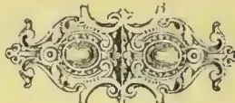

758------------------------------------------------

# \* The TROPICAL AGRICULTURIST \*

## ◇ MONTHLY. ◇

Vol. XV.]

COLOMBO, MAY 1ST, 1896.

[No. 11.

### THE PHILOSOPHY OF ARBORI- CULTURE AND LANDSCAPE GARDENING.

BY REV. J. G. MACVICAR, A.M., D.D.

(Reprinted from *Transactions of the Scottish Arboricultural Society*, Vol. IV.)

(Concluded from page 661.)

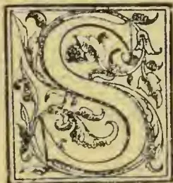

UCH, then, are the principles, or rather, such is the principle of beauty, when regarded in the largest and most general point of view in the landscape, and in everything. It is unity in variety. And, with regard to the beauty of the theorems and intellectual objects generally, it is not possible to be more explicit. But with such objects we have nothing to do here. It will be satisfactory to you to know, however, that this principle of unity in variety covers all ideal compositions that are beautiful, and explain their beauty. The development of beauty is the felicitous treatment of some central unity, often for a time concealed and forgotten, but coming in at the close in the midst of a rich and abounding variety. To such a state of things a good novel, no less than a fine mathematical proposition, owes all its charms as a composition.

But it is with visible objects alone that we have here to do, and with regard to them it is possible to be more explicit. Thus, we can say that when unity in variety has been most completely established in any composition, then there is an exquisite symmetry in that composition. Thus, as the secret of the simplest kind of beauty,—that kind, namely, which bespeaks the repose of intelligence, while it flatters the eye and permits mental play upon it, but which does not tend to awake thought and feeling,—we have symmetry. And, hence the universally acknowledged beauty of flowers and of well-designed geometrical gardens, which may be said to be imitations of flowers. They owe it all to the symmetry which they display. This kind of beauty may be called kaleidoscopic beauty.

But my readers will, I doubt not, have already detected a seeming fallacy into which I have fallen or rather, indeed, a piece of seeming self-contradiction. I set out with the theory that nature is the grand storehouse of beauty, and that the laws of nature are the principles of beauty, whereas I have now represented beauty as depending on the make of the mind of the beholder, his love of unity in variety, and consequently of symmetry. Now here there certainly seems to be a contradiction; but the contradiction is only seeming. Though mental action and intellect be not material nature, yet material nature is a creation of intellect; it reflects intellect, and the laws of material nature work towards unity in variety also just as intellect does. The laws of nature, consequently, work towards symmetry also. Nay, so true is this, that when they have established symmetry their work is done, and they are at rest. The proper expression of the beauty of symmetry, therefore, ought to be that of a balance of forces, or repose. The spectacle of a perfect symmetry ought, therefore, not to animate the beholder, but merely to please him, so as to induce him to prolong his gaze. Now, is not this precisely the state of mind which the beholding of a very symmetrical composition tends to induce?

The discussion of symmetry, therefore, cannot be the close of our theory of the Beautiful. No; if the work of the forces of nature were done, if all were symmetrical, all nature would be motionless, stereotype, dead. But this would never do for the busy mind. Plainly, the exhibition to the living mind of any extensive production of nature in which symmetry rules must be disappointing, deadening; for the living soul, active within herself, is ever seeking for the manifestation of life and action all around. And hence the great secret of the landscape-gardener. It is to maintain unity in variety strong, without allowing symmetry to show. In the very proportion in which he can succeed in awaking the idea of forces in which still acting and preventing the forms of nature from falling into a regular symmetry, towards which they tend, he succeeds in the creation of the *picturesque* and the

759------------------------------------------------

734THE TROPICAL AGRICULTURIST.[MAY 1, 1896.

*sublime*,—that is, kinds of beauty expressive of animation—the former of not terrible, the latter of terrible powers.

On these principles of the beautiful, the picturesque, and the sublime, therefore, two points in the scientific practice of landscape gardening fully appear:—

1. Where the gardener is dealing with bright colours merely in the flower-garden, supposing it to be viewed from the mansion-house or elsewhere as a unity, he should place colours of the same tint in considerable breadths, so as to give a sufficient area of colour for the eye to rest upon. His colours should not be placed in juxtaposition in too harmonious tints, and he may adopt with advantage, provided there be ample nature around, the geometrical mode of gardening; for colour is not capable either of the picturesque or the sublime. No higher order of beauty than that which is merely kaleidoscopic is attainable by it.

2. In the landscape, the problem is to establish or preserve unity in its variety, so that the eye may not wander at large, and go adrift in beholding it, and along with this to avoid all obvious symmetry as carefully as nature. Nature on the great scale, in the present epoch, everywhere displays departures from symmetry. Instead of a perfectly spherical globe, with a perfectly smooth surface and a regular orbit in the heavens, which is that to which the laws of nature would reduce our planet, if the action of these laws were completed, the surface of our globe is diversified by sea and land, mountain and valley, river and lake. It is expressive of great forces by no means composed into an eternal repose and sameness, but operating still with immense power and from different centres, and therefore in seeming (though in seeming only) conflict with each other. It is in small individualised objects alone—in crystals, plants, and animals—that the forces of nature are in any measure balanced, and that symmetry is developed. Hence, as has been said the picturesqueness and the sublimity nature; for these terms bespeak the consciousness of a force operating in nature, with which, though it be very different from our own, we may yet hold communion.

The landscape gardener, therefore, whilst he must not neglect a balance and even a repetition of parts in his landscape, must be on his guard against allowing any obvious symmetry to show itself. If he do, he will kill his composition. He will speak to the eye only, and not to the soul. And this state of things the architect also must observe, though within limits which are much narrower than those of the landscape gardener; for the mansion-house stands, as it were, midway between the flower-garden and the landscape. A large amount of obvious symmetry is almost indispensable in its construction. Symmetry bespeaks repose. It therefore fits the mansion for being a central resting-place for the eye.

But may we not reduce the practice of the beautiful in the landscape to principles still more specific? Artists are continually speaking of lines. They find that all the expressiveness, and much of the beauty of their creations, arise from the character of the lines and contours which they impart to these compositions. Now, this is only what is to be expected; for motion is the first sign of life, and a line is always a symbol of motion. The eye, in fact, just as it rests on an area, always runs along a line. Hence the importance of the lines which give the contour to the whole landscape, and of the forms of the individual objects which compose it, plainly appears. Does our theory, then, "that the laws of nature are the principles of beauty," throw any light on the relative value of different lines in imparting beauty? Yes, it gives specific diagrams. It defines those very lines on which, according to its own principles, all beauty must depend, in so far as that beauty depends upon the lines in the landscape or object, and not on colours and areas. It has been completely ascertained by natural philosophy, that material elements—elements possessing inertia, &c., and masses composed of such elements—when they move according to the laws of nature, and develop lines by their motion, constantly tend to move in one or other of that

series of lines which is named the conic sections; and when natural motions leave lines behind them, these lines are traces, more or less extended of the conic sections. These are the circular line, the elliptic line (to which we may add the spiral as a resultant form, when the line changes its plane), the parabolic line, the hyperbolic line, and the asymptote or straight line. They have now been named in the order in which the physical forces, in producing them, grow more and more unbalanced or intense, and consequently, in the order in which they grow more and more expressive. The circular line and the elliptic both return into themselves. They are both finite like our minds, and therefore commensurate with ourselves; and, accordingly, such is the expression which they impart to objects in which they appear. The circle, indeed, is not usually included among the conic sections, and it need hardly be included among expressive lines. The circle is too symmetrical. But it is far otherwise with the elliptic line. Wherever it appears it renders the object which displays it "graceful" and very pleasing to the beholder, when he does not desire to be thrown into emotion. The other lines, again, do not return into themselves. They are infinite. They bespeak active force still actuating them, and their expression is more grand and severe. They are the parabola, the hyperbola and the straight line.

But, with regard to all those lines, it must be here remarked that in nature a part of each is usually combined with another part, according to the law of symmetry; that is, placed in an inverse position, both parts together, thus giving a waving line. And of this line the value, as an element of beauty has long since been formally recognised, and known by the name of Hogarth's line of beauty.

And now it would form a most pleasing theme to dilate upon each of these lines in detail, and to show how exactly they maintain, in imparting beauty and expressiveness to nature, the function which has been assigned to them. But this would imply a considerable lengthening of a communication which is long enough already. Let us merely glance at them in reference to that which is simpler than the landscape, I mean the Ocean.

Say, then, that we are gazing upon the ocean first when it is perfectly calm and splendid with silvery radiance in the beams of the morning sun; there is nothing here for the eye to rest upon but a boundless plane glassy surface, and the perfectly straight but equally boundless horizon line. The straight line, in a word, rules the scene. The expression of the calm ocean, therefore, according to our theory, ought to be sublime. It ought to awake in the soul of the beholder the pleasing but awe-inspiring emotion of the infinite. Now, it will not be denied that this is precisely the expression of the ocean when contemplated in a state of repose.

Say, now, that in some distant region a storm is raging, but is indicated in the place where the beholder stands only by what is so well known as a "ground swell." This is a mode of action which does not ruffle the surface of the sea, but which, instead of leaving the glassy surface straight and level as well as glassy, has heaved it into a state of undulation with long circular arcs or waves, and wide circular hollows or troughs between. Here, then, we have a change from the straight line to the circular line, from the infinite line to that which is the most finite of all lines. The change, therefore, ought, according to our theory, to be most unfavourable to the development of pleasing emotion in contemplating the ocean. And is not this eminently the fact? Was there ever a spectator yet who admired a groundswell, compared with any other state of the ocean?

But let the waves be now raised, so that their summits bespeak a smaller radius than their bases,—let them, in a word, assume a parabolic form, and what, let us ask, is the effect? Every one feels that more life has been infused into the scene.

And now, let the summit of the wave become still more acute, until at last it turns over and falls down on its own base as a breaker, and has

760------------------------------------------------

MAY 1, 1896.]THE TROPICAL AGRICULTURIST.735

not the expression become intense? In a word in proportion as the circular and the symmetrical disappear, and lines of the infinite order present themselves, the sea becomes more expressive, more animated, and more animating.

The very same phenomena may be observed in reference to the landscape. How awful is a boundless plain or tableland, giving on all sides a horizon line as straight as that of the ocean!

The art of the printer has seldom succeeded in awaking a more powerful emotion than when such a desert has been drawn with an eagle or camel, or some sentient creature, in the foreground.

How interesting, on the other hand, is a country whose surface is everywhere equally undulated with round-backed rising grounds, and corresponding low grounds between! Nay, though the undulations rise to the magnitude of mountains and valleys, still, if their contour is composed of circular arches, expression is found to be very tame. But when the parabolic line begins to show itself, now in its vertex, on the somewhat conical hill-top, now in its long arms, changing insensibly into the straight line down the valley and into the plain; and when mountains and valleys of this character are so composed that a unity reigns amid all the variety, the effect is charming. It needs only the vertical straight line of the precipice here and there, and the horizontal line of the lake or sea, to make it sublime.

But yet, how wanting as a masterpiece of nature is any and every landscape if arboriculture has not been there,—either that of Nature, the great arboriculturist, or that of man, her intelligent imitator and friend.

#### BIBLIOGRAPHY OF TEA.

(Continued from page 665.)

*Faber, J.F.V.* Dissertatio de Thea Helvetico. Basil 1715. 40.

*Fabra, Aloys dalla.* Dissertatio de herba Thee [in ejus Dissert. phys. med. p. 459.]. Ferrariae. 1712. 40.

*Falconer, Hugh.* Report on the Teak Forests of Tenasserim... and on the Tea-plant of Sylhet. Calcutta. 1852. 80.

*Falconet, Camillus [et Bertin, J.R.].* Non ergo potus Thea ad sanorum diatam pertinet. Paris. 1739. 40.

*Faraday, Michael.* Analysis of Tea Earth.

*Faucis, D. de [et Serina].* Non ergo mors Arthritidis potu decocti foliorum Thee. Paris. 1696. 40.

*Fébrer, F.* De la Leucorrhée... et de son traitement par les injections de Thé vert. Paris. 1870. 80.

*Feistmantel, Ottokar.* Die Theekultur in Britisch Oost-Indiën, &c. Frag. 1838. 80.

*Fergusson, John.* Ceylon Tea in North America. Colombo. 1894. 320.

*Fergusson, John.* Drink Pure Ceylon Tea. Ceylon vs. China Teas. Revised edition. Colombo. 1894. 320.

*Fernando, Marian Frances.* A Pound of Tea. London. 1870. 80.

*Feyerabend, Melchior Gottlieb.* Resp. Dissertatio... de salvia in infuso adhibenda, hujusque prae Thee Chinensi præstantia. Praes. C. G. Stentzel. Vitenbergæ. [1723.] 40.

*Figuier, Louis Guill.* Les Industries du Café et du Thé. Paris. 18—. 40.

*Fischer, Joh. Bern. von.* De Thea. 17—.

*Five o'clock Tea.* Five o'clock Tea: containing Receipts for Cakes, Savoury Sandwiches, &c. London. 18—. 80.

*Fortune, Robert.* Three Years' Wanderings in the N. Provinces of China, including a visit to the Tea, Silk, and Cotton Countries, &c. London. 1847. 80.

*Fortune, Robert.* Report upon the Tea Plantations in the North-Western Provinces. &c. [London. 1851.] 80. [Agra.]

*Fortune, Robert.* A Journey to the Tea Countries of China, with a short notice of the East India Co.'s Tea Plantations in the Himalaya Mountains. London. 1852. 80.

*Fortune, Robert.* Two visits to the Tea Countries of China and the British Tea Plantations in the Himalaya: with a... full description of the culture of the Tea Plant, &c. 2 vols. London. 1853. 80.

*Francius, Pet.* See *Petit, P. P.* Petiti Epos de Vi... Thæ Sinensis, &c. [1680?] 80.

*Francius, Pet. P.* Francii in laudem Thæ Sinensis Anaerontica duo. Greek. Amstelodami. 1685. 40. [Cui adjunctum est J. G. Heinrichen de Thea Hedba Doricum Melydriom.]

*Francke, Joh. M.D.* J. Franckii Veronica Theezans it est, exaltatio veronica Europæ cum thee Chinitico. &c. Lipsiæ. [1699?] 120. [2nd. edn. Lipsiæ et Coburg. 1700. 120.]

*Francke, Joh. M.D.* See *Europe.* Le Thé de l'Europe, ou les propriétés de la Véronique, &c. 1701. 80. [Coburg. 1693. 80. Rheims. 1707. 120.]

*Fremery, Barend.* Gedachten over de Circulaire missive relatief de aansta nde verkooping van thee. bij de generale O. I. Compagnie, &c. See *R. Vonte*, 1791.

*Fremery, Barend.* See *Vonte, R.* Antwoord aan.... "Gedachtend over de Circulaire, &c." ? 1791.

*Fremery, Barend.* See *Vonte, R.* Antwoord aan der heer R. Vonte, op deszelfs zoogenaande "Antwoord," &c. ? 1791.

*Friedels, David.* Medicinische Bedencken über die Krankheiten und Schäden... was von dem neuen Mandel-Thee, Coffee und Sneedolade, &c. Leipzig. 1720. 80.

*Fries, Ludwig & Sigm. von.* Uebersichtliche Darstellung der Thee-Cultur und des Thee-handels in China. Wien. 1878. 80.

*Frisius, Henr.* Quod Thea Arthritis conveniat. Lugd. Bat. [Traj. ad Rhen.] 1684. 40.

*Garani, Déjeuner, le lait, le café, le thé.* 1 pl.

*Garnier, A. [et Couthier, J.F.].* An Parisinis frequens potus Thee frequenti potu Cffaoe salubrior? Paris. 1749. 40.

*Garray, Thos.* An Exact Description of the Growth, Qualities, and Virtues of the Leaf Tea. London. 1660. s. sh. fol.

*Gedachten.* Gedachten over den Chinesischen Theehandel. Leiden. 1815. [See *Iets: Frijmoedige.*]

*Gehma, James Abr. A.* Wettstreit des Chinesischen Thea mit warmen, Wasser. Berolin. 1685-8.

*Gehma, James Abr. A.* Edler Theedrank, oder Hulfmittel zum Gezunden und langen Leben. Bremæ. 1686. 80.

*Getenu, James Abr. A.* Thee-Geträncke eniret, verversachet aber nicht die Wassersucht. Berlin. 1688. 80.

*Genge, Joan. Melch. Resp.* Dissertatio de Thee. Praes. Bern. Albin. Francof. ad Oderam. 1684. 40.

*Genissin, Ferd.* En prenant le thé. Précedé d'une introduction de P. L. Jacob, Bibliophile. 3rd. edn. Paris. 1868. 80.

*Geschichte.* Geschichte und Beschreibung des Kaffee-, Thees und Zuckers, &c. Berlin. 1800. 80.

*Goldgrube.* Goldgrube Deutschlands, &c. See *Deutschland.* Berlin. 1799. 80.

*Göring-Schmidt.* Ausländische Kulturpflanzen. I. Kaffee. II. Thee. Leipzig. fol.

*Gorkom, Karl Wessel van.* Voortbrengselen van de groote Kultur in Nederlandsche Oost-Indie. Koffie—Thee—Caeo en Vanielje. Harlem. 1882. 80.

*Goulton, Fr. le.* Der elegante Theetisch, oder die Kunst, einglinzender Zirkel... zu bewerthen. Weimar. 80.

*Gribble, H.* The Preparation of Japan Tea. 32 pp. Text, with 24 plates and tables. 1883. 80.

*Griffith, Wm., F.L.S.* Report on the Tea Plant of Upper Assam. [1840?] 80.

*Griffith, Wm., F.L.S.* Posthumous Papers. Journal of Travels in Assam... [Proceeding with the Assam deputation for the examination of the Tea-plant, &c.] Calcutta. 1847-8. 80.

*Grimm, Herm. Nie.* Beschreibung der Thee, Coffee, &c. Augsburg. 1734.

*Grimshaw, Thos. Wrigley.* Treatment of Typhus Fever by Tea, with Cases. London. 1866. 120.

*Groenewond, Abr.* De Verloorne Diamantring, of de Verkwestigde Thee-drinkster. Kluchtspiel [in one act and in verse]. Haarlem. 1719. 80.

*Groot, Groot misbruik van de Thee en Coffij.* Hague Comitum. 1695. 40. See *Blankaart, S.*

*Guillemin, Jean Ant.* Rapport au ministre d'agriculture, sur sa mission au Brésil, ayant pour objet des recherches sur les cultivations et la préparation du thé. Paris. 1839. 80.

761------------------------------------------------

736THE TROPICAL AGRICULTURIST.[MAY 1, 1896.]

*H\*\*\*\*\**, Mr. A Journal of eight days' journey from Portsmouth... To which is added an Essay on Tea, &c. by Mr. H\*\*\*\*\* [i.e. *Jonas Hanway*]. 2nd edn. 2 vols. London. 1757. 80.

*Haan, Pieter de*. De Invoer van Thee, ter overweging voorgesteld. Leyden. 1827. 80.

*Hala, J. And.* De herbæ exoticæ Theæ infuso, ejusque usu et abusu. Erford. 1722. 40.

*Hamilton, John*. The Ceylon Tea Industry. An opening for men of moderate capital. London. 1886. 80.

*Hanson, Reg.* Tea, Coffee and Spices: their history and commerce. London. 1877.

*Hanson, Reg.* Tea and the Tea Trade. London. 1877.

*Hanway, Jonas*. A Journal of eight days, &c. See *H\*\*\*\*\**, Mr. 1757. 80. [Essay on Tea. 1756.]

*Hanway, Jonas*. Observations on the Cause of Dissoluteness among the Poor. London. 1772. 40. [Tea, p. 73.]

*Harington, John E. M.* Ostindische Thee. Übersetzt durch C. F. Pöttjar. Hamburg. 80.

*Harrison, J.* Leatherhead Tea. A Broadsheet. Manchester.

*Hathorn, F.G.* A Handbook of Darjeeling; with brief notes on the culture and manufacture of tea, &c. Calcutta. 1863. 80.

*Hawkes, Jas.* A retrospect of the Boston Tea-Party. See *Boston Tea-Party*. 1834. 120.

*Haworth, .* Information and Advice for Tea Planters. 1865

*Hay, Chas. A.* Tea Cultivation and Manufacture in Ceylon. Colombo. 1883.

*Haywood, Eliza. Mrs.* The Tea-Table, or, a conversation between some polite persons of both sexes at a Lady's Visiting Day. London. 1725. 80.

*Heckeler, Joan. Resp.* Dissertatio de Potu Thee. Præs. M. Mappus. Argentorati. 1691. 40.

*Herkens, Gylb. Joh.* Carmen de Thea.

*Henderson, J. A. & W. E.* An Account of Tea Cultivation and Manufacture in Ceylon. 'Times of Ceylon' Works. Colombo. 1893. 80.

*Henry, Jas. M.D.* A Letter to the Members of the Temperance Society, showing that the use of Tea and Coffee cannot be safely substituted for spirituous liquors, &c. Dublin. 1830. 80.

*Hering, Carl Fried. Augt.* Thea. Eine Rosenscene für Sopran-solo, &c. [Musie.] Berlin und Posen. [1866.] fol.

*Herrichen, Joan. Gothof.* J. G. Herrichen de Thea Herba Doricum Melydri. Greek. [Leipsic? 1670.] 40. [Lipsia. 1685. 40. Amstelodami. 1700. 40.]

*Hewes, Geo. Robt. P.* See *Boston Tea-Party*. A Retrospect, &c. 1834. 80.

*Hewes, Geo. Robt. P.* See *Bostonian*. Traits of the Tea-Party; &c. 1835. 120.

*Heyrenbach, Joh. Casp.* Medius sui ipsius, sive Exegesis dietetici regiminis, usus et abusus Sex rerum non naturalium, nec non et singulariter Thee, Coffee, Chocolata, &c. Styria. 1753. 40.

*Hill, John, M.D. (Sir?)*. A method of curing jaundice... by the herb agrimony, taken in the manner of tea, &c. London. 1768. 80.

*Hindoo Mythology*. Hindoo Mythology: being a Description of Heathen Deities on Silver Swami Tea Service presented to the Prince of Wales by the Gaeckwar of Baroda. Madras. 1875. 40.

*History*. History of the Tea Plant from the sowing of the seed... To which are added some remarks on imitation Tea, &c. London. 1820. 80.

*History*. The History of a Cup of Tea in Rhymes and Pictures. London. [1860.] obl. 120.

*Hoch, J. H.* Vollständiger Theetisch... Ein Rathgeber für... Mundküche, &c. Dresden. [1865.] 80.

*Hoffmann, G. F.* De infusi Veronicæ efficacii præferendæ herbæ Theæ. Halæ. 1694. 40.

*Holmes, Oliver Wendell, the Elder*. Over the Teacups. Boston [Mass.]. 1891. 80.

*Holmes, Oliver Wendell, the Elder*. The Poetical works of. [The Boston Tea Party, p. 306.] London. 1883. 80.

*Holmes, Oliver Wendell, the Elder*. Dorothy Q. Together with a Ballad of the Boston Tea Party, &c. London: Cambridge [Mass.]. 1892. 80.

*Horsfield, Thos., M.D., F.R.S.* Essay on the Cultivation and Manufacture of Tea in Java. [Trans. from the Dutch.] London. 1811. 80.

*Houssaye, J. G.* Monographie du thé. Description botanique... de cette fenille, &c. Paris. 1843. 80.

*Houssaye, J. G.* Der Thee. Eine Monographie... Aus dem Französisch. Leipzig und Quedlinburg. 1844. 80.

*Houssaye, J. G.* Instructions sur la manière de préparer la boisson du thé. Paris. [1846?] 120. [1852. 1835. 240.]

*Hyer, A.* Den nyttige Sundhedsbrug af Caffe, Thea, Chocolade, Tobak, Hyldeblomster af Enebaer. Kjøbenhavn. 1822. 80.

*Huet, Pierre Dan., Bishop.* Thea, elegia. See Thea. [1674?] 80.

*Iets*. Iets over de op te rigten Nederland. geoctr. Maatschappij voor den Chinesischen Theehandel. Leiden. 1815. See *Gedanken: Vrijmoedige*.

*Jackson, William*. A Few Notes on Tea Machinery and Tea Steres. Published by Messrs. John Walker & Co. 1886.

*Jacobson, J. J. L. L.* Handboek voor de Kulturen en Fabrikatie van Thee. 3 Deel. Batavia. 1843. 80.

*Jacobson, J. J. L. L.* Handboek voor het Sorteren en Afpakken van Thee. Batavia. 1845. 80.

*James, Robt., M.D.* A Treatise on Tobacco, Tea, Coffee, &c. translated by Dr. James. See *Paulli, S.* 1746. 80.

*Jameson, Wm.* Report on the Government Tea Plantations in Kumaon and Gurhwal. Calcutta. 1848. 80.

*Jameson, Wm.* Suggestions for the importation of Tea-makers, implements, and Seeds from China into the N.-W. Provinces. Agra. 1852. 80.

*Jamieson, Dr.* Short Guide to Planters cultivating Teas in the Himalayas.

*Janssen, Sir Steph. Theod.* Smuggling laid open... showing... the whole state of the Tea importation, consumption and revenue from 1745 to 1762. London. 1763. 80.

*Java*. Memorie behooronde bij het Rekest van Thee-Fabrikanter van Java. Batavia. 1865.

*Johanson, Edwin*. Theefälschung. 1881.

*Jones, A. C.* Thea Viridis, or Chinese Tea Plant... in the United States. [Dept. of Agricult. Speo. Report. No. 3.] Washington. 1877. 80.

*Joseph, A. Munshi*. Tea Planting from Seed to Cup. [In Tamil with Eng. Translation.] A. M. & J. Ferguson. Colombo. 1889. 80.

*Junker von Langeegg, Ferd. Adalb.* Japanische Thee-Geschichten. Wien. 1881. 80.

*Kacmpfen, Albert [et Este, Henry.]*. La tasse à Thé: illustré par Worms. 1865. 80.

*Kaffee*. Kaffee, Thee und Chocolate, oder Kenntnis des dienlichen Gebrauchs der Güte... des Kaffees, und... des verschiedenen Theesorten, &c. Leipzig. 80.

*Kaffee-kande*. Samtale imellem Kaffeekanden og Theepotten samt Kammerpotten. Kjøbenhavn. [1850?] 80.

*Kaffee-logia*. Caffee- und The-Logia. Oder Kutzte... Beschreibung dieser Getränke, &c. See *Schaubühne*. Die neueröfnete lustige Schaubühne, &c. [1690?] 120.

*Kaffee und Thee Welt*. See *Kaffee- und Thee-Wereld*. Die Verschlemmerte und bezauberte Coffee- und Thee-Welt. 1737. 80.

*Kandy Ceylon Tea Fund*. Report of the Committee of the Ceylon Tea Fund for... 1890, &c. Kandy. 1891, &c. 80.

*Kandy Planters' Association of Ceylon*. Ceylon Tea. pp. 3. [London. 1886.] 80.

*Keen Lung, Emp. of China*. Eloge de la ville de Moukden... ou y a joint une pièce de vers sur le Thé, composé per le même Empereur: traduit par le P. Amiot, &c. Paris. 1770. 80.

*Kemple, .* Symptomes produit par l'abus du thé.

*Kendo, T. A.* Treatise on Silk and Tea Culture and other Asiatic industries adapted to the soil... of California. San Francisco: New York. 1870. 120.

*Kilbmann, J. H.* Chinesika Theet. pp. 30. Stockholm. 1830. 80.

*King, George*. Remarks on the pruning of Tea. [Jl. Agri. and Hort. Soc. Ind. III. pt. I.] Calcutta. 18—.

*Kirchmaier, Carol. Christian*, Theologia medica: i.e., de usu et abusu Potus Calici cum herba Theo. Præs. J. Thile. Wittenbergæ. 1687. 40.

762------------------------------------------------

MAY 1, 1896.]THE TROPICAL AGRICULTURIST.737

*Knoll, Joh. Christ. Gerh.* Von den Wirkungen des Thees.

*Knox, J.* A Conversation on Sabbath School Tea Party Anniversaries. London: Chorley. 1818. 160.

*Koffie-en Thee-Wereld.* De Gedebancheerde en Beoverde Koffy-en Thee Weereld, &c. Amsterdam. 1712. 120. See *Koffie und Thee Welt*.

*Koffie-en Thee-Wereld.* Die verschlemmerte und bezauberte Coffe-en Thee-Welt, &c. Schwabach. 1737. 80.

*Kortum, Carl Arn.* Der Thee und seiner S:ellvertreter. Duitsbergæ. 1811. 80.

*Kovai, Y.* Remarks on the manufacture of various kinds of Tea. Bulletin No. 7. of the Imperial College of Agriculture and Dendrology. Tokio. 1890.

*Krueger, Joh. Gottl.* J. G. K.'s Gedancken vom Caffee, Thee und Toback. Halle in Magdeburg. 1743. 80. [1746.]

*Krueger, Joh. Gottl.* Traite' du Caffé, du The' et du Tabac. [transl. from the German]. Halle. 1743. 80.

*Krueger, Joh. Gottl.* Dutch translation by J. W. Lustig. Amsterdam. 1773.

*Kumaon.* On the Tea Factories and Plantations in Kumaon and Gurhwal. [By J. Strachey?] Agra, 1854.

*Kursnerus, Christianus. Resp.* Dissertatio de potu Theæ. Pres. J. J. Waldschmidt. Marburgi Cætorum. [1685.]. 40. [1681.].

*Lange, Johann.* Naturgemässe Beschreibung ùer Coffee, Thee, Chocolata, Tabacks....Auss der Englisch. [of J. Chamberlayne.]. See C., J. L. M. 1681. 120. See *Natural History*.

*Langstedt, Fried. Ludw.* Thee, Kaffee und Zucker in hist: öcon: und Botan. Hinsicht. Nürnberg. 1800. 80.

*Lavedan, Ant.* Tratado de los usos y abusos, propiedades y virtudes del Tabaco, Cafe, Te y Chocolata. Madrid. 1791. 80. [Ibid. 1796.]

*Lecocq, L. M.* Nouvelle d's converte. De la culture du thé et de sa préparation en France, &c. Paris. 1845. 80.

*Lees, Wm. Nassau.* A memorandum written after a tour through the Tea Districts of Eastern Bengal. 1864-5. Calcutta. 1866. 80.

*Lees, Wm. Nassau.* Tea Cultivation, Cotton and other Agricultural Experiments in India. A Review. London. 1863. 80.

*Lees, Wm. Nassau.* Another word on Tea Cultivation in Eastern Bengal. Calcutta. 1867. 80.

*Le Fèvre, J. F., M.D.* Opera...licet...Quibus accessit tractatus de natura, usu et abusu Caffé, Thé, Chocolat et Tabac. 2 tom. Vesuntioni [Besançon]. 1737. 40.

*Le Fèvre, J. F., M.D.* De la nature et de l'usage du thé. 1737.

*Leonard, Jas.* A Letter on the Discovery and Character of the indigenous Tea Plant in Assam, to A. Rogers. London. 1839. 80.

*Letter.* A letter to Sir Robert Peel on the Tea Duties. Liverpool. 1845. 80.

*Lettson, John Coakley.* Dissertatio...sistens observations ad vires theæ pertinentes, &c. Lugduni Batavorum. 1769. 40. [Pres. Bav. Voorda. 80.].

*Lettson, John Coakley.* The Natural History of the Tea Tree: with observations on the medical qualities of tea, and effects of tea drinking. London. 1772. 40. [Dublin. 1772. 80. New Edition. London. 1799. 80.]

*Lettson, John Coakley.* Histoire naturelle du thé, avec des observations sur ses qualités médicales, &c. Par Jean Coakley, M.D. (J.C.L.). Paris. 1773. 120.

*Lettson, John Coakley.* Geschichte des Thees und Kaffees. [See *Ellis, John.*] Leipzig. 1775-6. 80.

*Leyl, Wilhelm.* Epistola apud Simon Pauli in Comment. de abusu Tabaci, Thee, &c. See *Pauli, S.*

*Linde, F.* Map of the Tea producing Tracts in India, &c. London. 1879. fol.

*Linnæus, Carl. Pres.* Potus Theæ. Resp. *Tilæus, P. C.* Elpsaliæ. 1765. 40.

*Liotard, L.* Note on the Tea Industry of the North-West Provinces and the Panjab, Simla. 1832.

*Loarer, Edward.* The' d' Himalaya: ses productions naturelles. Culture du the' dans l'Inde. Paris. 1863. 80.

*Lochner, Mich. Fried.* Heptas Dissertationum variarum, &c....(No. 5 De novis et exoticis Thee et Cafe, &c.). Norimbergæ. 1717. 40. [1720? 1712-16.].

*Lohmeyer, Joh. Arn.* Dissertatio de herbæ exoticæ Theæ infuso ejusque usu et abusu. Erfordiæ. 1722. 40.

*Long-Yu.* Treatise on Tea. [In Chinese.]

*Loureiro, P.* New Tea Table, showing the cost of tea with all charges [minus freight], as bought by the pecul, for Taels of Sycee on Dollars. London. 1832. 40.

*Lustig, Jacob Wilhelm.* [A Dutch translation of J. G. Krueger's Gedancken vom Kaffee, Thee, &c.].

*Luther, Carolus Fredericus.* Au potus Theæ exsiccandi [explicandi] et emaciandi virtute polleat? Paris. (Kiloniæ?). 1702. (1712?) 40.

## VITALITY OF SEEDS.

The duration of the vitality of seeds is perhaps the most important of the various phenomena of plant-life, especially when considered in connection with the introduction into a country of the economic plants of other countries. It is a subject that has engaged attention from very early times, and the literature relating thereto is considerable. Much of this, however, is of a traditional and unpractical character; but even if we confine ourselves to the demonstrable, or demonstrated, the subject is almost inexhaustible. There is such an infinity of variety in the behaviour of seeds under different conditions, that it is impossible in a short account, such as this must be, to do more than convey a general idea of the subject. Perhaps the best way to treat the question, apart from technicalities, is to consider the vitality of seeds under ordinary, and under extraordinary, conditions. In the development and germination of seeds, there is, in a sense, usually a period of gestation and a period of incubation, as in oviparous organisms of the animal kingdom; and the duration of these periods is within definable limits, under ordinary conditions though seeds do not exhibit the same fixity of time in regard to development and vitality as eggs. The embryo of a seed is the result of the impregnation of the female ovum in the ovary or young seed-vessel, by the male element, generated in the anthers; and in the mature state this embryo may fill the whole space within the skin, or testa, of the seed, as in the bean and acorn; or it may be a comparatively minute body, as in wheat, maize, and other cereals; the rest of the seed being filled with matter not incorporated in the embryo. The difference is one of degree in development. In the one case, the growing embryo has absorbed into its own system, as it were, before germination or the beginning of the growth of the embryo into a new plant, the whole of the nutrient material provided in the seed for reproduction; whereas, in the latter case, the process of absorption and utilisation of the "albumen," or nutrient matter, takes place after the seed is detached from the parent plant, and during the earliest stage of growth of the new plant; so that the plant is nourished until it has formed organs capable of assimilating the food obtainable from the atmosphere and earth. Between these two extremes of development of the embryo, or future plant, before organic connection with the parent ceases, there is every conceivable degree and variety; and, as will presently be explained with examples, some plants are viviparous, in the sense that the embryo commences active life before being severed from the parent, so that when this occurs the plant is in a position to draw its sustenance from unassimilated or inorganic materials. Now it is a curious and unexplainable fact that certain seeds exhibiting extremes of embryonal development, instanced in the bean and wheat, are equally retentive of their germinative power. The longevity, if it may be so called, of seeds is exemplified in "exalbuminous" seeds as well as in "albuminous" seeds of every degree. It should be mentioned, however, that the difference is not so much one of assimilation or development as of the earlier or later transfer of the nutrient matter of

763------------------------------------------------

738THE TROPICAL AGRICULTURIST.[MAY 1, 1896.

the seed to the embryo or plantlet. Assuming the perfect maturation of a seed, certain conditions are necessary to quicken its dormant vitality; and the two principal factors are heat and moisture, varying enormously in amount for different plants, and acting much more rapidly on some seeds than on others, even when the amount required is much the same. Neither under natural nor under artificial conditions will some seeds retain their vitality more than one season; and all the resources of the accumulated experience of seed-importers from distant countries are insufficient in some cases to maintain their vitality. It is not altogether because the interval between the dispersal and the germination of the seed, under ordinary conditions, is necessarily longer; but rather because in the one case the conditions under which a seed will germinate are much more restricted than in the other. Let us now examine the natural conditions under which seeds are commonly produced and dispersed, in relation to the retention of their vitality; and we shall learn how much more it depends on their nature, or natural means of protection, than on the seasons. An oak tree sheds its acorns in autumn, and the leaves which fall afterwards afford them some protection from frost and excessive dryness. But the leaves might be blown away from one spot, and the acorns exposed to intense frost or drought, either of which will speedily kill them. In another spot the leaves may drift into thick layers, with an excessive accumulation of moisture, causing decay of the underlying acorns; and there are many other unfavourable conditions which may destroy the vitality of the acorn. It is apparently impossible, however, to preserve an acorn's vitality by any artificial means for more than one season.

The scarlet-runner bean loses its germinative power on exposure to comparatively slight frost, the degree depending upon the amount of moisture in it; yet it will retain its vitality for an almost indefinite period under favourable artificial conditions. In both of the examples given, germination would naturally follow as soon after maturation as the conditions allowed. The seeds of the hawthorn behave differently. Each haw contains normally three to five seeds, every one of which is encased in a hard, bony envelope, in addition to its proper coat or testa. Committed to the earth, and under the most favourable conditions, these seeds do not germinate till the second year, and often not so soon. In this instance prolongation of vitality is probably due in some measure to the protective nature of the shell enclosing the seed.

Returning to seeds in which the embryo or plantlet forms only a very small part of the whole body, wheat may be taken as a familiar and easily observed illustration of a seed, the vital energy of which requires very little to stimulate it into active growth; and yet this same seed, having no special protection in the way of coating, will retain its vitality as long, perhaps, as any kind of seed, if not under the influence of moisture. The primary condition to the preservation of vitality in a seed is perfect ripeness. Unripe seeds of many kinds will germinate and grow into independent plants if sown immediately after removal from the parent. The facility with which immature wheat will germinate is most disastrously exemplified in a wet harvest, when the seeds will sprout while the corn is standing or in sheaf; thus destroying more or less completely the value of the grain for flour, as the starch or flour is consumed in the development of the embryo, or what is left is so deteriorated by chemical change that it is not good for food. There is perhaps no other seed more susceptible to moisture, and none less affected by dryness, or by heat or cold in the absence of moisture.

The kind of vivipary exhibited by the wheat is occasionally observed in various other plants; and sometimes the seeds of pulpy fruits germinate in the fruit. There is also a class of plants in which vivipary is normal. Prominent in this class are the mangroves (*Lhizophora*, &c.) of muddy sea-shores in the tropics. In these plants there is a remarkable adaptation to conditions, which ensures their reproduction. From the very inception of the embryo

there is no apparent interruption of active vitality in its development and germination. In the earliest stage the cotyledons or seed-leaves are formed, and the radicle or future primary root is represented by a very small point. When the former have attained their full development, which is not great, the water begins to grow and rapidly increases in size. Each fruit or seed-vessel, it should be mentioned, contains only one seed, the rootlet of which points to the apex of the fruit. Soon this rootlet pushes its way through the apex of the fruit, and grows into a spindle-shaped body of great density and length; the cotyledons or seed-leaves remaining partly inside the fruit, and acting as an organ of absorption from the parent plant to nourish the seedling. In *Lhizophora mucronata* this radicle attains a length of two or three feet, and the seedling eventually falls, and by its own weight penetrates and sticks in the mud, leaving the fruit, containing the exhausted cotyledons, attached to the tree, where it dries up. Another singular adaptation to conditions is the vital development of the seeds of aquatic plants which ripen their seeds on or under water. *Vallisneria* is a remarkable instance of this. The unisexual flowers are formed under water; the female on long coiled stalks, which at the right period uncoil, and the flower rises just above the surface of the water. Simultaneously the short-stalked male flowers are detached from the base of the leaf-stalks, and also rise to the surface. After impregnation has taken place, the stalk of the female flower coils up again, and draws the seed-vessel down under water, where the seeds ripen.

It has been explained that heat, moisture, and air are necessary to the germination of seeds, varying immensely for different seeds. We come now to the behaviour of certain seeds under the influence of an unusual or unnatural amount of moisture, heat or cold especially in relation to the length of the duration of the exposure to any one of these factors. It has been proved beyond dispute, by actual experiment, that the vitality of certain seeds, notably various kinds of bean and convolvulus, is not impaired by immersion in sea-water—or rather floating and partially submerged—for a period of at least one year; and that after having been kept quite dry for two or three years. Plants are actually growing at Kew from seeds treated as described; and some years ago several seeds of *Entada*, cast ashore in the Azores, whither they had been transported by the Gulf Stream, were raised at Kew. So far as at present known, all the seeds that will bear very long immersion without injury have an intensely hard, bony, or crustaceous coat, that would withstand boiling for a minute or two without killing the embryo. Yet it is difficult to understand this power of resistance, especially after being kept dry for a long time. This imprevision to water explains the wide distribution of many sea-side plants, the seeds of which are conveyed by oceanic currents. How long such seeds would retain their vitality in water is uncertain, because experiments have not reached the limit. Many readers will remember Darwin's experiments in this connection; but it should be borne in mind that they were chiefly with seeds of plants not at all likely to be dispersed by the sea.

It has already been stated that some seeds will bear immersion in boiling water for a short time, and gardeners occasionally practise this treatment to accelerate the germination of hard-coated seeds. But seeds of all kinds will bear for a considerably longer period a much higher dry temperature than soaking in water of the same temperature. It is recorded, by trustworthy authorities, that the seeds of many plants—poppy, parsley, sunflower, and various kinds of grain, for instance—if perfectly dry, do not lose their vitality when subjected to a temperature of  $212^{\circ}$  F. for forty-eight hours; and for shorter periods to a much greater heat. The result in most cases, though not all, is a considerable retardation of germination. Dry grain is equally impervious to cold. In 1877, seedling wheat was exhibited at the Linnean Society that had been raised at Kew from grain that had been exposed

764------------------------------------------------

MAY 1, 1896.]THE TROPICAL AGRICULTURIST.739

to the intense cold of the Arctic expedition of 1874 to 1876. The next question that arises is: how long of seeds retain their vitality when stored in the ordinary ways adopted by dealers? As a rule, seedsmen and gardeners prefer new seed, because a larger percentage germinates; and mixing cold seeds with new, tells its own tale in irregular germination. Nevertheless, there are many seeds that retain their vitality from five to ten years sufficiently well to be depended upon to yield a good crop. Old balsam seed, other things being equal, has the reputation of yielding a larger proportion of double flowers than new; and some gardeners consider that cucumber seed of four or five years of age gives better results than the seed of the previous year. As already mentioned, perfectly ripened seed will retain its vitality longer than imperfectly ripened seed. In illustration of this, we note that carrot seed grown in France retains its germinative power, on the average, longer than English-grown seed, owing to climatal differences.

There is one other natural condition in relation to the vitality of seeds that should be mentioned; that is, the duration of the vitality of seeds on the mother plant. Some of the Australian *Proteaceæ*, and some of the fir trees, especially North American, bear the seed-vessels containing quick seeds of many successive seasons; and only under the influence of excessive drought or forest fires do they open and release the seed. Rapid forest fires are often not sufficient to consume the cones, but sufficient to cause them to open and free the seed for a succession of trees. The unopened cones of thirty years have been counted on some fir trees; and it is averred that the first seed-vessels of some proteaceous trees do not open to shed their seed, under ordinary conditions, until the death of the parent plant, so that a tree may bear the accumulated seed of half a century or more.

Finally, a few words respecting the extreme longevity attributed to certain seeds. The reputed germination of "mummy wheat," from two to three thousand years old, has been the theme of much writing; but the results of careful subsequent experiments with grain taken from various tombs do not support the doubtless equally conscientious, though less skilfully conducted, experiments, supposed by some persons to have established the fact of wheat of so great an age having germinated. Indeed it is now known that the experiments mainly relied upon to prove this long retention of vitality were falsified by the gardener who had charge of them. Nevertheless, there is no doubt that some seeds do retain their vitality for a very long period, as is proved by numerous well-authenticated instances. Almost every writer on physiological botany cites a number of instances. Kidney beans taken from the herbarium of Tournefort are said to have germinated after having been thus preserved for at least 100 years. Wheat and rice are also credited with having retained their vitality for as long a period. Seeds of the sensitive plant (*Impatiens pulicaria*) kept in an ordinary bag at the Jardin des Plantes, Paris, germinated freely when sixty years old. A long list might be made of seeds that have germinated after being stored for twenty-five to thirty years. If seeds retain their vitality for so long a period as this under such conditions, it is quite conceivable that seeds buried deep in the earth, beyond atmospheric influences, and where there was not excessive moisture, might retain their germinative power for an almost indefinite period; and the fact that plants previously unknown in a locality often spring up where excavations have been made, bear out this assumption. The same thing happens in arable land, should the farmer plough deeper than usual; and deeper tillage, which would otherwise be beneficial, is often avoided on this account. A careful writer like Lindley states, though without qualification, that he had raspberry plants raised from seed taken from the stomach of a man, whose skeleton was found thirty feet below the surface of the ground. Judging from coins found at the same place, the seeds were probably 1600 or 1700 years old. One more example of seeds germinating that

are supposed to have been buried some 1500 to 2000 years. About twenty years ago, on the removal of a quantity of slack of the ancient silver mines of Greece, several plants sprang up in abundance previously unknown in the locality. Among these was a species of *Glaucium*, which was even described as new; and it is suggested that the seed may have lain dormant for the long period indicated. But there is not the amount of certainty about any of these assumed very old seeds to convince the sceptical or to establish a fact. It remains yet for somebody to institute and carry out careful investigations where excavations are being made.

W. BOTTING HEMSLEY.

—Nature.

### WILL THERE BE A RUBBER FAMINE?

We are surprised to see in the London *India-Rubber Journal* a prediction of a rubber famine, written in a style suggestive of those newspaper articles which tell us from time to time how rubber is gathered in hollow pumpkins, or that "para" is not rubber until it has been vulcanized. Fifty years ago it was well enough to talk about the known supplies of rubber becoming exhausted, and it was the work of an intelligent man for John Forbes Royle, for instance, to urge that new sources of this valuable material be looked for. But in Royle's time no rubber had been marketed from India, its presence in Bolivia and in Africa was unknown, and the extent of the Amazonian forests unsuspected. The situation is far different now, since Stanley's great work in revealing the resources of the Congo basin and Emin Pasha's discovery of rubber in the Soudan, and since the French have come into a position to develop Madagascar on a broader scale. We feel safe in asserting that the *India-Rubber Journal* does not know of any country, important at any time as a producer of rubber, which is not still exporting it. Has it seen any evidence that Para rubber is growing scarcer, or that the African grades are becoming harder to obtain? Can it show that, on the whole, there are fewer rubber-trees available than time in the past?

The reasons which our contemporary gives for its alarm are (1) the rapid growth of the bicycle industry; (2) the probability of rubber tires being largely used for carriages; and (3) the recklessness of "the owners of plantations in west Africa and elsewhere" in their "method of tapping the trees." We can say that, as for the United States, the largest estimate of the consumption of rubber by the bicycle trade does not exceed five per cent of our total imports, while the carriage-tire demand does not promise soon to equal in value even the rubber-stamp trade. In a country where the importation of rubber has bounded upward at rate of millions of pounds annually, none of these items is of commanding importance, and importers believe that all the rubber actually demanded by manufacturers will long be forthcoming. There is no more fear on this side of the Atlantic that rubber will become exhausted than that coal or wheat will. And we presume that our rubber-merchants have studied the situation as carefully as those of any other country.

All the rubber-vines that have ever been killed in Africa are as a drop in the sea compared with what still remain there, and we cannot learn that the rubber-gatherers on the Amazon are so different from the rest of mankind as to be unable to see that, if they kill their trees, their occupation will be gone. It is a half-century since the expression "killing the goose that lays the golden eggs" was first applied to the rubber industry, and it is time that some new stock phrases were introduced into the work-hack-writers on this subject.

The most surprising thing of all is that the *Journal* should see in the development of the balata crop a remedy for the threatened famine. It hears that in the handful of forests in the Guianas there is enough gum—only slightly inferior to caoutchouc to support a trade for centuries. Evidently our contemporary has only just got hold of the remarkable prospectus issued a year or so ago by an enthusiastic French gentleman, who figured out that the penal colony of Cayenne could gather in the balata

765------------------------------------------------

740THE TROPICAL AGRICULTURIST.[MAY 1, 1896.

forests there ten times as much rubber every year as the whole world now requires. It would be a strange thing, indeed, if the narrow strip of land embraced in the Guianas should become of greater value as source of rubber than the valleys fringing the 50,000 miles of waterways in the Amazon system and an equal area of rubber forests in Africa.

If such a thing were really possible as the exhaustion of the natural rubber supply in the next century, there is ample reason for believing (1) that rubber-trees will grow as well from seeds planted by hand as from seeds scattered by the winds; (2) that rubber cultivation is practicable wherever the trees now grow native; and (3) that the rubber zone embraces millions square miles. The cultivation of rubber—when the time comes—is as practicable as that of oranges, olives, tea, coffee, cloves, or cinchona. We hope, therefore, that further predictions of a rubber famine will be left for those who think that the planting of old shoes is the surest way of starting a rubber plantation.—*Indian rubber World*

#### RUBBER CULTURE IN FLORIDA.

A writer in the New Orleans *Times-Democrat* revives the idea of planting rubber trees in Florida, and states that it is moist and hot enough there to raise rubber of an excellent quality. It seems that one generation speedily forgets the experience of a preceding one. About forty years ago the United States Government planted rubber trees in Florida, and they may be there yet. Some were cared for also at the Centennial Exposition, and some are found in botanical gardens elsewhere. The trouble is they don't produce rubber. Florida is outside of the Tropics; Pará is on the Equator. It rains every day at Pará or else there is fear of a drought; Florida gets its quota of rain a good deal in the winter and not so much in the summer. Rain, continual hot weather, monkeys, and rubber go together; and rubber is the first to drop out of the combination. The New Orleans writer states that Da Silva planted 20,000 rubber trees near Pará, on Bom Intento, in 1865, at a cost of 3,200 dollars. Of these, only 1,000 remain; the Amazon which revels in nature and cares little for art, washed 19,000 away in one of its annual "tears." These trees yield a small profit now; but the practical mind asks, what is the use of spending 3,200 dollars, which in twenty-five years amount, with compound interest, to 50,000 dollars, to obtain something that is so free that what would be called good-sized countries in Europe are lying idle in a virgin forest that will not be reached before the shoddy man has found a way to pay a little something to the importer to go out of the business altogether?—*Indian rubber World*.

#### TOBACCO CULTURE IN THE EAST.

Mr. Tripp read a paper at the Imperial Institute, on "The Tobacco Industry of India and the Far East," the meeting (over which Lord Harris presided, in the absence of Lord Lorne, M.P., who is on the Continent) being held in connection with the Indian Section of the Society of Arts.

Mr. Tripp's experience has been derived in Sumatra, and he spoke in high terms of the suitability of its climate and soil for the cultivation of the tobacco plant. But there is a third factor of great importance—labour. For the higher or skilled labour a European is apparently needed, and he must be a man of strong common-sense and possess qualities—so the lecturer hinted—other than those that go to make a brilliant statesman or journalist. For the manual and mechanical work the Chinese are found best qualified. Javanese labour is cheaper, but practically of no use at all. Europeans, by adopting scientific methods, have converted a trade which, thirty years ago, was measured by a few hundreds sterling, into one calculated by millions: yet the natives, blind to facts, deaf to advice, and doggedly conservative, go on growing tobacco in their own way, insisting that they are right and that the white man is wrong. This consideration was vital to the main argument of the paper, for Mr. Tripp is anxious that the quality of Indian tobacco should be improved. He cannot bring himself to believe that

the soil of India can "aspire to the perfection of Sumatra," but the climate is all that can be desired. Therefore, why does India produce that "coarse, thick-ribbed pungent tobacco" that is "quite unsaleable in Europe?" Mr. Tripp suspects that inferior culture has a great deal to do with it. Nay, he went so far yesterday afternoon as to indicate where the Indian growers and curers are at fault. The plants are "topped" too soon, the newly-reaped tobacco is exposed too long to sun and light, and the fermentation is not properly understood. There are also, he thinks, important undeveloped possibilities in connection with Borneo, though, it should be pointed out, his modest estimate of results already produced there was taken exception to, in the subsequent discussion, by Mr. Strutt, M.P. Mr. Tripp concluded his paper by indicating the new field for English labour that would be opened up by the development of tobacco cultivation in the directions he had indicated. He looks forward to the time when the British smoker will consume cigars produced from British soil, with British capital, and made by British hands. For why do we import 80,000,000 cigars from the Continent every year? Mr. Tripp answers that question in one word—prejudice.—*Overland Mail*.

#### PLANTS FOR GREEN MANURING.

With a view to determining the amount of nitrogen by which various leguminous plants enrich the soil, some interesting and valuable experiments were made last year on the experimental fields at Hohenheim, Wurtemberg. The soil was a heavy loam, on which rye and winter peas had been grown in the third year previous, rape manured with superphosphate and nitrate of soda in the second year previous, and winter barley in the previous year. After the barley was harvested, 17 different kinds of leguminous and other plants were sown for green-manuring on 17 plots, each containing about 50 square yards separated by uncultivated strips. In September following the crop on each plot was dug under, and Sheriff wheat drilled on all the plots. The yield of wheat where different leguminous plants had been used as green manures (lupines, clovers, field beans, peas, vetch, and serradella), ranged from 15 lb. to 22 lb. averaging about 20 lb. It was lowest with serradella and highest with red clover and white and yellow lupine. Second to the latter were field peas and beans and scarlet clover. The yield with kohlrabi was 16 lb., with white mustard 15½ lb., and with three varieties of buckwheat the average yield was 13 lb. per plot. It was noticed that on the plots, especially those with lupines, many heads of grain were backward in ripening. On examination the roots of such plants were found to be covered with a white fungus. No such fungus was found on the roots where non-leguminous plants were used for green manure. In how far this occurred was due to the green-manuring with leguminous plants was not determined. In another series of experiments, the object was to compare the total amounts of nitrogen contained in crops of different leguminous plants, and in the leaves, stems, and roots of the same separately. The soil on which this trial was made had been in grain for three years previous. Whether or not it was manured in any way for the present crop is not stated in the abstract. The seed was broadcasted on the different plots. It was found that the large field beans gave the largest yield of nitrogen per square yard of land; but considering the cost of sowing this crop, it is believed that, from a financial point of view, it does not exceed the lupines in value. The difference in the nitrogen in the white and blue lupines raised from native and from foreign seed is very marked, the foreign seed yielding over a third more. It is seen that an acre crop of large field beans is able to take from the air and so give to the soil more than 225 lb. of nitrogen, while the same crop of lupines yields some 165 lb. To supply these amounts of nitrogen in the form of nitrate of soda, would require from a 1,000 lb. to 1,500 lb. of that material.—*Agricultural Journal*, Cape Colony.

766------------------------------------------------

MAY 1, 1896.]THE TROPICAL AGRICULTURIST.741

"A NATURAL HISTORY OF ALL THE  
SCALE INSECTS OF CEYLON."

Such is the proper designation of the important work on which Mr. E. Ernest Green of Pundaloya is at present engaged in the old country, and I must again press on his brother planters, the Planters' Association and the Ceylon Government the great call there is for extending support to the author in his most useful enterprise. In my opinion no work of more practical value to our planters of all grades and products has been heard of since "Nietner's Enemies of the Coffee Tree." But, unfortunately, Mr. Green has done himself far less than justice—at any rate in the estimation of practical, non-scientific planting and business men—by his very scientific, not to say non-popular, dry-as-dust Prospectus. I have pointed this out to Mr. Green and remarked that it is not likely Tea Plantation Companies or other large proprietors in Ceylon even—much less in other lands—will be attracted by a "Descriptive Catalogue of the Coccidae of Ceylon" even though backed by a long array of scientific men. I have urged Mr. Green to draw up a fly-leaf prospectus making plain to planters what his work will really do for them and I am glad to say that he is likely to comply with my suggestion. What this will mean may be understood from the following extract from my latest letter from Mr. Green:—

"My prospectus—as you point out—does not perhaps describe my work to the best advantage. It was drawn up rather hurriedly, and I was advised by the publishers to make it as brief as possible. Although my book is there described as 'a Descriptive Catalogue,' it will really be—as far as possible—a natural history of all the Scale Insects of Ceylon, with full illustrations of every species which should enable anyone to recognise—almost at a glance—their particular enemy.

"As I mentioned in my letter of 2nd January (which must have reached Colombo after your departure), although my work is primarily a natural history of these insect pests, I shall add a general review of all the remedies and experiments that have been used against them, pointing out the particular treatment most suitable for particular species as suggested by their habits. There is scarcely a plant or tree of any kind in Ceylon that is not subject to one or more species of these 'scale-bugs,' and some change in the conditions of their life, such as the partial extermination of their natural enemies, may at any time cause any of them to suddenly spring into importance."

In view of the above, and of the further facts which Mr. Green will no doubt bring out in his supplementary prospectus, I have no doubt that though the cost of the work is considerable (some Rs5 in Ceylon) that a great many of the Tea Companies and other large Plantation Companies will act on the suggestion about making a copy available in the hands of each of their Chief Managers for reference by their Superintendents. At the same time the Planters' Association and the Ceylon Government should take notice of Mr. Green's work and the latter should either subsidize, or offer to take a considerable number of copies for their Kachcheries, Forest and Botanical Departments as well as to present to other Colonial Governments. J.F.

P.S.—Since the above was written, Mr. Green has requested that subscribers' names to his new work should be registered at the *Observer* Office—a request we have much pleasure in complying with; but we feel sure the Planters' Committee and the other bodies and public men will do what they can to give the enterprising author all due support.

93IN THE METROPOLIS.

London, March 13.

DR. MORRIS

was as interesting and instructive in conversation as usual. His latest trip to the West Indies, and especially the Bahamas afforded interesting topics: though great success has not attended the efforts of Ceylon planters who have gone Westwards—Messrs. W. Sabonadière, Marshall, Bennett and others—yet there is no doubt of a revival of prosperity in many of the islands and this is due to their taking advantage of the grand and ever-growing market at their door, almost for nearly all the produce they produce, namely the United States. Frost is considered to have wrenched the golden prospects of much of Florida and California and so the West Indies have the ball at their foot in supplying fruit, and tropical produce generally, to North America. I will say nothing about the Bahamas and its Sisal industry until I hear (as I hope to do) Dr. Morris's lecture on the subject before the Society of Arts on Wednesday next. The efforts of Dr. Morris, when Director of Gardens, backed up by his Assistants, Messrs. Neeck and Hart, did much for Jamaica and it is now rapidly going ahead. One want in the West seems to be an independent enterprising Press; but it is difficult for the separate island communities to pull together and there is no common metropolitan centre which for a paper would ensure general support. The *Tropical Agriculturist* continues to be well supported and much appreciated in the West. Dominica may now be expected to come to the front, though an unkindly critic seems to have anticipated the advent of the Ceylon administrator by saying that he was a better judge of the good things of the table than of a Colony's public requirements! That is not fair; for put on his mettle in a responsible charge, Mr. P. A. Templer will, I have no doubt, give scope to his admitted ability.

The interest of the gathering in the Whitehall Rooms was enhanced by ladies being now admitted to the Dinner as well as the meeting: Sir G. Baden-Powell, Sir Francis Scott (just returned from Ashanti) and others were thus accompanied by their better-halves. The lecture, as I have said, was discursive and dealt chiefly with West Africa, about which most of the speakers—including Mr. Alfred Jones of Liverpool, the king of commerce in that part, Mr. Hodgson, Colonial Secretary, Sir Quayle-Jones, Chief Justice, and the Governor of St. Helena, besides Sir Francis Scott, and Sir F. de Winton. The last mentioned indeed, in dwelling on the absolute necessity of roads and railways, referred to South Africa. Dr. Morris made the most useful contribution to the discussion in describing what "Botanic Stations" had done and were doing for the West African Settlements. He praised Governor Mollony for being the first to develop the rubber trade from the Gold Coast, now worth a great deal per annum, and when he was transferred along the Coast, that Governor got trained men from the Gardens to search the natural forests, who, instead of a rubber vine (*Landolphia*) which got killed in collecting the rubber, found a vigorous rubber forest tree which merely required scoring and would be ready for further harvests in a certain number of years. This was in Lagos. Dr. Morris dwelt on the fact that the exports were chiefly natural forest products; but coffee and cacao could well be cultivated. He mentioned how in New York a monopolist of mahogany got from Africa via Liverpool, called it "vermilion"—origin unknown—to deceive rivals in

767------------------------------------------------

742THE TROPICAL AGRICULTURIST.[MAY 1, 1896.

the trade. The African mahogany trade is rapidly growing and somewhat injuring that of Honduras.

SIR ROBERT HERBERT

(who made a most admirable Chairman) after Dr. Morris sat down, unexpectedly called on me to speak, saying:—"We have Mr. John Ferguson of Ceylon with us this evening and as he has paid much attention to tropical agriculture, perhaps he may have something to say on the subject of the paper."

My few remarks were as follows:—Sir Robert Herbert, ladies and gentlemen,—I venture to intrude solely with reference to one passage in the interesting lecture to which we have listened. It is where Sir Geo. Baden Powell says:—

"I may here add that tropical Africa also offers a great arena for the work of many of our Indian fellow-subjects, traders, artisans, soldiers and planters. Our rule in India tends to a great redundancy of population, and in Africa this surplus will find a useful and profitable field."

Some two years ago, I was applied to by a prosperous Ceylon coffee and tea planter for advice: he had £5,000 of capital ready for investment outside his plantations and he wished to know should he take up land for coffee in Java or in British Central Africa. I advised a visit to the Shire Highlands. The country was inspected with such satisfactory result that my friend took up a large block, came back and was induced to form a "Nyassaland Coffee Co., Ltd.," which was supported by shrewd business and planting men in Ceylon, who have sent over practical superintendents to open a coffee plantation. This, so far as I know, is the finest plantation company in that part of Africa and it owes its initiation to, and has its headquarters not in London but in, Ceylon—so establishing a bond of union between our leading Asiatic Colony and Central Africa. Ceylon long before this had given Sir Henry Johnston his first working Horticulturist and Botanist, surveyors and some planters. The pioneer of coffee was Mr. Buchanan, a Mission Agent; but he was now followed by Ceylon men, and if the present new administration is continued, roads opened and railways encouraged, we may look for the speedy development of British Central and East Africa—and more particularly of Nyassaland. There is a growing demand for coffee both in America and Europe though not in the United Kingdom, and no present fear of over-production, and Africa is the indigenous home of coffee. Referring to the latest news from Nyassaland, I mentioned how the Manager of the Company had reported coffee plantations paying 20 per cent return in their 4th year; and in contrast with Sierra Leone where the Chief Justice had said native labour had risen to 1s per day, I quoted Mr. G. M. Crabbe as naming the equivalent in calico of 2s a month for men, 1s 6d women and 1s for children as the wages paid! This constituted a perfect paradise for cheap labour, even when compared with the 12 million of people in Southern India who were content if they earned 2s 6d a week for family of five.

The Governor of St. Helena (the smallest but not least interesting British Dependency) wound up the discussion

Next day I met by his appointment, Mr. H. T. Hartley, one of the Directors of the

"INDIAN AND CEYLON EXHIBITION OF 1896."

who was accompanied by Mr. Wickremasinghe of the British Museum. No one can come into contact with Mr. Hartley without forming a high opinion of his business capacity and sterling good sense; and I was disappointed to learn that the Ceylon Government before

the advent of your new Governor had decided adversely on the point of making a Loan Collection illustrative of Native Industries and of lending any buildings available from Chicago, the Tea Kiosk for instance. As the Company are ready to bear the expense of transport, &c., I trust H.E. Governor Ridgeway will reconsider this decision in a sense favourable to the Exhibition and what I believe to be the best interests, of the Colony. There can be no doubt of the grand advertisement for Ceylon, her products and industries which the Exhibition will afford, and I trust, therefore, that the Planters' Association or Thirty Committee will see that a good exhibit of Ceylon teas, coffee and cacao is made; while plumago, cinnamon oil, etc., ought to come from the Colombo merchants. I have asked for a copy of the official letter to Government which, however, you may already have seen in the *Gazette*. If not, here it is:—

London, 24th January 1896.

The Hon. the Colonial Secretary, Colombo, Ceylon.

Sir,—We have the honour to address you, having received a communication from Sir Robert Meade notifying us that the Colonial Office has sent out a despatch to your Government, respecting this Company's forthcoming Exhibition:—

Empire of India and Ceylon Exhibition, 1896  
including other Crown Dependencies in Asia.

We understand that this despatch has been supplemented with a copy of the Report of the Empire of India Exhibition of 1895, together with our various printed matter in connection with the forthcoming Exhibition of 1896.

A perusal of the Report will we think convince your Government of both the ability of this Company to adequately carry out their scheme for the forthcoming season as well as convey some idea of the substantial commercial advantages likely to result from co-operation therewith.

We feel that our enterprise should commend itself to your Government in view of the fact that the Empire of India Exhibition 1895 was a purely tentative effort, and the first time that any undertaking of this nature has been carried to a successful issue unaided by a Government grant.

Now that the Company have practically proved their capabilities, they trust that your Government may be so good as to extend to them their cordial assistance, and also permit themselves in some way or other to officially recognise this enterprise, (a recognition which has been accorded by the Indian Office) without which we fully appreciate that no commercial undertaking like our own can meet with any substantial adhesion.

The Directors are now in a position to state that the prominence given at the late Exhibition to Indian products, especially to Indian tea and tobacco proved a direct benefit to Indian trade, to the extent of not less than £75,000. We think that such results, achieved by a private Company, without the slightest charge against Indian revenues, compares most favourably with those of the Colonial and Indian Exhibition of 1886.

Although such a large measure of success has attended the efforts of this Company, it is still felt that India was but inadequately represented, and that nothing like justice was done to her.

This consideration has largely influenced this Company in deciding to continue the Empire of India Exhibition this year, and rendering the same more important and interesting by the inclusion of Ceylon and our Asian Crown Colonies, thus giving a more complete idea of their almost inexhaustible economic resources.

Briefly, the following are the principal matters and suggestions to which we are desirous of drawing the attention of your Government.

1. BUILDINGS.—It is intended to devote a large space for the erection of buildings of Ceylon Architecture, and also to set aside a considerable area in the Queen's Palace for a Ceylon Court for Sinhalese exhibitors.

768------------------------------------------------

MAY 1, 1896.]THE TROPICAL AGRICULTURIST.743

2. NATIVE EXHIBITORS.—The Company being aware that native exhibitors cannot take active part in the Exhibition without considerable outlay, are willing to waive premiums in advance for the space occupied which is a necessity in Exhibitions not depending upon Government aid, and to accept in lieu thereof a moderate percentage on their gross sales.

3. STILL EXHIBITS.—This concession does not apply to what are termed "still exhibits" that is to say, show cases without attendants, where no selling is done; for the latter however when of *bona fide* Ceylon industries, liberal arrangements will be made.

4. STAPLE PRODUCTS.—Our Company are very anxious to give special privileges and prominence to the more important staple exports of the Colony, such as, tea, coffee, cocoa, and the valuable and numerous products of the coconut palm.

5. LOAN COLLECTION.—Deeming it desirable that we should convey to the visitor some adequate idea not only of the products and manufactures of the Colony, but also the typical features of the country and her art developments, considerable space will be reserved in the Ducal Hall for a Loan Collection of Ceylon Art Work, including Historical Records, pictures and views of the Colony, carved wood, arms, armour and metal work of all descriptions, embroideries, and in brief all ornamental manufactured articles. We particularly desire the co-operation of your Government in this direction.

6. COLLECTIVE EXHIBIT.—We would point out that whilst at the Imperial Institute your Government have very liberally represented the staple products of the country, the Art Manufacturing side of it is not represented at all; and feeling that these are a class of goods which meet with a ready sale in European countries, and only require more prominently bringing before the public to much increase the trade therein, is the reason why we seek the co-operation of your Government in this section, and ask them to get together as widely representative a collection as possible for exhibition.

Our suggestion is, that at the close of the exhibition, this collection should be handed over to the Imperial Institute.

For the installation of such a collection, our Company are prepared to pay all expenses for carriage and freight, and insure the goods to their full value whilst in our custody as well as to allot the space free of charge.

7. NATIVE PERFORMERS.—With the idea of making the Ceylon Section popular, it is intended to include one or more troupes of Sinhalese performers. The public will by this means obtain some adequate conception not only of the products and arts of Ceylon, but also of its people and their country, and we trust your Government will give what permission may be necessary to enable the performers to leave the country; our Company guaranteeing their return passage.

8. GOVERNMENT BUILDINGS.—We believe that your Government have in their possession some of the buildings erected in the Ceylon Section for Chicago. Could the loan of these be made available for the purpose of a tea house?

We are sending you by the same mail duplicates of our printed matter.

Finally, it is intended to open the Exhibition early in May, and all goods should be delivered here by not later than the 15th April.—I have the honour to be, sir, your obedient servant,

(Sgd.) HERMAN HART.

It speaks for itself. Mr. E. B. Creasy is the Colombo Agent—there could not be a better—of the Exhibition which is certain to be a great success, even if Ceylon does not do justice to itself—as I hope it may in all departments.

#### IN THE CITY.

Poor prices for tea notwithstanding high exchange is not satisfactory news; but this is a slack time in the

#### TEA TRADE

for there is nothing in Supplies or Stocks to justify depression, even though February Colombo ship-

ments were heavy. One question asked is how does the tea distributing trade falling more and more into the hands of half-a-dozen or so big firms and companies affect Mining Lane. Suppose a few even of such big buying houses to hold aloof from a sale, does not it make a vast difference? Exchange has been receding a little and may go lower when all is settled for the Chinese Loan, though there are City men who think it may go higher yet this year—even to above 1s 3d and yet higher prices for tea plantations are asked! For a compact Udapussellawa-Nuwara Eliya place I hear the rate demanded is equal to £109 per acre! Lippakelle has to account for much.

Mr. Alfred Brown, Chairman, and Mr. Roberts the Secretary of the group of (Uva) Spring Valley and Hunasgiriya Company I found well and interested in all that concerns the island's progress: they anticipate Mr. Wardrop's arrival home. Mr. Alex. Thomson leaves in a fortnight by the ss. "Orient."

It is just possible, though by no means decided, that

MR. A. H. DUNCAN

(brother of Messrs. John and Hamilton Duncan), so well-known as an experienced Rangala coffee planter and clever all round, may get the appointment to visit and report on the coffee lands of the London-Columbia Company which is expected to have a capital of £100,000 at its command.

#### RESPECTING CEYLON TEA COMPANIES

with rupee capital, I have the following expression of opinion from a broking friend:—

"Letters from Ceylon inform me that the rise in exchange has put a damper upon the share market there, and I am just afraid they have been choking themselves, for the small number of dealers is not enough to keep up strength during a time of depression, so that they are now anxious to form a market here which I have urged them to do more than a year ago. Everything was then on the boom and their quotations were always too high. The only safety is to take advantage of the London market now and convert two or three companies into one, the shareholders taking their interest in sterling and ask for a small sum from the London subscribers and they would reap their profit from increased value of their shares. This I have repeatedly suggested, for, unless they do something of this kind, difficulties will arise."

The planters of Ceylon and indeed of other lands have had no better or more intelligent and energetic friend in many ways than

"MR. THOMAS CHRISTY"

of Lime Street, and a chat with him always brings some topic of interest to the surface. It will be remembered how persistently Mr. Christy moved in reference to the sale of tea-sweepings from the various Docks, until now, in nearly every case, the stuff is denatured and prevented from coming into the tea market, though used for the extraction of caffeine, &c., Our tea planters owe Mr. Christy their thanks for this action. Now in respect of

#### COFFEE ADULTERATION

a far more important matter than the abolition of the Coffee duty, Mr. Christy is interesting himself very actively. He has stirred up the Public Analysts by showing them how they are down on the poor farmers, dairymen, spirits sellers and a host besides, for anything like mixing or adulteration, while coffee dealers may sell 90 per cent. of chicory to 10 of coffee, with impunity! The London Chamber of Commerce is likely to move in the matter.

769------------------------------------------------

744THE TROPICAL AGRICULTURIST.[MAY 1, 1896.INDIAN TEA.

To the Editor of the *Financial Times*.

Sir,—Having read the article in which you brought Indian tea planting companies before your readers as a suitable channel of investment, it occurs to me that you may possibly like to have some confirmation of your advice from one who has long been conversant with the position and development of the industry as a tea-taster and agent in the London market for some of the principal growers.

So little has been known in the past about this branch of our commerce that it is not surprising that investors, as a rule, have regarded it with indifference, or have altogether ignored it. But the experimental stage has long been passed, and we have now the benefit of some fifty years' experience with the result that it is proved that nearly all, but not quite all, plantations in India are permanent in respect of soil and the capacity of plant to yield freely and vigorously; that while weather causes some variation in the amount and quality of the yield, such a thing as the failure of a crop is unknown, and that no limit has yet been found to the consumption of Indian tea.

A most important fact is, that the oldest plantations in Assam still produce the finest tea. Proof of this is to be found in the history of the Assam Company, which has been at work since 1813, and last year showed a profit of £50,000 on the season's production, equal to more than 25 per cent. on the capital, and due to the fine quality of the tea produced. Another weighty fact is that no other tea-producing country has yet been discovered which can give tea equal to the best from Assam and Darjeeling. Another is, that notwithstanding the steady increase of production, there is in no market of the world a surplus stock of Indian tea, the year's consumption regularly using up all that is grown. Last year 135 million pounds were produced by India; of this, 120 millions at least will be used in the United Kingdom, and the remainder in other countries, where the use of Indian tea in place of China is rapidly increasing to a point which makes them keen competitors with English buyers.

The effect of these developments in trade has been to maintain the market value of Indian tea well above the cost of production. You may like to know some details. A crop of "common tea" costs from 5½d to 6d per lb. to make, and realises 7d to 7¾d per lb.; a smaller crop of "good tea" costs about 7d per lb., and realises from 9d to 10d; a still smaller crop of "fine" tea costs from 9d to 10d, and realises from 1s up to as much as 1s 6d per lb. There is, therefore, a good margin left for lowered market value or increased cost of manufacture. The items that would increase cost are: a rise in the value of silver, a rise in freights, or a scarcity of coolie labour.

So much with regard to the general position and prospects of the industry. The would-be investor will, of course, want to know which are the strongest and soundest of the many companies, but it is not my purpose to tell him. Some general hints, however, may perhaps be given. These are: To notice the capital cost per bearing acre, and prefer those whose gardens show a low cost; to ascertain what additions to the planted area have been made out of the profits of past years; to discriminate between those who pay dividends and also create reserve funds, and those who do not; to inquire what is the average value of the tea produced, and if the estates are situated in the best districts.

Most of this information can be found in the elaborate tables of statistics now published by some of the stockbrokers, who are beginning to realise that 6 per cent. or 8 per cent. can be obtained on investments in Indian tea with much less risk than is run in many kinds of industrial and commercial concerns for the sake of 5 per cent. From a shareholder's point of view it is much to be desired that the older companies would rearrange their capital on a modern basis, divided into the preferred and deferred shares of small nominal amount that the investor of today so much prefers.—I am, &c.,  
—*Financial Times*, March 11th. ASSAM.

AGAINST A DUTY ON TEA.

The following petition has been prepared and circulated by a tea buyer on the East Side. Mr. C. R. Banks, expressing, as he claims, the opinion of a large number opposed to a duty on tea:

*To the Honorable House of Representatives Washington, D. C.*

We, the undersigned citizens, merchants and tea dealers, learning that a bill is to be presented to Congress to impose an import duty on tea, beg to present for consideration the following objections to such duty:

Such a duty as is proposed was in force for a number of years. It was repealed, so that all, no matter what their circumstances, might have at the lowest possible cost, and enjoy without tax "at free breakfast tables," an article so indispensable that it has almost or quite ceased to be considered a luxury.

The ostensible object of those who are desirous of imposing an import duty on tea is that the standard of quality would thereby be raised, which object can be equally obtained by the more stringent enforcement of existing laws for the inspection of tea at the port of entry, without imposing a tax on the poor man's comfort and consolation.

We humbly pray your honorable body not to reverse the wholesome and consistent policy now in force for twenty-three years, keeping a staple article of daily use free from taxation, which falls heavier on the poorer classes than on those better able to contribute to the support of the Government.

We further desire to call attention to the fact that the proposed tax is sought to be imposed chiefly in the interest of large capitalists, as such a tax by almost doubling the import cost of the article, would be a burden upon the dealers of smaller means.

We beg to submit that the existing laws for the inspection of tea of a healthful and reasonable standard can and should be maintained at all ports of the United States, and that no duty be imposed for the benefit of a few capitalists and to the detriment of the public at large.

There is nothing in the present revenue laws which forbids the entry of clean, low-priced tea. The decline in tea since 1872 has not tended to increase consumption, which was larger per capital in 1872 and 1873 than it has been since, and greater in 1886, 1887 and 1888 than at any time since. In 1873 and 1874 the average import price of tea was 37½ cents, and now, when it has fallen to 15 cents, we find no increased use of the article, conclusively showing that the American people do not care for tea as a beverage. Beer and coffee are the favourites. Is it any wonder that the tea trade does not increase when the bulk of the importations are cheap and herby teas, giving forth a flavour that does not captivate and win the palate? Not one consumer in fifty drinks tea for the sake of that flavour but simply from habit or through the natural craving for a warm drink. Does anyone imagine that cheap, poorly flavoured coffee, or coffee mixtures, tend to increase consumption? The introduction of the portable coffee mill into the grocers' shops did more to make coffee the popular beverage it is than did making coffee duty free. It forced the sale of roasted coffee in the bean, while competition kept up the quality and stimulated the sale of pure coffee.

Mr. Banks claims that tea has "quite ceased to be considered a luxury." Simply, we believe, because of inferior quality. Tea should be regarded a luxury, as coffee is, which pleases the palate and awakes good cheer and brings comfort. If the people were educated to an appreciation of tea for its delicate and peculiar flavour and for its marked characteristics, the trade would make more money than it does now and the people would worship the teapot as they adore the coffee urn, the chocolate cup and the beer mug.

If Mr. Banks went into the tenement districts and the slums he would be surprised to find the poorest of the poor buying the better grades of tea, unless forced by the most abject poverty to crucify their desires. What the tea trade want is a campaign having for its object to demonstrate to consumers,

770------------------------------------------------

MAY 1, 1896.]THE TROPICAL AGRICULTURIST.745

there is as much of delight to the senses in a cup of hot, fragrant tea as in glass of Madeira, sherry, rich old Burgundy or a well seasoned Sauterne. A tax would tend to improve the character of the imports and would give the Government ten millions of revenue, so distributed as to be felt by no one. If the tax be ten cents per pound it means that each cup of tea is taxed one-third of one mill. Let us have a duty on tea and coffee, with an additional tax on beer, as a measure of revenue only.—*American Grocer*, Feb. 26.

### THE ASSIMILATION OF NITROGEN BY TEA-PLANTS.

DEAR SIR,—In his note on "Assimilation of Nitrogen through the Agency of the Root Tubercles in certain Papilionaceæ" published as an enclosure to Mr. G. W. C. Cock's letter on pages 5 and 6 of the January number of the *Indian Forester*, Mr. Cock recommends the planting of Saw (*Albizia stipulata*) or the Sensitive plant (*Mimosa pudica*) in tea gardens for the fixation and storing of nitrogen the nodules of its roots for the use of the Tea plants. Both the Saw and the Sensitive plant belong to the sub-Order *Mimosæ*. As far as I have read the recent literature on this important subject of assimilation of the free nitrogen of the air in the root tubercles of plants. I have not come across any writer who claims this precious property for the roots of any other plants than those of the Papilionaceæ. I am therefore led to ask you, Mr. Editor, to kindly state for the information of your readers in your next number of the *Forester* whether all or any of the plants of the sub-Order *Mimosæ* also possess this inestimable property of fixing the free nitrogen of the air in their roots. M. R.

Note.—Our correspondent's question is practically answered in Dr. Watt's paper published at page 343 of our Vol. XXI; we regret we can give him no further information.—*Indian Forester*, March.

### MARKET FOR TEA SHARES.

There is still a large amount of inquiry for Tea Companies' Shares, and again the "official list" shows, during the week just closed, a large number of advances in quotations, while many of the Money Market Reports in the daily Press make pointed references to these investments.

The *Financial Times* again makes some special reference in its leaderettes to the progress made in the opening of fresh channels of consumption for Indian and Ceylon tea.

MINCING LANE, with rather more limited offerings, keeps steady, but without any very noted advance in values. The estimate of immediately-expected supplies continues to be decreased. Indians have pretty well come to an end, and the March exports from Ceylon now look like being reduced in quantity.

FRESH ISSUES.—Dimbula Valley Ordinary have changed hands at 1-16 under par, while the Prefs, have again been placed freely at 6.

CEYLON SHARES.—C. T. P. Co. Ordinary are said to have changed hands as high as 27½, and the Prefs. have been taken at 17½.—*H. & C. Mail*, March 20.

### TEA IN AMERICA.

New York, March 11.

At the last auction sale the market was very well supported on high grade Formosas, but low grade sold off and ruled weak. Other descriptions are steady and without change with demand light.

Last Wednesday the Montgomery Auction and Commission Company sold at auction 8,779 packages teas as follows:—Moyune—50 Hyson 6½ to 6¾c; 517 Young Hyson 7 to 20c; 215 Imperial 12 to 16¾c; 174 Gunpowder 12 to 25¾c. Ping Sney—13 Young Hyson 9¾c; 451 Imperial 8 to 13c; 1,654 Gunpowder 7¾ to 2¾c. Japan—70 Pan Fired 9¾ to 12c; 25 Capers

16c; 593 Congou 8½ to 16c; 180 India and O. Pekoe 11¾ to 21¾c. Oolong—2,352 Foochow 8½ to 20c; 2,463 Formosa 13½ to 46c. High grade Formosas were well supported and higher, while low grade blacks went off.

Today at noon the Montgomery Auction and Commission Company will sell 9,602 packages, viz., 1,716 half-chests Moyunc, including "Choicest" Moyuno Chops; 2,785 boxes Pingsuey; 32 half-chests Japan, basket-fired and sun-dried; 1,183 half-chests Congou, including some particularly choice lines; 102 packages India, Java, Ceylon and Pekoe; 50 half-chests Amoy; 1,037 half-chests Foochow, new season's; 2,647 half-chests and boxes Formosa, all new season's and comprising some choice teas.—*American Grocer*.

### THE TEA MARKET

remains much as before, with more than the lower qualities available than can be readily disposed of. The free imports from Ceylon are generally disappointing, whereas it is to that country good quality was looked for to meet the demand at a time when standard teas are at the lowest cbb. All "stand out" teas are readily competed for—an encouragement to intending operators in China. Deliveries, both for home consumption and export, give highly satisfactory evidence of the increasing use of tea.—*London and China Express*, March 20.

### PLANTING AND PRODUCE.

PRODUCE AND ADULTERATION.—The twenty-fourth annual report of the Local Government Board on the adulteration of food samples for 1894-95 has just been issued. So far as the reference to tea is concerned, it is not at all disturbing to the public mind. Five hundred and twelve samples of tea were taken, and one was condemned because it contained an excessive quantity of mineral matter (including minute particles of glass, straw, woody fibre, etc., suggestive of shops sweeping) Four samples, although passed by the analyst, were found to be impregnated with lead. In one case legal proceedings were taken against a person for refusing to sell a sample of tea to an inspector, and a fine of £2 was inflicted. Of 1,724 samples of coffee examined, 180 (or 10.4 per cent) were condemned. There is an element of satisfaction in this when it is remembered that for the ten years after the passing of the Act of 1875 the average percentage of adulterated coffee was eighteen. Legal proceedings were taken in 126 cases, and 112 penalties were imposed, amounting in all to nearly £140. Of sugar, 397 samples were analysed, and twenty-nine were condemned. Most of these were beet sugar coloured to imitate Demerara sugar, but four samples contained small proportions of mineral matter. Small fines were inflicted in nine cases.

TEA v. TOBACCO.—When Indian and Ceylon tea planters set about the capture of the American tea market they did not contemplate that the demand for tea would be increased owing to the new use for it as a substitute for tobacco. It appears from American papers that the craze for smoking cigarettes made of tea is rapidly spreading among women in the United States. To make the tea cigarette one takes a grade of green tea which has but little dust, being composed of unbroken leaf, and dampens it carefully, just enough to permit the leaves to be unrolled without being broken, and so to be left pliable and capable of being stuffed in the paper cylinder, while the dampness is not sufficient to stain the paper. The cigarettes are laid aside for a few days, and are then ready to be smoked. The feeling of a tea cigarette in the mouth, says an American contemporary, is peculiar. The taste is not so disagreeable as might be supposed, but the effect on the tyro is a sense of dizziness and a disposition to take hold of something or to sit down. If the beginner leaves off then, that settles it; she will not try tea cigarettes again. If, however, the smoker sit down and try a second cigarette, inhaling it deeply, then the dizziness passes, and is succeeded by one of intense exhilaration. This stage lasts as long as the smoking

771------------------------------------------------

746THE TROPICAL AGRICULTURIST.[MAY 1, 1896.

continues, which is until the reaction of the stomach sets in. Words cannot describe the final effect of the tea cigarette. The agony of the opium fiend is a shadow to that of the nauseated victim of the tea cigarette. It will be hours before food can be looked at, yet the first step towards a cure is a cup of tea. An hour afterwards comes the craving for the cigarette. A tea cigarette, in the quantity of tea used, is about equal to the tea for two cups of pretty strong green tea, and, being inhaled instead of taken in the form of an infusion, its action is about ten times as great. If a tea smoker gets through twenty cigarettes a day, he takes the equivalent of about forty cups of tea as regards the quantity consumed, or of 200 cups as regards the effect. This shows at once what the result in the nervous system will be. The tea cigarettes are on sale in New York at several first-class stores of cigar dealers who have a women's trade, and this has come about simply because the women ask for them.

**THE COFFEE TRADE AND THE CHANCELLOR OF THE EXCHEQUER.**—A large attended meeting of merchants, brokers, and dealers interested in the coffee trade was held last week at the London Commercial Sale Rooms, Mincing Lane, for the purpose of appointing a committee to formulate a system for the better working of coffees in bond, to be submitted to the Chancellor of the Exchequer. Mr. George Rouse presided. Mr. R. Wales said that the resolution he wished to propose was as follows: "That a committee of import and export merchants, home-trade dealers, and brokers be formed, with the object of formulating a system for the better working of coffees in bond, and that the committee do report to a general meeting of the trade the result of their deliberations, prior to placing it in the hands of the Chancellor of the Exchequer for his consideration. He said he would like to remind the meeting that the movement was not a new one, but had arisen out of the conference which the trade recently had with Mr. Goschen—which conference took place with the sanction of that room. They were aware that, on that occasion, they did not succeed in getting the Chancellor to abolish the duty, but he gave them an intimation that if they would put before him any plan or scheme by which difficulties in the present bonded system could be removed—difficulties that prevented the expansion of the export trade, he would be very glad to receive and consider it. The object, therefore, in appointing the committee was to lay before the Chancellor some definite plan for improving the bonded warehouse system, and which he was quite prepared to listen to. He did not think there would be any difficulty in appointing the committee, for it was thought very desirable that any plan which they might devise should have the entire approval of the trade, so that they would be able to tell the Chancellor that the scheme embodied the opinion not of a few individuals, but that it was the opinion of the whole trade. With that object in view they proposed that the committee, if appointed, should do nothing without it was first submitted to a general meeting of the room. It was an eminently safe course to propose the formation of a committee, and if that were agreed to he would then submit the names of the gentlemen who they thought should constitute the committee. Mr. Asser seconded the motion, which was carried *non con*. A committee consisting of the following gentlemen was then formed: Mr. Oschwartz (Messrs. F. Hinth and Co.), Mr. Julius Ehmman (Messrs. Edward Schluter and Co.), Mr. J. Davies (Messrs. Peek Brothers and Winch), Mr. Landsberg (Messrs. Landsberg and Co.), Mr. R. Wales (Messrs. Moffat and Co.), Mr. E. A. Rucker (Messrs. Rucker and Beneraft), Mr. George Rouse (Messrs. R. J. Rouse and Co.), and Mr. J. C. Sanderson (Messrs. Sanderson and Co.).

**JUTE SPINNING IN GERMANY.**—The movement for extensions of jute spinning and weaving in Germany seems to be spreading, in spite of the warnings of the recently dissolved association of manufacturers. It is stated that the directors of the North German Jute Spinning and Weaving Company, of Hamburg, have decided to add 4,000 fine spindles

and 188 looms to the machinery of the mills in Schiffbek and Ostritz, and to erect 2,000 fine spindles and 52 looms in the mill of the affiliated Alsacian Jute Spinning and Weaving Company at Bischweiler, so that, to the three mills, there will be an addition of 6,000 spindles and 240 looms. Following the example of the Hamburg Company, the Bremer Jute Spinning and Weaving Company of Hemlingen is about to add 1,500 spindles and 110 looms to its existing plant; and the Bremen Jute Spinning and Weaving Company has decided to add 6,000 spindles and 330 looms to its producing power.

**AN PLANTS.**—At a meeting of the Royal Botanic Society held on Saturday, Mr. John Birkett in the chair, the Secretary, Mr. J. Bryant Sowerby, called attention to a number of species of the so-called "air plants"—*tilandsias*—exhibited from the society's collection. In the forest of the West Indies and tropical America these plants are found growing upon the branches or trunks of trees high above the ground, and as they are easily moved, and, moreover, very ornamental when in flower, the natives pull them down and attach them to wires from their verandahs, where they live for months without attention.—*Home and Colonial Mail*, March 20.

#### THE NAHALMA TEA ESTATE COMPANY LIMITED.

Board of directors: Arthur Marshall, Esq., Chairman William Forsythe, Esq. (in Ceylon), and John Abernethy, Esq. Office: 29, Victoria Street, Westminster, S. W.

The following is from the report of the directors to be presented to the shareholders at the second annual ordinary general meeting to be held on Thursday next.

The directors have the pleasure to submit the general balance-sheet and profit and loss account for the twelve months ending December 31st, 1895, duly audited. The net amount at credit of profit and loss account at December 31st, 1895, after providing for general expenses, directors' and auditors' fees, interest on debentures, &c., £2,043 0s 6d. An interim dividend of 3 per cent. on the ordinary shares was paid October 3rd, 1895, amounting to £420. It is now proposed to pay a final dividend on the ordinary shares at the rate of 5 per cent (making a distribution for the year of 8 per cent per annum free of income tax), which will absorb £700; it is proposed to place to credit of Debuture Redemption Fund, bringing it up to £1,267 16s 2d, £625; it is proposed to write off the amount expended during the year 1895 upon new turbine, £168 3s 3d; leaving to be carried forward to next year, subject to payment of income tax on profits, a balance of £129 17s 3d.

The directors recommend the distribution of a final dividend at the rate of 5 per cent on the ordinary shares of the company, payable on April 30, 1896, making, with the interim dividend paid October 3, 1895, a distribution at the rate of 8 per cent per annum for the year ending December 31, 1895, such dividend to be paid to those shareholders whose names appear on the share register on March 26, 1896 after which date such shares will be transferable except said dividend. The acreage of the company's properties on December 31 last was: Tea in full bearing, 446; jungle, 246; total, 692 acres. The superintendent reports the estate in good order, that the erection of the turbine and reservoir is now nearing completion, that he is more than ever satisfied that it will prove economical, and that Messrs. Walker and Co. have given substantial work. The crop for 1895 was 235,974 lb, as against an estimate of 220,000 lb. With a favourable season the crop for 1896 is estimated at 240,000 lb. Mr Arthur Marshall, the director retiring by rotation, being eligible, offers himself for re-election. Messrs. Fox, Sissons and Co. auditors to the company, offer themselves for re-election.—*H. and C. Mail*, March 20.

772------------------------------------------------

MAY 1, 1896.]THE TROPICAL AGRICULTURIST.747LIBERIAN COFFEE.

The African republic is looked to for a coffee crop of 50,000 piculs this year, against 30,000 piculs produced in 1895.—*American Grocer*, March 11.

IS THE LANTANA A FRIEND OR AN ENEMY?

SIR,—The Lantana is an abomination, we shall all agree in that, but I am strongly of opinion that it is an abomination that we shall have to put up with, and in many cases, ought to encourage. We have no sufficient experience to come to a decided opinion, but I fancy I see in the Lantana "the way out" of more difficulties than one, notably as a means of taking possession of the soil to begin with, and protecting the young plants afterwards. I hope no Forest Officers will waste money trying to exterminate this shrub, except by the legitimate method of inserting young plants which will eventually kill it out by their cover.

VELLEDA.

—*Indian Forester* March.THE INDIAN TEA ASSOCIATION (LONDON).FURTHER INTERIM REPORT OF THE AMERICAN AND FOREIGN TEA COMMITTEE.

The following is the Committee's interim report on its operations since the issue of the general report on July last:

In response to the circular, issued by the direction of the Committee on September 25 last, requesting that subscriptions to this fund for the past season should be based on the scale of four annas per acre, and half anna per maund of tea, a total sum of Rs8,879-7-0 has been subscribed, representing a production of 77 million pounds of tea; this includes a generous contribution from the Central Travancore Planters' Association of Southern India.

Mr. Blechynden, the representative of the Association in America, has, under the direction and supervision of your Committee, continued to display much energy and ability in calling attention to the teas of India by advertisements, paragraphs in newspapers, supplying tea free as a beverage in places of public resort, &c., and has also arranged in conjunction with the Ceylon Commissioner to co-operate with private firms and others engaged in selling British-grown teas by granting subsidies to their advertisements, and other similar measures.

With reference to the disposal of the fund collected, the Committee have to report that they have spent, or authorised to be spent, up till the end of June next, the sum of £5,300, which is made up approximately as follows:—Salaries, travelling, servants, office, &c., £1,300 newspaper articles, £500 advertising £700; food shows, tea demonstrations, &c. £800; subsidies, £2,000; total £5,300.

The results of the various efforts made to obtain a footing in the markets of America are shown in the valuable statistics published by Messrs. Gow, Wilson, and Stanton. From these figures it will be seen that the increase in consumption is satisfactory. The total quantity of British-grown tea taken by the United States and Canada during the last six years has been: 1895, 9,283,144lb; 1894, 5,379,542lb; 1893, 4,211,075lb; 1892, 3,208,655lb; 1891, 2,635,772; 1890, 2,364,152lb.

Of this quantity the amount of Indian tea used was as follows:—Re-exports, U.K. to U.S.A., 1895: 198,619lb; re-exports, U.K. to Canada, 821,195lb; transhipments, U.K. to U.S.A., 1,549,501lb; transhipments, U.K. to Canada, 750,280; direct exports, Calcutta to North America, 1,134,432lb; total 5,154,027lb. Re-exports, to U.K. U.S.A., 1894: 708,921lb; re-exports, U.K. to Canada, 711,281lb; transhipments, U.K. to U.S.A., 768,404lb; transhipments, U.K. to Canada, 127,621lb; direct exports, Calcutta to North America, 551,750 lb.; total, 2,867,980 lb. Re-exports, U.K. to U.S.A., 1893: 848,302 lb.; re-exports, U.K.

to Canada, 648,271 lb.; transhipments, U.K. to U.S.A. 352,961.; transhipments, U.K. to Canada, 154,713 lb.; direct exports, Calcutta to North America, 187,798 lb.; total, 2,228,045 lb. Re-exports, U.K. to U.S.A., 1892: 600,216 lb.; re-exports, U.K. to Canada, 789,065 lb.; transhipments, U.K. to U.S.A., 121,958 lb.; transhipments, U.K. to Canada, 25,187 lb.; direct exports, Calcutta to North America, 81,862 lb.; total, 1,618,288 lb.

It has been suggested that the teas of India and Ceylon have now obtained a footing in Western markets, and that the ordinary trade organisations and commercial rivalry of keen business men may be left to push British-grown teas into consumption. The committee are strongly opposed to this view, for, having regard to the very large extensions which are coming into being both in India and Ceylon, they are of opinion that it would be a grave error to leave, at present, entirely unaided the extension of consumption in the United States. It is, therefore, essential, in their opinion, that there should be a levy for the season of 1896, on the same basis as in the past year, and that immediate steps should be taken to collect subscriptions.

Should the whole of the fund thus raised not be spent in America, the committee would be prepared to support efforts to extend new markets in Russia, South Africa, and other places.

The committee have much pleasure in testifying their satisfaction with the work done by Mr. Blechynden during the period under review.

ABSTRACT OF PROCEEDINGS OF A MEETING OF THE GENERAL COMMITTEE OF THE ASSOCIATION, HELD ON TUESDAY LAST.

The minutes of the preceding meeting were read and confirmed. A letter was received from Mr. George Williamson regretting his inability to attend, and asking to be allowed to resign the office of vice-chairman, owing to ill-health. The secretary was requested in reply to express the regret of the General Committee, and to ask Mr. Williamson to allow his resignation to stand over until the annual meeting. A letter from Mr. D. M. Stewart was read in support of the movement for a further levy to continue the work in America. The chairman, in presenting the interim report of the American and Foreign Tea Committee, which was taken as read, said he thought that the meeting would generally agree that the Committee was working on the right lines. Mr. Blechynden had altered very considerably his plan of operations, which in place of consisting, as formerly, of native servants and food shows, was now chiefly carried on by means of advertisements and assistants given to firms engaged in pushing Indian tea, although he still occasionally made use of food shows. Mr. Raban wished to know of what basis the subsidies were given. The chairman stated that Mr. Blechynden gave a sum equal to one-third, or in some cases one-half, of the amount the firm was prepared to spend for advertising in order to increase their advertisement fund. Mr. Roberts wished to know if the amount of the proposed levy was to be the same as last year. The chairman said the committee recommended a levy on the same basis as last year. Mr. Bryans said he had hesitated to recommend a continuance of the work in America, because he was the only member of the committee actually interested in spending more money in pushing the tea in America, although he thought it would be a great mistake to leave off just now. Since the report was printed he had received a letter from his New York Agents, which he asked permission to read to the meeting: "In regard to work which has been done by the Indian Tea Association in working up this market, I learn from Mr. Blechynden that there is a great probability of his being retired in May and, should this be the case, it would be a matter of regret for the India business, as Mr. Mackenzie has been telling us that a further large sum of some thousand pounds has been voted by the Ceylon Committee for the continuation of pushing their teas on this market. . . . It has taken Mr. Blechynden years to find the best means to use, and now that success has rewarded his efforts it would be a pity to send some new man to begin at the beginning again." From this letter it was quite evident that

773------------------------------------------------

748THE TROPICAL AGRICULTURIST.MAY 1, 1896.

his people over there had a high opinion of Mr. Blechynden. Mr. Blechynden and Mr. Mackenzie were pulling very well together now, and it would be a great pity to stop this. At the last meeting he had stated that he thought another year or two would be sufficient to open the American market, but he now thought it required still the one year more.

The Secretary then read the latest letter from Mr. Blechynden bearing on this point. After further discussion, in which the following gentlemen, Messrs. W. Roberts, George Seton, R. G. Shaw, R. Lyell, R. B. Doake, Arthur Odling, and J. N. Stuart took part, the following resolutions were carried unanimously.

1. That this meeting is strongly of opinion that a further effort to carry on for another year the work of pushing Indian tea in America is essential, and it resolves that a further levy, on the same terms as in 1895, shall be made, and that the Calcutta Association be asked to collect the levy, as before, at the earliest date possible. 2. That this meeting desires to express its appreciation of Mr. Blechynden's services during the past year. 3. That either a letter be addressed to those leading companies and others who do not support the levy, or that a deputation be sent to them, the American and Foreign Tea Committee being left to determine the best means to obtain their support. 4. That Mr. C. A. Goodricke be invited to join the general committee. 5. The subject of new rules was then brought before the meeting, and the rules as approved by the special committee, which had been circulated to all the members, were taken as read. After a full discussion, especially on the question of retaining a general committee as heretofore (which included nearly all the members), it was resolved:—That, with reference to observations that have been made, the new rules be referred back to the special committee, and subsequently be brought before the annual general meeting. 6. A vote of thanks was passed to the chair.—*H. & C. Mail*, March 20.

### THE DUTY ON COFFEE.

It cannot be said that the deputation of importers, exporters, home dealers, and brokers engaged in the coffee trade, who had a formal interview with the Chancellor of the Exchequer at the House of Commons last week (a full report of which appeared in *The Grocer* of February 29th, pp. 512-14), met with much encouragement in the efforts to persuade him that a repeal of the duty on coffee is necessary and expedient in order to give the article free play and more scope for its consumption in this country. There is hardly a dutiable commodity in the Customs tariff that requires more help and relief from the burden of taxation than coffee, and yet the Chancellor of the Exchequer makes light of it by telling his hearers that "if coffee and chicory were to pay no duty, cocoa also should be relieved from duty, and he (the Chancellor of the Exchequer) thought it was probable that if the matter went on further he would hear something from the consumers of tea and those interested in the trade." This is clearly an unfair way of viewing the question, as there is no parallel between coffee and cocoa, for the reason that the latter flourishes astonishingly well under the duty it bears, and therefore does not need the same measure of legislative assistance; and as to tea, why, the answer to repealing the duty on that is quite as good as any of those that were rendered in favour of abolishing the duties on sugar, which event took place in 1874. Still, in upholding the views of those persons who are strong advocates for a "free breakfast-table," we, for our part, should be glad to see the imposts on tea, coffee, cocoa, chicory, and dried fruits all swept away at a stroke; and especially those on the minor articles which yield only a paltry addition to the revenue of the country.

One of the speakers at the meeting put the whole case in a nutshell when he said that "on the face of the memorial there are two things—one is the smallness of the sacrifice asked for, and the other the benefit it would bring to a very large and important trade." In fact, the duty on coffee amounts to only about 170,000*l* per annum, whereas that on

tea reaches no less than 3,696,000*l* in a single year, so that there is virtually no excuse, on any grounds that can be urged, for not repealing the impost on the former because it would, as the Chancellor of the Exchequer puts it, be unjust not to abolish the duty on the latter claimant for exemption. Coffee, as a harmless yet refreshing kind of beverage, is more beset with difficulties in its path to consumers than any other drink, and when these are duly pressed upon the attention of the Legislature it is for them to seek to remove them as quickly as possible. A great bar to the consumption of coffee in the United Kingdom is the absence of liberal supplies of a desirable character; and the main cause of its consumption not progressing at an advanced rate, since the duty was halved in 1873, has been the serious and alarming falling off in the imports from Ceylon, which, in consequence of the failure of the crop through the setting in of the leaf disease there, about the same year, have since dwindled almost to nothing. Substitutes, it is true, such as Costa Rica and other Central American descriptions, have been found for plantation Ceylon, but these have proved totally inadequate to make up for the deficiency in the receipts from Ceylon, and no fresh sources of supply have been opened up that would serve as a beneficial stimulus to the home trade.

In dwelling on the significance of the immense increase in the production of Brazil coffee, equalling "about 8,800,000 cwts., or something like two-thirds of the whole produce of the world," the Chancellor of the Exchequer ignored the fact that this enlargement of the available supplies did not flow hither so as to improve the position or prospects of the article in our own country, as the British consumers, as a rule, are not drinkers of Brazil coffee, it being notoriously unsuited to their taste; and thus it has followed that the prices of fancy coffees or of any grade approaching to excellence of quality—such, indeed, as could be used unstintedly at home—have considerably risen, making the berry in many oases extravagantly dear, and drawing a hard-and-fast line beyond which it is impossible for the consumption to extend. Again, the importation of cheap and adulterated preparations of coffee and "mixtures" has done a deal of harm not only to consumers, who have been deceived, but to honest traders, who have been repeatedly undersold in their own markets, without the least chance of redressing their wrongs, and who in their sale of the genuine product have been unable, through prolonged scarcity, dearness, and the oppressive duty on the unroasted coffee bean, to compete, with advantage, against their unscrupulous rivals in the trade. Much more could be urged on the same point, but sufficient proof has been adduced to show that the grievances of which the coffee dealers and others complain are of no common order; and while some remedy is needed to restore the trade to a healthy and prosperous condition, there is no surer or more fitting method than that of at once repealing the duty on the article.—*Grocer*, March 7.

SOUTH WYNAAD.—The *Madras Mail* directs special attention to the returns for the past season of the Perundotty Tea Estate, in South Wynaad. These are of special interest, in that the tea made in each month of the year is shown, which will enable planters to see when the flushes occur and labour is needed. The average yield of over 500lb. per acre is splendid, remembering what Mr. William Taylor, of Ceylon, has said about the *jût* of the bushes on this plantation. It will be noticed that Messrs. Patry and Pasteur record the sale of a small break of a tea from the Kanambyle Estate, Cherambadi, which averaged 10*s* 6*d* per lb., being the same average as Assam for the week and 1*s* 6*d* better than Cachar and Sylhet. This is the first sale of tea from this district of the Wynaad, and the price is most satisfactory. We hear that another break from the Mappadi district has also obtained an equally high average.

774------------------------------------------------

MAY 1, 1896.]THE TROPICAL AGRICULTURIST.749COFFEE UP TO DATE.

We have before us a beautiful example of the ingenuity of our American cousins. It is cleverer than the wooden nutmeg framed the world over. It is concocted, like the Heathen Chinese card playing, "with intent to deceive," and it would no doubt deceive 999 persons out of every 1,000. It is an imitation coffee bean, and its uses are obvious.

It was accompanied by the following thoroughly business-like letter:—

[copy.]

"The Dowling Manufacturing Company, sole manufacturers of Compressed Coffee Compound, No. 104, North 15th-street, Philadelphia.

"To the Wholesale Trade.

"Dear Sir,—Hitherto we present for your inspection a sample of our coffee compound. It contains nothing but the best of price and healthful ingredients, and is made only in a good shape.

"By blending with a small amount of coffee bean you can improve it and bring it within the reach of those unable to purchase at the present high price of coffee.

"We sell only to the trade at 8 cents per pound, in barrels of about 185 pounds. F.O.B.

"Our process is patented.

"In ordering send sample of roast, so we can match your goods.

"Terms: 30 days, 2 off 10 days.—Yours, etc., The Dowling Manufacturing Co., 104, North 15th-street, Philadelphia, Pa."

It is a pity that so touching an object-lesson in American honesty should have come our way, for we feel it our duty to bring this latest fake in coffee, as we brought that of re-firing exhausted tea leaves before the Customs House authorities and the Board of Trade. They may curse us for disturbing their peaceful slumbers for any purpose other than that of drawing their salaries, but as we like coffee pure, we hope these authorities, in grateful memory of our many previous tips to them, will squelch this latest, move in Yankee smartness.—*Food and Sanitation*, March 14th.

OUR LONDON TEA LETTER.

(From Our Own Correspondent.)

March 6th, 1896.

THE LONDON PUBLIC SALES.

There has been some interesting correspondence on this subject in *The Home and Colonial* of 21st Feb. Mr. F. D. Shillington advocates that the week's sales of Ceylon teas should be spread over two days instead of being crowded into the one day (Tuesday) as has been. He suggests that Tuesdays and Wednesdays be in future devoted to Ceylon teas, and Mondays and Thursdays will be given to the Indian instead of Mondays, Wednesdays and Thursdays as hitherto. This is a doubtless a matter calling for most careful consideration from all interested and most competent to judge, in order that all be arranged for the best interest of the producers and the convenience of the trade if any changes are desirable. It does not seem unreasonable that Ceylon, with her rapidly increasing trade should desire more time for her weekly offerings, but it may not be to the interest of India to submit to any entailment. How is the fairest adjustment to be arrived at? Though Thursday is not a full day so far Mr. Shillington's proposal of two days for each would hardly be an equitable arrangement considering the present claims and future outlook of Ceylon and India respectively. If convenient for the buyers to have representatives at two sales at once, (and this may ultimately have to become the rule not the exception), it might suit to make Thursday both a Ceylon and Indian day and allow Mondays Tuesdays and Wednesdays to be occupied as at present. Friday being mail day, it is doubtless well to have it and likewise Saturday unappropriated as hitherto.

The other proposal of suggestion is, as in Calcutta, to have "an off" season, to cease holding any public auction of Indian teas for some weeks about June "to give 'the market' a period of rest, and to agree to a date upon which the first sales of new crop

shall be held in London," and is called attention to by Mr. Herbert S. Parker of Messrs. Wm. Jas. and Hy. Thompson as "likely to be made to importers and then brokers by some of the London buyers." This seems a most reasonable proposal and a simpler affair than the other. It would also give more time for Ceylon produce which comes in more all the year round than the Indian; and most will readily assent to Mr. Parker's concluding remark,—"that the small intermittent sales during June, attended by unwilling buyers, are not altogether conducive to the interests of producers."

GOVERNMENT STATISTICS OF TEA CULTIVATION.

Mr. O'Connor's note on this subject is most interesting. I will only notice one point especially referred to, that is the fact of the quantity of tea produced having increased during the 10 years under review (1893-94) in a much greater ratio than the area under cultivation.

This would seem difficult to account for. Of course young tea does not bear at all the first year, and very little for several years, in fact comes into bearing much more slowly than most allow for in their estimates owing to scarcity of labour, sickness, unfavourable weather, and the like, but this helps almost all the other way; the same may be said of the altered style of plucking which I understand has become more select and sparing year after year. It would also seem to me, judging from the districts with which I have the more intimate acquaintance, that the extensions of recent years must have been very fully estimated—nothing more likely when not actually surveyed by a reliable professional (as was very common in the early days of tea)—but this would likewise operate all in the opposite direction if it were so. It would therefore appear entirely due to the young planting in the decade previous to 1885 coming into full bearing during that under review. This can hardly be the only cause though those who extended in duller times are now reaping the benefit, and large extensions made during the last three years will likely come into bearing—for less remunerative markets where over-production is once more the cry! Perhaps some of your readers, Mr. Editor, will kindly clear up the point referred to.

One encouraging feature however is, the increase of consumption in markets outside the United Kingdom. This consumption in all amounted to 38,428,157 lb. last year against 29,453,539 lb. in 1894, 19,300,000 lb. in 1892, 13,400,000 lb. in 1890.—*Indian Planters' Gazette*, March 28.

THE FIRST SUGAR MILL AT HANWELLA.

Hanwella, April 7.

The sugar mill recently got down by Mr. G. E. Amarasekara through Messrs. Walker Sons & Co. of Colombo, has been now put up in position and is worked by means of a pair of bullocks. It is capable of pressing three cart loads of sugarcanes a day. The juice thus pressed out is strained into three large copper vats which are fixed to an oven having a chimney twenty-five feet high at one end, and boiled into a consistency, removing all the scum, and poured into a wooden box with large ladles, where it is left to be hardened. When it is quite firm, it is cut with spades and removed in buckets to another wooden box, and left there till the sugar is separated from the treacle, when the sugar is gathered and dried, and put into bags for the market, and the treacle is poured into casks.

The tea estates at Hanwella and the neighbouring districts supply us with all the tea we require for our daily use, and cheap sugar was what we were badly in want of, which too has now been placed within our easy reach by Messrs. G. E. Amarasekara and D. J. Amarasekara Mudaliyar, whom we have also to thank sincerely for the introduction of new implements in our midst, for giving employment to the poor labourers, and also opening a market for the sugar cane growers in this district in the way of encouragement, we wish Messrs. Amarasekara all success and good speed in their new enterprise.

A VILLAGER.

775------------------------------------------------

750THE TROPICAL AGRICULTURIST.[MAY 1, 1896.THE RE-EXPORT OF TEA.

We recently offered some remarks upon statistics published by Messrs. Gow, Wilson & Stanton, showing the re-export of tea from the United Kingdom. That firm, in its Circular of March 13th, has amplified the information previously given on the subject. The added information is particularly full, interesting, and valuable, and tempts us to further observations relating to this topic. From the analysis now available it is evident that it is not alone with respect to the gross re-export that Ceylon takes the foremost position. With the exception of Holland and Turkey, the quantities of Ceylon tea re-exported to all the countries mentioned in the analysis is very largely in excess of that of Indian tea. In the case of one of the exceptions mentioned—that of Holland—it received 341,435 lb. of Indian tea as compared with 216,422 lb. of Ceylon tea from the United Kingdom during 1895. Why there should have been this exception it is not easy to discover. But we notice that Germany took of our teas 2,288,895 lb. as compared with only 424,100 lb. of Indian! Messrs. Gow, Wilson & Stanton intimate in a footnote their belief that the bulk of this exportation was intended for the Russian market. It would seem to be far from improbable that no inconsiderable portion of this Ceylon tea might also have found its way into Holland. If so, the almost single discrepancy existing would probably be largely redressed in favour of the Ceylon article. The large amount of excess of our teas re-exported to Germany heads the superiorities to be noticed in the analytical list. But that observable in the instance of America is of special interest to us just now. Of Ceylon, the United States and Canada received respectively 1,423,573 lb. and 1,033,646 lb., while of Indian the relative figures were but 908,743 lb. and 780,225 lb. during 1895. If this great superiority stood by itself, we might perhaps attribute the preference shown to some adaptability of the Anglo-Saxon palate to the flavour of Ceylon teas. But, as has been mentioned, similar superiority is shown in the case of Russians, French and Germans, so that the hypothesis we ventured upon when first discussing this subject of re-exports may be applied to all, or nearly all, of tea-drinking nationalities. Turkey has been mentioned as forming one of the two exceptions to what is observable as the rule. In her case she received 319,247 lb. of Indian and only 29,090 lb. of Ceylon tea. We have no means for judging as to any cause which may have led to this. Coffee is, however, so universally the national drink throughout Turkey, that it may be suspected that the consumption of tea in that country is limited chiefly to its French and English residents. Without touching further on particular countries mentioned in the analysis we may just refer to the figures grouped under the heading "Other Places." In this instance the preponderance of Ceylon is very marked, the figures representing it being as 1,006,197 lb. against 638,345 lb. of Indian tea. After full examination of the details that Messrs. Gow, Wilson & Stanton have now afforded to us, we feel compelled to fall back still upon the hypothesis mentioned in our original article. In whatever light, or from whatever point of view, we may regard the figures given, all seems still to point to the assumption that the flavour of Ceylon teas is more generally and more widely appreciated than that of the Indian variety. But although we think such a view to be justified, it should not induce us to relax effort to maintain the superi-

ority established in the outside markets of the world. As time goes on, and the taste for tea-drinking expands, India must reverse the present position, for she will be able to supply the increasing demand, while territorial restriction must keep Ceylon about at a standstill.

CEYLON TEA IN LONDON.

A planting correspondent writes:—

"Buyers are holding off, the country demand has been so slack, and they seem to fear excessive supplies from Ceylon, but in this respect the latest Ceylon telegrams should reassure them, and we think we shall have a better market soon."

INDIAN PATENTS.

Applications in respect of the undermentioned inventions have been filed, during the week ending 14th March 1896, under the provisions of Act V of 1888.

For a new process for the utilisation of the stones and seeds of fruit of the mango for the purpose of manufacturing paper.—No. 93 of 1896. The Aryan Company, general dealers and commission agents trading in the towns of Baroda and Surat, in the presidency of Bombay, for a new process for the utilisation of the stones and seeds of fruit of the mango for the purpose of manufacturing paper therefrom.—*Indian and Eastern Engineer*, March 28.

WILL COFFEE PAY?

To the Editor of the *Central African Planter*.

Dear Sir,—I hear that opinion is gaining ground, that coffee planting in B. C. A. with the present methods, is not the remunerating investment it has been represented to be. That the average crop for the whole of B. C. A. for the years we have been planting, does not exceed 1½ cwts, dry parchment to the acre in bearing. That including weeding, cultivating, road and house building and repairs and general expenses, it takes £2 10s per acre per annum to keep a plantation in fair condition. That 150 acres in bearing at past output, hardly give a man a living much less save money, and if he keeps an assistant he will lose by his investment even with 150 acres in bearing at the average crop for the past. It is possible that our methods are seriously in error and yet surely it would have been discovered after so many trials for such a long period. The coffee tree seems to bear one good crop and then practically nothing for the two following years.—Yours faithfully,  
A. C. SIMPSON.

MR. SIMPSON'S VIEWS ON COFFEE PLANTING.

As the *The Central African Planter* has not only a local circulation but goes to all parts of the world we feel it incumbent upon us to make a few remarks on Mr. Simpson's letter which appears in this issue. Our local readers are not likely so to be disturbed by Mr. Simpson's views but the same cannot be said of our foreign readers who are unacquainted with the facts. On what grounds, we would ask, does Mr. Simpson assert that 1½ cwt parchment per acre is the average crop for the whole of B. C. A.? So far as we are aware there is not one who can at present authoritatively state what the average crop for the whole district is, simply because we have no statistics to go upon and because coffee-planting at all extensively is only five or six years old. What we do know is, that coffee planting has been sufficiently remunerative in the past to encourage our oldest planters to go on extending their cultivation and that the yield in many cases, especially in the first years, has been very great. Mr. Buchanan in his article in our second number states an "average yield of three to four cwt may be reasonably looked for." He mentions instances of 7 cwt, and 8 cwt per acre being gathered as a maiden crop. Mr. Hastings yield last year was between 3

776------------------------------------------------

MAY 1, 1896.]THE TROPICAL AGRICULTURIST.751

and 4 cwts. Messrs do Josselin de Jong and Visser's Makungwa plantation gave about 7 cwts per acre and we believe the Messrs Pettitt Brothers got 12 cwts per acre. Mr. Simpson also states that coffee trees seem to bear one good crop and then practically nothing for the next two years. This is a result which would follow planting in unsuitable soil, want of manuring, and exhausting the trees by too heavy a maiden crop in any country. On the other hand coffee liberally manured and well cultivated goes on yielding year after year, witness Mr Duncan's letter on our last issue in which he states that the last crop he off the mother tree of B. C. A., weighed seven and a half pulled pounds [parchment!] also Mr Buchanan's oldest Zomba coffee which bore last year a splendid crop and which has never been cut down. It is not only possible, it is certain, that our methods in the past have been in error and yet the results which have been obtained, although most of us knew nothing practically about coffee planting have been most encouraging. Under such conditions it is certain, as Mr Scott-Elliot says, that there will be some failures. Lastly, the best coffee districts are also the youngest and their results are not yet forward. Cholo and South Mlanje have advantages in climate and forest land which the other districts lack and if cultivation is adequate there can be no fear but that the best results will be realised.

### BOGUS OR ADULTERATED QUININE.

With quinine selling at the prices which have prevailed for a number of years past, it would scarcely be thought to offer sufficient inducement for sophistication, as compared with many of the more expensive and almost equally salable drugs, to attract the cupidity of the class which finds honesty an uninteresting means of gaining a livelihood. Indeed, since the price declined below a dollar little has been heard either of its admixture with cheaper salts or their substitution for it in preparations supposed to contain quinine. The analytical investigator was wont in former times to discover gross frauds in the substitution of cinchonidia for quinine in pills, and even in bulk form, and to make his discovery the basis of a contribution to pharmaceutical literature, but there were seldom other evidences that the cheaper salt was usurping the place of the other, and, outside of preparations whose components were not definitely stated, it is doubtful if the substitution was very largely practiced. During the last year or two, despite the fact that quinine has been selling at an average of less than thirty-five cents per ounce to the retail trade there has been a good deal of activity in "outside lots" offered through distinctively "outside" channels, and there is a suspicion that they have not been entirely straight. Samples of these lots submitted to pharmaceutical houses have been found to respond to the tests of pure quinine, but in several instances where offers to purchase have been conditioned upon a test of every can, the "representative of the owner" has found that the lot had already been sold. These goods have been represented, for the most part, as foreign brands held by a speculator in large bulk, and repacked for the purpose of effecting sales. In several instances the Reporter has endeavored to trace them to some responsible source, but never with success, and their amount or their final disposition has remained as deeply shrouded in mystery as the source whence they came. It is not probable, however, that the goods, whatever they were, ever found much of an outlet to the large consuming trade, and of late there has been evidence that they, or something similar, were being hawked to the drug trade through the country. The Reporter of last week contained an account of the operations in the West of one of the parties who was working this market less than twelve months ago with the same brand that he is now offering to the retail trade of the interior. A man of the same name has been a large buyer of cinchonidia in this market during the past few months, and it may fairly be assumed that this constitutes his stock of quinine, with the possible exception of enough

of the genuine article to stand as a sample for testing in the event of the buyers caring to make close investigation. It would appear, however, that Mr. Borst, that being the brand under which the gentleman was travelling, at last accounts, finds the retail trade of the country what might be termed an easy mark, and that they allow him to test his own samples with his own reagents. If such be the case, there would seem to be a favourable opening for some enterprising fakir to undertake the sale of gold bricks to the drug trade, for it is evident that the operations of the quinine swindler have been extensive and widespread. A short time ago this office received from a prominent jobbing house at the South an inquiry for some quick and trustworthy method of detecting cinchonidia, the writer stating that his customers were buying what purported to be quinine for less than he was paying the manufacturers, and that he was suspicious of its genuineness.

Of course, there are simple and safe tests which should make the successful substitution impossible, and buyers should not hesitate to apply such a test to every package coming to them through any irregular channel, or which does not have the indisputable evidence of being the original packing of the manufacturer. "Guarantees" are of little weight on goods of this class which have been repacked, because the necessity for repacking does not exist, and is likely to be a mere subterfuge for sophistication. The standard brands of quinine are, or at least should be, familiar to every dealer in the article, and there is no reason why any desired quantity should not be furnished in packages of undoubted originality of packing. These facts suggested a safe-guard against fraud, and when to this is added a natural doubt concerning the integrity of anything that is offered much below current market prices, or by persons not directly in the business, there would appear to be no excuse for a druggist buying bogus quinine, unless he wanted to.—*Oil, Paint & Drug Report*, Feb. 24.

### INDIA AND CEYLON TEA.

Elsewhere attention is directed to the wonderful results of the campaign in the interest of tea produced in the colonies of the United Kingdom. One must admire the pluck, persistency and wisdom which has marked the operations of the Calcutta tea syndicate in this country. The hardest work has been to educate consumers to a proper use of India and Ceylon tea, a given quantity of which will produce a much stronger infusion than a like quantity of Japan and China tea. As a rule, the leaf is steeped for too long a time, and hence, an infusion results which is not as pleasing to the palate as that to which the tea-drinker is accustomed. If buyers would follow the directions which every seller should furnish, and use less in weight, and infuse for five minutes or less, there would be a phenomenal increase in the use of English-grown tea. The finer selections of Ceylon and India tea, when properly infused, have a delicate flavor and enough body to please the most fastidious. Some show the aroma and color of the finest wines, and this accounts, in part, of the great increase in imports.

In 1890 the total receipts in the United States, of Ceylon and India teas, were less than the re-exports from the United Kingdom to this country in 1893, during which year 4,211,075 pounds came to the United States and Canada; while in 1895 the receipts in the two countries were 9,283,144 pounds, or nearly double; of this quantity 6,343,096 came to the United States. This is making grand progress. The success of the enterprise is largely due to the intelligent efforts of the two commissioners, Messrs. Mackenzie and Blechynden, whose labors have been carried forward with discretion, skill and a perseverance to command admiration.

From now on the pace forward is likely to be a much livelier one, and will be watched with intense interest by the tea traders of three continents.—*American Grocer*, March 11.

777------------------------------------------------

752THE TROPICAL AGRICULTURIST.[MAY 1, 1896.TEA IN EUROPE.

It is evident that tea was known in Europe as an economic plant in common use among the Chinese many centuries before it had a place as a commercial commodity with the nations of Europe. Just when and how it was first introduced has not been settled. Mention of the plant and the tea-drinking customs of China are found in the records of the earlier travellers.

In the eighth century, Moorish adventurers made mention of the of China in their journals. In the year 1600 a Spaniard, "Texeria," noted tea as being as being used by the natives of Malacca. It was in general use in Persia in the seventeenth century, being mentioned by "Olearius" in 1633, as having been brought overland by the Usbek Tartars.\* Possibly tea may have been known in Europe in the fifteenth and sixteenth century, through travellers. Marco Polo resided in China for years in the fifteenth century, and it is not unlikely that, being a merchant, his attention was drawn to the universal use of tea in that country, and he prompted to send or take some to friends in Venice. The ships of the King of Portugal found their way to China in 1517, and it is scarcely supposable that the Chinese custom of drinking tea escaped notice.

The earliest positive record of the appearance of the fragrant leaf in continental Europe was after the formation of the Dutch East India Company, in 1602. This supposition is supported by a record made in 1583, by Father Giovanni Pietro Maffei, who, in alluding to his travels in China, says:

"They yet press out of a certain herb a liquor which is very healthy which is called *chia*, and they drink it hot, as do the Japanese. And the use of this causes them not know the meaning of phlegm, heaviness of the head, or running of the eyes; but they live a long and happy life, without pain or infirmity of any sort."

Another sixteenth century author, in a book published in Milan in 1596, and which was translated into English, says:

"They have also an herbe, out of which they presse a delicate iuyce, which seruos them for drincke instead of wyne. It also preserues their health, and frees them from all those Euills, that the immoderate vse of wyne doth breed into up."

It is significant that Doctor Venner, in his "Via Recta at Vitam Longum," published in 1638, makes no mention of tea. The work treats of dietetics, and mentions the nature, character and dietetic value of the foods and drinks then in use in England. Lumb, who for fifty years was Master Cook to the Kings and Queens of England, makes no mention of tea in his "Royal Cookery; or, the Complete Court Book," published in 1710. It was advertised that year in the *Tatler*; or rather, a "Bohea Tea, made of the same Materials that foreign Bohea is made of, 16s. a Pound."

"A Poem in Praise of Tea" was issued in 1712 by an East India warehouseman, as follows.

"From boist'rous Wine I fled to gentle Tea:  
For, Calms compose us after Storms at Sea.  
In vain wou'l Coffee boast and equal Good;  
The Chrystal Stream transcends the flowing Mud.  
Tea, ev'n the Ills from Coffee sprung, repairs,  
Disclaims its Vices, and its Vertue shares.

"To bless me with the Juicy two Foes conspire,  
The clearest Water with the purest Fire,  
Wine's Essence in a Lamp to Fewel turns,  
Exhales its Soul, and for a Rival burns.  
The Leaf is mov'd, and the diffusive Good,  
Thus urg'd, resigns its Spirits in the Flood.

"In curious Cups the liquid Blessing flows,  
Cups fit alone the *Nectar* to enclose.  
Dissembled Groves and Nymphs by Tables plac'd,  
Adorn the Sides, and tempt the Sight and Taste,  
Yet more the gay, the lovely Color courts,  
The Flavor charms us, but the Taste transports,"  
ect., etc.

Other bits of poetry of the same period indicate a general knowledge of the world's most famous leaf, as follows:

The muse's friend, Tea, doth our fancy aid,  
Repress those vapours which doth the head invade,  
And make the palace of the soul serene—  
Fit on a birthday to salute our Queen.

—Pope.

And thou great Anne whom these reclins obey,  
Dost sometimes counsel take and sometimes Fay.

—Pope's Ode on Tea to Queen Anne.

There is plenty of evidence to show that it was an article of trade and commerce in England in the seventeenth century, and in general use early in the eighteenth, there being treatises on tea bearing date in 1730 and earlier.

In September 1658, the following advertisement appeared in different London journals: "That excellent and by all physicians approved China drink, called by the Chinese *Tcha*, by other nations *Tay alias Tee*, is sold at the *Sultanness Head*, a cophee house in *Sweetings Rents* by the Royal Exchange, London." This gives credence to the story that Oliver Cromwell had use for the teapot, which was found in the possession of an English collector.

There is preserved in the British Museum a hand-bill supposed to have been circulated between 1658 and 1660, by one Thomas Garway, "tobacconist, and seller and retailer of tea and coffee," and who thus described the famous leaf:

That the virtues and excellencies of this Leaf and Drink are many and great, is evident and manifest by the high esteem and use of it (especially of late years) among the Physicians and knowing men in France, Italy, Holland, and other parts of Christendom, and in England it hath been sold in the Leaf for six pounds and sometimes for ten pounds the pounds weight, and in respect of its former scarceness and dearness, it has only been used as a Regalia in high Treatments and Entertainments, and Presents made thereof to Princes and Grantees till the year 1657. The said Thomas Garway did purchase a quantity thereof, and first publicly sold the said Tea in Leaf and Drink made according to the directions of the most knowing Merchants, and Travellers into those Eastern Countries; and upon knowledge and experience of the said Garway's continued care and industry in obtaining the best Tea, and making Drink thereof, very many Noblemen, Physicians, Merchants and Gentlemen of quality have ever since sent to him for the said Leaf, and daily resort to his house to drink the Drink thereof.\*

In A. D. 1660 the British Parliament imposed a duty of 8d per gallon on all tea made and sold in coffee-houses, and by an act framed in the same year the duties of excise on malt liquors, cyder, perry, mead, spirits and strong waters, coffee, tea, sherbet and chocolate, were settled on the King for life. That year tea sold in England at three guineas per pound. Mr. Pepys, of the Admiralty, in his diary, under date, of September 23, 1661, says: "I sent for a cup of tea, a Chinese drink, of which had never drunk before." In 1662, Princess Catherine of Portugal became the bride of Charles II, and being accustomed to the use of tea in her native land, made it a popular beverage in her adopted country. The event was noted by the poet Waller, in a birthday ode to Her Majesty the Queen, in these lines:—

The best of queens and best of herbs we owe  
To that bold nation, who the way did shew  
To the fair region, where the sun doth rise.  
Whose rich productions we so justly prize.

Tea was brought into England from Holland in 1666 by Lord Arlington and Lord Ossory at a cost of 60s per pound. In 1667 the East India Company sent 100 pounds to England. In 1669 the quantity imported into the United Kingdom was 143½ pounds, at an average price of 60s per pound. No further record of imports was made until 1678, when 4,713 pounds were imported at the same declared value. Between 1669 and 1678 the records of the East India Company show imports of small volume in 1670-71 and 1673-74. From 1697 to 1699 an average import of 20,000 pounds was recorded,

\* Authority: China: official report to Queen Victoria by R. Montgomery Martin, 1817.

778------------------------------------------------

MAY 1, 1896.]THE TROPICAL AGRICULTURIST.753

the tea being subject to a duty of 5s per pound and 5 per cent on the value, which was 30s per pound. The initial move to make tea an article of direct commerce with China was made in 1680, but a previous shipment from Java in 1668 formed the import of 133½ pounds recorded in 1669, it consisting of two canisters. From that small beginning has arisen a trade that now imports over 200,000,000 pounds annually, and where the consumption is seven pounds per capita.—*American Grocer*, Feb. 26.

### THE ALLIANCE TEA COMPANY OF CEYLON, LIMITED.

#### DIRECTORS' REPORT.

The directors have pleasure in submitting the general balance sheet and profit and loss account for the year ending 31st December, 1895, duly audited. The net amount at credit of profit and loss account is £1,250 17s. An interim dividend at the rate of 10 per cent. on the capital was paid on 2nd October, amounting to £1,630 2s 8d. It is proposed to pay a final dividend for the half-year ending 31st December, at the rate of 10 per cent. per annum (making in all 10 per cent. per annum, free of income tax), which will absorb £2,500; and to carry forward to next year a balance of £120 14s 4d.

An amount of £791 1s 9d spent in development of the estates, viz., on new tea clearings, additions to buildings, machinery, &c., has been charged to the profit and loss account, in lieu of writing off an amount for depreciation of machinery and plant for the year, and the directors have, subject to the confirmation of the shareholders, written off the whole amount of preliminary expenses, viz., £1,103 5s 11d to profit and loss account, instead of spreading it over three years, as they were empowered to do by the terms of the prospectus.

The directors, therefore, trust the shareholders will join them in considering the result of the first year's working of the Company to be eminently satisfactory.

The following is the total acreage of tea now in bearing, forest and waste land, and the crops secured in 1895

<table border="1">
<thead>
<tr>
<th></th>
<th>Tea in bearing.</th>
<th>Tea not in bearing.</th>
<th>Forest Waste Grass.</th>
<th>lb. of tea.</th>
</tr>
</thead>
<tbody>
<tr>
<td>Aberdeen ..</td>
<td>387</td>
<td>—</td>
<td>93</td>
<td>112,372</td>
</tr>
<tr>
<td>Calsay ..</td>
<td>305</td>
<td>46</td>
<td>36</td>
<td>118,195</td>
</tr>
<tr>
<td>Luccombe ..</td>
<td>717</td>
<td>—</td>
<td>210</td>
<td>221,698</td>
</tr>
<tr>
<td>Gleneagles ..</td>
<td>190</td>
<td>25</td>
<td>7</td>
<td>78,780</td>
</tr>
<tr>
<td>Uda Radella..</td>
<td>380</td>
<td>49</td>
<td>135</td>
<td>141,547</td>
</tr>
<tr>
<td>Thornfield ..</td>
<td>160</td>
<td>15</td>
<td>15</td>
<td>121,626</td>
</tr>
<tr>
<td>Total..</td>
<td>2,239</td>
<td>126</td>
<td>486</td>
<td>821,498</td>
</tr>
</tbody>
</table>

and the latest reports from the Agents and Managers in Ceylon are of a satisfactory character as regards the condition and yielding powers of the properties, so that, if other conditions continue favourable, the directors anticipate an equally good return for the current year.

The Auditors, Messrs. W. B. Peat & Co., chartered accountants, retire from office, and offer themselves for re-election.

### TEA IN AMERICA AND THE CONTINENT RETURN OF MR. J. H. RENTON.

We extend a hearty welcome to Mr. J. H. Renton, so well-known in commercial circles as a member of the firm of Messrs. Bosanquet & Co., and to Mrs. Renton on their return to the Island. It is almost twelve months to a day since Mr. and Mrs. Renton left the island for home. Seven months out of the twelve have they been travelling in America, Canada and the Continent. Mr.

Renton, to some extent has combined business with pleasure, and has been keenly alert in watching the progress Ceylon tea has made in the countries, where most it needs pushing. Speaking to an *Observer* representative he said, "I think the progress made in America is decidedly encouraging, and we have no reason to complain. Still, it will be a very long time before Ceylon or Indian tea holds the market. You can quite understand that big houses in America who have got holdings in Japan and China are not going to give up an article from which they are making money. Still many of the big wholesale houses, speaking of our tea, say, "We have got to carry it as our customers may ask for it, and we have got to have a certain amount of Ceylon tea in hand. It will be a long time before we out green teas, but as regards black teas we shall knock them out as we have done elsewhere, and we are doing it now. We must try to supply the very best—light flavonry teas—and take to packing in Japanese packages. I mean the oblong packages containing about 60 lb. net. This is very important in a country where the article has to be transported thousands of miles. I am very much pleased with the growing use of tea in Germany. Broken pekoes and orange pekoes are most in demand, in fact all the teas used in Germany are blended. In north and east Germany especially, they drink a lot of it now, and very fair tea they give you. I have lived in Germany, and I am very much struck with the great advance which has been made since 30 years ago." Mr. Renton regrets that he was unable to go to Moscow, as he had intended, but, from inquiries made on the Continent, he learned that much progress had been made and that there is a growing tendency on the part of Russian tea merchants to take pekoe souchong in place of light flavoury teas. It was, he added extremely difficult to gauge the increase of the consumption of Ceylon tea in Russia, as the bulk of it went through Hamburg and Bremen, and was not credited to Russia. In the course of their travels Mr. and Mrs. Renton visited New York, Baltimore, Chicago, Boston, and made a short tour in Canada, their visit to the New World extending over two months. At Mentone, Mr. Renton met his brother Mr. A. V. Renton, who will visit Vichy and other watering place on the Continent, after which he proposes to make a trip to Jamaica, returning to Ceylon about ten months hence. Mr. J. H. Renton was not altogether fortunate in his journeyings, for, when in America where a temperature of 120° was registered one evening at 7 p.m. he had a touch of fever from which, we are glad to say, he has now recovered.

### INDIAN PATENTS.

Applications in respect of the undermentioned inventions have been filed during the week ending 21st March, 1896, under the provisions of Act V of 1888.

For a sun protector for horses.—No 99 of 1896.—Gerald John Campbell Tovey, stamp dealer, of 68, Bentick Street, Calcutta, and Richard Clark, master mariner, of 57, Amherst Street, Calcutta, for a sun protector for horses.

For a cheap and efficient method of making irrigation and other wells in India.—No. 275 of 1890.—Rai Bahadur Ganga Ram's invention for a cheap and efficient method of making irrigation and other wells in India, and which will be designated "Ganga Ram's patent well." (Specification filed 15th December 1890.)—*Indian and Eastern Engineer*, April 4.

779------------------------------------------------

754THE TROPICAL AGRICULTURIST.[MAY 1, 1896.THE DUTY ON TEA.

WASHINGTON (D. C.) "POST."

The importers "call at the wrong shop" when they ask a Republican House of Representatives to tax tea. The policy of that party is to impose protective duties, not duties "for revenue only." We could get \$100,000,000 a year out of tea and coffee, which do not compete with our home industries, and let our markets be overrun by foreign manufacturers which do compete with our own labor and capital. This is the English revenue system, and it has a few advocates in this country. It is in high favor with the Mugwumps. But, as we have seen, the Democratic revenue reformers did not venture to tax tea or coffee. Instead of being logical, they preferred to be Populistic, and adopted the income tax,

MILWAUKEE (WIS.) "JOURNAL."

Any duty on tea, coffee and other goods not produced in this country at all, is a revenue tariff, pure and simple. That is, the entire tax goes to the Treasury and none of it to private parties. This is the way free traders would raise revenue—by taking only those things on which there is no competition, which are of general use in all parts of the country. But this demand does not come from free traders, nor is it asked for the revenue it may yield; it comes from the dealers for the purpose of excluding a poor article, even at the cost of higher prices. This is the curiosity of it all. It is expected that the protectionists will oppose any such tax, and there is little show that it will be considered by Congress. But it gives food for thought

CHATTANOOGA (TENN.) "TIMES."

There is no doubt about the fact that we import a good deal of mischief, in the form of cheap, adulterated, verdigris-poisoned teas. But the main point is that we need the revenue that ought to be raised from this ideal article for taxation. It and our coffee imports ought to yield nothing less than \$30,000,000 to the Treasury. Add another to the dollar now levied on each barrel of beer, and we get say a round \$35,000,000. A total of \$65,000,000. This, we say, is the main point; but we need for the protection of the people against fraud and swindling and deleterious trash, a more thorough inspection of teas, coffees, wines, liquors, etc., imported from the other continents. And a stiff duty on all of them will not make the system complete. Inspection of the most rigid kind ought to go with the tax—be a part of the custom system.—*American Grocer*, March 11.

AMERICAN-MADE CAFFEINE.

Ever since caffeine came into such general use in this country, there has been more or less said about the possibility of its being made here some day. So long as the supply of the sweepings in London was ample for all the requirements of the makers of caffeine in England and Germany, and the price for the alkaloid remained low, it was realized that it could not be made here profitably, even with the protection of twenty-five per cent. ad valorem afforded by the tariff. The question was thoroughly investigated by interested parties here, who decided to wait for a more opportune time. The rapid increase in the demand for caffeine last year, which sent the price up to very high figures, and caused a shortage in the supply of tea sweepings in London, set the statisticians at work once more, and we learn, as a result, that a plant has been established in a nearby New Jersey town, to make caffeine and place it on the New York market. The gentleman who is the moving spirit in the undertaking is a chemist of note, who has had a wide experience in Germany in the manufacture, not only of caffeine, but of all of the finer chemicals used in medicine and the arts. What effect the product of this plant will have on the price depends somewhat on the amount that can be produced. Somewhat over a year ago, when a report was in circulation that caffeine was being made here, we made a thorough investigation with a view to dis-

covering just what quantity of the sweepings could be secured here or contracted for at a price that would permit of the profitable manufacture of caffeine. The result of our investigation was published in our issue of December 3rd, 1894. We ascertained that possibly one hundred tons of Japan tea dust could be secured per annum, at about four cents per pound. Allowing for a yield of two per cent. of caffeine, four thousand pounds of the alkaloid could be obtained, and this amount we now learn is about the amount the new plant will produce. The first cost, therefore, would be two dollars per pound, to which must be added the cost to manufacture, which is comparatively light, as water is used as a menstruum. The market price of caffeine has declined materially since the article above alluded to was published, owing to the use of cheap teas to make up to some extent for the shortage in the supply of sweepings, but even at present prices there is a fair profit in making caffeine here, under the protection of the duty, providing the tea dust is available in the quantity and at the price we have stated. It must not be forgotten that some chemists constantly obtain a greater yield of the alkaloid than others do, and without a doubt the gentleman who is an aspirant for the honor of establishing a new industry in this country of the character indicated is one of this class.

It will be claimed that four thousand pounds is not a great quantity of caffeine to offer, and that it cannot possibly affect the price, all of which is quite true. It may, however, set the other makers guessing, and tempt them to lower their prices, especially if they are assured of an ample supply of cheap raw material. In the light of the past it does not appear likely that the price will be as low as it was in October, 1893, when caffeine sold in this market at two dollars and ten cents per pound, so long as the consumption remains at the present high-rate mark. There is one element in the situation which we have not touched upon, and that is the possibility of the new American maker being considered, at some future time sufficiently formidable to be taken into the English-German combination.

Over a year ago it was understood that caffeine was being made here, but subsequent events revealed the fact that there was no foundation for the claims put forth.

There is some effort being made to have a duty placed on tea, with a view to furnishing the Government considerable revenue. Should its advocates score a success, there is no reason for believing the cost of the tea dust would be increased for the making of caffeine. No doubt an arrangement could be made with the Government similar to that in vogue in London by which the sweepings are denatured.

The outcome of the new undertaking will be watched with much curiosity by those who are interested.—*Oil Paint and Drug Reporter*, Feb. 24.

THE PLANTING PROSPECTS OF SELANGORE.

Mr. Robert Fraser writes to the local "Times":—With reference to the "Selangore land fiasco"—as it was recently so designated—concerning which so much has appeared in the public prints, and the outcome of which cannot be anything but inimical to the planting interests, and the future development of the coffee enterprise in the several protected native states of the Straits Settlements, I hope you will permit me space for a few lines in defence of that country, which, from experience, and having been engaged in planting there for three years, I can speak of with some degree of confidence.

It is much to be regretted that without thorough perquisition in the first instance, the land acquired by Messrs. Christie and Forsythe should have been taken up by them, as, from what has now transpired, and been given publicity to, intending investors in the Straits will naturally conclude that the bright prospects and inducements held out to

780------------------------------------------------

MAY 1, 1896.]THE TROPICAL AGRICULTURIST.755

them to take up land for coffee have been over-rated, and that the country generally is not adapted to the successful and remunerative cultivation of this product.

It is a great blow to Selangor, Messrs. Christie and Forsythe's opinion and judgment of the unsuitability of the land for coffee cultivation, as it will, for the time being, hold intending investors in check.

Why Selangor should have been chosen by so many investors in preference to the States of Perak and Sungei Ujong, it is difficult to understand.

It has certainly been proved that the estates in the immediate vicinity of Kwala Lumpur, have done exceedingly well, and have yielded large profits to the several proprietors, and that the coffee properties a little further removed, have, one and all of them, also been a great success.

There is no paucity of magnificent land most suitable for the cultivation of Liberian coffee in the State of Selangor, so there is no reason why any investor should choose low-lying and swampy, or "peaty" land in the direction of Klang, while there are so many thousands of acres to be had on the further side of Kwala Lumpur, and in the vicinity of "New Amherst" and other flourishing estates.

There, the land is undulating, affording natural drainage, the soil good, and the forest heavy, while transport cannot be considered a difficulty, with so many roads intersecting the country in all directions, and being within a comparatively short distance from a line of railway.

But on the other hand, Perak, has, I consider, a great deal in its favor for investors intending to open up either Arabian or Liberian coffee, "Waterloo" estate, the property of Sir Graeme Elphinstone, affords ample proof of the success of the former, while equal success with Liberian is evidenced by what "Kamuning" estate (the property of Mr. Hill), about twelve miles from Kwala Kangsar, has done.

When in 1892 I paid a visit to this estate, I was much impressed with the splendid soil, the lay of the land, and the enormous crop trees of from three years old and upwards were bearing. The branches were, without exaggeration, actually borne down with their weight of crop.

The only difficulty and the hindrance there then was labour, although, I believe, this defect has since been remedied by a free influx of Tamil labourers.

There are thousands of acres of very fine land in the Kwala Kangsa district most admirably suited for the successful cultivation of Liberian coffee, which I have myself personally inspected; while on the Blanda Marbok side of Taiping, I must confess to never having seen land, forest, and soil, to equal it anywhere.

There is no lack of limestone either in the district of Kwala Kangsa, and it is a notable fact, that while the roads between Taiping and Kwala Kangsa are metalled with limestone of the ordinary light description, the roads beyond Kwala Kangsa are all laid with black limestone, which latter abounds in the vicinity of "Kamuning" estate.

In the States of Selangor and Perak limestone is to be found in abundance, and should manuring at any time be deemed necessary there are many facilities for making excellent composts.

In both States there are caves where very extensive Bat dung deposits exist—a licence, or permit, and a small fee to Government being all that is necessary to put one in possession of the manure.

The rainfall of Perak is, on an average, about ninety inches, equally distributed. It is a land of sunshine and shower all the year through.

Liberian coffee crops from estates in the protected Native States of the Malay Peninsula.

A circular issued by the Government of Perak in 1891 gives the following particulars:—

<table>
<thead>
<tr>
<th></th>
<th style="text-align: right;">Cwt.</th>
</tr>
</thead>
<tbody>
<tr>
<td>"LINSUAM" estate in Sungei Ujong, average per acre for 4 years in full bearing ..</td>
<td style="text-align: right;">9½</td>
</tr>
<tr>
<td>"SLIAM" estate in Sungei Ujong, average per acre for 3 years in full bearing ..</td>
<td style="text-align: right;">10½</td>
</tr>
<tr>
<td>"WELD'S HILL" estate in Selangor, average for 4 years .. ..</td>
<td style="text-align: right;">8½</td>
</tr>
<tr>
<td>"BATU CAVES," Selangor, one year in full bearing .. ..</td>
<td style="text-align: right;">11½</td>
</tr>
</tbody>
</table>

Surely these figures are proof conclusive that coffee is a paying concern in the Straits.

With these few remarks I will meantime end up; but if you will permit no space, I will write to you further on this subject.

#### DR. D. MORRIS ON SISAL FIBRE IN THE BAHAMAS.

After experiencing many disappointments and not a few heavy losses the Bahamas Sisal growers seem at length to be getting rid of their difficulties, and are now fairly started on the high road to making the business a permanent and a lucrative one. As was stated by the Assistant Director of Kew Gardens in his address before the Society of Arts last evening, the industry has had to pass through several very trying experiences, but the ultimate issue is decidedly promising. Dr. Morris has just returned from a visit to the Colony, where he has been investigating the subject at the invitation of the Colonial authorities. It seems clear that the plants were introduced into the Bahama Islands fully half a century ago, and found there a congenial soil, but, strangely enough, no one appears to have taken sufficient interest in them to see that they were of great commercial value if properly looked after. In 1851 Mr. Nesbitt, the then Colonial Secretary, reduced a number of Sisal leaves into fibre, and samples were placed in the Museum at Nassau, New Providence. This, however, did not stimulate anyone to follow up the matter with the object of starting a new business, and the plant, therefore, was for a long time looked upon as a mere curiosity, fit only for hedges. That it is now recognised as a valuable marketable commodity is entirely due to the action taken by Sir Ambrose Shea, the late Governor, in energetically advocating the cultivation of Sisal plants for trade purposes, the industry being started so recently as 1887. But in the short period which has since elapsed the fibre trade has witnessed great fluctuations in prices. When the Bahamas first embarked in business prices were on the rise, the average price per ton in 1879 being £24, and four years later £27, and still going up. Immediately it became evident that the little-known Colony in the south-western corner of the Atlantic was a suitable field for operations there was a rush of capitalists, who, feeling assured of a handsome fortune, spent money recklessly on developing the new trade. Indeed it has been said that under the feverish excitement of the moment at least four times as much money as necessary was invested in the business, and still things looked rosy, for by 1889 the price of fibre, thanks to an American "corner," had gone up to an average of £50 per ton, the highest price attained during that memorable year being £56 10s. Then followed the usual reaction after the interference of "corners;" prices went down with a run, so that in 1894 the average was £17 10s., and last year it was little more than £14. Such a violent change as this was enough to discourage the most enthusiastic of investors, but the lesson has not been without effect. Experience, dearly bought, has taught those directly concerned in the cultivation of Sisal that it can be carried on profitably only by economical methods of farming and in the preparation of the fibre for the market. Notwithstanding the decline in prices, the acreage devoted to Sisal growing is steadily increasing year by year. In 1891 about 4,000 acres had been planted, next year 8,000, in 1893 it was 17,000, and by last year it had risen to 25,000 acres. Notwithstanding this extension of the industry the Mother Country does very little to encourage it, 90 per cent of the produce going to the United States and only 5 per cent coming to England. But this is by no means singular, for it is a curiosity of our trade in fibres that foreign nations supply us with about 90 per cent of the raw material we require. In other words, we pay foreigners £15,000,000 per annum for various fibres, while our own possessions receive only £5,000,000. This is not altogether our own fault. We are certainly to blame for not having officially recommended settlers in our numerous possessions to undertake certain kinds

781------------------------------------------------

756THE TROPICAL AGRICULTURIST.[MAY 1, 1896.

of farming for which the soils were suitable, and the products of which would be required for home manufactures. On the other hand, the Colonists have been at fault in contenting themselves with practically standing still, troubling themselves about nothing else than growing corn and breeding cattle. There is not a single British possession in the Tropics or in the Temperate Zone that is not suitable for one or more fibre-producing plants. Both Canada and New Zealand can grow some of the finest flax in the world, but it is most difficult to get people to devote a little attention to the matter. It is really absurd to find that while for raw flax alone we pay foreigners more than £1,000,000 annually, our Colonies supply less than £1,500 worth. This is certainly not as it should be, but we must hope that with the improved prospects of the Bahamas other Colonies will take courage, and endeavour to add to their present industries those which will enable them to compete successfully with foreigners in the English markets.—*Morning Post*, March 19.

### THE PINE APPLE.

BY MRS. G. T. DRENNAN, MISS.

This fine tropical fruit neither grows on Pines, nor resembles an apple, therefore the conclusion is that the name is conferred from its resemblance to a Pine-cone, though much larger than any except the cone of the long-leaved Southern Pine.

Of tropical origin, it is only in the extreme Southern limits of Florida and California the fruit can be grown in the open air. But under glass it is frequently brought to perfection by those who delight in the attractive winter garden of the conservatory. We read of flourishing and extensive "Pineries" in England, where hundreds are raised for the tables of the nobility. In our own country, fruit of all kinds finds its natural element somewhere, in one section or another. Extreme artificial culture, such as the English people bestow upon the pine apple, is not necessary here, as exchanges between sections equalizes the supply and demand of all kinds of fruit.

Profitable culture of the Pine Apple for utility, and on a large scale, taxes the skill, ingenuity, and watchful care of the most experienced horticulturists. But for the pleasure of seeing a few specimens grow, as decorative plants in the conservatory of the amateur, not more extra care is required than for tropical plants in general. Experts say 70° or 100° in the day-time, and 70° at night suits the Pine Apple, with strong bottom heat.

The Florida Pine Apple growers, who raise thousands of the very best quality, propagate the plants in two ways: One is from the crown of leaves on the top of each fruit, the other is from the side shoots or suckers, which they freely produce. In either case they are allowed to dry a few days, before setting them in the soil. This allows the scar to heal, where it is detached from the plant or the fruit, and prevents decay. Like the Cactus, the Pine Apple roots more readily if thus allowed to dry.

If for ornament, plant in a handsome jar or pot, in rich earth, well watered, and set in a warm place, shaded for some time, till well-rooted. The long, serrated leaves, resembling those of the Aloe, are striking in appearance from the first, therefore it is well to select, for planting, the handsomest crown or sucker. Among a dozen Pine Apples there will be some naturally fine in leafage, and others less so. The plant is herbaceous and will put forth new leaves from the centre forming a crown until the second or third year, according to the variety and then the fruit will appear.

Thoeesby, the celebrated antiquary of Leeds, who kept a leaf of the Pine Apple in his museum as a curiosity, described the fruit as a "pulpy strobilus, composed of coadunate sections, and crowned with a tuft of serrated leaves." It was in the early part of the eighteenth century, but the pyramidal shape of the fruit, and the "coadunate sections" each with an eye have not changed, although the quality of the favorite varieties of the present day may be finer.

The several varieties are alike, in main characteristics of delicate golden or amber flesh, of exquisite nutty fragrance and indescribably delicious flavor; but in size and manner of growth there is difference enough to decide some persons in favour of one variety, and some of another. The Ripley Queen of our markets, simply the "Queen" of English growers is perhaps the best for amateurs. Like the exquisite Sugar Loaf it is golden in hue, and very sweet. Porto Rico and the famous Old Jamaica are fine varieties. For cultivating among decorative greenhouse plants the Red Spanish is handsomely colored, and a fine grower. It is the common Pine Apple of commerce, and not so luscious nor sweet as Ripley Queen or Sugar Loaf.

Among decorative plants the Pine Apple never fails to attract attention. The foliage is rather stiff, and never of a bright green. The dull, bluish-green, "saw-tooth," pointed leaves form a crown that is rather peculiar, and not ungraceful. Those who admire the Century-plant will admire the Pine Apple. It has more plant grace than the Aloe, and is more delicate in structure, however.

Pine Apple Plants are kept growing steadily they will fruit, that the Ripley Queen and Sugar Loaf, in about 18 months. Two years is ordinarily the time allowed for the common run of varieties. No Pine Apple bears more than one fruit. When the one fruit matures, and is cut, depend upon new plants for more.

From the crown, or suckers, it requires to be kept growing straight ahead. Fluctuating degrees of heat, and inconsistent watering the soil, will tell upon the vigor of the plant. It takes a long time to rally from any kind of a back-set. Like the orange, banana, and other sub-tropical fruits, it is easy enough to cultivate, but resents neglect. Keep it growing steadily, by rich soil, moisture, and heat, and the pine apple will prove an interesting decorative plant, and can be depended upon to perfect fruit.

At exhibitions a pine apple plant with a handsome fruit is sure to have observers around it. Few fruit-bearing sub-tropical plants are so interesting. One thing in its favor is the reasonable size at which it bears. Planted in an ordinary tub it will not exceed one and a half or two feet in circumference, and three feet, or perhaps four, from the base to the tuft of leaves that crown the fruit, in height.

Before closing the plea is entered that a dear lover of this fragrant, refreshing and wholesome Queen of the Tropics, be allowed to call attention to the manner of preparing it for dessert or luncheon: Cut away the tough peeling deep enough to remove the base of the eyes. Then with a silver fork separately dislodge each section, leaving the hard unnutritious core attached to the tuft of leaves on the crown. The core of the Pine Apple is as much to be rejected as the cob of green corn. Sometimes it is sliced through, in circular slices, but as this includes the core, detracts from the luscious, as well as the wholesome, properties that lie in the outer sections. These can be grated or sliced, and it is there the sweetness, the fragrance, the flavor, and the juice, that is like nectar, are all concentrated, ripened, and perfected by the alchemy of the sun.—*Mayflower*.

### DRUG REPORT.

(From the *Chemist and Druggist*.)

London, March 19th

OILS (Essential).—Citronella maltered. At auction 4 drums from Colombo were bought in at 2s 5d per lb., and 3 cases of Winter's brand realised 2½d per oz. For fine heavy Cinnamon bark oil 4s per oz is asked.

SEEDS (Various).—Amatto-seed has been arriving freely lately, and at auction 75 bags were placed in sale. For fine bright Madras 6½d was refused, the lot being bought in at 8d per lb. Good bright has sold lately at 5½d per lb.

### THE AMSTERDAM MARKET.

At the Java cinchona auctions, which will be held in Amsterdam on March 26th, 615,770 kilos of Java bark, representing 32,901 kilos of sulphate of quinine, will be offered. The average content of the manufacturing bark is 544 per cent.

782------------------------------------------------

MAY 1, 1896.]THE TROPICAL AGRICULTURIST.757

### THE REPORT OF THE COLOMBO COMMERCIAL COMPANY.

Our London Letter (see page 760) makes reference to the report of the Colombo Commercial Company, Ltd., which we were enabled to publish a short time ago. We have always deemed the annual reports of this Company to demand special attention. One reason for this regarding these documents has been that the Colombo Commercial Company occupied what may be termed an unique position with respect to the leading industries of this Colony. It is both a trading and a planting Association, though perhaps the second function is dependent upon and has sprung out of the first. As the result of the mixed interests in which it engages, it has always been thought wise by the directors to withhold details of the Company's proceedings from the public. Nor are the shareholders taken more into confidence, at least so far as the reports annually presented to them are concerned. It is impossible therefore for us in any degree to discuss the details of the year's proceedings. We do not raise any objection to the course the directors think it best to pursue. We can readily assent to the view that the very essence of the business transacted necessitates and demands a considerable amount of privacy. The report last published is, of a very exceptional character. Since the previous one was issued a complete change has been made in the constitution of the Company. Indeed that with which we have for so long had acquaintance has altogether ceased to exist, and that which has taken its place has been registered with Articles of Association differing in several important respects from those upon which its predecessor was founded. The report affords us no light as to the reason why this course was resolved upon early in the present year. It has, however, been made known to us that altered conditions of trading in Ceylon rendered the original articles unsuited to present requirements and unduly limited the scope of the Company's operations and the discretion of the directors in dealing with them. Absence of fuller information denies us the power of further remark upon the change now entered upon. It can only be said that this appears to have been made at a time when the business to be transferred was in a thoroughly sound condition, if we may judge as to this by the dividends announced. For many years this long established Company had to contend against serious difficulties, in part due to the transition from the coffee to the tea enterprise and partly to the litigation it became involved in with the "Great Roller Case." That suit terminated recently with a verdict in favour of the Company, and the ground thus became fully cleared for the change that has just been made.

### THE DELGOLLA ESTATE COMPANY.

Kandy, April 10.

#### ANNUAL MEETING.

The annual general meeting of the Delgolla Estate Company was held here today. The report of the directors was adopted.

The meeting was well attended by the shareholders most largely interested, and there were present Messrs. H S Rix, J B Bishop, A Melville White, E S Fox, Gordon Pyper, Frank M Laurie, H A Tipple, J Munton, H J Vollar; Messrs. W H Bailey, Buxton Laurie, and W Forbes Laurie, E S Tench, A E Wright, Deane, Smith being represented.

95

The report was as follows :—

The Directors submit herewith the Balance Sheet and Profit and Loss Account for the year ending 29th February, 1896, duly audited, and regret that they are not in a position to recommend any dividend being declared. The Directors have still to deplore the prevalence of low prices for cocoa,—with high rates of exchange and a reduced crop.

**COCOA.**—The crop gathered was 440 $\frac{3}{4}$  cwt., and, though the early appearances justified anticipations of a yield of 700 cwt., which was thought a reasonable estimate for the season, and 155 $\frac{1}{2}$  cwts. less than previous years, the crop fell short of these expectations by no less than 259 $\frac{1}{2}$  cwt. Despite an average rainfall being made up, the season was not propitious. In July and early August rain was very much needed, and though it fell later in abundance with visible improvement to the trees, before the middle of September a serious attack of thrip appeared and acres of cocoa were for a time denuded of leaf. From that time reductions of crop estimates were considered, but only at latter end of the season's gathering was the full shortage realized. Not only thrip caused the loss, but the excess of rain following after the dry weather, had resulted in young pods turning black and falling off.

**LIBERIAN COFFEE.**—38 $\frac{1}{2}$  cwts. were secured against an estimate of 60 cwts., but as noted in last season's report, the age of trees, condition of shade and old land were not favourable.

**COCONUTS.**—The number of nuts gathered was 99,156 against an estimate of 103,000. A fresh census having been taken shows that very few more trees are actually in bearing than were so last year, but a large number of trees are in blossom now for the first time and fruit not yet set.

**CLEARINGS** are all progressing favourably as regards Coconuts and Cocoa, but the Liberian Coffee is backward and disappointing.

**CULTIVATED AREA.**—A statement for information of Shareholders is submitted below.

**PROSPECTS FOR 1896-97.**—Estimates of crop and expenditure point to improvement in the coming year.

**DIRECTORATE.**—In accordance with the Articles of Association Mr. E. S. Fox retires from the Directorate, but being eligible offers himself for re-election.

The election of Auditor for the ensuing year rests with the meeting.

By order of the Board.

J. MUNTON,  
*Agent & Secretary.*

#### MEMORANDUM OF CULTIVATED AREA—APPROXIMATE.

<table>
<tbody>
<tr>
<td>309</td>
<td>acres old cocoa,</td>
<td>25 interspersed with Liberian coffee, and 140 acres with coconuts</td>
</tr>
<tr>
<td>16</td>
<td>do</td>
<td>cocoa 5<math>\frac{1}{2}</math> years old with coconuts</td>
</tr>
<tr>
<td>30</td>
<td>do</td>
<td>cocoa 3 years old with coconuts and Liberian coffee</td>
</tr>
<tr>
<td>60</td>
<td>do</td>
<td>cocoa 2 years old with coconuts and Liberian coffee</td>
</tr>
<tr>
<td>25</td>
<td>do</td>
<td>coconuts 4 years old with Liberian coffee</td>
</tr>
<tr>
<td>102</td>
<td>do</td>
<td>coconuts 60 acres 6 years and 42 acres 4 years with cocoa planted last year in 60 acres</td>
</tr>
<tr>
<td>60</td>
<td>do</td>
<td>cocoa at Isabel</td>
</tr>
<tr>
<td>75</td>
<td>do</td>
<td>grass and old land</td>
</tr>
</tbody>
</table>

677 acres.

Prior to the adoption of the Report, the CHAIRMAN went fully into explanations of the causes of disappointment in the year's results alluded to in the Report, referring to the visitation of "thrip" and the disease which is at the present time forming a fresh feature in the consideration of cacao cultivation though not, on these estates, necessarily of alarm; and after reference to the hope that the sight of the Delgolla coconuts inspired, when cacao was depressing both in crop and prices, reserved any further remarks until he had an opportunity of replying to any inquiries of the shareholders such as he hoped might be forthcoming.

Mr. A. MELVILLE WHITE inquired about the policy of the Directors regarding the Isabel estate and the

783------------------------------------------------

758THE TROPICAL AGRICULTURIST.[MAY 1, 1896.

CHAIRMAN expressed his pleasure that the subject should have been introduced by a shareholder, as the Directors had considered the matter and had proposals to make.

Mr. MELVILLE WHITE also sought information in regard to items of annual accounts, management, &c.; and Mr. H. A. TIPPLE in reference to shade trees, manure, &c., elicited expression of opinion and statements of much interest to the shareholders, in which Mr. VOLLAR also gave the benefit of his experience, and Mr. VOLLAR led a discussion as to the coconut, their condition, age, planting, bearing, &c., and referred to the recent census of coconut trees in bearing at Delgolla and spoke generally of the future prospects of this cultivation, which offers to atone in time for the present disappointment in the returns from cacao.

Mr. PYPER proposed the adoption of the Report, and Mr. T. B. BISHOP seconded.

Mr. E. S. Fox was re-elected Director, and Mr. Guthrie auditor.

### TEA FACTORIES IN THE KELANI VALLEY.

Tea factory building in the Kelani Valley has of late been going on vigorously to meet the demands of a district which is steadily developing. A new factory on Weoya has just been completed. This factory which has almost unlimited water power is entirely driven by that agency. The installation of machinery consists of a "Dessicator" and a large "Paragon" drier with the customary complement of rollers and sifters. The accommodation and power of the factory are equal to turning out from half a million to 600,000 lb. of tea annually. The new factory on Mahaoya completed recently has just got into working order. The machinery in it is driven by water power though a steam engine from the old factory on the top of the hill has been installed as a sort of stand by. When working at full capacity, the factory which "makes" the leaf grown on Walpola and Mahaoya will be capable of turning out quite half a million lb. annually. A new factory has also been started on Ivies estate, near Yatyan-tota. The factory is a very compact one. Steam power is employed and the installation of machinery consists of a couple of Jackson's economic rollers, a driver of the "Dessicator" type, a Michie roll breaker and separator and a Michie tea sifter. Important extensions are at present in progress, on Yataderia factory which when completed, will give the premises a capacity for turning out fully three quarters of a million lb. per annum. The additions to the buildings are considerable, and in addition to other machinery we hear that a large turbine has been indented for.

A new tea factory is about to be erected on Sarnia Estate, Badulla. The new factory will also serve Dotlands Estate.

### THE KELANI VALLEY TEA ASSOCIATION, LIMITED.

REPORT OF THE BOARD OF DIRECTORS.

Incorporated under the Companies Acts, 1862 to 1883.

DIRECTORS:—George W. Paine, Cotswald Lodge, Upper Norwood (Chairman); Donald Andrew, 16, Philpot Lane, E.C.; Leopold F. Davies (Gow, Wilson & Stanton), 13, Rood Lane, E.C.; Dudley A. C. Scott, 45, Eaton Square, S.W.

MANAGING DIRECTOR:—Robert Porter, Midlothian Estate, Ceylon.

BANKERS:—The National Bank of India, Limited, 47, Threadneedle Street, E.C.

SECRETARIES AND OFFICE:—Lyall, Anderson & Co., 16, Philpot Lane, E.C.

The Directors have pleasure in submitting to the shareholders the report and accounts of the Company for the past season.

The total acreage of the Company's Estates remains unaltered, but in addition to the clearings planted last year, which are doing well, about 65 acres of jungle have been felled on Degalessa and will be planted this year.

The total crop secured from the four estates amounted to 597,185 lb., against an estimate of 525,000 lb., and showed an increase compared with that of 1894 of 180,538 lb. of tea.

During Mr. Mitchell's absence on furlough Mr. Tait had charge of Degalessa and Dover, and the thanks of the Directors are due to him and to the Managers of the other estates for their efficient working of the properties.

In consequence also of Mr. Mitchell's absence, considerable additional work was thrown upon Mr. Porter, to whose careful management the shareholders are much indebted.

The factories and machinery continue in efficient order, but the directors have, as on previous occasions, written 10 per cent off their cost for depreciation, and the amount, £678 4s 4d, appears in the accounts.

The mortgage over Wereagalla for £4,000, which fell due on the 31st December last, was paid off on that date, and the directors propose towards meeting this payment that £2,000 of the year's profits be transferred to a special account to be afterwards dealt with.

The Company's net profits for the year, after deducting the sum of £678 4s 4d written off for depreciation, amount to £4,385 11s 1d, which with £579 8s 1d brought forward from last account, leaves £4,964 19s 2d to be now dealt with, and this it is proposed to appropriate as follows:—

<table>
<tbody>
<tr>
<td>Amount as above</td>
<td>..</td>
<td>£4,964 19 2</td>
</tr>
<tr>
<td>Interim Dividend of 5 per cent paid in September absorbed</td>
<td>..</td>
<td>£813 5 0</td>
</tr>
<tr>
<td>It is now proposed to pay a final dividend of 10 per cent (free of Income Tax), making 15 per cent for the year</td>
<td>..</td>
<td>1,626 10 0</td>
</tr>
<tr>
<td>To pay bonus of 2½ per cent for the year (also free of Income Tax)</td>
<td>..</td>
<td>406 12 6</td>
</tr>
<tr>
<td>And to place to special account</td>
<td>..</td>
<td>2,000 0 0</td>
</tr>
<tr>
<td></td>
<td>..</td>
<td>4,846 7 6</td>
</tr>
</tbody>
</table>

Leaving a balance to carry forward of £118 11s 8d. In accordance with the articles of Association, Mr. D. A. C. Scott retires from the Board, and being eligible offers himself for re-election.

Mr. J. B. Laurie, C.A., also offers himself for re-election as Auditor.

G. W. PAINE, Chairman.  
16, Philpot Lane, London, E.C., 25th March 1896.

### THE "IRRIGATION STATES" OF NORTH AMERICA.

The *Century Magazine* for March contains a history of the rise and progress of the "irrigation farms" of the arid belt of North America. The writer, Mr. William Smythe, describes nothing less than a reconstruction of agriculture on a new basis. It is no longer confined to certain valleys of California and Colorado, but has spread over the whole length of the United States, from the Canadian line in Montana to the "staked plains" of Lower Texas, which the waters of the Pecos River are now turning into a garden. In a few years hence a region ten times greater than Lower Egypt, worked by prosperous Anglo-Saxon freeholders, and irrigated by dams, canals, and more commonly by windmills standing on the farms themselves, from the drainage of the Rocky Mountains, will be added to the productive

784------------------------------------------------

MAY 1, 1896.]THE TROPICAL AGRICULTURIST.759

area of the new world. The new system has restored the prestige of agriculture among the most progressive people in the world. But the discovery has done far more than provide competence and comfort for the new population of the "arid" States. Economically, the system is ideally perfect; socially, it exactly meets the pressing needs of a particular phase of civilisation. It offers an escape to better things to the overgrown town population of the Eastern States, and gives this alternative in a form which pays, which gives permanent homes, progressive incomes, and is of almost unlimited capacity for the reception of the urban overflow. In view of the complete failure of Australia, the prairie area, and the Argentine plains, to attract this population, and of the rapidity with which, in spite of their want of inhabitants, the surplus lands of Canada, the States and the Southern Republics have passed into private ownership, the reason for the "population capacity" of the arid belt of the United States, when irrigated, needs some explaining. The surplus lands of the rest of the New World and Australia present the apparent contradiction of having failed to provide new homes for any great number from the old countries, and yet of being already completely "occupied" in the sense that all paying land is now private property. It is not a contradiction, in fact, because their development has been in precisely the opposite direction to that most to be desired. The system has been precisely that which is most wasteful of land-area and most exclusive of the small settler. In Australia the big squatter "ate up" the little squatter, and then sold his interests to banks and land-companies who joined run to run, and cut down management expenses until the small settlers ceased to exist. On the pampas of the Argentine Republic, the size of the branches has continually tended to expand, while on the corn-growing prairies the size of the farms increases while the cultivation becomes less efficient. Even in the old-fashioned Eastern States of North America, the hard-working New England farmers are increasing the size of their farms, because, by cultivating much land ill, they run less risk of complete failure than by cultivating a small farm well. Here, then, was a hopeless outlook. In Europe and America a town population, dependent mainly on weekly wages, and for these on the chances of commercial success or failure, menaced every year by some great catastrophe such as a general war—a population spending at least 70 per cent of this wage, when in work, on food, clothes, and shelter—were yet debarred from return to agriculture by its economic failure in the old countries, and the monopoly of capitalists in the new ones, a monopoly not maintained selfishly, but due to the fact that on the existing system, whether of cattle, sheep, or corn farming, only great areas could be made to pay.

The irrigation farming of the "arid States" has solved this problem for many years to come for the artisans of the United States. It pays, it provides a life not only of competence, but of positive charm, and it is *essentially economical, not only of labour but of area*. Small farming pays best. As the system grows more perfect, the size of the garden-farms decreases, while the produce doubles and trebles. The utmost possible crop is produced by these garden-farms of from five to twenty-five acres. Thus in California a single great estate of four hundred thousand acres has now been split up into thousands of these farms. "The Anglo-Saxon has at last thrown himself into the study of the new methods with as much enthusiasm as he bestows on electricity and new mining processes, and the men who are doing this are being mainly recruited from the millions engaged in the industries of the Eastern States and towns." "The Western labourer is his own employer. He is also his own landlord. These two facts constitute *ideal* independence. But there is, in his case, the *practical* side. From his ten or twenty acres, insured against failure by flood or drought, first by its aridity and second by irrigation, he can systematically produce almost every item of food which his family consumes. Western rivers and lakes abound with fish which can be had without cost; salmon are abundant in all the streams which enter the Pacific." Trout are kept in immense numbers and artificially

fed in the farmers' pools and dams. "In average years on a twenty-acre farm there is a comfortable surplus. It may be said that the same results are yielded by the agricultural industry elsewhere; but it cannot be done with equal certainty nor on an equal area without irrigation." The "water-farmer" has no bad seasons, and the small size of the farm prevents that curse of the Eastern States farmers, the year-long strain of physical overwork. Any analysis of the means by which these results are reached, strengthens the conviction that the elements of the system are sound and permanent. The basis of agricultural depression is, first, the over-production of the staple produces, corn and cattle, and secondly, the fact that they are the production of what is in each country the least-skilled class of labour. The irrigation farmer does not aim at growing corn, or even cattle—except as a dairyman; and his farm is a mechanical manufactory of luxuries, of choice fruits and vegetables for sale with a reserve of grain, cattle and poultry, mainly for household consumption. He thus avoids competition with the peasant corn-producers and the unskilled labour of the rest of the world; in other words, he is above the level of conditions which produce agricultural depression. He raises from three to six crops a year, according to climate and the kind of crop he plants, and by singular good luck or good judgment he has found a fodder-plant specially suited to "intensive" cultivation. This is the alfalfa, a species of lucerne, which will, in the South, produce six crops a year, and is eaten not only by cattle, but by poultry and swine.

The home question at once suggests itself. Are the benefits of this astonishing revival confined by climate to the regions on either side of the "Great Divide," the mountain chains of the United States, or are they applicable in part to the fields of England? The answer must be sought in reference to the area to which the system is now applied in the United States. There it is not limited to the "arid belt." It has spread northwards to latitudes as high as that of the St. Lawrence and the cities of Lower Canada, and has passed the latitude of New York. It has spread from the barren wastes of Lower Texas and New Mexico to the temperate climate of the North, and it is the experience of Montana and Wyoming which will be most eagerly scanned by the farmers of England. Here we shall do well to quote Mr. William Smythe verbatim:—"The evidences of the triumph of irrigation might be multiplied a hundredfold by reference to the story of the valleys of arid America. But there is a wide difference between the agriculture, and especially the horticulture, of the Salt River Valley of Arizona, and the Yellowstone Valley of Montana. The one produces oranges, figs, and pomegranates; the other only the hardiest fruits (English fruits). The same conditions influence the size of the farm and the methods of applying the water, but the fact remains that without irrigation neither Arizona nor Montana would have any agriculture worthy of the name, while with irrigation both support farming populations which may be vastly multiplied." In Wyoming the new system has won a most complete triumph over the old. Wyoming lies south of Montana and has an English climate. There was an "organised stock interest" of large cattle-farmers, who resisted the new idea of agriculture almost by armed force. They were beaten. Circumstances were too strong for them, and Wyoming is on its way to become an "irrigation state." "There will be more cattle in the aggregate, but distributed among a multitude of small owners living in the irrigated valleys. There they will raise the diversified products necessary to their support, and great crops of winter fodder (on irrigated fields) for their cattle. This process has begun, and it results in the elevation alike of the men and their industry."

Here, then is the lesson for English agriculture. Watermeadows, irrigated on a primitive plan, are even now worth double the rent of ordinary grass-land. Alfalfa will grow on English soil, and the average duration of sunlight is calculable, though not constant. Each year more land is laid down to grass in a land of rivers and ponds. Millions of pounds have been spent in draining away the stagnant waters which injure the land, yet the knowledge, common to every

785------------------------------------------------

760THE TROPICAL AGRICULTURIST.[MAY 1, 1896.

West of England farmer, that water passed rapidly over the surface at the proper season gives three grass-crops instead of one, has been used, not in England, but in America. There its proper application is the result mainly of scientific experiment. "It was sought," says Mr. Smythe, "through the medium of agricultural colleges, experimental farms, and neighbourhood associations. We have thus approached, by gradual steps, true scientific methods which are producing results unknown before in any part of the world." Never was in agricultural experiment of such gigantic dimensions so quickly successful. Its geographical limit is not yet reached in the New World, and is clearly indicated as within the scope of English farming. The County Councils of every shire should devote part of their technical education grant to send qualified inspectors to the northern irrigation area, and publish the results of their inquiry for the benefit of English agriculture.—*Spectator*, March 7.

#### INDIAN TEA ASSOCIATION.

Abstract of proceedings of a meeting of the General Committee held on the 9th March, 1896 :—

Letters of 31st January and 7th and 14th February with their respective enclosures and accompaniments from the Secretary, Indian Tea Association, London, were brought up for disposal having been previously considered in circulation. The Committee noted what had been done by Mr. Blechynden under the authority of the London Committee in the way of advertising and subsidising in the United States. The letters were ordered to be recorded.

In response to a telegram received from the London Committee £1,800 had been remitted to London on the 5th March. The available balance on account of the American Market Fund left in Calcutta was now reduced to Rs.3,197-12-1.

Considered minute by the Chairman and Mr. Ormiston with reference to their recent interview with the Hon'ble Mr. Woodburn on the question of the appointment of a scientific officer to enquire into various matters connected with Tea, on the lines suggested by Mr. Buckingham. The above gentleman stated that Mr. Woodburn was not able to give them a definite idea as to how far Government would assist the Association, but their impression was that Government might probably permit Dr. George Watt to supervise from Calcutta whoever might be appointed and also allow the free use of Government laboratories in Calcutta, but all salaries and travelling expenses would have to be borne by the Association, though it might be possible to obtain a grant for materials and instruments. Under these circumstances it became a question for the Association to consider whether a special fund could be raised for the purpose, as apparently no further progress could be made in the negotiations with Government, unless this were done. It was decided in the first instance to send a copy of the minutes to the Chairman of the Assam Branch for his information, and his opinion was to be asked as to what further steps would be taken in the matter.—*Indian Planters' Gazette*, March 28.

#### THE AMERICAN TEA SUPPLY.

The last mail brought us a few figures relating to the American Tea Supply, which are very interesting. The imports during 1894 were 102,083,702 pounds, whereas in 1895 they were 97,883,051 pounds, which shows a decrease of 4,199,651 pounds in spite of the efforts being made to wean the Americans from fancy iced drinks and induce them to transfer their thirsty patronage to the cheering cup. The exports amounted to 768,113 pounds, which leaves a balance for home consumption of 97,114,908 pounds. The bulk of this was supplied by China and Japan, the former contributing about 53 per cent. of the total, the latter slightly over 11 per cent. The remaining 6 per cent. was obtained from the United Kingdom and other countries, a little over 3½ million pounds going from England. In this, doubtless Indian and Ceylon tea predominated, but it is quite evident that

a vast amount of headway has yet to be made with British grown teas in the American market, ere the China and Japan supply is lessened. Still a beginning has been made, and the efforts of the Indian Tea Association and its representatives are not likely to be relaxed. As we pointed out in a recent issue the fact that during 1895 the consumption of British grown tea outside the United Kingdom showed an increase of no less than nine million pounds, is in itself, a most significant sign of progress.—*Indian Planters' Gazette*, March 28.

#### CHINA TEA.

##### EXPORT FROM CHINA TO GREAT BRITAIN.

<table>
<thead>
<tr>
<th></th>
<th>1895-96.</th>
<th>1894-95.</th>
</tr>
<tr>
<th></th>
<th>lb.</th>
<th>lb.</th>
</tr>
</thead>
<tbody>
<tr>
<td>Canton and Macao ..</td>
<td>7,416,099</td>
<td>7,813,790</td>
</tr>
<tr>
<td>Amoy ..</td>
<td>760,842</td>
<td>772,692</td>
</tr>
<tr>
<td>Poochow ..</td>
<td>11,175,408</td>
<td>14,357,248</td>
</tr>
<tr>
<td>Shanghai and Hankow ..</td>
<td>21,111,512</td>
<td>21,591,439</td>
</tr>
<tr>
<td></td>
<td>40,493,861</td>
<td>44,535,229</td>
</tr>
</tbody>
</table>

##### EXPORT FROM CHINA TO UNITED STATES AND CANADA.

<table>
<thead>
<tr>
<th></th>
<th>1895-96.</th>
<th>1894-95.</th>
</tr>
<tr>
<th></th>
<th>lb.</th>
<th>lb.</th>
</tr>
</thead>
<tbody>
<tr>
<td>Amoy ..</td>
<td>14,665,055</td>
<td>19,447,739</td>
</tr>
<tr>
<td>Poochow ..</td>
<td>6,066,651</td>
<td>4,626,555</td>
</tr>
<tr>
<td>Shanghai ..</td>
<td>29,029,320</td>
<td>25,796,160</td>
</tr>
<tr>
<td></td>
<td>49,761,026</td>
<td>49,870,454</td>
</tr>
</tbody>
</table>

##### EXPORT FROM CHINA TO ODESSA.

<table>
<thead>
<tr>
<th></th>
<th>1895-96.</th>
<th>1894-95.</th>
</tr>
<tr>
<th></th>
<th>lb.</th>
<th>lb.</th>
</tr>
</thead>
<tbody>
<tr>
<td>Hankow and Shanghai ..</td>
<td>27,240,863</td>
<td>22,555,223</td>
</tr>
</tbody>
</table>

##### EXPORT FROM JAPAN TO UNITED STATES AND CANADA.

<table>
<thead>
<tr>
<th></th>
<th>1895-96.</th>
<th>1894-95.</th>
</tr>
<tr>
<th></th>
<th>lb.</th>
<th>lb.</th>
</tr>
</thead>
<tbody>
<tr>
<td>Yokohama ..</td>
<td>29,773,503</td>
<td>28,686,817</td>
</tr>
<tr>
<td>Kobe ..</td>
<td>18,625,900</td>
<td>16,726,614</td>
</tr>
<tr>
<td></td>
<td>48,399,403</td>
<td>45,413,431</td>
</tr>
</tbody>
</table>

—*Hongkong Weekly Press*, April 1st.

#### NOTES FROM OUR LONDON LETTER.

LONDON March 27.

THE COLOMBO COMMERCIAL COMPANY, LTD.

It was recently written you that the issue of the report of the Colombo Commercial Company would be somewhat delayed this year consequent upon the reconstruction determined upon. (We published the report received locally sometime ago). Ed. C.O. You will see that it mentions that the new company took over the concern as from the 30th September of last year, to which date the balance-sheet presented is made up. The directors announce that the working of the year had been satisfactory, and they pay not only the full interest of 6 per cent on the Preference Shares, but one of like amount on the ordinary shares, both free of income tax. One change made in the mode of drafting the balance-sheet seems to recommend itself for adoption by all companies trading in the East. The transactions due to Exchange are now dealt with in a novel form, all current Rupee Trading Assets and Liabilities appearing in that balance-sheet at their equivalent in sterling calculated at the exchange of the day. We believe that a good many Ceylon companies that publish their reports in London still follow the method now abandoned by the

786------------------------------------------------

MAY 1, 1896.]THE TROPICAL AGRICULTURIST.761

Commercial Company, with the result that to non-expert readers their accounts may possibly be difficult of full comprehension and estimation.

#### THE NAHALMA TEA ESTATE CO.

The report of the Nahalma Tea Estate Company, was presented yesterday at the annual general meeting of the shareholders. (We published it a few days ago—*Ed. C.O.*) An interim dividend of 3 per cent was paid in October last, and a further one of 5 per cent is now proposed, making a total of 8 per cent for the year, free of income tax. Provision is also made for placing £625 to the credit of the Debenture Redemption Fund, while £168 goes towards the expense of a new turbine erected last year. With these two provisions taken into account the dividend would appear a very satisfactory one. Somewhat exceptionally, the tea crop of 1895 exceeded the estimate made of it, the excess being nearly 36,000 lb. The estimate of the present year's crop is 240,000 lb. Testimony is borne by the report to the substantial character of the new turbine erected by Messrs. Walker Sons & Co. of Colombo and Kandy.

A third report sent you by this mail is that of

#### THE KELANI VALLEY TEA ASSOCIATION,

published on Wednesday last. It proposes to the shareholders a final dividend of 10 per cent (free of income tax). An interim dividend of 5 per cent was paid in September last, so that the total division for the year will amount to 15 per cent. But in addition to this very substantial payment the shareholders are to obtain a bonus of 2½ per cent (also free of income tax), so the profit for the year will be represented by 17½ per cent, a result upon which all interested may well congratulate themselves. That this result could be obtained after setting aside £2,000 of the year's profits towards the clearance of a mortgage on one of the Company's estates, is sufficient to demonstrate the soundness of its financial position, a demonstration the general investing public will not fail to appreciate when considering investment in your tea enterprise. The crop secured is reported to have been largely in excess of the estimate, having been 597,185 lb. as against 525,000 lb. only. The increase as compared with 1894 is 180,538 lb. Further extension of clearing for tea planting is announced.

One of the Indian Tea Companies, the Balijan, has also issued its report this week. It proposes a 5 per cent dividend which added to the interim division of like amount will make a total of 10 per cent for the year.—*London Cor.*

#### MARKET FOR TEA SHARES.

Thursday evening, March 26th, 1896.—A strong buying inquiry still characterises the market in Indian tea companies' shares, and again the "official List" shows advances in no less than eight of the quoted shares, while in some cases, notably that of the Assam Company, shares cannot be had even at the higher quotations in the list.

MINEING LANE eloses steady to firm for both Indian and Ceylon tea, and most of the former are now printed as "last of the season," so that there can be no more for sale for two or three months, after which the new season's teas arrive.

FRESH ISSUES.—Nothing except occasional transactions in Dimbula Valley Prefs. at £6.

QUOTED SHARES.—East India and Ceylon Ordinary were first put up in the official list a fractional point, then put down again, and now close at their previous quotation, without, however, any actual business. The Prefs. have been taken at 13 3-8th, and now ask more money.

CEYLON SHARES.—C. T. P. Co. Ordinary are said to have changed hands at an even higher figure than that quoted last week, while the Prefs. are wanted at about 17.—*H. and C. Mail*, March 72.

#### THE TEA MARKET.

The Tea market is slightly firmer on the week for British growths, as supplies have not been on a large scale, and for Indian the season is over. China Tea is neglected, for quality is of the poorest, and some rubbish sold down to 1½d. per lb. What is wanted is Tea suitable for home consumption, not the ideal Russian style. New Travancore Teas are arriving, and are of useful description. The late report of Acting Consul Fox, Wenchow, shows that China Tea can be produced to compete successfully with that of India and Ceylon. He states:—Black Tea, costing \$14 to \$16 per picul (which, at an exchange of 2s 3d the dollar, costs in sterling under 3d per lb.) that Chinese made large profits, an important statement, and of encouragement to those engaged in the trade. From that port were formerly shipped the Sinchiene Kye and Flowery Pekoe, that obtained notoriety as the "Caravan Teas" sent overland via Kiachta to Russia.—*L. and C. Express*, March 27.

#### PLANTING AND PRODUCE.

THE UNITED STATES AND THE TEA DUTY.—The enterprise shown by Indian and Ceylon tea planters in pushing the sale of tea in the United States—of which, by the way, we shall have something to say next week—has perhaps stimulated the movement for increasing the import duty on tea in America. A representative committee of tea importers recently appeared before the Ways and Means Committee at Washington. Mr. Willard, of New York, recommended that a specific duty be imposed upon importations of tea, sufficient to correct certain evils which could not be avoided under present regulations. He pointed out that today the consumer paid the retailer nearly as much per pound for tea as in 1873, but received tea of much inferior quality. A duty would retard the importation of poor tea. Mr. Mead stated that a duty of from 10 to 15 cents per pound would be sufficient. Mr. Charles U. Shepard said that he had been experimenting with tea-raising in South Carolina for years. Tea could be grown there, but not to compete with the low grades grown abroad. The placing of a duty on tea would make its cultivation in the Southern States probable and profitable.

AN OLD STORY.—The idea of fostering the cultivation of tea in the Southern States by imposing a stiff duty on the importation of high grades of tea would naturally commend itself to the American political mind, but the idea of tea cultivation assuming anything like the proportion in the Southern States is not an alarming prospect. Apropos of American tea cultivation, there used to be a story told in Mineing Lane on this subject. It was to the effect that one morning a well-known firm of brokers received a mysterious package, which proved to be two or three pill boxes containing something which, on being looked at through a microscope, turned out to be tea. It had been grown in one of the Southern States of America, and the grower, who had a firm belief in himself, his country, and his tea, had delivered himself on paper of a pious aspiration to the effect that the samples sent contained evidence of the greatest blessing that the Almighty had ever bestowed upon the American people, and he hoped that Mineing Lane would appreciate the samples. This happened some years ago, and a gross or two of pill boxes would perhaps hold all the American-grown tea now produced. But the American people when they set their minds on an enterprise can accomplish nearly anything, and they may one day conquer the difficulties of the labour question and other matters, and cultivate tea on a large scale. But even then we will hope that they will need a

787------------------------------------------------

762THE TROPICAL AGRICULTURIST.[MAY 1, 1896.

large proportion of India and Ceylon to give it a flavour. Meantime the work of pushing the sale of these teas go along merrily.

TRY NORWAY AND SWEDEN.—As a scheme is on foot for opening an exhibition at Stockholm on a large scale, an opportunity will be afforded of pushing the sale of Indian and Ceylon teas in Sweden and Norway. The exhibition will comprise engineering, building, industry, machinery, implements, transport, shipbuilding and navigation, electricity, fisheries, military sciences, sport, travelling, fine arts, education and instruction, hygiene reproduction of drawings, etc., sligd, scientific appliances, etc.—*Home and Colonial Mail*, March 27.

### TEA IN AUSTRALIA.

Business in China tea has been rather quiet. Sales are reported of 400 half-chests panyong at 4½d, 300 half-chests panyong, at 6d to 7d, 200 heavy weights choice panyong, 100 quarter-chests buds at 5d, and 370 half-chests kooloo at 5½d to 8d, Ceylons have been in good demand, and sales of about 800 packages (partly for export) have been made at prices ranging from 6d to 1s 1d. A catalogue of 152 packages Ceylon, ex Valetta, was offered at auction on Tuesday, and sales were made, publicly and immediately after the auction, of 130 packages at 5½d to 8d, prices being a shade easier.—*Australasian*, March 28.

### CEYLON TEA IN RUSSIA.

Mr. Philip, Secretary of the Planters' Association, has sent us the following copy of a letter received from Mr. M. Rogivue reporting on his work in Russia:—

Moscow, January 1896.

A Philip Esq., Secretary to the Ceylon Thirty Committee, Kandy (Ceylon.)

Dear Sir.—I now have the pleasure of giving you some amount of what I have done for the advertisement of Ceylon Tea in Russia up to the end of 1895 making use of part of the grant allowed me by the "Thirty Committee" last summer for this purpose.

What I have done is as follows:—

1. The large announcement, examples and translations of which accompany this letter, has appeared four times in each of the six leading daily papers of Russia, size about a quarter page. See example marked A. Novoe Wremiya once, also ¼ page in the official Police Gazette. The same has been printed in a somewhat smaller size in eleven provincial papers twice in each, see example marked "B" "Preazovskie Krai" issued at Rostoff on /Don, the ones chosen being those of the largest circulation in their respective Governments.—Cost about R1,500.

2. Besides 1,000 new placards of my firm for Ceylon Tea (specimen herewith) two thousand coloured pictorial transparent placards, one of which with translation of the wording is sent herewith, have been procured for affixing in the windows of my customers and own magazines or elsewhere available, and also in the trams wherever I can obtain permission.—Cost about R2,000.

3. A Calendar for 1896 with a view near Colombo reproduced by photographic process on the one side, and my price list for Ceylon tea and coffee on the reverse.

These to the number of 2,000 were distributed at X'mas and the New year here in Moscow and through my provincial agents.—Cost R150.

4. 3,000 price lists and 50,000 "Brochures" or pamphlets setting forth the advantages and many good qualities of "Ceylon Tea" have been printed and are in process of distribution (example herewith.)—Cost R350.

In hand now I have a smaller newspaper advertisement which is appearing in sixtyone leading periodicals and daily papers, in addition to those of St. Petersburg and Moscow. In each large town of every Government throughout Russia where local newspapers are issued the best have been selected and matters so arranged that every day throughout

the year 1896, an advertisement of "Ceylon Tea" shall appear in at least, two papers (of two separate places) and so covering the whole area of this country.—Cost about R3,500.

Further particulars of this advertisement with specimens I will forward with my second report.

I am also getting a *run* with "Ceylon Tea" advertised on the sides to go round Moscow with supplies of my tea for the various shops and customers, and to and from the Railway stations.—Cost R300.

At the Nijni-Novgorod Exhibition (in May next.) I purpose having a *parilion* for the distribution of Ceylon Tea in cups and in packets as samples etc.—I expect to spend there about R3,000.

As this Exhibition is exclusively for Russian produce and manufactures I am not permitted to exhibit, but believe I can manage by the above method to make good use of the opportunity to spread the knowledge of Ceylon Tea. Of the money granted me I have already spent about R1,000 as shown above in the margin besides extra *discounts*, and liberal *bonuses* granted to induce fresh people to take up the business in new places.

My detailed accounts will follow as soon as I have received all the particulars. I will now try to give you some idea of the direct result of what I have done during the past five years as apparent to me here, I am presently able myself to dispose of about 300,000 lb. Ceylon Tea in packets in a year which shows a tremendous advance as compared with the previous year, a large amount of which is no doubt due to the greater freedom of action, I have been able to enjoy through the increase of capital obtained, when I was last in London, Mr. Dowling having as you have heard joined the business; and not only with capital, but also with his thorough knowledge of tea etc., and his personal services be greatly assisted the cause of Ceylon Tea in Russia.

I look for a large increase during 1896 and hope that I shall dispose of nearly half-a-million pounds, but though my customers are numerous they are, as a rule only able to take such small quantities and are at such a distance, that the cost frequently balances or even exceeds the return.

In addition to my own magazines in Moscow, Nijni Novgorod and Warsaw, I have agents in 17 large towns. St. Petersburg, Kiew, Charkow, Rostow, Don, Odessa, Vitno, Minsk, Berditschew, Uman, Jaroslave, Twen, Witebeck, Orel, Pensa, Gitomir, Michailowka and Tanbow, who in many cases have numerous shops in the small towns of their surrounding districts, and I have regular customers all over the country.

I am now taking steps to open another magazine here in Moscow, making in all five in this city, and also intend about June next to open one in Twanova Vosnesensk, a large manufacturing town, between Leu and Nijni, called the Manchester of Russia.

I have been especially trying to gain customers among the many co-operative societies, railway camp, big manufacturing companies, etc., which exist in the country, and several now have begun to take the Ceylon tea. The army is well represented on my books by several regiments, the "Faculty" by some hospitals, and the "Church" by many priests and a few of the Monas Perico.

To give you some idea of the area which I have worked, I now send tea to Welsk the farthest point North that the railway system at present extends to, and in South Russia in Tiflis and many towns of the Caucasus I have numerous customers, and have just secured another in Askabad which is some way South-east of the Caspian Sea. I have also many clients in Poland and the South West of Russia and in the East, I supply Ceylon tea as far as Kolland and Margalan in Turkistan as well as to several places in Buchara. My agents have nearly all increased their business this last year and here in Moscow the consumption shows good progress. But though I have got the article introduced in so many places, the demand to begin with is so very small and requires such constant working up and the various agents and customers want such liberal terms in the way of discount etc., apart from the substantial *bonuses* and free carriage, I have been giving to encourage buyers of larger quantities and

788------------------------------------------------

MAY 1, 1896.]THE TROPICAL AGRICULTURIST.763

new connections which alone amounted to about £3,000 this year, that you will easily understand the cost is barely covered, while these small quantities only can be dealt in and the expenses of trading in this country are so heavy.

As to the general import of Ceylon tea into Russia, I must leave the figures which appear in your papers and the custom (of London) returns bear witness as to the general result of my work since 1890 when your article was quite unknown here.

As however a large amount of the tea exported from London to Russia comes through German ports it is impossible to calculate the exact quantity, and at the Customs here Ceylon and China tea are classed together under the one heading of "Tea."

Though I am at most the only one selling any quantity of Ceylon tea pure in packets, the use of it for blending with China tea is generally admitted to be greatly on the increase, and it is noticeable that some more Russian firms have started selling a so-called "Ceylon" blend in addition to their China, showing that a demand for Ceylon tea has been experienced by them.

I am being much annoyed still by some firms who are selling a very inferior article in packets, the wrappers of which are an almost exact facsimile of mine. I hear "Lipton" is opening a shop in St. Petersburg and has already rented premises for the purpose.

I had the pleasure, the other day, of a visit from Mr. Gepp, the well-known broker of Colombo, and should much have liked to show him more of what has been done and given him some further information about Ceylon tea in Russia, but most unfortunately he had no time at his disposal, and in my short conversation with him I was not able to say very much, but I have no doubt you will hear all about it from him. I only wish some of your Ceylon folk would come here and see for themselves what I have done.—I am, dear sir, yours faithfully,  
(Sgd.) M. ROGIVUE.

---

#### MR. CHARLES LEDGER AND THE DUTCH GOVERNMENT.

Mr. Chas. Ledger, the cinchona pioneer, now living at Goulburn, N.S.W., writes that he has received the following reply from the Dutch Minister of the Colonies at the Hague, in answer to his request for a further grant on account of his services in procuring from Bolivia, in 1865, seed of the *Ledgeriana* tree, from which most of the Java cinchonas have been raised:—

The Hague, December 1, 1895.

In answer to your letters February 6, March 20, October 25, 1895, in which you appeal to the generosity of the Government of the Netherlands to receive a reward for your services rendered in view of obtaining the cinchona-seed Mr. George Ledger furnished in 1865, I beg to inform you that the transaction in the matter having been entirely of a commercial character, and duly finished on this side by even repeated liberal payment, I don't feel at liberty to take your appeal into consideration.

The Secretary of the Colonies for the Minister,

The Secretary General,

(Signed) A. E. ELIAS.

We regret the result, but as the planters and traders to whom we appealed on Mr. Ledger's behalf have practically done nothing for him, we are not surprised that the Dutch Government also feel disinclined to assist.—*Chemist and Druggist*.

---

TEA IN AMERICA.—Messrs. F. C. Larkin & Co., the well known importers of tea in Toronto, have sent us a letter which we publish today. They have done excellent service in advertising Ceylon tea; and at the Colonial Exposition, which is to be opened next month, they are likely to have a good exhibit of our staple product.

#### VARIOUS PLANTING NOTES.

NEW MACHINERY.—Most opportunely, notes the Calcutta *Planter*, as the manufacturing season approaches, Mr. Jackson enters the field with an improved rolling machine, which he asserts will still further reduce the time occupied in that operation. Another machine termed a "perforated roller" has been tried with highly satisfactory results in the Durring district, but until protected by patent rights will not be brought before the public: to comment upon its presumed merits, therefore, would be premature. Another labour-saving apparatus, for sorting green leaf, is to be brought out, which, if effectual, will save both time and labour in the final classification. Many makeshifts have been resorted to for dealing with the coarse leaf unavoidably brought in, but none have hitherto answered thoroughly, though great expectations are cherished of the present one. The new plucking machine is being manufactured at home, so that it is not likely to come into play much before the middle of the season. The main difficulty, I understand, has been to combine delicacy of touch with ability to withstand jolting over freshly broken up or uneven ground.—*Planting Opinion*, March 28.

THE "CITRONELLA OIL QUESTION" has entered upon another phase. It appears that, in addition to the parcel on which the award was recently given in Mr. Treatt's favour (for there is now no reason to keep back the fact that Mr. R. C. Treatt was the seller, and Messrs. Domeier & Co. the buyers), Messrs. Domeier purchased from the same seller, but through a different broker, yet another lot of citronella oil. This was tendered last week, acceptance declined on the same grounds which led to the refusal of the first parcel. Arbitration was thereupon proposed, but an application (given in the law-notices under the heading "In re Treatt and Domeier") was made yesterday before a Judge in Chambers. We understand that the object of the application was to allow Messrs. Domeier to bring the case into court without resorting to arbitration, as provided by the wording of the contract. This application was refused, and the matter is now to be heard in the ordinary way by Mincing Lane arbitrators. It is quite possible that the defeated party will then try to bring the matter before a court of law.—*Chemist and Druggist*, March 21.

COFFEE is the principal article of export from Aden. There are two countries that furnish this coffee—Abyssinia, in Africa, and the province of Yemen, in Arabia. The Abyssinian coffee is brought by camels through Somali Land, and thence by boats to Aden. From the reports the natives bring from that country, it would seem that all the coffee brought from Abyssinia grows wild, yet the berries are as large as, if not larger than, the cultivated coffee of Arabia, and its flavour is excellent. With the soil of that country producing such magnificent coffee without cultivation, one may naturally expect the natives will soon turn their attention to the proper cultivation of the plant, when remarkable results may be expected. The province of Yemen, in Arabia, is the natural home of the coffee plant, as it was there its use was first made; and from that day until the present the coffee of Yemen has been in great demand, for of all the different kinds produced the far-famed Mocha is considered the best. Because of the fact that no travellers are allowed in the interior of the country, no information as to the cultivation of this plant can be obtained, except from the Arab caravans that bring the coffee to market, and these reports are not reliable. But, unlike the Abyssinian coffee, all the Arabian coffee is cultivated. The greater portion of the coffee brought to Aden, according to an official report, is in the pod. The pod is removed by passing the coffee between two revolving stones, thus breaking, or crushing rather, the shells. Women are then employed to clean and sort the coffee, the best of which is exported, the inferior berries and the pods being sold to the Arabs for their own use.—*The Home*, March 11.

789------------------------------------------------

764THE TROPICAL AGRICULTURIST.[MAY 1, 1896.]

**COFFEE CULTIVATION IN B. E. AFRICA.**—The *British Central Africa Gazette* of Feb. 1st says:—Mr. John Buchanan, C.M.G., has been asked by H. M. Commissioner to forward 60 pounds of seed coffee to H. M. Agent and Consul-General at Zanzibar, for experimental cultivation in British East Africa.

The *Hongkong Telegraph* says:—We have received a small parcel of Liberian coffee grown by Mr. Korceki on the Victoria estate, near Kulat, North Borneo. It appears to be of very excellent quality, and is marketable at from \$10 to \$50 per picul in its raw state. Mr. Korceki started this estate a few years ago, and it is now in full and regular bearing. He informs us that he will shortly add considerably to the area under coffee at Kudat.—*British North Borneo Herald*, March 16.

**THE HEALTHINESS OF THE WYNAAD.**—This subject is again dealt with editorially in the *Madras Mail*. The article is in reply to criticism by Mr. J. W. Hockin, a planter of Vayitiri, South Wynaad, who seems to have been accusing our contemporary of indulging in personalities. The concluding part of the article is as follows:—We have given it as our opinion that tea can be successfully cultivated in the Wynaad, basing our conviction on what has been done with imported labour in the Doors and the Terai in Northern India and in the Kelani Valley in Ceylon. We have asked any Wynaad planter who disagreed with us to furnish facts and figures to controvert our statement, but such gentlemen as have written have contented themselves with vague generalities and gross imputations. A sufficient acreage is now under tea in the district to prove in three or four years how far we are right; meanwhile we adhere to our expressed belief, supported in it by having recently seen it stated that a planter of South Wynaad, who has been reported to regard malaria as fatal to tea, is now himself interested in the cultivation of the product.

**THE FUTURE OF BRITISH FARMING.**—Professor James Long, lecturing on this subject at the Society of Arts, said that so long as it was possible for every farmer in Canada and the Western States to provide bread for 300 people upon every acre of virgin soil which he adds to the world's great farm, so long would prices remain low and our British systems of agriculture remain at a disadvantage. So we must abandon the idea of grain production in England, but we could continue to provide live stock for meat, milk for our congested population, butter and cheese of the primest quality for the thousands who would continue to pay for it, malting barley for our brewers, poultry and eggs, fruit and vegetables for sale at our doors, and even hay and straw where good crops were available. What were the conditions under which these products could be successfully turned out in the future? First came "intensive agriculture" upon smaller farms. The soil scientifically treated was capable of yielding vastly more than at present. Then the farmer must have security for his improvements, and less restriction on his cropping and sales. Extended ownership in the land by the actual cultivator would also simulate production. Professor Long suggested Government loans at three per cent., with repayments extending over twenty years. Grass land must be improved. Liberty, skilled management, and judicious manuring in grass farming would enable our farms to carry more stock. The arable land must also be improved by scientific methods, and in this connection the lecturer referred with hope to the prospect of utilising atmospheric nitrogen for the improvement of manures. The cost of production might also be reduced in several ways, and the breeds of dairy cattle be improved. He emphasized the necessity of extending the smaller industries of poultry breeding and fruit and vegetable farming. Personally, he had every faith in the future regarding the present period of tribulation as an "experience of transition." Lord Belhaven and Stenton, who occupied the chair, and other gentlemen took part in a subsequent discussion.—*Daily Chronicle*.

**8 CWTs. AN ACRE.**—It has been said that though two or three acres could be made to yield extraordinary average crops by special treatment, on large areas it would be impracticable. The answer of the intensive school has been: try it, and we may point to the example recently cited by the *Coorg* correspondent of a Madras paper as a case in point. The estate is 157 acres in extent, and last year it received about half a ton of artificials per acre, besides cattle, jungle top soil and lime. The result was 8 cwt. per acre of crop, with prospects of a similar crop this year.—*Planting Opinion*, March 28.

**BOOKS ON COFFEE CULTIVATION.**—A correspondent writes:—"One of your correspondent was enquiring I think for a good work on Coffee Planting. The following I have personally read, and I can recommend them:—Graham Anderson's 'Jottings on Coffee,' and 'Shade Trees in the Coffee Lands of Mysore' by the same author. 'Gold, Sport and Coffee Planting' by Robert Elliott, and 'Coffee Planting in Ceylon and Southern India' by Hull. I may remark that in the last author's book the important item of *digging* is strangely lost sight of and omitted altogether. If your correspondent can pick up some old volumes of the 'Tropical Agriculturist,' he will find abundance of valuable information in them on this subject as well as other products."—*Ibid*.

**LEGUMINOUS TREES FOR MANURING TEA.**—We would commend to the notice of tea planters the great interest that is now being taken by coffee-men in using leguminous trees as shade. The loppings and leaves, &c., form, it has been claimed with a great show of truth, all that is needed for the plant-food of coffee, thus dispensing with the need of extraneous manures. Tea, of course, cannot be shaded in exactly the same way as coffee, but very little harm would be done if the land was sparsely planted up with leguminous trees. In the tea-districts of Northern India, the merits of *sheshams* and *sa*, both leguminous trees, are freely admitted, the only danger being in the shade growing too dense. Most gardens on these hills suffer both from poor soil and exposure. Were wind belts of suitable leguminous trees—in our last issue we recommended trying "black wattle"—planted systematically over the whole area, the benefit to the tea would be very great. The wood itself could be used as fuel, and the leaves carefully applied as manure. Young tea especially is said to be benefited in Dehra Doon by planting *sheshams* between the rows.—*Planting Opinion*, March 28.

**THE PROPOSED DUTY ON TEA IN THE UNITED STATES.**—The Washington correspondent of the *American Grocer*, writing on February 25th, says:—The effort to secure the passage of a law levying a duty on tea is meeting with much opposition from the minority of the Ways and Means Committee, while no great enthusiasm is being displayed by the majority members. As I have before pointed out, it is a part of Democratic creed not to invoke the taxing power for any purpose except to derive revenue, and this objection is being used against the filled Cheese bill, as well as the bill to place an import tax on teas. There is an advantage, however, in the situation, so far as the Tea bill is concerned, that it provides a customs duty which would net from ten to fifteen million dollars per annum, and at a time when the condition of the Treasury demands additional revenue. The failure of the Dingley bill, which has been discounted for some time, necessarily improves the prospect for the passage of independent measures, and no proposition yet advanced commends itself to both sides of the House and Senate with as much force as does the tax on tea, regarded from a revenue standpoint. To the Democrats it is acceptable, for the reason that it does not supply protection to any industry; while to the Republicans it is convenient and available, as it does not open up any industrial controversy, which would fill the halls of the Capitol with representatives of less favored enterprises.

790------------------------------------------------

MAY 1, 1896.]THE TROPICAL AGRICULTURIST.765THE PLANTERS' ASSOCIATION OF CEYLON.MEETING OF THE "THIRTY COMMITTEE."

Minutes of proceedings of a meeting of the Thirty Committee held at Kandy on Saturday, the 11th April 1896, at half-past 7 o'clock in the morning.

Present:—Messrs. A. W. S. Sackville, Chairman; A. Philip, Secretary; A. Melville White, F. G. A. Lane, A. A. Bowie, H. J. Vollar, James G. Macfarlane, Joseph Fraser, J. N. Campbell, R. A. Galton, R. S. Duff-Tytler, H. V. Masefield, J. H. Starey, Gordon Pyper and W. D. Gibbon.

The notice calling the meeting was read.

The minutes of proceedings of a meeting of the "Thirty Committee" held at Kandy on Wednesday, the 29th January 1896, were submitted for confirmation. Resolved:—"That they be and they hereby are confirmed."

Read letter from the Secretary, Ceylon Chamber of Commerce, Colombo, intimating that the following gentlemen had been appointed to serve on the "Thirty Committee" for the current year, viz:—Messrs. F. M. Mackwood, F. W. Bois, C. W. Horsfall, F. F. Street, G. F. Traill, D. W. Skrine.

Read letters from the Manager, National Bank of India, Limited.

Read letters from the Treasurer of the Colony. Resolved:—"That the request of the Treasurer be complied with." Resolved:—"That the attention of Government be drawn to the circumstance that the amount of the Tea Cess for February and March does not appear to have been paid into the Bank up to date."

Read letter from Government acknowledging receipt of the minutes of proceedings of a meeting of the "Thirty Committee" held at Kandy on the 15th November 1895, and notifying that the copy of minutes of proceedings forwarded on the 18th November had also been received.

REPRESENTATIVE IN AMERICA.

Read letter from the then Chairman (Mr. A. Melville White) to Government asking the approval of Government to the expenditure of a further sum of £3,000 sterling by the "Thirty Committee" for the purpose of advertising Ceylon tea in the United States.

Read letter from Government notifying that the Governor has been pleased, with the advice of the Executive Council, to sanction the expenditure of a further sum of £3,000 by the Committee of Thirty for the purpose of advertising Ceylon tea in the United States.

Read letters from Mr. Mackenzie to Mr. White dated respectively London, 17th January; 24th January; 31st January; New York 8th March, 1896.

Read Mr. White's letters to Mr. Mackenzie dated respectively 4th February; 5th February; 11th February.

Read letters from Mr. Mackenzie to the Secretary dated respectively London 31st January; 7th February; 14th February; New York 24th February. Submitted Newspaper cuttings, Advertisements, and other printed matter as received.

Read letter from the Manager, National Bank of India, Limited, Colombo, enclosing Letter of Credit No. 31/10 in favour of Mr. Wm. Mackenzie for £2,000—current till 31st December 1896.

Submitted Cablegrams despatched and received. Resolved:—(1) That the Committee hereby confirms the official and semi-official letters that have passed since last meeting, and also the cablegrams; (2) that the Secretary do obtain from the Bank a fresh letter of credit for £3,000 sterling, and forward same to Mr. Mackenzie; (3) that the Chairman be authorized to obtain the approval of Government to the expenditure of a second sum of £3,000 sterling in the United States of America on the lines laid down in the letter of instructions to Mr. Mackenzie dated

31st May, 1895, already approved by Government; and in accordance with Mr. Mackenzie's letters of the 24th & 31st January, 1896.

Read letter from the Ceylon Association in London.

CEYLON TEA AT THE INTERNATIONAL EXHIBITION AT GENEVA.

Read letter to Government from the then Chairman (Mr. A. Melville White) dated 5th February, enclosing extract of a letter from Mr. Mackenzie on the subject of the International Exhibition at Geneva, and asking sanction to an expenditure of £200 sterling by the "Thirty Committee" for the purpose of assisting in pushing Ceylon Tea on the Continent by means of that Exhibition.

Read letter from Government stating that if this application of the proceeds of the levy under Ordinance No. 4 of 1894 is duly desired and determined by the Committee of Thirty, the Governor in Executive Council will be prepared to approve it on a formal vote of the Committee being sent to Government by the Chairman or the Secretary.

Read letters from Messrs. J. Tetley and Co. Read cablegram.

Read letter from the Secretary the Ceylon Association in London, and enclosure from Messrs. Joseph Tetley & Co. Resolved:—"That the expenditure of £200 sterling as arranged is hereby determined and confirmed by the Thirty Committee for the purpose of pushing Ceylon Tea on the Continent, and that a copy of this Resolution be forwarded to Government as directed."

CEYLON TEA AT THE EMPIRE OF INDIA AND CEYLON EXHIBITION, LONDON, 1896.

Read letters from the Secretary, the Ceylon Association in London and enclosures.

Read letters from Mr. E. Ernest Green, making and withdrawing his application for support in conducting a Ceylon Tea House at the Exhibition, the concession desired having been given away to Messrs. Spiers & Pond. Submitted cablegram on the subject.

Read letter from the Secretary, the London Exhibitions, Limited. (For the correspondence see next page.)

CEYLON TEA IN RUSSIA.

Read letters from Mr. M. Rogivue giving an account of what he has done for the advertisement of Ceylon Tea in Russia up to the end of 1895, making use of part of the grant allowed by the "Thirty Committee." Resolved:—"That on receipt of detailed accounts of expenditure under the grant of £1,000 Sterling, the "Thirty Committee" will be disposed to favourably consider a further application for funds to be used strictly on the lines already laid down by Government, and that Mr. Rogivue be advised accordingly."

Read letter from Messrs. John Tyndall & Co., London.

CEYLON TEA IN SWITZERLAND, AUSTRALIA, AND ITALY.

Read letter from Mr. Charles Oswald, Winterthur, reporting on the transactions in Ceylon since 1889. Resolved:—"That the letter be acknowledged with thanks."

CEYLON TEA IN NORWAY.

Read letter from Mr. A. Floor to the Chairman in reference to making known Ceylon Tea in Norway.

Read letter from the Ceylon Tea Company Limited. Resolved:—"That the "Thirty Committee" hereby confirm the Chairman's action in granting and arranging for the shipment of 500 lb. of Ceylon Tea for Free distribution in Norway."

CEYLON TEA IN SMYRNA.

Read letter from Mr. G. A. Marinitsch. Resolved:—"That consideration of the application be postponed until next meeting when it is hoped that representatives of the Ceylon Chamber of Commerce may be present."

The Thirty Committee then adjourned.

A. PHILIP,  
Secretary to the "Thirty Committee."

791------------------------------------------------

766THE TROPICAL AGRICULTURIST.[MAY 1, 1896.

## THE EMPIRE OF INDIA AND CEYLON EXHIBITION.

The following is the correspondence on this subject referred to in the minutes of the "Thirty Committee" :—

4th Mincing Lane, London, 28th Feb. 1896.

A Philip Esq., Secretary Thirty Committee Kandy, Ceylon.

Dear Sir,—I beg to acknowledge receipt of your telegram of 26 inst. "Please advise Tetley & Co., Mackenzie's application of £200 granted for Geneva Exhibition" I at once advised Messrs. J. Tetley & Co. and I enclose copy of their reply, I also enclose copy of letter from Mr. E. E. Green and of my reply thereto in regard to a proposed Ceylon Tea House at the Empire of India and Ceylon Exhibition 1896 the Earl's Court.

I apprehend that there will be no difficulty in granting moral support to an old planter like Mr. Green. The Indian Tea House condnced last year by Mr. Langdale, with whom Mr. Green is now associated, was a great success on the occasion of my only visit to the Exhibition, the door of the Indian Tea House was besieged by a crowd strugglng to get in, myself I had to give it up and go elsewhere.

I have today from Mr. Rogivue a long and interesting report on his doings in Russia, the original of which has I understand has gone to you.—I am, yours faithfully,  
(Signed).—W. MARTIN LEAKE.

Copy. Customs Chambers, 14th St Dunstan's Hill, London, 27th February 1896.

W. Martin Leake, Esq., 4, Mincing Lane, E.C.

DEAR SIR,—With reference to our interview this afternoon, as I then explained to you we are in treaty with the Exhibition Directors for the conduct of a Ceylon Tea House at the coming Empire of India and Ceylon Exhibition 1896. At present affairs are at a stand-still owing to opposition from the refreshment contractors, Messrs. Spiers & Pond, who wish to run the house on their own account.

The Directors are, however, I believe anxious that the Ceylon Tea House should be conducted by some representative of Ceylon, and on this account are willing to give us the concession on condition that we can obtain the moral support of the Planters' Association of Ceylon. The matter having to be definitely settled at once, there is no time to communicate direct with Ceylon. But we think that a letter from you in our favour would carry great weight with the Directors of the Exhibitions.

I may mention that I am myself a tea planter of 15 years' standing in Ceylon and am a member of the Pundaluoya branch of the Association.

Mr. E. F. Langdale, one of our partners in this concern, as you are doubtless aware, very successfully conducted the Indian Tea House at the last Exhibition.

It seems to us a great pity that the representation of Ceylon should be left to the care of mere refreshment contractors, as we are informed would be the case failing the acceptance of our offer.

You will understand that we ask merely for the moral support of the Association towards the Tea-house. But at the same time we should be very glad to arrange and conduct an Exhibition staff of Teas, and other Ceylon Produce if the Planters' Association would vote us some pecuniary assistance for this latter purpose, and send us Exhibits.

With this view I am by this mail writing to the "Committee of Thirty" and I should feel greatly obliged if you would also send them your views on the subject, and kindly ask for a "wire" in reply to our request for support.

With reference to the Tea-house, we are prepared to submit to you for your approval samples of the Tea that we propose to supply to the public.

Kindly address your reply to me as above.—  
Believe me, dear sir, yours truly,

(Signed) C. E. ERNEST GREEN.

Copy.

The Ceylon Association in London, 4 Mincing Lane E.C. 28th February, 1896.

E. Ernest Green Esq., 14th St. Dunstan Hill, E.C.

DEAR SIR,—I have your letter of yesterday in reference to the proposed Ceylon Tea House at the coming Empire of India and Ceylon Exhibition 1896. I have been for some time desirous of finding some one connected with Ceylon who would undertake this venture; and I shall be very glad to hear that you have obtained the concession of which you write.

As regards, the moral support of the Planters' Association of Ceylon, I have every reason to think that this will be accorded you. I write today to Mr. Philip, the Secretary of the Association, in support of your application to the Thirty Committee.

The fact that you are associated in the venture with Mr. Langdale who so successfully ran the tea House for India at last year's Exhibition, will no doubt have great weight in Ceylon; and as an old tea planter, connected with the Planters' Association for many years, you are in a favourable position to obtain support.—I am, dear sir, yours faithfully,  
(sigd.) W. MARTIN LEAKE, Secy.  
(Copy) 5 and 7 Ferndale House St. London,  
26th February 1896.

W. Martin Leake, 4 Mincing Lane E.C.

Dear Sir,—We are in receipt of yours of today's date, informing us that your Association in Ceylon have granted Mr. Mackenzie's application for a subsidy of £200 towards our expenses at the forthcoming Geneva Exhibition.

Will you be so good as to convey to your Association our sincere thanks for this very liberal assistance and our assurances, that we shall use it to the best of our ability in promoting the interests of Ceylon tea.—We are dear sir, yours very faithfully,  
(Signed). JOSEPH TETLEY & Co.

Copy. Bearsted-Maidstone Kent, 23th Feb. 1896.  
Alex. Philip Esq., Secretary Planters' Association of Ceylon.

DEAR SIR,—I shall feel greatly obliged if you will bring the following communication before the Planters' Association of Ceylon.

I have today had an interview with Mr. W. Martin Leake in connection with the representation of Ceylon at the forthcoming "Empire of India Exhibition 1896." Mr. Leake is I believe writing to you by this mail on the same subject.

I must inform you that in Association with Mr. E. F. Langdale who so successfully conducts the Indian Tea House at the Exhibition of 1895, and under the auspices of the Indian Planters' Association, I am prepared to carry on a Tea House worked on the same lines in the interest of Ceylon. Having heard that the Planters' Association of Ceylon had not directly moved in the matter and were unwilling to take upon themselves the risk and expense of such a concern, we recently approached the Directors of the Exhibition proposing to conduct a Ceylon Tea House at our own risk and expense. This proposal they seem inclined to entertain if it is backed, as we hope it may be by the support and approval of the Ceylon Planters' Association. Otherwise the concession is I believe to be given to the Refreshment contractors Messrs. Spiers & Pond who could scarcely be expected to pay much attention to the interests of Ceylon.

As the time at our disposal was so short we thought it best to apply to Mr. J. L. Shand, who referred us on to Mr. Leake for permission to work under the auspices of the Planters' Association. This Mr. Leake informs us, he is not exactly in a position to give without previous reference to the Parent Association in Ceylon. But he expresses himself as strongly in favour of our scheme, and promised to write you to that effect, and ask for the nominal support of the Association.

As we are greatly pressed for time, we should be greatly obliged if you would telegraph to (Mr. Leake) the assent or dissent of the Planters' Association to our proposals. We have no wish or intention to move in the matter contrary to the approval of expressed wishes of the Association.

792------------------------------------------------

MAY 1, 1896.]THE TROPICAL AGRICULTURIST.767

Should we obtain the concession, we propose to select a blend of tea that is likely to meet the public taste and submit samples of the same to Mr. Leake (or some other authorised representative of the Planters' Association) for approval. It is intended that the Tea House should not be identified with any special marks of tea, but should be worked strictly in the general interest of the Ceylon industry, to which end as mentioned above an approved *blend* only will be used.

The Exhibition authorities have set aside a very convenient and suitable site for the Ceylon Tea House (or "Ceylon Bungalow" as it will probably be styled) The plan of the building itself will be decided upon by the Exhibition Architects, but would be erected by us at our expense.

The Tea House (or Bungalow) would be under the personal supervision of Mr. Edward Langdale who has considerable experience in such business, and whose highly successful management of the Indian Tea House last year gave complete satisfaction to the Indian Planters' Association and the Exhibition authorities.

It is proposed to give the bungalow a picturesque appearance by the verandahs and open spaces of ornamental plants commonly found in Ceylon Gardens.

We should at the same time be very glad to arrange and maintain a separate Exhibition stall for Teas and other Ceylon products, if we can obtain pecuniary assistance for the purpose. We estimate the erection and maintenance of such a stall at from £100 to £150, which would include the cost of show boxes, Exhibition bottles, labels and attendant. Mr. Leake suggests an application to the Committee of Thirty for assistance in this matter, should this proposal be favourably considered, we should hope to receive early information to enable us to secure adequate space for the exhibits, and intending exhibitors should be urged to despatch their exhibits without delay. I may mention that we have information, that a suitable site would be allowed us for this purpose upon application. Besides exhibits of produce, we should be glad to receive photographs and artwork, and objects of general interest. Samples of Teas should be of half to one pound each, and should be specially selected for appearance. There would be no tasting of samples, as I believe, no awards are made at this Exhibition. Teas would not be sold at this stall which would be set apart for Exhibition purposes only. All exhibits should be consigned to Messrs. French and Langdale of 14th St. Dunstan's Hill, E.C.—I am, &c.,

(Sgd.) E. ERNEST GREEN.

The Exhibition opens on 1st May.

Copy Bearsted, Maidstone, Kent, 13th March 1896.  
A. Philip, Esq., Sec., Planters' Association of Ceylon.

DEAR SIR,—With reference to my letter of 28th ultimo, I regret to inform you that the concession for the Ceylon Tea House at the forthcoming "Empire of India and Ceylon Exhibition 1896" has been given away from us (Mr. Langdale and myself) in favour of Messrs. Spiers & Pond, the refreshment contractors.

I therefore beg to withdraw my application for support, nor shall I now be in a position to arrange for an exhibition of Ceylon products.

With apologies for troubling you.—I remain, sir, yours faithfully. (Signed) E. ERNEST GREEN.

Copy 4, Mincing Lane, London, 20th March 1896.  
A. Philip, Esq., Kandy, Ceylon.

DEAR SIR—I have to thank you for your letter of 26th ult. with copy of letter to Mr. W. Mackenzie.

I also have to acknowledge receipt of your telegram of today "Association supports Green" which I forwarded to Mr. Green.

I fear that it will not now avail to get him the concession which he was seeking. He has, I understand, written to you direct on the subject—Yours faithfully, (Sgd.) WM. MARTIN LEAKE, Secretary.  
(Copy) Kandy, 26th March 1896.

To Martin Leake, Esq., Secretary, Ceylon Association in London, 4, Mincing Lane, London, E.C.

Dear Sir,—I have to acknowledge receipt of your letters of the 31st January and 28th February which shall be duly laid before the "Thirty-Committee."

As regards Mr. Green's proposal in connection with the Empire of India and Ceylon Exhibition 1896. I sent you a cablegram "Association Supports Green." The Chairman of the Planters' Association (Mr. A. W. T. Sackville) in consideration of Mr. Green's claims, and your endorsement of his applications took the responsibility, and he is further prepared to move that the "Thirty-Committee" do grant £100 sterling in aid of the Ceylon Tea House referred to.

I have no doubt that you are in communication with Mr. Green, and I need only add therefore, now that a reply shall be sent to his letter after the Meeting of the Committee in April.—I am, &c.

(Signed) A. PHILIP,  
Secretary, Thirty-Committee.

## THE RATTALGALLA ESTATE COMPANY, LIMITED.

### SIXTH ANNUAL REPORT.

Directors.—Edward H. Hancock, Charles A. Reiss, Adolf Zimmerm. Secretary.—Albin B. Tomkins.

In presenting to the Shareholders their report on the past year's working of the Company, the Directors are pleased to be again able to give a satisfactory account.

There has been an increased yield of tea, and the selling price has been well maintained. The quantity of tea sold in London during the year has been 126,951 lb., realizing nett £4,967 9s 6d., against 117,209 lb., realizing £4,591 5s 11d in 1894. Sales in Colombo amounted to 39,958 lb., realizing R17,904 33, against 25,455 lb., realizing R12,158 57 in 1894.

The total crop was 170,560 lb., selling at 9 97 per lb., against 141,891 lb., selling at 9 35 per lb. in 1894. The average price realized in London has been 10 44 per lb., against 10 50 per lb. in the previous year, and 6 25 per lb. in Colombo, against 5 00 per lb.

Exchange has continued on a low level, the average for Drafts having been 1s. 1 11-16th d., against 1s. 1½d. per Rupee in the preceding year.

The Company's advance to the Oolapane estate has been repaid, and the security discharged.

After deducting 10 per cent., or £366 6s 11d., from the amount at debit of Machinery and Factory Account on 31st December last, payment of Interest on Debentures and income tax for the year, there remains at credit of profit and loss account a balance of £2,393 12s 10. The Directors propose to appropriate from this amount £2,250, for the payment of a dividend of 15 per cent., free of income tax, and to carry forward £143 12s 10d.

In accordance with the Articles of Association, Mr. A. Zimmerm retires from the Board by rotation, and, being eligible, offers himself for re-election.

The Directors again desire to express to the Superintendent, Mr. G. C. R. Norman, and to the Agents in Colombo, Messrs. Benham and Bremuer, their appreciation of their valuable services.

51, Lime Street, London, E.C., March 21st.

## PLANTING NEWS.

BALANGODA, April 13,

What a change since last I visited this district! Then a scene of desolation scarcely equalled anywhere even during the darkening seventies when I carted away the last European, suffering sadly, from sheer ennui to relieve which he had probably tried too many "horns."

The locality was one of the very first to be tackled by the European planter. So early as 1838 the native coffee attracted attention and Pettiatenne, Pettigalla, Massena, Bamberabotuwa, &c. was the result. Bamberabotuwa was the first to abandon hope. Even Hop. will itself ceased within a year to longer "lippen" to providence. The chief causes were the want of shelter belts as a protection from the terrific blow with which the S.W. opens, and the too liberal rainfall. The wind simply whirled the poor coffee plant round till its neck was injured and there the rain drowned it. There was again a little spurt in the district about 1860 when W. Webster opened Laukabarony on the tableland to the east of the Resthouse. A sort of planting

793------------------------------------------------

768THE TROPICAL AGRICULTURIST.[MAY 1, 1896.

Gamalliel was Webster, at whose feet the Sinne Dories sat and learned to plant *a la* Saffragam. In those days Keenagaha Ella was opened and Auchintoul attempted, but the locality really never came to much as a coffee district.

Old Pettigall was the best, and continued to give paying crops for a quarter of a century, only succumbing to the general collapse.

Today, the scene is changed, and the district has come to be better entitled to its name—"a good look out"—than ever before. Thousands of acres have been carefully planted with a good jât of tea, and now promise exceedingly well. It was fortunate for the present proprietors that they resolved to profit by the sad experience of the pioneers in the matter of wind belts, and also that the time had come when the importance of good jât is fully realized.

Meddekanda estate has made much progress during the past year, nearly 400 acres having been successfully planted on the land where poor Lewis planted a little—and yarned a good deal—30 years ago. Here planting has already begun with the April rains of this year, and I note that on the more exposed portions the plants have been pegged down, a good idea, not so practicable with coffee.

Bamberabotuwa is again a scene of activity, opening out extensively under the energetic supervision of Mr. Ingram; here there is room for 15,000 acres of tea equal to any in the island. Young's excellent trace Ratnapuraward is likely to be adopted after so many years by that rising firm of pushing planters, Finlay Muir & Co., who intend utilizing it for a tramway.

Shades of poor Robt. Dawson! Who could have thought that this district in which he lost a large fortune would yet come to be worth R1,000 per acre? As a few years hence it is doubtless destined to be.

What a perfect tea season we have had all over. Around Kandy there has never been three weeks without copious showers, albeit the heat has been unusually trying at times. Last night (Sunday) we had a delightful drizzle amounting to about .5 in. which proved very refreshing bringing down the temperature by 3° to 77° during the night. This afternoon it certainly looks as if the little monsoon is approaching.

What has come over our old friend McCombie Murray? Surely he must have quite sung away his native *Smeddum*. There has been a great deal of incoherent writing on the subject of this American invasion, but in the language of his mother tongue, this letter of McC. M. "Cows the gowan." QUID NUNC.

### THE COCCIDÆ OF CEYLON.

From Mr. Philip, Secretary of the Planters' Association of Ceylon, we have received the following copy of correspondence with Government regarding Mr. Green's proposed Book on the Coccidæ of Ceylon:—

(Copy.) Kandy, 26th February, 1896.  
To the Hon. the Colonial Secretary, Colombo.

Sir,—I have the honour to submit for favourable consideration, and it is hoped liberal pecuniary support from Government as therein indicated, copy of Minute and Resolutions passed by the Planters' Association at a recent meeting of the Committee on the subject of Mr. E. Ernest Green's Book on scale insects, "The Coccidæ of Ceylon."

As directed in the second resolution I beg to transmit for easy reference a copy (printed) of the correspondence referred to that took place between February and October 1894 regarding the appointment of a Government Entomologist for Ceylon (printed also at pp. cxxvi to exxxi Book of Proceedings of the Planters' Association of Ceylon for the year ending 17th February 1895) and to point out that Government was then clearly impressed with the importance of the matter, but regretted that no proposals involving additions to establishments could be entertained. In the present case all that is asked from Government is the grant of a subsidy to Mr. Green in aid of the production of the work now being arranged for.

The Planters' Association, it will be observed, is doing what it can, and for the information of Government, I enclose a copy of the printed circular letter addressed to all District Associations inviting their support also in aid of Mr. Green's work.

I further beg to send for perusal under separate cover by post, a copy of Messrs. Dulan & Co.'s Prospectus as received with Mr. Green's letter to the Planters' Association.—I am, sir, your most obedient servant,

(Sgd.) A. PHILIP,  
Secretary to the Planters' Association of Ceylon

(Minute and Resolution referred to)

Scale Insects "The Coccidæ of Ceylon" by E. Ernest Green.

Read letter from Mr. E. Ernest Green on the subject of his book above mentioned. Resolved:—I. "That the Planters' Association do subscribe for two copies of Mr. Green's work and that a copy of the letter be sent to the various District Associations strongly urging on them the importance of the work to all planters." II. "That Government be urged to review the correspondence that took place between February and October, 1894, regarding the appointment of a Government Entomologist for Ceylon and to grant a subsidy to Mr. Green in aid of the production of the work now being arranged for."

(Copy)

Colonial Secretary's Office, Colombo, 10th March, 1896.

Sir,—I am directed to acknowledge the receipt of your letter of the 26th February, 1896, relative to Mr. Ernest Green's book "The Coccidæ of Ceylon" and to state that the matter will receive consideration.—I am, sir, your obedient servant,

(Signed) J. J. THOMURIN, for Col. Secretary.  
The Secretary, Planters' Association of Ceylon.

(Copy)

Colonial Secretary's Office.

Colombo, 8th April 1896.

Sir,—Referring to my letter of 10th March 1896, acknowledging receipt of your communication dated 26th February last regarding Mr. E. E. Green's book on "The Coccidæ of Ceylon," I am directed to state that the Government having fully considered the request therein made have resolved to give the same support that the Planters' Association are prepared to give to the work and will therefore subscribe for two copies.

2. As regards the proposal that Mr. Green should be appointed Government Entomologist the Governor has no objection to making a purely honorary appointment on the understanding that if Mr. Green is required to perform any duties in connection with his office, his services should be rewarded by means of fees to be paid by the persons benefited.—I am, sir, your obedient servant,

(Sgd.) J. J. THOMURIN,  
for Colonial Secretary.

The Secretary, Planters' Association of Ceylon.

CASTOR-OIL SHADE.—A correspondent asks elsewhere whether castor-oil would do as a temporary shade until the permanent shade trees have grown up. In poor soil, it is strongly objected to on account of its greedy feeding, but if a rule is made to cut down and bury the young trees before they seed, we fail to see how anything but good can come of the proceeding. On rich soil the same objection applies with less force still, and if the trees are cut down before they seed and the foliage, etc., buried, only beneficial results should accrue. What a plant takes from the soil it retains in its wood, bark and leaves, and the only direct loss the soil undergoes is when the nitrogenous crop itself is removed. If, however, the castor seeds were allowed to ripen and the oil expressed on the estate, the resultant poonac being religiously restored to the soil, no possible harm could accrue. The oil itself is only another form of carbon, derived from the carbonic acid of the air. As most quick-growers require a large supply of water, it is highly probable that the castor-oil plant is a greedy water-drinker.—Ibid.

794------------------------------------------------

MAY 1, 1896.]THE TROPICAL AGRICULTURIST.769IMMUNIZATION AGAINST SNAKEBITE;  
AND VENOM.

[Abstract of lecture by Professor T. R. Fraser,  
F.R.S., before the Royal Institution, March  
20th, 1896, reported for "Ceylon Observer"  
by R.H.F.]

Snake-bites have become so common in tropical countries whenever snakes have either received an injury or have been expecting one that the "enmity" prophesied in Genesis III, 15, between serpents and the human race, may be said to have been fulfilled. If you meet with a snake and manage only to bruise his head, he will probably turn and bruise thy heel, or any more accessible part of the body.

From the time of Pliny onwards we find remedies suggested for snake-bites. But after studying these I am forced to the conclusion that they are one and all of no effect against poison, but are merely legendary traditions handed down through the ages. Nevertheless from a remote period of time the belief has existed that a power may be acquired by men of handling venomous serpents and then of counteracting their poison; and in more modern times the same belief is found in the writings of natives, especially those of New Guinea. Among the Hottentots they squeeze out the poison of snakes, they kill and drink it saying it is a protection thereafter against that snake. Dr. Cunchbleiger (?) relates an incident in this connection. A certain fakir had been bitten by a serpent, a very poisonous one. News was brought to the Dr. who at once sent remedies. On visiting the bitten man afterwards he was surprised to find him alive and well, (as he had doubted his remedies would have been in time). He attributed the cure to the remedies he had sent. But he found them untouched, the fakir said he did not believe the snake could harm him. He allowed it to make a second bite; no harm resulted. Then the snake was allowed to bite a fowl; the Dr. took the fowl home and it died in 3 hours.

It may be instructive to associate with this belief the fact that venomous serpents are themselves protected against bites from their own and other species. Venom must somehow have been introduced into their bodies from other serpents. We are convinced that it must have some power of protection caused by the direct result of the absorption of venom into the system. Experiments therefore would be able to prove this.

By a succession of minute doses, animals became able to receive a portion of venom without any injury. For some years I had to relinquish these experiments until I received further consignments of venom from friends in India and some from the India Office. From America I have got venom of a species of a rattlesnake, and also from Australia a considerable number of venoms of different serpents.

The result of the inoculation of toxins as well as protoxins of vegetable substances suggested that toxin of venom might be similarly experimented with.

Sewell and Henty succeeded in proving that certain animals such as pigs and rabbits thus experimented on might safely receive more than the lethal dose is, the minimum amount necessary to kill a small animal.

In 1894 Calmet published evidence containing the results of earlier investigations showing that he had succeeded in safely administering to rabbits about 35 milligrammes each, after 8 or 9 months working with gradually increasing doses.

Here I may mention that hypochloride of eicum is a good antidote to poison.

The venoms that have been used are four, namely those of,—(1) the cobra; (2) the *crutilus horridus* (?) an American snake; (3) the colubrine serpent from Australia. (4) the *Haemacetes* from Africa. These were chosen to represent the difference in the venoms of the serpents of the four countries.

The minimum lethal dose for a guinea-pig, a rabbit, a white rabbit and a frog, showed considerable differences. For a frog the dose was  $\frac{1}{4}$  milligrammes; for a cat the somewhat large dose of 5 milligrammes was required, a kitten needed about  $\frac{1}{2}$  of that amount; while one of the innocuous grass snakes needed the

relatively large dose of 6 times that amount. The venom here used was the cobra venom which takes a position among the most active of known substances.

These facts have been used to render animals proof against the lethal dose or even 5 or 6 times that amount. Notwithstanding difficulties rabbits might at last receive as much as 10, 20, 30, or even 50 times the lethal dose, without manifesting any symptoms of injury. But these results were obtained only by the administration of very gradually increasing doses, each succeeding dose rendering the animal more and more capable of receiving poison with safety; eventually the increments not be less gradual so that as much as 50 times the lethal dose would be reached in considerably less than twice the time required for 24 times the lethal dose. That is to say one animal, operated on thus far, might receive enough poison to kill 50 unprotected animals of the same kind and weight in 2 hours; and the highest amount reached in the case of any one animal was 370 times the lethal dose. The time this protection will last has not yet been generally ascertained. A rabbit received 4 times the lethal dose, and 20 days after the same amount failed to produce any toxic effects.

A few experiments were made with animals which had reached a high degree of protection. It was found that safety could be secured by drying the blood serum of animals thus protected using it as an antidote; being 1-10th of the weight of the liquid and retaining its antidotal properties for 8 or 9 months, it was very convenient for storage. To it we gave the name *antivenine*. The chief interest in this substance is that it is likely to be used in a few years in the treatment of snake-bites for man.

In dealing with a horse I proceeded very cautiously, giving it at first a great many doses below the lethal dose for 52 days, and after 169 days I found it extremely difficult to go beyond 20 times the lethal dose; but by the use of antivenine I was able to go much higher.

In using the antivenine there are four ways of applying the poison and this antidote by introducing it into the skin:

1. (1.) When mixed outside the body and then introduced into the skin.
2. (2.) When introduced in opposite sides of the body.
3. (3.) When introduced into the same place one after the other.
4. (4.) When introduced into the same place one after the other with 40 minutes' interval between the poison and the antivenine.

In the first method with the minimum lethal dose it required  $\frac{35}{100}$  part of a cubic centimetre of antivenine—i.e.  $\frac{1}{50}$  part of a drop, to counteract the effects of the poison. But when one comes higher the amount of antivenine has to be more than proportionately increased. Nevertheless the amount still remains wonderfully small, only 3 cc. being necessary to prevent injury from 10 times the lethal dose. By the second and third methods similar results have been obtained. These results are in marked contrast to those obtained when an antidote acts because of its physiological properties suggesting that the change in the system produced by introducing a poison and an antidote is of a chemical rather than a physiological nature. By the fourth method we see the antidotal power of antivenine. 65 cc. introduced 30 minutes after the lethal dose of venom prevents harm, and after  $1\frac{1}{2}$  hours interval 32 cc. of antivenine will stop the lethal dose of poison from being fatal i.e.  $\frac{1}{2}$  an hour before remedy would be too late.

Here again the extraordinary difference in the required quantities of the antivenine and the poison point to a chemical change in the system as the effect of the combination.

To discover the stomachic effects of the poison, it was mixed with milk and rats were given it to drink.

Results:—(1.) We succeeded in discovering that complete immunization against venom could be produced by gradual doses in this way.

(2.) We were able to discover the amount of antivenine to counteract the minimum lethal dose in similar circumstances.

795------------------------------------------------

770THE TROPICAL AGRICULTURIST.[MAY, 1, 1896.

Both these facts showed us again the charge must have been chemical; that it was not a mere tolerance of the body that was produced physiologically. [Here, a portion of the lecture left out.—Reporter.]

Human life might be saved in a considerable if not a large proportion. 20,000 deaths from snake bites occur annually in India, but this does not include the many thousands in the other tropical and sub-tropical regions of the world.

Here is how one of the London dailies reports the lecture:—

SNAKE-BITE AND SAFETY.—At the Royal Institution, Professor T. R. Fraser, F.R.S., who has been conducting investigations for some time past into the question of immunity from the after-effects of snake-bite, gave an address on the subject. The lecturer explained the laborious experiments which have been conducted during the past few years. Briefly, it was found that if animals, such as cats, rabbits, guinea-pigs, and the like, are inoculated by gradually increasing quantities of cobra and other deadly snake poisons, they ultimately acquire a complete immunity. The investigators next set to work to study the effects thus produced upon the blood-serum of the inoculated animals, an ultimately by cultivation in serum of horses a powerful "anti-venine" was obtained, which gave most surprising results when injected into other animals. The effect was to give complete immunity against any fatal effect from snake poison. If cobra venom were previously mixed with the anti-venine in a glass and then injected into an unprotected animal, the toxic effect of the venom entirely failed. But beyond this it was found that if swallowed and taken into the stomach the anti-venine produced the same effects as if it were injected. This pointed strongly to the theory that its action was not so much physiological as chemical. In conclusion, the lecturer remarked that he had discovered in an old number of the *Lancet* a communication from a medical man in South Africa describing the practice of snake venom swallowing followed by the Kaffirs, and stating that these natives appear to be rarely affected by snake-bites.

### THE INDIAN TEA CROP ESTIMATE: AN INCREASE OF 8,800,000 lb.

A special telegram to a local paper states:—The Indian tea crops is estimated at 144,250,000 lb., being 8,800,000 lb. over the actual outturn of 1895. About 128,250,000 lb. will be available for export to Great Britain. Since the estimates from the various districts were compiled, severe hailstorms have occurred in Cachar, and excessive drought in Darjeeling, Terai, and Dooars, which may have an appreciable effect on the outturn. The estimate for the crop of 1896 should, therefore be considered a full one.

### BRITISH NORTH BORNEO AND ITS RESOURCES.

#### INTERVIEW WITH MR. W. C. COWIE. BY OUR SPECIAL COMMISSIONER.

When British capitalists take over more than 30,000 square miles of territory from an effete native ruler, and have to be responsible for the good government of the country, they must not expect an immediate return on the capital invested. The shareholders of the British North Borneo Company have waited long and waited patiently, and just as their patience was becoming exhausted a ray of light has appeared on the cloudy horizon which has hung over the State for the last fourteen years. It was in 1877 that the territory was granted in perpetuity to Baron Overbeck, Mr. Dent and their friends, and in

conferring upon the British North Borneo Company in 1881 a Royal Charter, Earl Granville, in the course of his despatch, remarked: "The experience of three years shows that the peaceful and intelligent development of the great natural resources of the country is steadily increasing, and there is every reason to believe that a sound and liberate system of administration will be established by the company, which will spread the benefits of civilisation among the native population, and open up new and important fields to British trade and enterprise and to the commerce of all nations." Since that date over a million of money has been sunk in the attempt to develop this huge territory, and the paid-up capital of the British North Borneo Company £500,000—divided into shares stands in the market today at less than £200,000 which is under the amount asked for by the promoters of many an undeveloped Westralian mining enterprise. When one comes to think about it, the whole thing is in the highest degree absurd. But there are brighter times in store for the British North Borneo Company, which, by the way, owes its initiation largely to the enterprise of Sir Alfred Dent, who is today one of the Court of Directors.

With the object of ascertaining some information as to the present position and prospects of this chartered company, I waited the other day upon Mr. William C. Cowie who has been connected with the company from its inception, who is well acquainted with the greater portion of the vast territory, and whose advice as a member of the Board has proved most valuable to his colleagues. He has been 19 years in the country. He started the first trading stations on the east coast, and it was largely owing to his influence that the concession was granted and the territory peaceably occupied.

The interview took place in the Board room, and Mr. Cowie, in order the more thoroughly to show the huge extent of territory and explain the present developments, had unrolled the large map of British North Borneo, which covers one whole side of the spacious apartment.

"I am very pleased to meet you," he said, and if only City people knew more about the natural resources of this enormous territory the British North Borneo Company would be in a vastly different position to what it is today. However, I am glad to say that we are now making headway. As in the Malay Peninsula, so in British North Borneo, the construction of roads, telegraphs, and railways will prove the salvation of the country. We are now engaged in making all three. We are constructing a telegraph line right away from the west coast to the east coast, and already over 200 miles have been completed. I need hardly tell you that a telegraph line is the pioneer of all exploration work, and that a thorough line of communication will mean the opening up of much valuable land in the interior."

I quite agreed.

"Now," said Mr. Cowie, "I would ask you to follow me on the map in the observations I wish to make, and your readers who are desirous of information regarding the field which British North Borneo presents for the profitable employment of English capital will have no difficulty in following you if they will also consult a map of the territory of the British North Borneo Company."

"Go ahead."

"Well, on the left you will note, on the north-west coast of the island, Brunei Bay. This is a

796------------------------------------------------

MAY 1, 1896.]THE TROPICAL AGRICULTURIST.771

safe harbour for vessels at all times of the year, being partially land-locked, and is capable of accommodating not only the whole of Her Majesty's navy, but also nearly the whole of the British mercantile marine. There is no bar at its entrance, and the depth of water is sufficient in almost any portion of the bay for the largest vessel afloat. You will observe that it is practically on the highway of vessels trading between Europe, India, China, and Japan. Its distance from Cochin China is 600 miles, and Hong Kong 1,200 miles."

"Truly a magnificent harbour; and is there coal there?"

"Yes; there are two coal mines, one producing 5,000 tons of coal a month, and the other 3,000 tons."

"Surely you have advised the Admiralty, then, as to the advantages of Brunei Bay as a coaling station for Her Majesty's fleet?"

"Yes; we contend that the Bay, fortified and protected by torpedoes, would make a magnificent harbour of refuge, and with its unlimited coal resources would constitute an unrivalled basis in time of war."

"And what about the railway which I understand you have at last decided to build?"

"Well, the first eight miles of rail were shipped on February 29. We start from Batu Batn, at the entrance of Padas Bay, and work down to Sepitong, thence to Sapong, and eventually right away to Cowie Harbour. The connection of Sepitong with the hills will provide a fitting sanatorium for troops, the distance inland being 52 miles. The proposed line to Sapong will pass through a gorge only 70 feet wide in the central range at an elevation of 550 ft. This gorge being the only practicable pass to the interior from the bay would form an important strategic point in connection with troops stationed in the Pagalan valley—the finest tract of and in North Borneo, and already cleared. In the event of egress by Brunei Bay being cut off by hostile operations the proposed railway would afford an outlet for troops, stores, &c., at Cowie Harbour, which has been described as one of the first in the company's territories."

"Ah, I see they could enter at the northwest and get out by the east."

"Exactly so."

"And when do you expect this railway to Sapong will be completed?"

"In about two years."

"Of course it will open up a vast extent of country."

"Well, we reckon it will help to open up between 3,000 and 4,000 square miles. We have now decided to make the railway without any outside aid at all. The Moss Bay Hematite Steel Works are supplying the material, and it will be what is known as a pioneer railway, with rails 30 lb. to the yard. The material will be shipped as fast as it is required."

"And now with regard to the country which the line will open up. What are the products that will be developed?"

"Well, first of all, there is tobacco. That, I may say, is our principal product. We exported last year over \$1,000,000 worth, to Amsterdam principally. There was a shipment sent to London, but the trade simply boycotted it, and it was re-shipped to Holland, where the same people who might have purchased it direct bought it for double the figure. A great deal of our tobacco is transshipped to America. We ourselves, made between £7,000 and £8,000 worth of cigars last year, about £5,000 of which were sold by a syndicate. This shows what can be done in regard to tobacco."

"And your next most valuable product?"

"Is sago; of which we exported last year 8,744 tons."

"Tons?"

"Yes; it may sound to you a lot, but that was our export of that particular product, which in many tropical colonies is classed amongst the 'minor' products."

"Then you go in largely for coffee, do you not?"

"Well, the area under coffee is increasing, and undoubtedly will increase, but the export at present is not very considerable. The Development Corporation are cultivating 300 acres, and last month they sent out from their estate five tons, and the Taritipan Company expect to pay a dividend in 1897, at which I should not be surprised, for their coffee has realised as much as 98s per cwt. one of the top prices."

"And next to coffee?"

"I should place the jungle produce. Here is a specimen of our catch. The Bakau Syndicate, located in Glasgow, exported in 1894 \$96,350 worth, and no doubt it sold for a good deal more. This catch is made from the boiling down of the mangrove bark."

"You have splendid timber, I believe—useful for a variety of purposes?"

"Yes, our forests are very extensive. In 1894 we exported timber to the tune of over \$71,000, principally to China. The freight has hitherto killed the trade to London. But we are getting many inquiries here for our bilian wood, which is likely to come into competition with Australian hard woods for paying purposes. It is better in every way, and there is no reason why it should not be put upon the market as cheaply, seeing that we some 3,000 miles nearer. When we get the railway built there will be no difficulty in bringing the wood down. Here is a specimen of wood which is used for panelling and decorative purposes, and one firm has promised to take all that we can supply during the next three years."

"And what are your other products?"

"Well, there are what is known as edible birds' nests, so much prized by the Chinese as an article of luxury, beeswax, blackan, camphor, cocoanuts, copra, damar, guttapercha—which will be largely increased when we open up the country—indiarubber, rice—and here I might mention that we have just put on a protective tariff of 10 per cent., hoping to get the natives to grow their own paddy—rattans—the cane of commerce—seed pearls—which the Chinese grind down and swallow—sharks' fins, beche-de-mer, and tortoise-shell. The export of all these will, of course, be largely increased as soon as we get things organised, and especially will there be an increase in timber, as three-fourths of the territory is forest land."

"But I understand the company is now showing some improvement?"

"Yes, undoubtedly, we have turned the corner; but you will understand the improvement better when I tell you that in 1891 we had a deficit of £11,579; in 1892, £7,418; in 1893; £11,057; in 1894, £2,895; whereas 1895 shows an excess of revenue over expenditure for the first time in the history of the company."

"But were there not two small dividends paid a few years ago?"

"Yes; but those were paid out of the proceeds of land sales, not out of any excess of revenue over expenditure."

"Then I gather from you, Mr. Cowie, that there are plenty of openings in British North Borneo for the introduction of British capital?"

797------------------------------------------------

772THE TROPICAL AGRICULTURIST.[MAY 1, 1896.

"Abundant, and be it remembered that the land regulations are most liberal, the climate is perfect for a tropical country, for we have land available up to an altitude of 10,000 ft. Large areas of land, similar to those which have produced the tobacco from which the North Borneo State cigars are manufactured, as well as lands suitable for the growth of coffee, sugar, and other tropical products, can be purchased at reasonable rates, but to young men with a capital of £2,000 and upwards the company is prepared to issue a limited number of free grants of 500 acres each for the cultivation of coffee, tea, cinchona, and other products. I may add that the prospects of the Liberian Coffee Estates now under cultivation are most encouraging."

"And as regards labour?"

"At the present time the native labour is sufficient for all requirements, but we import Chinese from time to time as required. The white population all told numbers 300,30 being in our own employ."

"By the way, I was forgetting one most important question. What about gold?"

"Well, we have found plenty of payable alluvial gold; that the precious metal exists in the stone of the country you will note by the case of specimens on the table, which are from the Darvel Bay district. A syndicate has been formed to locate the reefs, and work the alluvial in the Sabahan River."

"And who is your present Governor?"

"Mr. Beaufort, who has succeeded Mr. Creagh, and I may say that it has been impressed upon him that while maintaining efficiency he must keep down expenses and make the company pay. I may also tell you that the corrected estimates for the present year show a surplus of over \$20,082, the revenue being set down at \$393,958, and the expenditure, including this office, at \$364,876."—*Citizen*, March 21.

#### "THE EMPIRE OF INDIA AND CEYLON EXHIBITION 1896."

The circular issued by the directors of the above-named exhibition conclusively demonstrates that although they are denied official co-operation by our authorities they are preparing to include representation of Ceylon in their program for the current year. We can see no possible objection to this being done. It was mentioned in our London Letter that the *Observer* was reported to have written adversely to any participation in this show being taken by the Colony. We most emphatically disclaim any intention of the kind. What we intended to do was merely to point out the necessity for some guarantee that the interests of those who might desire to exhibit should be safeguarded. The publication of the names of gentlemen who will constitute the Committee for Ceylon, we believe, should afford this. Any exhibits that parties in Ceylon should desire to forward will, we are sure, be contributed on the guarantee of these names. While Government may not undertake any financial responsibility in connection with the Exhibition we do not see that there is anything to prevent it (as indicated in J. F.'s letter which we published on Saturday) from furthering a Loan Collection illustrative of Native Industries or of lending any buildings available from Chicago; and we re-echo the hope expressed by our senior (who, after enquiries on the spot, is confident that the Exhibition will be

a great success and afford a grand advertisement for Ceylon, her products and her industries that H. E. the Governor may yet see his way to promote the Exhibition in the way indicated, and that the Planters' Association and Thirty Committee, will see that a good show of Ceylon teas coffee and cacao is made; while Colombo merchants will forward plumago, cinnamon oil &c. It is but too well known that gentlemen often lend their names to enterprizes of the nature of this contemplated Exhibition without duly weighing the responsibility they thereby accept, and also that it frequently happens that they consider they have done enough in merely doing this. We are sure however that the Ceylon Committee will take an active and watchful part in the Exposition, feeling that it will be upon the assumption that this active part will be taken by them that exhibitors may be inclined to come forward to assist. We do not doubt the *bona fides* of the management in the least; and we hope to have an encouraging report soon from Mr. E. B. Creasy, the local agent, of the support which the Exhibition is receiving from Ceylon.

#### HORTICULTURE IN NEW ENGLAND.\*

The evolution of the art of horticulture in New England is naturally contemporaneous with the colonisation of that country by English emigrants in the seventeenth century. The Indian tribes whom our adventurous forefathers succeeded had done but little towards cultivating the land, but no sooner had the youngest English settlements been founded, than it became necessary to till the neighbouring country in order to obtain a future supply of food. The Indian women had grown corn in small quantities, clearing the ground with their clam-shell hoes, hiding the produce in *coaches* in the earth from the greedy eyes of what a seventeenth century writer, quoted by Mr. Slade, calls their "gormandising husbands," and the woods and hillsides and valleys produced quantities of wild berries and roots; but the white men, especially those later colonists who came over when the first difficult years had been surmounted, had leisure to remember the fair gardens and stately pleasantries of their native land, and began at once to make orchards and to plant gardens, and to import trees and seeds from the Old Country to the new England over the sea. There is a love of discovery and adventure in the Anglo-Saxon race to which the history of the early British settlements in North America must especially appeal; what youthful reader need be content with a fictitious Robinson Crusoe or Man Friday when he can state his imagination with the true adventures of the Pilgrim Fathers and their faithful Indian Squanto? The settlers, in spite of many hardships for want of proper food and shelter from the rigorous New England winters, found themselves before long in a land flowing with milk and honey, the shores of Massachusetts Bay and the adjoining country yielded abundant crops when cultivated and manured, Indian fashion, with fish; and fruits and vegetables, native and imported, grew as well or even better than in the Old Country. There are many references to the planting of orchards and fruit-trees in early New England records, but Mr. Slade says (p. 112) that "few records exist of the horticultural progress during the succeeding one hundred years," and a paper written by the Hon. Paul Dudley in 1726 speaks of the cultivation of fruit and vegetables in Roxbury, but makes no mention of flowers. Boston always seems to have been celebrated for its gardens. Wood writes about 1633:—"This Towne [Boston], although it be neither the greatest nor the richest, yet it is the most noted and frequented, being the Center of the Plantations where the monthly Courts are kept. Here likewise dwells the

\* *The Evolution of Horticulture in New England.* By Daniel Denison Slade. London: G. P. Putnam's Son

798------------------------------------------------

MAY 1, 1896.]THE TROPICAL AGRICULTURIST.773

Governour. This place hath very good land, affording rich corn-fields, and fruitefull gardens: having likewise sweet and pleasant springs." The references to these old gardens are provokingly slight and unsatisfying. We would rather have had one clear presentment of an old-world garden revived for us than all Mr. Slade's careful and precise *catalogue raisonne* of the early residents in and around Boston, who were celebrated for their "places,"—

"And as imagination bodies forth  
The form of things unknown, the poet's pen  
Turns them to shapes, and gives to airy nothing  
A local habitation and a name,"—

but Mr. Slade is not only the reverse of poetical or imaginative, his literary method is confused and rambling, and his style awkward and common-place, as the following passage will show:—

The gardens of Boston, in the fullest acceptance of the term, combining the useful and ornamental, the orchard, the vegetable and flowering plants (*sic*), were found in the first half of the eighteenth century, mostly attached to the residences of the more wealthy citizens. References are occasionally and briefly made by writers to a few which existed many years previously. Thus the house of Governor Winthrop, which stood nearly opposite the foot of School Street, was with the garden attached called 'The Green.' We obtain a mere glimpse of the disposition and size of the garden from any accounts extant." Even of the "most extensive and highly embellished" garden belonging to Gardiner Greene, where was seen one of the first greenhouses in Boston, Mr. Slade only says, "The entire grounds were adorned by both nature and art."

It was after the Revolution that the New Englanders had once more leisure to cultivate their gardens, and in 1801 a Botanic Garden was established in Cambridge, and a professor of botany appointed at Harvard College. Improvements in gardening and the cultivation of plants were also greatly fostered by the formation of horticultural societies, as they had been in England by the efforts of the Royal Horticultural Society and its frequent exhibitions. We cannot follow Mr. Slade into his disquisition on the three forms of modern landscape gardening, which he defines as the *Gardenesque*, the *Picturesque*, and the *Formal* or *Geometrical*. We would rather say with Addison:—"I think there are as many kinds of Gardening as of Poetry: your makers of Parterres and Flower-Gardens are Epigrammatists and Sonneteers in this Art; contrivers of Bowers and Grottos, Treillages and Cascades, are Romance writers. Wise and London are our heroick Poets. . . . As to myself, you will find by the account which I have already given you, that my Compositions in Gardening are altogether after the *Pindarick* manner, and run into the beautiful wildness of Nature, without affecting the nicer Elegancies of Art." He had already said that he was looked on as "an Humourist in Gardening," and we can imagine the delightful surprises and unexpected vistas that might be expected from such a character. We fear that Dickens would have immortalised in *Martin Chuzzlewit*, had he seen it, the extracts from an address read before the Massachusetts Horticultural Society on suggestions for the ornamentation of burial-grounds, given by Mr. Slade, with all due seriousness, on p. 144, where we read that—

"The skill and taste of the architect should be exerted in the construction of the requisite departments and avenues; and appropriate trees and plants should decorate its borders; the weeping-willow, waving its graceful drapery over the monumental marble, and the sombre foliage of the cypress should shade it; and the undying daisy should mingle its bright and glowing tints with the native laurel of our forests."

Even a "Humourist in Gardening" could hardly imagine the "wee, modest, crimson-tipped flower" mingling its "bright and glowing tints" with those

of the native laurel of any forest; but we heartily concur in the sentiment conveyed by the author of this flight of imagination, that churchyards and cemeteries may become pages in the book of daily life decorated with flowers and tender memories, instead of bare records of our dead, into whose arid and deserted ways we could not look without a feeling of desolation. The planting of trees as memorials of a family or in commemoration of some event are the most abiding links between one generation and another. Surely nothing could better recall our common ancestry to the New Englander of this century than the contemplation of trees planted by the early settlers, such as the apple-tree "planted by Peregrine White, the firstchild of the Pilgrims, at Marshfield, in 1648; the pear-tree imported by Governor Prince in 1640, from England, and planted on his estate at Eastham; another pear-tree in Yarmouth set out by Anthony Thacher in 1640, and which was bearing fruit in 1872." The most indifferent and the most quarrelsome of men will bury their differences over the growing of roses and lilies, and the verdict on the white rose on the red rose side need not necessarily lead to civil war. Flowers are civilisers and hereditary peace-makers, and a great nation like the United States does well to assist at the spreading of knowledge on such a subject. The New Englanders may honestly be proud of their improvements in horticulture during the last century as recounted by Mr. Slade; at the same time we could have wished the noble art a more interesting, though possibly not a more painstaking, exponent than the author of the volume in question.—*Spectator*, March 21.

#### INDIAN PATENTS.

Applications in respect of the undermentioned inventions have been filed during the week ending 28th. March 1896, under the provisions of Act V of 1888.

For Improvements in or connected with Machinery or Apparatus for Drying Tea Leaf or the like.—No. 108 of 1896.—William Jackson, engineer, of Thorngrove, Mannofield, Aberdeen, North Britain, for improvements in or connected with machinery or apparatus for drying tea leaf or the like.

For Improvements in Bicycles.—No. 112 of 1896.—Albert Sheldon Weaver, piano manufacturer, of the city of Hamilton, in the county of Wentworth, and the province of Ontario, Canada, and William Jefferson Good, Clerk, of the city of Toronto, in the county of York, and said province of Ontario, for improvements in bicycles.

For Drying and Warming all Sorts of Oil-seeds by Steam Power.—No. 118 of 1896.—Temulji Dhunjibhoi, mill manager, now residing at No. 125, Hurrogunge Road Salkia, Howrah, for drying and warming all sorts of oil-seeds, by steam power.

For Clearing and Separating Cells of Seeds, by Steam Power or Manual Labour.—No. 119 of 1896.—Temulji Dhunjibhoi, mill manager, now residing at No. 125, Hurrogunge Road, Salkia, Howrah, for cleaning and separating cells of seeds, by steam power or manual labour.

Specifications of the undermentioned inventions have been filed under the provisions of Act V of 1888.

For Improvements in Apparatus for Rolling Tea Leaf and the like.—No. 38 of 1896.—William Jackson, engineer, of Thorngrove, Maunofield, Aberdeen, North Britain, for improvements in apparatus for rolling tea leaf and the like. (Filed 23rd March 1893.)—*The Indian and Eastern Engineer*, April 11.

THE KEW BULLETIN FOR FEBRUARY CONTAINS:—Cold Storage of Fruit; Decades Kewenses: XXVI.—XXVII; Dominica; New Orchids: 16; Two African Holarrhenas; Natural Sugar in Tobacco. Miscellaneous Notes.—Botanical Magazine.—Hooker's Icones Plantarum.—Hand-list of Orchids.—Water Supply.—The British Honduras Pine.—Beetle Larvæ attacking Orchids.—*Solanum torvum* in Assam.

97

799------------------------------------------------

774THE TROPICAL AGRICULTURIST.[MAY 1, 1896.]PLANTING AND PRODUCE.

**TEA IN THE CAUCASUS.**—The Russian Government is about to put into practice the knowledge acquired about tea some months ago, when it sent a scientific expedition to China and Japan to study the national tea industry. This expedition has now returned with a numerous staff of Chinese and Japanese workmen, who are to initiate the Russians in all secrets connected with the growing and handling of tea. The expedition has also arranged for importing a large number of young tea-plants into Russia, and there is talk about making the Caucasian tea industry felt on the European markets.

**TEA CIGARETTES.**—The description given in an American paper of the effects on the smoker of a tea cigarette is not enticing. You first make your cigarette, then you smoke it and await the result. The process of making the cigarette is comparatively simple—the effect is distinctly complex. Tea leaves are dampened enough to make them uncurl, and then are rolled in paper. The first cigarette produces a feeling of dizziness, and is sufficiently nasty to, as a rule, choke off the beginner. But with perseverance the feeling of dizziness passes off, and is succeeded by intense exhilaration, which lasts as long as the cigarette. Then comes the penalty. According to the American authority mentioned, the reaction is said to be agony, for the smoke of the tea is inhaled into the lungs, and is succeeded by a horrible nausea. Food then becomes absolutely distasteful, and a cup of tea is the first thing that can be taken. Shortly after all the disagreeable effects have passed off, there comes a craving for another cigarette, which is generally surrendered to, and so the round goes on. This smoking is utterly ruinous to the nerves, and someone with a passion for statistics has calculated that twenty tea cigarettes a day equal to forty cups of tea as regards quantity, or to two hundred as regards strength.—*H. and C. Mail*, April 3.

MARKET FOR TEA SHARES.

Thursday Evening, April 2, 1896.

The approach of the Easter vacation has tended in some measure to narrow the volume of transactions in tea companies' shares, but notwithstanding this there has been a fair business in progress, and the market stocks closed with no weakening whatever in quotations.

Mincing Lane also closed firm and looks like renewed advances after Easter. "Last of the season" invoices continue to appear in the catalogues which foretell an early finish of the Indian sales, while Ceylons also seem to be in rather diminished quantities.

**Fresh Issues.**—There is nothing further in Dimbula Valley Pref. nor in the Ordinary.

**Quoted Shares.**—East Indian and Ceylon Ordinary have been marked up in the official list, where they now close 10½ to 11½; but there are sellers at a shade over 11. The Prefs. have been done at prices varying from 13½ to 13 or thereabouts.

UNION ESTATES CO. OF CEYLON, LD.

At the first annual ordinary general meeting of the United Estates Co. of Ceylon, Ltd., held on the 18th April, the report and accounts, as published, were adopted, and a dividend of 5 per cent for 1895 was declared. There were present Messrs. C. Young (in the Chair), G. W. Carlyon, G. H. Alston, W. D. Gibbon, Directors; Messrs. J. Wilson, A. Thomson, H. Tarrant, E. S. Anderson, W. Moir, C. A. Leechman, W. H. Figg; Mr. G. Walker, Major G. L. Gwatkin, Messrs. A. Deane and S. E. Teneh (by their Attorney Mr. W. D. Gibbon), and Mr. J. MacLiesh (by his proxy Mr. E. S. Anderson.) It was mentioned at the meeting that in this week's *Government Gazette* a notice appeared assessing the estates in the district for the extension of the Deniyaya road 5 miles in the direction of Hayes estate.

THE REPORT

is as follows:—

<table border="1">
<thead>
<tr>
<th></th>
<th colspan="8">ACREAGE.</th>
<th></th>
</tr>
<tr>
<th></th>
<th>Tea in full bearing.</th>
<th>Tea in partial bearing.</th>
<th>Tea not in bearing.</th>
<th>Cocoa in bearing.</th>
<th>Cocoa not in bearing.</th>
<th>Total Cultivated.</th>
<th>Grass Jungle &amp; Wasteland.</th>
<th></th>
<th>Total.</th>
</tr>
</thead>
<tbody>
<tr>
<td>Hayes</td>
<td>405</td>
<td>11</td>
<td>—</td>
<td>—</td>
<td>—</td>
<td>416</td>
<td>790</td>
<td></td>
<td>1206</td>
</tr>
<tr>
<td>Gongalla</td>
<td>90</td>
<td>12</td>
<td>—</td>
<td>—</td>
<td>—</td>
<td>102</td>
<td>471</td>
<td></td>
<td>573</td>
</tr>
<tr>
<td>Dea Ella</td>
<td>111</td>
<td>78</td>
<td>50</td>
<td>31</td>
<td>39</td>
<td>309</td>
<td>177</td>
<td></td>
<td>486</td>
</tr>
<tr>
<td></td>
<td>606</td>
<td>101</td>
<td>50</td>
<td>31</td>
<td>39</td>
<td>827</td>
<td>1438</td>
<td></td>
<td>2265</td>
</tr>
</tbody>
</table>

(On Dea Ella 260 acres of tea are interspersed with coconuts planted 30' × 30'.)

The Directors have pleasure in submitting to the Shareholders the Accounts of the Company for the past year.

Since the Company was formed the Directors have purchased, in addition to Hayes and Dea Ella (which cost R280,000), Gongalla Estate, as from the 1st June for the sum of £800 (R14,524.84), as well as acres 12 3-52 of land adjoining Hayes for the sum of R288.50. These latter purchases now form part of Hayes Estate.

The crops secured last year and the net average prices realized were as follows, viz:—

From Hayes 168,600 lb. tea average cts. 41¾ per lb.

Gongalla 10,660 " " " 41¾ " (7 months)

Dea Ella 67,965 " " " 39¾ " "

" 44 cwt. cocoa " R30 per cwt.

" 3,320 coconuts " " 30 per mille

whilst the sum of R6,020.47 was obtained on Hayes by receipts for manufacturing tea for other Estates.

The prices realized for a large portion of the Hayes crop were disappointing, owing in a great measure to loss of market in consequence of the very defective means of transport from the estate which necessitated the teas being stored there for long periods and brought the bulk of the crop for sale when prices ruled low. The question of improving the outlet from the estate to the main cart road, a distance of 11 miles, has engaged the earnest attention of the Directors, and Government has already sanctioned the construction of a cart road on the grant-in-aid system for one-half the distance, whilst improvements to the remaining 5½ miles are being made on estate account. Application to Government has also been made for the construction of an outlet road (about 4 miles in length) for Dea Ella estate.

Excluding the cost of forming the Company the profit realized was equal to 9¾ per cent per annum for the 7½ months since the capital was called up. The net profit available for Dividend, after writing off interest to Vendors all all charges incidental to the formation of the Company and making ample provision for depreciation of Buildings and Machinery amounted to R17,276.69, or 5.40 per cent on the paid up capital, and the Directors now recommend the payment of a Dividend of 5 per cent for the period under review.

A balance of R1,276.69 will then remain to be carried forward to the current year's accounts.

The estimates for the current year are 265,000 lb. Tea and 60 cwts. Cocoa on an expenditure of R87,065, which sum includes the cost of manufacturing tea for another estate in the Hayes factory and upkeep of young products on Dea Ella.

The capital account expenditure on Hayes Estate is estimated at R11,500 for a clearing of 12 acres tea, extensions to buildings and additions to machinery. The contribution payable by Hayes for the cost of the road above referred to has not yet been assessed.

In terms of the Articles of Association all the Directors now retire, but are eligible for re-election.

800------------------------------------------------

MAY 1, 1896.]THE TROPICAL AGRICULTURIST.775Correspondence.

To the Editor.

TEA IN AMERICA.

THE BRITISH ASSOCIATION MEETING ; THE PROPOSED COLONIAL EXPOSITION.

Toronto. March 5.

DEAR SIR,—We read with much interest the letter of "T. A. C." in your issue of Jan. 23rd, and as we are greatly interested in any advertisement that Ceylon teas can have in Canada, we take the liberty of correcting him as to the place in which the British Association will meet, which will be at Toronto, Canada, not at Montreal.

"T. A. C." also seems to be under the impression that the proposed Colonial exposition is to take place next year, but this is to take place this year, commencing in May next, and as soon as we are satisfied that this proposed exhibition, which is under "private auspices," will be a success, we will make arrangements to have a good Ceylon tea exhibit there.

We have been in communication with Mr. William Mackenzie about this for the last six months, and you can depend upon it that if this exhibition takes place, and is at all likely to be a success, an exhibit will be made worthy of the stand.—Yours truly, P. C. LARKIN & CO.

NEWS FROM MR. MCCOMBIE MURRAY.

200 W. 41st St. New York, March 11.

DEAR SIR,—I am ashamed to refer to the date of the last kindly letter addressed to me by you. To save humiliation and space in explanation I will ask you to let "that flea stick to the wa." You requested me to write from America. Let me now do so, and let bygones be bygones. I shall endeavour to interest you and your readers, and, if successful, I am at your command in the future.

My ten years' absence from Ceylon must necessarily present me to the planting community as a comparative stranger, particularly as I have ceased to act as an adviser and prophet. I remember well my last letter written at the time of the formation of the first Company represented by Mr. R. E. Pineo—and the notification of my retirement as correspondent therein contained. Once again I, wrote regarding Mr. Elwood May, and since then I have been content to look on—but I doubt if anyone has reviewed with keener *latent* interest the evolution of *theory*, born of Ceylon, into results as a practical American Campaign. You must know of course somewhat of my own experience from beginning to end, how that I fought my own battles in Philadelphia from date of arrival till the end of 1889, when I ceased to exist as a Firm and that for another year I tried to work out my own salvation at a desk in Shannon's Old Tea Store (now V. R. Harkness) in Philadelphia. What I went through in experience and money is a matter of past personal history, which did not appear at the time to interest Ceylon planters very much, and certainly cannot benefit them in any way now. They have so many able writers and talkers to express like experiences in later years who are even now in their midst that I may be considered a back number.

One fact however remains to me as a solace when I look back upon the past.

I can read every letter I wrote, which appeared in your columns from the time I first advocated a Ceylon Tea Syndicate, before leaving Ceylon, to the date of my last writing, without withdrawing one single expression of my views as they are now.

Not that I would not do so willingly, and without feeling ashamed of error in judgment, for I would

be excused—but I have no reason to alter my opinions as expressed in the past, and therefore refer to all *past* arguments as applicable to the introduction of Ceylon Tea in the United States today.

To return to the date of my retirement from the Ceylon Tea business, say 1891, I, as you probably are aware, gave my attention to music as a profession, and studied "the Voice" as a specialty. I was comparatively successful, and have some reputation as an authority on the subject. As you have in your community a percentage of musicians, I will take pleasure in sending you such matter as will shew how the march of science is clearing jungles of mystery which have obstructed the light of understanding in the art of voice production.

I can do so with the assurance that I am "up to date" in my information, as I am in constant attendance at the Columbia College, New York, where scientific investigation is now being carried on by a newly discovered process which is attracting the universal attention of vocalists and prominent teachers in the profession.

When I say I have the public criticisms &c. handed to me for answer by the authorities at the College, you will be more likely to rely upon my writing, all of which passes through their hands before publication.

Until September 1st 1895, I remained in Philadelphia. I think I sent you copies of my professional circulars with cuts of my choir—in itself an innovation, as having vested girls instead of boys as choristers. Even in this, I had my battles to fight. The idea was discontenanced as "unchurchly," "unscriptural"—by some—"High Church" and "Ritualistic" by others who were of Low Church persuasion. By winning over the authorities, however, a trial service was granted, and being well prepared, the music was not only acceptable, but the appearance of the innocent little girls in their vestments banished prejudice in all but those who "would not have it, or would leave the Church."

They *did* so—for the choir was unanimously adopted (with but one dissentient) within 20 minutes of the dismissal of the congregation which was the largest ever gathered together in the Church since its erection.

Others followed, and now I presume at least half the Episcopal Churches in Philadelphia, and many in New York and other large cities, are supporting mixed vested choirs.

To leave this choir, the result of my personal training of, principally, Sunday school children of whom six are now receiving good salaries, nearly broke my heart, but after five years' service I made up my mind to make a change, and, by coming to New York, look out for a larger and unlimited field for the creation of a greater choir, built upon the same principles. I therefore tackled "Trinity," and while the Rev. Dr. Morgan Dix does not as yet see fit to increase the present appropriation of \$13,000 for music, I have not given up all hopes of at some future time getting in my work there among the 3,000 girls who are taught to sew. Meantime, I am honored with the position of Baritone Soloist in the Choir, and am known to most of the prominent ministers in New York City, as the advocate of the early training of young girls as choristers in every church. I have also been successful in introducing Ceylon tea to Dr. Dix, and while he is, of all men, the most conservative, I am *hopeful* he will recognize merit in this one *new* thing, even if he gets it through his grocer, who, he tells me has provided him with tea for 25 years.

This brings me to present interest in connection with Ceylon tea, and to the subject I will devote another, but more important chapter.—Faithfully yours,

J. MCCOMBIE MURRAY.

II. CEYLON TEA IN AMERICA.

200 W., 41st St., New York.

With tea merchants, grocers and all such as handled Ceylon tea in Philadelphia, I had become personally acquainted.

Albeit I was searching for churches in New York, I could not forget my old interest. I settled down

801------------------------------------------------

776THE TROPICAL AGRICULTURIST.[MAY 1, 1896.

comfortably in rooms on 45th St. West of Broadway, and in course of time became acquainted with the district. I called for Ceylon tea at three grocers' before I found it, and when I did so, I got a package—familiar—so familiar to me in appearance. I crossed over to a drug store for some medicine and what should stare me in the face, but the same package. Within two weeks I found two other drug stores exhibiting the same, and I thought to myself "there is life in the old dog yet." I had of course heard of the wind up of the Ceylon Planters' Tea Company, and could scarcely understand where the life emanated from. I called upon Mr. William Groves, whose office I had occupied for many months in Philadelphia. I knew he had put \$10,000 hard cash in the enterprise, and thought he would probably know something about it. He seemed resigned, wonderfully so, and while I was sorry for him, I admired his pluck. He told me Mr. May was carrying on the old brands on his own account, and spoke highly of him, suggested I should look him up, &c. That the Company failed to find the enterprise profitable was no surprise to me, but to find Mr. May surrounded by walls of oriental drapery all alone, with some 10,000 lb. of tea in stock, and all the packing paraphernalia of the business in the immediate vicinity, was like a dream of by-gone days.

This, then, was the "old dog" who was slow to die. "Yes—I have the tea in 110 drug stores in New York and Brooklyn. 'Here are today's orders, this for 120 lb., another for 25 lb. and so on. My year commenced in May, and I will have sold about 25,000 lb. by August but next year, I hope to reach 50,000.'"

That sounded well for Ceylon tea, but as it goes direct to consumers, thought I, suppose Mr. May had not persevered, and thrown over the whole thing as a thankless and unprofitable interest, who would serve me with the tea I wanted? How comes it that American capitalists who cannot sleep at night in their anxiety for opportunity to invest money to advantage, are leaving Ceylon tea unrecognized?

"How about it, Mr. May?"

"I have made it my interest for life"—was his answer to my question to this effect. "I am not losing by it, on the contrary making it profitable; but as I am independent of revenue from this source, I put all profit back into the business, that is, advertizing."

"Do you recollect," I asked "of my discouraging the attempt to cover all the United States as a field for introducing the tea, and arguing for concentration of attention to New York city alone as the centre of all channels into the country?"

"Yes, and that was my idea also, but most of the money was gone before I held the reins."

"How about the blends? Did I not argue with the planters from the first, the necessity of presenting the tea in this form, as well as pure?"

"Yes, and here they are."

Oh, how hard it is to convince the English, Scotch or Irish of *truth* when it does not stand out as the interpreter of personal opinion. For the Britisher to allow that "nationality" embraces *variety* of ways, means and manners, as "country" does climate and clothing is an effort if not a condescension.

I forgot who Mr. May mentioned (but I think it was Mr. Mackenzie) as having remarked after his experiences at Chicago, when he met him at Broadway: "Ceylon tea isn't wanted in this country."

Nor is it, Ceylon tea is *not* the tea to "treat" the American to, *at present*. I don't care how carefully it is made, or how good the quality, 19 out of 20 don't like it, and the other one is not American. We, of course tell them they don't "know," and they are generally courteous enough to admit it, but at the same time honest enough to say they can live without the knowledge and still be happy. That won't do. We force it on them until they find us tiresome and shew it.

If they use it for a time, they of course acquire the taste, but what a business to engage in for life with only one life to live!

Now, we British claim that if we are blunt we are honest and just, and after a long silence during which

I have watched the crusade, I want to stop into the ring once more.

During the season of the exposition, and previous to that, Ceylon tea was, as a figure of speech in everybody's mouth, and I really thought it would soon find a home in their stomachs. It was "getting there," and grocers *had* to have it; there was "so much talk about it you know."

All of a sudden, something happened. A general feeling of *pride* had seemed to characterize the remark "Oh, yes, I've tasted it, *fine* tea and more to it than China tea" &c. but *something* happened, and I don't hear anything or see anything about it any more—except through Elwood May's channels.

As I was returning on the elevated railway after leaving Mr. May's office, I thought of the Ceylon tea enterprise in the light of an English Company who built such a track at great expense, ran a few decorated and illuminated trains up and down at odd intervals, composed of cars to which the people were not accustomed, and then left them standing for the American people to laugh at while they allowed other companies to run their old cars on their semi-abandoned plant.

I really feel sorry for Ceylon, and I am honest in expressing my sympathy with Mr. May in his determination to keep at least one of the new cars running.

If it is suggestive of the failure of the entire train which was lately seen and the trumpet calls which proceeded from it, it is not Mr. May's fault? It was a British train, and the bulk of the capital that built the plant was conjured out of the pockets of Americans by Mr. May? This is *true*—and Ceylon planters *must*, in common *justice*, acknowledge that through Mr. May they got 30 times more advertising for their tea than was ever paid for out of *their* pockets, and while he saved his money, I have yet to understand how he *made* any. One thing is certain. He gave his *time*, and so many years of his life to an undivided interest in the introduction of the most unpopular article that was ever put on the market. So did I, and my money too—but I was interested as one of the pioneer planters and "inebriated by the exuberance of my own verbosity" as such. I had a real tea estate of my own planting, and I am glad to hear that somebody is getting out the rupees that I put into it. What amazes me is that the planting community have to all appearance, retreated from the bombardment of America on the failure of the attack of a small force (assisted by American interest) to subjugate the whole country, leaving an American to shoot away at his own people with their abandoned guns.

Why don't you ask this gentleman to come out to Ceylon? I have't asked him if he would go at your *invitation*, but did advise him to take the trip. He said as much as that it was not on account of lack of interest that he *didn't*, as he felt that he could meet the planters face to face and command their confidence in himself and in his line of *tactics*, while dealing in his own country with American people. "But" he said, "I have been subjected to a great deal of unjust criticism, and if I am told to mind my own business after what I have done, the time may come, and *will* come, when the aspect of our position generally will be changed. You may be surprised if I tell you that the gentleman who had just gone out as you came in, and he is in a position to know, told me that I sell more tea in packet than any other 'packet' firm in the country—including Tctley and Lipton, and I take pride in keeping up the standard which is more than can be said of all 'packet' dealers."

Now, however, comes an argument which will give everybody, so disposed, a chance to open fire on Mr. May, and *yet*, let me say *hold*! He says "Why will they deny me any personal benefit, if, by suggesting a means whereby they are themselves benefited, I came in for my share? If they will back me up, I will guarantee benefit to them. For instance suppose they sent me \$500 every month for five years, and had a bond from the American Surety Co. indemnifying them for every dollar that was not expended in accordance with such agree-

802------------------------------------------------

MAY 1, 1896.]THE TROPICAL AGRICULTURIST.777

ment as they and I myself would formulate, what better protection could they have? No salary or incidental expenses are involved.

Great suggestion, you will say, for Mr. May to make! Who gets the profit on the tea sold by our advertising? Who *wouldn't* go to New York and set up business on these terms, even in Ceylon tea? Just so. You would *pass over the result* of such expenditure to yourselves as a community *because the retail profits all fall to one man*. You *forget* that you are by the expenditure of \$500 monthly, selling *your* tea at a profit and establishing a market in New York City. You are not yourselves secured against overproduction, unless you secure yourselves by providing a market, and if you fail in New York, you fail in *America*.

Let me say, right here, that I am not influenced by Mr. May in writing this letter which may *appear* to be penned in his interest. Mr. May has my respect as a man who is *really* interested in Ceylon tea, and his ideas have been laid before me without reserve subject to my judgment as having *lived* for years with Americans, and knowing how they receive it on first acquaintance.

I know Ceylon planters, and am one of them. I only wish I was back, like every man who ever set foot on the soil. Give me a chance and pay my passage and you won't have to cry your eyes out before you can see me.

I will refer to the Hon. Mr. Grinlinton or Mr. Mackenzie whether the principles employed in my argument throughout are not substantially correct—apart from *individual interest* questions which do not concern me.

I *do* of course look upon Mr. May as *one* who is most peculiarly and pre-eminently suited to represent the planting interests in America. I never met a man more talented in the art of seducing *American* people from preconceived ideas of what they believe to be—say—their own *taste*. He knows their weak points, and all he wants is the *bait*. He knows where to *place* it. He is a bait himself if you use him, but you should *fatten* the bait so he can tempt the fish.

Let me illustrate. Mr. May made a remark which I thought was rather a reflection upon the planters, and really called for, although, said very incidentally. "Mr. Murray, don't you think I have shown a good deal of the interest in Ceylon, as a stranger, and pulled the same purse strings of my friends pretty freely in the interest! And yet I have never received a vote of thanks for anything I have done since the Company was wound up. Is this so?" Now may I suggest a plan (without being looked upon as too officious) by which you can recognize him, and bring your produce before the cream of American Society? The idea is suggested by another—viz. his own—which was to have a magnificent set of elephant's feet placed in Tiffany's window representing 'The introduction of Ceylon Tea in America.' Merely an *idea* of course, but an idea which would be impressed upon the minds of *American Society*. Now why not recognize *him* officially in some such way, and put his *name* on it. Has he not, as a matter of *fact*, been instrumental in diverting about a quarter of a million dollars from the Stock Exchange into the pages of the American papers in the interest of Ceylon Tea? That the money was *lost* to those who invested, is to be regretted, but who are those who received the benefit? The *tea* was sold, and who sold the *tea*? The planters are *indebted* to Mr. May, and they should show their appreciation of the fact. Whatever you do or don't do, let me advise you not to ignore a man who has done and is doing so much for Ceylon.

It is easy to see that he feels very sore about it, and it is "the last straw that breaks the camel's back." It is not for me to dictate to the planters as to who they shall or shall not trust as their standard-bearer over here, but I think it would be to their interest to at least invite Mr. May out to Ceylon, pay his expenses, and look him all over yourselves. Then you need seek no one's advice, as you can all form your own judgment of him. I agree with him that it is not in the range of possibility for an Eng-

lishman to work out the introduction of Ceylon Tea *successfully* in America. I myself could not have done what Mr. May did. Mr. Pineo worked hard with plenty of your money, but with little effect. Mr. Grinlinton can speak for himself, and his failure in America stands out in strong contrast with his success as a businessman elsewhere. Mr. Mackenzie divided his interest with India, and of course did not fully represent Ceylon.

This policy was surely rather an injury to Ceylon than otherwise?

Let me say once for all. It is not the short-lived method of noisy advertising alone for six months that will accomplish what you want in America, but it is the constant "'Aminer, 'Ammer, 'Ammer, on the 'ard 'igh roads'.

Some one *must* represent you in constant daily watchfulness year after year, and the sooner you realize the necessity of appointing some one to represent you in this capacity, the better for you and your interests. Messrs. Thompson or Geo. White & Co. —I forget which—published in their price current a few months ago, the following:—That while the exports of Ceylon tea had increased during the past year as a whole, the exports to the United States had shewn a falling off"—and this, mark you, on the heads of the largest expenditure yet indulged in to win the American market.

If you can hold out any hope that my conveying what I know to be facts to you, will bring about any practical result, command me in the future.—Very faithfully yours,

J. McCOMBIE MURRAY.

I have recently heard that the estimate crop of Ceylon tea for the ensuing year is 100,000,000 lb.! What are you going to do with it? J. McC. M.

#### BRITISH NORTH BORNEO : ERRATA.

Sandakan, North Borneo, March 15.

MY DEAR "OBSERVER,"—Your P. D. has made an awful hash of my letter on British North Borneo to Mr. Duff Tytler, printed in your issue of 1st Feb., by inserting the words *bad* and *yams*. What I wrote was "good soil" and "any amount of *game*."—Yours sincerely,

HENRY WALKER.

[We greatly regret the blunders; but are glad that Mr. Walker is able to write and point them out, having, we hope, quite recovered from his recent illness.—ED. T.A.]

#### THE SALUBRITY OF SOUTH WYNAAD.

Kandy, April 2.

DEAR SIR,—Referring to Messrs. Parry & Co.'s and my advertisements of land for sale in South Wynaad, and wishing to have an authoritative opinion from the former on the salubrity of South Wynaad, I received from Messrs. Parry & Co. a letter, extract from which I send you for publication, and which no doubt will interest your readers. Thanking you in anticipation,—I remain, yours faithfully. W. D. GIBBON.

(Extract from Messrs. Parry & Co.'s letter dated 21st March.)

"With regard to the controversy which you refer to, and which is going on in your local papers and ours as to the unhealthiness of the Wynaad, we would point out that we have invariably had as many coolies as we required in the Wynaad during the so-called feverish months of April and May, and they have not died off like "rotten sheep." We contend that the reason why coolies leave in March for their homes, is on account of there being little or no work for them, the Wynaad being at present a *coffee* not a *tea* district. As regards Europeans, we can name several who live right through the year in Wynaad without going away.

803------------------------------------------------

778THE TROPICAL AGRICULTURIST.[MAY 1, 1896.

"The disparaging reports, which have of late been about regarding the unhealthiness of the Wynaad, have been spread by men who do not desire to see any development of the Tea Industry in Wynaad, as they fear if large openings are made labor will become expensive. In this they are mistaken, as we are satisfied there is ample labor to be had near at hand for any amount of openings at same labor rates."

### THE LADYBIRD BEETLES FOR GREEN BUG.

Ohiya, April 2.

DEAR SIR,—I have just heard from Prof. Henry Tryon, of Brisbane, with reference to my application for the larva of the ladybird beetle, and I enclose for your perusal his letter, which you may make what use of you like, as it was through the courtesy of your Mr. John Ferguson that I learnt to whom to apply for the beetles. I am writing to Prof. Tryon to send me a consignment of the *Cryptolæmus Montrougeri*, and I trust that success will attend its introduction.—Yours faithfully,

GEO. H. GREEN.

N.B.—Probably by the time they arrive, my brother Mr. E. E. Green will be back in Ceylon and able to take charge of them.

#### Letter referred to.

DEAR SIR,—Your letter of 25th October, addressed to Mr. C. A. Bernays of this city has been referred to me on my return from a protracted visit to New Guinea. With reference to your application for predaceous beetles that you may test their efficacy in coping with the "Green Bug" that attacks your coffee. I may mention that I could only obtain here but few of either *Vedalia Cardinalis* or *Necius Kiebeli* and indeed not many of *Rhizobius ventralis*. There is, however, a fourth scymnid beetle, *Cryptolæmus montrougeri* whose existence and predaceous habits I first directed attention a few years since, that occurs here in plenty. This I shall be able to procure for you in a few months' time and will do so should you wish it. *Cryptolæmus* has already been introduced to Honolulu by my friend Albert Kœbele, and has already rendered great benefit to planters there by destroying some of their worst pests. Whilst apologising for not being able to at once comply with your wishes, I am, dear sir, faithfully yours,

HENRY TRYON, Entomologist.

### THE RE-EXPORT OF TEA.

Colombo, April 8.

DEAR SIR,—There are a few points in your interesting article under the above heading to which we would like to reply. The figures although encouraging prove conclusively that as yet Ceylon tea has no real share in any of the great markets beyond those of the United Kingdom and Australia.

Dealing with your surmise that probably some of the 2,288,895 lb. exported to Germany found its way into Holland,—you will find that nearly the whole of this quantity was exported to Königsberg, clearly indicating its destination to be Russia. Any supplies reaching Holland through Germany would be sent from Hamburg; but there is no necessity for tea going from London to Holland to touch Germany, for there is a constant regular service of steamers between London and Rotterdam; and you may take it that all the tea drawn from London reaches Holland in this way. The reason of Holland taking more Indian tea than Ceylon is explained by the fact that the largest dealers in tea there will not buy Ceylon and is a very large buyer of Indian; and moreover before Ceylon teas makes much progress in this and the German markets, some improvement must be made in the general make and style of the leaf of medium Ceylon pekoes and pekoo souchong. The same complaints about appearance are made both in the States and Canada, and many American firms are buying Indians today

on account of the superiority of their leaf alone. Rough-leafed teas, however good in liquor, will not be taken in the States where they have got accustomed to the wiry well rolled leaf of Japan tea. This is a question worthy of planters' consideration: for there is no market in which leaf is not an important point. To turn to the figures of America upon which you lay special stress, we find from the American Customs returns that rather over 80 million pounds of Japan and China tea were imported as against four of Indian and Ceylon. Taking the figures of Messrs. Gow, Wilson & Stanton as reported by you, viz: 1,423,573 of Ceylon, this leaves 2½ million pounds of Indian, which is far more in accordance with what our own experience would lead us to imagine were the relative proportions of the consumption of the two grades. Reducing the domestic averages down to ounces per capita for comparison this gives

<table>
<tr>
<td>Coffee</td>
<td>144</td>
</tr>
<tr>
<td>Japan and China tea</td>
<td>20</td>
</tr>
<tr>
<td>India and Ceylon</td>
<td>1</td>
</tr>
</table>

proving what a large field is offered in this one market alone for Ceylon tea, and how small the progress at present made. We have no official Customs returns before us of Canadian Imports, but we know many firms there who are using four chests of Indian to one of Ceylon—again entirely owing to the superiority of the leaf of the Indian. To get a real share in these markets, it is essential that more tea should be sold locally of a suitable character, and the grades chiefly required are as follows:—Good leafed low grown teas, and as an example of leaf and general style, we would quote Vogan, the manufacture of which does great credit to the manager of the estate. Well made pekoe souchongs and pekoes with Ceylon flavor, and under this heading such teas as Glasgow, Glentilts, Glassaugh, Brownlows, Tientsins, High Forests, may be quoted as examples.

Wiry leafed orange pekoes such as Dunbars, Agra Ouvah, Ottery, Stamford Hill, for which grades the local market is by far the best. Dusts of all kinds and good leafed broken pekoe free from dust.

Why so much prejudice against printing locally should exist amongst planters, we cannot understand, and we return to this point again at a time, when London prices may emphasize what we have previously written upon this point.

From the London Circulars of March 20th it will be seen that the great bulk of low grown pekoe sou realized from 4½d to 5½d per lb. and for Ceylon flavored grades of the same description—fine liquoring teas—5½d and in a very few instances 7½d low grown pks. 5½d to 6½d. Ceylon flavored pekoes 7½d to 8½d; and these prices rule in face of favorable re-export returns and a strong home statistical position. What prices would have ruled had not a large proportion of last year's increase been sent to other markets? Each year, what is taking place now in London occurs, dealers naturally refusing to hold stock in anticipation of the large exports of the next few months. It is generally estimated that there will be a further increase in the exports this year, of 10 per cent and we feel sure that planters will at no very distant date have to face even lower prices than those at present ruling, if what we advocate is not adopted, which is the only true method of forcing Ceylon Tea into Colonial and Foreign Markets. Of about 20 million pounds sold last year in Colombo, a proportion of which was unsuitable for any market outside Great Britain, and only there at a very low price, 12,200,000 lb. were exported direct to countries other than England, and a further large quantity was transshipped at London and sent without being landed, to America, the Colonies and the Continent. It is at this increasing trade that the Dock Company's unwise circular as to overseas charges is directed. The existing high London charges have already removed from London to Hamburg, the great bulk of the China tea for distribution in Germany, Holland etc., and if persisted in, the tea now going in English bottoms to London for transshipment, will go in the excellent German or other foreign steamers at the disposal of merchants and the transshipments will take place at Hamburg or Antwerp instead of, as hitherto, London. The present London rates on tea

804------------------------------------------------

MAY 1, 1896.]THE TROPICAL AGRICULTURIST.779

are far too high and instead of being raised, ought to be distinctly reduced; but as long as they are maintained even at the present level, the only chance of competing with Japan and China is by selling locally, and getting the teas to the countries of consumption, without being handicapped by having to pay the heavy impost incurred in London Dock and Landing Charges.

Apologizing for the length of this letter,—We remain, yours faithfully, CROSFIELD, 1 AMPARD & Co.

#### TRADE IN BRITISH NORTH BORNEO.

DEB SIR,—It will interest such of your readers as are on the outlook for fresh fields to invest money in to hear how trade progresses in British North Borneo. Trade Statistics' (Export and Import) are very cheering:—

In 1895 the Exports show an increase of \$334,815 over 1894.

In 1895 the Imports show an increase of \$263,839, over 1894.

Total increase \$598,654, which is fully 19 per cent.

The exports are naturally the more interesting. Tobacco exports have increased by \$132,666. Coffee by \$13,295 (for this product the cultivation is young) Copra \$15,000, the same remark applies to this as to Coffee, Rice and Paddy show an increase of \$6,265. The *British North Borneo Herald* points out in reference to Copra "that with the numerous Coconut Plantations coming into bearing, this important industry is provided with a permanent yearly increase."

The construction of the Telegraph Line from the East Coast to West Coast is making good progress. Seven miles of Railway on the West Coast are to be constructed at once. Yours truly,  
W. D. GIBBON.

#### INCREASING THE CONSUMPTION OF BRAZILIAN COFFEE.—The *Rio News* of the 10th ultimo has the following:—

The recommendations of the commission appointed by the several coffee-producing States to report on means for increasing the consumption of coffee, will probably be approved by all the States in question. It is a popular fad to employ commissions and artificial means to settle all such questions, and discussion therefore may be hopeless. We shall venture, however, to characterize the whole proceeding, from inception to conclusion, as a serious mistake and certain failure. It is not the first official propaganda of this character which Brazil has known, but no lessons were learned from them, and consequently no one will oppose a repetition. If the published unofficial report of the commission's recommendations is correct, fixed commissions are to be sent to Europe to ask people to buy and drink Brazilian coffee, and 2,000,000\$ will be expended in this way the first year. After that the expenditure will be reduced to 1,000,000\$ a year. Besides this, foreign governments are to be asked to reduce their import duties on Brazilian coffee. In view of the 11 per cent export duty imposed here on this same coffee, which it is not proposed to change, such an application will hardly be considered seriously. It is to be regretted that so important a question is treated so superficially. There has been no discussion of its merits, everyone taking it for granted that it is wise and timely. But is it wise and timely? Is it wise to encourage the extension of this one industry, particularly at a time when production is being everywhere increased and is overtaking consumption? Is it wise "to keep all our eggs in one basket," or to develop one industry alone? Would it not be wiser to encourage some other industry and leave coffee to take care of itself? Is it timely to incur such an expense just now when the country is meeting so many financial difficulties? And is it just to take public money, contributed by all classes and occupations, for the benefit of one particular industry? A candid answer to these questions will probably show that a mistake is about to be made.

#### THE ART OF IRRIGATION.

##### CENTURY MAGAZINE.

Irrigation as a practical art is generally misunderstood in localities where it is never applied. Even in parts of the West where it is sorely needed the prejudice against it was formerly so strong that its advocacy was repressed as scarcely better than a traitorous "libel" on the country. Irrigation, at first thought, seems like a somewhat sorry expedient to remedy the shortcomings of the weather clerk, and is quite generally regarded as a crude Western device of merely local interest. These impressions completely reverse the facts of the matter. Irrigation is a perfectly natural and familiar process. The man who waters his plot of grass, and the woman who waters her dooryard pansies, are irrigators in a rude and humble way. The citizen who grumbles at the sight of withered lawns in a public park during a dry summer yearns for irrigation without knowing it. The Western farmer who has learned to irrigate thinks it would be quite as illogical for him to leave the watering of his potato-patch to the caprice of the clouds as for the housewife to defer her wash-day until she could catch rain-water in her tubs. A generation which has harnessed the lightning should see nothing incongruous in the ancient process of storing the rain and distributing it to meet the varying needs of plants which nourish human life.

But although irrigation is both ancient and universal, the Anglo-Saxon never dealt with it in a large way until the last half-century, when he found it to be the indispensable condition of settlement in large portions of western America, Australia, and South Africa. Through all the centuries of the past the art has been the exclusive possession of Indian, Latin, and Mongolian races. Its earliest modern traces in this country are found in the small gardens of the mission fathers of southern California. They brought the method from Mexico and taught it to the Indians. But the real cradle of American irrigation as a practicable industry is Utah. A treasured historical painting in Salt Lake City shows the pioneers of 1847 in the act of turning the waters of the mountain stream now known as City Creek upon the alkaline desert. This picture commemorates the opening scene in the new industrial drama of arid America. In the hands of the Indians and Mexicans of the Southwest irrigation was a stagnant art, but the white population has studied it with the same enthusiasm which it bestows upon electricity and new mining processes. The lower races merely knew that if crops were expected to grow on dry land they must be artificially watered. They proceeded to pour on the water by the rudest method. The Anglo-Saxon demanded to know why crops required water, and how and when it could best be supplied to meet their diverse needs. He has sought this knowledge through the medium of agricultural colleges, experimental farms, and neighbourhood associations. He has thus approached by gradual steps true scientific methods, which are producing results unknown before in any part of the world.

The earliest method of irrigation is known as flooding, and is generally applied by means of shallow basins. A plot of ground near the river or ditch from which water is to be drawn is enclosed by low embankments called checks. These checks are multiplied until the whole field is covered. The water is then drawn into the highest basin, permitted to stand until the ground is thoroughly soaked, and then drawn off by a small

805------------------------------------------------

780THE TROPICAL AGRICULTURIST.[MAY 1, 1896.

gate into the next basin. This process is repeated until the entire field is irrigated. This is the system practised on the Nile, where the basins sometimes cover several square miles each, while in the West they are often no more than four hundred feet square. There is both a crude and a skilful way to accomplish the operation of flooding, and there is a wide difference in the results obtained by the two methods. The Indian and Mexican irrigators, in their ignorance and laziness, seldom attempt to grade the surface of the ground. They permit water to remain in stagnant pools where there are depressions, while high places stand out as dusty islands for generations. All except very sandy soils bake in the hot sunshine after being flooded, and the crude way to remedy the matter is to turn on more water. Water in excess is an injury, and both the soil and the crops resent this method of treatment. The skilful irrigator grades the soil to an even slope of about one inch to every hundred inches, filling depressions and levelling high places. He "rushes" the water over the plot as rapidly as possible, and when the ground has dried sufficiently cultivates the soil thoroughly, thus allowing the air to penetrate it. The best irrigators have abandoned the check system altogether, and have invented better methods of flooding the crops. Cereals and grasses must always be irrigated by flooding, but the check system seems likely to remain only in the land of Spanish speech and tradition where it was born. In Colorado wheat and grass are generally irrigated by a system of shallow plow-furrows run diagonally across a field. The water is turned from these upon the ground, and permitted to spread out into a hundred small rills, following the contour of the land. Some farmers bestow great pains upon this method, and succeed in wetting the ground very thoroughly. Another method of flooding fields is now much used in connection with alfalfa, a wonderful forage-plant extensively cultivated throughout the arid region. This produces three crops a year in the North and six crops in the South, and is not only eaten by stock, but by poultry and swine. To find the best method of watering this valuable crop has been the object of careful study and experiment in the West. It is now accomplished by means of shallow indentations or creases which are not as large as furrows, but accomplish the same purpose. These are made by a simple implement at intervals of about 12 inches. They effect a very thorough and even wetting of the ground.—*Public Opinion*, March 27.

#### TRADE OF BRITISH NORTH BORNEO. IN 1894-1895.

As a rule, trade returns are very dry reading, but the comparative statements of Imports and Exports from and to foreign countries which we are able to publish are of great value to all who take an interest in the State of North Borneo. Our requirements and products are shown in alphabetical order under the five different stations, Sandakan, Silam, Kudat, Gaya and Padas. The increase or decrease is given for each heading. This is done with a four-sided object, *viz.*, not only to show the ups and downs, but to enable officers to explain the latter, and if possible to arrest them. The figures are as follows:—

<table border="1">
<thead>
<tr>
<th></th>
<th>1895.</th>
<th>1894.</th>
<th>Increase.</th>
</tr>
</thead>
<tbody>
<tr>
<td>Imports ..</td>
<td>$1,962,350.19</td>
<td>1,698,543.91</td>
<td>263,806.28</td>
</tr>
<tr>
<td>Exports ..</td>
<td>$1,663,906.64</td>
<td>1,329,066.86</td>
<td>334,839.78</td>
</tr>
<tr>
<td>Volume of Trade</td>
<td>$3,626,256.83</td>
<td>3,027,610.77</td>
<td></td>
</tr>
<tr>
<td>Increase ..</td>
<td></td>
<td></td>
<td>$598,646.06</td>
</tr>
<tr>
<td></td>
<td></td>
<td></td>
<td>or over 19 per cent.</td>
</tr>
</tbody>
</table>

Does this look like "declining trade" as some misinformed correspondent referred to in our last issue stated? We will let the figures speak for themselves. "The slight correction" which we gave in that issue gave the increase for Sandakan alone at \$323,000 odd dollars, but as will now be seen from the Returns those figures were under the mark by nearly \$20,000. The increase for the whole territory is \$598,646, but what is more satisfactory is the fact that every station contributes largely to make it.

The imports are given under 35 headings, of these 23 show an increase.

The chief imports and increases are rice, grain and flour \$58,233, cloth \$58,683, iron-ware \$23,406, spirits and wines, \$18,247, treasure \$14,943, kerosine oil \$9,062, live stock \$6,472, opium \$20,580, damar \$21,481, fruits and vegetables \$90,80.75 and sundries \$29,477.

The Exports are also given under 39 different headings of which 26 show large increases; the more important being under tobacco which has improved by \$132,667, damar \$26,116, eutch \$17,710, gutta \$16,187, india-rubber \$13,670, coffee \$13,295, rice and paddy \$6,265, dry fish \$5,181, sundries \$36,398. The most remarkable increase is in coffee which has sprung from \$1,559 in 1894 to \$14,851 in 1895. It should also be noted that this is exclusive of the local consumption. Coffee is indeed coming to the front as one of our most successful agricultural products. Gambier is also very promising and after providing for local consumption \$966 worth was exported. Cotton has made a fair start and before long we hope to see this and other fibres largely grown and exported. The Government are very wisely giving every encouragement to the pioneers of these fibres and sugar. It is not a case of experimenting or any risk of capital; cotton may be seen thriving under the most advance circumstances even amongst grass 2 feet high.

North Borneo is offered as a home for ramie or China grass or sisal. As for sugar, one has only to look at the luxuriant growth round almost every native house to be satisfied as to its future.

For young men with a capital of not less than £2,000 free grants of 500 acres for the cultivation of these products which have been proved to grow with success *viz.*, coffee, tea, cinchona, tapioca, &c. If any reader thinks we are digressing—that this is not trade—our answer is, we may as well show how trade can be further increased. Copra has increased by \$1,500 and with the numerous cocanut plantations coming into bearing this important industry is provided with a permanent yearly increase. The heavy increases shown under bees-wax, camphor, damar, gutta-percha, and India-rubber go to prove that our jungle produce is not exhausted; on the contrary. Telegraph roads and railways are being made.

It is true that there is a falling off of \$12,135 in rattans; but why? is easily answered; the natives, especially in the interior stopped cutting them in order to help to make the Telegraph. There are other decreases which we will try to explain.

*Blachan* that curry condiment which represents in the animal kingdom what a preserved durian does in the vegetable (we always like to be a long way from both) shows a decrease of \$910. Here there seems to have been a falling off as the Revenue from it, so far as ascertained, is also short for 1895.

Sago and sago flour exports have fallen off by about \$12,000; this is also due to the Telegraph and roads.

The sea produce under seaweed, seed-pearls and trepang show a decrease of \$8,852.13. As regards seed-pearls the season had not arrived but the people are now working at the banks. Under trepang the falling off is due to Kudat, and if we mistake not is owing to want of proper record, the collection of the export duty being farmed by a Chinese firm. The few headings of decreases compared with those showing such large increases when compared with 1894 proves that the progress is solid at every station and \$598,646 better on the total.—*British North Borneo Herald*, March 16,

806------------------------------------------------

MAY 1, 1896.]THE TROPICAL AGRICULTURIST.781BLACKSTONE ESTATE COMPANY,  
LIMITED.

A special meeting of the shareholders of this Company was held in the Registered Office, Baillie Street (Messrs. Carson & Co.'s) on the 17th April. Mr. J. N. Campbell, Chairman, presided, and present were: Messrs. H. Creasy, G. J. Jameson, E. R. Waldock, F. Macindoe (by his attorney, Mr. Jameson), Messrs. Carson & Co represented by Mr. Jameson, and Mr. F. A. Fairlie (by his attorney, Mr. J. N. Campbell.)

Notice calling the meeting having been read, it was resolved on the motion of Mr. JAMESON, seconded by Mr. H. CREASY:—"To sanction the increase of the Capital of the Company to R160,000 (Rupees One hundred and Sixty thousand) by the issue of Three hundred New Shares of Rupees One hundred each fully paid."

Proposed by Mr. CAMPBELL and seconded by Mr. WALDOCK:—"To sanction the purchase of Kenilworth Estate by the Company".—Carried.

Proposed by Mr. CREASY and seconded by Mr. JAMESON:—"To authorise the Directors to borrow a sum of R15,000 (Fifteen thousand Rupees) for the purpose of the Company".—Carried.

INDIAN AND CEYLON TEAS IN AMERICA.

Those who are responsible for the active branch of the work of pushing the sale of India and Ceylon teas in the United States are carrying on the campaign with vigour and ability. The newspapers are opening the eyes of the tea consuming public in America to the advantages of India and Ceylon teas over those of China, and facts as well as figures are printed from time to time to the same purpose. It is no doubt a big task to combat the opposition of those who control the trade in China and Japan teas and capture the market from them. It is no easy matter to break down prejudice and win over the consumers, but this is being attempted with energy and tact. The *American Grocer* is instructing the trade on the subject, and may be regarded as an advocate of the Indian and Ceylon tea industry in the best interests of the American tea trade. In a number of the *Shipping and Commercial List and New York Price Current* just received, the tea question is dealt with at great length, and the remarkable growth in the consumption of India and Ceylon tea in America, as well as the work of Messrs. Blechynden and McKenzie, are acknowledged.

"INCREASE IN THE CONSUMPTION."

Under this head the journal referred to says: "From the official figures just at hand from the shipping ports of Colombo, Calcutta, and London we find that in 1890 the total consumption in the United States and Canada was 2,364,152 lb. while in 1895 it had grown to 9,283,114 lb. Most marked had been the increase during 1895, as compared with the previous year, it reaching almost 4,000,000 lb. or an increase of 72 per cent.

"The year 1891 showed an increased of less than 300,000 lb. over 1890. During 1892 there was a gain of less than 600,000 lb. In 1893 the increase was slightly over 1,000,000 lb. In 1894 the gain made was a trifle larger than in the previous year, but the last year was the one where the most material increase was shown. It should be understood, also, that the year 1895 was the only year that these teas were energetically pushed by the representatives of the tea planters in this country, who have followed a consistent and liberal advertising policy as well as an intelligent and judicious one. India and Ceylon teas are gradually taking the place of the China black teas, and as the people come to understand that no foreign colouring substances are used, and that in the matter of preparing them for

the market they are manipulated entirely by machinery, they, of course, grow in popular favour. The taste of the American tea drinkers has been educated to green teas, and it will take a long time to educate the people of this country to India and Ceylon teas, but the work is progressing, and if each succeeding year shows the same proportionate increase it will not be many years before the teas from what was once a great coffee-growing country will be a very important factor in the tea business of this country. The diversion of trade from China and Japan teas to India and Ceylon in no way menaces the material interests of the tea dealers of this country, for even now there are few houses that do not handle them."

There is also an article with the head,

"TO EXCLUDE INFERIOR TEAS."

"A plan has been sketched out by Appraiser Bunn, of this port, to restrict or prevent the entry of inferior teas instead of resorting to tariff measures. He admits that the present law is inadequate. It has been an utter failure, and the official examination of teas, accompanied by so-called arbitration, could never be considered anything but a farce. Mr. Bunn refers particularly to the bogus teas, which are not grown but manufactured from spurious leaves, tea dust, decayed vegetable matter, gypsum, earth, and colouring material. The mixture is made to look quite handsome to the inexperienced eye, and its sale returns good profits to unprincipled retailers. A chromo thrown in with every purchase makes the ignorant consumer apparently satisfied. There is no question about the legitimate trade being injured, and Mr. Bunn proposes to regain lost ground by needed legislation. He is not prepared to say that the imposition of a duty would keep out the objectionable grades, but he says emphatically that the administration of the present law is defective by failing to protect consumers. Ever since March 2nd, 1883, it has been unlawful to import any tea adulterated with spurious leaf or exhausted leaves, or which contained so great an admixture of chemicals or deleterious substances as to make the tea unfit for use. The statute is all right so far as it discriminates in quality, but the provision on arbitration is all wrong, and it has caused considerable friction between the examiner, the arbitrators, and importers. Rejected teas find their way to interior markets without difficulty by being exported, as required by law, and then coming back to another port, where inspection is not so rigid.

"The proposition before the trade is to limit the number of ports where teas may be entered and examined. The necessity for such action will be made apparent when it is stated that there are at least seventy-one ports for the entry of merchandise, with appraisers at thirteen. Tea examiners are to be found only at New York, Chicago, and San Francisco. It is recommended that the Government establish standards, taking five samples of Pingsuey teas, such as extra, first, low grade, pea leaf, and young Hyson; also samples of low grade Congou, Amoy, Japan, Formosa, Ceylon, Assam, and low grade Japan dust. An expert examiner is wanted at every port, and instead of the shiftless method of arbitration now in practice it is suggested that a board of five arbitrators be appointed to serve at each port where tea is entered, the appointment to be made by the Secretary of the Treasury, and the members of each board to have had an experience of ten years in the tea trade. Finally, a Government office to be created for the supervising examiner, whose duties would be to see that the law in relation to tea was being enforced everywhere.

"These suggestions of Mr. Bunn are a vast improvement over the present system, and they deserve more consideration than the tariff proposal. As the latter is practically buried in the House of Representatives it would be well for the tea trade to agitate the necessary reform in admitting tea, so that something definite could be undertaken and pushed through before Congress adjourns. If Mr. Bunn is too conservative or too radical in his views another plan of operation can be drawn from his timely hints.—*H. & C. Mail*, April 3.

98

807------------------------------------------------

782THE TROPICAL AGRICULTURIST.[MAY 1, 1896.TEA IN THE UNITED STATES.THE STORM IN THE TEACUP.

CONTRIBUTED BY AN AMERICAN CORRESPONDENT.

"Oh, that mine adversary would write a book." Well, he has not done so, but he has made a confession. The leading importers of China and Japan teas have admitted, in a report to Congress, that they are unable to supply the country with clean uncoloured teas. Does not this also imply that they have been importing bad and filthy teas for years?

The difficulty they now admit has not arisen suddenly. Importers into England, Australia, and many other countries found it out long ago. It was a curious question to inquire into the subtle probings of the importing mind which prompted this confession at this juncture. Can it any way be connected with alleged holdings of immense stocks of cheap Amoyse, as some cynics assert, or has the importing conscience been stirred by parallel movements in municipal government tending towards purification of the streets, closing of saloons and brothels, the weeding out of police, &c.? There is no doubt when a sudden enthusiasm for cleanliness and purification sets in, it sweeps by eddies and side currents into channels which it was hardly expected to reach.

Explanation of the phenomenon might well be sought in that direction but we are inclined to ascribe it rather to bitter disappointment on the part of the small importing body because after honest and strenuous efforts maintained for years to procure clean and wholesome teas from the far Orient, they find it is impossible. The habits and circumstances of the owners of the small tea gardens in China and Japan are such that cleanliness in manufacture is unattainable. The emption to colour teas artificially by the addition of plumago and many other substances is irresistible and in the absence of rolling and firing machinery, these operations must be carried out by filthy and sweating hands, arms, and feet, often covered with dangerous sores. No wonder that one of these importing gentlemen says, "The tea testers would as soon quench their thirst from a Chinaman's bath as swallow the stuff they supply to the public."

But, as these importing gentlemen have now made confession, we must credit them with the intention of amendment; and setting aside the question of why they have so long clung to these unclean teas, let us see whether there is any truth in the alleged difficulty of obtaining the pure and wholesome article. At the price they admit such teas have been sold wholesale, viz., 10c per lb, we at once admit the difficulty. From 10c subtract profits here, charges in importing from China, export duties there (which are heavy), cost of re-firing and packing at shipping port, profits of middlemen who buy the teas from the small farmers in the interior, &c., transport from interior, and it will be seen that its original grower cannot get 2c per lb. for his tea. Can Jap or John be blamed if for such a price he is not over concerned as to the quality?

The average amount of leaf gathered daily by a labourer is about 16 lb., which gives 4 lb. of dry tea. Supposing the wage paid be only 4c a day, this reduces the grower's price by half, or leaves him 1c per lb. and it is well known that this is about the amount he gets on an average.

The Chinaman's garden is anything from a quarter of an acre upwards. The European planters in Ceylon and India own gardens running from 200 acres to thousands of acres. On these they erect large factories equipped with rolling, firing, and sifting machinery. The fully-equipped factory costs about 40 dollars per acre on planted area. Good India and Ceylon teas grown on a large scale, and manufactured by steam-driven machinery, cannot possibly be laid down in New York at a price which would enable importers to sell at wholesale at 10c, nor even at 12c or 14c. Very low grade teas, unsuited for the English market, are occasionally brought over and sold here at 12c to 14c; but, excluding dust and fannings, which are little used here, the average

price of clean machine-made tea in the London wholesale market is about 9d to 10d, while fine teas may run up to 1s 6d or even 2s. Fair average teas can be landed here at 18c to 22c, and might well be retailed profitably at less than the 50c which the importers of China and Japan teas say is the usual retail price for the trash they admit they sell wholesale at 10c. If importers are sincerely anxious, as they aver, to supply the public with pure tea, they will not grudge the prices mentioned at which the teas can be procured without any difficulty; and seeing that from their greater strength such teas go nearly twice as far as Japan or China, much less being required in the pot, they are really more economical than the cheaper coloured teas.

The following figures show that pure teas are making their way in the world. From Ceylon thirteen years ago 1,000,000 lb. were shipped; in 1895, 98,000,000 lb., of which 78,000,000 lb. were consigned to England, and 20,000,000 lb. to other countries. Indian teas entered in Britain in 1874. 18,000,000 lb., now 118,000,000 lb. In 1879, 186,000,000 lb. of China tea were consumed in Great Britain, now the quantity is about 26,000,000 lb., yet the total consumption of Britain is some 80,000,000 lb. more than in 1879.

In the United States and Canada the following figures show that the people are beginning to discriminate and follow the lead of other countries.

<table>
<tbody>
<tr>
<td>1892</td>
<td>..</td>
<td>..</td>
<td>..</td>
<td>3,200,000</td>
</tr>
<tr>
<td>1893</td>
<td>..</td>
<td>..</td>
<td>..</td>
<td>4,300,000</td>
</tr>
<tr>
<td>1894</td>
<td>..</td>
<td>..</td>
<td>..</td>
<td>5,380,000</td>
</tr>
<tr>
<td>1895</td>
<td>..</td>
<td>..</td>
<td>..</td>
<td>9,280,000</td>
</tr>
</tbody>
</table>

Tea is a soothing, upholding, and invigorating beverage, and drinkers of it should buy the best, say from 60c. to 1 dol. per lb. Of these pure teas, as they are very strong, much less should be put into the pot, and the tea should be poured into the cup within four minutes. People accustomed to China and Japan teas may not like the first cup of pure machine-made tea, because of its novelty, but the second they will find tolerable, and after the third they will want it, and there will be no relapse.—*H. & C. Mail*, April 3.

THE NUWARA ELIYA TEA ESTATES COMPANY.

The first statutory meeting of this Company was held on the 25th ult. under the presidency of Mr. C. A. W. Cameron, who explained how far the statements in the prospectus had been carried out and stated that the whole of the capital had been placed without payment of any underwriting or other commission.

THE TEA MARKET

closes for the Easter holidays for a better tone and favourable prospects for future business, as prices rule at so moderate a range. It is from Ceylon that new supplies will reach in any quantity till the new season, meanwhile the stock in bond must be drawn from largely to meet the ever increasing demand. This market at the present is the cheapest in the world, and affording shippers every facility to supply their wants, be they large or small.—*L. & C. Express*, April 3.

CEYLON TEA IN AMERICA.

From our Tea Delegate in America we have received three papers which show how largely our staple product is being advertised in the West. A lot of valuable facts is given in the notices, and several of them are illustrated. One has a rather attractive sketch of a drawing-room from which representatives of Japan and China are taking their exit thus addressed by the hostess—"Go: We now use Ceylon tea exclusively, because of its purity. It has a

808------------------------------------------------

MAY 1, 1896.]THE TROPICAL AGRICULTURIST.783

equal. We say 'pure teas or none'". Another has a reproduction of the well-known picture of a Ceylon maiden picking tea. In another paper there is also an article of which it is only necessary for us to quote the headings:—"Big nations drink tea; It's the favourite beverage of the bravest peoples; new sources of supply: Ceylon and India now take precedence of China and Japan as producers." From another source we have copies of Canadian papers containing attractive advertisements of "Salada" tea.

### THE AGRICULTURAL MAGAZINE.

The April number of this periodical contains a number of interesting articles, as will be seen from the following table of contents:—Season notes; The Nitrogen Question again; Occasional Notes; Rainfall at the School of Agriculture during the month of March; The Peaty Deposits in the Kurunegala Tank; The management of Dairy Cattle; Paddy Pests; The Preserving of Fruit; Soil Analysis; Household Hints; The Nutritive Process in Plants; Rhea Fibre; Correspondence; and General Items.

The nitrogen question is one that affects the interests of all cultivators of land, and the reference to the influence of the "sensitive plant" on coconut soils indicates that there is a good deal yet to be learnt about the utilization of our so-called "weeds" for useful ends—viz., as an economic source of nitrogen for our cultivated crops. We hope to refer to this subject at greater length. Mr. Modder's paper on the Peaty Deposits in the Kurunegala Tank is also a valuable contribution from a careful observer.

### THE STANDARD TEA COMPANY OF CEYLON, LIMITED.

Offices: 25, Fenchurch Street, London, E. C.,  
Directors: Messrs. Alex. Brooke (chairman), Robert Kay-Shuttleworth, Norman W. Grieve, and William Rollo. Secretary: A. Trafford Brooke.

The following is from the report of the directors to the shareholders, to be substituted to the general meeting to be held on Tuesday, the 21st April:—

The profit and loss account show a profit on the working of the estates in Ceylon of £13,748 9s 2d, which, with amount brought forward from last year, less interest and home charges, shows a sum of £13,109 7s 4d available for division. In July, 1895, the directors, under the powers entrusted to them, distributed an interim dividend for the six months ending June 30th 1895, of 5 per cent (10 per cent per annum), absorbing £2,800. They now recommend a dividend at the rate of 10 per cent (making 15 per cent for the year), absorbing £5,600, the placing £1,500 against depreciation of machinery, £2,500 to reserve, and the carrying forward to the next year £709 7s 4d. The favourable results again have been aided by coffee at high prices and by a good exchange. The coffee produced in 1895 was about 680 cwt, which realised above £2,900.

The average exchange for the Company as drawers in Colombo was 1s 1½d, against 1s 1 13-32d in 1894, and against an average of 1s 3 7-32d in 1893. The rate was 1s 5 1-81 in 1891, when the Company began operations. The tea from the Company's Uda Pusellawa properties sold during 1895 averaged, in Mincing Lane, a higher price than any Ceylon estate or group of estates producing above 200,000lb. During the two previous years these teas held the same distinguished position in the market. For this much credit is due to the manager at St. Leonards. The directors have to report, with deep regret, the death in July last of their esteemed colleague, Mr. Peter Moir. To succeed him Mr. William Rollo was appointed in accordance with the articles of association. The Company's properties are now

of 3,298 acres, with 1,470 acres of tea considered in full bearing, viz.: In Uda Pusellawa—St. Leonards, 725½ acres, 238 acres tea bearing; Liddesdale, 814 acres, 140 acres tea bearing; Eskdale, 233 acres, 210 acres tea bearing; Gordon, 365 acres, 74 acres tea bearing; Tulloes 450 acres 175 acres tea bearing: in Upper Maskeliya—Gouravilla and Upper Cruden, 706 acres, 633 acres, tea bearing. There are also 127 acres tea in partial bearing, and some 621 acres in addition planted with tea. On St. Leonards, Gordon, and Tulloes estates there is still a certain amount of coffee interspersed through the tea. Mr. Alexander Brooke, the director who retires by rotation, being eligible offers himself for re-election.

### THE PANAWAL TEA COMPANY, LIMITED.

#### ANNUAL REPORT.

The Directors have the pleasure to submit the general balance sheet and profit and loss account for the year ending December 31st, 1895, duly audited—

<table>
<thead>
<tr>
<th></th>
<th>£</th>
<th>s</th>
<th>d.</th>
<th>£</th>
<th>s</th>
<th>d.</th>
</tr>
</thead>
<tbody>
<tr>
<td>The net amount at credit of Profit and Loss Account, including balance brought forward at 31st December 1894, after providing for general expenses, Directors' and Auditors' Fees</td>
<td></td>
<td></td>
<td></td>
<td>2,991</td>
<td>3</td>
<td>8</td>
</tr>
<tr>
<td>An interim Dividend of 4 per cent on the ordinary shares for the half-year ending 30th June, was paid 21st September 1895 amounting to</td>
<td>680</td>
<td>0</td>
<td>0</td>
<td></td>
<td></td>
<td></td>
</tr>
<tr>
<td>It is proposed to pay a final Dividend on the ordinary shares from 1st July to 31st December 1895, at the rate of 6 per cent (making a distribution for the year of 10 per cent free of Income Tax), which will absorb</td>
<td>1,020</td>
<td>0</td>
<td>0</td>
<td></td>
<td></td>
<td></td>
</tr>
<tr>
<td>Dividends on the 7 per cent Cumulative Preference Shares were paid for 1895 in full, amounting to</td>
<td>371</td>
<td>0</td>
<td>0</td>
<td></td>
<td></td>
<td></td>
</tr>
<tr>
<td>It is proposed to write off part of the cost of New Extensions, Machinery, &amp;c, completed during the year</td>
<td>796</td>
<td>10</td>
<td>10</td>
<td></td>
<td></td>
<td></td>
</tr>
<tr>
<td>Leaving to be carried forward to next year a balance of</td>
<td>123</td>
<td>12</td>
<td>10</td>
<td></td>
<td></td>
<td></td>
</tr>
<tr>
<td></td>
<td><u>2,991</u></td>
<td><u>3</u></td>
<td><u>8</u></td>
<td><u>2,991</u></td>
<td><u>3</u></td>
<td><u>8</u></td>
</tr>
</tbody>
</table>

The Directors recommend the distribution of a dividend at the rate of six per cent on the ordinary shares of the Company from 1st July to 31st December 1895, making, with the interim dividend paid to the 30th June 1895, a distribution at the rate of ten per cent for the year.

The acreage of the Company's properties on 31st December last was:—

<table>
<thead>
<tr>
<th></th>
<th>Acres.</th>
</tr>
</thead>
<tbody>
<tr>
<td>Tea in full bearing ..</td>
<td>443</td>
</tr>
<tr>
<td>Tea in partial bearing ..</td>
<td>67</td>
</tr>
<tr>
<td>Tea under two years old ..</td>
<td>67½</td>
</tr>
<tr>
<td>Tea under one year old ..</td>
<td>100½</td>
</tr>
<tr>
<td>Jungle ..</td>
<td>379½</td>
</tr>
<tr>
<td></td>
<td><u>1,057½</u></td>
</tr>
</tbody>
</table>

The Ceylon Manager visited the estates on the 14th, 15th, and 16th January 1896, and reports them in good order.

With a favourable season, the crop for 1896 is estimated at 200,000 lb.

Owing to the considerable increase of acreage in bearing and the prospective early large increase, the two existing factories on Ernan and Glassel estates would not be adequate for the work which would

809------------------------------------------------

784THE TROPICAL AGRICULTURIST.[MAY 1, 1896.

develop upon them. The Directors considered it would be more economical apart from the question of control, to construct, work and maintain a large central factory worked by water power, of which there appears to be an ample and almost constant supply, than to construct a small third factory upon the Rangelama estate.

The construction of this central factory with large withering space is now well in hand, and the machinery from the other two factories will be used with some additions in its equipment.

It is proposed to pay the cost of this new factory, estimated at £40,000, out of profits, spreading the repayment of this expenditure over some two or three seasons. To enable the Company to do this, the Directors decided to offer to receive money upon deposit at interest for periods of 6 and 12 months and upwards, repayable thereafter at three months' notice on either side. They very quickly received £1,170, which they deemed sufficient for their present requirements. While they congratulate the shareholders upon being in the position to raise the required funds so easily, and without being to the expense of a debenture issue, they believe these deposits present a very high class security, being practically the only liability upon the Company's estates, which are estimated as worth £30,000 at the least.

The Directors considered it advisable, in order to strengthen the position of the Company, not to use the sum set aside last year for "Reserve Fund for Machinery, Depreciations, &c.," and have treated it distinctly as Reserve, taking it out of the Company's business and investing it in New South Wales 3½ cent stock, 1918.

Mr. Henry Wallace Hornby, the Director retiring by rotation, being eligible, offers himself for re-election.

Messrs. Fox, Sissons & Co., Auditors to the Company, offer themselves for re-election.—By order of the Board,  
J. HOLGATE BATTEN, Secretary.  
London 30th March 1896.

#### THE RANGALLA TEA COMPANY OF CEYLON, LIMITED.

Report of the Directors for the year ended 31st December, 1895, to be submitted at the annual general meeting of shareholders, to be held at the Company's Offices on the 26th March, 1896.

The Directors have the pleasure to submit the balance sheet and profit and loss account to the 31st December, 1895, duly audited.

From these it will be seen that a total nett profit of £3,372 5s 10d, including the balance of £1,811 2s 8d brought forward from last account, has been realized, out of which there have been paid a dividend of 7 per cent., free of Income Tax, for the year 1894, and an interim dividend at the rate of 8 per cent per annum, free of Income Tax, for the half-year ending 30th June, 1895, and the Directors now recommend a further and final dividend at the same rate, leaving a balance of £72 5s 10d to be carried forward to the present year. The result of the year's working has been satisfactory.

The Company's produce has been disposed of as follows:—

<table>
<tbody>
<tr>
<td>Tea ..</td>
<td>7,235 lb. sold in Bombay.</td>
<td></td>
</tr>
<tr>
<td>" ..</td>
<td>194 396 " " London.</td>
<td></td>
</tr>
<tr>
<td>Total of Tea..</td>
<td>201,631 lb. sold, realizing</td>
<td>£5,803 1 10</td>
</tr>
<tr>
<td>Cardamoms ..</td>
<td>1,260 lb. gross 1,160 nett sold locally in Ceylon and realizing</td>
<td>91 1 10</td>
</tr>
<tr>
<td>" ..</td>
<td>1,100 lb. gross 1,012 nett, sold in London</td>
<td>69 4 7</td>
</tr>
<tr>
<td>Cinchona Bark ..</td>
<td>34,802 lb. sold in London for</td>
<td>52 5 9</td>
</tr>
<tr>
<td></td>
<td></td>
<td>£6,015 14 0</td>
</tr>
</tbody>
</table>

The sales of tea show a nett average price per lb. of 6.90 pence, equal to 51.83 cents per lb., the exchange for the Company's drafts during the year having averaged 1s 5.16th d.

The Acreage of the Estate is—

<table>
<tbody>
<tr>
<td>Tea in bearing ..</td>
<td>591½ Acres.</td>
</tr>
<tr>
<td>Tea not in bearing ..</td>
<td>112½ "</td>
</tr>
<tr>
<td>Cardamoms ..</td>
<td>65½ "</td>
</tr>
<tr>
<td>Grass and Fuel Timber ..</td>
<td>25 "</td>
</tr>
<tr>
<td>Forest and Waste Land ..</td>
<td>446½ "</td>
</tr>
<tr>
<td></td>
<td>1,241 Acres.</td>
</tr>
</tbody>
</table>

the yield of tea per acre having been 340 lb.

The balance sheet shows an additional expenditure on capital account of £500 1s 4d, embracing extension of area under cultivation, and additional machinery, as well as the final payment to Government in respect of the cart road referred to in last year's Report, which has now been satisfactorily completed.

During 1895, 215 acres were manured with Gator cake and bones, and Messrs. C. Young and W. Sinclair continue to send most encouraging reports of the beneficial effects from the manuring done during the two past seasons—not only in the enhanced yield, but also in the greatly improved appearance of the tea bushes. It is proposed this year to go over again the 50 acres manured in 1891, and later on another 126 acres will be done as on account of 1897.

The Company's properties are in excellent order and good condition, and, with a favourable season, promise well for the current year.

#### THE BANDARAPOLA CEYLON COMPANY LIMITED.

The third annual ordinary meeting of the Bandarapola Ceylon Company, Limited, was held at the offices of the company, 16, Philpot Lane, E.C. on Monday March 30th, 1896, at twelve noon, Mr. G. W. Paine (chairman) presiding.

Notice convening the meeting having been read by the Secretary,

The Chairman said he supposed they could take the report and accounts as read. The amount on which they had to declare a dividend was £900 larger than last year, which was accounted for by the call of 10s per share, which had been made in 1895. Another call of 10s had since been made, and the ordinary shares were now £45 paid. He was sorry that the net profits were £811 less than last year. The decrease of crop as compared with 1894, 8,578 lb. was caused by the severe drought experienced in the early part of the season, and also he thought to a certain extent by the prevalence of fever and dysentery in the Matale district. Unfortunately Mr. Hugh Fraser, the managing director, had through ill-health to give up the personal charge of the company's property, but they had been fortunate in being able to again secure the services of Mr. James Anderson as manager, the latter gentleman being now in charge of the properties. Together with the deficiency of tea secured, they, in common with many other Ceylon companies, had experienced a decrease in prices, the average price for 1895 being 6.788d against 7.692d for 1894.

Mr. Paine then gave particulars of a new water supply that had been arranged for the Bungalow and the Coolie lines, and which had turned out a great success and it was hoped they would now have much less illness among the coolie labourers. He remarked that Sir George A. Pilkington, a director of the company who is now on his way home from Ceylon, recently visited the estate, and reports in a letter just received by the mail that the Mucdeniya clearing (the first one undertaken by the company after acquiring the property) is the most successful that he has ever seen, while the Managing Director writes to the board as follows:—

"Most things are progressing satisfactorily, the growing tea is looking well, the factory additions are in progress, and the Mucdeniya clearings are very promising. This year's clearing, about ninety-six acres, was burnt off, and the digging out of lantana roots, roading, &c., were begun.

810------------------------------------------------

MAY 1, 1896.]THE TROPICAL AGRICULTURIST.785

"This year's clearing is likely to be as good as its predecessors, and when it is planted up, which it will be in the course of a few months, there will be about 400 acres of tea planted with fine jats (to give leaf in due course), exclusive of 200 acres cocoa, planted since the formation of the company.

"Last year's clearing is progressing very favourably, and to all appearance very little supplying will be required."

He was very pleased to report a considerable increase of crop to March 7th this year. To that date the crop secured is 53,559lb, being 25,421lb ahead of last season to same date. This year's crop to March 7 was equal to that of last year up to May 1, and nearly double that secured to March 7, 1895.

They had, as the shareholders knew, exhausted all their available capital, and to provide for the additions to the factory, which is being practically rebuilt, and the further development of the estate they proposed shortly to issue fresh capital. They had not yet decided on the amount nor the manner in which it would be issued, but probably it would be as before—viz., half in shares and half in debentures.

The Chairman then proposed "that the reports and accounts as presented to the shareholders be received and adopted."

In seconding this resolution Mr. C. J. Scott said the crop was no doubt disappointing, but in addition to the causes mentioned, he thought the large decrease was partly owing to the large acreage pruned last season, but no doubt there would be a large increase this year, and the new clearings promised excellently.

A few questions having been asked, the resolution was put to the meeting and carried unanimously.

Mr. G. W. Paine proposed, seconded by Mr. C. J. Scott, "that a final dividend of 3½ per cent, free of income tax, be declared payable, forthwith, making in all 6 per cent for the year." Carried unanimously.

On the motion of Mr. C. J. Scott, seconded by Mr. Andrew, Mr. G. W. Paine was re-elected a director of the Company.

Mr. L. F. Davies proposed, Mr. John Vicary seconded, and it was carried unanimously, that Mr. John Dalgleish, C.A. be re-elected auditor for the ensuing year.

Mr. C. J. Scott moved a vote of thanks to the Ceylon and London staffs for their efficient working of the company's property and business, and spoke in highly commendatory terms of both. Mr. Andrew seconded the motion, and the Chairman said he fully endorsed what had been said with regard to the staffs. Carried unanimously.

A vote of thanks was also passed to the chairman and directors.

Mr. Paine replied to the compliment, and the proceedings then terminated.—*H. & C. Mail*, April 3.

#### SUNNYGAMA (CEYLON) TEA ESTATES COMPANY, LIMITED.

Capital £70,000 divided into 2,000 preference shares, 5,000 ordinary shares of £10 each, of which 500 preference shares and 5,000 ordinary shares have been issued. Directors: Messrs. James Orichton Kinmond (chairman), William Forsythe, Robert Lyall, and R. B. Magor. Secretaries, Messrs. George Williamson & Co, 138, Leadenhall Street, London, E.C.

The following is from report submitted to the shareholders at the third ordinary general meeting held at the Company's offices yesterday (Thursday.)

Crop.—This shows a substantial increase over last season—viz.: Sunnycroft, sold in London, 1894, 284,550lb; average price, 6½d; 1895, 342,583lb; average price, 6½d. Sold in Ceylon, 1894, 48,349lb; 1895, 37,740lb. Pambagama—Sold in London, 1894, 200,115lb; average price, 6½d. 1895, 274,959lb; average price 6 11-16d. Sold in Ceylon, 1894, 25,525lb; 1895, 17,919lb. Total 1894, 558,559lb; average price, 6½d. 1895, 675,201lb; average price, 6 11-16; while the average price obtained also shows improvement. Reports from the managers are very satisfactory in regard to the im-

proved condition of the old gardens through careful treatment and pruning, while the large area of young plant is most promising, and should add very largely to the outturn of the estates during the current and succeeding years as it comes into full bearing. The accounts show a profit of £3,578 3s 2d which it is recommended to apply as follows: Interim dividend paid in September, 1895, at 4 per cent., £2,000; final dividend now recommended at 8 per cent £3,000; dividend on preference shares for half-year at 6 per cent per annum, £150; leaving a balance of £128 3s 2d to carry forward, which makes the amount at credit of revenue account, after debiting a proportion of preliminary expenses, £358 18 5d.—*H. and C. Mail*, April 3.

#### TEA IN AMERICA.

NEW YORK, March 25.

This market continues in the same unsatisfactory condition it has been in for months. Demand is conservative, and the general tendency of the market is in favor of buyers except on fine Formosas and low grade Japan. Greens rule steady.

Last week the Montgomery Auction and Commission Company sold 8,316 packages teas as follows. Moyune—98 Hyson, 5½ to 7c; 729 Young Hyson, 7 to 22½c; 441 Imperial, 9 to 14½c; 516 Gunpowder 9½ to 24½c. Ping Suey—99 Young Hyson, 8½c; 1,406 Gunpowder, 6½ to 14c; Japan—333 Pan Fired, 9 to 20c; 1,581 Congou, 7½ to 25½c; 248 India and Orange Pekoe, 12½ to 20½c. Oolong—619 Foochow, 7½ to 9½c; 2,532, Formosa, 12½ to 40c.

Today at noon the Montgomery Auction and Commission Company will sell 5,685 packages, viz: 1,428 half-chests Moyune, including desirable chops; 596 boxes Pingsuey; to half-chests Japan, 180 half-chest Japan, basket-fired; 1,190 half-chests and boxes Congou, including all grades; 169 packages India, Java, and Ceylon Pekoe; 2,122 half-chests and boxes Formosa, new season's.—*American Grocer*.

#### AGRICULTURE IN TRINIDAD.

Mr. C. W. Meaden, Manager of the Government Farm, Trinidad, writes under date 19th March:—

I beg to enclose my annual report for last year. I get your valuable magazine and frequently find most useful hints in it, in my particular line. You will observe that we are particularly fortunate in the health of our animals, and obtain good prices for them generally.

The farm land is in natural grass which is in excellent heart owing to the amount of good manure it receives from the artificial feeding the stock get. We have 250 acres under pasture sub-divided into convenient sized fields.

We have one or two Ceylon people here who are not favourably impressed with Trinidad in comparison with the "Fragrant Isle of Spices." We do not seem to have the energy here that obtains in Ceylon and which has been able to carry your Colony so surprisingly to the front with tea. Hoping the good success will continue.

#### PERAK NEWS.

From the Kuala Kangsar Monthly Report for February in the *Perak Government Gazette* we quote the following:—

Mr. R. L. Rankin put an application for 500 acres for coffee planting. Mr. Farrest, who worked for many years under Sir Graeme Elphinstone in Ceylon, has been requested to select the land and will probably obtain the management of the estate, the whole of which it is proposed to open up in the next three years.

In the Batang Padang Monthly Report for February it is stated:—

811------------------------------------------------

786THE TROPICAL AGRICULTURIST.[MAY 1, 1896.

On the 21st Mr. Jansen, Manager of the French Tin Mining Company at Temoh, applied for 300 acres of land near the Company's concession, for coffee planting.

IN THE KUALA KANGSAR LAND OFFICE NOTICE, IT IS NOTIFIED.—No. 77.—AGRICULTURAL LEASE TO BE CANCELLED.—Notice is hereby given that owing to the failure of the lessees to comply with the conditions under which they acquired the below mentioned Agricultural Land, viz:—A *bona fide* commencement to open to be made within twelve months from the date of the lease—i.e., from the 15th October, 1894:

In accordance with the terms and conditions contained in Government Special Circular dated Taiping the 22nd April, 1891, and the provision of Clause 8a of Order in Council No. 6 of 1891, the said lease will be cancelled and the land revert to the Government of the State on the expiration of three months from the date of publication of this notice in the *Government Gazette*, if within that time good cause be not shewn to the contrary.

<table border="1">
<thead>
<tr>
<th>Lessee.</th>
<th>Title.</th>
<th>Land held Since.</th>
<th>Area.</th>
<th>District.</th>
<th>Division.</th>
</tr>
</thead>
<tbody>
<tr>
<td>Dalziel Buchanan &amp; Gordon Frazer</td>
<td rowspan="2">Agricultural Lease 68</td>
<td>Oct. 15, '94</td>
<td>A.R.P. 462 2 0</td>
<td>K. Kang-</td>
<td>Palau Kamiri</td>
</tr>
</tbody>
</table>

TEA.EXPORT OF TEA FROM CHINA TO ODESSA.

<table border="1">
<thead>
<tr>
<th></th>
<th>1895-96.</th>
<th>1894-95.</th>
</tr>
<tr>
<th></th>
<th>lb.</th>
<th>lb.</th>
</tr>
</thead>
<tbody>
<tr>
<td>Hankow and Shanghai ..</td>
<td>27,240,863</td>
<td>22,555,223</td>
</tr>
</tbody>
</table>

EXPORT OF TEA FROM CHINA TO GREAT BRITAIN.

<table border="1">
<thead>
<tr>
<th></th>
<th>1895-96.</th>
<th>1894-95.</th>
</tr>
<tr>
<th></th>
<th>lb.</th>
<th>lb.</th>
</tr>
</thead>
<tbody>
<tr>
<td>Canton and Macao ..</td>
<td>7,446,099</td>
<td>7,813,790</td>
</tr>
<tr>
<td>Amoy ..</td>
<td>760,842</td>
<td>772,692</td>
</tr>
<tr>
<td>Poochow ..</td>
<td>11,175,408</td>
<td>14,357,218</td>
</tr>
<tr>
<td>Shanghai and Hankow ..</td>
<td>21,111,512</td>
<td>21,591,499</td>
</tr>
<tr>
<td></td>
<td>40,493,861</td>
<td>44,535,229</td>
</tr>
</tbody>
</table>

EXPORT OF TEA FROM CHINA TO UNITED STATES AND CANADA.

<table border="1">
<thead>
<tr>
<th></th>
<th>1895-96.</th>
<th>1894-95.</th>
</tr>
<tr>
<th></th>
<th>lb.</th>
<th>lb.</th>
</tr>
</thead>
<tbody>
<tr>
<td>Amoy ..</td>
<td>14,665,055</td>
<td>19,447,739</td>
</tr>
<tr>
<td>Poochow ..</td>
<td>6,056,651</td>
<td>4,626,555</td>
</tr>
<tr>
<td>Shanghai ..</td>
<td>29,029,320</td>
<td>25,796,160</td>
</tr>
<tr>
<td></td>
<td>49,761,026</td>
<td>49,870,454</td>
</tr>
</tbody>
</table>

EXPORT OF TEA FROM JAPAN TO UNITED STATES AND CANADA.

<table border="1">
<thead>
<tr>
<th></th>
<th>1895-96.</th>
<th>1894-95.</th>
</tr>
<tr>
<th></th>
<th>lb.</th>
<th>lb.</th>
</tr>
</thead>
<tbody>
<tr>
<td>Yokohama ..</td>
<td>29,801,404</td>
<td>28,686,847</td>
</tr>
<tr>
<td>Kobe ..</td>
<td>18,625,900</td>
<td>16,726,614</td>
</tr>
<tr>
<td></td>
<td>48,427,304</td>
<td>45,413,461</td>
</tr>
</tbody>
</table>

—*China Overland Trade Report*, April 9.

THE KALUTARA COMPANY, LD.

The prospectus of this Company has been issued, the properties to be acquired being Pallegodde Estate comprising 250 acres of tea in full bearing, 67 acres of tea planted in 1895, 33 acres now being opened for tea, 7 acres of coconuts and arecanuts, and 338 acres of forest.—total 700 acres more or less: price £13,000 sterling. And the adjoining estate, St. Columbkille, comprising 177 acres of tea in full bearing, 17 acres of tea planted in 1895, 5½ acres now being opened for tea, and 186 acres of forest, etc.—total 385½ acres: price R155,000.

The first issue of shares, all of which have been subscribed for is R400,000.

MALAYA AND CEYLON PLANTERS.

The paper read by Mr. Swettenham, the newly-appointed Resident-General of the Protected States in the Malay Peninsula, appears to have been, as a paper, of much general interest. But for us in Ceylon it was possessed of a particular interest. Mr. Swettenham's references to the part taken by Ceylon planters in the endeavour to introduce a planting interest into that peninsula will be read with attention by one and all of these. The lecturer was apparently driven to the admission that, in a degree—and that a sensible one—the Government of the Straits Settlements has not hitherto offered any inducement sufficient to attract or retain intending settlers from this island. The experience of those who have pioneered the industry in the peninsula has not been such as to induce others among us to fully follow the example set. Unfortunately, Mr. Swettenham would not seem to have particularized the respects in which the regulations as to land, &c., have operated adversely to success. It would have been a satisfaction to us in Ceylon had the time at his disposal admitted of his doing this. But we have to content ourselves with the statement made in general terms that the conditions as to settlement offered do not suffice to attract European settlement. The lecturer put forward a very striking test by which such an inducement might be ganged. There are no instances, he said, among the Europeans who have opened up land there for planting purposes, of any of them having realized wealth by their enterprise. Indeed, so far as we may judge from what was said on this point, it must be held that, hitherto, those who have started planting in Perak and the other protected States have not had their hopes realised. Apparently Mr. Swettenham attributes this failure to two main causes. These are—firstly the terms on which land may be acquired and held, and, secondly, the ever-present difficulty as to labour. As to this second obstacle, Mr. Swettenham appears to think that much might be done to attract the Indian coolie to the States. For ourselves we cannot but think that so long as the intending native emigrant from India can obtain all that he wants by merely crossing the streak of water that divides him from Ceylon, he will not care to venture farther afield. For a very long time to come it is doubtful if the needs of the Ceylon planters for this kind of labour will be more than met. Until the supply exceeds the demand here, there is little chance, we think, of any overflow seeking settlement in the Straits. We conceive that the lecturer, when advocating the location of natives from India therein, had chiefly in mind their establishment as local cultivators of the soil, apart from work upon estates owned and worked under European proprietorship. We should say, however, that the latter condition must precede the former. Passing from this point of the address it may be remarked that very complimentary allusion was made by Mr. Swettenham to the Civil Servants of Ceylon. He contented himself with making the claim that those of the Straits were not the inferiors of their brethren in Ceylon. Unfortunately some other speakers were not so modest. One of them at least asserted that the members of the Straits Civil Service could not be equalled as public servants throughout the world! We regret that this tendency to undue glorification should be sometimes too apparent during the discussion that follows papers read on colonial topics. It is a mistake to "protest too much." Undoubtedly Mr. Swettenham and his

812------------------------------------------------

MAY 1, 1896.]THE TROPICAL AGRICULTURIST.787

fellow officers deserve encomium for what they have accomplished under circumstances of exceptional difficulty, but Mr. Swettenham would be the last to endorse the high superiority claimed for them by less responsible speakers.

### COCONUT OIL IN AMERICA.

CEYLON.—It is reported that the Edmonton, with 700 tons, had put into St. Thomas in distress, which in all probability will delay its arrival for a month or six weeks at least. So far, however, the market has not changed, for the reason that those interested have had no cable replies to their requests for information as to the amount of damage sustained. Should this prove later on to be more serious than at first expected an upward turn in values will in all probability occur, as it is known that the bulk of the 700 tons, as well as the 300 tons of Cochin on board, is sold for consumption, and its non-arrival will be the source of inconvenience to many consumers who were daily expecting the arrival of these supplies to meet their current needs, which now in all probability they will be obliged to purchase at a higher figure. Already several orders are in the market at a shade under 5½c., though most holders are asking 5¼c. Sales are reported of 25 tons at 5¼c. and 10 tons in lots at 5¼c.—*Oil Paint and Drug Reporter*.

### THE SPRING HARVEST IN BENGAL.

It appears from an Indian contemporary that taking all the principal crops together, including that is to say tobacco, sugar-cane, opium and ganja, the spring harvest in Bengal this year will be less than that of last by an area of 163,000 acres or about 1½ per cent. The general quality of the harvest is put at 11¼ annas against 13½ annas, which was the figure last year. As in other provinces the autumnal drought was the cause of less land being sown, and the absence of rain since accounts for the inferiority of the crops.

### MR. CHARLES LEDGER.

It is not generally known that we have still amongst us (at Konmore, near Goulburn, New South Wales), Mr. Charles Ledger, famous in two hemispheres for the introduction to Java, after most perilous adventures, of the most valuable variety of any species of Cinchona. To the last generation of Australians his name was very familiar as the introducer of alpacas and other animals into New South Wales, only accomplished, like his previous venture, after much vicissitude and actual peril.

It falls to the lot of a very few men, either in Australia or out of it, to have been the means of doing so much good to their fellow-men as Mr. Ledger has been able to effect by his introduction of Cinchona Calisaya, var. Ledgeriana. The old gentleman is still hale and hearty, and it occurred to me that this journal would be a particularly appropriate medium by which to remind our raisers of "new products" in New South Wales of the Cinchona enterprise, which, although forty years old, should be fresh in the memories of the present generation.

As regards the Cinchona, Messrs. Howard and Sons, the great quinine firm, wrote to Mr. Ledger quite recently:—"It is not too much to say that it is entirely owing to the seed received from you that Java is now supplying the world with quinine. Some of the cultivated Bolivian bark is of quality equal to the Java bark from your seed, but it seems that the cost of cultivation is much greater than in Java."

To which Mr. Ledger remarks, in a note to me:—"The expenses of cultivation are not greater in Bolivia. It is the distance from port of shipment that causes greater extra expense than in Java. From

where cut, the bark is carried on the backs of Indians out of the Monte at least 20 to 100 miles, then from 300 to 1,200 miles on donkeys or llamas to La Plas (city of 60,000 inhabitants); there it is put up in packets of 150 lb net of bark, covered with half a bullock hide (no return allowed for hide when sold), and carriage to Tacna by mules, 285 miles, then 40 miles by rail for shipment at Arica. Export duty in my time, or up to 1853, 20 dollars per quintal of 100 lb."

Messrs. Howard & Sons again write:—"There is certainly no doubt of the importance to the Dutch plantations in Java of the seed supplied by you in 1865. Almost the entire supply of bark from Java is sold as Ledgeriana, and comes from that supply. The only complaint that they could make would be that it has turned out so rich that they are supplying too much for the world to consume. C. succirubra from India and Ceylon is rapidly becoming a thing of the past. English Government plantations apparently fail to propagate your seed to more than a very small extent, and a great deal of Ledgeriana, which is grown in Ceylon, is from Java seed. It is difficult to give exact figures, but the quantity of bark from your seed now produced per year cannot be far short of 10,000,000 lb."

Although infinitely less important to the world than the Cinchona venture, Mr. Ledger's alpaca expedition has rendered him better known to Australians, and the story of the alpacas is familiar to people who lived in Sydney thirty or forty years ago.—*Agricultural Gazette* of New South Wales.

THE CEDAR FORESTS OF MOUNT MLANJE.—One of the earliest acts of Sir H. H. Johnston's administration as Commissioner in British Central Africa was to declare the great mountain mass of Mlanje, in the south-eastern corner of the British territory, Crown property. The Commissioner's main object in doing so was to protect the remnants of the magnificent cedar forests that were still found on Mlanje, and that this policy was a wise one is shown by the report which has just been addressed to the Commissioner by Mr. John M'Clounie, who is in charge of the Government's forests in that district. In this report Mr. M'Clounie says:—"I have now been all over the Ruo plateau and the Luchenya, and the Likubula gorge, and the Tuchila plateaux. The district round the source of the Tuchila is by far the best and most timbered part of the mountain. A few straggling trees are seen near the source of the Ruo and only one of any size, while the Luchenya is dotted with cedar along its slopes. The Likubula is well wooded, but the forests are almost inaccessible. On the plateau round the source of the Tuchila the ground is covered with compact cedar forests and may be estimated at 700 to 800 acres, on that around the Likubula about 200 acres, and a further 100 acres round the Luchenya. Giving the number of trees to the acre as 150, the total number of full-grown existing trees should stand at 150,000, with an average of 40 cubic feet of timber each. At the present value of 3s per cubic foot the total value of these trees would be £900,000. But if this timber was sold, as it ought to be, at 6s a cubic foot, the wealth would be doubled. As I have gone all over the woods and noticed quantity and quality, these figures may be taken as near the mark. It is no exaggeration to say that five or six years' more delay in the assumption of control over the remaining patches of cedar forest would have meant the entire extinction of this unique conifer, which there is abundant evidence to show was once indigenous to all the high mountains and plateaux in the southern part of British Central Africa. Up to the present I have cut up nothing but dead wood which, in most cases, is in good, seasonable condition. The supply of timber yearly might be considerable and not materially affect the forests for many years, especially as there are large numbers of young trees growing up in all the woods which must now be protected from fire. I have this season sown a large quantity of cedar seed which should be ready in a year to transplant. The ground to be planted must be thoroughly hoed and cleaned to remove grass, etc., and prevent fires."—*London Times*, April 1.

813------------------------------------------------

783THE TROPICAL AGRICULTURIST.[MAY 1, 1896.TEA IN AUSTRALIA.

A good business has been done in China tea, sales comprising 459 half-chests common congou, 2,850 half-chests panyong at 4½d to 5d, 300 half-chests good panyong at 6d to 6½d, 800 quarter-chests buds at 5d to 5½d, 70 quarter-chests fine buds at 8d, 200 quarter-chests S.O. pekoe at 6½d to 7d, and 200 half-chests kooloo. Ceylons have been in fair demand, and sales are reported of 500 packages at prices ranging from 6½d to 1s. Of Indians 90 packages have been sold at 6½d to 8½d. At the auction sale on Tuesday there was a good demand for Ceylon teas at steady rates. Out of 328 chests and 60 half-chests offered, sales were made of 219 chests and 69 half-chests; pekoe (123 chests and 60 half-chests) at 6½d to 8½d, and pekoe souchong (126 chests) at 6d to 7½d. Of China tea, 4,609 packages were offered, but bids in most cases were below reserves, and only 310 half-chests and 49 quarter-chests were sold at 4½d to 5½d for good common to medium panyong, 6½d to 7d for fine panyong, and 5d for buds.—*The Australasian*.

CEYLON TEA IN AMERICA.

Copies of two American papers have come to hand, containing attractive advertisements of Ceylon tea, by Messrs Bottomley & Beling. One says:—

Measure it—one teaspoonful makes three cups—it's all tea—lasts longer—a pound means more—that's your interest more than ours. It's a delicious tea, you'd buy it if it only went half as far.

In another we read:—

Sallow cheeks—too much coffee will make you bilious—try a change—tea—no, not ordinary tea, that might be worse—but pure Ceylon and India tea—Machine 10'led, clean, delicate.

VARIOUS PLANTING NOTES.

ENEMIES OF CINCHONA IN CEYLON.—At a meeting of the Entomological Society on March 18:—MR. E. E. Green exhibited the eggs of some species of Locustidae extracted from the stem of a young cinchona tree at Punduloya, Ceylon. He said the species of the parent insect was undetermined; it was possibly either a Cymatomera or a Cyrtophyllus, both of which possess large sabre-shaped ovipositors. A slit half an inch deep and more than two inches long had been cut into the hard wood, in which the eggs had been symmetrically deposited, edge to edge, with the coloured part inwards. The greater part of each egg was of fine texture, and coloured green; but at the extremity from which the young insect would make its exit the egg-shell was soft, plaint, and beautifully reticulated. The row of flattened green eggs lying side by side resembled an acacia leaf, but as they were concealed within the stem the resemblance was apparently without motive.—*The Athenæum*.

INSECTS AS AN AID IN SURGERY.—One of the most curious uses to which insects are put was related at a recent meeting of the Linnean Society of London. It was stated that the Greek barber-surgeons of the Levant employed a large species of ant for the purpose of holding together the edges of an incised wound. The ant, held with a pair of forceps, opens its mandibles wide, and is brought near to the cut being treated, so that it can seize the two edges, which are held together for the purpose. As soon as the unfortunate ant has obtained a firm grip of the cut, its head is severed from its body. Mr. Issigonis, of Smyrna, who described the operation to the Linnean Society, said that he had seen natives with six or seven ants' heads holding together wounds in the course of healing. A similar observation was made some years ago in Brazil, which fact is interesting from an ethnological point of view, as showing the independent existence of the same custom in countries so far apart as Brazil and Asia Minor.—*Public Opinion*.

THE HYMENOPTEROUS FAUNA OF CEYLON.—At a meeting of the Zoological Society on March 1:—A communication was read from Lieut.-Col. C. T. Bingham on the hymenopterous fauna of Ceylon. The paper was founded mainly on the collections made in that island by Col. Yerbury and Mr. E. E. Green, and dealt only with the Monotrochous Hymenoptera, of which 335 species were recorded. Of these seven were now described as new. The author observed that this number was far less than what must actually occur in an island with so varied a climate and flora. Most of the species, as was to be expected, likewise occurred in India.—*The Athenæum*.

NOTE THE GROWTH OF CEYLON TEAS.—The total export in 1873 was but 23 pounds; in 1883, 1,665,768 pounds; in 1892, 71,869,465 pounds, and in 1894, 85,000,000 pounds. At one time the staple industry of Ceylon was coffee, and a grand coffee, Lanka, produced by the enterprise and industry of the European planters, cultivated in the mountain ranges of the interior at from 2,500 to 5,000 feet above sea level. This industry was, however, almost destroyed in the course of a few years by the ravages of a fungoid pest known as "leaf disease," and the planters at once, with the patient energy and skill characteristic of their countrymen in Ceylon, as elsewhere, set to work to plant their lands with tea. How quickly successfully this done may be gathered from the above results.—*Grocers Criterion*, March 16.

TEA COMPANIES.—Elsewhere we publish the reports of several Tea Companies. With regard to the Panawal Company an interim dividend of 4 per cent was paid in September last, and one is now recommended of 6 per cent, making a total of 10 per cent for the year. It is a satisfactory feature of the balance sheet that close on to £800 is assigned for writing off cost of new extensions and machinery completed during the year, it having been a common practice with some companies in the past to carry such expenditure to the capital account. The estates embrace 1,057½ acres, of which all but 379½ are under cultivation with tea. The new central factory of the Company is reported to be well-advanced, and the expenditure upon it is to be spread over some two or three seasons. For the half-year ending 30th June last the shareholders of the Rangala Tea Company received an interim dividend at the rate of 8 per cent per annum, and now the directors recommend a further dividend at the same rate. The reports with regard to the result of manuring are very encouraging. The shareholders in the Standard Company are to be congratulated upon receiving a dividend of 15 per cent for the past year and upon the strong position of the concern. Coffee at high prices and a good exchange have been important factors in the favourable result. The shareholders in the Sunyagama Company have also to be congratulated. In September last they received an interim dividend of 4 per cent, and now the directors have recommended a final dividend of 8 per cent, the dividend on preference shares for the half-year being at the rate of 6 per cent per annum. In this issue we also quote a report of the Bandarapola Company meeting at which a dividend of 6 per cent for the year was declared. A variety of causes contributed to a decrease in the amount of profit, but the prospects of the crop for the present year seem very good. The first statutory meeting of the Nuwara Eliya Tea Estates Co. was held on the 25th ult. when a full statement was made of the position of the Company by Mr. C. A. W. Cameron who occupied the chair.

814------------------------------------------------

MAY 1, 1896.]THE TROPICAL AGRICULTURIST.789

### THE TRINIDAD GOVERNMENT STOCK FARM.

The annual report on this institution for the year 1895 has reached our hands, and indicates that it is in a flourishing condition. Unlike our own Government establishment, not only cattle, but also horses and poultry are kept on the farm. The daily stock consisted at the end of the year of 258 animals; 133,308 quarts of milk were supplied to the hospitals and jail; the daily average of cows milked was 73; and the daily yield per cow throughout the year was just 5 quarts. The health of the stock, says the report, was perfect during the year. The stud at the end of 1895 consisted of a stallion, 16 mares in foal, 7 colts and fillies, 3 foals. Says the report:—"During the year 8 foals were born, three of which died from scrofulous anthrax. The foals which died were born in May and June, most rainy months, when it is very difficult to obtain bedding and secure the cleanliness and comfort so necessary to foals in their early days. This points out that a close season is essential, the period to cover say May to the end of October. There has been no loss when births take place outside those months. No cure is known for the above disease or the exact cause of it." This information is important as the outcome of practical experience, and should be noted by intending breeders in Ceylon. But as regards the stud we are told that the interest in horse-breeding in Trinidad is not keen and is apparently declining so far as the breeding of useful animals is concerned; and this is shown by the fees for stud purposes only aggregating £25 for the year. In connection with the poultry department we read that 17,735 lb. of poultry and 5,798 dozen eggs were purchased for the hospitals. Here also there was apparently perfect health, and it would appear that Trinidad enjoys special advantages in the suitability of its conditions for successful stock and poultry farming. The net profit on the entire transactions of the Farm for the year under review was £1,146 or 10 per cent of the capital cost.

### PARA RUBBER IN THE KALUTARA DISTRICT.

An interesting experiment in the cultivation of Para rubber is being made on Halwatura estate in the Kalutara district. About a year ago Messrs. Finlay, Muir & Co. purchased some 50,000 plants which were planted on Halwatura by Mr. Hendry. The trees, we are informed, show a surprising growth and like those on the Government experimental plantation in the same district promise well.

### THE TEA MARKET.

In the tea market business is but partially resumed at firm prices. The extraordinary plethora of money (almost unendurable) and the diminution in the import of staple products at this period of the year should keep market firm, as, indeed, is now the case. Export business is more extended to Russia, doubtless in view of the Coronation festivities. —*L. & C. Express*, April 10th.

### MARKET FOR TEA SHARES.

THURSDAY EVENING, April 9.

The Easter holidays have considerably curtailed business in these shares during the past week, which has been really limited to three working days only. The demand especially for preference shares, still continues, and the prices of this class of share seem likely to go even higher.

MINCING LANE market has not yet opened after the Easter holidays.

CEYLON SHARES.—C. T. P. Co. Ordinary, after changing hands at 28, are now reported buyers at 28½. Business is said to have been done in the Pref. at 17½.

99

Lanka Plantations have been put up in the official list to £5 6s, thus bringing them however, into line only with their actual value.—*Home and Colonial Mail*, April 10.

### LANTANA SCANDENS.

*Lantana Scandens*, or the scandalous lantana, as as one may fairly be permitted to translate it, forms the subject of Commercial Circular No. 4 of 1895, issued by the Reporter on Economic Products to the Government of India. It appears that lantana spread so rapidly in Berar as to threaten the very existence of the forests. In the Annual Progress Report of the Forest Department, Hyderabad Assigned Districts, for 1893-94 the following remarks appear:—"This shrub will grow and rapidly spread at almost any elevation in Berar and in almost any soil. It covers the ground in dense masses, climbs trees to a height of twenty feet, and though it kills all grass, it thoroughly prevents the production of any tree growth. Lantana does not act as a bar to fire: it burns freely in the hot weather and shoots up vigorously from the roots after being burnt over." People who have witnessed lantana on the Western Ghats will hardly need to be told this, nor yet to learn that it grows so densely as to become perfectly impenetrable by men and cattle. *Lantana scandens* or *camara* is one of 40 species, chiefly natives of tropical and sub-tropical America, comprised in a genus of rambling shrubs belonging to the natural order *Verbenaceæ*. The history or its introduction into India is curious. Mr. McKee, now a Conservator of Forests in the Central Provinces, but at one time in Coorg, states that some thirty years ago it was brought to that Province in a flower-pot by a Missionary, and used as a hedge plant. But, he adds, "it soon advanced from the hedges to the fields and hill sides and is now so fully established in the province of Coorg that it would be quite impossible even by spending lakhs of rupees to eradicate it." Mr. Prevost, a Forest Officer in Coorg, observes:—"Hundreds of coffee estates have been abandoned owing to lantana." Surely he is confusing cause and effect. We are under the idea that the estates were abandoned before lantana came in. While it is very clear from the correspondence published in this Circular that the Forest Officer must always regard the shrub as an enemy, the evil it does so far outweighing any good it may effect, the planter, on the other hand may under certain circumstances look up on it as a friend. The fact is nowhere disputed that lantana is a wonderful soil-improver. Owing to its shade-giving properties and density it exercises a markedly renovating effect on the land, and by rapidly overgrowing deforested tracts, such as abandoned coffee estates, it serves to retain the humus in the soil. The belief was at one time prevalent that once an estate had been overgrown by lantana, it was thenceforth worthless for cultivation, and surprise was expressed at the way in which tea or coffee thrived on land which had been reclaimed from this shrub. We have it on the authority of experts that this success was not fortuitous, but that land becomes valuable from being under lantana for a certain number of years. However there is one bad result alluded to by Mr. Dickinson, formerly Conservator of Forests in Coorg but now in Berar, who writes:—"In Coorg, where the plant has spread, the natives say that the country is turning unhealthy and the water is spoiled by it. I myself fully believe this to be the case." His opinion is supported by successive analyses of water taken in Berar when a collecting basin was covered by lantana and at different periods after clearance. Unfortunately, we are not told in what way the growth is detrimental to water, whether by its density encouraging the breeding of the malarial microbe, or in acting directly on the water supply in some manner peculiar to itself. Lantana may be placed in the same class of pests as the prickly pear of the plains, the Australian rabbit and the West Indian musgoose, though it has not yet attained the same proportion of unrestrained evil as any of these, and further it possesses one markedly good point, its power to renovate the soil.—*Madras Mail*, April 22.

815------------------------------------------------

790THE TROPICAL AGRICULTURIST.[MAY 1, 1896.PLANTING AND PRODUCE.

THE MAGNITUDE OF THE INDIAN TEA INDUSTRY.—Mr. O'Connor's statistics on tea cultivation in India, particulars of which we gave in our issue of February 7th, have had the effect of impressing people at home with the importance of the tea planting industry in India. The *Gardener's Magazine* calls the attention of its readers to this. It says: "Tea cultivation forms one of the greatest industries in the India Empire, yet few imagine the enormous areas of land devoted to the tea plant. According to information published by the Revenue and Agriculture Department of the Indian Government, it appears that at the end of 1894 not less than 422,551 acres were planted with tea, the principal districts being Assam, Cachar, Sylhet and Bengal, with smaller areas in the Punjab, Madras, Travancore and Cochin. During the past ten years the area has increased nearly 49 per cent., and during that period the tea produced has increased over 88 per cent. In 1894 383,505 persons were permanently employed on the plantations, in addition to 156,120 others who received employment temporarily. Of the total Indian tea production about 96 per cent. is exported to the United Kingdom. The home consumption of tea in India is estimated at seven million pounds, and of this quantity about two and a half million pounds are foreign produce, although one million pounds of the latter is from Ceylon. Roughly speaking, the Indian consumption per annum is one-fortieth of a pound to each person, while in the United Kingdom the annual consumption per head is from 5½ lb to 5¾ lb." Taking its cue from the same source, the *Board of Trade Journal* states that the prices of tea in Calcutta have fluctuated greatly since 1873. Taking the price in March, 1873, to be represented by 100, it appears that until 1884 the level was well above that point, varying from 110 to 148. Coincidentally with the great fall in exchange and in general prices in 1885 the level fell to 93, and though in 1886 it rose to 96, a low level was maintained in the following years until 1894. In 1895 the level rose to 97. These figures all represent the course of prices of fine Pekoe in January of each year as given by the Bengal Chamber of Commerce. In the Statistical Bureau the average prices of the various descriptions of tea sold at the public sales held in Calcutta during the tea season have been computed for some years past, and the results are regularly published in the review of the trade of India.

MORE FIGURES.—The *Gazette of India* contains a note by Mr. O'Connor on tea cultivation in India, which shows that the area under tea is somewhat less than half a million acres, about two-thirds of which is in the Brahmaputra and Surma Valleys—that is, in Assam, Cachar, and Sylhet. The figures given by Mr. O'Connor show that tea cultivation is almost wholly confined to Bengal and Assam, the tea gardens elsewhere being only 7 per cent of the area under tea. At present the cultivation in India is concentrated almost entirely in districts with a damp and equable climate, where repeated pickings are possible. One point brought out clearly by the returns is that for years past there has been no check to the growth of the industry, which annually shows a considerable expansion. Every year since 1885 has seen an increase in the area cultivated, ranging from over 9,000 acres in 1889 to nearly 27,000 acres in 1894; and the percentage of increase is growing. The largest increase of all, Mr. O'Connor observes, was in 1893 and 1894, "the former of these being the years in which the mints were closed, an event which was regarded by some as the herald of disaster to the tea industry." One table given by Mr. O'Connor shows how completely the tea gardens of India are dependent on the external demand, the consumption of India being trifling in comparison with the whole production. Thus, in 1894 nearly 125 million pounds of tea were produced in India, of which all but 4½ million pounds were exported. If to this be added the amount of Ceylon tea consumed in India—nearly 2½ million pounds—it is seen that the population of India consumes about 7 million pounds a year, or about one-

fortieth of a pound per head, or one-hundredth part of the consumption of the United Kingdom. Indeed, if the quantity consumed by the small European population of India, including the army, be deducted, there would not be very much left for the native population. Mr. O'Connor, however, records that the consumption of tea is increasing amongst the native population in the larger towns especially amongst the Mohammedans.

INDIAN TEA IN SOUTH AFRICA.—*Propos* of foreign markets a gentleman formerly connected with planting in Assam, who has recently returned from South Africa, has been much impressed with the possibility of establishing a new market for British-grown tea in that part of the world. In a letter addressed to Indian Tea Association he says:—"I have lately returned from that country; and cannot understand how it is that it should not have been discovered as an outlet for British tea before. You have an ever increasing British population in that country, and everything in favour of it becoming a very considerable relief to the London market. To begin with, you have in South Africa an essentially tea-drinking population, which is the reverse to the American taste, who, I believe, prefer green to black. During my stay in South Africa I had exceptional opportunities for finding out whether tea was really wanted. I have no hesitation in saying that the people of South Africa will only be too glad to get good tea if it is only brought to them, and will pay well for it. But unless it is pushed they will be content to drink the present inferior China and Natal tea or none at all. In Johannesburg you have a large mining population, and Rhodesia is fast becoming the same, and, as everyone knows, the miner prefers tea to alcohol, and with liquor at the enormous prices it is he will drink more tea if he can get it good."—*H. and C. Mail*, April 10.

CEYLON TEA.

(From the *Grocer*.)

At this season of the year it is the custom with some of the leading brokers interested in Ceylon tea to take a review of the trade in that article for the previous eight months, the period for the heaviest shipments to the United Kingdom being nearly over, whilst the time is drawing nigh for much lighter supplies of tea to come forward from that island. From the different statements that have been prepared we gather that the total quantity disposed of in London by auction during 1895 was 950,000 packages, as contrasted with 876,000 packages in 1894, and 834,000 packages in 1893. The equivalent weight of the last year's supply in pounds avoirdupois was about 80,000,000 lb, in comparison with 74,000,000 lb. and 69,000,000 lb. in the other seasons; while the average price obtained was only 8½d to 8¾d in 1894 and 1895, and 9¾d per lb. in the preceding year. This depreciation in value was, of course, due to a deterioration in the character of the earlier arrivals, which contained a larger proportion of inferior grades than before; and, in the glut that followed the liberal importations of common sorts of Indian teas later on, prices were constantly beaten down to very low points. Where, however, the quality possessed any degree of strength, or was fairly rich in cup, it was sure to command special attention, more particularly so when exporters were in the market as competitors for the higher class descriptions, and medium to fine growths of pekoo and pekoe souchongs went at relatively firm rates, whilst anything that was exceptionally choice and scarce withal fetched a decided advance.

The most astonishing fact, however, in connection with the industry in Ceylon tea is the rapid and extraordinary rate at which the article has been produced. For it was no longer ago than 1876-78 that the first consignments arrived in this country, and these, too, were very petty, comprising in the three years only about 5,500 lb in all. But in 1881-82 the parcels imported increased to 623,000 lb; again every year afterwards the supply was doubled or trebled, till in 1887-88 it was augmented to 15,614,000 lb; and, leaping forwards with gigantic strides, it reached

816------------------------------------------------

MAY 1, 1896.]THE TROPICAL AGRICULTURIST.791

34,000,000 lb in 1889-90, fully 50,000,000 lb in the succeeding year, above 72,000,000 lb in 1893-94, and ultimately reaching (as estimated) no less than 85,000,000 lb for 1895-96. These are enormous amounts, equalled only by the consumption itself, which has followed closely upon the heels of production, the deliveries lately averaging about 6,500,000 lb. per month, or 78,000,000 lb. per annum; and the stock on hand at this port now forms an aggregate of 17,575,000 lb., against 17,482,800 lb. at the end of March, 1895. The quantities of Ceylon tea passing through the United Kingdom for transhipment to places abroad likewise constitute a feature of growing importance to the trade in general. During the year 1895 the total clearances hence without paying duty expanded to 7,093,000 lb., in lieu of 5,124,000 lb. in 1894, and 4,066,000 lb. in 1893. A great proportion of the exports penetrate into remote parts of Russian territory, where the taste for Ceylon tea is being more widely cultivated every year.

With regard to the future Messrs. Geo. White and Co. observe that "The gradual falling-on in the consumption of China Congou, which will possibly be intensified in the near future, should help the sale of British-grown tea as the demand for the colonies and America, as well as Russia and other places, is steadily expanding, consequent on the persistent efforts made to that end in those countries under the auspices of both the Indian and Ceylon Tea Associations. Without such aid production bids fair to outstrip consumption, as is already the case with some other articles from the East. The unsatisfactory results of Calcutta and Colombo purchases, especially where they have been held over, are in a measure attributable to the non-keeping qualities of a large portion of the year's shipments—more apparent in the produce of an unfavourable season than when the liquor is rich and full in flavour. Invoices printed on 'importers' account' do not, in busy times, receive the same attention from London buyers as direct shipments from the gardens, and as purchasers often only taste the latter, the question of having a separate time for the sale of these has been mooted. In the event, therefore, of an increasing output in the chief producing countries, it will be desirable, if possible for attention to be directed to the make of choice descriptions, with the special characteristics for which certain districts have already secured a reputation." The power to push and extend the sale and consumption of Ceylon tea undoubtedly rests with the London buyers, who have a motive for searching out new market when the supply is greatly in excess of the immediate requirements of the home trade.—*H. & C. Mail*, April 15.

### THE GRIEVANCES OF THE COFFEE TRADE.

Last week there was a meeting of importers, exporters, home trade dealers, and brokers connected with the coffee trade held at the Commercial Sale Rooms, Minicinc Lane, London, to consider a memorial which it is proposed to send to the Chancellor of the Exchequer (Sir Michael Hicks-Beach, M.P.) on the subject of formulating a system for the better working of coffees in bond. Mr. Robert Wales (Messrs. Moffatt and Co.) presided, and amongst those present were Messrs. G. Rouse (R. J. Rouse and Co.), chairman of the Coffee Brokers' Association, Brown (Carey and Brown), J. A. Davies (Peek Bros and Winch, Ltd.), Keeble (J. Travers and Sons, Ltd.), Boyes (E. Boyes and Co.), Asser (Asser and Co.), and J. C. Sanderson (Sanderson and Co.), hon. sec.

The Chairman said a fortnight ago those interested in the trade met and formed a committee to draft a memorial to be sent to the Chancellor of the Exchequer in regard to the objects which they had in view. The considerations which guided them in drawing up the memorial were that they should be brief and practical, and that the views they held should be put before the Chancellor of the Exchequer in the best possible way. But what they urged very strongly was the abolition of the duty as the most

effective method of doing away with the difficulties which at present existed in the trade.

Mr. Sanderson then read the draft of the memorial proposed to be sent to the Chancellor of the Exchequer, as follows:

"In your reply to the deputation which waited upon you at the House of Commons on February 27th last, you stated that you were willing to consider any suggestion the coffee trade wished to put forward for a rearrangement of the present system of working coffees in London. In order to ascertain the general wishes of the trade, a meeting was held at the London Commercial Sale Rooms on Thursday, March 12, when the following resolution was unanimously carried:—'That a Committee of importers, exporters, home trade dealers and brokers be formed with the object of formulating a system for the better working of coffees in bond, and that the Committee do report to a general meeting of the trade the result of their deliberations, prior to placing it in the hands of the Chancellor of the Exchequer for Consideration.'

"The committee appointed was as follows: Mr. Oscar Schwartz, representing Messrs. F. Huth and Co.; Mr. Ed. Landsberg, representing Landsberg and Co.; Mr. Robert Wales, representing Moffatt and Co.; Mr. J. A. Davies, representing Peek Brothers and Winch, Ltd.; Mr. Geo. Rouse, representing R. J. Rouse and Co.; Mr. E. A. Rucker, representing I. A. Rucker and Bencraft; Mr. J. C. Sanderson, representing Sanderson and Co.; Mr. Julius Ehemann, representing Edmund Schluter and Co.

"This report has been drawn up and approved by the trade; it is now placed in your hands, and your petitioners trust that you will give it a favourable consideration. Our present system of handling coffee is an antiquated one, suitable perhaps to the conditions of trade current years ago, before the opening of the Suez Canal, when coffee arrived in sailing vessels, before cost and freight and arrival business were in vogue, and when London as an *entrepot* was on the up-grade, and not subject to severe competition. No individual in the coffee trade can remember the period at which our present system, with its restrictions, became inaugurated, so antiquated is it. The following figures show how the coffee trade of the United Kingdom has declined during the last twenty-seven years: The total imports into Europe from all countries in 1879 was 337,654 tons, of which 77,416 tons came to the United Kingdom; in 1888 (the year the Emancipation Act in the Brazils was passed) the European imports were 381,700 tons, of which 47,700 tons came to the United Kingdom, while in 1895 European imports had increased to 490,800 tons, and the United Kingdom imports had fallen to 38,800 tons; or, in other words, in 1869 our imports were about 23 per cent of the total European imports; in 1888 they had fallen to about 13 per cent; while in 1895 they were only about 8 per cent.

"Your petitioners state that the present system of working coffee by the Customs is as follows:—1. Coffee is landed, bulked, and weighed under the eye of the Custom House officer. The last operation is done after the package is closed up, and any weight over the even pound is not taken account of, thus the importer usually suffers a loss in weight, which, with a change of system, may be avoided. 2. As each import is kept by the rotation number of the ship, with marks, piles, and numbers, the Customs will not permit an importer to mix together lots of similar quality and marks (unless they are imported in the same ship), either at the time of landing or afterwards, without petitioning the Customs, which operation entails serious delay, and is too costly, especially in the case of small parcels.

"As regards the necessity for facilities, we point out that the tendency is for coffee to arrive less and less in a condition for the roaster; that in the Brazils, since the abolition of slavery in 1888, the huge crop, averaging 400,000 tons of coffee, of which we get the absurdly small portion of about 5,000 to 8,000 tons, comes in a far less prepared state than it was wont to do, and that from other countries partly

817------------------------------------------------

792THE TROPICAL AGRICULTURIST.[MAY 1, 1896.

owing to labour difficulties, the tendency is markedly in the same direction.

"It is, therefore, necessary to apply a free port principle to the London docks and wharves, because our arrivals, Germany, France, Belgium, Holland, Austria, &c., are placed as follows:—Germany: Hamburg, a free section of the port adjoining the Elbe, where the Custom House official has no *locus standi*. In Germany certain firms in the interior are given every possible facility, offices in their own warehouses being still in bond. France: Differential duties against all European competitors and ports, subsidised steamer lines, the producing countries and New York being the favoured place, Bringing in New York as not subject to the differential duty is clever. In France the ports become practically free, because a shipper sending his coffee there secures all options of other ports, and yet saves the differential duty if it eventually suits him to sell his produce in France. Belgium: Antwerp, coffees invoiced in and invoiced out of warehouses without any reference to ships, marks, packages, &c. Stocks taken at intervals, on notice being previously given, the warehouse keeper being subject to a fine of ten times the ordinary duty on any weight of coffee missing. What a wise action on the part of the Belgian Government, as otherwise the whole trade would have gone to Holland: No duty. Austria Trieste, practically a free port.

"We would therefore humbly suggest: (a) That the import or the owner should have facilities, so as to handle coffee in any way he may desire, in order to put it before the buyer in a condition agreeable to each special market and each special buyer. (b) That he should be allowed to dry, pick, bulk, or mix, blend, and polish coffee in the same manner as owners can in Continental ports. (c) That he should be able to roast, grind and pack any quantity in bond, with the option of using it either for export or for home consumption. (d) That all packages should be weighed to an even pound, and closed up after the weight is taken. (e) And that the system of taring should aim at giving, as near as possible, the actual tare of a package.

"In fact, the owner of the coffee should have absolute freedom in handling and working, either in the public docks or private warehouses owned by firms of repute, such firms to give guarantees or a bond for the due fulfilment of carrying out what they undertake. The committee recommend that the Antwerp system should be adopted.

"In England, especially in London, there has existed for many years a policy of *laisser faire*, but we maintain that abroad the greatest interest is evinced by the different Governments in the various trades with very beneficial results.

"In London we have cheaper money than anywhere else, and many things are more favourable than on the Continent for developing business, but we find our port is nevertheless decreasing rapidly as an *entrepot*, and we believe that as our market becomes smaller our home trade will be forced to buy in the Continental markets, and will eventually die a natural death.

"Take away the local market and, in our opinion, the consumption will further decline; we shall then require no facilities, and the Exchequer will suffer accordingly. Your petitioners, therefore, pray you will grant them the facilities asked if you still find it impossible to abolish the duty."

Mr. Keeble asked whether it was proposed to benefit the home trade or the export trade.

The Chairman replied that the object they had in view was to benefit the export and import and the home trade; therefore, they desired to do what was for the advantage of the whole trade.

A discussion took place on the question of over-weights, which Mr. Boyes averred went somewhere, but did not reach London, and also on the subject of the tare, and on the suggestion of Mr. Keeble the paragraph (e) in the memorial dealing with the latter was left out.

Mr. Asser said it was the practice of the Customs authorities to put weights against the sample of coffee which was taken out, and the buyer had to suffer the less occasioned thereby. He thought

the bags ought to be weighed after the sample was taken out.

Mr. Rouse said that the question raised by Mr. Asser was one of the questions involved in the statement which they had laid before them. The trade as a whole suffered from certain grievances, and something must be done to remedy them if possible. These grievances were capable of settlement, and their object was to arrange a conference between persons acquainted with the coffee market and the Chancellor of the Exchequer on the various matters affecting the trade, with a view to their being thoroughly threshed out.

The Chairman said their main idea was to abolish the duty on coffee, but if they could not do that, to benefit the whole trade by improving its working.

It was resolved to add to the memorial the suggestion that all packages should be weighed after the sample was taken.

On the motion of Mr. Asser, seconded by Mr. Brown, it was unanimously resolved that the memorial should be forwarded with the alterations made.—*H. & C. Mail*, April 10

#### KELANI VALLEY TEA ASSOCIATION, LIMITED.

The tenth ordinary general meeting of the Kelani Valley Tea Association, Limited, was held at the offices of the company, 16, Philpot Lane, E.C., on Wednesday, April 8, 1896, at 3 p.m., the chairman (Mr. G. W. Paine) presiding.

Notice convening the meeting having been read, and the report and accounts having been taken as read, the Chairman, in the course of a few remarks, said that with regard to the new clearings 16 acres had been planted on Degalessa during the past year, and 65 acres of jungle had been felled, and would be planted up during this year. On Parusella 18 acres had been planted last year, and 12 acres were felled and burnt off this year.

The Chairman then gave particulars of the company's investments amounting to £3,000, and he said the shareholders would no doubt be glad to hear that their investments were today valued at £3,256. They would also be pleased to notice that they had been able to pay off the mortgage for £4,000 over Wereagalla on which 7 per cent interest was paid, and therefore the item of £280 for interest on mortgage would disappear from next accounts. With regard to the item "Sundry receipts in Ceylon," a small portion of the amount was derived from profits on rice supplied to the coolies, but the directors had agreed in future to sell the rice to the coolies at as near as possible cost price, instead of making a profit on the transaction as had been the case in the past, which would doubtless be appreciated by the coolies, and approved of by the shareholders. In profit and loss account there was a nominal increase of £48 19s 2d in "general charges," but the item of £508 17s 1d included the honorarium of £100 paid to the directors last year. The Chairman then gave details of the charges making up the amount named. The Chairman mentioned that the £2,000 placed to "special account" was treated in this way under the advice of the auditor, the money used in paying the mortgage already referred to having been for the present taken out of the immediate resources of the company. The 6 per cent debentures were rapidly falling in, there being only £850 bearing 6 per cent current, of which £600 expires on July 1 next, and £250 on January 1st, 1897. Those that expired during the past year had been renewed for a further period of three years at 5 per cent.

No questions being forthcoming, the Chairman then proposed: that "the reports and accounts as presented to the shareholders be received and adopted." The resolution was seconded by Mr. L. F. Davies, and carried unanimously.

Mr. G. W. Paine, seconded by Mr. D. Andrew, (proposed, "That a final dividend of 10 per cent free of income tax), making 15 per cent for the year, and a bonus of 2½ per cent for the year (also free of income tax) be declared payable forthwith."—Carried unanimously.

818------------------------------------------------

MAY 1, 1896.]THE TROPICAL AGRICULTURIST.793

It was proposed by Mr. L. F. Davies and seconded by Mr. D. Andrew:—"That Mr. D. A. C. Scott be re-elected a director of the company."—Carried unanimously.

On the motion of Mr. J. W. Stocks, seconded by Mr. C. J. Scott, Mr. J. B. Laurie, C.A., was re-elected auditor for the ensuing year.

Mr. Paine moved a vote of thanks to the Ceylon and London staffs for their efficient working of the company's properties and business and commented on the high efficiency of both, which of course tended in a great measure to the successful position the company was now in. Seconded by Mr. C. B. Slee and carried with acclamation.

Proposed by Mr. Slee, seconded by Mr. W. W. Lord, and carried unanimously, "That a vote of thanks be and is hereby given to the chairman and directors of the company."

The vote of thanks was acknowledged by the Chairman on behalf of himself and his co-directors, and during his remarks it was suggested, and Mr. Slee proposed, "That a sum of £150 be given to the directors as an appreciation of their services."

This was seconded by Mr. J. W. Stocks, and carried.

The proceedings then terminated.—*H. and C. Mail*, April 10.

## CEYLON TEA PLANTATIONS COMPANY, LIMITED.

### ANNUAL REPORT.

Report of the Directors to be submitted at the ninth annual ordinary general meeting of shareholders to be held at Winchester House, Old Broad Street, E.C. on Thursday, 23rd April 1896.

The Directors have the pleasure to submit the general balance sheet and profit and loss account for the year ending 31st December 1895, duly audited.

£ s. d. £ s. d.

The net amount at Credit of Profit and Loss Account, including Balance brought forward at 31st December 1894, and after providing for General Expenses, Directors' Fees, Income Tax, &c. is .. 53,552 2 1

An interim Dividend of 7 per cent on the Ordinary Shares was paid 28th October 1895, amounting to .. 11,716 12 0

It is proposed to pay a final Dividend of 8 per cent on the Ordinary Shares (making 15 per cent in all, free of Income Tax) which will absorb .. 13,390 8 0

Dividends on the 7 per cent Preference Shares were paid for 1895 (less Income Tax), amounting to .. 5,486 17 6

It is proposed to add to Reserve Fund .. 19,291 19 2

It is proposed to write off for Depreciation .. 2,000 0 0

And to carry forward to next year a balance of 1,666 5 5

53,552 2 1

For the ninth year of the Company's existence the Directors have pleasure in being able to declare a dividend of fifteen per cent on the ordinary shares.

It will be observed the Directors propose after writing off for depreciation the sum of £2,000, to carry to Reserve £19,291 19s 2d, and, with the addition of £708 0s 10d derived from profits on sale of investments during the year, this Fund will then amount to £70,000.

The yield of tea per acre was 437 lb. over a plucking area of 8,073 acres, as against 372 lb. for the previous year, being the highest average yield since the formation of the Company.

The gross price realized for the Company's tea was 8'09d per lb. as against 8'84d in 1894, and the rate of exchange during the year was 1s 1 15 32d as against 1s 1 9-16d.

The crop for the year was as under:—

<table border="1">
<thead>
<tr>
<th colspan="4">Bought Leaf Tea Manufacture</th>
</tr>
<tr>
<th>Estate Tea.</th>
<th>Tea.</th>
<th>tured for others.</th>
<th>Total.</th>
</tr>
<tr>
<th>lb.</th>
<th>lb.</th>
<th>lb.</th>
<th>lb.</th>
</tr>
</thead>
<tbody>
<tr>
<td>3,530,737</td>
<td>665,603</td>
<td>1,110,564</td>
<td>5,306,904</td>
</tr>
</tbody>
</table>

The following is the acreage of the tea estates at 31st December 1895:—

<table border="1">
<thead>
<tr>
<th></th>
<th>Acres.</th>
</tr>
</thead>
<tbody>
<tr>
<td>Tea in bearing .. ..</td>
<td>7,955</td>
</tr>
<tr>
<td>Tea not in bearing .. ..</td>
<td>221</td>
</tr>
<tr>
<td>Timber clearings, forest and waste .. ..</td>
<td>2,154</td>
</tr>
<tr>
<td>Total .. ..</td>
<td>10,330</td>
</tr>
</tbody>
</table>

Subjoined are the acreages of the four coconut properties acquired by the Company as an investment for part of the Reserve Fund:—

<table border="1">
<thead>
<tr>
<th></th>
<th>Acres.</th>
</tr>
</thead>
<tbody>
<tr>
<td>Coconut trees in bearing .. ..</td>
<td>340</td>
</tr>
<tr>
<td>Do not in bearing .. ..</td>
<td>904</td>
</tr>
<tr>
<td>Liberian Coffee do .. ..</td>
<td>43</td>
</tr>
<tr>
<td>Forest and waste .. ..</td>
<td>946</td>
</tr>
<tr>
<td>Total .. ..</td>
<td>2233</td>
</tr>
</tbody>
</table>

The Balgownie estate of 118 acres tea and 203 acres of forest was disposed of as it did not suit the Company to hold this property.

The estates have been maintained in excellent condition throughout the past year, and from latest reports are likely to yield good returns for the current year.

The Directors again desire to record their great satisfaction with the manner in which the Ceylon manager and his staff have carried on the business of the Company during the past year, and with the results which their labours have so materially assisted to bring about.

Under clause No. 69 of the Articles of Association, Mr. H. K. Rutherford retires on this occasion from the Board, and being eligible, offers himself for re-election.

The Auditors, Messrs. Harper Bros., Chartered Accountants, also retire from office, and offer themselves for re-election.—By order of the Board,

W.M. JOHNSTON, Secretary.

London, 11th April 1896.

THE CULTIVATION OF THE ORANGE is, it is stated, about to be tried in Ceylon, and should this prove successful, the capital of the island has all the advantages of regular fast lines of steamers, so that within a few years there is no reason why this flourishing British colony should not supply the English markets with oranges. As Jamaica is at the same time endeavouring to arrange for exporting oranges to this country, the outlook, from the consumer's point of view, is decidedly hopeful. The orange is a great favourite in this country already, and both Ceylon and Jamaica are certainly well favoured for the growth of the right sorts of this delicious fruit.—*Fruit Grower*, March 25.

**DEAFNESS.** An essay describing a really genuine Cure for Deafness, Ringing in Ears &c., no matter how severe or long-standing, will be sent post free.—Artificial Ear, srums and similar appliances entirely superseded. Address THOMAS KEMPE, VICTORIA CHAMBERS, 19, SOUTHAMPTON BUILDINGS, HOLBORN; LONDON.

819------------------------------------------------

794THE TROPICAL AGRICULTURIST.[MAY 1, 1896.OUR TEA CONSUMPTION.A REMARKABLE CHANGE.

In a bulky Blue-book just issued, giving a statement of the trade of British India for the past five years, some interesting figures are published concerning the British consumption of Indian and China tea. The United Kingdom, it is stated, continues to be the great market for Indian tea, as much as 92 per cent of the exports of the year having been shipped thither. Of the small quantity not shipped to the United Kingdom, Australia takes a considerable but unfortunately not an increasing share; Indian tea seems to make no headway in the colonies in competition with China and Ceylon tea. Persia during the last four years has been taking larger quantities. As regards the trade with Persia Her Majesty's Consul at Bushire writes in his report for 1894:—"There has been a strong demand throughout the year for Indian and Batavian teas, which seem to be steadily supplanting the China teas in favour with the Persian consumer. Heavy consignments, chiefly from India, were received by native merchants who found no difficulty in disposing of them at a good profit. It was, however, at the port of Bandar-Abbas that this trade received its most vigorous impulse, the import being more than double that of the previous year." Some of the tea at any rare imported into Bandar-Abbas was destined for consumption in Russian Asiatic territory, and it seems probable that the effect of recent fiscal arrangements, of the Russians will divert the transit trade to Batoum and the Trans-Caspian Railway. A new feature in the trade of the year is the largely increased export to Asiatic Turkey, and it is to be hoped that the exports to this country may become larger. Exports to the United States and Canada have also developed very greatly, though the aggregate is still relatively trifling. A good deal has been said in trade reports from China of the gratifying revival in the tea trade which marked 1894, and it seems that the quantity exported was slightly larger than it had been in the preceding year. China tea, however, has not succeeded in competing with Indian tea in that great market, the United Kingdom, which takes more than nine-tenths of our tea and nearly as much of Ceylon tea. Steadily and surely, year by year since 1886, the importation of China tea into England has fallen and that of Indian has increased, until last year close on three pounds of Indian tea were imported for every pound of China. This latter tea still retains its hold of the Australian and American markets where quality in tea is hardly yet appreciated except by a select few, and where Indian tea consequently has not been able to find its way in considerable quantity. Even the closing of the mints seems to have had no effect at all in stimulating the competition of the Chinese in the market for our tea, though it was freely prophesied that that measure would blast and ruin the Indian industry and restore Chinese ascendancy.—*Globe*, April 10.

TEA IN AUSTRALIA.

In China tea sales have been made of 650 half chests panyong at 4½d to 5d, 180 half-chests panyong at 6d, 300 quarter-chests buds at 5d to 5½d, and 300 quarter-chests S. O. Pekoe at up to 6½d. Of Ceylons 200 chests have been placed at 6d to 11d, and of Indians 100 chests at 8d to 10d.—*Australasian*, April 11.

A NEW GERMAN COLONIAL UNDERTAKING.—A new colonial undertaking has been launched at Berlin for the establishment of cocoa plantations in Cameroon and for the exploration of the rich guano fields in the Portuguese Province of Regola, principally in Mossamedes. The well known German African traveller, Dr. Lintgraff, together with the leaders of the new undertaking, Drs. Esser and Hosch, are to leave Germany within a few days for the Portuguese Island St. Thome, opposite Cameroon, to study the climate and other necessaries, whence they will leave for Cameroon and the backlands to investigate the question of providing the necessary labourers.—*L & C Express*, April 10.

INDIAN TEA SALES.

(From William Moran & Co.'s Market Report.)

CALCUTTA, April 22nd, 1896.

TEA.—Advices from Assam are generally favorable; while from Cachar we hear of further storms accompanied by hail. Terai planters report good rain in the last few days. There was a good shower about Darjeeling last week, but the gardens are again very dry. More rain is badly wanted in the Dooars.

A few invoices of New Season's teas have arrived, and some have gone forward to London. From the garden musters received, we are inclined to think the general quantity will be better than the first of last year's teas.

We are favored with the following by the Indian Tea Association:—

The General Committee have now the pleasure to hand you the following figures showing an estimate of the Indian tea crop of 1896.

ORIGINAL ESTIMATE OF CROP, 1896

<table>
<thead>
<tr>
<th></th>
<th>lb.</th>
</tr>
</thead>
<tbody>
<tr>
<td>Assam .. ..</td>
<td>59,039,263</td>
</tr>
<tr>
<td>Cachar .. ..</td>
<td>19,519,860</td>
</tr>
<tr>
<td>Sylhet .. ..</td>
<td>23,834,683</td>
</tr>
<tr>
<td>Darjeeling .. ..</td>
<td>8,384,760</td>
</tr>
<tr>
<td>Terai .. ..</td>
<td>3,103,400</td>
</tr>
<tr>
<td>Dooars .. ..</td>
<td>21,225,560</td>
</tr>
<tr>
<td>Chittagong .. ..</td>
<td>787,200</td>
</tr>
<tr>
<td>Chota-Nagpore .. ..</td>
<td>238,800</td>
</tr>
<tr>
<td>Kangra .. ..</td>
<td>2,170,000</td>
</tr>
<tr>
<td>Dehra Dun and Kumaon (Estimate).. ..</td>
<td>2,000,000</td>
</tr>
<tr>
<td>Private and Native Gardens (Estimate).. ..</td>
<td>4,000,000</td>
</tr>
<tr>
<td></td>
<td>144,303,523</td>
</tr>
</tbody>
</table>

being 8,824,461 lb. over the actual outturn of the crop of 1895. Estimating shipments to the Colonies and other ports with local consumption at 16 millions, (or say 2 millions more than last year), there will remain about 128½ million lb. for export to Great Britain:

P.S.—Since the estimates from the various districts were drawn up, there have been severe hailstorms in Cachar and excessive draught in Darjeeling, the Terai and the Dooars which may have an appreciable effect on the outturn. The above estimate of the crop for 1896 should, therefore, be considered a full one.

TOTAL QUANTITY OF TEA PASSED THROUGH CALCUTTA FROM 1ST TO 20TH APRIL.

<table>
<thead>
<tr>
<th></th>
<th>1896.</th>
<th>1895.</th>
<th>1894.</th>
</tr>
</thead>
<tbody>
<tr>
<td>Great Britain</td>
<td>49,099</td>
<td>140,807</td>
<td>155,909</td>
</tr>
<tr>
<td>Foreign Europe</td>
<td>100</td>
<td>2,350</td>
<td>Nil</td>
</tr>
<tr>
<td>America</td>
<td>Nil</td>
<td>Nil</td>
<td>1,000</td>
</tr>
<tr>
<td>Asia</td>
<td>32,069</td>
<td>26,201</td>
<td>30,301</td>
</tr>
<tr>
<td>Australia</td>
<td>9,720</td>
<td>5,120</td>
<td>280,702</td>
</tr>
<tr>
<td></td>
<td>90,988</td>
<td>174,478</td>
<td>467,912</td>
</tr>
</tbody>
</table>

CHAFED SKIN, PILES, SCALDS, BRUISES, CUTS, STINGS, NEURALGIC and RHEUMATIC PAINS, SORE EYES, EAR-ACH, THROAT COLDS, and SKIN AILMENTS quickly relieved by CALVERT'S CARBOLIC OINTMENT. use of Large Pots 13½d. each (English rate.) Sold at Chemists, Stores, &c.

F. C. CALVERT & CO., Manchester.

820------------------------------------------------

MAY 1, 1896.]

THE TROPICAL AGRICULTURIST.

795

COLOMBO PRICE CURRENT.

(Furnished by the Chamber of Commerce).

Colombo, April 27, 1896.

EXCHANGE OF LONDON: CLOSING RATES, Bank Selling Rates:—On demand 1/2½; 4 months' sight 1/2 5-32; 6 months' sight 1/2 3-16. Bank Buying Rates:— Credits 3 months' sight 1/2 9-32 to 5-16; 6 months' sight 1/2 5-16 to 11-32. Docts. 3 months' sight 1/2 5-16 to 11-32; 6 months' sight 1/2 11-32 to ¾.

COFFEE.—Plantation Estate Parchment on the spot per bushel, R14 to 16 50.—Very scarce. Estate Crops in Parchment, delivery, per bushel, no quot. Plantation Estate Coffee, f.o.b. on the spot per cwt, R78 00 to 83.—Very scarce. Liberian parchment on the spot per bushel, R12.—Very scarce. Native Coffee f.o.b. per cwt. R61 to 62.—Very scarce.

TEA.—Average Prices ruling during the week: Broken Pekoe, per lb 49c. Pekoe per lb 43c. Pekoe Souchong, per lb 33c. Broken mixed and Dust, per lb 23c.—Averages of Wednesday's sale.

CINCHONA BARK.—Per unit of Sulphate of Quinine, per lb 1½c. to 3c.—1 to 4%. Twigs and branch no quotation.

CARDAMOMS.—per lb R1 00 to 2 00.

COCONUT OIL.—Mill oil per cwt. R15 18. Dealer's oil per cwt. R15. Coconut oil in ordinary packages f.o.b. per ton R37 50.—Nominal.

COPRA.—Per candy of 560 lb R42 00 to R49 00

COCONUT CAKE: (Poonac) f.o.b. per ton, R55 to 65.

Cocoa.—Unpicked and undried, R30 to 38

COIR YARN.—Nos. 1 to 8 { Kogalla per cwt. R9 to 18.  
Col. side ,, R7 to 14,

CINNAMON.—Nos. 1 & 2 only f.o.b. 63¾c.

Ordinary Assortment, per lb 60¾c.

PLUMBAGO: Large Lumps per ton, R150 to 330. Ordinary Lumps per ton, R130 to 290. Chips per ton, R80 to 140. Dust per ton, R30 to 90.

EBONY: per ton.—Govt. sales on 11th proximo.

RICE.—Soolye per bag, R6 75 to R7 90.

Pegu and Calcutta Callunda per bag R7 75 to R8 05

Coast Callunda per bushel, R2 85 to R3 20.

Muttusamba per bushel, R2 85 to R3 60.

Kadappa and Kurawe per bushel, no quotations.

Rangoon Raw 3 bushel, bag, R9 00.

FREIGHTS.

<table border="1">
<thead>
<tr>
<th rowspan="2">Cargo.</th>
<th colspan="2">Per ton London</th>
<th colspan="2">N. York</th>
<th>Trieste</th>
<th>Marlles</th>
<th>Hamb'</th>
<th>Bremen &amp;c.</th>
</tr>
<tr>
<th>s. d.</th>
<th>per str.</th>
<th>s. d.</th>
<th>per str.</th>
<th>s. d.</th>
<th>per str.</th>
<th>s. d.</th>
<th>s. d.</th>
</tr>
</thead>
<tbody>
<tr>
<td>Tea</td>
<td>25/</td>
<td></td>
<td>37/6</td>
<td></td>
<td>25/</td>
<td></td>
<td>25/</td>
<td>15/</td>
</tr>
<tr>
<td>Coconut Oil</td>
<td>25/</td>
<td></td>
<td>37/6</td>
<td></td>
<td>25/</td>
<td></td>
<td>25/</td>
<td></td>
</tr>
<tr>
<td>Plumbago</td>
<td>25/</td>
<td></td>
<td>37/6</td>
<td></td>
<td>25/</td>
<td></td>
<td>25/</td>
<td></td>
</tr>
<tr>
<td>Coconuts in bag</td>
<td>25/</td>
<td></td>
<td>37/6</td>
<td></td>
<td>25/</td>
<td></td>
<td>25/</td>
<td></td>
</tr>
<tr>
<td>Other Cargo</td>
<td>25/</td>
<td></td>
<td>37/6</td>
<td></td>
<td>25/</td>
<td></td>
<td>25/</td>
<td></td>
</tr>
<tr>
<td>Broken Stowage</td>
<td>12/6</td>
<td></td>
<td>..</td>
<td></td>
<td>..</td>
<td></td>
<td>..</td>
<td></td>
</tr>
</tbody>
</table>

SAILERS.

<table border="1">
<tbody>
<tr>
<td>Coconut Oil</td>
<td>..</td>
<td>32/6</td>
<td>..</td>
<td>..</td>
<td>..</td>
</tr>
<tr>
<td>Plumbago</td>
<td>..</td>
<td>32/6</td>
<td>..</td>
<td>..</td>
<td>..</td>
</tr>
</tbody>
</table>

New York rates per steamer with transhipment 12/6 @ 15/ above London rates.

LOCAL MARKET.

By Mr. A. M. Chittambalam, 7, Baillie St., Fort.

Colombo, April 28, 1896.

<table border="1">
<tbody>
<tr>
<td>Garden Parchment:—</td>
<td>R14 00 to 14 50</td>
<td>per bushel</td>
</tr>
<tr>
<td>Chetty do:—</td>
<td>15 00 to 15 50</td>
<td>do</td>
</tr>
<tr>
<td>Native Coffee:—</td>
<td>55 00 to 57 00</td>
<td>per cwt</td>
</tr>
<tr>
<td>do f.o.b.:—</td>
<td>62 00 to 63 00</td>
<td>do</td>
</tr>
<tr>
<td>Liberian Parchment,</td>
<td>12 00</td>
<td>per bushel (nominal)</td>
</tr>
<tr>
<td>do Coffee,</td>
<td>60 00 to 62 00</td>
<td>per cwt</td>
</tr>
<tr>
<td>CARDAMOMS.—</td>
<td>0 70 to 1 75</td>
<td>per lb (nomina)</td>
</tr>
<tr>
<td>COCOA.—(nominal)</td>
<td>30 00 to 33 00</td>
<td>per cwt do</td>
</tr>
<tr>
<td colspan="3">RICE.—Market Steady:—</td>
</tr>
<tr>
<td>Kazla</td>
<td>R6 50 to 6 75</td>
<td>per bag</td>
</tr>
<tr>
<td>Soolye</td>
<td>7 00 to 7 75</td>
<td>do</td>
</tr>
<tr>
<td>Callunda</td>
<td>7 75 to 8 00</td>
<td></td>
</tr>
<tr>
<td>Coast Callunda</td>
<td>2 87 to 3 00</td>
<td>per bushel</td>
</tr>
<tr>
<td>Kurave</td>
<td>2 75 to 2 87</td>
<td>do</td>
</tr>
<tr>
<td>Muttusamba (new)</td>
<td>3 00 to 3 25</td>
<td>do</td>
</tr>
<tr>
<td colspan="3">CINNAMON.—Quoted Nos. 1 to 4, at 63c and Nos. 1 and 2 at 66 cents per lb (nominal)</td>
</tr>
<tr>
<td colspan="3">CHIPS.—R75 00 per candy (nominal)</td>
</tr>
</tbody>
</table>

<table border="1">
<tbody>
<tr>
<td>COCONUTS.—Ordinary</td>
<td>R35 00 to 38 00</td>
<td>per 1,000 (nominal)</td>
</tr>
<tr>
<td>do Selected</td>
<td>40 00 to 43 00</td>
<td>do do</td>
</tr>
<tr>
<td>COCONUT OIL.—</td>
<td>15 12 to 15 37</td>
<td>per cwt do</td>
</tr>
<tr>
<td colspan="3">COPRA.—Market steady:—</td>
</tr>
<tr>
<td>Kalpitiya</td>
<td>R48 00 to 48 75</td>
<td>per candy</td>
</tr>
<tr>
<td>Marawila</td>
<td>47 00 to 47 50</td>
<td>do</td>
</tr>
<tr>
<td>Cart Copra</td>
<td>43 00 to 45 00</td>
<td>do</td>
</tr>
<tr>
<td>POONAC.—Gingelly</td>
<td>75 00 to 80 00</td>
<td>per ton</td>
</tr>
<tr>
<td>Chekku</td>
<td>100 00 to 105 00</td>
<td>do</td>
</tr>
<tr>
<td>Mill (retail)</td>
<td>70 00 to 80 00</td>
<td>do</td>
</tr>
<tr>
<td>EBONY.—quotations at</td>
<td>R100 to R185</td>
<td>(nominal)</td>
</tr>
<tr>
<td>SATINWOOD.—cubic feet</td>
<td>1 50 to 2 12</td>
<td>do</td>
</tr>
<tr>
<td>HALMILLA.—</td>
<td>1 25 to 1 50</td>
<td>do</td>
</tr>
<tr>
<td>KITUL FIBRE.—Quoted at</td>
<td>R30 00</td>
<td>per cwt (nominal)</td>
</tr>
<tr>
<td colspan="3">PALMYRA FIBRE.—Quoted nominally:—</td>
</tr>
<tr>
<td colspan="3">Jaffna Black.—Cleaned (Scarce)</td>
</tr>
<tr>
<td>do Mixed</td>
<td>R17 00 to 18 00</td>
<td>per cwt.</td>
</tr>
<tr>
<td>Indian do</td>
<td>R7 00 to 9 00</td>
<td>do</td>
</tr>
<tr>
<td>Do Cleaned</td>
<td>10 00 to 14 00</td>
<td></td>
</tr>
<tr>
<td>SAPAN WOOD.—Quoted</td>
<td>55 00 to 60 00</td>
<td>per ton</td>
</tr>
<tr>
<td>KEROSINE OIL.—American</td>
<td>7 25 to 7 30</td>
<td>per case*</td>
</tr>
<tr>
<td>do Russian</td>
<td>3 03 to 3 05</td>
<td>per tin</td>
</tr>
<tr>
<td colspan="3">KAPOK.—Cleaned f. o. b.:— (Scarce)</td>
</tr>
<tr>
<td>do Uncleaned</td>
<td></td>
<td></td>
</tr>
<tr>
<td>Croton Seed</td>
<td>13 00 to 17 00</td>
<td>do</td>
</tr>
<tr>
<td>Nux. Vnomica</td>
<td>2 50 to 3 00</td>
<td>per cwt</td>
</tr>
</tbody>
</table>

\* A Shipment has arrived this week.

CEYLON EXPORTS AND DISTRIBUTION 1895-1896.

<table border="1">
<thead>
<tr>
<th rowspan="2">COUNTRIES.</th>
<th colspan="2">Coffee cwt.</th>
<th colspan="2">Cinchona.</th>
<th colspan="2">Tea</th>
<th colspan="2">Cocoa C'moms</th>
<th colspan="2">Cinnamon.</th>
<th colspan="2">Coconut Oil</th>
<th colspan="2">Pbgo.</th>
</tr>
<tr>
<th>Plan. N'tive</th>
<th>Total.</th>
<th>1896 B'nch &amp; Trunk th</th>
<th>1895 lb.</th>
<th>1896 lb.</th>
<th>1895 lb.</th>
<th>cwt.</th>
<th>lb.</th>
<th>Chips lb.</th>
<th>1896 cwt.</th>
<th>1895 cwt.</th>
<th>1896 cwt.</th>
<th>1896 cwt.</th>
<th>1896 cwt.</th>
</tr>
</thead>
<tbody>
<tr>
<td>To United Kingdom</td>
<td>4140</td>
<td>4145</td>
<td>258403</td>
<td>2831004</td>
<td>25710594</td>
<td>25710594</td>
<td>14004</td>
<td>32319</td>
<td>114109</td>
<td>29016</td>
<td>50147</td>
<td>32859</td>
<td></td>
<td></td>
</tr>
<tr>
<td>" Austria</td>
<td>479</td>
<td>479</td>
<td>..</td>
<td>2295</td>
<td>1550</td>
<td>1550</td>
<td>..</td>
<td>..</td>
<td>5600</td>
<td>10425</td>
<td>5157</td>
<td>..</td>
<td></td>
<td></td>
</tr>
<tr>
<td>" Belgium</td>
<td>..</td>
<td>..</td>
<td>..</td>
<td>3440</td>
<td>1056</td>
<td>1056</td>
<td>..</td>
<td>..</td>
<td>40488</td>
<td>904</td>
<td>204</td>
<td>3167</td>
<td></td>
<td></td>
</tr>
<tr>
<td>" France</td>
<td>..</td>
<td>..</td>
<td>..</td>
<td>16785</td>
<td>5921</td>
<td>5921</td>
<td>..</td>
<td>..</td>
<td>23100</td>
<td>..</td>
<td>..</td>
<td>447</td>
<td></td>
<td></td>
</tr>
<tr>
<td>" Germany</td>
<td>..</td>
<td>..</td>
<td>..</td>
<td>32795</td>
<td>45187</td>
<td>45187</td>
<td>460</td>
<td>29207</td>
<td>116102</td>
<td>2744</td>
<td>..</td>
<td>9775</td>
<td></td>
<td></td>
</tr>
<tr>
<td>" Holland</td>
<td>..</td>
<td>..</td>
<td>..</td>
<td>1845</td>
<td>2710</td>
<td>2710</td>
<td>..</td>
<td>..</td>
<td>..</td>
<td>..</td>
<td>..</td>
<td>..</td>
<td></td>
<td></td>
</tr>
<tr>
<td>" Italy</td>
<td>..</td>
<td>..</td>
<td>..</td>
<td>1231</td>
<td>3413</td>
<td>3413</td>
<td>6</td>
<td>..</td>
<td>25200</td>
<td>103</td>
<td>..</td>
<td>..</td>
<td></td>
<td></td>
</tr>
<tr>
<td>" Russia</td>
<td>..</td>
<td>..</td>
<td>..</td>
<td>159597</td>
<td>70528</td>
<td>70528</td>
<td>..</td>
<td>..</td>
<td>2520</td>
<td>208</td>
<td>..</td>
<td>..</td>
<td></td>
<td></td>
</tr>
<tr>
<td>" Spain</td>
<td>..</td>
<td>..</td>
<td>..</td>
<td>19140</td>
<td>11300</td>
<td>11300</td>
<td>..</td>
<td>..</td>
<td>..</td>
<td>..</td>
<td>..</td>
<td>..</td>
<td></td>
<td></td>
</tr>
<tr>
<td>" Sweden</td>
<td>..</td>
<td>..</td>
<td>..</td>
<td>..</td>
<td>..</td>
<td>..</td>
<td>..</td>
<td>..</td>
<td>..</td>
<td>..</td>
<td>..</td>
<td>..</td>
<td></td>
<td></td>
</tr>
<tr>
<td>" Turkey</td>
<td>..</td>
<td>..</td>
<td>..</td>
<td>..</td>
<td>..</td>
<td>..</td>
<td>..</td>
<td>..</td>
<td>..</td>
<td>..</td>
<td>..</td>
<td>..</td>
<td></td>
<td></td>
</tr>
<tr>
<td>" India</td>
<td>..</td>
<td>..</td>
<td>..</td>
<td>..</td>
<td>..</td>
<td>..</td>
<td>..</td>
<td>..</td>
<td>..</td>
<td>..</td>
<td>..</td>
<td>..</td>
<td></td>
<td></td>
</tr>
<tr>
<td>" Australia</td>
<td>..</td>
<td>..</td>
<td>..</td>
<td>..</td>
<td>..</td>
<td>..</td>
<td>..</td>
<td>..</td>
<td>..</td>
<td>..</td>
<td>..</td>
<td>..</td>
<td></td>
<td></td>
</tr>
<tr>
<td>" Africa</td>
<td>..</td>
<td>..</td>
<td>..</td>
<td>..</td>
<td>..</td>
<td>..</td>
<td>..</td>
<td>..</td>
<td>..</td>
<td>..</td>
<td>..</td>
<td>..</td>
<td></td>
<td></td>
</tr>
<tr>
<td>" China</td>
<td>..</td>
<td>..</td>
<td>..</td>
<td>..</td>
<td>..</td>
<td>..</td>
<td>..</td>
<td>..</td>
<td>..</td>
<td>..</td>
<td>..</td>
<td>..</td>
<td></td>
<td></td>
</tr>
<tr>
<td>" Singapore</td>
<td>..</td>
<td>..</td>
<td>..</td>
<td>..</td>
<td>..</td>
<td>..</td>
<td>..</td>
<td>..</td>
<td>..</td>
<td>..</td>
<td>..</td>
<td>..</td>
<td></td>
<td></td>
</tr>
<tr>
<td>" Mauritius</td>
<td>..</td>
<td>..</td>
<td>..</td>
<td>..</td>
<td>..</td>
<td>..</td>
<td>..</td>
<td>..</td>
<td>..</td>
<td>..</td>
<td>..</td>
<td>..</td>
<td></td>
<td></td>
</tr>
<tr>
<td>" Malta</td>
<td>..</td>
<td>..</td>
<td>..</td>
<td>..</td>
<td>..</td>
<td>..</td>
<td>..</td>
<td>..</td>
<td>..</td>
<td>..</td>
<td>..</td>
<td>..</td>
<td></td>
<td></td>
</tr>
<tr>
<td>Total exports from 1st Jan. to 27th April.</td>
<td>7314</td>
<td>7508</td>
<td>255614</td>
<td>31112881</td>
<td>14596</td>
<td>115940</td>
<td>115940</td>
<td>533391</td>
<td>311887</td>
<td>83679</td>
<td>104408</td>
<td>104408</td>
<td></td>
<td></td>
</tr>
<tr>
<td>do</td>
<td>22994</td>
<td>23912</td>
<td>259486</td>
<td>26882860</td>
<td>143780</td>
<td>150452</td>
<td>150452</td>
<td>461845</td>
<td>216084</td>
<td>86230</td>
<td>57392</td>
<td>57392</td>
<td></td>
<td></td>
</tr>
<tr>
<td>do</td>
<td>8060</td>
<td>8145</td>
<td>697728</td>
<td>24087243</td>
<td>7789</td>
<td>112519</td>
<td>112519</td>
<td>415550</td>
<td>96682</td>
<td>93577</td>
<td>75314</td>
<td>75314</td>
<td></td>
<td></td>
</tr>
<tr>
<td>do</td>
<td>23366</td>
<td>24401</td>
<td>1027992</td>
<td>23453420</td>
<td>16069</td>
<td>151664</td>
<td>151664</td>
<td>431596</td>
<td>219876</td>
<td>107929</td>
<td>170639</td>
<td>170639</td>
<td></td>
<td></td>
</tr>
</tbody>
</table>

821------------------------------------------------

796

THE TROPICAL AGRICULTURIST.

[MAY 1, 1896.

MARKET RATES FOR OLD AND NEW PRODUCTS.

(From Lewis & Peat's Fortnightly Prices Current, London, 25th March, 1896.)

<table border="1">
<thead>
<tr>
<th colspan="3">QUALITY.</th>
<th>QUOTATIONS.</th>
<th colspan="3">QUALITY.</th>
<th>QUOTATIONS.</th>
</tr>
</thead>
<tbody>
<tr>
<td>ALCOES, Socotrine</td>
<td>...</td>
<td>Fair to fine dry</td>
<td>44s a 100s</td>
<td>INDIARUBBER, (Contd).</td>
<td colspan="3"></td>
<td></td>
</tr>
<tr>
<td>Zanzibar &amp; Hepatic</td>
<td>...</td>
<td>Common to good</td>
<td>11s a 76s</td>
<td>Java, Sing. &amp; Penang</td>
<td>Foul to good clean</td>
<td>...</td>
<td>1s 6d a 1s 2d</td>
</tr>
<tr>
<td>BEES' WAX,</td>
<td></td>
<td></td>
<td></td>
<td></td>
<td>Good to fine Ball</td>
<td>...</td>
<td>2s 2d a 2s 5d</td>
</tr>
<tr>
<td>Zanzibar &amp; { White...</td>
<td>...</td>
<td>Good to fine</td>
<td>£7 a £8</td>
<td></td>
<td>Ordinary to fair Ball</td>
<td>...</td>
<td>1s 2d a 2s 1½d</td>
</tr>
<tr>
<td>Bombay { Yellow...</td>
<td>...</td>
<td>Fair</td>
<td>£6 12/6 a £7</td>
<td>Mozambique</td>
<td>Low sandy Ball</td>
<td>...</td>
<td>10d a 1s 1d</td>
</tr>
<tr>
<td>Mauritius &amp; Madagascar...</td>
<td>...</td>
<td>Dark to good palish</td>
<td>£6 10s a £7</td>
<td></td>
<td>Sausage, fair to good</td>
<td>...</td>
<td>1s 4d a 2s 5½d</td>
</tr>
<tr>
<td>CAMPHOR, China</td>
<td>...</td>
<td>Fair average quality</td>
<td>180s</td>
<td></td>
<td>Liver and livery Ball...</td>
<td>...</td>
<td>1s 3½d a 2s 2½d</td>
</tr>
<tr>
<td>Japan</td>
<td>...</td>
<td></td>
<td>195s</td>
<td></td>
<td>Fr. to fine pinky &amp; white</td>
<td>...</td>
<td>1s 11½d a 2s 5d</td>
</tr>
<tr>
<td>CARDAMOMS, Malabar</td>
<td>...</td>
<td>Clipped, bold, bright, fine</td>
<td>1s 1d a 2s 4d</td>
<td>Madagascar</td>
<td>Fair to good black</td>
<td>...</td>
<td>1s 3d a 1s 10d</td>
</tr>
<tr>
<td>Ceylon.—Mysore</td>
<td>...</td>
<td>Middling, stalky &amp; lean</td>
<td>1s 5d a 1s 9d</td>
<td></td>
<td>Niggers, low to good...</td>
<td>...</td>
<td>10½d a 1s 7½d</td>
</tr>
<tr>
<td>" Tellicherry...</td>
<td>...</td>
<td>Fair to fine plump</td>
<td>1s 9d a 3s 6d</td>
<td>INDIGO, E.I.</td>
<td>Bengal—</td>
<td>...</td>
<td></td>
</tr>
<tr>
<td>" Long</td>
<td>...</td>
<td>Seeds</td>
<td>3s a 3s 2d</td>
<td></td>
<td>Shipping mid to gd violet</td>
<td>4s a 4s 11d</td>
<td></td>
</tr>
<tr>
<td>" Mangalore..</td>
<td>...</td>
<td>Good to fine</td>
<td>1s 8d a 2s</td>
<td></td>
<td>Consuming mid. to gd.</td>
<td>3s 8d a 4s 3d</td>
<td></td>
</tr>
<tr>
<td>CASTOR OIL, Calcutta..</td>
<td>...</td>
<td>Brownish</td>
<td>1s 3d a 1s 8d</td>
<td></td>
<td>Ordinary to mid. good</td>
<td>1s 6d a 4s 2d</td>
<td></td>
</tr>
<tr>
<td>Madras</td>
<td>...</td>
<td>Shelly to good</td>
<td>1s 6d a 3s</td>
<td></td>
<td>Mid. to good Knrpah...</td>
<td>2s 8d a 3s 6d</td>
<td></td>
</tr>
<tr>
<td>CHILLIES, Zanzibar</td>
<td>...</td>
<td>Med brown to good bold</td>
<td>2s 2d a 3s 9d</td>
<td></td>
<td>Low to ordinary</td>
<td>1s a 2s 6d</td>
<td></td>
</tr>
<tr>
<td>CINCHONA BARK.—</td>
<td></td>
<td>Ists and 2nds</td>
<td>2½d a 2¾d</td>
<td>MACE, Bombay, &amp; Penang</td>
<td>Mid. to good Madras...</td>
<td>1s 8d a 2s 10d</td>
<td></td>
</tr>
<tr>
<td>Ceylon</td>
<td>...</td>
<td>Ists and 2nds</td>
<td>2¾d a 2¾d</td>
<td></td>
<td>Pale reddish to fine</td>
<td>1s 8d a 1s 10d</td>
<td></td>
</tr>
<tr>
<td>Ledgeriana Chips</td>
<td>...</td>
<td>Dull to fine bright</td>
<td>25s a 32s 6d</td>
<td></td>
<td>Ordinary to fair</td>
<td>1s 3d a 1s 6d</td>
<td></td>
</tr>
<tr>
<td>Crown, Renewed</td>
<td>...</td>
<td></td>
<td></td>
<td>MYRABOLANES, Madras</td>
<td>Chips and dark</td>
<td>1s</td>
<td></td>
</tr>
<tr>
<td>Org. Stem</td>
<td>...</td>
<td></td>
<td></td>
<td></td>
<td>Dark to fine pale UG...</td>
<td>2s 6d a 4s 6d</td>
<td></td>
</tr>
<tr>
<td>Hybrid</td>
<td>...</td>
<td></td>
<td></td>
<td>Bombay</td>
<td>Fair Coast</td>
<td>4s 3d</td>
<td></td>
</tr>
<tr>
<td>Root</td>
<td>...</td>
<td></td>
<td></td>
<td></td>
<td>Jubblepore</td>
<td>...</td>
<td>3s 9d a 6s</td>
</tr>
<tr>
<td>Chip</td>
<td>...</td>
<td></td>
<td></td>
<td>Bengal</td>
<td>Bhimlies</td>
<td>...</td>
<td>3s 9d a 7s</td>
</tr>
<tr>
<td>Ordinary to fine quill...</td>
<td>...</td>
<td></td>
<td></td>
<td></td>
<td>Rhajpore, &amp;c.</td>
<td>...</td>
<td>3s 6d a 5s 6d</td>
</tr>
<tr>
<td>" "</td>
<td>...</td>
<td></td>
<td></td>
<td>NUTMEGS—</td>
<td>Calcutta</td>
<td>...</td>
<td>3s 6d a 5s 6d</td>
</tr>
<tr>
<td>" "</td>
<td>...</td>
<td></td>
<td></td>
<td>Bombay &amp; Penang</td>
<td>64's to 57's</td>
<td>...</td>
<td>2s 10d a 3s 2d</td>
</tr>
<tr>
<td>Woody and hard</td>
<td>...</td>
<td></td>
<td></td>
<td></td>
<td>110's to 80's</td>
<td>...</td>
<td>1s 4d a 1s 10d</td>
</tr>
<tr>
<td>Fair to good</td>
<td>...</td>
<td></td>
<td></td>
<td></td>
<td>160's 130's</td>
<td>...</td>
<td>7d a 1s 2d</td>
</tr>
<tr>
<td>Dull to fine bright bold</td>
<td>...</td>
<td></td>
<td></td>
<td>NUTS, ARECA</td>
<td>...</td>
<td>...</td>
<td>...</td>
</tr>
<tr>
<td>Dull to fine</td>
<td>...</td>
<td></td>
<td></td>
<td>NUX VOMICA, Bombay</td>
<td>Ordinary to fair fresh...</td>
<td>8s 6d a 12s</td>
<td></td>
</tr>
<tr>
<td>Good and fine bright</td>
<td>...</td>
<td></td>
<td></td>
<td>Madras</td>
<td>Ordinary to middling...</td>
<td>4s 6d a 6s</td>
<td></td>
</tr>
<tr>
<td>Common dull to fair</td>
<td>...</td>
<td></td>
<td></td>
<td></td>
<td>Fair to good bold fresh...</td>
<td>6s a 7s 6d</td>
<td></td>
</tr>
<tr>
<td>Fair</td>
<td>...</td>
<td></td>
<td></td>
<td>OIL OF ANISEED</td>
<td>Small ordinary and fair</td>
<td>4s 6d a 7s</td>
<td></td>
</tr>
<tr>
<td>Fair</td>
<td>...</td>
<td></td>
<td></td>
<td>CASSIA</td>
<td>Fair merchantable</td>
<td>10s 6d</td>
<td></td>
</tr>
<tr>
<td></td>
<td>...</td>
<td></td>
<td></td>
<td>LEMONGRASS</td>
<td>According to analysis...</td>
<td>7s 9d a 9s 6d</td>
<td></td>
</tr>
<tr>
<td></td>
<td>...</td>
<td></td>
<td></td>
<td>NUTMEG</td>
<td>Good flavour &amp; colour...</td>
<td>2½d</td>
<td></td>
</tr>
<tr>
<td></td>
<td>...</td>
<td></td>
<td></td>
<td>CINNAMON</td>
<td>Dingy to white</td>
<td>3½d a 4d</td>
<td></td>
</tr>
<tr>
<td></td>
<td>...</td>
<td></td>
<td></td>
<td>CITRONELLE</td>
<td>Ordinary to fair sweet...</td>
<td>4d a 1s 3d</td>
<td></td>
</tr>
<tr>
<td></td>
<td>...</td>
<td></td>
<td></td>
<td>ORCHELLA WEED—</td>
<td>Bright &amp; good flavour...</td>
<td>1s 9d</td>
<td></td>
</tr>
<tr>
<td></td>
<td>...</td>
<td></td>
<td></td>
<td>Ceylon</td>
<td>Mid. to fine not woody...</td>
<td>11s a 15s</td>
<td></td>
</tr>
<tr>
<td></td>
<td>...</td>
<td></td>
<td></td>
<td>Zanzibar.</td>
<td>Picked clean flat leaf</td>
<td>10s a 20s</td>
<td></td>
</tr>
<tr>
<td></td>
<td>...</td>
<td></td>
<td></td>
<td></td>
<td>" wiry Mozambique</td>
<td>15s a 17s 6d</td>
<td></td>
</tr>
<tr>
<td></td>
<td>...</td>
<td></td>
<td></td>
<td>PEPPER—(Black)—</td>
<td></td>
<td></td>
<td></td>
</tr>
<tr>
<td></td>
<td>...</td>
<td></td>
<td></td>
<td>Alleppe &amp; Tellicherry</td>
<td>Fair to bold heavy</td>
<td>...</td>
<td>2½d a 2¾d</td>
</tr>
<tr>
<td></td>
<td>...</td>
<td></td>
<td></td>
<td>Singapore</td>
<td>Fair</td>
<td>...</td>
<td>2 7-16d</td>
</tr>
<tr>
<td></td>
<td>...</td>
<td></td>
<td></td>
<td>Acheen &amp; W. C. Penang</td>
<td>Dull to fine</td>
<td>...</td>
<td>2d a 2¾d</td>
</tr>
<tr>
<td></td>
<td>...</td>
<td></td>
<td></td>
<td>PLUMBAGO, lump</td>
<td>Fair to fine bright bold</td>
<td>...</td>
<td>15s a 17s 6d</td>
</tr>
<tr>
<td></td>
<td>...</td>
<td></td>
<td></td>
<td>chips</td>
<td>Middling to good small</td>
<td>...</td>
<td>3s 6d a 13s</td>
</tr>
<tr>
<td></td>
<td>...</td>
<td></td>
<td></td>
<td>dust</td>
<td>Dull to fine bright</td>
<td>...</td>
<td>1s 6d a 8s 9d</td>
</tr>
<tr>
<td></td>
<td>...</td>
<td></td>
<td></td>
<td>SAFFLOWER</td>
<td>Ordinary to fine bright</td>
<td>...</td>
<td>2s a 6s</td>
</tr>
<tr>
<td></td>
<td>...</td>
<td></td>
<td></td>
<td></td>
<td>Good to fine pinky</td>
<td>...</td>
<td>90s</td>
</tr>
<tr>
<td></td>
<td>...</td>
<td></td>
<td></td>
<td>SANDAL WOOD—</td>
<td>Middling to fair</td>
<td>...</td>
<td>80s</td>
</tr>
<tr>
<td></td>
<td>...</td>
<td></td>
<td></td>
<td>Bombay, Logs</td>
<td>Inferior and pickings</td>
<td>...</td>
<td>60s a 65s</td>
</tr>
<tr>
<td></td>
<td>...</td>
<td></td>
<td></td>
<td>Chips</td>
<td>Fair to fine flavour</td>
<td>...</td>
<td>£30 a £50</td>
</tr>
<tr>
<td></td>
<td>...</td>
<td></td>
<td></td>
<td>Madras, Logs</td>
<td>...</td>
<td>...</td>
<td>5s a £3</td>
</tr>
<tr>
<td></td>
<td>...</td>
<td></td>
<td></td>
<td>Chips</td>
<td>Fair to good flavour</td>
<td>...</td>
<td>£30 a £50</td>
</tr>
<tr>
<td></td>
<td>...</td>
<td></td>
<td></td>
<td>Madras</td>
<td>Inferior to fine</td>
<td>...</td>
<td>£4 a £8</td>
</tr>
<tr>
<td></td>
<td>...</td>
<td></td>
<td></td>
<td>Manila</td>
<td>Lean to good</td>
<td>...</td>
<td>£4 a £6 5s</td>
</tr>
<tr>
<td></td>
<td>...</td>
<td></td>
<td></td>
<td>Siam</td>
<td>Good average</td>
<td>...</td>
<td>£4 a £6 nom.</td>
</tr>
<tr>
<td></td>
<td>...</td>
<td></td>
<td></td>
<td></td>
<td>✓ Rough &amp; rooty to good</td>
<td>...</td>
<td>£4 10s a £5 15s</td>
</tr>
<tr>
<td></td>
<td>...</td>
<td></td>
<td></td>
<td>SEEDLAC</td>
<td>✓ bold smooth</td>
<td>...</td>
<td>£6 a £7</td>
</tr>
<tr>
<td></td>
<td>...</td>
<td></td>
<td></td>
<td>SENNA, Tinnevelly</td>
<td>Ord. dusty to gd. soluble</td>
<td>...</td>
<td>70s a 95s</td>
</tr>
<tr>
<td></td>
<td>...</td>
<td></td>
<td></td>
<td></td>
<td>Good to fine bold green</td>
<td>...</td>
<td>6d a 8d</td>
</tr>
<tr>
<td></td>
<td>...</td>
<td></td>
<td></td>
<td>SHELLS, M. O'PEARL—</td>
<td>Fair middling medium</td>
<td>...</td>
<td>2½d a 5½d</td>
</tr>
<tr>
<td></td>
<td>...</td>
<td></td>
<td></td>
<td>Bombay</td>
<td>Common dark and small</td>
<td>...</td>
<td>¾d a 2d</td>
</tr>
<tr>
<td></td>
<td>...</td>
<td></td>
<td></td>
<td></td>
<td>Bold and A's</td>
<td>...</td>
<td>£4 a £4 7s 6d</td>
</tr>
<tr>
<td></td>
<td>...</td>
<td></td>
<td></td>
<td>Mussel</td>
<td>D's and B's</td>
<td>...</td>
<td>£3 15s a £4 7/6</td>
</tr>
<tr>
<td></td>
<td>...</td>
<td></td>
<td></td>
<td>TAMARINDS, Calcutta...</td>
<td>Small</td>
<td>...</td>
<td>67s 6d a 75s</td>
</tr>
<tr>
<td></td>
<td>...</td>
<td></td>
<td></td>
<td>Madras</td>
<td>Small to bold</td>
<td>...</td>
<td>17s a 46s</td>
</tr>
<tr>
<td></td>
<td>...</td>
<td></td>
<td></td>
<td></td>
<td>Mid. to fine bl'k not stony</td>
<td>...</td>
<td>9s</td>
</tr>
<tr>
<td></td>
<td>...</td>
<td></td>
<td></td>
<td>TORTOISESHELL—</td>
<td>Stony and inferior</td>
<td>...</td>
<td>6s a 7s</td>
</tr>
<tr>
<td></td>
<td>...</td>
<td></td>
<td></td>
<td>Zanzibar and Bombay</td>
<td>Selected</td>
<td>...</td>
<td>None sold</td>
</tr>
<tr>
<td></td>
<td>...</td>
<td></td>
<td></td>
<td></td>
<td>Small to bold dark</td>
<td>...</td>
<td></td>
</tr>
<tr>
<td></td>
<td>...</td>
<td></td>
<td></td>
<td>TURMERIC, Bengal</td>
<td>mottle part heavy</td>
<td>...</td>
<td>20s a 26s</td>
</tr>
<tr>
<td></td>
<td>...</td>
<td></td>
<td></td>
<td>Madras</td>
<td>Fair</td>
<td>...</td>
<td>7s 3d</td>
</tr>
<tr>
<td></td>
<td>...</td>
<td></td>
<td></td>
<td>Do.</td>
<td>Finger fair to fine bold</td>
<td>...</td>
<td>8s a 9s 6d</td>
</tr>
<tr>
<td></td>
<td>...</td>
<td></td>
<td></td>
<td>Do.</td>
<td>Mixed midlug. [bright</td>
<td>...</td>
<td>7s a 8s</td>
</tr>
<tr>
<td></td>
<td>...</td>
<td></td>
<td></td>
<td>Cochin</td>
<td>Bulbs</td>
<td>...</td>
<td>6s 6d a 7s 6d</td>
</tr>
<tr>
<td></td>
<td>...</td>
<td></td>
<td></td>
<td></td>
<td>Finger</td>
<td>...</td>
<td>7s a 7s 6d</td>
</tr>
<tr>
<td></td>
<td>...</td>
<td></td>
<td></td>
<td>VANILLOES—</td>
<td>Bulbs</td>
<td>...</td>
<td>5s 6d a 7s 6d</td>
</tr>
<tr>
<td></td>
<td>...</td>
<td></td>
<td></td>
<td>Mauritius and { 1sts</td>
<td>Gd. crystallized 4 a 9 in.</td>
<td>...</td>
<td>17s a 32s</td>
</tr>
<tr>
<td></td>
<td>...</td>
<td></td>
<td></td>
<td>Bourbon ... { 2nds</td>
<td>Foxy &amp; reddish 4½ a 8</td>
<td>...</td>
<td>11s a 15s</td>
</tr>
<tr>
<td></td>
<td>...</td>
<td></td>
<td></td>
<td></td>
<td>Lean and inferior</td>
<td>...</td>
<td>7s a 10s</td>
</tr>
<tr>
<td></td>
<td>...</td>
<td></td>
<td></td>
<td>Seychelles</td>
<td>Inferior to fine crys-</td>
<td>...</td>
<td>8s a 31s</td>
</tr>
<tr>
<td></td>
<td>...</td>
<td></td>
<td></td>
<td></td>
<td>tallized ¾ a 9 in.</td>
<td>...</td>
<td></td>
</tr>
<tr>
<td></td>
<td>...</td>
<td></td>
<td></td>
<td>VERMILION</td>
<td>Fine, pure, bright</td>
<td>...</td>
<td>2s 3d a 2s 6d</td>
</tr>
</tbody>
</table>

822------------------------------------------------

# THE AGRICULTURAL MAGAZINE, COLOMBO.

*Added as a Supplement Monthly to the "TROPICAL AGRICULTURIST."*

The following pages include the Contents of the *Agricultural Magazine* for May :—

Vol. VII.]

MAY, 1896.

[No. 11.

## SEASON NOTES.

**EASTERN PROVINCE.**—Maha crop harvested and preparations being made for yala cultivation. Vegetables generally scarce except in Colombo district and Rayigam

Korale. Crop prospects satisfactory except in Colombo district where the dry weather has retarded yala cultivation.

**CENTRAL PROVINCE.**—Maha crop harvested or being reaped. Crops good as a rule. Chena crops generally satisfactory. *Stock.*—Hoof-disease prevailing in Walapane.

**NORTHERN PROVINCE.**—Paddy harvest and dry grains good as a rule; in Panankaman a disease called "chental" is reported to have injured crops. Reaping and curing tobacco commenced in parts of Jaffna district, average yield expected, though in some places the plants have been attacked by a worm called alukanavan. *Stock.*—Hoof and mouth disease still lingering and a few cases of murain reported.

**SOUTHERN PROVINCE.**—Operations for yala crop, principally sowing, going on under satisfactory conditions, except in Galle district where the germinating grain has suffered owing to the severe drought. Dry grains also being sown. *Stock.*—No disease reported.

**EASTERN PROVINCE.**—Munnari crops harvesting, yield satisfactory; preparations for pinnari. Dry grains fair in Trincomalee but damaged by rain in Batticaloa district. Tobacco crop in the former place good. *Stock.*—Hoof disease dying out in Batticaloa.

**NORTH-WESTERN PROVINCE.**—Paddy harvest practically over, and generally satisfactory; in Kurunegala reported a marked success. Chena crops also good.

**NORTH-CENTRAL PROVINCE.**—Some of the malia crops being reaped, others in various stages. Chena crops almost all reaped, with satisfactory results. Harvested chenas being sown with gingly. Most of the tanks full. *Stock.*—Cattle murain still prevailing everywhere except in Tamankaduwa.

**PROVINCE OF UVA.**—Maha paddy being sown or just over. Kurakkan harvest over, crops good or fair. Fruit and vegetable plentiful except in Bintenne, Udukinda, and Wellawaya. *Stock.*—Health good, excepting cases of foot and mouth disease along cart roads.

**SABARAGAMUWA.**—Maha harvest over, crops generally good, yala ploughing begun. Preparations for chena sowing. *Stock.*—Murain occurred at Yatattawala, but apparently stamped out. Prospects of paddy and dry grain crops good.

823------------------------------------------------

798Supplement to the "Tropical Agriculturist."[MAY 1, 1896.

RAINFALL TAKEN AT THE SCHOOL OF  
AGRICULTURE DURING THE MONTH  
OF APRIL, 1896.

<table border="0">
<tbody>
<tr>
<td>1</td>
<td>Wednesday ..</td>
<td>·05</td>
<td>19</td>
<td>Sunday ..</td>
<td>·18</td>
</tr>
<tr>
<td>2</td>
<td>Thursday ..</td>
<td>2·96</td>
<td>20</td>
<td>Monday ..</td>
<td>·39</td>
</tr>
<tr>
<td>3</td>
<td>Friday ..</td>
<td>·07</td>
<td>21</td>
<td>Tuesday ..</td>
<td>Nil</td>
</tr>
<tr>
<td>4</td>
<td>Saturday ..</td>
<td>·43</td>
<td>22</td>
<td>Wednesday..</td>
<td>Nil</td>
</tr>
<tr>
<td>5</td>
<td>Sunday ..</td>
<td>3·18</td>
<td>23</td>
<td>Thursday ..</td>
<td>·26</td>
</tr>
<tr>
<td>6</td>
<td>Monday ..</td>
<td>·08</td>
<td>24</td>
<td>Friday ..</td>
<td>·07</td>
</tr>
<tr>
<td>7</td>
<td>Tuesday ..</td>
<td>·30</td>
<td>25</td>
<td>Saturday ..</td>
<td>·01</td>
</tr>
<tr>
<td>8</td>
<td>Wednesday ..</td>
<td>·05</td>
<td>26</td>
<td>Sunday ..</td>
<td>·34</td>
</tr>
<tr>
<td>9</td>
<td>Thursday ..</td>
<td>Nil</td>
<td>27</td>
<td>Monday ..</td>
<td>·50</td>
</tr>
<tr>
<td>10</td>
<td>Friday ..</td>
<td>Nil</td>
<td>28</td>
<td>Tuesday ..</td>
<td>Nil</td>
</tr>
<tr>
<td>11</td>
<td>Saturday ..</td>
<td>Nil</td>
<td>29</td>
<td>Wednesday..</td>
<td>1·89</td>
</tr>
<tr>
<td>12</td>
<td>Sunday ..</td>
<td>·01</td>
<td>30</td>
<td>Thursday ..</td>
<td>·12</td>
</tr>
<tr>
<td>13</td>
<td>Monday ..</td>
<td>·90</td>
<td>1</td>
<td>Friday ..</td>
<td>·08</td>
</tr>
<tr>
<td>14</td>
<td>Tuesday ..</td>
<td>Nil</td>
<td></td>
<td></td>
<td></td>
</tr>
<tr>
<td>15</td>
<td>Wednesday ..</td>
<td>·16</td>
<td></td>
<td></td>
<td></td>
</tr>
<tr>
<td>16</td>
<td>Thursday ..</td>
<td>Nil</td>
<td></td>
<td>Total..</td>
<td>12·48</td>
</tr>
<tr>
<td>17</td>
<td>Friday ..</td>
<td>·43</td>
<td></td>
<td></td>
<td></td>
</tr>
<tr>
<td>18</td>
<td>Saturday ..</td>
<td>·07</td>
<td></td>
<td>Mean..</td>
<td>4·16</td>
</tr>
</tbody>
</table>

Greatest amount of rainfall in any 24 hours on the 5th instant, 3·18 inches.

Recorded by M. W. R. BANDAR.

MINOR INDUSTRIES.

In spite of all the natural advantages we possess in regard to a wealth of raw products and in the way of cheap labour, minor manufacturing industries have not taken a hold in any part of the country. In this respect we are even far behind India. Practically the only occupation which the villager thinks seriously of as a means of sustenance is the cultivation of the soil, but as he is not engaged in this work all throughout the year, and his family have ample leisure between the sowing and reaping seasons, there is ample opportunity thus afforded for working at the minor manufacturing industries if they are so inclined. This is particularly the cases in interior villages. Along the sea coast where arable land is not available a few minor industries, notably carpentry and coir-work have sprung up, but even here there is a tendency to stagnation. And what is the reason of all this? It is not fair to attribute it to apathy and idleness, for which the Sinhalese villager is invariably blamed. In many instances it will be found that he will be only too glad to avail himself of a means of increasing his income and willing to work by night and day in some profitable employment which will not interfere with the cultivation of his ancestral holdings, were he not met by serious obstacles. The lack of technical knowledge and the inability to initiate new industrial enterprises are indeed the true causes which are responsible for the enforced idleness of the Ceylon goyiya. For who is capable of starting a new industry without possessing these qualifications? But given these conditions two others are also necessary, viz., the possession of sufficient capital to carry on the enterprise through its initial and experimental stage and the existence of a market for the produce.

The charge of laziness brought against Sinhalese villagers is often the result of a comparison made between him and the Tamil cooly. It is stated that the latter is constantly absenting himself from work on the excuse that he has to attend to his

own land at certain season, or again that he has to observe certain religious festivals, or even to perform such social duties such as attending weddings and funerals. The great difference in the domestic life and relations of the Sinhalese and Tamils must, however, be taken into consideration in making such a comparison, and due allowance made for the strong associations by which the Sinhalese villagers, from his environments, is influenced—perhaps to his misfortune. The force of circumstances thus works against his "shining" under so exacting a system of discipline as is involved in the management of estate labour. In this connection I would quote the opinion of a leading Sinhalese gentleman, put with much force, on the suitability or otherwise of cooly labour for the Sinhalese villager. He says: "I shall be as sorry to see the Sinhalese villager reduced to the condition of a Tamil cooly as delighted to find him elevated to the position of a peasant proprietor.....The magic of property turns sand into gold and converts a desert into a garden. It stimulates industry, helps the cultivation of prudential wishes, encourages thrift, and inspires one with a spirit of self-reliance. The economical, social, and political advantages which such peasant proprietorship in places circumstanced as Ceylon would secure are obvious. In short, one prefers a Sinhalese with the feelings and principles of a proprietor to one with those of a cooly. If he is transformed into a cooly, the results of his labours will be to confer advantages upon his employer out of all proportion to any which he will derive by the transformation. The advantages to him, if any, will be temporary and more seeming than real, and dependent entirely on the laws of demand and supply; and the operations of these laws will be eventually to the advantage of the employer."

To resume: there are, as pointed out, certain adverse circumstances that combine against the development of minor industries in the villages. The villagers have no opportunity of acquiring any knowledge of the methods on which these industries are based, or of the appliances which aid their development and the principles which control them. Assuming that the villager can read, there are no books in the vernacular to which he could look for enlightenment, while he has no opportunity of practically acquainting himself with the processes he desires to adopt in the manufacture of the various industrial products that fill the markets of the world and have to be imported into this Island. How, for instance, could he be expected to prepare dye stuffs or tanning materials as commercial articles when he knows nothing of the demand for them or the uses to which they are put? It would seem reasonable, therefore, to expect that those who are concerned in the welfare of the masses, and indeed of the Island itself, should devise means to clear away the obstacles that stand in the way of industrial development in its relation particularly to the vegetable resources of the colony. Some of the means that suggest themselves as likely to be of avail are the holding of industrial shows, establishing of industrial museums, and the distribution of pamphlets giving such information as will help the people. The former institutions need not be on a lavish scale, but carefully planned and economically worked with certain specific objects in view. Technical instruction, wherever

824------------------------------------------------

MAY 1, 1896.]Supplement to the "Tropical Agriculturist."799

imparted, should not be confined to screw-cutting and lathe-making; it should aim at developing the natural resources of the Island, and the industries appropriate to it and suited to the conditions of the masses, and encourage the utilizing of local materials in the manufacture of industrial products. The extracting of tanning and dye-producing substances, the distilling of essences and oils, the treatment of gums and resins, mat-making of a superior kind, wicker and ornamental work; tile, brick and cement making, porcelain work, fruit-dyeing, apiculture,—these are some of the industries that strike one as being in the line of our village population. The material for such industries we have, but what is wanting is the technical knowledge necessary to work with them successfully and profitably.

W. A. D. S.

#### OCCASIONAL NOTES.

With reference to Mr. Frank Modder's interesting paper on the Peaty Deposits in the Kurunegala tank, we would offer some further remarks. Peat is an aggregate of vegetable growth—chiefly marsh-loving plants such as those enumerated in Mr. Modder's paper—closely interwoven and more or less compressed and decomposed, the colour varying often in the same bed from light brown above to dark brown or black below. The vegetable matter is not much changed. In the upper layers the peat is often found growing and is soft and spongy; a little further down it is somewhat firmer, but its vegetable structure is quite apparent; at the bottom the vegetable substance is more decomposed, and the peat becomes somewhat compact and is generally very soft, easily dug and cut. When dried the upper portions of a bed of peat are felt-like, somewhat resembling compressed hay, or more nearly, silage, while the bottom part may be tough and almost as compact as some kinds of lignite. The amount of ash varies very much—some varieties containing less than one per cent., others over 60 per cent. The most extensive areas of peat-moss occur upon flat-lying ground, where the layer of vegetable matter varies from a foot or so up to ten or fifteen yards. Peat is distributed over considerable areas in both the old and new world. A temperate climate is considered to favour most the growth of peat bogs, and growth is regulated by the supply of moisture and by physical conditions. Peat deposits are of very different ages,—some being of quite recent formation, while others date back to the glacial period. Most of the larger areas of peat are manifestly of ancient origin, the modern formations being nowhere so extensive as the older, since the conditions which favour its occurrence are more restricted owing to natural physical causes, as well as to the interference of man for economic ends—such as the amelioration of land for agricultural purposes, or it may be on sanitary or other grounds. Old peat deposits apparently do not occur in the Island, and it would seem that the conditions which favour the formation of peat locally are restricted to very limited areas. Indeed, the deposits which occur in such lowlands as the marshy portions of the Muturajawela fields and Model Farm hardly merit the name of peat. The question, therefore, of the availability of peat for fuel purposes practically does not affect us, but there are other

economic uses for which such local and limited supplies of peat,—if indeed it would be wise to encourage its formation—may be available. Unless in the neighbourhood of the deposits there is no special value to be attached to peat as an organic manure for mixing with poor thin soils, or the ash got from it on account of the potash and other mineral ingredients it contains, since it has no great advantage over ordinary organic refuse on the one hand or wood ashes on the other. Peat, however, is much valued owing to its great absorbent properties, and is very useful as a medium for absorbing liquid manure &c. Peat moss litter as exported from Germany is in fact largely used in England in byres and stakes, while it is also a very effective deodoriser.

In our last issue there appeared a letter signed "Cocopalmist" dealing with certain questions connected with coconut cultivation. Our correspondent is certainly very exacting as regards analyses of the various organs, and parts of organs, of the palm. For practical purposes, however, an analyses of the nut—husk, shell, and endosperm (albumen)—as representing the crop removed off the land, and the chemical constituents of which it would be in the interests of good cultivation to return to the soil as manure, should, we suppose, be sufficient, but it may be that our correspondent as a far-seeing agriculturist has special reasons for desiring so complex a series of analyses as he indicates in his letter, and we shall be pleased to hear more of the methods which direct his system of cultivation and the objects he has in view. We certainly admire the liberal advocacy of our correspondent for more room for the coconut-palm, and are greatly interested in the figures he gives (which will, no doubt, astonish many) in support of his recommendation that some 35 or 40 trees should be the maximum number allowed per acre. The structure of the stem of the coconut-palm (a monocotyledon) in which the fibro-vascular bundles are not concentrically arranged no doubt gives it an advantage over the dicotyledon, when either the outer or inner stem is more or less injured, but in any case, the palm must suffer materially from the interference that such injury would cause, with the full and complete exercise of its nutritive functions, with the ultimate result that must come sooner or later of a complete collapse.

We are in receipt of a pamphlet embodying the Rules and Constitution of the Tissamaharama Cultivator's Association, the objects of the existence of which are thus set forth:—

- (a) To systematize the cultivation of paddy and various other products at Tissamaharama.
- (b) To obtain the necessary help from Government on that behalf.
- (c) To do all things requisite for the general improvement of Tissamaharama.
- (d) To remove whatever causes there may be retarding the progress of Tissamaharama.

The statement of these objects is sufficient to show that the Association is built on a good foundation and has good cause for existence, and it is to be hoped that it is working well for the objects which it has set forth, further that while full of energy to fulfil these objects, it is not an aggressive body and does not go beyond its legitimate functions. As we have before stated, Agricultural Associ-

825------------------------------------------------

800Supplement to the "Tropical Agriculturist."[MAY 1, 1896.

ations in Ceylon have no record to be proud of, but it is to be hoped that the interests of our cultivators will be better looked after in the future, and the springing up of such Societies as the Grama Raksha Samagama of Dalugama and the Tissamaharama Cultivator's Association is certainly a good sign. What we should like to see is a representative Central Agricultural Society with headquarters in Colombo and branches all over the Island. The amount of work before such a Society is prodigious; the interchange and distribution of seed alone being sufficient to give it something to do that will benefit our cultivators beyond measure.

---

### MARSDENIA TENACISSIMA.

---

This plant, belonging to the order Asclepiadææ, is known among the natives as Muruvadul. Royle referring to it, states that it is remarkable that a plant which yields so valuable a fibre and a caoutchouc should be practically unknown. *Marsdenia tenacissima* is a climber, and is generally found in barren localities among bushes and small trees. A milky juice exudes from cuts on the stem, which thickens into an elastic substance or caoutchouc, which like India-rubber removes black lead marks. The fibre is got from the bark, and is fine, silky and of great strength—a line made of it breaking at 248 lb. dry and 343 lb. wet, as against hemp at 158 lb. and 190 lb. One of the chief features of the fibre is its great elasticity, and is, according to Royle, the second best of all the fibres in India. The sample shown at the Indian and Colonial Exhibition is said to have been universally admired, and, indeed, some of the experts are reported to have considered it a very superior quality of rhea. According to Messrs. Cross, Bevan & Kings' Chemico-microscopic examination of the fibre, it is very considerably superior to rhea. When compared with rhea, flax, wara and sun-hemp, it headed the list in percentage of cellulose, and lost considerably less than any of the others either under hydrolysis with caustic soda or in acid purification, while it held the third place in increased weight by nitration. These are facts the value of which cannot be overestimated. They point the fibre out as being, from a scientific stand-point, far more worthy of experimental cultivation than rhea or any of the other fibres with which it has been compared above. The one point of uncertainty regarding it, which practical experiments alone can solve, is its yield of fibre per acre as compared with the cost of cultivation—in other words, the price at which it can be put down in the textile markets. The ultimate fibres are 5 to 20 mm. in length, i.e., nearly as long as those of flax, and two or three times as long as those of sun hemp or of jute, though of course very much shorter than the fibres of rhea. But from this point of view rhea stands by itself as its ultimate fibres (40 to 200 mm.), are far in excess of any other known fibre. Messrs. Cross, Bevan & King say of *Marsdenia*:—Next to rhea it must rank in point of fineness and durability, and we cannot urge its claims to the attention of Government in too strong terms. If it can be shown that the fibre could be cultivated at all, it might then become a question whether this or rhea could be produced the cheaper.

The shortness of the fibre ribbons, as usually met with, would, Dr. Watt presumes, be viewed as unfavourable, but since this is by no means a necessity, it might be well to adopt some process of decortication (such as that the Favier) that would produce ribbons the full length of the twigs.

The plant in Watt's opinion is too scarce and unimportant—looking for its merits to come by the usual "private enterprise" means to be recognised by the manufacturer. "It must be cultivated, and that too perhaps for a good many years, before a final opinion can be pronounced. It is a climber and does not appear to grow either rapidly or profusely, but there is no knowing what it might do under careful management. Very likely the allied species *M. Roylei* might be found a more suitable species for experimental cultivation, but of course in warm regions only. *Marsdenia* is however too valuable a fibre to be longer ignored, and it would serve a public good were the various Botanic Gardens and Agri-Horticultural Societies to take its experimental cultivation under their special charge. Were the cultivation of *Marsdenia tenacissima* to prove remunerative, the plant might be reared in every hedgerow in India, but being a climber difficulties exist with which the Indian cultivator of fibre crops has not yet attempted to deal. In order to avoid these difficulties—the expenses and trouble of constructing supports for a climbing plant—it would be as well first to ascertain whether it could be induced to crawl over the ground instead of requiring support.'

---

### COCONUT, GINGELLY AND CASTOR CAKE.

---

*Coconut Cake*.—Prof. Vœlcker in his Essay on *The Influence of Chemical Discoveries on Agriculture* remarks that Coconut Cake is better adapted for fattening stock than for young growing animals or store stock. The analysis of palm-kernel cake is given as follows: Water 9.50; oil 8.43; albuminous bodies 30.40 (containing nitrogen 4.50; mucilage, sugar, fibre, &c. 40.95; mineral matter (ash) 10.72.

*Gingelly (Til or Sesamum) Cake*.—According to Soubeiran and Giradin's analysis this cake contains of water 11 per cent; oil 13 per cent; protein compounds 34.81 (containing nitrogen equal to 5.57); ash 9.5 per cent. Prof. Anderson gives the following as the results of his analysis of the cake which he includes in a *List of the principal Varieties of Cattle Food*: Water 10.38; oil 12.86; nitrogenous compounds 31.93; mucilage, sugar &c. 21.92; fibre 9.06; ash 13.85. The article oil-cake in the *Encyclopaedia Britannica* shows the chemical composition of gingelly cake as follows: Water 8.06; oil 11.34; albuminous bodies 36.87 (containing nitrogen 5.90); mucilage, sugar, digestible fibre &c. 25.05; woody fibre 8.14; ash 10.54. Dr. Watt referring to the cake says: As a manure this cake would appear to be far less valuable than rape, castor or hemp, but as an article of cattle food it is probably very wholesome since the relation of oil to nitrogenised compounds is less arbitrary than in most oil-cakes. The seed also is very small, contains no indigestible husk, and is largely eaten in India as an article of human food—facts which all tend to confirm the opinion that sesamum cake is perhaps one of the most wholesome of all. The exports from India of the seed which yields this cake have year after year for some time

826------------------------------------------------

MAY 1, 1896.]Supplement to the "Tropical Agriculturist."801

past been steadily increasing. That it is being employed by the cake-makers in the fabrication of what is known in the trade as certain qualities of linseed cake there would seem to be no doubt.

*Castor-Cake.*—In India this is one of the most highly-valued of all oil-cakes as a manure. In Europe it has acquired an evil repute as one of the most dangerous substances when used in the fabrication of inferior qualities of linseed cake. In commerce it appears to be sometimes designated *Jatropha manure*. Morton in his *Cyclopædia of agriculture* has the following passage:—This cake can only be used as a manure; for feeding purposes it is entirely unsuited, as the oil still remaining in the cake is exceedingly purgative and poisonous. This manure was recently analysed by Mr. Thomas Herapath who found it to contain in 100 parts: water 10·24; nitrogen in fresh cake 4·20; nitrogen in dry cake 4·68; ash 7·88. The ash itself contained in 100 parts: soluble salts 6·193; carbonates 21·07; insol. phosphates 53·554; silica &c. 19·183.

Perhaps a more instructive table of analysis of castor cake is that published by the late Prof. Anderson of Glasgow in his *Agricultural Chemistry*: Water 12·31; oil 24·32; albuminous compounds 21·91 (containing nitrogen 3·20); mucilage, sugar, fibre &c. 35·38; ash 6·08. The ash contained silica equal to 1·96, phosphates 2·81, and phosphoric acid in combination with alkalis 6·64.

#### SOIL ANALYSIS.

By F. B. GUTHRIE.  
(Continued.)

By the porosity of a soil is meant the fineness and number of its pores. We must distinguish between this and permeability to water; a coarse sand, for example, being permeable to water, but possessing properties exactly opposed to those of a porous soil. Humus soils are especially porous. On the fineness of texture depend the following characteristics:—

The capillary power, by which is understood the power of imbibing water. This property maintains a continual circulation of water within the soil, and consequent aeration. It is, moreover, largely through the agency of this circulating water, which is charged with carbonic acid and different salts, that the mineral, and in a less degree the organic matter, of the soil is rendered available for plant food and presented in solution to the plant.

The capillary power of a soil depends very largely upon the fineness of its texture. The nearer the texture approaches that of a sponge the greater will be its capillarity.

Humus has a very high capillary power, which is not possessed to any extent by either coarse sand or clay.

This property is determined by filling a tube of known length with the finely powdered air-dried soil; the tube is open at both ends, the lower end being closed by a piece of fine muslin, and stands in water. At the end of twelve or twenty-four hours the height to which the water has visibly risen in the tube is read off. The determination presents no special difficulty, and I will not waste your time with long descriptions of this or other methods mentioned here. They are all capable of being rapidly and accurately performed.

The capacity of a soil for water is also of special interest, and depends partly upon its porosity and partly on its content of organic matter. Peaty and humus soils, other things being equal, have the highest capacity for water, followed in order by marls, clay, loams, and sand.

The hygroscopic power—that is, the power of attracting water vapour—is of practical importance, in that it prevents undue evaporation, and prevents the soil from becoming parched up. It also serves as a guide to the absorptive power for other gases. This property, like capillarity, is due entirely to the fineness of texture, and the order is the same—humus, clay, loam, marl, sand, and coarse sand.

The absorptive power of the soil for salts is a factor of very great importance in determining the fertility of a soil.

This power which soils possess of removing saline matter from solution, and retaining it within their pores, is due partly to the chemical nature of the soil, resulting in a chemical interchange of basic constituents, and partly to its mechanical structure, the fineness of its texture, substances such as humus and clay possessing the power in a remarkable degree.

This property is determined by a method elaborated by Knop.

The absolute weight of the soil, though it has no bearing upon its fertility, is a point that should always be taken into account, since a heavy, sandy soil, though it may contain a smaller percentage of fertilising material than a light clay soil, presents a larger mass to the plant in the same space.

We now come to the most important property possessed by soils as affecting their fertility, and, at the same time, the most obscure, namely, their power of nitrification. This property depends upon a number of points, on some of which our information is not very clear.

From what we know of the process of nitrification, we can lay down with tolerable certainty the following conditions as being favourable to the process:—

We must have free access of air and moisture, a certain degree of warmth, the presence of nitrogenous organic matter, prone to oxidation (represented by humus). The presence of reducible mineral matter, such as sesquioxide of iron or metallic sulphates, is also favourable. A sufficiency of basic substances to combine with the nitric acid appears also to be advantageous to nitrification.

Putting on one side the bacteriological aspect of the phenomena involved, we shall find that the formation of nitrates within the soil is due to oxidation, and that within certain limits the power of oxidation which the soil possesses is also the measure of its nitrifying power.

We are, therefore, I believe, justified in assuming that the soil will be most favourable to the development of the nitric ferment which combines the following characteristics:—

1st. A fair proportion of humus.

2nd. A warm climate.

3rd. Provision for free access of air and of moisture (these depend upon its porosity, and are determined by its capillary power).

4th. Good drainage to prevent stagnant water accumulating.

827------------------------------------------------

802Supplement to the "Tropical Agriculturist."[MAY 1, 1896.

5th. A certain proportion of basic substances.

It will be seen that, beyond the presence of certain mineral and organic matter, the conditions favourable to nitrification are those whose presence otherwise indicates fertility—namely, fineness of texture and absence of excessive water. If the capillary power of a soil is low, it indicates an unfavourable condition for nitrification.

It has recently been stated by a French writer that the presence of nitrates in the soil assists in rendering soluble the potash in such insoluble combinations as felspar, which is an additional mode by which the nitric organism promotes fertility.

Provided, then, that the condition of the soil, as indicated by the physical properties above enumerated, is favourable to what I may call the metabolism of plant food, its fertility will depend upon the amount of that plant food, and it is immaterial whether that plant food is now in a soluble state or not. If the mineral and nitrogenous matter are present in sufficient quantity, and the soil possesses high absorptive capacity, high capillary powers—in short is of texture, and possesses the conditions conducive to nitrification—it may, I think, be fairly expected to prove a fertile soil; and in cases where one or more of the conditions conducive to fertility are absent, we may look to improved methods of cultivation to attain that fertility.

The tabulated results of such an analysis as I have indicated would be as follows:—

Reaction of soil.

Weight of soil (per acre, 6 or 9 inches deep).

Capacity for water.

Capillary power.

Absorptive power for salts.

MECHANICAL ANALYSIS.

Gravel.

Sand.

Fine sand.

Clay.

CHEMICAL ANALYSIS (OF FINE SOIL.).

Water.

Organic matter.

Nitrogen.

<table border="0">
<tr>
<td rowspan="3">Soluble in strong boiling hydro- chloric acid</td>
<td rowspan="3">}</td>
<td>Lime.</td>
</tr>
<tr>
<td>Potash.</td>
</tr>
<tr>
<td>Phosphoric acid.</td>
</tr>
</table>

The quantity of organic matter (which is the volatile matter after deducting water and carbonic acid) afford a sufficiently close indication of the amount of humus present.

The nitrogen determined is total nitrogen. If nitrates are present, the modification of Kjeldahl's method is the most suitable.

I believe the above represents the fewest determinations upon which an accurate judgment can be based. I also believe that with the aid of the above data, practical experience, and a modicum of motherwit, thoroughly reliable and useful advice may be given as to the means to be adopted for ameliorating the soil.

The manures to be used and their quantities will to some extent depend upon the nature of the soil, and to a much less degree upon the quantities of the fertilizing ingredient found to be present, but principally upon the nature of the crop. Soil analysis in the past has been too much occupied with the notion that the amount of fertilizer required depends upon the quantity

already in the soil, and that nothing is necessary but to add so much of the particular ingredient in an available form as, together with what is already present, will produce a sufficiency for all requirements. I believe the principle is a sound one, which tells us to manure the crop and not the ground, and that the soil to be improved is to be improved, not by chemicals, but by proper cultivation, by deep-ploughing, draining, liming, green-manuring, and other means of improving the texture, without which it is impossible to maintain the conditions necessary to fertility.

THE PRESERVING OF FRUIT.

(Continued.)

In a general way it may be said that all fruits and vegetables that endure stewing without injury to flavour or the form of the fruits are suitable for canning. Oranges would thus have to be excluded because of the peculiar bitter principle which they develop in cooking. Some fruits again are unsuitable for the reason that in cooking they change form rapidly, becoming "sauce," on which account they soon become flavourless in the can.

The modern fruit can is said to be an American invention. Usually and preferably, so far as home work is concerned, it is made of glass with metallic covers. Tin cans with tight-fitting covers and a sealing of wax are sometimes used, but the objection to them is that the metal is often acted upon by acid fruits thus causing a flavour which is both disagreeable and injurious. There are of course many kinds of cans or jars, and each sort doubtless has points of advantage which will commend it to users. The patent cans known as the "lightning" and "Mason's" are among the best. The jars and ordinary cooking utensils are really all the appliances absolutely needed for canning. A tin funnel, with wide throat, for filling the jars is a convenience.

The following is a recipe for making wax for sealing fruit:—Melt one pound of resin over a slow fire. When hot add one ounce of beeswax and two ounces of tallow or other fat, stirring well till mixed. Let the mixture cool a little and pour into a greased can for keeping. When used heat till melted, and dip corks or covers into it, sealing instantly while hot.

Only the best fruit is worth the trouble of canning. None that are over-ripe, green, speckled or partly rotten should be used. The fruit should not be kept long after gathering before canning, and after pealing, pitting, &c, as may be necessary, it should as soon as possible find its way into the cans. Some fruits will require halving for convenience in cooking and handling, but flavour and appearance will be greatly improved by using the fruit in as nearly as possible its original condition as to form. Some fruit need no paring at all, and indeed lose flavour if pared. In regard to the subsequent operation of cooking, and the amount of sugar used in sweetening the fruit, it is sufficient to say that care should be taken not to overdo the former, while the amount of sugar used should be governed wholly by one's taste.

The following are the two methods of canning now commonly in vogue in America:—

828------------------------------------------------

MAY 1, 1896.]Supplement to the "Tropical Agriculturist."803

(1.) This, considered to be the most perfect method, is the one employed exclusively by the canning factories. The fruit, neatly prepared, is packed as closely as possible into the glass jars, which are filled with a syrup made by boiling sugar and water together. Place the jar in a kettle or boiler of tepid water on a few nails or wooden sack with holes bored through, allowing the water to come up within an inch of the top of the jar. Put on covers lightly, cover the kettle or boiler and boil till fruit is done. Have some syrup ready on the stove for filling up the jars. When done, remove the jar from the water, place it on a folded wet towel, fill to the top with hot syrup, wipe off the neck and fix cover tightly by rubber and screw top or other means. Invert each can as a test: if not airtight the syrup will ooze out. If still hot, remove the cover, refill with hot syrup and re-seal. But if it has become cold turn out the syrup and refill the can again. Fruit that is cooled in the jars retains not only its shape, thus looking far more inviting, but also its delicate flavour.

(2.) The second plan is the one most used by the housewife in America. It is simply to boil the fruit in a syrup placed in a porcelain-lined stew-pan or kettle until sufficiently cooked, and pour it boiling hot into the cans, stirring about with a spoon to let the air bubbles escape. The can is now filled with hot juice or syrup and the neck wiped with a wet towel before sealing up as before. If the fruit is in pieces, they should be placed in the jar carefully with a fork or spoon, a little syrup put in first to temper the jar. If there is fruit remaining in the pan it should be carefully drawn to one side of the stove and not allowed to overcook while the filling process is going on; frequently fruit is spoiled in this way. The advantages of this method are that much more fruit can be put into each jar after shrinking by cooling them in the fresh state. A word of caution in regard to filling glass jars with hot fruit is necessary. The jar, while being filled, should be placed on a damp cloth, folded so as to completely fill the hollow in the bottom of the jar, and in it should be inserted a common table knife having a metallic handle, or a spoon, as an additional precaution against the sudden expansion of the glass and consequent breakage. Of course the knife is removed before the lid is finally fixed on. Again, it should be seen that the cans are thoroughly scalded out with hot water before using. Too much emphasis cannot be laid on this point. In the case of both methods above described, the jars, while their contents are hot, must be kept out of the reach of draughts of cold air, as otherwise the glass will contract suddenly, with the result that many will be broken.

---

#### THE NUTRITIVE PROCESS IN PLANTS.

Prof. J. Reynolds Green, D.Sc., F.R.S.

(Continued.)

The places where these permanent reserves are accumulated are more numerous than we are apt to suppose. Seeds, tubers, roots &c. readily occur to us as parts of the plant in which we may find them. In the short-lived plants, which we group together roughly as herbaceous in their habits, these are necessarily the most important reservoirs.

But it is different with trees and shrubs which last for many years, and which do not form fleshy receptacles. We have in these, stout stems or trunks, with numerous branches; large woody roots which continue to grow year after year, keeping pace with the parts above ground. Though the primary use of these members is not to store food products, yet they have work of this kind to do. A tree which has a trunk and a root which is growing in thickness is in need of a constant rather than an intermittent supply of food material placed near the actively growing regions. The growth in thickness of such a trunk or root is brought about by the activity of a layer of delicate living cells, which are constantly dividing to produce new wood and new bast, and which appear as a ring of what is called *merismatic* or dividing tissue, on the exterior of the woody mass. The new cells so formed need a constant supply of nutritive material, at the expense of which they develop the peculiar features of wood and bast respectively. The merismatic tissue itself which is called the *cambium layer*, is in great need of food, or it is perforce obliged to cease dividing, and so the growth in thickness of the tree is stopped. Cell division is indeed the result of cell-growth. When such a cell has reached its full size, it divides into two, each of which grows to its appropriate adult dimensions; some divide again like the ones from which they sprang; others become transformed into wood or bast cells. In either case an immediate supply of food is needed, and from the condition of things this supply must be near at hand. We must therefore expect a number of places near the cambium in which these materials may be laid down. We find them accompanying the cambium—either in the form of sheaths surrounding the whole ring of the new tissue or in the spaces called medullary rays, which are formed between the masses of wood, these rays being composed of cells which differ in shape from the typical forms of wood and bast cells.

In stems of smaller girth, which have not developed much wood, we find stores of food material laid up in the region just underneath the surface, which constitutes what is called the *cortex*, and which gives place later on to the complex formation which is familiar to us under the name of *bark*.

In studying these reserve materials, we have thus first to consider how they are originally formed from the simple substances which the plant absorbs from the air and from the soil, and then to ascertain how they are transported to the reservoirs in which we find them, and how they assume the definite shapes in which they present themselves.

The foliage leaf may be regarded as the chief laboratory of the plant, the place where, in the first instance, the chemical changes take place which lead ultimately to the construction of its organic substance. This organ is a winged expansion of an outgrowth from the stem, and is specially adapted to expose as much surface as possible to air and light. The midrib of the leaf is the continuation of its stalk or petiole, and takes no share in the constructive processes, serving only as the path by which fluids are conducted to it from the stem, and in turn are sent down from it into the axis of the plant. The structure of the wing or flattened portion is the most important part from our present point of view. The upper

829------------------------------------------------

804Supplement to the "Tropical Agriculturist."[MAY 1, 1896.

and lower surfaces are seen to be covered by a layer of flattened, or brick-shaped cells, which contain little more than water, with the exception of certain ones to be described later. Between these two layers which constitute the upper and lower epidermis, is a mass of tissue in which the green colour of the leaf is formed, and running through this in all directions is a network of veins which are made of vascular tissue continuous with the vessels of the stem. The cells in which the green colour is formed differ in arrangement towards the two surfaces of the leaf. Those towards the upper one are arranged close together with very few spaces between them; they are oblong cells with their long axes placed at right angles to the surface. The cells towards the lower surface are not at all regular in their arrangement, but are very loosely placed, so that very large intercellular spaces are found there. These intercellular spaces are continuous with each other, and with others that extend through the leaf stalk, stem and root. The cells of the leaf tissue that abut upon these spaces have very thin walls, and thus allow readily of the absorption of the gases found in the interior of the passages by the cells bordering upon them. They at the same time allow a ready evaporation of water from the cells of the tissue. At many points in the leaf an intercellular space of large size can be seen to extend quite up to the epidermis, and close inspection shows that two of the cells of the latter layer have a small slit between them which allows of communication between the external air and the contents of the intercellular space system. The two cells that lie upon either side of the slit can have their shapes altered by variations in the quantity of the water they contain, and this causes the slits at one time to open and at others to be nearly or quite closed. These openings are called *stomata*, and the two cells bounding them are called *guard cells*. In a surface view they are seen to be somewhat kidney-shaped; being attached to each other only by their ends; it is evident that when filled with water, and consequently swollen or turgid, they open the slit by separating from each other along the greater part of their inner surfaces. When on the other hand they have lost their water, the strain on them is relaxed, they fall together and partially or wholly close the aperture.

It is however in the cells of the middle of the leaf that the chemical work goes on. If one of these is examined by the high power of a microscope, it is found that the green colour is not diffused, through the substance of the cell, but is confined to certain small bodies which are embedded in the layer of protoplasm or living substance which lines the cell. These small bodies are called *chloroplastids* or *chlorophyll corpuscles*, and it is to them that we must look for the actual constructive activity. They are eventually small masses of protoplasm which have loose or spongy arrangement of particles, so that there is in each a complicated meshwork. In the meshes of this spongy mass the green colour, known as *chlorophyll*, lies in the form of a solution. The work done by the chloroplastid is very complex, but we are able to distinguish to a great extent between the part played by the colouring matter itself and that which is discharged by its protoplasmic framework.

We have in this mechanism, then, a ready means of access of air to the interior tissue of the leaf,

It enters at the stomata, and of course fills all the intercellular spaces. The composition of the gases in these channels is not, however, the same as that of the atmosphere, as different gaseous interchanges between the cells of the leaf, and the spaces outside them are continually taking place. Nevertheless, whatever may be its exact composition, we know that it contains a small quantity of carbon dioxide, partly perhaps derived from the leaf itself, partly supplied by the small amount always present in atmospheric air. By virtue of its solubility in water it easily penetrates the delicate cells of the tissue, the walls of which are saturated with water, and so it comes into contact with the chloroplastids.

Not only is air thus admitted. We find that water taken in from the soil by the roots, containing various mineral and other constituents in solution, also easily reaches the leaf. No part of the constructing tissue is situated very far from a vein, and the woody portion of such vein being in direct connexion with the woody tissue of the stem, a path of ascent and distribution is readily afforded.

Thus the raw materials, which we know by experiment that the plant absorbs, meet each other in the cells of the leaf, finding themselves there in the presence of the living substance of the cell, and of certain differentiated bodies, the chloroplastids. These are the first conditions for constructive activity.

---

#### SORGHUM HALAPENSE.

---

This indigenous grass (identical with *Andropogon halapensis*) is referred to by Mr. Wm. Ferguson in his notes on the grasses growing in Ceylon, as being abundant on the banks of the Haragam-oya, about eight miles from Kandy. He states that some roots grown in his garden in Colombo were from eight to ten feet high. "I have not," he remarks, "tried it as a fodder grass, but should imagine that it is quite equal to the *Euchloena* (Reana) luxurians, *Androscepia gigantea*, or any of the gigantic grasses introduced to the Island and so highly recommended as fodder plants." It is said to be indigenous to Southern Europe, Syria, Cuba, and Northern Africa, and cultivated in the Brazils and Australia.

The February number of the *N. S. W. Agricultural Gazette* devotes a special article (from which we quote below) to this grass which appears to be most commonly known as the "Evergreen millet." It is best known as a fodder grass in the United States, and the following is a reference to its growth in that country by Vasey:—

"This grass is best adapted to warm climates, and has proved most valuable on warm, dry soils in the southern states. Its chief value is for hay, in regions where other grasses fail on account of drought. If cut early the hay is of good quality, and several cuttings may be made in the season, but if the cutting is delayed until the stalks are well grown, the hay is so coarse and hard that stock do not eat it readily. The seed may be sown at any time when the soil is warm and not too dry. Failures often occur from sowing the seed too early. If there is danger that the soil should dry out before the seed can germinate, soaking the seed may be resorted to with good

830------------------------------------------------

MAY 1, 1896.]Supplement to the "Tropical Agriculturist."865

results. Thick seeding gives a heavier yield, and a better quality of hay. From 1 to 2 bushels are usually sown per acre, according to the quality of the seed. In case of failure to get a good stand, the crop may be allowed to go to seed the first year, after which the vacant spaces will be found to be self-seeded. On small patches, in such cases, the ground is sometimes ploughed up, and the underground stems scattered along the furrows over the vacant spots. In most localities it is generally considered desirable to plough the land about every third year, otherwise the root-stocks become matted near the surface, and the crop is more affected by drought. Ploughing causes it to grow more thickly and vigorously."

In another work, "Report on the Grasses of the South," Dr. Vasey further says:—"Mr. N. B. Moore has cultivated this grass for forty years, and prefers it to all others. It is perennial, as nutritious as any other, difficult to eradicate, will grow on ordinary soil, and yields abundantly."

"Horses and cattle are fond of it both in its dry and green condition. Probably no grass gives better promise for the dry arid lands of the west."

*Sorghum Halapense* is said to be common all over Northern India in cultivated and uncultivated ground, and is considered to be a good fodder grass both for grazing and hay.

The Department of Agriculture of Victoria distributed some of the seed of this grass to farmers in 1888, and following are extracts from the circular issued at the time:—"Superior both as a grazing and hay grass; has abundance of roots, which decay, thereby enriching the ground rather than exhausting it. The best results follow sowing the seed in August and September, enabling the seed to get a good root by the autumn, and forming a better turf the following season. Sow broadcast at the rate of a bushel an acre, and cover with a light brush, or sow just before a heavy rain. Three good crops the following season will be the result if the season is favourable."

Baron von Mueller quotes J. L. Dow, of Victoria, as stating that it keeps green in the heat of summer; also, Mr. Hollingsworth, that it is not eaten out by pasture animals. The Baron adds, "It will also grow in drift sand of the coast, and will keep growing during the dry season, when most other grasses fail, but improves much on irrigation; the roots resist some frost; three tons can be cut from one acre in a single season; it yields so large a hay-crop, that it may be cut half a dozen times in a season, provided the land be rich. All kinds of stock have a predilection for this grass."

The greatest objection to this grass is the difficulty of eradicating it, and care should be taken not to introduce it into fields intended for cultivation. It is also said to produce injurious effects on cattle if eaten when too young or when the plants are stunted by drought.

Duthie mentions that the seed of this grass is collected in some parts of India, ground and mixed with the flour of *Pennisetum typhoideum* (cambu) and eaten by the poorer classes.

#### IS A CHARGE OF BAD CULTIVATION ACTIONABLE?

This question was before Lord Kincairney on Tuesday of last week in connection with the action

brought by Alexander McKeand, farmer, Port-William, Wigtownshire, against Sir Herbert Maxwell, Bart., M.P., for damages to the amount of £500 for alleged slander. The pursuer had for thirty-six years been tenant of a farm on the defender's estate. His lease expired at Whitsunday, 1895. He offered £200 as a rent for a renewal of the lease, but the defender refused the offer, but shortly afterwards let the farm to another tenant at that rent. It was in relation to this that the letters complained of were written. One letter, written by the defender to Mr. McConnell, a neighbouring farmer, was published subsequently in the *Galloway Gazette*, but Lord Kincairney held that the defender was not responsible for its publication, and disallowed the issue under that head. There remained a letter and certain notes written by the defender and published by him in the *Galloway Gazette* of 22nd May, 1895. In these statements were made that the farm had been indifferently cultivated or managed; that, in consequence, it had been brought into an exhausted condition, which necessitated the application of a considerable amount of lime manure for six years. The pursuer sought to make out that these statements amounted to a charge of dishonesty. Lord Kincairney, however, held that it was impossible to maintain that an assertion that a man was a bad farmer could be innuendoed as meaning that he was a dishonest farmer. On the other hand, in his lordship's opinion, each of the letters, and also the notes, did import that the farmer had worked the farm unskillfully as a farmer, and that the farm suffered in consequence. Was such an allegation actionable? Now, the defender was at the time a candidate for the county, and it was in reply to an express demand made for an explanation of the circumstances that the defender wrote the letter of 14th May, in which he charged the pursuer with indifferent cultivation causing injury to the farm. Now, nothing more injurious to a farmer could be done, for the publication might probably prevent the tenant getting another farm in the neighbourhood, and so to some extent disable him from earning his livelihood in the business to which he had been bred. His lordship would be slow to think that the law afforded no remedy for so great a wrong. It was analogous to cases in which public statements that a professor or schoolmaster was unfit for his office had been held actionable. The law certainly did allow anyone on due occasion to criticise the work of a tradesman; but that was a different matter. The defender's defence was that his letter was a public reply to a public attack or public criticism—namely, the attack made on him when a letter, written by pursuer, was read at a meeting of farmers and electors, and he pled that as a candidate he had to explain the circumstances. Lord Kincairney, however, held that, seeing it was not admitted that the pursuer had anything to do with the publication of the statement at that public meeting, the defence failed. If it was proved that the pursuer was active in submitting the statement to the meeting of farmers, that would be a different matter. But, if that were not proved, he did not think that the pursuer's right should be affected by the unauthorised act of Mr. McConnell. The issue to be sent to a jury in this case is, whether the letter and notes published by the defender in the *Galloway Gazette*, or any part of them, were of

831------------------------------------------------

806Supplement to the "Tropical Agriculturist."[MAY 1, 1896.

and concerning the pursuer, and falsely and calumniously represented that the pursuer in the course of his tenancy worked Droughtag farm carelessly and unskilfully, and that the farm was left in an exhausted condition.

---

#### HOUSEHOLD HINTS.

---

In ordinary burns and scalds the only remedy required, is to thoroughly exclude the air from the injured part. Cotton batting will do this effectually.

Bits of toilet soap which are very small may be utilized. Make a bag of Turkish towelling about 9 in. square, and put in it all the small pieces of soap. When three-quarters filled, sew up the end and use it the same as if it were a cake of soap.

Preparation for Polishing Brass.—Pound fine and then sift half pint of rotten stone. Add to this half a gill of turpentine and enough sweet oil to make a thick paste. Wash the brass first in soap and water; wipe dry, and then rub with the paste. Rub with a soft, clean rag, and finish with a piece of chamois skin.

In cooking green vegetables, such as peas, beans, and asparagus, it will be found that by soaking them for an hour or two in cold water they will regain much of that fresh, delicious flavour which is the principal charm of country vegetables. Also a spoonful of salt in the boiling water in which they are cooked will preserve their green colour.

White sugar is an excellent application for cuts, wounds and bruises, quickly subduing inflammation. Salt pork, raw, is also good and in some cases easier to apply.

Matting should not be washed with soap and water. Lift it from the floor, dust well on both sides, and wipe it carefully with a fairly strong solution of salt water.

An ink splash on the carpet should be first washed out with milk, and cleaned up afterwards with warm and nice soapsuds.

Rusty black lace, which may have been long in the family, can be revived and made as fresh as new by the steam of green tea.

When the eyes are tired, or inflamed from loss of sleep, apply an old linen handkerchief dripping with water as hot as you can possibly bear it.

To throw water on burning kerosene only increases the danger by causing the oil to spread, but salt, flour, or cornmeal will quickly smother the flames.

Always keep the inside of your coffee pot bright to insure good coffee. Boil it out occasionally with scap, water and wood ashes and scour thoroughly.

To relieve pain from bruises, and prevent discoloration and subsequent stiffness, nothing is more efficacious than fomentations of water as hot as it can be borne.

Flour warmed before using it for mixing hastens the lightening process.

---

#### GENERAL ITEMS

---

Mr. Alexander Macdonald, a friend and fellow-student, has passed at an early age. He began life as a journalist on the *Edinburgh Courant* and later as assistant Editor of the *North British Agriculturist*. He achieved distinction in the agricultural classes in the Edinburgh University, and was afterwards Editor first of the *Mark Lane Express* and next of the *Farmer and Stock-breeder*. Later, we hear of his going to South Africa in search of health, and even here he was not idle to judge from an exhaustive report on dairying in Australia that reached our hands. The *Scottish Farmer*, referring to his death, says: "When but a little over the threshold of thirty years, Alexander Macdonald's career has come to an end. Energetic and daring to a degree, our late comrade bade fair, had his life been spared, to accomplish something worthy of his name."

Under the head of Practical Vegetable and Flower Gardening, the *N.S.W. Agricultural Gazette* writes as follows:—

The value of a thick mulch of animal droppings, rotten straw, &c., does not seem to be properly understood by many persons who desire to grow vegetables. It is surprising how many are under the impression that cow or horse dung will do injury if spread over the surface of the soil amongst the vegetables. This need not be feared, but, on the contrary, it will be found to be most beneficial. Farmers should have no difficulty in collecting an abundance of dung, both for digging into the soil and for a mulch. That for digging into the soil will be all the better for being decomposed or rotted before it be used. The manure had better be rotted under some kind of shelter, where the rain cannot wash through it and wash out some of the most valuable part of it. It should be kept moist whilst it is rotting, so that it may not become too heated and burn, for in such a case its value is considerably diminished. As much of the liquid excrement of cattle should be saved as possible if the best of manure is desired. The fresher the dung the better the manure will be, for old dung that has been lying about for months exposed to the weather is but of little value except for its mechanical effects in the soil or as an absorbant for saving liquid excrements. It is useful for a mulch, however. Liquid manure, which can be made from the dung of animals soaked in water, is of great value for vegetables, but should not be used over strong, especially if it has fermented, in which case it should be considerably diluted with water. Experience will soon show the best strength to use if the effects of various applications be noted carefully. Save all waste matter from the house, and it will be found of much value when the water supply is short. If liquid manure be used it should on no account be poured over the leaves of vegetables, but be applied to their roots only. This can most easily be done by drawing away the soil, or rather by making a little shallow furrow or trench, into which the manure can be poured, and when it has soaked into the ground the soil should be covered over again. There is but little trouble about this work, which can be effected very quickly with a hoe.

832------------------------------------------------

# \* The TROPICAL AGRICULTURIST \*

## ◇ MONTHLY. ◇

Vol. XV.]

COLOMBO, JUNE 1ST, 1896.

[No. 12.

### LEHMANN'S FIBRE MACHINERY

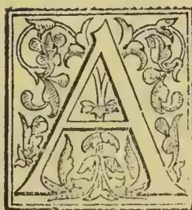

GREAT quantity of fibre, suitable for the production of matting, carpeting, bagging, sacking, ropes, cords, nets, braids, and cloths for a variety of purposes, is destroyed annually, either from lack of knowledge of the manipu-

lation on the part of the manufacturer, or because the methods adopted in fibre growing countries are too slow and costly to be carried out on an extensive scale.

It is therefore evident that, if some machinery could be applied to the various processes necessary to convert the plant into the fabric, no small benefit would be reaped by fibre producers as well as by the machine maker.

Mr. Ernest Lehmann, an engineer of Chatham Street, Manchester, has turned his attention to this class of mechanism, and has succeeded in making machines which, he claims, combine all the most modern improvements for treating and working these fibres on an extensive scale.

The actual fibre-extracting machines may be classed under two heads, viz., for the extraction of leaf or stem fibre, and for coir fibre. The leaf or stem fibres include aloe leaves,

pita, heneq en, sisal, abaca, Manila hemp, istle, Mexican fibre, cabuya, jute, banana, or pineapple, rhea, san-sieviera, piassava, bombax ceiba, majagua, or poa tree, carlindovia palmata and maoutia puva. For coir fibre or fibre obtained from the husks of the coconut, a machine of special construction is employed, differing entirely from the machine used for leaves or stems.

The order and process of manufacture are as follows:—The material should be regularly sorted

whether in leaves or stalks and, when operated upon, must be as uniform as possible. The stalks of rhea or China grass should be cut into equal lengths, and with pineapple, henequen, agave, sisal, abaca, aloes, &c., the leaves should be distinctly sorted, and each description separately treated. When there is a material difference between the quality of the fibre of the inner and outer leaves, each quality should be kept separate, and, before the actual extracting process takes place, the leaves or stems should be passed through the crushing or softening machine, which renders them pliable and takes out the sap. This machine is used to enhance the productive capacity of the extractor by at least 20 per cent. One crusher will serve 10 extractors.

After extracting, the fibre must be dried thoroughly, and then be subjected to a brushing action, either by being beaten against a post by hand or by

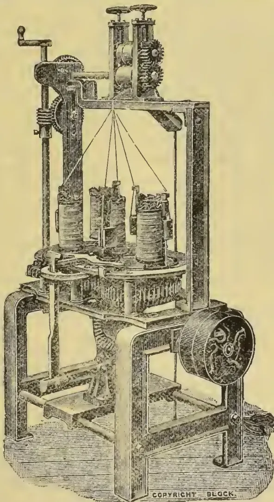

Lehmann's Plaiting Machine.

833------------------------------------------------

808THE TROPICAL AGRICULTURIST.[JUNE 1, 1896.

being brushed in a brushing machine. It is strongly recommended that planters should adopt the brushing machine, as carefully brushed fibre realizes much higher prices, an increase of from £2 to £4 per ton being obtainable. One brusher will suffice for 10 extractors, and an engine of 8-horse power will drive the whole. After brushing, the fibre must be made into small bundles of about 3 or 4 ins. in diameter, secured by a strand of the fibre, and then pressed into bales of 2 or 3 cwt. each.

The average market price varies from £22 to £28 per ton, and 1,000 leaves will usually produce from 50 to 60 lbs. of cleaned fibre.

The husks, having been soaked, are rolled or crushed to strengthen them and render them ready for the subsequent extraction of the coir fibre. That part of the fibre which is not drawn into the extracting machine is called "brush fibre." It is afterwards combed and prepared for brooms and brushes. When the husks are green and immature, and it is not required to keep the brush fibre separate, a special extracting machine is employed, which turns the entire husks into fibre. This machine is also employed for producing fibre from the bark of the fibre-bearing trees, the bark or husks being carried through the feed rollers and reduced to fibre by the action of the cylinder. Usually, 1,000 coconuts are estimated to give off from 90 to 120 lbs. of spinning fibre and from 15 to 25 lbs. of brush fibre.

After extracting, the fibre is passed through a willowing machine, which frees it from shorts, hards, dust, and other extraneous matter, one willow and one husk crusher serving 10 extracting machines.

The bailing of the fibre is performed by either hydraulic or screw presses, according to requirements.

All these operations being completed, the various fibres are ready to be spun into yarn and made into goods for the market.

Should the fibre have been made into bales, it requires opening out, an operation that is performed by a fibre-opening machine. The fibres are hackled or straightened with hand hackles, worked by women or girls. The next process is the spinning. This is done mechanically by a machine specially constructed for planters and small manufacturers. The prepared fibre is fed into the machine, and is made into yarn and automatically wound on to a bobbin, and, as soon as it is full, the bobbin is taken out and replaced by an empty one, the operator regulating the thickness of the yarn and the speed of the machine. The machine is stated to occupy only four square feet, and six machines are driven by 1-horse power.

Our illustration shows a plaiting machine for making plait for mats, but Mr. Lehmann also supplies improved power looms, besides, other fibre-manipulating plant, for weaving coconut matting, Manila carpetings, and such like heavy goods from coir, Manila, henequen, and similar fibres. The power loom is constructed in four distinct models of framing, to suit the various descriptions of goods it is intended to weave. Coconut matting is made on the heaviest models, and ordinary sacking or bagging on the lightest.

The loom is constructed in various widths, ranging from 30 to 80 ins. reed space, this depending upon the width of goods to be woven. The framing of the loom, as regards the strength of the working parts, is the same, whether for coir or Manila goods, the only difference being in the taking-up motions for the woven fabric. For coir goods, the warp yarns are drawn from a specially constructed creel placed at the back of the loom, through cast iron fluted rollers, and the woven material is drawn out of the looms by means of two similarly fluted cast iron rollers. For Manila goods, the warps enter the loom in the same manner, but the woven fabric is automatically wound on a beam furnished with spiked teeth, which maintain a firm grip of the cloth and effect an even folding. The sleys are made with shuttle boxes large enough to hold shuttles containing cops 15 ins. long by 2½ ins. in diameter or Manila yarn. These cops are formed by a

specially constructed winding machine, which gives off the yarn from the inside of the cop, so that the whole may be woven with a minimum of waste.

Each loom is supplied complete with full set of reeds, harness, shuttles, pickers, and strapping up. For making figured or fancy goods, the tops of the the looms are furnished with a "dobby" or Jacquard apparatus, which has a number of shafts corresponding to the pattern to be woven. All the motions are described as self-acting, the framework and the working parts being strong and heavy, and the sley so arranged that it can be made to beat up twice or thrice to each pick, according to the description of goods in the loom. When very heavy goods are being woven, the loom should be stopped after each pick, that is, after the sley has been knocked up to the required number of beats. This is done by the weaver placing his foot on a lever, moving the driving strap to the loose pulley, and thus stopping the loom. The weaver then draws up the weft tightly with his hand and starts again. This operation ensures good and perfect selvages. When the lighter goods are being woven, this stopping is not necessary, as the yarns, being lighter, are more manageable. In the general arrangement of the looms, the parts are so well constructed that they are claimed to combine efficiency with a minimum of wear and tear.

In sacking and matting making, various other machines are employed, such as shearing machines, for cutting the pile of the mats, calendering machines, plaiting machines, such as that illustrated, and combing and measuring machines.

Generally speaking, coir yarn is exported in the spun state, the spinning being done by hand. With Mr. Lehmann's machines, however, the planter may effect a considerable saving in labour by doing his spinning mechanically.

The machines can be run by steam, water, or cattle power, a small, compact plant for producing about 250 lb. of coir yarn per 12 hours consisting of three machines arranged for spinning a d one for doubling, which are supplied with cattle gear, intermediate motion, shafing, hangers, pulleys, all strapping, a set of hand hackles for preparing the fibre, and necessary bobbins, all complete. The operation of spinning is easily learnt, and is so simple that a native, with no previous knowledge of spinning, can learn to spin on these machines and become proficient after 14 days' experience. In spinning, the main point to be kept in view is that the fibres must be prepared by hackling by means of hand hackles, and the better they are prepared the better will be the quality of the yarn, both as regards strength and appearance, and the larger will be the production. When the fibres are more than 2 ft. in length, they should be opened out in the fibre-opening machine, which is made in two sizes—No. A for producing heavy yarns for ropes and No. B for spinning finer yarns for twines, cords, lines, matting, sacking, &c. Five feet by three is all the space occupied by these machines.

Each machine is perfectly independent in its working, thus obviating a great objection against spinning machinery working in sets, where facilities for repairs are few and far between and very expensive. Generally, female spinners are employed; their labour is cheaper, and, being lighter handed, they can produce better yarn than men. They soon learn to regulate the sizes of the yarn, so as to vary them according to requirements. When spun and doubled, coir yarn is made into hanks, by means of a small machine, called a hanking machine, which makes the contents of 10 bobbins into hanks, or 10 hanks at a time, ready for being baled for export.

We may add that these machines are constructed with the object of giving the planter or manufacturer the benefit of a larger production with a given quantity of machines, the designer having had a practical experience in this industry extending over a number of years. They are also specially constructed with a view to their being manipulated by natives, without the necessity for skilled labour.

834------------------------------------------------

JUNE 1, 1896.]THE TROPICAL AGRICULTURIST.809BIBLIOGRAPHY OF TEA.

(Continued from page 737.)

*M., D.* See *Spon, J.* Novi tractatus de potu café, chinensium thé, et de chocolata, &c. 1699. 120. See *Manget, J. J.*

*Mabson, R. R.* Forty-five years history of the Tea Trade in Great Britain, compiled from Siller & Co.'s statistics, &c. London. 1881. s. sh. obl. fol.

*Mac Clelland, John.* Report on the Physical Condition of the Assam Tea Plant, &c. [Vol. IV. of the Trans. of Agri. and Hort. Socy. of India.] [Calcutta. 1837.] 80.

*Mac Clelland, John.* Papers relating to the measures adopted for introducing the cultivation of the Tea Plant in India. Calcutta. 1839. fol.

*Mac Gowan, Alex. Thorburn.* Tea Planting in the Outer Himalayah. London. 1861. 80.

*Mackintosh, L.* China trade tables of cost: silk and tea sections with Telegraph Code.

*Mac Pherson, Jas.* The Neilgherry Tea Planter. Madras. 1870. 80.

*Malepeyre, François.* Nouveau manuel complexe der Limonadier...Cafetier, et de l'amateur de Thés et de Cafés...Nouvelle edition. Paris. 1882. 180.

*Maltscheeski, P.* Elproschennyi sposob...veschestv'v t chaie [Simple method of quantitative analysis of tannic acid in tea]. St. Petersburg. 1839. 80.

*Manget, Jean Jacq.* See *M., D.* Novi tractatus, &c. 1699. 120.

*Manget, Jean Jacq.* See *Spon, J.* Bevanda Asiatica, hoc est, Physiologia potus Café. &c. 1705. 40.

*Man-van-si.* Treatise on Tea. [In Chinese.]

*Mappus, Mareus.* Dissertations medicae tres de Thee, Café, Chocolata, &c. 3 pt. Argentorati. 1695. 40. [I. De potu Thee. resp. *J. Heckeler.* 1691.]

*Maps in India Office.* The Tea Localities (Plantations) in the Punjab & N.W. Provinces compiled from information furnished by Dr. Jameson, Supt. Bot. & Tea Gardens. 1862.

*Maps in India Office.* Map of Upper Assam...showing the Tea Tracts discovered by C. A. Bruce, &c. By J. B. Tassin. 1839.

*Maps in India Office.* Map of the Tea Districts of Assam. Compiled in the office of Col. Henry Hopkinson. 1863.

*Maps in India Office.* Map showing all the Tea Localities worked by the Assam Company in...Upper Assam. Calcutta. 1843.

*Maps in India Office.* Gulf of Bengal. Palmyra Point to Chittagong. By Capt. Richd. Lloyd, with the following insertions.. 3. Sketch Map of the Tea and Coal Localities in Assam. 1840.

*Marquis, F.* Du thé: ou nouveau traité sur sa culture, sa récolte, sa préparation et ses usages, &c. Paris. 1834. 80. [Also 1820. 120.]

*Marquis, F.* Taschenbuch für Theetrinker, &c... von F. Marquis...zugerichtet von Tr. W. Westphal. Weimar. 1836.

*Martin, Robt. Montgomery.* The Past and Present of the Tea Trade of England and of the Continents of Europe and America, &c. London. 1832. 80.

*Marvand, Angel.* Les Aliments d'arguc, alcool et boissons aromatiques (Café, thé, maté, cacao, coca) &c. Paris. 1874. 80.

*Mason, Jas. Wood.* Report on the Tea-mite and the Tea-bug of Assam. London. 1884. 80.

*Mason, Simon.* The good and bad effects of tea considered, &c. London. 1745. 80. [? 1756.]

*Mason, Victor Pierre.* De l'usage et de l'abus du théet du café. See *Academies, &c. Paris. Ecole de Médecine, &c.* Collection des thèses, &c. au 1848. tom. IX. 1839, &c. 40.

*Masters, J. W.* A Run through the Assam Tea Gardens. Golaghat. 1863. fol.

*Maudint, (? Michel).* Du bon usage du Thee, du Caffec, et du Chocolat pour la preservation des maladies. Paris. 1687. 80. See *Blegny, N. De!*

*Medhurst, Walt. Hy. the Elder.* A Glance at the Interior of China during a journey through the Silk and Green Tea Countries. London. 1850. 80.

*Medhurst, Walt. Hy. the Elder.* Report on Tea. Parliamentary Papers. 1871.

*Meisner, Leon Ferd.* De Caffe, Chocolatae, herbaceae nicotianae natura, usu et abusu anacrisis med.-hist.-diætetica. Norinbergae. 1721. 80. [120.]

*Melchior, J.* De thee. Francofurti ad Oleram. 1784. 40. [So catalogued in the Library of the Surg. Gen'l's Office, U. S. Army: but see *Genge, J. Melchior!*]

*Ménier, Emile Justin.* Café, succédanés du Café, Cacao et Chocolat, Coca et thé-maté. Expos. univ. de 1867 à Paris. Paris. 1868. 80.

*Mérat, Dr.* Mémoire sur la possibilité de cultiver le thé en pleine terre...en France. Paris. 1844. 80.

*Mérat, Dr.* Notice sur les essais de culture qu'on pourrait faire du thé, en France. [Ext. des Annales de l'Agricult. Franç. Fév. 1837.] Paris. 1837. 80.

*Merchant.* The Dictionary of Merchandise & Nomenclature in all languages: &c. [Tea. 336-42.] London. 1803. 80.

*Mikszewicz, Julius.* Der Thee hauptsächlich als Handels- und Consumtions-Artikel, &c. Dorpat. 1852. 80.

*Millesly, S.* Sur l'usage du thé, d'après les auteurs les plus anciens et les plus renommés. Paris. 1827. 80. [2nd. edn. 1830.] See *Ely, Elisha Mills!*

*Molinarius, Simon de.* Ambrosia Asiatica; seu de vertute et usu herbæ The' sive Cîa, nec non de modo adhibendæ et præparandæ ejus potionis. Genuæ. 1672. 120.

*Money, Edward.* The Cultivation and Manufacture of Tea. 3rd edn. London. 1878. 80. [Calcutta. 1874. 80. also 1881 and 1883. and in Vol. III. Agric. and Hort. Socy. India.]

*Money, Edward.* The Tea Controversy: a momentous Indian Question. Indian vs. Chinese Teas. 2nd edn. London. 1884. 80.

*Morrice, Arthur.* Report on Tea Cultivation in the districts of India with reference to suitability of Ceylon for Tea, &c. Colombo. 1867.

*Morisset, Philib:* [et *J. de Mauvillain*]. Ergo Thea Chinensium menti confert. Paris. 1648. 40.

*Morisset, Philib:* [et *J. de Mauvillain*]. Apologie du thé. 1648.

*Mottaux, Pierre Antoine,* A Poem upon Tea. London. 1712. 80. [Another edition. A Poem in Praise of Tea. See *Poem.* 1712? fol.]

*Mueller, Ferd. von, Baron.* Tea. A Lecture delivered at Ballarat. Ballarat. 1875. 120.

*Mueller, J.* De usu et abusu potus Thee in genere, præcipue vero in Hydrope. Praes. W. U. Waldschmidt. Kiliae. 1692. 40.

*Mulder, Gerrit Jan.* Scheikundig onderzek van Chinesische en Java-Thee. Rotterdam. 1836. 80.

*Mundt, G.* Ceylon en Java. Aanteekeningen van een Theeplanter. Batavia. 1886. 80.

*Mundy, Henry.* Opera omnia, &c: cum Appendice de Thea, Cofea, Tobacco, &c. Lugd. Bat. [Leyden]. Francof: et Lipsiae. 1685. 80.

*N., R. F.* Natuurkundige Verhandelinge van de Thee, Koffec, Tabak en Snuifpoeders. t'Amsterdam. 1701. 120. [80.]

*Narrative.* A Narrative of the Conduct of the Tea Dealers during the late Sale of Teas at the India House by the Committee of Tea Dealers. London. 1785. 80.

*Natural History.* The Natural History of Coffee, Thee, Chocolata, Tobacco, ... [by *J. Chamberlayne*]. London. 1682. 40. [Another edn. See *Harleian Misc.* Vol. I. 1808, &c. 40.]

*Natural History.* Naturgemässige Beschreibung des Coffee, Thee, Chocolata, Tabacks, &c. Aus der Englisch...durch Joh. Langen. Hamburg. 1634. 120. See *Disder.*

*Natural History.* [Danice.] Den nyttige Sundhedsbrug af Coffee, &c. Hafniae [Copenhagen]. 1722. 80.

*Natural History.* Natural History of the Coffee Berry. [On y a joint des renseignements sur le thé.] 1839. 180.

*Neuhof, Wilhelm.* Der Kaffee und Thee, wie deren sinnmliche Surrogate oder Ersatz und Ergänzungs-mittel, &c. Weimar. 1861. 120.

*Neumann, Caspar.* Lectiones publicæ von vier subjectis diæteticis, nemlich von...viererley Geträncken, vom Thee, Caffee, Bier, und Wein. Leipzig. 1735. 40. [Berlin. 1735. Lipsiae. 1736.]

*Newnham, William.* Some observations on the medicinal and diætetic properties of Green Tea, &c. London. 1827. 80.

835------------------------------------------------

810THE TROPICAL AGRICULTURIST.[JUNE 1, 1896.

*Nicholson, John.* Tea Sale List. Sept. 1826.

*Nogueira, Ant. Felisberts.* Memoria sobre a cultura e preparação do cha. Rio de Janeiro. 1815. 120.

*Nörager, Christiernus.* Praes. Observations du potu Thee quas...subjicit C. N....Resp. P. Schow. &c. Hafnide. 1740. 40.

*Nuitter, Ch. pseud* [i.e., C. L. E. Truinet]. Une Tasse de thé. Comédie, en un acte, en prose. Par M. M. Nuitter et Derley. Paris. 1860. 120. [See also *Wittmann, C. F.*]

*Nye, Gideon.* Tea and the Tea Trade. Parts 1st, 2nd, and 3rd. 3rd edition. 3 pts. New York. 1850. 80.

*Observations.* Observations on the Influence of the East India Company's monopoly on the price and supply of tea. London. 1831. 80.

*Oeser, Christian.* Thee-stunden in Lindenheim. Leipzig. 1845.

*Ovington, John, M. A.* An Essay upon the Nature and Qualities of Tea, wherein are shown. I. The Soil and Climate where Tea grows. II. The various kinds of Tea, &c. London. 1699. 80. [1699? 1705. 120.]

*Owen, T. C.* Tea Planting in Ceylon, illustrated... with an account of the growth and manufacture of Tea. Colombo. 1891. obl. 160.

*Owen, T. C.* Tea, Coffee, Cinchona. Cardamoms and Aloe Cultivation in Ceylon. Mr. Owen's Paper on Tea [From the Maskeliya Planters' Association] Colombo. 188—.

*Owen, T. C.* The Tea Planters' Manual. With coloured lithographed plans, &c. A. M. & J. Ferguson. Colombo. 1886. 80.

*P., E. Mrs.* Tea Table Chat [a conversation in verse, upon the subject of Methodism, &c.]. By *Mrs. E. P[arks]*. London. [1800?] s. sh. fol.

*P., G. J.* Coffee and Tea. A Lecture given at the Parkes Museum on Dec. 6th, 1883. 2nd edition. London. 1883. 80.

*Papers.* Papers regarding the Tea Industry in Bengal, &c. [History of Assam Cultivation.] Calcutta. 1837. 80.

*Papers.* Papers on Tea Cultivation in India. [Govt. Blue Book.] Maps and Plates. 1839.

*Papers.* Papers on the Tea Factories and Plantations in Kumaon and Garhwal. Agra. 1851.

*Parks, E. Mrs.* See *P., Mrs. E.*

*Parrington, Mrs.* Mrs. Parrington's Tea Party and Trip to Paris. [By B. P. Shillaber.] London. 1856. 80.

*Paulli Simon.* S. Paulli...Commentarius de abusu tabaci...et herbæ thee, &c. Argentorati. 1665. 40. [1661. Hafniæ. 1665. Francof. ad Moen. 1708.] [Editio secunda. Argentorati. 1681. 40.]

*Paulli, Simon.* A Treatise on Tobacco, Tea, Coffee, and Chocolate...translated by *Dr. James, R.* London. 1746. 80.

*Paulli, Simon.* De l'abus du tabac, et de l'herbe du thé. 1635.

*Peal, S. E.* The Tea Bug of Assam.

*Pechlin, Joh. Nic.* J. N. P. ara elogiis Theæ inscripta. See *Petit, P.* of Paris. P. Petiti...Theæ &c. 1685. 40.

*Pechlin, Joh. Nic.* Theophilus Bibaculus. sive de potu theæ dialogus. Francofurt. 1681. 40. [Kilonii. 1681. 40. Paris. 1685. 120.]

*Pechlin, Joh. Nic.* A Treatise on the...qualities of the Tea-herb...collected from MSS...on that subject...particularly from a Latin MSS. entitled De Potu Theæ...by J. N. P. London. 1750. 80. See *Treatise*.

*Peligot, Eug. Yelch.* Recherches sur la composition chimique du thé. Compte rendu...de l'Académie des Sciences. xvii. 107. 1843.

*Pelletier, Eug. [d' Aug.].* Le Thé et le Chocolat, &c. Paris. 1861. 120.

*Pereira de Vasconcellos, Fernando Ant.* Memoria sobre a plantação, cultura, e fabrica de cha. S. Paulo. 1845. 120.

*Periodical Publications, Calcutta.* The Indian Planters' Gazette and Sporting News. &c. Calcutta. 1835. &c. fol.

*Periodical Publications, London.* The Tea Table. No. 136. [London.] 1724. fol.

*Periodical Publications, Newport, Rhode Island.* The Tea Tray. Newport, R. I. 1866. fol.

*Perron, .* Du Chocolat et du Thé, par Perron, fabricant.

*Petit, Pierre.* Thia Sinensis: carmen. See Poemata. Poemata didascalica, &c. Tom. I. 1749. 120.

*Petit, Pierre.* P. Petiti Ep[iscop] de Vi et Præstantia Thide Sinensis, quæ vulgo The dicitur. Accedunt ejusdem argumenti anaeroantica (sic) duo P. Francii. Gr. 1680. 80.

*Petit, Pierre.* P. Petiti...Theæ, sive de Sinensi herbæ Thee carmen...cui adjectæ F. N. Pechlini de eadem herbæ epigrapha, &c. Lipside. 1685. 40.

*Peyma, Joh. Ign. Morp Beintema.* Von der vortreflichkeit des Thees und Kaffees. Frankfurt und Lips. 1743. 80. [Jenae. 1743. 80.]

*Pfeiffer, Christoph Lud.* Scherzhaftes Lobgedicht auf den Thee. Jenae. 1753. 40.

*Pfetscher, J. F.* Dissertatio inauguralis medica de abusu potus theati. [In Coll. Diss. Med. Min. Cognit: Enopontis. p. 1.]

*Physician.* An Essay on the use and abuse of Tea By a Physician: the second edition. London. 1725. 80. Note. First edition under *Essay*.

*Physiologie.* Physiologie du thé. [Par un auteur anonyme.] London. 1827.

*Picot, .* Guide du Consommateur de Chocolate et de Thé. Paris. 1815.

*Pidding, John Rhodes.* Captain P's Chinese Olis and Tea Talk. London. 1844-45. 40.

*Piepenbring, Georg Heinrich.* Deutscher Kaffee und Deutscher Thee, oder Mittel die ansländ...zu ersetzen, &c. Hannover. 1798. 80.

*Pigou, Fred.* Of Tea, collected in 1753, by F. P. ...Account of the European Customs on Bohea Tea, &c. See Dalrymple, A. Oriental Repertory. Vol. 2. 1793, &c. 40. [Asiat. Ann. Register. 1802. i.]

*Pigou, Fred.* Rapport sur le thé, sa culture, &c. fait à la Compagnie des Indes: traduit de l'Anglais par Pelouze. [Ext. par Chereau, Jl. de Chim. Méd. x. 153.]

*Planter.* Notes on Tea in Darjeeling. By a Planter. Darjeeling. 1888. 160.

*Planter.* The Planter's Note Book: with every-day information for the tea-planter, &c. A. M. & J. Ferguson. Colombo. 1887. obl. 160.

*Platsch, Adolph Martin.* Der Thee (Theæ) in Chemischer und diætischer Beziehung. Anweisung das Theegetränk...zu bereiten. Wien. 1811. 80.

*Plourier, Ed.* The' de Polichinelle: operette en une acte. Paroles de M. Ed. P., musique de M. Poise. 18—.

*Podagra, Septimus, M.D. pseud.* Der profitable Apotheker-Pod in dem...Cräutlein Thee...von Sept. Podagra, M. D. 1721. 80.

*Poem.* A Poem in praise of Tea. [By P. A. Motteur.] [London. 1712?] fol.

*Poll, Pietro.* Alimenti nervosi e stimolanti. (Caffo' e surrogati, te' cioccalatta, zafferano, pepi ed altri stimolanti, con 94 figure intercalata.)

*Poore, George Fixian.* Coffee and Tea. A Lecture, &c. London. 1883. 80. See *Coffee: P., G. I.*

*Propper.* Der Kaffee- und The-tisch.

*Quelmalz, Sam. Theod.* Programma de infuso foliorum Theæ. Lipsiae. 1747. 40.

*Ramsay, Allan, the Elder.* The Tea-Table Miscellany: or a Collection of Scots songs. 14th edn. Dublin. 1769. 120.

*Reade, A. Arthur.* Tea and Tea Drinking. London. 1884. 80.

*Rebusat, Adolphe.* Du Thé: de son action physiologique et thérapeutique. Montpellier. 1875. 40.

*Reichel, Abr. Gottl.* Dissertatio...de veris herbæ Thee proprietatibus et viribus medicis. Praes. J. A. Stabbio. Erfordiae. 1751. 40.

*Reid, Janet.* On a comfortable Cup of Tea. [In verse.] 32nd. edn. [Stirling. 1855?] s. sh. 80.

*Report.* Report of the Commission appointed to enquire into the state and prospects of Tea Cultivation in Assam, Cachar and Sylhet. 1868.

*Report.* Report on the Cultivation of Tea in the North-West Provinces of India and the Punjab. 1857.

*Report.* Report on the Production of Tea in Japan. With drawings by native artists. Blue Book. 1873.

*Report.* Report on the Sanitary Committee to the Commission of Sewers of the City of London on spurious and unsound Tea and their proceeding thereon. London. 1871. 80.

836------------------------------------------------

JUNE 1, 1896.]THE TROPICAL AGRICULTURIST.811

*Reports.* Reports on the Tea and Tobacco Industries of India. Blue Book. 1874.

*Rhymes.* Rhymes and Pictures about Bread, Tea, Sugar, Coals, Cotton, Gold. London. [1871.] 40. See *History*.

*Riant, Aimé.* Le Café, le Thé, le Chocolat: ouvrage contenant 30 figures. Paris, Coulommiers. 1875. 165. [1875. 320.]

*Richter, Joh. Georg.* Von grünen Thee. Stargard. 17—. *Robertson.* Tea Cultivation in the Nilghiri Hills. [In Report on the Agricultural Condition of the Nilghiri District.] 1875.

*Robinson, Wm., of Gowhatti.* A descriptive account of Assam: with a...concise history of the Tea Plant of Assam. Calcutta. 1841. 80.

*Rottenhoefer, J.* Der elegante wohlservirte Kaffee- und Thee-tisch. Mit Abbildung der Kaffee- und Theepflanze, &c. München. [1864.] 80.

*Royle, John Forbes.* Report on the progress of the culture of the China Tea in the Himalayas from 1835 to 1847. London. 1849. 85.

*Rucker, J. A.* [and *Benecraft.*] First List of Ceylon Tea "Gardens" or Estates. London. 1885.

*Russe, Petrus.* Schat der langlevenherd, ofte een naauwkeurige beschryvinge van alles 't gene den mensche in spys en drank komt te gebruggen, &c. Alsmede hit mis-en kwaad gebruijk van Thee en Coffy. Bij A. van Poule, Middleburg. 80.

*Russell, Geo.* Sunshine and a Cup of Tea. [A description of Ceylon.] Edinburgh. 1889. 85.

*Rutherford, H. K.* Tea, Cardamoms and Areca Cultivation and Production in Ceylon: discussed in letters from Messrs. Rutherford, Hughes, Armstrong, &c. A. M. & J. Ferguson. Colombo. 1885. 120.

*Rutherford, H. K.* Ceylon Tea Planters' Note Book of Useful Memoranda. 3rd edn. Colombo. 1892. obl. 160.

*Rutter, Henry.* Silk and Tea Tables, showing their cost per pound as purchased in China and Japan, and laid down in England, &c. 2 pts. London, Edinburgh. 1868. 80.

*S., G.* De Theekooper. Geschiedkundig tooneelspel door G. S. s Hage. 1872. 80.

*Sacramento, Leandro.* Memória economica sobre a plantação, cultura e preparação de chá. Rio de Janeiro. 1825. 40.

*Saint-Arroman, A.* De l'action du Café, du thé et du chocolat sur la santé, &c. Paris. 1845. 80. [Sixth edn. Paris. 1849. 80.]

*Saint-Arroman, A.* Coffee, tea and chocolate: their influence upon the health, the intellect and the moral nature of man. Philadelphia. 1846. 120.

*Sassenus, J. B.* De l'excellence du Thé, et de ses vertus étonnantes dans la médecine. Anvers. 1826. 80.

*Sassenus, J. B.* Over de voortreffelijkheid van de thee en hare bewonderingswaardige verdienster in de geneskunde. Rotterdam. 1828.

*Sattler, Christ. Gul.* Exercitatio...de infusi Veronicæ efficacía præferenda herba Thee. Præs. F. Hoffmanno, Halæ Magdeburg. [1694.] 40.

*Saunders, Wm.* Tea Culture, a probable American Industry. See *Walsh, J. M.* A Cup of Tea, &c. 1884. 120.

*Schallenberger, V.* Green Tea. A Love Story. 3rd edn. T. Fisher Unwin. Pseudonym Library. London. 1893. 80.

*Schatzkammer.* Schatzkammer rarer und neuer Curiositäten...Nebst ein Tractat von Coffee, Thee, Chocolate und Taback. Hamburg. 1686. 80.

*Schipck, J.* De thea sinensi et japonica ejusque usu dietetico. Prague. 1836. 80.

*Schmolck, A. W. von.* Thee- und Kaffee-Vertreibungs für Herren und Damen für 1813-14. Berlin 18—. 80.

*Schorlemmer, P.* Occurrence of Caffeine in the Leaves of Tea and Coffee grown at Kew Gardens. Manchester. 1883. 80.

*Schorpach, Mich.* Usage de Thé ordonné par le médecin de la montagne, M. S. de Langnau en Suisse, précédé de la description...de cet arbrisseau, &c. Langnau [Longnovi]. 1775. 80.

*Schotel, G. D. J.* Letterkundige bijdragen tot de Geschiedenis van den Tabak, de Koffij en de Thee's Gravenhage. 1818. 80.

*Schow, Petrus. Resp.* See *Nörager, C.* Observations de potu thee, &c. [1740.] 40.

*Schreiben.* Schreiben betreffend der neuerfundenen Damenthee, Coffee und Chocolate oder Mandalate (ex Amygdalis). Erfurth. 1749. 80.

*Schreiber, Christ. Ubric. Resp.* An potus Thee excicandi et emaciandi virtute polleat? Ob der Thee zehre? Præs. C. F. Luther. Lat. Kilonii. [1702.] 40.

*Schroter, Joh. Christ.* Kurtze Gedanken, welche über das gewöhnliche Theetrinken...befördert worden durch J. C. S. Franckf. an der Oder. 1696. 80. [1693. 40.]

*Schwarzkopf, S. A.* Die narkotische Genuszmittel. I. Der Thee, &c. II. Der Kaffee. Halle. 1831. 80.

*Seemann, Berthold.* Synopsis of the Genera *Camellia* and *Thea*, with two plates. [Linn. Socy.] London. 1859. 40.

*Serer, Jos.* Lettera sopra le bevande del Caffè Europeo e del Té con le foglie della rosa canina. Verona. 1730. 120.

*Sheldrick, R. N.* Tea Meeting Fare. 18—.

*Shipp, H. A.* Prize Essay on the Cultivation and Manufacture of Tea in Cachar. [From the Jl. Agr. and Hort. Socy. India. XIV. Suppl.] Calcutta. 1874. 80.

*Short, Thos., M. D.* Discourses on Tea, Sugar, Milk, Made Wines, Spirits, Punch, Tobacco, &c. With Plain and Useful Rules for Goy ty People. London. 1750. 85.

*Short, Thos., M. D.* A Dissertation upon Tea, explaining its Nature and Properties. The Natural History of Tea, &c. London. 1730. 40. [1731? 1749?] [Second edn. 1753. 40.]

*Sigmond, Geo. Gahr.* Tea, its effects medicinal and moral. London. 1839. 80.

*Silva, Juan Bautista.* An Scibus The' [Par Mugnet.] Paris. 1712. 40.

*Sinclair, Wm. Japp.* Beverages: water, tea, coffee, cocoa, &c. 1881. See Manchester and Salford Sanitary Association. Health Lectures for the People &c. Vol. IV. 1878, &c. 80.

*Slerost, Joh. Adr.* Medicæ Facultatis Decani J. H. Slevogtii...ad...dissertationem de polypodio invitatio, cum prolusione de thea Romana...aliisque ejus succedaneis. Jenæ. 1721. 40.

*Smith, —* Tsiology. London. 1826. 120. See *Tea Dealer*.

*Smith, Edw., M.D.* On the Uses of Tea in the healthy system. [Ex Jl. Socy. Arts.] London. 1861. 80.

*Smith, Edw., M.D.* Recent Experimental inquiries into the nature and action of Alcohols as food, and on Tea. [Soc. of Arts.] London. 1861. 80.

*Smith, Hugh, M. D.* An Essay on the Nerves... To which is added an Essay on foreign Teas, &c. London. [1780?] 80. [1794.]

*Smith, Junius.* Essays on the Cultivation of the Tea Plant in the United States of America. New York. 1818. 80.

*Snap-School.* Het S. S., of de Thee-Tafel der gesikkelde juffrouwen, &c. [Amsterdam? 1780?] 80. [A Supplement *Thee-Bezock.*]

*Song.* A New Song on Tea Drinking. [begin: Draw near you jolly blades so gay, &c.] [London? 1750?] s. sh. fol.

*Spon, Jacob.* Tractatus novi de potu Caphe', de Chinensium the', et de Chocolata. [Transld. fr. the Fr. of P. Sylvestre Dufour and the Sp. of A. Colmenero.] Parisiis. 1685. 120.

*Spon, Jacob.* [Another edition.] Novi tractatus, &c. ...a D. M[angel] notis illustrata. Genevæ. 1699. 120.

*Spon, Jacob.* Drey neue...Tractätgen von dem Trancke Cafe, Sinesischen The und der Chocolata...übersetzt [fr. the Latin]. Budissin. 1686. 80. [Another edn. Budissin. 1688. 80.]

*Spy.* New London Spy: or a Modern Twenty-Four Hours' Ramble through the Metropolis...including Description of the Gaming Houses, Bagnios, Night Houses, Nunneries, Public Houses, Coffee Houses, Tea Houses, &c. London. 17—. 80.

*Stables, Wm. Gordon.* Tea, the drink of pleasure and of health. London. [1883.] 120.

*Stade, H.* Die Geographische Verbreitung des Theestrauches. Halle. 1890. 80.

*Stahl, Leo Joh. Præs.* See *Reichel, A. G.* Dissertatio...de veris herbae Thee proprietatibus, &c. 1734. 40. [Erford. 1730.]

837------------------------------------------------

812THE TROPICAL AGRICULTURIST.[JUNE 1, 1896.

*Staite, W. Elbowds.* A few words on Tea and Coffee as alimentary drinks, comprising their history and analysis, &c. London. 1845. 160.

*Stegmannus, Ambros.* De decocto herbae Theae in convulsionibus optimo remedio. [In Misc. Acad. Nat. Curios. Dec. III. an 1. obs. XVI.]

*Stegmannus, Ambros.* De decocto Theae morbo Ecstasi simili observ. [Misc. Acad. Nat. Curios. Dec. III. an. 1.]

*Stegmannus, Ambros.* De Theac usu salutari in convulsionibus puerorum, post morbillos et variolas oriundis. [Misc. Acad. Nat. Cur. Dec. III. an 1. obs. 18.]

*Stentzel, Chr. Gottf. Pres.* See *Feyerabend, M. T.* Dissertatio de salvia in infuso adhibenda hujus que prae Thea Chinensi praestantia. 1723. 40.

*Stevens, Robt.* Marks on Tea Tabs. London. 1766. fol.

*Stevenson, J., M.D.* Advice medicinal and economical relative to the Purchase and Consumption of Tea, Coffee and Chocolate, Wines and Malt Liquors, &c. London. 1830. 120.

*Steventon, James.* Treatise on Tobacco, Tea, Coffee and Chocolate. London. 1746. 80.

*Stirton, J.* On vegetable parasites on the tea-plant, more especially that of Assam. [Reprinted from the Proc. Phil. Socy. Glasgow. 1881.] [Glasgow. 1881.] 80.

*Stoker, J.* On the Management of the Tea Plant.

*Strachey, J.* On the Tea Factories and Plantations in Kumaon and Garhwal. Agra: 1851.

*Straford, W.* List of Tea Estates in Ceylon, with their districts and acreage under tea. London. 1886. 80.

*Street, Francis F.* F. F. Street's Ceylon Tea Tables. Showing the laying down cost in London of tea, &c. Ceylon Observer Press. [Colombo. 1887.] s. sh. fol.

*Suggestions.* Suggestions for the importation of Tea makers, implements and seeds from China into the North-Western Provinces. Agra. 1852. 80.

*Sumner, John.* A popular treatise on Tea: its qualities and effects. Birmingham. 1863. 40.

*Sumner, John.* Cultivation of Tea in Java.

*Sydow [Isidore Grönau, Wilhelmina von].* Die moderne Theetisch....Die Auordnung aller Gattungen von Theegessellschäften, &c. Sondershausen. 125.

*Sylvestre Dufour, Philippe.* See *Chamberlayne, J.* The manner of making coffee, tea and chocolate. [Transl. fr. the French of P. S. D.] 1685. 120.

*Sylvestre Dufour, Philippe.* Traitez du Cafe', du The' et du Chocolat. Lyon. 1685. 120. [Second edn. Lyon. 1683. 120.] [Third edn. La Haye. 1693. 120.]

*Sylvestre Dufour, Philippe.* See *Spon, J.* Tractatus novi de potu Caphe', de Chinensium the' et de Chocolata. [Fr. the French of P. S. D.] 1699. 120.

*Sylvestre Dufour, Philippe.* See *Usage.* De l'usage du Caphe', du The' et du Chocolat. 1671. 120.  
(To be concluded)

## WHITE-ANTS AND MANGO TREES.

If the bark of the trees is attacked by white-ants, it must be first scraped off at all parts where the animals have made tunnels, and painted with kerosin. Let the ground be dug between the trees as deeply as necessary, the soil turned over and watered with phenyl, if procurable; if not, with kerosene and water. In Ceylon, a decoction of the leaves of Mauritius hemp is used for expelling white-ants, but I fear, a correspondent writes, you have got into too bad a state for that to be efficacious. It has the advantage of being, of course, quite harmless to any trees. In using the phenyl, put some in a pail and add water till it is of the colour and consistency of good milk. Every plantation should keep phenyl. It is perfectly safe with foliage; carbolic acid and kerosene are not. It is exceedingly good for mealy bug. Corrosive sublimate and Paris green will both destroy white ants; dissolve in water and pour into the holes. But be careful not to poison the trees by putting these poison too close to the roots. Corrosive sublimate is very popular here, being used dry. The planters have told me that one white-ant eats a grain, dies, and is eaten in turn by another who dies and so on till the nest

is exterminated. I cannot quite credit this, but the poison have a very strong effect on white-ants. Of course care should be taken in dealing with corrosive sublimate in bulk, as it is an exceedingly dangerous poison. After you have well poisoned the white-ants, remember to manure the trees well, so that they can have strength to recover. If it is possible to flood the plantation for a few days, the ants would have to retire, but this is rarely possible here at least. I do not think it would hurt the trees, as I have here splendid old trees growing in water. I should like to know the results of these suggestions should you find time to inform me, as I am collecting together all kinds of notes on destructive insects and methods of destruction.—*Indian Agriculturist*.

## NOTES ON CURING COCOA FOR SMALL SETTLERS.

By W. CRADWICK, Superintendent of Hope Garden.

The first important point to be observed when about to cure Cocoa is that it must be quite ripe, but not over-ripe. The pods must have attained their full colour whatever it may be, but if the beans shake about easily then the pod is over-ripe. The reason is that if the beans are not ripe, the mucilaginous matter covering the beans is not properly developed into the stage when it will readily ferment. If left to get over-ripe, the mucilage commences to liquefy.

The best vessel in which a small cultivator can ferment Cocoa is an ordinary flour barrel. To prepare this for the reception of Cocoa beans, first bore about a dozen holes, each half an inch in diameter, in the bottom of the barrel, then place about ten inches of banana trash in the bottom of the barrel. Line the sides also thickly with trash, and have a sufficient quantity on hand to cover the beans when placed in the barrel. When the barrel is ready, break the whole of the pods and place the beans in the barrel covering with the banana trash. The beans must be left to ferment for two days then remove one-third of the beans and lay them in a heap on the floor and mix them thoroughly. Remove the balance of the beans and mix them also, but do not put the two heaps together. After placing fresh trash in the barrel, put the beans which were at the top back into the bottom of the barrel and those which were at the bottom, place at the top. Cover with trash in the same way as before and leave for two more days, when the beans should be treated in exactly the same way as before. They should then be left for two more days, when they are to be taken out and washed thoroughly. On the day the beans are finally removed from the barrel the work should be commenced very early in the morning, so as to get all the sun possible on the first day, for the beans mildew very quickly. They should be washed immediately they are taken out of the barrel as this helps to keep them plump.

The proper amount of Cocoa to ferment in one barrel is the quantity of beans obtained from 1,000 ordinary sized pods. If many more than this number are put into one barrel, the fermentation is too great and the beans turn black.

If a less quantity, say below 700 pods, are to be fermented, the green trash and more of it must be used, and a weight not exceeding 28 lb. placed on the top which helps the fermentation.

When the Cocoa is being dried, it is not advisable to expose it after the first two days to the extreme heat of the mid-day sun, it is better to take it in about 9 o'clock, and then put it out again between three and four o'clock. Those who use evaporators are warned against an excessively high temperature.

Great care must be taken when removing the pods from the trees that they be cut off with a good sharp knife, not pulled off. If pulled off, the little knob at the base of the stem of the pod is injured,

838------------------------------------------------

JUNE 1, 1896.]THE TROPICAL AGRICULTURIST.813

and the tree will not bear from the same spot the following year. If the pods are cut off carefully, the trees go on bearing from the same pot year after year.—*Jamaica Bulletin*.

### ON CERTAIN EXPERIMENTS MADE IN THE FOREST NURSERY AT BELLEFONTAINE (NEAR NANCY).

BY E. BARTET, INSPECTEUR ADJOINT DES FORETS.

The facts set forth in the following notes are the results of experiments carried out in the Bellefontaine Nursery on the raising of plants for forest planting. The nursery which was established in 1863 in the Forêt de Haye, nearly four miles from Nancy, and whose situation is defective from several points of view, constitutes one of the experimental stations attached to the Nancy Forest School.

Whether the observations which I have collected contain anything new and hitherto unpublished, and whether the reader will find in them anything other than the confirmation of facts already made known, I do not venture to affirm, so considerable are the numbers of works carried out in France and elsewhere on the subjects herein dealt with.

#### ON THE USE OF SAWDUST AND PEAT FOR COVERING SMALL SEEDS.

At Bellefontaine, for covering small seeds, a mixture of mould leaves, well decayed manure and sifted earth, has for a long time been used. The preparation of such a compost is costly, the use of it has also other inconveniences, for when a period of drought follows after prolonged rain, it gets hard and forms a crust liable to interfere with the growth of small plants.

These considerations led me to try whether, for covering the seeds in question, sawdust and peat could not be used, these being two substances often obtainable in abundance and at a low price in the neighbourhood of forest land.

The first experiment to this end was made in April 1887:—six trenches each 30 feet long being sown with Spruce Fir. The following were compared:—

1. 1. Sawdust of Poplar, alone.
2. 2. Peat alone.
3. 3. A mixture of one part Poplar sawdust and one part mould.
4. 4. A mixture of peat and leaf mould, in equal quantities.
5. 5. A mixture of peat and sawdust, also in equal quantities.
6. 6. The usual compost consisting of one-fourth part leaf mould, one fourth decayed manure and one half well sifted mould.

Before using the sawdust, it was carefully saturated with water.

The results were quite as satisfactory in Nos. 1 and 2 as in the other lines and that as much so during the period of germination, as during the rest of the season of vegetation. It was even noticed that under nothing but sawdust, the seedlings of Spruce made their appearance earlier and more completely than anywhere else.

In the spring of 1888, another trial was made of the comparative effects on Spruce seed of sawdust alone and of the compost above mentioned, No. 6. The advantage was again on the side of the sawdust, although this had not been specially watered before using, it having been simply exposed to the rain for six months.

Finally, in the same year, 1888, the best and most conclusive results were furnished by a trial made on Spruce seed of very fine sawdust, not made from species such as Poplar, but from Oak. In spite of its being watered every two days, the working of the tannin into the soil in no way retarded either the germination of the seeds or the subsequent growth of the living plant.

It is therefore almost certain that sawdust derived from almost any species whatever might be employed in this way, provided that it is well saturated with water at the time of its being used.

When the sawings are made in lines, rather less than a pint of dry sawdust is required for a foot of trench

#### DESTRUCTION OF MOLE CRICKETS.

Ever since I have had charge of the Bellefontaine Nursery, I have had to deal with a formidable invasion of mole-crickets which has given me the opportunity of experimenting on the various methods recommended by experts for the destruction of these pests.

With the exception of hunting for their nests and for the holes in which they take refuge, the only method which has been successful is that which consists in placing small pots with smooth and almost vertical sides, in the earth, in such a manner that the insects may fall into them in the course of their nocturnal ramblings.

To place these traps along all the galleries would be practically impossible when one has to deal with thousands of these enemies. In such a case it is found best to proceed as follows.

The parts most infested should be enclosed with boards placed edgewise and buried  $1\frac{1}{2}$  inches in the soil, about 1 inch of their width remaining above ground. When the area thus enclosed is more than 120 square yards, it should be divided into compartments by a number of boards similarly disposed to those above mentioned.

It is then all along the sides of these boards inside and out that the pots are placed at 15 to 20 ft. distance one from the other, taking care that the edge of each pot is a little below the level of the soil and that it touches the board very exactly.

In constructing their galleries the mole-crickets run against the planks and turn aside along these until they fall into the traps laid for them and from which they can be collected every morning.

The pots of the shape of an ordinary plant pot are the best, they only need to be about 6 inches deep and about the same width at the top, the bottom having a diameter of about half that. The hole to receive these can be conveniently made with a piece of wood previously prepared to the required shape and size.

It is perhaps superfluous to add that if ordinary plant pots are used, the hole at the bottom must be plugged up with something sufficiently hard to prevent the insects getting through.

Pots with thick rims should not be used, as with these the edge of the pot cannot be placed exactly against the plank.

Finally, the pots must be kept free from earth, leaves and rubbish or the insects may escape.

#### TRIALS OF CHEMICAL MANURES.

.....The results were not conclusive, —*Indian Forester*.

### TEA AND COFFEE CULTIVATION IN INDIA.

(*Board of Trade Journal for March.*)

From official statistics published by the Department of Revenue and Agriculture of the Indian Government it appears that the area under tea in India at the end of 1894 extended over 422,551 acres, a little less than two-thirds of this area (nearly 64 per cent.) being in the valleys of the Brahmaputra and Surma which contain as much as 268,796 acres, 154,294 in Assam (the Brahmaputra Valley), and 114,512 in Cachar and Sylhet (the Surma Valley). In extent of cultivation Bengal comes next, though the acreage is much smaller than in either of the divisions of Assam, the area under tea being 121,121 acres or about 29 per cent. of the whole. In the North-Western Provinces the area under tea in 1894 was 7,652 acres, in the Panjab, 8,921 acres; in Madras, 6,102 acres; and in Travancore and Cochin, 9,079 acres. There is, besides, a smaller area of 880 acres in Burma.

The area under tea has expanded from year to year without a pause during the last 10 years. In 1885 the area was 283,925 acres; in 1894 it had increased to 422,551 acres, the increase being in the ratio of 48.8 per cent.

The average of the acreage added in the last five years was very much larger (17,770 acres) than the average increase (12,444 acres) in the four preceding years. The largest increase of all, it may be observed in passing was in the two years

839------------------------------------------------

814THE TROPICAL AGRICULTURIST.[JUNE 1, 1896.

1893 and 1894, the former of these being the year in which the mints were closed, an event which was regarded by some as the herald of disaster to the tea-planting industry.

The quantity of tea produced has increased in 10 years in much greater ratio than the area under cultivation, for, while the area has increased by less than 19 per cent., the increase in production has been over 88 per cent.

In 1892 the production in Assam and Cachar declined, the decline in Cachar and Sylhet, especially being so considerable as to affect the general results, though there was a large increase in Bengal and elsewhere. In 1894 there was again a decline, but a smaller one, in Cachar and Sylhet, and in Bengal there was but a small increase.

The number of persons employed in the tea industry in 1891 is returned at 383,505 (permanently) and 156,120 (temporarily), or altogether a little over half a million people (539,625 persons), which would work out to about 1.28 persons to the acre. The accuracy of the figures is, however, open to question.

The tea produced in India is exported mainly to the United Kingdom, to the extent of about 96 per cent. of the average production. The subjoined figures give approximately the quantity of tea consumed in India, the figures representing the average of the five years ending 1891-95.

<table>
<thead>
<tr>
<th colspan="2">Indian tea:</th>
<th>lb.</th>
</tr>
</thead>
<tbody>
<tr>
<td>Produced</td>
<td>.. ..</td>
<td>121,971,905</td>
</tr>
<tr>
<td>Exported</td>
<td>.. ..</td>
<td>120,439,095</td>
</tr>
<tr>
<td>Left in India</td>
<td>.. ..</td>
<td>1,532,810</td>
</tr>
<tr>
<th colspan="2">Foreign tea:</th>
<td></td>
</tr>
<tr>
<td>Imported</td>
<td>.. ..</td>
<td>6,789,337</td>
</tr>
<tr>
<td>Re-exported</td>
<td>.. ..</td>
<td>4,341,044</td>
</tr>
<tr>
<td>Left in India</td>
<td>.. ..</td>
<td>2,448,293</td>
</tr>
</tbody>
</table>

Thus the average consumption of all tea in India seems to be about seven million pounds, of which four and a half million are Indian and two and a half million are foreign. It may be added that Ceylon provides India with nearly a million pounds of the foreign tea imported.

This consumption comes to only 0.021 lb. per head of the population according to the census of 1891, or say one-fortieth of a pound, a quantity which contrasts strongly with a consumption in the United Kingdom of from  $5\frac{1}{2}$  to  $5\frac{1}{4}$  lbs. per head. Broadly, it may be said that the India consumption of tea per head is exceeded by the United Kingdom more than 200 times. Indeed, such as it is, the consumption of tea in India is to a substantial extent due to the European population, for more than one million pounds are taken by the Commissariat for the British army and at least an equal quantity must be consumed by the European civil population. However, the consumption is increasing amongst the population of the larger towns, especially the Mohammedans, and there is room for great expansion in this direction.

The price of tea in Calcutta have fluctuated greatly since 1873. Taking the price in March 1873 to be represented by 100, it appears that until 1884 the level was well above that point, varying from 110 to 148. Coincidentally with the great fall in exchange and in general prices in 1885 the level fell to 90, and though in 1886 it rose to 96, a low level was maintained in the following years until 1891. In 1895 the level rose to 97. These figures all represent the course of prices of fine Pekoe in January of each year as given by the Bengal Chamber of Commerce.

In the Statistical Bureau the average prices of the various descriptions of tea sold at the public sales held in Calcutta during the tea season have been computed for some years past, and the results are regularly published in the review of the trade of India.

Turning to the coffee industry, the same statistics show that there were, at the end of 1891, 285,080 acres of land under coffee in India, all of it, with the exception of 10,746 acres in Burma, being in Southern India. The cultivation of coffee is in fact restricted for the most part to a limited zone in Mysore, Coorg, and the Madras districts of Malabar and the Nilgiris. In Mysore there are 132,052 acres, in Coorg 71,181 acres, and in the Nilgiris and Mal-

bar 45,652. If to these are added 6,587 acres in Travancore and Cochin it is seen that about 90 per cent. of the coffee-bearing area of India is concentrated in the hilly region above the south-western coast, where the rainfall is heavy and the climate generally approximates to that of the coffee-bearing area of Ceylon.

In the Madras Presidency coffee is not grown to any extent except in the two districts already mentioned, and in Salem and Madura. The only other province in which coffee is grown is Burma, mostly in Tonkoo, and the industry there is of recent origin.

In the last 10 years the area in the Madras districts has fluctuated, remaining in 1894 at but little above the level of 1885. In Coorg there was a sudden and large increase in 1891, in Mysore there has been a steady and considerable increase, while in Travancore and Cochin there has been no advance; in Travancore, indeed, many coffee-growers have abandoned that industry for the less precarious cultivation of tea.

The yield has fluctuated greatly; in 1894 it was about  $35\frac{1}{2}$  million pounds, which was but little larger than in 1885, notwithstanding the increased acreage.

According to the returns, there were, in 1894, 37,903 persons permanently and 118,014 temporarily employed on the coffee estates, making a total of 155,917 persons, which is equal to about one person (1.07) to two acres, while in tea estates the average is over  $2\frac{1}{2}$  persons to two acres. The difference is explained by the much greater labour required in the repeated plucking of tea, and in the subsequent processes of preparing the leaf for the market.

The following figures show the average of the production and exports for the five years ending 1894-5:—

<table>
<thead>
<tr>
<th colspan="2">Indian coffee—</th>
<th>lb.</th>
</tr>
</thead>
<tbody>
<tr>
<td>Production</td>
<td>.. ..</td>
<td>34,414,087</td>
</tr>
<tr>
<td>Exports ..</td>
<td>.. ..</td>
<td>31,595,514</td>
</tr>
<tr>
<td>Left in India</td>
<td>.. ..</td>
<td>2,818,573</td>
</tr>
<tr>
<th colspan="2">Foreign coffee—</th>
<td></td>
</tr>
<tr>
<td>Imports ..</td>
<td>.. ..</td>
<td>1,820,426</td>
</tr>
<tr>
<td>Re-exports</td>
<td>.. ..</td>
<td>585,245</td>
</tr>
<tr>
<td>Left in India</td>
<td>.. ..</td>
<td>1,235,181</td>
</tr>
</tbody>
</table>

It appears, therefore, that nearly 92 per cent. of the production is exported, and that of the coffee consumed in India foreign coffee represents less than half the quantity of Indian coffee. The rate of consumption is little more than half that of tea, amounting to only 0.014 lbs. per head of the population. It is said to be rather freely drunk by the native population in southern India, but that is certainly not so in northern India.

There is no trustworthy or complete record of the prices in India of Indian coffee; and it appears that there are no materials for the preparation of a record of prices, and that the prices in fact depend upon and follow the fluctuations of prices in London of Ceylon plantation coffee, the price of Indian coffee being about 5s per cwt. less than the price of Ceylon coffee. This being so, the prices in London, in February of each year of the last 10 years, of Ceylon coffee (plantation) are here subjoined:—

<table>
<thead>
<tr>
<th></th>
<th colspan="2">Per Cwt.</th>
<th></th>
<th colspan="2">Per Cwt.</th>
</tr>
<tr>
<th></th>
<th>s.</th>
<th>d.</th>
<th></th>
<th>s.</th>
<th>d.</th>
</tr>
</thead>
<tbody>
<tr>
<td>1886</td>
<td>56</td>
<td>0</td>
<td>1891</td>
<td>104</td>
<td>6</td>
</tr>
<tr>
<td>1887</td>
<td>77</td>
<td>0</td>
<td>1892</td>
<td>105</td>
<td>0</td>
</tr>
<tr>
<td>1888</td>
<td>72</td>
<td>0</td>
<td>1893</td>
<td>108</td>
<td>0</td>
</tr>
<tr>
<td>1889</td>
<td>90</td>
<td>0</td>
<td>1894</td>
<td>100</td>
<td>0</td>
</tr>
<tr>
<td>1890</td>
<td>99</td>
<td>0</td>
<td>1895</td>
<td>104</td>
<td>0</td>
</tr>
</tbody>
</table>

Ten years, from 1879 to 1888, of depressed prices combined with the havoc wrought by the borer and the leaf disease, greatly discouraged coffee-planting in India and Ceylon, and the prospects of the industry seemed so forlorn that both in Ceylon and India much coffee land was placed under tea. In 1889, however, there was a sharp rise in prices, and the level has ranged high since that year under the operation of speculative corners, political troubles in Brazil (whence the main supplies of the world are derived), and other circumstances. The maintenance of prices at their present comparatively high level has given to the Indian coffee planter a stimulus and an encouragement which were greatly needed.

840------------------------------------------------

JUNE 1, 1896.]THE TROPICAL AGRICULTURIST.815THE STATISTICAL ATLAS OF INDIA.

The magnitude of the territory spoken of as British India is, we suppose, realized, in a way, by those who use the expression; and the vast and varied interests with which British rule is identified, are also, in a manner, appreciated by the intelligent student of contemporary history. For a full comprehension, however, of the gigantic responsibilities the English have undertaken on the vast peninsula under whose shadow we live, and of the manner in which those responsibilities are being discharged, few means are as effective, and at the same time attractive, as a study of the Statistical Atlas, the receipt of which from the Department of Revenue and Agriculture of the Government of India, we acknowledged a few days ago. The volume is admirably got up, in stout paper and binding which fittingly bear the weight of the heap of statistics enclosed between the boards; while the clearness of the letterpress and the ingenuity and neatness of the Maps and Diagrams invite the student to careful study. As a book of reference, it is invaluable; and we suppose it finds a place in every Collectorate and Public Department in British India. But its usefulness is not confined to India. Every country with trade relations with India, every civilized State, every Public Library which counts among its readers people whose minds can rise above the popular novel, and every private Library and newspaper office of any pretensions, has reason to be grateful that so compendious and attractive a volume is available for reference. It is a book of which the Government of India might well be proud—ingenious in conception, elaborate and clear in execution, but above all as a record of grand achievements and great and splendid progress.

On the accuracy of the work done and the statistics compiled, we are unable to express a definite opinion; but the names of the distinguished men responsible for the compilation in its several departments are a guarantee that every possible means must have been adopted to ensure correct and up-to-date information. The Statistical Atlas, as the prefatory note tells us, was first prepared in 1886 for the Indian and Colonial Exhibition; and care has been taken in preparing this second Edition for publication, to include in the record information obtained for the last census, while the scope of the work has been extended somewhat. Most people have a horror of statistics; and even those who feel a delight in interpreting their significance, are often deterred by the maze in which they are set, or disgusted by the awkwardness of their arrangement. In the volume before us, almost every branch of knowledge bearing on India is portrayed by a series of coloured maps, the significance of the tints being explained by a table of references at foot; and the Maps are supplemented in some departments by Diagrams, setting forth in columns and squares statistical information of the greatest importance and interest. It is impossible adequately to summarize the information thus presented, even in one department; but to illustrate the method of arrangement and treatment, we may mention the very first map. Its subject is Physical Configuration, and eight distinct tints indicate the distinctive features of the country—from a yellow which colours parts of the coast whose altitude is between 0 and 200 feet, to a blackish brown which represents heights over 20,000 feet, and by which several Himalayan peaks are distinguished. The explanatory letter press, before touching on the wealth and fertility which the Himalayas secure for

India, by arresting the vapour blown in from the sea and returning it in rains and fertilizing streams, invites the reader to endeavour to form some idea of the vast extent of British India by comparing it with some other parts of the world. A skeleton map of England and Scotland in a corner of each of the 25 plates which set forth the physical, geological, agricultural and other statistics of India, affords a striking contrast between the area of the kingdom and that of one of its grand possessions; but as quality, and not quantity alone, should be a factor in any comparison, Egypt, as, of all countries west of the Suez Canal, bearing the closest resemblance to India, is pressed into service. Taking Egypt as the unit, we are told that Bengal is about equal to 10 Egypts in extent, Madras to 6, and so on, until the total British provinces are the equivalent of 42 Egypts! This comparison excludes from consideration the native states, which aggregate about as many Egypts again. But while these states cover 712,000 square miles out of a total of 1,560,000, they sustain a population of only 66,330,000 out of a total of 287,223,000; and the explanation of the superiority in fertility and wealth of British India, is thus set forth:—

While your attention is thus directed to the pour of the Himalayan waters you will observe what is perhaps the most important geographical feature of the Indian Continent, viz., the existence of a broad unbroken alluvial plain stretching from the north of Bombay through the Punjab, the North-Western Provinces and Oudh, and Bengal to Calcutta. If some convulsion of the earth were to raise the ocean level something more than 1,000 feet all this land would be flooded; the Himalayas would, as perhaps they once were, be cut off from the Continent of India by a new Mediterranean; the Bay of Bengal and the Arabian Sea would meet, and the Central Provinces, Bombay, and Madras would float as an Island, not bigger than Borneo, in the midst of the Indian Ocean. Now the reason why you are asked to acquire a vivid and permanent conception of this geographical fact is because a great part of the wealth of India is concentrated on this belt of alluvial land to which your attention has been directed. It is here that you may see unbroken continents of wheat, of millets, and of Indian corn, endless seas of rice and limitless prairies of sugarcane and indigo; it is here that you will find the teeming populations, the networks of canals and railways, the seething life of India. Down the ancient sea bed the tide of Muhammadan invasion ebbed and flowed, and up this same valley from the east the opposing force of British influence crept hand over hand. The battles of history were fought in the intermediate plains, until, step by step, the desultory conquerors from the North were beaten back or subdued by the stronger energies of the seaborne foes from the West, and peace and tranquillity were restored to millions of *raiayat* cultivators, who, while battle raged over their heads, ploughed and reaped annual harvests on this wide-spreading belt of fertile soil. Compare the first with the last map in this Atlas, and you will see how there are imbedded in this uplifted sea-valley four of the richest provinces of India—first Bengal, then the North-Western Provinces, then Oudh ("The Garden of India"), and, finally, the Punjab ("The wheat field *par excellence* of the Empire").

The last map, referred to in the above extract, is the only unstatistical one, portraying the various divisions which form the great peninsula, and separating them by distinct red lines—the portions tinted pink representing the different British provinces, yellow being the colour of the native states which run in and out of British territory, while one tiny white speck on the West Coast stands for the sole Portuguese Possession of Goa, and another on the East shows all that is left of what once belonged to

103

841------------------------------------------------

816THE TROPICAL AGRICULTURIST.[JUNE 1, 1896.

France in Pondicherry. The explanatory letter press supplies interesting information bearing on the Feudatory States, and is followed by a tabular statement in which we find the name of each State, its extent, population, Military Force, the name, age and title of the Chief, his date of succession, and the salute to which he is entitled. Including those with territories less than 500 square miles in extent, the Chiefs number no fewer than 631—a fact which alone is suggestive of the immense responsibilities which must devolve on the Government of India. We can only briefly indicate the contents of the deeply interesting pages between the first and the last Maps to which we have referred. The Geological Map distinguishes, by means of bright colours, the six main formations which characterise the country—the alluvial and the arecean predominating. A large map and a series of eight charts are devoted to climate and rainfall, and distinguish the regions according to the rainfall, the varying influence of the cold weather and hot weather seasons, the incoming and retreating monsoons, the direction of cyclonic storms &c. The canal systems of India are illustrated in one Map, while diagrams show the area irrigated in the different provinces, distinguishing the acreage irrigated from Canals, Wells and other sources. Droughts and Famines; the Distribution and Nature of Agricultural Crops—a separate chart being devoted to each of the more important products, such as cotton, wheat, rice, barley, linseed, jowar, ginseng, bajra, tea, coffee, jute, and indigo; forest conservancy the tints indicating the different classes of Forests, and the lines the principal kinds of trees; horses and ponies and live stock; economic minerals; Railways, and almost every conceivable subject round which interest centres and which lends itself to illustration by Maps, Charts and Diagrams—all find a place in this excellent repertory of valuable information, in which facts and figures are set forth with marvellous lucidity and in forms which facilitate, and indeed invite, reference.

### THE HIGHLAND ESTATES COMPANY OF CEYLON.

The estates, referred to in the *Observer* as having been acquired by the Highland Estates Company of Ceylon which has been registered in London are Glenorchy in the Nuwara Eliya District and Chrystlers Farm in the Dimbula District. The former is 184 acres in extent, 161 acres being in tea, and the latter 475 acres, 400 acres being in tea.

### PLANTING IN BRITISH NEW GUINEA.

In a letter we have by this mail from Messrs. Burns, Philip & Company, Limited, Port Moresby, British New Guinea, it is stated:—

Interest in planting has fallen off for the time being, all being absorbed in the good news of discovery of gold-bearing country at the head of the Mimbare River not 60 miles from here as the crow flies. 47 ozs were obtained in 2 weeks. Only 3 or 4 settlers have so far tackled planting in earnest; one has 20,000 nuts planted at Dedde and another has or is planting 15,000 at Maiwa, whilst one or two are planting coffee and rubber. It may interest you to know that we have sent away about 6,000 lb. weight of rubber during last six months, which realizes good prices in London and Sydney. We pay 1/6 to 2/ per lb. locally. Indigenous tree, known as Maki.

### THE TEA ESTIMATES FOR 1896.

The Secretary of the Indian Tea Association has placed at our disposal the following figures showing an estimate of the Indian Tea Crop for 1896. The total is put down at 141,303,523 lb., of which it is considered probable that 128½ million lb. will find their way to England. Bearing in mind that this statement is compiled from figures sent in about last November, and taking into consideration the protracted drought in several districts, the severe and general hailstorms in Cachar and other factors in what promises to be a late season, we do not think these estimates will be reached. It has been not unusual of late years to have early closing seasons; if 1896 does not prove an exception to what is more or less the rule, these figures will most certainly be found to be in excess. However, should a late and decidedly gloomy start be counterbalanced by a brilliant season and a late close, we may turn out our 144 odd millions, but we may be permitted to our doots. The I.T.A. gives expression to this doubt in its foot note we observe. We append the statement:—

#### ORIGINAL ESTIMATE OF CROP OF 1896.

<table border="1">
<thead>
<tr>
<th></th>
<th>lbs.</th>
</tr>
</thead>
<tbody>
<tr>
<td>Assam .. .. .</td>
<td>59,039,263</td>
</tr>
<tr>
<td>Cachar .. .. .</td>
<td>19,519,860</td>
</tr>
<tr>
<td>Sylhet .. .. .</td>
<td>23,834,680</td>
</tr>
<tr>
<td>Darjeeling .. .. .</td>
<td>8,384,760</td>
</tr>
<tr>
<td>Terai .. .. .</td>
<td>3,103,400</td>
</tr>
<tr>
<td>Dooars .. .. .</td>
<td>21,225,560</td>
</tr>
<tr>
<td>Chittagong .. .. .</td>
<td>787,200</td>
</tr>
<tr>
<td>Chota-Nagpore .. .. .</td>
<td>238,800</td>
</tr>
<tr>
<td>Kangra .. .. .</td>
<td>2,170,000</td>
</tr>
<tr>
<td>Dehra Dun and Kumaon (Estimate)</td>
<td>2,000,000</td>
</tr>
<tr>
<td>Private and Native Gardens (Estimate)</td>
<td>4,000,000</td>
</tr>
<tr>
<td></td>
<td>144,303,523</td>
</tr>
</tbody>
</table>

being 8,824,46, lbs. over the actual outturn of the crop of 1895. Estimating shipments to the Colonies and other Ports with local consumption at 16 millions (or say 2 millions more than last year) there will remain about 128½ million lbs. for export to Great Britain.—Yours faithfully, S. E. J. Clarke,  
Secretary.

P.S.—Since the Estimates from the various districts were drawn up, there have been severe hailstorms in Cachar and excessive draught in Darjeeling, the Terai, and the Dooars, which may have an appreciable effect on the outturn. The above estimate of the crop for 1896 should therefore be considered a full one.—*Indian Planters' Gazette*, April 18.

### THE RONDURA TEA COMPANY.

A meeting of the Directors of this Company was held in Colombo on the 29th April to allot shares. On Broadlands estate belonging to this Company, the Colombo Commercial Company are at present erecting a large factory, which will have a capacity of output equal to about a quarter of a million lb. per annum.

### NOTES FROM HOME.

DOVER, April 6.

It is curious how little some journalists realize the revolution of late years in the

#### TEA TRADE,

by which Indian and Ceylon has so completely ousted China. Here is the *Glasgow Herald* for instance, discussing Mr. Chamberlain's proposal for "Free Trade all round within the Empire" and giving the following as an illustration:—

"Then take such an article as tea, which is both a British and a foreign product. An inter-Imperial duty on China tea might be very agreeable to the producers of India and Ceylon tea, but if imposed it must have one of two effects. It must either

842------------------------------------------------

JUNE 1, 1896.]THE TROPICAL AGRICULTURIST.817

stop or restrict the imports into the British Empire of China teas in which case it would not have the revenue result desired; or it would raise the price to consumers of China tea and enable Indian producers to obtain a *pro rata* advantage without contributing to the Imperial funds."

The writer of the above does not seem to know how small a part of the imperial tea revenue is now contributed by China and that if the duty were to be abolished on Indian and Ceylon teas, with a simultaneous relaxation of the Indian and Colonial tariffs, the case of China could scarcely weigh one way or the other. Of course, the absurd Ceylon tax on Indian teas coming to Colombo would then be abolished, while it would stand good against any foreign teas like China or Japan.

A stupid mistake was made in one of my letters in speaking of the latest

DIMBULA TEA COMPANY

as "The New Dimbula Co., Ltd." Of course, in a sense, the Bearwell, Lippakelle &c., Co. "is the "new" Company; but the title is borne by the very leading and prosperous Company which includes the magnificent Diyagama property under the very capable management of Mr. J. A. Dick-Lauder and which has for its leading spirit at this end an old and esteemed Ceylon Colonist, Mr. W. Herbert Anderson. "The New Dimbula Co." was started in 1885, and occupies a foremost position among Ceylon Tea Companies.

The minutes printed and issued of the recent meeting of the

NUWARA ELIYA ESTATES CO.

have been withdrawn owing to some misconception regarding remarks made by Sir J. Grinlinton in reference to the possible competition of an increased supply of fine teas from India, not from Ceylon. For my part, I cannot see where in India, we are to expect any large additions to the class of teas grown in Darjiling and above 5,000 feet in Ceylon; but I may be wrong and it will be interesting to learn on what information the worthy Knight's remarks were based.

No amended report of the proceedings at the

NUWARA ELIYA TEA ESTATES CO.

has reached me; but I cannot think there is good authority for anticipating a special increase in the output of "Darjeeling" or other fine similar teas from India. Meantime, a City Broker reports on 9th his buying a few shares in the N.F. Co. a £13 5s and a few since on offer at £13. Others hold out for £13 10s. He adds:—"Of course no immediate dividend being in view there is not much doing." Of our

LEADING TEA COMPANY,

the same writer reports:—

"I have done Ceylon Tea Plantations today at £28½ and preference at £17½. These are fine prices, but the Report is most promising for a still further improvement. When I look over the number of clients I let in at £15. I only realize what fine profits they have made."

Our old friend

MR. W. G. INGLIS

—formerly of the O.B.C., now of the "Ceylon Tea Agency, Ayr,"—writes on the 4th inst. pleasantly as follows:—

"I see you are at home again on a well earned holiday which I hope you will enjoy. I have just had a chat with old Andrews about Ceylon, and he has favored me with your address. I hope you are not going back without visiting Auld Scotland, and I need hardly tell you how pleased I shall be to see you in Ayr by and bye, and show you over the land of Burns, which, should the weather be favorable, you are certain to appreciate. I see nearly all Ceylon Tea Companies are doing well and returning fair

dividends. Business is very quiet in Ayr and the competition in tea getting keener every year. I wish I could get the Ayr physicians to follow the example of their brethren in Dover, and recommend their patients to drink pure Ceylon tea, high grade and high grown!"

I am sure all our tea planters wish well to Mr. Inglis and all who go in for promoting the consumption of Ceylon teas.

We have often referred in our columns to the valuable properties of

CINNAMON

and not long ago begged our medical authorities to take note of the news we gave from New Zealand of its curative use in treating cases of "cancer." I have heard no more of that; but the following is an extract from a scientific work (of old date, however, but no doubt reliable):—

CINNAMON AND INFLUENZA.—No living disease germ can resist for more than a few hours the antiseptic power of essence of cinnamon, even its scent will kill them. A decoction of cinnamon is often good to drink in localities where typhoid fever or cholera is prevalent.

This paragraph is worth repeating for ready reference in the next "Ceylon Handbook": let your Manager see it given there; for in the land of "cinnamon" at least, free use should be made of decoctions of the spice.

INTERESTING PLANTING NEWS.

April 29th.

The weather has been very fine in Upper Dimbula during the past week. Rainfall only 79 in. temperature averaging 72°. Flush coming on fairly well. Most estates in the district—notwithstanding shortness of labour—have secured more crop than at the same date last year. One crack estate of little over 200 acres has given 600 lb. per acre and a net profit of £3,760! Ambegamma has had two days rain within the week. Gamipola heavy thunder showers, and more coming.

April 30.

Dumbara has been having a few showers lately, but cacao is not looking very fit; evidently not to be the permanent product here that was at one time hoped for. Hundreds of acres are being planted in coconuts and tea, in order to have something more to fall back upon.

Ukawela and Matale still keep well to the front with cacao. Warriapola and Sunduganga are pictures of cacao walks rarely excelled even in the West Indies.

Bandarapola continues to increase in size. A good supply of water has been laid on to the great delight of Ramasamy who can now get under a "peelce." Three new bungalows are being erected for Sinna Doreys and altogether it looks as if the portly director meant brisk business.

THE JAVA CINCHONA-INDUSTRY seems to be touching rock-bottom. The coffee and cinchona planting company "Paligaran," of Java and Amsterdam seems to be in a bad way. The directors have been compelled to propose a temporary suspension of the interest on the debentures, and the execution of a mortgage on the estates in favour of a financial concern, which is to receive the whole of the "Paligaran" estate's produce in consignment in return. The directors announce that unless the debenture-holders signify their acceptance of these proposals before June 4th, it is very likely that creditors will foreclose and sell up the estate. An improvement in the cinchona-prices, it is added, somewhat superfluously, would benefit the company greatly.—*Chemist and Druggist*.

843------------------------------------------------

818THE TROPICAL AGRICULTURIST.[JUNE 1, 1896.NEW PRODUCTS IN FLORIDA.

CHAMPIONSHIP TO BE WRESTED FROM CEYLON.

The irrepressible Yankee is not easily floored. The effects of the freeze have been more disastrous than anticipated on orange cultivation, but with praiseworthy pluck he looks around him for other strings to his bow. With every confidence in himself and every faith in his matchless country, there is nothing possible on earth but what he thinks he is capable of, and nothing his soil cannot produce. True, no portion of the United States is altogether within the tropics, and to any other planter this would be a slight difficulty in dealing with purely tropical products. Not so to the Florida farmer. If his agricultural organs can be trusted even coffee of the first quality can be raised in any required quantity in a few months rendering them quite independent of Brazil or any foreign supply. Another "new product" much belauded of late is called the *cassabanana*; many have been the columns devoted to its praise and again and again the *Florida Farmer* returns to the subject saying "really the half has not been told particularly in regard to its usefulness." The writer compares it to a "Bologna sausage," but half repenting of the odious simile hastens to explain that the resemblance is only in shape. "The odour is indescribable—pineapple, quince, apricot all combined, are quickly referred to when the almost over-powering fragrance of a ripe *cassabanana* first greets the olfactories."

In this surprising fruit—the seeds of which are advertised at a premium—we recognise an old friend of the cucumber family, known to botanists as *Sicana odorifera*, specimens of which may be seen in the Museum of Economic Botany, Kew.

The next new product recommended by the "Florida Agriculturist" is even better known in Ceylon, viz. the *coconut*! which, according to this unquestionable authority, can be grown in Florida in such abundance as to wipe out any hope of Ceylon continuing to successfully compete with this well advertised Eldorado. Quite a mistake to suppose that frost will harm the coconut tree; it rather seems to increase its luxuriance and productiveness tenfold more than ever we saw in this poor bleak isle, or than ever was heard of out of an American paper.

But let the "Agriculturist" speak for itself:—

"THE INDUSTRY REMUNERATIVE."

"That the coconut is a purely ornamental tree in Florida, with little or no commercial value, is the general opinion. That its cultivation may be and will be made a remunerative industry is a certainty in the minds of many who have set out trees with its commercial value in view. In course of time these will be a source of considerable revenue. The grower quoted above says that he has never been able to supply the demand for sprouted nuts at from \$10 to \$15 per 100. Trees bear from 200 to 500 nuts yearly, and 80 per cent of the nuts will sprout and grow. The remainder may be marketed, dessicated, or preserved at home, prepared in various ways."

Think of this ye poor plodding coconut planters of Ceylon, content as you have to be with your 20 to 50 nuts per tree! "The trees have been known to bear for 200 years. In this climate, where they have never been hurt by cold, where everything is conducive to growth and bearing, and where choice lands are to be had at reasonable rates, the industry should thrive and pay. In addition to the citrus fruits, pineapples, guavas, truck, and sponges, the Biscayne Bay region may yet become the great coconut-producing center of the world, wresting from Ceylon its long-time championship."

"A Chicago firm operates large coconut farms in Ceylon for the purpose of utilizing the nuts for butter, and where the natives put it to almost every use under the sun, making houses, clothing, armor, weapons of warfare, utensils for household use and cookery, and even boats of it. About twenty five gallons of oil come from every 1,000 nuts. This is made into butter. The residue is a tallow-like substance, 25,000,000 pounds of which was imported here last year for the use of soap and candle maker.

Raw coconut oil sells for 5 $\frac{1}{2}$  cents per pound. A factory is now in operation that turns out 20,000 pounds of butter daily."

Poor Ceylon! who is to be her next competitor? It is scarcely magnanimous of a great country like America to, all at once, crush out one of the most important and most ancient industries of the East.

SALE OF A COCONUT ESTATE.

Messrs. Finlay, Muir & Co. we understand have purchased an extensive coconut estate in the Chilaw district for R90,000. It is in extent 560 acres and is said to be a property that is full of promise.

MORE CEYLON TEA IS USED.

HEAVY INCREASE IN IMPORTS OF THE MACHINE MADE ARTICLE.

Good India and Ceylon teas, grown on a large scale and manufactured by steam-driven machinery, while commanding a higher price than the many inferior and unclean teas of China and Japan, are fast making their way in the world. From Ceylon 13 years ago 1,000,000 pounds were shipped. In 1895 the export footed up to 98,000,000 pounds, of which 78,000,000 pounds were consigned to England and 20,000,000 pounds to other countries. Indian teas entered in Great Britain increased from 18,000,000 pounds in 1871 to 118,000,000, while the importation of China teas decreased from 126,000,000 pounds in 1879 to 25,000,000 pounds. In the United States and Canada the following figures show that the people are beginning to discriminate, and to follow the lead of other countries: 1892, 3,200,000 pounds; 1893, 4,200,000 pounds; 1894, 5,889,000 pounds; 1895, 9,280,000 pounds.

People accustomed to China and Japan teas may not like the first cup of pure machine made tea, because of its novelty, but the second they will find tolerable and after the third they will want it and there will be no more relapse into the habit of using the other kinds. \* \* \*—*Boston Herald*, March 28.

THE TAX ON TEA.

We all must admit that much of the time of our legislators at Washington is worse than wasted in the discussion of measures largely intended to serve personal or partisan ends. Occasionally, however, a realizing sense of their duty toward the public seems to impel the Representatives in Congress to take action upon some measures of real importance. In the "merry war" caused by the discussion of such measures, especially if they are contested vigorously, it frequently happens that valuable information is obtained that had previously been regarded somewhat as trade secrets. This applies particularly to industries desiring special protection and other concessions. Generally such advantages are wanted because of strong competition, and this same force exerts itself before the legislative committees, for there are always two sides to such questions.

The most interesting subject of that kind before the present Congress is the proposed imposition of a duty on tea. The various interests involved have sought to substantiate their claims with the usual mass of figures and so-called facts, until the lawmakers, especially the committee and others having this particular measure immediately under consideration, have found the matter not merely a "tempest in a teapot," but far more serious, involving as it does the healthfulness of a beverage daily consumed by almost every person in the land. It is practically admitted by the importers that it is impossible to supply this country with clean, uncolored tea from China and Japan. The conditions under which it is raised on small holdings, manufactured and packed by hand in the primitive way, do not admit of favorable comparison with the product of Ceylon, cultivated on extensive plantations of comparatively fresh soil that requires no fertilizing, and

844------------------------------------------------

JUNE 1, 1896.]THE TROPICAL AGRICULTURIST.819

manufactured and packed by steam-driven machinery. They avoid in that way contact with the hands and feet of perspiring native labourers. This admission alone should settle the question of superiority, and, when more generally understood, will doubtless lead to the almost universal use of Ceylon tea.

It is quite possible that many tea dealers were acquainted with these facts, and therefore served the best interest of their customers by encouraging the sale of Ceylon tea, for otherwise it is hard to account for the enormous increasing in its consumption recently, although during the last year the representatives of Ceylon have been actively engaged in disseminating information regarding their product. This resulted during the last year in the sale in this country of over 9,000,000 pounds, an increase of about 72 per cent. over the previous year. This means, of course a high grade of tea, for cheap teas are not handled by the Ceylon dealers, and they make no pretense of supplying them. Tea drinkers who are very careful of their diet are confined almost exclusively to this kind, and the increasing attention to sanitary and hygienic matter so redounds to the advantage of Ceylon tea that it is practically master of the situation—*The New-York, Freeman's Journal*.

## TEA MARKET REPORTS.

### OUR LONDON TEA LETTER.

(From Our Own Correspondent.)

March, 27.

MR. GORDON CUMMING *v.* DOOARS TEA CO.

Since my last, a case of considerable interest and importance to the planting community, *H. W. Gordon Cumming v. the Dooars Tea Co. Ltd.* came up for hearing in the High Court of Justice Queen's Bench Division, before the Lord Chief Justice (Russell) and a special jury. In this case the plaintiff claimed compensation for arbitrary and unjust dismissal, without due cause, contrary to custom and engagement reasonable notice not having been given. As a tolerably full and, under the circumstances, a most fair statement of the Court proceedings on this day has appeared in *The Home and Colonial Mail*, which paper I presume all your readers Mr. Editor see regularly as they certainly ought to I need not enlarge. As the case was arranged by compromise on the urgent recommendation of the Lord Chief Justice, evidence not having been gone into on either side, the defendants statement not having been heard, your contemporary no doubt felt bound not to make any comments, or even report the plaintiff's counsels opening statement quite as fully as he otherwise might, anything further I have to add must be under the same proper restraint.

The plaintiff's senior counsel was Mr. Dickens' Q.C. son of the novelist who opened his case with a singularly precise and lucid statement, considering that the matters referred to were so foreign to his experience. The substance of the learned counsel's speech was very accurately given by your contemporary. This need not be repeated or even summarised here. The Chief Justice, judging from the brief remarks he made as Mr. Dickens proceeded, had grasped the case pretty clearly before taking his seat on the Bench, and as counsel commenced to read the correspondence, his Lordship urged him to lead up to the main point as briefly as possible. Mr. Dickens while expressing some disappointment said he bowed to the ruling of the Court, and rapidly turned over numerous pages of his brief, and read an important communication from the London Board of the Co. to Mr. Verner their Superintendent in India, to the effect that if Mr. Gordon Cumming declined to accept the terms offered there would be no help for it but dispense with his services, in which case he was to receive the "notice customary in the district" or salary in lieu of notice—one or three months as the case might be, but in that respect to "err on the side of liberality." It seems only fair to the London Board of the Dooars Co. that

this omission in the report referred to be supplied otherwise after the memorable peroration by Sir William Hunter, (one of the Co.'s Directors), when presiding at the "Assam Dinner," in July last, when he appealed so earnestly in well chosen words of sympathy to "all those who controlled large tea companies and large affairs" to deal liberally with their employees and make their lives as healthy and happy as possible, (as reported in your issue of 3rd August last), the position of this Board of Directors might appear somewhat incongruous. As soon as this communication, and letter from Mr. Verner the Superintendent in the Dooars to Mr. Gordon Cumming, and Mr. Cumming's reply were read, the Chief Justice interposed saying that in the face of these letters it was useless for the defendants to contend for one month's notice that the case was eminently one in which the parties should "meet each other," and strongly urged a consultation and settlement in that way. The defendant Company's counsel, Mr. Robson, Q.C. then made a statement to the effect that he did not admit the plaintiff's statements that all the correspondence had not been read, and that he was prepared to prove *inter alia* that one month's notice (or one month's salary in lieu of notice) was customary in the Dooars district. The Lord Chief Justice thereupon remarked that if the jury had been deprived of "a treat" in not having had more of the correspondence read, he was entirely to blame for it. After some consultation, counsel announced that a settlement had been arrived at, and it had been agreed that a verdict should be given for the plaintiff with costs, for a sum to be afterwards fixed on the basis of three months' salary and commission down to middle of July 1895.

Though it is to be regretted that the case could not have been arranged without going into Court at all, in the public interest seeing it had gone so far (several witnesses having it seems been previously examined "on commission") it might have been well had the case been thoroughly gone into and an authoritative decision given. Yet, there can remain no doubt that both parties are to be congratulated on its having at last been so summarily disposed of. I have heard that on the spur of the moment, at the close of the court proceedings, Mr. Gordon-Cumming did not appear satisfied with the terms agreed to on his behalf by his legal advisers, but though the compensation would seem but very inadequate for one, especially a married man just returned to the gardens from furlough, so long filling as he did the the important and responsible position in the company as proved with acknowledged efficiency, he is not the least to be congratulated on the termination of the litigation. It must be borne in mind that no employee single handed can fight a large public company on equal terms, and Mr. Gordon-Cumming had really no written agreement. On the other hand, no "tea company or other large office," can hope to be well served or retain good men, if they are subject to dismissal on one month's notice at any season of the year. It certainly behoves all tea concerns, as well as managers and assistants, to see to these matters. We all hear of the "glorious uncertainties of the law," and this must be especially great in regard to a case depending upon "custom" in a tea district tried in England or indeed anywhere. I can have no doubt Mr. Gordon-Cumming was well-advised by his counsel and agents, who must have been well enable to make a very correct estimate of the utmost to be obtained from the court and jury had they for the defendant declined a settlement and proceeded with the case after the peremptory recommendation of the Lord Chief Justice. And above all, there can be no doubt at all of the moral victory for the plaintiff, though it is to be feared after all has been squared up the pecuniary result may not prove a satisfactory "compensation." On the contrary it is to be feared, that though the case might have dragged on its miserable course much longer and been merely worse, it will as it is be but another proof of the correction of the verdict finally arrived at by the old country man who had dabbled in litigation all his life, that "the winner loses but the loser loses most d...ly"

845------------------------------------------------

820THE TROPICAL AGRICULTURIST.[JUNE 1, 1896.INDIAN TEA ASSOCIATION (LONDON.)

As you must have noticed Mr. Editor, at a recent meeting of this Association it was resolved (1) to resolutely push the sale of Indian tea in America for another year at least, and for this purpose a levy be made on the same terms of 1895; (2) to express appreciation of Mr. Blechynden's services during the past year; and (3) that companies and others who do not support the levy be approached by deputation or otherwise, and if possible induced to do so. As the figures which I formerly grave from Messrs. Gow, Wilson and Stanton's Report, and which have since been quoted in the Indian Tea Association Circular, it will be seen that progress in Foreign and Colonial markets has been most satisfactory especially last year. As Mr. Blechynden's appointment is in many respects far from being enviable, and the task he has in hand no light one it is but right and most be gratifying to him to find that his efforts are appreciated. Amongst the non contributing defaulters referred to are the Assam Co., our premier tea concern, the Brahmaptura Co. and the Lebong Co. It is taking a very narrow and erroneous view of the position to conclude that because the teas of some particular district or concern are unsuited for the American or Colonial requirements, that it is not the duty of *all* to aid in conquering new markets because a few million pounds of British grown tea, more or less thrown upon the home market makes all the difference between profit and loss to most growers.

GOVERNMENT STATISTICS OF TEA CULTIVATION.

In my last I called attention to some aspects in connection therewith stating that I could not think the average had in any case been *underestimated* as at close of 1894. I would again call attention to one point. The area under tea in the Dooars for 1893 is given as 42,955 acres, and for 1894, 43,133 acres, showing only an increase of 178 acres; that of Darjeeling District is given as 59,612 acres for 1893 and 70,038 acres for 1894, an increase of 10,426 acres. There must be some mistake here, and still I am at a loss to account for it. I might have credited an increase of 10,426 acres in the Dooars, and something not much over 178 acres (allowing for possible abandonments in the Terai) for Darjeeling. Certainly the increase in Darjeeling for 1893 to 1894 is very very much short, and that for Dooars must be immensely more than shown in Mr. O'Connor's tables. Can the area under tea in Darjeeling District possibly amount to 70,038 acres? Would 55,000 acres not be nearer it? It would seem as if the area of tea in the Terai had been by mistake added to that of the entire district, both hills and Terai included. It does not appear that the mistake could possibly have occurred by Mr. O'Connor transposing the figures in the Dooars and Darjeeling District Returns. Can any of your readers with full local knowledge clear up this point?—*Indian Planters' Gazette*, April 18.

COFFEE CULTIVATION IN THE STRAITS SETTLEMENTS.

From the Report of the Acting District Officer, Kuala Pilah (Mr. Leopold Cazalas), for the month of February 1896, as given in the *Negri Sembilan Government Gazette*, we quote the following:—

I am glad to be able to report that an enterprising Chinaman has begun to fell for coffee a 25-acre block at Kuala Pantiang, an example which I hope will be followed by others. That Chinese will open a coffee garden so far away is a good indication for the stability of coffee cultivation.

On the 25th [Feb.] more applications for coffee seeds were received. The popularity of coffee planting continues. Now that Pedro Low's attempt is proving successful, many Chinese and Malays in Johor have been seized by the craze—if craze it be but to copy successfully a certain amount of intelligence and experience is necessary, and a few failures may divert the tide of popularity. For this reason I have supplied these men with seed from Sungai Ujong, recognising the value of good seed.

From the Lower Perak Monthly Report for February, as given in the *Perak Government Gazette*, we quote as follows:—

I inspected all the Liberian coffee holdings in the Teluk Anson mukim during the month; some of these are now over five years old. I was first taken round them by the late Mr. Denison, in 1893, the trees were then of some 12 to 18 months growth; many were actually standing in water, the land in nearly every instance badly drained and in some places drainage was left to nature. It is wonderful to see these trees today, they are well-grown, and simply loaded with berries and the owners are reaping a good return. For swamp-land native planted coffee, I don't think it can be beaten. The soil is good strong clay, no peat.

From the Matang Monthly Report for February, as given in the same paper, we take the following:—

On the 6th I took Sir Graeme Elphinstone (who had arrived over-night) to see the Jibong Estate, a walk of three and a half miles. On the way we carefully examined Peter Madrigal's little coffee estate which is in full bearing and looking very well. We found Mr. Stephens at home. His coffee, taking it altogether, is looking very promising.

During the month applications were registered and survey fees deposited for two blocks of 640 acres of land each for coffee cultivation. Messrs. C. L. Gibson and Aylesbury are the applicants.

DURBAN BOTANIC SOCIETY.

From the report on Natal Botanic Gardens, for the year 1895, by J. Medley Wood, A.L.S., Curator, we quote the following paragraphs:—*Cola acuminata*.—The receipt of seeds of this tree was mentioned in my report for 1894, and I am now pleased to be able to say that the plants have so far done very well. Some have been sent away for trial and we have still a few on hand. It is perhaps scarcely necessary for me to say that it is the tree which yields the "Cola" nuts of commerce which have lately come so much into use in the form of chocolate and other ways. *Theobroma cacao*.—Twice during the past year we have received seeds of this plant, the first time by the kindness of A. Whyte Esq., of Zomba, Central Africa, who brought them from England in the cool chamber of the steamer; the second time by favour of His Excellency Sir Hely-Hutchinson, who obtained them from West Indies. In both cases the seeds were well and carefully packed, but I regret to say that not a single seed germinated, though every care was taken of them. I shall therefore make an effort to obtain plants from Mauritius, and hope to meet with better success, so that the plant may have a fair trial in the Colony.

BLACKSTONE ESTATE CO., LTD.

An extraordinary general meeting of the Shareholders of this Company was held at the Registered Office of the Company, No. 21, Baillie Street, on the 1st May. There were present Messrs. J. N. Campbell (Chairman), H. Creasy, G. J. Jameson, E. R. Waldock, F. Macindoe (by his Attorney Mr. G. J. Jameson), F. A. Fairlie (by his Attorney Mr. J. N. Campbell) and Messrs. Carson & Co. (by Mr. Jameson).

On the motion of Mr. H. CREASY, seconded by Mr. JAMESON, the following resolutions, passed at an extraordinary general meeting of the shareholders held on the 17th April were confirmed:—

To sanction the increase of the capital of the Company to R160,000 (Rupees One hundred and Sixty thousand) by the issue of three hundred new shares of Rupees One hundred each fully paid.

To sanction the purchase of Kenilworth estate by the Company.

To authorise the Directors to borrow a sum of R15,000 (Fifteen thousand Rupees) for the purposes of the Company.

846------------------------------------------------

JUNE 1, 1896.]THE TROPICAL AGRICULTURIST.821A COLOMBO BROKER IN RUSSIA.

Mr. A. M. Gepp, the well-known Colombo tea broker, who returned to the Island on the 30th April after a twelve months holiday, in the course of his travels visited Russia, where, to a certain extent, he combined business with pleasure. Mr. Gepp in response to a request by an *Observer* representative was good enough to impart his views with regard to the progress which Ceylon tea is making in the land of the Tsar. When in Russia, Mr. Gepp visited Moscow and St. Petersburg. As a result of his observations, he is well satisfied with the progress that has been made, and he thinks the future prospects of Ceylon tea are good. China tea, he said, of course, still held the field though a good deal of mixing with Ceylon teas was going on. Expressing it in figures, he computed that about 10 per cent of the blend in which Ceylon tea was used was grown in Ceylon. One thing the Russians would not do was to use Indian tea, the objection taken to it being that it was too strong. Mr. Gepp is not inclined to put too much weight on the generally accepted opinion that only high class teas are acceptable to Russian taste. On the contrary he said there was a growing demand for teas which, if sold in the London Market would fetch from 6d to 8d per lb. Mr. Rogivue, he said, was doing a very good business in Ceylon tea, while, with a view to pushing the staple in Russia, his own firm had established an agency in Moscow. The new agency, Mr. Gepp explained, had just been started and from the way he spoke of it our informant has evidently high hopes of its success. In the course of his travels Mr. Gepp also visited Berlin but the time at his disposal did not permit of his gathering sufficient data to gauge how Ceylon tea is progressing in Germany. His holiday, for the most part spent in England was a thoroughly enjoyable one, and Mr. Gepp's many friends will be glad to learn that he was blessed with the best of health.

TEA GROWING IN THE CAUCASUS.

The phenomenal growth of the trade in Indian and Ceylon tea, and the immense profits to be made from it, if successful, have doubtless influenced the Russian authorities in the Caucasus to attempt something in that line for themselves. Indeed, they are, according to Mr. Consul Stevens, of Batoum, going to do things on a "large scale; and" it is loudly hoped that before long tea culture will become one of the most important industries of this Southern Province of Russia. So far as ascertained, the soil, climate, annual rains, &c., are all favourable. Several Russians have required lands for laying out tea gardens; and the Imperial Domains Department has also sent a special commission to India, Ceylon, China, and other tea-growing countries, to make a study of tea cultivation. Other capitalists will presumably follow. A Mr. Popoff is the only person at present really actively engaged, and he has three plantations. These are stated to be perfect models as far as the laying out of the grounds, the roads, buildings, &c. are concerned. He keeps his methods to himself. The young plants are said to be doing well.

The Imperial Commission sent out has already been through India, China, and Japan. It spent a whole month in a Chinese village near Shanghai, at which place the preparation of tea was studied and tea seeds and plants and machinery for the ten plantations near Batoum were procured. In Japan the expedition collected some valuable information respecting the soil and climatic conditions of the tea growing districts in that country. One or two members of the expedition have recently proceeded to San

Francisco to study the American system of culture, and the other members are to remain a short time longer in Japan for the purpose of engaging Japanese labourers and obtaining samples of Japanese tea plants and seedlings. What with the older fields of China and Japan, and the newer fields of Java and other parts, including the Fijis, Mauritius, and the Caucasus, with the great extension of tea-growing in both India and Ceylon, there seems to be an extended career for tea in the near future.—*Madras Times*, April 28.

THE HIGHLAND TEA COMPANY OF CEYLON LIMITED.

This company was registered on April 7th, with a capital £70,000, in £10 shares, to adopt a certain agreement, and to acquire, cultivate, develop, and carry on certain tea estates in the District of Dimbula, Ceylon. The subscribers are:—

<table>
<thead>
<tr>
<th></th>
<th>Shares.</th>
</tr>
</thead>
<tbody>
<tr>
<td>G. G. Anderson, 16, Philpot Lane, E.C., mcht</td>
<td>1</td>
</tr>
<tr>
<td>A. W. Anderson, 7, Winpole Street, W., gent</td>
<td>1</td>
</tr>
<tr>
<td>J. F. Anderson, 16, Philpot Lane, E.C., mcht</td>
<td>1</td>
</tr>
<tr>
<td>Miss A. J. McGillivray, 5, Braidburn Crescent, Edinburgh</td>
<td>1</td>
</tr>
<tr>
<td>Miss J. W. McGillivray, 5, Braidburn Crescent, Edinburgh</td>
<td>1</td>
</tr>
<tr>
<td>Miss M. G. Anderson, 9 Braidburn Crescent, Edinburgh</td>
<td>1</td>
</tr>
<tr>
<td>M. J. Brown, Edinburgh</td>
<td>1</td>
</tr>
</tbody>
</table>

The number of directors is not to be less than three nor more than five; the first are Sir G. A. Pilkington, R. C. Bowie, and G. G. Anderson; qualification not stated remuneration, as the company may decide. Registered office 16, Philpot Lane, E.C.—*Investors Guardian*, April 4.

COFFEE IN GERMAN EAST AFRICA.

The planters of German East Africa have just shipped a small first crop from the Tanga district and they are awaiting anxiously to hear the result. I saw a sample and did not think much of it. It was not properly cured, nor dried well, being of a mottled colour. The plantations are about eighty miles in on the hills and the railway from Tanga has already gone in about forty miles. The Government is expected to take it over and push it on. As your readers already know leaf-disease broke out sometime ago but owing to the prompt measures taken it has only, as yet, affected the plantations slightly. The rains begin with them about the 10th November and are said to amount to 80 inches *per annum*. Labour is very dear, about £1 a month and very difficult to get at that while they are continually annoyed by boys running away. The land where the plantations are is heavy timbered forest land. Liberian coffee is being planted on the lowlands and cocoa is also to be tried.—*African Planter*.

INDIAN PATENTS.

Applications in respect of the undermentioned inventions have been filed during the week ending 28th March 1896, under the provisions of Act V of 1888.

For improvements in or connected with machinery or apparatus for drying tea leaf or the like.—No. 108 of 1896.—William Jackson, engineer, of Thorngrove, Mannofield, Aberdeen, North Britain, for improvements in or connected with machinery or apparatus for drying tea leaf or the like.

For Drying and Warming all sorts of oil-seeds by Steam Power.—No. 118 of 1896.—Temulji Dhanjibhoi, mill manager, now residing at No. 125, Hurrogunge Road Salkia Howrah, for drying and warming all sorts of oil-seeds, by steam-power.

847------------------------------------------------

822THE TROPICAL AGRICULTURIST.[JUNE 1, 1896.

For Clearing and Separating Cells of Seeds, by Steam-power or Manual Labour.—No. 119 of 1896.—Temulji Dhunjibhoi, mill manager, now residing at No. 125, Hurrogunge Road, Salkia, Howrah, for cleaning and separating cells of seeds, by steam power or manual labour.

Specifications of the undermentioned inventions have been filed under the provisions of Act V of 1888.

For Improvements in Apparatus for Rolling Tea Leaf and the Like.—No. 38 of 1896.—William Jackson, engineer, of Thorngrove, Mannofield. Aberdeen, North Britain, for improvements in apparatus for rolling tea leaf and the like. (Filed 23rd March, 1896.)—*Indian and Eastern Engineer*, April 11.

### COCONUT CULTURE IN VENEZUELA.

Coconuts are indigenous to the sandy soil of the sea-coast, requiring the warm and equable temperature of the tropics. The coast belt of Venezuela possesses not only these, and every other requisite condition, but unusual facilities for the shipment of fruit to some central point. For hundreds of miles the coast presents a narrow flat surface in many places extending some distance back; and the mountainous formation in other places is equally well adapted for the prolific production of the fruit. All the soap factories rely, to a great extent, upon their own groves for the oil from which they manufacture their product; but these groves are an insignificant patch, when compared with the waste and barren lands, unfit for any other agricultural purpose, and to be obtained at a very cheap rate. The Venezuela palm requires four years to attain the fruit-bearing period, after which time its producing power is enhanced year by year, until its full maturity is reached, about its eighth year; it then produces for 40 years. From 75 to 100 trees are planted to the acre, yielding fully 300 to 350 coconuts per annum. The profit of the small producer is not less than about 4s. per tree per annum. The large grower, handling and shipping his fruit, would it is said, double that figure. The palm, while a tree of exquisite beauty, yields one of the most nutritious and useful fruits known; as an article of food, it is greatly relished; industrially, its principal use is in the manufacture of an excellent quality of soap, the coconut oil being preferred to fat because of its ability to absorb much more water than the latter. The husk of the fruit is now used as fuel; and on this point the United States Consul says it would seem that, in countries such as Venezuela, where carpets or other woollen or cotton floor coverings are discarded, and nothing but imported matting used, the manufacture of the fibre of the husk into cocoa matting on the spot would prove profitable. Such an enterprise, aside from the possession of its own inherent excellence and elements of success, would probably receive great assistance and encouragement from the Government.—*Journal of the Society of Arts*, April 10.

### THE AMSTERDAM MARKET.

Our Amsterdam correspondent states that last Thursday's auctions of Java cinchona-bark in his city, of which a telegraphic report appeared in our last issue, passed off very quietly, but at the same time with a more general demand than has been shown for some months. The richest parcel of bark offered at the sales was a lot of 24 bales Ledgeriana stem bark in broken quill, produced on the Malawar estate. It analysed 11.03 per cent of sulphate of quinine, and sold at from 38½c to 38¾c per half-kilo. The quantity of bark bought in at the auctions represented an equivalent of 6,129 kilos of sulphate of quinine. The demand for pharmaceutical barks in fine bold quill or good broken quill was fairly good, and comparatively high prices were paid, whereas common kinds were quite neglected. The shipments of barks from Java during the month of March are not yet known, but they are said to be moderate. It is also rumoured that the largest of the new

Java quinine factories now in progress of construction will not be in working order for some time, as certain conditions under which the funds were granted have not so far been fulfilled. The following statistics show the result of the first three auctions of the year 1896, 1895, 1894 and 1893:—

<table border="1">
<thead>
<tr>
<th></th>
<th>Packages of- fered at the three Sales</th>
<th>Total Weight Kilos.</th>
<th>Total Quinine Kilos.</th>
<th>Average Qui- nine Content Per Cent.</th>
<th>Quinine Sold Kilos.</th>
<th>Quinine bot. in Kilos</th>
</tr>
</thead>
<tbody>
<tr>
<td>1896</td>
<td>21,040</td>
<td>1,937,808</td>
<td>101,938</td>
<td>5.14 to 5.53</td>
<td>81,306</td>
<td>20,632</td>
</tr>
<tr>
<td>1895</td>
<td>22,751</td>
<td>1,963,134</td>
<td>92,289</td>
<td>4.63 to 4.91</td>
<td>49,194</td>
<td>43,095</td>
</tr>
<tr>
<td>1894</td>
<td>16,869</td>
<td>1,363,134</td>
<td>61,005</td>
<td>4.61 to 5.12</td>
<td>55,899</td>
<td>7,106</td>
</tr>
<tr>
<td>1893</td>
<td>17,516</td>
<td>1,468,971</td>
<td>61,936</td>
<td>4.23 to 4.55</td>
<td>39,537</td>
<td>22,399</td>
</tr>
</tbody>
</table>

The units were as follows:—

<table border="1">
<thead>
<tr>
<th></th>
<th>1896 Cwt.</th>
<th>1895 Cwt.</th>
<th>1894 Cwt.</th>
<th>1893 Cwt.</th>
</tr>
</thead>
<tbody>
<tr>
<td>First sale</td>
<td>3</td>
<td>2.70</td>
<td>3.95</td>
<td>5.80</td>
</tr>
<tr>
<td>Second sale</td>
<td>2.82</td>
<td>2.50</td>
<td>4.40</td>
<td>5.60</td>
</tr>
<tr>
<td>Third sale</td>
<td>2.80</td>
<td>2.85</td>
<td>4.42</td>
<td>5.23</td>
</tr>
</tbody>
</table>

—*Chemist and Druggist*, April 4.

### MACKAY COFFEE ESTATE COMPANY LIMITED.

The prospectus of the abovenamed Company, which is now before the public, is worthy of more than a passing notice. It has been proved far beyond the realms of doubt that coffee of the finest quality can be successfully cultivated in localities favourable to its growth. That in our colony of Queensland there are many favourable spots goes without saying, and when guided by the experience and judgment of men who have spent many years at the business we need not hesitate in assisting to establish an industry which is destined to reach very large dimensions. Since the outset of the career of this journal we have been firm believers in our climate and soil being in every way suitable for coffee cultivation on a large scale, and we hope to see the time when we shall rival Brazil at least as exporters of the cheering berry. The prospectus before us is the result of the efforts made by Mr. John Dansey, an experienced Ceylon planter, who is profoundly impressed with the belief which comes of conviction, that for coffee cultivation Queensland is second to no country in the world. This conviction has been arrived at in the most natural of all ways. Mackay, he considers as a good coffee centre and the proposed Company will operate in that district. The capital of the Company is to be £6,000 in 12,000 shares of 10s each, and the payments are made so easy as to be within the reach of all. All the names on the directory are of a class as to give the public the fullest confidence. And as if to give a further assurance of the *bona fide* nature of the proposed Company the promoter or original mover, Mr. Dansey, is willing to accept shares equal to one-twelfth of the entire capital, which shall go against his salary as manager of the Company in instalments of 250 shares per annum. Mr. Dansey has been engaged for four years by the new Company.—*The Australian Tropiculturist etc.*, March 21.

CEYLON TEA IN AMERICA.—In quoting two extracts about Ceylon tea in America on page 818, we omitted to mention that the papers had been kindly sent to us by our Tea Commissioner. The *Boston Herald* from which one of the extracts was taken also contained a prominent advertisement of our teas setting forth that "the great discovery of the X-rays by Dr. W. C. Roentgen was not needed to show tea experts the extent of the impurities in a chest of China and Japan tea," and that teas "absolutely pure wholesome and uncoloured artificially can be obtained from India and Ceylon." A similar notice also appears in the *Boston Globe*.

848------------------------------------------------

JUNE 1, 1896.]THE TROPICAL AGRICULTURIST.823

## CINCHONA PLANTING IN SOUTH INDIA.

### GOVERNMENT COMPETITION WITH PRIVATE ENTERPRISE.

We are not aware, says the *Madras Mail*, whether Government has yet taken any steps to put into effect its declared intention of obtaining fresh cinchona seed from South America in order to open out new acreages on its plantation on the Nilgiri Hills. As one or two events have happened during the past few months which may have caused delay in the matter, it is possible that it is not yet too late to utter one more protest against a line of action which in our opinion is indefensible in whatever aspect it is regarded. It was Charles Dickens, we think, who drew attention to the extraordinary difficulty of bringing together two people, one of whom had an article for sale, while the other wanted to purchase exactly such an article. He took for his text the advertisement columns of a newspaper, but a more striking illustration is to be found in the cinchona industry of the Nilgiri District. In one corner of that District Government is crying out that it cannot obtain sufficient bark for treatment at its quinine factory, and yet in other parts planters are groaning because the expense of shipment to England is too great to allow them to harvest their bark. There must now be several hundred acres of private cinchona on the Nilgiris and in South-East Wynaad much of it very rich in alkaloids, which are practically valueless because the charges necessary to place the bark on the London market are so high that they would absorb all the money likely to be realised by the sale. This bark is available to Government at a price cheaper than it could be grown for itself. Therefore so long as Government can obtain in the open market such cinchona as its quinine factory requires at a price as low as or lower than the cost of production, every anna spent on opening out new cultivation is wasted. It will very possibly be urged that these private plantations cannot last for ever, and that in view of the present state of the market planters will decline to go on cultivating cinchona. The first part of this assumption is true, but the latter part very problematic. Were it known that a certain quantity of bark would be required at Naduvatum every year for which the current market value would be paid, there is very little reason to doubt that it would be forthcoming. We write of course on the assumption that the factory is not treated as a source of public revenue. It has, we believe, been laid down that the sulphate is not to be sold below the current wholesale price; and this being so, Government can always afford to give the same price locally with manufacturers pay in Europe. Sir Arthur Havelock has already shown a sympathetic attitude towards the planting industry, and if he were only once and for all to put his foot down on this competition of Government with an impoverished private enterprise, he would do a real service. Since the days of Sir M. E. Grant Duff there has often been a talk of Government withdrawing from the cultivation of cinchona, and it only requires a little resolution—in both senses of the word—to bring it about. The matter is after all a small one, but it involves a great principle.

## AFRICANA.

CROP PROSPECT 1896.

It will be gratifying to our planting friends to hear that a rough computation of the total crop for 1896, promises an output of over 300 tons, let us say from a minimum of 300 tons to a maximum of about 350. Of course the estimate is necessarily only a rough one as statistics are not to hand from all the plantations but we believe the figures given above will be found fairly accurate, always supposing that no untoward disaster intervenes between now and crop-time. In 1889 the yield was 5 tons, which amount was doubled in 1891. In 1893 the export of coffee had risen to

42½ tons, in 1894 to 74 tons and the 1895 output was calculated at 150 tons. We hope the Administration will soon publish the actual figures from Chiromo Customs returns. It will thus be seen that the 1896 crop is likely to double the estimated amount for last year and yet only a small portion of the planted area is in full bearing this year. Taken in conjunction with the high prices which our coffee obtains in the London Market where 111s, the record figure, was obtained by some of last year's crop it gives the best answer to those pessimists who would decry our staple industry. Our coffee appears in the Market reports as East African Plantation but as both German East Africa and Ibea may soon be placing coffee on the market it might be advisable to get the B. C. A. coffee classed as Nyassaland or some such distinguishing name.—*Central African Planter*, March.

## TEA IN THE SHETLANDS.

"Three months of summer, and nine months of eternal rain." It is almost better to have it as we have it in Madras—summer all round, and the greater part of it a burning, skin-cracking, prickly-heat-bringing, boil-producing summer that scorches all the energy out of the body and all the vigour out of the soul. For the nine months' "rain" of the Shetlands means unutterable things. "Rain" in India means something delightful,—a refreshing shower that cools the air, at least for the time being, even though a steamy oppressive heat follows immediately. In a place like the Shetlands rain means a driving, sleety discomfort, such that nine months of it would tell a good deal on the negative side of the discussion as to whether life is worth living. In a hot region like tropical Madras, or in a cold one like the freezing Shetlands, the cup that cheers but not inebriates is largely indulged in; and, although "Auld Seottie" is a large item in the Shetlands, yet the love for tea is apparently profound; and it can be imagined, indeed, that the icy climate makes the warming cup a treat. According to an account in a home paper, the Shetland doctors say that the Shetlanders are on the whole healthy and thriving, the chief diseases being those that spring from a moist climate, overcrowded dwellings, and "an immoderate use of tea." But it is somewhat astonishing to go on reading that "Tea is said to be the cause of many local diseases, and among them that of delirium tremens, and of all sorts of ills." On this a Shetlander writes playfully:—"We have for long been told that tea was seriously injuring us, but we have taken no notice." The matter he says, has now reached a climax, and if the Shetlanders do not instantly reform they will become Mongolians to whom tea is an all-in-all. Indeed, we must be so already. It is stated, on medical authority, that owing to the use of biscuits and strong tea the Shetlanders have undergone a most unheard of change within the last 30 years, and have become quite another people. In speaking of the effects of tea-drinking, the scientific authority quoted calmly states that Shetlanders were formerly supposed, and in fact in the south are still supposed, to be the offspring of the early Norse, but their tea-drinking has quite debilitated them, and made them quite another people. This discovery, writes the Shetlander, adds a new and startling complication to the question of heredity. "Who we are now" he says "and to what race we belong is what every Shetlander is asking himself. Through our persistent use of tea we have drunk ourselves out of our ancestors and out of the race of Odin, and must by a natural law have fallen back on the aboriginal natives. It is believed that a Mongolian race inhabited at one time the north of Europe, and we must now be classed among the heathen Chinese. Our tea-drinking is a proof, and there, are other proofs hitherto unexplained which at rare intervals have perplexed observant men. The only satisfactory element in it is that the problem of who built the ancient castles along our shores has been at last solved. Our fathers did it." The far Shetlands are evidently good customers for tea, but that reference to the heathen Chinese and the Mongolians makes it

101

849------------------------------------------------

824THE TROPICAL AGRICULTURIST.[JUNE 1, 1896.

look as if in their for northern and insular backwardness the Shetlanders were strangers to the Indian brand. Perhaps, after all, it is the 'Chinese rubbish,' stewed in British fashion, that is ruining their race, and that even the anti-tea Crusader of Shetland medical science would be converted to its excellence if he could know it aright?—*Madras Times*, April 21.

#### WOES OF NORTH INDIAN PLANTERS.

"Me Miserum" gives the following "Tea Agonies" to the *Calcutta Planter* :—

There is the excessive rain that makes the leaf "bhangy" and produces bad tea, with a consequent slashing from the brokers. Then the want of rain, which prevents the bushes from flushing, followed, of course, by short outturn and another slashing, only more so, from agents and proprietors. After this the clerk of the weather to satisfy the craving of mankind for novelty and change, thinks he must treat us to something different; so down comes a hail-storm tearing the bark from the bushes, destroying the leaves, and causing the unfortunate manager to swear solemn but emphatic oaths.

Now the weather becomes glorious (for tea). The leaf comes away, and we write cheerfully to the aforesaid agents and proprietors about first-class prospects for the coming month, and so on. Just as we have started a complicated calculation as to what the manager's commission on profits is likely to amount to, and are meditating on the best way of spending it, a stalks blight in every form and shape—red spider, mosquito, etc. etc., *ad infinitum*. Dr. Watt tells us there are some hundred and odd types of blight. I would guarantee a fortune to the man who discovers a really cheap and effective way of destroying the pest. There is no sight more depressing to a planter than to see three-fourths of his garden shut up with blight, with no earthly prospect of getting any more leaf from it during that season. Indeed, an absolute stranger looking at the bushes would imagine that the very life of the bushes must be extinct.

Probably the next bit of excitement will be a flood and a river that has hitherto been wont to flow some miles away from the garden takes it into its head to run through the middle of our best indigenous. Verily, the planter's life is not a happy one! The ten plagues of Egypt sink into insignificance when placed in comparison with our daily worries.

Last, but not least, comes the cooly, who is the very reverse of blight in every respect except that he likewise does his best to drive one to an early grave. He is very hard and very expensive to get hold of—it is very hard to keep him when you do get hold of him. If he does not abscond, you probably find he has no constitution, lingers on in the hospital and finally dies, having cost you a lot of money and never done a stroke of work. When two or three coolies begin to die, the prospect of a commission to enquire into the causes for the excessive death-rate stares you in the face. Scarcity of labour is, after all, the greatest difficulty with which the planter has to cope, and until something is done to put the cooly recruiting system on a sounder basis, this trouble will not only remain but increase year by year. The lack of combination among planters accounts chiefly for the unsatisfactory state of things that exists.

Add to all this that we have a climate in which malarial fever is all but a certainty, in some form or shape, to all except those whose internal machinery more resembles cast-iron than common flesh and blood. I often wonder how many Duars and Terai planters would have come out to India had they known what sort of a climate awaited them. Luckily for the tea industry, planters are caught young, at a time when they refuse to believe that any vagaries of climate can effect their health.

The above are but a few of our troubles, but your correspondent will now probably understand that our life is no more composed of beer and skittles than his own.—*Planting Opinion*, April 11.

#### COFFEE PLANTING IN B. C. AFRICA.

MR. SIMPSON'S VIEWS.

To the Editor of the *Central African Planter*.

Dear Sir,—As a young planter, it was simply with disgust and pity, I read Mr. Simpson's letter in the present issue of the *Planter*. From its tone one would certainly think that the said gentleman had an intimate and personal knowledge of every coffee plantation in the Shire Highlands. Has he? I, and many others, with me, will say: No! Now! I would like to ask Mr. Simpson; When, or how often lately, has he visited any of the coffee districts, *viz.*: Zomba, Blantyre or Cholo?—(I leave out Mlanje, Sir, as it seems to have struck terror into the manly breast of Mr. S.) and I would also ask him, who gave him, or where did he get, the statistics he quotes?

From my own enquiries, amongst those who are able to speak with authority, seeing they have certainly had *experience in coffee planting*, and also from my own observations in certain parts, I can assuredly inform Mr. Simpson that his severe condemnations are quite out of place, and grievously in error.

I am afraid that our would-be prophet has climbed the mountains too far, and, consequently, owing to the stormy winds that blew, they have carried the good seed sown, (I have no doubt, in good faith), A'WA!!! and so we have the sower, surely developing into a crusty old pessimist. Charity thinketh no evil!

I do trust that all of us who are engaged in coffee culture, and are determined to make it pay, will rather take courage from such senseless and unjustifiable criticisms as quoted in Mr. Simpson's letter, and pity, rather than blame, him, for, I am afraid, his lot, or rather plot, hath not been found in pleasant places.

When we read of our first pioneers, Messrs. Buchanan, Duncan and others, still steadily and cheerily piloting ahead and speaking so hopefully of the future success of Coffee (*vide* papers recently published)—not to speak of many others who are proving coffee culture not a failure, it's surely great encouragement for us all to go on working to reach the goal "Success." Nothing is to be gained without hard work and the person who wants to achieve success or make coffee culture a financial success in this country, must work, and that hard too; if he does, there is not the slightest doubt, he shall reap a big crop, and so gain his reward.

I think, Sir, and many will the same, that you deserve great credit for your timely and straightforward opinion of Mr. S's letter. It would have been a pity, and would have done us no good, whatever harm, if it had gone out to the world unchallenged.

Apologising for troubling you and thanking you in anticipation.—I am, etc. W. K. KEILLER.

Namalango Estate, Blantyre, 3: 2: 96.

#### CEYLON AND INDIA TEA.

The tea trade were surprised at the remarkable growth in the imports of Ceylon and Indian tea into America, as set forth in recently published figures, *viz.*, from 3,208,655 pounds in 1892, to 9,233,144 pounds in 1895. This growth of demand, in connection with the displacement of China by Indian and Ceylon tea in the United Kingdom, must be accepted as evidence that the change is on account of the merit resident in British-grown teas.

From the date of their first introduction in this country, our people have been averse to Ceylon and India tea. Upon studying the situation one cannot fail to arrive at the conclusion that this discrimination against Ceylon and Indian teas arises from ignorance as to the proper method of brewing these heavy-bodied teas. They are very much stronger than China or Japan tea, a given quantity making double, aye, treble the quantity of infusion, and hence those who first try them become prejudiced because of the heavy sweetish-flavored liquor.

850------------------------------------------------

JUNE 1, 1896.]THE TROPICAL AGRICULTURIST.825

We confess to that fault ourselves, and not until repeated tests were made did we find our prejudice disappearing. British-grown teas are made by machinery and not by hand, and therefore it is claimed the leaf cells are more broken, and their contents more susceptible to the influence of boiling water than tea manipulated by the hand or foot. This simply means that care must be taken to properly infuse the leaf. An even teaspoonful of a straight Ceylon or Indian tea, infused for three minutes, is sufficient to make four teacupsfuls of a delicious and fragrant beverage to such as drink tea without trimmings."

At the Chicago Fair, the Madison Square Garden and other food exhibits, we have been impressed with the fine quality and palate-tickling character of the Indian and Ceylon tea served, and invariably wondered why we could not secure like results at home. We have discovered that the fault was with our method rather than with the leaf.

There are fancy, fine, choice, good, indifferent and bad qualities of British-grown tea, as there are of China and Japan sorts. The British-grown teas lend themselves admirably to blending, and probably the bulk consumed in this country are used for that purpose. We have yet to learn the economy and desirability of using the better grades straight and without the "fixin's," which tend to rob the tea of its delightful aroma.

We suggest that *American Grocer* readers test this matter for themselves; draw Ceylon and Indian tea and become satisfied in their own mind as to their possessing body and fine flavor at less relative cost to the consumer than other teas.

A satisfactory article can be purchased from 18 to 45 cents; the finer the tea the higher the price, just as with other teas. A very fancy Formosa commands 75 cents, and a very fancy Ceylon or India quite as much, but one pound of Ceylon will go as far as two or three of the China sort.

It is evident that a great future is opening for Ceylon and India tea in this country. Having more body and more pronounced flavor than the delicate tea of China or Japan, they will grow in favour with those who now use beer or coffee at every meal. The testimony of some of our best retail grocers is that consumers soon acquire a taste for these teas, it being, to some extent, an acquired taste, owing to American consumers having become addicted to the use of other kinds.

If those interested will address a request for samples of Mr. R. Blechynden, Room 41, No. 133 Front street, we have no doubt he will take pleasure in having the same forwarded. Although not a dealer himself, he is the accredited agent here of the Indian Tea Association, representing the tea industry, and ready to advance its interests in any way that is practicable.—*American Grocer*, March 25

#### LOCUSTS AND COFFEE BLOSSOM.

*To the Editor of the Central African Planter.*

Dear Sir,—I would like to know what other planters have observed in regard to locusts and their periodical visits during our blossoming season and give the following as my own.

On the 5th, 6th, and 7th October, we had 1.10, 2.25 and .50 inches of rain, making a total of 4.12 inches when brought out a blossom (our best and largest for the season) averaging on good coffee 2½ cwt. per acre, which opened during the night of the 15th October.

About noon on the same day a cloud of locusts came along and settled upon the greater part of the blossom devouring the flower so quickly that there was no time to drive them off, moreover any attempt made was useless. The result was in half-an-hour not a flower was to be seen except where no locusts had lighted. Not only was the flower eaten off but in many instances the greater part of the newly formed berries, which of course resulted in a total failure of the blossom attacked.

I watched the result most carefully and after about three weeks the wood upon which this identical

blossom was (and it *only*) began to turn black and die off.

It might be attributed to drought but it, in my opinion, cannot be, as there was plenty of moisture in the soil! only the wood on which that identical blossom was died and this also in moist, low, damp places, in shade and out of shade.

My firm belief is the wood was poisoned by the locusts when they found coffee blossom disagreed with them.—Yours, etc., HENRY BROWN.

Dunraven, Mlanje, 24th Jan., 1896.

[We know of one case in which a Planter attributed the failure of blossom to locusts and there is no doubt they do a lot of harm to young coffee shoots by nipping them off and eating them half through. We would hardly think however they *maliciously poisoned* the young wood but rather that they injured it in their endeavours to eat it.—*Ed. C. A. P.*]

#### WILL COFFEE PAY?

*To the Editor of the Central African Planter.*

Dear Sir,—I have not yet received my copy of the *C. A. P.*, No. 6 as I am on the river, but I am told that there is a question as to what I have based my average crop on for the whole of our plantations.

I cannot give my figure still I go back to my estate, but sufficient to say that I based my calculations on export of coffee, acreage in bearing and length of time of acreage in bearing.

I shall be glad to find that my average is too small if any one will be good enough to try the calculation and publish it in the *C. A. P.*

We cannot base the prosperity of our coffee industry on any particular plantation or special crop, or on maiden crop, but on the output compared with the acreage in bearing and taking an average for a period of years. I do not think our extension of acreage is founded on the basis of paying results in the past, but of a conviction that we are methodically wrong and that when we find out our errors, we possess in our extensions, a good thing?

We all say coffee is paying, but where are the exports to show it? Imports abnormally exceed our exports.—Yours faithfully, A. C. SIMPSON.  
—*Central African Planter*, March.

#### THE CITRONELLA-OIL DISPUTE.

Another chapter of the Treatt-Domeier citronella-oil dispute has been concluded this week. As we mentioned in our issue of March 21, Messrs. Domeier & Co. were the purchasers of a second parcel of citronella oil from Mr. R. C. Treatt, in addition to the one previously commented upon. The arbitrators appointed under the rules of the London Produce-Brokers' Association have decided that Messrs. Domeier & Co. must accept and pay for the first parcel tendered, although the oil was admittedly adulterated to the extent of about 42 per cent. and a Judge in Chambers has ruled that a dispute must be submitted to arbitration, according to the conditions of the contract, before recourse can be had to the law of the land. Under these circumstances the evolution of the dispute concerning the second parcel of oil (the first, we understand, having been accepted and paid for, is considered as a terminated transaction) has been awaited with much interest in Mineing Lane circles. The arbitrators were Mr. W. W. Green (of the firm Brookes & Green), for Mr. Treatt, and Mr. French (of French & Plucknett), for Messrs. Domeier & Co., and the case was heard on Tuesday, the proceedings occupying two hours. Both parties to the dispute were represented by their legal advisers, and among those present at the hearing were Messrs. C. and C. J. Unney and Edward Horner, who gave evidence for Mr. Domeier, and a representative of Messrs. S. Figgis & Co., the brokers who sold the citronella oil. The fact that the parcel was adulterated by the same means, and to almost the same extent, as the first, was not denied, and Mr. Treatt relied exclusively upon the *careat emptor* principle which

851------------------------------------------------

826THE TROPICAL AGRICULTURIST.[JUNE 1, 1896.

has so powerful a hold upon the Mincing Lane brokers' sympathies. The arbitrators gave their decision in Mr. Ticatt's favour, finding that the citronella oil, or, rather, the compound, supplied was "equal to sample," and setting aside all other considerations. They also refused Mr. Domeier's application to state a case for the consideration of a properly qualified legal tribunal. "Let the buyer beware" is their ribboleth, and unless the law comes to his aid, Mr. Domeier must swallow "the mixture as before." But the case is not likely to end here. The defeated side can, if they choose, appeal to the committee of the Brokers' Association, as they did in the case of the first parcel, but Messrs. Domeier & Co., have probably had enough of broker-arbitrators, and we understand that they are going to try to set the award aside at law.

In Mincing Lane the case has evoked an extraordinary amount of feeling, in which, unfortunately, the personal element enters largely. Each side, of course, has its friends and enemies, and while practically the whole of the produce-brokers are on the side of Mr. Treatt, the drug trade emphatically support Mr. Domeier.—*Chemist and Druggist*. April 1.

#### TO EXCLUDE INFERIOR TEAS.

The plan sketched out by Appraiser Bunn of the New York port of entry, to restrict or prevent the entry of inferior teas, instead of resorting to tariff measures, is summarized and made clear by the *New York Shipping and Commercial List*. He admits that the present law is inadequate:

"It has been an utter failure and the official examination of teas, accompanied by so-called arbitration, could never be considered anything but a farce. Mr. Bunn refers particularly to the bogus teas, which are not grown, but manufactured from spurious leaves, tea dust, decayed vegetable matter, gypsum, earth and colouring material. The mixture is made to look quite handsome to the inexperienced eye and its sale returns good profits to unprincipled retailers. A chromo thrown in with every purchase makes the ignorant consumer apparently satisfied. There is no question about the legitimate trade being injured and Mr. Bunn proposes to regain lost ground by needed legislation. He is not prepared to say that the imposition of a duty would keep out the objectionable grades, but he says emphatically that the administration of the present law is defective by failing to protect consumers.

"Ever since March 2nd, 1883, it has been unlawful to import any tea adulterated with spurious leaf or exhausted leaves, or which contained so great an admixture of chemicals or other deleterious substances as to make the tea unfit for use. The statute is all right so far as it discriminates in quality, but the provision on arbitration is all wrong and it has caused considerable friction between the examiner, the arbitrators and importers. Rejected teas find their way to inferior markets without difficulty by being exported, as required by law, and then coming back to another port, where inspection is not so rigid.

"The proposition before the trade is to limit the number of ports where teas may be entered and examined. The necessity for such action will be made apparent when it is stated that there are at least seventy-one ports for the entry of merchandise, with appraisers at thirteen. Tea examiners are to be found only at New York, Chicago and San Francisco.

"It is recommended that the Government establish standards, taking five samples of Ping Suey teas, such as extra; first, low grade, pea leaf and young Hyson; also samples of low grade Congou, Amoy, Japan, Formosa, Ceylon, Assam and low grade Japan dust. An expert examiner is wanted at every port, and instead of the shiftless method of arbitration now in practice it is suggested that a board of five arbitrators be appointed to serve at each port where tea is entered, the appointment to be made by the Secretary of the Treasury, and the members of each board to have had an experience of ten years in the tea trade. Finally, a Government office is to be created for a supervising examiner, whose duties would be to see that the law in relation to tea was being enforced everywhere.

These suggestions of Mr. Bunn are a vast improvement over the present system, and they deserve more consideration than the tariff proposition. As the latter is practically buried in the House of Representatives it would be well for the tea trade to agitate the necessary reforms in admitting tea, so that something definite could be undertaken and pushed through before Congress adjourns. If Mr. Bunn is too conservative or too radical in his views another plan of operation can be drawn from his timely hints."—*Interstate Grocer*.

#### FORESTRY IN ANCIENT TIMES.

Though measures were adopted for the Conservation of Forests so early as 1871, the organisation of the Forest Department as it now stands was a work of much later date. The department is yet in its infancy, and it is very gratifying that within so short a period it has risen to the position it now occupies.

Whilst admiring the rapidity with which the department is beginning to be useful both to the Government and the governed, and speculating what a larger sphere of usefulness it will attain when it reaches manhood, one cannot help going far back and enquiring was there anything like conservation of forests during the time of the Kandyan kings, or were the subjects who were mostly cultivators allowed to elena forests at their own sweet will. I opine not. The very fact that there existed at that time an officer, called "Kela Korala," shews that there was conservation of some kind or other.

The Kela Korala (literally Forest Officer), or according to Ferguson, Conservator of Forests, was an honourable office in the Sinhalese régime, but that it was not a very emollient one is certain from the fact that we do not read of it in Sinhalese History, or learn from tradition, that the sons of illustrious families sought or obtained this post, and no doubt if it was a lucrative one, some crafty Adigar or Dissawe would have prevailed upon his Sovereign, to bestow this post to him, in addition to the many he enjoyed.

In ancient days long before the cultivator's axe denuded the forests of the Central Province, the northern portion of the Island was more thickly inhabited than the rest, and the Central the least inhabited, consequently there must have been more forests here than in any other parts of the Island, but it is doubtful whether the Kela Korala had anything to do with the forests in the uninhabited wilds. His duties were the demarcation of boundaries, settling who should get the landowner's and headman's share of game that falls on disputed grounds, seeing that no more than what is granted by the Sovereign on sanasse to temples and other persons are appropriated. He had also to see that no one trespassed on forests set aside for the Royal Household for its fruit, such as Mora, Galsiyambala &c., to see that they were gathered and sent to the Royal Gabadawa (or store room) in due time. He was also supposed to know where game abounded, its breeding times, and to procure medicinal herbs if required by the Royal Physician, surely a multifarious lot of duties for one man, one would say, but no, he had his Athin Koralas or assistants who were responsible to him for their subdivided charges, and had to obey his orders and periodically report to him.

Some say there was a Kela Korala for each of the three divisions of the Island, the Phiti Mhaya and Rahuna Ralles, others that there was one for every Desavoni (or District).

852------------------------------------------------

JUNE 1, 1896.]THE TROPICAL AGRICULTURIST.827

A sensible Kandyan gentleman informed me that when in time of civil war or foreign invasions it sometimes happened that the king was forced to bury his treasures, and the spot where these were buried, was known only to the Forester (Kela Korala), and he was bound by a solemn oath not to divulge the secret, excepting in the king's death, and then only to his heir, or some other person the king had named.

I was once told that the founder of the house of the De Soysa's, and the architect of their present princely fortune, rose to affluence by finding an immense treasure at Hanguranketa, buried by the King Raja Singha the Great, and this treasure it seems was pointed out by an Athu Korala to the late Mr. Soysa, not the gentlemen who died of hydrophobia, but his father in recognition of his having cured his (the Athu Korala's) son who was dangerously ill at the time.

I only quote the above merely to illustrate how prone the native villager is to believe the marvellous, himself apathetic and lacking in energy, it is hard to make him believe that sheer pluck, dogged perseverance, and making the most of opportunities raises a man from mediocrity to a big position. With him it is luck, some mysterious find, or accumulations of merits in pre-births, that makes a man rise.

Many persons, among them the late Mr. Ferguson, think that at no time was rice exported from Ceylon to India. Be that as it may, when we look at the network of tanks and elas in portions of the Island, there can be no doubt that a large quantity of rice was grown in Ceylon, at least sufficient for its own consumption if not for exportation, thus having a superabundance of rice, the people would not have cared to clear chenas for kurakkan, so the chenas they must have cleared must have been very small in extent, and surely the present destruction of forest land would not have taken place in those remote days. Further, this clearly proves that in bygone days the people did not make kurakkan their staple food.

The raid of the Tamils from the South of India, and removal of the seat of the Sinhalese Government to the Central and South of the Island caused the gradual destruction of the tanks &c. which the later kings vainly tried to restore, and at this time too commenced the wholesale destruction of noble forests. This state of things lasted even after the British Conquest, when later on Government put a restraint on chenaing by appointment of Foresters in charge of certain districts, and still later by the organisation of the Forest Department, which has begun, I believe, by paying its way, and which every one hopes will be not only self-supporting, but a source of revenue to Government.

Before concluding this short sketch, I must add that I obtained this information not by researches into History, or from those who constitute themselves authorities on the subject, but whilst resting in villages after my day's work.

I have been always in the habit of finding out the oldest and most intelligent of the villagers and conversing with them, and it is mostly these village patriarchs who have given me the most information.

P. N. CARRON,  
Forest Guard, Dambulla.

—“Ceylon Forester.”

#### THE PANAWAL TEA COMPANY,

The fourth ordinary general meeting of the Panawal Tea Company, Limited, was held at the offices of the company, 39, Victoria Street, Westminster, on Friday last.

The chair was occupied by the Hon. Norman Macleod Sinclair, chairman of the board of directors.

The Secretary having read the notice convening the meeting, and the report and accounts having been adopted, the chairman proposed the payment of a dividend at the rate of 6 per cent. on the ordinary shares of the company from July 1 to December 31, making with the interim dividend paid to June 30 a distribution of 10 per cent. for the year.

The resolution was seconded by Mr. Arthur Marshall, and carried.

Mr. Batten then moved the re-election of Mr. Hornby as a director. The resolution was seconded by Mr. W. H. Haslam, and carried.

Mr. Marshall proposed the re-election of the auditors, Messrs. Fox, Sissons, and Co. The resolution was seconded by Mr. H. W. Hornby, and carried.

A vote of thanks to the chairman terminated the proceedings.—*H. and C. Mail*, April 17.

#### WHITE ANTS ON TEA ESTATES.

##### PAINT USED AGAINST WHITE ANTS.

The following is an extract referred to by Dr. Watt in a paper, which is commented upon editorially by the *Madras Mail*.

“During a brief visit to the Native State of Gondal, the writer recently gave this subject considerable attention. There seemed to be no doubt that his Highness the Takore Sahib, by his enlightened action in this matter, had effected a radical improvement. The trees throughout his State were all painted as described above, and not a single tree could be found that showed the mud encasements so characteristic of the presence of white ants. And very possibly, as a consequence of the care bestowed on these trees, they were healthy and vigorous, while those in neighbouring States were sickly and badly attacked with white ants. In consequence of these observations the writer asked for information as to the composition of the paint which had been used. He was informed that the red colour was merely to indicate the fact that the trees had been painted, and that it was for the most part red ochre but might also be made of the refuse of the *Al Dyo* works. The useful ingredients were said to be as follows:—1 part dekamali gum (the resin of *Gardenia gummi-fera*). 2 parts asafœtida. 2 parts bazar aloes. 2 parts castor-oil cake. These are well pounded, mixed and kept in water for about a fortnight. When thoroughly united, and what may be called decomposed, into a thickened compound, water is added in order to bring to the consistency of paint and the colouring matter then added. The mixture is now ready for use, and if thoroughly applied for about two feet will check not only the attacks of white ants, but of red ants and other insect pests. Its effect will last for two years or more. The cost of the preparation comes to about 4 or 5 rupees per 100 trees.

But according to the information furnished from Gondal, *al* (Morinda dye) refuse possesses no special properties. From other parts of India the reputation is very general that it is of great value. Be that as it may the red ochre added to the above preparation may not only be useful as indicating the trees that have been painted, but give a needful consistency, if it does not serve to mechanically hold the other ingredients. It would, however, seem desirable to have the reputation of *al* as a preventive against the attacks of insects thoroughly investigated, even supposing it be admitted that experience in Gondal has proved that it is of no very special merit as a paint on trees.

The system of painting trees (as detailed above) might with great advantage be extended throughout India, especially in orchards; and it is even probable that the Tea and Coffee planters might find the system of great value in checking the depredations of insect pests. But there remains the issue, of no small importance, namely, the reputed property of *al* dye being thoroughly investigated. If it be actually a fact that it preserves the textiles so dyed from boing

853------------------------------------------------

828THE TROPICAL AGRICULTURIST.[JUNE 1, 1896.

attacked by insects, that would be a powerful reason for its greatly extended use in all cases where lasting properties were essential. The writer would wish it to be distinctly understood, however, that in dealing with the subject of the preventive power of *al* against white-ants, he desires to give greater currency merely to a very generally-accepted Native opinion, and one which has not as yet been either confirmed or disproved by scientific investigation."

Since the above was written, says Dr. Watt, the subject of the red paint to be employed against white ants has attracted very considerable attention. So far the results obtained have abundantly confirmed the previous statements. I can confidently recommend the subject to the attention of planters troubled with white ants or other pests that attack the bark of the tea bush. The paint is perfectly harmless. The ingredients are all readily procurable. They are cheap. The effects of one painting are said to last for two or three years. The thorough or imperfect manner in which it has been applied can be readily seen owing to the red colour.

So far as I can discover, were tea bushes affected by white ants to be thoroughly cleansed, to have the earth around them deeply hoed even at the expense of cutting some of the roots, to have all ants' nests removed when found, and to have the stems and branches even some inches below ground and for two feet above, thoroughly painted with the Gondal preventive fluid, we should very soon hear comparatively little of white ants as a serious malady to tea cultivation.

#### THE EASTERN PRODUCE AND ESTATES COMPANY, LIMITED.

Directors:—Messrs. Ralph A. Cameron (managing director), Norman W. Grieve, C. J. Lindsay Nicholson, David Reid, Christopher B. Smith, and Edward Wahab.

The following is from the report to be presented at the ninth ordinary general meeting, to be held at Winchester House, Old Broad Street, on the 29th inst.

The directors herewith submit report and balance-sheet for the year ending December 31, 1895. The profit for the year (including £115 0s 2d balance from last account after payment of debentures for £14,000) amounts to £45,629 1s. From this has to be deducted: Interest on debentures, £7,577 1s 6d; debentures on new issue for £7,500 drawn and paid off, with bonus of 5 per cent, on December 31, 1895, £7,875; an interim dividend of 2½ per cent on preferred, and 1½ per cent on ordinary share capital, paid November 5, 1895, £4,505 17s, leaving a balance of £25,671 2s 6d, which it is proposed to appropriate as follows:—Final dividend on preferred shares, £18 16s 6d; final dividend on ordinary shares at 3½ per cent, making with interim dividend, 5 per cent for the year, £10,469 14 6d; to reserve fund, £5,000; balance to be carried forward as a provision for retirement of debentures in the current year, £10,182 11s 6d. As the shareholders are aware, the foregoing disposition of profits is now permissible by virtue of the special resolutions altering the articles of association which were duly passed at the extraordinary general meetings held for that purpose in July and August last; the effect of these resolutions being that after provision for dividend on the preferred shares, and for the annual payment of a minimum of £7,500 debentures, the remaining profits are available for such dividends on the ordinary share capital, additions to the reserve fund, or further payment of debentures as may be deemed expedient.

The directors have the satisfaction of stating that the old issue of 6 per cent debentures, which stood in the last report at £149,880, has been extinguished. of this sum £19,880 was paid off, and for the remainder a new issue of £130,000 mortgage debentures at 4½ per cent interest, redeemable during ten years at 105, was substituted. In terms of the issue £7,500 of these debentures were paid off on December 31st, 1895, leaving a

balance of outstanding of £122,500. As shown on the annexed schedule, the company have 10,347 acres under tea cultivation, of which 9,192 are over four years old. The yield of tea in 1895 was 3,276,000 lb., being in excess of the estimate, the average gross sale price being 7s 8d per lb. The estimated yield for 1896 is 3,458,000 lb. Kolapattana and Gongalla Estate, which was purchased in 1891 on account of its forest reserve, has been sold, without the forest, at more than its cost. In accordance with the articles association, two of the directors Mr. Ralph A. Cameron and Mr. C. J. Lindsay Nicholson, retire from office, and being eligible offer themselves for re-election.—*H. & C. Mail*, April 17.

#### AGRICULTURE.

##### COCONUT CULTIVATION.

Some people have an unconquerable aversion to the application of fibre dust to coconut trees. It is said to attract rootlets in large numbers which get quite matted in time and check the growth of the tree. Fibre dust is known to be as absorbent as a sponge, and it is difficult to expel moisture from it. For this reason the latest use which Science put it to was in electric batteries. A coconut tree is a large vegetable pump, and for its successful growth requires a large quantity of moisture. The centre of the tree is like a sponge almost from the base to top. For the development of the nuts, abundance of water is a necessity, and by the constant waving of the branches moisture is being exhaled. Under these circumstances, any substance which will supply the tree with a sufficiency of moisture in situations where moisture does not abound is to my mind a very desirable application, and such situations are in hard, upland, and in arid, sandy soils. Besides this, the application of a substance such as this plays an important part in improving the mechanical condition of the soil. Hard soils are rendered porous and friable by its application, and light, sandy soils get body. Any vegetable substance that improves the mechanical condition of a soil exerts a chemical effect as well, first by its decay and afterwards by the admission into it of gases caused by this decay and from the atmosphere.

To my mind the aversion to the application of fibre dust is due to its having been applied unskillfully. I would not heap up large quantities of it round the trunk of trees. I would spread it thickly in a radius of three or four feet and dig it well into the soil. I would use it chiefly as a vehicle of artificial manure and in the manufacture of cattle manure. Indeed, according to my thinking, it can supersede it entirely if the small quantities of fertilising matter to be found in cattle manure be added to it.

Mulching is a recognised branch of agriculture. It is practised successfully in European fruit-culture. It had adherents in the old coffee days. Those who did not believe in it said it had the tendency of attracting rootlets to the surface which would get scorched when the mulch (usually in the grass) had rotted off. These very people, who were so anxious of the fate of rootlets which are being constantly renewed, thought nothing of cutting manure holes for their coffee trees near the stem with manure and destroying for ever the primary roots. Mulch shaded the soil while it lasted and thoroughly opened it up; when decayed and become mould or humus it was beneficially dug into the soil with lime.

In coconut cultivation I have observed beneficial results follow mulching with the branches of the tree itself. This is only following the teaching of Nature, the safest guide. Observe the base of a tree which has not been attended to for some time, and you will see the ground in a radius of about 4 feet completely protected with the fallen fronds, which curiously in falling have their butt ends turned away from the stem. Anybody who has taken the trouble to examine the soil under the fallen branches, especially in upland situations, will find it quite perforated, raised up, loosened and covered with earthworm castings. These unobtrusive and little

854------------------------------------------------

JUNE 1, 1896.]THE TROPICAL AGRICULTURIST.829

natural agencies, together with the very destructive termite or white-ant, play an important part in tropical agriculture and in the formation of soil. During weather such as this, the latter are very busy in eating up every particle of decayed and decaying vegetable matter and using it in the making of the tunnelled chambers under which they work on the surface of the ground. I have never observed the results of using fibro dust as a mulch.

A great deal has been written on the use of salt as a fertiliser, especially for coconuts. It has been argued that it is a natural adjunct of the successful cultivation of coconuts. It is too patent to be denied that the natural home of the palm is the sea shore. It has been carried from one hemisphere to another on the sea and cast up on shore there to form natural plantations or topos. Shrewd observers as were the Dutch, opened the first plantations in the Island on the belt of shore between Colombo and Kalutara.\* From there it extended, first along the coast and eventually inland. In carrying the cultivation inland, the natural conditions under which the palm grew were departed from, more especially as regards a salt-saturated soil. It has been argued on the other side that in a small Island such as this exposed to the force of two monsoons, there must be carried in the salt-laden air, sufficient saline matter for the requirements of the palm. Possibly so, but experience does not prove this, and what is considered sufficient for other forms of vegetation is not sufficient for coconuts.

I have heard it stated that if the sea-coast is the natural home of the palm, then the best palms must be met with there. This by no means follows. Salt is not the only constituent required by the palm. Where all the necessary constituents exist, plus a liberal supply of salt, there the best palms are to be met with. Nothing can be better than the trees met with on the belt of land between the sea and the road on the journey from Colombo Chilaw-wards, and in favourable situations.

I have heard disbelief expressed in the use of salt in coconut cultivation after the application of one cwt. the acre. This is hardly fair, considering that no one claims for salt wonderful or even appreciable results when applied in homeopathic doses. One and a half pound for a tree, that in its natural state grows in a salt-saturated soil and in a salt-laden atmosphere, is not anything like a dose one would use who expected beneficial results to follow. The wonder is that results were watched for. In Europe an agriculture and in the cultivation of roots and cereals 1 cwt per acre is the quantity used of so powerful a fertilizer as nitrate of potash or saltpetre.

The use of salt in agriculture or at least in coconut cultivation is effectually hindered by the shortsightedness of the Government. In a country such as this, where agriculture is in a primitive state amongst the natives, it behoves the Government to offer every facility for its advancement. What do we see instead? The Government barring the way by not removing the restrictions to the free use of salt. Fish-curing, a very promising industry which was bound to benefit those engaged in it, consumers, and the island generally, by keeping within it the million and a half of rupees expended in importing dried fish, was strangled in its infancy by the supineness of the Government and the want of interest shown in it by the responsible officers of Government once the novelty of it wore off. Government will never learn that elasticity in the enforcement of taxes becomes a necessity on occasions. Application had been made to it for salt at wholesale prices for agricultural uses or rather experiments. No, there was the possibility of its being used for human consumption. It was suggested that its application might be under the supervision of one of its

officers who was to be paid by the purchaser. That did not suit it. It was then suggested that it might be mixed with some objectionable substance such as night-soil. No, that too would not do, as chemistry had proved that salt cannot be successfully denaturalised and there was the possibility of its being purified and used for culinary purposes! What is possible is not of necessity probable. Natives would not study or practice chemistry or overcome their natural prejudices, to save a few cents a week. Inquiry will show that 3 cents worth of salt will answer a villager with a family of six persons for about a week. To save this, or a portion of this, for the practice of chemistry, not to speak of its study, will cost something, is it likely a native will consume an article mixed with dirt? Not only does the Government not sell salt at wholesale prices to agriculturists even with restrictions, but it actually sells its surplus salt for export at about Rs 5 the ton and destroys at a cost above this (if my recollection of what I read in an Administration Report is correct) what it cannot sell. It seems hardly to realize the fact that by helping to increase the yield of lands it will eventually be repaid by increase of receipts at the Customs.

It is to be hoped that the Press will take up this subject in earnest and press it on the attention of our new Governor. B.

## DRUG REPORT.

(From the *Chemist and Druggist*.)

April 11th.

ESSENTIAL OILS.—Citronella Oil is much easier, drums for April shipment offering as low as 1s 2d per lb., c. i. f. terms; but there are no buyers at more than 1s per lb., c. i. f. On the spot sales have been made at 1s 7d to 1s 7½d per lb. Lemongrass oil quiet at 2½d per oz.

## THE AMSTERDAM MARKET.

Our Amsterdam correspondent writing on April 9th, reports that the Cinchona market has undergone no change. The March shipments from Java are not yet known, and it is expected that the next auction will be smaller than usual. On April 7th, 70 tons of Van Houten's No. A cocoa butter sold at firm rates, with good competition, at an average of 68 45c per half-kilo.

A LONG PRICE FOR QUININE.—I notice in the *Union Line Gazette* for March that Capt. Tyson, of the *Guelph*, speaking of the Asiatic plague in the Mauritius in the latter sixties, says, "Quinine was the only cure for it, and there was so little of this stuff to be got on the island that the price actually went up to 50*l.* per oz. and more." Rather different to its price nowadays!—J.B.

## WILD COFFEE AND LEAF-DISEASE.

DEAR SIR.—With reference to the notes and correspondence in your valuable paper about "Wild Coffee," it may be of interest to your readers to learn the following:—

The year before last I paid a visit to Dr. Trimen, in the Ceylon Government Gardens, at Peradeniya, and among other things leaf-disease and the future of coffee cropped up. Dr. Trimen gave it as his opinion that coffee in most parts of Ceylon was a thing of the past, and gave as his reason for so saying the fact that the indigenous coffee in the jungles of which he said there are several varieties, were all infected with leaf-disease. The immunity said to be enjoyed by *Diplospora sphaerocarpus* from leaf-disease may therefore turn out to be more apparent than real.

DEVILULAM, April 2nd 1896.

A. F. M.

[The question is this: Can *D. sphaerocarpus* not being in reality a coffee plant of any description, suffer from leaf-disease?—Ed.]—*Planting Opinion*, April 11.

\* It would be more correct to say "the first systematic plantations," for the Portuguese engaged in or encouraged the planting of coconut palms, and converted Colombo into a dense coconut grove. During the great siege of 1655-56 the palms were all cut down to form fascines.—Ed, C.O.

855------------------------------------------------

830THE TROPICAL AGRICULTURIST.[JUNE 1, 1896]B.C. AFRICAN CURRENT CHAT.

We beg to congratulate the planters on the excellent prices the Shire Highland coffee is obtaining in the London market.

Report is again busy with the statement that Nyassaland is likely to become a Crown colony soon.

One of Mr. Moir's mango trees has fruited lately. The tree was only planted out in August 1893 (being brought in a box from the South) and the ripe fruit was eaten in December 1895. In order not to over-tax the young plant all the young fruits except twelve were stripped off.

With reference to Mr. Swann's communication to the Administration journal it is interesting to note that a number of the Kazungu people have been working in the Shire Highlands with various planters for the last six or eight months. We sincerely hope the recent Administration action will lead them to come in greater numbers.

Commander Cullen's discovery of guano on certain of the Lake Nyasa islands is good news for planters and all interested in agriculture.

We hear that Mr. John Buchanan brought out the first plants of the Orange variety of coffee.

We hear H. M. Government have agreed to allow coffee manures to enter the country free of duty. Probably the next issue of the *Gazette* will contain a list of the articles which come under the category of coffee manures. We hear Mr. S. Steblecki has sold part of his Mpemba Estates for a handsome sum. Mr. James, formerly of Messrs. Buchanan Bros. is to be the first Superintendent under the new management. We understand a new and thoroughly sea-worthy gunboat is to be placed on Lake Nyasa. Mr. B. Bradshaw hopes to take a trip home this season. He has now 210 acres under coffee at his Mount Zion estate while 50 acres have been recently planted on his new Bloomfield estate. Mlanje district is suffering from a great scarcity of labour and the planters there have been considering the difficulty in council assembled.—*Central African Planter*.

THE INDIAN TEA ASSOCIATION.

The following are extracts from the proceedings of a meeting of the General Committee of this Association held on the 6th instant:—

Letters of 21st and 28th February, and 13th March, from the Secretary, Indian Tea Association, London with reference to the attempt on the part of the London and India Docks' Joint Committee to impose additional charges on cargo for outside delivery in the London Docks, were ordered to be recorded along with letters of 13th and 20th March, from Messrs. Begg, Dunlop and Co., Messrs. Finlay Muir and Co., and the Secretary, Bengal Chamber of Commerce, all upon the same subject. The General Committee had considered it desirable to issue a Circular warning Shippers not to accept Bills of Lading containing any stipulation for charges to be paid in London, which had not been hitherto paid by the receivers, and they noted with satisfaction from Mr. Tyes letter of 13th March, that in view of the strong opposition of London firms, the shipowners had declined to amend their Bills of Lading as desired by the Docks Committee so as to enable the latter to make delivery of all goods on the Dock.

In reply to the letter of 7th March, from the Secretary to the Chief Commissioner of Assam, asking for certain statistics as to the cost of production and prices of tea, the following information had been furnished:—

<table>
<tbody>
<tr>
<td>Average price of Assam Tea sold in Calcutta (1895-96)</td>
<td>.. .. .</td>
<td>R. 0 8 7</td>
</tr>
<tr>
<td>Average price of Surma Valley Tea sold in Calcutta (1895-96)</td>
<td>.. .. .</td>
<td>.. 0 7 4</td>
</tr>
<tr>
<td>Outturn of Tea for 1895-96 Assam Valley</td>
<td>.. .. .</td>
<td>57,104,127lb.</td>
</tr>
<tr>
<td>Outturn of Tea for 1895-96, Surma Valley</td>
<td>.. .. .</td>
<td>41,267,420lb.</td>
</tr>
</tbody>
</table>

Considered letters of 20th and 30th March, from Dr. George Watt, Reporter on Economic Products to the

Government of India, with reference to the question of the appointment of a special Scientific Officer to enquire into various matters connected with Tea. Dr. Watt suggested that the Association should now frame proposals on the matter and submit the same in an official form to Government. A letter which had been just received from Mr. Buckingham was also read, in which he stated that the expense attending the appointment of such an officer might be met by a subscription of one anna per acre under cultivation. The Committee, while approving in the main of Mr. Buckingham's suggestion, reserved the matter for further consideration pending further communications from him with reference to his branch Committees. The proposal was one which they considered would have to be dealt with by all Members of the Association.

Considered letters relating to the American Market Fund, from the Secretary, Indian Tea Association, London. The General Committee in London had recorded a vote of thanks to the Central Travancore Planters' Association for their energetic action and support. The Committee noted with satisfaction that the London Committee were of opinion that there should be a levy made for the season 1896-97 on the same basis as that for the last season, the proceeds of which should be spent in further work both in the United States and Canada, and possibly in similar efforts on the Continent and in Africa, and that a General Meeting of the Association would be called very shortly to consider the Committee's proposals. The General Committee on this side were unanimous as to maintaining the efforts now being made in America, which appeared at last to be meeting with success, and it was decided that, in the event of no definite decision on the part of the London Association coming by the mail due the next day, a telegram should be sent, suggesting that a new levy be asked for on the basis of 4 annas per acre of production and one anna per maund of produce, the rate for produce being double that of last year. The figures, recently published by Messrs. Gow, Wilson, and Stanton, showing the great advance in the quantity of British-grown tea taken by the United States and Canada in 1895 as compared with 1894, should, in the opinion of the Committee, act as an incentive to still more vigorous efforts to push the trade of Indian tea in America.

Considered letter from the Honorary Secretary, Cachar branch, enclosing minutes of a meeting of the branch held on 2nd March, at which the question of serving warrants on absconding coolies was again considered, and it was decided that no alteration of the existing law was required, but that the law should be more vigorously upheld, and papers in connection with a recent case bearing on the subject were forwarded for information. The rules for the re-settlement of Cachar had also been considered by the Cachar Committee, who were of opinion that there was nothing in them detrimental to the planting community with regard to the question of serving warrants on absconding coolies. The General Committee decided that they could hardly make a representation to Government on one case only, and the Cachar Committee were to be asked if they could furnish any others.—*M. Mail*, April 28.

MARKET FOR TEA SHARES.

Thursday Evening, April 16, 1896.

Since the resumption of business after the Easter closing there has been a continued strong buying of all the best-known tea companies shares, and the official list shows more than one advance in quotations—Dooars Ordinary, notably, having reached the "record" level of 18 to 19 for the £10 share. The Prefs., more especially, command marked attention, and few of the quoted ones can now be bought, to yield more than about 4 per cent. at the outside.

CEYLON SHARES.—C. T. P. Co. Ordinary are in demand, and 28 to 80 would be given. The Prefs. have touched 17½.—*H. & C. Mail*, April 17.

856------------------------------------------------

JUNE 1, 1896.]THE TROPICAL AGRICULTURIST.831THE TEA MARKET.

The tea market rules steady for British grown, but for China there is little done privately in the generally poor supplies, despite the low prices at which teas are obtainable. One way to recover the lost trade is for importers in the coming season to send forward Teas with strength; generally there is no complaint as to want of flavour in China tea. The opportunity now offered is most favourable, seeing the deterioration in Ceylon Tea. As the year advances standard quality Tea becomes scarce, and early imports from whatever source must command a ready sale, backed up by the prosperous state of commerce.—*L. & C. Express*, April 17.

A CANADIAN GROCER ON TEA.

On Thursday last it was our pleasure to receive a call from Mr. John Sloan, of Galt, Ontario, Can., wholesale and retail dealer in crockery and groceries. Mr. Sloan has made a hobby of tea for the past fifteen years and keeps in stock some thirty varieties. Experience has taught that little dependence could be placed on books for a thorough knowledge of the article, and therefore he made the leaf his special study until he became thoroughly familiar with the peculiarities of the various sorts and the names of Indian, Ceylon, China and Japan teas. His rule is to buy on cup quality alone, making style a secondary consideration. In order to secure to customers an uniform article and to ensure their receiving the tea which pleases at each purchase, an indexbook is kept, in which are placed the names of all customers, together with a memorandum of the tea purchased and the date, and this is kept for ready reference whenever a customer buys tea.

Mr. Sloan has made a special study of Ceylon teas using them, however, largely for blending, as they work together exceedingly well with China blacks, particularly the different makes of Congou. He finds that tea from the same garden in Ceylon varies from season to season, and that one cannot rely upon the tea from a certain garden for uniformity simply because it has been a prize-winner for several successive seasons. Each lot of tea must be studied on its merits. Those Ceylon teas which are best adapted for selling straight must be of a very high order. They are popular in Galt, as are the blended Ceylons. He thinks the variation in the character of Ceylon teas from season to season is to some extent due to the soil, which is shallow, the owners of gardens neglecting to keep them up to proper condition, the result being tea of varying quality.

Mr. Sloan does not use Japans to any great extent for blending, preferring to sell them straight. He is not partial to basket-fired tea. In his district in Ontario the dealer has to contend against the water, which is strongly impregnated with lime, so that the teas which please in that section would not be in such great favor in other markets, even such as are as near as Toronto. Mr. Sloan finds, however, that customers who have become addicted to the use of any one particular sort are so wedded thereto that it is very difficult to induce the use of some other variety, even though it may be of much higher value and merit. When such consumers move away they send back to Canada to get some of the same sort of tea they formerly used.

Mr. Sloan is not at all friendly to package teas, finding they vary in quality, the standard of grade not being maintained; therefore, he favors buying tea on its merits, in bulk, and selling it loose, never putting it up in packages, except in three or five pound boxes for such customers as desire to purchase that quantity.

Mr. Sloan has also found that the heads of the tea departments of some of the jobbing houses are lamentably ignorant of tea and are unable to detect different varieties and to designate them from the leaf; they are also deficient in a knowledge of various matters connected with the cultivation and preparation of tea. Some cannot name the different sorts of Congou and tell in which part of the district they are grown.

This emphasizes the fact that to succeed in any line men must put their heart and enthusiasm into their work, if they are to become experts. It seems to us that our Canadian subscriber and friend, in these fifteen years of preparation, has been taking the only true course for such as would build up a profitable trade in tea—one which will command the confidence of consumers and which is proof against all manner of competition, whether it be local or transient. We certainly believe in the doctrine of buying tea on cup quality alone, for, after, all, it is the only true test for buyers as well as consumer. It is also evident that a retailer's tea trade is what he may elect to make it. He will know the character of the water in his section and its relation to the drawing of tea, and, finding which sorts show the best results, study to please the palate of his trade. He will not yield to the temptation of buying a line of tea not particularly adapted to his trade requirements, simply because it is cheap. He studies incessantly, for experience has demonstrated that climate, soil, amount of moisture, methods of cultivation, and manufacture vary from season to season, so that uniformity is only secured by care, watchfulness and constant testing. No dealer can do this who does not make a hobby of the tea department.—*American Grocer* March 25.

THE NUWARA ELIYA TEA ESTATES COMPANY, LIMITED.

Minutes of proceedings at the first (Statutory) meeting of shareholders of the Nuwara Eliya Tea Estates Company, Limited, held at Winchester House, Old Broad Street, E.C., on Wednesday, 25th March 1896.

DIRECTORS.—Present: Messrs. C. A. W. Cameron in the Chair, Oscar Thompson, C. R. Robson.

Messrs. A. L. Cross, R. W. Garrett, Sir John Grinlinton, Messrs. R. Porter, G. Todd, S. H. Smith, and C. Speed.

THE CHAIRMAN:—Gentlemen, the Secretary will read the notice of the meeting.

THE SECRETARY:—The notice that was issued for this meeting is as follows:—"Winchester House, Old Broad Street, E.C., 12th March, 1896. Notice is hereby given that in accordance with the Articles of Association of the Coy., the First (Statutory) Meeting of the Nuwara Eliya Tea Estates Company, Limited, will be held at the above address on Wednesday, the 25th day of March, 1896, at 12 o'clock noon. By order of the Board, Frith, Sands & Co., Secretaries."

THE CHAIRMAN: Well, gentlemen, this being the Statutory Meeting of the Company, required to be held by law within four months of its incorporation, we have no accounts to lay before you. We are pleased, however, to see you here, and to have the opportunity of telling you of the extensions which have taken place in the operations of the Company since its incorporation in December of last year.

The Prospectus which was issued in December, mentioned that the Company had acquired the Park and Concordia Estates, and these properties have been worked on the Company's account since the 16th September, and the 1st October last year respectively. The Prospectus, you will recollect, mentioned that it was proposed to make further purchases of estates should favourable opportunities occur of doing so; and we are now glad to tell you that Mr. Megginson, our general Estates Manager in Ceylon, in conjunction with Messrs. Leechman & Co., our Colombo Agents, secured for the Company the offer of five additional properties, viz., Pedro, Portwood, Kenmare, Lovers Leap and Naseby, besides taking over the current leases of Fairyland and Hazelwood estates, which have to run for eight years longer. These estates have all been worked on the Company's account since the 1st January last, and the latest reports received from Ceylon are to the effect that the properties are all in first class order, and working satisfactorily.

The total purchase price paid for the estates (i. e., all the estates acquired by the Company) is £129,800, and to raise this sum £115,000 has been

105

857------------------------------------------------

832THE TROPICAL AGRICULTURIST.[JUNE 1, 1896.

issued in ordinary shares of £10 each, and £23,000 in 6 per cent. Debentures (terminable in ten years) of £100 each. This leaves a working capital, after payment of charges and incidental expenses, which is considered to be ample for all purposes of the Company.

It will be satisfactory to you to learn that the whole of this capital has been placed without payment of any underwriting or other commissions, and the only payments made in connection with the purchases of the properties and the formation of the Company, beyond the incidental expenses, have been the two sums of £100 mentioned in the Prospectus, and a commission to Mr. Megginson on a portion of the money paid for certain of the Estates. I believe I am correct in stating that since the Company purchased the Estates, the proprietors have, in several instances, received offers from other quarters representing an advance of fully 10 per cent.—that is to say, after we bought them; I believe offers were made of 10 per cent higher prices. As regards the prices paid for the Estates, the position is shortly this: we have properties comprising 1,341 acres of land under tea; 120 acres of forest available for tea; 100 acres of patna available for tea; and 148 acres of forest and fuel reserve and patna, on part of which we understand that brick-making is being done at a fair profit. We have no accounts with reference to this brick-making work, but we understand that it is being carried on at a fair profit. Besides these, we have an eight years' lease of 90 acres of tea, and several valuable bungalows and bazars. Roughly, the value of the tea land works out in the neighbourhood of £89 per acre. This is no doubt a long price, but the position is a somewhat peculiar one in that the properties acquired are (with deference to the gentlemen here who are interested in other Ceylon properties) the very pick of Ceylon tea estates, both as regards their elevation of capabilities of growing the best classes of tea, and from their good and very deep soil, which makes it practically assured that as tea estates they have a very long lease of life before them. Further (and this is the most important point, I think), the area of land in Ceylon available for the cultivation of the high class of tea produced by these Estates is practically already all taken up and cultivated, and the whole supply of these fine teas from Ceylon must always remain comparatively restricted—of course, to our great advantage. Since the Company was formed, we believe that estates have been sold in Ceylon at prices running up to £110 and £111 an acre, as against our £89; and these are certainly no better estates than we have.

Taking all the circumstances into account, we consider, therefore, that your Company have secured properties at prices which it is reasonable to expect will enable satisfactory dividends to be paid; while, as regards the Estates themselves, they have been described to us as the Darjeeling of Ceylon.

As regards the future of the Company, I may state that in nearly every instance the vendors of the Estates stipulated that they should be allowed to apply largely for the Ordinary Shares, as also for almost the entire issue of debentures. Most of the Shareholders are personally acquainted with Mr. Megginson, through whose good offices the estates have been acquired, and I think I am right in stating that the highest opinion is entertained in Ceylon both of Mr. Megginson's capabilities as a practical planter, and of his judgment as to the value of properties in Ceylon. It was in view of the exceptional work that was done by Mr. Megginson, both in connection with securing these estates and raising the necessary capital to pay for them, that the Directors agreed to pay him the commission of 2 per cent. to which I have already referred, and which we consider a very moderate remuneration for the work done. As you are aware, he found the greater portion of the capital that was required and if that capital had been subscribed and underwritten here, probably the cost of raising it would have been a good deal more.

Gentlemen, I do not think I can tell you anything more, except that the Directors are very pleased to

see you here today. By the next time we call you together, we hope to be able to lay before you a satisfactory Statement of Accounts. The advance in exchange is an element against tea at the moment, and the London market prices for tea have of late unfortunately gone back instead of forward to meet the extra cost incurred by exchange. But I trust these may prove only temporary drawbacks. At the same time it will not, I think, be disadvantageous to the eventual well-doing of the tea industry if a slight set-back should occur now, so as to avoid the tendency of creating an increased cultivation of tea in Ceylon and India.

As I said before, this is only a statutory meeting, and there is no business to come before us, but, if any gentlemen like to ask me any questions, I shall be glad to answer them to the best of my ability.

Mr. G. TODD: May I ask what is the amount of debentures.

The CHAIRMAN: There are £23,000 debentures, of which £18,000 was taken by the vendors, and £5,000 only by the shareholders.

Mr. A. L. CROSS:—I think, Sir, what you say about the brickworks is correct. Sir John Grinlinton will bear me out when I say that there is a considerable field for making bricks in that quarter.

SIR JOHN GRINLINTON:—Well, Sir, I have been making bricks in Portwood for some years, and it is not my habit to proceed with any undertaking unless I see that I am making a profit. If I do not make a profit I stop. When these estates were taken over by your Company, in deference to my wish, my son, (who managed my property) would not accept any orders, as I did not know what your views might be, and I did not wish to do anything that might in the least compromise you in anything that is going on.

I wish to mention one thing which I think it is desirable that the Company should know, not that I have any interest in depreciating the intrinsic value of these estates, but I should like to say this; Although you have land in Ceylon of an altitude that can produce tea equal to the best tea that is produced anywhere, and although, as regards those estates that the Chairman has mentioned, I do not believe that any man, whether he is interested in other properties or not, would for a moment dispute the fact that he has stated viz, that they are the cream of the tea estates in the island, still, undoubtedly what you have got to do now is to contend with the very large amount of acreage that is coming into cultivation in India, and when that tea is brought into the market you will have it competing with you. Of course you cannot extend the tea cultivation in the Ceylon high altitudes by any purchases made from the Government; there is a limit to that, but you have got to contend with India, and I think it is just as well to bear that in mind.

The CHAIRMAN: There is a map that Mr. Megginson sent us of the estates.

*(The map was handed round to the Shareholders.)*

The CHAIRMAN: Well Gentlemen, I do not think I need detain you any longer.

A vote of thanks to the Chairman was proposed by Mr. A. L. Cross, seconded by Mr. G. TODD, and unanimously carried.

## PLANTING AND PRODUCE.

THE TEA TRADE OF INDIA.—The references to the export of produce in Mr. O'Connor's review of the trade of India are encouraging. The Indian tea trade, we know, has increased by leaps and bounds, but it will be news to planters and tea proprietors on this side to learn that they expected to be ruined by the closing of the Indian mints. The speeches made at public meetings of tea companies in London at the time were not at all in this strain. Mr. O'Connor's review of the position shows that on the whole Indian tea planters are doing very well, and they deserve to succeed. In Great Britain they sell three pounds for every one of Chinese or Japanese. It is but thirty years since the proportion became worth tabulating, and then, in 1865, the Indian, in-

858------------------------------------------------

JUNE 1, 1896.]THE TROPICAL AGRICULTURIST.833

cluding the Ceylonese, was but 3 per cent., China supplying 97. Not till 1887 did the former amount to one-half, and that for only a single month in the year.

THE MARKETS FOR INDIAN TEA.—The United Kingdom, it is stated, continues to be the great market for Indian tea, as much as 92 per cent. of the exports of the year having been shipped thither. Of the small quantity not shipped to the United Kingdom Australia takes a considerable but unfortunately not an increasing share; Indian tea seems so make no headway in the colonies in competition with China and Ceylon tea. Persia during the last four years has been taking larger quantities. As regards the trade with Persia, Her Majesty's Consul at Bushire writes in his report for 1894: "There has been a strong demand throughout the year for Indian and Batavian teas, which seem to be steadily supplanting the China teas in favour with the Persian consumer. Heavy consignments, chiefly from India, were received by native merchants who found no difficulty in disposing of them at a good profit. It was, however, at the port of Bandar-Abbas that this trade received its most vigorous impulse, the import being more than double that of the previous year." Some of the tea at any rate imported into Bandar-Abbas, was destined for consumption in Russian Asiatic territory, and it seems probable that the effect of recent fiscal arrangements of the Russians will divert the transit trade to Batoum and the Trans-Caspian Railway. A new feature in the trade of the year is the largely increased export to Asiatic Turkey, and it is to be hoped that the exports to this country may become larger. Exports to the United States and Canada have also developed very greatly, though the aggregate is still relatively trifling. A good deal has been said in trade reports from China of the gratifying revival in the tea trade which marked 1894, and it seems that the quantity exported was slightly larger than it had been in the preceding year. China tea, however, has not succeeded in competing with Indian tea in that great market, the United Kingdom, which takes more than nine-tenths of our tea and nearly as much of Ceylon tea. Steadily and surely, year by year since 1886, the importation of China tea into England has fallen and that of India has increased, until last year close on three pounds of Indian tea were imported for every pound of China. This latter tea still retains its hold of the Australian and American markets, where quality in tea is hardly yet appreciated except by a select few, and where Indian tea consequently has not been able to find its way in considerable quantity.

TEA WARRANTS.—A Bill affecting the title of tea warrants is being promoted by the London Chamber of Commerce under the title of the Warehousemen's Certificates Bill. The chief object of the measure is to render the title of the holders of a warrant, in certain cases which are of frequent occurrence, more complete and secure than it is alleged to be under the present law. Under the law as it now stands, if a warrant is stolen and pawned, the goods can be followed and recovered. The Bill under notice is intended to secure for the holder of the warrant a good title against the original holder. The following is the principal clause on this subject in the Bill: "Every certificate or warrant shall be a document of title to the goods specified therein within the meaning of the Factors Act, 1889, and shall be transferable by indorsement, whether in blank or specially; and any holder of the certificate or warrant shall have the same right to the possession of that property in the goods on behalf of the holder of the certificate or warrant." Discussing the proposed measure from a trade point of view, the *Grocer* says: "Such a provision if it were to become law, could not fail to encourage fraud and theft by increasing the number of receivers of stolen property. When the custom of the trade in dealing with warrants is remembered the seriousness of the proposed change will at once be recognised. It is the custom of buyers of goods for which warrants are issued to send a cheque to the broker, and in many instances to take an order for the warrant to the merchant and carry the warrant to the

wholesale dealer's office. Thence the warrant is taken to the Clearing House or the warehouse; and this duty is frequently, in the hurry of business, entrusted to youths, who carry the warrants through crowded streets, where, of course, there are many chances of robbery. Such robberies do not now take place, because the warrant is of no use to the thief. The warrants when delivered to the warehouse proprietors are entrusted by them to their clerks; and here again, if the proposed Bill became law, a fresh temptation would be offered, as these clerks would be able to obtain money on them if they were so disposed. At present they could not so negotiate the warrants, for the reason that they do not carry a good title with them. Why such a Bill should ever have been promoted it is not easy to understand. It would certainly open a door for fraud by enabling advances to be obtained on stolen warrants. At present the banker or other financier is in the same position as the pawnbroker. If the latter makes an advance on stolen goods, the rightful owner on discovering their whereabouts can claim them. Therefore thieves do not find it easy to dispose of their booty through such a channel. Why should anyone who makes an advance upon stolen warrants be relieved of the same liability? The warehouse proprietors say they do not want the Bill; bankers, who have had the matter brought before them, say they do not want it. The retail grocer, who has to entrust his warrants with the wholesale dealer for clearing, certainly does not want it. It is to be hoped therefore, that such an objectionable proposal will not be further pressed."

PRODUCE AND THE BOARD OF TRADE RETURNS.—From the Board of Trade Returns for clearances of tea for home March we find that the use was considerably in excess of the arrivals, and the stock in bond was reduced, showing a deficiency of 2,492,500 lb. As regards coffee, there was a plentiful supply, the clearances being moderate, and the stock nearly equal to that of last year. Cocoa came forward plentifully, and although the deliveries were good, there is a material excess in the bonded stock. There have been superabundant imports of sugar.

IMITATING THE TEA PLANTERS.—The coffee planters of Brazil seem disposed to imitate the methods of Indian and Ceylon tea planters in pushing the sale of their produce. A conference of delegates from the several coffee-producing states of Brazil has lately been held in Metropolitano to consider measures for promoting the export trade in Brazil's most important product. The following recommendations were adopted by the conference: The appointment of a permanent executive committee in Rio de Janeiro, to be composed of one member from each coffee state; the establishment of cafes and permanent exhibitions for the purpose of increasing the consumption of Brazilian coffee in foreign countries; appropriations of 2,000,000 milreis in the first year and 1,000,000 milreis per annum thereafter for meeting the respective expenses (two-fifths to be paid by S. Paulo, one fifth by the State of Rio de Janeiro, one-fifth by that of Minas Gerais, one-tenth by that of Bahia, and one-tenth by that of Espírito Santo); an application to the Federal Government for negotiations with foreign Governments for obtaining a reduction in the import duties; and the co-operation of coffee planters with the permanent executive committee in the execution of this programme.

THE BRAZIL COFFEE MARKET.—The reports of the Rio coffee market furnish an illustration of the influence of low exchange in stimulating exports, even when it might be supposed that a comparative scarcity of supplies in the producing market, with reserve stocks in the consuming markets would, by raising prices, tend to check the outflow. Although the relatively diminishing supplies and prospects had the effect of forcing up Brazilian prices, the advance was in paper, and was, therefore, so far as the buyers for *salo* on a gold basis was concerned, counteracted by the decline of exchange. With a prospect of short supplies, therefore, the foreign, and particularly the American buyer, was induced to take advantage of the low exchange to

859------------------------------------------------

834THE TROPICAL AGRICULTURIST.[JUNE 1, 1896.]

secure supplies at what, notwithstanding the advance in Brazil, would still be relatively low gold prices.

**COCONUT CULTURE IN VENEZUELA.**—With reference to the development of coconut cultivation in Ceylon it may be pointed out that in Venezuela the coconut tree thrives remarkably well. For hundreds of miles the coast presents a narrow flat surface, in many places extending some distance back; and the mountainous formation in other places is equally well adapted for the prolific production of the fruit. All the soap factories rely, to a great extent, upon their own groves for the oil from which they manufacture their product; but these groves are an insignificant patch when compared with the waste and barren lands, unfit for any other agricultural purpose, and to be obtained at a very cheap rate. The Venezuela palm requires four years to attain the fruit-bearing period, after which time its producing power is enhanced year by year, until its full maturity is reached, about its eighth year; it then produces for forty years. From 75 to 100 trees are planted to the acre, yielding fully 300 to 350 coconuts per annum. The profit of the small producer is not less than about 4s per tree per annum. The large grower, handling and shipping his fruit, would, it is said, double that figure. The palm, while a tree of exquisite beauty, yields one of the most nutritious and useful fruits known; as an article of food, it is greatly relished; industrially, its principal use is in the manufacture of an excellent quality of soap, the coconut oil being preferred to fat because of its ability to absorb much more water than the latter. The husk of the fruit is now used as fuel; and on this point the United States Consul says it would seem that, in countries such as Venezuela, where carpets or other woollen or cotton floor coverings are discarded, and nothing but imported mattings used, the manufacture of the fibre of the husk into cocoa matting on the spot would prove profitable.—*H. and C. Mail*, April 17.

## BRITISH RULE CENTENARY IN CEYLON.

(Extracts from Mr. Justice Clarence's Paper.)

### THE PLANTING INDUSTRY.

I pass to the rise and development of the planting enterprise, which the opening up of the country rendered possible.

Coffee had been cultivated to a small extent under the Dutch, and then allowed to decline in consequence of Java producing more than was thought needful. A little lingered on to our own times, and when the country had been opened up it attracted the attention of Englishmen with money to invest. In 1824 the first European coffee estate was opened. The enterprise grew, and about 1837-40 there was a great rush into coffee. The planting extended rapidly, passing through periods of inflation and depression, until much of the hill jungles had been transformed into trim plantations.

The land once cleared by Sinhalese axe-men, the actual coolie labour for cultivation was drawn from the Tamil districts of Southern India, and without this singularly convenient labour supply, cheap, docile and ready to hand, the enterprise could never have attained such success. Mistakes were sometimes made in opening land which proved unsuitable, but in the main the enterprise prospered, and the clearings climbed higher and higher up the roof of the island. The railway materially aided the planters.

About 1873 coffee-planting attained its real zenith, and then followed a period of unnatural inflation. A wild gambling speculation set in. Then disease attacked the coffee, and the unnatural inflation rendered the downfall all the more disastrous. About 1879 the fall was headlong. In 1882 the export had sunk from over 1,000,000 cwt. to about one-fourth. The planters and their creditors were at their wits' ends. The Courts were crowded with creditors, including mortgagees vainly seeking to realise. Estates went for nominal prices. Superintendents lost their salaries, and even coolies their amount of wages at eightpence or ninepence a day. There were estates on which (excepting the weekly advances of rice for food) the coolies' wages had not

Yet the great mass of the planters never lost heart. Liberian coffee was tried, but with small success. Cinchona was introduced and prospered for awhile, saving many from sinking. Then disease and a fall in the price of the bark attacked that industry. Even then the planters were not to be beaten. They turned their attention to tea. Dead or dying coffee was cut out, and the land planted up with the new product. The planters had to learn, and then teach their employees, and entirely new industry, a new system of cultivation—*plus* the new processes of plucking the tea-leaf and working it up into made tea, a work requiring intelligence and unremitting attention. Fresh capital was needed for the new planting, as well as for expensive tea-making machinery. All this was successfully accomplished, and for many years now the tea has been thriving and paying its owners well throughout great tracts of land, including not merely the districts in which coffee once flourished, but others in which coffee was tried unsuccessfully, and also entirely new districts opened in the lowcountry. It would be difficult to speak too warmly in praise of this remarkable achievement. The success was won by a singular combination of dogged perseverance with alert and adroit enterprise in new departures, aided by the resolute and cordial manner in which the planters worked together for their common advancement.

That the stream of Tamil coolie labour from India should have returned after the crisis of 1879 argues two things. First, the poverty of the coolies in their Indian home, and secondly, that on the whole they are fairly treated by the planters.

Since tea-planting was extended into the low-country, Sinhalese villagers have shown more disposition to come in and work on the estates as coolies, though in an intermittent manner. Yet I doubt if the Sinhalese, who are attached to their own village life, will ever furnish a large labour contingent to the planter.

A little coffee lingers in diminishing amount. Cacao succeeds well within a restricted area. Tea, so far, has been a persistent and increasing success. Whether this success will endure, or whether tea will some day share the fate of coffee, who can say? There may hereafter be difficulties to surmount in the way of labour supply and fuel; but the poor soil and forcing climate seem more favourable for a leaf-product like tea than for a fruit-product such as coffee. At present there are absolutely no signs of a falling-off in the production. More than 300,000 acres are now under tea.

Excellent and meritorious as this planting enterprise is, its value to the native community may be, and often is, exaggerated. It is essentially a European enterprise, and its benefits in the main are for Europeans. The profits go to Europe, and are not invested in the island, and the larger part, though not the whole, of what is paid out by the planter goes to the Indian coolies and not to natives of the island.

Mr. J. L. SHAND:— \* \* \* As regards the development of the country by the planting enterprise, Mr. Clarence has spoken pretty accurately up to 1873; then, he says, the wild gambling speculation set in. Now I was connected at that time with the planting enterprise, and I object to being set down as a wild, gambling speculator. Facilities for expanding the enterprise by the aid of borrowed money were everywhere opened up, money was sent out from home, banks were ready with advances; what a miserable creature a man would be, under these circumstances who did not take advantage of them! The enterprise came to grief by a mysterious fungus which attacked our coffee, and that, and that alone, was the sole cause of the failure of the coffee enterprise. I do not think there was any gambling or any wildness in that speculation at all. Then he draws rather a gruesome picture of our unfortunate circumstances at that time and lays what I think is undue stress on the fact that on some

860------------------------------------------------

JUNE 1, 1896.]THE TROPICAL AGRICULTURIST.835

estates labourers had their wages set back a few years. Now that sounds very dreadful, but there the food is really the only necessity of life which our Tamil labourers have; they live in perpetual summer, their children do not require any shoes, and food and food alone is the only thing really necessary to their existence. Any surplus money they use for arrack or melt down into ornaments for their wives and daughters or other female connections. I know many cases thus in which wages not being settled for 2 years was a mere figure of speech. They practically received 4-5th of their pay in food and advances for dry fish and curry stuffs. Depression set in and we were obliged to control our expenditure, and the manager called his men together and said he could not keep them at work for more than 3 or 4 days in the week, would they like to go? and they said "no, you give us food and we will stay here till good times come back." Then Mr. Clarence might have referred to English proprietors who went back to Ceylon and put their shoulders to the wheel and did their very utmost to meet their responsibilities to the labourers, and in 99 cases out of a hundred, the Tamil labourers did not sniffer at all. Mr. Clarence congratulates the planters on certain things and one of them is that the immigration of Tamil labour was resumed and the labour relations on the whole became once more fairly satisfactory. Now I dwell on these words because in no country in the world have we such a perfect labourer as the Tamil cooly and more pleasant labour relations than they are now on the Tea Gardens of Ceylon. Then we are told about the profits which go to the English and the Indian coolies and not the natives of Ceylon. If Mr. Clarence went back, he would find that a very small portion of the British Capital has ever come back to India, and that Indian natives circulate their wealth through the island and spend it in the development of other native industries! So much has it been the case that very little British Capital returned home that I remember the common old riddle used to be "Why are the Kandian hills like Westminster Abbey?" Answer. Because they are the graves of so many British sovereigns! \* \* \*

Mr. J. FERGUSON :- Lord Loch, Ladies and Gentlemen,—I must express my hearty appreciation of the able way in which the learned lecturer has endeavoured to compress into so small a space, so readable, useful and suggestive account of one hundred years of British rule in Ceylon. As a journalist and bookmaker in Ceylon myself, I know the difficulties attending such an effort. It was to be expected that as lawyer, judge and ex-editor, Mr. Clarence should be strongest and most suggestive in respect of legislation and administration of justice. But under other headings his paper calls for criticism and though neither judge nor planter, I must confess there was reason for much that was so eloquently expressed by Mr. Shand; for, I cannot but take exception to the picture presented of the general progress of the island and its people and of the influence on the latter of the planting enterprise. No doubt to anyone going to Ceylon now,—or even so far back as the first year (1873) of Mr. Clarence's arrival,—it is not easy to realize the marvellous change which has been effected in large districts if not several provinces solely through the planting enterprise. In one part the lecturer quoting from the history of the early part of the century admits much by stating there were no towns in the interior of the island. Now-a-days the visitor travelling by rail and admirable roads past towns and villages from

the sea coast to Kandy, Matale, Nuwara Eliya, Badulla, and finding the planters working apart in their own districts, might suppose the native towns and villages and indeed much cultivation to have been always there; whereas the fact is that nearly all we find of towns and villages in the Central and Uva, much of the Western and Sabaragamuwa and even Southern Provinces—where two-thirds of the population are concentrated—is the outcome of the influence of, and the capital and prosperity introduced by, planting. The best way of proving this is by quoting evidence much older than that of Mr. Clarence: the celebrated Orientalist and Missionary Spence Hardy worked from 1825 to 1845 in Ceylon and then left and returned in 1863. He was a true friend of the natives if ever there was one: he worked in the Western, North-Eastern, Central and Southern Provinces. He wrote the charming Jubilee Memorials of his Mission in 1863; and what did he say of the change in the condition of the natives:—

"Were some Sinhalese *appuhami* to arise who had gone down to the grave 50 years ago, and from that time remained unconscious, he would not know his own land or people and when told where he was, he would scarcely believe his eyes, and would have same difficulty with his ears. Looking at his own countrymen, he would say that in his time both the head and feet were always uncovered, but that now in the towns they cover both, or perhaps he would think that the youths whom he saw with shoes and stockings were of some other nation. He would be astonished at the heedlessness with which *appoos* and *naidas* roll along in their bullock bandies, passing even the carriage of the white man, whenever they are able, by dint of tail-pulling or hard blows. He would perhaps complain of the hard road, as we have heard a gentleman from Kalpitiya do, and say that soft sand was much better. He would wonder where all the tiles came from for so many houses, and would think that the high caste families must have multiplied amazingly for them to require so many stately mansions. In the bazaar he would stare at the policemen and the potatoes and the loaves of bread and a hundred other things no bazaar ever saw in his day. He would listen incredulously when told that there is no *rajakariya* or forced labour and no fish tax, that there are no slaves and that you can cut down a cinnamon tree in your own garden without having to pay a heavy fine." My lamented senior, the late Mr. A. M. Ferguson, landed in Ceylon in 1837; and I often heard him speak of the utter want of trade and life in Colombo with only a sailing ship or two in the harbour, and the absence of trade, and industry or comfort throughout the island over a great part of which he travelled in the "forties." Then we have now returned colonists like Mr. M. H. Thomas who recall their first ride North of Kandy in the "fifties" by a route without road, bridges over rivers village life or cultivation, where now there is alongside a first-class road, one long row of villages and continuous native cultivation, all fostered through the influence of the Planting Enterprise. In my own case I had the honour, as journalist and reporter, to accompany Sir Hercules Robinson when our Governor, on his first tour through Uva, and the change in the condition of that Principality or Province now and as it was 30 years ago, benefitting both Sinhalese and Tamil people alike, may be all put down to the introduction first of coffee and tea. It is absurd to suppose that only the people (coolies and Sinhalese artificers and servants) benefit

861------------------------------------------------

836THE TROPICAL AGRICULTURIST.[JUNE 1, 1896.

by planting. Apart from the rice and cart contractors and their dependents, the influence of British capital and interest as well as direct employment spreads far and wide. First come the planting district "boutiques," wayside shops, then the village and around this often a good deal of native cultivation in fruit or rice or tea gardens; while it is well-known that a great part of the Western and North-Western Provinces (the whole of the Mahaoya Valley) have been planted with coconuts through the capital diffused among native contractors, traders, &c., by the coffee enterprise in its prosperity. (Hear, hear.) The calculation therefore that I long ago arrived at, after due consideration of all the facts of the case, is, I think, a safe one, namely, that for every acre of coffee, tea, cacao or such like cultivation opened by the British planters in Ceylon (or India or I may add East or Central Africa) four or five natives, Tamils or Sinhalese men, women or children directly or indirectly derive their means of subsistence. \* \* \*

#### COFFEE PLANTING IN SELANGOR:

##### THE RECENT WITHDRAWAL OF CEYLON APPLICANTS FOR LAND.

In the *Selangor Government Gazette* of April 24th is printed the monthly report for February of the District Officer of Klang (Mr. W. W. Douglas), from which we quote the following remarks:—

During the month, Mr. E. V. Carey applied for one block of 500 acres on the terms of his agreement with the Government, and four blocks of 320 acres each on the west side of the Sungei Binji Road in the mukin of Bukit Raja. Mr. T. N. Christie applied for one block of 370 acres and a customary holding of 25 acres at Damansara. In the Kapar District, between the Kapar and the trace of the proposed road to Ijoh, there were five applications for blocks of more or less 300 acres each. These were made by Messrs. T. N. Christie, G. W. Welman, W. P. McCalfe, A. Melville White and J. R. Rodgers.

It is to be regretted exceedingly that Mr. W. Forsythe, the owner of blocks 32, 33, 34, 35, 36, 41, 43, 44, 56, and 57, and Mr. T. N. Christie of block 37, all of which lie between the Jalan Kabun and the Langat Road, have considered it advisable to abandon their estates, known as Datu Dagang, Sempang and Lanka Estates. The decision arrived at is attributed to the land having been found peaty and unsuitable for coffee culture. To say that the land would not grow coffee when thoroughly drained is, in my opinion, a grave mistake. From enquiry made of Haji Mohamed Tahir, the pioneer coffee planter of Klang, the former owner of the show piece of coffee, aged some 14 years, and the one man that set the example of coffee culture which has resulted in the district having now 3,224 acres under coffee cultivation and some 2,402 acres about to be opened up, I ascertained that the land on which he first planted coffee was, when first cleared, identically the same as that abandoned.

It is to be feared that very exaggerated ideas of the now supposed worthless Klang land will, in consequence of the lengthy correspondence in the papers on the subject, spread far and wide, and be the cause of keeping away many intending investors of capital. It is, I consider, therefore, due to the district that the facts of the present state of coffee culture within it should be made known generally, as well as the fact that the principal owner of the lands lately abandoned inspected his selections prior to the sale by auction, and on the date of the sale sent instructions by telegram for certain blocks (included in those abandoned) to be purchased.

#### NOTES FROM NYASSALAND.

##### MLANGE AND ITS SURROUNDINGS.

March 6th.—As one of the principal planting districts in British Central Africa, it might interest your readers to know something of it. Unlike the hill country of Ceylon, where mountains rise gradually, and the slopes mostly cultivated, Mlange mountain rises suddenly out of the plain, which is on an average of about 2,000 feet, and its sides, especially on the western side, rise like sheer stone walls to some four to five thousand feet. The highest peak is about 10,000, rising off the plateau, which is between 6,000 and 7,000 feet. The plateau is the sanatorium of the Mlange district, or at least will be so, when a road has been made up; at present the ascent, which can only be made in a few places, is difficult, and is a great undertaking, but once the plateau is reached, it recompenses one for the trouble of the ascent. On reaching the top a splendid view burst upon one: in front undulating country something similar to the Horton Plains in Ceylon, short grass land dotted with small prices of pine forest; while below the plain extends as far as the eye can see, and broken in few places only with small hills. The small pieces of pine forests on the plateau, which lie chiefly in the hollows are extremely picturesque, the trees being covered with drooping white moss, and the undergrowth consisting chiefly of large ferns and male bamboos. The peaks, which rise off the plateau, are sheer masses of rock with no verdure whatever, and as yet only two Europeans have ever reached the top of the highest peak. The southern side of Mlange is the source of three rivers, the Ruo Luchenia, and Chucheela, the latter two flowing into the Ruo some twenty miles north of Chiromo. The "Ruo falls" down the side of the mountain are a sight, especially during the wet weather, enormous volumes of water dropping some thousands of feet. From the edge of the plateau three plantations can be distinctly seen: Mount Zion, Landerdale, and the small clearing on the Nyassaland Coffee Company's land. On the northern side of the mountain is the Matapwerry country, which was only acquired a few months ago after the Matapwerry war. On this side the mountain is not nearly so precipitous, the sides being covered with forest, but unfortunately the elevation is too high for coffee cultivation, and the plain at the foot of the mountain has been cultivated for years by the inhabitants and consequently is divested of all its virgin forest. Speaking of the latter it must not be imagined that the plain surrounding Mlange is covered with virgin forest. Far from it; there are large portions of land which have been cultivated by natives for years, and owing to the limited quantity of forest land little new remains. The pioneers have had the pick of the land, and have not been slow to get all they could while the price was slow on resident alone owing 7,000 acres of the best land, the Nyassaland Coffee Company coming second with 3,500, and Mr. Carson third with 2,500. There are now in all six plantations comprising some 700 acres under coffee cultivation, most of which is quite young. The year's crop will only amount to about 45 tons. The next few years are likely to make a great difference, as large acreages will be put under cultivation.

*Labor.*—Even with the present acreage under cultivation there is a want of labor, especially during the planting season. Not because there are insufficient numbers in the country, but being entirely due to the nigger being an independent individual—he works when he likes. In many respects they are like the Sinhalese of Ceylon—lazy to a degree and sand only working for short periods when it please them. As long as a nigger has plenty of food and a little cloth to clothe himself, he is perfectly contented; when his cloth is exhausted he works for a month, perhaps two, and then remains idle for the rest of the year. In this district they have no ambition to earn money; cloth and beads are all they require. Local labor, of which there are large numi-

862------------------------------------------------

JUNE 1, 1896.]THE TROPICAL AGRICULTURIST.837

bers, seldom work for more than a month at a time, although they get much higher pay if they remain on for three months, so that to depend on local labor is almost useless, as one never knows how many are likely to come. Every Saturday, which is called by the niggers "the day of pay," some people have to be paid off, and the superintendent has then to act the part of a drafter and doles out calico by the yard. Fortunately there is a yearly native hut-tax—3s. for every hut, and to pay this off the nigger is forced to work a month, for which he receives his tax paper, the money being paid by the superintendent to the district collector; this, of course, considerably adds to the labor supply, and it is to be hoped that the tax will be raised to 6s in the course of a year or two, when the nigger will have to work double the time. There is practically no permanent labor, the Atonga which come down from the lake stay on for six or eight months, seldom more, but as they have to get extra cloth to buy food, their pay averages about 2d a day; and the Augoni which come down in large numbers during the dry months remain for three months only. Very large numbers are employed yearly in transport work, and as they prefer that to estate work, besides receiving higher pay, they flock to Blantyre from all sides.

And until good roads are made by the Administration, cart transport substituted, the demand is likely to increase. Although there is a heavy tax, £1 on every ton of goods imported into the country, levied for roads and river dues, there is little to show for it, at least in the vicinity of this district. There is a track to Blantyre and another to Chiromo, but they can hardly be called roads, as in many instances they can hardly be distinguished from the surrounding plain, being so overgrown with high grass. The climate of Mlange, although not a health resort, might be a great deal worse. Like all tropical countries when the vegetation is heavy, there is a great deal of malarial fever, especially during the wet season, but a great deal can be avoided by careful living. There are, however, always exceptions to the rule. I know of one resident in Mlange who, for the last five years, has had no fever at all, while on the other hand there has been more than one case of Blackwater fever. Taking it all round, I think, there are many worse districts in the low-country of Ceylon, any many experience of the fever is that it is not so bad as the Ceylon low-country intermittent fever. It has, however, scared more than one Ceylon planter away from the country; but still I hope to see others coming, as it will tend to relieve the dreadful monotony of the lonely life out here. At the same time I would not advise men to come out on spec; but with a small amount of capital, they would probably do very well, provided they have pluck and energy. C. M. G.  
—Local "Times."

#### TEA IN AMERICA.

New York, April 1.

A very quiet invoice and line trade, with the market steady and without new feature. The growing use of Ceylon and Indian tea is the noticeable feature of the season's business.

Last week the Montgomery Auction and Commission Company sold 6,200 packages teas as follows: Moyune—143 Hyson  $5\frac{1}{2}$  @  $6\frac{3}{4}$ c.; 523 Young Hyson  $7\frac{1}{2}$  @ 26c.; 232 Imperial  $6\frac{1}{2}$  @ 17c.; 493 Gunpowder  $9\frac{1}{2}$  @ 34c. Pingsuey—71 Imperial  $11\frac{1}{2}$ c.; 585 Gunpowder  $8\frac{3}{4}$  @ 17c. Japan—180 basket-fired  $14\frac{1}{2}$  % 17c.; 1,559 Congou 9 @ 17c.; 169 India and Orange Pekoe  $13\frac{1}{2}$  @ 20c. Oolong—220 Amoy  $7\frac{3}{4}$  @ 9c.; 2,085 Formosa  $13\frac{1}{2}$  @ 21c.

Today at noon the Montgomery Auction and Commission Company will sell 7,264 packages, viz.: 2,334 half-chests Meuyne, including celebrated choys; 1,342 boxes Pingsuey; 59 half-chests Japan, choice; 175 half-chests Japan, basket-fired—very desirable fancy leaf; 1,190 half-chests Congou, including some strictly fancy Ning Chows; 21 boxes Capers; 286 packages India, Java and Ceylon Pekoe, comprising some fancy lines, and including 107 packages Ceylon Greens and Ceylon Siftings; 45 half-chests Amoy;

50 half-chests Foochow; 1,837 half chests and boxes Formosa—a very attractive offering, all new season's and including a complete invoice of 731 mats, boxes and half-chests of strictly fancy new season's.—American Grocer.

#### HOW DUTY AFFECTS TEA.

The tea importers in urging the Congressional Committee upon Ways and Means to impose a specific duty upon teas, a moderate rate upon the pure and a prohibitive duty upon all that is colored and adulterated, take the position that the change would be a blessing to every consumer and particularly to the poor, who are the principal consumers of low grades, which bear the same relation to the good article that the coarse, outside, ground-trodden, worm-eaten leaves of the cabbage bear to the crisp and nutritious head in the center. It is argued that the imposition of a duty would result in an improvement of the quality of the tea exported to this country and that it would not only be a great advantage from a sanitary point of view by keeping out the poor grades, but would bring a large revenue to the government. The importers assert that good tea is a great deal more economical than the cheap grades, regardless of the difference in price; that the nourishing properties increase very rapidly as the quality of the tea improves and that the alkaloid therein, which is craved by all the human race, does not appear in the low grades to the sufficient extent to satisfy that craving. Therefore tobacco, snuff, morphine and liquor are resorted to. It is shown by statistics that there is far less intemperance in liquors, tobacco and opium where good teas are used.—Interstate Grocer.

#### TEA IN AUSTRALIA.

In China tea, sales have been made of 100 half-chests panyong at 5d., 200 half-chests fine panyong at 8d., 300 boxes fine panyong at  $8\frac{1}{2}$ d., and 300 quarter-chests S.O. pekoe at  $6\frac{1}{2}$ d. In Ceylons, 290 packages have been sold at 6d to 8d. Of Indians, 140 packages have been sold at 7d to 8d. At the auction sales on Tuesday there was good competition, and steady prices were realised. Of China tea, 1,530 half-chests were offered, and sales were made of 782 heavy-weights and 184 light-weights at 4d to 6d. The quantity of Ceylon tea offered was the largest which has yet been offered at auction on any one occasion in Melbourne. The catalogues amounted to 954 chests and 367 half-chests, and the quantity sold was 659 chests and 353 half-chests, as follows:—Orange pekoe and broken orange pekoe, 53 chests and 27 half-chests at 9d to  $9\frac{1}{2}$ d; broken pekoe, 175 chests and 93 half-chests at  $7\frac{3}{4}$ d to 1s  $0\frac{1}{2}$ d; pekoe, 363 chests and 152 half-chests at 6d to 10d; pekoe souchong, 57 chests and 68 half-chests at  $5\frac{1}{2}$ d to  $8\frac{1}{2}$ d; souchong, 11 chests, and 13 half-chests at  $4\frac{1}{2}$ d to  $5\frac{1}{2}$ d.—Australasian April 8th.

#### THE TEA TRADE OF FORMOSA:

##### THE JAPANESE AND CHINESE CUSTOMS.

"Merchant" writes to the *Foochow Echo* saying that he is informed on good authority that the Japanese Customs in Formosa are now collecting export duty on Tea at the rate of \$1.12 per picul, and the tea is received and allowed to be exported from Amoy free, while the native-grown article has to pay an export duty of \$3.84 per picul. In commenting on the news the *Echo* draws attention to the grave importance of this statement. "Of course," it says, "it touches most nearly the shippers of Oolong tea from Amoy and this port to America, where this description of tea is chiefly consumed; and in a less degree the general shipper. Assuming that the Chinese will do nothing in the way of assimilating their duties with those of Formosa, the Chinese teamen will have to reduce their prices, or be prepared to hear the buyer say: 'I am quite willing to offer you Tls. 17. for this string chop, less Tls. 1.90, to

863------------------------------------------------

838THE TROPICAL AGRICULTURIST.[JUNE 1, 1896.

place me on the same terms as Formosa shippers as regards duty.' Unless something can be done it is patent that the tea trade in Formosa will increase very considerably while that in China will correspondingly decrease."—*N.-C. Herald*, April, 17.

### CAMELLIA THEA.

(From a paper by Mr. D. O'Sullivan, read before the Pharmaceutical Chemists' and Apothecaries' Assistants' Association of Ireland.)

Tea is referred to by Confucius (550 B.C.), and by Yo Lu (618 A.D.) as having been taxed at the later date, showing that it was then in general use. In the seventeenth century tea was sold in England at 60s per lb. It was then known as "chaw"; at that time the yearly import under 100 lb. In 1891 the figures were over 91,000,000 lb. per annum for the British Islands alone. Green and black tea contain 26 per cent and 15 per cent of tannin respectively. Green tea causes giddiness and numbs the cerebral nerves, acting as a powerful brain-irritant. Tea alkaloid resembles strychnine in its effects. An injection of caffeine causes tetanus in the frog. In Northern Russia "brick tea" is meat and drink to the people, who first drink the infusion and then eat the leaves with mixed fat.—*Chemist and Druggist*.

### PLANTING IN PERAK.

From the annual report (for 1895) of Mr. A. T. Dew on the Matang District, in the *Perak Government Gazette*, we quote the following:—

*Estates in Matang.*—*Coffee.*—There is a present only one estate under coffee, that of Mr. F. A. Stephens, at Jibong, of 640 acres, of which about 150 acres have been cleared and 90 acres planted up.

The young coffee, Liberian, appears to be doing very well, and has been favourably reported on by several exports who have visited the estate.

There is also another estate of 640 acres adjoining Mr. Stephens' estate, on which work has just commenced, that of Mr. Allinson.

An application has also been received from Mr. C. L. Gibson for 640 acres of land in Sungei Tinggi mukim for coffee planting.

*Sugar.*—Messrs. Stewart & Kennedy have taken up 2,500 acres in Selinsing for sugar planting and the work of clearing will commence early in 1896.

A Manila man, Peter Madrigal, has a very well kept little estate of about 35 acres in Jibong, adjoining that of Mr. Stephens, which produces almost everything that can be grown in Perak. Liberian coffee being the principal article of culture.

He is probably the pioneer coffee planter in low, swampy ground in the Peninsula, and it was the flourishing condition of his coffee which induced Mr. Stephens to open an estate at Jibong.

### TRINIDAD ROYAL BOTANIC GARDENS.

From the Annual Report of the Superintendent for the year 1895, which has reached us, we extract the following:—

#### CACAO.

It will be remembered that young plants of the Nicaraguan Cacao were imported in 1893, so that in July 1895, they were two years old. Shortly after this period several of the plants produced flowers, but none have as yet produced pods, our tallest tree being about 8 feet in height. One of the plants of Ceylon Cacao that was imported about the same time, has also flowered, and has now, at the time of writing, (December 1895) two small pods set upon it. This has long been desired for comparison with our own varieties, and to enable our planters to know really what the classing of the Ceylon kind should be in comparison with their own produce. The health of the trees of the Nicaraguan and Ceylon varieties is everything that could be desired.

Of the number of plants of *Cacao bicolor* only one is growing vigorously; but several others are growing slowly, and may do better later on. The plants of

*Theobroma angustifolia* are doing well, and I trust will, in a few years be large trees. During the year, a case of the Nicaraguan varieties was successfully forwarded to the Royal Botanic Gardens, Peradeniya, Ceylon. These plants were a part of those brought by the Superintendent from Nicaragua in 1893.

#### COFFEE.

Our experiments with coffee during 1895 were principally directed to showing cultivators the best method of culture and mode of pruning for the ordinary *Coffea arabica*. Coffee growing, as carried out in Ceylon, Jamaica, Costa Rica and other coffee growing countries is but little understood by the planting community in Trinidad, and few can yet be induced to plant coffee by itself and for its own yield. Instead the usual course is to put in coffee where cocoa will not grow, or to put it, in fact, in ground that is useless for anything else, or to plant it in desultory manner through and amid other crops, or by the roadside of estates.

It cannot be expected that coffee planted and treated in this manner will thrive or pay the grower, even for the small amount of care he devotes to it.

To show what could be done, the culture of a small section of coffee trees in the Royal Botanic Gardens, was personally undertaken by the Superintendent, the Jamaica system of pruning and culture was fully adopted, and the trees kept down to a certain height. Although the practice only commenced eighteen months ago, the trees now bear evidence that the method we have adopted is one which should be followed if true success in coffee culture is to be the ultimate result. Trees under this system have given over four pounds, and one tree gave over seven pounds of clean coffee.

Lectures were given on the system during the month of August, and the trees were seen under crop by those gentlemen who attended. Later in the year I was invited to the Santa Cruz district to see the working of a small machine, which had been imported for pulping coffee, called the "Columbia puiper," manufactured by Messrs. J. Gordon & Co of London.

I found coffee was being grown on this estate in direct compliance with the instructions laid in the Departmental Bulletin, No. 11, July 1891, and in December, 1895, good crops of prime coffee were being reaped. The little machine was doing excellent work in pulping the coffee, and they had in use also, a small "Smouts cleaner and polisher," manufactured by the same firm. It was evident that these two machines are all that planters require for a small number of trees, and that by their use coffee can be prepared in an excellent manner.

*Coffea stenophylla*. From seed of this new variety of coffee, sent to the Gardens from Kew, a number of plants have been raised. Some of the larger plants have been planted in permanent positions, and are now over three feet in height, and it is expected will flower in a few weeks, for the first time.

#### VANILLA.

In December we harvested a small quantity of Vanilla from the plants of Sion House and Mauritius varieties, *Vanilla planifolia*, *Aud.* On one bunch we ripened (51) fifty-one "beans" or "pods," weighing considerably over one pound when cut from the plant. The bunch of flowers from which these were produced were hand fertilized by Mr. Lunt, the Assistant Superintendent.

The quality of this Vanilla leaves no doubt that it is the best variety or species obtainable for West Indian cultivation.

#### RUBBER.

The demand for plants of *Castilloa elastica*, the Central American Rubber is increasing, and we have sold all we could raise. The tree thrives well in Trinidad, and I trust one long that we may have an account of the actual yield of trees ready for publication, for the further guidance of planters.

J. H. HART, F.L.S.

Superintendent Royal Botanic Gardens.

864------------------------------------------------

JUNE 1, 1896.]THE TROPICAL AGRICULTURIST.839CHINA VS. INDIAN AND CEYLON TEAS.

The heavy blows, military and financial, under which China has lately suffered do not seem likely to be atoned for by any great expansion in her staple industry, the tea trade. On the contrary, the rivalry of India and Ceylon, especially the former, is growing more formidable year by year. That the growth of the Indian tea trade is not based entirely on the excellence of the product, but is in great measure an illustration of the trite maxim that "trade follows the flag," is established by the fact that some ninety-two per cent. of the entire Indian export of tea is shipped to the United Kingdom. In the colonies and America, where tea-drinkers who can appreciate fine shades of quality are comparatively few, the Chinese product still holds its own, though in the United States and Canada the Indian trade, though as yet comparatively small, has of late years developed very rapidly. New markets for Indian tea are being opened up, however, in the Persian Gulf, in Asiatic Turkey, and even in Asiatic Russia, the import at Bandar Abbas in particular being last year double that of the previous year. Such facts as these offer a most encouraging prospect to all interested in the great Indian Cingalese tea-growing industry, which now occupies so commanding a position in some of the greatest tea markets in the world. How far the prospects of Indian tea in Russia, which is one of the greatest tea-consuming countries in the world, will be affected by the construction of the great Siberian railway cannot at present be foreseen, but unless Russian tariff arrangements prove prohibitive, an inexhaustible field for extension should be opened *via* Batoum and the Caspian Sea. Notwithstanding that a good deal has been said in trade circles of the gratifying revival of the last year or two in the Chinese tea trade, there seems every reason, therefore, to anticipate that the Indian product will not only hold its own, but will experience a steady growth in popularity throughout the world, with a corresponding advantage to its producers and to the great British dependency in which it is grown.—*Liverpool Post*, April 13.

UNITED STATES IMPORTS OF COFFEE, 1895.

The above table,\* compiled by Worthington C. Ford, Chief of the Bureau of Statistics, Washington, D. C., affords a graphic and interesting history of coffee in the United States for ten years past. It will be noted that the total imports for the period do not indicate a remarkable increase in supply, for the imports in 1895; were only 11,993,187 pounds more than in 1892; 73,811,521 pounds more than the imports in 1889, which were only 13,639,921 pounds more than in 1886. Some countries, however, show a marked development of the industry, but the total supply does not show differences greater than would naturally arise from variations in crops. The general drift, however, is toward increasing supplies. Note, again, that the per capita consumption in 1886 was 9.36 pounds, against 9.20 pounds in 1895; while in 1892 it was 9.61 pounds. In 1888, a year of short crops, it dropped to 6.81 pounds.

A significant fact is that while Java coffee is sold everywhere, the total imports of coffee from the East Indies and the Netherlands were 17,895,525 pounds, or 2.7 per cent of the total imports. Evidently a supply of Java from some other countries is required to meet the demand.

During the ten years 1886-95, Costa Rica has increased its exports to this country nearly fourfold, or from 4,750,594 pounds to 17,332,632 pounds; Salvador has doubled its exports to the United States, and Mexico has more than doubled, the imports in 1895 being 35,262,229 pounds, against 15,764,902 pounds in 1886. Honduras has more than doubled, but Guatemala furnished only 2,889,113 more than in 1886 and only 584,384 pounds more than in 1887. Possibly the import tax levied under the Reciprocity Act sent considerable Central American coffee to Europe. The supply from Brazil has been very irregular, dropping

to 240,179,011 pounds in 1888, and reaching its maximum export to this country in 1892. It is evident that there is considerable coffee shipped and re-shipped into Europe that finally finds its way into consumption here. The tables\* themselves afford amply study for such as are interested in keeping posted about the coffee supply.—*American Grocer*, April 1.

INDIAN PATENTS.

The fees prescribed have been paid for the continuance of exclusive privilege in respect of the undermentioned inventions for the periods shown against each:—

For improvements in the method of an apparatus for drying tea leaf.—No. 80 of 1888.—Henry Thompson, engineer, of Trinity Street, Gainsborough, in the county of Lincoln, England, for improvements in the method of an apparatus for drying tea leaf. (From 17th April 1896 to 16th April 1897.)—*Indian & Eastern Engineer*, May 2.

CEYLON TEA IN AMERICA.THE VIEWS OF OUR DELEGATE.

Through the courtesy of the Chairman of the Planters' Association we are able to publish an interesting and important letter from our Tea Delegate in America elsewhere, and we trust that from planters and merchants it will receive the most careful consideration as coming from one who, in accordance with his commission, has made it his special business to study everything that tends to hinder, as well as all circumstances that are calculated to promote, the sale of our teas in the American market. Mr. Mackenzie writes cautiously, being anxious that "views," "surmises" and "opinions" should not be taken for facts which are difficult to get a hold of. It is because he is so cautious and so keenly observant that the planting community have so much faith in him as their delegate, and great weight will therefore be attached to all that he writes and reports regarding the ways and means of increasing the sale of our staple product in the great Western Continent. The progress we have already made is indeed gratifying, and the closing part of Mr. Mackenzie's letter in which he states "the sediment of fact" that there are many more dealers handling our teas pure and in blends than there were a year ago, and that "all are pushing energetically in the various methods Americans adopt," affords very reasonable ground for the hope, at all events, that there will be no falling-off in the rate of progress, if it is not increased by acting on the suggestions which are made as to green teas, for millions of pounds of which a ready sale can be found, and as to transshipping at London should the values based on samples sent a week before the teas leave Calcutta or Colombo, and wired from New York, be higher than the values placed on duplicate samples in London. We commend this part of Mr. Mackenzie's communication particularly to the consideration of shippers, and we shall be glad to hear whether they are prepared to give the plan a trial at least. Commenting upon the large increase in the imports of British-grown machine-made teas into the States and Canada last year our delegate is of opinion that this is attributable to the low prices which ruled having led to buying in excess of requirements; and there can be no doubt that if there is still any large quantity remaining unsold this will tell against the imports in the early months of this year; but, as we have already said, the energetic manner in which our interests are being attended to leads us to believe that our progress will be well maintained.

\* Not reproduced.—Ed. T.L.\* Not reproduced.—Ed. T.L.106

865------------------------------------------------

840THE TROPICAL AGRICULTURIST.[JUNE 1, 1896.THE CEYLON ROYAL BOTANIC GARDENS.

A somewhat melancholy interest attaches to the report on the Royal Botanic Gardens for 1895, it being the last one to which Dr. Trimen's name will be appended for, as our readers are aware, and as a note to this report states, he will retire from the post of Director, which he has so well filled for the past sixteen years, at the end of next month. For the greater part of 1895 Dr. Trimen was absent on leave in England; but, as he testifies, the work of the whole department was efficiently carried on by his lieutenant Mr. Nock, in addition to his own duties at Hakgala. Mr. Clark, the head gardener, having resigned, in order to enter on a planting life, his place was filled by the appointment of Mr. H. F. Macmillan from Kew. Surely the services of Mr. R. H. Pereira might have been preserved to the department by an increase of salary: but such are the ways of redtape! It will be noticed that the drawbacks to be contended with at the Peradeniya Gardens are, according to the Director, "bad soil and want of manure." The former is an inherent evil, which can only be overcome by a free use of manure: and this, of course, means considerable expense. Various improvements to the Gardens are mentioned: and we hope that the childish and vulgar habit of scribbling on the Gardner cenotaph will be put a stop to by every possible means. The extracts given from Mr. Nock's report on the Hakgala Gardens are of much interest; and we would draw special attention to what he and Dr. Trimen say with respect to the great injury and loss to the department resultant to the pernicious practice of growing plants for sale to the public. Government has no right to compete with private nurserymen in this matter. The enormous spread of the oxalis weed is a serious affair; and we hope that some means will be found for eradicating it cheaply. Other enemies mentioned are monkeys, sambhur deer, elephants, and ---visitors! As these last are supposed to be animals with a conscience if not honesty, their depredations are the least excusable of all. The Henaratgoda Garden is energetically and intelligently supervised; and we are glad to note the large increase in the number of visitors. This might, however, be still further augmented if greater facilities for visiting these gardens were offered by the Railway Department to strangers. The headman who tried to make a public road through the garden deserved suppression as much as his cheeky attempt. The report on the Anuradhapura Garden is calculated to make our Government blush with shame, if they are capable of such a feeling. We hope Dr. Trimen's indignant words will not be lost on them. The Badulla garden also seems to be studiously neglected by Government. The notes on economic plants are, as usual, interesting and valuable; and we would call the special attention of our planting readers to them,—in particular to what is said about coca. We have thus briefly referred to some of the salient points in this interesting report: but we recommend to our readers the careful perusal of the extracts which we give as a Supplement.

A REMARKABLE COFFEE TREE.—It is stated by the *Rio News* that in the vicinity of Brejoes there is a twenty-year old coffee tree which, according to the *Luz*, of Aracaju, produced last year sixty pounds of coffee. The tree is so tall that in gathering the coffee a ladder has to be used.

THE DIMBULA VALLEY CEYLON TEA COMPANY, LIMITED.

We hear that the sale of Lgin and Kelliehill to this Company is to be put through at the prices they were sold for, and this, we take it, indicates that Sir John Muir has withdrawn his objections to the sale; and if we are right in our surmise we would congratulate all parties on a settlement of what looked like a huge law suit.

THE KOSHENA COCONUT ESTATE CO., LTD.

The annual general meeting of the above Company, called for 2nd instant, but postponed owing to the non-attendance of a quorum has since been held. The following is the Directors' report:—

In presenting the accounts for the first year, the Directors have only to state that the property is rapidly increasing in value, it being carefully cultivated, and that when the Vendor's guarantee of 5 per cent dividend comes to an end (which it will in the course of another year) the Estate, it is believed, will be producing sufficient nuts to earn a handsome dividend.

The Vendor's guarantee of 5 per cent on the paid up shares will be paid on 15th May.

It will be necessary to appoint an Auditor for 1896.

By order of the Board of Directors,

C. E. H. SYMONS, Secretary.

The report was adopted, and Mr. John Guthrie was appointed Auditor for the current year.

THE PATHAGAMA PLANTATION COMPANY, LTD.

The following is the report of the above Company intended to have been presented at a meeting on Saturday which however was postponed owing to the non-attendance of a quorum:—

The Directors herewith beg to submit their fourteenth Annual Report.

The estimate of tea for the past year was 55,000 lbs.; but the actual crop has fallen somewhat short of this quantity, being only 53,695 lbs., which was sold in Colombo at an average rate of 49 $\frac{1}{2}$  cents per lb.

On a reference to the annexed account, it will be seen that the actual working of the year shows a small margin of Rs. 2,253.46. The Directors recommend that the balance now at credit of profit and loss account should be appropriated in reduction of Suspense Account, which represents the loss incurred in working the estate previous to 1890 whilst the tea was coming into bearing; and they trust the shareholders will approve of this recommendation.

The shareholders have to appoint a Director in place of Mr. Stanley Bois, whose term of office has expired; and it will also be necessary to appoint an auditor for 1896.

DRUG REPORT.

(From *Chemist and Druggist*.)

London, April 16.

CINCHONA.—The monthly auctions held in London, on Tuesday, were somewhat remarkable for the fact that Ceylon bark was entirely wanting. This shows, perhaps better than anything, the degree to which the island is now played out as a bark-producing country.

ESSENTIAL OIL.—Citronella offers 1s 7d per lb. on the spot, which is easier.

SEEDS (various).—Five bags fair area sold at 12s 6d per cwt. For fair Spanish anise 30s per cwt. was paid ordinary Russian sold at 17s 6d to 19s per cwt. Annatto in large supply. For good bright W. Indian 4d per lb. was refused. Fair to ordinary chill Ceylon realised from 2d down to 1 $\frac{1}{2}$ d per lb. Croton-seed is again dearer; 10 bags dark mixed Ceylon realised 65s per cwt.

[Continued]

866------------------------------------------------

JUNE 1, 1896.]THE TROPICAL AGRICULTURIST.841WHITE ANTS ON TEA ESTATES.

The first instalment of Dr. George Watt's paper on white ants, which is understood to be one of the chapters of his forthcoming Tea Report, has just been published, and though it deals with the ravages of these pests in Kangra and Assam in particular, the information imparted and the conclusions arrived at cannot but be of interest to tea planters in all parts of the country. Dr. Watt states that entomologists have not determined how many species of *Termites* (white ants) India possesses, but that they would seem to be numerous. In regard to their modes of life they are diversified, some raising castellated, others rounded, others superficial structures above ground, some living in cavernous excavations underground, some existing in vast colonies, some in isolated communities. Here in Madras we seem to have every variety, for what garden is not defaced by the unsightly mounds raised by these persistently destructive termites, what hedgerow not honeycombed by their marvellous efforts, what tree not encased more or less with their mud ways. They are ubiquitous, and they do not, unfortunately, confine their predatory excursions to the gardens and hedgerows, but invade the dwelling places of rich and poor alike, eating their way through walls, beams, rafters, mats, etc., in defiance of their enemy man, who is too frequently blissfully ignorant of their hated presence. Things are bad enough in Madras, but they seem to be worse in Assam, for Dr. Watt states that it would be very nearly impossible to dig a trench anywhere in that province without exposing several of the remarkable excavations—caverns 1 ft. to 2 ft. in size—made by the smaller white ants that live entirely underground, and particularly among the roots of bushes. These, we fancy, are not unknown in Madras; at all events there is a species of white ant here which runs up a short covered way above ground, in the grass or on the footpaths, and which excavates caverns filled with the curiously reticulated structure referred to by Dr. Watt and compared to the combs of a beehive. The writer of this has noticed that the working members of this species while forming the covered ways above ground are almost invariably attended by several guards, or what may be described as soldier ants, much larger than the workers, with big, bright brown heads and immensely strong nippers. They become most ferocious if disturbed, and when a piece of grass or other soft substance is held close to them, they will rush at it and seize it, holding it as in a vice, at the same time, when seemingly quite beside themselves with passion, exuding a bright bluish fluid from the region of their nippers.

In referring to the mud encasements, the work of white ants, Dr. Watt says that it is hard to believe that trees and shrubs are not injured thereby. If this coatings of mud are removed it will be seen that the bark underneath is paler than that which has not been encrusted, this being due to the superficial and drier layer having been eaten away.

"It is a very generally accepted opinion," Dr. Watt goes on to remark, "that white ants will not eat living and growing wood, and consequently that they do not kill, though perhaps they injure living plants to a certain extent. But there can be no doubt that white ants, if permitted to take up their abode for some time in and among the roots of a plant, do incalculable harm," for in their excavations

they remove the earth from the roots, which thus exposed form bark. But we will let Dr. Watt speak for himself:—

"Speaking of tea bush, it is by no means an unusual state of affairs to find the plant growing as it were on the summit of a dome of hardened earth that surrounds the cavernous dwellings of its colony of termites. A section made by means of digging a trench, for three or four feet deep, across the space occupied by the bush and hard against the main stem, will reveal a most unhealthy state of affairs. At a depth varying from one to three feet a large central cavern will be found, and fringing this numerous smaller ones. In fact, an elaborate system of excavations will be revealed and found to be occupied, like the Roman catacombs of old, by both the living and the dead. The roots that stretch across the larger caverns will be seen to have formed bark and to have assumed to all intents and purposes the condition of branches. The delicate absorbing fibrils will be observed to have also disappeared, so that it needs little explanation to enforce the opinion that there has been a useless accumulation of plant energy below ground at the expense of leaf production above." In addition to this, the effect of the excavations is to cause a serious disturbance to the drainage of the soil and to its powers of retaining moisture, and Dr. Watt urges tea planters, when white-ant encasements on tea bushes are discerned to attend to the trees immediately if they do not wish them to die off. Dr. Watt is convinced that white ants can and do attack living plants, and for the following reasons:—

"Let the mud encrustations of the bark be carefully removed and follow the ant roadways upwards until the stump is reached of a withered branch or the scar from which it was wrenched, and the observer will witness how white ants gradually devour and ultimately kill living plants. They will be seen to have eaten, or nearly so, the whole of the severed portions, but having found a passage through the external zone of living and growing structures, have begun to attack the fully formed wood. They have deposited a dense coating of mud within the gaping wound and splintered timber with the twofold object of preventing the process of healing and of supplying an absorbent plaster that will suck the moisture from the wound and transmit it to the air. In a very short time a layer of the wood will be thus killed and rapidly devoured. Layer upon layer follows, until the stem is cut into very seriously, if not entirely severed. The circulation of the sap having been thus intercepted, these mining engineers turn upwards into the dead and dying wood. Operating below ground and thereby diminishing the supply of moisture while availing themselves at the same time of every abrasion or injury to the stem or its branches, is it to be wondered at that the process of destruction, though it maybe slow and almost imperceptible, is nevertheless certain in its ultimate result?"

Slow and sure is their motto, and they certainly live up to it. Their patience is as inexhaustible as their numbers and the wholesale slaughter of myriads does not deter them in the least from their fell intent. They do not, however, as Dr. Watt remarks, as a rule, kill the green sapling nor attempt to eat their way through the external zone of green wood of healthy plants, for they live mainly on wood, not on green vegetable matter; but, given a chance, they will sooner or later convert the green wood into dead wood, to the ultimate extinction of all life in the bush. For instance, "let a boring insect make an entrance into the stem, branch or root, and white ants will soon follow. Let the planter prune ruthlessly, leaving large surfaces of torn portions of wood exposed to the action of the air, and if white ants are about they will rapidly cover up his slovenly work with a shroud of mud. The vigorous efforts of the living bark may, however, more or less completely embrace and enclose the scar, but sooner

867------------------------------------------------

842THE TROPICAL AGRICULTURIST.[JUNE 1, 1896.]

or later the plant will give clear indications of its cankerous state by ceasing to be productive. The bark may appear quite entire and comparatively healthy. On being probed, however, it will suddenly snap asunder and reveal a mass of mud within a shell of living tissue."

The normal condition of a large percentage of the tea bushes in old gardens in Assam cannot be said to be a pleasant one for the planter, for Dr. Watt states that "hardly a tea garden exists in which the evil effects of pruning, followed, it may be, by the depredations of white ants, cannot be seen," and he goes on to say that it is no uncommon occurrence to find the lower half of the stem of tea bushes gnarled and rotten, with numerous mud stumps representing abortive branches, or having one side only alive, the places of the other side being taken by a great open scar, perhaps mud encased and infested with white ants. Sufficient has probably been said to show tea planters how very necessary it is to look most carefully after their tea bushes, and how cunningly his enemy the white ants will get inside the stems of the tea bushes and be the eventual death of the tree, or very seriously affect the propagation of leaf. "The best protection to the stem," says Dr. Watt, "far and away superior to all insecticides, is a healthy and entire bark with a vigorous sap wood." As the bushes grow older and their wood becomes fully developed, they become more liable to the attacks of white ants. In conclusion, Dr. Watt gives the following opinion with regard to pruning in order to strengthen the plants and to assist them in resisting the attack of white ants:—

"On general principles of tea cultivation I should in any case recommend a fairly early period being fixed for the first heavy pruning, say one year, or, if pressure of work prevent this, two years after planting out, but not later. I should also thin out all the sickly, useless lateral branches and unless, in exceptional cases where the main stem had been broken or was diseased, I should remove all branches from the stem for the first six inches. . . . I should make the season of first heavy pruning my trimming season also and thus give the plant once and for all the chance of healing up the bark, of forming in fact a healthy stem with as few abrasions or scars as possible. The argument against this course is that by allowing a longer period the plant has had time to throw down a well-formed tap root, and to thus carry the secondary ramifications well below the level of deep hoeing. I admit there may be some truth in that argument, but the advantages are certainly less than the disadvantages. The bush for example, has meantime formed a straight stem with long intervals between its leaves and consequently very few buds from which to develop branches hereafter."

Having briefly dealt with the manner in which white ants attack living plants and the destruction they are capable of effecting, Dr. Watt proceeds to deal with the remedial agencies against them. When and where possible, the white ants should be dug out, not merely by hand cleaning the stems and branches of the mud encasements, but by digging out and destroying the nest with its queen ant. Dr. Watt is not very sanguine of the value of any insecticide in the eradication of the pest for he considers that "thorough and cleanly agriculture should in the long run prove both more economical and more effectual." A useful preventive against white ants is adopted in the Central State, which consists in painting the stems of trees to a height of three feet above ground with a red looking substance, "I found," says Dr. Watt "the red paint, whatever it consisted of, was an effectual protection. In no case did it cover trees

encased with mud where the red ring was fairly visible. I enquired into the nature of the preparation used, and the particulars I obtained were published shortly after in a paper on the subject of *Al* dye (*Morinda citrifolia*, *Agricultural Ledger No. 9 of 1895 pages 3-6*), because in some of the preparations *al* was said to be the colour imparting ingredient." We publish on another page the passage relating to this, and the concluding portion of Dr. Watt's most interesting and valuable paper, which will no doubt be published in pamphlet form at an early date.—*M. Mail*, April 3rd.

## THE KLANG COFFEE LAND FIASCO.

LETTERS FROM MESSRS. CHRISTIE AND FORSYTHE.

The following letters appear in the *Straits Times*:—

Sir,—My attention has been drawn to a statement made in the lengthy anonymous communication regarding the Klang land, which appeared in your issue of the 25th ultimo. Your correspondent states that he is prepared to "demonstrate" that I blamed the Selangor Government, and he refers to having a number of letters written by me to various persons, in which I refer to the action of the Selangor Government in terms of strong disapproval. I suppose the letters in question are from a private correspondence between Mr. W. Forsythe and myself here in Ceylon, and which Mr. Forsythe may have sent to his Agent in order that he might know what our opinions were. These letters were written in the middle of 1895 in connection with misunderstandings which arose regarding the wording of our titles and the drainage scheme, but they had no reference to the present state of affairs, and I have never in the least blamed the Selangor Government for the conditions which, in my opinion, rendered my land quite unfit for the purpose of present cultivation.

The brief your correspondent holds may impel him to inflict much that is of no interest and quite irrelevant on your readers, but he may as well plough the ocean as try to get over the fact that a lamentable mistake (he calls it "ludicrous") was made, that the land proved to be unsuited for immediate planting, and that, when nurseries were made, bungalows erected, and estimates of crops in the third and fourth years framed, there was no idea that years must elapse for the peat to consolidate or—strange phenomenon—the clay to rise up. I have never heard of the "dispute" your correspondent refers to. Those who lost their money believed (and I still believe so in my case) that everything had been done in good faith, but that an error of judgment had been made. It is quite another matter whether the land may become suitable for coffee in two, four, or ten years, and opinions on that point may differ. The block I owned had an unascertained depth of peat, and the experiment of seeing how long it would take to become plantable was one I was not prepared for.—I am, &c., THOS. NORTH CHRISTIE.

St. Andrews, Maskelyne, Ceylon. April 14th.

Sir,—My partners and I have read with some interest the lengthy correspondence which has appeared in your columns in connection with what is known as "The Klang Land Fiasco." To briefly summarize the position of affairs, I beg to state that I visited Klang in February, 1894, and saw only the Chairman's coffee garden, the Datu Dagang's estate, and the few acres planted along the roadside. The two former plots of coffee I regarded as satisfactory, and I requested my agent to select land of a similar nature. He agreed to do so, but did not.

No mention was at first made of delay, or consolidation, or sour soil. We were to go straight ahead, and 500 acres were to be planted by December, 1896. I found upon arrival that we could not do this, and though my agent may be correct in asserting the will eventually become valuable and grow

868------------------------------------------------

JUNE 1, 1896.]THE TROPICAL AGRICULTURIST.843

Liberian coffee, wa, as tea planters, not altogether ignorant of coffee, cultivation, do not care to accept this assertion or experiment at Klang for a term of years in the hopes of ultimate success. I hold letters from my agent (which, being private, I naturally refrain from publishing) that would prove up to the hilt that our opening works from felling to planting were to proceed without a check. When I visited Klang and satisfied myself that our expectations were not to be realized, I decided to abandon at once. I do not wish to impeach my agent's *bona fides*, but I maintain the opinion which I expressed to him, and which he verbally admitted to me was true, viz., "he had been guilty of an error of judgment." The Sel'angor Government has accepted our view of the disaster, and I regard the terms offered us as liberal in the extreme. My partners and I have nothing more to say, for we realize that columns of newspaper discussion will neither restore the dollars lost, nor prove that the district south of the Klang river is, at the moment, a coffee-growing country.—I am, etc.,

W. FORSYTHE.

Pambayama, Kelani Valley,  
Ceylon, April 22nd, 1896.

#### EXPORT TEA DUTY AT FORMOSA.

The following letter is taken from the *Foochow Echo* :—

Foochow, 8th April, 1895.

Dear Sir,—I am informed on good authority that the Japanese Custom in Formosa are now collecting the Export duties on Tea at the rate of \$1.12 per picul, which are received and allowed to be exported from Amoy free, while the native-grown article has to pay an Export duty of \$3.84 per picul.

Surely the 'Heathen Chinee' will not permit their own trade to be handicapped in such a serious manner which must affect not only Amoy but this port, and Shanghai as well.

Trusting that all merchants interested in the American trade will cry out against this crushing injustice to their business.—I am, dear sir, yours obedient servant,

MERCHANT.

The matter of the Formosa export duty on tea, referred to by our correspondent *Merchant* in today's issue of this paper, is of grave importance to many. Of course it touches most nearly the shippers of Oolong tea from Amoy and this port to America, where this description of tea is chiefly consumed; and in a less degree to the general shipper. Assuming that the Chinese will do nothing in the way of assimilating their duties with those of Formosa, the Chinese teamen will have to reduce their prices, or be prepared to hear the buyer say 'I am quite willing to offer you Tls. 17, for this string chop, less Tls. 190, to place me on the same terms as Formosa shippers as regards duty.' Unless something can be done it is patent that the tea trade in Formosa will increase very considerably, while that in China will correspondingly decrease.—*China Mail*, April 29.

#### TEA IN AMERICA.

NEW YORK, April 8.—There is the same quiet and uninteresting market except for choice and fine Formosa, which are scarce and very finely held, while the low grades are in full supply and weak. On the other hand, the low grades of Japan below good medium are scarce and firm, while the higher grades are in good supply and steady. There is an over supply of greens and a buyer's market. Ceylon and India in fair request and growing in favour, as dealers more and more appreciate their value for blending purposes.

Last week the Montgomery Auction and Commission Company sold 7,643 packages teas as follows :—Moyune—360 Hoysen, 6 @ 53c ; 878 Young Hysen, 23½ @ 64c ; 452 Imperial, 10½ @ 63 ; 541 Gunpowder, 6 @ 11c. Pingsuey—1,342 Gunpowder, 21 @ 64c. Japan—50 pan-fired, 16½ @ 16c ; 210 basket-fired, 16½ @ 10c ; 21 capers, 16c ; 1,375 Congou, 23½ @ 7½c ;

285 India and Orange Pekoe, 16 @ 22c. Oolong—152 Foochow, 9 @ 74c ; 45 Amoy, 12 @ 7½c ; 1,821 Formosa 40½ @ 143c.

Today at noon the Montgomery Auction and Commission Company will sell 10,670 packages, viz. : 2,932 half-chests Moyune, including many desirable chops ; 1,773 boxes Pingsuey ; 131 half-chests Japan and Nibs ; 30 half-chests Japan, basket-fired ; 795 half-chests and boxes Congou, including fancy Ning Chows ; 20 boxes Capers ; 48 packages India, Java and Ceylon Pekoe ; 302 half-chests and boxes Amoy ; desirable leaf ; 890 half-chests Foochow, including 492 half-chests of the celebrated "Man Thie" chop, new season's ; 3,743 half-chests and boxes Formosa—a particularly attractive assortment of all grades.—*American Grocer*.

#### THE SPECULATION IN CAMPHOR.

Following the announcement of a break in the price of camphor in London, where the syndicate has reduced its quotations from 210 shillings to 180 shillings per hundredweight, equal to a reduction of over seven cents a pound, the refiners here have dropped their price four cents a pound, the result being an unsettled feeling as to the position of the article. When a similar reduction was made by the syndicate some months ago, it was not met by the refiners, and contrary action at the present time is believed to indicate that they regard the situation as one of less intrinsic strength than it was on the occasion of the previous break in London. It would appear from an examination of the statistics that the syndicate is very heavily loaded, and that its manipulation of prices has so far checked the demand for the gum and turned the consumption on to substitutes, that its ability to maintain the corner it has undertaken to establish is scarcely among the possibilities. The statistics of imports, deliveries and stocks at London in packages for a series of years, as given in the following tabulation, is of interest :—

<table border="1">
<thead>
<tr>
<th></th>
<th>Imports.</th>
<th>Deliveries.</th>
<th>Stock Jan. 1</th>
</tr>
</thead>
<tbody>
<tr>
<td>1890.....</td>
<td>13,722</td>
<td>8,157</td>
<td></td>
</tr>
<tr>
<td>1891.....</td>
<td>8,656</td>
<td>9,931</td>
<td>5,598</td>
</tr>
<tr>
<td>1892.....</td>
<td>8,429</td>
<td>10,029</td>
<td>4,327</td>
</tr>
<tr>
<td>1893.....</td>
<td>12,167</td>
<td>10,799</td>
<td>2,727</td>
</tr>
<tr>
<td>1894.....</td>
<td>11,981</td>
<td>11,633</td>
<td>4,883</td>
</tr>
<tr>
<td>1895.....</td>
<td>19,711</td>
<td>7,740</td>
<td>4,300</td>
</tr>
<tr>
<td>1896.....</td>
<td>---</td>
<td>---</td>
<td>16,270</td>
</tr>
</tbody>
</table>

The stock on March 1 had been reduced to 13,674 packages, the imports during the two preceding months having been but 675 packages, against deliveries of 4,398 packages. The stock, as shown by these figures, does not represent the entire London stock, although when taken in connection with the diminished imports since Jan. 1, it may be taken as indicating that an unusually large proportion of the world's stock is held there. In fact, latest Hongkong circulars state that stocks are small, and report transactions in access of receipts, with prices at the time rather firmer after a drop during the month of February.

The syndicate is generally credited with holdings amounting in all to between 25,000 and 30,000 packages, and it appears to have had little hand of late in supplying the demands of the American market. The deliveries for 1895, as stated in the above table, show clearly the effect of high prices on consumption. In 1893-94, when speculation was induced by the growing demands of celluloid makers and for the newly exploited smokeless powders, while the prices approached somewhere near the average that the syndicate maintained last year, consumption was kept up by the outlets which the industries named afforded. But since then the powder makers have discovered new materials, and many of the larger outlets previously afforded through the drug trade have been supplied by cheaper substitutes. It is, therefore, safe to assume that the consumption of camphor is so far below the supply that an equilibrium can only be restored by the reduction of prices to a point which will regain for it the preference over competing articles. How long the syndicate will resist

869------------------------------------------------

844THE TROPICAL AGRICULTURIST.[JUNE 1, 1896.

this result is, of course, doubtful, but its inevitability would seem, none the less, to foreshadow the tendency of prices, and the ultimate ending of another futile effort to corner a natural product.—*Oil Paint and Drug Reporter*.

### TEA AND COFFEE.

Ceylon planters are jubilant at the Chancellor of the Exchequer's statement in submitting the budget which states that tea is expelling coffee from the market. No doubt the Indian and Ceylon kinds are rapidly replacing those grown in China, but it is not quite so clear that all this satisfaction can be showed by those who are interested in the production of coffee. The important point it seems to us is that tea can be prepared quickly by the most ignorant of workman's wives, while the preparation of coffee as a beverage is a more elaborate and more protracted business. Even when purchased ready ground the making of the coffee and its percolation through the receiver of a properly constructed coffee pot requires more care than the mere pouring of boiling water on tea does. Coffee also demands the consumption of more milk than is available in the poorer classes of households, whereas tea, with a little sugar, and little or no milk, is still a popular drink. Still acknowledging the greater convenience of tea as a beverage for the masses, coffee, especially if its use by the poorer classes can be simplified and popularised to a greater degree than at present, should always command so large a market that capital need not hesitate to invest in the production of coffee in the Straits or other suitable field for its cultivation.—*S. F. Press*, April 28.

### COFFEE NOTES.

From the state of Espírito Santo there were exported last year 24,641,617 kilos (410,693 bags) of coffee, or 1,500,000 kilos more than in 1894. The official value of the coffee exported last year was 31,528,000 \$000.

The *Diário Popular* of São Paulo has had two branches from coffee trees of Ribeirão Preto on exhibition in its office. Each branch shows 21 clusters (*rozetas*) of fruit, all well filled and finely developed. This certainly does not confirm the recent reports of a greatly diminished crop.

It is reported from the city of Mexico that the representative of a syndicate of English capitalists has recently purchased 500,000 acres of coffee land on the isthmus of Tehuantepec, and that the tract will be planted in coffee trees. American capitalists have invested several hundred thousand dollars in coffee lands on the isthmus within the past few months.—*Rio News*, March 24.

### TEA MARKET.

The Tea market wears a firm aspect, Indian tea coming in for chief notice, and the advance on the lower grades since the commencement of the month is over 5 per cent. Ceylon tea shows some improvement, both in quality and price, for the lower grades. China growth is out of favour for want of suitable supplies.—*L. and C. Express*, April 24.

### MARKET FOR TEA SHARES.

Thursday Evening, April 23rd, 1896.

There has been continued strong buying of all the more prominent Indian Tea Shares, and the "Official List" again records advances—in some cases more than one during the week—in three or four of the issues included in its column. In most cases there is scarcity of stock, holders preferring to hold on and await receipt of the final 1895 dividends, shortly to be announced.

Mining Lane Market for the produce marks an advance, with a scarcity of supplies of Indians and no excessive over-supply of Ceylons.

QUOTED SHARES.—East India and Ceylon Ordinary have been taken at 11½. Nothing in Prefs.

CEYLON SHARES.—C.T.P. Co. Ordinary have changed hands at 50½, with more wanted, and the Prefs. at 17½.

Eastern Produce shares have been taken, we understand, at 5½, cum final 3½ per cent. div. just announced.

Now Dimbula B's have changed hands at 19 and at 19½.—*H. & C. Mail*, April 24.

### PLANTING AND PRODUCE.

THE SIGNS OF WAR.—We print elsewhere an appeal and a remonstrance addressed by those members of the Indian Tea Association, London, who constitute the committee charged with the work of developing new markets for Indian tea to those companies and firms who have held aloof from helping the cause. It is usually very difficult to persuade the various members of an industry that something more than moral support is required. We take it that there are not two opinions as to the necessity for opening up and developing new markets, but it would seem that, although this is admitted as a general proposition, there is an absence of that practical support which is necessary if the work is to be carried on effectively. There is no lack of a certain sort of favour on the subject but there is a want of money. Perhaps some of those concerns who have hitherto smiled "a sickly sort of smile" when new markets are mentioned will be induced to abandon their lukewarm policy and "come down handsome." If in these days of comparative prosperity there is an insufficiency of funds, the outlook is not encouraging. Now is the time when money well spent will be of real service. It is the duty of those who will benefit by the increased consumption of Indian tea abroad to share in the initial expense, or if they do not take a hand they should, as a matter of course, state plainly why they do not. We hope the appeal will draw forth a supply of the needful, or, at least, lead to an explanation of the reason why.

NOT A BREAKFAST TABLE BUDGET.—The Budget was not calculated to please everybody, and the *Grocer* is not satisfied with it. It says: "From the point of view of that immense body of law-abiding and hard-working citizens, the retail shopkeepers, whether grocers or what not, the Budget is emphatically a bad one, a most disappointing one. We hear such expressions as 'a wonderful year,' and we have the Chancellor of the Exchequer boasting of his mammoth surplus. He has handled the largest surplus on record, beating by half a million the Lowe and Gladstone surpluses of six millions each. But what has been done with it? The Lowe year was that in which we drank off the Alabama claim, as Lord Derby said, and that year may be left out of the comparison. With the second example of a six-million surplus this week's Budget will not bear comparison, from the grocers' standpoint, for a single moment. Sir Stafford Northcote took a penny off the income-tax, took off the sugar duty and aided local taxation. All these were direct and substantial helps to the grocer, putting money straight into his cash-box. What does Sir Michael Hicks Beach do for the retailer of any kind? Absolutely nothing. The four and twenty blackbirds which ought to have begun to sing when his financial pie was opened have all flown away—most of them to sea, and the remainder into the farmers' fields! The Budget statement itself is not without interest; what we complain of is the misapplication of the surplus. The *Grocer* is pleased, of course, to learn that in the Customs Revenue tea has produced £3,745,000, or £120,000 more than was estimated. The Chancellor commented on the increased consumption, 10,000,000lb. of tea, and remarked that our trade in tea is being rapidly transferred from China to India and Ceylon. In 1875 no less than 122,600,000lb of tea came from China; in 1895 about 31,000,000lb; in 1875 23,220,000lb came from India and Ceylon; last year the figure was 190,000,000lb. Then the cocoa receipts increased by £5,500, for we consumed last year twice as much cocoa per head as we did twenty years ago—ten ounces instead of five. On the other

870------------------------------------------------

JUNE 1, 1896.]THE TROPICAL AGRICULTURIST.345

hand, whereas we consumed twenty-one ounces of coffee per head forty years ago, we now consume but eleven ounces. Coffee receipts are on the decline, and so also are the receipts from dried fruits, notwithstanding raisins produced £5,000 more than last year. All this information is interesting enough, no doubt. But information is a poor substitute for cash—for the remissions of taxation which grocers and other retail traders had a right to expect. It was hoped, for example, that the Government would have swept away the coffee duty, and the fragmentary duties on chicory, cocoa, and dried fruits; or would, at least, have reduced the 7s duty on raisins and figs to the level of that on currants, admitting all kinds of dried fruit at 2s per cwt. It was hoped, again, that the additional  $\frac{1}{2}$  per cent on the Customs charges in general would have been remitted, since this exaction is irksome to those actively engaged in getting goods out of bond."

THE DIRECT IMPORT OF TEA TO MANCHESTER.—The quantity of Indian and Ceylon tea sent from India and Ceylon direct to the Manchester market was 1,198,429 lb.

COFFEE AND CHICORY.—It is necessary that there should be frequent plain speaking on the subject of coffee adulteration, and that something tangible should result. The Norfolk county analyst has just called attention to the subject. He says: "I have during the past quarter asked the police to collect some samples of mixed coffee; that is to say, coffee which has a declaration label on it that it is a mixture of coffee and chicory. I have long had a suspicion that in this county some very extreme mixtures were offered for sale, and the result of my examination proves it to be so, but the label is supposed to protect the seller, and therefore I cannot issue a certificate for prosecution. Nevertheless I think it is a very serious matter to find that coffee is sold with over 90 per cent of chicory. Coffee, like tea, contains an active principle which is really an essential food, whereas chicory contains nothing of the sort, and I am of opinion that no such trading as this ought to be allowed in your county. There is still the collection of samples by the police, each man in his own district, and I must as heretofore protest that by such an arrangement it is almost impossible to ascertain the actual amount of fraudulent dealing which goes on in the county. The percentage of adulteration for the year ending 25th inst. is 9.28, and if the samples of coffee were included it would be brought up to about 12 per cent., which is a high result."

THE DECLINE OF COFFEE DRINKING.—The Chancellor of the Exchequer in his Budget speech delivered himself of some opinions on produce regarded from the revenue point of view. He believes tea is killing coffee, or driving coffee out of the market, because it is cheaper, requires less milk, and is easier for people to make. Whereupon the *Daily Telegraph* says that probably the true explanation lies in the last of these three reasons. Coffee does not get justice done to its noble possibilities. Many cooks betray it by being too idle or too ignorant to elicit its true qualities, and there is hardly a female housekeeper or mistress of a house who has any proper and adequate idea of the importance—we had well-nigh written the dignity—of the berry. Tea lends itself with a fatal facility to the teapot and the gossip-table. Like gas, it is so desperately handy. Packed neatly in its leaden case, and preserving its aroma, it is only too easily employed, and perhaps is the explanation of much of the nervous maladies common among our womankind. The machinery of the tea-table is elegant and amusing without being exacting; and nobody is so stupid as not to be able to "make a cup of tea." Coffee, unhappily, ought to be roasted and ground, *ad hoc*, for the hour of using. It ought to be conscientiously connected, with a knowledge of what is good and what is bad in this noble drink; and with all deference to the Chancellor of the Exchequer, milk ought never to mingle with the true and perfect cup Mocha. Coffee is the natural friend and consort of tobacco, which is another reason why it has not been favoured by the fair sex, whose verdict is so powerful in regard to coffee. But, as the impartial

friend of woman as well as man, we dare assert that quite as much might be advanced in favour of this infusion as of tea by way of a popular beverage. It is the coffee-maker, not this excellent and valuable gift of nature, who must be blamed for the victory, perhaps only temporary, which the tea-leaf has gained over the delicious berry.—*H. and C. Mail*, April 24.

#### NEW MARKETS FOR TEA, AND THE NECESSARY FUNDS.

The following letter has been addressed by the members of the American and Foreign Tea Committee of the Indian Tea Association to those companies and firms who have hitherto neglected to support the efforts made to open up new markets:—

The Indian Tea Association (London),  
14, Saint Mary Axe, E.C.  
April 11th, 1896

Dear Sir,—At the request of the General Committee we beg to invite the special attention of your board to the claims of the American Market Fund to your support, and to the following facts and figures.

We believe that our efforts to introduce Indian tea into America have already paved the way to relieve the London market of a large quantity of tea, which would otherwise have been thrown upon it with the effect of lowering the prices of all descriptions, including that class of tea for which at present there may be no demand in America. The figures published show that the consumption of Indian tea in North America has increased during the past year by over 2,250,000 lb. or 80 per cent over the previous year.

Outside markets took 38,000,000 lb. of the 1895 Indian and Ceylon crop, or an increase of 9,000,000 lb. over the previous year, and this expansion is doubtless largely due to the efforts made by the Indian and Ceylon Associations to open new markets in different parts of the world, and what the position of the London tea market would have been had it not been relieved of these extra 9,000,000 lb. your board can easily imagine.

If a leading company like yours refuses to join in the efforts being made, advantage is taken of the fact by others who then follow suit, and therefore we are very anxious that your board should support the work, is being which done in the interests of the whole industry.

We will thank you to bring this matter at the earliest opportunity before your board, and trust your reply will be a favourable one.—We are, dear sir, yours faithfully,

ARTHUR BRYANS, ROBERT LYLE, R. G. SHAW, A. G. STANTON, J. N. STUART, W. H. VERNER.

Members of the American and Foreign Tea Committee.

ERNEST TAY, Secretary.—*H. and C. Mail*, April 24.

LANTANA.—A planting correspondent writes:—A great outcry is being made by some of the sub-deputy Foresters of India against this useful and beautiful plant—the greatest curse, they say, "ever imported into India worse than the thistle or rabbits in Australia"! And they repeat the old yarn about "the first plant being brought out in a flowerpot, 30 years ago." It would be difficult for even a Forester's assistant to write greater nonsense than the above. I have known the Lantana in this garden of India for well-nigh 40 years and then it was fully as luxuriant on the hills around Kandy as it is now. Moreover very close observation leads me to the conclusion that it has done more to renovate the Kandyan hills than all the imported or Municipal manures. My only regret is to see it dying out in the unequal struggle with that more doubtful and less beautiful interloper, the Sunflower. The Grevillea is another plant which is doing splendid work in renovating our hill sides.

871------------------------------------------------

846THE TROPICAL AGRICULTURIST.[JUNE 1, 1896.VARIOUS PLANTING NOTES.

**PURCHASE OF A COCONUT PROPERTY.**—We learn that Mr. Thomas E. de Sampayo, Advocate, has purchased Moregodo Estate, situated in the Heneargoda district, from Mrs. Joseph Pereira, wife of the late Stationmaster, for R10,000. The property is forty acres in extent, is fully planted and most of the trees are in bearing. The sale was effected by Mr. P. A. Ekanayake Mudaliyar.—“Independent.”

**CALIFORNIA ORANGE CROP.**—An exchange states that “during the next three months southern California will be engaged in picking its orange crop, which is estimated at 2,800,000 boxes, or two-thirds of a full yield. The crop will sell for \$5,000,000, which is an excellent return from an industry only fifteen years old. About \$33,000,000 has been invested in the orange groves of southern California. There are in bearing 10,000 acres, and 80,000 more acres are planted.”—*Bradstreet’s* April 1.

**WHITE-ANTS ON TEA ESTATES.**—On page 827 we quote an interesting extract on this subject, and in a subsequent issue we hope to be able to give the editorial comments of the *Madras Mail* on the first instalment of Dr. George Watt’s paper on white ants which is understood to be one of the chapters of his forthcoming Tea Report. With regard to remedial agencies Dr. Watt says that when and where possible the white-ants should be dug out, not merely by hand cleaning the stems and branches of the mud encasements, but by digging out and destroying the nest with its queen ant. He does not seem to be very sanguine of the value of any insected in the eradication of the pest.

**AN ANCIENT ROSEBUSH.**—The oldest rosebush in the world is found at Hildesheim, a small city of Hanover, where it emerges from the subsoil of the Church of the Cemetery. Its roots are found in the subsoil, and its primitive stem has been dead for a long time, but the new stems have made a passage through a crevice in the wall, and cover almost the entire church with their branches for a width and height of 40 feet. The age of this tree is interesting both to botanists and gardeners. According to tradition, the Hildesheim rosebush was planted by Charlemagne in 833, and the Church having been turned down in the 11th century the root continued to grow in the subsoil. Mr. Raener has recently published a book upon the venerable plant, in which he proves that it is at least three centuries of age. It is mentioned in a poem written in 1690 and also in the work of a Jesuit who died in 1673.—*Incensed Courier*.

**A SUCCESSFUL NURSERY.**—“Some few issues ago,” writes ‘P,’ you had correspondence regarding tea nurseries. “At the end of November last I bought 1½ Bengal mds. seed from the Seaforth Estate—which was well sunk—and immediately put into a germinating bed in the open. The seed in two layers 4” and 2” deep respectively. In the meantime the nurseries were prepared on virgin soil—well dug and forked several times to the depth of 15”. On Christmas day I began transplanting to the nursery, and up to date have put out 38,000 plants, all of which are coming through splendidly with the exception of the first bed, over which I erected the old-fashioned pandai. On the two next I put a layer of thatching grass on the ground, and these are doing fairly well; but on the remaining bed I put layers of ordinary bracken fern and in which there is hardly a failure. This may be of interest to your readers. The germinated seed was planted 1 to 1½ below the surface and has been regularly watered. I may add that I am still planting, and fancy I have another 5—7,000 plants in the germinating bed. This is the largest number of plants I have ever put out from a similar quantity of seed, and if the quality is equal to the ‘namma’ leaves I bought from, I think most planters will agree with me that, together with the quantity, the success of the seed is exceptional.”—*Planting Opinion*, April 11.

**KLANG AND ITS COFFEE LAND** is the title of an extract which we give in another column from the *Singapore Free Press* being a quotation from the report of the Government officer of Klang regarding the abandonment of coffee land in that district by Ceylon planters.

**ORANGE GROWING** is being abandoned on the peninsula of lower California, and the orchardists are cutting down the trees and planting the land with coffee, cotton and sugar cane. The low prices obtained for oranges lately grown on the peninsula have discouraged the growers, and they believe more profits will be derived from the other products, especially cotton, which grows well.—*American Grower*, April 1.

“THE CEYLON FORESTER” for April has the following contents:—Ceylon Forest Law; Forestry in Ancient Times; Climatic Influence of Forests; Wood Preserving in Switzerland; The Coccidae of Ceylon; Notes on Trees and Plants used for Drugs, Dyes, etc. in the U.C.P.; Botanical Notes on Trees; Government “Gazette” Notifications; Result of the Auction Sale of Ebony held at the Central Timber Depot on 10th March 1896.

**THAT CITRONELLA OIL.**—The kerosenated citronella oil has begun to haunt the public druggetions, where it threatens to become a frequent visitor. The first batch rejected by Messrs. Domeier & Co., consisting of four drums, marked P & C, was placed in sale today. It was catalogued as “mixed citronella oil,” and the broker declared that it contained from 40 to 42 per cent of kerosene. He was thereupon subjected to several charming inquiries as to whether this was a “sale by sample,” whether he guaranteed the genuineness of the kerosene, whether he was offering the oil as citronella or as kerosene, and so forth. No one made a bid, and the lot was “bought in.”—*Chemist and Druggist*, April 18.

**PLANTING IN B. N. BORNEO.**—The *British North Borneo Herald* of 1st April says:—We hear from the Commissioner of Lands, who visited the Byte Estate on the 23rd March, that a very heavy blossom was then on the coffee trees which promise a heavy crop during the next twelve months. We hear that Tek Seng has opened 100 acres of land for coffee, &c., and has planted 37,000 coffee trees and 2,000 coconuts and other fruit trees and hopes to open more land this year for which he has prepared nurseries. He complains of the want of communication and says that he has already damaged some rice by taking it by sea when the weather was bad. When the road to the Byte is opened it will run along the boundary of Tek Seng’s land, after passing through the clearings planted by Mr. Pryer and the Trauing & Planting Co. The want of roads has perhaps been one reason why the Sandakan peninsula has been so little cultivated.

**SOUTH WYNAD SEASONS.**—For the benefit of our Ceylon readers we insert the following tables of the year’s crop of the Perindottay estate originally sent to the *Madras Mail*. The jai, it must be remembered, has been pronounced by a well-known Ceylon man, Mr. William Taylor, as one of the worst he has ever seen. The outturn was 59,580 lb. more than that of the preceding year—and as there are 175 acres in bearing, the yield works out to just over 500 lb. per acre:—

<table>
<tbody>
<tr>
<td>1895 April ..</td>
<td>..</td>
<td>..</td>
<td>1,983 lb.</td>
</tr>
<tr>
<td>May ..</td>
<td>..</td>
<td>..</td>
<td>10,101 “</td>
</tr>
<tr>
<td>June ..</td>
<td>..</td>
<td>..</td>
<td>7,432 “</td>
</tr>
<tr>
<td>July ..</td>
<td>..</td>
<td>..</td>
<td>8,863 “</td>
</tr>
<tr>
<td>August ..</td>
<td>..</td>
<td>..</td>
<td>9,660 “</td>
</tr>
<tr>
<td>September ..</td>
<td>..</td>
<td>..</td>
<td>11,018 “</td>
</tr>
<tr>
<td>October ..</td>
<td>..</td>
<td>..</td>
<td>13,318 “</td>
</tr>
<tr>
<td>November ..</td>
<td>..</td>
<td>..</td>
<td>9,050 “</td>
</tr>
<tr>
<td>December ..</td>
<td>..</td>
<td>..</td>
<td>7,831 “</td>
</tr>
<tr>
<td>1896 January ..</td>
<td>..</td>
<td>..</td>
<td>5,840 “</td>
</tr>
<tr>
<td>February ..</td>
<td>..</td>
<td>..</td>
<td>3,646 “</td>
</tr>
<tr>
<td>March ..</td>
<td>..</td>
<td>..</td>
<td>Nil</td>
</tr>
<tr>
<td colspan="3"></td>
<td>88,742 lb.</td>
</tr>
</tbody>
</table>

While on the Wynad, we would draw attention to the first sale of tea from the Charambadi District, Kamanbyle Estate, recorded in our Market Supplement as having obtained the excellent average of 10½ per lb.—*Planting Opinion*, April 11.

872------------------------------------------------

JUNE 1, 1896.]THE TROPICAL AGRICULTURIST.847CORRESPONDENCE.

— — — — —

*To the Editor.*

CEYLON TEAS IN AMERICA.

MR. MACKENZIE'S OPINIONS.

SIR,—The enclosed cutting from a New York paper of 21st March sufficiently proves the wisdom of Mr. Mackenzie in abstaining from joining in the proposed Empire Exposition (in Montreal) on behalf of the Thirty Committee [Extract reproduced below].

Mr. Mackenzie draws attention to the requirements of the trade in U. S. A.

(1) That samples should be sent over in time to allow the dealer to wire an offer before the teas are warehoused in London.

(2) Lightly fermented, well twisted Orange Pekoes—not Broken Pekoes (that is *if* broken).

"The run is on very good teas for quality, and to a much greater extent in Pekoes and Pekoe Souehongs, which can be landed here under 14 cents (7d). The demand is strong at present for Ceylons and Indians, and the quantity used is limited at present by the impossibility of obtaining teas unbroken in appearance, evenly twisted and lightly fermented, which can be matched from standards."—I am, &c.,

April 22nd. A. W. S. SACKVILLE.

— — — — —

CEYLON TEA IN AMERICA:  
IMPORTANT LETTER FROM MR.  
MACKENZIE.

New York, April 3rd, 1896.

DEAR STOPFORD SACKVILLE,—I think it would be well if I said something of the position here at present with regard to British-grown machine-made teas. Much of what I may say is necessarily vague, as it is impossible to get a hold of facts, though surmises are numerous.

I am afraid the great increase of imports of those teas into the States and Canada last year may lead one to believe it has been due chiefly, if not entirely, to the efforts made by the Indian and Ceylon Committees, and that if our success was so great in 1895, it only requires a vigorous prosecution of similar means to insure a complete victory in the near future. I wish I could delude myself into accepting that view. It would bring exceeding comfort.

The increase in imports was chiefly due to the low price of teas. This led to buying in excess of requirements, and the inquiries among dealers leads me to think that much of the tea imported has yet to be consumed. If this be correct, it will tell against imports in the early months of this year. All we know about them so far is that the exports of Indian tea direct from London during January and February are very much below those of the same months last year. Of course, this may be offset by larger shipments from Calcutta.

The two largest importers of Indian teas now draw chiefly direct from Calcutta, one by unconditional consignments and the other by a method which should be largely used by shippers from Ceylon, but which so far is very sparingly adopted, (and only by one firm.) This firm sends samples of shipments to their agent here a week before the teas leave Calcutta and Colombo. The agent here examines the samples and wires values to London. If the valuation here is better than the values put

in London, on duplicate samples sent there at the same time from Calcutta and Colombo, the teas are transhipped at the London docks and sent on here, thus saving London charges. Many buyers here have asked me why this system has not been largely adopted in Colombo. The only reasons I can urge are, want of enterprise in Colombo, arising from great loss already incurred by consignors, and the small quantity of tea shipped from Colombo to London, which is controlled by firms who are tea merchants with agencies here. Most of the tea purchased in London and Colombo is sent to Australia, India, Russia, etc. The teas shipped to London are almost entirely on account of growers, who are not merchants dealing with American firms.

Companies managed by "live" men, might be asked to try this advance sample scheme here.

To consignors there is no inducement in this market, as inferior teas from London are sold as "just as good," at prices which would not pay Colombo shippers. Writing to the Secretary lately, I pointed out that teas were sacrificed at the auction, (there is one every Wednesday,) for figures much below their value. Since then at this week's auction good Ceylon teas were sold at 6½d. to 7½d. per pound, much below their valuations as the leading importers will not buy at auction unless at a price which shows a loss to the consignor, because they want to kill such business.

An interesting fact at this auction was the appearance of a small parcel of Ceylon green teas. But the tea should not have been offered at auction sale. The price of best quality was two cents over broker's valuation. But I saw the teas tasted and valued by two dealers who handle large quantities, as well as by a Canadian dealer. They all pronounced them excellent, but said Japs are so cheap that these nice teas have no chance. To me the teas appeared clean and free of dust, but as compared with Japs they had too many fannings. One dealer said the best grade with a little more sifting would be worth 25 cents. It sold at 17 cents. The price was better than that fetched by Ceylon blacks of similar quality at the same auction, which is encouraging, as millions of pounds of these teas would find a ready sale here. I hope this new departure may be more extensively tried. But next time the teas should be shipped to a fair and just man who will give them an honest trial, and who will not take an interest himself in having them go cheap. I do not mean to insinuate that they were not consigned to a just man; I do not even know to whom they were consigned. But I know others valued them considerably over the prices they fetched.

A few million pounds of Ceylon Greens sent here would keep down shipments of Blacks to London, and prevent any increase in the future in total shipment of Black Tea from Ceylon. The example would be followed in India, and the speediest solution of the difficulty of an overcrowded home market would be struck at once. Present prices are near the point where necessity steps in, and supplies the stimulous required to force growers to adapt their goods to the taste of the market they may be seeking. In the advance sample system, and in Green Teas, I think I see agents more helpful than even in the money being spent as aids to advertising. There is no doubt at all about the steady yearly tendency to lower all round prices, and we should exert ourselves in other ways than the mere spending of the "cess." And this I am not afraid to urge, every while Ceylon planters are under the

107

873------------------------------------------------

848THE TROPICAL AGRICULTURIST.[JUNE 1, 1896]

glamour of dividends of 45 and 50 per cent. Take another penny off prices all round, and what would be the value of shares now at 200 to 700 per cent premium? Growers all the world over are conservative in their ways, and not prone to adapt their goods to circumstances. But merchants, when not already too well off, and when they are in the position to control the articles manufactured by the companies, should bustle for the demand existing here, and not confine their energies to pushing one article into the market for another. The latter process is slow and costly the other is immediate in its action, and up to a few millions of pounds I believe there is more profit here in green teas than there is at present prices of the Black Teas, which are grown on estates giving 250 to 350 pounds per acre, and which average 6 to 7 pence per pound.

All the above relates to "views" and "surmises," to "faith" and "opinion," but I can give a sediment of facts. There can be no doubt there are many more dealers handling our teas pure and in blends than there were a year ago. All leading grocers in New York and Brooklyn now keep them. We have sent girls round to hundreds of shops to buy small quantities that we might test the quality. — — — — — and others, by their extensive pushing of package teas, have forced several leading wholesale houses to bring out their own packets, and we have, at the present moment, many American houses working in conjunction with us in territory holding quite half the population of the States, who, a year ago were doing little or nothing for us. Between them they have scores of lady demonstrators and hundreds of drummers, and all are pushing energetically in the various methods Americans adopt, issuing samples, pamphlets, circulars, and advertising in local papers, while we do the general advertising for consumers.

WM. MACKENZIE.

#### CEYLON TEA IN AMERICA.

Young's Hotel, Boston, April 8th.

DEAR SIR,—It may perhaps be of interest to you to hear news from these parts though you are probably well posted up from other sources.

I have now been in America for some weeks during which my whole time has been taken up interviewing the most prominent Tea Dealers in the various cities of the States. When I was here last year I was fairly successful in introducing Ceylon teas though it was very uphill work. This year I have been much impressed with the distinct stride our teas have made in public favor. While their consumption is still comparatively small and the inquiry for them to any large extent limited, there is little doubt but steady progress is noticeable, and where a deal of tea chests was quite a hard business twelve months ago, the same men will now buy fifty without very much pressing. This speaks for itself. It is quite evident that our teas are "catching on" to the American palate, but there is a lot of hard and persevering work to be done yet before we can rest on our oars, Oolongs and Formosa teas form the general consumption and these are not to be superseded easily. Nevertheless, his old Scotch adage of putting a "stoot heart to a stey brae" will, I feel sure, tell in the long run, and Ceylon will in time win the day.

There is no doubt, that a good deal of harm has been done, and the good cause hindered by his many inferior Ceylon teas sent to America some two years ago. A prominent dealer com-

plained bitterly to me yesterday of the trash which was foisted upon them at one time, and illustrated a case when some 50 chests were purchased fully two years ago, and up to the present time it had been found impossible to dispose of any of them; he added that it was decided to throw them away on the rubbish heap!

I met our rosy Commissioner last Saturday along with Mr. Blechynden on board the "Umbria" starting back for England, and he will, doubtless, be giving the Association an account of his visit which will appear in your columns. So I will not add more. I hope to return to London myself on Saturday.—Yours faithfully,  
J. M. MATTLAND-KIRWAN.

#### THE OTTERY TEA COMPANY FO CEYLON, LTD.

Colombo, April 30

DEAR SIR,—We beg to inform you that at a directors, meeting of the above Company held yesterday, an interim dividend of 5 per cent was declared for the 6 months ended 31st March.—Yours faithfully,  
LEE, HEDGES & CO.  
Agent and Secretaries.

#### MANURING COCONUT PALMS.

May 4.

SIR,—In your "All About the Coconut Palm," page 8, you describe how the lagging coconut plants should be manured. As stated therein, I marked a circle three feet from the stem and filled the trench cut beyond it with cow dung and covered it with the earth dug out. They say that this practice would breed, grubs, worms and insects, which will eventually destroy the plants, which I may say are less than 4 ft. in height from the ground. I also find grubs in the cow dung utilised. Should I desist from manuring in this manner? Can plants which have been in the nursery for over a year, and about 3 ft. or more in height, be planted with advantage in estates?—Yours truly,

YOUNG PLANTER.

[Will some experienced coconut planter give his opinion on these questions?—ED. T.A.]

#### MANURING COCONUT PALMS.

May 11.

SIR,—Re "Young Planter's" letter about manuring coconut palms in your valuable paper of the 7th inst., my opinion is as follows:—

There are different modes of manuring. I find by experience that instead of cutting a trench, and putting the cattle dung, &c., into it, it would be better to throw the manure over the surface about 2 feet from the stem and dig it in with the usual native-made mamoty. This I have found better for young palms than trenching.

Cattle manure here is used very extensively, contract cattle being kept for that sole purpose. I have never found the trees destroyed by grubs, worms, &c. Although I have only had 10 years' experience, I should like, myself, to see what older experienced men have to say on the matter.

With reference to "Young Planter's" other query, re 1 year plants, they can well be planted to advantage, and will with care turn out as good as any.—I am, yours truly,

H. J. M. T.

874------------------------------------------------

JUNE 1, 1896.]THE TROPICAL AGRICULTURIST.849CROSSMAN & BRO. ON COFFEE.

A circular letter issued by W. H. Crossman & Bro. (March 13, 1896,) discusses the outlook for coffee, and shows the errors of European statisticians as to the true position of the article. Messrs. Crossman & Bro. evidently endorse the estimate of 10,000,000 bags as the outcome of the Brazil crop of 1896-97. They admit that probably 1,500,000 bags will not be marketed, thus leaving 8,500,000 bags available for export.

If we examine these figures by the light of past records, we find that Brazil exported in six years ending June 30, 1895, a total of 34,086,000 bags (2,005,059 tons), or a yearly average of 5,681,000 bags (334,177 tons).

The average annual deliveries of all kinds of coffee for four years ending June 30, 1895, were 10,883,791 bags (610,223 tons), of which Brazil furnished 5,994,750 bags (352,632 tons) yearly average, representing 55.08 per cent of the world's total deliveries.

If Brazil's contribution to the world's supply is 55 per cent. of the present requirements (about 11,000,000 bags,) then if crop of 1896-97 turns out 8,500,000 bags, the rest of the world need only furnish 2,500,000 bags. But all other countries than Brazil have for several years furnished an annual average of 4,889,041 bags, and if in 1896-97 all crops outside of Brazil only come up to the average, there will be available for export next season a grand total of 13,389,000 bags of coffee.

Everyone knows that high prices have stimulated production and that new plantations are every year coming into bearing in Mexico, Central America, United States of Colombia, Africa and other points. If production outside of Brazil should show a like increase as in that country we would have a much greater supply.

Crossman & Bro. point out that at no previous time has the position been as it is now on the eve of a large crop, with less speculative interest or larger supplies of actual coffee. It certainly looks as if the trade would soon be face to face with the largest crop ever harvested, promising, as Crossman & Bro. say, a surplus of 2,500,000 bags in excess of requirements. And this points unmistakably to lower prices.

We compile from the Coffee Exchange statistics the following table showing the position of coffee during the last crop year:—

<table>
<thead>
<tr>
<th></th>
<th>Bags.</th>
</tr>
</thead>
<tbody>
<tr>
<td>Stocks in United States, July 1, 1894 ..</td>
<td>297,130</td>
</tr>
<tr>
<td>Stocks in Europe, July 1, 1894 ..</td>
<td>1,581,423</td>
</tr>
<tr>
<td>Receipts in U. S., July 1, 1894, to June 30, 1895 ..</td>
<td>4,647,831</td>
</tr>
<tr>
<td>Receipts in Europe, July 1, 1894, to June 30, 1895 ..</td>
<td>7,211,545</td>
</tr>
<tr>
<td>Total supply ..</td>
<td>13,737,929</td>
</tr>
<tr>
<td>Less stocks in U. S. July 1, 1895 ..</td>
<td>549,015</td>
</tr>
<tr>
<td>Less stocks in Europe, July 1, 1895 ..</td>
<td>1,673,665</td>
</tr>
<tr>
<td></td>
<td>2,222,680</td>
</tr>
</tbody>
</table>

Deliveries for consumption .. 11,515,249

Let us supplement this with a statement for the calendar year 1895, and we have the following:—

<table>
<thead>
<tr>
<th></th>
<th>Bags.</th>
</tr>
</thead>
<tbody>
<tr>
<td>Total visible supply January 1, 1895 ..</td>
<td>2,678,207</td>
</tr>
<tr>
<td>Arrivals in Europe 1895 ..</td>
<td>7,342,593</td>
</tr>
<tr>
<td>Arrivals in United States 1895 ..</td>
<td>4,590,400</td>
</tr>
</tbody>
</table>

<table>
<tbody>
<tr>
<td>Total visible supply 1895 ..</td>
<td>14,611,200</td>
</tr>
<tr>
<td>Less visible supply January 1, 1895 ..</td>
<td>3,552,792</td>
</tr>
</tbody>
</table>

For requirements .. 11,058,408

If we make a third group of figures, waiving stock afloat, we have the following showing:—

<table>
<thead>
<tr>
<th></th>
<th>Bags.</th>
</tr>
</thead>
<tbody>
<tr>
<td>Stock in Europe January 1, 1895 ..</td>
<td>1,150,652</td>
</tr>
<tr>
<td>Arrivals in Europe 1895 ..</td>
<td>7,342,593</td>
</tr>
<tr>
<td>Stock in United States January 1, 1895 ..</td>
<td>320,595</td>
</tr>
<tr>
<td>Arrivals in United States 1895 ..</td>
<td>4,590,400</td>
</tr>
</tbody>
</table>

Total supply .. 13,404,240

<table>
<tbody>
<tr>
<td>Less stock in Europe and U. S., January 1, 1896 ..</td>
<td>2,149,792</td>
</tr>
</tbody>
</table>

Consumption 1953 .. 11,254,448

If in 1896-97 the world needs 11,250,000 bags of coffee, and all countries outside of Brazil may be counted upon for 45 per cent of the total production, or 5,062,500 bags, it follows that we need from Brazil 6,187,500 bags. If the crop turns out as estimated—8,500,000 bags for export—there is an excess over the world's requirements of 2,312,500 bags, exclusive of the carry-over, which will probably bring the total to over 3,000,000 bags beyond any year's consumption on record. When supply exceeds demand, prices always go down. The outlook is for an era of cheap coffee, and thus this article will come to harmony with wheat, corn, cotton, iron, tea and other great staples, contributing further toward making the present a consumers millennium.—*American Grocer*, March 19.

PUNA AS A COFFEE DISTRICT.

During a recent visit to the Island of Hawaii, Mr. C. L. Wight, president of the Wilder S. S. Co., General Warfield, proprietor of the California Hotel, San Francisco, Mr. Desky, of Bruce Warring & Co., and the editor of this Journal had the good fortune to visit the coffee estate of Honorable R. Rycroft in Puna. The party arrived at Pohoiki, on the morning of the 23rd ult., and were most hospitably received by Mrs. Rycroft and her charming family.

Horses were procured for the party shortly after arrival, when all proceeded to the coffee fields which are situated some three or four miles inland from the steamer landing.

Miss Sophie Rycroft, the charming daughter of the genial Representative, accompanied the visitors, and proved herself to not only be well versed in coffee culture but an expert horsewoman as well. Mr. Rycroft's plautation is a sight long to be remembered, and demonstrates beyond the shadow of a doubt that all the conditions favourable for coffee growing exists in the district of Puna. Miss Rycroft explained to the party the various details necessary to the successful cultivation of a coffee estate, evincing a lively and intelligent interest in her father's affairs. On either side of the road leading to the coffee fields are to be found various kinds of citrus fruits and also many varieties of native fruits much prized in this country. Tropical foliage and woods abound everywhere and bear evidence of perfect freedom from all kinds of disease or blight.

Orange and lime trees grow wild on Mr. Rycroft's lands, while evidences of ancient coffee plantations are to be found in the many old trees dotted here, and there amongst the natural tropical growths. Mr. Rycroft's success in bringing coffee to the front as a staple industry of Hawaii will prove a splendid advertisement for the country as well as an independent competence for himself and family for the rest of his days. Mr. Rycroft's great mistake has been in not going into the coffee business years before he did. Although a resident of the district for over eighteen years it is only within the past five years that he has turned his attention to coffee growing. During that time he has succeeded in clearing and planting over thirty-five acres the trees on about 25 of which are now four years old. The remainder of the plant runs from one to three year's growth. This year he picked over 15,000 pounds from the four-year-old trees which is a good yield when it is considered that coffee trees are not supposed to give much returns before the fifth season the trees are all clean and healthy and give promise of a very large yield next year.

Having seen Mr. Rycroft's plantation we have not the slightest doubt as to the possibilities of the coffee industry in the future. At the same time there is not another industry that requires the exercise of as great care and intelligence in cultivation as coffee growing. The selection of suitable lands having due regard to quality of soil, shelter, and shade is an important matter with the beginner, but unless he also possesses a knowledge of the peculiarities of the plant itself he is liable to lose a great deal of money and time or end in complete failure before he discovers his mistakes. To those

875------------------------------------------------

850THE TROPICAL AGRICULTURIST.[JUNE 1, 1896.

contemplating going into the coffee business we would say select your district and then devote a few months of your time in finding out what others have done and their experience in the district you may decide to locate in. To those who may decide to locate in Puna we believe Mr. Rycroft would be only too pleased to give them the benefit of his experience. Although he has made many mistakes he has learned to avoid similar errors in future and as we said before has demonstrated that coffee planting can be made a success in the district of Puna. Mr. Rycroft has put in a complete plant for the preparation of his coffee for market, which is extensive enough to meet the requirements of a numbers of settlers in his neighborhood for some years to come. That his methods of preparing coffee for the market are up to date is amply demonstrated in the fact that he sold his whole output in this city a few weeks ago receiving therefor the highest price paid this season.

To return to our visit to the coffee field, after the party had inspected the various plantings and learned much that was new to most of the visitors the return trip was made to Pohoiki. General Warfield was delighted with all he had seen and especially the delightful climate of Puna. Upon return to Mr. Rycroft's home a splendid luncheon awaited the party at which was served coffee prepared from beans grown on the premises and which General Warfield declared to excel any coffee he had ever partaken of. For ourselves, we had imagined we knew good coffee and often enjoyed what we believed to be a very superior cup but since partaking of Mr. Rycroft's excellent brew we fear to return to our for decoctions so-called coffee. At all events we know of that we shall not again enjoy a cup of genuine good coffee until we have the good fortune to visit the home of Mrs. Rycroft. General Warfield was so much delighted with Mrs. Rycroft's coffee that he has ordered his next year's supply from Mr. Rycroft so that in future Hawaiian who visit the California Hotel at San Francisco, will find the most prominent item on the bill of fare, "Hawaii (Puna) coffee, *à la Rycroft*."

The district of Puna like almost the entire Island of Hawaii is exceptionally conducive to good health. We were informed that Mr. Rycroft has only twice in seventeen years had occasion to call in the services of a physician. We look forward to Puna becoming, within a very few years one of the most thriving districts in Hawaii.—*Hawaiian Commercial Journal and Maritime Report*, March 10

### THE STANDARD TEA COMPANY OF CEYLON, LIMITED.

The fifth annual meeting of this company was held at the office, 25, Fenchurch Street, on Tuesday, April 21. The directors present were Mr. Alex. Brooke (in the chair), Mr. Norman W. Grieve, and Mr. William Rollo. Among those present were Mr. H. L. Stables, Mr. R. J. Chippindall, Mr. Reginald W. Wickham, Mr. R. A. Bosanquet, Mr. John Anderson, Mr. J. L. Anstruther, Mr. Edward S. Grigson, Mr. E. F. Bosanquet, Mr. H. Atkinson, and Mr. S. Wilson.

The Secretary having read the notice calling the meeting, and the reports and accounts having been taken as read, the chairman said:—

Gentlemen,—I address you with feelings very different to those at our first meeting, when we were dependent for a dividend, while our tea was young, on what we deemed two somewhat broken reeds—bark and coffee. The former aided us then, but has failed us now altogether. Our first year it contributed towards our income above £2,000. This last year, 1895, it contributed nothing, some £5 or £6 in all, less cost of cutting and transport. Coffee, on the other hand, as you will notice in the report, has kept up in quantity fairly and in price excellently, and realized by it almost as much as any year. It amounted to above 5 per cent. on the paid-up capital. However, we do not expect this year, 1896, to get even half the same quantity.

Meanwhile the estates are otherwise improving and maturing; the tea plants are becoming or have become more matured, and the yield is increasing. The directors have been well served by their managers in both districts—Maskeliya and Uda Passellawa—by Mr. Craib on Gouravilla, by Mr. Bagot on St. Leonards, and by others on the different estates in that district, including Mr. Henderson, who superintended Liddesdale and Eskdale long before the company were the owners, and left the end of last year, I am sorry to say.

The accounts I have no need to go through seriatim; they explain themselves, but I shall be happy to answer any enquiries. Our debt, at one time considered by some financial authorities large, was brought into very modest dimensions on our last issue of capital. Exchange continued last year almost as favourable for the company as in 1894. It has since risen. Whether it will remain high or fall through Russia adopting a gold standard or other influence I will not venture to prophesy. In old days, when the rupee first began to drop and to affect our different Eastern exchange banks, the chairman at their annual meetings used to tell what the future was to be until they found that they were invariably wrong, when they dropped the subject. I will only remark to illustrate what an important matter it is to us, that on the scale of our drawings of 1895 a penny in the exchange means a difference of £1,000 to us.

However, as regards the past year, aided by coffee and a good exchange and increase of yield of tea, our profits have increased, and the directors have the pleasure of recommending a substantially increased dividend on a considerably increased capital. We began by dividing at the rate of 10 per cent., then after two years 12½ per cent., putting by something to the reserve fund, but we have never written off anything for depreciation of machinery and buildings. We now propose a dividend, making for the year 15 per cent. We desire to write off for depreciation £1,500, and to carry £2,500 to reserve. No further purchase of estates has been made.

We have had one great loss in the year through the death of our old friend Mr. Peter Moir. He was my colloagne whom the Standard Tea Company was first conceived and started. As a director he was very painstaking, looking into all accounts and reports, both Ceylon and home accounts, most minutely, regular in his attendances, and prudent and enterprising in his judgment. In him I lost a personal friend whom I had known intimately for thirty-five years, and for whom my respect increased the more I knew him. He was, I think, the most straight and honest man I ever met. To supply his place several considerable shareholders suggested Mr. W. Rollo, and the remaining members of the board were very pleased when they heard that gentleman would join and give the company the benefit of his long and intimate acquaintance with Ceylon planting affairs and of his excellent judgment. They had the pleasure of appointing him under the articles of association, and I am sure the appointment will receive the unanimous approval of the shareholders. (Applause.) I beg to move that the report and the accounts be adopted.

Mr. Norman W. Grieve seconded the motion, which, after a few remarks from Mr. Wickham, Mr. Edward S. Grigson, and other shareholders, was unanimously carried.

The Chairman proposed, and Mr. Rollo seconded: "That a dividend of 10 per cent., free of income-tax, on the £56,000 paid-up capital be declared, which, with the interim dividend distributed July 18, 1895, makes 15 per cent. for the year 1895; that this final dividend be payable on and after April 22; that £1,500 be written off for depreciation of machinery; that £2,500 be placed to reserve; and that £709 7s 4d be carried forward to year 1896." The resolution was carried.

Mr. Grieve proposed and Mr. J. L. Anstruther seconded, and it was carried, "That Mr. Alexander Brooke be re-elected a director."

Mr. A. E. Maidlow Davis, C. A., of 24, Rood Lane, was elected auditor of the company's accounts for 1896.

876------------------------------------------------

JUNE 1, 1896.]THE TROPICAL AGRICULTURIST.851

Mr. R. J. Chippindall and Mr. Henry Atkinson proposed a vote of thanks to the chairman and officers, including Mr. E. S. Grigson, the V.A., under whose advice were made the purchases of the company's estates that have turned out so well. An acknowledgment of the vote and some interesting remarks by Mr. Grigson terminated the proceedings.—*H. and C. Mail*, April 24.

## CEYLON TEA PLANTATIONS COMPANY, LIMITED.

### ANNUAL MEETING OF THE PREMIER COMPANY OF CEYLON.

(*Special Report for the Ceylon Observer.*)

The annual meeting of the shareholders took place at Winchester House, Old Broad St., on Thursday, April 23rd.

Mr. H. K. Rutherford, managing director took the chair, supported by Messrs. Reid and Tod, Directors, Sir Wm. Johnson Bart Secretary, and Mr. G. A. Talbot, Estates Manager in Ceylon. Among those present were Messrs. Alex. Brooke (of Messrs. J. A. Hadden & Co.), W. H. Anderson Dangerfield, G. A. White, Lee, W. Mackenzie, Frank Walker, John Ferguson, J. Russel Grant, and A. G. Stanton.

The SECRETARY read the notice of meeting and report, a copy of which reached you by last mail, after which the Chairman spoke as follows, in moving the adoption of the report:—

GENTLEMEN,—I presume, as has been the usual custom, you will accept as read the Report and Accounts which have been in your hands for some time. On each previous occasion when we met you here, the Directors have had the pleasure of congratulating you on the increased prosperity of the Company's business, and the Board, in laying before you its Ninth Annual Report, considers it highly satisfactory that the continuity of that favourable state of affairs has been preserved. The Accounts shew a net profit for the past year of £51,927, or £3,324 in excess of that of 1894. The year which we are now reviewing was on the whole a favourable one as regards seasonable weather for the Tea bushes giving a good crop of leaf, and you will not fail to observe that the yield of Tea was the largest we have ever reaped being at the rate of 437 lb. per aero over the large area of 8,073 acres. The crop harvested from our own Estates was 3,530,737 lb. being an increase of over half a million lb. on the crop of 1894. We bought green leaf from which we produced 665,603 lb. of tea, and we manufactured tea for other Proprietors amounting to 1,110,564 lb. these two sources shewing a decrease of 78,000 lb. Our Factories altogether turning out a total of 5,306,904 lb. of tea. The gross average price received for the crop was 8.09d as against 8.84d in the previous year or a fall of  $\frac{3}{4}$ d per lb. and the rate of Exchange 15 18 3-32d of a penny in our favour as compared with 1894.

It will not have escaped your notice, that not only the price of the Company's teas but of all teas from whatever source has had a downward tendency for some years back. This need not be a matter of surprise when we consider the largely increased quantities being produced both in India and Ceylon. The former country especially is at the present time opening out large areas of land under tea, and we must therefore look for a greatly increased production in the next few years from that quarter. It should, however, be a matter of satisfaction to all interested in the cultivation of British grown teas, to note the extraordinary increase of exports to countries other than Great Britain. For the year 1895 these countries took 38 $\frac{1}{2}$  million lb. of British grown tea or 33 per cent. in excess of the previous year, and it is estimated that the current year will see a very considerable increase on these figures. This ever widening consumption gives us hope that the increased production will be taken off the home market

and the further decline in price thereby stayed. The persistent efforts of Ceylon and Indian Growers in pushing their produce in foreign and colonial markets should not however be allowed to slacken and if steadily persevered in, may be crowned with a greater success than perhaps any of us at present foresee, and it is very possible, we may be able to look back on 1895 as the day of small things, and that we then had merely touched the fringe of the enormously greater consumption which will be found for British grown teas in our Colonies, Russia, and America, a few years hence. Coming back to the more immediate affairs of our Company perhaps the most important item in our Accounts calling for special remark is our Reserve Fund. Last year this stood at £50,000 and we now propose to increase it to £70,000. It cannot, I think, be denied that it is in large measure owing to our having created such a substantial Reserve that our £10 shares stand to-day at £30. The Board has firmly adhered to the policy, indicated to you some years ago, of keeping the Reserve entirely free from the risks of our Tea business and the Accounts now presented to you show you how this money is employed. We have £35,741 in Securities, which would if realized bring us a substantial profit, and the balance has been utilized in the purchase and development of our Coconut properties. When we made our first investment in these, we told you we looked upon this form of employing our Reserve as an eminently safe and remunerative one, and the Board has no reason to change its opinion. As the sum invested has reached a considerable amount, it will no doubt be of interest, if I briefly explain our position with regard to this product. We have now 4 Coconut Estates, viz:—Andigama, Mawatte, Jakwilla and Sirangapathe. This latter property we had not intended purchasing until the beginning of this year and so bringing it into the 1896 Accounts, but as other parties were anxious to buy it, we had, in order to secure it, to take possession in December last. This Estate is equipped with machinery of the most approved type for producing fibre, and it comes to us as a going concern, for which we paid £19,411. Our manager estimates that for the current year it will yield a return of nearly 10 per cent., on this outlay, and that better results are likely to be obtained hereafter, when we have improved the Estate, by a higher system of cultivation. The other 3 Estates are not yet yielding returns, but we have every confidence that when they come into bearing, the profits will be satisfactory. We have arranged to plant up about 500 acres with coconuts this year out of our available forest land.

Engaged as we are in Agriculture, we are taught by the experience of every country and the vicissitudes which surround most products that are grown, that we cannot hope to escape the common lot, of having less prosperous years for our tea in the course of time. It is therefore needless to say that it is the duty of your Directors to provide in the good years we are fortunate at present in having, against the possibility of bad years. The fact that we are laying out half the Reserve in securities and half in such a safe product as coconuts tends in large measure to eliminate the speculative element, and to make the shares in this Company more in the nature of an Investment with an ever-increasing security. The public has not been slow to respond to the evident benefits of this policy, and shareholders have had a very solid advantage in the increased value of their shares as a setoff against any larger dividends that might have been paid them. The capital value of our tea properties you will observe is £5,223 less than what it stood at the previous year. There have been some minor additions to capital values, but the decrease is practically all accounted for by the amount written off for depreciation, and the sale of Balgownie estate. Allowing for the reserve; the amount at credit of brought forward; and the sum set aside for depreciation, our tea properties stand at £25 per acre fully equipped in every respect.

As you are aware, we have always refrained from laying before you our estimates of the current year, and you have invariably been content to receive the assurance of the board that your properties are being cultivated and cared for in such a manner

877------------------------------------------------

852THE TROPICAL AGRICULTURIST.[JUNE 1, 1896.

as not only to return you the best possible immediate results, but that they shall continue to yield as good crops in the future as we can be assured by an intelligent and careful system of husbandry.

You will now, however, I am sure, be anxious to hear what our Ceylon Manager, Mr. Talbot, has to say about the properties he has so ably managed on your behalf for the last 7 years. There is no man in Ceylon better qualified to speak with authority on the planting interests of that Island than Mr. Talbot who has devoted 25 years of his life to planting in Ceylon. I have repeatedly said from this place that much of our success is due to our Ceylon management and I am sure that while Mr. Talbot takes his well earned leave at home, Mr. Masefield, who has again been appointed Acting Manager, will, in conjunction with the other members of the staff, perform their duties to our satisfaction as hitherto.

You will be asked later on to pass a vote for a small increase in the Directors' fees, in order that we may have the advantage of Mr. Talbot's services on the Board while he is in this country.

Should any shareholder desire to ask any questions my colleagues or I shall be very pleased to answer them to the best of our ability. Meantime I would move "That the Report and Statement of accounts as submitted be received and adopted and that a final dividend of 8 per cent off the ordinary shares making 15 per cent for the year free of income tax be declared payable on and after 27th inst." (Applause.)

Mr. HENRY TOD seconded the adoption of the report which was carried unanimously, the only questions put being by Mr. Dangerfield with reference to the Reserve Fund, remarking that the coconut estates opened out of this Fund were now called Investments and he presumed the profits from these would be henceforward included with the annual profits from the tea estates. He referred to some slight difference in the figures in two parts of the accounts, which he had no doubt could be explained.

Mr. RUTHERFORD explained that the discrepancy was due to the Sirangapathe Coconut Estate having had to be bought in December 95, in place of going into this year's account, as the directors had intended.

Mr. TALBOT then made a clear and concise statement as to the condition of the Company's properties in Ceylon. He said he would avoid detail but notice some of the chief points in the working of the properties; their policy had been directed to maintain the permanent value of their plantations rather than to extract from them for a certain number of years the maximum returns of which they were capable. This policy was seen, for instance, in their treatment of young tea. They took care that the maiden crops, by plucking lightly, should not be a burden to the trees, so that these were enabled to develop vigorously, up to their third and fourth year. They applied the same policy generally to any weak portions of their fields, so that such patches, being leniently treated should gradually gain full strength and be equal to the rest of the field. Another matter in which they had been careful was in the application of artificial manures. He could not help regarding such an application as, to a certain extent, living on capital, because artificial manures stimulated the trees to take everything they could out of the soil in a limited period. Their policy was rather to supply bulky fertilizers such as cattle manure, and for this reason they were looking ahead and planting up grass fields, as well as preparing cattle establishments, for all planters knew the value of cattle manure in dealing with our Ceylon tea soils. Another fact he would refer to was the utilization of water-power in their factories wherever at all possible, even at increased first expense. Other motors

might be cheaper in the first instance, but, in the end, there could not be a more economical satisfactory or better way of working than with water-power. Turning to the Company's coconut estates, he might say that these had given him much more anxiety than his duty of tea supervision; because he was here dealing with the reserve funds of the Company which had to be very carefully invested, and entering on an industry which was regarded as peculiarly one appertaining to natives. He might say however that the estates bought for the Company were all good; and as the result of his observation he felt sure that Europeans could work coconut plantations better than natives and secure larger profits. Finally he would like to say a word with reference to the Company's Superintendents whose work he had closely watched for the past seven years, and he could safely say that no body of men anywhere in the tropics did their work more faithfully than the Superintendents in the employ of the Ceylon Tea Plantations Company. Their responsibilities had very much increased of late owing to labour anxieties and the difficulties about coast advances, more especially in securing a due amount of work during the rush of crop from such gangs of coolies as might be rendered more independent and uncertain through the effects of the advances' system. But he felt sure the Superintendents would continue to give their utmost attention to the interests of the shareholders. (Applause.)

#### RE-ELECTION OF MR. RUTHERFORD AS CHAIRMAN.

Mr. D. REID moved the re-election of Mr. Rutherford as Director and in doing so spoke in the highest terms of his devotion to the interests of the Company, to which he gave the best of his thought, time and strength. (Hear, hear.)

Mr. W. HERBERT ANDERSON had much pleasure in seconding the resolution. To have such a Chairman as Mr. RUTHERFORD was a special advantage to the Company, for he took care that everything was thoroughly up to date in his work, and, come what may, the shareholders might feel secure that Mr. Rutherford would watch over their interests with the same untiring energy as before. (Applause.) Resolution carried unanimously.

[Mr. Talbot was also elected to serve on the Board of Directors during his year of furlough.]

#### SMALL INCREASE TO DIRECTORS' FEES.

Mr. WM. MACKENZIE proposed a resolution that the total of the Directors' fees for the current year should be £700, and in doing so expressed his astonishment at the moderate amount hitherto drawn, and now proposed, considering the great prosperity of the Company and how much was due to the gentlemen at the Board. He referred especially to the work of their Chairman at home and their Manager in Ceylon, Mr. Talbot. Their estates were among the finest properties in Ceylon, in every way admirably managed, and they had now a very considerable reserve fund, the investment of which was also, in his opinion, carried on with great judgment. He would therefore personally be prepared to go further than the terms of his resolution, which, however, he had great pleasure in proposing. (Applause.)

Mr. LEE seconded,—Carried unanimously.

#### AUDITORS.

Mr. DANGERFIELD moved, Mr. WHITE seconded, and it was carried unanimously that Messrs. Harper Bros. be re-elected Auditors.

878------------------------------------------------

JUNE 1, 1896.]THE TROPICAL AGRICULTURIST.853THANKS TO THE CHAIRMAN.

Mr. JOHN FERGUSON said before they separated a hearty vote of thanks to the Chairman for presiding would, he felt sure, be approved of. The history of the Ceylon Tea Plantations Company was not only a credit to the Tea Enterprise in Ceylon, but had tended to the prosperity of the community, and had undoubtedly strengthened the credit of the Colony at large. (Hear, hear); and to Messrs. Rutherford and Talbot more than any others were due its continued success.

Mr. ALEX. BROOKE (of Messrs. J. A. Hadden & Co.) seconded the proposal, which he felt sure would be carried by acclamation. (Applause.)

THE ROYAL BOTANIC GARDEN REPORTS.

The yearly reports issued by the Director of the Royal Botanic Gardens, Peradeniya, are not, I think, quite creditable productions—scarcely worthy of our splendid Gardens and not altogether what the public seem to have a right to expect. They may serve the purpose of showing the Government how the little money is expended, but beyond, this the information, as a rule, is very meagre, and to the general public the details are trite and dry to a tedious degree. Compared with the periodical reports from many a less favoured locality the documents are decidedly uninteresting. Take Jamaica or Trinidad for instance, where Mr. Hart throws his whole heart into his subject, the result is an interesting and instructive report read and admired not only all over the West Indies but by every lover of tropical botany and practical planter in the Tropical World. In addition to this, Mr. Hart edits a Monthly Bulletin of miscellaneous information, which treats of every product in which the planter is specially interested, and chronicles in cheery style the results of careful experiments in cultivation.

Our Peradeniya reports are rather too much taken up by complaints as to the poverty of the soil and penuriousness of the Government. More money, more money, is the cry; and yet they suggest that it is beneath their dignity to continue selling plants to the public!

While fully sympathising with the talented Director under present circumstances, and remembering with admiration the labours of Dr. Thwaites and the legacies left to us by Gardner and Moon, yet, looking hopefully as I do to the future possibilities of Peradeniya, I am constrained to think that much more might be made of such a magnificent subject than we have been accustomed to receive.

Here is a garden of 150 acres, formed from the very cream of the Central Province in a moderately moist, forcing and delightfully equable climate—a garden in which some 4,000 species of the choicest plants on earth luxuriate and all this not only rent free but subsidised to the extent of about Rs50,000. And yet they complain!

Shades of poor Tom Edwards, Dick and Duncan, what a paradise this would have been for you!

I have said that too much of the report is taken up with trivial matters. Last year we had the compiler gravely exercised over the traspass of cattle, though such is the admirable situation of this Eden that the only vulnerable portion might be protected by a few hundred yards of barbed wire or prickly hedge. Last year a few ambitious ferns had grown on the top of the monument erected to the memory of Mr. Gardner, and the removal of these is thought worthy of special notice. Again, we read that "much labour is annually expended upon the extensive tract of these grounds known as the Old Arboretum, in weeding, pruning and planting, but we are unable to make much impressions on its wild character."

Would it be too much to expect that a few plots might be utilized here in a way to add considerably to the income of the establishment while adding to the interest of visitors? Say 10 acres of cacao of sorts; do. Liberian Coffee, do. Cocoa. I see nothing

derogatory to the dignity of even the Royal Botanic Gardens in this while I could foresee Rs10,000 profit annually. In the Royal Gardens, Port of Spain, one sees little plots of remunerative Cacao, and coffee with model little appliances showing the planters and others how it ought to be done. Are we altogether above this sort of thing in Ceylon? Too proud to earn or too conceited to learn.—*Cor.*

INTERESTING PLANTING NOTES.

Quite a severe drought, is again the report from most of the up-country districts this week, to the anxiety and discomfiture of all who risked planting with the first April rains. In Balangoda for instance the plants are said to look somewhat shaky. Here too the wind has already begun to blow so strongly that one feels thankful for the precaution of shelter belts. On the upper ridges of this district particularly, the South-West is ushered in with hurricane force, reminding one of Wilson's bungalow—the New Galway of today—and poor James Wyllie who, on being asked by his V.A. on the morning after a terrific night, what he thought of it replied "On such nights as these I simply cover my head with the blankets and thank God I am not the proprietor."

What a change when we got over the ridge into Dikoya! Here it has also been dry during the week, but no wind to speak of and plenty flush. Further down the Valley into Ambegamuwa proper, all is now damp and dreary the thick mists drifting up from Kelani, and the flush somewhat checked for want of sunshine.

Upper Dimbula reports fine weather and first-rate flush, the total rainfall for the week being only '13 and the mean temperature 70°. Coolies come dropping in from the coast but not in such numbers as to meet requirements and by no means in proportion to the advances sent. Planters are beginning to pull long faces over this labour question.

The "Perlie Kamm" coolie has cropped up in Matale East and threatened to assault the manager of Dangkande estate who very properly ran the rascal in. The marvel is that Laurie could restrain himself.

Like Balangoda this district of Matale East has begun its annual blow. And in this respect the locality of Moncrieff can give odds against most places and yet look at the tea giving 600 lb. per acre all round! Those who doubt that there is vigour in the soil of this famous old district should see the *Grevillea* trees planted a year ago now 15 feet in height.

Better than Klang moss pots this,—though by the way peat was the only effectual cure ever found for potato blight. Might it not also withstand the nearly allied leaf blight?—*Cor.*

May 1st.

We are now passing through, that interval of weather, which precedes the big South-West Monsoon. "The rain it raineth every day," accompanied by lightning and thunder. Yesterday at early morn, I roamed over some of the high patenas about here; the Monaragalla range of hills wore a veil of deep blue; the hills of the Bintenne low lands were dark looking, with misty clouds between them, not a breath of wind refreshed the mountain climber. Above, were long broad streaks of sky blue, with fleecy clouds, but no movement of any kind above me or below. The very birds forgot to warbling nature was in a dreamy mood, and one could not help contrasting the festive scene in country lanes, in the old country on a fine May morning, and the fragrance of the hedgerow hawthorne, and

879------------------------------------------------

854THE TROPICAL AGRICULTURIST.[JUNE 1, 1896]

wild rose, and the song of birds. Planters are busy these hot and steamy rainy days, for tea bushes are throwing out young leaves most luxuriant. Pity coolies could not be retained on tea estates all the year round and work found for them, say inuring when not otherwise employed. Then *scarcity of labour would be almost unknown.* OLD PLANTER.

### COLONIAL FRUIT AND FOOD PRODUCTS.

Should the dream of the Imperial Federationists ever be realised (and we of this journal most cordially wish all success to the movement) one of the first subjects to receive attention at the hails of whatever body may be constituted to consider the best means of making the federation effective, would have to be creation of new industries in spots favourable for the growth or manufacture of certain goods which both ourselves and our colonies now obtain from foreign sources. Any scheme of Imperial Federation would we presume, encourage the formation of committees of experts to cast about for the most likely districts within the boundaries of the Federation which could be drawn upon for supplies of the character referred to.

#### COLONIAL PRODUCTS.

The result of such methodical collection and discussion of information on this point would speedily show us that the mother country and her dependencies could be easily developed into a self-contained and self-supplying area for almost all, if not all, requirements. We are, for instance, at present dependent upon foreign countries for our orange supply. There is no reason at all for this. Our Australian and West Indian colonies could undoubtedly furnish all requirements. Scents and essences are now mainly obtained from abroad. Our Australian and South African colonies could certainly, if developed, furnish these commodities. The olive, a most important commercial product, could also be cultivated in many of our colonies, and such articles as eucalyptus oil, culinary essences, castor oil, crystallized fruits, including citron, orange and lemon, and, in fact, a large number of articles which we now obtain from countries over which we have no governing control, could be produced in our own colonies by an expenditure well within the means of the communities concerned.

#### THE NATION'S FOOD.

Some large sacrifice will have to be made in order to successfully establish Imperial Federation, and a very large sum of money indeed would be well invested in a truly imperial effort to render the members of the great British Empire dependent upon no outside source either for its food supplies or for its supplies of necessaries and luxuries. We are threatened on all hands with severe competition in our produce growing and our manufacturing trades, and, seeing that our Queen rules over immense tracts of country in which all our requirements could be produced by free labour, and under conditions which appeal to us in every way as a freedom-loving race, it is evident that any great scheme of Imperial Federation must contain a well-considered clause, under the conditions of which the possibilities of our dependencies as the source of all supplies for the great common wealth must occupy a foremost place. Our legislators have their hands full at present with matters of the gravest import to our Imperial interests, but such steps as can be taken by our great merchants to further the development of our colonies in the growth and preparation for the markets of such supplies as we have here indicated would earn the undying gratitude of their fellow countrymen. The very magnitude of the scheme, together with its comparative ease of accomplishment, should commend itself to all far-sighted Britons.

#### COLONIAL PROGRESS.

The progress of our Colonies can best be secured by developing their resources as rapidly as possible. There is no reason why we should be compelled to depend upon the foreigner for the major part of our food supplies, either in times of peace or war. There can be no ground here for jealousy in any shape or form, since in the future the continued strength and success of the British Empire will depend to a very great extent upon Colonial resources and aid. To exploit our Colonies is an indirect way to strengthen the Empire, and in this sense, whatever exports they can send us should be welcomed by the community in the name of the English-speaking race. We have given some sound hints as to the course that might be pursued with advantage in this direction, but the subject is too vast to be dealt with in a single article, or a dozen either. From time to time we shall keep the subject under the notice of our readers and all interested in this question. As far as fruit and food products are concerned, there is a great field before the Colonial growers. The one thing needful is to develop these great branches of trade on sound commercial lines, and as far as we are concerned, we shall do our utmost upon every suitable occasion to furnish such suggestions as may, if acted upon, tend to consolidate the Empire by ensuring the prosperity of each individual colony.—*Fruit Grower, Fruitarer Florest*, April 22.

THE WYNAAD AND SELANGOR—ONCE BITTEN TWICE SHY.—We have been credibly informed—says *Planting Opinion*—that one of the reasons why Ceylon capitalists are not investing more freely in the Wynaad, is the recent collapse of the "Klang boom" in the Straits. We have referred to this fiasco more than once, so that we need scarcely point out that there can be no possible connection between the two cases. In Selangor there was a small garden of Liberian coffee doing excellently well on peaty soil of apparently identical character with the surrounding jungle. A number of Ceylon planters having put in hurried applications for land in the neighbourhood of the coffee-garden, Government sold the land by public sale, having made certain promises to undertake drainage works. Jungle was cleared and work was getting forward, when a personal inspection of the land by two experienced Ceylon men showed that the soil was utterly unsuitable for coffee, the peaty deposit being some twenty feet deep, while that on the small Liberian garden was only two feet deep, the subsoil being of excellent blue clay. All work was stopped, the land thrown up, and finally Government allowed the applicants to choose suitable land, of which there is really plenty elsewhere in the district. Now in Wynaad, a great deal has certainly been talked about the yields of certain quarter acre tea patches but they have got over that stage now and can point, to several fine young estates doing as well as any perhaps of their age in India. To be shy of investing in Wynaad because certain lands in Selangor purchased in a hurry turned out to be bad, is a somewhat silly method of action. However, there is no doubt that a boom is by no means an unmixed good, prices are bound to be inflated and the assured collapse would do lasting harm to the district. Let Wynaad be wise and hasten slowly, too much advertising sometimes defeats its own object. After all, though we are assured that applications are contrary to our former belief—coming in very slowly indeed, yet if once a well-known man purchases in a large way, the others will follow like a flock of sheep. At present men think it better to wait and see if other men are investing.

880------------------------------------------------

JUNE 1, 1896.]THE TROPICAL AGRICULTURIST.855OUR PREMIER TEA COMPANY.

It is very satisfactory in the interests of the Colony at large, as well as of the tea enterprise, to observe the exceedingly good account of the stewardship which Mr. Rutherford and his co-Directors were enabled to give to the shareholders at the meeting of the Ceylon Tea Plantations Co. on the 23rd ult. in London. This Company is well entitled on every account to the first place in the long list of Ceylon Plantations Associations in the present day. It is one of the largest—if not the largest Tea Cultivating Company—in the world; it is the oldest in our Ceylon list; and it is among the most uniformly successful. It is interesting at such a time to recall the very beginnings of the Company and the plucky way in which the late Mr. David Reid—genial as well as specially shrewd and enterprising—and his colleagues in Ruilway Contracting and Engineering—Messrs. Rutherford and Tod, pioneered the way in “tea” on Mariawatte and other estates at a time when many of our oldest planters and merchants looked askance at the new product. We cannot but recall our own very first importation of tea-seed early in 1878—part of a larger consignment for Abbotsford,—which, on leaving for home, we left for a “practical” planter-partner to put in, in place of coffee, in an Ambagamuwa property; but which after vainly trying to sell in the Fort of Colombo, he took and put “the stuff” in, out of sight at the top of his coffee fields with no idea of utilising it for a clearing. We merely mention this little incident to show how narrow was the circle of believers in tea from 18 to 20 years ago. All the more honour, therefore, to the few—Messrs. Harrison, Leake and James Taylor, Sir Græme Elphinstone and the late Mr. David Reid and Mr. A. M. Ferguson, senr., especially—who led the way with the new product which has conferred such unexampled prosperity on Ceylon.

As regards the present position of our Premier Company, nothing can be added to the very explicit and admirable remarks of Messrs. Rutherford, Talbot and Wm. Mackenzie. If anything is calculated to send the shares of the Company still higher in value, it is the exposition of the policy which has guided the working management of the Company's estates. But it is noteworthy (as both the Chairman and Mr. Mackenzie pointed out) that while the £10 shares are now valued at £30, the actual average cost per acre of tea in the Company's books is no more than £25, or taking the current value of shares, £75 per acre—a figure which compares favourably with several other companies, more especially when the established well-equipped position of the Company's tea estates, and the large *Reserve Fund*, is considered. Indeed, it is time surely that the company should have “Coconut Palm” added to its title; for, such an addition, in view of all we know of the Company's investments in this product, ought materially to add to the stability of the shares and the future maintenance, if not increase, of dividends. Altogether, therefore, we have only hearty congratulation to tender all round—and notably to the working Superintendents and overseers—on the prosperous position of the Company—a prosperity that, as we said elsewhere, reflects to the credit of our planting enterprise at large and of Ceylon as a Plantation Colony.

THE INDIA-RUBBER CROP OF LAGOS.

Returns have come to hand from Lagos which substantiate the reports already published in *The India Rubber World* respecting the remarkable development of the crude-rubber industry, so recently introduced in that West African colony. It has been

unprecedented in the history of the rubber trade, for within a single year from the first recorded exports Lagos has taken rank as one of the largest exporters of rubber in the world—second, in fact, only to Pará. A short time ago some figures were printed in this journal showing the increase in rubber shipments from the port of Lagos during the first half of 1895. Through the courtesy of her Majesty's acting collector of customs at Lagos, Reginald R. Gace, Esq., it is now possible to complete the record for the year—the first in the history of India-rubber in Lagos—as follows:

<table border="1">
<thead>
<tr>
<th>Months.</th>
<th>Pounds.</th>
<th>Value.</th>
<th>Average Value.</th>
</tr>
</thead>
<tbody>
<tr>
<td>January, 1895 ..</td>
<td>12,131</td>
<td>£ 1,213</td>
<td>10 3 £0 2 0</td>
</tr>
<tr>
<td>February ..</td>
<td>15,888</td>
<td>777</td>
<td>0 11 0 0 11<math>\frac{2}{3}</math></td>
</tr>
<tr>
<td>March ..</td>
<td>26,316</td>
<td>1,419</td>
<td>7 8 0 1 1</td>
</tr>
<tr>
<td>April ..</td>
<td>39,763</td>
<td>2,078</td>
<td>16 6 0 1 0<math>\frac{1}{2}</math></td>
</tr>
<tr>
<td>May ..</td>
<td>216,916</td>
<td>11,700</td>
<td>0 7 0 1 1</td>
</tr>
<tr>
<td>June ..</td>
<td>268,619</td>
<td>12,577</td>
<td>2 6 0 0 11<math>\frac{1}{2}</math></td>
</tr>
<tr>
<td>July ..</td>
<td>461,765</td>
<td>22,593</td>
<td>13 3 0 0 11<math>\frac{3}{4}</math></td>
</tr>
<tr>
<td>August ..</td>
<td>354,990</td>
<td>19,951</td>
<td>18 3 0 1 1<math>\frac{1}{2}</math></td>
</tr>
<tr>
<td>September ..</td>
<td>673,160</td>
<td>36,172</td>
<td>19 9 0 1 1</td>
</tr>
<tr>
<td>October ..</td>
<td>1,059,158</td>
<td>57,117</td>
<td>1 10 0 1 1</td>
</tr>
<tr>
<td>November ..</td>
<td>983,394</td>
<td>52,802</td>
<td>13 0 0 1 1</td>
</tr>
<tr>
<td>December ..</td>
<td>948,404</td>
<td>51,488</td>
<td>9 4 0 1 1</td>
</tr>
<tr>
<td>Total, 1895..</td>
<td>5,060,504</td>
<td>£269,892</td>
<td>13 10 £0 1 0<math>\frac{1}{2}</math></td>
</tr>
</tbody>
</table>

The Gold Coast Colony had previously been regarded as a notable example of rapid development in rubber production. But the export from that colony, though beginning in 1883, amounted only to 3,395,990 pounds in the calendar year 1893, according to the latest official figures received by *The India Rubber World* from Accra.

Samples of Lagos rubber began to reach the United States shortly after the first receipts from that colony in Europe, and of late there have been considerable receipts of it at New York, but inquiries in the trade bring out the fact that American manufacturers have as yet treated the new rubber with caution. Considerable time is always required for a new product of rubber to become known to the manufacturing trade and to establish a reputation. Lagos rubber has been used in English factories, however, and to some extent in Germany and Austria. Up to date the total product from Lagos has been shipped direct to Liverpool, where the quotations lately have been 1/3 $\frac{1}{2}$  @ 1s 10 $\frac{1}{2}$ d. It is asserted in New York that Lagos rubber is good, and that it has been improved since it first began to arrive. It is classified as “oysters,” “strips,” and “buttons.”

Whether the heavy production in this little English colony will be long maintained is a problem on which no one seems prepared to express an opinion. The output of Accra and Benguela rubbers is not as large today as in some past years. Then it is remembered that at one time Mozambique and Madagascar grades came forward in surprising qualities, but fell off in a short time, when the supplies near the coast had become exhausted. It is considered probable that the same thing will prove true of Lagos rubber, even if there should be enough rubber trees back of the coast to yield a permanent supply in smaller quantities. Already advices have been received of smaller receipts at the Lagos coast since January than during the preceding months. There are no water-courses in Lagos, as in the Congo country to facilitate the collection of rubber at points distant from the seaboard.—*India Rubber World*, April 10.

NEW TEA FACTORIES.

The Eastern Produce and Estates Co. are at present erecting a large tea factory on Halwatura estate, Kalutara, the property of the North and South Sylhet Tea Company. When completed the new factory will be capable of turning out three-quarters of a million lb. of tea per annum. The factory on Naminacooly estate, Passara, which in addition to serving the estate of that name will make the tea grown on Canavarella and Mousagalla estates, is also being erected by

108

881------------------------------------------------

856

THE TROPICAL AGRICULTURIST.

[JUNE 1, 1896.

the Eastern Produce and Estates Company. The building is well nigh completed and the installation of machinery is expected to arrive about August. The factory when working at full swing will have an output of half a million lb. per annum.

INDIAN PATENTS.

Applications in respect of the undermentioned inventions have been filed, during the week ending 2nd May 1896, under the provisions of Act V of 1888 :—

For improvements in the methods, machinery and appliances used for withering or desiccating tea leaf. No. 267 of 1890.—Charles Arthur Durton, manager, Lukwah Tea Company, Upper Assam, for improvements in the methods, machinery and appliances used for withering or desiccating tea leaf. (From 12 May 1896 to 11th May 1897.)—*Indian and Eastern Engineer*, May 16.

RUBBER STATISTICS FROM PARÁ AND WASHINGTON.

According to Reimers & Meyer's table of the exports of crude India-rubber from Pará and Manaos for 1895, it will be seen that the shipments again broke the record, the excess over the figures for the preceding year having been exceptionally large. The receipts at Pará for the calendar year were 45,438,442 pounds, and the shipments slightly more, or 45,788,613 pounds. The names of the leading exporters are given below, with the consignments for Europe and the United States, the figures representing pounds :—

<table border="1">
<thead>
<tr>
<th>EXPORTERS.</th>
<th>United States.</th>
<th>Europe.</th>
<th>Total.</th>
</tr>
</thead>
<tbody>
<tr>
<td>* Pusinelli, Piusse &amp; Co..</td>
<td>7,994,501</td>
<td>5,348,310</td>
<td>13,342,811</td>
</tr>
<tr>
<td>Adelbert H. Alden ..</td>
<td>8,350,846</td>
<td>376,816</td>
<td>8,727,692</td>
</tr>
<tr>
<td>La Roque, Da Costa &amp; Co. ..</td>
<td>2,941,459</td>
<td>2,585,429</td>
<td>5,526,888</td>
</tr>
<tr>
<td>Rud. Zietz ..</td>
<td>695,029</td>
<td>2,915,524</td>
<td>3,610,553</td>
</tr>
<tr>
<td>Banco de Manaos ..</td>
<td>2,224,520</td>
<td>316,666</td>
<td>2,541,186</td>
</tr>
<tr>
<td>Denis Crouan &amp; Co. ..</td>
<td>—</td>
<td>2,017,180</td>
<td>2,017,180</td>
</tr>
<tr>
<td>Singlehurst, Brocklehurst &amp; Co. ..</td>
<td>530,378</td>
<td>759,115</td>
<td>1,289,523</td>
</tr>
<tr>
<td>R. F. Sears &amp; Co. ..</td>
<td>170,671</td>
<td>868,637</td>
<td>1,039,308</td>
</tr>
<tr>
<td>J. H. Andresen ..</td>
<td>251,333</td>
<td>567,184</td>
<td>831,522</td>
</tr>
<tr>
<td>A. Fernandes &amp; Co. ..</td>
<td>2,249</td>
<td>800,695</td>
<td>802,944</td>
</tr>
<tr>
<td>Marius &amp; Levy ..</td>
<td>569</td>
<td>797,761</td>
<td>798,321</td>
</tr>
<tr>
<td>H. de la Beaune ..</td>
<td>557,905</td>
<td>121,661</td>
<td>679,566</td>
</tr>
<tr>
<td>A. do Freitas &amp; Co. ..</td>
<td>—</td>
<td>660,194</td>
<td>660,194</td>
</tr>
<tr>
<td>A. Berneaud &amp; Co. ..</td>
<td>394,136</td>
<td>72,212</td>
<td>463,348</td>
</tr>
<tr>
<td>Edmund Recks ..</td>
<td>314,283</td>
<td>189,298</td>
<td>503,581</td>
</tr>
<tr>
<td>B. A. Antunes &amp; Co. ..</td>
<td>28,818</td>
<td>434,066</td>
<td>462,884</td>
</tr>
<tr>
<td>Kahn, Polack &amp; Co. ..</td>
<td>—</td>
<td>430,186</td>
<td>430,186</td>
</tr>
<tr>
<td>Luiz Schill &amp; Sobrinho..</td>
<td>—</td>
<td>328,763</td>
<td>328,763</td>
</tr>
<tr>
<td>Pires Teixeira &amp; Co. ..</td>
<td>128,067</td>
<td>127,461</td>
<td>255,528</td>
</tr>
<tr>
<td>Freitas, Sobrinho &amp; Co..</td>
<td>67,902</td>
<td>177,536</td>
<td>245,438</td>
</tr>
<tr>
<td>From Serpa ..</td>
<td>—</td>
<td>10,436</td>
<td>10,436</td>
</tr>
<tr>
<td>Sundry small shippers ..</td>
<td>142,192</td>
<td>1,078,539</td>
<td>1,220,731</td>
</tr>
<tr>
<td><b>Total</b></td>
<td><b>21,801,854</b></td>
<td><b>20,983,759</b></td>
<td><b>45,788,613</b></td>
</tr>
<tr>
<td>Total, 1891 ..</td>
<td>23,032,586</td>
<td>19,859,396</td>
<td>42,931,692</td>
</tr>
<tr>
<td>Total, 1893 ..</td>
<td>23,011,027</td>
<td>17,163,404</td>
<td>42,174,431</td>
</tr>
<tr>
<td>Total, 1892 ..</td>
<td>23,292,008</td>
<td>15,603,324</td>
<td>40,895,332</td>
</tr>
<tr>
<td>Total, 1891 ..</td>
<td>23,872,630</td>
<td>15,335,157</td>
<td>39,207,847</td>
</tr>
<tr>
<td>Total, 1890 ..</td>
<td>24,137,177</td>
<td>15,004,652</td>
<td>36,141,829</td>
</tr>
<tr>
<td>Total, 1889 ..</td>
<td>20,004,066</td>
<td>14,916,888</td>
<td>34,950,894</td>
</tr>
</tbody>
</table>

In 1889 the percentage of the Pará shipments going direct to Europe was 42. The figures declined to 38 per cent in 1892, and advanced in 1895 to 46 per cent.

From the treasury department at Washington comes the revised official figures of the India-rubber movement for the United States for the calendar year 1895,

\* Representing Reimers & Meyer (New York and Boston); Heilbut, Symons & Co. (London and Liverpool) & the Boston Rubber Shoe Co. (Boston).

which are presented below in comparison with the statistics for 1893 and 1894 :

<table border="1">
<thead>
<tr>
<th>Imports.</th>
<th>1893. lb.</th>
<th>1894. lb.</th>
<th>1895. lb.</th>
</tr>
</thead>
<tbody>
<tr>
<td>India-rubber.....</td>
<td>39,634,706</td>
<td>35,370,889</td>
<td>41,766,774</td>
</tr>
<tr>
<td>Gutta-percha.....</td>
<td>487,970</td>
<td>704,168</td>
<td>3,031,155</td>
</tr>
<tr>
<td><b>Total.....</b></td>
<td><b>10,122,676</b></td>
<td><b>36,075,057</b></td>
<td><b>44,797,929</b></td>
</tr>
<tr>
<td>India-rubber goods....</td>
<td>340,690</td>
<td>393,731</td>
<td>309,513</td>
</tr>
<tr>
<td>Gutta-percha goods....</td>
<td>50,001</td>
<td>53,173</td>
<td>75,962</td>
</tr>
<tr>
<td><b>Total.....</b></td>
<td><b>390,691</b></td>
<td><b>356,954</b></td>
<td><b>385,475</b></td>
</tr>
<tr>
<th>Exports.</th>
<td></td>
<td></td>
<td></td>
</tr>
<tr>
<td>Boots and Shoes.....</td>
<td>205,637</td>
<td>211,333</td>
<td>214,592</td>
</tr>
<tr>
<td>All other.....</td>
<td>1,235,199</td>
<td>1,324,751</td>
<td>1,432,027</td>
</tr>
<tr>
<td><b>Total, domestic..</b></td>
<td><b>1,441,046</b></td>
<td><b>1,536,144</b></td>
<td><b>1,676,619</b></td>
</tr>
<tr>
<td>Foreign manufactures</td>
<td>169,622</td>
<td>4,097</td>
<td>7,574</td>
</tr>
<tr>
<td>Crude India-rubber..</td>
<td>1,846,727</td>
<td>1,615,076</td>
<td>2,217,697</td>
</tr>
<tr>
<td>Gutta-percha</td>
<td>19,616</td>
<td>464,602</td>
<td>47,859</td>
</tr>
<tr>
<td><b>Total ..</b></td>
<td><b>1,866,343</b></td>
<td><b>2,079,678</b></td>
<td><b>2,265,556</b></td>
</tr>
</tbody>
</table>

With respect to the countries whence the crude India-rubber was imported the government statement supplies these figures, relating of course to pounds :—

<table border="1">
<thead>
<tr>
<th></th>
<th>1894</th>
<th>1895</th>
</tr>
</thead>
<tbody>
<tr>
<td>United Kingdom..</td>
<td>4,987,096</td>
<td>7,479,816</td>
</tr>
<tr>
<td>Germany ..</td>
<td>1,195,363</td>
<td>1,055,045</td>
</tr>
<tr>
<td>Other Europe ..</td>
<td>2,065,642</td>
<td>2,496,492</td>
</tr>
<tr>
<td>Mexico ..</td>
<td>129,038</td>
<td>158,419</td>
</tr>
<tr>
<td>Central America..</td>
<td>1,116,547</td>
<td>1,391,002</td>
</tr>
<tr>
<td>West Indies [Venezuelan]</td>
<td>32,646</td>
<td>30,758</td>
</tr>
<tr>
<td>Brazil ..</td>
<td>23,642,155</td>
<td>23,603,173</td>
</tr>
<tr>
<td>Other South America ..</td>
<td>1,594,781</td>
<td>1,748,778</td>
</tr>
<tr>
<td>Africa ..</td>
<td>122,217</td>
<td>56,023</td>
</tr>
<tr>
<td>East Indies ..</td>
<td>461,166</td>
<td>736,159</td>
</tr>
<tr>
<td>Other countries ..</td>
<td>24,185</td>
<td>11,089</td>
</tr>
<tr>
<td><b>Total India-rubber ..</b></td>
<td><b>35,370,889</b></td>
<td><b>41,766,774</b></td>
</tr>
<tr>
<td><b>Gutta-perch ..</b></td>
<td><b>704,168</b></td>
<td><b>3,031,155</b></td>
</tr>
<tr>
<td><b>Grand total ..</b></td>
<td><b>36,075,057</b></td>
<td><b>44,797,929</b></td>
</tr>
</tbody>
</table>

The last table which will be given here relates to the value of exports of domestic manufactures of India-rubber (including boots and shoes) for several past calendar years :—

<table border="1">
<thead>
<tr>
<th>Year.</th>
<th>Value.</th>
<th>Year</th>
<th>Value.</th>
</tr>
</thead>
<tbody>
<tr>
<td>1886</td>
<td>$ 782,610</td>
<td>1891</td>
<td>$1,349,491</td>
</tr>
<tr>
<td>1887</td>
<td>845,096</td>
<td>1892</td>
<td>1,555,411</td>
</tr>
<tr>
<td>1888</td>
<td>833,126</td>
<td>1893</td>
<td>1,441,046</td>
</tr>
<tr>
<td>1889</td>
<td>937,497</td>
<td>1894</td>
<td>1,536,144</td>
</tr>
<tr>
<td>1890</td>
<td>1,175,151</td>
<td>1895</td>
<td>1,676,619</td>
</tr>
</tbody>
</table>

—*Indian Rubber World*. April 10th.

LEGAL REPORTS.

THE CITRONELLA OIL DISPUTE.

TREATT v. DOMEIER & CO.

In the High Court of Justice on Wednesday, Baron Pollock and Mr. Justice Day, sitting as a Divisional Court, heard an application in the matter of the arbitration between Mr. R. C. Treatt and Domeier & Co. The application was to have set aside the award of the arbitrators, and it was made at the instance of Messrs. Domeier & Co., for whom Mr. Joseph Walton, Q.C., and Mr. Hollams appeared. Mr. Treatt was represented by Mr. Chitty.

Mr. Walton, in opening the motion, said that the claim out of which the arbitration arose was one by Mr. Treatt against Messrs. Domeier & Co., and the question which arose between those gentlemen was whether Messrs. Domeier & Co. were bound to take delivery of a quantity of citronella oil, an article made out of some kind of grass, which possessed a pleasant smell, and which was used for various purposes, such as scented soap and other things. The terms of the contract being that if a dispute arose it was to be referred to the arbitration of two members of the Brokers Produce Association, the matter was submitted to Mr. Green and Mr. French. There was no dispute about the facts, and although

882------------------------------------------------

JUNE 1, 1896.]THE TROPICAL AGRICULTURIST.857

some evidence was taken by the arbitrators, it was taken at their own suggestion, and was the evidence of an analyst whom they thought it right to consult, and who turned out to be the same gentleman as Domeier & Co., had called as their witness. The contract was signed by the brokers, and was that they had bought to the order of Domeier & Co., the purchasers, about 2,000 lb. citronella oil in drums—"quality guaranteed equal to sample"—and any dispute arising out of the contract to be settled by arbitration. The question arose on the words in the contract, "citronella oil," which was the thing to be sold, and quality guaranteed equal to sample." The sample was a small bottle of the oil, and apparently it was all right, smelling all right and looking all right. Then the bulk was tendered, and it smelt all right and looked all right. The purchaser, as was the custom in these cases, analysed it, and it turned out that instead of being citronella oil, 66 per cent. of it was something else. It was adulterated with 55 per cent. of kerosene, a mineral oil, and 10 per cent. of essence of lemon to correct the kerosene and give the compound a smell which very much resembled the smell of the right citronella oil.

Baron Pollock: Does citronella oil come from the citron tree?

Mr. Walton: Yes, I suppose so.

Baron Pollock: Lemon oil serves for a great many purposes?

Mr. Walton said yes, but this was not made from lemons, and the etymology did not indicate the real origin of the article, which was really made from a grass. In this case the seller had put more than half of kerosene, which had very little smell, and they added the 10 per cent. of lemon to give it the necessary smell.

Mr. Justice Day: Is "citronella oil" known in the market?

Mr. Walton said yes; it was dealt in considerably. In this case, when the purchaser found this out, he refused to take it, and said he had bought citronella oil—

Mr. Justice Day: Not something else made to look like it?

Mr. Walton assented. Then Mr. Treatt said, "But you analysed the sample," and no doubt they did, and it turned out that the sample was just as much a sham as the bulk was.

Mr. Justice Day: Then you say that the whole thing was a fraud.

Mr. Walton: No; I do not say that; but I say it was a sham. There is no suggestion of fraud against anyone; but the stuff was a fraud. I do not suppose Mr. Treatt mixed this stuff up.

Mr. Chitty: This "stuff" has been sold as "citronella oil" for the last thirty-five years in the London market.

Mr. Walton: There is no evidence of that.

Mr. Justice Day (to Mr. Walton): You are bound by it, if it is to sample and is marketable as citronella oil.

Mr. Walton: But the arbitrators refused to decide that question at all. The gentleman who appeared before them for Messrs. Domeier called attention to the law on the subject, and pointed out that it was not enough that the stuff should be equal in quality to the sample, but that it must correspond with the description.

Mr. Justice Day: It must be substantially the same article as the sample.

Mr. Walton said that it must be, first, citronella oil.

Mr. Justice Day: Marketable as citronella oil; but it may not be citronella oil.

Mr. Walton replied that the point was explained to the arbitrators by the solicitor who appeared for Messrs. Domeier, but they pooh-poohed it. There were many cases like this where goods were the same as the sample, but which did not answer to the description of the thing sold, and that was provided for under section 13 of the Sale of Goods Act. There was an implied condition that the goods should correspond with the description, and if the sale was by sample it was not sufficient that the bulk of the goods corresponded with the sample if it did not also correspond with the description. The same thing was dealt with under

section 15 of the Act, which provided that in the case of a contract for sale by sample there was an implied condition that the goods should be free from any defect which rendered them unmarketable.

Baron Pollock: Your point is that it is not a question here of buying to sample, but of whether the article sold was the article delivered?

Mr. Walton said yes, and it was said by the gentleman who appeared on the other side that this statute did not apply to an article like citronella oil.

Baron Pollock: Why not?

Mr. Walton replied that he did not know, but at any rate that seemed to be said by the affidavit. The arbitrators were asked to deal with that question specifically, whether this was the thing that was sold; and they were asked to state a case, and they declined. They were asked to postpone their award so that application might be made for an order that they should state a case. But they refused, and what was done was this. The agent who appeared for Messrs. Domeier went off post-haste and took out a summons, which he served upon them at half-past four o'clock that day; yet, in spite of that, they made their award, which, he ventured to think, was an improper thing to do. The terms of the award showed that the arbitrators had not considered at all the question which had been put before them. They said: "We decide that the quality of the three drums tendered to the buyers is equal to the sample guaranteed to the contract, and these three drums must be taken by the buyers." They did not deal with the question whether the bulk—the drums—tendered contained what was known, and commercially known, as "citronella oil" or not. They only found that the quality was equal to the sample, and therefore that the bulk must be taken.

Mr. Justice Day: If it is "citronella oil," the only question remaining is, Does it correspond with the sample?

Mr. Walton said that what he complained of was that they did not say it was citronella oil.

Baron Pollock: Do you admit that they analysed the sample before they purchased the bulk?

Mr. Walton: No, my lord.

Baron Pollock: You do not contend that it must be pure citronella oil?

Mr. Walton said he contended that it should not be 60 per cent. of something else. In one of the affidavits it was said that there was called Mr. Albert Domeier, who swore that he had had dealings in this oil for 35 years; that he had tested and examined the sample as he had done for 45 years—namely, by smell; and that by his smell he was recognised as one of the best judges of these oils in the world, and from his examination he was quite satisfied that the oil was citronella oil. What he (Mr. Walton) desired to say was that if the arbitrators had made an award saying that it was citronella oil, notwithstanding that it was so largely adulterated, he would not complain. The affidavit of Mr. Chance, which he had been reading, went on to say that he had pointed out to the arbitrators that Domeier & Co. had rejected the goods because they did not accord with the description, and that, if so, it was immaterial whether the goods corresponded to the sample or not; and he submitted that they were entitled to reject the goods, first, by virtue of section 13 of the Sale of Goods Act, because they did not correspond with the description in the contract of sale, and, secondly, by virtue of section 15 sub-section 2, because the goods contained a defect, rendering them unmerchantable, not apparent upon a reasonable examination of the sample. They had proved by witnesses that the samples were adulterated with 55 per cent. of kerosene and 10 per cent. essence of lemon, and that citronella oil adulterated to that extent was unmerchantable as citronella oil, and did not come within the description of citronella oil and that Mr. Domeier's examination of the sample was a reasonable one. No evidence was called for Mr. Treatt, but Mr. Jones on his behalf had contended before the arbitrators that the Sale of Goods Act had no bearing on the matter. Mr. Walton argued that the question whether this was citronella oil or not had thus been distinctly raised, and that the arbitrators seemed to have taken the view that it did not matter if the goods were

883------------------------------------------------

858THE TROPICAL AGRICULTURIST.[JUNE 1, 1896.

equal to the sample. That was all that they dealt with in their award. Mr. Domeir in his affidavit said his firm contracted to buy this at 1s 8½d per lb., and that they found that the goods were not citronella oil, and not saleable or merchantable as such. Mr. Walton submitted that the questions the arbitrators had to decide were—first, whether this stuff was citronella oil, and second whether it was equal to the sample, which was not disputed.

Baron Pollock asked if Mr. Domeir analysed the sample.

Mr. Walton: No.

Baron Pollock: He trusted, like many other people, to his nose.

Mr. Walton: No doubt: but he was deceived by the essence of lemon,

Mr. Justice Day: The affidavit says that by his smell he was recognised as one of the best judges of citron oil in the world. His examination was "reasonable" from the commercial point of view.

Mr. Walton replied that that evidence was given to bring the case within section 15 of the Act which said that where there was a sale by sample there was an implied condition that the goods should be free from any defect rendering them unmerchantable, which would not be apparent on a "reasonable" examination of the sample. To bring it within that section he had to prove that reasonable examination. But the adulteration was done so cleverly that it deceived Mr. Domeier, even though he was so good a judge. No one had suggested that a mixture containing only 35 per cent of citronella oil, and the bulk made up of kerosene oil, could be citronella oil.

Baron Pollock: If the arbitrators were satisfied that it was citronella, according to the custom of the trade, they might have said so.

Mr. Walton: And that would have made an end of the matter.

Baron Pollock: Their view was that it was merchantable citronella oil, but they did not say so.

Mr. Walton: They told Mr. Domeier that that was not necessary, and that the only question was whether the guarantee of the contract was satisfied.

Baron Pollock: Why did they not do it?

Mr. Chitty: Because they do not live in the Temple, my Lord, if I may make such an answer. They took the view that they subsequently decided the question.

Baron Pollock: Although they do not live in the Temple, they admit that there is 65 per cent that is not citronella oil, and yet it is marketable. It would be satisfactory even to those who do live in the Temple to know why they do so.

Mr. Chitty said that although they did not traverse the statement that there was 65 per cent not citronella oil, yet for all that the article was what was known in the market as citronella oil. When they wanted it chemically pure, citronella oil was sold in the market at 4s 8d per lb.

Mr. Walton: We do not admit that.

Mr. Chitty said he knew that; but it was the fact nevertheless, and this was sold at 1s 10d per lb.

Baron Pollock: That is my chief difficulty. It may be that this was citronella oil; but if so, why did not the arbitrators say so? They only said that this was sold by sample, and was according to sample.

Mr. Chitty replied that their Lordsips were not dealing with an award made by a lawyer. What the arbitrators said was that the bulk was delivered in accordance with the contract.

Baron Pollock:—No, in accordance with the sample.

Mr. Chitty said that if they had said it was in accordance with contract there would have been an end of this matter, and he submitted that in substance they had said so. The contract was to sell according to sample. The sample was delivered to this gentleman with the thirty-five-year-old nose of which he seemed to be so proud, and he took all his usual means of testing it. He had been in the habit of buying this oil from Treatt, and shortly before this transaction he bought 2,800 lbs. of it from Treatt, and a dispute about it arising, he went to arbitration upon it, and was beaten, and the goods had to be taken by the buyers upon appeal. For the pure essence of this grass, properly distilled, one had to pay 4s 10d to 5s per lb.

Mr. Walton said that that was contradicted, and that his evidence was that the price of the oil supplied by Mr. Chitty's client was never more than 2s.

Baron Pollock (to Mr. Chitty): You say they purchased 2,800 lb. of citronella oil of a like description. Does that mean with 65 per cent. of other oil?

Mr. Chitty: Yes. He then repeated the terms of the arbitrators' award, and contended that the point whether this was or was not citronella oil was fully decided by the arbitrators, although they had not put it into their finding. If they had left out of their award the words "is equal to the sample," and had only said, "We find that the three drums must be taken by the buyers and paid for," it would have been a perfect award. The only technical fault was that they said "is equal to sample."

Baron Pollock: No; the objection is that there are two things the arbitrators have to decide, and they shy at one.

Mr. Justice Day: It looks like an attempt on their part to screen the fraudulent practices of the trade in selling a thing which is only 35 per cent. of the article described.

Mr. Chitty: No. The point is, that this stuff has been sold as citronella oil for many years.

Mr. Justice Day: Fraudulently.

Mr. Chitty: Not fraudulently.

Mr. Justice Day: A thing that is 65 per cent. kerosene and 35 per cent. citronella oil, which it professes to be.

Mr. Chitty said that it was an article which, pure, sold at 4s 10d per lb.—

Mr. Walton: That is contradicted.

Mr. Chitty said that, pure, it was sold at that price; but here the purchaser was buying at 1s 8½d per lb., and he must have known that he was not buying pure citronella oil. He had also been buying it for thirty-five years, and had tested this and previous samples by the smell; and everybody else in the City of London who dealt in this oil had been in the habit of buying it in the same way—by the test of smell.

Mr. Justice Day: They have all been imposed upon.

Mr. Chitty said no, not more than the people who bought flimette thinking there was flannel in it.

Mr. Justice Day: If this is what is known by commercial people as citronella oil there is no fraud at all. But that is what the arbitrators will not say. They seem to be screening the trade.

Baron Pollock: It is of the very essence of these arbitration cases that the arbitrators should find out questions laid before them, so as to give satisfaction to the parties. They should not say, "Oh, you tell us there are two questions; we think there is only one." I am rather inclined to agree with my learned brother that it is to screen the trade, but I will not put it so high. Yet here we find that the arbitrators are asked to decide a point one way or other, and they have not done so.

Mr. Chitty admitted that the arbitrators had not distinctly said that this was citronella oil in the commercial sense.

Mr. Justice Day: But they were asked to do so, and they ought to do so.

Mr. Chitty: Then it would have to go back. He then went on to argue that under the terms of the agreement for arbitration, which were under the rules of the Produce Brokers Association, Domeier & Co., not being satisfied with the finding of the arbitrators, should first have appealed to the Council of the Association before coming to this Court.

Baron Pollock then delivered the finding of the Court. He said there were two questions to be decided. The first was, Ought this award to go back on the ground that the arbitrators had not, in substance, decided the matter brought before them? It had always been a well-known rule of law that where goods were sold they must be of reasonably merchantable quality, in which case, whether the sale was by sample or not, there was always the previous question whether the goods delivered were those which were contracted for. And in the Sale of Goods Act, where the contract was by description, the goods must correspond with the description. Where the goods were sold by sample as well as description, it was not sufficient that they corresponded with the sample if they did not also correspond with the description. In this case

884------------------------------------------------

JUNE 1, 1896.]THE TROPICAL AGRICULTURIST.859

the defendants said that the goods were sold not only by sample, but also by description, and that the plaintiff, in order to succeed, must prove that the goods delivered did correspond with the description of the goods sold. The arbitrators had not said so, and therefore this was an insufficient and imperfect award, and it was proper that it should be sent back. The other question was that under the terms of the arbitration agreement there was no appeal to this Court until after appeal to the Council of the Produce Brokers Association. On this point his Lordship held that it was perfectly consistent with the provisions of the Arbitration Act for the matter to have been brought into this Court.

Mr. Justice Day concurred, adding that for himself he should have preferred simply to have set the award aside in this particular case.

The question was accordingly referred back to the arbitrators, on the understanding that if any difficulty arose in getting the gentlemen who formerly acted as arbitrators to proceed with the matters, that difficulty should be dealt with according to the rules of the Produce Brokers Association applicable in such cases. —*Chemist and Druggist*, April 25th.

### DRUG REPORT.

(From *Chemist and Druggist*.)

London, April 23rd.

**KOLA NUTS.**—In spite of the recent large arrivals, the market seems to have gained some little firmness, and sales of fair quality East Indian kolas are reported at 8d per lb.

**OILS (Essential).**—Citronella oil slow of sale and easier on the spot as well as for arrival. Lemongrass quiet at 2½l per oz.

### THE AMSTERDAM MARKET.

Our Amsterdam correspondent writes on April 21st, that the auction of Java cinchona-bark, to be held in Amsterdam on April 30th, will consist of 5,319 bales and 239 cases, weighing together 517,988 kilos. The bark is of rich quality, the average percentage of sulphate of quinine being 5.67 per cent of the total weight, representing a weight of 28,899 kilos of sulphate of quinine.

### IS THE CAMPHOR-MARKET BREAKING DOWN?

Another penny-a-pound reduction in the price of camphor was declared on Monday by the English refiners. This lowers the quotation for bales in 20-cwt lots to 1s 10d per lb, and is the third drop within a month, the first having been declared by the English refiners on March 30th, when half-ton lots were lowered from 2s 3½d to 2s 1½d per lb. Such a persistent wasting-away of the quotations on the verge of the chief consuming-season is well calculated to fill the holders of stock with alarm, and make them doubt whether a general breakdown, which may reduce the price to about half its present figure, be not impending. One is often and complacently told that manufactured chemicals, such as morphia, quinine, and refined camphor, are now-a-days connected only with the slenderest of threads to the commercial movements of their parent-articles. We should hesitate to affirm that the assertion is true in any case; it certainly is not in that of camphor. The whole situation of that important drug during the past twelve months has turned upon the proceedings of the "Syndicate" which was formed about a twelve month ago, and of which we revealed the names and the policy in May, 1895. At the begin-

ning of that year, before the Syndicate had entered the market, crude camphor—Formosa camphor—was offered freely at 79s per cwt., c.i.f terms, and although in March and April, ostensibly owing to the annexation of the Island of Formosa by Japan, there was a slight upward movement, that ripple would no doubt have died a natural death within a few weeks had there not appeared upon the scene a prominent firm of London drug-brokers who began to buy up, on account of three capitalists not in any way connected with the drug-trade, every parcel of camphor upon which they could lay hands. The operations of the Syndicate during the ten or eleven months of its existence have naturally been conducted with much secrecy, but occasional glimpses of light have been thrown upon its doings, from which it is believed that the three operators have bought among them about 40,000 packages of crude camphor, at an average cost of about 130s per cwt. Under the influence of the Syndicate purchases crude Formosa camphor (now the leading variety) rapidly rose from 115s per cwt. spot in April to 207s 6d spot in September. Then came a turn. The Syndicate may have become tired of buying, or its policy may have been changed, but the sudden sallies of the broker into the Commercial Sale Rooms and his periodical raids upon daring counter-speculators who had to be cornered came to an end and no sooner did the Syndicate cease to buy than the market commenced to droop. Last week Formosa camphor was offering at as low a figure as 130s per cwt., c.i.f., but then the Syndicate broker once more put in an appearance, and supposed purchases on his part to the extent of about 3,000 piculs once more caused a temporary inflation. Now the broker is gone, and the market has fallen to pieces with him. The fact seems to be that the Syndicate have grievously miscalculated (if they considered at all) the available supply of the drug. Within the past four or five years the output of Formosa camphor has been quadrupled, and it is now tolerably clear that the Japanese occupation of the island, instead of diminishing, has greatly stimulated the production. The high market-prices caused by the operations of the Syndicate account for the increased production, and as the buying up of all available parcels would be a task exceeding even the powers of the three great capitalists who form the inner ring, the position of these gentlemen to-day is an extremely awkward one. Under these circumstances we should not be surprised if the report were true that the Syndicate have ceased to act in unison; that, some time ago, their camphor stock was parcelled out among the members; and that one of them has, by this time, quietly disposed of the bulk, if not the whole, of his share, while the others still hold on. The camphor-venture will probably, in the end, engulf that portion of profits on the copper speculation of the Syndicate which remains after the disastrous failure of its Zanzibar clove speculation and at any rate the names of the speculators will live in the drug market as those of gentlemen who, without any apparent reason, disturbed the course of the camphor market for a whole year. We should like to know, however, who, besides the brokers, has derived a pennyworth of good from all this buying and selling. Not the Syndicate, which has made no profit collectively from the venture, nor the refiners, who, besides being compelled to buy from hand to mouth, have most of them been obliged to sell at rates that cannot have been very profitable. The remaining Syndicate members hold between them an enormous stock of crude camphor (which is an undesirable article to keep in stock anyhow, because it loses weight rapidly); in fact, it is currently believed that the published London drug-statistics give but a very imperfect idea of the true quantity stored at various warehouses on Syndicate account. If the owners openly endeavour to realise this supply they will certainly knock the bottom out of the market altogether; if they continue to buy, their last state may be worse than their present one, for they must then be prepared to secure quantities that would tax even their huge resources. As for the refiners, they have to cope not only with second-hand holders, who are pretty well supplied but one of their own fraternity, who is among the largest

**DEAFNESS.** An essay describing a really genuine Cure for Deafness, Ringing in Ears, &c., no matter how severe or long-standing, will be sent post free.—Artificial Ear-drums and similar appliances entirely superseded. Address THOMAS KEMPE, VICTORIA CHAMBERS, 19, SOUTHAMPTON BUILDINGS, HOLBORN; LONDON.

885------------------------------------------------

860THE TROPICAL AGRICULTURIST.[JUNE 1, 1896.

continental manufacturers, is apparently competing against them, and has just issued, through his London agents, a circular in which after quoting bells in 1 to 5 cwt. lots at 1s 10d per lb. (the other refiners' quotation of 1s 10d per lb. only applies to 10 to 20 cwt. parcels), he gives it as his opinion that it is pretty safe for buyers to take advantage of the present state of the market to lay in supplies on that basis. To that view we should be very loth to subscribe.—*Chemist and Druggist*, April 25.

#### DEATH OF MR. JOHN BUCHANAN BRITISH CENTRAL AFRICA.

Messrs. W. H. Davies & Co. write to us!—

We have received the following notice from Mr. Robert Buchanan dated Michirn, British Central Africa, March 14th, 1896:—"I grieve to intimate to you that I have received a telegram today, stating that my brother John Buchanan, who left here on the 2nd inst. for Europe was taken ill on the River Journey, and died in high fever, soon after reaching Chinde on Monday 9th March."

In the *British Central Africa Gazette* of the 1st ult. we read:—

We deeply regret to announce the death of Mr. John Buchanan, C.M.G., British Vice-Consul in this Protectorate. Mr. Buchanan had started to return to England with his wife and child. Upon reaching Chinde he became very ill, presumably with fever, and died in a few hours. Mr. Buchanan left Blantyre seemingly in good health. His illness commenced as he was travelling down the Lower Shire and culminated in this serious attack at Chinde which proved fatal.

It is hardly necessary to dilate on the loss to this community which is brought about by Mr. Buchanan's death. He was almost the only pioneer left of the first band of Scotchmen who took up the work which Livingstone laid down. Mr. Buchanan came out to this country, we believe, in 1876, having been appointed horticulturist to the Church of Scotland Mission stations. After a change in the Mission staff, which occurred consequent on a dissidence of feeling between the managing committee of the Mission and its servants in Africa, Mr. Buchanan resigned his appointment and set up as a coffee planter. He was practically the first person to introduce the cultivation of coffee in a practical way. It was stated by the Commissioner in his 1894 report that Mr. Buchanan first introduced the coffee plant. There is some doubt about this detail—the priority of the experiment being credited to one or two other people—but for all practical purposes it is correct to say that "Mr. Buchanan started coffee planting in British Central Africa. Assuredly without his dogged perseverance and persistent efforts during some seven or eight years, British enterprise in this part of Africa would have perished still-born, or would have been confined to the evangelising efforts of the missionary societies.

Though ceasing to be a lay member of the Church of Scotland Mission, Mr. Buchanan never lost his interest in Mission work, and being almost the best Yao linguist that this country has yet produced he was able to assist the Mission by translating portions of the Bible into the Yao language. He also maintained for years a school in connection with the Mission at Mlungsi. When Consul Hawes was transferred from the Nyasa Consulate to another post, Mr. Buchanan became Acting Consul and remained so until September, 1891. In the year 1889 he afforded great assistance to the Commissioner in making treaties with the native chiefs and in laying the foundations of the present British Protectorate. For these services he was made a C.M.G. Upon the lapse of his appointment as Acting Consul he received that of Vice-Consul which he retained up to the time of his death.

It would seem as though Mr. Buchanan, like so many others, had fallen, victim to the terribly unhealthy Zambezi valley. Only a few weeks ago he

was at Zomba paying farewell visits and remarked to the writer of this notice that, although he was there in good health, he dreaded the journey to Chinde as he had never dreaded it before; he had an instinctive feeling that he would suffer severely in passing through this malarial district, and referred to the analogous case of the late Mr. Monteith Fotheringham as one which had caused him considerable uneasiness.

There is no doubt that this fact of the 200 miles of unhealthy Zambezi-Shire marshy country, which is our present road to and from the coast, is a most serious obstacle to the satisfactory settlement of British Central Africa. The days and days which are passed in uncomfortable little steamers in these fetid marshes are quite sufficient explanation of the deaths which occur from time to time amongst the people arriving at Chinde. Chinde itself is not an unhealthy place, neither is Blantyre, nor Zomba, nor many other settlements in the highlands of British Central Africa. It is the intervening malarial lowlands that cause so much damage with their generation of poisonous malaria. In the days to come, when the railway is made from Blantyre to Quelimane *via* Chiromo, and when in one day we can pass from our healthy highlands to a comfortable ocean-going steamer, the dangers of residence and travelling in British Central Africa will be almost at an end.

#### VARIOUS PLANTING NOTES.

**FIBRE MACHINERY.**—We would draw attention to the advertisement in another column on this subject. Mr. Lehmann has, we learn, made the largest coir fibre plant for the West India Fibre Company, an American concern, ever ordered, to produce per day 10 tons of fibre for spinning and mattress purposes.

**TEA COMPANY DISPUTE.**—In February last the Dimbula Valley (Ceylon) Tea Company, Limited, was sued with a capital of £200,000, and it met with a very good reception amongst investors. According to the last mail advices from Ceylon, a difficulty has arisen in connection with the sale of the Belgravia and Elgin estates to the company, and Sir John Muir, who has been in the Dimbula District, is understood to have telegraphed to England to stop the transfer of the property until his arrival home. In the meantime the sale was completed, and the estates have been worked for the company.—*City Leader*, April 25.

**TOBACCO IN INDIA:**—In an article in the *Pioneer*, it is pointed out that not only has India's export trade in the raw article fallen away, but also that the trade in the manufactured article remains practically what it was 20 years ago, *i.e.*, confined to insignificant dealings with the Maldives, the Straits Settlements, Ceylon and Arabia &c., the total value, of which in 1894-95 was Rs 34,382. On the other hand imports of manufactured tobacco (other than cigars) valued in 1893-94 and 1894-95 at 17½ and 14½ lakhs respectively have about trebled in value during the above-mentioned period. The only satisfactory feature is stated to be the rapid progress made in the export trade in cigars, which during the past ten years has increased from 230,924 lb. and valued at Rs 158,892 to 593,539 lb. valued at Rs 6,08,944 (in 1894-95) the United Kingdom being the chief market.

**The Best Soaps for Warm Climates are**  
CALVERT'S TOILET SOAP (6d. Tablets) and  
PRICKLY-HEAT SOAP (6d. and 1s. bars), pleasantly perfumed, for Bath or Toilet containing 10 per cent. of Pure Carbolic. Very serviceable as preventives of Prickly-heat and other skin irritation. Sold at Chemists, Stores, &c.

F. C. CALVERT & CO., Manchester.

886------------------------------------------------

JUNE 1, 1896.]

THE TROPICAL AGRICULTURIST.

861

COLOMBO PRICE CURRENT.

(Furnished by the Chamber of Commerce).

Colombo, May 19th, 1896.

**EXCHANGE OF LONDON: CLOSING RATES, Bank Selling Rates:**—On demand 1/1 13-16 to 27-32; 4 months' sight 1/1 27-32 to 2/1 29-32. **Bank Buying Rates:**—Credits 3 months' sight 1/1 31-32 to 1/2; 6 months' sight 1/2 to 1/2 1-32. Docts. 3 months' sight 1/2 to 1/2 1-32; 6 months' sight 1/2 1-32 to 1/2 1-16.

**COFFEE.**—Plantation Estate Parchment on the spot per busl., R16 to 17-75.—Very scarce. Estate Crops in Parchment, delivery, per bushel, no quot. Plantation Estate Coffee, f.o.b. on the spot per cwt, R85-00 to 87-50. Liberian parchment on the spot per bushel, R11-50 to 12. Native Coffee f.o.b. per cwt. R67-50.

**TEA.**—Average Prices ruling during the week: Broken Pekoe, per lb 55c. Pekoe per lb 43c. Pekoe Souchong, per lb 32c. Broken mixed and Dust, per lb 28c.—Averages of Wednesday's sale.

**CINCHONA BARK.**—Per unit of Sulphate of Quinine, per lb 1 1/2c. to 3 1/2c. Twigs and branch no quotation.

**CARDAMOMS.**—per lb R1-75 to 2-30.  
**COCONUT OIL.**—Mill oil per cwt. R15-37.—Sales. Dealer's oil per cwt. R14-87. to 15-00.—Sales. Coconut oil in ordinary packages f.o.b. per ton R338-75 to 340.—Sales.

**COPRA.**—Per candy of 560 lb R42-00 to R49-00  
**COCONUT CAKE:** (Poonac) f.o.b. per ton, R55 to 65.  
**Cocoa.**—Unpicked and undried, R30 to 38.

**COIR YARN.**—Nos. 1 to 8 { Kogalla per cwt. R9 to 18.  
Coil side ,, R7 to 14.

**CINNAMON.**—Nos. 1 & 2 only f.o.b. 66c.—Nominal.  
**Ordinary Assortment,** per lb 63c. do  
**EBONY:** per ton.—None offering.

**PLUMBAGO:** Large Lumps per ton, R150 to 330.  
Ordinary Lumps per ton, R130 to 290. Chips per ton, R80 to 140. Dust per ton, R30 to 90.

**RICE.**—Soolye per bag, R7-00 to R7-90.  
Pegu and Calcutta Calunda per bag R7-75 to R8-05,  
Coast Calunda per bushel, R2-80 to R3-20.  
Muttusamba per bushel, R2-35 to R3-60.  
Kadappa and Kuruwe per bushel,—no quotations.  
Rangoon Raw 8 bushel, bag, R9-00.

FREIGHTS.

Cargo.

<table border="1">
<thead>
<tr>
<th></th>
<th>Per ton London s. d.</th>
<th>Per str. N. York s. d.</th>
<th>Trieste s. d.</th>
<th>Marlles s. d.</th>
<th>Hamb' s. d.</th>
<th>Bremen &amp;c.</th>
</tr>
</thead>
<tbody>
<tr>
<td>Tea</td>
<td>25/</td>
<td>..</td>
<td>25/</td>
<td>25/</td>
<td>17/6</td>
<td>..</td>
</tr>
<tr>
<td>Coconut Oil</td>
<td>..</td>
<td>..</td>
<td>20/</td>
<td>..</td>
<td>15/</td>
<td>..</td>
</tr>
<tr>
<td>Plumbago</td>
<td>17/6</td>
<td>..</td>
<td>20/</td>
<td>..</td>
<td>15/</td>
<td>..</td>
</tr>
<tr>
<td>Coconuts in bags</td>
<td>17/6</td>
<td>..</td>
<td>20/</td>
<td>..</td>
<td>15/</td>
<td>..</td>
</tr>
<tr>
<td>Other Cargo</td>
<td>..</td>
<td>..</td>
<td>20/</td>
<td>..</td>
<td>15/</td>
<td>..</td>
</tr>
<tr>
<td>Broken Stowage</td>
<td>12/6</td>
<td>..</td>
<td>..</td>
<td>..</td>
<td>..</td>
<td>..</td>
</tr>
</tbody>
</table>

SAILERS.

<table border="1">
<tbody>
<tr>
<td>Coconut Oil</td>
<td>..</td>
<td>28-9</td>
<td>..</td>
<td>..</td>
<td>..</td>
</tr>
<tr>
<td>Plumbago</td>
<td>..</td>
<td>28-9</td>
<td>..</td>
<td>..</td>
<td>..</td>
</tr>
</tbody>
</table>

New York rates per steamer with transhipment 12/6 @ 15/ above London rates.

LOCAL MARKET.

By Mr. A. M. Chittambalam, 7, Baillie St., Fort

Colombo, May 23rd, 1896.

<table border="1">
<tbody>
<tr>
<td>Garden Parchment :—</td>
<td>R14-00 to 15-00</td>
<td>per bushel</td>
</tr>
<tr>
<td>Chetty do :—</td>
<td>15-50 to 16-50</td>
<td>do</td>
</tr>
<tr>
<td>Native Coffee :—</td>
<td>55-00 to 57-00</td>
<td>per cwt</td>
</tr>
<tr>
<td>do f.o.b. :—</td>
<td>62-00 to 63-00</td>
<td>do</td>
</tr>
<tr>
<td>Liberian Parchment, do Coffee,</td>
<td>12-00 per bushel (nominal)</td>
<td></td>
</tr>
<tr>
<td>CARDAMOMS.—</td>
<td>60-00 to 62-00</td>
<td>per cwt</td>
</tr>
<tr>
<td>COCOA.—(nominal)</td>
<td>0-70 to 1-75</td>
<td>per lb (nominal)</td>
</tr>
<tr>
<td>RICE.—Market Steady:—</td>
<td>30-00 to 38-00</td>
<td>per cwt do</td>
</tr>
<tr>
<td>Kazla</td>
<td>R6-50 to 6-75</td>
<td>per bag</td>
</tr>
<tr>
<td>Soolye</td>
<td>7-00 to 7-75</td>
<td>do</td>
</tr>
<tr>
<td>Callunda</td>
<td>7-75 to 8-00</td>
<td>do</td>
</tr>
<tr>
<td>Coast Callunda</td>
<td>2-87 to 3-00</td>
<td>per bushel</td>
</tr>
<tr>
<td>Kuruve</td>
<td>2-75 to 2-87</td>
<td>do</td>
</tr>
<tr>
<td>Muttusamba</td>
<td>3-00 to 3-25</td>
<td>do</td>
</tr>
</tbody>
</table>

**CINNAMON.**—Quoted Nos. 1 to 4, at 60c and Nos. 1 and 2 at 63 cents per lb (nominal)

**CHIPS.**—R75-00 per candy (nominal)  
**COCONUTS.**—Ordinary R35-00 to 38-00 per 1,000 (nominal)  
do Selected 40-00 to 43-00 do do

<table border="1">
<tbody>
<tr>
<td>COCONUT OIL.—</td>
<td>15-00 to 15-12</td>
<td>per cwt</td>
<td>do</td>
</tr>
<tr>
<td>COPRA.—Market steady:—</td>
<td></td>
<td></td>
<td></td>
</tr>
<tr>
<td>Kalpitiya</td>
<td>R48-00 to 48-75</td>
<td>per candy</td>
<td></td>
</tr>
<tr>
<td>Marawila</td>
<td>47-00 to 47-50</td>
<td>do</td>
<td></td>
</tr>
<tr>
<td>Cart Copra</td>
<td>43-00 to 45-00</td>
<td>do</td>
<td></td>
</tr>
<tr>
<td>POONAC.—Gingelly</td>
<td>77-50 to 85-00</td>
<td>per ton</td>
<td></td>
</tr>
<tr>
<td>Chekku</td>
<td>97-50 to 100-00</td>
<td>do</td>
<td></td>
</tr>
<tr>
<td>Mill (retail)</td>
<td>70-00 to 80-00</td>
<td>do</td>
<td></td>
</tr>
<tr>
<td>EBONY.—quotations at</td>
<td>R100 to R185</td>
<td>(nominal)</td>
<td></td>
</tr>
<tr>
<td>SATINWOOD.—cubic feet</td>
<td>1-50 to 2-12</td>
<td>do</td>
<td></td>
</tr>
<tr>
<td>HALMILLA.— do</td>
<td>1-25 to 1-50</td>
<td>do</td>
<td></td>
</tr>
<tr>
<td>KITUL FIBRE.—Quoted at R30-00</td>
<td></td>
<td>per cwt (nominal)</td>
<td></td>
</tr>
<tr>
<td>PALMYRA FIBRE.—Quoted nominally:—</td>
<td></td>
<td></td>
<td></td>
</tr>
<tr>
<td>Jaffna Black.—Cleaned (Scarce)</td>
<td></td>
<td></td>
<td></td>
</tr>
<tr>
<td>do Mixed</td>
<td>R18-00 to 18-50</td>
<td>per cwt.</td>
<td></td>
</tr>
<tr>
<td>Indian do</td>
<td>R7-00 to 9-00</td>
<td>do</td>
<td></td>
</tr>
<tr>
<td>Do Cleaned</td>
<td>10-00 to 14-00</td>
<td></td>
<td></td>
</tr>
<tr>
<td>SAPAN WOOD.—Quoted</td>
<td>55-00 to 60-00</td>
<td>per ton</td>
<td></td>
</tr>
<tr>
<td>KEROSINE OIL.—American</td>
<td>7-50 to 7-60</td>
<td>per case*</td>
<td></td>
</tr>
<tr>
<td>do Russian</td>
<td>3-49 to 3-44</td>
<td>per tin</td>
<td></td>
</tr>
<tr>
<td>KAPOK.—Cleaned f. o. b. :—</td>
<td></td>
<td>(Scarce)</td>
<td></td>
</tr>
<tr>
<td>do Uncleaned (new)</td>
<td>4-50 to 5-00</td>
<td>per cwt</td>
<td></td>
</tr>
<tr>
<td>Croton Seed</td>
<td>13-00 to 17-00</td>
<td>do</td>
<td></td>
</tr>
<tr>
<td>Nux. Vnomica</td>
<td>2-50 to 3-00</td>
<td>per cwt</td>
<td></td>
</tr>
</tbody>
</table>

CEYLON EXPORTS AND DISTRIBUTION 1895-1896.

<table border="1">
<thead>
<tr>
<th rowspan="2">P'bg.</th>
<th colspan="2">Coconut Oil</th>
<th colspan="2">Cinnamon.</th>
<th colspan="2">Cocoa C'moms</th>
<th colspan="2">Tea</th>
<th colspan="2">Cinchona.</th>
<th colspan="2">Coffee</th>
<th rowspan="2">COUNTRIES.</th>
</tr>
<tr>
<th>1896 cwt.</th>
<th>1895 cwt.</th>
<th>Chips lb.</th>
<th>Bales lb.</th>
<th>lb.</th>
<th>cwt.</th>
<th>1895 lb.</th>
<th>1896 lb.</th>
<th>1896 B'inch &amp; Trunk lb.</th>
<th>Total.</th>
<th>Plan- N'tive</th>
<th>Total.</th>
</tr>
</thead>
<tbody>
<tr>
<td></td>
<td>44-46</td>
<td>53761</td>
<td>148826</td>
<td>310452</td>
<td>45864</td>
<td>14974</td>
<td>31547810</td>
<td>34225473</td>
<td>336169</td>
<td>4369</td>
<td>5</td>
<td>4364</td>
<td>To United Kingdom</td>
</tr>
<tr>
<td></td>
<td>4302</td>
<td>6178</td>
<td>5600</td>
<td>1300</td>
<td>2060</td>
<td>..</td>
<td>1690</td>
<td>3115</td>
<td>..</td>
<td>479</td>
<td>..</td>
<td>479</td>
<td>Austria</td>
</tr>
<tr>
<td></td>
<td>447</td>
<td>420</td>
<td>1113</td>
<td>16200</td>
<td>..</td>
<td>..</td>
<td>1556</td>
<td>5317</td>
<td>..</td>
<td>..</td>
<td>..</td>
<td>455</td>
<td>Belgium</td>
</tr>
<tr>
<td></td>
<td>11629</td>
<td>5698</td>
<td>3500</td>
<td>23100</td>
<td>32019</td>
<td>672</td>
<td>15781</td>
<td>20962</td>
<td>..</td>
<td>559</td>
<td>6</td>
<td>553</td>
<td>France</td>
</tr>
<tr>
<td></td>
<td>501</td>
<td>..</td>
<td>116102</td>
<td>145409</td>
<td>..</td>
<td>..</td>
<td>50538</td>
<td>36729</td>
<td>..</td>
<td>..</td>
<td>..</td>
<td>..</td>
<td>Germany</td>
</tr>
<tr>
<td></td>
<td>264</td>
<td>200</td>
<td>400</td>
<td>32400</td>
<td>..</td>
<td>6</td>
<td>2710</td>
<td>3845</td>
<td>..</td>
<td>6</td>
<td>..</td>
<td>..</td>
<td>Holland</td>
</tr>
<tr>
<td></td>
<td>..</td>
<td>..</td>
<td>103</td>
<td>..</td>
<td>..</td>
<td>..</td>
<td>3613</td>
<td>1587</td>
<td>..</td>
<td>59</td>
<td>..</td>
<td>..</td>
<td>Italy</td>
</tr>
<tr>
<td></td>
<td>..</td>
<td>..</td>
<td>26</td>
<td>99330</td>
<td>..</td>
<td>..</td>
<td>79798</td>
<td>159597</td>
<td>..</td>
<td>..</td>
<td>..</td>
<td>..</td>
<td>Russia</td>
</tr>
<tr>
<td></td>
<td>..</td>
<td>..</td>
<td>208</td>
<td>200</td>
<td>..</td>
<td>..</td>
<td>14300</td>
<td>22260</td>
<td>..</td>
<td>..</td>
<td>..</td>
<td>..</td>
<td>Spain</td>
</tr>
<tr>
<td></td>
<td>..</td>
<td>..</td>
<td>..</td>
<td>..</td>
<td>..</td>
<td>..</td>
<td>..</td>
<td>7577</td>
<td>..</td>
<td>..</td>
<td>..</td>
<td>..</td>
<td>Sweden</td>
</tr>
<tr>
<td></td>
<td>199</td>
<td>338</td>
<td>16863</td>
<td>..</td>
<td>61525</td>
<td>2</td>
<td>1680</td>
<td>407716</td>
<td>..</td>
<td>210</td>
<td>..</td>
<td>210</td>
<td>Turkey</td>
</tr>
<tr>
<td></td>
<td>251</td>
<td>791</td>
<td>928</td>
<td>4400</td>
<td>..</td>
<td>29</td>
<td>292481</td>
<td>4164749</td>
<td>..</td>
<td>1665</td>
<td>..</td>
<td>1431</td>
<td>India</td>
</tr>
<tr>
<td></td>
<td>66326</td>
<td>44499</td>
<td>12522</td>
<td>80000</td>
<td>..</td>
<td>161</td>
<td>3599638</td>
<td>163547</td>
<td>..</td>
<td>185</td>
<td>234</td>
<td>185</td>
<td>Australia</td>
</tr>
<tr>
<td></td>
<td>502</td>
<td>..</td>
<td>4</td>
<td>..</td>
<td>..</td>
<td>..</td>
<td>150842</td>
<td>39834</td>
<td>..</td>
<td>..</td>
<td>..</td>
<td>..</td>
<td>Africa</td>
</tr>
<tr>
<td></td>
<td>..</td>
<td>4991</td>
<td>2324</td>
<td>10000</td>
<td>200</td>
<td>95</td>
<td>50718</td>
<td>48558</td>
<td>..</td>
<td>27</td>
<td>..</td>
<td>27</td>
<td>China</td>
</tr>
<tr>
<td></td>
<td>..</td>
<td>..</td>
<td>16127</td>
<td>..</td>
<td>..</td>
<td>..</td>
<td>80792</td>
<td>33753</td>
<td>..</td>
<td>3</td>
<td>..</td>
<td>3</td>
<td>Singapore</td>
</tr>
<tr>
<td></td>
<td>..</td>
<td>..</td>
<td>..</td>
<td>..</td>
<td>..</td>
<td>..</td>
<td>9321</td>
<td>44650</td>
<td>..</td>
<td>103</td>
<td>23</td>
<td>75</td>
<td>Mauritius</td>
</tr>
<tr>
<td></td>
<td>..</td>
<td>..</td>
<td>..</td>
<td>..</td>
<td>..</td>
<td>..</td>
<td>55950</td>
<td>52100</td>
<td>..</td>
<td>..</td>
<td>..</td>
<td>..</td>
<td>Malta</td>
</tr>
<tr>
<td></td>
<td>129274</td>
<td>97257</td>
<td>358476</td>
<td>722791</td>
<td>144108</td>
<td>15739</td>
<td>39441325</td>
<td>39441325</td>
<td>446670</td>
<td>8172</td>
<td>273</td>
<td>7899</td>
<td>Total exports from 1st Jan.</td>
</tr>
<tr>
<td></td>
<td>101923</td>
<td>116871</td>
<td>341444</td>
<td>583491</td>
<td>180360</td>
<td>15374</td>
<td>35904413</td>
<td>35904413</td>
<td>405759</td>
<td>30218</td>
<td>1457</td>
<td>28731</td>
<td>to 19th May</td>
</tr>
<tr>
<td></td>
<td>94810</td>
<td>124539</td>
<td>197931</td>
<td>497320</td>
<td>146683</td>
<td>9007</td>
<td>32452106</td>
<td>32452106</td>
<td>829329</td>
<td>9417</td>
<td>127</td>
<td>9290</td>
<td>do</td>
</tr>
<tr>
<td></td>
<td>181186</td>
<td>126421</td>
<td>261092</td>
<td>531496</td>
<td>182163</td>
<td>17227</td>
<td>31281439</td>
<td>31281439</td>
<td>1963835</td>
<td>27113</td>
<td>1143</td>
<td>25965</td>
<td>do</td>
</tr>
</tbody>
</table>

\* A Shipment has arrived this week.

887------------------------------------------------

862

THE TROPICAL AGRICULTURIST.

[JUNE 1, 1896.

MARKET RATES FOR OLD AND NEW PRODUCTS.

(From Lewis & Peat's Fortnightly Prices Current, London, 6th May, 1896.)

<table border="1">
<thead>
<tr>
<th colspan="2"></th>
<th>QUALITY.</th>
<th>QUOTATIONS.</th>
<th colspan="2"></th>
<th>QUALITY.</th>
<th>QUOTATIONS</th>
</tr>
</thead>
<tbody>
<tr>
<td colspan="2"><b>ALOE, Socotrine</b> ...</td>
<td>Fair to fine dry</td>
<td>44s a 100s</td>
<td colspan="2"><b>INDIARUBBER, (Contd.)</b></td>
<td></td>
<td></td>
</tr>
<tr>
<td colspan="2">Zanzibar &amp; Hepatic</td>
<td>Common to good</td>
<td>11s a 76s</td>
<td colspan="2">Java, Sing. &amp; Penang</td>
<td>Foul to good clean ..</td>
<td>1s 6d a 1s 2d</td>
</tr>
<tr>
<td colspan="2"><b>BEES' WAX,</b></td>
<td></td>
<td></td>
<td colspan="2">Mozambique</td>
<td>Good to fine Ball</td>
<td>2s 2d a 2s 5d</td>
</tr>
<tr>
<td colspan="2">Zanzibar &amp; { White ..</td>
<td>Good to fine</td>
<td>£7 a £8</td>
<td colspan="2">Madagascar</td>
<td>Ordinary to fair Ball</td>
<td>1s 2d a 2s 1½d</td>
</tr>
<tr>
<td colspan="2">Bombay { Yellow...</td>
<td>Fair</td>
<td>£6 12/6 a £7</td>
<td colspan="2">Bengal--</td>
<td>Low sandy Ball</td>
<td>10d a 1s 1d</td>
</tr>
<tr>
<td colspan="2">Mauritius &amp; Madagascar..</td>
<td>Dark to good palish</td>
<td>£6 5s a £7</td>
<td colspan="2">Shipping mid to gd violet</td>
<td>Sausage fair to good</td>
<td>1s 4d a 2s 5½d</td>
</tr>
<tr>
<td colspan="2"><b>CAMPHOR, China</b> ..</td>
<td>Fair average quality</td>
<td>125s</td>
<td colspan="2">Ordinary mid. to gd.</td>
<td>Liver and livery Ball</td>
<td>1s 3½d a 2s 2½d</td>
</tr>
<tr>
<td colspan="2">Japan ..</td>
<td></td>
<td>145s</td>
<td colspan="2">Mid. to good Kurpah..</td>
<td>Fir to fine pinky &amp; white</td>
<td>1s 11½d a 2s 5d</td>
</tr>
<tr>
<td colspan="2"><b>CARDAMOMS, Malabar..</b></td>
<td>Clipped, bold, bright fine</td>
<td>1s 1d a 2s 8d</td>
<td colspan="2">Low to ordinary</td>
<td>Fair to good black ..</td>
<td>1s 3d a 1s 10d</td>
</tr>
<tr>
<td colspan="2">Ceylon.- Mysore ..</td>
<td>Middling, stalky &amp; lean</td>
<td>1s 5d a 1s 9d</td>
<td colspan="2">Mid. to good Madras</td>
<td>Niggers, low to good ..</td>
<td>10½d a 1s 7½d</td>
</tr>
<tr>
<td colspan="2">" Tellicherry...</td>
<td>Fair to fine plump</td>
<td>1s 8d a 3s 7d</td>
<td colspan="2">Ordinary to mid. good</td>
<td>Bengal--</td>
<td></td>
</tr>
<tr>
<td colspan="2">" Long ..</td>
<td>See 's</td>
<td>2s 8d a 2s 11d</td>
<td colspan="2">Ordinary to mid. good</td>
<td></td>
<td></td>
</tr>
<tr>
<td colspan="2">" Mangalore ..</td>
<td>Good to fine</td>
<td>1s 8d a 2s</td>
<td colspan="2">Mid. to good Kurpah..</td>
<td></td>
<td></td>
</tr>
<tr>
<td colspan="2">" ..</td>
<td>Brownish</td>
<td>1s 3d a 1s 8 1</td>
<td colspan="2">Low to ordinary</td>
<td></td>
<td></td>
</tr>
<tr>
<td colspan="2">CASTOR OIL, Calcutta..</td>
<td>Shelly to good</td>
<td>1s 6d a 3s</td>
<td colspan="2">Mid. to good Madras</td>
<td></td>
<td></td>
</tr>
<tr>
<td colspan="2">" ..</td>
<td>Med brown to good bold</td>
<td>2s 2d a 3s 9d</td>
<td colspan="2">Pale reddish to fine</td>
<td></td>
<td></td>
</tr>
<tr>
<td colspan="2">" ..</td>
<td>1sts and 2nds</td>
<td>2½d a 2½d</td>
<td colspan="2">Ordinary to fair</td>
<td></td>
<td></td>
</tr>
<tr>
<td colspan="2">" ..</td>
<td>1sts and 2nds</td>
<td>2½d a 2½d</td>
<td colspan="2">Chips and dark</td>
<td></td>
<td></td>
</tr>
<tr>
<td colspan="2"><b>CHILIES, Zanzibar</b> ..</td>
<td>Dull to fine bright</td>
<td>28s a 37s 6d</td>
<td colspan="2">Dark to fine pale UG ..</td>
<td></td>
<td></td>
</tr>
<tr>
<td colspan="2"><b>CINCHONA BARK.—</b></td>
<td></td>
<td></td>
<td colspan="2">Fair Coast</td>
<td></td>
<td></td>
</tr>
<tr>
<td colspan="2">Ceylon ..</td>
<td>Ledgeriana Chips</td>
<td>2d a 3½d</td>
<td colspan="2">Jubblepore</td>
<td></td>
<td></td>
</tr>
<tr>
<td colspan="2">" ..</td>
<td>Crown, Renewed</td>
<td>2d a 4½d</td>
<td colspan="2">Bhimilies</td>
<td></td>
<td></td>
</tr>
<tr>
<td colspan="2">" ..</td>
<td>Org. Stem</td>
<td>1½d a 3d</td>
<td colspan="2">Rhajpore, &amp;c.</td>
<td></td>
<td></td>
</tr>
<tr>
<td colspan="2">" ..</td>
<td>Hybrid Root</td>
<td>2½d a 2½d</td>
<td colspan="2">Calcutta</td>
<td></td>
<td></td>
</tr>
<tr>
<td colspan="2">" ..</td>
<td>Chip</td>
<td>1½d a 2d</td>
<td colspan="2">6Ps to 57s</td>
<td></td>
<td></td>
</tr>
<tr>
<td colspan="2">CINNAMON, Ceylon 1sts</td>
<td>Ordinary to fine quill..</td>
<td>10½d a 1s 4d</td>
<td colspan="2">Bombay &amp; Penang</td>
<td></td>
<td></td>
</tr>
<tr>
<td colspan="2">2nds</td>
<td>" "</td>
<td>10d a 1s 3d</td>
<td colspan="2">110's to 80's</td>
<td></td>
<td></td>
</tr>
<tr>
<td colspan="2">3r 4s</td>
<td>" "</td>
<td>9½d a 1s 1d</td>
<td colspan="2">160's to 130's</td>
<td></td>
<td></td>
</tr>
<tr>
<td colspan="2">4ths and 5ths</td>
<td>Woody and hard</td>
<td>8½d a 9½d</td>
<td colspan="2">NUTS, ARECA ..</td>
<td></td>
<td></td>
</tr>
<tr>
<td colspan="2">Chips</td>
<td>Fair to good</td>
<td>3d a 3½d</td>
<td colspan="2">NUX VOMICA, Bombay</td>
<td></td>
<td></td>
</tr>
<tr>
<td colspan="2">" ..</td>
<td>Dull to fine bright bold</td>
<td>7d a 11d</td>
<td colspan="2">Madras</td>
<td></td>
<td></td>
</tr>
<tr>
<td colspan="2"><b>CLOVES, Penang</b> ..</td>
<td>Full to fine bright bold</td>
<td>3½d a 4½d</td>
<td colspan="2">OIL OF ANISEED ..</td>
<td></td>
<td></td>
</tr>
<tr>
<td colspan="2">Amboyna</td>
<td>Dull to fine</td>
<td>3½d a 4½d</td>
<td colspan="2">CASSIA ..</td>
<td></td>
<td></td>
</tr>
<tr>
<td colspan="2">Zanzibar</td>
<td>Good and fine bright</td>
<td>2½d a 2½d</td>
<td colspan="2">LEMONGRASS ..</td>
<td></td>
<td></td>
</tr>
<tr>
<td colspan="2">and Pemba</td>
<td>Common dull to fair</td>
<td>1½d a 2s-16d</td>
<td colspan="2">NUTMEG ..</td>
<td></td>
<td></td>
</tr>
<tr>
<td colspan="2">Stems</td>
<td>Fair</td>
<td>1d</td>
<td colspan="2">CINNAMON ..</td>
<td></td>
<td></td>
</tr>
<tr>
<td colspan="2"><b>COCULUS INDICUS</b> ..</td>
<td>Fair</td>
<td>7s a 7s 3d</td>
<td colspan="2">CITRONELLE ..</td>
<td></td>
<td></td>
</tr>
<tr>
<td colspan="2"><b>COFFEE</b></td>
<td></td>
<td></td>
<td colspan="2">OR HELLA WEED—</td>
<td></td>
<td></td>
</tr>
<tr>
<td colspan="2">Ceylon Plantation</td>
<td>Bold to fine bold c lory</td>
<td>114s a 122s</td>
<td colspan="2">Ceylon ..</td>
<td></td>
<td></td>
</tr>
<tr>
<td colspan="2">" ..</td>
<td>Middling to fine mid</td>
<td>102s a 112s</td>
<td colspan="2">Zanzibar.</td>
<td></td>
<td></td>
</tr>
<tr>
<td colspan="2">" ..</td>
<td>Low mid. and low grown</td>
<td>95s a 100s</td>
<td colspan="2">" wiry Mozambique</td>
<td></td>
<td></td>
</tr>
<tr>
<td colspan="2">" ..</td>
<td>Smalls</td>
<td>93s a 97s</td>
<td colspan="2">PEPPER - (Black)—</td>
<td></td>
<td></td>
</tr>
<tr>
<td colspan="2">Native ..</td>
<td>Good ordinary</td>
<td>80s a 86s</td>
<td colspan="2">Alleppe &amp; Tellicherry</td>
<td></td>
<td></td>
</tr>
<tr>
<td colspan="2">Liberian ..</td>
<td>Small to bold</td>
<td>75s a 83s</td>
<td colspan="2">Singapore</td>
<td></td>
<td></td>
</tr>
<tr>
<td colspan="2"><b>COCOA, Ceylon</b> ..</td>
<td>Bold to fine bold</td>
<td>59s a 71s 6d</td>
<td colspan="2">Acheen &amp; W. C. Penang</td>
<td></td>
<td></td>
</tr>
<tr>
<td colspan="2">" ..</td>
<td>Medium and fair</td>
<td>53s a 58s</td>
<td colspan="2">PLUMBAGO, lump ..</td>
<td></td>
<td></td>
</tr>
<tr>
<td colspan="2">" ..</td>
<td>Triage to ordinary</td>
<td>20s a 50s</td>
<td colspan="2">" ..</td>
<td></td>
<td></td>
</tr>
<tr>
<td colspan="2">" ..</td>
<td>Fair to good</td>
<td>12s a 14s</td>
<td colspan="2">" ..</td>
<td></td>
<td></td>
</tr>
<tr>
<td colspan="2"><b>C LOMBO ROOT...</b> ..</td>
<td>Ord. &amp; middling worny</td>
<td>7s a 9s</td>
<td colspan="2">" ..</td>
<td></td>
<td></td>
</tr>
<tr>
<td colspan="2">" ..</td>
<td></td>
<td>nominal</td>
<td colspan="2">" ..</td>
<td></td>
<td></td>
</tr>
<tr>
<td colspan="2"><b>COIR ROPE, Ceylon</b> ..</td>
<td>Ordinary to fair</td>
<td>£10 a £15</td>
<td colspan="2">" ..</td>
<td></td>
<td></td>
</tr>
<tr>
<td colspan="2">Cochin ..</td>
<td>Ord. to fine long straight</td>
<td>£10 a £24</td>
<td colspan="2">" ..</td>
<td></td>
<td></td>
</tr>
<tr>
<td colspan="2"><b>FIBRE, Brush</b> ..</td>
<td>Ordinary to good clean</td>
<td>£12 a £14</td>
<td colspan="2">" ..</td>
<td></td>
<td></td>
</tr>
<tr>
<td colspan="2">Cochin ..</td>
<td>Common to fine</td>
<td>£5 a £6 10s</td>
<td colspan="2">" ..</td>
<td></td>
<td></td>
</tr>
<tr>
<td colspan="2">Stuffing ..</td>
<td>Common to superior</td>
<td>£12 a £26 10s</td>
<td colspan="2">" ..</td>
<td></td>
<td></td>
</tr>
<tr>
<td colspan="2"><b>COIR YARN, Ceylon</b> ..</td>
<td>" .. very fine</td>
<td>£12 a £34</td>
<td colspan="2">" ..</td>
<td></td>
<td></td>
</tr>
<tr>
<td colspan="2">Cochin ..</td>
<td>Roping, fair to good</td>
<td>£11 10s a £15</td>
<td colspan="2">" ..</td>
<td></td>
<td></td>
</tr>
<tr>
<td colspan="2">" ..</td>
<td>Fair to good</td>
<td>65s</td>
<td colspan="2">" ..</td>
<td></td>
<td></td>
</tr>
<tr>
<td colspan="2"><b>CROTON SEEDS, sifted...</b></td>
<td>Fair to fine dry</td>
<td>17s a 32s 6d</td>
<td colspan="2">" ..</td>
<td></td>
<td></td>
</tr>
<tr>
<td colspan="2"><b>CUTCH</b> ..</td>
<td>Fair</td>
<td>16s</td>
<td colspan="2">" ..</td>
<td></td>
<td></td>
</tr>
<tr>
<td colspan="2"><b>GINGER, Bengal, rough</b></td>
<td>Good to fine bold</td>
<td>60s a 70s</td>
<td colspan="2">" ..</td>
<td></td>
<td></td>
</tr>
<tr>
<td colspan="2">Calicut, Cut A.</td>
<td>Small and medium</td>
<td>12s a 56s 6d</td>
<td colspan="2">" ..</td>
<td></td>
<td></td>
</tr>
<tr>
<td colspan="2">B &amp; C</td>
<td>Common to fine bold</td>
<td>34s a 37s 6d</td>
<td colspan="2">" ..</td>
<td></td>
<td></td>
</tr>
<tr>
<td colspan="2">Cochin Rough...</td>
<td>Small and D's</td>
<td>28s a 32s 6d</td>
<td colspan="2">" ..</td>
<td></td>
<td></td>
</tr>
<tr>
<td colspan="2">" ..</td>
<td>Unsolit</td>
<td>22s a 23s</td>
<td colspan="2">" ..</td>
<td></td>
<td></td>
</tr>
<tr>
<td colspan="2"><b>GUM AMMONIACUM</b> ..</td>
<td>Sm. blocky to fine clean</td>
<td>17s a 36s 6d</td>
<td colspan="2">" ..</td>
<td></td>
<td></td>
</tr>
<tr>
<td colspan="2"><b>ANIMI, Zanzibar...</b></td>
<td>Picked fine pale in sorts</td>
<td>£10 7s 6d a £13</td>
<td colspan="2">" ..</td>
<td></td>
<td></td>
</tr>
<tr>
<td colspan="2">" ..</td>
<td>Part yellow and mixed</td>
<td>£7 17/6 a £10 10s</td>
<td colspan="2">" ..</td>
<td></td>
<td></td>
</tr>
<tr>
<td colspan="2">" ..</td>
<td>Bean and Pea size ditto</td>
<td>70s a £7 12/6</td>
<td colspan="2">" ..</td>
<td></td>
<td></td>
</tr>
<tr>
<td colspan="2">" ..</td>
<td>Amber and dk. red bold</td>
<td>£4 5s a 4 9</td>
<td colspan="2">" ..</td>
<td></td>
<td></td>
</tr>
<tr>
<td colspan="2">" ..</td>
<td>Med. &amp; bold glassy sorts</td>
<td>90s a 120s</td>
<td colspan="2">" ..</td>
<td></td>
<td></td>
</tr>
<tr>
<td colspan="2">Madagascar ..</td>
<td>Fair to good palish</td>
<td>£4 8s a £6 15s</td>
<td colspan="2">" ..</td>
<td></td>
<td></td>
</tr>
<tr>
<td colspan="2">" ..</td>
<td>red</td>
<td>£5 a £7 5s</td>
<td colspan="2">" ..</td>
<td></td>
<td></td>
</tr>
<tr>
<td colspan="2"><b>ARABICE, I. &amp; Aden</b> ..</td>
<td>Ordinary to good pale</td>
<td>50s a 70s</td>
<td colspan="2">" ..</td>
<td></td>
<td></td>
</tr>
<tr>
<td colspan="2">Ghatti ..</td>
<td>Pickings to fine pale</td>
<td>25s a 75s</td>
<td colspan="2">" ..</td>
<td></td>
<td></td>
</tr>
<tr>
<td colspan="2">Kurrachee..</td>
<td>Good and fine pale</td>
<td>65s a 75s</td>
<td colspan="2">" ..</td>
<td></td>
<td></td>
</tr>
<tr>
<td colspan="2">" ..</td>
<td>Reddish to pale selected</td>
<td>35s a 55s</td>
<td colspan="2">" ..</td>
<td></td>
<td></td>
</tr>
<tr>
<td colspan="2">Madras ..</td>
<td>Dark to fine pale</td>
<td>45s a 65s</td>
<td colspan="2">" ..</td>
<td></td>
<td></td>
</tr>
<tr>
<td colspan="2"><b>ASSAFETIDA</b> ..</td>
<td>Clean fr to gd. almonds</td>
<td>40s a 70s</td>
<td colspan="2">" ..</td>
<td></td>
<td></td>
</tr>
<tr>
<td colspan="2">" ..</td>
<td>Ord. stony and blocky</td>
<td>15s a 35s</td>
<td colspan="2">" ..</td>
<td></td>
<td></td>
</tr>
<tr>
<td colspan="2">" ..</td>
<td>Fine bright</td>
<td>£20 a £25</td>
<td colspan="2">" ..</td>
<td></td>
<td></td>
</tr>
<tr>
<td colspan="2"><b>KINO</b> ..</td>
<td>Fair to fine pale</td>
<td>80s a 90s</td>
<td colspan="2">" ..</td>
<td></td>
<td></td>
</tr>
<tr>
<td colspan="2"><b>MYRRH, picked</b> ..</td>
<td>Middling to good</td>
<td>45s a 65s</td>
<td colspan="2">" ..</td>
<td></td>
<td></td>
</tr>
<tr>
<td colspan="2">Aden sorts</td>
<td>Good to fine white</td>
<td>35s a 60s</td>
<td colspan="2">" ..</td>
<td></td>
<td></td>
</tr>
<tr>
<td colspan="2"><b>OLIBANUM, drop</b> ..</td>
<td>Middling to fair</td>
<td>20s a 31s</td>
<td colspan="2">" ..</td>
<td></td>
<td></td>
</tr>
<tr>
<td colspan="2">" ..</td>
<td>Low to good pale</td>
<td>7s a 15s</td>
<td colspan="2">" ..</td>
<td></td>
<td></td>
</tr>
<tr>
<td colspan="2">pickings</td>
<td>Slightly foul to fine</td>
<td>9s 6d a 14s</td>
<td colspan="2">" ..</td>
<td></td>
<td></td>
</tr>
<tr>
<td colspan="2">sifttings</td>
<td>Good to fine</td>
<td>1s 10d a 2s 3d</td>
<td colspan="2">" ..</td>
<td></td>
<td></td>
</tr>
<tr>
<td colspan="2"><b>INDIARUBBER, Assam</b> ..</td>
<td>Common to foul &amp; mixd.</td>
<td>3d a 1s 6d</td>
<td colspan="2">" ..</td>
<td></td>
<td></td>
</tr>
<tr>
<td colspan="2">" ..</td>
<td>Fair to good clean</td>
<td>1s 4d a 1s 11½d</td>
<td colspan="2">" ..</td>
<td></td>
<td></td>
</tr>
<tr>
<td colspan="2">Rangoon</td>
<td>Common to fine</td>
<td>11d a 1s 8d</td>
<td colspan="2">" ..</td>
<td></td>
<td></td>
</tr>
<tr>
<td colspan="2">Borneo ..</td>
<td></td>
<td></td>
<td colspan="2">" ..</td>
<td></td>
<td></td>
</tr>
</tbody>
</table>

888------------------------------------------------

# THE AGRICULTURAL MAGAZINE, COLOMBO.

*Added as a Supplement Monthly to the "TROPICAL AGRICULTURIST."*

The following pages include the Contents of the *Agricultural Magazine* for June:—

Vol. VII.]

JUNE, 1896.

[No. 12.]

## SEASON REPORTS.

**WESTERN PROVINCE.**—The preparation for yala rice cultivation has been delayed in some villages owing to the drought, but the harvest prospects are generally good. The supply of fruits and vegetables are good, except in the Negombo district and some parts of Pasdun Korale (Kalutara).

**CENTRAL PROVINCE.**—Maha crops harvested with satisfactory results; operation for yala cultivation proceeding; fruit somewhat scarce in Nuwara Eliya. *Stock.*—Foot and mouth disease prevailing in Walapane.

**NORTHERN PROVINCE.**—Harvesting over in all parts except in Mullaitivu and Vavuniya districts, where paddy is being reaped and thrashed. Crops good. Some of the paddy lands are being ploughed and manured. Dry grain in ear, harvesting has commenced in many places, crop attacked by worms, tobacco being harvested and cured. *Stock.*—Cattle plague and foot and mouth disease reported from Vavuniya district.

**SOUTHERN PROVINCE.**—Yala cultivation proceeding, sowings retarded in some places owing to drought. Late second maha crop is being reaped in Hambantota district with indifferent results. Fruit and vegetables fair, and in Giruwa Pattu vegetables plentiful. *Stock.*—A few cases of foot and mouth disease in Giruwa Pattu.

**EASTERN PROVINCE.**—Paddy being harvested crops not so good as last year owing to rain and insect blights; in Trincomalee yield is fair except in Koddiyar Pattu, where the crop has been partially damaged by insects. Dry grain harvested in Trincomalee with a fair yield.

**NORTH-WESTERN PROVINCE.**—Maha crops harvested and yala sowing going on. *Stock.*—Cattle plague prevailing in three of the Korales of Kurunegala district.

**NORTH-CENTRAL PROVINCE.**—Yala cultivation going on. *Stock.*—Cattle plague still prevailing.

**PROVINCE OF UVA.**—Paddy plants thriving well, crop prospects good. Fruit and vegetables plentiful except in Wellawaya, Bintenne and Udakinda. *Stock.*—Foot and mouth disease in Udakinda.

**SABARAGAMUWA PROVINCE.**—Second maha crops being harvested and operations for yala cultivation has begun in favourably. *Stock.*—Cattle plague in Beligal Korale.

## RAINFALL TAKEN AT THE SCHOOL OF AGRICULTURE DURING THE MONTH OF MAY, 1896.

<table style="width: 100%; border-collapse: collapse;">
<tbody>
<tr>
<td>1</td><td>Friday</td><td>..</td><td>08</td><td>19</td><td>Tuesday</td><td>..</td><td>Nil</td>
</tr>
<tr>
<td>2</td><td>Saturday</td><td>..</td><td>62</td><td>20</td><td>Wednesday</td><td>..</td><td>Nil</td>
</tr>
<tr>
<td>3</td><td>Sunday</td><td>..</td><td>234</td><td>21</td><td>Thursday</td><td>..</td><td>Nil</td>
</tr>
<tr>
<td>4</td><td>Monday</td><td>..</td><td>231</td><td>22</td><td>Friday</td><td>..</td><td>Nil</td>
</tr>
<tr>
<td>5</td><td>Tuesday</td><td>..</td><td>04</td><td>23</td><td>Saturday</td><td>..</td><td>87</td>
</tr>
<tr>
<td>6</td><td>Wednesday</td><td>..</td><td>Nil</td><td>24</td><td>Sunday</td><td>..</td><td>154</td>
</tr>
<tr>
<td>7</td><td>Thursday</td><td>..</td><td>07</td><td>25</td><td>Monday</td><td>..</td><td>171</td>
</tr>
<tr>
<td>8</td><td>Friday</td><td>..</td><td>Nil</td><td>26</td><td>Tuesday</td><td>..</td><td>55</td>
</tr>
<tr>
<td>9</td><td>Saturday</td><td>..</td><td>12</td><td>27</td><td>Wednesday</td><td>..</td><td>43</td>
</tr>
<tr>
<td>10</td><td>Sunday</td><td>..</td><td>02</td><td>28</td><td>Thursday</td><td>..</td><td>Nil</td>
</tr>
<tr>
<td>11</td><td>Monday</td><td>..</td><td>Nil</td><td>29</td><td>Friday</td><td>..</td><td>Nil</td>
</tr>
<tr>
<td>12</td><td>Tuesday</td><td>..</td><td>14</td><td>30</td><td>Saturday</td><td>..</td><td>01</td>
</tr>
<tr>
<td>13</td><td>Wednesday</td><td>..</td><td>Nil</td><td>31</td><td>Sunday</td><td>..</td><td>Nil</td>
</tr>
<tr>
<td>14</td><td>Thursday</td><td>..</td><td>Nil</td><td>1st</td><td>Monday</td><td>..</td><td>Nil</td>
</tr>
<tr>
<td>15</td><td>Friday</td><td>..</td><td>Nil</td><td></td><td></td><td></td><td></td>
</tr>
<tr>
<td>16</td><td>Saturday</td><td>..</td><td>Nil</td><td></td><td></td><td></td><td></td>
</tr>
<tr>
<td>17</td><td>Sunday</td><td>..</td><td>Nil</td><td></td><td></td><td>Total..</td><td>1077</td>
</tr>
<tr>
<td>18</td><td>Monday</td><td>..</td><td>Nil</td><td></td><td></td><td>Mean..</td><td>31</td>
</tr>
</tbody>
</table>

Greatest amount of rainfall in any 24 hours on the 3rd May, 234 inches.

Recorded by M. W. K. BANDARA.

889------------------------------------------------

864Supplement to the "Tropical Agriculturist."[JUNE 1, 1896.OCCASIONAL NOTES.

We would draw special attention to the paper on "The Forest Laws of Ceylon" which is commenced in the present issue. Forest law is one of the subjects in the curriculum of the Forestry School, and the publication of this paper, in the pages of the Magazine will bring it within the reach of all those who are interested in the subject both in the Forest Department and outside it. The paper when complete should be very convenient for reference to students of the Forest School and others.

We regret that a letter by Mr. Zanetti on Pruning and W. A. D. S.'s second contribution on "Minor Industries" have been crowded out of the present issue; they will appear in our next.

We have had many enquiries from those who have apparently not had the opportunity of acquainting themselves with the provisions of the Dairies Ordinance regarding the obligations which it imposes on dairymen, milk vendors and the like. For the benefit of such we may briefly summarise the clauses which specially deal with these obligations:—Every dairyman and milk vendor is required to register at the Municipal Office his name and the address of his residence and place of business. Three months' time is allowed for registration to those already engaged in the milk trade, but after the Ordinance comes into force previous notice is required from those intending to start business. All registered persons are required to affix to dairy and milk store, cart or other vehicle for distributing milk, their names and the words "registered dairyman" or "registered milk-vendor," and it will be unlawful for unregistered persons to sell or supply milk within Municipal limits. The occurrence of infectious disease in dairy premises or milk stores must be immediately reported to the Municipal Council. Whenever called upon by the Chairman of the Council, dairymen or milk vendors must be prepared to supply the names and addresses of their customers, and further help to ascertain their residences. Persons suffering from infectious diseases or having been recently exposed to infection are debarred from participating in dairy operations in any capacity. The sale and supply of milk stored in sleeping or dwelling-rooms or apartments rendered unwholesome from whatever cause, is forbidden. The penalty attached to any infringement of the above regulations is a sum not exceeding R200. The provisions of the Ordinance apply to dairymen, milk-vendors, dairy farmers, cowkeepers and purveyors of milk, whether resident within or without Municipal limits, and to dairy premises, milk stores and milk shops whether within or without the Municipal limits, by whom or from which milk is sold or supplied to persons within Municipal limits, and also apply to occupiers of dairies and milk stores or shops.

Since its foundation in 1884 the School of Agriculture has developed greatly, not so much by its own growth, for such growth, if it were possible, has been limited, owing to admissions into the school having been limited. It would perhaps be more correct to speak of the extension of the school by the grafting on to it of a number of other branch institutions. The first

institution which brought about this expansion was the Colombo Training School, for the training of Government vernacular teachers, which was established in connection with the School of Agriculture with the idea of bringing the future teachers of the native population under the influence of agricultural education, while undergoing their technical training as schoolmasters. With the Training School came the Practising School—a vernacular day school—as a necessary adjunct to the former. Next came the Government dairy—a large concern in itself—which is, of the various additions, most nearly an outgrowth of the original institution. Later on followed the extension of the dairy itself and its connection with the Model Farm: and as regards land acreage it is interesting to note that from a garden of some dozen acres, the extent now pertaining to the school is nearly 275 acres. At one time the idea of working the Technical School in connection with the School of Agriculture was thought of, but was ultimately abandoned as impracticable. The latest and not the least addition we have to refer to is the Forestry School, and we have little doubt that with the many interests which Agriculture and Forestry have in common, the connection formed will be to the mutual benefit of the two allied schools of Agriculture and Forestry.

The new Forestry School at the School of Agriculture was opened on the 15th May last. The classes to be held during the present year are Forestry (conducted by Mr. Brown, the Conservator of Forests), Forest Law (by Mr. Morgan de Saram, Advocate), Surveying (Mr. Dyson Blair, Municipal Surveyor), Mathematics (Mr. Walter Parys), and Botany (Mr. C. Drieberg, Supt., School of Agriculture). For the present six students have been admitted, three of whom have been drafted from the Forest Department, viz., Messrs. Jansz, Gaiagode and Jayman. Three other students have been chosen after a preliminary examination by the Director of Public Instruction: these are F. C. Fernando, H. P. Ratnayake, and B. M. Mendis. A suitable part of the school has been set apart for the Forestry classes, and the nucleus of a Museum already exists in the large collection of Ceylon woods presented to the School of Agriculture last year. Accommodation has been provided for the Forestry students on the premises, as they will all be resident students. Altogether the arrangements made for the Forestry school appear to be satisfactory, and we heartily wish the new institution success.

We have to congratulate Mr. E. T. Hoole, 2nd Assistant, Colombo School of Agriculture, on having successfully gone through his Veterinary course at the Bombay Veterinary College. Mr. Hoole will make the second native Veterinary Surgeon in Ceylon, and we wish him a long and useful career in the Colony.

In another column we make an important extract from the *Indian Agriculturist* headed "The Cause of Rinderpest." The agricultural community of the East will never cease to be thankful to Dr. Simpson, Sanitary Officer, (or Health Officer as the official is called in India) of Calcutta, if he succeeds in what he hopes to do, in the way of combatting the dreadful epidemic known as Rinderpest, cattle plague, or (as it is loosely

890------------------------------------------------

JUNE 1, 1896.]Supplement to the "Tropical Agriculturist."865

termed in Ceylon) "murrian." The labours and achievements of Dr. Simpson—who, by the way, was a visitor here not very long ago—may well put our Veterinary Surgeons to the blush. "With the microbe now in our hands," says this benefactor of the agriculturist, "I consider it to be merely a matter of time to prepare a vaccine which shall not only be protective, but which shall also give us control over the disease." For the present we can only heartily congratulate Dr. Simpson and wish him further success in his bacteriological researches.

The quarantine premises of the Government dairy were declared an infected area on the 16th ult. owing to the occurrence of foot and mouth disease. We are glad to state that the dairy stock are once more in good health.

### THE GOVERNMENT STOCK FARM AT TRINIDAD.

We have for the first time seen a report on the working of this institution. This report is of special interest to us, since it was his experience of the Trinidad dairy that led our late Governor, Sir Arthur Havelock, to suggest and afterwards sanction the establishing of the Ceylon Government Dairy. The interests of the Trinidad Stock Farm are more varied than those of the Ceylon Dairy Farm, inasmuch as while the latter confines its operations to the production of a supply of wholesome milk for use in Government hospitals and the breeding of superior stock, the former is further concerned with horse-breeding and poultry-keeping. As concerning us more nearly we shall confine our remarks to that part of the report which deals with the working of the cattle farm.

The year 1895 was, we note, a successful one both financially and as regards health of stock. 133,308 quarts of milk were produced at a cost of R3.87 cents (very nearly 8 cents in local currency) and supplied to the hospitals and jail: there being an increase of 22,053 quarts of milk over the previous year's output. The daily average of the cows milked was 73, yielding just 5 quarts daily per cow throughout the year. This is truly said to be a good average yield for the tropics, taking as it does into account heifers with first calves and drying-off cows. The following is the daily diet of artificial food per cow—totaling 8 lbs.—and given as a thin mash: Feeding flour, 2 lb.; ryemeal, 2 lb.; cotton seed meal, 1 lb.; coconut meal, 3 lb. The term "feeding flour" is new to us, and we are unfortunately unable to make out to what particular form of food it refers to. The feed is divided into two meals and given at 6 a.m. and 2 p.m. Except at milking hours the cattle are in the pastures, sunshine or rain. The manager is of opinion that coconut cake, no doubt the same as our "poonac," is not appreciated sufficiently in Trinidad, and that it ought to be very much more used than it is. The Ceylon coconut cake is the ordinary diet of working bullocks and has little reputation as a diet for milk cattle. The Government analyst reporting on the milk of the herd remarks: "The milk from the general herd is of first-class quality or slightly superior to the milk of English dairies." It is interesting to note that a cow from the farm won the first prize at the Agri-

cultural Show of the year for cows giving the best quantity of quality of milk. The animal, described as a cross-bred zebu, yielded at the trial 21 Imperial pints. For breeding purposes a red polled bull was imported from England at the high cost of £64, but owing to the effects of the climate the animal has turned out almost a complete failure. The manager refers to what seems to be his only trouble with his cattle—viz. the attack of the larva of a fly which has been identified as *Compomyia macellaria*. In this connection we have another advertisement for the well-known disinfectant so commonly used in all dairies, for, says the manager, "As a remedy to destroy the larva, I find Jeye's fluid the best and cleanest." When we read that "the health of the stock was perfect throughout the years" we are led to think that Trinidad must be a particularly healthy colony for stock, or that the cure of the health of the animals must be in very good hands. Altogether the report under notice is a very satisfactory one, especially as regards the cattle farm. We are not surprised that our late Governor should have suggested the establishment of a Government Dairy in Ceylon after his acquaintance with so successful an establishment as the Trinidad Stock Farm. We heartily congratulate the manager on the good results of his work.

### EXPERIMENTS WITH PADDY.

The following extract from the Annual Report for the year 1894-95 on the Burdwan Experimental Farm, dealing with the results of experiments in the manuring of paddy with different fertilizers is of local interest:—

The experiment with paddy has been carried on for four years with the ordinary variety of transplanted winter (*aman*) paddy commonly cultivated by the ryots of Burdwan, the amount of seed sown being also the same as that ordinarily used by ryots, viz., 15 seers per acre. The soil on which this experiment has been conducted consists of a rather heavy loam, such as prevails in the neighbourhood. The treatment of the lots is noted below:—Ploughings, 5; harrowing, 1; weeding, 1; and hoeing, 1. The manures supplied and the results obtained in the last two years are given in the following statement:—

<table border="1">
<thead>
<tr>
<th rowspan="4">Number of plot.</th>
<th rowspan="4">Area in cottahs.</th>
<th rowspan="4">Treatment with reference to manure. Quantity applied per acre.</th>
<th colspan="4">OUTTURN PER ACRE.</th>
</tr>
<tr>
<th colspan="2">1893-94.</th>
<th colspan="2">1894-95.</th>
</tr>
<tr>
<th>Grain.</th>
<th>Straw.</th>
<th>Grain.</th>
<th>Straw.</th>
</tr>
<tr>
<th>Mds. s. c.</th>
<th>Lbs.</th>
<th>Lbs.</th>
<th>Lbs.</th>
<th>Lbs.</th>
</tr>
</thead>
<tbody>
<tr>
<td>64b</td>
<td>61</td>
<td>Cowdung 150 0 0</td>
<td>3,641</td>
<td>4,388</td>
<td>3,291</td>
<td>4,287</td>
</tr>
<tr>
<td>65b</td>
<td>9</td>
<td>Unmanured ...</td>
<td>1,343</td>
<td>1,714</td>
<td>1,330</td>
<td>1,577</td>
</tr>
<tr>
<td>66b</td>
<td>9</td>
<td>Castor-cake 6 0 0</td>
<td>3,334</td>
<td>4,114</td>
<td>3,195</td>
<td>4,251</td>
</tr>
<tr>
<td>67b</td>
<td>9</td>
<td>Cowdung 150 0 0</td>
<td>4,448</td>
<td>5,691</td>
<td>3,840</td>
<td>5,279</td>
</tr>
<tr>
<td>68b</td>
<td>9</td>
<td>Unmanured ...</td>
<td>1,646</td>
<td>3,291</td>
<td>1,467</td>
<td>2,743</td>
</tr>
<tr>
<td>69b</td>
<td>9</td>
<td>Bonemeal 3 0 0</td>
<td>4,521</td>
<td>6,295</td>
<td>3,826</td>
<td>5,993</td>
</tr>
<tr>
<td>70b</td>
<td>9</td>
<td>Do 3 0 0</td>
<td>3,703</td>
<td>5,801</td>
<td>4,637</td>
<td>6,267</td>
</tr>
<tr>
<td>71b</td>
<td>9</td>
<td>Unmanured ...</td>
<td>1,786</td>
<td>2,332</td>
<td>1,574</td>
<td>2,061</td>
</tr>
<tr>
<td>72b</td>
<td>9</td>
<td>Bonemeal 3 0 0</td>
<td>4,690</td>
<td>6,308</td>
<td>4,673</td>
<td>6,377</td>
</tr>
<tr>
<td></td>
<td></td>
<td>Saltpetre 0 30 0</td>
<td></td>
<td></td>
<td></td>
<td></td>
</tr>
</tbody>
</table>

N.B.—Plots 64b and 67b received 100 maunds and 50 maunds of cowdung respectively last year on Dr. Leather's suggestion, instead of 150 maunds per acre as in previous years.

891------------------------------------------------

866Supplement to the "Tropical Agriculturist."[JUNE 1, 1896.

It will be seen from the above that the highest outturn, viz., 4,673 lbs. of grain and 6,377 lbs. of straw per acre during the year under report was obtained from the application of an admixture of bone-meal and saltpetre. This result corroborates those obtained in previous years. The outturn of the unmanured plots during the year amounted to 1,457 lbs. of grain and 2,127 lbs. of straw per acre.

### THE FOREST LAWS OF CEYLON.

The earliest law on this subject is the Regulation No. 2 of 1822. "For the protection of the "Revenue of Government derived from Timber "growing in the Royal Forests and for imposing "a tax on Timber felled in private Gardens." Timber, whether cut in the Forests of Government or in land the property of Individuals was liable to a duty of 10% of the value thereof, save and except Jakwood, which was liable to a duty of 5%. Timber could not be cut without a license having previously been obtained. This license specified the number of trees to be felled and the place where and the time when the same were to be felled. The Collectors of each district were empowered to fix places to which the timber was to be brought to be valued or the share of Government to be taken, in order that there might be proof that the Regulation was being complied with, and in cases where this could not be conveniently done, the Collector was empowered to send proper persons to inspect and value the same. Such timber as was not taken for the use of the Crown was branded with a particular mark, and such as was taken for the Crown with another distinguishing mark. Timber cut without a license was liable to confiscation, and the person cutting the same was liable to fine and imprisonment. This Regulation was restricted and did not extend to palmyra timber or to coconut or areca trees, firewood, bamboos or other wood usually understood as timber fit for building or for carpenter's or joiner's use.

After this came the Regulation No. 1 of 1833, which repealed the Regulation No. 2 of 1822 and made other provisions in lieu thereof. This Regulation was in the same terms as the previous one, but with some alterations. The terms of the license were enlarged. In addition to the above provisions, the license contained the "terms and conditions" on which the timber was to be felled. The punishment was also altered. A breach of the Regulation subjected any person to a fine or in default of payment of the fine to imprisonment subject to hard labour.

Then followed the Ordinance No. 21 of 1848 "to regulate the felling and removal of "timber grown on the Crown lands in this Island." This Ordinance also related to the removal of timber felled on Crown land. It prohibited the cutting of timber on Crown land without a license from the Government Agent or Assistant Government Agent of the province in which such land was situated. The terms of the license were the same as before mentioned. The license was directed to the headman of the district in which the land was situated and was liable to a duty leviable according to the description of the timber. An additional precaution was adopted; for the licensed person was bound, before felling timber, to produce the license to the headman to

whom it was addressed and to furnish him with a list of the names of the persons whom the licensee intended employing to fell and remove the timber specified in the license. After the timber was felled it was necessary to obtain a permit from the headman for the removal of the timber, which permit was issued after due inspection that the timber had been felled conformably with the license; a duplicate of this permit was to be forwarded by the headman to the Government Agent or Assistant Government Agent who issued the license. This Ordinance also required a permit to be obtained for the removal of timber felled on private lands; but the Governor was empowered by Proclamation to exempt any district from the operation of this enactment. Jurisdiction was given to the Police Court to try and determine any question of title to land; but this decision was to be no bar to any were proceeding in a civil suit in which the title to such land might be put in issue. Certain trees exempted from the operation of this Ordinance.

(To be continued.)

### TOMATOES.

A Correspondent to the *Journal of Horticulture* deals with the failure of Tomatoes (due to a fungus, *Sclerotinia sclerotiorum*) by the roots becoming more or less rotten and the stems often dead at the collar. He recommends that the soil in which the plants are grown should be soaked with either Jeye's fluid, Little's soluble phenyle or lysol, a German preparation, at the rate of three gallons of solution per square yard, half a pint being employed to that amount of water. The surface should be loosened with a fork so as to let the solution enter evenly, and after letting rest a day should be turned and mixed to a depth of 18 inches. According to accepted views this cannot act on the sclerotia, but it cures the worst cases, especially if the plants at setting-out time are watered with a solution of a strength of 1 oz. to a gallon of water, and that amount given to a circle described a foot all round the plant. In ordinary cases this latter precaution is all that is necessary, but to stave off possible mischief later on, supply a solution, 2 ozs. (a wineglassful) to three gallons of water, two or three times at intervals of about three weeks or a month. The dressings have considerable manurial value, and are equally efficacious against "drooping" disease, as caused by *Fusarium solani* and eelworm.

Another plan, and considered by some quite as curative, is to dress the soil with quicklime, using a peck per rod, slaking with the smallest amount of water necessary, spreading and mixing with the soil to a depth of a foot. This and burning the diseased stems and roots, and giving the soil where the plants have been an extra dressing of quicklime at the time of removal, has been found an excellent preventive of both *Sclerotinia* and *Fusarium solani*, and also of eelworm.

A successful Tomato-grower who contributes some notes on Tomato culture to the *Journal of Horticulture*, recommends the following compost: Three barrows of turf of an open nature cut from the roadside, one of fresh horse-droppings, a bushel of charcoal and a bushel of wool-lashes. For giving the young plants a good start it is recommended that they should be grown in a mixture

892------------------------------------------------

JUNE 1, 1896.]Supplement to the "Tropical Agriculturist."867

of two parts loam one of leaf mould, with a little charcoal and woodashes. The compost which is used later on to induce fruiting should be prepared early and allowed time to mellow for use when required. In addition to occasional top-dressings a handful of blood manure is recommended for each plant.

### THE DAIRY.

Cleanliness in the dairy must be understood to include other considerations than the exclusion of injurious microscopic bodies, and an instance of this truism appears in the following account of a comparatively recent experiment made in Denmark by M. Boggild, the "expert" of the Royal Danish Agricultural Society. A sample of milk from a creamery was sent to M. Boggild for analysis. Even before the milk had turned sour it had acquired a very bad smell, and a taste somewhat analogous to that of tallow. The farm whence the milk originated was found to be not only well conducted, but one which had a very good reputation in its district.

Nevertheless, M. Boggild observed that a tank employed to receive the milk was rusty, and, as he remembered having once before met with an analogous abnormality in milk from a farm where he had also observed a similar rusty receptacle, M. Boggild suggested to the farmer, as an experiment, to purchase another tank to be used side by side with the rusty one. The experiment was made, and whereas the milk became tainted as before in the old case, the milk placed in the new tank retained its normal qualities.

This result appeared convincing enough, but M. Boggild made it conclusive by further investigation with a view to ascertain whether it was rust itself that caused the mischief, or whether it might be due to bacteria, which, through inadequate cleansing, might also be present in the rusty vat.

To this end, therefore, it was not only thoroughly washed, but also steamed, so as to kill any contained micro-organisms. But even this precaution did not protect the milk, which was afterwards placed in the still rusty vat. M. Boggild also found it on analysis to contain a comparatively larger quantity of iron, which, moreover, increased in proportion to the extent of rusty surface covered by milk.

It was also shown that the butter made from this milk acquired its characteristic taste. This observation serves as an additional proof of the necessity to use only dairy utensils which are clean in the strict sense of the word.

Warts, we read in *the Cable*, are contagious, and a milker with a warty hand may very likely cause them to come on the cow's teats. The remedy for man and animals is to apply any caustic preparation to the wart until it is corroded away and a raw spot is made in its place. Then apply calomel to the raw surface and protect it with a bandage until healing is completed. When a milking cow is troubled with warts on the teats, and there is difficulty in milking, a silver tube should be used to draw out the milk, which will flow when the other teats are milked.

We read of the following being given to cows in Oudh to bring them into season: Wheat, 1 seer;

Hyocyanusniger, 1 oz.; liquid eurd, 2 seers. These are mixed together in an earthen pot which is closed and buried in an old dung heap for a week. When well fermented it is dug out and the mixture given to cows in two or three instalments.

M. Arnault, the director of one of the largest dairies in Paris, firmly believes that food does tell on the yield and richness of milk. German authorities are of opinion that food has no influence in determining the amount of butter in the solids of milk: that attribute, they state, depends entirely on the temperament of the cow alone.

Milk contains from 10 to 14 per cent. of solid matter, consisting of 2.50 to 6.90 of butter fat, which is insoluble, and the rest of a matter which is not fat but is soluble.

### THE NUTRITIVE PROCESS IN PLANTS.

*Prof. J. Reynolds Green, D.Sc., F.R.S.*  
(Continued.)

But the mere fortuitous or pre-arranged meeting of the raw material is not sufficient. Whence comes the power to make any change in any or all of them? It must be evident on a little reflection that considerable work must be expended on such bodies to produce more complex ones from them.

We find that the increase in weight of the plant which must follow the building up of complex bodies, or the construction of its own substance from these simple ones, can only take place under certain external conditions, and of these the most important is exposure to sunlight. Exposure to sunlight, again, is quite inoperative, unless the tissue so exposed contains the chloroplastids already described. Evidently some relation exists between these two factors.

The chlorophyll can be extracted from the plastid which contains it, by the simple process of soaking the leaf in alcohol. When such a solution is made it has the same bright green appearance as the leaf itself, and its relation to sunlight can be examined. If a beam of light be made to pass through a prism of glass, it does not, as is well known, emerge as a simple beam, but the different rays of which it is composed are all bent from the straight line. Being of different degrees of refrangibility—that is, being deflected in different extents—the rays emerge from the prism separately, and, instead of a spot of white light, a band of all the colours of the rainbow, arranged in definite sequence, falls on any surface placed in the path of the beam after emergence. The band is known as the solar spectrum. If now various substances be placed in the path of the light before it reaches the prism, it is found that this band of colours is often very much affected, not being continuous, but crossed by vertical black or dim bands, indicating that certain rays have been sifted out or absorbed, as the light has passed through the solution of the substance under experiment. Chlorophyll is one of these substances; if a solution of it be tested as described, the resulting spectrum is found to be marked by seven distinct vertical patches which are called its absorption bands. It will be seen that one very dense band occupies a large portion of

893------------------------------------------------

868Supplement to the "Tropical Agriculturist."[JUNE 1, 1896.

what should be the red part of the spectrum; three less well-defined ones blot out nearly all the blue end, and there are three narrower and fainter ones in the green and yellow regions. If the leaf itself be examined with an appropriate arrangement of prisms, the same absorption of light is found to take place.

Here we have the explanation for the necessity of chlorophyll and sunlight. The radiant energy of part of the light is absorbed by the chlorophyll and affords the motive power for the chemical changes that take place. Many careful experiments led to the conclusion that the most effective rays are those which correspond to the broad black band in the red. In other words the chemical changes are brought about by the energy derived from the sun, which is made to do work just as truly as the energy which is derived from the combustion of the fuel of a steam-engine.

But it must not be forgotten that the chlorophyll is associated with protoplasm in the chloroplastid. The function of the colouring matter alone is only the absorption of the light; it can by itself go no further. The absorption is the same whether the chlorophyll be in the plastid or in the alcoholic solution; the further effect is different in the two cases. The energy secured by the chlorophyll is rendered available by the protoplasmic element of the corpuscle, which carries out the definite chemical change.

To trace the chemical reactions in detail would be beyond the scope of this paper. They are very varied, and even now very imperfectly understood. The result of them is to be found in the appearance of complex materials in the cell, some of them in solution in the cell- sap, others imbedded in the chloroplastids, others included in the substance of the protoplasm of the cell. We may, however, take a cursory glance at the principal ones, whose manufacture can be traced with more or less difficulty, particularly as they readily fall into groups such as we shall see are presented by the bodies finally stored in the reservoirs described above.

---

#### FORESTRY ITEMS.

---

Mr. A. C. Forbes, writing on "Knots in Timber" to the *Timber Trades Journal*, says:—

Timber without knots is almost as rare as fish without bones, and yet for many purposes knots must be considered as defects which depreciate the value of wood to a greater or less extent. Where wood is exposed to friction, as in flooring, or to strains which try its transverse strength, as in rafters, laths, joists, &c., knots are generally detrimental to the utility and efficiency of the goods made from it, and an endeavour is always made to cut such from the lower part of the stem in which the knots are small and extend but a short distance from the centre. The most objectionable form which knots assume is when they consist of plugs of dead wood embedded in the green or fresh timber, having no greater connection with the latter than a nail or staple driven into the wood. Thin boarding or laths containing these dead knots are of low value, as the knots are apt to drop out when the surrounding wood begins to shrink, leaving cavities and weak places in the

wood. Green knots also weaken the transverse strength of wood by interrupting the fibres and weakening the elasticity of the wood, but as they are nearly of the same hardness and texture as the surrounding tissues, and do not interfere with the cohesive strength, they are more readily tolerated than many other defects commonly found in timber.

Mr. Rudder, Forester, N.S.W., writing in the *Agricultural Gazette* of that Colony, quotes the following authorities as to the importance of forests generally in the economy of nature:—

Mr. F. B. Hough, Ph.D., in his *Elements of Forestry*, referring to the ruin that is brought about by the clearing of wood-lands, says:—"It is a familiar fact that there are many regions in Asia and Southern Europe, once exceedingly fertile and densely populated, that are now utterly sterile and desolate. The country bordering upon the Euphrates, and portions of Turkey, Greece, Egypt, Italy and Spain are now incapable of cultivation from this cause." The Hon. Geo. P. Marsh, in his work entitled "The Earth as Modified by Human Action," has devoted a large space to the discussion of the question. A more recent illustration of these effects is published in 1876 in the principal French *Journal of Forestry*:—"The Khonote Bacharia presents a striking example of the consequences brought upon a country by clearings. Within a period of thirty years this was one of the most fertile regions of Central Asia, a country which, when well wooded and watered, was a terrestrial paradise; but within the last twenty-five years a mania of clearing has seized upon the inhabitants, and all the great forests have been cut away, and the little that remained was ravaged by fire during the civil war. The consequence was not long in following, and has transformed this country into a kind of arid desert. The watercourses are dried up and the irrigating canals empty. The moving sands of the desert, being no longer restrained by barriers of forests, are every day gaining upon the land, and will finish by transforming it into a desert as desolate as the solitudes that separate it from Khiwa."

The *Indian Forester* referring to the Ceylon Forest Administration Report for 1894 says:—"We are glad to see that attention is being paid to the palmyrah forests in the north of the Island, and that an officer, Mr. Hansard, has been employed in roughly surveying the Crown lands in the Jaffna district which bear palmyrah or are fit for planting with it. He has reported that large quantities of palmyrah wood are being exported to India, and this seems to point to the importance of enquiries being also made in the neighbouring Indian districts such as Madras, Tanjore and Tinnevelly, with a view to making reserves there also. In some districts in Madras, e.g., Nellore, palmyrah areas have, we believe, been reserved, and in others, e.g., Cuddapah and Anantapur, palmyrah plantations have been made, we understand, but we have not heard of any in the Southern districts having yet been formed. Nothing is more easy in the way of plantation than to grow palmyrah; all that is necessary is to sow the large fruits which germinate well and then to keep off cattle. We note that Mr. Brown gives 80 years as the time necessary to produce timber-yielding palmyrabs.

894------------------------------------------------

JUNE 1, 1896.]Supplement to the "Tropical Agriculturist."869

The same paper says that "fire protection in Ceylon seems to be still in abeyance, but the teak plantations were successfully protected during the year." Damage and destruction by forest-fires are by no means so common in Ceylon, while, to quote the *Indian Agriculturist*, "the forest officer in India must sometimes be in despair at the havoc wrought among the trees in his charge by the fires kindled wilfully by the people."

The Inspector-General of Forests in India in his annual report for 1893-94 states that in Bengal the total area burnt was 37 per cent. of the area protected, that is 689 square miles burnt and 1,889 protected. In Singbhoon, we are told, matters were worse, 629 out of 869 miles being burnt over, though 72 special watchers were employed. These two instances will give some idea of the enormous destruction by fire to forests in India.

The sixth annual prize-giving at the Imperial Forest School, Dehra Doon, took place on May 1st. Of 37 candidates in the upper, and 8 in the lower classes, 29 upper and 5 lower class students have been granted certificates, leaving 8 failures in the upper and 3 in the lower class. There were no honour—men among the students who passed out. We note that the prize given by Mr. Bagshawe, Conservator of Forests, Berar, for the best Engineering Note-book went to J. W. Modder, a student from Ceylon.

Mr. Hill, the Inspector-General of Forests, addressing the students at this prize-giving ceremony, said: To those students who have passed I would say that you have failed to learn more than a part of what the school can teach you, and that this is only a drop in the ocean of what you have yet to learn before you can prove yourself to be a credit to the school and worthy members of the Government service. Strive therefore to turn the knowledge you have acquired to good account, and by careful observation and appreciation of facts and phenomena that may come in your way, endeavour to make yourselves thoroughly efficient officers of the state and of the Forest service. You may have discouragements and disappointments, but you may rest assured that if you know your business, and work with energy and strict observance of those principles which we have tried to impress upon you at the school, you must succeed.

There has been a good deal of discussion of late as to the merits and demerits of the *Lantana*. The conclusion of the whole matter seems to be the opinion that the *lantana* while a pestiferous weed in cultivated areas and particularly in Forests, is a wonderful renovater of fallow land.

#### THE CAUSE OF RINDERPEST.

At a general meeting of the members of the Microscopical Society of Calcutta, held on the 9th ultimo in the Asiatic Society's rooms, Dr. W. J. Simpson, Health Officer, made some important remarks about his discovery—the diplo-bacterium, which causes rinderpest—a discovery, it may be added, the economic value of which is undoubted, especially in India. We are enabled to give a verbatim report of his remarks as follows:—

"I shall now exhibit to the members of the Society the micro-organism of a disease which is peculiarly interesting to India, as it produces a malady which is fatal to the cattle of this country,

and inflicts enormous financial loss on the agricultural population. I refer to rinderpest. This disease is of such importance that an Imperial Bacteriological Laboratory has been established at Almora with the special object of investigating its cause. Hitherto the researches have not been attended with success.

"Rinderpest and other diseases of cattle have always attracted much of my attention, not so much on account of the diseases of cattle themselves, as on account of the relationship these affections bear to human diseases. I am convinced that, in the disappearance and re-appearance of disease among men, animals play an important part, and that it is necessary, for the investigation of the causes of disease, to keep in view man's relationship with his environment both in the animal and vegetable world. It has always been due to this relation that the diseases of animals and plants have interested me, and I have endeavoured to interest others in the same pursuit. It was in carrying out this policy that in September, 1894, while Monsieur Haffkine and I were examining diseased cows for comma bacilli and microbes generally, we isolated a small diplo-bacterium from a diseased buffalo. Some experiments, which were instituted at the time, failed to produce any noticeable effect on animals, so that the micro-organism was laid aside as one of those numerous harmless microbes that are so often to be found in animal tissues. I had, however, come across a similar bacteria in a human disease, which I have always been much interested in, and on account of this, I was not disposed to abandon the microbe altogether, and so after keeping this microbe in the laboratory for two or three months, I determined to further experiment with it, but in a different way from that which had resulted in failure. In December, 1894, I discovered that the microbe possessed distinctly pathogenic properties, which proved to be of a peculiar nature, and in a short time I found I was dealing with a microbe which produces rinderpest, the most fatal and most destructive disease amongst cattle in India and the East. It is thought to have originally come from China. The disease can be produced experimentally by the microbe in question, and on searching for cattle suffering from rinderpest, the same microbe has been isolated from them, which in turn reproduces the disease in animals.

"The microbe is a diplo-bacterium, varying from 0.3 to 0.6 m.m. in length, and about one-third of this in breadth. It has a clear space in the centre, and in old specimens this division is still more pronounced. Occasionally two diplo-bacteria are fixed, end to end, and give the impression of a longer bacillus. The microbe is not unlike the bacillus found by Dr. Kline in ordinary calf vaccine. It is easily stained by the ordinary dyes, fuchsin and gentain violet. It grows with air and without air, but gradually becomes attenuated in virulence by repeated growth in air, so much so that at the early part of 1895, two tubes rubbed into sores on the skin of an animal, would kill the animal, whereas 12 tubes now will only produce a slight illness. It is a motile bacillus, is sporeless, multiplies rapidly in bouillon with the formation of air bubbles, and forms air bubbles in stale cultures of galatine. It is destroyed at a temperature of 57°, even when only exposed for a quarter-of-an-hour. It is not unlike the *bacillus coli*, but

895------------------------------------------------

870Supplement to the "Tropical Agriculturist."[JUNE 1, 1896.

differs from this in its action on milk and in its pathogenic properties on large animals. On agar it grows as a luxuriant greyish white growth. It does not turn yellow, but retains its greyish colour constantly.

"Rinderpest is a disease that only affects an animal once. If the animal recovers from the attack, it will pass through later epidemics with perfect immunity. From this fact which is well-known in those parts of the country where rinderpest is particularly fatal, a protected animal possesses a special value, and is worth much more than an unprotected one. Besides being a very fatal disease, it is extremely infectious, every secretion and excretion from the animal's body being infective: one animal placed among a herd will be the means of conveying the disease to nearly the whole herd, for there seem to be very few animals which possess a natural resistance against the disease. The loss to the farmer and peasant is enormous. I have seen in Calcutta a *gowalla* lose his whole stock in less than a fortnight. It is no uncommon thing to come across a *gowalla* who has lost half of his stock from this disease, in fact, if a *gowalla* gets rinderpest, or *gotee* as he calls it among his cows, he is fortunate if it destroys only one-third or half of his stock. At those times when rinderpest is very prevalent in the country, the loss in cattle is so great that in many places it has a serious effect on the crops owing to the farmers having an insufficient number of cattle to work in their fields. It will be seen from these remarks that the study of rinderpest is a very important matter in the sanitary problems of this country. In 1871, when the Indian Cattle Plague Commission investigated this disease, and came to the conclusion that it was the same disease as that which had caused so much destruction on cattle in England in 1866, the question of protecting animals by inoculating them with the crude virus, *i.e.*, with the fluids taken from a sick animal, was discussed, so also was the amount of protection produced by ordinary vaccination with vaccine lymph; both of these processes had been tried extensively in Russia and Austria, but not with very satisfactory results.

"In inoculating with the crude virus, it was found that, though in many cases a mild disease was caused, very frequently a virulent type was produced, and that there was no real control over the disease. In the case of vaccinating with ordinary vaccine lymph, because of the view that rinderpest is allied to small-pox in man, the evidence as to protective effect was too conflicting to justify any practical action. With the microbe, however, now in our hands, I consider it to be merely a matter of time to prepare a vaccine which shall not only be protective, but which shall give us control over the disease. I have carried on a number of experiments in this direction, but they are not sufficiently advanced to make any observations upon them at the present time. In a number of these I have been fortunate in securing the able assistance of Veterinary Captain Gunn, the Veterinary Inspector for Bengal, who has from the first been most anxious to push forward the experiments. We propose to take advantage of the first large epidemic of rinderpest, which chiefly occurs in Northern India, to carry these experiments to a further stage, and with the microbe in our hands there is a prospect that not only will a vaccine for

preventive purposes be prepared, but also an anti-toxin for the treatment of those cattle that have become affected."

#### INSTRUCTIONS FOR DISINFECTION.

The following "instructions" (which we take over from the *N.S.W. Agricultural Gazette*) are those issued by the German Government for the disinfection of places where animals have been kept suffering from infectious diseases, and should prove very valuable to all stockowners:—(Extract from "*The Veterinarian*," October, 1895.)

##### 1.—CLEANSING AND DISINFECTING MATERIALS.

1. *Water and Steam.*—Hot water should be used in preference to cold water where it is available, and as near the boiling temperature as possible. One hour's heating of substances in boiling water is sufficient to disinfect them.

2. *Soapsuds.*—This may be made of either yellow or black soap, 1 lb. in 100 lb. hot water.

3. *Soda Lye.*—Dissolve 1 lb. of washing soda in 10 gallons water.

4. *Lime.*—Freshly-slaked lime-shell, either in the form of powder or mixed with twice its own bulk of water and used as a thin paste, viz., milk of lime.

5. *Chloride of Lime.*—Fresh strongly-smelling chloride of lime may be applied in two ways, viz., as a thick paste, *i.e.*, one part of chloride of lime to three parts of water; or as a thin paste one part chloride of lime to twenty parts of water.

6. *Carbolic Acid Solution.*—Mix together one part of liquified carbolic acid with twenty parts of water, viz., a 5 per cent. solution.

7. *Cressol Water.*—Made from cressol soap and nine parts of water.

8. *Coal Tar or Wood Tar.*

9. *Fire.*—The singeing of substances that can endure fire over their whole surface is a thorough means of destroying infection.

##### 11.—CLEANSING AND DISINFECTING METHODS.

Before cleansing, all straw, fodder, litter, and dung should be removed. Thorough cleansing must always precede methods of disinfection. The cleansing of a stall or stable must extend to everything therein, and to the soil and subsoil. All old wooden boards, linings, and the like should be taken down and burned. The cleansing should begin at the roof, then go to the walls and partitions, and lastly to the floor. Hot water or hot lye is better than cold. The cleansing of a part of a stable or the like should extend to 4 feet beyond the infected part in all directions. The water used for cleansing should not be allowed to come in contact with anything that can be a carrier of infection until it has been disinfected, and it must not go into a stream. Anything of little worth should be burned.

1. Wood, stone, and iron fixtures, if not oil-painted, should be scoured and then washed. Woodwork with a rough surface should be planed smooth, and any ragged wood or porous or rotten wood should be removed and burned.

2. Plastered walls should be scraped down, so that the whole surface is renewed, and any loose, parts or ornamental parts should be taken away.

3. Oil-painted surfaces are to be washed with hot, soapy water.

896------------------------------------------------

JUNE 1, 1896.]Supplement to the "Tropical Agriculturist."871

4. Stone, cement, or asphalt floors are to be scoured and washed.

5. Rough flooring of stone, earth, &c., should be dug up until the limit of the inspection is reached, and after disinfection the stones and earth may be replaced.

### III.—CLEANING OF UTENSILS.

1. Wooden implements and utensils, including carts, barrows, troughs, sieves, besoms, also boots and shoes are to be thoroughly scoured and washed.

2. Iron and metal utensils, such as chains, rings, curbs, pails, &c., if they cannot have fire applied to them, should be thoroughly scrubbed clean and rinsed with hot water.

3. Leather materials, such as saddles, bridles, harness, boots, &c., should be cleansed with hot lye and then with water.

4. Clothes, ropes, halters, and all cloth materials should be washed with hot water, soap, and soda.

5. Clothes that cannot be so washed, also bedding, &c., should be aired for some days and several times beaten and brushed.

6. Hair-stuffed or wove-constructed goods must be similarly aired, beaten, and brushed.

### IV.—DISINFECTION.

In ordinary circumstances the cleansing, if thoroughly done, will be of itself sufficient, providing that the infecting material has been reached. All walls, partitions, floors, &c. should, after cleansing, be whitewashed with milk of lime: iron parts should be tarred, lacquered, or painted.

If from the nature of the case the infection has not entirely been reached by the cleansing processes, the following regulations must be attended to:—

1. All straw, fodder, litter, dung, and sweepings from an infected stall or stable must be burned.

2. Fodder supplies, stores of straw or hay that may have been reached by the infection, but which are not themselves the carriers of it, should be well aired for some days and frequently turned for that purpose.

3. Walls and fixtures, floors, gutters, &c., should be washed with thick lime paste or with chloride of lime paste. Iron materials should be disinfected with carbolic and solution or cressol water: so also stone or earthenware fixtures.

4. The soil or stone floor of a stable, &c., should be treated with milk of lime before any fresh litter is brought in.

5. Wooden and iron fixtures or apparatus that have been in contact with infection should, if possible, have a plane passed over them, or be washed with 5 per cent carbolic solution, or be painted or tarred, or the like. Leather stuff should be washed with 5 per cent carbolic solution.

6. Linen, cotton, hempen, or woollen goods should be put into a steam disinfectant, and subjected to steam at the boiling point of water for at least one and a half hour. Should that not be attainable, they may be washed and steeped in boiling water, and if that cannot be done, they should be removed and burned.

7. The disinfection of the hands and instruments is obtained by treatment with 5 per cent carbolic acid solution.

### THE DISINFECTION OF FÆCAL MATTER.

(*Annales de l'Institut Pasteur*, May, 1895.)

Von Vincent has made some experiments to test the relative efficacy of the more common disinfectants, viz. :—

1. 1. Green vitriol, blue vitriol, zinc chloride.
2. 2. Corrosive sublimate (mercuric chloride.)
3. 3. Chloride of lime, alkaline hypochlorites.
4. 4. Lime, potash, and soda.
5. 5. Carbolic acid, creolin, lysol, solvcal, and solutal.

The following is a summary of his conclusions:—

1. A complete disinfection of faecal matter is unnecessary, except where pathogenic germs are known to be present.

2. As regards chemical disinfectants, one must distinguish true bactericides from deodorising agents, and have regard to their relative cost.

3. In these respects the best antiseptics for the purpose of disinfecting faecalia are blue vitriol, creolin, lysol, and then chloride of lime. Corrosive sublimate is useless, and so is zinc chloride.

4. When 1 per cent. of sulphuric acid is added to blue vitriol, its antiseptic power is increased, and when 1 per cent. hydrochloric acid is added to chloride of lime, it is much more efficacious, and these latter are the cheapest and best disinfectants of dung and litter.

## Correspondence.

To the Editor, "Agricultural Magazine."

### COCONUTS.

Dombowinne Estate.

Mirigama, 30th April, 1896.

SIR,—King Coffee has left a worthy successor in Queen Coconut. With the example before them of the fate of the former, courtiers will do well to act carefully in their relations with the latter. The former it must be admitted well rewarded his servants, so long as he flourished; and he died indeed a sovereign's death; for, his dependants willingly sacrificed their all in trying to save him. But his malady was beyond human skill.

Queen coconut is still, indeed, in the cradle, and there is no knowing what sort of a sovereign she may turn out to be. Though she is liable to no disease, yet she is surrounded by innumerable enemies. The chief of them is our "Ignorance of her ways and habits." Here are some useful facts for the benefit of the uninitiated:—

A well-dried ripe nut in husk

<table>
<tbody>
<tr>
<td>varies in weight from</td>
<td>..</td>
<td>1</td>
<td>to</td>
<td>1½ lb.</td>
</tr>
<tr>
<td>Without husk</td>
<td>..</td>
<td>½</td>
<td>to</td>
<td>3¼ ..</td>
</tr>
<tr>
<td>Its fluid weighs</td>
<td>..</td>
<td>0</td>
<td>to</td>
<td>1¼ ..</td>
</tr>
<tr>
<td>Shell and brown coating of the kernel</td>
<td>..</td>
<td>¼</td>
<td>to</td>
<td>¾ ..</td>
</tr>
<tr>
<td>Kernel without the brown coating</td>
<td>..</td>
<td>¼</td>
<td>to</td>
<td>1¾ ..</td>
</tr>
<tr>
<td>Thickness of the kernel in inch</td>
<td>..</td>
<td>¼</td>
<td>to</td>
<td>¾ inch.</td>
</tr>
<tr>
<td>Latitudinal measure of a nut in inches</td>
<td>..</td>
<td>9</td>
<td>to</td>
<td>19 ..</td>
</tr>
<tr>
<td>Longitudinally</td>
<td>..</td>
<td>9</td>
<td>to</td>
<td>20 ..</td>
</tr>
</tbody>
</table>

In a husked nut weighing 40 oz., the white kernel weighs 20 oz. (For every oz. of the nut above 40 oz., the white kernel weighs ¼ oz. above 20. For every oz. of the nut under 40 oz., the white kernel weighs ¼ oz. below 20 oz.) The

897------------------------------------------------

872Supplement to the "Tropical Agriculturist."[JUNE 1, 1896.

weight of the kernels of a given quantity of husked nuts is generally half their own unbroken weight.

An entire coconut divides itself into three nearly equal parts. I. Husk. II. The white kernel. III. The brown coating of the white kernel, the shell and the fluid.

The number of nuts which go to make a candy (560 lb.) of copperah varies from 800 to 2,000.

In a given quantity of good old copperah, the oil is  $\frac{2}{3}$ , and the punak  $\frac{1}{3}$ . In bad copperah, they are half and half.

In Europe coconut oil is priced according to the proportion of stearine and oleine of which it consists. It is due to the excess of these "fats" that Cochin oil fetches higher prices than Ceylon oil.

A pada boat carries 45 candies of copperah at 4 cents per candy per mile. (From Negombo to Colombo, only 2 cents per candy per mile.)

A cart carries 5 candies at 6 cents per candy per mile on good roads. On roadless sand it carries only two candies. And the toll, if there is one, has to be paid by the owner of the copperah in addition to the 6 cents.

A pada boat carries 18,000 husked nuts at 10 cents per 1,000 per mile.

A cart carries 1,500 husked nuts at 18 cents per 1,000 per mile on good roads.

To husk, to break and to dry a 1,000 nuts cost R1.25.

To husk only, R0.62 $\frac{1}{2}$ .

The drought and the lightning cause much loss to estate: in some places, and do not in others.

The annual yield of a coconut tree varies from 0 to 900 nuts.\*

The age at which the coconut begins to bear varies from 3 to 30 years. And the period it lives varies from 50 to 150 years.

Some trees may be picked 50 times a year, and some only once in 2 or 3 years.\*

Picking costs from  $\frac{1}{2}$  cent to 1 cent per pick per tree according to its height and the thickness of its stems and the number of its bunches.

Those who have observed these vagaries of the coconut and have discovered their causes, have often discovered them too late to derive much practical benefit to themselves.

Yours truly,  
COCOPALMIST.

#### GENERAL ITEMS

In the Madras Presidency, 61.8 per cent of the people outside of the Presidency town are agriculturists, and the population was returned at the last Census as 34,336,196.

The *Agricultural Gazette* of New South Wales publishes the following remedies for locusts attacking fruit trees:—Spraying with Paris Green,—1 lb. to 160 gallons of water, will destroy large numbers. Poisoned baits, made as follows, are also very effective:—Take 50 lb. of bran, or a mixture of bran and pollard, mix with it thoroughly 1 lb., or even more of Paris green, London purple, or white arsenic. When tho-

roughly mixed add sweetened water (1 lb. of treacle to 1 gallon of water) to make the whole into a paste, which must be moist, but not so damp that it will drop off a spoon. Of this poisoned bait place lumps about the size of a walnut round each vine or tree, and also place a number of lumps on the side of the vineyard or orchard from which the locusts are coming. These remedies will kill very large numbers, but they are no use against a plague. The only remedy then is to keep the insects moving by driving them. Everyone in a district should unite to fight them.

It seems (says the *Live Stock Journal*) as if the old system of healing sprains of the horse's limbs is doomed. Fomentations, hot or cold, and the cruel operation of firing are giving way to successful treatment by dry bandaging and massage. At a recent meeting of the Royal Counties Veterinary Medical Association, Mr. William Hunting, President of the Royal College of Veterinary Surgeons, said when sprains occurred he had the leg wrapped in dry cotton-wool and bound in a linen bandage with as much pressure as could reasonably be put on. Orders were left that at night an ordinary flannel bandage should be substituted for the linen one. This he recommended as flannel was more elastic than linen, and that sometimes a bandage might be put on too tight, and the man in charge might notice its injurious effects in daytime, but would not watch it at night. He also recommended gentle walking exercise daily, the horse being led and not ridden, and commencing with half-an-hour daily. The massage should be performed when changing bandages, by hand-rubbing in the direction of the hair. The more the swelling, the less rapid the repair of tissues. He believed they could prevent the increase of swelling in an early sprain by firm pressure, provided that pressure was equalized and thoroughly distributed by the use of cotton-wool under the bandage. The advantage of dry cotton-wool an inch and a half thick was that it absolutely equalized the pressure throughout the whole bandage.

Mr. Hutcheon, Colonial Veterinary Surgeon of the Cape, referring to the retention of the foetal membranes in cows, says:—There are a number of medicines which are extolled as effective in expelling the foetal membranes or after-birth, but I have not much faith in any of them. The only satisfactory method is to introduce the hand into the uterus, and extract the membranes from their attachments. Oil the right hand and arm well, then introduce it into the uterus; lay hold of the protruding portion of the membranes with the left hand, and as you gradually draw up the membranes from their attachments in the uterus by the right hand, you pull up the slack with the left hand. The membranes are generally easily removed in this manner by the third day. Another plan is to inject a two per cent. solution of carbolic acid or Jeyes' fluid, or permanganate of potash into the uterus, this not only assists in neutralising the septic action going on, but the effort which the cow makes to expel this fluid, assists in expelling the foetal membranes as well. Decoctions of ergot of rye and savin are largely used, and laurel berries are highly recommended. The colonial remedy is soot and vinegar. I would recommend powdered ergot of rye and savin, of each half an ounce, infused in a quart of water, with a laxative such as half a pound of Glanber salts added. The usual cleansing drinks generally contain Epsom salts mixed with condiments, such as ginger, Gentian fennugreek, and anise seeds.

\* Astounding! These statements upset all hitherto accepted estimates. What have our well-known authorities on Coconuts to say to them?—ED. A. M.

898------------------------------------------------

# COFFEE AND PEPPER EXPORTS FROM SOUTHERN INDIA: 1894-5.

Tellicherry, Sept. 20, 1895.

DEAR SIR,—Hitherto I have confined my Annual Statement of Exports of Coffee and Pepper to what has been shipped from the Malabar Coast alone; but this year, acting on a suggestion made to me by the *Madras Mail*, I have included the shipments from Madras and Tuticorin; the only other Ports in Southern India from which Coffee is exported in any quantity, so that the statement I now have the pleasure to hand you includes the total export of Coffee and Pepper from Southern India for the year ending 30th June 1895, or in other words from India, seeing that the cultivation of these products is confined to the Southern Presidency and the neighbouring States of Mysore and Travancore.

COFFEE.—You will gather from my figures that the total export of Coffee amounts to cwts. 2,91,621 which amount may be considered to approximately represent last year's crop; for although there was a certain quantity unshipped on 30th June last, my figures include an equivalent stock of the previous year's crop shipped during the year under review. Of the total quantity shipped cwts. 1,93,639 may be regarded as Plantation, and cwts. 97,982 as Native Coffee, which taking the average value of the former at R80 per cwt. and of the latter at R74 per cwt., represents respectively R1,54,91,120 and R72,50,668 or a total of R2,27,41,788 as the value of the Coffee Crop exported from India this past year.

Exports from Mangalore, Tellicherry and Madras may be taken as representing the crops from Mysore and Coorg, while those from Wynnaad, the Neilgherries, the Neliampathies and the Shevaroys find their outlet at Calicut and Bypore. Shipments from Tuticorin and Travancore ports are the produce of estates on the Pulneys and Travancore Hills. My statement speaks for itself as to the distribution of the shipments to Foreign ports.

PEPPER.—The total export of this spice amounts to cwts. 1,51,439, which I value at R25,74,463 taking the average price at R17 per cwt. The quantity probably does not represent the total crop, which would be considerably increased if the value of pepper was higher, the diminution in which has greatly affected the export.—I am, dear sir, yours faithfully,

RALPH TATHAM, Agent to Arbuthnot & Co.

## MESSRS. ARBUTHNOT & COMPANY'S ANNUAL STATEMENT OF EXPORTS OF COFFEE AND PEPPER FROM SOUTHERN INDIA DURING THE SEASON ENDING 30TH JUNE 1895.

<table border="1">
<thead>
<tr>
<th rowspan="2">From To</th>
<th colspan="4">Mangalore.</th>
<th colspan="2">Cannanore.</th>
<th colspan="4">Tellicherry.</th>
<th colspan="2">Badagara.</th>
<th colspan="4">Calicut.</th>
<th colspan="4">Bypore.</th>
<th colspan="4">Cochin.</th>
<th colspan="2">Quilon.</th>
<th colspan="2">Alleppy.</th>
<th colspan="2">Tuticorin.</th>
<th colspan="2">Madras.</th>
<th colspan="2">Total.</th>
</tr>
<tr>
<th>Plan.</th>
<th>Nat.</th>
<th>Total.</th>
<th>Pepper.</th>
<th>Coffee</th>
<th>Pepper</th>
<th>Plant.</th>
<th>Nat.</th>
<th>Total.</th>
<th>Pepper.</th>
<th>Coffee</th>
<th>Pepper.</th>
<th>Plant.</th>
<th>Nat.</th>
<th>Total.</th>
<th>Pepper.</th>
<th>Plant.</th>
<th>Nat.</th>
<th>Total.</th>
<th>Pepper.</th>
<th>Plant.</th>
<th>Nat.</th>
<th>Total.</th>
<th>Pepper.</th>
<th>Coffee</th>
<th>Pepper.</th>
<th>Coffee</th>
<th>Pepper.</th>
<th>Coffee</th>
<th>Pepper.</th>
<th>Coffee</th>
<th>Pepper.</th>
<th>Coffee</th>
<th>Pepper.</th>
<th>Cwt.</th>
<th>Per. cwt.</th>
</tr>
</thead>
<tbody>
<tr>
<td>London Cwt.</td>
<td>37,999</td>
<td>..</td>
<td>37,999</td>
<td>152</td>
<td>..</td>
<td>..</td>
<td>15,600</td>
<td>..</td>
<td>15,670</td>
<td>610</td>
<td>39</td>
<td>..</td>
<td>28,997</td>
<td>1</td>
<td>28,998</td>
<td>685</td>
<td>22,847</td>
<td>..</td>
<td>22,847</td>
<td>..</td>
<td>684</td>
<td>..</td>
<td>694</td>
<td>..</td>
<td>866</td>
<td>148</td>
<td>468</td>
<td>1,486</td>
<td>480</td>
<td>..</td>
<td>40,330</td>
<td>13</td>
<td>148,601</td>
<td>3,094</td>
</tr>
<tr>
<td>Marseilles „</td>
<td>..</td>
<td>20,507</td>
<td>20,507</td>
<td>..</td>
<td>..</td>
<td>..</td>
<td>1,852</td>
<td>5,698</td>
<td>7,550</td>
<td>..</td>
<td>..</td>
<td>..</td>
<td>673</td>
<td>392</td>
<td>1,065</td>
<td>..</td>
<td>..</td>
<td>..</td>
<td>..</td>
<td>..</td>
<td>..</td>
<td>..</td>
<td>..</td>
<td>..</td>
<td>..</td>
<td>..</td>
<td>..</td>
<td>2,311</td>
<td>..</td>
<td>..</td>
<td>31,433</td>
<td>..</td>
</tr>
<tr>
<td>Avre „</td>
<td>..</td>
<td>11,984</td>
<td>11,984</td>
<td>..</td>
<td>..</td>
<td>..</td>
<td>2,141</td>
<td>29,329</td>
<td>31,470</td>
<td>38,099</td>
<td>..</td>
<td>..</td>
<td>2,065</td>
<td>5,054</td>
<td>7,119</td>
<td>1,350</td>
<td>..</td>
<td>..</td>
<td>..</td>
<td>..</td>
<td>..</td>
<td>..</td>
<td>..</td>
<td>..</td>
<td>..</td>
<td>..</td>
<td>..</td>
<td>500</td>
<td>..</td>
<td>300</td>
<td>..</td>
<td>51,973</td>
<td>37,449</td>
</tr>
<tr>
<td>Trieste „</td>
<td>515</td>
<td>43</td>
<td>558</td>
<td>..</td>
<td>..</td>
<td>..</td>
<td>7,711</td>
<td>112</td>
<td>7,823</td>
<td>..</td>
<td>..</td>
<td>..</td>
<td>4,717</td>
<td>..</td>
<td>4,717</td>
<td>178</td>
<td>3,302</td>
<td>..</td>
<td>3,302</td>
<td>..</td>
<td>..</td>
<td>..</td>
<td>..</td>
<td>..</td>
<td>..</td>
<td>..</td>
<td>..</td>
<td>200</td>
<td>..</td>
<td>357</td>
<td>..</td>
<td>16,957</td>
<td>178</td>
</tr>
<tr>
<td>Gonoa „</td>
<td>..</td>
<td>..</td>
<td>..</td>
<td>..</td>
<td>..</td>
<td>..</td>
<td>..</td>
<td>..</td>
<td>..</td>
<td>..</td>
<td>..</td>
<td>..</td>
<td>..</td>
<td>..</td>
<td>..</td>
<td>..</td>
<td>..</td>
<td>..</td>
<td>..</td>
<td>..</td>
<td>..</td>
<td>..</td>
<td>..</td>
<td>..</td>
<td>..</td>
<td>..</td>
<td>..</td>
<td>120</td>
<td>..</td>
<td>..</td>
<td>120</td>
<td>..</td>
</tr>
<tr>
<td>Leghorn „</td>
<td>..</td>
<td>..</td>
<td>..</td>
<td>..</td>
<td>..</td>
<td>..</td>
<td>..</td>
<td>..</td>
<td>..</td>
<td>200</td>
<td>..</td>
<td>..</td>
<td>..</td>
<td>..</td>
<td>..</td>
<td>..</td>
<td>..</td>
<td>..</td>
<td>..</td>
<td>..</td>
<td>..</td>
<td>..</td>
<td>..</td>
<td>..</td>
<td>..</td>
<td>..</td>
<td>..</td>
<td>..</td>
<td>..</td>
<td>..</td>
<td>..</td>
<td>200</td>
<td>..</td>
</tr>
<tr>
<td>Adelaide „</td>
<td>..</td>
<td>..</td>
<td>..</td>
<td>..</td>
<td>..</td>
<td>..</td>
<td>..</td>
<td>..</td>
<td>..</td>
<td>..</td>
<td>..</td>
<td>..</td>
<td>..</td>
<td>..</td>
<td>..</td>
<td>..</td>
<td>..</td>
<td>..</td>
<td>..</td>
<td>..</td>
<td>..</td>
<td>..</td>
<td>..</td>
<td>..</td>
<td>..</td>
<td>..</td>
<td>..</td>
<td>..</td>
<td>..</td>
<td>..</td>
<td>..</td>
<td>20</td>
<td>..</td>
<td>20</td>
</tr>
<tr>
<td>Sydney „</td>
<td>..</td>
<td>..</td>
<td>..</td>
<td>..</td>
<td>..</td>
<td>..</td>
<td>..</td>
<td>..</td>
<td>..</td>
<td>..</td>
<td>..</td>
<td>..</td>
<td>194</td>
<td>..</td>
<td>194</td>
<td>..</td>
<td>..</td>
<td>..</td>
<td>..</td>
<td>..</td>
<td>..</td>
<td>..</td>
<td>..</td>
<td>..</td>
<td>..</td>
<td>..</td>
<td>..</td>
<td>..</td>
<td>..</td>
<td>..</td>
<td>194</td>
<td>..</td>
</tr>
<tr>
<td>Melbourne „</td>
<td>..</td>
<td>..</td>
<td>..</td>
<td>..</td>
<td>..</td>
<td>..</td>
<td>..</td>
<td>..</td>
<td>..</td>
<td>..</td>
<td>..</td>
<td>..</td>
<td>..</td>
<td>..</td>
<td>..</td>
<td>..</td>
<td>2</td>
<td>..</td>
<td>72</td>
<td>..</td>
<td>..</td>
<td>..</td>
<td>..</td>
<td>..</td>
<td>..</td>
<td>..</td>
<td>..</td>
<td>..</td>
<td>..</td>
<td>..</td>
<td>693</td>
<td>..</td>
</tr>
<tr>
<td>Ancona „</td>
<td>..</td>
<td>..</td>
<td>..</td>
<td>..</td>
<td>..</td>
<td>..</td>
<td>..</td>
<td>..</td>
<td>..</td>
<td>1,400</td>
<td>..</td>
<td>..</td>
<td>..</td>
<td>..</td>
<td>..</td>
<td>200</td>
<td>..</td>
<td>..</td>
<td>..</td>
<td>..</td>
<td>..</td>
<td>..</td>
<td>..</td>
<td>..</td>
<td>..</td>
<td>..</td>
<td>..</td>
<td>..</td>
<td>..</td>
<td>..</td>
<td>..</td>
<td>1,609</td>
<td>..</td>
</tr>
<tr>
<td>Auckland „</td>
<td>..</td>
<td>..</td>
<td>..</td>
<td>..</td>
<td>..</td>
<td>..</td>
<td>33</td>
<td>..</td>
<td>33</td>
<td>..</td>
<td>..</td>
<td>..</td>
<td>..</td>
<td>..</td>
<td>..</td>
<td>..</td>
<td>..</td>
<td>..</td>
<td>..</td>
<td>..</td>
<td>..</td>
<td>..</td>
<td>..</td>
<td>..</td>
<td>..</td>
<td>..</td>
<td>..</td>
<td>..</td>
<td>..</td>
<td>..</td>
<td>33</td>
<td>..</td>
</tr>
<tr>
<td>Messina „</td>
<td>..</td>
<td>..</td>
<td>..</td>
<td>..</td>
<td>..</td>
<td>..</td>
<td>..</td>
<td>..</td>
<td>..</td>
<td>200</td>
<td>..</td>
<td>..</td>
<td>..</td>
<td>..</td>
<td>..</td>
<td>..</td>
<td>..</td>
<td>..</td>
<td>..</td>
<td>..</td>
<td>..</td>
<td>..</td>
<td>..</td>
<td>..</td>
<td>..</td>
<td>..</td>
<td>..</td>
<td>..</td>
<td>..</td>
<td>..</td>
<td>..</td>
<td>200</td>
<td>..</td>
</tr>
<tr>
<td>Naples „</td>
<td>..</td>
<td>..</td>
<td>..</td>
<td>..</td>
<td>..</td>
<td>..</td>
<td>..</td>
<td>..</td>
<td>..</td>
<td>2,000</td>
<td>..</td>
<td>..</td>
<td>..</td>
<td>..</td>
<td>..</td>
<td>600</td>
<td>..</td>
<td>..</td>
<td>..</td>
<td>..</td>
<td>..</td>
<td>..</td>
<td>..</td>
<td>..</td>
<td>..</td>
<td>..</td>
<td>..</td>
<td>..</td>
<td>..</td>
<td>..</td>
<td>..</td>
<td>2,600</td>
<td>..</td>
</tr>
<tr>
<td>Venice „</td>
<td>..</td>
<td>..</td>
<td>..</td>
<td>..</td>
<td>..</td>
<td>..</td>
<td>210</td>
<td>603</td>
<td>813</td>
<td>..</td>
<td>..</td>
<td>..</td>
<td>..</td>
<td>..</td>
<td>..</td>
<td>..</td>
<td>..</td>
<td>..</td>
<td>..</td>
<td>..</td>
<td>..</td>
<td>..</td>
<td>..</td>
<td>..</td>
<td>..</td>
<td>..</td>
<td>..</td>
<td>..</td>
<td>..</td>
<td>..</td>
<td>813</td>
<td>..</td>
</tr>
<tr>
<td>Hamburg „</td>
<td>1,762</td>
<td>..</td>
<td>1,762</td>
<td>..</td>
<td>..</td>
<td>..</td>
<td>5,511</td>
<td>2,312</td>
<td>7,823</td>
<td>3,872</td>
<td>..</td>
<td>200</td>
<td>1,419</td>
<td>..</td>
<td>1,419</td>
<td>1,175</td>
<td>1,789</td>
<td>..</td>
<td>1,789</td>
<td>..</td>
<td>..</td>
<td>..</td>
<td>..</td>
<td>..</td>
<td>..</td>
<td>..</td>
<td>..</td>
<td>..</td>
<td>..</td>
<td>..</td>
<td>12,793</td>
<td>5,247</td>
</tr>
<tr>
<td>Amsterdam „</td>
<td>..</td>
<td>..</td>
<td>..</td>
<td>..</td>
<td>..</td>
<td>..</td>
<td>..</td>
<td>..</td>
<td>..</td>
<td>40</td>
<td>..</td>
<td>..</td>
<td>..</td>
<td>..</td>
<td>..</td>
<td>..</td>
<td>..</td>
<td>..</td>
<td>..</td>
<td>..</td>
<td>..</td>
<td>..</td>
<td>..</td>
<td>..</td>
<td>..</td>
<td>..</td>
<td>..</td>
<td>..</td>
<td>..</td>
<td>..</td>
<td>..</td>
<td>400</td>
<td>..</td>
</tr>
<tr>
<td>Rotterdam „</td>
<td>..</td>
<td>..</td>
<td>..</td>
<td>..</td>
<td>..</td>
<td>..</td>
<td>..</td>
<td>..</td>
<td>..</td>
<td>100</td>
<td>..</td>
<td>..</td>
<td>..</td>
<td>..</td>
<td>..</td>
<td>..</td>
<td>..</td>
<td>..</td>
<td>..</td>
<td>..</td>
<td>..</td>
<td>..</td>
<td>..</td>
<td>..</td>
<td>..</td>
<td>..</td>
<td>..</td>
<td>..</td>
<td>..</td>
<td>..</td>
<td>..</td>
<td>100</td>
<td>..</td>
</tr>
<tr>
<td>Antwerp „</td>
<td>..</td>
<td>100</td>
<td>100</td>
<td>..</td>
<td>..</td>
<td>..</td>
<td>..</td>
<td>101</td>
<td>101</td>
<td>400</td>
<td>..</td>
<td>..</td>
<td>..</td>
<td>..</td>
<td>..</td>
<td>..</td>
<td>..</td>
<td>..</td>
<td>..</td>
<td>..</td>
<td>..</td>
<td>..</td>
<td>..</td>
<td>..</td>
<td>..</td>
<td>..</td>
<td>..</td>
<td>..</td>
<td>..</td>
<td>..</td>
<td>201</td>
<td>400</td>
</tr>
<tr>
<td>New York „</td>
<td>..</td>
<td>..</td>
<td>..</td>
<td>..</td>
<td>..</td>
<td>..</td>
<td>..</td>
<td>..</td>
<td>..</td>
<td>..</td>
<td>..</td>
<td>..</td>
<td>..</td>
<td>..</td>
<td>..</td>
<td>300</td>
<td>..</td>
<td>..</td>
<td>..</td>
<td>..</td>
<td>..</td>
<td>..</td>
<td>..</td>
<td>..</td>
<td>..</td>
<td>..</td>
<td>..</td>
<td>..</td>
<td>..</td>
<td>..</td>
<td>..</td>
<td>30</td>
<td>..</td>
</tr>
<tr>
<td>Suez „</td>
<td>..</td>
<td>..</td>
<td>..</td>
<td>..</td>
<td>..</td>
<td>625</td>
<td>..</td>
<td>..</td>
<td>..</td>
<td>..</td>
<td>..</td>
<td>..</td>
<td>..</td>
<td>..</td>
<td>..</td>
<td>..</td>
<td>..</td>
<td>..</td>
<td>..</td>
<td>..</td>
<td>..</td>
<td>..</td>
<td>..</td>
<td>..</td>
<td>..</td>
<td>..</td>
<td>..</td>
<td>..</td>
<td>..</td>
<td>..</td>
<td>..</td>
<td>..</td>
<td>..</td>
</tr>
<tr>
<td>New Zealand „</td>
<td>..</td>
<td>..</td>
<td>..</td>
<td>..</td>
<td>..</td>
<td>..</td>
<td>..</td>
<td>..</td>
<td>..</td>
<td>..</td>
<td>..</td>
<td>..</td>
<td>20</td>
<td>..</td>
<td>20</td>
<td>..</td>
<td>..</td>
<td>..</td>
<td>..</td>
<td>..</td>
<td>..</td>
<td>..</td>
<td>..</td>
<td>..</td>
<td>..</td>
<td>..</td>
<td>..</td>
<td>..</td>
<td>..</td>
<td>..</td>
<td>1,778</td>
<td>15</td>
<td>1,778</td>
<td>..</td>
</tr>
<tr>
<td>Turkish, African, Arab, &amp; Persian Gulf Ports „</td>
<td>..</td>
<td>8,691</td>
<td>8,691</td>
<td>68</td>
<td>..</td>
<td>1,939</td>
<td>..</td>
<td>..</td>
<td>..</td>
<td>295</td>
<td>..</td>
<td>..</td>
<td>11</td>
<td>71</td>
<td>82</td>
<td>1,466</td>
<td>..</td>
<td>..</td>
<td>..</td>
<td>..</td>
<td>..</td>
<td>..</td>
<td>..</td>
<td>..</td>
<td>..</td>
<td>..</td>
<td>..</td>
<td>..</td>
<td>..</td>
<td>..</td>
<td>..</td>
<td>..</td>
</tr>
<tr>
<td>Bombay, other Indian Ports „</td>
<td>1,094</td>
<td>23,744</td>
<td>31,838</td>
<td>1370</td>
<td>..</td>
<td>26,742</td>
<td>668</td>
<td>2,452</td>
<td>3,120</td>
<td>17,333</td>
<td>..</td>
<td>5,667</td>
<td>11,297</td>
<td>3,091</td>
<td>14,388</td>
<td>4,756</td>
<td>575</td>
<td>1,026</td>
<td>1,602</td>
<td>27</td>
<td>..</td>
<td>211</td>
<td>211</td>
<td>12,036</td>
<td>20</td>
<td>20</td>
<td>331</td>
<td>47,929</td>
<td>9,764</td>
<td>1</td>
<td>736</td>
<td>1</td>
<td>81,056</td>
<td>115,193</td>
</tr>
<tr>
<td>Ceylon „</td>
<td>..</td>
<td>..</td>
<td>..</td>
<td>..</td>
<td>..</td>
<td>..</td>
<td>5</td>
<td>35</td>
<td>40</td>
<td>83</td>
<td>..</td>
<td>..</td>
<td>1</td>
<td>..</td>
<td>1</td>
<td>..</td>
<td>..</td>
<td>..</td>
<td>..</td>
<td>..</td>
<td>..</td>
<td>..</td>
<td>..</td>
<td>..</td>
<td>..</td>
<td>..</td>
<td>..</td>
<td>..</td>
<td>..</td>
<td>..</td>
<td>..</td>
<td>..</td>
<td>555</td>
<td>833</td>
</tr>
<tr>
<td>Cwt</td>
<td>41,370</td>
<td>70,979</td>
<td>1,12,349</td>
<td>1610</td>
<td>..</td>
<td>28,806</td>
<td>20,688</td>
<td>13,808</td>
<td>34,496</td>
<td>46,178</td>
<td>..</td>
<td>5,667</td>
<td>50,495</td>
<td>8,721</td>
<td>59,224</td>
<td>10,763</td>
<td>28,586</td>
<td>1,026</td>
<td>29,612</td>
<td>27</td>
<td>684</td>
<td>211</td>
<td>895</td>
<td>12,071</td>
<td>866</td>
<td>325</td>
<td>832</td>
<td>49,741</td>
<td>13,773</td>
<td>281</td>
<td>43,889</td>
<td>31</td>
<td>336,234</td>
<td>172,214</td>
</tr>
<tr>
<td>Less Imports</td>
<td>..</td>
<td>..</td>
<td>..</td>
<td>..</td>
<td>..</td>
<td>..</td>
<td>13,113</td>
<td>26,834</td>
<td>39,947</td>
<td>16,514</td>
<td>339</td>
<td>..</td>
<td>73</td>
<td>4,246</td>
<td>4,319</td>
<td>4,236</td>
<td>..</td>
<td>8</td>
<td>8</td>
<td>25</td>
<td>..</td>
<td>..</td>
<td>..</td>
<td>..</td>
<td>..</td>
<td>..</td>
<td>..</td>
<td>..</td>
<td>..</td>
<td>..</td>
<td>..</td>
<td>44,613</td>
<td>20,775</td>
</tr>
<tr>
<td>Cwt</td>
<td>41,370</td>
<td>70,979</td>
<td>1,12,349</td>
<td>1610</td>
<td>..</td>
<td>28,806</td>
<td>20,688</td>
<td>13,808</td>
<td>34,496</td>
<td>46,178</td>
<td>..</td>
<td>5,667</td>
<td>50,422</td>
<td>4,483</td>
<td>51,905</td>
<td>5,527</td>
<td>28,586</td>
<td>1,018</td>
<td>29,604</td>
<td>27</td>
<td>684</td>
<td>211</td>
<td>895</td>
<td>12,071</td>
<td>866</td>
<td>325</td>
<td>832</td>
<td>49,741</td>
<td>13,773</td>
<td>281</td>
<td>43,889</td>
<td>31</td>
<td>291,621</td>
<td>151,439</td>
</tr>
</tbody>
</table>

899------------------------------------------------

( 2 )

*Cultivation.*—Much has been done this year to improve the general upkeep and culture of the various classes of plants in Péradeniya. Bad soil and want of manure are our great drawbacks. Most of the smaller ornamental plants in the central borders have been arranged to more advantage, much pruning and cleaning of the larger ones done, and many fresh specimens put out. Roses do not as a rule succeed here; those hitherto cramped in beds near the store have been removed and planted out at equal distances in well-prepared sites near the conservatory, and it is hoped they may do better under these conditions.

The Herbaceous Ground has been well looked after, the young Gardener in charge having taken a real interest in it. I find it improved in tidiness and appearance. Many plants of much interest are planted here, and nearly all are labelled.

The Nurseries have been laid out afresh; the beds now number 93, are made straight and uniform, and are well supplied with a fresh stock of plants for distribution. Much improvement has also been made in the number and quality of the stock of plants in bamboo pots, and large numbers of fruit trees, palms, and foliage plants have been propagated for distribution.

Much labour is annually expended upon the extensive tract of these grounds known as the Old Arboretum, in weeding, cleaning, pruning, and planting, but we are unable to make much impression on its wild character. A much larger labour force is needed to treat this portion of the Gardens in the way it should be treated.

During the year the following species were noticed in flower for the first time:—*Paulowilhelmia speciosa*, *Nematanthus longipes*, *Steriphoma paradoxum*, *Stenandrium Lindeni*, *Ixora grandiflora*, *Sclerocarya caffra*, *Couroupita antillana* (Cannon-ball tree), *Rhodamnia trinervis*, *Exostemma caribæum*, *Cassia nodosa*, *Adenanthera microsperma*, *Aristolochia gigas*, var. *Sturtevantii*, *A. sp.*, *Epidendrum falcatum*, *Cœlogyne macrophylla*, Hort. Bogor., *Angræcum Ellisii?* *Stemona tuberosa*, *Aloe sp.*, *Limnocharis Humboldtii*, *Cyrtostachys Rendah*.

Our *Lodoicea* palm ("Coco-de-mer"), now forty-six years old, which has been looking somewhat unhealthy for some years, was taken in hand in June. A trench, 2 ft. wide and 3 ft. deep, was dug all round it at a distance of 6 ft., and all the numerous roots from large trees near by were removed. The old soil was then carefully taken out, and new soil, mixed with leaf-mould and manure, added in its stead.

Several old trees having become dangerously decayed were removed, including a large one of *Elæocarpus amænus* near the Museum. A very large rotten old tree of *Terminalia Belerica* in the centre of the fernery fell of itself.

A fine set of twenty-one new garden varieties of *Canna* were received from the Agri-Horticultural Society of Calcutta, and have flowered well, and been greatly admired.

It may also be mentioned that more seeds of *Victoria regia* were received from Madras in July, and three seedling plants raised from them were put out in the tank in the Gordon Gardens, Colombo, where they have duly flowered.

*Weather.*—Another dry year on the whole, but the months June, October, and December were very much wetter than usual, especially December, when double the average (of the last eleven years) fell. February and March, however, were very dry, and at the end of the latter month the Garden pond was lower than I have ever before seen it. The total rainfall for the year, 77.56 in., was 9.72 in. below the average of the past ten years, but the number of days on which it fell, 170, is 16 above the average for the same period.

The monthly rainfall is shown in the following table:—

<table border="1">
<thead>
<tr>
<th colspan="4">1895.</th>
<th colspan="4">1895.</th>
</tr>
<tr>
<th></th>
<th colspan="2">Rainfall.</th>
<th></th>
<th></th>
<th colspan="2">Rainfall.</th>
<th></th>
</tr>
<tr>
<th></th>
<th>Inches.</th>
<th>Rainy Days.</th>
<th></th>
<th></th>
<th>Inches.</th>
<th>Rainy Days.</th>
<th></th>
</tr>
</thead>
<tbody>
<tr>
<td>January</td>
<td>... 3.18</td>
<td>... 7</td>
<td>July</td>
<td>... 4.51</td>
<td>... 19</td>
<td></td>
<td></td>
</tr>
<tr>
<td>February</td>
<td>... 1.08</td>
<td>... 3</td>
<td>August</td>
<td>... 5.86</td>
<td>... 26</td>
<td></td>
<td></td>
</tr>
<tr>
<td>March</td>
<td>... 3.74</td>
<td>... 6</td>
<td>September</td>
<td>... 4.59</td>
<td>... 22</td>
<td></td>
<td></td>
</tr>
<tr>
<td>April</td>
<td>... 5.33</td>
<td>... 14</td>
<td>October</td>
<td>... 17.87</td>
<td>... 27</td>
<td></td>
<td></td>
</tr>
<tr>
<td>May</td>
<td>.. 2.96</td>
<td>... 7</td>
<td>November</td>
<td>... 1.78</td>
<td>... 8</td>
<td></td>
<td></td>
</tr>
<tr>
<td>June</td>
<td>... 12.28</td>
<td>... 16</td>
<td>December</td>
<td>... 14.38</td>
<td>... 15</td>
<td></td>
<td></td>
</tr>
</tbody>
</table>

Total, 77.56 in. on 170 days.

The greatest fall during any twenty-four hours was 6.58 from December 27 to 28. This being more than fell during the whole of February, May, and November. The remarkable feature of this table is the very small fall in November.

The heavy rains after long drought at the end of March caused a great building of termites' nests all over the Garden. No less than 371 large nests were dug out in two weeks.

*Visitors.*—The book kept at the lodge for the purpose was signed by as many as 2,283 foreign visitors (that is, not Ceylon residents). This is an increase over that of last year of 310, or 257 more than that given for 1893, which was the highest yet recorded.

### 3.—HAKGALA GARDEN.

I have a very full report on this Garden from Mr. Nock, the energetic Superintendent, who is continually and in every way improving its usefulness and beauty, so far as our means will allow. Under his skilful attention it has now become nearly what I had hoped to make it when I commenced remodelling it in 1881.

900------------------------------------------------

( 3 )

An important improvement has been the provision of new and proper accommodation for the coolies. The rotten old lines were, as mentioned in my last report, accidentally burnt down, and a special vote of Rs. 1,500 was granted the Department for the erection of new ones. With this sum we have been able to put up a permanent building 121 ft. 6 in. long by 12 ft. broad, containing fifteen rooms, each 12 ft. by 8 ft., the walls being 7 ft. high. The foundation and pillars are of stone, the weather side and the two ends are weather-boarded, cased inside with lath and mud plaster. The front wall and the partitions are of lath and mud plaster. The rooms are raised one foot above the ground, and there is a four-foot verandah the whole length of the front. The roof is covered with corrugated iron. The wood for the roof-timber, weather-boarding, doors, window-shutters, &c., was all sawn from the Garden property, and the lime was burnt on the premises. Each room has a door and window-shutter. The weather-boarding, wall-plates, verandah-posts, doors, window-shutters, and all exposed woodwork have received two coats of tar, and the pillars and plastered walls have been whitewashed. A long-felt want is thus now supplied.

I regret that Government was unable to sanction a vote for roofing also the Foreman's quarters with corrugated iron, and trust this may soon be provided; it is much needed, as rotten thatch soon affects the roof-timbers in the wet climate of Hakgala.

The potting-shed—an important place in a garden such as Hakgala—collapsed from decay at the end of the year. It is much to be regretted that our finances will not allow of the erection of permanent buildings—temporary structures are in the long run a loss in many ways.

Much labour has been expended on the Carriage Drive and paths, the heavy and sudden falls of rain at several periods of the year having done much damage.

Mr. Nock in the following report notes the great increase in nursery work for the sale of plants to the public at Hakgala, and I fully endorse his remarks as to the absolute injury and loss which result to the Department from this sort of work. I have frequently expressed my opinion that this business should be mainly left to private enterprise, and that the Botanic Gardens should not be expected to raise for sale quantities of garden plants, but be allowed a free choice as to making exchanges or giving specimens to suitable persons.

From the very full report of the Superintendent I make the following extracts :—

*Roads and Paths.*—The large drive from the fernery to below the Herbaceous Garden, for a distance of 162 yards, was remetalled towards the end of the year, but the unprecedented heavy rain on the 27th and 28th of December caused such damage that this will again have to be re-made, and the other parts of the drives were so much cut up that the greater portion will require to be re-made during 1896. The paths all over the garden were repaired where necessary and kept in good order. The new garden roller has been of much service for this work, and I have no hesitation in stating that it has already fully paid for its cost in saving of labour. Several new paths, 4 ft. wide, were made during the year, the total length measuring 391 yards. One of them starts from near the cattle-shed at the back of the bungalow, and leads round the back of the tennis court. This enables us to do away with the steep short road formerly used by the cattle. The other new path, which is 290 yards long, branches off from the one above the fernery and leads through the new camphor plantation, connecting with the old water-course path near the *Pinus* plantation. The trace is of an easy gradient, and this path will, when the surroundings are put in order, make a very pleasant addition to the walks of the garden.

*Fernery.*—A few thousand plants, mostly begonias and native ferns, have been set out in vacant places, and about 100 orchids have been fixed on to the tree stems. The tree-ferns and the banks of *Adiantums* have grown well, and are in a very thriving state. A stone side drain 111 ft. long was laid down on the upper side of the path leading up to the *Adiantum* banks from the *Camellia* bed.

The bed of *Primula obconica*, which has been flowering so long and so well, was dug up, re-made, and re-planted. A bed in the lower part of this garden was planted with plants of the beautiful and interesting native fern *Aspidium aculeatum* var. *anomalum*, with begonias and other ferns planted between them. It has been stated, and is believed by some still, that after a time under cultivation this plant will produce the spores on the under surface of the fronds as in other ferns. This is not correct as far as my experience goes, and we can show plants here that have been cultivated for over ten years that still keep true and produce healthy spores on the upper surface only.

*Nurseries.*—The old nursery has mostly been given up owing to the pest *Oxalis*, which has got such a hold that it is impossible to eradicate it without allowing the beds to lie fallow for some time. New beds were made below the site of the old coolie lines, and we hope to be able to fence and lay out this plot during 1896 and make a good nursery of it.

Ten beds of Turkey oak (*Quercus Cerris*) were sown in the nursery at the beginning of November, and at the end of the year they were germinating freely.

Seven hundred and twenty-eight packets of seeds were sown in seed pans and boxes, and some were sown in beds in the nursery; 59,889 seedlings pricked out or transplanted; 90,162 cuttings of various garden plants and shrubs were put in nursery and propagating house; and 3,949 plants were potted.

Six thousand three hundred and ninety-eight wooden labels were made, and most of them used in the work of propagation, the painting and writing of these taking up a considerable amount of time. 117 plant boxes and a few plant tubs were also made for propagating purposes.

One hundred and seventy-two grafts of good varieties of plums were grafted on to stocks of the common cooking plum, and 29 apples were also grafted. Most of these have taken well. Some of the grafts put on last year have grown stout healthy shoots, 4 to 5 ft. long. More of this work would be done, but there is a great difficulty of obtaining stocks for the purpose.

The number of applicants this year was far above that of previous years, and the sum realized by the sale of plants was nearly double that of last year, and more than double that of 1893. This of course tells considerably against the upkeep of the garden, because much more labour has to be expended in propagation and nursery work. As all revenue is passed on direct to the Treasury, the more we realize the less the garden benefits.

901------------------------------------------------

( 4 )

*Borders and Shrubberies.*—74,063 plants and seedlings of various ornamental trees and shrubs and general garden plants and annuals were planted out during the year in the supply and upkeep of the gardens. In addition to these about 20,000 roots of a species of grass, which grows well under shade, were planted out under the trees above the propagating house.

Many plants died during the drought of February and March, and also from the effects of the rough weather in June, July, and December. A good deal of pruning was done in August, when the effects of the rough weather in June and July were more plainly seen. No less than 324 large trees and shrubs were destroyed during the high winds of the middle of June.

*Labels.*—837 large wooden labels, 18 in. long, 2½ in. broad, and ¼ inch thick, were made by the garden carpenter, and after receiving three coats of white paint, the names, authorities, and countries of plants were printed on them in black paint. Through the kindness of Captain F. Bayley we obtained a quantity of coal dust free. This was boiled up with linseed oil to the consistency of paint, and while boiling the lower 9 in. of the sharpened ends of the labels were dipped in it, and it was allowed to soak in. When thoroughly dry they were set out. The oil and coal dust preserves the wood from decay for many years. We have some, now fairly good, that have been in the ground for over seven years.

Eight hundred and two plants of *Eucalyptus* and other trees were planted out on the patana, above the young men's quarters, for shelter. I find, however, that unless the patana is cleaned and kept clear and free from weeds that few plants do well; and as we have not the labour for this, I am not very hopeful of much success.

During May the lower ornamental pond\* was cleaned up and plants of the variegated New Zealand flax were planted at irregular distances along the margin.

Some improvements were also effected to the upper piece of ornamental water. Small clumps of *Lilium giganteum* and *Richardia æthiopica* have been planted round the edges of the banks, underneath the water. These two plants are found to thrive in such a position.

A few plants of both the yellow and white English water lilies arrived at the end of the year (from Messrs. Richard Smith & Co., of Worcester) in much better condition than was expected. They have been carefully attended to and introduced to the pond, and are making a good start. They will be a most useful addition to the very few aquatic plants of the hill country. A plot of *Boukneria triphylla*, raised from seeds received from Madras in July, 1890, has flowered for the first time. It is a very beautiful and interesting flower. In May and June the *Hydrangeas* made a fine show, producing hundreds of large beautifully-formed and well-coloured flowers. *Chrysanthemums* and tuberous-rooted begonias also gave a good display of flowers during these months. In July and August there was an unusually fine show of roses, the blooms were of good colour and size, and produced in large quantities. *Camellias* also flowered well in November. Of the orchids, the most noticeable one that flowered during the year was *Dendrobium Culceolus*. It flowered in June, bearing three spikes containing 45 blooms of fine form and colour.

*Oxalis violacea.*—The spread of this weed has become quite serious, and every effort has been made this year to get it under. No less than 159 bushels of the small bulbs (from the size of No. 5 shot to that of a 2-oz. lead ball) have been picked out of the soil in the old nursery and several other parts of the garden. As they are so hard to kill, all that have been collected this year have been boiled to destroy them. Women and children have been employed, and although the work has been done as cheaply as possible it has cost about Rs. 100, which is a great drawback on the garden vote; it will take years to get rid of this pest.

*Manure.*—Our cattle have given us a good supply this year, and we have also had a valuable gift of about fourteen cart-loads from Mr. A. W. Jackson, of Sita Eliya.

*Classified Herbaceous Ground.*—This garden has suffered much from alternate droughts and heavy rains, partly through being on sloping ground, and also partly from being too crowded. The results during these last two years have been rather disappointing, and it has been decided, as soon as labour can be spared for it, to re-arrange the whole ground, making a sloping bank and terrace.

*Wild Animals—Monkeys.*—A group of monkeys, six or seven (the large *wandaroo*), which have frequented the gardens for some time without doing much damage, suddenly (in May) became destructive to the large Flame tree (*Sterculia acerifolia*) by breaking off the young succulent shoots. I tried shooting at them with small shot to drive them away, but they would persist in coming to this tree, so that I shot one with a bullet. They then remained away for a few days, but began their destructive work again, keeping out of my way, and I was unable to get another shot. They nearly ruined the tree, which was a fine one, and the largest we had in the gardens.

*Sambur Deer* were also very troublesome during May and June; in fact, the damage done was serious, as they ate or broke down nearly all the plants in the back of the shrubbery for a distance of about 200 yards, showing a special liking for *Fuchsia*, *Habrothamnus*, *Balsams*, *Begonia*, *Iresine*, *Polygonum*, *Tecoma*, *Anthericum* and other liliaceous plants, and we were very thankful when Messrs. Jackson and Mr. A. J. Kellow sent in their packs of hounds and hunted them out.

*Elephants.*—Five elephants were in close proximity to the gardens for several months of the year, and during August and September they paid several visits to the upper part and broke down and destroyed a few lengths of the water-piping. It is very interesting, especially to visitors, to know that wild elephants are so close, and, unless they do any serious damage, I think it would be a great pity to have them shot.

*Visitors.*—The number of visitors during the year was 1,528, being an increase of 17 over that of 1894, and about 1,000 more than it was ten years ago. The greatest number in any month was 295 in April, and the lowest in any month was 27 in September. I regret to report that on several occasions during the year orchids, which have taken years to establish, have been torn from the trees in the fernery and taken away. Suspected parties will have to be closely watched in future.

*Weather.*—The weather during the year as regards rainfall was 5 in. over the average of twelve years, but the number of days on which rain fell was exactly the average, viz., 205. The wind was much stronger in June than has hitherto been recorded, and much damage was done, and the same may be said of the heavy rains at the end of the year, which also broke the record. February and March, May, August, July, and September were the driest months in the order given, and December, October, and January were the wettest.

\* A beautifully executed photographic view of this piece of water is given at page 38 of Mr. H. W. Cave's "Picturesque Ceylon," vol. III.

902------------------------------------------------

( 5 )4.—HENARATGODA GARDEN.

The Arachchi in charge, Mr. S. de Silva, is justifying his recent promotion from Anurádhapura, and is carrying on his new duties with energy and intelligence. Cattle trespass is still a great trouble here, and it is obvious that nothing but a good barbed-wire fence will be of effective use. I hoped to have been able to secure the fencing both for this and for Anurádhapura Garden this year, and when in London obtained an estimate of the cost. This, however, reached Ceylon too late for consideration, to my great regret. Early in the year an attempt was made by a neighbouring headman to establish a cart road through the Garden, which was however promptly suppressed by the Government Agent.

There are so many interesting economic plants in this Garden that labels are much wanted, but permanent ones are expensive, and our scanty vote will not bear the cost.

Mr. Nock reports on the Garden as follows :—

The garden has been kept in very fair order, but with so small a labour force it is quite impracticable to maintain it in anything like such condition as it should be. Real cultivation is practically at a standstill for the want of a good supply of manure, without which it is impossible to do much in the way of improving the growth of the different plants under trial.

*Paths.*—The old paths have been improved by being widened and having new turf verges laid down. One hundred and ten yards of a new path were made from the nursery leading towards the double cocoanut. Another great improvement has been in cutting down the jungle near the boundary line and laying out a drive from the bridge at the entrance, the distance being 675 yards, and the width of drive 10 ft. This when finished and gravelled, besides opening up the garden, will be a great comfort and convenience for visitors.

*Nurseries.*—All the old and useless plants have been grubbed up and twenty-four new beds made. These have been stocked with a fresh batch of cuttings and seedlings of ornamental flowering shrubs and palms and useful plants.

*Fernery.*—This has been much improved by the addition of four beds, and the replanting and filling in with new plants, and though small has become a pretty and interesting part of the garden.

*Borders and Flower Beds.*—The plants in these have been pruned, and what manure can be spared has been forked in among them. New plants and supplies have been set out at various times during the year. A new bed has been made on the lawn opposite the entrance gates and planted with showy foliage plants. These are all doing well, and the appearance of this part of the garden is very much improved.

*Double Cocoanut.*—The young plant is very vigorous and healthy, and it is interesting to see how each year a larger and stronger leaf is sent up. There are now ten leaves on it, varying in age from one to ten years; the longest is 17 ft.

*Conservatory.*—The old decayed coir matting and roof-timber of this structure have been renewed. All the plants have been re-potted, and they and the building are now in good order.

*Visitor's Shed.*—This shelter is a wretched little place, and in a very bad state. It should be replaced by a more slightly, useful, and permanent building.

*Visitors.*—The number of persons who visited the gardens during the year was 124, being an increase of 59, or nearly double that of last year, which was 65.

*Weather.*—The first three months of the year were very dry, especially February, when the rainfall was 1.57 in., which fell on three days only. July and August were also very dry months, showing together a fall of only 2.92 in. On the other hand, the second and last quarters were noticeable for heavy rainfall. The quarter ending June 30 gave 38.81 in. on forty-seven days, and the last quarter 47.94 in. on fifty-four days. October being an unusually wet month, no less than 35.32 in. falling on twenty-seven days.

The total rainfall for the year was 14.06 in. above the average for the last four years, but the number of days on which rain fell was only five above the average.

The following table gives a monthly record of the rainfall, and the number of days on which it fell :—

<table border="1">
<thead>
<tr>
<th></th>
<th></th>
<th>Fall.</th>
<th>Days.</th>
<th></th>
<th></th>
<th>Fall.</th>
<th>Days.</th>
</tr>
<tr>
<th></th>
<th></th>
<th>Inches.</th>
<th></th>
<th></th>
<th></th>
<th>Inches.</th>
<th></th>
</tr>
</thead>
<tbody>
<tr>
<td>January</td>
<td>...</td>
<td>3.83</td>
<td>7</td>
<td>July</td>
<td>...</td>
<td>1.02</td>
<td>7</td>
</tr>
<tr>
<td>February</td>
<td>...</td>
<td>1.57</td>
<td>3</td>
<td>August</td>
<td>...</td>
<td>1.92</td>
<td>13</td>
</tr>
<tr>
<td>March</td>
<td>...</td>
<td>2.88</td>
<td>7</td>
<td>September</td>
<td>...</td>
<td>4.74</td>
<td>16</td>
</tr>
<tr>
<td>April</td>
<td>...</td>
<td>13.38</td>
<td>17</td>
<td>October</td>
<td>...</td>
<td>35.32</td>
<td>27</td>
</tr>
<tr>
<td>May</td>
<td>...</td>
<td>10.53</td>
<td>18</td>
<td>November</td>
<td>...</td>
<td>6.67</td>
<td>14</td>
</tr>
<tr>
<td>June</td>
<td>...</td>
<td>14.90</td>
<td>12</td>
<td>December</td>
<td>...</td>
<td>5.95</td>
<td>13</td>
</tr>
</tbody>
</table>

Total, 102.7 in. on 154 days.

5.—ANURÁDHAPURA GARDEN.

I was not myself able to visit this Garden during the year, but Mr. Nock, who was there in August, has given a full account of its condition. This gives me much concern, and it is indeed becoming a question with me whether the attempt to keep up this Garden any longer is worth making. The utter want of sympathy on the part of all the people, the indifference and even opposition of some officials, the very scanty funds (which render it impossible to effect any improvements, purchase manure, and properly house the coolies), and the distance from headquarters involving great expense and difficulty in transport, all tend to make me think that there is little to be done on the present lines, and to contemplate abandoning the attempt. It was in 1883 that I opened this Garden,

903------------------------------------------------

( 6 )

it being the successor of the one established by the late Mr. (afterwards Sir) J. F. Dickson, and transferred to my Department in 1881, at his suggestion, in the hope that more could be thus effected than he was able to do with it. The Provincial vote will again be unavailable for the Garden in 1896.

The following is Mr. Nock's report:—

The vote for this interesting and pretty garden of 15 acres is very small, viz., Rs 1,200, out of which the pay of the Conductor has to come. Until this year it has been supplemented by a Provincial vote of about Rs. 300, which has helped us considerably, and has usually been expended in the purchase of tools, carriage of plants from the other gardens, and for small improvements. This year, owing to some expenditure on native gardens of his own, the Government Agent could not see his way to grant us this vote, or even a part of it, and therefore little could be done beyond watering and keeping the place fairly tidy.

The trees and plants, both ornamental and useful, have grown well during the year, but it is disheartening that although numbers of plants have been raised for distribution very few have been applied for.

Manure here, as at the other branch gardens, is very much needed, but unlike the other gardens there is plenty of it to be had close at hand had we the means of transporting it. It was the intention this year to have bought a cart and pair of bullocks for this purpose and for carting gravel, out of the vote above referred to. A new hand-cart, watering pots, and a general set of garden tools, as well as a set of decent and permanent rooms for the few labourers, and a new plant-house are also urgently needed. Seats would be a great convenience, and I think would be an inducement for more people to visit and enjoy the garden. The coolies and plant-shed, which had fallen into a wretched state, were temporarily repaired and rethatched. This work was paid for out of the vote for contingencies from the Péradeniya Gardens.

At the beginning of the year the small ornamental pond was cleared out and a new set of aquatics put in. A drain was cut from the middle channel across the fruit-tree plot to conduct the water to this part of the garden, and thus save labour in carrying it by hand.

The roads and paths which had become overgrown with "kalanduru" (*Cyperus rotundus*) have been carefully dug up and cleaned, but the paths especially are badly in want of a good coating of gravel. A plot of land formerly occupied by plantain trees was cleaned and made into a new nursery and supplied with a stock of seeds, plants, and cuttings.

Much labour was spent in digging out white-ant nests and levelling the hills. Near the entrance gates a row of the small bamboos were planted to take the place of the unsightly jungle stick fence there.

A quantity of fruit-trees and ornamental plants have been potted into bamboo pots for distribution, and a number of fruit-trees have been planted out.

Many of the economic and useful trees and showy plants have made good growth, and there is no reason, except want of energy, why they should not be more largely grown in the district by the villagers.

In the early part of the year considerable damage was done to the pineapples, plantains, and arrowroot plants by porcupines. These animals have also taken to the tuberous roots of the Ceara rubber and have turned up the ground all about these trees. The damage by cattle trespass was again very considerable and annoying, and until the barbed-wire fence applied for can be obtained and erected this nuisance is sure to continue.

*Weather.*—The total rainfall for the year was 59.65 in., which fell on 103 days, against 45.56 in. of rainfall last year. The average rainfall for twenty-four years is 53.38, and of rainy days ninety-nine, which shows that the fall this year was much above the average, or 6.27 in., but of rainy days it was only four above the average.

The month of February was absolutely rainless, and May and July very nearly so, only .06 in. falling in May on one day and .04 in. in July on one day. Heavy rain fell in April, October, November, and December, totalling together no less than 47.47 in., against 12.18 in. only for the other eight months. So that the garden suffered from drought for the first nine months of the year, with the exception of April, and from floods during the last three months.

## 6.—BADULLA GARDEN.

Nor was I able to get to this Branch during the year, and have again to depend on the reports of Mr. Nock, who paid his usual visits. I desire, however, to call especial attention to the very small vote granted for this now beautiful Garden of 11 acres, only Rs. 1,500 per annum, out of which have to be met the Conductor's pay of Rs. 35 per month and the purchase of Garden requisites. The amount remaining available for labour is about Rs. 80 per month, which, as Mr. Nock points out, is barely equal to the pay in England of one working gardener. If anything more is to be done here beyond merely keeping the ground fairly tidy, our vote must be increased.

I quote the following from the report of Mr. Nock for the year:—

Most of the trees and plants have made rapid and healthy growth, which has improved the general appearance of the garden very much, and it is now a very pleasant resort for the residents and visitors, and a real ornament to the town. A great improvement has been the building of a pretty and permanent bungalow for the Conductor. It was designed and constructed by the Public Works Department, and greatly improves the appearance of the gardens. It is to be hoped that the Public Works Department may soon be authorized to build also a permanent plant-house and a few rooms for the garden coolies.

An improvement has also been effected by reducing the height of the Madras thorn hedge on the lake side of the garden. From almost any part of the garden the water of the lake is now seen.

The majority of the fruit-tree plants, comprising over thirty kinds, are doing well, and many of them have fruited during the year. Their future success depends in a great measure on the labour and cultivation that can be given them. The Para-rubber tree has borne seeds. These ripen here about three or four months later in the year than at Heraratgoda. The Giant Bamboo, Durian, Pimento, several conifers, and other useful and ornamental trees have now become established, and prove to do well.

The borders and flower beds have been very gay with flowers of such things as *Phlox*, perennial and annual, single and double Indian pinks, Balsams, Zinnias, Heliotrope, *Coreopsis*, and *Chrysanthemum*. With increased labour a great deal more might be done in this way. Labels and a few seats are very much needed both for the

904------------------------------------------------

( 7 )

A quantity of fruit-trees and plants of economical and ornamental trees and shrubs have been supplied during the year to the residents and resthouses in the district, but I regret that, though no fault of our own, we have been unable to supply all demands for such plants. I think a sufficient answer to any complaint on this score is our want of men and money. It is to be hoped that ere long a sufficiently increased vote will be granted to allow of the introduction, propagation, and distribution into the district of many more economical, useful, and ornamental plants, especially of fruit-trees likely to succeed. This was the intention when the garden was first opened, but owing to the withdrawal of prison labour it has been impossible to carry this out to anything like the extent intended.

*Weather.*—The rainfall, though not up to the average, was over 10 in. above that of last year, and was well distributed; the actual figures being 62.85 in. of rainfall on 136 days, against 52.23 in. on 120 days in 1894.

The monthly rainfall and number of rainy days are as follows:—

<table border="1">
<thead>
<tr>
<th></th>
<th></th>
<th>Fall. Inches.</th>
<th>Days.</th>
<th></th>
<th></th>
<th>Fall. Inches.</th>
<th>Days.</th>
</tr>
</thead>
<tbody>
<tr>
<td>January</td>
<td>...</td>
<td>6.48</td>
<td>11</td>
<td>July</td>
<td>...</td>
<td>.08</td>
<td>2</td>
</tr>
<tr>
<td>February</td>
<td>...</td>
<td>.55</td>
<td>5</td>
<td>August</td>
<td>...</td>
<td>1.85</td>
<td>7</td>
</tr>
<tr>
<td>March</td>
<td>...</td>
<td>2.27</td>
<td>8</td>
<td>September</td>
<td>...</td>
<td>1.96</td>
<td>5</td>
</tr>
<tr>
<td>April</td>
<td>...</td>
<td>4.95</td>
<td>13</td>
<td>October</td>
<td>...</td>
<td>13.63</td>
<td>29</td>
</tr>
<tr>
<td>May</td>
<td>...</td>
<td>1.23</td>
<td>10</td>
<td>November</td>
<td>...</td>
<td>4.84</td>
<td>16</td>
</tr>
<tr>
<td>June</td>
<td>...</td>
<td>5.47</td>
<td>11</td>
<td>December</td>
<td>...</td>
<td>19.54</td>
<td>19</td>
</tr>
</tbody>
</table>

## 7.—INTERCHANGE OF PLANTS AND SEEDS.

The exchange relations with other Botanic Establishments have been vigorously kept up, Wardian cases, boxes of bulbs and orchids, and a large quantity of seeds having been forwarded and received.

## 9.—NOTES ON ECONOMIC PLANTS.

*Tea.*—This year has been a most favourable one for tea; the yield everywhere has been good, and the increase in our exports greater than was anticipated. The total export was 98,581,061 lb., against 84,591,714 lb. last year, showing the very large increase of over thirteen million pounds (nearly as much as the whole crop of 1887).

The area now covered with tea is estimated at over 300,000 acres, and a small but steady extension is still going on.

The average price remained much as in 1894—i.e., about 8½*d.* per lb., or perhaps a little more. It is gratifying to see a substantial increase in the export to Australia, which attained over nine million pounds (9,109,592 lb.), during the year.

*Coffee.*—A remarkable and interesting fact is a large increase in the export during 1895, this being more than double that of 1894, viz., 65,833 cwt. This is the first time for many years that this has occurred. A gratifying circumstance, too, is that 6,076 cwt. of this is “native” coffee—nearly four times the amount of last year. It is to be understood that the increase is due not to any increased acreage, but to better crops; probably with less chances of infection, coffee has now to bear fewer “attacks” of leaf-disease, and so is able to ripen more fruit.

Liberian coffee, however, as yet shows no increase; but this seems likely to be altered in the future, as a considerable area has been planted in recent years and mostly appears to be doing well.

A small plantation of 36 plants of Sierra Leone or “upland coffee” (*Coffea stenophylla*) received from Kew in 1884 was made in April, and plants of *Lonchocarpus*, sp. (the one used in Trinidad as a shade-tree for cacao), planted among them for shade. The growth of the coffee plants has been very irregular, varying from a few inches to 3 ft., and cannot be said to be very promising. They have the appearance of plants out of their element, and look as if the climate here did not suit them. On the other hand, the *Lonchocarpus* is certainly at home, having grown very rapidly with a branching habit, and it promises to be a very useful shade-tree at low elevations. Some of the shoots have grown 8 ft. in nine months.

A plant of the “Abeokuta” coffee from Lagos was received from Kew in August.

*Cacao.*—This product has also yielded much better the last year, the exports being 27,522 cwt.—a very appreciable increase over last year.

A case of the Nicaraguan cacao, discovered by Mr. Hart and referred to in my last report, was received from the Government of Trinidad on September 13. Thanks to careful packing, the plants were in very good condition after their long journey of fifty-five days. The case contained sixteen Nicaraguan cacao plants and twelve *Forester* plants from Trinidad, in all twenty-eight plants, as follows:—

From Nicaragua:—

- 2 *Theobroma Cacao*, var. *pentagona*.
- 1 do. var. *angustifolia*.
- 13 do. var. *Criollo*.

From Trinidad:—

- 12 *Theobroma Cacao* (var. *Forester*).

905------------------------------------------------

( 8 )

All were alive, only two being doubtful, one of which has since died ; but this being one of the Trinidad Foresters its loss is of no consequence. The plants were carefully nursed in the plant-sheds until they showed signs of fresh growth, when they were potted in large pots and placed under shade in the nursery to become established before planting out in the next south-west monsoon. I am very glad to possess these varieties, especially *T. pentagona*, and shall be curious to compare its fruit and seeds with our " old red " kind.

*Sisal Hemp*.—These have been growing much better during this year, and a few hundreds of young plants have been propagated from them. These will be ready for distribution in the course of a few months' time should any one wish to experiment with this fine fibre-plant.

*Cubeb*s.—The drought in the early part of the year killed one of our two cubeb plants ; and the remaining one looked very bad for a time, but has now made a start, and promises to become established.

*Para Indiarubber (Hevea brasiliensis)*.—The very hot weather in March caused a good many of the blossoms to wither, and as the bad weather in May and June accompanied by high winds caused considerable damage to the young capsules, it was expected that the crop would be a poor one. However, owing to many more trees flowering this year, and the favourable weather in July, August, and September, we were able to supply all demands for seeds, and had a large quantity over for the nursery. The total crop was very nearly 100,000, 76,750 of which were sold, being advertised in the newspapers at Rs. 10 per 1,000 ; 2,000 were sent to Badulla Garden nursery and 1,000 to Anurādhapura, and the rest (20,000) were sown in the nursery here. These have grown into fine healthy plants, and are now ready for distribution.

None of the trees have been tapped this year. It has been usual to do this only in every alternate year, but the trees are now of such an age and size that they may be safely tapped every year. They have grown very much during the last twelve months, and many of them are now over 6 ft. in circumference at one foot from the ground, and would yield an appreciable quantity of rubber.

When in London I obtained, through Kew, a report from Messrs. Hecht, Levis, & Kahn on a sample of the rubber collected at Henaratgoda in 1894. It was considered of excellent quality, and valued at from 2s. 4d. to 2s. 1d. per lb., according to cleanliness from bark, &c.

*Cola acuminata*.—Another small plantation of twenty-three plants has been set out during the year at Henaratgoda, and most of them are doing well. The older trees have grown fast and look healthy, but have not yet flowered. The largest tree is now over 30 ft. high, but is only 12 in. in circumference at one foot from the ground. The Conductor has been successful in raising five plants from cuttings.

*Bertholletia excelsa* ("Brazil Nut") is growing very rapidly at Henaratgoda, is perfectly healthy, and a noble and handsome tree. It flowered in June, but, probably owing to the rough weather then, it has set no fruit. It is 64 ft. high and 3 ft. 4 in. in circumference at one foot from the ground.

*Payena Leerii*.—This, besides giving *Guttapercha* ("Gutta Sundek"), is remarkable in appearance, and will be valuable as an ornamental tree for planting at low elevations. It did not flower at all this year at Henaratgoda, but shows signs of flowering again next year. So far we have not been able to propagate from cuttings. The largest tree is 40 ft. high.

*Uncaria Gambier*.—A few seeds of this, from our own plants, were sown at the beginning of the year at Henaratgoda and germinated in March. The growth at first was very slow, but they made a start at the latter part of the year, and we have now twenty-five healthy plants 4 ft. 6 in. high, so that at last there seems a chance of getting this acclimatized here. Some seed received from Kew did not germinate.

*Erythroxylon Coca*.—Of this we have now a large stock of fine healthy plants, but there is practically no demand for them. It is rather surprising that no effort has been made to grow our large-leafed sort on a commercial scale here, as it seems likely to prove profitable. Mr. T. Christy, of London, has lately reported on some of this sort sent from Assam, which had been fired and dried, and was curled up like tea. Pronounced at first to be valueless, it was found on analysis to be very rich, and worth 1s. per lb., the price of the small-leaved Java sort being only 3d. Mr. Christy believes that higher prices still, 1s. 6d. to 1s. 8d., would be obtained for leaf so prepared for the extraction of alkaloid.

*Camphor*.—Owing to the war between China and Japan there was a scarcity of this drug at the beginning of the year, and as prices rose very high many inquiries were made for the seedling plants mentioned in my last report. We were able to distribute 975 plants to thirty-seven applicants. The number of localities where they have been planted for trial cannot be far short of fifty, and they vary from the highest to the lowest, and from the driest to the wettest localities, so that it will soon be seen in what climate they thrive best, but the tree is scarcely a native of the tropics. At Hakgala, with an average mean temperature of 62° and a rainfall of 89 in., the plants are doing well, and we have also some very healthy plants in the Anurādhapura Garden, where the mean temperature is about 80° and the rainfall 53 in. A small trial plot has been formed at Hakgala, and 200 plants have been planted out 12 ft. apart every way.

906------------------------------------------------

( 9 )

During the year Mr. Nock made an attempt to obtain some camphor from the wood of a tree at Hakgala, six years old, by distillation of the chips as described, but was not successful.

“*Sabai Grass*” or “*Bhabar Grass*” (*Ischænum angustifolium*).—Seeds of this were received at Hakgala from the College of Science, Poona, at the beginning of August. They germinated well, but have not grown very fast. This grass is a native of North India, and is used for paper-making and in the construction of strings, ropes, and mats. It is common in the Western Himalaya, and grows best on a dry sloping site, and it is usually propagated from division of the roots. As a fodder, it is eaten by cattle when young.

*Rumex hymenosepalus* (“*Canaigre*”).—A box containing 30 lb. of roots of this valuable tanning plant was received at Hakgala at the end of the year in good condition from the Bureau of Agriculture and Forestry, Honolulu. They have been planted out in well prepared rich soil in the walled-in nursery for trial. If our soil will grow it, this will be a useful addition to our minor products, as there appears to be an unlimited market for the sliced and dried roots of the plant. It is a native of Arizona and New Mexico, where it grows in the driest regions. It is figured in Bot. Mag. t. 7433. The dry root contains about 33 per cent. of tannic acid—a higher average than the very best oak-bark.

*Fruit Trees at Hakgala.*—Mr. Nock reports :—

Several of the fig and peach trees bore a heavy crop, but unfortunately just as they were beginning to ripen the high winds at the burst of the south-west monsoon blew nearly every one off and greatly damaged the trees. The English blackberries during June and July produced a very good crop of well-formed and good flavoured fruit. It has now been proved that this fruits well and regularly, and can be recommended to all gardens at high elevations. It requires deep rich soil and to ramble over a fence. A few apples ripened in September; the largest was 10 in. in circumference, 3 in. deep, and weighed six ounces. It was as fine looking an apple as any one could wish for, and was perfect in colour and flavour. They require a rich free soil, which should be well drained, as they are very liable to cancer.

In the early part of the year we received by parcel post from the Government Botanic Gardens, Saharanpur, one plant and six cuttings, each of fourteen varieties of Asiatic plums and one Chinese pear. They arrived in capital condition, and I am pleased to be able to report that every one of the plants and a good many of the cuttings have grown well. It was thought at first that as they came from a very dry country they would not be likely to thrive here, but they are in growth and foliage so much like the little cooking-plum that grows and fruit so well that I have great hopes of them, and from the splendid start they have made it is quite possible that we may get fruit from them next year.

*Other Fruits.*—A grape-vine presented by the Rev. Father Anthony has made a good start at Anurádhapura Garden, and promises to do well. It is only ten months old, but has put on some strong shoots and plump eyes, which have every appearance of producing fruit after the next pruning.

Eight plants of the celebrated loose-skinned orange have been introduced from Nagpur. They arrived in capital condition, and promise to do well at Badulla. It is proposed to propagate from them by buds and grafts as soon as possible.

“*Crawford’s Cutch Company.*”—This Company has obtained from Government a monopoly for the collection of the bark of the mangrove trees growing on Crown land in the Trincomalee District, where they have established a manufactory of “cutch,” paying a royalty per ton on all exported.

This so-called “cutch” is an extract from the mangrove bark, and not the true “cutch,” which is an extract from the wood of *Acacia Catechu* manufactured in Burma and Northern India. Mangrove bark has long been extensively used by the native tanners, and there is a small export to India.

## 10.—HERBARIUM, MUSEUM, AND LIBRARY.

*Herbarium.*—No additions to the General Herbarium have been acquired during the year but many additional specimens were mounted and laid in the Ceylon Herbarium, in connection especially with the Director’s work on the Flora, during the early part of the year.

The draughtsman and plant-collectors during my absence made excursions to Ratnapura, Balangoda, and Haputalé Districts collecting. The former has during the year made 26 finished drawings of Ceylon plants and six of exotic Orchids.

*Museum.*—In February I went carefully over the collection of 200 slabs of wood received in 1884 under their native names from the Pasdun kóralé, and labelled them with their Botanical names. It was with surprise and disgust that I found that very many, though labelled with different Sinhalese names, had obviously been cut from the same logs, thus 20 differently labelled slabs were “dawata” wood and 13 were “ná,” the actual number of different sorts being reduced from 200 to 128.

“*Handbook to the Flora of Ceylon.*”—The third part or volume of this appeared in London on August 1, with a further instalment of plates (Nos. 51–75). It continues the descriptions of the plants to the end of the *Balanophoraceæ*, i.e., 734 more species. One more part will complete the book, and I had hoped to do much toward its preparation in London (at Kew and the British Museum), but was hindered by indifferent health. Some solid progress has been made, however, and I hope to be able to finish this heavy piece of work by the end of the year at Péradeniya.

907------------------------------------------------

( 10 )

*Protection of wild Orchids.*—As there was some danger of our rarer and more showy orchids, especially *Dendrobium Macarthurie*, becoming eradicated by the practice of gathering them for export, I am glad to report that a Government notification has been published in the *Gazette* directing that their collection will not in future be permitted in Crown Forests in the Central, Southern, and Sabaragamuwa Provinces without a special permit from the Government Agent, which will be issued only on the recommendation of the Director of the Royal Botanical Gardens and with the concurrence of the Conservator of Forests.

### 11.—RECEIPTS FROM SALES.

Though the receipt from sales at the Péradeniya, Badulla, and Anurádhapura Gardens are less than last year, there has been a considerable increase at Hakgala and Henaratgoda, owing chiefly to the sale of camphor plants at the former and of para rubber seeds at the latter Gardens.

The receipts of the year were :—

<table>
<thead>
<tr>
<th rowspan="2"></th>
<th colspan="2">Sales.</th>
<th rowspan="2">Number of Purchasers</th>
</tr>
<tr>
<th>Rs.</th>
<th>c.</th>
</tr>
</thead>
<tbody>
<tr>
<td>From Péradeniya</td>
<td>2,107</td>
<td>19</td>
<td>430</td>
</tr>
<tr>
<td>Hakgala ..</td>
<td>1,302</td>
<td>28</td>
<td>157</td>
</tr>
<tr>
<td>Henaratgoda</td>
<td>836</td>
<td>27</td>
<td>102</td>
</tr>
<tr>
<td>Badulla ...</td>
<td>57</td>
<td>45</td>
<td>13</td>
</tr>
<tr>
<td>Anurádhapura</td>
<td>35</td>
<td>97</td>
<td>37</td>
</tr>
<tr>
<td>Total ...</td>
<td>4,339</td>
<td>16</td>
<td>739</td>
</tr>
</tbody>
</table>

The estimated value of plants and seeds supplied gratis is :—

<table>
<thead>
<tr>
<th rowspan="2"></th>
<th colspan="2">Rs.</th>
<th rowspan="2">c.</th>
</tr>
<tr>
<th>Rs.</th>
<th>c.</th>
</tr>
</thead>
<tbody>
<tr>
<td>From Péradeniya</td>
<td>333</td>
<td>69</td>
<td></td>
</tr>
<tr>
<td>Hakgala</td>
<td>458</td>
<td>0</td>
<td></td>
</tr>
<tr>
<td>Henaratgoda</td>
<td>44</td>
<td>75</td>
<td></td>
</tr>
<tr>
<td>Badulla</td>
<td>55</td>
<td>75</td>
<td></td>
</tr>
<tr>
<td>Anurádhapura</td>
<td>8</td>
<td>0</td>
<td></td>
</tr>
<tr>
<td>Total ...</td>
<td>900</td>
<td>19</td>
<td></td>
</tr>
</tbody>
</table>

### 12.—EXPENDITURE.

The total cost of the Department for the year has been :—

<table>
<thead>
<tr>
<th></th>
<th>Rs.</th>
<th>c.</th>
<th></th>
<th>Rs.</th>
<th>c.</th>
</tr>
</thead>
<tbody>
<tr>
<td>Salaries (including Exchange Compensation and 10 per cent. increase)</td>
<td>21,534</td>
<td>60</td>
<td>Pots, Tools, Labels, Books, &amp;c.</td>
<td>3,985</td>
<td>53</td>
</tr>
<tr>
<td>Gardeners' and Labourers' Wages :—</td>
<td></td>
<td></td>
<td>Seeds and Plants</td>
<td>496</td>
<td>27</td>
</tr>
<tr>
<td>    Péradeniya</td>
<td>7,499</td>
<td>10</td>
<td>Upkeep of Racecourse Reserve</td>
<td>169</td>
<td>94</td>
</tr>
<tr>
<td>    Hakgala</td>
<td>3,999</td>
<td>99</td>
<td>Special votes :—</td>
<td></td>
<td></td>
</tr>
<tr>
<td>    Henaratgoda</td>
<td>2,199</td>
<td>92</td>
<td>    Cooly lines, Hakgala ...</td>
<td>1,500</td>
<td>0</td>
</tr>
<tr>
<td>    Badulla</td>
<td>1,479</td>
<td>44</td>
<td>    Towards publication of "Flora of Ceylon" (£250) ...</td>
<td>4,444</td>
<td>44</td>
</tr>
<tr>
<td>    Anurádhapura</td>
<td>1,199</td>
<td>95</td>
<td>    For new Meadow Mower</td>
<td>396</td>
<td>26</td>
</tr>
<tr>
<td>Travelling and Collecting</td>
<td>1,978</td>
<td>70</td>
<td></td>
<td></td>
<td></td>
</tr>
<tr>
<td>Stationery</td>
<td>99</td>
<td>72</td>
<td>Total ...</td>
<td>51,143</td>
<td>86</td>
</tr>
<tr>
<td>Postage and Telegrams</td>
<td>140</td>
<td>0</td>
<td></td>
<td></td>
<td></td>
</tr>
</tbody>
</table>

Péradeniya, March 27, 1896.

HENRY TRIMEN, F.R.S.,  
Director.

908------------------------------------------------

<!-- stage4: ACCEPT_CAP r2H/H_001:20+21 -->

Supplement to this day's Issue.

# WILSON, SMITHETT & CO.'S TEA REPORT FOR 1895.

## WILSON, SMITHETT & CO.'S CEYLON TEA MEMORANDA FOR 1895.

LONDON, MARCH, 1896.

The chief feature of the market during the larger part of the year under review was, unlike that of its predecessor, the maintenance of comparatively high rates for good common whole-leaf and the moderate value of good to fine tea—one of satisfaction as regards low-lying districts, but of no little disappointment to some of the best-known up-country gardens, whose teas had realised high prices generally during 1894. The scanty supply of common tea at the close of the latter year, consequent on the fine average quality of the Indian crop, caused a sharp advance for Souchongs for "price" as well as for low-priced Pekoes, and the opening sales of the year realised an average price 1/4d per lb. higher than that of the first week of 1894. Finest and good medium teas also maintained firm rates for the first month or so. During the long spell of frost in February and March trade generally became somewhat paralysed and the considerably heavier supplies of inferior quality experienced a very languid market. The position of tea for "price" was, however, too strong to allow of any very pronounced decline for this class, and a comparatively high quotation was maintained, with but slight occasional fluctuations throughout the Spring. This firmness was, however, only maintained at the expense of medium Pekoes and Broken Pekoes, the former frequently realising only 1/4d per lb. above the Pekoe Souchongs, while the latter became a complete drop in the market, considerably unsold stocks of this grade being held over, which were eventually only disposed of at heavy losses. During the Spring and Summer months the general average showed very little change, falling to the lowest point in June and July, when supplies were heaviest and the quality poorest: after this the position of the best liquoring tea improved, whilst common Souchongs tended rather lower in sympathy with Indian, which, arriving in heavy quantities, proved generally of very inferior quality. From August until the end of the year the attention of the trade was chiefly directed towards good medium tea of all grades, and these gradually and steadily advanced in value, the position of common whole leaf being further assailed by the increasing weight of low grade Indian leaf.

The weight of Ceylon Tea offered in auction between January 1st and December 31st, 1895, amounted to about 80,000,000 lb. against 74,000,000 lb. in 1894, and 69,000,000 lb. in 1893, and realised an Average price of 8 3/4d per lb. against 8 1/4d in 1894, and 9 1/4d in 1893.

The market reopened, after the Christmas holidays of 1894, with a very firm tone for all classes of Ceylon Tea; whole leaf up to 9d per lb.—both Pekoes and Souchongs—being especially in demand at advances of 1/4d to 3/4d per lb. The quality generally was now beginning to show some falling off, and, amongst the higher grades, Broken Pekoes up to 10d per lb. and finest comminuted firm rates. Throughout January leaf tea continued to harden but, with a gradual decline in quality, Broken Pekoes commenced to recede in value. In Feb. the heavy supplies coming forward adversely affected the market generally, a decline of 1/4d per lb. was soon established for Souchongs for "price," whilst for other descriptions quite 1/4d per lb. had to be conceded in order to effect sales. The severe weather which set in at the end of February, and its depressing effect upon trade, which was further aggravated by the amount of illness that followed in its train, and each week brought a lower range of prices until, at the close of the month, the general average had declined to 9 1/4d per lb. from 10d at the earliest sales of the year. During March the tension remained almost unrelieved, and the bidding in auction was, for the most part, of a very spiritless character, but towards the close of the year fair demand set in for leaf tea up to 7d per lb., more than counter-balanced, however, by a further decline of 1/4d to 1/2d per lb. for medium Pekoes, and of about 1d per lb. for the majority of Broken Pekoes. The month of April opened with a still further depression. The result of the comparatively high rates established for common Ceylon and Indian in stimulating the consumption of China and Java teas at the expense of the former, was fully reflected in the trade statistics at this period. Souchongs for "price" at the earliest sales of this month marked a temporary decline of 1/4d per lb., but utter apathy prevailed with regard to ordinary Pekoes and Broken Pekoes, the former selling 1/4d per lb., and the latter generally 1d below the rates current a month previously. In the middle of April prior to the Easter holidays, a rather better tone prevailed, Souchongs and low Pekoes experienced a fractional recovery, and even Broken Pekoes were better supported. After Easter, the improvement was still more noticeable, teas for "price" advancing 1/4d per lb., whilst the better liquoring Broken Pekoes were also somewhat stronger. Early in May after the declaration of the Budget proposals, which left the Tea duty unaltered, the trade once more took heart, and despite the heavy sales, Souchongs for "price" were strongly competed for at a fractional advance, and good medium sorts frequently ruled 1/4d per lb. dearer; the general average was now 8 3/4d. Throughout the

it is by compelling the attention of the distributor rather than the actual consumer that we look to be the use of Ceylon tea extended to all tea-drinking countries. Without the active co-operation of the former, any demand of the latter stands in danger of being either neglected or gratified by spurious imitations of the real article. And although no little benefit must accrue from bringing the merits of Ceylon tea before the public in different countries, yet we truly believe the chief power and ability to push the article rests with the large buyers here, who are ever on the alert to find new and remunerative outlets for the increasing supplies they are called upon to deal with.

Quality during 1895 was on the whole scarcely equal to that of the preceding year. This was most marked during the spring and early summer months, when the disappointing results obtained for many of the crack up-country marks were not so much due to the greater attention paid to low-priced teas as to lack of distinctive character and point. During the autumn months the quality left little to be desired.

Grading.—On those Estates sending home the heaviest weight of tea it would, we think, be good policy to sort into four important grades (not reckoning occasional breaks of dust and broken tea). During many months in the year, especially when quality is below par, the supply of Broken Pekoes is considerably in excess of the demand, and consequently this grade rules at an unduly high range of price. This tendency might perhaps, be to some extent modified if the proportion of Broken Pekoes proper were restricted to a smaller quantity of thicker liquoring tea, the balance taking the form of an Orange Pekoe. In view of the increasing export demand for Ceylon tea, which is practically confined to whole leaf grades, it would seem as if Orange Pekoes, Pekoes, and Pekoe Souchongs would be the only marks which the steady competition taking the whole year round. It is extremely difficult to lay down any arbitrary rule in this respect, as the demand for the higher and lower grades of Ceylon tea is to a very great extent governed by the quality and character of the Indian crop, a factor which can be gauged and acted upon with more advantage on the estate than in accordance with advice from the market. It may, however, lay stress upon the desirability of avoiding Dusty teas of any grade. The economy of including dust in any of the important grades is, we are sure, a false one. In dull markets, when buyers are apt to be somewhat supercritical, Broken Pekoes containing any appreciable quantity of dust prove most difficult of sale, and the presence of dust in whole-leaf grades is always a drawback, especially in those foreign markets which are now being so assiduously cultivated.

Our table of estates this year comprises 659, which have sold 20,000 lb. and over on the London market under their own marks during 1895. The general average of the entire sales was a fraction above that of 1894, which is in itself a highly satisfactory feature, and bearing in mind that during the past year the price of silver reached its lowest record, producers may be fairly congratulated on the prosperity of their industry. An analysis of the results bears out fully our opening remarks that during 1895 quantity benefited at the expense of quality, the chief reductions to be noted occurring in the averages of some of the best marks, whereas the number of improved results are to be found in the rank of the medium and low-lying states.

### SUMMARY OF CEYLON TEA SOLD AT PUBLIC AUCTION IN LONDON

Between January 1st and December 31st, 1895, estimated quantity in lb. and average prices realised.—Average Price for the year 8 3/4d per lb., against 8 1/4d in 1894, and 9 1/4d in 1893.

The initial letters following the estate names refer to the mean elevation, as follows:—  
L (Low) 5,000 feet up to 1,000 feet.—M (medium) 1,000 to 2,000 feet.—H (high) 2,000 to 3,000 feet.—H (high) 3,000 to 5,000 feet.—H (highest) above 5,000 feet.

<table border="1">
<thead>
<tr>
<th rowspan="2">Estate</th>
<th rowspan="2">Quantity</th>
<th colspan="3">Av. price per lb.</th>
</tr>
<tr>
<th>1895.</th>
<th>1894.</th>
<th>1893.</th>
</tr>
</thead>
<tbody>
<tr>
<td>Bavarama</td>
<td>833,000</td>
<td>0 9d</td>
<td>0 9d</td>
<td>0 9d</td>
</tr>
<tr>
<td>Medicombra (EPEC) H</td>
<td>665,500</td>
<td>0 9d</td>
<td>0 9d</td>
<td>0 9d</td>
</tr>
<tr>
<td>Gallaha</td>
<td>610,000</td>
<td>0 8d</td>
<td>0 8d</td>
<td>0 8d</td>
</tr>
<tr>
<td>A. A. W. H.M.</td>
<td>591,000</td>
<td>0 7d</td>
<td>0 8d</td>
<td>0 8d</td>
</tr>
<tr>
<td>Marawatte (OTPC) M</td>
<td>658,000</td>
<td>0 7d</td>
<td>0 7d</td>
<td>0 7d</td>
</tr>
<tr>
<td>N. Peradeniya (CLPC) M</td>
<td>540,000</td>
<td>0 7d</td>
<td>0 7d</td>
<td>0 7d</td>
</tr>
</tbody>
</table>

<table border="1">
<thead>
<tr>
<th rowspan="2">Estate</th>
<th rowspan="2">Quantity</th>
<th colspan="3">Av. price per lb.</th>
</tr>
<tr>
<th>1895.</th>
<th>1894.</th>
<th>1893.</th>
</tr>
</thead>
<tbody>
<tr>
<td>St. Leonards (STC) of Ceylon</td>
<td>310,000</td>
<td>1 1d</td>
<td>1 1d</td>
<td>1 1d</td>
</tr>
<tr>
<td>Heidi</td>
<td>281,000</td>
<td>1 0d</td>
<td>0 9d</td>
<td>0 9d</td>
</tr>
<tr>
<td>Waverley (OTPC) H</td>
<td>364,000</td>
<td>0 11d</td>
<td>0 11d</td>
<td>0 11d</td>
</tr>
<tr>
<td>Tangakelly (OTPC) H</td>
<td>223,500</td>
<td>0 11d</td>
<td>0 11d</td>
<td>0 11d</td>
</tr>
<tr>
<td>Haaverville</td>
<td>492,000</td>
<td>0 10d</td>
<td>0 10d</td>
<td>0 10d</td>
</tr>
<tr>
<td>Gladenvon (OBC) H</td>
<td>200,500</td>
<td>0 10d</td>
<td>0 10d</td>
<td>0 10d</td>
</tr>
<tr>
<td>Abu</td>
<td>217,500</td>
<td>0 10d</td>
<td>0 10d</td>
<td>0 10d</td>
</tr>
<tr>
<td>Wallaha (OTPC) H</td>
<td>213,000</td>
<td>0 10d</td>
<td>0 11d</td>
<td>0 11d</td>
</tr>
<tr>
<td>St. Clair</td>
<td>334,000</td>
<td>0 10d</td>
<td>0 9d</td>
<td>0 9d</td>
</tr>
<tr>
<td>Le Vallon</td>
<td>246,000</td>
<td>0 10d</td>
<td>0 11d</td>
<td>0 11d</td>
</tr>
<tr>
<td>Kotiyagalla</td>
<td>223,000</td>
<td>0 10d</td>
<td>0 11d</td>
<td>0 11d</td>
</tr>
<tr>
<td>Elodda</td>
<td>200,500</td>
<td>0 10d</td>
<td>0 11d</td>
<td>0 11d</td>
</tr>
<tr>
<td>Dunsoona</td>
<td>302,500</td>
<td>0 10d</td>
<td>0 10d</td>
<td>0 10d</td>
</tr>
<tr>
<td>Tunawakella</td>
<td>352,000</td>
<td>0 9d</td>
<td>0 9d</td>
<td>0 9d</td>
</tr>
<tr>
<td>Glenyoon (OTPC) H</td>
<td>345,000</td>
<td>0 9d</td>
<td>0 10d</td>
<td>0 10d</td>
</tr>
<tr>
<td>Glen Alpin</td>
<td>343,000</td>
<td>0 9d</td>
<td>0 9d</td>
<td>0 9d</td>
</tr>
<tr>
<td>St. Leonards</td>
<td>415,000</td>
<td>0 9d</td>
<td>0 9d</td>
<td>0 9d</td>
</tr>
<tr>
<td>Bambakelly &amp; Doll</td>
<td>317,000</td>
<td>0 9d</td>
<td>0 10d</td>
<td>0 10d</td>
</tr>
<tr>
<td>Chapleton</td>
<td>282,000</td>
<td>0 9d</td>
<td>0 10d</td>
<td>0 10d</td>
</tr>
<tr>
<td>Drayton</td>
<td>265,500</td>
<td>0 9d</td>
<td>0 9d</td>
<td>0 9d</td>
</tr>
<tr>
<td>Spring Valley</td>
<td>255,000</td>
<td>0 9d</td>
<td>0 9d</td>
<td>0 9d</td>
</tr>
<tr>
<td>Kirmitilla</td>
<td>230,000</td>
<td>0 9d</td>
<td>0 9d</td>
<td>0 9d</td>
</tr>
<tr>
<td>Monot Vernon</td>
<td>426,000</td>
<td>0 9d</td>
<td>0 9d</td>
<td>0 9d</td>
</tr>
<tr>
<td>Bilviri (OTPC) H</td>
<td>239,000</td>
<td>0 9d</td>
<td>0 9d</td>
<td>0 9d</td>
</tr>
<tr>
<td>Yihasoo</td>
<td>204,500</td>
<td>0 9d</td>
<td>0 9d</td>
<td>0 9d</td>
</tr>
<tr>
<td>East Holyrood (OTPC) H</td>
<td>354,500</td>
<td>0 9d</td>
<td>0 10d</td>
<td>0 10d</td>
</tr>
<tr>
<td>Morey</td>
<td>342,500</td>
<td>0 9d</td>
<td>0 9d</td>
<td>0 9d</td>
</tr>
<tr>
<td>Sowadiella (STC) of Ceylon</td>
<td>235,500</td>
<td>0 9d</td>
<td>0 9d</td>
<td>0 9d</td>
</tr>
<tr>
<td>Boothchild (EPEC) H</td>
<td>236,500</td>
<td>0 9d</td>
<td>0 9d</td>
<td>0 9d</td>
</tr>
</tbody>
</table>

### 100,000 to 200,000 lb. Av. price per lb.

<table border="1">
<thead>
<tr>
<th rowspan="2">Estate</th>
<th rowspan="2">Quantity</th>
<th colspan="3">Av. price per lb.</th>
</tr>
<tr>
<th>1895.</th>
<th>1894.</th>
<th>1893.</th>
</tr>
</thead>
<tbody>
<tr>
<td>Geddes</td>
<td>195,500</td>
<td>0 9d</td>
<td>0 9d</td>
<td>0 9d</td>
</tr>
<tr>
<td>Claverdon</td>
<td>100,000</td>
<td>0 9d</td>
<td>0 9d</td>
<td>0 9d</td>
</tr>
<tr>
<td>Rosita (OTPC) H</td>
<td>178,000</td>
<td>0 8d</td>
<td>0 8d</td>
<td>0 8d</td>
</tr>
<tr>
<td>Searborough</td>
<td>135,500</td>
<td>0 8d</td>
<td>0 8d</td>
<td>0 8d</td>
</tr>
<tr>
<td>Craigie Lea (OBC) H</td>
<td>124,500</td>
<td>0 8d</td>
<td>0 8d</td>
<td>0 8d</td>
</tr>
<tr>
<td>Casary</td>
<td>124,500</td>
<td>0 8d</td>
<td>0 8d</td>
<td>0 8d</td>
</tr>
<tr>
<td>Faithle</td>
<td>130,000</td>
<td>0 8d</td>
<td>0 8d</td>
<td>0 8d</td>
</tr>
<tr>
<td>Kirmitilla (BPEC) M</td>
<td>124,500</td>
<td>0 8d</td>
<td>0 8d</td>
<td>0 8d</td>
</tr>
<tr>
<td>Kaloooya</td>
<td>114,500</td>
<td>0 8d</td>
<td>0 8d</td>
<td>0 8d</td>
</tr>
<tr>
<td>Condapalle (EPEC) H</td>
<td>110,500</td>
<td>0 8d</td>
<td>0 8d</td>
<td>0 8d</td>
</tr>
<tr>
<td>Lysted</td>
<td>109,500</td>
<td>0 8d</td>
<td>0 8d</td>
<td>0 8d</td>
</tr>
<tr>
<td>Kaw</td>
<td>197,000</td>
<td>0 8d</td>
<td>0 8d</td>
<td>0 8d</td>
</tr>
<tr>
<td>Edinburgh</td>
<td>101,000</td>
<td>0 8d</td>
<td>0 10d</td>
<td>0 10d</td>
</tr>
<tr>
<td>Torrington</td>
<td>163,000</td>
<td>0 8d</td>
<td>0 8d</td>
<td>0 8d</td>
</tr>
<tr>
<td>Gortine</td>
<td>165,500</td>
<td>0 8d</td>
<td>0 8d</td>
<td>0 8d</td>
</tr>
<tr>
<td>Peradenia</td>
<td>164,000</td>
<td>0 8d</td>
<td>0 8d</td>
<td>0 8d</td>
</tr>
<tr>
<td>Kabragalla M</td>
<td>154,000</td>
<td>0 8d</td>
<td>0 8d</td>
<td>0 8d</td>
</tr>
<tr>
<td>Kandilawwa</td>
<td>117,000</td>
<td>0 8d</td>
<td>0 8d</td>
<td>0 8d</td>
</tr>
<tr>
<td>Midanaya</td>
<td>115,500</td>
<td>0 8d</td>
<td>0 8d</td>
<td>0 8d</td>
</tr>
<tr>
<td>Wattakelly</td>
<td>113,500</td>
<td>0 8d</td>
<td>0 8d</td>
<td>0 8d</td>
</tr>
<tr>
<td>Nicholsaya</td>
<td>108,000</td>
<td>0 8d</td>
<td>0 8d</td>
<td>0 8d</td>
</tr>
<tr>
<td>Adam's Peak</td>
<td>198,000</td>
<td>0 8d</td>
<td>0 8d</td>
<td>0 8d</td>
</tr>
<tr>
<td>New Peacock</td>
<td>194,000</td>
<td>0 8d</td>
<td>0 8d</td>
<td>0 8d</td>
</tr>
<tr>
<td>Rockwood</td>
<td>182,000</td>
<td>0 8d</td>
<td>0 8d</td>
<td>0 8d</td>
</tr>
<tr>
<td>Oosagalla</td>
<td>177,500</td>
<td>0 8d</td>
<td>0 8d</td>
<td>0 8d</td>
</tr>
<tr>
<td>Darawella (OBC) H</td>
<td>176,500</td>
<td>0 8d</td>
<td>0 8d</td>
<td>0 8d</td>
</tr>
<tr>
<td>Oosonagalla</td>
<td>165,000</td>
<td>0 8d</td>
<td>0 8d</td>
<td>0 8d</td>
</tr>
<tr>
<td>Craighead</td>
<td>154,000</td>
<td>0 8d</td>
<td>0 8d</td>
<td>0 8d</td>
</tr>
<tr>
<td>Mahacendagalla</td>
<td>151,500</td>
<td>0 8d</td>
<td>0 8d</td>
<td>0 8d</td>
</tr>
<tr>
<td>Bhair Athol</td>
<td>144,000</td>
<td>0 8d</td>
<td>0 8d</td>
<td>0 8d</td>
</tr>
<tr>
<td>Meifort</td>
<td>140,000</td>
<td>0 8d</td>
<td>0 8d</td>
<td>0 8d</td>
</tr>
<tr>
<td>Kataboola</td>
<td>156,000</td>
<td>0 8d</td>
<td>0 8d</td>
<td>0 8d</td>
</tr>
<tr>
<td>Mipitlakanda</td>
<td>138,500</td>
<td>0 8d</td>
<td>0 8d</td>
<td>0 8d</td>
</tr>
<tr>
<td>Dickoya</td>
<td>128,500</td>
<td>0 8d</td>
<td>0 8d</td>
<td>0 8d</td>
</tr>
<tr>
<td>Gangawilly</td>
<td>129,500</td>
<td>0 8d</td>
<td>0 8d</td>
<td>0 8d</td>
</tr>
<tr>
<td>Mahadoya</td>
<td>129,500</td>
<td>0 8d</td>
<td>0 8d</td>
<td>0 8d</td>
</tr>
<tr>
<td>Ura</td>
<td>121,500</td>
<td>0 8d</td>
<td>0 8d</td>
<td>0 8d</td>
</tr>
<tr>
<td>Rannasinghe</td>
<td>122,500</td>
<td>0 8d</td>
<td>0 8d</td>
<td>0 8d</td>
</tr>
<tr>
<td>Needwood</td>
<td>120,500</td>
<td>0 8d</td>
<td>0 8d</td>
<td>0 8d</td>
</tr>
<tr>
<td>Derrydale</td>
<td>117,000</td>
<td>0 8d</td>
<td>0 8d</td>
<td>0 8d</td>
</tr>
<tr>
<td>Strathdon (STC) H</td>
<td>116,500</td>
<td>0 8d</td>
<td>0 8d</td>
<td>0 8d</td>
</tr>
<tr>
<td>Maskeliya</td>
<td>108,500</td>
<td>0 8d</td>
<td>0 8d</td>
<td>0 8d</td>
</tr>
<tr>
<td>Minna</td>
<td>101,500</td>
<td>0 8d</td>
<td>0 8d</td>
<td>0 8d</td>
</tr>
<tr>
<td>Kalipagalla</td>
<td>100,500</td>
<td>0 8d</td>
<td>0 8d</td>
<td>0 8d</td>
</tr>
<tr>
<td>Elkadda</td>
<td>108,000</td>
<td>0 8d</td>
<td>0 8d</td>
<td>0 8d</td>
</tr>
<tr>
<td>Domside</td>
<td>101,500</td>
<td>0 8d</td>
<td>0 8d</td>
<td>0 8d</td>
</tr>
<tr>
<td>Shrub Hill</td>
<td>109,000</td>
<td>0 8d</td>
<td>0 8d</td>
<td>0 8d</td>
</tr>
<tr>
<td>Oborne</td>
<td>103,000</td>
<td>0 8d</td>
<td>0 8d</td>
<td>0 8d</td>
</tr>
<tr>
<td>Tripunney</td>
<td>123,000</td>
<td>0 8d</td>
<td>0 8d</td>
<td>0 8d</td>
</tr>
<tr>
<td>Sogama (EPEC) H</td>
<td>189,000</td>
<td>0 8d</td>
<td>0 8d</td>
<td>0 8d</td>
</tr>
<tr>
<td>Kurugama</td>
<td>167,500</td>
<td>0 8d</td>
<td>0 8d</td>
<td>0 8d</td>
</tr>
<tr>
<td>Kelvio</td>
<td>162,500</td>
<td>0 8d</td>
<td>0 8d</td>
<td>0 8d</td>
</tr>
<tr>
<td>Moosville</td>
<td>150,000</td>
<td>0 8d</td>
<td>0 8d</td>
<td>0 8d</td>
</tr>
<tr>
<td>Dirithura</td>
<td>101,500</td>
<td>0 8d</td>
<td>0 8d</td>
<td>0 8d</td>
</tr>
<tr>
<td>Laxapana</td>
<td>159,500</td>
<td>0 8d</td>
<td>0 8d</td>
<td>0 8d</td>
</tr>
<tr>
<td>Della</td>
<td>151,000</td>
<td>0 8d</td>
<td>0 8d</td>
<td>0 8d</td>
</tr>
<tr>
<td>Glencairn</td>
<td>147,500</td>
<td>0 8d</td>
<td>0 8d</td>
<td>0 8d</td>
</tr>
<tr>
<td>St. Andrew's</td>
<td>145,000</td>
<td>0 8d</td>
<td>0 8d</td>
<td>0 8d</td>
</tr>
<tr>
<td>Madley</td>
<td>145,000</td>
<td>0 8d</td>
<td>0 8d</td>
<td>0 8d</td>
</tr>
<tr>
<td>Pine Hill</td>
<td>126,000</td>
<td>0 8d</td>
<td>0 8d</td>
<td>0 8d</td>
</tr>
<tr>
<td>Panitia</td>
<td>121,500</td>
<td>0 8d</td>
<td>0 8d</td>
<td>0 8d</td>
</tr>
<tr>
<td>Kahawatte</td>
<td>118,500</td>
<td>0 8d</td>
<td>0 8d</td>
<td>0 8d</td>
</tr>
<tr>
<td>Brua</td>
<td>115,500</td>
<td>0 8d</td>
<td>0 8d</td>
<td>0 8d</td>
</tr>
<tr>
<td>Lamollere</td>
<td>114,500</td>
<td>0 8d</td>
<td>0 8d</td>
<td>0 8d</td>
</tr>
<tr>
<td>Gallahara</td>
<td>114,000</td>
<td>0 8d</td>
<td>0 8d</td>
<td>0 8d</td>
</tr>
<tr>
<td>Warriagalla</td>
<td>103,500</td>
<td>0 8d</td>
<td>0 8d</td>
<td>0 8d</td>
</tr>
<tr>
<td>Barnagalla</td>
<td>109,000</td>
<td>0 8d</td>
<td>0 8d</td>
<td>0 8d</td>
</tr>
<tr>
<td>L</td>
<td>101,500</td>
<td>0 8d</td>
<td>0 8d</td>
<td>0 8d</td>
</tr>
<tr>
<td>Honggalla</td>
<td>190,000</td>
<td>0 7d</td>
<td>0 7d</td>
<td>0 7d</td>
</tr>
<tr>
<td>Rangala</td>
<td>180,500</td>
<td>0 7d</td>
<td>0 7d</td>
<td>0 7d</td>
</tr>
<tr>
<td>Heatherley</td>
<td>181,500</td>
<td>0 7d</td>
<td>0 7d</td>
<td>0 7d</td>
</tr>
<tr>
<td>Dackwari</td>
<td>174,000</td>
<td>0 7d</td>
<td>0 7d</td>
<td>0 7d</td>
</tr>
<tr>
<td>Kidewewara</td>
<td>159,000</td>
<td>0 7d</td>
<td>0 7d</td>
<td>0 7d</td>
</tr>
<tr>
<td>Battagalala</td>
<td>151,000</td>
<td>0 7d</td>
<td>0 7d</td>
<td>0 7d</td>
</tr>
<tr>
<td>Hayes</td>
<td>162,000</td>
<td>0 7d</td>
<td>0 7d</td>
<td>0 7d</td>
</tr>
<tr>
<td>Oseewelle</td>
<td>147,000</td>
<td>0 7d</td>
<td>0 7d</td>
<td>0 7d</td>
</tr>
<tr>
<td>Hoolankande</td>
<td>141,000</td>
<td>0 7d</td>
<td>0 7d</td>
<td>0 7d</td>
</tr>
<tr>
<td>Mayfield</td>
<td>139,500</td>
<td>0 7d</td>
<td>0 7d</td>
<td>0 7d</td>
</tr>
<tr>
<td>Knackles Group</td>
<td>138,500</td>
<td>0 7d</td>
<td>0 7d</td>
<td>0 7d</td>
</tr>
<tr>
<td>Digalla (OTPC) L</td>
<td>138,500</td>
<td>0 7d</td>
<td>0 7d</td>
<td>0 7d</td>
</tr>
<tr>
<td>Glenodo</td>
<td>129,000</td>
<td>0 7d</td>
<td>0 7d</td>
<td>0 7d</td>
</tr>
<tr>
<td>Hantana</td>
<td>129,500</td>
<td>0 7d</td>
<td>0 7d</td>
<td>0 7d</td>
</tr>
<tr>
<td>Rynalds</td>
<td>127,500</td>
<td>0 7d</td>
<td>0 7d</td>
<td>0 7d</td>
</tr>
<tr>
<td>South Watus Rajah</td>
<td>123,500</td>
<td>0 7d</td>
<td>0 7d</td>
<td>0 7d</td>
</tr>
<tr>
<td>Mahasouca</td>
<td>123,500</td>
<td>0 7d</td>
<td>0 7d</td>
<td>0 7d</td>
</tr>
<tr>
<td>Rutland</td>
<td>123,000</td>
<td>0 7d</td>
<td>0 7d</td>
<td>0 7d</td>
</tr>
<tr>
<td>Warleigh</td>
<td>115,000</td>
<td>0 7d</td>
<td>0 7d</td>
<td>0 7d</td>
</tr>
<tr>
<td>Relugara</td>
<td>106,000</td>
<td>0 7d</td>
<td>0 7d</td>
<td>0 7d</td>
</tr>
<tr>
<td>New K</td>
<td>100,500</td>
<td>0 7d</td>
<td>0 7d</td>
<td>0 7d</td>
</tr>
<tr>
<td>Sangunar</td>
<td>197,500</td>
<td>0 7d</td>
<td>0 7d</td>
<td>0 7d</td>
</tr>
<tr>
<td>Algoontenne</td>
<td>181,000</td>
<td>0 7d</td>
<td>0 7d</td>
<td>0 7d</td>
</tr>
<tr>
<td>Elangapitiya</td>
<td>177,000</td>
<td>0 7d</td>
<td>0 7d</td>
<td>0 7d</td>
</tr>
<tr>
<td>Havillara (OBC) M</td>
<td>169,500</td>
<td>0 7d</td>
<td>0 7d</td>
<td>0 7d</td>
</tr>
<tr>
<td>Booya</td>
<td>166,500</td>
<td>0 7d</td>
<td>0 7d</td>
<td>0 7d</td>
</tr>
<tr>
<td>Boniva</td>
<td>166,500</td>
<td>0 7d</td>
<td>0 7d</td>
<td>0 7d</td>
</tr>
<tr>
<td>Blackwater</td>
<td>159,000</td>
<td>0 7d</td>
<td>0 7d</td>
<td>0 7d</td>
</tr>
<tr>
<td>Ambatenna</td>
<td>154,000</td>
<td>0 7d</td>
<td>0 7d</td>
<td>0 7d</td>
</tr>
<tr>
<td>Sinapattika (OBC) M</td>
<td>152,500</td>
<td>0 7d</td>
<td>0 7d</td>
<td>0 7d</td>
</tr>
<tr>
<td>Glassel</td>
<td>152,000</td>
<td>0 7d</td>
<td>0 7d</td>
<td>0 7d</td>
</tr>
<tr>
<td>Happogahalande</td>
<td>150,000</td>
<td>0 7d</td>
<td>0 7d</td>
<td>0 7d</td>
</tr>
<tr>
<td>Upanda</td>
<td>136,000</td>
<td>0 7d</td>
<td>0 7d</td>
<td>0 7d</td>
</tr>
<tr>
<td>Indurana</td>
<td>136,000</td>
<td>0 7d</td>
<td>0 7d</td>
<td>0 7d</td>
</tr>
<tr>
<td>Narangalla (Dolos) L</td>
<td>136,000</td>
<td>0 7d</td>
<td>0 7d</td>
<td>0 7d</td>
</tr>
<tr>
<td>Putapulla</td>
<td>128,500</td>
<td>0 7d</td>
<td>0 7d</td>
<td>0 7d</td>
</tr>
<tr>
<td>Attabago</td>
<td>126,000</td>
<td>0 7d</td>
<td>0 7d</td>
<td>0 7d</td>
</tr>
<tr>
<td>Gangawilla</td>
<td>125,500</td>
<td>0 7d</td>
<td>0 7d</td>
<td>0 7d</td>
</tr>
<tr>
<td>Poonagala</td>
<td>122,000</td>
<td>0 7d</td>
<td>0 7d</td>
<td>0 7d</td>
</tr>
<tr>
<td>Weregagalla</td>
<td>120,000</td>
<td>0 7d</td>
<td>0 7d</td>
<td>0 7d</td>
</tr>
<tr>
<td>Ernan</td>
<td>110,500</td>
<td>0 7d</td>
<td>0 7d</td>
<td>0 7d</td>
</tr>
<tr>
<td>North Matale (CLPC) M</td>
<td>110,500</td>
<td>0 7d</td>
<td>0 7d</td>
<td>0 7d</td>
</tr>
<tr>
<td>Hemingford</td>
<td>107,500</td>
<td>0 7d</td>
<td>0 7d</td>
<td>0 7d</td>
</tr>
<tr>
<td>Tey</td>
<td>104,500</td>
<td>0 7d</td>
<td>0 7d</td>
<td>0 7d</td>
</tr>
<tr>
<td>Pitakanda</td>
<td>197,500</td>
<td>0 7d</td>
<td>0 7d</td>
<td>0 7d</td>
</tr>
<tr>
<td>Lucecombe</td>
<td>185,000</td>
<td>0 7d</td>
<td>0 7d</td>
<td>0 7d</td>
</tr>
<tr>
<td>Bandarapolla</td>
<td>173,500</td>
<td>0 7d</td>
<td>0 7d</td>
<td>0 7d</td>
</tr>
<tr>
<td>Goomera</td>
<td>169,000</td>
<td>0 7d</td>
<td>0 7d</td>
<td>0 7d</td>
</tr>
<tr>
<td>Gammadua</td>
<td>156,000</td>
<td>0 7d</td>
<td>0 7d</td>
<td>0 7d</td>
</tr>
<tr>
<td>Hardenhuish</td>
<td>140,500</td>
<td>0 7d</td>
<td>0 7d</td>
<td>0 7d</td>
</tr>
<tr>
<td>Naggey</td>
<td>140,000</td>
<td>0 7d</td>
<td>0 7d</td>
<td>0 7d</td>
</tr>
<tr>
<td>Inyaya (OTPC) M</td>
<td>134,500</td>
<td>0 7d</td>
<td>0 7d</td>
<td>0 7d</td>
</tr>
<tr>
<td>Elindala</td>
<td>116,000</td>
<td>0 7d</td>
<td>0 7d</td>
<td>0 7d</td>
</tr>
<tr>
<td>Stratbally</td>
<td>110,500</td>
<td>0 7d</td>
<td>0 7d</td>
<td>0 7d</td>
</tr>
<tr>
<td>Rettscherry</td>
<td>106,500</td>
<td>0 7d</td>
<td>0 7d</td>
<td>0 7d</td>
</tr>
<tr>
<td>Abdeen</td>
<td>106,500</td>
<td>0 7d</td>
<td>0 7d</td>
<td>0 7d</td>
</tr>
<tr>
<td>Gona</td>
<td>105,000</td>
<td>0 7d</td>
<td>0 7d</td>
<td>0 7d</td>
</tr>
<tr>
<td>Panragala</td>
<td>188,000</td>
<td>0 7d</td>
<td>0 7d</td>
<td>0 7d</td>
</tr>
<tr>
<td>Springwood</td>
<td>170,000</td>
<td>0 7d</td>
<td>0 7d</td>
<td>0 7d</td>
</tr>
<tr>
<td>D. n. worth</td>
<td>108,500</td>
<td>0 7d</td>
<td>0 7d</td>
<td>0 7d</td>
</tr>
<tr>
<td>Puravilla</td>
<td>105,500</td>
<td>0 7d</td>
<td>0 7d</td>
<td>0 7d</td>
</tr>
<tr>
<td>Ranawella</td>
<td>101,500</td>
<td>0 7d</td>
<td>0 7d</td>
<td>0 7d</td>
</tr>
<tr>
<td>Launt</td>
<td>155,500</td>
<td>0 6d</td>
<td>0 6d</td>
<td>0 6d</td>
</tr>
<tr>
<td>Minhates</td>
<td>198,500</td>
<td>0 6d</td>
<td>0 6d</td>
<td>0 6d</td>
</tr>
</tbody>
</table>

### 50,000 to 100,000 lb. Av. price per lb.

<table border="1">
<thead>
<tr>
<th rowspan="2">Estate</th>
<th rowspan="2">Quantity</th>
<th colspan="3">Av. price per lb.</th>
</tr>
<tr>
<th>1895.</th>
<th>1894.</th>
<th>1893.</th>
</tr>
</thead>
<tbody>
<tr>
<td>Cruden</td>
<td>50,500</td>
<td>0 8d</td>
<td>0 8d</td>
<td>0 8d</td>
</tr>
<tr>
<td>Opalagala</td>
<td>89,500</td>
<td>0 8d</td>
<td>0 8d</td>
<td>0 8d</td>
</tr>
<tr>
<td>Yapama</td>
<td>96,500</td>
<td>0 8d</td>
<td>0 8d</td>
<td>0 8d</td>
</tr>
<tr>
<td>Chatsolo</td>
<td>92,500</td>
<td>0 8d</td>
<td>0 8d</td>
<td>0 8d</td>
</tr>
<tr>
<td>Kalipokkaya</td>
<td>84,500</td>
<td>0 8d</td>
<td>0 8d</td>
<td>0 8d</td>
</tr>
<tr>
<td>Aligbarth</td>
<td>82,500</td>
<td>0 8d</td>
<td>0 8d</td>
<td>0 8d</td>
</tr>
<tr>
<td>Monaskelle</td>
<td>85,500</td>
<td>0 8d</td>
<td>0 8d</td>
<td>0 8d</td>
</tr>
<tr>
<td>Cattagangna</td>
<td>77,000</td>
<td>0 8d</td>
<td>0 8d</td>
<td>0 8d</td>
</tr>
<tr>
<td>Lusack (STC) Co. H</td>
<td>78,500</td>
<td>0 8d</td>
<td>0 8d</td>
<td>0 8d</td>
</tr>
<tr>
<td>Prevell</td>
<td>74,500</td>
<td>0 8d</td>
<td>0 8d</td>
<td>0 8d</td>
</tr>
<tr>
<td>Ivachoo</td>
<td>69,500</td>
<td>0 8d</td>
<td>0 8d</td>
<td>0 8d</td>
</tr>
<tr>
<td>Bittersee</td>
<td>67,000</td>
<td>0 8d</td>
<td>0 8d</td>
<td>0 8d</td>
</tr>
<tr>
<td>Cranbie</td>
<td>63,500</td>
<td>0 8d</td>
<td>0 8d</td>
<td>0 8d</td>
</tr>
<tr>
<td>A. A. W. H.M.</td>
<td>52,000</td>
<td>0 8d</td>
<td>0 8d</td>
<td>0 8d</td>
</tr>
<tr>
<td>Tummalala</td>
<td>59,000</td>
<td>0 8d</td>
<td>0 8d</td>
<td>0 8d</td>
</tr>
<tr>
<td>Castlerough</td>
<td>63,000</td>
<td>0 8d</td>
<td>0 8d</td>
<td>0 8d</td>
</tr>
<tr>
<td>Bellongalla</td>
<td>57,000</td>
<td>0 8d</td>
<td>0 8d</td>
<td>0 8d</td>
</tr>
<tr>
<td>Yakkia</td>
<td>53,500</td>
<td>0 8d</td>
<td>0 8d</td>
<td>0 8d</td>
</tr>
<tr>
<td>Eastland</td>
<td>50,500</td>
<td>0 8d</td>
<td>0 8d</td>
<td>0 8d</td>
</tr>
<tr>
<td>Farro</td>
<td>54,500</td>
<td>0 8d</td>
<td>0 8d</td>
<td>0 8d</td>
</tr>
<tr>
<td>Sommerville</td>
<td>93,000</td>
<td>0 7d</td>
<td>0 7d</td>
<td>0 7d</td>
</tr>
<tr>
<td>Dedugalla</td>
<td>97,500</td>
<td>0 7d</td>
<td>0 7d</td>
<td>0 7d</td>
</tr>
<tr>
<td>Largala</td>
<td>92,500</td>
<td>0 7d</td>
<td>0 7d</td>
<td>0 7d</td>
</tr>
<tr>
<td>Dumbaralla</td>
<td>90,000</td>
<td>0 7d</td>
<td>0 7d</td>
<td>0 7d</td>
</tr>
<tr>
<td>Elagalla</td>
<td>87,000</td>
<td>0 7d</td>
<td>0 7d</td>
<td>0 7d</td>
</tr>
<tr>
<td>Wewellalawa</td>
<td>85,000</td>
<td>0 7d</td>
<td>0 7d</td>
<td>0 7d</td>
</tr>
<tr>
<td>Nyanza</td>
<td>84,000</td>
<td>0 7d</td>
<td>0 7d</td>
<td>0 7d</td>
</tr>
<tr>
<td>Pescoe Hill</td>
<td>81,000</td>
<td>0 7d</td>
<td>0 7d</td>
<td>0 7d</td>
</tr>
<tr>
<td>Simaya</td>
<td>76,000</td>
<td>0 7d</td>
<td>0 7d</td>
<td>0 7d</td>
</tr>
<tr>
<td>Glancoe</td>
<td>76,000</td>
<td>0 7d</td>
<td>0 7d</td>
<td>0 7d</td>
</tr>
<tr>
<td>Theydon Bois</td>
<td>73,000</td>
<td>0 7d</td>
<td>0 7d</td>
<td>0 7d</td>
</tr>
<tr>
<td>Taprobana</td>
<td>73,000</td>
<td>0 7d</td>
<td>0 7d</td>
<td>0 7d</td>
</tr>
<tr>
<td>Cholankanda</td>
<td>73,000</td>
<td>0 7d</td>
<td>0 7d</td>
<td>0 7d</td>
</tr>
<tr>
<td>Dahiraha</td>
<td>69,500</td>
<td>0 7d</td>
<td>0 7d</td>
<td>0 7d</td>
</tr>
<tr>
<td>Chairn-moon-eare (Caled. TPL)</td>
<td>67,500</td>
<td>0 7d</td>
<td>0 7d</td>
<td>0 7d</td>
</tr>
<tr>
<td>Debagama</td>
<td>65,500</td>
<td>0 7d</td>
<td>0 7d</td>
<td>0 7d</td>
</tr>
<tr>
<td>Doombagastalawa</td>
<td>63,000</td>
<td>0 7d</td>
<td>0 7d</td>
<td>0 7d</td>
</tr>
<tr>
<td>West Haputale</td>
<td>61,000</td>
<td>0 7d</td>
<td>0 7d</td>
<td>0 7d</td>
</tr>
<tr>
<td>Bowans</td>
<td>59,000</td>
<td>0 7d</td>
<td>0 7d</td>
<td>0 7d</td>
</tr>
<tr>
<td>Little Valley</td>
<td>57,000</td>
<td>0 7d</td>
<td>0 7d</td>
<td>0 7d</td>
</tr>
<tr>
<td>Agaraland</td>
<td>56,500</td>
<td>0 7d</td>
<td>0 7d</td>
<td>0 7d</td>
</tr>
<tr>
<td>Great Valley</td>
<td>53,500</td>
<td>0 7d</td>
<td>0 7d</td>
<td>0 7d</td>
</tr>
<tr>
<td>Etulgama</td>
<td>59,500</td>
<td>0 7d</td>
<td>0 7d</td>
<td>0 7d</td>
</tr>
<tr>
<td>Inyurugalla (EPEC) M</td>
<td>96,500</td>
<td>0 7d</td>
<td>0 7d</td>
<td>0 7d</td>
</tr>
<tr>
<td>Atherfield</td>
<td>96,500</td>
<td>0 7d</td>
<td>0 7d</td>
<td>0 7d</td>
</tr>
<tr>
<td>Walganga</td>
<td>96,500</td>
<td>0 7d</td>
<td>0 7d</td>
<td>0 7d</td>
</tr>
<tr>
<td>Wewellmadda</td>
<td>92,500</td>
<td>0 7d</td>
<td>0 7d</td>
<td>0 7d</td>
</tr>
<tr>
<td>Dartry</td>
<td>90,500</td>
<td>0 7d</td>
<td>0 7d</td>
<td>0 7d</td>
</tr>
<tr>
<td>Yahalakelle</td>
<td>86,500</td>
<td>0 7d</td>
<td>0 7d</td>
<td>0 7d</td>
</tr>
<tr>
<td>Landerdale</td>
<td>77,500</td>
<td>0 7d</td>
<td>0 7d</td>
<td>0 7d</td>
</tr>
<tr>
<td>Penrubs</td>
<td>77,500</td>
<td>0 7d</td>
<td>0 7d</td>
<td>0 7d</td>
</tr>
<tr>
<td>Udabake</td>
<td>81,500</td>
<td>0 7d</td>
<td>0 7d</td>
<td>0 7d</td>
</tr>
<tr>
<td>G. garwatto</td>
<td>84,000</td>
<td>0 7d</td>
<td>0 7d</td>
<td>0 7d</td>
</tr>
<tr>
<td>Yarrow</td>
<td>75,000</td>
<td>0 7d</td>
<td>0 7d</td>
<td>0 7d</td>
</tr>
<tr>
<td>Ooragalla</td>
<td>66,000</td>
<td>0 7d</td>
<td>0 7d</td>
<td>0 7d</td>
</tr>
<tr>
<td>Shannon</td>
<td>65,000</td>
<td>0 7d</td>
<td>0 7d</td>
<td>0 7d</td>
</tr>
<tr>
<td>Moigulla</td>
<td>64,000</td>
<td>0 7d</td>
<td>0 7d</td>
<td>0 7d</td>
</tr>
<tr>
<td>Arva Oya</td>
<td>65,000</td>
<td>0 7d</td>
<td>0 7d</td>
<td>0 7d</td>
</tr>
<tr>
<td>Upana</td>
<td>61,500</td>
<td>0 7d</td>
<td>0 7d</td>
<td>0 7d</td>
</tr>
<tr>
<td>Heeloya</td>
<td>54,000</td>
<td>0 7d</td>
<td>0 7d</td>
<td>0 7d</td>
</tr>
<tr>
<td>Ravensraig</td>
<td>59,000</td>
<td>0 7d</td>
<td>0 7d</td>
<td>0 7d</td>
</tr>
<tr>
<td>Delapotonaya</td>
<td>52,500</td>
<td>0 7d</td>
<td>0 7d</td>
<td>0 7d</td>
</tr>
<tr>
<td>Lesongalla</td>
<td>59,000</td>
<td>0 7d</td>
<td>0 7d</td>
<td>0 7d</td>
</tr>
<tr>
<td>Ranapediwatte</td>
<td>90,500</td>
<td>0 7d</td>
<td>0 7d</td>
<td>0 7d</td>
</tr>
<tr>
<td>Alayavala</td>
<td>90,500</td>
<td>0 7d</td>
<td>0 7d</td>
<td>0 7d</td>
</tr>
<tr>
<td>Nahakitiya</td>
<td>88,000</td>
<td>0 7d</td>
<td>0 7d</td>
<td>0 7d</td>
</tr>
<tr>
<td>Uesewelle</td>
<td>88,000</td>
<td>0 7d</td>
<td>0 7d</td>
<td>0 7d</td>
</tr>
<tr>
<td>Norton</td>
<td>82,500</td>
<td>0 7d</td>
<td>0 7d</td>
<td>0 7d</td>
</tr>
<tr>
<td>Wabaraka</td>
<td>80,000</td>
<td>0 7d</td>
<td>0 7d</td>
<td>0 7d</td>
</tr>
<tr>
<td>Sembawatte (OTPC) H.M.</td>
<td>70,000</td>
<td>0 7d</td>
<td>0 7d</td>
<td>0 7d</td>
</tr>
<tr>
<td>Orion</td>
<td>68,000</td>
<td>0 7d</td>
<td>0 7d</td>
<td>0 7d</td>
</tr>
<tr>
<td>Leesthoun (&amp; Berkie) M</td>
<td>68,000</td>
<td>0 7d</td>
<td>0 7d</td>
<td>0 7d</td>
</tr>
<tr>
<td>Hantagalla</td>
<td>63,000</td>
<td>0 7d</td>
<td>0 7d</td>
<td>0 7d</td>
</tr>
<tr>
<td>Weoya</td>
<td>61,500</td>
<td>0 7d</td>
<td>0 7d</td>
<td>0 7d</td>
</tr>
<tr>
<td>Raligagala</td>
<td>50,000</td>
<td>0 7d</td>
<td>0 7d</td>
<td>0 7d</td>
</tr>
<tr>
<td>Woodend</td>
<td>88,500</td>
<td>0 7d</td>
<td>0 7d</td>
<td>0 7d</td>
</tr>
<tr>
<td>Uramala</td>
<td>71,500</td>
<td>0 7d</td>
<td>0 7d</td>
<td>0 7d</td>
</tr>
<tr>
<td>Kuruville</td>
<td>71,000</td>
<td>0 7d</td>
<td>0 7d</td>
<td>0 7d</td>
</tr>
<tr>
<td>Harranjalla</td>
<td>70,500</td>
<td>0 7d</td>
<td>0 7d</td>
<td>0 7d</td>
</tr>
<tr>
<td>Moraliyaya</td>
<td>70,000</td>
<td>0 7d</td>
<td>0 7d</td>
<td>0 7d</td>
</tr>
<tr>
<td>Meddegodda</td>
<td>54,000</td>
<td>0 7d</td>
<td>0 7d</td>
<td>0 7d</td>
</tr>
<tr>
<td>Mashala</td>
<td>54,000</td>
<td>0 7d</td>
<td>0 7d</td>
<td>0 7d</td>
</tr>
<tr>
<td>Hatherleigh</td>
<td>54,000</td>
<td>0 7d</td>
<td>0 7d</td>
<td>0 7d</td>
</tr>
<tr>
<td>St. Clive</td>
<td>94,500</td>
<td>0 6d</td>
<td>0 6d</td>
<td>0 6d</td>
</tr>
<tr>
<td>Coolbhawn</td>
<td>72,000</td>
<td>0 6d</td>
<td>0 6d</td>
<td>0 6d</td>
</tr>
<tr>
<td>Adrosas</td>
<td>68,500</td>
<td>0 6d</td>
<td>0 6d</td>
<td>0 6d</td>
</tr>
<tr>
<td>Tholagama</td>
<td>59,500</td>
<td>0 6d</td>
<td>0 6d</td>
<td>0 6d</td>
</tr>
<tr>
<td>Brownine (OTPC) M</td>
<td>54,000</td>
<td>0 6d</td>
<td>0 6d</td>
<td>0 6d</td>
</tr>
<tr>
<td>Eila</td>
<td>54,000</td>
<td>0 6d</td>
<td>0 6d</td>
<td>0 6d</td>
</tr>
<tr>
<td>Kanagama</td>
<td>59,000</td>
<td>0 6d</td>
<td>0 6d</td>
<td>0 6d</td>
</tr>
<tr>
<td>Lyndhurst</td>
<td>58,000</td>
<td>0 6d</td>
<td>0 6d</td>
<td>0 6d</td>
</tr>
<tr>
<td>Itigagala</td>
<td>59,000</td>
<td>0 6d</td>
<td>0 6d</td>
<td>0 6d</td>
</tr>
<tr>
<td>Isicawatte</td>
<td>92,000</td>
<td>0 5d</td>
<td>0 5d</td>
<td>0 5d</td>
</tr>
</tbody>
</table>

### 20,000 lb. to 50,000 lb. Av. price per lb.

<table border="1">
<thead>
<tr>
<th rowspan="2">Estate</th>
<th rowspan="2">Quantity</th>
<th colspan="3">Av. price per lb.</th>
</tr>
<tr>
<th>1895.</th>
<th>1894.</th>
<th>1893.</th>
</tr>
</thead>
<tbody>
<tr>
<td>Walcemar</td>
<td>28,500</td>
<td>1 0d</td>
<td>0 9d</td>
<td>0 9d</td>
</tr>
<tr>
<td>Adroona</td>
<td>30,000</td>
<td>1 1d</td>
<td>0 9d</td>
<td>0 9d</td>
</tr>
<tr>
<td>Avoca</td>
<td>26,500</td>
<td>0 11d</td>
<td>0 9d</td>
<td>0 9d</td>
</tr>
<tr>
<td>Batgodde</td>
<td>21,500</td>
<td>0 11d</td>
<td>0 9d</td>
<td>0 9d</td>
</tr>
<tr>
<td>Bera</td>
<td>22,000</td>
<td>0 11d</td>
<td>0 9d</td>
<td>0 9d</td>
</tr>
<tr>
<td>Holbrook</td>
<td>22,000</td>
<td>0 11d</td>
<td>0 9d</td>
<td>0 9d</td>
</tr>
<tr>
<td>Thottagalla (LPC) H</td>
<td>37,000</td>
<td>0 10d</td>
<td>0 9d</td>
<td>0 9d</td>
</tr>
<tr>
<td>Bramore</td>
<td>28,500</td>
<td>0 10d</td>
<td>0 9d</td>
<td>0 9d</td>
</tr>
<tr>
<td>Richlanda</td>
<td>20,000</td>
<td>0 10d</td>
<td>0 9d</td>
<td>0 9d</td>
</tr>
<tr>
<td>Roughton</td>
<td>23,000</td>
<td>0 10d</td>
<td>0 9d</td>
<td>0 9d</td>
</tr>
<tr>
<td>Strahagalla</td>
<td>46,000</td>
<td>0 10d</td>
<td>0 9d</td>
<td>0 9d</td>
</tr>
<tr>
<td>Wellington</td>
<td>37,500</td>
<td>0 10d</td>
<td>0 9d</td>
<td>0 9d</td>
</tr>
<tr>
<td>Lovers' Leap</td>
<td>31,500</td>
<td>0 10d</td>
<td>0 9d</td>
<td>0 9d</td>
</tr>
<tr>
<td>Cannaravella</td>
<td>30,000</td>
<td>0 10d</td>
<td>0 9d</td>
<td>0 9d</td>
</tr>
<tr>
<td>Bil tvey</td>
<td>28,500</td>
<td>0 10d</td>
<td>0 9d</td>
<td>0 9d</td>
</tr>
<tr>
<td>Tenana</td>
<td>29,500</td>
<td>0 10d</td>
<td>0 9d</td>
<td>0 9d</td>
</tr>
<tr>
<td>Friedland</td>
<td>31,000</td>
<td>0 9d</td>
<td>0 9d</td>
<td>0 9d</td>
</tr>
<tr>
<td>Langdala</td>
<td>24,500</td>
<td>0 9d</td>
<td>0 9d</td>
<td>0 9d</td>
</tr>
<tr>
<td>C. Galla</td>
<td>46,000</td>
<td>0 9d</td>
<td>0 9d</td>
<td>0 9d</td>
</tr>
<tr>
<td>Sannindala</td>
<td>36,000</td>
<td>0 9d</td>
<td>0 9d</td>
<td>0 9d</td>
</tr>
<tr>
<td>Warack</td>
<td>36,000</td>
<td>0 9d</td>
<td>0 9d</td>
<td>0 9d</td>
</tr>
<tr>
<td>Fleewood</td>
<td>32,500</td>
<td>0 9d</td>
<td>0 9d</td>
<td>0 9d</td>
</tr>
<tr>
<td>Hallowellah</td>
<td>45,500</td>
<td>0 9d</td>
<td>0 9d</td>
<td>0 9d</td>
</tr>
<tr>
<td>Ardlaw &amp; Wishford</td>
<td>39,000</td>
<td>0 9d</td>
<td>0 9d</td>
<td>0 9d</td>
</tr>
<tr>
<td>Kirkless</td>
<td>33,500</td>
<td>0 9d</td>
<td>0 9d</td>
<td>0 9d</td>
</tr>
<tr>
<td>Bon Accord</td>
<td>49,500</td>
<td>0 9d</td>
<td>0 9d</td>
<td>0 9d</td>
</tr>
<tr>
<td>Strahapey</td>
<td>45,000</td>
<td>0 9d</td>
<td>0 9d</td>
<td>0 9d</td>
</tr>
<tr>
<td>Glenloch</td>
<td>42,500</td>
<td>0 9d</td>
<td>0 9d</td>
<td>0 9d</td>
</tr>
<tr>
<td>Poolbank</td>
<td>41,500</td>
<td>0 9d</td>
<td>0 9d</td>
<td>0 9d</td>
</tr>
<tr>
<td>Weewakelle (EPEC) M</td>
<td>38,000</td>
<td>0 9d</td>
<td>0 9d</td>
<td>0 9d</td>
</tr>
<tr>
<td>Ottery &amp; Stamford Hill H.M.</td>
<td>29,500</td>
<td>0 9d</td>
<td>0 9d</td>
<td>0 9d</td>
</tr>
<tr>
<td>Grana</td>
<td>28,500</td>
<td>0 9d</td>
<td>0 9d</td>
<td>0 9d</td>
</tr>
<tr>
<td>Agra Oayah</td>
<td>20,500</td>
<td>0 9d</td>
<td>0 9d</td>
<td>0 9d</td>
</tr>
<tr>
<td>Dammoria</td>
<td>47,000</td>
<td>0 8d</td>
<td>0 8d</td>
<td>0 8d</td>
</tr>
<tr>
<td>Midlothian</td>
<td>47,000</td>
<td>0 8d</td>
<td>0 8d</td>
<td>0 8d</td>
</tr>
<tr>
<td>Aadeneen</td>
<td>44,500</td>
<td>0 8d</td>
<td>0 8d</td>
<td>0 8d</td>
</tr>
</tbody>
</table>

### 50,000 to 100,000 lb. Av. price per lb.

<table border="1">
<thead>
<tr>
<th rowspan="2">Estate</th>
<th rowspan="2">Quantity</th>
<th colspan="3">Av. price per lb.</th>
</tr>
<tr>
<th>1895.</th>
<th>1894.</th>
<th>1893.</th>
</tr>
</thead>
<tbody>
<tr>
<td>Glenalla</td>
<td>2,500</td>
<td>0 6d</td>
<td>0 6d</td>
<td>0 6d</td>
</tr>
<tr>
<td>Stoke</td>
<td>32,000</td>
<td>0 6d</td>
<td>0 6d</td>
<td>0 6d</td>
</tr>
<tr>
<td>Choughleigh</td>
<td>20,000</td>
<td>0 6d</td>
<td>0 6d</td>
<td>0 6d</td>
</tr>
<tr>
<td>Maytreeves</td>
<td>23,500</td>
<td>0 6d</td>
<td>0 6d</td>
<td>0 6d</td>
</tr>
<tr>
<td>Dikoya</td>
<td>22,500</td>
<td>0 6d</td>
<td>0 6d</td>
<td>0 6d</td>
</tr>
<tr>
<td>Verapilliya</td>
<td>23,500</td>
<td>0 6d</td>
<td>0 6d</td>
<td>0 6d</td>
</tr>
<tr>
<td>Udagola</td>
<td>24,500</td>
<td>0 6d</td>
<td>0 6d</td>
<td>0 6d</td>
</tr>
<tr>
<td>Angalla</td>
<td>23,500</td>
<td>0 6d</td>
<td>0 6d</td>
<td>0 6d</td>
</tr>
</tbody>
</table>

### ESTIMATED RELATIVE YIELD AND AVERAGE PRICE

<table border="1">
<thead>
<tr>
<th rowspan="2">Estate</th>
<th rowspan="2">Quantity</th>
<th colspan="2">Av. Price per lb.</th>
</tr>
<tr>
<th>1895.</th>
<th>1894.</th>
</tr>
</thead>
<tbody>
<tr>
<td>Realised for the different CEYLON TEA DISTRICTS, compiled from the Public Auctions held in London between January 1st and December 31st, 1895—</td>
<td></td>
<td></td>
<td></td>
</tr>
<tr>
<td>about</td>
<td>about</td>
<td>about</td>
<td>about</td>
</tr>
<tr>
<td>Dimbala</td>
<td>14,000,000</td>
<td>0 9d</td>
<td>0 10d</td>
</tr>
<tr>
<td>Nuwara Eiy, Matara</td>
<td></td>
<td></td>
<td></td>
</tr>
<tr>
<td>&amp; Uda Pass-lawa</td>
<td>3,000,000</td>
<td>0 10d</td>
<td>0 10d</td>
</tr>
<tr>
<td>Bagawanilawa</td>
<td>3,000,000</td>
<td>0 9d</td>
<td>0 9d</td>
</tr>
<tr>
<td>Dikoya</td>
<td>5,500,000</td>
<td>0 9d</td>
<td>0 9d</td>
</tr>
<tr>
<td>Uva</td>
<td>4,500,000</td>
<td>0 9d</td>
<td>0 9d</td>
</tr>
<tr>
<td>Maskeliya</td>
<td>4,500,000</td>
<td>0 9d</td>
<td>0 9d</td>
</tr>
<tr>
<td>Hawaheta</td>
<td>1,500,000</td>
<td>0 8d</td>
<td>0 8d</td>
</tr>
<tr>
<td>Pussallawa, Koturala, Pandaloya &amp; Rem.</td>
<td></td>
<td></td>
<td></td>
</tr>
<tr>
<td>about</td>
<td>7,000,000</td>
<td>0 8d</td>
<td>0 8d</td>
</tr>
<tr>
<td>Ambagamuwa and Lower Dikoya</td>
<td>3,500,000</td>
<td>0 7d</td>
<td>0 7d</td>
</tr>
<tr>
<td>Dolobago and Yak-dessa</td>
<td>5,000,000</td>
<td>0 7d</td>
<td>0 7d</td>
</tr>
<tr>
<td>Knackles, Kalle-bokra, Rangala &amp;c.</td>
<td>3,000,000</td>
<td>0 7d</td>
<td>0 7d</td>
</tr>
<tr>
<td>Matale and Hunas-giriya</td>
<td>3,500,000</td>
<td>0 7d</td>
<td>0 7d</td>
</tr>
<tr>
<td>Nilamb and Hantana</td>
<td>3,000,000</td>
<td>0 8d</td>
<td>0 8d</td>
</tr>
<tr>
<td>Kalintara</td>
<td>3,000,000</td>
<td>0 7d</td>
<td>0 7d</td>
</tr>
<tr>
<td>Sabragamuwa</td>
<td>2,000,000</td>
<td>0 7d</td>
<td>0 7d</td>
</tr>
<tr>
<td>Kadigannawa and Alagala</td>
<td></td>
<td></td>
<td></td>
</tr>
<tr>
<td>Kalani Valley</td>
<td>6,000,000</td>
<td>0 7d</td>
<td>0 7d</td>
</tr>
<tr>
<td>Galle</td>
<td>204,000</td>
<td>0 7d</td>
<td>0 6d</td>
</tr>
</tbody>
</table>

N.B.—Untraceable Marks to the extent of about 7,000,000 lb. averaging 7 1/4d. per lb. are not included in the above estimate.

### WEEKLY PUBLIC AUCTIONS OF CEYLON TEA DURING 1895 WITH AVERAGE PRICES

<table border="1">
<thead>
<tr>
<th rowspan="2">Week ending</th>
<th rowspan="2">Number of Pkgs. offered in auction.</th>
<th colspan="2">REALISED—</th>
</tr>
<tr>
<th>Av. price per lb.</th>
<th>Av. price per lb. for corresponding week 1894.</th>
</tr>
</thead>
<tbody>
<tr>
<td>January 5th</td>
<td>8,996</td>
<td>10d</td>
<td>8 1/4d</td>
</tr>
<tr>
<td>12th</td>
<td>22,045</td>
<td>10d</td>
<td>8 1/4d</td>
</tr>
<tr>
<td>19th</td>
<td>14,361</td>
<td>9 1/4d</td>
<td>8 1/4d</td>
</tr>
<tr>
<td>26th</td>
<td>21,182</td>
<td>9 1/4d</td>
<td>8 1/4d</td>
</tr>
<tr>
<td>February 2d</td>
<td>17,222</td>
<td>9 1/4d</td>
<td>8 1/4d</td>
</tr>
<tr>
<td>9th</td>
<td>25,614</td>
<td>9 1/4d</td>
<td>8 1/4d</td>
</tr>
<tr>
<td>16th</td>
<td>18,232</td>
<td>9 1/4d</td>
<td>8 1/4d</td>
</tr>
<tr>
<td>23rd</td>
<td>13,177</td>
<td>9 1/4d</td>
<td>8 1/4d</td>
</tr>
<tr>
<td>March 2d</td>
<td>12,346</td>
<td>9 1/4d</td>
<td>8 1/4d</td>
</tr>
<tr>
<td>9th</td>
<td>23,597</td>
<td>9 1/4d</td>
<td>8 1/4d</td>
</tr>
<tr>
<td>16th</td>
<td>21,729</td>
<td>9 1/4d</td>
<td>8 1/4d</td>
</tr>
<tr>
<td>23rd</td>
<td>17,172</td>
<td>9 1/4d</td>
<td>8 1/4d</td>
</tr>
<tr>
<td>April 6th</td>
<td>19,855</td>
<td>8 3/4d</td>
<td>8 1/4d</td>
</tr>
<tr>
<td>13th</td>
<td>17,505</td>
<td>8 3/4d</td>
<td>8 1/4d</td>
</tr>
<tr>
<td>20th</td>
<td>15,699</td>
<td>8 3/4d</td>
<td>8 1/4d</td>
</tr>
<tr>
<td>27th</td>
<td>21,309</td>
<td>8 3/4d</td>
<td>8 1/4d</td>
</tr>
<tr>
<td>May 4th</td>
<td>28,132</td>
<td>8 3/4d</td>
<td>8 1/4d</td>
</tr>
<tr>
<td>11th</td>
<td>21,692</td>
<td>8 3/4d</td>
<td>8 1/4d</td>
</tr>
<tr>
<td>18th</td>
<td>18,718</td>
<td>8 3/4d</td>
<td>8 1/4d</td>
</tr>
<tr>
<td>25th</td>
<td>25,153</td>
<td>8 3/4d</td>
<td>8 1/4d</td>
</tr>
<tr>
<td>June 1st</td>
<td>20,070</td>
<td>8 3/4d</td>
<td>8 1/4d</td>
</tr>
<tr>
<td>8th</td>
<td>11,920</td>
<td>8 3/4d</td>
<td>7 1/4d</td>
</tr>
<tr>
<td>15th</td>
<td>28,678</td>
<td>8 3/4d</td>
<td>7 1/4d</td>
</tr>
<tr>
<td>22nd</td>
<td>25,364</td>
<td>7 1/4d</td>
<td>7 1/4d</td>
</tr>
<tr>
<td>29th</td>
<td>26,494</td>
<td>7 1/4d</td>
<td>7 1/4d</td>
</tr>
<tr>
<td>July 6th</td>
<td>25,350</td>
<td>7 1/4d</td>
<td>7 1/4d</td>
</tr>
<tr>
<td>13th</td>
<td>21,843</td>
<td>7 1/4d</td>
<td>7 1/4d</td>
</tr>
<tr>
<td>20th</td>
<td>11,742</td>
<td>7 1/4d</td>
<td>7 1/4d</td>
</tr>
<tr>
<td>27th</td>
<td>22,300</td>
<td>8 1/4d</td>
<td>8 1/4d</td>
</tr>
<tr>
<td>August 3rd</td>
<td>29,002</td>
<td>8 1/4d</td>
<td>8 1/4d</td>
</tr>
<tr>
<td>10th</td>
<td>9,940</td>
<td>8 1/4d</td>
<td>8 1/4d</td>
</tr>
<tr>
<td>17th</td>
<td>29,480</td>
<td>8 1/4d</td>
<td>8 1/4d</td>
</tr>
<tr>
<td>24th</td>
<td>24,952</td>
<td>8 1/4d</td>
<td>8 1/4d</td>
</tr>
<tr>
<td>Sept. 7th</td>
<td>25,633</td>
<td>8 1/4d</td>
<td>8 1/4d</td>
</tr>
<tr>
<td>14th</td>
<td>15,190</td>
<td>8 1/4d</td>
<td>8 1/4d</td>
</tr>
<tr>
<td>21st</td>
<td>22,041</td>
<td>8 1/4d</td>
<td>8 1/4d</td>
</tr>
<tr>
<td>October 5th</td>
<td>14,770</td>
<td>8 1/4d</td>
<td>8 1/4d</td>
</tr>
<tr>
<td>12th</td>
<td>13,968</td>
<td>8 1/4d</td>
<td>8 1/4d</td>
</tr>
<tr>
<td>19th</td>
<td>17,166</td>
<td>8 1/4d</td>
<td>8 1/4d</td>
</tr>
<tr>
<td>26th</td>
<td>17,217</td>
<td>8 1/4d</td>
<td>8 1/4d</td>
</tr>
<tr>
<td>November 2nd</td>
<td>11,192</td>
<td>8 1/4d</td>
<td>8 1/4d</td>
</tr>
<tr>
<td>9th</td>
<td>20,470</td>
<td>8 1/4d</td>
<td>8 1/4d</td>
</tr>
<tr>
<td>16th</td>
<td>20,331</td>
<td>8 1/4d</td>
<td>8 1/4d</td>
</tr>
<tr>
<td>23rd</td>
<td>13,678</td>
<td>8 1/4d</td>
<td>8 1/4d</td>
</tr>
<tr>
<td>December 7th</td>
<td>12,635</td>
<td>8 1/4d</td>
<td>8 1/4d</td>
</tr>
<tr>
<td>14th</td>
<td>16,835</td>
<td>8 1/4d</td>
<td>8 1/4d</td>
</tr>
<tr>
<td>21st</td>
<td>14,119</td>
<td>8 1/4d</td>
<td>8 1/4d</td>
</tr>
<tr>
<td>28th</td>
<td>13,807</td>
<td>8 1/4d</td>
<td>8 1/4d</td>
</tr>
<tr>
<td>January 4th</td>
<td>23,906</td>
<td>8 1/4d</td>
<td>8 1/4d</td>
</tr>
</tbody>
</table>

### BOARD OF TRADE RETURNS.

<table border="1">
<thead>
<tr>
<th rowspan="2">Imports of Tea during the past four years—</th>
<th colspan="2">1895.</th>
<th colspan="2">1894.</th>
<th colspan="2">1893.</th>
<th colspan="2">1892.</th>
</tr>
<tr>
<th>1895.</th>
<th>1894.</th>
<th>1893.</th>
<th>1892.</th>
<th>1891.</th>
<th>1890.</th>
<th>1889.</th>
<th>1888.</th>
</tr>
</thead>
<tbody>
<tr>
<td>From India</td>
<td>123,233,329</td>
<td>118,567,343</td>
<td>115,583,381</td>
<td>112,055,848</td>
<td></td>
<td></td>
<td></td>
<td></td>
</tr>
<tr>
<td>Ceylon</td>
<td>82,973,373</td>
<td>76,146,411</td>
<td>72,760,437</td>
<td>69,041,630</td>
<td></td>
<td></td>
<td></td>
<td></td>
</tr>
<tr>
<td>China</td>
<td>40,038,883</td>
<td>43,861,356</td>
<td>56,119,917</td>
<td>57,050,718</td>
<td></td>
<td></td>
<td></td>
<td></td>
</tr>
</tbody>
</table>

month a firm tone prevailed, especially for leaf tea up to 7d per lb. Pekoes, however, about this figure ruled comparatively cheap. The proportion of common tea was now very large, and for this reason the average dropped 8d at the close of the month. In June the heavy sales chiefly affected medium kinds; common tea, unless of exceptional inferiority, remained steady, and fine, which was very scarce, marked and upward tendency. By the end of the month the average was reduced to 7d per lb., consequent upon the increased proportion of common quality. July opened with active competition generally at the current low rates, good liquoring sorts tending upwards; common tea, Pekoes, however, remained neglected. August under 7d per lb. By the middle of the month the General Elections interfered considerably with trade in the country, but dealers, recognizing the good value current, proved active buyers and the month closed with a better tone all round and an average price of 8d per lb. After the August Bank Holiday a quieter tone prevailed, and tea for "price" inclined rather easier in sympathy with Indian leaf; at the close of the month all lost ground with the covered, and medium Teas participated in the firmness. By September the supplies became more moderate, and the demand continuing steady, all classes maintained an upward tendency, especially good medium Pekoes and Broken Pekoes. The quality, too, now commenced to show an improvement, and all the best invoices were actively competed for, and commanded hardening rates. Throughout the month this improvement steadily continued, and at the close of the month the market at rather over 9d per lb. During October the market ruled very firmly, but the activity of the trade was chiefly directed towards up-country Pekoes and Pekoe Souchongs, which were then showing excellent strength and quality; these grades advanced considerably in value throughout the month, whilst Souchongs for "price" and finest teas—the result of fine plucking—remained practically stationary towards the end of the month, indeed, common leaf tending rather down, owing to the heavy arrivals of Indian of poor quality, and by the first week in November a decline of 1d to 2d per lb. was established for leaf tea, up to 8d per lb. As the month progressed the low rates current for the increasing supplies of common Indian tea had a depressing effect upon the corresponding class of Pekoes, which, despite the moderate extent of the auctions, experienced a sharp decline of 1d to 2d per lb. during the month, when the general average was reduced to 7d per lb. During this time 9d—in the middle of October. During this time good to fine Pekoes and Pekoe Souchongs continued to rule very firmly, strong Continental competition materially assisting in the realisation of full prices, but Broken Pekoes over 1s per lb., unless of exception, strength and quality, were scarcely so well supported. In December a more confident tone became apparent, and the downward progress of common tea was still in competition with the supply to centre upon good medium leaf tea. Pekoes about 10d per lb. especially showing a gradual advance in value. The year closed with an active demand both from the home trade and from the Continent for all whole-leaf teas, but with a rather weaker market for Broken Pekoes over 1s per lb., the general average standing at a little over 9d against 10d at the close of 1894.

The increasing demand for Ceylon tea from extraneous markets continues to present one of the most gratifying features in the extraordinary and rapid development of the Island's tea industry. Whilst China and Java exports from this country to the various markets of the world continue to decrease, and Indian shows a very moderate increase, the shipments from this country of Ceylon leaf advance by leaps and bounds, and during the year under review were 40 per cent. in excess of those in 1894. On the continent Russia continues our best customer, and as the leading firms in that country are either directly represented, or have agents in London, the despatch of samples of all the suitable teas prior to their being offered in sale has become an established practice, and the numerous orders on Russian account have, consequently, been very instrumental in ensuring for Pekoes and Pekoe Souchongs the maximum amount of competition at auction. Important as our trade with Russia in Ceylon tea has become during the past year or two, it bids fair to be developed to a far greater extent in the future. It is some ten years ago since we first sold Ceylon tea for that country, but till within the last twelve months or so the large distributors of tea in Moscow, &c., bought only tea without tip, so that they should blend with China tea without materially altering the appearance of the leaf; gradually, as the blends containing the new leaf found increasing favour with the consumer their true character became more openly recognised, until to-day the name of Ceylon is actually advertised. In America and Canada, too, considerable progress has been made in the introduction of Ceylon leaf, as is amply testified by the latest Board of Trade Return. Successful advances in the Ceylon leaf into foreign markets have hitherto proved, a large field yet remains comparatively unexplored, and

<table border="1">
<thead>
<tr>
<th>Name</th>
<th>H</th>
<th></th>
<th></th>
<th></th>
<th></th>
<th></th>
<th></th>
<th></th>
<th></th>
<th></th>
<th></th>
<th></th>
<th></th>
<th></th>
<th></th>
<th></th>
<th></th>
<th></th>
<th></th>
<th></th>
</tr>
</thead>
<tbody>
<tr><td>Glenugle</td><td>H</td><td>211,500</td><td>0</td><td>9</td><td>0</td><td>85</td><td>0</td><td>0</td><td>0</td><td>0</td><td>0</td><td>0</td><td>0</td><td>0</td><td>0</td><td>0</td><td>0</td><td>0</td><td>0</td><td>0</td></tr>
<tr><td>Lakubelle (EPEC)</td><td>H</td><td>210,000</td><td>0</td><td>9</td><td>0</td><td>95</td><td>0</td><td>0</td><td>0</td><td>0</td><td>0</td><td>0</td><td>0</td><td>0</td><td>0</td><td>0</td><td>0</td><td>0</td><td>0</td><td>0</td></tr>
<tr><td>Silver Candy</td><td>HH</td><td>85,500</td><td>1</td><td>12</td><td>1</td><td>2</td><td>0</td><td>0</td><td>0</td><td>0</td><td>0</td><td>0</td><td>0</td><td>0</td><td>0</td><td>0</td><td>0</td><td>0</td><td>0</td><td>0</td></tr>
<tr><td>Cariback</td><td>H</td><td>64,500</td><td>1</td><td>02</td><td>1</td><td>2</td><td>0</td><td>0</td><td>0</td><td>0</td><td>0</td><td>0</td><td>0</td><td>0</td><td>0</td><td>0</td><td>0</td><td>0</td><td>0</td><td>0</td></tr>
<tr><td>Delmar (OBEC)</td><td>H</td><td>57,000</td><td>1</td><td>03</td><td>0</td><td>0</td><td>0</td><td>0</td><td>0</td><td>0</td><td>0</td><td>0</td><td>0</td><td>0</td><td>0</td><td>0</td><td>0</td><td>0</td><td>0</td><td>0</td></tr>
<tr><td>Suntravalle</td><td>H</td><td>88,500</td><td>1</td><td>00</td><td>1</td><td>0</td><td>0</td><td>0</td><td>0</td><td>0</td><td>0</td><td>0</td><td>0</td><td>0</td><td>0</td><td>0</td><td>0</td><td>0</td><td>0</td><td>0</td></tr>
<tr><td>Fogartale</td><td>HH</td><td>91,500</td><td>0</td><td>113</td><td>1</td><td>0</td><td>0</td><td>0</td><td>0</td><td>0</td><td>0</td><td>0</td><td>0</td><td>0</td><td>0</td><td>0</td><td>0</td><td>0</td><td>0</td><td>0</td></tr>
<tr><td>Pootoon</td><td>H &amp; H</td><td>25,000</td><td>0</td><td>113</td><td>1</td><td>0</td><td>0</td><td>0</td><td>0</td><td>0</td><td>0</td><td>0</td><td>0</td><td>0</td><td>0</td><td>0</td><td>0</td><td>0</td><td>0</td><td>0</td></tr>
<tr><td>Wootton</td><td>H</td><td>98,500</td><td>0</td><td>113</td><td>1</td><td>0</td><td>0</td><td>0</td><td>0</td><td>0</td><td>0</td><td>0</td><td>0</td><td>0</td><td>0</td><td>0</td><td>0</td><td>0</td><td>0</td><td>0</td></tr>
<tr><td>Dambagastalawa</td><td>H</td><td>54,500</td><td>0</td><td>113</td><td>1</td><td>0</td><td>0</td><td>0</td><td>0</td><td>0</td><td>0</td><td>0</td><td>0</td><td>0</td><td>0</td><td>0</td><td>0</td><td>0</td><td>0</td><td>0</td></tr>
<tr><td>Clydecastle</td><td>HH</td><td>69,000</td><td>0</td><td>11</td><td>0</td><td>0</td><td>0</td><td>0</td><td>0</td><td>0</td><td>0</td><td>0</td><td>0</td><td>0</td><td>0</td><td>0</td><td>0</td><td>0</td><td>0</td><td>0</td></tr>
<tr><td>Egun</td><td>HH</td><td>69,000</td><td>0</td><td>11</td><td>0</td><td>0</td><td>0</td><td>0</td><td>0</td><td>0</td><td>0</td><td>0</td><td>0</td><td>0</td><td>0</td><td>0</td><td>0</td><td>0</td><td>0</td><td>0</td></tr>
<tr><td>Basara Eliya</td><td>H</td><td>59,500</td><td>0</td><td>11</td><td>0</td><td>0</td><td>0</td><td>0</td><td>0</td><td>0</td><td>0</td><td>0</td><td>0</td><td>0</td><td>0</td><td>0</td><td>0</td><td>0</td><td>0</td><td>0</td></tr>
<tr><td>Loinon</td><td>H</td><td>74,000</td><td>0</td><td>101</td><td>0</td><td>0</td><td>0</td><td>0</td><td>0</td><td>0</td><td>0</td><td>0</td><td>0</td><td>0</td><td>0</td><td>0</td><td>0</td><td>0</td><td>0</td><td>0</td></tr>
<tr><td>Lynford</td><td>H</td><td>83,000</td><td>0</td><td>102</td><td>0</td><td>0</td><td>0</td><td>0</td><td>0</td><td>0</td><td>0</td><td>0</td><td>0</td><td>0</td><td>0</td><td>0</td><td>0</td><td>0</td><td>0</td><td>0</td></tr>
<tr><td>Crug</td><td>M</td><td>78,000</td><td>0</td><td>102</td><td>0</td><td>0</td><td>0</td><td>0</td><td>0</td><td>0</td><td>0</td><td>0</td><td>0</td><td>0</td><td>0</td><td>0</td><td>0</td><td>0</td><td>0</td><td>0</td></tr>
<tr><td>Palmerton</td><td>H</td><td>63,500</td><td>0</td><td>102</td><td>0</td><td>0</td><td>0</td><td>0</td><td>0</td><td>0</td><td>0</td><td>0</td><td>0</td><td>0</td><td>0</td><td>0</td><td>0</td><td>0</td><td>0</td><td>0</td></tr>
<tr><td>Duruma</td><td>HH</td><td>59,000</td><td>0</td><td>102</td><td>0</td><td>0</td><td>0</td><td>0</td><td>0</td><td>0</td><td>0</td><td>0</td><td>0</td><td>0</td><td>0</td><td>0</td><td>0</td><td>0</td><td>0</td><td>0</td></tr>
<tr><td>Brammell (LPO)</td><td>H</td><td>74,500</td><td>0</td><td>102</td><td>0</td><td>0</td><td>0</td><td>0</td><td>0</td><td>0</td><td>0</td><td>0</td><td>0</td><td>0</td><td>0</td><td>0</td><td>0</td><td>0</td><td>0</td><td>0</td></tr>
<tr><td>Bramley</td><td>H</td><td>63,500</td><td>0</td><td>102</td><td>0</td><td>0</td><td>0</td><td>0</td><td>0</td><td>0</td><td>0</td><td>0</td><td>0</td><td>0</td><td>0</td><td>0</td><td>0</td><td>0</td><td>0</td><td>0</td></tr>
<tr><td>Tillicoultry</td><td>H</td><td>55,500</td><td>0</td><td>102</td><td>0</td><td>0</td><td>0</td><td>0</td><td>0</td><td>0</td><td>0</td><td>0</td><td>0</td><td>0</td><td>0</td><td>0</td><td>0</td><td>0</td><td>0</td><td>0</td></tr>
<tr><td>Bogazhaveto</td><td>H</td><td>95,000</td><td>0</td><td>102</td><td>0</td><td>0</td><td>0</td><td>0</td><td>0</td><td>0</td><td>0</td><td>0</td><td>0</td><td>0</td><td>0</td><td>0</td><td>0</td><td>0</td><td>0</td><td>0</td></tr>
<tr><td>Pita Raimalo</td><td>H</td><td>79,000</td><td>0</td><td>102</td><td>0</td><td>0</td><td>0</td><td>0</td><td>0</td><td>0</td><td>0</td><td>0</td><td>0</td><td>0</td><td>0</td><td>0</td><td>0</td><td>0</td><td>0</td><td>0</td></tr>
<tr><td>North Cove</td><td>H</td><td>76,000</td><td>0</td><td>102</td><td>0</td><td>0</td><td>0</td><td>0</td><td>0</td><td>0</td><td>0</td><td>0</td><td>0</td><td>0</td><td>0</td><td>0</td><td>0</td><td>0</td><td>0</td><td>0</td></tr>
<tr><td>Lippakole</td><td>H</td><td>99,000</td><td>0</td><td>102</td><td>0</td><td>0</td><td>0</td><td>0</td><td>0</td><td>0</td><td>0</td><td>0</td><td>0</td><td>0</td><td>0</td><td>0</td><td>0</td><td>0</td><td>0</td><td>0</td></tr>
<tr><td>St. Margarets</td><td>H</td><td>67,500</td><td>0</td><td>102</td><td>0</td><td>0</td><td>0</td><td>0</td><td>0</td><td>0</td><td>0</td><td>0</td><td>0</td><td>0</td><td>0</td><td>0</td><td>0</td><td>0</td><td>0</td><td>0</td></tr>
<tr><td>Beaconsfield</td><td>H</td><td>51,500</td><td>0</td><td>102</td><td>0</td><td>0</td><td>0</td><td>0</td><td>0</td><td>0</td><td>0</td><td>0</td><td>0</td><td>0</td><td>0</td><td>0</td><td>0</td><td>0</td><td>0</td><td>0</td></tr>
<tr><td>Keenakelle</td><td>L</td><td>50,000</td><td>0</td><td>102</td><td>0</td><td>0</td><td>0</td><td>0</td><td>0</td><td>0</td><td>0</td><td>0</td><td>0</td><td>0</td><td>0</td><td>0</td><td>0</td><td>0</td><td>0</td><td>0</td></tr>
<tr><td>Yoxford (CTPC)</td><td>H</td><td>90,500</td><td>8</td><td>92</td><td>0</td><td>0</td><td>0</td><td>0</td><td>0</td><td>0</td><td>0</td><td>0</td><td>0</td><td>0</td><td>0</td><td>0</td><td>0</td><td>0</td><td>0</td><td>0</td></tr>
<tr><td>Inglevale</td><td>H</td><td>96,000</td><td>0</td><td>92</td><td>0</td><td>0</td><td>0</td><td>0</td><td>0</td><td>0</td><td>0</td><td>0</td><td>0</td><td>0</td><td>0</td><td>0</td><td>0</td><td>0</td><td>0</td><td>0</td></tr>
<tr><td>Somerset</td><td>H</td><td>92,000</td><td>0</td><td>92</td><td>0</td><td>0</td><td>0</td><td>0</td><td>0</td><td>0</td><td>0</td><td>0</td><td>0</td><td>0</td><td>0</td><td>0</td><td>0</td><td>0</td><td>0</td><td>0</td></tr>
<tr><td>Erismere</td><td>H</td><td>87,500</td><td>0</td><td>92</td><td>0</td><td>0</td><td>0</td><td>0</td><td>0</td><td>0</td><td>0</td><td>0</td><td>0</td><td>0</td><td>0</td><td>0</td><td>0</td><td>0</td><td>0</td><td>0</td></tr>
<tr><td>Glenataffe</td><td>H</td><td>84,000</td><td>0</td><td>92</td><td>0</td><td>0</td><td>0</td><td>0</td><td>0</td><td>0</td><td>0</td><td>0</td><td>0</td><td>0</td><td>0</td><td>0</td><td>0</td><td>0</td><td>0</td><td>0</td></tr>
<tr><td>Rahatnugoda</td><td>H</td><td>77,500</td><td>0</td><td>92</td><td>0</td><td>0</td><td>0</td><td>0</td><td>0</td><td>0</td><td>0</td><td>0</td><td>0</td><td>0</td><td>0</td><td>0</td><td>0</td><td>0</td><td>0</td><td>0</td></tr>
<tr><td>Olango</td><td>H</td><td>63,000</td><td>0</td><td>92</td><td>0</td><td>0</td><td>0</td><td>0</td><td>0</td><td>0</td><td>0</td><td>0</td><td>0</td><td>0</td><td>0</td><td>0</td><td>0</td><td>0</td><td>0</td><td>0</td></tr>
<tr><td>Teenagong</td><td>HH</td><td>54,000</td><td>0</td><td>92</td><td>0</td><td>0</td><td>0</td><td>0</td><td>0</td><td>0</td><td>0</td><td>0</td><td>0</td><td>0</td><td>0</td><td>0</td><td>0</td><td>0</td><td>0</td><td>0</td></tr>
<tr><td>Kincora</td><td>HM</td><td>83,500</td><td>0</td><td>92</td><td>0</td><td>0</td><td>0</td><td>0</td><td>0</td><td>0</td><td>0</td><td>0</td><td>0</td><td>0</td><td>0</td><td>0</td><td>0</td><td>0</td><td>0</td><td>0</td></tr>
<tr><td>Frotolt</td><td>H</td><td>89,000</td><td>0</td><td>92</td><td>0</td><td>0</td><td>0</td><td>0</td><td>0</td><td>0</td><td>0</td><td>0</td><td>0</td><td>0</td><td>0</td><td>0</td><td>0</td><td>0</td><td>0</td><td>0</td></tr>
<tr><td>Bogawana</td><td>H</td><td>83,500</td><td>0</td><td>92</td><td>0</td><td>0</td><td>0</td><td>0</td><td>0</td><td>0</td><td>0</td><td>0</td><td>0</td><td>0</td><td>0</td><td>0</td><td>0</td><td>0</td><td>0</td><td>0</td></tr>
<tr><td>Kuliewatte</td><td>H</td><td>57,500</td><td>0</td><td>92</td><td>0</td><td>0</td><td>0</td><td>0</td><td>0</td><td>0</td><td>0</td><td>0</td><td>0</td><td>0</td><td>0</td><td>0</td><td>0</td><td>0</td><td>0</td><td>0</td></tr>
<tr><td>Mahagala</td><td>H</td><td>82,000</td><td>0</td><td>92</td><td>0</td><td>0</td><td>0</td><td>0</td><td>0</td><td>0</td><td>0</td><td>0</td><td>0</td><td>0</td><td>0</td><td>0</td><td>0</td><td>0</td><td>0</td><td>0</td></tr>
<tr><td>Passerem</td><td>H</td><td>57,500</td><td>0</td><td>92</td><td>0</td><td>0</td><td>0</td><td>0</td><td>0</td><td>0</td><td>0</td><td>0</td><td>0</td><td>0</td><td>0</td><td>0</td><td>0</td><td>0</td><td>0</td><td>0</td></tr>
<tr><td>Farham &amp; St. Andrew's</td><td>H</td><td>79,500</td><td>0</td><td>92</td><td>0</td><td>0</td><td>0</td><td>0</td><td>0</td><td>0</td><td>0</td><td>0</td><td>0</td><td>0</td><td>0</td><td>0</td><td>0</td><td>0</td><td>0</td><td>0</td></tr>
<tr><td>Delonagala</td><td>H</td><td>77,000</td><td>0</td><td>92</td><td>0</td><td>0</td><td>0</td><td>0</td><td>0</td><td>0</td><td>0</td><td>0</td><td>0</td><td>0</td><td>0</td><td>0</td><td>0</td><td>0</td><td>0</td><td>0</td></tr>
<tr><td>Choloy</td><td>H</td><td>68,500</td><td>0</td><td>92</td><td>0</td><td>0</td><td>0</td><td>0</td><td>0</td><td>0</td><td>0</td><td>0</td><td>0</td><td>0</td><td>0</td><td>0</td><td>0</td><td>0</td><td>0</td><td>0</td></tr>
<tr><td>Diyakallakelle</td><td>HH</td><td>57,500</td><td>0</td><td>92</td><td>0</td><td>0</td><td>0</td><td>0</td><td>0</td><td>0</td><td>0</td><td>0</td><td>0</td><td>0</td><td>0</td><td>0</td><td>0</td><td>0</td><td>0</td><td>0</td></tr>
<tr><td>Donnottar</td><td>H</td><td>59,500</td><td>0</td><td>92</td><td>0</td><td>0</td><td>0</td><td>0</td><td>0</td><td>0</td><td>0</td><td>0</td><td>0</td><td>0</td><td>0</td><td>0</td><td>0</td><td>0</td><td>0</td><td>0</td></tr>
<tr><td>Gayvenone</td><td>HM</td><td>54,500</td><td>0</td><td>92</td><td>0</td><td>0</td><td>0</td><td>0</td><td>0</td><td>0</td><td>0</td><td>0</td><td>0</td><td>0</td><td>0</td><td>0</td><td>0</td><td>0</td><td>0</td><td>0</td></tr>
<tr><td>Killarney</td><td>H</td><td>54,500</td><td>0</td><td>92</td><td>0</td><td>0</td><td>0</td><td>0</td><td>0</td><td>0</td><td>0</td><td>0</td><td>0</td><td>0</td><td>0</td><td>0</td><td>0</td><td>0</td><td>0</td><td>0</td></tr>
<tr><td>Belaraya</td><td>H</td><td>53,000</td><td>0</td><td>92</td><td>0</td><td>0</td><td>0</td><td>0</td><td>0</td><td>0</td><td>0</td><td>0</td><td>0</td><td>0</td><td>0</td><td>0</td><td>0</td><td>0</td><td>0</td><td>0</td></tr>
<tr><td>Mora Cotta</td><td>H</td><td>87,500</td><td>0</td><td>92</td><td>0</td><td>0</td><td>0</td><td>0</td><td>0</td><td>0</td><td>0</td><td>0</td><td>0</td><td>0</td><td>0</td><td>0</td><td>0</td><td>0</td><td>0</td><td>0</td></tr>
<tr><td>Kottagall</td><td>H</td><td>84,000</td><td>0</td><td>92</td><td>0</td><td>0</td><td>0</td><td>0</td><td>0</td><td>0</td><td>0</td><td>0</td><td>0</td><td>0</td><td>0</td><td>0</td><td>0</td><td>0</td><td>0</td><td>0</td></tr>
<tr><td>Yalehile</td><td>H</td><td>77,000</td><td>0</td><td>92</td><td>0</td><td>0</td><td>0</td><td>0</td><td>0</td><td>0</td><td>0</td><td>0</td><td>0</td><td>0</td><td>0</td><td>0</td><td>0</td><td>0</td><td>0</td><td>0</td></tr>
<tr><td>Pingrawe</td><td>HM</td><td>74,000</td><td>0</td><td>92</td><td>0</td><td>0</td><td>0</td><td>0</td><td>0</td><td>0</td><td>0</td><td>0</td><td>0</td><td>0</td><td>0</td><td>0</td><td>0</td><td>0</td><td>0</td><td>0</td></tr>
<tr><td>Rappahannock (LPC)</td><td>H</td><td>74,500</td><td>0</td><td>92</td><td>0</td><td>0</td><td>0</td><td>0</td><td>0</td><td>0</td><td>0</td><td>0</td><td>0</td><td>0</td><td>0</td><td>0</td><td>0</td><td>0</td><td>0</td><td>0</td></tr>
<tr><td>Maha Eliya</td><td>H</td><td>74,500</td><td>0</td><td>92</td><td>0</td><td>0</td><td>0</td><td>0</td><td>0</td><td>0</td><td>0</td><td>0</td><td>0</td><td>0</td><td>0</td><td>0</td><td>0</td><td>0</td><td>0</td><td>0</td></tr>
<tr><td>Kalapahani</td><td>H</td><td>72,000</td><td>0</td><td>92</td><td>0</td><td>0</td><td>0</td><td>0</td><td>0</td><td>0</td><td>0</td><td>0</td><td>0</td><td>0</td><td>0</td><td>0</td><td>0</td><td>0</td><td>0</td><td>0</td></tr>
<tr><td>Taerelia</td><td>H</td><td>65,500</td><td>0</td><td>92</td><td>0</td><td>0</td><td>0</td><td>0</td><td>0</td><td>0</td><td>0</td><td>0</td><td>0</td><td>0</td><td>0</td><td>0</td><td>0</td><td>0</td><td>0</td><td>0</td></tr>
<tr><td>Erroll</td><td>H</td><td>57,500</td><td>0</td><td>92</td><td>0</td><td>0</td><td>0</td><td>0</td><td>0</td><td>0</td><td>0</td><td>0</td><td>0</td><td>0</td><td>0</td><td>0</td><td>0</td><td>0</td><td>0</td><td>0</td></tr>
<tr><td>Mocha</td><td>H</td><td>52,500</td><td>0</td><td>92</td><td>0</td><td>0</td><td>0</td><td>0</td><td>0</td><td>0</td><td>0</td><td>0</td><td>0</td><td>0</td><td>0</td><td>0</td><td>0</td><td>0</td><td>0</td><td>0</td></tr>
<tr><td>Mt. Everett</td><td>H</td><td>96,000</td><td>0</td><td>92</td><td>0</td><td>0</td><td>0</td><td>0</td><td>0</td><td>0</td><td>0</td><td>0</td><td>0</td><td>0</td><td>0</td><td>0</td><td>0</td><td>0</td><td>0</td><td>0</td></tr>
<tr><td>Berterey</td><td>L</td><td>87,500</td><td>0</td><td>92</td><td>0</td><td>0</td><td>0</td><td>0</td><td>0</td><td>0</td><td>0</td><td>0</td><td>0</td><td>0</td><td>0</td><td>0</td><td>0</td><td>0</td><td>0</td><td>0</td></tr>
<tr><td>Brownlow</td><td>H</td><td>91,000</td><td>0</td><td>92</td><td>0</td><td>0</td><td>0</td><td>0</td><td>0</td><td>0</td><td>0</td><td>0</td><td>0</td><td>0</td><td>0</td><td>0</td><td>0</td><td>0</td><td>0</td><td>0</td></tr>
<tr><td>Ampitisa (LPO)</td><td>H</td><td>85,500</td><td>0</td><td>92</td><td>0</td><td>0</td><td>0</td><td>0</td><td>0</td><td>0</td><td>0</td><td>0</td><td>0</td><td>0</td><td>0</td><td>0</td><td>0</td><td>0</td><td>0</td><td>0</td></tr>
<tr><td>Ganumatoya</td><td>H</td><td>84,000</td><td>0</td><td>92</td><td>0</td><td>0</td><td>0</td><td>0</td><td>0</td><td>0</td><td>0</td><td>0</td><td>0</td><td>0</td><td>0</td><td>0</td><td>0</td><td>0</td><td>0</td><td>0</td></tr>
<tr><td>Dangama</td><td>H</td><td>83,000</td><td>0</td><td>92</td><td>0</td><td>0</td><td>0</td><td>0</td><td>0</td><td>0</td><td>0</td><td>0</td><td>0</td><td>0</td><td>0</td><td>0</td><td>0</td><td>0</td><td>0</td><td>0</td></tr>
<tr><td>Lonchola</td><td>HM</td><td>73,000</td><td>0</td><td>92</td><td>0</td><td>0</td><td>0</td><td>0</td><td>0</td><td>0</td><td>0</td><td>0</td><td>0</td><td>0</td><td>0</td><td>0</td><td>0</td><td>0</td><td>0</td><td>0</td></tr>
<tr><td>Galloola</td><td>H</td><td>77,000</td><td>0</td><td>92</td><td>0</td><td>0</td><td>0</td><td>0</td><td>0</td><td>0</td><td>0</td><td>0</td><td>0</td><td>0</td><td>0</td><td>0</td><td>0</td><td>0</td><td>0</td><td>0</td></tr>
<tr><td>Ginn-angles</td><td>H</td><td>74,000</td><td>0</td><td>92</td><td>0</td><td>0</td><td>0</td><td>0</td><td>0</td><td>0</td><td>0</td><td>0</td><td>0</td><td>0</td><td>0</td><td>0</td><td>0</td><td>0</td><td>0</td><td>0</td></tr>
<tr><td>Glascow</td><td>H</td><td>71,500</td><td>0</td><td>92</td><td>0</td><td>0</td><td>0</td><td>0</td><td>0</td><td>0</td><td>0</td><td>0</td><td>0</td><td>0</td><td>0</td><td>0</td><td>0</td><td>0</td><td>0</td><td>0</td></tr>
<tr><td>Dayacella</td><td>HM</td><td>67,000</td><td>0</td><td>92</td><td>0</td><td>0</td><td>0</td><td>0</td><td>0</td><td>0</td><td>0</td><td>0</td><td>0</td><td>0</td><td>0</td><td>0</td><td>0</td><td>0</td><td>0</td><td>0</td></tr>
<tr><td>Solombe</td><td>H</td><td>65,500</td><td>0</td><td>92</td><td>0</td><td>0</td><td>0</td><td>0</td><td>0</td><td>0</td><td>0</td><td>0</td><td>0</td><td>0</td><td>0</td><td>0</td><td>0</td><td>0</td><td>0</td><td>0</td></tr>
<tr><td>St. Vegen's</td><td>H</td><td>63,500</td><td>0</td><td>92</td><td>0</td><td>0</td><td>0</td><td>0</td><td>0</td><td>0</td><td>0</td><td>0</td><td>0</td><td>0</td><td>0</td><td>0</td><td>0</td><td>0</td><td>0</td><td>0</td></tr>
<tr><td>PDM</td><td>H</td><td>64,500</td><td>0</td><td>92</td><td>0</td><td>0</td><td>0</td><td>0</td><td>0</td><td>0</td><td>0</td><td>0</td><td>0</td><td>0</td><td>0</td><td>0</td><td>0</td><td>0</td><td>0</td><td>0</td></tr>
<tr><td>Meriborough</td><td>H</td><td>56,000</td><td>0</td><td>92</td><td>0</td><td>0</td><td>0</td><td>0</td><td>0</td><td>0</td><td>0</td><td>0</td><td>0</td><td>0</td><td>0</td><td>0</td><td>0</td><td>0</td><td>0</td><td>0</td></tr>
<tr><td>Frogmore</td><td>H</td><td>54,500</td><td>0</td><td>92</td><td>0</td><td>0</td><td>0</td><td>0</td><td>0</td><td>0</td><td>0</td><td>0</td><td>0</td><td>0</td><td>0</td><td>0</td><td>0</td><td>0</td><td>0</td><td>0</td></tr>
<tr><td>Dooms</td><td>H</td><td>51,000</td><td>0</td><td>92</td><td>0</td><td>0</td><td>0</td><td>0</td><td>0</td><td>0</td><td>0</td><td>0</td><td>0</td><td>0</td><td>0</td><td>0</td><td>0</td><td>0</td><td>0</td><td>0</td></tr>
<tr><td>Harrow</td><td>H</td><td>54,000</td><td>0</td><td>92</td><td>0</td><td>0</td><td>0</td><td>0</td><td>0</td><td>0</td><td>0</td><td>0</td><td>0</td><td>0</td><td>0</td><td>0</td><td>0</td><td>0</td><td>0</td><td>0</td></tr>
<tr><td>Hatton</td><td>H</td><td>90,000</td><td>0</td><td>92</td><td>0</td><td>0</td><td>0</td><td>0</td><td>0</td><td>0</td><td>0</td><td>0</td><td>0</td><td>0</td><td>0</td><td>0</td><td>0</td><td>0</td><td>0</td><td>0</td></tr>
<tr><td>Mount Pleasant</td><td>HM</td><td>87,000</td><td>0</td><td>92</td><td>0</td><td>0</td><td>0</td><td>0</td><td>0</td><td>0</td><td>0</td><td>0</td><td>0</td><td>0</td><td>0</td><td>0</td><td>0</td><td>0</td><td>0</td><td>0</td></tr>
<tr><td>Gartmore</td><td>H</td><td>81,500</td><td>0</td><td>92</td><td>0</td><td>0</td><td>0</td><td>0</td><td>0</td><td>0</td><td>0</td><td>0</td><td>0</td><td>0</td><td>0</td><td>0</td><td>0</td><td>0</td><td>0</td><td>0</td></tr>
<tr><td>Stallensberg (OBEC)</td><td>H</td><td>80,500</td><td>0</td><td>92</td><td>0</td><td>0</td><td>0</td><td>0</td><td>0</td><td>0</td><td>0</td><td>0</td><td>0</td><td>0</td><td>0</td><td>0</td><td>0</td><td>0</td><td>0</td><td>0</td></tr>
<tr><td>Blackwood</td><td>H</td><td>76,000</td><td>0</td><td>92</td><td>0</td><td>0</td><td>0</td><td>0</td><td>0</td><td>0</td><td>0</td><td>0</td><td>0</td><td>0</td><td>0</td><td>0</td><td>0</td><td>0</td><td>0</td><td>0</td></tr>
<tr><td>Charley Valley</td><td>HH</td><td>75,500</td><td>0</td><td>92</td><td>0</td><td>0</td><td>0</td><td>0</td><td>0</td><td>0</td><td>0</td><td>0</td><td>0</td><td>0</td><td>0</td><td>0</td><td>0</td><td>0</td><td>0</td><td>0</td></tr>
<tr><td>Stockholm</td><td>H</td><td>68,000</td><td>0</td><td>92</td><td>0</td><td>0</td><td>0</td><td>0</td><td>0</td><td>0</td><td>0</td><td>0</td><td>0</td><td>0</td><td>0</td><td>0</td><td>0</td><td>0</td><td>0</td><td>0</td></tr>
<tr><td>Poyston</td><td>H</td><td>65,000</td><td>0</td><td>92</td><td>0</td><td>0</td><td>0</td><td>0</td><td>0</td><td>0</td><td>0</td><td>0</td><td>0</td><td>0</td><td>0</td><td>0</td><td>0</td><td>0</td><td>0</td><td>0</td></tr>
<tr><td>Blair Ayon</td><td>H</td><td>63,000</td><td>0</td><td>92</td><td>0</td><td>0</td><td>0</td><td>0</td><td>0</td><td>0</td><td>0</td><td>0</td><td>0</td><td>0</td><td>0</td><td>0</td><td>0</td><td>0</td><td>0</td><td>0</td></tr>
<tr><td>Gafar</td><td>H</td><td>69,000</td><td>0</td><td>92</td><td>0</td><td>0</td><td>0</td><td>0</td><td>0</td><td>0</td><td>0</td><td>0</td><td>0</td><td>0</td><td>0</td><td>0</td><td>0</td><td>0</td><td>0</td><td>0</td></tr>
<tr><td>Glourey</td><td>H</td><td>61,000</td><td>0</td><td>92</td><td>0</td><td>0</td><td>0</td><td>0</td><td>0</td><td>0</td><td>0</td><td>0</td><td>0</td><td>0</td><td>0</td><td>0</td><td>0</td><td>0</td><td>0</td><td>0</td></tr>
<tr><td>Kintyre</td><td>H</td><td>60,500</td><td>0</td><td>92</td><td>0</td><td>0</td><td>0</td><td>0</td><td>0</td><td>0</td><td>0</td><td>0</td><td>0</td><td>0</td><td>0</td><td>0</td><td>0</td><td>0</td><td>0</td><td>0</td></tr>
<tr><td>Morar</td><td>H</td><td>92,000</td><td>0</td><td>92</td><td>0</td><td>0</td><td>0</td><td>0</td><td>0</td><td>0</td><td>0</td><td>0</td><td>0</td><td>0</td><td>0</td><td>0</td><td>0</td><td>0</td><td>0</td><td>0</td></tr>
<tr><td>New Forest</td><td>H</td><td>92,500</td><td>0</td><td>92</td><td>0</td><td>0</td><td>0</td><td>0</td><td>0</td><td>0</td><td>0</td><td>0</td><td>0</td><td>0</td><td>0</td><td>0</td><td>0</td><td>0</td><td>0</td><td>0</td></tr>
<tr><td>Print Hill (LPC)</td><td>H</td><td>99,000</td><td>0</td><td>92</td><td>0</td><td>0</td><td>0</td><td>0</td><td>0</td><td>0</td><td>0</td><td>0</td><td>0</td><td>0</td><td>0</td><td>0</td><td>0</td><td>0</td><td>0</td><td>0</td></tr>
<tr><td>Kulburu</td><td>H</td><td>90,000</td><td>0</td><td>92</td><td>0</td><td>0</td><td>0</td><td>0</td><td>0</td><td>0</td><td>0</td><td>0</td><td>0</td><td>0</td><td>0</td><td>0</td><td>0</td><td>0</td><td>0</td><td>0</td></tr>
<tr><td>Panmure</td><td>H</td><td>89,500</td><td>0</td><td>92</td><td>0</td><td>0</td><td>0</td><td>0</td><td>0</td><td>0</td><td>0</td><td>0</td><td>0</td><td>0</td><td>0</td><td>0</td><td>0</td><td>0</td><td>0</td><td>0</td></tr>
<tr><td>Rasawa</td><td>H</td><td>89,500</td><td>0</td><td>92</td><td>0</td><td>0</td><td>0</td><td>0</td><td>0</td><td>0</td><td>0</td><td>0</td><td>0</td><td>0</td><td>0</td><td>0</td><td>0</td><td>0</td><td>0</td><td>0</td></tr>
<tr><td>Abergeldie (STCO) HM</td><td>H</td><td>80,500</td><td>0</td><td>92</td><td>0</td><td>0</td><td>0</td><td>0</td><td>0</td><td>0</td><td>0</td><td>0</td><td>0</td><td>0</td><td>0</td><td>0</td><td>0</td><td>0</td><td>0</td><td>0</td></tr>
<tr><td>El Teb</td><td>M</td><td>75,500</td><td>0</td><td>92</td><td>0</td><td>0</td><td>0</td><td>0</td><td>0</td><td>0</td><td>0</td><td>0</td><td>0</td><td>0</td><td>0</td><td>0</td><td>0</td><td>0</td><td>0</td><td>0</td></tr>
<tr><td>Portree</td><td>H</td><td>77,000</td><td>0</td><td>92</td><td>0</td><td>0</td><td>0</td><td>0</td><td>0</td><td>0</td><td>0</td><td>0</td><td>0</td><td>0</td><td>0</td><td>0</td><td>0</td><td>0</td><td>0</td><td>0</td></tr>
<tr><td>West Hinings Lane (STCO) HM</td><td>H</td><td>70,000</td><td>0</td><td>92</td><td>0</td><td>0</td><td>0</td><td>0</td><td>0</td><td>0</td><td>0</td><td>0</td><td>0</td><td>0</td><td>0</td><td>0</td><td>0</td><td>0</td><td>0</td><td>0</td></tr>
<tr><td>Dangkanade (OBEC) HM</td><td>H</td><td>69,000</td><td>0</td><td>92</td><td>0</td><td>0</td><td>0</td><td>0</td><td>0</td><td>0</td><td>0</td><td>0</td><td>0</td><td>0</td><td>0</td><td>0</td><td>0</td><td>0</td><td>0</td><td>0</td></tr>
<tr><td>Ageria (EPEC) M</td><td>H</td><td>60,500</td><td>0</td><td>92</td><td>0</td><td>0</td><td>0</td><td>0</td><td>0</td><td>0</td><td>0</td><td>0</td><td>0</td><td>0</td><td>0</td><td>0</td><td>0</td><td>0</td><td>0</td><td>0</td></tr>
<tr><td>Ovoca</td><td>H</td><td>54,500</td><td>0</td><td>92</td><td>0</td><td>0</td><td>0</td><td>0</td><td>0</td><td>0</td><td>0</td><td>0</td><td>0</td><td>0</td><td>0</td><td>0</td><td>0</td><td>0</td><td>0</td><td>0</td></tr>
<tr><td>Myraganga</td><td>H</td><td>55,000</td><td>0</td><td>92</td><td>0</td><td>0</td><td>0</td><td>0</td><td>0</td><td>0</td><td>0</td><td>0</td><td>0</td><td>0</td><td>0</td><td>0</td><td>0</td><td>0</td><td>0</td><td>0</td></tr>
<tr><td>Barragalla</td><td>H</td><td>50,500</td><td>0</td><td>92</td><td>0</td><td>0</td><td>0</td><td>0</td><td>0</td><td>0</td><td>0</td><td>0</td><td>0</td><td>0</td><td>0</td><td>0</td><td>0</td><td>0</td><td>0</td><td>0</td></tr>
<tr><td>Dotale</td><td>H</td><td>51,000</td><td>0</td><td>92</td><td>0</td><td>0</td><td>0</td><td>0</td><td>0</td><td>0</td><td>0</td><td>0</td><td>0</td><td>0</td><td>0</td><td>0</td><td>0</td><td>0</td><td>0</td><td>0</td></tr>
<tr><td>Momingham</td><td>H</td><td>84,000</td><td>0</td><td>92</td><td>0</td><td>0</td><td>0</td><td>0</td><td>0</td><td>0</td><td>0</td><td>0</td><td>0</td><td>0</td><td>0</td><td>0</td><td>0</td><td>0</td><td>0</td><td>0</td></tr>
<tr><td>Emelina</td><td>H</td><td>85,500</td><td>0</td><td>92</td><td>0</td><td>0</td><td>0</td><td>0</td><td>0</td><td>0</td><td>0</td><td>0</td><td>0</td><td>0</td><td>0</td><td>0</td><td>0</td><td>0</td><td>0</td><td>0</td></tr>
<tr><td>Ciontar</td><td>L</td><td>80,000</td><td>0</td><td>92</td><td>0</td><td>0</td><td>0</td><td>0</td><td>0</td><td>0</td><td>0</td><td>0</td><td>0</td><td>0</td><td>0</td><td>0</td><td>0</td><td>0</td><td>0</td><td>0</td></tr>
<tr><td>Fairaway</td><td>H</td><td>77,500</td><td>0</td><td>92</td><td>0</td><td>0</td><td>0</td><td>0</td><td>0</td><td>0</td><td>0</td><td>0</td><td>0</td><td>0</td><td>0</td><td>0</td><td>0</td><td>0</td><td>0</td><td>0</td></tr>
<tr><td>Girracrack</td><td>H</td><td>75,500</td><td>0</td><td>92</td><td>0</td><td>0</td><td>0</td><td>0</td><td>0</td><td>0</td><td>0</td><td>0</td><td>0</td><td>0</td><td>0</td><td>0</td><td>0</td><td>0</td><td>0</td><td>0</td></tr>
<tr><td>St. Johns</td><td>H</td><td>74,500</td><td>0</td><td>92</td><td>0</td><td>0</td><td>0</td><td>0</td><td>0</td><td>0</td><td>0</td><td>0</td><td>0</td><td>0</td><td>0</td><td>0</td><td>0</td><td>0</td><td>0</td><td>0</td></tr>
<tr><td>Mad-ulu</td><td>H</td><td>72,500</td><td>0</td><td>92</td><td>0</td><td>0</td><td>0</td><td>0</td><td>0</td><td>0</td><td>0</td><td>0</td><td>0</td><td>0</td><td>0</td><td>0</td><td>0</td><td>0</td><td>0</td><td>0</td></tr>
<tr><td>Terin</td><td>H</td><td>59,500</td><td>0</td><td>92</td><td>0</td><td>0</td><td>0</td><td>0</td><td>0</td><td>0</td><td>0</td><td>0</td><td>0</td><td>0</td><td>0</td><td>0</td><td>0</td><td>0</td><td>0</td><td>0</td></tr>
<tr><td>Bewarella (EPEC) L</td><td>H</td><td>59,000</td><td>0</td><td>92</td><td>0</td><td>0</td><td>0</td><td>0</td><td>0</td><td>0</td><td>0</td><td>0</td><td>0</td><td>0</td><td>0</td><td>0</td><td>0</td><td>0</td><td>0</td><td>0</td></tr>
<tr><td>Yatharahana</td><td>H</td><td>58,500</td><td>0</td><td>92</td><td>0</td><td>0</td><td>0</td><td>0</td><td>0</td><td>0</td><td>0</td><td>0</td><td>0</td><td>0</td><td>0</td><td>0</td><td>0</td><td>0</td><td>0</td><td>0</td></tr>
<tr><td>Stuyellif</td><td>H</td><td>57,500</td><td>0</td><td>92</td><td>0</td><td>0</td><td>0</td><td>0</td><td>0</td><td>0</td><td>0</td><td>0</td><td>0</td><td>0</td><td>0</td><td>0</td><td>0</td><td>0</td><td>0</td><td>0</td></tr>
<tr><td>Rickaroon (CLPC) HM</td><td>H</td><td>57,000</td><td>0</td><td>92</td><td>0</td><td>0</td><td>0</td><td>0</td><td>0</td><td>0</td><td>0</td><td>0</td><td>0</td><td>0</td><td>0</td><td>0</td><td>0</td><td>0</td><td>0</td><td>0</td></tr>
<tr><td>Nillomally (OBEC) H</td><td>H</td><td>51,500</td><td>0</td><td>92</td><td>0</td><td>0</td><td>0</td><td>0</td><td>0</td><td>0</td><td>0</td><td>0</td><td>0</td><td>0</td><td>0</td><td>0</td><td>0</td><td>0</td><td>0</td><td>0</td></tr>
</tbody>
</table>

<table border="1">
<thead>
<tr>
<th>Tribs</th>
<th>8,405,296</th>
<th>5,899,612</th>
<th>5,454,643</th>
<th>4,297,281</th>
</tr>
</thead>
<tbody>
<tr><td>Total for twelve months</td><td>254,650,880</td><td>244,474,625</td><td>249,017,381</td><td>239,443,467</td></tr>
<tr><td colspan="5">Home consumption of Tea during the past four years:-</td></tr>
<tr><td>Years:-</td><td>1895.</td><td>1894.</td><td>1893.</td><td>1892.</td></tr>
<tr><td>From lb.</td><td>lb.</td><td>lb.</td><td>lb.</td><td>lb.</td></tr>
<tr><td>India</td><td>116,343,316</td><td>116,958,633</td><td>108,143,602</td><td>109,525,168</td></tr>
<tr><td>Ceylon</td><td>74,023,810</td><td>71,670,078</td><td>64,218,061</td><td>63,102,127</td></tr>
<tr><td>China</td><td>28,201,377</td><td>22,985,705</td><td>32,060,080</td><td>31,190,453</td></tr>
<tr><td>Other Countries</td><td>5,231,637</td><td>2,824,608</td><td>3,675,612</td><td>1,960,977</td></tr>
<tr><td>Total for twelve months</td><td>221,800,140</td><td>214,341,044</td><td>208,097,385</td><td>207,120,825</td></tr>
<tr><td colspan="5">Exports of Tea during the past four years:-</td></tr>
<tr><td>Years:-</td><td>1895.</td><td>1894.</td><td>1893.</td><td>1892.</td></tr>
<tr><td>From lb.</td><td>lb.</td><td>lb.</td><td>lb.</td><td>lb.</td></tr>
<tr><td>India</td><td>3,924,651</td><td>3,551,282</td><td>3,423,440</td><td>3,792,650</td></tr>
<tr><td>Ceylon</td><td>7,034,441</td><td>5,158,020</td><td>4,112,232</td><td>3,480,934</td></tr>
<tr><td>China</td><td>18,267,036</td><td>22,087,686</td><td>25,352,803</td><td>27,954,059</td></tr>
<tr><td>Other Countries</td><td>978,364</td><td>1,059,183</td><td>1,228,250</td><td>2,425,058</td></tr>
<tr><td>Total for twelve months</td><td>30,263,422</td><td>31,894,171</td><td>34,176,725</td><td>37,632,701</td></tr>
<tr><td colspan="5">Stock of all Tea in Bonded Warehouses (in U.K.) at the close of the past four years:-</td></tr>
<tr><td>Years:-</td><td>1895.</td><td>1894.</td><td>1893.</td><td>1892.</td></tr>
<tr><td>All sorts</td><td>103,480,802</td><td>102,052,345</td><td>101,360,284</td><td>98,244,217</td></tr>
<tr><td colspan="5">Home Consumption of Indian and Ceylon Tea compared with that of China, Java &amp;c. last year, five years ago and ten years ago taken from the Board of TRADE RETURNS:-</td></tr>
<tr><td>Years:-</td><td>1895.</td><td>1890.</td><td>1885.</td><td></td></tr>
<tr><td>Indian, Ceylon &amp; China, &amp;c.</td><td></td><td></td><td></td><td></td></tr>
<tr><td>Percentage</td><td></td><td></td><td></td><td></td></tr>
<tr><td>lb. of total.</td><td>lb.</td><td>lb.</td><td>lb.</td><td>lb.</td></tr>
<tr><td>116,900,000</td><td>62.46</td><td>102,000,000</td><td>52.6</td><td>69,000,000</td></tr>
<tr><td>74,000,000</td><td>33.38</td><td>34,500,000</td><td>17.8</td><td>37.7</td></tr>
<tr><td>31,400,000</td><td>14.16</td><td>57,500,000</td><td>29.6</td><td>114,000,000</td></tr>
<tr><td>221,700,000</td><td></td><td>194,000,000</td><td></td><td>183,000,000</td></tr>
<tr><td colspan="5">* The figures relating to Indian &amp; Ceylon were not separated at this date, but the Home Consumption of Ceylon was about 3,900,000 lb. or about 1.7 per cent of the total.</td></tr>
<tr><td colspan="5">Monthly Imports of Ceylon Tea during the past five years:-</td></tr>
<tr><td>Years:-</td><td>1895.</td><td>1894.</td><td>1893.</td><td>1892.</td><td>1891.</td></tr>
<tr><td>lb.</td><td>lb.</td><td>lb.</td><td>lb.</td><td>lb.</td><td>lb.</td></tr>
<tr><td>Jan.</td><td>7,526,376</td><td>8,000,372</td><td>6,217,600</td><td>5,070,224</td><td>2,883,804</td></tr>
<tr><td>Feb.</td><td>5,744,389</td><td>5,891,114</td><td>5,194,328</td><td>5,940,358</td><td>4,170,569</td></tr>
<tr><td>March</td><td>6,629,442</td><td>6,542,714</td><td>6,598,896</td><td>8,475,372</td><td>4,795,346</td></tr>
<tr><td>April</td><td>5,819,372</td><td>5,969,598</td><td>6,510,590</td><td>6,003,294</td><td>5,911,264</td></tr>
<tr><td>May</td><td>7,987,298</td><td>7,922,102</td><td>6,849,388</td><td>6,080,914</td><td>5,178,902</td></tr>
<tr><td>June</td><td>8,622,932</td><td>8,727,046</td><td>7,317,262</td><td>6,107,122</td><td>5,480,184</td></tr>
<tr><td>July</td><td>7,918,218</td><td>8,144,560</td><td>7,100,588</td><td>5,728,128</td><td>5,728,946</td></tr>
<tr><td>Aug.</td><td>8,749,122</td><td>9,008,328</td><td>8,417,904</td><td>7,176,324</td><td>6,012,996</td></tr>
<tr><td>Sept.</td><td>5,688,231</td><td>4,671,348</td><td>5,646,114</td><td>3,482,408</td><td>4,982,998</td></tr>
<tr><td>Oct.</td><td>4,448,428</td><td>4,244,499</td><td>5,385,178</td><td>3,899,448</td><td>3,915,472</td></tr>
<tr><td>Dec.</td><td>4,799,220</td><td>4,350,416</td><td>5,190,032</td><td>4,744,680</td><td>4,755,340</td></tr>
<tr><td>Total</td><td>75,788,314</td><td>74,987,574</td><td>68,821,545</td><td>68,212,808</td><td>50,795,250</td></tr>
<tr><td colspan="5">Monthly Deliveries of Ceylon Tea during the past five years:-</td></tr>
<tr><td>Years:-</td><td>1895.</td><td>1894.</td><td>1893.</td><td>1892.</td><td>1891.</td></tr>
<tr><td>lb.</td><td>lb.</td><td>lb.</td><td>lb.</td><td>lb.</td><td>lb.</td></tr>
<tr><td>Jan.</td><td>5,413,114</td><td>5,743,278</td><td>4,786,485</td><td>4,739,126</td><td>2,691,992</td></tr>
<tr><td>Feb.</td><td>4,849,176</td><td>5,283,184</td><td>4,107,652</td><td>4,706,178</td><td>2,591,300</td></tr>
<tr><td>March</td><td>5,589,600</td><td>5,131,922</td><td>6,230,530</td><td>5,158,408</td><td>2,743,372</td></tr>
<tr><td>April</td><td>5,506,568</td><td>5,270,948</td><td>6,010,928</td><td>5,388,935</td><td>2,942,442</td></tr>
<tr><td>May</td><td>5,191,988</td><td>5,484,844</td><td>5,930,988</td><td>5,997,492</td><td>2,975,485</td></tr>
<tr><td>June</td><td>6,983,234</td><td>6,893,736</td><td>6,504,160</td><td>5,487,572</td><td>5,480,972</td></tr>
<tr><td>July</td><td>5,305,666</td><td>5,523,578</td><td>6,010,328</td><td>5,932,926</td><td>5,420,542</td></tr>
<tr><td>Aug.</td><td>7,810,952</td><td>7,138,798</td><td>5,417,565</td><td>5,924,412</td><td>5,416,682</td></tr>
<tr><td>Sept.</td><td>7,943,889</td><td>7,103,198</td><td>5,829,508</td><td>5,983,508</td><td>5,277,420</td></tr>
<tr><td>Oct.</td><td>7,122,718</td><td>5,920,174</td><td>5,922,714</td><td>5,193,156</td><td>5,340,182</td></tr>
<tr><td>Nov.</td><td>5,621,105</td><td>5,299,348</td><td>5,493,915</td><td>5,500,238</td><td>4,787,586</td></tr>
<tr><td>Dec.</td><td>5,506,218</td><td>4,911,699</td><td>4,991,592</td><td>4,397,028</td><td>4,882,994</td></tr>
<tr><td>Total</td><td>75,807,212</td><td>74,158,488</td><td>68,989,230</td><td>68,218,116</td><td>53,486,310</td></tr>
<tr><td colspan="5">Stock of Ceylon Tea in Bonded Warehouses at the close of each month:-</td></tr>
<tr><td>Years:-</td><td>1895.</td><td>1894.</td><td>1893.</td><td>1892.</td><td>1891.</td></tr>
<tr><td>lb.</td><td>lb.</td><td>lb.</td><td>lb.</td><td>lb.</td><td>lb.</td></tr>
<tr><td>1st Jan.</td><td>15,244,228</td><td>17,174,808</td><td>12,634,360</td><td>15,780,930</td><td>9,441,664</td></tr>
<tr><td>2nd Feb.</td><td>15,442,974</td><td>17,486,326</td><td>12,474,874</td><td>13,286,596</td><td>9,734,510</td></tr>
<tr><td>3rd Mar.</td><td>17,482,872</td><td>17,781,728</td><td>10,589,838</td><td>10,686,544</td><td>11,739,720</td></tr>
<tr><td>4th April</td><td>18,505,268</td><td>17,888,162</td><td>10,429,162</td><td>17,744,228</td><td>10,779,742</td></tr>
<tr><td>5th May</td><td>19,122,720</td><td>18,400,880</td><td>10,860,360</td><td>17,571,432</td><td>10,647,582</td></tr>
<tr><td>6th June</td><td>19,610,740</td><td>18,474,310</td><td>17,817,618</td><td>18,328,518</td><td>10,764,562</td></tr>
<tr><td>7th July</td><td>19,158,438</td><td>20,911,938</td><td>17,767,658</td><td>17,207,176</td><td>10,258,838</td></tr>
<tr><td>8th Aug.</td><td>19,918,020</td><td>20,440,504</td><td>17,616,548</td><td>19,012,228</td><td>17,119,320</td></tr>
<tr><td>9th Sept.</td><td>17,519,972</td><td>17,959,568</td><td>15,959,052</td><td>16,477,414</td><td>15,851,290</td></tr>
<tr><td>10th Oct.</td><td>15,959,438</td><td>15,987,778</td><td>14,974,424</td><td>12,759,668</td><td>10,538,888</td></tr>
<tr><td>11th Nov.</td><td>14,818,228</td><td>14,940,910</td><td>14,677,740</td><td>12,920,284</td><td>11,686,712</td></tr>
<tr><td>12th Dec.</td><td>15,812,110</td><td>15,711,288</td><td>14,944,110</td><td>12,778,476</td><td>10,439,888</td></tr>
<tr><td colspan="5">Printed and Published by A. M. &amp; J. FRANCIS.</td></tr>
</tbody>
</table>

909------------------------------------------------

<!-- stage4: UNRESOLVED  -->

[Page not transcribed: OCR unreliable (stage 4 review list)]

910------------------------------------------------

Supplement to "CEYLON OBSERVER."

## THE DEVELOPMENT OF NEW MARKETS FOR INDIAN AND CEYLON TEA.

DEAR SIRS,

The growing of Tea in British Dependencies is gradually revolutionizing the Tea trade of the world. The change of taste in favour of Indian and Ceylon Teas, which commenced in Great Britain, has been gradually but steadily extending to other countries.

This development of the trade in markets outside Great Britain has now become sufficiently extensive to afford considerable relief to the London market, and to exercise a most important effect upon prices.

We are so impressed with *the absolute necessity which exists* for continuing to encourage foreign demand, that we again bring the matter forward without apology.

We are, DEAR SIRS,  
Yours faithfully,  
GOW, WILSON & STANTON,  
Tea Brokers.

13, Rood Lane, London, E.C., June, 1895.

### INDIAN AND CEYLON TEA TAKEN BY COUNTRIES OUTSIDE THE UNITED KINGDOM DURING EACH OF THE PAST FIVE YEARS.

GOW, WILSON & STANTON,  
13, Rood Lane, London, E.C.

<table border="1">
<thead>
<tr>
<th>Year</th>
<th>AUSTRALASIA</th>
<th>U.S.A.</th>
<th>TURKEY &amp; PERSIA</th>
<th>CANADA</th>
<th>RUSSIA &amp; GERMANY</th>
<th>ALL OTHER PLACES</th>
<th>Total (LBS)</th>
</tr>
</thead>
<tbody>
<tr>
<td>1890</td>
<td>1,000,000</td>
<td>1,000,000</td>
<td>1,000,000</td>
<td>1,000,000</td>
<td>1,000,000</td>
<td>9,400,000</td>
<td>13,400,000</td>
</tr>
<tr>
<td>1891</td>
<td>1,500,000</td>
<td>1,500,000</td>
<td>1,500,000</td>
<td>1,500,000</td>
<td>1,500,000</td>
<td>14,000,000</td>
<td>19,100,000</td>
</tr>
<tr>
<td>1892</td>
<td>1,800,000</td>
<td>1,800,000</td>
<td>1,800,000</td>
<td>1,800,000</td>
<td>1,800,000</td>
<td>14,700,000</td>
<td>19,300,000</td>
</tr>
<tr>
<td>1893</td>
<td>2,200,000</td>
<td>2,200,000</td>
<td>2,200,000</td>
<td>2,200,000</td>
<td>2,200,000</td>
<td>17,400,000</td>
<td>27,000,000</td>
</tr>
<tr>
<td>1894</td>
<td>2,500,000</td>
<td>2,500,000</td>
<td>2,500,000</td>
<td>2,500,000</td>
<td>2,500,000</td>
<td>21,400,000</td>
<td>28,400,000</td>
</tr>
</tbody>
</table>

TOTAL IN LBS } 13,400,000                      19,100,000.                      19,300,000.                      27,000,000.                      28,400,000.  
EACH BLOCK REPRESENTS 100,000 LBS. TEA.      INDIAN IS SHOWN IN RED      CEYLON IN YELLOW

911------------------------------------------------

2

The diagram on the front page shows the progress made in the principal external markets during the past five years, giving also, as nearly as can be ascertained, the total quantities of both Indian and Ceylon Tea used outside the United Kingdom. The progress made is remarkable, and indications point to a still more rapid and important development in some of the chief markets, in the near future.

With the coming crop from India estimated at about 140,000,000 lbs., and that from Ceylon at about 91,000,000 lbs., the importance of using every available means for increasing the consumption of British Grown Tea becomes so great that no efforts should be neglected by which new fields may be opened up.

The prosperity of the Tea trade depends mainly upon the creation of sufficient demand to cope with the ever increasing production; and unless constant attention is bestowed upon the discovery of new outlets and the extension of existing markets, the danger of over production which has been the ruin of so many flourishing industries, might prove equally disastrous to the Tea producer.

Looking at the diagram, it is clear that many markets which five years ago were comparatively insignificant, have since attained sufficient importance to exercise considerable influence upon the course of prices.

Approximate quantities of British Grown Tea used outside the United Kingdom.

<table border="1">
<thead>
<tr>
<th></th>
<th>1890.</th>
<th>1891.</th>
<th>1892.</th>
<th>1893.</th>
<th>1894.</th>
</tr>
</thead>
<tbody>
<tr>
<td>Australasia ....</td>
<td>7,500,000</td>
<td>7,700,000</td>
<td>9,000,000</td>
<td>13,200,000</td>
<td>12,300,000</td>
</tr>
<tr>
<td>U. S. A. ....</td>
<td>1,300,000</td>
<td>1,400,000</td>
<td>1,600,000</td>
<td>2,500,000</td>
<td>3,300,000</td>
</tr>
<tr>
<td>Turkey and Persia ....</td>
<td>1,100,000</td>
<td>5,200,000</td>
<td>2,200,000</td>
<td>4,200,000</td>
<td>4,300,000</td>
</tr>
<tr>
<td>Canada ....</td>
<td>800,000</td>
<td>1,100,000</td>
<td>1,500,000</td>
<td>1,600,000</td>
<td>1,900,000</td>
</tr>
<tr>
<td>Russia and Germany ....</td>
<td>600,000</td>
<td>800,000</td>
<td>1,500,000</td>
<td>2,000,000</td>
<td>2,500,000</td>
</tr>
<tr>
<td>All other places ....</td>
<td>2,100,000</td>
<td>2,900,000</td>
<td>3,500,000</td>
<td>3,500,000</td>
<td>4,100,000</td>
</tr>
<tr>
<td></td>
<td><u>13,400,000</u></td>
<td><u>19,100,000</u></td>
<td><u>19,300,000</u></td>
<td><u>27,000,000</u></td>
<td><u>28,400,000</u></td>
</tr>
</tbody>
</table>

Indian and Ceylon Tea shown separately.

<table border="1">
<thead>
<tr>
<th colspan="6">INDIAN.</th>
<th colspan="6">CEYLON.</th>
</tr>
<tr>
<th></th>
<th>1890</th>
<th>1891.</th>
<th>1892.</th>
<th>1893.</th>
<th>1894.</th>
<th></th>
<th>1890.</th>
<th>1891.</th>
<th>1892.</th>
<th>1893.</th>
<th>1894.</th>
</tr>
</thead>
<tbody>
<tr>
<td>Australasia ... bs.</td>
<td>5,000,000</td>
<td>4,500,000</td>
<td>3,900,000</td>
<td>6,200,000</td>
<td>4,900,000</td>
<td>Australasia ... lbs.</td>
<td>2,500,000</td>
<td>3,200,000</td>
<td>5,100,000</td>
<td>7,000,000</td>
<td>7,400,000</td>
</tr>
<tr>
<td>U. S. A. ...</td>
<td>800,000</td>
<td>800,000</td>
<td>800,000</td>
<td>1,500,000</td>
<td>2,000,000</td>
<td>U. S. A. ...</td>
<td>500,000</td>
<td>600,000</td>
<td>800,000</td>
<td>1,000,000</td>
<td>1,300,000</td>
</tr>
<tr>
<td>Turkey &amp; Persia ..</td>
<td>1,000,000</td>
<td>4,600,000</td>
<td>1,700,000</td>
<td>3,200,000</td>
<td>3,400,000</td>
<td>Turkey &amp; Persia ..</td>
<td>100,000</td>
<td>600,000</td>
<td>500,000</td>
<td>1,000,000</td>
<td>900,000</td>
</tr>
<tr>
<td>Canada... ..</td>
<td>600,000</td>
<td>600,000</td>
<td>800,000</td>
<td>800,000</td>
<td>800,000</td>
<td>Canada ... ..</td>
<td>200,000</td>
<td>500,000</td>
<td>700,000</td>
<td>800,000</td>
<td>1,100,000</td>
</tr>
<tr>
<td>Russia &amp; Germany ..</td>
<td>100,000</td>
<td>200,000</td>
<td>300,000</td>
<td>300,000</td>
<td>400,000</td>
<td>Russia &amp; Germany ..</td>
<td>500,000</td>
<td>600,000</td>
<td>1,200,000</td>
<td>1,700,000</td>
<td>2,100,000</td>
</tr>
<tr>
<td>All other places ..</td>
<td>1,400,000</td>
<td>1,800,000</td>
<td>2,100,000</td>
<td>1,800,000</td>
<td>2,100,000</td>
<td>All other places ..</td>
<td>700,000</td>
<td>1,100,000</td>
<td>1,400,000</td>
<td>1,700,000</td>
<td>2,000,000</td>
</tr>
<tr>
<td></td>
<td><u>8,900,000</u></td>
<td><u>12,500,000</u></td>
<td><u>9,600,000</u></td>
<td><u>13,800,000</u></td>
<td><u>13,600,000</u></td>
<td></td>
<td><u>4,500,000</u></td>
<td><u>6,600,000</u></td>
<td><u>9,700,000</u></td>
<td><u>13,200,000</u></td>
<td><u>14,800,000</u></td>
</tr>
</tbody>
</table>

Taking the most important market of all, namely :—

THE AUSTRALIAN COLONIES. One is surprised at the rapidity with which the taste has altered in favour of Indian and Ceylon Tea. In these Colonies the annual consumption of Tea amounts to about 30,000,000 lbs., and the quantity taken per head of population each year reaches about 7.66 lbs. Five years ago India and Ceylon contributed some 25 per cent., while at the present moment they supply about 45 per cent. of the total consumption.

Considering the similarity of race to ourselves, and the progress already made, there seems little reason to doubt that these Colonies will follow the example of the mother country in using almost entirely the Teas of our own dependencies,

912------------------------------------------------

3

**NORTH AMERICA.** The next market in point of size is that of North America, comprising the United States and Canada, in the former of which large amounts of money have been spent in endeavouring to foster a taste for both Indian and Ceylon Teas. The progress made has been slow, but after several years of anxious work and costly expenditure, an appreciable change has at length taken place in the public taste, and—as will be seen by the diagram—the quantity of both Indian and Ceylon Tea recently used has shown a remarkable increase.

So many different agencies are now at work for developing this extremely important market that it seems quite beyond doubt that the corner has at last been turned, and that an increasing outlet will in the near future be found in this locality.

**RUSSIA.** The expansion which has taken place in Russia in the use of Ceylon Tea during recent years is most encouraging, and affords almost a positive proof of its establishment in this large market, where some 70,000,000 lbs. of Tea are annually consumed. There is also a moderate sale for the more delicate liquoring kinds of Indian Tea.

Bearing in mind the strong demand which exists for fine China Teas and also for flavoring Ceylons—the time seems to have arrived for Indian Tea proprietors to turn their attention to the conquest of this market. Ceylon has for years had a representative in Russia and has derived unquestionable benefit from his labours.

So much Tea reaches Russia through Germany, that exact figures cannot be obtained; the two countries are in consequence shown together in the diagram.

**PERSIA AND TURKEY** continue to use a large quantity of Indian Tea, and this market has also become a very useful outlet.

In addition to the above markets, there are various others which, in the aggregate, show important and encouraging results.

**THE INDIAN TEA LEVY.** The necessity for impressing upon Indian Tea proprietors the urgent need of continued subscriptions towards the fund for opening new markets cannot be too strongly insisted upon. Unless a liberal response is forthcoming to the appeal which has been made, there is danger lest the encouraging progress recently made in foreign markets should meet with an unfortunate check; an eventuality which, at the present juncture, would be essentially undesirable.

**COARSE PLUCKING.** A word of warning may be addressed to planters against the temptation to send home Tea of inferior quality, owing to the high prices ruling for the lower grades during the past season. Such a policy would probably lead to results most damaging to the general industry.

**PROSPECTS OF TEA CULTIVATION.** The cultivation of the Tea plant in India and Ceylon has been successfully carried on for a number of years, and has proved a source of considerable revenue to the proprietors. In both countries the industry has existed so long, and has proved so free from serious depredations, that it may be looked upon as fully suited to those lands, and as a thoroughly established agricultural product.

913------------------------------------------------

4

In India it has already a history of over 50 years, and has never been attacked by any serious blight or enemy of any sort; but its production has continued steadily to increase as the demand for it extended, until at present about 380,000 acres are under Tea culture, and a capital of some £15,000,000 is embarked in the enterprise.

In Ceylon, although the industry only dates back some 15 years, its progress has been one of uninterrupted success, and the climatic and geological conditions of the Island have proved most favourable to its profitable cultivation. About 280,000 acres are at present under Tea, representing a capital of some £11,000,000.

The fall in the value of Silver, the introduction of machinery, and improved means of communication have considerably assisted the Tea planter, and enabled him to gradually reduce the cost of production, and consequently to maintain, and in some cases even increase his profits, while the price obtained for his produce was declining.

At the present time the industry has every appearance of being thoroughly established upon a firm basis, and likely to continue a steady source of revenue, although like all agricultural products subject to good and bad seasons; still the Indian and Ceylon Tea industries have never yet been confronted with the evil of over production, and do not appear in serious danger of such a calamity, with the markets of the world before them and no other countries besides China and Japan and Java producing any appreciable quantity of Tea.

If only Tea proprietors will make up their minds as to the absolute necessity of strenuous exertions in the direction of fostering these outside demands, there seems little danger to the immediate future of the industry.

Now that so much attention is being bestowed by the public upon Tea investments it is more necessary than ever that no precaution should be left untaken which will conduce towards the prosperity of an enterprise gradually becoming more and more popular among investors, and one which has already done so much towards providing lucrative employment for many of our fellow countrymen, as well as natives of the Eastern dependencies of the British Empire.

GOW, WILSON & STANTON,

*Tea Brokers.*

13, Rood Lane, London, E.C.

J. W. Parkins, Colour Printer, Bury Street, St. Mary Axe, London.

914------------------------------------------------

# TEA, COFFEE, CINCHONA, COCOA, AND CARDAMOM SALES.

NO. 23.]

COLOMBO, JUNE 8th, 1895.

PRICE:—12½ cents each; 3 copies 30 cents; 6 copies ½ rupee.

## COLOMBO SALES OF TEA.

### SMALL LOTS.

*Concluded from List No 22.*

MESSRS. SOMERVILLE & Co.

<table border="1">
<thead>
<tr>
<th>Lot.</th>
<th>Box</th>
<th>Pkgs.</th>
<th>Name</th>
<th>lb.</th>
<th>c.</th>
</tr>
</thead>
<tbody>
<tr><td>2 J S</td><td>6</td><td>2 hf-ch</td><td>dust</td><td>180</td><td>26</td></tr>
<tr><td>6 Wattagalla</td><td>70</td><td>3 do</td><td>sou</td><td>285</td><td>29</td></tr>
<tr><td>7</td><td>11</td><td>1 do</td><td>bro tea</td><td>50</td><td>26</td></tr>
<tr><td>8</td><td>12</td><td>1 do</td><td>dust</td><td>80</td><td>25</td></tr>
<tr><td>12 Ketadola</td><td>16</td><td>1 do</td><td>sou</td><td>44</td><td>27</td></tr>
<tr><td>13</td><td>17</td><td>2 do</td><td>bro pek fans</td><td>142</td><td>36</td></tr>
<tr><td>15 Kudaganga</td><td>19</td><td>3 ch</td><td>pekoe</td><td>330</td><td>38</td></tr>
<tr><td>17</td><td>21</td><td>3 do</td><td>bro tea</td><td>375</td><td>38</td></tr>
<tr><td>38</td><td>22</td><td>1 do</td><td>congou</td><td>95</td><td>27</td></tr>
<tr><td>19</td><td>23</td><td>1 do</td><td>dust</td><td>150</td><td>26</td></tr>
<tr><td>14 Ukuwela</td><td>38</td><td>1 hf-ch</td><td>dust</td><td>80</td><td>25</td></tr>
<tr><td>46 Depedene</td><td>50</td><td>2 do</td><td>red leaf</td><td>110</td><td>21</td></tr>
<tr><td>49 Gallawatte</td><td>53</td><td>2 do</td><td>pek sou</td><td>100</td><td>31</td></tr>
<tr><td>51</td><td>54</td><td>1 do</td><td>bro tea</td><td>50</td><td>20</td></tr>
<tr><td>53 Gallawatte</td><td>57</td><td>1 do</td><td>pek sou</td><td>50</td><td>30</td></tr>
<tr><td>57 G W</td><td>61</td><td>1 ch</td><td>red leaf</td><td>60</td><td>21</td></tr>
<tr><td>59</td><td>63</td><td>4 hf-ch</td><td>dust</td><td>300</td><td>26</td></tr>
<tr><td>60 Nagur</td><td>64</td><td>3 ch</td><td>bro pek</td><td>270</td><td>47</td></tr>
<tr><td>61</td><td>65</td><td>2 do</td><td></td><td></td><td></td></tr>
<tr><td></td><td></td><td>1 hf-ch</td><td>pekoe</td><td>235</td><td>34</td></tr>
<tr><td>63 Radlege</td><td>67</td><td>2 do</td><td>bro pek</td><td>109</td><td>45</td></tr>
<tr><td>64</td><td>68</td><td>3 do</td><td>pekoe</td><td>150</td><td>37</td></tr>
<tr><td>65</td><td>69</td><td>2 do</td><td>pek sou</td><td>100</td><td>32</td></tr>
<tr><td>69 Polgahakande</td><td>73</td><td>2 ch</td><td>dust</td><td>289</td><td>25</td></tr>
<tr><td>72 Narangoda</td><td>76</td><td>4 do</td><td>pek sou</td><td>360</td><td>33</td></tr>
<tr><td>76 L</td><td>80</td><td>7 hf-ch</td><td>pekoe</td><td>350</td><td>35</td></tr>
<tr><td>80 Eilandhu</td><td>84</td><td>2 ch</td><td>bro tea</td><td>150</td><td>27</td></tr>
<tr><td>99 Ingeriya</td><td>102</td><td>5 hf-ch</td><td>unas</td><td>250</td><td>36</td></tr>
<tr><td>100</td><td>103</td><td>3 do</td><td>bro mix</td><td>165</td><td>28</td></tr>
<tr><td>101</td><td>104</td><td>3 do</td><td>bro tea</td><td>180</td><td>26</td></tr>
<tr><td>106 Vincit</td><td>109</td><td>1 ch</td><td>dust</td><td>100</td><td>26</td></tr>
<tr><td>107</td><td>110</td><td>2 do</td><td>red leaf</td><td>200</td><td>18</td></tr>
<tr><td>116 T. in estate mark</td><td>119</td><td>2 do</td><td>fans</td><td>230</td><td>28</td></tr>
<tr><td>117</td><td>120</td><td>4 hf-ch</td><td>dust</td><td>300</td><td>27</td></tr>
<tr><td>131 Silver Valley</td><td>134</td><td>2 do</td><td>red leaf</td><td>99</td><td>24</td></tr>
<tr><td>132</td><td>135</td><td>1 do</td><td>dust</td><td>45</td><td>26</td></tr>
<tr><td>135 Alpitikande</td><td>138</td><td>4 do</td><td>pek sou</td><td>224</td><td>33</td></tr>
<tr><td>143 Hanagama</td><td>145</td><td>2 ch</td><td>dust</td><td>250</td><td>25</td></tr>
</tbody>
</table>

### LARGE LOTS.

[MESSRS. BENHAM & BREMER.—8,069 lb.]

<table border="1">
<thead>
<tr>
<th>Lot</th>
<th>Box</th>
<th>Pkgs.</th>
<th>Name</th>
<th>lb.</th>
<th>c.</th>
</tr>
</thead>
<tbody>
<tr><td>1 Elston</td><td>44</td><td>26 ch</td><td>pe sou No. 2</td><td>2339</td><td>34</td></tr>
<tr><td>2 Hornsey</td><td>46</td><td>6 do</td><td>fans</td><td>450</td><td>42</td></tr>
<tr><td>4</td><td>50</td><td>11 do</td><td>pe sou</td><td>1100</td><td>41</td></tr>
<tr><td>5 Battalgalla</td><td>52</td><td>5 ch</td><td>fans</td><td>450</td><td>26</td></tr>
<tr><td>6</td><td>54</td><td>4 do</td><td>bro tea</td><td>560</td><td>31</td></tr>
<tr><td>7</td><td>56</td><td>11 do</td><td>pe sou</td><td>1109</td><td>40 bid</td></tr>
<tr><td>12 Elston</td><td>66</td><td>16 ch</td><td>pe sou No. 2</td><td>1440</td><td>35</td></tr>
</tbody>
</table>

[MESSRS. A. H. THOMPSON & Co.—67,533 lb.]

<table border="1">
<thead>
<tr>
<th>Lot</th>
<th>Box</th>
<th>Pkgs.</th>
<th>Name</th>
<th>lb.</th>
<th>c.</th>
</tr>
</thead>
<tbody>
<tr><td>1 St. Leonard's on Sea</td><td>1</td><td>9 ch</td><td>bro pek</td><td>90</td><td>40</td></tr>
<tr><td>2</td><td>3</td><td>7 do</td><td>pekoe</td><td>630</td><td>31</td></tr>
<tr><td>5 Nahaveena</td><td>9</td><td>36 hf-ch</td><td>bro pek</td><td>1800</td><td>56</td></tr>
<tr><td>6 N</td><td>11</td><td>31 ch</td><td>bro pek</td><td>3100</td><td>45 bid</td></tr>
<tr><td>7 Court Lodge</td><td>13</td><td>20 hf-ch</td><td>bro pek</td><td>1320</td><td>63</td></tr>
<tr><td>8</td><td>15</td><td>26 do</td><td>or pek</td><td>1300</td><td>69</td></tr>
<tr><td>9 A G C</td><td>17</td><td>6 ch</td><td>pe fans</td><td>900</td><td>26</td></tr>
<tr><td>10 Sapitiyagodde</td><td>19</td><td>25 box</td><td>or pek</td><td>500</td><td>56</td></tr>
<tr><td>11</td><td>21</td><td>66 ch</td><td>bro pe</td><td>7260</td><td>with d'n.</td></tr>
<tr><td>12</td><td>23</td><td>25 do</td><td>pekoe</td><td>2500</td><td>43</td></tr>
<tr><td>13</td><td>25</td><td>4 do</td><td>dust</td><td>550</td><td>26</td></tr>
<tr><td>14 Agra Oya</td><td>27</td><td>19 ch</td><td>bro pe</td><td>1995</td><td>48</td></tr>
<tr><td>15</td><td>29</td><td>24 do</td><td>pekoe</td><td>2400</td><td>38</td></tr>
<tr><td>16</td><td>31</td><td>11 do</td><td>pe sou</td><td>1100</td><td>34</td></tr>
<tr><td>17 Myraganga</td><td>33</td><td>16 do</td><td>bro or pe</td><td>1760</td><td>45</td></tr>
</tbody>
</table>

<table border="1">
<thead>
<tr>
<th>Lot</th>
<th>Box</th>
<th>Pkgs.</th>
<th>Name</th>
<th>lb.</th>
<th>c.</th>
</tr>
</thead>
<tbody>
<tr><td>18</td><td>35</td><td>34 ch</td><td>or pek</td><td>3400</td><td>45 bid</td></tr>
<tr><td>19</td><td>37</td><td>19 do</td><td>bro pek</td><td>1900</td><td>48</td></tr>
<tr><td>21</td><td>39</td><td>35 do</td><td>pekoe</td><td>3150</td><td>40 bid</td></tr>
<tr><td>22 Ratnateen</td><td>41</td><td>34 do</td><td>pe sou</td><td>3060</td><td>37</td></tr>
<tr><td>23</td><td>43</td><td>6 ch</td><td>bro pe</td><td>600</td><td>45 bid</td></tr>
<tr><td>24 Ossington</td><td>45</td><td>6 do</td><td>pekoe</td><td>600</td><td>36 bid</td></tr>
<tr><td>25</td><td>47</td><td>17 do</td><td>bro pk</td><td>1870</td><td>57</td></tr>
<tr><td>26</td><td>49</td><td>29 do</td><td>pekoe</td><td>2900</td><td>38</td></tr>
<tr><td>35 Vogan</td><td>51</td><td>16 do</td><td>pe sou</td><td>1690</td><td>34</td></tr>
<tr><td>36</td><td>67</td><td>29 ch</td><td>bro pek</td><td>2900</td><td>51 bid</td></tr>
<tr><td>37</td><td>69</td><td>31 do</td><td>pekoe</td><td>2790</td><td>44</td></tr>
<tr><td>41 H G</td><td>71</td><td>20 do</td><td>pek sou</td><td>1890</td><td>38</td></tr>
<tr><td></td><td>77</td><td>4 do</td><td></td><td></td><td></td></tr>
<tr><td></td><td></td><td>1 hf-ch</td><td>pe fans</td><td>565</td><td>25</td></tr>
</tbody>
</table>

(MESSRS. FORBES & WALKER.—266,757 lb.)

<table border="1">
<thead>
<tr>
<th>Lot</th>
<th>Box</th>
<th>Pkgs.</th>
<th>Name</th>
<th>lb.</th>
<th>c.</th>
</tr>
</thead>
<tbody>
<tr><td>2 J M R</td><td>882</td><td>7 ch</td><td>bro pek</td><td>700</td><td>45</td></tr>
<tr><td>3</td><td>884</td><td>8 do</td><td>pekoe</td><td>800</td><td>33</td></tr>
<tr><td>6 Nagasana</td><td>890</td><td>7 do</td><td>bro pek</td><td>700</td><td>40</td></tr>
<tr><td>7</td><td>892</td><td>6 do</td><td>pekoe</td><td>540</td><td>32</td></tr>
<tr><td>10 Tomcombe</td><td>898</td><td>125 hf-ch</td><td>bro pe</td><td>8125</td><td>56</td></tr>
<tr><td>11</td><td>900</td><td>78 ch</td><td>pekoe</td><td>7410</td><td>47</td></tr>
<tr><td>12 Blackstone</td><td>902</td><td>29 do</td><td>bro pek</td><td>2755</td><td>45 bid</td></tr>
<tr><td>13</td><td>904</td><td>20 do</td><td>pekoe</td><td>1700</td><td>36</td></tr>
<tr><td>14</td><td>906</td><td>13 do</td><td>pe sou</td><td>1105</td><td>33</td></tr>
<tr><td>22 Ambalakande</td><td>922</td><td>19 do</td><td>bro pek</td><td>1900</td><td>45</td></tr>
<tr><td>23</td><td>924</td><td>16 do</td><td>pekoe</td><td>1440</td><td>40</td></tr>
<tr><td>24</td><td>926</td><td>14 do</td><td>pek sou</td><td>1260</td><td>34</td></tr>
<tr><td>25 Clunes</td><td>928</td><td>33 hf-ch</td><td>bro pe</td><td>1650</td><td>53</td></tr>
<tr><td>26</td><td>930</td><td>31 ch</td><td>pekoe</td><td>2790</td><td>35</td></tr>
<tr><td>27</td><td>932</td><td>11 do</td><td>pek sou</td><td>1045</td><td>32</td></tr>
<tr><td>33 Langdale</td><td>944</td><td>17 ch</td><td>bro pe</td><td>2040</td><td>75</td></tr>
<tr><td>34</td><td>946</td><td>19 do</td><td>pekoe</td><td>1900</td><td>59</td></tr>
<tr><td>38 Rockside</td><td>954</td><td>9 ch</td><td>bro pek</td><td>1089</td><td>44</td></tr>
<tr><td>39</td><td>956</td><td>8 do</td><td>pekoe</td><td>800</td><td>36</td></tr>
<tr><td>40</td><td>958</td><td>4 do</td><td>bro mix</td><td>400</td><td>37</td></tr>
<tr><td>41</td><td>960</td><td>4 do</td><td>dust</td><td>600</td><td>27</td></tr>
<tr><td>44 Dumbagas-talawa</td><td>966</td><td>6 ch</td><td>pek sou</td><td>600</td><td>54</td></tr>
<tr><td>46 A O</td><td>970</td><td>16 do</td><td>bro pe</td><td>1680</td><td>36</td></tr>
<tr><td>47</td><td>972</td><td>10 do</td><td>pekoe</td><td>1000</td><td>32 bid</td></tr>
<tr><td>48</td><td>974</td><td>11 do</td><td>fans</td><td>1265</td><td>23</td></tr>
<tr><td>49</td><td>976</td><td>5 do</td><td>sou</td><td>425</td><td>26</td></tr>
<tr><td>50</td><td>978</td><td>49 hf-ch</td><td>dust</td><td>4165</td><td>25</td></tr>
<tr><td>54 A</td><td>986</td><td>5 ch</td><td></td><td></td><td></td></tr>
<tr><td></td><td></td><td>1 hf-ch</td><td>sou</td><td>540</td><td>23</td></tr>
<tr><td>57 Dunkeld</td><td>992</td><td>14 ch</td><td>bro pe</td><td>1540</td><td>50 bid</td></tr>
<tr><td>58</td><td>994</td><td>18 hf-ch</td><td>or pek</td><td>900</td><td>54</td></tr>
<tr><td>59</td><td>996</td><td>18 ch</td><td>pekoe</td><td>1800</td><td>39</td></tr>
<tr><td>60 Dunbar</td><td>998</td><td>24 hf-ch</td><td>bro or pek</td><td>1200</td><td>52</td></tr>
<tr><td>61</td><td>1000</td><td>30 do</td><td>pekoe</td><td>1500</td><td>52</td></tr>
<tr><td>62</td><td>2</td><td>24 ch</td><td>pekoe</td><td>2160</td><td>41</td></tr>
<tr><td>63</td><td>4</td><td>19 do</td><td>pe sou</td><td>1710</td><td>36</td></tr>
<tr><td>66</td><td>10</td><td>4 do</td><td>fans</td><td>480</td><td>27</td></tr>
<tr><td>68 Hethersett</td><td>14</td><td>17 ch</td><td>or pek</td><td>1462</td><td>82</td></tr>
<tr><td>69</td><td>16</td><td>10 do</td><td>bro pe</td><td>1150</td><td>57 bid</td></tr>
<tr><td>70</td><td>18</td><td>9 do</td><td>pekoe</td><td>900</td><td>57</td></tr>
<tr><td>71</td><td>20</td><td>6 do</td><td>pe sou</td><td>522</td><td>45 bid</td></tr>
<tr><td>72 P G M, estate mark</td><td>22</td><td>60 hf-ch</td><td>pekoe No. 2</td><td>330</td><td>51</td></tr>
<tr><td>73 Deltotte</td><td>24</td><td>13 ch</td><td>bro pek</td><td>1560</td><td>46</td></tr>
<tr><td>74</td><td>26</td><td>14 do</td><td>pekoe</td><td>1540</td><td>43</td></tr>
<tr><td>75</td><td>28</td><td>15 do</td><td>pe sou</td><td>1500</td><td>36</td></tr>
<tr><td>76 Pedro</td><td>30</td><td>16 do</td><td>bro or pek</td><td>1760</td><td>56</td></tr>
<tr><td>77</td><td>32</td><td>13 do</td><td>pekoe</td><td>1170</td><td>50</td></tr>
<tr><td>78</td><td>34</td><td>13 do</td><td>pe sou</td><td>975</td><td>50</td></tr>
<tr><td>79 C O H H</td><td>35</td><td>21 do</td><td>bro pe</td><td>2310</td><td>45</td></tr>
<tr><td>81</td><td>38</td><td>23 do</td><td>pekoe</td><td>2070</td><td>54</td></tr>
<tr><td>81</td><td>40</td><td>12 do</td><td>pe sou</td><td>969</td><td>33</td></tr>
<tr><td>84 Ascot</td><td>46</td><td>23 ch</td><td>bro pek</td><td>2300</td><td>43</td></tr>
<tr><td>85</td><td>48</td><td>21 do</td><td>pekoe</td><td>2100</td><td>57</td></tr>
<tr><td>86</td><td>50</td><td>6 do</td><td>pe sou</td><td>510</td><td>32</td></tr>
<tr><td>88</td><td>54</td><td>3 do</td><td>dust</td><td>400</td><td>27</td></tr>
<tr><td>89 Aigbarth</td><td>55</td><td>21 do</td><td>dust</td><td>2310</td><td>29</td></tr>
<tr><td>90 Turin</td><td>58</td><td>10 ch</td><td>bro pek</td><td>1000</td><td>48 bid</td></tr>
<tr><td>91</td><td>60</td><td>9 do</td><td>pekoe</td><td>999</td><td>41</td></tr>
<tr><td>92</td><td>62</td><td>8 do</td><td>pe sou</td><td>800</td><td>38</td></tr>
<tr><td>94 Wattagalla</td><td>66</td><td>26 do</td><td>bro pek</td><td>2860</td><td>50</td></tr>
<tr><td>95</td><td>68</td><td>36 do</td><td>pekoe</td><td>3760</td><td>38</td></tr>
<tr><td>96</td><td>70</td><td>19 do</td><td>pe sou</td><td>1900</td><td>36</td></tr>
<tr><td>98 Sandringham</td><td>74</td><td>60 ch</td><td>bro pek</td><td>6600</td><td>66 bid</td></tr>
<tr><td>99</td><td>76</td><td>76 do</td><td>pekoe</td><td>6460</td><td>53 bid</td></tr>
<tr><td>100 Bagdad</td><td>78</td><td>20 do</td><td>pekoe</td><td>220</td><td>46</td></tr>
</tbody>
</table>

915------------------------------------------------

2CEYLON PRODUCE SALES LIST.

<table border="1">
<thead>
<tr>
<th>Lot.</th>
<th>Box.</th>
<th>Pkgs.</th>
<th>Name.</th>
<th>lb.</th>
<th>c.</th>
</tr>
</thead>
<tbody>
<tr><td>102</td><td>Danugeria</td><td>82 65 ch</td><td>bro or pek</td><td>7150</td><td>55</td></tr>
<tr><td>103</td><td>Battawatte</td><td>84 30 do</td><td>bro tea</td><td>2000</td><td>55</td></tr>
<tr><td>104</td><td></td><td>86 35 do</td><td>pekoe</td><td>3500</td><td>42 bid</td></tr>
<tr><td>105</td><td></td><td>88 19 do</td><td>pek son</td><td>1900</td><td>55</td></tr>
<tr><td>106</td><td>Dunkeld</td><td>90 27 hf-ch</td><td>or pek</td><td>1350</td><td>54</td></tr>
<tr><td>107</td><td>Queensland</td><td>92 30 ch</td><td>flowery pe</td><td>3000</td><td>46</td></tr>
<tr><td>108</td><td></td><td>94 25 do</td><td>pekoe</td><td>2500</td><td>36</td></tr>
<tr><td>109</td><td>St. Heifers</td><td>96 19 hf-ch</td><td>bro or pe</td><td>1015</td><td>66</td></tr>
<tr><td>110</td><td></td><td>98 10 ch</td><td>pekoe</td><td>1000</td><td>41</td></tr>
<tr><td>111</td><td></td><td>100 11 do</td><td>pe son</td><td>1100</td><td>39</td></tr>
<tr><td>114</td><td>Ambalakanda</td><td>106 11 ch</td><td>bro pek</td><td>1400</td><td>46</td></tr>
<tr><td>115</td><td></td><td>108 19 do</td><td>pekoe</td><td>1710</td><td>39</td></tr>
<tr><td>116</td><td></td><td>110 12 do</td><td>pe son</td><td>1200</td><td>34</td></tr>
<tr><td>117</td><td>Torwood</td><td>112 28 do</td><td>bro pe</td><td>3080</td><td>63</td></tr>
<tr><td>118</td><td></td><td>114 42 do</td><td>pekoe</td><td>3780</td><td>40 bid</td></tr>
<tr><td>119</td><td></td><td>116 6 do</td><td>pe son</td><td>540</td><td>35</td></tr>
<tr><td>121</td><td>Voxford</td><td>120 8 ch</td><td>bro pek</td><td>800</td><td>47</td></tr>
<tr><td>122</td><td></td><td>122 13 do</td><td>pekoe</td><td>1170</td><td>41</td></tr>
<tr><td>123</td><td></td><td>124 7 do</td><td>pek son</td><td>630</td><td>37</td></tr>
<tr><td>124</td><td></td><td>126 10 do</td><td>dust</td><td>1300</td><td>28</td></tr>
<tr><td>125</td><td>Kirrimettia</td><td>130 3 do</td><td>bro pek</td><td></td><td></td></tr>
<tr><td></td><td></td><td></td><td>dust</td><td>488</td><td>25</td></tr>
<tr><td>127</td><td>Castlereagh</td><td>132 20 do</td><td>or pek</td><td>1800</td><td>58</td></tr>
<tr><td>128</td><td></td><td>134 20 do</td><td>pekoe</td><td>1800</td><td>45</td></tr>
<tr><td>129</td><td></td><td>136 6 do</td><td>pek son</td><td>510</td><td>35</td></tr>
<tr><td>131</td><td>Middleton</td><td>140 16 hf-ch</td><td>bro pe</td><td>1040</td><td>60 bid</td></tr>
<tr><td>132</td><td></td><td>142 40 do</td><td>bro pe</td><td>2400</td><td>61</td></tr>
<tr><td>133</td><td></td><td>144 28 do</td><td>or pek</td><td>1540</td><td>64 bid</td></tr>
<tr><td>134</td><td></td><td>146 14 do</td><td>pek No. 1</td><td>1260</td><td>56</td></tr>
<tr><td>135</td><td></td><td>148 8 ch</td><td>pek No. 2</td><td>800</td><td>45 bid</td></tr>
<tr><td>136</td><td></td><td>150 9 do</td><td>pe son</td><td>855</td><td>41</td></tr>
<tr><td>137</td><td>M</td><td>152 19 hf-ch</td><td>bro pe</td><td>1045</td><td>50 bid</td></tr>
<tr><td>138</td><td></td><td>154 16 do</td><td>pekoe</td><td>800</td><td>42</td></tr>
<tr><td>142</td><td>Horagaskelle</td><td>162 12 do</td><td>pe son</td><td>650</td><td>33</td></tr>
<tr><td>143</td><td>Macaldenise</td><td>168 22 do</td><td>bro pek</td><td>1100</td><td>62</td></tr>
<tr><td>146</td><td></td><td>170 13 do</td><td>pekoe</td><td>650</td><td>43</td></tr>
<tr><td>147</td><td></td><td>172 8 ch</td><td>pek No. 2</td><td>800</td><td>38</td></tr>
<tr><td>149</td><td>H. A. T. in est.</td><td></td><td></td><td></td><td></td></tr>
<tr><td></td><td>mark</td><td>176 8 ch</td><td>bro pe</td><td>880</td><td>30</td></tr>
<tr><td>157</td><td>Walpita</td><td>192 7 hf-ch</td><td>bro pe</td><td>455</td><td>42</td></tr>
<tr><td>158</td><td></td><td>194 7 do</td><td>pekoe</td><td>420</td><td>35</td></tr>
<tr><td>159</td><td></td><td>196 14 do</td><td>pe son</td><td>840</td><td>32</td></tr>
<tr><td>163</td><td>Denmark Hill</td><td>204 11 ch</td><td>or pek</td><td>946</td><td>57</td></tr>
<tr><td>164</td><td></td><td>206 5 do</td><td>bro or pe</td><td>645</td><td>62</td></tr>
<tr><td>165</td><td></td><td>208 5 do</td><td>bro pek</td><td>575</td><td>54 bid</td></tr>
<tr><td>166</td><td></td><td>210 5 do</td><td>pekoe</td><td>500</td><td>56</td></tr>
<tr><td>167</td><td>Chalmers</td><td>212 36 do</td><td>bro pek</td><td>3600</td><td>48 bid</td></tr>
<tr><td>168</td><td>Pemberton</td><td>214 9 hf-ch</td><td>bro pek</td><td>495</td><td>42</td></tr>
<tr><td>169</td><td></td><td>216 5 ch</td><td>pekoe</td><td>450</td><td>34</td></tr>
<tr><td>170</td><td></td><td>218 8 do</td><td>pe son</td><td>720</td><td>29</td></tr>
<tr><td>172</td><td>Theddlen</td><td>222 27 do</td><td>bro pek</td><td>2970</td><td>47 bid</td></tr>
<tr><td>173</td><td></td><td>224 37 do</td><td>pekoe</td><td>3700</td><td>36 bid</td></tr>
<tr><td>174</td><td>K. S.</td><td>226 5 do</td><td>pe son</td><td>500</td><td>27</td></tr>
<tr><td>175</td><td>Harrington</td><td>228 34 ch</td><td>pekoe</td><td>3060</td><td>55</td></tr>
<tr><td>176</td><td></td><td>230 15 do</td><td>pe son</td><td>1275</td><td>44</td></tr>
<tr><td>177</td><td>Dromoland</td><td>232 5 do</td><td>pe son</td><td>600</td><td>30</td></tr>
<tr><td>178</td><td>W. H. R.</td><td>234 5 do</td><td>pekoe</td><td>475</td><td>34</td></tr>
<tr><td>182</td><td>Sorana</td><td>242 17 hf-ch</td><td>bro pek</td><td>850</td><td>58</td></tr>
<tr><td>183</td><td></td><td>244 12 do</td><td></td><td></td><td></td></tr>
<tr><td></td><td></td><td></td><td>1 hf-ch</td><td>1123</td><td>39</td></tr>
<tr><td>184</td><td></td><td>246 6 ch</td><td>pe son</td><td>480</td><td>35</td></tr>
<tr><td>186</td><td>Hurstpier-</td><td></td><td></td><td></td><td></td></tr>
<tr><td></td><td>point</td><td>250 15 hf-ch</td><td>bro pek</td><td>740</td><td>48</td></tr>
<tr><td>187</td><td></td><td>252 9 do</td><td>pekoe</td><td>450</td><td>33</td></tr>
<tr><td>190</td><td>C. P. H. Galle,</td><td></td><td></td><td></td><td></td></tr>
<tr><td></td><td>in estate</td><td>258 4 ch</td><td>bro pek</td><td>400</td><td>43</td></tr>
<tr><td></td><td>mark</td><td>260 3 do</td><td>pekoe</td><td>285</td><td>37</td></tr>
<tr><td>191</td><td></td><td>261 5 do</td><td>do No. 2</td><td>115</td><td>33</td></tr>
<tr><td>191a</td><td>Kirrimettia</td><td>276 10 do</td><td>bro pek</td><td>500</td><td>43</td></tr>
<tr><td>200</td><td></td><td>278 3 do</td><td>pekoe</td><td>585</td><td>32</td></tr>
<tr><td>210</td><td>Carlake</td><td>310 8 ch</td><td>pe son</td><td>800</td><td>57</td></tr>
<tr><td>217</td><td></td><td>312 11 hf-ch</td><td>bro pek fan</td><td>715</td><td>44</td></tr>
<tr><td>218</td><td>Beausijour</td><td>314 8 ch</td><td>bro pe</td><td>800</td><td>48</td></tr>
<tr><td>219</td><td></td><td>316 19 do</td><td>pekoe</td><td>1710</td><td>37</td></tr>
<tr><td>225</td><td>Lillywatte</td><td>328 8 do</td><td>congon</td><td>830</td><td>25</td></tr>
<tr><td>228</td><td>G</td><td>334 3 ch</td><td>dust</td><td>465</td><td>26</td></tr>
</tbody>
</table>

[MESSRS. SOMERVILLE & CO. 129,614 lb.]

<table border="1">
<thead>
<tr>
<th>Lot</th>
<th>Box</th>
<th>Pkgs.</th>
<th>Name</th>
<th>lb.</th>
<th>c.</th>
</tr>
</thead>
<tbody>
<tr><td>1</td><td>Neuchatel</td><td>146 10 ch</td><td>bro pek</td><td>1100</td><td>54</td></tr>
<tr><td>2</td><td>Ceylon</td><td>147 9 do</td><td>pekoe</td><td>900</td><td>41</td></tr>
<tr><td>3</td><td></td><td>148 6 do</td><td>pek son</td><td>540</td><td>36</td></tr>
<tr><td>8</td><td>Witteme</td><td>156 9 do</td><td>pek son</td><td>810</td><td>37</td></tr>
<tr><td>9</td><td>M. P. Ceylon</td><td></td><td></td><td></td><td></td></tr>
<tr><td></td><td>in estate mark</td><td>151 10 hf-ch</td><td>bro pek</td><td>570</td><td>49</td></tr>
<tr><td>10</td><td></td><td>155 10 do</td><td>pekoe</td><td>540</td><td>42</td></tr>
<tr><td>11</td><td></td><td>156 22 do</td><td>pek son</td><td>1012</td><td>34</td></tr>
</tbody>
</table>

<table border="1">
<thead>
<tr>
<th>Lot.</th>
<th>Box</th>
<th>Pkgs.</th>
<th>Name.</th>
<th>lb.</th>
<th>c.</th>
</tr>
</thead>
<tbody>
<tr><td>15</td><td>Lounch</td><td>160 27 ch</td><td>bro pek</td><td>1620</td><td></td></tr>
<tr><td>16</td><td></td><td>161 66 do</td><td>pekoe</td><td>6270</td><td>39</td></tr>
<tr><td>17</td><td></td><td>162 40 do</td><td>pek son</td><td>3680</td><td>36</td></tr>
<tr><td>18</td><td>Malvina</td><td>163 24 hf-ch</td><td>bro pek</td><td>1320</td><td>45</td></tr>
<tr><td>19</td><td></td><td>164 33 do</td><td>pekoe</td><td>1815</td><td>36</td></tr>
<tr><td>24</td><td>Mahatunge</td><td>169 12 ch</td><td>bro pek</td><td>1200</td><td>43 bid</td></tr>
<tr><td>25</td><td></td><td>170 15 do</td><td>pekoe</td><td>1500</td><td>35 bid</td></tr>
<tr><td>26</td><td>Kelans</td><td>171 51 hf-ch</td><td>bro pek</td><td>2805</td><td>45</td></tr>
<tr><td>27</td><td></td><td>172 37 do</td><td>pekoe</td><td>1850</td><td>36</td></tr>
<tr><td>28</td><td></td><td>173 37 do</td><td>pek son</td><td>1665</td><td>34</td></tr>
<tr><td>30</td><td>Gallawatte</td><td>175 23 do</td><td>bro pek</td><td>1150</td><td>43</td></tr>
<tr><td>31</td><td></td><td>176 10 do</td><td>pekoe</td><td>855</td><td>36 bid</td></tr>
<tr><td>33</td><td>Californi</td><td>178 6 ch</td><td>bro pek</td><td>595</td><td>47</td></tr>
<tr><td>34</td><td></td><td>179 5 do</td><td>pekoe</td><td>500</td><td>35</td></tr>
<tr><td>35</td><td></td><td>180 4 do</td><td>pek son</td><td>400</td><td>34</td></tr>
<tr><td>37</td><td>Kurawitty</td><td>182 12 hf-ch</td><td>bro pek</td><td>648</td><td>58</td></tr>
<tr><td>39</td><td></td><td>184 14 do</td><td>pekoe son</td><td>3372</td><td>41</td></tr>
<tr><td>40</td><td></td><td>185 10 do</td><td>son</td><td>940</td><td>35</td></tr>
<tr><td>44</td><td>Polgahakande-</td><td>189 38 ch</td><td>bro pek</td><td>3800</td><td>46 bid</td></tr>
<tr><td>45</td><td></td><td>190 22 do</td><td>pekoe</td><td>2090</td><td>36 bid</td></tr>
<tr><td>46</td><td></td><td>191 16 do</td><td>pek son</td><td>1440</td><td>36</td></tr>
<tr><td>48</td><td>Pelawatte</td><td>193 14 do</td><td>bro pek</td><td>1540</td><td>44 bid</td></tr>
<tr><td>49</td><td></td><td>194 13 do</td><td>pekoe</td><td>1365</td><td>43</td></tr>
<tr><td>50</td><td></td><td>195 13 do</td><td>pek son</td><td>1300</td><td>36</td></tr>
<tr><td>54</td><td>Roseneath</td><td>199 12 hf-ch</td><td>bro pek</td><td>2310</td><td>46 bid</td></tr>
<tr><td>55</td><td></td><td>200 13 ch</td><td>pekoe</td><td>1170</td><td>40</td></tr>
<tr><td>56</td><td></td><td>201 16 do</td><td>pek son</td><td>1440</td><td>36</td></tr>
<tr><td>58</td><td>C. H.</td><td>203 128 hf-ch</td><td>bro pek</td><td>6784</td><td>35 bid</td></tr>
<tr><td>59</td><td></td><td>204 17 do</td><td>pekoe</td><td>850</td><td>35</td></tr>
<tr><td>60</td><td>G</td><td>205 29 ch</td><td>pekoe</td><td>2755</td><td>44</td></tr>
<tr><td>61</td><td>Rayigen</td><td>206 12 do</td><td>bro pek</td><td>1320</td><td>55 bid</td></tr>
<tr><td>62</td><td></td><td>207 14 do</td><td>or pek</td><td>1400</td><td>46 bid</td></tr>
<tr><td>63</td><td></td><td>208 13 do</td><td>pekoe</td><td>1300</td><td>42</td></tr>
<tr><td>64</td><td></td><td>209 10 do</td><td>pek son</td><td>1000</td><td>38</td></tr>
<tr><td>65</td><td>St. Col. skille</td><td>210 16 hf-ch</td><td>bro pek</td><td>800</td><td>45 bid</td></tr>
<tr><td>67</td><td></td><td>212 12 ch</td><td>pekoe</td><td>1200</td><td>43</td></tr>
<tr><td>68</td><td></td><td>213 11 do</td><td>pek son</td><td>990</td><td>36</td></tr>
<tr><td>74</td><td>Labugara</td><td>219 20 hf-ch</td><td>bro pek</td><td>1100</td><td>57</td></tr>
<tr><td>75</td><td></td><td>220 12 ch</td><td>pekoe</td><td>1080</td><td>42</td></tr>
<tr><td>76</td><td></td><td>221 12 do</td><td>pek son</td><td>1080</td><td>37</td></tr>
<tr><td>77</td><td>Harangalle</td><td>222 31 do</td><td>bro pek</td><td>3100</td><td>54</td></tr>
<tr><td>78</td><td></td><td>223 23 do</td><td>pekoe</td><td>2070</td><td>44</td></tr>
<tr><td>79</td><td></td><td>224 12 do</td><td>pek son</td><td>960</td><td>38</td></tr>
<tr><td>80</td><td>Gampelawatte</td><td>225 12 do</td><td>bro pek</td><td>1200</td><td>42</td></tr>
<tr><td>81</td><td></td><td>226 10 do</td><td>pekoe</td><td>950</td><td>34 bid</td></tr>
<tr><td>82</td><td></td><td>227 8 do</td><td>pek son</td><td>760</td><td>32</td></tr>
<tr><td>83</td><td>N. J. T.</td><td>228 22 ch</td><td>mas</td><td>1980</td><td>23 bid</td></tr>
<tr><td>84</td><td>Narangoola</td><td>229 13 do</td><td>bro pek</td><td>1170</td><td>40 bid</td></tr>
<tr><td>85</td><td></td><td>230 18 do</td><td>pekoe</td><td>1548</td><td>35</td></tr>
<tr><td>86</td><td></td><td>231 5 do</td><td>pek son</td><td>400</td><td>32</td></tr>
<tr><td>88</td><td>Alpitikonde</td><td>233 9 hf-ch</td><td>bro pek</td><td>540</td><td>45 bid</td></tr>
<tr><td>89</td><td></td><td>234 16 do</td><td>pekoe</td><td>896</td><td>35 bid</td></tr>
<tr><td>90</td><td>Friedland</td><td>235 18 do</td><td>or pek</td><td>900</td><td>70</td></tr>
<tr><td>91</td><td></td><td>236 18 do</td><td>pekoe</td><td>900</td><td>60</td></tr>
<tr><td>92</td><td></td><td>237 18 do</td><td>pe son</td><td>900</td><td>52</td></tr>
<tr><td>93</td><td>Penrith</td><td>238 30 ch</td><td>pek son</td><td>3300</td><td>54</td></tr>
<tr><td>94</td><td></td><td>239 25 do</td><td>pekoe</td><td>2050</td><td>44</td></tr>
<tr><td>95</td><td></td><td>240 13 do</td><td>pek son</td><td>1170</td><td>38</td></tr>
<tr><td>96</td><td>D. C. H.</td><td>241 8 do</td><td>bro pek</td><td>888</td><td>65</td></tr>
<tr><td>97</td><td>Polgahakande</td><td>242 22 do</td><td>bro pek</td><td>2200</td><td>47 bid</td></tr>
<tr><td>100</td><td>R. V. K.</td><td>243 5 ch</td><td>pek son</td><td>500</td><td>32</td></tr>
<tr><td>101</td><td>W. G.</td><td>244 6 do</td><td>son</td><td>510</td><td>26 bid</td></tr>
<tr><td>106</td><td>N.</td><td>245 9 do</td><td>mix</td><td>810</td><td>29</td></tr>
<tr><td>107</td><td>Penrith</td><td>246 24 do</td><td>bro pek</td><td>2520</td><td>53</td></tr>
<tr><td>108</td><td></td><td>247 18 do</td><td>pekoe</td><td>1440</td><td>44</td></tr>
<tr><td>109</td><td></td><td>248 13 do</td><td>pek son</td><td>1105</td><td>37</td></tr>
<tr><td>110</td><td></td><td>249 3 do</td><td>dust</td><td>480</td><td>26</td></tr>
<tr><td>121</td><td>H. J. S.</td><td>250 8 do</td><td>bro pek</td><td>400</td><td>40 bid</td></tr>
<tr><td>122</td><td></td><td>251 12 do</td><td>pekoe</td><td>600</td><td>37</td></tr>
<tr><td>123</td><td></td><td>252 16 do</td><td>pek son</td><td>800</td><td>32</td></tr>
<tr><td>124</td><td></td><td>253 8 do</td><td>son</td><td>400</td><td>32</td></tr>
<tr><td>125</td><td>Bolinga</td><td>254 34 do</td><td>bro pek</td><td>1870</td><td>43</td></tr>
<tr><td>126</td><td></td><td>255 12 ch</td><td>pekoe</td><td>1080</td><td>36</td></tr>
<tr><td>127</td><td></td><td>256 22 do</td><td>pek son</td><td>1980</td><td>35</td></tr>
</tbody>
</table>

[MR. E. JOHN.—167,600 lb.]

<table border="1">
<thead>
<tr>
<th>Lot.</th>
<th>Box</th>
<th>Pkgs.</th>
<th>Name.</th>
<th>lb.</th>
<th>c.</th>
</tr>
</thead>
<tbody>
<tr><td>1</td><td>C. N.</td><td>248 5 ch</td><td>bro tea</td><td>500</td><td>26</td></tr>
<tr><td>2</td><td>Blackburn</td><td>250 20 do</td><td>bro pek</td><td>2200</td><td>43</td></tr>
<tr><td>3</td><td></td><td>252 20 do</td><td>pekoe</td><td>2200</td><td>35</td></tr>
<tr><td>10</td><td>Gona</td><td>266 46 do</td><td>bro pek</td><td>5152</td><td>58 bid</td></tr>
<tr><td>11</td><td></td><td>268 28 do</td><td>pekoe</td><td>2800</td><td>53</td></tr>
<tr><td>12</td><td></td><td>270 18 do</td><td>pek son</td><td>1548</td><td>43</td></tr>
<tr><td>14</td><td>Glarbos</td><td>274 22 do</td><td>bro pek</td><td>2200</td><td>60</td></tr>
<tr><td>15</td><td></td><td>276 33 do</td><td>pekoe</td><td>2640</td><td>45</td></tr>
<tr><td>16</td><td></td><td>278 11 do</td><td>pek fans</td><td>1155</td><td>39</td></tr>
<tr><td>17</td><td></td><td>280 8 do</td><td>pek son</td><td>680</td><td>36</td></tr>
<tr><td>18</td><td>G</td><td>282 6 do</td><td>bro pek</td><td>540</td><td>42</td></tr>
<tr><td>19</td><td></td><td>284 5 do</td><td>pekoe</td><td>400</td><td>36</td></tr>
</tbody>
</table>

916------------------------------------------------

CEYLON PRODUCE SALES LIST.

3

<table border="1">
<thead>
<tr>
<th>Lot.</th>
<th>Box.</th>
<th>Pkgs.</th>
<th>Name.</th>
<th>lb.</th>
<th>c.</th>
</tr>
</thead>
<tbody>
<tr><td>20</td><td>Kanangama</td><td>236</td><td>59 ch</td><td>bro pek</td><td>3705 43</td></tr>
<tr><td>21</td><td></td><td>238</td><td>33 do</td><td>pekoe</td><td>2970 35</td></tr>
<tr><td>22</td><td></td><td>290</td><td>18 do</td><td>pek sou</td><td>1620 32</td></tr>
<tr><td>23</td><td></td><td>302</td><td>3 do</td><td>dust</td><td>420 26</td></tr>
<tr><td>25</td><td>Stinsford</td><td>306</td><td>22 hf-ch</td><td>pek sou</td><td>1210 35</td></tr>
<tr><td>28</td><td>Glasgow</td><td>312</td><td>40 ch</td><td>bro pek</td><td>3000 63</td></tr>
<tr><td>29</td><td></td><td>314</td><td>39 hf-ch</td><td>or pek</td><td>1800 63</td></tr>
<tr><td>30</td><td></td><td>316</td><td>34 ch</td><td>pekoe</td><td>3060 47</td></tr>
<tr><td>31</td><td>Agra Onvali</td><td>318</td><td>71 hf-ch</td><td>bro or pek</td><td>4615 73</td></tr>
<tr><td>32</td><td></td><td>320</td><td>83 do</td><td>or pek</td><td>4980 63</td></tr>
<tr><td>33</td><td></td><td>322</td><td>36 ch</td><td>pekoe</td><td>3600 48</td></tr>
<tr><td>34</td><td>Talagalla</td><td>324</td><td>31 do</td><td>bro pek</td><td>3255 44 bid</td></tr>
<tr><td>35</td><td></td><td>326</td><td>24 do</td><td>or pek</td><td>2160 41</td></tr>
<tr><td>36</td><td></td><td>328</td><td>19 do</td><td>pekoe</td><td>1710 37</td></tr>
<tr><td>37</td><td></td><td>330</td><td>3 ch</td><td>dust</td><td>480 25</td></tr>
<tr><td>38</td><td>Peru</td><td>332</td><td>10 hf-ch</td><td>bro pek</td><td>600 52 bid</td></tr>
<tr><td>39</td><td></td><td>334</td><td>10 do</td><td>pekoe</td><td>600 38 bid</td></tr>
<tr><td>41</td><td>Wewesse</td><td>338</td><td>57 do</td><td>bro pek</td><td>2135 48 bid</td></tr>
<tr><td>42</td><td></td><td>340</td><td>51 do</td><td>pekoe</td><td>2805 40</td></tr>
<tr><td>45</td><td>Claremont</td><td>346</td><td>51 do</td><td>bro pek</td><td>2805 48</td></tr>
<tr><td>46</td><td></td><td>348</td><td>20 do</td><td>pekoe</td><td>1100 39</td></tr>
<tr><td>47</td><td></td><td>350</td><td>17 do</td><td>pekoe</td><td>935 39</td></tr>
<tr><td>48</td><td></td><td>11</td><td>27 do</td><td>pek sou</td><td>1350 35</td></tr>
<tr><td>54</td><td>Anchor, in estate mark</td><td>23</td><td>17 ch</td><td>bro or pek</td><td>1870 55</td></tr>
<tr><td>55</td><td></td><td>25</td><td>17 do</td><td>or pek</td><td>1530 67</td></tr>
<tr><td>56</td><td></td><td>27</td><td>14 do</td><td>pekoe</td><td>1330 48</td></tr>
<tr><td>57</td><td></td><td>29</td><td>7 do</td><td>pek sou</td><td>630 43</td></tr>
<tr><td>58</td><td></td><td>31</td><td>11 hf-ch</td><td>dust</td><td>880 27</td></tr>
<tr><td>59</td><td>Dickapittia</td><td>33</td><td>30 ch</td><td>bro pek</td><td>3300 48</td></tr>
<tr><td>60</td><td></td><td>35</td><td>20 do</td><td>pekoe</td><td>2000 38</td></tr>
<tr><td>61</td><td></td><td>37</td><td>4 do</td><td>pek sou</td><td>400 36</td></tr>
<tr><td>62</td><td>Oltery and Stamford Hill</td><td>39</td><td>23 do</td><td>bro pek</td><td>2300 63 bid</td></tr>
<tr><td>63</td><td></td><td>41</td><td>19 do</td><td>or pek</td><td>1615 70</td></tr>
<tr><td>64</td><td></td><td>43</td><td>53 do</td><td>pekoe</td><td>4770 48</td></tr>
<tr><td>70</td><td>G T</td><td>55</td><td>6 hf-ch</td><td>dust</td><td>570 26</td></tr>
<tr><td>71</td><td></td><td>57</td><td>10 ch</td><td>congou</td><td>1000 36</td></tr>
<tr><td>72</td><td>Kotuagedera</td><td>59</td><td>22 do</td><td>bro pek</td><td>2200 43</td></tr>
<tr><td>73</td><td></td><td>61</td><td>16 do</td><td>pekoe</td><td>1600 37</td></tr>
<tr><td>74</td><td></td><td>63</td><td>13 do</td><td>pek sou</td><td>1235 34</td></tr>
<tr><td>80</td><td>Talagalla</td><td>75</td><td>13 do</td><td>bro pek</td><td>1365 46 bid</td></tr>
<tr><td>81</td><td>Glentilt</td><td>77</td><td>35 do</td><td>bro pek</td><td>3675 52</td></tr>
<tr><td>82</td><td></td><td>79</td><td>25 do</td><td>pek sou</td><td>2500 40</td></tr>
<tr><td>83</td><td>T and T Co., in estate mark</td><td>81</td><td>27 hf-ch</td><td>bro pek</td><td>1485 44</td></tr>
<tr><td>84</td><td></td><td>83</td><td>26 ch</td><td>pekoe</td><td>2340 35</td></tr>
<tr><td>85</td><td>Chicago</td><td>85</td><td>41 hf-ch</td><td>bro pek</td><td>2050 44 bid</td></tr>
<tr><td>86</td><td></td><td>87</td><td>52 do</td><td>pekoe</td><td>4160 36</td></tr>
<tr><td>87</td><td></td><td>89</td><td>8 do</td><td>pek sou</td><td>680 35 bid</td></tr>
<tr><td>89</td><td>N B</td><td>103</td><td>4 ch</td><td>pek sou</td><td>400 50</td></tr>
<tr><td>90</td><td></td><td>105</td><td>12 do</td><td>son</td><td>1164 50</td></tr>
<tr><td>91</td><td></td><td>107</td><td>13 do</td><td>dust</td><td>2080 31</td></tr>
<tr><td>96</td><td>Maddagedera</td><td>117</td><td>44 ch</td><td>bro pek</td><td>4840 45</td></tr>
<tr><td>97</td><td></td><td>119</td><td>27 do</td><td>pekoe</td><td>2565 38</td></tr>
<tr><td>98</td><td></td><td>121</td><td>18 do</td><td>pek sou</td><td>1620 36</td></tr>
<tr><td>101</td><td>Templestowe</td><td>127</td><td>34 do</td><td>or pek</td><td>3400 53</td></tr>
<tr><td>102</td><td></td><td>129</td><td>37 do</td><td>pekoe</td><td>3330 44</td></tr>
<tr><td>103</td><td></td><td>131</td><td>17 do</td><td>pek sou</td><td>1445 42</td></tr>
<tr><td>104</td><td></td><td>133</td><td>6 do</td><td>dust</td><td>840 28</td></tr>
</tbody>
</table>

SMALL LOTS.

MESSRS. BENHAM & BREMNER.

<table border="1">
<thead>
<tr>
<th>Lot.</th>
<th>Box.</th>
<th>Pkgs.</th>
<th>Name.</th>
<th>lb.</th>
<th>c.</th>
</tr>
</thead>
<tbody>
<tr>
<td>2</td>
<td>Hornsey</td>
<td>48</td>
<td>2 ch</td>
<td>bro tea</td>
<td>230 29</td>
</tr>
</tbody>
</table>

MESSRS. A. H. THOMPSON & CO.

<table border="1">
<thead>
<tr>
<th>Lot.</th>
<th>Box.</th>
<th>Pks.</th>
<th>Name.</th>
<th>lb.</th>
<th>c.</th>
</tr>
</thead>
<tbody>
<tr><td>27</td><td>Ossington</td><td>72</td><td>1 ch</td><td></td><td></td></tr>
<tr><td></td><td></td><td>1 hf-ch</td><td>dust</td><td>238</td><td>25</td></tr>
<tr><td>38</td><td>Gonakelle</td><td>73</td><td>2 hf-ch</td><td>dust</td><td>180 27</td></tr>
<tr><td>39</td><td>Warwick</td><td>74</td><td>1 do</td><td>pek sou</td><td>50 36</td></tr>
<tr><td>40</td><td></td><td>75</td><td>5 do</td><td>dust</td><td>350 26</td></tr>
</tbody>
</table>

MESSRS. FORBES & WALKER.

<table border="1">
<thead>
<tr>
<th>Lot.</th>
<th>Box.</th>
<th>Pkgs.</th>
<th>Name.</th>
<th>lb.</th>
<th>c.</th>
</tr>
</thead>
<tbody>
<tr><td>1</td><td>L Y N</td><td>880</td><td>5 hf-ch</td><td>pekoe</td><td>270 36</td></tr>
<tr><td>4</td><td>J M R</td><td>886</td><td>3 ch</td><td>pe sou</td><td>300 34</td></tr>
<tr><td>5</td><td></td><td>888</td><td>2 do</td><td>bro tea</td><td>200 24</td></tr>
<tr><td>8</td><td>Nagosona</td><td>894</td><td>1 hf-ch</td><td>pe sou</td><td>370 32</td></tr>
<tr><td>9</td><td></td><td>896</td><td>2 do</td><td>pe dust</td><td>123 27</td></tr>
</tbody>
</table>

<table border="1">
<thead>
<tr>
<th>Lot.</th>
<th>Box.</th>
<th>Pkgs.</th>
<th>Name.</th>
<th>lb.</th>
<th>c.</th>
</tr>
</thead>
<tbody>
<tr><td>15</td><td>Blackstone</td><td>908</td><td>4 ch</td><td>bro tea</td><td>380 24</td></tr>
<tr><td>16</td><td></td><td>910</td><td>2 do</td><td>pe dust</td><td>260 30</td></tr>
<tr><td>28</td><td>C H, in estate mark</td><td>934</td><td>4 do</td><td>bro green tea</td><td>252 27</td></tr>
<tr><td>35</td><td>Langdale</td><td>948</td><td>3 ch</td><td>pek sou</td><td>270 46</td></tr>
<tr><td>36</td><td></td><td>950</td><td>2 do</td><td>dust</td><td>294 31</td></tr>
<tr><td>37</td><td></td><td>952</td><td>1 hf-ch</td><td>bro pe fans</td><td>84 33</td></tr>
<tr><td>42</td><td>Avoca</td><td>962</td><td>3 ch</td><td>pek sou</td><td>300 46 bid</td></tr>
<tr><td>43</td><td></td><td>964</td><td>3 do</td><td>bro pek fan</td><td>195 39</td></tr>
<tr><td>45</td><td>Dambagustala-wa</td><td>968</td><td>6 hf-ch</td><td>bro pek fans</td><td>390 39</td></tr>
<tr><td>51</td><td>A O</td><td>980</td><td>2 ch</td><td>red leaf</td><td>260 19</td></tr>
<tr><td>52</td><td>A</td><td>982</td><td>1 ch</td><td></td><td></td></tr>
<tr><td></td><td></td><td>984</td><td>2 hf-ch</td><td>bro pek</td><td>150 33</td></tr>
<tr><td>53</td><td></td><td>984</td><td>2 ch</td><td></td><td></td></tr>
<tr><td>55</td><td></td><td>985</td><td>1 hf-ch</td><td>pekoe</td><td>230 32</td></tr>
<tr><td>56</td><td></td><td>990</td><td>2 ch</td><td>red leaf</td><td>151 17</td></tr>
<tr><td></td><td></td><td>990</td><td>2 do</td><td></td><td></td></tr>
<tr><td></td><td></td><td>984</td><td>1 hf-ch</td><td>dust</td><td>231 25</td></tr>
<tr><td>64</td><td>Dunbar</td><td>6</td><td>1 ch</td><td>congou</td><td>90 25</td></tr>
<tr><td>65</td><td></td><td>8</td><td>1 do</td><td>bro mix</td><td>100 25</td></tr>
<tr><td>67</td><td></td><td>12</td><td>1 do</td><td>dust</td><td>130 26</td></tr>
<tr><td>82</td><td>C O H H</td><td>42</td><td>2 ch</td><td>dust</td><td>260 26</td></tr>
<tr><td>87</td><td>Ascot</td><td>52</td><td>3 ch</td><td>congou</td><td>300 26</td></tr>
<tr><td>93</td><td>Turin</td><td>64</td><td>2 do</td><td>bro mix</td><td>200 29</td></tr>
<tr><td>97</td><td>Wattagalla</td><td>72</td><td>3 do</td><td>pe dust</td><td>300 27</td></tr>
<tr><td>101</td><td>Bagdad</td><td>80</td><td>2 do</td><td>bro tea</td><td>180 37</td></tr>
<tr><td>104a</td><td>Battawatte</td><td>9</td><td>2 do</td><td>pekoe</td><td>200 50</td></tr>
<tr><td>112</td><td>St. Heliers</td><td>102</td><td>1 ch</td><td></td><td></td></tr>
<tr><td></td><td></td><td>102</td><td>1 hf-ch</td><td>bro mix</td><td>150 24</td></tr>
<tr><td>113</td><td></td><td>104</td><td>3 do</td><td>dust</td><td>258 26</td></tr>
<tr><td>120</td><td>Torwood</td><td>118</td><td>3 ch</td><td>dust</td><td>240 27</td></tr>
<tr><td>125</td><td>Kirrinettia</td><td>128</td><td>1 do</td><td>fans</td><td>113 36</td></tr>
<tr><td>130</td><td>Castlereagh</td><td>138</td><td>2 do</td><td>dust</td><td>300 28</td></tr>
<tr><td>139</td><td>Middleton</td><td>156</td><td>3 do</td><td>fans</td><td>315 27</td></tr>
<tr><td>140</td><td>Horogaskelle</td><td>158</td><td>5 hf-ch</td><td>bro pe</td><td>302 41</td></tr>
<tr><td>141</td><td></td><td>160</td><td>7 do</td><td>pekoe</td><td>362 36</td></tr>
<tr><td>143</td><td></td><td>164</td><td>1 do</td><td>congou</td><td>56 28</td></tr>
<tr><td>144</td><td></td><td>166</td><td>2 do</td><td>bro mix</td><td>122 20</td></tr>
<tr><td>148</td><td>Macaldenia</td><td>174</td><td>1 do</td><td>pekoe No. 2</td><td>47 36</td></tr>
<tr><td>150</td><td>H A T, in estate mark</td><td>178</td><td>1 ch</td><td>pe son</td><td>90 32</td></tr>
<tr><td>151</td><td></td><td>180</td><td>2 hf-ch</td><td>dust</td><td>148 26</td></tr>
<tr><td>152</td><td>A N K</td><td>182</td><td>3 do</td><td>bro pek</td><td>159 39</td></tr>
<tr><td>153</td><td></td><td>184</td><td>3 do</td><td>pekoe</td><td>146 31</td></tr>
<tr><td>154</td><td></td><td>186</td><td>2 ch</td><td>sou</td><td>170 24</td></tr>
<tr><td>155</td><td></td><td>188</td><td>1 hf-ch</td><td>sou</td><td>45 23</td></tr>
<tr><td>156</td><td></td><td>190</td><td>2 do</td><td>dust</td><td>170 25</td></tr>
<tr><td>160</td><td>Walpita</td><td>198</td><td>3 do</td><td>sou</td><td>150 32</td></tr>
<tr><td>161</td><td></td><td>200</td><td>1 do</td><td>congou</td><td>50 28</td></tr>
<tr><td>162</td><td></td><td>202</td><td>1 do</td><td>dust</td><td>85 27</td></tr>
<tr><td>171</td><td>Pemberton</td><td>220</td><td>1 hf-ch</td><td>dust</td><td>85 26</td></tr>
<tr><td>185</td><td>Sorana</td><td>248</td><td>1 do</td><td>bro mix</td><td>58 21</td></tr>
<tr><td>188</td><td>Hurstpier-point</td><td>254</td><td>2 do</td><td>congou</td><td>100 28</td></tr>
<tr><td>189</td><td></td><td>256</td><td>1 do</td><td>dust</td><td>45 31</td></tr>
<tr><td>191</td><td>C P H Galle, in estate mark</td><td>260</td><td>3 ch</td><td>pekoe</td><td>285 34</td></tr>
<tr><td></td><td></td><td>262</td><td>4 do</td><td>pe sou</td><td>380 35</td></tr>
<tr><td>192</td><td></td><td>264</td><td>1 do</td><td>congou</td><td>160 33</td></tr>
<tr><td>201</td><td>Kirrinettia</td><td>280</td><td>4 do</td><td>fans</td><td>200 36</td></tr>
<tr><td>212</td><td></td><td>282</td><td>2 do</td><td>dust</td><td>140 27</td></tr>
<tr><td>203</td><td></td><td>284</td><td>4 do</td><td>bro mix</td><td>200 28</td></tr>
<tr><td>204</td><td></td><td>286</td><td>1 do</td><td>red leaf</td><td>50 25</td></tr>
<tr><td>214</td><td>P</td><td>306</td><td>6 hf-ch</td><td>bro pek</td><td>300 36</td></tr>
<tr><td>215</td><td></td><td>308</td><td>2 do</td><td>pekoe</td><td>90 31</td></tr>
<tr><td>220</td><td>Beaumont</td><td>318</td><td>5 do</td><td>Iwankay</td><td>320 23</td></tr>
<tr><td>226</td><td>G</td><td>330</td><td>4 ch</td><td>sou</td><td>320 33</td></tr>
<tr><td>227</td><td></td><td>332</td><td>2 do</td><td>pe dust</td><td>270 27</td></tr>
</tbody>
</table>

MESSRS. SOMERVILLE & CO.

<table border="1">
<thead>
<tr>
<th>Lot.</th>
<th>Box.</th>
<th>Pkgs.</th>
<th>Name.</th>
<th>lb.</th>
<th>c.</th>
</tr>
</thead>
<tbody>
<tr><td>4</td><td>Neuchatel</td><td>149</td><td>5 hf-ch</td><td>pek fans</td><td>375 26</td></tr>
<tr><td>5</td><td>Ceylon</td><td>150</td><td>2 do</td><td>broken</td><td>149 24</td></tr>
<tr><td>6</td><td>W'tenne</td><td>151</td><td>3 ch</td><td>bro pek</td><td>270 63</td></tr>
<tr><td>7</td><td></td><td>152</td><td>4 do</td><td>pekoe</td><td>360 43</td></tr>
<tr><td>12</td><td>M P in est. mark Ceylon</td><td>157</td><td>2 hf-ch</td><td>sou</td><td>93 33</td></tr>
<tr><td>13</td><td></td><td>158</td><td>1 do</td><td>congou</td><td>41 30</td></tr>
<tr><td>14</td><td></td><td>159</td><td>1 do</td><td>bro pek fans</td><td>62 26</td></tr>
<tr><td>10</td><td>Malvern</td><td>165</td><td>4 do</td><td>pek sou</td><td>220 31</td></tr>
<tr><td>21</td><td></td><td>166</td><td>1 do</td><td>sou</td><td>55 29</td></tr>
<tr><td>22</td><td></td><td>167</td><td>5 do</td><td>fans</td><td>275 31</td></tr>
<tr><td>23</td><td></td><td>168</td><td>5 do</td><td>dust</td><td>385 26</td></tr>
<tr><td>29</td><td>Kelani</td><td>174</td><td>4 do</td><td>dust</td><td>300 26</td></tr>
<tr><td>32</td><td>Gallawatta</td><td>177</td><td>1 do</td><td>I ro tea</td><td>50 19</td></tr>
<tr><td>36</td><td>Californa</td><td>181</td><td>1 hf-ch</td><td>bro mix</td><td>55 26</td></tr>
</tbody>
</table>

917------------------------------------------------

4

CEYLON PRODUCE SALES LIST

<table border="1">
<thead>
<tr>
<th>Lot</th>
<th>Box</th>
<th>Pkgs.</th>
<th>Name</th>
<th>lb.</th>
<th>c.</th>
</tr>
</thead>
<tbody>
<tr>
<td>38 Kuruwitty</td>
<td>183</td>
<td>7 ch</td>
<td>pekoe</td>
<td>336</td>
<td>43</td>
</tr>
<tr>
<td>41</td>
<td>186</td>
<td>3 do</td>
<td>bro mix</td>
<td>372</td>
<td>28</td>
</tr>
<tr>
<td>42</td>
<td>187</td>
<td>1 do</td>
<td>cougou</td>
<td>44</td>
<td>27</td>
</tr>
<tr>
<td>43</td>
<td>188</td>
<td>1 do</td>
<td>dust</td>
<td>94</td>
<td>26</td>
</tr>
<tr>
<td>47 Polgahakande</td>
<td></td>
<td>2 do</td>
<td>dust</td>
<td>280</td>
<td>25</td>
</tr>
<tr>
<td>51 Pelawatte</td>
<td>196</td>
<td>1 do</td>
<td>dust</td>
<td>198</td>
<td>26</td>
</tr>
<tr>
<td>52</td>
<td>197</td>
<td>1 do</td>
<td>cougou</td>
<td>67</td>
<td>26</td>
</tr>
<tr>
<td>53</td>
<td>198</td>
<td>1 do</td>
<td>red leaf</td>
<td>69</td>
<td>24</td>
</tr>
<tr>
<td>57 Roseneath</td>
<td>2</td>
<td>1 do</td>
<td>bro mix</td>
<td>90</td>
<td>24</td>
</tr>
<tr>
<td>66 St. Columbkille</td>
<td>11</td>
<td>4 hf-ch</td>
<td>bro pekoe A</td>
<td>290</td>
<td>42 bid</td>
</tr>
<tr>
<td>69</td>
<td>14</td>
<td>4 ch</td>
<td>sou</td>
<td>340</td>
<td>32</td>
</tr>
<tr>
<td>70</td>
<td>15</td>
<td>3 do</td>
<td>bro mix</td>
<td>369</td>
<td>24</td>
</tr>
<tr>
<td>71 Wedigodda</td>
<td></td>
<td></td>
<td></td>
<td></td>
<td></td>
</tr>
<tr>
<td>    Ceylon</td>
<td>16</td>
<td>3 hf-ch</td>
<td>bro pek</td>
<td>150</td>
<td>48</td>
</tr>
<tr>
<td>72</td>
<td>17</td>
<td>3 ch</td>
<td>pekoe</td>
<td>300</td>
<td>30</td>
</tr>
<tr>
<td>73</td>
<td>18</td>
<td>3 hf-ch</td>
<td>pek No. 1</td>
<td>150</td>
<td>31</td>
</tr>
<tr>
<td>87 Narangoda</td>
<td>32</td>
<td>1 ch</td>
<td>sou</td>
<td>90</td>
<td>31</td>
</tr>
<tr>
<td>98 R V K</td>
<td>43</td>
<td>2 do</td>
<td>bro pek</td>
<td>200</td>
<td>40</td>
</tr>
<tr>
<td>99</td>
<td>44</td>
<td>1 do</td>
<td>pekoe</td>
<td>100</td>
<td>33</td>
</tr>
<tr>
<td>102 Nugawella</td>
<td>47</td>
<td>6 hf-ch</td>
<td>or pek</td>
<td>360</td>
<td>42 bid</td>
</tr>
<tr>
<td>102</td>
<td>48</td>
<td>5 do</td>
<td>pekoe</td>
<td>275</td>
<td>37</td>
</tr>
<tr>
<td>104</td>
<td>49</td>
<td>3 ch</td>
<td>pek No. 1</td>
<td>255</td>
<td>37</td>
</tr>
<tr>
<td>105</td>
<td>50</td>
<td>3 do</td>
<td>pe sou</td>
<td>255</td>
<td>32</td>
</tr>
<tr>
<td>111 Peurith</td>
<td>56</td>
<td>1 do</td>
<td>taus</td>
<td>110</td>
<td>27</td>
</tr>
<tr>
<td>116 Nagur</td>
<td>61</td>
<td>1 ch</td>
<td>pekoe</td>
<td>90</td>
<td>33</td>
</tr>
<tr>
<td>117</td>
<td>62</td>
<td>2 do</td>
<td>pek sou</td>
<td>180</td>
<td>26</td>
</tr>
<tr>
<td>118 W</td>
<td>63</td>
<td>1 do</td>
<td>pek sou</td>
<td>100</td>
<td>28</td>
</tr>
<tr>
<td>119</td>
<td>64</td>
<td>2 do</td>
<td>red leaf</td>
<td>200</td>
<td>20</td>
</tr>
<tr>
<td>120</td>
<td>65</td>
<td>1 do</td>
<td>dust</td>
<td>140</td>
<td>26</td>
</tr>
<tr>
<td>128 Bollagalla</td>
<td>73</td>
<td>1 hf-ch</td>
<td>dust</td>
<td>90</td>
<td>26</td>
</tr>
<tr>
<td>129 Orion</td>
<td>74</td>
<td>4 do</td>
<td>dust</td>
<td>309</td>
<td>28</td>
</tr>
</tbody>
</table>

MR. E. JOHN.

<table border="1">
<thead>
<tr>
<th>Lot.</th>
<th>Box.</th>
<th>Pkgs.</th>
<th>Name.</th>
<th>lb.</th>
<th>c.</th>
</tr>
</thead>
<tbody>
<tr>
<td>4 T K</td>
<td>254</td>
<td>3 ch</td>
<td>bro mix</td>
<td>300</td>
<td>21</td>
</tr>
<tr>
<td>5 P T E</td>
<td>256</td>
<td>2 do</td>
<td>dust</td>
<td>240</td>
<td>26</td>
</tr>
<tr>
<td>13 Gonavy</td>
<td>272</td>
<td>3 hf-ch</td>
<td>pek fans</td>
<td>222</td>
<td>31</td>
</tr>
<tr>
<td>24 Stinsford</td>
<td>304</td>
<td>4 do</td>
<td>fans</td>
<td>200</td>
<td>38</td>
</tr>
<tr>
<td>26</td>
<td>308</td>
<td>5 do</td>
<td>cougou</td>
<td>250</td>
<td>34</td>
</tr>
<tr>
<td>27</td>
<td>310</td>
<td>2 do</td>
<td>dust</td>
<td>150</td>
<td>26</td>
</tr>
<tr>
<td>40 Peru</td>
<td>336</td>
<td>5 do</td>
<td>pek sou</td>
<td>250</td>
<td>36</td>
</tr>
<tr>
<td>43 Wewesse</td>
<td>342</td>
<td>3 hf-ch</td>
<td>pek fans</td>
<td>195</td>
<td>36</td>
</tr>
<tr>
<td>44</td>
<td>344</td>
<td>3 do</td>
<td>dust</td>
<td>270</td>
<td>26</td>
</tr>
<tr>
<td>49 Claremont</td>
<td>13</td>
<td>3 do</td>
<td>bro tea</td>
<td>150</td>
<td>30</td>
</tr>
<tr>
<td>40</td>
<td>15</td>
<td>2 do</td>
<td>dust</td>
<td>140</td>
<td>26</td>
</tr>
<tr>
<td>65 Ottery and Stam-</td>
<td></td>
<td></td>
<td></td>
<td></td>
<td></td>
</tr>
<tr>
<td>    ford Hill</td>
<td>45</td>
<td>1 ch</td>
<td>sou</td>
<td>93</td>
<td>36</td>
</tr>
<tr>
<td>66</td>
<td>47</td>
<td>1 do</td>
<td>dust</td>
<td>126</td>
<td>27</td>
</tr>
<tr>
<td>67 Keenagaha Ella</td>
<td>49</td>
<td>1 do</td>
<td>sou</td>
<td>100</td>
<td>35</td>
</tr>
<tr>
<td>68</td>
<td>51</td>
<td>1 do</td>
<td>fans</td>
<td>120</td>
<td>33</td>
</tr>
<tr>
<td>69</td>
<td>53</td>
<td>1 do</td>
<td>mas</td>
<td>110</td>
<td>30</td>
</tr>
<tr>
<td>75 Kotuagedera</td>
<td>65</td>
<td>1 hf-ch</td>
<td>dust</td>
<td>80</td>
<td>26</td>
</tr>
<tr>
<td>76</td>
<td>67</td>
<td>1 do</td>
<td>red leaf</td>
<td>40</td>
<td>19</td>
</tr>
<tr>
<td>88 Chicago</td>
<td>101</td>
<td>1 do</td>
<td>dust</td>
<td>80</td>
<td>26</td>
</tr>
<tr>
<td>99 Maddegedera</td>
<td>123</td>
<td>2 do</td>
<td>bro mix</td>
<td>140</td>
<td>30</td>
</tr>
<tr>
<td>100</td>
<td>125</td>
<td>2 do</td>
<td>dust</td>
<td>160</td>
<td>26</td>
</tr>
</tbody>
</table>

CEYLON COFFEE SALES IN LONDON.

(From Our Commercial Correspondent).

MINCING LANE. May 17th, 1895.

Marks and prices of CEYLON COFFEE sold in Mincing Lane up to 17th May:—  
 Ex "Dictator"—Verelapatna, 1b 98s; 2c 1b 98s; 1 bag 92s  
 S, 1t 91s. PP, 1b 110s. (VPD), 1t 82s.  
 Ex "Port Chalmers"—Blink Bonny, 1b sweepings 83s

CEYLON COCOA SALES IN LONDON.

(From our Commercial Correspondent).

MINCING LANE, May 17th, 1895.

Ex "Musician"—Warriapolla, 27b 58s; 20b 64s 6d; 16b 64s;  
 4b 35s; 4b 28s 6d. Horanakande, 17b 54s; 2b 34s; 2b  
 54s 6d

Ex "Siuka"—Tyrells Cocoa, 18b 50s  
 B= Bags.

CEYLON CARDAMOM SALES  
 IN LONDON.

(From Our Commercial Correspondent).

MINCING LANE, May 17th, 1895.

Ex "Powderham"—(A and C), 7c 2s 4d. (F)MC, 33c 1s 3d.  
 (F)LG, 7c 2s 4d. AL Malabar, 14c 1s 4d; 15c 3b 1s 5d; 8c  
 1s 5d; 5c 1s 2d; 1p 2c 1s 5d; 5c 1b 1s 4d; 2c 1p 1s; 2c 1s 10d;  
 5c 1s 11d; 1c 1s 7d. VB(17) London, 2 w d 7d  
 Ex "Lancashire"—Kobo, 2c 2s 9d; 6c 2s 2d; 2c 1s 11d  
 Ex "Musician"—AL A Malabar, 8c 1s 6d  
 Ex "Ningchow"—AL N Malabar, 8c 1s 6d  
 Ex "Dictator"—Cottaganga, 1c 1s 7d; 2c 1s 5d; 4c 2s 7d;  
 7c 1s 11d. Wedhette, 3c 2s 9d; 9c 2s 3d; 2c 1s 4d; 3c 1s 3d.  
 Gallantenne, 4c 2s 7d; 6c 1s 11d 13c 1s 6d. Naranghena  
 (OBEC), 5c 1s 8d; 4c 1s 4d; 5c 1s 3d; 1c 2s. Nilloomalle  
 (OBEC), 5c 1s 7d; 1c 1s 5d

B= Bags  
 WD= Water damaged.

OLSERVE GAS ENGINE PRESS.

918------------------------------------------------

# TEA, COFFEE, CINCHONA, COCOA, AND CARDAMOM SALES.

**NO. 24.]**

COLOMBO, JUNE 15th, 1895.

} PRICE: —12½ cents each; 3 copies  
30 cents; 6 copies ½ rupee.

## COLOMBO SALES OF TEA.

### LARGE LOTS.

[MR. A. M. GEPP.—3,675 lb.]

<table border="1">
<thead>
<tr>
<th>Lot.</th>
<th>Box.</th>
<th>Pkgs.</th>
<th>Name.</th>
<th>lb.</th>
<th>c.</th>
</tr>
</thead>
<tbody>
<tr>
<td>1</td>
<td>Burnside</td>
<td>1 26 hf-ch</td>
<td>bro pek</td>
<td>1300</td>
<td>47</td>
</tr>
<tr>
<td>2</td>
<td></td>
<td>3 35 do</td>
<td>pekoe</td>
<td>1750</td>
<td>40</td>
</tr>
<tr>
<td>3</td>
<td></td>
<td>5 9 do</td>
<td>pe sou</td>
<td>450</td>
<td>35</td>
</tr>
</tbody>
</table>

[MESSRS. BENHAM & BREMNER.—7,226 lb.]

<table border="1">
<thead>
<tr>
<th>Lot</th>
<th>Box</th>
<th>Pkgs.</th>
<th>Name</th>
<th>lb.</th>
<th>c.</th>
</tr>
</thead>
<tbody>
<tr>
<td>5</td>
<td>Sutton</td>
<td>54 6 ch</td>
<td>pe sou</td>
<td>534</td>
<td>38</td>
</tr>
<tr>
<td>6</td>
<td></td>
<td>56 5 do</td>
<td>fans</td>
<td>595</td>
<td>28</td>
</tr>
<tr>
<td>7</td>
<td>Battalgalla</td>
<td>58 17 do</td>
<td>pe sou</td>
<td>1700</td>
<td>41</td>
</tr>
<tr>
<td>8</td>
<td></td>
<td>60 3 do</td>
<td>bro tea</td>
<td>450</td>
<td>24</td>
</tr>
<tr>
<td>9</td>
<td></td>
<td>62 10 do</td>
<td>fans</td>
<td>750</td>
<td>32</td>
</tr>
<tr>
<td>11</td>
<td>Tavalantenne</td>
<td>66 11 do</td>
<td>pekoe</td>
<td>1100</td>
<td>35</td>
</tr>
<tr>
<td>12</td>
<td></td>
<td>68 9 do</td>
<td>bro pek</td>
<td>990</td>
<td>45</td>
</tr>
</tbody>
</table>

[MESSRS. A. H. THOMPSON & Co.—41,558 lb.]

<table border="1">
<thead>
<tr>
<th>Lot</th>
<th>Box</th>
<th>Pkgs.</th>
<th>Name</th>
<th>lb.</th>
<th>c.</th>
</tr>
</thead>
<tbody>
<tr>
<td>1</td>
<td>Werenegalla</td>
<td>1 10 hf-ch</td>
<td>bro pek</td>
<td>500</td>
<td>42</td>
</tr>
<tr>
<td>2</td>
<td></td>
<td>3 12 do</td>
<td>pekoe</td>
<td>600</td>
<td>33</td>
</tr>
<tr>
<td>3</td>
<td>Court Lodge</td>
<td>5 13 ch</td>
<td>bro or pek</td>
<td>1625</td>
<td>66 bid</td>
</tr>
<tr>
<td>4</td>
<td></td>
<td>7 9 do</td>
<td>bro pek</td>
<td>1080</td>
<td>66</td>
</tr>
<tr>
<td>5</td>
<td></td>
<td>9 10 do</td>
<td>or pek</td>
<td>900</td>
<td>69</td>
</tr>
<tr>
<td>6</td>
<td></td>
<td>11 10 do</td>
<td>pekoe</td>
<td>950</td>
<td>59</td>
</tr>
<tr>
<td>7</td>
<td></td>
<td>13 10 do</td>
<td>pe sou</td>
<td>950</td>
<td>50</td>
</tr>
<tr>
<td>8</td>
<td>O R</td>
<td>15 13 do</td>
<td></td>
<td></td>
<td></td>
</tr>
<tr>
<td></td>
<td></td>
<td>1 hf-ch</td>
<td>bro pek</td>
<td>1367</td>
<td>38</td>
</tr>
<tr>
<td>9</td>
<td></td>
<td>17 5 ch</td>
<td></td>
<td></td>
<td></td>
</tr>
<tr>
<td></td>
<td></td>
<td>1 hf-ch</td>
<td>pekoe</td>
<td>523</td>
<td>33</td>
</tr>
<tr>
<td>10</td>
<td>Osborne</td>
<td>19 12 ch</td>
<td>bro tea</td>
<td>1344</td>
<td>21</td>
</tr>
<tr>
<td>11</td>
<td>H G, in estate mark</td>
<td>21 6 do</td>
<td></td>
<td></td>
<td></td>
</tr>
<tr>
<td></td>
<td></td>
<td>1 hf-ch</td>
<td>pe sou</td>
<td>642</td>
<td>30 bid</td>
</tr>
<tr>
<td>12</td>
<td>J</td>
<td>23 7 do</td>
<td>pe dust</td>
<td>562</td>
<td>26</td>
</tr>
<tr>
<td>13</td>
<td>G</td>
<td>25 6 ch</td>
<td>bro tea</td>
<td>566</td>
<td>23</td>
</tr>
<tr>
<td>14</td>
<td>Myraganga</td>
<td>27 35 do</td>
<td>bro pe</td>
<td>3150</td>
<td>39 bid</td>
</tr>
<tr>
<td>15</td>
<td>Ratnatenne</td>
<td>29 6 ch</td>
<td>pekoe</td>
<td>600</td>
<td>45</td>
</tr>
<tr>
<td>16</td>
<td></td>
<td>31 6 do</td>
<td>pekoe</td>
<td>600</td>
<td>35 bid</td>
</tr>
<tr>
<td>17</td>
<td>Comar</td>
<td>33 11 hf-ch</td>
<td>bro or pe</td>
<td>550</td>
<td>45 bid</td>
</tr>
<tr>
<td>18</td>
<td></td>
<td>35 9 do</td>
<td>or pek</td>
<td>450</td>
<td>39</td>
</tr>
<tr>
<td>19</td>
<td></td>
<td>37 8 do</td>
<td>bro pek</td>
<td>400</td>
<td>43</td>
</tr>
<tr>
<td>20</td>
<td></td>
<td>39 17 do</td>
<td>pekoe</td>
<td>765</td>
<td>35</td>
</tr>
<tr>
<td>21</td>
<td></td>
<td>41 31 do</td>
<td>pek son</td>
<td>1395</td>
<td>23</td>
</tr>
<tr>
<td>24</td>
<td>Hemingford</td>
<td>45 30 hf-ch</td>
<td>bro or pe</td>
<td>1800</td>
<td>50</td>
</tr>
<tr>
<td>25</td>
<td></td>
<td>47 30 do</td>
<td>or pek</td>
<td>1500</td>
<td>43</td>
</tr>
<tr>
<td>26</td>
<td></td>
<td>49 38 ch</td>
<td>pekoe</td>
<td>2660</td>
<td>36</td>
</tr>
<tr>
<td>27</td>
<td></td>
<td>51 24 do</td>
<td>pe sou</td>
<td>1800</td>
<td>35</td>
</tr>
<tr>
<td>29</td>
<td></td>
<td>54 8 do</td>
<td>sou</td>
<td>600</td>
<td>30</td>
</tr>
<tr>
<td>30</td>
<td>D</td>
<td>56 7 do</td>
<td></td>
<td></td>
<td></td>
</tr>
<tr>
<td></td>
<td></td>
<td>1 hf-ch</td>
<td>sou</td>
<td>670</td>
<td>28</td>
</tr>
<tr>
<td>34</td>
<td>A B L</td>
<td>61 5 ch</td>
<td></td>
<td></td>
<td></td>
</tr>
<tr>
<td></td>
<td></td>
<td>1 hf-ch</td>
<td>fans</td>
<td>570</td>
<td>20</td>
</tr>
<tr>
<td>36</td>
<td>A</td>
<td>64 5 do</td>
<td>dust</td>
<td>400</td>
<td>26</td>
</tr>
<tr>
<td>37</td>
<td>A G C</td>
<td>66 5 ch</td>
<td>dust</td>
<td>750</td>
<td>26</td>
</tr>
<tr>
<td>38</td>
<td>X X X</td>
<td>68 8 do</td>
<td>mmas</td>
<td>880</td>
<td>29</td>
</tr>
<tr>
<td>45</td>
<td>Bogahagode-watte</td>
<td>76 24 hf-ch</td>
<td>pekoe</td>
<td>1320</td>
<td>32</td>
</tr>
<tr>
<td>48</td>
<td>Ahamed</td>
<td>80 11 do</td>
<td>bro pek</td>
<td>550</td>
<td>43</td>
</tr>
<tr>
<td>49</td>
<td></td>
<td>82 8 do</td>
<td>pekoe</td>
<td>400</td>
<td>33</td>
</tr>
<tr>
<td>50</td>
<td></td>
<td>84 10 do</td>
<td>pek sou</td>
<td>590</td>
<td>31</td>
</tr>
<tr>
<td>54</td>
<td>M L C</td>
<td>89 21 ch</td>
<td>sou</td>
<td>1680</td>
<td>33</td>
</tr>
<tr>
<td>55</td>
<td></td>
<td>91 12 do</td>
<td>dust</td>
<td>1440</td>
<td>26</td>
</tr>
<tr>
<td>56</td>
<td></td>
<td>93 8 do</td>
<td>red leaf</td>
<td>640</td>
<td>26</td>
</tr>
</tbody>
</table>

[MESSRS. FORBES & WALKER.—339,507 lb.]

<table border="1">
<thead>
<tr>
<th>Lot</th>
<th>Box</th>
<th>Pkgs.</th>
<th>Name</th>
<th>lb.</th>
<th>c.</th>
</tr>
</thead>
<tbody>
<tr>
<td>1</td>
<td>Kosgalla</td>
<td>336 24 hf-ch</td>
<td>bro pek</td>
<td>1344</td>
<td>49</td>
</tr>
<tr>
<td>2</td>
<td></td>
<td>338 24 do</td>
<td>pekoe</td>
<td>1200</td>
<td>36</td>
</tr>
<tr>
<td>3</td>
<td></td>
<td>340 22 do</td>
<td>pe sou</td>
<td>1100</td>
<td>33</td>
</tr>
<tr>
<td>6</td>
<td>Great Valley</td>
<td>346 61 ch</td>
<td>bro pek</td>
<td>6669</td>
<td>45</td>
</tr>
<tr>
<td>7</td>
<td></td>
<td>348 50 do</td>
<td>pekoe</td>
<td>5000</td>
<td>38</td>
</tr>
<tr>
<td>8</td>
<td></td>
<td>350 40 do</td>
<td>pek sou</td>
<td>3800</td>
<td>35</td>
</tr>
<tr>
<td>9</td>
<td></td>
<td>352 6 do</td>
<td>sou</td>
<td>570</td>
<td>31</td>
</tr>
</tbody>
</table>

<table border="1">
<thead>
<tr>
<th>Lot</th>
<th>Box</th>
<th>Pkgs.</th>
<th>Name</th>
<th>lb.</th>
<th>c.</th>
</tr>
</thead>
<tbody>
<tr>
<td>10</td>
<td>St. Helen</td>
<td>354 50 hf-ch</td>
<td>bro pe</td>
<td>2356</td>
<td>44</td>
</tr>
<tr>
<td>11</td>
<td></td>
<td>356 30 do</td>
<td>pekoe</td>
<td>1410</td>
<td>34</td>
</tr>
<tr>
<td>12</td>
<td></td>
<td>358 18 do</td>
<td>pe sou</td>
<td>756</td>
<td>32</td>
</tr>
<tr>
<td>15</td>
<td>Geragama</td>
<td>364 14 ch</td>
<td>bro pek</td>
<td>1540</td>
<td>45 bid</td>
</tr>
<tr>
<td>17</td>
<td></td>
<td>368 5 do</td>
<td>pekoe</td>
<td>500</td>
<td>36</td>
</tr>
<tr>
<td>18</td>
<td></td>
<td>370 4 do</td>
<td>pek sou</td>
<td>400</td>
<td>34</td>
</tr>
<tr>
<td>21</td>
<td></td>
<td>376 5 do</td>
<td>dust</td>
<td>560</td>
<td>27</td>
</tr>
<tr>
<td>23</td>
<td>Ambalawa</td>
<td>380 50 hf-ch</td>
<td>bro or pek</td>
<td>2750</td>
<td>41</td>
</tr>
<tr>
<td>24</td>
<td></td>
<td>382 13 ch</td>
<td>peke</td>
<td>1131</td>
<td>36</td>
</tr>
<tr>
<td>25</td>
<td></td>
<td>384 19 do</td>
<td>pek sou</td>
<td>1520</td>
<td>34</td>
</tr>
<tr>
<td>28</td>
<td>Polatagama</td>
<td>390 69 ch</td>
<td>bro pek</td>
<td>6900</td>
<td>48</td>
</tr>
<tr>
<td>29</td>
<td></td>
<td>392 41 do</td>
<td>pekoe</td>
<td>4100</td>
<td>35</td>
</tr>
<tr>
<td>30</td>
<td></td>
<td>394 24 do</td>
<td>pek sou</td>
<td>2400</td>
<td>33</td>
</tr>
<tr>
<td>31</td>
<td></td>
<td>396 9 do</td>
<td>fans</td>
<td>990</td>
<td>36</td>
</tr>
<tr>
<td>32</td>
<td>Augusta</td>
<td>398 21 ch</td>
<td>bro pek</td>
<td>2100</td>
<td>67</td>
</tr>
<tr>
<td>33</td>
<td></td>
<td>400 32 do</td>
<td>pekoe</td>
<td>2475</td>
<td>46</td>
</tr>
<tr>
<td>34</td>
<td></td>
<td>402 42 do</td>
<td>pek sou</td>
<td>3150</td>
<td>29</td>
</tr>
<tr>
<td>38</td>
<td>Kirindi</td>
<td>410 11 do</td>
<td>bro pek</td>
<td>1100</td>
<td>68</td>
</tr>
<tr>
<td>39</td>
<td></td>
<td>412 16 do</td>
<td>pekoe</td>
<td>1200</td>
<td>46</td>
</tr>
<tr>
<td>40</td>
<td></td>
<td>414 21 do</td>
<td>pek sou</td>
<td>1575</td>
<td>39</td>
</tr>
<tr>
<td>44</td>
<td>Weoya</td>
<td>422 58 hf-ch</td>
<td>bro pe</td>
<td>3190</td>
<td>46</td>
</tr>
<tr>
<td>45</td>
<td></td>
<td>424 70 do</td>
<td>pekoe</td>
<td>3500</td>
<td>35</td>
</tr>
<tr>
<td>46</td>
<td></td>
<td>426 20 do</td>
<td>pe sou</td>
<td>900</td>
<td>33</td>
</tr>
<tr>
<td>47</td>
<td></td>
<td>428 18 do</td>
<td>bro pek fan</td>
<td>1080</td>
<td>35</td>
</tr>
<tr>
<td>48</td>
<td>Gampaha</td>
<td>430 50 hf-ch</td>
<td>bro pek</td>
<td>3660</td>
<td>64</td>
</tr>
<tr>
<td>49</td>
<td></td>
<td>432 30 ch</td>
<td>pekoe</td>
<td>3000</td>
<td>47</td>
</tr>
<tr>
<td>50</td>
<td></td>
<td>434 30 do</td>
<td>pek sou</td>
<td>3000</td>
<td>42</td>
</tr>
<tr>
<td>54</td>
<td>Knuckles Group</td>
<td>442 8 do</td>
<td>dust</td>
<td>1120</td>
<td>27</td>
</tr>
<tr>
<td>55</td>
<td>Ireby</td>
<td>444 14 do</td>
<td>or pek</td>
<td>1400</td>
<td>72</td>
</tr>
<tr>
<td>56</td>
<td></td>
<td>446 9 do</td>
<td>bro pek</td>
<td>990</td>
<td>60</td>
</tr>
<tr>
<td>57</td>
<td></td>
<td>448 15 do</td>
<td>pekoe</td>
<td>1550</td>
<td>43</td>
</tr>
<tr>
<td>58</td>
<td></td>
<td>450 12 do</td>
<td>pek sou</td>
<td>1200</td>
<td>40</td>
</tr>
<tr>
<td>64</td>
<td>Midlands</td>
<td>462 6 hf-ch</td>
<td>pe dust</td>
<td>450</td>
<td>27</td>
</tr>
<tr>
<td>65</td>
<td>Pingarawa</td>
<td>464 6 do</td>
<td>dust</td>
<td>540</td>
<td>28</td>
</tr>
<tr>
<td>68</td>
<td>Ragalla</td>
<td>470 6 hf-ch</td>
<td>dust</td>
<td>540</td>
<td>26</td>
</tr>
<tr>
<td>76</td>
<td>Ederapola</td>
<td>474 31 hf-ch</td>
<td>bro pek</td>
<td>1705</td>
<td>41</td>
</tr>
<tr>
<td>71</td>
<td></td>
<td>476 20 ch</td>
<td>pekoe</td>
<td>1600</td>
<td>37</td>
</tr>
<tr>
<td>72</td>
<td></td>
<td>478 21 do</td>
<td>pe sou</td>
<td>1575</td>
<td>35</td>
</tr>
<tr>
<td>74</td>
<td>Theberton</td>
<td>482 72 hf-ch</td>
<td>bro pek</td>
<td>3600</td>
<td>46</td>
</tr>
<tr>
<td>75</td>
<td></td>
<td>484 9 do</td>
<td>pekoe</td>
<td>450</td>
<td>36</td>
</tr>
<tr>
<td>78</td>
<td>C O H H</td>
<td>490 18 ch</td>
<td>bro pe</td>
<td>1980</td>
<td>45</td>
</tr>
<tr>
<td>79</td>
<td></td>
<td>492 21 do</td>
<td>pekoe</td>
<td>1995</td>
<td>36</td>
</tr>
<tr>
<td>80</td>
<td></td>
<td>494 8 do</td>
<td>pe sou</td>
<td>680</td>
<td>33</td>
</tr>
<tr>
<td>82</td>
<td>Pansalatenne</td>
<td>498 48 ch</td>
<td>bro pe</td>
<td>5040</td>
<td>54</td>
</tr>
<tr>
<td>83</td>
<td></td>
<td>500 32 do</td>
<td>pekoe</td>
<td>3200</td>
<td>37</td>
</tr>
<tr>
<td>84</td>
<td></td>
<td>502 21 do</td>
<td>pek sou</td>
<td>1995</td>
<td>35</td>
</tr>
<tr>
<td>85</td>
<td></td>
<td>504 7 do</td>
<td>congou</td>
<td>700</td>
<td>33</td>
</tr>
<tr>
<td>86</td>
<td>C R D</td>
<td>506 9 do</td>
<td>dust</td>
<td>900</td>
<td>26</td>
</tr>
<tr>
<td>87</td>
<td></td>
<td>508 5 do</td>
<td>red leaf</td>
<td>500</td>
<td>21</td>
</tr>
<tr>
<td>88</td>
<td>Farnham</td>
<td>510 34 hf-ch</td>
<td>or pek</td>
<td>1632</td>
<td>51</td>
</tr>
<tr>
<td>89</td>
<td></td>
<td>512 51 do</td>
<td>pekoe</td>
<td>2805</td>
<td>44</td>
</tr>
<tr>
<td>90</td>
<td></td>
<td>514 5 do</td>
<td>fans</td>
<td>400</td>
<td>33</td>
</tr>
<tr>
<td>91</td>
<td>Verulupitiya</td>
<td>516 32 ch</td>
<td>bro pek</td>
<td>3200</td>
<td>49</td>
</tr>
<tr>
<td>92</td>
<td></td>
<td>518 20 do</td>
<td>pekoe</td>
<td>1800</td>
<td>38</td>
</tr>
<tr>
<td>93</td>
<td></td>
<td>520 17 do</td>
<td>pe sou</td>
<td>1530</td>
<td>36</td>
</tr>
<tr>
<td>98</td>
<td>Atherfield</td>
<td>530 76 do</td>
<td>sou</td>
<td>3800</td>
<td>33</td>
</tr>
<tr>
<td>99</td>
<td></td>
<td>532 11 do</td>
<td>bro mix</td>
<td>550</td>
<td>35</td>
</tr>
<tr>
<td>100</td>
<td></td>
<td>534 22 do</td>
<td>pe dust</td>
<td>1320</td>
<td>32</td>
</tr>
<tr>
<td>101</td>
<td></td>
<td>536 7 do</td>
<td>dust</td>
<td>560</td>
<td>27</td>
</tr>
<tr>
<td>102</td>
<td>Deaculla</td>
<td>538 20 do</td>
<td>bro pek</td>
<td>1200</td>
<td>66</td>
</tr>
<tr>
<td>103</td>
<td></td>
<td>540 40 ch</td>
<td>pekoe</td>
<td>3000</td>
<td>46</td>
</tr>
<tr>
<td>104</td>
<td>Hethersett</td>
<td>542 22 do</td>
<td>or pek</td>
<td>1848</td>
<td>82 bid</td>
</tr>
<tr>
<td>105</td>
<td></td>
<td>544 14 do</td>
<td>bro pek</td>
<td>1568</td>
<td>61</td>
</tr>
<tr>
<td>106</td>
<td></td>
<td>546 13 do</td>
<td>pekoe</td>
<td>1240</td>
<td>55</td>
</tr>
<tr>
<td>107</td>
<td></td>
<td>548 8 do</td>
<td>pe sou</td>
<td>672</td>
<td>45 bid</td>
</tr>
<tr>
<td>108</td>
<td></td>
<td>550 3 do</td>
<td>pe fans</td>
<td>516</td>
<td>32</td>
</tr>
<tr>
<td>109</td>
<td>Freds Ruhe</td>
<td>552 23 ch</td>
<td>bro pek</td>
<td>2530</td>
<td>65</td>
</tr>
<tr>
<td>110</td>
<td></td>
<td>554 21 do</td>
<td>pekoe</td>
<td>2100</td>
<td>45</td>
</tr>
<tr>
<td>111</td>
<td></td>
<td>556 9 do</td>
<td>pe sou</td>
<td>900</td>
<td>35</td>
</tr>
<tr>
<td>112</td>
<td>W A</td>
<td>558 19 hf-ch</td>
<td>pekoe</td>
<td>1140</td>
<td>39</td>
</tr>
<tr>
<td>114</td>
<td>Digdola</td>
<td>562 11 ch</td>
<td>bro pek</td>
<td>1100</td>
<td>63</td>
</tr>
<tr>
<td>115</td>
<td></td>
<td>564 10 do</td>
<td>pekoe</td>
<td>900</td>
<td>42</td>
</tr>
<tr>
<td>116</td>
<td></td>
<td>566 8 do</td>
<td>pe sou</td>
<td>720</td>
<td>35</td>
</tr>
<tr>
<td>118</td>
<td>Easdale</td>
<td>570 16 do</td>
<td>bro pe</td>
<td>1600</td>
<td>61 bid</td>
</tr>
<tr>
<td>119</td>
<td></td>
<td>572 22 do</td>
<td>pekoe</td>
<td>2200</td>
<td>50 bid</td>
</tr>
<tr>
<td>123</td>
<td>Stisted</td>
<td>580 45 hf-ch</td>
<td>bro or pek</td>
<td>2520</td>
<td>50</td>
</tr>
<tr>
<td>124</td>
<td></td>
<td>582 35 do</td>
<td>pekoe</td>
<td>1750</td>
<td>40</td>
</tr>
<tr>
<td>125</td>
<td></td>
<td>584 20 do</td>
<td>pe sou</td>
<td>960</td>
<td>34</td>
</tr>
<tr>
<td>126</td>
<td></td>
<td>586 30 do</td>
<td>bro pek</td>
<td>1950</td>
<td>50</td>
</tr>
<tr>
<td>127</td>
<td></td>
<td>588 26 do</td>
<td>pekoe</td>
<td>1560</td>
<td>38</td>
</tr>
<tr>
<td>128</td>
<td>Dunkeld</td>
<td>590 13 ch</td>
<td>bro pe</td>
<td>1430</td>
<td>53</td>
</tr>
<tr>
<td>129</td>
<td></td>
<td>592 21 hf-ch</td>
<td>or pek</td>
<td>1050</td>
<td>54</td>
</tr>
<tr>
<td>130</td>
<td></td>
<td>594 13 ch</td>
<td>pekoe</td>
<td>1300</td>
<td>39</td>
</tr>
<tr>
<td>131</td>
<td>D K D</td>
<td>596 5 do</td>
<td>pe fan</td>
<td>775</td>
<td>27</td>
</tr>
<tr>
<td>132</td>
<td></td>
<td>598 14 do</td>
<td>mmas</td>
<td>1610</td>
<td>34</td>
</tr>
</tbody>
</table>

919------------------------------------------------

2CEYLON PRODUCE SALES LIST.

<table border="1">
<thead>
<tr>
<th>Lot.</th>
<th>Box.</th>
<th>Pkgs.</th>
<th>Name</th>
<th>lb.</th>
<th>c.</th>
<th>Lot.</th>
<th>Box.</th>
<th>Pkgs.</th>
<th>Name</th>
<th>lb.</th>
<th>c.</th>
</tr>
</thead>
<tbody>
<tr><td>134</td><td>Maha Uva</td><td>602</td><td>69 lf-ch</td><td>bro pek</td><td>3795</td><td>60</td><td>14</td><td>Iuchstelly</td><td>88</td><td>5 ch</td><td>bro pek</td><td>500</td><td>65</td></tr>
<tr><td>135</td><td></td><td>604</td><td>29 ch</td><td>pekoe</td><td>2900</td><td>47</td><td>15</td><td></td><td>89</td><td>7 do</td><td>pekoe</td><td>525</td><td>46</td></tr>
<tr><td>136</td><td></td><td>606</td><td>19 do</td><td>pe sou</td><td>1805</td><td>42</td><td>16</td><td></td><td>90</td><td>8 do</td><td>pek sou</td><td>600</td><td>36 bid</td></tr>
<tr><td>139</td><td>Maha Uva</td><td>612</td><td>79 lf-ch</td><td>bro pek</td><td>4345</td><td>60</td><td>19</td><td>Sirisanda</td><td>93</td><td>20 lf-ch</td><td>bro pek</td><td>1200</td><td>52</td></tr>
<tr><td>140</td><td></td><td>614</td><td>27 ch</td><td>pekoe</td><td>2700</td><td>47</td><td>20</td><td></td><td>94</td><td>30 do</td><td>pekoe</td><td>1500</td><td>39</td></tr>
<tr><td>141</td><td></td><td>616</td><td>21 do</td><td>pek sou</td><td>1995</td><td>41</td><td>21</td><td></td><td>95</td><td>26 do</td><td>pek sou</td><td>1300</td><td>34</td></tr>
<tr><td>146</td><td>Battawatte</td><td>626</td><td>35 ch</td><td>pekoe</td><td>3507</td><td>41 bid</td><td>24</td><td>Arslena</td><td>98</td><td>44 do</td><td>bro pek</td><td>2200</td><td>54</td></tr>
<tr><td>147</td><td>Castlereagh</td><td>628</td><td>13 ch</td><td>bro pek</td><td>1430</td><td>53 bid</td><td>25</td><td></td><td>99</td><td>42 do</td><td>pekoe</td><td>2100</td><td>43</td></tr>
<tr><td>148</td><td></td><td>630</td><td>22 do</td><td>or pek</td><td>1980</td><td>61</td><td>26</td><td></td><td>100</td><td>32 do</td><td>pek sou</td><td>1600</td><td>37</td></tr>
<tr><td>149</td><td></td><td>632</td><td>22 do</td><td>pekoe</td><td>1980</td><td>41 bid</td><td>28</td><td>Rondura</td><td>102</td><td>20 ch</td><td>bro pek</td><td>2100</td><td>50</td></tr>
<tr><td>150</td><td></td><td>634</td><td>8 do</td><td>pe sou</td><td>680</td><td>38</td><td>29</td><td></td><td>103</td><td>16 do</td><td>pekoe</td><td>1600</td><td>37 bid</td></tr>
<tr><td>152</td><td>C B</td><td>638</td><td>16 ch</td><td>bro pe</td><td>1600</td><td>45</td><td>30</td><td></td><td>104</td><td>17 do</td><td>pek sou</td><td>1615</td><td>35</td></tr>
<tr><td>153</td><td></td><td>640</td><td>19 do</td><td>pekoe</td><td>1900</td><td>40</td><td>31</td><td>Allakolla</td><td>105</td><td>34 lf-ch</td><td>bro pek</td><td>1870</td><td>46</td></tr>
<tr><td>154</td><td></td><td>642</td><td>5 do</td><td>pe sou</td><td>500</td><td>36</td><td>32</td><td></td><td>106</td><td>23 ch</td><td>pekoe</td><td>2185</td><td>38</td></tr>
<tr><td>155</td><td>Rambodde</td><td>644</td><td>22 ht-ch</td><td>pek sou</td><td>1100</td><td>35</td><td>33</td><td></td><td>107</td><td>14 do</td><td>pek sou</td><td>1260</td><td>35</td></tr>
<tr><td>156</td><td></td><td>646</td><td>9 do</td><td>sou</td><td>405</td><td>31</td><td>34</td><td>Irex</td><td>108</td><td>14 do</td><td>bro pek</td><td>1400</td><td>46</td></tr>
<tr><td>159</td><td>Ascot</td><td>652</td><td>23 ch</td><td>bro pek</td><td>2300</td><td>39</td><td>35</td><td></td><td>109</td><td>22 do</td><td>pekoe</td><td>2290</td><td>37 bid</td></tr>
<tr><td>160</td><td></td><td>654</td><td>35 do</td><td>pekoe</td><td>3500</td><td>32</td><td>39</td><td>Pantiya</td><td>113</td><td>4 do</td><td>dust</td><td>520</td><td>26</td></tr>
<tr><td>163</td><td>Kuavesmire</td><td>660</td><td>27 do</td><td>bro pek</td><td>2700</td><td>44</td><td>40</td><td>Mousagalla</td><td>114</td><td>47 do</td><td>bro pek</td><td>5170</td><td>41 bid</td></tr>
<tr><td>164</td><td></td><td>662</td><td>47 do</td><td>pekoe</td><td>4230</td><td>36</td><td>41</td><td></td><td>115</td><td>30 do</td><td>pekoe</td><td>3055</td><td>37</td></tr>
<tr><td>165</td><td></td><td>664</td><td>30 do</td><td>pe sou</td><td>2700</td><td>34</td><td></td><td></td><td></td><td>1 hf-ch</td><td></td><td></td><td></td></tr>
<tr><td>171</td><td>Matale</td><td>676</td><td>6 ch</td><td>bro pe</td><td>660</td><td>42 bid</td><td>45</td><td>Gallawatte</td><td>119</td><td>37 do</td><td>bro pe bulk.</td><td>1850</td><td>42</td></tr>
<tr><td>172</td><td></td><td>678</td><td>15 do</td><td>pekoe</td><td>1425</td><td>36 bid</td><td>46</td><td></td><td>120</td><td>34 do</td><td>pekoe do</td><td>1530</td><td>38</td></tr>
<tr><td>174</td><td>Kelanciya</td><td>682</td><td>36 do</td><td>bro pe</td><td>3060</td><td>62</td><td>47</td><td></td><td>121</td><td>17 do</td><td>pek sou</td><td>835</td><td>33</td></tr>
<tr><td>175</td><td></td><td>684</td><td>34 do</td><td>pekoe</td><td>3400</td><td>40</td><td>49</td><td>Malvern</td><td>123</td><td>18 do</td><td>bro pek</td><td>990</td><td>46</td></tr>
<tr><td>177</td><td></td><td>688</td><td>4 do</td><td>sou</td><td>40</td><td>35</td><td>50</td><td></td><td>124</td><td>24 do</td><td>pekoe</td><td>1320</td><td>37</td></tr>
<tr><td>178</td><td>H &amp; H</td><td>690</td><td>7 ch</td><td>bro mix</td><td>780</td><td>27</td><td>54</td><td>Benveula</td><td>128</td><td>22 ch</td><td>bro pek</td><td>2200</td><td>44</td></tr>
<tr><td>183</td><td>Denmark Hill</td><td>700</td><td>14 ch</td><td>or pek</td><td>1176</td><td>84</td><td>55</td><td></td><td>129</td><td>31 do</td><td>pekoe</td><td>3100</td><td>37</td></tr>
<tr><td>184</td><td></td><td>702</td><td>7 do</td><td>bro or pek</td><td>861</td><td>64</td><td>56</td><td></td><td>130</td><td>8 do</td><td>pek sou</td><td>800</td><td>34</td></tr>
<tr><td>185</td><td></td><td>704</td><td>10 ch</td><td>bro pe</td><td>1120</td><td>60</td><td>57</td><td></td><td>131</td><td>5 do</td><td>bro mix</td><td>500</td><td>29 bid</td></tr>
<tr><td>186</td><td></td><td>706</td><td>8 do</td><td>pekoe</td><td>768</td><td>56</td><td>59</td><td>T R A</td><td>133</td><td>26 lf-ch</td><td>pekoe</td><td>1300</td><td>37</td></tr>
<tr><td>188</td><td></td><td>710</td><td>6 do</td><td>pe sou</td><td>504</td><td>47</td><td>60</td><td></td><td>134</td><td>36 do</td><td>pek sou</td><td>1764</td><td>33</td></tr>
<tr><td>189</td><td>Chesterford</td><td>712</td><td>40 ch</td><td>bro pek</td><td>4000</td><td>46 bid</td><td>61</td><td>Harangalla</td><td>135</td><td>42 ch</td><td>bro pek</td><td>4200</td><td>50 bid</td></tr>
<tr><td>190</td><td></td><td>714</td><td>41 do</td><td>pekoe</td><td>4100</td><td>39</td><td>62</td><td></td><td>136</td><td>55 do</td><td>pekoe</td><td>4950</td><td>38 bid</td></tr>
<tr><td>191</td><td></td><td>716</td><td>45 do</td><td>pek sou</td><td>4500</td><td>36</td><td>63</td><td></td><td>137</td><td>13 do</td><td>pek sou</td><td>1040</td><td>37</td></tr>
<tr><td>194</td><td>Goraka</td><td>722</td><td>4 do</td><td>pe sou</td><td>400</td><td>35</td><td>64</td><td>Ukuwela</td><td>138</td><td>26 do</td><td>bro pek</td><td>2600</td><td>44</td></tr>
<tr><td>202</td><td>Glencorse</td><td>738</td><td>21 do</td><td>bro pe</td><td>2400</td><td>57</td><td>65</td><td></td><td>139</td><td>22 do</td><td>pekoe</td><td>2200</td><td>37</td></tr>
<tr><td>203</td><td></td><td>740</td><td>12 do</td><td>pekoe</td><td>1020</td><td>39</td><td>66</td><td></td><td>140</td><td>16 do</td><td>pek sou</td><td>1520</td><td>35</td></tr>
<tr><td>204</td><td></td><td>742</td><td>13 do</td><td>pe sou</td><td>1040</td><td>35</td><td>67</td><td>Naseby</td><td>141</td><td>9 lf-ch</td><td>bro pek</td><td>540</td><td>78</td></tr>
<tr><td>207</td><td>D E</td><td>748</td><td>12 lf-ch</td><td>bro pe</td><td>720</td><td>43 bid</td><td>68</td><td></td><td>142</td><td>26 do</td><td>pekoe</td><td>1560</td><td>66</td></tr>
<tr><td>208</td><td></td><td>750</td><td>5 ch</td><td></td><td></td><td></td><td>79</td><td>Warakamure</td><td>153</td><td>42 ch</td><td>bro pek</td><td>4200</td><td>42</td></tr>
<tr><td></td><td></td><td></td><td>1 hf-ch</td><td>pekoe</td><td>550</td><td>35 bid</td><td>80</td><td></td><td>154</td><td>17 do</td><td>pekoe</td><td>1615</td><td>36</td></tr>
<tr><td>211</td><td>G P G</td><td>756</td><td>8 do</td><td>pesou</td><td>400</td><td>34</td><td>81</td><td></td><td>155</td><td>14 do</td><td>pekoe sou</td><td>1260</td><td>54</td></tr>
<tr><td>217</td><td>Scrubs</td><td>768</td><td>4 do</td><td>bro or pe</td><td>420</td><td>72 bid</td><td>84</td><td>Hopewell</td><td>158</td><td>22 lf-ch</td><td>or pek</td><td>1210</td><td>46 bid</td></tr>
<tr><td>218</td><td></td><td>770</td><td>6 do</td><td>or pek</td><td>570</td><td>74 bid</td><td>85</td><td></td><td>159</td><td>7 do</td><td>pekoe</td><td>630</td><td>38 bid</td></tr>
<tr><td>219</td><td></td><td>772</td><td>19 do</td><td>bro pek</td><td>2090</td><td>61</td><td>86</td><td></td><td>160</td><td>8 do</td><td>pek sou</td><td>720</td><td>34 bid</td></tr>
<tr><td>220</td><td></td><td>774</td><td>18 do</td><td>pekoe</td><td>1710</td><td>63</td><td>87</td><td>Friedland</td><td>161</td><td>18 do</td><td>bro or pek</td><td>990</td><td>67 bid</td></tr>
<tr><td>223</td><td>Walahandu-</td><td>780</td><td>10 ch</td><td>bro pek</td><td>1000</td><td>61</td><td>88</td><td></td><td>162</td><td>18 do</td><td>or pek</td><td>900</td><td>69 bid</td></tr>
<tr><td></td><td>wa</td><td></td><td></td><td>pekoe</td><td>1760</td><td>38</td><td>89</td><td></td><td>163</td><td>18 do</td><td>pekoe</td><td>900</td><td>55 bid</td></tr>
<tr><td>224</td><td></td><td>782</td><td>18 do</td><td>pe sou</td><td>960</td><td>33</td><td>90</td><td></td><td>164</td><td>18 do</td><td>pe sou</td><td>900</td><td>48 bid</td></tr>
<tr><td>225</td><td></td><td>784</td><td>11 do</td><td>bro pek</td><td>600</td><td>44</td><td>91</td><td>Galphele</td><td>165</td><td>11 lf-ch</td><td>bro pek</td><td>605</td><td>53</td></tr>
<tr><td>229</td><td>Vilpita</td><td>792</td><td>6 ch</td><td>pekoe</td><td>570</td><td>34</td><td>92</td><td></td><td>166</td><td>14 do</td><td>pekoe</td><td>700</td><td>45</td></tr>
<tr><td>230</td><td></td><td>794</td><td>6 do</td><td>pe sou</td><td>435</td><td>33</td><td>93</td><td></td><td>167</td><td>17 do</td><td>pek sou</td><td>850</td><td>37</td></tr>
<tr><td>231</td><td></td><td>796</td><td>5 do</td><td>pekoe</td><td>1100</td><td>31 bid</td><td>99</td><td>Hagalla</td><td>173</td><td>15 do</td><td>bro pek</td><td>900</td><td>43 bid</td></tr>
<tr><td>238</td><td>S M K</td><td>810</td><td>11 do</td><td>bro pek</td><td>6300</td><td>64</td><td>100</td><td></td><td>174</td><td>13 do</td><td>pekoe</td><td>650</td><td>42</td></tr>
<tr><td>239</td><td>Radella</td><td>812</td><td>63 ch</td><td>pekoe</td><td>2250</td><td>49</td><td>101</td><td></td><td>175</td><td>14 do</td><td>pek sou</td><td>1400</td><td>36</td></tr>
<tr><td>240</td><td></td><td>814</td><td>25 do</td><td>pe sou</td><td>1260</td><td>43</td><td>102</td><td>Orion</td><td>176</td><td>6 do</td><td>dust</td><td>450</td><td>26</td></tr>
<tr><td>241</td><td></td><td>816</td><td>14 do</td><td></td><td></td><td></td><td>103</td><td>Fin estate mark</td><td>177</td><td>7 ch</td><td>dust</td><td>1950</td><td>26</td></tr>
<tr><td>243</td><td>Clunes. - (Erracht Division)</td><td>820</td><td>50 hf-ch</td><td>bro pe</td><td>2500</td><td>55 bid</td><td>104</td><td>L N G in est. mark</td><td>178</td><td>22 do</td><td>bro pek</td><td>2200</td><td>42 bid</td></tr>
<tr><td>244</td><td></td><td>822</td><td>59 ch</td><td>pekoe</td><td>5015</td><td>35 bid</td><td>105</td><td></td><td>179</td><td>10 do</td><td>pekoe</td><td>950</td><td>37</td></tr>
<tr><td>248</td><td>M'kelle</td><td>830</td><td>15 do</td><td>bro or pek</td><td>1800</td><td>31 bid</td><td>106</td><td></td><td>180</td><td>13 do</td><td>pek sou</td><td>1170</td><td>34 bid</td></tr>
<tr><td>249</td><td>Kelani</td><td>832</td><td>12 lf-ch</td><td>bro pe</td><td>720</td><td>40</td><td>107</td><td>Forest Hill</td><td>181</td><td>20 do</td><td>bro pek</td><td>2100</td><td>49</td></tr>
<tr><td>250</td><td>Nugagalla</td><td>834</td><td>17 do</td><td>bro pek</td><td>850</td><td>69</td><td>108</td><td></td><td>182</td><td>40 do</td><td>pekoe</td><td>3840</td><td>38</td></tr>
<tr><td>251</td><td></td><td>836</td><td>61 do</td><td>pekoe</td><td>3050</td><td>44</td><td>109</td><td></td><td>183</td><td>9 do</td><td>pek sou</td><td>810</td><td>35</td></tr>
<tr><td>252</td><td></td><td>838</td><td>8 do</td><td>pe sou</td><td>400</td><td>42</td><td>111</td><td></td><td>185</td><td>6 hf-ch</td><td>dust</td><td>540</td><td>27</td></tr>
<tr><td>254</td><td>Waitakawa</td><td>842</td><td>63 do</td><td>bro pek</td><td>3150</td><td>63</td><td>122</td><td>W W</td><td>196</td><td>25 do</td><td>pekoe</td><td>1250</td><td>34</td></tr>
<tr><td>255</td><td></td><td>844</td><td>101 do</td><td>pekoe</td><td>5050</td><td>41</td><td>123</td><td></td><td>197</td><td>37 do</td><td>pek sou</td><td>1813</td><td>30</td></tr>
<tr><td>256</td><td></td><td>846</td><td>34 do</td><td>pe sou</td><td>1700</td><td>38</td><td>126</td><td>Knutsford</td><td>200</td><td>22 lf-ch</td><td>pekoe</td><td>1267</td><td>34</td></tr>
<tr><td>257</td><td></td><td>848</td><td>7 do</td><td>dust</td><td>630</td><td>31</td><td>132</td><td>Ludlow</td><td>6</td><td>16 do</td><td>bro pek</td><td>1790</td><td>41</td></tr>
<tr><td>262</td><td>C H</td><td>858</td><td>26 do</td><td>pe dust</td><td>2080</td><td>27</td><td>133</td><td></td><td>7</td><td>8 do</td><td>or pek</td><td>785</td><td>37</td></tr>
<tr><td>263</td><td>E H</td><td>860</td><td>17 ch</td><td>bro or pe</td><td>1785</td><td>39 bid</td><td>134</td><td></td><td>8</td><td>5 do</td><td>pekoe</td><td>550</td><td>36 bid</td></tr>
<tr><td>264</td><td></td><td>862</td><td>12 do</td><td>bro pek</td><td>1140</td><td>39 bid</td><td></td><td></td><td></td><td>1 hf-ch</td><td></td><td></td><td></td></tr>
<tr><td>265</td><td></td><td>864</td><td>22 do</td><td>pekoe</td><td>1980</td><td>34 bid</td><td>136</td><td></td><td>10</td><td>10 lf-ch</td><td>pek fans</td><td>670</td><td>29</td></tr>
<tr><td>266</td><td></td><td>866</td><td>10 do</td><td>dust</td><td>1600</td><td>27</td><td>137</td><td></td><td>11</td><td>6 do</td><td>pek dust</td><td>478</td><td>27</td></tr>
<tr><td>267</td><td>Essex</td><td>868</td><td>31 ch</td><td>bro mix</td><td>2635</td><td>26 bid</td><td>138</td><td>K'oya</td><td>12</td><td>34 ch</td><td>or pek</td><td>3400</td><td>45 bid</td></tr>
<tr><td>268</td><td></td><td>870</td><td>7 do</td><td>dust</td><td>1050</td><td>26</td><td>139</td><td>Rattota</td><td>13</td><td>20 do</td><td>bro pek</td><td>2755</td><td>44 bid</td></tr>
<tr><td>270</td><td>F &amp; H</td><td>874</td><td>6 do</td><td>or pek</td><td>570</td><td>78</td><td>140</td><td></td><td>14</td><td>22 do</td><td>pekoe</td><td>2090</td><td>38 bid</td></tr>
<tr><td>271</td><td></td><td>876</td><td>11 do</td><td>bro pek</td><td>1210</td><td>58 bid</td><td>141</td><td>M G</td><td>15</td><td>10 do</td><td>bro pek</td><td>1000</td><td>42</td></tr>
<tr><td>272</td><td></td><td>878</td><td>13 do</td><td>pekoe</td><td>1235</td><td>55 bid</td><td>142</td><td></td><td>16</td><td>12 do</td><td>pekoe</td><td>1080</td><td>37</td></tr>
<tr><td>275</td><td>H L</td><td>488</td><td>15 ch</td><td>pek fans</td><td>2000</td><td>26</td><td>143</td><td></td><td>17</td><td>14 do</td><td>pek sou</td><td>1260</td><td>34</td></tr>
<tr><td></td><td></td><td></td><td></td><td></td><td></td><td></td><td>149</td><td>Galatota</td><td>23</td><td>5 do</td><td>pek sou</td><td>450</td><td>30</td></tr>
<tr><td></td><td></td><td></td><td></td><td></td><td></td><td></td><td>152</td><td>Mount Pleasant</td><td>26</td><td>8 lf-ch</td><td>bro pek</td><td>440</td><td>42</td></tr>
<tr><td></td><td></td><td></td><td></td><td></td><td></td><td></td><td></td><td></td><td>27</td><td>9 do</td><td>pekoe</td><td>450</td><td>36</td></tr>
<tr><td></td><td></td><td></td><td></td><td></td><td></td><td></td><td>153</td><td></td><td>33</td><td>38 ch</td><td>bro pek</td><td>3800</td><td>47 bid</td></tr>
<tr><td></td><td></td><td></td><td></td><td></td><td></td><td></td><td>159</td><td>Polgahakande</td><td>39</td><td>44 lf-ch</td><td>bro or pek</td><td>2420</td><td>41</td></tr>
<tr><td></td><td></td><td></td><td></td><td></td><td></td><td></td><td>165</td><td>Depedene</td><td>40</td><td>52 do</td><td>bro pek</td><td>2600</td><td>37 bid</td></tr>
<tr><td></td><td></td><td></td><td></td><td></td><td></td><td></td><td>166</td><td></td><td>41</td><td>51 do</td><td>pekoe</td><td>2550</td><td>35 bid</td></tr>
<tr><td></td><td></td><td></td><td></td><td></td><td></td><td></td><td>167</td><td></td><td>42</td><td>41 do</td><td>pek sou</td><td>2050</td><td>33 bid</td></tr>
<tr><td></td><td></td><td></td><td></td><td></td><td></td><td></td><td>168</td><td></td><td>45</td><td>22 ch</td><td>bro pek</td><td>220</td><td>47 bid</td></tr>
<tr><td></td><td></td><td></td><td></td><td></td><td></td><td></td><td>171</td><td>Polgahakande</td><td></td><td></td><td></td><td></td><td></td></tr>
</tbody>
</table>

[MESSRS. SOMERVILLE & CO. 177, 182 lb.]

<table border="1">
<thead>
<tr>
<th>Lot.</th>
<th>Box.</th>
<th>Pkgs.</th>
<th>Name</th>
<th>lb.</th>
<th>c.</th>
</tr>
</thead>
<tbody>
<tr><td>1</td><td>Neuchatel</td><td>75</td><td>7 ch</td><td>bro pe (bulk)</td><td>700</td><td>55</td></tr>
<tr><td>2</td><td></td><td>76</td><td>8 do</td><td>or pek do</td><td>720</td><td>48</td></tr>
<tr><td>4</td><td></td><td>78</td><td>16 do</td><td>pek sou</td><td>1120</td><td>35</td></tr>
<tr><td>6</td><td>T in est. mark</td><td>80</td><td>19 lf-ch</td><td>bro pek</td><td>950</td><td>48 bid</td></tr>
<tr><td>7</td><td></td><td>81</td><td>12 do</td><td>pekoe</td><td>1140</td><td>38</td></tr>
<tr><td>8</td><td></td><td>82</td><td>17 do</td><td>pek sou</td><td>1530</td><td>35</td></tr>
<tr><td>11</td><td>Woodthorpe</td><td>85</td><td>6 do</td><td>pek sou</td><td>450</td><td>37</td></tr>
</tbody>
</table>

920------------------------------------------------

<!-- stage4: ACCEPT_TABLE vsplitV/V_002:200+201+202+203+204 -->

# CEYLON PRODUCE SALES LIST.

3

[MR. E. JOHN.—158,997 lb.]

Lot            Box    Pkgs.    Name        lb    c

MESSRS. BENHAM & BREMNER.

Lot            Box    Pkgs.    Name        lb    c

<table border="1">
<thead>
<tr>
<th>Lot.</th>
<th></th>
<th>Box.</th>
<th>1</th>
<th>Kgs.</th>
<th>Name.</th>
<th>15.</th>
<th>C.</th>
</tr>
</thead>
<tbody>
<tr>
<td>1</td>
<td>Wewelmadde</td>
<td>135</td>
<td>6</td>
<td>ch</td>
<td rowspan="2">{ dust</td>
<td>740</td>
<td>26</td>
</tr>
<tr>
<td>3</td>
<td>HS in estate mark</td>
<td>139</td>
<td>1</td>
<td>hf-ch</td>
<td></td>
<td></td>
</tr>
<tr>
<td>4</td>
<td></td>
<td>141</td>
<td>15</td>
<td>ch</td>
<td>bro pek</td>
<td>1650</td>
<td>43 bid</td>
</tr>
<tr>
<td>5</td>
<td></td>
<td>143</td>
<td>15</td>
<td>do</td>
<td>pekoe</td>
<td>1500</td>
<td>35</td>
</tr>
<tr>
<td>6</td>
<td></td>
<td>145</td>
<td>23</td>
<td>do</td>
<td>sou</td>
<td>1955</td>
<td>33</td>
</tr>
<tr>
<td>7</td>
<td></td>
<td>147</td>
<td>6</td>
<td>bags</td>
<td>red leaf</td>
<td>420</td>
<td>23</td>
</tr>
<tr>
<td>12</td>
<td>Gonavy</td>
<td>157</td>
<td>20</td>
<td>hf-ch</td>
<td>dust</td>
<td>1800</td>
<td>26</td>
</tr>
<tr>
<td>13</td>
<td></td>
<td>159</td>
<td>36</td>
<td>do</td>
<td>bro pek</td>
<td>4320</td>
<td>59 bid</td>
</tr>
<tr>
<td>14</td>
<td></td>
<td>161</td>
<td>20</td>
<td>do</td>
<td>pekoe</td>
<td>2200</td>
<td>48 bid</td>
</tr>
<tr>
<td>16</td>
<td>Ardlaw &amp; Wish- ford</td>
<td>165</td>
<td>9</td>
<td>do</td>
<td>pek sou</td>
<td>864</td>
<td>42</td>
</tr>
<tr>
<td>17</td>
<td></td>
<td>167</td>
<td>18</td>
<td>hf-ch</td>
<td>or pek</td>
<td>900</td>
<td>68</td>
</tr>
<tr>
<td>18</td>
<td></td>
<td>169</td>
<td>49</td>
<td>ch</td>
<td>bro or pek</td>
<td>5635</td>
<td>60 bid</td>
</tr>
<tr>
<td>19</td>
<td>Kabaragalla</td>
<td>171</td>
<td>22</td>
<td>do</td>
<td>pekoe</td>
<td>1980</td>
<td>43 bid</td>
</tr>
<tr>
<td>20</td>
<td>Logan</td>
<td>175</td>
<td>16</td>
<td>hf-ch</td>
<td>bro tea</td>
<td>800</td>
<td>28</td>
</tr>
<tr>
<td>21</td>
<td></td>
<td>175</td>
<td>21</td>
<td>ch</td>
<td>bro pek</td>
<td>2100</td>
<td>38 bid</td>
</tr>
<tr>
<td>22</td>
<td></td>
<td>175</td>
<td>34</td>
<td>do</td>
<td>pekoe</td>
<td>3060</td>
<td>35 bid</td>
</tr>
<tr>
<td>23</td>
<td></td>
<td>177</td>
<td>23</td>
<td>do</td>
<td>pek sou</td>
<td>1955</td>
<td>34</td>
</tr>
<tr>
<td>27</td>
<td>Alington</td>
<td>179</td>
<td>5</td>
<td>hf-ch</td>
<td>dust</td>
<td>425</td>
<td>26</td>
</tr>
<tr>
<td>28</td>
<td></td>
<td>187</td>
<td>20</td>
<td>hf-ch</td>
<td>bro or pek</td>
<td>1100</td>
<td>42</td>
</tr>
<tr>
<td>29</td>
<td></td>
<td>189</td>
<td>28</td>
<td>do</td>
<td>bro pek</td>
<td>1400</td>
<td>39</td>
</tr>
<tr>
<td>30</td>
<td></td>
<td>191</td>
<td>27</td>
<td>do</td>
<td>pe'oe</td>
<td>1350</td>
<td>34 bid</td>
</tr>
<tr>
<td>32</td>
<td>Lameliere</td>
<td>193</td>
<td>18</td>
<td>do</td>
<td>pek sou</td>
<td>900</td>
<td>32</td>
</tr>
<tr>
<td>33</td>
<td></td>
<td>197</td>
<td>33</td>
<td>ch</td>
<td>bro pek</td>
<td>4026</td>
<td>52 bid</td>
</tr>
<tr>
<td>34</td>
<td></td>
<td>199</td>
<td>32</td>
<td>do</td>
<td>pekoe</td>
<td>3200</td>
<td>43 bid</td>
</tr>
<tr>
<td>35</td>
<td></td>
<td>201</td>
<td>29</td>
<td>do</td>
<td>pek sou</td>
<td>2842</td>
<td>40</td>
</tr>
<tr>
<td>37</td>
<td>Weymouth</td>
<td>203</td>
<td>7</td>
<td>do</td>
<td>pek fans</td>
<td>595</td>
<td>29</td>
</tr>
<tr>
<td>38</td>
<td></td>
<td>207</td>
<td>8</td>
<td>ch</td>
<td>pekoe</td>
<td>600</td>
<td>39</td>
</tr>
<tr>
<td>40</td>
<td>Ittagalla</td>
<td>209</td>
<td>5</td>
<td>do</td>
<td>pek sou</td>
<td>400</td>
<td>35</td>
</tr>
<tr>
<td>41</td>
<td></td>
<td>213</td>
<td>12</td>
<td>ch</td>
<td>bro pek</td>
<td>1200</td>
<td>45</td>
</tr>
<tr>
<td>42</td>
<td></td>
<td>215</td>
<td>27</td>
<td>hf-ch</td>
<td>do</td>
<td>1566</td>
<td>out</td>
</tr>
<tr>
<td>43</td>
<td>Wewesse</td>
<td>217</td>
<td>25</td>
<td>ch</td>
<td>pekoe</td>
<td>2500</td>
<td>31 bid</td>
</tr>
<tr>
<td>44</td>
<td></td>
<td>219</td>
<td>46</td>
<td>hf-ch</td>
<td>bro pek</td>
<td>2530</td>
<td>48</td>
</tr>
<tr>
<td>45</td>
<td></td>
<td>221</td>
<td>37</td>
<td>do</td>
<td>pekoe</td>
<td>2035</td>
<td>39</td>
</tr>
<tr>
<td>47</td>
<td>Hunugalla</td>
<td>223</td>
<td>47</td>
<td>do</td>
<td>pek sou</td>
<td>2350</td>
<td>39</td>
</tr>
<tr>
<td>48</td>
<td></td>
<td>227</td>
<td>9</td>
<td>ch</td>
<td>bro pek</td>
<td>900</td>
<td>44</td>
</tr>
<tr>
<td></td>
<td></td>
<td>229</td>
<td>13</td>
<td>do</td>
<td>pekoe</td>
<td>1300</td>
<td>36</td>
</tr>
</tbody>
</table>

<table border="1">
<tbody>
<tr><td>49</td><td></td><td>231</td><td>12</td><td>do</td><td>pek sou</td><td>1200</td><td>34</td><td>1</td></tr>
<tr><td>51</td><td>Esperanza</td><td>235</td><td>13</td><td>hf-ch</td><td>bro or pek</td><td>676</td><td>51</td><td>2</td></tr>
<tr><td>52</td><td></td><td>237</td><td>20</td><td>do</td><td>pekoe</td><td>1334</td><td>37 bid</td><td>2</td></tr>
<tr><td>53</td><td>Murraythwaite</td><td>239</td><td>20</td><td>do</td><td>bro pek</td><td>1000</td><td>45</td><td>2</td></tr>
<tr><td>54</td><td></td><td>241</td><td>18</td><td>do</td><td>pekoe</td><td>1530</td><td>35</td><td>2</td></tr>
<tr><td>57</td><td>Maryland</td><td>247</td><td>4</td><td>ch</td><td>bro pek</td><td>440</td><td>48</td><td>3</td></tr>
<tr><td>58</td><td></td><td>249</td><td>4</td><td>do</td><td>pekoe</td><td>420</td><td>37</td><td>3</td></tr>
<tr><td>59</td><td>Pati Rajah</td><td>251</td><td>7</td><td>do</td><td>bro pek</td><td>770</td><td>51</td><td>3</td></tr>
<tr><td>60</td><td></td><td>253</td><td>7</td><td>do</td><td>pekoe</td><td>700</td><td>36</td><td>4</td></tr>
<tr><td>61</td><td></td><td>255</td><td>5</td><td>do</td><td>pek sou</td><td>500</td><td>34</td><td>4</td></tr>
<tr><td>63</td><td>New Tunisgalla</td><td>259</td><td>31</td><td>do</td><td>bro pek</td><td>3410</td><td>43</td><td>4</td></tr>
<tr><td>64</td><td></td><td>261</td><td>23</td><td>do</td><td>pekoe</td><td>2415</td><td>37</td><td>5</td></tr>
<tr><td>65</td><td></td><td>263</td><td>15</td><td>do</td><td>pek sou</td><td>1500</td><td>34</td><td>5</td></tr>
<tr><td>67</td><td>Mocha</td><td>267</td><td>35</td><td>ch</td><td>bro pek</td><td>3850</td><td>69</td><td>5</td></tr>
<tr><td>68</td><td></td><td>269</td><td>32</td><td>do</td><td>pekoe</td><td>3200</td><td>57</td><td></td></tr>
<tr><td>69</td><td></td><td>271</td><td>17</td><td>do</td><td>pek sou</td><td>1530</td><td>52</td><td>5</td></tr>
<tr><td>70</td><td></td><td>273</td><td>7</td><td>do</td><td>fans</td><td>980</td><td>35</td><td>6</td></tr>
<tr><td>71</td><td>Ashtead</td><td>275</td><td>31</td><td>do</td><td>bro pek</td><td>3255</td><td>45 bid</td><td>6</td></tr>
<tr><td>72</td><td>Ayr</td><td>277</td><td>25</td><td>hf-ch</td><td>bro pek</td><td>1250</td><td>64</td><td>6</td></tr>
<tr><td>73</td><td></td><td>279</td><td>28</td><td>ch</td><td>pekoe</td><td>2100</td><td>38</td><td>6</td></tr>
<tr><td>74</td><td></td><td>281</td><td>14</td><td>do</td><td>pek sou</td><td>1120</td><td>34</td><td>6</td></tr>
<tr><td>76</td><td>Logan</td><td>285</td><td>42</td><td>do</td><td>bro pek</td><td>4200</td><td>40 bid</td><td>6</td></tr>
<tr><td>77</td><td></td><td>287</td><td>41</td><td>do</td><td>pekoe</td><td>3690</td><td>33 bid</td><td>6</td></tr>
<tr><td>78</td><td></td><td>289</td><td>25</td><td>do</td><td>pek sou</td><td>2125</td><td>33</td><td>7</td></tr>
<tr><td>79</td><td></td><td>301</td><td>22</td><td>do</td><td>bro mix</td><td>1716</td><td>27</td><td>7</td></tr>
<tr><td>85</td><td>Talagalla</td><td>313</td><td>16</td><td>ch</td><td>bro pek</td><td>1680</td><td>50</td><td>7</td></tr>
<tr><td>86</td><td></td><td>315</td><td>16</td><td>do</td><td>or pek</td><td>1520</td><td>42</td><td>8</td></tr>
<tr><td>87</td><td></td><td>317</td><td>16</td><td>do</td><td>pekoe</td><td>1440</td><td>36 bid</td><td>1</td></tr>
<tr><td>88</td><td>Kanangama</td><td>319</td><td>40</td><td>do</td><td>bro pek</td><td>3800</td><td>39 bid</td><td>1</td></tr>
<tr><td>89</td><td></td><td>321</td><td>27</td><td>do</td><td>pekoe</td><td>2430</td><td>34</td><td>1</td></tr>
<tr><td>90</td><td></td><td>323</td><td>24</td><td>do</td><td>pek sou</td><td>2160</td><td>32</td><td>1</td></tr>
<tr><td>91</td><td></td><td>325</td><td>14</td><td>do</td><td>fans</td><td>1400</td><td>26</td><td>1</td></tr>
<tr><td>93</td><td></td><td>329</td><td>3</td><td>do</td><td>dust</td><td>420</td><td>27</td><td>1</td></tr>
<tr><td>95</td><td>C, in estate mark</td><td>333</td><td>16</td><td>do</td><td>pe' oe</td><td>1600</td><td>33</td><td></td></tr>
<tr><td>96</td><td>Madultenna</td><td>335</td><td>17</td><td>do</td><td>bro pek</td><td>1700</td><td>45 bid</td><td></td></tr>
<tr><td>97</td><td></td><td>337</td><td>13</td><td>do</td><td>pekoe</td><td>1300</td><td>36 bid</td><td></td></tr>
<tr><td>98</td><td></td><td>339</td><td>13</td><td>do</td><td>pek sou</td><td>1300</td><td>34</td><td></td></tr>
<tr><td>102</td><td>Tientsin</td><td>347</td><td>27</td><td>hf-ch</td><td>bro pek</td><td>1620</td><td>81</td><td></td></tr>
<tr><td>103</td><td></td><td>349</td><td>27</td><td>ch</td><td>or pek</td><td>2700</td><td>51 bid</td><td></td></tr>
</tbody>
</table>

## SMALL LOTS.

MR A. M. GEPP.

<table border="1">
<thead>
<tr>
<th>Lot.</th>
<th></th>
<th>Box</th>
<th>Pkgs.</th>
<th>Name</th>
<th>lb.</th>
<th>c.</th>
</tr>
</thead>
<tbody>
<tr>
<td>4</td>
<td>Burnside</td>
<td>7</td>
<td>1 hf-ch</td>
<td>dust</td>
<td>60</td>
<td>25</td>
</tr>
<tr>
<td>5</td>
<td>W</td>
<td>9</td>
<td>1 do</td>
<td>bro pek</td>
<td>30</td>
<td>38</td>
</tr>
<tr>
<td>6</td>
<td></td>
<td>11</td>
<td>1 ch</td>
<td>pekoe</td>
<td>85</td>
<td>33</td>
</tr>
</tbody>
</table>

<table border="1">
<tr>
<td>1</td>
<td>Airy Hill</td>
<td>46</td>
<td>5 hf-ch</td>
<td>pekoe</td>
<td>250</td>
<td>33</td>
</tr>
<tr>
<td>2</td>
<td></td>
<td>48</td>
<td>1 hf-ch</td>
<td>bro pe</td>
<td>50</td>
<td>44</td>
</tr>
<tr>
<td>3</td>
<td></td>
<td>50</td>
<td>1 do</td>
<td>dust</td>
<td>25</td>
<td>27</td>
</tr>
<tr>
<td>4</td>
<td></td>
<td>52</td>
<td>1 do</td>
<td>fans</td>
<td>25</td>
<td>29</td>
</tr>
<tr>
<td>0</td>
<td>Tavalamtenne</td>
<td>64</td>
<td>2 ch</td>
<td>dust</td>
<td>300</td>
<td>26</td>
</tr>
<tr>
<td>3</td>
<td>Ulapane</td>
<td>70</td>
<td>4 ch</td>
<td>sou</td>
<td>256</td>
<td>29</td>
</tr>
<tr>
<td>4</td>
<td></td>
<td>72</td>
<td>2 do</td>
<td>dust</td>
<td>150</td>
<td>26</td>
</tr>
<tr>
<td>5</td>
<td></td>
<td>74</td>
<td>1 do</td>
<td>red leaf</td>
<td>51</td>
<td>23</td>
</tr>
</table>

**MESSRS. A. H. THOMPSON & Co.**

<table border="1">
<thead>
<tr>
<th>Lot.</th>
<th>Box</th>
<th>Pks.</th>
<th>Name.</th>
<th>lb.</th>
<th>c.</th>
</tr>
</thead>
<tbody>
<tr>
<td>2</td>
<td>Comar</td>
<td>42</td>
<td>1 hf-ch</td>
<td>fans</td>
<td>50</td>
<td>26</td>
</tr>
<tr>
<td>3</td>
<td></td>
<td>43</td>
<td>2 do</td>
<td>dust</td>
<td>100</td>
<td>26</td>
</tr>
<tr>
<td>8</td>
<td>Hemingford</td>
<td>52</td>
<td>1 do</td>
<td>fans</td>
<td>75</td>
<td>35</td>
</tr>
<tr>
<td>1</td>
<td>P B</td>
<td>57</td>
<td>2 ch</td>
<td>pe fans</td>
<td>260</td>
<td>27</td>
</tr>
<tr>
<td>2</td>
<td></td>
<td>58</td>
<td>4 do</td>
<td>dust</td>
<td>360</td>
<td>withd'n.</td>
</tr>
<tr>
<td>3</td>
<td></td>
<td>59</td>
<td>1 do</td>
<td>red leaf</td>
<td>100</td>
<td>19</td>
</tr>
<tr>
<td>5</td>
<td>A B L</td>
<td>62</td>
<td>3 hf-ch</td>
<td>dust</td>
<td>240</td>
<td>26</td>
</tr>
<tr>
<td>9</td>
<td>Belgravia</td>
<td>69</td>
<td>2 ch</td>
<td>pe fans</td>
<td>254</td>
<td>38</td>
</tr>
<tr>
<td>0</td>
<td></td>
<td>70</td>
<td>2 do</td>
<td>dust</td>
<td>195</td>
<td>27</td>
</tr>
<tr>
<td>4</td>
<td>Bogahagode-</td>
<td></td>
<td></td>
<td></td>
<td></td>
<td></td>
</tr>
<tr>
<td></td>
<td>watte</td>
<td>75</td>
<td>6 do</td>
<td>bro pek</td>
<td>360</td>
<td>45</td>
</tr>
<tr>
<td>6</td>
<td></td>
<td>78</td>
<td>2 do</td>
<td>sou</td>
<td>110</td>
<td>27</td>
</tr>
<tr>
<td>7</td>
<td></td>
<td>79</td>
<td>3 do</td>
<td>fans</td>
<td>240</td>
<td>32</td>
</tr>
<tr>
<td>1</td>
<td>Ahamed</td>
<td>86</td>
<td>1 do</td>
<td>dust</td>
<td>75</td>
<td>26</td>
</tr>
<tr>
<td>2</td>
<td></td>
<td>87</td>
<td>1 do</td>
<td>congou</td>
<td>50</td>
<td>24</td>
</tr>
<tr>
<td>3</td>
<td></td>
<td>88</td>
<td>2 do</td>
<td>fans</td>
<td>125</td>
<td>25</td>
</tr>
</tbody>
</table>

**MESSRS. FORBES & WALKER.**

<table border="1">
<thead>
<tr>
<th>Lot</th>
<th>Box</th>
<th>Pkgs</th>
<th>Name</th>
<th>lb.</th>
<th>c.</th>
</tr>
</thead>
<tbody>
<tr>
<td>4</td>
<td>Kosgalla</td>
<td>342</td>
<td>5 hf-ch</td>
<td>congou</td>
<td>250</td>
<td>29</td>
</tr>
<tr>
<td>5</td>
<td></td>
<td>344</td>
<td>4 do</td>
<td>dust</td>
<td>305</td>
<td>26</td>
</tr>
<tr>
<td>3</td>
<td>St. Helen</td>
<td>360</td>
<td>2 do</td>
<td>dust</td>
<td>140</td>
<td>26</td>
</tr>
<tr>
<td>4</td>
<td>Geragama</td>
<td>362</td>
<td>3 ch</td>
<td>bro pek</td>
<td>330</td>
<td>43</td>
</tr>
<tr>
<td>6</td>
<td></td>
<td>366</td>
<td>2 do</td>
<td>pekee</td>
<td>200</td>
<td>37</td>
</tr>
<tr>
<td>9</td>
<td></td>
<td>372</td>
<td>2 do</td>
<td>pek sou</td>
<td>200</td>
<td>34</td>
</tr>
<tr>
<td>0</td>
<td></td>
<td>374</td>
<td>1 do</td>
<td>dust</td>
<td>112</td>
<td>26</td>
</tr>
<tr>
<td>2</td>
<td></td>
<td>378</td>
<td>1 do</td>
<td>sou</td>
<td>100</td>
<td>27</td>
</tr>
<tr>
<td>6</td>
<td>Ambalawa</td>
<td>386</td>
<td>4 hf-ch</td>
<td>dust</td>
<td>288</td>
<td>26</td>
</tr>
<tr>
<td>7</td>
<td></td>
<td>388</td>
<td>2 ch</td>
<td>sou</td>
<td>161</td>
<td>28</td>
</tr>
<tr>
<td>5</td>
<td>Augusta</td>
<td>404</td>
<td>5 ch</td>
<td>sou</td>
<td>320</td>
<td>30</td>
</tr>
<tr>
<td>6</td>
<td></td>
<td>406</td>
<td>4 do</td>
<td>dust</td>
<td>300</td>
<td>26</td>
</tr>
<tr>
<td>7</td>
<td></td>
<td>408</td>
<td>1 do</td>
<td>red leaf</td>
<td>74</td>
<td>22</td>
</tr>
<tr>
<td>1</td>
<td>Kirindi</td>
<td>416</td>
<td>3 do</td>
<td>sou</td>
<td>192</td>
<td>30</td>
</tr>
<tr>
<td>2</td>
<td></td>
<td>418</td>
<td>2 do</td>
<td>dust</td>
<td>150</td>
<td>26</td>
</tr>
<tr>
<td>3</td>
<td></td>
<td>420</td>
<td>1 do</td>
<td>red leaf</td>
<td>49</td>
<td>22</td>
</tr>
<tr>
<td>1</td>
<td>Gampaha</td>
<td>436</td>
<td>1 ch</td>
<td>bro mix</td>
<td>100</td>
<td>24</td>
</tr>
<tr>
<td>2</td>
<td></td>
<td>438</td>
<td>2 hf-ch</td>
<td>dust</td>
<td>190</td>
<td>27</td>
</tr>
<tr>
<td>3</td>
<td>Knuckles</td>
<td></td>
<td></td>
<td></td>
<td></td>
<td></td>
</tr>
</tbody>
</table>

<table border="1">
<tbody>
<tr>
<td></td>
<td>Group</td>
<td>440</td>
<td>3</td>
<td>ch</td>
<td>sou</td>
<td>270</td>
<td>33</td>
</tr>
<tr>
<td>9</td>
<td>K H L</td>
<td>452</td>
<td>1</td>
<td>ch</td>
<td>bro pek</td>
<td>94</td>
<td>40</td>
</tr>
<tr>
<td>0</td>
<td></td>
<td>454</td>
<td>1</td>
<td>do</td>
<td>pekoe</td>
<td>103</td>
<td>36</td>
</tr>
<tr>
<td>1</td>
<td></td>
<td>456</td>
<td>2</td>
<td>do</td>
<td>bro mix</td>
<td>164</td>
<td>27</td>
</tr>
<tr>
<td>2</td>
<td>Midlands</td>
<td>458</td>
<td>1</td>
<td>ch</td>
<td>sou</td>
<td>90</td>
<td>27</td>
</tr>
<tr>
<td>3</td>
<td></td>
<td>460</td>
<td>1</td>
<td>hf-ch</td>
<td>red leaf</td>
<td>45</td>
<td>20</td>
</tr>
<tr>
<td>6</td>
<td>Ragalla</td>
<td>466</td>
<td>1</td>
<td>do</td>
<td>red leaf</td>
<td>80</td>
<td>23</td>
</tr>
<tr>
<td>7</td>
<td></td>
<td>468</td>
<td>4</td>
<td>hf-ch</td>
<td>fans</td>
<td>320</td>
<td>28</td>
</tr>
<tr>
<td>9</td>
<td>R A W</td>
<td>472</td>
<td>5</td>
<td>do</td>
<td>dust</td>
<td>350</td>
<td>26</td>
</tr>
<tr>
<td>3</td>
<td>Melfort</td>
<td>480</td>
<td>5</td>
<td>hf-ch</td>
<td>bro pek sou</td>
<td>270</td>
<td>35</td>
</tr>
<tr>
<td>6</td>
<td>Theberton</td>
<td>486</td>
<td>2</td>
<td>do</td>
<td>bro mix</td>
<td>100</td>
<td>27</td>
</tr>
<tr>
<td>7</td>
<td></td>
<td>488</td>
<td>3</td>
<td>do</td>
<td>dust</td>
<td>150</td>
<td>26</td>
</tr>
<tr>
<td>1</td>
<td>C O H H</td>
<td>496</td>
<td>1</td>
<td>ch</td>
<td>dust</td>
<td>90</td>
<td>26</td>
</tr>
<tr>
<td>13</td>
<td>W A</td>
<td>560</td>
<td>2</td>
<td>hf-ch</td>
<td>bro mix</td>
<td>110</td>
<td>27</td>
</tr>
<tr>
<td>17</td>
<td>Digdola</td>
<td>568</td>
<td>1</td>
<td>ch</td>
<td>dust</td>
<td>157</td>
<td>26</td>
</tr>
<tr>
<td>20</td>
<td>Easdale</td>
<td>574</td>
<td>2</td>
<td>do</td>
<td>pe sou</td>
<td>200</td>
<td>45</td>
</tr>
<tr>
<td>21</td>
<td></td>
<td>576</td>
<td>4</td>
<td>hf-ch</td>
<td>bro pe fan</td>
<td>260</td>
<td>36</td>
</tr>
<tr>
<td>22</td>
<td>Moneragalla</td>
<td>578</td>
<td>2</td>
<td>ch</td>
<td>pe fans</td>
<td>140</td>
<td>26</td>
</tr>
<tr>
<td>37</td>
<td>Maha Uva</td>
<td>608</td>
<td>1</td>
<td>do</td>
<td>congou</td>
<td>68</td>
<td>28</td>
</tr>
<tr>
<td>38</td>
<td></td>
<td>610</td>
<td>3</td>
<td>do</td>
<td>dust</td>
<td>240</td>
<td>26</td>
</tr>
<tr>
<td>42</td>
<td>Maha Uva</td>
<td>618</td>
<td>1</td>
<td>ch</td>
<td>congou</td>
<td>43</td>
<td>28</td>
</tr>
<tr>
<td>43</td>
<td></td>
<td>620</td>
<td>2</td>
<td>do</td>
<td>dust</td>
<td>160</td>
<td>26</td>
</tr>
<tr>
<td>44</td>
<td>Kirklees</td>
<td>622</td>
<td>1</td>
<td>do</td>
<td>bro mix</td>
<td>100</td>
<td>26</td>
</tr>
<tr>
<td>45</td>
<td></td>
<td>624</td>
<td>2</td>
<td>hf-ch</td>
<td>dust</td>
<td>190</td>
<td>26</td>
</tr>
<tr>
<td>51</td>
<td>Castlereagh</td>
<td>636</td>
<td>2</td>
<td>ch</td>
<td>dust</td>
<td>3 0</td>
<td>26</td>
</tr>
<tr>
<td>57</td>
<td>Rambodde</td>
<td>648</td>
<td>1</td>
<td>hf-ch</td>
<td>dust</td>
<td>85</td>
<td>26</td>
</tr>
<tr>
<td>58</td>
<td></td>
<td>650</td>
<td>2</td>
<td>do</td>
<td>fans</td>
<td>140</td>
<td>28</td>
</tr>
<tr>
<td>61</td>
<td>Ascot</td>
<td>656</td>
<td>1</td>
<td>ch</td>
<td>congou</td>
<td>100</td>
<td>27</td>
</tr>
<tr>
<td>62</td>
<td></td>
<td>658</td>
<td>1</td>
<td>do</td>
<td>dust</td>
<td>150</td>
<td>26</td>
</tr>
<tr>
<td>66</td>
<td>Knavesmire</td>
<td>666</td>
<td>5</td>
<td>ch</td>
<td>sou</td>
<td>375</td>
<td>22</td>
</tr>
<tr>
<td>67</td>
<td></td>
<td>668</td>
<td>2</td>
<td>hf-ch</td>
<td>dust</td>
<td>160</td>
<td>26</td>
</tr>
<tr>
<td>68</td>
<td></td>
<td>670</td>
<td>3</td>
<td>do</td>
<td>fans</td>
<td>150</td>
<td>21</td>
</tr>
<tr>
<td>69</td>
<td></td>
<td>672</td>
<td>2</td>
<td>do</td>
<td>bro mix</td>
<td>90</td>
<td>21</td>
</tr>
<tr>
<td>70</td>
<td></td>
<td>674</td>
<td>1</td>
<td>do</td>
<td>dust No. 2</td>
<td>70</td>
<td>26</td>
</tr>
<tr>
<td>73</td>
<td>Matale</td>
<td>680</td>
<td>2</td>
<td>ch</td>
<td>sou</td>
<td>180</td>
<td>33</td>
</tr>
<tr>
<td>76</td>
<td>Kelaneiya</td>
<td>686</td>
<td>2</td>
<td>do</td>
<td>dust</td>
<td>230</td>
<td>26</td>
</tr>
<tr>
<td>87</td>
<td>Denmark Hill</td>
<td>708</td>
<td>3</td>
<td>do</td>
<td>pek sou</td>
<td>261</td>
<td>46</td>
</tr>
</tbody>
</table>

921------------------------------------------------

4

CEYLON PRODUCE SALES LIST

<table border="1">
<thead>
<tr>
<th>Lot.</th>
<th>Box.</th>
<th>Pkgs.</th>
<th>Name.</th>
<th>lb.</th>
<th>c.</th>
</tr>
</thead>
<tbody>
<tr>
<td>192 Goraka</td>
<td>718</td>
<td>3 ch</td>
<td>bro pe</td>
<td>300</td>
<td>44</td>
</tr>
<tr>
<td>193</td>
<td>720</td>
<td>3 do</td>
<td>pekoe</td>
<td>300</td>
<td>37</td>
</tr>
<tr>
<td>195 S M A</td>
<td>724</td>
<td>1 do</td>
<td>bro pe No. 1</td>
<td>107</td>
<td>38</td>
</tr>
<tr>
<td>196</td>
<td>726</td>
<td>1 do</td>
<td>bro pe No. 2</td>
<td>96</td>
<td>39</td>
</tr>
<tr>
<td>197</td>
<td>728</td>
<td>2 do</td>
<td>pekoe</td>
<td>189</td>
<td>33</td>
</tr>
<tr>
<td>198</td>
<td>730</td>
<td>2 do</td>
<td>pe sou</td>
<td>162</td>
<td>30</td>
</tr>
<tr>
<td>199</td>
<td>732</td>
<td>2 hf-ch</td>
<td>pek fans</td>
<td>157</td>
<td>27</td>
</tr>
<tr>
<td>200</td>
<td>734</td>
<td>1 ch</td>
<td>dust</td>
<td>161</td>
<td>26</td>
</tr>
<tr>
<td>201</td>
<td>736</td>
<td>2 do</td>
<td>red leaf</td>
<td>173</td>
<td>29</td>
</tr>
<tr>
<td>205 Glencorse</td>
<td>744</td>
<td>2 do</td>
<td>dust</td>
<td>320</td>
<td>26</td>
</tr>
<tr>
<td>206</td>
<td>746</td>
<td>1 do</td>
<td>pe fans</td>
<td>120</td>
<td>31</td>
</tr>
<tr>
<td>209 G P G</td>
<td>752</td>
<td>7 hf-ch</td>
<td>bro pek</td>
<td>350</td>
<td>48</td>
</tr>
<tr>
<td>210</td>
<td>754</td>
<td>5 do</td>
<td>pekoe</td>
<td>250</td>
<td>38</td>
</tr>
<tr>
<td>212</td>
<td>758</td>
<td>6 do</td>
<td>sou</td>
<td>280</td>
<td>31</td>
</tr>
<tr>
<td>221 Scrubs</td>
<td>776</td>
<td>4 do</td>
<td>pe sou</td>
<td>380</td>
<td>48</td>
</tr>
<tr>
<td>222 Walahanduw</td>
<td>778</td>
<td>3 do</td>
<td>or pek</td>
<td>300</td>
<td>57</td>
</tr>
<tr>
<td>226</td>
<td>786</td>
<td>2 ch</td>
<td>sou</td>
<td>158</td>
<td>30</td>
</tr>
<tr>
<td>227</td>
<td>788</td>
<td>1 do</td>
<td>dust</td>
<td>146</td>
<td>26</td>
</tr>
<tr>
<td>228</td>
<td>790</td>
<td>2 do</td>
<td>red leaf</td>
<td>126</td>
<td>25</td>
</tr>
<tr>
<td>232 Vilpita</td>
<td>798</td>
<td>1 do</td>
<td>sou</td>
<td>95</td>
<td>29</td>
</tr>
<tr>
<td>233</td>
<td>800</td>
<td>1 do</td>
<td>dust</td>
<td>65</td>
<td>27</td>
</tr>
<tr>
<td>234 S P A</td>
<td>802</td>
<td>1 ch</td>
<td>bro pe</td>
<td>89</td>
<td>49</td>
</tr>
<tr>
<td>235</td>
<td>804</td>
<td>2 do</td>
<td>pekoe</td>
<td>136</td>
<td>39</td>
</tr>
<tr>
<td>236</td>
<td>806</td>
<td>1 do</td>
<td>pe sou</td>
<td>85</td>
<td>33</td>
</tr>
<tr>
<td>237</td>
<td>808</td>
<td>1 do</td>
<td>bro mix</td>
<td>83</td>
<td>27</td>
</tr>
<tr>
<td>242 Radella</td>
<td>818</td>
<td>2 do</td>
<td>dust</td>
<td>260</td>
<td>26</td>
</tr>
<tr>
<td>253 Nugagal</td>
<td>840</td>
<td>2 hf-ch</td>
<td>dust</td>
<td>180</td>
<td>27</td>
</tr>
<tr>
<td>260 F &amp; H</td>
<td>872</td>
<td>3 ch</td>
<td>bro or pe</td>
<td>315</td>
<td>68 bid</td>
</tr>
<tr>
<td>273</td>
<td>880</td>
<td>4 do</td>
<td>pek sou</td>
<td>380</td>
<td>28 bid</td>
</tr>
</tbody>
</table>

MR. E. JOHN.

<table border="1">
<thead>
<tr>
<th>Lot.</th>
<th>Box.</th>
<th>Pkgs.</th>
<th>Name.</th>
<th>lb.</th>
<th>c.</th>
</tr>
</thead>
<tbody>
<tr>
<td>2 Wewelmadde</td>
<td>137</td>
<td>1 ch</td>
<td>red leaf</td>
<td>60</td>
<td>18</td>
</tr>
<tr>
<td>15 Gonavy</td>
<td>163</td>
<td>2 hf-ch</td>
<td>pek fans</td>
<td>148</td>
<td>30</td>
</tr>
<tr>
<td>31 Alington</td>
<td>195</td>
<td>3 do</td>
<td>dust</td>
<td>240</td>
<td>26</td>
</tr>
<tr>
<td>36 Weymouth</td>
<td>205</td>
<td>7 hf-ch</td>
<td>bro pek</td>
<td>350</td>
<td>54</td>
</tr>
<tr>
<td>39</td>
<td>211</td>
<td>1 ch</td>
<td>dust</td>
<td>75</td>
<td>26</td>
</tr>
<tr>
<td>46 Wewesse</td>
<td>225</td>
<td>3 hf-ch</td>
<td>pek fans</td>
<td>195</td>
<td>27</td>
</tr>
<tr>
<td>50 Hnugalla</td>
<td>233</td>
<td>2 ch</td>
<td>mixed</td>
<td>200</td>
<td>27</td>
</tr>
<tr>
<td>55 Murraythwaite</td>
<td>243</td>
<td>4 hf-ch</td>
<td>sou</td>
<td>320</td>
<td>30</td>
</tr>
<tr>
<td>56</td>
<td>245</td>
<td>1 do</td>
<td>dust</td>
<td>150</td>
<td>26</td>
</tr>
<tr>
<td>62 Pati Rajah</td>
<td>257</td>
<td>1 ch</td>
<td>pek fans</td>
<td>105</td>
<td>26</td>
</tr>
<tr>
<td>66 New Tumisgalla</td>
<td>265</td>
<td>2 hf-ch</td>
<td>dust</td>
<td>160</td>
<td>26</td>
</tr>
<tr>
<td>75 Ayr</td>
<td>283</td>
<td>2 hf-ch</td>
<td>dust</td>
<td>150</td>
<td>26</td>
</tr>
<tr>
<td>80 Logan</td>
<td>303</td>
<td>4 ch</td>
<td>dust</td>
<td>340</td>
<td>25</td>
</tr>
<tr>
<td>92 Kanangama</td>
<td>327</td>
<td>3 ch</td>
<td>cougou</td>
<td>255</td>
<td>28</td>
</tr>
<tr>
<td>94 L, in estate mark</td>
<td>331</td>
<td>3 hf-ch</td>
<td>unassorted</td>
<td>183</td>
<td>32</td>
</tr>
<tr>
<td>104 Tientsin</td>
<td>10</td>
<td>1 ch</td>
<td>pek sou</td>
<td>120</td>
<td>36 bid</td>
</tr>
<tr>
<td>105</td>
<td>12</td>
<td>3 hf-ch</td>
<td>dust</td>
<td>240</td>
<td>31</td>
</tr>
<tr>
<td>106</td>
<td>14</td>
<td>1 ch</td>
<td>sou</td>
<td>112</td>
<td>36</td>
</tr>
</tbody>
</table>

MESSRS. SOMERVILLE & CO.

<table border="1">
<thead>
<tr>
<th>Lot</th>
<th>Box</th>
<th>Pkgs.</th>
<th>Name</th>
<th>lb.</th>
<th>c</th>
</tr>
</thead>
<tbody>
<tr>
<td>3 Neuchatel</td>
<td>77</td>
<td>5 ch</td>
<td>pek bulked</td>
<td>375</td>
<td>37</td>
</tr>
<tr>
<td>5 T in estate mark</td>
<td>79</td>
<td>2 hf-ch</td>
<td>bro or pek</td>
<td>110</td>
<td>65</td>
</tr>
<tr>
<td>9 Woodthorpe</td>
<td>83</td>
<td>3 ch</td>
<td>bro pek</td>
<td>300</td>
<td>65</td>
</tr>
<tr>
<td>10</td>
<td>84</td>
<td>5 do</td>
<td>pekoe</td>
<td>375</td>
<td>46</td>
</tr>
<tr>
<td>12</td>
<td>86</td>
<td>1 hf-ch</td>
<td>sou</td>
<td>64</td>
<td>31</td>
</tr>
<tr>
<td>13</td>
<td>87</td>
<td>1 do</td>
<td>red leaf</td>
<td>40</td>
<td>25</td>
</tr>
<tr>
<td>17 Inchstelly</td>
<td>91</td>
<td>1 do</td>
<td>sou</td>
<td>64</td>
<td>31</td>
</tr>
<tr>
<td>18</td>
<td>92</td>
<td>1 do</td>
<td>dust</td>
<td>61</td>
<td>26</td>
</tr>
<tr>
<td>22 Sirisanda</td>
<td>96</td>
<td>2 do</td>
<td>pek dust</td>
<td>116</td>
<td>36 bid</td>
</tr>
<tr>
<td>22A</td>
<td>96A</td>
<td>2 ch</td>
<td>dust</td>
<td>308</td>
<td>25</td>
</tr>
<tr>
<td>23</td>
<td>97</td>
<td>2 do</td>
<td>bro mix</td>
<td>300</td>
<td>32</td>
</tr>
<tr>
<td>27 Arslena</td>
<td>101</td>
<td>6 hf-ch</td>
<td>dust</td>
<td>300</td>
<td>26</td>
</tr>
<tr>
<td>36 Irex</td>
<td>110</td>
<td>1 ch</td>
<td>red leaf</td>
<td>10</td>
<td>19</td>
</tr>
<tr>
<td>37 Debatagama</td>
<td>111</td>
<td>1 do</td>
<td>fans</td>
<td>130</td>
<td>31</td>
</tr>
<tr>
<td>38</td>
<td>112</td>
<td>2 do</td>
<td>dust</td>
<td>280</td>
<td>25</td>
</tr>
<tr>
<td>42 Mousagalla</td>
<td>116</td>
<td>4 do</td>
<td>sou</td>
<td>367</td>
<td>31</td>
</tr>
<tr>
<td>43</td>
<td>117</td>
<td>3 do</td>
<td>dust</td>
<td>300</td>
<td>26</td>
</tr>
<tr>
<td>44</td>
<td>118</td>
<td>1 do</td>
<td>red leaf</td>
<td>100</td>
<td>18</td>
</tr>
<tr>
<td>48 Gallawatte</td>
<td>122</td>
<td>1 hf-ch</td>
<td>bro tea</td>
<td>50</td>
<td>20</td>
</tr>
<tr>
<td>51 Malvern</td>
<td>125</td>
<td>2 do</td>
<td>pek sou</td>
<td>110</td>
<td>32</td>
</tr>
<tr>
<td>52</td>
<td>126</td>
<td>3 do</td>
<td>fans</td>
<td>165</td>
<td>31</td>
</tr>
<tr>
<td>53</td>
<td>127</td>
<td>1 do</td>
<td>dust</td>
<td>55</td>
<td>25</td>
</tr>
<tr>
<td>58 Benveula</td>
<td>132</td>
<td>2 ch</td>
<td>dust</td>
<td>200</td>
<td>26</td>
</tr>
<tr>
<td>69 Doomo</td>
<td>143</td>
<td>1 do</td>
<td>pekoe</td>
<td>100</td>
<td>44</td>
</tr>
<tr>
<td>70</td>
<td>144</td>
<td>1 do</td>
<td>dust</td>
<td>100</td>
<td>27</td>
</tr>
<tr>
<td>82 Warakammure</td>
<td>156</td>
<td>2 do</td>
<td>bro mix</td>
<td>268</td>
<td>24</td>
</tr>
<tr>
<td>83</td>
<td>157</td>
<td>2 do</td>
<td>dust</td>
<td>258</td>
<td>27</td>
</tr>
</tbody>
</table>

<table border="1">
<thead>
<tr>
<th>Lot.</th>
<th>Box</th>
<th>Pkgs.</th>
<th>Name.</th>
<th>lb.</th>
<th>c.</th>
</tr>
</thead>
<tbody>
<tr>
<td>94 Galphic</td>
<td>168</td>
<td>1 hf-ch</td>
<td>sou</td>
<td>50</td>
<td>31</td>
</tr>
<tr>
<td>95</td>
<td>169</td>
<td>1 do</td>
<td>dust</td>
<td>80</td>
<td>26</td>
</tr>
<tr>
<td>96 R X</td>
<td>170</td>
<td>1 do</td>
<td>sou</td>
<td>50</td>
<td>31</td>
</tr>
<tr>
<td>97</td>
<td>171</td>
<td>2 do</td>
<td>bro pek fans</td>
<td>130</td>
<td>37</td>
</tr>
<tr>
<td>98</td>
<td>172</td>
<td>2 do</td>
<td>dust</td>
<td>160</td>
<td>26</td>
</tr>
<tr>
<td>110 Forest Hill</td>
<td>184</td>
<td>2 ch</td>
<td>cougou</td>
<td>180</td>
<td>30</td>
</tr>
<tr>
<td>124 Knutsford</td>
<td>198</td>
<td>2 hf-ch</td>
<td>or pek</td>
<td>121</td>
<td>55</td>
</tr>
<tr>
<td>125</td>
<td>199</td>
<td>3 do</td>
<td>bro pek</td>
<td>158</td>
<td>45</td>
</tr>
<tr>
<td>127</td>
<td>1</td>
<td>5 do</td>
<td>pek sou</td>
<td>268</td>
<td>26</td>
</tr>
<tr>
<td>128</td>
<td>2</td>
<td>3 do</td>
<td>fans</td>
<td>239</td>
<td>26</td>
</tr>
<tr>
<td>135 Ludlow</td>
<td>9</td>
<td>3 ch</td>
<td>sou</td>
<td>298</td>
<td>30</td>
</tr>
<tr>
<td>144 M G</td>
<td>18</td>
<td>2 do</td>
<td>bro mix</td>
<td>160</td>
<td>26</td>
</tr>
<tr>
<td>145</td>
<td>19</td>
<td>1 do</td>
<td>dust</td>
<td>30</td>
<td>26</td>
</tr>
<tr>
<td>146 Galatota</td>
<td>20</td>
<td>2 do</td>
<td>bro pek</td>
<td>245</td>
<td>39 bid</td>
</tr>
<tr>
<td>147</td>
<td>21</td>
<td>1 hf-ch</td>
<td></td>
<td></td>
<td></td>
</tr>
<tr>
<td>148</td>
<td>21</td>
<td>3 ch</td>
<td>bro pek A</td>
<td>330</td>
<td>35</td>
</tr>
<tr>
<td>150</td>
<td>22</td>
<td>1 do</td>
<td>pekoe</td>
<td>100</td>
<td>33</td>
</tr>
<tr>
<td>151</td>
<td>24</td>
<td>3 do</td>
<td>sou</td>
<td>240</td>
<td>18</td>
</tr>
<tr>
<td>154 Mount Pleasant</td>
<td>25</td>
<td>1 do</td>
<td>dust</td>
<td>162</td>
<td>26</td>
</tr>
<tr>
<td>155</td>
<td>28</td>
<td>7 hf-ch</td>
<td>sou</td>
<td>336</td>
<td>32</td>
</tr>
<tr>
<td>156</td>
<td>29</td>
<td>4 do</td>
<td>fans</td>
<td>200</td>
<td>32</td>
</tr>
<tr>
<td>57</td>
<td>30</td>
<td>2 do</td>
<td>dust</td>
<td>150</td>
<td>30</td>
</tr>
<tr>
<td>158</td>
<td>31</td>
<td>1 do</td>
<td>cougou</td>
<td>46</td>
<td>29</td>
</tr>
<tr>
<td>160 H H H</td>
<td>32</td>
<td>1 do</td>
<td>red leaf</td>
<td>50</td>
<td>25</td>
</tr>
<tr>
<td>161</td>
<td>34</td>
<td>1 do</td>
<td>bro pek</td>
<td>30</td>
<td>42</td>
</tr>
<tr>
<td>161A</td>
<td>35</td>
<td>1 do</td>
<td>pekoe</td>
<td>60</td>
<td>35</td>
</tr>
<tr>
<td>162</td>
<td>35A</td>
<td>1 do</td>
<td>pekoe A</td>
<td>66</td>
<td>33</td>
</tr>
<tr>
<td>163</td>
<td>36</td>
<td>1 do</td>
<td>pekoe son</td>
<td>65</td>
<td>31</td>
</tr>
<tr>
<td>164</td>
<td>37</td>
<td>1 do</td>
<td>bro mix</td>
<td>65</td>
<td>28</td>
</tr>
<tr>
<td>169 Depedene</td>
<td>38</td>
<td>1 do</td>
<td>dust</td>
<td>40</td>
<td>27</td>
</tr>
<tr>
<td>170</td>
<td>43</td>
<td>4 hf-ch</td>
<td>dust</td>
<td>320</td>
<td>26</td>
</tr>
<tr>
<td></td>
<td>44</td>
<td>1 do</td>
<td>red leaf</td>
<td>55</td>
<td>24</td>
</tr>
</tbody>
</table>

CEYLON COFFEE SALES IN LONDON.

(From Our Commercial Correspondent).

MINCING LANE. May 24th, 1895.

Marks and prices of CEYLON COFFEE sold in Mincing Lane up to 24th May:—  
 Ex "Glenorchy"—Roehampton, 2c 106s; 3c 1b 101s; 1b 95s; 1t 120s; 1c 1t 89s 6d; 1 bag 99s 6d.  
 Ex "Staffordshire"—Meerabedde, 1b 108s; 1c 107s; 3c 1b 103s; 1t 94s; 1b 119s; 1 bag 99s 6d. (MBT), 1t 87s. Kaha galla, 1b 108s; 1c 1b 107s 6d; 2c 1b 103s 6d; 1t 99s; 1t 121s; 1 bag 99s 6d (KGT), 1c 90s. Needwood, 1b 111s; 2c 108s; 3c 1b 103s; 1t 96s; 1b 118s; 1 bag 99s 6d. (NWT), 1t 87s.  
 Ex "Clan Grant"—Wannurajah, 1c 1b 99s; 2c 95s; 2c 92s; 1t 115s; 2c and 1 bag 80s 6d; 12 bags 67s 6d.  
 Ex "Capella"—Ardlaw 2, 1c 95s.  
 Ex "Port Chalmers"—Bahmoral, 9c 103s; 1b 96s 6d.  
 Ex "Myrmidon"—Devon, 1c 1t 103s; 6c 101s. Bogawamme, 5c 103s 6d; 1b 97s 6d.

CEYLON COCOA SALES IN LONDON.

(From our Commercial Correspondent).

MINCING LANE, May 24th, 1895

Ex "Powderham"—MAC, 34b SD 44s; 14b SD 20s. Wattarantenne, 34b SD 47s; 13b SD 11s 6d. Anniewatte, 20b 54s; 7b SD 47s; 17b SD 35s 6d, Anniewatte GA, 17b 42s; 6b SD 36s 6d; 14b SD 22s. RSNTH, 8b 54s; 2b SD 45s; 5b SD 33s.  
 Ex "Dictator"—MAC, 12b 43s.  
 Ex "Port Chalmers"—Elmhurst, 1b sweepings 41s. (TP) 2, 1b 32s.  
 Ex "Cuzco"—Dea Ella COE, 7b 52s; 6b SD 47s; 1b 38s; 2b SD 30s; 1b 28s.  
 Ex "Lancashire"—Crystal Hill, 9b 43s 6d.  
 Ex "Glengarry"—Hentimalle, 6b 45s

OBSERVER GAS ENGINE PRESS.

922------------------------------------------------

# TEA, COFFEE, CINCHONA, COCOA, AND CARDAMOM SALES.

NO. 25.]

COLOMBO, JUNE 21st, 1895.

PRICE:—12½ cents each; 3 copies  
30 cents; 6 copies ½ rupee.

## COLOMBO SALES OF TEA.

### LARGE LOTS.

[MESSRS. BENHAM & BREMNER.—8,163 lb.]

<table border="1">
<thead>
<tr>
<th>Lot</th>
<th>Box</th>
<th>Pkgs.</th>
<th>Name</th>
<th>lb.</th>
<th>c.</th>
</tr>
</thead>
<tbody>
<tr>
<td>1 Elston</td>
<td>48</td>
<td>42 ch</td>
<td>pe sou No. 2</td>
<td>3780</td>
<td>34</td>
</tr>
<tr>
<td>2</td>
<td>50</td>
<td>9 do</td>
<td>bro mix</td>
<td>900</td>
<td>33</td>
</tr>
<tr>
<td>3</td>
<td>52</td>
<td>10 hf-ch</td>
<td>dust</td>
<td>700</td>
<td>26</td>
</tr>
<tr>
<td>4 Hornsey</td>
<td>54</td>
<td>16 ch</td>
<td>pek sou</td>
<td>1600</td>
<td>43</td>
</tr>
</tbody>
</table>

[MESSRS. A. H. THOMPSON & CO.—37,048 lb.]

<table border="1">
<thead>
<tr>
<th>Lot.</th>
<th>Box</th>
<th>Pks.</th>
<th>Name.</th>
<th>lb.</th>
<th>c.</th>
</tr>
</thead>
<tbody>
<tr>
<td>1 Kennington</td>
<td>1</td>
<td>8 ch</td>
<td>sou</td>
<td>760</td>
<td>34</td>
</tr>
<tr>
<td>5 Ritui, in estate mark</td>
<td>6</td>
<td>9 hf-ch</td>
<td>pekoe</td>
<td>450</td>
<td>40</td>
</tr>
<tr>
<td>7 B &amp; D</td>
<td>9</td>
<td>5 ch</td>
<td>dust</td>
<td>750</td>
<td>26</td>
</tr>
<tr>
<td>8 Court Lodge</td>
<td>11</td>
<td>13 ch</td>
<td>bro or pek</td>
<td>1625</td>
<td>65 bid</td>
</tr>
<tr>
<td>9</td>
<td>13</td>
<td>10 do</td>
<td>or pek</td>
<td>900</td>
<td>69</td>
</tr>
<tr>
<td>10 H G, in estate mark</td>
<td>15</td>
<td>6</td>
<td>1 hf-ch</td>
<td>642</td>
<td>30</td>
</tr>
<tr>
<td>13 Myraganga</td>
<td>18</td>
<td>35 ch</td>
<td>pekoe</td>
<td>3150</td>
<td>38</td>
</tr>
<tr>
<td>16 Ugleside</td>
<td>23</td>
<td>6 do</td>
<td>pe fans</td>
<td>660</td>
<td>36</td>
</tr>
<tr>
<td>17</td>
<td>25</td>
<td>5 do</td>
<td>dust</td>
<td>650</td>
<td>27</td>
</tr>
<tr>
<td>21 Nahalma</td>
<td>32</td>
<td>12 do</td>
<td>congou</td>
<td>672</td>
<td>32</td>
</tr>
<tr>
<td>22 M F</td>
<td>34</td>
<td>9 do</td>
<td>bro pek</td>
<td>720</td>
<td>34</td>
</tr>
<tr>
<td>23</td>
<td>36</td>
<td>4 do</td>
<td>dust</td>
<td>600</td>
<td>26</td>
</tr>
<tr>
<td>29 P</td>
<td>48</td>
<td>7 ch</td>
<td>fans</td>
<td>910</td>
<td>29</td>
</tr>
<tr>
<td>31 Charlie Hill</td>
<td>51</td>
<td>10 hf-ch</td>
<td>bro pek</td>
<td>500</td>
<td>45</td>
</tr>
<tr>
<td>32</td>
<td>53</td>
<td>9 do</td>
<td>pekoe</td>
<td>450</td>
<td>41</td>
</tr>
<tr>
<td>34</td>
<td>56</td>
<td>17 do</td>
<td>pek sou</td>
<td>850</td>
<td>33</td>
</tr>
<tr>
<td>35</td>
<td>58</td>
<td>11 do</td>
<td>sou</td>
<td>550</td>
<td>30</td>
</tr>
<tr>
<td>37 Hemingford</td>
<td>61</td>
<td>20 do</td>
<td>bro or pek</td>
<td>1200</td>
<td>47 bid</td>
</tr>
<tr>
<td>38</td>
<td>63</td>
<td>48 do</td>
<td>or pek</td>
<td>2400</td>
<td>42</td>
</tr>
<tr>
<td>39</td>
<td>65</td>
<td>28 ch</td>
<td>pekoe</td>
<td>1960</td>
<td>37</td>
</tr>
<tr>
<td>40</td>
<td>67</td>
<td>16 do</td>
<td>pe sou</td>
<td>1200</td>
<td>34</td>
</tr>
<tr>
<td>41</td>
<td>69</td>
<td>17 hf-ch</td>
<td>dust</td>
<td>1275</td>
<td>28</td>
</tr>
<tr>
<td>44 St. Leonard on Sea</td>
<td>95</td>
<td>11 ch</td>
<td>bro pek</td>
<td>1100</td>
<td>43</td>
</tr>
<tr>
<td>45</td>
<td>97</td>
<td>6 do</td>
<td>pekoe</td>
<td>540</td>
<td>34</td>
</tr>
<tr>
<td>46</td>
<td>99</td>
<td>5 do</td>
<td>pe fans</td>
<td>500</td>
<td>28</td>
</tr>
<tr>
<td>47</td>
<td>101</td>
<td>4 do</td>
<td>bro mix</td>
<td>400</td>
<td>25</td>
</tr>
</tbody>
</table>

[MESSRS. SOMERVILLE & CO. 171,498 lb.]

<table border="1">
<thead>
<tr>
<th>Lot</th>
<th>Box</th>
<th>Pkgs.</th>
<th>Name</th>
<th>lb.</th>
<th>c.</th>
</tr>
</thead>
<tbody>
<tr>
<td>8 Moragalla</td>
<td>53</td>
<td>6 do</td>
<td>bro pek</td>
<td>660</td>
<td>52</td>
</tr>
<tr>
<td>9</td>
<td>54</td>
<td>6 do</td>
<td>pekoe</td>
<td>600</td>
<td>36</td>
</tr>
<tr>
<td>10</td>
<td>55</td>
<td>5 do</td>
<td>pek sou</td>
<td>500</td>
<td>32</td>
</tr>
<tr>
<td>13 S, in estate mark</td>
<td>58</td>
<td>14 do</td>
<td>fans</td>
<td>770</td>
<td>33</td>
</tr>
<tr>
<td>14</td>
<td>59</td>
<td>11 do</td>
<td>dust</td>
<td>880</td>
<td>26</td>
</tr>
<tr>
<td>15 G A Ceylon</td>
<td>60</td>
<td>8 ch</td>
<td>sou</td>
<td>620</td>
<td>32</td>
</tr>
<tr>
<td>21 Maha</td>
<td>66</td>
<td>14 do</td>
<td>bro pek</td>
<td>1710</td>
<td>48</td>
</tr>
<tr>
<td>22</td>
<td>67</td>
<td>28 do</td>
<td>bro or pe</td>
<td>2520</td>
<td>52</td>
</tr>
<tr>
<td>23</td>
<td>68</td>
<td>24 do</td>
<td>or pek</td>
<td>2040</td>
<td>46</td>
</tr>
<tr>
<td>24</td>
<td>69</td>
<td>51 do</td>
<td>pekoe</td>
<td>4590</td>
<td>40</td>
</tr>
<tr>
<td>25</td>
<td>70</td>
<td>5 do</td>
<td>sou</td>
<td>450</td>
<td>34</td>
</tr>
<tr>
<td>26</td>
<td>71</td>
<td>6 do</td>
<td>2 hf-ch</td>
<td>998</td>
<td>27</td>
</tr>
<tr>
<td>29 Monrovia</td>
<td>74</td>
<td>11 ch</td>
<td>bro pek</td>
<td>1100</td>
<td>50</td>
</tr>
<tr>
<td>30</td>
<td>75</td>
<td>17 do</td>
<td>pekoe</td>
<td>1700</td>
<td>38 bid</td>
</tr>
<tr>
<td>31</td>
<td>76</td>
<td>10 hf-ch</td>
<td>pek son</td>
<td>500</td>
<td>35</td>
</tr>
<tr>
<td>32</td>
<td>77</td>
<td>5 ch</td>
<td>fans</td>
<td>500</td>
<td>32</td>
</tr>
<tr>
<td>34 Koorooloogalla</td>
<td>79</td>
<td>16 ch</td>
<td>bro pek</td>
<td>1680</td>
<td>60</td>
</tr>
<tr>
<td>35</td>
<td>80</td>
<td>18 do</td>
<td>pekoe</td>
<td>1800</td>
<td>40</td>
</tr>
<tr>
<td>39 Deniyaya</td>
<td>84</td>
<td>22 ch</td>
<td>bro pek</td>
<td>2420</td>
<td>50 bid</td>
</tr>
<tr>
<td>40</td>
<td>85</td>
<td>13 do</td>
<td>pekoe</td>
<td>1300</td>
<td>39</td>
</tr>
<tr>
<td>41</td>
<td>86</td>
<td>6 do</td>
<td>pe sou</td>
<td>570</td>
<td>35</td>
</tr>
<tr>
<td>42 Woodlands</td>
<td>87</td>
<td>48 hf-ch</td>
<td>bro pek</td>
<td>2880</td>
<td>55 bid</td>
</tr>
<tr>
<td>43</td>
<td>88</td>
<td>26 do</td>
<td>pekoe</td>
<td>2600</td>
<td>38 bid</td>
</tr>
<tr>
<td>44</td>
<td>89</td>
<td>15 do</td>
<td>pek sou</td>
<td>1425</td>
<td>34 bid</td>
</tr>
<tr>
<td>46 R—T</td>
<td>91</td>
<td>7 do</td>
<td>bro mix</td>
<td>630</td>
<td>31</td>
</tr>
<tr>
<td>48 T, in estate mark</td>
<td>93</td>
<td>9 ch</td>
<td>pe sou</td>
<td>810</td>
<td>35</td>
</tr>
<tr>
<td>49</td>
<td>94</td>
<td>5 do</td>
<td>bro mix</td>
<td>550</td>
<td>32</td>
</tr>
<tr>
<td>51 Yspa</td>
<td>96</td>
<td>9 do</td>
<td>pek dust</td>
<td>1350</td>
<td>27</td>
</tr>
</tbody>
</table>

<table border="1">
<thead>
<tr>
<th>Lot.</th>
<th>Box.</th>
<th>Pkgs</th>
<th>Name</th>
<th>lb.</th>
<th>c.</th>
</tr>
</thead>
<tbody>
<tr>
<td>52 Depeleene</td>
<td>97</td>
<td>52 hf-ch</td>
<td>bro pek</td>
<td>2600</td>
<td>37</td>
</tr>
<tr>
<td>53 J S</td>
<td>98</td>
<td>9 ch</td>
<td>sou</td>
<td>810</td>
<td>34</td>
</tr>
<tr>
<td>55 Ovoach, A I</td>
<td>100</td>
<td>12 do</td>
<td>bro or pek</td>
<td>1380</td>
<td>65</td>
</tr>
<tr>
<td>56</td>
<td>101</td>
<td>18 do</td>
<td>or pek</td>
<td>1800</td>
<td>65</td>
</tr>
<tr>
<td>57</td>
<td>102</td>
<td>16 do</td>
<td>pekoe</td>
<td>1600</td>
<td>47</td>
</tr>
<tr>
<td>58</td>
<td>103</td>
<td>8 do</td>
<td>pe sou</td>
<td>800</td>
<td>47</td>
</tr>
<tr>
<td>59 I N G, in estate mark</td>
<td>104</td>
<td>13 ch</td>
<td>bro pek</td>
<td>1300</td>
<td>47</td>
</tr>
<tr>
<td>60</td>
<td>105</td>
<td>13 do</td>
<td>pekoe</td>
<td>1235</td>
<td>49</td>
</tr>
<tr>
<td>61</td>
<td>106</td>
<td>22 do</td>
<td>pe sou</td>
<td>1980</td>
<td>35</td>
</tr>
<tr>
<td>62</td>
<td>107</td>
<td>5 do</td>
<td>bro tea</td>
<td>500</td>
<td>32</td>
</tr>
<tr>
<td>63</td>
<td>108</td>
<td>4 do</td>
<td>dust</td>
<td>600</td>
<td>27</td>
</tr>
<tr>
<td>64</td>
<td>109</td>
<td>5 do</td>
<td>red leaf</td>
<td>500</td>
<td>26</td>
</tr>
<tr>
<td>65 F A, in estate mark</td>
<td>110</td>
<td>16 ch</td>
<td>bro tea</td>
<td>1340</td>
<td>37</td>
</tr>
<tr>
<td>66</td>
<td>111</td>
<td>4 do</td>
<td>dust</td>
<td>600</td>
<td>27</td>
</tr>
<tr>
<td>67 Kelani</td>
<td>112</td>
<td>44 hf-ch</td>
<td>bro pe</td>
<td>2420</td>
<td>58</td>
</tr>
<tr>
<td>68</td>
<td>113</td>
<td>42 do</td>
<td>pekoe</td>
<td>2100</td>
<td>36</td>
</tr>
<tr>
<td>69</td>
<td>114</td>
<td>28 do</td>
<td>pe sou</td>
<td>1260</td>
<td>34</td>
</tr>
<tr>
<td>80 Alpitikande</td>
<td>125</td>
<td>9 hf-ch</td>
<td>bro pek</td>
<td>540</td>
<td>47 bid</td>
</tr>
<tr>
<td>81</td>
<td>126</td>
<td>16 do</td>
<td>pekoe</td>
<td>896</td>
<td>36</td>
</tr>
<tr>
<td>82 C H</td>
<td>127</td>
<td>84 do</td>
<td>pe sou</td>
<td>4704</td>
<td>31 bid</td>
</tr>
<tr>
<td>83</td>
<td>128</td>
<td>30 do</td>
<td>pek fans</td>
<td>1860</td>
<td>27</td>
</tr>
<tr>
<td>84</td>
<td>129</td>
<td>17 do</td>
<td>pe dust</td>
<td>1156</td>
<td>27</td>
</tr>
<tr>
<td>85 Ukuwela</td>
<td>130</td>
<td>18 ch</td>
<td>bro pek</td>
<td>1800</td>
<td>46</td>
</tr>
<tr>
<td>86</td>
<td>131</td>
<td>15 do</td>
<td>pekoe</td>
<td>1500</td>
<td>40</td>
</tr>
<tr>
<td>87</td>
<td>132</td>
<td>12 do</td>
<td>pek sou</td>
<td>1140</td>
<td>35</td>
</tr>
<tr>
<td>88 Penrith</td>
<td>133</td>
<td>24 ch</td>
<td>bro pe</td>
<td>2520</td>
<td>56</td>
</tr>
<tr>
<td>89</td>
<td>134</td>
<td>24 do</td>
<td>pekoe</td>
<td>1920</td>
<td>43</td>
</tr>
<tr>
<td>90</td>
<td>135</td>
<td>18 do</td>
<td>pek sou</td>
<td>1530</td>
<td>37</td>
</tr>
<tr>
<td>92 Citrus</td>
<td>137</td>
<td>8 ch</td>
<td>bro pek</td>
<td>800</td>
<td>48</td>
</tr>
<tr>
<td>93</td>
<td>138</td>
<td>12 do</td>
<td>pekoe</td>
<td>1200</td>
<td>36</td>
</tr>
<tr>
<td>94</td>
<td>139</td>
<td>6 do</td>
<td>fans</td>
<td>600</td>
<td>34</td>
</tr>
<tr>
<td>97 Ingeriya</td>
<td>142</td>
<td>17 hf-ch</td>
<td>bro pek</td>
<td>935</td>
<td>51</td>
</tr>
<tr>
<td>98</td>
<td>143</td>
<td>15 do</td>
<td>pekoe</td>
<td>750</td>
<td>40</td>
</tr>
<tr>
<td>99</td>
<td>144</td>
<td>26 do</td>
<td>pek sou</td>
<td>1248</td>
<td>35</td>
</tr>
<tr>
<td>102 Erlstou</td>
<td>147</td>
<td>6 ch</td>
<td>pe sou</td>
<td>540</td>
<td>42</td>
</tr>
<tr>
<td>105</td>
<td>150</td>
<td>7 hf-ch</td>
<td>dust</td>
<td>560</td>
<td>27</td>
</tr>
<tr>
<td>106 D D</td>
<td>151</td>
<td>37 ch</td>
<td>pekoe</td>
<td>3700</td>
<td>39 bid</td>
</tr>
<tr>
<td>111 I P</td>
<td>156</td>
<td>43 ch</td>
<td>pek sou</td>
<td>3225</td>
<td>35</td>
</tr>
<tr>
<td>112</td>
<td>157</td>
<td>25 hf-ch</td>
<td>dust</td>
<td>2175</td>
<td>27</td>
</tr>
<tr>
<td>113 G W</td>
<td>158</td>
<td>6 ch</td>
<td>sou</td>
<td>480</td>
<td>34</td>
</tr>
<tr>
<td>115</td>
<td>160</td>
<td>9 hf-ch</td>
<td>fans</td>
<td>540</td>
<td>33</td>
</tr>
<tr>
<td>116</td>
<td>161</td>
<td>5 ch</td>
<td>dust</td>
<td>400</td>
<td>27</td>
</tr>
<tr>
<td>117 Glenalla</td>
<td>162</td>
<td>23 do</td>
<td>bro or pek</td>
<td>2300</td>
<td>45 bid</td>
</tr>
<tr>
<td>118</td>
<td>163</td>
<td>12 do</td>
<td>or pek</td>
<td>1086</td>
<td>43</td>
</tr>
<tr>
<td>119</td>
<td>164</td>
<td>40 do</td>
<td>pekoe</td>
<td>3600</td>
<td>37 bid</td>
</tr>
<tr>
<td>120</td>
<td>165</td>
<td>44 do</td>
<td>pek sou</td>
<td>3960</td>
<td>34</td>
</tr>
<tr>
<td>121</td>
<td>166</td>
<td>5 do</td>
<td>fans</td>
<td>500</td>
<td>29</td>
</tr>
<tr>
<td>125 V M</td>
<td>170</td>
<td>16 hf-ch</td>
<td>pekoe</td>
<td>800</td>
<td>30</td>
</tr>
<tr>
<td>126 Ratota</td>
<td>171</td>
<td>29 ch</td>
<td>bro pek</td>
<td>2755</td>
<td>44 bid</td>
</tr>
<tr>
<td>131 Polgahakande</td>
<td>176</td>
<td>39 ch</td>
<td>bro pek</td>
<td>3900</td>
<td>46</td>
</tr>
<tr>
<td>132</td>
<td>177</td>
<td>27 do</td>
<td>pekoe</td>
<td>2565</td>
<td>38</td>
</tr>
<tr>
<td>133</td>
<td>178</td>
<td>21 do</td>
<td>pek sou</td>
<td>1390</td>
<td>36</td>
</tr>
<tr>
<td>134</td>
<td>179</td>
<td>3 do</td>
<td>dust</td>
<td>420</td>
<td>26</td>
</tr>
<tr>
<td>136 Beverley</td>
<td>181</td>
<td>14 hf-ch</td>
<td>dust</td>
<td>910</td>
<td>27</td>
</tr>
<tr>
<td>138 S S</td>
<td>183</td>
<td>7 ch</td>
<td>pekoe</td>
<td>752</td>
<td>35</td>
</tr>
<tr>
<td>139</td>
<td>184</td>
<td>6 do</td>
<td>pek sou</td>
<td>600</td>
<td>32</td>
</tr>
<tr>
<td>142 Lyndhurst</td>
<td>187</td>
<td>29 do</td>
<td>bro pek</td>
<td>2000</td>
<td>38 bid</td>
</tr>
<tr>
<td>143</td>
<td>188</td>
<td>29 do</td>
<td>pekoe</td>
<td>2610</td>
<td>35</td>
</tr>
<tr>
<td>144</td>
<td>189</td>
<td>11 do</td>
<td>pek sou</td>
<td>935</td>
<td>32</td>
</tr>
<tr>
<td>145 C C C</td>
<td>190</td>
<td>3 ch</td>
<td>pe dust</td>
<td>459</td>
<td>26</td>
</tr>
<tr>
<td>147</td>
<td>192</td>
<td>7 do</td>
<td>1 hf-ch</td>
<td>1050</td>
<td>27</td>
</tr>
<tr>
<td>148 Bittacy</td>
<td>193</td>
<td>10 ch</td>
<td>bro pek</td>
<td>1000</td>
<td>68</td>
</tr>
<tr>
<td>149</td>
<td>194</td>
<td>16 do</td>
<td>pekoe</td>
<td>1600</td>
<td>50</td>
</tr>
<tr>
<td>152 Rayigam</td>
<td>197</td>
<td>12 ch</td>
<td>bro pek</td>
<td>1320</td>
<td>56</td>
</tr>
<tr>
<td>153</td>
<td>198</td>
<td>9 do</td>
<td>pekoe</td>
<td>900</td>
<td>41 bid</td>
</tr>
<tr>
<td>154</td>
<td>199</td>
<td>17 do</td>
<td>or pek</td>
<td>1700</td>
<td>46</td>
</tr>
<tr>
<td>155</td>
<td>200</td>
<td>11 do</td>
<td>pek son</td>
<td>200</td>
<td>36 bid</td>
</tr>
</tbody>
</table>

(MESSRS. FORBES & WALKER.—333,600 lb.)

<table border="1">
<thead>
<tr>
<th>Lot</th>
<th>Box</th>
<th>Pkgs.</th>
<th>Name</th>
<th>lb.</th>
<th>c.</th>
</tr>
</thead>
<tbody>
<tr>
<td>4 A M B</td>
<td>898</td>
<td>14 ch</td>
<td>bro tea</td>
<td>1232</td>
<td>27</td>
</tr>
<tr>
<td>5</td>
<td>900</td>
<td>4 do</td>
<td>bro pe sou</td>
<td>408</td>
<td>30</td>
</tr>
<tr>
<td>6</td>
<td>902</td>
<td>9 do</td>
<td>fans</td>
<td>900</td>
<td>24</td>
</tr>
<tr>
<td>7</td>
<td>904</td>
<td>6 do</td>
<td>red leaf</td>
<td>492</td>
<td>21</td>
</tr>
<tr>
<td>13 Carendon</td>
<td>916</td>
<td>4 do</td>
<td>bro pek</td>
<td>400</td>
<td>49</td>
</tr>
<tr>
<td>15</td>
<td>920</td>
<td>7 do</td>
<td>pekoe</td>
<td>665</td>
<td>35</td>
</tr>
<tr>
<td>16</td>
<td>922</td>
<td>7 do</td>
<td>pe sou</td>
<td>655</td>
<td>32</td>
</tr>
<tr>
<td>17</td>
<td>924</td>
<td>6 do</td>
<td>fans</td>
<td>696</td>
<td>38</td>
</tr>
<tr>
<td>20 Langda'e</td>
<td>930</td>
<td>16 do</td>
<td>bro pe</td>
<td>1920</td>
<td>77</td>
</tr>
<tr>
<td>21</td>
<td>932</td>
<td>19 do</td>
<td>pekoe</td>
<td>1900</td>
<td>58</td>
</tr>
</tbody>
</table>

923------------------------------------------------

2CEYLON PRODUCE SALES LIST.

<table border="1">
<thead>
<tr>
<th>Lot.</th>
<th>Box.</th>
<th>Pkgs.</th>
<th>Name.</th>
<th>lb.</th>
<th>c.</th>
</tr>
</thead>
<tbody>
<tr><td>24</td><td>Polatagama</td><td>938 58 ch</td><td>bro pek</td><td>5800</td><td>50</td></tr>
<tr><td>25</td><td></td><td>940 48 do</td><td>pekoe</td><td>4800</td><td>36</td></tr>
<tr><td>26</td><td></td><td>942 28 do</td><td>pe son</td><td>2800</td><td>33</td></tr>
<tr><td>27</td><td></td><td>944 13 do</td><td>faus</td><td>1300</td><td>39</td></tr>
<tr><td>28</td><td></td><td>946 6 do</td><td>dust</td><td>900</td><td>27</td></tr>
<tr><td>29</td><td>U P No. 1</td><td>948 40 do</td><td>bro pek</td><td>2800</td><td>67 bid</td></tr>
<tr><td>30</td><td></td><td>950 24 do</td><td>pekoe</td><td>2400</td><td>65</td></tr>
<tr><td>31</td><td></td><td>952 12 do</td><td>pe son</td><td>1080</td><td>51</td></tr>
<tr><td>33</td><td>D G T</td><td>956 7 do</td><td>bro pe</td><td>700</td><td>44</td></tr>
<tr><td>34</td><td></td><td>958 8 do</td><td>pekoe</td><td>800</td><td>38</td></tr>
<tr><td>42</td><td>Harrington</td><td>974 30 hf-ch</td><td>or pek</td><td>1500</td><td>70</td></tr>
<tr><td>43</td><td></td><td>976 28 ch</td><td>pek</td><td>2520</td><td>54</td></tr>
<tr><td>44</td><td></td><td>978 10 do</td><td>pek son</td><td>900</td><td>43</td></tr>
<tr><td>47</td><td>Gonawella</td><td>948 37 ch</td><td>bro pe</td><td>3700</td><td>43</td></tr>
<tr><td>48</td><td></td><td>956 16 do</td><td>pek</td><td>1440</td><td>35</td></tr>
<tr><td>49</td><td></td><td>988 9 do</td><td>pek son</td><td>810</td><td>34</td></tr>
<tr><td>50</td><td>Nugahena</td><td>990 8 do</td><td>bro pe</td><td>822</td><td>42 bid</td></tr>
<tr><td>51</td><td></td><td>992 6 ch</td><td></td><td></td><td></td></tr>
<tr><td></td><td></td><td>1 hf-ch</td><td>pek</td><td>605</td><td>38</td></tr>
<tr><td>54</td><td>St. Heliers</td><td>998 22 hf-ch</td><td>bro or pek</td><td>1210</td><td>60</td></tr>
<tr><td>55</td><td></td><td>1000 14 ch</td><td>pek</td><td>1400</td><td>45</td></tr>
<tr><td>56</td><td></td><td>2 16 do</td><td>pe son</td><td>1600</td><td>36</td></tr>
<tr><td>57</td><td>Patiagama</td><td>4 29 do</td><td>bro or pe</td><td>3190</td><td>51</td></tr>
<tr><td>58</td><td></td><td>6 16 do</td><td>bro pe</td><td>1600</td><td>60</td></tr>
<tr><td>59</td><td></td><td>8 18 do</td><td>pe</td><td>1800</td><td>41</td></tr>
<tr><td>65</td><td>Galapitakanda</td><td>20 22 do</td><td>bro pe</td><td>1310</td><td>59</td></tr>
<tr><td>66</td><td></td><td>22 38 do</td><td>pe</td><td>3800</td><td>41</td></tr>
<tr><td>67</td><td></td><td>24 9 do</td><td>pe son</td><td>900</td><td>35</td></tr>
<tr><td>69</td><td>Melrose</td><td>28 29 do</td><td>bro pe</td><td>3190</td><td>50</td></tr>
<tr><td>70</td><td></td><td>30 17 do</td><td>pekoe</td><td>1700</td><td>41</td></tr>
<tr><td>71</td><td></td><td>32 31 do</td><td>pe son</td><td>3100</td><td>36</td></tr>
<tr><td>72</td><td></td><td>34 5 do</td><td>son</td><td>475</td><td>34</td></tr>
<tr><td>73</td><td></td><td>36 9 hf-ch</td><td>bro pe son</td><td>540</td><td>32</td></tr>
<tr><td>74</td><td>R C W in estate mark</td><td>38 26 hf-ch</td><td>bro or pe</td><td>1293</td><td>64 bid</td></tr>
<tr><td>75</td><td></td><td>40 12 chest</td><td>bro pe</td><td>1200</td><td>62 bid</td></tr>
<tr><td>76</td><td></td><td>42 17 do</td><td>or pe</td><td>1020</td><td>64</td></tr>
<tr><td>77</td><td>Brechin</td><td>44 19 do</td><td>bro pe</td><td>2090</td><td>62 bid</td></tr>
<tr><td>78</td><td></td><td>46 15 do</td><td>pe</td><td>1500</td><td>46</td></tr>
<tr><td>79</td><td></td><td>48 5 do</td><td>pe son</td><td>450</td><td>36</td></tr>
<tr><td>84</td><td>Barkindale</td><td>58 14 ch</td><td>bro pek</td><td>1680</td><td>75</td></tr>
<tr><td>85</td><td></td><td>60 7 do</td><td>pekoe</td><td>700</td><td>51</td></tr>
<tr><td>87</td><td>Poonagalla</td><td>64 26 do</td><td>bro pek</td><td>2860</td><td>64</td></tr>
<tr><td>88</td><td></td><td>66 20 do</td><td>pekoe</td><td>2000</td><td>60</td></tr>
<tr><td>89</td><td></td><td>68 26 do</td><td>pek son</td><td>2445</td><td>44</td></tr>
<tr><td>95</td><td>Brunswick</td><td>80 9 ch</td><td>pek faus</td><td>1170</td><td>27</td></tr>
<tr><td>96</td><td>Daphne</td><td>82 25 hf-ch</td><td>bro pek</td><td>1373</td><td>48</td></tr>
<tr><td>99</td><td></td><td>88 31 hf-ch</td><td>pekoe</td><td>1550</td><td>35</td></tr>
<tr><td>107</td><td>Dunkeld</td><td>104 12 ch</td><td>bro pek</td><td>1260</td><td>55 bid</td></tr>
<tr><td>108</td><td></td><td>106 20 hf-ch</td><td>or pek</td><td>1090</td><td>58</td></tr>
<tr><td>109</td><td></td><td>108 13 ch</td><td>pekoe</td><td>1300</td><td>41</td></tr>
<tr><td>111</td><td>D K D</td><td>112 13 do</td><td>mas</td><td>1495</td><td>34</td></tr>
<tr><td>116</td><td>Doranakanda</td><td>122 20 do</td><td>bro pek</td><td>2000</td><td>55 bid</td></tr>
<tr><td>117</td><td></td><td>124 20 do</td><td>pekoe</td><td>1800</td><td>42 bid</td></tr>
<tr><td>118</td><td></td><td>126 7 do</td><td>pe son</td><td>595</td><td>36 bid</td></tr>
<tr><td>119</td><td>Pedro</td><td>128 21 do</td><td>bro or pek</td><td>2310</td><td>87</td></tr>
<tr><td>120</td><td></td><td>130 20 do</td><td>pekoe</td><td>1800</td><td>70</td></tr>
<tr><td>121</td><td></td><td>132 17 do</td><td>pek son</td><td>1275</td><td>51</td></tr>
<tr><td>122</td><td></td><td>134 3 do</td><td>dust</td><td>450</td><td>34</td></tr>
<tr><td>123</td><td>Rosita</td><td>136 7 do</td><td>dust</td><td>1055</td><td>50</td></tr>
<tr><td>127</td><td>Doonevale</td><td>144 9 do</td><td>bro pek</td><td>900</td><td>49</td></tr>
<tr><td>128</td><td></td><td>146 9 do</td><td>pekoe</td><td>810</td><td>34</td></tr>
<tr><td>130</td><td>M W</td><td>150 4 do</td><td>dust</td><td>560</td><td>24</td></tr>
<tr><td>132</td><td>Scrubs</td><td>154 8 do</td><td>dust</td><td>1200</td><td>34</td></tr>
<tr><td>133</td><td>Torwood</td><td>156 38 do</td><td>bro pek</td><td>3610</td><td>62</td></tr>
<tr><td>134</td><td></td><td>158 48 do</td><td>pekoe</td><td>3840</td><td>41</td></tr>
<tr><td>135</td><td></td><td>160 14 do</td><td>pek son</td><td>1190</td><td>37</td></tr>
<tr><td>136</td><td></td><td>162 4 do</td><td>dust</td><td>410</td><td>27</td></tr>
<tr><td>137</td><td>Laxapanagala</td><td>164 46 hf-ch</td><td>bro pek</td><td>2300</td><td>52</td></tr>
<tr><td>138</td><td></td><td>166 22 do</td><td>pekoe</td><td>1100</td><td>41</td></tr>
<tr><td>139</td><td></td><td>168 19 do</td><td>pek son</td><td>855</td><td>37</td></tr>
<tr><td>142</td><td>C B</td><td>174 12 ch</td><td>bro pek</td><td>1200</td><td>45</td></tr>
<tr><td>143</td><td></td><td>176 12 do</td><td>pekoe</td><td>1200</td><td>42</td></tr>
<tr><td>146</td><td>J H S in estate mark</td><td>182 9 do</td><td>or pek</td><td>945</td><td>55</td></tr>
<tr><td>147</td><td></td><td>184 12 do</td><td>pekoe</td><td>1080</td><td>37</td></tr>
<tr><td>148</td><td></td><td>186 12 do</td><td>pek son</td><td>1020</td><td>35</td></tr>
<tr><td>150</td><td>Kirklees</td><td>190 50 hf-ch</td><td>bro pek</td><td>3000</td><td>66</td></tr>
<tr><td>151</td><td></td><td>192 30 ch</td><td>pekoe</td><td>3000</td><td>47</td></tr>
<tr><td>152</td><td></td><td>194 30 do</td><td>pek son</td><td>3000</td><td>42</td></tr>
<tr><td>153</td><td>Bagdad</td><td>196 15 do</td><td>pekoe</td><td>1275</td><td>45</td></tr>
<tr><td>157</td><td>Caskieben</td><td>204 56 do</td><td>flowery pek</td><td>5600</td><td>48 bid</td></tr>
<tr><td>158</td><td></td><td>206 49 do</td><td>pekoe</td><td>4900</td><td>38</td></tr>
<tr><td>159</td><td></td><td>208 9 do</td><td>massorted</td><td>900</td><td>37</td></tr>
<tr><td>160</td><td></td><td>210 4 do</td><td>pek faus</td><td>520</td><td>27</td></tr>
<tr><td>161</td><td>Middleton</td><td>212 33 hf-ch</td><td>bro pek</td><td>1980</td><td>59 bid</td></tr>
<tr><td>162</td><td></td><td>214 16 do</td><td>bro pek</td><td>1040</td><td>56 bid</td></tr>
<tr><td>163</td><td></td><td>216 15 do</td><td>or pek</td><td>750</td><td>66</td></tr>
<tr><td>164</td><td>Middleton</td><td>218 15 ch</td><td>pek No. 1</td><td>1425</td><td>53</td></tr>
<tr><td>165</td><td></td><td>220 8 do</td><td>do No. 2</td><td>800</td><td>with'd</td></tr>
<tr><td>166</td><td></td><td>222 9 do</td><td>pekoe</td><td>900</td><td>46</td></tr>
<tr><td>172</td><td>Dunbar</td><td>234 40 hf-ch</td><td>bro pek</td><td>2000</td><td>53 bid</td></tr>
</tbody>
</table>

<table border="1">
<thead>
<tr>
<th>Lot.</th>
<th>Box.</th>
<th>Pkgs.</th>
<th>Name.</th>
<th>lb.</th>
<th>c.</th>
</tr>
</thead>
<tbody>
<tr><td>173</td><td></td><td>236 20 ch</td><td>pekoe</td><td>1800</td><td>46</td></tr>
<tr><td>174</td><td></td><td>238 17 do</td><td>pe son</td><td>1530</td><td>40</td></tr>
<tr><td>175</td><td>Ederapolla</td><td>240 55 hf-ch</td><td>bro pek</td><td>2750</td><td>42 bid</td></tr>
<tr><td>176</td><td></td><td>242 18 ch</td><td>pekoe</td><td>1440</td><td>38</td></tr>
<tr><td>177</td><td></td><td>244 22 do</td><td>pesou</td><td>1650</td><td>35</td></tr>
<tr><td>178</td><td>Farnham</td><td>246 52 hf-ch</td><td>bro pek</td><td>2340</td><td>59</td></tr>
<tr><td>179</td><td></td><td>248 38 do</td><td>pekoe</td><td>1672</td><td>46</td></tr>
<tr><td>180</td><td></td><td>250 18 do</td><td>or pek</td><td>720</td><td>56</td></tr>
<tr><td>185</td><td>Chunies.—Er-racht division</td><td>260 59 do</td><td>pekoe</td><td>5015</td><td>35</td></tr>
<tr><td>186</td><td>Chunies</td><td>262 50 hf-ch</td><td>bro pek</td><td>2500</td><td>48</td></tr>
<tr><td>187</td><td></td><td>264 65 ch</td><td>pekoe</td><td>5850</td><td>35</td></tr>
<tr><td>188</td><td></td><td>266 19 do</td><td>pe son</td><td>1710</td><td>33</td></tr>
<tr><td>189</td><td></td><td>268 16 do</td><td>bro mix</td><td>1360</td><td>27</td></tr>
<tr><td>190</td><td>Blackstone</td><td>270 45 do</td><td>bro pek</td><td>4275</td><td>48</td></tr>
<tr><td>191</td><td></td><td>272 27 do</td><td>pekoe</td><td>2295</td><td>40</td></tr>
<tr><td>192</td><td></td><td>274 13 do</td><td>pek No. 2</td><td>1105</td><td>35</td></tr>
<tr><td>193</td><td></td><td>276 12 do</td><td>pe son</td><td>1020</td><td>34</td></tr>
<tr><td>194</td><td></td><td>278 10 do</td><td>bro tea</td><td>950</td><td>30</td></tr>
<tr><td>195</td><td></td><td>280 6 do</td><td>pe dust</td><td>600</td><td>27</td></tr>
<tr><td>196</td><td>Castlereagh</td><td>282 25 do</td><td>or pek</td><td>2250</td><td>61</td></tr>
<tr><td>197</td><td></td><td>284 28 do</td><td>pekoe</td><td>2660</td><td>41</td></tr>
<tr><td>200</td><td>Scrubs</td><td>290 4 ch</td><td>bro or pek</td><td>420</td><td>72 bid</td></tr>
<tr><td>201</td><td>H in estate mark</td><td>292 6 ch</td><td>massorted</td><td>600</td><td>32</td></tr>
<tr><td>202</td><td>Weligode</td><td>294 21 do</td><td>dust</td><td>2940</td><td>27</td></tr>
<tr><td>204</td><td>Ellekande</td><td>298 131 hf-ch</td><td>bro pek</td><td>6419</td><td>49</td></tr>
<tr><td>205</td><td></td><td>300 43 do</td><td>pekoe</td><td>1806</td><td>38</td></tr>
<tr><td>206</td><td></td><td>302 72 ch</td><td>pe son</td><td>5472</td><td>36</td></tr>
<tr><td>207</td><td></td><td>304 26 do</td><td>son</td><td>1690</td><td>34</td></tr>
<tr><td>209</td><td>Easdale</td><td>308 16 do</td><td>bro pek</td><td>1600</td><td>61</td></tr>
<tr><td>210</td><td></td><td>310 22 do</td><td>pekoe</td><td>2200</td><td>47 bid</td></tr>
<tr><td>211</td><td>Essex</td><td>312 50 do</td><td>or pek</td><td>5600</td><td>55</td></tr>
<tr><td>212</td><td></td><td>314 41 do</td><td>pekoe</td><td>4510</td><td>41 bid</td></tr>
<tr><td>213</td><td>Melrose</td><td>316 19 do</td><td>bro pe</td><td>2090</td><td>49 bid</td></tr>
<tr><td>214</td><td></td><td>318 11 do</td><td>pekoe</td><td>1100</td><td>39</td></tr>
<tr><td>239</td><td>Denmark Hill</td><td>368 12 ch</td><td>or pekoe</td><td>1008</td><td>73 bid</td></tr>
<tr><td>240</td><td></td><td>370 7 do</td><td>bro or pek</td><td>840</td><td>61 bid</td></tr>
<tr><td>241</td><td></td><td>372 7 do</td><td>bro pekoe</td><td>770</td><td>56 bid</td></tr>
<tr><td>242</td><td></td><td>374 7 do</td><td>pekoe</td><td>700</td><td>54</td></tr>
<tr><td>243</td><td>Hethersett</td><td>376 22 do</td><td>or pek</td><td>1848</td><td>73 bid</td></tr>
<tr><td>244</td><td></td><td>378 12 do</td><td>bro pek</td><td>1320</td><td>62</td></tr>
<tr><td>245</td><td></td><td>380 12 do</td><td>pekoe</td><td>1200</td><td>57</td></tr>
<tr><td>246</td><td></td><td>382 9 do</td><td>pe son</td><td>756</td><td>50</td></tr>
<tr><td>252</td><td>C in estate mark</td><td>394 14 do</td><td>bro son</td><td>1540</td><td>28</td></tr>
<tr><td>265</td><td>D E</td><td>420 12 do</td><td>bro pek</td><td>720</td><td>44</td></tr>
<tr><td>266</td><td></td><td>422 5 ch</td><td>1 hf-ch</td><td>550</td><td>35</td></tr>
<tr><td>268</td><td>Shannon</td><td>426 8 do</td><td>bro pek</td><td>480</td><td>46</td></tr>
<tr><td>269</td><td></td><td>428 22 do</td><td>or pekoe</td><td>880</td><td>45</td></tr>
<tr><td>270</td><td></td><td>430 8 do</td><td>pe son</td><td>520</td><td>36</td></tr>
</tbody>
</table>

[MR. E. JOHN.—147,906 lb.]

<table border="1">
<thead>
<tr>
<th>Lot.</th>
<th>Box.</th>
<th>Pkgs.</th>
<th>Name.</th>
<th>lb.</th>
<th>c.</th>
</tr>
</thead>
<tbody>
<tr><td>4</td><td>Partry</td><td>20 6 ch</td><td>bro tea</td><td>660</td><td>28</td></tr>
<tr><td>5</td><td>St Catherine</td><td>22 32 hf-ch</td><td>bro pek</td><td>1920</td><td>40 bid</td></tr>
<tr><td>6</td><td></td><td>24 21 do</td><td>pekoe</td><td>1050</td><td>35</td></tr>
<tr><td>7</td><td></td><td>26 10 do</td><td>pe son</td><td>450</td><td>31</td></tr>
<tr><td>9</td><td>T &amp; T Co</td><td>30 44 hf-ch</td><td>bro pek</td><td>2420</td><td>43</td></tr>
<tr><td>10</td><td></td><td>32 32 ch</td><td>pek son</td><td>2880</td><td>34 bid</td></tr>
<tr><td>11</td><td></td><td>34 12 do</td><td>pek son</td><td>1080</td><td>33</td></tr>
<tr><td>13</td><td>O L M</td><td>39 7 ch</td><td>bro pe c</td><td>700</td><td>40</td></tr>
<tr><td>14</td><td></td><td>41 10 do</td><td>pekoe</td><td>1000</td><td>31 bid</td></tr>
<tr><td>19</td><td>Hunngalla</td><td>51 11 do</td><td>bro pek</td><td>1100</td><td>44</td></tr>
<tr><td>20</td><td></td><td>53 12 do</td><td>pekoe</td><td>1200</td><td>34</td></tr>
<tr><td>21</td><td></td><td>55 16 do</td><td>pek son</td><td>1600</td><td>32</td></tr>
<tr><td>24</td><td>Wewesse</td><td>61 53 hf-ch</td><td>bro pek</td><td>2915</td><td>49 bid</td></tr>
<tr><td>25</td><td></td><td>63 39 do</td><td>pekoe</td><td>2145</td><td>40</td></tr>
<tr><td>26</td><td></td><td>65 33 do</td><td>pek son</td><td>1650</td><td>37</td></tr>
<tr><td>27</td><td></td><td>67 11 do</td><td>dust</td><td>990</td><td>26</td></tr>
<tr><td>28</td><td>Claremont</td><td>69 47 do</td><td>bro pek</td><td>2585</td><td>47</td></tr>
<tr><td>29</td><td></td><td>71 26 do</td><td>pekoe</td><td>1430</td><td>36</td></tr>
<tr><td>30</td><td></td><td>73 34 do</td><td>pek son</td><td>1700</td><td>34</td></tr>
<tr><td>37</td><td>Hiral Ouvah</td><td>87 8 do</td><td>bro mix</td><td>752</td><td>31</td></tr>
<tr><td>40</td><td>Kilv</td><td>103 71 do</td><td>bro pe c</td><td>6390</td><td>46</td></tr>
<tr><td>41</td><td></td><td>105 30 do</td><td>bro o pek</td><td>3000</td><td>36</td></tr>
<tr><td>42</td><td></td><td>107 48 do</td><td>pek son</td><td>4320</td><td>32</td></tr>
<tr><td>43</td><td>Anchor</td><td>109 10 hf-ch</td><td>bro or pek</td><td>600</td><td>57</td></tr>
<tr><td>44</td><td></td><td>111 15 ch</td><td>or pek</td><td>1425</td><td>66</td></tr>
<tr><td>45</td><td></td><td>113 7 do</td><td>pe oe</td><td>700</td><td>48</td></tr>
<tr><td>46</td><td></td><td>115 5 do</td><td>pek son</td><td>450</td><td>45</td></tr>
<tr><td>47</td><td>G lkan'watte</td><td>117 7 do</td><td>congou</td><td>630</td><td>35</td></tr>
<tr><td>48</td><td>Indian Walk</td><td>119 36 hf-ch</td><td>bro pek</td><td>1980</td><td>47</td></tr>
<tr><td>49</td><td></td><td>121 28 ch</td><td>pekoe</td><td>2520</td><td>36</td></tr>
<tr><td>50</td><td></td><td>123 7 do</td><td>pek son</td><td>700</td><td>32</td></tr>
<tr><td>51</td><td></td><td>125 12 hf-ch</td><td>bro tea</td><td>1020</td><td>26</td></tr>
</tbody>
</table>

924------------------------------------------------

CEYLON PRODUCE SALES LIST.

3

<table border="1">
<thead>
<tr>
<th>Lot</th>
<th>Box</th>
<th>Pkgs.</th>
<th>Name</th>
<th>lb.</th>
<th>c</th>
</tr>
</thead>
<tbody>
<tr><td>52</td><td>Glasgow</td><td>127</td><td>38 ch bro pek</td><td>2850</td><td>66</td></tr>
<tr><td>53</td><td></td><td>129</td><td>29 hf-ch or pek</td><td>1740</td><td>67</td></tr>
<tr><td>54</td><td></td><td>131</td><td>35 do pekoe</td><td>3150</td><td>46 bid</td></tr>
<tr><td>55</td><td></td><td>133</td><td>14 do pek son</td><td>1400</td><td>44</td></tr>
<tr><td>56</td><td></td><td>135</td><td>12 do or pe fn</td><td>1200</td><td>35</td></tr>
<tr><td>57</td><td>Agra onvah</td><td>137</td><td>64 hf-ch bro or pek</td><td>4160</td><td>79</td></tr>
<tr><td>58</td><td></td><td>139</td><td>54 do or pekoe</td><td>3240</td><td>67</td></tr>
<tr><td>59</td><td></td><td>141</td><td>25 ch pekoe</td><td>2500</td><td>50</td></tr>
<tr><td>60</td><td></td><td>143</td><td>23 do pek son</td><td>2800</td><td>48</td></tr>
<tr><td>61</td><td></td><td>145</td><td>9 hf-ch pe fans</td><td>720</td><td>35</td></tr>
<tr><td>62</td><td>Uvakelle</td><td>147</td><td>37 ch bro pek</td><td>3700</td><td>66</td></tr>
<tr><td>63</td><td></td><td>149</td><td>31 do pekoe</td><td>2790</td><td>45</td></tr>
<tr><td>64</td><td></td><td>151</td><td>37 do pe son</td><td>3330</td><td>41</td></tr>
<tr><td>65</td><td>D E</td><td>153</td><td>6 do pek</td><td>420</td><td>35</td></tr>
<tr><td>66</td><td></td><td>154</td><td>19 do son</td><td>1330</td><td>33</td></tr>
<tr><td>67</td><td>Catarattenne</td><td>157</td><td>6 hf-ch dust</td><td>510</td><td>26</td></tr>
<tr><td>68</td><td>Eade la</td><td>159</td><td>23 ch bro pek</td><td>2300</td><td>46</td></tr>
<tr><td>69</td><td></td><td>161</td><td>21 do pekoe</td><td>1890</td><td>35</td></tr>
<tr><td>70</td><td></td><td>163</td><td>17 do pek son</td><td>1360</td><td>33</td></tr>
<tr><td>71</td><td>Stinsford</td><td>165</td><td>21 hf-ch bro pek</td><td>1155</td><td>58</td></tr>
<tr><td>72</td><td></td><td>167</td><td>36 do pekoe</td><td>1800</td><td>41</td></tr>
<tr><td>73</td><td>Tarf</td><td>179</td><td>17 ch pek son</td><td>1700</td><td>44</td></tr>
<tr><td>79</td><td></td><td>181</td><td>11 do sou</td><td>1045</td><td>42</td></tr>
<tr><td>80</td><td></td><td>183</td><td>7 ht-ch dust</td><td>590</td><td>28</td></tr>
<tr><td>81</td><td>Meeriatenne</td><td>185</td><td>11 hf-ch bro pek</td><td>660</td><td>48</td></tr>
<tr><td>82</td><td></td><td>187</td><td>13 do pekoe</td><td>725</td><td>37</td></tr>
<tr><td>86</td><td>Chapelton</td><td>195</td><td>8 ch bro mix</td><td>890</td><td>27</td></tr>
<tr><td>88</td><td>Logan</td><td>199</td><td>42 do bro pe</td><td>4200</td><td>40 bid</td></tr>
<tr><td>89</td><td></td><td>201</td><td>41 do pekoe</td><td>3690</td><td>34</td></tr>
<tr><td>90</td><td></td><td>203</td><td>34 do do</td><td>3060</td><td>34 bid</td></tr>
<tr><td>91</td><td>H S, in estate mark</td><td>204</td><td>15 do bro pek</td><td>1650</td><td>42</td></tr>
<tr><td>92</td><td>Alnoor</td><td>207</td><td>26 hf-ch bro pek</td><td>1430</td><td>50</td></tr>
<tr><td>95</td><td></td><td>209</td><td>22 do pekoe</td><td>1100</td><td>39</td></tr>
<tr><td>94</td><td></td><td>211</td><td>29 do pe son</td><td>1450</td><td>35</td></tr>
<tr><td>95</td><td></td><td>213</td><td>6 do faus</td><td>420</td><td>30</td></tr>
<tr><td>96</td><td>Callander</td><td>215</td><td>30 do bro or pe</td><td>1740</td><td>81</td></tr>
<tr><td>97</td><td></td><td>217</td><td>14 do pekoe</td><td>725</td><td>60</td></tr>
<tr><td>98</td><td></td><td>219</td><td>13 do pe son</td><td>611</td><td>51</td></tr>
<tr><td>99</td><td>Talagalla</td><td>221</td><td>12 ch bro pek</td><td>1260</td><td>62</td></tr>
<tr><td>100</td><td></td><td>223</td><td>13 do pekoe</td><td>1235</td><td>37</td></tr>
<tr><td>102</td><td>Ottery &amp; Stamford Hill</td><td>227</td><td>18 do bro pe</td><td>1800</td><td>62</td></tr>
<tr><td>103</td><td></td><td>229</td><td>18 do or pe</td><td>1530</td><td>76</td></tr>
<tr><td>104</td><td></td><td>231</td><td>35 do pekoe</td><td>3150</td><td>49</td></tr>
<tr><td>107</td><td>N</td><td>239</td><td>26 ch pe son</td><td>2690</td><td>31</td></tr>
<tr><td>108</td><td>Walton</td><td>241</td><td>6 do bro pek</td><td>660</td><td>50</td></tr>
<tr><td>109</td><td></td><td>243</td><td>5 do pekoe</td><td>530</td><td>43</td></tr>
<tr><td>110</td><td></td><td>245</td><td>9 do pe son</td><td>909</td><td>40</td></tr>
<tr><td>112</td><td>D N D, in est. mark</td><td>249</td><td>15 ch pek fans</td><td>1500</td><td>38</td></tr>
<tr><td>113</td><td></td><td>251</td><td>12 do pe dust</td><td>1800</td><td>26</td></tr>
<tr><td>114</td><td></td><td>253</td><td>47 do bro tea</td><td>4935</td><td>31</td></tr>
<tr><td>115</td><td></td><td>255</td><td>8 do umas</td><td>680</td><td>37</td></tr>
<tr><td>116</td><td>Gleultilt</td><td>257</td><td>28 do bro pek</td><td>2940</td><td>51</td></tr>
<tr><td>117</td><td></td><td>259</td><td>22 do pe son</td><td>2200</td><td>42</td></tr>
<tr><td>118</td><td>Cleveland</td><td>261</td><td>21 ch bro pek</td><td>2100</td><td>63</td></tr>
<tr><td>119</td><td></td><td>263</td><td>22 do pekoe</td><td>1980</td><td>45</td></tr>
<tr><td>120</td><td></td><td>265</td><td>7 do pek son</td><td>630</td><td>42</td></tr>
</tbody>
</table>

SMALL LOTS.

MESSRS. BENHAM & BREMNER.

<table border="1">
<thead>
<tr>
<th>Lot</th>
<th>Box</th>
<th>Pkgs.</th>
<th>Name</th>
<th>lb.</th>
<th>c.</th>
</tr>
</thead>
<tbody>
<tr><td>5</td><td>Hornsey</td><td>56</td><td>4 ch fans</td><td>300</td><td>32</td></tr>
<tr><td>6</td><td>Lynford</td><td>58</td><td>2 do bro mix</td><td>260</td><td>28</td></tr>
<tr><td>7</td><td>Hopewell</td><td>60</td><td>3 hf-ch pek son</td><td>203</td><td>34</td></tr>
<tr><td>8</td><td></td><td>62</td><td>3 do pekoe</td><td>205</td><td>39</td></tr>
<tr><td>9</td><td></td><td>64</td><td>3 do bro pek</td><td>215</td><td>47</td></tr>
</tbody>
</table>

MESSRS. A. H. THOMPSON & CO.

<table border="1">
<thead>
<tr>
<th>Lot.</th>
<th>Box</th>
<th>Pkgs.</th>
<th>Name</th>
<th>lb.</th>
<th>c.</th>
</tr>
</thead>
<tbody>
<tr><td>2</td><td>Kennington</td><td>3</td><td>3 hf-ch bro tea</td><td>150</td><td>27</td></tr>
<tr><td>3</td><td></td><td>4</td><td>5 do dust</td><td>375</td><td>26</td></tr>
<tr><td>4</td><td>Ritni, in estate mark</td><td>5</td><td>6 do bro pek</td><td>336</td><td>45</td></tr>
<tr><td>6</td><td></td><td>8</td><td>1 do pe son</td><td>50</td><td>32</td></tr>
<tr><td>11</td><td>Ossington</td><td>17</td><td>1 do pekoe</td><td>68</td><td>35</td></tr>
<tr><td>13</td><td>P B</td><td>20</td><td>4 ch dust</td><td>360</td><td>27</td></tr>
<tr><td>14</td><td>Woodend</td><td>21</td><td>2 do dust</td><td>290</td><td>26</td></tr>
<tr><td>15</td><td></td><td>22</td><td>1 do congou</td><td>75</td><td>26</td></tr>
<tr><td>18</td><td>Ugieside</td><td>27</td><td>2 do bro mix</td><td>190</td><td>28</td></tr>
<tr><td>32</td><td>P</td><td>50</td><td>3 do red leaf</td><td>270</td><td>22</td></tr>
</tbody>
</table>

<table border="1">
<thead>
<tr>
<th>Lot.</th>
<th>Box</th>
<th>Pkgs.</th>
<th>Name.</th>
<th>lb.</th>
<th>c.</th>
</tr>
</thead>
<tbody>
<tr><td>33</td><td>Charlie Hill</td><td>55</td><td>2 hf-ch pekoe No. 2</td><td>100</td><td>35</td></tr>
<tr><td>36</td><td></td><td>60</td><td>1 do umas</td><td>50</td><td>30</td></tr>
<tr><td>42</td><td>Hemingford</td><td>71</td><td>2 do pe faus</td><td>150</td><td>23</td></tr>
<tr><td>43</td><td>Charlie hill</td><td>72</td><td>4 do faus</td><td>240</td><td>29</td></tr>
</tbody>
</table>

MESSRS. SOMERVILLE & CO.

<table border="1">
<thead>
<tr>
<th>Lot</th>
<th>Box</th>
<th>Pkgs</th>
<th>Name</th>
<th>lb.</th>
<th>c.</th>
</tr>
</thead>
<tbody>
<tr><td>4</td><td>S</td><td>49</td><td>1 hf-ch bro tea</td><td>50</td><td>26</td></tr>
<tr><td>5</td><td></td><td>50</td><td>2 do dust</td><td>160</td><td>27</td></tr>
<tr><td>6</td><td>A</td><td>51</td><td>1 do dust</td><td>80</td><td>26</td></tr>
<tr><td>7</td><td>Hatton</td><td>52</td><td>2 do dust</td><td>160</td><td>26</td></tr>
<tr><td>11</td><td>Moragalla</td><td>56</td><td>2 ch sou</td><td>200</td><td>32</td></tr>
<tr><td>12</td><td></td><td>57</td><td>1 do dust</td><td>120</td><td>26</td></tr>
<tr><td>16</td><td>G A Ceylon</td><td>61</td><td>3 do bro tea</td><td>240</td><td>23</td></tr>
<tr><td>27</td><td>Maha</td><td>72</td><td>2 do umas</td><td>208</td><td>36</td></tr>
<tr><td>28</td><td></td><td>73</td><td>1 do fans</td><td>109</td><td>26</td></tr>
<tr><td>33</td><td>Mourovia</td><td>78</td><td>2 ch pe dust</td><td>270</td><td>26</td></tr>
<tr><td>36</td><td>Koorooloo-galla</td><td>81</td><td>2 ch pe dust</td><td>264</td><td>26</td></tr>
<tr><td>37</td><td></td><td>82</td><td>3 do fans</td><td>351</td><td>33</td></tr>
<tr><td>38</td><td></td><td>83</td><td>1 do sou</td><td>100</td><td>32</td></tr>
<tr><td>45</td><td>Woodlands</td><td>90</td><td>2 hf-ch dust</td><td>170</td><td>27</td></tr>
<tr><td>47</td><td>R-T</td><td>92</td><td>2 ch dust</td><td>280</td><td>26</td></tr>
<tr><td>50</td><td>T, in estate mark</td><td>95</td><td>2 hf-ch dust</td><td>150</td><td>27</td></tr>
<tr><td>54</td><td>G, in estate mark</td><td>99</td><td>3 ch bro pek</td><td>330</td><td>37</td></tr>
<tr><td>65a</td><td>F A in estate mark</td><td></td><td>1 ch bro tea</td><td>115</td><td>30</td></tr>
<tr><td>70</td><td>Kelani</td><td>115</td><td>4 hf-ch faus</td><td>220</td><td>29</td></tr>
<tr><td>71</td><td></td><td>116</td><td>2 do dust</td><td>150</td><td>26</td></tr>
<tr><td>95</td><td>Citrus</td><td>140</td><td>1 do fan No. 2</td><td>100</td><td>27</td></tr>
<tr><td>96</td><td></td><td>141</td><td>1 do bro tea</td><td>117</td><td>26</td></tr>
<tr><td>100</td><td>Ingeriya</td><td>145</td><td>3 hf-ch bro mix</td><td>150</td><td>31</td></tr>
<tr><td>101</td><td></td><td>146</td><td>2 do bro tea</td><td>140</td><td>28</td></tr>
<tr><td>103</td><td>Earlston</td><td>148</td><td>1 ch congou</td><td>100</td><td>32</td></tr>
<tr><td>104</td><td></td><td>149</td><td>3 hf-ch fans</td><td>180</td><td>30</td></tr>
<tr><td>110</td><td>B F</td><td>155</td><td>3 do bro mix</td><td>183</td><td>27</td></tr>
<tr><td>114</td><td>G W</td><td>159</td><td>1 ch red leaf</td><td>70</td><td>24</td></tr>
<tr><td>122</td><td>Glenalla</td><td>167</td><td>2 do dust</td><td>300</td><td>26</td></tr>
<tr><td>123</td><td></td><td>168</td><td>2 do bro mix</td><td>190</td><td>22</td></tr>
<tr><td>124</td><td></td><td>169</td><td>1 do congou</td><td>80</td><td>29</td></tr>
<tr><td>135</td><td>P</td><td>180</td><td>2 do bro mix</td><td>120</td><td>31</td></tr>
<tr><td>137</td><td>Beavrlay</td><td>182</td><td>2 hf-ch red leaf</td><td>112</td><td>26</td></tr>
<tr><td>140</td><td>S S</td><td>185</td><td>2 do sou</td><td>245</td><td>30</td></tr>
<tr><td>141</td><td>D C S</td><td>186</td><td>1 ch pekoe</td><td>105</td><td>34</td></tr>
<tr><td>146</td><td>C C C</td><td>191</td><td>2 do mixed</td><td>300</td><td>28</td></tr>
<tr><td>150</td><td>Bittacy</td><td>195</td><td>3 do pek son</td><td>350</td><td>39</td></tr>
<tr><td>151</td><td></td><td>196</td><td>2 ch dust</td><td>220</td><td>27</td></tr>
</tbody>
</table>

MESSRS. FORBES & WALKER.

<table border="1">
<thead>
<tr>
<th>Lot</th>
<th>Box</th>
<th>Pks.</th>
<th>Name</th>
<th>lb.</th>
<th>c.</th>
</tr>
</thead>
<tbody>
<tr><td>1</td><td>M V</td><td>892</td><td>3 ch fans</td><td>330</td><td>28</td></tr>
<tr><td>2</td><td></td><td>894</td><td>4 hf-ch dust</td><td>360</td><td>27</td></tr>
<tr><td>3</td><td></td><td>896</td><td>3 ch bro mix</td><td>300</td><td>29</td></tr>
<tr><td>8</td><td>M S H</td><td>906</td><td>2 do bro pe</td><td>180</td><td>33</td></tr>
<tr><td>9</td><td></td><td>908</td><td>1 do pe</td><td>91</td><td>33</td></tr>
<tr><td>10</td><td></td><td>910</td><td>1 hf-ch pe</td><td>43</td><td>32</td></tr>
<tr><td>11</td><td></td><td>912</td><td>2 ch pe son</td><td>180</td><td>26</td></tr>
<tr><td>12</td><td></td><td>914</td><td>1 do fans</td><td>122</td><td>24</td></tr>
<tr><td>14</td><td>Carendou</td><td>918</td><td>4 do bro or pe</td><td>365</td><td>44</td></tr>
<tr><td>18</td><td></td><td>926</td><td>3 do congou</td><td>260</td><td>32</td></tr>
<tr><td>19</td><td></td><td>928</td><td>1 do dust</td><td>135</td><td>27</td></tr>
<tr><td>22</td><td>Langdale</td><td>934</td><td>3 do pe son</td><td>255</td><td>44</td></tr>
<tr><td>23</td><td></td><td>936</td><td>1 do dust</td><td>145</td><td>34</td></tr>
<tr><td>32</td><td>U P No. 1</td><td>954</td><td>3 do dust</td><td>240</td><td>29</td></tr>
<tr><td>35</td><td>D G T</td><td>960</td><td>2 do pe son</td><td>200</td><td>35</td></tr>
<tr><td>36</td><td></td><td>962</td><td>1 hf-ch bro pe fans</td><td>80</td><td>28</td></tr>
<tr><td>41</td><td>I K V</td><td>972</td><td>6 hf-ch bro mix</td><td>336</td><td>27</td></tr>
<tr><td>52</td><td>Nugahena</td><td>994</td><td>4 chest 1 hf-ch pe son</td><td>394</td><td>35</td></tr>
<tr><td>53</td><td></td><td>996</td><td>1 hf-ch fans</td><td>105</td><td>27</td></tr>
<tr><td>60</td><td>Patiagama</td><td>10</td><td>3 ch pe son</td><td>300</td><td>37</td></tr>
<tr><td>61</td><td></td><td>12</td><td>2 do dust</td><td>260</td><td>26</td></tr>
<tr><td>62</td><td>T B</td><td>14</td><td>4 hf-ch fans</td><td>300</td><td>27</td></tr>
<tr><td>63</td><td></td><td>16</td><td>2 ch dust</td><td>180</td><td>25</td></tr>
<tr><td>64</td><td></td><td>18</td><td>1 ch 1 hf-ch bro mix</td><td>145</td><td>25</td></tr>
<tr><td>68</td><td>Galapitakanda</td><td>26</td><td>2 hf-ch dust</td><td>180</td><td>27</td></tr>
<tr><td>80</td><td>Brechin</td><td>50</td><td>3 hf-ch dust</td><td>210</td><td>27</td></tr>
<tr><td>81</td><td>Mousakelle</td><td>52</td><td>1 ch pe</td><td>89</td><td>37</td></tr>
<tr><td>82</td><td>Relngus</td><td>54</td><td>1 do pe</td><td>100</td><td>36</td></tr>
<tr><td>86</td><td>Barkindale</td><td>62</td><td>3 do pek son</td><td>270</td><td>47</td></tr>
<tr><td>90</td><td>Poonagalla</td><td>70</td><td>2 do dust</td><td>282</td><td>27</td></tr>
<tr><td>91</td><td></td><td>72</td><td>1 hf-ch bro mix</td><td>30</td><td>27</td></tr>
</tbody>
</table>

925------------------------------------------------

4CEYLON PRODUCE SALES LIST

<table border="1">
<thead>
<tr>
<th>Lot.</th>
<th>Box.</th>
<th>Pkgs.</th>
<th>Name.</th>
<th>lb.</th>
<th>c.</th>
</tr>
</thead>
<tbody>
<tr>
<td>94</td>
<td>Brunswick</td>
<td>78</td>
<td>3 ch</td>
<td>unassorted</td>
<td>300 37</td>
</tr>
<tr>
<td>100</td>
<td></td>
<td>90</td>
<td>4 do</td>
<td>bro tea</td>
<td>750 27</td>
</tr>
<tr>
<td>102</td>
<td>Daphne</td>
<td>94</td>
<td>4 ch</td>
<td>fannings</td>
<td>380 27</td>
</tr>
<tr>
<td>103</td>
<td></td>
<td>96</td>
<td>3 hf-ch</td>
<td>fannings</td>
<td>150 27</td>
</tr>
<tr>
<td>104</td>
<td></td>
<td>98</td>
<td>2 do</td>
<td>dust</td>
<td>150 26</td>
</tr>
<tr>
<td>105</td>
<td>Bismark</td>
<td>100</td>
<td>3 ch</td>
<td>pek fans</td>
<td>336 41</td>
</tr>
<tr>
<td>106</td>
<td></td>
<td>102</td>
<td>2 do</td>
<td>dust</td>
<td>300 27</td>
</tr>
<tr>
<td>110</td>
<td>D K D</td>
<td>110</td>
<td>3 do</td>
<td>red leaf</td>
<td>255 23</td>
</tr>
<tr>
<td>124</td>
<td>Saruna</td>
<td>138</td>
<td>1 do</td>
<td>unassorted</td>
<td>104 34</td>
</tr>
<tr>
<td>125</td>
<td>E K D N</td>
<td>140</td>
<td>1 do</td>
<td>unassorted</td>
<td>72 31</td>
</tr>
<tr>
<td>126</td>
<td>C H</td>
<td>142</td>
<td>1 hf-ch</td>
<td>unassorted</td>
<td>45 31</td>
</tr>
<tr>
<td>129</td>
<td>M W</td>
<td>148</td>
<td>4 do</td>
<td>pek sou</td>
<td>360 27</td>
</tr>
<tr>
<td>131</td>
<td></td>
<td>152</td>
<td>2 hf-ch</td>
<td>dust</td>
<td>150 25</td>
</tr>
<tr>
<td>140</td>
<td>Laxapanagala</td>
<td>170</td>
<td>1 do</td>
<td>souchong</td>
<td>50 31</td>
</tr>
<tr>
<td>141</td>
<td></td>
<td>172</td>
<td>1 do</td>
<td>dust</td>
<td>85 26</td>
</tr>
<tr>
<td>144</td>
<td>C B</td>
<td>178</td>
<td>3 ch</td>
<td>pekoe son</td>
<td>300 38</td>
</tr>
<tr>
<td>145</td>
<td></td>
<td>180</td>
<td>4 hf-ch</td>
<td>bro pek fan</td>
<td>260 34</td>
</tr>
<tr>
<td>149</td>
<td>J H S in estate</td>
<td></td>
<td></td>
<td></td>
<td></td>
</tr>
<tr>
<td></td>
<td>mark</td>
<td>188</td>
<td>1 ch</td>
<td>bro tea</td>
<td>100 25</td>
</tr>
<tr>
<td>154</td>
<td>Killarney</td>
<td>198</td>
<td>3 do</td>
<td>pekoe</td>
<td>336 39</td>
</tr>
<tr>
<td>155</td>
<td></td>
<td>200</td>
<td>1 hf-ch</td>
<td>bro pe son</td>
<td>65 25</td>
</tr>
<tr>
<td>156</td>
<td></td>
<td>202</td>
<td>1 ch</td>
<td>dust</td>
<td>180 27</td>
</tr>
<tr>
<td>181</td>
<td>Farnham</td>
<td>252</td>
<td>3 hf-ch</td>
<td>dust</td>
<td>270 26</td>
</tr>
<tr>
<td>198</td>
<td>Castlereagh</td>
<td>286</td>
<td>4 ch</td>
<td>pek sou</td>
<td>340 36</td>
</tr>
<tr>
<td>199</td>
<td></td>
<td>288</td>
<td>4 hf-ch</td>
<td>dust</td>
<td>320 27</td>
</tr>
<tr>
<td>203</td>
<td>Weligode</td>
<td>296</td>
<td>2 ch</td>
<td>fannings</td>
<td>280 27</td>
</tr>
<tr>
<td>208</td>
<td>Ellekande</td>
<td>306</td>
<td>3 do</td>
<td>red leaf</td>
<td>240 27</td>
</tr>
<tr>
<td>225</td>
<td>L in estate</td>
<td></td>
<td></td>
<td></td>
<td></td>
</tr>
<tr>
<td></td>
<td>mark</td>
<td>340</td>
<td>1 ch</td>
<td>bro pek</td>
<td>80 42</td>
</tr>
<tr>
<td>226</td>
<td></td>
<td>342</td>
<td>1 do</td>
<td>pek sou</td>
<td>68 32</td>
</tr>
<tr>
<td>229</td>
<td>B in estate</td>
<td></td>
<td></td>
<td></td>
<td></td>
</tr>
<tr>
<td></td>
<td>mark</td>
<td>348</td>
<td>4 do</td>
<td>pek sou</td>
<td>360 33</td>
</tr>
<tr>
<td>237</td>
<td>Talgaswela</td>
<td>364</td>
<td>4 do</td>
<td>congou</td>
<td>360 32</td>
</tr>
<tr>
<td>253</td>
<td>MuamaI</td>
<td>396</td>
<td>3 ch</td>
<td>bro pek</td>
<td>300 50</td>
</tr>
<tr>
<td>254</td>
<td></td>
<td>398</td>
<td>3 do</td>
<td>pekoe</td>
<td>270 40</td>
</tr>
<tr>
<td>255</td>
<td></td>
<td>400</td>
<td>2 do</td>
<td>pek sou</td>
<td>206 34</td>
</tr>
<tr>
<td>256</td>
<td>M</td>
<td>402</td>
<td>1 do</td>
<td>bro pek</td>
<td>100 44</td>
</tr>
<tr>
<td>257</td>
<td></td>
<td>404</td>
<td>1 do</td>
<td>pek</td>
<td>80 35</td>
</tr>
<tr>
<td>258</td>
<td></td>
<td>406</td>
<td>1 do</td>
<td>pek sou</td>
<td>82 31</td>
</tr>
<tr>
<td>267</td>
<td>Shannon</td>
<td>424</td>
<td>3 hf-ch</td>
<td>bro or pek</td>
<td>135 52</td>
</tr>
<tr>
<td>271</td>
<td></td>
<td>432</td>
<td>3 do</td>
<td>pek</td>
<td>210 35</td>
</tr>
<tr>
<td>272</td>
<td></td>
<td>434</td>
<td>2 do</td>
<td>fannings</td>
<td>160 35</td>
</tr>
</tbody>
</table>

MR. E. JOHN.

<table border="1">
<thead>
<tr>
<th>Lot.</th>
<th>Box.</th>
<th>Pkgs.</th>
<th>Name.</th>
<th>lb.</th>
<th>c.</th>
</tr>
</thead>
<tbody>
<tr>
<td>1</td>
<td>K</td>
<td>15</td>
<td>9 hf-ch</td>
<td>pe sou</td>
<td>360 25</td>
</tr>
<tr>
<td>2</td>
<td></td>
<td>17</td>
<td>2 do</td>
<td>fannings</td>
<td>80 21</td>
</tr>
<tr>
<td>3</td>
<td>K L T</td>
<td>19</td>
<td>3 do</td>
<td>bro tea</td>
<td>120 20</td>
</tr>
<tr>
<td>8</td>
<td>St Katherine</td>
<td>28</td>
<td>2 do</td>
<td>pek fan</td>
<td>140 26</td>
</tr>
<tr>
<td>9</td>
<td>T &amp; T Co</td>
<td>36</td>
<td>2 ch</td>
<td>bro pe fangs</td>
<td>300 27</td>
</tr>
<tr>
<td>5</td>
<td>O L M</td>
<td>43</td>
<td>3 do</td>
<td>pe sou</td>
<td>300 30</td>
</tr>
<tr>
<td>16</td>
<td></td>
<td>45</td>
<td>1 do</td>
<td>souchongs</td>
<td>100 27</td>
</tr>
<tr>
<td>17</td>
<td></td>
<td>47</td>
<td>4 do</td>
<td>bro tea</td>
<td>380 24</td>
</tr>
<tr>
<td>18</td>
<td></td>
<td>49</td>
<td>1 do</td>
<td>dust</td>
<td>125 46</td>
</tr>
<tr>
<td>22</td>
<td>Hunugalla</td>
<td>57</td>
<td>1 do</td>
<td>dust</td>
<td>140 24</td>
</tr>
<tr>
<td>23</td>
<td></td>
<td>59</td>
<td>1 do</td>
<td>mixed</td>
<td>100 25</td>
</tr>
<tr>
<td>31</td>
<td>Clavemont</td>
<td>75</td>
<td>4 hf-ch</td>
<td>bro tea</td>
<td>200 27</td>
</tr>
<tr>
<td>32</td>
<td></td>
<td>77</td>
<td>1 do</td>
<td>dust</td>
<td>70 27</td>
</tr>
<tr>
<td>38</td>
<td>K &amp; T</td>
<td>89</td>
<td>4 do</td>
<td>bro pek dust</td>
<td>372 27</td>
</tr>
<tr>
<td>39</td>
<td></td>
<td>101</td>
<td>3 do</td>
<td>fans</td>
<td>287 31</td>
</tr>
<tr>
<td>73</td>
<td>Stinsford</td>
<td>169</td>
<td>6 hf-ch</td>
<td>pek sou</td>
<td>300 35</td>
</tr>
</tbody>
</table>

<table border="1">
<thead>
<tr>
<th>Lot</th>
<th>Box</th>
<th>Pkgs.</th>
<th>Name</th>
<th>lb.</th>
<th>c.</th>
</tr>
</thead>
<tbody>
<tr>
<td>74</td>
<td>171</td>
<td>7 hf-ch</td>
<td>pek f us</td>
<td>350 36</td>
</tr>
<tr>
<td>75</td>
<td>173</td>
<td>2 do</td>
<td>dust</td>
<td>150 28</td>
</tr>
<tr>
<td>76</td>
<td>175</td>
<td>2 do</td>
<td>congou</td>
<td>100 32</td>
</tr>
<tr>
<td>77</td>
<td>177</td>
<td>3 do</td>
<td>red leaf</td>
<td>210 22</td>
</tr>
<tr>
<td>83</td>
<td>Meeriatenne</td>
<td>189</td>
<td>4 hf-ch</td>
<td>dust</td>
<td>261 26</td>
</tr>
<tr>
<td>84</td>
<td></td>
<td>191</td>
<td>1</td>
<td>bro mix</td>
<td>62 30</td>
</tr>
<tr>
<td>85</td>
<td>M R</td>
<td>193</td>
<td>3 ch</td>
<td>dust</td>
<td>360 27</td>
</tr>
<tr>
<td>87</td>
<td>Chapelton</td>
<td>197</td>
<td>3 hf-ch</td>
<td>dust</td>
<td>240 28</td>
</tr>
<tr>
<td>101</td>
<td>Talagalla</td>
<td>225</td>
<td>1 ch</td>
<td>dust</td>
<td>160 26</td>
</tr>
<tr>
<td>105</td>
<td>O tery &amp; Stam-</td>
<td></td>
<td></td>
<td></td>
<td></td>
</tr>
<tr>
<td></td>
<td>ford Hill</td>
<td>233</td>
<td>1 do</td>
<td>sou</td>
<td>80 31</td>
</tr>
<tr>
<td>106</td>
<td></td>
<td>235</td>
<td>1 do</td>
<td>dust</td>
<td>112 29</td>
</tr>
<tr>
<td>107</td>
<td>Farm</td>
<td>237</td>
<td>4 do</td>
<td>dust</td>
<td>320 26</td>
</tr>
<tr>
<td>111</td>
<td>Walton</td>
<td>247</td>
<td>1 hf-ch</td>
<td>dust</td>
<td>76 27</td>
</tr>
<tr>
<td>121</td>
<td>Cleveland</td>
<td>267</td>
<td>3 ch</td>
<td>bro mix</td>
<td>300 27</td>
</tr>
<tr>
<td>122</td>
<td></td>
<td>269</td>
<td>1 do</td>
<td>dust</td>
<td>110 28</td>
</tr>
</tbody>
</table>

CEYLON COCOA SALES IN LONDON.

(From our Commercial Correspondent).

MINCING LANE, May 31st, 1895.

Ex "Clan Grant"—Grove, 19 bags 56s; 3 bags 38s 8d. Pihille Kande, 13 bags 61s 6d; 4 bags 38s 8d. P. Kande, 2 bags 30s 8d.

Ex "Dictator"—Mahaberia, Ceylon, (OBE), 14 bags 62s 6d; 4 bags 56s 6d; 3 bags 26s 6d. Kondesalle, Ceylon, (OBE), 1 bag 38s; 2 bags 15s; 1 bag 26s 6d.

Ex "Nubia"—Lower Haloya, 7 bags 53s; 6 bags 29s 6d; 1 bag 32s.

Ex "Staffordshire"—Old Haloya, 2 bags 45s; 2 bags 25s. KPG, 8 bags 52s; 4 bags 38s; 2 bags 36s; 2 bags 25s.

Lying at Willson's Wharf.

(MR), 46 bags 20s. Periwatte, 9 bags 57s; 6 bags 43s; 2 bags 41s; 7 bags 28s.

CEYLON CARDAMOM SALES IN LONDON.

(From Our Commercial Correspondent).

MINCING LANE, May 31st, 1895.

Ex "Glenorchy"—Delpotonoya, 5b 2s 2d; 6 1s 9d; 1 1s 5d 1 1s 2d; 2 1s 8d.

Ex "Staffordshire"—WS(A&C)LC, 2 1s 10d; 1 bag 2s 4d; 1 bag 1s 8d.

Ex "Lancashire"—Kobo, 8 2s; 3 1s 8d; 2 1s 5d. Waria-galla, Mysore, 2 2s 3.

OBSERVER GAS ENGINE PRESS.

926------------------------------------------------

<!-- stage4: ACCEPT_TABLE tabT/T_008:12+13+14 -->

# TEA, COFFEE, CINCHONA, COCOA, AND CARDAMOM SALES.

NO. 26.]

COLOMBO, JULY 2nd, 1895.

PRICE:—12½ cents each; 3 copies  
30 cents; 6 copies ½ rupee.

## COLOMBO SALES OF TEA.

### LARGE LOTS.

[MESSRS. BENHAM & BREMNER.—5,430.]

Lot. Box. Pkgs. Name. lb. c.

<table border="1">
<thead>
<tr>
<th>Lot.</th>
<th>Box.</th>
<th>Pkgs.</th>
<th>Name.</th>
<th>lb.</th>
<th>c.</th>
</tr>
</thead>
<tbody>
<tr>
<td>49</td>
<td>Glasgow</td>
<td>26 35</td>
<td>ch pekoe</td>
<td>3150</td>
<td>46</td>
</tr>
<tr>
<td>45</td>
<td>Denegama</td>
<td>28 4</td>
<td>do bro pe</td>
<td>424</td>
<td>74</td>
</tr>
<tr>
<td>46</td>
<td></td>
<td>30 9</td>
<td>do pe oe</td>
<td>810</td>
<td>47</td>
</tr>
<tr>
<td>49</td>
<td>Glasgow</td>
<td>36 29</td>
<td>do bro pek</td>
<td>2175</td>
<td>64</td>
</tr>
<tr>
<td>50</td>
<td></td>
<td>38 25</td>
<td>do or pek</td>
<td>1500</td>
<td>64</td>
</tr>
<tr>
<td>51</td>
<td></td>
<td>40 24</td>
<td>do pekoe</td>
<td>2160</td>
<td>47</td>
</tr>
<tr>
<td>52</td>
<td></td>
<td>42 20</td>
<td>do bro pek</td>
<td>2200</td>
<td>47</td>
</tr>
<tr>
<td>53</td>
<td></td>
<td>44 20</td>
<td>do pekoe</td>
<td>2200</td>
<td>36</td>
</tr>
<tr>
<td>57</td>
<td>C</td>
<td>52 6</td>
<td>do pekoe</td>
<td>540</td>
<td>37</td>
</tr>
</tbody>
</table>

<table border="1">
<tr><td>1</td><td>Eston</td><td>50</td><td>10</td><td>ch</td><td>congou</td><td>1000</td><td>31</td></tr>
<tr><td>2</td><td>Orange Field</td><td>52</td><td>4</td><td>do</td><td>bro pek</td><td>400</td><td>48</td></tr>
<tr><td>3</td><td></td><td>54</td><td>8</td><td>do</td><td>pekoe</td><td>800</td><td>35</td></tr>
<tr><td>7</td><td>Battalgaalla</td><td>62</td><td>16</td><td>ch</td><td>pek sou</td><td>1600</td><td>42</td></tr>
<tr><td>10</td><td>F &amp; R</td><td>68</td><td>3</td><td>hf-ch</td><td>pek son</td><td>400</td><td>35</td></tr>
</table>

[MESSRS. A. H. THOMPSON & Co.—30,856 lb.]

<table border="1">
<thead>
<tr>
<th>Lot.</th>
<th>Box.</th>
<th>Pkgs.</th>
<th>Name.</th>
<th>lb.</th>
<th>c.</th>
</tr>
</thead>
<tbody>
<tr><td>1</td><td>Pambagama</td><td>1</td><td>8 ch</td><td>pek fans</td><td>880 28</td></tr>
<tr><td>2</td><td></td><td>3</td><td>14 ch</td><td>dust</td><td>1190 26</td></tr>
<tr><td>3</td><td>Agra Oya</td><td>5</td><td>24 ch</td><td>bro pek</td><td>2520 48 bid</td></tr>
<tr><td>4</td><td></td><td>7</td><td>24 do</td><td>pekoe</td><td>2400 36 bid</td></tr>
<tr><td>5</td><td></td><td>9</td><td>10 do</td><td>pek sou</td><td>1000 33 bid</td></tr>
<tr><td>6</td><td></td><td>11</td><td>7 do</td><td>unassorted</td><td>700 26</td></tr>
<tr><td>7</td><td></td><td>13</td><td>6 do</td><td>dust</td><td>480 27</td></tr>
<tr><td>8</td><td>Relugas</td><td>15</td><td>5 ch</td><td>dust</td><td>600 26</td></tr>
<tr><td>9</td><td>D</td><td>17</td><td>3 ch</td><td>dust</td><td>450 26</td></tr>
<tr><td>10</td><td>Nahaveena</td><td>18</td><td>24 hf-ch</td><td>bro pek</td><td>1200 50 bid</td></tr>
<tr><td>11</td><td></td><td>20</td><td>12 do</td><td>pekoe</td><td>600 39 bid</td></tr>
<tr><td>12</td><td></td><td>22</td><td>17 do</td><td>pek sou</td><td>850 36</td></tr>
<tr><td>20</td><td>Elgin</td><td>31</td><td>6 ch</td><td>pek sou</td><td>480 40</td></tr>
<tr><td>22</td><td>Court Lodge</td><td>34</td><td>15 ch</td><td>bro or pek</td><td>1800 62</td></tr>
<tr><td>23</td><td></td><td>36</td><td>8 do</td><td>bro pek</td><td>920 61</td></tr>
<tr><td>24</td><td></td><td>38</td><td>9 do</td><td>or pek</td><td>765 61</td></tr>
<tr><td>25</td><td></td><td>40</td><td>19 do</td><td>pekoe</td><td>1900 51</td></tr>
<tr><td>26</td><td></td><td>42</td><td>13 do</td><td>pe sou</td><td>1287 47</td></tr>
<tr><td>27</td><td>Court Lodge</td><td>44</td><td>13 ch</td><td>bro or pek</td><td>1625 61</td></tr>
<tr><td>28</td><td>St. Leonards</td><td></td><td></td><td></td><td></td></tr>
<tr><td></td><td>on sea</td><td>46</td><td>8 ch</td><td>bro pek</td><td>800 46</td></tr>
<tr><td>29</td><td></td><td>48</td><td>6 ch</td><td>pek</td><td>540 35</td></tr>
<tr><td>30</td><td>Dehiowita</td><td>50</td><td>11 ch</td><td>congou</td><td>1045 30</td></tr>
<tr><td>37</td><td>A G C</td><td>61</td><td>8 ch</td><td>pek sou</td><td>800 32</td></tr>
<tr><td>38</td><td></td><td>63</td><td>6 ch</td><td>dust</td><td>900 27</td></tr>
<tr><td>43</td><td>O</td><td>69</td><td>8 hf-ch</td><td>pek dust</td><td>558 22</td></tr>
</tbody>
</table>

<table border="1">
<tr><td>58</td><td></td><td>54</td><td>6</td><td>do</td><td>sou</td><td>480</td><td>33</td></tr>
<tr><td>59</td><td></td><td>56</td><td>5</td><td>do</td><td>dust</td><td>400</td><td>26</td></tr>
<tr><td>60</td><td>Templestowe</td><td>58</td><td>40</td><td>do</td><td>or pek</td><td>4000</td><td>67</td></tr>
<tr><td>61</td><td></td><td>60</td><td>40</td><td>do</td><td>pekoe</td><td>3600</td><td>47 bid</td></tr>
<tr><td>62</td><td></td><td>62</td><td>18</td><td>do</td><td>pek sou</td><td>1530</td><td>40</td></tr>
<tr><td>64</td><td>Whydon</td><td>66</td><td>19</td><td>hf-ch</td><td>bro pek</td><td>1140</td><td>57</td></tr>
<tr><td>65</td><td></td><td>68</td><td>12</td><td>ch</td><td>pekoe</td><td>1200</td><td>48</td></tr>
<tr><td>66</td><td></td><td>70</td><td>15</td><td>do</td><td>pe sou</td><td>1500</td><td>38</td></tr>
<tr><td>69</td><td>M T</td><td>76</td><td>8</td><td>do</td><td>bro pe</td><td>640</td><td>30</td></tr>
<tr><td>73</td><td>Nartnel</td><td>84</td><td>28</td><td>hf-ch</td><td>pekoe</td><td>1316</td><td>34</td></tr>
<tr><td>74</td><td></td><td>86</td><td>9</td><td>do</td><td>pek sou</td><td>314</td><td>32</td></tr>
<tr><td>80</td><td>Talagalla</td><td>108</td><td>10</td><td>ch</td><td>bro pek</td><td>1995</td><td>60</td></tr>
<tr><td>81</td><td></td><td>110</td><td>15</td><td>do</td><td>or pek</td><td>1425</td><td>41</td></tr>
<tr><td>82</td><td></td><td>112</td><td>12</td><td>do</td><td>pek sou</td><td>1200</td><td>34</td></tr>
<tr><td>87</td><td>Anchor, in es-</td><td></td><td></td><td></td><td></td><td></td><td></td></tr>
<tr><td></td><td>tate mark</td><td>122</td><td>15</td><td>do</td><td>bro pek</td><td>1650</td><td>67</td></tr>
<tr><td>88</td><td></td><td>124</td><td>17</td><td>do</td><td>or pek</td><td>1530</td><td>64</td></tr>
<tr><td>89</td><td></td><td>126</td><td>9</td><td>ch</td><td>pekoe</td><td>1107</td><td>50</td></tr>
<tr><td>90</td><td></td><td>128</td><td>4</td><td>ch</td><td>pek sou</td><td>480</td><td>35</td></tr>
<tr><td>91</td><td>Ayr</td><td>130</td><td>19</td><td>hf-ch</td><td>bro pek</td><td>950</td><td>61</td></tr>
<tr><td>92</td><td></td><td>132</td><td>19</td><td>ch</td><td>pekoe</td><td>1425</td><td>40</td></tr>
<tr><td>93</td><td></td><td>134</td><td>12</td><td>do</td><td>pek sou</td><td>960</td><td>35</td></tr>
<tr><td>97</td><td>Maddagedera</td><td>142</td><td>46</td><td>do</td><td>bro pek</td><td>5060</td><td>49</td></tr>
<tr><td>98</td><td></td><td>144</td><td>34</td><td>do</td><td>pekoe</td><td>3230</td><td>36</td></tr>
<tr><td>99</td><td></td><td>146</td><td>22</td><td>do</td><td>pek sou</td><td>1980</td><td>35</td></tr>
</table>

[MESSRS. SOMERVILLE & Co. 130,432 lb.]

<table border="1">
<thead>
<tr>
<th>Lot</th>
<th>Box</th>
<th>Pkgs</th>
<th>Name</th>
<th>lb.</th>
<th>c.</th>
</tr>
</thead>
<tbody>
<tr><td>1</td><td>J S</td><td>1</td><td>8 ch</td><td>sou</td><td>720 34 bid</td></tr>
<tr><td>4</td><td>Allakolla</td><td>4</td><td>41 hf-ch</td><td>bro pek</td><td>2255 45</td></tr>
<tr><td>5</td><td></td><td>5</td><td>25 ch</td><td>pekoe</td><td>2375 36</td></tr>
<tr><td>6</td><td></td><td>6</td><td>18 do</td><td>pek sou</td><td>1620 34</td></tr>
<tr><td>8</td><td>C H</td><td>8</td><td>15 hf-ch</td><td>pe dust</td><td>1020 27</td></tr>
<tr><td>9</td><td></td><td>9</td><td>27 do</td><td>bro mix</td><td>1458 29</td></tr>
<tr><td>10</td><td>Galkadua</td><td>10</td><td>17 ch</td><td>bro pek</td><td>1700 57</td></tr>
<tr><td>11</td><td></td><td>11</td><td>15 do</td><td>pekoe</td><td>1500 37</td></tr>
</tbody>
</table>

[MR. E. JOHN.—117,379 lb.]

<table border="1">
<thead>
<tr>
<th>Lot</th>
<th>Box</th>
<th>Pkgs.</th>
<th>Name</th>
<th>lb</th>
<th>c.</th>
</tr>
</thead>
<tbody>
<tr>
<td>1 C N</td>
<td>271</td>
<td>6 ch</td>
<td>bro tea</td>
<td>600</td>
<td>26</td>
</tr>
<tr>
<td>3 Peru</td>
<td>275</td>
<td>9 hf-ch</td>
<td>bro pek</td>
<td>540</td>
<td>52</td>
</tr>
<tr>
<td>4</td>
<td>277</td>
<td>8 do</td>
<td>pekoe</td>
<td>480</td>
<td>41</td>
</tr>
<tr>
<td>6 R L</td>
<td>281</td>
<td>24 ch</td>
<td>bro pek</td>
<td>2640</td>
<td>48 bid</td>
</tr>
<tr>
<td>7</td>
<td>283</td>
<td>6 do</td>
<td>pekoe</td>
<td>600</td>
<td>38 bid</td>
</tr>
<tr>
<td>8</td>
<td>285</td>
<td>12 do</td>
<td>pe sou</td>
<td>1080</td>
<td>36 bid</td>
</tr>
<tr>
<td>9</td>
<td>287</td>
<td>4 do</td>
<td>dust</td>
<td>560</td>
<td>26 bid</td>
</tr>
<tr>
<td>10 Wewesse</td>
<td>289</td>
<td>58 do</td>
<td>bro pek</td>
<td>2280</td>
<td>54</td>
</tr>
<tr>
<td>11</td>
<td>301</td>
<td>30 do</td>
<td>pekoe</td>
<td>1800</td>
<td>43</td>
</tr>
<tr>
<td>12</td>
<td>303</td>
<td>22 do</td>
<td>pek sou</td>
<td>1210</td>
<td>37</td>
</tr>
<tr>
<td>13 Ferndale</td>
<td>305</td>
<td>27 ch</td>
<td>bro pek</td>
<td>2700</td>
<td>63 bid</td>
</tr>
<tr>
<td>14</td>
<td>307</td>
<td>14 do</td>
<td>pekoe</td>
<td>3600</td>
<td>38 bid</td>
</tr>
<tr>
<td>15</td>
<td>309</td>
<td>18 do</td>
<td>pek sou</td>
<td>1620</td>
<td>35 bid</td>
</tr>
<tr>
<td>17 Pati Rajah</td>
<td>313</td>
<td>7 do</td>
<td>bro pek</td>
<td>770</td>
<td>51 bid</td>
</tr>
<tr>
<td>18</td>
<td>315</td>
<td>5 do</td>
<td>pekoe</td>
<td>500</td>
<td>38</td>
</tr>
<tr>
<td>19</td>
<td>317</td>
<td>5 do</td>
<td>pek sou</td>
<td>500</td>
<td>35</td>
</tr>
<tr>
<td>22 Agar's Land</td>
<td>323</td>
<td>90 hf-ch</td>
<td>pek sou</td>
<td>4050</td>
<td>34 bid</td>
</tr>
<tr>
<td>26 Ardlaw and Wishford</td>
<td>325</td>
<td>18 do</td>
<td>or pek</td>
<td>900</td>
<td>67</td>
</tr>
<tr>
<td>24</td>
<td>327</td>
<td>14 ch</td>
<td>bro or pek</td>
<td>1610</td>
<td>56 bid</td>
</tr>
<tr>
<td>25</td>
<td>329</td>
<td>17 do</td>
<td>pekoe</td>
<td>1530</td>
<td>48</td>
</tr>
<tr>
<td>26 O</td>
<td>331</td>
<td>13 do</td>
<td>unas</td>
<td>1430</td>
<td>37 bid</td>
</tr>
<tr>
<td>27 Oakfield</td>
<td>333</td>
<td>28 hf-ch</td>
<td>bro pek</td>
<td>1400</td>
<td>60 bid</td>
</tr>
<tr>
<td>28</td>
<td>335</td>
<td>23 do</td>
<td>pekoe</td>
<td>1150</td>
<td>42 bid</td>
</tr>
<tr>
<td>29</td>
<td>337</td>
<td>18 do</td>
<td>pek sou</td>
<td>900</td>
<td>36 bid</td>
</tr>
<tr>
<td>32 Ivies</td>
<td>343</td>
<td>11 ch</td>
<td>bro pek</td>
<td>1100</td>
<td>40 bid</td>
</tr>
<tr>
<td>33</td>
<td>345</td>
<td>36 do</td>
<td>pekoe</td>
<td>3240</td>
<td>35</td>
</tr>
<tr>
<td>34</td>
<td>347</td>
<td>22 do</td>
<td>pek sou</td>
<td>1760</td>
<td>33</td>
</tr>
<tr>
<td>35</td>
<td>349</td>
<td>5 do</td>
<td>bro tea</td>
<td>600</td>
<td>26</td>
</tr>
<tr>
<td>37 Tientsin</td>
<td>12</td>
<td>20 hf-ch</td>
<td>bro pek</td>
<td>1200</td>
<td>86</td>
</tr>
<tr>
<td>38</td>
<td>14</td>
<td>19 ch</td>
<td>or pek</td>
<td>1900</td>
<td>53</td>
</tr>
<tr>
<td>41 Agra Ouyah</td>
<td>20</td>
<td>43 hf-ch</td>
<td>bro or pek</td>
<td>2795</td>
<td>87</td>
</tr>
<tr>
<td>42</td>
<td>22</td>
<td>44 do</td>
<td>or pek</td>
<td>2640</td>
<td>65</td>
</tr>
<tr>
<td></td>
<td>24</td>
<td>0 do</td>
<td>pekoe</td>
<td>2000</td>
<td>49 bid</td>
</tr>
</tbody>
</table>

<table border="1">
<tbody>
<tr>
<td>12</td>
<td>18</td>
<td>do</td>
<td>pe sou</td>
<td>1800</td>
<td>34</td>
</tr>
<tr>
<td>13 Arslen</td>
<td>3</td>
<td>36 hf-ch</td>
<td>bro pek</td>
<td>1800</td>
<td>56</td>
</tr>
<tr>
<td>14</td>
<td>14</td>
<td>36 do</td>
<td>pekoe</td>
<td>1800</td>
<td>40 bid</td>
</tr>
<tr>
<td>15</td>
<td>15</td>
<td>28 do</td>
<td>pe sou</td>
<td>1400</td>
<td>37</td>
</tr>
<tr>
<td>16 Harangalla</td>
<td>16</td>
<td>5 ch</td>
<td>bro pek</td>
<td>500</td>
<td>47 bid</td>
</tr>
<tr>
<td>17</td>
<td>17</td>
<td>28 do</td>
<td>pekoe</td>
<td>2520</td>
<td>37 bid</td>
</tr>
<tr>
<td>18</td>
<td>18</td>
<td>35 do</td>
<td>pek sou</td>
<td>2800</td>
<td>34 bid</td>
</tr>
<tr>
<td>19</td>
<td>19</td>
<td>6 do</td>
<td>dust</td>
<td>900</td>
<td>27</td>
</tr>
<tr>
<td>21 N I T</td>
<td>21</td>
<td>19 ch</td>
<td>unassorted</td>
<td>1710</td>
<td>26 bid</td>
</tr>
<tr>
<td>25 Rondura</td>
<td>25</td>
<td>6 hf-ch</td>
<td>dust</td>
<td>480</td>
<td>27</td>
</tr>
<tr>
<td>28 S, in estate mark</td>
<td>28</td>
<td>7 ch</td>
<td>bro tea</td>
<td>700</td>
<td>26 bid</td>
</tr>
<tr>
<td>29 Gona, in estate mark</td>
<td>29</td>
<td>21 hf-ch</td>
<td>dust</td>
<td>1680</td>
<td>27</td>
</tr>
<tr>
<td>31 N</td>
<td>31</td>
<td>7 ch</td>
<td>mixed</td>
<td>630</td>
<td>28</td>
</tr>
<tr>
<td>35 Maligatenne</td>
<td>35</td>
<td>8 hf-ch</td>
<td>pe sou</td>
<td>400</td>
<td>35</td>
</tr>
<tr>
<td>38 Mahatenne</td>
<td>38</td>
<td>14 ch</td>
<td>bro pek</td>
<td>1400</td>
<td>47</td>
</tr>
<tr>
<td>39</td>
<td>39</td>
<td>16 do</td>
<td>pekoe</td>
<td>1600</td>
<td>37</td>
</tr>
<tr>
<td>43 Roseneath</td>
<td>43</td>
<td>38 hf-ch</td>
<td>bro pek</td>
<td>2090</td>
<td>48</td>
</tr>
<tr>
<td>44</td>
<td>44</td>
<td>12 ch</td>
<td>pekoe</td>
<td>1080</td>
<td>37</td>
</tr>
<tr>
<td>45</td>
<td>45</td>
<td>15 do</td>
<td>pe sou</td>
<td>1350</td>
<td>35</td>
</tr>
<tr>
<td>46 Friedland</td>
<td>46</td>
<td>18 hf-ch</td>
<td>bro or pek</td>
<td>990</td>
<td>76 bid</td>
</tr>
<tr>
<td>47</td>
<td>47</td>
<td>18 do</td>
<td>or pek</td>
<td>900</td>
<td>68 bid</td>
</tr>
<tr>
<td>48</td>
<td>48</td>
<td>18 do</td>
<td>pekoe</td>
<td>900</td>
<td>61 bid</td>
</tr>
<tr>
<td>49</td>
<td>49</td>
<td>18 do</td>
<td>pe sou</td>
<td>900</td>
<td>55</td>
</tr>
<tr>
<td>51 Wallegekanda</td>
<td>51</td>
<td>13 ch</td>
<td>or pek</td>
<td>1170</td>
<td>42</td>
</tr>
<tr>
<td>52</td>
<td>52</td>
<td>15 do</td>
<td>pekoe</td>
<td>1350</td>
<td>40</td>
</tr>
<tr>
<td>57 B rnagalla, C K</td>
<td>57</td>
<td>10 ch</td>
<td>dust</td>
<td>800</td>
<td>27</td>
</tr>
<tr>
<td>58 CL &amp; P Co. Ltd. F T &amp; S O</td>
<td>58</td>
<td>29 ch</td>
<td>pek sou</td>
<td>2610</td>
<td>43 bid</td>
</tr>
<tr>
<td>59</td>
<td>59</td>
<td>9 do</td>
<td>sou</td>
<td>1080</td>
<td>26 bid</td>
</tr>
<tr>
<td>60 Hatdowa</td>
<td>60</td>
<td>25 ch</td>
<td>bro pek</td>
<td>2500</td>
<td>44</td>
</tr>
<tr>
<td>61</td>
<td>61</td>
<td>30 do</td>
<td>pekoe</td>
<td>2550</td>
<td>35</td>
</tr>
<tr>
<td>62</td>
<td>62</td>
<td>72 do</td>
<td>pe sou</td>
<td>5760</td>
<td>34</td>
</tr>
<tr>
<td>64 Hopewell</td>
<td>64</td>
<td>22 hf-ch</td>
<td>or pek</td>
<td>1210</td>
<td>45 bid</td>
</tr>
<tr>
<td>65</td>
<td>65</td>
<td>7 ch</td>
<td>pekoe</td>
<td>630</td>
<td>35 bid</td>
</tr>
<tr>
<td>66 Harangalla</td>
<td>66</td>
<td>19 ch</td>
<td>pek sou</td>
<td>1520</td>
<td>35</td>
</tr>
<tr>
<td>68</td>
<td>68</td>
<td>5 do</td>
<td>dust</td>
<td>750</td>
<td>27</td>
</tr>
</tbody>
</table>

927------------------------------------------------

2

CEYLON PRODUCE SALES LIST.

<table border="1">
<thead>
<tr>
<th>Lot.</th>
<th>Box</th>
<th>Pks.</th>
<th>Name</th>
<th>lb.</th>
<th>c.</th>
<th>Lot</th>
<th>Box</th>
<th>Pks.</th>
<th>Name</th>
<th>lb</th>
<th>c.</th>
</tr>
</thead>
<tbody>
<tr>
<td>69</td>
<td>Hapugasmulle</td>
<td>69</td>
<td>10 ch</td>
<td>bro pek</td>
<td>1000</td>
<td>48</td>
<td>bid</td>
<td>81</td>
<td></td>
<td>596</td>
<td>18 ch</td>
<td>pek sou</td>
<td>1350</td>
<td>53</td>
</tr>
<tr>
<td>71</td>
<td></td>
<td>71</td>
<td>10 do</td>
<td>pe sou</td>
<td>950</td>
<td>35</td>
<td>bid</td>
<td>82</td>
<td></td>
<td>598</td>
<td>3 do</td>
<td>dust</td>
<td>450</td>
<td>31</td>
</tr>
<tr>
<td>75</td>
<td>C H :</td>
<td>75</td>
<td>84 hf-ch</td>
<td>pek sou</td>
<td>4794</td>
<td>30</td>
<td></td>
<td>83</td>
<td>Amblakande</td>
<td>600</td>
<td>15 do</td>
<td>bro pek</td>
<td>1500</td>
<td>46</td>
</tr>
<tr>
<td>79</td>
<td>Labugama</td>
<td>79</td>
<td>20 hf-ch</td>
<td>bro pek</td>
<td>1100</td>
<td>52</td>
<td>bid</td>
<td>84</td>
<td></td>
<td>602</td>
<td>15 do</td>
<td>pekoe</td>
<td>1350</td>
<td>40</td>
</tr>
<tr>
<td>80</td>
<td></td>
<td>80</td>
<td>17 ch</td>
<td>pekoe</td>
<td>1530</td>
<td>44</td>
<td></td>
<td>85</td>
<td></td>
<td>604</td>
<td>10 do</td>
<td>pek sou</td>
<td>1000</td>
<td>36</td>
</tr>
<tr>
<td>81</td>
<td></td>
<td>81</td>
<td>18 do</td>
<td>pek sou</td>
<td>1620</td>
<td>35</td>
<td></td>
<td>86</td>
<td>Maha Uva</td>
<td>606</td>
<td>57 hf-ch</td>
<td>bro pek</td>
<td>3135</td>
<td>63</td>
</tr>
<tr>
<td>88</td>
<td>G L A</td>
<td>88</td>
<td>26 ch</td>
<td>pek sou</td>
<td>2600</td>
<td>34</td>
<td></td>
<td>87</td>
<td></td>
<td>608</td>
<td>19 ch</td>
<td>pekoe</td>
<td>1900</td>
<td>49</td>
</tr>
<tr>
<td>89</td>
<td>W G</td>
<td>89</td>
<td>16 ch</td>
<td>pek son</td>
<td>1200</td>
<td>34</td>
<td></td>
<td>88</td>
<td></td>
<td>610</td>
<td>17 do</td>
<td>pek sou</td>
<td>1615</td>
<td>44</td>
</tr>
<tr>
<td>90</td>
<td></td>
<td>90</td>
<td>12 do</td>
<td>sou</td>
<td>672</td>
<td>33</td>
<td></td>
<td>91</td>
<td>Sandringham</td>
<td>616</td>
<td>47 do</td>
<td>bro pek</td>
<td>5170</td>
<td>70</td>
</tr>
<tr>
<td>91</td>
<td></td>
<td>91</td>
<td>10 do</td>
<td>dust</td>
<td>1600</td>
<td>27</td>
<td>bid</td>
<td>92</td>
<td></td>
<td>618</td>
<td>22 do</td>
<td>or pek</td>
<td>2090</td>
<td>65</td>
</tr>
<tr>
<td>92</td>
<td>Peria Kande-</td>
<td>92</td>
<td>26 ch</td>
<td>bro pek</td>
<td>3250</td>
<td>46</td>
<td></td>
<td>93</td>
<td></td>
<td>620</td>
<td>45 do</td>
<td>pekoe</td>
<td>3825</td>
<td>47 bid</td>
</tr>
<tr>
<td></td>
<td>kettia</td>
<td>93</td>
<td>17 do</td>
<td>pekoe</td>
<td>1955</td>
<td>37</td>
<td></td>
<td>94</td>
<td></td>
<td>622</td>
<td>10 do</td>
<td>pek sou</td>
<td>900</td>
<td>44</td>
</tr>
<tr>
<td>93</td>
<td></td>
<td>94</td>
<td>24 do</td>
<td>pek sou</td>
<td>2880</td>
<td>35</td>
<td></td>
<td>95</td>
<td>Sinnapittia</td>
<td>624</td>
<td>10 do</td>
<td>bro mix</td>
<td>900</td>
<td>33</td>
</tr>
<tr>
<td>94</td>
<td></td>
<td>95</td>
<td>18 hf-ch</td>
<td>bro pek</td>
<td>990</td>
<td>45</td>
<td></td>
<td>97</td>
<td>Havilland</td>
<td>628</td>
<td>11 do</td>
<td>bro mix</td>
<td>1100</td>
<td>27</td>
</tr>
<tr>
<td>95</td>
<td>A D K</td>
<td>96</td>
<td>10 ch</td>
<td>pekoe</td>
<td>1000</td>
<td>34</td>
<td></td>
<td>98</td>
<td></td>
<td>630</td>
<td>9 hf-ch</td>
<td>dust</td>
<td>720</td>
<td>26</td>
</tr>
<tr>
<td>96</td>
<td></td>
<td>97</td>
<td>9 do</td>
<td>pek sou</td>
<td>900</td>
<td>31</td>
<td>bid</td>
<td>99</td>
<td>Doranakande</td>
<td>632</td>
<td>20 ch</td>
<td>bro pek</td>
<td>2000</td>
<td>54 bid</td>
</tr>
<tr>
<td>97</td>
<td></td>
<td>98</td>
<td>6 do</td>
<td>unassorted</td>
<td>600</td>
<td>32</td>
<td></td>
<td>100</td>
<td></td>
<td>634</td>
<td>20 do</td>
<td>pekoe</td>
<td>1800</td>
<td>42</td>
</tr>
<tr>
<td>98</td>
<td></td>
<td>99</td>
<td>5 do</td>
<td>pek fans</td>
<td>620</td>
<td>29</td>
<td>bid</td>
<td>101</td>
<td></td>
<td>636</td>
<td>7 do</td>
<td>pek sou</td>
<td>595</td>
<td>34 bid</td>
</tr>
<tr>
<td>99</td>
<td></td>
<td>103</td>
<td>20 hf-ch</td>
<td>bro pek</td>
<td>1200</td>
<td>54</td>
<td></td>
<td>102</td>
<td>A D</td>
<td>638</td>
<td>8 do</td>
<td>dust</td>
<td>1040</td>
<td>26</td>
</tr>
<tr>
<td>103</td>
<td>Sirisanda</td>
<td>104</td>
<td>27 do</td>
<td>pekee</td>
<td>1350</td>
<td>36</td>
<td>bid</td>
<td>104</td>
<td>Beause-Jour</td>
<td>642</td>
<td>7 do</td>
<td>bro pek</td>
<td>700</td>
<td>50</td>
</tr>
<tr>
<td>104</td>
<td></td>
<td>105</td>
<td>26 do</td>
<td>pek sou</td>
<td>1300</td>
<td>35</td>
<td></td>
<td>105</td>
<td></td>
<td>644</td>
<td>12 do</td>
<td>pekoe</td>
<td>1080</td>
<td>35</td>
</tr>
<tr>
<td>105</td>
<td></td>
<td>112</td>
<td>5 ch</td>
<td>pek sou</td>
<td>450</td>
<td>33</td>
<td></td>
<td>106</td>
<td></td>
<td>649</td>
<td>9 do</td>
<td>fans</td>
<td>855</td>
<td>36</td>
</tr>
<tr>
<td>112</td>
<td>R V, K</td>
<td>122</td>
<td>16 ch</td>
<td>bro pek</td>
<td>1600</td>
<td>50</td>
<td>bid</td>
<td>107</td>
<td></td>
<td>648</td>
<td>3 do</td>
<td>dust</td>
<td>420</td>
<td>26</td>
</tr>
<tr>
<td>122</td>
<td>Morningside</td>
<td>123</td>
<td>11 do</td>
<td>pekoe</td>
<td>1100</td>
<td>38</td>
<td>bid</td>
<td>113</td>
<td>A G</td>
<td>660</td>
<td>4 do</td>
<td>bro tea</td>
<td>408</td>
<td>31</td>
</tr>
<tr>
<td>123</td>
<td></td>
<td>124</td>
<td>17 do</td>
<td>pek sou</td>
<td>1615</td>
<td>36</td>
<td>bid</td>
<td>114</td>
<td>Iddagodda</td>
<td>662</td>
<td>32 do</td>
<td>bro pek</td>
<td>3200</td>
<td>48 bid</td>
</tr>
<tr>
<td>124</td>
<td></td>
<td>128</td>
<td>37 ch</td>
<td>pekoe</td>
<td>3700</td>
<td>38</td>
<td>bid</td>
<td>115</td>
<td></td>
<td>664</td>
<td>41 do</td>
<td>pekoe</td>
<td>3690</td>
<td>42 bid</td>
</tr>
<tr>
<td>128</td>
<td>D D</td>
<td></td>
<td></td>
<td></td>
<td></td>
<td></td>
<td></td>
<td>116</td>
<td></td>
<td>666</td>
<td>17 do</td>
<td>pek sou</td>
<td>1445</td>
<td>37</td>
</tr>
<tr>
<td></td>
<td></td>
<td></td>
<td></td>
<td></td>
<td></td>
<td></td>
<td></td>
<td>117</td>
<td></td>
<td>668</td>
<td>7 do</td>
<td>bro pe sou</td>
<td>595</td>
<td>34</td>
</tr>
<tr>
<td></td>
<td></td>
<td></td>
<td></td>
<td></td>
<td></td>
<td></td>
<td></td>
<td>118</td>
<td></td>
<td>670</td>
<td>4 do</td>
<td>dust</td>
<td>520</td>
<td>27</td>
</tr>
<tr>
<td></td>
<td></td>
<td></td>
<td></td>
<td></td>
<td></td>
<td></td>
<td></td>
<td>120</td>
<td>Theberton</td>
<td>674</td>
<td>40 hf-ch</td>
<td>bro pek</td>
<td>2000</td>
<td>48</td>
</tr>
<tr>
<td></td>
<td></td>
<td></td>
<td></td>
<td></td>
<td></td>
<td></td>
<td></td>
<td>121</td>
<td></td>
<td>676</td>
<td>32 do</td>
<td>pekoe</td>
<td>1600</td>
<td>36</td>
</tr>
<tr>
<td></td>
<td></td>
<td></td>
<td></td>
<td></td>
<td></td>
<td></td>
<td></td>
<td>123</td>
<td>G</td>
<td>680</td>
<td>12 ch</td>
<td>red leaf</td>
<td>1080</td>
<td>26</td>
</tr>
<tr>
<td></td>
<td></td>
<td></td>
<td></td>
<td></td>
<td></td>
<td></td>
<td></td>
<td>126</td>
<td>Northcove</td>
<td>686</td>
<td>12 do</td>
<td>congou</td>
<td>1200</td>
<td>46</td>
</tr>
<tr>
<td></td>
<td></td>
<td></td>
<td></td>
<td></td>
<td></td>
<td></td>
<td></td>
<td>127</td>
<td></td>
<td>668</td>
<td>6 hf-ch</td>
<td>dust</td>
<td>480</td>
<td>27</td>
</tr>
<tr>
<td></td>
<td></td>
<td></td>
<td></td>
<td></td>
<td></td>
<td></td>
<td></td>
<td>128</td>
<td>Lowlands</td>
<td>690</td>
<td>11 ch</td>
<td>bro pek</td>
<td>1100</td>
<td>45</td>
</tr>
<tr>
<td></td>
<td></td>
<td></td>
<td></td>
<td></td>
<td></td>
<td></td>
<td></td>
<td>129</td>
<td></td>
<td>692</td>
<td>10 do</td>
<td>pekoe</td>
<td>900</td>
<td>37</td>
</tr>
<tr>
<td></td>
<td></td>
<td></td>
<td></td>
<td></td>
<td></td>
<td></td>
<td></td>
<td>130</td>
<td></td>
<td>694</td>
<td>9 do</td>
<td>pek sou</td>
<td>720</td>
<td>34</td>
</tr>
<tr>
<td></td>
<td></td>
<td></td>
<td></td>
<td></td>
<td></td>
<td></td>
<td></td>
<td>133</td>
<td>B D W, P</td>
<td>700</td>
<td>38 hf-ch</td>
<td>bro pek</td>
<td>1900</td>
<td>44</td>
</tr>
<tr>
<td></td>
<td></td>
<td></td>
<td></td>
<td></td>
<td></td>
<td></td>
<td></td>
<td>134</td>
<td>Deaculla</td>
<td>702</td>
<td>28 do</td>
<td>bro pek</td>
<td>1630</td>
<td>78</td>
</tr>
<tr>
<td></td>
<td></td>
<td></td>
<td></td>
<td></td>
<td></td>
<td></td>
<td></td>
<td>135</td>
<td></td>
<td>704</td>
<td>22 do</td>
<td>pekoe</td>
<td>1650</td>
<td>50</td>
</tr>
<tr>
<td></td>
<td></td>
<td></td>
<td></td>
<td></td>
<td></td>
<td></td>
<td></td>
<td>136</td>
<td></td>
<td>706</td>
<td>14 do</td>
<td>pek sou</td>
<td>1050</td>
<td>41</td>
</tr>
<tr>
<td></td>
<td></td>
<td></td>
<td></td>
<td></td>
<td></td>
<td></td>
<td></td>
<td>137</td>
<td>Malvern</td>
<td>708</td>
<td>40 ch</td>
<td>pekoe</td>
<td>3000</td>
<td>45 bid</td>
</tr>
<tr>
<td></td>
<td></td>
<td></td>
<td></td>
<td></td>
<td></td>
<td></td>
<td></td>
<td>138</td>
<td>Melrose</td>
<td>710</td>
<td>11 do</td>
<td>bro pek</td>
<td>1210</td>
<td>50</td>
</tr>
<tr>
<td></td>
<td></td>
<td></td>
<td></td>
<td></td>
<td></td>
<td></td>
<td></td>
<td>139</td>
<td></td>
<td>712</td>
<td>19 do</td>
<td>do</td>
<td>2090</td>
<td>51</td>
</tr>
<tr>
<td></td>
<td></td>
<td></td>
<td></td>
<td></td>
<td></td>
<td></td>
<td></td>
<td>140</td>
<td></td>
<td>714</td>
<td>5 do</td>
<td>pekoe</td>
<td>500</td>
<td>35</td>
</tr>
<tr>
<td></td>
<td></td>
<td></td>
<td></td>
<td></td>
<td></td>
<td></td>
<td></td>
<td>141</td>
<td></td>
<td>716</td>
<td>5 do</td>
<td>pekoe</td>
<td>500</td>
<td>34</td>
</tr>
<tr>
<td></td>
<td></td>
<td></td>
<td></td>
<td></td>
<td></td>
<td></td>
<td></td>
<td>142</td>
<td>Iyegrove</td>
<td>718</td>
<td>34 do</td>
<td>bro pek</td>
<td>3740</td>
<td>45</td>
</tr>
<tr>
<td></td>
<td></td>
<td></td>
<td></td>
<td></td>
<td></td>
<td></td>
<td></td>
<td>143</td>
<td></td>
<td>720</td>
<td>17 do</td>
<td>pekoe</td>
<td>1700</td>
<td>35</td>
</tr>
<tr>
<td></td>
<td></td>
<td></td>
<td></td>
<td></td>
<td></td>
<td></td>
<td></td>
<td>145</td>
<td>Danwela</td>
<td>724</td>
<td>15 do</td>
<td>or pek</td>
<td>1350</td>
<td>41</td>
</tr>
<tr>
<td></td>
<td></td>
<td></td>
<td></td>
<td></td>
<td></td>
<td></td>
<td></td>
<td>146</td>
<td></td>
<td>726</td>
<td>17 do</td>
<td>pekoe</td>
<td>1530</td>
<td>38 bid</td>
</tr>
<tr>
<td></td>
<td></td>
<td></td>
<td></td>
<td></td>
<td></td>
<td></td>
<td></td>
<td>149</td>
<td>A N K</td>
<td>732</td>
<td>4 do</td>
<td>pekoe</td>
<td>440</td>
<td>25</td>
</tr>
<tr>
<td></td>
<td></td>
<td></td>
<td></td>
<td></td>
<td></td>
<td></td>
<td></td>
<td>150</td>
<td></td>
<td>734</td>
<td>6 do</td>
<td>do</td>
<td>600</td>
<td>24</td>
</tr>
<tr>
<td></td>
<td></td>
<td></td>
<td></td>
<td></td>
<td></td>
<td></td>
<td></td>
<td>155</td>
<td>U P No. 1</td>
<td>744</td>
<td>40 do</td>
<td>bro pek</td>
<td>2800</td>
<td>66 bid</td>
</tr>
<tr>
<td></td>
<td></td>
<td></td>
<td></td>
<td></td>
<td></td>
<td></td>
<td></td>
<td>157</td>
<td>A</td>
<td>748</td>
<td>4 do</td>
<td>dust</td>
<td>600</td>
<td>26</td>
</tr>
<tr>
<td></td>
<td></td>
<td></td>
<td></td>
<td></td>
<td></td>
<td></td>
<td></td>
<td>158</td>
<td>D M</td>
<td>750</td>
<td>9 hf-ch</td>
<td>bro or pek</td>
<td>540</td>
<td>46</td>
</tr>
<tr>
<td></td>
<td></td>
<td></td>
<td></td>
<td></td>
<td></td>
<td></td>
<td></td>
<td>159</td>
<td></td>
<td>752</td>
<td>5 ch</td>
<td>pekoe</td>
<td>500</td>
<td>36</td>
</tr>
<tr>
<td></td>
<td></td>
<td></td>
<td></td>
<td></td>
<td></td>
<td></td>
<td></td>
<td>160</td>
<td>Dammeria</td>
<td>754</td>
<td>9 do</td>
<td>pek sou</td>
<td>900</td>
<td>40</td>
</tr>
<tr>
<td></td>
<td></td>
<td></td>
<td></td>
<td></td>
<td></td>
<td></td>
<td></td>
<td>161</td>
<td></td>
<td>756</td>
<td>8 do</td>
<td>dust</td>
<td>800</td>
<td>27</td>
</tr>
<tr>
<td></td>
<td></td>
<td></td>
<td></td>
<td></td>
<td></td>
<td></td>
<td></td>
<td>162</td>
<td>Blairgowrie</td>
<td>758</td>
<td>18 do</td>
<td>bro pek</td>
<td>1764</td>
<td>71</td>
</tr>
<tr>
<td></td>
<td></td>
<td></td>
<td></td>
<td></td>
<td></td>
<td></td>
<td></td>
<td>163</td>
<td></td>
<td>760</td>
<td>35 do</td>
<td>pekoe</td>
<td>3185</td>
<td>50</td>
</tr>
<tr>
<td></td>
<td></td>
<td></td>
<td></td>
<td></td>
<td></td>
<td></td>
<td></td>
<td>164</td>
<td></td>
<td>762</td>
<td>6 do</td>
<td>pek sou</td>
<td>546</td>
<td>42</td>
</tr>
<tr>
<td></td>
<td></td>
<td></td>
<td></td>
<td></td>
<td></td>
<td></td>
<td></td>
<td>167</td>
<td>M A F</td>
<td>768</td>
<td>7 do</td>
<td>bro pekoe</td>
<td>686</td>
<td>65</td>
</tr>
<tr>
<td></td>
<td></td>
<td></td>
<td></td>
<td></td>
<td></td>
<td></td>
<td></td>
<td>168</td>
<td></td>
<td>770</td>
<td>8 do</td>
<td>pekoe</td>
<td>728</td>
<td>44</td>
</tr>
<tr>
<td></td>
<td></td>
<td></td>
<td></td>
<td></td>
<td></td>
<td></td>
<td></td>
<td>170</td>
<td></td>
<td>774</td>
<td>7 do</td>
<td>dust</td>
<td>1050</td>
<td>26</td>
</tr>
<tr>
<td></td>
<td></td>
<td></td>
<td></td>
<td></td>
<td></td>
<td></td>
<td></td>
<td>172</td>
<td>Marlborough</td>
<td>778</td>
<td>6 hf-ch</td>
<td>dust</td>
<td>492</td>
<td>30</td>
</tr>
<tr>
<td></td>
<td></td>
<td></td>
<td></td>
<td></td>
<td></td>
<td></td>
<td></td>
<td>174</td>
<td>Essex</td>
<td>782</td>
<td>30 ch</td>
<td>bro tea</td>
<td>2250</td>
<td>21</td>
</tr>
<tr>
<td></td>
<td></td>
<td></td>
<td></td>
<td></td>
<td></td>
<td></td>
<td></td>
<td>175</td>
<td>Ascot</td>
<td>784</td>
<td>31 do</td>
<td>bro pek</td>
<td>3100</td>
<td>46</td>
</tr>
<tr>
<td></td>
<td></td>
<td></td>
<td></td>
<td></td>
<td></td>
<td></td>
<td></td>
<td>176</td>
<td></td>
<td>786</td>
<td>30 do</td>
<td>pekoe</td>
<td>3000</td>
<td>36</td>
</tr>
<tr>
<td></td>
<td></td>
<td></td>
<td></td>
<td></td>
<td></td>
<td></td>
<td></td>
<td>184</td>
<td>B D W, P</td>
<td>802</td>
<td>51 do</td>
<td>bro pek</td>
<td>2550</td>
<td>46</td>
</tr>
<tr>
<td></td>
<td></td>
<td></td>
<td></td>
<td></td>
<td></td>
<td></td>
<td></td>
<td>186</td>
<td></td>
<td>806</td>
<td>5 do</td>
<td>dust</td>
<td>435</td>
<td>29</td>
</tr>
<tr>
<td></td>
<td></td>
<td></td>
<td></td>
<td></td>
<td></td>
<td></td>
<td></td>
<td>188</td>
<td>Opalgalla</td>
<td>810</td>
<td>8 ch</td>
<td>dust</td>
<td>960</td>
<td>28</td>
</tr>
<tr>
<td></td>
<td></td>
<td></td>
<td></td>
<td></td>
<td></td>
<td></td>
<td></td>
<td>190</td>
<td>Hethersett</td>
<td>814</td>
<td>22 hf-ch</td>
<td>or pek</td>
<td>1848</td>
<td>66 bid</td>
</tr>
<tr>
<td></td>
<td></td>
<td></td>
<td></td>
<td></td>
<td></td>
<td></td>
<td></td>
<td>191</td>
<td>Ireby</td>
<td>816</td>
<td>12 ch</td>
<td>bro pek</td>
<td>1200</td>
<td>65</td>
</tr>
<tr>
<td></td>
<td></td>
<td></td>
<td></td>
<td></td>
<td></td>
<td></td>
<td></td>
<td>192</td>
<td></td>
<td>818</td>
<td>7 do</td>
<td>bro pek</td>
<td>70</td>
<td>56 bid</td>
</tr>
<tr>
<td></td>
<td></td>
<td></td>
<td></td>
<td></td>
<td></td>
<td></td>
<td></td>
<td>193</td>
<td></td>
<td>820</td>
<td>13 do</td>
<td>pekoe</td>
<td>1300</td>
<td>47</td>
</tr>
<tr>
<td></td>
<td></td>
<td></td>
<td></td>
<td></td>
<td></td>
<td></td>
<td></td>
<td>194</td>
<td></td>
<td>822</td>
<td>10 do</td>
<td>pek sou</td>
<td>1000</td>
<td>38</td>
</tr>
<tr>
<td></td>
<td></td>
<td></td>
<td></td>
<td></td>
<td></td>
<td></td>
<td></td>
<td>195</td>
<td>W'bedde</td>
<td>824</td>
<td>51 boxes</td>
<td>bro or pek</td>
<td>1020</td>
<td>85 bid</td>
</tr>
<tr>
<td></td>
<td></td>
<td></td>
<td></td>
<td></td>
<td></td>
<td></td>
<td></td>
<td>196</td>
<td></td>
<td>826</td>
<td>17 hf-ch</td>
<td>or pekoe</td>
<td>1020</td>
<td>60 bid</td>
</tr>
<tr>
<td></td>
<td></td>
<td></td>
<td></td>
<td></td>
<td></td>
<td></td>
<td></td>
<td>198</td>
<td>B D W A</td>
<td>830</td>
<td>10 do</td>
<td>mix tea</td>
<td>700</td>
<td>33</td>
</tr>
<tr>
<td></td>
<td></td>
<td></td>
<td></td>
<td></td>
<td></td>
<td></td>
<td></td>
<td>202</td>
<td>B D W, H</td>
<td>838</td>
<td>8 do</td>
<td>bro or pek</td>
<td>480</td>
<td>41</td>
</tr>
<tr>
<td></td>
<td></td>
<td></td>
<td></td>
<td></td>
<td></td>
<td></td>
<td></td>
<td>203</td>
<td></td>
<td>840</td>
<td>5 ch</td>
<td>pekoe</td>
<td>500</td>
<td>37</td>
</tr>
<tr>
<td></td>
<td></td>
<td></td>
<td></td>
<td></td>
<td></td>
<td></td>
<td></td>
<td>204</td>
<td></td>
<td>842</td>
<td>13 do</td>
<td>pek sou</td>
<td>1105</td>
<td>34</td>
</tr>
<tr>
<td></td>
<td></td>
<td></td>
<td></td>
<td></td>
<td></td>
<td></td>
<td></td>
<td>207</td>
<td></td>
<td>848</td>
<td>3 do</td>
<td>dust</td>
<td>450</td>
<td>28</td>
</tr>
<tr>
<td></td>
<td></td>
<td></td>
<td></td>
<td></td>
<td></td>
<td></td>
<td></td>
<td>208</td>
<td>E R W in est.</td>
<td>850</td>
<td>26 hf-ch</td>
<td>bro pek</td>
<td>1300</td>
<td>45</td>
</tr>
<tr>
<td></td>
<td></td>
<td></td>
<td></td>
<td></td>
<td></td>
<td></td>
<td></td>
<td></td>
<td>mark</td>
<td>852</td>
<td>22 do</td>
<td>bro pek</td>
<td>1100</td>
<td>56</td>
</tr>
<tr>
<td></td>
<td></td>
<td></td>
<td></td>
<td></td>
<td></td>
<td></td>
<td></td>
<td>209</td>
<td>Soranà</td>
<td>854</td>
<td>16 ch</td>
<td>pekoe</td>
<td>1440</td>
<td>41</td>
</tr>
<tr>
<td></td>
<td></td>
<td></td>
<td></td>
<td></td>
<td></td>
<td></td>
<td></td>
<td>210</td>
<td></td>
<td>856</td>
<td>8 do</td>
<td>pek sou</td>
<td>586</td>
<td>35</td>
</tr>
<tr>
<td></td>
<td></td>
<td></td>
<td></td>
<td></td>
<td></td>
<td></td>
<td></td>
<td>211</td>
<td>Great Valley</td>
<td>862</td>
<td>22 do</td>
<td>bro pek</td>
<td>2310</td>
<td>59</td>
</tr>
<tr>
<td></td>
<td></td>
<td></td>
<td></td>
<td></td>
<td></td>
<td></td>
<td></td>
<td>215</td>
<td></td>
<td>864</td>
<td>32 do</td>
<td>pekoe</td>
<td>3040</td>
<td>45</td>
</tr>
<tr>
<td></td>
<td></td>
<td></td>
<td></td>
<td></td>
<td></td>
<td></td>
<td></td>
<td>216</td>
<td></td>
<td>866</td>
<td>12 do</td>
<td>pek sou</td>
<td>1080</td>
<td>38</td>
</tr>
</tbody>
</table>

(MESSRS. FORBES & WALKER.—310,527 lb.)

928------------------------------------------------

CEYLON PRODUCE SALES LIST.

3

<table border="1">
<thead>
<tr>
<th>Lot.</th>
<th>Box</th>
<th>Pkgs.</th>
<th>Name</th>
<th>lb.</th>
<th>c.</th>
</tr>
</thead>
<tbody>
<tr>
<td>217 Harrington</td>
<td>868</td>
<td>28 hf-ch</td>
<td>or pek</td>
<td>1400</td>
<td>66 bid</td>
</tr>
<tr>
<td>218</td>
<td>870</td>
<td>23 ch</td>
<td>pekoe</td>
<td>2070</td>
<td>51 bid</td>
</tr>
<tr>
<td>219</td>
<td>872</td>
<td>8 do</td>
<td>pe son</td>
<td>720</td>
<td>46</td>
</tr>
<tr>
<td>220 Easdale</td>
<td>874</td>
<td>22 do</td>
<td>pekoe</td>
<td>2200</td>
<td>46 bid</td>
</tr>
<tr>
<td>221 Manangoda</td>
<td>876</td>
<td>12 do</td>
<td>bro pek</td>
<td>1250</td>
<td>50</td>
</tr>
<tr>
<td></td>
<td></td>
<td>1 hf-ch</td>
<td></td>
<td></td>
<td></td>
</tr>
<tr>
<td>222</td>
<td>878</td>
<td>13 ch</td>
<td>pekoe</td>
<td>1300</td>
<td>35</td>
</tr>
<tr>
<td>223</td>
<td>880</td>
<td>7 ch</td>
<td>pek son</td>
<td>825</td>
<td>34</td>
</tr>
<tr>
<td></td>
<td></td>
<td>1 hf-ch</td>
<td></td>
<td></td>
<td></td>
</tr>
<tr>
<td>225 Woodslee</td>
<td>884</td>
<td>17 hf-ch</td>
<td>unas</td>
<td>850</td>
<td>38</td>
</tr>
<tr>
<td>226 Meemoraya</td>
<td>892</td>
<td>77 do</td>
<td>bro pek</td>
<td>3210</td>
<td>45</td>
</tr>
<tr>
<td>230</td>
<td>894</td>
<td>53 do</td>
<td>pekoe</td>
<td>2120</td>
<td>34</td>
</tr>
<tr>
<td>234 M'Kelle</td>
<td>902</td>
<td>8 ch</td>
<td>pekoe</td>
<td>800</td>
<td>38</td>
</tr>
<tr>
<td>236</td>
<td>906</td>
<td>5 do</td>
<td>pekoe fans</td>
<td>750</td>
<td>27</td>
</tr>
<tr>
<td>237</td>
<td>908</td>
<td>5 do</td>
<td>dust</td>
<td>750</td>
<td>27</td>
</tr>
<tr>
<td>238 Clunes</td>
<td>910</td>
<td>55 hf-ch</td>
<td>bro pek</td>
<td>2750</td>
<td>60</td>
</tr>
<tr>
<td>239</td>
<td>912</td>
<td>41 ch</td>
<td>pekoe</td>
<td>3485</td>
<td>37</td>
</tr>
<tr>
<td>240</td>
<td>914</td>
<td>11 do</td>
<td>pek son</td>
<td>990</td>
<td>34</td>
</tr>
<tr>
<td>241</td>
<td>916</td>
<td>7 do</td>
<td>bro mix</td>
<td>630</td>
<td>30</td>
</tr>
<tr>
<td>242</td>
<td>918</td>
<td>4 do</td>
<td>dust</td>
<td>580</td>
<td>26</td>
</tr>
<tr>
<td>243 W H R</td>
<td>920</td>
<td>13 do</td>
<td>bro pek</td>
<td>1495</td>
<td>47</td>
</tr>
<tr>
<td>244</td>
<td>922</td>
<td>11 do</td>
<td>pekoe</td>
<td>1045</td>
<td>36</td>
</tr>
<tr>
<td>246 Glenorchy</td>
<td>926</td>
<td>69 hf-ch</td>
<td>bro pek</td>
<td>3795</td>
<td>75</td>
</tr>
<tr>
<td>247</td>
<td>928</td>
<td>72 do</td>
<td>pekoe</td>
<td>3600</td>
<td>44 bid</td>
</tr>
<tr>
<td>248</td>
<td>"</td>
<td>71 do</td>
<td>do</td>
<td>3550</td>
<td>44 bid</td>
</tr>
<tr>
<td>251 B F B</td>
<td>934</td>
<td>7 do</td>
<td>dust</td>
<td>170</td>
<td>27</td>
</tr>
<tr>
<td></td>
<td></td>
<td>1 box</td>
<td></td>
<td></td>
<td></td>
</tr>
<tr>
<td>253</td>
<td>938</td>
<td>12 ch</td>
<td>pek son</td>
<td>1067</td>
<td>34</td>
</tr>
<tr>
<td>254</td>
<td>940</td>
<td>16 do</td>
<td>son</td>
<td>1463</td>
<td>32</td>
</tr>
<tr>
<td>255 Farnham</td>
<td>942</td>
<td>32 boxes</td>
<td>bro or pek</td>
<td>640</td>
<td>60 bid</td>
</tr>
<tr>
<td>256 Kalupahana</td>
<td>944</td>
<td>12 hf-ch</td>
<td>pekoe</td>
<td>600</td>
<td>36</td>
</tr>
<tr>
<td>258 Nugahena</td>
<td>948</td>
<td>8 ch</td>
<td>bro pek</td>
<td>822</td>
<td>41</td>
</tr>
<tr>
<td>259 H M Y in est.</td>
<td></td>
<td></td>
<td></td>
<td></td>
<td></td>
</tr>
<tr>
<td>mark</td>
<td>950</td>
<td>18 do</td>
<td>pek son</td>
<td>1620</td>
<td>34</td>
</tr>
<tr>
<td>260</td>
<td>952</td>
<td>10 do</td>
<td>son</td>
<td>800</td>
<td>31</td>
</tr>
<tr>
<td>263 Weligode</td>
<td>958</td>
<td>9 do</td>
<td>bro pek</td>
<td>900</td>
<td>22</td>
</tr>
<tr>
<td>265</td>
<td>962</td>
<td>6 do</td>
<td>pe dust</td>
<td>900</td>
<td>26</td>
</tr>
</tbody>
</table>

SMALL LOTS.

MESSRS. BENHAM & BREMNER.

<table border="1">
<thead>
<tr>
<th>Lot.</th>
<th>Box</th>
<th>Pks.</th>
<th>Name</th>
<th>lb.</th>
<th>c.</th>
</tr>
</thead>
<tbody>
<tr>
<td>4 Orange Field</td>
<td>56</td>
<td>3 ch</td>
<td>pek son</td>
<td>300</td>
<td>31</td>
</tr>
<tr>
<td>5</td>
<td>58</td>
<td>2 do</td>
<td>bro pek</td>
<td>200</td>
<td>26</td>
</tr>
<tr>
<td>6</td>
<td>60</td>
<td>1 do</td>
<td>dust</td>
<td>130</td>
<td>26</td>
</tr>
<tr>
<td>8 Battalgaalla</td>
<td>64</td>
<td>2 do</td>
<td>bro tea</td>
<td>300</td>
<td>24</td>
</tr>
<tr>
<td>9</td>
<td>66</td>
<td>4 do</td>
<td>fans</td>
<td>300</td>
<td>26</td>
</tr>
</tbody>
</table>

MESSRS. A. H. THOMPSON & CO.

<table border="1">
<thead>
<tr>
<th>Lot.</th>
<th>Box</th>
<th>Pkgs.</th>
<th>Name</th>
<th>lb.</th>
<th>c.</th>
</tr>
</thead>
<tbody>
<tr>
<td>13 Nahaveena</td>
<td>24</td>
<td>1 hf-ch</td>
<td>dust</td>
<td>80</td>
<td>26</td>
</tr>
<tr>
<td>14 I M</td>
<td>25</td>
<td>2 ch</td>
<td>bro pek</td>
<td>246</td>
<td>43</td>
</tr>
<tr>
<td>15</td>
<td>26</td>
<td>2 ch</td>
<td>pekoe</td>
<td>148</td>
<td>28</td>
</tr>
<tr>
<td>16</td>
<td>27</td>
<td>3 hf-ch</td>
<td>pek son</td>
<td>148</td>
<td>27</td>
</tr>
<tr>
<td>17</td>
<td>28</td>
<td>1 ch</td>
<td>bro tea</td>
<td>91</td>
<td>24</td>
</tr>
<tr>
<td>18</td>
<td>29</td>
<td>3 hf-ch</td>
<td>dust</td>
<td>210</td>
<td>22</td>
</tr>
<tr>
<td>19 L</td>
<td>30</td>
<td>1 hf-ch</td>
<td>bro pek</td>
<td>51</td>
<td>34</td>
</tr>
<tr>
<td>21 Elgin</td>
<td>33</td>
<td>2 ch</td>
<td>dust</td>
<td>280</td>
<td>29</td>
</tr>
<tr>
<td>31 Dehiowita</td>
<td>52</td>
<td>2 ch</td>
<td>dust</td>
<td>300</td>
<td>26</td>
</tr>
<tr>
<td>32 C</td>
<td>53</td>
<td>1 ch</td>
<td>dust</td>
<td>150</td>
<td>25</td>
</tr>
<tr>
<td>40 Woodend</td>
<td>66</td>
<td>1 ch</td>
<td>congou</td>
<td>70</td>
<td>25</td>
</tr>
<tr>
<td>41</td>
<td>67</td>
<td>1 ch</td>
<td>dust</td>
<td>150</td>
<td>26</td>
</tr>
<tr>
<td>42</td>
<td>68</td>
<td>2 ch</td>
<td>read leaf</td>
<td>160</td>
<td>23</td>
</tr>
<tr>
<td>44 G</td>
<td>71</td>
<td>4 ch</td>
<td>bro tea</td>
<td>350</td>
<td>22</td>
</tr>
</tbody>
</table>

MR. E. JOHN.

<table border="1">
<thead>
<tr>
<th>Lot.</th>
<th>Box</th>
<th>Pks.</th>
<th>Name</th>
<th>lb.</th>
<th>c.</th>
</tr>
</thead>
<tbody>
<tr>
<td>5 Peru</td>
<td>279</td>
<td>4 hf-ch</td>
<td>pek son</td>
<td>200</td>
<td>36</td>
</tr>
<tr>
<td>16 Ferndale</td>
<td>311</td>
<td>3 ch</td>
<td>dust</td>
<td>300</td>
<td>27 bid</td>
</tr>
<tr>
<td>20 Pati Rajah</td>
<td>319</td>
<td>2 do</td>
<td>fans</td>
<td>210</td>
<td>26</td>
</tr>
<tr>
<td>21</td>
<td>321</td>
<td>1 do</td>
<td>dust</td>
<td>140</td>
<td>26</td>
</tr>
<tr>
<td>30 Oakfield</td>
<td>339</td>
<td>2 ch</td>
<td>unas</td>
<td>200</td>
<td>30</td>
</tr>
<tr>
<td>31</td>
<td>341</td>
<td>1 do</td>
<td>dust</td>
<td>150</td>
<td>36</td>
</tr>
<tr>
<td>36 Ivies</td>
<td>10</td>
<td>2 hf-ch</td>
<td>dust</td>
<td>170</td>
<td>26</td>
</tr>
<tr>
<td>39 Tientsin</td>
<td>16</td>
<td>1 ch</td>
<td>pek son</td>
<td>120</td>
<td>43</td>
</tr>
<tr>
<td>40</td>
<td>18</td>
<td>2 hf-ch</td>
<td>dust</td>
<td>160</td>
<td>35</td>
</tr>
<tr>
<td>47 Denegama</td>
<td>32</td>
<td>1 ch</td>
<td>son</td>
<td>140</td>
<td>35</td>
</tr>
<tr>
<td>48</td>
<td>34</td>
<td>2 ch</td>
<td>bro mix</td>
<td>212</td>
<td>33</td>
</tr>
<tr>
<td>54 K G</td>
<td>46</td>
<td>1 do</td>
<td>bro pek</td>
<td>107</td>
<td>44</td>
</tr>
<tr>
<td>55 T P</td>
<td>48</td>
<td>1 do</td>
<td>bro pek</td>
<td>110</td>
<td>48</td>
</tr>
</tbody>
</table>

<table border="1">
<thead>
<tr>
<th>Lot.</th>
<th>Box</th>
<th>Pkgs.</th>
<th>Name</th>
<th>lb.</th>
<th>c.</th>
</tr>
</thead>
<tbody>
<tr>
<td>56 G U</td>
<td>50</td>
<td>1 hf-ch</td>
<td>bro pek</td>
<td>60</td>
<td>52</td>
</tr>
<tr>
<td>63 Templestowe</td>
<td>64</td>
<td>1 ch</td>
<td>bro mix</td>
<td>100</td>
<td>24</td>
</tr>
<tr>
<td>67 Whyddon</td>
<td>72</td>
<td>4 hf-ch</td>
<td>pek fans</td>
<td>280</td>
<td>41</td>
</tr>
<tr>
<td>68 M T</td>
<td>74</td>
<td>4 ch</td>
<td>bro pek</td>
<td>200</td>
<td>35</td>
</tr>
<tr>
<td>70</td>
<td>78</td>
<td>2 do</td>
<td>son</td>
<td>140</td>
<td>22</td>
</tr>
<tr>
<td>71</td>
<td>80</td>
<td>2 do</td>
<td>bro mix</td>
<td>180</td>
<td>26</td>
</tr>
<tr>
<td>72</td>
<td>82</td>
<td>1 do</td>
<td>dust</td>
<td>145</td>
<td>26</td>
</tr>
<tr>
<td>75 Nartuel</td>
<td>88</td>
<td>1 hf-ch</td>
<td>fans</td>
<td>61</td>
<td>26</td>
</tr>
<tr>
<td>76 S L</td>
<td>90</td>
<td>2 ch</td>
<td>bro pek</td>
<td>207</td>
<td>65 bid</td>
</tr>
<tr>
<td>77</td>
<td>102</td>
<td>2 do</td>
<td>pekoe</td>
<td>197</td>
<td>50 bid</td>
</tr>
<tr>
<td>78</td>
<td>104</td>
<td>1 do</td>
<td>pek son</td>
<td>74</td>
<td>45 bid</td>
</tr>
<tr>
<td>79</td>
<td>106</td>
<td>1 box</td>
<td>fans &amp; dust</td>
<td>22</td>
<td>30</td>
</tr>
<tr>
<td>94 Ayr</td>
<td>136</td>
<td>1 hf-ch</td>
<td>congou</td>
<td>50</td>
<td>31</td>
</tr>
<tr>
<td>95</td>
<td>138</td>
<td>2 do</td>
<td>dust</td>
<td>160</td>
<td>26</td>
</tr>
<tr>
<td>96</td>
<td>140</td>
<td>1 ch</td>
<td>bro mix</td>
<td>100</td>
<td>23</td>
</tr>
<tr>
<td>100 Henegama</td>
<td>148</td>
<td>1 hf-ch</td>
<td>bro mix</td>
<td>70</td>
<td>24</td>
</tr>
<tr>
<td>101</td>
<td>150</td>
<td>2 do</td>
<td>dust</td>
<td>170</td>
<td>26</td>
</tr>
</tbody>
</table>

MESSRS. SOMERVILLE & CO.

<table border="1">
<thead>
<tr>
<th>Lot.</th>
<th>Box</th>
<th>Pkgs.</th>
<th>Name</th>
<th>lb.</th>
<th>c.</th>
</tr>
</thead>
<tbody>
<tr>
<td>2 J S</td>
<td>2</td>
<td>3 hf-ch</td>
<td>dust</td>
<td>255</td>
<td>26</td>
</tr>
<tr>
<td>3</td>
<td>3</td>
<td>2 ch</td>
<td>red leaf</td>
<td>196</td>
<td>20</td>
</tr>
<tr>
<td>7 Allakolla</td>
<td>7</td>
<td>2 hf-ch</td>
<td>dust</td>
<td>200</td>
<td>26</td>
</tr>
<tr>
<td>20 Harangalla</td>
<td>20</td>
<td>1 ch</td>
<td>fans</td>
<td>120</td>
<td>27 bid</td>
</tr>
<tr>
<td>22 N I T</td>
<td>22</td>
<td>2 ch</td>
<td>dust</td>
<td>200</td>
<td>26</td>
</tr>
<tr>
<td>23</td>
<td>23</td>
<td>2 do</td>
<td>fans</td>
<td>240</td>
<td>27 bid</td>
</tr>
<tr>
<td>24</td>
<td>24</td>
<td>2 do</td>
<td>red leaf</td>
<td>160</td>
<td>23</td>
</tr>
<tr>
<td>26 Rondura</td>
<td>26</td>
<td>6 hf-ch</td>
<td>fans</td>
<td>360</td>
<td>27 bid</td>
</tr>
<tr>
<td>27</td>
<td>27</td>
<td>3 ch</td>
<td>bro tea</td>
<td>300</td>
<td>26</td>
</tr>
<tr>
<td>30 N</td>
<td>30</td>
<td>1 ch</td>
<td>bro mix</td>
<td>90</td>
<td>21</td>
</tr>
<tr>
<td>32</td>
<td>32</td>
<td>3 hf-ch</td>
<td>dust</td>
<td>255</td>
<td>26</td>
</tr>
<tr>
<td>33 Maligatenne</td>
<td>33</td>
<td>7 hf-ch</td>
<td>bro pek</td>
<td>371</td>
<td>49</td>
</tr>
<tr>
<td>34</td>
<td>34</td>
<td>7 do</td>
<td>pekoe</td>
<td>350</td>
<td>39</td>
</tr>
<tr>
<td>36</td>
<td>36</td>
<td>2 do</td>
<td>bro son</td>
<td>104</td>
<td>30</td>
</tr>
<tr>
<td>37</td>
<td>37</td>
<td>1 do</td>
<td>dust</td>
<td>70</td>
<td>26</td>
</tr>
<tr>
<td>41 Mahatenne</td>
<td>40</td>
<td>1 ch</td>
<td>red leaf</td>
<td>100</td>
<td>20</td>
</tr>
<tr>
<td>41 Debatgama</td>
<td>41</td>
<td>1 ch</td>
<td>unassorted</td>
<td>100</td>
<td>31</td>
</tr>
<tr>
<td>41a</td>
<td>41a</td>
<td>1 do</td>
<td>bro tea</td>
<td>100</td>
<td>27</td>
</tr>
<tr>
<td>42</td>
<td>42</td>
<td>1 do</td>
<td>dust</td>
<td>140</td>
<td>26</td>
</tr>
<tr>
<td>50 Khehlwatte</td>
<td>50</td>
<td>1 ch</td>
<td>pekoe</td>
<td>95</td>
<td>42</td>
</tr>
<tr>
<td>53 Galatota</td>
<td>53</td>
<td>2 ch</td>
<td></td>
<td></td>
<td></td>
</tr>
<tr>
<td></td>
<td></td>
<td>1 hf-ch</td>
<td>bro pek</td>
<td>245</td>
<td>40</td>
</tr>
<tr>
<td>54</td>
<td>54</td>
<td>2 do</td>
<td>pekoe</td>
<td>120</td>
<td>36</td>
</tr>
<tr>
<td>55</td>
<td>55</td>
<td>1 do</td>
<td>pek son</td>
<td>52</td>
<td>29</td>
</tr>
<tr>
<td>56</td>
<td>56</td>
<td>2 ch</td>
<td>dust</td>
<td>320</td>
<td>26</td>
</tr>
<tr>
<td>63 Hatdowa</td>
<td>65</td>
<td>1 ch</td>
<td>dust</td>
<td>150</td>
<td>26</td>
</tr>
<tr>
<td>67 Harangalla</td>
<td>67</td>
<td>2 ch</td>
<td>fans</td>
<td>240</td>
<td>30</td>
</tr>
<tr>
<td>67a</td>
<td></td>
<td>2 do</td>
<td>do</td>
<td>240</td>
<td>28 bid</td>
</tr>
<tr>
<td>70 Hapugasmulle</td>
<td>70</td>
<td>4 ch</td>
<td>pekoe</td>
<td>360</td>
<td>39 bid</td>
</tr>
<tr>
<td>72</td>
<td>72</td>
<td>2 do</td>
<td>son</td>
<td>184</td>
<td>31</td>
</tr>
<tr>
<td>73</td>
<td>73</td>
<td>2 do</td>
<td>fans</td>
<td>210</td>
<td>32</td>
</tr>
<tr>
<td>74</td>
<td>74</td>
<td>1 do</td>
<td>dust</td>
<td>146</td>
<td>26 bid</td>
</tr>
<tr>
<td>76 J D M</td>
<td>76</td>
<td>2 hf-ch</td>
<td>bro pek</td>
<td>100</td>
<td>49</td>
</tr>
<tr>
<td>77</td>
<td>77</td>
<td>4 do</td>
<td>pekoe</td>
<td>200</td>
<td>36</td>
</tr>
<tr>
<td>78</td>
<td>78</td>
<td>2 do</td>
<td>son</td>
<td>90</td>
<td>30</td>
</tr>
<tr>
<td>100 A D K</td>
<td>100</td>
<td>2 hf-ch</td>
<td>dust</td>
<td>160</td>
<td>26</td>
</tr>
<tr>
<td>101</td>
<td>101</td>
<td>1 do</td>
<td>red leaf</td>
<td>50</td>
<td>21</td>
</tr>
<tr>
<td>102 G P</td>
<td>102</td>
<td>2 ch</td>
<td>bro tea</td>
<td>200</td>
<td>25</td>
</tr>
<tr>
<td>106 Sirisanda</td>
<td>106</td>
<td>2 ch</td>
<td></td>
<td></td>
<td></td>
</tr>
<tr>
<td></td>
<td></td>
<td>1 hf-ch</td>
<td>dust</td>
<td>381</td>
<td>26</td>
</tr>
<tr>
<td>107</td>
<td>107</td>
<td>2 ch</td>
<td></td>
<td></td>
<td></td>
</tr>
<tr>
<td></td>
<td></td>
<td>1 hf-ch</td>
<td>congou</td>
<td>272</td>
<td>31</td>
</tr>
<tr>
<td>108</td>
<td>108</td>
<td>1 ch</td>
<td>fans</td>
<td>94</td>
<td>30</td>
</tr>
<tr>
<td>109 B</td>
<td>109</td>
<td>6 hf-ch</td>
<td>pek son</td>
<td>285</td>
<td>35</td>
</tr>
<tr>
<td>110 R V, K</td>
<td>110</td>
<td>2 ch</td>
<td>bro pek</td>
<td>193</td>
<td>45</td>
</tr>
<tr>
<td>111</td>
<td>111</td>
<td>1 do</td>
<td>pekoe</td>
<td>100</td>
<td>35</td>
</tr>
<tr>
<td>113 Gordon</td>
<td>113</td>
<td>7 hf-ch</td>
<td>bro pek</td>
<td>350</td>
<td>49</td>
</tr>
<tr>
<td>114</td>
<td>114</td>
<td>7 do</td>
<td>pekoe</td>
<td>350</td>
<td>34 bid</td>
</tr>
<tr>
<td>115</td>
<td>115</td>
<td>6 do</td>
<td>pek son</td>
<td>300</td>
<td>35</td>
</tr>
<tr>
<td>116 Nagur</td>
<td>116</td>
<td>1 ch</td>
<td>bro pek</td>
<td>90</td>
<td>43</td>
</tr>
<tr>
<td>117</td>
<td>117</td>
<td>1 do</td>
<td>pekoe</td>
<td>90</td>
<td>33 bid</td>
</tr>
<tr>
<td>118</td>
<td>118</td>
<td>3 do</td>
<td>pek son</td>
<td>270</td>
<td>26</td>
</tr>
<tr>
<td>119 Radege</td>
<td>119</td>
<td>1 hf-ch</td>
<td>bro pek</td>
<td>50</td>
<td>45</td>
</tr>
<tr>
<td>120</td>
<td>120</td>
<td>1 do</td>
<td>pekoe</td>
<td>50</td>
<td>36</td>
</tr>
<tr>
<td>121</td>
<td>121</td>
<td>3 do</td>
<td>pek son</td>
<td>150</td>
<td>30</td>
</tr>
<tr>
<td>125 Morningside</td>
<td>125</td>
<td>1 ch</td>
<td>dust</td>
<td>130</td>
<td>27</td>
</tr>
<tr>
<td>126</td>
<td>126</td>
<td>1 do</td>
<td>fans</td>
<td>110</td>
<td>30</td>
</tr>
<tr>
<td>127</td>
<td>127</td>
<td>1 do</td>
<td>red leaf</td>
<td>95</td>
<td>24 bid</td>
</tr>
</tbody>
</table>

MESSRS. FORBES & WALKER.

<table border="1">
<thead>
<tr>
<th>Lot</th>
<th>Box</th>
<th>Pkgs.</th>
<th>Name</th>
<th>lb.</th>
<th>c.</th>
</tr>
</thead>
<tbody>
<tr>
<td>2 Bickley</td>
<td>438</td>
<td>2 hf-ch</td>
<td>dust</td>
<td>140</td>
<td>26</td>
</tr>
<tr>
<td>3 M M</td>
<td>440</td>
<td>2 ch</td>
<td>bro pe</td>
<td>182</td>
<td>36</td>
</tr>
<tr>
<td>4</td>
<td>442</td>
<td>1 do</td>
<td>fans</td>
<td>127</td>
<td>28</td>
</tr>
<tr>
<td>5</td>
<td>444</td>
<td>3 do</td>
<td>son</td>
<td>275</td>
<td>25</td>
</tr>
<tr>
<td>6</td>
<td>446</td>
<td>3 do</td>
<td>dust</td>
<td>396</td>
<td>26</td>
</tr>
<tr>
<td>9 Downside</td>
<td>452</td>
<td>5 hf-ch</td>
<td>pek son</td>
<td>250</td>
<td>34</td>
</tr>
</tbody>
</table>

929------------------------------------------------

2CEYLON PRODUCE SALES LIST.

<table border="1">
<thead>
<tr>
<th>Lot.</th>
<th>Box.</th>
<th>Pkgs.</th>
<th>Name.</th>
<th>lb.</th>
<th>c.</th>
</tr>
</thead>
<tbody>
<tr>
<td>189 Clyde</td>
<td>344</td>
<td>23 ch</td>
<td>bro pek</td>
<td>2530</td>
<td>55 bid</td>
</tr>
<tr>
<td>190</td>
<td>346</td>
<td>14 do</td>
<td>pekoe</td>
<td>1400</td>
<td>41 bid</td>
</tr>
<tr>
<td>191</td>
<td>348</td>
<td>9 do</td>
<td>pek sou</td>
<td>900</td>
<td>35</td>
</tr>
</tbody>
</table>

[MESSRS. SOMERVILLE & Co. 91,161 lb.]

<table border="1">
<thead>
<tr>
<th>Lot.</th>
<th>Box</th>
<th>Pks.</th>
<th>Name</th>
<th>lb.</th>
<th>c.</th>
</tr>
</thead>
<tbody>
<tr>
<td>2 Kudaganga</td>
<td>130</td>
<td>16 ch</td>
<td>bro pek</td>
<td>1792</td>
<td>53 bid</td>
</tr>
<tr>
<td>3</td>
<td>131</td>
<td>8 do</td>
<td>pekoe</td>
<td>800</td>
<td>37</td>
</tr>
<tr>
<td>4</td>
<td>132</td>
<td>14 do</td>
<td>pek sou</td>
<td>1400</td>
<td>36</td>
</tr>
<tr>
<td>8 L</td>
<td>136</td>
<td>8 hf-ch</td>
<td>dust</td>
<td>680</td>
<td>26</td>
</tr>
<tr>
<td>9</td>
<td>137</td>
<td>8 ch</td>
<td>bro mix</td>
<td>760</td>
<td>26</td>
</tr>
<tr>
<td>10 Eknudlu</td>
<td>138</td>
<td>18 do</td>
<td>bro pek</td>
<td>1440</td>
<td>46</td>
</tr>
<tr>
<td>11</td>
<td>139</td>
<td>17 do</td>
<td>pekoe</td>
<td>1360</td>
<td>35</td>
</tr>
<tr>
<td>13 Narangoda</td>
<td>141</td>
<td>11 do</td>
<td>bro pek</td>
<td>1160</td>
<td>45</td>
</tr>
<tr>
<td>14</td>
<td>142</td>
<td>14 do</td>
<td>pekoe</td>
<td>1330</td>
<td>37</td>
</tr>
<tr>
<td>15 Carney</td>
<td>146</td>
<td>47 hf-ch</td>
<td>bro pek</td>
<td>2350</td>
<td>48</td>
</tr>
<tr>
<td>19</td>
<td>147</td>
<td>29 do</td>
<td>pekoe</td>
<td>1450</td>
<td>39</td>
</tr>
<tr>
<td>20</td>
<td>148</td>
<td>15 do</td>
<td>pek sou</td>
<td>750</td>
<td>36</td>
</tr>
<tr>
<td>24 Harangalla</td>
<td>152</td>
<td>26 ch</td>
<td>bro pek</td>
<td>2600</td>
<td>48</td>
</tr>
<tr>
<td>25</td>
<td>153</td>
<td>31 do</td>
<td>pekoe</td>
<td>2790</td>
<td>38</td>
</tr>
<tr>
<td>26</td>
<td>154</td>
<td>9 do</td>
<td>pek sou</td>
<td>720</td>
<td>35</td>
</tr>
<tr>
<td>27 Louach</td>
<td>155</td>
<td>33 hf-ch</td>
<td>bro pek</td>
<td>2280</td>
<td>58</td>
</tr>
<tr>
<td>28</td>
<td>156</td>
<td>42 ch</td>
<td>pekoe</td>
<td>3090</td>
<td>39</td>
</tr>
<tr>
<td>29</td>
<td>157</td>
<td>41 do</td>
<td>do</td>
<td>3895</td>
<td>39</td>
</tr>
<tr>
<td>30</td>
<td>157</td>
<td>53 do</td>
<td>pek sou</td>
<td>4770</td>
<td>35</td>
</tr>
<tr>
<td>32 Kelani</td>
<td>159</td>
<td>47 hf-ch</td>
<td>bro pek</td>
<td>2350</td>
<td>49 bid</td>
</tr>
<tr>
<td>33</td>
<td>160</td>
<td>42 do</td>
<td>pekoe</td>
<td>2100</td>
<td>37</td>
</tr>
<tr>
<td>34</td>
<td>161</td>
<td>36 do</td>
<td>pek</td>
<td>1620</td>
<td>35</td>
</tr>
<tr>
<td>38 Alpitikande</td>
<td>165</td>
<td>11 hf-ch</td>
<td>bro pek</td>
<td>660</td>
<td>48 bid</td>
</tr>
<tr>
<td>39</td>
<td>166</td>
<td>22 do</td>
<td>pekoe</td>
<td>1232</td>
<td>39 bid</td>
</tr>
<tr>
<td>41 R. twatte Cocoa</td>
<td>168</td>
<td>16 ch</td>
<td>bro pek</td>
<td>1600</td>
<td>45</td>
</tr>
<tr>
<td>42 Company</td>
<td>169</td>
<td>15 do</td>
<td>pekoe</td>
<td>1500</td>
<td>41</td>
</tr>
<tr>
<td>43</td>
<td>170</td>
<td>14 do</td>
<td>pek sou</td>
<td>1330</td>
<td>35</td>
</tr>
<tr>
<td>46 H G</td>
<td>173</td>
<td>30 do</td>
<td>do</td>
<td>1560</td>
<td>36</td>
</tr>
<tr>
<td>47</td>
<td>174</td>
<td>9 ch</td>
<td>pek sou</td>
<td>900</td>
<td>33</td>
</tr>
<tr>
<td>48 Monrovia</td>
<td>175</td>
<td>10 do</td>
<td>bro pek</td>
<td>1000</td>
<td>50 bid</td>
</tr>
<tr>
<td>49</td>
<td>176</td>
<td>16 do</td>
<td>pekoe</td>
<td>1600</td>
<td>39</td>
</tr>
<tr>
<td>50</td>
<td>177</td>
<td>10 do</td>
<td>pek sou</td>
<td>500</td>
<td>35</td>
</tr>
<tr>
<td>51</td>
<td>178</td>
<td>5 do</td>
<td>fans</td>
<td>500</td>
<td>34</td>
</tr>
<tr>
<td>56 M G S</td>
<td>183</td>
<td>5 do</td>
<td>pek sou</td>
<td>500</td>
<td>38</td>
</tr>
<tr>
<td>57</td>
<td>184</td>
<td>5 do</td>
<td>pekoe</td>
<td>500</td>
<td>43</td>
</tr>
<tr>
<td>58</td>
<td>185</td>
<td>5 do</td>
<td>or pek</td>
<td>500</td>
<td>46</td>
</tr>
<tr>
<td>59 Harangalla</td>
<td>186</td>
<td>27 do</td>
<td>pekoe</td>
<td>2430</td>
<td>36 bid</td>
</tr>
<tr>
<td>60</td>
<td>187</td>
<td>35 do</td>
<td>pek sou</td>
<td>2800</td>
<td>35</td>
</tr>
<tr>
<td>62</td>
<td>189</td>
<td>3 do</td>
<td>fans</td>
<td>486</td>
<td>26</td>
</tr>
<tr>
<td>63</td>
<td>190</td>
<td>1 hf-ch</td>
<td>dust</td>
<td>627</td>
<td>26</td>
</tr>
<tr>
<td>64</td>
<td>191</td>
<td>3 ch</td>
<td>do</td>
<td>2090</td>
<td>50 bid</td>
</tr>
<tr>
<td>65</td>
<td>192</td>
<td>10 do</td>
<td>pekoe</td>
<td>1000</td>
<td>36 bid</td>
</tr>
<tr>
<td>66</td>
<td>193</td>
<td>10 do</td>
<td>sou</td>
<td>1000</td>
<td>35</td>
</tr>
<tr>
<td>67 F A in estate</td>
<td>194</td>
<td>5 do</td>
<td>unas</td>
<td>575</td>
<td>40</td>
</tr>
<tr>
<td>68 A D K</td>
<td>195</td>
<td>5 do</td>
<td>fans</td>
<td>620</td>
<td>28</td>
</tr>
<tr>
<td>69 Arslena</td>
<td>196</td>
<td>36 hf-ch</td>
<td>pekoe</td>
<td>1500</td>
<td>wh'dn</td>
</tr>
<tr>
<td>77 Hapugasmulle</td>
<td>1</td>
<td>10 ch</td>
<td>pek sou</td>
<td>950</td>
<td>37</td>
</tr>
<tr>
<td>79 C C C</td>
<td>6</td>
<td>14 hf-ch</td>
<td>dust</td>
<td>1630</td>
<td>26</td>
</tr>
<tr>
<td>80 Ukawella</td>
<td>7</td>
<td>23 ch</td>
<td>bro pek</td>
<td>2300</td>
<td>46 bid</td>
</tr>
<tr>
<td>81</td>
<td>8</td>
<td>17 do</td>
<td>pekoe</td>
<td>1700</td>
<td>39</td>
</tr>
<tr>
<td>82</td>
<td>9</td>
<td>16 do</td>
<td>pek sou</td>
<td>1520</td>
<td>34</td>
</tr>
<tr>
<td>84 Pencith</td>
<td>11</td>
<td>29 do</td>
<td>bro pek</td>
<td>2900</td>
<td>52 bid</td>
</tr>
<tr>
<td>85</td>
<td>12</td>
<td>27 do</td>
<td>pekoe</td>
<td>2160</td>
<td>38 bid</td>
</tr>
<tr>
<td>86</td>
<td>13</td>
<td>22 do</td>
<td>pek sou</td>
<td>1870</td>
<td>36 bid</td>
</tr>
<tr>
<td>88 Morningside</td>
<td>15</td>
<td>11 do</td>
<td>pekoe</td>
<td>1100</td>
<td>38 bid</td>
</tr>
<tr>
<td>89 Sirisanda</td>
<td>16</td>
<td>27 hf-ch</td>
<td>pek</td>
<td>1350</td>
<td>37</td>
</tr>
</tbody>
</table>

[MR. E. JOHN.—120,064 lb.]

<table border="1">
<thead>
<tr>
<th>Lot.</th>
<th>Box.</th>
<th>pkgs</th>
<th>Name</th>
<th>lb.</th>
<th>c.</th>
</tr>
</thead>
<tbody>
<tr>
<td>1 Dromore</td>
<td>152</td>
<td>9 ch</td>
<td>bro pek</td>
<td>900</td>
<td>61</td>
</tr>
<tr>
<td>2</td>
<td>154</td>
<td>11 do</td>
<td>pekoe</td>
<td>1100</td>
<td>49</td>
</tr>
<tr>
<td>3</td>
<td>156</td>
<td>8 do</td>
<td>pek sou</td>
<td>800</td>
<td>44</td>
</tr>
<tr>
<td>5 T &amp; T Co. in</td>
<td>160</td>
<td>20 hf-ch</td>
<td>bro pek</td>
<td>1100</td>
<td>45</td>
</tr>
<tr>
<td>estate mark</td>
<td>162</td>
<td>19 do</td>
<td>pekoe</td>
<td>1710</td>
<td>37</td>
</tr>
<tr>
<td>7 Glanrhos</td>
<td>164</td>
<td>21 do</td>
<td>bro pek</td>
<td>1935</td>
<td>61</td>
</tr>
<tr>
<td>8</td>
<td>166</td>
<td>27 do</td>
<td>pekoe</td>
<td>2205</td>
<td>45</td>
</tr>
<tr>
<td>9</td>
<td>168</td>
<td>8 do</td>
<td>pek sou</td>
<td>680</td>
<td>38</td>
</tr>
<tr>
<td>10</td>
<td>170</td>
<td>7 do</td>
<td>dust</td>
<td>1050</td>
<td>28</td>
</tr>
<tr>
<td>12 Eita</td>
<td>174</td>
<td>50 do</td>
<td>bro pek</td>
<td>4500</td>
<td>46</td>
</tr>
<tr>
<td>13</td>
<td>176</td>
<td>49 do</td>
<td>bro or pek</td>
<td>4900</td>
<td>40</td>
</tr>
<tr>
<td>14</td>
<td>178</td>
<td>40 do</td>
<td>pek sou</td>
<td>3600</td>
<td>36</td>
</tr>
<tr>
<td>15 Coslanda</td>
<td>180</td>
<td>40 do</td>
<td>bro pek</td>
<td>4000</td>
<td>50 bid</td>
</tr>
<tr>
<td>16</td>
<td>182</td>
<td>33 do</td>
<td>pekoe</td>
<td>3300</td>
<td>44</td>
</tr>
<tr>
<td>17</td>
<td>184</td>
<td>19 do</td>
<td>pek sou</td>
<td>1900</td>
<td>37</td>
</tr>
<tr>
<td>18</td>
<td>188</td>
<td>3 do</td>
<td>dust</td>
<td>450</td>
<td>33</td>
</tr>
</tbody>
</table>

<table border="1">
<thead>
<tr>
<th>Lot.</th>
<th>Box</th>
<th>Pkgs.</th>
<th>Name.</th>
<th>lb.</th>
<th>c.</th>
</tr>
</thead>
<tbody>
<tr>
<td>20 Kawangama</td>
<td>190</td>
<td>31 ch</td>
<td>bro pek</td>
<td>2945</td>
<td>42</td>
</tr>
<tr>
<td>21</td>
<td>192</td>
<td>25 do</td>
<td>pekoe</td>
<td>2250</td>
<td>35</td>
</tr>
<tr>
<td>22</td>
<td>194</td>
<td>20 do</td>
<td>pek sou</td>
<td>1700</td>
<td>33</td>
</tr>
<tr>
<td>24</td>
<td>198</td>
<td>4 do</td>
<td>dust</td>
<td>560</td>
<td>26</td>
</tr>
<tr>
<td>25 Dromore</td>
<td>200</td>
<td>5 do</td>
<td>bro pek</td>
<td>500</td>
<td>63</td>
</tr>
<tr>
<td>26</td>
<td>202</td>
<td>7 do</td>
<td>pekoe</td>
<td>700</td>
<td>50</td>
</tr>
<tr>
<td>27</td>
<td>204</td>
<td>7 do</td>
<td>pek sou</td>
<td>700</td>
<td>44</td>
</tr>
<tr>
<td>29 Tarf</td>
<td>208</td>
<td>12 do</td>
<td>bro pek</td>
<td>1320</td>
<td>43</td>
</tr>
<tr>
<td>30</td>
<td>210</td>
<td>29 do</td>
<td>pekoe</td>
<td>3045</td>
<td>36</td>
</tr>
<tr>
<td>31</td>
<td>212</td>
<td>5 do</td>
<td>pek sou</td>
<td>470</td>
<td>34</td>
</tr>
<tr>
<td>32 Madultema</td>
<td>214</td>
<td>15 do</td>
<td>bro pek</td>
<td>1500</td>
<td>49</td>
</tr>
<tr>
<td>33</td>
<td>215</td>
<td>12 do</td>
<td>pek sou</td>
<td>1200</td>
<td>35</td>
</tr>
<tr>
<td>34 B A B</td>
<td>218</td>
<td>3 do</td>
<td>dust</td>
<td>450</td>
<td>27</td>
</tr>
<tr>
<td>35 Mocha</td>
<td>220</td>
<td>32 do</td>
<td>bro pek</td>
<td>3520</td>
<td>71</td>
</tr>
<tr>
<td>36</td>
<td>222</td>
<td>28 do</td>
<td>pekoe</td>
<td>2800</td>
<td>56 bid</td>
</tr>
<tr>
<td>37</td>
<td>224</td>
<td>19 do</td>
<td>pek sou</td>
<td>1710</td>
<td>48 bid</td>
</tr>
<tr>
<td>38 Eadella</td>
<td>226</td>
<td>17 ch</td>
<td>bro pek</td>
<td>1700</td>
<td>49</td>
</tr>
<tr>
<td>39</td>
<td>228</td>
<td>16 do</td>
<td>pekoe</td>
<td>1440</td>
<td>37</td>
</tr>
<tr>
<td>40</td>
<td>230</td>
<td>14 do</td>
<td>pek sou</td>
<td>1120</td>
<td>35</td>
</tr>
<tr>
<td>41 Claremont</td>
<td>232</td>
<td>51 hf-ch</td>
<td>bro pek</td>
<td>3060</td>
<td>46</td>
</tr>
<tr>
<td>42</td>
<td>234</td>
<td>26 do</td>
<td>pekoe</td>
<td>1430</td>
<td>38</td>
</tr>
<tr>
<td>43</td>
<td>236</td>
<td>32 do</td>
<td>pek sou</td>
<td>1600</td>
<td>36</td>
</tr>
<tr>
<td>46 R L</td>
<td>246</td>
<td>24 ch</td>
<td>bro pek</td>
<td>2640</td>
<td>45 bid</td>
</tr>
<tr>
<td>47</td>
<td>244</td>
<td>12 do</td>
<td>pek sou</td>
<td>1080</td>
<td>36</td>
</tr>
<tr>
<td>49 Yahalakelle</td>
<td>248</td>
<td>5 ch</td>
<td>red leaf</td>
<td>450</td>
<td>25</td>
</tr>
<tr>
<td>50</td>
<td>250</td>
<td>3 do</td>
<td>dust</td>
<td>465</td>
<td>26</td>
</tr>
<tr>
<td>51 Mahaendagalla</td>
<td>252</td>
<td>7 ch</td>
<td>dust</td>
<td>1120</td>
<td>31</td>
</tr>
<tr>
<td>52 Oakfield</td>
<td>254</td>
<td>23 hf-ch</td>
<td>pekoe</td>
<td>1,150</td>
<td>43 bid</td>
</tr>
<tr>
<td>53 Lenawatte</td>
<td>256</td>
<td>9 ch</td>
<td>bro pe</td>
<td>900</td>
<td>50</td>
</tr>
<tr>
<td>54</td>
<td>258</td>
<td>11 do</td>
<td>pekoe</td>
<td>880</td>
<td>35</td>
</tr>
<tr>
<td>58 Stinsford</td>
<td>264</td>
<td>27 hf-ch</td>
<td>bro pek</td>
<td>1485</td>
<td>62</td>
</tr>
<tr>
<td>59</td>
<td>266</td>
<td>29 do</td>
<td>pekoe</td>
<td>1950</td>
<td>45</td>
</tr>
<tr>
<td>60</td>
<td>268</td>
<td>19 do</td>
<td>pek sou</td>
<td>1015</td>
<td>40</td>
</tr>
<tr>
<td>61 Glentilt</td>
<td>270</td>
<td>32 ch</td>
<td>bro pek</td>
<td>3360</td>
<td>57</td>
</tr>
<tr>
<td>62</td>
<td>272</td>
<td>22 do</td>
<td>pek sou</td>
<td>2200</td>
<td>39</td>
</tr>
<tr>
<td>63</td>
<td>274</td>
<td>12 do</td>
<td>dust</td>
<td>960</td>
<td>26</td>
</tr>
<tr>
<td>64 T P K</td>
<td>276</td>
<td>11 ch</td>
<td>unas</td>
<td>892</td>
<td>36</td>
</tr>
<tr>
<td>70 Dickpitta</td>
<td>288</td>
<td>30 ch</td>
<td>bro pek</td>
<td>3300</td>
<td>49 bid</td>
</tr>
<tr>
<td>71</td>
<td>290</td>
<td>37 do</td>
<td>pekoe</td>
<td>3700</td>
<td>40</td>
</tr>
<tr>
<td>72</td>
<td>292</td>
<td>8 do</td>
<td>pek sou</td>
<td>800</td>
<td>36</td>
</tr>
<tr>
<td>73 Uvakelle</td>
<td>304</td>
<td>52 ch</td>
<td>bro pek</td>
<td>5720</td>
<td>61</td>
</tr>
<tr>
<td>74</td>
<td>306</td>
<td>30 do</td>
<td>pekoe</td>
<td>3000</td>
<td>47</td>
</tr>
<tr>
<td>75</td>
<td>308</td>
<td>23 do</td>
<td>pe sou</td>
<td>2900</td>
<td>42</td>
</tr>
<tr>
<td>76</td>
<td>310</td>
<td>7 do</td>
<td>bro mix</td>
<td>1950</td>
<td>26</td>
</tr>
<tr>
<td>79 Ardlaw and</td>
<td>316</td>
<td>20 ch</td>
<td>bro or pek</td>
<td>2300</td>
<td>58 bid</td>
</tr>
<tr>
<td>Wishford</td>
<td>318</td>
<td>17 do</td>
<td>pekoe</td>
<td>1615</td>
<td>46</td>
</tr>
<tr>
<td>80 O</td>
<td>320</td>
<td>10 ch</td>
<td>unas</td>
<td>1050</td>
<td>44</td>
</tr>
</tbody>
</table>

SMALL LOTS.MESSRS. BENHAM & BREMNER.

<table border="1">
<thead>
<tr>
<th>Lot.</th>
<th>Box.</th>
<th>pkgs.</th>
<th>Name.</th>
<th>lb.</th>
<th>c.</th>
</tr>
</thead>
<tbody>
<tr>
<td>3 Hornsey</td>
<td>56</td>
<td>2 ch</td>
<td>bro tea</td>
<td>300</td>
<td>26</td>
</tr>
<tr>
<td>4</td>
<td>58</td>
<td>3 do</td>
<td>fans</td>
<td>225</td>
<td>29</td>
</tr>
</tbody>
</table>

MESSRS. A. H. THOMPSON & Co.

<table border="1">
<thead>
<tr>
<th>Lot.</th>
<th>Box</th>
<th>Pkgs.</th>
<th>Name</th>
<th>lb.</th>
<th>c.</th>
</tr>
</thead>
<tbody>
<tr>
<td>4 Ossington</td>
<td>7</td>
<td>1 ch</td>
<td>dust</td>
<td>170</td>
<td>26</td>
</tr>
<tr>
<td>5 P</td>
<td>8</td>
<td>2 do</td>
<td>dust</td>
<td>300</td>
<td>26</td>
</tr>
<tr>
<td>6 A B L</td>
<td>9</td>
<td>3 do</td>
<td>1 hf-ch fans</td>
<td>350</td>
<td>35</td>
</tr>
<tr>
<td>7</td>
<td>10</td>
<td>5 do</td>
<td>dust</td>
<td>375</td>
<td>26</td>
</tr>
<tr>
<td>10 Manickwatte</td>
<td>15</td>
<td>1 ch</td>
<td>dust</td>
<td>150</td>
<td>27</td>
</tr>
<tr>
<td>15 D</td>
<td>21</td>
<td>1 do</td>
<td>red leaf</td>
<td>95</td>
<td>25</td>
</tr>
<tr>
<td>19 Kalkande</td>
<td>27</td>
<td>5 hf-ch</td>
<td>pek No. 1</td>
<td>250</td>
<td>43</td>
</tr>
<tr>
<td>21</td>
<td>30</td>
<td>5 do</td>
<td>pek sou No. 2</td>
<td>250</td>
<td>35</td>
</tr>
</tbody>
</table>

Messrs. E. JOHN & Co.

<table border="1">
<thead>
<tr>
<th>Lot.</th>
<th>Box.</th>
<th>Pkgs.</th>
<th>Name.</th>
<th>lb.</th>
<th>c.</th>
</tr>
</thead>
<tbody>
<tr>
<td>4 Dromore</td>
<td>158</td>
<td>1 ch</td>
<td>dust</td>
<td>110</td>
<td>31</td>
</tr>
<tr>
<td>5 L in estate</td>
<td>172</td>
<td>3 hf-ch</td>
<td>unassorted</td>
<td>173</td>
<td>34</td>
</tr>
<tr>
<td>mark</td>
<td>184</td>
<td>3 ch</td>
<td>do</td>
<td>300</td>
<td>31</td>
</tr>
<tr>
<td>18 Coslanda</td>
<td>196</td>
<td>3 do</td>
<td>fans</td>
<td>285</td>
<td>26</td>
</tr>
<tr>
<td>23 Kawangama</td>
<td>203</td>
<td>1 d5</td>
<td>dust</td>
<td>109</td>
<td>32</td>
</tr>
<tr>
<td>28 Dromore</td>
<td>238</td>
<td>4 hf-ch</td>
<td>bro tea</td>
<td>200</td>
<td>26</td>
</tr>
<tr>
<td>41 Claremont</td>
<td>240</td>
<td>2 do</td>
<td>dust</td>
<td>140</td>
<td>26</td>
</tr>
<tr>
<td>48 Yahalakelle</td>
<td>246</td>
<td>4 ch</td>
<td>bro tea</td>
<td>340</td>
<td>26</td>
</tr>
<tr>
<td>55 Lenawatte</td>
<td>260</td>
<td>2 ch</td>
<td>pek sou</td>
<td>160</td>
<td>31</td>
</tr>
</tbody>
</table>

930------------------------------------------------

CEYLON PRODUCE SALES LIST.3

<table border="1">
<thead>
<tr>
<th>Lot</th>
<th>Box</th>
<th>Pkgs.</th>
<th>Name</th>
<th>lb.</th>
<th>c.</th>
<th>Lot</th>
<th>Box</th>
<th>Pkgs.</th>
<th>Name</th>
<th>lb.</th>
<th>c.</th>
</tr>
</thead>
<tbody>
<tr>
<td>56</td>
<td>260</td>
<td>1 hf-ch</td>
<td>pek dust</td>
<td>80</td>
<td>27</td>
<td>14</td>
<td>Polwatte</td>
<td>994</td>
<td>3 ch</td>
<td>pe sou</td>
<td>255</td>
<td>31</td>
</tr>
<tr>
<td>57</td>
<td>Springkeld</td>
<td>263</td>
<td>1 hf-ch</td>
<td>pek fan</td>
<td>70</td>
<td>27</td>
<td>15</td>
<td>996</td>
<td>1 do</td>
<td>dust</td>
<td>140</td>
<td>26</td>
</tr>
<tr>
<td>65</td>
<td>Patulpana</td>
<td>278</td>
<td>4 hf-ch</td>
<td>pekoe</td>
<td>260</td>
<td>49</td>
<td>16</td>
<td>F &amp; H</td>
<td>998</td>
<td>2 do</td>
<td>bro or pek</td>
<td>220</td>
<td>72</td>
</tr>
<tr>
<td>66</td>
<td></td>
<td>280</td>
<td>5 do</td>
<td>pekoe</td>
<td>250</td>
<td>37</td>
<td>17</td>
<td></td>
<td>1000</td>
<td>3 do</td>
<td>or pek</td>
<td>285</td>
<td>70</td>
</tr>
<tr>
<td>67</td>
<td></td>
<td>282</td>
<td>5 do</td>
<td>pek sou</td>
<td>250</td>
<td>33</td>
<td>20</td>
<td></td>
<td>6</td>
<td>2 do</td>
<td>pek sou</td>
<td>190</td>
<td>43</td>
</tr>
<tr>
<td>68</td>
<td></td>
<td>284</td>
<td>2 do</td>
<td>faus</td>
<td>100</td>
<td>29</td>
<td>24</td>
<td>Glencorse</td>
<td>14</td>
<td>2 do</td>
<td>pek fans</td>
<td>240</td>
<td>28</td>
</tr>
<tr>
<td>69</td>
<td></td>
<td>286</td>
<td>4 do</td>
<td>son</td>
<td>180</td>
<td>32</td>
<td>25</td>
<td></td>
<td>16</td>
<td>2 do</td>
<td>son</td>
<td>200</td>
<td>30</td>
</tr>
<tr>
<td>77</td>
<td>Rappahannock</td>
<td>312</td>
<td>2 ch</td>
<td>bro pek</td>
<td>211</td>
<td>60</td>
<td>34</td>
<td>C</td>
<td>34</td>
<td>3 do</td>
<td>pekoe</td>
<td>243</td>
<td>34</td>
</tr>
<tr>
<td>78</td>
<td></td>
<td>314</td>
<td>1 do</td>
<td>dust</td>
<td>144</td>
<td>28</td>
<td>45</td>
<td>Rambodde</td>
<td>56</td>
<td>2 hf-ch</td>
<td>dust</td>
<td>180</td>
<td>26</td>
</tr>
<tr>
<td>82</td>
<td>O</td>
<td>322</td>
<td>2 ch</td>
<td>dust</td>
<td>300</td>
<td>27</td>
<td>46</td>
<td></td>
<td>58</td>
<td>2 do</td>
<td>faus</td>
<td>240</td>
<td>28</td>
</tr>
<tr>
<td></td>
<td></td>
<td></td>
<td></td>
<td></td>
<td></td>
<td></td>
<td>55</td>
<td>Castlereagh</td>
<td>76</td>
<td>4 do</td>
<td>dust</td>
<td>320</td>
<td>26</td>
</tr>
<tr>
<td></td>
<td></td>
<td></td>
<td></td>
<td></td>
<td></td>
<td></td>
<td>56</td>
<td></td>
<td>78</td>
<td>1 ch</td>
<td>bro mix</td>
<td>90</td>
<td>26</td>
</tr>
</tbody>
</table>

MESSRS. SOMERVILLE & Co.

<table border="1">
<thead>
<tr>
<th>Lot</th>
<th>Box</th>
<th>Pkgs.</th>
<th>Name</th>
<th>lb.</th>
<th>c.</th>
</tr>
</thead>
<tbody>
<tr>
<td>1</td>
<td>J S</td>
<td>129</td>
<td>4 ch</td>
<td>sou</td>
<td>360</td>
<td>33</td>
</tr>
<tr>
<td>5</td>
<td>Kudaganga</td>
<td>133</td>
<td>3 do</td>
<td>bro tea</td>
<td>360</td>
<td>33</td>
</tr>
<tr>
<td>6</td>
<td></td>
<td>134</td>
<td>1 do</td>
<td>congou</td>
<td>92</td>
<td>28</td>
</tr>
<tr>
<td>7</td>
<td></td>
<td>135</td>
<td>1 do</td>
<td>dust</td>
<td>110</td>
<td>26</td>
</tr>
<tr>
<td>12</td>
<td>Eilandhu</td>
<td>140</td>
<td>1 do</td>
<td>bro tea</td>
<td>75</td>
<td>30</td>
</tr>
<tr>
<td>15</td>
<td>Narangoda</td>
<td>143</td>
<td>3 do</td>
<td>pek sou</td>
<td>270</td>
<td>33</td>
</tr>
<tr>
<td>16</td>
<td></td>
<td>144</td>
<td>1 do</td>
<td>son</td>
<td>90</td>
<td>31</td>
</tr>
<tr>
<td>17</td>
<td></td>
<td>145</td>
<td>3 do</td>
<td>dust</td>
<td>240</td>
<td>27</td>
</tr>
<tr>
<td>21</td>
<td>Carney</td>
<td>149</td>
<td>2 hf-ch</td>
<td>pek fans</td>
<td>160</td>
<td>33</td>
</tr>
<tr>
<td>22</td>
<td></td>
<td>150</td>
<td>3 do</td>
<td>dust</td>
<td>150</td>
<td>27</td>
</tr>
<tr>
<td>23</td>
<td></td>
<td>151</td>
<td>1 do</td>
<td>red leaf</td>
<td>50</td>
<td>24</td>
</tr>
<tr>
<td>31</td>
<td>Frankland</td>
<td>158</td>
<td>2 do</td>
<td>unas</td>
<td>102</td>
<td>34</td>
</tr>
<tr>
<td>35</td>
<td>Kelani</td>
<td>162</td>
<td>5 do</td>
<td>fans</td>
<td>275</td>
<td>36</td>
</tr>
<tr>
<td>36</td>
<td></td>
<td>163</td>
<td>2 do</td>
<td>dust</td>
<td>150</td>
<td>26</td>
</tr>
<tr>
<td>37</td>
<td>R in estate</td>
<td></td>
<td></td>
<td></td>
<td></td>
<td></td>
</tr>
<tr>
<td></td>
<td>mark</td>
<td>164</td>
<td>3 hf-ch</td>
<td>unas</td>
<td>150</td>
<td>34</td>
</tr>
<tr>
<td>40</td>
<td>Alpitikaude</td>
<td>167</td>
<td>2 do</td>
<td>pek sou</td>
<td>100</td>
<td>34 bid</td>
</tr>
<tr>
<td>44</td>
<td>Rawatte Cocoa</td>
<td>171</td>
<td>1 ch</td>
<td>dust</td>
<td>85</td>
<td>26</td>
</tr>
<tr>
<td>45</td>
<td></td>
<td>172</td>
<td>1 hf-ch</td>
<td>red leaf</td>
<td>45</td>
<td>21</td>
</tr>
<tr>
<td>52</td>
<td>Monrovia</td>
<td>179</td>
<td>1 ch</td>
<td>pek dust</td>
<td>130</td>
<td>26</td>
</tr>
<tr>
<td>53</td>
<td>Marymount</td>
<td>180</td>
<td>4 hf-ch</td>
<td>bro pek</td>
<td>200</td>
<td>42</td>
</tr>
<tr>
<td>54</td>
<td></td>
<td>181</td>
<td>6 do</td>
<td>pek sou</td>
<td>300</td>
<td>32</td>
</tr>
<tr>
<td>55</td>
<td></td>
<td>182</td>
<td>1 do</td>
<td>dust</td>
<td>60</td>
<td>26</td>
</tr>
<tr>
<td>61</td>
<td>C K</td>
<td>188</td>
<td>3 ch</td>
<td>red leaf</td>
<td>290</td>
<td>21</td>
</tr>
<tr>
<td>70</td>
<td>Silver Valley</td>
<td>197</td>
<td>6 do</td>
<td>bro pek</td>
<td>288</td>
<td>48</td>
</tr>
<tr>
<td>71</td>
<td></td>
<td>198</td>
<td>3 do</td>
<td>pekoe</td>
<td>144</td>
<td>41</td>
</tr>
<tr>
<td>72</td>
<td></td>
<td>199</td>
<td>5 do</td>
<td>pek sou</td>
<td>240</td>
<td>33</td>
</tr>
<tr>
<td>73</td>
<td></td>
<td>200</td>
<td>1 do</td>
<td>congou</td>
<td>45</td>
<td>29</td>
</tr>
<tr>
<td>74</td>
<td></td>
<td>1</td>
<td>1 do</td>
<td>red leaf</td>
<td>45</td>
<td>27</td>
</tr>
<tr>
<td>75</td>
<td></td>
<td>2</td>
<td>2 do</td>
<td>dust</td>
<td>98</td>
<td>28</td>
</tr>
<tr>
<td>76</td>
<td>Hapugasmulle</td>
<td>3</td>
<td>4 ch</td>
<td>pekoe</td>
<td>360</td>
<td>42</td>
</tr>
<tr>
<td>78</td>
<td>C C C</td>
<td>5</td>
<td>1 hf-ch</td>
<td>pek dust</td>
<td>80</td>
<td>26</td>
</tr>
<tr>
<td>83</td>
<td>Ukuwela</td>
<td>10</td>
<td>2 ch</td>
<td>bro tea</td>
<td>160</td>
<td>29</td>
</tr>
<tr>
<td>87</td>
<td>Pemith</td>
<td>14</td>
<td>2 do</td>
<td>dust</td>
<td>300</td>
<td>27</td>
</tr>
</tbody>
</table>

MESSRS. FORBES & WALKER.

<table border="1">
<thead>
<tr>
<th>Lot.</th>
<th>Box</th>
<th>Pkgs.</th>
<th>Name</th>
<th>lb.</th>
<th>c.</th>
<th>Lot</th>
<th>Box</th>
<th>Pkgs.</th>
<th>Name</th>
<th>lb.</th>
<th>c.</th>
</tr>
</thead>
<tbody>
<tr>
<td>2</td>
<td>Springkell</td>
<td>979</td>
<td>2 hf-ch</td>
<td>bro mix</td>
<td>100</td>
<td>26</td>
<td>131</td>
<td>228</td>
<td>2 ch</td>
<td>pek sou</td>
<td>258</td>
<td>36</td>
</tr>
<tr>
<td>8</td>
<td>New Angama- na</td>
<td>982</td>
<td>2 do</td>
<td>dust</td>
<td>145</td>
<td>26</td>
<td>132</td>
<td>230</td>
<td>2 ch</td>
<td>son</td>
<td>170</td>
<td>32</td>
</tr>
<tr>
<td></td>
<td></td>
<td></td>
<td></td>
<td></td>
<td></td>
<td></td>
<td>133</td>
<td>232</td>
<td>1 ch</td>
<td>unas</td>
<td>80</td>
<td>36</td>
</tr>
<tr>
<td></td>
<td></td>
<td></td>
<td></td>
<td></td>
<td></td>
<td></td>
<td>134</td>
<td>234</td>
<td>1 hf-ch</td>
<td>faus</td>
<td>55</td>
<td>31</td>
</tr>
<tr>
<td></td>
<td></td>
<td></td>
<td></td>
<td></td>
<td></td>
<td></td>
<td>135</td>
<td>236</td>
<td>1 ch</td>
<td>dust</td>
<td>145</td>
<td>26</td>
</tr>
<tr>
<td></td>
<td></td>
<td></td>
<td></td>
<td></td>
<td></td>
<td></td>
<td>136</td>
<td>238</td>
<td>1 do</td>
<td>congou</td>
<td>100</td>
<td>28</td>
</tr>
<tr>
<td></td>
<td></td>
<td></td>
<td></td>
<td></td>
<td></td>
<td></td>
<td>137</td>
<td>240</td>
<td>1 ht-ch</td>
<td>bro tea</td>
<td>50</td>
<td>28</td>
</tr>
<tr>
<td></td>
<td></td>
<td></td>
<td></td>
<td></td>
<td></td>
<td></td>
<td>142</td>
<td>250</td>
<td>2 ch</td>
<td>bro pek</td>
<td>175</td>
<td>47</td>
</tr>
<tr>
<td></td>
<td></td>
<td></td>
<td></td>
<td></td>
<td></td>
<td></td>
<td>143</td>
<td>252</td>
<td>2 do</td>
<td></td>
<td></td>
<td></td>
</tr>
<tr>
<td></td>
<td></td>
<td></td>
<td></td>
<td></td>
<td></td>
<td></td>
<td>144</td>
<td>254</td>
<td>1 hf-ch</td>
<td>pekoe</td>
<td>200</td>
<td>35</td>
</tr>
<tr>
<td></td>
<td></td>
<td></td>
<td></td>
<td></td>
<td></td>
<td></td>
<td>145</td>
<td>256</td>
<td>2 ch</td>
<td>pek sou</td>
<td>190</td>
<td>31</td>
</tr>
<tr>
<td></td>
<td></td>
<td></td>
<td></td>
<td></td>
<td></td>
<td></td>
<td>153</td>
<td>272</td>
<td>3 do</td>
<td>bro mix</td>
<td>225</td>
<td>28</td>
</tr>
<tr>
<td></td>
<td></td>
<td></td>
<td></td>
<td></td>
<td></td>
<td></td>
<td>160</td>
<td>286</td>
<td>2 hf-ch</td>
<td>dust</td>
<td>180</td>
<td>28</td>
</tr>
<tr>
<td></td>
<td></td>
<td></td>
<td></td>
<td></td>
<td></td>
<td></td>
<td>162</td>
<td>290</td>
<td>1 ch</td>
<td>bro mix</td>
<td>100</td>
<td>27</td>
</tr>
<tr>
<td></td>
<td></td>
<td></td>
<td></td>
<td></td>
<td></td>
<td></td>
<td>166</td>
<td>298</td>
<td>1 do</td>
<td>dust</td>
<td>150</td>
<td>26</td>
</tr>
<tr>
<td></td>
<td></td>
<td></td>
<td></td>
<td></td>
<td></td>
<td></td>
<td>183</td>
<td>332</td>
<td>1 do</td>
<td>dust</td>
<td>140</td>
<td>27</td>
</tr>
<tr>
<td></td>
<td></td>
<td></td>
<td></td>
<td></td>
<td></td>
<td></td>
<td>184</td>
<td>334</td>
<td>1 hf-ch</td>
<td>dust</td>
<td>80</td>
<td>26</td>
</tr>
<tr>
<td></td>
<td></td>
<td></td>
<td></td>
<td></td>
<td></td>
<td></td>
<td>185</td>
<td>336</td>
<td>3 ch</td>
<td>red leaf</td>
<td>300</td>
<td>20</td>
</tr>
<tr>
<td></td>
<td></td>
<td></td>
<td></td>
<td></td>
<td></td>
<td></td>
<td>192</td>
<td>350</td>
<td>3 do</td>
<td>dust</td>
<td>360</td>
<td>26</td>
</tr>
<tr>
<td></td>
<td></td>
<td></td>
<td></td>
<td></td>
<td></td>
<td></td>
<td>193</td>
<td>352</td>
<td>2 ch</td>
<td>dust</td>
<td>280</td>
<td>26</td>
</tr>
<tr>
<td></td>
<td></td>
<td></td>
<td></td>
<td></td>
<td></td>
<td></td>
<td>194</td>
<td>354</td>
<td>5 hf-ch</td>
<td>pekoe</td>
<td>250</td>
<td>36</td>
</tr>
<tr>
<td></td>
<td></td>
<td></td>
<td></td>
<td></td>
<td></td>
<td></td>
<td>195</td>
<td>356</td>
<td>2 ch</td>
<td>pek sou</td>
<td>206</td>
<td>33</td>
</tr>
<tr>
<td></td>
<td></td>
<td></td>
<td></td>
<td></td>
<td></td>
<td></td>
<td></td>
<td></td>
<td>1 hf-ch</td>
<td>dust</td>
<td>40</td>
<td>26</td>
</tr>
</tbody>
</table>

OBSERVER GAS ENGINE PRESS.

931------------------------------------------------

<!-- stage4: FAINT old-images-only -->

[Faint page: no legible print of its own could be verified; text withheld (stage 4 review list)]

This image is a scan of a blank page. The paper has a light beige or cream-colored tint. There are a few very small, faint dark spots scattered across the surface, which appear to be scanning artifacts or minor imperfections in the paper. No text, lines, or other markings are present.

932------------------------------------------------

# TEA, COFFEE, CINCHONA, COCOA, AND CARDAMOM SALES.

NO. 28.]

COLOMBO, JULY 15th, 1895.

PRICE:—12½ cents each; 3 copies  
30 cents; 6 copies ½ rupee.

## COLOMBO SALES OF TEA.

### LARGE LOTS.

[MESSRS. BENHAM & BREMNER.—3,394.]

<table border="1">
<thead>
<tr>
<th>Lot</th>
<th>Box</th>
<th>Pks.</th>
<th>Name</th>
<th>lb.</th>
<th>c.</th>
</tr>
</thead>
<tbody>
<tr>
<td>1</td>
<td>Elston</td>
<td>54 26 ch</td>
<td>pesou No. 2</td>
<td>2340</td>
<td>35</td>
</tr>
</tbody>
</table>

[MESSRS. A. H. THOMPSON & CO.—13,818 lb.]

<table border="1">
<thead>
<tr>
<th>Lot.</th>
<th>Box</th>
<th>Pkgs.</th>
<th>Name</th>
<th>lb.</th>
<th>c.</th>
</tr>
</thead>
<tbody>
<tr>
<td>1</td>
<td>Ahamed</td>
<td>1 8 hf-ch</td>
<td>bro pek</td>
<td>400</td>
<td>44</td>
</tr>
<tr>
<td>3</td>
<td></td>
<td>4 9 do</td>
<td>pek sou</td>
<td>450</td>
<td>29</td>
</tr>
<tr>
<td>9</td>
<td>AG</td>
<td>13 12 hf-ch</td>
<td>dust</td>
<td>960</td>
<td>22</td>
</tr>
<tr>
<td>10</td>
<td>L</td>
<td>14 4 ch</td>
<td>dust</td>
<td>560</td>
<td>22</td>
</tr>
<tr>
<td>13</td>
<td>P</td>
<td>17 5 ch</td>
<td>pek fans</td>
<td>750</td>
<td>27</td>
</tr>
<tr>
<td>14</td>
<td>Ossington</td>
<td>19 7 do</td>
<td>bro pek</td>
<td>770</td>
<td>50</td>
</tr>
<tr>
<td>15</td>
<td></td>
<td>21 12 do</td>
<td>pekee</td>
<td>1200</td>
<td>37</td>
</tr>
<tr>
<td>24</td>
<td>F H M, in estate mark</td>
<td>33 9 do</td>
<td>fans</td>
<td>630</td>
<td>24</td>
</tr>
</tbody>
</table>

[MESSRS. FORBES & WALKER.—369,444 lb.]

<table border="1">
<thead>
<tr>
<th>Lot</th>
<th>Box</th>
<th>Pkgs.</th>
<th>Name</th>
<th>lb.</th>
<th>c.</th>
</tr>
</thead>
<tbody>
<tr>
<td>3</td>
<td>Macaldenia</td>
<td>362 32 hf-ch</td>
<td>bro pek</td>
<td>1600</td>
<td>63</td>
</tr>
<tr>
<td>4</td>
<td></td>
<td>364 23 do</td>
<td>pekoe</td>
<td>1150</td>
<td>47</td>
</tr>
<tr>
<td>5</td>
<td></td>
<td>366 12 do</td>
<td>do No. 2</td>
<td>1200</td>
<td>42</td>
</tr>
<tr>
<td>6</td>
<td>HAT, in est. mark</td>
<td>368 7 ch</td>
<td>bro pek</td>
<td>770</td>
<td>29</td>
</tr>
<tr>
<td>9</td>
<td>Ascot</td>
<td>374 42 ch</td>
<td>bro pek</td>
<td>4200</td>
<td>44</td>
</tr>
<tr>
<td>10</td>
<td></td>
<td>376 36 do</td>
<td>pekoe</td>
<td>3600</td>
<td>35</td>
</tr>
<tr>
<td>13</td>
<td>Ederapolla</td>
<td>382 46 hf-ch</td>
<td>bro pek</td>
<td>2760</td>
<td>40</td>
</tr>
<tr>
<td>14</td>
<td></td>
<td>384 35 do</td>
<td>pekoe</td>
<td>2800</td>
<td>33</td>
</tr>
<tr>
<td>15</td>
<td></td>
<td>386 19 do</td>
<td>pek sou</td>
<td>1425</td>
<td>32</td>
</tr>
<tr>
<td>16</td>
<td>Clunes</td>
<td>388 40 hf-ch</td>
<td>bro pek</td>
<td>2000</td>
<td>60</td>
</tr>
<tr>
<td>17</td>
<td></td>
<td>390 54 ch</td>
<td>pekoe</td>
<td>4860</td>
<td>35 bid</td>
</tr>
<tr>
<td>18</td>
<td></td>
<td>394 14 do</td>
<td>bro mix</td>
<td>1260</td>
<td>31</td>
</tr>
<tr>
<td>22</td>
<td>N</td>
<td>400 17 ch</td>
<td>bro tea</td>
<td>2210</td>
<td>26</td>
</tr>
<tr>
<td>23</td>
<td>Thedden</td>
<td>402 22 do</td>
<td>bro pek</td>
<td>2420</td>
<td>45 bid</td>
</tr>
<tr>
<td>24</td>
<td></td>
<td>404 18 do</td>
<td>pekoe</td>
<td>1800</td>
<td>36</td>
</tr>
<tr>
<td>31</td>
<td>Easdale</td>
<td>418 14 ch</td>
<td>bro pe</td>
<td>1400</td>
<td>70</td>
</tr>
<tr>
<td>32</td>
<td></td>
<td>420 17 do</td>
<td>pekoe</td>
<td>1700</td>
<td>57</td>
</tr>
<tr>
<td>35</td>
<td>A</td>
<td>426 5 do</td>
<td>bro pek</td>
<td>456</td>
<td>37</td>
</tr>
<tr>
<td>40</td>
<td>A O</td>
<td>436 11 ch</td>
<td>bro pek</td>
<td>1100</td>
<td>29</td>
</tr>
<tr>
<td>42</td>
<td></td>
<td>440 9 do</td>
<td>pekoe</td>
<td>853</td>
<td>27</td>
</tr>
<tr>
<td>44</td>
<td></td>
<td>444 5 do</td>
<td>sou</td>
<td>463</td>
<td>26</td>
</tr>
<tr>
<td>45</td>
<td></td>
<td>446 10 do</td>
<td>fans</td>
<td>1150</td>
<td>30</td>
</tr>
<tr>
<td>47</td>
<td></td>
<td>450 28 do</td>
<td>dust</td>
<td>2520</td>
<td>25</td>
</tr>
<tr>
<td>52</td>
<td>Jambugaha</td>
<td>460 9 hf-ch</td>
<td>pek sou</td>
<td>450</td>
<td>33</td>
</tr>
<tr>
<td>53</td>
<td></td>
<td>462 10 do</td>
<td>sou</td>
<td>500</td>
<td>31</td>
</tr>
<tr>
<td>55</td>
<td>Tonacmobe</td>
<td>466 89 ch</td>
<td>bro pek</td>
<td>9790</td>
<td>55</td>
</tr>
<tr>
<td>56</td>
<td></td>
<td>468 105 do</td>
<td>pekoe</td>
<td>9450</td>
<td>49</td>
</tr>
<tr>
<td>57</td>
<td></td>
<td>470 17 do</td>
<td>pek sou</td>
<td>1700</td>
<td>45</td>
</tr>
<tr>
<td>58</td>
<td></td>
<td>472 20 hf-ch</td>
<td>dust</td>
<td>1600</td>
<td>28</td>
</tr>
<tr>
<td>59</td>
<td>Talgaswela</td>
<td>474 20 ch</td>
<td>bro pek</td>
<td>2000</td>
<td>62</td>
</tr>
<tr>
<td>60</td>
<td></td>
<td>476 20 do</td>
<td>pekoe</td>
<td>1800</td>
<td>46</td>
</tr>
<tr>
<td>61</td>
<td></td>
<td>478 10 do</td>
<td>pek sou</td>
<td>900</td>
<td>35</td>
</tr>
<tr>
<td>62</td>
<td>Chesterford</td>
<td>480 35 ch</td>
<td>bro pek</td>
<td>3500</td>
<td>47 bid</td>
</tr>
<tr>
<td>63</td>
<td></td>
<td>482 22 do</td>
<td>pekoe</td>
<td>2200</td>
<td>36</td>
</tr>
<tr>
<td>64</td>
<td></td>
<td>484 20 do</td>
<td>pek sou</td>
<td>2000</td>
<td>33</td>
</tr>
<tr>
<td>70</td>
<td>Lillywatte</td>
<td>496 10 do</td>
<td>congou</td>
<td>1000</td>
<td>24</td>
</tr>
<tr>
<td>72</td>
<td>A M B</td>
<td>500 14 ch</td>
<td>bro pe sou</td>
<td>1204</td>
<td>25</td>
</tr>
<tr>
<td>74</td>
<td></td>
<td>502 12 do</td>
<td>fans</td>
<td>1296</td>
<td>24</td>
</tr>
<tr>
<td>75</td>
<td>Weoya</td>
<td>506 78 hf-ch</td>
<td>bro pek</td>
<td>4290</td>
<td>46 bid</td>
</tr>
<tr>
<td>76</td>
<td></td>
<td>508 83 do</td>
<td>pekoe</td>
<td>4150</td>
<td>34 bid</td>
</tr>
<tr>
<td>77</td>
<td></td>
<td>510 21 do</td>
<td>pek sou</td>
<td>945</td>
<td>33 bid</td>
</tr>
<tr>
<td>78</td>
<td></td>
<td>512 25 do</td>
<td>bro pe fan</td>
<td>1500</td>
<td>34</td>
</tr>
<tr>
<td>79</td>
<td></td>
<td>514 13 do</td>
<td>pek dust</td>
<td>910</td>
<td>26</td>
</tr>
<tr>
<td>81</td>
<td>Langdale</td>
<td>518 23 ch</td>
<td>bro pek</td>
<td>2760</td>
<td>63</td>
</tr>
<tr>
<td>82</td>
<td></td>
<td>520 25 do</td>
<td>pekoe</td>
<td>2500</td>
<td>59</td>
</tr>
<tr>
<td>85</td>
<td>M M S</td>
<td>526 10 do</td>
<td>pe sou</td>
<td>900</td>
<td>27</td>
</tr>
<tr>
<td>86</td>
<td>Tavalamteene</td>
<td>528 11 do</td>
<td>bro pek</td>
<td>1210</td>
<td>50</td>
</tr>
<tr>
<td>87</td>
<td></td>
<td>530 12 do</td>
<td>pekoe</td>
<td>1200</td>
<td>37</td>
</tr>
<tr>
<td>90</td>
<td>Midlands</td>
<td>536 6 hf-ch</td>
<td>dust</td>
<td>450</td>
<td>29</td>
</tr>
<tr>
<td>92</td>
<td>Rangalle</td>
<td>540 8 do</td>
<td>fans</td>
<td>640</td>
<td>29</td>
</tr>
<tr>
<td>95</td>
<td>R A W</td>
<td>546 5 ch</td>
<td>pek sou</td>
<td>425</td>
<td>33</td>
</tr>
<tr>
<td>99</td>
<td>Maha Uva</td>
<td>554 53 hf-ch</td>
<td>bro pek</td>
<td>2915</td>
<td>60 bid</td>
</tr>
</tbody>
</table>

<table border="1">
<thead>
<tr>
<th>Lot.</th>
<th>Box</th>
<th>Pkgs.</th>
<th>Name</th>
<th>lb.</th>
<th>c.</th>
</tr>
</thead>
<tbody>
<tr>
<td>100</td>
<td>556 20 ch</td>
<td>pekoe</td>
<td>2000</td>
<td>58</td>
</tr>
<tr>
<td>101</td>
<td>558 13 do</td>
<td>pek sou</td>
<td>1235</td>
<td>44</td>
</tr>
<tr>
<td>104</td>
<td>Wattagalla 564 18 do</td>
<td>bro pek</td>
<td>1980</td>
<td>58</td>
</tr>
<tr>
<td>105</td>
<td>566 23 do</td>
<td>pekoe</td>
<td>2530</td>
<td>43</td>
</tr>
<tr>
<td>106</td>
<td>568 12 do</td>
<td>pek sou</td>
<td>1200</td>
<td>40</td>
</tr>
<tr>
<td>108</td>
<td>Ganapalla 572 72 hf-ch</td>
<td>bro pek</td>
<td>4320</td>
<td>47 bid</td>
</tr>
<tr>
<td>109</td>
<td>574 74 ch</td>
<td>pekoe</td>
<td>6660</td>
<td>36 bid</td>
</tr>
<tr>
<td>110</td>
<td>576 47 do</td>
<td>pek sou</td>
<td>1230</td>
<td>32 bid</td>
</tr>
<tr>
<td>111</td>
<td>578 7 do</td>
<td>dust</td>
<td>950</td>
<td>27</td>
</tr>
<tr>
<td>114</td>
<td>Sandringhm 584 35 ch</td>
<td>bro pek</td>
<td>3850</td>
<td>67 bid</td>
</tr>
<tr>
<td>115</td>
<td>Ganapaha 586 50 hf-ch</td>
<td>bro pek</td>
<td>3000</td>
<td>63</td>
</tr>
<tr>
<td>116</td>
<td>St. Heliers 588 17 do</td>
<td>bro or pe</td>
<td>918</td>
<td>68</td>
</tr>
<tr>
<td>117</td>
<td>590 14 ch</td>
<td>pekoe</td>
<td>1400</td>
<td>46</td>
</tr>
<tr>
<td>118</td>
<td>592 4 do</td>
<td>1 hf-ch</td>
<td>pek sou</td>
<td>455</td>
<td>35</td>
</tr>
<tr>
<td>121</td>
<td>Amudakanda 598 12 ch</td>
<td>bro pek</td>
<td>1200</td>
<td>47</td>
</tr>
<tr>
<td>122</td>
<td>600 14 do</td>
<td>pekoe</td>
<td>1260</td>
<td>43</td>
</tr>
<tr>
<td>123</td>
<td>602 9 do</td>
<td>pek sou</td>
<td>900</td>
<td>35</td>
</tr>
<tr>
<td>124</td>
<td>V O 604 9 ch</td>
<td>bro tea</td>
<td>900</td>
<td>23</td>
</tr>
<tr>
<td>125</td>
<td>S S S 606 5 do</td>
<td>red leaf</td>
<td>440</td>
<td>27</td>
</tr>
<tr>
<td>129</td>
<td>Essex 614 38 ch</td>
<td>bro mix</td>
<td>3420</td>
<td>39</td>
</tr>
<tr>
<td>130</td>
<td>616 7 do</td>
<td>dust</td>
<td>1050</td>
<td>25</td>
</tr>
<tr>
<td>131</td>
<td>Becherton 618 19 do</td>
<td>bro pek</td>
<td>2090</td>
<td>55</td>
</tr>
<tr>
<td>132</td>
<td>Dunkeld 620 13 ch</td>
<td>bro pek</td>
<td>1430</td>
<td>65</td>
</tr>
<tr>
<td>133</td>
<td>622 25 hf-ch</td>
<td>or pek</td>
<td>1250</td>
<td>66</td>
</tr>
<tr>
<td>134</td>
<td>Kirindi 624 12 ch</td>
<td>bro pek</td>
<td>1320</td>
<td>66</td>
</tr>
<tr>
<td>135</td>
<td>626 26 do</td>
<td>pekoe</td>
<td>1600</td>
<td>44</td>
</tr>
<tr>
<td>136</td>
<td>628 31 do</td>
<td>pek sou</td>
<td>1680</td>
<td>36</td>
</tr>
<tr>
<td>140</td>
<td>Angusta 636 18 ch</td>
<td>bro pek</td>
<td>1980</td>
<td>67</td>
</tr>
<tr>
<td>141</td>
<td>638 28 do</td>
<td>pekoe</td>
<td>2240</td>
<td>44</td>
</tr>
<tr>
<td>142</td>
<td>640 34 do</td>
<td>pek sou</td>
<td>2720</td>
<td>36</td>
</tr>
<tr>
<td>145</td>
<td>Great Valley 646 12 do</td>
<td>bro pek</td>
<td>1260</td>
<td>52</td>
</tr>
<tr>
<td>147</td>
<td>650 23 do</td>
<td>pekoe</td>
<td>2185</td>
<td>52</td>
</tr>
<tr>
<td>149</td>
<td>654 22 do</td>
<td>pek sou</td>
<td>1980</td>
<td>40</td>
</tr>
<tr>
<td>152</td>
<td>660 5 do</td>
<td>dust</td>
<td>425</td>
<td>26</td>
</tr>
<tr>
<td>153</td>
<td>R L 662 17 ch</td>
<td>bro pek</td>
<td>1870</td>
<td>44</td>
</tr>
<tr>
<td>154</td>
<td>664 6 do</td>
<td>pekoe</td>
<td>600</td>
<td>39</td>
</tr>
<tr>
<td>155</td>
<td>666 6 do</td>
<td>pek sou</td>
<td>540</td>
<td>34</td>
</tr>
<tr>
<td>157</td>
<td>Walpita 670 6 hf-ch</td>
<td>bro pek</td>
<td>410</td>
<td>44</td>
</tr>
<tr>
<td>158</td>
<td>672 11 do</td>
<td>pekoe</td>
<td>660</td>
<td>35</td>
</tr>
<tr>
<td>159</td>
<td>674 8 do</td>
<td>pek sou</td>
<td>480</td>
<td>33</td>
</tr>
<tr>
<td>162</td>
<td>Dunbar 680 35 do</td>
<td>bro pek</td>
<td>1750</td>
<td>53</td>
</tr>
<tr>
<td>163</td>
<td>682 17 ch</td>
<td>pekoe</td>
<td>1530</td>
<td>47</td>
</tr>
<tr>
<td>164</td>
<td>684 16 do</td>
<td>pek sou</td>
<td>1440</td>
<td>39</td>
</tr>
<tr>
<td>165</td>
<td>Geragama 686 17 ch</td>
<td>bro pek</td>
<td>1700</td>
<td>55</td>
</tr>
<tr>
<td>166</td>
<td>688 11 do</td>
<td>pekoe</td>
<td>1100</td>
<td>42</td>
</tr>
<tr>
<td>167</td>
<td>690 11 do</td>
<td>pek sou</td>
<td>1100</td>
<td>55</td>
</tr>
<tr>
<td>170</td>
<td>Kackiriskande 696 18 hf-ch</td>
<td>bro pek</td>
<td>1080</td>
<td>48</td>
</tr>
<tr>
<td>171</td>
<td>698 21 do</td>
<td>pekoe</td>
<td>1113</td>
<td>35</td>
</tr>
<tr>
<td>172</td>
<td>700 11 hf-ch</td>
<td>pe sou</td>
<td>550</td>
<td>33</td>
</tr>
<tr>
<td>176</td>
<td>H &amp; H 708 7 ch</td>
<td>dust</td>
<td>1190</td>
<td>27</td>
</tr>
<tr>
<td>177</td>
<td>Ederapolla 710 15 hf-ch</td>
<td>bro pek</td>
<td>750</td>
<td>44</td>
</tr>
<tr>
<td>178</td>
<td>712 23 do</td>
<td>or pek</td>
<td>1035</td>
<td>44</td>
</tr>
<tr>
<td>179</td>
<td>R C W, in est. mark 714 12 ch</td>
<td>bro pek</td>
<td>1344</td>
<td>52 bid</td>
</tr>
<tr>
<td>180</td>
<td>716 12 do</td>
<td>pekoe</td>
<td>1296</td>
<td>38</td>
</tr>
<tr>
<td>181</td>
<td>Pansalatenne 718 35 ch</td>
<td>bro pek</td>
<td>3675</td>
<td>50</td>
</tr>
<tr>
<td>182</td>
<td>720 27 do</td>
<td>pekoe</td>
<td>2700</td>
<td>38</td>
</tr>
<tr>
<td>183</td>
<td>722 10 do</td>
<td>pek sou</td>
<td>950</td>
<td>35</td>
</tr>
<tr>
<td>184</td>
<td>724 5 do</td>
<td>congou</td>
<td>500</td>
<td>31</td>
</tr>
<tr>
<td>185</td>
<td>726 8 hf-ch</td>
<td>dust</td>
<td>600</td>
<td>26</td>
</tr>
<tr>
<td>186</td>
<td>Malvern 728 40 ch</td>
<td>pekoe</td>
<td>3000</td>
<td>44</td>
</tr>
<tr>
<td>194</td>
<td>Wattagalla 744 23 ch</td>
<td>bro pek</td>
<td>2530</td>
<td>57</td>
</tr>
<tr>
<td>195</td>
<td>746 24 do</td>
<td>pekoe</td>
<td>2640</td>
<td>44</td>
</tr>
<tr>
<td>196</td>
<td>748 10 do</td>
<td>pek sou</td>
<td>1000</td>
<td>39</td>
</tr>
<tr>
<td>197</td>
<td>B B, in estate mark 750 5 ch</td>
<td>bro pek</td>
<td>485</td>
<td>38</td>
</tr>
<tr>
<td>203</td>
<td>R, in estate mark 762 6 do</td>
<td>pe sou</td>
<td>575</td>
<td>28</td>
</tr>
<tr>
<td>204</td>
<td>C 764 12 do</td>
<td>bro pek</td>
<td>997</td>
<td>44 bid</td>
</tr>
<tr>
<td>211</td>
<td>F &amp; H 778 5 ch</td>
<td>bro pek</td>
<td>550</td>
<td>64</td>
</tr>
<tr>
<td>212</td>
<td>780 6 do</td>
<td>pekoe</td>
<td>570</td>
<td>59</td>
</tr>
<tr>
<td>214</td>
<td>Harrington 784 11 ch</td>
<td>or pek</td>
<td>1265</td>
<td>67</td>
</tr>
<tr>
<td>215</td>
<td>788 19 do</td>
<td>pekoe</td>
<td>1900</td>
<td>51</td>
</tr>
<tr>
<td>216</td>
<td>788 6 do</td>
<td>pek sou</td>
<td>600</td>
<td>37</td>
</tr>
<tr>
<td>218</td>
<td>Dunkeld 792 10 ch</td>
<td>bro pek</td>
<td>1050</td>
<td>65</td>
</tr>
<tr>
<td>219</td>
<td>794 12 do</td>
<td>do No. 2</td>
<td>1440</td>
<td>44</td>
</tr>
<tr>
<td>220</td>
<td>796 21 hf-ch</td>
<td>or pek</td>
<td>1050</td>
<td>65</td>
</tr>
<tr>
<td>221</td>
<td>798 16 ch</td>
<td>pekoe</td>
<td>1600</td>
<td>45</td>
</tr>
<tr>
<td>222</td>
<td>D K D 800 6 do</td>
<td>pek fans</td>
<td>960</td>
<td>26</td>
</tr>
<tr>
<td>224</td>
<td>M A F 804 4 do</td>
<td>congou</td>
<td>400</td>
<td>33</td>
</tr>
<tr>
<td>225</td>
<td>806 8 do</td>
<td>dust</td>
<td>1200</td>
<td>31</td>
</tr>
<tr>
<td>227</td>
<td>Ellekamle 810 42 hf-ch</td>
<td>bro pek</td>
<td>2100</td>
<td>64</td>
</tr>
<tr>
<td>228</td>
<td>812 65 do</td>
<td>pekoe</td>
<td>2925</td>
<td>45</td>
</tr>
</tbody>
</table>

933------------------------------------------------

2

CEYLON PRODUCE SALES LIST.

<table border="1">
<thead>
<tr>
<th>Lot</th>
<th>Box</th>
<th>Pkgs.</th>
<th>Name.</th>
<th>lb.</th>
<th>c.</th>
</tr>
</thead>
<tbody>
<tr><td>220</td><td>814</td><td>11 ch</td><td>pek sou</td><td>748</td><td>37</td></tr>
<tr><td>221</td><td>816</td><td>63 do</td><td>sou</td><td>4284</td><td>35</td></tr>
<tr><td>222</td><td>828</td><td>13 ch</td><td>bro pek</td><td>1430</td><td>61</td></tr>
<tr><td>223</td><td>830</td><td>29 do</td><td>or pek</td><td>260</td><td>54</td></tr>
<tr><td>224</td><td>832</td><td>22 do</td><td>pekoe</td><td>1980</td><td>49</td></tr>
<tr><td>225</td><td>834</td><td>5 do</td><td>pe sou</td><td>425</td><td>36</td></tr>
<tr><td>226</td><td>838</td><td>6 ch</td><td>or pek</td><td>570</td><td>73</td></tr>
<tr><td>227</td><td>840</td><td>12 do</td><td>bro pek</td><td>1320</td><td>67</td></tr>
<tr><td>228</td><td>842</td><td>13 do</td><td>pekoe</td><td>1235</td><td>59</td></tr>
<tr><td>229</td><td>846</td><td>9 ch</td><td>bro pek</td><td>562</td><td>46</td></tr>
<tr><td>230</td><td>848</td><td>11 hf-ch</td><td>pekoe</td><td>550</td><td>35</td></tr>
<tr><td>231</td><td>850</td><td>10 do</td><td>pek sou</td><td>484</td><td>62</td></tr>
<tr><td>232</td><td>854</td><td>16 hf-ch</td><td>bro pek</td><td>800</td><td>44</td></tr>
<tr><td>233</td><td>856</td><td>11 do</td><td>pekoe</td><td>550</td><td>34</td></tr>
<tr><td>234</td><td>862</td><td>55 do</td><td>bro pek</td><td>3300</td><td>74</td></tr>
<tr><td>235</td><td>864</td><td>16 do</td><td>do</td><td>1040</td><td>60</td></tr>
<tr><td>236</td><td>866</td><td>27 do</td><td>or pek</td><td>1356</td><td>62</td></tr>
<tr><td>237</td><td>868</td><td>36 ch</td><td>pekoe</td><td>3600</td><td>53</td></tr>
<tr><td>238</td><td>870</td><td>5 do</td><td>pek sou</td><td>475</td><td>45</td></tr>
<tr><td>239</td><td>874</td><td>20 hf-ch</td><td>bro pek</td><td>100</td><td>58</td></tr>
<tr><td>240</td><td>876</td><td>14 ch</td><td>pekoe</td><td>1260</td><td>41</td></tr>
<tr><td>241</td><td>878</td><td>6 do</td><td>pek sou</td><td>450</td><td>34</td></tr>
<tr><td>242</td><td>882</td><td>25 do</td><td>bro pek</td><td>2500</td><td>56</td></tr>
<tr><td>243</td><td>884</td><td>17 do</td><td>pekoe</td><td>1360</td><td>40</td></tr>
<tr><td>244</td><td>886</td><td>21 do</td><td>pek sou</td><td>1680</td><td>35</td></tr>
<tr><td>245</td><td>890</td><td>18 ch</td><td>bro or pek</td><td>1890</td><td>50</td></tr>
<tr><td>246</td><td>892</td><td>9 do</td><td>bro pe</td><td>80</td><td>49</td></tr>
<tr><td>247</td><td>894</td><td>17 do</td><td>pekoe</td><td>1530</td><td>36</td></tr>
<tr><td>248</td><td>896</td><td>13 do</td><td>bro or pe fa</td><td>1690</td><td>28</td></tr>
<tr><td>249</td><td>898</td><td>5 do</td><td>dust</td><td>800</td><td>28</td></tr>
<tr><td>250</td><td>908</td><td>46 ch</td><td>bro pek</td><td>4600</td><td>49</td></tr>
<tr><td>251</td><td>910</td><td>23 do</td><td>pekoe</td><td>2860</td><td>35 bid</td></tr>
<tr><td>252</td><td>912</td><td>17 do</td><td>pe sou</td><td>1700</td><td>33</td></tr>
<tr><td>253</td><td>914</td><td>5 do</td><td>dust</td><td>750</td><td>27</td></tr>
<tr><td>254</td><td>918</td><td>6 ch</td><td>or pek</td><td>522</td><td>72</td></tr>
<tr><td>255</td><td>923</td><td>5 do</td><td>bro or pek</td><td>600</td><td>68</td></tr>
<tr><td>256</td><td>924</td><td>7 do</td><td>bro or pek</td><td>840</td><td>60</td></tr>
<tr><td>257</td><td>926</td><td>7 do</td><td>bro pek</td><td>770</td><td>54</td></tr>
<tr><td>258</td><td>928</td><td>7 do</td><td>pekoe</td><td>658</td><td>52</td></tr>
<tr><td>259</td><td>930</td><td>4 do</td><td>pek sou</td><td>340</td><td>45</td></tr>
<tr><td>260</td><td>932</td><td>4 do</td><td>pek sou</td><td>336</td><td>45</td></tr>
<tr><td>261</td><td>934</td><td>2 do</td><td>pek fans</td><td>525</td><td>34</td></tr>
<tr><td>262</td><td>936</td><td>9 ch</td><td>or pek</td><td>783</td><td>72</td></tr>
<tr><td>263</td><td>938</td><td>6 do</td><td>do No. 2</td><td>450</td><td>68</td></tr>
<tr><td>264</td><td>940</td><td>13 do</td><td>bro pek</td><td>1430</td><td>61</td></tr>
<tr><td>265</td><td>942</td><td>11 do</td><td>pekoe</td><td>1034</td><td>57</td></tr>
<tr><td>266</td><td>944</td><td>6 do</td><td>pek son</td><td>510</td><td>45</td></tr>
<tr><td>267</td><td>946</td><td>7 ch</td><td>dust</td><td>1015</td><td>26</td></tr>
<tr><td>268</td><td>956</td><td>20 do</td><td>bro pek</td><td>1500</td><td>67</td></tr>
<tr><td>269</td><td>958</td><td>47 do</td><td>pekoe</td><td>2350</td><td>45</td></tr>
<tr><td>270</td><td>960</td><td>16 do</td><td>pek son</td><td>400</td><td>39</td></tr>
<tr><td>271</td><td>964</td><td>28 do</td><td>pekoe</td><td>1824</td><td>37</td></tr>
<tr><td>272</td><td>966</td><td>17 do</td><td>pe sou</td><td>748</td><td>32</td></tr>
</tbody>
</table>

[MESSRS. E. JOHN & CO.—110,071 lb.]

<table border="1">
<thead>
<tr>
<th>Lot</th>
<th>Box</th>
<th>Pkgs.</th>
<th>Name</th>
<th>lb.</th>
<th>c.</th>
</tr>
</thead>
<tbody>
<tr><td>1</td><td>324</td><td>4 ch</td><td>pek sou</td><td>400</td><td>35</td></tr>
<tr><td>2</td><td>328</td><td>6 hf-ch</td><td>dust</td><td>420</td><td>27</td></tr>
<tr><td>3</td><td>334</td><td>5 ch</td><td>bro mix</td><td>477</td><td>31</td></tr>
<tr><td>4</td><td>346</td><td>61 hf-ch</td><td>bro pek</td><td>3355</td><td>55</td></tr>
<tr><td>5</td><td>348</td><td>51 do</td><td>pekoe</td><td>2805</td><td>42</td></tr>
<tr><td>6</td><td>350</td><td>35 do</td><td>pek son</td><td>1750</td><td>37</td></tr>
<tr><td>7</td><td>352</td><td>11 ch</td><td>bro pek</td><td>5130</td><td>52</td></tr>
<tr><td>8</td><td>353</td><td>13 do</td><td>pekoe</td><td>7300</td><td>37</td></tr>
<tr><td>9</td><td>354</td><td>15 do</td><td>pek son</td><td>3600</td><td>33</td></tr>
<tr><td>10</td><td>355</td><td>17 do</td><td>bro pek</td><td>2710</td><td>75</td></tr>
<tr><td>11</td><td>356</td><td>19 do</td><td>pekoe</td><td>2175</td><td>58</td></tr>
<tr><td>12</td><td>357</td><td>21 do</td><td>pek sou</td><td>1350</td><td>50</td></tr>
<tr><td>13</td><td>358</td><td>23 do</td><td>pek sou No 2</td><td>755</td><td>45</td></tr>
<tr><td>14</td><td>359</td><td>25 do</td><td>fans</td><td>1015</td><td>35</td></tr>
<tr><td>15</td><td>360</td><td>29 do</td><td>bro pek</td><td>1600</td><td>45</td></tr>
<tr><td>16</td><td>361</td><td>24 do</td><td>pekoe</td><td>2160</td><td>34</td></tr>
<tr><td>17</td><td>362</td><td>14 do</td><td>pek son</td><td>1190</td><td>33</td></tr>
<tr><td>18</td><td>363</td><td>13 do</td><td>bro mix</td><td>1300</td><td>35</td></tr>
<tr><td>19</td><td>364</td><td>20 hf-ch</td><td>dust</td><td>1600</td><td>29</td></tr>
<tr><td>20</td><td>365</td><td>8 ch</td><td>red leaf</td><td>800</td><td>22</td></tr>
<tr><td>21</td><td>366</td><td>6 hf-ch</td><td>dust</td><td>480</td><td>28</td></tr>
<tr><td>22</td><td>367</td><td>32 ch</td><td>bro pekoe</td><td>2400</td><td>68</td></tr>
<tr><td>23</td><td>368</td><td>23 do</td><td>or pekoe</td><td>1350</td><td>66</td></tr>
<tr><td>24</td><td>369</td><td>19 do</td><td>pekoe</td><td>1710</td><td>46</td></tr>
<tr><td>25</td><td>370</td><td>31 do</td><td>bro pek</td><td>2255</td><td>49</td></tr>
<tr><td>26</td><td>371</td><td>18 do</td><td>or pekoe</td><td>1710</td><td>42</td></tr>
<tr><td>27</td><td>372</td><td>26 do</td><td>pekoe</td><td>2340</td><td>36</td></tr>
<tr><td>28</td><td>373</td><td>32 hf-ch</td><td>sou</td><td>1440</td><td>34</td></tr>
<tr><td>29</td><td>374</td><td>7 do</td><td>dust</td><td>560</td><td>28</td></tr>
<tr><td>30</td><td>375</td><td>9 do</td><td>red leaf</td><td>405</td><td>22</td></tr>
</tbody>
</table>

<table border="1">
<thead>
<tr>
<th>Lot</th>
<th>Box</th>
<th>Pkgs.</th>
<th>Name.</th>
<th>lb.</th>
<th>c.</th>
</tr>
</thead>
<tbody>
<tr><td>47</td><td>75</td><td>24 hf-ch</td><td>bro pek</td><td>1440</td><td>64</td></tr>
<tr><td>48</td><td>77</td><td>12 ch</td><td>pekoe</td><td>1200</td><td>50</td></tr>
<tr><td>49</td><td>79</td><td>12 do</td><td>pek sou</td><td>1200</td><td>41</td></tr>
<tr><td>50</td><td>163</td><td>6 do</td><td>pekoe</td><td>450</td><td>37</td></tr>
<tr><td>51</td><td>169</td><td>12 do</td><td>bro pek</td><td>1200</td><td>48</td></tr>
<tr><td>52</td><td>111</td><td>12 do</td><td>pekoe</td><td>1200</td><td>37</td></tr>
<tr><td>53</td><td>113</td><td>28 do</td><td>bro pekoe</td><td>2800</td><td>65</td></tr>
<tr><td>54</td><td>115</td><td>20 do</td><td>or pekoe</td><td>1700</td><td>70</td></tr>
<tr><td>55</td><td>117</td><td>56 do</td><td>pekoe</td><td>5040</td><td>50</td></tr>
<tr><td>56</td><td>125</td><td>27 do</td><td>bro pek</td><td>2835</td><td>58</td></tr>
<tr><td>57</td><td>127</td><td>20 do</td><td>pek sou</td><td>2000</td><td>42</td></tr>
<tr><td>58</td><td>129</td><td>15 hf-ch</td><td>dust</td><td>1200</td><td>28</td></tr>
<tr><td>59</td><td>131</td><td>36 ch</td><td>bro pekoe</td><td>4320</td><td>61</td></tr>
<tr><td>60</td><td>133</td><td>25 do</td><td>pekoe</td><td>2750</td><td>51</td></tr>
<tr><td>61</td><td>135</td><td>21 do</td><td>pek sou</td><td>2016</td><td>44</td></tr>
<tr><td>62</td><td>141</td><td>9 hf-ch</td><td>bro or pekoe</td><td>540</td><td>60</td></tr>
<tr><td>63</td><td>145</td><td>12 do</td><td>bro pekoe</td><td>672</td><td>46</td></tr>
<tr><td>64</td><td>147</td><td>20 do</td><td>pekoe</td><td>1120</td><td>34</td></tr>
<tr><td>65</td><td>149</td><td>12 ch</td><td>bro pek</td><td>1320</td><td>43</td></tr>
<tr><td>66</td><td>151</td><td>15 do</td><td>pekoe</td><td>1650</td><td>35</td></tr>
<tr><td>67</td><td>153</td><td>13 do</td><td>pek sou</td><td>1430</td><td>32</td></tr>
<tr><td>68</td><td>163</td><td>23 hf-ch</td><td>bro pek</td><td>1150</td><td>64</td></tr>
<tr><td>69</td><td>165</td><td>19 ch</td><td>pekoe</td><td>1425</td><td>37</td></tr>
<tr><td>70</td><td>267</td><td>12 do</td><td>pek sou</td><td>960</td><td>35</td></tr>
</tbody>
</table>

[MESSRS. SOMERVILLE & CO. 128,666 lb.]

<table border="1">
<thead>
<tr>
<th>Lot</th>
<th>Box</th>
<th>Pks.</th>
<th>Name</th>
<th>lb.</th>
<th>c.</th>
</tr>
</thead>
<tbody>
<tr><td>1</td><td>17</td><td>13 hf-ch</td><td>bro pek</td><td>650</td><td>43</td></tr>
<tr><td>2</td><td>18</td><td>11 do</td><td>pekoe</td><td>550</td><td>35</td></tr>
<tr><td>3</td><td>19</td><td>16 do</td><td>pek son</td><td>800</td><td>32</td></tr>
<tr><td>4</td><td>20</td><td>12 ch</td><td>bro pek</td><td>1200</td><td>42 bid</td></tr>
<tr><td>5</td><td>21</td><td>12 do</td><td>pekoe</td><td>1200</td><td>35 bid</td></tr>
<tr><td>6</td><td>25</td><td>21 do</td><td>bro pek</td><td>2100</td><td>45 bid</td></tr>
<tr><td>7</td><td>26</td><td>16 do</td><td>pekoe</td><td>1600</td><td>36</td></tr>
<tr><td>8</td><td>33</td><td>6 do</td><td>pekoe</td><td>480</td><td>42</td></tr>
<tr><td>9</td><td>34</td><td>6 do</td><td>pek son</td><td>480</td><td>35</td></tr>
<tr><td>10</td><td>38</td><td>38 hf-ch</td><td>bro pek</td><td>1900</td><td>57</td></tr>
<tr><td>11</td><td>39</td><td>34 do</td><td>pekoe</td><td>1700</td><td>42</td></tr>
<tr><td>12</td><td>40</td><td>23 do</td><td>pek sou</td><td>1150</td><td>36</td></tr>
<tr><td>13</td><td>41</td><td>27 ch</td><td>bro pek</td><td>2970</td><td>42 bid</td></tr>
<tr><td>14</td><td>42</td><td>15 do</td><td>pekoe</td><td>1460</td><td>36</td></tr>
<tr><td>15</td><td>45</td><td>32 hf-ch</td><td>bro pek</td><td>1760</td><td>45 bid</td></tr>
<tr><td>16</td><td>46</td><td>43 do</td><td>pekoe</td><td>2365</td><td>36</td></tr>
<tr><td>17</td><td>48</td><td>30 do</td><td>bro pek</td><td>1800</td><td>66 bid</td></tr>
<tr><td>18</td><td>49</td><td>22 do</td><td>bro or pek</td><td>1650</td><td>55 bid</td></tr>
<tr><td>19</td><td>50</td><td>35 ch</td><td>pekoe</td><td>3150</td><td>50</td></tr>
<tr><td>20</td><td>51</td><td>31 hf-ch</td><td>bro pek</td><td>1860</td><td>44 bid</td></tr>
<tr><td>21</td><td>52</td><td>27 do</td><td>pekoe</td><td>1350</td><td>41</td></tr>
<tr><td>22</td><td>53</td><td>13 ch</td><td>pek son</td><td>1300</td><td>36</td></tr>
<tr><td>23</td><td>54</td><td>7 do</td><td>bro mix</td><td>840</td><td>31</td></tr>
<tr><td>24</td><td>55</td><td>8 do</td><td>dust</td><td>600</td><td>26</td></tr>
<tr><td>25</td><td>58</td><td>5 do</td><td>son</td><td>475</td><td>32</td></tr>
<tr><td>26</td><td>61</td><td>1 hf-ch</td><td>dust</td><td>520</td><td>26</td></tr>
<tr><td>27</td><td>62</td><td>13 do</td><td>bro pek</td><td>1430</td><td>50</td></tr>
<tr><td>28</td><td>63</td><td>9 do</td><td>pekoe</td><td>900</td><td>40</td></tr>
<tr><td>29</td><td>64</td><td>6 do</td><td>pek son</td><td>570</td><td>35</td></tr>
<tr><td>30</td><td>66</td><td>23 do</td><td>bro pek</td><td>2300</td><td>40</td></tr>
<tr><td>31</td><td>67</td><td>27 do</td><td>pekoe</td><td>3330</td><td>34</td></tr>
<tr><td>32</td><td>68</td><td>12 do</td><td>pek son</td><td>1020</td><td>33</td></tr>
<tr><td>33</td><td>69</td><td>7 do</td><td>bro pek</td><td>750</td><td>47</td></tr>
<tr><td>34</td><td>70</td><td>9 ch</td><td>pekoe</td><td>950</td><td>35</td></tr>
<tr><td>35</td><td>71</td><td>1 hf-ch</td><td>pek son</td><td>400</td><td>32</td></tr>
<tr><td>36</td><td>73</td><td>29 do</td><td>bro pek</td><td>2900</td><td>52</td></tr>
<tr><td>37</td><td>74</td><td>27 do</td><td>pekoe</td><td>2160</td><td>40</td></tr>
<tr><td>38</td><td>75</td><td>21 hf-ch</td><td>bro pek</td><td>1050</td><td>50</td></tr>
<tr><td>39</td><td>76</td><td>14 ch</td><td>pekoe</td><td>1378</td><td>37 bid</td></tr>
<tr><td>40</td><td>77</td><td>1 hf-ch</td><td>pek son</td><td>1670</td><td>33 bid</td></tr>
<tr><td>41</td><td>78</td><td>1 hf-ch</td><td>son</td><td>810</td><td>31 bid</td></tr>
<tr><td>42</td><td>79</td><td>4 do</td><td>bro mix</td><td>480</td><td>33 bid</td></tr>
<tr><td>43</td><td>80</td><td>9 do</td><td>bro pek</td><td>945</td><td>41 bid</td></tr>
<tr><td>44</td><td>81</td><td>12 do</td><td>bro pek</td><td>1820</td><td>51 bid</td></tr>
<tr><td>45</td><td>82</td><td>7 do</td><td>pekoe</td><td>700</td><td>39</td></tr>
<tr><td>46</td><td>84</td><td>9 hf-ch</td><td>bro pek</td><td>540</td><td>92</td></tr>
<tr><td>47</td><td>85</td><td>22 do</td><td>pekoe</td><td>1320</td><td>69</td></tr>
<tr><td>48</td><td>87</td><td>9 do</td><td>bro pek</td><td>450</td><td>50 bid</td></tr>
<tr><td>49</td><td>88</td><td>16 do</td><td>pekoe</td><td>800</td><td>40 bid</td></tr>
<tr><td>50</td><td>89</td><td>26 do</td><td>bro pek</td><td>1800</td><td>48</td></tr>
<tr><td>51</td><td>90</td><td>42 do</td><td>pekoe</td><td>600</td><td>35</td></tr>
<tr><td>52</td><td>91</td><td>12 do</td><td>pek son</td><td>600</td><td>37</td></tr>
<tr><td>53</td><td>92</td><td>26 do</td><td>bro pek</td><td>2600</td><td>58</td></tr>
<tr><td>54</td><td>93</td><td>25 do</td><td>pekoe</td><td>2000</td><td>39 bid</td></tr>
<tr><td>55</td><td>94</td><td>24 do</td><td>pek son</td><td>2040</td><td>35</td></tr>
</tbody>
</table>

934------------------------------------------------

CEYLON PRODUCE SALES LIST.

3

<table border="1">
<thead>
<tr>
<th>Lot</th>
<th>Box</th>
<th>Pkgs.</th>
<th>Name</th>
<th>lb.</th>
<th>c.</th>
</tr>
</thead>
<tbody>
<tr>
<td>81 K M O K</td>
<td>97</td>
<td>7 ch</td>
<td>congou</td>
<td>630</td>
<td>33</td>
</tr>
<tr>
<td>96 Neuchatel Ceylon</td>
<td>112</td>
<td>7 do</td>
<td>bro pek</td>
<td>700</td>
<td>61</td>
</tr>
<tr>
<td>97</td>
<td>113</td>
<td>11 do</td>
<td>or pek</td>
<td>990</td>
<td>50</td>
</tr>
<tr>
<td>98</td>
<td>114</td>
<td>5 do</td>
<td>pekoe</td>
<td>425</td>
<td>39</td>
</tr>
<tr>
<td>99</td>
<td>115</td>
<td>17 do</td>
<td>pek son</td>
<td>1360</td>
<td>35</td>
</tr>
<tr>
<td>100 Cosgahawella</td>
<td>116</td>
<td>5 ch</td>
<td>bro pek</td>
<td>706</td>
<td>36 bid</td>
</tr>
<tr>
<td>101</td>
<td>120</td>
<td>5 hf-ch</td>
<td>red leaf</td>
<td>510</td>
<td>out</td>
</tr>
<tr>
<td>102</td>
<td>120</td>
<td>4 ch</td>
<td>red leaf</td>
<td>510</td>
<td>out</td>
</tr>
<tr>
<td>103</td>
<td>120</td>
<td>2 hf-ch</td>
<td>red leaf</td>
<td>510</td>
<td>out</td>
</tr>
<tr>
<td>106 Rattota</td>
<td>122</td>
<td>19 ch</td>
<td>bro pek</td>
<td>2090</td>
<td>48 bid</td>
</tr>
<tr>
<td>107</td>
<td>123</td>
<td>10 do</td>
<td>pekoe</td>
<td>1000</td>
<td>37 bid</td>
</tr>
<tr>
<td>108</td>
<td>124</td>
<td>16 do</td>
<td>pek son</td>
<td>1520</td>
<td>34 bid</td>
</tr>
<tr>
<td>109 Mousakanda</td>
<td>125</td>
<td>10 do</td>
<td>bro pek</td>
<td>1120</td>
<td>48 bid</td>
</tr>
<tr>
<td>110</td>
<td>126</td>
<td>13 do</td>
<td>pekoe</td>
<td>339</td>
<td>38</td>
</tr>
<tr>
<td>112 Forest Hill</td>
<td>128</td>
<td>11 do</td>
<td>bro pek</td>
<td>1232</td>
<td>50</td>
</tr>
<tr>
<td>113</td>
<td>129</td>
<td>10 do</td>
<td>pekoe</td>
<td>1030</td>
<td>38</td>
</tr>
<tr>
<td>114</td>
<td>130</td>
<td>9 do</td>
<td>pek son</td>
<td>855</td>
<td>35</td>
</tr>
<tr>
<td>115 V-T T</td>
<td>131</td>
<td>14 do</td>
<td>bro or pek</td>
<td>1710</td>
<td>50 bid</td>
</tr>
<tr>
<td>116</td>
<td>132</td>
<td>9 do</td>
<td>or pek</td>
<td>765</td>
<td>63 bid</td>
</tr>
<tr>
<td>117</td>
<td>133</td>
<td>35 hf-ch</td>
<td>pekoe</td>
<td>1750</td>
<td>48</td>
</tr>
<tr>
<td>118 Arduthie</td>
<td>134</td>
<td>11 ch</td>
<td>bro pe</td>
<td>1100</td>
<td>54 bid</td>
</tr>
<tr>
<td>119</td>
<td>135</td>
<td>12 do</td>
<td>pekoe</td>
<td>1200</td>
<td>39</td>
</tr>
<tr>
<td>120</td>
<td>136</td>
<td>13 do</td>
<td>pek son</td>
<td>1235</td>
<td>35</td>
</tr>
<tr>
<td>123 Salawe</td>
<td>139</td>
<td>9 hf-ch</td>
<td>bro or pek</td>
<td>495</td>
<td>50 bid</td>
</tr>
<tr>
<td>124</td>
<td>140</td>
<td>8 ch</td>
<td>bro pek</td>
<td>800</td>
<td>47 bid</td>
</tr>
<tr>
<td>125</td>
<td>141</td>
<td>11 do</td>
<td>pekoe</td>
<td>1045</td>
<td>37</td>
</tr>
<tr>
<td>126</td>
<td>142</td>
<td>18 do</td>
<td>pek son</td>
<td>1020</td>
<td>34</td>
</tr>
<tr>
<td>127</td>
<td>143</td>
<td>9 do</td>
<td>son</td>
<td>765</td>
<td>32</td>
</tr>
<tr>
<td>136 Glenalla</td>
<td>152</td>
<td>12 ch</td>
<td>bro or pek</td>
<td>1320</td>
<td>45 bid</td>
</tr>
<tr>
<td>137</td>
<td>153</td>
<td>15 do</td>
<td>or pek</td>
<td>1500</td>
<td>41 bid</td>
</tr>
<tr>
<td>138</td>
<td>154</td>
<td>30 do</td>
<td>pekoe</td>
<td>2700</td>
<td>35 bid</td>
</tr>
<tr>
<td>139</td>
<td>155</td>
<td>38 do</td>
<td>pek son</td>
<td>3420</td>
<td>33 bid</td>
</tr>
<tr>
<td>143 G L A</td>
<td>159</td>
<td>17 do</td>
<td>pekoe</td>
<td>1360</td>
<td>38 bid</td>
</tr>
</tbody>
</table>

SMALL LOTS.

MESSRS. BENHAM & BREMNER.

<table border="1">
<thead>
<tr>
<th>Lot.</th>
<th>Box.</th>
<th>pkgs.</th>
<th>Name.</th>
<th>lb.</th>
<th>c.</th>
</tr>
</thead>
<tbody>
<tr>
<td>2 Ulapane</td>
<td>56</td>
<td>5 ch</td>
<td>son</td>
<td>320</td>
<td>32</td>
</tr>
<tr>
<td>3</td>
<td>58</td>
<td>3 do</td>
<td>dust</td>
<td>225</td>
<td>26</td>
</tr>
<tr>
<td>4</td>
<td>63</td>
<td>1 do</td>
<td>red leaf</td>
<td>65</td>
<td>23</td>
</tr>
<tr>
<td>5 Sutton</td>
<td>62</td>
<td>2 ch</td>
<td>pek son</td>
<td>172</td>
<td>35</td>
</tr>
<tr>
<td>6</td>
<td>64</td>
<td>2 do</td>
<td>tans</td>
<td>272</td>
<td>26</td>
</tr>
</tbody>
</table>

MESSRS. A. H. THOMPSON & Co.

<table border="1">
<thead>
<tr>
<th>Lot</th>
<th>Box</th>
<th>Pkgs.</th>
<th>Name</th>
<th>lb.</th>
<th>c.</th>
</tr>
</thead>
<tbody>
<tr>
<td>2 Ahmed</td>
<td>3</td>
<td>7 hf-ch</td>
<td>pekoe</td>
<td>350</td>
<td>31</td>
</tr>
<tr>
<td>4</td>
<td>6</td>
<td>1 do</td>
<td>congou</td>
<td>50</td>
<td>26</td>
</tr>
<tr>
<td>5</td>
<td>7</td>
<td>2 do</td>
<td>fans</td>
<td>110</td>
<td>21</td>
</tr>
<tr>
<td>6</td>
<td>8</td>
<td>1 do</td>
<td>dust</td>
<td>65</td>
<td>26</td>
</tr>
<tr>
<td>21 W</td>
<td>30</td>
<td>1 ch</td>
<td>pekoe</td>
<td>100</td>
<td>38</td>
</tr>
<tr>
<td>22 Warwick</td>
<td>31</td>
<td>2 do</td>
<td>dust</td>
<td>160</td>
<td>23</td>
</tr>
<tr>
<td>23</td>
<td>32</td>
<td>1 do</td>
<td>son</td>
<td>60</td>
<td>40</td>
</tr>
</tbody>
</table>

MESSRS. FORBES & WALKER.

<table border="1">
<thead>
<tr>
<th>Lot.</th>
<th>Box</th>
<th>Pkgs.</th>
<th>Name</th>
<th>lb.</th>
<th>c.</th>
</tr>
</thead>
<tbody>
<tr>
<td>7 H A T, in est. mark</td>
<td>370</td>
<td>2 ch</td>
<td>pek son</td>
<td>200</td>
<td>32</td>
</tr>
<tr>
<td>8</td>
<td>372</td>
<td>5 hf-ch</td>
<td>dust</td>
<td>370</td>
<td>27</td>
</tr>
<tr>
<td>11 Ascot</td>
<td>373</td>
<td>1 ch</td>
<td>congou</td>
<td>100</td>
<td>30</td>
</tr>
<tr>
<td>12</td>
<td>380</td>
<td>1 do</td>
<td>dust</td>
<td>150</td>
<td>26</td>
</tr>
<tr>
<td>19 B T N</td>
<td>394</td>
<td>2 do</td>
<td>son</td>
<td>116</td>
<td>32</td>
</tr>
<tr>
<td>20</td>
<td>396</td>
<td>2 do</td>
<td>red leaf</td>
<td>84</td>
<td>24</td>
</tr>
<tr>
<td>21</td>
<td>398</td>
<td>3 hf-ch</td>
<td>dust</td>
<td>170</td>
<td>26</td>
</tr>
<tr>
<td>25 Theddon</td>
<td>406</td>
<td>3 ch</td>
<td>pek son</td>
<td>270</td>
<td>24</td>
</tr>
<tr>
<td>26</td>
<td>408</td>
<td>2 do</td>
<td>dust</td>
<td>300</td>
<td>26</td>
</tr>
<tr>
<td>33 Fasdale</td>
<td>422</td>
<td>2 do</td>
<td>pek son</td>
<td>210</td>
<td>48</td>
</tr>
<tr>
<td>44</td>
<td>424</td>
<td>3 hf-ch</td>
<td>bro pe fans</td>
<td>195</td>
<td>37</td>
</tr>
<tr>
<td>36 A</td>
<td>428</td>
<td>3 ch</td>
<td>pekoe</td>
<td>291</td>
<td>26</td>
</tr>
<tr>
<td>37</td>
<td>430</td>
<td>1 do</td>
<td>fans</td>
<td>115</td>
<td>26</td>
</tr>
<tr>
<td>38</td>
<td>432</td>
<td>1 do</td>
<td>dust</td>
<td>150</td>
<td>25</td>
</tr>
<tr>
<td>39</td>
<td>434</td>
<td>2 do</td>
<td>red leaf</td>
<td>203</td>
<td>20</td>
</tr>
<tr>
<td>41 A O</td>
<td>433</td>
<td>3 ch</td>
<td>bro pe No. 2</td>
<td>235</td>
<td>28</td>
</tr>
<tr>
<td>43</td>
<td>442</td>
<td>2 do</td>
<td>pek No. 1</td>
<td>137</td>
<td>25</td>
</tr>
<tr>
<td>46</td>
<td>448</td>
<td>1 do</td>
<td>fans</td>
<td>113</td>
<td>26</td>
</tr>
<tr>
<td>48 S</td>
<td>452</td>
<td>3 ch</td>
<td>fans</td>
<td>360</td>
<td>25</td>
</tr>
<tr>
<td>49</td>
<td>454</td>
<td>2 do</td>
<td>dust</td>
<td>213</td>
<td>25</td>
</tr>
<tr>
<td>50 Jambugaha</td>
<td>456</td>
<td>2 hf-ch</td>
<td>bro pe</td>
<td>95</td>
<td>56</td>
</tr>
<tr>
<td>51</td>
<td>458</td>
<td>3 do</td>
<td>pekoe</td>
<td>150</td>
<td>43</td>
</tr>
</tbody>
</table>

<table border="1">
<thead>
<tr>
<th>Lot.</th>
<th>Box</th>
<th>Pks.</th>
<th>Name</th>
<th>lb.</th>
<th>c.</th>
</tr>
</thead>
<tbody>
<tr>
<td>54</td>
<td>464</td>
<td>1 ch</td>
<td>dust</td>
<td>65</td>
<td>28</td>
</tr>
<tr>
<td>65 Chesterford</td>
<td>426</td>
<td>2 do</td>
<td>bro tea</td>
<td>220</td>
<td>26</td>
</tr>
<tr>
<td>66</td>
<td>488</td>
<td>1 do</td>
<td>dust</td>
<td>123</td>
<td>26</td>
</tr>
<tr>
<td>67 Goraka</td>
<td>490</td>
<td>2 do</td>
<td>bro pek</td>
<td>200</td>
<td>47</td>
</tr>
<tr>
<td>68</td>
<td>492</td>
<td>2 do</td>
<td>pekoe</td>
<td>260</td>
<td>37</td>
</tr>
<tr>
<td>69</td>
<td>494</td>
<td>3 do</td>
<td>pek son</td>
<td>300</td>
<td>31</td>
</tr>
<tr>
<td>71 D, in estate mark</td>
<td>493</td>
<td>3 ch</td>
<td>pe dust</td>
<td>300</td>
<td>25</td>
</tr>
<tr>
<td>72 A M B</td>
<td>502</td>
<td>3 ch</td>
<td>bro tea</td>
<td>228</td>
<td>26</td>
</tr>
<tr>
<td>80 Weoya</td>
<td>516</td>
<td>6 hf-ch</td>
<td>bro mix</td>
<td>360</td>
<td>28</td>
</tr>
<tr>
<td>83 Langdale</td>
<td>522</td>
<td>1 ch</td>
<td>pe son</td>
<td>95</td>
<td>48</td>
</tr>
<tr>
<td>84</td>
<td>524</td>
<td>2 do</td>
<td>dust</td>
<td>270</td>
<td>28</td>
</tr>
<tr>
<td>86 Tavalamtonne</td>
<td>532</td>
<td>2 do</td>
<td>dust</td>
<td>300</td>
<td>28</td>
</tr>
<tr>
<td>87 Midlands</td>
<td>534</td>
<td>1 ch</td>
<td>son</td>
<td>90</td>
<td>36</td>
</tr>
<tr>
<td>91 Ragalla</td>
<td>538</td>
<td>1 do</td>
<td>red leaf</td>
<td>70</td>
<td>51</td>
</tr>
<tr>
<td>93</td>
<td>542</td>
<td>4 hf-ch</td>
<td>dust</td>
<td>360</td>
<td>26</td>
</tr>
<tr>
<td>94 R A W</td>
<td>544</td>
<td>1 do</td>
<td>bro pek</td>
<td>40</td>
<td>42</td>
</tr>
<tr>
<td>96</td>
<td>548</td>
<td>4 ch</td>
<td>son</td>
<td>340</td>
<td>29</td>
</tr>
<tr>
<td>97</td>
<td>550</td>
<td>1 do</td>
<td>dust</td>
<td>145</td>
<td>26</td>
</tr>
<tr>
<td>98</td>
<td>552</td>
<td>3 hf-ch</td>
<td>dust</td>
<td>240</td>
<td>25</td>
</tr>
<tr>
<td>103 Maha Uva</td>
<td>560</td>
<td>1 ch</td>
<td>congou</td>
<td>36</td>
<td>34</td>
</tr>
<tr>
<td>102</td>
<td>562</td>
<td>2 hf-ch</td>
<td>dust</td>
<td>160</td>
<td>26</td>
</tr>
<tr>
<td>107 Wattagalla</td>
<td>570</td>
<td>3 do</td>
<td>pe dust</td>
<td>270</td>
<td>28</td>
</tr>
<tr>
<td>112 K</td>
<td>580</td>
<td>3 ch</td>
<td>pe son</td>
<td>300</td>
<td>43</td>
</tr>
<tr>
<td>113</td>
<td>582</td>
<td>2 do</td>
<td>dust</td>
<td>320</td>
<td>25</td>
</tr>
<tr>
<td>119 St. Helers</td>
<td>594</td>
<td>2 do</td>
<td>bro tea</td>
<td>204</td>
<td>30</td>
</tr>
<tr>
<td>120</td>
<td>596</td>
<td>3 hf-ch</td>
<td>dust</td>
<td>207</td>
<td>26</td>
</tr>
<tr>
<td>126 Beannmont</td>
<td>608</td>
<td>1 ch</td>
<td>pekoe</td>
<td>91</td>
<td>38</td>
</tr>
<tr>
<td>127</td>
<td>610</td>
<td>1 hf-ch</td>
<td>dust</td>
<td>75</td>
<td>26</td>
</tr>
<tr>
<td>128</td>
<td>612</td>
<td>1 do</td>
<td>hyson</td>
<td>40</td>
<td>41</td>
</tr>
<tr>
<td>137 Kiriindi</td>
<td>630</td>
<td>4 ch</td>
<td>son</td>
<td>256</td>
<td>32</td>
</tr>
<tr>
<td>138</td>
<td>632</td>
<td>3 do</td>
<td>dust</td>
<td>225</td>
<td>26</td>
</tr>
<tr>
<td>139</td>
<td>634</td>
<td>1 do</td>
<td>red leaf</td>
<td>65</td>
<td>24</td>
</tr>
<tr>
<td>143 Augusta</td>
<td>642</td>
<td>3 do</td>
<td>son</td>
<td>192</td>
<td>32</td>
</tr>
<tr>
<td>144</td>
<td>644</td>
<td>3 do</td>
<td>dust</td>
<td>225</td>
<td>26</td>
</tr>
<tr>
<td>146 Great Valley</td>
<td>648</td>
<td>2 ch</td>
<td>bro pe No. 2</td>
<td>226</td>
<td>58</td>
</tr>
<tr>
<td>148</td>
<td>652</td>
<td>4 do</td>
<td>pekoe</td>
<td>334</td>
<td>38</td>
</tr>
<tr>
<td>150</td>
<td>656</td>
<td>2 do</td>
<td>pe son</td>
<td>182</td>
<td>34</td>
</tr>
<tr>
<td>151</td>
<td>658</td>
<td>4 do</td>
<td>son</td>
<td>380</td>
<td>32</td>
</tr>
<tr>
<td>152</td>
<td>668</td>
<td>1 do</td>
<td>dust</td>
<td>140</td>
<td>26</td>
</tr>
<tr>
<td>160 Walpitiya</td>
<td>676</td>
<td>3 hf-ch</td>
<td>son</td>
<td>150</td>
<td>30</td>
</tr>
<tr>
<td>161</td>
<td>678</td>
<td>1 do</td>
<td>dust</td>
<td>90</td>
<td>25</td>
</tr>
<tr>
<td>163 Geragama</td>
<td>692</td>
<td>2 ch</td>
<td>bro pek fan</td>
<td>250</td>
<td>32</td>
</tr>
<tr>
<td>169</td>
<td>694</td>
<td>2 do</td>
<td>son</td>
<td>200</td>
<td>32</td>
</tr>
<tr>
<td>173 Kackiriskanda</td>
<td>702</td>
<td>2 hf-ch</td>
<td>congou</td>
<td>100</td>
<td>30</td>
</tr>
<tr>
<td>174</td>
<td>704</td>
<td>3 do</td>
<td>dust</td>
<td>229</td>
<td>27 bid</td>
</tr>
<tr>
<td>175</td>
<td>706</td>
<td>1 do</td>
<td>red leaf</td>
<td>46</td>
<td>25</td>
</tr>
<tr>
<td>181a Pansalattenne</td>
<td>708</td>
<td>1 ch</td>
<td>bro pek</td>
<td>105</td>
<td>46</td>
</tr>
<tr>
<td>193 B B in estate mark</td>
<td>752</td>
<td>4 ch</td>
<td>pekoe</td>
<td>325</td>
<td>34</td>
</tr>
<tr>
<td>199</td>
<td>754</td>
<td>2 do</td>
<td>pek son</td>
<td>146</td>
<td>32</td>
</tr>
<tr>
<td>200 S K</td>
<td>756</td>
<td>3 do</td>
<td>pekoe</td>
<td>315</td>
<td>33</td>
</tr>
<tr>
<td>201</td>
<td>758</td>
<td>2 do</td>
<td>bro mix</td>
<td>186</td>
<td>25</td>
</tr>
<tr>
<td>202 D N</td>
<td>760</td>
<td>2 hf-ch</td>
<td>pekoe</td>
<td>120</td>
<td>33</td>
</tr>
<tr>
<td>210 F &amp; H</td>
<td>776</td>
<td>1 ch</td>
<td>or pek</td>
<td>95</td>
<td>81</td>
</tr>
<tr>
<td>213</td>
<td>782</td>
<td>1 do</td>
<td>pek son</td>
<td>95</td>
<td>46</td>
</tr>
<tr>
<td>217 Harrington</td>
<td>790</td>
<td>2 do</td>
<td>dust</td>
<td>316</td>
<td>26</td>
</tr>
<tr>
<td>223 M A F</td>
<td>802</td>
<td>3 do</td>
<td>fans</td>
<td>360</td>
<td>45</td>
</tr>
<tr>
<td>226</td>
<td>808</td>
<td>2 do</td>
<td>red leaf</td>
<td>200</td>
<td>24</td>
</tr>
<tr>
<td>240 Elkande</td>
<td>818</td>
<td>2 do</td>
<td>red leaf</td>
<td>184</td>
<td>23</td>
</tr>
<tr>
<td>244 Castlereagh</td>
<td>836</td>
<td>4 hf-ch</td>
<td>dust</td>
<td>320</td>
<td>26</td>
</tr>
<tr>
<td>244 Scrubs</td>
<td>844</td>
<td>2 ch</td>
<td>pek son</td>
<td>190</td>
<td>46</td>
</tr>
<tr>
<td>248 P C H Galle in est. mark</td>
<td>852</td>
<td>2 hf-ch</td>
<td>congou</td>
<td>108</td>
<td>31</td>
</tr>
<tr>
<td>251 Hurstpierpoint</td>
<td>858</td>
<td>1 do</td>
<td>do</td>
<td>40</td>
<td>31</td>
</tr>
<tr>
<td>252</td>
<td>869</td>
<td>1 do</td>
<td>dust</td>
<td>65</td>
<td>27</td>
</tr>
<tr>
<td>253 Middleton</td>
<td>872</td>
<td>2 ch</td>
<td>fans</td>
<td>180</td>
<td>26</td>
</tr>
<tr>
<td>261 Sorana</td>
<td>880</td>
<td>1 do</td>
<td>dust</td>
<td>133</td>
<td>26</td>
</tr>
<tr>
<td>266 Glencorse</td>
<td>888</td>
<td>2 do</td>
<td>pek fans</td>
<td>240</td>
<td>26</td>
</tr>
<tr>
<td>272 E H</td>
<td>900</td>
<td>1 do</td>
<td>red leaf</td>
<td>90</td>
<td>23</td>
</tr>
<tr>
<td>282 Derum rk Hill</td>
<td>920</td>
<td>3 ch</td>
<td>or pek No 2</td>
<td>225</td>
<td>68 bid</td>
</tr>
<tr>
<td>288 Waitalawa</td>
<td>962</td>
<td>2 do</td>
<td>dust</td>
<td>180</td>
<td>27</td>
</tr>
<tr>
<td>306 Huanaco</td>
<td>968</td>
<td>2 do</td>
<td>fans</td>
<td>120</td>
<td>26</td>
</tr>
<tr>
<td>207</td>
<td>970</td>
<td>2 do</td>
<td>dust</td>
<td>64</td>
<td>25</td>
</tr>
<tr>
<td>208 Osborne</td>
<td>972</td>
<td>1 do</td>
<td>dust</td>
<td>66</td>
<td>26</td>
</tr>
</tbody>
</table>

MESSRS. SOMERVILLE & Co.

<table border="1">
<thead>
<tr>
<th>Lot.</th>
<th>Box.</th>
<th>pkgs</th>
<th>Name</th>
<th>lb.</th>
<th>c.</th>
</tr>
</thead>
<tbody>
<tr>
<td>6 Benveula</td>
<td>22</td>
<td>2 ch</td>
<td>pekoe son</td>
<td>200</td>
<td>31</td>
</tr>
<tr>
<td>7</td>
<td>23</td>
<td>2 do</td>
<td>bro mix</td>
<td>200</td>
<td>26</td>
</tr>
<tr>
<td>8</td>
<td>24</td>
<td>1 do</td>
<td>unas</td>
<td>100</td>
<td>31</td>
</tr>
<tr>
<td>11 Woodthorpe</td>
<td>27</td>
<td>2 do</td>
<td>bro pek</td>
<td>260</td>
<td>63</td>
</tr>
<tr>
<td>12</td>
<td>28</td>
<td>4 ch</td>
<td>pekoe</td>
<td>320</td>
<td>42 bid</td>
</tr>
<tr>
<td>13</td>
<td>29</td>
<td>4 do</td>
<td>pek son</td>
<td>320</td>
<td>34 bid</td>
</tr>
<tr>
<td>14</td>
<td>30</td>
<td>1 do</td>
<td>son</td>
<td>84</td>
<td>30</td>
</tr>
<tr>
<td>15</td>
<td>31</td>
<td>1 hf-ch</td>
<td>red leaf</td>
<td>46</td>
<td>23</td>
</tr>
</tbody>
</table>

935------------------------------------------------

CEYLON PRODUCE SALES LIST.4

<table border="1">
<thead>
<tr>
<th>Lot.</th>
<th>Box</th>
<th>Pks.</th>
<th>Name.</th>
<th>lb.</th>
<th>c.</th>
</tr>
</thead>
<tbody>
<tr><td>16</td><td>Inchstelly</td><td>32</td><td>3 ch</td><td>bro pek</td><td>330 63 bid</td></tr>
<tr><td>19</td><td></td><td>35</td><td>1 do</td><td>sou</td><td>64 32</td></tr>
<tr><td>20</td><td></td><td>36</td><td>1 do</td><td>dust</td><td>75 26</td></tr>
<tr><td>21</td><td></td><td>37</td><td>1 do</td><td>red leaf</td><td>71 23</td></tr>
<tr><td>27</td><td>Mousagalla</td><td>43</td><td>1 do</td><td>sou</td><td>100 30</td></tr>
<tr><td>28</td><td></td><td>44</td><td>2 do</td><td>dust</td><td>192 25</td></tr>
<tr><td>31</td><td>Malvern</td><td>47</td><td>1 hf-ch</td><td>pek son</td><td>55 30</td></tr>
<tr><td>40</td><td>Baranagalla</td><td>56</td><td>1 do</td><td>or pek</td><td>50 48 bid</td></tr>
<tr><td>41</td><td>C K</td><td>57</td><td>1 do</td><td>pekoe</td><td>50 36</td></tr>
<tr><td>43</td><td></td><td>59</td><td>1 do</td><td>fans</td><td>55 32</td></tr>
<tr><td>44</td><td></td><td>60</td><td>2 do</td><td>dust</td><td>160 26</td></tr>
<tr><td>49</td><td></td><td>65</td><td>3 do</td><td>dust</td><td>390 26</td></tr>
<tr><td>56</td><td>California</td><td>72</td><td>1 do</td><td>bro pek dust</td><td>135 26</td></tr>
<tr><td>67</td><td></td><td>83</td><td>3 do</td><td>pek son</td><td>285 32 bid</td></tr>
<tr><td>70</td><td>F A in estate</td><td>86</td><td>2 ch</td><td>bro tea</td><td>230 36</td></tr>
<tr><td>79</td><td>Penrith</td><td>95</td><td>1 do</td><td>fans</td><td>115 27</td></tr>
<tr><td>80</td><td></td><td>96</td><td>1 do</td><td>dust</td><td>140 26</td></tr>
<tr><td>82</td><td>K M O K</td><td>98</td><td>1 do</td><td>red leaf</td><td>90 18</td></tr>
<tr><td>89</td><td>Kirimettia</td><td>105</td><td>6 do</td><td>bro pek</td><td>300 48</td></tr>
<tr><td>90</td><td></td><td>106</td><td>5 do</td><td>pekoe</td><td>225 35</td></tr>
<tr><td>91</td><td></td><td>107</td><td>6 do</td><td>pek son</td><td>270 34</td></tr>
<tr><td>92</td><td></td><td>108</td><td>1 do</td><td>bro pek dust</td><td>50 44</td></tr>
<tr><td>93</td><td></td><td>109</td><td>3 do</td><td>fans</td><td>165 35</td></tr>
<tr><td>94</td><td></td><td>110</td><td>1 do</td><td>dust</td><td>70 27</td></tr>
<tr><td>95</td><td></td><td>111</td><td>5 do</td><td>bro mix</td><td>250 27</td></tr>
<tr><td>101</td><td>Cosghawella</td><td>117</td><td>1 ch</td><td>pekoe</td><td>370 33 bid</td></tr>
<tr><td></td><td></td><td></td><td>5 hf-ch</td><td></td><td></td></tr>
<tr><td>102</td><td></td><td>118</td><td>2 ch</td><td>pek son</td><td>174 30</td></tr>
<tr><td>103</td><td></td><td>119</td><td>1 ch</td><td>son</td><td>201 24 bid</td></tr>
<tr><td></td><td></td><td></td><td>2 hf-ch</td><td></td><td></td></tr>
<tr><td>105</td><td></td><td>121</td><td>2 ch</td><td>bro tea</td><td>257 ont</td></tr>
<tr><td>111</td><td>Monsakanda</td><td>127</td><td>2 hf-ch</td><td>dust</td><td>180 27</td></tr>
<tr><td>121</td><td>Arduthie</td><td>137</td><td>1 ch</td><td>sou</td><td>75 30</td></tr>
<tr><td>122</td><td></td><td>138</td><td>1 do</td><td>dust</td><td>155 25</td></tr>
<tr><td>128</td><td>Salawe</td><td>144</td><td>3 hf-ch</td><td>dust</td><td>210 27</td></tr>
<tr><td>133</td><td>H H H</td><td>149</td><td>1 do</td><td>bro pek</td><td>58 35 bid</td></tr>
<tr><td>134</td><td></td><td>150</td><td>1 ch</td><td>pekoe</td><td>85 30 bid</td></tr>
<tr><td>135</td><td></td><td>151</td><td>1 hf-ch</td><td>dust</td><td>30 25</td></tr>
<tr><td>140</td><td>Glenalla</td><td>156</td><td>2 ch</td><td>fans</td><td>200 28</td></tr>
<tr><td>141</td><td></td><td>157</td><td>1 do</td><td>dust</td><td>150 25</td></tr>
<tr><td>142</td><td></td><td>158</td><td>1 do</td><td>bro mix</td><td>90 26</td></tr>
</tbody>
</table>

Messrs. E. JOHN & Co.

<table border="1">
<thead>
<tr>
<th>Lot.</th>
<th>Box</th>
<th>Pkgs.</th>
<th>Name.</th>
<th>lb.</th>
<th>c.</th>
</tr>
</thead>
<tbody>
<tr><td>2</td><td>Faithlie</td><td>326</td><td>2 ch</td><td>red leaf</td><td>190 23</td></tr>
<tr><td>4</td><td></td><td>330</td><td>5 hf-ch</td><td>pek fans</td><td>225 32</td></tr>
<tr><td>5</td><td>Hiralouvah</td><td>332</td><td>1 ch</td><td>fans</td><td>122 28</td></tr>
<tr><td>7</td><td></td><td>336</td><td>2 hf-ch</td><td>bro pek dust</td><td>139 30</td></tr>
<tr><td>8</td><td></td><td>338</td><td>2 do</td><td>dust</td><td>146 26</td></tr>
<tr><td>9</td><td>Keengaha Ella</td><td>340</td><td>3 ch</td><td>bro mix</td><td>375 33</td></tr>
<tr><td>10</td><td></td><td>342</td><td>1 do</td><td>dust</td><td>160 30</td></tr>
<tr><td>11</td><td></td><td>344</td><td>1 do</td><td>fannings</td><td>120 34</td></tr>
<tr><td>23</td><td>Mocha</td><td>27</td><td>2 do</td><td>brok tea</td><td>200 28</td></tr>
<tr><td>27</td><td></td><td>35</td><td>3 hf-ch</td><td>dust</td><td>255 26</td></tr>
<tr><td>38</td><td>Talagalla</td><td>57</td><td>2 ch</td><td>pek son</td><td>240 32</td></tr>
<tr><td>39</td><td></td><td>59</td><td>2 do</td><td>dust</td><td>320 26</td></tr>
<tr><td>55</td><td>Weymouth</td><td>101</td><td>6 hf-ch</td><td>bro pek</td><td>309 52</td></tr>
<tr><td>57</td><td></td><td>105</td><td>3 ch</td><td>pek son</td><td>249 33</td></tr>
<tr><td>58</td><td></td><td>107</td><td>1 hf-ch</td><td>dust</td><td>67 27</td></tr>
<tr><td>64</td><td>Ottery and</td><td>119</td><td>1 ch</td><td>son</td><td>92 27</td></tr>
<tr><td></td><td>Stamford Hill</td><td>121</td><td>1 do</td><td>dust</td><td>121 27</td></tr>
<tr><td>73</td><td>Gonavy</td><td>137</td><td>2 hf-ch</td><td>pek fans</td><td>148 29</td></tr>
</tbody>
</table>

<table border="1">
<thead>
<tr>
<th>Lot</th>
<th>Box</th>
<th>Pkgs.</th>
<th>Name</th>
<th>lb.</th>
<th>c.</th>
</tr>
</thead>
<tbody>
<tr><td>74</td><td></td><td>139</td><td>2 do</td><td>dust</td><td>180 27</td></tr>
<tr><td>76</td><td>Happy Valley</td><td>143</td><td>2 do</td><td>pekoe</td><td>110 46</td></tr>
<tr><td>82</td><td>Orwell</td><td>155</td><td>3 ch</td><td>pek son</td><td>300 34</td></tr>
<tr><td>83</td><td></td><td>157</td><td>1 do</td><td>red leaf</td><td>100 22</td></tr>
<tr><td>84</td><td>S G</td><td>159</td><td>1 do</td><td>bro mix</td><td>95 33</td></tr>
<tr><td>85</td><td></td><td>161</td><td>1 hf-ch</td><td>sou</td><td>28 28</td></tr>
<tr><td>89</td><td>Ayr</td><td>169</td><td>1 do</td><td>dust</td><td>67 27</td></tr>
</tbody>
</table>

CEYLON COFFEE SALES IN LONDON.

(From Our Commercial Correspondent).

MINCING LANE, June 21.

Marks and prices of CEYLON COFFEE sold in Mincing Lane, up to 21st June:—

Ex "Myrmidon"—Badulla. 1c 93s; 1c and 1b 90s 6d; 7c and 1t 90s; 2c and 1t 87s; 1c and 1b 102. Devon O O, 2c 105s; 1c and 1b 119s. Bagawana P B, 1c 125s.

Ex "Dictator"—Agrakanda O O, 3c and 1b 104s; 1c and 1b 100s 6d; 5c 98s; 2c 97s 6d; 1c 93s; 2c 118s. Troup O O, 3c 103 6d; 1c and 1b 97s 6d; 5c 96s; 1b 94s; 1c and 1b 113s.

Ex "Capella"—Ardlaw O O. 1c and 1t 103s 6d; 1c and 1b 119s.

Ex "Yorkshire"—Alnwick. 1c 97s; 5c 95s; 1c and 1t 91s 6d; 1 bag 97s.

Ex "Glenorchy"—Size 2 Cranly, 1c and 1t 89s.

Ex "Logician"—Sarnia, 6c and 1b 95s. Alnwick. 1c and 1b 90s. Bert. 2c 92s. P B, 1b 98s.

Ex "Yorkshire" P B, 1b 105s. T, 1c and 1t 84s.

Ex "Port Victor"—Oononagalla, 1b and 1c 89s 6d; 1b 91s

Ex "Port Chalmers"—Balmoral, 1c 105s 6d; 2c and 1t 118s 6d.

CEYLON COCOA SALES IN LONDON.

(From our Commercial Correspondent).

MINCING LANE, June 21st, 1895.

Ex "Clan Forbes"—Morahilla, 18 bags 56s; 6 bags 45s; 2 bags 35s 6d.

Ex "Logician"—Pitakande, 6 bags 59s 6d; 1 bag 37s; 1 bag 50s; 1 bag (s d) 35s. Yattawatte, 60 bags 60s 6d; 12 bags 62s 6d; 2 bags 36s; 1 bag 43s. (AC&C), 6 bags 50s. B. 1 bags 41s; 21 bags 52s 6d; 1 bag (s d) 35s; 9 bags 45s. P B, 22 bags 47s; 3 bags (s d) 21s 6d.

Ex "Wanderer"—Hentimalie, 7 bags (s d) 35s.

Ex "Glenorchy"—Palli, 21 bags 31s; 3 bags 51s 6d.

Ex "Yorkshire"—Medagoda, 12 bags 41s 6d.

Ex "Dictator"—MAC, 18 bags 36d.

The Produce Markets have been dull and in some cases there has been a considerable decline.

OBSERVER GAS ENGINE PRESS.

936------------------------------------------------

# TEA, COFFEE, CINCHONA, COCOA, AND CARDAMOM SALES.

NO. 29.]

COLOMBO, JULY 22nd, 1895.

} PRICE:—12½ cents each; 3 copies  
30 cents; 6 copies ½ rupee.

## COLOMBO SALES OF TEA.

### LARGE LOTS.

[MR. A. M. GEPP.—6,487 lb.]

<table border="1">
<thead>
<tr>
<th>Lot</th>
<th>Box</th>
<th>Pkgs.</th>
<th>Name</th>
<th>lb.</th>
<th>c.</th>
</tr>
</thead>
<tbody>
<tr>
<td>1 Burnside</td>
<td>1</td>
<td>15 hf-ch</td>
<td>bro pek</td>
<td>750</td>
<td>46 bid</td>
</tr>
<tr>
<td>2</td>
<td>3</td>
<td>19 do</td>
<td>pekoe</td>
<td>950</td>
<td>38</td>
</tr>
<tr>
<td>7 Chrystlers' Farm, in estate mark</td>
<td>13</td>
<td>9 do</td>
<td>dust</td>
<td>810</td>
<td>26</td>
</tr>
<tr>
<td>12 H G, in estate mark</td>
<td>23</td>
<td>8 ch</td>
<td>pek sou</td>
<td>722</td>
<td>28 bid</td>
</tr>
<tr>
<td>14</td>
<td>27</td>
<td>3 do</td>
<td></td>
<td></td>
<td></td>
</tr>
<tr>
<td></td>
<td>27</td>
<td>7 hf-ch</td>
<td>pek fans</td>
<td>810</td>
<td>26 bid</td>
</tr>
<tr>
<td>15</td>
<td>29</td>
<td>5 ch</td>
<td>dust</td>
<td>730</td>
<td>25</td>
</tr>
</tbody>
</table>

[MESSRS. BENHAM & BREMNER.—12,140 lb.]

<table border="1">
<thead>
<tr>
<th>Lot</th>
<th>Box</th>
<th>Pks.</th>
<th>Name</th>
<th>lb.</th>
<th>c.</th>
</tr>
</thead>
<tbody>
<tr>
<td>1 MN</td>
<td>2</td>
<td>11 ch</td>
<td>sou</td>
<td>990</td>
<td>37</td>
</tr>
<tr>
<td>2</td>
<td>4</td>
<td>7 do</td>
<td>bro mix</td>
<td>665</td>
<td>34 bid</td>
</tr>
<tr>
<td>4</td>
<td>8</td>
<td>11 do</td>
<td>dust</td>
<td>935</td>
<td>25</td>
</tr>
<tr>
<td>5 Carfax</td>
<td>10</td>
<td>21 do</td>
<td>bropek</td>
<td>2205</td>
<td>52</td>
</tr>
<tr>
<td>6</td>
<td>12</td>
<td>16 do</td>
<td>pekoe</td>
<td>1600</td>
<td>48</td>
</tr>
<tr>
<td>11 Elston</td>
<td>22</td>
<td>20 ch</td>
<td>pe sou No. 2</td>
<td>1800</td>
<td>34 bid</td>
</tr>
<tr>
<td>12</td>
<td>24</td>
<td>5 do</td>
<td>bro mix</td>
<td>500</td>
<td>31</td>
</tr>
<tr>
<td>13</td>
<td>26</td>
<td>12 do</td>
<td>congou</td>
<td>1200</td>
<td>29</td>
</tr>
</tbody>
</table>

[MESSRS. A. H. THOMPSON & CO.—39,579 lb.]

<table border="1">
<thead>
<tr>
<th>Lot</th>
<th>Box</th>
<th>Pkgs.</th>
<th>Name</th>
<th>lb.</th>
<th>c.</th>
</tr>
</thead>
<tbody>
<tr>
<td>6 P B</td>
<td>8</td>
<td>4 do</td>
<td>dust</td>
<td>450</td>
<td>26</td>
</tr>
<tr>
<td>8 Pambagama</td>
<td>10</td>
<td>9 do</td>
<td>dust</td>
<td>765</td>
<td>26</td>
</tr>
<tr>
<td>12 D</td>
<td>16</td>
<td>8 ch</td>
<td>sou</td>
<td>743</td>
<td>22</td>
</tr>
<tr>
<td>15 Comar</td>
<td>20</td>
<td>8 hf-ch</td>
<td>or pek</td>
<td>400</td>
<td>42</td>
</tr>
<tr>
<td>16</td>
<td>22</td>
<td>4 ch</td>
<td>pekoe</td>
<td>400</td>
<td>36</td>
</tr>
<tr>
<td>20 Court Lodge</td>
<td>27</td>
<td>20 hf-ch</td>
<td>bro or pe</td>
<td>1300</td>
<td>80</td>
</tr>
<tr>
<td>21</td>
<td>29</td>
<td>15 do</td>
<td>bro pek</td>
<td>1020</td>
<td>69</td>
</tr>
<tr>
<td>22</td>
<td>31</td>
<td>24 do</td>
<td>or pek</td>
<td>1152</td>
<td>75</td>
</tr>
<tr>
<td>23</td>
<td>33</td>
<td>6 ch</td>
<td>pekoe</td>
<td>570</td>
<td>53 bid</td>
</tr>
<tr>
<td>24</td>
<td>35</td>
<td>6 do</td>
<td>pe sou</td>
<td>528</td>
<td>47</td>
</tr>
<tr>
<td>25 Osborne</td>
<td>37</td>
<td>9 do</td>
<td>bro sea</td>
<td>972</td>
<td>16 bid</td>
</tr>
<tr>
<td>27 D W A</td>
<td>40</td>
<td>13 ch</td>
<td>pe sou No. 1</td>
<td>1300</td>
<td>37 bid</td>
</tr>
<tr>
<td>28</td>
<td>42</td>
<td>23 do</td>
<td>pek sou</td>
<td>1980</td>
<td>37</td>
</tr>
<tr>
<td>29 Glengariffe</td>
<td>44</td>
<td>5 do</td>
<td>sou</td>
<td>400</td>
<td>25</td>
</tr>
<tr>
<td>31</td>
<td>47</td>
<td>4 do</td>
<td>dust</td>
<td>600</td>
<td>25</td>
</tr>
<tr>
<td>32 Hemingford</td>
<td>48</td>
<td>19 hf-ch</td>
<td>bro or pek</td>
<td>1140</td>
<td>50 bid</td>
</tr>
<tr>
<td>33</td>
<td>50</td>
<td>28 do</td>
<td>or pek</td>
<td>1400</td>
<td>45</td>
</tr>
<tr>
<td>34</td>
<td>52</td>
<td>31 ch</td>
<td>pekoe</td>
<td>2170</td>
<td>35 bid</td>
</tr>
<tr>
<td>35</td>
<td>54</td>
<td>23 do</td>
<td>pek son</td>
<td>1725</td>
<td>32</td>
</tr>
<tr>
<td>36</td>
<td>56</td>
<td>10 do</td>
<td>sou</td>
<td>750</td>
<td>30</td>
</tr>
<tr>
<td>37</td>
<td>58</td>
<td>16 do</td>
<td>dust</td>
<td>1200</td>
<td>30</td>
</tr>
<tr>
<td>38 A K A C, in est. mark Ceylon</td>
<td>60</td>
<td>40 hf-ch</td>
<td>bro pek</td>
<td>2000</td>
<td>50 bid</td>
</tr>
<tr>
<td>39</td>
<td>62</td>
<td>5 do</td>
<td>dust</td>
<td>400</td>
<td>28</td>
</tr>
<tr>
<td>43 A G C</td>
<td>66</td>
<td>5 ch</td>
<td>dust</td>
<td>750</td>
<td>27</td>
</tr>
<tr>
<td>44 X X X</td>
<td>67</td>
<td>4 do</td>
<td>unas</td>
<td>440</td>
<td>23</td>
</tr>
<tr>
<td>50 Elgin</td>
<td>74</td>
<td>3 ch</td>
<td>dust</td>
<td>420</td>
<td>28</td>
</tr>
<tr>
<td>51 Halloowella</td>
<td>75</td>
<td>4 ch</td>
<td>bro pek</td>
<td>400</td>
<td>50 bid</td>
</tr>
<tr>
<td>52</td>
<td>77</td>
<td>5 do</td>
<td>pekoe</td>
<td>450</td>
<td>39 bi</td>
</tr>
<tr>
<td>53</td>
<td>79</td>
<td>8 do</td>
<td>pek sou</td>
<td>720</td>
<td>34</td>
</tr>
<tr>
<td>54</td>
<td>81</td>
<td>8 do</td>
<td>fans</td>
<td>880</td>
<td>40</td>
</tr>
<tr>
<td>56</td>
<td>84</td>
<td>4 do</td>
<td>dust</td>
<td>560</td>
<td>25</td>
</tr>
<tr>
<td>62 Manickwatte</td>
<td>90</td>
<td>9 do</td>
<td>bro pek</td>
<td>900</td>
<td>46</td>
</tr>
<tr>
<td>63</td>
<td>92</td>
<td>5 do</td>
<td>pekoe</td>
<td>500</td>
<td>37</td>
</tr>
<tr>
<td>65 P</td>
<td>95</td>
<td>7 do</td>
<td>pek fans</td>
<td>945</td>
<td>29</td>
</tr>
</tbody>
</table>

[MESSRS. FORBES & WALKER.—248,892 lb.]

<table border="1">
<thead>
<tr>
<th>Lot</th>
<th>Box</th>
<th>Pkgs.</th>
<th>Name</th>
<th>lb.</th>
<th>c.</th>
</tr>
</thead>
<tbody>
<tr>
<td>1 St. Helen</td>
<td>974</td>
<td>70 hf-ch</td>
<td>bro pek</td>
<td>3990</td>
<td>45</td>
</tr>
<tr>
<td>2</td>
<td>976</td>
<td>31 ch</td>
<td>pekoe</td>
<td>1700</td>
<td>38</td>
</tr>
<tr>
<td>3</td>
<td>978</td>
<td>24 do</td>
<td>pek sou</td>
<td>1200</td>
<td>24</td>
</tr>
<tr>
<td>4</td>
<td>980</td>
<td>6 do</td>
<td>pek fans</td>
<td>420</td>
<td>25</td>
</tr>
</tbody>
</table>

<table border="1">
<thead>
<tr>
<th>Lot.</th>
<th>Box</th>
<th>Pks.</th>
<th>Name</th>
<th>lb.</th>
<th>c.</th>
</tr>
</thead>
<tbody>
<tr>
<td>5 Shanon</td>
<td>982</td>
<td>9 hf-ch</td>
<td>or pek</td>
<td>405</td>
<td></td>
</tr>
<tr>
<td>6</td>
<td>984</td>
<td>17 ch</td>
<td>bro pek</td>
<td>850</td>
<td></td>
</tr>
<tr>
<td>7</td>
<td>986</td>
<td>9 do</td>
<td>pek No. 1</td>
<td>765</td>
<td></td>
</tr>
<tr>
<td>8</td>
<td>988</td>
<td>15 do</td>
<td>do ,, 2</td>
<td>1350</td>
<td rowspan="4">-withd'n.</td>
</tr>
<tr>
<td>9</td>
<td>990</td>
<td>25 do</td>
<td>pek sou</td>
<td>1750</td>
</tr>
<tr>
<td>10</td>
<td>992</td>
<td>16 do</td>
<td>sou</td>
<td>1040</td>
</tr>
<tr>
<td>11</td>
<td>994</td>
<td>12 do</td>
<td>fans</td>
<td>840</td>
</tr>
<tr>
<td>12 Nugahena</td>
<td>996</td>
<td>8 ch</td>
<td></td>
<td></td>
<td></td>
</tr>
<tr>
<td></td>
<td></td>
<td>1 hf-ch</td>
<td>bro pek</td>
<td>846</td>
<td>42</td>
</tr>
<tr>
<td>13</td>
<td>998</td>
<td>7 ch</td>
<td>pekoe</td>
<td>651</td>
<td>35</td>
</tr>
<tr>
<td>14</td>
<td>1000</td>
<td>5 ch</td>
<td></td>
<td></td>
<td></td>
</tr>
<tr>
<td></td>
<td></td>
<td>1 hf-ch</td>
<td>pe sou</td>
<td>521</td>
<td>33</td>
</tr>
<tr>
<td>17 Beausijour</td>
<td>6</td>
<td>15 ch</td>
<td>bro pek</td>
<td>1500</td>
<td>60</td>
</tr>
<tr>
<td>18</td>
<td>8</td>
<td>23 do</td>
<td>pekoe</td>
<td>2070</td>
<td>38</td>
</tr>
<tr>
<td>19</td>
<td>10</td>
<td>5 do</td>
<td>fans</td>
<td>475</td>
<td>37</td>
</tr>
<tr>
<td>21 Queensland</td>
<td>14</td>
<td>24 ch</td>
<td>flowery pe</td>
<td>2385</td>
<td>50</td>
</tr>
<tr>
<td>22</td>
<td>16</td>
<td>18 do</td>
<td>pekoe</td>
<td>1785</td>
<td>41</td>
</tr>
<tr>
<td>25 Nugagalla</td>
<td>22</td>
<td>12 hf-ch</td>
<td>bro or pek</td>
<td>600</td>
<td>75</td>
</tr>
<tr>
<td>26</td>
<td>24</td>
<td>46 do</td>
<td>pekoe</td>
<td>2300</td>
<td>47</td>
</tr>
<tr>
<td>27</td>
<td>26</td>
<td>8 do</td>
<td>pe sou</td>
<td>400</td>
<td>40</td>
</tr>
<tr>
<td>29 Blackstone</td>
<td>30</td>
<td>51 ch</td>
<td>bro pek</td>
<td>4845</td>
<td>43</td>
</tr>
<tr>
<td>30</td>
<td>32</td>
<td>36 do</td>
<td>pekoe</td>
<td>3060</td>
<td>36</td>
</tr>
<tr>
<td>31</td>
<td>34</td>
<td>6 do</td>
<td>do No. 2</td>
<td>510</td>
<td>34</td>
</tr>
<tr>
<td>32</td>
<td>36</td>
<td>15 do</td>
<td>pe sou</td>
<td>1275</td>
<td>33</td>
</tr>
<tr>
<td>33</td>
<td>38</td>
<td>13 do</td>
<td>bro tea</td>
<td>1170</td>
<td>29</td>
</tr>
<tr>
<td>34</td>
<td>40</td>
<td>5 do</td>
<td>pek dust</td>
<td>500</td>
<td>28</td>
</tr>
<tr>
<td>39 Kellebokka</td>
<td>50</td>
<td>4 ch</td>
<td>sou</td>
<td>400</td>
<td>30</td>
</tr>
<tr>
<td>43 N</td>
<td>58</td>
<td>7 hf-ch</td>
<td>dust</td>
<td>490</td>
<td>26</td>
</tr>
<tr>
<td>45 Doranakande</td>
<td>62</td>
<td>25 ch</td>
<td>bro pek</td>
<td>2500</td>
<td>61</td>
</tr>
<tr>
<td>46</td>
<td>64</td>
<td>14 do</td>
<td>pekoe</td>
<td>1260</td>
<td>45</td>
</tr>
<tr>
<td>47</td>
<td>66</td>
<td>27 do</td>
<td>pek sou</td>
<td>2295</td>
<td>38</td>
</tr>
<tr>
<td>48 D K</td>
<td>68</td>
<td>9 ch</td>
<td>bro pek</td>
<td>900</td>
<td>50</td>
</tr>
<tr>
<td>50</td>
<td>72</td>
<td>6 do</td>
<td>pek son</td>
<td>510</td>
<td>34</td>
</tr>
<tr>
<td>53 S, in estate mark</td>
<td>78</td>
<td>13 ch</td>
<td>bro tea</td>
<td>1235</td>
<td>2</td>
</tr>
<tr>
<td>54 Pedro</td>
<td>80</td>
<td>25 do</td>
<td>bro or pe</td>
<td>2750</td>
<td>97</td>
</tr>
<tr>
<td>55</td>
<td>82</td>
<td>5 do</td>
<td>bro pek</td>
<td>600</td>
<td>65</td>
</tr>
<tr>
<td>56</td>
<td>84</td>
<td>23 do</td>
<td>pekoe</td>
<td>2070</td>
<td>77</td>
</tr>
<tr>
<td>57</td>
<td>86</td>
<td>23 do</td>
<td>pek sou</td>
<td>1725</td>
<td>52</td>
</tr>
<tr>
<td>58</td>
<td>88</td>
<td>3 do</td>
<td>dust</td>
<td>450</td>
<td>33</td>
</tr>
<tr>
<td>59 Barkindale</td>
<td>90</td>
<td>11 ch</td>
<td>bro pek</td>
<td>1320</td>
<td>77</td>
</tr>
<tr>
<td>60</td>
<td>92</td>
<td>6 do</td>
<td>pekoe</td>
<td>600</td>
<td>53</td>
</tr>
<tr>
<td>67 Gingranoya</td>
<td>106</td>
<td>91 hf-ch</td>
<td>bro pek</td>
<td>4550</td>
<td>44 bid</td>
</tr>
<tr>
<td>68</td>
<td>108</td>
<td>39 ch</td>
<td>pekoe</td>
<td>3120</td>
<td>35 bid</td>
</tr>
<tr>
<td>69 Digdolla</td>
<td>110</td>
<td>9 do</td>
<td>bro pek</td>
<td>900</td>
<td>64</td>
</tr>
<tr>
<td>70</td>
<td>112</td>
<td>11 do</td>
<td>pekoe</td>
<td>990</td>
<td>43</td>
</tr>
<tr>
<td>71</td>
<td>114</td>
<td>7 do</td>
<td>pek sou</td>
<td>630</td>
<td>38</td>
</tr>
<tr>
<td>73 Fred's Ruhe</td>
<td>118</td>
<td>30 ch</td>
<td>bro pek</td>
<td>3300</td>
<td>65</td>
</tr>
<tr>
<td>74</td>
<td>120</td>
<td>22 do</td>
<td>pekoe</td>
<td>2200</td>
<td>47</td>
</tr>
<tr>
<td>75</td>
<td>122</td>
<td>9 do</td>
<td>pek sou</td>
<td>909</td>
<td>40</td>
</tr>
<tr>
<td>76 W A</td>
<td>124</td>
<td>11 hf-ch</td>
<td>pekoe</td>
<td>660</td>
<td>43</td>
</tr>
<tr>
<td>80 Patiagana</td>
<td>132</td>
<td>22 do</td>
<td>bro or pek</td>
<td>2420</td>
<td>56</td>
</tr>
<tr>
<td>81</td>
<td>134</td>
<td>9 do</td>
<td>bro pek</td>
<td>900</td>
<td>53</td>
</tr>
<tr>
<td>82</td>
<td>136</td>
<td>12 do</td>
<td>pekoe</td>
<td>1200</td>
<td>48</td>
</tr>
<tr>
<td>89 G</td>
<td>150</td>
<td>9 ch</td>
<td>bro pek</td>
<td>900</td>
<td>38</td>
</tr>
<tr>
<td>92 Pingarawa</td>
<td>156</td>
<td>5 hf-ch</td>
<td>dust</td>
<td>450</td>
<td>29</td>
</tr>
<tr>
<td>93 Ragalla</td>
<td>158</td>
<td>7 do</td>
<td>fans</td>
<td>560</td>
<td>32</td>
</tr>
<tr>
<td>96 Stisted</td>
<td>164</td>
<td>44 do</td>
<td>bro pek</td>
<td>2640</td>
<td>61</td>
</tr>
<tr>
<td>97</td>
<td>166</td>
<td>44 do</td>
<td>pekoe</td>
<td>2640</td>
<td>46</td>
</tr>
<tr>
<td>102 Doonevale</td>
<td>176</td>
<td>10 ch</td>
<td>bro pek</td>
<td>1000</td>
<td>49</td>
</tr>
<tr>
<td>103</td>
<td>178</td>
<td>16 do</td>
<td>pekoe</td>
<td>1440</td>
<td>37</td>
</tr>
<tr>
<td>104</td>
<td>180</td>
<td>5 do</td>
<td>fans</td>
<td>475</td>
<td>36</td>
</tr>
<tr>
<td>107 Scrubs</td>
<td>186</td>
<td>4 ch</td>
<td>dust</td>
<td>620</td>
<td>35</td>
</tr>
<tr>
<td>108 Laxapana- galli</td>
<td>188</td>
<td>34 hf-ch</td>
<td>bro pek</td>
<td>1700</td>
<td>52</td>
</tr>
<tr>
<td>109 Brunswick</td>
<td>190</td>
<td>4 ch</td>
<td>unas</td>
<td>400</td>
<td>36</td>
</tr>
<tr>
<td>110</td>
<td>192</td>
<td>5 do</td>
<td>pek fans</td>
<td>650</td>
<td>39</td>
</tr>
<tr>
<td>112 Maha Uva</td>
<td>196</td>
<td>35 hf-ch</td>
<td>bro pek</td>
<td>2090</td>
<td>65</td>
</tr>
<tr>
<td>113</td>
<td>198</td>
<td>53 do</td>
<td>bro pek</td>
<td>2915</td>
<td>69 bid</td>
</tr>
<tr>
<td>114</td>
<td>200</td>
<td>14 ch</td>
<td>pekoe</td>
<td>1400</td>
<td>55</td>
</tr>
<tr>
<td>115</td>
<td>202</td>
<td>10 do</td>
<td>pek sou</td>
<td>950</td>
<td>45</td>
</tr>
<tr>
<td>116 Dammeria</td>
<td>204</td>
<td>71 do</td>
<td>bro or pek</td>
<td>7810</td>
<td>52 bid</td>
</tr>
<tr>
<td>117</td>
<td>206</td>
<td>32 do</td>
<td>pekoe</td>
<td>8200</td>
<td>41 bid</td>
</tr>
<tr>
<td>119 Horagaskelle</td>
<td>210</td>
<td>8 hf-ch</td>
<td>pekoe</td>
<td>422</td>
<td>37</td>
</tr>
<tr>
<td>120</td>
<td>212</td>
<td>11 do</td>
<td>pek sou</td>
<td>612</td>
<td>33</td>
</tr>
<tr>
<td>121 Weyagoda</td>
<td>214</td>
<td>8 ch</td>
<td>bro pek</td>
<td>880</td>
<td>49</td>
</tr>
<tr>
<td>122</td>
<td>216</td>
<td>20 do</td>
<td>pekoe</td>
<td>2000</td>
<td>33</td>
</tr>
<tr>
<td>123</td>
<td>218</td>
<td>9 do</td>
<td>pek fans</td>
<td>675</td>
<td>25</td>
</tr>
<tr>
<td>127 S</td>
<td>226</td>
<td>5 ch</td>
<td>pek sou</td>
<td>110</td>
<td>26</td>
</tr>
<tr>
<td>131 A N K</td>
<td>234</td>
<td>6 do</td>
<td></td>
<td></td>
<td></td>
</tr>
<tr>
<td></td>
<td></td>
<td>1 hf-ch</td>
<td>bro pek</td>
<td>694</td>
<td>39</td>
</tr>
<tr>
<td>132</td>
<td>236</td>
<td>7 ch</td>
<td>pekoe</td>
<td>655</td>
<td>32</td>
</tr>
<tr>
<td>134</td>
<td>240</td>
<td>15 do</td>
<td>sou</td>
<td>1305</td>
<td>24</td>
</tr>
<tr>
<td>135</td>
<td>242</td>
<td>4 do</td>
<td>pek fans</td>
<td>486</td>
<td>23</td>
</tr>
<tr>
<td>139 Sandringham</td>
<td>250</td>
<td>35 do</td>
<td>bro pek</td>
<td>3850</td>
<td>70</td>
</tr>
<tr>
<td>140</td>
<td>252</td>
<td>24 do</td>
<td>bro pek</td>
<td>2640</td>
<td>70 bid</td>
</tr>
</tbody>
</table>

937------------------------------------------------

2

CEYLON PRODUCE SALES LIST.

<table border="1">
<thead>
<tr>
<th>Lot</th>
<th>Box</th>
<th>Pkgs.</th>
<th>Name</th>
<th>lb</th>
<th>c.</th>
</tr>
</thead>
<tbody>
<tr><td>141</td><td>251</td><td>22 ch</td><td>or pek</td><td>2090</td><td>64 bid</td></tr>
<tr><td>142</td><td>252</td><td>31 do</td><td>peko</td><td>26</td><td>5</td></tr>
<tr><td>143</td><td>253</td><td>3 do</td><td>1 hf-ch</td><td>557</td><td>29</td></tr>
<tr><td>147</td><td>266</td><td>48 do</td><td>dust</td><td>557</td><td>29</td></tr>
<tr><td>148</td><td>268</td><td>55 do</td><td>bro pek</td><td>2880</td><td>46</td></tr>
<tr><td>149</td><td>270</td><td>74 do</td><td>peko</td><td>4950</td><td>38</td></tr>
<tr><td>150</td><td>272</td><td>47 do</td><td>pe sou</td><td>6660</td><td>37</td></tr>
<tr><td>154</td><td>280</td><td>37 ch</td><td>pe sou</td><td>4230</td><td>with fn.</td></tr>
<tr><td>155</td><td>282</td><td>37 ch</td><td>flowery pek</td><td>3700</td><td>56</td></tr>
<tr><td>158</td><td>288</td><td>8 hf-ch</td><td>peko</td><td>3200</td><td>42</td></tr>
<tr><td>161</td><td>291</td><td>14 ch</td><td>pek son</td><td>400</td><td>35</td></tr>
<tr><td>162</td><td>296</td><td>22 do</td><td>bro pek</td><td>1400</td><td>49</td></tr>
<tr><td>165</td><td>302</td><td>8 ch</td><td>peko</td><td>2200</td><td>38</td></tr>
<tr><td>166</td><td>304</td><td>10 hf-ch</td><td>fans</td><td>760</td><td>32</td></tr>
<tr><td>167</td><td>306</td><td>66 do</td><td>dust</td><td>800</td><td>28</td></tr>
<tr><td>168</td><td>308</td><td>17 ch</td><td>bro pek</td><td>3300</td><td>46</td></tr>
<tr><td>169</td><td>310</td><td>11 do</td><td>peko</td><td>1360</td><td>41</td></tr>
<tr><td>171</td><td>314</td><td>4 do</td><td>pek son</td><td>825</td><td>35</td></tr>
<tr><td>173</td><td>318</td><td>11 hf-ch</td><td>dust</td><td>400</td><td>27</td></tr>
<tr><td>174</td><td>320</td><td>18 do</td><td>or pek</td><td>495</td><td>47</td></tr>
<tr><td>175</td><td>322</td><td>10 ch</td><td>bro pek</td><td>900</td><td>46</td></tr>
<tr><td>176</td><td>324</td><td>16 do</td><td>pek No. 1</td><td>850</td><td>35</td></tr>
<tr><td>177</td><td>326</td><td>36 do</td><td>pek No. 2</td><td>1410</td><td>33</td></tr>
<tr><td>178</td><td>328</td><td>15 do</td><td>pek son</td><td>2520</td><td>33</td></tr>
<tr><td>179</td><td>330</td><td>13 do</td><td>son</td><td>975</td><td>32</td></tr>
<tr><td>182</td><td>336</td><td>33 hf-ch</td><td>fans</td><td>910</td><td>32</td></tr>
<tr><td>183</td><td>338</td><td>37 ch</td><td>bro pek</td><td>1900</td><td>61</td></tr>
<tr><td>184</td><td>340</td><td>10 do</td><td>peko</td><td>3330</td><td>37 bid</td></tr>
<tr><td>185</td><td>342</td><td>8 do</td><td>pe sou</td><td>900</td><td>34</td></tr>
<tr><td>186</td><td>344</td><td>45 hf-ch</td><td>dust</td><td>1120</td><td>27</td></tr>
<tr><td>187</td><td>346</td><td>28 do</td><td>bro pek</td><td>2250</td><td>50 bid</td></tr>
<tr><td>188</td><td>348</td><td>65 ch</td><td>bro pek</td><td>1120</td><td>50 bid</td></tr>
<tr><td>190</td><td>352</td><td>6 do</td><td>peko</td><td>5525</td><td>36</td></tr>
<tr><td>194</td><td>360</td><td>8 do</td><td>bro mix</td><td>540</td><td>38</td></tr>
<tr><td>195</td><td>362</td><td>12 do</td><td>or pek</td><td>800</td><td>55</td></tr>
<tr><td>196</td><td>364</td><td>11 do</td><td>peko</td><td>1080</td><td>39</td></tr>
<tr><td>198</td><td>368</td><td>42 hf-ch</td><td>pek son</td><td>880</td><td>35</td></tr>
<tr><td>199</td><td>370</td><td>17 ch</td><td>peko</td><td>1890</td><td>37</td></tr>
<tr><td>200</td><td>372</td><td>55 do</td><td>bro pek</td><td>1700</td><td>55</td></tr>
<tr><td>203</td><td>378</td><td>25 ch</td><td>peko</td><td>4950</td><td>36</td></tr>
<tr><td>204</td><td>380</td><td>44 do</td><td>bro pek</td><td>1500</td><td>71</td></tr>
<tr><td>205</td><td>382</td><td>13 do</td><td>peko</td><td>3300</td><td>56</td></tr>
<tr><td>206</td><td>384</td><td>12 do</td><td>pek son</td><td>1910</td><td>43</td></tr>
<tr><td>208</td><td>388</td><td>5 ch</td><td>dust</td><td>960</td><td>29</td></tr>
<tr><td>209</td><td>390</td><td>9 ch</td><td>congon</td><td>500</td><td>26</td></tr>
<tr><td>211</td><td>394</td><td>5 do</td><td>son</td><td>900</td><td>37</td></tr>
<tr><td>212</td><td>396</td><td>9 hf-ch</td><td>bro pek</td><td>500</td><td>41</td></tr>
<tr><td>213</td><td>398</td><td>12 ch</td><td>bro pek</td><td>450</td><td>41</td></tr>
<tr><td>214</td><td>400</td><td>7 do</td><td>peko</td><td>1200</td><td>34</td></tr>
<tr><td>218</td><td>408</td><td>8 ch</td><td>pek son</td><td>735</td><td>39</td></tr>
<tr><td>222</td><td>416</td><td>14 hf-ch</td><td>unas</td><td>765</td><td>35</td></tr>
<tr><td>223</td><td>418</td><td>7 ch</td><td>bro pek</td><td>605</td><td>44</td></tr>
<tr><td>224</td><td>420</td><td>17 hf-ch</td><td>peko</td><td>630</td><td>35</td></tr>
<tr><td>226</td><td>424</td><td>11 ch</td><td>pek son</td><td>1530</td><td>32</td></tr>
<tr><td>227</td><td>426</td><td>44 ch</td><td>peko</td><td>1095</td><td>38</td></tr>
<tr><td>228</td><td>428</td><td>39 do</td><td>bro pek</td><td>4400</td><td>55</td></tr>
<tr><td>229</td><td>430</td><td>20 do</td><td>peko</td><td>3900</td><td>37</td></tr>
<tr><td>230</td><td>432</td><td>19 do</td><td>pek son</td><td>2000</td><td>33 bid</td></tr>
<tr><td>242</td><td>456</td><td>31 hf-ch</td><td>fans</td><td>1995</td><td>44</td></tr>
<tr><td>243</td><td>458</td><td>25 do</td><td>bro pek</td><td>1705</td><td>44 bid</td></tr>
<tr><td>261</td><td>494</td><td>17 ch</td><td>peko</td><td>1250</td><td>37</td></tr>
<tr><td>262</td><td>496</td><td>17 ch</td><td>bro pek</td><td>1870</td><td>61 bid</td></tr>
<tr><td>263</td><td>498</td><td>5 do</td><td>peko</td><td>1700</td><td>51</td></tr>
<tr><td></td><td></td><td></td><td>pek son</td><td>450</td><td>41</td></tr>
</tbody>
</table>

[MESSRS. SOMERVILLE & CO. 191,869 lb.]

<table border="1">
<thead>
<tr>
<th>Lot.</th>
<th>Box</th>
<th>Pks.</th>
<th>Name</th>
<th>lb.</th>
<th>c.</th>
</tr>
</thead>
<tbody>
<tr><td>1</td><td>160</td><td>5 ch</td><td>son</td><td>450</td><td>34</td></tr>
<tr><td>4</td><td>163</td><td>10 do</td><td>Wattagalla</td><td>1100</td><td>43</td></tr>
<tr><td>5</td><td>164</td><td>5 do</td><td>K V</td><td>560</td><td>39</td></tr>
<tr><td>6</td><td>165</td><td>9 do</td><td>bro pek</td><td>855</td><td>35</td></tr>
<tr><td>10</td><td>169</td><td>64 hf-ch</td><td>peko</td><td>3200</td><td>35</td></tr>
<tr><td>11</td><td>170</td><td>35 do</td><td>bro pek</td><td>1800</td><td>38</td></tr>
<tr><td>12</td><td>171</td><td>28 do</td><td>pek son</td><td>1260</td><td>35</td></tr>
<tr><td>14</td><td>173</td><td>51 do</td><td>bro pek</td><td>2805</td><td>48</td></tr>
<tr><td>15</td><td>174</td><td>25 ch</td><td>peko</td><td>2375</td><td>38</td></tr>
<tr><td>16</td><td>175</td><td>12 do</td><td>pek son</td><td>1080</td><td>34</td></tr>
<tr><td>19</td><td>178</td><td>34 hf-ch</td><td>bro pek</td><td>1700</td><td>56</td></tr>
<tr><td>20</td><td>179</td><td>31 do</td><td>bro pek</td><td>1550</td><td>50</td></tr>
<tr><td>21</td><td>175</td><td>21 do</td><td>peko</td><td>1650</td><td>36</td></tr>
<tr><td>22</td><td>180</td><td>20 do</td><td>pek son</td><td>1200</td><td>60</td></tr>
<tr><td>23</td><td>182</td><td>45 do</td><td>bro pek</td><td>4275</td><td>42</td></tr>
<tr><td>24</td><td>183</td><td>24 do</td><td>peko</td><td>2160</td><td>35 bid</td></tr>
<tr><td>25</td><td>184</td><td>47 do</td><td>pek son</td><td>4700</td><td>44</td></tr>
<tr><td>26</td><td>185</td><td>20 do</td><td>bro pek</td><td>1900</td><td>36 bid</td></tr>
<tr><td></td><td></td><td></td><td>peko</td><td></td><td></td></tr>
</tbody>
</table>

<table border="1">
<thead>
<tr>
<th>Lot.</th>
<th>Box</th>
<th>Pkgs.</th>
<th>Name</th>
<th>lb.</th>
<th>c.</th>
</tr>
</thead>
<tbody>
<tr><td>27</td><td>186</td><td>15 ch</td><td>pek son</td><td>1570</td><td>34</td></tr>
<tr><td>28</td><td>187</td><td>3 do</td><td>bro mix</td><td>405</td><td>25</td></tr>
<tr><td>30</td><td>189</td><td>8 do</td><td>mixed</td><td>720</td><td>27</td></tr>
<tr><td>33</td><td>192</td><td>43 do</td><td>Harangalla</td><td>4300</td><td>49 bid</td></tr>
<tr><td>34</td><td>193</td><td>55 do</td><td>pekoe</td><td>4950</td><td>37 bid</td></tr>
<tr><td>35</td><td>194</td><td>33 do</td><td>pek son</td><td>2640</td><td>33 bid</td></tr>
<tr><td>36</td><td>196</td><td>20 do</td><td>Galkadua</td><td>2000</td><td>55</td></tr>
<tr><td>37</td><td>196</td><td>14 do</td><td>pekoe</td><td>1400</td><td>38</td></tr>
<tr><td>38</td><td>197</td><td>14 do</td><td>pek son</td><td>1400</td><td>33</td></tr>
<tr><td>46</td><td>5</td><td>13 do</td><td>Narangoda</td><td>1300</td><td>46</td></tr>
<tr><td>47</td><td>6</td><td>14 do</td><td>pekoe</td><td>1330</td><td>38</td></tr>
<tr><td>48</td><td>7</td><td>5 do</td><td>pek son</td><td>475</td><td>33</td></tr>
<tr><td>49</td><td>8</td><td>13 do</td><td>bro pek</td><td>1300</td><td>57</td></tr>
<tr><td>50</td><td>9</td><td>10 do</td><td>pekoe</td><td>1000</td><td>40</td></tr>
<tr><td>51</td><td>10</td><td>9 do</td><td>pek son</td><td>855</td><td>35</td></tr>
<tr><td>53</td><td>12</td><td>10 do</td><td>dust</td><td>1550</td><td>27</td></tr>
<tr><td>54</td><td>13</td><td>8 do</td><td>Kooroologalla</td><td>800</td><td>67</td></tr>
<tr><td>55</td><td>14</td><td>8 do</td><td>bro pekoe</td><td>800</td><td>64</td></tr>
<tr><td>56</td><td>15</td><td>10 do</td><td>pekoe</td><td>1000</td><td>42</td></tr>
<tr><td>59</td><td>18</td><td>16 do</td><td>Irex</td><td>1600</td><td>45 bid</td></tr>
<tr><td>60</td><td>19</td><td>18 do</td><td>pekoe</td><td>1800</td><td>36</td></tr>
<tr><td>61</td><td>20</td><td>9 do</td><td>A R A</td><td>853</td><td>31 bid</td></tr>
<tr><td>64</td><td>23</td><td>9 do</td><td>Citrus</td><td>900</td><td>47 bid</td></tr>
<tr><td>65</td><td>24</td><td>10 do</td><td>pekoe</td><td>1000</td><td>35</td></tr>
<tr><td>66</td><td>25</td><td>6 do</td><td>fans</td><td>600</td><td>30</td></tr>
<tr><td>71</td><td>30</td><td>4 do</td><td>K</td><td>420</td><td>24</td></tr>
<tr><td>73</td><td>32</td><td>21 do</td><td>Hatdown</td><td>2100</td><td>38 bid</td></tr>
<tr><td>74</td><td>33</td><td>24 do</td><td>pekoe</td><td>2040</td><td>34</td></tr>
<tr><td>75</td><td>34</td><td>53 do</td><td>pek son</td><td>4240</td><td>31</td></tr>
<tr><td>76</td><td>35</td><td>3 do</td><td>dust</td><td>435</td><td>25</td></tr>
<tr><td>78</td><td>37</td><td>14 do</td><td>St. Columbkille</td><td>1378</td><td>37 bid</td></tr>
<tr><td></td><td></td><td>1 hf-ch</td><td>pekoe</td><td></td><td></td></tr>
<tr><td>79</td><td>38</td><td>8 do</td><td>V M</td><td>400</td><td>31</td></tr>
<tr><td>82</td><td>41</td><td>10 do</td><td>Bogahagode-watte</td><td>550</td><td>33</td></tr>
<tr><td>85</td><td>44</td><td>25 ch</td><td>W K A</td><td>2250</td><td>36 bid</td></tr>
<tr><td>86</td><td>45</td><td>19 do</td><td>Rayigam</td><td>2090</td><td>61</td></tr>
<tr><td>87</td><td>46</td><td>23 do</td><td>or pekoe</td><td>2300</td><td>43</td></tr>
<tr><td>88</td><td>47</td><td>12 do</td><td>pekoe</td><td>1200</td><td>39</td></tr>
<tr><td>89</td><td>48</td><td>10 do</td><td>pek son</td><td>1000</td><td>35</td></tr>
<tr><td>90</td><td>49</td><td>4 do</td><td>son</td><td>400</td><td>31</td></tr>
<tr><td>91</td><td>50</td><td>9 do</td><td>G B</td><td>1080</td><td>29 bid</td></tr>
<tr><td>92</td><td>51</td><td>29 do</td><td>dust</td><td>6240</td><td>26</td></tr>
<tr><td>93</td><td>52</td><td>34 do</td><td>pek son</td><td>2822</td><td>33</td></tr>
<tr><td>94</td><td>53</td><td>9 hf-ch</td><td>dust</td><td>774</td><td>27</td></tr>
<tr><td>95</td><td>54</td><td>11 do</td><td>Galphele</td><td>660</td><td>62</td></tr>
<tr><td>96</td><td>55</td><td>13 do</td><td>pek</td><td>650</td><td>46</td></tr>
<tr><td>97</td><td>56</td><td>11 do</td><td>pek son</td><td>550</td><td>38</td></tr>
<tr><td>103</td><td>62</td><td>22 do</td><td>or pek</td><td>1210</td><td>48 bid</td></tr>
<tr><td>104</td><td>63</td><td>18 do</td><td>do</td><td>990</td><td>48 bid</td></tr>
<tr><td>105</td><td>64</td><td>12 ch</td><td>pekoe</td><td>1080</td><td>38 bid</td></tr>
<tr><td>106</td><td>65</td><td>7 do</td><td>pek son</td><td>630</td><td>34</td></tr>
<tr><td>107</td><td>66</td><td>18 hf-ch</td><td>Friedland</td><td>990</td><td>72 bid</td></tr>
<tr><td>108</td><td>67</td><td>18 do</td><td>do</td><td>990</td><td>77 bid</td></tr>
<tr><td>109</td><td>68</td><td>18 do</td><td>or pek</td><td>900</td><td>68 bid</td></tr>
<tr><td>110</td><td>69</td><td>18 do</td><td>do</td><td>900</td><td>70 bid</td></tr>
<tr><td>111</td><td>70</td><td>18 do</td><td>pekoe</td><td>900</td><td>55 bid</td></tr>
<tr><td>112</td><td>71</td><td>25 ch</td><td>Peria Kande-</td><td>3125</td><td>46</td></tr>
<tr><td>113</td><td>72</td><td>8 do</td><td>kettia</td><td>920</td><td>38</td></tr>
<tr><td>114</td><td>73</td><td>7 do</td><td>pek son</td><td>840</td><td>34</td></tr>
<tr><td>115</td><td>74</td><td>8 do</td><td>bro mix</td><td>960</td><td>24 bid</td></tr>
<tr><td>116</td><td>75</td><td>10 do</td><td>dust</td><td>750</td><td>25</td></tr>
<tr><td>117</td><td>76</td><td>19 do</td><td>N I T</td><td>1710</td><td>24 bid</td></tr>
<tr><td>118</td><td>77</td><td>5 do</td><td>Banagalla</td><td>425</td><td>32</td></tr>
<tr><td>119</td><td>78</td><td>5 hf-ch</td><td>C K</td><td>400</td><td>26</td></tr>
<tr><td>121</td><td>80</td><td>8 do</td><td>B G</td><td>640</td><td>26</td></tr>
<tr><td>122</td><td>81</td><td>20 ch</td><td>Vincit</td><td>2000</td><td>46</td></tr>
<tr><td>123</td><td>82</td><td>17 do</td><td>bro pek</td><td>1700</td><td>37</td></tr>
<tr><td>124</td><td>83</td><td>11 do</td><td>pek son</td><td>1000</td><td>34</td></tr>
<tr><td>129</td><td>88</td><td>46 hf-ch</td><td>Depedene</td><td>2530</td><td>40</td></tr>
<tr><td>130</td><td>89</td><td>56 do</td><td>bro pek</td><td>250</td><td>37</td></tr>
<tr><td>131</td><td>90</td><td>52 do</td><td>pekoe</td><td>2600</td><td>38</td></tr>
<tr><td>132</td><td>91</td><td>40 do</td><td>pe sou</td><td>2000</td><td>32</td></tr>
<tr><td>133</td><td>92</td><td>5 do</td><td>dust</td><td>400</td><td>27</td></tr>
<tr><td>135</td><td>94</td><td>7 do</td><td>Knutsford</td><td>429</td><td>54</td></tr>
<tr><td>137</td><td>96</td><td>24 do</td><td>pekoe</td><td>1326</td><td>35</td></tr>
<tr><td>140</td><td>99</td><td>20 ch</td><td>Penrith</td><td>2000</td><td>52 bid</td></tr>
<tr><td>141</td><td>100</td><td>19 do</td><td>pekoe</td><td>1520</td><td>41</td></tr>
<tr><td>142</td><td>101</td><td>16 do</td><td>pek son</td><td>1360</td><td>35</td></tr>
<tr><td>145</td><td>104</td><td>30 hf-ch</td><td>G N G</td><td>1560</td><td>34</td></tr>
<tr><td>146</td><td>105</td><td>19 ch</td><td>Rondura</td><td>1995</td><td>45 bid</td></tr>
<tr><td>147</td><td>106</td><td>21 do</td><td>pekoe</td><td>2100</td><td>36 bid</td></tr>
<tr><td>148</td><td>107</td><td>20 do</td><td>pek son</td><td>1500</td><td>35</td></tr>
<tr><td>153</td><td>112</td><td>10 hf-ch</td><td>Beverley</td><td>650</td><td>28</td></tr>
<tr><td>154</td><td>113</td><td>23 ch</td><td>C C C</td><td>3000</td><td>25</td></tr>
<tr><td>155</td><td>114</td><td>36 hf-ch</td><td>Roseneath</td><td>1980</td><td>49</td></tr>
<tr><td>156</td><td>115</td><td>12 ch</td><td>pekoe</td><td>1080</td><td>40</td></tr>
<tr><td>157</td><td>116</td><td>16 do</td><td>pek son</td><td>1440</td><td>36</td></tr>
<tr><td>161</td><td>120</td><td>30 hf-ch</td><td>S T H</td><td>1500</td><td>35</td></tr>
<tr><td>162</td><td>121</td><td>9 do</td><td>F A in est.</td><td>1035</td><td>33</td></tr>
<tr><td>162A</td><td>121A</td><td>1 do</td><td>mark</td><td>115</td><td>38</td></tr>
<tr><td></td><td></td><td></td><td>bro tea</td><td></td><td></td></tr>
<tr><td></td><td></td><td></td><td>bro tea A</td><td></td><td></td></tr>
</tbody>
</table>

938------------------------------------------------

CEYLON PRODUCE SALES LIST.

3

<table border="1">
<thead>
<tr>
<th>Lot</th>
<th>Box</th>
<th>Pkgs.</th>
<th>Name</th>
<th>lb.</th>
<th>c.</th>
</tr>
</thead>
<tbody>
<tr>
<td>165</td>
<td>123</td>
<td>13 hf-ch</td>
<td>bro pek</td>
<td>650</td>
<td>52</td>
</tr>
<tr>
<td>166</td>
<td>124</td>
<td>18 do</td>
<td>pekoe</td>
<td>900</td>
<td>37</td>
</tr>
<tr>
<td></td>
<td>125</td>
<td>7 ch</td>
<td>dust</td>
<td>855</td>
<td>24 bid</td>
</tr>
<tr>
<td>167</td>
<td>126</td>
<td>11 hf-ch</td>
<td>pekoe</td>
<td>550</td>
<td>37</td>
</tr>
<tr>
<td>168</td>
<td>127</td>
<td>5 ch</td>
<td>pek sou</td>
<td>469</td>
<td>33 bid</td>
</tr>
<tr>
<td>169</td>
<td>128</td>
<td>5 do</td>
<td>bro pek</td>
<td>450</td>
<td>65</td>
</tr>
<tr>
<td>170</td>
<td>129</td>
<td>9 do</td>
<td>pekoe</td>
<td>810</td>
<td>40</td>
</tr>
<tr>
<td>171</td>
<td>130</td>
<td>14 do</td>
<td>pek sou</td>
<td>1260</td>
<td>36</td>
</tr>
<tr>
<td>175</td>
<td>134</td>
<td>10 hf-ch</td>
<td>bro pek</td>
<td>500</td>
<td>86</td>
</tr>
<tr>
<td>176</td>
<td>135</td>
<td>11 do</td>
<td>pekoe</td>
<td>550</td>
<td>75</td>
</tr>
<tr>
<td>177</td>
<td>136</td>
<td>19 do</td>
<td>pek sou</td>
<td>874</td>
<td>53</td>
</tr>
<tr>
<td>178</td>
<td>137</td>
<td>19 ch</td>
<td>sou</td>
<td>950</td>
<td>50</td>
</tr>
<tr>
<td>188</td>
<td>147</td>
<td>9 do</td>
<td>sou</td>
<td>1080</td>
<td>26</td>
</tr>
<tr>
<td>189</td>
<td>148</td>
<td>9 do</td>
<td>bro pek</td>
<td>945</td>
<td>41 bid</td>
</tr>
<tr>
<td>190</td>
<td>149</td>
<td>29 do</td>
<td>bro pek</td>
<td>2900</td>
<td>48</td>
</tr>
<tr>
<td>191</td>
<td>150</td>
<td>20 do</td>
<td>pekoe</td>
<td>2000</td>
<td>36 bid</td>
</tr>
<tr>
<td>192</td>
<td>151</td>
<td>18 do</td>
<td>pek sou</td>
<td>1710</td>
<td>34 bid</td>
</tr>
<tr>
<td>195</td>
<td>154</td>
<td>5 do</td>
<td>pek sou</td>
<td>497</td>
<td>31</td>
</tr>
</tbody>
</table>

[MR. E. JOHN.—164,745 lb.]

<table border="1">
<thead>
<tr>
<th>Lot.</th>
<th>Box.</th>
<th>Pkgs.</th>
<th>Name.</th>
<th>lb.</th>
<th>c.</th>
</tr>
</thead>
<tbody>
<tr>
<td>1</td>
<td>171</td>
<td>5 ch</td>
<td>bro pek</td>
<td>550</td>
<td>49</td>
</tr>
<tr>
<td>2</td>
<td>173</td>
<td>5 do</td>
<td>pekoe</td>
<td>550</td>
<td>36</td>
</tr>
<tr>
<td>3</td>
<td>175</td>
<td>9 hf-ch</td>
<td>dust</td>
<td>720</td>
<td>withd'n</td>
</tr>
<tr>
<td>5</td>
<td>179</td>
<td>9 ch</td>
<td>bro pek</td>
<td>990</td>
<td>49</td>
</tr>
<tr>
<td>6</td>
<td>181</td>
<td>8 do</td>
<td>pekoe</td>
<td>800</td>
<td>39</td>
</tr>
<tr>
<td>7</td>
<td>183</td>
<td>13 do</td>
<td>pek sou</td>
<td>1300</td>
<td>36</td>
</tr>
<tr>
<td>10</td>
<td>189</td>
<td>34 hf-ch</td>
<td>bro pek</td>
<td>1870</td>
<td>59</td>
</tr>
<tr>
<td>11</td>
<td>191</td>
<td>34 do</td>
<td>pekoe</td>
<td>1870</td>
<td>45</td>
</tr>
<tr>
<td>12</td>
<td>193</td>
<td>34 do</td>
<td>pek sou</td>
<td>1700</td>
<td>40</td>
</tr>
<tr>
<td>13</td>
<td>195</td>
<td>12 ch</td>
<td>bro pek</td>
<td>1200</td>
<td>42 bid</td>
</tr>
<tr>
<td>14</td>
<td>197</td>
<td>18 do</td>
<td>pekoe</td>
<td>1800</td>
<td>35 bid</td>
</tr>
<tr>
<td>15</td>
<td>199</td>
<td>23 do</td>
<td>pek sou</td>
<td>2300</td>
<td>30</td>
</tr>
<tr>
<td>22</td>
<td>213</td>
<td>13 hf-ch</td>
<td>bro or pek</td>
<td>676</td>
<td>55</td>
</tr>
<tr>
<td>23</td>
<td>215</td>
<td>27 do</td>
<td>pekoe</td>
<td>1242</td>
<td>42</td>
</tr>
<tr>
<td>25</td>
<td>219</td>
<td>11 ch</td>
<td>dust</td>
<td>1760</td>
<td>27</td>
</tr>
<tr>
<td>26</td>
<td>221</td>
<td>9 do</td>
<td>sou</td>
<td>900</td>
<td>35</td>
</tr>
<tr>
<td>27</td>
<td>223</td>
<td>27 hf-ch</td>
<td>bro pek</td>
<td>1539</td>
<td>43 bid</td>
</tr>
<tr>
<td>28</td>
<td>225</td>
<td>19 do</td>
<td>pekoe</td>
<td>893</td>
<td>38</td>
</tr>
<tr>
<td>29</td>
<td>227</td>
<td>9 do</td>
<td>pek sou</td>
<td>578</td>
<td>32</td>
</tr>
<tr>
<td>31</td>
<td>231</td>
<td>22 do</td>
<td>or pek</td>
<td>1056</td>
<td>71</td>
</tr>
<tr>
<td>32</td>
<td>233</td>
<td>14 ch</td>
<td>bro or pek</td>
<td>1540</td>
<td>64</td>
</tr>
<tr>
<td>33</td>
<td>235</td>
<td>13 do</td>
<td>pekoe</td>
<td>1170</td>
<td>50</td>
</tr>
<tr>
<td>34</td>
<td>237</td>
<td>9 do</td>
<td>uns</td>
<td>900</td>
<td>35 bid</td>
</tr>
<tr>
<td>35</td>
<td>239</td>
<td>22 do</td>
<td>bro pek</td>
<td>2684</td>
<td>58</td>
</tr>
<tr>
<td>36</td>
<td>241</td>
<td>22 do</td>
<td>pekoe</td>
<td>2200</td>
<td>50</td>
</tr>
<tr>
<td>37</td>
<td>243</td>
<td>19 do</td>
<td>pek sou</td>
<td>1862</td>
<td>43</td>
</tr>
<tr>
<td>39</td>
<td>247</td>
<td>38 do</td>
<td>bro pek</td>
<td>3420</td>
<td>47</td>
</tr>
<tr>
<td>40</td>
<td>249</td>
<td>20 do</td>
<td>bro or pek</td>
<td>2000</td>
<td>41</td>
</tr>
<tr>
<td>41</td>
<td>251</td>
<td>26 do</td>
<td>pekoe</td>
<td>2600</td>
<td>38</td>
</tr>
<tr>
<td>42</td>
<td>253</td>
<td>16 do</td>
<td>pek sou</td>
<td>1440</td>
<td>34</td>
</tr>
<tr>
<td>43</td>
<td>255</td>
<td>30 do</td>
<td>dust</td>
<td>3900</td>
<td>27</td>
</tr>
<tr>
<td>44</td>
<td>257</td>
<td>15 do</td>
<td>red leaf</td>
<td>1500</td>
<td>27</td>
</tr>
<tr>
<td>45</td>
<td>259</td>
<td>10 hf-ch</td>
<td>bro pek</td>
<td>600</td>
<td>89</td>
</tr>
<tr>
<td>46</td>
<td>261</td>
<td>4 ch</td>
<td>pekoe</td>
<td>400</td>
<td>55</td>
</tr>
<tr>
<td>48</td>
<td>265</td>
<td>6 do</td>
<td>sou</td>
<td>600</td>
<td>46</td>
</tr>
<tr>
<td>50</td>
<td>269</td>
<td>9 do</td>
<td>dust</td>
<td>1575</td>
<td>26</td>
</tr>
<tr>
<td>51</td>
<td>271</td>
<td>24 hf-ch</td>
<td>bro or pek</td>
<td>1440</td>
<td>94</td>
</tr>
<tr>
<td>52</td>
<td>273</td>
<td>24 ch</td>
<td>pekoe</td>
<td>2409</td>
<td>58</td>
</tr>
<tr>
<td>55</td>
<td>279</td>
<td>22 do</td>
<td>pek sou</td>
<td>1870</td>
<td>37</td>
</tr>
<tr>
<td>56</td>
<td>281</td>
<td>10 hf-ch</td>
<td>dust</td>
<td>1000</td>
<td>26</td>
</tr>
<tr>
<td>58</td>
<td>285</td>
<td>23 ch</td>
<td>bro pek</td>
<td>2300</td>
<td>65</td>
</tr>
<tr>
<td>59</td>
<td>287</td>
<td>21 do</td>
<td>pekoe</td>
<td>2100</td>
<td>48</td>
</tr>
<tr>
<td>60</td>
<td>289</td>
<td>19 ch</td>
<td>pek sou</td>
<td>1900</td>
<td>40</td>
</tr>
<tr>
<td>62</td>
<td>303</td>
<td>3 do</td>
<td>dust</td>
<td>450</td>
<td>34</td>
</tr>
<tr>
<td>69</td>
<td>317</td>
<td>15 ch</td>
<td>pek sou</td>
<td>1509</td>
<td>33</td>
</tr>
<tr>
<td>75</td>
<td>329</td>
<td>26 do</td>
<td>bro or pek</td>
<td>1872</td>
<td>78</td>
</tr>
<tr>
<td>76</td>
<td>331</td>
<td>23 do</td>
<td>or pek</td>
<td>1380</td>
<td>67</td>
</tr>
<tr>
<td>77</td>
<td>333</td>
<td>21 do</td>
<td>pekoe</td>
<td>1890</td>
<td>52</td>
</tr>
<tr>
<td>78</td>
<td>335</td>
<td>76 hf-ch</td>
<td>bro or pek</td>
<td>4940</td>
<td>93</td>
</tr>
<tr>
<td>79</td>
<td>337</td>
<td>64 do</td>
<td>or pek</td>
<td>3840</td>
<td>68</td>
</tr>
<tr>
<td>80</td>
<td>339</td>
<td>30 ch</td>
<td>pekoe</td>
<td>3000</td>
<td>54</td>
</tr>
<tr>
<td>81</td>
<td>341</td>
<td>13 do</td>
<td>pek sou</td>
<td>1300</td>
<td>49</td>
</tr>
<tr>
<td>82</td>
<td>343</td>
<td>7 hf-ch</td>
<td>pek fans</td>
<td>560</td>
<td>37</td>
</tr>
<tr>
<td>86</td>
<td>10</td>
<td>26 ch</td>
<td>bro pek</td>
<td>2860</td>
<td>43</td>
</tr>
<tr>
<td>87</td>
<td>12</td>
<td>22 do</td>
<td>pekoe</td>
<td>2200</td>
<td>35</td>
</tr>
<tr>
<td>88</td>
<td>14</td>
<td>22 do</td>
<td>sou</td>
<td>1870</td>
<td>33</td>
</tr>
<tr>
<td>89</td>
<td>16</td>
<td>12 bags</td>
<td>red leaf</td>
<td>810</td>
<td>22</td>
</tr>
<tr>
<td>90</td>
<td>18</td>
<td>19 hf-ch</td>
<td>dust</td>
<td>1682</td>
<td>29</td>
</tr>
<tr>
<td>91</td>
<td>20</td>
<td>59 do</td>
<td>or pek</td>
<td>3540</td>
<td>43 bid</td>
</tr>
<tr>
<td>92</td>
<td>22</td>
<td>5 ch</td>
<td>bro mix</td>
<td>477</td>
<td>26</td>
</tr>
<tr>
<td>93</td>
<td>24</td>
<td>46 hf-ch</td>
<td>bro pek</td>
<td>2530</td>
<td>60</td>
</tr>
<tr>
<td>94</td>
<td>26</td>
<td>12 do</td>
<td>pekoe</td>
<td>600</td>
<td>37 bid</td>
</tr>
<tr>
<td>95</td>
<td>28</td>
<td>20 do</td>
<td>pek sou</td>
<td>1000</td>
<td>35</td>
</tr>
<tr>
<td>97</td>
<td>32</td>
<td>6 do</td>
<td>fans</td>
<td>420</td>
<td>29</td>
</tr>
<tr>
<td>99</td>
<td>36</td>
<td>13 do</td>
<td>bro pek</td>
<td>1300</td>
<td>46 bid</td>
</tr>
</tbody>
</table>

<table border="1">
<thead>
<tr>
<th>Lot.</th>
<th>Box.</th>
<th>Pkgs.</th>
<th>Name.</th>
<th>lb.</th>
<th>c.</th>
</tr>
</thead>
<tbody>
<tr>
<td>100</td>
<td>38</td>
<td>11 ch</td>
<td>pekoe</td>
<td>1100</td>
<td>34</td>
</tr>
<tr>
<td>101</td>
<td>40</td>
<td>9 do</td>
<td>pek sou</td>
<td>900</td>
<td>32</td>
</tr>
<tr>
<td>102</td>
<td>42</td>
<td>5 do</td>
<td>bro tea</td>
<td>500</td>
<td>33</td>
</tr>
<tr>
<td>103</td>
<td>44</td>
<td>31 do</td>
<td>bro pek</td>
<td>3255</td>
<td>50</td>
</tr>
<tr>
<td>105</td>
<td>48</td>
<td>24 do</td>
<td>or pek</td>
<td>3400</td>
<td>65</td>
</tr>
<tr>
<td>106</td>
<td>50</td>
<td>33 do</td>
<td>pekoe</td>
<td>2970</td>
<td>47</td>
</tr>
<tr>
<td>107</td>
<td>52</td>
<td>5 do</td>
<td>dust</td>
<td>700</td>
<td>26</td>
</tr>
<tr>
<td>108</td>
<td>54</td>
<td>28 hf-ch</td>
<td>bro pek</td>
<td>1540</td>
<td>61</td>
</tr>
<tr>
<td>109</td>
<td>56</td>
<td>33 do</td>
<td>pekoe</td>
<td>1650</td>
<td>44</td>
</tr>
<tr>
<td>110</td>
<td>58</td>
<td>22 do</td>
<td>pek sou</td>
<td>1210</td>
<td>38</td>
</tr>
<tr>
<td>114</td>
<td>66</td>
<td>12 ch</td>
<td>bro pek</td>
<td>1200</td>
<td>49</td>
</tr>
<tr>
<td>115</td>
<td>68</td>
<td>14 do</td>
<td>pek sou</td>
<td>1410</td>
<td>34</td>
</tr>
<tr>
<td>120</td>
<td>78</td>
<td>24 hf-ch</td>
<td>bro pek</td>
<td>1200</td>
<td>50</td>
</tr>
<tr>
<td>121</td>
<td>80</td>
<td>20 ch</td>
<td>pekoe</td>
<td>1700</td>
<td>36</td>
</tr>
<tr>
<td>124</td>
<td>86</td>
<td>13 do</td>
<td>bro pek</td>
<td>1430</td>
<td>62</td>
</tr>
<tr>
<td>125</td>
<td>88</td>
<td>19 do</td>
<td>pekoe</td>
<td>1900</td>
<td>49</td>
</tr>
<tr>
<td>126</td>
<td>90</td>
<td>9 do</td>
<td>pek sou</td>
<td>900</td>
<td>42</td>
</tr>
<tr>
<td>131</td>
<td>110</td>
<td>8 hf-ch</td>
<td>dust</td>
<td>600</td>
<td>28</td>
</tr>
<tr>
<td>132</td>
<td>112</td>
<td>8 ch</td>
<td>red leaf</td>
<td>720</td>
<td>24</td>
</tr>
<tr>
<td>133</td>
<td>114</td>
<td>6 do</td>
<td>sou</td>
<td>420</td>
<td>34</td>
</tr>
<tr>
<td>134</td>
<td>116</td>
<td>8 ch</td>
<td>sou</td>
<td>720</td>
<td>36</td>
</tr>
<tr>
<td>135</td>
<td>118</td>
<td>6 hf-ch</td>
<td>bro mix</td>
<td>420</td>
<td>26</td>
</tr>
<tr>
<td>136</td>
<td>120</td>
<td>10 do</td>
<td>fans</td>
<td>900</td>
<td>29</td>
</tr>
<tr>
<td>139</td>
<td>126</td>
<td>4 ch</td>
<td>bro pek dust</td>
<td>560</td>
<td>27</td>
</tr>
<tr>
<td>140</td>
<td>128</td>
<td>32 do</td>
<td>bro pek</td>
<td>3040</td>
<td>40</td>
</tr>
<tr>
<td>141</td>
<td>130</td>
<td>22 do</td>
<td>pekoe</td>
<td>1980</td>
<td>33</td>
</tr>
<tr>
<td>142</td>
<td>132</td>
<td>15 do</td>
<td>pek sou</td>
<td>1360</td>
<td>31</td>
</tr>
<tr>
<td>143</td>
<td>134</td>
<td>30 hf-ch</td>
<td>bro or pek</td>
<td>1160</td>
<td>92</td>
</tr>
<tr>
<td>144</td>
<td>136</td>
<td>13 do</td>
<td>pekoe</td>
<td>650</td>
<td>66</td>
</tr>
<tr>
<td>145</td>
<td>138</td>
<td>12 do</td>
<td>pek sou</td>
<td>564</td>
<td>50 bid</td>
</tr>
<tr>
<td>146</td>
<td>140</td>
<td>16 ch</td>
<td>pek sou</td>
<td>1630</td>
<td>37</td>
</tr>
<tr>
<td>147</td>
<td>142</td>
<td>13 hf-ch</td>
<td>dust</td>
<td>1092</td>
<td>28</td>
</tr>
</tbody>
</table>

SMALL LOTS.

MESSRS. BENHAM & BREMNER.

<table border="1">
<thead>
<tr>
<th>Lot.</th>
<th>Box.</th>
<th>Pkgs.</th>
<th>Name.</th>
<th>lb.</th>
<th>c.</th>
</tr>
</thead>
<tbody>
<tr>
<td>3</td>
<td>6</td>
<td>2 ch</td>
<td>red leaf</td>
<td>170</td>
<td>20</td>
</tr>
</tbody>
</table>

MR. A. M. GEPP.

<table border="1">
<thead>
<tr>
<th>Lot.</th>
<th>Box.</th>
<th>Pkgs.</th>
<th>Name.</th>
<th>lb.</th>
<th>c.</th>
</tr>
</thead>
<tbody>
<tr>
<td>3</td>
<td>5</td>
<td>5 hf-ch</td>
<td>pek sou</td>
<td>250</td>
<td>34</td>
</tr>
<tr>
<td>4</td>
<td>7</td>
<td>1 do</td>
<td>dust</td>
<td>60</td>
<td>26</td>
</tr>
<tr>
<td>5</td>
<td>9</td>
<td>1 do</td>
<td>bro pek</td>
<td>42</td>
<td>39</td>
</tr>
<tr>
<td>6</td>
<td>11</td>
<td>1 ch</td>
<td>pekoe</td>
<td>65</td>
<td>31</td>
</tr>
<tr>
<td>8</td>
<td>15</td>
<td>3 ch</td>
<td>bro pek</td>
<td>300</td>
<td>46 bid</td>
</tr>
<tr>
<td>9</td>
<td>17</td>
<td>3 do</td>
<td>pekoe</td>
<td>300</td>
<td>38</td>
</tr>
<tr>
<td>10</td>
<td>19</td>
<td>2 do</td>
<td>pek sou</td>
<td>200</td>
<td>33</td>
</tr>
<tr>
<td>11</td>
<td>21</td>
<td>1 ch</td>
<td>uns</td>
<td>140</td>
<td>28</td>
</tr>
<tr>
<td>13</td>
<td>25</td>
<td>4 ch</td>
<td>bro tea</td>
<td>358</td>
<td>22</td>
</tr>
</tbody>
</table>

MESSRS. A. H. THOMPSON & Co.

<table border="1">
<thead>
<tr>
<th>Lot</th>
<th>Box</th>
<th>Pkgs.</th>
<th>Name</th>
<th>lb.</th>
<th>c.</th>
</tr>
</thead>
<tbody>
<tr>
<td>1</td>
<td>1</td>
<td>4 ch</td>
<td>sou</td>
<td>380</td>
<td>28</td>
</tr>
<tr>
<td>2</td>
<td>2</td>
<td>1 hf-ch</td>
<td>bro tea</td>
<td>50</td>
<td>24</td>
</tr>
<tr>
<td>3</td>
<td>3</td>
<td>3 ch</td>
<td>dust</td>
<td>240</td>
<td>26</td>
</tr>
<tr>
<td>7</td>
<td>9</td>
<td>3 ch</td>
<td>fans</td>
<td>390</td>
<td>28 bid</td>
</tr>
<tr>
<td>13</td>
<td>15</td>
<td>7 hf-ch</td>
<td>bro or pek</td>
<td>350</td>
<td>45 bid</td>
</tr>
<tr>
<td>14</td>
<td>19</td>
<td>7 do</td>
<td>bro pek</td>
<td>350</td>
<td>42 bid</td>
</tr>
<tr>
<td>17</td>
<td>24</td>
<td>2 ch</td>
<td>pek sou</td>
<td>200</td>
<td>26</td>
</tr>
<tr>
<td>18</td>
<td>25</td>
<td>4 do</td>
<td>bro sou</td>
<td>360</td>
<td>21</td>
</tr>
<tr>
<td>19</td>
<td>26</td>
<td>2 hf-ch</td>
<td>fans</td>
<td>100</td>
<td>25 bid</td>
</tr>
<tr>
<td>26</td>
<td>39</td>
<td>1 ch</td>
<td>pekoe</td>
<td>107</td>
<td>26 bid</td>
</tr>
<tr>
<td>30</td>
<td>46</td>
<td>1 do</td>
<td>red leaf</td>
<td>80</td>
<td>22</td>
</tr>
<tr>
<td>40</td>
<td>63</td>
<td>3 do</td>
<td>red leaf</td>
<td>240</td>
<td>21</td>
</tr>
<tr>
<td>41</td>
<td>64</td>
<td>1 do</td>
<td>dust</td>
<td>100</td>
<td>25</td>
</tr>
<tr>
<td>42</td>
<td>65</td>
<td>3 do</td>
<td>pek sou No. 2</td>
<td>300</td>
<td>25</td>
</tr>
<tr>
<td>45</td>
<td>69</td>
<td>4 ch</td>
<td>pek sou</td>
<td>320</td>
<td>27 bid</td>
</tr>
<tr>
<td>46</td>
<td>70</td>
<td>2 do</td>
<td>dust</td>
<td>300</td>
<td>25</td>
</tr>
<tr>
<td>47</td>
<td>71</td>
<td>1 do</td>
<td>pek fan</td>
<td>130</td>
<td>41</td>
</tr>
<tr>
<td>48</td>
<td>72</td>
<td>2 do</td>
<td>dust</td>
<td>320</td>
<td>26</td>
</tr>
<tr>
<td>49</td>
<td>73</td>
<td>4 do</td>
<td>dust</td>
<td>320</td>
<td>40</td>
</tr>
<tr>
<td>55</td>
<td>83</td>
<td>3 ch</td>
<td>sou</td>
<td>270</td>
<td>23</td>
</tr>
<tr>
<td>57</td>
<td>85</td>
<td>2 do</td>
<td>red leaf</td>
<td>200</td>
<td>25</td>
</tr>
<tr>
<td>58</td>
<td>86</td>
<td>4 do</td>
<td>bro or pek</td>
<td>392</td>
<td>42 bid</td>
</tr>
<tr>
<td>59</td>
<td>87</td>
<td>3 do</td>
<td>pekoe</td>
<td>234</td>
<td>33</td>
</tr>
</tbody>
</table>

939------------------------------------------------

4

CEYLON PRODUCE SALES LIST.

<table border="1">
<thead>
<tr>
<th>Lot.</th>
<th>Box.</th>
<th>pkgs</th>
<th>Name</th>
<th>lb.</th>
<th>c.</th>
</tr>
</thead>
<tbody>
<tr>
<td>60 Relugas</td>
<td>88</td>
<td>3 ch</td>
<td>dust</td>
<td>360</td>
<td>26</td>
</tr>
<tr>
<td>61</td>
<td>89</td>
<td>1 do</td>
<td>red leaf</td>
<td>60</td>
<td>20</td>
</tr>
<tr>
<td>64 X Ceylon</td>
<td>94</td>
<td>1 do</td>
<td>pekoe</td>
<td>162</td>
<td>30 bid</td>
</tr>
<tr>
<td>66 D</td>
<td>97</td>
<td>1 do</td>
<td>dust</td>
<td>150</td>
<td>25</td>
</tr>
<tr>
<td>67 Nahalma</td>
<td>98</td>
<td>1 do</td>
<td>pek son</td>
<td>95</td>
<td>28</td>
</tr>
<tr>
<td>68 K</td>
<td>99</td>
<td>1 hf-ch</td>
<td>bro pek</td>
<td>54</td>
<td>40</td>
</tr>
</tbody>
</table>

MESSRS. FORBES & WALKER.

<table border="1">
<thead>
<tr>
<th>Lot.</th>
<th>Box</th>
<th>Pkgs.</th>
<th>Name</th>
<th>lb.</th>
<th>c.</th>
</tr>
</thead>
<tbody>
<tr>
<td>15 Nugahena</td>
<td>2</td>
<td>1 ch</td>
<td>fans</td>
<td>108</td>
<td>26</td>
</tr>
<tr>
<td>16</td>
<td>4</td>
<td>1 hf-ch</td>
<td>bro mix</td>
<td>45</td>
<td>24</td>
</tr>
<tr>
<td>20 Beausijour</td>
<td>12</td>
<td>1 ch</td>
<td>dust</td>
<td>140</td>
<td>26</td>
</tr>
<tr>
<td>23 Queensland</td>
<td>18</td>
<td>2 do</td>
<td>pek fan</td>
<td>280</td>
<td>25</td>
</tr>
<tr>
<td>24 Ambalawa</td>
<td>20</td>
<td>S hf-ch</td>
<td>red leaf</td>
<td>320</td>
<td>21</td>
</tr>
<tr>
<td>28 Nugagalla</td>
<td>28</td>
<td>2 do</td>
<td>dust</td>
<td>180</td>
<td>27</td>
</tr>
<tr>
<td>35 M K</td>
<td>42</td>
<td>1 ch</td>
<td>bro pek</td>
<td>1 5</td>
<td>38</td>
</tr>
<tr>
<td>36</td>
<td>44</td>
<td>1 do</td>
<td>pekoe</td>
<td>95</td>
<td>34</td>
</tr>
<tr>
<td>37</td>
<td>46</td>
<td>2 do</td>
<td>pek son</td>
<td>120</td>
<td>31</td>
</tr>
<tr>
<td>38</td>
<td>48</td>
<td>1 do</td>
<td>red leaf</td>
<td>90</td>
<td>29</td>
</tr>
<tr>
<td>40 Goomera</td>
<td>52</td>
<td>1 ch</td>
<td>pek son</td>
<td>92</td>
<td>31</td>
</tr>
<tr>
<td>41 N</td>
<td>54</td>
<td>1 hf-ch</td>
<td>bro or pek</td>
<td>54</td>
<td>48</td>
</tr>
<tr>
<td>42</td>
<td>56</td>
<td>3 ch</td>
<td>bro pe son</td>
<td>300</td>
<td>25</td>
</tr>
<tr>
<td>44 Z N A</td>
<td>60</td>
<td>1 hf-ch</td>
<td>pek dust</td>
<td>70</td>
<td>26</td>
</tr>
<tr>
<td>49 D K</td>
<td>70</td>
<td>4 ch</td>
<td>pekoe</td>
<td>360</td>
<td>35</td>
</tr>
<tr>
<td>51</td>
<td>74</td>
<td>5 hf-ch</td>
<td>dust</td>
<td>375</td>
<td>25</td>
</tr>
<tr>
<td>52</td>
<td>76</td>
<td>5 do</td>
<td>fans</td>
<td>250</td>
<td>29</td>
</tr>
<tr>
<td>61 K H L</td>
<td>94</td>
<td>1 ch</td>
<td>bro mix</td>
<td>96</td>
<td>24</td>
</tr>
<tr>
<td>62 S M A</td>
<td>96</td>
<td>4 do</td>
<td>pekoe</td>
<td>380</td>
<td>33</td>
</tr>
<tr>
<td>63</td>
<td>98</td>
<td>1 do</td>
<td>1 hf-ch</td>
<td>bro pek fan</td>
<td>169</td>
<td>28</td>
</tr>
<tr>
<td>64</td>
<td>100</td>
<td>1 do</td>
<td>pek son</td>
<td>48</td>
<td>27</td>
</tr>
<tr>
<td>65</td>
<td>102</td>
<td>1 ch</td>
<td>dust</td>
<td>160</td>
<td>25</td>
</tr>
<tr>
<td>66</td>
<td>104</td>
<td>2 ch</td>
<td>1 hf-ch</td>
<td>bro mix</td>
<td>235</td>
<td>21</td>
</tr>
<tr>
<td>72 Digdolla</td>
<td>116</td>
<td>2 ch</td>
<td>dust</td>
<td>260</td>
<td>27</td>
</tr>
<tr>
<td>77 W A</td>
<td>126</td>
<td>2 hf-ch</td>
<td>bro mix</td>
<td>120</td>
<td>27</td>
</tr>
<tr>
<td>83 Patiagama</td>
<td>138</td>
<td>1 ch</td>
<td>pe son</td>
<td>100</td>
<td>36</td>
</tr>
<tr>
<td>84</td>
<td>140</td>
<td>1 do</td>
<td>dust</td>
<td>160</td>
<td>26</td>
</tr>
<tr>
<td>85 Cottaganga</td>
<td>142</td>
<td>2 do</td>
<td>son</td>
<td>150</td>
<td>32</td>
</tr>
<tr>
<td>86 Hauteville</td>
<td>144</td>
<td>2 hf-ch</td>
<td>fans</td>
<td>130</td>
<td>31</td>
</tr>
<tr>
<td>87</td>
<td>146</td>
<td>2 do</td>
<td>red leaf</td>
<td>160</td>
<td>32</td>
</tr>
<tr>
<td>88 H</td>
<td>148</td>
<td>1 ch</td>
<td>unas</td>
<td>120</td>
<td>34</td>
</tr>
<tr>
<td>90 G</td>
<td>152</td>
<td>4 do</td>
<td>pek e</td>
<td>360</td>
<td>31</td>
</tr>
<tr>
<td>91</td>
<td>154</td>
<td>1 hf-ch</td>
<td>dust</td>
<td>66</td>
<td>26</td>
</tr>
<tr>
<td>94 Pazalla</td>
<td>160</td>
<td>2 do</td>
<td>dust</td>
<td>180</td>
<td>26</td>
</tr>
<tr>
<td>98 Meddecombra</td>
<td>168</td>
<td>2 ch</td>
<td>congou</td>
<td>200</td>
<td>28</td>
</tr>
<tr>
<td>99</td>
<td>170</td>
<td>1 do</td>
<td>red leaf</td>
<td>60</td>
<td>18</td>
</tr>
<tr>
<td>100 Rosita</td>
<td>172</td>
<td>2 do</td>
<td>unas</td>
<td>224</td>
<td>34</td>
</tr>
<tr>
<td>101</td>
<td>174</td>
<td>1 do</td>
<td>dust</td>
<td>157</td>
<td>26</td>
</tr>
<tr>
<td>105 Doonevale</td>
<td>182</td>
<td>1 ch</td>
<td>dust</td>
<td>140</td>
<td>26</td>
</tr>
<tr>
<td>106 Udahena</td>
<td>184</td>
<td>1 do</td>
<td>red leaf</td>
<td>10</td>
<td>32</td>
</tr>
<tr>
<td>111 Brunswick</td>
<td>194</td>
<td>1 hf-ch</td>
<td>pe fans</td>
<td>85</td>
<td>26</td>
</tr>
<tr>
<td>118 Moragaskelle</td>
<td>208</td>
<td>6 do</td>
<td>bro pek</td>
<td>368</td>
<td>44</td>
</tr>
<tr>
<td>124 Wevagoda</td>
<td>220</td>
<td>2 ch</td>
<td>son</td>
<td>200</td>
<td>26</td>
</tr>
<tr>
<td>125</td>
<td>222</td>
<td>2 do</td>
<td>pek dust</td>
<td>200</td>
<td>26</td>
</tr>
<tr>
<td>126</td>
<td>224</td>
<td>1 do</td>
<td>bro pek</td>
<td>90</td>
<td>34</td>
</tr>
<tr>
<td>128</td>
<td>228</td>
<td>1 do</td>
<td>fans</td>
<td>110</td>
<td>20</td>
</tr>
<tr>
<td>129</td>
<td>230</td>
<td>1 do</td>
<td>dust</td>
<td>145</td>
<td>25</td>
</tr>
<tr>
<td>130</td>
<td>232</td>
<td>1 do</td>
<td>bro mix</td>
<td>90</td>
<td>25</td>
</tr>
<tr>
<td>133 A N K</td>
<td>238</td>
<td>1 hf-ch</td>
<td>pe son</td>
<td>47</td>
<td>26</td>
</tr>
<tr>
<td>136</td>
<td>244</td>
<td>1 ch</td>
<td>bro mix</td>
<td>120</td>
<td>24</td>
</tr>
<tr>
<td>137</td>
<td>246</td>
<td>4 do</td>
<td>bro tea</td>
<td>335</td>
<td>20</td>
</tr>
<tr>
<td>138 N</td>
<td>248</td>
<td>1 hf-ch</td>
<td>son</td>
<td>42</td>
<td>25</td>
</tr>
<tr>
<td>144 S</td>
<td>260</td>
<td>2 do</td>
<td>pekoe</td>
<td>120</td>
<td>37</td>
</tr>
<tr>
<td>145</td>
<td>262</td>
<td>1 ch</td>
<td>1 hf-ch</td>
<td>unas</td>
<td>167</td>
<td>35</td>
</tr>
<tr>
<td>146</td>
<td>264</td>
<td>1 ch</td>
<td>congou</td>
<td>86</td>
<td>31</td>
</tr>
<tr>
<td>151 Killarney</td>
<td>274</td>
<td>3 do</td>
<td>pekoe</td>
<td>360</td>
<td>40</td>
</tr>
<tr>
<td>152</td>
<td>276</td>
<td>1 hf-ch</td>
<td>bro pek son</td>
<td>69</td>
<td>23</td>
</tr>
<tr>
<td>153</td>
<td>278</td>
<td>1 ch</td>
<td>dust</td>
<td>180</td>
<td>27</td>
</tr>
<tr>
<td>156 Caskieben</td>
<td>284</td>
<td>1 do</td>
<td>unas</td>
<td>74</td>
<td>45</td>
</tr>
<tr>
<td>157</td>
<td>286</td>
<td>3 do</td>
<td>pek fans</td>
<td>360</td>
<td>26</td>
</tr>
<tr>
<td>159 Dea Ella</td>
<td>290</td>
<td>2 hf-ch</td>
<td>fans</td>
<td>110</td>
<td>27</td>
</tr>
<tr>
<td>160</td>
<td>292</td>
<td>3 do</td>
<td>dust</td>
<td>225</td>
<td>25</td>
</tr>
<tr>
<td>163 Ascot</td>
<td>298</td>
<td>1 ch</td>
<td>congou</td>
<td>100</td>
<td>30</td>
</tr>
<tr>
<td>172 C R D</td>
<td>316</td>
<td>3 do</td>
<td>dust</td>
<td>300</td>
<td>21</td>
</tr>
<tr>
<td>180 Shannon</td>
<td>332</td>
<td>2 hf-ch</td>
<td>dust</td>
<td>140</td>
<td>25</td>
</tr>
<tr>
<td>181</td>
<td>334</td>
<td>2 do</td>
<td>pek fans</td>
<td>110</td>
<td>27</td>
</tr>
<tr>
<td>189 Clunes.—(Erracht Division)</td>
<td>350</td>
<td>3 ch</td>
<td>pek son</td>
<td>270</td>
<td>32</td>
</tr>
<tr>
<td>191</td>
<td>354</td>
<td>2 do</td>
<td>dust</td>
<td>300</td>
<td>25</td>
</tr>
<tr>
<td>197 J H S, in estate mark</td>
<td>366</td>
<td>2 ch</td>
<td>bro tea</td>
<td>170</td>
<td>21</td>
</tr>
<tr>
<td>201 Knavesmire</td>
<td>374</td>
<td>1 hf-ch</td>
<td>son</td>
<td>55</td>
<td>23</td>
</tr>
<tr>
<td>202</td>
<td>376</td>
<td>2 do</td>
<td>dust</td>
<td>160</td>
<td>25</td>
</tr>
<tr>
<td>207 Denulla</td>
<td>386</td>
<td>1 ch</td>
<td>bro mix</td>
<td>60</td>
<td>30</td>
</tr>
<tr>
<td>210 C L, in estate mark</td>
<td>392</td>
<td>4 ch</td>
<td>red leaf</td>
<td>360</td>
<td>29</td>
</tr>
<tr>
<td>215 Manangoda</td>
<td>402</td>
<td>1 do</td>
<td>dust</td>
<td>126</td>
<td>25</td>
</tr>
<tr>
<td>216 Munamal</td>
<td>404</td>
<td>2 ch</td>
<td>1 hf-ch</td>
<td>bro pek</td>
<td>255</td>
<td>43</td>
</tr>
</tbody>
</table>

<table border="1">
<thead>
<tr>
<th>Lot.</th>
<th>Box</th>
<th>Pks.</th>
<th>Name.</th>
<th>lb.</th>
<th>c.</th>
</tr>
</thead>
<tbody>
<tr>
<td>217</td>
<td>406</td>
<td>1 ch</td>
<td>pekoe</td>
<td>110</td>
<td>35</td>
</tr>
<tr>
<td>219</td>
<td>410</td>
<td>1 hf-ch</td>
<td>dust</td>
<td>67</td>
<td>26</td>
</tr>
<tr>
<td>220</td>
<td>412</td>
<td>1 do</td>
<td>fans</td>
<td>57</td>
<td>33</td>
</tr>
<tr>
<td>221</td>
<td>414</td>
<td>1 do</td>
<td>bro tea</td>
<td>108</td>
<td>29</td>
</tr>
<tr>
<td>225 K</td>
<td>422</td>
<td>2 do</td>
<td>bro pek</td>
<td>198</td>
<td>43</td>
</tr>
<tr>
<td>238 T G</td>
<td>448</td>
<td>1 do</td>
<td>bro pek</td>
<td>73</td>
<td>59</td>
</tr>
<tr>
<td>239</td>
<td>450</td>
<td>1 hf-ch</td>
<td>pekoe</td>
<td>52</td>
<td>47</td>
</tr>
<tr>
<td>240</td>
<td>452</td>
<td>1 do</td>
<td>dust</td>
<td>45</td>
<td>27</td>
</tr>
<tr>
<td>241</td>
<td>454</td>
<td>1 box</td>
<td>son</td>
<td>12</td>
<td>27</td>
</tr>
<tr>
<td>249 N F</td>
<td>470</td>
<td>2 ch</td>
<td>son</td>
<td>220</td>
<td>29</td>
</tr>
<tr>
<td>250 S M K</td>
<td>490</td>
<td>4 hf-ch</td>
<td>pekoe</td>
<td>200</td>
<td>31</td>
</tr>
<tr>
<td>260</td>
<td>492</td>
<td>2 do</td>
<td>fans</td>
<td>130</td>
<td>20</td>
</tr>
<tr>
<td>264 Brechin</td>
<td>500</td>
<td>2 do</td>
<td>dust</td>
<td>120</td>
<td>27</td>
</tr>
</tbody>
</table>

CEYLON COFFEE SALES IN LONDON.

(From Our Commercial Correspondent).

MINCING LANE, June 28.

Marks and prices of CEYLON COFFEE sold in Mincing Lane up to 28th June :—

Ex "Barrister" Kahagalla, 1b 106s; 2c 100s 3c 1b 99s; 1t 96s; 1b 112s; 1 bag 98s. (KGT), 1c 1b 86s. Kelburne, 2c 1b 104s 6d; 5c 1b 98s; 1t 90s; 1t 114s; 2b 105s; 1c 1b 86s 6d; 1 bag 99s; 1 bag 84s.

Ex "Gaekwar"—Ouvah, 1c 101s; 5c 1t 95s 6d; 1t 88s; 1t 106s 6d; 1t 1b 82s; 1 bag 90s; 1c 100s; 2c 95s; 1b 86s; 1b 106s 6d; 1c 82s 6d.

CEYLON COCOA SALES IN LONDON

(From our Commercial Correspondent).

MINCING LANE, June 28th, 1895.

Ex "Logician" Palli, 87 bags 59s 6d; 9 bags 37s. Ambu, 52 bags 59s 6d; 2 bags 33s 6d; 1 bag 49s; 2 bags 26s 6d.

Ex "Port Victor"—MAC, 28 bags (sd) 40s; 4 bags (sd) 32s 6d; 9 bags (sd) 32s 6d. Maousava AA, 7 bags 58s. C, 1 bag 34s. B, 4 bags 30 6d. Rockhill AA, 19 bags 54s. C, 1 bag 35s. B, 3 bags 30s 6d.

Ex "Barrister"—Glenalpin, 33 bags 60s; 2 bags 30s 6d; 2 bags 22s. Hapatale, 4c 1b 104s; 6c 1t 97s; 1c 94s; 1t 118s; 1c 1t 86s; 3 bags 93s; 1 bag (sd) 79s 6d.

CEYLON CARDAMOM SALES IN LONDON.

(From Our Commercial Correspondent).

MINCING LANE, June 28th, 1895.

Ex "Gaekwar"—Delpotonoya, 4c 2s 7d; 5c 2s 2d; 1c 1s 9d; 1c 1s 10d; 1c 1s 9d; 3c 1s 10d; 3c 1s 7d; 1c 1s 4d. N, 4c 1s 11d; 4c 2s; 4c 1s 11d; 3c 1s 7d. Hunasgeria, Mysore, 3c 1s 7d. Dryburg, Mysore, 1c 1s 7d; 4c 1s 8d; 2c 1s 5d; 1c 1s 3d; 1c 1s 4d; 1c 1s 3d; 1 bag 1s 9d.

Ex "Carmarthanshire"—Goomera, 3c 1s 4d; 1 bag 1s 9d.

Ex "Barrister"—Gallantanne, 2c 4s 2d; 1c 4s 1d; 2c 2s 7d; 7c 2s 7d; 14c 2s 1d; 3c 2s; 2c 1s 9d; 13c 1s 8d. Midlands, 2c 1s 10d; 1c 1s 7d; 2c 1s 5d; 2c 1s 3d.

Ex "Port Victor"—Galaha, 1c 2s 6d; 2c 2s 2d; 2c 1s 9d; 3c 1s 8d; 1c 1s 3d. Lebanon (OBEC), 1c 2s 7d; 5c 2s 2d; 2c 1s 8d; 3c 1s 4d; 1 seed 1s 10d. Daugkaude, 1c 1s 4d; 1 bag 1s 1d; 1c 1s 4d; 1 bag 1s 1d; 1c 1s 10d.

OBSERVER GAS ENGINE PRESS.

940------------------------------------------------

# TEA, COFFEE, CINCHONA, COCOA, AND CARDAMOM SALES.

NO. 30.]

COLOMBO, JULY 23th 1895.

PRICE:—12½ cents each; 3 copies  
30 cents; 6 copies ½ rupee.

## COLOMBO SALES OF TEA.

### SMALL LOTS.

*Concluded from List No. 29.*

#### Mr. E. JOHN.

<table border="1">
<thead>
<tr>
<th>Lot.</th>
<th>Box</th>
<th>Pks.</th>
<th>Name.</th>
<th>lb.</th>
<th>c.</th>
</tr>
</thead>
<tbody>
<tr><td>4</td><td>Farm</td><td>177</td><td>3 hf-ch dust</td><td>240</td><td>26</td></tr>
<tr><td>8</td><td>Pati Rajah</td><td>185</td><td>1 ch fans</td><td>110</td><td>26</td></tr>
<tr><td>9</td><td></td><td>187</td><td>1 do dust</td><td>140</td><td>26</td></tr>
<tr><td>16</td><td>Humugalla</td><td>201</td><td>1 do mixed</td><td>90</td><td>18</td></tr>
<tr><td>24</td><td>Esperanza</td><td>217</td><td>1 hf-ch dust</td><td>90</td><td>25</td></tr>
<tr><td>30</td><td>St. Catherine</td><td>229</td><td>1 do pek fans</td><td>70</td><td>26</td></tr>
<tr><td>38</td><td>Lamelhere</td><td>245</td><td>4 ch pek fans</td><td>340</td><td>26</td></tr>
<tr><td>47</td><td>St. John's</td><td>563</td><td>2 do pek sou</td><td>290</td><td>50</td></tr>
<tr><td>49</td><td></td><td>267</td><td>1 do red leaf</td><td>86</td><td>18</td></tr>
<tr><td>53</td><td>Tientsin</td><td>275</td><td>2 do pek sou</td><td>260</td><td>44</td></tr>
<tr><td>54</td><td></td><td>277</td><td>3 hf-ch dust</td><td>240</td><td>32</td></tr>
<tr><td>57</td><td>L</td><td>283</td><td>1 ch red leaf</td><td>100</td><td>20</td></tr>
<tr><td>61</td><td>Coslanda</td><td>301</td><td>2 do bro mix</td><td>200</td><td>23</td></tr>
<tr><td>70</td><td>N</td><td>319</td><td>1 hf-ch bro pek</td><td>60</td><td>45 bid</td></tr>
<tr><td>71</td><td></td><td>321</td><td>1 ch pek sou</td><td>89</td><td>31 bid</td></tr>
<tr><td>72</td><td>Little Valley</td><td>323</td><td>1 hf-ch dust</td><td>80</td><td>26</td></tr>
<tr><td>73</td><td></td><td>325</td><td>2 do red leaf</td><td>160</td><td>25</td></tr>
<tr><td>74</td><td>Ythanside</td><td>327</td><td>4 ch red leaf</td><td>360</td><td>23</td></tr>
<tr><td>88</td><td>C</td><td>345</td><td>3 do sou</td><td>240</td><td>32</td></tr>
<tr><td>84</td><td></td><td>347</td><td>2 do fans</td><td>180</td><td>29</td></tr>
<tr><td>85</td><td></td><td>349</td><td>3 hf-ch dust</td><td>240</td><td>26</td></tr>
<tr><td>96</td><td>Alnoor</td><td>30</td><td>4 do son</td><td>200</td><td>31</td></tr>
<tr><td>98</td><td></td><td>34</td><td>1 do red leaf</td><td>50</td><td>21</td></tr>
<tr><td>111</td><td>Stinsford</td><td>60</td><td>4 do pek fans</td><td>280</td><td>30</td></tr>
<tr><td>112</td><td></td><td>62</td><td>3 do dust</td><td>255</td><td>25</td></tr>
<tr><td>113</td><td></td><td>64</td><td>5 do congou</td><td>250</td><td>32</td></tr>
<tr><td>122</td><td>Murraythwaite</td><td>82</td><td>2 ch sou</td><td>160</td><td>33</td></tr>
<tr><td>123</td><td></td><td>84</td><td>1 do dust</td><td>150</td><td>26</td></tr>
<tr><td>127</td><td>Dickapittia</td><td>102</td><td>1 do sou</td><td>95</td><td>31</td></tr>
<tr><td>128</td><td></td><td>104</td><td>4 hf-ch dust</td><td>376</td><td>25</td></tr>
<tr><td>129</td><td>E T K</td><td>106</td><td>1 do pek sou</td><td>52</td><td>40</td></tr>
<tr><td>130</td><td></td><td>108</td><td>2 ch bro mix</td><td>200</td><td>22</td></tr>
<tr><td>137</td><td>Wiharagalla</td><td>122</td><td>3 do sou</td><td>270</td><td>33</td></tr>
<tr><td>138</td><td></td><td>124</td><td>1 do bro mix</td><td>560</td><td>24</td></tr>
</tbody>
</table>

### MESSRS. SOMERVILLE & Co.

<table border="1">
<thead>
<tr>
<th>Lot.</th>
<th>Box</th>
<th>Pks.</th>
<th>Name.</th>
<th>lb.</th>
<th>c.</th>
</tr>
</thead>
<tbody>
<tr><td>2</td><td>J S</td><td>161</td><td>4 hf-ch dust</td><td>360</td><td>26</td></tr>
<tr><td>3</td><td></td><td>162</td><td>3 do fans</td><td>225</td><td>35</td></tr>
<tr><td>7</td><td>Wattagalla K V</td><td>166</td><td>3 ch sou</td><td>235</td><td>32</td></tr>
<tr><td>8</td><td></td><td>167</td><td>2 hf-ch bro tea</td><td>100</td><td>27</td></tr>
<tr><td>9</td><td></td><td>168</td><td>2 do dust</td><td>100</td><td>25</td></tr>
<tr><td>13</td><td>Kelani</td><td>172</td><td>3 do dust</td><td>225</td><td>25</td></tr>
<tr><td>17</td><td></td><td>176</td><td>2 ch red leaf</td><td>170</td><td>19</td></tr>
<tr><td>18</td><td>Allakolla</td><td>177</td><td>3 do dust</td><td>220</td><td>25</td></tr>
<tr><td>29</td><td>Warakamure</td><td>188</td><td>2 ch fans</td><td>374</td><td>28</td></tr>
<tr><td>31</td><td>N</td><td>190</td><td>1 do bro mix</td><td>90</td><td>25</td></tr>
<tr><td>32</td><td></td><td>191</td><td>1 hf-ch dust</td><td>85</td><td>26</td></tr>
<tr><td>39</td><td>G</td><td>198</td><td>1 ch sou</td><td>98</td><td>26</td></tr>
<tr><td>40</td><td>A</td><td>199</td><td>1 hf-ch bro tea</td><td>50</td><td>22</td></tr>
<tr><td>41</td><td></td><td>200</td><td>1 do dust</td><td>80</td><td>25</td></tr>
<tr><td>42</td><td>S</td><td>1</td><td>1 do bro tea</td><td>50</td><td>23</td></tr>
<tr><td>43</td><td></td><td>2</td><td>2 do dust</td><td>160</td><td>35</td></tr>
<tr><td>44</td><td>Hatton</td><td>3</td><td>1 do bro tea</td><td>50</td><td>21</td></tr>
<tr><td>45</td><td></td><td>4</td><td>2 do dust</td><td>160</td><td>26</td></tr>
<tr><td>52</td><td>H G L</td><td>11</td><td>2 ch sou</td><td>200</td><td>30</td></tr>
<tr><td>57</td><td>Koorooloogalla</td><td>16</td><td>1 do pek sou</td><td>104</td><td>33</td></tr>
<tr><td>58</td><td></td><td>17</td><td>1 do dust</td><td>145</td><td>27</td></tr>
<tr><td>62</td><td>A R A</td><td>21</td><td>3 do pek sou</td><td>291</td><td>36</td></tr>
<tr><td>63</td><td></td><td>22</td><td>2 do dust</td><td>160</td><td>25</td></tr>
<tr><td>67</td><td>Citrus</td><td>26</td><td>1 do pek dust</td><td>150</td><td>25</td></tr>
<tr><td>68</td><td>H A</td><td>27</td><td>1 do fans</td><td>100</td><td>27</td></tr>
<tr><td>69</td><td></td><td>28</td><td>2 do dust</td><td>300</td><td>25</td></tr>
<tr><td>70</td><td>P D A</td><td>29</td><td>1 do unas</td><td>100</td><td>33</td></tr>
<tr><td>72</td><td></td><td>31</td><td>2 do unas</td><td>198</td><td>29</td></tr>
<tr><td>77</td><td>Hatdowa</td><td>36</td><td>3 do bro mix</td><td>300</td><td>22</td></tr>
<tr><td>80</td><td>Bogahagodewatte</td><td>39</td><td>4 hf-ch bro pek</td><td>240</td><td>46</td></tr>
<tr><td>81</td><td></td><td>40</td><td>5 do pekoe</td><td>275</td><td>36</td></tr>
<tr><td>83</td><td></td><td>42</td><td>3 do sou</td><td>150</td><td>29</td></tr>
<tr><td>84</td><td></td><td>43</td><td>1 do fans</td><td>80</td><td>29</td></tr>
<tr><td>98</td><td>Galphele</td><td>57</td><td>1 do dust</td><td>80</td><td>25</td></tr>
<tr><td>99</td><td>R X</td><td>58</td><td>2 ch unas</td><td>200</td><td>38</td></tr>
<tr><td>100</td><td></td><td>59</td><td>1 do sou</td><td>85</td><td>31</td></tr>
<tr><td>101</td><td></td><td>60</td><td>4 hf-ch dust</td><td>320</td><td>27</td></tr>
<tr><td>102</td><td></td><td>61</td><td>2 do fans</td><td>130</td><td>31</td></tr>
</tbody>
</table>

<table border="1">
<thead>
<tr>
<th>Lot.</th>
<th>Box</th>
<th>Pks.</th>
<th>Name.</th>
<th>lb.</th>
<th>c.</th>
</tr>
</thead>
<tbody>
<tr><td>120</td><td>B G</td><td>70</td><td>4 ch son</td><td>340</td><td>31</td></tr>
<tr><td>125</td><td>Vincit</td><td>84</td><td>1 do dust</td><td>110</td><td>25</td></tr>
<tr><td>126</td><td>E N D in est. mark</td><td>85</td><td>1 hf-ch pekoe</td><td>50</td><td>28</td></tr>
<tr><td>127</td><td></td><td>86</td><td>1 ch pekoe sou</td><td>96</td><td>29</td></tr>
<tr><td>128</td><td></td><td>87</td><td>1 do dust</td><td>196</td><td>25</td></tr>
<tr><td>134</td><td>Depedene</td><td>93</td><td>1 do red leaf</td><td>55</td><td>20</td></tr>
<tr><td>136</td><td>Knutsford</td><td>95</td><td>5 do bro pek</td><td>275</td><td>42</td></tr>
<tr><td>138</td><td></td><td>97</td><td>2 do pek sou</td><td>108</td><td>28</td></tr>
<tr><td>139</td><td></td><td>98</td><td>2 do unas</td><td>115</td><td>32</td></tr>
<tr><td>143</td><td>Penrith</td><td>102</td><td>1 ch fans</td><td>120</td><td>28</td></tr>
<tr><td>144</td><td></td><td>103</td><td>1 do dust</td><td>150</td><td>26</td></tr>
<tr><td>149</td><td>K P</td><td>108</td><td>3 hf-ch bro pek</td><td>210</td><td>36</td></tr>
<tr><td>150</td><td></td><td>109</td><td>2 do pekoe</td><td>109</td><td>34</td></tr>
<tr><td>151</td><td></td><td>110</td><td>3 do fans</td><td>117</td><td>29</td></tr>
<tr><td>152</td><td>Westhall</td><td>111</td><td>3 do bromix</td><td>275</td><td>27</td></tr>
<tr><td>153</td><td>Cosgalawella</td><td>117</td><td>1 ch pekoe</td><td>370</td><td>34</td></tr>
<tr><td>159</td><td></td><td>118</td><td>5 hf-ch pek son</td><td>201</td><td>23</td></tr>
<tr><td>160</td><td></td><td>119</td><td>2 hf-ch 2 ch bro tea</td><td>257</td><td>20</td></tr>
<tr><td>163</td><td>Pine Hill</td><td>122</td><td>1 hf-ch do</td><td>240</td><td>21</td></tr>
<tr><td>172</td><td>W'tenne</td><td>131</td><td>3 do pek dust</td><td>100</td><td>39</td></tr>
<tr><td>173</td><td></td><td>132</td><td>2 do dust</td><td>100</td><td>26</td></tr>
<tr><td>174</td><td></td><td>133</td><td>4 do congou</td><td>200</td><td>39</td></tr>
<tr><td>179</td><td>Marigold</td><td>138</td><td>7 do bro mix</td><td>385</td><td>35</td></tr>
<tr><td>180</td><td></td><td>139</td><td>4 do pek fans</td><td>224</td><td>48</td></tr>
<tr><td>181</td><td></td><td>140</td><td>3 do pek dust</td><td>219</td><td>29</td></tr>
<tr><td>182</td><td>Alpitikande</td><td>141</td><td>2 hf-ch pek sou</td><td>100</td><td>30</td></tr>
<tr><td>183</td><td></td><td>151</td><td>2 do dust</td><td>100</td><td>25</td></tr>
<tr><td>184</td><td>Chetnole</td><td>143</td><td>3 hf-ch congou</td><td>150</td><td>26 bid</td></tr>
<tr><td>185</td><td></td><td>144</td><td>2 do dust</td><td>150</td><td>25</td></tr>
<tr><td>186</td><td></td><td>145</td><td>1 ch red leaf</td><td>100</td><td>29</td></tr>
<tr><td>187</td><td></td><td>146</td><td>1 do unas</td><td>100</td><td>29</td></tr>
<tr><td>193</td><td>R V K</td><td>152</td><td>2 do bro pek</td><td>200</td><td>35 bid</td></tr>
<tr><td>194</td><td></td><td>153</td><td>1 do pekoe</td><td>100</td><td>32 bid</td></tr>
<tr><td>B</td><td></td><td>2 hf-ch</td><td>red leaf</td><td>120</td><td>20</td></tr>
</tbody>
</table>

### LARGE LOTS.

[MESSRS. BENHAM & BREMNER.—9,865 lb.]

<table border="1">
<thead>
<tr>
<th>Lot</th>
<th>Box</th>
<th>Pkgs.</th>
<th>Name</th>
<th>lb.</th>
<th>c.</th>
</tr>
</thead>
<tbody>
<tr><td>1</td><td>J M R</td><td>4</td><td>6 ch bro pek</td><td>600</td><td>47</td></tr>
<tr><td>2</td><td></td><td>6</td><td>9 do pekoe</td><td>900</td><td>35</td></tr>
<tr><td>5</td><td>Carfax</td><td>12</td><td>8 do bro pek</td><td>800</td><td>56</td></tr>
<tr><td>7</td><td>Landerdale</td><td>16</td><td>11 do fans</td><td>1210</td><td>28</td></tr>
<tr><td>11</td><td>Battalgalla</td><td>24</td><td>10 do pek sou</td><td>1000</td><td>45</td></tr>
<tr><td>12</td><td></td><td>26</td><td>3 do bro tea</td><td>450</td><td>25</td></tr>
<tr><td>13</td><td>F &amp; R</td><td>28</td><td>17 hf-ch pek sou</td><td>850</td><td>37</td></tr>
<tr><td>14</td><td>Elston</td><td>30</td><td>16 ch pek sou No. 2</td><td>1440</td><td>36</td></tr>
<tr><td>16</td><td></td><td>34</td><td>11 do dust</td><td>770</td><td>26</td></tr>
</tbody>
</table>

[MESSRS. A. H. THOMPSON & Co.—41,703 lb.]

<table border="1">
<thead>
<tr>
<th>Lot.</th>
<th>Box.</th>
<th>Pkgs.</th>
<th>Name.</th>
<th>lb.</th>
<th>c.</th>
</tr>
</thead>
<tbody>
<tr><td>2</td><td>Hemingford</td><td>2</td><td>19 hf-ch bro or pek</td><td>1140</td><td>55</td></tr>
<tr><td>3</td><td></td><td>4</td><td>31 ch pekoe</td><td>2170</td><td>38</td></tr>
<tr><td>5</td><td>Pambagana</td><td>7</td><td>6 do dust</td><td>510</td><td>26</td></tr>
<tr><td>6</td><td></td><td>8</td><td>5 do congou</td><td>475</td><td>32</td></tr>
<tr><td>1</td><td>Agra Oya</td><td>14</td><td>9 do pek sou</td><td>900</td><td>31</td></tr>
<tr><td>12</td><td></td><td>16</td><td>4 do bro mix</td><td>400</td><td>20</td></tr>
<tr><td>14</td><td>Ugie Side</td><td>19</td><td>4 do dust</td><td>600</td><td>26</td></tr>
<tr><td>21</td><td>Mandara Newera</td><td>26</td><td>12 hf-ch pek sou</td><td>720</td><td>43</td></tr>
<tr><td>23</td><td>Osborne</td><td>29</td><td>9 ch bro tea</td><td>972</td><td>19</td></tr>
<tr><td>25</td><td>Nahaveena</td><td>32</td><td>16 hf-ch bro pek</td><td>800</td><td>60</td></tr>
<tr><td>27</td><td></td><td>35</td><td>13 do pek sou</td><td>650</td><td>40</td></tr>
<tr><td>29</td><td>St. Leonards on Sea</td><td>38</td><td>19 ch bro pek</td><td>1884</td><td>50</td></tr>
<tr><td>30</td><td></td><td>40</td><td>10 do pekoe</td><td>900</td><td>37</td></tr>
<tr><td>34</td><td>S, in estate mark</td><td>45</td><td>6 hf-ch dust</td><td>480</td><td>28</td></tr>
<tr><td>35</td><td></td><td>46</td><td>7 ch dust</td><td>994</td><td>28</td></tr>
<tr><td>36</td><td></td><td>48</td><td>14 do fans</td><td>1400</td><td>28</td></tr>
<tr><td>37</td><td>L</td><td>50</td><td>3 do 6 hf-ch pek sou</td><td>600</td><td>30</td></tr>
</tbody>
</table>

941------------------------------------------------

2CEYLON PRODUCE SALES LIST.

<table border="1">
<thead>
<tr>
<th>Lot</th>
<th>Box</th>
<th>Pkgs.</th>
<th>Name</th>
<th>lb</th>
<th>c.</th>
</tr>
</thead>
<tbody>
<tr>
<td>28</td>
<td>52</td>
<td>3 ch</td>
<td>pek fans</td>
<td>418</td>
<td>27</td>
</tr>
<tr>
<td>29</td>
<td>54</td>
<td>1 hf-ch</td>
<td>dust</td>
<td>750</td>
<td>22</td>
</tr>
<tr>
<td>40</td>
<td>55</td>
<td>6 ch</td>
<td>bro tea</td>
<td>566</td>
<td>18</td>
</tr>
<tr>
<td>41</td>
<td>57</td>
<td>7 do</td>
<td>dust</td>
<td>3200</td>
<td>27</td>
</tr>
<tr>
<td>42</td>
<td>64</td>
<td>8 ch</td>
<td>dust</td>
<td>1040</td>
<td>30</td>
</tr>
<tr>
<td>43</td>
<td>66</td>
<td>19 do</td>
<td>dust</td>
<td>3040</td>
<td>27</td>
</tr>
<tr>
<td>44</td>
<td>68</td>
<td>11 do</td>
<td>sou</td>
<td>880</td>
<td>59</td>
</tr>
<tr>
<td>45</td>
<td>70</td>
<td>7 hf-ch</td>
<td>dust</td>
<td>560</td>
<td>41 bid</td>
</tr>
<tr>
<td>46</td>
<td>81</td>
<td>6 ch</td>
<td>dust</td>
<td>900</td>
<td>27</td>
</tr>
<tr>
<td>47</td>
<td>83</td>
<td>15 hf-ch</td>
<td>bro or pek</td>
<td>900</td>
<td>54</td>
</tr>
<tr>
<td>48</td>
<td>85</td>
<td>20 do</td>
<td>or pek</td>
<td>1000</td>
<td>44</td>
</tr>
<tr>
<td>49</td>
<td>87</td>
<td>26 ch</td>
<td>pek</td>
<td>1820</td>
<td>38</td>
</tr>
<tr>
<td>50</td>
<td>89</td>
<td>21 do</td>
<td>pek son</td>
<td>1775</td>
<td>36</td>
</tr>
</tbody>
</table>

[MESSRS. SOMERVILLE & CO. 139,364 lb.]

<table border="1">
<thead>
<tr>
<th>Lot</th>
<th>Box</th>
<th>Pkgs.</th>
<th>Name</th>
<th>lb.</th>
<th>c.</th>
</tr>
</thead>
<tbody>
<tr>
<td>3</td>
<td>157</td>
<td>8 ch</td>
<td>pek son</td>
<td>784</td>
<td>38</td>
</tr>
<tr>
<td>6</td>
<td>160</td>
<td>20 hf-ch</td>
<td>bro pek</td>
<td>1200</td>
<td>64</td>
</tr>
<tr>
<td>7</td>
<td>161</td>
<td>31 do</td>
<td>pekoe</td>
<td>1550</td>
<td>44</td>
</tr>
<tr>
<td>8</td>
<td>162</td>
<td>25 do</td>
<td>pek son</td>
<td>1250</td>
<td>38</td>
</tr>
<tr>
<td>12</td>
<td>163</td>
<td>12 ch</td>
<td>bro pek</td>
<td>1320</td>
<td>55</td>
</tr>
<tr>
<td>13</td>
<td>167</td>
<td>7 do</td>
<td>pekoe</td>
<td>700</td>
<td>43</td>
</tr>
<tr>
<td>15</td>
<td>169</td>
<td>18 do</td>
<td>bro pekoe</td>
<td>2016</td>
<td>52</td>
</tr>
<tr>
<td>16</td>
<td>170</td>
<td>56 do</td>
<td>pekoe</td>
<td>3600</td>
<td>41</td>
</tr>
<tr>
<td>17</td>
<td>170</td>
<td>35 do</td>
<td>pekoe</td>
<td>3500</td>
<td>41</td>
</tr>
<tr>
<td>18</td>
<td>171</td>
<td>29 do</td>
<td>pek son</td>
<td>2610</td>
<td>38</td>
</tr>
<tr>
<td>20</td>
<td>173</td>
<td>5 do</td>
<td>pek fan</td>
<td>664</td>
<td>30</td>
</tr>
<tr>
<td>21</td>
<td>174</td>
<td>4 do</td>
<td>bro tea</td>
<td>410</td>
<td>30</td>
</tr>
<tr>
<td>25</td>
<td>178</td>
<td>78 hf-ch</td>
<td>bro pek</td>
<td>3900</td>
<td>58</td>
</tr>
<tr>
<td>26</td>
<td>179</td>
<td>44 do</td>
<td>pekoe</td>
<td>2200</td>
<td>41</td>
</tr>
<tr>
<td>27</td>
<td>180</td>
<td>52 do</td>
<td>pek son</td>
<td>2340</td>
<td>37</td>
</tr>
<tr>
<td>32</td>
<td>185</td>
<td>8 do</td>
<td>pekoe</td>
<td>400</td>
<td>37</td>
</tr>
<tr>
<td>37</td>
<td>190</td>
<td>23 ch</td>
<td>bro pek</td>
<td>2300</td>
<td>50</td>
</tr>
<tr>
<td>38</td>
<td>191</td>
<td>22 do</td>
<td>pekoe</td>
<td>2200</td>
<td>38</td>
</tr>
<tr>
<td>39</td>
<td>192</td>
<td>23 hf-ch</td>
<td>bro pekoe</td>
<td>1380</td>
<td>75</td>
</tr>
<tr>
<td>40</td>
<td>193</td>
<td>27 do</td>
<td>pekoe</td>
<td>2700</td>
<td>54</td>
</tr>
<tr>
<td>41</td>
<td>194</td>
<td>7 do</td>
<td>pek son</td>
<td>700</td>
<td>45</td>
</tr>
<tr>
<td>45</td>
<td>198</td>
<td>13 do</td>
<td>bro pek</td>
<td>1300</td>
<td>48</td>
</tr>
<tr>
<td>46</td>
<td>199</td>
<td>16 do</td>
<td>pekoe</td>
<td>1600</td>
<td>41</td>
</tr>
<tr>
<td>50</td>
<td>3</td>
<td>37 do</td>
<td>bro pek</td>
<td>3700</td>
<td>56 bid</td>
</tr>
<tr>
<td>51</td>
<td>4</td>
<td>33 do</td>
<td>pekoe</td>
<td>3135</td>
<td>42</td>
</tr>
<tr>
<td>52</td>
<td>5</td>
<td>20 do</td>
<td>pek son</td>
<td>1900</td>
<td>39</td>
</tr>
<tr>
<td>53</td>
<td>6</td>
<td>6 do</td>
<td>dust</td>
<td>780</td>
<td>28</td>
</tr>
<tr>
<td>54</td>
<td>7</td>
<td>7 do</td>
<td>bro pek</td>
<td>700</td>
<td>57</td>
</tr>
<tr>
<td>56</td>
<td>9</td>
<td>6 do</td>
<td>pek son</td>
<td>570</td>
<td>42</td>
</tr>
<tr>
<td>60</td>
<td>13</td>
<td>17 do</td>
<td>bro pek</td>
<td>1700</td>
<td>50 bid</td>
</tr>
<tr>
<td>61</td>
<td>14</td>
<td>20 do</td>
<td>pekoe</td>
<td>1800</td>
<td>38 bid</td>
</tr>
<tr>
<td>62</td>
<td>15</td>
<td>7 do</td>
<td>pek son</td>
<td>560</td>
<td>36</td>
</tr>
<tr>
<td>63</td>
<td>16</td>
<td>41 hf-ch</td>
<td>bro pek</td>
<td>2215</td>
<td>46 bid</td>
</tr>
<tr>
<td>64</td>
<td>17</td>
<td>23 ch</td>
<td>pekoe</td>
<td>2070</td>
<td>41</td>
</tr>
<tr>
<td>65</td>
<td>18</td>
<td>28 do</td>
<td>pek son</td>
<td>2520</td>
<td>36</td>
</tr>
<tr>
<td>74</td>
<td>27</td>
<td>20 do</td>
<td>bro or pek</td>
<td>2200</td>
<td>70</td>
</tr>
<tr>
<td>75</td>
<td>28</td>
<td>21 do</td>
<td>or pek</td>
<td>1995</td>
<td>69</td>
</tr>
<tr>
<td>76</td>
<td>29</td>
<td>15 do</td>
<td>pekoe</td>
<td>1500</td>
<td>55</td>
</tr>
<tr>
<td>77</td>
<td>30</td>
<td>13 hf-ch</td>
<td>pek son</td>
<td>650</td>
<td>48</td>
</tr>
<tr>
<td>78</td>
<td>31</td>
<td>14 do</td>
<td>dust</td>
<td>1330</td>
<td>27</td>
</tr>
<tr>
<td>79</td>
<td>32</td>
<td>9 ch</td>
<td>red leaf</td>
<td>810</td>
<td>20</td>
</tr>
<tr>
<td>81</td>
<td>34</td>
<td>3 do</td>
<td>dust</td>
<td>1040</td>
<td>28</td>
</tr>
<tr>
<td>82</td>
<td>35</td>
<td>14 do</td>
<td>unassorted</td>
<td>1260</td>
<td>26</td>
</tr>
<tr>
<td>91</td>
<td>44</td>
<td>7 hf-ch</td>
<td>dust</td>
<td>560</td>
<td>30</td>
</tr>
<tr>
<td>96</td>
<td>49</td>
<td>7 ch</td>
<td>bro pek son</td>
<td>515</td>
<td>35</td>
</tr>
<tr>
<td>106</td>
<td>59</td>
<td>25 do</td>
<td>bro pek</td>
<td>1375</td>
<td>61</td>
</tr>
<tr>
<td>107</td>
<td>60</td>
<td>16 ch</td>
<td>pekoe</td>
<td>1440</td>
<td>49</td>
</tr>
<tr>
<td>108</td>
<td>61</td>
<td>20 do</td>
<td>pek son</td>
<td>1800</td>
<td>38</td>
</tr>
<tr>
<td>109</td>
<td>62</td>
<td>9 do</td>
<td>bro tea</td>
<td>675</td>
<td>31</td>
</tr>
<tr>
<td>110</td>
<td>63</td>
<td>9 hf-ch</td>
<td>bro mix</td>
<td>405</td>
<td>26 bid</td>
</tr>
<tr>
<td>111</td>
<td>64</td>
<td>13 ch</td>
<td>bro pek</td>
<td>1300</td>
<td>48 bid</td>
</tr>
<tr>
<td>112</td>
<td>65</td>
<td>7 do</td>
<td>pekoe</td>
<td>630</td>
<td>36 bid</td>
</tr>
<tr>
<td>113</td>
<td>66</td>
<td>17 do</td>
<td>pek son</td>
<td>1530</td>
<td>35 bid</td>
</tr>
<tr>
<td>114</td>
<td>67</td>
<td>15 hf-ch</td>
<td>bro pek</td>
<td>825</td>
<td>69</td>
</tr>
<tr>
<td>115</td>
<td>68</td>
<td>13 do</td>
<td>pekoe</td>
<td>650</td>
<td>44</td>
</tr>
<tr>
<td>116</td>
<td>69</td>
<td>27 do</td>
<td>pek son</td>
<td>1296</td>
<td>37</td>
</tr>
<tr>
<td>117</td>
<td>70</td>
<td>8 do</td>
<td>bro mix</td>
<td>400</td>
<td>34</td>
</tr>
<tr>
<td>120</td>
<td>73</td>
<td>5 ch</td>
<td>pek son</td>
<td>469</td>
<td>37</td>
</tr>
<tr>
<td>124</td>
<td>77</td>
<td>6 hf-ch</td>
<td>fannings</td>
<td>438</td>
<td>30</td>
</tr>
<tr>
<td>125</td>
<td>78</td>
<td>23 ch</td>
<td>bro pek</td>
<td>2300</td>
<td>63</td>
</tr>
<tr>
<td>126</td>
<td>79</td>
<td>22 do</td>
<td>pekoe</td>
<td>1760</td>
<td>45</td>
</tr>
<tr>
<td>127</td>
<td>80</td>
<td>23 do</td>
<td>pe son</td>
<td>1955</td>
<td>37</td>
</tr>
<tr>
<td>130</td>
<td>83</td>
<td>29 do</td>
<td>bro pek</td>
<td>2900</td>
<td>43</td>
</tr>
<tr>
<td>131</td>
<td>84</td>
<td>55 do</td>
<td>pekoe</td>
<td>4950</td>
<td>37</td>
</tr>
<tr>
<td>132</td>
<td>84</td>
<td>54 do</td>
<td>do</td>
<td>4860</td>
<td>36</td>
</tr>
<tr>
<td>133</td>
<td>85</td>
<td>21 do</td>
<td>pek son</td>
<td>1785</td>
<td>33</td>
</tr>
<tr>
<td>135</td>
<td>87</td>
<td>10 hf-ch</td>
<td>dust</td>
<td>906</td>
<td>26</td>
</tr>
</tbody>
</table>

[MESSRS. FORBES & WALKER.—223,673 lb.]

<table border="1">
<thead>
<tr>
<th>Lot</th>
<th>Box</th>
<th>Pkgs.</th>
<th>Name</th>
<th>lb.</th>
<th>c.</th>
</tr>
</thead>
<tbody>
<tr>
<td>1</td>
<td>502</td>
<td>4 ch</td>
<td>red leaf</td>
<td>400</td>
<td>21</td>
</tr>
<tr>
<td>2</td>
<td>506</td>
<td>10 do</td>
<td>bro pek</td>
<td>1050</td>
<td>79</td>
</tr>
</tbody>
</table>

<table border="1">
<thead>
<tr>
<th>Lot</th>
<th>Box</th>
<th>Pkgs.</th>
<th>Name</th>
<th>lb.</th>
<th>c.</th>
</tr>
</thead>
<tbody>
<tr>
<td>4</td>
<td>508</td>
<td>19 ch</td>
<td>pekoe</td>
<td>1805</td>
<td>55</td>
</tr>
<tr>
<td>5</td>
<td>510</td>
<td>11 do</td>
<td>pek son</td>
<td>990</td>
<td>43</td>
</tr>
<tr>
<td>6</td>
<td>512</td>
<td>11 do</td>
<td>bro pek</td>
<td>1105</td>
<td>69</td>
</tr>
<tr>
<td>7</td>
<td>514</td>
<td>12 do</td>
<td>bro or pek</td>
<td>1118</td>
<td>41</td>
</tr>
<tr>
<td>8</td>
<td>516</td>
<td>5 do</td>
<td>pekoe</td>
<td>467</td>
<td>38</td>
</tr>
<tr>
<td>9</td>
<td>518</td>
<td>6 do</td>
<td>pek son</td>
<td>574</td>
<td>36</td>
</tr>
<tr>
<td>10</td>
<td>520</td>
<td>6 do</td>
<td>cougou</td>
<td>505</td>
<td>31</td>
</tr>
<tr>
<td>11</td>
<td>522</td>
<td>4 do</td>
<td>fans</td>
<td>408</td>
<td>36</td>
</tr>
<tr>
<td>13</td>
<td>526</td>
<td>12 do</td>
<td>or pek</td>
<td>1200</td>
<td>64</td>
</tr>
<tr>
<td>14</td>
<td>528</td>
<td>7 do</td>
<td>bro pek</td>
<td>770</td>
<td>62 bid</td>
</tr>
<tr>
<td>15</td>
<td>530</td>
<td>12 do</td>
<td>pekoe</td>
<td>1200</td>
<td>59</td>
</tr>
<tr>
<td>16</td>
<td>532</td>
<td>9 do</td>
<td>pek son</td>
<td>900</td>
<td>37</td>
</tr>
<tr>
<td>17</td>
<td>534</td>
<td>7 do</td>
<td>dust</td>
<td>700</td>
<td>26</td>
</tr>
<tr>
<td>27</td>
<td>554</td>
<td>10 do</td>
<td>pe fans</td>
<td>1000</td>
<td>32</td>
</tr>
<tr>
<td>33</td>
<td>566</td>
<td>32 hf-ch</td>
<td>pek son</td>
<td>1280</td>
<td>35</td>
</tr>
<tr>
<td>35</td>
<td>570</td>
<td>63 do</td>
<td>bro pek</td>
<td>3150</td>
<td>61</td>
</tr>
<tr>
<td>36</td>
<td>572</td>
<td>24 do</td>
<td>pekoe</td>
<td>1200</td>
<td>51</td>
</tr>
<tr>
<td>37</td>
<td>574</td>
<td>42 do</td>
<td>pek son</td>
<td>2100</td>
<td>40</td>
</tr>
<tr>
<td>39</td>
<td>578</td>
<td>6 do</td>
<td>dust</td>
<td>180</td>
<td>26</td>
</tr>
<tr>
<td>40</td>
<td>580</td>
<td>8 do</td>
<td>bro or pek</td>
<td>480</td>
<td>89</td>
</tr>
<tr>
<td>41</td>
<td>582</td>
<td>9 do</td>
<td>or pek</td>
<td>540</td>
<td>89</td>
</tr>
<tr>
<td>42</td>
<td>584</td>
<td>17 do</td>
<td>pekoe</td>
<td>934</td>
<td>65</td>
</tr>
<tr>
<td>43</td>
<td>586</td>
<td>22 do</td>
<td>pekoe No. 2</td>
<td>1232</td>
<td>58</td>
</tr>
<tr>
<td>44</td>
<td>588</td>
<td>13 do</td>
<td>sou</td>
<td>715</td>
<td>49</td>
</tr>
<tr>
<td>45</td>
<td>590</td>
<td>22 do</td>
<td>bro pek</td>
<td>880</td>
<td>45</td>
</tr>
<tr>
<td>46</td>
<td>592</td>
<td>14 do</td>
<td>pekoe</td>
<td>560</td>
<td>36</td>
</tr>
<tr>
<td>49</td>
<td>598</td>
<td>22 do</td>
<td>dust</td>
<td>1540</td>
<td>26</td>
</tr>
<tr>
<td>51</td>
<td>602</td>
<td>11 ch</td>
<td>bro pek</td>
<td>1100</td>
<td>49</td>
</tr>
<tr>
<td>52</td>
<td>604</td>
<td>7 do</td>
<td>pekoe</td>
<td>700</td>
<td>38</td>
</tr>
<tr>
<td>56</td>
<td>612</td>
<td>10 do</td>
<td>bro pek</td>
<td>1100</td>
<td>75</td>
</tr>
<tr>
<td>57</td>
<td>614</td>
<td>9 do</td>
<td>pekoe</td>
<td>828</td>
<td>63</td>
</tr>
<tr>
<td>58</td>
<td>616</td>
<td>5 do</td>
<td>pek son</td>
<td>400</td>
<td>48</td>
</tr>
<tr>
<td>59</td>
<td>618</td>
<td>7 hf-ch</td>
<td>bro pek</td>
<td>420</td>
<td>54</td>
</tr>
<tr>
<td>60</td>
<td>620</td>
<td>7 do</td>
<td>pekoe</td>
<td>420</td>
<td>44</td>
</tr>
<tr>
<td>63</td>
<td>626</td>
<td>6 ch</td>
<td>dust</td>
<td>720</td>
<td>27</td>
</tr>
<tr>
<td>64</td>
<td>628</td>
<td>34 hf-ch</td>
<td>bro pek</td>
<td>2210</td>
<td>49</td>
</tr>
<tr>
<td>65</td>
<td>630</td>
<td>21 do</td>
<td>pekoe</td>
<td>987</td>
<td>41</td>
</tr>
<tr>
<td>66</td>
<td>632</td>
<td>8 do</td>
<td>pek son</td>
<td>846</td>
<td>36</td>
</tr>
<tr>
<td>68</td>
<td>636</td>
<td>8 ch</td>
<td>bro pek</td>
<td>800</td>
<td>53</td>
</tr>
<tr>
<td>69</td>
<td>638</td>
<td>11 do</td>
<td>pekoe</td>
<td>990</td>
<td>46</td>
</tr>
<tr>
<td>70</td>
<td>640</td>
<td>8 do</td>
<td>pek son</td>
<td>800</td>
<td>38</td>
</tr>
<tr>
<td>72</td>
<td>644</td>
<td>21 do</td>
<td>bro pek</td>
<td>2100</td>
<td>62</td>
</tr>
<tr>
<td>73</td>
<td>646</td>
<td>23 do</td>
<td>pekoe</td>
<td>2070</td>
<td>49</td>
</tr>
<tr>
<td>74</td>
<td>648</td>
<td>12 do</td>
<td>pek son</td>
<td>1080</td>
<td>38</td>
</tr>
<tr>
<td>76</td>
<td>652</td>
<td>23 hf-ch</td>
<td>bro pek</td>
<td>1254</td>
<td>45</td>
</tr>
<tr>
<td>77</td>
<td>654</td>
<td>21 do</td>
<td>pekoe</td>
<td>987</td>
<td>38</td>
</tr>
<tr>
<td>81</td>
<td>662</td>
<td>8 do</td>
<td>bro pek</td>
<td>800</td>
<td>44</td>
</tr>
<tr>
<td>82</td>
<td>664</td>
<td>8 do</td>
<td>pek</td>
<td>720</td>
<td>37</td>
</tr>
<tr>
<td>83</td>
<td>666</td>
<td>27 hf-ch</td>
<td>bro pek</td>
<td>1350</td>
<td>49</td>
</tr>
<tr>
<td>84</td>
<td>668</td>
<td>22 ch</td>
<td>pekoe</td>
<td>1870</td>
<td>43</td>
</tr>
<tr>
<td>85</td>
<td>680</td>
<td>23 do</td>
<td>pek son</td>
<td>1725</td>
<td>37</td>
</tr>
<tr>
<td>92</td>
<td>684</td>
<td>3 do</td>
<td>bro tea</td>
<td>400</td>
<td>41</td>
</tr>
<tr>
<td>96</td>
<td>692</td>
<td>4 do</td>
<td>fans</td>
<td>400</td>
<td>31</td>
</tr>
<tr>
<td>98</td>
<td>696</td>
<td>24 do</td>
<td>bro pek</td>
<td>2640</td>
<td>64</td>
</tr>
<tr>
<td>99</td>
<td>698</td>
<td>12 do</td>
<td>pekoe</td>
<td>1200</td>
<td>49</td>
</tr>
<tr>
<td>100</td>
<td>700</td>
<td>8 do</td>
<td>pek son</td>
<td>800</td>
<td>37</td>
</tr>
<tr>
<td>102</td>
<td>704</td>
<td>7 do</td>
<td>bro tea</td>
<td>700</td>
<td>23</td>
</tr>
<tr>
<td>103</td>
<td>706</td>
<td>5 do</td>
<td>pek son</td>
<td>475</td>
<td>25</td>
</tr>
<tr>
<td>106</td>
<td>712</td>
<td>13 do</td>
<td>bro pek</td>
<td>1300</td>
<td>64</td>
</tr>
<tr>
<td>107</td>
<td>714</td>
<td>16 do</td>
<td>pekoe</td>
<td>1600</td>
<td>50</td>
</tr>
<tr>
<td>111</td>
<td>722</td>
<td>25 do</td>
<td>bro pek</td>
<td>2375</td>
<td>64</td>
</tr>
<tr>
<td>112</td>
<td>724</td>
<td>28 do</td>
<td>pekoe</td>
<td>2156</td>
<td>44</td>
</tr>
<tr>
<td>113</td>
<td>726</td>
<td>7 do</td>
<td>pek son</td>
<td>560</td>
<td>35</td>
</tr>
<tr>
<td>115</td>
<td>730</td>
<td>4 ch</td>
<td>bro tea</td>
<td>460</td>
<td>34</td>
</tr>
<tr>
<td>116</td>
<td>732</td>
<td>3 do</td>
<td>bro tea</td>
<td>420</td>
<td>23</td>
</tr>
<tr>
<td>121</td>
<td>742</td>
<td>26 do</td>
<td>bro tea</td>
<td>1950</td>
<td>16 bid</td>
</tr>
<tr>
<td>122</td>
<td>744</td>
<td>12 do</td>
<td>pekoe</td>
<td>1200</td>
<td>32</td>
</tr>
<tr>
<td>130</td>
<td>760</td>
<td>6 do</td>
<td>dust</td>
<td>858</td>
<td>25</td>
</tr>
<tr>
<td>132</td>
<td>764</td>
<td>24 hf-ch</td>
<td>pekoe</td>
<td>1080</td>
<td>39</td>
</tr>
<tr>
<td>133</td>
<td>766</td>
<td>25 do</td>
<td>pek son</td>
<td>1000</td>
<td>36</td>
</tr>
<tr>
<td>134</td>
<td>768</td>
<td>38 ch</td>
<td>or pek</td>
<td>4256</td>
<td>59</td>
</tr>
<tr>
<td>135</td>
<td>770</td>
<td>10 do</td>
<td>pekoe</td>
<td>180</td>
<td>43</td>
</tr>
<tr>
<td>137</td>
<td>774</td>
<td>17 do</td>
<td>bro pek</td>
<td>1870</td>
<td>49</td>
</tr>
<tr>
<td>138</td>
<td>776</td>
<td>10 do</td>
<td>pekoe</td>
<td>1000</td>
<td>38</td>
</tr>
<tr>
<td>142</td>
<td>784</td>
<td>4 do</td>
<td>fans</td>
<td>400</td>
<td>35</td>
</tr>
<tr>
<td>144</td>
<td>788</td>
<td>11 do</td>
<td>bro pek</td>
<td>1100</td>
<td>67</td>
</tr>
<tr>
<td>145</td>
<td>790</td>
<td>12 do</td>
<td>pekoe</td>
<td>1200</td>
<td>46</td>
</tr>
<tr>
<td>146</td>
<td>792</td>
<td>10 do</td>
<td>pek son</td>
<td>900</td>
<td>36</td>
</tr>
<tr>
<td>152</td>
<td>804</td>
<td>5 do</td>
<td>bro pek</td>
<td>500</td>
<td>45</td>
</tr>
<tr>
<td>153</td>
<td>806</td>
<td>6 do</td>
<td>pekoe</td>
<td>560</td>
<td>37</td>
</tr>
<tr>
<td>154</td>
<td>808</td>
<td>5 do</td>
<td>pek son</td>
<td>456</td>
<td>35</td>
</tr>
<tr>
<td>156</td>
<td>812</td>
<td>8 do</td>
<td>bro pek</td>
<td>880</td>
<td>49</td>
</tr>
<tr>
<td>157</td>
<td>814</td>
<td>16 do</td>
<td>pekoe</td>
<td>1520</td>
<td>43</td>
</tr>
<tr>
<td>158</td>
<td>816</td>
<td>19 do</td>
<td>bro pek</td>
<td>2280</td>
<td>68</td>
</tr>
<tr>
<td>159</td>
<td>818</td>
<td>20 do</td>
<td>pekoe</td>
<td>2000</td>
<td>59</td>
</tr>
<tr>
<td>163</td>
<td>826</td>
<td>16 hf-ch</td>
<td>bro pek</td>
<td>800</td>
<td>66</td>
</tr>
<tr>
<td>164</td>
<td>828</td>
<td>10 do</td>
<td>or pe No. 1</td>
<td>420</td>
<td>73</td>
</tr>
<tr>
<td>165</td>
<td>830</td>
<td>11 do</td>
<td>do No. 2</td>
<td>462</td>
<td>73</td>
</tr>
</tbody>
</table>

942------------------------------------------------

CEYLON PRODUCE SALES LIST.

3

<table border="1">
<thead>
<tr>
<th>Lot.</th>
<th>Box</th>
<th>Pks.</th>
<th>Name</th>
<th>lb.</th>
<th>c.</th>
</tr>
</thead>
<tbody>
<tr><td>166</td><td>832</td><td>17 ch</td><td>pek</td><td>1360</td><td>52</td></tr>
<tr><td>167</td><td>834</td><td>10 do</td><td>pek son</td><td>900</td><td>42</td></tr>
<tr><td>168</td><td>836</td><td>4 do</td><td>fans</td><td>480</td><td>34</td></tr>
<tr><td>169</td><td>Frank Land</td><td>838</td><td>9 do</td><td>bro pek</td><td>945</td><td>51</td></tr>
<tr><td>171</td><td></td><td>842</td><td>9 do</td><td>pek son</td><td>657</td><td>36</td></tr>
<tr><td>173</td><td>Chesterford</td><td>846</td><td>19 do</td><td>bro pek</td><td>1900</td><td>61</td></tr>
<tr><td>174</td><td></td><td>848</td><td>19 do</td><td>pekoe</td><td>1900</td><td>42</td></tr>
<tr><td>175</td><td></td><td>850</td><td>12 do</td><td>pek son</td><td>1200</td><td>35</td></tr>
<tr><td>177</td><td>Knivesmire</td><td>854</td><td>12 do</td><td></td><td></td><td></td></tr>
<tr><td></td><td></td><td>1 hf-ch</td><td>bro pek</td><td>1265</td><td>50</td><td></td></tr>
<tr><td>178</td><td></td><td>856</td><td>49 ch</td><td>pekoe</td><td>4110</td><td>49</td></tr>
<tr><td>179</td><td></td><td>858</td><td>6 do</td><td>pek son</td><td>480</td><td>32</td></tr>
<tr><td>189</td><td>Sandringham</td><td>878</td><td>24 do</td><td>bro pek</td><td>2640</td><td>71</td></tr>
<tr><td>191</td><td>Denmark Hill</td><td>882</td><td>8 do</td><td>bro pek</td><td>880</td><td>71 bid</td></tr>
<tr><td>192</td><td></td><td>884</td><td>7 do</td><td>pekoe</td><td>644</td><td>63</td></tr>
<tr><td>194</td><td>Lowlands</td><td>888</td><td>8 do</td><td>bro pek</td><td>800</td><td>44</td></tr>
<tr><td>195</td><td></td><td>890</td><td>7 do</td><td>pekoe</td><td>630</td><td>37</td></tr>
<tr><td>196</td><td></td><td>892</td><td>7 do</td><td>pe son</td><td>560</td><td>35</td></tr>
<tr><td>201</td><td>Farnham</td><td>902</td><td>30 do</td><td>bro pek</td><td>1980</td><td>68</td></tr>
<tr><td>202</td><td></td><td>904</td><td>22 do</td><td>or pek</td><td>1100</td><td>62</td></tr>
<tr><td>203</td><td></td><td>906</td><td>18 do</td><td>pekoe</td><td>972</td><td>46</td></tr>
<tr><td>204</td><td></td><td>908</td><td>20 do</td><td>pek son</td><td>1000</td><td>39</td></tr>
<tr><td>206</td><td>Middleton</td><td>912</td><td>23 do</td><td>bro pek</td><td>1265</td><td>80</td></tr>
<tr><td>207</td><td></td><td>914</td><td>23 do</td><td>or pek</td><td>1150</td><td>73</td></tr>
<tr><td>208</td><td></td><td>916</td><td>18 ch</td><td>pekoe</td><td>1710</td><td>58</td></tr>
<tr><td>209</td><td>Gampah</td><td>918</td><td>32 hf-ch</td><td>bro pek</td><td>1920</td><td>80</td></tr>
<tr><td>210</td><td></td><td>920</td><td>15 ch</td><td>pekoe</td><td>1500</td><td>61</td></tr>
<tr><td>211</td><td></td><td>922</td><td>12 do</td><td>pek son</td><td>1200</td><td>51</td></tr>
<tr><td>214</td><td>Battawatte</td><td>928</td><td>39 do</td><td>bro pek</td><td>3900</td><td>55</td></tr>
<tr><td>215</td><td></td><td>930</td><td>6 do</td><td>bro or pek</td><td>600</td><td>49</td></tr>
<tr><td>216</td><td></td><td>932</td><td>44 do</td><td>pekoe</td><td>4400</td><td>44</td></tr>
<tr><td>217</td><td></td><td>934</td><td>15 do</td><td>pek son</td><td>1500</td><td>36</td></tr>
<tr><td>218</td><td></td><td>936</td><td>4 do</td><td>dust</td><td>400</td><td>27</td></tr>
<tr><td>220</td><td>Dammeria</td><td>940</td><td>71 do</td><td>bro or pek</td><td>7810</td><td>54</td></tr>
<tr><td>221</td><td>Harrington</td><td>942</td><td>15 do</td><td>or pek</td><td>1500</td><td>72</td></tr>
<tr><td>222</td><td></td><td>944</td><td>12 do</td><td>pekoe</td><td>1200</td><td>56</td></tr>
<tr><td>225</td><td>Nugahena</td><td>950</td><td>8 do</td><td></td><td></td><td></td></tr>
<tr><td></td><td></td><td>1 hf-ch</td><td>bro pek</td><td>846</td><td>44</td><td></td></tr>
<tr><td>229</td><td>Munamal</td><td>958</td><td>4 ch</td><td></td><td></td><td></td></tr>
<tr><td></td><td></td><td>1 hf-ch</td><td>unas</td><td>425</td><td>34</td><td></td></tr>
<tr><td>237</td><td>Castlereagh</td><td>974</td><td>5 ch</td><td>pek son</td><td>425</td><td>36</td></tr>
<tr><td>238</td><td></td><td>976</td><td>6 hf-ch</td><td>dust</td><td>480</td><td>27</td></tr>
<tr><td>239</td><td>Clunes</td><td>978</td><td>19 ch</td><td>bro mix</td><td>1710</td><td>29</td></tr>
<tr><td>241</td><td>Sorana</td><td>982</td><td>9 do</td><td></td><td></td><td></td></tr>
<tr><td></td><td></td><td>1 hf-ch</td><td>bro pek</td><td>905</td><td>56</td><td></td></tr>
<tr><td>242</td><td></td><td>984</td><td>12 ch</td><td>pekoe</td><td>1080</td><td>45</td></tr>
<tr><td>243</td><td></td><td>986</td><td>6 do</td><td>pek son</td><td>450</td><td>37</td></tr>
<tr><td>245</td><td>D'oya</td><td>990</td><td>19 do</td><td>son</td><td>1900</td><td>31</td></tr>
<tr><td>246</td><td></td><td>992</td><td>16 do</td><td>dust</td><td>1920</td><td>26</td></tr>
<tr><td>247</td><td>CH</td><td>994</td><td>18 do</td><td>pek dust</td><td>1440</td><td>29</td></tr>
<tr><td>284</td><td>Anningkande</td><td>996</td><td>21 do</td><td>bro pek</td><td>3410</td><td>60</td></tr>
<tr><td>249</td><td></td><td>998</td><td>23 do</td><td>pekoe</td><td>2300</td><td>49</td></tr>
<tr><td>250</td><td></td><td>1000</td><td>15 do</td><td>pek son</td><td>1500</td><td>40</td></tr>
<tr><td>251</td><td></td><td>2</td><td>7 hf-ch</td><td>dust</td><td>525</td><td>29</td></tr>
<tr><td>252</td><td>Atherfield</td><td>4</td><td>4 ch</td><td></td><td>320</td><td>32</td></tr>
<tr><td></td><td></td><td>86 hf-ch</td><td>son</td><td>4300</td><td>36</td><td></td></tr>
<tr><td>253</td><td></td><td>6</td><td>9 do</td><td>dust</td><td>720</td><td>26</td></tr>
<tr><td>254</td><td></td><td>8</td><td>22 do</td><td>pek dust</td><td>1320</td><td>32</td></tr>
<tr><td>255</td><td></td><td>10</td><td>16 do</td><td>bro mix</td><td>800</td><td>33</td></tr>
<tr><td>256</td><td>Verulupitiya</td><td>12</td><td>34 ch</td><td>bro pek</td><td>3400</td><td>50</td></tr>
<tr><td>257</td><td></td><td>14</td><td>30 do</td><td>pekoe</td><td>2700</td><td>41</td></tr>
<tr><td>258</td><td></td><td>16</td><td>31 do</td><td>pek son</td><td>2730</td><td>37</td></tr>
</tbody>
</table>

<table border="1">
<thead>
<tr>
<th>Lot</th>
<th>Box</th>
<th>Pkgs.</th>
<th>Name</th>
<th>lb.</th>
<th>c.</th>
</tr>
</thead>
<tbody>
<tr><td>29</td><td>200</td><td>5 ch</td><td>dust</td><td>700</td><td>25</td></tr>
<tr><td>31</td><td>204</td><td>3 do</td><td>red leaf dust</td><td>420</td><td>20</td></tr>
<tr><td>32</td><td>Allington</td><td>206</td><td>20 hf-ch</td><td>bro or pek</td><td>1100</td><td>49</td></tr>
<tr><td>33</td><td></td><td>208</td><td>28 do</td><td>bro pek</td><td>1400</td><td>43</td></tr>
<tr><td>34</td><td></td><td>210</td><td>28 do</td><td>pekoe</td><td>1400</td><td>38</td></tr>
<tr><td>35</td><td></td><td>212</td><td>20 do</td><td>bro son</td><td>1000</td><td>35</td></tr>
<tr><td>38</td><td>Anchor, in estate mark</td><td>218</td><td>18 ch</td><td>bro or pek</td><td>1980</td><td>73</td></tr>
<tr><td>39</td><td></td><td>220</td><td>15 do</td><td>or pek</td><td>1275</td><td>67</td></tr>
<tr><td>40</td><td></td><td>222</td><td>10 do</td><td>pekoe</td><td>1000</td><td>57</td></tr>
<tr><td>41</td><td></td><td>224</td><td>10 do</td><td>pek son</td><td>900</td><td>52</td></tr>
<tr><td>43</td><td>Kataboola</td><td>228</td><td>11 do</td><td>son</td><td>1210</td><td>32</td></tr>
<tr><td>49</td><td>Aliady</td><td>240</td><td>4 do</td><td>bro pek</td><td>440</td><td>45</td></tr>
<tr><td>50</td><td></td><td>242</td><td>6 do</td><td>pekoe</td><td>660</td><td>38</td></tr>
<tr><td>52</td><td>N B</td><td>246</td><td>18 do</td><td>dust</td><td>2664</td><td>32</td></tr>
<tr><td>53</td><td>Kabragalla</td><td>248</td><td>30 hf-ch</td><td>bro tea</td><td>1500</td><td>25</td></tr>
<tr><td>55</td><td>Chapelton</td><td>252</td><td>4 ch</td><td>bro mix</td><td>400</td><td>25</td></tr>
<tr><td>59</td><td>R, in estate mark</td><td>260</td><td>15 do</td><td>bro pek</td><td>1650</td><td>45</td></tr>
<tr><td>60</td><td></td><td>262</td><td>22 do</td><td>pekoe</td><td>2310</td><td>43</td></tr>
<tr><td>61</td><td></td><td>264</td><td>18 do</td><td>pek son</td><td>1710</td><td>37</td></tr>
<tr><td>62</td><td>Meeriatenne</td><td>266</td><td>10 hf-ch</td><td>bro pek</td><td>560</td><td>54</td></tr>
<tr><td>63</td><td></td><td>268</td><td>12 do</td><td>pekoe</td><td>672</td><td>43</td></tr>
<tr><td>68</td><td>Maddagedera</td><td>278</td><td>38 ch</td><td>bro pek</td><td>4180</td><td>44</td></tr>
<tr><td>69</td><td></td><td>280</td><td>29 do</td><td>pekoe</td><td>2755</td><td>35</td></tr>
<tr><td>70</td><td></td><td>282</td><td>21 do</td><td>pek son</td><td>1390</td><td>36</td></tr>
<tr><td>73</td><td>K, B T, in estate mark</td><td>288</td><td>14 hf-ch</td><td>pek son</td><td>560</td><td>38</td></tr>
<tr><td>75</td><td>Indian Walk</td><td>302</td><td>32 do</td><td>bro pek</td><td>1760</td><td>49 bid</td></tr>
<tr><td>76</td><td></td><td>304</td><td>27 ch</td><td>pekoe</td><td>2430</td><td>39</td></tr>
<tr><td>77</td><td></td><td>306</td><td>7 do</td><td>pek son</td><td>700</td><td>36</td></tr>
<tr><td>79</td><td>Suriakande</td><td>310</td><td>10 do</td><td>son</td><td>850</td><td>46</td></tr>
<tr><td>82</td><td>Ivies</td><td>316</td><td>14 do</td><td>bro pek</td><td>1400</td><td rowspan="2">} withd'n</td></tr>
<tr><td>83</td><td></td><td>318</td><td>20 do</td><td>pekoe</td><td>1800</td></tr>
<tr><td>84</td><td></td><td>320</td><td>24 do</td><td>pek son</td><td>1920</td><td></td></tr>
<tr><td>90</td><td>New Tunisgalla</td><td>11</td><td>17 do</td><td>bro pek</td><td>1870</td><td>50</td></tr>
<tr><td>100</td><td></td><td>13</td><td>10 do</td><td>pek son</td><td>1000</td><td>36</td></tr>
<tr><td>103</td><td>Goomera</td><td>19</td><td>9 do</td><td>dust</td><td>720</td><td>26</td></tr>
<tr><td>104</td><td></td><td>21</td><td>4 do</td><td>red leaf</td><td>400</td><td>19</td></tr>
<tr><td>111</td><td>Razeen</td><td>35</td><td>9 hf-ch</td><td>bro pek</td><td>594</td><td>62</td></tr>
<tr><td>112</td><td></td><td>37</td><td>26 do</td><td>pekoe</td><td>1404</td><td>48</td></tr>
<tr><td>113</td><td></td><td>39</td><td>19 do</td><td>pek son</td><td>760</td><td>40</td></tr>
<tr><td>117</td><td>Maria</td><td>47</td><td>11 ch</td><td>pekoe</td><td>1100</td><td>38</td></tr>
<tr><td>119</td><td>Peru</td><td>51</td><td>10 hf-ch</td><td>pekoe</td><td>600</td><td>48</td></tr>
<tr><td>121</td><td>T &amp; T Co., in estate mark</td><td>55</td><td>10 ch</td><td></td><td></td><td></td></tr>
<tr><td></td><td></td><td>28 hf-ch</td><td>bro pek</td><td>2540</td><td>48</td><td></td></tr>
<tr><td>122</td><td></td><td>57</td><td>46 ch</td><td>pekoe</td><td>4140</td><td>38</td></tr>
<tr><td>123</td><td></td><td>59</td><td>13 do</td><td>pek son</td><td>1170</td><td>36</td></tr>
<tr><td>131</td><td>Udukinde</td><td>75</td><td>21 do</td><td>bro pek</td><td>2604</td><td>44</td></tr>
<tr><td>132</td><td></td><td>77</td><td>14 do</td><td>pekoe</td><td>1386</td><td>40</td></tr>
<tr><td>133</td><td></td><td>79</td><td>9 do</td><td>pek son</td><td>846</td><td>37</td></tr>
<tr><td>135</td><td>Ayr</td><td>83</td><td>26 hf-ch</td><td>bro pek</td><td>1300</td><td>65</td></tr>
<tr><td>136</td><td></td><td>85</td><td>24 ch</td><td>pekoe</td><td>1800</td><td>41</td></tr>
<tr><td>137</td><td></td><td>87</td><td>15 do</td><td>pek son</td><td>1200</td><td>36</td></tr>
<tr><td>138</td><td>Nartnel</td><td>89</td><td>20 hf-ch</td><td>pekoe</td><td>940</td><td>30</td></tr>
<tr><td>139</td><td></td><td>101</td><td>11 do</td><td>pek son</td><td>495</td><td>28</td></tr>
<tr><td>140</td><td>Glan Rhos</td><td>103</td><td>28 ch</td><td>bro pek</td><td>2520</td><td>58</td></tr>
<tr><td>141</td><td></td><td>105</td><td>28 do</td><td>pekoe</td><td>2240</td><td>48</td></tr>
<tr><td>142</td><td></td><td>107</td><td>12 do</td><td>pek son</td><td>960</td><td>40</td></tr>
<tr><td>144</td><td>G</td><td>111</td><td>15 do</td><td>pekoe</td><td>1350</td><td>39</td></tr>
</tbody>
</table>

SMALL LOTS.

[MR. E. JOHN.—133,744 lb.]

MESSRS. A. H. THOMPSON & Co.

<table border="1">
<thead>
<tr>
<th>Lot.</th>
<th>Box</th>
<th>Pkgs.</th>
<th>Name</th>
<th>lb.</th>
<th>c.</th>
</tr>
</thead>
<tbody>
<tr><td>3</td><td>C N</td><td>148</td><td>6 ch</td><td>bro tea</td><td>600</td><td>28</td></tr>
<tr><td>4</td><td>D N D, in estate mark</td><td>150</td><td>12 do</td><td>son</td><td>900</td><td>37</td></tr>
<tr><td>8</td><td>Eadella</td><td>158</td><td>22 do</td><td>bro pek</td><td>2200</td><td>52</td></tr>
<tr><td>9</td><td></td><td>160</td><td>12 do</td><td>pekoe</td><td>1620</td><td>40</td></tr>
<tr><td>10</td><td></td><td>162</td><td>17 do</td><td>pek son</td><td>1360</td><td>36</td></tr>
<tr><td>11</td><td>Blackburn</td><td>164</td><td>16 do</td><td>bro pek</td><td>1760</td><td>47</td></tr>
<tr><td>12</td><td></td><td>166</td><td>17 do</td><td>pekoe</td><td>1870</td><td>39</td></tr>
<tr><td>13</td><td>B B</td><td>168</td><td>19 hf-ch</td><td>dust</td><td>800</td><td>26</td></tr>
<tr><td>14</td><td>Uvakelle</td><td>170</td><td>21 ch</td><td>bro pek</td><td>2310</td><td>68</td></tr>
<tr><td>15</td><td></td><td>172</td><td>17 do</td><td>pekoe</td><td>1700</td><td>55</td></tr>
<tr><td>16</td><td></td><td>174</td><td>28 do</td><td>pek son</td><td>2800</td><td>42</td></tr>
<tr><td>17</td><td></td><td>176</td><td>7 do</td><td></td><td></td><td></td></tr>
<tr><td></td><td></td><td>1 hf-ch</td><td>bro mix</td><td>1129</td><td>26 bid</td><td></td></tr>
<tr><td>18</td><td>Cleveland</td><td>178</td><td>14 ch</td><td>bro pek</td><td>1330</td><td>78</td></tr>
<tr><td>19</td><td></td><td>180</td><td>16 do</td><td>pekoe</td><td>1440</td><td>56</td></tr>
<tr><td>23</td><td>B K</td><td>188</td><td>10 hf-ch</td><td>dust</td><td>985</td><td>25</td></tr>
<tr><td>24</td><td></td><td>190</td><td>3 ch</td><td></td><td></td><td></td></tr>
<tr><td></td><td></td><td>1 hf-ch</td><td>bro tea</td><td>438</td><td>22</td><td></td></tr>
<tr><td>25</td><td>Kanangama</td><td>192</td><td>20 ch</td><td>bro pek</td><td>1900</td><td>35 bid</td></tr>
<tr><td>26</td><td></td><td>194</td><td>16 do</td><td>pekoe</td><td>1440</td><td>31 bid</td></tr>
<tr><td>27</td><td></td><td>196</td><td>8 do</td><td>pek son</td><td>680</td><td>27 bid</td></tr>
<tr><td>28</td><td></td><td>198</td><td>12 do</td><td>fans</td><td>1140</td><td>20</td></tr>
</tbody>
</table>

<table border="1">
<thead>
<tr>
<th>Lot</th>
<th>Box</th>
<th>Pks.</th>
<th>Name</th>
<th>lb.</th>
<th>c.</th>
</tr>
</thead>
<tbody>
<tr><td>1</td><td>M F</td><td>1</td><td>4 ch</td><td>pek son</td><td>320</td><td>32</td></tr>
<tr><td>4</td><td>Pambagama</td><td>6</td><td>3 do</td><td>pek fans</td><td>330</td><td>31</td></tr>
<tr><td>7</td><td>Comar</td><td>10</td><td>7 hf-ch</td><td>bro or pek</td><td>350</td><td>51</td></tr>
<tr><td>8</td><td></td><td>11</td><td>7 do</td><td>bro pek</td><td>350</td><td>46</td></tr>
<tr><td>9</td><td></td><td>12</td><td>2 do</td><td>fans</td><td>100</td><td>25</td></tr>
<tr><td>10</td><td>P B</td><td>13</td><td>3 do</td><td>fans</td><td>390</td><td>26 bid</td></tr>
<tr><td>13</td><td>Agra Oya</td><td>18</td><td>4 do</td><td>dust</td><td>340</td><td>25</td></tr>
<tr><td>15</td><td>Ugie Side</td><td>20</td><td>2 ch</td><td>fans</td><td>220</td><td>25</td></tr>
<tr><td>16</td><td></td><td>21</td><td>1 do</td><td>bro mix</td><td>90</td><td>23</td></tr>
<tr><td>17</td><td>Woodend</td><td>22</td><td>1 do</td><td>congou</td><td>75</td><td>22</td></tr>
<tr><td>18</td><td></td><td>23</td><td>1 do</td><td>bro mix</td><td>75</td><td>20</td></tr>
<tr><td>19</td><td></td><td>24</td><td>2 do</td><td>dust</td><td>280</td><td>25</td></tr>
<tr><td>20</td><td>D</td><td>25</td><td>2 do</td><td>dust</td><td>250</td><td>25</td></tr>
<tr><td>22</td><td>Mandara</td><td>28</td><td>2 hf-ch</td><td>dust</td><td>110</td><td>26</td></tr>
<tr><td></td><td>Newera</td><td>31</td><td>1 ch</td><td>pekoe</td><td>102</td><td>26</td></tr>
<tr><td>24</td><td>X, Ceylon</td><td>34</td><td>5 hf-ch</td><td>pekoe</td><td>250</td><td>48 bid</td></tr>
<tr><td>26</td><td>Nahaweenaa</td><td>37</td><td>2 do</td><td>dust</td><td>160</td><td>25</td></tr>
<tr><td>31</td><td>St. Leonards</td><td>42</td><td>3 ch</td><td>pek fans</td><td>300</td><td>26</td></tr>
<tr><td></td><td>on Sea</td><td>43</td><td>2 do</td><td>dust</td><td>240</td><td>25</td></tr>
<tr><td>32</td><td></td><td>44</td><td>2 do</td><td>bro mix</td><td>200</td><td>25</td></tr>
<tr><td>33</td><td></td><td>44</td><td>2 do</td><td>bro mix</td><td>200</td><td>25</td></tr>
<tr><td>60</td><td>Hemingford</td><td>91</td><td>5 ch</td><td>son</td><td>375</td><td>32</td></tr>
</tbody>
</table>

943------------------------------------------------

4

CEYLON PRODUCE SALES LIST.

MESSRS. BENHAM & BREMNER.

<table border="1">
<thead>
<tr>
<th>Lot.</th>
<th>Box.</th>
<th>Pkgs</th>
<th>Name</th>
<th>lb.</th>
<th>c.</th>
</tr>
</thead>
<tbody>
<tr>
<td>3 J M R</td>
<td>8</td>
<td>2 ch</td>
<td>pek son</td>
<td>200</td>
<td>32</td>
</tr>
<tr>
<td>4</td>
<td>10</td>
<td>3 do</td>
<td>bro tea</td>
<td>300</td>
<td>25</td>
</tr>
<tr>
<td>6 Carfax</td>
<td>14</td>
<td>4 do</td>
<td>pekoe</td>
<td>380</td>
<td>44</td>
</tr>
<tr>
<td>8 Landerdale</td>
<td>18</td>
<td>3 do</td>
<td>dust</td>
<td>390</td>
<td>27</td>
</tr>
<tr>
<td>9</td>
<td>20</td>
<td>1 do</td>
<td>congon</td>
<td>95</td>
<td>28</td>
</tr>
<tr>
<td>10</td>
<td>22</td>
<td>4 do</td>
<td>red leaf</td>
<td>380</td>
<td>25</td>
</tr>
<tr>
<td>15 Elston</td>
<td>32</td>
<td>1 do</td>
<td>bro mix</td>
<td>100</td>
<td>30</td>
</tr>
</tbody>
</table>

MESSRS. SOMERVILLE & CO.

<table border="1">
<thead>
<tr>
<th>Lot.</th>
<th>Box.</th>
<th>Pkgs.</th>
<th>Name.</th>
<th>lb.</th>
<th>c.</th>
</tr>
</thead>
<tbody>
<tr>
<td>1 Kruwitty</td>
<td>155</td>
<td>7 hf-ch</td>
<td>bro pek</td>
<td>578</td>
<td>55</td>
</tr>
<tr>
<td>2</td>
<td>156</td>
<td>4 do</td>
<td>pekoe</td>
<td>192</td>
<td>41</td>
</tr>
<tr>
<td>4</td>
<td>158</td>
<td>4 ch</td>
<td>son</td>
<td>376</td>
<td>33</td>
</tr>
<tr>
<td>5</td>
<td>159</td>
<td>3 hf-ch</td>
<td>bro mix</td>
<td>180</td>
<td>28</td>
</tr>
<tr>
<td>9 Sirisanda</td>
<td>163</td>
<td>1 do</td>
<td>bro pek dust</td>
<td>55</td>
<td>33</td>
</tr>
<tr>
<td>10</td>
<td>164</td>
<td>2 ch</td>
<td>dust</td>
<td>310</td>
<td>26</td>
</tr>
<tr>
<td>11</td>
<td>165</td>
<td>2 ch</td>
<td></td>
<td></td>
<td></td>
</tr>
<tr>
<td></td>
<td></td>
<td>1 hf-ch</td>
<td>fan</td>
<td>252</td>
<td>36</td>
</tr>
<tr>
<td>14 Deniyaya</td>
<td>168</td>
<td>3 ch</td>
<td>pek son</td>
<td>300</td>
<td>36</td>
</tr>
<tr>
<td>19 Kananka</td>
<td>172</td>
<td>4 do</td>
<td>son</td>
<td>360</td>
<td>35</td>
</tr>
<tr>
<td>22</td>
<td>175</td>
<td>1 do</td>
<td>dust</td>
<td>145</td>
<td>26</td>
</tr>
<tr>
<td>23 K</td>
<td>176</td>
<td>3 do</td>
<td>bro pek</td>
<td>330</td>
<td>51</td>
</tr>
<tr>
<td>24</td>
<td>177</td>
<td>3 do</td>
<td>pekoe</td>
<td>315</td>
<td>39 bid</td>
</tr>
<tr>
<td>28 Kelani</td>
<td>181</td>
<td>8 hf-ch</td>
<td>bro mix</td>
<td>320</td>
<td>19</td>
</tr>
<tr>
<td>29</td>
<td>182</td>
<td>2 do</td>
<td>fan</td>
<td>80</td>
<td>36</td>
</tr>
<tr>
<td>30</td>
<td>183</td>
<td>2 do</td>
<td>dust</td>
<td>150</td>
<td>26</td>
</tr>
<tr>
<td>31 Maligateme</td>
<td>184</td>
<td>7 do</td>
<td>bro pek</td>
<td>385</td>
<td>47</td>
</tr>
<tr>
<td>33</td>
<td>186</td>
<td>6 do</td>
<td>pek son</td>
<td>300</td>
<td>33</td>
</tr>
<tr>
<td>34</td>
<td>187</td>
<td>2 do</td>
<td>bro son</td>
<td>96</td>
<td>30</td>
</tr>
<tr>
<td>35</td>
<td>188</td>
<td>1 do</td>
<td>unassorted</td>
<td>50</td>
<td>32</td>
</tr>
<tr>
<td>36</td>
<td>189</td>
<td>1 do</td>
<td>dust</td>
<td>70</td>
<td>25</td>
</tr>
<tr>
<td>47 Benvenla</td>
<td>200</td>
<td>3 ch</td>
<td>pek son</td>
<td>300</td>
<td>33</td>
</tr>
<tr>
<td>48</td>
<td>1</td>
<td>1 do</td>
<td>bro mix</td>
<td>100</td>
<td>28</td>
</tr>
<tr>
<td>49 K</td>
<td>2</td>
<td>3 do</td>
<td>unassorted</td>
<td>300</td>
<td>35</td>
</tr>
<tr>
<td>55 Hapagasunlle</td>
<td>8</td>
<td>3 do</td>
<td>pekoe</td>
<td>300</td>
<td>42</td>
</tr>
<tr>
<td>57</td>
<td>10</td>
<td>1 do</td>
<td>pek son</td>
<td>90</td>
<td>29</td>
</tr>
<tr>
<td>58</td>
<td>11</td>
<td>1 do</td>
<td>fannings</td>
<td>93</td>
<td>34</td>
</tr>
<tr>
<td>59</td>
<td>12</td>
<td>1 do</td>
<td>dust</td>
<td>146</td>
<td>25</td>
</tr>
<tr>
<td>66 Bolagalla</td>
<td>19</td>
<td>2 do</td>
<td>bro mix</td>
<td>180</td>
<td>17</td>
</tr>
<tr>
<td>67</td>
<td>20</td>
<td>1 hf-ch</td>
<td>dust</td>
<td>90</td>
<td>25</td>
</tr>
<tr>
<td>68 Kosgahahena</td>
<td>21</td>
<td>4 do</td>
<td>bro pek</td>
<td>260</td>
<td>46</td>
</tr>
<tr>
<td>69</td>
<td>22</td>
<td>4 do</td>
<td>pekoe</td>
<td>240</td>
<td>37</td>
</tr>
<tr>
<td>70</td>
<td>23</td>
<td>7 do</td>
<td>pek son</td>
<td>385</td>
<td>36</td>
</tr>
<tr>
<td>71</td>
<td>24</td>
<td>2 do</td>
<td>son</td>
<td>100</td>
<td>28</td>
</tr>
<tr>
<td>72</td>
<td>25</td>
<td>3 do</td>
<td>bro tea</td>
<td>165</td>
<td>35</td>
</tr>
<tr>
<td>73</td>
<td>26</td>
<td>1 do</td>
<td>pek dust</td>
<td>88</td>
<td>26</td>
</tr>
<tr>
<td>80 Weyweltalawa</td>
<td>33</td>
<td>4 hf-ch</td>
<td>bro tea</td>
<td>220</td>
<td>20</td>
</tr>
<tr>
<td>83 N I T</td>
<td>36</td>
<td>2 ch</td>
<td>dust No. 1</td>
<td>190</td>
<td>25</td>
</tr>
<tr>
<td>84</td>
<td>37</td>
<td>1 do</td>
<td>dust No. 2</td>
<td>80</td>
<td>25</td>
</tr>
<tr>
<td>85</td>
<td>38</td>
<td>1 do</td>
<td>fan No. 1</td>
<td>120</td>
<td>29</td>
</tr>
<tr>
<td>86</td>
<td>39</td>
<td>1 hf-ch</td>
<td>fan No. 2</td>
<td>70</td>
<td>29</td>
</tr>
<tr>
<td>87</td>
<td>40</td>
<td>1 do</td>
<td>red leaf</td>
<td>60</td>
<td>17</td>
</tr>
<tr>
<td>88</td>
<td>41</td>
<td>1 do</td>
<td>unassor No. 2</td>
<td>45</td>
<td>20</td>
</tr>
<tr>
<td>89 Earlston</td>
<td>42</td>
<td>1 ch</td>
<td>pek son</td>
<td>87</td>
<td>35</td>
</tr>
<tr>
<td>90</td>
<td>43</td>
<td>2 hf-ch</td>
<td>fans</td>
<td>120</td>
<td>30</td>
</tr>
<tr>
<td>92 Radege</td>
<td>45</td>
<td>2 do</td>
<td>bro pek</td>
<td>100</td>
<td>44</td>
</tr>
<tr>
<td>93</td>
<td>46</td>
<td>2 do</td>
<td>pekoe</td>
<td>100</td>
<td>36</td>
</tr>
<tr>
<td>94 Nagur</td>
<td>47</td>
<td>1 ch</td>
<td>bro pek</td>
<td>90</td>
<td>46</td>
</tr>
<tr>
<td>95</td>
<td>48</td>
<td>1 do</td>
<td>pek son</td>
<td>90</td>
<td>26</td>
</tr>
<tr>
<td>97 Pantiya</td>
<td>50</td>
<td>1 do</td>
<td>dust</td>
<td>130</td>
<td>25</td>
</tr>
<tr>
<td>118 Ingeriya</td>
<td>71</td>
<td>3 hf-ch</td>
<td>bro tea</td>
<td>210</td>
<td>26</td>
</tr>
<tr>
<td>119</td>
<td>72</td>
<td>2 do</td>
<td>dust</td>
<td>170</td>
<td>25</td>
</tr>
<tr>
<td>121 N</td>
<td>74</td>
<td>5 hf-ch</td>
<td>dust</td>
<td>338</td>
<td>26</td>
</tr>
<tr>
<td>122 B F</td>
<td>75</td>
<td>3 do</td>
<td>bro mix</td>
<td>222</td>
<td>26</td>
</tr>
<tr>
<td>123</td>
<td>76</td>
<td>4 do</td>
<td>dust</td>
<td>360</td>
<td>25</td>
</tr>
<tr>
<td>128 Penrith</td>
<td>81</td>
<td>1 ch</td>
<td>dust</td>
<td>150</td>
<td>25</td>
</tr>
<tr>
<td>129</td>
<td>82</td>
<td>1 do</td>
<td>fannings</td>
<td>120</td>
<td>28</td>
</tr>
<tr>
<td>134 Lyndhurst</td>
<td>86</td>
<td>3 do</td>
<td>son</td>
<td>240</td>
<td>19</td>
</tr>
<tr>
<td>136 A in estate mark</td>
<td>88</td>
<td>2 hf-ch</td>
<td>bro pek</td>
<td>100</td>
<td>50</td>
</tr>
<tr>
<td>137</td>
<td>89</td>
<td>5 do</td>
<td>pekoe</td>
<td>200</td>
<td>38</td>
</tr>
<tr>
<td>138</td>
<td>90</td>
<td>5 do</td>
<td>pek son</td>
<td>220</td>
<td>44</td>
</tr>
<tr>
<td>139</td>
<td>91</td>
<td>1 do</td>
<td>congon</td>
<td>42</td>
<td>24</td>
</tr>
<tr>
<td>140</td>
<td>92</td>
<td>1 do</td>
<td>red leaf</td>
<td>40</td>
<td>16</td>
</tr>
<tr>
<td>141</td>
<td>93</td>
<td>2 do</td>
<td>fannings</td>
<td>90</td>
<td>33</td>
</tr>
<tr>
<td>142 Scarborough</td>
<td>94</td>
<td>2 do</td>
<td>bro tea</td>
<td>130</td>
<td>27</td>
</tr>
<tr>
<td>143</td>
<td>95</td>
<td>3 do</td>
<td>pek dust</td>
<td>198</td>
<td>25</td>
</tr>
</tbody>
</table>

MR E. JOHN.

<table border="1">
<thead>
<tr>
<th>Lot</th>
<th>Box</th>
<th>Pkgs.</th>
<th>Name</th>
<th>lb.</th>
<th>c.</th>
</tr>
</thead>
<tbody>
<tr>
<td>1 A W A</td>
<td>144</td>
<td>1 hf-ch</td>
<td>bro pek</td>
<td>75</td>
<td>36 bid</td>
</tr>
<tr>
<td>2</td>
<td>145</td>
<td>3 do</td>
<td>son</td>
<td>153</td>
<td>43</td>
</tr>
<tr>
<td>5 D N D, in estate mark</td>
<td>152</td>
<td>6 do</td>
<td>pek fans</td>
<td>360</td>
<td>35</td>
</tr>
</tbody>
</table>

<table border="1">
<thead>
<tr>
<th>Lot.</th>
<th>Box.</th>
<th>Pkgs.</th>
<th>Name.</th>
<th>lb.</th>
<th>c.</th>
</tr>
</thead>
<tbody>
<tr>
<td>6</td>
<td>154</td>
<td>4 ch</td>
<td>pek dust</td>
<td>372</td>
<td>25</td>
</tr>
<tr>
<td>7</td>
<td>156</td>
<td>4 do</td>
<td></td>
<td></td>
<td></td>
</tr>
<tr>
<td></td>
<td></td>
<td>1 hf-ch</td>
<td>red leaf</td>
<td>372</td>
<td>21</td>
</tr>
<tr>
<td>20 Cleveland</td>
<td>182</td>
<td>3 ch</td>
<td>pek son</td>
<td>270</td>
<td>45</td>
</tr>
<tr>
<td>21</td>
<td>184</td>
<td>2 do</td>
<td>bro mix</td>
<td>180</td>
<td>26</td>
</tr>
<tr>
<td>22</td>
<td>186</td>
<td>1 do</td>
<td>dust</td>
<td>100</td>
<td>27</td>
</tr>
<tr>
<td>30 Kanangama</td>
<td>202</td>
<td>1 do</td>
<td>congon</td>
<td>90</td>
<td>20</td>
</tr>
<tr>
<td>36 Allington</td>
<td>214</td>
<td>2 hf-ch</td>
<td>dust</td>
<td>160</td>
<td>26</td>
</tr>
<tr>
<td>37</td>
<td>216</td>
<td>2 do</td>
<td>red leaf</td>
<td>110</td>
<td>20</td>
</tr>
<tr>
<td>42 Wewelmadde</td>
<td>226</td>
<td>2 do</td>
<td>dust</td>
<td>174</td>
<td>25</td>
</tr>
<tr>
<td>44 Henegama</td>
<td>230</td>
<td>2 do</td>
<td>bro mix</td>
<td>128</td>
<td>26</td>
</tr>
<tr>
<td>45</td>
<td>232</td>
<td>2 do</td>
<td>dust</td>
<td>170</td>
<td>25</td>
</tr>
<tr>
<td>46 M R</td>
<td>234</td>
<td>1 ch</td>
<td>fans</td>
<td>120</td>
<td>30</td>
</tr>
<tr>
<td>47</td>
<td>236</td>
<td>1 do</td>
<td>bro mix</td>
<td>100</td>
<td>20</td>
</tr>
<tr>
<td>48</td>
<td>238</td>
<td>2 do</td>
<td>dust</td>
<td>240</td>
<td>25</td>
</tr>
<tr>
<td>51 Allady</td>
<td>244</td>
<td>2 do</td>
<td>son</td>
<td>200</td>
<td>30</td>
</tr>
<tr>
<td>54 K B G</td>
<td>250</td>
<td>1 hf-ch</td>
<td>pek son</td>
<td>31</td>
<td>32</td>
</tr>
<tr>
<td>56 Chapelton</td>
<td>254</td>
<td>2 do</td>
<td>dust</td>
<td>108</td>
<td>25</td>
</tr>
<tr>
<td>57 Galgawatte</td>
<td>256</td>
<td>2 ch</td>
<td>dust</td>
<td>208</td>
<td>25</td>
</tr>
<tr>
<td>58</td>
<td>258</td>
<td>1 do</td>
<td>red leaf</td>
<td>105</td>
<td>18</td>
</tr>
<tr>
<td>64 Meeriatenne</td>
<td>270</td>
<td>1 hf-ch</td>
<td>dust</td>
<td>56</td>
<td>26</td>
</tr>
<tr>
<td>65</td>
<td>272</td>
<td>1 do</td>
<td>bro mix</td>
<td>55</td>
<td>33</td>
</tr>
<tr>
<td>66 P T E</td>
<td>274</td>
<td>3 ch</td>
<td>bro mix</td>
<td>300</td>
<td>22</td>
</tr>
<tr>
<td>67</td>
<td>276</td>
<td>1 do</td>
<td>dust</td>
<td>120</td>
<td>25</td>
</tr>
<tr>
<td>71 K, B T, in estate mark</td>
<td>284</td>
<td>3 hf-ch</td>
<td>bro tea</td>
<td>20</td>
<td>18</td>
</tr>
<tr>
<td>72</td>
<td>286</td>
<td>2 do</td>
<td>fans</td>
<td>80</td>
<td>18</td>
</tr>
<tr>
<td>74</td>
<td>290</td>
<td>2 do</td>
<td>pekoe</td>
<td>89</td>
<td>34</td>
</tr>
<tr>
<td>78 Indian Walk</td>
<td>308</td>
<td>3 ch</td>
<td>bro tea</td>
<td>255</td>
<td>25</td>
</tr>
<tr>
<td>80 Suriakande</td>
<td>312</td>
<td>2 do</td>
<td>dust</td>
<td>309</td>
<td>25</td>
</tr>
<tr>
<td>81</td>
<td>314</td>
<td>1 do</td>
<td>bro mix</td>
<td>100</td>
<td>18</td>
</tr>
<tr>
<td>87 Dickapitiya</td>
<td>326</td>
<td>1 hf-ch</td>
<td>bro pek</td>
<td>55</td>
<td>50</td>
</tr>
<tr>
<td>88</td>
<td>328</td>
<td>1 do</td>
<td>fans</td>
<td>45</td>
<td>30 bid</td>
</tr>
<tr>
<td>161 New Tunnigalla</td>
<td>15</td>
<td>2 hf-ch</td>
<td>pek fans</td>
<td>260</td>
<td>35</td>
</tr>
<tr>
<td>102</td>
<td>17</td>
<td>2 do</td>
<td>dust</td>
<td>140</td>
<td>25</td>
</tr>
<tr>
<td>105 Goomera</td>
<td>23</td>
<td>1 ch</td>
<td>son</td>
<td>100</td>
<td>20</td>
</tr>
<tr>
<td>106</td>
<td>25</td>
<td>1 hf-ch</td>
<td>pekoe</td>
<td>50</td>
<td>36</td>
</tr>
<tr>
<td>111 Razeen</td>
<td>41</td>
<td>2 do</td>
<td>fans</td>
<td>150</td>
<td>34</td>
</tr>
<tr>
<td>115</td>
<td>43</td>
<td>1 do</td>
<td>dust</td>
<td>98</td>
<td>25</td>
</tr>
<tr>
<td>116</td>
<td>45</td>
<td>1 do</td>
<td>bro tea</td>
<td>66</td>
<td>28</td>
</tr>
<tr>
<td>118 Peru</td>
<td>49</td>
<td>6 do</td>
<td>bro pek</td>
<td>360</td>
<td>50</td>
</tr>
<tr>
<td>120</td>
<td>53</td>
<td>4 do</td>
<td>pek son</td>
<td>200</td>
<td>42</td>
</tr>
<tr>
<td>124 T &amp; T Co., in estate mark</td>
<td>61</td>
<td>2 ch</td>
<td>bro pek fans</td>
<td>280</td>
<td>26</td>
</tr>
<tr>
<td>125 Evalgolla</td>
<td>63</td>
<td>1 hf-ch</td>
<td>fans</td>
<td>56</td>
<td>26</td>
</tr>
<tr>
<td>25</td>
<td>65</td>
<td>1 do</td>
<td>dust</td>
<td>90</td>
<td>25</td>
</tr>
<tr>
<td>134 Udukinde</td>
<td>81</td>
<td>4 do</td>
<td>dust</td>
<td>344</td>
<td>25</td>
</tr>
<tr>
<td>143 Glen Rhos</td>
<td>109</td>
<td>3 ch</td>
<td>congon</td>
<td>270</td>
<td>22</td>
</tr>
</tbody>
</table>

CEYLON COFFEE SALES IN LONDON.

(From Our Commercial Correspondent).

MINCING LANE, July 5.

Marks and prices of CEYLON COFFEE sold in Mincing Lane up to 5th July :—  
 Ex "Cheshire"—Gonamotava, 6c 1t 103s; 10c 1b 98s 6d; 2b 90s; 2b 120s; 1t 1b 118s 6d; 2c 1t 1b 57s; 6 bags 99s; 1 bag 83s. Broughton, 2c 107s; 3c 104s 6d; 9c 99s; 1c 1b 94s; 1c 1b 122s. Roehampton, 1b 106s; 4c 1b 105s; 7c 1t 99s; 1b 95s; 1c 123s.  
 Ex "Senator"—Mahadowa, 4c 103s 6d; 5c 97s; 1t 90s; 1b 114s. Leangawella, 2c 104s; 4c 1b 97s 6d; 1t 90s; 1b 118s.

CEYLON COCOA SALES IN LONDON.

(From our Commercial Correspondent).

MINCING LANE, July 5th, 1895.

Ex "Port Victor"—Warriapolla, 3 bags (sd) 46s 6d; 2 bags (sd) 37s; 45 bags 62s 6d; 6 bags (sd) 42s; 10 bags 46s; 1 bag (sd) 31s; 12 bags 36s 6d; 3 bags 20s 6d.  
 Ex "Barrister"—Suduganga, 50 bags 62s 6d; 7 bags (sd) 41s 6d; 12 bags 56s; 1 bag (sd) 25s; 3 bags 33s; 14 bags 26s 6d; 8 bags 23s.  
 Ex "Musician"—KRDG, 20 bags 55s.  
 Ex "Gaekwar"—Ross, 23 bags 62s; 2 bags 43s 6d. R, 3 bags 32s.

OBSERVER GAS ENGINE PRESS.

944------------------------------------------------

# TEA, COFFEE, CINCHONA, COCOA, AND CARDAMOM SALES.

NO. 31.]

COLOMBO, AUGUST 3rd, 1895.

PRICE:—12½ cents each; 3 copies  
30 cents; 6 copies ½ rupee.

## COLOMBO SALES OF TEA.

### SMALL LOTS.

*Concluded from List No 30.*

### MESSRS. FORBES & WALKER.

<table border="1">
<thead>
<tr>
<th>Lot.</th>
<th>Box</th>
<th>Pkgs.</th>
<th>Name</th>
<th>lb.</th>
<th>c.</th>
</tr>
</thead>
<tbody>
<tr><td>2</td><td>Pannure</td><td>504</td><td>3 ch</td><td>congou</td><td>345 33</td></tr>
<tr><td>12</td><td>Carandon</td><td>524</td><td>1 do</td><td>dust</td><td>129 27</td></tr>
<tr><td>18</td><td>Ireby</td><td>536</td><td>1 do</td><td>red leaf</td><td>94 20</td></tr>
<tr><td>19</td><td>G P G</td><td>538</td><td>1 hf-ch</td><td>bro pek</td><td>50 52</td></tr>
<tr><td>20</td><td></td><td>540</td><td>4 do</td><td>pekoe</td><td>200 39</td></tr>
<tr><td>21</td><td></td><td>542</td><td>3 do</td><td>pek sou</td><td>150 37</td></tr>
<tr><td>22</td><td></td><td>544</td><td>4 do</td><td>sou</td><td>200 35</td></tr>
<tr><td>23</td><td></td><td>546</td><td>4 ch</td><td>bro pek</td><td>200 61</td></tr>
<tr><td>24</td><td></td><td>548</td><td>3 do</td><td>pek</td><td>150 41</td></tr>
<tr><td>25</td><td></td><td>550</td><td>6 do</td><td>pek sou</td><td>300 38</td></tr>
<tr><td>26</td><td></td><td>552</td><td>5 do</td><td>sou</td><td>250 36</td></tr>
<tr><td>27</td><td>G in estate</td><td>556</td><td>1 do</td><td>pek fans</td><td>100 27</td></tr>
<tr><td></td><td>mark</td><td>558</td><td>1 do</td><td>dust</td><td>150 27</td></tr>
<tr><td>29</td><td>S M K</td><td>560</td><td>1 hf-ch</td><td>dust No. 1</td><td>65 27</td></tr>
<tr><td>30</td><td></td><td>562</td><td>1 do</td><td>fans</td><td>40 37</td></tr>
<tr><td>31</td><td></td><td>564</td><td>1 do</td><td>pekoe</td><td>40 33</td></tr>
<tr><td>32</td><td></td><td>568</td><td>3 do</td><td>congou</td><td>120 27</td></tr>
<tr><td>33</td><td>Ambalawa</td><td>576</td><td>2 do</td><td>do</td><td>80 34</td></tr>
<tr><td>38</td><td>Nahaveena</td><td>594</td><td>1 do</td><td>dust</td><td>70 25</td></tr>
<tr><td>47</td><td>Meemoraoya</td><td>596</td><td>1 do</td><td>sou</td><td>40 34</td></tr>
<tr><td>48</td><td></td><td>600</td><td>3 do</td><td>bro mix</td><td>210 20</td></tr>
<tr><td>50</td><td>Udabage</td><td>606</td><td>1 ch</td><td>dust</td><td>140 25</td></tr>
<tr><td>53</td><td>Golconda</td><td>608</td><td>1 do</td><td>brope No. 2</td><td>110 42</td></tr>
<tr><td>54</td><td></td><td>610</td><td>1 hf-ch</td><td>pek No. 2</td><td>50 54</td></tr>
<tr><td>55</td><td></td><td>622</td><td>4 do</td><td>pek sou</td><td>240 40</td></tr>
<tr><td>61</td><td>Goodwood</td><td>624</td><td>1 do</td><td>dust</td><td>60 26</td></tr>
<tr><td>62</td><td></td><td>634</td><td>2 do</td><td>pek fans</td><td>140 25</td></tr>
<tr><td>67</td><td>St. Helen</td><td>642</td><td>3 ch</td><td>sou</td><td>300 35</td></tr>
<tr><td>71</td><td>Amblakanda</td><td>650</td><td>4 do</td><td>congou</td><td>360 33</td></tr>
<tr><td>75</td><td>Talgaswela</td><td>672</td><td>2 do</td><td>sou</td><td>170 31</td></tr>
<tr><td>86</td><td>Ederapolla</td><td>674</td><td>2 do</td><td>fans</td><td>190 30</td></tr>
<tr><td>87</td><td></td><td>676</td><td>2 hf-ch</td><td>bro pek sou</td><td>112 28</td></tr>
<tr><td>88</td><td>M in estate</td><td></td><td></td><td></td><td></td></tr>
<tr><td></td><td>mark</td><td></td><td></td><td></td><td></td></tr>
<tr><td>91</td><td>K W D in est.</td><td>682</td><td>5 ch</td><td>dust</td><td>360 26</td></tr>
<tr><td></td><td>mark</td><td>686</td><td>1 do</td><td>bro pek</td><td>75 71</td></tr>
<tr><td>93</td><td>Palm</td><td>688</td><td>1 hf-ch</td><td>pekoe</td><td>50 54</td></tr>
<tr><td>94</td><td></td><td>690</td><td>1 do</td><td>pek sou</td><td>50 44</td></tr>
<tr><td>95</td><td></td><td>694</td><td>1 ch</td><td>pek dust</td><td>108 27</td></tr>
<tr><td>97</td><td>G</td><td>702</td><td>1 do</td><td>dust</td><td>140 25</td></tr>
<tr><td>101</td><td>Clyde</td><td>708</td><td>2 do</td><td>dust</td><td>280 24</td></tr>
<tr><td>104</td><td>M W</td><td>710</td><td>1 do</td><td>dust</td><td>150 24</td></tr>
<tr><td>104</td><td></td><td>716</td><td>1 ch</td><td>pek sou</td><td>104 33</td></tr>
<tr><td>108</td><td>M</td><td>718</td><td>2 hf-ch</td><td>dust</td><td>153 27</td></tr>
<tr><td>109</td><td></td><td>720</td><td>1 ch</td><td>bro mix</td><td>104 32</td></tr>
<tr><td>110</td><td></td><td>728</td><td>2 do</td><td>dust</td><td>150 26</td></tr>
<tr><td>114</td><td>Torwood</td><td>740</td><td>1 do</td><td>red leaf</td><td>100 24</td></tr>
<tr><td>120</td><td>Doomba</td><td>746</td><td>3 do</td><td>bro pek</td><td>354 35</td></tr>
<tr><td>123</td><td>S E M</td><td>748</td><td>3 do</td><td>pek sou</td><td>305 28</td></tr>
<tr><td>124</td><td></td><td>750</td><td>1 do</td><td>dust</td><td>160 24</td></tr>
<tr><td>125</td><td></td><td>752</td><td>3 do</td><td>bro pek</td><td>309 32</td></tr>
<tr><td>126</td><td>M M</td><td>754</td><td>1 do</td><td>pekoe</td><td>100 29</td></tr>
<tr><td>127</td><td></td><td>756</td><td>1 do</td><td>fans</td><td>115 26</td></tr>
<tr><td>128</td><td></td><td>758</td><td>1 do</td><td>bro mix</td><td>110 19</td></tr>
<tr><td>129</td><td></td><td>762</td><td>2 do</td><td>sou</td><td>186 19</td></tr>
<tr><td>131</td><td></td><td>778</td><td>1 do</td><td>dust</td><td>100 25</td></tr>
<tr><td>139</td><td>Lyegrove</td><td>780</td><td>2 do</td><td>mix tea</td><td>160 34</td></tr>
<tr><td>140</td><td>C O H H</td><td>782</td><td>2 do</td><td>red leaf</td><td>190 20</td></tr>
<tr><td>141</td><td></td><td></td><td>1 hf-ch</td><td></td><td></td></tr>
<tr><td>143</td><td>M B</td><td>786</td><td>3 do</td><td>or pek</td><td>153 46</td></tr>
<tr><td>147</td><td>Walahandua</td><td>794</td><td>1 ch</td><td>bro mix</td><td>70 26</td></tr>
<tr><td>148</td><td>S P A</td><td>796</td><td>1 ch</td><td>bro pek</td><td>100 50</td></tr>
<tr><td>149</td><td></td><td>798</td><td>2 do</td><td>pekoe</td><td>136 36</td></tr>
<tr><td>150</td><td></td><td>800</td><td>1 do</td><td>pek sou</td><td>90 35</td></tr>
<tr><td>151</td><td></td><td>802</td><td>1 do</td><td>bro mix</td><td>100 27</td></tr>
<tr><td>155</td><td>Vilpita</td><td>810</td><td>3 do</td><td>bro mix</td><td>275 29</td></tr>
<tr><td>160</td><td>Langdale</td><td>820</td><td>3 do</td><td>pek sou</td><td>270 45</td></tr>
<tr><td>161</td><td></td><td>822</td><td>1 do</td><td>dust</td><td>160 27</td></tr>
<tr><td>162</td><td></td><td>824</td><td>1 do</td><td>bro pe fans</td><td>70 32</td></tr>
<tr><td>170</td><td>Frank Land</td><td>840</td><td>4 do</td><td>pekoe</td><td>320 38</td></tr>
<tr><td>172</td><td></td><td>844</td><td>1 do</td><td>dust</td><td>96 26</td></tr>
<tr><td>176</td><td>Chesterford</td><td>852</td><td>1 ch</td><td>bro tea</td><td>110 24</td></tr>
<tr><td>180</td><td>Knivesmire</td><td>860</td><td>2 hf-ch</td><td>dust</td><td>140 25</td></tr>
<tr><td>181</td><td>U S, in estate</td><td>862</td><td>2 ch</td><td>bro mix</td><td>180 19</td></tr>
<tr><td></td><td>mark</td><td>864</td><td>1 do</td><td>red leaf</td><td>70 with'n</td></tr>
<tr><td>182</td><td></td><td></td><td></td><td></td><td></td></tr>
</tbody>
</table>

<table border="1">
<thead>
<tr>
<th>Lot.</th>
<th>Box</th>
<th>Pkgs.</th>
<th>Name.</th>
<th>lb.</th>
<th>c.</th>
</tr>
</thead>
<tbody>
<tr><td>183</td><td>Ragalla</td><td>866</td><td>2 ch</td><td>bro mix</td><td>190 30</td></tr>
<tr><td>184</td><td></td><td>868</td><td>4 hf-ch</td><td>fans</td><td>320 41</td></tr>
<tr><td>185</td><td></td><td>870</td><td>1 do</td><td>dust</td><td>90 25</td></tr>
<tr><td>186</td><td>K B</td><td>872</td><td>1 do</td><td>sou</td><td>96 34</td></tr>
<tr><td>187</td><td></td><td>874</td><td>1 do</td><td>red leaf</td><td>100 21</td></tr>
<tr><td>188</td><td></td><td>876</td><td>3 do</td><td>dust</td><td>390 25</td></tr>
<tr><td>193</td><td>Denmark Hill</td><td>886</td><td>3 do</td><td>pek sou</td><td>240 45 bid</td></tr>
<tr><td>197</td><td>Lowlands</td><td>894</td><td>2 do</td><td>fans</td><td>240 31</td></tr>
<tr><td>198</td><td></td><td>896</td><td>1 do</td><td>dust</td><td>140 25</td></tr>
<tr><td>205</td><td>Farnham</td><td>910</td><td>6 do</td><td>bro tea</td><td>396 28</td></tr>
<tr><td>212</td><td>Gampaha</td><td>924</td><td>1 do</td><td>bro mix</td><td>73 28</td></tr>
<tr><td>213</td><td></td><td>926</td><td>2 hf-ch</td><td>dust</td><td>180 26</td></tr>
<tr><td>219</td><td>Battawatte</td><td>930</td><td>3 do</td><td>pek fans</td><td>300 27</td></tr>
<tr><td>223</td><td>Harrington</td><td>946</td><td>3 ch</td><td>pek sou</td><td>300 41</td></tr>
<tr><td>226</td><td>Mumandal</td><td>952</td><td>2 do</td><td>bro pek</td><td>205 46</td></tr>
<tr><td>227</td><td></td><td>954</td><td>1 do</td><td>pekoe</td><td>100 34</td></tr>
<tr><td>228</td><td></td><td>956</td><td>1 do</td><td></td><td></td></tr>
<tr><td></td><td></td><td></td><td>1 ht-ch</td><td>pek sou</td><td>150 32</td></tr>
<tr><td>230</td><td></td><td>960</td><td>1 ch</td><td>dust</td><td>105 26</td></tr>
<tr><td>231</td><td></td><td>962</td><td>1 hf-ch</td><td>fans</td><td>55 32</td></tr>
<tr><td>232</td><td>L, in estate</td><td>964</td><td>1 do</td><td>bro pek</td><td>39 34</td></tr>
<tr><td></td><td>mark</td><td>966</td><td>1 do</td><td>pek sou</td><td>100 35</td></tr>
<tr><td>233</td><td></td><td>968</td><td>1 hf-ch</td><td>dust</td><td>32 26</td></tr>
<tr><td>234</td><td></td><td>970</td><td>1 do</td><td>pekoe</td><td>40 34</td></tr>
<tr><td>235</td><td>W R A</td><td>972</td><td>1 ch</td><td>red leaf</td><td>88 18</td></tr>
<tr><td>236</td><td></td><td>980</td><td>2 do</td><td>dust</td><td>280 26</td></tr>
<tr><td>240</td><td>Chunes</td><td>988</td><td>1 hf-ch</td><td>bro mix</td><td>42 27</td></tr>
<tr><td>244</td><td>Sorana</td><td></td><td></td><td></td><td></td></tr>
</tbody>
</table>

### LARGE LOTS.

[MESSRS. BENHAM & BREMNER.—4,320 lb.]

<table border="1">
<thead>
<tr>
<th>Lot</th>
<th>Box</th>
<th>Pkgs.</th>
<th>Name</th>
<th>lb.</th>
<th>c.</th>
</tr>
</thead>
<tbody>
<tr><td>1</td><td>Hornsey</td><td>1 ch</td><td>pek sou</td><td>1100</td><td>49</td></tr>
<tr><td>3</td><td>Battalgalla</td><td>1 do</td><td>pek sou</td><td>1000</td><td>48</td></tr>
<tr><td>6</td><td>Elston</td><td>18 do</td><td>pe sou No. 2</td><td>1620</td><td>41</td></tr>
</tbody>
</table>

[MESSRS. A. H. THOMPSON & Co.—30,517 lb.]

<table border="1">
<thead>
<tr>
<th>Lot.</th>
<th>Box.</th>
<th>pkgs.</th>
<th>Name.</th>
<th>lb.</th>
<th>c.</th>
</tr>
</thead>
<tbody>
<tr><td>1</td><td>O R</td><td>6 ch</td><td></td><td></td><td></td></tr>
<tr><td></td><td></td><td>1 ht-ch</td><td>bro pek</td><td>659</td><td>51</td></tr>
<tr><td>10</td><td>Mahagode</td><td>5 ch</td><td>bro pek</td><td>500</td><td>48</td></tr>
<tr><td>11</td><td></td><td>11 do</td><td>pekoe</td><td>1100</td><td>39</td></tr>
<tr><td>13</td><td>A G C</td><td>6 do</td><td>dust</td><td>900</td><td>25</td></tr>
<tr><td>15</td><td>Hardenhish</td><td>10 do</td><td>pek fans</td><td>850</td><td>40</td></tr>
<tr><td>16</td><td></td><td>7 do</td><td>dust</td><td>630</td><td>25</td></tr>
<tr><td>19</td><td>Cross, in estate</td><td>47 ch</td><td>congou</td><td>1700</td><td>36</td></tr>
<tr><td></td><td>mark</td><td>33 hf-ch</td><td>bro or pek</td><td>1848</td><td>44</td></tr>
<tr><td>20</td><td>Attabagie</td><td>5 ch</td><td>or pek</td><td>400</td><td>72</td></tr>
<tr><td>21</td><td></td><td>31 do</td><td>pekoe</td><td>2635</td><td>49</td></tr>
<tr><td>22</td><td>A B L</td><td>6 do</td><td>fans</td><td>570</td><td>37</td></tr>
<tr><td>24</td><td>Charlie Hill</td><td>11 hf-ch</td><td>bro pek</td><td>550</td><td>50</td></tr>
<tr><td>25</td><td></td><td>9 do</td><td>pekoe</td><td>450</td><td>47</td></tr>
<tr><td>26</td><td></td><td>9 do</td><td>do No. 2</td><td>450</td><td>44</td></tr>
<tr><td>27</td><td></td><td>31 do</td><td>pek sou</td><td>1050</td><td>41</td></tr>
<tr><td>30</td><td>Vogan</td><td>30 ch</td><td>bro pek</td><td>3000</td><td>63</td></tr>
<tr><td>31</td><td></td><td>35 do</td><td>pekoe</td><td>3135</td><td>54</td></tr>
<tr><td>32</td><td></td><td>25 do</td><td>pek sou</td><td>2250</td><td>45</td></tr>
<tr><td>33</td><td></td><td>29 do</td><td>sou</td><td>2465</td><td>43</td></tr>
</tbody>
</table>

[MR. E. JOHN.—117,300 lb.]

<table border="1">
<thead>
<tr>
<th>Lot.</th>
<th>Box.</th>
<th>Pkgs.</th>
<th>Name.</th>
<th>lb.</th>
<th>c.</th>
</tr>
</thead>
<tbody>
<tr><td>11</td><td>Eadella</td><td>17 ch</td><td>bro pek</td><td>1700</td><td>51</td></tr>
<tr><td>12</td><td></td><td>16 do</td><td>pekoe</td><td>1850</td><td>41</td></tr>
<tr><td>13</td><td></td><td>14 do</td><td>pek sou</td><td>1120</td><td>38</td></tr>
<tr><td>14</td><td></td><td>12 do</td><td>fans</td><td>1440</td><td>32</td></tr>
<tr><td>15</td><td>Gonavy</td><td>27 do</td><td>bro pek</td><td>3240</td><td>70</td></tr>
<tr><td>16</td><td></td><td>17 do</td><td>pekoe</td><td>1870</td><td>56</td></tr>
<tr><td>17</td><td></td><td>13 do</td><td>pek sou</td><td>1248</td><td>50</td></tr>
<tr><td>18</td><td>Wewesse</td><td>67 hf-ch</td><td>bro pek</td><td>3135</td><td>57</td></tr>
<tr><td>19</td><td>Eila</td><td>42 ch</td><td>bro pek</td><td>3780</td><td>68</td></tr>
<tr><td>20</td><td></td><td>21 do</td><td>pekoe</td><td>1890</td><td>45</td></tr>
<tr><td>21</td><td></td><td>21 do</td><td>pek sou</td><td>1890</td><td>41</td></tr>
</tbody>
</table>

945------------------------------------------------

2

CEYLON PRODUCE SALES LIST.

<table border="1">
<thead>
<tr>
<th>Lot.</th>
<th>Box</th>
<th>Pks.</th>
<th>Name.</th>
<th>lb.</th>
<th>c.</th>
</tr>
</thead>
<tbody>
<tr>
<td>27 Mocha</td>
<td>157</td>
<td>25 ch</td>
<td>bro pek</td>
<td>2759</td>
<td>73</td>
</tr>
<tr>
<td>28</td>
<td>159</td>
<td>8 do</td>
<td>pekoe</td>
<td>1800</td>
<td>64</td>
</tr>
<tr>
<td>29</td>
<td>161</td>
<td>12 do</td>
<td>pek sou</td>
<td>1630</td>
<td>56</td>
</tr>
<tr>
<td>30 Ampittiakande</td>
<td>163</td>
<td>14 do</td>
<td>dust</td>
<td>1400</td>
<td>28</td>
</tr>
<tr>
<td>31 Whyddon</td>
<td>167</td>
<td>19 hf-ch</td>
<td>bro pek</td>
<td>1140</td>
<td>64 bid</td>
</tr>
<tr>
<td>32</td>
<td>169</td>
<td>12 ch</td>
<td>pekoe</td>
<td>1200</td>
<td>56</td>
</tr>
<tr>
<td>33</td>
<td>171</td>
<td>12 do</td>
<td>pek sou</td>
<td>1200</td>
<td>51</td>
</tr>
<tr>
<td>34 Claremont</td>
<td>173</td>
<td>51 hf-ch</td>
<td>bro pek</td>
<td>3060</td>
<td>52</td>
</tr>
<tr>
<td>35</td>
<td>175</td>
<td>19 do</td>
<td>pekoe</td>
<td>1045</td>
<td>41</td>
</tr>
<tr>
<td>36</td>
<td>177</td>
<td>20 do</td>
<td>pek sou</td>
<td>1000</td>
<td>40</td>
</tr>
<tr>
<td>37 Mahacudagalla</td>
<td>183</td>
<td>24 ch</td>
<td>sou</td>
<td>2400</td>
<td>43</td>
</tr>
<tr>
<td>38 Ferndale</td>
<td>193</td>
<td>17 do</td>
<td>bro pek</td>
<td>1700</td>
<td>70</td>
</tr>
<tr>
<td>39</td>
<td>195</td>
<td>17 do</td>
<td>pekoe</td>
<td>1530</td>
<td>55</td>
</tr>
<tr>
<td>40</td>
<td>197</td>
<td>5 do</td>
<td>sou</td>
<td>450</td>
<td>39</td>
</tr>
<tr>
<td>41 Alnoor</td>
<td>201</td>
<td>31 hf-ch</td>
<td>bro pek</td>
<td>1705</td>
<td>52 bid</td>
</tr>
<tr>
<td>42</td>
<td>203</td>
<td>31 do</td>
<td>pekoe</td>
<td>1550</td>
<td>48</td>
</tr>
<tr>
<td>43</td>
<td>205</td>
<td>15 do</td>
<td>pek sou</td>
<td>750</td>
<td>39</td>
</tr>
<tr>
<td>44</td>
<td>207</td>
<td>6 do</td>
<td>fans</td>
<td>420</td>
<td>31</td>
</tr>
<tr>
<td>45 Glasgow</td>
<td>209</td>
<td>31 ch</td>
<td>bro or pek</td>
<td>2232</td>
<td>89</td>
</tr>
<tr>
<td>46</td>
<td>211</td>
<td>21 do</td>
<td>or pek</td>
<td>1218</td>
<td>75</td>
</tr>
<tr>
<td>47</td>
<td>213</td>
<td>18 do</td>
<td>pekoe</td>
<td>1620</td>
<td>55</td>
</tr>
<tr>
<td>48 Logan</td>
<td>217</td>
<td>30 do</td>
<td>bro pek</td>
<td>3000</td>
<td>50</td>
</tr>
<tr>
<td>49</td>
<td>219</td>
<td>36 do</td>
<td>pekoe</td>
<td>3240</td>
<td>41</td>
</tr>
<tr>
<td>50</td>
<td>221</td>
<td>41 do</td>
<td>pek sou</td>
<td>3485</td>
<td>33</td>
</tr>
<tr>
<td>51</td>
<td>223</td>
<td>5 hf-ch</td>
<td>dust</td>
<td>425</td>
<td>28</td>
</tr>
<tr>
<td>52</td>
<td>225</td>
<td>5 do</td>
<td>dust</td>
<td>475</td>
<td>28</td>
</tr>
<tr>
<td>53</td>
<td>227</td>
<td>13 ch</td>
<td>congou</td>
<td>1300</td>
<td>41</td>
</tr>
<tr>
<td>54 Kotnagedera</td>
<td>229</td>
<td>28 do</td>
<td>bro pek</td>
<td>2800</td>
<td>59</td>
</tr>
<tr>
<td>55</td>
<td>231</td>
<td>26 do</td>
<td>pekoe</td>
<td>2600</td>
<td>42</td>
</tr>
<tr>
<td>56</td>
<td>233</td>
<td>22 do</td>
<td>pek sou</td>
<td>2090</td>
<td>37</td>
</tr>
<tr>
<td>57 Sudugalla</td>
<td>239</td>
<td>13 do</td>
<td>bro pek</td>
<td>1352</td>
<td>45</td>
</tr>
<tr>
<td>58</td>
<td>241</td>
<td>9 do</td>
<td>pekoe</td>
<td>783</td>
<td>39</td>
</tr>
<tr>
<td>59 Doonhinda</td>
<td>245</td>
<td>38 hf-ch</td>
<td>bro pek</td>
<td>2280</td>
<td>56</td>
</tr>
<tr>
<td>60</td>
<td>247</td>
<td>28 ch</td>
<td>pekoe No. 1</td>
<td>2800</td>
<td>52</td>
</tr>
<tr>
<td>61</td>
<td>249</td>
<td>13 do</td>
<td>pek No. 2</td>
<td>1300</td>
<td>46</td>
</tr>
<tr>
<td>62 Glasgow</td>
<td>253</td>
<td>29 do</td>
<td>bro or pek</td>
<td>2088</td>
<td>77 bid</td>
</tr>
<tr>
<td>63</td>
<td>255</td>
<td>18 do</td>
<td>pekoe</td>
<td>1620</td>
<td>54</td>
</tr>
<tr>
<td>64</td>
<td>257</td>
<td>18 do</td>
<td>dust</td>
<td>1800</td>
<td>33</td>
</tr>
<tr>
<td>65 Yahalakele</td>
<td>259</td>
<td>7 do</td>
<td>bro tea</td>
<td>595</td>
<td>35</td>
</tr>
<tr>
<td>66 Ottery and Stamford Hill</td>
<td>261</td>
<td>16 do</td>
<td>bro pek</td>
<td>1600</td>
<td>88</td>
</tr>
<tr>
<td>67</td>
<td>263</td>
<td>13 do</td>
<td>or pek</td>
<td>1105</td>
<td>81</td>
</tr>
<tr>
<td>68</td>
<td>265</td>
<td>32 do</td>
<td>pekoe</td>
<td>2880</td>
<td>57</td>
</tr>
<tr>
<td>69 Anchor, in estate mark</td>
<td>267</td>
<td>15 do</td>
<td>bro or pek</td>
<td>1500</td>
<td>74</td>
</tr>
<tr>
<td>70</td>
<td>269</td>
<td>14 hf-ch</td>
<td>or pek</td>
<td>680</td>
<td>72</td>
</tr>
<tr>
<td>71</td>
<td>271</td>
<td>12 do</td>
<td>pekoe</td>
<td>600</td>
<td>59</td>
</tr>
<tr>
<td>72</td>
<td>273</td>
<td>12 do</td>
<td>dust</td>
<td>1020</td>
<td>31</td>
</tr>
<tr>
<td>73 Tientsin</td>
<td>275</td>
<td>26 do</td>
<td>bro or pek</td>
<td>1430</td>
<td>R150</td>
</tr>
<tr>
<td>74</td>
<td>277</td>
<td>18 ch</td>
<td>pekoe</td>
<td>1800</td>
<td>66</td>
</tr>
<tr>
<td>75 Wewesse</td>
<td>283</td>
<td>20 hf-ch</td>
<td>bro pek</td>
<td>1100</td>
<td>69</td>
</tr>
<tr>
<td>76</td>
<td>285</td>
<td>20 do</td>
<td>pekoe</td>
<td>1100</td>
<td>54</td>
</tr>
<tr>
<td>77</td>
<td>287</td>
<td>18 do</td>
<td>pek sou</td>
<td>900</td>
<td>45</td>
</tr>
<tr>
<td>78 Udukinde</td>
<td>289</td>
<td>7 ch</td>
<td>bro pek</td>
<td>819</td>
<td>45</td>
</tr>
<tr>
<td>79 St. Clair</td>
<td>301</td>
<td>4 do</td>
<td>sou</td>
<td>440</td>
<td>43</td>
</tr>
<tr>
<td>80</td>
<td>302</td>
<td>16 hf-ch</td>
<td>pek dust</td>
<td>1392</td>
<td>33</td>
</tr>
<tr>
<td>81 S G</td>
<td>305</td>
<td>5 ch</td>
<td>sou</td>
<td>550</td>
<td>28</td>
</tr>
<tr>
<td>82 Maduiteune</td>
<td>307</td>
<td>12 do</td>
<td>bro pek</td>
<td>1200</td>
<td>52</td>
</tr>
<tr>
<td>83</td>
<td>309</td>
<td>12 do</td>
<td>pekoe</td>
<td>1200</td>
<td>43</td>
</tr>
<tr>
<td>84</td>
<td>311</td>
<td>12 do</td>
<td>pek sou</td>
<td>1200</td>
<td>43</td>
</tr>
<tr>
<td>85 B A B</td>
<td>313</td>
<td>7 hf-ch</td>
<td>bro or pek</td>
<td>420</td>
<td>39</td>
</tr>
</tbody>
</table>

[MESSRS. SOMERVILLE & CO. 100,837 lb.]

<table border="1">
<thead>
<tr>
<th>Lot.</th>
<th>Box</th>
<th>Pkgs.</th>
<th>Name.</th>
<th>lb.</th>
<th>c.</th>
</tr>
</thead>
<tbody>
<tr>
<td>1 G W</td>
<td>102</td>
<td>8 hf-ch</td>
<td>fans</td>
<td>480</td>
<td>38</td>
</tr>
<tr>
<td>2 Warakamure</td>
<td>104</td>
<td>46 ch</td>
<td>bro pek</td>
<td>4600</td>
<td>51</td>
</tr>
<tr>
<td>3</td>
<td>105</td>
<td>20 do</td>
<td>pekoe</td>
<td>1900</td>
<td>43</td>
</tr>
<tr>
<td>4</td>
<td>106</td>
<td>13 do</td>
<td>pek sou</td>
<td>1170</td>
<td>39</td>
</tr>
<tr>
<td>5 Irex</td>
<td>108</td>
<td>8 do</td>
<td>bro pek</td>
<td>1800</td>
<td>50</td>
</tr>
<tr>
<td>6</td>
<td>109</td>
<td>18 do</td>
<td>pekoe</td>
<td>1800</td>
<td>40</td>
</tr>
<tr>
<td>7 Arslena</td>
<td>110</td>
<td>34 hf-ch</td>
<td>bro pek</td>
<td>1700</td>
<td>62</td>
</tr>
<tr>
<td>8</td>
<td>111</td>
<td>27 do</td>
<td>pekoe</td>
<td>1550</td>
<td>45</td>
</tr>
<tr>
<td>9</td>
<td>112</td>
<td>25 do</td>
<td>pek sou</td>
<td>1250</td>
<td>43 bid</td>
</tr>
<tr>
<td>10 Gartinore</td>
<td>114</td>
<td>33 do</td>
<td>bro pek</td>
<td>1980</td>
<td>82</td>
</tr>
<tr>
<td>11</td>
<td>115</td>
<td>34 ch</td>
<td>pekoe</td>
<td>3400</td>
<td>62</td>
</tr>
<tr>
<td>12</td>
<td>116</td>
<td>5 do</td>
<td>pek sou</td>
<td>500</td>
<td>51</td>
</tr>
<tr>
<td>13</td>
<td>117</td>
<td>5 hf-ch</td>
<td>dust</td>
<td>450</td>
<td>33</td>
</tr>
<tr>
<td>14 Rondura</td>
<td>118</td>
<td>16 ch</td>
<td>bro pek</td>
<td>1680</td>
<td>52 bid</td>
</tr>
<tr>
<td>15</td>
<td>119</td>
<td>12 do</td>
<td>pekoe</td>
<td>1900</td>
<td>40</td>
</tr>
<tr>
<td>16</td>
<td>120</td>
<td>8 do</td>
<td>pek sou</td>
<td>720</td>
<td>37</td>
</tr>
<tr>
<td>17 Nagur</td>
<td>123</td>
<td>5 do</td>
<td>pek sou</td>
<td>450</td>
<td>26</td>
</tr>
<tr>
<td>18 Kelani</td>
<td>124</td>
<td>57 hf-ch</td>
<td>bro pek</td>
<td>2850</td>
<td>72</td>
</tr>
<tr>
<td>19</td>
<td>125</td>
<td>55 do</td>
<td>pekoe</td>
<td>2750</td>
<td>46</td>
</tr>
<tr>
<td>20</td>
<td>126</td>
<td>31 do</td>
<td>pek sou</td>
<td>1395</td>
<td>39</td>
</tr>
<tr>
<td>21 Mourovie</td>
<td>129</td>
<td>28 do</td>
<td>bro pek</td>
<td>1400</td>
<td>68</td>
</tr>
<tr>
<td>22</td>
<td>130</td>
<td>26 ch</td>
<td>pekoe</td>
<td>2500</td>
<td>54</td>
</tr>
<tr>
<td>23</td>
<td>131</td>
<td>7 do</td>
<td>pek sou</td>
<td>700</td>
<td>39</td>
</tr>
<tr>
<td>24</td>
<td>132</td>
<td>7 do</td>
<td>fans</td>
<td>700</td>
<td>33</td>
</tr>
<tr>
<td>25 M C</td>
<td>137</td>
<td>6 do</td>
<td>bro tea</td>
<td>600</td>
<td>25 bid</td>
</tr>
</tbody>
</table>

<table border="1">
<thead>
<tr>
<th>Lot.</th>
<th>Box</th>
<th>Pkgs.</th>
<th>Name</th>
<th>lb.</th>
<th>c.</th>
</tr>
</thead>
<tbody>
<tr>
<td>39</td>
<td>138</td>
<td>14 hf-ch</td>
<td>dust</td>
<td>1190</td>
<td>37</td>
</tr>
<tr>
<td>40 Narangoda</td>
<td>139</td>
<td>12 ch</td>
<td>bro pek</td>
<td>1200</td>
<td>49</td>
</tr>
<tr>
<td>41</td>
<td>140</td>
<td>15 do</td>
<td>pekoe</td>
<td>1425</td>
<td>42</td>
</tr>
<tr>
<td>42</td>
<td>141</td>
<td>5 do</td>
<td>pek sou</td>
<td>475</td>
<td>39</td>
</tr>
<tr>
<td>43 Lyadhurst</td>
<td>144</td>
<td>17 do</td>
<td>bro pek</td>
<td>1700</td>
<td>48</td>
</tr>
<tr>
<td>44</td>
<td>145</td>
<td>60 do</td>
<td>pekoe</td>
<td>5400</td>
<td>39</td>
</tr>
<tr>
<td>45</td>
<td>146</td>
<td>27 do</td>
<td>pek sou</td>
<td>2295</td>
<td>37</td>
</tr>
<tr>
<td>46</td>
<td>147</td>
<td>12 do</td>
<td>sou</td>
<td>1020</td>
<td>26 bid</td>
</tr>
<tr>
<td>47 S L G</td>
<td>150</td>
<td>5 hf-ch</td>
<td>dust No. 1</td>
<td>450</td>
<td>29</td>
</tr>
<tr>
<td>48</td>
<td>151</td>
<td>8 do</td>
<td>dust No. 2</td>
<td>592</td>
<td>34</td>
</tr>
<tr>
<td>49 Gampolawatte</td>
<td>152</td>
<td>11 ch</td>
<td>bro pek</td>
<td>1100</td>
<td>49</td>
</tr>
<tr>
<td>50</td>
<td>153</td>
<td>9 do</td>
<td>pekoe</td>
<td>855</td>
<td>46</td>
</tr>
<tr>
<td>51</td>
<td>154</td>
<td>8 do</td>
<td>pek sou</td>
<td>760</td>
<td>39</td>
</tr>
<tr>
<td>52 I N G, in est. mark</td>
<td>155</td>
<td>25 do</td>
<td>bro pek</td>
<td>2500</td>
<td>51</td>
</tr>
<tr>
<td>53</td>
<td>156</td>
<td>12 do</td>
<td>pekoe</td>
<td>1140</td>
<td>47</td>
</tr>
<tr>
<td>54</td>
<td>157</td>
<td>14 do</td>
<td>pek sou</td>
<td>1260</td>
<td>49</td>
</tr>
<tr>
<td>55 Friedland</td>
<td>163</td>
<td>18 hf-ch</td>
<td>or pek</td>
<td>900</td>
<td>73</td>
</tr>
<tr>
<td>56</td>
<td>164</td>
<td>18 do</td>
<td>or pek</td>
<td>900</td>
<td>75</td>
</tr>
<tr>
<td>57</td>
<td>165</td>
<td>18 do</td>
<td>pekoe</td>
<td>900</td>
<td>67</td>
</tr>
<tr>
<td>58 O</td>
<td>169</td>
<td>7 ch</td>
<td>bro tea</td>
<td>566</td>
<td>out</td>
</tr>
<tr>
<td>59</td>
<td>170</td>
<td>3 do</td>
<td>pek fans</td>
<td>418</td>
<td>27</td>
</tr>
<tr>
<td>60</td>
<td>171</td>
<td>1 hf-ch</td>
<td></td>
<td></td>
<td></td>
</tr>
<tr>
<td>61</td>
<td>172</td>
<td>3 ch</td>
<td>pek fans</td>
<td>819</td>
<td>27</td>
</tr>
<tr>
<td>62</td>
<td>173</td>
<td>1 hf-ch</td>
<td></td>
<td></td>
<td></td>
</tr>
<tr>
<td>63 A P</td>
<td>173</td>
<td>37 do</td>
<td>unassorted</td>
<td>1850</td>
<td>38</td>
</tr>
<tr>
<td>64 C B</td>
<td>176</td>
<td>15 do</td>
<td>pekoe</td>
<td>721</td>
<td>39</td>
</tr>
<tr>
<td>65</td>
<td>177</td>
<td>6 ch</td>
<td>pe sou</td>
<td>563</td>
<td>36</td>
</tr>
<tr>
<td>66 R</td>
<td>178</td>
<td>11 hf-ch</td>
<td>bro pek</td>
<td>605</td>
<td>43</td>
</tr>
<tr>
<td>67</td>
<td>179</td>
<td>7 ch</td>
<td>pekoe</td>
<td>630</td>
<td>39</td>
</tr>
<tr>
<td>68</td>
<td>180</td>
<td>17 do</td>
<td>pek sou</td>
<td>1530</td>
<td>36</td>
</tr>
<tr>
<td>69 Ukuwela</td>
<td>181</td>
<td>33 do</td>
<td>bro pek</td>
<td>3300</td>
<td>52</td>
</tr>
<tr>
<td>70</td>
<td>182</td>
<td>21 do</td>
<td>pekoe</td>
<td>2100</td>
<td>47</td>
</tr>
<tr>
<td>71</td>
<td>183</td>
<td>20 do</td>
<td>pek sou</td>
<td>1900</td>
<td>43</td>
</tr>
<tr>
<td>72 D B G</td>
<td>185</td>
<td>10 do</td>
<td>pek sou</td>
<td>850</td>
<td>38</td>
</tr>
<tr>
<td>73</td>
<td>186</td>
<td>5 do</td>
<td>fans</td>
<td>500</td>
<td>26</td>
</tr>
<tr>
<td>74</td>
<td>187</td>
<td>9 hf-ch</td>
<td>dust</td>
<td>765</td>
<td>27</td>
</tr>
<tr>
<td>75 K</td>
<td>190</td>
<td>4 ch</td>
<td>pek sou</td>
<td>428</td>
<td>29 bid</td>
</tr>
<tr>
<td>76</td>
<td>191</td>
<td>5 do</td>
<td>bro tea</td>
<td>520</td>
<td>22</td>
</tr>
<tr>
<td>77 M G</td>
<td>192</td>
<td>6 do</td>
<td>fanning</td>
<td>780</td>
<td>30</td>
</tr>
<tr>
<td>78 Tallegallekande</td>
<td>200</td>
<td>15 hf-ch</td>
<td>pekoe</td>
<td>900</td>
<td>39</td>
</tr>
<tr>
<td>79</td>
<td>1</td>
<td>7 do</td>
<td>pek No. 2</td>
<td>420</td>
<td>36</td>
</tr>
<tr>
<td>80 T G K</td>
<td>4</td>
<td>8 ch</td>
<td>dust</td>
<td>1140</td>
<td>23 bid</td>
</tr>
<tr>
<td>81 Manangoda</td>
<td>6</td>
<td>4 do</td>
<td>pekoe</td>
<td>400</td>
<td>38</td>
</tr>
<tr>
<td>82 D G</td>
<td>9</td>
<td>5 hf-ch</td>
<td>dust</td>
<td>150</td>
<td>23 bid</td>
</tr>
<tr>
<td>83 Harangalla</td>
<td>13</td>
<td>15 ch</td>
<td>bro pek</td>
<td>1590</td>
<td>65</td>
</tr>
<tr>
<td>84</td>
<td>14</td>
<td>21 do</td>
<td>pekoe</td>
<td>1890</td>
<td>48</td>
</tr>
<tr>
<td>85</td>
<td>15</td>
<td>8 do</td>
<td>dust</td>
<td>1200</td>
<td>32</td>
</tr>
</tbody>
</table>

[MESSRS. FORBES & WALKER.—255,379 lb.]

<table border="1">
<thead>
<tr>
<th>Lot</th>
<th>Box</th>
<th>Pkgs.</th>
<th>Name</th>
<th>lb.</th>
<th>c.</th>
</tr>
</thead>
<tbody>
<tr>
<td>1 W F, in estate mark</td>
<td>24</td>
<td>13 ch</td>
<td>bro mix</td>
<td>1170</td>
<td>83</td>
</tr>
<tr>
<td>2 Stisted</td>
<td>26</td>
<td>52 hf-ch</td>
<td>bro pek</td>
<td>3120</td>
<td>66</td>
</tr>
<tr>
<td>3</td>
<td>28</td>
<td>36 do</td>
<td>pekoe</td>
<td>1980</td>
<td>51</td>
</tr>
<tr>
<td>4</td>
<td>30</td>
<td>64 do</td>
<td>pek sou</td>
<td>2200</td>
<td>46</td>
</tr>
<tr>
<td>5</td>
<td>32</td>
<td>18 do</td>
<td>dust</td>
<td>1260</td>
<td>23</td>
</tr>
<tr>
<td>6 Weoya</td>
<td>34</td>
<td>76 do</td>
<td>bro pek</td>
<td>4150</td>
<td>69</td>
</tr>
<tr>
<td>7</td>
<td>36</td>
<td>76 do</td>
<td>pekoe</td>
<td>3800</td>
<td>43</td>
</tr>
<tr>
<td>8</td>
<td>38</td>
<td>18 do</td>
<td>pek sou</td>
<td>810</td>
<td>42</td>
</tr>
<tr>
<td>9</td>
<td>40</td>
<td>18 do</td>
<td>bro pe fans</td>
<td>1850</td>
<td>43</td>
</tr>
<tr>
<td>10 Thedden</td>
<td>42</td>
<td>20 ch</td>
<td>bro pek</td>
<td>2200</td>
<td>55</td>
</tr>
<tr>
<td>11</td>
<td>44</td>
<td>49 do</td>
<td>pekoe</td>
<td>4000</td>
<td>42</td>
</tr>
<tr>
<td>12</td>
<td>50</td>
<td>5 do</td>
<td>sou</td>
<td>450</td>
<td>22</td>
</tr>
<tr>
<td>13 A N K</td>
<td>52</td>
<td>4 do</td>
<td></td>
<td></td>
<td></td>
</tr>
<tr>
<td>14</td>
<td>1</td>
<td>1 hf-ch</td>
<td>bro pek</td>
<td>500</td>
<td>42</td>
</tr>
<tr>
<td>15</td>
<td>54</td>
<td>11 ch</td>
<td>pekoe</td>
<td>1090</td>
<td>33</td>
</tr>
<tr>
<td>16</td>
<td>56</td>
<td>5 do</td>
<td>pek fans</td>
<td>700</td>
<td>25</td>
</tr>
<tr>
<td>17</td>
<td>58</td>
<td>3 ch</td>
<td></td>
<td></td>
<td></td>
</tr>
<tr>
<td>18</td>
<td>1</td>
<td>1 hf-ch</td>
<td>dust</td>
<td>534</td>
<td>25</td>
</tr>
<tr>
<td>19</td>
<td>60</td>
<td>4 ch</td>
<td>bro mix</td>
<td>400</td>
<td>20</td>
</tr>
<tr>
<td>20</td>
<td>62</td>
<td>9 do</td>
<td></td>
<td></td>
<td></td>
</tr>
<tr>
<td>21</td>
<td>1</td>
<td>1 hf-ch</td>
<td>pek sou</td>
<td>717</td>
<td>26</td>
</tr>
<tr>
<td>22</td>
<td>64</td>
<td>7 ch</td>
<td></td>
<td></td>
<td></td>
</tr>
<tr>
<td>23</td>
<td>1</td>
<td>1 hf-ch</td>
<td>red leaf</td>
<td>644</td>
<td>19</td>
</tr>
<tr>
<td>24 N</td>
<td>66</td>
<td>6 ch</td>
<td>dust</td>
<td>839</td>
<td>25</td>
</tr>
<tr>
<td>25 Macaldenis</td>
<td>68</td>
<td>29 hf-ch</td>
<td>bro pek</td>
<td>1450</td>
<td>81</td>
</tr>
<tr>
<td>26</td>
<td>70</td>
<td>18 do</td>
<td>pekoe</td>
<td>900</td>
<td>67</td>
</tr>
<tr>
<td>27</td>
<td>72</td>
<td>12 ch</td>
<td>pekoe No. 2</td>
<td>1200</td>
<td>57</td>
</tr>
<tr>
<td>28 H A T, estate mark</td>
<td>74</td>
<td>8 do</td>
<td>bro pek</td>
<td>880</td>
<td>36</td>
</tr>
<tr>
<td>29 Radella</td>
<td>80</td>
<td>40 do</td>
<td>bro pek</td>
<td>4000</td>
<td>76</td>
</tr>
<tr>
<td>30</td>
<td>82</td>
<td>15 do</td>
<td>pekoe</td>
<td>1350</td>
<td>58</td>
</tr>
<tr>
<td>31</td>
<td>84</td>
<td>12 do</td>
<td>pek sou</td>
<td>1080</td>
<td>46</td>
</tr>
<tr>
<td>32 Thebertou</td>
<td>88</td>
<td>94 hf-ch</td>
<td>bro pek</td>
<td>4700</td>
<td>55 bid</td>
</tr>
<tr>
<td>33</td>
<td>90</td>
<td>79 do</td>
<td>pekoe</td>
<td>3950</td>
<td>44</td>
</tr>
<tr>
<td>34 M</td>
<td>100</td>
<td>18 do</td>
<td>pekoe</td>
<td>1620</td>
<td>57</td>
</tr>
<tr>
<td>35 Opalgalla</td>
<td>104</td>
<td>6 do</td>
<td>congou</td>
<td>720</td>
<td>34</td>
</tr>
<tr>
<td>36</td>
<td>106</td>
<td>5 do</td>
<td>dust</td>
<td>600</td>
<td>28</td>
</tr>
</tbody>
</table>

946------------------------------------------------

CEYLON PRODUCE SALES LIST.

3

<table border="1">
<thead>
<tr>
<th>Lot.</th>
<th>Box.</th>
<th>Pkgs.</th>
<th>Name.</th>
<th>lb.</th>
<th>c.</th>
</tr>
</thead>
<tbody>
<tr><td>48</td><td>Ascot</td><td>112 23 ch</td><td>bro pek</td><td>2300</td><td>53</td></tr>
<tr><td>49</td><td></td><td>114 25 do</td><td>pekoe</td><td>2375</td><td>43</td></tr>
<tr><td>51</td><td>B D W P</td><td>118 46 hf-ch</td><td>bro pek</td><td>2300</td><td>withd'n.</td></tr>
<tr><td>52</td><td></td><td>120 11 do</td><td>fans</td><td>660</td><td>39</td></tr>
<tr><td>56</td><td>B D W A</td><td>128 8 do</td><td>mix tea</td><td>600</td><td>41</td></tr>
<tr><td>6</td><td>Ederapolla</td><td>138 4 ch</td><td>fans</td><td>400</td><td>38</td></tr>
<tr><td>73</td><td>Bloomfield</td><td>162 33 do</td><td>flowery pek</td><td>3300</td><td>71</td></tr>
<tr><td>74</td><td></td><td>164 35 do</td><td>pekoe</td><td>3500</td><td>52</td></tr>
<tr><td>75</td><td>Yoxford</td><td>166 12 ch</td><td>bro pek</td><td>1200</td><td>54</td></tr>
<tr><td>76</td><td></td><td>168 13 do</td><td>pekoe</td><td>1170</td><td>55</td></tr>
<tr><td>77</td><td></td><td>170 7 do</td><td>dust</td><td>910</td><td>28</td></tr>
<tr><td>78</td><td>C O E B</td><td>172 9 do</td><td>bro mix</td><td>810</td><td>24</td></tr>
<tr><td>85</td><td>Norwood</td><td>186 5 ch</td><td>pekoe</td><td>425</td><td>49</td></tr>
<tr><td>89</td><td>Laxapana-galla</td><td>194 25 hf-ch</td><td>bro pek</td><td>1250</td><td>61</td></tr>
<tr><td>90</td><td></td><td>196 26 do</td><td>pekoe</td><td>1300</td><td>54</td></tr>
<tr><td>91</td><td></td><td>198 14 do</td><td>pek sou</td><td>700</td><td>44</td></tr>
<tr><td>95</td><td>Essex</td><td>206 38 do</td><td>bro mix</td><td>3420</td><td>92</td></tr>
<tr><td>96</td><td>Vellaioya</td><td>208 6 do</td><td>bro tea</td><td>570</td><td>26</td></tr>
<tr><td>107</td><td>S M A</td><td>220 5 do</td><td>fans</td><td>650</td><td>29</td></tr>
<tr><td>109</td><td>Radella</td><td>234 34 ch</td><td>bro pek</td><td>3400</td><td>68 bid</td></tr>
<tr><td>110</td><td>Morankande</td><td>236 24 do</td><td>bro pek</td><td>2445</td><td>54</td></tr>
<tr><td>111</td><td></td><td>238 41 do</td><td>pekoe</td><td>4100</td><td>44</td></tr>
<tr><td>112</td><td></td><td>240 33 do</td><td>pek sou</td><td>3300</td><td>39</td></tr>
<tr><td>114</td><td>Wattagalla</td><td>244 26 do</td><td>bro pek</td><td>2560</td><td>69</td></tr>
<tr><td>115</td><td></td><td>246 23 do</td><td>pekoe</td><td>2530</td><td>52</td></tr>
<tr><td>116</td><td></td><td>248 7 do</td><td>pek sou</td><td>700</td><td>43</td></tr>
<tr><td>121</td><td>Ganapalla</td><td>258 13 hf-ch</td><td>dust</td><td>1040</td><td>26</td></tr>
<tr><td>122</td><td></td><td>260 45 ch</td><td>pek sou</td><td>4050</td><td>36</td></tr>
<tr><td>123</td><td></td><td>262 56 do</td><td>pekoe</td><td>5040</td><td>42</td></tr>
<tr><td>124</td><td></td><td>264 40 hf-ch</td><td>bro pek</td><td>2400</td><td>49</td></tr>
<tr><td>131</td><td>Clunes.—(Erracht Division</td><td>278 109 do</td><td>bro pek</td><td>4360</td><td>70</td></tr>
<tr><td>132</td><td></td><td>280 47 ch</td><td>pekoe</td><td>3995</td><td>43</td></tr>
<tr><td>133</td><td></td><td>282 8 do</td><td>pek sou</td><td>720</td><td>41</td></tr>
<tr><td>139</td><td>Glencorse</td><td>294 35 ch</td><td>bro pek</td><td>3500</td><td>63</td></tr>
<tr><td>140</td><td></td><td>296 21 do</td><td>pekoe</td><td>1785</td><td>49</td></tr>
<tr><td>141</td><td></td><td>298 26 do</td><td>pek sou</td><td>2080</td><td>42</td></tr>
<tr><td>142</td><td></td><td>300 5 do</td><td>dust</td><td>480</td><td>26</td></tr>
<tr><td>145</td><td>P D M, in estate mark</td><td>306 1 ch</td><td></td><td></td><td></td></tr>
<tr><td></td><td></td><td>4 hf-ch</td><td>bro mix</td><td>420</td><td>26</td></tr>
<tr><td>146</td><td>M A H</td><td>308 5 ch</td><td>congou</td><td>500</td><td>withd'n.</td></tr>
<tr><td>151</td><td>Atherfield</td><td>318 7 hf-ch</td><td>dust</td><td>560</td><td>28</td></tr>
<tr><td>153</td><td>Ambiakande</td><td>322 10 ch</td><td>bro pek</td><td>1000</td><td>58</td></tr>
<tr><td>154</td><td></td><td>324 12 do</td><td>pekoe</td><td>1080</td><td>53</td></tr>
<tr><td>155</td><td></td><td>326 7 do</td><td>pek sou</td><td>700</td><td>44</td></tr>
<tr><td>156</td><td>V</td><td>328 8 hf-ch</td><td>dust</td><td>560</td><td>26</td></tr>
<tr><td>158</td><td>Ambakawa</td><td>332 37 do</td><td>bro pek</td><td>1665</td><td>46 bid</td></tr>
<tr><td>159</td><td>Wollyfield</td><td>334 7 ch</td><td>bro pek</td><td>560</td><td>33</td></tr>
<tr><td>164</td><td>Scrubs</td><td>344 7 do</td><td>or pek</td><td>665</td><td>87</td></tr>
<tr><td>165</td><td></td><td>346 16 do</td><td>bro pek</td><td>1760</td><td>74</td></tr>
<tr><td>166</td><td></td><td>348 16 do</td><td>pekoe</td><td>1520</td><td>72</td></tr>
<tr><td>168</td><td>W H R</td><td>352 6 do</td><td>bro pek</td><td>660</td><td>55</td></tr>
<tr><td>169</td><td></td><td>354 5 do</td><td>pekoe</td><td>425</td><td>47 bid</td></tr>
<tr><td>172</td><td></td><td>360 5 do</td><td>dust</td><td>750</td><td>28</td></tr>
<tr><td>173</td><td>B'Watte</td><td>362 32 ch</td><td>bro pek sou</td><td>2900</td><td>22 bid</td></tr>
<tr><td>174</td><td>P D</td><td>364 29 do</td><td>pekoe</td><td>2610</td><td>38 bid</td></tr>
<tr><td>175</td><td>Aigburth</td><td>366 8 do</td><td>dust</td><td>880</td><td>34</td></tr>
<tr><td>176</td><td>Polatagama</td><td>368 51 do</td><td>bro pek</td><td>5100</td><td>69</td></tr>
<tr><td>177</td><td></td><td>370 45 ch</td><td>pekoe</td><td>4500</td><td>44</td></tr>
<tr><td>178</td><td></td><td>372 14 do</td><td>pek sou</td><td>1400</td><td>41</td></tr>
<tr><td>179</td><td></td><td>374 12 do</td><td>fans</td><td>1200</td><td>48</td></tr>
<tr><td>180</td><td></td><td>376 7 do</td><td>dust</td><td>1120</td><td>29</td></tr>
<tr><td>181</td><td>Polatagama</td><td>378 34 ch</td><td>bro pek</td><td>3400</td><td>69</td></tr>
<tr><td>182</td><td></td><td>380 21 do</td><td>pekoe</td><td>2100</td><td>49</td></tr>
<tr><td>183</td><td></td><td>382 12 do</td><td>pek sou</td><td>1200</td><td>42</td></tr>
<tr><td>184</td><td></td><td>384 9 do</td><td>fans</td><td>900</td><td>48</td></tr>
<tr><td>185</td><td>Danmeria</td><td>386 82 ch</td><td>bro or pek</td><td>9020</td><td>63</td></tr>
<tr><td>186</td><td></td><td>388 90 do</td><td>pekoe</td><td>9000</td><td>55</td></tr>
<tr><td>187</td><td></td><td>390 17 do</td><td>do</td><td>1700</td><td>56</td></tr>
<tr><td>188</td><td></td><td>392 11 do</td><td>pek sou</td><td>1100</td><td>49</td></tr>
<tr><td>193</td><td>Ederapolla</td><td>402 56 hf-ch</td><td>bro pek</td><td>2800</td><td>56</td></tr>
<tr><td>194</td><td></td><td>404 28 ch</td><td>pekoe</td><td>2240</td><td>50</td></tr>
<tr><td>195</td><td></td><td>406 20 do</td><td>pek sou</td><td>1500</td><td>44</td></tr>
</tbody>
</table>

SMALL LOTS.

MESSRS. BENHAM & BREMNER.

<table border="1">
<thead>
<tr>
<th>Lot</th>
<th>Box</th>
<th>Pkgs.</th>
<th>Name</th>
<th>lb</th>
<th>c.</th>
</tr>
</thead>
<tbody>
<tr><td>2</td><td>Hornsey</td><td>8 4 ch</td><td>fans</td><td>300</td><td>26</td></tr>
<tr><td>4</td><td>Battalgalla</td><td>12 1 do</td><td>bro tea</td><td>150</td><td>24</td></tr>
<tr><td>5</td><td></td><td>14 2 do</td><td>fans</td><td>150</td><td>26</td></tr>
</tbody>
</table>

MESSRS. A. H. THOMPSON & Co.

<table border="1">
<thead>
<tr>
<th>Lot</th>
<th>Box</th>
<th>Pks.</th>
<th>Name</th>
<th>lb</th>
<th>c.</th>
</tr>
</thead>
<tbody>
<tr><td>2</td><td>O R</td><td>3 3 ch</td><td></td><td></td><td></td></tr>
<tr><td></td><td></td><td>1 hf-ch</td><td>pekoe</td><td>317</td><td>42</td></tr>
<tr><td>3</td><td></td><td>1 do</td><td>bro mix</td><td>49</td><td>30</td></tr>
<tr><td>4</td><td></td><td>1 do</td><td>dust</td><td>77</td><td>25</td></tr>
<tr><td>14</td><td>X X X</td><td>1 2 do</td><td>unas</td><td>220</td><td>24</td></tr>
<tr><td>17</td><td>Hardenhuish</td><td>2 2 do</td><td>red leaf</td><td>153</td><td>16</td></tr>
<tr><td>18</td><td>Cross, in est. mark</td><td>26 3 do</td><td>dust</td><td>240</td><td>25</td></tr>
<tr><td>28</td><td>Charlie Hill</td><td>45 5 hf-ch</td><td>sou</td><td>250</td><td>37</td></tr>
<tr><td>9</td><td></td><td>46 5 do</td><td>fans</td><td>300</td><td>32</td></tr>
<tr><td>34</td><td>R, in estate mark</td><td>55 1 do</td><td>unas</td><td>60</td><td rowspan="2">} 34</td></tr>
<tr><td>35</td><td></td><td>56 1 do</td><td>unas</td><td>62</td></tr>
<tr><td>36</td><td></td><td>57 1 box</td><td>dust</td><td>42</td><td>25</td></tr>
</tbody>
</table>

MR. E. JOHN.

<table border="1">
<thead>
<tr>
<th>Lot</th>
<th>Box</th>
<th>Pkgs.</th>
<th>Name</th>
<th>lb.</th>
<th>c.</th>
</tr>
</thead>
<tbody>
<tr><td>1</td><td>L, in estate mark</td><td>113 3 hf-ch</td><td>unas</td><td>180</td><td>38</td></tr>
<tr><td>2</td><td>Patulpana</td><td>115 4 do</td><td>bro pek</td><td>200</td><td>49</td></tr>
<tr><td>3</td><td></td><td>117 5 do</td><td>pekoe</td><td>250</td><td>39</td></tr>
<tr><td>4</td><td></td><td>119 6 do</td><td>pek sou</td><td>300</td><td>38</td></tr>
<tr><td>5</td><td></td><td>121 2 do</td><td>sou</td><td>100</td><td>37</td></tr>
<tr><td>6</td><td></td><td>123 3 do</td><td>fans</td><td>150</td><td>35</td></tr>
<tr><td>22</td><td>Eila</td><td>155 3 ch</td><td>dust</td><td>330</td><td>27</td></tr>
<tr><td>27</td><td></td><td>185 2 do</td><td>congou</td><td>200</td><td>39</td></tr>
<tr><td>34</td><td>Claremont</td><td>179 4 hf-ch</td><td>bro tea</td><td>200</td><td>24</td></tr>
<tr><td>35</td><td></td><td>181 2 do</td><td>dust</td><td>140</td><td>25</td></tr>
<tr><td>37</td><td>Mahacudagalla</td><td>185 2 ch</td><td>dust</td><td>320</td><td>27</td></tr>
<tr><td>38</td><td></td><td>187 1 do</td><td>red leaf</td><td>91</td><td>20</td></tr>
<tr><td>39</td><td></td><td>189 2 do</td><td>pekoe No. 2</td><td>250</td><td>30</td></tr>
<tr><td>40</td><td></td><td>191 2 do</td><td>pek sou No. 2</td><td>152</td><td>30</td></tr>
<tr><td>44</td><td>Ferndale</td><td>190 3 do</td><td>dust</td><td>300</td><td>28</td></tr>
<tr><td>61</td><td>Kotuagedera</td><td>235 1 hf-ch</td><td>dust</td><td>70</td><td>26</td></tr>
<tr><td>62</td><td></td><td>237 1 do</td><td>red leaf</td><td>60</td><td>18</td></tr>
<tr><td>65</td><td>Sudugalla</td><td>243 1 do</td><td>dust</td><td>49</td><td>25</td></tr>
<tr><td>69</td><td>Doonhinda</td><td>251 3 do</td><td>dust</td><td>240</td><td>28</td></tr>
<tr><td>83</td><td>Tientsin</td><td>279 2 ch</td><td>pek sou</td><td>208</td><td>51</td></tr>
<tr><td>84</td><td></td><td>281 2 hf-ch</td><td>dust</td><td>168</td><td>32</td></tr>
</tbody>
</table>

MESSRS. SOMERVILLE & Co.

<table border="1">
<thead>
<tr>
<th>Lot.</th>
<th>Box.</th>
<th>Pkgs.</th>
<th>Name</th>
<th>lb.</th>
<th>c.</th>
</tr>
</thead>
<tbody>
<tr><td>1</td><td>G W</td><td>106 3 ch</td><td>sou</td><td>240</td><td>37</td></tr>
<tr><td>2</td><td></td><td>109 1 hf-ch</td><td>red leaf</td><td>38</td><td>21</td></tr>
<tr><td>4</td><td></td><td>103 5 do</td><td>dust</td><td>350</td><td>26</td></tr>
<tr><td>8</td><td>Warakandure</td><td>107 3 ch</td><td>fans</td><td>396</td><td>27</td></tr>
<tr><td>14</td><td>Arslena</td><td>113 7 hf-ch</td><td>dust</td><td>350</td><td>26</td></tr>
<tr><td>22</td><td>Nagar</td><td>121 2 ch</td><td>bro pek</td><td>182</td><td>45</td></tr>
<tr><td>23</td><td></td><td>122 2 hf-ch</td><td>pekoe</td><td>178</td><td>38</td></tr>
<tr><td>28</td><td>Kelani</td><td>127 5 do</td><td>fannings</td><td>275</td><td>39 bid</td></tr>
<tr><td>29</td><td></td><td>128 3 do</td><td>dust</td><td>225</td><td>26 bid</td></tr>
<tr><td>34</td><td>Monrovia</td><td>133 2 ch</td><td>pek dust</td><td>260</td><td>26</td></tr>
<tr><td>35</td><td>Debatgamu</td><td>134 1 do</td><td>sou</td><td>90</td><td>34</td></tr>
<tr><td>36</td><td></td><td>135 1 do</td><td>dust</td><td>140</td><td>25</td></tr>
<tr><td>37</td><td>M C</td><td>136 2 do</td><td>sou</td><td>200</td><td>32</td></tr>
<tr><td>43</td><td>Narungdoe</td><td>142 1 do</td><td>sou</td><td>100</td><td>24</td></tr>
<tr><td>44</td><td></td><td>143 2 hf-ch</td><td>dust</td><td>152</td><td>25</td></tr>
<tr><td>49</td><td>L</td><td>148 1 do</td><td>pek sou</td><td>85</td><td>34</td></tr>
<tr><td>50</td><td>S L G</td><td>149 4 do</td><td>sou No. 2</td><td>220</td><td>31 bid</td></tr>
<tr><td>59</td><td>I N G in est. mark</td><td>158 2 ch</td><td>bro tea</td><td>200</td><td>32</td></tr>
<tr><td>60</td><td></td><td>159 3 do</td><td>dust</td><td>309</td><td>28</td></tr>
<tr><td>61</td><td></td><td>160 5 hf-ch</td><td>dust No. 2</td><td>375</td><td>23 bid</td></tr>
<tr><td>62</td><td></td><td>161 2 ch</td><td>fans</td><td>200</td><td>33</td></tr>
<tr><td>63</td><td></td><td>162 2 do</td><td>red leaf</td><td>200</td><td>18 bid</td></tr>
<tr><td>73</td><td>B</td><td>172 3 do</td><td>bro pek</td><td>300</td><td>53</td></tr>
<tr><td>75</td><td>A P</td><td>174 3 hf-ch</td><td>red leaf</td><td>132</td><td>17</td></tr>
<tr><td>76</td><td></td><td>175 1 do</td><td>dust</td><td>75</td><td>26</td></tr>
<tr><td>85</td><td>Ukuwela</td><td>184 1 do</td><td>red leaf</td><td>50</td><td>18</td></tr>
<tr><td>89</td><td>D B G</td><td>188 1 do</td><td>bro mix</td><td>43</td><td>26</td></tr>
<tr><td>90</td><td></td><td>189 1 do</td><td>bro pek</td><td>60</td><td>44</td></tr>
<tr><td>94</td><td>Silver Valley</td><td>193 4 do</td><td>bro pek</td><td>192</td><td>46</td></tr>
<tr><td>95</td><td></td><td>194 2 do</td><td>pekoe</td><td>96</td><td>38</td></tr>
<tr><td>96</td><td></td><td>195 3 do</td><td>pek sou</td><td>150</td><td>36</td></tr>
<tr><td>97</td><td></td><td>196 1 do</td><td>congou</td><td>36</td><td>32</td></tr>
<tr><td>98</td><td></td><td>197 1 do</td><td>red leaf</td><td>48</td><td>26</td></tr>
<tr><td>99</td><td></td><td>198 1 do</td><td>dust</td><td>50</td><td>27</td></tr>
<tr><td>100</td><td>Tallegalle-kande</td><td>199 3 do</td><td>bro pek</td><td>180</td><td>53</td></tr>
<tr><td>103</td><td>T G K</td><td>2 1 ch</td><td>pekoe</td><td>80</td><td>34</td></tr>
<tr><td>104</td><td></td><td>3 4 do</td><td>bro tea</td><td>323</td><td>20 bid</td></tr>
</tbody>
</table>

947------------------------------------------------

4CEYLON PRODUCE SALES LIST.

<table border="1">
<thead>
<tr>
<th>Lot.</th>
<th>Box.</th>
<th>Pkgs.</th>
<th>Name.</th>
<th>lb.</th>
<th>c.</th>
</tr>
</thead>
<tbody>
<tr>
<td>106 Manangoda</td>
<td>5</td>
<td>3 ch</td>
<td>bro pek</td>
<td>300</td>
<td>47</td>
</tr>
<tr>
<td>108</td>
<td>7</td>
<td>3 do</td>
<td>pek son</td>
<td>315</td>
<td>34</td>
</tr>
<tr>
<td>109 D G</td>
<td>8</td>
<td>3 do</td>
<td>bro mix</td>
<td>255</td>
<td>25 bid</td>
</tr>
<tr>
<td>111</td>
<td>10</td>
<td>5 hf-ch</td>
<td>fans</td>
<td>325</td>
<td>26</td>
</tr>
<tr>
<td>112 H A P</td>
<td>11</td>
<td>7 do</td>
<td>bro pek</td>
<td>357</td>
<td>44</td>
</tr>
<tr>
<td>113</td>
<td>12</td>
<td>2 do</td>
<td>pek son</td>
<td>92</td>
<td>32</td>
</tr>
</tbody>
</table>

MESSRS. FORBES & WALKER.

<table border="1">
<thead>
<tr>
<th>Lot.</th>
<th>Box</th>
<th>Pks.</th>
<th>Name.</th>
<th>lb.</th>
<th>c.</th>
</tr>
</thead>
<tbody>
<tr>
<td>1 Mousakelle</td>
<td>18</td>
<td>3 ch</td>
<td>red leaf</td>
<td>210</td>
<td>23</td>
</tr>
<tr>
<td>2 Downside</td>
<td>20</td>
<td>2 hf-ch</td>
<td>pek son</td>
<td>100</td>
<td>33</td>
</tr>
<tr>
<td>15 Thedden</td>
<td>46</td>
<td>2 ch</td>
<td>pek son</td>
<td>180</td>
<td>34</td>
</tr>
<tr>
<td>16</td>
<td>48</td>
<td>2 do</td>
<td>dust</td>
<td>300</td>
<td>26</td>
</tr>
<tr>
<td>30 H A T, in estate mark</td>
<td>76</td>
<td>1 ch</td>
<td>pek son</td>
<td>100</td>
<td>39</td>
</tr>
<tr>
<td>31</td>
<td>78</td>
<td>4 hf-ch</td>
<td>dust</td>
<td>287</td>
<td>26</td>
</tr>
<tr>
<td>35 Radella</td>
<td>86</td>
<td>2 ch</td>
<td>dust</td>
<td>260</td>
<td>29</td>
</tr>
<tr>
<td>41 M</td>
<td>98</td>
<td>3 do</td>
<td>bro pek</td>
<td>330</td>
<td>72</td>
</tr>
<tr>
<td>43</td>
<td>102</td>
<td>4 do</td>
<td>pek son</td>
<td>360</td>
<td>46</td>
</tr>
<tr>
<td>46 Opalgalla</td>
<td>108</td>
<td>2 do</td>
<td>congou</td>
<td>240</td>
<td>34</td>
</tr>
<tr>
<td>47</td>
<td>110</td>
<td>1 do</td>
<td>red leaf</td>
<td>100</td>
<td>22</td>
</tr>
<tr>
<td>50 Ascot</td>
<td>116</td>
<td>1 ch</td>
<td>dust</td>
<td>150</td>
<td>26</td>
</tr>
<tr>
<td>53 B D W P</td>
<td>122</td>
<td>4 hf-ch</td>
<td>dust</td>
<td>348</td>
<td>27</td>
</tr>
<tr>
<td>54 B D W G</td>
<td>124</td>
<td>2 do</td>
<td>dust</td>
<td>180</td>
<td>33</td>
</tr>
<tr>
<td>55</td>
<td>126</td>
<td>2 do</td>
<td>red leaf</td>
<td>100</td>
<td>21</td>
</tr>
<tr>
<td>57 B D W A</td>
<td>130</td>
<td>4 do</td>
<td>dust</td>
<td>320</td>
<td>27</td>
</tr>
<tr>
<td>58</td>
<td>132</td>
<td>1 do</td>
<td>congou</td>
<td>50</td>
<td>32</td>
</tr>
<tr>
<td>59 C R D</td>
<td>134</td>
<td>3 ch</td>
<td>dust</td>
<td>300</td>
<td>26</td>
</tr>
<tr>
<td>60</td>
<td>136</td>
<td>3 do</td>
<td>red leaf</td>
<td>300</td>
<td>21</td>
</tr>
<tr>
<td>79 Tillyrie</td>
<td>174</td>
<td>1 ch</td>
<td>bro pek</td>
<td>109</td>
<td>63</td>
</tr>
<tr>
<td>80 Peradeniya</td>
<td>176</td>
<td>1 do</td>
<td>pekoe</td>
<td>68</td>
<td>45</td>
</tr>
<tr>
<td>81 Condegalla</td>
<td>178</td>
<td>1 do</td>
<td>bro pek</td>
<td>110</td>
<td>57</td>
</tr>
<tr>
<td>82</td>
<td>180</td>
<td>1 do</td>
<td>or pek</td>
<td>91</td>
<td>60</td>
</tr>
<tr>
<td>83</td>
<td>182</td>
<td>2 do</td>
<td>pekoe</td>
<td>182</td>
<td>46</td>
</tr>
<tr>
<td>84 Norwood</td>
<td>184</td>
<td>1 do</td>
<td>bro pek</td>
<td>108</td>
<td>70</td>
</tr>
<tr>
<td>86</td>
<td>188</td>
<td>1 do</td>
<td>son</td>
<td>95</td>
<td>40</td>
</tr>
<tr>
<td>87</td>
<td>190</td>
<td>2 do</td>
<td>dust</td>
<td>312</td>
<td>26</td>
</tr>
<tr>
<td>88</td>
<td>192</td>
<td>1 do</td>
<td>bro tea</td>
<td>116</td>
<td>24</td>
</tr>
<tr>
<td>103 S M A</td>
<td>222</td>
<td>3 do</td>
<td>bro pek</td>
<td>165</td>
<td>41</td>
</tr>
<tr>
<td>104</td>
<td>224</td>
<td>2 ch</td>
<td>pekoe</td>
<td>190</td>
<td>35</td>
</tr>
<tr>
<td>105</td>
<td>226</td>
<td>2 hf-ch</td>
<td>pekoe</td>
<td>97</td>
<td>55</td>
</tr>
<tr>
<td>106</td>
<td>228</td>
<td>3 ch</td>
<td>pek son</td>
<td>265</td>
<td>32</td>
</tr>
<tr>
<td>108</td>
<td>232</td>
<td>2 do</td>
<td>dust</td>
<td>285</td>
<td>25</td>
</tr>
<tr>
<td>113 Morankande</td>
<td>242</td>
<td>1 hf-ch</td>
<td>fans</td>
<td>75</td>
<td>27</td>
</tr>
<tr>
<td>117 Wattagalla</td>
<td>250</td>
<td>4 do</td>
<td>pek dust</td>
<td>360</td>
<td>26</td>
</tr>
<tr>
<td>125 R A W</td>
<td>266</td>
<td>3 ch</td>
<td>son</td>
<td>255</td>
<td>36</td>
</tr>
<tr>
<td>126</td>
<td>268</td>
<td>1 do</td>
<td>fans</td>
<td>80</td>
<td>41</td>
</tr>
<tr>
<td>127</td>
<td>270</td>
<td>2 hf-ch</td>
<td>dust</td>
<td>160</td>
<td>26</td>
</tr>
<tr>
<td>128 Midlands</td>
<td>272</td>
<td>1 ch</td>
<td>son</td>
<td>65</td>
<td>37</td>
</tr>
<tr>
<td>129</td>
<td>274</td>
<td>4 hf-ch</td>
<td>pek dust</td>
<td>360</td>
<td>29</td>
</tr>
<tr>
<td>130 Katooloya</td>
<td>276</td>
<td>2 ch</td>
<td>bro tea</td>
<td>180</td>
<td>21</td>
</tr>
<tr>
<td>143 Glencorse</td>
<td>302</td>
<td>2 do</td>
<td>pek fan</td>
<td>240</td>
<td>32</td>
</tr>
<tr>
<td>144</td>
<td>304</td>
<td>2 do</td>
<td>son</td>
<td>192</td>
<td>23</td>
</tr>
<tr>
<td>147 M</td>
<td>310</td>
<td>1 hf-ch</td>
<td>pekoe</td>
<td>57</td>
<td>66</td>
</tr>
<tr>
<td>148</td>
<td>312</td>
<td>1 do</td>
<td>pek son</td>
<td>51</td>
<td>50</td>
</tr>
<tr>
<td>149</td>
<td>314</td>
<td>1 do</td>
<td>son</td>
<td>39</td>
<td>41</td>
</tr>
<tr>
<td>150</td>
<td>316</td>
<td>1 do</td>
<td>dust</td>
<td>64</td>
<td>27</td>
</tr>
<tr>
<td>152 C R D</td>
<td>320</td>
<td>1 ch</td>
<td>dust</td>
<td>100</td>
<td>27</td>
</tr>
<tr>
<td>157 Y</td>
<td>330</td>
<td>6 hf-ch</td>
<td>pek son</td>
<td>312</td>
<td>33</td>
</tr>
<tr>
<td>160 Woollyfield</td>
<td>336</td>
<td>3 ch</td>
<td>son</td>
<td>240</td>
<td>29</td>
</tr>
<tr>
<td>161</td>
<td>338</td>
<td>3 do</td>
<td>bro mix</td>
<td>240</td>
<td>24</td>
</tr>
<tr>
<td>162</td>
<td>340</td>
<td>1 hf-ch</td>
<td>red leaf</td>
<td>50</td>
<td>21</td>
</tr>
<tr>
<td>163</td>
<td>342</td>
<td>1 do</td>
<td>congou</td>
<td>80</td>
<td>21</td>
</tr>
<tr>
<td>167 Scrubs</td>
<td>350</td>
<td>4 ch</td>
<td>pek son</td>
<td>380</td>
<td>52</td>
</tr>
<tr>
<td>170 W H R</td>
<td>356</td>
<td>1 do</td>
<td>pek son</td>
<td>80</td>
<td>44</td>
</tr>
<tr>
<td>171</td>
<td>358</td>
<td>2 do</td>
<td>bro or pek fans</td>
<td>260</td>
<td>36</td>
</tr>
<tr>
<td>189 D M</td>
<td>394</td>
<td>3 hf-ch</td>
<td>bro or pek</td>
<td>180</td>
<td>58</td>
</tr>
<tr>
<td>190</td>
<td>396</td>
<td>3 ch</td>
<td>pekoe</td>
<td>300</td>
<td>47</td>
</tr>
<tr>
<td>191</td>
<td>398</td>
<td>2 do</td>
<td>son</td>
<td>200</td>
<td>35</td>
</tr>
<tr>
<td>192</td>
<td>400</td>
<td>3 do</td>
<td>dust</td>
<td></td>
<td></td>
</tr>
</tbody>
</table>

CEYLON COFFEE SALES IN LONDON.

(From Our Commercial Correspondent).

MINCING LANE, July 12.

Marks and prices of CEYLON COFFEE sold in Mincing Lane up to 12th July :—

Ex "Cheshire"—Wiharagagalla, 1t 109s; 3c 105s; 1c 98s; 1t 122s. (WHGT), 1c 89s; 2 bags 99s. Gowerakellie, 1t 106s; 3c 1b 105s; 8c 109s; 1c 1b 96s; 1c 122s. (GKFT), 1c 98s; Niabedde, 1c 105s; 1c 95s; 1c 113s. (NBT). 2c 87s.

Ex "Barrister"—Gowerakellie, 4c 104s 6d; 7c 1t 97s 6d; 1c 103s; 4c 117s. (GKFT), 1c 88s; 2 bags 96s; 1 bag (s d) 92s. Gonakellie, 1t 104s; 1c 1t 100s 6d; 2c 1b 97s 6d; 1b 90s (GKT). 1b 56s; 1 bag (s d) 92s.

CEYLON COCOA SALES IN LONDON.

(From our Commercial Correspondent).

MINCING LANE, July 12th, 1895.

Ex "Staffordshire"—Nibs, 2 bags 49s. 1 B, 13 bags 51s 6d; 2, 3 bags 57s 6d; 2 B, 2 bags 37s 6d; T, 1 bag 28s.

Ex "Algeria"—Victoria, 13 bags 51s; 2 bags 30s; 1 bag 20s. Elmhurst, 24 bags 57s 6d; 3 bags 34s; 1 bag 21s; 2 bags 23s. X Dickeria B Dickeria B, 4 bags 38s.

Ex "Cheshire"—Glenury, 26 bags 57s; 11 bags (s d) 43s. Ankunda, 13 bags 60 6d; 10 bags (s d) 45s 6d; 3 bags 38s; 2 bags (s d) 34s. Sirigalla, 59 bags 58s; 9 bags (s d) 43s; 3 bags 25s. Yattawatte, 27 bags 35s. YA, 3 bag 27s 6d. Monerakelle, 2 bags 25s 6d; 1 bag 46s.

Ex "Avoca"—MAC, 9 bags 42s; 3 bags 28s.

Ex "Gackwar"—North Matale, 7 bags (s d) 43s 6d

Ex "Volte"—BH, 8 bags 29s.

Ex "Glenavon"—Kondesalle (OBE), 8 bags 25s.

Ex "Pindari"—WK, 11 bags 29s.

Ex "Shropshire"—(W)Y, 2 bags 29s.

Ex "Clan MacNab"—KRDG, 8 bags (s d), 22s 6d; 10 bags (s d) 11s.

Ex "Para"—HHC, 103 bags 54s.

Ex "Don"—HHC, 22 bags 56s.

Ex "Barrister"—Raxawa, 35 bags 58s; 3 bags (s d) 39s; 1 bag 37s.

CEYLON CARDAMOM SALES IN LONDON.

(From Our Commercial Correspondent).

MINCING LANE, July 12th, 1895.

Ex "Port Victor"—Duckwari, 1c 2s 3d; 6c 1s 9d; 1c 1s 6d.

Ex "Cheshire"—Nagolla, 2c 1s 10d; 1c 1s 3d; 1c 1s 4d; 1 seed 1s 9d. Nellaoolla, 3c 1s 8d; 4c 1s 6d; 1c 1s 3d; 1c 1s 1 seed 1s 9d. Gallentenne, 1c 4s; 4c 2s 10d; 6c 2s; 1c 1s 11d 2c 1s 8d; 6c 1s 7d. Elkalua, 7c 1s 4d; 3c 1s 2d; 1 bag 1s 7d.

OBSERVER GAS ENGINE PRESS.

948------------------------------------------------

# TEA, COFFEE, CINCHONA, COCOA, AND CARDAMOM SALES.

NO. 32.]

COLOMBO, AUGUST 10th, 1895.

PRICE:—12½ cents each; 3 copies 30 cents; 6 copies ½ rupee.

## COLOMBO SALES OF TEA.

### LARGE LOTS.

[MESSRS. BENHAM & BREMNER.—5,350 lb.]

<table border="1">
<thead>
<tr>
<th>Lot</th>
<th>Box</th>
<th>Pkgs.</th>
<th>Name</th>
<th>lb.</th>
<th>c.</th>
</tr>
</thead>
<tbody>
<tr>
<td>2 Elston</td>
<td>10</td>
<td>41 ch</td>
<td>pe sou No. 2</td>
<td>3690</td>
<td>43</td>
</tr>
<tr>
<td>5</td>
<td>16</td>
<td>9 do</td>
<td>congou</td>
<td>900</td>
<td>36</td>
</tr>
</tbody>
</table>

[MESSRS. A. H. THOMPSON & Co.—20,115 lb.]

<table border="1">
<thead>
<tr>
<th>Lot.</th>
<th>Box.</th>
<th>pkgs.</th>
<th>Name.</th>
<th>lb.</th>
<th>c.</th>
</tr>
</thead>
<tbody>
<tr>
<td>2 Kalkande</td>
<td>2</td>
<td>10 hf-ch</td>
<td>bro pek</td>
<td>500</td>
<td>61</td>
</tr>
<tr>
<td>3</td>
<td>4</td>
<td>22 do</td>
<td>pekoe</td>
<td>1100</td>
<td>47</td>
</tr>
<tr>
<td>4</td>
<td>6</td>
<td>16 do</td>
<td>pek sou</td>
<td>800</td>
<td>41</td>
</tr>
<tr>
<td>5</td>
<td>8</td>
<td>16 do</td>
<td>sou</td>
<td>800</td>
<td>38</td>
</tr>
<tr>
<td>6 A &amp; F L</td>
<td>10</td>
<td>8 do</td>
<td>pek fans</td>
<td>640</td>
<td>37</td>
</tr>
<tr>
<td>12 Kalkande</td>
<td>17</td>
<td>10 do</td>
<td>bro mix</td>
<td>500</td>
<td>28</td>
</tr>
<tr>
<td>14</td>
<td>20</td>
<td>10 do</td>
<td>dust</td>
<td>600</td>
<td>27</td>
</tr>
<tr>
<td>15</td>
<td>21</td>
<td>10 do</td>
<td>red leaf</td>
<td>500</td>
<td>27</td>
</tr>
<tr>
<td>16 St. Leonards on Sea</td>
<td>23</td>
<td>12 ch</td>
<td>bro pek</td>
<td>1200</td>
<td>50</td>
</tr>
<tr>
<td>17</td>
<td>25</td>
<td>6 do</td>
<td>pekoe</td>
<td>540</td>
<td>45</td>
</tr>
<tr>
<td>22 Brentwood</td>
<td>31</td>
<td>11 do</td>
<td>bro or pek</td>
<td>1100</td>
<td>63</td>
</tr>
<tr>
<td>23</td>
<td>33</td>
<td>21 do</td>
<td>pek sou</td>
<td>210</td>
<td>40</td>
</tr>
<tr>
<td>27 Ahamed</td>
<td>38</td>
<td>8 hf-ch</td>
<td>pekoe</td>
<td>400</td>
<td>38</td>
</tr>
<tr>
<td>28</td>
<td>40</td>
<td>8 do</td>
<td>pe sou</td>
<td>400</td>
<td>34</td>
</tr>
<tr>
<td>32 Vogan</td>
<td>45</td>
<td>25 ch</td>
<td>bro pek</td>
<td>2500</td>
<td>65</td>
</tr>
<tr>
<td>33</td>
<td>47</td>
<td>26 do</td>
<td>pekoe</td>
<td>2340</td>
<td>54</td>
</tr>
<tr>
<td>34</td>
<td>49</td>
<td>17 do</td>
<td>pek sou</td>
<td>1530</td>
<td>46</td>
</tr>
</tbody>
</table>

[MR. E. JOHN.—69,280 lb.]

<table border="1">
<thead>
<tr>
<th>Lot.</th>
<th>Box.</th>
<th>Pkgs.</th>
<th>Name.</th>
<th>lb.</th>
<th>c.</th>
</tr>
</thead>
<tbody>
<tr>
<td>9 Logan</td>
<td>331</td>
<td>12 ch</td>
<td>pekoe</td>
<td>1080</td>
<td>45</td>
</tr>
<tr>
<td>10</td>
<td>333</td>
<td>9 do</td>
<td>pek sou</td>
<td>765</td>
<td>38</td>
</tr>
<tr>
<td>11</td>
<td>335</td>
<td>10 do</td>
<td>bro tea</td>
<td>850</td>
<td>33</td>
</tr>
<tr>
<td>13 Udupane</td>
<td>339</td>
<td>30 do</td>
<td>bro pek</td>
<td>3300</td>
<td>69</td>
</tr>
<tr>
<td>14</td>
<td>341</td>
<td>16 do</td>
<td>pekoe</td>
<td>1536</td>
<td>54</td>
</tr>
<tr>
<td>15</td>
<td>343</td>
<td>8 do</td>
<td>pek sou</td>
<td>800</td>
<td>45</td>
</tr>
<tr>
<td>16</td>
<td>345</td>
<td>5 do</td>
<td>dust</td>
<td>425</td>
<td>34</td>
</tr>
<tr>
<td>17 Brownlow</td>
<td>347</td>
<td>13 hf-ch</td>
<td>bro pek</td>
<td>780</td>
<td>77</td>
</tr>
<tr>
<td>18</td>
<td>349</td>
<td>23 do</td>
<td>pekoe</td>
<td>1288</td>
<td>58</td>
</tr>
<tr>
<td>24 Pati Rajah</td>
<td>20</td>
<td>6 ch</td>
<td>pek sou</td>
<td>600</td>
<td>41</td>
</tr>
<tr>
<td>29 Ivies</td>
<td>30</td>
<td>14 ch</td>
<td>bro pek</td>
<td>1400</td>
<td>52</td>
</tr>
<tr>
<td>30</td>
<td>32</td>
<td>14 hf-ch</td>
<td>do</td>
<td>700</td>
<td>out</td>
</tr>
<tr>
<td>31</td>
<td>32</td>
<td>20 ch</td>
<td>pekoe</td>
<td>1800</td>
<td>43</td>
</tr>
<tr>
<td>34 Templestowe</td>
<td>31</td>
<td>24 ch</td>
<td>do</td>
<td>1240</td>
<td>out</td>
</tr>
<tr>
<td>35</td>
<td>34</td>
<td>24 ch</td>
<td>pek sou</td>
<td>1920</td>
<td>39</td>
</tr>
<tr>
<td>36</td>
<td>40</td>
<td>26 ch</td>
<td>or pek</td>
<td>2600</td>
<td>72</td>
</tr>
<tr>
<td>37 Glentilt</td>
<td>42</td>
<td>23 do</td>
<td>pekoe</td>
<td>2070</td>
<td>56</td>
</tr>
<tr>
<td>38</td>
<td>44</td>
<td>20 do</td>
<td>pek sou</td>
<td>1700</td>
<td>46</td>
</tr>
<tr>
<td>39 Ardlaw and Wishford</td>
<td>46</td>
<td>26 ch</td>
<td>bro pek</td>
<td>2730</td>
<td>73</td>
</tr>
<tr>
<td>40</td>
<td>48</td>
<td>23 do</td>
<td>pek sou</td>
<td>2300</td>
<td>47</td>
</tr>
<tr>
<td>41</td>
<td>50</td>
<td>21 hf-ch</td>
<td>or pek</td>
<td>963</td>
<td>77</td>
</tr>
<tr>
<td>42</td>
<td>52</td>
<td>12 ch</td>
<td>bro or pek No. 1</td>
<td>1320</td>
<td>78</td>
</tr>
<tr>
<td>43</td>
<td>54</td>
<td>12 do</td>
<td>bro or pek No. 2</td>
<td>1320</td>
<td>75</td>
</tr>
<tr>
<td>44</td>
<td>56</td>
<td>12 do</td>
<td>pekoe</td>
<td>1080</td>
<td>57</td>
</tr>
<tr>
<td>46 O</td>
<td>58</td>
<td>12 ch</td>
<td>unas</td>
<td>1260</td>
<td>47</td>
</tr>
<tr>
<td>48 Weymouth</td>
<td>64</td>
<td>6 do</td>
<td>pekoe</td>
<td>450</td>
<td>50</td>
</tr>
<tr>
<td>49 M R</td>
<td>68</td>
<td>24 hf-ch</td>
<td>bro pek</td>
<td>1320</td>
<td>53 bid</td>
</tr>
<tr>
<td>50 Alnoor</td>
<td>72</td>
<td>35 do</td>
<td>bro pek</td>
<td>1750</td>
<td>62</td>
</tr>
<tr>
<td>51</td>
<td>74</td>
<td>15 do</td>
<td>pekoe</td>
<td>750</td>
<td>46 bid</td>
</tr>
<tr>
<td>52</td>
<td>76</td>
<td>13 do</td>
<td>pek sou</td>
<td>650</td>
<td>43</td>
</tr>
<tr>
<td>53 Twyford</td>
<td>80</td>
<td>20 do</td>
<td>pekoe</td>
<td>1000</td>
<td>55</td>
</tr>
<tr>
<td>54 Eadella</td>
<td>82</td>
<td>17 do</td>
<td>bro pek</td>
<td>1700</td>
<td>67</td>
</tr>
<tr>
<td>55</td>
<td>84</td>
<td>14 do</td>
<td>pekoe</td>
<td>1260</td>
<td>46</td>
</tr>
<tr>
<td>56</td>
<td>86</td>
<td>13 do</td>
<td>pek sou</td>
<td>1040</td>
<td>41</td>
</tr>
<tr>
<td>57 F M</td>
<td>88</td>
<td>21 ch</td>
<td>bro pek</td>
<td>2205</td>
<td>53</td>
</tr>
<tr>
<td>58</td>
<td>90</td>
<td>32 hf-ch</td>
<td>pek sou</td>
<td>1600</td>
<td>40</td>
</tr>
<tr>
<td>59 Uvakelle</td>
<td>102</td>
<td>17 ch</td>
<td>bro pek</td>
<td>1870</td>
<td>84</td>
</tr>
<tr>
<td>60</td>
<td>104</td>
<td>15 do</td>
<td>pekoe</td>
<td>1500</td>
<td>66</td>
</tr>
<tr>
<td>61</td>
<td>106</td>
<td>19 do</td>
<td>pek sou</td>
<td>1900</td>
<td>59</td>
</tr>
<tr>
<td>62 St. John's</td>
<td>108</td>
<td>44 hf-ch</td>
<td>bro pek</td>
<td>2640 R1.00</td>
<td></td>
</tr>
</tbody>
</table>

[MESSRS. SOMERVILLE & Co. 94,839 lb.]

<table border="1">
<thead>
<tr>
<th>Lot.</th>
<th>Box.</th>
<th>Pkgs.</th>
<th>Name.</th>
<th>lb.</th>
<th>c.</th>
</tr>
</thead>
<tbody>
<tr>
<td>2 C H</td>
<td>17</td>
<td>31 hf-ch</td>
<td>pek dust</td>
<td>2325</td>
<td>27</td>
</tr>
<tr>
<td>3</td>
<td>18</td>
<td>13 do</td>
<td>bro mix</td>
<td>754</td>
<td>33</td>
</tr>
<tr>
<td>4</td>
<td>19</td>
<td>30 do</td>
<td>pek fans</td>
<td>1800</td>
<td>47</td>
</tr>
<tr>
<td>5</td>
<td>20</td>
<td>83 do</td>
<td>pek sou</td>
<td>4648</td>
<td>33 bid</td>
</tr>
<tr>
<td>6 Marigols</td>
<td>21</td>
<td>13 do</td>
<td>bro pek</td>
<td>650</td>
<td>87</td>
</tr>
<tr>
<td>7</td>
<td>22</td>
<td>10 do</td>
<td>pekoe</td>
<td>490</td>
<td>74</td>
</tr>
<tr>
<td>8</td>
<td>23</td>
<td>13 do</td>
<td>pek sou</td>
<td>598</td>
<td>64</td>
</tr>
<tr>
<td>9</td>
<td>24</td>
<td>17 do</td>
<td>sou</td>
<td>850</td>
<td>58</td>
</tr>
<tr>
<td>13 Sirisanda</td>
<td>28</td>
<td>20 do</td>
<td>bro pek</td>
<td>1200</td>
<td>71</td>
</tr>
<tr>
<td>14</td>
<td>29</td>
<td>30 do</td>
<td>pekoe</td>
<td>1500</td>
<td>50</td>
</tr>
<tr>
<td>15</td>
<td>30</td>
<td>21 do</td>
<td>pek sou</td>
<td>1050</td>
<td>46</td>
</tr>
<tr>
<td>16</td>
<td>31</td>
<td>38 do</td>
<td>"</td>
<td>1900</td>
<td>46</td>
</tr>
<tr>
<td>17</td>
<td>32</td>
<td>14 do</td>
<td>unassorted</td>
<td>700</td>
<td>45</td>
</tr>
<tr>
<td>18 S in est. mark</td>
<td>33</td>
<td>10 ch</td>
<td>fannings</td>
<td>550</td>
<td>35</td>
</tr>
<tr>
<td>19</td>
<td>34</td>
<td>10 do</td>
<td>dust</td>
<td>800</td>
<td>26</td>
</tr>
<tr>
<td>20</td>
<td>35</td>
<td>4 do</td>
<td>bro tea</td>
<td>0</td>
<td>23</td>
</tr>
<tr>
<td>24</td>
<td>39</td>
<td>13 do</td>
<td>bro pek</td>
<td>1430</td>
<td>54</td>
</tr>
<tr>
<td>25</td>
<td>40</td>
<td>11 do</td>
<td>pekoe</td>
<td>1155</td>
<td>48</td>
</tr>
<tr>
<td>26</td>
<td>41</td>
<td>11 do</td>
<td>pek sou</td>
<td>1135</td>
<td>40</td>
</tr>
<tr>
<td>27 Ceylon</td>
<td>42</td>
<td>17 do</td>
<td>bro pek</td>
<td>1700</td>
<td>74</td>
</tr>
<tr>
<td>28</td>
<td>43</td>
<td>29 do</td>
<td>pekoe</td>
<td>2610</td>
<td>50</td>
</tr>
<tr>
<td>29</td>
<td>44</td>
<td>22 do</td>
<td>pek sou</td>
<td>1760</td>
<td>42</td>
</tr>
<tr>
<td>33 S in est. mark</td>
<td>48</td>
<td>8 do</td>
<td>bro pek</td>
<td>1190</td>
<td>43</td>
</tr>
<tr>
<td></td>
<td></td>
<td>5 hf-ch</td>
<td></td>
<td></td>
<td></td>
</tr>
<tr>
<td>34</td>
<td>49</td>
<td>5 ch</td>
<td>pekoe</td>
<td>478</td>
<td>44</td>
</tr>
<tr>
<td>35</td>
<td>50</td>
<td>7 do</td>
<td>red leaf</td>
<td>585</td>
<td>20</td>
</tr>
<tr>
<td>38 Glenalla</td>
<td>53</td>
<td>12 do</td>
<td>bro or pek</td>
<td>1320</td>
<td>57</td>
</tr>
<tr>
<td>39 Mousakande</td>
<td>54</td>
<td>6 do</td>
<td>bro pek</td>
<td>630</td>
<td>62</td>
</tr>
<tr>
<td>40</td>
<td>55</td>
<td>15 do</td>
<td>pekoe</td>
<td>1530</td>
<td>45</td>
</tr>
<tr>
<td>43 Forest Hill</td>
<td>58</td>
<td>8 do</td>
<td>bro pek</td>
<td>840</td>
<td>66</td>
</tr>
<tr>
<td>44</td>
<td>59</td>
<td>18 do</td>
<td>pekoe</td>
<td>1686</td>
<td>45</td>
</tr>
<tr>
<td>48 Inchstelly &amp; Woodthorpe</td>
<td>63</td>
<td>5 do</td>
<td>bro pek</td>
<td>500</td>
<td>82</td>
</tr>
<tr>
<td>49</td>
<td>64</td>
<td>12 do</td>
<td>pekoe</td>
<td>900</td>
<td>57</td>
</tr>
<tr>
<td>50</td>
<td>65</td>
<td>14 do</td>
<td>pek sou</td>
<td>1050</td>
<td>45</td>
</tr>
<tr>
<td>56 Arslena</td>
<td>71</td>
<td>33 hf-ch</td>
<td>bro pek</td>
<td>1650</td>
<td>64</td>
</tr>
<tr>
<td>57</td>
<td>72</td>
<td>31 do</td>
<td>pekoe</td>
<td>1550</td>
<td>50</td>
</tr>
<tr>
<td>58</td>
<td>73</td>
<td>23 do</td>
<td>pek sou</td>
<td>1150</td>
<td>46</td>
</tr>
<tr>
<td></td>
<td></td>
<td>1 hf-ch</td>
<td></td>
<td></td>
<td></td>
</tr>
<tr>
<td>60 N I T</td>
<td>75</td>
<td>12 ch</td>
<td>unas</td>
<td>1080</td>
<td>30</td>
</tr>
<tr>
<td>63 D G</td>
<td>78</td>
<td>5 hf-ch</td>
<td>dust</td>
<td>450</td>
<td>25</td>
</tr>
<tr>
<td>70 Friedland</td>
<td>85</td>
<td>18 hf-ch</td>
<td>bro pek</td>
<td>900</td>
<td>80</td>
</tr>
<tr>
<td>71</td>
<td>86</td>
<td>18 do</td>
<td>pekoe</td>
<td>900</td>
<td>70</td>
</tr>
<tr>
<td>72</td>
<td>87</td>
<td>18 do</td>
<td>pe sou</td>
<td>900</td>
<td>60</td>
</tr>
<tr>
<td>73 Lyndhurst</td>
<td>88</td>
<td>8 ch</td>
<td>bro pek</td>
<td>800</td>
<td>47</td>
</tr>
<tr>
<td>74</td>
<td>89</td>
<td>32 do</td>
<td>pekoe</td>
<td>2880</td>
<td>38</td>
</tr>
<tr>
<td>75</td>
<td>90</td>
<td>7 do</td>
<td>pek sou</td>
<td>525</td>
<td>32</td>
</tr>
<tr>
<td>77 Penrith</td>
<td>92</td>
<td>21 hf-ch</td>
<td>bro or pek</td>
<td>1050</td>
<td>72</td>
</tr>
<tr>
<td>78</td>
<td>93</td>
<td>25 ch</td>
<td>bro pek</td>
<td>2500</td>
<td>70</td>
</tr>
<tr>
<td>79</td>
<td>94</td>
<td>37 do</td>
<td>pekoe</td>
<td>2960</td>
<td>51</td>
</tr>
<tr>
<td>80</td>
<td>95</td>
<td>34 do</td>
<td>pek sou</td>
<td>2890</td>
<td>44</td>
</tr>
<tr>
<td>83 I P</td>
<td>98</td>
<td>32 do</td>
<td>pek sou</td>
<td>2464</td>
<td>39</td>
</tr>
<tr>
<td>84 Roseneath</td>
<td>99</td>
<td>35 hf-ch</td>
<td>bro pek</td>
<td>1925</td>
<td>60</td>
</tr>
<tr>
<td>85</td>
<td>100</td>
<td>13 ch</td>
<td>pekoe</td>
<td>1170</td>
<td>47</td>
</tr>
<tr>
<td>86</td>
<td>101</td>
<td>19 do</td>
<td>pek sou</td>
<td>1710</td>
<td>43</td>
</tr>
<tr>
<td>87 California</td>
<td>102</td>
<td>5 do</td>
<td>bro pek</td>
<td>550</td>
<td>55</td>
</tr>
<tr>
<td></td>
<td></td>
<td>1 hf-ch</td>
<td></td>
<td></td>
<td></td>
</tr>
<tr>
<td>88</td>
<td>103</td>
<td>8 ch</td>
<td>pekoe</td>
<td>800</td>
<td>42</td>
</tr>
<tr>
<td>106 H J S</td>
<td>121</td>
<td>6 hf-ch</td>
<td>dust</td>
<td>450</td>
<td>29</td>
</tr>
<tr>
<td>118 O</td>
<td>133</td>
<td>7 ch</td>
<td>bro tea</td>
<td>566</td>
<td>24</td>
</tr>
<tr>
<td>119 J</td>
<td>134</td>
<td>14 hf-ch</td>
<td>dust</td>
<td>1050</td>
<td>24</td>
</tr>
<tr>
<td>120 Vincint</td>
<td>135</td>
<td>8 ch</td>
<td>bro pek</td>
<td>800</td>
<td>53</td>
</tr>
<tr>
<td>121</td>
<td>136</td>
<td>6 do</td>
<td>pekoe</td>
<td>600</td>
<td>42</td>
</tr>
<tr>
<td>122</td>
<td>137</td>
<td>6 do</td>
<td>pek sou</td>
<td>600</td>
<td>36</td>
</tr>
</tbody>
</table>

[MESSRS. FORBES & WALKER.—215,984 lb.]

<table border="1">
<thead>
<tr>
<th>Lot</th>
<th>Box</th>
<th>Pkgs.</th>
<th>Name</th>
<th>lb.</th>
<th>c.</th>
</tr>
</thead>
<tbody>
<tr>
<td>3 Venture</td>
<td>412</td>
<td>10 hf-ch</td>
<td>dust</td>
<td>750</td>
<td>27</td>
</tr>
<tr>
<td>4</td>
<td>414</td>
<td>12 do</td>
<td>pek sou</td>
<td>600</td>
<td>40</td>
</tr>
<tr>
<td>5 Kosgalla</td>
<td>416</td>
<td>21 hf-ch</td>
<td>bro pek</td>
<td>1176</td>
<td>62</td>
</tr>
<tr>
<td>6</td>
<td>418</td>
<td>22 do</td>
<td>pekoe</td>
<td>1100</td>
<td>44</td>
</tr>
<tr>
<td>7</td>
<td>420</td>
<td>19 do</td>
<td>pek sou</td>
<td>950</td>
<td>41</td>
</tr>
</tbody>
</table>

949------------------------------------------------

2

CEYLON PRODUCE SALES LIST.

<table border="1">
<thead>
<tr>
<th>Lot.</th>
<th>Box</th>
<th>Pkgs.</th>
<th>Name</th>
<th>lb.</th>
<th>c.</th>
</tr>
</thead>
<tbody>
<tr><td>12</td><td>Gonawella</td><td>430 18 ch</td><td>bro pek</td><td>1800</td><td>60</td></tr>
<tr><td>13</td><td></td><td>432 8 do</td><td>pekoe</td><td>720</td><td>45</td></tr>
<tr><td>15</td><td>Doranakande</td><td>436 20 do</td><td>bro pek</td><td>2000</td><td>74</td></tr>
<tr><td>16</td><td></td><td>438 9 do</td><td>pekoe</td><td>810</td><td>51</td></tr>
<tr><td>17</td><td></td><td>440 10 do</td><td>pek sou</td><td>850</td><td>43</td></tr>
<tr><td>22</td><td>Udaveria</td><td>450 14 hf-ch</td><td>bro pek</td><td>812</td><td>75</td></tr>
<tr><td>23</td><td></td><td>452 12 do</td><td>pekoe</td><td>600</td><td>63</td></tr>
<tr><td>25</td><td>St. Helier's</td><td>456 21 do</td><td>bro or pek</td><td>1113</td><td>81</td></tr>
<tr><td>26</td><td></td><td>458 17 ch</td><td>pekoe</td><td>1700</td><td>55</td></tr>
<tr><td>27</td><td></td><td>460 4 do</td><td>pek sou</td><td>400</td><td>49</td></tr>
<tr><td>28</td><td>Queensland</td><td>462 9 do</td><td>bro pek</td><td>900</td><td>84</td></tr>
<tr><td>29</td><td></td><td>464 15 do</td><td>pekoe</td><td>1360</td><td>61</td></tr>
<tr><td>30</td><td></td><td>466 5 ch</td><td>pek sou</td><td>450</td><td>49</td></tr>
<tr><td>31</td><td>G O</td><td>568 11 hf-ch</td><td>bro pek</td><td>550</td><td>47</td></tr>
<tr><td>32</td><td></td><td>470 17 do</td><td>pekoe No 1</td><td>765</td><td>53</td></tr>
<tr><td>33</td><td></td><td>472 11 ch</td><td>do ,, 2</td><td>770</td><td>43</td></tr>
<tr><td>34</td><td></td><td>474 15 do</td><td>pek sou</td><td>1425</td><td>36</td></tr>
<tr><td>36</td><td></td><td>478 4 do</td><td>red leaf</td><td>440</td><td>22</td></tr>
<tr><td>37</td><td>Great Valley</td><td>480 10 ch</td><td>bro pek</td><td>1050</td><td>95</td></tr>
<tr><td>38</td><td></td><td>482 21 do</td><td>pekoe</td><td>1995</td><td>60</td></tr>
<tr><td>39</td><td></td><td>484 12 do</td><td>pek son</td><td>1080</td><td>55</td></tr>
<tr><td>42</td><td>A, in estate mark</td><td>490 7 ch</td><td>bro pek</td><td>700</td><td>68</td></tr>
<tr><td>43</td><td></td><td>492 7 do</td><td>pekoe</td><td>700</td><td>53</td></tr>
<tr><td>55</td><td>Ireby</td><td>516 13 do</td><td>pekoe</td><td>1300</td><td>52</td></tr>
<tr><td>56</td><td>Deaculla</td><td>518 29 ch</td><td>pekoe</td><td>2175</td><td>63</td></tr>
<tr><td>57</td><td></td><td>520 15 do</td><td>bro pek</td><td>900</td><td>80</td></tr>
<tr><td>58</td><td>Pedro</td><td>522 16 ch</td><td>bro or pek</td><td>1760</td><td>R1'01 bid</td></tr>
<tr><td>59</td><td></td><td>524 14 do</td><td>pekoe</td><td>1260</td><td>83</td></tr>
<tr><td>60</td><td></td><td>526 13 do</td><td>pek sou</td><td>975</td><td>64</td></tr>
<tr><td>62</td><td>Torwood</td><td>530 33 do</td><td>bro pek</td><td>2970</td><td>78</td></tr>
<tr><td>63</td><td></td><td>532 27 do</td><td>pekoe</td><td>2079</td><td>55</td></tr>
<tr><td>64</td><td></td><td>534 7 do</td><td>pek sou</td><td>525</td><td>48</td></tr>
<tr><td>66</td><td>C B</td><td>538 12 ch</td><td>bro pek</td><td>1200</td><td>76</td></tr>
<tr><td>67</td><td></td><td>540 8 do</td><td>or pek</td><td>800</td><td>70</td></tr>
<tr><td>68</td><td></td><td>542 6 do</td><td>pekoe</td><td>600</td><td>64</td></tr>
<tr><td>69</td><td></td><td>544 5 do</td><td>pek sou</td><td>500</td><td>55</td></tr>
<tr><td>71</td><td>Carlabeck</td><td>548 12 hf-ch</td><td>bro pe fans</td><td>780</td><td>50</td></tr>
<tr><td>76</td><td>B D W</td><td>558 9 ch</td><td>bro pek</td><td>900</td><td>48</td></tr>
<tr><td>77</td><td></td><td>560 5 do</td><td></td><td></td><td></td></tr>
<tr><td></td><td></td><td>1 hf-ch</td><td>pekoe</td><td>550</td><td>42</td></tr>
<tr><td>78</td><td></td><td>562 7 do</td><td>dust</td><td>630</td><td>25</td></tr>
<tr><td>79</td><td>Glenalla</td><td>564 12 do</td><td>or pek</td><td>1080</td><td>51</td></tr>
<tr><td>80</td><td>Middleton</td><td>566 12 hf-ch</td><td>bro pek</td><td>660</td><td>90</td></tr>
<tr><td>81</td><td></td><td>568 19 do</td><td>or pekoe</td><td>855</td><td>80</td></tr>
<tr><td>82</td><td></td><td>570 14 ch</td><td>pekoe</td><td>1330</td><td>68</td></tr>
<tr><td>83</td><td></td><td>572 18 do</td><td>pek sou</td><td>1620</td><td>57</td></tr>
<tr><td>85</td><td>Kirindi</td><td>576 9 ch</td><td>bro pek</td><td>900</td><td>82</td></tr>
<tr><td>86</td><td></td><td>578 4 do</td><td>do No. 2</td><td>440</td><td>53</td></tr>
<tr><td>87</td><td></td><td>580 21 do</td><td>pekoe</td><td>1578</td><td>59</td></tr>
<tr><td>88</td><td></td><td>582 25 do</td><td>pek sou</td><td>1575</td><td>48</td></tr>
<tr><td>92</td><td>Augusta</td><td>590 18 ch</td><td>bro pek</td><td>1890</td><td>82</td></tr>
<tr><td>93</td><td></td><td>592 7 do</td><td>do No. 2</td><td>770</td><td>53</td></tr>
<tr><td>94</td><td></td><td>594 42 do</td><td>pekoe</td><td>3150</td><td>58</td></tr>
<tr><td>95</td><td></td><td>596 48 do</td><td>pek sou</td><td>3600</td><td>48</td></tr>
<tr><td>96</td><td></td><td>598 10 do</td><td>sou</td><td>640</td><td>41</td></tr>
<tr><td>101</td><td>Sandringham</td><td>608 25 ch</td><td>bro pek</td><td>2750</td><td>83</td></tr>
<tr><td>102</td><td></td><td>610 20 do</td><td>or pek</td><td>1900</td><td>74</td></tr>
<tr><td>103</td><td></td><td>612 36 do</td><td>pekoe</td><td>3060</td><td>60</td></tr>
<tr><td>104</td><td>Kirklees</td><td>614 50 hf-ch</td><td>bro pek</td><td>3000</td><td>80 bid</td></tr>
<tr><td>105</td><td></td><td>616 30 ch</td><td>pekoe</td><td>3000</td><td>68</td></tr>
<tr><td>106</td><td></td><td>618 25 do</td><td>pek sou</td><td>2500</td><td>55</td></tr>
<tr><td>109</td><td>Heeloya</td><td>624 19 do</td><td>bro pek</td><td>1900</td><td>72</td></tr>
<tr><td>110</td><td></td><td>626 18 do</td><td>pekoe</td><td>1800</td><td>56</td></tr>
<tr><td>111</td><td></td><td>628 19 do</td><td>pek sou</td><td>1900</td><td>50</td></tr>
<tr><td>113</td><td>Massena</td><td>632 21 hf-ch</td><td>or pek</td><td>1050</td><td>68</td></tr>
<tr><td>114</td><td></td><td>634 23 do</td><td>pekoe</td><td>1150</td><td>50</td></tr>
<tr><td>116</td><td>Dea Ella</td><td>638 55 do</td><td>bro pek</td><td>3025</td><td>55</td></tr>
<tr><td>117</td><td></td><td>640 48 do</td><td>pekoe</td><td>2400</td><td>46</td></tr>
<tr><td>118</td><td></td><td>642 17 do</td><td>pek sou</td><td>850</td><td>40</td></tr>
<tr><td>119</td><td>Glenorchy</td><td>644 50 hf-ch</td><td>bro pek</td><td>2750</td><td>88</td></tr>
<tr><td>120</td><td></td><td>646 69 do</td><td>pekoe</td><td>3450</td><td>62</td></tr>
<tr><td>134</td><td>M'Kelle</td><td>674 10 ch</td><td>bro pek</td><td>1050</td><td>58</td></tr>
<tr><td>135</td><td></td><td>676 7 do</td><td>pek sou</td><td>700</td><td>41</td></tr>
<tr><td>136</td><td></td><td>678 10 do</td><td>bro tea</td><td>1000</td><td>22 bid</td></tr>
<tr><td>137</td><td>B T</td><td>680 20 do</td><td>bro pek sou</td><td>2000</td><td>20 bid</td></tr>
<tr><td>138</td><td>Tonacombe</td><td>682 62 ch</td><td>bro pek</td><td>6820</td><td>75</td></tr>
<tr><td>139</td><td></td><td>684 100 do</td><td>pekoe</td><td>9000</td><td>68</td></tr>
<tr><td>140</td><td></td><td>686 18 do</td><td>pek sou</td><td>1800</td><td>59</td></tr>
<tr><td>141</td><td></td><td>688 9 hf-ch</td><td>dust</td><td>765</td><td>38</td></tr>
<tr><td>144</td><td>Talgaswella</td><td>694 15 ch</td><td>bro pek</td><td>1500</td><td>75</td></tr>
<tr><td>145</td><td></td><td>696 15 do</td><td>pekoe</td><td>1350</td><td>56</td></tr>
<tr><td>146</td><td></td><td>698 10 do</td><td>pek sou</td><td>900</td><td>45</td></tr>
<tr><td>147</td><td>St. Helen</td><td>700 39 hf-ch</td><td>bro pek</td><td>2535</td><td>61</td></tr>
<tr><td>148</td><td></td><td>702 31 do</td><td>pekoe</td><td>1550</td><td>51</td></tr>
<tr><td>149</td><td></td><td>704 17 do</td><td>pek sou</td><td>850</td><td>43</td></tr>
<tr><td>151</td><td>Liskilleen</td><td>708 30 ch</td><td>bro pek</td><td>2850</td><td>72</td></tr>
<tr><td>152</td><td></td><td>710 30 do</td><td>pekoe</td><td>2400</td><td>52</td></tr>
<tr><td>153</td><td></td><td>712 6 do</td><td>pek sou</td><td>570</td><td>43</td></tr>
<tr><td>154</td><td></td><td>714 4 do</td><td>dust</td><td>400</td><td>35</td></tr>
<tr><td>155</td><td>Dromoland</td><td>716 4 ch</td><td>pek sou</td><td>480</td><td>48</td></tr>
<tr><td>156</td><td></td><td>718 4 do</td><td>or pek fans</td><td>480</td><td>51</td></tr>
</tbody>
</table>

<table border="1">
<thead>
<tr>
<th>Lot.</th>
<th>Box</th>
<th>Pks.</th>
<th>Name.</th>
<th>lb.</th>
<th>c.</th>
</tr>
</thead>
<tbody>
<tr><td>158</td><td>L K B Y, in est. mark</td><td>722 10 ch</td><td>bro mix</td><td>1120</td><td>20</td></tr>
<tr><td>162</td><td>Essex</td><td>730 22 do</td><td>pekoe</td><td>2376</td><td>51</td></tr>
<tr><td>162</td><td></td><td>732 6 do</td><td>dust</td><td>900</td><td>24</td></tr>
<tr><td>166</td><td>Ambalawa</td><td>738 25 hf-ch</td><td>pekoe</td><td>1125</td><td>47</td></tr>
<tr><td>167</td><td></td><td>740 24 do</td><td>pek sou</td><td>960</td><td>43</td></tr>
<tr><td>171</td><td>G</td><td>748 5 ch</td><td>sou</td><td>400</td><td>39</td></tr>
<tr><td>172</td><td></td><td>750 3 do</td><td>dust</td><td>435</td><td>26</td></tr>
<tr><td>174</td><td>Geragama</td><td>754 16 ch</td><td>bro pek</td><td>1760</td><td>66</td></tr>
<tr><td>175</td><td></td><td>756 7 do</td><td>pekoe</td><td>700</td><td>53</td></tr>
<tr><td>176</td><td></td><td>758 7 do</td><td>pek son</td><td>700</td><td>49</td></tr>
<tr><td>177</td><td>Farnham</td><td>760 21 hf-ch</td><td>or pe No. 1</td><td>1050</td><td>76</td></tr>
<tr><td>178</td><td></td><td>762 24 do</td><td>pekoe</td><td>1200</td><td>51</td></tr>
<tr><td>179</td><td>Pansalattenne</td><td>764 34 ch</td><td>bro pek</td><td>3570</td><td>70</td></tr>
<tr><td>180</td><td></td><td>766 30 do</td><td>pekoe</td><td>3000</td><td>54</td></tr>
<tr><td>181</td><td></td><td>768 15 do</td><td>pek sou</td><td>1425</td><td>45</td></tr>
<tr><td>182</td><td></td><td>770 5 do</td><td>congou</td><td>500</td><td>36</td></tr>
</tbody>
</table>

SMALL LOTS.

MESSRS. BENHAM & BREMNER.

<table border="1">
<thead>
<tr>
<th>Lot</th>
<th>Box</th>
<th>Pkgs.</th>
<th>Name</th>
<th>lb</th>
<th>c.</th>
</tr>
</thead>
<tbody>
<tr><td>1</td><td>Elston</td><td>8 2 ch</td><td>pekoe</td><td>180</td><td>45</td></tr>
<tr><td>3</td><td></td><td>12 3 do</td><td>bro mix</td><td>300</td><td>32</td></tr>
<tr><td>4</td><td></td><td>14 4 hf-ch</td><td>dust</td><td>230</td><td>26</td></tr>
</tbody>
</table>

MESSRS. A. H. THOMPSON & CO.

<table border="1">
<thead>
<tr>
<th>Lot</th>
<th>Box</th>
<th>Pks.</th>
<th>Name</th>
<th>lb</th>
<th>c.</th>
</tr>
</thead>
<tbody>
<tr><td>1</td><td>Kalkande</td><td>1 5 hf-ch</td><td>bro or pek</td><td>250</td><td>60</td></tr>
<tr><td>7</td><td>A &amp; F L</td><td>12 1 do</td><td>red leaf</td><td>58</td><td>21</td></tr>
<tr><td>8</td><td>Dikunukalua</td><td>13 4 do</td><td>congou</td><td>200</td><td>32</td></tr>
<tr><td>9</td><td></td><td>14 2 do</td><td>red leaf</td><td>100</td><td>20</td></tr>
<tr><td>10</td><td></td><td>15 5 do</td><td>dust</td><td>250</td><td>27</td></tr>
<tr><td>11</td><td>Kalkande</td><td>16 5 do</td><td>pek No. 1</td><td>250</td><td>56</td></tr>
<tr><td>13</td><td></td><td>19 5 do</td><td>fans</td><td>250</td><td>34</td></tr>
<tr><td>18</td><td>St. Leonard's on Sea</td><td>27 1 ch</td><td>fans</td><td>100</td><td>33</td></tr>
<tr><td>21</td><td>D</td><td>30 1 ch</td><td>dust</td><td>150</td><td>25</td></tr>
<tr><td>24</td><td>Beswick</td><td>35 2 hf-ch</td><td>bro or pek</td><td>116</td><td>38 bid</td></tr>
<tr><td>25</td><td>Dikunukalua</td><td>36 1 do</td><td>pek sou</td><td>46</td><td>88</td></tr>
<tr><td>26</td><td>Ahamed</td><td>37 7 do</td><td>bro pek</td><td>350</td><td>51</td></tr>
<tr><td>29</td><td></td><td>42 1 do</td><td>dust</td><td>65</td><td>26</td></tr>
<tr><td>30</td><td></td><td>43 1 do</td><td>congou</td><td>60</td><td>26</td></tr>
<tr><td>31</td><td></td><td>44 2 do</td><td>fans</td><td>100</td><td>24</td></tr>
</tbody>
</table>

MR. E. JOHN.

<table border="1">
<thead>
<tr>
<th>Lot</th>
<th>Box</th>
<th>Pkgs.</th>
<th>Name</th>
<th>lb.</th>
<th>c.</th>
</tr>
</thead>
<tbody>
<tr><td>1</td><td>K</td><td>315 7 hf-ch</td><td>pek sou</td><td>280</td><td>31</td></tr>
<tr><td>2</td><td></td><td>317 1 do</td><td>fans</td><td>40</td><td>21</td></tr>
<tr><td>3</td><td>K, B T, in estate mark</td><td>319 3 hf-ch</td><td>bro tea</td><td>120</td><td>19</td></tr>
<tr><td>4</td><td>A W G</td><td>321 1 do</td><td>bro pek</td><td>37</td><td>52</td></tr>
<tr><td>5</td><td></td><td>323 1 do</td><td>dust</td><td>45</td><td>26</td></tr>
<tr><td>6</td><td></td><td>325 1 ch</td><td>unas</td><td>79</td><td>35</td></tr>
<tr><td>7</td><td>Troup</td><td>327 1 do</td><td>bro mix</td><td>100</td><td>18</td></tr>
<tr><td>8</td><td>Logan</td><td>329 3 ch</td><td>bro pek</td><td>300</td><td>45</td></tr>
<tr><td>12</td><td>L</td><td>337 2 do</td><td>pekoe</td><td>190</td><td>44</td></tr>
<tr><td>19</td><td>Brownlow</td><td>10 4 hf-ch</td><td>pek sou</td><td>208</td><td>47</td></tr>
<tr><td>20</td><td>Somerset</td><td>12 2 ch</td><td>unas</td><td>240</td><td>54</td></tr>
<tr><td>21</td><td>T P K</td><td>14 2 do</td><td>unas</td><td>164</td><td>37</td></tr>
<tr><td>22</td><td>Patij Rajah</td><td>16 3 ch</td><td>bro pek</td><td>330</td><td>50</td></tr>
<tr><td>23</td><td></td><td>18 3 do</td><td>pekoe</td><td>300</td><td>43</td></tr>
<tr><td>25</td><td></td><td>22 3 do</td><td>fans</td><td>300</td><td>28</td></tr>
<tr><td>26</td><td>Wanarajah</td><td>24 1 ch</td><td>pekoe</td><td>62</td><td>62</td></tr>
<tr><td>27</td><td></td><td>26 3 hf-ch</td><td>pek sou</td><td>150</td><td>58</td></tr>
<tr><td>28</td><td>Ivies</td><td>28 2 do</td><td>bro or pek</td><td>110</td><td>53</td></tr>
<tr><td>31a</td><td></td><td>2 do</td><td>pek sou</td><td>80</td><td>38</td></tr>
<tr><td>32</td><td></td><td>36 3 do</td><td>dust</td><td>237</td><td>25</td></tr>
<tr><td>33</td><td></td><td>38 1 do</td><td>bro tea</td><td>66</td><td>23</td></tr>
<tr><td>44</td><td>O</td><td>60 3 ch</td><td>sou</td><td>270</td><td>41</td></tr>
<tr><td>45</td><td>Weymouth</td><td>62 5 hf-ch</td><td>bro pek</td><td>250</td><td>62</td></tr>
<tr><td>47</td><td></td><td>66 4 ch</td><td>pek sou</td><td>320</td><td>45</td></tr>
<tr><td>52</td><td>Alnoor</td><td>78 3 hf-ch</td><td>fans</td><td>210</td><td>28</td></tr>
<tr><td>65</td><td>St. John</td><td>114 2 do</td><td>fans</td><td>140</td><td>41</td></tr>
<tr><td>66</td><td></td><td>116 2 do</td><td>dust</td><td>170</td><td>28</td></tr>
</tbody>
</table>

950------------------------------------------------

CEYLON PRODUCE SALES LIST.

3

MESSRS. SOMERVILLE & Co.

<table border="1">
<thead>
<tr>
<th>Lot.</th>
<th>Box.</th>
<th>Pkgs.</th>
<th>Name</th>
<th>lb.</th>
<th>c.</th>
</tr>
</thead>
<tbody>
<tr><td>1</td><td>C H</td><td>16</td><td>2 hf-ch</td><td>red leaf</td><td>118 25</td></tr>
<tr><td>10</td><td>Marigold</td><td>25</td><td>2 do</td><td>bro mix</td><td>122 43</td></tr>
<tr><td>11</td><td></td><td>26</td><td>3 do</td><td>pek fans</td><td>189 56</td></tr>
<tr><td>12</td><td></td><td>27</td><td>2 do</td><td>pek dust</td><td>136 40</td></tr>
<tr><td>1</td><td>J S</td><td>36</td><td>3 ch</td><td>sou</td><td>270 45</td></tr>
<tr><td>22</td><td></td><td>37</td><td>2 hf-ch</td><td>pek fans</td><td>150 45</td></tr>
<tr><td>23</td><td></td><td>38</td><td>2 do</td><td>dust</td><td>180 25</td></tr>
<tr><td>30</td><td>Ceylon</td><td>45</td><td>2 ch</td><td>dust</td><td>280 41</td></tr>
<tr><td>31</td><td></td><td>46</td><td>1 do</td><td>bro mix</td><td>97 35</td></tr>
<tr><td>32</td><td>I</td><td>47</td><td>7 hf-ch</td><td>pek sou</td><td>336 39</td></tr>
<tr><td>36</td><td>S in estate mark</td><td>51</td><td>2 do</td><td>pek fans</td><td>140 25 bid</td></tr>
<tr><td>37</td><td></td><td>52</td><td>1 ch</td><td>dust</td><td>150 25 bid</td></tr>
<tr><td>41</td><td>Mousakande</td><td>56</td><td>1 do</td><td>congou</td><td>94 30</td></tr>
<tr><td>42</td><td></td><td>57</td><td>1 do</td><td>red leaf</td><td>88 19</td></tr>
<tr><td>45</td><td>Forest Hill</td><td>60</td><td>1 do</td><td>congou</td><td>94 30</td></tr>
<tr><td>46</td><td></td><td>61</td><td>1 do</td><td>red leaf</td><td>88 20</td></tr>
<tr><td>47</td><td>E II</td><td>62</td><td>1 hf-ch</td><td>red leaf</td><td>50 20</td></tr>
<tr><td>51</td><td>Inchstelly and Woodthorpe</td><td>66</td><td>3 ch</td><td>sou</td><td>192 35</td></tr>
<tr><td>52</td><td></td><td>67</td><td>1 hf-ch</td><td>dust</td><td>75 26</td></tr>
<tr><td>53</td><td></td><td>68</td><td>1 ch</td><td>red leaf</td><td>69 21</td></tr>
<tr><td>54</td><td></td><td>69</td><td>2 do</td><td>bro pek No.</td><td>220 58</td></tr>
<tr><td>55</td><td>M C</td><td>70</td><td>1 do</td><td>red leaf</td><td>88 19</td></tr>
<tr><td>59</td><td>I B K</td><td>74</td><td>2 ch</td><td>red leaf</td><td>250 17</td></tr>
<tr><td>61</td><td>N I T</td><td>76</td><td>1 do</td><td>pek fous</td><td>120 30</td></tr>
<tr><td>62</td><td></td><td>77</td><td>1 hf-ch</td><td>fluff</td><td>60 with'dn</td></tr>
<tr><td>76</td><td>Lyndhurst</td><td>91</td><td>3 hf-ch</td><td>dust</td><td>291 25</td></tr>
<tr><td>81</td><td>Penrith</td><td>96</td><td>2 ch</td><td>dust</td><td>310 29</td></tr>
<tr><td>82</td><td></td><td>97</td><td>2 do</td><td>fans</td><td>250 28</td></tr>
<tr><td>80</td><td>California</td><td>104</td><td>3 do</td><td>pek sou</td><td>300 36</td></tr>
<tr><td>90</td><td></td><td>105</td><td>1 do</td><td>bro pe dust</td><td>135 26</td></tr>
<tr><td>91</td><td></td><td>106</td><td>1 hf-ch</td><td>bro mix</td><td>55 28</td></tr>
<tr><td>92</td><td>H-T</td><td>107</td><td>1 do</td><td>bro pek</td><td>41 49</td></tr>
<tr><td>93</td><td></td><td>108</td><td>1 do</td><td>pekoe</td><td>46 43</td></tr>
<tr><td>94</td><td></td><td>109</td><td>1 hf-ch</td><td>pek sou</td><td>101 37</td></tr>
<tr><td>95</td><td></td><td>110</td><td>1 do</td><td>dust</td><td>33 25</td></tr>
<tr><td>100</td><td></td><td>115</td><td>6 do</td><td>bro pek</td><td>300 58</td></tr>
<tr><td>101</td><td></td><td>116</td><td>7 do</td><td>pekoe</td><td>350 48</td></tr>
<tr><td>102</td><td></td><td>117</td><td>3 do</td><td>pek sou</td><td>150 40</td></tr>
<tr><td>103</td><td></td><td>118</td><td>3 do</td><td>sou</td><td>150 36</td></tr>
<tr><td>104</td><td></td><td>119</td><td>3 do</td><td>congou</td><td>150 26</td></tr>
<tr><td>105</td><td></td><td>120</td><td>2 do</td><td>red leaf</td><td>100 21</td></tr>
<tr><td>107</td><td>R V</td><td>122</td><td>1 ch</td><td>bro pek</td><td>80 45</td></tr>
<tr><td>108</td><td></td><td>123</td><td>1 do</td><td>pekoe</td><td>77 40</td></tr>
<tr><td>109</td><td></td><td>124</td><td>2 do</td><td>pek sou</td><td>200 34</td></tr>
<tr><td>110</td><td>T G K</td><td>125</td><td>4 do</td><td>bro tea</td><td>328 20</td></tr>
<tr><td>111</td><td>Sirisanda</td><td>126</td><td>3 do</td><td>bro mix</td><td>294 27</td></tr>
<tr><td>112</td><td></td><td>127</td><td>2 do</td><td>fans</td><td>266 32</td></tr>
<tr><td></td><td></td><td></td><td>1 hf-ch</td><td></td><td></td></tr>
<tr><td>113</td><td></td><td>128</td><td>2 ch</td><td>fans No. 1</td><td>188 39</td></tr>
<tr><td>114</td><td></td><td>129</td><td>2 do</td><td>congou</td><td>204 33</td></tr>
<tr><td>115</td><td></td><td>130</td><td>1 do</td><td>dust</td><td>147 26</td></tr>
<tr><td>116</td><td></td><td>131</td><td>2 do</td><td>dust No. 1</td><td>295 26</td></tr>
<tr><td>117</td><td>W</td><td>132</td><td>1 do</td><td>pekoe</td><td>95 48</td></tr>
<tr><td>123</td><td>Vincit</td><td>138</td><td>1 do</td><td>red leaf</td><td>100 21</td></tr>
</tbody>
</table>

MESSRS. FORBES & WALKER.

<table border="1">
<thead>
<tr>
<th>Lot.</th>
<th>Box</th>
<th>Pks.</th>
<th>Name.</th>
<th>lb.</th>
<th>c.</th>
</tr>
</thead>
<tbody>
<tr><td>1</td><td>I K V</td><td>408</td><td>8 hf-ch</td><td>bro mix</td><td>360 30</td></tr>
<tr><td>2</td><td>B, in estate mark</td><td>410</td><td>2 ch</td><td>dust</td><td>180 26</td></tr>
<tr><td>8</td><td>Kosgalla</td><td>422</td><td>1 hf-ch</td><td>dust</td><td>80 26</td></tr>
<tr><td>9</td><td></td><td>424</td><td>1 do</td><td>congou</td><td>51 34</td></tr>
<tr><td>10</td><td>Comeaway</td><td>426</td><td>2 ch</td><td>pek sou</td><td>170 48</td></tr>
<tr><td>11</td><td></td><td>428</td><td>4 hf-ch</td><td>dust</td><td>350 32</td></tr>
<tr><td>14</td><td>Gonawella</td><td>434</td><td>4 ch</td><td>pek sou</td><td>360 39</td></tr>
<tr><td>18</td><td>D K</td><td>442</td><td>5 hf-ch</td><td>pekoe</td><td>250 40</td></tr>
<tr><td>19</td><td></td><td>444</td><td>2 do</td><td>pek sou</td><td>90 38</td></tr>
<tr><td>20</td><td>B T N</td><td>446</td><td>1 do</td><td>sou</td><td>70 38</td></tr>
<tr><td>21</td><td></td><td>448</td><td>1 do</td><td>dust</td><td>90 27</td></tr>
<tr><td>24</td><td>Udaveria</td><td>454</td><td>1 do</td><td>dust</td><td>36 26</td></tr>
<tr><td>35</td><td>G O</td><td>476</td><td>4 hf-ch</td><td>dust</td><td>320 26</td></tr>
<tr><td>40</td><td>Avoca</td><td>486</td><td>2 ch</td><td>pek sou</td><td>200 52</td></tr>
<tr><td>41</td><td></td><td>488</td><td>3 do</td><td>bro pek fan</td><td>195 50</td></tr>
<tr><td>44</td><td>A, in estate mark</td><td>494</td><td>1 ch</td><td>pek sou</td><td>100 41</td></tr>
<tr><td>45</td><td></td><td>496</td><td>1 hf-ch</td><td>bro pek fans</td><td>80 37</td></tr>
<tr><td>61</td><td>Pedro</td><td>528</td><td>2 do</td><td>dust</td><td>300 39</td></tr>
<tr><td>65</td><td>Torwood</td><td>536</td><td>2 do</td><td>dust</td><td>150 27</td></tr>
<tr><td>70</td><td>Carlakebeck</td><td>548</td><td>3 ch</td><td>pek sou</td><td>200 55</td></tr>
<tr><td>72</td><td>R S, in estate mark</td><td>559</td><td>1 hf-ch</td><td>dust</td><td>95 25</td></tr>
<tr><td>89</td><td>Kirindi</td><td>584</td><td>4 do</td><td>sou</td><td>256 36</td></tr>
<tr><td>90</td><td></td><td>586</td><td>2 do</td><td>dust</td><td>150 26</td></tr>
</tbody>
</table>

<table border="1">
<thead>
<tr>
<th>Lot.</th>
<th>Box</th>
<th>Pks.</th>
<th>Name</th>
<th>lb.</th>
<th>c.</th>
</tr>
</thead>
<tbody>
<tr><td>91</td><td>588</td><td>1 ch</td><td>red leaf</td><td>83</td><td>22</td></tr>
<tr><td>97</td><td>Augusta</td><td>600</td><td>5 do</td><td>dust</td><td>375 26</td></tr>
<tr><td>98</td><td>602</td><td>2 do</td><td>red leaf</td><td>174</td><td>22</td></tr>
<tr><td>90</td><td>N C</td><td>604</td><td>4 hf-ch</td><td>bro mix</td><td>200 40</td></tr>
<tr><td>100</td><td>606</td><td>1 do</td><td>dust</td><td>75</td><td>25</td></tr>
<tr><td>107</td><td>Kirklees</td><td>620</td><td>2 do</td><td>dust</td><td>180 27</td></tr>
<tr><td>108</td><td>622</td><td>1 ch</td><td>bro mix</td><td>80</td><td>32</td></tr>
<tr><td>112</td><td>Heeloya</td><td>630</td><td>3 hf-ch</td><td>dust</td><td>240 27</td></tr>
<tr><td>115</td><td>Bagdad</td><td>636</td><td>1 ch</td><td>bro tea</td><td>100 42</td></tr>
<tr><td>121</td><td>Glenorchy</td><td>648</td><td>2 hf-ch</td><td>pek sou</td><td>100 42</td></tr>
<tr><td>122</td><td>650</td><td>1 do</td><td>dust</td><td>85</td><td>29</td></tr>
<tr><td>142</td><td>G</td><td>690</td><td>5 hf-ch</td><td>red leaf</td><td>250 20</td></tr>
<tr><td>143</td><td>Cocagalla</td><td>692</td><td>1 ch</td><td>pek sou</td><td>87 40</td></tr>
<tr><td>150</td><td>St. Helen</td><td>706</td><td>3 hf-ch</td><td>dust</td><td>210 25</td></tr>
<tr><td>157</td><td>Dromoland</td><td>720</td><td>1 ch</td><td>dust</td><td>150 22</td></tr>
<tr><td>15</td><td>9 S M K</td><td>724</td><td>4 hf-ch</td><td>pekoc</td><td>197 38</td></tr>
<tr><td>160</td><td>B T N</td><td>726</td><td>2 do</td><td>red leaf</td><td>66 22</td></tr>
<tr><td>161</td><td>728</td><td>1 do</td><td>dust</td><td>90</td><td>26</td></tr>
<tr><td>164</td><td>Bandara</td><td></td><td></td><td></td><td></td></tr>
<tr><td></td><td>Eliya</td><td>734</td><td>5 box</td><td>flowery or pe</td><td>100 97 bid</td></tr>
<tr><td>165</td><td>736</td><td>10 do</td><td>bro or pek</td><td>200</td><td>R1.20 bid</td></tr>
<tr><td>168</td><td>Ambalawa</td><td>742</td><td>4 hf-ch</td><td>red leaf</td><td>180 20</td></tr>
<tr><td>169</td><td>744</td><td>5 do</td><td>congou</td><td>215</td><td>28</td></tr>
<tr><td>170</td><td>746</td><td>6 do</td><td>dust</td><td>384</td><td>26</td></tr>
<tr><td>173</td><td>G</td><td>752</td><td>1 ch</td><td>bro tea</td><td>95 24</td></tr>
<tr><td>180a</td><td>Pansala-tenne</td><td></td><td>1 do</td><td>pekoe</td><td>100 45</td></tr>
</tbody>
</table>

CEYLON COFFEE SALES IN LONDON.

(From Our Commercial Correspondent).

MINCING LANE, July 1.

Marks and prices of CEYLON COFFEE sold in Mincing Lane up to 19th July:—  
 Ex "Arabia"—Pittarat Malle, 1t 105s; 1c 1b 103s; 5c 99s; 3c 1t 99s 6d; 1c 97s; 1c 117s; 1c 1t 87s.

CEYLON COCOA SALES IN LONDON.

(From our Commercial Correspondent).

MINCING LANE, July 19th, 1895.

Ex "Wanderer"—Hentimale, 16 bags 40s.  
 Ex "Mississippi"—PR West Indies, 1 bag 37s. (SS), 1 bag 37s.

OBSERVER GAS ENGINE PRESS.

951------------------------------------------------

952------------------------------------------------

# TEA, COFFEE, CINCHONA, COCOA, AND CARDAMOM SALES.

NO. 33.]

COLOMBO, AUGUST 16th, 1895.

} PRICE:—12½ cents each; 3 copies  
30 cents; 6 copies ½ rupee.

## COLOMBO SALES OF TEA.

### LARGE LOTS.

[MR. A. M. GEPP.—3,725.]

<table border="1">
<thead>
<tr>
<th>Lot.</th>
<th>Box</th>
<th>Pks.</th>
<th>Name</th>
<th>lb.</th>
<th>c.</th>
</tr>
</thead>
<tbody>
<tr>
<td>4 HL</td>
<td>7</td>
<td>15 hf-ch</td>
<td>pekoe</td>
<td>750</td>
<td>51</td>
</tr>
<tr>
<td>5 M</td>
<td>9</td>
<td>21 ch</td>
<td>bro pek</td>
<td>2205</td>
<td>48 bid</td>
</tr>
<tr>
<td>7 O</td>
<td>13</td>
<td>12 hf-ch</td>
<td>sou</td>
<td>1130</td>
<td>28</td>
</tr>
</tbody>
</table>

[MESSRS. BENHAM & BREMNER.—6,143 lb.]

<table border="1">
<thead>
<tr>
<th>Lot</th>
<th>Box</th>
<th>Pkgs.</th>
<th>Name</th>
<th>lb.</th>
<th>c.</th>
</tr>
</thead>
<tbody>
<tr>
<td>1 Carfax</td>
<td>10</td>
<td>9 ch</td>
<td>sou</td>
<td>810</td>
<td>40</td>
</tr>
<tr>
<td>2 Acrawatte</td>
<td>12</td>
<td>18 do</td>
<td>pekoe</td>
<td>1620</td>
<td>56</td>
</tr>
<tr>
<td>3</td>
<td>14</td>
<td>6 do</td>
<td>pek sou</td>
<td>690</td>
<td>48</td>
</tr>
<tr>
<td>6 Ulapane</td>
<td>20</td>
<td>8 ch</td>
<td>sou</td>
<td>512</td>
<td>39</td>
</tr>
<tr>
<td>9</td>
<td>26</td>
<td>5 do</td>
<td>brope No. 2</td>
<td>550</td>
<td>47 bid</td>
</tr>
<tr>
<td>10 Sutton</td>
<td>28</td>
<td>5 do</td>
<td>pek sou</td>
<td>425</td>
<td>58</td>
</tr>
<tr>
<td>11</td>
<td>30</td>
<td>5 do</td>
<td>fans</td>
<td>540</td>
<td>32</td>
</tr>
</tbody>
</table>

[MESSRS. A. H. THOMPSON & Co.—64,535 lb.]

<table border="1">
<thead>
<tr>
<th>Lot.</th>
<th>Box.</th>
<th>pkgs.</th>
<th>Name.</th>
<th>lb.</th>
<th>c.</th>
</tr>
</thead>
<tbody>
<tr>
<td>2 Ritni</td>
<td>2</td>
<td>8 hf-ch</td>
<td>pekoe</td>
<td>400</td>
<td>50</td>
</tr>
<tr>
<td>4 C L T Co.</td>
<td>5</td>
<td>36 ch</td>
<td>bro pek</td>
<td>3000</td>
<td>49 bid</td>
</tr>
<tr>
<td>5</td>
<td>7</td>
<td>12 do</td>
<td>bro pek</td>
<td>1200</td>
<td>51 bid</td>
</tr>
<tr>
<td>6</td>
<td>9</td>
<td>12 do</td>
<td>fans</td>
<td>1140</td>
<td>35 bid</td>
</tr>
<tr>
<td>11 Yahalakella</td>
<td>16</td>
<td>35 hf-ch</td>
<td>bro pek</td>
<td>1750</td>
<td>52 bid</td>
</tr>
<tr>
<td>12 Myraganga</td>
<td>18</td>
<td>19 ch</td>
<td>bro or pek</td>
<td>2090</td>
<td>80 bid</td>
</tr>
<tr>
<td>13</td>
<td>20</td>
<td>42 do</td>
<td>or pek</td>
<td>4200</td>
<td rowspan="2">} withd'n</td>
</tr>
<tr>
<td>14</td>
<td>22</td>
<td>22 do</td>
<td>bro pek</td>
<td>2200</td>
</tr>
<tr>
<td>15</td>
<td>24</td>
<td>34 do</td>
<td>pekoe</td>
<td>3230</td>
<td rowspan="2">} withd'n</td>
</tr>
<tr>
<td>16</td>
<td>26</td>
<td>39 do</td>
<td>pek sou</td>
<td>3510</td>
</tr>
<tr>
<td>17</td>
<td>28</td>
<td>5 do</td>
<td>pek fans</td>
<td>650</td>
<td>34</td>
</tr>
<tr>
<td>19 Attabage</td>
<td>31</td>
<td>35 hf-ch</td>
<td>bro or pek</td>
<td>2100</td>
<td rowspan="2">} withd'n</td>
</tr>
<tr>
<td>20</td>
<td>33</td>
<td>44 ch</td>
<td>pekoe</td>
<td>3740</td>
</tr>
<tr>
<td>21 Wattebedde</td>
<td>35</td>
<td>17 do</td>
<td>bro pek</td>
<td>1700</td>
<td>55</td>
</tr>
<tr>
<td>27 A G C</td>
<td>42</td>
<td>4 do</td>
<td>dust</td>
<td>600</td>
<td>29</td>
</tr>
<tr>
<td>29 Kataloya</td>
<td>44</td>
<td>12 do</td>
<td>bro pek</td>
<td>1200</td>
<td>53 bid</td>
</tr>
<tr>
<td>33 Court Lodge</td>
<td>50</td>
<td>7 c.</td>
<td>bro or pek</td>
<td>805 R1.00</td>
<td></td>
</tr>
<tr>
<td>34</td>
<td>52</td>
<td>8 c.</td>
<td>bro pek</td>
<td>960</td>
<td>75</td>
</tr>
<tr>
<td>35</td>
<td>54</td>
<td>12 c.</td>
<td>or pek</td>
<td>984</td>
<td>80</td>
</tr>
<tr>
<td>36</td>
<td>56</td>
<td>7 c.</td>
<td>pekoe</td>
<td>686</td>
<td>67</td>
</tr>
<tr>
<td>38</td>
<td>59</td>
<td>4 do</td>
<td>pek fans</td>
<td>400</td>
<td>40</td>
</tr>
<tr>
<td>39 Vogan</td>
<td>61</td>
<td>30 ch</td>
<td>bro pek</td>
<td>3000</td>
<td>71</td>
</tr>
<tr>
<td>40</td>
<td>63</td>
<td>37 do</td>
<td>pekoe</td>
<td>3330</td>
<td>52 bid</td>
</tr>
<tr>
<td>41</td>
<td>65</td>
<td>27 do</td>
<td>pek sou</td>
<td>2430</td>
<td>45 bid</td>
</tr>
<tr>
<td>42</td>
<td>67</td>
<td>20 do</td>
<td>sou</td>
<td>1700</td>
<td>43</td>
</tr>
<tr>
<td>43 Comar</td>
<td>69</td>
<td>4 ch</td>
<td>bro or pek</td>
<td>400</td>
<td>53</td>
</tr>
<tr>
<td>49 Henningford</td>
<td>76</td>
<td>21 hf-ch</td>
<td>bro or pek</td>
<td>1269</td>
<td>57</td>
</tr>
<tr>
<td>50</td>
<td>78</td>
<td>35 do</td>
<td>or pek</td>
<td>1750</td>
<td>54</td>
</tr>
<tr>
<td>51</td>
<td>80</td>
<td>34 ch</td>
<td>pekoe</td>
<td>2380</td>
<td>43</td>
</tr>
<tr>
<td>52</td>
<td>82</td>
<td>28 do</td>
<td>pek sou</td>
<td>2100</td>
<td>41</td>
</tr>
<tr>
<td>53</td>
<td>84</td>
<td>15 hf-ch</td>
<td>dust</td>
<td>1114</td>
<td>31</td>
</tr>
<tr>
<td>55</td>
<td>87</td>
<td>7 ch</td>
<td>sou</td>
<td>525</td>
<td>37</td>
</tr>
<tr>
<td>58 Manickwatte</td>
<td>91</td>
<td>5 ch</td>
<td>bro pek</td>
<td>500</td>
<td>58</td>
</tr>
</tbody>
</table>

[MESSRS. SOMERVILLE & Co. 142,144 lb.]

<table border="1">
<thead>
<tr>
<th>Lot.</th>
<th>Box.</th>
<th>Pkgs.</th>
<th>Name.</th>
<th>lb.</th>
<th>c.</th>
</tr>
</thead>
<tbody>
<tr>
<td>1 Y S P A</td>
<td>139</td>
<td>6 ch</td>
<td>dust</td>
<td>900</td>
<td>32</td>
</tr>
<tr>
<td>8 Kudaganga</td>
<td>146</td>
<td>16 d.</td>
<td>bro pek</td>
<td>1680</td>
<td>73</td>
</tr>
<tr>
<td>9</td>
<td>147</td>
<td>8 d.</td>
<td>pekoe</td>
<td>800</td>
<td>45</td>
</tr>
<tr>
<td>10</td>
<td>148</td>
<td>16 d.</td>
<td>pek sou</td>
<td>1600</td>
<td>40</td>
</tr>
<tr>
<td>14 Rayigam</td>
<td>152</td>
<td>14 d.</td>
<td>bro pek</td>
<td>1540</td>
<td>48 bid</td>
</tr>
<tr>
<td>15</td>
<td>153</td>
<td>21 d.</td>
<td>or pek</td>
<td>2100</td>
<td>50</td>
</tr>
<tr>
<td>16</td>
<td>154</td>
<td>10 do</td>
<td>pekoe</td>
<td>1000</td>
<td>48</td>
</tr>
<tr>
<td>17</td>
<td>155</td>
<td>13 do</td>
<td>pek sou</td>
<td>1300</td>
<td>43 bid</td>
</tr>
<tr>
<td>18 Lonach</td>
<td>156</td>
<td>50 hf-ch</td>
<td>bro pek</td>
<td>2500</td>
<td>74</td>
</tr>
<tr>
<td>19</td>
<td>157</td>
<td>35 ch</td>
<td>pekoe</td>
<td>3325</td>
<td>48 bid</td>
</tr>
<tr>
<td>20</td>
<td>158</td>
<td>28 do</td>
<td>pek sou</td>
<td>2520</td>
<td>42</td>
</tr>
<tr>
<td>21 Malvern</td>
<td>159</td>
<td>38 hf-ch</td>
<td>bro pek</td>
<td>2090</td>
<td>55</td>
</tr>
<tr>
<td>22</td>
<td>160</td>
<td>52 do</td>
<td>pekoe</td>
<td>2860</td>
<td>43</td>
</tr>
<tr>
<td>27 Mahattenne</td>
<td>165</td>
<td>27 ch</td>
<td>bro pek</td>
<td>2700</td>
<td>57</td>
</tr>
<tr>
<td>23</td>
<td>166</td>
<td>23 do</td>
<td>pekoe</td>
<td>2300</td>
<td>43</td>
</tr>
<tr>
<td>30 Harangalla</td>
<td>160</td>
<td>10 do</td>
<td>bro pek</td>
<td>1900</td>
<td>68 bid</td>
</tr>
<tr>
<td>81</td>
<td>169</td>
<td>25 do</td>
<td>pekoe</td>
<td>2250</td>
<td>48</td>
</tr>
</tbody>
</table>

<table border="1">
<thead>
<tr>
<th>Lot.</th>
<th>Box</th>
<th>Pkgs.</th>
<th>Name</th>
<th>lb.</th>
<th>c.</th>
</tr>
</thead>
<tbody>
<tr>
<td>32</td>
<td>170</td>
<td>19 ch</td>
<td>pek sou</td>
<td>1520</td>
<td>43</td>
</tr>
<tr>
<td>33</td>
<td>171</td>
<td>6 do</td>
<td>dust</td>
<td>900</td>
<td>32</td>
</tr>
<tr>
<td>34 P A W, in estate mark</td>
<td>172</td>
<td>7 do</td>
<td>bro mix</td>
<td>700</td>
<td>30</td>
</tr>
<tr>
<td>36 Rondura</td>
<td>174</td>
<td>6 do</td>
<td>dust</td>
<td>480</td>
<td>28</td>
</tr>
<tr>
<td>37</td>
<td>175</td>
<td>5 do</td>
<td>bro tea</td>
<td>500</td>
<td>28</td>
</tr>
<tr>
<td>38 Deniyaya</td>
<td>176</td>
<td>11 do</td>
<td>bro pek</td>
<td>1210</td>
<td>67</td>
</tr>
<tr>
<td>39</td>
<td>177</td>
<td>7 do</td>
<td>pekoe</td>
<td>700</td>
<td>50</td>
</tr>
<tr>
<td>46 C M G, in estate mark</td>
<td>184</td>
<td>6 ch</td>
<td>red leaf</td>
<td>420</td>
<td>20</td>
</tr>
<tr>
<td>48 Rattota</td>
<td>186</td>
<td>15 do</td>
<td>bro pek</td>
<td>1650</td>
<td>62</td>
</tr>
<tr>
<td>49</td>
<td>187</td>
<td>20 do</td>
<td>pekoe</td>
<td>2000</td>
<td>43</td>
</tr>
<tr>
<td>50</td>
<td>188</td>
<td>22 do</td>
<td>pek sou</td>
<td>2090</td>
<td>41</td>
</tr>
<tr>
<td>51</td>
<td>189</td>
<td>4 do</td>
<td>dust</td>
<td>600</td>
<td>26</td>
</tr>
<tr>
<td>52 L L, in estate mark</td>
<td>190</td>
<td>21 do</td>
<td>pek sou</td>
<td>1785</td>
<td>37</td>
</tr>
<tr>
<td>53 A</td>
<td>191</td>
<td>12 do</td>
<td>pekoe</td>
<td>1200</td>
<td>34 bid</td>
</tr>
<tr>
<td>54 Glenalla</td>
<td>192</td>
<td>24 do</td>
<td>bro pek</td>
<td>2400</td>
<td>57</td>
</tr>
<tr>
<td>55</td>
<td>193</td>
<td>30 do</td>
<td>pekoe</td>
<td>2700</td>
<td>45</td>
</tr>
<tr>
<td>56</td>
<td>194</td>
<td>34 do</td>
<td>pek sou</td>
<td>3060</td>
<td>44</td>
</tr>
<tr>
<td>61 Citrus</td>
<td>199</td>
<td>6 do</td>
<td>bro pek</td>
<td>600</td>
<td>50</td>
</tr>
<tr>
<td>62</td>
<td>200</td>
<td>9 do</td>
<td>pekoe</td>
<td>900</td>
<td>40 bid</td>
</tr>
<tr>
<td>63</td>
<td>1</td>
<td>7 do</td>
<td>fans</td>
<td>700</td>
<td>35</td>
</tr>
<tr>
<td>67 Gallawatte</td>
<td>5</td>
<td>8 hf-ch</td>
<td>pek sou</td>
<td>400</td>
<td>41</td>
</tr>
<tr>
<td>70 B D</td>
<td>8</td>
<td>6 do</td>
<td>bro pek</td>
<td>458</td>
<td>46</td>
</tr>
<tr>
<td>71</td>
<td>9</td>
<td>9 ch</td>
<td>pek sou</td>
<td>806</td>
<td>35</td>
</tr>
<tr>
<td>74</td>
<td>12</td>
<td>10 do</td>
<td>bro mix</td>
<td>900</td>
<td>23</td>
</tr>
<tr>
<td>76</td>
<td>14</td>
<td>14 hf-ch</td>
<td>pek dust</td>
<td>1130</td>
<td>26</td>
</tr>
<tr>
<td>77 Eilandhu</td>
<td>15</td>
<td>20 ch</td>
<td>bro pek</td>
<td>1600</td>
<td>54</td>
</tr>
<tr>
<td>78</td>
<td>16</td>
<td>20 do</td>
<td>pekoe</td>
<td>1600</td>
<td>42</td>
</tr>
<tr>
<td>79 Gartmore</td>
<td>17</td>
<td>21 do</td>
<td>pekoe</td>
<td>2100</td>
<td>65</td>
</tr>
<tr>
<td>80</td>
<td>18</td>
<td>6 do</td>
<td>pek sou</td>
<td>600</td>
<td>58</td>
</tr>
<tr>
<td>81 Peria Kande-kettia</td>
<td>19</td>
<td>15 do</td>
<td>bro pek</td>
<td>1875</td>
<td>55</td>
</tr>
<tr>
<td>82</td>
<td>20</td>
<td>15 do</td>
<td>pekoe</td>
<td>1725</td>
<td>47</td>
</tr>
<tr>
<td>83</td>
<td>21</td>
<td>7 do</td>
<td>pek sou</td>
<td>770</td>
<td>43</td>
</tr>
<tr>
<td>84 St. Columbkille</td>
<td>22</td>
<td>37 hf-ch</td>
<td>bro pek</td>
<td>1850</td>
<td>61</td>
</tr>
<tr>
<td>85</td>
<td>23</td>
<td>13 ch</td>
<td>pekoe</td>
<td>1170</td>
<td>43</td>
</tr>
<tr>
<td>86</td>
<td>24</td>
<td>7 do</td>
<td>pek sou</td>
<td>595</td>
<td>39</td>
</tr>
<tr>
<td>87 Naseby</td>
<td>25</td>
<td>7 hf-ch</td>
<td>bro pek</td>
<td>420</td>
<td>R1.26</td>
</tr>
<tr>
<td>88</td>
<td>26</td>
<td>18 do</td>
<td>pekoe</td>
<td>1080</td>
<td>80</td>
</tr>
<tr>
<td>89 Benvenla</td>
<td>27</td>
<td>13 ch</td>
<td>bro pek</td>
<td>1300</td>
<td>54</td>
</tr>
<tr>
<td>90</td>
<td>28</td>
<td>18 do</td>
<td>pekoe</td>
<td>1800</td>
<td>42</td>
</tr>
<tr>
<td>91</td>
<td>29</td>
<td>4 do</td>
<td>pek sou</td>
<td>400</td>
<td>39</td>
</tr>
<tr>
<td>93 Alpitikande</td>
<td>31</td>
<td>14 hf-ch</td>
<td>bro pek</td>
<td>700</td>
<td>60 bid</td>
</tr>
<tr>
<td>94</td>
<td>32</td>
<td>25 do</td>
<td>pekoe</td>
<td>1125</td>
<td>45 bid</td>
</tr>
<tr>
<td>97 Gampolawatte</td>
<td>35</td>
<td>13 ch</td>
<td>bro pek</td>
<td>1300</td>
<td>54</td>
</tr>
<tr>
<td>98</td>
<td>36</td>
<td>9 do</td>
<td>pekoe</td>
<td>855</td>
<td>44</td>
</tr>
<tr>
<td>99 Hagalla</td>
<td>37</td>
<td>30 hf-ch</td>
<td>bro pek</td>
<td>1800</td>
<td>54</td>
</tr>
<tr>
<td>100</td>
<td>38</td>
<td>22 do</td>
<td>pekoe</td>
<td>1100</td>
<td>50</td>
</tr>
<tr>
<td>101</td>
<td>39</td>
<td>8 ch</td>
<td>pek sou</td>
<td>800</td>
<td>44</td>
</tr>
<tr>
<td>102 Kirimetia</td>
<td>40</td>
<td>11 hf-ch</td>
<td>bro pek</td>
<td>550</td>
<td>64</td>
</tr>
<tr>
<td>103</td>
<td>41</td>
<td>11 do</td>
<td>pekoe</td>
<td>495</td>
<td>45</td>
</tr>
<tr>
<td>107 Alutkelle</td>
<td>45</td>
<td>8 do</td>
<td>bro pek</td>
<td>480</td>
<td>48 bid</td>
</tr>
<tr>
<td>108</td>
<td>46</td>
<td>10 do</td>
<td>pekoe</td>
<td>500</td>
<td>40</td>
</tr>
<tr>
<td>109</td>
<td>47</td>
<td>6 ch</td>
<td>pek sou</td>
<td>500</td>
<td>40</td>
</tr>
<tr>
<td>131 Bollagalla</td>
<td>69</td>
<td>24 hf-ch</td>
<td>bro pek</td>
<td>1320</td>
<td>57</td>
</tr>
<tr>
<td>132</td>
<td>70</td>
<td>17 ch</td>
<td>pekoe</td>
<td>1530</td>
<td>46</td>
</tr>
<tr>
<td>133</td>
<td>71</td>
<td>19 do</td>
<td>pek sou</td>
<td>1805</td>
<td>42</td>
</tr>
<tr>
<td>136 Salawe</td>
<td>74</td>
<td>10 do</td>
<td>bro pek</td>
<td>1000</td>
<td>70</td>
</tr>
<tr>
<td>137</td>
<td>75</td>
<td>9 do</td>
<td>pekoe</td>
<td>855</td>
<td>50</td>
</tr>
<tr>
<td>138</td>
<td>76</td>
<td>23 do</td>
<td>pek sou</td>
<td>2070</td>
<td>46</td>
</tr>
<tr>
<td>139 Cholankande</td>
<td>77</td>
<td>10 do</td>
<td>bro pek</td>
<td>800</td>
<td>57</td>
</tr>
<tr>
<td>41</td>
<td>79</td>
<td>6 do</td>
<td>pekoe</td>
<td>540</td>
<td>47 bid</td>
</tr>
<tr>
<td>142</td>
<td>80</td>
<td>9 do</td>
<td>pek sou</td>
<td>765</td>
<td>42</td>
</tr>
<tr>
<td>146 F A, in estate mark</td>
<td>84</td>
<td>5 do</td>
<td>bro tea</td>
<td>575</td>
<td>44</td>
</tr>
<tr>
<td>147</td>
<td>85</td>
<td>5 do</td>
<td>dust</td>
<td>750</td>
<td>29</td>
</tr>
<tr>
<td>151 Ovoca, A I</td>
<td>89</td>
<td>17 do</td>
<td>bro or pek</td>
<td>1700</td>
<td>84</td>
</tr>
<tr>
<td>152</td>
<td>90</td>
<td>22 hf-ch</td>
<td>or pek</td>
<td>1100</td>
<td>75</td>
</tr>
<tr>
<td>153</td>
<td>91</td>
<td>12 ch</td>
<td>pekoe</td>
<td>1200</td>
<td>64</td>
</tr>
<tr>
<td>154</td>
<td>92</td>
<td>15 hf-ch</td>
<td>pek fans</td>
<td>1125</td>
<td>40</td>
</tr>
</tbody>
</table>

[MESSRS. FORBES & WALKER.—228,321 lb.]

<table border="1">
<thead>
<tr>
<th>Lot</th>
<th>Box</th>
<th>Pkgs.</th>
<th>Name</th>
<th>lb.</th>
<th>c.</th>
</tr>
</thead>
<tbody>
<tr>
<td>2 N</td>
<td>774</td>
<td>19 ch</td>
<td>bro mix</td>
<td>2470</td>
<td>36</td>
</tr>
<tr>
<td>3 Wattawella</td>
<td>776</td>
<td>4 do</td>
<td>dust</td>
<td>600</td>
<td>29</td>
</tr>
<tr>
<td>5 Rockside</td>
<td>780</td>
<td>4 do</td>
<td>bro mix</td>
<td>400</td>
<td>38</td>
</tr>
<tr>
<td>6</td>
<td>782</td>
<td>15 do</td>
<td>dust</td>
<td>2250</td>
<td>34</td>
</tr>
<tr>
<td>7 M V</td>
<td>784</td>
<td>5 do</td>
<td>or pek</td>
<td>525</td>
<td>67</td>
</tr>
<tr>
<td>9</td>
<td>788</td>
<td>8 do</td>
<td>pekoe</td>
<td>720</td>
<td>54</td>
</tr>
<tr>
<td>14 Easdale</td>
<td>798</td>
<td>13 do</td>
<td>bro pek</td>
<td>1300</td>
<td>93</td>
</tr>
<tr>
<td>15</td>
<td>800</td>
<td>16 do</td>
<td>pekoe</td>
<td>1600</td>
<td>68</td>
</tr>
<tr>
<td>18 Chesterford</td>
<td>806</td>
<td>20 do</td>
<td>bro pek</td>
<td>2000</td>
<td>66</td>
</tr>
</tbody>
</table>

953------------------------------------------------

2

CEYLON PRODUCE SALES LIST.

<table border="1">
<thead>
<tr>
<th>Lot.</th>
<th>Box.</th>
<th>Pkgs.</th>
<th>Name.</th>
<th>lb.</th>
<th>c.</th>
</tr>
</thead>
<tbody>
<tr><td>19</td><td>808</td><td>20 ch</td><td>pekoe</td><td>2000</td><td>50</td></tr>
<tr><td>20</td><td>810</td><td>20 do</td><td>pek sou</td><td>2000</td><td>41</td></tr>
<tr><td>21 A N K</td><td>812</td><td>7 hf-ch</td><td>bro pek</td><td>413</td><td>56</td></tr>
<tr><td>24</td><td>818</td><td>11 ch</td><td></td><td></td><td></td></tr>
<tr><td></td><td></td><td>1 hf-ch</td><td>pek sou</td><td>1041</td><td>25</td></tr>
<tr><td>27 Kakiriskande</td><td>824</td><td>7 do</td><td>pekoe</td><td>483</td><td>43</td></tr>
<tr><td>31 Longdale</td><td>832</td><td>17 ch</td><td>bro pek</td><td>2040</td><td>89</td></tr>
<tr><td>32</td><td>834</td><td>16 do</td><td>pekoe</td><td>1600</td><td>69</td></tr>
<tr><td>35 Tavalamtenne</td><td>840</td><td>7 ch</td><td>bro pek</td><td>770</td><td>64</td></tr>
<tr><td>36</td><td>842</td><td>7 do</td><td>pekoe</td><td>700</td><td>48</td></tr>
<tr><td>38 Sana</td><td>846</td><td>22 hf-ch</td><td>bro pek</td><td>1100</td><td>56</td></tr>
<tr><td>39</td><td>848</td><td>19 do</td><td>pekoe</td><td>855</td><td>44</td></tr>
<tr><td>40</td><td>850</td><td>19 do</td><td>sou</td><td>855</td><td>37</td></tr>
<tr><td>41 Kelaneiya</td><td>852</td><td>48 ch</td><td>bro pek</td><td>4080</td><td>78</td></tr>
<tr><td>42</td><td>854</td><td>43 do</td><td>pekoe</td><td>4300</td><td>52</td></tr>
<tr><td>49 Li'lawatte</td><td>868</td><td>6 do</td><td>congou</td><td>600</td><td>25</td></tr>
<tr><td>50 H M Y, in estate mark</td><td>870</td><td>19 ch</td><td>pek sou</td><td>1710</td><td>42</td></tr>
<tr><td>52 Harrington</td><td>874</td><td>12 do</td><td>or pek</td><td>1200</td><td>77</td></tr>
<tr><td>53</td><td>876</td><td>11 do</td><td>pekoe</td><td>1100</td><td>62</td></tr>
<tr><td>56 Battawatte</td><td>882</td><td>47 ch</td><td>bro pek</td><td>4700</td><td>65</td></tr>
<tr><td>57</td><td>884</td><td>34 do</td><td>pekoe</td><td>3400</td><td>51 bid</td></tr>
<tr><td>58</td><td>886</td><td>21 do</td><td>pek sou</td><td>2100</td><td>44</td></tr>
<tr><td>59</td><td>888</td><td>6 do</td><td>bro pek</td><td>600</td><td>37</td></tr>
<tr><td>60</td><td>890</td><td>8 do</td><td>bro or pek</td><td>800</td><td>53</td></tr>
<tr><td>61</td><td>892</td><td>4 do</td><td>dust</td><td>400</td><td>28</td></tr>
<tr><td>62 Battawatte</td><td>894</td><td>48 ch</td><td>bro pek</td><td>4800</td><td>65 bid</td></tr>
<tr><td>63</td><td>896</td><td>27 do</td><td>pekoe</td><td>2700</td><td>50 bid</td></tr>
<tr><td>64</td><td>898</td><td>16 do</td><td>pek sou</td><td>1600</td><td>44</td></tr>
<tr><td>67 Glenorchy</td><td>904</td><td>33 hf-ch</td><td>bro pek</td><td>1815</td><td>89</td></tr>
<tr><td>68</td><td>906</td><td>36 do</td><td>pekoe</td><td>1500</td><td>72</td></tr>
<tr><td>71 Dunkeld</td><td>912</td><td>20 ch</td><td>bro pek</td><td>2100</td><td>72</td></tr>
<tr><td>72</td><td>914</td><td>38 hf-ch</td><td>or pek</td><td>1900</td><td>65 bid</td></tr>
<tr><td>73</td><td>916</td><td>20 ch</td><td>pekoe</td><td>2000</td><td>53</td></tr>
<tr><td>74 D K D</td><td>918</td><td>5 do</td><td>bro pek</td><td></td><td></td></tr>
<tr><td></td><td></td><td>No. 2</td><td></td><td>600</td><td>49</td></tr>
<tr><td>78 Atherfield</td><td>926</td><td>38 hf-ch</td><td>sou</td><td>1900</td><td>43</td></tr>
<tr><td>79</td><td>928</td><td>17 do</td><td>bro mix</td><td>850</td><td>36</td></tr>
<tr><td>80</td><td>930</td><td>7 do</td><td>pek dust</td><td>420</td><td>29</td></tr>
<tr><td>81</td><td>932</td><td>7 do</td><td>dust</td><td>560</td><td>28</td></tr>
<tr><td>82 Melrose</td><td>934</td><td>20 ch</td><td>bro pek</td><td>3045</td><td>65</td></tr>
<tr><td>86</td><td>942</td><td>30 do</td><td>bro pek</td><td>3300</td><td>65</td></tr>
<tr><td>88</td><td>946</td><td>12 do</td><td>pekoe</td><td>1200</td><td>52</td></tr>
<tr><td>89</td><td>948</td><td>8 do</td><td>pek sou</td><td>800</td><td>48</td></tr>
<tr><td>100 Essex</td><td>970</td><td>12 do</td><td>or pek</td><td>1344</td><td>59 bid</td></tr>
<tr><td>101 M</td><td>972</td><td>20 do</td><td>bro pek</td><td>2000</td><td>56 bid</td></tr>
<tr><td>102 Ederapolla</td><td>974</td><td>34 hf-ch</td><td>bro pek</td><td>1700</td><td>56</td></tr>
<tr><td>103</td><td>976</td><td>29 ch</td><td>pekoe</td><td>2320</td><td>45</td></tr>
<tr><td>104</td><td>978</td><td>12 do</td><td>pek sou</td><td>900</td><td>42</td></tr>
<tr><td>105 Bambrakelly and Dell</td><td>980</td><td>11 ch</td><td>bro pek</td><td>1100</td><td>95</td></tr>
<tr><td>106</td><td>982</td><td>9 do</td><td>pekoe</td><td>855</td><td>59</td></tr>
<tr><td>107 B &amp; D</td><td>984</td><td>23 do</td><td>pek sou</td><td>2185</td><td>50</td></tr>
<tr><td>108</td><td>986</td><td>7 do</td><td>dust</td><td>1050</td><td>30</td></tr>
<tr><td>117 M A</td><td>4</td><td>5 do</td><td>bro tea</td><td>500</td><td>31</td></tr>
<tr><td>118</td><td>6</td><td>7 do</td><td>dust</td><td>1050</td><td>26</td></tr>
<tr><td>122 Doonevale</td><td>14</td><td>20 ch</td><td>bro pek</td><td>2000</td><td>71</td></tr>
<tr><td>123</td><td>16</td><td>24 do</td><td>pekoe</td><td>2160</td><td>49</td></tr>
<tr><td>124</td><td>18</td><td>10 do</td><td>fans</td><td>950</td><td>45</td></tr>
<tr><td>125</td><td>20</td><td>3 do</td><td>dust</td><td>420</td><td>30</td></tr>
<tr><td>126 Farnham</td><td>22</td><td>26 hf-ch</td><td>bro pek</td><td>1352</td><td>76</td></tr>
<tr><td>127</td><td>24</td><td>20 do</td><td>pekoe</td><td>1000</td><td>53</td></tr>
<tr><td>128</td><td>26</td><td>23 do</td><td>pek sou</td><td>920</td><td>46</td></tr>
<tr><td>131 Iddagodda</td><td>32</td><td>8 ch</td><td>bro pek sou</td><td>680</td><td>41</td></tr>
<tr><td>133 Digdola</td><td>36</td><td>21 do</td><td>bro pek</td><td>2100</td><td>75</td></tr>
<tr><td>134</td><td>38</td><td>18 do</td><td>pekoe</td><td>1620</td><td>51</td></tr>
<tr><td>135</td><td>40</td><td>13 do</td><td>pek sou</td><td>1170</td><td>45</td></tr>
<tr><td>138 S M A</td><td>46</td><td>8 ch</td><td>sou</td><td>680</td><td>22</td></tr>
<tr><td>145 Walpita</td><td>60</td><td>12 hf-ch</td><td>pek sou</td><td>720</td><td>40</td></tr>
<tr><td>148 Freds Ruhe</td><td>66</td><td>30 ch</td><td>bro pek</td><td>3300</td><td>70</td></tr>
<tr><td>149</td><td>68</td><td>21 do</td><td>pekoe</td><td>2100</td><td>52</td></tr>
<tr><td>150</td><td>70</td><td>11 do</td><td>pek sou</td><td>1100</td><td>44</td></tr>
<tr><td>157 Caskieben</td><td>84</td><td>21 ch</td><td>flowery pek</td><td>2100</td><td>82</td></tr>
<tr><td>158</td><td>86</td><td>28 do</td><td>pekoe</td><td>2800</td><td>56</td></tr>
<tr><td>160 Ganapalla</td><td>90</td><td>50 hf-ch</td><td>bro pek</td><td>3000</td><td>56 bid</td></tr>
<tr><td>161</td><td>92</td><td>40 ch</td><td>pekoe</td><td>3600</td><td>46</td></tr>
<tr><td>162</td><td>94</td><td>13 do</td><td>fans</td><td>1430</td><td>36</td></tr>
<tr><td>162</td><td>96</td><td>7 hf-ch</td><td>dust</td><td>560</td><td>26</td></tr>
<tr><td>164 Kirklees</td><td>98</td><td>50 do</td><td>bro pek</td><td>3000</td><td>82 bid</td></tr>
<tr><td>165 Ellekande</td><td>100</td><td>25 do</td><td>bro pek</td><td>1250</td><td>80</td></tr>
<tr><td>166</td><td>102</td><td>52 do</td><td>pekoe</td><td>2080</td><td>60</td></tr>
<tr><td>167</td><td>104</td><td>7 ch</td><td>pek sou</td><td>560</td><td>48</td></tr>
<tr><td>168</td><td>106</td><td>8 do</td><td>unas</td><td>600</td><td>43</td></tr>
<tr><td>169</td><td>108</td><td>44 do</td><td>sou</td><td>3256</td><td>42</td></tr>
<tr><td>172 Denmark Hill</td><td>114</td><td>16 hf-ch</td><td>bro or pek</td><td>1088</td><td>90</td></tr>
<tr><td>173</td><td>116</td><td>15 do</td><td>or pek</td><td>855</td><td>82</td></tr>
<tr><td>174</td><td>118</td><td>6 ch</td><td>pekoe</td><td>540</td><td>66</td></tr>
<tr><td>175 Denmark Hill</td><td>120</td><td>8 ch</td><td></td><td></td><td></td></tr>
<tr><td></td><td></td><td>2 box</td><td>bro pek</td><td>1010</td><td>80</td></tr>
<tr><td>76</td><td>122</td><td>6 ch</td><td>pekoe</td><td>600</td><td>65</td></tr>
</tbody>
</table>

<table border="1">
<thead>
<tr>
<th>Lot.</th>
<th>Box</th>
<th>Pks.</th>
<th>Name.</th>
<th>lb.</th>
<th>c.</th>
</tr>
</thead>
<tbody>
<tr><td>177</td><td>124</td><td>7 ch</td><td></td><td></td><td></td></tr>
<tr><td></td><td></td><td>2 box</td><td>pek sou</td><td>643</td><td>57</td></tr>
<tr><td>179</td><td>128</td><td>4 ch</td><td>pek fans</td><td>700</td><td>40</td></tr>
<tr><td>184 Beausijour</td><td>138</td><td>15 ch</td><td>bro pek</td><td>1500</td><td>70</td></tr>
<tr><td>185</td><td>140</td><td>23 do</td><td>pekoe</td><td>2070</td><td>49</td></tr>
<tr><td>186</td><td>142</td><td>8 do</td><td>fans</td><td>750</td><td>39</td></tr>
<tr><td>188 L &amp; E</td><td>146</td><td>28 do</td><td>bro mix</td><td>2660</td><td>19 bid</td></tr>
<tr><td>189 Bismark</td><td>148</td><td>6 do</td><td>pek fans</td><td>648</td><td>41</td></tr>
<tr><td>190</td><td>150</td><td>4 do</td><td>pek dust</td><td>600</td><td>35</td></tr>
<tr><td>191 Glencorse</td><td>152</td><td>14 ch</td><td>bro pek</td><td>1400</td><td>70</td></tr>
<tr><td>192</td><td>154</td><td>10 do</td><td>pekoe</td><td>850</td><td rowspan="2">52</td></tr>
<tr><td>193</td><td>156</td><td>2 do</td><td>do</td><td>180</td></tr>
<tr><td>194</td><td>158</td><td>16 do</td><td>pek sou</td><td>1280</td><td>41</td></tr>
<tr><td>209 S T R</td><td>188</td><td>25 ch</td><td>or pek</td><td>2500</td><td>55 bid</td></tr>
<tr><td>211 B B</td><td>192</td><td>22 do</td><td>bro pek</td><td>2310</td><td>64</td></tr>
<tr><td>212 Sorama</td><td>194</td><td>16 hf-ch</td><td>bro pek</td><td>800</td><td>70</td></tr>
<tr><td>213</td><td>196</td><td>12 ch</td><td>pekoe</td><td>1080</td><td>48</td></tr>
<tr><td>214</td><td>198</td><td>6 do</td><td>pek sou</td><td>450</td><td>43</td></tr>
<tr><td>216 Polatagama</td><td>202</td><td>32 do</td><td>bro pek</td><td>3200</td><td>60</td></tr>
<tr><td>217</td><td>204</td><td>31 do</td><td>pekoe</td><td>3100</td><td>47</td></tr>
<tr><td>218</td><td>206</td><td>22 do</td><td>pek sou</td><td>2200</td><td>40</td></tr>
<tr><td>219</td><td>208</td><td>10 do</td><td>fans</td><td>1000</td><td>48</td></tr>
<tr><td>220 J H S, estate mark</td><td>210</td><td>6 ch</td><td>or pek</td><td>600</td><td>72</td></tr>
<tr><td>221</td><td>212</td><td>9 do</td><td>pekoe</td><td>765</td><td>54</td></tr>
<tr><td>222</td><td>214</td><td>5 do</td><td>pek sou</td><td>400</td><td>41</td></tr>
<tr><td>227 L'Watte</td><td>224</td><td>63 hf-ch</td><td>bro pek</td><td>3800</td><td>48 bid</td></tr>
<tr><td>228</td><td>226</td><td>33 do</td><td>pekoe</td><td>1673</td><td>37 bid</td></tr>
<tr><td>229</td><td>228</td><td>20 do</td><td>bro pek fans</td><td>1500</td><td>28 bid</td></tr>
</tbody>
</table>

[MR. E. JOHN.—86,412 lb.]

<table border="1">
<thead>
<tr>
<th>Lot.</th>
<th>Box.</th>
<th>Pkgs.</th>
<th>Name.</th>
<th>lb.</th>
<th>c.</th>
</tr>
</thead>
<tbody>
<tr><td>1 Hunugalla</td><td>124</td><td>10 ch</td><td>bro pek</td><td>1000</td><td>51</td></tr>
<tr><td>2</td><td>126</td><td>13 do</td><td>pek</td><td>1300</td><td>41</td></tr>
<tr><td>3</td><td>128</td><td>20 do</td><td>pek sou</td><td>2000</td><td>36</td></tr>
<tr><td>5 Poilakande</td><td>132</td><td>16 hf-ch</td><td>bro pek</td><td>960</td><td>74</td></tr>
<tr><td>6</td><td>134</td><td>11 ch</td><td>pekoe</td><td>990</td><td>53</td></tr>
<tr><td>7</td><td>136</td><td>14 do</td><td rowspan="2">} pek sou</td><td rowspan="2">1179</td><td rowspan="2">46</td></tr>
<tr><td></td><td></td><td>1 hf-ch</td><td></td></tr>
<tr><td>9 Dromore</td><td>140</td><td>7 ch</td><td>bro pek</td><td>700</td><td>85</td></tr>
<tr><td>10</td><td>142</td><td>9 do</td><td>pekoe</td><td>900</td><td>62</td></tr>
<tr><td>11</td><td>144</td><td>8 do</td><td>pek sou</td><td>800</td><td>54</td></tr>
<tr><td>13 T &amp; T Co. in estate mark</td><td>148</td><td>65 hf-ch</td><td>bro pek</td><td>3575</td><td>54</td></tr>
<tr><td>14</td><td>150</td><td>64 ch</td><td>pekoe</td><td>5760</td><td>45</td></tr>
<tr><td>15</td><td>152</td><td>10 do</td><td>pek sou</td><td>900</td><td>42</td></tr>
<tr><td>17 Mocha</td><td>156</td><td>18 do</td><td>bro pek</td><td>1980</td><td>87</td></tr>
<tr><td>18</td><td>158</td><td>18 do</td><td>pekoe</td><td>1800</td><td>66</td></tr>
<tr><td>19</td><td>160</td><td>13 do</td><td>pek sou</td><td>1170</td><td>58</td></tr>
<tr><td>20</td><td>162</td><td>3 do</td><td>fannings</td><td>450</td><td>40</td></tr>
<tr><td>21 Stinsford</td><td>164</td><td>22 hf-ch</td><td>bro pek</td><td>1210</td><td>76</td></tr>
<tr><td>22</td><td>166</td><td>31 do</td><td>pekoe</td><td>1550</td><td>50</td></tr>
<tr><td>23</td><td>168</td><td>25 do</td><td>pek sou</td><td>1250</td><td>44</td></tr>
<tr><td>24 Eila</td><td>170</td><td>40 ch</td><td>bro pek</td><td>3600</td><td>65</td></tr>
<tr><td>25</td><td>172</td><td>25 do</td><td>pekoe</td><td>2250</td><td>49</td></tr>
<tr><td>26</td><td>174</td><td>25 do</td><td>pek sou</td><td>2250</td><td>42</td></tr>
<tr><td>28 Ivies</td><td>178</td><td>14 hf-ch</td><td>bro pek</td><td>700</td><td>48</td></tr>
<tr><td>29</td><td>180</td><td>31 do</td><td>pekoe</td><td>1240</td><td>44</td></tr>
<tr><td>32 Maddagedera</td><td>186</td><td>38 ch</td><td>bro pek</td><td>4180</td><td>53</td></tr>
<tr><td>33</td><td>188</td><td>34 do</td><td>pekoe</td><td>3230</td><td>45</td></tr>
<tr><td>34</td><td>190</td><td>37 do</td><td>pe son</td><td>3330</td><td>43</td></tr>
<tr><td>35 Blackburn</td><td>192</td><td>14 do</td><td>bro pek</td><td>1540</td><td>53</td></tr>
<tr><td>36</td><td>194</td><td>16 do</td><td>pekoe</td><td>1760</td><td>43 bid</td></tr>
<tr><td>37</td><td>196</td><td>5 do</td><td>pe son</td><td>550</td><td>40</td></tr>
<tr><td>39 B B</td><td>200</td><td>3 do</td><td>dust</td><td>410</td><td>28</td></tr>
<tr><td>43 Ivies</td><td>208</td><td>23 do</td><td>pekoe</td><td>1800</td><td>44</td></tr>
<tr><td>44 Glasgow</td><td>210</td><td>39 do</td><td>bro or pek</td><td>2808</td><td>83</td></tr>
<tr><td>45</td><td>212</td><td>29 do</td><td>or pek</td><td>1682</td><td>73 bid</td></tr>
<tr><td>46</td><td>214</td><td>26 do</td><td>pekoe</td><td>2340</td><td>58</td></tr>
<tr><td>48 Lemeliere</td><td>218</td><td>16 do</td><td>bro pek (13)</td><td>1760</td><td>78</td></tr>
<tr><td>49</td><td>220</td><td>17 do</td><td>pekoe</td><td>1666</td><td>54</td></tr>
<tr><td>50</td><td>222</td><td>19 do</td><td>pe son</td><td>1862</td><td>53</td></tr>
<tr><td>52 Ford</td><td>226</td><td>39 do</td><td>bro pek</td><td>3910</td><td>50</td></tr>
<tr><td>53 Agar's Land</td><td>228</td><td>21 hf-ch</td><td>bro or pek</td><td>1050</td><td>60</td></tr>
<tr><td>54</td><td>230</td><td>27 do</td><td>bro pek</td><td>1350</td><td>50 bid</td></tr>
<tr><td>55</td><td>232</td><td>74 do</td><td>or pek</td><td>3700</td><td>52</td></tr>
<tr><td>56</td><td>234</td><td>27 do</td><td>pe son</td><td>1350</td><td>44</td></tr>
<tr><td>57 St. Catherine</td><td>236</td><td>23 do</td><td>bro pek</td><td>1380</td><td>52</td></tr>
<tr><td>58</td><td>238</td><td>16 do</td><td>pekoe</td><td>800</td><td>43</td></tr>
<tr><td>59</td><td>240</td><td>9 do</td><td>pe son</td><td>450</td><td>40</td></tr>
<tr><td>62 N</td><td>246</td><td>16 ch</td><td>pe son</td><td>1600</td><td>38</td></tr>
<tr><td>63 Dartry</td><td>248</td><td>6 do</td><td>bro tea</td><td>600</td><td>41</td></tr>
</tbody>
</table>

954------------------------------------------------

CEYLON PRODUCE SALES LIST.

3

SMALL LOTS.

MR. A. M. GEPP.

<table border="1">
<thead>
<tr>
<th>Lot.</th>
<th>Box</th>
<th>Pks.</th>
<th>Name.</th>
<th>lb.</th>
<th>c.</th>
</tr>
</thead>
<tbody>
<tr>
<td>1 Buruside</td>
<td>1</td>
<td>4 hf-ch</td>
<td>bro pek</td>
<td>200</td>
<td>57</td>
</tr>
<tr>
<td>2</td>
<td>3</td>
<td>5 do</td>
<td>pekoe</td>
<td>250</td>
<td>48</td>
</tr>
<tr>
<td>3</td>
<td>5</td>
<td>1 do</td>
<td>pek sou</td>
<td>50</td>
<td>40</td>
</tr>
<tr>
<td>6 E</td>
<td>11</td>
<td>1 ch</td>
<td>dust</td>
<td>140</td>
<td>28</td>
</tr>
</tbody>
</table>

MESSRS. BENIAM & BREMNER.

<table border="1">
<thead>
<tr>
<th>Lot</th>
<th>Box</th>
<th>Pkgs.</th>
<th>Name</th>
<th>lb</th>
<th>c.</th>
</tr>
</thead>
<tbody>
<tr>
<td>4 Acrawatte</td>
<td>16</td>
<td>2 ch</td>
<td>sou</td>
<td>220</td>
<td>38</td>
</tr>
<tr>
<td>5</td>
<td>18</td>
<td>1 do</td>
<td>pek dust</td>
<td>110</td>
<td>30</td>
</tr>
<tr>
<td>7 Ulapane</td>
<td>22</td>
<td>3 do</td>
<td>dust</td>
<td>225</td>
<td>26</td>
</tr>
<tr>
<td>8</td>
<td>24</td>
<td>1 do</td>
<td>red leaf</td>
<td>69</td>
<td>23</td>
</tr>
</tbody>
</table>

MR. E. JOHN.

<table border="1">
<thead>
<tr>
<th>Lot</th>
<th>Box</th>
<th>Pkgs.</th>
<th>Name</th>
<th>lb.</th>
<th>c.</th>
</tr>
</thead>
<tbody>
<tr>
<td>4 Hunugalla</td>
<td>130</td>
<td>2 ch</td>
<td>bro mixed</td>
<td>200</td>
<td>23</td>
</tr>
<tr>
<td>8 Poilakande</td>
<td>138</td>
<td>1 hf-ch</td>
<td>dust</td>
<td>70</td>
<td>25</td>
</tr>
<tr>
<td>12 Dromore</td>
<td>146</td>
<td>1 ch</td>
<td>dust</td>
<td>110</td>
<td>26</td>
</tr>
<tr>
<td>16 T &amp; T Co. in estate mark</td>
<td>154</td>
<td>2 do</td>
<td>bro pe fan</td>
<td>280</td>
<td>27</td>
</tr>
<tr>
<td>27 Eila</td>
<td>176</td>
<td>3 do</td>
<td>dust</td>
<td>360</td>
<td>31</td>
</tr>
<tr>
<td>30 Henegama</td>
<td>182</td>
<td>2 hf-ch</td>
<td>bro mixed</td>
<td>124</td>
<td>35</td>
</tr>
<tr>
<td>31</td>
<td>184</td>
<td>3 do</td>
<td>dust</td>
<td>240</td>
<td>26</td>
</tr>
<tr>
<td>38 B B</td>
<td>198</td>
<td>2 ch</td>
<td>bro tea</td>
<td>200</td>
<td>26</td>
</tr>
<tr>
<td>40 Farm</td>
<td>202</td>
<td>3 hf-ch</td>
<td>dust</td>
<td>225</td>
<td>27</td>
</tr>
<tr>
<td>47 Glasgow</td>
<td>216</td>
<td>3 do</td>
<td>sou</td>
<td>300</td>
<td>45</td>
</tr>
<tr>
<td>51 Leneliere</td>
<td>224</td>
<td>3 hf-ch</td>
<td>pe fannings</td>
<td>255</td>
<td>32</td>
</tr>
<tr>
<td>61 St. Catherine</td>
<td>242</td>
<td>1 do</td>
<td>pe do</td>
<td>70</td>
<td>25</td>
</tr>
<tr>
<td>66 L in estate mark</td>
<td>244</td>
<td>4 do</td>
<td>unassorted</td>
<td>180</td>
<td>31</td>
</tr>
</tbody>
</table>

MESSRS. A. H. THOMPSON & Co.

<table border="1">
<thead>
<tr>
<th>Lot</th>
<th>Box</th>
<th>Pks.</th>
<th>Name</th>
<th>lb</th>
<th>c.</th>
</tr>
</thead>
<tbody>
<tr>
<td>1 Ritai</td>
<td>1</td>
<td>6 hf-ch</td>
<td>bro pek</td>
<td>360</td>
<td>58</td>
</tr>
<tr>
<td>3</td>
<td>4</td>
<td>1 do</td>
<td>dust</td>
<td>71</td>
<td>26</td>
</tr>
<tr>
<td>9 Woodend</td>
<td>14</td>
<td>1 do</td>
<td>congou</td>
<td>75</td>
<td>23</td>
</tr>
<tr>
<td>10</td>
<td>15</td>
<td>1 do</td>
<td>dust</td>
<td>145</td>
<td>27</td>
</tr>
<tr>
<td>18 Myraganga</td>
<td>30</td>
<td>1 do</td>
<td>red leaf</td>
<td>100</td>
<td>20</td>
</tr>
<tr>
<td>22 A B L</td>
<td>37</td>
<td>4 do</td>
<td>fans</td>
<td>364</td>
<td>36</td>
</tr>
<tr>
<td>26 A G C</td>
<td>41</td>
<td>3 ch</td>
<td>pe sou No. 2</td>
<td>300</td>
<td>28</td>
</tr>
<tr>
<td>28 X X X</td>
<td>43</td>
<td>2 do</td>
<td>unas</td>
<td>200</td>
<td>26</td>
</tr>
<tr>
<td>31 Belgravia</td>
<td>48</td>
<td>1 do</td>
<td>fans</td>
<td>123</td>
<td>59</td>
</tr>
<tr>
<td>32</td>
<td>49</td>
<td>2 do</td>
<td>dust</td>
<td>292</td>
<td>34</td>
</tr>
<tr>
<td>37 Court Lodge</td>
<td>58</td>
<td>4 ch</td>
<td>pek sou</td>
<td>360</td>
<td>55</td>
</tr>
<tr>
<td>44 Comar</td>
<td>71</td>
<td>3 do</td>
<td>bro pek</td>
<td>300</td>
<td>46</td>
</tr>
<tr>
<td>45</td>
<td>72</td>
<td>3 do</td>
<td>pekoe</td>
<td>300</td>
<td>44</td>
</tr>
<tr>
<td></td>
<td>72a</td>
<td>3 do</td>
<td>do</td>
<td>170</td>
<td>34</td>
</tr>
<tr>
<td>46</td>
<td>73</td>
<td>2 do</td>
<td>bro sou</td>
<td>180</td>
<td>20</td>
</tr>
<tr>
<td>47</td>
<td>74</td>
<td>1 hf-ch</td>
<td>dust</td>
<td>50</td>
<td>26</td>
</tr>
<tr>
<td>48</td>
<td>75</td>
<td>1 do</td>
<td>fans</td>
<td>50</td>
<td>26</td>
</tr>
<tr>
<td>54 Hemingford</td>
<td>86</td>
<td>2 do</td>
<td>fans</td>
<td>110</td>
<td>36</td>
</tr>
<tr>
<td>56</td>
<td>89</td>
<td>2 ch</td>
<td>unas</td>
<td>188</td>
<td>38</td>
</tr>
<tr>
<td>57</td>
<td>90</td>
<td>1 ch</td>
<td>bro mix</td>
<td>67</td>
<td>24</td>
</tr>
<tr>
<td>59 Manickwatte</td>
<td>93</td>
<td>3 do</td>
<td>pekoe</td>
<td>300</td>
<td>47</td>
</tr>
</tbody>
</table>

MESSRS. SOMERVILLE & Co.

<table border="1">
<thead>
<tr>
<th>Lot.</th>
<th>Box.</th>
<th>Pkgs.</th>
<th>Name</th>
<th>lb.</th>
<th>c.</th>
</tr>
</thead>
<tbody>
<tr>
<td>2 S</td>
<td>140</td>
<td>1 hf-ch</td>
<td>bro tea</td>
<td>50</td>
<td>23</td>
</tr>
<tr>
<td>3</td>
<td>141</td>
<td>1 do</td>
<td>dust</td>
<td>80</td>
<td>26</td>
</tr>
<tr>
<td>4 A</td>
<td>142</td>
<td>1 do</td>
<td>bro tea</td>
<td>50</td>
<td>22</td>
</tr>
<tr>
<td>5</td>
<td>143</td>
<td>1 do</td>
<td>dust</td>
<td>80</td>
<td>27</td>
</tr>
<tr>
<td>6 Hatton</td>
<td>144</td>
<td>1 do</td>
<td>bro tea</td>
<td>50</td>
<td>26</td>
</tr>
<tr>
<td>7</td>
<td>145</td>
<td>1 do</td>
<td>dust</td>
<td>80</td>
<td>27</td>
</tr>
<tr>
<td>11 Kudaganga</td>
<td>149</td>
<td>3 ch</td>
<td>bro tea</td>
<td>345</td>
<td>37</td>
</tr>
<tr>
<td>12</td>
<td>150</td>
<td>1 do</td>
<td>congou</td>
<td>92</td>
<td>26</td>
</tr>
<tr>
<td>13</td>
<td>151</td>
<td>1 do</td>
<td>dust</td>
<td>56</td>
<td>26</td>
</tr>
<tr>
<td>23 Malvern</td>
<td>161</td>
<td>3 hf-ch</td>
<td>pek sou</td>
<td>165</td>
<td>36</td>
</tr>
<tr>
<td>24</td>
<td>162</td>
<td>7 do</td>
<td>fans</td>
<td>385</td>
<td>35</td>
</tr>
<tr>
<td>25</td>
<td>163</td>
<td>3 do</td>
<td>dust</td>
<td>165</td>
<td>26</td>
</tr>
<tr>
<td>26</td>
<td>164</td>
<td>1 do</td>
<td>congou</td>
<td>55</td>
<td>18</td>
</tr>
<tr>
<td>29 Mahattenne</td>
<td>167</td>
<td>1 ch</td>
<td>red leaf</td>
<td>100</td>
<td>20</td>
</tr>
<tr>
<td>35 Roudura</td>
<td>173</td>
<td>5 do</td>
<td>fans</td>
<td>275</td>
<td>38</td>
</tr>
<tr>
<td>40 Deniyaya</td>
<td>178</td>
<td>2 do</td>
<td>pek sou</td>
<td>200</td>
<td>44</td>
</tr>
<tr>
<td>41</td>
<td>179</td>
<td>3 do</td>
<td>dust</td>
<td>390</td>
<td>28</td>
</tr>
</tbody>
</table>

<table border="1">
<thead>
<tr>
<th>Lot.</th>
<th>Box</th>
<th>Pkgs.</th>
<th>Name</th>
<th>lb.</th>
<th>c.</th>
</tr>
</thead>
<tbody>
<tr>
<td>42 C M G, in estat</td>
<td>180</td>
<td>7 hf-ch</td>
<td>bro pek</td>
<td>364</td>
<td>44</td>
</tr>
<tr>
<td>43</td>
<td>181</td>
<td>4 do</td>
<td>pekoe</td>
<td>184</td>
<td>37</td>
</tr>
<tr>
<td>44</td>
<td>182</td>
<td>4 do</td>
<td>bro mix</td>
<td>172</td>
<td>34</td>
</tr>
<tr>
<td>45</td>
<td>183</td>
<td>1 do</td>
<td>dust</td>
<td>60</td>
<td>25</td>
</tr>
<tr>
<td>47</td>
<td>185</td>
<td>1 do</td>
<td>red leaf dust</td>
<td>26</td>
<td>24</td>
</tr>
<tr>
<td>57 Glenalla</td>
<td>195</td>
<td>2 ch</td>
<td>bro mix</td>
<td>180</td>
<td>20</td>
</tr>
<tr>
<td>58</td>
<td>196</td>
<td>3 do</td>
<td>fans</td>
<td>300</td>
<td>26</td>
</tr>
<tr>
<td>59</td>
<td>197</td>
<td>2 do</td>
<td>congou</td>
<td>180</td>
<td>27</td>
</tr>
<tr>
<td>60</td>
<td>198</td>
<td>1 do</td>
<td>dust</td>
<td>150</td>
<td>26</td>
</tr>
<tr>
<td>64 Citrus</td>
<td>3</td>
<td>1 do</td>
<td>bro tea</td>
<td>293</td>
<td>26</td>
</tr>
<tr>
<td>65 H A</td>
<td>3</td>
<td>1 do</td>
<td>bro tea</td>
<td>112</td>
<td>22</td>
</tr>
<tr>
<td>66</td>
<td>4</td>
<td>1 do</td>
<td>fans</td>
<td>90</td>
<td>28</td>
</tr>
<tr>
<td>68 Gallawatte</td>
<td>6</td>
<td>4 hf-ch</td>
<td>bro mix</td>
<td>200</td>
<td>22</td>
</tr>
<tr>
<td>60 B</td>
<td>7</td>
<td>5 do</td>
<td>bro or pek</td>
<td>300</td>
<td>51</td>
</tr>
<tr>
<td>72 B D</td>
<td>10</td>
<td>1 do</td>
<td>sou</td>
<td>60</td>
<td>26 bid</td>
</tr>
<tr>
<td>73</td>
<td>11</td>
<td>1 do</td>
<td>unas</td>
<td>60</td>
<td>23 bid</td>
</tr>
<tr>
<td>75</td>
<td>13</td>
<td>1 ch</td>
<td>bro tea</td>
<td>120</td>
<td>out</td>
</tr>
<tr>
<td>95 Alpitikandc</td>
<td>33</td>
<td>3 hf-ch</td>
<td>pek sou</td>
<td>140</td>
<td>40</td>
</tr>
<tr>
<td>96</td>
<td>34</td>
<td>2 do</td>
<td>dust</td>
<td>105</td>
<td>26</td>
</tr>
<tr>
<td>104 Kirimetia</td>
<td>42</td>
<td>5 do</td>
<td>fans</td>
<td>250</td>
<td>40</td>
</tr>
<tr>
<td>105</td>
<td>43</td>
<td>2 do</td>
<td>dust</td>
<td>150</td>
<td>32</td>
</tr>
<tr>
<td>106</td>
<td>44</td>
<td>5 do</td>
<td>bro mix</td>
<td>250</td>
<td>32</td>
</tr>
<tr>
<td>110</td>
<td>48</td>
<td>1 ch</td>
<td>red leaf</td>
<td>100</td>
<td>22</td>
</tr>
<tr>
<td>111</td>
<td>49</td>
<td>1 hf-ch</td>
<td>dust</td>
<td>60</td>
<td>26</td>
</tr>
<tr>
<td>134 Bollagalla</td>
<td>72</td>
<td>2 ch</td>
<td>bro tea</td>
<td>150</td>
<td>25</td>
</tr>
<tr>
<td>135</td>
<td>73</td>
<td>2 hf-ch</td>
<td>dust</td>
<td>190</td>
<td>26</td>
</tr>
<tr>
<td>141 Cholankande</td>
<td>78</td>
<td>4 ch</td>
<td>or pek</td>
<td>360</td>
<td>55 bid</td>
</tr>
<tr>
<td>143</td>
<td>81</td>
<td>2 do</td>
<td>fans</td>
<td>160</td>
<td>39</td>
</tr>
<tr>
<td>44</td>
<td>82</td>
<td>1 do</td>
<td>unas</td>
<td>75</td>
<td>40</td>
</tr>
<tr>
<td>145</td>
<td>83</td>
<td>1 do</td>
<td>dust</td>
<td>73</td>
<td>25</td>
</tr>
<tr>
<td>148 K B, est. mark</td>
<td>86</td>
<td>1 hf-ch</td>
<td>bro pek</td>
<td>55</td>
<td>49</td>
</tr>
<tr>
<td>149</td>
<td>87</td>
<td>2 do</td>
<td>pekoe</td>
<td>100</td>
<td>42</td>
</tr>
<tr>
<td>150</td>
<td>88</td>
<td>1 do</td>
<td>sou</td>
<td>48</td>
<td>36</td>
</tr>
</tbody>
</table>

MESSRS. FORBES & WALKER.

<table border="1">
<thead>
<tr>
<th>Lot.</th>
<th>Box</th>
<th>Pks.</th>
<th>Name.</th>
<th>lb.</th>
<th>c.</th>
</tr>
</thead>
<tbody>
<tr>
<td>1 K H L</td>
<td>772</td>
<td>2 ch</td>
<td>bro mix</td>
<td>176</td>
<td>28</td>
</tr>
<tr>
<td>4 Wattawella</td>
<td>778</td>
<td>1 do</td>
<td>bro mix</td>
<td>91</td>
<td>23</td>
</tr>
<tr>
<td>8 M V</td>
<td>786</td>
<td>3 do</td>
<td>bro pek</td>
<td>330</td>
<td>55</td>
</tr>
<tr>
<td>10</td>
<td>790</td>
<td>3 ch</td>
<td>pek sou</td>
<td>240</td>
<td>48</td>
</tr>
<tr>
<td>11</td>
<td>792</td>
<td>1 do</td>
<td>sou</td>
<td>80</td>
<td>41</td>
</tr>
<tr>
<td>12</td>
<td>794</td>
<td>1 hf-ch</td>
<td>dust</td>
<td>80</td>
<td>27</td>
</tr>
<tr>
<td>13</td>
<td>796</td>
<td>1 do</td>
<td>red leaf</td>
<td>40</td>
<td>22</td>
</tr>
<tr>
<td>16 Easdale</td>
<td>802</td>
<td>2 ch</td>
<td>pek sou</td>
<td>200</td>
<td>55</td>
</tr>
<tr>
<td>17</td>
<td>804</td>
<td>3 hf-ch</td>
<td>bro pek fan</td>
<td>195</td>
<td>41</td>
</tr>
<tr>
<td>22 A N K</td>
<td>814</td>
<td>3 do</td>
<td>pekoe No. 1</td>
<td>165</td>
<td>42</td>
</tr>
<tr>
<td>23</td>
<td>816</td>
<td>2 do</td>
<td>do ,, 2</td>
<td>100</td>
<td>40</td>
</tr>
<tr>
<td>25</td>
<td>820</td>
<td>4 ch</td>
<td>sou</td>
<td>346</td>
<td>24</td>
</tr>
<tr>
<td>26 Kakiriskanda</td>
<td>822</td>
<td>5 hf-ch</td>
<td>bro pek</td>
<td>333</td>
<td>55</td>
</tr>
<tr>
<td>28</td>
<td>826</td>
<td>4 do</td>
<td>pek sou</td>
<td>278</td>
<td>39</td>
</tr>
<tr>
<td>29</td>
<td>828</td>
<td>1 do</td>
<td>dust</td>
<td>80</td>
<td>30</td>
</tr>
<tr>
<td>30</td>
<td>830</td>
<td>1 do</td>
<td>bro mix</td>
<td>53</td>
<td>28</td>
</tr>
<tr>
<td>33 Laugdale</td>
<td>836</td>
<td>2 ch</td>
<td>pek sou</td>
<td>200</td>
<td>55</td>
</tr>
<tr>
<td>34</td>
<td>838</td>
<td>1 do</td>
<td>dust</td>
<td>160</td>
<td>32</td>
</tr>
<tr>
<td>37 Tavalantenne</td>
<td>844</td>
<td>1 do</td>
<td>dust</td>
<td>134</td>
<td>32</td>
</tr>
<tr>
<td>43 Kelaneiya</td>
<td>856</td>
<td>1 do</td>
<td>dust</td>
<td>115</td>
<td>30</td>
</tr>
<tr>
<td>44</td>
<td>858</td>
<td>2 do</td>
<td>sou</td>
<td>200</td>
<td>39</td>
</tr>
<tr>
<td>51 H M Y, in est. mark</td>
<td>872</td>
<td>4 hf-ch</td>
<td>dust</td>
<td>320</td>
<td>26</td>
</tr>
<tr>
<td>54 Harrington</td>
<td>878</td>
<td>3 ch</td>
<td>pek sou</td>
<td>300</td>
<td>49</td>
</tr>
<tr>
<td>55</td>
<td>880</td>
<td>2 do</td>
<td>dust</td>
<td>256</td>
<td>27</td>
</tr>
<tr>
<td>65 Battawatte</td>
<td>900</td>
<td>3 ch</td>
<td>dust</td>
<td>300</td>
<td>27</td>
</tr>
<tr>
<td>66</td>
<td>902</td>
<td>1 do</td>
<td>bro pek fans</td>
<td>100</td>
<td>35</td>
</tr>
<tr>
<td>69 Glenorchy</td>
<td>908</td>
<td>1 hf-ch</td>
<td>pek sou</td>
<td>55</td>
<td>49</td>
</tr>
<tr>
<td>70</td>
<td>910</td>
<td>1 do</td>
<td>dust</td>
<td>75</td>
<td>31</td>
</tr>
<tr>
<td>75 D K D</td>
<td>920</td>
<td>2 ch</td>
<td>pek fans</td>
<td>300</td>
<td>28</td>
</tr>
<tr>
<td>76</td>
<td>922</td>
<td>3 do</td>
<td>pek sou</td>
<td>255</td>
<td>40</td>
</tr>
<tr>
<td>77</td>
<td>924</td>
<td>2 do</td>
<td>red leaf</td>
<td>150</td>
<td>23</td>
</tr>
<tr>
<td>87 Melrose</td>
<td>944</td>
<td>1 ch</td>
<td>bro pek</td>
<td>100</td>
<td>58</td>
</tr>
<tr>
<td>90 M M</td>
<td>950</td>
<td>3 do</td>
<td>bro pek</td>
<td>309</td>
<td>41</td>
</tr>
<tr>
<td>91</td>
<td>952</td>
<td>1 do</td>
<td>pek sou</td>
<td>100</td>
<td>36</td>
</tr>
<tr>
<td>114 Lunugalla</td>
<td>998</td>
<td>2 hf-ch</td>
<td>red leaf</td>
<td>120</td>
<td>35</td>
</tr>
<tr>
<td>115 S S S</td>
<td>1000</td>
<td>3 ch</td>
<td>red leaf</td>
<td>270</td>
<td>24</td>
</tr>
<tr>
<td>116</td>
<td>2</td>
<td>1 do</td>
<td>congou</td>
<td>115</td>
<td>33</td>
</tr>
<tr>
<td>119 Doomba</td>
<td>8</td>
<td>3 hf-ch</td>
<td>bro pek</td>
<td>165</td>
<td>53</td>
</tr>
<tr>
<td>120</td>
<td>10</td>
<td>2 do</td>
<td>pekoe</td>
<td>100</td>
<td>43</td>
</tr>
<tr>
<td>121</td>
<td>12</td>
<td>2 do</td>
<td>pek sou</td>
<td>100</td>
<td>38</td>
</tr>
<tr>
<td>129 Farnham</td>
<td>28</td>
<td>4 hf-ch</td>
<td>fans</td>
<td>256</td>
<td>42</td>
</tr>
<tr>
<td>130</td>
<td>30</td>
<td>4 do</td>
<td>dust</td>
<td>344</td>
<td>29</td>
</tr>
<tr>
<td>132 Iddagodda</td>
<td>84</td>
<td>3 ch</td>
<td>dust</td>
<td>390</td>
<td>27</td>
</tr>
<tr>
<td>136 Digdola</td>
<td>42</td>
<td>2 do</td>
<td>fans</td>
<td>246</td>
<td>33</td>
</tr>
<tr>
<td>137 S M A</td>
<td>44</td>
<td>2 hf-ch</td>
<td>pekoe</td>
<td>100</td>
<td>35</td>
</tr>
<tr>
<td>139</td>
<td>48</td>
<td>5 do</td>
<td>fans</td>
<td>343</td>
<td>30</td>
</tr>
<tr>
<td>140</td>
<td>50</td>
<td>1 ch</td>
<td>dust</td>
<td>131</td>
<td>25</td>
</tr>
<tr>
<td>141</td>
<td>52</td>
<td>4 do</td>
<td>1 hf-ch</td>
<td>bro tea</td>
<td>385</td>
<td>20</td>
</tr>
<tr>
<td>142 Walpita</td>
<td>54</td>
<td>1 do</td>
<td>bro pek</td>
<td>70</td>
<td rowspan="2">} 57</td>
</tr>
<tr>
<td>143</td>
<td>56</td>
<td>2 do</td>
<td>bro pek</td>
<td>110</td>
</tr>
<tr>
<td>144</td>
<td>58</td>
<td>3 do</td>
<td>pekoe</td>
<td>195</td>
<td>44</td>
</tr>
</tbody>
</table>

955------------------------------------------------

4CEYLON PRODUCE SALES LIST.

<table border="1">
<thead>
<tr>
<th>Lot</th>
<th>Box</th>
<th>Pkgs.</th>
<th>Name</th>
<th>lb.</th>
<th>c.</th>
</tr>
</thead>
<tbody>
<tr>
<td>146</td>
<td>62</td>
<td>1 do</td>
<td>pek sou</td>
<td>50</td>
<td>29</td>
</tr>
<tr>
<td>147</td>
<td>64</td>
<td>2 do</td>
<td>son</td>
<td>100</td>
<td>35</td>
</tr>
<tr>
<td>151 WA</td>
<td>72</td>
<td>5 do</td>
<td>pekoe</td>
<td>300</td>
<td>42</td>
</tr>
<tr>
<td>152</td>
<td>74</td>
<td>1 ch</td>
<td></td>
<td></td>
<td></td>
</tr>
<tr>
<td></td>
<td></td>
<td>1 hf-ch</td>
<td>bro mix</td>
<td>160</td>
<td>32</td>
</tr>
<tr>
<td>159 Caskieben</td>
<td>88</td>
<td>2 ch</td>
<td>pek fans</td>
<td>260</td>
<td>35</td>
</tr>
<tr>
<td>170 Ellkanda</td>
<td>110</td>
<td>1 hf-ch</td>
<td>dust</td>
<td>73</td>
<td>25</td>
</tr>
<tr>
<td>171</td>
<td>112</td>
<td>4 do</td>
<td>red leaf</td>
<td>200</td>
<td>26</td>
</tr>
<tr>
<td>178 Denmark</td>
<td></td>
<td></td>
<td></td>
<td></td>
<td></td>
</tr>
<tr>
<td>Hill</td>
<td>126</td>
<td>5 ch</td>
<td>sou</td>
<td>390</td>
<td>51</td>
</tr>
<tr>
<td>187 Beausijour</td>
<td>144</td>
<td>1 ch</td>
<td>dust</td>
<td>140</td>
<td>27</td>
</tr>
<tr>
<td>195 Glencorse</td>
<td>160</td>
<td>1 lo</td>
<td>pek fans</td>
<td>130</td>
<td>27</td>
</tr>
<tr>
<td>201 Wewalakanda</td>
<td>72</td>
<td>6 hf-ch</td>
<td>bro pek</td>
<td>324</td>
<td>61</td>
</tr>
<tr>
<td>202</td>
<td>174</td>
<td>4 do</td>
<td>pekoe</td>
<td>208</td>
<td>45</td>
</tr>
<tr>
<td>203</td>
<td>176</td>
<td>4 do</td>
<td>pek sou</td>
<td>184</td>
<td>39</td>
</tr>
<tr>
<td>204</td>
<td>178</td>
<td>1 do</td>
<td>congou</td>
<td>41</td>
<td>34</td>
</tr>
<tr>
<td>210 GA</td>
<td>190</td>
<td>2 ch</td>
<td>bro mix</td>
<td>200</td>
<td>31</td>
</tr>
<tr>
<td>215 Sorana</td>
<td>200</td>
<td>2 hf-ch</td>
<td>bro mix</td>
<td>82</td>
<td>30</td>
</tr>
<tr>
<td>223 JHS, in estate</td>
<td></td>
<td></td>
<td></td>
<td></td>
<td></td>
</tr>
<tr>
<td>mark</td>
<td>216</td>
<td>1 ch</td>
<td>bro tea</td>
<td>90</td>
<td>22</td>
</tr>
<tr>
<td>224 TB</td>
<td>218</td>
<td>3 do</td>
<td>fans</td>
<td>250</td>
<td>31</td>
</tr>
<tr>
<td>225</td>
<td>220</td>
<td>1 hf-ch</td>
<td>dust</td>
<td>80</td>
<td>27</td>
</tr>
<tr>
<td>226</td>
<td>222</td>
<td>1 ch</td>
<td>bro mix</td>
<td>95</td>
<td>28</td>
</tr>
</tbody>
</table>

### CEYLON COFFEE SALES IN LONDON.

(From Our Commercial Correspondent).

MINCING LANE, July 26.

Marks and prices of CEYLON COFFEE sold in Mincin Lane up to 26th July:—

Ex "Priam"—Gonamotava, 1t 105s; 1c 104s 6d; 5c 1b 101s; 2c 98s 6d; 1c 116s; 2 bags 100s 6d; 1 bag 85s. TPB, 1c 1b 89s 6d. Golconda, 3c 107s 6d; 8c 1b 100s 6d; 1c 1b 98s. 1c 120s; 1t 106s; 4c 84s 6d; 1c 79s.

Ex "Capella"—Lunugalla, 2c 1b 108s; 3c 102s; 1c 96s 6d; 1t 119s; 1t 85s; 1 bag 99s.

Ex "Staffordshire"—Wallaha, 3c 103s 6d; 1c 1b 100s; 5c 99s; 1t 93s; 1c 120s; 1t 115s; 2c 86s; 3 bags 98s 6d. Ouvah Kellie, 2c 103s 6d; 1c 1b 100s; 5c 1b 98s 6d; 1c 92s 6d; 1c 120s; 1t 117s; 1c 1b 85s 6d; 3 bags 99s; 1 bag sweepings 85s.

Ex "Barrister"—Bridwell, 1b 109s.

Ex "City of Canterbury"—Hornsey, 3c 1b 103s, 2c 1t 100s 6d; 5c 98s; 5c 98s 6d; 4c 98s; 2c 1b 94s; 2c 112s; 1c 1b 105s; 2c 1b 86s 6d; 7 bags 99s.

Ex "Golconda"—Henfold, 3c 102s; 1c 1t 99s; 7c 97s; 1c 91s; 1c 1b 111s; 1c 105s; 1c 1t 84s; 4 bags 96s 6d.

Ex "Shropshire"—Gonamotava, 3c 106s; 5c 1t 101s; 1b 95; 2b 112s 1c 1t 85s; 2 bags 102s; 1 bag 85s.

Ex "Logician"—West Holyrood, 3c 1b 104s 6d; 2c 101s; 5c 99s; 3c 1b 99s; 1c 95s 2c 116s; 4 bags 99s 6d.

Ex "Arabia"—Cannavarella, 4c 104s 6d; 7c 99s; 3c 96s; 1c 120s; 1c 1b 87s Kelburne, 1c 1b 105s 6d; 5c 100s; 1c 1b 100s; 1c 1b 97s; 1b 120s; 1t 118s; 1c 88s; 1 bag 97s; 1 bag 85s.

### CEYLON COCOA SALES IN LONDON.

(From our Commercial Correspondent).

MINCING LANE, July 26th, 1895.

Ex "Dilwara"—Palli, 249 bags 59s; 16 bags (s d) 47s 6d; 84 bags 28s; 3 bags (s d) 22s 6d.

### CEYLON CARDAMOM SALES

IN LONDON.

(From Our Commercial Correspondent).

MINCING LANE, July 26th, 1895.

Ex "Senator"—Peru, 4c 1s 8d.

Ex "Clan Forbes"—AL I Malabar, 7c 1s 8d.

Ex "Glenorchy"—EAN&Co., 6c 1s 6d.

OBSERVER GAS ENGINE PRESS.

956------------------------------------------------

# TEA, COFFEE, CINCHONA, COCOA, AND CARDAMOM SALES.

NO. 34.]

COLOMBO, AUGUST 22nd, 1895.

PRICE:—12½ cents each ; 3 copies  
30 cents ; 6 copies ½ rupee.

## COLOMBO SALES OF TEA.

### LARGE LOTS.

[MESSRS. BENHAM & BREMNER.—3,162 lb.]

<table border="1">
<thead>
<tr>
<th>Lot.</th>
<th>Box.</th>
<th>Pkgs.</th>
<th>Name.</th>
<th>lb.</th>
<th>c.</th>
</tr>
</thead>
<tbody>
<tr>
<td>1 Elston</td>
<td>12</td>
<td>16 ch</td>
<td>pek son</td>
<td>1440</td>
<td>37 bid</td>
</tr>
<tr>
<td>5 A W</td>
<td>20</td>
<td>18 hf-ch</td>
<td>bro pek</td>
<td>1260</td>
<td>73</td>
</tr>
</tbody>
</table>

[MR. E. JOHN.—82,661 lb.]

<table border="1">
<thead>
<tr>
<th>Lot.</th>
<th>Box.</th>
<th>Pkgs.</th>
<th>Names.</th>
<th>lb.</th>
<th>c.</th>
</tr>
</thead>
<tbody>
<tr>
<td>2 Hiralouvah K and T</td>
<td>252</td>
<td>10 ch</td>
<td>bro mix</td>
<td>900</td>
<td>35</td>
</tr>
<tr>
<td>3 Logan</td>
<td>254</td>
<td>7 ch</td>
<td>bro pek</td>
<td>700</td>
<td>50 bid</td>
</tr>
<tr>
<td>4</td>
<td>256</td>
<td>5 ch</td>
<td>pek</td>
<td>450</td>
<td>43</td>
</tr>
<tr>
<td>5</td>
<td>258</td>
<td>20 ch</td>
<td>pek son</td>
<td>1,700</td>
<td>38</td>
</tr>
<tr>
<td>6</td>
<td>260</td>
<td>10 ch</td>
<td>sou</td>
<td>850</td>
<td>35</td>
</tr>
<tr>
<td>8 L</td>
<td>264</td>
<td>10 ch</td>
<td>bro mix</td>
<td>850</td>
<td>33</td>
</tr>
<tr>
<td>9 Callander</td>
<td>266</td>
<td>18 hf-ch</td>
<td>bro org pek</td>
<td>1,080</td>
<td>R1'00</td>
</tr>
<tr>
<td>10</td>
<td>268</td>
<td>9 hf-ch</td>
<td>pek</td>
<td>468</td>
<td>75</td>
</tr>
<tr>
<td>11</td>
<td>270</td>
<td>10 hf-ch</td>
<td>pek son</td>
<td>480</td>
<td>59</td>
</tr>
<tr>
<td>12 Gonavy</td>
<td>272</td>
<td>29 ch</td>
<td>bro pek</td>
<td>3248</td>
<td>75</td>
</tr>
<tr>
<td>13</td>
<td>274</td>
<td>20 ch</td>
<td>pek</td>
<td>2040</td>
<td>56</td>
</tr>
<tr>
<td>14</td>
<td>276</td>
<td>12 ch</td>
<td>pek son</td>
<td>1080</td>
<td>55</td>
</tr>
<tr>
<td>17 Allington</td>
<td>282</td>
<td>12 hf-ch</td>
<td>bro org pek</td>
<td>660</td>
<td>68</td>
</tr>
<tr>
<td>18</td>
<td>284</td>
<td>18 hf-ch</td>
<td>bro pek</td>
<td>900</td>
<td>49</td>
</tr>
<tr>
<td>19</td>
<td>286</td>
<td>20 hf-ch</td>
<td>pek</td>
<td>1000</td>
<td>46</td>
</tr>
<tr>
<td>20</td>
<td>288</td>
<td>17 hf-ch</td>
<td>pek son</td>
<td>850</td>
<td>41</td>
</tr>
<tr>
<td>23 Ivies</td>
<td>304</td>
<td>14 ch</td>
<td>bro pek</td>
<td>1400</td>
<td>52</td>
</tr>
<tr>
<td>24</td>
<td>306</td>
<td>20 ch</td>
<td>pek</td>
<td>1600</td>
<td>44</td>
</tr>
<tr>
<td>25</td>
<td>308</td>
<td>11 ch</td>
<td>pek son</td>
<td>990</td>
<td>40</td>
</tr>
<tr>
<td>27 Coslanda</td>
<td>312</td>
<td>15 ch</td>
<td>bro pek</td>
<td>1500</td>
<td>75</td>
</tr>
<tr>
<td>28</td>
<td>314</td>
<td>14 ch</td>
<td>pek</td>
<td>1,400</td>
<td>53</td>
</tr>
<tr>
<td>29</td>
<td>316</td>
<td>14 ch</td>
<td>pek son</td>
<td>1400</td>
<td>48</td>
</tr>
<tr>
<td>34 Agra Ouvah</td>
<td>326</td>
<td>18 hf-ch</td>
<td>org pek</td>
<td>1080</td>
<td>70</td>
</tr>
<tr>
<td>35 Madultenna</td>
<td>328</td>
<td>12 ch</td>
<td>bro pek</td>
<td>1200</td>
<td>56</td>
</tr>
<tr>
<td>36 M</td>
<td>330</td>
<td>24 hf-ch</td>
<td>bro pek</td>
<td>1320</td>
<td>51 bid</td>
</tr>
<tr>
<td>37 Agra Ouvah</td>
<td>332</td>
<td>68 hf-ch</td>
<td>bro org pek</td>
<td>4420</td>
<td>95</td>
</tr>
<tr>
<td>38</td>
<td>334</td>
<td>47 do</td>
<td>org pek</td>
<td>2585</td>
<td>73 bid</td>
</tr>
<tr>
<td>39</td>
<td>336</td>
<td>20 ch</td>
<td>pek</td>
<td>2000</td>
<td>53</td>
</tr>
<tr>
<td>40 Glasgow</td>
<td>338</td>
<td>14 ch</td>
<td>pek son</td>
<td>1400</td>
<td>58</td>
</tr>
<tr>
<td>41 Hunugalla</td>
<td>340</td>
<td>10 ch</td>
<td>bro pek</td>
<td>1000</td>
<td>51</td>
</tr>
<tr>
<td>42</td>
<td>342</td>
<td>8 ch</td>
<td>pek</td>
<td>800</td>
<td>43</td>
</tr>
<tr>
<td>43</td>
<td>344</td>
<td>5 ch</td>
<td>pek son</td>
<td>500</td>
<td>38</td>
</tr>
<tr>
<td>44</td>
<td>346</td>
<td>7 hf-ch</td>
<td>bro pek</td>
<td>420</td>
<td>71</td>
</tr>
<tr>
<td>45</td>
<td>348</td>
<td>8 do</td>
<td>pek</td>
<td>480</td>
<td>53</td>
</tr>
<tr>
<td>47 Murraythwaite</td>
<td>11</td>
<td>9 ch</td>
<td>bro pek</td>
<td>900</td>
<td>61</td>
</tr>
<tr>
<td>48</td>
<td>13</td>
<td>12 ch</td>
<td>pek</td>
<td>1020</td>
<td>48</td>
</tr>
<tr>
<td>50 Tarf</td>
<td>17</td>
<td>9 ch</td>
<td>pek son</td>
<td>945</td>
<td>49</td>
</tr>
<tr>
<td>52 Oakfield</td>
<td>21</td>
<td>19 hf-ch</td>
<td>bro pek</td>
<td>950</td>
<td>73</td>
</tr>
<tr>
<td>53</td>
<td>23</td>
<td>18 hf-ch</td>
<td>pek</td>
<td>900</td>
<td>56</td>
</tr>
<tr>
<td>54</td>
<td>25</td>
<td>18 hf-ch</td>
<td>pek son</td>
<td>900</td>
<td>50</td>
</tr>
<tr>
<td>57 Glentilt</td>
<td>31</td>
<td>19 ch</td>
<td>bro pek</td>
<td>1995</td>
<td>74</td>
</tr>
<tr>
<td>58</td>
<td>33</td>
<td>13 ch</td>
<td>pek</td>
<td>1300</td>
<td>48</td>
</tr>
<tr>
<td>60 Little Valley</td>
<td>37</td>
<td>14 ch</td>
<td>bro pek</td>
<td>1400</td>
<td>70</td>
</tr>
<tr>
<td>61</td>
<td>61</td>
<td>39 ch</td>
<td>pek</td>
<td>2610</td>
<td>52</td>
</tr>
<tr>
<td>62</td>
<td>41</td>
<td>5 ch</td>
<td>pek son</td>
<td>406</td>
<td>49</td>
</tr>
<tr>
<td>64</td>
<td>45</td>
<td>7 ch</td>
<td>bro org pek</td>
<td>770</td>
<td>68</td>
</tr>
<tr>
<td>65 Glaunhos</td>
<td>47</td>
<td>14 ch</td>
<td>bro pek</td>
<td>1330</td>
<td>66</td>
</tr>
<tr>
<td>66</td>
<td>49</td>
<td>20 ch</td>
<td>pek</td>
<td>1700</td>
<td>52</td>
</tr>
<tr>
<td>67</td>
<td>51</td>
<td>17 ch</td>
<td>org pek</td>
<td>1445</td>
<td>51</td>
</tr>
<tr>
<td>68</td>
<td>53</td>
<td>10 ch</td>
<td>pek son</td>
<td>850</td>
<td>46</td>
</tr>
<tr>
<td>71 Glaunhos</td>
<td>59</td>
<td>6 ch</td>
<td>dust</td>
<td>840</td>
<td>36</td>
</tr>
<tr>
<td>72 Dickapittia</td>
<td>61</td>
<td>10 ch</td>
<td>bro pek</td>
<td>1100</td>
<td>70 bid</td>
</tr>
<tr>
<td>73</td>
<td>63</td>
<td>15 do</td>
<td>pek</td>
<td>1500</td>
<td>56</td>
</tr>
<tr>
<td>74</td>
<td>65</td>
<td>5 do</td>
<td>pek son</td>
<td>500</td>
<td>47</td>
</tr>
<tr>
<td>75 Poilakande</td>
<td>67</td>
<td>15 ch</td>
<td>pek son</td>
<td>1200</td>
<td>46 bid</td>
</tr>
<tr>
<td>76 F. R.</td>
<td>69</td>
<td>11 ch</td>
<td>bro pek</td>
<td>1210</td>
<td>50 bid</td>
</tr>
<tr>
<td>77</td>
<td>71</td>
<td>40 hf-ch</td>
<td>pek</td>
<td>2000</td>
<td>47 bid</td>
</tr>
<tr>
<td>78 Chicago</td>
<td>73</td>
<td>25 ch</td>
<td>bro pek</td>
<td>2375</td>
<td>53 bid</td>
</tr>
<tr>
<td>79</td>
<td>75</td>
<td>55 ch</td>
<td>pek</td>
<td>4675</td>
<td>43 bid</td>
</tr>
<tr>
<td>80</td>
<td>77</td>
<td>18 ch</td>
<td>pek son</td>
<td>1620</td>
<td>40</td>
</tr>
</tbody>
</table>

[MESSRS. FORBES & WALKER.—194,539 lb.]

<table border="1">
<thead>
<tr>
<th>Lot.</th>
<th>Box</th>
<th>Pks.</th>
<th>Name.</th>
<th>lb.</th>
<th>c.</th>
</tr>
</thead>
<tbody>
<tr>
<td>12 Sinnapittia</td>
<td>252</td>
<td>10 ch</td>
<td>bro mix</td>
<td>850</td>
<td>32 bid</td>
</tr>
<tr>
<td>17 Andradeniya</td>
<td>262</td>
<td>8 do</td>
<td>bro pek</td>
<td>880</td>
<td>58</td>
</tr>
<tr>
<td>18</td>
<td>264</td>
<td>10 do</td>
<td>pekoe</td>
<td>1000</td>
<td>46</td>
</tr>
</tbody>
</table>

<table border="1">
<thead>
<tr>
<th>Lot</th>
<th>Box</th>
<th>Pkgs.</th>
<th>Name</th>
<th>lb.</th>
<th>c.</th>
</tr>
</thead>
<tbody>
<tr>
<td>20 Polwatte</td>
<td>268</td>
<td>14 ch</td>
<td>bro pek</td>
<td>1330</td>
<td>64</td>
</tr>
<tr>
<td>21</td>
<td>270</td>
<td>15 do</td>
<td>pekoe</td>
<td>1200</td>
<td>48</td>
</tr>
<tr>
<td>24 Weoya</td>
<td>276</td>
<td>56 hf-ch</td>
<td>bro pek</td>
<td>3080</td>
<td>67</td>
</tr>
<tr>
<td>25</td>
<td>278</td>
<td>70 do</td>
<td>pekoe</td>
<td>3500</td>
<td>48</td>
</tr>
<tr>
<td>26</td>
<td>280</td>
<td>15 do</td>
<td>pek son</td>
<td>675</td>
<td>41</td>
</tr>
<tr>
<td>27</td>
<td>282</td>
<td>13 do</td>
<td>bro pek fans</td>
<td>780</td>
<td>44</td>
</tr>
<tr>
<td>28</td>
<td>284</td>
<td>10 do</td>
<td>pek dust</td>
<td>700</td>
<td>29</td>
</tr>
<tr>
<td>29 Great Valley</td>
<td>286</td>
<td>8 do</td>
<td>bro pek</td>
<td>440</td>
<td>93</td>
</tr>
<tr>
<td>30</td>
<td>288</td>
<td>11 ch</td>
<td>pekoe</td>
<td>1045</td>
<td>69</td>
</tr>
<tr>
<td>31</td>
<td>290</td>
<td>10 do</td>
<td>pek son</td>
<td>900</td>
<td>55</td>
</tr>
<tr>
<td>34 Matale</td>
<td>296</td>
<td>5 do</td>
<td>bro pek</td>
<td>550</td>
<td>56</td>
</tr>
<tr>
<td>35</td>
<td>298</td>
<td>13 do</td>
<td>pekoe</td>
<td>1237</td>
<td>50</td>
</tr>
<tr>
<td>38 Kelaneiya</td>
<td>304</td>
<td>23 do</td>
<td>bro pek</td>
<td>1955</td>
<td>76</td>
</tr>
<tr>
<td>39</td>
<td>306</td>
<td>19 do</td>
<td>pekoe</td>
<td>1900</td>
<td>59</td>
</tr>
<tr>
<td>42 Radella</td>
<td>312</td>
<td>28 do</td>
<td>bro pek</td>
<td>2800</td>
<td>82</td>
</tr>
<tr>
<td>43</td>
<td>314</td>
<td>20 do</td>
<td>pekoe</td>
<td>1800</td>
<td>62</td>
</tr>
<tr>
<td>44</td>
<td>316</td>
<td>12 do</td>
<td>pek son</td>
<td>1080</td>
<td>49</td>
</tr>
<tr>
<td>46 Nugagalla</td>
<td>320</td>
<td>12 hf-ch</td>
<td>bro or pek</td>
<td>600</td>
<td>76</td>
</tr>
<tr>
<td>47</td>
<td>322</td>
<td>41 do</td>
<td>pekoe</td>
<td>2050</td>
<td>50</td>
</tr>
<tr>
<td>48</td>
<td>324</td>
<td>9 do</td>
<td>pek son</td>
<td>450</td>
<td>43</td>
</tr>
<tr>
<td>50 Waitalawa</td>
<td>328</td>
<td>30 do</td>
<td>bro pek</td>
<td>1900</td>
<td>80</td>
</tr>
<tr>
<td>51</td>
<td>330</td>
<td>38 do</td>
<td>pekoe</td>
<td>1700</td>
<td>56</td>
</tr>
<tr>
<td>52</td>
<td>332</td>
<td>11 do</td>
<td>pek son</td>
<td>550</td>
<td>47</td>
</tr>
<tr>
<td>54 Blackstone</td>
<td>336</td>
<td>40 ch</td>
<td>bro pek</td>
<td>3800</td>
<td>53</td>
</tr>
<tr>
<td>55</td>
<td>338</td>
<td>24 do</td>
<td>pekoe</td>
<td>2040</td>
<td>45</td>
</tr>
<tr>
<td>57</td>
<td>342</td>
<td>15 do</td>
<td>pek son</td>
<td>1350</td>
<td>40</td>
</tr>
<tr>
<td>58</td>
<td>344</td>
<td>14 do</td>
<td>bro tea</td>
<td>1260</td>
<td>27</td>
</tr>
<tr>
<td>59</td>
<td>346</td>
<td>4 do</td>
<td>pek dust</td>
<td>400</td>
<td>27</td>
</tr>
<tr>
<td>64 Knuckles</td>
<td>356</td>
<td>7 do</td>
<td>dust</td>
<td>980</td>
<td>30</td>
</tr>
<tr>
<td>65 Talgaswela</td>
<td>358</td>
<td>18 do</td>
<td>bro pek</td>
<td>1800</td>
<td>71</td>
</tr>
<tr>
<td>66</td>
<td>360</td>
<td>18 do</td>
<td>pekoe</td>
<td>1620</td>
<td>51</td>
</tr>
<tr>
<td>67</td>
<td>362</td>
<td>10 do</td>
<td>pek son</td>
<td>900</td>
<td>42</td>
</tr>
<tr>
<td>68 Nugahena</td>
<td>364</td>
<td>7 do</td>
<td>bro pek</td>
<td>646</td>
<td>59</td>
</tr>
<tr>
<td>69</td>
<td>366</td>
<td>6 do</td>
<td>pekoe</td>
<td>504</td>
<td>49</td>
</tr>
<tr>
<td>72 Patiagama</td>
<td>372</td>
<td>16 do</td>
<td>bro or pek</td>
<td>1680</td>
<td>73</td>
</tr>
<tr>
<td>73</td>
<td>374</td>
<td>5 do</td>
<td>bro pek</td>
<td>500</td>
<td>70</td>
</tr>
<tr>
<td>74</td>
<td>376</td>
<td>8 do</td>
<td>pekoe</td>
<td>800</td>
<td>54</td>
</tr>
<tr>
<td>77 Lyegrove</td>
<td>382</td>
<td>23 do</td>
<td>bro pek</td>
<td>2530</td>
<td>60</td>
</tr>
<tr>
<td>78</td>
<td>384</td>
<td>19 do</td>
<td>pekoe</td>
<td>1900</td>
<td>49</td>
</tr>
<tr>
<td>80 Verulupitiya</td>
<td>388</td>
<td>18 do</td>
<td>bro pek</td>
<td>1800</td>
<td>53</td>
</tr>
<tr>
<td>81</td>
<td>390</td>
<td>25 do</td>
<td>pekoe</td>
<td>2250</td>
<td>46</td>
</tr>
<tr>
<td>82</td>
<td>392</td>
<td>33 do</td>
<td>pek son</td>
<td>2805</td>
<td>40</td>
</tr>
<tr>
<td>84</td>
<td>396</td>
<td>5 do</td>
<td>bro mixed</td>
<td>425</td>
<td>28</td>
</tr>
<tr>
<td>85 Ederapolla</td>
<td>398</td>
<td>17 hf-ch</td>
<td>bro pek</td>
<td>850</td>
<td>57</td>
</tr>
<tr>
<td>86</td>
<td>400</td>
<td>13 ch</td>
<td>pekoe</td>
<td>1040</td>
<td>48</td>
</tr>
<tr>
<td>87</td>
<td>402</td>
<td>19 do</td>
<td>pek son</td>
<td>1425</td>
<td>44</td>
</tr>
<tr>
<td>88</td>
<td>404</td>
<td>6 do</td>
<td>sou</td>
<td>510</td>
<td>38</td>
</tr>
<tr>
<td>89</td>
<td>406</td>
<td>9 do</td>
<td>fans</td>
<td>810</td>
<td>36</td>
</tr>
<tr>
<td>90</td>
<td>498</td>
<td>7 do</td>
<td>dust</td>
<td>560</td>
<td>29</td>
</tr>
<tr>
<td>91 Deaculla</td>
<td>410</td>
<td>24 do</td>
<td>bro pek</td>
<td>1440</td>
<td>87</td>
</tr>
<tr>
<td>92</td>
<td>412</td>
<td>45 do</td>
<td>pekoe</td>
<td>3375</td>
<td>61 bid</td>
</tr>
<tr>
<td>93</td>
<td>414</td>
<td>14 do</td>
<td>pek son</td>
<td>1050</td>
<td>49</td>
</tr>
<tr>
<td>94 Ascot</td>
<td>416</td>
<td>17 do</td>
<td>bro pek</td>
<td>1700</td>
<td>58</td>
</tr>
<tr>
<td>95</td>
<td>418</td>
<td>24 do</td>
<td>pekoe</td>
<td>2280</td>
<td>47</td>
</tr>
<tr>
<td>98 Lowlands</td>
<td>424</td>
<td>8 do</td>
<td>bro pek</td>
<td>800</td>
<td>52</td>
</tr>
<tr>
<td>99</td>
<td>426</td>
<td>8 do</td>
<td>pekoe</td>
<td>720</td>
<td>46</td>
</tr>
<tr>
<td>100</td>
<td>428</td>
<td>7 do</td>
<td>pek son</td>
<td>560</td>
<td>37 bid</td>
</tr>
<tr>
<td>102 Melrose</td>
<td>432</td>
<td>7 do</td>
<td>bro pek</td>
<td>735</td>
<td>71</td>
</tr>
<tr>
<td>103</td>
<td>434</td>
<td>17 do</td>
<td>pekoe</td>
<td>1700</td>
<td>56</td>
</tr>
<tr>
<td>104</td>
<td>436</td>
<td>10 do</td>
<td>pek son</td>
<td>1000</td>
<td>48</td>
</tr>
<tr>
<td>105 C R D</td>
<td>438</td>
<td>4 do</td>
<td>red leaf</td>
<td>400</td>
<td>23</td>
</tr>
<tr>
<td>106 Brechin</td>
<td>440</td>
<td>15 do</td>
<td>bro pek</td>
<td>1650</td>
<td>82</td>
</tr>
<tr>
<td>107</td>
<td>442</td>
<td>14 do</td>
<td>pekoe</td>
<td>1400</td>
<td>65</td>
</tr>
<tr>
<td>112 Wevagoda</td>
<td>452</td>
<td>10 do</td>
<td>pekoe</td>
<td>1000</td>
<td>38</td>
</tr>
<tr>
<td>114</td>
<td>456</td>
<td>6 do</td>
<td>pek fans</td>
<td>438</td>
<td>33</td>
</tr>
<tr>
<td>116 S M K</td>
<td>460</td>
<td>10 hf-ch</td>
<td>pekoe</td>
<td>500</td>
<td>41</td>
</tr>
<tr>
<td>117 Ireby</td>
<td>462</td>
<td>11 ch</td>
<td>or pek</td>
<td>1100</td>
<td>66</td>
</tr>
<tr>
<td>118</td>
<td>464</td>
<td>5 do</td>
<td>bro pek</td>
<td>550</td>
<td>79</td>
</tr>
<tr>
<td>119</td>
<td>466</td>
<td>10 do</td>
<td>pekoe</td>
<td>1000</td>
<td>50</td>
</tr>
<tr>
<td>120</td>
<td>468</td>
<td>8 do</td>
<td>pek son</td>
<td>800</td>
<td>41</td>
</tr>
<tr>
<td>121 Amblankande</td>
<td>470</td>
<td>7 do</td>
<td>bro pek</td>
<td>700</td>
<td>65</td>
</tr>
<tr>
<td>122</td>
<td>472</td>
<td>12 do</td>
<td>pekoe</td>
<td>1080</td>
<td>51</td>
</tr>
<tr>
<td>123</td>
<td>474</td>
<td>6 do</td>
<td>pek son</td>
<td>600</td>
<td>41</td>
</tr>
<tr>
<td>124 Castlereagh</td>
<td>476</td>
<td>8 do</td>
<td>pek son</td>
<td>680</td>
<td>38</td>
</tr>
<tr>
<td>126 Becherton</td>
<td>480</td>
<td>9 do</td>
<td>bro pek</td>
<td>990</td>
<td>61</td>
</tr>
<tr>
<td>127</td>
<td>482</td>
<td>5 do</td>
<td>pekoe</td>
<td>500</td>
<td>48</td>
</tr>
<tr>
<td>128</td>
<td>484</td>
<td>7 do</td>
<td>pek son</td>
<td>677</td>
<td>42</td>
</tr>
<tr>
<td>130 Middleton</td>
<td>488</td>
<td>11 hf-ch</td>
<td>bro pek</td>
<td>660</td>
<td>93</td>
</tr>
<tr>
<td>131</td>
<td>490</td>
<td>19 do</td>
<td>or pek</td>
<td>1045</td>
<td>79 bid</td>
</tr>
<tr>
<td>132</td>
<td>492</td>
<td>8 ch</td>
<td>pekoe</td>
<td>800</td>
<td>64</td>
</tr>
<tr>
<td>133 M</td>
<td>494</td>
<td>20 do</td>
<td>or pek</td>
<td>2000</td>
<td>52 bid</td>
</tr>
<tr>
<td>134 Knavesmire</td>
<td>496</td>
<td>27 do</td>
<td>bro pek</td>
<td>2700</td>
<td>49</td>
</tr>
<tr>
<td>135 Peru</td>
<td>498</td>
<td>10 hf-ch</td>
<td>bro pek</td>
<td>600</td>
<td>56</td>
</tr>
<tr>
<td>138 Alugama</td>
<td>504</td>
<td>20 ch</td>
<td>or pek B</td>
<td>2000</td>
<td>50 bid</td>
</tr>
<tr>
<td>139</td>
<td>506</td>
<td>16 do</td>
<td>pekoe</td>
<td>1440</td>
<td>44 bid</td>
</tr>
<tr>
<td>140</td>
<td>508</td>
<td>8 do</td>
<td>pek son</td>
<td>720</td>
<td>35 bid</td>
</tr>
</tbody>
</table>

957------------------------------------------------

2

CEYLON PRODUCE SALES LIST.

<table border="1">
<thead>
<tr>
<th>Lot.</th>
<th>Box.</th>
<th>Pkgs.</th>
<th>Name.</th>
<th>lb.</th>
<th>c.</th>
</tr>
</thead>
<tbody>
<tr>
<td>141 B D W, K</td>
<td>510</td>
<td>37 ch</td>
<td>bro pe B</td>
<td>3700</td>
<td>50</td>
</tr>
<tr>
<td>142</td>
<td>512</td>
<td>8 do</td>
<td>pek</td>
<td>800</td>
<td>44</td>
</tr>
<tr>
<td>144 Scrubs</td>
<td>516</td>
<td>8 do</td>
<td>bro pek</td>
<td>880</td>
<td>83</td>
</tr>
<tr>
<td>145</td>
<td>518</td>
<td>7 do</td>
<td>pekoe</td>
<td>665</td>
<td>65 bid</td>
</tr>
<tr>
<td>147 C B</td>
<td>522</td>
<td>13 hf-ch</td>
<td>bro pe</td>
<td>715</td>
<td>90</td>
</tr>
<tr>
<td>148</td>
<td>524</td>
<td>4 ch</td>
<td>or pekoe</td>
<td>400</td>
<td>73</td>
</tr>
<tr>
<td>149</td>
<td>526</td>
<td>4 do</td>
<td>pek</td>
<td>400</td>
<td>64</td>
</tr>
<tr>
<td>153 V O</td>
<td>534</td>
<td>5 do</td>
<td>bro tea</td>
<td>450</td>
<td>24</td>
</tr>
<tr>
<td>154 M W</td>
<td>536</td>
<td>6 do</td>
<td>pek sou</td>
<td>570</td>
<td>23</td>
</tr>
<tr>
<td>156 Ambalawa</td>
<td>540</td>
<td>24 hf-ch</td>
<td>bro pek</td>
<td>1080</td>
<td>53</td>
</tr>
<tr>
<td>157</td>
<td>542</td>
<td>23 do</td>
<td>pekoe</td>
<td>1035</td>
<td>48</td>
</tr>
<tr>
<td>158</td>
<td>544</td>
<td>24 do</td>
<td>pek sou</td>
<td>960</td>
<td>40</td>
</tr>
<tr>
<td>161 Chunes</td>
<td>550</td>
<td>31 do</td>
<td>bro pek</td>
<td>1550</td>
<td>60 bid</td>
</tr>
<tr>
<td>162</td>
<td>552</td>
<td>32 ch</td>
<td>pekoe</td>
<td>2880</td>
<td>44</td>
</tr>
<tr>
<td>163</td>
<td>554</td>
<td>6 do</td>
<td>pek sou</td>
<td>540</td>
<td>41</td>
</tr>
<tr>
<td>164</td>
<td>556</td>
<td>40 do</td>
<td>bro mix</td>
<td>3600</td>
<td>28</td>
</tr>
<tr>
<td>165</td>
<td>558</td>
<td>7 hf-ch</td>
<td>dust</td>
<td>490</td>
<td>28</td>
</tr>
<tr>
<td>166</td>
<td>560</td>
<td>92 do</td>
<td>bro pek</td>
<td>3680</td>
<td>70</td>
</tr>
<tr>
<td>167</td>
<td>562</td>
<td>34 ch</td>
<td>pek</td>
<td>2590</td>
<td>44</td>
</tr>
<tr>
<td>168</td>
<td>564</td>
<td>16 do</td>
<td>pek sou</td>
<td>1440</td>
<td>40</td>
</tr>
<tr>
<td>169</td>
<td>566</td>
<td>5 do</td>
<td>dust</td>
<td>750</td>
<td>29</td>
</tr>
<tr>
<td>173 Battawatta</td>
<td>574</td>
<td>34 do</td>
<td>pekoe</td>
<td>3400</td>
<td>53</td>
</tr>
<tr>
<td>174</td>
<td>576</td>
<td>27 do</td>
<td>do</td>
<td>2700</td>
<td>53</td>
</tr>
<tr>
<td>175 Ganapalla</td>
<td>578</td>
<td>50 hf-ch</td>
<td>bro pek</td>
<td>3000</td>
<td>58</td>
</tr>
<tr>
<td>176 Kirklees</td>
<td>580</td>
<td>50 do</td>
<td>do</td>
<td>3000</td>
<td>91</td>
</tr>
<tr>
<td>181 G P M in set. mark</td>
<td>590</td>
<td>9 hf-ch</td>
<td>bro or pek</td>
<td>540</td>
<td>106</td>
</tr>
<tr>
<td>182</td>
<td>594</td>
<td>14 do</td>
<td>pekoe</td>
<td>784</td>
<td>80</td>
</tr>
<tr>
<td>184</td>
<td>596</td>
<td>18 do</td>
<td>pek No. 2</td>
<td>1008</td>
<td>73</td>
</tr>
<tr>
<td>185</td>
<td>598</td>
<td>17 do</td>
<td>sou</td>
<td>935</td>
<td>60</td>
</tr>
<tr>
<td>187 Pallagoda</td>
<td>602</td>
<td>8 do</td>
<td>pek dust</td>
<td>660</td>
<td>38</td>
</tr>
<tr>
<td>189</td>
<td>606</td>
<td>9 do</td>
<td>pekoe</td>
<td>450</td>
<td>38</td>
</tr>
<tr>
<td>190</td>
<td>608</td>
<td>8 do</td>
<td>pek sou</td>
<td>400</td>
<td>35</td>
</tr>
<tr>
<td>194</td>
<td>616</td>
<td>11 do</td>
<td>pek sou</td>
<td>624</td>
<td>39</td>
</tr>
<tr>
<td>197 Walahandua</td>
<td>622</td>
<td>12 ch</td>
<td>bro pek</td>
<td>1200</td>
<td>70</td>
</tr>
<tr>
<td>198</td>
<td>624</td>
<td>10 do</td>
<td>pekoe</td>
<td>1000</td>
<td>47</td>
</tr>
<tr>
<td>199</td>
<td>626</td>
<td>8 do</td>
<td>pek sou</td>
<td>720</td>
<td>43</td>
</tr>
<tr>
<td>204 Vilpita</td>
<td>636</td>
<td>4 do</td>
<td>bro pek</td>
<td>400</td>
<td>55</td>
</tr>
<tr>
<td>205</td>
<td>638</td>
<td>4 do</td>
<td>pekoe</td>
<td>400</td>
<td>41</td>
</tr>
<tr>
<td>206</td>
<td>640</td>
<td>5 do</td>
<td>pek sou</td>
<td>450</td>
<td>37</td>
</tr>
<tr>
<td>213 Kelaneiya</td>
<td>654</td>
<td>20 do</td>
<td>pekoe</td>
<td>200</td>
<td>51 bid</td>
</tr>
<tr>
<td>214 L &amp; E</td>
<td>656</td>
<td>30 do</td>
<td>bro tea</td>
<td>2160</td>
<td>20</td>
</tr>
<tr>
<td>215 Venture</td>
<td>658</td>
<td>16 hf-ch</td>
<td>pek sou</td>
<td>800</td>
<td>43</td>
</tr>
<tr>
<td>216</td>
<td>660</td>
<td>6 do</td>
<td>dust</td>
<td>450</td>
<td>27</td>
</tr>
<tr>
<td>217 Harrington</td>
<td>662</td>
<td>11 ch</td>
<td>pekoe</td>
<td>1100</td>
<td>61 bid</td>
</tr>
<tr>
<td>218 Labugama</td>
<td>664</td>
<td>17 do</td>
<td>do</td>
<td>1530</td>
<td>46 bid</td>
</tr>
<tr>
<td>219 Chonghleigh</td>
<td>666</td>
<td>18 do</td>
<td>bro pek</td>
<td>1800</td>
<td>52 bid</td>
</tr>
<tr>
<td>220</td>
<td>668</td>
<td>14 do</td>
<td>pekoe</td>
<td>1260</td>
<td>44 bid</td>
</tr>
<tr>
<td>221</td>
<td>670</td>
<td>6 do</td>
<td>pek sou</td>
<td>510</td>
<td>39 bid</td>
</tr>
<tr>
<td>224 Knavesmire</td>
<td>676</td>
<td>20 do</td>
<td>bro pek</td>
<td>2060</td>
<td>55</td>
</tr>
<tr>
<td>225</td>
<td>678</td>
<td>8 ch</td>
<td>bro pe No. 2</td>
<td>800</td>
<td>49</td>
</tr>
<tr>
<td>226</td>
<td>680</td>
<td>52 do</td>
<td>pekoe</td>
<td>4680</td>
<td>44</td>
</tr>
<tr>
<td>228 Denmark Hill</td>
<td>684</td>
<td>6 do</td>
<td>pekoe</td>
<td>540</td>
<td>64 bid</td>
</tr>
<tr>
<td>229 L'Watte</td>
<td>686</td>
<td>63 hf-ch</td>
<td>bro pek</td>
<td>3800</td>
<td>48 bid</td>
</tr>
<tr>
<td>230</td>
<td>688</td>
<td>33 do</td>
<td>pekoe</td>
<td>1673</td>
<td>39 bid</td>
</tr>
<tr>
<td>231</td>
<td>690</td>
<td>20 do</td>
<td>br pek fans</td>
<td>1500</td>
<td>30</td>
</tr>
<tr>
<td>234 B C</td>
<td>696</td>
<td>21 ch</td>
<td>bro pe sou</td>
<td>2100</td>
<td>25</td>
</tr>
</tbody>
</table>

[MESSRS. SOMERVILLE & Co. 139,861 lb.]

<table border="1">
<thead>
<tr>
<th>Lot.</th>
<th>Box</th>
<th>Pkgs.</th>
<th>Name</th>
<th>lb.</th>
<th>c.</th>
</tr>
</thead>
<tbody>
<tr>
<td>5 Depedene</td>
<td>97</td>
<td>4 hf-ch</td>
<td>bro or pek</td>
<td>2530</td>
<td>64 bid</td>
</tr>
<tr>
<td>6</td>
<td>98</td>
<td>68 do</td>
<td>bro pek</td>
<td>3400</td>
<td>49</td>
</tr>
<tr>
<td>7</td>
<td>99</td>
<td>69 do</td>
<td>pekoe</td>
<td>3450</td>
<td>47</td>
</tr>
<tr>
<td>8</td>
<td>100</td>
<td>38 do</td>
<td>pek sou</td>
<td>1900</td>
<td>40</td>
</tr>
<tr>
<td>9</td>
<td>101</td>
<td>8 do</td>
<td>dust</td>
<td>640</td>
<td>26</td>
</tr>
<tr>
<td>11 Carney</td>
<td>103</td>
<td>57 do</td>
<td>bro pek</td>
<td>2850</td>
<td>60</td>
</tr>
<tr>
<td>12</td>
<td>104</td>
<td>31 do</td>
<td>pekoe</td>
<td>1550</td>
<td>47</td>
</tr>
<tr>
<td>13</td>
<td>105</td>
<td>21 do</td>
<td>pek sou</td>
<td>1050</td>
<td>45</td>
</tr>
<tr>
<td>16 Allakolla</td>
<td>108</td>
<td>61 do</td>
<td>bro pek</td>
<td>3355</td>
<td>57 bid</td>
</tr>
<tr>
<td>17</td>
<td>109</td>
<td>20 ch</td>
<td>pekoe</td>
<td>1900</td>
<td>46</td>
</tr>
<tr>
<td>18</td>
<td>110</td>
<td>18 do</td>
<td>pek sou</td>
<td>1620</td>
<td>40</td>
</tr>
<tr>
<td>23 Ukuwela</td>
<td>115</td>
<td>20 ch</td>
<td>bro pek</td>
<td>2000</td>
<td>55 bid</td>
</tr>
<tr>
<td>24</td>
<td>116</td>
<td>14 do</td>
<td>pekoe</td>
<td>1400</td>
<td>48</td>
</tr>
<tr>
<td>25</td>
<td>117</td>
<td>14 do</td>
<td>pek sou</td>
<td>1330</td>
<td>41</td>
</tr>
<tr>
<td>27 Warakamure</td>
<td>119</td>
<td>27 do</td>
<td>bro pek</td>
<td>2700</td>
<td>46 bid</td>
</tr>
<tr>
<td>28</td>
<td>120</td>
<td>15 do</td>
<td>pekoe</td>
<td>1425</td>
<td>43</td>
</tr>
<tr>
<td>29</td>
<td>121</td>
<td>10 do</td>
<td>pek sou</td>
<td>900</td>
<td>40</td>
</tr>
<tr>
<td>31</td>
<td>123</td>
<td>6 do</td>
<td>bro mix</td>
<td>720</td>
<td>30</td>
</tr>
<tr>
<td>32 Mousagalla</td>
<td>124</td>
<td>36 do</td>
<td>bro pek</td>
<td>3905</td>
<td>53</td>
</tr>
<tr>
<td>33</td>
<td>125</td>
<td>19 do</td>
<td>pekoe</td>
<td>1875</td>
<td>44</td>
</tr>
<tr>
<td>37 Woodlands</td>
<td>129</td>
<td>15 do</td>
<td>bro pek</td>
<td>1650</td>
<td>62</td>
</tr>
<tr>
<td>38</td>
<td>130</td>
<td>12 do</td>
<td>pekoe</td>
<td>1200</td>
<td>50</td>
</tr>
<tr>
<td>39</td>
<td>131</td>
<td>10 do</td>
<td>pek sou</td>
<td>950</td>
<td>40</td>
</tr>
<tr>
<td>41</td>
<td>133</td>
<td>6 do</td>
<td>red leaf</td>
<td>600</td>
<td>25</td>
</tr>
<tr>
<td>43 Gallawatte</td>
<td>135</td>
<td>21 do</td>
<td>bro pek</td>
<td>2400</td>
<td>49</td>
</tr>
<tr>
<td>44</td>
<td>136</td>
<td>17 do</td>
<td>pekoe</td>
<td>1700</td>
<td>43</td>
</tr>
<tr>
<td>47 Galkadua</td>
<td>139</td>
<td>15 do</td>
<td>bro pek</td>
<td>1500</td>
<td>61</td>
</tr>
<tr>
<td>48</td>
<td>140</td>
<td>13 do</td>
<td>pekoe</td>
<td>1300</td>
<td>44</td>
</tr>
<tr>
<td>49</td>
<td>141</td>
<td>14 do</td>
<td>pek sou</td>
<td>1100</td>
<td>39</td>
</tr>
</tbody>
</table>

<table border="1">
<thead>
<tr>
<th>Lot.</th>
<th>Box.</th>
<th>Pkgs.</th>
<th>Name.</th>
<th>lb.</th>
<th>c.</th>
</tr>
</thead>
<tbody>
<tr>
<td>50 Monrovia</td>
<td>142</td>
<td>17 hf-ch</td>
<td>bro pek</td>
<td>850</td>
<td>68</td>
</tr>
<tr>
<td>51</td>
<td>143</td>
<td>14 ch</td>
<td>pekoe</td>
<td>1400</td>
<td>52</td>
</tr>
<tr>
<td>52</td>
<td>144</td>
<td>4 do</td>
<td>pek sou</td>
<td>400</td>
<td>42</td>
</tr>
<tr>
<td>60 Polgahakanda</td>
<td>153</td>
<td>26 do</td>
<td>bro pek</td>
<td>2600</td>
<td>66</td>
</tr>
<tr>
<td>61</td>
<td>154</td>
<td>24 do</td>
<td>pekoe</td>
<td>2280</td>
<td>51</td>
</tr>
<tr>
<td>62</td>
<td>155</td>
<td>18 do</td>
<td>pek sou</td>
<td>1620</td>
<td>45</td>
</tr>
<tr>
<td>63</td>
<td>166</td>
<td>3 do</td>
<td>dust</td>
<td>420</td>
<td>31</td>
</tr>
<tr>
<td>64 Hatdowa</td>
<td>157</td>
<td>19 do</td>
<td>bro pek</td>
<td>1900</td>
<td>44 bid</td>
</tr>
<tr>
<td>65</td>
<td>158</td>
<td>22 do</td>
<td>pekoe</td>
<td>1980</td>
<td>41</td>
</tr>
<tr>
<td>66</td>
<td>159</td>
<td>43 do</td>
<td>pek sou</td>
<td>3655</td>
<td>38</td>
</tr>
<tr>
<td>72 J P</td>
<td>165</td>
<td>13 hf-ch</td>
<td>dust</td>
<td>1118</td>
<td>30</td>
</tr>
<tr>
<td>73 Galphele</td>
<td>166</td>
<td>10 do</td>
<td>bro pek</td>
<td>550</td>
<td>69</td>
</tr>
<tr>
<td>74</td>
<td>167</td>
<td>10 do</td>
<td>pekoe</td>
<td>500</td>
<td>50</td>
</tr>
<tr>
<td>75</td>
<td>168</td>
<td>9 do</td>
<td>pek sou</td>
<td>450</td>
<td>48</td>
</tr>
<tr>
<td>78 Koorooloogalla</td>
<td>171</td>
<td>11 ch</td>
<td>bro pek</td>
<td>1100</td>
<td>77</td>
</tr>
<tr>
<td>79</td>
<td>172</td>
<td>9 do</td>
<td>pekoe</td>
<td>900</td>
<td>57</td>
</tr>
<tr>
<td>82 Penrith</td>
<td>175</td>
<td>19 do</td>
<td>bro pek</td>
<td>1900</td>
<td>71</td>
</tr>
<tr>
<td>83</td>
<td>176</td>
<td>18 do</td>
<td>pekoe</td>
<td>1440</td>
<td>51</td>
</tr>
<tr>
<td>84</td>
<td>177</td>
<td>14 do</td>
<td>pek sou</td>
<td>1190</td>
<td>43</td>
</tr>
<tr>
<td>94 Knutsford</td>
<td>187</td>
<td>25 hf-ch</td>
<td>pekoe</td>
<td>1454</td>
<td>42</td>
</tr>
<tr>
<td>97 Manangoda</td>
<td>190</td>
<td>8 ch</td>
<td>bro pek</td>
<td>800</td>
<td>52</td>
</tr>
<tr>
<td>98</td>
<td>191</td>
<td>12 do</td>
<td>pekoe</td>
<td>1200</td>
<td>42</td>
</tr>
<tr>
<td>99</td>
<td>192</td>
<td>8 do</td>
<td>pek sou</td>
<td>840</td>
<td>37</td>
</tr>
<tr>
<td>101</td>
<td>194</td>
<td>4 do</td>
<td>bro mix</td>
<td>400</td>
<td>27</td>
</tr>
<tr>
<td>102 Narangoda</td>
<td>195</td>
<td>10 do</td>
<td>bro pek</td>
<td>1050</td>
<td>55</td>
</tr>
<tr>
<td>103</td>
<td>196</td>
<td>10 do</td>
<td>pekoe</td>
<td>1000</td>
<td>47</td>
</tr>
<tr>
<td>105 R, in est. mark</td>
<td>198</td>
<td>19 do</td>
<td>or pek</td>
<td>1900</td>
<td>79 bid</td>
</tr>
<tr>
<td>106</td>
<td>199</td>
<td>18 do</td>
<td>pekoe</td>
<td>1686</td>
<td>47</td>
</tr>
<tr>
<td>107</td>
<td>200</td>
<td>16 do</td>
<td>pek sou</td>
<td>1217</td>
<td>41</td>
</tr>
<tr>
<td>108</td>
<td>1</td>
<td>12 do</td>
<td>unas</td>
<td>1080</td>
<td>31</td>
</tr>
<tr>
<td>113 Gordon</td>
<td>6</td>
<td>10 hf-ch</td>
<td>pekoe</td>
<td>500</td>
<td>42</td>
</tr>
<tr>
<td>114</td>
<td>7</td>
<td>12 do</td>
<td>pek sou</td>
<td>600</td>
<td>40</td>
</tr>
<tr>
<td>116 W D T</td>
<td>9</td>
<td>7 do</td>
<td>bro pek</td>
<td>413</td>
<td>56</td>
</tr>
<tr>
<td>117 W G</td>
<td>10</td>
<td>7 ch</td>
<td>pek sou</td>
<td>525</td>
<td>37</td>
</tr>
<tr>
<td>118</td>
<td>11</td>
<td>13 do</td>
<td>bro mix</td>
<td>1005</td>
<td>23</td>
</tr>
<tr>
<td>119</td>
<td>12</td>
<td>10 do</td>
<td>dust</td>
<td>800</td>
<td>27</td>
</tr>
<tr>
<td>120 G W</td>
<td>13</td>
<td>5 do</td>
<td>sou</td>
<td>400</td>
<td>36</td>
</tr>
<tr>
<td>122</td>
<td>15</td>
<td>8 hf-ch</td>
<td>fans</td>
<td>480</td>
<td>44</td>
</tr>
<tr>
<td>124 Kelaui</td>
<td>17</td>
<td>54 do</td>
<td>bro pek</td>
<td>2970</td>
<td>72</td>
</tr>
<tr>
<td>125</td>
<td>18</td>
<td>46 do</td>
<td>pekoe</td>
<td>2300</td>
<td>46</td>
</tr>
<tr>
<td>126</td>
<td>19</td>
<td>54 do</td>
<td>pek sou</td>
<td>2400</td>
<td>42</td>
</tr>
<tr>
<td>132 Nagur</td>
<td>25</td>
<td>6 ch</td>
<td>pek sou</td>
<td>541</td>
<td>25</td>
</tr>
<tr>
<td>133 F and R</td>
<td>26</td>
<td>11 do</td>
<td>pek sou</td>
<td>990</td>
<td>23</td>
</tr>
<tr>
<td>134 Salawe</td>
<td>27</td>
<td>12 do</td>
<td>sou</td>
<td>1020</td>
<td>39</td>
</tr>
<tr>
<td>135</td>
<td>28</td>
<td>4 do</td>
<td>unas</td>
<td>400</td>
<td>44</td>
</tr>
<tr>
<td>136</td>
<td>29</td>
<td>5 do</td>
<td>bro mix</td>
<td>550</td>
<td>37</td>
</tr>
<tr>
<td>139 S</td>
<td>32</td>
<td>20 hf-ch</td>
<td>bro pek</td>
<td>1420</td>
<td>79</td>
</tr>
<tr>
<td>140 Harangalla</td>
<td>33</td>
<td>10 ch</td>
<td>bro pek</td>
<td>1000</td>
<td>69</td>
</tr>
<tr>
<td>143 Sirisanda</td>
<td>36</td>
<td>14 hf-ch</td>
<td>bro pek</td>
<td>840</td>
<td>73</td>
</tr>
<tr>
<td>144</td>
<td>37</td>
<td>24 do</td>
<td>pekoe</td>
<td>1200</td>
<td>48</td>
</tr>
<tr>
<td>145</td>
<td>38</td>
<td>32 do</td>
<td>pek sou</td>
<td>1600</td>
<td>42</td>
</tr>
</tbody>
</table>

[MESSRS. A. H. THOMPSON & Co.—66,619 lb.]

<table border="1">
<thead>
<tr>
<th>Lot.</th>
<th>Box.</th>
<th>Pkgs.</th>
<th>Name.</th>
<th>lb.</th>
<th>c.</th>
</tr>
</thead>
<tbody>
<tr>
<td>1 Ceylon in es- tate mark</td>
<td>1</td>
<td>23 hf-ch</td>
<td>bro or pek</td>
<td>1495</td>
<td>73</td>
</tr>
<tr>
<td>2</td>
<td>3</td>
<td>17 ch</td>
<td>or pekoe</td>
<td>1700</td>
<td>78</td>
</tr>
<tr>
<td>3</td>
<td>5</td>
<td>19 do</td>
<td>pek sou</td>
<td>1577</td>
<td>49</td>
</tr>
<tr>
<td>4</td>
<td>7</td>
<td>6 hf-ch</td>
<td>fannings</td>
<td>420</td>
<td>40</td>
</tr>
<tr>
<td>10 Kennington</td>
<td>16</td>
<td>17 ch</td>
<td>sou</td>
<td>1275</td>
<td>38</td>
</tr>
<tr>
<td>12</td>
<td>19</td>
<td>7 hf-ch</td>
<td>dust</td>
<td>525</td>
<td>30</td>
</tr>
<tr>
<td>13 Dehiowita</td>
<td>20</td>
<td>8 ch</td>
<td>cougou</td>
<td>720</td>
<td>26</td>
</tr>
<tr>
<td>14</td>
<td>22</td>
<td>4 do</td>
<td>dust</td>
<td>600</td>
<td>26</td>
</tr>
<tr>
<td>15 Woodend</td>
<td>23</td>
<td>12 do</td>
<td>bro pek</td>
<td>1200</td>
<td>54 bid</td>
</tr>
<tr>
<td>16</td>
<td>25</td>
<td>52 do</td>
<td>pekoe</td>
<td>5200</td>
<td>44 bid</td>
</tr>
<tr>
<td>21 D</td>
<td>31</td>
<td>8 do</td>
<td>souchong</td>
<td>760</td>
<td>28</td>
</tr>
<tr>
<td>22 Ossington</td>
<td>33</td>
<td>9 do</td>
<td>bro pek</td>
<td>990</td>
<td>62</td>
</tr>
<tr>
<td>23</td>
<td>35</td>
<td>16 do</td>
<td>pekoe</td>
<td>1600</td>
<td>48</td>
</tr>
<tr>
<td>24</td>
<td>37</td>
<td>10 do</td>
<td>pe sou</td>
<td>1000</td>
<td>42</td>
</tr>
<tr>
<td>26 Relugas</td>
<td>40</td>
<td>14 do</td>
<td>do</td>
<td>1260</td>
<td>43</td>
</tr>
<tr>
<td>31 M F</td>
<td>47</td>
<td>7 do</td>
<td>pe sou</td>
<td>560</td>
<td>38</td>
</tr>
<tr>
<td>34 C L T Co.</td>
<td>51</td>
<td>30 do</td>
<td>bro pek</td>
<td>3000</td>
<td>53</td>
</tr>
<tr>
<td>35</td>
<td>53</td>
<td>12 do</td>
<td>do</td>
<td>1200</td>
<td>52 bid</td>
</tr>
<tr>
<td>36 A T in estate mark</td>
<td>55</td>
<td>18 hf-ch</td>
<td>bro pek</td>
<td>900</td>
<td>46</td>
</tr>
<tr>
<td>37</td>
<td>57</td>
<td>32 do</td>
<td>pekoe</td>
<td>1600</td>
<td>37</td>
</tr>
<tr>
<td>38 Yogan</td>
<td>59</td>
<td>21 ch</td>
<td>bro pek</td>
<td>2100</td>
<td>69 bid</td>
</tr>
<tr>
<td>39</td>
<td>61</td>
<td>25 do</td>
<td>pekoe</td>
<td>2250</td>
<td>51 bid</td>
</tr>
<tr>
<td>40</td>
<td>63</td>
<td>21 do</td>
<td>pek sou</td>
<td>1890</td>
<td>46</td>
</tr>
<tr>
<td>41 Yogan</td>
<td>65</td>
<td>12 do</td>
<td>dust</td>
<td>1560</td>
<td>31</td>
</tr>
<tr>
<td>42 Yalakelle</td>
<td>66</td>
<td>35 hf-ch</td>
<td>bro pek</td>
<td>1750</td>
<td>57 bid</td>
</tr>
<tr>
<td>43 Yogan</td>
<td>68</td>
<td>37 ch</td>
<td>pekoe</td>
<td>3330</td>
<td>51 bid</td>
</tr>
<tr>
<td>44 Myraganga</td>
<td>70</td>
<td>19 do</td>
<td>bro or pek</td>
<td>2090</td>
<td>81</td>
</tr>
<tr>
<td>45</td>
<td>72</td>
<td>42 do</td>
<td>or pek</td>
<td>4200</td>
<td>65</td>
</tr>
<tr>
<td>46</td>
<td>74</td>
<td>22 do</td>
<td>bro pek</td>
<td>2200</td>
<td>66</td>
</tr>
<tr>
<td>47</td>
<td>76</td>
<td>34 do</td>
<td>pekoe</td>
<td>3230</td>
<td>50</td>
</tr>
<tr>
<td>48</td>
<td>78</td>
<td>39 do</td>
<td>pek sou</td>
<td>3510</td>
<td>46</td>
</tr>
<tr>
<td>49 Sapitiyagode</td>
<td>80</td>
<td>21 boxes</td>
<td>bro or pek</td>
<td>420</td>
<td>84</td>
</tr>
<tr>
<td>50</td>
<td>82</td>
<td>16 do</td>
<td>or pek</td>
<td>1600</td>
<td>76</td>
</tr>
</tbody>
</table>

958------------------------------------------------

CEYLON PRODUCE SALES LIST.

3

<table border="1">
<thead>
<tr>
<th>Lot.</th>
<th>Box</th>
<th>Pks.</th>
<th>Name</th>
<th>lb.</th>
<th>c.</th>
</tr>
</thead>
<tbody>
<tr>
<td>51</td>
<td>84</td>
<td>11 ch</td>
<td>bro pek</td>
<td>1100</td>
<td>78</td>
</tr>
<tr>
<td>52</td>
<td>86</td>
<td>6 do</td>
<td>pek No 1</td>
<td>600</td>
<td>59</td>
</tr>
<tr>
<td>53</td>
<td>88</td>
<td>7 do</td>
<td>pek No. 2</td>
<td>700</td>
<td>55</td>
</tr>
</tbody>
</table>

**SMALL LOTS.**

**MESSRS. BENHAM & BREMNER.**

<table border="1">
<thead>
<tr>
<th>Lot.</th>
<th>Box.</th>
<th>Pkgs.</th>
<th>Name.</th>
<th>lb.</th>
<th>c.</th>
</tr>
</thead>
<tbody>
<tr>
<td>2</td>
<td>Hope Well</td>
<td>14 2 hf-ch</td>
<td>pek sou</td>
<td>146</td>
<td>41</td>
</tr>
<tr>
<td>3</td>
<td></td>
<td>16 2 do</td>
<td>pekoe</td>
<td>147</td>
<td>45</td>
</tr>
<tr>
<td>4</td>
<td></td>
<td>18 3 do</td>
<td>bro pek</td>
<td>162</td>
<td>62</td>
</tr>
</tbody>
</table>

**MESSRS. A. H. THOMPSON & Co.**

<table border="1">
<thead>
<tr>
<th>Lot.</th>
<th>Box.</th>
<th>pkgs.</th>
<th>Name.</th>
<th>lb.</th>
<th>c.</th>
</tr>
</thead>
<tbody>
<tr>
<td>5</td>
<td>Ceylon in es- tate mark</td>
<td>9 4 hf-ch</td>
<td>dust</td>
<td>360</td>
<td>31</td>
</tr>
<tr>
<td>11</td>
<td>Kennington</td>
<td>18 5 do</td>
<td>bro tea</td>
<td>275</td>
<td>28</td>
</tr>
<tr>
<td>17</td>
<td>Woodend</td>
<td>27 1 ch</td>
<td>dust</td>
<td>135</td>
<td>25</td>
</tr>
<tr>
<td>18</td>
<td>P B</td>
<td>28 2 do</td>
<td>pek fannings</td>
<td>260</td>
<td>33</td>
</tr>
<tr>
<td>19</td>
<td></td>
<td>29 2 do</td>
<td>dust</td>
<td>180</td>
<td>26</td>
</tr>
<tr>
<td>20</td>
<td></td>
<td>30 1 do</td>
<td>red leaf</td>
<td>150</td>
<td>23</td>
</tr>
<tr>
<td>25</td>
<td>Ossington</td>
<td>39 1 do</td>
<td>dust</td>
<td>136</td>
<td>21</td>
</tr>
<tr>
<td>27</td>
<td>Relugas</td>
<td>42 1 do</td>
<td>red leaf</td>
<td>78</td>
<td>21</td>
</tr>
<tr>
<td>28</td>
<td></td>
<td>43 3 do</td>
<td>dust</td>
<td>348</td>
<td>25</td>
</tr>
<tr>
<td>32</td>
<td>M F</td>
<td>49 2 do</td>
<td>dust</td>
<td>300</td>
<td>25</td>
</tr>
<tr>
<td>33</td>
<td></td>
<td>50 2 do</td>
<td>unassorted</td>
<td>170</td>
<td>35</td>
</tr>
<tr>
<td>54</td>
<td>Sapitiyagode</td>
<td>90 1 do</td>
<td>fannings</td>
<td>80</td>
<td>42</td>
</tr>
<tr>
<td>55</td>
<td></td>
<td>91 1 do</td>
<td>dust</td>
<td>100</td>
<td>27</td>
</tr>
</tbody>
</table>

**Mr. E. John.**

<table border="1">
<thead>
<tr>
<th>Lot.</th>
<th>Box.</th>
<th>Pkgs.</th>
<th>Name.</th>
<th>lb.</th>
<th>c.</th>
</tr>
</thead>
<tbody>
<tr>
<td>1</td>
<td>Hiralouyah, K. and T.</td>
<td>250 1 ch</td>
<td>fans</td>
<td>111</td>
<td>39</td>
</tr>
<tr>
<td>7</td>
<td>Logan</td>
<td>262 2 ch</td>
<td>red leaf</td>
<td>170</td>
<td>21</td>
</tr>
<tr>
<td>15</td>
<td>Gonavy</td>
<td>278 1 hf-ch</td>
<td>pek fans</td>
<td>74</td>
<td>37</td>
</tr>
<tr>
<td>16</td>
<td></td>
<td>280 1 hf-ch</td>
<td>dust</td>
<td>90</td>
<td>26</td>
</tr>
<tr>
<td>21</td>
<td>Allington</td>
<td>290 3 hf-ch</td>
<td>dust</td>
<td>240</td>
<td>27</td>
</tr>
<tr>
<td>22</td>
<td></td>
<td>302 1 hf-ch</td>
<td>red leaf</td>
<td>55</td>
<td>25</td>
</tr>
<tr>
<td>26</td>
<td>Ivies</td>
<td>310 2 ch</td>
<td>pek fans</td>
<td>260</td>
<td>37</td>
</tr>
<tr>
<td>30</td>
<td>Coslanda</td>
<td>318 1 ch</td>
<td>dust</td>
<td>150</td>
<td>55</td>
</tr>
<tr>
<td>31</td>
<td>K</td>
<td>320 1 hf-ch</td>
<td>pek sou</td>
<td>40</td>
<td>30</td>
</tr>
<tr>
<td>32</td>
<td></td>
<td>322 4 hf-ch</td>
<td>fans</td>
<td>160</td>
<td>22</td>
</tr>
<tr>
<td>33</td>
<td>K BT, in estate mark</td>
<td>224 7 hf-ch</td>
<td>bro tea</td>
<td>280</td>
<td>22</td>
</tr>
<tr>
<td>46</td>
<td>Pern</td>
<td>350 2 hf-ch</td>
<td>pek sou</td>
<td>100</td>
<td>47</td>
</tr>
<tr>
<td>49</td>
<td>Murraythwaite</td>
<td>15 1 ch</td>
<td>pek sou</td>
<td>80</td>
<td>38</td>
</tr>
<tr>
<td>51</td>
<td>Tarf</td>
<td>19 4 hf-ch</td>
<td>dust</td>
<td>320</td>
<td>29</td>
</tr>
<tr>
<td>55</td>
<td>Oakfield</td>
<td>27 1 ch</td>
<td>bro mix</td>
<td>90</td>
<td>26</td>
</tr>
<tr>
<td>56</td>
<td></td>
<td>29 1 hf-ch</td>
<td>dust</td>
<td>80</td>
<td>32</td>
</tr>
<tr>
<td>59</td>
<td>Glentilt</td>
<td>35 4 hf-ch</td>
<td>dust</td>
<td>320</td>
<td>26</td>
</tr>
<tr>
<td>63</td>
<td>Little Valley</td>
<td>43 2 hf-ch</td>
<td>dust</td>
<td>160</td>
<td>33</td>
</tr>
<tr>
<td>69</td>
<td>Glanrhos</td>
<td>55 1 ch</td>
<td>sou</td>
<td>85</td>
<td>28</td>
</tr>
<tr>
<td>70</td>
<td></td>
<td>57 3 ch</td>
<td>pek fans</td>
<td>300</td>
<td>47</td>
</tr>
<tr>
<td>81</td>
<td>Chicago</td>
<td>79 2 ch</td>
<td>dust</td>
<td>290</td>
<td>27</td>
</tr>
</tbody>
</table>

**MESSRS. SOMERVILLE & Co.**

<table border="1">
<thead>
<tr>
<th>Lot.</th>
<th>Box</th>
<th>Pkgs.</th>
<th>Name</th>
<th>lb.</th>
<th>c.</th>
</tr>
</thead>
<tbody>
<tr>
<td>10</td>
<td>Depedene</td>
<td>102 3 hf-ch</td>
<td>red leaf</td>
<td>165</td>
<td>21</td>
</tr>
<tr>
<td>14</td>
<td>Carney</td>
<td>106 2 do</td>
<td>fans</td>
<td>100</td>
<td>41</td>
</tr>
<tr>
<td>15</td>
<td></td>
<td>107 4 do</td>
<td>pek dust</td>
<td>200</td>
<td>26</td>
</tr>
<tr>
<td>19</td>
<td>Allakolla</td>
<td>111 3 do</td>
<td>dust</td>
<td>240</td>
<td>25</td>
</tr>
<tr>
<td>26</td>
<td>Ukuwela</td>
<td>118 1 ch</td>
<td>bro tea</td>
<td>90</td>
<td>27</td>
</tr>
<tr>
<td>30</td>
<td>Warakamure</td>
<td>122 3 do</td>
<td>fans</td>
<td>381</td>
<td>43</td>
</tr>
<tr>
<td>34</td>
<td>Mousagalla</td>
<td>126 1 do</td>
<td></td>
<td></td>
<td></td>
</tr>
<tr>
<td>35</td>
<td></td>
<td>127 1 hf-ch</td>
<td>sou</td>
<td>146</td>
<td>31</td>
</tr>
<tr>
<td>36</td>
<td></td>
<td>128 1 ch</td>
<td>red leaf</td>
<td>100</td>
<td>21</td>
</tr>
<tr>
<td>40</td>
<td>Woodlands</td>
<td>132 2 do</td>
<td>dust</td>
<td>212</td>
<td>25</td>
</tr>
<tr>
<td>42</td>
<td>L P G</td>
<td>132 2 hf-ch</td>
<td>dust</td>
<td>170</td>
<td>26</td>
</tr>
<tr>
<td>45</td>
<td>Gallawatte</td>
<td>134 2 ch</td>
<td>red leaf</td>
<td>160</td>
<td>19</td>
</tr>
<tr>
<td>46</td>
<td></td>
<td>137 3 do</td>
<td>pek sou</td>
<td>300</td>
<td>37</td>
</tr>
<tr>
<td>53</td>
<td>Monrovia</td>
<td>138 2 do</td>
<td>bro tea</td>
<td>200</td>
<td>20</td>
</tr>
<tr>
<td>54</td>
<td></td>
<td>145 3 do</td>
<td>fans</td>
<td>300</td>
<td>42</td>
</tr>
<tr>
<td>55</td>
<td>Peru</td>
<td>146 1 hf-ch</td>
<td>pek dust</td>
<td>85</td>
<td>26</td>
</tr>
<tr>
<td>56</td>
<td></td>
<td>147 2 do</td>
<td>bro pek</td>
<td>120</td>
<td>56</td>
</tr>
<tr>
<td>57</td>
<td></td>
<td>148 2 do</td>
<td>pekoe</td>
<td>110</td>
<td>44</td>
</tr>
<tr>
<td>58</td>
<td></td>
<td>149 5 do</td>
<td>pek sou</td>
<td>275</td>
<td>39</td>
</tr>
<tr>
<td>59</td>
<td></td>
<td>150 3 do</td>
<td>sou</td>
<td>150</td>
<td>36</td>
</tr>
<tr>
<td></td>
<td></td>
<td>151 1 do</td>
<td>fans</td>
<td>80</td>
<td>41</td>
</tr>
</tbody>
</table>

<table border="1">
<thead>
<tr>
<th>Lot.</th>
<th>Box.</th>
<th>pkgs</th>
<th>Name</th>
<th>lb.</th>
<th>c.</th>
</tr>
</thead>
<tbody>
<tr>
<td>67</td>
<td>Hatdowa</td>
<td>160 1 ch</td>
<td>dust</td>
<td>150</td>
<td>25</td>
</tr>
<tr>
<td>68</td>
<td></td>
<td>161 1 do</td>
<td>bro mix</td>
<td>80</td>
<td>26</td>
</tr>
<tr>
<td>69</td>
<td>R X</td>
<td>162 1 hf-ch</td>
<td>sou</td>
<td>50</td>
<td>35</td>
</tr>
<tr>
<td>70</td>
<td></td>
<td>163 1 do</td>
<td>fans</td>
<td>65</td>
<td>40</td>
</tr>
<tr>
<td>71</td>
<td></td>
<td>164 2 do</td>
<td>dust</td>
<td>160</td>
<td></td>
</tr>
<tr>
<td>76</td>
<td>L P</td>
<td>169 1 do</td>
<td>sou</td>
<td>50</td>
<td>36</td>
</tr>
<tr>
<td>77</td>
<td></td>
<td>170 1 do</td>
<td>dust</td>
<td>80</td>
<td>30</td>
</tr>
<tr>
<td>80</td>
<td>J S</td>
<td>173 2 do</td>
<td>dust</td>
<td>180</td>
<td>25</td>
</tr>
<tr>
<td>81</td>
<td></td>
<td>174 3 ch</td>
<td>sou</td>
<td>270</td>
<td>48</td>
</tr>
<tr>
<td>85</td>
<td>Penrith</td>
<td>178 1 do</td>
<td>fans</td>
<td>125</td>
<td>30</td>
</tr>
<tr>
<td>93</td>
<td>Kuntsford</td>
<td>186 5 hf-ch</td>
<td>or pek</td>
<td>331</td>
<td>58</td>
</tr>
<tr>
<td>95</td>
<td></td>
<td>188 3 do</td>
<td>pek sou</td>
<td>167</td>
<td>24</td>
</tr>
<tr>
<td>96</td>
<td></td>
<td>189 4 do</td>
<td>fans</td>
<td>326</td>
<td>25</td>
</tr>
<tr>
<td>100</td>
<td>Manangoda</td>
<td>193 1 ch</td>
<td>fans</td>
<td>118</td>
<td>37</td>
</tr>
<tr>
<td>104</td>
<td>Narangoda</td>
<td>197 2 do</td>
<td>sou</td>
<td>200</td>
<td>36</td>
</tr>
<tr>
<td>109</td>
<td>Ampitiya</td>
<td>2 3 do</td>
<td>pekoe</td>
<td>300</td>
<td>34</td>
</tr>
<tr>
<td>110</td>
<td>B D</td>
<td>3 1 do</td>
<td>bro tea</td>
<td>120</td>
<td>23</td>
</tr>
<tr>
<td>111</td>
<td>B</td>
<td>4 5 hf-ch</td>
<td>bro or pek</td>
<td>300</td>
<td>53</td>
</tr>
<tr>
<td>112</td>
<td>Gordon</td>
<td>5 7 do</td>
<td>bro pek</td>
<td>350</td>
<td>55</td>
</tr>
<tr>
<td>115</td>
<td></td>
<td>8 1 do</td>
<td>dust</td>
<td>68</td>
<td>34</td>
</tr>
<tr>
<td>121</td>
<td>G W</td>
<td>14 1 ch</td>
<td>red leaf</td>
<td>68</td>
<td>23</td>
</tr>
<tr>
<td>123</td>
<td></td>
<td>16 4 hf-ch</td>
<td>dust</td>
<td>268</td>
<td>27</td>
</tr>
<tr>
<td>127</td>
<td>Kelani</td>
<td>20 3 do</td>
<td>bro mix</td>
<td>120</td>
<td>19</td>
</tr>
<tr>
<td>128</td>
<td></td>
<td>21 4 do</td>
<td>fans</td>
<td>240</td>
<td>49</td>
</tr>
<tr>
<td>129</td>
<td></td>
<td>22 2 do</td>
<td>dust</td>
<td>160</td>
<td>26</td>
</tr>
<tr>
<td>130</td>
<td>Nagur</td>
<td>23 2 ch</td>
<td>bro pek</td>
<td>190</td>
<td>48</td>
</tr>
<tr>
<td>131</td>
<td></td>
<td>24 3 do</td>
<td>pekoe</td>
<td>290</td>
<td>41</td>
</tr>
<tr>
<td>137</td>
<td>Salaawe</td>
<td>30 2 do</td>
<td>fans</td>
<td>240</td>
<td>39</td>
</tr>
<tr>
<td>138</td>
<td></td>
<td>31 2 hf-ch</td>
<td>dust</td>
<td>140</td>
<td>27</td>
</tr>
<tr>
<td>141</td>
<td>W</td>
<td>34 1 do</td>
<td>bro pek</td>
<td>40</td>
<td>48</td>
</tr>
<tr>
<td>142</td>
<td></td>
<td>35 1 do</td>
<td>pekoe</td>
<td>52</td>
<td>44</td>
</tr>
<tr>
<td>146</td>
<td>Manangoda</td>
<td>39 1 box</td>
<td>golden tip</td>
<td>3</td>
<td>R7.50</td>
</tr>
</tbody>
</table>

**[MESSRS. FORBES & WALKER.**

<table border="1">
<thead>
<tr>
<th>Lot</th>
<th>Box</th>
<th>Pkgs.</th>
<th>Name</th>
<th>lb</th>
<th>c.</th>
</tr>
</thead>
<tbody>
<tr>
<td>1</td>
<td>Springkell</td>
<td>230 4 hf-ch</td>
<td>bro mix</td>
<td>190</td>
<td>26</td>
</tr>
<tr>
<td>2</td>
<td></td>
<td>232 3 ch</td>
<td>dust</td>
<td>325</td>
<td>26</td>
</tr>
<tr>
<td>3</td>
<td></td>
<td>234 4 do</td>
<td>pek fans</td>
<td>345</td>
<td>40</td>
</tr>
<tr>
<td>4</td>
<td>B B B in est. mark</td>
<td>236 2 do</td>
<td>bro mix</td>
<td>190</td>
<td>29</td>
</tr>
<tr>
<td>5</td>
<td>Carendo</td>
<td>238 3 do</td>
<td>bro pek</td>
<td>309</td>
<td>59</td>
</tr>
<tr>
<td>6</td>
<td></td>
<td>240 3 do</td>
<td>or pek</td>
<td>269</td>
<td>49</td>
</tr>
<tr>
<td>7</td>
<td></td>
<td>242 3 do</td>
<td>pekoe</td>
<td>281</td>
<td>48</td>
</tr>
<tr>
<td>8</td>
<td></td>
<td>244 4 do</td>
<td>pek sou</td>
<td>382</td>
<td>46</td>
</tr>
<tr>
<td>9</td>
<td></td>
<td>246 2 do</td>
<td>fans</td>
<td>205</td>
<td>46</td>
</tr>
<tr>
<td>10</td>
<td></td>
<td>248 2 do</td>
<td>congou</td>
<td>177</td>
<td>26</td>
</tr>
<tr>
<td>11</td>
<td>M V in est. mark</td>
<td>250 1 do</td>
<td>pek sou</td>
<td>80</td>
<td>42</td>
</tr>
<tr>
<td>13</td>
<td>Sinnapitiya</td>
<td>254 1 do</td>
<td>dust</td>
<td>105</td>
<td>28</td>
</tr>
<tr>
<td>14</td>
<td>A N K</td>
<td>256 1 do</td>
<td>broken pek</td>
<td>83</td>
<td>55</td>
</tr>
<tr>
<td>15</td>
<td></td>
<td>258 1 do</td>
<td>pek</td>
<td>96</td>
<td>38</td>
</tr>
<tr>
<td>16</td>
<td></td>
<td>260 3 do</td>
<td>sou</td>
<td>294</td>
<td>31</td>
</tr>
<tr>
<td>19</td>
<td>Andradeniya</td>
<td>266 2 ch</td>
<td>pe sou</td>
<td>200</td>
<td>40</td>
</tr>
<tr>
<td>22</td>
<td>Polwatte</td>
<td>272 3 do</td>
<td>pe sou</td>
<td>300</td>
<td>39</td>
</tr>
<tr>
<td>23</td>
<td></td>
<td>274 2 do</td>
<td>dust</td>
<td>170</td>
<td>28</td>
</tr>
<tr>
<td>32</td>
<td>Great Valley</td>
<td>292 1 do</td>
<td>sou</td>
<td>90</td>
<td>36</td>
</tr>
<tr>
<td>33</td>
<td></td>
<td>294 2 do</td>
<td>dust</td>
<td>170</td>
<td>29</td>
</tr>
<tr>
<td>36</td>
<td>Matale</td>
<td>300 1 do</td>
<td>sou</td>
<td>95</td>
<td>41</td>
</tr>
<tr>
<td>37</td>
<td></td>
<td>302 1 do</td>
<td>dust</td>
<td>85</td>
<td>27</td>
</tr>
<tr>
<td>40</td>
<td>Kelaneiya</td>
<td>308 1 do</td>
<td>sou</td>
<td>109</td>
<td>40</td>
</tr>
<tr>
<td>41</td>
<td></td>
<td>310 1 do</td>
<td>dust</td>
<td>115</td>
<td>26</td>
</tr>
<tr>
<td>45</td>
<td>Radella</td>
<td>318 1 do</td>
<td>dust</td>
<td>130</td>
<td>27</td>
</tr>
<tr>
<td>49</td>
<td>Nugagalla</td>
<td>326 2 hf-ch</td>
<td>dust</td>
<td>160</td>
<td>28</td>
</tr>
<tr>
<td>53</td>
<td>Waitalawa</td>
<td>334 3 do</td>
<td>dust</td>
<td>270</td>
<td>41</td>
</tr>
<tr>
<td>56</td>
<td>Blackstone</td>
<td>340 3 ch</td>
<td>pe No. 2</td>
<td>255</td>
<td>41</td>
</tr>
<tr>
<td>60</td>
<td>Bittacy</td>
<td>348 2 do</td>
<td>pe sou</td>
<td>120</td>
<td>51</td>
</tr>
<tr>
<td>61</td>
<td></td>
<td>350 2 hf-ch</td>
<td>dust</td>
<td>170</td>
<td>31</td>
</tr>
<tr>
<td>62</td>
<td></td>
<td>352 1 do</td>
<td>bro mix</td>
<td>50</td>
<td>32</td>
</tr>
<tr>
<td>63</td>
<td>Knuckles</td>
<td>354 3 ch</td>
<td>sou</td>
<td>270</td>
<td>40</td>
</tr>
<tr>
<td>70</td>
<td>Nugahena</td>
<td>368 4 do</td>
<td>pek sou</td>
<td>365</td>
<td>42</td>
</tr>
<tr>
<td>71</td>
<td></td>
<td>370 1 hf-ch</td>
<td>fans</td>
<td>63</td>
<td>26</td>
</tr>
<tr>
<td>75</td>
<td>Patiagama</td>
<td>378 1 ch</td>
<td>pek sou</td>
<td>100</td>
<td>46</td>
</tr>
<tr>
<td>76</td>
<td></td>
<td>380 1 do</td>
<td>dust</td>
<td>160</td>
<td>30</td>
</tr>
<tr>
<td>79</td>
<td>Lyegrove</td>
<td>386 1 hf-ch</td>
<td>dust</td>
<td>100</td>
<td>27</td>
</tr>
<tr>
<td>83</td>
<td>Verulhpitiya</td>
<td>394 1 do</td>
<td>dust</td>
<td>85</td>
<td>26</td>
</tr>
<tr>
<td>96</td>
<td>Ascot</td>
<td>420 1 ch</td>
<td>congou</td>
<td>100</td>
<td>36</td>
</tr>
<tr>
<td>97</td>
<td></td>
<td>422 1 do</td>
<td>dust</td>
<td>150</td>
<td>30</td>
</tr>
<tr>
<td>101</td>
<td>Lowlands</td>
<td>430 1 do</td>
<td>fans</td>
<td>120</td>
<td>38</td>
</tr>
<tr>
<td>108</td>
<td>Brechin</td>
<td>444 4 do</td>
<td>pe sou</td>
<td>380</td>
<td>52</td>
</tr>
<tr>
<td>109</td>
<td></td>
<td>446 1 do</td>
<td>dust</td>
<td>100</td>
<td>31</td>
</tr>
<tr>
<td>110</td>
<td>Mount</td>
<td></td>
<td></td>
<td></td>
<td></td>
</tr>
<tr>
<td></td>
<td>Pleasant</td>
<td>448 1 do</td>
<td>bro pek</td>
<td>55</td>
<td>51</td>
</tr>
<tr>
<td>111</td>
<td>Wevagoda</td>
<td>450 3 do</td>
<td>bro pe</td>
<td>330</td>
<td>55</td>
</tr>
<tr>
<td>113</td>
<td></td>
<td>454 2 do</td>
<td>sou</td>
<td>200</td>
<td>32</td>
</tr>
<tr>
<td>115</td>
<td></td>
<td>458 1 do</td>
<td>pe dust</td>
<td>100</td>
<td>25</td>
</tr>
<tr>
<td>125</td>
<td>Castlereagh</td>
<td>478 4 hf-ch</td>
<td>dust</td>
<td>320</td>
<td>27</td>
</tr>
</tbody>
</table>

959------------------------------------------------

4CEYLON PRODUCE SALES LIST.

<table border="1">
<thead>
<tr>
<th>Lot.</th>
<th></th>
<th>Box</th>
<th>Pkgs.</th>
<th>Name</th>
<th>lb.</th>
<th>c.</th>
</tr>
</thead>
<tbody>
<tr>
<td>129</td>
<td>Becherton</td>
<td>486</td>
<td>2 ch</td>
<td>dust</td>
<td>204</td>
<td>26</td>
</tr>
<tr>
<td>143</td>
<td>Scrubs</td>
<td>514</td>
<td>4 do</td>
<td>or pek</td>
<td>380</td>
<td>94</td>
</tr>
<tr>
<td>146</td>
<td></td>
<td>520</td>
<td>2 do</td>
<td>pe sou</td>
<td>190</td>
<td>56</td>
</tr>
<tr>
<td>150</td>
<td>Carlabeck</td>
<td>528</td>
<td>2 do</td>
<td>pe sou</td>
<td>200</td>
<td>60</td>
</tr>
<tr>
<td>151</td>
<td></td>
<td>530</td>
<td>6 hf-ch</td>
<td>bro pe fans</td>
<td>390</td>
<td>50</td>
</tr>
<tr>
<td>152</td>
<td>A G</td>
<td>532</td>
<td>3 ch</td>
<td>bro tea</td>
<td>279</td>
<td>37</td>
</tr>
<tr>
<td>155</td>
<td>M W</td>
<td>538</td>
<td>2 do</td>
<td>dust</td>
<td>280</td>
<td>24</td>
</tr>
<tr>
<td>159</td>
<td>Ragalla</td>
<td>546</td>
<td>2 do</td>
<td>bro mix</td>
<td>210</td>
<td>40</td>
</tr>
<tr>
<td>160</td>
<td></td>
<td>548</td>
<td>3 hf-ch</td>
<td>dust</td>
<td>270</td>
<td>28</td>
</tr>
<tr>
<td>170</td>
<td>Killarney</td>
<td>568</td>
<td>2 ch</td>
<td>pek</td>
<td>240</td>
<td>48</td>
</tr>
<tr>
<td>171</td>
<td></td>
<td>570</td>
<td>1 hf-ch</td>
<td>bro pe son</td>
<td>83</td>
<td>23</td>
</tr>
<tr>
<td>172</td>
<td></td>
<td>572</td>
<td>2 do</td>
<td>dust</td>
<td>190</td>
<td>26</td>
</tr>
<tr>
<td>182</td>
<td>G P M in est. mark</td>
<td>592</td>
<td>7 hf-ch</td>
<td>or pek</td>
<td>392</td>
<td>93</td>
</tr>
<tr>
<td>186</td>
<td></td>
<td>600</td>
<td>5 do</td>
<td>bro pek fans</td>
<td>350</td>
<td>47</td>
</tr>
<tr>
<td>188</td>
<td>Galtota</td>
<td>604</td>
<td>4 do</td>
<td>bro pek</td>
<td>216</td>
<td>46</td>
</tr>
<tr>
<td>191</td>
<td></td>
<td>610</td>
<td>2 do</td>
<td>dust</td>
<td>133</td>
<td>25</td>
</tr>
<tr>
<td>192</td>
<td>Horagaskelle</td>
<td>612</td>
<td>6 do</td>
<td>bro pek</td>
<td>366</td>
<td>52</td>
</tr>
<tr>
<td>193</td>
<td></td>
<td>614</td>
<td>7 do</td>
<td>pekoe</td>
<td>394</td>
<td>43</td>
</tr>
<tr>
<td>195</td>
<td></td>
<td>618</td>
<td>1 do</td>
<td>congou</td>
<td>57</td>
<td>34</td>
</tr>
<tr>
<td>196</td>
<td></td>
<td>620</td>
<td>1 do</td>
<td>bro mix</td>
<td>66</td>
<td>27</td>
</tr>
<tr>
<td>200</td>
<td>Walahandua</td>
<td>628</td>
<td>1 do</td>
<td>bro mix</td>
<td>102</td>
<td>26</td>
</tr>
<tr>
<td>201</td>
<td>S P A</td>
<td>630</td>
<td>2 ch</td>
<td>bro pek</td>
<td>182</td>
<td>57</td>
</tr>
<tr>
<td>202</td>
<td></td>
<td>632</td>
<td>2 do</td>
<td>pekoe</td>
<td>187</td>
<td>46</td>
</tr>
<tr>
<td>203</td>
<td></td>
<td>634</td>
<td>1 do</td>
<td>pek sou</td>
<td>95</td>
<td>36</td>
</tr>
<tr>
<td>207</td>
<td>Valpita</td>
<td>642</td>
<td>1 do</td>
<td>red leaf</td>
<td>92</td>
<td>27</td>
</tr>
<tr>
<td>208</td>
<td>Munamal</td>
<td>644</td>
<td>2 do</td>
<td></td>
<td></td>
<td></td>
</tr>
<tr>
<td></td>
<td></td>
<td></td>
<td>1 hf-ch</td>
<td>bro pek</td>
<td>245</td>
<td>56</td>
</tr>
<tr>
<td>209</td>
<td></td>
<td>646</td>
<td>2 ch</td>
<td>pekoe</td>
<td>200</td>
<td>45</td>
</tr>
<tr>
<td>210</td>
<td></td>
<td>648</td>
<td>2 do</td>
<td></td>
<td></td>
<td></td>
</tr>
<tr>
<td></td>
<td></td>
<td></td>
<td>1 hf-ch</td>
<td>pek sou</td>
<td>250</td>
<td>40</td>
</tr>
<tr>
<td>211</td>
<td></td>
<td>650</td>
<td>3 ch</td>
<td></td>
<td></td>
<td></td>
</tr>
<tr>
<td></td>
<td></td>
<td></td>
<td>1 hf-ch</td>
<td>unas.</td>
<td>350</td>
<td>41</td>
</tr>
<tr>
<td>212</td>
<td></td>
<td>652</td>
<td>1 ch</td>
<td>fannings</td>
<td>105</td>
<td>34</td>
</tr>
<tr>
<td>222</td>
<td>Choughleigh</td>
<td>672</td>
<td>3 hf-ch</td>
<td>dust</td>
<td>198</td>
<td>27</td>
</tr>
<tr>
<td>227</td>
<td>Knavesmire</td>
<td>682</td>
<td>2 do</td>
<td>do</td>
<td>160</td>
<td>26</td>
</tr>
<tr>
<td>232</td>
<td>Bandara</td>
<td></td>
<td></td>
<td></td>
<td></td>
<td></td>
</tr>
<tr>
<td></td>
<td>Eliya</td>
<td>692</td>
<td>5 boxes</td>
<td>flwry or pe</td>
<td>100</td>
<td>R1.00</td>
</tr>
<tr>
<td>233</td>
<td></td>
<td>694</td>
<td>10 do</td>
<td>bro or pek</td>
<td>200</td>
<td>R1.15 bid</td>
</tr>
<tr>
<td>235</td>
<td>G A C</td>
<td>698</td>
<td>3 ch</td>
<td rowspan="2">} pek sou</td>
<td>280</td>
<td>40</td>
</tr>
<tr>
<td></td>
<td></td>
<td></td>
<td>1 hf-ch</td>
<td></td>
<td></td>
</tr>
</tbody>
</table>

CEYLON COFFEE SALES IN LONDON.*(From Our Commercial Correspondent).*MINCING LANE, Aug. 2.

Marks and prices of CEYLON COFFEE sold in Mincing Lane up to 2nd Aug. :—

Ex "Shropshire"—Pittarat Malle, 1b (s d) 98s; 1b 102s; 6c 100s; 2c 1b 96s 6d; 1t 121s; 1c 87s d. Udapolla, 2 bags (s d) 70s; 5 bags 76s 6d; 3 bags (s d) 70s.

Ex "Capella"—Gowerakellie. 1b 111s 6d; 2c 1b 108s 6d; 7b 102s 6d; 2b 96s 6d; 1t 89s (GKET) Blackwood, 4c 1t 106s; 3c 1t 99s; 1t 1b 96s 6d; 1t 115s. BKWT, 1t 107s.

Ex "Musician"—Niabedda, 1b 104s. 1b 2c 103s 6d; 5c 1b 98s 6d; 1b 1c 97s 6d; 1t 112s; 1 bag 100s. (NBTT), 1c 1t 87s.

Ex "Oratava"—Blackwood, 5c 109s; 5c 102s 6d. 1c 1t 102s; 1c 2t 98s 6d; 1c 122s; 1 bag (f w d) 91s; 2 bags (f w d) 99s 6d. BKWT, 1c 88s 6d; 1 bag (f w d) 84s

Ex "City of Agra"—Amherst. 1c 1t 104s; 3c 1t 99s; 1c 94s 6d; 1b 112s; 1b 84s;

Ex "Priam"—Uvakellie, 1c 1b 93s; 1t 112s Golconda, 2 bags 99s; 1 bag 81s; 1 bag (s d) 95s.

CEYLON COCOA SALES IN LONDON.*(From our Commercial Correspondent).*MINCING LANE, August 2nd, 1895.

Ex "Priam"—(DMA&Co.), 1 bag 25s; 8 bags 27s.

Ex "Shropshire"—Maragalla, 23 bags 58s 36 bags (s d) 46s; 1 bag (oil dgd.) 38s; 7 bags 39s; 6 bags (s d) 29s. Kumaradola, 13 bags (s d) 47s; 4 bags 36s 6d; 1 bag (s d) 26s 6d. Yatawatte, 19 bags (s d) 41s 6d; 7 bags 36s 6d; 2 bags (s d) 30s; 2 bags (s d) 23s 6d.

OBSERVER GAS ENGINE PRESS.

960------------------------------------------------

# TEA, COFFEE, CINCHONA, COCOA, AND CARDAMOM SALES.

NO. 35.]

COLOMBO, AUGUST 30th, 1895.

PRICE:—12½ cents each; 3 copies  
30 cents; 6 copies ½ rupee.

## COLOMBO SALES OF TEA.

### LARGE LOTS.

[MESSRS. BENHAM & BREMNER.—3,180 lb.]

<table border="1">
<thead>
<tr>
<th>Lot.</th>
<th>Box.</th>
<th>Pkgs.</th>
<th>Name.</th>
<th>lb.</th>
<th>c.</th>
</tr>
</thead>
<tbody>
<tr>
<td>1</td>
<td>Elston</td>
<td>14 17 ch</td>
<td>pe son No. 2</td>
<td>1530</td>
<td>43</td>
</tr>
<tr>
<td>2</td>
<td></td>
<td>16 7 do</td>
<td>congou</td>
<td>700</td>
<td>36</td>
</tr>
<tr>
<td>3</td>
<td>F &amp; R</td>
<td>18 12 hf-ch</td>
<td>pek son</td>
<td>600</td>
<td>45</td>
</tr>
</tbody>
</table>

[MR. E. JOHN.—108,647 lb.]

<table border="1">
<thead>
<tr>
<th>Lot.</th>
<th>Box.</th>
<th>Pkgs.</th>
<th>Names.</th>
<th>lb.</th>
<th>c.</th>
</tr>
</thead>
<tbody>
<tr><td>1</td><td>Wewelmadde</td><td>81 4 ch</td><td>dust</td><td>484</td><td>28</td></tr>
<tr><td>3</td><td>C N</td><td>85 13 do</td><td>bro tea</td><td>1300</td><td>30</td></tr>
<tr><td>4</td><td>Yahalakele</td><td>87 8 do</td><td>bro tea</td><td>720</td><td>45</td></tr>
<tr><td>5</td><td></td><td>89 4 do</td><td>dust</td><td>600</td><td>29</td></tr>
<tr><td>6</td><td>Wewesse</td><td>10 24 hf-ch</td><td>bro pek</td><td>1320</td><td>78</td></tr>
<tr><td>7</td><td></td><td>103 21 do</td><td>pekoe</td><td>1155</td><td>58</td></tr>
<tr><td>8</td><td></td><td>105 15 do</td><td>pek son</td><td>750</td><td>51</td></tr>
<tr><td>9</td><td>Ford</td><td>107 27 ch</td><td>bro pek</td><td>2696</td><td>59</td></tr>
<tr><td>10</td><td>Madultenna</td><td>109 15 do</td><td>bro pek</td><td>1500</td><td>65</td></tr>
<tr><td>11</td><td></td><td>111 12 do</td><td>pekoe</td><td>1200</td><td>48</td></tr>
<tr><td>12</td><td></td><td>113 13 do</td><td>pek son</td><td>1300</td><td>40</td></tr>
<tr><td>13</td><td>Whyddon</td><td>115 12 do</td><td>bro pek</td><td>1200</td><td>78</td></tr>
<tr><td>14</td><td></td><td>117 12 do</td><td>pekoe</td><td>1200</td><td>59</td></tr>
<tr><td>15</td><td></td><td>119 12 do</td><td>pek son</td><td>1200</td><td>51</td></tr>
<tr><td>21</td><td>Keenagaha</td><td></td><td></td><td></td><td></td></tr>
<tr><td></td><td>Ella</td><td>131 4 do</td><td>bro mix</td><td>500</td><td>41</td></tr>
<tr><td>23</td><td>Pati Rajah</td><td>135 25 do</td><td>bro pek</td><td>2250</td><td>80</td></tr>
<tr><td>24</td><td></td><td>137 26 do</td><td>pekoe</td><td>1872</td><td>52</td></tr>
<tr><td>30</td><td>Ury</td><td>149 31 do</td><td>bro pek</td><td>3410</td><td>81</td></tr>
<tr><td>31</td><td></td><td>151 11 do</td><td>pekoe</td><td>1100</td><td>70</td></tr>
<tr><td>32</td><td></td><td>153 11 do</td><td>pek son</td><td>1100</td><td>59</td></tr>
<tr><td>35</td><td>Eadella</td><td>159 15 do</td><td>bro pek</td><td>1500</td><td>65</td></tr>
<tr><td>36</td><td></td><td>161 14 do</td><td>pekoe</td><td>1260</td><td>48</td></tr>
<tr><td>37</td><td></td><td>163 13 do</td><td>pek son</td><td>1040</td><td>42</td></tr>
<tr><td>38</td><td></td><td>165 12 do</td><td>dust</td><td>1680</td><td>33</td></tr>
<tr><td>39</td><td>Maryland</td><td>167 4 do</td><td>bro pek</td><td>460</td><td>57</td></tr>
<tr><td>40</td><td></td><td>169 4 do</td><td>pekoe</td><td>440</td><td>46</td></tr>
<tr><td>41</td><td>L</td><td>171 16 do</td><td>pek son</td><td>1360</td><td>44</td></tr>
<tr><td>42</td><td></td><td>173 7 hf-ch</td><td>dust</td><td>650</td><td>28</td></tr>
<tr><td>46</td><td>Myraganga</td><td>181 40 ch</td><td>or pek</td><td>4000</td><td>58</td></tr>
<tr><td>47</td><td>Agra Onvah</td><td>183 47 hf-ch</td><td>or pek</td><td>2585</td><td>75</td></tr>
<tr><td>48</td><td></td><td>185 9 ch</td><td>pek son</td><td>900</td><td>51</td></tr>
<tr><td>49</td><td></td><td>187 5 hf-ch</td><td>dust</td><td>400</td><td>34</td></tr>
<tr><td>50</td><td>T K</td><td>189 5 ch</td><td>bro mix</td><td>450</td><td>30</td></tr>
<tr><td>51</td><td>Lenawatte</td><td>191 10 do</td><td>bro pek</td><td>1000</td><td>49 bid</td></tr>
<tr><td>52</td><td></td><td>193 11 do</td><td>pekoe</td><td>880</td><td>40</td></tr>
<tr><td>55</td><td>Alnoor</td><td>199 36 hf-ch</td><td>bro pek</td><td>1800</td><td>64</td></tr>
<tr><td>56</td><td></td><td>201 20 do</td><td>pekoe</td><td>1000</td><td>49</td></tr>
<tr><td>57</td><td></td><td>203 15 do</td><td>pek son</td><td>750</td><td>43</td></tr>
<tr><td>58</td><td></td><td>205 7 do</td><td>fans</td><td>455</td><td>49</td></tr>
<tr><td>65</td><td>Ottery and</td><td></td><td></td><td></td><td></td></tr>
<tr><td></td><td>Stamford Hill</td><td>219 17 ch</td><td>bro pek</td><td>1700</td><td>88</td></tr>
<tr><td>66</td><td></td><td>221 14 do</td><td>or pek</td><td>1190</td><td>77</td></tr>
<tr><td>67</td><td></td><td>223 34 do</td><td>pek</td><td>3060</td><td>58</td></tr>
<tr><td>70</td><td>Templestowe</td><td>229 26 do</td><td>or pek</td><td>2600</td><td>75</td></tr>
<tr><td>71</td><td></td><td>231 23 do</td><td>pekoe</td><td>2070</td><td>61</td></tr>
<tr><td>72</td><td></td><td>233 3 do</td><td>dust</td><td>420</td><td>31</td></tr>
<tr><td>73</td><td>Tientsin</td><td>235 25 hf-ch</td><td>bro or pek</td><td>1375</td><td>R1 07</td></tr>
<tr><td>74</td><td></td><td>237 15 ch</td><td>pekoe</td><td>1500</td><td>66</td></tr>
<tr><td>77</td><td>Mocha</td><td>243 16 do</td><td>pekoe</td><td>14 0</td><td>69</td></tr>
<tr><td>78</td><td></td><td>245 13 do</td><td>or pek</td><td>1300</td><td>83</td></tr>
<tr><td>79</td><td></td><td>247 8 do</td><td>bro or pek</td><td>920</td><td>95</td></tr>
<tr><td>80</td><td>Ayr</td><td>249 31 hf-ch</td><td>bro pek</td><td>1550</td><td>75</td></tr>
<tr><td>81</td><td></td><td>251 27 ch</td><td>pekoe</td><td>2025</td><td>52</td></tr>
<tr><td>82</td><td></td><td>253 19 do</td><td>pek son</td><td>1520</td><td>40</td></tr>
<tr><td>83</td><td>Maddagedera</td><td>255 38 do</td><td>bro pek</td><td>3800</td><td>65</td></tr>
<tr><td>84</td><td></td><td>257 43 do</td><td>pekoe</td><td>3870</td><td>48</td></tr>
<tr><td>85</td><td></td><td>259 10 do</td><td>pek son</td><td>900</td><td>42</td></tr>
<tr><td>86</td><td>Agar's Land</td><td>261 18 hf-ch</td><td>bro or pek</td><td>900</td><td>76</td></tr>
<tr><td>87</td><td></td><td>263 32 do</td><td>bro pek</td><td>1600</td><td>55</td></tr>
<tr><td>88</td><td></td><td>265 66 do</td><td>or pek</td><td>3300</td><td>60</td></tr>
<tr><td>89</td><td></td><td>267 28 do</td><td>pek son</td><td>1400</td><td>45</td></tr>
<tr><td>90</td><td></td><td>269 32 do</td><td>son</td><td>1755</td><td>40</td></tr>
<tr><td>91</td><td></td><td>271 5 do</td><td>dust</td><td>400</td><td>30</td></tr>
<tr><td>92</td><td>Chicago</td><td>273 25 ch</td><td>bro pek</td><td>2375</td><td>52 bid</td></tr>
</tbody>
</table>

[MESSRS. FORBES & WALKER.—183,884 lb.]

<table border="1">
<thead>
<tr>
<th>Lot.</th>
<th>Box</th>
<th>Pks.</th>
<th>Name.</th>
<th>lb.</th>
<th>c.</th>
</tr>
</thead>
<tbody>
<tr><td>2</td><td>ANK</td><td>702 8 ch</td><td>pekoe</td><td>720</td><td>37</td></tr>
<tr><td>19</td><td>Galapitakanda</td><td></td><td></td><td></td><td></td></tr>
<tr><td></td><td></td><td>718 12 ch</td><td>bro pek</td><td>1260</td><td>73</td></tr>
<tr><td>11</td><td></td><td>720 21 do</td><td>pekoe</td><td>2100</td><td>56</td></tr>
<tr><td>12</td><td></td><td>722 4 do</td><td>pek son</td><td>400</td><td>47</td></tr>
<tr><td>14</td><td>Rockside</td><td>726 26 ch</td><td>pekoe</td><td>2600</td><td>47</td></tr>
<tr><td>15</td><td></td><td>728 19 do</td><td>pek son</td><td>1900</td><td>44</td></tr>
<tr><td>16</td><td>Stisted</td><td>730 32 hf-ch</td><td>bro pek</td><td>1920</td><td>65</td></tr>
<tr><td>17</td><td></td><td>732 34 do</td><td>pekoe</td><td>1370</td><td>48</td></tr>
<tr><td>18</td><td></td><td>734 32 do</td><td>pek son</td><td>1440</td><td>43</td></tr>
<tr><td>19</td><td>Dunbar</td><td>736 11 hf-ch</td><td>or pek</td><td>462</td><td>77 bid</td></tr>
<tr><td>20</td><td></td><td>738 18 do</td><td>bro pek</td><td>900</td><td>70 bid</td></tr>
<tr><td>21</td><td></td><td>740 19 ch</td><td>pekoe</td><td>1520</td><td>58 bid</td></tr>
<tr><td>22</td><td></td><td>742 10 do</td><td>pek son</td><td>900</td><td>50</td></tr>
<tr><td>25</td><td>Ammingkande</td><td>748 21 ch</td><td>bro pek</td><td>2310</td><td>66</td></tr>
<tr><td>26</td><td></td><td>750 18 do</td><td>pekoe</td><td>1800</td><td>51</td></tr>
<tr><td>30</td><td>Shannon</td><td>758 16 hf-ch</td><td>or pek</td><td>720</td><td>65</td></tr>
<tr><td>32</td><td></td><td>762 13 do</td><td>pekoe</td><td>845</td><td>44</td></tr>
<tr><td>33</td><td></td><td>764 15 do</td><td>pek son</td><td>900</td><td>38</td></tr>
<tr><td>34</td><td></td><td>766 8 do</td><td>son</td><td>560</td><td>35</td></tr>
<tr><td>39</td><td>T B</td><td>776 9 hf-ch</td><td>bro pek</td><td>450</td><td>82</td></tr>
<tr><td>40</td><td></td><td>778 9 do</td><td>pekoe</td><td>450</td><td>69</td></tr>
<tr><td>41</td><td></td><td>780 9 do</td><td>pek son</td><td>450</td><td>47</td></tr>
<tr><td>43</td><td>CO E B</td><td>784 8 ch</td><td>bro mix</td><td>720</td><td>24</td></tr>
<tr><td>44</td><td></td><td>786 7 do</td><td>pek son</td><td>630</td><td>26</td></tr>
<tr><td>45</td><td></td><td>788 6 hf-ch</td><td>dust</td><td>480</td><td>29</td></tr>
<tr><td>51</td><td>Koladenia</td><td>800 5 ch</td><td>bro tea</td><td>630</td><td>37</td></tr>
<tr><td>52</td><td>Labukellie</td><td>802 6 do</td><td>bro pek</td><td>660</td><td>72</td></tr>
<tr><td>54</td><td></td><td>806 9 do</td><td>pekoe</td><td>819</td><td>50</td></tr>
<tr><td>55</td><td>L K B Y, in set.</td><td></td><td></td><td></td><td></td></tr>
<tr><td></td><td>mark</td><td>808 27 ch</td><td>bro mix</td><td>3024</td><td>20</td></tr>
<tr><td>58</td><td>M, in estate</td><td></td><td></td><td></td><td></td></tr>
<tr><td></td><td>mark</td><td>814 5 do</td><td>bro pek</td><td>500</td><td>32</td></tr>
<tr><td>60</td><td></td><td>818 6 do</td><td></td><td></td><td></td></tr>
<tr><td></td><td></td><td>1 hf-ch</td><td>son</td><td>538</td><td>26</td></tr>
<tr><td>64</td><td>G O</td><td>826 51 do</td><td>bro pek</td><td>2550</td><td>75</td></tr>
<tr><td>65</td><td></td><td>828 19 ch</td><td>pekoe</td><td>1520</td><td>49</td></tr>
<tr><td>68</td><td>Great Valley</td><td>834 12 hf-ch</td><td>bro pek</td><td>660</td><td>R1 00</td></tr>
<tr><td>69</td><td></td><td>836 21 ch</td><td>pekoe</td><td>1995</td><td>60 bid</td></tr>
<tr><td>70</td><td></td><td>838 10 do</td><td>pek son</td><td>900</td><td>52</td></tr>
<tr><td>74</td><td>St. Heliers</td><td>846 17 hf-ch</td><td>bro or pek</td><td>901</td><td>73</td></tr>
<tr><td>75</td><td></td><td>848 14 ch</td><td>pekoe</td><td>1400</td><td>51</td></tr>
<tr><td>76</td><td></td><td>850 5 do</td><td>pek son</td><td>500</td><td>43</td></tr>
<tr><td>77</td><td>S T R</td><td>852 14 do</td><td>dust</td><td>1512</td><td>29</td></tr>
<tr><td>78</td><td></td><td>854 8 do</td><td>fans</td><td>800</td><td>39</td></tr>
<tr><td>79</td><td>B D</td><td>856 13 do</td><td>pek dust</td><td>1959</td><td>29</td></tr>
<tr><td>80</td><td>Ambalawa</td><td>858 21 hf-ch</td><td>bro or pek</td><td>1050</td><td>54</td></tr>
<tr><td>81</td><td></td><td>860 20 do</td><td>pekoe</td><td>900</td><td>47</td></tr>
<tr><td>82</td><td>Maha Uva</td><td>862 28 do</td><td>or pek</td><td>1400</td><td>86</td></tr>
<tr><td>83</td><td></td><td>864 34 do</td><td>bro or pek</td><td>1870</td><td>71</td></tr>
<tr><td>84</td><td></td><td>866 30 do</td><td>pekoe</td><td>3000</td><td>59</td></tr>
<tr><td>85</td><td></td><td>868 21 ch</td><td>pek son</td><td>1995</td><td>49</td></tr>
<tr><td>99</td><td>Sinnappittia</td><td>892 10 do</td><td>bro mix</td><td>850</td><td>36</td></tr>
<tr><td>101</td><td>Knavesmire</td><td>896 4 ch</td><td></td><td></td><td></td></tr>
<tr><td></td><td></td><td>1 hf-ch</td><td>pekoe</td><td>410</td><td>39</td></tr>
<tr><td>102</td><td></td><td>898 30 ch</td><td>pek son</td><td>2700</td><td>38</td></tr>
<tr><td>103</td><td></td><td>900 15 ch</td><td>pek son</td><td>1350</td><td>40</td></tr>
<tr><td>104</td><td></td><td>902 15 do</td><td></td><td></td><td></td></tr>
<tr><td></td><td></td><td>1 hf-ch</td><td>son</td><td>1250</td><td>37</td></tr>
<tr><td>105</td><td></td><td>904 8 ch</td><td>bro mix</td><td>720</td><td>33</td></tr>
<tr><td>111</td><td>A</td><td>916 9 do</td><td>bro pek</td><td>900</td><td>41</td></tr>
<tr><td>112</td><td></td><td>918 6 do</td><td>pekoe</td><td>690</td><td>39</td></tr>
<tr><td>113</td><td></td><td>920 13 hf-ch</td><td>fans</td><td>910</td><td>27</td></tr>
<tr><td>114</td><td></td><td>922 28 do</td><td>dust</td><td>2380</td><td>25</td></tr>
<tr><td>115</td><td>S M</td><td>924 4 ch</td><td>bro pek</td><td>406</td><td>34</td></tr>
<tr><td>129</td><td>Doruakande</td><td>952 21 do</td><td>bro pek</td><td>2100</td><td>70</td></tr>
<tr><td>130</td><td></td><td>954 7 do</td><td>pekoe</td><td>630</td><td>47</td></tr>
<tr><td>131</td><td></td><td>956 9 do</td><td>pek son</td><td>765</td><td>41</td></tr>
<tr><td>140</td><td>Chesterford</td><td>974 26 do</td><td>bro pek</td><td>2600</td><td>70</td></tr>
<tr><td>141</td><td></td><td>976 20 do</td><td>pekoe</td><td>2000</td><td>52</td></tr>
<tr><td>142</td><td></td><td>978 18 do</td><td>pek son</td><td>1800</td><td>40</td></tr>
<tr><td>148</td><td>Sorana</td><td>990 15 hf-ch</td><td>bro pek</td><td>747</td><td>69</td></tr>
<tr><td>149</td><td></td><td>992 10 do</td><td>pekoe</td><td>900</td><td>49</td></tr>
<tr><td>152</td><td>Farnham</td><td>998 19 do</td><td>bro pek</td><td>950</td><td>72 bid</td></tr>
<tr><td>153</td><td></td><td>1000 18 do</td><td>or pek</td><td>756</td><td>62 bid</td></tr>
<tr><td>154</td><td></td><td>2 42 do</td><td>pekoe</td><td>1764</td><td>51</td></tr>
<tr><td>155</td><td>B D W A</td><td>4 8 do</td><td>mixed</td><td>560</td><td>47</td></tr>
<tr><td>159</td><td>B D W P</td><td>12 5 do</td><td>dust</td><td>435</td><td>34</td></tr>
<tr><td>160</td><td>St. Mary</td><td>14 33 hf-ch</td><td>bro or pek</td><td>1810</td><td>49 bid</td></tr>
<tr><td>161</td><td></td><td>16 72 do</td><td>bro pek</td><td>3600</td><td>54</td></tr>
<tr><td>162</td><td></td><td>18 20 ch</td><td>or pek</td><td>1800</td><td>44</td></tr>
<tr><td>163</td><td></td><td>20 35 hf-ch</td><td>pekoe</td><td>1750</td><td>40 bid</td></tr>
<tr><td>164</td><td></td><td>22 28 do</td><td>pek son</td><td>1400</td><td>38 bid</td></tr>
<tr><td>165</td><td></td><td>24 20 do</td><td>son</td><td>1010</td><td>35</td></tr>
<tr><td>166</td><td></td><td>26 19 do</td><td>bro tea</td><td>950</td><td>39 bid</td></tr>
</tbody>
</table>

961------------------------------------------------

2

CEYLON PRODUCE SALES LIST.

<table border="1">
<thead>
<tr>
<th>Lot.</th>
<th>Box.</th>
<th>Pkgs.</th>
<th>Name.</th>
<th>lb.</th>
<th>c.</th>
</tr>
</thead>
<tbody>
<tr><td>167</td><td>28</td><td>18 ch</td><td>pek dust</td><td>1175</td><td>28</td></tr>
<tr><td>168</td><td>30</td><td>18 do</td><td>dust</td><td>900</td><td>26</td></tr>
<tr><td>169</td><td>Bandara Eliya</td><td>32 30 hf-ch</td><td>bro pek</td><td>1800</td><td>65 bid</td></tr>
<tr><td>170</td><td></td><td>34 41 do</td><td>pekoe</td><td>2060</td><td>63</td></tr>
<tr><td>171</td><td>Polatagama</td><td>36 45 ch</td><td>bro pek</td><td>4500</td><td>65</td></tr>
<tr><td>172</td><td></td><td>38 37 do</td><td>pekoe</td><td>3700</td><td>45 bid</td></tr>
<tr><td>173</td><td></td><td>40 15 do</td><td>pek son</td><td>1500</td><td>41</td></tr>
<tr><td>174</td><td></td><td>42 9 do</td><td>fans</td><td>900</td><td>48</td></tr>
<tr><td>175</td><td>Moscow</td><td>44 40 hf-ch</td><td>bro pek</td><td>2000</td><td>94 bid</td></tr>
<tr><td>176</td><td></td><td>46 28 do</td><td>pekoe</td><td>1260</td><td>76</td></tr>
<tr><td>177</td><td></td><td>48 35 do</td><td>pek son</td><td>1575</td><td>60</td></tr>
<tr><td>178</td><td>Choughleigh</td><td>50 18 do</td><td>bro pek</td><td>1800</td><td>57</td></tr>
<tr><td>179</td><td></td><td>52 14 do</td><td>pekoe</td><td>1260</td><td>45</td></tr>
<tr><td>180</td><td></td><td>54 6 do</td><td>pek son</td><td>510</td><td>39</td></tr>
<tr><td>181</td><td>Labugama</td><td>56 17 do</td><td>pekoe</td><td>1530</td><td>45</td></tr>
<tr><td>182</td><td>M A</td><td>58 12 do</td><td>bro pek</td><td>1200</td><td>58</td></tr>
<tr><td>184</td><td>F &amp; H</td><td>62 9 do</td><td>bro pek</td><td>990</td><td>85</td></tr>
<tr><td>185</td><td></td><td>64 10 do</td><td>pekoe</td><td>950</td><td>63 bid</td></tr>
<tr><td>188</td><td>Dammaeria</td><td>70 69 ch</td><td>bro or pek</td><td>7590</td><td>70</td></tr>
<tr><td>189</td><td></td><td>72 81 do</td><td>pekoe</td><td>8100</td><td>55</td></tr>
<tr><td>190</td><td></td><td>74 13 do</td><td>pek son</td><td>1300</td><td>49</td></tr>
<tr><td>191</td><td></td><td>76 4 do</td><td>dust</td><td>400</td><td>34</td></tr>
<tr><td>196</td><td>Scrubs</td><td>86 7 ch</td><td>bro pek</td><td>770</td><td>87</td></tr>
<tr><td>197</td><td></td><td>88 7 do</td><td>pekoe</td><td>665</td><td>65 bid</td></tr>
<tr><td>203</td><td>L'Watte</td><td>100 63 hf-ch</td><td>bro pek</td><td>3800</td><td>48</td></tr>
<tr><td>204</td><td></td><td>102 33 do</td><td>pekoe</td><td>1673</td><td>38 bid</td></tr>
<tr><td>205</td><td>C H, in estate mark</td><td>104 5 ch</td><td>son</td><td>500</td><td>38</td></tr>
<tr><td>206</td><td>C H</td><td>106 4 do</td><td>red leaf</td><td>400</td><td>32</td></tr>
<tr><td>207</td><td></td><td>108 10 hf-ch</td><td>pek dust</td><td>800</td><td>31</td></tr>
</tbody>
</table>

[MESSRS. A. H. THOMPSON & Co., 43,937 lb.]

<table border="1">
<thead>
<tr>
<th>Lot.</th>
<th>Box.</th>
<th>Pkgs.</th>
<th>Name.</th>
<th>lb.</th>
<th>c.</th>
</tr>
</thead>
<tbody>
<tr><td>1</td><td>Wernegella</td><td>1 16 hf-ch</td><td>bro pek</td><td>800</td><td>47</td></tr>
<tr><td>2</td><td></td><td>3 19 do</td><td>pekoe</td><td>950</td><td>39</td></tr>
<tr><td>6</td><td>Kalkand</td><td>8 12 do</td><td>pekoe</td><td>600</td><td>52</td></tr>
<tr><td>9</td><td>Wooden</td><td>12 12 ch</td><td>bro pek</td><td>1200</td><td>57</td></tr>
<tr><td>10</td><td></td><td>14 52 do</td><td>pekoe</td><td>5200</td><td>43 bid</td></tr>
<tr><td>13</td><td>Hardenhuish</td><td>19 24 do</td><td>or pek</td><td>2160</td><td>41</td></tr>
<tr><td>14</td><td></td><td>21 13 do</td><td>pek son</td><td>1170</td><td>35</td></tr>
<tr><td>23</td><td>Warwick</td><td>31 4 do</td><td>bro tea</td><td>440</td><td>50</td></tr>
<tr><td>26</td><td>Gengarrie</td><td></td><td></td><td></td><td></td></tr>
<tr><td></td><td>Ceylon in est. mark</td><td>35 27 do</td><td>bro pek</td><td>2805</td><td>50</td></tr>
<tr><td>27</td><td></td><td>37 12 do</td><td>or pek</td><td>1080</td><td>48</td></tr>
<tr><td>28</td><td></td><td>39 31 do</td><td>pek</td><td>2950</td><td>43</td></tr>
<tr><td>30</td><td>Sapitiyagode</td><td>42 56 do</td><td>bro pek</td><td>5600</td><td>90 bid</td></tr>
<tr><td>31</td><td></td><td>44 27 do</td><td>or pek</td><td>2700</td><td>59</td></tr>
<tr><td>32</td><td></td><td>46 34 do</td><td>pek</td><td>2900</td><td>49 bid</td></tr>
<tr><td>38</td><td>St. Leonards on Sea</td><td>55 11 do</td><td>bro pek</td><td>1100</td><td>66</td></tr>
<tr><td>39</td><td></td><td>57 6 do</td><td>pekoe</td><td>540</td><td>46</td></tr>
<tr><td>42</td><td>Pleasure Ground</td><td>61 7 do</td><td>son</td><td>675</td><td>30</td></tr>
<tr><td>44</td><td>L'</td><td>62 2 do</td><td>son</td><td>514</td><td>out</td></tr>
<tr><td></td><td></td><td>6 hf-ch</td><td></td><td></td><td></td></tr>
</tbody>
</table>

[MESSRS. SOMERVILLE & Co., 81,752 lb.]

<table border="1">
<thead>
<tr>
<th>Lot.</th>
<th>Box.</th>
<th>Pkgs.</th>
<th>Name.</th>
<th>lb.</th>
<th>c.</th>
</tr>
</thead>
<tbody>
<tr><td>1</td><td>C A in estate mark</td><td>40 37 hf-ch</td><td>pek son</td><td>2072</td><td>48</td></tr>
<tr><td>2</td><td></td><td>41 32 do</td><td>pek fans</td><td>1984</td><td>42</td></tr>
<tr><td>3</td><td></td><td>42 9 do</td><td>bro mix</td><td>540</td><td>32 bid</td></tr>
<tr><td>4</td><td>Moragalla</td><td>43 10 ch</td><td>bro pek</td><td>965</td><td>51</td></tr>
<tr><td>5</td><td></td><td>44 9 do</td><td>pekoe</td><td>870</td><td>42</td></tr>
<tr><td>6</td><td></td><td>45 6 hf-ch</td><td>pek son</td><td>600</td><td>37</td></tr>
<tr><td>7</td><td></td><td>46 8 ch</td><td>pek dust</td><td>815</td><td>38</td></tr>
<tr><td>8</td><td>Labugama</td><td>47 22 hf-ch</td><td>bro pek</td><td>1210</td><td>75</td></tr>
<tr><td>9</td><td></td><td>48 16 ch</td><td>pekoe</td><td>1600</td><td>51</td></tr>
<tr><td>10</td><td></td><td>49 18 do</td><td>pek son</td><td>1800</td><td>41</td></tr>
<tr><td>11</td><td>Arslena</td><td>50 37 hf-ch</td><td>bro pek</td><td>1850</td><td>70</td></tr>
<tr><td>12</td><td></td><td>51 31 do</td><td>pekoe</td><td>1700</td><td>51</td></tr>
<tr><td>13</td><td></td><td>52 27 do</td><td>pek son</td><td>1350</td><td>44</td></tr>
<tr><td>14</td><td>Harangalla</td><td>53 20 ch</td><td>bro pek</td><td>2000</td><td>70</td></tr>
<tr><td>15</td><td></td><td>54 17 do</td><td>pekoe</td><td>1550</td><td>49</td></tr>
<tr><td>16</td><td></td><td>55 5 do</td><td>pek son</td><td>400</td><td>42</td></tr>
<tr><td>18</td><td>Mahattenne</td><td>57 21 do</td><td>bro pek</td><td>2100</td><td>59</td></tr>
<tr><td>19</td><td></td><td>58 17 do</td><td>pekoe</td><td>1700</td><td>43</td></tr>
<tr><td>20</td><td>A in est. mark Colombo</td><td>59 6 do</td><td>bro pek</td><td>580</td><td>42</td></tr>
<tr><td>22</td><td></td><td>61 5 do</td><td>pek son</td><td>450</td><td>36</td></tr>
<tr><td>50</td><td>Friedland</td><td>69 30 hf-ch</td><td>bro or pek</td><td>600</td><td>R1 00 bid</td></tr>
<tr><td>31</td><td></td><td>70 18 do</td><td>or pek</td><td>900</td><td>75 bid</td></tr>
<tr><td>41</td><td>Yspa</td><td>80 5 ch</td><td>dust</td><td>750</td><td>36</td></tr>
<tr><td>42</td><td>Beverly</td><td>81 7 hf-ch</td><td>pek dust</td><td>455</td><td>36</td></tr>
<tr><td>43</td><td>Minna</td><td>82 21 do</td><td>bro pek</td><td>1365</td><td>91</td></tr>
</tbody>
</table>

<table border="1">
<thead>
<tr>
<th>Lot.</th>
<th>Box.</th>
<th>Pkgs.</th>
<th>Name</th>
<th>lb.</th>
<th>c.</th>
</tr>
</thead>
<tbody>
<tr><td>44</td><td>83 25 ch</td><td>or pek</td><td>2500</td><td>74</td></tr>
<tr><td>45</td><td>84 34 do</td><td>pekoe</td><td>2000</td><td></td></tr>
<tr><td>46</td><td>85 27 do</td><td>pek son</td><td>2430</td><td>51 bid</td></tr>
<tr><td>52</td><td>H in est mark</td><td>91 16 do</td><td>son</td><td>1440</td><td>42 bid</td></tr>
<tr><td>53</td><td></td><td>92 36 do</td><td>pekoe</td><td>3240</td><td>46</td></tr>
<tr><td>54</td><td></td><td>93 37 hf-ch</td><td>bro pek</td><td>1665</td><td>52</td></tr>
<tr><td>55</td><td>K</td><td>94 8 ch</td><td>bro pek</td><td>1190</td><td>59</td></tr>
<tr><td></td><td></td><td>5 hf-ch</td><td></td><td></td><td></td></tr>
<tr><td>56</td><td></td><td>95 17 ch</td><td>pekoe</td><td>1700</td><td>44</td></tr>
<tr><td>57</td><td></td><td>96 12 do</td><td>pek son</td><td>1200</td><td>40</td></tr>
<tr><td>58</td><td>L L in estate mark</td><td>97 40 hf-ch</td><td>pek son</td><td>2240</td><td>39</td></tr>
<tr><td>60</td><td>B D</td><td>99 4 ch</td><td>son</td><td>428</td><td>36</td></tr>
<tr><td>64</td><td>A G A</td><td>103 43 hf-ch</td><td>pek son</td><td>2408</td><td>37 bid</td></tr>
<tr><td>65</td><td>Ovoca A I</td><td>104 13 ch</td><td>bro or pek</td><td>1300</td><td>91</td></tr>
<tr><td>66</td><td></td><td>105 19 hf-ch</td><td>or pek</td><td>1045</td><td>75</td></tr>
<tr><td>67</td><td></td><td>106 12 ch</td><td>pek son</td><td>1140</td><td>50 bid</td></tr>
<tr><td>68</td><td>Penrith</td><td>107 19 do</td><td>bro pek</td><td>1900</td><td>73</td></tr>
<tr><td>69</td><td></td><td>108 17 do</td><td>pek</td><td>1360</td><td>52</td></tr>
<tr><td>70</td><td></td><td>109 12 do</td><td>pek son</td><td>1820</td><td>44</td></tr>
<tr><td>74</td><td>M P in estate mark Ceylon</td><td>113 14 do</td><td>bro pek</td><td>784</td><td>54</td></tr>
<tr><td>75</td><td></td><td>114 11 do</td><td>pekoe</td><td>594</td><td>42</td></tr>
<tr><td>76</td><td></td><td>115 26 do</td><td>pek son</td><td>1196</td><td>38</td></tr>
<tr><td>81</td><td>K in estate mark</td><td>120 8 ch</td><td>bro tea</td><td>691</td><td>20 bid</td></tr>
<tr><td></td><td></td><td>1 hf-ch</td><td></td><td></td><td></td></tr>
<tr><td>83</td><td>Gampolawatte</td><td>122 8 do</td><td>bro pek</td><td>800</td><td>58</td></tr>
<tr><td>84</td><td>Gouambil</td><td>123 21 hf-ch</td><td>bro pek</td><td>1260</td><td>69</td></tr>
<tr><td>85</td><td></td><td>124 27 do</td><td>pekoe</td><td>1485</td><td>45 bid</td></tr>
<tr><td>86</td><td></td><td>125 20 do</td><td>pek son</td><td>1485</td><td>42</td></tr>
<tr><td></td><td></td><td>1 hf-ch</td><td></td><td></td><td></td></tr>
<tr><td>89</td><td>Ukuwela</td><td>123 23 ch</td><td>bro pek</td><td>2300</td><td>65</td></tr>
<tr><td>90</td><td></td><td>129 18 do</td><td>pek</td><td>1800</td><td>44</td></tr>
<tr><td>91</td><td></td><td>130 18 do</td><td>pek son</td><td>1710</td><td>40</td></tr>
<tr><td>93</td><td>J T</td><td>132 10 hf-ch</td><td>dust</td><td>650</td><td>25</td></tr>
</tbody>
</table>

SMALL LOTS.

MESSRS. BENHAM & BREMNER.

<table border="1">
<thead>
<tr>
<th>Lot</th>
<th>Box</th>
<th>Pkgs.</th>
<th>Name</th>
<th>lb.</th>
<th>c.</th>
</tr>
</thead>
<tbody>
<tr><td>4</td><td>F &amp; R</td><td>20 1 hf-ch</td><td>mas</td><td>50</td><td>43</td></tr>
<tr><td>5</td><td>Airy Hill</td><td>22 1 box</td><td>bro pek</td><td>25</td><td>54</td></tr>
<tr><td>6</td><td></td><td>24 5 hf-ch</td><td>pekoe</td><td>250</td><td>44</td></tr>
<tr><td>7</td><td></td><td>26 1 box</td><td>dust</td><td>25</td><td>26</td></tr>
</tbody>
</table>

A. H. THOMPSON & Co.

<table border="1">
<thead>
<tr>
<th>Lot.</th>
<th>Box</th>
<th>Pkgs.</th>
<th>Name</th>
<th>lb.</th>
<th>c.</th>
</tr>
</thead>
<tbody>
<tr><td>3</td><td>Wernegalla</td><td>5 2 hf-ch</td><td>dust</td><td>100</td><td>27</td></tr>
<tr><td>4</td><td></td><td>6 3 do</td><td>red leaf</td><td>150</td><td>20</td></tr>
<tr><td>5</td><td>Kalkande</td><td>7 5 do</td><td>bro pek</td><td>250</td><td>67</td></tr>
<tr><td>7</td><td></td><td>10 6 do</td><td>pek son</td><td>300</td><td>39</td></tr>
<tr><td>8</td><td></td><td>11 5 do</td><td>son</td><td>250</td><td>32</td></tr>
<tr><td>15</td><td>Hardenhuish</td><td>23 1 do</td><td>red leaf</td><td>45</td><td>23</td></tr>
<tr><td>16</td><td>A B L</td><td>24 3 do</td><td>pek fans</td><td>300</td><td>44</td></tr>
<tr><td>17</td><td></td><td>25 3 do</td><td>dust</td><td>210</td><td>29</td></tr>
<tr><td>18</td><td>Mandara Newera</td><td>26 2 ch</td><td>bro pek</td><td>220</td><td>69</td></tr>
<tr><td>19</td><td></td><td>27 5 hf-ch</td><td>pek</td><td>250</td><td>55</td></tr>
<tr><td>20</td><td></td><td>28 2 do</td><td>pek son</td><td>120</td><td>45</td></tr>
<tr><td>21</td><td></td><td>27 1 do</td><td>dust</td><td>34</td><td>30</td></tr>
<tr><td>22</td><td>Warwick</td><td>30 4 ch</td><td>pe son</td><td>360</td><td>46</td></tr>
<tr><td>24</td><td></td><td>33 4 hf-ch</td><td>dust</td><td>320</td><td>32</td></tr>
<tr><td>25</td><td>V G</td><td>34 1 ch</td><td>pek</td><td>83</td><td>34</td></tr>
<tr><td>40</td><td>St. Leonards</td><td>59 1 do</td><td>bro mix</td><td>100</td><td>25</td></tr>
<tr><td>41</td><td>Woodend</td><td>60 1 do</td><td>bro pek No. 2</td><td>50</td><td>47 bid</td></tr>
<tr><td>43</td><td>Pleasure Ground</td><td>63 1 do</td><td>dust</td><td>80</td><td>24</td></tr>
</tbody>
</table>

[MR. E. JOHN.]

<table border="1">
<thead>
<tr>
<th>Lot.</th>
<th>Box.</th>
<th>Pkgs.</th>
<th>Names.</th>
<th>lb.</th>
<th>c.</th>
</tr>
</thead>
<tbody>
<tr><td>2</td><td>Wewehmadde</td><td>83 1 ch</td><td>red leaf</td><td>81</td><td>20</td></tr>
<tr><td>16</td><td>Whyddon</td><td>121 4 hf-ch</td><td>pek fans</td><td>280</td><td>46</td></tr>
<tr><td>22</td><td>Keenagaha Ella</td><td>133 1 ch</td><td>dust</td><td>160</td><td>30</td></tr>
<tr><td>25</td><td>Patij Rajah</td><td>139 3 do</td><td>pek son</td><td>240</td><td>40</td></tr>
<tr><td>26</td><td></td><td>141 2 do</td><td>dust</td><td>240</td><td>30</td></tr>
<tr><td>27</td><td>C</td><td>143 4 do</td><td>son</td><td>340</td><td>42</td></tr>
<tr><td>27</td><td></td><td>145 4 hf-ch</td><td>dust</td><td>320</td><td>29</td></tr>
</tbody>
</table>

962------------------------------------------------

CEYLON PRODUCE SALES LIST.3

<table border="1">
<thead>
<tr>
<th>Lot.</th>
<th>Box.</th>
<th>Pkgs.</th>
<th>Name.</th>
<th>lb.</th>
<th>c.</th>
</tr>
</thead>
<tbody>
<tr>
<td>29</td>
<td>Sumtravalle</td>
<td>147</td>
<td>2 ch</td>
<td>son</td>
<td>160 40</td>
</tr>
<tr>
<td>33</td>
<td>Ury</td>
<td>155</td>
<td>1 do</td>
<td>dust</td>
<td>150 41</td>
</tr>
<tr>
<td>34</td>
<td>Verellapatna</td>
<td>157</td>
<td>3 do</td>
<td>pek No. 1</td>
<td>285 47</td>
</tr>
<tr>
<td>53</td>
<td>Lenawatte</td>
<td>195</td>
<td>2 do</td>
<td>pek son</td>
<td>160 39</td>
</tr>
<tr>
<td>54</td>
<td></td>
<td>197</td>
<td>1 hf-ch</td>
<td>dust</td>
<td>199 30</td>
</tr>
<tr>
<td>68</td>
<td>Ottery and Stamford Hill</td>
<td>225</td>
<td>1 ch</td>
<td>son</td>
<td>90 38</td>
</tr>
<tr>
<td>69</td>
<td></td>
<td>227</td>
<td>1 do</td>
<td>dust</td>
<td>139 29</td>
</tr>
<tr>
<td>75</td>
<td>Tientsin</td>
<td>239</td>
<td>2 do</td>
<td>pek son</td>
<td>200 58</td>
</tr>
<tr>
<td>76</td>
<td></td>
<td>241</td>
<td>2 hf-ch</td>
<td>dust</td>
<td>160 43</td>
</tr>
</tbody>
</table>

SOMERVILLE & CO.

<table border="1">
<thead>
<tr>
<th>Lot.</th>
<th>Box.</th>
<th>Pkgs.</th>
<th>Name.</th>
<th>lb.</th>
<th>c.</th>
</tr>
</thead>
<tbody>
<tr>
<td>17</td>
<td>Harangalla</td>
<td>56</td>
<td>2 ch</td>
<td>dust</td>
<td>300 29</td>
</tr>
<tr>
<td>21</td>
<td>A in estate mark</td>
<td>60</td>
<td>2 do</td>
<td>pekoe</td>
<td>200 37</td>
</tr>
<tr>
<td>23</td>
<td></td>
<td>62</td>
<td>2 do</td>
<td>son</td>
<td>155 34</td>
</tr>
<tr>
<td>24</td>
<td></td>
<td>63</td>
<td>1 do</td>
<td>dust</td>
<td>100 29</td>
</tr>
<tr>
<td>25</td>
<td>H in estate mark Colombo</td>
<td>64</td>
<td>5 boxes</td>
<td>bro pek</td>
<td>50 47</td>
</tr>
<tr>
<td>26</td>
<td></td>
<td>65</td>
<td>3 do</td>
<td>pekoe</td>
<td>20 40</td>
</tr>
<tr>
<td>27</td>
<td></td>
<td>66</td>
<td>5 do</td>
<td>pek son</td>
<td>35 36</td>
</tr>
<tr>
<td>28</td>
<td></td>
<td>67</td>
<td>1 box</td>
<td>pek dust</td>
<td>5 28</td>
</tr>
<tr>
<td>29</td>
<td>Pantiya</td>
<td>68</td>
<td>3 ch</td>
<td>dust</td>
<td>390 28</td>
</tr>
<tr>
<td>32</td>
<td>N I T</td>
<td>71</td>
<td>4 do</td>
<td>unassorted</td>
<td>360 30</td>
</tr>
<tr>
<td>33</td>
<td></td>
<td>72</td>
<td>1 do</td>
<td>fannings</td>
<td>120 36</td>
</tr>
<tr>
<td>34</td>
<td>Nagur</td>
<td>73</td>
<td>1 do</td>
<td>bro pek</td>
<td>90 45</td>
</tr>
<tr>
<td>35</td>
<td>Rudge</td>
<td>74</td>
<td>2 hf-ch</td>
<td>bro pek</td>
<td>100 47</td>
</tr>
<tr>
<td>36</td>
<td></td>
<td>75</td>
<td>3 do</td>
<td>pekoe</td>
<td>150 38</td>
</tr>
<tr>
<td>37</td>
<td></td>
<td>76</td>
<td>1 do</td>
<td>pek son</td>
<td>50 27</td>
</tr>
<tr>
<td>38</td>
<td>N A</td>
<td>77</td>
<td>1 ch</td>
<td>pe son</td>
<td>100 30</td>
</tr>
<tr>
<td>39</td>
<td></td>
<td>88</td>
<td>2 do</td>
<td>bro tea</td>
<td>200 19</td>
</tr>
<tr>
<td>40</td>
<td></td>
<td>79</td>
<td>1 do</td>
<td>dust</td>
<td>100 23</td>
</tr>
<tr>
<td>47</td>
<td>Minna</td>
<td>86</td>
<td>2 hf-ch</td>
<td>bro mix</td>
<td>190 26</td>
</tr>
<tr>
<td>48</td>
<td></td>
<td>87</td>
<td>5 do</td>
<td>dust</td>
<td>375 25</td>
</tr>
<tr>
<td>49</td>
<td>B in estate mark</td>
<td>88</td>
<td>3 ch</td>
<td>bro pek</td>
<td>300 64</td>
</tr>
<tr>
<td>50</td>
<td></td>
<td>89</td>
<td>2 do</td>
<td>pekoe</td>
<td>200 46</td>
</tr>
<tr>
<td>51</td>
<td></td>
<td>90</td>
<td>1 do</td>
<td>pek son</td>
<td>100 40</td>
</tr>
<tr>
<td>59</td>
<td>R D</td>
<td>93</td>
<td>3 hf-ch</td>
<td>bro pek</td>
<td>171 47</td>
</tr>
<tr>
<td>61</td>
<td></td>
<td>100</td>
<td>1 do</td>
<td>or pek fans</td>
<td>62 30</td>
</tr>
<tr>
<td>62</td>
<td></td>
<td>101</td>
<td>1 do</td>
<td>unas</td>
<td>59 34</td>
</tr>
<tr>
<td>63</td>
<td></td>
<td>102</td>
<td>1 do</td>
<td>son</td>
<td>59 30</td>
</tr>
<tr>
<td>71</td>
<td>Penrith</td>
<td>110</td>
<td>1 ch</td>
<td>dust</td>
<td>85 29</td>
</tr>
<tr>
<td>72</td>
<td></td>
<td>111</td>
<td>1 do</td>
<td>fans</td>
<td>62 30</td>
</tr>
<tr>
<td>77</td>
<td>M P in est. mark</td>
<td>116</td>
<td>4 hf-ch</td>
<td>souchong</td>
<td>181 34</td>
</tr>
<tr>
<td>78</td>
<td></td>
<td>117</td>
<td>3 do</td>
<td>bro pe fans</td>
<td>182 28</td>
</tr>
<tr>
<td>79</td>
<td></td>
<td>118</td>
<td>1 do</td>
<td>congou</td>
<td>48 ont</td>
</tr>
<tr>
<td>80</td>
<td></td>
<td>119</td>
<td>1 do</td>
<td>dust</td>
<td>70 26</td>
</tr>
<tr>
<td>82</td>
<td>T</td>
<td>121</td>
<td>4 ch</td>
<td>dust</td>
<td>380 29</td>
</tr>
<tr>
<td>87</td>
<td></td>
<td>126</td>
<td>3 ch</td>
<td>bro mix</td>
<td>1000 34</td>
</tr>
<tr>
<td>88</td>
<td></td>
<td>127</td>
<td>2 do</td>
<td>fans</td>
<td>150 46</td>
</tr>
<tr>
<td>92</td>
<td>Ukuwela</td>
<td>131</td>
<td>1 hf-ch</td>
<td>dust</td>
<td>80 25</td>
</tr>
</tbody>
</table>

[MESSRS. FORBES & WALKER.]

<table border="1">
<thead>
<tr>
<th>Lot</th>
<th>Box</th>
<th>Pkgs.</th>
<th>Name</th>
<th>lb</th>
<th>c.</th>
</tr>
</thead>
<tbody>
<tr>
<td>1</td>
<td>A N K</td>
<td>700</td>
<td>3 ch</td>
<td></td>
<td></td>
</tr>
<tr>
<td></td>
<td></td>
<td>1 hf-ch</td>
<td>bro pek</td>
<td>355</td>
<td>44</td>
</tr>
<tr>
<td>3</td>
<td></td>
<td>704</td>
<td>4 ch</td>
<td>pek son</td>
<td>322 34</td>
</tr>
<tr>
<td>4</td>
<td></td>
<td>706</td>
<td>1 do</td>
<td>bro tea</td>
<td>77 29</td>
</tr>
<tr>
<td>5</td>
<td>T D</td>
<td>708</td>
<td>3 hf-ch</td>
<td>pek son</td>
<td>150 41</td>
</tr>
<tr>
<td>6</td>
<td></td>
<td>710</td>
<td>1 box</td>
<td>dust</td>
<td>20 28</td>
</tr>
<tr>
<td>7</td>
<td>G</td>
<td>712</td>
<td>3 ch</td>
<td>fans</td>
<td>300 42</td>
</tr>
<tr>
<td>8</td>
<td></td>
<td>714</td>
<td>3 do</td>
<td>son</td>
<td>240 36</td>
</tr>
<tr>
<td>9</td>
<td></td>
<td>716</td>
<td>1 do</td>
<td>pek dust</td>
<td>130 35</td>
</tr>
<tr>
<td>13</td>
<td>Galapitakou- da</td>
<td>724</td>
<td>2 ch</td>
<td>dust</td>
<td>180 33</td>
</tr>
<tr>
<td>23</td>
<td>Dunbar</td>
<td>744</td>
<td>4 do</td>
<td>congou</td>
<td>360 36</td>
</tr>
<tr>
<td>24</td>
<td></td>
<td>746</td>
<td>3 do</td>
<td>dust</td>
<td>390 28</td>
</tr>
<tr>
<td>30</td>
<td>Shannon</td>
<td>760</td>
<td>1 hf-ch</td>
<td>or pek</td>
<td>45 35</td>
</tr>
<tr>
<td>31</td>
<td></td>
<td>760</td>
<td>6 do</td>
<td>bro pek</td>
<td>300 59 bid</td>
</tr>
<tr>
<td>55</td>
<td></td>
<td>768</td>
<td>2 do</td>
<td>dust</td>
<td>120 30</td>
</tr>
<tr>
<td>36</td>
<td></td>
<td>770</td>
<td>1 ch</td>
<td>bro tea</td>
<td>85 39</td>
</tr>
<tr>
<td>37</td>
<td></td>
<td>772</td>
<td>1 hf-ch</td>
<td>fans</td>
<td>45 40</td>
</tr>
<tr>
<td>42</td>
<td>T B</td>
<td>782</td>
<td>1 do</td>
<td>dust</td>
<td>74 38</td>
</tr>
<tr>
<td>46</td>
<td>Doomba</td>
<td>790</td>
<td>6 do</td>
<td>bro pek</td>
<td>230 48</td>
</tr>
<tr>
<td>47</td>
<td></td>
<td>792</td>
<td>2 do</td>
<td>pekoe</td>
<td>100 42</td>
</tr>
<tr>
<td>48</td>
<td></td>
<td>794</td>
<td>2 do</td>
<td>pek son</td>
<td>100 35</td>
</tr>
<tr>
<td>49</td>
<td>Ingurugalla</td>
<td>796</td>
<td>2 ch</td>
<td>red leaf</td>
<td>180 25</td>
</tr>
<tr>
<td>59</td>
<td>Kirrimettia</td>
<td>798</td>
<td>2 do</td>
<td>pe dust</td>
<td>230 42</td>
</tr>
<tr>
<td>53</td>
<td>Labukele</td>
<td>804</td>
<td>4 do</td>
<td>or pekoe</td>
<td>364 63</td>
</tr>
<tr>
<td>56</td>
<td>Norwood</td>
<td>810</td>
<td>1 do</td>
<td>pekoe</td>
<td>85 42</td>
</tr>
<tr>
<td>57</td>
<td></td>
<td>812</td>
<td>1 do</td>
<td>bro tea</td>
<td>86 25</td>
</tr>
<tr>
<td>59</td>
<td>M, in estate mark</td>
<td>816</td>
<td>2 ch</td>
<td></td>
<td></td>
</tr>
<tr>
<td></td>
<td></td>
<td>1 hf-ch</td>
<td>pekoe</td>
<td>248</td>
<td>40</td>
</tr>
</tbody>
</table>

<table border="1">
<thead>
<tr>
<th>Lot.</th>
<th>Box</th>
<th>Pkgs.</th>
<th>Name</th>
<th>lb.</th>
<th>c.</th>
</tr>
</thead>
<tbody>
<tr>
<td>61</td>
<td>820</td>
<td>2 ch</td>
<td>fans</td>
<td>228</td>
<td>27</td>
</tr>
<tr>
<td>62</td>
<td>822</td>
<td>4 hf-ch</td>
<td>dust</td>
<td>300</td>
<td>26</td>
</tr>
<tr>
<td>63</td>
<td>824</td>
<td>1 ch</td>
<td></td>
<td></td>
<td></td>
</tr>
<tr>
<td></td>
<td></td>
<td>1 hf-ch</td>
<td>bro tea</td>
<td>126</td>
<td>16</td>
</tr>
<tr>
<td>66</td>
<td>G O</td>
<td>830</td>
<td>3 ch</td>
<td>pek son</td>
<td>255 42</td>
</tr>
<tr>
<td>67</td>
<td></td>
<td>832</td>
<td>2 hf-ch</td>
<td>dust</td>
<td>150 29</td>
</tr>
<tr>
<td>71</td>
<td>Great Valley</td>
<td>840</td>
<td>1 do</td>
<td>son</td>
<td>90 43</td>
</tr>
<tr>
<td>72</td>
<td></td>
<td>842</td>
<td>2 do</td>
<td>dust</td>
<td>170 28</td>
</tr>
<tr>
<td>73</td>
<td>Midlands</td>
<td>844</td>
<td>3 hf-ch</td>
<td>pek dust</td>
<td>225 32</td>
</tr>
<tr>
<td>86</td>
<td>Maha Uva</td>
<td>870</td>
<td>1 do</td>
<td>congou</td>
<td>48 40</td>
</tr>
<tr>
<td>87</td>
<td></td>
<td>872</td>
<td>2 do</td>
<td>dust</td>
<td>160 30</td>
</tr>
<tr>
<td>92</td>
<td>S E M</td>
<td>882</td>
<td>2 ch</td>
<td>pekoe</td>
<td>216 36</td>
</tr>
<tr>
<td>93</td>
<td></td>
<td>884</td>
<td>2 do</td>
<td>pek son</td>
<td>190 29</td>
</tr>
<tr>
<td>94</td>
<td></td>
<td>886</td>
<td>1 do</td>
<td>red leaf</td>
<td>92 17</td>
</tr>
</tbody>
</table>

<table border="1">
<tbody>
<tr>
<td>100</td>
<td>B, in estate mark</td>
<td>894</td>
<td>1 hf-ch</td>
<td>dust</td>
<td>88 30</td>
</tr>
<tr>
<td>106</td>
<td>Knavesmire</td>
<td>906</td>
<td>1 ch</td>
<td>congou</td>
<td>85 30</td>
</tr>
<tr>
<td>107</td>
<td></td>
<td>908</td>
<td>2 hf-ch</td>
<td>dust</td>
<td>160 27</td>
</tr>
<tr>
<td>108</td>
<td>Wollyfield</td>
<td>910</td>
<td>4 ch</td>
<td></td>
<td></td>
</tr>
<tr>
<td></td>
<td></td>
<td>1 hf-ch</td>
<td>unas</td>
<td>386</td>
<td>36</td>
</tr>
<tr>
<td>116</td>
<td>S M</td>
<td>926</td>
<td>2 ch</td>
<td></td>
<td></td>
</tr>
<tr>
<td></td>
<td></td>
<td>1 hf-ch</td>
<td>pekoe</td>
<td>251</td>
<td>35</td>
</tr>
<tr>
<td>117</td>
<td></td>
<td>928</td>
<td>2 ch</td>
<td>dust</td>
<td>368 25</td>
</tr>
<tr>
<td>118</td>
<td></td>
<td>930</td>
<td>1 do</td>
<td>son</td>
<td>61 18</td>
</tr>
<tr>
<td>119</td>
<td>O</td>
<td>932</td>
<td>1 ch</td>
<td>bro pek</td>
<td>85 35</td>
</tr>
<tr>
<td>120</td>
<td></td>
<td>934</td>
<td>1 do</td>
<td>pekoe</td>
<td>107 32</td>
</tr>
<tr>
<td>121</td>
<td></td>
<td>936</td>
<td>1 do</td>
<td>son</td>
<td>94 21</td>
</tr>
<tr>
<td>122</td>
<td></td>
<td>938</td>
<td>2 do</td>
<td>dust</td>
<td>300 25</td>
</tr>
<tr>
<td>123</td>
<td>S</td>
<td>940</td>
<td>1 ch</td>
<td></td>
<td></td>
</tr>
<tr>
<td></td>
<td></td>
<td>1 hf-ch</td>
<td>or pek</td>
<td>176</td>
<td>37</td>
</tr>
<tr>
<td>124</td>
<td></td>
<td>942</td>
<td>1 ch</td>
<td>pekoe</td>
<td>100 32</td>
</tr>
<tr>
<td>125</td>
<td></td>
<td>944</td>
<td>3 do</td>
<td>son</td>
<td>270 22</td>
</tr>
<tr>
<td>126</td>
<td></td>
<td>946</td>
<td>1 do</td>
<td></td>
<td></td>
</tr>
<tr>
<td></td>
<td></td>
<td>2 hf-ch</td>
<td>dust</td>
<td>305</td>
<td>24</td>
</tr>
<tr>
<td>127</td>
<td></td>
<td>948</td>
<td>1 ch</td>
<td>mixed</td>
<td>69 20</td>
</tr>
<tr>
<td>128</td>
<td></td>
<td>950</td>
<td>2 do</td>
<td>fans</td>
<td>190 25</td>
</tr>
<tr>
<td>132</td>
<td>D K</td>
<td>958</td>
<td>3 hf-ch</td>
<td>bro pek</td>
<td>150 48</td>
</tr>
<tr>
<td>133</td>
<td></td>
<td>960</td>
<td>2 do</td>
<td>pek son</td>
<td>90 39</td>
</tr>
<tr>
<td>134</td>
<td>Munamal</td>
<td>962</td>
<td>1 ch</td>
<td></td>
<td></td>
</tr>
<tr>
<td></td>
<td></td>
<td>1 hf-ch</td>
<td>bro pek</td>
<td>150</td>
<td>63</td>
</tr>
<tr>
<td>135</td>
<td></td>
<td>964</td>
<td>1 ch</td>
<td></td>
<td></td>
</tr>
<tr>
<td></td>
<td></td>
<td>1 hf-ch</td>
<td>pekoe</td>
<td>150</td>
<td>55</td>
</tr>
<tr>
<td>136</td>
<td></td>
<td>966</td>
<td>1 ch</td>
<td>pek son</td>
<td>110 43</td>
</tr>
<tr>
<td>137</td>
<td></td>
<td>968</td>
<td>2 do</td>
<td></td>
<td></td>
</tr>
<tr>
<td></td>
<td></td>
<td>1 hf-ch</td>
<td>unas</td>
<td>250</td>
<td>43</td>
</tr>
<tr>
<td>138</td>
<td></td>
<td>970</td>
<td>1 ch</td>
<td>bro tea</td>
<td>110 40</td>
</tr>
<tr>
<td>139</td>
<td></td>
<td>972</td>
<td>1 do</td>
<td>dust</td>
<td>138 31</td>
</tr>
<tr>
<td>143</td>
<td>Chesterford</td>
<td>980</td>
<td>1 ch</td>
<td>bro tea</td>
<td>110 28</td>
</tr>
<tr>
<td>144</td>
<td>Goraka</td>
<td>982</td>
<td>3 do</td>
<td>bro pek</td>
<td>300 61 bid</td>
</tr>
<tr>
<td>145</td>
<td></td>
<td>984</td>
<td>3 do</td>
<td>pekoe</td>
<td>300 50</td>
</tr>
<tr>
<td>146</td>
<td></td>
<td>986</td>
<td>3 do</td>
<td>pek son</td>
<td>300 42</td>
</tr>
<tr>
<td>147</td>
<td></td>
<td>988</td>
<td>1 do</td>
<td>bro tea</td>
<td>110 28</td>
</tr>
<tr>
<td>150</td>
<td>Sorana</td>
<td>994</td>
<td>5 ch</td>
<td>pek son</td>
<td>375 43</td>
</tr>
<tr>
<td>151</td>
<td></td>
<td>996</td>
<td>1 hf-ch</td>
<td>dust</td>
<td>58 39</td>
</tr>
<tr>
<td>156</td>
<td>B D W A</td>
<td>6</td>
<td>2 do</td>
<td>dust</td>
<td>160 31</td>
</tr>
<tr>
<td>157</td>
<td>B D W G</td>
<td>8</td>
<td>2 do</td>
<td>dust</td>
<td>180 39</td>
</tr>
<tr>
<td>158</td>
<td>B D W P</td>
<td>10</td>
<td>6 do</td>
<td>bro pe fans</td>
<td>360 47</td>
</tr>
<tr>
<td>183</td>
<td>F &amp; H</td>
<td>60</td>
<td>3 ch</td>
<td>or pek</td>
<td>255 97</td>
</tr>
<tr>
<td>186</td>
<td></td>
<td>66</td>
<td>2 do</td>
<td>pek son</td>
<td>190 53</td>
</tr>
<tr>
<td>187</td>
<td></td>
<td>68</td>
<td>1 do</td>
<td>dust</td>
<td>150 37</td>
</tr>
<tr>
<td>192</td>
<td>C</td>
<td>78</td>
<td>2 box</td>
<td>bro pek</td>
<td>26 38</td>
</tr>
<tr>
<td></td>
<td></td>
<td>1 do</td>
<td>do</td>
<td>13</td>
<td>30</td>
</tr>
<tr>
<td>193</td>
<td></td>
<td>80</td>
<td>3 do</td>
<td>pekoe</td>
<td>30 56</td>
</tr>
<tr>
<td>194</td>
<td></td>
<td>82</td>
<td>3 do</td>
<td>pek son</td>
<td>36 33</td>
</tr>
<tr>
<td>195</td>
<td>Scrubs</td>
<td>84</td>
<td>2 ch</td>
<td>or pek</td>
<td>190 96</td>
</tr>
<tr>
<td>198</td>
<td></td>
<td>90</td>
<td>2 do</td>
<td>pek son</td>
<td>190 53</td>
</tr>
<tr>
<td>199</td>
<td>W H R</td>
<td>92</td>
<td>3 do</td>
<td>bro pek</td>
<td>360 60</td>
</tr>
<tr>
<td>200</td>
<td></td>
<td>94</td>
<td>4 do</td>
<td>pekoe</td>
<td>360 52</td>
</tr>
<tr>
<td>201</td>
<td></td>
<td>96</td>
<td>1 do</td>
<td>pek son</td>
<td>80 44</td>
</tr>
<tr>
<td>202</td>
<td></td>
<td>98</td>
<td>2 do</td>
<td>dust</td>
<td>300 31</td>
</tr>
<tr>
<td>211</td>
<td>I K V</td>
<td>116</td>
<td>1 hf-ch</td>
<td>bro mix</td>
<td>56 27</td>
</tr>
</tbody>
</table>

CEYLON COFFEE SALES IN LONDON.

(From Our Commercial Correspondent).

MINCING LANE, Aug. 9.

Marks and prices of CEYLON COFFEE sold in Mincing Lane up to 9th August:—

Ex "Manora" Leangawella, 4c 1b 104s 6d; 5c 98s; 4c 97s 6d; 1c 1t 91s 6d; 4 bags 97s. LGWT, 1c 1b 87s 6s; 1 bag 84s.

Ex "Chancellor"—Berragalla, 1c 1t 1b 107s, 5c 102s; 3c 1t 101s 6d; 2c 2b 93s 6d; 1b 1t 112s; 4 bags 102s; 2 bags (s d selected) 89s 6d.

963------------------------------------------------

<!-- stage4: ACCEPT r2J/J_002:73 -->

## CEYLON PRODUCE SALES LIST.

Ex "Simla"—Dimbula, 1c 92s.

Ex "Benlawers"—Shawlands F, 1b 104. 1, 3c 1t 103s 6d.  
2, 4c 1t 96s 6d. S, 1t 60s. {PB, 1t 105s. (SLT), 1c 84s.  
Shawlands 1 bag 95s 6d.

Ex "Shropshire"—Verelapatna F, 1c 105s; 2 bags 95s 6d.  
1, 4c 103s. 2, 7c 1b 98s. S, 1c 1t 92s. PB, 1c 107s. (VPT),  
2c 85s 6d; 1 bag 85s. Doomo, 1 bag 95s 6d.

Ex "Manora"—Batgodde F, 1t 104s. A, 1c 102. T, 1c  
1b 100s. 2, 1t 98s 6d. PB, 1b 105s. BGE, 1b 81s. T, 1  
g 79s.

## CEYLON CARDAMOM SALES IN LONDON.

(From Our Commercial Correspondent).

MINCING LANE, August 9th, 1895.

Ex "Oratowa"—(W&Co., 8c 1s 6d; 2c 1s 6d; 12c 1s 7d; 2c  
1s 4d; 4c 1s 3d; 1 bag 1s 10d.

Ex "Ben Lawers"—Laxapana, 5c 1s 6d.

Ex "Glenorchy"—Alutmawatte, Mysore, 3c 1s 4d.

Ex "Orizaba"—Bangalla Tea Company Limited, Mysore,  
6c 1s 10d.

Ex "Priam"—(AC&Co, 3c 1s 3d; 3c 1s 1d; 3c 1s 2d.

Ex "Ben Lawers"—Vicarton, 2c 2s 1d; 4c 1s 8d 1 seed  
(mixed with stones and dirt etc) 1s 6d.

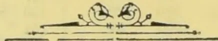

OBSERVER GAS ENGINE PRESS.

964------------------------------------------------

# TEA, COFFEE, CINCHONA, COCOA, AND CARDAMOM SALES.

NO. 36.]

COLOMBO, SEPTEMBER 6th, 1895.

PRICE:—12½ cents each; 3 copies  
30 cents; 6 copies ½ rupee.

## COLOMBO SALES OF TEA.

### LARGE LOTS.

[MESSRS. BENHAM & BREMNER.—8,280 lb.]

<table border="1">
<thead>
<tr>
<th></th>
<th>Box.</th>
<th>pkgs.</th>
<th>Name.</th>
<th>lb.</th>
<th>c.</th>
</tr>
</thead>
<tbody>
<tr>
<td>1 Elston</td>
<td>16</td>
<td>18 ch</td>
<td>pe sou No. 2</td>
<td>1620</td>
<td>43</td>
</tr>
<tr>
<td>2</td>
<td>18</td>
<td>4 do</td>
<td>bro mix</td>
<td>400</td>
<td>39</td>
</tr>
<tr>
<td>3 J M R</td>
<td>20</td>
<td>17 ch</td>
<td>bro pek</td>
<td>1700</td>
<td>51</td>
</tr>
<tr>
<td>4</td>
<td>22</td>
<td>9 do</td>
<td>pekoe</td>
<td>900</td>
<td>38</td>
</tr>
<tr>
<td>5</td>
<td>24</td>
<td>4 do</td>
<td>pek sou</td>
<td>400</td>
<td>35</td>
</tr>
<tr>
<td>6</td>
<td>26</td>
<td>4 do</td>
<td>bro tea</td>
<td>400</td>
<td>30</td>
</tr>
<tr>
<td>8 Battalgalla</td>
<td>30</td>
<td>7 ch</td>
<td>pek sou</td>
<td>700</td>
<td>50</td>
</tr>
<tr>
<td>11 Hornsey</td>
<td>36</td>
<td>12 do</td>
<td>pek sou</td>
<td>1200</td>
<td>48</td>
</tr>
</tbody>
</table>

[MESSRS. A. H. THOMPSON & CO., 44,579 lb.]

<table border="1">
<thead>
<tr>
<th>Lot.</th>
<th>Box.</th>
<th>pkgs.</th>
<th>Name.</th>
<th>lb.</th>
<th>c.</th>
</tr>
</thead>
<tbody>
<tr>
<td>1 Nahaveena</td>
<td>1</td>
<td>24 hf-ch</td>
<td>bro pek</td>
<td>1200</td>
<td>66</td>
</tr>
<tr>
<td>2</td>
<td>3</td>
<td>9 do</td>
<td>pekoe</td>
<td>450</td>
<td>50</td>
</tr>
<tr>
<td>3</td>
<td>5</td>
<td>13 do</td>
<td>pek sou</td>
<td>650</td>
<td>43</td>
</tr>
<tr>
<td>5 Ooloowatte</td>
<td>6</td>
<td>10 ch</td>
<td>bro pek</td>
<td>1100</td>
<td>55</td>
</tr>
<tr>
<td>6</td>
<td>10</td>
<td>10 do</td>
<td>pekoe</td>
<td>1000</td>
<td>45</td>
</tr>
<tr>
<td>7 Gonakellie</td>
<td>12</td>
<td>9 hf-ch</td>
<td>bro pek</td>
<td>540</td>
<td>78</td>
</tr>
<tr>
<td>9</td>
<td>15</td>
<td>9 do</td>
<td>pek sou</td>
<td>480</td>
<td>54</td>
</tr>
<tr>
<td>12 Woodend</td>
<td>19</td>
<td>52 ch</td>
<td>pekoe</td>
<td>5200</td>
<td>40 bid</td>
</tr>
<tr>
<td>13 Pambagama</td>
<td>21</td>
<td>6 do</td>
<td>pek fan</td>
<td>660</td>
<td>38</td>
</tr>
<tr>
<td>14</td>
<td>23</td>
<td>15 do</td>
<td>dust</td>
<td>1275</td>
<td>28</td>
</tr>
<tr>
<td>15 L</td>
<td>24</td>
<td>2 ch</td>
<td>son</td>
<td>514</td>
<td>25 bid</td>
</tr>
<tr>
<td>16 Sapitiyagode</td>
<td>26</td>
<td>55 ch</td>
<td>bro pek</td>
<td>5610</td>
<td>72</td>
</tr>
<tr>
<td>17</td>
<td>28</td>
<td>30 do</td>
<td>pekoe</td>
<td>2700</td>
<td>47</td>
</tr>
<tr>
<td>19 Cross in Circle, in estate mark</td>
<td>31</td>
<td>45 hf-ch</td>
<td>congou</td>
<td>2475</td>
<td>withd'n.</td>
</tr>
<tr>
<td>21 A G C</td>
<td>34</td>
<td>14 ch</td>
<td>fans</td>
<td>2100</td>
<td>32</td>
</tr>
<tr>
<td>22</td>
<td>36</td>
<td>9 do</td>
<td>dust</td>
<td>1350</td>
<td>28</td>
</tr>
<tr>
<td>23 X X X</td>
<td>37</td>
<td>4 do</td>
<td>unas</td>
<td>440</td>
<td>25</td>
</tr>
<tr>
<td>25 Killecombe in est. mark</td>
<td>40</td>
<td>19 ch</td>
<td>bro pek</td>
<td>1900</td>
<td>44 bid</td>
</tr>
<tr>
<td>27 G'watte</td>
<td>43</td>
<td>24 do</td>
<td>bro pek</td>
<td>2400</td>
<td>50 bid</td>
</tr>
<tr>
<td>30 Vogan</td>
<td>47</td>
<td>30 ch</td>
<td>bro pek</td>
<td>3000</td>
<td>70</td>
</tr>
<tr>
<td>31</td>
<td>49</td>
<td>27 do</td>
<td>pekoe</td>
<td>2430</td>
<td>52</td>
</tr>
<tr>
<td>32</td>
<td>51</td>
<td>21 do</td>
<td>pek sou</td>
<td>1890</td>
<td>46</td>
</tr>
<tr>
<td>33</td>
<td>53</td>
<td>21 do</td>
<td>sou</td>
<td>1755</td>
<td>41</td>
</tr>
<tr>
<td>35 Elgin</td>
<td>56</td>
<td>3 ch</td>
<td>dust</td>
<td>420</td>
<td>38</td>
</tr>
<tr>
<td>B &amp; D</td>
<td>15</td>
<td>do</td>
<td>red leaf</td>
<td>1660</td>
<td>22 bid</td>
</tr>
</tbody>
</table>

[MR. E. JOHN.—64,503 lb.]

<table border="1">
<thead>
<tr>
<th>Lot.</th>
<th>Box.</th>
<th>Pkgs.</th>
<th>Names.</th>
<th>lb.</th>
<th>c.</th>
</tr>
</thead>
<tbody>
<tr>
<td>3 Caledonia</td>
<td>279</td>
<td>12 ch</td>
<td>bro pek</td>
<td>1080</td>
<td>58</td>
</tr>
<tr>
<td>4</td>
<td>281</td>
<td>12 do</td>
<td>pekoe</td>
<td>1080</td>
<td>43</td>
</tr>
<tr>
<td>5</td>
<td>283</td>
<td>9 do</td>
<td>pek sou</td>
<td>810</td>
<td>39</td>
</tr>
<tr>
<td>9 Kanangama</td>
<td>301</td>
<td>26 do</td>
<td>bro pek</td>
<td>2470</td>
<td>47 bid</td>
</tr>
<tr>
<td>10</td>
<td>303</td>
<td>26 do</td>
<td>pekoe</td>
<td>2340</td>
<td>40</td>
</tr>
<tr>
<td>11</td>
<td>305</td>
<td>10 do</td>
<td>pek sou</td>
<td>850</td>
<td>37</td>
</tr>
<tr>
<td>13 Anchor in est. mark</td>
<td>309</td>
<td>20 do</td>
<td>bro or pek</td>
<td>2000</td>
<td>89</td>
</tr>
<tr>
<td>14</td>
<td>311</td>
<td>22 hf-ch</td>
<td>or pek</td>
<td>990</td>
<td>74</td>
</tr>
<tr>
<td>15</td>
<td>313</td>
<td>18 do</td>
<td>pekoe</td>
<td>900</td>
<td>57</td>
</tr>
<tr>
<td>16 Eila</td>
<td>315</td>
<td>28 ch</td>
<td>bro pek</td>
<td>2520</td>
<td>65</td>
</tr>
<tr>
<td>17</td>
<td>317</td>
<td>17 do</td>
<td>pekoe</td>
<td>1530</td>
<td>51</td>
</tr>
<tr>
<td>18</td>
<td>319</td>
<td>15 do</td>
<td>pek sou</td>
<td>1350</td>
<td>40</td>
</tr>
<tr>
<td>20 Meeriatenne</td>
<td>323</td>
<td>10 hf-ch</td>
<td>bro pek</td>
<td>560</td>
<td>69</td>
</tr>
<tr>
<td>21</td>
<td>325</td>
<td>13 do</td>
<td>pekoe</td>
<td>728</td>
<td>55</td>
</tr>
<tr>
<td>24 H S, in estate mark</td>
<td>331</td>
<td>10 ch</td>
<td>bro pek</td>
<td>1050</td>
<td>48 bid</td>
</tr>
<tr>
<td>26</td>
<td>335</td>
<td>19 do</td>
<td>sou</td>
<td>1615</td>
<td>37</td>
</tr>
<tr>
<td>27</td>
<td>337</td>
<td>6 bags</td>
<td>red leaf</td>
<td>450</td>
<td>20</td>
</tr>
<tr>
<td>28</td>
<td>339</td>
<td>12 hf-ch</td>
<td>dust</td>
<td>1080</td>
<td>27</td>
</tr>
<tr>
<td>29 Glasgow</td>
<td>341</td>
<td>40 ch</td>
<td>bro or pek</td>
<td>3000</td>
<td>81</td>
</tr>
<tr>
<td>30</td>
<td>343</td>
<td>31 do</td>
<td>or pek</td>
<td>1860</td>
<td>72</td>
</tr>
<tr>
<td>31</td>
<td>345</td>
<td>21 do</td>
<td>pekoe</td>
<td>1890</td>
<td>55</td>
</tr>
<tr>
<td>32 Ardlaw and Wishford</td>
<td>347</td>
<td>17 hf-ch</td>
<td>or pek</td>
<td>765</td>
<td>82</td>
</tr>
<tr>
<td>33</td>
<td>349</td>
<td>18 do</td>
<td>bro or pe No. 1</td>
<td>990</td>
<td>86</td>
</tr>
<tr>
<td>34</td>
<td>10</td>
<td>10 do</td>
<td>bro or pe No. 2</td>
<td>600</td>
<td>84</td>
</tr>
</tbody>
</table>

<table border="1">
<thead>
<tr>
<th>Lot.</th>
<th>Box</th>
<th>Pks.</th>
<th>Name.</th>
<th>lb.</th>
<th>c.</th>
</tr>
</thead>
<tbody>
<tr>
<td>35</td>
<td>12</td>
<td>12 ch</td>
<td>pekoe</td>
<td>1080</td>
<td>57</td>
</tr>
<tr>
<td>36 O</td>
<td>14</td>
<td>14 do</td>
<td>unas</td>
<td>1470</td>
<td>56</td>
</tr>
<tr>
<td>38 Claremont</td>
<td>18</td>
<td>47 hf-ch</td>
<td>bro pek</td>
<td>2585</td>
<td>55</td>
</tr>
<tr>
<td>39</td>
<td>20</td>
<td>16 do</td>
<td>pekoe</td>
<td>880</td>
<td>42 bid</td>
</tr>
<tr>
<td>40</td>
<td>22</td>
<td>16 do</td>
<td>pek sou</td>
<td>800</td>
<td>39</td>
</tr>
<tr>
<td>48 St. Clair</td>
<td>38</td>
<td>14 hf-ch</td>
<td>dust</td>
<td>1218</td>
<td>31</td>
</tr>
<tr>
<td>49 Glentilt</td>
<td>40</td>
<td>26 ch</td>
<td>bro pek</td>
<td>2730</td>
<td>69 bid</td>
</tr>
<tr>
<td>50</td>
<td>42</td>
<td>14 do</td>
<td>pek sou</td>
<td>1400</td>
<td>49</td>
</tr>
<tr>
<td>51 Nahavilla</td>
<td>44</td>
<td>27 do</td>
<td>bro pek</td>
<td>2835</td>
<td>80 bid</td>
</tr>
<tr>
<td>52</td>
<td>46</td>
<td>48 do</td>
<td>pekoe</td>
<td>4800</td>
<td>59</td>
</tr>
<tr>
<td>53</td>
<td>48</td>
<td>9 do</td>
<td>pek sou</td>
<td>900</td>
<td>50 bid</td>
</tr>
<tr>
<td>55 C G</td>
<td>53</td>
<td>95 hf-ch</td>
<td>pekoe</td>
<td>4750</td>
<td>35 bid</td>
</tr>
</tbody>
</table>

[MESSRS. FORBES & WALKER.—200,550 lb.]

<table border="1">
<thead>
<tr>
<th>Lot.</th>
<th>Box</th>
<th>Pks</th>
<th>Name.</th>
<th>lb.</th>
<th>c.</th>
</tr>
</thead>
<tbody>
<tr>
<td>4 Meemoraoya</td>
<td>124</td>
<td>29 hf-ch</td>
<td>bro pek</td>
<td>1160</td>
<td>55</td>
</tr>
<tr>
<td>5</td>
<td>126</td>
<td>18 do</td>
<td>pekoe</td>
<td>720</td>
<td>44</td>
</tr>
<tr>
<td>8 Barkindale</td>
<td>132</td>
<td>9 ch</td>
<td>bro pek</td>
<td>1080</td>
<td>89 bid</td>
</tr>
<tr>
<td>9</td>
<td>134</td>
<td>5 do</td>
<td>pekoe</td>
<td>500</td>
<td>58</td>
</tr>
<tr>
<td>11 Nahaveena</td>
<td>138</td>
<td>86 hf-ch</td>
<td>bro pek</td>
<td>4300</td>
<td>66</td>
</tr>
<tr>
<td>12</td>
<td>140</td>
<td>33 do</td>
<td>pekoe</td>
<td>1650</td>
<td>51</td>
</tr>
<tr>
<td>13</td>
<td>142</td>
<td>44 do</td>
<td>pek sou</td>
<td>2200</td>
<td>42</td>
</tr>
<tr>
<td>15 Drayton</td>
<td>146</td>
<td>59 do</td>
<td>bro pek</td>
<td>3245</td>
<td>77 bid</td>
</tr>
<tr>
<td>16</td>
<td>148</td>
<td>38 ch</td>
<td>pekoe</td>
<td>3230</td>
<td>61</td>
</tr>
<tr>
<td>17</td>
<td>150</td>
<td>15 do</td>
<td>pek sou</td>
<td>1200</td>
<td>47</td>
</tr>
<tr>
<td>24 A N K</td>
<td>164</td>
<td>4 do</td>
<td>bro pek</td>
<td>400</td>
<td>54</td>
</tr>
<tr>
<td>29 Hayes</td>
<td>174</td>
<td>69 hf-ch</td>
<td>bro pek</td>
<td>3450</td>
<td>62 bid</td>
</tr>
<tr>
<td>30</td>
<td>176</td>
<td>39 do</td>
<td>pekoe</td>
<td>1950</td>
<td>49</td>
</tr>
<tr>
<td>31</td>
<td>178</td>
<td>27 do</td>
<td>pek sou</td>
<td>1350</td>
<td>42</td>
</tr>
<tr>
<td>33 Bouami</td>
<td>182</td>
<td>24 ch</td>
<td>bro pek</td>
<td>2520</td>
<td>63</td>
</tr>
<tr>
<td>34</td>
<td>184</td>
<td>36 do</td>
<td>pekoe</td>
<td>3240</td>
<td>60</td>
</tr>
<tr>
<td>35</td>
<td>186</td>
<td>34 do</td>
<td>pek fans</td>
<td>3105</td>
<td>53</td>
</tr>
<tr>
<td>36</td>
<td>188</td>
<td>4 do</td>
<td>dust</td>
<td>600</td>
<td>28</td>
</tr>
<tr>
<td>37 Pedro</td>
<td>190</td>
<td>16 ch</td>
<td>bro or pek</td>
<td>1760</td>
<td>R1 03</td>
</tr>
<tr>
<td>38</td>
<td>192</td>
<td>15 do</td>
<td>pekoe</td>
<td>1350</td>
<td>78 bid</td>
</tr>
<tr>
<td>39</td>
<td>194</td>
<td>14 do</td>
<td>pek sou</td>
<td>1050</td>
<td>57</td>
</tr>
<tr>
<td>41 Tonacombe</td>
<td>198</td>
<td>23 ch</td>
<td>or pek</td>
<td>2800</td>
<td>88</td>
</tr>
<tr>
<td>42</td>
<td>200</td>
<td>22 do</td>
<td>bro pek</td>
<td>2420</td>
<td>81</td>
</tr>
<tr>
<td>43</td>
<td>202</td>
<td>51 do</td>
<td>pekoe</td>
<td>4390</td>
<td>69</td>
</tr>
<tr>
<td>44 Yataderia</td>
<td>204</td>
<td>18 ch</td>
<td>bro or pek</td>
<td>1890</td>
<td>59</td>
</tr>
<tr>
<td>45</td>
<td>206</td>
<td>21 do</td>
<td>bro pek</td>
<td>2205</td>
<td>46</td>
</tr>
<tr>
<td>46</td>
<td>208</td>
<td>54 do</td>
<td>pekoe</td>
<td>5400</td>
<td>37</td>
</tr>
<tr>
<td>47</td>
<td>210</td>
<td>17 do</td>
<td>pek sou</td>
<td>1615</td>
<td>34</td>
</tr>
<tr>
<td>50 M</td>
<td>216</td>
<td>3 ch</td>
<td>dust</td>
<td>610</td>
<td>27</td>
</tr>
<tr>
<td>52 S M</td>
<td>220</td>
<td>5 ch</td>
<td>pek sou</td>
<td>495</td>
<td>30</td>
</tr>
<tr>
<td>55 Glencorse</td>
<td>226</td>
<td>24 do</td>
<td>bro pek</td>
<td>2400</td>
<td>70</td>
</tr>
<tr>
<td>56</td>
<td>228</td>
<td>12 do</td>
<td>pekoe</td>
<td>1080</td>
<td>53</td>
</tr>
<tr>
<td>57</td>
<td>230</td>
<td>13 do</td>
<td>pek sou</td>
<td>1040</td>
<td>45</td>
</tr>
<tr>
<td>63 B C, in setate mark</td>
<td>242</td>
<td>10 do</td>
<td>bro pek</td>
<td>530</td>
<td>53 bid</td>
</tr>
<tr>
<td>64</td>
<td>244</td>
<td>12 ch</td>
<td>pekoe</td>
<td>1200</td>
<td>45 bid</td>
</tr>
<tr>
<td>65</td>
<td>246</td>
<td>20 do</td>
<td>pek sou</td>
<td>2000</td>
<td>49 bid</td>
</tr>
<tr>
<td>66</td>
<td>248</td>
<td>4 do</td>
<td>dust</td>
<td>625</td>
<td>25</td>
</tr>
<tr>
<td>67 S S</td>
<td>250</td>
<td>30 hf-ch</td>
<td>bro pek</td>
<td>1800</td>
<td>45 bid</td>
</tr>
<tr>
<td>68</td>
<td>252</td>
<td>18 do</td>
<td>pekoe</td>
<td>900</td>
<td>37 bid</td>
</tr>
<tr>
<td>69 Dunbar</td>
<td>254</td>
<td>19 ch</td>
<td>pekoe</td>
<td>1520</td>
<td>57 bid</td>
</tr>
<tr>
<td>70 Wattagalla</td>
<td>256</td>
<td>22 ch</td>
<td>bro pek</td>
<td>2420</td>
<td>64 bid</td>
</tr>
<tr>
<td>71</td>
<td>258</td>
<td>23 do</td>
<td>pekoe</td>
<td>2530</td>
<td>49</td>
</tr>
<tr>
<td>72</td>
<td>260</td>
<td>7 do</td>
<td>pek sou</td>
<td>700</td>
<td>42</td>
</tr>
<tr>
<td>75 Moraukande</td>
<td>266</td>
<td>33 do</td>
<td>bro pek</td>
<td>3300</td>
<td>70</td>
</tr>
<tr>
<td>76</td>
<td>268</td>
<td>43 do</td>
<td>pekoe</td>
<td>4300</td>
<td>48</td>
</tr>
<tr>
<td>77</td>
<td>270</td>
<td>47 do</td>
<td>pek sou</td>
<td>4465</td>
<td>39</td>
</tr>
<tr>
<td>78 Cannes</td>
<td>272</td>
<td>28 ch</td>
<td>bro pek</td>
<td>2520</td>
<td>70</td>
</tr>
<tr>
<td>79</td>
<td>274</td>
<td>24 do</td>
<td>pekoe</td>
<td>2040</td>
<td>50</td>
</tr>
<tr>
<td>80</td>
<td>276</td>
<td>5 do</td>
<td>pek sou</td>
<td>450</td>
<td>39</td>
</tr>
<tr>
<td>81</td>
<td>278</td>
<td>6 do</td>
<td>bro mix</td>
<td>570</td>
<td>30</td>
</tr>
<tr>
<td>82 Ganapalla</td>
<td>280</td>
<td>64 hf-ch</td>
<td>bro pek</td>
<td>3200</td>
<td>59</td>
</tr>
<tr>
<td>83</td>
<td>282</td>
<td>72 ch</td>
<td>pekoe</td>
<td>5760</td>
<td>47</td>
</tr>
<tr>
<td>84</td>
<td>284</td>
<td>59 do</td>
<td>pek sou</td>
<td>4720</td>
<td>39</td>
</tr>
<tr>
<td>85</td>
<td>286</td>
<td>9 hf-ch</td>
<td>dust</td>
<td>720</td>
<td>27</td>
</tr>
<tr>
<td>86 Ascot</td>
<td>288</td>
<td>12 ch</td>
<td>bro pek</td>
<td>1200</td>
<td>65</td>
</tr>
<tr>
<td>87</td>
<td>290</td>
<td>14 do</td>
<td>pekoe</td>
<td>1330</td>
<td>46</td>
</tr>
<tr>
<td>89 Middleton</td>
<td>294</td>
<td>20 hf-ch</td>
<td>bro pek</td>
<td>1200</td>
<td>95</td>
</tr>
<tr>
<td>90</td>
<td>296</td>
<td>25 do</td>
<td>or pek</td>
<td>1375</td>
<td>81</td>
</tr>
<tr>
<td>91</td>
<td>298</td>
<td>13 ch</td>
<td>pekoe</td>
<td>1235</td>
<td>69</td>
</tr>
<tr>
<td>92</td>
<td>300</td>
<td>18 do</td>
<td>pek sou</td>
<td>1620</td>
<td>59</td>
</tr>
<tr>
<td>93 Aigburth</td>
<td>302</td>
<td>31 do</td>
<td>pesou No 1</td>
<td>2790</td>
<td>50</td>
</tr>
<tr>
<td>94</td>
<td>304</td>
<td>8 do</td>
<td>dust</td>
<td>880</td>
<td>35</td>
</tr>
<tr>
<td>95 Allacollawewa</td>
<td>306</td>
<td>10 hf-ch</td>
<td>bro pek</td>
<td>600</td>
<td>65</td>
</tr>
<tr>
<td>98</td>
<td>312</td>
<td>11 do</td>
<td>pek sou</td>
<td>605</td>
<td>49</td>
</tr>
<tr>
<td>99</td>
<td>314</td>
<td>9 do</td>
<td>son</td>
<td>495</td>
<td>42</td>
</tr>
<tr>
<td>102 H, in estate mark</td>
<td>320</td>
<td>4 ch</td>
<td>unas</td>
<td>420</td>
<td>28</td>
</tr>
</tbody>
</table>

965------------------------------------------------

2

CEYLON PRODUCE SALES LIST.

<table border="1">
<thead>
<tr>
<th>Lot.</th>
<th>Box.</th>
<th>Pkgs.</th>
<th>Name.</th>
<th>lb.</th>
<th>c.</th>
</tr>
</thead>
<tbody>
<tr>
<td>103</td>
<td>St. Mary</td>
<td>322</td>
<td>35 hf-ch</td>
<td>pekoe</td>
<td>1750 41 bid</td>
</tr>
<tr>
<td>104</td>
<td></td>
<td>324</td>
<td>25 do</td>
<td>pek son</td>
<td>1100 41 bid</td>
</tr>
<tr>
<td>105</td>
<td></td>
<td>326</td>
<td>19 do</td>
<td>bro tea</td>
<td>950 31</td>
</tr>
<tr>
<td>106</td>
<td>Pohitagama</td>
<td>328</td>
<td>22 ch</td>
<td>bro pek</td>
<td>2200 61</td>
</tr>
<tr>
<td>107</td>
<td></td>
<td>330</td>
<td>17 do</td>
<td>pekoe</td>
<td>1700 45</td>
</tr>
<tr>
<td>108</td>
<td></td>
<td>332</td>
<td>10 do</td>
<td>pek son</td>
<td>1000 38</td>
</tr>
<tr>
<td>109</td>
<td></td>
<td>334</td>
<td>6 do</td>
<td>fans</td>
<td>600 51</td>
</tr>
<tr>
<td>110</td>
<td></td>
<td>336</td>
<td>3 do</td>
<td>dust</td>
<td>450 28</td>
</tr>
<tr>
<td>120</td>
<td>G M</td>
<td>356</td>
<td>33 hf-ch</td>
<td>bro pek</td>
<td>2000 47 bid</td>
</tr>
<tr>
<td>121</td>
<td></td>
<td>358</td>
<td>15 do</td>
<td>pekoe</td>
<td>770 38 bid</td>
</tr>
<tr>
<td>122</td>
<td>Langdale</td>
<td>360</td>
<td>17 ch</td>
<td>bro pek</td>
<td>2940 80</td>
</tr>
<tr>
<td>123</td>
<td></td>
<td>362</td>
<td>17 do</td>
<td>pekoe</td>
<td>1700 65</td>
</tr>
<tr>
<td>127</td>
<td>Queensland</td>
<td>370</td>
<td>9 do</td>
<td>bro pek</td>
<td>900 91</td>
</tr>
<tr>
<td>128</td>
<td></td>
<td>372</td>
<td>11 do</td>
<td>pekoe</td>
<td>1045 71</td>
</tr>
<tr>
<td>137</td>
<td>Sandringham</td>
<td>390</td>
<td>16 ch</td>
<td>bro pek</td>
<td>1760 80</td>
</tr>
<tr>
<td>138</td>
<td></td>
<td>392</td>
<td>12 do</td>
<td>or pek</td>
<td>1140 79</td>
</tr>
<tr>
<td>139</td>
<td></td>
<td>394</td>
<td>19 do</td>
<td>pekoe</td>
<td>1615 60</td>
</tr>
<tr>
<td>140</td>
<td></td>
<td>396</td>
<td>4 do</td>
<td>dust</td>
<td>680 31</td>
</tr>
<tr>
<td>141</td>
<td>Bagdad</td>
<td>498</td>
<td>5 ch</td>
<td>bro mix</td>
<td>500 38</td>
</tr>
<tr>
<td>143</td>
<td>Clyde</td>
<td>402</td>
<td>25 ch</td>
<td>bro pek</td>
<td>2750 68</td>
</tr>
<tr>
<td>144</td>
<td></td>
<td>404</td>
<td>8 do</td>
<td>pek son</td>
<td>800 45</td>
</tr>
<tr>
<td>147</td>
<td>Circlewood</td>
<td>410</td>
<td>92 do</td>
<td>or pek</td>
<td>9128 49</td>
</tr>
<tr>
<td>152</td>
<td>Pansalaten-</td>
<td>420</td>
<td>24 ch</td>
<td>bro pek</td>
<td>2520 66</td>
</tr>
<tr>
<td>153</td>
<td>ne</td>
<td>422</td>
<td>18 do</td>
<td>pekoe</td>
<td>1800 49</td>
</tr>
<tr>
<td>154</td>
<td></td>
<td>424</td>
<td>13 do</td>
<td>pek son</td>
<td>1235 45 bid</td>
</tr>
<tr>
<td>155</td>
<td></td>
<td>426</td>
<td>4 do</td>
<td>congou</td>
<td>400 38</td>
</tr>
<tr>
<td>156</td>
<td></td>
<td>428</td>
<td>6 hf-ch</td>
<td>dust</td>
<td>450 28</td>
</tr>
</tbody>
</table>

[MESSRS. SOMERVILLE & Co., 108,230 lb.]

<table border="1">
<thead>
<tr>
<th>Lot.</th>
<th>Box.</th>
<th>Pkgs.</th>
<th>Name.</th>
<th>lb.</th>
<th>c.</th>
</tr>
</thead>
<tbody>
<tr>
<td>1</td>
<td>L</td>
<td>133</td>
<td>8 ch</td>
<td>bro mix</td>
<td>760 29</td>
</tr>
<tr>
<td>2</td>
<td></td>
<td>134</td>
<td>8 hf-ch</td>
<td>dust</td>
<td>680 31</td>
</tr>
<tr>
<td>3</td>
<td>Irex</td>
<td>135</td>
<td>20 ch</td>
<td>bro pek</td>
<td>2000 53</td>
</tr>
<tr>
<td>4</td>
<td></td>
<td>136</td>
<td>26 do</td>
<td>pek</td>
<td>2000 42</td>
</tr>
<tr>
<td>6</td>
<td>Warakamure</td>
<td>133</td>
<td>25 do</td>
<td>bro pek</td>
<td>2500 57</td>
</tr>
<tr>
<td>7</td>
<td></td>
<td>139</td>
<td>22 do</td>
<td>pek</td>
<td>2090 44</td>
</tr>
<tr>
<td>8</td>
<td></td>
<td>140</td>
<td>5 do</td>
<td>pek son</td>
<td>720 39</td>
</tr>
<tr>
<td>10</td>
<td>Lonach</td>
<td>142</td>
<td>26 hf-ch</td>
<td>bro pek</td>
<td>1300 78</td>
</tr>
<tr>
<td>11</td>
<td></td>
<td>143</td>
<td>26 ch</td>
<td>pek</td>
<td>2470 53</td>
</tr>
<tr>
<td>12</td>
<td></td>
<td>144</td>
<td>19 do</td>
<td>pek son</td>
<td>1710 43</td>
</tr>
<tr>
<td>13</td>
<td>K</td>
<td>145</td>
<td>19 hf-ch</td>
<td>bro pek</td>
<td>1110 85</td>
</tr>
<tr>
<td>14</td>
<td>W G</td>
<td>146</td>
<td>5 ch</td>
<td>bro tea</td>
<td>500 28 bid</td>
</tr>
<tr>
<td>15</td>
<td></td>
<td>147</td>
<td>7 do</td>
<td>dust</td>
<td>1050 28</td>
</tr>
<tr>
<td>16</td>
<td></td>
<td>148</td>
<td>3 do</td>
<td>bro mix</td>
<td>450 30</td>
</tr>
<tr>
<td>17</td>
<td>G l. A</td>
<td>149</td>
<td>10 do</td>
<td>pe</td>
<td>1000 42 bid</td>
</tr>
<tr>
<td>18</td>
<td>K in est. mark</td>
<td>150</td>
<td>14 hf-ch</td>
<td>or pek</td>
<td>630 50 bid</td>
</tr>
<tr>
<td>19</td>
<td></td>
<td>151</td>
<td>21 do</td>
<td>pek (hooped)</td>
<td>987 45</td>
</tr>
<tr>
<td>20</td>
<td></td>
<td>152</td>
<td>20 do</td>
<td>pe son</td>
<td>1000 42</td>
</tr>
<tr>
<td>21</td>
<td></td>
<td>153</td>
<td>10 do</td>
<td>pek fans</td>
<td>600 38</td>
</tr>
<tr>
<td>22</td>
<td>M C</td>
<td>154</td>
<td>6 hf-ch</td>
<td>dust</td>
<td>510 35</td>
</tr>
<tr>
<td>23</td>
<td></td>
<td>155</td>
<td>6 ch</td>
<td>bro tea</td>
<td>600 24 bid</td>
</tr>
<tr>
<td>24</td>
<td>E K A</td>
<td>156</td>
<td>8 do</td>
<td>pek son</td>
<td>720 40 bid</td>
</tr>
<tr>
<td>25</td>
<td></td>
<td>157</td>
<td>8 do</td>
<td>pek</td>
<td>610 50 bid</td>
</tr>
<tr>
<td>26</td>
<td></td>
<td>158</td>
<td>4 do</td>
<td>bro pek</td>
<td>400 64</td>
</tr>
<tr>
<td>27</td>
<td>N</td>
<td>159</td>
<td>15 do</td>
<td>or pek fans</td>
<td>2250 38</td>
</tr>
<tr>
<td>28</td>
<td>T T</td>
<td>160</td>
<td>14 do</td>
<td>son</td>
<td>1400 37 bid</td>
</tr>
<tr>
<td>29</td>
<td>A G A</td>
<td>161</td>
<td>43 hf-ch</td>
<td>pek son</td>
<td>2408 36 bid</td>
</tr>
<tr>
<td>30</td>
<td>Kelani</td>
<td>162</td>
<td>44 do</td>
<td>bro pek</td>
<td>2420 69</td>
</tr>
<tr>
<td>31</td>
<td></td>
<td>163</td>
<td>28 do</td>
<td>pekoe</td>
<td>1400 47</td>
</tr>
<tr>
<td>32</td>
<td></td>
<td>164</td>
<td>26 do</td>
<td>pek son</td>
<td>1170 44</td>
</tr>
<tr>
<td>35</td>
<td>Friesland</td>
<td>167</td>
<td>30 boxes</td>
<td>bro or pek</td>
<td>600 R100 bid</td>
</tr>
<tr>
<td>36</td>
<td></td>
<td>168</td>
<td>18 hf-ch</td>
<td>or pek</td>
<td>90 75 bid</td>
</tr>
<tr>
<td>41</td>
<td>Rondura</td>
<td>173</td>
<td>17 ch</td>
<td>bro pek</td>
<td>1785 63</td>
</tr>
<tr>
<td>42</td>
<td></td>
<td>174</td>
<td>20 do</td>
<td>pekoe</td>
<td>2000 49</td>
</tr>
<tr>
<td>43</td>
<td></td>
<td>175</td>
<td>13 do</td>
<td>pek son</td>
<td>1170 40</td>
</tr>
<tr>
<td>44</td>
<td>Benvenla</td>
<td>176</td>
<td>20 hf-ch</td>
<td>bro pek</td>
<td>1200 59</td>
</tr>
<tr>
<td>45</td>
<td></td>
<td>177</td>
<td>13 ch</td>
<td>pekoe</td>
<td>1309 46</td>
</tr>
<tr>
<td>49</td>
<td>Manangoda</td>
<td>181</td>
<td>5 do</td>
<td>bro pek</td>
<td>500 49 bid</td>
</tr>
<tr>
<td>50</td>
<td></td>
<td>182</td>
<td>9 do</td>
<td>pekoe</td>
<td>900 39 bid</td>
</tr>
<tr>
<td>51</td>
<td></td>
<td>183</td>
<td>6 do</td>
<td>pek son</td>
<td>600 36 bid</td>
</tr>
<tr>
<td>56</td>
<td>Lyndhurst</td>
<td>188</td>
<td>32 do</td>
<td>bro pek</td>
<td>3200 50</td>
</tr>
<tr>
<td>57</td>
<td></td>
<td>189</td>
<td>15 do</td>
<td>pekoe</td>
<td>1350 37 bid</td>
</tr>
<tr>
<td>58</td>
<td></td>
<td>190</td>
<td>12 do</td>
<td>pek son</td>
<td>1020 36 bid</td>
</tr>
<tr>
<td>59</td>
<td></td>
<td>191</td>
<td>6 do</td>
<td>son</td>
<td>510 30</td>
</tr>
<tr>
<td>60</td>
<td></td>
<td>192</td>
<td>12 do</td>
<td>dust</td>
<td>1020 27</td>
</tr>
<tr>
<td>62</td>
<td></td>
<td>194</td>
<td>34 ch</td>
<td>bro pek</td>
<td>3400 48 bid</td>
</tr>
<tr>
<td>63</td>
<td></td>
<td>195</td>
<td>38 do</td>
<td>pekoe</td>
<td>3420 39 bid</td>
</tr>
<tr>
<td>64</td>
<td></td>
<td>196</td>
<td>22 do</td>
<td>pek son</td>
<td>1870 38</td>
</tr>
<tr>
<td>66</td>
<td></td>
<td>198</td>
<td>10 hf-ch</td>
<td>dust</td>
<td>850 28</td>
</tr>
<tr>
<td>67</td>
<td>Roseneath</td>
<td>199</td>
<td>40 do</td>
<td>bro pek</td>
<td>2200 60</td>
</tr>
<tr>
<td>68</td>
<td></td>
<td>200</td>
<td>16 ch</td>
<td>pekoe</td>
<td>1440 45 bid</td>
</tr>
<tr>
<td>69</td>
<td></td>
<td>1</td>
<td>16 do</td>
<td>pek son</td>
<td>1440 40 bid</td>
</tr>
<tr>
<td>77</td>
<td>Forest Hill</td>
<td>9</td>
<td>11 do</td>
<td>bro pek</td>
<td>1210 66</td>
</tr>
<tr>
<td>78</td>
<td></td>
<td>10</td>
<td>22 do</td>
<td>pekoe</td>
<td>2310 49</td>
</tr>
<tr>
<td>79</td>
<td></td>
<td>11</td>
<td>9 do</td>
<td>pek son</td>
<td>855 43</td>
</tr>
<tr>
<td>81</td>
<td>Monsakande</td>
<td>13</td>
<td>9 do</td>
<td>bro pek</td>
<td>990 65</td>
</tr>
<tr>
<td>85</td>
<td></td>
<td>14</td>
<td>14 do</td>
<td>pekoe</td>
<td>1470 49</td>
</tr>
<tr>
<td>84</td>
<td>M K</td>
<td>16</td>
<td>9 do</td>
<td>bro mix</td>
<td>1005 33</td>
</tr>
</tbody>
</table>

<table border="1">
<thead>
<tr>
<th>Lot.</th>
<th>Box.</th>
<th>Pkgs.</th>
<th>Name.</th>
<th>lb.</th>
<th>c.</th>
</tr>
</thead>
<tbody>
<tr>
<td>87</td>
<td>T'kuwela</td>
<td>19</td>
<td>35 ch</td>
<td>bro pek</td>
<td>3500 61</td>
</tr>
<tr>
<td>88</td>
<td></td>
<td>20</td>
<td>25 do</td>
<td>pekoe</td>
<td>2500 49</td>
</tr>
<tr>
<td>89</td>
<td></td>
<td>21</td>
<td>22 do</td>
<td>pek son</td>
<td>2090 40</td>
</tr>
<tr>
<td>90</td>
<td>Ingeria</td>
<td>22</td>
<td>15 hf-ch</td>
<td>bro pek</td>
<td>825 65</td>
</tr>
<tr>
<td>91</td>
<td></td>
<td>23</td>
<td>13 do</td>
<td>pekoe</td>
<td>650 48 bid</td>
</tr>
<tr>
<td>92</td>
<td></td>
<td>24</td>
<td>29 do</td>
<td>pek son</td>
<td>1392 41</td>
</tr>
<tr>
<td>93</td>
<td></td>
<td>25</td>
<td>9 do</td>
<td>unassorted</td>
<td>450 42</td>
</tr>
<tr>
<td>95</td>
<td>K in est mark</td>
<td>27</td>
<td>19 ch</td>
<td>unas</td>
<td>1995 40</td>
</tr>
<tr>
<td>97</td>
<td>Vincit</td>
<td>29</td>
<td>8 do</td>
<td>bro pek</td>
<td>800 57</td>
</tr>
<tr>
<td>98</td>
<td></td>
<td>30</td>
<td>7 do</td>
<td>pekoe</td>
<td>700 45</td>
</tr>
<tr>
<td>99</td>
<td></td>
<td>31</td>
<td>4 do</td>
<td>pek son</td>
<td>400 39</td>
</tr>
<tr>
<td>102</td>
<td>Kananka</td>
<td>34</td>
<td>9 do</td>
<td>bro pek</td>
<td>1035 55 bid</td>
</tr>
<tr>
<td>103</td>
<td></td>
<td>35</td>
<td>35 do</td>
<td>pek</td>
<td>3490 42 bid</td>
</tr>
<tr>
<td>104</td>
<td></td>
<td>36</td>
<td>18 do</td>
<td>pek son</td>
<td>1620 40</td>
</tr>
<tr>
<td>105</td>
<td></td>
<td>37</td>
<td>6 do</td>
<td>son</td>
<td>504 38</td>
</tr>
<tr>
<td>106</td>
<td></td>
<td>38</td>
<td>7 do</td>
<td>pek fans</td>
<td>767 40</td>
</tr>
</tbody>
</table>

SMALL LOTS.

MESSRS. BENHAM & BREMNER.

<table border="1">
<thead>
<tr>
<th>Lot</th>
<th>Box</th>
<th>Pkgs.</th>
<th>Name</th>
<th>lb.</th>
<th>c.</th>
</tr>
</thead>
<tbody>
<tr>
<td>7</td>
<td>J M R</td>
<td>28</td>
<td>1 ch</td>
<td>dust</td>
<td>120 25</td>
</tr>
<tr>
<td>9</td>
<td>Battalgalla</td>
<td>32</td>
<td>2 do</td>
<td>bro tea</td>
<td>200 27</td>
</tr>
<tr>
<td>10</td>
<td></td>
<td>34</td>
<td>3 do</td>
<td>fans</td>
<td>270 30</td>
</tr>
<tr>
<td>12</td>
<td>Hornsey</td>
<td>38</td>
<td>1 do</td>
<td>bro tea</td>
<td>190 27</td>
</tr>
<tr>
<td>13</td>
<td></td>
<td>40</td>
<td>3 do</td>
<td>fans</td>
<td>270 30</td>
</tr>
</tbody>
</table>

A. H. THOMPSON & Co.

<table border="1">
<thead>
<tr>
<th>Lot.</th>
<th>Box</th>
<th>Pkgs.</th>
<th>Name</th>
<th>lb.</th>
<th>c.</th>
</tr>
</thead>
<tbody>
<tr>
<td>4</td>
<td>Nahaveena</td>
<td>1</td>
<td>1 hf-ch</td>
<td>dust</td>
<td>80 27</td>
</tr>
<tr>
<td>8</td>
<td>Gonakellie</td>
<td>14</td>
<td>6 do</td>
<td>pekoe</td>
<td>300 61</td>
</tr>
<tr>
<td>10</td>
<td></td>
<td>17</td>
<td>4 do</td>
<td>son</td>
<td>220 50</td>
</tr>
<tr>
<td>11</td>
<td></td>
<td>18</td>
<td>1 ch</td>
<td>1 hf-ch</td>
<td>145 35</td>
</tr>
<tr>
<td>20</td>
<td>A G C</td>
<td>33</td>
<td>3 do</td>
<td>pek son No. 2</td>
<td>300 32</td>
</tr>
<tr>
<td>24</td>
<td>A</td>
<td>39</td>
<td>5 hf-ch</td>
<td>fans</td>
<td>375 31 bid</td>
</tr>
<tr>
<td>26</td>
<td>B</td>
<td>42</td>
<td>5 do</td>
<td>dust</td>
<td>375 23 bid</td>
</tr>
<tr>
<td>28</td>
<td>C</td>
<td>45</td>
<td>5 do</td>
<td>pek dust</td>
<td>375 26 bid</td>
</tr>
<tr>
<td>29</td>
<td>D</td>
<td>46</td>
<td>5 do</td>
<td>bro pek fans</td>
<td>375 30 bid</td>
</tr>
<tr>
<td>34</td>
<td>Elgin</td>
<td>55</td>
<td>3 ch</td>
<td>pek son</td>
<td>240 44</td>
</tr>
</tbody>
</table>

[MR. E. JOHN.]

<table border="1">
<thead>
<tr>
<th>Lot.</th>
<th>Box.</th>
<th>Pkgs.</th>
<th>Names.</th>
<th>lb.</th>
<th>c.</th>
</tr>
</thead>
<tbody>
<tr>
<td>1</td>
<td>K D O</td>
<td>275</td>
<td>1 hf-ch</td>
<td>or pek</td>
<td>33 52</td>
</tr>
<tr>
<td>2</td>
<td></td>
<td>277</td>
<td>1 do</td>
<td>dust</td>
<td>44 26</td>
</tr>
<tr>
<td>6</td>
<td>Caledonia</td>
<td>285</td>
<td>1 ch</td>
<td>dust</td>
<td>128 28</td>
</tr>
<tr>
<td>7</td>
<td></td>
<td>287</td>
<td>1 do</td>
<td>son</td>
<td>90 32</td>
</tr>
<tr>
<td>8</td>
<td></td>
<td>289</td>
<td>3 do</td>
<td>red leaf</td>
<td>270 19</td>
</tr>
<tr>
<td>12</td>
<td>Kanangama</td>
<td>307</td>
<td>2 do</td>
<td>dust</td>
<td>280 26</td>
</tr>
<tr>
<td>19</td>
<td>H</td>
<td>321</td>
<td>3 do</td>
<td>pek No. 1</td>
<td>270 40</td>
</tr>
<tr>
<td>22</td>
<td>Meeriatenne</td>
<td>327</td>
<td>2 hf-ch</td>
<td>bro mix</td>
<td>100 32</td>
</tr>
<tr>
<td>23</td>
<td>M R</td>
<td>329</td>
<td>1 ch</td>
<td>dust</td>
<td>120 27</td>
</tr>
<tr>
<td>5</td>
<td>H S, in estate Mark</td>
<td>333</td>
<td>4 do</td>
<td>pekoe</td>
<td>380 39</td>
</tr>
<tr>
<td>37</td>
<td>O</td>
<td>16</td>
<td>1 do</td>
<td>dust</td>
<td>150 29</td>
</tr>
<tr>
<td>41</td>
<td>Claremont</td>
<td>24</td>
<td>3 hf-ch</td>
<td>bro tea</td>
<td>165 28</td>
</tr>
<tr>
<td>42</td>
<td></td>
<td>26</td>
<td>4 do</td>
<td>dust</td>
<td>70 35</td>
</tr>
<tr>
<td>47</td>
<td>S C</td>
<td>36</td>
<td>2 ch</td>
<td>son</td>
<td>220 36</td>
</tr>
<tr>
<td>54</td>
<td>Nahavilla</td>
<td>50</td>
<td>4 hf-ch</td>
<td>dust</td>
<td>360 30</td>
</tr>
<tr>
<td>56</td>
<td>C G</td>
<td>55</td>
<td>2 ch</td>
<td>bro pek</td>
<td>180 52</td>
</tr>
</tbody>
</table>

SOMERVILLE & Co.

<table border="1">
<thead>
<tr>
<th>Lot.</th>
<th>Box.</th>
<th>Pkgs.</th>
<th>Name.</th>
<th>lb.</th>
<th>c.</th>
</tr>
</thead>
<tbody>
<tr>
<td>5</td>
<td>Irex</td>
<td>137</td>
<td>1 ch</td>
<td>fans</td>
<td>260 18</td>
</tr>
<tr>
<td>9</td>
<td>Warakamure</td>
<td>141</td>
<td>2 ch</td>
<td>fans</td>
<td>260 35</td>
</tr>
<tr>
<td>33</td>
<td>Kelani</td>
<td>165</td>
<td>3 hf-ch</td>
<td>fans</td>
<td>180 53</td>
</tr>
<tr>
<td>34</td>
<td></td>
<td>166</td>
<td>2 do</td>
<td>dust</td>
<td>160 26</td>
</tr>
<tr>
<td>37</td>
<td>H in est. mark</td>
<td>169</td>
<td>1 hf-ch</td>
<td>bro pek</td>
<td>30 52</td>
</tr>
<tr>
<td>38</td>
<td></td>
<td>170</td>
<td>1 do</td>
<td>pekoe</td>
<td>35 49</td>
</tr>
<tr>
<td>38</td>
<td></td>
<td>171</td>
<td>1 ch</td>
<td>pek son</td>
<td>95 36</td>
</tr>
<tr>
<td>40</td>
<td></td>
<td>172</td>
<td>1 hf-ch</td>
<td>dust</td>
<td>30 26</td>
</tr>
<tr>
<td>46</td>
<td>Benvenla</td>
<td>176</td>
<td>3 ch</td>
<td>pek son</td>
<td>300 38</td>
</tr>
<tr>
<td>47</td>
<td>K in est. mark</td>
<td>179</td>
<td>2 do</td>
<td>dust</td>
<td>280 31</td>
</tr>
<tr>
<td>48</td>
<td></td>
<td>180</td>
<td>1 do</td>
<td>red leaf</td>
<td>100 27</td>
</tr>
<tr>
<td>52</td>
<td>Manangodu</td>
<td>184</td>
<td>1 do</td>
<td>fans</td>
<td>113 36</td>
</tr>
<tr>
<td>53</td>
<td></td>
<td>185</td>
<td>1 do</td>
<td>unas</td>
<td>100 43</td>
</tr>
<tr>
<td>54</td>
<td></td>
<td>186</td>
<td>1 do</td>
<td>son</td>
<td>102 18</td>
</tr>
<tr>
<td>55</td>
<td></td>
<td>187</td>
<td>1 hf-ch</td>
<td>dust</td>
<td>80 26</td>
</tr>
</tbody>
</table>

966------------------------------------------------

CEYLON PRODUCE SALES LIST.

3

<table border="1">
<thead>
<tr>
<th>Lot.</th>
<th>Box</th>
<th>Pkgs.</th>
<th>Name</th>
<th>lb.</th>
<th>c.</th>
</tr>
</thead>
<tbody>
<tr>
<td>61 Lyndhurst</td>
<td>193</td>
<td>1 ch</td>
<td>bro tea</td>
<td>360</td>
<td>26</td>
</tr>
<tr>
<td>65</td>
<td>197</td>
<td>4 do</td>
<td>bro tea</td>
<td>360</td>
<td>26</td>
</tr>
<tr>
<td>70 Roseneath</td>
<td>2</td>
<td>1 do</td>
<td>bro mix</td>
<td>90</td>
<td>20</td>
</tr>
<tr>
<td>71</td>
<td>3</td>
<td>1 hf-ch</td>
<td>bro mix</td>
<td>45</td>
<td>16</td>
</tr>
<tr>
<td>72 Silver Valley</td>
<td>4</td>
<td>3 do</td>
<td>bro pek</td>
<td>144</td>
<td>51</td>
</tr>
<tr>
<td>73</td>
<td>5</td>
<td>2 do</td>
<td>pekoe</td>
<td>92</td>
<td>43</td>
</tr>
<tr>
<td>74</td>
<td>6</td>
<td>2 do</td>
<td>pe sou</td>
<td>100</td>
<td>38</td>
</tr>
<tr>
<td>75</td>
<td>7</td>
<td>1 do</td>
<td>congon</td>
<td>34</td>
<td>33</td>
</tr>
<tr>
<td>76</td>
<td>8</td>
<td>1 do</td>
<td>dust</td>
<td>48</td>
<td>36</td>
</tr>
<tr>
<td>80 Forest Hill</td>
<td>12</td>
<td>3 do</td>
<td>dust</td>
<td>270</td>
<td>31</td>
</tr>
<tr>
<td>83 Mousakande</td>
<td>15</td>
<td>3 do</td>
<td>dust</td>
<td>270</td>
<td>withd'n</td>
</tr>
<tr>
<td>94 Ingeriya</td>
<td>26</td>
<td>3 do</td>
<td>fans</td>
<td>219</td>
<td>31</td>
</tr>
<tr>
<td>96 Kinest. mark</td>
<td>28</td>
<td>1 ch</td>
<td>dust</td>
<td>134</td>
<td>27</td>
</tr>
<tr>
<td>100 Vincit</td>
<td>32</td>
<td>1 do</td>
<td>dust</td>
<td>100</td>
<td>27</td>
</tr>
<tr>
<td>101</td>
<td>33</td>
<td>1 do</td>
<td>red leaf</td>
<td>92</td>
<td>17</td>
</tr>
<tr>
<td>107 Kananka</td>
<td>39</td>
<td>4 do</td>
<td>bro tea</td>
<td>380</td>
<td>32</td>
</tr>
<tr>
<td>108</td>
<td>40</td>
<td>1 do</td>
<td>dust</td>
<td>128</td>
<td>30</td>
</tr>
</tbody>
</table>

[Messrs. FORBES & WALKER.]

<table border="1">
<thead>
<tr>
<th>Lot</th>
<th>Box</th>
<th>Pkgs.</th>
<th>Name</th>
<th>lb</th>
<th>c.</th>
</tr>
</thead>
<tbody>
<tr>
<td>1 O O O, in estate mark</td>
<td>118</td>
<td>1 ch</td>
<td>pekoe</td>
<td>100</td>
<td>39</td>
</tr>
<tr>
<td>2</td>
<td>120</td>
<td>2 do</td>
<td>pek sou</td>
<td>250</td>
<td>34</td>
</tr>
<tr>
<td>3</td>
<td>122</td>
<td>1 do</td>
<td>dust</td>
<td>60</td>
<td>27</td>
</tr>
<tr>
<td>6 Meemoraoya</td>
<td>128</td>
<td>2 do</td>
<td>sou</td>
<td>80</td>
<td>37</td>
</tr>
<tr>
<td>7</td>
<td>130</td>
<td>2 do</td>
<td>dust</td>
<td>140</td>
<td>26</td>
</tr>
<tr>
<td>10 Barkindale</td>
<td>136</td>
<td>1 ch</td>
<td>pek sou</td>
<td>90</td>
<td>46</td>
</tr>
<tr>
<td>14 Nahaveena</td>
<td>144</td>
<td>4 hf-ch</td>
<td>dust</td>
<td>320</td>
<td>27</td>
</tr>
<tr>
<td>18 R</td>
<td>152</td>
<td>1 ch</td>
<td>bro pek</td>
<td>100</td>
<td>34</td>
</tr>
<tr>
<td>19</td>
<td>154</td>
<td>1 do</td>
<td>pekoe</td>
<td>95</td>
<td>32</td>
</tr>
<tr>
<td>20</td>
<td>156</td>
<td>2 do</td>
<td>pek sou</td>
<td>190</td>
<td>31</td>
</tr>
<tr>
<td>21</td>
<td>158</td>
<td>1 do</td>
<td>sou</td>
<td>100</td>
<td>24</td>
</tr>
<tr>
<td>22</td>
<td>160</td>
<td>1 do</td>
<td>fans</td>
<td>120</td>
<td>27</td>
</tr>
<tr>
<td>23</td>
<td>162</td>
<td>1 do</td>
<td>bro tea</td>
<td>100</td>
<td>21</td>
</tr>
<tr>
<td>25 A N K</td>
<td>166</td>
<td>1 ch</td>
<td>pekoe</td>
<td>132</td>
<td>40</td>
</tr>
<tr>
<td>26</td>
<td>168</td>
<td>2 ch</td>
<td>sou</td>
<td>150</td>
<td>19</td>
</tr>
<tr>
<td>27 Bickley</td>
<td>170</td>
<td>4 hf-ch</td>
<td>sou</td>
<td>220</td>
<td>42</td>
</tr>
<tr>
<td>28</td>
<td>172</td>
<td>2 do</td>
<td>dust</td>
<td>140</td>
<td>29</td>
</tr>
<tr>
<td>32 Hayes</td>
<td>180</td>
<td>5 do</td>
<td>dust</td>
<td>250</td>
<td>28</td>
</tr>
<tr>
<td>40 Pedro</td>
<td>196</td>
<td>2 ch</td>
<td>dust</td>
<td>300</td>
<td>37</td>
</tr>
<tr>
<td>48 M</td>
<td>212</td>
<td>2 do</td>
<td>bro pek</td>
<td>267</td>
<td>38</td>
</tr>
<tr>
<td>49</td>
<td>214</td>
<td>2 ch</td>
<td>pek sou</td>
<td>252</td>
<td>25</td>
</tr>
<tr>
<td>51 S M</td>
<td>218</td>
<td>1 ch</td>
<td>pekoe</td>
<td>67</td>
<td>35</td>
</tr>
<tr>
<td>53 O</td>
<td>222</td>
<td>1 do</td>
<td>or pek</td>
<td>103</td>
<td>31</td>
</tr>
<tr>
<td>54</td>
<td>224</td>
<td>2 do</td>
<td>sou</td>
<td>140</td>
<td>26</td>
</tr>
<tr>
<td>58 Glencorse</td>
<td>232</td>
<td>1 do</td>
<td>dust</td>
<td>160</td>
<td>28</td>
</tr>
<tr>
<td>59</td>
<td>234</td>
<td>1 do</td>
<td>pek fans</td>
<td>130</td>
<td>30</td>
</tr>
<tr>
<td>Wattagalla</td>
<td>262</td>
<td>2 hf-ch</td>
<td>red leaf</td>
<td>100</td>
<td>24</td>
</tr>
<tr>
<td>74</td>
<td>264</td>
<td>2 do</td>
<td>pek dust</td>
<td>180</td>
<td>30</td>
</tr>
<tr>
<td>88 Ascot</td>
<td>292</td>
<td>1 ch</td>
<td>dust</td>
<td>150</td>
<td>28</td>
</tr>
<tr>
<td>96 Allacollawatte</td>
<td>308</td>
<td>2 hf-ch</td>
<td>bro or pek</td>
<td>150</td>
<td>59</td>
</tr>
<tr>
<td>97</td>
<td>310</td>
<td>5 do</td>
<td>pekoe</td>
<td>375</td>
<td>53</td>
</tr>
<tr>
<td>100</td>
<td>316</td>
<td>1 do</td>
<td>fans</td>
<td>75</td>
<td>41</td>
</tr>
<tr>
<td>101</td>
<td>318</td>
<td>1 do</td>
<td>dust</td>
<td>90</td>
<td>28</td>
</tr>
<tr>
<td>117 M B O, in estate mark</td>
<td>350</td>
<td>1 ch</td>
<td>pek sou</td>
<td>100</td>
<td>42</td>
</tr>
</tbody>
</table>

<table border="1">
<thead>
<tr>
<th>Lot</th>
<th>Box</th>
<th>Pkgs.</th>
<th>Name</th>
<th>lb.</th>
<th>c.</th>
</tr>
</thead>
<tbody>
<tr>
<td>118</td>
<td>352</td>
<td>2 hf-ch</td>
<td>dust</td>
<td>160</td>
<td>28</td>
</tr>
<tr>
<td>119</td>
<td>354</td>
<td>2 ch</td>
<td>bro mix</td>
<td>196</td>
<td>24</td>
</tr>
<tr>
<td>124 Langdale</td>
<td>364</td>
<td>3 do</td>
<td>pek sou</td>
<td>270</td>
<td>47</td>
</tr>
<tr>
<td>125</td>
<td>366</td>
<td>1 hf-ch</td>
<td>fans</td>
<td>70</td>
<td>47</td>
</tr>
<tr>
<td>126</td>
<td>368</td>
<td>1 ch</td>
<td>dust</td>
<td>145</td>
<td>29</td>
</tr>
<tr>
<td>129 Queensland</td>
<td>374</td>
<td>1 do</td>
<td>dust</td>
<td>127</td>
<td>32</td>
</tr>
<tr>
<td>145 Clyde</td>
<td>406</td>
<td>1 ch</td>
<td>sou</td>
<td>100</td>
<td>37</td>
</tr>
<tr>
<td>146</td>
<td>408</td>
<td>3 do</td>
<td>dust</td>
<td>360</td>
<td>30</td>
</tr>
</tbody>
</table>

CEYLON COFFEE SALES IN LONDON.

(From Our Commercial Correspondent).

MINCING LANE, Aug. 16.

Marks and prices of CEYLON COFFEE sold in Mincing Lane up to 16th Aug. :—

- Ex "Chancellor"—Hapntale, 4c 1b 105s; 14c 101s; 2c 1b 97s; 1t 1b 120s; 2c 86s 6d; 6 bags 98s; 1 bag 83s.
- Ex "Ameer"—GA Ouvah, 2c 101s; 5c 99s; 2c 1b 99s; 1c 94s, 1c 110s; 1c 1t 88s. Ambawella, 1c 103s; 3c 100s; 1t 94s; 1t 113s; 1c 87s 6d; 1 bag 96s.
- Ex "Priam"—JB Ouvah, 1c 101s; 7c 97s; 1c 1b 92s; 1t 106s; 1c 83s; 1 bag 97s. GA Ouvah, 2c 102s; 6c 1t 98s 6d; 1t 92s; 1c 111s; 1c 1b 87s 6d; 1 bag 96s.
- Ex "Chancellor"—Cannavarella, 1c 100s; 4c 102s 6d; 2c 1b 96s; 1t 118s; 1 bag 99s 6d. Wiharagalla, 1b 109s 2c 102s 6d; 5c 102s 6d; 3c 1b 102s; 2c 1b 98s, 1c 126s. (WHGT), 1c 89s; 2 bags 101s. Gowerakellie, 1b 107s; 5c 101s; 1c 1b 100s 6d; 1t 120s (GKET) 1c 88s; 2 bags 101s; 1 bag (s d) 92s.
- Ex "Benlawers"—Niabedda, 1b 1c 1t 104s, 5c 100s 6d; 4c 1b 100s; 1c 117s. (NBT), 1c 1b 88s; 2 bags 100s 6d.
- Ex "Capella"—DYKT, 1p 69s.
- Ex "Arabia"—Cannavarella, 2 bags 97s
- Ex "Shropshire"—Mousagalla, 1t 102s. 2c 100s; 2c 95s; 1b 116s; 1b 86s; 1 bag 97s.
- Ex "Ameer" Craig, 5c 95s; 1c 92s; 1c 110s; 2c 1b 87s. (JMK), 1t 1b 89s. (JMK)P, 1 bag 89s.
- Ex "Oruba"—Amherst, 1c 107s; 5c 100s 6d; 2c 1b 98s 6d; 1t 88s.
- Ex "Ulysses"—Dambattenne, 2c 101s 6d; 7c 93s; 1c 93s; 1c 119s; 1c 1b 88s; 1 bag 99s. Lunugalla, 1t 104s; 2c 99s; 1c 1b 96s; 1b 118s; 1b 87s.

CEYLON COCOA SALES IN LONDON.

(From Our Commercial Correspondent).

MINCING LANE, August 9th, 1895.

- Ex "Avoca"—AM(DMA&Co.)K, 75 bags 55s.
- Ex "Umona"—Tyrells T, 23 bags 20s.

OBSERVER GAS ENGINE PRESS.

967------------------------------------------------

<!-- stage4: FAINT old-images-only -->

[Faint page: no legible print of its own could be verified; text withheld (stage 4 review list)]

This image shows a blank page with a light beige or cream-colored background. The surface has a subtle texture and some minor scanning artifacts, such as faint vertical lines and small dark specks. A dark, thin border is visible along the bottom edge of the page.

968------------------------------------------------

# TEA, COFFEE, CINCHONA, COCOA, AND CARDAMOM SALES.

NO. 37.]

COLOMBO, SEPTEMBER 13th, 1895.

} PRICE:—12½ cents each; 3 copies  
30 cents; 6 copies ½ rupee.

## COLOMBO SALES OF TEA.

### LARGE LOTS.

[MESSRS. BENHAM & BREMNER.—9,180 lb.]

<table border="1">
<thead>
<tr>
<th>Lot.</th>
<th>Box.</th>
<th>pkgs.</th>
<th>Name.</th>
<th>lb.</th>
<th>c.</th>
</tr>
</thead>
<tbody>
<tr>
<td>1</td>
<td>18</td>
<td>8 ch</td>
<td>sou</td>
<td>512</td>
<td>39</td>
</tr>
<tr>
<td>4</td>
<td>24</td>
<td>4 do</td>
<td>bro pek No. 2</td>
<td>440</td>
<td>55</td>
</tr>
<tr>
<td>5</td>
<td>26</td>
<td>16 do</td>
<td>bro pek</td>
<td>1680</td>
<td>72</td>
</tr>
<tr>
<td>6</td>
<td>28</td>
<td>21 do</td>
<td>pekoe</td>
<td>1890</td>
<td>57</td>
</tr>
<tr>
<td>7</td>
<td>30</td>
<td>5 do</td>
<td>pek sou</td>
<td>500</td>
<td>45</td>
</tr>
<tr>
<td>11</td>
<td>38</td>
<td>17 ch</td>
<td>pe sou No. 2</td>
<td>1530</td>
<td>40 bid</td>
</tr>
<tr>
<td>12</td>
<td>40</td>
<td>4 do</td>
<td>bro mix</td>
<td>400</td>
<td>44</td>
</tr>
<tr>
<td>13</td>
<td>42</td>
<td>9 hf-ch</td>
<td>dust</td>
<td>630</td>
<td>29</td>
</tr>
<tr>
<td>14</td>
<td>44</td>
<td>5 ch</td>
<td>congou</td>
<td>500</td>
<td>35</td>
</tr>
</tbody>
</table>

[MESSRS. A. H. THOMPSON & Co., 85,731 lb.]

<table border="1">
<thead>
<tr>
<th>Lot.</th>
<th>Box.</th>
<th>pkgs.</th>
<th>Name.</th>
<th>lb.</th>
<th>c.</th>
</tr>
</thead>
<tbody>
<tr>
<td>1</td>
<td>1</td>
<td>15 ch</td>
<td>bro pek</td>
<td>1500</td>
<td>55 bid</td>
</tr>
<tr>
<td>2</td>
<td>3</td>
<td>83 do</td>
<td>pekoe</td>
<td>8300</td>
<td>43 bid</td>
</tr>
<tr>
<td>3</td>
<td>5</td>
<td>14 do</td>
<td>pek sou</td>
<td>1260</td>
<td>38</td>
</tr>
<tr>
<td>5</td>
<td>8</td>
<td>19 ch</td>
<td>bro pek</td>
<td>1995</td>
<td>55</td>
</tr>
<tr>
<td>6</td>
<td>10</td>
<td>32 do</td>
<td>or pek</td>
<td>3360</td>
<td>61</td>
</tr>
<tr>
<td>7</td>
<td>12</td>
<td>40 do</td>
<td>pekoe</td>
<td>3400</td>
<td>49</td>
</tr>
<tr>
<td>8</td>
<td>14</td>
<td>25 do</td>
<td>pek sou</td>
<td>1875</td>
<td>40</td>
</tr>
<tr>
<td>9</td>
<td>16</td>
<td>20 do</td>
<td>sou</td>
<td>1600</td>
<td>39</td>
</tr>
<tr>
<td>10</td>
<td>18</td>
<td>9 do</td>
<td>red leaf</td>
<td>720</td>
<td>26</td>
</tr>
<tr>
<td>11</td>
<td>20</td>
<td>34 hf-ch</td>
<td>dust</td>
<td>2720</td>
<td>27</td>
</tr>
<tr>
<td>16</td>
<td>25</td>
<td>15 ch</td>
<td>red leaf</td>
<td>1660</td>
<td>23 bid</td>
</tr>
<tr>
<td>17</td>
<td>27</td>
<td>7 do</td>
<td>bro tea</td>
<td>700</td>
<td>22</td>
</tr>
<tr>
<td>21</td>
<td></td>
<td></td>
<td>Cross in Circle, in estate mark</td>
<td></td>
<td></td>
</tr>
<tr>
<td></td>
<td>32</td>
<td>45 hf-ch</td>
<td>congou</td>
<td>2475</td>
<td>37</td>
</tr>
<tr>
<td>22</td>
<td>34</td>
<td>25 ch</td>
<td>bro or pek</td>
<td>2800</td>
<td>87</td>
</tr>
<tr>
<td>23</td>
<td>36</td>
<td>14 do</td>
<td>bro pek</td>
<td>1680</td>
<td>76</td>
</tr>
<tr>
<td>24</td>
<td>38</td>
<td>14 do</td>
<td>pekoe</td>
<td>1330</td>
<td>65</td>
</tr>
<tr>
<td>25</td>
<td>40</td>
<td>9 do</td>
<td>pek sou</td>
<td>792</td>
<td>56</td>
</tr>
<tr>
<td>26</td>
<td>42</td>
<td>20 ch</td>
<td>bro pek</td>
<td>1640</td>
<td>49</td>
</tr>
<tr>
<td>27</td>
<td>44</td>
<td>10 do</td>
<td>fans</td>
<td>900</td>
<td>33</td>
</tr>
<tr>
<td>29</td>
<td></td>
<td></td>
<td>A K A C, in est. mark</td>
<td></td>
<td></td>
</tr>
<tr>
<td></td>
<td>47</td>
<td>4 hf-ch</td>
<td>bro pek</td>
<td>2000</td>
<td>71</td>
</tr>
<tr>
<td>30</td>
<td>49</td>
<td>4 do</td>
<td>pekoe</td>
<td>2200</td>
<td>46</td>
</tr>
<tr>
<td>38</td>
<td>58</td>
<td>3 ch</td>
<td>bro pek</td>
<td>2415</td>
<td>61</td>
</tr>
<tr>
<td>39</td>
<td>60</td>
<td>16 do</td>
<td>pekoe</td>
<td>1600</td>
<td>44</td>
</tr>
<tr>
<td>40</td>
<td>62</td>
<td>7 do</td>
<td>pek sou</td>
<td>700</td>
<td>37</td>
</tr>
<tr>
<td>42</td>
<td>65</td>
<td>4 do</td>
<td>bro mix</td>
<td>400</td>
<td>29</td>
</tr>
<tr>
<td>52</td>
<td>82</td>
<td>4 ch</td>
<td></td>
<td></td>
<td></td>
</tr>
<tr>
<td></td>
<td>1</td>
<td>hf-ch</td>
<td>fans</td>
<td>458</td>
<td>41 bid</td>
</tr>
<tr>
<td>61</td>
<td></td>
<td></td>
<td>N, in estate mark</td>
<td></td>
<td></td>
</tr>
<tr>
<td></td>
<td>95</td>
<td>35 hf-ch</td>
<td>ro pek fans</td>
<td>2100</td>
<td>41 bid</td>
</tr>
<tr>
<td>62</td>
<td>97</td>
<td>22 ch</td>
<td>pek fan</td>
<td>2090</td>
<td>35 bid</td>
</tr>
<tr>
<td>63</td>
<td>99</td>
<td>29 hf-ch</td>
<td>pek dust</td>
<td>2280</td>
<td>30</td>
</tr>
<tr>
<td>64</td>
<td>101</td>
<td>22 box</td>
<td>bro or pek</td>
<td>440 R1</td>
<td>07</td>
</tr>
<tr>
<td>65</td>
<td>103</td>
<td>16 ch</td>
<td>or pek</td>
<td>1600</td>
<td>74</td>
</tr>
<tr>
<td>65a</td>
<td>103a</td>
<td>11 do</td>
<td>or pek</td>
<td>1045</td>
<td>72</td>
</tr>
<tr>
<td>66</td>
<td>105</td>
<td>32 do</td>
<td>or peo</td>
<td>640</td>
<td>62</td>
</tr>
<tr>
<td>67</td>
<td>107</td>
<td>9 do</td>
<td>bro pek</td>
<td>900</td>
<td>79</td>
</tr>
<tr>
<td>68</td>
<td>109</td>
<td>7 do</td>
<td>pek No. 1</td>
<td>500</td>
<td>63</td>
</tr>
<tr>
<td>69</td>
<td>111</td>
<td>7 do</td>
<td>pek ,, 2</td>
<td>700</td>
<td>57</td>
</tr>
<tr>
<td>72</td>
<td>115</td>
<td>14 ch</td>
<td>bro pek</td>
<td>1400</td>
<td>70</td>
</tr>
<tr>
<td>73</td>
<td>117</td>
<td>20 do</td>
<td>or pek</td>
<td>2040</td>
<td>60</td>
</tr>
<tr>
<td>75</td>
<td>120</td>
<td>49 do</td>
<td>pek sou</td>
<td>4390</td>
<td>36 bid</td>
</tr>
<tr>
<td>76</td>
<td>122</td>
<td>8 do</td>
<td>sou</td>
<td>783</td>
<td>24</td>
</tr>
</tbody>
</table>

[MESSRS. SOMERVILLE & Co., 109,155 lb.]

<table border="1">
<thead>
<tr>
<th>Lot.</th>
<th>Box</th>
<th>Pks.</th>
<th>Name.</th>
<th>lb.</th>
<th>c.</th>
</tr>
</thead>
<tbody>
<tr>
<td>1</td>
<td>41</td>
<td>6 ch</td>
<td>mixed</td>
<td>540</td>
<td>29</td>
</tr>
<tr>
<td>4</td>
<td></td>
<td></td>
<td>Neuehatel, Ceylon</td>
<td></td>
<td></td>
</tr>
<tr>
<td></td>
<td>44</td>
<td>16 ch</td>
<td>bro pek</td>
<td>1600</td>
<td>73</td>
</tr>
<tr>
<td>5</td>
<td>45</td>
<td>27 do</td>
<td>pekoe</td>
<td>2430</td>
<td>50</td>
</tr>
<tr>
<td>6</td>
<td>46</td>
<td>16 do</td>
<td>pek sou</td>
<td>1280</td>
<td>41</td>
</tr>
<tr>
<td>7</td>
<td>47</td>
<td>29 ch</td>
<td>bro pek</td>
<td>2900</td>
<td>56</td>
</tr>
<tr>
<td>8</td>
<td>48</td>
<td>21 do</td>
<td>pekoe</td>
<td>2100</td>
<td>43</td>
</tr>
<tr>
<td>9</td>
<td>49</td>
<td>32 hf-ch</td>
<td>bro pek</td>
<td>1760</td>
<td>57</td>
</tr>
<tr>
<td>10</td>
<td>50</td>
<td>43 do</td>
<td>pekoe</td>
<td>2365</td>
<td>45</td>
</tr>
<tr>
<td>13</td>
<td>53</td>
<td>12 ch</td>
<td>bro pek</td>
<td>1320</td>
<td>75</td>
</tr>
<tr>
<td>14</td>
<td>54</td>
<td>6 do</td>
<td>pekoe</td>
<td>600</td>
<td>57</td>
</tr>
</tbody>
</table>

<table border="1">
<thead>
<tr>
<th>Lot.</th>
<th>Box</th>
<th>Pks.</th>
<th>Name</th>
<th>lb.</th>
<th>c.</th>
</tr>
</thead>
<tbody>
<tr>
<td>16</td>
<td>56</td>
<td>39 hf-ch</td>
<td>bro pek</td>
<td>1950</td>
<td>67</td>
</tr>
<tr>
<td>17</td>
<td>57</td>
<td>37 do</td>
<td>pekoe</td>
<td>1850</td>
<td>56</td>
</tr>
<tr>
<td>18</td>
<td>58</td>
<td>29 do</td>
<td>pek sou</td>
<td>1450</td>
<td>46</td>
</tr>
<tr>
<td>20</td>
<td>60</td>
<td>32 hf-ch</td>
<td>or pek</td>
<td>1920</td>
<td>70</td>
</tr>
<tr>
<td>21</td>
<td>61</td>
<td>55 do</td>
<td>pekoe</td>
<td>3025</td>
<td>55</td>
</tr>
<tr>
<td>22</td>
<td>62</td>
<td>10 do</td>
<td>pek sou</td>
<td>850</td>
<td>46</td>
</tr>
<tr>
<td>23</td>
<td>63</td>
<td>46 hf-ch</td>
<td>bro pek</td>
<td>3248</td>
<td>83</td>
</tr>
<tr>
<td>24</td>
<td>64</td>
<td>18 do</td>
<td>or pek</td>
<td>900</td>
<td>82</td>
</tr>
<tr>
<td>25</td>
<td>65</td>
<td>63 ch</td>
<td>pekoe</td>
<td>5796</td>
<td>62</td>
</tr>
<tr>
<td>26</td>
<td>66</td>
<td>14 do</td>
<td>pek sou</td>
<td>1330</td>
<td>52</td>
</tr>
<tr>
<td>27</td>
<td>67</td>
<td>20 ch</td>
<td>bro pek</td>
<td>2000</td>
<td>79</td>
</tr>
<tr>
<td>28</td>
<td>68</td>
<td>25 do</td>
<td>pekoe</td>
<td>2500</td>
<td>61</td>
</tr>
<tr>
<td>29</td>
<td>69</td>
<td>11 do</td>
<td>pek sou</td>
<td>1100</td>
<td>46</td>
</tr>
<tr>
<td>30</td>
<td>70</td>
<td>9 hf-ch</td>
<td>bro pek</td>
<td>480 R1</td>
<td>17</td>
</tr>
<tr>
<td>31</td>
<td>71</td>
<td>19 do</td>
<td>pekoe</td>
<td>1030</td>
<td>80</td>
</tr>
<tr>
<td>32</td>
<td>72</td>
<td>9 ch</td>
<td>bro pek</td>
<td>900</td>
<td>53</td>
</tr>
<tr>
<td>33</td>
<td>73</td>
<td>11 do</td>
<td>pekoe</td>
<td>1090</td>
<td>44</td>
</tr>
<tr>
<td>34</td>
<td>74</td>
<td>7 do</td>
<td>fans</td>
<td>700</td>
<td>41</td>
</tr>
<tr>
<td>40</td>
<td>80</td>
<td>6 ch</td>
<td>bro pek</td>
<td>600</td>
<td>52</td>
</tr>
<tr>
<td>41</td>
<td>81</td>
<td>8 do</td>
<td>pekoe</td>
<td>800</td>
<td>42</td>
</tr>
<tr>
<td>44</td>
<td></td>
<td></td>
<td>Inchstelly and Woodthorpe</td>
<td></td>
<td></td>
</tr>
<tr>
<td></td>
<td>84</td>
<td>7 ch</td>
<td>bro pek</td>
<td>700</td>
<td>75 bid</td>
</tr>
<tr>
<td>45</td>
<td>85</td>
<td>18 do</td>
<td>pekoe</td>
<td>1260</td>
<td>56</td>
</tr>
<tr>
<td>46</td>
<td>86</td>
<td>15 do</td>
<td>pek sou</td>
<td>1125</td>
<td>45</td>
</tr>
<tr>
<td>51</td>
<td>91</td>
<td>19 hf-ch</td>
<td>bro pek</td>
<td>950</td>
<td>67</td>
</tr>
<tr>
<td>52</td>
<td>92</td>
<td>16 ch</td>
<td>pekoe</td>
<td>1600</td>
<td>50</td>
</tr>
<tr>
<td>53</td>
<td>93</td>
<td>5 do</td>
<td>pek sou</td>
<td>500</td>
<td>44</td>
</tr>
<tr>
<td>54</td>
<td>94</td>
<td>5 do</td>
<td>fans</td>
<td>500</td>
<td>40</td>
</tr>
<tr>
<td>58</td>
<td>98</td>
<td>21 hf-ch</td>
<td>bro pek</td>
<td>1248</td>
<td>59</td>
</tr>
<tr>
<td>59</td>
<td>99</td>
<td>1 ch</td>
<td></td>
<td></td>
<td></td>
</tr>
<tr>
<td></td>
<td>25</td>
<td>hf-ch</td>
<td>pekoe</td>
<td>1461</td>
<td>46</td>
</tr>
<tr>
<td>60</td>
<td>100</td>
<td>11 ch</td>
<td>pek sou</td>
<td>1027</td>
<td>49</td>
</tr>
<tr>
<td>64</td>
<td>104</td>
<td>10 hf-ch</td>
<td>bro pek</td>
<td>500</td>
<td>58</td>
</tr>
<tr>
<td>65</td>
<td>105</td>
<td>14 do</td>
<td>pekoe</td>
<td>700</td>
<td>45</td>
</tr>
<tr>
<td>66</td>
<td>106</td>
<td>9 do</td>
<td>pek sou</td>
<td>450</td>
<td>39</td>
</tr>
<tr>
<td>68</td>
<td>108</td>
<td>24 ch</td>
<td>pek sou</td>
<td>1800</td>
<td>37</td>
</tr>
<tr>
<td>69</td>
<td>109</td>
<td>10 ch</td>
<td>bro pek</td>
<td>1050</td>
<td>45 bid</td>
</tr>
<tr>
<td>70</td>
<td>110</td>
<td>20 ch</td>
<td>bro pek</td>
<td>2100</td>
<td>71</td>
</tr>
<tr>
<td>71</td>
<td>111</td>
<td>34 do</td>
<td>or pek</td>
<td>2390</td>
<td>61</td>
</tr>
<tr>
<td>72</td>
<td>112</td>
<td>10 do</td>
<td>pekoe</td>
<td>900</td>
<td>49</td>
</tr>
<tr>
<td>73</td>
<td>113</td>
<td>16 do</td>
<td>pek sou</td>
<td>1440</td>
<td>46</td>
</tr>
<tr>
<td>74</td>
<td>114</td>
<td>27 hf-ch</td>
<td>bro pek</td>
<td>1620</td>
<td>55</td>
</tr>
<tr>
<td>75</td>
<td>115</td>
<td>21 do</td>
<td>pekoe</td>
<td>1050</td>
<td>47</td>
</tr>
<tr>
<td>76</td>
<td>116</td>
<td>8 ch</td>
<td>pe sou</td>
<td>800</td>
<td>42</td>
</tr>
<tr>
<td>77</td>
<td>117</td>
<td>28 do</td>
<td>bro pek</td>
<td>2800</td>
<td>74</td>
</tr>
<tr>
<td>78</td>
<td>118</td>
<td>23 do</td>
<td>pekoe</td>
<td>1840</td>
<td>56</td>
</tr>
<tr>
<td>79</td>
<td>119</td>
<td>15 do</td>
<td>sou</td>
<td>1275</td>
<td>47</td>
</tr>
<tr>
<td>82</td>
<td></td>
<td></td>
<td>H, in estate mark</td>
<td></td>
<td></td>
</tr>
<tr>
<td></td>
<td>122</td>
<td>7 do</td>
<td>pek sou</td>
<td>618</td>
<td>28</td>
</tr>
<tr>
<td>83</td>
<td>123</td>
<td>10 do</td>
<td>bro tea</td>
<td>800</td>
<td>20</td>
</tr>
<tr>
<td>85</td>
<td>125</td>
<td>2 do</td>
<td>sou</td>
<td>515</td>
<td>26</td>
</tr>
<tr>
<td></td>
<td>6</td>
<td>hf-ch</td>
<td></td>
<td></td>
<td></td>
</tr>
<tr>
<td>86</td>
<td>126</td>
<td>10 do</td>
<td>bro pek</td>
<td>600</td>
<td>69</td>
</tr>
<tr>
<td>87</td>
<td>127</td>
<td>18 do</td>
<td>pekoe</td>
<td>900</td>
<td>51</td>
</tr>
<tr>
<td>88</td>
<td>128</td>
<td>11 do</td>
<td>pek sou</td>
<td>550</td>
<td>43</td>
</tr>
<tr>
<td>89</td>
<td>129</td>
<td>8 do</td>
<td>unassorted</td>
<td>400</td>
<td>46</td>
</tr>
<tr>
<td>90</td>
<td>130</td>
<td>10 ch</td>
<td>bro pek</td>
<td>1000</td>
<td>58 bid</td>
</tr>
<tr>
<td>91</td>
<td>131</td>
<td>12 do</td>
<td>pekoe</td>
<td>1080</td>
<td>49</td>
</tr>
<tr>
<td>92</td>
<td>132</td>
<td>15 do</td>
<td>pek sou</td>
<td>1200</td>
<td>41</td>
</tr>
<tr>
<td>97</td>
<td>137</td>
<td>19 hf-ch</td>
<td>bro pek</td>
<td>1140</td>
<td>64</td>
</tr>
<tr>
<td>98</td>
<td>138</td>
<td>21 do</td>
<td>pekoe</td>
<td>1155</td>
<td>47</td>
</tr>
<tr>
<td>99</td>
<td>139</td>
<td>10 do</td>
<td>pek sou</td>
<td>550</td>
<td>40</td>
</tr>
<tr>
<td>107</td>
<td>147</td>
<td>10 do</td>
<td>bro tea</td>
<td>1120</td>
<td>25 bi</td>
</tr>
<tr>
<td>108</td>
<td>148</td>
<td>4 do</td>
<td>pe fannings</td>
<td>400</td>
<td>30</td>
</tr>
<tr>
<td>109</td>
<td>149</td>
<td>6 do</td>
<td>do</td>
<td>738</td>
<td>32</td>
</tr>
<tr>
<td></td>
<td>1</td>
<td>hf-ch</td>
<td></td>
<td></td>
<td></td>
</tr>
<tr>
<td>112</td>
<td>152</td>
<td>5 ch</td>
<td>bro tea</td>
<td>500</td>
<td>28</td>
</tr>
<tr>
<td>115</td>
<td>155</td>
<td>9 hf-ch</td>
<td>bro pek</td>
<td>450</td>
<td>56</td>
</tr>
<tr>
<td>116</td>
<td>156</td>
<td>13 do</td>
<td>pekoe</td>
<td>650</td>
<td>44</td>
</tr>
<tr>
<td>119</td>
<td></td>
<td></td>
<td>Gampolla- watte</td>
<td></td>
<td></td>
</tr>
<tr>
<td></td>
<td>159</td>
<td>6 ch</td>
<td>pekoe</td>
<td>570</td>
<td>44</td>
</tr>
<tr>
<td>120</td>
<td>160</td>
<td>7 do</td>
<td>pe sou</td>
<td>665</td>
<td>39</td>
</tr>
<tr>
<td>121</td>
<td>161</td>
<td>10 hf-ch</td>
<td>dust</td>
<td>750</td>
<td>29</td>
</tr>
</tbody>
</table>

[MR. E. JOHN.—111,309 lb.]

<table border="1">
<thead>
<tr>
<th>Lot.</th>
<th>Box</th>
<th>Pks.</th>
<th>Name</th>
<th>lb.</th>
<th>c.</th>
</tr>
</thead>
<tbody>
<tr>
<td>1</td>
<td>57</td>
<td>4 ch</td>
<td>bro pek</td>
<td>440</td>
<td>50</td>
</tr>
<tr>
<td>2</td>
<td>59</td>
<td>7 do</td>
<td>pekoe</td>
<td>770</td>
<td>38</td>
</tr>
<tr>
<td>6</td>
<td>67</td>
<td>5 do</td>
<td>dust</td>
<td>600</td>
<td>32</td>
</tr>
<tr>
<td>7</td>
<td>69</td>
<td>25 do</td>
<td>bro pek</td>
<td>2750</td>
<td>91</td>
</tr>
<tr>
<td>8</td>
<td>71</td>
<td>15 do</td>
<td>pekoe</td>
<td>1500</td>
<td>71</td>
</tr>
<tr>
<td>9</td>
<td>73</td>
<td>8 do</td>
<td>pek sou</td>
<td>720</td>
<td>57</td>
</tr>
<tr>
<td>11</td>
<td>77</td>
<td>26 do</td>
<td>bro pek</td>
<td>2470</td>
<td>50</td>
</tr>
</tbody>
</table>

969------------------------------------------------

2CEYLON PRODUCE SALES LIST.

<table border="1">
<thead>
<tr>
<th>Lot.</th>
<th>Box.</th>
<th>Pkgs.</th>
<th>Name.</th>
<th>lb.</th>
<th>c.</th>
<th>Lot.</th>
<th>Box</th>
<th>Pks.</th>
<th>Name.</th>
<th>lb.</th>
<th>c.</th>
</tr>
</thead>
<tbody>
<tr><td>12</td><td>79</td><td>15</td><td>do</td><td>1350</td><td>41</td><td>38</td><td>Weoya</td><td>512</td><td>40 hf-ch</td><td>bro pek</td><td>2200</td><td>66</td></tr>
<tr><td>13</td><td>81</td><td>12</td><td>do</td><td>1020</td><td>35</td><td>39</td><td></td><td>514</td><td>41</td><td>do</td><td>pekoe</td><td>2050</td><td>47</td></tr>
<tr><td>14</td><td>83</td><td>3</td><td>do</td><td>420</td><td>28</td><td>40</td><td></td><td>516</td><td>8</td><td>do</td><td>bro pek fan</td><td>480</td><td>46</td></tr>
<tr><td>15</td><td>85</td><td>5</td><td>do</td><td>475</td><td>33</td><td>41</td><td>Geragama</td><td>518</td><td>16</td><td>ch</td><td>bro pek</td><td>1760</td><td>72</td></tr>
<tr><td>16</td><td>Verelapatna</td><td>87</td><td>14</td><td>do</td><td>1565</td><td>79</td><td>42</td><td></td><td>520</td><td>10</td><td>do</td><td>pekoe</td><td>1000</td><td>48</td></tr>
<tr><td>17</td><td></td><td>89</td><td>22</td><td>do</td><td>2200</td><td>66</td><td>43</td><td></td><td>522</td><td>6</td><td>do</td><td>pek son</td><td>600</td><td>43</td></tr>
<tr><td>18</td><td></td><td>101</td><td>4</td><td>do</td><td>400</td><td>51</td><td>48</td><td>Denmark Hill</td><td>532</td><td>20 hf-ch</td><td>bro or pek</td><td>1340</td><td>92</td></tr>
<tr><td>20</td><td>St. Johns</td><td>105</td><td>32</td><td>do</td><td>3520</td><td>R108</td><td>49</td><td></td><td>534</td><td>20</td><td>ch</td><td>or pek</td><td>1160</td><td>80</td></tr>
<tr><td>21</td><td></td><td>107</td><td>30</td><td>do</td><td>3000</td><td>82</td><td>50</td><td></td><td>536</td><td>12</td><td>do</td><td>pek son</td><td>1032</td><td>62</td></tr>
<tr><td>22</td><td></td><td>109</td><td>14</td><td>do</td><td>1400</td><td>59</td><td>51</td><td>Talgaswella</td><td>538</td><td>5</td><td>do</td><td>sou</td><td>420</td><td>53</td></tr>
<tr><td>23</td><td></td><td>111</td><td>5</td><td>do</td><td>500</td><td>53</td><td>52</td><td></td><td>540</td><td>12</td><td>ch</td><td>bro pek</td><td>1200</td><td>61 bid</td></tr>
<tr><td>24</td><td></td><td>113</td><td>6 hf-ch</td><td>fans</td><td>420</td><td>55</td><td>53</td><td></td><td>542</td><td>15</td><td>do</td><td>pekoe</td><td>1350</td><td>47</td></tr>
<tr><td>25</td><td>N</td><td>115</td><td>14</td><td>ch</td><td>or pek fans</td><td>1512</td><td>54</td><td></td><td>544</td><td>4</td><td>do</td><td>dust</td><td>570</td><td>36</td></tr>
<tr><td>30</td><td>Madultenna</td><td>125</td><td>14</td><td>do</td><td>bro pek</td><td>1400</td><td>62</td><td>Chmes</td><td>546</td><td>35 hf-ch</td><td>bro pek</td><td>1575</td><td>68</td></tr>
<tr><td>31</td><td></td><td>127</td><td>13</td><td>do</td><td>pek son</td><td>1300</td><td>38 bid</td><td>56</td><td></td><td>548</td><td>46</td><td>ch</td><td>pekoe</td><td>3910</td><td>46</td></tr>
<tr><td>32</td><td>B A B</td><td>129</td><td>4</td><td>do</td><td>dust</td><td>600</td><td>27</td><td>57</td><td></td><td>550</td><td>21</td><td>do</td><td>bro mix</td><td>1890</td><td>34</td></tr>
<tr><td>33</td><td>Dartry</td><td>131</td><td>17</td><td>do</td><td>bro pek</td><td>1785</td><td>63</td><td>58</td><td>Rambodde</td><td>552</td><td>29 hf-ch</td><td>bro or pek</td><td>1595</td><td>71</td></tr>
<tr><td>34</td><td></td><td>133</td><td>12</td><td>do</td><td>pekoe</td><td>1140</td><td>55</td><td>59</td><td></td><td>554</td><td>17</td><td>do</td><td>pek son</td><td>765</td><td>46</td></tr>
<tr><td>35</td><td></td><td>135</td><td>15</td><td>do</td><td>pek son</td><td>1350</td><td>45</td><td>63</td><td>Theberton</td><td>562</td><td>37</td><td>ch</td><td>bro pek</td><td>3700</td><td>59</td></tr>
<tr><td>36</td><td></td><td>137</td><td>12 hf-ch</td><td>bro pek fan</td><td>600</td><td>44</td><td>64</td><td></td><td>564</td><td>31</td><td>do</td><td>pekoe</td><td>3100</td><td>45</td></tr>
<tr><td>38</td><td>D D</td><td>141</td><td>21</td><td>do</td><td>bro pek</td><td>2300</td><td>49 bid</td><td>67</td><td>Elemane</td><td>570</td><td>14</td><td>do</td><td>bro pek</td><td>1400</td><td>68</td></tr>
<tr><td>39</td><td></td><td>143</td><td>25</td><td>do</td><td>pekoe</td><td>2500</td><td>38 bid</td><td>68</td><td></td><td>572</td><td>20</td><td>do</td><td>pekoe</td><td>2000</td><td>52</td></tr>
<tr><td>40</td><td></td><td>145</td><td>30 hf-ch</td><td>pe son</td><td>1380</td><td>35 bid</td><td>69</td><td></td><td>574</td><td>6</td><td>do</td><td>pek son</td><td>600</td><td>46</td></tr>
<tr><td>41</td><td>Agra's Land</td><td>147</td><td>37</td><td>do</td><td>or pek</td><td>1700</td><td>50 bid</td><td>70</td><td></td><td>576</td><td>4</td><td>do</td><td>sou</td><td>400</td><td>40</td></tr>
<tr><td>42</td><td>Uvakelle</td><td>149</td><td>22</td><td>do</td><td>bro pek</td><td>2420</td><td>84</td><td>73</td><td>Dunkeld</td><td>582</td><td>22</td><td>ch</td><td>bro pek</td><td>2420</td><td>81</td></tr>
<tr><td>43</td><td></td><td>151</td><td>17</td><td>do</td><td>pekoe</td><td>1700</td><td>66</td><td>74</td><td></td><td>584</td><td>26 hf-ch</td><td>or pek</td><td>1300</td><td>74</td></tr>
<tr><td>44</td><td></td><td>153</td><td>19</td><td>do</td><td>pek son</td><td>1900</td><td>57</td><td>75</td><td></td><td>586</td><td>9</td><td>ch</td><td>or pek</td><td>855</td><td>71</td></tr>
<tr><td>45</td><td></td><td>155</td><td>4</td><td>do</td><td>bro mix</td><td>600</td><td>33</td><td>76</td><td></td><td>588</td><td>20</td><td>do</td><td>pekoe</td><td>2000</td><td>57</td></tr>
<tr><td>46</td><td>Blackburn</td><td>157</td><td>20</td><td>do</td><td>bro pek</td><td>2200</td><td>56</td><td>79</td><td>Amblakande</td><td>594</td><td>9</td><td>ch</td><td>bro pek</td><td>900</td><td>67</td></tr>
<tr><td>47</td><td></td><td>159</td><td>18</td><td>do</td><td>pekoe</td><td>1980</td><td>45</td><td>80</td><td></td><td>596</td><td>13</td><td>do</td><td>pe...e</td><td>1170</td><td>55</td></tr>
<tr><td>50</td><td>Ettapolla</td><td>165</td><td>15 hf-ch</td><td>bro pek</td><td>840</td><td>57</td><td>81</td><td></td><td>598</td><td>7</td><td>do</td><td>pek son</td><td>700</td><td>47</td></tr>
<tr><td>51</td><td></td><td>167</td><td>25</td><td>do</td><td>pekoe</td><td>1400</td><td>45</td><td>83</td><td>Kirrimettia</td><td>602</td><td>5</td><td>do</td><td>mas</td><td>480</td><td>47</td></tr>
<tr><td>52</td><td>B M</td><td>169</td><td>14</td><td>do</td><td>bro pek</td><td>728</td><td>48 bid</td><td>84</td><td>Norwood</td><td>604</td><td>3</td><td>ch</td><td>dust</td><td>450</td><td>43</td></tr>
<tr><td>54</td><td>Cleveland</td><td>173</td><td>25</td><td>do</td><td>bro pek</td><td>1500</td><td>94</td><td>86</td><td>T</td><td>608</td><td>6</td><td>do</td><td>pekoe</td><td>480</td><td>41</td></tr>
<tr><td>55</td><td></td><td>175</td><td>14</td><td>ch</td><td>or pek</td><td>1260</td><td>89</td><td>89</td><td>Beausijour</td><td>614</td><td>16</td><td>ch</td><td>bro pek</td><td>1600</td><td>70</td></tr>
<tr><td>56</td><td></td><td>177</td><td>21</td><td>do</td><td>pekoe</td><td>2100</td><td>69</td><td>90</td><td></td><td>616</td><td>15</td><td>do</td><td>pekoe</td><td>1350</td><td>47</td></tr>
<tr><td>57</td><td></td><td>179</td><td>15</td><td>do</td><td>pek son</td><td>1425</td><td>61</td><td>93</td><td>Doodevale</td><td>622</td><td>15</td><td>ch</td><td>bro pek</td><td>1500</td><td>70</td></tr>
<tr><td>59</td><td>Stinsford</td><td>183</td><td>35 hf-ch</td><td>bro pek</td><td>1925</td><td>77</td><td>94</td><td></td><td>624</td><td>15</td><td>do</td><td>pekoe</td><td>1350</td><td>47</td></tr>
<tr><td>60</td><td></td><td>185</td><td>50</td><td>do</td><td>pekoe</td><td>2500</td><td>57</td><td>95</td><td></td><td>626</td><td>7</td><td>do</td><td>fans</td><td>665</td><td>44</td></tr>
<tr><td>61</td><td></td><td>187</td><td>34</td><td>do</td><td>pek son</td><td>1700</td><td>48</td><td>100</td><td>Knavesmire</td><td>636</td><td>10</td><td>ch</td><td>bro mix</td><td>900</td><td>19</td></tr>
<tr><td>62</td><td></td><td>189</td><td>10</td><td>do</td><td>cougou</td><td>500</td><td>42</td><td>101</td><td>Hayes</td><td>638</td><td>59 hf-ch</td><td>bro pek</td><td>2950</td><td>62 bid</td></tr>
<tr><td>63</td><td></td><td>191</td><td>5</td><td>do</td><td>dust</td><td>425</td><td>28</td><td>102</td><td></td><td>640</td><td>35</td><td>do</td><td>pekoe</td><td>1750</td><td>50</td></tr>
<tr><td>65</td><td></td><td>195</td><td>7</td><td>do</td><td>fans</td><td>455</td><td>42</td><td>103</td><td></td><td>642</td><td>20</td><td>do</td><td>pek son</td><td>1000</td><td>52</td></tr>
<tr><td>66</td><td>Ferndale</td><td>197</td><td>15</td><td>ch</td><td>bro pek</td><td>1500</td><td>72</td><td>105</td><td>Heeloya</td><td>646</td><td>4</td><td>ch</td><td>bro pek</td><td>1400</td><td>71</td></tr>
<tr><td>67</td><td></td><td>199</td><td>16</td><td>do</td><td>pekoe</td><td>1440</td><td>55</td><td>106</td><td></td><td>648</td><td>13</td><td>do</td><td>pekoe</td><td>1300</td><td>54</td></tr>
<tr><td>68</td><td></td><td>201</td><td>5</td><td>do</td><td>pek son</td><td>450</td><td>44</td><td>107</td><td></td><td>650</td><td>15</td><td>do</td><td>pek son</td><td>1500</td><td>48</td></tr>
<tr><td>70</td><td>Gonavy</td><td>205</td><td>34</td><td>do</td><td>bro pek</td><td>6048</td><td>76</td><td>108</td><td>Wattagalla</td><td>652</td><td>22</td><td>do</td><td>bro pek</td><td>2420</td><td>68</td></tr>
<tr><td>71</td><td></td><td>207</td><td>20</td><td>do</td><td>pekoe</td><td>2040</td><td>60</td><td>113</td><td>Kelaneiya</td><td>662</td><td>26</td><td>ch</td><td>bro pek</td><td>2210</td><td>73 bid</td></tr>
<tr><td>72</td><td></td><td>209</td><td>12</td><td>do</td><td>pek son</td><td>1080</td><td>53</td><td>114</td><td></td><td>664</td><td>21</td><td>do</td><td>pekoe</td><td>2100</td><td>55</td></tr>
<tr><td>74</td><td>Poilakande</td><td>213</td><td>19 hf-ch</td><td>bro pek</td><td>1124</td><td>72</td><td>117</td><td>Hethersett</td><td>670</td><td>25 hf-ch</td><td>bro or pe</td><td>1700</td><td>92</td></tr>
<tr><td>75</td><td></td><td>215</td><td>12</td><td>ch</td><td></td><td></td><td>118</td><td></td><td>672</td><td>26</td><td>do</td><td>or pek</td><td>1482</td><td>82</td></tr>
<tr><td></td><td></td><td></td><td>1 hf-ch</td><td>pekoe</td><td>1200</td><td>53</td><td>119</td><td></td><td>674</td><td>12</td><td>do</td><td>pekoe</td><td>1080</td><td>66</td></tr>
<tr><td>76</td><td></td><td>217</td><td>9</td><td>ch</td><td>pek son</td><td>754</td><td>44</td><td>120</td><td>Bandara</td><td></td><td></td><td></td><td></td><td></td><td></td></tr>
<tr><td>79</td><td>Ayr</td><td>223</td><td>25 hf-ch</td><td>bro pek</td><td>1250</td><td>74</td><td></td><td>Eliya</td><td>676</td><td>21</td><td>do</td><td>bro pek</td><td>1135</td><td>97</td></tr>
<tr><td>80</td><td></td><td>225</td><td>22</td><td>ch</td><td>pekoe</td><td>1650</td><td>48</td><td>121</td><td></td><td>678</td><td>23</td><td>do</td><td>pekoe</td><td>1252</td><td>80 bid</td></tr>
<tr><td>81</td><td></td><td>227</td><td>15</td><td>do</td><td>pek son</td><td>1200</td><td>43</td><td>122</td><td></td><td>680</td><td>26</td><td>do</td><td>pek son</td><td>1415</td><td>63</td></tr>
<tr><td>82</td><td>Logan</td><td>229</td><td>21 hf-ch</td><td>or pek</td><td>1155</td><td>71</td><td>123</td><td>Waitalawa</td><td>682</td><td>33 hf-ch</td><td>bro pek</td><td>1650</td><td>74</td></tr>
<tr><td>83</td><td></td><td>231</td><td>14</td><td>ch</td><td>bro pek</td><td>1400</td><td>60</td><td>124</td><td></td><td>684</td><td>37</td><td>do</td><td>pekoe</td><td>1850</td><td>53</td></tr>
<tr><td>84</td><td></td><td>233</td><td>17</td><td>do</td><td>pekoe</td><td>1530</td><td>46</td><td>125</td><td></td><td>686</td><td>12</td><td>do</td><td>pek son</td><td>600</td><td>48</td></tr>
<tr><td>85</td><td></td><td>235</td><td>32</td><td>do</td><td>pek son</td><td>2720</td><td>44</td><td>127</td><td>Nugagalla</td><td>690</td><td>16</td><td>do</td><td>bro or pek</td><td>800</td><td>76</td></tr>
<tr><td>87</td><td>Kotuagedera</td><td>239</td><td>36</td><td>do</td><td>bro pek</td><td>3600</td><td>57</td><td>128</td><td></td><td>692</td><td>42</td><td>do</td><td>pekoe</td><td>2100</td><td>54</td></tr>
<tr><td>88</td><td></td><td>241</td><td>26</td><td>do</td><td>pekoe</td><td>2600</td><td>44</td><td>129</td><td></td><td>694</td><td>10</td><td>do</td><td>pek son</td><td>500</td><td>48</td></tr>
<tr><td>89</td><td></td><td>243</td><td>24</td><td>do</td><td>pek son</td><td>2280</td><td>41</td><td>132</td><td>N P</td><td>700</td><td>14</td><td>ch</td><td>pek fan</td><td>1050</td><td>32</td></tr>
<tr><td>92</td><td>N</td><td>249</td><td>15</td><td>do</td><td>pek son No. 2</td><td>1500</td><td>38</td><td>133</td><td>Augusta</td><td>702</td><td>21</td><td>do</td><td>bro pek</td><td>2100</td><td>78</td></tr>
<tr><td></td><td></td><td></td><td>1 hf-ch</td><td>pekoe</td><td>1200</td><td>53</td><td>134</td><td></td><td>704</td><td>6</td><td>do</td><td>bro pe No.</td><td>2 660</td><td>55</td></tr>
<tr><td></td><td></td><td></td><td>9 ch</td><td>pek son</td><td>754</td><td>44</td><td>125</td><td></td><td>706</td><td>54</td><td>do</td><td>pekoe</td><td>3780</td><td>52</td></tr>
<tr><td></td><td></td><td></td><td>25 hf-ch</td><td>bro pek</td><td>1250</td><td>74</td><td>136</td><td></td><td>708</td><td>48</td><td>do</td><td>pek son</td><td>3600</td><td>46</td></tr>
<tr><td></td><td></td><td></td><td>22 ch</td><td>pekoe</td><td>1650</td><td>48</td><td>137</td><td></td><td>710</td><td>14</td><td>do</td><td>son</td><td>896</td><td>42</td></tr>
<tr><td></td><td></td><td></td><td>15 do</td><td>pek son</td><td>1200</td><td>43</td><td>140</td><td>Kirindi</td><td>716</td><td>8</td><td>ch</td><td>bro pek</td><td>800</td><td>78</td></tr>
<tr><td></td><td></td><td></td><td>21 hf-ch</td><td>or pek</td><td>1155</td><td>71</td><td>142</td><td></td><td>720</td><td>19</td><td>do</td><td>pekoe</td><td>1330</td><td>53</td></tr>
<tr><td></td><td></td><td></td><td>14 ch</td><td>bro pek</td><td>1400</td><td>60</td><td>143</td><td></td><td>722</td><td>17</td><td>do</td><td>pek son</td><td>1275</td><td>46</td></tr>
<tr><td></td><td></td><td></td><td>17 do</td><td>pekoe</td><td>1530</td><td>46</td><td>147</td><td>Castleton</td><td>730</td><td>14</td><td>ch</td><td>bro pek</td><td>1120</td><td>53</td></tr>
<tr><td></td><td></td><td></td><td>32 do</td><td>pek son</td><td>2720</td><td>44</td><td>148</td><td></td><td>732</td><td>12</td><td>do</td><td></td><td></td><td></td></tr>
<tr><td></td><td></td><td></td><td>36 do</td><td>bro pek</td><td>3600</td><td>57</td><td></td><td>1 hf-ch</td><td>pekoe</td><td>953</td><td>48</td><td></td><td></td><td></td></tr>
<tr><td></td><td></td><td></td><td>26 do</td><td>pekoe</td><td>2600</td><td>44</td><td>149</td><td>Castleton</td><td>734</td><td>24</td><td>ch</td><td>pek son</td><td>2150</td><td>42 bid</td></tr>
<tr><td></td><td></td><td></td><td>24 do</td><td>pek son</td><td>2280</td><td>41</td><td>150</td><td>Freds Rnhs</td><td>736</td><td>23</td><td>do</td><td>bro pek</td><td>2530</td><td>70</td></tr>
<tr><td></td><td></td><td></td><td>15 do</td><td>pek son No. 2</td><td>1500</td><td>38</td><td>151</td><td></td><td>738</td><td>18</td><td>do</td><td>pekoe</td><td>1800</td><td>54</td></tr>
<tr><td></td><td></td><td></td><td>7 do</td><td>pekoe</td><td>700</td><td>50</td><td>152</td><td></td><td>740</td><td>7</td><td>do</td><td>pek son</td><td>700</td><td>46</td></tr>
<tr><td></td><td></td><td></td><td>32 hf-ch</td><td>bro pek</td><td>2080</td><td>63</td><td>154</td><td>M</td><td>741</td><td>4</td><td>ch</td><td></td><td></td><td></td></tr>
<tr><td></td><td></td><td></td><td>18 do</td><td>pekoe</td><td>900</td><td>55</td><td></td><td>1 hf-ch</td><td>pek son</td><td>411</td><td>2</td><td></td><td></td><td></td></tr>
<tr><td></td><td></td><td></td><td>10 do</td><td>pek son</td><td>420</td><td>44</td><td>156</td><td>Walahandn-</td><td></td><td></td><td></td><td></td><td></td><td></td></tr>
<tr><td></td><td></td><td></td><td>27 ch</td><td>bro pek</td><td>2700</td><td>73</td><td>wa</td><td></td><td></td><td></td><td></td><td></td><td></td><td></td></tr>
<tr><td></td><td></td><td></td><td>18 do</td><td>pekoe</td><td>1620</td><td>53</td><td>157</td><td></td><td>748</td><td>17</td><td>ch</td><td>bro pek</td><td>1700</td><td>69</td></tr>
<tr><td></td><td></td><td></td><td>14 do</td><td>pek son</td><td>1260</td><td>48</td><td>158</td><td></td><td>750</td><td>13</td><td>do</td><td>pekoe</td><td>1300</td><td>51</td></tr>
<tr><td></td><td></td><td></td><td>10 do</td><td>pekoe</td><td>420</td><td>28</td><td>160</td><td></td><td>752</td><td>11</td><td>do</td><td>pek son</td><td>990</td><td>48</td></tr>
<tr><td></td><td></td><td></td><td>20 ch</td><td>bro pek</td><td>1100</td><td>64</td><td>161</td><td></td><td>756</td><td>42 hf-ch</td><td>bro pek</td><td>2100</td><td>63</td></tr>
<tr><td></td><td></td><td></td><td>18 do</td><td>pekoe</td><td>1710</td><td>52</td><td>163</td><td>Deaculla</td><td>758</td><td>21</td><td>ch</td><td>pekoe</td><td>1080</td><td>47</td></tr>
<tr><td></td><td></td><td></td><td>29 ch</td><td>bro pek</td><td>2000</td><td>83</td><td>162</td><td></td><td>760</td><td>17</td><td>do</td><td>pek son</td><td>1275</td><td>42</td></tr>
<tr><td></td><td></td><td></td><td>15 do</td><td>pekoe</td><td>1350</td><td>64</td><td>165</td><td>C R D</td><td>762</td><td>23</td><td>do</td><td>pekoe</td><td>1725</td><td>61</td></tr>
<tr><td></td><td></td><td></td><td>8 do</td><td>pek son</td><td>720</td><td>51</td><td>166</td><td>Z, in estate</td><td>766</td><td>5</td><td>do</td><td>red leaf</td><td>500</td><td>21</td></tr>
<tr><td></td><td></td><td></td><td>22 ch</td><td>or pek</td><td>2420</td><td>84</td><td></td><td>mark</td><td>768</td><td>8</td><td>ch</td><td>bro pek</td><td>620</td><td>withd'u.</td></tr>
<tr><td></td><td></td><td></td><td>15 do</td><td>pekoe</td><td>1500</td><td>63</td><td></td><td></td><td></td><td></td><td></td><td></td><td></td><td></td></tr>
</tbody>
</table>

[MESSRS. FORBES & WALKER.—225,325 lb.]

<table border="1">
<thead>
<tr>
<th>Lot.</th>
<th>Box.</th>
<th>Pkgs.</th>
<th>Name.</th>
<th>lb.</th>
<th>c.</th>
</tr>
</thead>
<tbody>
<tr><td>1</td><td>Trewardena</td><td>438</td><td>5 ch</td><td>bro pek</td><td>500</td><td>49</td></tr>
<tr><td>2</td><td></td><td>440</td><td>7 do</td><td>pekoe</td><td>700</td><td>41</td></tr>
<tr><td>5</td><td></td><td>446</td><td>6 do</td><td>bro tea</td><td>590</td><td>28</td></tr>
<tr><td>8</td><td>R S</td><td>452</td><td>10 do</td><td>red leaf</td><td>900</td><td>24</td></tr>
<tr><td>9</td><td>M V</td><td>454</td><td>5 ch</td><td>bro mix</td><td>475</td><td>30</td></tr>
<tr><td>10</td><td></td><td>456</td><td>5 do</td><td>fans</td><td>550</td><td>34</td></tr>
<tr><td>13</td><td>H A T, in estate</td><td></td><td></td><td></td><td></td><td></td></tr>
<tr><td></td><td>mark</td><td>462</td><td>4 ch</td><td>bro pek</td><td>420</td><td>44</td></tr>
<tr><td>14</td><td></td><td>464</td><td>7 do</td><td>pekoe</td><td>700</td><td>50</td></tr>
<tr><td>17</td><td>St. Helen</td><td>470</td><td>32 hf-ch</td><td>bro pek</td><td>2080</td><td>63</td></tr>
<tr><td>18</td><td></td><td>472</td><td>18 do</td><td>pekoe</td><td>900</td><td>55</td></tr>
<tr><td>19</td><td></td><td>474</td><td>10 do</td><td>pek son</td><td>420</td><td>44</td></tr>
<tr><td>21</td><td>Digdola</td><td>478</td><td>27 ch</td><td>bro pek</td><td>2700</td><td>73</td></tr>
<tr><td>22</td><td></td><td>480</td><td>18 do</td><td>pekoe</td><td>1620</td><td>53</td></tr>
<tr><td>23</td><td></td><td>482</td><td>14 do</td><td>pek son</td><td>1260</td><td>48</td></tr>
<tr><td>25</td><td>Matale</td><td>486</td><td>10 ch</td><td>bro pek</td><td>1100</td><td>64</td></tr>
<tr><td>26</td><td></td><td>488</td><td>18 do</td><td>pekoe</td><td>1710</td><td>52</td></tr>
<tr><td>29</td><td>Radiella</td><td>494</td><td>20 ch</td><td>bro pek</td><td>2000</td><td>83</td></tr>
<tr><td>30</td><td></td><td>496</td><td>15 do</td><td>pekoe</td><td>1350</td><td>64</td></tr>
<tr><td>31</td><td></td><td>498</td><td>8 do</td><td>pek son</td><td>720</td><td>51</td></tr>
<tr><td>34</td><td>Harrington</td><td>504</td><td>22 ch</td><td>or pek</td><td>2420</td><td>84</td></tr>
<tr><td>35</td><td></td><td>506</td><td>15 do</td><td>pekoe</td><td>1500</td><td>63</td></tr>
</tbody>
</table>

970------------------------------------------------

CEYLON PRODUCE SALES LIST.

3

<table border="1">
<thead>
<tr>
<th>Lot.</th>
<th>Box</th>
<th>Pkgs.</th>
<th>Name</th>
<th>lb.</th>
<th>c.</th>
</tr>
</thead>
<tbody>
<tr><td>168</td><td>Venture</td><td>772</td><td>6 hf-ch dust</td><td>450</td><td>27</td></tr>
<tr><td>169</td><td></td><td>774</td><td>14 do pek sou</td><td>700</td><td>40</td></tr>
<tr><td>170</td><td>Ambalawa</td><td>776</td><td>23 do or pek</td><td>1150</td><td>64</td></tr>
<tr><td>171</td><td></td><td>778</td><td>22 do pekoe</td><td>990</td><td>49</td></tr>
<tr><td>172</td><td></td><td>780</td><td>26 do pek sou</td><td>1040</td><td>40</td></tr>
<tr><td>173</td><td>Tuuisgalla</td><td>782</td><td>5 ch bro pek</td><td>550</td><td>withd'n</td></tr>
<tr><td>174</td><td></td><td>784</td><td>10 do pekoe</td><td>1000</td><td></td></tr>
<tr><td>177</td><td>Munamal</td><td>790</td><td>4 do pek sou</td><td>420</td><td>41</td></tr>
<tr><td>180</td><td>Hurstpier-point</td><td>796</td><td>25 hf-ch bro pek</td><td>1245</td><td>64</td></tr>
<tr><td>181</td><td></td><td>798</td><td>20 do pekoe</td><td>1000</td><td>40 bid</td></tr>
<tr><td>185</td><td>Sorana</td><td>806</td><td>17 do bro pek</td><td>850</td><td>72</td></tr>
<tr><td>185</td><td></td><td>808</td><td>12 ch 1 hf-ch pekoe</td><td>1126</td><td>51</td></tr>
<tr><td>187</td><td></td><td>810</td><td>6 ch pek sou</td><td>450</td><td>38</td></tr>
<tr><td>189</td><td>N</td><td>814</td><td>20 do bro mix</td><td>2400</td><td>47</td></tr>
<tr><td>190</td><td>Midlothian</td><td>816</td><td>18 hf-ch or pek</td><td>900</td><td>82 bid</td></tr>
<tr><td>191</td><td></td><td>818</td><td>18 do bro pek</td><td>972</td><td>86 bid</td></tr>
<tr><td>192</td><td></td><td>820</td><td>27 do pekoe</td><td>1485</td><td>66</td></tr>
<tr><td>193</td><td></td><td>822</td><td>15 do pek sou</td><td>825</td><td>59</td></tr>
<tr><td>194</td><td>Pallagodde</td><td>824</td><td>20 ch pekoe</td><td>1900</td><td>45 bid</td></tr>
<tr><td>195</td><td>Great Valley</td><td>826</td><td>16 hf-ch bro pek</td><td>880</td><td>97</td></tr>
<tr><td>196</td><td></td><td>825</td><td>27 ch pekoe</td><td>2565</td><td>62</td></tr>
<tr><td>197</td><td></td><td>830</td><td>15 do pek sou</td><td>1350</td><td>43</td></tr>
<tr><td>200</td><td>Polatagama</td><td>836</td><td>32 do bro pek</td><td>3200</td><td>62</td></tr>
<tr><td>201</td><td></td><td>838</td><td>20 do pekoe</td><td>2000</td><td>42 bid</td></tr>
<tr><td>202</td><td></td><td>840</td><td>15 do pek sou</td><td>1500</td><td>39</td></tr>
<tr><td>203</td><td></td><td>842</td><td>8 do fans</td><td>800</td><td>49</td></tr>
<tr><td>204</td><td>N M</td><td>844</td><td>6 ch dust</td><td>600</td><td>31</td></tr>
<tr><td>214</td><td>L &amp; E</td><td>864</td><td>20 do bro mix</td><td>1800</td><td>16</td></tr>
<tr><td>215</td><td>Yataderia</td><td>866</td><td>23 do bro or pek</td><td>2415</td><td>53</td></tr>
<tr><td>216</td><td></td><td>868</td><td>27 do bro pek</td><td>2835</td><td>47</td></tr>
<tr><td>217</td><td></td><td>870</td><td>59 do pekoe</td><td>5900</td><td>36</td></tr>
<tr><td>215</td><td></td><td>872</td><td>15 do pe sou</td><td>1425</td><td>33</td></tr>
<tr><td>219</td><td>Cricklewood</td><td>874</td><td>29 ch bro pek</td><td>2914</td><td>60</td></tr>
<tr><td>220</td><td>Lowlands</td><td>876</td><td>6 do bro pek</td><td>600</td><td>53</td></tr>
<tr><td>221</td><td></td><td>878</td><td>6 do pekoe</td><td>540</td><td>45</td></tr>
<tr><td>226</td><td>Ellekande</td><td>888</td><td>17 hf-ch bro pek</td><td>850</td><td>79</td></tr>
<tr><td>227</td><td></td><td>890</td><td>40 do pekoe</td><td>1760</td><td>55</td></tr>
<tr><td>229</td><td></td><td>894</td><td>31 ch sou</td><td>2294</td><td>40</td></tr>
<tr><td>230</td><td></td><td>896</td><td>5 do pek sou</td><td>400</td><td>43</td></tr>
<tr><td>231</td><td></td><td>898</td><td>36 do unas</td><td>2736</td><td>40</td></tr>
</tbody>
</table>

SMALL LOTS.

MESSRS. BENHAM & BREMNER.

<table border="1">
<thead>
<tr>
<th>Lot</th>
<th>Box</th>
<th>Pkgs.</th>
<th>Name</th>
<th>lb.</th>
<th>c.</th>
</tr>
</thead>
<tbody>
<tr><td>2</td><td>Ulapane</td><td>20</td><td>3 ch dust</td><td>225</td><td>26</td></tr>
<tr><td>3</td><td></td><td>22</td><td>1 do red leaf</td><td>43</td><td>21</td></tr>
<tr><td>8</td><td>Acrawatte</td><td>32</td><td>1 do dust</td><td>100</td><td>29</td></tr>
<tr><td>15</td><td>Acrawatte</td><td>46</td><td>1 do pek dust</td><td>100</td><td>37</td></tr>
</tbody>
</table>

A. H. THOMPSON & Co.

<table border="1">
<thead>
<tr>
<th>Lot</th>
<th>Box</th>
<th>Pkgs.</th>
<th>Name</th>
<th>lb.</th>
<th>c.</th>
</tr>
</thead>
<tbody>
<tr><td>4</td><td>Woodend</td><td>7</td><td>1 ch dust</td><td>155</td><td>27</td></tr>
<tr><td>17</td><td>Ahamed</td><td>21</td><td>5 hf-ch bro pek</td><td>250</td><td>50</td></tr>
<tr><td>13</td><td></td><td>22</td><td>5 do pekoe</td><td>250</td><td>40</td></tr>
<tr><td>14</td><td></td><td>23</td><td>4 do pek sou</td><td>200</td><td>34</td></tr>
<tr><td>15</td><td></td><td>24</td><td>2 do fans</td><td>100</td><td>28</td></tr>
<tr><td>15</td><td>Osborne</td><td>29</td><td>2 ch dust</td><td>306</td><td>30</td></tr>
<tr><td>19</td><td></td><td>30</td><td>1 do 1 hf-ch pek fans</td><td>157</td><td>30</td></tr>
<tr><td>20</td><td>Cross in Circle, in estate mark</td><td>31</td><td>3 ch dust</td><td>225</td><td>26</td></tr>
<tr><td>25</td><td>Hardenhuish</td><td>46</td><td>2 do dust</td><td>180</td><td>26</td></tr>
<tr><td>31</td><td>A K A U, in est. mark</td><td>51</td><td>5 hf-ch sou</td><td>250</td><td>37</td></tr>
<tr><td>32</td><td></td><td>52</td><td>3 do dust</td><td>240</td><td>28</td></tr>
<tr><td>33</td><td>Manickwatte</td><td>53</td><td>3 ch bro pek</td><td>300</td><td>60</td></tr>
<tr><td>34</td><td></td><td>54</td><td>1 do pekoe</td><td>100</td><td>45</td></tr>
<tr><td>35</td><td></td><td>55</td><td>1 do dust</td><td>100</td><td>28</td></tr>
<tr><td>36</td><td>Ugieside</td><td>56</td><td>3 do pek fans</td><td>330</td><td>29</td></tr>
<tr><td>37</td><td></td><td>57</td><td>2 do dust</td><td>300</td><td>28</td></tr>
<tr><td>41</td><td>Agra Oya</td><td>64</td><td>2 ch dust</td><td>170</td><td>30</td></tr>
<tr><td>43</td><td>R, in estate mark</td><td>67</td><td>1 ch unas</td><td>95</td><td>33</td></tr>
<tr><td>44</td><td></td><td>68</td><td>1 hf-ch dust</td><td>41</td><td>27</td></tr>
<tr><td>70</td><td>Sapitiyagode</td><td>113</td><td>1 ch dust</td><td>100</td><td>29</td></tr>
<tr><td>71</td><td></td><td>114</td><td>1 do pek fans</td><td>100</td><td>45</td></tr>
<tr><td>74</td><td>Sapitiyagode</td><td>119</td><td>3 ch pek sou</td><td>270</td><td>48</td></tr>
</tbody>
</table>

MESSRS. SOMERVILLE & Co.

<table border="1">
<thead>
<tr>
<th>Lot.</th>
<th>Box</th>
<th>Pkgs.</th>
<th>Name</th>
<th>lb.</th>
<th>c.</th>
</tr>
</thead>
<tbody>
<tr><td>2</td><td>N</td><td>42</td><td>1 ch bro mixed</td><td>85</td><td>20</td></tr>
<tr><td>3</td><td></td><td>43</td><td>2 hf-ch dust</td><td>170</td><td>27</td></tr>
<tr><td>11</td><td>Malvern</td><td>51</td><td>3 hf-ch pek sou</td><td>165</td><td>36</td></tr>
<tr><td>12</td><td></td><td>52</td><td>3 do dust</td><td>165</td><td>29</td></tr>
<tr><td>15</td><td>Deniyaya</td><td>55</td><td>4 ch pek sou</td><td>380</td><td>47</td></tr>
<tr><td>19</td><td>Arslena</td><td>59</td><td>6 hf-ch dust</td><td>300</td><td>29</td></tr>
<tr><td>35</td><td>Citrus</td><td>75</td><td>1 ch dust</td><td>151</td><td>27</td></tr>
<tr><td>36</td><td>P D A</td><td>76</td><td>1 ch unassorted</td><td>100</td><td>37</td></tr>
<tr><td>37</td><td>Kelvin</td><td>77</td><td>2 hf-ch red leaf</td><td>80</td><td>24</td></tr>
<tr><td>38</td><td></td><td>78</td><td>1 do congou</td><td>34</td><td>31</td></tr>
<tr><td>39</td><td></td><td>79</td><td>1 do dust</td><td>52</td><td>27</td></tr>
<tr><td>42</td><td>California</td><td>82</td><td>3 ch pek sou</td><td>300</td><td>35</td></tr>
<tr><td>43</td><td></td><td>83</td><td>1 do bro pe dust</td><td>136</td><td>27</td></tr>
<tr><td>47</td><td>Inchstelly and Woodthorpe</td><td>87</td><td>4 ch sou</td><td>256</td><td>40</td></tr>
<tr><td>48</td><td></td><td>88</td><td>1 do dust</td><td>275</td><td>28</td></tr>
<tr><td>49</td><td></td><td>89</td><td>1 do red leaf</td><td>62</td><td>22</td></tr>
<tr><td>50</td><td></td><td>90</td><td>2 do bro pe No. 2</td><td>220</td><td>55</td></tr>
<tr><td>55</td><td>Monrovia</td><td>95</td><td>1 ch pek dust</td><td>140</td><td>27</td></tr>
<tr><td>56</td><td>R T, in estate mark</td><td>96</td><td>3 ch red leaf</td><td>270</td><td>20</td></tr>
<tr><td>57</td><td></td><td>97</td><td>3 do bro mixed</td><td>270</td><td>33</td></tr>
<tr><td>61</td><td>Ketadola</td><td>101</td><td>1 ch 1 hf-ch sou</td><td>129</td><td>30</td></tr>
<tr><td>62</td><td></td><td>102</td><td>1 ch 1 hf-ch bro pe fans</td><td>181</td><td>32</td></tr>
<tr><td>63</td><td></td><td>103</td><td>1 ch fans</td><td>88</td><td>22</td></tr>
<tr><td>67</td><td>Illukettia</td><td>107</td><td>4 hf-ch bro tea</td><td>200</td><td>32</td></tr>
<tr><td>80</td><td>Penrith</td><td>120</td><td>1 ch dust</td><td>155</td><td>29</td></tr>
<tr><td>81</td><td>Beverley</td><td>121</td><td>6 hf-ch do</td><td>390</td><td>37</td></tr>
<tr><td>84</td><td>H, in estate mark</td><td>124</td><td>2 ch do</td><td>280</td><td>25</td></tr>
<tr><td>93</td><td>Hatdowa</td><td>133</td><td>1 do sou</td><td>79</td><td>33</td></tr>
<tr><td>94</td><td></td><td>134</td><td>1 do unassorted</td><td>95</td><td>41</td></tr>
<tr><td>95</td><td></td><td>135</td><td>1 do bro mix</td><td>110</td><td>28</td></tr>
<tr><td>96</td><td></td><td>136</td><td>1 do dust</td><td>145</td><td>26</td></tr>
<tr><td>100</td><td>Goonambil</td><td>140</td><td>3 hf-ch bro mix</td><td>150</td><td>28</td></tr>
<tr><td>101</td><td></td><td>141</td><td>2 do fannings</td><td>112</td><td>39</td></tr>
<tr><td>102</td><td></td><td>142</td><td>1 do dust</td><td>90</td><td>26</td></tr>
<tr><td>110</td><td>O G H</td><td>150</td><td>1 ch sou 1 hf-ch</td><td>143</td><td>25</td></tr>
<tr><td>111</td><td></td><td>151</td><td>1 do congou</td><td>40</td><td>30</td></tr>
<tr><td>113</td><td>K</td><td>153</td><td>1 ch dust</td><td>80</td><td>28</td></tr>
<tr><td>114</td><td></td><td>154</td><td>2 do fannings</td><td>255</td><td>30</td></tr>
<tr><td>117</td><td>Pannapitiya</td><td>157</td><td>1 hf-ch pe fannings</td><td>75</td><td>30</td></tr>
<tr><td>118</td><td>Gampolla-watte</td><td>158</td><td>2 ch bro pek</td><td>200</td><td>52</td></tr>
</tbody>
</table>

[MR. E. JOHN.]

<table border="1">
<thead>
<tr>
<th>Lot.</th>
<th>Box</th>
<th>Pkgs.</th>
<th>Nomes.</th>
<th>lb.</th>
<th>c.</th>
</tr>
</thead>
<tbody>
<tr><td>3</td><td>Alliady</td><td>61</td><td>2 ch sou</td><td>200</td><td>32</td></tr>
<tr><td>4</td><td></td><td>63</td><td>1 do dust</td><td>115</td><td>27</td></tr>
<tr><td>5</td><td>Orwell</td><td>65</td><td>3 do pek sou</td><td>300</td><td>40</td></tr>
<tr><td>10</td><td>Mocha</td><td>75</td><td>2 do fans</td><td>300</td><td>33</td></tr>
<tr><td>19</td><td>Verelapatna</td><td>103</td><td>1 hf-ch dust</td><td>80</td><td>30</td></tr>
<tr><td>26</td><td>K</td><td>117</td><td>9 do pek sou</td><td>360</td><td>28</td></tr>
<tr><td>27</td><td></td><td>119</td><td>2 do fans</td><td>80</td><td>19</td></tr>
<tr><td>28</td><td>K, B T, in est. mark</td><td>121</td><td>4 hf-ch bro tea</td><td>160</td><td>18</td></tr>
<tr><td>37</td><td>Dartry</td><td>139</td><td>5 do dust</td><td>350</td><td>28</td></tr>
<tr><td>48</td><td>B B</td><td>161</td><td>2 ch pek sou</td><td>220</td><td>32</td></tr>
<tr><td>49</td><td>Wewelmadde</td><td>163</td><td>2 do 1 hf-ch dust</td><td>284</td><td>27</td></tr>
<tr><td>53</td><td>B M</td><td>171</td><td>2 ch fans</td><td>207</td><td>34 bid</td></tr>
<tr><td>58</td><td>Cleveland</td><td>181</td><td>2 hf-ch dust</td><td>190</td><td>26</td></tr>
<tr><td>64</td><td>Stiusford</td><td>193</td><td>4 do red leaf</td><td>340</td><td>23</td></tr>
<tr><td>69</td><td>Ferndale</td><td>203</td><td>3 ch dust</td><td>300</td><td>32</td></tr>
<tr><td>73</td><td>Gouavy</td><td>211</td><td>1 do pek fans</td><td>74</td><td>37</td></tr>
<tr><td>77</td><td>Poilakande</td><td>219</td><td>1 hf-ch dust</td><td>81</td><td>28</td></tr>
<tr><td>78</td><td></td><td>221</td><td>1 do unas</td><td>29</td><td>30</td></tr>
<tr><td>86</td><td>Logan</td><td>237</td><td>2 do dust</td><td>170</td><td>29</td></tr>
<tr><td>90</td><td>Kotuwagedera</td><td>245</td><td>1 do dust</td><td>80</td><td>26</td></tr>
<tr><td>91</td><td></td><td>247</td><td>1 do red leaf</td><td>50</td><td>20</td></tr>
</tbody>
</table>

[MESSRS. FORBES & WALKER.]

<table border="1">
<thead>
<tr>
<th>Lot</th>
<th>Box</th>
<th>Pkgs.</th>
<th>Name</th>
<th>lb.</th>
<th>c.</th>
</tr>
</thead>
<tbody>
<tr><td>3</td><td>Trewardena</td><td>442</td><td>3 ch pek sou</td><td>300</td><td>38</td></tr>
<tr><td>4</td><td></td><td>444</td><td>1 do sou</td><td>100</td><td>30</td></tr>
<tr><td>6</td><td></td><td>448</td><td>2 do dust</td><td>220</td><td>26</td></tr>
<tr><td>7</td><td>M</td><td>450</td><td>1 ch bro or pek</td><td>100</td><td>32</td></tr>
<tr><td>11</td><td>M V</td><td>458</td><td>2 ch 1 hf-ch congou</td><td>230</td><td>26</td></tr>
<tr><td>12</td><td></td><td>460</td><td>4 do dust</td><td>350</td><td>39</td></tr>
<tr><td>15</td><td>H A T, in est. mark</td><td>466</td><td>1 ch pek sou</td><td>100</td><td>40</td></tr>
</tbody>
</table>

971------------------------------------------------

4

CEYLON PRODUCE SALES LIST.

<table border="1">
<thead>
<tr>
<th>Lot.</th>
<th>Box.</th>
<th>Pkgs.</th>
<th>Name.</th>
<th>lb.</th>
<th>c.</th>
</tr>
</thead>
<tbody>
<tr><td>16</td><td>468</td><td>3 hf-ch</td><td>dust</td><td>210</td><td>27</td></tr>
<tr><td>20</td><td>470</td><td>2 hf-ch</td><td>bro pe fans</td><td>140</td><td>26</td></tr>
<tr><td>24</td><td>484</td><td>2 ch</td><td>fans</td><td>320</td><td>36</td></tr>
<tr><td>27</td><td>490</td><td>2 do</td><td>sou</td><td>190</td><td>41</td></tr>
<tr><td>28</td><td>492</td><td>1 hf-ch</td><td>dust</td><td>85</td><td>28</td></tr>
<tr><td>32</td><td>500</td><td>1 ch</td><td>dust</td><td>130</td><td>28</td></tr>
<tr><td>33</td><td>502</td><td>1 box</td><td>bro or pek</td><td>30</td><td>R1-25</td></tr>
<tr><td>36</td><td>508</td><td>3 ch</td><td>pek son</td><td>300</td><td>48</td></tr>
<tr><td>37</td><td>510</td><td>1 do</td><td>dust</td><td>170</td><td>26</td></tr>
<tr><td>44</td><td>524</td><td>1 do</td><td>bro pe fans</td><td>125</td><td>35</td></tr>
<tr><td>45</td><td>526</td><td>1 do</td><td>dust</td><td>125</td><td>30</td></tr>
<tr><td>46</td><td>528</td><td>1 do</td><td>sou</td><td>100</td><td>32</td></tr>
<tr><td>47</td><td>530</td><td>1 do</td><td>bro mix</td><td>95</td><td>38</td></tr>
<tr><td>60</td><td>556</td><td>1 hf-ch</td><td>bro pe dust</td><td>160</td><td>44</td></tr>
<tr><td>61</td><td>558</td><td>2 do</td><td>fans</td><td>140</td><td>37</td></tr>
<tr><td>62</td><td>560</td><td>2 do</td><td>dust</td><td>95</td><td>27</td></tr>
<tr><td>71</td><td>578</td><td>3 ch</td><td>fans</td><td>300</td><td>36</td></tr>
<tr><td>72</td><td>580</td><td>1 do</td><td>or pek</td><td>103</td><td>31</td></tr>
<tr><td>77</td><td>590</td><td>3 do</td><td>bro pe No. 2</td><td>390</td><td>46</td></tr>
<tr><td>78</td><td>592</td><td>2 do</td><td>pek fans</td><td>300</td><td>35</td></tr>
<tr><td>82</td><td>600</td><td>1 ch</td><td>sou</td><td>100</td><td>35</td></tr>
<tr><td>85</td><td>606</td><td>4 do</td><td>bro pek</td><td>392</td><td>49</td></tr>
<tr><td>87</td><td>610</td><td>5 do</td><td>pek sou</td><td>375</td><td>34</td></tr>
<tr><td>88</td><td>612</td><td>3 do</td><td>dust</td><td>375</td><td>29</td></tr>
<tr><td>91</td><td>618</td><td>4 do</td><td>fans</td><td>380</td><td>44</td></tr>
<tr><td>92</td><td>620</td><td>2 do</td><td>dust</td><td>280</td><td>30</td></tr>
<tr><td></td><td>628</td><td>2 ch</td><td>dust</td><td>280</td><td>30</td></tr>
<tr><td>97</td><td>630</td><td>3 do</td><td>sou</td><td>285</td><td>35</td></tr>
<tr><td>98</td><td>632</td><td>1 box</td><td>pek son</td><td>33</td><td>32</td></tr>
<tr><td>99</td><td>634</td><td>16 do</td><td>bro pek</td><td>80</td><td>49 bid</td></tr>
<tr><td>104</td><td>644</td><td>4 hf-ch</td><td>dust</td><td>200</td><td>29</td></tr>
<tr><td>109</td><td>654</td><td>2 ch</td><td>bro pek</td><td>283</td><td>51</td></tr>
<tr><td></td><td></td><td>1 hf-ch</td><td>pekoe</td><td>93</td><td>40</td></tr>
<tr><td>110</td><td>656</td><td>1 ch</td><td>pek sou</td><td>66</td><td>35</td></tr>
<tr><td>111</td><td>658</td><td>1 do</td><td>sou</td><td>229</td><td>21</td></tr>
<tr><td>112</td><td>660</td><td>3 do</td><td>dust</td><td>115</td><td>30</td></tr>
<tr><td>115</td><td>666</td><td>1 do</td><td>sou</td><td>100</td><td>37</td></tr>
<tr><td>116</td><td>668</td><td>1 do</td><td>dust</td><td>270</td><td>39</td></tr>
<tr><td>126</td><td>688</td><td>3 hf-ch</td><td>dust</td><td>170</td><td>32</td></tr>
<tr><td>130</td><td>696</td><td>2 do</td><td>dust</td><td>90</td><td>23</td></tr>
<tr><td>131</td><td>698</td><td>2 do</td><td>dust</td><td>200</td><td>30</td></tr>
<tr><td>138</td><td>712</td><td>4 ch</td><td>red leaf</td><td>66</td><td>23</td></tr>
<tr><td>139</td><td>714</td><td>1 do</td><td>bro pe No. 2</td><td>220</td><td>54</td></tr>
<tr><td>141</td><td>718</td><td>2 do</td><td>sou</td><td>320</td><td>41</td></tr>
<tr><td>144</td><td>724</td><td>5 do</td><td>dust</td><td>75</td><td>30</td></tr>
<tr><td>145</td><td>726</td><td>1 do</td><td>red leaf</td><td>77</td><td>22</td></tr>
<tr><td>146</td><td>728</td><td>1 do</td><td>bro mix</td><td>105</td><td>34</td></tr>
<tr><td>153</td><td>742</td><td>1 ch</td><td>dust</td><td>125</td><td>26</td></tr>
<tr><td>155</td><td>746</td><td>1 do</td><td>red leaf</td><td>180</td><td>30</td></tr>
<tr><td>159</td><td>754</td><td>2 ch</td><td>dust</td><td>300</td><td rowspan="2">}withd'n.</td></tr>
<tr><td></td><td></td><td>1 hf-ch</td><td>pekoe</td><td>250</td><td>43</td></tr>
<tr><td>164</td><td>774</td><td>3 do</td><td>unas</td><td>130</td><td>39</td></tr>
<tr><td>167</td><td>770</td><td>4 ch</td><td>dust</td><td>150</td><td>28</td></tr>
<tr><td>175</td><td>786</td><td>3 ch</td><td>congon</td><td>85</td><td>34</td></tr>
<tr><td>176</td><td>788</td><td>2 do</td><td>red leaf</td><td>95</td><td>24</td></tr>
<tr><td></td><td></td><td>1 hf-ch</td><td>dust</td><td>50</td><td>37</td></tr>
<tr><td>178</td><td>792</td><td>1 ch</td><td>bro pek</td><td>88</td><td>36</td></tr>
<tr><td></td><td></td><td>1 hf-ch</td><td>sou</td><td>90</td><td>37</td></tr>
<tr><td>179</td><td>794</td><td>1 ch</td><td>dust</td><td>170</td><td>30</td></tr>
<tr><td>182</td><td>800</td><td>2 hf-ch</td><td>bro pek</td><td>122</td><td>46</td></tr>
<tr><td>183</td><td>802</td><td>2 do</td><td>pekoe</td><td>120</td><td>42</td></tr>
<tr><td>184</td><td>804</td><td>1 do</td><td>pek sou</td><td>112</td><td>38</td></tr>
<tr><td>188</td><td>812</td><td>1 ch</td><td>bro mix</td><td>74</td><td>28</td></tr>
<tr><td>193</td><td>832</td><td>1 do</td><td>pek dust</td><td>85</td><td>27</td></tr>
<tr><td>197</td><td>834</td><td>2 do</td><td>pek sou</td><td>320</td><td>39</td></tr>
<tr><td></td><td></td><td>1 do</td><td>fans</td><td>120</td><td>32</td></tr>
<tr><td>205</td><td>846</td><td>2 hf-ch</td><td>bro pek</td><td>40</td><td>50</td></tr>
<tr><td></td><td></td><td>1 hf-ch</td><td>bro pek</td><td>128</td><td>35</td></tr>
<tr><td>206</td><td>848</td><td>2 do</td><td>red leaf</td><td>192</td><td>29</td></tr>
<tr><td>207</td><td>858</td><td>2 do</td><td>dust</td><td>224</td><td>34</td></tr>
<tr><td>208</td><td>852</td><td>1 ch</td><td></td><td></td><td></td></tr>
<tr><td>209</td><td>854</td><td>1 do</td><td></td><td></td><td></td></tr>
<tr><td>222</td><td>880</td><td>4 do</td><td></td><td></td><td></td></tr>
<tr><td>223</td><td>882</td><td>1 do</td><td></td><td></td><td></td></tr>
<tr><td>2</td><td>884</td><td>1 hf-ch</td><td></td><td></td><td></td></tr>
<tr><td>225</td><td>886</td><td>2 ch</td><td></td><td></td><td></td></tr>
<tr><td>228</td><td>892</td><td>4 hf-ch</td><td></td><td></td><td></td></tr>
<tr><td>232</td><td>900</td><td>2 ch</td><td></td><td></td><td></td></tr>
</tbody>
</table>

CEYLON COFFEE SALES IN LONDON.

(From Our Commercial Correspondent).

MINCING LANE, Aug. 23.

Marks and prices of CEYLON COFFEE sold in Mincing Lane up to 23rd August :—

Ex "Lancashire"—Needwood, 2c 108s 6d; 9c 101s 6d; 3c 98s; 1c 123s; 2 bags 100s; 1 bag 95s. NWT in dia., 1c 1b 89s. Broughton, 1c 106s; 2c 105s 6d; 11c 99s 6d; 4c 98s; 1c 1b 122s; 2c 1b 88s; 1 bag 99s; 1 bag (sd) 97s.

Ex "Chancellor"—Hapatale, 1 bag sweepings 88s.

Ex "Goorkha"—GA Ouvah, 2c 104s; 1c 92s; 1c 112s; 1c 1b 88s 6d; 1 bag 95s.

CEYLON COCOA SALES IN LONDON.

(From Our Commercial Correspondent).

MINCING LANE, August 23rd, 1895.

Ex "Ulysses"—Maragalla, 66 bags 60s 6d; 13 bags 38s 6d. Kumaradola, 36 bags 60s 6d; 8 bags 56s 6d; 3 bags 37s 6d; 11 bags 45s 6d. The Bandarapola, Ceylon Co., Ltd., 2 bags (small) 37s. Victoria, 20 bags 59s 6d; 1 bag 31s; 2 bags 26s. Elmhurst, 22 bags 69s 6d; 1 bag 31s; 4 bags 30s; 2 bags 26s. Glenalpin, 13 bags 60s 6d; 1 bag 46s; 2 bags 31s. Alloo-wiharie A, 31 bags 60s. B, 9 bags 35s 6d. C, 1 bag (s d) 30s. Dickeni B, 1 bag 39s. Rosebury 1, 42 bags 56s. 2, 2 bags 30s 6d. T, 3 bags 44s 6d.

Ex "Scotia"—Palli, 131 bags 52s 6d; 110 bags 38s 6d. Lokoowatte, 61 bags 54s 6d; 28 bags 44s 6d; 2 bags 38s. Maismore, 4 bags 36s.

Ex "Dilwara"—North Matale, 69 bags 65s 6d; 100 bags 65s; 10 bags (C D & R P K D) 47s 6d.

Ex "Goorkha"—North Matale, 21 bags 49s.

Ex "Cheshire"—Yattawatte, 130 bags 54s 6d.

Ex "Ornba"—Cocoawatte, 27 bags 54s.

Ex "Shropshire"—Hentinalie, 15 bags 42s.

Ex "Chancellor"—Hentinalie, (double gunnies) 17 bags 40s 6d.

Ex "Ameer"—Hentinalie, (double gunnies) 6 bags 39s 6d.

Ex "Yorkshire"—Hylton OO, 62 bags 59s 6d; 2 bags (s d) 40s. HYL S, 5 bags 40s 6d.

Ex "Lancashire"—Hylton OO, 10 bags (s d) 48s 6d; 5 bags (s d and rpkd.) 34. HYL S, 4 bags (s d) 38s; 2 bags (s d and rpkd.) 37s.

CEYLON CARDAMOM SALES IN LONDON.

(From our Commercial Correspondent).

MINCING LANE, August 23rd, 1895.

Ex "Benlawers"—Nawanagalla, 2c 1s 11d; 1c 1s 6d. 1c 1s 5d; 7c 1s 10d; 2c 1s 4d; 6c 1s 3d; 1c 1s 2d; 1c 1s 1d. Duckwari, 3c 2s; 1c 1s 8d; 1c 1s 6d; 4c 1s 9d; 2c 1s 5d; 2c 1s 3d. Knuckles, 1c 1s 10d; 1c 1s 3d; 1 seed 1s 9d; 1 bag 1s 9d.

Ex "Scotia"—Delpotonoya, 3c 2s 7d; 5c 2s 1d; 6c 1s 10d; 1c 1s 5d; 2c 1s 2d; 1c 1s 9d; 2c 1s 8d. AI. Mysore Cardamoms, 4c 1s 2d; 2c 1s 1d; 4 seeds 1s 10d; 5c 1s 11d

OBSERVER PRINTING WORKS.

972------------------------------------------------

# TEA, COFFEE, CINCHONA, COCOA, AND CARDAMOM SALES.

NO. 38.]

COLOMBO, SEPTEMBER 20th, 1895.

PRICE:—12½ cents each; 3 copies  
30 cents; 6 copies ½ rupee.

## COLOMBO SALES OF TEA.

### LARGE LOTS.

[MR. A. M. GEPP.—1,960 lb.]

<table border="1">
<thead>
<tr>
<th>Lot.</th>
<th>Box.</th>
<th>Pkgs.</th>
<th>Name.</th>
<th>lb.</th>
<th>c.</th>
</tr>
</thead>
<tbody>
<tr>
<td>1 Burnside</td>
<td>1</td>
<td>12 hf-ch</td>
<td>bro pek</td>
<td>600</td>
<td>69</td>
</tr>
<tr>
<td>2</td>
<td>3</td>
<td>19 do</td>
<td>pekoe</td>
<td>950</td>
<td>49</td>
</tr>
</tbody>
</table>

[MESSRS. BENHAM & BREMNER.—4,460 lb.]

<table border="1">
<thead>
<tr>
<th>Lot</th>
<th>Box</th>
<th>Pkgs.</th>
<th>Name</th>
<th>lb</th>
<th>c.</th>
</tr>
</thead>
<tbody>
<tr>
<td>1 Elston</td>
<td>18</td>
<td>21 ch</td>
<td>pe sou No. 2</td>
<td>1890</td>
<td>42 bid</td>
</tr>
<tr>
<td>4</td>
<td>24</td>
<td>7 do</td>
<td>congou</td>
<td>700</td>
<td>36</td>
</tr>
<tr>
<td>5</td>
<td>26</td>
<td>17 do</td>
<td>pe sou No. 2</td>
<td>1530</td>
<td>40</td>
</tr>
</tbody>
</table>

[MESSRS. A. H. THOMPSON & Co., 62,078 lb.]

<table border="1">
<thead>
<tr>
<th>Lot.</th>
<th>Box.</th>
<th>pkgs.</th>
<th>Name.</th>
<th>lb.</th>
<th>c.</th>
</tr>
</thead>
<tbody>
<tr>
<td>1 Portswood</td>
<td>1</td>
<td>10 ch</td>
<td>sou</td>
<td>800</td>
<td>60</td>
</tr>
<tr>
<td>2</td>
<td>3</td>
<td>5 do</td>
<td>dust</td>
<td>400</td>
<td>49</td>
</tr>
<tr>
<td>3 B &amp; D</td>
<td>4</td>
<td>15 do</td>
<td>pek sou</td>
<td>1425</td>
<td>43</td>
</tr>
<tr>
<td>4</td>
<td>6</td>
<td>4 do</td>
<td>dust</td>
<td>589</td>
<td>28</td>
</tr>
<tr>
<td>8 Portswood</td>
<td>11</td>
<td>9 ch</td>
<td>sou</td>
<td>720</td>
<td>61</td>
</tr>
<tr>
<td>9</td>
<td>13</td>
<td>5 do</td>
<td>dust</td>
<td>400</td>
<td>49</td>
</tr>
<tr>
<td>10 Myraganga</td>
<td>14</td>
<td>17 do</td>
<td>bro or pek</td>
<td>1955</td>
<td>80</td>
</tr>
<tr>
<td>11</td>
<td>16</td>
<td>35 do</td>
<td>or pek</td>
<td>3675</td>
<td>64</td>
</tr>
<tr>
<td>12</td>
<td>18</td>
<td>29 do</td>
<td>bro pek</td>
<td>2109</td>
<td>68</td>
</tr>
<tr>
<td>13</td>
<td>20</td>
<td>29 do</td>
<td>pekoe</td>
<td>2755</td>
<td>57</td>
</tr>
<tr>
<td>14</td>
<td>22</td>
<td>27 do</td>
<td>pek sou</td>
<td>2430</td>
<td>48</td>
</tr>
<tr>
<td>15</td>
<td>24</td>
<td>5 do</td>
<td>tans</td>
<td>650</td>
<td>40</td>
</tr>
<tr>
<td>17 A B L</td>
<td>27</td>
<td>4 ch</td>
<td>1 hf-ch</td>
<td>458</td>
<td>36 bid</td>
</tr>
<tr>
<td>18 Comar</td>
<td>28</td>
<td>5 ch</td>
<td>fans</td>
<td>500</td>
<td>58</td>
</tr>
<tr>
<td>24 Ambatteme</td>
<td>35</td>
<td>8 hf-ch</td>
<td>bro or pek</td>
<td>480</td>
<td>34</td>
</tr>
<tr>
<td>25</td>
<td>37</td>
<td>14 do</td>
<td>bro mix</td>
<td>630</td>
<td>44</td>
</tr>
<tr>
<td>26 A</td>
<td>39</td>
<td>5 ch</td>
<td>bro mix</td>
<td>400</td>
<td>30</td>
</tr>
<tr>
<td>29 Relugas</td>
<td>43</td>
<td>19 ch</td>
<td>bro pek</td>
<td>2185</td>
<td>60 bid</td>
</tr>
<tr>
<td>30</td>
<td>45</td>
<td>17 do</td>
<td>or pek</td>
<td>1700</td>
<td>57 bid</td>
</tr>
<tr>
<td>31</td>
<td>47</td>
<td>13 do</td>
<td>pekoe</td>
<td>1235</td>
<td>47 bid</td>
</tr>
<tr>
<td>32</td>
<td>49</td>
<td>9 do</td>
<td>pek sou</td>
<td>810</td>
<td>41</td>
</tr>
<tr>
<td>36 St. Leonards on Sea</td>
<td>54</td>
<td>5 ch</td>
<td>bro pek</td>
<td>450</td>
<td>58</td>
</tr>
<tr>
<td>37</td>
<td>56</td>
<td>5 do</td>
<td>pekoe</td>
<td>400</td>
<td>45</td>
</tr>
<tr>
<td>45 Myraganga P T</td>
<td>63</td>
<td>24 ch</td>
<td>bro pek</td>
<td>2640</td>
<td>60</td>
</tr>
<tr>
<td>46</td>
<td>70</td>
<td>28 hf-ch</td>
<td>sou</td>
<td>1895</td>
<td>35</td>
</tr>
<tr>
<td>47 Engurakande</td>
<td>72</td>
<td>18 ch</td>
<td>bro pek</td>
<td>1812</td>
<td>50 bid</td>
</tr>
<tr>
<td>48</td>
<td>74</td>
<td>31</td>
<td>pekoe</td>
<td>2940</td>
<td>45 bid</td>
</tr>
<tr>
<td>49 D, in estate mark</td>
<td>76</td>
<td>30 ch</td>
<td>sou</td>
<td>2710</td>
<td>29 bid</td>
</tr>
<tr>
<td>50 Charlie Hill</td>
<td>78</td>
<td>8 hf-ch</td>
<td>bro pek</td>
<td>400</td>
<td>55</td>
</tr>
<tr>
<td>51</td>
<td>80</td>
<td>8 do</td>
<td>pekoe</td>
<td>400</td>
<td>45</td>
</tr>
<tr>
<td>52</td>
<td>82</td>
<td>9 do</td>
<td>pekoe No. 2</td>
<td>450</td>
<td>41</td>
</tr>
<tr>
<td>53</td>
<td>84</td>
<td>16 do</td>
<td>pek sou</td>
<td>800</td>
<td>39</td>
</tr>
</tbody>
</table>

[MESSRS. FORBES & WALKER.—204,540 lb.]

<table border="1">
<thead>
<tr>
<th>Lot.</th>
<th>Box.</th>
<th>Pkgs.</th>
<th>Name.</th>
<th>lb.</th>
<th>c.</th>
</tr>
</thead>
<tbody>
<tr>
<td>5 Kakiriskande</td>
<td>910</td>
<td>5 ch</td>
<td>pekoe</td>
<td>435</td>
<td>45</td>
</tr>
<tr>
<td>9 Udaveria</td>
<td>918</td>
<td>20 hf-ch</td>
<td>bro pek</td>
<td>1160</td>
<td>80 bid</td>
</tr>
<tr>
<td>10</td>
<td>920</td>
<td>16 do</td>
<td>pekoe</td>
<td>800</td>
<td>60</td>
</tr>
<tr>
<td>21 Blackstone</td>
<td>942</td>
<td>15 ch</td>
<td>bro pek</td>
<td>1500</td>
<td>66</td>
</tr>
<tr>
<td>22</td>
<td>944</td>
<td>24 do</td>
<td>or pek</td>
<td>2040</td>
<td>58</td>
</tr>
<tr>
<td>23</td>
<td>946</td>
<td>12 do</td>
<td>pekoe</td>
<td>1020</td>
<td>44</td>
</tr>
<tr>
<td>24</td>
<td>948</td>
<td>13 do</td>
<td>pek sou</td>
<td>1170</td>
<td>39</td>
</tr>
<tr>
<td>25</td>
<td>950</td>
<td>15 do</td>
<td>bro tea</td>
<td>1275</td>
<td>31</td>
</tr>
<tr>
<td>27 St. Hellers</td>
<td>954</td>
<td>16 ch</td>
<td>bro or pek</td>
<td>848</td>
<td>73</td>
</tr>
<tr>
<td>28</td>
<td>956</td>
<td>13 do</td>
<td>pekoe</td>
<td>1300</td>
<td>52</td>
</tr>
<tr>
<td>29</td>
<td>958</td>
<td>6 do</td>
<td>pek sou</td>
<td>600</td>
<td>44</td>
</tr>
<tr>
<td>30 Palmerston</td>
<td>960</td>
<td>12 ch</td>
<td>bro pek</td>
<td>1260</td>
<td>R1 07</td>
</tr>
<tr>
<td>31</td>
<td>962</td>
<td>16 do</td>
<td>pekoe</td>
<td>1520</td>
<td>67</td>
</tr>
<tr>
<td>32</td>
<td>964</td>
<td>14 do</td>
<td>pek sou</td>
<td>1260</td>
<td>53</td>
</tr>
<tr>
<td>36 S T R</td>
<td>972</td>
<td>14 do</td>
<td>tans</td>
<td>1828</td>
<td>33</td>
</tr>
<tr>
<td>41 Yerulupitiya</td>
<td>982</td>
<td>7 do</td>
<td>pekoe</td>
<td>630</td>
<td>44</td>
</tr>
<tr>
<td>42</td>
<td>984</td>
<td>6 do</td>
<td>pek sou</td>
<td>510</td>
<td>40</td>
</tr>
</tbody>
</table>

<table border="1">
<thead>
<tr>
<th>Lot.</th>
<th>Box</th>
<th>Pks</th>
<th>Name.</th>
<th>lb.</th>
<th>c.</th>
</tr>
</thead>
<tbody>
<tr>
<td>44 Lyegrove</td>
<td>988</td>
<td>10 ch</td>
<td>bro pek</td>
<td>1100</td>
<td>61</td>
</tr>
<tr>
<td>45</td>
<td>990</td>
<td>6 do</td>
<td>pekoe</td>
<td>600</td>
<td>49</td>
</tr>
<tr>
<td>46 Amherst</td>
<td>992</td>
<td>3 do</td>
<td>dust</td>
<td>450</td>
<td>35</td>
</tr>
<tr>
<td>47 Drayton</td>
<td>994</td>
<td>62 hf-ch</td>
<td>bro pek</td>
<td>3410</td>
<td>81</td>
</tr>
<tr>
<td>48</td>
<td>996</td>
<td>23 ch</td>
<td>pekoe</td>
<td>1955</td>
<td>61 bid</td>
</tr>
<tr>
<td>49</td>
<td>998</td>
<td>13 do</td>
<td>pek sou</td>
<td>1040</td>
<td>48</td>
</tr>
<tr>
<td>50</td>
<td>1000</td>
<td>24 do</td>
<td>pekoe</td>
<td>2040</td>
<td>54 bid</td>
</tr>
<tr>
<td>51</td>
<td>2</td>
<td>5 do</td>
<td>sou</td>
<td>400</td>
<td>37</td>
</tr>
<tr>
<td>52 Bismark</td>
<td>4</td>
<td>14 ch</td>
<td>bro pek</td>
<td>1540</td>
<td>69</td>
</tr>
<tr>
<td>53</td>
<td>6</td>
<td>19 do</td>
<td>pekoe</td>
<td>1710</td>
<td>53 bid</td>
</tr>
<tr>
<td>55 Ireby</td>
<td>10</td>
<td>5 do</td>
<td>bro pek</td>
<td>550</td>
<td>77</td>
</tr>
<tr>
<td>56</td>
<td>12</td>
<td>4 do</td>
<td>1 hf-ch</td>
<td>440</td>
<td>64</td>
</tr>
<tr>
<td>57</td>
<td>14</td>
<td>8 ch</td>
<td>pekoe</td>
<td>785</td>
<td>52</td>
</tr>
<tr>
<td>58</td>
<td>16</td>
<td>5 do</td>
<td>1 hf-ch</td>
<td>528</td>
<td>49</td>
</tr>
<tr>
<td>61 Langdale</td>
<td>22</td>
<td>22 ch</td>
<td>bro pek</td>
<td>2640</td>
<td>75 bid</td>
</tr>
<tr>
<td>62</td>
<td>24</td>
<td>15 do</td>
<td>pekoe</td>
<td>1500</td>
<td>62</td>
</tr>
<tr>
<td>65 A O</td>
<td>38</td>
<td>5 ch</td>
<td>dust No. 1</td>
<td>700</td>
<td>26</td>
</tr>
<tr>
<td>72 A</td>
<td>44</td>
<td>5 do</td>
<td>pekoe</td>
<td>475</td>
<td>30</td>
</tr>
<tr>
<td>76 Y</td>
<td>52</td>
<td>9 ch</td>
<td>dust</td>
<td>630</td>
<td>28</td>
</tr>
<tr>
<td>77 Choughleigh</td>
<td>54</td>
<td>13 do</td>
<td>bro pek</td>
<td>1300</td>
<td>62</td>
</tr>
<tr>
<td>78</td>
<td>55</td>
<td>9 do</td>
<td>pekoe</td>
<td>765</td>
<td>50</td>
</tr>
<tr>
<td>81 Robhill</td>
<td>62</td>
<td>50 hf-ch</td>
<td>bro pek</td>
<td>3000</td>
<td>74</td>
</tr>
<tr>
<td>82</td>
<td>64</td>
<td>50 ch</td>
<td>pekoe</td>
<td>5000</td>
<td>58</td>
</tr>
<tr>
<td>83</td>
<td>66</td>
<td>20 do</td>
<td>pek sou</td>
<td>2000</td>
<td>48</td>
</tr>
<tr>
<td>86 Bandarawella</td>
<td>72</td>
<td>20 ch</td>
<td>bro pek</td>
<td>2240</td>
<td>R1 08</td>
</tr>
<tr>
<td>87</td>
<td>74</td>
<td>18 do</td>
<td>pekoe</td>
<td>1710</td>
<td>81 bid</td>
</tr>
<tr>
<td>88 B D W</td>
<td>76</td>
<td>5 ch</td>
<td>pek sou</td>
<td>550</td>
<td>38</td>
</tr>
<tr>
<td>89</td>
<td>78</td>
<td>5 do</td>
<td>sou</td>
<td>425</td>
<td>30</td>
</tr>
<tr>
<td>90</td>
<td>80</td>
<td>5 do</td>
<td>red leaf</td>
<td>550</td>
<td>22</td>
</tr>
<tr>
<td>91 B D W K M</td>
<td>82</td>
<td>9 do</td>
<td>bro pek fan</td>
<td>864</td>
<td>39 bid</td>
</tr>
<tr>
<td>92</td>
<td>84</td>
<td>9 do</td>
<td>pek dust</td>
<td>630</td>
<td>32</td>
</tr>
<tr>
<td>93 Talgaswella</td>
<td>86</td>
<td>32 ch</td>
<td>bro pek</td>
<td>3200</td>
<td>55 bid</td>
</tr>
<tr>
<td>94</td>
<td>88</td>
<td>16 do</td>
<td>pekoe</td>
<td>1440</td>
<td>44</td>
</tr>
<tr>
<td>95</td>
<td>90</td>
<td>12 do</td>
<td>pek sou</td>
<td>1080</td>
<td>40</td>
</tr>
<tr>
<td>97 B</td>
<td>94</td>
<td>20 hf-ch</td>
<td>dust</td>
<td>1440</td>
<td>32</td>
</tr>
<tr>
<td>98 Gonagalla</td>
<td>96</td>
<td>15 do</td>
<td>bro pek</td>
<td>750</td>
<td>64</td>
</tr>
<tr>
<td>99</td>
<td>98</td>
<td>9 do</td>
<td>pekoe</td>
<td>450</td>
<td>52</td>
</tr>
<tr>
<td>102 Hayes</td>
<td>104</td>
<td>58 hf-ch</td>
<td>bro pek</td>
<td>2900</td>
<td>62 bi</td>
</tr>
<tr>
<td>103</td>
<td>106</td>
<td>59 do</td>
<td>bro pek</td>
<td>2950</td>
<td>62 bid</td>
</tr>
<tr>
<td>104</td>
<td>108</td>
<td>26 do</td>
<td>pekoe</td>
<td>1300</td>
<td>54</td>
</tr>
<tr>
<td>105</td>
<td>110</td>
<td>15 do</td>
<td>pek sou</td>
<td>750</td>
<td>45</td>
</tr>
<tr>
<td>107 Bloomfield</td>
<td>114</td>
<td>35 ch</td>
<td>flowery pek</td>
<td>3500</td>
<td>78</td>
</tr>
<tr>
<td>108</td>
<td>116</td>
<td>46 do</td>
<td>pekoe</td>
<td>4600</td>
<td>53</td>
</tr>
<tr>
<td>109</td>
<td>118</td>
<td>9 do</td>
<td>unas</td>
<td>900</td>
<td>52</td>
</tr>
<tr>
<td>110</td>
<td>120</td>
<td>6 do</td>
<td>pek fan</td>
<td>780</td>
<td>36</td>
</tr>
<tr>
<td>113 Caskieben</td>
<td>126</td>
<td>20 ch</td>
<td>flowery pek</td>
<td>2000</td>
<td>83</td>
</tr>
<tr>
<td>114</td>
<td>128</td>
<td>26 do</td>
<td>pekoe</td>
<td>2600</td>
<td>54</td>
</tr>
<tr>
<td>116 Lover's Leap</td>
<td>132</td>
<td>14 hf-ch</td>
<td>bro or pek</td>
<td>868</td>
<td>87</td>
</tr>
<tr>
<td>117</td>
<td>134</td>
<td>19 do</td>
<td>bro pek</td>
<td>1292</td>
<td>68</td>
</tr>
<tr>
<td>118</td>
<td>136</td>
<td>15 do</td>
<td>pekoe</td>
<td>730</td>
<td>68</td>
</tr>
<tr>
<td>119</td>
<td>138</td>
<td>7 ch</td>
<td>pek sou</td>
<td>616</td>
<td>55</td>
</tr>
<tr>
<td>121 Yataderia</td>
<td>142</td>
<td>21 do</td>
<td>bro or pek</td>
<td>2205</td>
<td>48</td>
</tr>
<tr>
<td>122</td>
<td>144</td>
<td>25 do</td>
<td>bro pek</td>
<td>2625</td>
<td>45</td>
</tr>
<tr>
<td>123</td>
<td>146</td>
<td>55 do</td>
<td>pekoe</td>
<td>5500</td>
<td>39</td>
</tr>
<tr>
<td>124</td>
<td>148</td>
<td>17 do</td>
<td>pek sou</td>
<td>1615</td>
<td>36</td>
</tr>
<tr>
<td>125 Scrubs</td>
<td>150</td>
<td>8 ch</td>
<td>or pek</td>
<td>760</td>
<td>99</td>
</tr>
<tr>
<td>126</td>
<td>152</td>
<td>17 do</td>
<td>bro pek</td>
<td>1870</td>
<td>86</td>
</tr>
<tr>
<td>127</td>
<td>154</td>
<td>15 do</td>
<td>pekoe</td>
<td>1425</td>
<td>65</td>
</tr>
<tr>
<td>128 Laxapana-galla</td>
<td>156</td>
<td>46 hf-ch</td>
<td>bro pek</td>
<td>2300</td>
<td>62</td>
</tr>
<tr>
<td>120</td>
<td>158</td>
<td>20 do</td>
<td>pekoe</td>
<td>1000</td>
<td>52</td>
</tr>
<tr>
<td>130</td>
<td>160</td>
<td>12 do</td>
<td>pek sou</td>
<td>600</td>
<td>44</td>
</tr>
<tr>
<td>134 J H S, in estate mark</td>
<td>168</td>
<td>6 ch</td>
<td>or pek</td>
<td>600</td>
<td>74</td>
</tr>
<tr>
<td>125</td>
<td>170</td>
<td>9 do</td>
<td>pekoe</td>
<td>765</td>
<td>49</td>
</tr>
<tr>
<td>138 L &amp; E</td>
<td>176</td>
<td>20 do</td>
<td>bro mix</td>
<td>1800</td>
<td>20</td>
</tr>
<tr>
<td>142 Vallaioya</td>
<td>184</td>
<td>11 ch</td>
<td>bro tea</td>
<td>990</td>
<td>25</td>
</tr>
<tr>
<td>143 Kelaneiya</td>
<td>186</td>
<td>26 do</td>
<td>bro pek</td>
<td>2210</td>
<td>72 bid</td>
</tr>
<tr>
<td>144 G</td>
<td>188</td>
<td>4 do</td>
<td>fans</td>
<td>400</td>
<td>38</td>
</tr>
<tr>
<td>147 Glenorchy</td>
<td>194</td>
<td>43 hf-ch</td>
<td>bro pek</td>
<td>2365</td>
<td>89</td>
</tr>
<tr>
<td>148</td>
<td>196</td>
<td>47 do</td>
<td>pekoe</td>
<td>2350</td>
<td>62</td>
</tr>
<tr>
<td>150 Voxford</td>
<td>200</td>
<td>5 ch</td>
<td>pekoe</td>
<td>450</td>
<td>33</td>
</tr>
<tr>
<td>151</td>
<td>202</td>
<td>11 do</td>
<td>pek sou</td>
<td>990</td>
<td>47</td>
</tr>
<tr>
<td>152</td>
<td>204</td>
<td>5 do</td>
<td>dust</td>
<td>650</td>
<td>38</td>
</tr>
<tr>
<td>153 Nugahena</td>
<td>206</td>
<td>5 ch</td>
<td>bro pek</td>
<td>500</td>
<td>63</td>
</tr>
<tr>
<td>154</td>
<td>208</td>
<td>6 do</td>
<td>pekoe</td>
<td>500</td>
<td>47</td>
</tr>
<tr>
<td>157 Avoca</td>
<td>214</td>
<td>11 do</td>
<td>bro pek</td>
<td>1100</td>
<td>33</td>
</tr>
<tr>
<td>158</td>
<td>216</td>
<td>11 do</td>
<td>pekoe</td>
<td>1100</td>
<td>65</td>
</tr>
<tr>
<td>161 Middleton</td>
<td>222</td>
<td>33 hf-ch</td>
<td>bro pek</td>
<td>1815</td>
<td>84</td>
</tr>
<tr>
<td>162</td>
<td>224</td>
<td>24 do</td>
<td>or pek</td>
<td>1200</td>
<td>72</td>
</tr>
<tr>
<td>163</td>
<td>226</td>
<td>12 ch</td>
<td>pekoe</td>
<td>1140</td>
<td>61</td>
</tr>
<tr>
<td>165 Theberton</td>
<td>230</td>
<td>8 do</td>
<td>1 hf-ch</td>
<td>850</td>
<td>36</td>
</tr>
<tr>
<td>166</td>
<td>232</td>
<td>9 do</td>
<td>dust</td>
<td>900</td>
<td>29</td>
</tr>
</tbody>
</table>

973------------------------------------------------

2

CEYLON PRODUCE SALES LIST.

<table border="1">
<thead>
<tr>
<th>Lot.</th>
<th>Box.</th>
<th>Pkgs.</th>
<th>Name</th>
<th>lb.</th>
<th>c.</th>
</tr>
</thead>
<tbody>
<tr>
<td>167</td>
<td>234</td>
<td>42 hf-ch</td>
<td>bro pek</td>
<td>2310</td>
<td>62</td>
</tr>
<tr>
<td>168</td>
<td>236</td>
<td>30 ch</td>
<td>pekoe</td>
<td>2400</td>
<td>55</td>
</tr>
<tr>
<td>169</td>
<td>238</td>
<td>24 do</td>
<td>pek son</td>
<td>1800</td>
<td>44</td>
</tr>
<tr>
<td>176</td>
<td>252</td>
<td>26 hf-ch</td>
<td>bro pek</td>
<td>1560</td>
<td>82</td>
</tr>
<tr>
<td>177</td>
<td>254</td>
<td>31 ch</td>
<td>pekoe</td>
<td>2325</td>
<td>59</td>
</tr>
<tr>
<td>178</td>
<td>256</td>
<td>10 do</td>
<td>pek son</td>
<td>750</td>
<td>47</td>
</tr>
<tr>
<td>179</td>
<td>258</td>
<td>25 hf-ch</td>
<td>son</td>
<td>1250</td>
<td>40</td>
</tr>
<tr>
<td>182</td>
<td>264</td>
<td>10 do</td>
<td>bro mix</td>
<td>500</td>
<td>30</td>
</tr>
<tr>
<td>184</td>
<td>268</td>
<td>30 do</td>
<td>bro pek</td>
<td>1800</td>
<td>88 bid</td>
</tr>
<tr>
<td>185</td>
<td>270</td>
<td>15 ch</td>
<td>pekoe</td>
<td>1500</td>
<td>60</td>
</tr>
<tr>
<td>186</td>
<td>272</td>
<td>15 do</td>
<td>pek son</td>
<td>1500</td>
<td>50</td>
</tr>
<tr>
<td>185</td>
<td>276</td>
<td>7 do</td>
<td>congou</td>
<td>700</td>
<td>28</td>
</tr>
<tr>
<td>189</td>
<td>278</td>
<td>21 ch</td>
<td>bro pek</td>
<td>2100</td>
<td>72</td>
</tr>
<tr>
<td>190</td>
<td>280</td>
<td>12 do</td>
<td>pekoe</td>
<td>1080</td>
<td>54</td>
</tr>
<tr>
<td>191</td>
<td>282</td>
<td>15 do</td>
<td>pek son</td>
<td>1200</td>
<td>45</td>
</tr>
<tr>
<td>204</td>
<td>308</td>
<td>4 do</td>
<td>bro pek fan</td>
<td>600</td>
<td>39</td>
</tr>
<tr>
<td>212</td>
<td>324</td>
<td>79 ch</td>
<td>bro or pek</td>
<td>8720</td>
<td>60 bid</td>
</tr>
<tr>
<td>213</td>
<td>326</td>
<td>22 do</td>
<td>pekoe</td>
<td>3254</td>
<td>52</td>
</tr>
<tr>
<td>218</td>
<td>336</td>
<td>6 do</td>
<td>faus</td>
<td>570</td>
<td>40 bid</td>
</tr>
</tbody>
</table>

[MESSRS. SOMERVILLE & Co., 163,548 lb.]

<table border="1">
<thead>
<tr>
<th>Lot.</th>
<th>Box</th>
<th>Pks.</th>
<th>Name.</th>
<th>lb.</th>
<th>c.</th>
</tr>
</thead>
<tbody>
<tr>
<td>1</td>
<td>162</td>
<td>7 ch</td>
<td>pek son</td>
<td>700</td>
<td>53</td>
</tr>
<tr>
<td>2</td>
<td>163</td>
<td>5 do</td>
<td>congou</td>
<td>450</td>
<td>32</td>
</tr>
<tr>
<td>4</td>
<td>165</td>
<td>24 hf-ch</td>
<td>bro pek</td>
<td>1320</td>
<td>58 bid</td>
</tr>
<tr>
<td>5</td>
<td>166</td>
<td>46 do</td>
<td>or pek</td>
<td>2300</td>
<td>45 bid</td>
</tr>
<tr>
<td>6</td>
<td>167</td>
<td>49 do</td>
<td>pekoe</td>
<td>2450</td>
<td>43 bid</td>
</tr>
<tr>
<td>7</td>
<td>168</td>
<td>28 do</td>
<td>pek son</td>
<td>1400</td>
<td>41</td>
</tr>
<tr>
<td>8</td>
<td>169</td>
<td>6 do</td>
<td>dust</td>
<td>480</td>
<td>29</td>
</tr>
<tr>
<td>10</td>
<td>171</td>
<td>12 ch</td>
<td>bro pek</td>
<td>1500</td>
<td>59</td>
</tr>
<tr>
<td>11</td>
<td>172</td>
<td>14 do</td>
<td>pekoe</td>
<td>1610</td>
<td>47</td>
</tr>
<tr>
<td>12</td>
<td>173</td>
<td>7 do</td>
<td>pek son</td>
<td>805</td>
<td>41</td>
</tr>
<tr>
<td>13</td>
<td>174</td>
<td>7 do</td>
<td>dust</td>
<td>490</td>
<td>35</td>
</tr>
<tr>
<td>14</td>
<td>175</td>
<td>40 do</td>
<td>bro pek</td>
<td>4000</td>
<td>56 bid</td>
</tr>
<tr>
<td>15</td>
<td>176</td>
<td>25 do</td>
<td>pekoe</td>
<td>2375</td>
<td>44</td>
</tr>
<tr>
<td>16</td>
<td>177</td>
<td>12 do</td>
<td>pek son</td>
<td>1080</td>
<td>40</td>
</tr>
<tr>
<td>17</td>
<td>178</td>
<td>5 do</td>
<td>bro mix</td>
<td>600</td>
<td>25</td>
</tr>
<tr>
<td>19</td>
<td>180</td>
<td>10 do</td>
<td>bro pek</td>
<td>1000</td>
<td>55</td>
</tr>
<tr>
<td>20</td>
<td>181</td>
<td>9 do</td>
<td>pekoe</td>
<td>900</td>
<td>42</td>
</tr>
<tr>
<td>23</td>
<td>184</td>
<td>28 hf-ch</td>
<td>bro pek</td>
<td>1680</td>
<td>78 bid</td>
</tr>
<tr>
<td>24</td>
<td>185</td>
<td>26 ch</td>
<td>pekoe</td>
<td>2600</td>
<td>56</td>
</tr>
<tr>
<td>25</td>
<td>186</td>
<td>7 do</td>
<td>pek son</td>
<td>700</td>
<td>45</td>
</tr>
<tr>
<td>28</td>
<td>189</td>
<td>10 ch</td>
<td>bro pek</td>
<td>1100</td>
<td>85</td>
</tr>
<tr>
<td>29</td>
<td>190</td>
<td>17 do</td>
<td>pekoe</td>
<td>1700</td>
<td>64</td>
</tr>
<tr>
<td>30</td>
<td>191</td>
<td>10 do</td>
<td>pek son</td>
<td>1000</td>
<td>53</td>
</tr>
<tr>
<td>31</td>
<td>192</td>
<td>25 do</td>
<td>bro pek</td>
<td>2500</td>
<td>57 bid</td>
</tr>
<tr>
<td>32</td>
<td>193</td>
<td>26 do</td>
<td>pekoe</td>
<td>2340</td>
<td>46</td>
</tr>
<tr>
<td>33</td>
<td>194</td>
<td>25 do</td>
<td>pek son</td>
<td>2250</td>
<td>42</td>
</tr>
<tr>
<td>38</td>
<td>199</td>
<td>32 do</td>
<td>pek son</td>
<td>2720</td>
<td>42 bid</td>
</tr>
<tr>
<td>39</td>
<td>200</td>
<td>8 do</td>
<td>bro tea</td>
<td>688</td>
<td>out</td>
</tr>
<tr>
<td>40</td>
<td>1</td>
<td>19 ch</td>
<td>unassorted</td>
<td>1995</td>
<td>40 bid</td>
</tr>
<tr>
<td>41</td>
<td>2</td>
<td>68 hf-ch</td>
<td>bro pek</td>
<td>3740</td>
<td>57 bid</td>
</tr>
<tr>
<td>42</td>
<td>3</td>
<td>18 ch</td>
<td>pekoe</td>
<td>1710</td>
<td>47</td>
</tr>
<tr>
<td>43</td>
<td>4</td>
<td>14 do</td>
<td>pek son</td>
<td>1260</td>
<td>42</td>
</tr>
<tr>
<td>44</td>
<td>5</td>
<td>14 do</td>
<td>or pek</td>
<td>1400</td>
<td>72 bid</td>
</tr>
<tr>
<td>45</td>
<td>6</td>
<td>13 do</td>
<td>pekoe</td>
<td>1300</td>
<td>52 bid</td>
</tr>
<tr>
<td>46</td>
<td>7</td>
<td>15 do</td>
<td>pek son</td>
<td>1500</td>
<td>42 bid</td>
</tr>
<tr>
<td>48</td>
<td>9</td>
<td>5 do</td>
<td>faus</td>
<td>625</td>
<td>34</td>
</tr>
<tr>
<td>50</td>
<td>11</td>
<td>19 do</td>
<td>bro pek</td>
<td>1995</td>
<td>52 bid</td>
</tr>
<tr>
<td>51</td>
<td>12</td>
<td>20 do</td>
<td>pek No. 2</td>
<td>1875</td>
<td>40 bid</td>
</tr>
<tr>
<td>52</td>
<td>13</td>
<td>20 do</td>
<td>pek son</td>
<td>1600</td>
<td>39 bid</td>
</tr>
<tr>
<td>53</td>
<td>14</td>
<td>19 do</td>
<td>son</td>
<td>1615</td>
<td>36 bid</td>
</tr>
<tr>
<td>54</td>
<td>15</td>
<td>35 do</td>
<td>bro pek</td>
<td>3500</td>
<td>57 bid</td>
</tr>
<tr>
<td>55</td>
<td>16</td>
<td>26 do</td>
<td>pekoe</td>
<td>2600</td>
<td>47</td>
</tr>
<tr>
<td>56</td>
<td>17</td>
<td>20 do</td>
<td>pek son</td>
<td>1900</td>
<td>41</td>
</tr>
<tr>
<td>57</td>
<td>18</td>
<td>56 hf-ch</td>
<td>bro pek</td>
<td>3080</td>
<td>61 bid</td>
</tr>
<tr>
<td>58</td>
<td>19</td>
<td>31 do</td>
<td>pek</td>
<td>1550</td>
<td>47</td>
</tr>
<tr>
<td>59</td>
<td>20</td>
<td>30 do</td>
<td>pek son</td>
<td>1350</td>
<td>40</td>
</tr>
<tr>
<td>62</td>
<td>23</td>
<td>36 ch</td>
<td>unassorted</td>
<td>2736</td>
<td>41 bid</td>
</tr>
<tr>
<td>63</td>
<td>24</td>
<td>24 do</td>
<td>pek son</td>
<td>1800</td>
<td>36 bid</td>
</tr>
<tr>
<td>64</td>
<td>25</td>
<td>8 hf-ch</td>
<td>bro pek</td>
<td>400</td>
<td>55</td>
</tr>
<tr>
<td>65</td>
<td>26</td>
<td>18 do</td>
<td>pekoe</td>
<td>810</td>
<td>38 bid</td>
</tr>
<tr>
<td>74</td>
<td>35</td>
<td>16 ch</td>
<td>bro or pek</td>
<td>1600</td>
<td>91</td>
</tr>
<tr>
<td>75</td>
<td>36</td>
<td>13 do</td>
<td>or pek</td>
<td>1235</td>
<td>77</td>
</tr>
<tr>
<td>76</td>
<td>37</td>
<td>12 do</td>
<td>pekoe</td>
<td>1200</td>
<td>58</td>
</tr>
<tr>
<td>79</td>
<td>40</td>
<td>9 hf-ch</td>
<td>bro pek</td>
<td>495</td>
<td>69</td>
</tr>
<tr>
<td>80</td>
<td>41</td>
<td>12 do</td>
<td>pekoe</td>
<td>600</td>
<td>53</td>
</tr>
<tr>
<td>81</td>
<td>42</td>
<td>11 do</td>
<td>pek son</td>
<td>550</td>
<td>45</td>
</tr>
<tr>
<td>89</td>
<td>50</td>
<td>11 do</td>
<td>bro pek</td>
<td>1155</td>
<td>60</td>
</tr>
<tr>
<td>91</td>
<td>52</td>
<td>11 do</td>
<td>pek son</td>
<td>1045</td>
<td>45</td>
</tr>
<tr>
<td>96</td>
<td>57</td>
<td>4 ch</td>
<td>mas</td>
<td>440</td>
<td>28</td>
</tr>
<tr>
<td>102</td>
<td>63</td>
<td>32 hf-ch</td>
<td>or pek</td>
<td>1760</td>
<td>58 bid</td>
</tr>
<tr>
<td>103</td>
<td>64</td>
<td>12 ch</td>
<td>pekoe</td>
<td>1080</td>
<td>42 bid</td>
</tr>
<tr>
<td>104</td>
<td>65</td>
<td>11 do</td>
<td>pek son</td>
<td>990</td>
<td>39 bid</td>
</tr>
<tr>
<td>105</td>
<td>66</td>
<td>21 hf-ch</td>
<td>bro pek</td>
<td>1200</td>
<td>55 bid</td>
</tr>
<tr>
<td>106</td>
<td>67</td>
<td>52 do</td>
<td>pekoe</td>
<td>2340</td>
<td>45 bid</td>
</tr>
</tbody>
</table>

<table border="1">
<thead>
<tr>
<th>Lot</th>
<th>Box</th>
<th>Pkgs.</th>
<th>Name</th>
<th>lb.</th>
<th>c.</th>
</tr>
</thead>
<tbody>
<tr>
<td>114</td>
<td>75</td>
<td>44 hf-ch</td>
<td>bro pek</td>
<td>2200</td>
<td>62</td>
</tr>
<tr>
<td>115</td>
<td>76</td>
<td>18 ch</td>
<td>pekoe</td>
<td>1620</td>
<td>43</td>
</tr>
<tr>
<td>119</td>
<td>80</td>
<td>14 hf-ch</td>
<td>pek son</td>
<td>710</td>
<td>43</td>
</tr>
<tr>
<td>120</td>
<td>81</td>
<td>8 do</td>
<td>son</td>
<td>400</td>
<td>39</td>
</tr>
<tr>
<td>123</td>
<td>84</td>
<td>5 do</td>
<td>dust</td>
<td>615</td>
<td>31</td>
</tr>
<tr>
<td>131</td>
<td>92</td>
<td>15 do</td>
<td>bro pek</td>
<td>1425</td>
<td>58 bid</td>
</tr>
<tr>
<td>132</td>
<td>93</td>
<td>16 do</td>
<td>pekoe</td>
<td>1440</td>
<td>48</td>
</tr>
<tr>
<td>133</td>
<td>94</td>
<td>15 do</td>
<td>pek son</td>
<td>1425</td>
<td>42</td>
</tr>
<tr>
<td>134</td>
<td>95</td>
<td>14 do</td>
<td>bro pek</td>
<td>1470</td>
<td>40 bid</td>
</tr>
<tr>
<td>135</td>
<td>96</td>
<td>20 do</td>
<td>pek son</td>
<td>1900</td>
<td>30</td>
</tr>
<tr>
<td>136</td>
<td>97</td>
<td>18 do</td>
<td>bro pek</td>
<td>1800</td>
<td>55 bid</td>
</tr>
<tr>
<td>137</td>
<td>98</td>
<td>16 do</td>
<td>pekoe</td>
<td>1600</td>
<td>42</td>
</tr>
<tr>
<td>138</td>
<td>99</td>
<td>16 do</td>
<td>pekoe son</td>
<td>1520</td>
<td>39</td>
</tr>
<tr>
<td>140</td>
<td>101</td>
<td>65 hf-ch</td>
<td>bro pek</td>
<td>4225</td>
<td>40 bid</td>
</tr>
<tr>
<td>141</td>
<td>102</td>
<td>30 do</td>
<td>pekoe</td>
<td>1650</td>
<td>32 bid</td>
</tr>
<tr>
<td>142</td>
<td>103</td>
<td>5 ch</td>
<td>dust</td>
<td>750</td>
<td>34</td>
</tr>
</tbody>
</table>

[MR. E. JOHN.—132,543 lb.]

<table border="1">
<thead>
<tr>
<th>Lot.</th>
<th>Box</th>
<th>Pkgs.</th>
<th>Name</th>
<th>lb.</th>
<th>c.</th>
</tr>
</thead>
<tbody>
<tr>
<td>2</td>
<td>253</td>
<td>78 hf-ch</td>
<td>bro pek</td>
<td>4290</td>
<td>55</td>
</tr>
<tr>
<td>3</td>
<td>255</td>
<td>64 ch</td>
<td>pekoe</td>
<td>5760</td>
<td>43</td>
</tr>
<tr>
<td>4</td>
<td>257</td>
<td>12 do</td>
<td>pek son</td>
<td>1080</td>
<td>39</td>
</tr>
<tr>
<td>5</td>
<td>259</td>
<td>4 do</td>
<td>br pek fans</td>
<td>500</td>
<td>35</td>
</tr>
<tr>
<td>6</td>
<td>261</td>
<td>18 do</td>
<td>bro pek</td>
<td>1800</td>
<td>54</td>
</tr>
<tr>
<td>7</td>
<td>263</td>
<td>25 do</td>
<td>pekoe</td>
<td>2000</td>
<td>45</td>
</tr>
<tr>
<td>8</td>
<td>265</td>
<td>12 do</td>
<td>pek son</td>
<td>1080</td>
<td>39</td>
</tr>
<tr>
<td>10</td>
<td>269</td>
<td>17 do</td>
<td>bro or pek</td>
<td>1700</td>
<td>89</td>
</tr>
<tr>
<td>11</td>
<td>271</td>
<td>18 hf-ch</td>
<td>pek son</td>
<td>900</td>
<td>53</td>
</tr>
<tr>
<td>12</td>
<td>273</td>
<td>13 ch</td>
<td>bro pek</td>
<td>1430</td>
<td>89</td>
</tr>
<tr>
<td>13</td>
<td>275</td>
<td>12 do</td>
<td>pekoe</td>
<td>1176</td>
<td>59</td>
</tr>
<tr>
<td>14</td>
<td>277</td>
<td>12 do</td>
<td>pek son</td>
<td>1176</td>
<td>53</td>
</tr>
<tr>
<td>16</td>
<td>281</td>
<td>22 hf-ch</td>
<td>bro or pek</td>
<td>1320</td>
<td>R1'09</td>
</tr>
<tr>
<td>17</td>
<td>283</td>
<td>12 do</td>
<td>pekoe</td>
<td>600</td>
<td>78</td>
</tr>
<tr>
<td>18</td>
<td>285</td>
<td>11 do</td>
<td>pek son</td>
<td>528</td>
<td>60</td>
</tr>
<tr>
<td>19</td>
<td>287</td>
<td>26 ch</td>
<td>bro pek</td>
<td>2600</td>
<td>59</td>
</tr>
<tr>
<td>20</td>
<td>289</td>
<td>12 do</td>
<td>pekoe</td>
<td>1200</td>
<td>47</td>
</tr>
<tr>
<td>21</td>
<td>301</td>
<td>6 do</td>
<td>pek son</td>
<td>600</td>
<td>39</td>
</tr>
<tr>
<td>24</td>
<td>307</td>
<td>12 do</td>
<td>bro pek</td>
<td>1260</td>
<td>65</td>
</tr>
<tr>
<td>25</td>
<td>309</td>
<td>13 do</td>
<td>pekoe</td>
<td>1170</td>
<td>52</td>
</tr>
<tr>
<td>26</td>
<td>311</td>
<td>12 do</td>
<td>pek son</td>
<td>960</td>
<td>42</td>
</tr>
<tr>
<td>27</td>
<td>313</td>
<td>15 do</td>
<td>unas</td>
<td>1350</td>
<td>40</td>
</tr>
<tr>
<td>28</td>
<td>315</td>
<td>9 do</td>
<td>bro tea</td>
<td>765</td>
<td>38</td>
</tr>
<tr>
<td>29</td>
<td>317</td>
<td>10 do</td>
<td>bro pek</td>
<td>1100</td>
<td>60</td>
</tr>
<tr>
<td>30</td>
<td>319</td>
<td>13 do</td>
<td>pekoe</td>
<td>1365</td>
<td>53</td>
</tr>
<tr>
<td>31</td>
<td>321</td>
<td>6 do</td>
<td>br pek fans</td>
<td>720</td>
<td>64</td>
</tr>
<tr>
<td>32</td>
<td>323</td>
<td>13 do</td>
<td>pek son</td>
<td>1300</td>
<td>39</td>
</tr>
<tr>
<td>34</td>
<td>327</td>
<td>37 hf-ch</td>
<td>bro pek</td>
<td>1850</td>
<td>64</td>
</tr>
<tr>
<td>35</td>
<td>329</td>
<td>15 do</td>
<td>pekoe</td>
<td>750</td>
<td>50</td>
</tr>
<tr>
<td>36</td>
<td>331</td>
<td>10 do</td>
<td>pek son</td>
<td>500</td>
<td>44</td>
</tr>
<tr>
<td>38</td>
<td>335</td>
<td>23 hf-ch</td>
<td>bro pek</td>
<td>1265</td>
<td>78</td>
</tr>
<tr>
<td>39</td>
<td>337</td>
<td>22 do</td>
<td>pekoe</td>
<td>1210</td>
<td>64</td>
</tr>
<tr>
<td>40</td>
<td>339</td>
<td>15 do</td>
<td>pek son</td>
<td>750</td>
<td>52</td>
</tr>
<tr>
<td>41</td>
<td>341</td>
<td>13 ch</td>
<td>bro pek</td>
<td>1300</td>
<td>42</td>
</tr>
<tr>
<td>42</td>
<td>343</td>
<td>19 do</td>
<td>pekoe</td>
<td>1900</td>
<td>33</td>
</tr>
<tr>
<td>43</td>
<td>345</td>
<td>10 hf-ch</td>
<td>bro or pek</td>
<td>520</td>
<td>68</td>
</tr>
<tr>
<td>44</td>
<td>347</td>
<td>24 do</td>
<td>pekoe</td>
<td>1104</td>
<td>49</td>
</tr>
<tr>
<td>46</td>
<td>10</td>
<td>15 ch</td>
<td>bro pek</td>
<td>1650</td>
<td>60 bid</td>
</tr>
<tr>
<td>47</td>
<td>12</td>
<td>26 do</td>
<td>or pek</td>
<td>2340</td>
<td>54</td>
</tr>
<tr>
<td>48</td>
<td>14</td>
<td>25 do</td>
<td>br pek fans</td>
<td>2500</td>
<td>41</td>
</tr>
<tr>
<td>49</td>
<td>16</td>
<td>6 do</td>
<td>bro pek</td>
<td>660</td>
<td>66</td>
</tr>
<tr>
<td>50</td>
<td>18</td>
<td>8 do</td>
<td>pekoe</td>
<td>800</td>
<td>54</td>
</tr>
<tr>
<td>52</td>
<td>22</td>
<td>53 do</td>
<td>bro pek</td>
<td>5300</td>
<td>53</td>
</tr>
<tr>
<td>53</td>
<td>24</td>
<td>39 hf-ch</td>
<td>pekoe</td>
<td>1950</td>
<td>41 bid</td>
</tr>
<tr>
<td>54</td>
<td>26</td>
<td>27 do</td>
<td>pek son</td>
<td>1215</td>
<td>39</td>
</tr>
<tr>
<td>56</td>
<td>30</td>
<td>11 hf-ch</td>
<td>dust</td>
<td>880</td>
<td>29</td>
</tr>
<tr>
<td>57</td>
<td>32</td>
<td>12 ch</td>
<td>bro pek</td>
<td>1200</td>
<td>58</td>
</tr>
<tr>
<td>58</td>
<td>34</td>
<td>12 do</td>
<td>pekoe</td>
<td>1200</td>
<td>50</td>
</tr>
<tr>
<td>59</td>
<td>36</td>
<td>16 do</td>
<td>pek son</td>
<td>1600</td>
<td>45</td>
</tr>
<tr>
<td>60</td>
<td>38</td>
<td>8 hf-ch</td>
<td>dust</td>
<td>640</td>
<td>32</td>
</tr>
<tr>
<td>61</td>
<td>40</td>
<td>7 ch</td>
<td>red leaf</td>
<td>700</td>
<td>26</td>
</tr>
<tr>
<td>62</td>
<td>42</td>
<td>26 do</td>
<td>bro pek</td>
<td>2860</td>
<td>79</td>
</tr>
<tr>
<td>63</td>
<td>44</td>
<td>11 do</td>
<td>pekoe</td>
<td>1100</td>
<td>68</td>
</tr>
<tr>
<td>64</td>
<td>46</td>
<td>12 do</td>
<td>pek son</td>
<td>1200</td>
<td>53 bid</td>
</tr>
<tr>
<td>66</td>
<td>50</td>
<td>20 do</td>
<td>pekoe</td>
<td>2040</td>
<td>58</td>
</tr>
<tr>
<td>72</td>
<td>62</td>
<td>29 hf-ch</td>
<td>bro or pek</td>
<td>1595</td>
<td>R1'09</td>
</tr>
<tr>
<td>73</td>
<td>64</td>
<td>18 ch</td>
<td>pekoe</td>
<td>1800</td>
<td>71</td>
</tr>
<tr>
<td>76</td>
<td>70</td>
<td>14 do</td>
<td>bro pek</td>
<td>1540</td>
<td>82</td>
</tr>
<tr>
<td>77</td>
<td>72</td>
<td>16 do</td>
<td>pekoe</td>
<td>1600</td>
<td>65</td>
</tr>
<tr>
<td>78</td>
<td>74</td>
<td>4 do</td>
<td>pek son</td>
<td>400</td>
<td>51</td>
</tr>
<tr>
<td>80</td>
<td>70</td>
<td>10 do</td>
<td>bro pek</td>
<td>950</td>
<td>55</td>
</tr>
<tr>
<td>81</td>
<td>80</td>
<td>7 do</td>
<td>pekoe</td>
<td>595</td>
<td>41</td>
</tr>
<tr>
<td>84</td>
<td>86</td>
<td>11 do</td>
<td>pekoe</td>
<td>990</td>
<td>45</td>
</tr>
<tr>
<td>85</td>
<td>88</td>
<td>27 do</td>
<td>bro pek</td>
<td>2805</td>
<td>49 bid</td>
</tr>
<tr>
<td>86</td>
<td>90</td>
<td>14 do</td>
<td>bro pek</td>
<td>1400</td>
<td>65 bid</td>
</tr>
<tr>
<td>87</td>
<td>102</td>
<td>77 hf-ch</td>
<td>bro or pek</td>
<td>4620</td>
<td>R1'02</td>
</tr>
<tr>
<td>88</td>
<td>104</td>
<td>48 do</td>
<td>or pek</td>
<td>2640</td>
<td>74</td>
</tr>
<tr>
<td>89</td>
<td>106</td>
<td>13 do</td>
<td>pekoe</td>
<td>1300</td>
<td>58</td>
</tr>
</tbody>
</table>

974------------------------------------------------

CEYLON PRODUCE SALES LIST.

3

<table border="1">
<thead>
<tr>
<th>Lot.</th>
<th>Box.</th>
<th>Pkgs.</th>
<th>Name.</th>
<th>lb.</th>
<th>c.</th>
</tr>
</thead>
<tbody>
<tr><td>94</td><td>Glanrhos</td><td>116 15 ch</td><td>bro pek</td><td>1425</td><td>66</td></tr>
<tr><td>95</td><td></td><td>118 22 do</td><td>pekoe</td><td>1870</td><td>55</td></tr>
<tr><td>96</td><td></td><td>120 9 do</td><td>or pek</td><td>765</td><td>46</td></tr>
<tr><td>97</td><td></td><td>122 10 do</td><td>pek sou</td><td>850</td><td>42</td></tr>
<tr><td>101</td><td>Eadella</td><td>130 22 do</td><td>bro pek</td><td>2200</td><td>64</td></tr>
<tr><td>102</td><td></td><td>132 25 do</td><td>pekoe</td><td>2250</td><td>53</td></tr>
<tr><td>103</td><td></td><td>134 9 do</td><td>pek sou</td><td>720</td><td>40 bid</td></tr>
<tr><td>104</td><td>Cruden</td><td>136 14 do</td><td>bro pek</td><td>1260</td><td>79</td></tr>
<tr><td>105</td><td></td><td>138 14 do</td><td>pekoe</td><td>1120</td><td>63</td></tr>
<tr><td>106</td><td></td><td>140 5 do</td><td>pek sou</td><td>400</td><td>49</td></tr>
<tr><td>108</td><td>Glentilt</td><td>144 21 do</td><td>bro pek</td><td>2205</td><td>66</td></tr>
<tr><td>109</td><td></td><td>146 15 do</td><td>pek sou</td><td>1500</td><td>47</td></tr>
<tr><td>110</td><td>Ottery &amp; Stamford Hill</td><td>148 16 do</td><td>bro pek</td><td>1600</td><td>85</td></tr>
<tr><td>111</td><td></td><td>150 15 do</td><td>or pek</td><td>1275</td><td>81</td></tr>
<tr><td>111</td><td></td><td>152 28 do</td><td>pekoe</td><td>2520</td><td>58</td></tr>
<tr><td>115</td><td>Dartry</td><td>158 6 do</td><td>bro tea</td><td>600</td><td>43</td></tr>
</tbody>
</table>

SMALL LOTS.

[MR. A. M. GEPP.]

<table border="1">
<thead>
<tr>
<th>Lot</th>
<th>Box</th>
<th>Pkgs.</th>
<th>Name</th>
<th>lb.</th>
<th>c.</th>
</tr>
</thead>
<tbody>
<tr><td>3</td><td>Burnside</td><td>5 7 hf-ch</td><td>pek sou</td><td>350</td><td>38</td></tr>
<tr><td>4</td><td></td><td>7 1 do</td><td>dust</td><td>60</td><td>27</td></tr>
</tbody>
</table>

MESSRS. BENHAM & BREMNER.

<table border="1">
<thead>
<tr>
<th>Lot.</th>
<th>Box</th>
<th>Pkgs.</th>
<th>Name</th>
<th>lb.</th>
<th>c.</th>
</tr>
</thead>
<tbody>
<tr><td>2</td><td>Elston</td><td>20 2 ch</td><td>bro mix</td><td>200</td><td>39</td></tr>
<tr><td>3</td><td></td><td>22 2 hf-ch</td><td>dust</td><td>140</td><td>28</td></tr>
</tbody>
</table>

A. H. THOMPSON & Co.

<table border="1">
<thead>
<tr>
<th>Lot</th>
<th>Box</th>
<th>Pkgs.</th>
<th>Name</th>
<th>lb.</th>
<th>c.</th>
</tr>
</thead>
<tbody>
<tr><td>16</td><td>Myraganga</td><td>26 1 ch</td><td>red leaf</td><td>64</td><td>20</td></tr>
<tr><td>19</td><td>Comar</td><td>30 3 do</td><td>or pek</td><td>300</td><td>42 bid</td></tr>
<tr><td>20</td><td></td><td>31 3 do</td><td></td><td></td><td></td></tr>
<tr><td></td><td></td><td>1 hf-ch</td><td>pekoe</td><td>350</td><td>40 bid</td></tr>
<tr><td>21</td><td></td><td>32 2 ch</td><td>pek sou</td><td>200</td><td>30 bid</td></tr>
<tr><td>22</td><td></td><td>33 2 do</td><td>bro sou</td><td>180</td><td>20 bid</td></tr>
<tr><td>23</td><td></td><td>34 2 hf-ch</td><td>dust</td><td>100</td><td>28</td></tr>
<tr><td>33</td><td>Relugas</td><td>51 2 do</td><td>dust</td><td>220</td><td>28</td></tr>
<tr><td>34</td><td>Belgravia</td><td>52 1 do</td><td>bro pek fans</td><td>125</td><td>48</td></tr>
<tr><td>35</td><td></td><td>53 2 do</td><td>dust</td><td>320</td><td>39</td></tr>
<tr><td>38</td><td>St. Leonards on Sea</td><td>58 1 ch</td><td>dust</td><td>120</td><td>29</td></tr>
<tr><td>39</td><td></td><td>59 1 do</td><td>sou</td><td>80</td><td>33</td></tr>
<tr><td>54</td><td>Charlie Hill</td><td>86 6 hf-ch</td><td>sou</td><td>300</td><td>35</td></tr>
<tr><td>55</td><td></td><td>87 3 do</td><td>pek fan</td><td>180</td><td>35</td></tr>
</tbody>
</table>

[Messrs. FORBES & WALKER.]

<table border="1">
<thead>
<tr>
<th>Lot.</th>
<th>Box.</th>
<th>Pkgs.</th>
<th>Names.</th>
<th>lb.</th>
<th>c.</th>
</tr>
</thead>
<tbody>
<tr><td>1</td><td>I K V</td><td>902 2 hf-ch</td><td>bro mix</td><td>112</td><td>25</td></tr>
<tr><td>2</td><td>Comeaway</td><td>904 1 ch</td><td>pek sou</td><td>100</td><td>51</td></tr>
<tr><td>3</td><td></td><td>906 1 do</td><td>dust</td><td>146</td><td>33</td></tr>
<tr><td>4</td><td>Kakiriskande</td><td>908 7 hf-ch</td><td>bro pek</td><td>385</td><td>61</td></tr>
<tr><td>6</td><td></td><td>912 3 ch</td><td>pek sou</td><td>270</td><td>40</td></tr>
<tr><td>7</td><td></td><td>914 1 hf-ch</td><td>dust</td><td>59</td><td>30</td></tr>
<tr><td>8</td><td></td><td>916 1 do</td><td>bro mix</td><td>51</td><td>31</td></tr>
<tr><td>11</td><td>Udaveria</td><td>922 1 do</td><td>unas</td><td>56</td><td>57</td></tr>
<tr><td>12</td><td></td><td>924 1 do</td><td>fans</td><td>56</td><td>36</td></tr>
<tr><td>13</td><td></td><td>926 1 do</td><td>dust</td><td>36</td><td>30</td></tr>
<tr><td>14</td><td>Huanaco</td><td>928 5 do</td><td>unas</td><td>235</td><td>31</td></tr>
<tr><td>15</td><td></td><td>930 1 do</td><td>dust</td><td>38</td><td>29</td></tr>
<tr><td>16</td><td>B T N</td><td>932 1 do</td><td>pekoe</td><td>38</td><td>53</td></tr>
<tr><td>17</td><td></td><td>934 1 do</td><td>sou</td><td>60</td><td>40</td></tr>
<tr><td>18</td><td></td><td>936 1 do</td><td>sou</td><td>36</td><td>37</td></tr>
<tr><td>19</td><td></td><td>938 2 do</td><td>dust</td><td>148</td><td>29</td></tr>
<tr><td>20</td><td></td><td>940 2 do</td><td>red leaf</td><td>72</td><td>26</td></tr>
<tr><td>26</td><td>Blackstone</td><td>952 3 ch</td><td>pek dust</td><td>300</td><td>32</td></tr>
<tr><td>33</td><td>Stafford</td><td>966 1 do</td><td>bro pek</td><td>110</td><td>76</td></tr>
<tr><td>34</td><td></td><td>968 2 do</td><td>pekoe</td><td>180</td><td>61</td></tr>
<tr><td>35</td><td></td><td>970 1 do</td><td>pek sou</td><td>90</td><td>55</td></tr>
<tr><td>40</td><td>Verulupitiya</td><td>980 3 do</td><td>bro pek</td><td>300</td><td>60</td></tr>
<tr><td>43</td><td></td><td>986 1 do</td><td>bro mix</td><td>90</td><td>30</td></tr>
<tr><td>54</td><td>Bismark</td><td>8 3 do</td><td>fans</td><td>330</td><td>45</td></tr>
<tr><td>58</td><td>Ireby</td><td>18 2 ch</td><td>dust</td><td>200</td><td>29</td></tr>
<tr><td>60</td><td></td><td>20 1 do</td><td></td><td></td><td></td></tr>
<tr><td></td><td></td><td>1 hf-ch</td><td>red leaf</td><td>118</td><td>22</td></tr>
</tbody>
</table>

<table border="1">
<thead>
<tr>
<th>Lot.</th>
<th>Box.</th>
<th>Pkgs.</th>
<th>Name.</th>
<th>lb.</th>
<th>c.</th>
</tr>
</thead>
<tbody>
<tr><td>63</td><td>Langdale</td><td>26 3 ch</td><td>pek sou</td><td>270</td><td>49</td></tr>
<tr><td>64</td><td></td><td>28 1 do</td><td>dust</td><td>160</td><td>35</td></tr>
<tr><td>65</td><td>A O</td><td>30 2 do</td><td>bro pek</td><td>200</td><td>42</td></tr>
<tr><td>66</td><td></td><td>32 2 do</td><td>pekoe</td><td>200</td><td>41</td></tr>
<tr><td>67</td><td></td><td>34 2 do</td><td>fans</td><td>200</td><td>36</td></tr>
<tr><td>68</td><td></td><td>36 1 hf-ch</td><td>fans No. 2</td><td>40</td><td>25</td></tr>
<tr><td>70</td><td></td><td>40 1 ch</td><td>dust No. 2</td><td>135</td><td>25</td></tr>
<tr><td>71</td><td>A</td><td>42 1 do</td><td>bro pek</td><td>104</td><td>34</td></tr>
<tr><td>73</td><td></td><td>46 2 do</td><td>sou</td><td>190</td><td>24</td></tr>
<tr><td>74</td><td></td><td>48 2 ch</td><td>fans</td><td>204</td><td>27</td></tr>
<tr><td>75</td><td></td><td>50 2 do</td><td>dust</td><td>300</td><td>26</td></tr>
<tr><td>79</td><td>Choughleigh</td><td>58 2 do</td><td>pek sou</td><td>170</td><td>37</td></tr>
<tr><td>80</td><td></td><td>60 2 hf-ch</td><td>dust</td><td>108</td><td>29</td></tr>
<tr><td>84</td><td>R G I</td><td>68 3 ch</td><td>bro mix</td><td>300</td><td>22</td></tr>
<tr><td>85</td><td></td><td>70 2 do</td><td>dust</td><td>220</td><td>32</td></tr>
<tr><td>96</td><td>Talgaswela</td><td>92 4 do</td><td>congou</td><td>360</td><td>36</td></tr>
<tr><td>100</td><td>Gongalla</td><td>100 5 hf-ch</td><td>pek sou</td><td>250</td><td>44</td></tr>
<tr><td>101</td><td></td><td>102 1 do</td><td>dust</td><td>50</td><td>30</td></tr>
<tr><td>106</td><td>Hayes</td><td>112 6 do</td><td>dust</td><td>300</td><td>30</td></tr>
<tr><td>111</td><td>Killarney</td><td>122 2 ch</td><td>pekoe</td><td>200</td><td>50</td></tr>
<tr><td>112</td><td></td><td>124 1 hf-ch</td><td>dust</td><td>96</td><td>32</td></tr>
<tr><td>115</td><td>Caskieben</td><td>130 2 ch</td><td>pek fans</td><td>260</td><td>36</td></tr>
<tr><td>120</td><td>Lover's leap</td><td>140 2 hf-ch</td><td>pek fans</td><td>182</td><td>35</td></tr>
<tr><td>131</td><td>Laxapangalla</td><td>162 2 do</td><td>sou</td><td>100</td><td>35</td></tr>
<tr><td>132</td><td></td><td>164 4 do</td><td>dust</td><td>340</td><td>28</td></tr>
<tr><td>133</td><td>A G</td><td>166 2 ch</td><td>bro tea</td><td>194</td><td>34</td></tr>
<tr><td>136</td><td>J H S, in est. mark</td><td>172 3 ch</td><td>pek sou</td><td>240</td><td>39</td></tr>
<tr><td>137</td><td></td><td>174 1 do</td><td>bro tea</td><td>100</td><td>20</td></tr>
<tr><td>139</td><td>M C</td><td>178 3 do</td><td>red leaf</td><td>255</td><td>18</td></tr>
<tr><td>140</td><td></td><td>180 2 do</td><td>congou</td><td>200</td><td>32</td></tr>
<tr><td>141</td><td>Lunugalla</td><td>182 1 hf-ch</td><td>red leaf</td><td>72</td><td>34</td></tr>
<tr><td>145</td><td>G</td><td>190 3 ch</td><td>sou</td><td>225</td><td>37</td></tr>
<tr><td>146</td><td></td><td>192 2 do</td><td>dust</td><td>280</td><td>29</td></tr>
<tr><td>149</td><td>Yoxford</td><td>193 3 ch</td><td>bro pek</td><td>300</td><td>59</td></tr>
<tr><td>155</td><td>Nugahena</td><td>210 3 do</td><td>pek sou</td><td>214</td><td>42</td></tr>
<tr><td>156</td><td></td><td>212 1 hf-ch</td><td>fans</td><td>40</td><td>32</td></tr>
<tr><td>159</td><td>Avoca</td><td>218 1 ch</td><td>pek sou</td><td>100</td><td>52</td></tr>
<tr><td>160</td><td></td><td>220 2 hf-ch</td><td>bro pek fan</td><td>130</td><td>43</td></tr>
<tr><td>164</td><td>Middleton</td><td>228 3 ch</td><td>bro pek fan</td><td>360</td><td>42</td></tr>
<tr><td>170</td><td>Ederapolla</td><td>240 4 do</td><td>sou</td><td>340</td><td>37</td></tr>
<tr><td>171</td><td></td><td>242 5 do</td><td>fans</td><td>270</td><td>38</td></tr>
<tr><td>180</td><td>Atherfield</td><td>260 3 hf-ch</td><td>dust</td><td>240</td><td>28</td></tr>
<tr><td>181</td><td></td><td>262 5 do</td><td>pek dust</td><td>300</td><td>40</td></tr>
<tr><td>183</td><td>C T</td><td>266 16 box</td><td>bro pek</td><td>80</td><td>40</td></tr>
<tr><td>187</td><td>Gumpaha</td><td>274 1 hf-ch</td><td>dust</td><td>90</td><td>29</td></tr>
<tr><td>192</td><td>Glencorse</td><td>284 1 ch</td><td>dust</td><td>160</td><td>28</td></tr>
<tr><td>193</td><td></td><td>286 2 do</td><td>bro pek fan</td><td>264</td><td>40</td></tr>
<tr><td>200</td><td>M W</td><td>300 2 ch</td><td>pek sou</td><td>180</td><td>20</td></tr>
<tr><td>201</td><td></td><td>302 2 do</td><td>pek sou</td><td>190</td><td>22</td></tr>
<tr><td>202</td><td></td><td>304 2 do</td><td>dust</td><td>280</td><td>27</td></tr>
<tr><td>203</td><td>C N K W</td><td>306 1 ch</td><td>unas</td><td>112</td><td>31</td></tr>
<tr><td>205</td><td>B F B</td><td>310 2 ch</td><td>unas</td><td>190</td><td>37</td></tr>
<tr><td>206</td><td></td><td>312 2 do</td><td>dust</td><td>260</td><td>29</td></tr>
<tr><td>207</td><td></td><td>314 1 hf-ch</td><td>bro pek</td><td>53</td><td>58</td></tr>
<tr><td>219</td><td>B</td><td>338 1 ch</td><td>dust</td><td>140</td><td>30</td></tr>
</tbody>
</table>

MESSRS. SOMERVILLE & Co.

<table border="1">
<thead>
<tr>
<th>Lot.</th>
<th>Box.</th>
<th>Pkgs.</th>
<th>Name.</th>
<th>lb.</th>
<th>c.</th>
</tr>
</thead>
<tbody>
<tr><td>3</td><td>Ruanwella</td><td>164 5 hf-ch</td><td>red leaf</td><td>300</td><td>25</td></tr>
<tr><td>9</td><td>Depedene</td><td>170 3 do</td><td>red leaf</td><td>165</td><td>21</td></tr>
<tr><td>18</td><td>Warakamure</td><td>179 3 ch</td><td>fans</td><td>363</td><td>38</td></tr>
<tr><td>21</td><td>Gallawatte</td><td>182 1 do</td><td>pek sou</td><td>100</td><td>35</td></tr>
<tr><td>22</td><td></td><td>183 1 do</td><td>bro tea</td><td>90</td><td>23</td></tr>
<tr><td>26</td><td>I E</td><td>187 1 do</td><td>fans</td><td>167</td><td>30</td></tr>
<tr><td>27</td><td></td><td>188 4 hf-ch</td><td>bro mix</td><td>252</td><td>27</td></tr>
<tr><td>34</td><td>Glenalla</td><td>195 4 do</td><td>fans</td><td>360</td><td>39</td></tr>
<tr><td>35</td><td></td><td>196 3 do</td><td>bro mixed</td><td>270</td><td>22</td></tr>
<tr><td>36</td><td></td><td>197 2 do</td><td>congou</td><td>160</td><td>31</td></tr>
<tr><td>37</td><td></td><td>198 1 do</td><td>dust</td><td>150</td><td>28</td></tr>
<tr><td>47</td><td>Castlemilk</td><td>8 2 do</td><td>bro mixed</td><td>180</td><td>38</td></tr>
<tr><td>49</td><td></td><td>10 1 do</td><td>red leaf</td><td>90</td><td>20</td></tr>
<tr><td>60</td><td>Kelani</td><td>21 3 hf-ch</td><td>fans</td><td>180</td><td>43</td></tr>
<tr><td>61</td><td></td><td>22 2 do</td><td>dust</td><td>150</td><td>29</td></tr>
<tr><td>66</td><td>Kirimettia</td><td>27 7 do</td><td>pek sou</td><td>315</td><td>28</td></tr>
<tr><td>67</td><td></td><td>28 4 do</td><td>fans</td><td>208</td><td>37</td></tr>
<tr><td>68</td><td></td><td>29 1 do</td><td>dust</td><td>75</td><td>32</td></tr>
<tr><td>69</td><td>S</td><td>30 1 do</td><td>dust</td><td>80</td><td>32</td></tr>
<tr><td>70</td><td></td><td>31 1 do</td><td>bro tea</td><td>50</td><td>23</td></tr>
<tr><td>71A</td><td></td><td>31 1 do</td><td>dust</td><td>80</td><td>28</td></tr>
<tr><td>72</td><td>Hatton</td><td>33 1 hf-ch</td><td>dust</td><td>80</td><td>31</td></tr>
<tr><td>73</td><td></td><td>31 2 do</td><td>bro tea</td><td>50</td><td>24</td></tr>
<tr><td>77</td><td>F A in est mark</td><td>38 3 ch</td><td>bro tea</td><td>345</td><td>32</td></tr>
<tr><td>78</td><td></td><td>39 2 do</td><td>dust</td><td>300</td><td>29</td></tr>
<tr><td>82</td><td>R X</td><td>43 4 hf-ch</td><td>dust</td><td>330</td><td>29</td></tr>
<tr><td>83</td><td></td><td>44 3 do</td><td>fans</td><td>195</td><td>39</td></tr>
</tbody>
</table>

975------------------------------------------------

4

CEYLON PRODUCE SALES LIST.

<table border="1">
<thead>
<tr>
<th>Lot.</th>
<th>Box</th>
<th>Pkgs.</th>
<th>Name</th>
<th>lb.</th>
<th>c.</th>
</tr>
</thead>
<tbody>
<tr>
<td>90</td>
<td>Hapugasmulla</td>
<td>51</td>
<td>4 ch pekoe</td>
<td>368</td>
<td>48</td>
</tr>
<tr>
<td>92</td>
<td></td>
<td>53</td>
<td>2 do mas</td>
<td>190</td>
<td>48</td>
</tr>
<tr>
<td>93</td>
<td></td>
<td>54</td>
<td>1 do son</td>
<td>90</td>
<td>34</td>
</tr>
<tr>
<td>94</td>
<td></td>
<td>55</td>
<td>1 do fans</td>
<td>105</td>
<td>39</td>
</tr>
<tr>
<td>95</td>
<td></td>
<td>56</td>
<td>1 do dust</td>
<td>140</td>
<td>30</td>
</tr>
<tr>
<td>97</td>
<td>W</td>
<td>58</td>
<td>1 do dust</td>
<td>150</td>
<td>27</td>
</tr>
<tr>
<td>107</td>
<td>Alp.tikande</td>
<td>68</td>
<td>1 ch pekoe son</td>
<td>90</td>
<td>39</td>
</tr>
<tr>
<td>108</td>
<td></td>
<td>69</td>
<td>1 hf-ch dust</td>
<td>75</td>
<td>25</td>
</tr>
<tr>
<td>116</td>
<td>St. Columbkille</td>
<td>77</td>
<td>2 ch pek son</td>
<td>160</td>
<td>36</td>
</tr>
<tr>
<td>117</td>
<td>J C D S</td>
<td>78</td>
<td>2 do red leaf</td>
<td>140</td>
<td>21</td>
</tr>
<tr>
<td>118</td>
<td></td>
<td>79</td>
<td>1 do dust</td>
<td>160</td>
<td>29</td>
</tr>
<tr>
<td>121</td>
<td>Sirisanda</td>
<td>82</td>
<td>5 hf-ch mas</td>
<td>250</td>
<td>46</td>
</tr>
<tr>
<td>112</td>
<td></td>
<td>83</td>
<td>1 do dust No 1</td>
<td>67</td>
<td>37</td>
</tr>
<tr>
<td>124</td>
<td></td>
<td>85</td>
<td>4 do fans</td>
<td>376</td>
<td>38</td>
</tr>
<tr>
<td>125</td>
<td></td>
<td>86</td>
<td>3 ch bro mix</td>
<td>345</td>
<td>26</td>
</tr>
<tr>
<td></td>
<td></td>
<td></td>
<td>2 hf-ch</td>
<td></td>
<td></td>
</tr>
<tr>
<td>126</td>
<td></td>
<td>87</td>
<td>1 do congou</td>
<td>54</td>
<td>32</td>
</tr>
<tr>
<td>139</td>
<td>Ratwatte</td>
<td></td>
<td></td>
<td></td>
<td></td>
</tr>
<tr>
<td></td>
<td>Cocoa Co.</td>
<td>100</td>
<td>1 ch red leaf</td>
<td>80</td>
<td>18</td>
</tr>
<tr>
<td>134</td>
<td>Yspa</td>
<td>104</td>
<td>1 do red leaf</td>
<td>95</td>
<td>23</td>
</tr>
</tbody>
</table>

[MR. E. JOHN.]

<table border="1">
<thead>
<tr>
<th>Lot.</th>
<th>Box</th>
<th>Pkgs.</th>
<th>Name</th>
<th>lb.</th>
<th>c.</th>
</tr>
</thead>
<tbody>
<tr>
<td>1</td>
<td>Farm</td>
<td>251</td>
<td>2 hf-ch dust</td>
<td>160</td>
<td>29</td>
</tr>
<tr>
<td>9</td>
<td></td>
<td>267</td>
<td>3 ch fans</td>
<td>390</td>
<td>41</td>
</tr>
<tr>
<td>15</td>
<td>Lameliere</td>
<td>279</td>
<td>1 hf-ch pek fans</td>
<td>85</td>
<td>34</td>
</tr>
<tr>
<td>22</td>
<td>Hunugalla</td>
<td>303</td>
<td>2 ch son</td>
<td>150</td>
<td>22</td>
</tr>
<tr>
<td>23</td>
<td></td>
<td>305</td>
<td>1 do dust</td>
<td>150</td>
<td>28</td>
</tr>
<tr>
<td>33</td>
<td>New Tumisgalla</td>
<td>325</td>
<td>1 hf-ch dust</td>
<td>70</td>
<td>29</td>
</tr>
<tr>
<td>37</td>
<td>Alnoor</td>
<td>333</td>
<td>5 do fans</td>
<td>325</td>
<td>39</td>
</tr>
<tr>
<td>45</td>
<td>Delpotonoya</td>
<td>349</td>
<td>6 do bro mix</td>
<td>390</td>
<td>22</td>
</tr>
<tr>
<td>51</td>
<td>Dickpittia</td>
<td>20</td>
<td>3 ch pe son</td>
<td>300</td>
<td>43</td>
</tr>
<tr>
<td>55</td>
<td>Henegama</td>
<td>28</td>
<td>1 hf-ch bro mix</td>
<td>67</td>
<td>28</td>
</tr>
<tr>
<td>65</td>
<td>Ury</td>
<td>48</td>
<td>1 ch dust</td>
<td>150</td>
<td>35</td>
</tr>
<tr>
<td>67</td>
<td>Patupana</td>
<td>52</td>
<td>4 hf-ch bro pek</td>
<td>200</td>
<td>53</td>
</tr>
<tr>
<td>68</td>
<td></td>
<td>54</td>
<td>5 do pekoe</td>
<td>250</td>
<td>45</td>
</tr>
<tr>
<td>69</td>
<td></td>
<td>56</td>
<td>5 do pek son</td>
<td>250</td>
<td>35</td>
</tr>
<tr>
<td>70</td>
<td></td>
<td>58</td>
<td>3 do fans</td>
<td>150</td>
<td>35</td>
</tr>
<tr>
<td>71</td>
<td></td>
<td>60</td>
<td>2 ch son</td>
<td>100</td>
<td>32</td>
</tr>
<tr>
<td>74</td>
<td>Tientsin</td>
<td>66</td>
<td>2 do pek son</td>
<td>200</td>
<td>53</td>
</tr>
<tr>
<td>75</td>
<td></td>
<td>68</td>
<td>2 hf-ch dust</td>
<td>156</td>
<td>46</td>
</tr>
<tr>
<td>79</td>
<td>Doomo</td>
<td>76</td>
<td>2 ch dust</td>
<td>200</td>
<td>33</td>
</tr>
<tr>
<td>82</td>
<td>Murraythwaite</td>
<td>82</td>
<td>2 do son</td>
<td>160</td>
<td>34</td>
</tr>
<tr>
<td>83</td>
<td></td>
<td>84</td>
<td>1 do dust</td>
<td>140</td>
<td>29</td>
</tr>
<tr>
<td>98</td>
<td>Glanrhos</td>
<td>124</td>
<td>2 do pek fans</td>
<td>210</td>
<td>41</td>
</tr>
<tr>
<td>99</td>
<td></td>
<td>126</td>
<td>2 do dust</td>
<td>290</td>
<td>35</td>
</tr>
<tr>
<td>100</td>
<td></td>
<td>128</td>
<td>1 do bro tea</td>
<td>100</td>
<td>32</td>
</tr>
<tr>
<td>107</td>
<td>Cruden</td>
<td>142</td>
<td>3 do bro mix</td>
<td>270</td>
<td>38</td>
</tr>
<tr>
<td>113</td>
<td>Ottery &amp; Stamford Hill</td>
<td>154</td>
<td>1 do son</td>
<td>93</td>
<td>42</td>
</tr>
<tr>
<td>114</td>
<td></td>
<td>156</td>
<td>1 hf-ch dust</td>
<td>73</td>
<td>35</td>
</tr>
</tbody>
</table>

CEYLON COFFEE SALES IN LONDON.

(From Our Commercial Correspondent).

MINCING LANE, Aug. 30.

Marks and prices of CEYLON COFFEE sold Mincing Lane up to 30th Aug. :-  
 Ex "Ching Wo"—Leangawella 1c 1t 105s 6d; 9c 97s 6d;

4c 94s 6d; 1t 114s; 4 bags 98s 6d. LGWT, 1c 1t 86s. Hann tale, 3c 108s 6d; 17c 100s 6d; 5c 96s 6d; 2c 119s; 1c 1t 59s 6d; 7 bags 100s 6d; 1 bag 84s. Beauvais, 1c 105s; 2c 1t 95s; 1b 94s. BV, 1c 86s; 1b 74s 1b 53s; 1b 77s. Kahagalla, 1c 1t 109s; 8c 101s; 4c 98s 6d; 1c 122s; 1 bag 103s; 1 bag 99s. KGT in estate mark, 1c 90s. Roehampton, 1b 108s; 4c 105s 6d; 1c 99s 6d; 5c 1t 99s 6d; 2c 1t 97s; 2c 120s; 3c 90s 6d; 4 bags 86s. Cannavarella, 1c 102s; 3c 1t 95s; 1t 111s; 1c 86s 6d. DC O in estate mark, 4c 99s; 3c 94s 6d; 1c 90s 6d; 1c 109s; 1c 84s 6d.

Ex "Clan Graham"—Doonhinda PDA O, 2t 100s; 4t 95s; 1b 88s; 1b 79s.

Ex "Hesperia"—Gonamotava, 1b 107s; 1t 102s; 4c 1b 98s; 3c 1b 98s 6d; 1c 112s; 1c 1b 87s 6d; 3 bags 98s.

CEYLON COCOA SALES IN LONDON.

(From Our Commercial Correspondent).

MINCING LANE, August 30th, 1895.

Ex "Orotava"—GCF COC, 17 bags (country d.) 47s 6d; 1 bag (country d.) 33s.

CEYLON CINNAMON SALES IN LONDON.

(From our Commercial Correspondent).

MINCING LANE, August 30th 1895,

Ex "Musician"—F in estate mark, 6 bales 11d; 4 bales 11½d  
 Ex "Orient"—R&Co., Ekelle Plantation, 12 bales 11d; 32-11½d; 6b 1s.

Ex "Powderham"—DB, Ekelle Plantation, 50 bales 10½d.  
 Ex "Coromandel"—A&S (1026) in estate mark, 18b 10d 32b 10½d; 50b 1s 4d.

Ex "Glenartney"—JRKP in estate mark, 11b 1s 2d.  
 Ex "Oruba"—ASGP in estate mark Kaderane, 22b 1s 6d; 6b 1s 4d; 21b 1s 5d; 21b 1s 4d; 10b 1s 2d, 15b 1s 1d; 16b 1s; 7b 10½d; 1 box 10½d; 9 bags clippings 9½d. FSWS in estate mark Kaderane, 4b 1s 5d; 5b 1s 4d; 2b 1s 2d; 12b 1s 3d; 4b 1s 2d; 14b 1s 1d; 19b 11½d; 4b 9½d; 1 box 10d.

Ex "Musician"—CHDES, Kuruwittee, 23b 1s 7d.  
 Ex "Simla"—Ekelle Plantation, DR in estate mark, 32b 1s 7d.

Ex "Powderham"—VB (1544) in estate mark, Ekelle, 20b 1s 7d-2b 11d.

Ex "Kendal"—VR (105) in estate mark, Ekelle, 27b 1s 6d.  
 Ex "Shropshire"—A&S (1027) in estate mark, Ekelle Plantation, 1b 1s.

ODDARAYE PRINTING WORKS.

976------------------------------------------------

# TEA, COFFEE, CINCHONA, COCOA, AND CARDAMOM SALES.

**NO. 39.]**

COLOMBO, SEPTEMBER 27th, 1895.

{ PRICE:—12½ cents each; 3 copies  
30 cents; 6 copies ½ rupee.

## COLOMBO SALES OF TEA.

### LARGE LOTS.

[MESSRS. BENHAM & BREMNER.—3,230 lb.]

<table border="1">
<thead>
<tr>
<th>Lot</th>
<th>Box</th>
<th>Pkgs.</th>
<th>Name</th>
<th>lb</th>
<th>c.</th>
</tr>
</thead>
<tbody>
<tr>
<td>6 Elston</td>
<td>30</td>
<td>17 do</td>
<td>pe son No. 2</td>
<td>1530</td>
<td>42</td>
</tr>
</tbody>
</table>

  

[MESSRS. A. H. THOMPSON & Co., 47,946 lb.]

<table border="1">
<thead>
<tr>
<th>Lot.</th>
<th>Box.</th>
<th>pkgs.</th>
<th>Name.</th>
<th>lb.</th>
<th>c.</th>
</tr>
</thead>
<tbody>
<tr><td>1</td><td>Kennington</td><td>1 17 ch</td><td>sou</td><td>1275</td><td>38</td></tr>
<tr><td>3</td><td></td><td>4 8 hf-ch</td><td>dust</td><td>600</td><td>27</td></tr>
<tr><td>4</td><td>Mahagoda</td><td>5 4 ch</td><td>bro pek</td><td>400</td><td>48</td></tr>
<tr><td>5</td><td></td><td>7 15 do</td><td>pekoe</td><td>1492</td><td>38</td></tr>
<tr><td>17</td><td>A G C</td><td>24 8 ch</td><td>dust</td><td>1200</td><td>30</td></tr>
<tr><td>18</td><td></td><td>25 4 do</td><td>red leaf</td><td>440</td><td>24</td></tr>
<tr><td>19</td><td>Woodend</td><td>26 16 do</td><td></td><td></td><td></td></tr>
<tr><td></td><td></td><td>hf-ch</td><td>bro pek</td><td>1650</td><td>54 bid</td></tr>
<tr><td>20</td><td></td><td>23 25 ch</td><td>pekoe</td><td>2500</td><td>43 bid</td></tr>
<tr><td>22</td><td>Attabage</td><td>31 28 hf-ch</td><td>bro qr pek</td><td>1568</td><td>65</td></tr>
<tr><td>24</td><td></td><td>34 33 ch</td><td>pekoe</td><td>2805</td><td>45 bid</td></tr>
<tr><td>31</td><td>P B</td><td>42 3 do</td><td>dust</td><td>470</td><td>27</td></tr>
<tr><td>34</td><td>Pambagama</td><td>45 10 ch</td><td>dust</td><td>850</td><td>29</td></tr>
<tr><td>41</td><td>Vogan</td><td>56 21 ch</td><td>bro pek</td><td>2100</td><td>70</td></tr>
<tr><td>42</td><td></td><td>58 19 do</td><td>pekoe</td><td>1710</td><td>54</td></tr>
<tr><td>43</td><td></td><td>60 37 do</td><td>unas</td><td>3145</td><td>44</td></tr>
<tr><td>44</td><td>Court Lodge</td><td>62 14 do</td><td>bro or pek</td><td>1568</td><td>86 bid</td></tr>
<tr><td>45</td><td></td><td>64 7 do</td><td>bro pek</td><td>812</td><td>69 bid</td></tr>
<tr><td>46</td><td></td><td>66 7 do</td><td>pekoe</td><td>665</td><td>62</td></tr>
<tr><td>47</td><td></td><td>68 7 do</td><td>pek sou</td><td>616</td><td>54</td></tr>
<tr><td>48</td><td></td><td>70 5 hf-ch</td><td>pek fans</td><td>450</td><td>38</td></tr>
<tr><td>50</td><td>Rockhampton</td><td>72 19 ch</td><td>bro pek</td><td>1900</td><td>40 bid</td></tr>
<tr><td>51</td><td></td><td>74 24 do</td><td>pekoe</td><td>2160</td><td>42 bid</td></tr>
</tbody>
</table>

[MR. E. JOHN.—53,087 lb.]

<table border="1">
<thead>
<tr>
<th>Lot.</th>
<th>Box</th>
<th>Pkgs.</th>
<th>Name</th>
<th>lb.</th>
<th>c.</th>
</tr>
</thead>
<tbody>
<tr><td>1</td><td>Chapelton</td><td>160 11 hf-ch</td><td>bromix</td><td>495</td><td>33</td></tr>
<tr><td>2</td><td></td><td>162 7 do</td><td>dust</td><td>560</td><td>28</td></tr>
<tr><td>3</td><td>Ferndale</td><td>164 14 ch</td><td>bro pek</td><td>1400</td><td>71 bid</td></tr>
<tr><td>4</td><td></td><td>166 11 do</td><td>pekoe</td><td>990</td><td>55</td></tr>
<tr><td>5</td><td></td><td>168 5 do</td><td>pek son</td><td>450</td><td>46</td></tr>
<tr><td>7</td><td>Eila</td><td>172 49 do</td><td>bro pek</td><td>4165</td><td>69</td></tr>
<tr><td>8</td><td></td><td>174 19 do</td><td>pekoe</td><td>1615</td><td>46 bid</td></tr>
<tr><td>9</td><td></td><td>176 22 do</td><td>pek son</td><td>1870</td><td>41</td></tr>
<tr><td>10</td><td></td><td>178 9 do</td><td>dust</td><td>1080</td><td>39</td></tr>
<tr><td>11</td><td>Madultenna</td><td>180 12 do</td><td>br pk No. 2</td><td>1200</td><td>58</td></tr>
<tr><td>12</td><td></td><td>182 13 do</td><td>pekoe</td><td>1300</td><td>48 bid</td></tr>
<tr><td>14</td><td>Mocha</td><td>186 22 do</td><td>bro or pek</td><td>2530</td><td>R1'00</td></tr>
<tr><td>15</td><td></td><td>188 16 do</td><td>or pek</td><td>1600</td><td>83 bid</td></tr>
<tr><td>16</td><td></td><td>190 24 do</td><td>pekoe</td><td>2160</td><td>65</td></tr>
<tr><td>17</td><td>Nartnel</td><td>192 16 hf-ch</td><td>br pe No. 2</td><td>800</td><td>55</td></tr>
<tr><td>18</td><td></td><td>194 14 do</td><td>pekoe</td><td>630</td><td>46</td></tr>
<tr><td>19</td><td></td><td>196 16 do</td><td>pek son</td><td>736</td><td>42</td></tr>
<tr><td>27</td><td>Tarf</td><td>212 13 ch</td><td>do</td><td>1235</td><td>46 bid</td></tr>
<tr><td>28</td><td></td><td>214 7 hf-ch</td><td>fannings</td><td>455</td><td>45</td></tr>
<tr><td>29</td><td></td><td>216 6 do</td><td>dust</td><td>480</td><td>31</td></tr>
<tr><td>30</td><td>Weymouth</td><td>218 11 do</td><td>bro pek</td><td>550</td><td>68</td></tr>
<tr><td>31</td><td></td><td>220 8 ch</td><td>pekoe</td><td>600</td><td>45</td></tr>
<tr><td>32</td><td></td><td>222 7 do</td><td>pek sou</td><td>560</td><td>39</td></tr>
<tr><td>35</td><td>Mary Land</td><td>228 4 do</td><td>bro pek</td><td>460</td><td>57</td></tr>
<tr><td>36</td><td></td><td>230 4 do</td><td>pekoe</td><td>440</td><td>46</td></tr>
<tr><td>37</td><td>Eadella</td><td>232 12 do</td><td>fannings</td><td>1440</td><td>46</td></tr>
<tr><td>39</td><td>D N D, in estate mark</td><td>236 15 do</td><td>sou</td><td>1125</td><td>46</td></tr>
<tr><td>41</td><td></td><td>240 3 do</td><td>pe dust</td><td>450</td><td>30</td></tr>
<tr><td>42</td><td></td><td>242 9 do</td><td>bro tea</td><td>720</td><td>28</td></tr>
<tr><td>43</td><td>A M G</td><td>244 27 do</td><td>bro pek</td><td>2905</td><td>50</td></tr>
<tr><td>44</td><td>Templestowe</td><td>246 28 do</td><td>or pekoe</td><td>2300</td><td>77</td></tr>
<tr><td>45</td><td></td><td>248 26 do</td><td>pekoe</td><td>2340</td><td>66</td></tr>
<tr><td>46</td><td></td><td>250 28 do</td><td>pek son</td><td>2380</td><td>47</td></tr>
<tr><td>47</td><td>Ayr</td><td>252 23 hf-ch</td><td>bro pek</td><td>1150</td><td>69 bid</td></tr>
<tr><td>48</td><td></td><td>254 17 ch</td><td>pekoe</td><td>1275</td><td>47 bid</td></tr>
<tr><td>49</td><td></td><td>256 15 do</td><td>pek son</td><td>1200</td><td>42</td></tr>
<tr><td>50</td><td>Maddagedera</td><td>258 33 do</td><td>bro pek</td><td>3300</td><td>62</td></tr>
<tr><td>51</td><td></td><td>260 10 do</td><td>pekoe</td><td>900</td><td>42 bid</td></tr>
<tr><td>52</td><td></td><td>262 6 do</td><td>pek sou</td><td>540</td><td>40</td></tr>
</tbody>
</table>

[MESSRS. FORBES & WALKER.—242,449 lb.]

<table border="1">
<thead>
<tr>
<th>Lot.</th>
<th>Box.</th>
<th>Pkgs.</th>
<th>Nomes.</th>
<th>lb.</th>
<th>c.</th>
</tr>
</thead>
<tbody>
<tr><td>1</td><td>Carandon</td><td>340 4 ch</td><td>bro pek</td><td>416</td><td>61</td></tr>
<tr><td>10</td><td>Udagoda</td><td>358 12 ch</td><td>bro pek</td><td>1260</td><td>51</td></tr>
<tr><td>11</td><td></td><td>360 25 do</td><td>pekoe</td><td>2500</td><td>38</td></tr>
<tr><td>13</td><td>T B, in estate mark</td><td>364 4 ch</td><td>bro or pek</td><td>460</td><td>67</td></tr>
<tr><td>14</td><td></td><td>366 24 do</td><td>or pek</td><td>2280</td><td>66 bid</td></tr>
<tr><td>15</td><td></td><td>368 14 do</td><td>pekoe</td><td>1260</td><td>52 bid</td></tr>
<tr><td>16</td><td></td><td>370 12 do</td><td>pek sou</td><td>1020</td><td>45</td></tr>
<tr><td>17</td><td>Weoya</td><td>372 45 hf-ch</td><td>bro pek</td><td>2475</td><td>65</td></tr>
<tr><td>18</td><td></td><td>374 58 do</td><td>pekoe</td><td>2900</td><td>46</td></tr>
<tr><td>19</td><td></td><td>376 24 do</td><td>pek son</td><td>1080</td><td>40</td></tr>
<tr><td>20</td><td></td><td>378 8 do</td><td>pek dust</td><td>560</td><td>29</td></tr>
<tr><td>21</td><td>Knavesmire</td><td>380 28 ch</td><td></td><td></td><td></td></tr>
<tr><td></td><td></td><td>1 hf-ch</td><td>bro pek</td><td>2860</td><td>59</td></tr>
<tr><td>22</td><td></td><td>382 8 ch</td><td>bro pe No. 2</td><td>800</td><td>55</td></tr>
<tr><td>23</td><td></td><td>384 70 do</td><td>pekoe</td><td>6300</td><td>45</td></tr>
<tr><td>24</td><td></td><td>386 24 do</td><td>pek sou</td><td>2153</td><td>41</td></tr>
<tr><td>25</td><td></td><td>388 7 do</td><td></td><td></td><td></td></tr>
<tr><td></td><td></td><td>1 hf-ch</td><td>pek fans</td><td>760</td><td>41</td></tr>
<tr><td>26</td><td></td><td>390 24 ch</td><td></td><td></td><td></td></tr>
<tr><td></td><td></td><td>1 hf-ch</td><td>sou</td><td>1970</td><td>39</td></tr>
<tr><td>28</td><td>L</td><td>394 10 ch</td><td>bro tea</td><td>900</td><td>25</td></tr>
<tr><td>29</td><td>Hethersett</td><td>396 31 hf-ch</td><td>bro or pek</td><td>2077</td><td>93</td></tr>
<tr><td>30</td><td></td><td>398 32 do</td><td>or pek</td><td>1914</td><td>88</td></tr>
<tr><td>31</td><td></td><td>400 15 ch</td><td>pekoe</td><td>1290</td><td>69</td></tr>
<tr><td>32</td><td></td><td>402 8 do</td><td>pek son</td><td>672</td><td>55</td></tr>
<tr><td>33</td><td>Talgaswella</td><td>404 12 ch</td><td>bro pek</td><td>1200</td><td>57</td></tr>
<tr><td>34</td><td></td><td>406 12 do</td><td>pekoe</td><td>1080</td><td>48</td></tr>
<tr><td>35</td><td></td><td>408 10 do</td><td>pek son</td><td>900</td><td>43</td></tr>
<tr><td>36</td><td>C C T Co. C</td><td>410 18 do</td><td>pek son</td><td>1800</td><td>42</td></tr>
<tr><td>37</td><td>C C T Co. C</td><td>412 15 do</td><td>pek son</td><td>1500</td><td>40 bid</td></tr>
<tr><td>38</td><td>Melrose</td><td>414 22 ch</td><td>bro pek</td><td>2420</td><td>65</td></tr>
<tr><td>39</td><td></td><td>416 12 do</td><td>pekoe</td><td>1200</td><td>59</td></tr>
<tr><td>40</td><td></td><td>418 8 do</td><td>pek son</td><td>500</td><td>44</td></tr>
<tr><td>41</td><td>C C T Co. M</td><td>420 13 do</td><td>pek sou</td><td>1300</td><td>40</td></tr>
<tr><td>42</td><td>W</td><td>422 14 hf-ch</td><td>pekoe</td><td>700</td><td>39</td></tr>
<tr><td>43</td><td>A</td><td>424 39 do</td><td>sou</td><td>1755</td><td>38 bid</td></tr>
<tr><td>44</td><td>K</td><td>426 15 ch</td><td>pek son</td><td>1350</td><td>41</td></tr>
<tr><td>47</td><td>Anningkaude</td><td>432 23 ch</td><td>bro pek</td><td>2530</td><td>64</td></tr>
<tr><td>48</td><td></td><td>434 19 do</td><td>pekoe</td><td>1900</td><td>56</td></tr>
<tr><td>49</td><td></td><td>436 14 do</td><td>pek son</td><td>1400</td><td>44</td></tr>
<tr><td>50</td><td></td><td>438 6 hf-ch</td><td>dust</td><td>450</td><td>30</td></tr>
<tr><td>51</td><td>E</td><td>440 10 ch</td><td>bro tea</td><td>900</td><td>25</td></tr>
<tr><td>52</td><td>G P M, in est. mark</td><td>442 8 hf-ch</td><td>bro or pek</td><td>480</td><td>R1'13</td></tr>
<tr><td>54</td><td></td><td>446 17 do</td><td>pekoe</td><td>935</td><td>75</td></tr>
<tr><td>55</td><td></td><td>448 19 do</td><td>pek No. 2</td><td>1064</td><td>71</td></tr>
<tr><td>56</td><td></td><td>450 11 do</td><td>sou</td><td>583</td><td>57</td></tr>
<tr><td>58</td><td>Pedro</td><td>454 21 ch</td><td>bro or pek</td><td>2310</td><td>R1'09</td></tr>
<tr><td>59</td><td></td><td>456 16 do</td><td>pekoe</td><td>1440</td><td>80</td></tr>
<tr><td>60</td><td></td><td>458 13 do</td><td>pek son</td><td>975</td><td>60</td></tr>
<tr><td>61</td><td>Patiaganna</td><td>460 5 ch</td><td>bro pek</td><td>500</td><td>77</td></tr>
<tr><td>62</td><td></td><td>462 12 do</td><td>bro or pek</td><td>1320</td><td>77</td></tr>
<tr><td>63</td><td></td><td>464 8 do</td><td>pekoe</td><td>800</td><td>57</td></tr>
<tr><td>66</td><td>Queensland</td><td>470 10 ch</td><td>bro pek</td><td>1000</td><td>95</td></tr>
<tr><td>67</td><td></td><td>472 12 do</td><td>pekoe</td><td>1140</td><td>68</td></tr>
<tr><td>68</td><td></td><td>474 6 do</td><td>pek son</td><td>540</td><td>53</td></tr>
<tr><td>71</td><td>Park</td><td>480 12 ch</td><td>bro pek</td><td>1344</td><td>78</td></tr>
<tr><td>72</td><td></td><td>482 20 do</td><td>pekoe</td><td>1995</td><td>61</td></tr>
<tr><td>73</td><td></td><td>484 4 do</td><td>pek son</td><td>400</td><td>48</td></tr>
<tr><td>75</td><td>Ascot</td><td>488 24 ch</td><td>bro pek</td><td>2280</td><td>66</td></tr>
<tr><td>76</td><td></td><td>490 28 do</td><td>pekoe</td><td>2240</td><td>48</td></tr>
<tr><td>77</td><td></td><td>492 9 do</td><td>pek son</td><td>675</td><td>40</td></tr>
<tr><td>80</td><td>Melrose</td><td>498 5 do</td><td>sou</td><td>475</td><td>40</td></tr>
<tr><td>82</td><td>O R</td><td>502 4 ch</td><td>bro pek</td><td>446</td><td>60</td></tr>
<tr><td>85</td><td>E R</td><td>508 5 do</td><td>bro mix</td><td>500</td><td>57</td></tr>
<tr><td>86</td><td>Verulupitiya</td><td>510 10 do</td><td>bro pek</td><td>1000</td><td>66</td></tr>
<tr><td>89</td><td>Deacula</td><td>516 7 hf-ch</td><td>dust</td><td>560</td><td>55</td></tr>
<tr><td>90</td><td>M M</td><td>518 3 ch</td><td></td><td></td><td></td></tr>
<tr><td></td><td></td><td>1 hf-ch</td><td>bro pek</td><td>409</td><td></td></tr>
<tr><td>92</td><td></td><td>522 6 ch</td><td></td><td></td><td></td></tr>
<tr><td></td><td></td><td>1 hf-ch</td><td>pek son</td><td>620</td><td rowspan="2">with'd'n</td></tr>
<tr><td>93</td><td></td><td>524 5 ch</td><td>bro fans</td><td>750</td></tr>
<tr><td>94</td><td></td><td>526 7 hf-ch</td><td>dust</td><td>560</td><td></td></tr>
<tr><td>95</td><td>Great Valley</td><td>528 23 do</td><td>bro pek</td><td>1265</td><td>84</td></tr>
<tr><td>96</td><td></td><td>530 27 do</td><td>pekoe</td><td>2565</td><td>60</td></tr>
<tr><td>97</td><td></td><td>532 16 do</td><td>pek son</td><td>1440</td><td>44</td></tr>
<tr><td>102</td><td>Gongalla</td><td>542 13 do</td><td>bro pek</td><td>650</td><td>60</td></tr>
<tr><td>106</td><td>Deacula</td><td>550 47 hf-ch</td><td>bro pek</td><td>2585</td><td>57</td></tr>
<tr><td>107</td><td></td><td>552 38 do</td><td>pekoe</td><td>1900</td><td>47</td></tr>
<tr><td>108</td><td></td><td>554 15 do</td><td>pek son</td><td>750</td><td>42</td></tr>
<tr><td>109</td><td>Hayes</td><td>556 58 do</td><td>bro pek</td><td>2900</td><td>62</td></tr>
<tr><td>110</td><td></td><td>558 59 do</td><td>do</td><td>2950</td><td>62</td></tr>
<tr><td>111</td><td>Gampaha</td><td>560 30 do</td><td>bro pek</td><td>1800</td><td>55 bid</td></tr>
</tbody>
</table>

977------------------------------------------------

2CEYLON PRODUCE SALES LIST.

<table border="1">
<thead>
<tr>
<th>Lot.</th>
<th>Box.</th>
<th>Pkgs.</th>
<th>Names.</th>
<th>lb.</th>
<th>c.</th>
<th>Lot.</th>
<th>Box</th>
<th>Pks.</th>
<th>Name.</th>
<th>lb.</th>
<th>c.</th>
</tr>
</thead>
<tbody>
<tr>
<td>112</td>
<td>Mala Uva</td>
<td>562</td>
<td>19 hf-ch</td>
<td>bro or pek</td>
<td>1045</td>
<td>79</td>
<td>1</td>
<td>S in estate</td>
<td></td>
<td></td>
<td></td>
</tr>
<tr>
<td>113</td>
<td></td>
<td>564</td>
<td>18 do</td>
<td>or pek</td>
<td>900</td>
<td>78 bid</td>
<td>2</td>
<td>mark</td>
<td>105</td>
<td>7 ch</td>
<td>bro tea</td>
<td>709</td>
<td>27</td>
</tr>
<tr>
<td>114</td>
<td></td>
<td>566</td>
<td>20 ch</td>
<td>pekoe</td>
<td>2000</td>
<td>64</td>
<td>3</td>
<td></td>
<td>106</td>
<td>9 do</td>
<td>fans</td>
<td>495</td>
<td>42</td>
</tr>
<tr>
<td>115</td>
<td></td>
<td>568</td>
<td>11 do</td>
<td>pek son</td>
<td>1045</td>
<td>50</td>
<td>4</td>
<td></td>
<td>107</td>
<td>8 do</td>
<td>dust</td>
<td>640</td>
<td>28</td>
</tr>
<tr>
<td>116</td>
<td>Torwood</td>
<td>570</td>
<td>21 ch</td>
<td>bro pek</td>
<td>1905</td>
<td>73 bid</td>
<td>7</td>
<td>Rondura</td>
<td>108</td>
<td>5 do</td>
<td>bro tea</td>
<td>500</td>
<td>26</td>
</tr>
<tr>
<td>117</td>
<td></td>
<td>572</td>
<td>32 do</td>
<td>pekoe</td>
<td>2400</td>
<td>49 bid</td>
<td>8</td>
<td>Kudaganga</td>
<td>111</td>
<td>15 do</td>
<td>bro pek</td>
<td>1000</td>
<td>68</td>
</tr>
<tr>
<td>118</td>
<td></td>
<td>574</td>
<td>14 do</td>
<td>pek son</td>
<td>1050</td>
<td>43 bid</td>
<td>9</td>
<td></td>
<td>112</td>
<td>7 do</td>
<td>pekoe</td>
<td>735</td>
<td>44</td>
</tr>
<tr>
<td>119</td>
<td>Dromoland</td>
<td>576</td>
<td>3 ch</td>
<td>dust</td>
<td>420</td>
<td>32</td>
<td>12</td>
<td>Mahattenne</td>
<td>113</td>
<td>16 do</td>
<td>pek son</td>
<td>1660</td>
<td>43</td>
</tr>
<tr>
<td>121</td>
<td>K D</td>
<td>580</td>
<td>4 do</td>
<td>red leaf</td>
<td>400</td>
<td>20</td>
<td>13</td>
<td></td>
<td>116</td>
<td>22 do</td>
<td>bro pek</td>
<td>2200</td>
<td>57</td>
</tr>
<tr>
<td>122</td>
<td>Carlabeck</td>
<td>582</td>
<td>6 ch</td>
<td>pek son</td>
<td>600</td>
<td>60</td>
<td>14</td>
<td>Galkadua</td>
<td>117</td>
<td>18 do</td>
<td>pekoe</td>
<td>1800</td>
<td>45</td>
</tr>
<tr>
<td>123</td>
<td></td>
<td>584</td>
<td>16 hf-ch</td>
<td>bro pek fan</td>
<td>1040</td>
<td>59</td>
<td>15</td>
<td></td>
<td>118</td>
<td>15 do</td>
<td>bro pek</td>
<td>1500</td>
<td>68</td>
</tr>
<tr>
<td>127</td>
<td>Yatadella</td>
<td>592</td>
<td>15 ch</td>
<td>bro or pek</td>
<td>1575</td>
<td>52</td>
<td>15</td>
<td></td>
<td>119</td>
<td>13 do</td>
<td>pekoe</td>
<td>1300</td>
<td>44</td>
</tr>
<tr>
<td>128</td>
<td></td>
<td>594</td>
<td>27 do</td>
<td>bro pek</td>
<td>2335</td>
<td>43</td>
<td>16</td>
<td></td>
<td>120</td>
<td>16 do</td>
<td>pek son</td>
<td>1600</td>
<td>40</td>
</tr>
<tr>
<td>129</td>
<td></td>
<td>596</td>
<td>15 do</td>
<td>or pek</td>
<td>1500</td>
<td>44</td>
<td>18</td>
<td>Saliwe</td>
<td>122</td>
<td>9 do</td>
<td>bro pek</td>
<td>900</td>
<td>72</td>
</tr>
<tr>
<td>130</td>
<td></td>
<td>598</td>
<td>51 do</td>
<td>pekoe</td>
<td>5100</td>
<td>39</td>
<td>19</td>
<td></td>
<td>123</td>
<td>8 do</td>
<td>pekoe</td>
<td>760</td>
<td>52</td>
</tr>
<tr>
<td>131</td>
<td></td>
<td>600</td>
<td>12 do</td>
<td>pek son</td>
<td>1140</td>
<td>37</td>
<td>20</td>
<td></td>
<td>124</td>
<td>15 do</td>
<td>pek son</td>
<td>1350</td>
<td>46</td>
</tr>
<tr>
<td>132</td>
<td>Liskilleen</td>
<td>602</td>
<td>20 ch</td>
<td>bro pek</td>
<td>1900</td>
<td>67</td>
<td>21</td>
<td></td>
<td>125</td>
<td>11 do</td>
<td>son</td>
<td>935</td>
<td>43</td>
</tr>
<tr>
<td>133</td>
<td></td>
<td>604</td>
<td>20 do</td>
<td>pekoe</td>
<td>1600</td>
<td>50</td>
<td>22</td>
<td></td>
<td>126</td>
<td>4 do</td>
<td>bro mix</td>
<td>420</td>
<td>41</td>
</tr>
<tr>
<td>139</td>
<td>S M A</td>
<td>636</td>
<td>6 ch</td>
<td>red leaf</td>
<td>540</td>
<td>20</td>
<td>24</td>
<td>Rayigan</td>
<td>128</td>
<td>16 do</td>
<td>bro pek</td>
<td>1680</td>
<td>71</td>
</tr>
<tr>
<td>136</td>
<td>Ragalla</td>
<td>650</td>
<td>11 hf-ch</td>
<td>fans</td>
<td>770</td>
<td>40</td>
<td>25</td>
<td></td>
<td>129</td>
<td>21 do</td>
<td>or pek</td>
<td>1850</td>
<td>55 bid</td>
</tr>
<tr>
<td>158</td>
<td>Chesterford</td>
<td>654</td>
<td>23 ch</td>
<td>bro pek</td>
<td>2300</td>
<td>68</td>
<td>26</td>
<td></td>
<td>130</td>
<td>9 do</td>
<td>pekoe</td>
<td>810</td>
<td>49</td>
</tr>
<tr>
<td>159</td>
<td></td>
<td>656</td>
<td>20 do</td>
<td>pekoe</td>
<td>2000</td>
<td>53</td>
<td>27</td>
<td></td>
<td>131</td>
<td>10 do</td>
<td>pek son</td>
<td>900</td>
<td>44 bid</td>
</tr>
<tr>
<td>160</td>
<td></td>
<td>658</td>
<td>17 do</td>
<td>pek son</td>
<td>1700</td>
<td>43</td>
<td>28</td>
<td></td>
<td>132</td>
<td>5 do</td>
<td>son</td>
<td>425</td>
<td>40</td>
</tr>
<tr>
<td>126</td>
<td>Langdale</td>
<td>662</td>
<td>22 ch</td>
<td>bro pek</td>
<td>2640</td>
<td>76 bid</td>
<td>29</td>
<td>Inver</td>
<td>133</td>
<td>39 hf-ch</td>
<td>bro pek</td>
<td>2184</td>
<td>R1 12 bid</td>
</tr>
<tr>
<td>163</td>
<td>S T R</td>
<td>664</td>
<td>15 do</td>
<td>fans</td>
<td>1410</td>
<td>36</td>
<td>30</td>
<td></td>
<td>134</td>
<td>31 ch</td>
<td>pekoe</td>
<td>2045</td>
<td>69 bid</td>
</tr>
<tr>
<td>164</td>
<td></td>
<td>666</td>
<td>17 hf-ch</td>
<td>bro tea</td>
<td>862</td>
<td>39 bid</td>
<td>31</td>
<td></td>
<td>135</td>
<td>12 do</td>
<td>son</td>
<td>1080</td>
<td>54</td>
</tr>
<tr>
<td>167</td>
<td>Ambalawa</td>
<td>670</td>
<td>24 hf-ch</td>
<td>bro pek</td>
<td>1680</td>
<td>58</td>
<td>37</td>
<td>Kooroolo ogalla</td>
<td>141</td>
<td>10 do</td>
<td>bro pek</td>
<td>1000</td>
<td>75</td>
</tr>
<tr>
<td>168</td>
<td></td>
<td>674</td>
<td>25 do</td>
<td>pek son</td>
<td>1090</td>
<td>41</td>
<td>38</td>
<td></td>
<td>142</td>
<td>8 do</td>
<td>pekoe</td>
<td>800</td>
<td>56 bid</td>
</tr>
<tr>
<td>169</td>
<td>Woodslee</td>
<td>676</td>
<td>15 do</td>
<td>mas</td>
<td>750</td>
<td>43</td>
<td>40</td>
<td>Eilandhu</td>
<td>144</td>
<td>16 do</td>
<td>bro pek</td>
<td>1280</td>
<td>61</td>
</tr>
<tr>
<td>173</td>
<td>Dunbar</td>
<td>684</td>
<td>16 do</td>
<td>or pek</td>
<td>672</td>
<td>86</td>
<td>41</td>
<td></td>
<td>145</td>
<td>16 do</td>
<td>pekoe</td>
<td>1280</td>
<td>44</td>
</tr>
<tr>
<td>174</td>
<td></td>
<td>686</td>
<td>22 do</td>
<td>bro nek</td>
<td>1100</td>
<td>79</td>
<td>43</td>
<td>G W</td>
<td>147</td>
<td>7 do</td>
<td>son</td>
<td>560</td>
<td>41</td>
</tr>
<tr>
<td>175</td>
<td></td>
<td>688</td>
<td>20 ch</td>
<td>pekoe</td>
<td>1600</td>
<td>61</td>
<td>55</td>
<td>Lyndhurst</td>
<td>159</td>
<td>16 do</td>
<td>bro pek</td>
<td>1600</td>
<td>50</td>
</tr>
<tr>
<td>176</td>
<td></td>
<td>690</td>
<td>13 do</td>
<td>pek son</td>
<td>1170</td>
<td>48</td>
<td>56</td>
<td></td>
<td>160</td>
<td>23 do</td>
<td>pekoe</td>
<td>1955</td>
<td>40</td>
</tr>
<tr>
<td>178</td>
<td>Tavolantenne</td>
<td>694</td>
<td>10 ch</td>
<td>bro pek</td>
<td>1160</td>
<td>71</td>
<td>57</td>
<td></td>
<td>161</td>
<td>18 do</td>
<td>pek son</td>
<td>810</td>
<td>39</td>
</tr>
<tr>
<td>179</td>
<td></td>
<td>696</td>
<td>11 do</td>
<td>pekoe</td>
<td>1160</td>
<td>51</td>
<td>58</td>
<td></td>
<td>162</td>
<td>6 hf-ch</td>
<td>dust</td>
<td>510</td>
<td>28</td>
</tr>
<tr>
<td>189</td>
<td>Ederapoll</td>
<td>698</td>
<td>39 hf-ch</td>
<td>bro pek</td>
<td>1950</td>
<td>61 bid</td>
<td>59</td>
<td>Kehelwatte</td>
<td>163</td>
<td>16 ch</td>
<td>bro pek</td>
<td>1760</td>
<td>77 bid</td>
</tr>
<tr>
<td>181</td>
<td></td>
<td>700</td>
<td>25 ch</td>
<td>pekoe</td>
<td>2000</td>
<td>50</td>
<td>60</td>
<td></td>
<td>164</td>
<td>11 do</td>
<td>pekoe</td>
<td>1100</td>
<td>56 bid</td>
</tr>
<tr>
<td>182</td>
<td></td>
<td>702</td>
<td>16 do</td>
<td>pek son</td>
<td>1200</td>
<td>42</td>
<td>61</td>
<td></td>
<td>165</td>
<td>11 do</td>
<td>pek son</td>
<td>990</td>
<td>45 bi</td>
</tr>
<tr>
<td>183</td>
<td>B D W A</td>
<td>706</td>
<td>10 hf-ch</td>
<td>mix tea</td>
<td>700</td>
<td>50</td>
<td>63</td>
<td>Yarrow</td>
<td>167</td>
<td>29 hf-ch</td>
<td>bro pek</td>
<td>1624</td>
<td>65</td>
</tr>
<tr>
<td>188</td>
<td>Farnham</td>
<td>714</td>
<td>19 do</td>
<td>pek son</td>
<td>760</td>
<td>46</td>
<td>64</td>
<td></td>
<td>168</td>
<td>26 do</td>
<td>pekoe</td>
<td>1800</td>
<td>46</td>
</tr>
<tr>
<td>189</td>
<td></td>
<td>716</td>
<td>25 do</td>
<td>pekoe</td>
<td>1300</td>
<td>58</td>
<td>65</td>
<td>Penrith</td>
<td>169</td>
<td>30 ch</td>
<td>bro pek</td>
<td>3000</td>
<td>70 bid</td>
</tr>
<tr>
<td>190</td>
<td></td>
<td>718</td>
<td>22 do</td>
<td>bro pek</td>
<td>1351</td>
<td>75</td>
<td>66</td>
<td></td>
<td>170</td>
<td>26 do</td>
<td>pekoe</td>
<td>2080</td>
<td>52</td>
</tr>
<tr>
<td>191</td>
<td>B D W P</td>
<td>720</td>
<td>10 do</td>
<td>bro pek fan</td>
<td>600</td>
<td>48</td>
<td>67</td>
<td></td>
<td>171</td>
<td>19 do</td>
<td>pek son</td>
<td>1615</td>
<td>44</td>
</tr>
<tr>
<td>193</td>
<td>St. Mary</td>
<td>724</td>
<td>27 ch</td>
<td>bro or pek</td>
<td>2940</td>
<td>56 bid</td>
<td>69</td>
<td>Westhall</td>
<td>173</td>
<td>12 do</td>
<td>bro mix</td>
<td>1080</td>
<td>28</td>
</tr>
<tr>
<td>194</td>
<td></td>
<td>726</td>
<td>32 do</td>
<td>bro pek</td>
<td>3200</td>
<td>56 bid</td>
<td>70</td>
<td>Udabage</td>
<td>174</td>
<td>52 do</td>
<td>bro pek</td>
<td>5200</td>
<td>52</td>
</tr>
<tr>
<td>195</td>
<td></td>
<td>728</td>
<td>20 do</td>
<td>or pek</td>
<td>2100</td>
<td>59 bid</td>
<td>71</td>
<td></td>
<td>175</td>
<td>40 hf-ch</td>
<td>pekoe</td>
<td>2000</td>
<td>42</td>
</tr>
<tr>
<td>196</td>
<td></td>
<td>730</td>
<td>19 ch</td>
<td>pekoe</td>
<td>1900</td>
<td>43 bid</td>
<td>72</td>
<td></td>
<td>176</td>
<td>20 do</td>
<td>pek son</td>
<td>1000</td>
<td>39</td>
</tr>
<tr>
<td>197</td>
<td></td>
<td>732</td>
<td>8 do</td>
<td>fans</td>
<td>960</td>
<td>32</td>
<td>73</td>
<td>Comillah</td>
<td>177</td>
<td>9 ch</td>
<td>bro pek</td>
<td>900</td>
<td>59</td>
</tr>
<tr>
<td>198</td>
<td></td>
<td>734</td>
<td>22 hf-ch</td>
<td>dust</td>
<td>1760</td>
<td>28</td>
<td>74</td>
<td></td>
<td>178</td>
<td>5 do</td>
<td>pekoe</td>
<td>500</td>
<td>45</td>
</tr>
<tr>
<td>199</td>
<td>Rothes</td>
<td>736</td>
<td>34 box</td>
<td>pekoe</td>
<td>646</td>
<td>56</td>
<td>75</td>
<td></td>
<td>179</td>
<td>4 do</td>
<td>pek son</td>
<td>400</td>
<td>40</td>
</tr>
<tr>
<td>200</td>
<td>R S, in estate</td>
<td></td>
<td></td>
<td></td>
<td></td>
<td></td>
<td>87</td>
<td>Ukuwela</td>
<td>191</td>
<td>20 ch</td>
<td>pek son</td>
<td>2000</td>
<td>61</td>
</tr>
<tr>
<td>204</td>
<td>mark</td>
<td>738</td>
<td>8 hf-ch</td>
<td>pek son</td>
<td>448</td>
<td>20</td>
<td>88</td>
<td></td>
<td>192</td>
<td>18 do</td>
<td>pekoe</td>
<td>1800</td>
<td>48</td>
</tr>
<tr>
<td>205</td>
<td>Clunes, --Erracht</td>
<td></td>
<td></td>
<td></td>
<td></td>
<td></td>
<td>89</td>
<td></td>
<td>193</td>
<td>15 do</td>
<td>pek son</td>
<td>1425</td>
<td>42</td>
</tr>
<tr>
<td>206</td>
<td>Division</td>
<td>746</td>
<td>102 hf-ch</td>
<td>bro pek</td>
<td>4080</td>
<td>73</td>
<td>91</td>
<td>Manangoda</td>
<td>195</td>
<td>6 do</td>
<td>bro pek</td>
<td>656</td>
<td>53</td>
</tr>
<tr>
<td>207</td>
<td></td>
<td>748</td>
<td>46 ch</td>
<td>pekoe</td>
<td>3910</td>
<td>46</td>
<td>92</td>
<td></td>
<td>196</td>
<td>12 ch</td>
<td>pekoe</td>
<td>1188</td>
<td>41</td>
</tr>
<tr>
<td>208</td>
<td></td>
<td>750</td>
<td>9 do</td>
<td>pek son</td>
<td>810</td>
<td>40</td>
<td>96</td>
<td>Paradise</td>
<td>200</td>
<td>9 do</td>
<td>bro pek</td>
<td>486</td>
<td>69</td>
</tr>
<tr>
<td>209</td>
<td>Cairnforth</td>
<td>752</td>
<td>26 hf-ch</td>
<td>bro or pek</td>
<td>1550</td>
<td>R1 01</td>
<td>98</td>
<td></td>
<td>2</td>
<td>15 do</td>
<td>pek son</td>
<td>1455</td>
<td>45</td>
</tr>
<tr>
<td>210</td>
<td></td>
<td>754</td>
<td>26 do</td>
<td>or pek</td>
<td>1170</td>
<td>R1 05</td>
<td>99</td>
<td></td>
<td>3</td>
<td>5 do</td>
<td>son</td>
<td>470</td>
<td>41</td>
</tr>
<tr>
<td>211</td>
<td></td>
<td>756</td>
<td>32 do</td>
<td>bro pek</td>
<td>1700</td>
<td>87</td>
<td>100</td>
<td></td>
<td>4</td>
<td>7 do</td>
<td>unassorted</td>
<td>700</td>
<td>42</td>
</tr>
<tr>
<td>212</td>
<td>Sorana</td>
<td>758</td>
<td>20 do</td>
<td>pekoe</td>
<td>1100</td>
<td>66</td>
<td>104</td>
<td>W G</td>
<td>8</td>
<td>10 hf-ch</td>
<td>pek fans</td>
<td>750</td>
<td>32</td>
</tr>
<tr>
<td>213</td>
<td></td>
<td>762</td>
<td>14 do</td>
<td>bro pek</td>
<td>700</td>
<td>67</td>
<td>105</td>
<td></td>
<td>9</td>
<td>10 do</td>
<td>bro tea</td>
<td>1120</td>
<td>25 bid</td>
</tr>
<tr>
<td>214</td>
<td></td>
<td>764</td>
<td>10 ch</td>
<td>pekoe</td>
<td>900</td>
<td>52</td>
<td>106</td>
<td>K</td>
<td>10</td>
<td>5 ch</td>
<td>congou</td>
<td>500</td>
<td>35 bid</td>
</tr>
<tr>
<td>217</td>
<td>Timisgalla</td>
<td>772</td>
<td>10 ch</td>
<td>bro pek</td>
<td>1100</td>
<td>67</td>
<td>107</td>
<td></td>
<td>11</td>
<td>7 do</td>
<td>bro tea</td>
<td>700</td>
<td>33 bid</td>
</tr>
<tr>
<td>215</td>
<td></td>
<td>774</td>
<td>19 do</td>
<td>pekoe</td>
<td>1900</td>
<td>57</td>
<td>108</td>
<td></td>
<td>12</td>
<td>5 do</td>
<td>son</td>
<td>450</td>
<td>32 bid</td>
</tr>
<tr>
<td>221</td>
<td>Polatagama</td>
<td>780</td>
<td>33 do</td>
<td>bro pek</td>
<td>3300</td>
<td>60 bid</td>
<td>109</td>
<td>Labugama</td>
<td>13</td>
<td>20 hf-ch</td>
<td>bro kek</td>
<td>1100</td>
<td>77</td>
</tr>
<tr>
<td>222</td>
<td></td>
<td>782</td>
<td>33 do</td>
<td>pekoe</td>
<td>3300</td>
<td>41</td>
<td>110</td>
<td></td>
<td>14</td>
<td>13 ch</td>
<td>pekoe</td>
<td>1230</td>
<td>56</td>
</tr>
<tr>
<td>223</td>
<td></td>
<td>784</td>
<td>15 do</td>
<td>pek son</td>
<td>1500</td>
<td>39</td>
<td>111</td>
<td></td>
<td>15</td>
<td>14 do</td>
<td>pek son</td>
<td>1200</td>
<td>41</td>
</tr>
<tr>
<td>224</td>
<td></td>
<td>786</td>
<td>8 do</td>
<td>fans</td>
<td>800</td>
<td>45</td>
<td>112</td>
<td>I in estate</td>
<td>16</td>
<td>40 hf-ch</td>
<td>bro pekoe</td>
<td>2200</td>
<td>61 bid</td>
</tr>
<tr>
<td>225</td>
<td></td>
<td>788</td>
<td>5 do</td>
<td>dust</td>
<td>750</td>
<td>30</td>
<td>113</td>
<td>mark</td>
<td>17</td>
<td>21 do</td>
<td>pekoe</td>
<td>987</td>
<td>47</td>
</tr>
<tr>
<td>226</td>
<td>Munamal</td>
<td>790</td>
<td>4 ch</td>
<td>bro pek</td>
<td>427</td>
<td>63</td>
<td>114</td>
<td></td>
<td>18</td>
<td>19 ch</td>
<td>son</td>
<td>1615</td>
<td>41</td>
</tr>
<tr>
<td>228</td>
<td></td>
<td>794</td>
<td>4 do</td>
<td>pek son</td>
<td>418</td>
<td>44</td>
<td>120</td>
<td>A G</td>
<td>24</td>
<td>43 hf-ch</td>
<td>pek son</td>
<td>2408</td>
<td>35 bid</td>
</tr>
<tr>
<td>231</td>
<td>Ganapalla</td>
<td>800</td>
<td>73 hf-ch</td>
<td>bro pek</td>
<td>3650</td>
<td>58</td>
<td>121</td>
<td>Rattota</td>
<td>25</td>
<td>19 ch</td>
<td>bro pek</td>
<td>1995</td>
<td>57</td>
</tr>
<tr>
<td>232</td>
<td></td>
<td>802</td>
<td>75 ch</td>
<td>pekoe</td>
<td>5840</td>
<td>45</td>
<td>122</td>
<td>K T D</td>
<td>26</td>
<td>22 do</td>
<td>pekoe</td>
<td>2090</td>
<td>40</td>
</tr>
<tr>
<td>233</td>
<td></td>
<td>804</td>
<td>40 do</td>
<td>pek son</td>
<td>3200</td>
<td>39</td>
<td>123</td>
<td></td>
<td>27</td>
<td>21 do</td>
<td>pekoe son</td>
<td>1890</td>
<td>36</td>
</tr>
<tr>
<td>234</td>
<td></td>
<td>806</td>
<td>18 do</td>
<td>bro pek fan</td>
<td>1620</td>
<td>44</td>
<td>124</td>
<td>T T</td>
<td>28</td>
<td>36 do</td>
<td>unassorted</td>
<td>2736</td>
<td>41 bid</td>
</tr>
<tr>
<td>235</td>
<td></td>
<td>808</td>
<td>6 do</td>
<td>dust</td>
<td>840</td>
<td>29</td>
<td>125</td>
<td>Alpitikande</td>
<td>29</td>
<td>52 hf-ch</td>
<td>pekoe</td>
<td>2340</td>
<td>46 bid</td>
</tr>
<tr>
<td>236</td>
<td>B D W K M</td>
<td>810</td>
<td>68 hf-ch</td>
<td>bro pek</td>
<td>3400</td>
<td>51 bid</td>
<td>126</td>
<td>D A</td>
<td>30</td>
<td>8 ch</td>
<td>bro tea</td>
<td>720</td>
<td>29</td>
</tr>
<tr>
<td>237</td>
<td>L &amp; E</td>
<td>812</td>
<td>25 ch</td>
<td>bro mix</td>
<td>2250</td>
<td>24</td>
<td>128</td>
<td>I in estate</td>
<td>32</td>
<td>13 hf-ch</td>
<td>pekoe</td>
<td>663</td>
<td>45</td>
</tr>
<tr>
<td>238</td>
<td></td>
<td>814</td>
<td>5 do</td>
<td>dust</td>
<td>750</td>
<td>27</td>
<td>129</td>
<td>O</td>
<td>33</td>
<td>5 ch</td>
<td>congou</td>
<td>459</td>
<td>35</td>
</tr>
<tr>
<td>239</td>
<td>Horlow</td>
<td>816</td>
<td>54 do</td>
<td>bro pek</td>
<td>5400</td>
<td>56 bid</td>
<td>138</td>
<td>K in estate</td>
<td>42</td>
<td>8 ch</td>
<td>bro tea</td>
<td></td>
<td>19</td>
</tr>
<tr>
<td>240</td>
<td>Doranakande</td>
<td>818</td>
<td>18 ch</td>
<td>bro pek</td>
<td>1800</td>
<td>70</td>
<td></td>
<td>mark</td>
<td></td>
<td>1 hf-ch</td>
<td></td>
<td></td>
<td></td>
</tr>
<tr>
<td>241</td>
<td></td>
<td>820</td>
<td>5 do</td>
<td>pekoe</td>
<td>430</td>
<td>52</td>
<td></td>
<td></td>
<td></td>
<td></td>
<td></td>
<td></td>
<td></td>
</tr>
<tr>
<td>242</td>
<td></td>
<td>822</td>
<td>10 do</td>
<td>pek son</td>
<td>850</td>
<td>43</td>
<td></td>
<td></td>
<td></td>
<td></td>
<td></td>
<td></td>
<td></td>
</tr>
<tr>
<td>246</td>
<td>D K</td>
<td>830</td>
<td>6 hf-ch</td>
<td>dust</td>
<td>420</td>
<td>29</td>
<td></td>
<td></td>
<td></td>
<td></td>
<td></td>
<td></td>
<td></td>
</tr>
<tr>
<td>247</td>
<td>Kellebedde</td>
<td>832</td>
<td>23 do</td>
<td>bro pek</td>
<td>2310</td>
<td>R1 01</td>
<td></td>
<td></td>
<td></td>
<td></td>
<td></td>
<td></td>
<td></td>
</tr>
<tr>
<td>248</td>
<td></td>
<td>834</td>
<td>5 do</td>
<td>bro pek</td>
<td>345</td>
<td></td>
<td></td>
<td></td>
<td></td>
<td></td>
<td></td>
<td></td>
<td></td>
</tr>
<tr>
<td>249</td>
<td>Yarrakanda</td>
<td>836</td>
<td>63 ch</td>
<td>bro pek</td>
<td>5386</td>
<td>56 bid</td>
<td></td>
<td></td>
<td></td>
<td></td>
<td></td>
<td></td>
<td></td>
</tr>
</tbody>
</table>

978------------------------------------------------

CEYLON PRODUCE SALES LIST.

3

SMALL LOTS.

MESSRS. BENHAM & BREMNER.

<table border="1">
<thead>
<tr>
<th>Lot.</th>
<th>Box.</th>
<th>Pkgs.</th>
<th>Name.</th>
<th>lb.</th>
<th>c.</th>
</tr>
</thead>
<tbody>
<tr>
<td>5 Springwood</td>
<td>28</td>
<td>2 do</td>
<td>bro mix</td>
<td>200</td>
<td>23</td>
</tr>
</tbody>
</table>

A. H. THOMPSON & Co.

<table border="1">
<thead>
<tr>
<th>Lot</th>
<th>Box</th>
<th>Pkgs.</th>
<th>Name</th>
<th>lb.</th>
<th>c.</th>
</tr>
</thead>
<tbody>
<tr>
<td>2 Kennington</td>
<td>3</td>
<td>3 hf-ch</td>
<td>bro tea</td>
<td>150</td>
<td>39</td>
</tr>
<tr>
<td>6 Mahagoda</td>
<td>9</td>
<td>3 ch</td>
<td>fans</td>
<td>315</td>
<td>34</td>
</tr>
<tr>
<td>7</td>
<td>10</td>
<td>1 hf-ch</td>
<td>dust</td>
<td>80</td>
<td>28</td>
</tr>
<tr>
<td>8</td>
<td>11</td>
<td>2 do</td>
<td>red leaf</td>
<td>200</td>
<td>17</td>
</tr>
<tr>
<td>9</td>
<td>12</td>
<td>1 ch</td>
<td>bro mix</td>
<td>100</td>
<td>26</td>
</tr>
<tr>
<td>14 Glengariffic</td>
<td>21</td>
<td>4 do</td>
<td>son</td>
<td>320</td>
<td>39</td>
</tr>
<tr>
<td>15</td>
<td>22</td>
<td>2 do</td>
<td>red leaf</td>
<td>165</td>
<td>27</td>
</tr>
<tr>
<td>16</td>
<td>23</td>
<td>2 do</td>
<td>dust</td>
<td>300</td>
<td>28</td>
</tr>
<tr>
<td>21 Woodend</td>
<td>30</td>
<td>1 ch</td>
<td>congou</td>
<td>80</td>
<td>21</td>
</tr>
<tr>
<td>23 Attabage</td>
<td>33</td>
<td>5 do</td>
<td>or pek</td>
<td>375</td>
<td>73</td>
</tr>
<tr>
<td>25 H B L</td>
<td>36</td>
<td>3 do</td>
<td>fans</td>
<td>300</td>
<td>46</td>
</tr>
<tr>
<td>26</td>
<td>37</td>
<td>3 hf-ch</td>
<td>dust</td>
<td>210</td>
<td>33</td>
</tr>
<tr>
<td>27 Comar</td>
<td>38</td>
<td>3 ch</td>
<td>or pek</td>
<td>300</td>
<td>51</td>
</tr>
<tr>
<td>28</td>
<td>39</td>
<td>3 do</td>
<td></td>
<td></td>
<td></td>
</tr>
<tr>
<td></td>
<td></td>
<td>1 hf-ch</td>
<td>pekoe</td>
<td>350</td>
<td>42</td>
</tr>
<tr>
<td>29</td>
<td>40</td>
<td>2 ch</td>
<td>pek son</td>
<td>200</td>
<td>34</td>
</tr>
<tr>
<td>30</td>
<td>41</td>
<td>2 do</td>
<td>bro son</td>
<td>180</td>
<td>22</td>
</tr>
<tr>
<td>32 P L</td>
<td>43</td>
<td>1 ch</td>
<td>fans</td>
<td>130</td>
<td>33</td>
</tr>
<tr>
<td>33 Pambagama</td>
<td>44</td>
<td>2 do</td>
<td>pek fans</td>
<td>200</td>
<td>35</td>
</tr>
<tr>
<td>35</td>
<td>46</td>
<td>3 do</td>
<td>congou</td>
<td>300</td>
<td>35</td>
</tr>
<tr>
<td>40 M F</td>
<td>55</td>
<td>4 ch</td>
<td>pek son</td>
<td>320</td>
<td>43</td>
</tr>
<tr>
<td>49 Dikmukalana</td>
<td>71</td>
<td>1 hf-ch</td>
<td>pekoe</td>
<td>50</td>
<td>44</td>
</tr>
</tbody>
</table>

[MR. E. JOHN.]

<table border="1">
<thead>
<tr>
<th>Lot.</th>
<th>Box.</th>
<th>Pkgs.</th>
<th>Name.</th>
<th>lb.</th>
<th>c.</th>
</tr>
</thead>
<tbody>
<tr>
<td>6 Ferndale</td>
<td>170</td>
<td>1 ch</td>
<td>dust</td>
<td>100</td>
<td>33</td>
</tr>
<tr>
<td>13 B A B</td>
<td>184</td>
<td>2 do</td>
<td>red leaf</td>
<td>200</td>
<td>19</td>
</tr>
<tr>
<td>20 Nartnel</td>
<td>198</td>
<td>2 hf-ch</td>
<td>fannings</td>
<td>132</td>
<td>31</td>
</tr>
<tr>
<td>21 Meeriatenne</td>
<td>200</td>
<td>4 do</td>
<td>bro pek</td>
<td>220</td>
<td>71</td>
</tr>
<tr>
<td>22</td>
<td>202</td>
<td>4 do</td>
<td>pekoe</td>
<td>200</td>
<td>55</td>
</tr>
<tr>
<td>23</td>
<td>204</td>
<td>2 do</td>
<td>pekoe No. 2</td>
<td>100</td>
<td>45</td>
</tr>
<tr>
<td>24</td>
<td>206</td>
<td>1 do</td>
<td>bro mix</td>
<td>53</td>
<td>39</td>
</tr>
<tr>
<td>25</td>
<td>208</td>
<td>1 do</td>
<td>dust</td>
<td>66</td>
<td>33</td>
</tr>
<tr>
<td>26 P T E</td>
<td>210</td>
<td>2 ch</td>
<td>do</td>
<td>240</td>
<td>33</td>
</tr>
<tr>
<td>33 Evalgoila</td>
<td>224</td>
<td>1 hf-ch</td>
<td>fannings</td>
<td>75</td>
<td>31</td>
</tr>
<tr>
<td>34</td>
<td>226</td>
<td>1 do</td>
<td>dust</td>
<td>85</td>
<td>28</td>
</tr>
<tr>
<td>38 Eadella</td>
<td>234</td>
<td>4 ch</td>
<td>red leaf</td>
<td>360</td>
<td>21</td>
</tr>
<tr>
<td>40 D N D</td>
<td>238</td>
<td>2 do</td>
<td>pe fannings</td>
<td>240</td>
<td>41</td>
</tr>
<tr>
<td>53 Henegama</td>
<td>264</td>
<td>3 hf-ch</td>
<td>dust</td>
<td>240</td>
<td>27</td>
</tr>
</tbody>
</table>

MESSRS. SOMERVILLE & Co.

<table border="1">
<thead>
<tr>
<th>Lot.</th>
<th>Box.</th>
<th>pkgs.</th>
<th>Name.</th>
<th>lb.</th>
<th>c.</th>
</tr>
</thead>
<tbody>
<tr>
<td>5 Roudura</td>
<td>109</td>
<td>6 ch</td>
<td>fans</td>
<td>330</td>
<td>40</td>
</tr>
<tr>
<td>6</td>
<td>110</td>
<td>4 do</td>
<td>dust</td>
<td>320</td>
<td>27</td>
</tr>
<tr>
<td>10 Kudaganga</td>
<td>114</td>
<td>2 do</td>
<td>bro tea</td>
<td>240</td>
<td>39</td>
</tr>
<tr>
<td>11</td>
<td>115</td>
<td>1 do</td>
<td>congou</td>
<td>95</td>
<td>27</td>
</tr>
<tr>
<td>13A</td>
<td>117A</td>
<td>1 do</td>
<td>red leaf</td>
<td>100</td>
<td>18</td>
</tr>
<tr>
<td>17 G</td>
<td>121</td>
<td>1 do</td>
<td>son</td>
<td>100</td>
<td>32</td>
</tr>
<tr>
<td>23 Salawe</td>
<td>127</td>
<td>1 do</td>
<td>dust</td>
<td>150</td>
<td>33</td>
</tr>
<tr>
<td>32 Invery</td>
<td>136</td>
<td>3 hf-ch</td>
<td>bro mixed</td>
<td>225</td>
<td>30</td>
</tr>
<tr>
<td>35 Maligatenne</td>
<td>137</td>
<td>2 do</td>
<td>bro pek</td>
<td>114</td>
<td>50</td>
</tr>
<tr>
<td>34</td>
<td>138</td>
<td>6 do</td>
<td>pekoe</td>
<td>324</td>
<td>44</td>
</tr>
<tr>
<td>35</td>
<td>139</td>
<td>2 do</td>
<td>pek son</td>
<td>100</td>
<td>37</td>
</tr>
<tr>
<td>36</td>
<td>140</td>
<td>1 do</td>
<td>dust</td>
<td>69</td>
<td>29</td>
</tr>
<tr>
<td>39</td>
<td>143</td>
<td>2 do</td>
<td>pek son</td>
<td>200</td>
<td>44</td>
</tr>
<tr>
<td>42</td>
<td>146</td>
<td>2 do</td>
<td>bro tea</td>
<td>140</td>
<td>33</td>
</tr>
<tr>
<td>44 G W</td>
<td>1</td>
<td>1 ch</td>
<td>red leaf</td>
<td>59</td>
<td>22</td>
</tr>
<tr>
<td>45</td>
<td>149</td>
<td>6 hf-ch</td>
<td>fans</td>
<td>360</td>
<td>37</td>
</tr>
<tr>
<td>46</td>
<td>150</td>
<td>5 do</td>
<td>dust</td>
<td>380</td>
<td>33</td>
</tr>
<tr>
<td>62 Kehlwatte</td>
<td>166</td>
<td>2 do</td>
<td>dust</td>
<td>160</td>
<td>31</td>
</tr>
<tr>
<td>68 Penrith</td>
<td>172</td>
<td>1 do</td>
<td>dust</td>
<td>150</td>
<td>28</td>
</tr>
<tr>
<td>76 Bogahagode-</td>
<td>180</td>
<td>4 hf-ch</td>
<td>bro pek</td>
<td>240</td>
<td>61</td>
</tr>
<tr>
<td>77 watte</td>
<td>181</td>
<td>7 do</td>
<td>pekoe</td>
<td>385</td>
<td>46</td>
</tr>
<tr>
<td>75</td>
<td>182</td>
<td>6 do</td>
<td>pek son</td>
<td>330</td>
<td>38</td>
</tr>
<tr>
<td>79</td>
<td>183</td>
<td>5 do</td>
<td>son</td>
<td>250</td>
<td>36</td>
</tr>
<tr>
<td>80</td>
<td>184</td>
<td>1 do</td>
<td>fans</td>
<td>34</td>
<td>39</td>
</tr>
<tr>
<td>81</td>
<td>185</td>
<td>1 do</td>
<td>dust</td>
<td>52</td>
<td>35</td>
</tr>
<tr>
<td>82 Hunugalle</td>
<td>186</td>
<td>3 do</td>
<td>son</td>
<td>315</td>
<td>36</td>
</tr>
</tbody>
</table>

<table border="1">
<thead>
<tr>
<th>Lot.</th>
<th>Box</th>
<th>Pkgs.</th>
<th>Name</th>
<th>lb.</th>
<th>c.</th>
</tr>
</thead>
<tbody>
<tr>
<td>83</td>
<td>187</td>
<td>2 hf-ch</td>
<td>red leaf</td>
<td>150</td>
<td>20</td>
</tr>
<tr>
<td>90 Ukuwela</td>
<td>194</td>
<td>1 do</td>
<td>bro tea</td>
<td>90</td>
<td>24</td>
</tr>
<tr>
<td>93 Manangoda</td>
<td>197</td>
<td>2 do</td>
<td>bro mix</td>
<td>180</td>
<td>40</td>
</tr>
<tr>
<td>94</td>
<td>198</td>
<td>3 do</td>
<td>son</td>
<td>369</td>
<td>33</td>
</tr>
<tr>
<td></td>
<td></td>
<td>1 hf-ch</td>
<td></td>
<td></td>
<td></td>
</tr>
<tr>
<td>95</td>
<td>199</td>
<td>2 ch</td>
<td>fans</td>
<td>148</td>
<td>34</td>
</tr>
<tr>
<td>97 Paradise</td>
<td>1</td>
<td>4 hf-ch</td>
<td>pekoe</td>
<td>192</td>
<td>49</td>
</tr>
<tr>
<td>101</td>
<td>5</td>
<td>4 do</td>
<td>mixed</td>
<td>244</td>
<td>33</td>
</tr>
<tr>
<td>102</td>
<td>6</td>
<td>1 do</td>
<td>dust</td>
<td>133</td>
<td>29</td>
</tr>
<tr>
<td>103 P in estate</td>
<td>7</td>
<td>3 do</td>
<td>red leaf</td>
<td>141</td>
<td>18</td>
</tr>
<tr>
<td>mark</td>
<td></td>
<td></td>
<td></td>
<td></td>
<td></td>
</tr>
<tr>
<td>127 II in estate</td>
<td>31</td>
<td>7 hf-ch</td>
<td>bro pek</td>
<td>358</td>
<td>52</td>
</tr>
<tr>
<td>mark</td>
<td>34</td>
<td>1 do</td>
<td>fans</td>
<td>102</td>
<td>26</td>
</tr>
<tr>
<td>130 O</td>
<td>35</td>
<td>2 do</td>
<td>unas</td>
<td>150</td>
<td>29</td>
</tr>
<tr>
<td>131</td>
<td>36</td>
<td>2 hf-ch</td>
<td>bro tea</td>
<td>160</td>
<td>18</td>
</tr>
<tr>
<td>132</td>
<td>37</td>
<td>4 do</td>
<td>dust</td>
<td>330</td>
<td>26</td>
</tr>
<tr>
<td>133 K C</td>
<td>38</td>
<td>4 do</td>
<td>fans</td>
<td>230</td>
<td>34</td>
</tr>
<tr>
<td>134</td>
<td>39</td>
<td>1 ch</td>
<td>pek son</td>
<td>84</td>
<td>29</td>
</tr>
<tr>
<td>135</td>
<td>40</td>
<td>1 do</td>
<td>bro pek</td>
<td>102</td>
<td>51</td>
</tr>
<tr>
<td>136 R W A</td>
<td>41</td>
<td>3 do</td>
<td>unas</td>
<td>330</td>
<td>39</td>
</tr>
<tr>
<td>137</td>
<td></td>
<td>1 hf-ch</td>
<td></td>
<td></td>
<td></td>
</tr>
<tr>
<td>138 K</td>
<td>42</td>
<td>1 hf-ch</td>
<td>pekoe</td>
<td>38</td>
<td>25</td>
</tr>
<tr>
<td>139</td>
<td>43</td>
<td>2 do</td>
<td>bro mix</td>
<td>98</td>
<td>25</td>
</tr>
</tbody>
</table>

[Messrs. FORBES & WALKER.]

<table border="1">
<thead>
<tr>
<th>Lot.</th>
<th>Box</th>
<th>Pkgs.</th>
<th>Name</th>
<th>lb.</th>
<th>c.</th>
</tr>
</thead>
<tbody>
<tr>
<td>2 Carandou</td>
<td>342</td>
<td>4 ch</td>
<td>bro or pek</td>
<td>367</td>
<td>50</td>
</tr>
<tr>
<td>3</td>
<td>344</td>
<td>3 do</td>
<td>pekoe</td>
<td>277</td>
<td>48</td>
</tr>
<tr>
<td>4</td>
<td>346</td>
<td>4 do</td>
<td>pek son</td>
<td>393</td>
<td>43</td>
</tr>
<tr>
<td>5</td>
<td>348</td>
<td>2 do</td>
<td>fans</td>
<td>196</td>
<td>42</td>
</tr>
<tr>
<td>6</td>
<td>350</td>
<td>2 do</td>
<td>congou</td>
<td>159</td>
<td>38</td>
</tr>
<tr>
<td>7 S M K</td>
<td>352</td>
<td>2 hf-ch</td>
<td>pekoe</td>
<td>100</td>
<td>43</td>
</tr>
<tr>
<td>8</td>
<td>354</td>
<td>3 do</td>
<td>son</td>
<td>150</td>
<td>27</td>
</tr>
<tr>
<td>9</td>
<td>356</td>
<td>2 do</td>
<td>bro tea</td>
<td>95</td>
<td>27</td>
</tr>
<tr>
<td>12 Udago la</td>
<td>362</td>
<td>4 ch</td>
<td>pek son</td>
<td>380</td>
<td>37</td>
</tr>
<tr>
<td>27 Knavesmire</td>
<td>392</td>
<td>3 hf-ch</td>
<td>dust</td>
<td>240</td>
<td>28</td>
</tr>
<tr>
<td>45 D K</td>
<td>428</td>
<td>2 do</td>
<td>pek son</td>
<td>90</td>
<td>38</td>
</tr>
<tr>
<td>46 M M</td>
<td>430</td>
<td>1 ch</td>
<td>bro tea</td>
<td>110</td>
<td>39</td>
</tr>
<tr>
<td>53 G P M, in estate</td>
<td>444</td>
<td>7 hf-ch</td>
<td>or pek</td>
<td>385</td>
<td>90</td>
</tr>
<tr>
<td>mark</td>
<td></td>
<td></td>
<td></td>
<td></td>
<td></td>
</tr>
<tr>
<td>57 Hatherleigh</td>
<td>452</td>
<td>2 ch</td>
<td>pek son</td>
<td>193</td>
<td>44</td>
</tr>
<tr>
<td>61 Patiagama</td>
<td>466</td>
<td>2 do</td>
<td>pek son</td>
<td>200</td>
<td>48</td>
</tr>
<tr>
<td>65</td>
<td>468</td>
<td>1 do</td>
<td>dust</td>
<td>160</td>
<td>32</td>
</tr>
<tr>
<td>69 Queensland</td>
<td>476</td>
<td>1 ch</td>
<td>bro pek dust</td>
<td>150</td>
<td>41</td>
</tr>
<tr>
<td>70 Q L</td>
<td>478</td>
<td>1 ch</td>
<td>red leaf</td>
<td>75</td>
<td>26</td>
</tr>
<tr>
<td>74 Park</td>
<td>486</td>
<td>1 do</td>
<td>dust</td>
<td>80</td>
<td>31</td>
</tr>
<tr>
<td>78 Ascot</td>
<td>494</td>
<td>3 do</td>
<td>bro pek fan</td>
<td>360</td>
<td>40</td>
</tr>
<tr>
<td>79 M A H</td>
<td>496</td>
<td>2 ch</td>
<td>congou</td>
<td>200</td>
<td>33</td>
</tr>
<tr>
<td>81 Melrose</td>
<td>500</td>
<td>2 hf-ch</td>
<td>dust</td>
<td>160</td>
<td>31</td>
</tr>
<tr>
<td>83 O R</td>
<td>504</td>
<td>3 ch</td>
<td>pekoe</td>
<td>300</td>
<td>48</td>
</tr>
<tr>
<td>84 R R</td>
<td>506</td>
<td>3 do</td>
<td>congou</td>
<td>255</td>
<td>45</td>
</tr>
<tr>
<td>87 Verulupitiya</td>
<td>512</td>
<td>4 hf-ch</td>
<td>son</td>
<td>200</td>
<td>43</td>
</tr>
<tr>
<td>98</td>
<td>514</td>
<td>1 do</td>
<td>dust</td>
<td>60</td>
<td>40</td>
</tr>
<tr>
<td>11 M M</td>
<td>520</td>
<td>1 ch</td>
<td>pekoe</td>
<td>89</td>
<td>withd'n.</td>
</tr>
<tr>
<td>103 Gongalla</td>
<td>544</td>
<td>6 do</td>
<td>pekoe</td>
<td>300</td>
<td>50</td>
</tr>
<tr>
<td>104</td>
<td>546</td>
<td>4 do</td>
<td>pe son</td>
<td>200</td>
<td>45</td>
</tr>
<tr>
<td>105</td>
<td>548</td>
<td>1 do</td>
<td>dust</td>
<td>50</td>
<td>31</td>
</tr>
<tr>
<td>120 Koladenia</td>
<td>558</td>
<td>2 ch</td>
<td>bro tea</td>
<td>252</td>
<td>33</td>
</tr>
<tr>
<td>124 Wevelkellie</td>
<td>586</td>
<td>2 hf-ch</td>
<td>dust</td>
<td>180</td>
<td>31</td>
</tr>
<tr>
<td>125 Norwood</td>
<td>588</td>
<td>2 ch</td>
<td>dust</td>
<td>296</td>
<td>40</td>
</tr>
<tr>
<td>126</td>
<td>590</td>
<td>1 do</td>
<td>bro tea</td>
<td>82</td>
<td>32</td>
</tr>
<tr>
<td>134 Liskilleen</td>
<td>606</td>
<td>4 do</td>
<td>pek son</td>
<td>380</td>
<td>39</td>
</tr>
<tr>
<td>125</td>
<td>608</td>
<td>2 do</td>
<td>dust</td>
<td>290</td>
<td>30</td>
</tr>
<tr>
<td>136 L K</td>
<td>610</td>
<td>2 do</td>
<td>bro pek</td>
<td>200</td>
<td>50</td>
</tr>
<tr>
<td>137</td>
<td>612</td>
<td>2 do</td>
<td>pekoe</td>
<td>180</td>
<td>40</td>
</tr>
<tr>
<td>138 S</td>
<td>614</td>
<td>1 ch</td>
<td>pekoe</td>
<td>100</td>
<td>40</td>
</tr>
<tr>
<td>139</td>
<td>616</td>
<td>3 do</td>
<td>pek son</td>
<td>270</td>
<td>34</td>
</tr>
<tr>
<td>140</td>
<td>618</td>
<td>1 do</td>
<td>son</td>
<td>85</td>
<td>30</td>
</tr>
<tr>
<td>141</td>
<td>620</td>
<td>2 do</td>
<td>fans</td>
<td>275</td>
<td>30</td>
</tr>
<tr>
<td>142</td>
<td>622</td>
<td>1 do</td>
<td>mixed</td>
<td>80</td>
<td>22</td>
</tr>
<tr>
<td>143</td>
<td>624</td>
<td>4 hf-ch</td>
<td>pek fan</td>
<td>239</td>
<td>32</td>
</tr>
<tr>
<td>144</td>
<td>626</td>
<td>2 do</td>
<td>dust</td>
<td>152</td>
<td>28</td>
</tr>
<tr>
<td>145 S M A</td>
<td>628</td>
<td>3 ch</td>
<td>bro pek</td>
<td>279</td>
<td>51</td>
</tr>
<tr>
<td>146</td>
<td>630</td>
<td>2 hf-ch</td>
<td>pekoe</td>
<td>156</td>
<td>42</td>
</tr>
<tr>
<td>147</td>
<td>632</td>
<td>4 ch</td>
<td>son</td>
<td>348</td>
<td>32</td>
</tr>
<tr>
<td>148</td>
<td>634</td>
<td>2 hf-ch</td>
<td>fans</td>
<td>130</td>
<td>26</td>
</tr>
<tr>
<td>150</td>
<td>638</td>
<td>2 hf-ch</td>
<td>dust</td>
<td>150</td>
<td>24</td>
</tr>
<tr>
<td>151 A N K</td>
<td>640</td>
<td>2 ch</td>
<td>bro pek</td>
<td>220</td>
<td>38</td>
</tr>
<tr>
<td>152</td>
<td>642</td>
<td>4 do</td>
<td>pekoe</td>
<td>386</td>
<td>30</td>
</tr>
<tr>
<td>153</td>
<td>644</td>
<td>3 do</td>
<td>son</td>
<td>255</td>
<td>25</td>
</tr>
<tr>
<td>154</td>
<td>646</td>
<td>1 do</td>
<td>congou</td>
<td>85</td>
<td>28</td>
</tr>
<tr>
<td>155 Ragalla</td>
<td>648</td>
<td>3 do</td>
<td>bro mix</td>
<td>300</td>
<td>41</td>
</tr>
<tr>
<td>157</td>
<td>652</td>
<td>4 hf-ch</td>
<td>dust</td>
<td>360</td>
<td>29</td>
</tr>
<tr>
<td>161 Chesterford</td>
<td>660</td>
<td>1 ch</td>
<td>bro tea</td>
<td>110</td>
<td>31</td>
</tr>
<tr>
<td>170 Woodslee</td>
<td>678</td>
<td>2 hf-ch</td>
<td>congou</td>
<td>100</td>
<td>31</td>
</tr>
<tr>
<td>171</td>
<td>680</td>
<td>2 do</td>
<td>dust</td>
<td>120</td>
<td>33</td>
</tr>
<tr>
<td>172</td>
<td>682</td>
<td>1 do</td>
<td>fans</td>
<td>40</td>
<td>35</td>
</tr>
</tbody>
</table>

979------------------------------------------------

## CEYLON PRODUCE SALES LIST.

<table border="1">
<thead>
<tr>
<th>Lot.</th>
<th>Box.</th>
<th>Pkgs.</th>
<th>Name.</th>
<th>lb.</th>
<th>c.</th>
</tr>
</thead>
<tbody>
<tr>
<td>77 Dunbar</td>
<td>692</td>
<td>3 ch</td>
<td>fans</td>
<td>360</td>
<td>41</td>
</tr>
<tr>
<td>183 BDW A</td>
<td>704</td>
<td>2 hf-ch</td>
<td>bro or pek</td>
<td>130</td>
<td>67</td>
</tr>
<tr>
<td>185</td>
<td>708</td>
<td>3 do</td>
<td>dust</td>
<td>240</td>
<td>34</td>
</tr>
<tr>
<td>186 BDW G</td>
<td>710</td>
<td>2 do</td>
<td>dust</td>
<td>189</td>
<td>41</td>
</tr>
<tr>
<td>187</td>
<td>712</td>
<td>1 do</td>
<td>red leaf</td>
<td>50</td>
<td>21</td>
</tr>
<tr>
<td>192 BDW P</td>
<td>722</td>
<td>3 do</td>
<td>dust</td>
<td>261</td>
<td>32</td>
</tr>
<tr>
<td>211 Cairnforth</td>
<td>760</td>
<td>4 do</td>
<td>dust</td>
<td>270</td>
<td>40</td>
</tr>
<tr>
<td>215 Sorana</td>
<td>768</td>
<td>1 do</td>
<td>dust</td>
<td>76</td>
<td>29</td>
</tr>
<tr>
<td>216 V</td>
<td>770</td>
<td>2 ch</td>
<td>bro pek</td>
<td>250</td>
<td>37</td>
</tr>
<tr>
<td>219 Tunisgalla</td>
<td>776</td>
<td>1 ch</td>
<td>pek sou</td>
<td>100</td>
<td>46</td>
</tr>
<tr>
<td>220</td>
<td>778</td>
<td>1 do</td>
<td>dust</td>
<td>110</td>
<td>29</td>
</tr>
<tr>
<td>227 Munamal</td>
<td>792</td>
<td>3 do</td>
<td>pekoe</td>
<td>294</td>
<td>47</td>
</tr>
<tr>
<td>229</td>
<td>796</td>
<td>1 do</td>
<td>dust</td>
<td>109</td>
<td>29</td>
</tr>
<tr>
<td>230</td>
<td>798</td>
<td>1 hf-ch</td>
<td>congou</td>
<td>52</td>
<td>34</td>
</tr>
<tr>
<td>243 D K</td>
<td>824</td>
<td>1 do</td>
<td>pekoe</td>
<td>50</td>
<td>43</td>
</tr>
<tr>
<td>244</td>
<td>826</td>
<td>2 do</td>
<td>pek sou</td>
<td>90</td>
<td>40</td>
</tr>
<tr>
<td>245</td>
<td>828</td>
<td>2 do</td>
<td>fanniugs</td>
<td>120</td>
<td>39</td>
</tr>
</tbody>
</table>

## CEYLON COFFEE SALES IN LONDON.

(From Our Commercial Correspondent).

MINCING LANE, Sept. 6.

Marks and prices of CEYLON COFFEE sold in Mincing Lane up to 6th September :—

- Ex "Dictator"—Meeriabedde, 1b 101s; 2c 100s; 3c 97s; 1t 93s; 1 bag 96s. MBT in estate mark, 1t 85. MBP in estate mark; 1t 82s. L in estate mark, 2 bags 84s 6d; 6 bags 83s 6d; 20 bags 84s; 2 bags 86s 6d.
- Ex "Ameer"—GA Ouvah, 3 bags (sweepings) 88s
- Ex "Dictator"—Keenakelle, 2c 99s; 3c 96s; 2c 91s 6d; 1t 107s; 1c 86s; 1 bag 96s.
- Ex "Ben Lomond"—Pittaret Malle, 1b 100s; 2c 97s; 1c 1b 96s 6d; 1b 111s; 1t 85s. Gonamotava, 2c 108s 6d; 5c 1t 1b 102s; 1c 97s; 1b 118s 6d; 1c 1b 101s.
- Ex "Chingwo"—Mahapahagalla, 5c 100s; 5c 94s 6d; 1c 1b 93s; 1t 1b 106s 6d; 1c 1t 85s. Rappahannock, 1c 101s; 5c 97s 6d; 1c 1b 94s; 1b 107s; 1b 84s; 1 bag 97s. Ross, 4c 1b 99s; 1c 81s 6d; 1b 72s.
- Ex "Polyphemus"—Standard Co., St. Leonards, 1b 99s; 4c 97s 6d; 6c 97s 6d; 1t 108s; 1c 88s 6d; 2 bags 97s 6d.

- Ex "Pindari"—Alnwick, 1c 1b 97s; 5c 96s; 4c 95s 6d; 4c 92s; 1t 106s. 3 bags 95s 6d.
- Ex "Palinurus"—Elemane, 3c 94s 6d; 1b 89s 6d; 1c 1b 81s; 1 bag 87s.

## CEYLON COCOA SALES IN LONDON.

(From Our Commercial Correspondent).

MINCING LANE, September 6th, 1895.

- Ex "Chingwo"—Sirigalla, 46 bags 60s 6d. Nibs, 2 bag 50s 6d. T, 1 bag 33s. F, 11 bags 51s 6d. Q, 6 bags 32s 6d. R, 2 bags 27. Yattewatte, 116 bags 46s. Q, 3 bags 32 6d.
- Ex "Clan Graham"—Tyells A, 111 bags 47s 6d. B, 4 bags 35s. C, 1 bag 33s. Lookoowatte Nibs, 1 bag 41s.
- Ex "Scotia"—Maismore 1, 14 bags 54s.
- Ex "Polyphemus"—Q, 2 bags 33s 6d. T, 1 bag 38s 6d.

## CEYLON CARDAMOM SALES IN LONDON.

(From our Commercial Correspondent).

MINCING LANE, September 6th 1895.

- Ex "Chingwo"—Tonaconbe Special, 3c 2s 9d; 2c 2s 3d; 2c 2s 4d; 6c 2s 5d; 4c 1s 9d.
- Ex "Turbo"—Gallantenne, 6c 2s 7d; 9c 2s 1d; 2c 2s; 1c 1s 11d; 14c 1s 9d; 1c 1s 10d. Lebanon, 1 bag 1s 6d.
- Ex "Ameer"—Vedchette, 2c 2s 9d; 5c 2s 3d; 2c 1s 11d; 3c 1s 7d; 2c 1s 4d.
- Ex "Ningchow"—Nella Oolla, 1c 1s 7d.

OBSERVER PRINTING WORKS.

980------------------------------------------------

# TEA, COFFEE, CINCHONA, COCOA, AND CARDAMOM SALES.

NO. 40.]

COLOMBO, OCTOBER 7th, 1895.

PRICE:—12½ cents each; 3 copies  
30 cents; 6 copies ½ rupee.

## COLOMBO SALES OF TEA.

### LARGE LOTS.

[MESSRS. BENHAM & BREMNER.—2,850 lb.]

<table border="1">
<thead>
<tr>
<th>Lot</th>
<th>Box</th>
<th>Pkgs.</th>
<th>Name</th>
<th>lb.</th>
<th>c.</th>
</tr>
</thead>
<tbody>
<tr>
<td>1 Elston</td>
<td>22</td>
<td>15 ch</td>
<td>pek son No. 2</td>
<td>1350</td>
<td>42</td>
</tr>
<tr>
<td>3 Lauderdale</td>
<td>26</td>
<td>7 ch</td>
<td>fans</td>
<td>770</td>
<td>43</td>
</tr>
</tbody>
</table>

[MESSRS. A. H. THOMPSON & CO., 43,694 lb.]

<table border="1">
<thead>
<tr>
<th>Lot.</th>
<th>Box.</th>
<th>pkgs.</th>
<th>Name.</th>
<th>lb.</th>
<th>c.</th>
</tr>
</thead>
<tbody>
<tr>
<td>1 Kalkande</td>
<td>1</td>
<td>12 hf-ch</td>
<td>bro pek</td>
<td>600</td>
<td>70</td>
</tr>
<tr>
<td>2</td>
<td>3</td>
<td>13 do</td>
<td>pekoe</td>
<td>650</td>
<td>55</td>
</tr>
<tr>
<td>3</td>
<td>5</td>
<td>16 do</td>
<td>pek son</td>
<td>800</td>
<td>46</td>
</tr>
<tr>
<td>4</td>
<td>7</td>
<td>11 do</td>
<td>son</td>
<td>550</td>
<td>40</td>
</tr>
<tr>
<td>7 Raanwella</td>
<td>11</td>
<td>15 do</td>
<td>bro or pek</td>
<td>750</td>
<td>58</td>
</tr>
<tr>
<td>8</td>
<td>13</td>
<td>18 ch</td>
<td>bro pek</td>
<td>1800</td>
<td>50</td>
</tr>
<tr>
<td>9</td>
<td>15</td>
<td>20 do</td>
<td>pekoe</td>
<td>1800</td>
<td>43</td>
</tr>
<tr>
<td>10</td>
<td>17</td>
<td>6 do</td>
<td>pek son</td>
<td>540</td>
<td>38</td>
</tr>
<tr>
<td>11</td>
<td>19</td>
<td>6 hf-ch</td>
<td>dust</td>
<td>450</td>
<td>31</td>
</tr>
<tr>
<td>12 S B W</td>
<td>20</td>
<td>5 ch</td>
<td>bro pek</td>
<td>550</td>
<td>60</td>
</tr>
<tr>
<td>12a</td>
<td>21</td>
<td>10 do</td>
<td>bro pek</td>
<td>1000</td>
<td>50</td>
</tr>
<tr>
<td>13</td>
<td>22</td>
<td>7 do</td>
<td>pekoe</td>
<td>705</td>
<td>42</td>
</tr>
<tr>
<td>14</td>
<td>24</td>
<td>10 do</td>
<td>pek son</td>
<td>1000</td>
<td>40</td>
</tr>
<tr>
<td>15 R, in estate mark</td>
<td>26</td>
<td>19 ch</td>
<td>bro pek</td>
<td></td>
<td></td>
</tr>
<tr>
<td>19 Woodend</td>
<td>31</td>
<td>16 do</td>
<td>1 hf-ch</td>
<td>1650</td>
<td></td>
</tr>
<tr>
<td>20 Pitakande</td>
<td>33</td>
<td>23 ch</td>
<td>bro or pek</td>
<td>2300</td>
<td>60</td>
</tr>
<tr>
<td>21</td>
<td>35</td>
<td>17 do</td>
<td>or pek</td>
<td>1700</td>
<td>55</td>
</tr>
<tr>
<td>22</td>
<td>37</td>
<td>26 do</td>
<td>bro pek</td>
<td>2600</td>
<td>50</td>
</tr>
<tr>
<td>23</td>
<td>39</td>
<td>26 do</td>
<td>pekoe</td>
<td>2600</td>
<td>44</td>
</tr>
<tr>
<td>25 Cross in Circle, in est. mark</td>
<td>43</td>
<td>7 do</td>
<td>dust</td>
<td>525</td>
<td>33</td>
</tr>
<tr>
<td>26 Ratnattenne</td>
<td>44</td>
<td>4 do</td>
<td>bro pek</td>
<td>400</td>
<td>51</td>
</tr>
<tr>
<td>27</td>
<td>46</td>
<td>5 do</td>
<td>pekoe</td>
<td>500</td>
<td>44</td>
</tr>
<tr>
<td>28 Elgin</td>
<td>48</td>
<td>6 do</td>
<td>pek son</td>
<td>480</td>
<td>46</td>
</tr>
<tr>
<td>36 Burleigh</td>
<td>59</td>
<td>41 ch</td>
<td>1 hf-ch</td>
<td>4585</td>
<td>51 bid</td>
</tr>
<tr>
<td>37</td>
<td>61</td>
<td>42 do</td>
<td>pekoe</td>
<td>2320</td>
<td>45</td>
</tr>
<tr>
<td>38</td>
<td>63</td>
<td>20 c</td>
<td>pek son</td>
<td>1060</td>
<td>40</td>
</tr>
<tr>
<td>39 J W C, in est. mark</td>
<td>65</td>
<td>12 c</td>
<td>dust</td>
<td>1770</td>
<td>30</td>
</tr>
<tr>
<td>40 R H T</td>
<td>66</td>
<td>20 hf-ch</td>
<td>pek fans</td>
<td>1385</td>
<td>36</td>
</tr>
<tr>
<td>42 L, in estate mark</td>
<td>68</td>
<td>6 ch</td>
<td>bro pek fan</td>
<td>750</td>
<td>38</td>
</tr>
</tbody>
</table>

[MESSRS. FORBES & WALKER.—267,993 lb.]

<table border="1">
<thead>
<tr>
<th>Lot.</th>
<th>Box</th>
<th>Pkgs.</th>
<th>Name</th>
<th>lb.</th>
<th>c.</th>
</tr>
</thead>
<tbody>
<tr>
<td>5 Kosgalla</td>
<td>846</td>
<td>20 hf-ch</td>
<td>bro pek</td>
<td>1120</td>
<td>66</td>
</tr>
<tr>
<td>6</td>
<td>848</td>
<td>20 do</td>
<td>pekoe</td>
<td>1000</td>
<td>45</td>
</tr>
<tr>
<td>7</td>
<td>850</td>
<td>14 do</td>
<td>pek son</td>
<td>700</td>
<td>42</td>
</tr>
<tr>
<td>10 Goodwood</td>
<td>856</td>
<td>9 do</td>
<td>bro pek</td>
<td>495</td>
<td>77</td>
</tr>
<tr>
<td>11</td>
<td>858</td>
<td>17 do</td>
<td>pekoe</td>
<td>850</td>
<td>59</td>
</tr>
<tr>
<td>12</td>
<td>860</td>
<td>9 do</td>
<td>pek son</td>
<td>450</td>
<td>45</td>
</tr>
<tr>
<td>14 Langdale</td>
<td>864</td>
<td>17 ch</td>
<td>bro pek</td>
<td>2040</td>
<td>78</td>
</tr>
<tr>
<td>15</td>
<td>866</td>
<td>14 do</td>
<td>pekoe</td>
<td>1400</td>
<td>66</td>
</tr>
<tr>
<td>19 B</td>
<td>874</td>
<td>6 do</td>
<td>fans</td>
<td>570</td>
<td>44</td>
</tr>
<tr>
<td>20 Brechin</td>
<td>876</td>
<td>11 ch</td>
<td>bro pek</td>
<td>1210</td>
<td>50</td>
</tr>
<tr>
<td>21</td>
<td>878</td>
<td>9 do</td>
<td>pekoe</td>
<td>900</td>
<td>68</td>
</tr>
<tr>
<td>42 Atchencoil</td>
<td>884</td>
<td>12 ch</td>
<td>bro pek</td>
<td>1080</td>
<td>66</td>
</tr>
<tr>
<td>25</td>
<td>886</td>
<td>20 do</td>
<td>pekoe</td>
<td>1600</td>
<td>49</td>
</tr>
<tr>
<td>26 Amblakande</td>
<td>888</td>
<td>10 ch</td>
<td>bro pek</td>
<td>1000</td>
<td>69</td>
</tr>
<tr>
<td>27</td>
<td>890</td>
<td>16 do</td>
<td>pekoe</td>
<td>1440</td>
<td>57</td>
</tr>
<tr>
<td>28</td>
<td>892</td>
<td>10 do</td>
<td>pek son</td>
<td>1000</td>
<td>46</td>
</tr>
<tr>
<td>29 Bonani J D, in estate mark, Travancore</td>
<td>894</td>
<td>32 ch</td>
<td>pekoe</td>
<td>2125</td>
<td>61</td>
</tr>
<tr>
<td>30</td>
<td>896</td>
<td>20 do</td>
<td>pek son</td>
<td>1560</td>
<td>48</td>
</tr>
<tr>
<td>31</td>
<td>898</td>
<td>20 hf-ch</td>
<td>son</td>
<td>800</td>
<td>42</td>
</tr>
<tr>
<td>32 Talgaswela</td>
<td>900</td>
<td>20 ch</td>
<td>bro pek</td>
<td>2000</td>
<td>61</td>
</tr>
<tr>
<td>33</td>
<td>902</td>
<td>16 do</td>
<td>pekoe</td>
<td>1440</td>
<td>51</td>
</tr>
<tr>
<td>34</td>
<td>904</td>
<td>11 do</td>
<td>pek son</td>
<td>990</td>
<td>43</td>
</tr>
<tr>
<td>35 Shanon</td>
<td>906</td>
<td>23 hf-ch</td>
<td>or pek</td>
<td>920</td>
<td>66</td>
</tr>
<tr>
<td>37</td>
<td>910</td>
<td>18 ch</td>
<td>pekoe</td>
<td>1080</td>
<td>48</td>
</tr>
<tr>
<td>38</td>
<td>912</td>
<td>19 do</td>
<td>pek son</td>
<td>1045</td>
<td>44</td>
</tr>
<tr>
<td>41 Dunkeld</td>
<td>918</td>
<td>0</td>
<td>bro pek</td>
<td>1650</td>
<td>75 bid</td>
</tr>
</tbody>
</table>

<table border="1">
<thead>
<tr>
<th>Lot.</th>
<th>Box</th>
<th>Pks.</th>
<th>Name.</th>
<th>lb.</th>
<th>c.</th>
</tr>
</thead>
<tbody>
<tr>
<td>42</td>
<td>920</td>
<td>31 hf-ch</td>
<td>or pek</td>
<td>1550</td>
<td>74</td>
</tr>
<tr>
<td>43</td>
<td>922</td>
<td>16 ch</td>
<td>pekoe</td>
<td>1600</td>
<td>55</td>
</tr>
<tr>
<td>47 D K D</td>
<td>930</td>
<td>5 do</td>
<td>bro pe No. 2</td>
<td>2600</td>
<td>54</td>
</tr>
<tr>
<td>54 Deyanella</td>
<td>944</td>
<td>12 do</td>
<td>pekoe</td>
<td>1200</td>
<td>71</td>
</tr>
<tr>
<td>55 Chesterford</td>
<td>946</td>
<td>20 ch</td>
<td>bro pek</td>
<td>2000</td>
<td>71</td>
</tr>
<tr>
<td>56</td>
<td>948</td>
<td>16 do</td>
<td>pekoe</td>
<td>1600</td>
<td>56</td>
</tr>
<tr>
<td>57</td>
<td>950</td>
<td>12 do</td>
<td>pek son</td>
<td>1200</td>
<td>40</td>
</tr>
<tr>
<td>59 Beaumont</td>
<td>954</td>
<td>21 ch</td>
<td>bro pek</td>
<td>2100</td>
<td>61</td>
</tr>
<tr>
<td>60</td>
<td>956</td>
<td>23 do</td>
<td>pekoe</td>
<td>2231</td>
<td>50</td>
</tr>
<tr>
<td>61</td>
<td>958</td>
<td>13 do</td>
<td>pek son</td>
<td>1183</td>
<td>44</td>
</tr>
<tr>
<td>62 Castlereagh</td>
<td>960</td>
<td>16 ch</td>
<td>bro pek</td>
<td>1600</td>
<td>77</td>
</tr>
<tr>
<td>63</td>
<td>962</td>
<td>35 do</td>
<td>or pek</td>
<td>3150</td>
<td>62</td>
</tr>
<tr>
<td>64</td>
<td>964</td>
<td>31 do</td>
<td>pekoe</td>
<td>2790</td>
<td>59 bid</td>
</tr>
<tr>
<td>65</td>
<td>966</td>
<td>12 do</td>
<td>pek son</td>
<td>960</td>
<td>44</td>
</tr>
<tr>
<td>66</td>
<td>968</td>
<td>9 hf-ch</td>
<td>dust</td>
<td>720</td>
<td>33</td>
</tr>
<tr>
<td>67 Vataderia</td>
<td>970</td>
<td>14 ch</td>
<td>bro or pek</td>
<td>1470</td>
<td>53</td>
</tr>
<tr>
<td>68</td>
<td>972</td>
<td>26 do</td>
<td>bro pek</td>
<td>2730</td>
<td>70</td>
</tr>
<tr>
<td>69</td>
<td>974</td>
<td>55 do</td>
<td>pekoe</td>
<td>5500</td>
<td>40</td>
</tr>
<tr>
<td>70</td>
<td>976</td>
<td>14 do</td>
<td>pek son</td>
<td>1330</td>
<td>56</td>
</tr>
<tr>
<td>71 Torwood</td>
<td>978</td>
<td>24 ch</td>
<td>bro pek</td>
<td>2280</td>
<td>69 bid</td>
</tr>
<tr>
<td>72</td>
<td>980</td>
<td>23 do</td>
<td>pekoe</td>
<td>1840</td>
<td>51</td>
</tr>
<tr>
<td>76 Kirrimettia</td>
<td>988</td>
<td>3 do</td>
<td>bro pe dust</td>
<td>420</td>
<td>35</td>
</tr>
<tr>
<td>79 Scrubs</td>
<td>994</td>
<td>7 ch</td>
<td>or pek</td>
<td>665 R1</td>
<td>60</td>
</tr>
<tr>
<td>80</td>
<td>996</td>
<td>17 do</td>
<td>bro pek</td>
<td>1570</td>
<td>87</td>
</tr>
<tr>
<td>81</td>
<td>998</td>
<td>12 do</td>
<td>pekoe</td>
<td>1140</td>
<td>66</td>
</tr>
<tr>
<td>82 Stisted</td>
<td>1000</td>
<td>24 hf-ch</td>
<td>bro pek</td>
<td>1320</td>
<td>77</td>
</tr>
<tr>
<td>83</td>
<td>2</td>
<td>19 do</td>
<td>pekoe</td>
<td>950</td>
<td>53</td>
</tr>
<tr>
<td>84</td>
<td>4</td>
<td>18 do</td>
<td>pek son</td>
<td>800</td>
<td>71</td>
</tr>
<tr>
<td>86 Meemoraoya</td>
<td>8</td>
<td>16 do</td>
<td>bro pek</td>
<td>640</td>
<td>65</td>
</tr>
<tr>
<td>87</td>
<td>10</td>
<td>13 do</td>
<td>pekoe</td>
<td>520</td>
<td>46</td>
</tr>
<tr>
<td>90 Sandringham</td>
<td>16</td>
<td>17 ch</td>
<td>bro pek</td>
<td>1570</td>
<td>89</td>
</tr>
<tr>
<td>91</td>
<td>18</td>
<td>15 do</td>
<td>or pek</td>
<td>1425</td>
<td>89</td>
</tr>
<tr>
<td>92</td>
<td>20</td>
<td>16 do</td>
<td>pekoe</td>
<td>1360</td>
<td>64</td>
</tr>
<tr>
<td>93</td>
<td>22</td>
<td>3 do</td>
<td>dust</td>
<td>510</td>
<td>36</td>
</tr>
<tr>
<td>94 Chunes</td>
<td>24</td>
<td>63 hf-ch</td>
<td>bro pek</td>
<td>2835</td>
<td>71</td>
</tr>
<tr>
<td>95</td>
<td>26</td>
<td>33 ch</td>
<td>pekoe</td>
<td>2505</td>
<td>48</td>
</tr>
<tr>
<td>96</td>
<td>28</td>
<td>8 do</td>
<td>pek son</td>
<td>720</td>
<td>42</td>
</tr>
<tr>
<td>97</td>
<td>30</td>
<td>12 hf-ch</td>
<td>dust</td>
<td>840</td>
<td>32</td>
</tr>
<tr>
<td>103 Dammeria</td>
<td>42</td>
<td>54 ch</td>
<td>bro pek</td>
<td>5940</td>
<td>72</td>
</tr>
<tr>
<td>104</td>
<td>44</td>
<td>78 do</td>
<td>pekoe</td>
<td>7500</td>
<td>57</td>
</tr>
<tr>
<td>105</td>
<td>46</td>
<td>10 do</td>
<td>pek son</td>
<td>1000</td>
<td>43</td>
</tr>
<tr>
<td>106</td>
<td>48</td>
<td>29 do</td>
<td>bro pe fans</td>
<td>2200</td>
<td>55</td>
</tr>
<tr>
<td>107</td>
<td>50</td>
<td>5 do</td>
<td>dust</td>
<td>500</td>
<td>31</td>
</tr>
<tr>
<td>108 Polatagama</td>
<td>52</td>
<td>33 ch</td>
<td>bro pek</td>
<td>3300</td>
<td>64</td>
</tr>
<tr>
<td>109 Bandara Eliya</td>
<td>54</td>
<td>29 hf-ch</td>
<td>bro pek</td>
<td>2330</td>
<td>89 bid</td>
</tr>
<tr>
<td>110</td>
<td>56</td>
<td>42 do</td>
<td>or pek</td>
<td>2310</td>
<td>98</td>
</tr>
<tr>
<td>111</td>
<td>58</td>
<td>27 do</td>
<td>pekoe</td>
<td>1380</td>
<td>72 bid</td>
</tr>
<tr>
<td>112</td>
<td>60</td>
<td>28 do</td>
<td>pek son</td>
<td>1400</td>
<td>58 bid</td>
</tr>
<tr>
<td>114 St. Mary</td>
<td>64</td>
<td>27 ch</td>
<td>bro or pek</td>
<td>2940</td>
<td>56 bid</td>
</tr>
<tr>
<td>115</td>
<td>66</td>
<td>32 do</td>
<td>bro pek</td>
<td>3200</td>
<td>55 bid</td>
</tr>
<tr>
<td>116</td>
<td>68</td>
<td>20 do</td>
<td>or pek</td>
<td>2100</td>
<td>59 bid</td>
</tr>
<tr>
<td>117</td>
<td>70</td>
<td>19 do</td>
<td>pekoe</td>
<td>1900</td>
<td>44 bid</td>
</tr>
<tr>
<td>118 Venture</td>
<td>72</td>
<td>30 do</td>
<td>bro pek</td>
<td>3150</td>
<td>62</td>
</tr>
<tr>
<td>119</td>
<td>74</td>
<td>30 do</td>
<td>pekoe</td>
<td>3000</td>
<td>55</td>
</tr>
<tr>
<td>120 Middleton</td>
<td>76</td>
<td>25 hf-ch</td>
<td>bro pek</td>
<td>1375</td>
<td>99</td>
</tr>
<tr>
<td>121</td>
<td>78</td>
<td>22 do</td>
<td>or pek</td>
<td>1100</td>
<td>75</td>
</tr>
<tr>
<td>122</td>
<td>80</td>
<td>11 do</td>
<td>pekoe</td>
<td>990</td>
<td>60</td>
</tr>
<tr>
<td>123</td>
<td>82</td>
<td>16 do</td>
<td>pek son</td>
<td>1440</td>
<td>55</td>
</tr>
<tr>
<td>124 Bandarawella</td>
<td>84</td>
<td>29 ch</td>
<td>bro pek</td>
<td>3480 R1</td>
<td>68 bid</td>
</tr>
<tr>
<td>125</td>
<td>86</td>
<td>56 hf-ch</td>
<td>pekoe</td>
<td>2800</td>
<td>80 bid</td>
</tr>
<tr>
<td>126</td>
<td>88</td>
<td>56 do</td>
<td>do</td>
<td>2800</td>
<td>80 bid</td>
</tr>
<tr>
<td>127</td>
<td>90</td>
<td>19 ch</td>
<td>pek son</td>
<td>1805</td>
<td>59</td>
</tr>
<tr>
<td>132 Oonoonagalla</td>
<td>100</td>
<td>32 do</td>
<td>bro pek</td>
<td>3200</td>
<td>70 bid</td>
</tr>
<tr>
<td>133</td>
<td>102</td>
<td>20 hf-ch</td>
<td>or pek</td>
<td>1000</td>
<td>70 bid</td>
</tr>
<tr>
<td>134</td>
<td>104</td>
<td>43 ch</td>
<td>pekoe</td>
<td>3440</td>
<td>57 bid</td>
</tr>
<tr>
<td>135</td>
<td>106</td>
<td>12 do</td>
<td>pek son</td>
<td>1089</td>
<td>46 bid</td>
</tr>
<tr>
<td>136 S T R</td>
<td>108</td>
<td>17 hf-ch</td>
<td>bro tea</td>
<td>862</td>
<td>37 bid</td>
</tr>
<tr>
<td>137</td>
<td>110</td>
<td>6 ch</td>
<td>dust</td>
<td>852</td>
<td>29</td>
</tr>
<tr>
<td>138 Thedden</td>
<td>112</td>
<td>32 do</td>
<td>bro pek</td>
<td>3520</td>
<td>63</td>
</tr>
<tr>
<td>139</td>
<td>114</td>
<td>28 do</td>
<td>pekoe</td>
<td>2800</td>
<td>51</td>
</tr>
<tr>
<td>143 T E C, in est. mark</td>
<td>122</td>
<td>22 hf-ch</td>
<td>bro pek</td>
<td>1100</td>
<td>72 bid</td>
</tr>
<tr>
<td>144</td>
<td>124</td>
<td>30 do</td>
<td>or pek</td>
<td>3000</td>
<td>56</td>
</tr>
<tr>
<td>146 E T</td>
<td>128</td>
<td>10 ch</td>
<td>pekoe</td>
<td>975</td>
<td>45</td>
</tr>
<tr>
<td>147 L undee</td>
<td>130</td>
<td>12 do</td>
<td>bro pek</td>
<td>1200</td>
<td>74 bid</td>
</tr>
<tr>
<td>148</td>
<td>132</td>
<td>12 do</td>
<td>pekoe</td>
<td>1200</td>
<td>56 bid</td>
</tr>
<tr>
<td>149</td>
<td>134</td>
<td>9 do</td>
<td>pek son</td>
<td>900</td>
<td>47</td>
</tr>
<tr>
<td>150</td>
<td>136</td>
<td>8 do</td>
<td>bro or pe fan</td>
<td>1000</td>
<td>38</td>
</tr>
<tr>
<td>151</td>
<td>138</td>
<td>4 do</td>
<td>pek dust</td>
<td>400</td>
<td>29</td>
</tr>
<tr>
<td>155 Hethersett</td>
<td>146</td>
<td>17 ch</td>
<td>bro or pek</td>
<td>2040</td>
<td>88 bid</td>
</tr>
<tr>
<td>156</td>
<td>148</td>
<td>33 do</td>
<td>do No. 2</td>
<td>4158</td>
<td>76 bid</td>
</tr>
<tr>
<td>157</td>
<td>150</td>
<td>17 do</td>
<td>or pek</td>
<td>1700</td>
<td>89 bid</td>
</tr>
<tr>
<td>158</td>
<td>152</td>
<td>17 do</td>
<td>pekoe</td>
<td>1496</td>
<td>67 bid</td>
</tr>
<tr>
<td>159</td>
<td>154</td>
<td>9 do</td>
<td>pek son</td>
<td>747</td>
<td>54 bid</td>
</tr>
<tr>
<td>160</td>
<td>156</td>
<td>3 do</td>
<td>pek fans</td>
<td>525</td>
<td>39</td>
</tr>
<tr>
<td>126 F &amp; H</td>
<td>160</td>
<td>7 ch</td>
<td>bro pek</td>
<td>770</td>
<td>85</td>
</tr>
<tr>
<td>163</td>
<td>162</td>
<td>8 do</td>
<td>pekoe</td>
<td>760</td>
<td>66</td>
</tr>
</tbody>
</table>

981------------------------------------------------

2CEYLON PRODUCE SALES LIST.

<table border="1">
<thead>
<tr>
<th>Lot.</th>
<th>Box</th>
<th>Pkgs.</th>
<th>Name</th>
<th>lb.</th>
<th>c.</th>
</tr>
</thead>
<tbody>
<tr><td>165</td><td>Aseot</td><td>166</td><td>20 ch</td><td>bro pek</td><td>1900 58</td></tr>
<tr><td>166</td><td></td><td>168</td><td>25 do</td><td>pekoe</td><td>2000 48</td></tr>
<tr><td>169</td><td>Denmark hill</td><td>174</td><td>11 ch</td><td>bro or pek</td><td>1320 87</td></tr>
<tr><td>170</td><td></td><td>176</td><td>11 do</td><td>or pek</td><td>1100 81</td></tr>
<tr><td>171</td><td></td><td>178</td><td>10 do</td><td>pekoe</td><td>880 67</td></tr>
<tr><td>172</td><td></td><td>180</td><td>5 do</td><td>pek son</td><td>415 54</td></tr>
<tr><td>173</td><td>Ambalangoda</td><td>182</td><td>6 ch</td><td>bro pek</td><td>660 71</td></tr>
<tr><td>174</td><td></td><td>184</td><td>4 do</td><td>pekoe</td><td>400 58</td></tr>
<tr><td>175</td><td></td><td>186</td><td>6 do</td><td>pek son</td><td>540 48</td></tr>
<tr><td>179</td><td>Moranakande</td><td>194</td><td>21 ch</td><td>bro pek</td><td>2100 72</td></tr>
<tr><td>180</td><td></td><td>196</td><td>23 do</td><td>pekoe</td><td>2300 55</td></tr>
<tr><td>181</td><td></td><td>208</td><td>28 do</td><td>pek son</td><td>2800 43</td></tr>
<tr><td>182</td><td></td><td>200</td><td>6 do</td><td>fans</td><td>480 37</td></tr>
<tr><td>183</td><td></td><td>202</td><td>6 hf-ch</td><td>dust</td><td>540 31</td></tr>
<tr><td>184</td><td></td><td>204</td><td>9 ch</td><td>red leaf</td><td>855 27</td></tr>
<tr><td>185</td><td>Torwood</td><td>206</td><td>21 do</td><td>bro pek</td><td>1905 73</td></tr>
<tr><td>186</td><td></td><td>208</td><td>32 do</td><td>pekoe</td><td>2400 52</td></tr>
<tr><td>201</td><td>Opalgalla</td><td>238</td><td>15 ch</td><td>red leaf</td><td>1200 29</td></tr>
<tr><td>203</td><td></td><td>242</td><td>6 do</td><td>dust</td><td>672 29</td></tr>
<tr><td>204</td><td>Glencorse</td><td>244</td><td>23 ch</td><td>bro pek</td><td>2300 73</td></tr>
<tr><td>205</td><td></td><td>246</td><td>13 do</td><td>pekoe</td><td>1170 56</td></tr>
<tr><td>206</td><td></td><td>248</td><td>12 do</td><td>pek son</td><td>960 45</td></tr>
<tr><td>208</td><td>S T R</td><td>252</td><td>7 ch</td><td>mix tea</td><td>748 42</td></tr>
<tr><td>209</td><td></td><td>254</td><td>8 hf-ch</td><td>pek fans</td><td>565 38</td></tr>
<tr><td>210</td><td>Mukalana</td><td>256</td><td>35 ch</td><td>bro pek</td><td>3500 69</td></tr>
<tr><td>211</td><td></td><td>258</td><td>26 do</td><td>pekoe</td><td>2340 55</td></tr>
<tr><td>212</td><td></td><td>260</td><td>12 do</td><td>pek son</td><td>1200 44</td></tr>
<tr><td>213</td><td>G</td><td>262</td><td>4 ch</td><td>fans</td><td>400 38</td></tr>
<tr><td>216</td><td>B F B</td><td>268</td><td>10 hf-ch</td><td>dust</td><td>900 34</td></tr>
<tr><td>218</td><td>Ambalawa</td><td>272</td><td>23 do</td><td>pekoe</td><td>1055 45</td></tr>
<tr><td>219</td><td>P, in estate</td><td></td><td></td><td></td><td></td></tr>
<tr><td></td><td>mark</td><td>274</td><td>9 hf-ch</td><td>bro pek</td><td>450 40</td></tr>
<tr><td>221</td><td>Puttupanda</td><td>278</td><td>31 ch</td><td>bro pek</td><td>3410 68</td></tr>
<tr><td>222</td><td></td><td>280</td><td>30 do</td><td>pekoe</td><td>2850 55</td></tr>
<tr><td>223</td><td></td><td>282</td><td>15 do</td><td>pek son</td><td>1350 46</td></tr>
<tr><td>227</td><td>L &amp; E</td><td>290</td><td>18 ch</td><td>bro tea</td><td>1548 22</td></tr>
</tbody>
</table>

[MR. E. JOHN.—97,184 lb.]

<table border="1">
<thead>
<tr>
<th>Lot.</th>
<th>Box</th>
<th>Pkgs.</th>
<th>Name</th>
<th>lb.</th>
<th>c.</th>
</tr>
</thead>
<tbody>
<tr><td>1</td><td>Goomera</td><td>266</td><td>5 ch</td><td>son</td><td>500 41</td></tr>
<tr><td>3</td><td></td><td>270</td><td>13 hf-ch</td><td>dust</td><td>1040 32</td></tr>
<tr><td>4</td><td>Wewesse</td><td>272</td><td>25 do</td><td>bro pek</td><td>1375 77</td></tr>
<tr><td>5</td><td></td><td>274</td><td>19 do</td><td>pekoe</td><td>1045 67</td></tr>
<tr><td>6</td><td></td><td>276</td><td>20 do</td><td>pek son</td><td>1000 52</td></tr>
<tr><td>7</td><td>B K</td><td>278</td><td>6 hf-ch</td><td>dust</td><td>573 29</td></tr>
<tr><td>9</td><td>St. John's</td><td>282</td><td>22 ch</td><td>bro pek</td><td>2552 R1 10</td></tr>
<tr><td>10</td><td></td><td>284</td><td>21 do</td><td>pekoe</td><td>2100 82</td></tr>
<tr><td>11</td><td></td><td>286</td><td>21 do</td><td>pek son</td><td>2016 58 bid</td></tr>
<tr><td>14</td><td>Madultema</td><td>302</td><td>13 do</td><td>bro pek</td><td>1300 65</td></tr>
<tr><td>15</td><td></td><td>304</td><td>15 do</td><td>pek son</td><td>1500 45</td></tr>
<tr><td>16</td><td>Agra Onvah</td><td>306</td><td>77 hf-ch</td><td>bro or pek</td><td>4620 R1 01 bid</td></tr>
<tr><td>17</td><td></td><td>308</td><td>60 do</td><td>or pek</td><td>3300 71 bid</td></tr>
<tr><td>18</td><td></td><td>310</td><td>23 ch</td><td>pekoe</td><td>2300 60</td></tr>
<tr><td>19</td><td>Glasgow</td><td>312</td><td>63 do</td><td>bro or pek</td><td>4536 86</td></tr>
<tr><td>20</td><td></td><td>314</td><td>50 do</td><td>or pek</td><td>3000 71</td></tr>
<tr><td>21</td><td></td><td>316</td><td>20 do</td><td>pekoe</td><td>1900 58</td></tr>
<tr><td>22</td><td>Milliapoo</td><td>318</td><td>14 do</td><td>bro pek</td><td>1510 61</td></tr>
<tr><td>23</td><td></td><td>320</td><td>25 do</td><td>or pek</td><td>2000 52 bid</td></tr>
<tr><td>24</td><td></td><td>322</td><td>9 do</td><td>bro pek fans</td><td>864 41</td></tr>
<tr><td>25</td><td></td><td>324</td><td>6 do</td><td>pek dust</td><td>420 33</td></tr>
<tr><td>26</td><td>Blackburn</td><td>326</td><td>17 do</td><td>bro pek</td><td>1870 52</td></tr>
<tr><td>27</td><td></td><td>328</td><td>15 do</td><td>pekoe</td><td>1650 43</td></tr>
<tr><td>23</td><td>B B</td><td>334</td><td>6 hf-ch</td><td>dust</td><td>480 31</td></tr>
<tr><td>31</td><td>Ardlaw and</td><td></td><td></td><td></td><td></td></tr>
<tr><td></td><td>Wishford</td><td>336</td><td>16 do</td><td>or pek</td><td>720 81</td></tr>
<tr><td>32</td><td></td><td>338</td><td>22 do</td><td>br or pe No. 1</td><td>1100 98</td></tr>
<tr><td>33</td><td></td><td>340</td><td>14 do</td><td>br or pe No. 2</td><td>840 92</td></tr>
<tr><td>34</td><td></td><td>342</td><td>13 ch</td><td>pekoe</td><td>1170 64</td></tr>
<tr><td>35</td><td>O</td><td>344</td><td>30 do</td><td>unas</td><td>3150 52</td></tr>
<tr><td>36</td><td>Stinsford</td><td>346</td><td>25 hf-ch</td><td>bro pek</td><td>1375 78</td></tr>
<tr><td>37</td><td></td><td>348</td><td>40 do</td><td>pekoe</td><td>2000 59</td></tr>
<tr><td>38</td><td></td><td>350</td><td>31 do</td><td>pek son</td><td>1550 48</td></tr>
<tr><td>42</td><td>Brownlow</td><td>17</td><td>13 do</td><td>bro or pek</td><td>780 77 bid</td></tr>
<tr><td>43</td><td></td><td>19</td><td>14 do</td><td>pekoe</td><td>1470 57</td></tr>
<tr><td>44</td><td></td><td>21</td><td>5 do</td><td>pek son</td><td>500 47</td></tr>
<tr><td>47</td><td>H S, in estate</td><td></td><td></td><td></td><td></td></tr>
<tr><td></td><td>mark</td><td>27</td><td>6 do</td><td>bro pek</td><td>630 49</td></tr>
<tr><td>49</td><td></td><td>31</td><td>7 do</td><td>son</td><td>595 38</td></tr>
<tr><td>50</td><td></td><td>33</td><td>10 hf-ch</td><td>dust</td><td>900 33</td></tr>
<tr><td>52</td><td>Kahagalla</td><td>37</td><td>7 ch</td><td>bro pek</td><td>840 53 bid</td></tr>
<tr><td>53</td><td></td><td>39</td><td>10 do</td><td>pekoe</td><td>1000 46</td></tr>
<tr><td>54</td><td></td><td>41</td><td>4 do</td><td>pek son</td><td>400 40</td></tr>
<tr><td>55</td><td>Yahadakeka</td><td>43</td><td>13 do</td><td>bro pek</td><td>1365 63</td></tr>
<tr><td>56</td><td></td><td>45</td><td>13 do</td><td>pekoe</td><td>1170 56</td></tr>
<tr><td>57</td><td></td><td>47</td><td>19 do</td><td>pek son</td><td>1520 44</td></tr>
<tr><td>58</td><td></td><td>49</td><td>6 do</td><td>bro tea</td><td>510 44</td></tr>
<tr><td>60</td><td></td><td>53</td><td>5 do</td><td>dust</td><td>750 35</td></tr>
<tr><td>61</td><td>Dromore</td><td>55</td><td>8 do</td><td>bro pek</td><td>800 85</td></tr>
<tr><td>62</td><td></td><td>57</td><td>8 do</td><td>pekoe</td><td>800 67</td></tr>
</tbody>
</table>

<table border="1">
<thead>
<tr>
<th>Lot.</th>
<th>Box</th>
<th>Pkgs.</th>
<th>Name</th>
<th>lb.</th>
<th>c.</th>
</tr>
</thead>
<tbody>
<tr><td>63</td><td></td><td>59</td><td>8 ch</td><td>pek son</td><td>800 52</td></tr>
<tr><td>65</td><td>Glentilt</td><td>69</td><td>30 do</td><td>bro pek</td><td>3150 73</td></tr>
<tr><td>69</td><td></td><td>71</td><td>21 do</td><td>pek son</td><td>2100 49</td></tr>
<tr><td>70</td><td></td><td>73</td><td>5 do</td><td>dust</td><td>400 32</td></tr>
<tr><td>71</td><td>St. Catherine</td><td>75</td><td>24 hf-ch</td><td>bro pek</td><td>1440 56</td></tr>
<tr><td>72</td><td></td><td>77</td><td>14 do</td><td>pekoe</td><td>700 46</td></tr>
<tr><td>75</td><td>Alnoor</td><td>83</td><td>27 do</td><td>bro pek</td><td>1350 67</td></tr>
<tr><td>76</td><td></td><td>85</td><td>13 do</td><td>pekoe</td><td>650 52</td></tr>
<tr><td>77</td><td></td><td>87</td><td>10 do</td><td>pek son</td><td>500 46</td></tr>
<tr><td>80</td><td>Alplakande</td><td>103</td><td>4 ch</td><td>bro pek</td><td>520 66</td></tr>
<tr><td>81</td><td></td><td>105</td><td>10 do</td><td>pekoe</td><td>1100 52</td></tr>
<tr><td>82</td><td></td><td>107</td><td>5 do</td><td>pek son</td><td>500 44</td></tr>
<tr><td>84</td><td>St Clair</td><td>111</td><td>13 hf-ch</td><td>dust</td><td>1131 37</td></tr>
<tr><td>86</td><td>C</td><td>115</td><td>6 ch</td><td>fans</td><td>630 41</td></tr>
<tr><td>88</td><td>Gonavy</td><td>119</td><td>39 do</td><td>bro pek</td><td>4368 76</td></tr>
<tr><td>89</td><td></td><td>121</td><td>19 do</td><td>pekoe</td><td>1938 61</td></tr>
<tr><td>90</td><td></td><td>123</td><td>12 do</td><td>pek son</td><td>1080 53</td></tr>
</tbody>
</table>

[MESSRS. SOMERVILLE & CO., 155,666 lb.]

<table border="1">
<thead>
<tr>
<th>Lot.</th>
<th>Box</th>
<th>Pks.</th>
<th>Name</th>
<th>lb.</th>
<th>c.</th>
</tr>
</thead>
<tbody>
<tr><td>3</td><td>Irex</td><td>47</td><td>22 ch</td><td>bro pek</td><td>2200 51 bid</td></tr>
<tr><td>4</td><td></td><td>48</td><td>18 do</td><td>pekoe</td><td>1800 42 bid</td></tr>
<tr><td>5</td><td>Louach</td><td>49</td><td>49 hf-ch</td><td>bro pek</td><td>2450 80</td></tr>
<tr><td>6</td><td></td><td>50</td><td>33 ch</td><td>pekoe</td><td>3135 54</td></tr>
<tr><td>7</td><td></td><td>51</td><td>23 do</td><td>pek son</td><td>2070 45</td></tr>
<tr><td>13</td><td>Harangalla</td><td>57</td><td>25 do</td><td>bro pek</td><td>2500 65 bid</td></tr>
<tr><td>14</td><td></td><td>58</td><td>36 do</td><td>pekoe</td><td>3240 51</td></tr>
<tr><td>15</td><td></td><td>59</td><td>23 do</td><td>pek son</td><td>1840 45</td></tr>
<tr><td>16</td><td></td><td>60</td><td>4 do</td><td>fans</td><td>480 43</td></tr>
<tr><td>18</td><td>Neboda, Ceylon</td><td>62</td><td>12 do</td><td>bro pek</td><td>1320 60 bid</td></tr>
<tr><td>19</td><td></td><td>63</td><td>6 do</td><td>pekoe</td><td>570 50</td></tr>
<tr><td>22</td><td>Gartmore</td><td>66</td><td>8 do</td><td>bro pek</td><td>880 88 bid</td></tr>
<tr><td>23</td><td></td><td>67</td><td>18 do</td><td>pekoe</td><td>1800 70</td></tr>
<tr><td>24</td><td></td><td>68</td><td>11 do</td><td>pek son</td><td>1100 53 bid</td></tr>
<tr><td>25</td><td>Arslena</td><td>69</td><td>52 hf-ch</td><td>bro pek</td><td>2600 64 bid</td></tr>
<tr><td>26</td><td></td><td>70</td><td>50 do</td><td>pekoe</td><td>2500 54</td></tr>
<tr><td>27</td><td></td><td>71</td><td>17 do</td><td>pek son</td><td>1850 44</td></tr>
<tr><td>28</td><td>Minna</td><td>72</td><td>34 do</td><td>bro pek</td><td>2210 78 bid</td></tr>
<tr><td>29</td><td></td><td>73</td><td>29 ch</td><td>or pek</td><td>2900 80</td></tr>
<tr><td>30</td><td></td><td>74</td><td>47 do</td><td>pekoe</td><td>3895 64</td></tr>
<tr><td>31</td><td></td><td>75</td><td>38 do</td><td>pek son</td><td>3140 49 bid</td></tr>
<tr><td>34</td><td>Warakamure</td><td>78</td><td>31 do</td><td>bro pek</td><td>3100 53</td></tr>
<tr><td>35</td><td></td><td>79</td><td>20 do</td><td>pekoe</td><td>1900 46</td></tr>
<tr><td>36</td><td></td><td>80</td><td>12 do</td><td>pek son</td><td>1080 42</td></tr>
<tr><td>37</td><td></td><td>81</td><td>4 do</td><td>fans</td><td>480 35</td></tr>
<tr><td>45</td><td>Nagur</td><td>89</td><td>7 do</td><td>pek son</td><td>625 25</td></tr>
<tr><td>46</td><td>Gallawatte</td><td>90</td><td>7 do</td><td>bro pek</td><td>700 55</td></tr>
<tr><td>47</td><td></td><td>91</td><td>5 do</td><td>pekoe</td><td>500 44</td></tr>
<tr><td>48</td><td>Morningside</td><td>92</td><td>16 do</td><td>bro pek</td><td>1600 64</td></tr>
<tr><td>49</td><td></td><td>93</td><td>8 do</td><td>pekoe</td><td>800 51</td></tr>
<tr><td>50</td><td></td><td>94</td><td>14 do</td><td>pek son</td><td>1330 44</td></tr>
<tr><td>53</td><td>Roseneath</td><td>97</td><td>51 hf-ch</td><td>bro pek</td><td>2805 59 bid</td></tr>
<tr><td>54</td><td></td><td>98</td><td>17 ch</td><td>pekoe</td><td>1530 47</td></tr>
<tr><td>55</td><td></td><td>99</td><td>21 do</td><td>pek son</td><td>1890 44</td></tr>
<tr><td>56</td><td>Morovi</td><td>100</td><td>24 hf-ch</td><td>bro pek</td><td>1200 70</td></tr>
<tr><td>57</td><td></td><td>101</td><td>15 ch</td><td>pekoe</td><td>1500 55</td></tr>
<tr><td>58</td><td></td><td>102</td><td>5 do</td><td>pek son</td><td>500 45</td></tr>
<tr><td>59</td><td></td><td>103</td><td>5 do</td><td>fans</td><td>500 42</td></tr>
<tr><td>61</td><td>New Valley</td><td>105</td><td>31 do</td><td>or pek</td><td>1705 80</td></tr>
<tr><td>52</td><td></td><td>106</td><td>34 do</td><td>bro or pek</td><td>2040 81</td></tr>
<tr><td>63</td><td></td><td>107</td><td>23 do</td><td>pekoe</td><td>2300 58</td></tr>
<tr><td>64</td><td></td><td>108</td><td>12 do</td><td>pek son</td><td>1200 48</td></tr>
<tr><td>65</td><td></td><td>108</td><td>8 hf-ch</td><td>fans</td><td>520 50</td></tr>
<tr><td>66</td><td>I N G in est.</td><td></td><td></td><td></td><td></td></tr>
<tr><td></td><td>mark</td><td>110</td><td>14 ch</td><td>bro pek</td><td>1400 59</td></tr>
<tr><td>67</td><td></td><td>111</td><td>6 do</td><td>pekoe</td><td>570 46</td></tr>
<tr><td>68</td><td></td><td>112</td><td>15 do</td><td>pek son</td><td>1050 44</td></tr>
<tr><td>69</td><td></td><td>113</td><td>4 do</td><td>bro tea</td><td>400 37</td></tr>
<tr><td>70</td><td></td><td>114</td><td>9 hf-ch</td><td>dust</td><td>675 36</td></tr>
<tr><td>71</td><td>Ovoca A I</td><td>115</td><td>13 ch</td><td>bro or pek</td><td>1300 92</td></tr>
<tr><td>72</td><td></td><td>116</td><td>12 do</td><td>or pek</td><td>1200 78</td></tr>
<tr><td>73</td><td></td><td>117</td><td>12 do</td><td>pekoe</td><td>1200 65</td></tr>
<tr><td>74</td><td></td><td>118</td><td>12 do</td><td>pek son</td><td>1350 54</td></tr>
<tr><td>77</td><td>U P</td><td>121</td><td>31 hf-ch</td><td>pek son</td><td>2325 42</td></tr>
<tr><td>78</td><td>G B E in estate</td><td></td><td></td><td></td><td></td></tr>
<tr><td></td><td>mark</td><td>122</td><td>16 ch</td><td>pekoe</td><td>1000 49</td></tr>
<tr><td>81</td><td>Hardenhush</td><td>125</td><td>8 do</td><td>bro pek</td><td>848 73</td></tr>
<tr><td>82</td><td></td><td>126</td><td>20 do</td><td>or pek</td><td>1840 56</td></tr>
<tr><td>83</td><td></td><td>127</td><td>23 do</td><td>pekoe son</td><td>1978 44</td></tr>
<tr><td>84</td><td>Ukuwela</td><td>128</td><td>26 do</td><td>bro pek</td><td>2600 58 bid</td></tr>
<tr><td>85</td><td></td><td>129</td><td>17 do</td><td>pek</td><td>1700 46 bid</td></tr>
<tr><td>86</td><td></td><td>130</td><td>15 do</td><td>pek son</td><td>1425 43</td></tr>
<tr><td>87</td><td>Benveula</td><td>131</td><td>26 hf-ch</td><td>bro pek</td><td>1500 55 bid</td></tr>
<tr><td>88</td><td></td><td>132</td><td>17 do</td><td>pekoe</td><td>1700 47</td></tr>
<tr><td>93</td><td>Y &amp; Z</td><td>137</td><td>12 hf-ch</td><td>pekoe</td><td>600 37</td></tr>
<tr><td>94</td><td></td><td>138</td><td>18 do</td><td>pek fans</td><td>1250 32 bid</td></tr>
<tr><td>95</td><td></td><td>139</td><td>14 ch</td><td>bro mix</td><td>1200 26</td></tr>
<tr><td>96</td><td>Gordon</td><td>140</td><td>8 hf-ch</td><td>bro pek</td><td>400 55</td></tr>
<tr><td>97</td><td></td><td>141</td><td>9 do</td><td>pekoe</td><td>450 43</td></tr>
<tr><td>98</td><td></td><td>142</td><td>12 do</td><td>dust</td><td>70 39</td></tr>
</tbody>
</table>

982------------------------------------------------

CEYLON PRODUCE SALES LIST.3

<table border="1">
<thead>
<tr>
<th>Lot.</th>
<th>Box.</th>
<th>Pkgs.</th>
<th>Name.</th>
<th>lb.</th>
<th>c.</th>
</tr>
</thead>
<tbody>
<tr>
<td>100 M V A</td>
<td>144</td>
<td>16 ch</td>
<td>bro pek</td>
<td>1680</td>
<td>51</td>
</tr>
<tr>
<td>102 Sirisanda</td>
<td>146</td>
<td>13 hf-ch</td>
<td>bro pek</td>
<td>1080</td>
<td>74</td>
</tr>
<tr>
<td>103</td>
<td>147</td>
<td>28 do</td>
<td>pekoe</td>
<td>1400</td>
<td>51</td>
</tr>
<tr>
<td>104</td>
<td>148</td>
<td>35 do</td>
<td>pek sou</td>
<td>1750</td>
<td>47</td>
</tr>
<tr>
<td>109 D T A</td>
<td>153</td>
<td>9 ch</td>
<td>pek sou</td>
<td>740</td>
<td>34</td>
</tr>
<tr>
<td>110 A C</td>
<td>154</td>
<td>63 hf-ch</td>
<td>bro pek</td>
<td>3800</td>
<td>45 bid</td>
</tr>
<tr>
<td>101 M</td>
<td>145</td>
<td>1 box</td>
<td>golden tips</td>
<td>3</td>
<td>with'dn</td>
</tr>
<tr>
<td>111</td>
<td>155</td>
<td>33 do</td>
<td>pekoe</td>
<td>1670</td>
<td>35 bid</td>
</tr>
<tr>
<td>112 Friedland</td>
<td>156</td>
<td>30 boxes</td>
<td>bro or pek</td>
<td>600</td>
<td>R1.00 bid</td>
</tr>
<tr>
<td>113</td>
<td>157</td>
<td>18 hf-ch</td>
<td>or pek</td>
<td>900</td>
<td>78 bid</td>
</tr>
<tr>
<td>114 R in est. mark</td>
<td>158</td>
<td>28 do</td>
<td>bro pek</td>
<td>1540</td>
<td>66</td>
</tr>
<tr>
<td>115</td>
<td>159</td>
<td>16 ch</td>
<td>pekoe</td>
<td>1600</td>
<td>46</td>
</tr>
<tr>
<td>116</td>
<td>160</td>
<td>20 do</td>
<td>pek sou</td>
<td>1600</td>
<td>40</td>
</tr>
<tr>
<td>117 L L in est. mark</td>
<td>161</td>
<td>15 do</td>
<td>pek sou</td>
<td>1500</td>
<td>41 bid</td>
</tr>
<tr>
<td>118 T</td>
<td>162</td>
<td>13 hf-ch</td>
<td>pekoe</td>
<td>748</td>
<td>33 bid</td>
</tr>
<tr>
<td>119 S</td>
<td>163</td>
<td>16 do</td>
<td>pekoe</td>
<td>896</td>
<td>33 bid</td>
</tr>
<tr>
<td>120 G</td>
<td>164</td>
<td>14 do</td>
<td>pekoe</td>
<td>784</td>
<td>33 bid</td>
</tr>
<tr>
<td>121 K in est. mark</td>
<td>165</td>
<td>19 ch</td>
<td>pekoe</td>
<td>1995</td>
<td>41</td>
</tr>
<tr>
<td>122 Vellebende</td>
<td>166</td>
<td>10 do</td>
<td>bro pek</td>
<td>1000</td>
<td>68</td>
</tr>
<tr>
<td>123</td>
<td>167</td>
<td>11 do</td>
<td>pekoe</td>
<td>955</td>
<td>56</td>
</tr>
<tr>
<td>124</td>
<td>168</td>
<td>6 do</td>
<td>pek sou</td>
<td>480</td>
<td>46</td>
</tr>
<tr>
<td>126 Barnagalla</td>
<td>170</td>
<td>40 do</td>
<td>bro pek</td>
<td>3000</td>
<td>65</td>
</tr>
<tr>
<td>127</td>
<td>171</td>
<td>19 do</td>
<td>or pek</td>
<td>1615</td>
<td>70</td>
</tr>
<tr>
<td>128</td>
<td>172</td>
<td>37 do</td>
<td>pekoe</td>
<td>3145</td>
<td>56</td>
</tr>
<tr>
<td>129</td>
<td>173</td>
<td>20 do</td>
<td>pek sou</td>
<td>1600</td>
<td>46</td>
</tr>
<tr>
<td>130</td>
<td>174</td>
<td>28 do</td>
<td>fans</td>
<td>2240</td>
<td>46</td>
</tr>
</tbody>
</table>

SMALL LOTS.MESSRS. BENHAM & BREMNER.

<table border="1">
<thead>
<tr>
<th>Lot.</th>
<th>Box.</th>
<th>Pkgs.</th>
<th>Name.</th>
<th>lb.</th>
<th>c.</th>
</tr>
</thead>
<tbody>
<tr>
<td>2 Lauderdale</td>
<td>24</td>
<td>2 ch</td>
<td>dust</td>
<td>280</td>
<td>31</td>
</tr>
<tr>
<td>4</td>
<td>28</td>
<td>1 do</td>
<td>congou</td>
<td>90</td>
<td>34</td>
</tr>
<tr>
<td>5</td>
<td>30</td>
<td>4 do</td>
<td>red leaf</td>
<td>360</td>
<td>25</td>
</tr>
</tbody>
</table>

A. H. THOMPSON & Co.

<table border="1">
<thead>
<tr>
<th>Lot.</th>
<th>Box.</th>
<th>Pkgs.</th>
<th>Name.</th>
<th>lb.</th>
<th>c.</th>
</tr>
</thead>
<tbody>
<tr>
<td>5 Kalkande</td>
<td>9</td>
<td>3 hf-ch</td>
<td>fans</td>
<td>150</td>
<td>39</td>
</tr>
<tr>
<td>6</td>
<td>10</td>
<td>3 do</td>
<td>dust</td>
<td>210</td>
<td>30</td>
</tr>
<tr>
<td>13a S B W</td>
<td>23</td>
<td>3 ch</td>
<td>pekoe</td>
<td>300</td>
<td>41</td>
</tr>
<tr>
<td>14a</td>
<td>25</td>
<td>2 do</td>
<td>pek sou</td>
<td>200</td>
<td>38</td>
</tr>
<tr>
<td>16 R, in estate mark</td>
<td>28</td>
<td>1 hf-ch</td>
<td>mas</td>
<td>65</td>
<td>38</td>
</tr>
<tr>
<td>17</td>
<td>29</td>
<td>1 do</td>
<td>pekoe</td>
<td>32</td>
<td>38</td>
</tr>
<tr>
<td>18</td>
<td>30</td>
<td>1 do</td>
<td>dust</td>
<td>38</td>
<td>29</td>
</tr>
<tr>
<td>29 Elgin</td>
<td>50</td>
<td>2 ch</td>
<td>dust</td>
<td>240</td>
<td>34</td>
</tr>
<tr>
<td>32 P</td>
<td>54</td>
<td>1 ch</td>
<td>sou</td>
<td>64</td>
<td>36</td>
</tr>
<tr>
<td>41 T W Rakwana, in estate mark</td>
<td>67</td>
<td>14 box</td>
<td>or pe fans</td>
<td>350</td>
<td>37</td>
</tr>
<tr>
<td>43 O-F</td>
<td>69</td>
<td>4 hf-ch</td>
<td>bro pek</td>
<td>272</td>
<td>50 bid</td>
</tr>
<tr>
<td>44</td>
<td>70</td>
<td>1 do</td>
<td>pekoe</td>
<td>95</td>
<td>39</td>
</tr>
<tr>
<td>45</td>
<td>71</td>
<td>4 do</td>
<td>pek sou</td>
<td>254</td>
<td>33</td>
</tr>
<tr>
<td>46</td>
<td>72</td>
<td>1 do</td>
<td>red leaf</td>
<td>33</td>
<td>23</td>
</tr>
<tr>
<td>47</td>
<td>73</td>
<td>1 do</td>
<td>dust</td>
<td>141</td>
<td>29</td>
</tr>
</tbody>
</table>

MESSRS. SOMERVILLE & Co.

<table border="1">
<thead>
<tr>
<th>Lot.</th>
<th>Box.</th>
<th>pkgs.</th>
<th>Name.</th>
<th>lb.</th>
<th>c.</th>
</tr>
</thead>
<tbody>
<tr>
<td>1 W</td>
<td>45</td>
<td>1 ch</td>
<td>bro pek</td>
<td>80</td>
<td>48</td>
</tr>
<tr>
<td>2</td>
<td>46</td>
<td>1 do</td>
<td>pekoe</td>
<td>78</td>
<td>40</td>
</tr>
<tr>
<td>17 Harangalla</td>
<td>61</td>
<td>2 ch</td>
<td>dust</td>
<td>300</td>
<td>38</td>
</tr>
<tr>
<td>20 Neboda, Ceylon</td>
<td>64</td>
<td>1 hf-ch</td>
<td>bro tea</td>
<td>44</td>
<td>26</td>
</tr>
<tr>
<td>21 Gartmore</td>
<td>65</td>
<td>6 do</td>
<td>bro or pek</td>
<td>360</td>
<td>81 bid</td>
</tr>
<tr>
<td>32 Minna</td>
<td>76</td>
<td>4 ch</td>
<td>bro mix</td>
<td>360</td>
<td>29</td>
</tr>
<tr>
<td>33</td>
<td>77</td>
<td>5 hf-ch</td>
<td>dust</td>
<td>375</td>
<td>29</td>
</tr>
<tr>
<td>35 N A</td>
<td>82</td>
<td>2 ch</td>
<td>bro pek</td>
<td>200</td>
<td>48</td>
</tr>
<tr>
<td>39</td>
<td>83</td>
<td>1 do</td>
<td>pek sou</td>
<td>90</td>
<td>27</td>
</tr>
<tr>
<td>40 Radege</td>
<td>84</td>
<td>2 hf-ch</td>
<td>bro pek</td>
<td>100</td>
<td>51</td>
</tr>
<tr>
<td>41</td>
<td>85</td>
<td>5 do</td>
<td>pekoe</td>
<td>250</td>
<td>42</td>
</tr>
<tr>
<td>42</td>
<td>86</td>
<td>1 do</td>
<td>pek sou</td>
<td>50</td>
<td>36</td>
</tr>
<tr>
<td>43 Nagur</td>
<td>87</td>
<td>2 do</td>
<td>bro pek</td>
<td>200</td>
<td>44</td>
</tr>
<tr>
<td>44</td>
<td>88</td>
<td>3 do</td>
<td>pekoe</td>
<td>300</td>
<td>40</td>
</tr>
</tbody>
</table>

<table border="1">
<thead>
<tr>
<th>Lot.</th>
<th>Box.</th>
<th>Pkgs.</th>
<th>Name.</th>
<th>lb.</th>
<th>c.</th>
</tr>
</thead>
<tbody>
<tr>
<td>51 Morningside</td>
<td>95</td>
<td>2 ch</td>
<td>fans</td>
<td>220</td>
<td>33</td>
</tr>
<tr>
<td>52</td>
<td>96</td>
<td>1 do</td>
<td>red leaf</td>
<td>90</td>
<td>23</td>
</tr>
<tr>
<td>60 Monrovia</td>
<td>104</td>
<td>1 do</td>
<td>pek dust</td>
<td>140</td>
<td>30</td>
</tr>
<tr>
<td>75 R X</td>
<td>119</td>
<td>2 do</td>
<td>dust</td>
<td>160</td>
<td>32</td>
</tr>
<tr>
<td>76</td>
<td>120</td>
<td>3 do</td>
<td>fans</td>
<td>195</td>
<td>43</td>
</tr>
<tr>
<td>79 G B E in est. mark</td>
<td>123</td>
<td>3 do</td>
<td>pek sou</td>
<td>285</td>
<td>39</td>
</tr>
<tr>
<td>80</td>
<td>124</td>
<td>1 do</td>
<td>dust</td>
<td>86</td>
<td>29</td>
</tr>
<tr>
<td>90 R V K</td>
<td>134</td>
<td>1 do</td>
<td>bro pek</td>
<td>190</td>
<td>46</td>
</tr>
<tr>
<td>91</td>
<td>135</td>
<td>1 do</td>
<td>pekoe</td>
<td>96</td>
<td>40</td>
</tr>
<tr>
<td>92</td>
<td>136</td>
<td>2 do</td>
<td>pek sou</td>
<td>200</td>
<td>36</td>
</tr>
<tr>
<td>99 Gordon</td>
<td>143</td>
<td>1 hf-ch</td>
<td>dust</td>
<td>70</td>
<td>39</td>
</tr>
<tr>
<td>105 Sirisanda</td>
<td>149</td>
<td>4 hf-ch</td>
<td>sou</td>
<td>200</td>
<td>38</td>
</tr>
<tr>
<td>106</td>
<td>150</td>
<td>7 do</td>
<td>mas</td>
<td>350</td>
<td>45</td>
</tr>
<tr>
<td>107</td>
<td>151</td>
<td>1 ch</td>
<td>bro mixed</td>
<td>50</td>
<td>30</td>
</tr>
<tr>
<td>108</td>
<td>152</td>
<td>2 do</td>
<td>fans</td>
<td>173</td>
<td>40</td>
</tr>
<tr>
<td>125 Vellebende</td>
<td>169</td>
<td>2 do</td>
<td>dust</td>
<td>300</td>
<td>34</td>
</tr>
</tbody>
</table>

[MR. E. JOHN.]

<table border="1">
<thead>
<tr>
<th>Lot.</th>
<th>Box.</th>
<th>Pkgs.</th>
<th>Name.</th>
<th>lb.</th>
<th>c.</th>
</tr>
</thead>
<tbody>
<tr>
<td>2 Goomera</td>
<td>268</td>
<td>5 hf-ch</td>
<td>fans</td>
<td>325</td>
<td>36</td>
</tr>
<tr>
<td>8 B K</td>
<td>280</td>
<td>2 ch</td>
<td>bro tea</td>
<td>258</td>
<td>28</td>
</tr>
<tr>
<td>12 St. John's</td>
<td>285</td>
<td>3 do</td>
<td>fans</td>
<td>234</td>
<td>56</td>
</tr>
<tr>
<td>13</td>
<td>290</td>
<td>3 do</td>
<td>dust</td>
<td>300</td>
<td>36</td>
</tr>
<tr>
<td>28 B B</td>
<td>330</td>
<td>2 ch</td>
<td>pek sou</td>
<td>220</td>
<td>34</td>
</tr>
<tr>
<td>29</td>
<td>332</td>
<td>2 do</td>
<td>bro tea</td>
<td>200</td>
<td>26</td>
</tr>
<tr>
<td>39 Stinsford</td>
<td>11</td>
<td>4 hf-ch</td>
<td>congou</td>
<td>200</td>
<td>38</td>
</tr>
<tr>
<td>40</td>
<td>13</td>
<td>1 do</td>
<td>fans</td>
<td>65</td>
<td>43</td>
</tr>
<tr>
<td>41</td>
<td>15</td>
<td>2 do</td>
<td>dust</td>
<td>170</td>
<td>32</td>
</tr>
<tr>
<td>45 Brownlow</td>
<td>23</td>
<td>1 do</td>
<td>fans</td>
<td>67</td>
<td>46</td>
</tr>
<tr>
<td>46</td>
<td>25</td>
<td>1 do</td>
<td>dust</td>
<td>83</td>
<td>35</td>
</tr>
<tr>
<td>48 H S, in estate mark</td>
<td>29</td>
<td>4 ch</td>
<td>pekoe</td>
<td>380</td>
<td>43</td>
</tr>
<tr>
<td>51</td>
<td>35</td>
<td>4 bags</td>
<td>red leaf</td>
<td>280</td>
<td>24</td>
</tr>
<tr>
<td>59 Yahalakela</td>
<td>51</td>
<td>2 ch</td>
<td>red leaf</td>
<td>180</td>
<td>24</td>
</tr>
<tr>
<td>64 Dromore</td>
<td>61</td>
<td>1 do</td>
<td>dust</td>
<td>110</td>
<td>30</td>
</tr>
<tr>
<td>65 K</td>
<td>63</td>
<td>7 hf-ch</td>
<td>pek sou</td>
<td>280</td>
<td>32</td>
</tr>
<tr>
<td>66</td>
<td>65</td>
<td>1 do</td>
<td>fans</td>
<td>40</td>
<td>18</td>
</tr>
<tr>
<td>67 K, B T, in es- tate mark</td>
<td>67</td>
<td>5 do</td>
<td>bro tea</td>
<td>200</td>
<td>21</td>
</tr>
<tr>
<td>73 St. Catherine</td>
<td>79</td>
<td>7 do</td>
<td>pek sou</td>
<td>315</td>
<td>39</td>
</tr>
<tr>
<td>74</td>
<td>81</td>
<td>2 do</td>
<td>pek fans</td>
<td>140</td>
<td>28</td>
</tr>
<tr>
<td>78 Alnoor</td>
<td>89</td>
<td>6 do</td>
<td>sou</td>
<td>300</td>
<td>39</td>
</tr>
<tr>
<td>79</td>
<td>101</td>
<td>6 do</td>
<td>fans</td>
<td>390</td>
<td>40</td>
</tr>
<tr>
<td>83 St. Clair</td>
<td>109</td>
<td>2 ch</td>
<td>sou</td>
<td>220</td>
<td>32</td>
</tr>
<tr>
<td>85 C</td>
<td>113</td>
<td>3 do</td>
<td>sou</td>
<td>240</td>
<td>37</td>
</tr>
<tr>
<td>87</td>
<td>117</td>
<td>3 hf-ch</td>
<td>dust</td>
<td>240</td>
<td>30</td>
</tr>
<tr>
<td>91 Gonavy</td>
<td>125</td>
<td>1 do</td>
<td>pe fans</td>
<td>74</td>
<td>34</td>
</tr>
</tbody>
</table>

[Messrs. FORBES & WALKER.]

<table border="1">
<thead>
<tr>
<th>Lot.</th>
<th>Box.</th>
<th>Pkgs.</th>
<th>Name.</th>
<th>lb.</th>
<th>c.</th>
</tr>
</thead>
<tbody>
<tr>
<td>1 Springkell</td>
<td>833</td>
<td>3 hf-ch</td>
<td>mas</td>
<td>150</td>
<td>55</td>
</tr>
<tr>
<td>2</td>
<td>840</td>
<td>4 ch</td>
<td>dust No. 1</td>
<td>310</td>
<td>35</td>
</tr>
<tr>
<td>3</td>
<td>842</td>
<td>2 do</td>
<td>pek fans</td>
<td>140</td>
<td>39</td>
</tr>
<tr>
<td>4</td>
<td>844</td>
<td>1 do</td>
<td>dust No. 2</td>
<td>89</td>
<td>29</td>
</tr>
<tr>
<td>8 Kosgalla</td>
<td>852</td>
<td>1 hf-ch</td>
<td>congou</td>
<td>52</td>
<td>36</td>
</tr>
<tr>
<td>9</td>
<td>854</td>
<td>1 do</td>
<td>dust</td>
<td>84</td>
<td>34</td>
</tr>
<tr>
<td>13 Goodwood</td>
<td>862</td>
<td>1 hf-ch</td>
<td>dust</td>
<td>60</td>
<td>35</td>
</tr>
<tr>
<td>16 Langdale</td>
<td>868</td>
<td>2 ch</td>
<td>pek sou</td>
<td>180</td>
<td>53</td>
</tr>
<tr>
<td>17</td>
<td>870</td>
<td>1 do</td>
<td>dust</td>
<td>145</td>
<td>34</td>
</tr>
<tr>
<td>18</td>
<td>872</td>
<td>1 hf-ch</td>
<td>pek fan</td>
<td>85</td>
<td>40</td>
</tr>
<tr>
<td>22 Brechin</td>
<td>880</td>
<td>3 ch</td>
<td>pek sou</td>
<td>285</td>
<td>56</td>
</tr>
<tr>
<td>23</td>
<td>882</td>
<td>1 hf-ch</td>
<td>dust</td>
<td>50</td>
<td>30</td>
</tr>
<tr>
<td>36 Shanou</td>
<td>908</td>
<td>5 do</td>
<td>bro bek</td>
<td>250</td>
<td>78</td>
</tr>
<tr>
<td>39</td>
<td>914</td>
<td>5 do</td>
<td>fans</td>
<td>230</td>
<td>46</td>
</tr>
<tr>
<td>40</td>
<td>916</td>
<td>4 do</td>
<td>dust</td>
<td>120</td>
<td>43</td>
</tr>
<tr>
<td>44 D K D</td>
<td>924</td>
<td>2 ch</td>
<td>pek sou</td>
<td>180</td>
<td>43</td>
</tr>
<tr>
<td>45</td>
<td>926</td>
<td>3 do</td>
<td>red leaf</td>
<td>260</td>
<td>32</td>
</tr>
<tr>
<td>46</td>
<td>928</td>
<td>2 do</td>
<td>pek fan</td>
<td>320</td>
<td>31</td>
</tr>
<tr>
<td>48 Walpita</td>
<td>932</td>
<td>2 hf-ch</td>
<td>bro pek</td>
<td>140</td>
<td>71</td>
</tr>
<tr>
<td>49</td>
<td>934</td>
<td>1 do</td>
<td>bro pek</td>
<td>51</td>
<td>52</td>
</tr>
<tr>
<td>50</td>
<td>936</td>
<td>5 do</td>
<td>pekoe</td>
<td>300</td>
<td>50</td>
</tr>
<tr>
<td>51</td>
<td>938</td>
<td>6 do</td>
<td>pek sou</td>
<td>360</td>
<td>41</td>
</tr>
<tr>
<td>52</td>
<td>940</td>
<td>1 do</td>
<td>pek fans</td>
<td>70</td>
<td>39</td>
</tr>
<tr>
<td>53 W, in estate mark</td>
<td>942</td>
<td>2 hf-ch</td>
<td>mixed</td>
<td>120</td>
<td>41</td>
</tr>
<tr>
<td>58 Chesterford</td>
<td>952</td>
<td>2 ch</td>
<td>dust</td>
<td>240</td>
<td>34</td>
</tr>
<tr>
<td>73 Torwood</td>
<td>982</td>
<td>3 do</td>
<td>pek sou</td>
<td>285</td>
<td>40</td>
</tr>
<tr>
<td>74</td>
<td>984</td>
<td>3 do</td>
<td>dust</td>
<td>276</td>
<td>32</td>
</tr>
<tr>
<td>75 A G</td>
<td>986</td>
<td>3 do</td>
<td>bro tea</td>
<td>348</td>
<td>33</td>
</tr>
<tr>
<td>77 Kirrimett</td>
<td>990</td>
<td>3</td>
<td></td>
<td>330</td>
<td>40</td>
</tr>
<tr>
<td>78</td>
<td>992</td>
<td>do</td>
<td>mas</td>
<td>90</td>
<td>46</td>
</tr>
<tr>
<td>85 Stisted</td>
<td>6</td>
<td>4 hf-ch</td>
<td>dust</td>
<td>280</td>
<td>32</td>
</tr>
<tr>
<td>88 Meemoraoya</td>
<td>12</td>
<td>1 do</td>
<td>sou</td>
<td>40</td>
<td>36</td>
</tr>
<tr>
<td>89</td>
<td>14</td>
<td>1 do</td>
<td>dust</td>
<td>75</td>
<td>31</td>
</tr>
</tbody>
</table>

983------------------------------------------------

4

CEYLON PRODUCE SALES LIST.

<table border="1">
<thead>
<tr>
<th>Lot.</th>
<th>Box.</th>
<th>Pkgs.</th>
<th>Name.</th>
<th>lb.</th>
<th>c.</th>
</tr>
</thead>
<tbody>
<tr>
<td>113</td>
<td>Bandara Eliya 62</td>
<td>2 hf-ch</td>
<td>fans</td>
<td>110</td>
<td>36</td>
</tr>
<tr>
<td>128</td>
<td>M M 92</td>
<td>1 ch</td>
<td>bro pek</td>
<td>113</td>
<td>40</td>
</tr>
<tr>
<td>129</td>
<td>94</td>
<td>2 do</td>
<td>pekoe</td>
<td>182</td>
<td>39</td>
</tr>
<tr>
<td>130</td>
<td>96</td>
<td>1 do</td>
<td>pek sou</td>
<td>87</td>
<td>31</td>
</tr>
<tr>
<td>131</td>
<td>98</td>
<td>3 hf-ch</td>
<td>dust</td>
<td>234</td>
<td>28</td>
</tr>
<tr>
<td>140</td>
<td>Thedden 116</td>
<td>4 do</td>
<td>pek sou</td>
<td>360</td>
<td>41</td>
</tr>
<tr>
<td>141</td>
<td>118</td>
<td>3 do</td>
<td>sou</td>
<td>270</td>
<td>30</td>
</tr>
<tr>
<td>142</td>
<td>120</td>
<td>2 do</td>
<td>dust</td>
<td>300</td>
<td>28</td>
</tr>
<tr>
<td>145</td>
<td>E T 126</td>
<td>2 do</td>
<td>bro pek</td>
<td>190</td>
<td>58</td>
</tr>
<tr>
<td>161</td>
<td>F &amp; H 158</td>
<td>3 ch</td>
<td>or pek</td>
<td>285</td>
<td>99 bid</td>
</tr>
<tr>
<td>164</td>
<td>164</td>
<td>2 do</td>
<td>pek sou</td>
<td>190</td>
<td>50 bid</td>
</tr>
<tr>
<td>167</td>
<td>Ascot 170</td>
<td>2 do</td>
<td>bro pe fan</td>
<td>240</td>
<td>34</td>
</tr>
<tr>
<td>168</td>
<td>172</td>
<td>5 do</td>
<td>pek sou</td>
<td>375</td>
<td>40</td>
</tr>
<tr>
<td>176</td>
<td>Ambalangoda 188</td>
<td>2 ch</td>
<td>dust</td>
<td>142</td>
<td>30</td>
</tr>
<tr>
<td>177</td>
<td>P D M, in est. mark</td>
<td>190</td>
<td>3 hf-ch</td>
<td>210</td>
<td>32</td>
</tr>
<tr>
<td>178</td>
<td>192</td>
<td>2 do</td>
<td>bro mix</td>
<td>130</td>
<td>30</td>
</tr>
<tr>
<td>187</td>
<td>D W, in estate mark</td>
<td>210</td>
<td>1 ch</td>
<td>bro pek</td>
<td>111</td>
<td>44</td>
</tr>
<tr>
<td>188</td>
<td>212</td>
<td>2 do</td>
<td>pekoe</td>
<td>192</td>
<td>34</td>
</tr>
<tr>
<td>189</td>
<td>214</td>
<td>3 do</td>
<td>pek fans</td>
<td>320</td>
<td>26</td>
</tr>
<tr>
<td>190</td>
<td>A F A in est. mark</td>
<td>216</td>
<td>1 hf-ch</td>
<td>bro pek</td>
<td>50</td>
<td>57</td>
</tr>
<tr>
<td>191</td>
<td>218</td>
<td>1 do</td>
<td>or pek</td>
<td>40</td>
<td>49</td>
</tr>
<tr>
<td>192</td>
<td>220</td>
<td>1 do</td>
<td>pekoe</td>
<td>50</td>
<td>45</td>
</tr>
<tr>
<td>193</td>
<td>222</td>
<td>2 do</td>
<td>pek sou</td>
<td>85</td>
<td>42</td>
</tr>
<tr>
<td>194</td>
<td>224</td>
<td>3 do</td>
<td>sou</td>
<td>135</td>
<td>38</td>
</tr>
<tr>
<td>195</td>
<td>Munamal 226</td>
<td>1 ch</td>
<td>1 hf-ch</td>
<td>bro pek</td>
<td>150</td>
<td>57</td>
</tr>
<tr>
<td>196</td>
<td>228</td>
<td>1 ch</td>
<td>1 hf-ch</td>
<td>pekoe</td>
<td>146</td>
<td>48</td>
</tr>
<tr>
<td>197</td>
<td>230</td>
<td>1 ch</td>
<td>1 hf-ch</td>
<td>pek sou</td>
<td>164</td>
<td>42</td>
</tr>
<tr>
<td>198</td>
<td>232</td>
<td>1 do</td>
<td>bro tea</td>
<td>63</td>
<td>35</td>
</tr>
<tr>
<td>199</td>
<td>234</td>
<td>1 ch</td>
<td>bro mix</td>
<td>107</td>
<td>37</td>
</tr>
<tr>
<td>200</td>
<td>236</td>
<td>1 hf-ch</td>
<td>congou</td>
<td>50</td>
<td>36</td>
</tr>
<tr>
<td>202</td>
<td>Opalgalla 240</td>
<td>3 ch</td>
<td>congou</td>
<td>300</td>
<td>34</td>
</tr>
<tr>
<td>207</td>
<td>Glenconce 250</td>
<td>1 do</td>
<td>pek fans</td>
<td>120</td>
<td>38</td>
</tr>
<tr>
<td>214</td>
<td>G 264</td>
<td>1 ch</td>
<td>pek dust</td>
<td>135</td>
<td>32</td>
</tr>
<tr>
<td>215</td>
<td>266</td>
<td>1 do</td>
<td>dust</td>
<td>145</td>
<td>29</td>
</tr>
<tr>
<td>217</td>
<td>B F B 270</td>
<td>3 ch</td>
<td>pekoe</td>
<td>270</td>
<td>40</td>
</tr>
<tr>
<td>220</td>
<td>P, in estate mark</td>
<td>276</td>
<td>1 hf-ch</td>
<td>pekoe</td>
<td>50</td>
<td>38</td>
</tr>
</tbody>
</table>

CEYLON COFFEE SALES IN LONDON.

(From Our Commercial Correspondent).

MINCING LANE, Sept. 13.

Marks and prices of CEYLON COFFEE sold in Mincing Lane up to 13th September:—

Ex "Logician"—Haldummulla 1b 109s; 10c 1t 106s; 2c 98s; 1c 123s; 1 bag 101s, 2 bags 106s. HMT in estate mark, 1t 88s. Vorelapatna, 1b 102s; 3c 1t 98s; 4c 91s 6d; 2t 106s; 2 bags

96s. YPT in estate mark, 3c 84s; 1 bag 9t. Kelbme, 2t 104s 6d; 8c 1t 98s; 3c 1t 97s 6d; 1b 118s; 1c 114s; 1c 84s KB, 1t 1b 84s 6d; 1b 81s 8 bags 83s.

Ex "Staffordshire"—Dambattenne, 1c 109s 6d; 6c 1t 106s 6d. 8c 100s; 2c 1b 98s 6d; 1c 124s; 1c 88s; 2 bags 100s. Broughton, 1b 103s; 1b 100s; 3c 96s 6d; 2c 97s 6d; 1c 86s. 1 bag 96s. BTN, 2b 90s; 1b 79. BTN PB, 1 bag 88s; Broughton, 1b 106s; 1c 103s; 2c 1b 99s 6d; 1c 1b 98s 6d; 1b 117s; 1t 86s 6c; 1 bag 99s. BGN, 1b 1c 89s 6d; 1t 83s 6d; 1b 107s.

Ex "Kaisow"—Mahadowa, 3c 106s 6d; 1c 98s; 3c 1t 97s 6d; 1c 116s; 4 bags 99s. MDWT, 1c 85s. Roehampton, 3c 98s 6d; 2c 1t 85s 6d; 2 bags 96s 6d 1 bag 76s. GSR in estate mark, 3c 1b 84s 6d; 1 bag 76s. OBEC in estate mark, 1b 101s; 3 bags 95s. Delmar, 1t 99s 6d; 6c 95s; 9c 93s 6d; 1c 106s; 2c 86s 6d.

Ex "Ophir"—Goodwood, 4c 103s; 12c 99s; 2c 1t 123s; 2 bags 100s 6d.

Ex "Padinurus"—Craig, 4c 1b 96s 6d, 5c 95s; 1c 94s 6d; 7c 93s; 1c 100s; 4c 84s 6d. Shawlands, 1b 100s; 1c 1t 198s; 4c 95s. 1c 1t 91s; 1b 106s; 2 bags 97s. SLT in estate mark, 2t 84s; 1 bag 82s. Mahakande, 1b 102s; 1c 100s; 2c 1b 96s; 1b 91s; 1b 108s; 1 bag 97s. MKT, 1b 86s; 1t 81s.

Ex "Polyphemus"—St. Leonards, 1 bag sweepings 87s. Ex "Glenfarg"—Standard Co., Liddesdale 1, 1b 99s; 3c 1t 90s; 8c 97s; 1c 100s; 1 bag 88s. Standard Co. LSDT in estate mark, 1c 83s; 1 bag 81s.

Ex "Goleconda"—Mausagalla, 1b 99s; 2c 98s; 2c 92s 6d; 1b 100s; 2b 83; 1 bag 93s.

Ex "Chingwo"—Cannavarella, 1 bag 38s. Ex "Para"—GCL, 97 bags 95s; 57 bags 93.

CEYLON COCOA SALES IN LONDON.

(From Our Commercial Correspondent).

MINCING LANE, September 13th, 1895.

Ex "Chingwo"—Palli, 24 bags 31s. Amba, 9 bags 54s; 1 bag 33s.

Ex "Nubia"—Udapolla, 2 bags (s d) 44s; 4 bags 37s 6d; 1 bag 35s.

Ex "Glenfarg"—Beredewelle COC, 1 bag 27s; 2 bags 31s.

Ex "Lancashire"—Pandappa, 6 bags 36s.

Ex "Kaisow"—OCFE in estate mark, Mahaberia 15 bags, 50s; 4 bags 26s. OBEC in estate mark, Konesalle, Ceylon, 48 bgs 57s; 20 bgs 48s; 6 bgs 26s.

Ex "Staffordshire"—Maynetrees, 8 bgs 35s 6d

Ex "Nubia"—EM in Estate mark, 20 bgs 38s

Ex "Staffordshire"—KPG, 12 bgs 50s; 10 bgs 45s 6d; 2 bgs 38s; 2 bgs 37s 6d; 7 bgs 29s 6d

Ex "Port Victor"—Warriapolla, 7 bgs 90s.

OBSERVER PRINTING WORKS.

984------------------------------------------------

# TEA, COFFEE, CINCHONA, COCOA, AND CARDAMOM SALES.

NO. 41.]

COLOMBO, OCTOBER 14th, 1895.

{ PRICE:—12½ cents each; 3 copies  
30 cents; 6 copies ½ rupee.

## COLOMBO SALES OF TEA.

### LARGE LOTS.

[MR. A. M. GEPP.—3,008 lb.]

<table border="1">
<thead>
<tr>
<th>Lot.</th>
<th>Box</th>
<th>Pkgs.</th>
<th>Name</th>
<th>lb.</th>
<th>c.</th>
</tr>
</thead>
<tbody>
<tr>
<td>2 A G T, in est.</td>
<td></td>
<td></td>
<td></td>
<td></td>
<td></td>
</tr>
<tr>
<td>mark</td>
<td>3</td>
<td>13 hf-ch</td>
<td>unas</td>
<td>662</td>
<td>44</td>
</tr>
<tr>
<td>6 A</td>
<td>11</td>
<td>12 do</td>
<td>bro pek</td>
<td>600</td>
<td>55</td>
</tr>
<tr>
<td>8</td>
<td>15</td>
<td>6 eh</td>
<td>pekoe</td>
<td>560</td>
<td>40</td>
</tr>
</tbody>
</table>

[MESSRS. BENHAM & BREMNER.—7,823 lb.]

<table border="1">
<thead>
<tr>
<th>Lot.</th>
<th>Box.</th>
<th>pkgs.</th>
<th>Name.</th>
<th>lb.</th>
<th>c.</th>
</tr>
</thead>
<tbody>
<tr>
<td>1 Elston</td>
<td>24</td>
<td>23 ch</td>
<td>pe sou No. 2</td>
<td>2070</td>
<td>40 bid</td>
</tr>
<tr>
<td>2 Battalgalla</td>
<td>26</td>
<td>4 do</td>
<td>pek sou</td>
<td>400</td>
<td>52</td>
</tr>
<tr>
<td>3</td>
<td>28</td>
<td>4 do</td>
<td>bro tea</td>
<td>400</td>
<td>27</td>
</tr>
<tr>
<td>4</td>
<td>30</td>
<td>5 do</td>
<td>fans</td>
<td>450</td>
<td>29</td>
</tr>
<tr>
<td>9 "Handroo"</td>
<td>40</td>
<td>16 ch</td>
<td>bro pek</td>
<td>1440</td>
<td>51 bid</td>
</tr>
<tr>
<td>10</td>
<td>42</td>
<td>10 do</td>
<td>pekoe</td>
<td>850</td>
<td>42</td>
</tr>
<tr>
<td>11</td>
<td>44</td>
<td>9 do</td>
<td>pek sou</td>
<td>720</td>
<td>37</td>
</tr>
<tr>
<td>14 K</td>
<td>59</td>
<td>8 hf-ch</td>
<td>bro mix</td>
<td>480</td>
<td>29</td>
</tr>
</tbody>
</table>

[MESSRS. A. H. THOMPSON & Co., 55,051 lb.]

<table border="1">
<thead>
<tr>
<th>Lot.</th>
<th>Box.</th>
<th>pkgs.</th>
<th>Name.</th>
<th>lb.</th>
<th>c.</th>
</tr>
</thead>
<tbody>
<tr>
<td>1 Portwood</td>
<td>1</td>
<td>11 eh</td>
<td>pek sou</td>
<td>880</td>
<td>62</td>
</tr>
<tr>
<td>2</td>
<td>3</td>
<td>6 do</td>
<td>sou</td>
<td>480</td>
<td>60</td>
</tr>
<tr>
<td>5 Ritni, in est.</td>
<td></td>
<td></td>
<td></td>
<td></td>
<td></td>
</tr>
<tr>
<td>mark</td>
<td>7</td>
<td>9 hf-ch</td>
<td>pekoe</td>
<td>450</td>
<td>41</td>
</tr>
<tr>
<td>6 Mandara Newe-</td>
<td></td>
<td></td>
<td></td>
<td></td>
<td></td>
</tr>
<tr>
<td>ra</td>
<td>9</td>
<td>10 do</td>
<td>bro pek</td>
<td>1100</td>
<td>78</td>
</tr>
<tr>
<td>7</td>
<td>11</td>
<td>9 do</td>
<td>pekoe</td>
<td>900</td>
<td>66</td>
</tr>
<tr>
<td>9 Cross in Circle,</td>
<td></td>
<td></td>
<td></td>
<td></td>
<td></td>
</tr>
<tr>
<td>in est. mark</td>
<td>14</td>
<td>15 ch</td>
<td>eongou</td>
<td>1500</td>
<td>35</td>
</tr>
<tr>
<td>10 A G C</td>
<td>16</td>
<td>4 ch</td>
<td>pek sou</td>
<td>400</td>
<td>33</td>
</tr>
<tr>
<td>11</td>
<td>18</td>
<td>4 do</td>
<td>dnst</td>
<td>560</td>
<td>30</td>
</tr>
<tr>
<td>18 Court Lodge</td>
<td>28</td>
<td>16 do</td>
<td>bro or pek</td>
<td>1880</td>
<td>90</td>
</tr>
<tr>
<td>19</td>
<td>30</td>
<td>8 do</td>
<td>bro pek</td>
<td>960</td>
<td>79</td>
</tr>
<tr>
<td>20</td>
<td>32</td>
<td>8 do</td>
<td>pekoe</td>
<td>768</td>
<td>64</td>
</tr>
<tr>
<td>21</td>
<td>34</td>
<td>8 do</td>
<td>pek sou</td>
<td>704</td>
<td>50</td>
</tr>
<tr>
<td>33 G G O</td>
<td>48</td>
<td>3 hf-ch</td>
<td>dust</td>
<td>470</td>
<td>24</td>
</tr>
<tr>
<td>40 Burleigh</td>
<td>57</td>
<td>41 eh</td>
<td>bro or pek</td>
<td>4585</td>
<td>48 bid</td>
</tr>
<tr>
<td>50 A R C, in estate</td>
<td></td>
<td></td>
<td></td>
<td></td>
<td></td>
</tr>
<tr>
<td>mark</td>
<td>73</td>
<td>45 hf-ch</td>
<td>pek dust</td>
<td>3825</td>
<td>31</td>
</tr>
<tr>
<td>51</td>
<td>74</td>
<td>22 ch</td>
<td>bro pe dust</td>
<td>2640</td>
<td>32 bid</td>
</tr>
<tr>
<td>53</td>
<td>76</td>
<td>4 do</td>
<td>or pek fan</td>
<td>405</td>
<td>45</td>
</tr>
</tbody>
</table>

[MESSRS. FORBES & WALKER.—278,541 lb.]

<table border="1">
<thead>
<tr>
<th>Lot.</th>
<th>Box</th>
<th>Pkgs.</th>
<th>Name</th>
<th>lb.</th>
<th>c.</th>
</tr>
</thead>
<tbody>
<tr>
<td>1 M V</td>
<td>292</td>
<td>6 hf-ch</td>
<td>fans</td>
<td>450</td>
<td>34</td>
</tr>
<tr>
<td>3</td>
<td>296</td>
<td>12 ch</td>
<td></td>
<td></td>
<td></td>
</tr>
<tr>
<td>4 N</td>
<td>298</td>
<td>17 eh</td>
<td>bro mix</td>
<td>1300</td>
<td>35</td>
</tr>
<tr>
<td>5</td>
<td>300</td>
<td>10 do</td>
<td>bro tea</td>
<td>2040</td>
<td>36</td>
</tr>
<tr>
<td>6 Beverley</td>
<td>302</td>
<td>41 hf-ch</td>
<td>unas</td>
<td>900</td>
<td>44</td>
</tr>
<tr>
<td>7</td>
<td>304</td>
<td>11 do</td>
<td>bro pek</td>
<td>2255</td>
<td>72</td>
</tr>
<tr>
<td>9 Weoya</td>
<td>308</td>
<td>42 hf-ch</td>
<td>pekoe</td>
<td>550</td>
<td>56</td>
</tr>
<tr>
<td>10</td>
<td>310</td>
<td>60 do</td>
<td>bro pek</td>
<td>2310</td>
<td>64</td>
</tr>
<tr>
<td>11</td>
<td>312</td>
<td>17 do</td>
<td>pekoe</td>
<td>3000</td>
<td>46</td>
</tr>
<tr>
<td>12</td>
<td>314</td>
<td>18 do</td>
<td>bro pe fan</td>
<td>1020</td>
<td>42</td>
</tr>
<tr>
<td>13 Dambagalla</td>
<td>316</td>
<td>28 hf-ch</td>
<td>pek sou</td>
<td>810</td>
<td>37</td>
</tr>
<tr>
<td>14</td>
<td>318</td>
<td>20 do</td>
<td>bro pek</td>
<td>1680</td>
<td>83</td>
</tr>
<tr>
<td>20 Matale</td>
<td>330</td>
<td>19 ch</td>
<td>pekoe</td>
<td>1000</td>
<td>70</td>
</tr>
<tr>
<td>21</td>
<td>332</td>
<td>31 do</td>
<td>bro pek</td>
<td>2090</td>
<td>63 bid</td>
</tr>
<tr>
<td>24 Easdale</td>
<td>338</td>
<td>17 ch</td>
<td>pekoe</td>
<td>2945</td>
<td>51</td>
</tr>
<tr>
<td>25</td>
<td>340</td>
<td>19 do</td>
<td>bro pek</td>
<td>1700</td>
<td>88 bid</td>
</tr>
<tr>
<td>30 Kandy</td>
<td>350</td>
<td>22 ch</td>
<td>pekoe</td>
<td>1980</td>
<td>68 bid</td>
</tr>
<tr>
<td>31</td>
<td>352</td>
<td>13 do</td>
<td>bro or pek</td>
<td>1170</td>
<td>65 bid</td>
</tr>
<tr>
<td>32 N</td>
<td>354</td>
<td>20 hf-ch</td>
<td>pek son</td>
<td>1060</td>
<td>62</td>
</tr>
<tr>
<td>33 W'bedde</td>
<td>356</td>
<td>16 do</td>
<td>bro or pek</td>
<td>800</td>
<td>36 bid</td>
</tr>
<tr>
<td>34 Theberton</td>
<td>358</td>
<td>27 ch</td>
<td>bro pek</td>
<td>2700</td>
<td>76 bid</td>
</tr>
<tr>
<td>35</td>
<td>360</td>
<td>21 do</td>
<td>pekoe</td>
<td>2100</td>
<td>56</td>
</tr>
<tr>
<td>36 B D W</td>
<td>362</td>
<td>16 do</td>
<td>bro pek</td>
<td>1000</td>
<td>44</td>
</tr>
<tr>
<td>38 B D W K M</td>
<td>366</td>
<td>68 hf-ch</td>
<td>bro pek</td>
<td>3400</td>
<td>48 bid</td>
</tr>
<tr>
<td>39 Battawatta</td>
<td>368</td>
<td>49 ch</td>
<td>bro pek</td>
<td>4900</td>
<td>75</td>
</tr>
<tr>
<td>40</td>
<td>370</td>
<td>38 do</td>
<td>pekoe</td>
<td>3800</td>
<td>56</td>
</tr>
<tr>
<td>41</td>
<td>372</td>
<td>19 do</td>
<td>pek sou</td>
<td>1900</td>
<td>44</td>
</tr>
<tr>
<td>44 Nicholaoya</td>
<td>378</td>
<td>7 eh</td>
<td>pekoe</td>
<td>700</td>
<td>46</td>
</tr>
</tbody>
</table>

<table border="1">
<thead>
<tr>
<th>Lot.</th>
<th>Box</th>
<th>Pkgs.</th>
<th>Name</th>
<th>lb.</th>
<th>c.</th>
</tr>
</thead>
<tbody>
<tr>
<td>47 Melrose</td>
<td>384</td>
<td>30 eh</td>
<td>bro pek</td>
<td>3300</td>
<td>64 bid</td>
</tr>
<tr>
<td>48</td>
<td>386</td>
<td>18 do</td>
<td>pekoe</td>
<td>1800</td>
<td>50 bid</td>
</tr>
<tr>
<td>49</td>
<td>388</td>
<td>9 do</td>
<td>pek sou</td>
<td>900</td>
<td>43 bid</td>
</tr>
<tr>
<td>54 C R D</td>
<td>398</td>
<td>7 eh</td>
<td>red leaf</td>
<td>700</td>
<td>24</td>
</tr>
<tr>
<td>60 M</td>
<td>410</td>
<td>14 do</td>
<td>bro or pek</td>
<td>1540</td>
<td>59</td>
</tr>
<tr>
<td>63</td>
<td>416</td>
<td>8 do</td>
<td>pek dust</td>
<td>560</td>
<td>34</td>
</tr>
<tr>
<td>64 Wattagalla</td>
<td>418</td>
<td>14 eh</td>
<td>bro or pek</td>
<td>1540</td>
<td>60 bid</td>
</tr>
<tr>
<td>65</td>
<td>420</td>
<td>8 do</td>
<td>or pek</td>
<td>880</td>
<td>78</td>
</tr>
<tr>
<td>66</td>
<td>422</td>
<td>25 do</td>
<td>pekoe</td>
<td>2750</td>
<td>51 bid</td>
</tr>
<tr>
<td>67</td>
<td>424</td>
<td>10 do</td>
<td>pek sou</td>
<td>1000</td>
<td>43</td>
</tr>
<tr>
<td>72 Bagdad</td>
<td>434</td>
<td>5 ch</td>
<td>bro mix</td>
<td>500</td>
<td>36</td>
</tr>
<tr>
<td>75 Yataderia</td>
<td>440</td>
<td>14 do</td>
<td>bro or pek</td>
<td>1470</td>
<td>47 bid</td>
</tr>
<tr>
<td>76</td>
<td>442</td>
<td>19 do</td>
<td>bro pek</td>
<td>1995</td>
<td>43 bid</td>
</tr>
<tr>
<td>77</td>
<td>444</td>
<td>63 do</td>
<td>pekoe</td>
<td>6300</td>
<td>36 bid</td>
</tr>
<tr>
<td>78</td>
<td>446</td>
<td>12 do</td>
<td>pek sou</td>
<td>1140</td>
<td>35</td>
</tr>
<tr>
<td>79 Torwood</td>
<td>448</td>
<td>35 eh</td>
<td>bro pek</td>
<td>3150</td>
<td>73</td>
</tr>
<tr>
<td>80</td>
<td>450</td>
<td>28 do</td>
<td>pekoe</td>
<td>2100</td>
<td>51</td>
</tr>
<tr>
<td>81</td>
<td>452</td>
<td>9 do</td>
<td>pek sou</td>
<td>675</td>
<td>42</td>
</tr>
<tr>
<td>86 A P K</td>
<td>462</td>
<td>6 ch</td>
<td>bro pek</td>
<td>570</td>
<td>53 bid</td>
</tr>
<tr>
<td>87</td>
<td>464</td>
<td>7 do</td>
<td>pekoe</td>
<td>560</td>
<td>42</td>
</tr>
<tr>
<td>88 L K B Y, in est.</td>
<td></td>
<td></td>
<td></td>
<td></td>
<td></td>
</tr>
<tr>
<td>mark</td>
<td>466</td>
<td>9 ch</td>
<td>bro mix</td>
<td>945</td>
<td>22</td>
</tr>
<tr>
<td>89 C S B Y, in est.</td>
<td></td>
<td></td>
<td></td>
<td></td>
<td></td>
</tr>
<tr>
<td>mark</td>
<td>468</td>
<td>5 eh</td>
<td>bro mix</td>
<td>525</td>
<td>22</td>
</tr>
<tr>
<td>90 Vellaioya</td>
<td>470</td>
<td>5 do</td>
<td>bro tea</td>
<td>450</td>
<td>25</td>
</tr>
<tr>
<td>91 Essex</td>
<td>472</td>
<td>15 do</td>
<td>pekoe</td>
<td>1500</td>
<td>45</td>
</tr>
<tr>
<td>95 Kirindi</td>
<td>480</td>
<td>7 do</td>
<td>bro pek</td>
<td>700</td>
<td>81</td>
</tr>
<tr>
<td>97</td>
<td>484</td>
<td>18 do</td>
<td>pekoe</td>
<td>1260</td>
<td>53</td>
</tr>
<tr>
<td>98</td>
<td>486</td>
<td>21 do</td>
<td>pek sou</td>
<td>1575</td>
<td>42</td>
</tr>
<tr>
<td>102 Augusta</td>
<td>494</td>
<td>18 ch</td>
<td>bro pek</td>
<td>1800</td>
<td>81</td>
</tr>
<tr>
<td>103</td>
<td>496</td>
<td>7 do</td>
<td>do No. 2</td>
<td>770</td>
<td>55 bid</td>
</tr>
<tr>
<td>104</td>
<td>498</td>
<td>46 do</td>
<td>pekoe</td>
<td>3220</td>
<td>54</td>
</tr>
<tr>
<td>105</td>
<td>500</td>
<td>52 do</td>
<td>pek sou</td>
<td>3900</td>
<td>41</td>
</tr>
<tr>
<td>106</td>
<td>502</td>
<td>10 do</td>
<td>sou</td>
<td>640</td>
<td>27</td>
</tr>
<tr>
<td>110 Kelaneiya</td>
<td>510</td>
<td>32 eh</td>
<td>bro pek</td>
<td>2720</td>
<td>72 bid</td>
</tr>
<tr>
<td>111</td>
<td>512</td>
<td>28 do</td>
<td>pekoe</td>
<td>2800</td>
<td>53</td>
</tr>
<tr>
<td>114 Horagaskelle</td>
<td>518</td>
<td>8 hf-ch</td>
<td>bro pek</td>
<td>492</td>
<td>56 bid</td>
</tr>
<tr>
<td>115</td>
<td>520</td>
<td>8 do</td>
<td>pekoe</td>
<td>422</td>
<td>49</td>
</tr>
<tr>
<td>116</td>
<td>522</td>
<td>13 do</td>
<td>pek sou</td>
<td>736</td>
<td>45</td>
</tr>
<tr>
<td>126 Kakiriskande</td>
<td>542</td>
<td>5 ch</td>
<td>bro pek</td>
<td>479</td>
<td>62</td>
</tr>
<tr>
<td>127</td>
<td>544</td>
<td>6 do</td>
<td>pekoe</td>
<td>553</td>
<td>47</td>
</tr>
<tr>
<td>131 Harrington</td>
<td>552</td>
<td>23 do</td>
<td>or pek</td>
<td>2760</td>
<td>81 bid</td>
</tr>
<tr>
<td>132</td>
<td>554</td>
<td>13 do</td>
<td>pekoe</td>
<td>1430</td>
<td>68</td>
</tr>
<tr>
<td>133</td>
<td>556</td>
<td>4 do</td>
<td>pek sou</td>
<td>400</td>
<td>49 bid</td>
</tr>
<tr>
<td>125 Harlow</td>
<td>560</td>
<td>92 eh</td>
<td>1 hf-ch</td>
<td></td>
<td></td>
</tr>
<tr>
<td>136 Castlereagh</td>
<td>562</td>
<td>31 ch</td>
<td>pek sou</td>
<td>9238</td>
<td>42 bid</td>
</tr>
<tr>
<td>137 Geragama</td>
<td>564</td>
<td>18 ch</td>
<td>pekoe</td>
<td>2790</td>
<td>49 bid</td>
</tr>
<tr>
<td>138</td>
<td>566</td>
<td>10 do</td>
<td>bro pek</td>
<td>1980</td>
<td>63</td>
</tr>
<tr>
<td>139</td>
<td>568</td>
<td>7 do</td>
<td>pekoe</td>
<td>1000</td>
<td>49</td>
</tr>
<tr>
<td>145 Tonaecombe</td>
<td>580</td>
<td>21 do</td>
<td>pek sou</td>
<td>760</td>
<td>42</td>
</tr>
<tr>
<td>146</td>
<td>582</td>
<td>32 do</td>
<td>bro pek</td>
<td>2205</td>
<td>79 bid</td>
</tr>
<tr>
<td>147</td>
<td>584</td>
<td>13 do</td>
<td>pekoe</td>
<td>2880</td>
<td>63 bid</td>
</tr>
<tr>
<td>148 Great Valley</td>
<td>586</td>
<td>12 hf-ch</td>
<td>pek sou</td>
<td>1300</td>
<td>48 bid</td>
</tr>
<tr>
<td>149</td>
<td>588</td>
<td>20 do</td>
<td>bro pek</td>
<td>660</td>
<td>R1 05</td>
</tr>
<tr>
<td>150</td>
<td>590</td>
<td>22 do</td>
<td>or pek</td>
<td>1100</td>
<td>77 bid</td>
</tr>
<tr>
<td>151</td>
<td>592</td>
<td>26 do</td>
<td>pekoe</td>
<td>2090</td>
<td>56</td>
</tr>
<tr>
<td>154 Rambodde</td>
<td>598</td>
<td>8 do</td>
<td>pek sou</td>
<td>2340</td>
<td>46</td>
</tr>
<tr>
<td>155</td>
<td>600</td>
<td>15 do</td>
<td>or pek</td>
<td>400</td>
<td>62 bid</td>
</tr>
<tr>
<td>156</td>
<td>602</td>
<td>9 do</td>
<td>bro or pek</td>
<td>825</td>
<td>77</td>
</tr>
<tr>
<td>167 Pansalattenne</td>
<td>624</td>
<td>36 eh</td>
<td>pekoe</td>
<td>450</td>
<td>54</td>
</tr>
<tr>
<td>168</td>
<td>626</td>
<td>35 ch</td>
<td>bro pek</td>
<td>3780</td>
<td>71</td>
</tr>
<tr>
<td>169</td>
<td>628</td>
<td>22 do</td>
<td>pekoe</td>
<td>3500</td>
<td>55</td>
</tr>
<tr>
<td>170</td>
<td>630</td>
<td>5 do</td>
<td>pek sou</td>
<td>2090</td>
<td>45 bid</td>
</tr>
<tr>
<td>171 G P M, in est.</td>
<td></td>
<td></td>
<td></td>
<td></td>
<td></td>
</tr>
<tr>
<td>mark</td>
<td>632</td>
<td>26 hf-ch</td>
<td>congon</td>
<td>500</td>
<td>37</td>
</tr>
<tr>
<td>172</td>
<td>634</td>
<td>6 ch</td>
<td>red leaf</td>
<td>1404</td>
<td>27</td>
</tr>
<tr>
<td>173 Sorana</td>
<td>636</td>
<td>18 hf-ch</td>
<td>pek fans</td>
<td>600</td>
<td>36</td>
</tr>
<tr>
<td>174</td>
<td>638</td>
<td>12 eh</td>
<td>bro pek</td>
<td>900</td>
<td>58</td>
</tr>
<tr>
<td>175</td>
<td>640</td>
<td>6 do</td>
<td>pekoe</td>
<td>1080</td>
<td>48</td>
</tr>
<tr>
<td>177 Venture</td>
<td>644</td>
<td>1 hf-ch</td>
<td>pek sou</td>
<td>489</td>
<td>41</td>
</tr>
<tr>
<td>178</td>
<td>646</td>
<td>27 eh</td>
<td>bro pek</td>
<td>2835</td>
<td>55 bid</td>
</tr>
<tr>
<td>179 E H</td>
<td>648</td>
<td>23 do</td>
<td>pekoe</td>
<td>2300</td>
<td>48 bid</td>
</tr>
<tr>
<td>181</td>
<td>652</td>
<td>7 do</td>
<td>bro or pek</td>
<td>735</td>
<td>67</td>
</tr>
<tr>
<td>184</td>
<td>658</td>
<td>5 do</td>
<td>pekoe</td>
<td>425</td>
<td>50</td>
</tr>
<tr>
<td>185</td>
<td>660</td>
<td>6 do</td>
<td>bro or pe fan</td>
<td>786</td>
<td>41</td>
</tr>
<tr>
<td>186 J H S, in estate</td>
<td></td>
<td></td>
<td>dust</td>
<td>882</td>
<td>30</td>
</tr>
<tr>
<td>mark</td>
<td>662</td>
<td>7 ch</td>
<td>or pek</td>
<td>700</td>
<td>70</td>
</tr>
<tr>
<td>187</td>
<td>664</td>
<td>11 do</td>
<td>pekoe</td>
<td>935</td>
<td>48</td>
</tr>
<tr>
<td>192 P</td>
<td>674</td>
<td>11 do</td>
<td>bro pek</td>
<td>1100</td>
<td>80 bid</td>
</tr>
<tr>
<td>193</td>
<td>676</td>
<td>14 do</td>
<td>pekoe</td>
<td>1400</td>
<td>52 bid</td>
</tr>
<tr>
<td>194</td>
<td>678</td>
<td>4 do</td>
<td>dust</td>
<td>520</td>
<td>32</td>
</tr>
<tr>
<td>195 Walahanduwa</td>
<td>680</td>
<td>19 ch</td>
<td>bro pek</td>
<td>1900</td>
<td>66</td>
</tr>
<tr>
<td>196</td>
<td>682</td>
<td>18 ch</td>
<td>pekoe</td>
<td>1710</td>
<td>46</td>
</tr>
<tr>
<td>197</td>
<td>684</td>
<td>2 do</td>
<td>pek sou</td>
<td>720</td>
<td>42</td>
</tr>
<tr>
<td>199 Vilpita</td>
<td>688</td>
<td>9 do</td>
<td>bro pek</td>
<td>900</td>
<td>55</td>
</tr>
</tbody>
</table>

985------------------------------------------------

2

CEYLON PRODUCE SALES LIST.

<table border="1">
<thead>
<tr>
<th>Lot.</th>
<th>Box</th>
<th>Pkgs.</th>
<th>Name</th>
<th>lb.</th>
<th>c.</th>
</tr>
</thead>
<tbody>
<tr><td>200</td><td>690</td><td>10 ch</td><td>pekoe</td><td>1000</td><td>43 bid</td></tr>
<tr><td>201</td><td>692</td><td>9 do</td><td>pek sou</td><td>810</td><td>37</td></tr>
<tr><td>203 Radella</td><td>696</td><td>25 do</td><td>bro pek</td><td>2500</td><td>84 bid</td></tr>
<tr><td>204</td><td>698</td><td>19 do</td><td>pekoe</td><td>1710</td><td>63</td></tr>
<tr><td>205</td><td>700</td><td>12 do</td><td>pek sou</td><td>1980</td><td>47 bid</td></tr>
<tr><td>207 Knavesmire</td><td>704</td><td>25 ch</td><td></td><td></td><td></td></tr>
<tr><td></td><td></td><td>1 hf-ch</td><td>bro pek</td><td>2560</td><td>54 bid</td></tr>
<tr><td>208</td><td>706</td><td>6 ch</td><td></td><td></td><td></td></tr>
<tr><td></td><td></td><td>1 hf-ch</td><td>bro pek</td><td>660</td><td>50 bid</td></tr>
<tr><td>209</td><td>708</td><td>57 ch</td><td>pekoe</td><td>5130</td><td>45</td></tr>
<tr><td>210</td><td>710</td><td>15 do</td><td></td><td></td><td></td></tr>
<tr><td></td><td></td><td>1 hf-ch</td><td>pek sou</td><td>1400</td><td>39</td></tr>
<tr><td>211</td><td>712</td><td>11 ch</td><td>son</td><td>880</td><td>37</td></tr>
<tr><td>212</td><td>714</td><td>5 do</td><td>pek fans</td><td>550</td><td>41</td></tr>
<tr><td>217 Ederapolla</td><td>724</td><td>39 do</td><td>bro pek</td><td>1950</td><td>55 bid</td></tr>
<tr><td>218 Barkindale</td><td>726</td><td>12 ch</td><td>bro pek</td><td>1440</td><td>77 bid</td></tr>
<tr><td>219</td><td>728</td><td>6 do</td><td>pekoe</td><td>570</td><td>59</td></tr>
<tr><td>220 Cabarawatte</td><td>730</td><td>27 do</td><td>bro or pek</td><td>1940</td><td>52 bid</td></tr>
<tr><td>221</td><td>732</td><td>19 do</td><td>pekoe</td><td>1900</td><td>41 bid</td></tr>
<tr><td>222 Ellekande</td><td>734</td><td>30 hf-ch</td><td>bro pek</td><td>1500</td><td>84</td></tr>
<tr><td>223</td><td>736</td><td>63 do</td><td>pekoe</td><td>2772</td><td>48</td></tr>
<tr><td>224</td><td>738</td><td>7 ch</td><td>pek sou</td><td>595</td><td>43</td></tr>
<tr><td>225</td><td>740</td><td>8 do</td><td>unas</td><td>640</td><td>43</td></tr>
<tr><td>226</td><td>742</td><td>54 do</td><td>son</td><td>4104</td><td>38</td></tr>
<tr><td>228</td><td>746</td><td>6 do</td><td>red leaf</td><td>480</td><td>28</td></tr>
<tr><td>232 Rockside</td><td>754</td><td>21 ch</td><td>pekoe</td><td>2100</td><td>49 bid</td></tr>
<tr><td>233</td><td>756</td><td>28 do</td><td>bro mix</td><td>2340</td><td>30</td></tr>
<tr><td>234</td><td>758</td><td>9 do</td><td>dust</td><td>1350</td><td>32</td></tr>
<tr><td>235 D-A</td><td>760</td><td>32 ch</td><td>bro pek</td><td>3200</td><td>54 bid</td></tr>
<tr><td>236</td><td>762</td><td>19 do</td><td>pekoe</td><td>1900</td><td>43 bid</td></tr>
<tr><td>237 Polatagama</td><td>764</td><td>33 do</td><td>bro pek</td><td>3800</td><td>65</td></tr>
<tr><td>238</td><td>766</td><td>31 do</td><td>pekoe</td><td>3100</td><td>44 bid</td></tr>
<tr><td>239</td><td>768</td><td>15 do</td><td>pek sou</td><td>1500</td><td>40</td></tr>
<tr><td>240</td><td>770</td><td>9 do</td><td>fans</td><td>900</td><td>46</td></tr>
</tbody>
</table>

[MR. E. JOHN.—140,307 lb.]

<table border="1">
<thead>
<tr>
<th>Lot</th>
<th>Box</th>
<th>Pkgs</th>
<th>Name</th>
<th>lb.</th>
<th>c.</th>
</tr>
</thead>
<tbody>
<tr><td>1</td><td>127</td><td>8 ch</td><td>sou</td><td>680</td><td>51</td></tr>
<tr><td>3</td><td>131</td><td>6 do</td><td>son</td><td>510</td><td>42</td></tr>
<tr><td>7</td><td>139</td><td>7 hf-ch</td><td>dust</td><td>490</td><td>28</td></tr>
<tr><td>8</td><td>141</td><td>16 ch</td><td>bro pek</td><td>1760</td><td>78 bid</td></tr>
<tr><td>9</td><td>143</td><td>11 do</td><td>pekoe</td><td>1100</td><td>65</td></tr>
<tr><td>10</td><td>145</td><td>11 do</td><td>pek son</td><td>990</td><td>52</td></tr>
<tr><td>11</td><td>147</td><td>32 do</td><td>bro pek</td><td>2880</td><td>52 bid</td></tr>
<tr><td>12</td><td>149</td><td>60 do</td><td>pekoe</td><td>4800</td><td>41 bid</td></tr>
<tr><td>13</td><td>151</td><td>16 do</td><td>pek son</td><td>1440</td><td>39 bid</td></tr>
<tr><td>15</td><td>155</td><td>20 do</td><td>bro pek</td><td>2200</td><td>80</td></tr>
<tr><td>16</td><td>157</td><td>19 do</td><td>pekoe</td><td>1900</td><td>66</td></tr>
<tr><td>17</td><td>159</td><td>13 do</td><td>pek son</td><td>1800</td><td>53</td></tr>
<tr><td>18</td><td>161</td><td>12 do</td><td>bro pek</td><td>1200</td><td>73 bid</td></tr>
<tr><td>19</td><td>163</td><td>12 do</td><td>pekoe</td><td>1200</td><td>63</td></tr>
<tr><td>20</td><td>165</td><td>15 do</td><td>pek sou</td><td>1500</td><td>46 bid</td></tr>
<tr><td>23</td><td>181</td><td>15 do</td><td>bro pek</td><td>1650</td><td>90</td></tr>
<tr><td>29</td><td>183</td><td>14 do</td><td>pekoe</td><td>1400</td><td>64</td></tr>
<tr><td>32</td><td>189</td><td>12 do</td><td>bro pek</td><td>1344</td><td>73 bid</td></tr>
<tr><td>33</td><td>191</td><td>18 do</td><td>pekoe</td><td>1800</td><td>58 bid</td></tr>
<tr><td>34</td><td>193</td><td>5 do</td><td>pek sou</td><td>500</td><td>44 bid</td></tr>
<tr><td>37</td><td>199</td><td>20 do</td><td>bro pek</td><td>2000</td><td>54 bid</td></tr>
<tr><td>38</td><td>201</td><td>19 do</td><td>pekoe</td><td>1900</td><td>44</td></tr>
<tr><td>39</td><td>203</td><td>19 do</td><td>pek son</td><td>1805</td><td>40</td></tr>
<tr><td>41 Claremont</td><td>207</td><td>56 hf-ch</td><td>bro pek</td><td>3080</td><td>52 bid</td></tr>
<tr><td>42</td><td>209</td><td>17 do</td><td>pekoe</td><td>935</td><td>43</td></tr>
<tr><td>43</td><td>211</td><td>18 do</td><td>pek son</td><td>900</td><td>40</td></tr>
<tr><td>46</td><td>217</td><td>7 ch</td><td>bro pek</td><td>735</td><td>57 bid</td></tr>
<tr><td>47</td><td>219</td><td>6 do</td><td>pekoe</td><td>540</td><td>52</td></tr>
<tr><td>48</td><td>221</td><td>25 do</td><td>pek son</td><td>2000</td><td>42</td></tr>
<tr><td>49</td><td>223</td><td>12 do</td><td>bro tea</td><td>1020</td><td>40</td></tr>
<tr><td>50</td><td>225</td><td>4 do</td><td>dust</td><td>600</td><td>35</td></tr>
<tr><td>51</td><td>227</td><td>24 hf-ch</td><td>bro pek</td><td>1320</td><td>68 bid</td></tr>
<tr><td>52</td><td>229</td><td>21 do</td><td>pekoe</td><td>1155</td><td>57 bid</td></tr>
<tr><td>53</td><td>231</td><td>18 do</td><td>pek son</td><td>900</td><td>47 bid</td></tr>
<tr><td>54</td><td>233</td><td>15 do</td><td>bro pek</td><td>909</td><td>75</td></tr>
<tr><td>55</td><td>235</td><td>13 ch</td><td>pekoe</td><td>1164</td><td>54</td></tr>
<tr><td>56</td><td>237</td><td>9 do</td><td></td><td></td><td></td></tr>
<tr><td></td><td></td><td>1 hf-ch</td><td>pek sou</td><td>754</td><td>42</td></tr>
<tr><td>59</td><td>189</td><td>20 ch</td><td>bro pek</td><td>2000</td><td>57 bid</td></tr>
<tr><td>60</td><td>191</td><td>16 do</td><td>pekoe</td><td>1440</td><td>42 bid</td></tr>
<tr><td>61</td><td>193</td><td>12 do</td><td>pek son</td><td>960</td><td>40</td></tr>
<tr><td>63</td><td>251</td><td>15 hf-ch</td><td>bro or pek</td><td>870</td><td>62 bid</td></tr>
<tr><td>64</td><td>253</td><td>16 ch</td><td>bro pek</td><td>1600</td><td>59 bid</td></tr>
<tr><td>65</td><td>255</td><td>17 do</td><td>pekoe</td><td>1615</td><td>75</td></tr>
<tr><td>66</td><td>257</td><td>18 do</td><td>pek son</td><td>1620</td><td>46</td></tr>
<tr><td>67</td><td>259</td><td>12 hf-ch</td><td>bro pek fans</td><td>744</td><td>55</td></tr>
<tr><td>68</td><td>261</td><td>6 do</td><td>dust</td><td>420</td><td>35</td></tr>
<tr><td>69</td><td>263</td><td>16 ch</td><td>bro or pek</td><td>1840</td><td>98</td></tr>
<tr><td>70</td><td>265</td><td>13 do</td><td>or pek</td><td>1300</td><td>79</td></tr>
<tr><td>71</td><td>267</td><td>22 do</td><td>pekoe</td><td>1980</td><td>63</td></tr>
<tr><td>73</td><td>271</td><td>27 hf-ch</td><td>bro or pek</td><td>1350</td><td>75 bid</td></tr>
<tr><td>4</td><td>273</td><td>20 do</td><td>bro pek</td><td>1000</td><td>59 bid</td></tr>
<tr><td>75</td><td>275</td><td>20 do</td><td>pekoe</td><td>1000</td><td>50 bid</td></tr>
</tbody>
</table>

<table border="1">
<thead>
<tr>
<th>Lot.</th>
<th>Box.</th>
<th>Pkgs.</th>
<th>Name.</th>
<th>lb.</th>
<th>c.</th>
</tr>
</thead>
<tbody>
<tr><td>76</td><td>277</td><td>20 hf-ch</td><td>pek sou</td><td>1000</td><td>45 bid</td></tr>
<tr><td>77</td><td>279</td><td>18 do</td><td>sou</td><td>900</td><td>39 bid</td></tr>
<tr><td>87</td><td>Ottery and Stamford Hill</td><td>309 18 ch</td><td>bro pek</td><td>1800</td><td>83</td></tr>
<tr><td>88</td><td></td><td>311 13 do</td><td>or pek</td><td>1040</td><td>82</td></tr>
<tr><td>89</td><td></td><td>313 32 do</td><td>pekoe</td><td>2880</td><td>59</td></tr>
<tr><td>92</td><td>Logan</td><td>319 17 hf-ch</td><td>bro or pek</td><td>1020</td><td>58 bid</td></tr>
<tr><td>93</td><td></td><td>321 16 ch</td><td>bro pek</td><td>1600</td><td>58</td></tr>
<tr><td>94</td><td></td><td>323 19 do</td><td>pekoe</td><td>1710</td><td>47</td></tr>
<tr><td>95</td><td></td><td>325 16 do</td><td>pek sou</td><td>1360</td><td>43</td></tr>
<tr><td>105</td><td>G T</td><td>345 11 do</td><td>congon</td><td>1100</td><td>40</td></tr>
<tr><td>106</td><td>Chapelton</td><td>347 5 hf-ch</td><td>dust</td><td>425</td><td>30</td></tr>
<tr><td>107</td><td>Anchor, in estate mark</td><td>349 23 ch</td><td>bro or pek</td><td>2800</td><td>80 bid</td></tr>
<tr><td>108</td><td></td><td>10 13 do</td><td>or pek</td><td>1105</td><td>70</td></tr>
<tr><td>109</td><td></td><td>12 19 hf-ch</td><td>pekoe</td><td>950</td><td>65</td></tr>
<tr><td>110</td><td>Lameliere</td><td>14 15 ch</td><td>bro pek</td><td>1650</td><td>77 bid</td></tr>
<tr><td>111</td><td></td><td>16 14 do</td><td>pekoe</td><td>1372</td><td>59</td></tr>
<tr><td>112</td><td></td><td>18 15 do</td><td>pek sou</td><td>1470</td><td>47</td></tr>
<tr><td>114</td><td>Tientsin</td><td>22 34 hf-ch</td><td>bro or pek</td><td>1870</td><td>R1-10</td></tr>
<tr><td>115</td><td></td><td>24 21 ch</td><td>pekoe</td><td>2100</td><td>63</td></tr>
</tbody>
</table>

[MESSRS. SOMERVILLE & Co., 185,312 lb.]

<table border="1">
<thead>
<tr>
<th>Lot.</th>
<th>Box.</th>
<th>Pkgs.</th>
<th>Name</th>
<th>lb.</th>
<th>c.</th>
</tr>
</thead>
<tbody>
<tr><td>1</td><td>S S</td><td>175 4 ch</td><td>pekoe</td><td>440</td><td>42</td></tr>
<tr><td>5</td><td>A P in estate mark</td><td>179 4 do</td><td>red leaf</td><td>400</td><td>25</td></tr>
<tr><td>6</td><td>Gallawatte</td><td>180 8 do</td><td>bro pek</td><td>800</td><td>52 bid</td></tr>
<tr><td>7</td><td></td><td>181 6 do</td><td>pekoe</td><td>600</td><td>43 bid</td></tr>
<tr><td>10</td><td>J S</td><td>184 7 do</td><td>pek sou</td><td>630</td><td>53</td></tr>
<tr><td>11</td><td></td><td>185 13 do</td><td>sou</td><td>1170</td><td>50</td></tr>
<tr><td>12</td><td>Udabage</td><td>186 54 do</td><td>bro pek</td><td>5400</td><td>50 bid</td></tr>
<tr><td>13</td><td></td><td>187 20 do</td><td>pekoe</td><td>200</td><td>42 bid</td></tr>
<tr><td>14</td><td></td><td>188 15 do</td><td>pek son</td><td>1350</td><td>39</td></tr>
<tr><td>15</td><td>Kelani</td><td>189 47 hf-ch</td><td>bro pek</td><td>2585</td><td>70</td></tr>
<tr><td>16</td><td></td><td>190 36 do</td><td>pekoe</td><td>1800</td><td>46</td></tr>
<tr><td>17</td><td></td><td>191 22 do</td><td>pek son</td><td>990</td><td>40</td></tr>
<tr><td>20</td><td>Allakolla</td><td>194 65 do</td><td>bro pek</td><td>3575</td><td>56 bid</td></tr>
<tr><td>21</td><td></td><td>195 17 ch</td><td>pekoe</td><td>1615</td><td>45 bid</td></tr>
<tr><td>22</td><td></td><td>196 12 do</td><td>pek sou</td><td>1080</td><td>40 bid</td></tr>
<tr><td>23</td><td>Deniyaya</td><td>197 14 do</td><td>bro pek</td><td>1540</td><td>75</td></tr>
<tr><td>24</td><td></td><td>198 7 do</td><td>pekoe</td><td>700</td><td>58</td></tr>
<tr><td>29</td><td>Ladbroke</td><td>3 19 hf-ch</td><td>bro pek</td><td>1045</td><td>83 bid</td></tr>
<tr><td>30</td><td></td><td>4 28 ch</td><td>pekoe</td><td>2800</td><td>60</td></tr>
<tr><td>31</td><td></td><td>5 16 do</td><td>pek son</td><td>1440</td><td>47 bid</td></tr>
<tr><td>34</td><td>Stockholm</td><td>8 18 hf-ch</td><td>bro pe fan</td><td>1350</td><td>67 bid</td></tr>
<tr><td>35</td><td></td><td>9 25 do</td><td>bro pek</td><td>1500</td><td>80</td></tr>
<tr><td>36</td><td></td><td>10 17 ch</td><td>pek</td><td>1530</td><td>62 bid</td></tr>
<tr><td>37</td><td></td><td>11 5 do</td><td>pek son</td><td>450</td><td>49 bid</td></tr>
<tr><td>38</td><td>Kew</td><td>12 34 hf-ch</td><td>bro pek</td><td>1972</td><td>85</td></tr>
<tr><td>39</td><td></td><td>13 10 do</td><td>or pek</td><td>500</td><td>75</td></tr>
<tr><td>40</td><td></td><td>14 38 ch</td><td>pekoe</td><td>3496</td><td>63</td></tr>
<tr><td>41</td><td></td><td>15 7 do</td><td>pek sou</td><td>700</td><td>60</td></tr>
<tr><td>46</td><td>Invery</td><td>20 43 hf-ch</td><td>bro pek</td><td>2408</td><td>R1-15 bid</td></tr>
<tr><td>47</td><td></td><td>21 34 do</td><td>pekoe</td><td>3230</td><td>70</td></tr>
<tr><td>48</td><td></td><td>22 15 ch</td><td>sou</td><td>1350</td><td>51 bid</td></tr>
<tr><td>50</td><td>Rondura</td><td>24 12 do</td><td>bro pek</td><td>1260</td><td>61</td></tr>
<tr><td>51</td><td></td><td>25 18 do</td><td>pekoe</td><td>1800</td><td>44 bid</td></tr>
<tr><td>52</td><td></td><td>26 12 do</td><td>pek son</td><td>1080</td><td>26 bid</td></tr>
<tr><td>53</td><td>Warakamure</td><td>27 33 do</td><td>bro pek</td><td>3300</td><td>54 bid</td></tr>
<tr><td>54</td><td></td><td>28 27 do</td><td>pekoe</td><td>2565</td><td>44 bid</td></tr>
<tr><td>55</td><td></td><td>29 16 do</td><td>pek son</td><td>1440</td><td>39 bid</td></tr>
<tr><td>56</td><td></td><td>30 6 do</td><td>bro mix</td><td>762</td><td>32</td></tr>
<tr><td>57</td><td></td><td>31 6 do</td><td>pek fans</td><td>732</td><td>35</td></tr>
<tr><td>59</td><td>H G L</td><td>33 10 do</td><td>dust</td><td>1450</td><td>32</td></tr>
<tr><td>60</td><td>Woodthorpe and Inchstelly</td><td>34 6 do</td><td>bro pek</td><td>600</td><td>80</td></tr>
<tr><td>61</td><td></td><td>35 15 hf-ch</td><td>pekoe</td><td>1050</td><td>54</td></tr>
<tr><td>62</td><td></td><td>36 17 do</td><td>pek sou</td><td>1275</td><td>44</td></tr>
<tr><td>72</td><td>Mahattenne</td><td>46 29 do</td><td>bro pek</td><td>2900</td><td>52 bid</td></tr>
<tr><td>73</td><td></td><td>47 27 do</td><td>pekoe</td><td>2700</td><td>41 bid</td></tr>
<tr><td>75</td><td>Nugawella</td><td>49 28 hf-ch</td><td>or pek</td><td>1680</td><td>68</td></tr>
<tr><td>76</td><td></td><td>50 47 do</td><td>pekoe</td><td>2385</td><td>50</td></tr>
<tr><td>77</td><td></td><td>51 9 do</td><td>pek sou</td><td>765</td><td>43</td></tr>
<tr><td>83</td><td>Rayigam</td><td>57 20 ch</td><td>bro pek</td><td>2100</td><td>75</td></tr>
<tr><td>84</td><td></td><td>58 23 do</td><td>or pek</td><td>2185</td><td>51 bid</td></tr>
<tr><td>85</td><td></td><td>59 8 do</td><td>pekoe</td><td>720</td><td>47 bid</td></tr>
<tr><td>86</td><td></td><td>60 13 do</td><td>pek son</td><td>1235</td><td>43</td></tr>
<tr><td>87</td><td></td><td>61 3 do</td><td>dust</td><td>450</td><td>31</td></tr>
<tr><td>88</td><td>California</td><td>62 6 do</td><td>pekoe</td><td>588</td><td>53 bid</td></tr>
<tr><td>39</td><td></td><td>63 8 do</td><td>bro pekoe</td><td>850</td><td>42</td></tr>
<tr><td></td><td></td><td>1 hf-ch</td><td></td><td></td><td></td></tr>
<tr><td>94</td><td>Neboda Ceylon</td><td>68 12 do</td><td>bro pek</td><td>1320</td><td>60 bid</td></tr>
<tr><td>95</td><td>Warakamure</td><td>69 31 do</td><td>bro pek</td><td>3100</td><td>withd'n</td></tr>
<tr><td>96</td><td>Ukuwela</td><td>70 20 do</td><td>bro pek</td><td>2000</td><td>59</td></tr>
<tr><td>97</td><td></td><td>71 12 do</td><td>pekoe</td><td>1200</td><td>44</td></tr>
<tr><td>98</td><td></td><td>72 12 do</td><td>pek son</td><td>1140</td><td>42</td></tr>
<tr><td>99</td><td>Malvern</td><td>73 26 hf-ch</td><td>bro pek</td><td>1430</td><td>62</td></tr>
<tr><td>100</td><td></td><td>74 38 do</td><td>pekoe</td><td>2090</td><td>46</td></tr>
<tr><td>108</td><td>Nenchatel</td><td>82 32 ch</td><td>bro pek</td><td>3520</td><td>62</td></tr>
<tr><td>109</td><td>Ceylon</td><td>83 32 do</td><td>pekoo</td><td>3040</td><td>46 bid</td></tr>
</tbody>
</table>

986------------------------------------------------

CEYLON PRODUCE SALES LIST.

3

<table border="1">
<thead>
<tr>
<th>Lot.</th>
<th>Box</th>
<th>Pks.</th>
<th>Name.</th>
<th>lb.</th>
<th>c.</th>
</tr>
</thead>
<tbody>
<tr><td>110</td><td>84</td><td>18 ch</td><td>pek sou</td><td>1440</td><td>40 bid</td></tr>
<tr><td>111</td><td>85</td><td>4 do</td><td>dust</td><td>600</td><td>32</td></tr>
<tr><td>112 I P</td><td>86</td><td>12 hf-ch</td><td>dust</td><td>972</td><td>31</td></tr>
<tr><td>113 Naseby</td><td>87</td><td>8 do</td><td>bro pek</td><td>400 R1'08</td><td></td></tr>
<tr><td>114</td><td>88</td><td>21 do</td><td>pekoe</td><td>2050</td><td>77</td></tr>
<tr><td>115 Vincit</td><td>89</td><td>8 ch</td><td>bro pek</td><td>800</td><td>50 bid</td></tr>
<tr><td>116</td><td>90</td><td>6 do</td><td>pekoe</td><td>600</td><td>45</td></tr>
<tr><td>117</td><td>91</td><td>5 do</td><td>pek sou</td><td>500</td><td>40</td></tr>
<tr><td>120 Hagalla</td><td>94</td><td>34 hf-ch</td><td>bro pek</td><td>2040</td><td>61 bid</td></tr>
<tr><td>121</td><td>95</td><td>23 do</td><td>pekoe</td><td>1150</td><td>44 bid</td></tr>
<tr><td>122</td><td>96</td><td>6 ch</td><td>pek sou</td><td>600</td><td>41</td></tr>
<tr><td>124 Knutsford</td><td>98</td><td>28 hf-ch</td><td>pekoe</td><td>1619</td><td>41</td></tr>
<tr><td>127 Illukettia</td><td>101</td><td>14 do</td><td>bro pek</td><td>700</td><td>61</td></tr>
<tr><td>128</td><td>102</td><td>7 ch</td><td>pekoe</td><td>700</td><td>48</td></tr>
<tr><td>129</td><td>103</td><td>4 do</td><td>pek sou</td><td>400</td><td>42</td></tr>
<tr><td>131 Hatdowa</td><td>105</td><td>16 do</td><td>bro pek</td><td>1600</td><td>56 bid</td></tr>
<tr><td>132</td><td>106</td><td>12 do</td><td>pekoe</td><td>1080</td><td>46 bid</td></tr>
<tr><td>133</td><td>107</td><td>15 do</td><td>pek sou</td><td>1275</td><td>41</td></tr>
<tr><td>136 M P in est. mark</td><td>110</td><td>12 hf-ch</td><td>bro pek</td><td>672</td><td>55</td></tr>
<tr><td>137</td><td>111</td><td>10 do</td><td>pekoe</td><td>540</td><td>44</td></tr>
<tr><td>138</td><td>112</td><td>11 do</td><td>pek sou</td><td>506</td><td>39</td></tr>
<tr><td>143 Ingeriya</td><td>117</td><td>17 do</td><td>bro pek</td><td>935</td><td>64</td></tr>
<tr><td>144</td><td>118</td><td>16 do</td><td>pek</td><td>800</td><td>47</td></tr>
<tr><td>145</td><td>119</td><td>31 do</td><td>pek sou</td><td>1488</td><td>42</td></tr>
<tr><td>156 Penrith</td><td>130</td><td>34 do</td><td>bro pek</td><td>3400</td><td>78</td></tr>
<tr><td>157</td><td>131</td><td>25 do</td><td>pek</td><td>2000</td><td>52</td></tr>
<tr><td>158</td><td>132</td><td>18 do</td><td>pek sou</td><td>1530</td><td>43</td></tr>
<tr><td>161 Alpitikande</td><td>135</td><td>12 do</td><td>bro or pek</td><td>1200</td><td>54 bid</td></tr>
<tr><td>162</td><td>136</td><td>18 do</td><td>pek</td><td>1620</td><td>45 bid</td></tr>
<tr><td>165 Salawa</td><td>139</td><td>4 do</td><td>unas</td><td>400</td><td>48</td></tr>
<tr><td>166</td><td>140</td><td>8 do</td><td>sou</td><td>680</td><td>41</td></tr>
<tr><td>170 Orion</td><td>144</td><td>189 boxes</td><td>bro pek</td><td>3760</td><td>60</td></tr>
<tr><td>171</td><td>145</td><td>22 ch</td><td>pek</td><td>2090</td><td>46</td></tr>
<tr><td>172</td><td>146</td><td>8 do</td><td>pek sou</td><td>760</td><td>43</td></tr>
<tr><td>173 Gampolawatte</td><td>147</td><td>11 do</td><td>bro pek</td><td>1100</td><td>53 bid</td></tr>
<tr><td>174</td><td>148</td><td>7 do</td><td>pek</td><td>665</td><td>44 bid</td></tr>
<tr><td>175 Y &amp; Z</td><td>149</td><td>18 hf-ch</td><td>pek fans</td><td>1250</td><td>30</td></tr>
<tr><td>176 Tallegalle-kande</td><td>150</td><td>7 do</td><td>bro pek</td><td>420</td><td>52</td></tr>
<tr><td>177</td><td>151</td><td>21 do</td><td>pekoe</td><td>1260</td><td>40</td></tr>
<tr><td>180 Bollagalla</td><td>154</td><td>14 ch</td><td>bro pek</td><td>1330</td><td>56 bid</td></tr>
<tr><td>181</td><td>155</td><td>16 do</td><td>pek</td><td>1440</td><td>46 bid</td></tr>
<tr><td>182</td><td>156</td><td>12 do</td><td>pek sou</td><td>1140</td><td>41</td></tr>
<tr><td>183 D G</td><td>157</td><td>6 do</td><td>bro mix</td><td>480</td><td>26</td></tr>
<tr><td>185</td><td>159</td><td>8 hf-ch</td><td>fans</td><td>520</td><td>35</td></tr>
<tr><td>186 Lyndhurst</td><td>160</td><td>18 ch</td><td>bro pek</td><td>1800</td><td>49 bid</td></tr>
<tr><td>187</td><td>161</td><td>27 do</td><td>pek</td><td>2295</td><td>41</td></tr>
<tr><td>188</td><td>162</td><td>2 do</td><td>pek sou</td><td>960</td><td>38</td></tr>
</tbody>
</table>

SMALL LOTS.

[MR. A. M. GEPP.]

<table border="1">
<thead>
<tr>
<th>Lot.</th>
<th>Box</th>
<th>Pkgs.</th>
<th>Name.</th>
<th>lb.</th>
<th>c.</th>
</tr>
</thead>
<tbody>
<tr><td>1 A G T, estate mark</td><td>1</td><td>2 hf-ch</td><td>bro pek</td><td>110</td><td>56</td></tr>
<tr><td>3</td><td>5</td><td>1 do</td><td>bro pe fans</td><td>60</td><td>42</td></tr>
<tr><td>4 W.</td><td>7</td><td>1 do</td><td>bro pek</td><td>32</td><td>52</td></tr>
<tr><td>5</td><td>9</td><td>1 ch</td><td>pekoe</td><td>57</td><td>38</td></tr>
<tr><td>7 A</td><td>13</td><td>2 do</td><td></td><td></td><td></td></tr>
<tr><td>9</td><td>17</td><td>4 hf-ch</td><td>or pek</td><td>354</td><td>44 bid</td></tr>
<tr><td>10</td><td>19</td><td>3 do</td><td>pekoe sou</td><td>258</td><td>25</td></tr>
<tr><td></td><td>19</td><td>4 do</td><td>congou</td><td>295</td><td>30</td></tr>
</tbody>
</table>

MESSRS. BENHAM & BREMNER.

<table border="1">
<thead>
<tr>
<th>Lot.</th>
<th>Box</th>
<th>Pks.</th>
<th>Name.</th>
<th>lb.</th>
<th>c.</th>
</tr>
</thead>
<tbody>
<tr><td>5 Ulapane</td><td>32</td><td>4 ch</td><td>sou</td><td>256</td><td>36</td></tr>
<tr><td>6</td><td>34</td><td>2 do</td><td>dust</td><td>150</td><td>30</td></tr>
<tr><td>7</td><td>36</td><td>1 do</td><td>red leaf</td><td>87</td><td>26</td></tr>
<tr><td>8</td><td>38</td><td>3 do</td><td>bro pe No. 2</td><td>330</td><td>52</td></tr>
<tr><td>12 "Handroo"</td><td>46</td><td>1 do</td><td>dust</td><td>130</td><td>31</td></tr>
<tr><td>13</td><td>48</td><td>1 do</td><td>bro tea</td><td>60</td><td>24</td></tr>
</tbody>
</table>

A. H. THOMPSON & Co.

<table border="1">
<thead>
<tr>
<th>Lot</th>
<th>Box</th>
<th>Pkgs.</th>
<th>Name</th>
<th>lb.</th>
<th>c.</th>
</tr>
</thead>
<tbody>
<tr><td>3 Portswood</td><td>5</td><td>4 ch</td><td>dust</td><td>320</td><td>41</td></tr>
<tr><td>4 Ritni, in estate mark</td><td>6</td><td>5 hf-ch</td><td>bro pek</td><td>290</td><td>52</td></tr>
<tr><td>8 Maudara Newera</td><td>13</td><td>4 ch</td><td>pek sou</td><td>330</td><td>50</td></tr>
<tr><td>26 Ahmud</td><td>41</td><td>6 do</td><td>bro pek</td><td>300</td><td>51</td></tr>
<tr><td>27</td><td>42</td><td>5 do</td><td>pekoe</td><td>250</td><td>41</td></tr>
</tbody>
</table>

<table border="1">
<thead>
<tr>
<th>Lot.</th>
<th>Box.</th>
<th>Pkgs.</th>
<th>Nomes.</th>
<th>lb.</th>
<th>c.</th>
</tr>
</thead>
<tbody>
<tr><td>28</td><td>43</td><td>3 hf-ch</td><td>pek sou</td><td>150</td><td>36</td></tr>
<tr><td>29</td><td>44</td><td>1 do</td><td>congou</td><td>50</td><td>23</td></tr>
<tr><td>30</td><td>45</td><td>1 do</td><td>fans</td><td>50</td><td>35</td></tr>
<tr><td>31</td><td>46</td><td>1 do</td><td>dust</td><td>50</td><td>30</td></tr>
<tr><td>32 G G O</td><td>47</td><td>4 do</td><td>bro pek</td><td>216</td><td>46 bid</td></tr>
<tr><td>52 A R C, in est. mark</td><td>75</td><td>7 hf-ch</td><td>pek an</td><td>330</td><td>34 bid</td></tr>
</tbody>
</table>

[MR. E. JOHN.]

<table border="1">
<thead>
<tr>
<th>Lot.</th>
<th>Box.</th>
<th>Pkgs.</th>
<th>Name.</th>
<th>lb.</th>
<th>c.</th>
</tr>
</thead>
<tbody>
<tr><td>2 Suriakanda</td><td>129</td><td>2 ch</td><td>dust</td><td>300</td><td>31</td></tr>
<tr><td>4 Faithlie</td><td>133</td><td>2 do</td><td>red leaf</td><td>144</td><td>27</td></tr>
<tr><td>5</td><td>135</td><td>2 do</td><td></td><td></td><td></td></tr>
<tr><td>6</td><td>137</td><td>1 hf-ch</td><td>pekoe</td><td>245</td><td>40</td></tr>
<tr><td>14 Chicago</td><td>153</td><td>6 do</td><td>fans</td><td>270</td><td>47</td></tr>
<tr><td>21 Wyddon</td><td>167</td><td>2 ch</td><td>dust</td><td>205</td><td>31</td></tr>
<tr><td>22</td><td>169</td><td>4 hf-ch</td><td>pek fans</td><td>280</td><td>52</td></tr>
<tr><td>30 Doomoo</td><td>185</td><td>2 do</td><td>dust</td><td>180</td><td>38</td></tr>
<tr><td>31</td><td>187</td><td>3 ch</td><td>pek sou</td><td>300</td><td>48</td></tr>
<tr><td>35</td><td>195</td><td>3 do</td><td>dust</td><td>300</td><td>37</td></tr>
<tr><td>40 L, in estate mark</td><td>205</td><td>3 do</td><td>dust</td><td>240</td><td>37</td></tr>
<tr><td>44 Claremont</td><td>213</td><td>4 hf-ch</td><td>unas</td><td>188</td><td>31</td></tr>
<tr><td>45</td><td>213</td><td>2 do</td><td>dust</td><td>140</td><td>28</td></tr>
<tr><td>45</td><td>215</td><td>3 do</td><td>bro tea</td><td>150</td><td>28</td></tr>
<tr><td>57 Poilakanda</td><td>239</td><td>1 do</td><td>dust</td><td>62</td><td>28</td></tr>
<tr><td>58</td><td>241</td><td>2 do</td><td>fans</td><td>140</td><td>42</td></tr>
<tr><td>62 Ottery and Stamford Hill</td><td>344</td><td>4 ch</td><td>or pek</td><td>340</td><td>81</td></tr>
<tr><td>72 M, in estate mark</td><td>269</td><td>1 do</td><td>fans</td><td>175</td><td>31</td></tr>
<tr><td>90 Ottery and Stamford Hill</td><td>315</td><td>1 ch</td><td>pek sou</td><td>88</td><td>36</td></tr>
<tr><td>91</td><td>317</td><td>1 do</td><td>dust</td><td>86</td><td>35</td></tr>
<tr><td>96 Logan</td><td>327</td><td>3 hf-ch</td><td>dust</td><td>225</td><td>31</td></tr>
<tr><td>97</td><td>329</td><td>1 ch</td><td>bro mix</td><td>85</td><td>24</td></tr>
<tr><td>104 G T</td><td>343</td><td>4 hf-ch</td><td>dust</td><td>380</td><td>30</td></tr>
<tr><td>113 Lameliere</td><td>20</td><td>2 do</td><td>pek fans</td><td>170</td><td>36</td></tr>
<tr><td>116 Tientsin</td><td>26</td><td>2 ch</td><td>pek sou</td><td>200</td><td>51</td></tr>
<tr><td>117</td><td>28</td><td>2 hf-ch</td><td>dust</td><td>150</td><td>49 bid</td></tr>
</tbody>
</table>

[MESSRS. FORBES & WALKER.]

<table border="1">
<thead>
<tr>
<th>Lot.</th>
<th>Box</th>
<th>Pks.</th>
<th>Name.</th>
<th>lb.</th>
<th>c.</th>
</tr>
</thead>
<tbody>
<tr><td>2 M V</td><td>294</td><td>4 hf-ch</td><td>dust</td><td>340</td><td>29</td></tr>
<tr><td>8 Beverley</td><td>306</td><td>7 hf-ch</td><td>pek sou</td><td>315</td><td>48</td></tr>
<tr><td>15 Dambagalla</td><td>320</td><td>5 do</td><td>pek sou</td><td>200</td><td>50</td></tr>
<tr><td>16 Bickley</td><td>322</td><td>4 do</td><td>pek sou</td><td>240</td><td>42</td></tr>
<tr><td>17</td><td>324</td><td>2 do</td><td>sou</td><td>110</td><td>40</td></tr>
<tr><td>18</td><td>326</td><td>2 do</td><td>dust</td><td>140</td><td>29</td></tr>
<tr><td>19</td><td>328</td><td>1 do</td><td>red leaf</td><td>55</td><td>23</td></tr>
<tr><td>22 Natale</td><td>334</td><td>2 ch</td><td>sou</td><td>180</td><td>39</td></tr>
<tr><td>23</td><td>336</td><td>1 do</td><td>dust</td><td>85</td><td>29</td></tr>
<tr><td>26 Easdale</td><td>342</td><td>2 do</td><td>pek sou</td><td>200</td><td>59</td></tr>
<tr><td>27</td><td>344</td><td>5 hf-ch</td><td>bro pe fans</td><td>325</td><td>60</td></tr>
<tr><td>28 Avoca</td><td>346</td><td>2 ch</td><td>pek sou</td><td>260</td><td>54</td></tr>
<tr><td>29</td><td>348</td><td>5 hf-ch</td><td>bro pe fan</td><td>325</td><td>60</td></tr>
<tr><td>37 B D W</td><td>364</td><td>6 ch</td><td>pek fans</td><td>330</td><td>44</td></tr>
<tr><td>42 Battawatta</td><td>374</td><td>3 ch</td><td>bro pe fans</td><td>300</td><td>42</td></tr>
<tr><td>43</td><td>376</td><td>3 do</td><td>dust</td><td>300</td><td>31</td></tr>
<tr><td>45 N N</td><td>380</td><td>1 ch</td><td>sou</td><td>100</td><td>40</td></tr>
<tr><td>46</td><td>382</td><td>1 do</td><td>dust</td><td>150</td><td>30</td></tr>
<tr><td>55 Wella</td><td>400</td><td>1 hf-ch</td><td>bro or pek</td><td>55</td><td>77</td></tr>
<tr><td>56</td><td>402</td><td>1 do</td><td>pek sou</td><td>54</td><td>53</td></tr>
<tr><td>57</td><td>404</td><td>1 do</td><td>pek fan</td><td>40</td><td>40</td></tr>
<tr><td>58</td><td>406</td><td>1 do</td><td>do</td><td>32</td><td>40</td></tr>
<tr><td>59</td><td>408</td><td>1 do</td><td>bro pek fan</td><td>107</td><td>44</td></tr>
<tr><td>61 M</td><td>412</td><td>3 ch</td><td>or pek</td><td>269</td><td>withd'n.</td></tr>
<tr><td>62</td><td>414</td><td>3 do</td><td>pekoe</td><td>281</td><td>45</td></tr>
<tr><td>68 Wattagalla</td><td>426</td><td>5 hf-ch</td><td>pek dust</td><td>180</td><td>30</td></tr>
<tr><td>69</td><td>428</td><td>1 do</td><td>bro pek</td><td>50</td><td>57</td></tr>
<tr><td>70</td><td>430</td><td>1 box</td><td></td><td></td><td></td></tr>
<tr><td>71 Bagdad</td><td>432</td><td>1 hf-ch</td><td>pekoe</td><td>72</td><td>44</td></tr>
<tr><td>73 Midlands</td><td>436</td><td>2 do</td><td>dust</td><td>160</td><td>36</td></tr>
<tr><td>74</td><td>438</td><td>1 ch</td><td>sou</td><td>77</td><td>38</td></tr>
<tr><td>82 Torwood</td><td>454</td><td>3 hf-ch</td><td>pek dust</td><td>225</td><td>34</td></tr>
<tr><td>83 M B O, in est. mark</td><td>454</td><td>2 ch</td><td>dust</td><td>160</td><td>31</td></tr>
<tr><td>84</td><td>456</td><td>1 ch</td><td>pek sou</td><td>100</td><td>45</td></tr>
<tr><td>85</td><td>458</td><td>3 hf-ch</td><td>dust</td><td>210</td><td>36</td></tr>
<tr><td>86 Kirindi</td><td>460</td><td>4 ch</td><td>bro mix</td><td>320</td><td>26</td></tr>
<tr><td>96</td><td>482</td><td>3 do</td><td>bro pe No. 2</td><td>330</td><td>58</td></tr>
<tr><td>99</td><td>488</td><td>4 do</td><td>sou</td><td>256</td><td>37</td></tr>
<tr><td>100</td><td>490</td><td>1 do</td><td>dust</td><td>75</td><td>30</td></tr>
<tr><td>101</td><td>492</td><td>1 do</td><td>red leaf</td><td>68</td><td>24</td></tr>
<tr><td>107 Augusta</td><td>504</td><td>5 ch</td><td>dust</td><td>375</td><td>31</td></tr>
<tr><td>108</td><td>506</td><td>1 ch</td><td>red leaf</td><td>79</td><td>24</td></tr>
<tr><td>112 Kelaneiya</td><td>514</td><td>2 do</td><td>sou</td><td>200</td><td>40</td></tr>
<tr><td>113</td><td>516</td><td>1 do</td><td>dust</td><td>115</td><td>30</td></tr>
</tbody>
</table>

987------------------------------------------------

4

CEYLON PRODUCE SALES LIST.

<table border="1">
<thead>
<tr>
<th>Lot</th>
<th>Box</th>
<th>Pkgs.</th>
<th>Name</th>
<th>lb.</th>
<th>c.</th>
</tr>
</thead>
<tbody>
<tr>
<td>117 S M II</td>
<td>524</td>
<td>2 ch</td>
<td></td>
<td></td>
<td></td>
</tr>
<tr>
<td></td>
<td></td>
<td>1 hf-ch</td>
<td>bro pek</td>
<td>257</td>
<td>43</td>
</tr>
<tr>
<td>118</td>
<td>526</td>
<td>2 ch</td>
<td></td>
<td></td>
<td></td>
</tr>
<tr>
<td></td>
<td></td>
<td>1 hf-ch</td>
<td>pekoe</td>
<td>239</td>
<td>36</td>
</tr>
<tr>
<td>119</td>
<td>528</td>
<td>3 ch</td>
<td>son</td>
<td>240</td>
<td>28</td>
</tr>
<tr>
<td>120</td>
<td>530</td>
<td>1 hf-ch</td>
<td>faus</td>
<td>60</td>
<td>29</td>
</tr>
<tr>
<td>121</td>
<td>532</td>
<td>1 ch</td>
<td></td>
<td></td>
<td></td>
</tr>
<tr>
<td></td>
<td></td>
<td>1 hf-ch</td>
<td>dust</td>
<td>200</td>
<td>26</td>
</tr>
<tr>
<td>122 S</td>
<td>534</td>
<td>1 ch</td>
<td>bro pek</td>
<td>94</td>
<td>44</td>
</tr>
<tr>
<td>123</td>
<td>536</td>
<td>2 do</td>
<td>pekoe</td>
<td>200</td>
<td>36</td>
</tr>
<tr>
<td>124</td>
<td>538</td>
<td>2 do</td>
<td>dust</td>
<td>233</td>
<td>26</td>
</tr>
<tr>
<td>125</td>
<td>540</td>
<td>1 do</td>
<td>red leaf</td>
<td>70</td>
<td>20</td>
</tr>
<tr>
<td>128 Kakiriskande</td>
<td>546</td>
<td>2 ch</td>
<td>pek sou</td>
<td>200</td>
<td>38</td>
</tr>
<tr>
<td>129</td>
<td>548</td>
<td>1 do</td>
<td>dust</td>
<td>66</td>
<td>30</td>
</tr>
<tr>
<td>130 Harrington</td>
<td>550</td>
<td>3 hf-ch</td>
<td>bro or pek</td>
<td>150</td>
<td>R170</td>
</tr>
<tr>
<td>134</td>
<td>558</td>
<td>1 ch</td>
<td>dust</td>
<td>187</td>
<td>29</td>
</tr>
<tr>
<td>140 Geragama</td>
<td>570</td>
<td>1 ch</td>
<td>son</td>
<td>100</td>
<td>37</td>
</tr>
<tr>
<td>141</td>
<td>572</td>
<td>1 do</td>
<td>bro pe No. 2</td>
<td>90</td>
<td>52</td>
</tr>
<tr>
<td>142</td>
<td>574</td>
<td>1 do</td>
<td>pek No. 2</td>
<td>85</td>
<td>42</td>
</tr>
<tr>
<td>143</td>
<td>576</td>
<td>1 do</td>
<td>pek sou No 2</td>
<td>85</td>
<td>38</td>
</tr>
<tr>
<td>144</td>
<td>578</td>
<td>1 do</td>
<td>bro pe fans</td>
<td>120</td>
<td>36</td>
</tr>
<tr>
<td>152 Great Valley</td>
<td>594</td>
<td>2 hf-ch</td>
<td>son</td>
<td>180</td>
<td>36</td>
</tr>
<tr>
<td>153</td>
<td>596</td>
<td>2 do</td>
<td>dust</td>
<td>170</td>
<td>29</td>
</tr>
<tr>
<td>157 Rambodde</td>
<td>604</td>
<td>7 do</td>
<td>pek sou</td>
<td>315</td>
<td>42</td>
</tr>
<tr>
<td>158</td>
<td>606</td>
<td>1 do</td>
<td>fans</td>
<td>65</td>
<td>44</td>
</tr>
<tr>
<td>159</td>
<td>608</td>
<td>2 do</td>
<td>bro pe dust</td>
<td>140</td>
<td>50</td>
</tr>
<tr>
<td>160 Verulupitiya</td>
<td>610</td>
<td>3 ch</td>
<td>bro pek</td>
<td>300</td>
<td>57</td>
</tr>
<tr>
<td>161</td>
<td>612</td>
<td>2 do</td>
<td>pekoe</td>
<td>180</td>
<td>45</td>
</tr>
<tr>
<td>162</td>
<td>614</td>
<td>1 hf-ch</td>
<td>pek dust</td>
<td>75</td>
<td>37</td>
</tr>
<tr>
<td>176 Sorana</td>
<td>642</td>
<td>1 ch</td>
<td>bro mix</td>
<td>77</td>
<td>32</td>
</tr>
<tr>
<td>180 E II</td>
<td>650</td>
<td>3 ch</td>
<td>bro pek</td>
<td>270</td>
<td>69</td>
</tr>
<tr>
<td>182</td>
<td>654</td>
<td>1 do</td>
<td>pek sou</td>
<td>87</td>
<td>40</td>
</tr>
<tr>
<td>183</td>
<td>656</td>
<td>1 do</td>
<td>red leaf</td>
<td>66</td>
<td>34</td>
</tr>
<tr>
<td>188 J HS, in es-</td>
<td></td>
<td></td>
<td></td>
<td></td>
<td></td>
</tr>
<tr>
<td>tate mark</td>
<td>666</td>
<td>3 do</td>
<td>pek sou</td>
<td>240</td>
<td>37</td>
</tr>
<tr>
<td>189 D W, in es-</td>
<td></td>
<td></td>
<td></td>
<td></td>
<td></td>
</tr>
<tr>
<td>tate mark</td>
<td>668</td>
<td>1 hf-ch</td>
<td>bro pek</td>
<td>35</td>
<td>47</td>
</tr>
<tr>
<td>190</td>
<td>670</td>
<td>1 do</td>
<td>pekoe</td>
<td>48</td>
<td>34</td>
</tr>
<tr>
<td>191 A F A, in es-</td>
<td></td>
<td></td>
<td></td>
<td></td>
<td></td>
</tr>
<tr>
<td>tate mark</td>
<td>672</td>
<td>1 ch</td>
<td>pek sou</td>
<td>75</td>
<td>34</td>
</tr>
<tr>
<td>198 Walahanduwe</td>
<td>686</td>
<td>2 do</td>
<td>red leaf</td>
<td>170</td>
<td>34</td>
</tr>
<tr>
<td>202 Vilpita</td>
<td>694</td>
<td>1 do</td>
<td>red leaf</td>
<td>95</td>
<td>32</td>
</tr>
<tr>
<td>206 Radella</td>
<td>702</td>
<td>2 do</td>
<td>dust</td>
<td>260</td>
<td>37</td>
</tr>
<tr>
<td>213 Knavesmire</td>
<td>716</td>
<td>3 hf-ch</td>
<td>dust</td>
<td>240</td>
<td>30</td>
</tr>
<tr>
<td>227 Ellekande</td>
<td>744</td>
<td>3 do</td>
<td>dust</td>
<td>210</td>
<td>32</td>
</tr>
</tbody>
</table>

MESSRS. SOMERVILLE & Co.

<table border="1">
<thead>
<tr>
<th>Lot.</th>
<th>Box.</th>
<th>Pkgs.</th>
<th>Name.</th>
<th>lb.</th>
<th>c.</th>
</tr>
</thead>
<tbody>
<tr>
<td>2 S S</td>
<td>176</td>
<td>4 ch</td>
<td>pek sou</td>
<td>393</td>
<td>35</td>
</tr>
<tr>
<td>3</td>
<td>177</td>
<td>1 hf-ch</td>
<td>son</td>
<td>74</td>
<td>31</td>
</tr>
<tr>
<td>4 D C S</td>
<td>178</td>
<td>1 ch</td>
<td>pek</td>
<td>110</td>
<td>41</td>
</tr>
<tr>
<td>8 Gallawatte</td>
<td>182</td>
<td>1 do</td>
<td>pek sou</td>
<td>100</td>
<td>36</td>
</tr>
<tr>
<td>9</td>
<td>183</td>
<td>1 do</td>
<td>bro tea</td>
<td>100</td>
<td>22</td>
</tr>
<tr>
<td>18 Kelani</td>
<td>192</td>
<td>3 hf-ch</td>
<td>fans</td>
<td>180</td>
<td>43</td>
</tr>
<tr>
<td>19</td>
<td>193</td>
<td>2 do</td>
<td>dust</td>
<td>150</td>
<td>33</td>
</tr>
<tr>
<td>25 Deniyaya</td>
<td>199</td>
<td>4 ch</td>
<td>pek sou</td>
<td>380</td>
<td>44</td>
</tr>
<tr>
<td>26 D M R</td>
<td>200</td>
<td>2 do</td>
<td>son</td>
<td>190</td>
<td>36</td>
</tr>
<tr>
<td>27</td>
<td>1</td>
<td>3 do</td>
<td>unas</td>
<td>360</td>
<td>40</td>
</tr>
<tr>
<td>28</td>
<td>2</td>
<td>3 do</td>
<td>dust</td>
<td>390</td>
<td>30</td>
</tr>
<tr>
<td>32 Ladbroke</td>
<td>6</td>
<td>3 do</td>
<td>bro mix</td>
<td>309</td>
<td>28</td>
</tr>
<tr>
<td>33</td>
<td>7</td>
<td>1 hf-ch</td>
<td>dust</td>
<td>87</td>
<td>30</td>
</tr>
<tr>
<td>42 Kew</td>
<td>16</td>
<td>1 ch</td>
<td>son</td>
<td>100</td>
<td>36</td>
</tr>
<tr>
<td>43</td>
<td>17</td>
<td>3 do</td>
<td>bro tea</td>
<td>300</td>
<td>27</td>
</tr>
<tr>
<td>44</td>
<td>18</td>
<td>2 hf-ch</td>
<td>fans</td>
<td>160</td>
<td>33</td>
</tr>
<tr>
<td>45</td>
<td>19</td>
<td>3 do</td>
<td>dust</td>
<td>255</td>
<td>31</td>
</tr>
<tr>
<td>49 Invery</td>
<td>23</td>
<td>4 do</td>
<td>bro mix</td>
<td>300</td>
<td>31</td>
</tr>
<tr>
<td>58 H G L</td>
<td>32</td>
<td>2 ch</td>
<td>son</td>
<td>220</td>
<td>32</td>
</tr>
<tr>
<td>63 Woodthorpe and</td>
<td></td>
<td></td>
<td></td>
<td></td>
<td></td>
</tr>
<tr>
<td>Inchstelly</td>
<td>37</td>
<td>3 hf-ch</td>
<td>son</td>
<td>192</td>
<td>37</td>
</tr>
<tr>
<td>64</td>
<td>33</td>
<td>1 do</td>
<td>dust</td>
<td>75</td>
<td>29</td>
</tr>
<tr>
<td>65</td>
<td>39</td>
<td>1 do</td>
<td>red leaf</td>
<td>58</td>
<td>24</td>
</tr>
<tr>
<td>66</td>
<td>40</td>
<td>2 ch</td>
<td>bro pek No 2</td>
<td>220</td>
<td>52</td>
</tr>
<tr>
<td>74 Mahattenne</td>
<td>48</td>
<td>1 ch</td>
<td>red leaf</td>
<td>105</td>
<td>27</td>
</tr>
<tr>
<td>78 N</td>
<td>52</td>
<td>4 do</td>
<td>mixed</td>
<td>360</td>
<td>34</td>
</tr>
<tr>
<td>79</td>
<td>53</td>
<td>1 do</td>
<td>bro mixed</td>
<td>85</td>
<td>27</td>
</tr>
<tr>
<td>80</td>
<td>54</td>
<td>1 hf-ch</td>
<td>dust</td>
<td>85</td>
<td>29</td>
</tr>
<tr>
<td>81 Debatgama</td>
<td>55</td>
<td>1 ch</td>
<td>dust</td>
<td>140</td>
<td>29</td>
</tr>
<tr>
<td>82 Pantiya</td>
<td>56</td>
<td>3 do</td>
<td>dust</td>
<td>390</td>
<td>31</td>
</tr>
<tr>
<td>90 California</td>
<td>64</td>
<td>3 do</td>
<td>pek sou</td>
<td>350</td>
<td>37</td>
</tr>
<tr>
<td>91</td>
<td>65</td>
<td>1 ch</td>
<td>bro pe dust</td>
<td>135</td>
<td>32</td>
</tr>
<tr>
<td>92</td>
<td>66</td>
<td>1 hf-ch</td>
<td>bro mix</td>
<td>50</td>
<td>29</td>
</tr>
<tr>
<td>101 Malvern</td>
<td>75</td>
<td>2 do</td>
<td>pek sou</td>
<td>110</td>
<td>37</td>
</tr>
<tr>
<td>102</td>
<td>76</td>
<td>1 do</td>
<td>son</td>
<td>55</td>
<td>32</td>
</tr>
<tr>
<td>103</td>
<td>77</td>
<td>3 do</td>
<td>dust</td>
<td>165</td>
<td>31</td>
</tr>
<tr>
<td>118 Vincit</td>
<td>92</td>
<td>1 ch</td>
<td>dust</td>
<td>100</td>
<td>30</td>
</tr>
<tr>
<td>119</td>
<td>93</td>
<td>1 do</td>
<td>red leaf</td>
<td>100</td>
<td>19</td>
</tr>
<tr>
<td>123 Knutsford</td>
<td>97</td>
<td>4 hf-ch</td>
<td>or pek</td>
<td>254</td>
<td>63</td>
</tr>
<tr>
<td>124A</td>
<td>98A</td>
<td>1 ch</td>
<td>unas</td>
<td>57</td>
<td>39</td>
</tr>
<tr>
<td>125</td>
<td>99</td>
<td>2 hf-ch</td>
<td>pek sou</td>
<td>106</td>
<td>33</td>
</tr>
<tr>
<td>126</td>
<td>100</td>
<td>2 do</td>
<td>fans</td>
<td>154</td>
<td>33</td>
</tr>
<tr>
<td>130 Illukettia</td>
<td>104</td>
<td>1 ch</td>
<td>bro tea</td>
<td>100</td>
<td>35</td>
</tr>
<tr>
<td>134 Hatdowa</td>
<td>108</td>
<td>3 do</td>
<td>unas</td>
<td>300</td>
<td>39</td>
</tr>
<tr>
<td>135</td>
<td>109</td>
<td>1 do</td>
<td>bro mix</td>
<td>135</td>
<td>27</td>
</tr>
</tbody>
</table>

<table border="1">
<thead>
<tr>
<th>Lot.</th>
<th>Box</th>
<th>Pkgs.</th>
<th>Name</th>
<th>lb.</th>
<th>c.</th>
</tr>
</thead>
<tbody>
<tr>
<td>139 M P in est.</td>
<td></td>
<td></td>
<td></td>
<td></td>
<td></td>
</tr>
<tr>
<td>mark</td>
<td>113</td>
<td>4 hf-ch</td>
<td>son</td>
<td>184</td>
<td>36</td>
</tr>
<tr>
<td>142</td>
<td>116</td>
<td>1 do</td>
<td>congou</td>
<td>50</td>
<td>34</td>
</tr>
<tr>
<td>140</td>
<td>114</td>
<td>2 do</td>
<td>bro pek fans</td>
<td>114</td>
<td>30</td>
</tr>
<tr>
<td>141</td>
<td>115</td>
<td>1 do</td>
<td>dust</td>
<td>60</td>
<td>30</td>
</tr>
<tr>
<td>146 Ingeriya</td>
<td>120</td>
<td>3 do</td>
<td>red leaf</td>
<td>150</td>
<td>34</td>
</tr>
<tr>
<td>147 Silver Valley</td>
<td>121</td>
<td>3 do</td>
<td>bro pek</td>
<td>144</td>
<td>51</td>
</tr>
<tr>
<td>148</td>
<td>122</td>
<td>2 do</td>
<td>pek</td>
<td>96</td>
<td>40</td>
</tr>
<tr>
<td>149</td>
<td>123</td>
<td>2 do</td>
<td>pek sou</td>
<td>100</td>
<td>36</td>
</tr>
<tr>
<td>150</td>
<td>124</td>
<td>1 do</td>
<td>dust</td>
<td>54</td>
<td>37</td>
</tr>
<tr>
<td>151</td>
<td>125</td>
<td>1 do</td>
<td>red leaf</td>
<td>48</td>
<td>28</td>
</tr>
<tr>
<td>159 Peurith</td>
<td>133</td>
<td>1 ch</td>
<td>dust</td>
<td>150</td>
<td>30</td>
</tr>
<tr>
<td>160</td>
<td>134</td>
<td>1 do</td>
<td>red leaf</td>
<td>80</td>
<td>24</td>
</tr>
<tr>
<td>163 Aipitikande</td>
<td>137</td>
<td>1 hf-ch</td>
<td>pek sou</td>
<td>50</td>
<td>38</td>
</tr>
<tr>
<td>164</td>
<td>138</td>
<td>1 ch</td>
<td>dust</td>
<td>135</td>
<td>31</td>
</tr>
<tr>
<td>167 Salawe</td>
<td>141</td>
<td>3 do</td>
<td>bro mix</td>
<td>300</td>
<td>35</td>
</tr>
<tr>
<td>168</td>
<td>142</td>
<td>2 do</td>
<td>fans</td>
<td>155</td>
<td>36</td>
</tr>
<tr>
<td>169</td>
<td>143</td>
<td>1 do</td>
<td>dust</td>
<td>155</td>
<td>32</td>
</tr>
<tr>
<td>178 Tallegalle-</td>
<td></td>
<td></td>
<td></td>
<td></td>
<td></td>
</tr>
<tr>
<td>kande</td>
<td>152</td>
<td>3 hf-ch</td>
<td>pek sou</td>
<td>180</td>
<td>35</td>
</tr>
<tr>
<td>179</td>
<td>153</td>
<td>5 do</td>
<td>dust</td>
<td>375</td>
<td>27</td>
</tr>
<tr>
<td>184 D G</td>
<td>158</td>
<td>4 do</td>
<td>dust</td>
<td>320</td>
<td>30</td>
</tr>
<tr>
<td>189 Lyndhurst</td>
<td>163</td>
<td>4 do</td>
<td>dust</td>
<td>340</td>
<td>31</td>
</tr>
</tbody>
</table>

CEYLON COFFEE SALES IN LONDON.

(From Our Commercial Correspondent).

MINCING LANE, Sept. 20.

Marks and prices of CEYLON COFFEE sold in Mincing Lane up to 20th September :-

Ex "Wanderer"—Haputale, 2c 1010s; 14c 1t 97s; 6c 1b 95s 6d; 1c 1b 115s; 1c 1t 86d: 6 bags 98s 6d; 1 bag 81s. HPT in estate mark, 9 bags 76s 6d; 20 bags 73s; 2 bags 75s 6d; 4 bags (s d) 74s.  
 Ex "Pindari"—Ambawelle, 2c 98s 6d; 2c 97s 6d; 1b 105s; 1c 87s.  
 Ex "Staffordshire"—Broughton, 1b 103s. BTN, 1b 79s.  
 Ex "Glenfarg"—Wiharagalla, 1b 110s; 1c 1t 107s 6d; 8c 1t 100s; 2c 1t 97s; 1c 125s. WHGT in estate mark, 1t 87s; 1 bag 98s: 2 bags (s d selected) 96s.  
 Ex "Kaisow"—Niabedda, 1c 102s; 5c 1b 98s 6d; 7c 1b 99s; 1c 114s. NBT in estate mark, 1c 1t 87s; 2 bags 96s. Udapolla, 1 bag 85s, 7 bags 61s; 1 bag 70s.

CEYLON COCOA SALES IN LONDON.

(From Our Commercial Correspondent).

MINCING LANE, September 20th, 1895.

Ex "Kaisow"—Rajawella Cocoa, 29 bags 58s; 14 bags 56s 6d; 18 bags 40s; 4 bags 42s 6d.  
 Ex "Nubia"—Wiharagamma, 13 bags 60s; 2 bags 46s; 9 bags 38s: 1 bag (s d) 30s.  
 Ex "Kintuck"—Wiharagamma, 4 bags 40s.

CEYLON CARDAMOM SALES IN LONDON.

(From our Commercial Correspondent).

MINCING LANE, September 20th 1895.

Ex "Bullmouth"—Knuckles, 5c 2s 2d.  
 Ex "Carmarthenshire"—OBEC in estate mark, Nilloomally, Mysore, 1c 1s 8d.  
 Ex "Orizaba"—Rangalla Tea Co., Ltd., Mysore Cardamoms, Ceylon, 3c 1s 7d.  
 Ex "Horn Head"—EDS in estate mark, 2c 1s 5d.  
 Ex "Pindari"—Gallantenne, 1c 3s 3d; 3c 2s 9d; 6c 2s; 2c 1s 11d; 2c 1s 8d; 8c 1s 9d. Vedchette, 5c 2s 3d; 2c 1s 10d. 3c 1s 7d; 5c 1s 1d.  
 Ex "Turbo"—Lebanon, 1c 1s 8d; 1c 1s 7d; 1c 1s 3d; 1c 1s 2d.  
 Ex "Kaisow"—Gavateune, Mysore, 9c 1s 9d; 5c 1s 4d; 6c 1s 6d; 3c 1s 3d. Malabar, 1c 1s 11d; 1c 2s 1d. Duckwari, 1c 2s 6d; 1c 1s 9d; 1c 2s 1d; 2c 1s 11d; 1c 1s 4d; 1c 1s 3d; 2c 1s 1d; 1 seed 2s 1d. Nawanagalla, 1c 2s 8d; 1c 2s 2d; 1c 1s 8d; 1c 1s 7d; 3c 1s 9d; 3c 1s 5d; 1c 1s 4d; 1 seed 2s 1d.

OBSERVER PRINTING WORKS.

988------------------------------------------------

# TEA, COFFEE, CINCHONA, COCOA, AND CARDAMOM SALES.

NO. 42.]

COLOMBO, OCTOBER 14th, 1895.

{ PRICE:—12½ cents each; 3 copies  
30 cents; 6 copies ½ rupee.

## COLOMBO SALES OF TEA.

### LARGE LOTES.

[MESSRS. BENHAM & BREMNER.—9,120 lb.]

<table border="1">
<thead>
<tr>
<th>Lot.</th>
<th>Box.</th>
<th>Pkgs.</th>
<th>Name.</th>
<th>lb.</th>
<th>c.</th>
</tr>
</thead>
<tbody>
<tr>
<td>1 Horusey</td>
<td>26</td>
<td>12 ch</td>
<td>pek sou</td>
<td>1200</td>
<td>46</td>
</tr>
<tr>
<td>4 Elston</td>
<td>32</td>
<td>8 ch</td>
<td>bro mix</td>
<td>800</td>
<td>36</td>
</tr>
<tr>
<td>6</td>
<td>36</td>
<td>6 do</td>
<td>congou</td>
<td>600</td>
<td>35</td>
</tr>
<tr>
<td>7</td>
<td>38</td>
<td>27 do</td>
<td>pesou No. 2</td>
<td>2430</td>
<td>38 bid</td>
</tr>
<tr>
<td>8</td>
<td>40</td>
<td>13 do</td>
<td>pekoe</td>
<td>1300</td>
<td>41 bid</td>
</tr>
<tr>
<td>9</td>
<td>42</td>
<td>23 do</td>
<td>pe sou No. 2</td>
<td>2070</td>
<td>38 bid</td>
</tr>
</tbody>
</table>

[MESSRS. A. H. THOMPSON & Co., 68,207 lb.]

<table border="1">
<thead>
<tr>
<th>Lot.</th>
<th>Box.</th>
<th>Pkgs.</th>
<th>Name.</th>
<th>lb.</th>
<th>c.</th>
</tr>
</thead>
<tbody>
<tr>
<td>1 Osborne</td>
<td>1</td>
<td>4 ch</td>
<td>bro tea</td>
<td>400</td>
<td>24</td>
</tr>
<tr>
<td>6 Monte Christo</td>
<td>7</td>
<td>23 hf-ch</td>
<td>bro pek</td>
<td>1150</td>
<td>70 bid</td>
</tr>
<tr>
<td>7</td>
<td>9</td>
<td>87 do</td>
<td>pekoe</td>
<td>4350</td>
<td>50 bid</td>
</tr>
<tr>
<td>9 A B L</td>
<td>12</td>
<td>8 ch</td>
<td>1 hf-ch fans</td>
<td>857</td>
<td>44</td>
</tr>
<tr>
<td>11</td>
<td>15</td>
<td>6 do</td>
<td>dust</td>
<td>480</td>
<td>30</td>
</tr>
<tr>
<td>12 Pambagama</td>
<td>16</td>
<td>29 hf-ch</td>
<td>bro tea</td>
<td>1450</td>
<td>22</td>
</tr>
<tr>
<td>13 Woodend</td>
<td>18</td>
<td>34 ch</td>
<td>1 hf-ch bro pek</td>
<td>3450</td>
<td>51 bid</td>
</tr>
<tr>
<td>14</td>
<td>20</td>
<td>22 ch</td>
<td>pekoe</td>
<td>2200</td>
<td>44</td>
</tr>
<tr>
<td>17 Myraganga</td>
<td>24</td>
<td>20 ch</td>
<td>bro or pek</td>
<td>2300</td>
<td>70</td>
</tr>
<tr>
<td>18</td>
<td>26</td>
<td>37 do</td>
<td>or pek</td>
<td>3885</td>
<td>68</td>
</tr>
<tr>
<td>19</td>
<td>28</td>
<td>22 do</td>
<td>bro pek</td>
<td>2310</td>
<td>64</td>
</tr>
<tr>
<td>20</td>
<td>30</td>
<td>31 do</td>
<td>pekoe</td>
<td>2945</td>
<td>51</td>
</tr>
<tr>
<td>21</td>
<td>32</td>
<td>24 do</td>
<td>pek sou</td>
<td>2160</td>
<td>49</td>
</tr>
<tr>
<td>22</td>
<td>34</td>
<td>5 do</td>
<td>fans</td>
<td>640</td>
<td>36</td>
</tr>
<tr>
<td>27 St. Leonards on Sea</td>
<td>39</td>
<td>7 ch</td>
<td>bro pek</td>
<td>700</td>
<td>52</td>
</tr>
<tr>
<td>34 R, in est. mark</td>
<td>49</td>
<td>19 ch</td>
<td>bro pek</td>
<td>1995</td>
<td>59 bid</td>
</tr>
<tr>
<td>35 S V, in est. mark</td>
<td>51</td>
<td>11 ch</td>
<td>fans</td>
<td>1100</td>
<td>26 bid</td>
</tr>
<tr>
<td>36</td>
<td>52</td>
<td>7 do</td>
<td>dust</td>
<td>1015</td>
<td>33</td>
</tr>
<tr>
<td>38 Manickwatte</td>
<td>54</td>
<td>7 ch</td>
<td>bro pek</td>
<td>700</td>
<td>52 bid</td>
</tr>
<tr>
<td>39</td>
<td>56</td>
<td>5 do</td>
<td>pekoe</td>
<td>500</td>
<td>43 bid</td>
</tr>
<tr>
<td>41 Sapitiyagodde</td>
<td>59</td>
<td>23 box</td>
<td>bro or pek</td>
<td>460</td>
<td>85</td>
</tr>
<tr>
<td>42</td>
<td>61</td>
<td>11 ch</td>
<td>or pek</td>
<td>1100</td>
<td>71</td>
</tr>
<tr>
<td>43</td>
<td>63</td>
<td>9 do</td>
<td>bro pek</td>
<td>990</td>
<td>74</td>
</tr>
<tr>
<td>44</td>
<td>65</td>
<td>6 do</td>
<td>pekoe No. 1</td>
<td>609</td>
<td>63</td>
</tr>
<tr>
<td>45</td>
<td>67</td>
<td>9 do</td>
<td>pekoe No. 2</td>
<td>500</td>
<td>57</td>
</tr>
<tr>
<td>48 Sapitiyagodde</td>
<td>71</td>
<td>28 box</td>
<td>bro or pek</td>
<td>560</td>
<td>83</td>
</tr>
<tr>
<td>49</td>
<td>73</td>
<td>17 ch</td>
<td>or pek</td>
<td>1700</td>
<td>65</td>
</tr>
<tr>
<td>50</td>
<td>75</td>
<td>11 do</td>
<td>bro pek</td>
<td>1210</td>
<td>66</td>
</tr>
<tr>
<td>51</td>
<td>77</td>
<td>7 do</td>
<td>pekoe No. 1</td>
<td>700</td>
<td>54</td>
</tr>
<tr>
<td>52</td>
<td>79</td>
<td>8 do</td>
<td>pekoe No. 2</td>
<td>800</td>
<td>43</td>
</tr>
<tr>
<td>56 A G C</td>
<td>84</td>
<td>13 ch</td>
<td>dust</td>
<td>1950</td>
<td>34</td>
</tr>
<tr>
<td>58 M F</td>
<td>86</td>
<td>5 ch</td>
<td>pek sou</td>
<td>400</td>
<td>35</td>
</tr>
<tr>
<td>62 D</td>
<td>91</td>
<td>7 ch</td>
<td>sou</td>
<td>697</td>
<td>21</td>
</tr>
<tr>
<td>75 Vogan</td>
<td>110</td>
<td>20 ch</td>
<td>bro pek</td>
<td>2000</td>
<td>61 bid</td>
</tr>
<tr>
<td>76</td>
<td>112</td>
<td>21 do</td>
<td>pekoe</td>
<td>1890</td>
<td>49 bid</td>
</tr>
<tr>
<td>77</td>
<td>114</td>
<td>27 do</td>
<td>pek sou</td>
<td>2430</td>
<td>42 bid</td>
</tr>
<tr>
<td>78</td>
<td>116</td>
<td>15 do</td>
<td>sou</td>
<td>1200</td>
<td>39</td>
</tr>
<tr>
<td>79</td>
<td>118</td>
<td>12 do</td>
<td>dust</td>
<td>1440</td>
<td>31</td>
</tr>
</tbody>
</table>

[MR. E. JOHN.—125,281 lb.]

<table border="1">
<thead>
<tr>
<th>Lot</th>
<th>Box</th>
<th>Pkgs</th>
<th>Name</th>
<th>lb.</th>
<th>c.</th>
</tr>
</thead>
<tbody>
<tr>
<td>1 L</td>
<td>30</td>
<td>11 ch</td>
<td>pek sou</td>
<td>1100</td>
<td>46</td>
</tr>
<tr>
<td>2</td>
<td>32</td>
<td>5 hf-ch</td>
<td>dust</td>
<td>475</td>
<td>30</td>
</tr>
<tr>
<td>4 Ivies</td>
<td>36</td>
<td>22 ch</td>
<td>bro pek</td>
<td>2200</td>
<td>52</td>
</tr>
<tr>
<td>5</td>
<td>38</td>
<td>21 do</td>
<td>pekoe</td>
<td>1680</td>
<td>42</td>
</tr>
<tr>
<td>6</td>
<td>40</td>
<td>18 do</td>
<td>pek sou</td>
<td>1620</td>
<td>37</td>
</tr>
<tr>
<td>8 Kanangama</td>
<td>44</td>
<td>22 do</td>
<td>bro pek</td>
<td>2200</td>
<td>54</td>
</tr>
<tr>
<td>9</td>
<td>46</td>
<td>21 do</td>
<td>pekoe</td>
<td>1890</td>
<td>39</td>
</tr>
<tr>
<td>10</td>
<td>48</td>
<td>14 do</td>
<td>pek sou</td>
<td>1260</td>
<td>37</td>
</tr>
<tr>
<td>19 Agra Ouvah</td>
<td>66</td>
<td>56 do</td>
<td>bro or pek</td>
<td>3640</td>
<td>R 1.00</td>
</tr>
<tr>
<td>20</td>
<td>68</td>
<td>40 do</td>
<td>or pekoe</td>
<td>2400</td>
<td>73</td>
</tr>
<tr>
<td>21</td>
<td>70</td>
<td>18 ch</td>
<td>pekoe</td>
<td>1800</td>
<td>63</td>
</tr>
<tr>
<td>22 Glasgow</td>
<td>72</td>
<td>56 do</td>
<td>bro or pek</td>
<td>4.32</td>
<td>83 bid</td>
</tr>
<tr>
<td>23</td>
<td>74</td>
<td>36 do</td>
<td>or pekoe</td>
<td>2088</td>
<td>64 bid</td>
</tr>
<tr>
<td>24</td>
<td>76</td>
<td>23 do</td>
<td>pekoe</td>
<td>2185</td>
<td>59</td>
</tr>
<tr>
<td>25 T and T Co. in estate mark</td>
<td>78</td>
<td>60 hf-ch</td>
<td>bro pek</td>
<td>3300</td>
<td>54</td>
</tr>
<tr>
<td>26</td>
<td>80</td>
<td>51 ch</td>
<td>pekoe</td>
<td>4590</td>
<td>40</td>
</tr>
<tr>
<td>27</td>
<td>82</td>
<td>16 do</td>
<td>pek sou</td>
<td>1440</td>
<td>37</td>
</tr>
<tr>
<td>29 Granville</td>
<td>86</td>
<td>32 do</td>
<td>bro or pek No. 1</td>
<td>3200</td>
<td>56 bid</td>
</tr>
<tr>
<td>30</td>
<td>88</td>
<td>32 do</td>
<td>do No. 2</td>
<td>3340</td>
<td>50 bid</td>
</tr>
</tbody>
</table>

<table border="1">
<thead>
<tr>
<th>Lot.</th>
<th>Box</th>
<th>Pkgs.</th>
<th>Name</th>
<th>lb.</th>
<th>c.</th>
</tr>
</thead>
<tbody>
<tr>
<td>31</td>
<td>98</td>
<td>10 ch</td>
<td>or pekoe</td>
<td>860</td>
<td>61 bid</td>
</tr>
<tr>
<td>35 Hiralouvah</td>
<td>108</td>
<td>7 do</td>
<td>bro mix</td>
<td>630</td>
<td>34</td>
</tr>
<tr>
<td>40 Pati Rajah</td>
<td>118</td>
<td>34 do</td>
<td>bro pek</td>
<td>3060</td>
<td>77</td>
</tr>
<tr>
<td>41</td>
<td>120</td>
<td>30 do</td>
<td>pekoe</td>
<td>2400</td>
<td>50</td>
</tr>
<tr>
<td>43</td>
<td>124</td>
<td>4 do</td>
<td>dust</td>
<td>480</td>
<td>32</td>
</tr>
<tr>
<td>44 Hunugalla</td>
<td>126</td>
<td>21 do</td>
<td>bro pek</td>
<td>2100</td>
<td>55</td>
</tr>
<tr>
<td>45</td>
<td>128</td>
<td>10 do</td>
<td>pekoe</td>
<td>1000</td>
<td>41</td>
</tr>
<tr>
<td>46</td>
<td>130</td>
<td>8 do</td>
<td>pek sou</td>
<td>930</td>
<td>38</td>
</tr>
<tr>
<td>51 Wewesse</td>
<td>139</td>
<td>24 hf-ch</td>
<td>bro pek</td>
<td>1320</td>
<td>60 bid</td>
</tr>
<tr>
<td>52 Glasgow</td>
<td>140</td>
<td>15 ch</td>
<td>pek sou (B)</td>
<td>1500</td>
<td>46</td>
</tr>
<tr>
<td>53</td>
<td>142</td>
<td>18 do</td>
<td>dust</td>
<td>1800</td>
<td>37</td>
</tr>
<tr>
<td>55 N</td>
<td>146</td>
<td>25 do</td>
<td>pek sou</td>
<td>2500</td>
<td>36</td>
</tr>
<tr>
<td>56 Maddagedera</td>
<td>148</td>
<td>17 do</td>
<td>bro pekoe</td>
<td>1700</td>
<td>63</td>
</tr>
<tr>
<td>57</td>
<td>150</td>
<td>11 do</td>
<td>pekoe</td>
<td>990</td>
<td>45</td>
</tr>
<tr>
<td>58</td>
<td>152</td>
<td>12 do</td>
<td>pek sou</td>
<td>960</td>
<td>38</td>
</tr>
<tr>
<td>60 Henegama</td>
<td>156</td>
<td>8 hf-ch</td>
<td>fannings</td>
<td>480</td>
<td>45</td>
</tr>
<tr>
<td>61 E T K</td>
<td>158</td>
<td>8 ch</td>
<td>bro tea</td>
<td>800</td>
<td>46</td>
</tr>
<tr>
<td>65 Logan</td>
<td>166</td>
<td>17 hf-ch</td>
<td>bro or pek</td>
<td>1020</td>
<td>58</td>
</tr>
<tr>
<td>66 Dickapittia</td>
<td>168</td>
<td>19 ch</td>
<td>bro pek</td>
<td>2090</td>
<td>64</td>
</tr>
<tr>
<td>67</td>
<td>170</td>
<td>24 do</td>
<td>pekoe</td>
<td>2400</td>
<td>51 bid</td>
</tr>
<tr>
<td>68</td>
<td>172</td>
<td>6 do</td>
<td>pek sou</td>
<td>600</td>
<td>42</td>
</tr>
<tr>
<td>69 Nahavilla</td>
<td>174</td>
<td>15 do</td>
<td>bro pek</td>
<td>1575</td>
<td>74 bid</td>
</tr>
<tr>
<td>70</td>
<td>176</td>
<td>19 do</td>
<td>pekoe</td>
<td>1900</td>
<td>58</td>
</tr>
<tr>
<td>71</td>
<td>178</td>
<td>4 do</td>
<td>pek sou</td>
<td>400</td>
<td>42</td>
</tr>
<tr>
<td>73 Eadella</td>
<td>182</td>
<td>16 do</td>
<td>pekoe</td>
<td>1440</td>
<td>41 bid</td>
</tr>
<tr>
<td>74 L, in estate mark</td>
<td>184</td>
<td>40 do</td>
<td>pek sou</td>
<td>4000</td>
<td>36 bid</td>
</tr>
<tr>
<td>75 Ury</td>
<td>186</td>
<td>40 do</td>
<td>1 hf-ch bro pek</td>
<td>4452</td>
<td>82</td>
</tr>
<tr>
<td>76</td>
<td>188</td>
<td>17 ch</td>
<td>pekoe</td>
<td>1710</td>
<td>69</td>
</tr>
<tr>
<td>77</td>
<td>190</td>
<td>16 do</td>
<td>pek sou</td>
<td>1600</td>
<td>60</td>
</tr>
<tr>
<td>79 Ayr</td>
<td>194</td>
<td>31 hf-ch</td>
<td>bro pek</td>
<td>1550</td>
<td>72</td>
</tr>
<tr>
<td>80</td>
<td>196</td>
<td>24 ch</td>
<td>pekoe</td>
<td>1800</td>
<td>45</td>
</tr>
<tr>
<td>81</td>
<td>198</td>
<td>15 do</td>
<td>pek sou</td>
<td>1200</td>
<td>38</td>
</tr>
<tr>
<td>84 Eila</td>
<td>204</td>
<td>19 do</td>
<td>pekoe</td>
<td>1615</td>
<td>42 bid</td>
</tr>
<tr>
<td>85 Verelapatna</td>
<td>206</td>
<td>12 do</td>
<td>bro pek</td>
<td>1344</td>
<td>70 bid</td>
</tr>
<tr>
<td>86 Glentilt</td>
<td>208</td>
<td>27 do</td>
<td>do</td>
<td>2835</td>
<td>70</td>
</tr>
<tr>
<td>87</td>
<td>210</td>
<td>19 do</td>
<td>pek sou</td>
<td>1900</td>
<td>43</td>
</tr>
<tr>
<td>88 Agra Ouvah</td>
<td>212</td>
<td>7 do</td>
<td>pek sou</td>
<td>700</td>
<td>46</td>
</tr>
<tr>
<td>89</td>
<td>214</td>
<td>5 hf-ch</td>
<td>pek fannings</td>
<td>400</td>
<td>36</td>
</tr>
<tr>
<td>90 Callander</td>
<td>216</td>
<td>20 do</td>
<td>bro or pek</td>
<td>1200</td>
<td>85 bid</td>
</tr>
<tr>
<td>91</td>
<td>218</td>
<td>11 do</td>
<td>pekoe</td>
<td>550</td>
<td>61 bid</td>
</tr>
<tr>
<td>92</td>
<td>220</td>
<td>11 do</td>
<td>pek sou</td>
<td>528</td>
<td>52 bid</td>
</tr>
<tr>
<td>93 Templestowe</td>
<td>222</td>
<td>23 ch</td>
<td>or pek</td>
<td>2300</td>
<td>63 bid</td>
</tr>
<tr>
<td>94</td>
<td>224</td>
<td>25 do</td>
<td>pekoe</td>
<td>2250</td>
<td>55</td>
</tr>
<tr>
<td>95</td>
<td>226</td>
<td>5 do</td>
<td>dust</td>
<td>700</td>
<td>35</td>
</tr>
</tbody>
</table>

[MESSRS. SOMERVILLE & Co., 165,903 lb.]

<table border="1">
<thead>
<tr>
<th>Lot.</th>
<th>Box.</th>
<th>Pkgs.</th>
<th>Name</th>
<th>lb.</th>
<th>c.</th>
</tr>
</thead>
<tbody>
<tr>
<td>4 Yspa</td>
<td>167</td>
<td>4 ch</td>
<td>dust</td>
<td>600</td>
<td>32</td>
</tr>
<tr>
<td>5 Glencoe</td>
<td>168</td>
<td>7 do</td>
<td>red leaf</td>
<td>630</td>
<td>34</td>
</tr>
<tr>
<td>11 G A, Ceylon</td>
<td>174</td>
<td>7 do</td>
<td>bro mix</td>
<td>560</td>
<td>25</td>
</tr>
<tr>
<td>14 Wewettenne</td>
<td>177</td>
<td>6 hf-ch</td>
<td>pekoe</td>
<td>540</td>
<td>47</td>
</tr>
<tr>
<td>15</td>
<td>178</td>
<td>12 do</td>
<td>pek sou</td>
<td>1080</td>
<td>41</td>
</tr>
<tr>
<td>17 Charley Valley</td>
<td>180</td>
<td>41 do</td>
<td>bro pek</td>
<td>2255</td>
<td>67</td>
</tr>
<tr>
<td>18</td>
<td>181</td>
<td>134 boxes</td>
<td>pekoe</td>
<td>2278</td>
<td>66</td>
</tr>
<tr>
<td>19</td>
<td>182</td>
<td>65 hf-ch</td>
<td>pek sou</td>
<td>3185</td>
<td>44</td>
</tr>
<tr>
<td>23 Arslena</td>
<td>186</td>
<td>32 hf-ch</td>
<td>bro pek</td>
<td>1600</td>
<td>65</td>
</tr>
<tr>
<td>24</td>
<td>187</td>
<td>31 do</td>
<td>pekoe</td>
<td>1550</td>
<td>47</td>
</tr>
<tr>
<td>25</td>
<td>188</td>
<td>23 do</td>
<td>pek sou</td>
<td>1150</td>
<td>40</td>
</tr>
<tr>
<td>27 Lonach</td>
<td>190</td>
<td>35 do</td>
<td>bro pek</td>
<td>1750</td>
<td>72 bid</td>
</tr>
<tr>
<td>28</td>
<td>191</td>
<td>26 ch</td>
<td>pekoe</td>
<td>2470</td>
<td>47 bid</td>
</tr>
<tr>
<td>29</td>
<td>192</td>
<td>19 do</td>
<td>pek sou</td>
<td>1710</td>
<td>39</td>
</tr>
<tr>
<td>30 St. Columbkille</td>
<td>193</td>
<td>59 hf-ch</td>
<td>bro pek</td>
<td>2950</td>
<td>48</td>
</tr>
<tr>
<td>31</td>
<td>194</td>
<td>23 ch</td>
<td>pekoe</td>
<td>1955</td>
<td>37</td>
</tr>
<tr>
<td>39 Carney</td>
<td>3</td>
<td>34 hf-ch</td>
<td>bro pek</td>
<td>1700</td>
<td>66</td>
</tr>
<tr>
<td>40</td>
<td>4</td>
<td>23 do</td>
<td>pekoe</td>
<td>1150</td>
<td>45</td>
</tr>
<tr>
<td>41</td>
<td>5</td>
<td>23 do</td>
<td>pek sou</td>
<td>1150</td>
<td>37</td>
</tr>
<tr>
<td>43 Hardenhuish</td>
<td>7</td>
<td>9 ch</td>
<td>bro pek</td>
<td>756</td>
<td>66</td>
</tr>
<tr>
<td>44</td>
<td>8</td>
<td>13 do</td>
<td>or pek</td>
<td>949</td>
<td>55</td>
</tr>
<tr>
<td>45</td>
<td>9</td>
<td>16 do</td>
<td>pek sou</td>
<td>1056</td>
<td>38</td>
</tr>
<tr>
<td>46</td>
<td>10</td>
<td>9 do</td>
<td>pek fans</td>
<td>783</td>
<td>37</td>
</tr>
<tr>
<td>49 Edinburgh</td>
<td>13</td>
<td>8 do</td>
<td>bro pek</td>
<td>800</td>
<td>79</td>
</tr>
<tr>
<td>50</td>
<td>14</td>
<td>8 do</td>
<td>pekoe</td>
<td>800</td>
<td>60</td>
</tr>
<tr>
<td>53 Mousagalla</td>
<td>17</td>
<td>38 do</td>
<td>bro pek</td>
<td>4180</td>
<td>48 bid</td>
</tr>
<tr>
<td>54</td>
<td>38</td>
<td>do</td>
<td>bro pek</td>
<td>4180</td>
<td>48 bid</td>
</tr>
<tr>
<td>55</td>
<td>19</td>
<td>42 do</td>
<td>pekoe</td>
<td>4153</td>
<td>40 bid</td>
</tr>
<tr>
<td>58</td>
<td>22</td>
<td>4 do</td>
<td>dust</td>
<td>520</td>
<td>30</td>
</tr>
<tr>
<td>62 Peria Kande-kettia</td>
<td>26</td>
<td>13 do</td>
<td>bro pek</td>
<td>1625</td>
<td>52</td>
</tr>
<tr>
<td>63</td>
<td>27</td>
<td>15 do</td>
<td>pekoe</td>
<td>1725</td>
<td>43</td>
</tr>
<tr>
<td>64</td>
<td>28</td>
<td>8 do</td>
<td>pek sou</td>
<td>920</td>
<td>38</td>
</tr>
<tr>
<td>65</td>
<td>29</td>
<td>4 do</td>
<td>bro mix</td>
<td>440</td>
<td>35</td>
</tr>
</tbody>
</table>

989------------------------------------------------

2

CEYLON PRODUCE SALES LIST.

<table border="1">
<thead>
<tr>
<th>Lot</th>
<th>Box</th>
<th>Pkgs.</th>
<th>Name</th>
<th>lb.</th>
<th>c.</th>
</tr>
</thead>
<tbody>
<tr><td>66</td><td>Citrus</td><td>30</td><td>7 ch bro pek</td><td>700</td><td>51</td></tr>
<tr><td>67</td><td></td><td>31</td><td>11 do pekoe</td><td>1100</td><td>38</td></tr>
<tr><td>68</td><td></td><td>32</td><td>5 do pek sou</td><td>475</td><td>36</td></tr>
<tr><td>69</td><td></td><td>33</td><td>5 do pek fons</td><td>500</td><td>37</td></tr>
<tr><td>72</td><td>Allakolla</td><td>36</td><td>65 hf-ch bro pek</td><td>3575</td><td>55 bid</td></tr>
<tr><td>73</td><td></td><td>37</td><td>17 ch pekoe</td><td>1615</td><td>43 bid</td></tr>
<tr><td>74</td><td>Glenalla</td><td>38</td><td>16 do bro pek</td><td>1600</td><td>57 bid</td></tr>
<tr><td>75</td><td></td><td>39</td><td>21 do pekoe</td><td>1890</td><td>41 bid</td></tr>
<tr><td>76</td><td></td><td>40</td><td>18 do pek sou</td><td>1620</td><td>40 bid</td></tr>
<tr><td>81</td><td>Forest Hill</td><td>45</td><td>19 do pekoe</td><td>1957</td><td>48</td></tr>
<tr><td>82</td><td>Rondura</td><td>46</td><td>12 do bro pek</td><td>1260</td><td>61</td></tr>
<tr><td>83</td><td></td><td>47</td><td>18 do pekoe</td><td>1800</td><td>42 bid</td></tr>
<tr><td>84</td><td></td><td>48</td><td>12 do pek sou</td><td>1080</td><td>36</td></tr>
<tr><td>88</td><td>Galphele</td><td>52</td><td>12 hf-ch pekoe</td><td>600</td><td>51</td></tr>
<tr><td>89</td><td></td><td>53</td><td>13 do pek sou</td><td>650</td><td>44</td></tr>
<tr><td>93</td><td>Mahattenne</td><td>57</td><td>29 ch bro pek</td><td>2900</td><td>51 bid</td></tr>
<tr><td>94</td><td></td><td>58</td><td>27 do pekoe</td><td>2700</td><td>40 bid</td></tr>
<tr><td>95</td><td>F A, in estate mark</td><td>59</td><td>4 do bro tea</td><td>460</td><td>40</td></tr>
<tr><td>96</td><td></td><td>60</td><td>3 do dust</td><td>420</td><td>31</td></tr>
<tr><td>100</td><td>Rayigam</td><td>64</td><td>8 do pekoe</td><td>720</td><td>46</td></tr>
<tr><td>101</td><td>Koorooloogalla</td><td>65</td><td>10 do bro pek</td><td>1000</td><td>69</td></tr>
<tr><td>102</td><td></td><td>66</td><td>8 do pekoe</td><td>800</td><td>48</td></tr>
<tr><td>106</td><td>Gartmore</td><td>70</td><td>9 do bro pek</td><td>990</td><td>79</td></tr>
<tr><td>107</td><td></td><td>71</td><td>15 do pekoe</td><td>1500</td><td>66</td></tr>
<tr><td>108</td><td></td><td>72</td><td>10 do pek sou</td><td>1000</td><td>52</td></tr>
<tr><td>109</td><td>Neuchatel, Ceylon</td><td>73</td><td>32 do pekoe</td><td>3040</td><td>42 bid</td></tr>
<tr><td>110</td><td></td><td>74</td><td>18 do pek sou</td><td>1440</td><td>39 bid</td></tr>
<tr><td>111</td><td>Hopewell</td><td>75</td><td>13 hf-ch or pek</td><td>715</td><td>60 bid</td></tr>
<tr><td>118</td><td>Friedland</td><td>82</td><td>18 do or pek</td><td>900</td><td>70 bid</td></tr>
<tr><td>119</td><td></td><td>83</td><td>18 do pekoe</td><td>900</td><td>55 bid</td></tr>
<tr><td>120</td><td>Lyndhurst</td><td>84</td><td>18 do bro pek</td><td>1800</td><td>48 bid</td></tr>
<tr><td>121</td><td>Hatdowa</td><td>85</td><td>16 do bro pek</td><td>1600</td><td>55 bid</td></tr>
<tr><td>122</td><td></td><td>86</td><td>12 do pekoe</td><td>1080</td><td>46</td></tr>
<tr><td>123</td><td>Harangalla</td><td>87</td><td>36 do bro pek</td><td>3600</td><td>64</td></tr>
<tr><td>124</td><td></td><td>88</td><td>39 do pekoe</td><td>3510</td><td>47</td></tr>
<tr><td>125</td><td></td><td>89</td><td>18 do pek sou</td><td>1440</td><td>40</td></tr>
<tr><td>127</td><td></td><td>91</td><td>6 do dust</td><td>900</td><td>35</td></tr>
<tr><td>132</td><td>Ukuwela</td><td>96</td><td>24 do bro pek</td><td>2400</td><td>67</td></tr>
<tr><td>133</td><td></td><td>97</td><td>20 do pekoe</td><td>2000</td><td>43</td></tr>
<tr><td>134</td><td></td><td>98</td><td>16 do pek sou</td><td>1520</td><td>39</td></tr>
<tr><td>135</td><td>Manangoda</td><td>99</td><td>7 do bro pek</td><td>750</td><td>46 bid</td></tr>
<tr><td>136</td><td></td><td>100</td><td>1 hf-ch pekoe</td><td>1140</td><td>40</td></tr>
<tr><td>148</td><td>H J S</td><td>112</td><td>13 hf-ch pek sou</td><td>600</td><td>36</td></tr>
<tr><td>150</td><td>Invery</td><td>114</td><td>43 do bro pek</td><td>2408</td><td>R1-14 bid</td></tr>
<tr><td>151</td><td>Neboda, Ceylon</td><td>115</td><td>12 ch bro pek</td><td>1320</td><td>60 bid</td></tr>
<tr><td>152</td><td>Bollagalla</td><td>116</td><td>14 do bro pek</td><td>1330</td><td>55 bid</td></tr>
<tr><td>153</td><td></td><td>117</td><td>16 do pekoe</td><td>1440</td><td>43 bid</td></tr>
<tr><td>154</td><td>Gallawatta</td><td>118</td><td>8 do bro pek</td><td>800</td><td>48 bid</td></tr>
<tr><td>155</td><td></td><td>119</td><td>6 do pekoe</td><td>600</td><td>40 bid</td></tr>
<tr><td>156</td><td>M G</td><td>120</td><td>13 do bro pek</td><td>1695</td><td>40</td></tr>
<tr><td>157</td><td></td><td>121</td><td>2 hf-ch ch</td><td></td><td></td></tr>
<tr><td>158</td><td></td><td>122</td><td>16 hf-ch bro pek A</td><td>1186</td><td>40</td></tr>
<tr><td>159</td><td></td><td>123</td><td>8 ch pekoe</td><td>833</td><td>38</td></tr>
<tr><td>162</td><td>Pinehill</td><td>126</td><td>6 do bro tea</td><td>590</td><td>20</td></tr>
<tr><td>163</td><td></td><td>127</td><td>16 hf-ch bro pek</td><td>960</td><td>65</td></tr>
<tr><td>166</td><td>New Valley</td><td>130</td><td>8 do pekoe</td><td>600</td><td>52</td></tr>
<tr><td>167</td><td></td><td>131</td><td>33 do or pek</td><td>1815</td><td>61 bid</td></tr>
<tr><td>168</td><td></td><td>132</td><td>27 do bro or pek</td><td>1620</td><td>68</td></tr>
<tr><td>169</td><td></td><td>133</td><td>13 do pekoe</td><td>1300</td><td>52</td></tr>
<tr><td>173</td><td>Hagalla</td><td>137</td><td>11 ch pek sou</td><td>990</td><td>42</td></tr>
<tr><td>174</td><td>Gampolawatte</td><td>138</td><td>24 hf-ch bro pek</td><td>2040</td><td>51 bid</td></tr>
<tr><td>175</td><td>Pinehill</td><td>139</td><td>11 ch bro pek</td><td>1100</td><td>54 bid</td></tr>
<tr><td>176</td><td></td><td>140</td><td>10 hf-ch bro pek</td><td>600</td><td>55</td></tr>
<tr><td>179</td><td>T A</td><td>143</td><td>6 ch pekoe</td><td>420</td><td>44</td></tr>
<tr><td></td><td></td><td>143</td><td>10 hf-ch pek sou</td><td>550</td><td>38</td></tr>
</tbody>
</table>

[MESSRS. FORBES & WALKER.—283,866 lb.]

<table border="1">
<thead>
<tr>
<th>Lot.</th>
<th>Box</th>
<th>Pkgs.</th>
<th>Name</th>
<th>lb.</th>
<th>c.</th>
</tr>
</thead>
<tbody>
<tr><td>3</td><td>Jambugaha</td><td>776</td><td>8 hf-ch pek sou</td><td>400</td><td>39</td></tr>
<tr><td>4</td><td></td><td>778</td><td>9 do sou</td><td>450</td><td>35</td></tr>
<tr><td>5</td><td>N</td><td>780</td><td>5 ch sou</td><td>500</td><td>38</td></tr>
<tr><td>8</td><td>Coreen</td><td>786</td><td>14 do bro pek</td><td>1540</td><td>74</td></tr>
<tr><td>9</td><td></td><td>788</td><td>22 do pekoe</td><td>1980</td><td>52</td></tr>
<tr><td>10</td><td>Wevagoda</td><td>790</td><td>6 do bro pek</td><td>420</td><td>52</td></tr>
<tr><td>11</td><td></td><td>792</td><td>5 do pekoe</td><td>495</td><td>39</td></tr>
<tr><td>12</td><td></td><td>794</td><td>9 do pek sou</td><td>900</td><td>35</td></tr>
<tr><td>16</td><td>Elfindale</td><td>802</td><td>20 do fons</td><td>2000</td><td>out</td></tr>
<tr><td>17</td><td>Macaldenia</td><td>804</td><td>9 hf-ch bro pek</td><td>450</td><td>73</td></tr>
<tr><td>19</td><td></td><td>808</td><td>5 ch pekoe No. 2</td><td>500</td><td>47</td></tr>
<tr><td>23</td><td>St. Helen</td><td>816</td><td>30 hf-ch bro pek</td><td>1950</td><td>57</td></tr>
<tr><td>24</td><td></td><td>818</td><td>19 do pekoe</td><td>969</td><td>50</td></tr>
<tr><td>25</td><td></td><td>820</td><td>11 do pek sou</td><td>539</td><td>42</td></tr>
<tr><td>27</td><td>Kalupahana</td><td>824</td><td>11 do pekoe</td><td>550</td><td>40</td></tr>
<tr><td>30</td><td>Waltalhuwa</td><td>830</td><td>35 do bro pek</td><td>1750</td><td>75</td></tr>
<tr><td>31</td><td></td><td>832</td><td>33 do pekoe</td><td>1650</td><td>58</td></tr>
</tbody>
</table>

<table border="1">
<thead>
<tr>
<th>Lot.</th>
<th>Box.</th>
<th>Pkgs.</th>
<th>Name.</th>
<th>lb.</th>
<th>c.</th>
</tr>
</thead>
<tbody>
<tr><td>32</td><td></td><td>834</td><td>12 hf-ch pek sou</td><td>600</td><td>44</td></tr>
<tr><td>34</td><td>Nugagalla</td><td>838</td><td>13 do bro or pek</td><td>650</td><td>77</td></tr>
<tr><td>35</td><td></td><td>840</td><td>31 do pekoe</td><td>1550</td><td>52</td></tr>
<tr><td>42</td><td>M STR</td><td>854</td><td>16 do pek fons</td><td>1380</td><td>35 bid</td></tr>
<tr><td>48</td><td>Gonawella</td><td>856</td><td>16 ch bro pek</td><td>1600</td><td>54</td></tr>
<tr><td>44</td><td></td><td>858</td><td>6 do pekoe</td><td>540</td><td>41jbid</td></tr>
<tr><td>46</td><td>Talgaswella</td><td>862</td><td>22 do bro pek</td><td>2200</td><td>62</td></tr>
<tr><td>47</td><td></td><td>864</td><td>22 do pekoe</td><td>1980</td><td>47</td></tr>
<tr><td>48</td><td></td><td>866</td><td>12 do pek sou</td><td>1080</td><td>39</td></tr>
<tr><td>49</td><td></td><td>868</td><td>4 do dust</td><td>560</td><td>33</td></tr>
<tr><td>51</td><td>Verulupitiya</td><td>872</td><td>19 do bro pek</td><td>1900</td><td>63</td></tr>
<tr><td>53</td><td>Atherfield</td><td>876</td><td>22 hf-ch sou</td><td>1100</td><td>40</td></tr>
<tr><td>54</td><td></td><td>878</td><td>7 do pek dust</td><td>420</td><td>35</td></tr>
<tr><td>55</td><td>Farnham</td><td>880</td><td>23 do or pek No. 1</td><td>1242</td><td>61</td></tr>
<tr><td>56</td><td></td><td>882</td><td>20 do bro pek</td><td>1240</td><td>78</td></tr>
<tr><td>57</td><td>Saua</td><td>884</td><td>10 do bro pek</td><td>500</td><td>51</td></tr>
<tr><td>58</td><td></td><td>886</td><td>24 do pekoe</td><td>1080</td><td>37</td></tr>
<tr><td>60</td><td>Chesterford</td><td>890</td><td>30 ch bro pek</td><td>3000</td><td>64</td></tr>
<tr><td>61</td><td></td><td>892</td><td>24 do pekoe</td><td>2400</td><td>52</td></tr>
<tr><td>62</td><td></td><td>894</td><td>20 do pek sou</td><td>2000</td><td>40</td></tr>
<tr><td>64</td><td>Udagoda</td><td>898</td><td>12 do bro pek</td><td>1260</td><td>44</td></tr>
<tr><td>65</td><td></td><td>900</td><td>24 do pekoe</td><td>2400</td><td>36</td></tr>
<tr><td>67</td><td>Beddagama</td><td>904</td><td>25 do bro pek</td><td>2940</td><td>62</td></tr>
<tr><td>68</td><td></td><td>906</td><td>15 do pekoe</td><td>1350</td><td>46</td></tr>
<tr><td>69</td><td></td><td>908</td><td>5 do pek sou</td><td>450</td><td>40</td></tr>
<tr><td>71</td><td>Dunkeld</td><td>912</td><td>12 ch bro pek</td><td>1320</td><td>76</td></tr>
<tr><td>72</td><td></td><td>914</td><td>21 hf-ch or pek</td><td>1050</td><td>65 bid</td></tr>
<tr><td>73</td><td></td><td>916</td><td>12 ch pekoe</td><td>1200</td><td>56</td></tr>
<tr><td>77</td><td>D K D</td><td>924</td><td>5 do unas</td><td>575</td><td>40</td></tr>
<tr><td>78</td><td>Pallagodde</td><td>926</td><td>26 do bro pek</td><td>2730</td><td>75</td></tr>
<tr><td>79</td><td></td><td>928</td><td>11 do pekoe</td><td>1045</td><td>45</td></tr>
<tr><td>80</td><td></td><td>930</td><td>10 hf-ch pek dust</td><td>850</td><td>32</td></tr>
<tr><td>81</td><td>Crathie</td><td>932</td><td>35 ch bro pek</td><td>3500</td><td>71</td></tr>
<tr><td>82</td><td></td><td>934</td><td>36 do pek</td><td>3600</td><td>59</td></tr>
<tr><td>83</td><td></td><td>936</td><td>16 do pek sou</td><td>1600</td><td>45</td></tr>
<tr><td>84</td><td></td><td>938</td><td>6 do sou</td><td>600</td><td>41</td></tr>
<tr><td>85</td><td></td><td>940</td><td>4 do fons</td><td>400</td><td>38</td></tr>
<tr><td>87</td><td>Polwatte</td><td>944</td><td>12 do bro pek</td><td>1140</td><td>60 bid</td></tr>
<tr><td>88</td><td></td><td>946</td><td>11 do pekoe</td><td>880</td><td>44 bid</td></tr>
<tr><td>91</td><td>Liskillen</td><td>952</td><td>14 do bro pek</td><td>1330</td><td>60 bid</td></tr>
<tr><td>92</td><td></td><td>954</td><td>14 do pekoe</td><td>1120</td><td>45</td></tr>
<tr><td>96</td><td>Yataderia</td><td>962</td><td>15 do bro or pek</td><td>1575</td><td>45</td></tr>
<tr><td>97</td><td></td><td>964</td><td>30 do bro pek</td><td>3150</td><td>43</td></tr>
<tr><td>98</td><td></td><td>966</td><td>60 do pekoe</td><td>6000</td><td>36</td></tr>
<tr><td>99</td><td></td><td>968</td><td>18 do pek sou</td><td>1710</td><td>33</td></tr>
<tr><td>100</td><td>Castlereage</td><td>970</td><td>21 do or pek</td><td>1890</td><td>63</td></tr>
<tr><td>101</td><td></td><td>972</td><td>18 do pekoe</td><td>1620</td><td>50</td></tr>
<tr><td>102</td><td></td><td>974</td><td>5 do pek sou</td><td>400</td><td>40</td></tr>
<tr><td>103</td><td></td><td>976</td><td>5 hf-ch dust</td><td>400</td><td>31</td></tr>
<tr><td>104</td><td></td><td>978</td><td>17 ch bro pek</td><td>1700</td><td>57 bid</td></tr>
<tr><td>105</td><td></td><td>980</td><td>17 do pekoe</td><td>1530</td><td>44 bid</td></tr>
<tr><td>106</td><td></td><td>982</td><td>6 do fons</td><td>570</td><td>36</td></tr>
<tr><td>108</td><td>Donevale</td><td>986</td><td>14 do bro pek</td><td>1400</td><td>61</td></tr>
<tr><td>109</td><td></td><td>988</td><td>16 do pekoe</td><td>1440</td><td>44 bid</td></tr>
<tr><td>114</td><td>Ingurugalla</td><td>998</td><td>7 do bro tea</td><td>840</td><td>32</td></tr>
<tr><td>115</td><td>L &amp; E</td><td>1000</td><td>28 do bro mix</td><td>2380</td><td>22</td></tr>
<tr><td>117</td><td>Bloomfield</td><td>4</td><td>20 do flowery pek</td><td>2000</td><td>78</td></tr>
<tr><td>118</td><td></td><td>6</td><td>15 do pekoe</td><td>1500</td><td>60</td></tr>
<tr><td>119</td><td></td><td>8</td><td>12 do pek sou</td><td>1200</td><td>46</td></tr>
<tr><td>120</td><td></td><td>10</td><td>13 do unas</td><td>1300</td><td>43</td></tr>
<tr><td>122</td><td>M A</td><td>14</td><td>4 do pekoe</td><td>400</td><td>50</td></tr>
<tr><td>125</td><td>Sandringham</td><td>20</td><td>12 do bro pek</td><td>1320</td><td>79 bid</td></tr>
<tr><td>126</td><td></td><td>22</td><td>12 do or pek</td><td>1140</td><td>74</td></tr>
<tr><td>127</td><td></td><td>24</td><td>17 do pekoe</td><td>1445</td><td>61</td></tr>
<tr><td>128</td><td></td><td>26</td><td>3 do dust</td><td>510</td><td>35</td></tr>
<tr><td>129</td><td>Wattagalla</td><td>28</td><td>14 do bro or pek</td><td>1540</td><td>60 bid</td></tr>
<tr><td>130</td><td></td><td>30</td><td>25 do pekoe</td><td>2750</td><td>53</td></tr>
<tr><td>131</td><td>Kirklees</td><td>32</td><td>30 hf-ch bro pek</td><td>1800</td><td>80</td></tr>
<tr><td>132</td><td></td><td>34</td><td>15 ch pek</td><td>1500</td><td>65</td></tr>
<tr><td>133</td><td></td><td>36</td><td>14 do pek sou</td><td>1400</td><td>50</td></tr>
<tr><td>135</td><td>Caskicben</td><td>40</td><td>20 do flowery pek</td><td>2000</td><td>78</td></tr>
<tr><td>136</td><td></td><td>42</td><td>16 do pek</td><td>1600</td><td>59</td></tr>
<tr><td>137</td><td></td><td>44</td><td>12 do pek sou</td><td>1200</td><td>45</td></tr>
<tr><td>138</td><td></td><td>46</td><td>7 do unas</td><td>700</td><td>43</td></tr>
<tr><td>143</td><td>E</td><td>56</td><td>6 do sou</td><td>510</td><td>36</td></tr>
<tr><td>144</td><td>V</td><td>58</td><td>7 do pekoe</td><td>630</td><td>44</td></tr>
<tr><td>145</td><td>B D W</td><td>60</td><td>10 do red leaf</td><td>1110</td><td>22</td></tr>
<tr><td>146</td><td>Melrose</td><td>62</td><td>30 do bro pek</td><td>3300</td><td>62 bid</td></tr>
<tr><td>147</td><td></td><td>64</td><td>18 do pek</td><td>1800</td><td>47</td></tr>
<tr><td>148</td><td></td><td>66</td><td>9 do pek sou</td><td>900</td><td>42</td></tr>
<tr><td>149</td><td>Ederapolla</td><td>68</td><td>50 hf-ch bro pek</td><td>2500</td><td>53</td></tr>
<tr><td>150</td><td></td><td>70</td><td>23 ch pekoe</td><td>1540</td><td>40</td></tr>
<tr><td>151</td><td></td><td>72</td><td>29 do pek sou</td><td>2320</td><td>38</td></tr>
<tr><td>152</td><td></td><td>74</td><td>5 do fons</td><td>450</td><td>43</td></tr>
<tr><td>153</td><td>Ascot</td><td>76</td><td>15 do bro pek</td><td>1425</td><td>55</td></tr>
<tr><td>154</td><td></td><td>78</td><td>19 do pek</td><td>1520</td><td>42 bid</td></tr>
<tr><td>155</td><td></td><td>80</td><td>8 do pek sou</td><td>600</td><td>38</td></tr>
<tr><td>161</td><td>Middleton</td><td>92</td><td>15 hf-ch bro pek</td><td>825</td><td>82 bid</td></tr>
<tr><td>162</td><td></td><td>94</td><td>14 do or pek</td><td>700</td><td>76 bid</td></tr>
<tr><td>163</td><td></td><td>96</td><td>14 ch pek</td><td>1260</td><td>62 bid</td></tr>
<tr><td>164</td><td></td><td>98</td><td>4 do bro pe fan</td><td>460</td><td>43</td></tr>
<tr><td>165</td><td>Cricklewood</td><td>100</td><td>22 do or pek</td><td>2320</td><td>52 bid</td></tr>
</tbody>
</table>

990------------------------------------------------

CEYLON PRODUCE SALES LIST.

3

<table border="1">
<thead>
<tr>
<th>Lot</th>
<th>Box</th>
<th>Pkgs.</th>
<th>Name</th>
<th>lb.</th>
<th>c.</th>
</tr>
</thead>
<tbody>
<tr><td>166</td><td>102</td><td>23 ch</td><td>bro pek</td><td>2340</td><td>65</td></tr>
<tr><td>167</td><td>104</td><td>20 do</td><td>pekoe</td><td>1840</td><td>46 bid</td></tr>
<tr><td>168</td><td>106</td><td>10 do</td><td>pek sou</td><td>920</td><td>41</td></tr>
<tr><td>169</td><td>108</td><td>5 do</td><td>unas</td><td>475</td><td>40</td></tr>
<tr><td>172</td><td>114</td><td>13 do</td><td>bro or pek</td><td>1560</td><td>73 bid</td></tr>
<tr><td>173</td><td>116</td><td>29 do</td><td>do No. 2</td><td>3654</td><td>67 bid</td></tr>
<tr><td>174</td><td>118</td><td>13 do</td><td>or pek</td><td>1300</td><td>77</td></tr>
<tr><td>175</td><td>120</td><td>13 do</td><td>pekoe</td><td>1144</td><td>62 bid</td></tr>
<tr><td>176</td><td>122</td><td>6 do</td><td>pek sou</td><td>498</td><td>51</td></tr>
<tr><td>177</td><td>124</td><td>11 do</td><td>pek sou</td><td>880</td><td>31</td></tr>
<tr><td>178</td><td>126</td><td>28 do</td><td>bro pek</td><td>3080</td><td>73</td></tr>
<tr><td>179</td><td>128</td><td>23 do</td><td>pekoe</td><td>2300</td><td>47</td></tr>
<tr><td>180</td><td>130</td><td>8 do</td><td>pek sou</td><td>800</td><td>40</td></tr>
<tr><td>182</td><td>134</td><td>17 do</td><td>bro pek</td><td>1700</td><td>83 bid</td></tr>
<tr><td>183</td><td>136</td><td>19 do</td><td>pekoe</td><td>1900</td><td>66 bid</td></tr>
<tr><td>184</td><td>138</td><td>32 do</td><td>bro pek</td><td>2720</td><td>73</td></tr>
<tr><td>188</td><td>146</td><td>27 do</td><td>bro pek</td><td>2835</td><td>54 bid</td></tr>
<tr><td>189</td><td>148</td><td>10 do</td><td>pekoe</td><td>1000</td><td>40 bid</td></tr>
<tr><td>190</td><td>150</td><td>31 do</td><td>pekoe</td><td>3100</td><td>42 bid</td></tr>
<tr><td>193</td><td>156</td><td>8 do</td><td>pekoe</td><td>676</td><td>51 bid</td></tr>
<tr><td>197</td><td>164</td><td>34 do</td><td>bro pek</td><td>3400</td><td>56</td></tr>
<tr><td>193</td><td>166</td><td>44 do</td><td>pekoe</td><td>3960</td><td>46 bid</td></tr>
<tr><td>199</td><td>168</td><td>26 do</td><td>pek sou</td><td>2225</td><td>39</td></tr>
<tr><td>200</td><td>170</td><td>1 box</td><td></td><td></td><td></td></tr>
<tr><td>201</td><td>172</td><td>14 ch</td><td>bro pe sou</td><td>1190</td><td>36</td></tr>
<tr><td></td><td></td><td>4 do</td><td>dust</td><td>562</td><td>32</td></tr>
<tr><td></td><td></td><td>1 hf-ch</td><td></td><td></td><td></td></tr>
<tr><td>202</td><td>174</td><td>22 do</td><td>pek sou</td><td>2090</td><td>42</td></tr>
<tr><td>203</td><td>176</td><td>10 hf-ch</td><td>son</td><td>500</td><td>38</td></tr>
<tr><td>205</td><td>180</td><td>14 do</td><td>bro pek</td><td>1330</td><td>56 bid</td></tr>
<tr><td>206</td><td>182</td><td>12 do</td><td>pek</td><td>960</td><td>43 bid</td></tr>
<tr><td>209</td><td>188</td><td>17 ch</td><td>bro pek</td><td>1785</td><td>72</td></tr>
<tr><td>210</td><td>190</td><td>21 do</td><td>pek</td><td>2100</td><td>51</td></tr>
<tr><td>211</td><td>192</td><td>5 do</td><td>pe sou</td><td>500</td><td>43</td></tr>
<tr><td>213</td><td>196</td><td>7 do</td><td>or pek</td><td>665</td><td>80 bid</td></tr>
<tr><td>214</td><td>198</td><td>17 do</td><td>bro pek</td><td>1870</td><td>71 bid</td></tr>
<tr><td>215</td><td>200</td><td>20 do</td><td>pek</td><td>1900</td><td>62</td></tr>
<tr><td>216</td><td>202</td><td>13 do</td><td>pe sou</td><td>1235</td><td>52</td></tr>
<tr><td>217</td><td></td><td></td><td></td><td></td><td></td></tr>
<tr><td></td><td>204</td><td>30 do</td><td>pe sou</td><td>3000</td><td>36 bid</td></tr>
<tr><td>217</td><td>208</td><td>5 hf ch</td><td>pek</td><td>475</td><td>34</td></tr>
<tr><td>221</td><td>212</td><td>4 ch</td><td>bro pek</td><td>440</td><td>44</td></tr>
<tr><td>225</td><td>220</td><td>23 do</td><td>or pek</td><td>2760</td><td>85 bid</td></tr>
<tr><td>226</td><td>222</td><td>4 do</td><td>pek sou</td><td>400</td><td>50 bid</td></tr>
<tr><td>227</td><td>224</td><td>25 do</td><td>bro pek</td><td>2560</td><td>54</td></tr>
<tr><td></td><td></td><td>1 hf-ch</td><td></td><td></td><td></td></tr>
<tr><td>228</td><td>226</td><td>6 ch</td><td>bro pek</td><td>660</td><td>51</td></tr>
<tr><td></td><td></td><td>1 hf.ch</td><td></td><td></td><td></td></tr>
<tr><td>229</td><td>228</td><td>4 do</td><td>bro pek</td><td>482</td><td>55</td></tr>
<tr><td></td><td></td><td>1 hf-ch</td><td></td><td></td><td></td></tr>
<tr><td>242</td><td>254</td><td>7 ch</td><td>bro or pek</td><td>840</td><td>75</td></tr>
<tr><td>243</td><td>256</td><td>8 do</td><td>or pek</td><td>800</td><td>77</td></tr>
<tr><td>244</td><td>258</td><td>7 do</td><td>pekoe</td><td>616</td><td>62</td></tr>
<tr><td>245</td><td>260</td><td>5 do</td><td>pek sou</td><td>415</td><td>50</td></tr>
<tr><td>249</td><td>268</td><td>8 ch</td><td>bro pek</td><td>800</td><td>51</td></tr>
<tr><td>250</td><td>270</td><td>6 do</td><td>pekoe</td><td>540</td><td>40</td></tr>
<tr><td>254</td><td>278</td><td>39 hf-ch</td><td>bro pek</td><td>1755</td><td>68</td></tr>
<tr><td>255</td><td>280</td><td>21 ch</td><td>pekoe</td><td>1785</td><td>42 bid</td></tr>
<tr><td>256</td><td>282</td><td>10 do</td><td>pek sou</td><td>900</td><td>38 bid</td></tr>
<tr><td>257</td><td>284</td><td>13 do</td><td>bro mix</td><td>1170</td><td>36</td></tr>
<tr><td>266</td><td>302</td><td>93 ch</td><td>pek sou</td><td>9238</td><td>33 bid</td></tr>
<tr><td>267</td><td>304</td><td>28 ch</td><td>bro pe No. 2</td><td>2940</td><td>52 bid</td></tr>
<tr><td>268</td><td>306</td><td>22 do</td><td>pek</td><td>1980</td><td>46</td></tr>
<tr><td>269</td><td>308</td><td>15 hf-ch</td><td>pek sou</td><td>750</td><td>41</td></tr>
</tbody>
</table>

[MR. A. M. GEPP.—5,765 lb.]

<table border="1">
<thead>
<tr>
<th>Lot.</th>
<th>Box.</th>
<th>Pkgs.</th>
<th>Name.</th>
<th>lb.</th>
<th>c.</th>
</tr>
</thead>
<tbody>
<tr><td>1</td><td>Burnside</td><td>1 9 hf-ch</td><td>bro pek</td><td>450</td><td>64 bid</td></tr>
<tr><td>2</td><td></td><td>3 18 do</td><td>pekoe</td><td>900</td><td>out</td></tr>
<tr><td>6</td><td>K</td><td>11 11 ch</td><td>bro pek</td><td>1085</td><td>out</td></tr>
<tr><td>7</td><td></td><td>13 8 hf-ch</td><td>pek fang</td><td>560</td><td>30 bid</td></tr>
<tr><td>8</td><td></td><td>15 5 ch</td><td>sou</td><td>400</td><td>27 bid</td></tr>
<tr><td>9</td><td></td><td>17 14 hf-ch</td><td>dust</td><td>1050</td><td>out</td></tr>
</tbody>
</table>

SMALL LOTS.

MESSRS. BENHAM & BREMNER.

<table border="1">
<thead>
<tr>
<th>Lot.</th>
<th>Box</th>
<th>Pks.</th>
<th>Name.</th>
<th>lb.</th>
<th>c.</th>
</tr>
</thead>
<tbody>
<tr><td>2</td><td>Hornsey</td><td>28 1 ch</td><td>bro tea</td><td>100</td><td>23</td></tr>
<tr><td>3</td><td></td><td>30 3 do</td><td>fans</td><td>270</td><td>30</td></tr>
<tr><td>5</td><td>Elston</td><td>34 5 ch</td><td>dust</td><td>350</td><td>30</td></tr>
</tbody>
</table>

[MR. A. M. GEPP.]

<table border="1">
<thead>
<tr>
<th>Lot.</th>
<th>Box.</th>
<th>Pkgs.</th>
<th>Name.</th>
<th>lb.</th>
<th>c.</th>
</tr>
</thead>
<tbody>
<tr><td>3</td><td>Burnside</td><td>5 5 hf-ch</td><td>pek sou</td><td>250</td><td>37</td></tr>
<tr><td>4</td><td></td><td>7 1 do</td><td>dust</td><td>60</td><td>30</td></tr>
<tr><td>5</td><td>W. Rakwana</td><td></td><td></td><td></td><td></td></tr>
<tr><td></td><td>in estate mark</td><td>9 14 boxes</td><td>bro or pek fan</td><td>350</td><td>35 bid</td></tr>
</tbody>
</table>

[MESSRS. A. H. THOMPSON & Co.]

<table border="1">
<thead>
<tr>
<th>Lot.</th>
<th>Box.</th>
<th>Pkgs.</th>
<th>Names.</th>
<th>lb.</th>
<th>c.</th>
</tr>
</thead>
<tbody>
<tr><td>2</td><td>Osborne</td><td>3 1 ch</td><td></td><td></td><td></td></tr>
<tr><td></td><td></td><td>1 hf-ch</td><td>pekoe</td><td>156</td><td>out</td></tr>
<tr><td>3</td><td></td><td>4 2 ch</td><td>fans</td><td>200</td><td>26</td></tr>
<tr><td>4</td><td></td><td>5 1 hf-ch</td><td>dust</td><td>90</td><td>30</td></tr>
<tr><td>5</td><td>G G O</td><td>6 4 hf-ch</td><td>bro pek</td><td>216</td><td>45</td></tr>
<tr><td>8</td><td>Monte Christo</td><td>11 3 hf-ch</td><td>dust</td><td>240</td><td>31</td></tr>
<tr><td>10</td><td>A B L</td><td>14 1 hf-ch</td><td>sou</td><td>45</td><td>30</td></tr>
<tr><td>15</td><td>Woodend</td><td>22 1 ch</td><td>dust</td><td>155</td><td>30</td></tr>
<tr><td>16</td><td></td><td>23 1 ch</td><td>bro mix</td><td>95</td><td>22</td></tr>
<tr><td>23</td><td>Myraganga</td><td>35 1 hf-ch</td><td>red leaf</td><td>40</td><td>21</td></tr>
<tr><td>24</td><td>Myraganga P T</td><td>36 2 ch</td><td>bro pek</td><td>196</td><td>47</td></tr>
<tr><td>25</td><td></td><td>37 2 do</td><td>pekoe</td><td>124</td><td>41</td></tr>
<tr><td>26</td><td>A R C, in est.</td><td></td><td></td><td></td><td></td></tr>
<tr><td></td><td>mark</td><td>38 7 hf-ch</td><td>pek fans</td><td>330</td><td>33 bid</td></tr>
<tr><td>28</td><td>St. Leonards on</td><td></td><td></td><td></td><td></td></tr>
<tr><td></td><td>Sea</td><td>41 4 ch</td><td>pekoe</td><td>380</td><td>42</td></tr>
<tr><td>29</td><td></td><td>42 1 do</td><td>bro mix</td><td>100</td><td>24</td></tr>
<tr><td>37</td><td>S V</td><td>53 1 ch</td><td>bro mix</td><td>115</td><td>26</td></tr>
<tr><td>40</td><td>Manickwatte</td><td>58 1 ch</td><td>dust</td><td>70</td><td>30</td></tr>
<tr><td>46</td><td>Sapitiyagodde</td><td>69 1 ch</td><td>pek fans</td><td>100</td><td>36</td></tr>
<tr><td>53</td><td>Sapitiyagodde</td><td>81 1 ch</td><td>dust</td><td>95</td><td>31</td></tr>
<tr><td>54</td><td></td><td>82 1 do</td><td>red leaf</td><td>90</td><td>22</td></tr>
<tr><td>55</td><td>A G C</td><td>83 3 ch</td><td>pek sou</td><td>300</td><td>31</td></tr>
<tr><td>57</td><td>X X X</td><td>85 2 ch</td><td>unas</td><td>220</td><td>21</td></tr>
<tr><td>59</td><td>M F</td><td>88 1 ch</td><td>dust</td><td>150</td><td>30</td></tr>
<tr><td>60</td><td>Relugas</td><td>89 3 ch</td><td>dust</td><td>330</td><td>30</td></tr>
<tr><td>61</td><td></td><td>90 1 do</td><td>red leaf</td><td>86</td><td>20</td></tr>
<tr><td>63</td><td>Comar</td><td>93 3 ch</td><td>bro or pek</td><td>300</td><td>50</td></tr>
<tr><td>64</td><td></td><td>94 2 do</td><td></td><td></td><td></td></tr>
<tr><td></td><td></td><td>1 hf-ch</td><td>or pek</td><td>250</td><td>33 bid</td></tr>
<tr><td>65</td><td></td><td>95 2 ch</td><td>pekoe</td><td>180</td><td>35 bid</td></tr>
<tr><td>66</td><td></td><td>96 1 do</td><td>pek sou</td><td>90</td><td>29</td></tr>
<tr><td>67</td><td></td><td>97 2 do</td><td>bro sou</td><td>180</td><td>20</td></tr>
<tr><td>68</td><td></td><td>98 1 hf-ch</td><td>dust</td><td>50</td><td>30</td></tr>
</tbody>
</table>

[MR. E. JOHN.]

<table border="1">
<tbody>
<tr><td>3</td><td>L</td><td>34 1 hf-ch</td><td>red leaf</td><td>42</td><td>20</td></tr>
<tr><td>7</td><td>Ivies</td><td>42 3 ch</td><td>fannings</td><td>390</td><td>31</td></tr>
<tr><td>11</td><td>Kanangama</td><td>50 3 do</td><td>do</td><td>210</td><td>27</td></tr>
<tr><td>12</td><td></td><td>52 2 do</td><td>dust</td><td>280</td><td>30</td></tr>
<tr><td>28</td><td>T and T Co. in</td><td></td><td></td><td></td><td></td></tr>
<tr><td></td><td>estate mark</td><td>84 3 do</td><td>bro pek fang</td><td>375</td><td>31</td></tr>
<tr><td>36</td><td>Hiralouvah</td><td>110 1 do</td><td>fannings</td><td>130</td><td>33</td></tr>
<tr><td>37</td><td></td><td>112 1 hf-ch</td><td>bro pek dust</td><td>63</td><td>31</td></tr>
<tr><td>38</td><td></td><td>114 1 do</td><td>dust</td><td>72</td><td>30</td></tr>
<tr><td>39</td><td>Farm</td><td>116 2 do</td><td>do</td><td>510</td><td>31</td></tr>
<tr><td>42</td><td>Pati Rajah</td><td>122 4 ch</td><td>sou</td><td>320</td><td>36</td></tr>
<tr><td>54</td><td>Ythanside</td><td>144 4 do</td><td>red leaf</td><td>360</td><td>24</td></tr>
<tr><td>59</td><td>Henegama</td><td>154 8 hf-ch</td><td>dust</td><td>225</td><td>30</td></tr>
<tr><td>62</td><td>E T K</td><td>160 4 do</td><td>do</td><td>320</td><td>31</td></tr>
<tr><td>63</td><td></td><td>162 3 ch</td><td>pek fang</td><td>235</td><td>42</td></tr>
<tr><td>64</td><td></td><td>164 2 do</td><td>red le</td><td>160</td><td>25</td></tr>
<tr><td>72</td><td>Nahavilla</td><td>180 2 hf-ch</td><td>dust</td><td>180</td><td>32</td></tr>
<tr><td>78</td><td>Ury</td><td>192 3 ch</td><td>do</td><td>390</td><td>33</td></tr>
<tr><td>82</td><td>P H K</td><td>200 3 hf-ch</td><td>do</td><td>240</td><td>31</td></tr>
<tr><td>83</td><td></td><td>202 4 do</td><td>bro mix</td><td>380</td><td>24</td></tr>
<tr><td>96</td><td>Theresia</td><td>228 1 ch</td><td>pek sou</td><td>100</td><td>40</td></tr>
<tr><td>97</td><td></td><td>230 1 do</td><td>dust</td><td>90</td><td>30</td></tr>
</tbody>
</table>

[MESSRS. FORBES & WALKER.]

<table border="1">
<thead>
<tr>
<th>Lot.</th>
<th>Box</th>
<th>Pks.</th>
<th>Name.</th>
<th>lb.</th>
<th>c.</th>
</tr>
</thead>
<tbody>
<tr><td>1</td><td>Jambugaha</td><td>772 3 hf-ch</td><td>bro pek</td><td>165</td><td>55</td></tr>
<tr><td>2</td><td></td><td>774 3 do</td><td>pekoe</td><td>150</td><td>46</td></tr>
<tr><td>6</td><td>N N</td><td>782 2 ch</td><td>pek sou</td><td>200</td><td>39</td></tr>
<tr><td>7</td><td></td><td>784 1 do</td><td>dust</td><td>150</td><td>31</td></tr>
<tr><td>13</td><td>Wevagoda</td><td>796 4 do</td><td>pek fans</td><td>300</td><td>36</td></tr>
<tr><td>14</td><td></td><td>798 1 do</td><td>pek dust</td><td>100</td><td>30</td></tr>
<tr><td>15</td><td></td><td>800 1 do</td><td>sou</td><td>100</td><td>30</td></tr>
<tr><td>18</td><td>Macaldenia</td><td>806 4 hf-ch</td><td>pek</td><td>200</td><td>49</td></tr>
<tr><td>20</td><td>H A T, inest.</td><td></td><td></td><td></td><td></td></tr>
<tr><td></td><td>mark</td><td>810 3 ch</td><td>bro pek</td><td>330</td><td>33</td></tr>
<tr><td>21</td><td></td><td>812 1 do</td><td>pek sou</td><td>100</td><td>34</td></tr>
<tr><td>22</td><td></td><td>814 1 hf-ch</td><td>dust</td><td>74</td><td>30</td></tr>
<tr><td>26</td><td>St. Helen</td><td>822 1 do</td><td>dust</td><td>70</td><td>20</td></tr>
<tr><td>28</td><td>Kalupahana</td><td>826 1 do</td><td>sou</td><td>50</td><td>32</td></tr>
<tr><td>29</td><td></td><td>828 1 do</td><td>pek fans</td><td>79</td><td>31</td></tr>
</tbody>
</table>

991------------------------------------------------

4

CEYLON PRODUCE SALES LIST.

<table border="1">
<thead>
<tr>
<th>Lot.</th>
<th>Box.</th>
<th>Pkgs.</th>
<th>Names.</th>
<th>lb.</th>
<th>c.</th>
</tr>
</thead>
<tbody>
<tr><td>33</td><td>Waitalawa</td><td>836</td><td>4 hf-ch dust</td><td>360</td><td>35</td></tr>
<tr><td>36</td><td>Nugagalla</td><td>842</td><td>6 do pek sou</td><td>300</td><td>38</td></tr>
<tr><td>37</td><td></td><td>844</td><td>2 do dust</td><td>160</td><td>34</td></tr>
<tr><td>38</td><td>D in estate mark</td><td>846</td><td>2 ch pek dust</td><td>200</td><td>30</td></tr>
<tr><td>39</td><td>B T N</td><td>848</td><td>1 hf-ch sou</td><td>60</td><td>29</td></tr>
<tr><td>40</td><td></td><td>850</td><td>1 do dust</td><td>90</td><td>30</td></tr>
<tr><td>41</td><td></td><td>852</td><td>2 do red leaf</td><td>94</td><td>21</td></tr>
<tr><td>45</td><td>Gonawela</td><td>860</td><td>4 ch pek sou</td><td>360</td><td>36</td></tr>
<tr><td>50</td><td>E</td><td>870</td><td>6 hf-ch bro tea</td><td>390</td><td>42</td></tr>
<tr><td>52</td><td>Verulupitiya</td><td>874</td><td>3 ch pekoe</td><td>270</td><td>45</td></tr>
<tr><td>59</td><td>Sana</td><td>888</td><td>5 hf-ch pek sou</td><td>225</td><td>36</td></tr>
<tr><td>63</td><td>Chesterford</td><td>896</td><td>1 ch bro tea</td><td>110</td><td>27</td></tr>
<tr><td>66</td><td>Udagoda</td><td>902</td><td>4 do pek sou</td><td>380</td><td>31</td></tr>
<tr><td>74</td><td>D K D</td><td>918</td><td>3 do bro pe No.2</td><td>360</td><td>43</td></tr>
<tr><td>75</td><td></td><td>920</td><td>2 do red leaf</td><td>160</td><td>25</td></tr>
<tr><td>76</td><td></td><td>924</td><td>2 do pek fans</td><td>300</td><td>31</td></tr>
<tr><td>86</td><td>Crathie</td><td>942</td><td>3 do dust</td><td>300</td><td>30</td></tr>
<tr><td>89</td><td>Polwatte</td><td>948</td><td>2 do pek sou</td><td>200</td><td>35</td></tr>
<tr><td>90</td><td></td><td>950</td><td>1 do dust</td><td>100</td><td>31</td></tr>
<tr><td>93</td><td>Liskillen</td><td>956</td><td>3 do pek sou</td><td>285</td><td>35</td></tr>
<tr><td>94</td><td></td><td>958</td><td>2 do dust</td><td>200</td><td>31</td></tr>
<tr><td>95</td><td></td><td>960</td><td>1 do unas</td><td>100</td><td>37</td></tr>
<tr><td>107</td><td>Beausijour</td><td>984</td><td>2 do dust</td><td>280</td><td>32</td></tr>
<tr><td>110</td><td>Doonevale</td><td>990</td><td>3 do fans</td><td>285</td><td>38</td></tr>
<tr><td>111</td><td></td><td>992</td><td>1 do dust</td><td>140</td><td>31</td></tr>
<tr><td>112</td><td>S S S</td><td>994</td><td>1 do congou</td><td>103</td><td>30</td></tr>
<tr><td>113</td><td></td><td>996</td><td>3 do red leaf</td><td>246</td><td>24</td></tr>
<tr><td>116</td><td>Lunugalla</td><td>2</td><td>1 hf-ch red leaf</td><td>60</td><td>34</td></tr>
<tr><td>121</td><td>M A</td><td>12</td><td>2 ch bro pek</td><td>224</td><td>51</td></tr>
<tr><td>123</td><td></td><td>16</td><td>1 hf-ch pek sou</td><td>55</td><td>30</td></tr>
<tr><td>124</td><td></td><td>18</td><td>1 do dust</td><td>76</td><td>31</td></tr>
<tr><td>134</td><td>Kirklees</td><td>38</td><td>2 do dust</td><td>180</td><td>31</td></tr>
<tr><td>156</td><td>Ascot</td><td>82</td><td>2 ch bro pe fans</td><td>270</td><td>38</td></tr>
<tr><td>157</td><td></td><td>84</td><td>1 do dust</td><td>150</td><td>31</td></tr>
<tr><td>170</td><td>Pingarawa</td><td>110</td><td>3 hf-ch dust</td><td>270</td><td>30</td></tr>
<tr><td>171</td><td>R A W</td><td>112</td><td>2 do dust</td><td>130</td><td>30</td></tr>
<tr><td>181</td><td>W A</td><td>132</td><td>1 ch bro mix</td><td>145</td><td>33</td></tr>
<tr><td></td><td></td><td></td><td>1 hf-ch</td><td></td><td></td></tr>
<tr><td>191</td><td>Nugahena</td><td>152</td><td>3 ch bro or pek</td><td>264</td><td>60</td></tr>
<tr><td>192</td><td></td><td>154</td><td>4 do bro pek</td><td>332</td><td>60</td></tr>
<tr><td>194</td><td></td><td>158</td><td>3 do pek sou</td><td>264</td><td>40</td></tr>
<tr><td>195</td><td></td><td>160</td><td>1 hf-ch sou</td><td>52</td><td>33</td></tr>
<tr><td>196</td><td></td><td>160</td><td>1 do fans</td><td>50</td><td>32</td></tr>
<tr><td>204</td><td>Verulupitiya</td><td>178</td><td>3 do pek dust</td><td>180</td><td>36</td></tr>
<tr><td>207</td><td>Choughleigh</td><td>184</td><td>4 ch pek sou</td><td>320</td><td>37</td></tr>
<tr><td>208</td><td></td><td>186</td><td>2 hf-ch dust</td><td>132</td><td>31</td></tr>
<tr><td>212</td><td>Galapitakande</td><td>194</td><td>2 ch dust</td><td>180</td><td>31</td></tr>
<tr><td>218</td><td>S M R</td><td>206</td><td>6 hf-ch bro pek</td><td>300</td><td>46</td></tr>
<tr><td>220</td><td></td><td>210</td><td>2 do fans</td><td>134</td><td>31</td></tr>
<tr><td>222</td><td>A N K</td><td>214</td><td>2 ch pekoe</td><td>172</td><td>36</td></tr>
<tr><td>223</td><td></td><td>216</td><td>2 do sou</td><td>166</td><td>26</td></tr>
<tr><td>224</td><td>K</td><td>218</td><td>3 do pek</td><td>276</td><td>32</td></tr>
<tr><td>230</td><td>Munamal</td><td>230</td><td>3 do pek</td><td>303</td><td>42</td></tr>
<tr><td>231</td><td></td><td>232</td><td>3 do pek sou</td><td>267</td><td>38</td></tr>
<tr><td>232</td><td></td><td>234</td><td>1 do congou</td><td>73</td><td>30</td></tr>
<tr><td>233</td><td></td><td>236</td><td>1 do dust</td><td>117</td><td>31</td></tr>
<tr><td>234</td><td></td><td>238</td><td>1 hf-ch unas</td><td>50</td><td>38</td></tr>
<tr><td>235</td><td>J K</td><td>240</td><td>3 ch pek fans</td><td>256</td><td>33 bid</td></tr>
<tr><td>236</td><td>L in est. mark</td><td>242</td><td>1 hf-ch bro pek</td><td>39</td><td>46</td></tr>
<tr><td>237</td><td></td><td>244</td><td>1 do pek sou</td><td>67</td><td>37</td></tr>
<tr><td>238</td><td></td><td>246</td><td>1 do dust</td><td>43</td><td>30</td></tr>
<tr><td>251</td><td>Lowlands</td><td>272</td><td>4 ch pek sou</td><td>320</td><td>33</td></tr>
<tr><td>252</td><td></td><td>274</td><td>1 do fans</td><td>120</td><td>37</td></tr>
<tr><td>253</td><td></td><td>276</td><td>1 do dust</td><td>140</td><td>30</td></tr>
<tr><td>263</td><td>Killarney</td><td>296</td><td>2 ch pekoe</td><td>206</td><td>42</td></tr>
<tr><td>264</td><td></td><td>298</td><td>1 do pek sou</td><td>122</td><td>30</td></tr>
<tr><td>265</td><td></td><td>300</td><td>1 do dust</td><td>103</td><td>30</td></tr>
<tr><td>270</td><td>N</td><td>310</td><td>2 ch bro pek sou</td><td>200</td><td>24</td></tr>
<tr><td>271</td><td></td><td>312</td><td>4 hf-ch dust</td><td>320</td><td>31</td></tr>
</tbody>
</table>

MESSRS. SOMERVILLE & Co.

<table border="1">
<thead>
<tr>
<th>Lot.</th>
<th>Box</th>
<th>Pkgs.</th>
<th>Name</th>
<th>lb.</th>
<th>c.</th>
</tr>
</thead>
<tbody>
<tr><td>1</td><td>H T</td><td>164</td><td>1 hf-ch bro pek</td><td>35</td><td>44</td></tr>
<tr><td>2</td><td></td><td>165</td><td>1 do pekoe</td><td>55</td><td>38</td></tr>
<tr><td>3</td><td></td><td>166</td><td>1 ch pek sou</td><td>102</td><td>34</td></tr>
<tr><td>6</td><td>Glencoe</td><td>169</td><td>1 do sou</td><td>90</td><td>34</td></tr>
<tr><td>7</td><td>Bittacy</td><td>170</td><td>1 do pek sou</td><td>60</td><td>42</td></tr>
<tr><td>8</td><td></td><td>171</td><td>2 do dust</td><td>170</td><td>31</td></tr>
<tr><td>9</td><td>Beverley</td><td>172</td><td>5 hf-ch dust</td><td>325</td><td>31</td></tr>
<tr><td>10</td><td>G A, Ceylon</td><td>173</td><td>2 ch</td><td></td><td></td></tr>
<tr><td></td><td></td><td></td><td>1 hf-ch pek sou</td><td>214</td><td>30</td></tr>
<tr><td>12</td><td></td><td>175</td><td>1 do bro mix dust</td><td>47</td><td>24</td></tr>
<tr><td>13</td><td>Wewetenne</td><td>176</td><td>4 do bro pek</td><td>360</td><td>76</td></tr>
<tr><td>16</td><td></td><td>179</td><td>1 do congou</td><td>79</td><td>34</td></tr>
<tr><td>26</td><td>Arslena</td><td>189</td><td>4 do dust</td><td>200</td><td>30</td></tr>
<tr><td>32</td><td>J C D S</td><td>196</td><td>4 ch sou</td><td>300</td><td>28</td></tr>
<tr><td>33</td><td></td><td>197</td><td>1 do dust</td><td>150</td><td>29</td></tr>
<tr><td>42</td><td>Carney</td><td>6</td><td>2 do fans</td><td>100</td><td></td></tr>
<tr><td>47</td><td>Hardenhuish</td><td>11</td><td>1 do red leaf</td><td>77</td><td>18</td></tr>
<tr><td>48</td><td></td><td>12</td><td>2 do dust</td><td>226</td><td>29</td></tr>
<tr><td>51</td><td>Edinburgh</td><td>15</td><td>3 do pek sou</td><td>300</td><td>46</td></tr>
</tbody>
</table>

<table border="1">
<thead>
<tr>
<th>Lot.</th>
<th>Box</th>
<th>Pkgs.</th>
<th>Name</th>
<th>lb.</th>
<th>c.</th>
</tr>
</thead>
<tbody>
<tr><td>52</td><td></td><td>16</td><td>1 ch dust</td><td>160</td><td>31</td></tr>
<tr><td>56</td><td>Mousagalla</td><td>20</td><td>3 do sou</td><td>300</td><td>32</td></tr>
<tr><td>57</td><td></td><td>21</td><td>2 do red leaf</td><td>120</td><td>17</td></tr>
<tr><td>59</td><td>Gallawatte</td><td>23</td><td>4 do bro pek</td><td>370</td><td>44</td></tr>
<tr><td>60</td><td></td><td>24</td><td>3 do pekoe</td><td>300</td><td>39</td></tr>
<tr><td>61</td><td></td><td>25</td><td>1 do pek sou</td><td>100</td><td>34</td></tr>
<tr><td>70</td><td>Citrus</td><td>34</td><td>2 do dust</td><td>274</td><td>31</td></tr>
<tr><td>71</td><td>H A</td><td>35</td><td>1 do fans</td><td>100</td><td>29</td></tr>
<tr><td>77</td><td>Glenalla</td><td>41</td><td>1 do congou</td><td>90</td><td>26 b</td></tr>
<tr><td>78</td><td></td><td>42</td><td>1 do fans</td><td>90</td><td>40</td></tr>
<tr><td>79</td><td></td><td>43</td><td>1 do bro mix</td><td>90</td><td>20</td></tr>
<tr><td>80</td><td></td><td>44</td><td>1 do dust</td><td>150</td><td>30</td></tr>
<tr><td>85</td><td>R X</td><td>49</td><td>1 hf-ch sou</td><td>50</td><td>34</td></tr>
<tr><td>86</td><td></td><td>50</td><td>2 do dust</td><td>160</td><td>33</td></tr>
<tr><td>87</td><td>Galphele</td><td>51</td><td>6 do bro pek</td><td>330</td><td>62</td></tr>
<tr><td>90</td><td></td><td>54</td><td>1 do sou</td><td>38</td><td>34</td></tr>
<tr><td>91</td><td></td><td>55</td><td>2 do dust</td><td>140</td><td>33</td></tr>
<tr><td>92</td><td></td><td>56</td><td>1 do unas</td><td>49</td><td>39</td></tr>
<tr><td>103</td><td>Koorooloogalla</td><td>67</td><td>2 ch pek sou</td><td>200</td><td>38</td></tr>
<tr><td>104</td><td>K</td><td>68</td><td>1 do pek dust</td><td>142</td><td>31</td></tr>
<tr><td>105</td><td></td><td>69</td><td>1 do red leaf</td><td>110</td><td>25</td></tr>
<tr><td>112</td><td>Hopewell</td><td>76</td><td>4 do pekoe</td><td>360</td><td>44 bid</td></tr>
<tr><td>113</td><td></td><td>77</td><td>4 do pek sou</td><td>360</td><td>37 bid</td></tr>
<tr><td>114</td><td>Chetnole</td><td>78</td><td>3 hf-ch congou</td><td>150</td><td>33</td></tr>
<tr><td>115</td><td>C P D</td><td>79</td><td>7 do pek fans</td><td>385</td><td>42</td></tr>
<tr><td>116</td><td></td><td>80</td><td>3 do bro pek</td><td>165</td><td>50</td></tr>
<tr><td>117</td><td></td><td>81</td><td>3 do pekoe</td><td>150</td><td>41</td></tr>
<tr><td>126</td><td>Harangalla</td><td>90</td><td>2 ch fans</td><td>240</td><td>40</td></tr>
<tr><td>137</td><td>Manangoda</td><td>101</td><td>3 ch</td><td></td><td></td></tr>
<tr><td></td><td></td><td></td><td>1 hf-ch sou</td><td>340</td><td>33</td></tr>
<tr><td>138</td><td></td><td>102</td><td>1 ch fans</td><td>95</td><td>39</td></tr>
<tr><td>139</td><td></td><td>103</td><td>2 do</td><td></td><td></td></tr>
<tr><td></td><td></td><td></td><td>1 hf-ch red leaf</td><td>244</td><td>23</td></tr>
<tr><td>146</td><td>H J S</td><td>110</td><td>6 do bro pek</td><td>300</td><td>54</td></tr>
<tr><td>147</td><td></td><td>111</td><td>7 do pekoe</td><td>350</td><td>42 bid</td></tr>
<tr><td>149</td><td></td><td>113</td><td>2 do sou</td><td>100</td><td>30</td></tr>
<tr><td>164</td><td>Pinehill</td><td>128</td><td>4 do pek sou</td><td>260</td><td>40</td></tr>
<tr><td>165</td><td></td><td>129</td><td>1 do red leaf</td><td>75</td><td>30</td></tr>
<tr><td>170</td><td>New Valley</td><td>134</td><td>1 ch bro tea</td><td>100</td><td>31</td></tr>
<tr><td>171</td><td></td><td>135</td><td>4 do dust</td><td>360</td><td>30</td></tr>
<tr><td>172</td><td></td><td>136</td><td>3 hf-ch fans</td><td>180</td><td>40</td></tr>
<tr><td>177</td><td>Pinehill</td><td>141</td><td>2 ch pek sou</td><td>130</td><td>39</td></tr>
<tr><td>178</td><td></td><td>142</td><td>1 hf-ch dust</td><td>80</td><td>31</td></tr>
<tr><td>180</td><td>K</td><td>144</td><td>2 do bro mix</td><td>98</td><td>21</td></tr>
</tbody>
</table>

CEYLON COFFEE SALES IN LONDON.

(From Our Commercial Correspondent).

MINCING LANE, Sept. 27.

Marks and prices of CEYLON COFFEE sold Mincing Lane up to 27th Sept. :—

Ex "Barrister" Wiharagalla, 1c 106s; 3c 98s 6d; 1c 1t 95s 6d; 1b 118s. WHGT in estate mark, 1t 86s. Gowarakellie, 5c 1t 97s 6d; 2c 95s 6d; 1t 120s. Gonakelle, 1t 103s; 3c 97s; 2c 94s 6d; 1b 115s.

Ex "Glenesk"—Goewrakellie, 3c 1b 94s 6d. Niabedda, 1c 100s; 10c 97s

Ex "Gaekwar"—Niabedda, 1c 98s; 2c 99s; 1b 115s.

Ex "Yorkshire"—Gonamotava, 1b 102s; 4c 1b 96s 6d; 3c 94s 6d.

Ex "Glencsk"—Tulloes, 1c 97s; 5c 95s 6d; 4c 1t 95s 6d PB, 1t 102s.

Ex "Barrister"—Balagola Ella, 1b 98s; 2c 96s 6d; 3c 1b 96s 6d. PB, 1b 108s.

Ex "Yorkshire"—Standard Co., St. Leonards, 1c 1t 1b 97s; 10c 1b 98s. PB, 1t 120s. Gordon, 1b 100s; 6c 1t 1b 98s 6d. PB, 1t 120s. Ragalla, 4c 1b 98s 6d; 5c 99s; 1t 115s.

Ex "Gaekwar"—Brookside, 3c 1b 95s 6d; 5c 1b 99s. PB, 1b 95s.

Ex "Glenesk"—Berragalla, 1c 106s; 5c 98s 6d; 6c 1t 98s 6d; 3c 1b 96s; 1b 1c 120s 6d; 1c 86s; 5 bags 100s 6d. Needwood, 1c 102s; 5c 98s 6d; 2c 1t 95s; 1t 113s; 1 bag 95s; 1 bag (s d) 89s. NWT in estate mark, 1c 86s. NW, 1c 76s. NWP, in estate mark, 1c 1b 80s 6d; 1 bag (s d) 76s. Hal-dummunlla, 1t 104s; 1c 1t 99s; 1b 95s; 1b 116s. HMT in estate mark, 1b 86s. HM, 1b 78s. HMP in estate mark, 1t 80s. Kahagalla, 1c 102s; 7c 99s; 6c 1t 98s; 1c 1b 119s; 1 bag 95s; 1 bag 90s. KGT in estate mark, 1c 1b 86s 6d. KG, 1c 2b 73s 6d.

Ex "Barrister"—Idulgashena, 1c 102s; 5c 99s; 4c 97s 6d; 1t 118s; 1 bag 95s; 1 bag 89s. HHT in estate mark, 1b 83s. IH, 1b 77s. IHP in estate mark, 1b 76s.

CEYLON COCOA SALES IN LONDON.

(From Our Commercial Correspondent).

MINCING LANE, September 27th, 1895.

Ex "Wanderer"—Rosebury, 43 bags 60s; 2 bags 38s 6d; 2 bags 45s.

Ex "Senator"—Alloowiharie, 20 bags 60s.

OBSERVER PRINTING WORKS.

992------------------------------------------------

<!-- stage4: ACCEPT_TABLE vsplitV/V_002:210+211+212+213+214 -->

# TEA, COFFEE, CINCHONA, COCOA, AND CARDAMOM SALES.

---

NO 431

COLOMBO, OCTOBER 27th. 1895.

PRICE:—12½ cents each; 3 copies

No. 10.]COLOMBO SALES OF TEA.LARGE LOTES.

[MESSRS. BENHAM & BREMNER.—5,853 lb.]

<table border="1">
<thead>
<tr>
<th>Lot.</th>
<th></th>
<th>Box</th>
<th>Pks.</th>
<th>Name.</th>
<th>lb.</th>
<th>c.</th>
</tr>
</thead>
<tbody>
<tr>
<td>1</td>
<td>Orange Field</td>
<td>28</td>
<td>6 ch</td>
<td>bro pek</td>
<td>600</td>
<td>45 bid</td>
</tr>
<tr>
<td>2</td>
<td></td>
<td>30</td>
<td>9 do</td>
<td>pekoe</td>
<td>900</td>
<td>36</td>
</tr>
<tr>
<td>10</td>
<td>Mahanilu</td>
<td>46</td>
<td>8 do</td>
<td>sou</td>
<td>640</td>
<td>38</td>
</tr>
<tr>
<td>14</td>
<td>Elston</td>
<td>54</td>
<td>7 do</td>
<td>pe sou No. 2</td>
<td>630</td>
<td>34 bid</td>
</tr>
<tr>
<td>17</td>
<td></td>
<td>60</td>
<td>7 do</td>
<td>congou</td>
<td>700</td>
<td>32 bid</td>
</tr>
</tbody>
</table>

[MESSRS. A. H. THOMPSON & Co., 64,796 lb.]

<table border="1">
<thead>
<tr>
<th>Lot.</th>
<th></th>
<th>Box.</th>
<th>pkgs.</th>
<th>Name.</th>
<th>lb.</th>
<th>c.</th>
</tr>
</thead>
<tbody>
<tr>
<td>1</td>
<td>Portswood</td>
<td>1</td>
<td>24 hf-ch</td>
<td>bro pek</td>
<td>1200</td>
<td>R1 06 bid</td>
</tr>
<tr>
<td>2</td>
<td></td>
<td>3</td>
<td>23 do</td>
<td>pek No. 1</td>
<td>1150</td>
<td>86</td>
</tr>
<tr>
<td>3</td>
<td></td>
<td>5</td>
<td>22 do</td>
<td>pek No. 2</td>
<td>1100</td>
<td>75</td>
</tr>
<tr>
<td>4</td>
<td>Kennington</td>
<td>7</td>
<td>8 ch</td>
<td>sou</td>
<td>624</td>
<td>34</td>
</tr>
<tr>
<td>7</td>
<td>S Y, in est. mark</td>
<td>11</td>
<td>11 do</td>
<td>bro tea</td>
<td>1100</td>
<td>23</td>
</tr>
<tr>
<td>8</td>
<td>Nahaveena</td>
<td>13</td>
<td>16 hf-ch</td>
<td>bro pek</td>
<td>800</td>
<td>57</td>
</tr>
<tr>
<td>10</td>
<td></td>
<td>16</td>
<td>11 do</td>
<td>pek sou</td>
<td>550</td>
<td>42</td>
</tr>
<tr>
<td>12</td>
<td>Agra Oya</td>
<td>19</td>
<td>23 do</td>
<td>or pek</td>
<td>1150</td>
<td>48</td>
</tr>
<tr>
<td>13</td>
<td></td>
<td>21</td>
<td>36 do</td>
<td>bro pek</td>
<td>1980</td>
<td>48 bid</td>
</tr>
<tr>
<td>14</td>
<td></td>
<td>23</td>
<td>14 ch</td>
<td>pekoe</td>
<td>1400</td>
<td>36 bid</td>
</tr>
<tr>
<td>15</td>
<td></td>
<td>25</td>
<td>7 do</td>
<td>pek sou</td>
<td>700</td>
<td>31 bid</td>
</tr>
<tr>
<td>16</td>
<td></td>
<td>27</td>
<td>5 do</td>
<td>bro mix</td>
<td>500</td>
<td></td>
</tr>
<tr>
<td>18</td>
<td>F H M in estate mark</td>
<td>30</td>
<td>12 hf-ch</td>
<td>fans</td>
<td>720</td>
<td>29</td>
</tr>
<tr>
<td>19</td>
<td>Elgin</td>
<td>31</td>
<td>5 ch</td>
<td>pek sou</td>
<td>400</td>
<td>45</td>
</tr>
<tr>
<td>23</td>
<td>Warwick</td>
<td>36</td>
<td>4 do</td>
<td>bro tea</td>
<td>440</td>
<td>39</td>
</tr>
<tr>
<td>26</td>
<td>K K K</td>
<td>40</td>
<td>18 hf-ch</td>
<td>bro or pek</td>
<td>1080</td>
<td>70 bid</td>
</tr>
<tr>
<td>27</td>
<td></td>
<td>42</td>
<td>13 ch</td>
<td>or pek</td>
<td>1300</td>
<td>60</td>
</tr>
<tr>
<td>29</td>
<td></td>
<td>45</td>
<td>11 do</td>
<td>pek sou</td>
<td>913</td>
<td>42</td>
</tr>
<tr>
<td>31</td>
<td></td>
<td>48</td>
<td>6 hf-ch</td>
<td>dust</td>
<td>540</td>
<td>33</td>
</tr>
<tr>
<td>33</td>
<td>Ossington</td>
<td>50</td>
<td>13 ch</td>
<td>bro pek</td>
<td>1430</td>
<td>56 bid</td>
</tr>
<tr>
<td>34</td>
<td></td>
<td>52</td>
<td>22 do</td>
<td>pekoe</td>
<td>2200</td>
<td>42 bid</td>
</tr>
<tr>
<td>35</td>
<td></td>
<td>54</td>
<td>14 do</td>
<td>pek sou</td>
<td>1400</td>
<td>36</td>
</tr>
<tr>
<td>38</td>
<td>Monte Christo</td>
<td>58</td>
<td>87 hf-ch</td>
<td>pekoe</td>
<td>4350</td>
<td>46 bid</td>
</tr>
<tr>
<td>46</td>
<td>Ruanwella</td>
<td>67</td>
<td>25 do</td>
<td>bro or pek</td>
<td>1250</td>
<td>55 bid</td>
</tr>
<tr>
<td>47</td>
<td></td>
<td>69</td>
<td>20 ch</td>
<td>bro pek</td>
<td>2000</td>
<td>48 bid</td>
</tr>
<tr>
<td>48</td>
<td></td>
<td>71</td>
<td>21 do</td>
<td>pekoe</td>
<td>1890</td>
<td>42</td>
</tr>
<tr>
<td>49</td>
<td></td>
<td>73</td>
<td>7 do</td>
<td>pek sou</td>
<td>630</td>
<td>37</td>
</tr>
<tr>
<td>50</td>
<td></td>
<td>75</td>
<td>7 do</td>
<td>dust</td>
<td>525</td>
<td>29</td>
</tr>
<tr>
<td>51</td>
<td>Bambrakelly and Dell</td>
<td>76</td>
<td>7 do</td>
<td>bro pek</td>
<td>840</td>
<td>55</td>
</tr>
<tr>
<td>52</td>
<td>B and D</td>
<td>78</td>
<td>3 do</td>
<td>dust</td>
<td>442</td>
<td>29</td>
</tr>
<tr>
<td>53</td>
<td>Norton</td>
<td>79</td>
<td>37 do</td>
<td>bro pek</td>
<td>3700</td>
<td>52 bid</td>
</tr>
<tr>
<td>54</td>
<td></td>
<td>81</td>
<td>38 do</td>
<td>pekoe</td>
<td>3496</td>
<td>41 bid</td>
</tr>
<tr>
<td>58</td>
<td>Charlie Hill</td>
<td>86</td>
<td>11 hf-ch</td>
<td>pek sou</td>
<td>550</td>
<td>36</td>
</tr>
<tr>
<td>61</td>
<td>Rakwana, in estate mark</td>
<td>90</td>
<td>18 ch</td>
<td>bro or pek</td>
<td>1980</td>
<td>50 bid</td>
</tr>
<tr>
<td>62</td>
<td></td>
<td>92</td>
<td>42 do</td>
<td>bro pek</td>
<td>4585</td>
<td>46 bid</td>
</tr>
<tr>
<td>63</td>
<td></td>
<td>94</td>
<td>15 do</td>
<td>pekoe</td>
<td>1275</td>
<td>40 bid</td>
</tr>
<tr>
<td>64</td>
<td></td>
<td>96</td>
<td>36 do</td>
<td>bro pek sou</td>
<td>3580</td>
<td>40</td>
</tr>
<tr>
<td>65</td>
<td></td>
<td>98</td>
<td>5 do</td>
<td>dust</td>
<td>625</td>
<td>30</td>
</tr>
<tr>
<td>66</td>
<td>Engura Kanda</td>
<td>99</td>
<td>27 do</td>
<td>bro pek</td>
<td>2940</td>
<td>50 bid</td>
</tr>
<tr>
<td>67</td>
<td>Madampe</td>
<td>101</td>
<td>29 hf-ch</td>
<td>pek fans</td>
<td>1740</td>
<td>45 bid</td>
</tr>
<tr>
<td>69</td>
<td>W</td>
<td>103</td>
<td>7 do</td>
<td>bro pek</td>
<td>400</td>
<td>45 bid</td>
</tr>
<tr>
<td>70</td>
<td></td>
<td>105</td>
<td>10 do</td>
<td>pekoe</td>
<td>490</td>
<td>37</td>
</tr>
</tbody>
</table>

711076 ch  
2 hf-chpek sou75732 bi

---

 [MR. E. JOHN.—96,394 lb.]

<table border="1">
<thead>
<tr>
<th>Lot</th>
<th>Box</th>
<th>Pkgs.</th>
<th>Name</th>
<th>lb.</th>
<th>c.</th>
</tr>
</thead>
<tbody>
<tr>
<td>1</td>
<td>Nartnel</td>
<td>232</td>
<td>10 hf-ch</td>
<td>br pe No. 2</td>
<td>500 40 bi</td>
</tr>
<tr>
<td>2</td>
<td></td>
<td>234</td>
<td>10 do</td>
<td>pekoe</td>
<td>450 38 bi</td>
</tr>
<tr>
<td>3</td>
<td></td>
<td>236</td>
<td>9 do</td>
<td>pek sou</td>
<td>405 33 bi</td>
</tr>
<tr>
<td>4</td>
<td>Allington</td>
<td>238</td>
<td>14 do</td>
<td>or pek</td>
<td>700 48</td>
</tr>
<tr>
<td>5</td>
<td></td>
<td>240</td>
<td>9 do</td>
<td>bro pek</td>
<td>495 54 bi</td>
</tr>
<tr>
<td>6</td>
<td></td>
<td>242</td>
<td>16 do</td>
<td>pekoe</td>
<td>800 40 bi</td>
</tr>
<tr>
<td>7</td>
<td></td>
<td>244</td>
<td>10 do</td>
<td>pek sou</td>
<td>500 33 bi</td>
</tr>
<tr>
<td>10</td>
<td>B K</td>
<td>250</td>
<td>9 do</td>
<td>dust</td>
<td>916 28</td>
</tr>
<tr>
<td>11</td>
<td>Madultenna</td>
<td>252</td>
<td>14 ch</td>
<td>bro pek</td>
<td>1400 67</td>
</tr>
<tr>
<td>12</td>
<td></td>
<td>254</td>
<td>12 do</td>
<td>pekoe</td>
<td>1200 41 bi</td>
</tr>
<tr>
<td>13</td>
<td></td>
<td>256</td>
<td>14 do</td>
<td>pek sou</td>
<td>1400 37</td>
</tr>
<tr>
<td>14</td>
<td>Coslanda</td>
<td>258</td>
<td>44 do</td>
<td>bro pek</td>
<td>4400 67 bi</td>
</tr>
<tr>
<td>15</td>
<td></td>
<td>260</td>
<td>39 do</td>
<td>pekoe</td>
<td>3900 46 bi</td>
</tr>
<tr>
<td>16</td>
<td></td>
<td>262</td>
<td>30 do</td>
<td>pek sou</td>
<td>3000 40 bi</td>
</tr>
<tr>
<td>17</td>
<td></td>
<td>264</td>
<td>4 do</td>
<td>dust</td>
<td>600 32</td>
</tr>
<tr>
<td>23</td>
<td>Glanrhos</td>
<td>276</td>
<td>20 do</td>
<td>bro pek</td>
<td>2000 60 bi</td>
</tr>
<tr>
<td>24</td>
<td></td>
<td>278</td>
<td>25 do</td>
<td>pekoe</td>
<td>2000 46 bi</td>
</tr>
<tr>
<td>25</td>
<td></td>
<td>280</td>
<td>8 do</td>
<td>or pek</td>
<td>680 39</td>
</tr>
<tr>
<td>26</td>
<td></td>
<td>282</td>
<td>7 do</td>
<td>pek sou</td>
<td>595 38</td>
</tr>
</tbody>
</table>

30 cents ; 6 copies  $\frac{1}{2}$  rupee.

<table border="1">
<thead>
<tr>
<th>Lot.</th>
<th>Box.</th>
<th>Pkgs.</th>
<th>Name.</th>
<th>lb.</th>
<th>c.</th>
</tr>
</thead>
<tbody>
<tr>
<td>29 Oakfield</td>
<td>288</td>
<td>8 hf-ch</td>
<td>bro pek</td>
<td>400</td>
<td>55 bid</td>
</tr>
<tr>
<td>34 Ferndale</td>
<td>308</td>
<td>14 ch</td>
<td>bro pek</td>
<td>1400</td>
<td>62 bid</td>
</tr>
<tr>
<td>35</td>
<td>310</td>
<td>11 do</td>
<td>pekoe</td>
<td>990</td>
<td>55</td>
</tr>
<tr>
<td>38 Wewesse</td>
<td>316</td>
<td>47 hf-ch</td>
<td>bro pek</td>
<td>2585</td>
<td>64</td>
</tr>
<tr>
<td>39</td>
<td>318</td>
<td>21 do</td>
<td>pekoe</td>
<td>1155</td>
<td>62</td>
</tr>
<tr>
<td>40</td>
<td>320</td>
<td>18 do</td>
<td>pek sou</td>
<td>900</td>
<td>44</td>
</tr>
<tr>
<td>44 Yahalakela</td>
<td>328</td>
<td>3 ch</td>
<td>dust</td>
<td>450</td>
<td>30</td>
</tr>
<tr>
<td>45 Alnoor</td>
<td>330</td>
<td>30 hf-ch</td>
<td>bro pek</td>
<td>1500</td>
<td>70</td>
</tr>
<tr>
<td>46</td>
<td>332</td>
<td>17 do</td>
<td>pekoe</td>
<td>765</td>
<td>44</td>
</tr>
<tr>
<td>47</td>
<td>334</td>
<td>12 do</td>
<td>pek sou</td>
<td>540</td>
<td>39</td>
</tr>
<tr>
<td>50 Ardlaw and Wishford</td>
<td>340</td>
<td>16 do</td>
<td>or pek</td>
<td>720</td>
<td>81</td>
</tr>
<tr>
<td>51</td>
<td>342</td>
<td>26 do</td>
<td>br or pe No. 1</td>
<td>1430</td>
<td>81 bid</td>
</tr>
<tr>
<td>52</td>
<td>344</td>
<td>10 do</td>
<td>do No. 2</td>
<td>600</td>
<td>76 bid</td>
</tr>
<tr>
<td>53</td>
<td>346</td>
<td>11 ch</td>
<td>pekoe</td>
<td>990</td>
<td>50 bid</td>
</tr>
<tr>
<td>54 O</td>
<td>348</td>
<td>12 do</td>
<td>unas</td>
<td>1320</td>
<td>50</td>
</tr>
<tr>
<td>55 Cruden</td>
<td>350</td>
<td>13 do</td>
<td>bro pek</td>
<td>1170</td>
<td>70 bid</td>
</tr>
<tr>
<td>56</td>
<td>11</td>
<td>13 do</td>
<td>pekoe</td>
<td>1040</td>
<td>57 bid</td>
</tr>
<tr>
<td>57</td>
<td>13</td>
<td>5 do</td>
<td>pek sou</td>
<td>450</td>
<td>47</td>
</tr>
<tr>
<td>59 Tarf</td>
<td>17</td>
<td>11 do</td>
<td>pek sou</td>
<td>1045</td>
<td>39</td>
</tr>
<tr>
<td>60</td>
<td>19</td>
<td>5 hf-ch</td>
<td>dust</td>
<td>425</td>
<td>30</td>
</tr>
<tr>
<td>61 N B</td>
<td>21</td>
<td>16 ch</td>
<td>sou</td>
<td>1600</td>
<td>45</td>
</tr>
<tr>
<td>62</td>
<td>23</td>
<td>7 do</td>
<td>dust</td>
<td>1001</td>
<td>33</td>
</tr>
<tr>
<td>65 Saint Clair</td>
<td>29</td>
<td>11 hf-ch</td>
<td>pek dust</td>
<td>957</td>
<td>32</td>
</tr>
<tr>
<td>66 Glasgow</td>
<td>31</td>
<td>55 ch</td>
<td>bro or pek</td>
<td>3960</td>
<td>80 bid</td>
</tr>
<tr>
<td>68</td>
<td>35</td>
<td>36 do</td>
<td>or pek</td>
<td>2088</td>
<td>61 bid</td>
</tr>
<tr>
<td>69</td>
<td>37</td>
<td>40 do</td>
<td>bro or pek</td>
<td>3000</td>
<td>80 bid</td>
</tr>
<tr>
<td>70</td>
<td>39</td>
<td>28 do</td>
<td>or pek</td>
<td>1624</td>
<td>62 bid</td>
</tr>
<tr>
<td>71</td>
<td>41</td>
<td>22 do</td>
<td>pekoe</td>
<td>2090</td>
<td>55</td>
</tr>
<tr>
<td>72 C N</td>
<td>43</td>
<td>7 do</td>
<td>bro tea</td>
<td>700</td>
<td>20 bid</td>
</tr>
<tr>
<td>73 Stinsford</td>
<td>45</td>
<td>34 hf-ch</td>
<td>bro pek</td>
<td>1870</td>
<td>75</td>
</tr>
<tr>
<td>74</td>
<td>47</td>
<td>42 do</td>
<td>pekoe</td>
<td>2100</td>
<td>45 bid</td>
</tr>
<tr>
<td>75</td>
<td>49</td>
<td>24 do</td>
<td>pek sou</td>
<td>1200</td>
<td>41 bid</td>
</tr>
<tr>
<td>79 Dickapittia</td>
<td>57</td>
<td>24 ch</td>
<td>pekoe</td>
<td>2400</td>
<td>48 bid</td>
</tr>
<tr>
<td>80 Callandar</td>
<td>59</td>
<td>20 hf-ch</td>
<td>bro or pek</td>
<td>1200</td>
<td>83 bid</td>
</tr>
<tr>
<td>81 Agar's Land</td>
<td>61</td>
<td>27 do</td>
<td>bro or pek</td>
<td>1350</td>
<td>75 bid</td>
</tr>
<tr>
<td>82</td>
<td>63</td>
<td>20 do</td>
<td>bro pek</td>
<td>1000</td>
<td>51 bid</td>
</tr>
<tr>
<td>83</td>
<td>65</td>
<td>20 do</td>
<td>pekoe</td>
<td>1000</td>
<td>46 bid</td>
</tr>
<tr>
<td>84</td>
<td>67</td>
<td>20 do</td>
<td>pek sou</td>
<td>1000</td>
<td>45</td>
</tr>
<tr>
<td>85 Chicago</td>
<td>69</td>
<td>32 ch</td>
<td>bro pek</td>
<td>2880</td>
<td>52 bid</td>
</tr>
<tr>
<td>86</td>
<td>71</td>
<td>60 do</td>
<td>pekoe</td>
<td>4800</td>
<td>40 bid</td>
</tr>
<tr>
<td>87</td>
<td>73</td>
<td>16 do</td>
<td>pek sou</td>
<td>1400</td>
<td>38 bid</td>
</tr>
<tr>
<td>89 K, in estate mark</td>
<td>77</td>
<td>11 do</td>
<td>bro pek</td>
<td>1085</td>
<td>33 bid</td>
</tr>
</tbody>
</table>

[MESSRS. FORBES & WALKER.—215,579 lb.]

<table border="1">
<thead>
<tr>
<th>Lot.</th>
<th></th>
<th>Box</th>
<th>Pkgs.</th>
<th>Name</th>
<th>lb.</th>
<th>c.</th>
</tr>
</thead>
<tbody>
<tr>
<td>1</td>
<td>Andradeniya</td>
<td>314</td>
<td>4 ch</td>
<td>bro pek</td>
<td>440</td>
<td>59</td>
</tr>
<tr>
<td>2</td>
<td></td>
<td>316</td>
<td>5 do</td>
<td>pekoe</td>
<td>500</td>
<td>44</td>
</tr>
<tr>
<td>4</td>
<td>C H</td>
<td>320</td>
<td>10 hf-ch</td>
<td>dust</td>
<td>800</td>
<td>30</td>
</tr>
<tr>
<td>10</td>
<td>A P K</td>
<td>332</td>
<td>10 do</td>
<td>bro or pek</td>
<td>500</td>
<td>50 bid</td>
</tr>
<tr>
<td>11</td>
<td>Weoya</td>
<td>334</td>
<td>40 do</td>
<td>bro pek</td>
<td>2200</td>
<td>61</td>
</tr>
<tr>
<td>12</td>
<td></td>
<td>336</td>
<td>49 do</td>
<td>pekoe</td>
<td>2450</td>
<td>40</td>
</tr>
<tr>
<td>13</td>
<td></td>
<td>338</td>
<td>10 do</td>
<td>bro pe fans</td>
<td>606</td>
<td>43</td>
</tr>
<tr>
<td>14</td>
<td></td>
<td>340</td>
<td>8 do</td>
<td>pek dust</td>
<td>560</td>
<td>29</td>
</tr>
<tr>
<td>16</td>
<td>S T R</td>
<td>344</td>
<td>4 ch</td>
<td>fans</td>
<td>560</td>
<td>32</td>
</tr>
<tr>
<td>17</td>
<td>Blackstone</td>
<td>346</td>
<td>13 do</td>
<td>bro pek</td>
<td>1300</td>
<td>48 bid</td>
</tr>
<tr>
<td>18</td>
<td></td>
<td>348</td>
<td>19 do</td>
<td>or pek</td>
<td>1615</td>
<td>43</td>
</tr>
<tr>
<td>19</td>
<td></td>
<td>350</td>
<td>16 do</td>
<td>pekoe</td>
<td>1360</td>
<td>37</td>
</tr>
<tr>
<td>20</td>
<td></td>
<td>352</td>
<td>17 do</td>
<td>pek sou</td>
<td>1445</td>
<td>33</td>
</tr>
<tr>
<td>21</td>
<td></td>
<td>354</td>
<td>10 do</td>
<td>bro tea</td>
<td>850</td>
<td>24</td>
</tr>
<tr>
<td>23</td>
<td>Nahaveena</td>
<td>358</td>
<td>75 hf-ch</td>
<td>bro pek</td>
<td>3750</td>
<td>55 bid</td>
</tr>
<tr>
<td>24</td>
<td></td>
<td>360</td>
<td>31 do</td>
<td>pekoe</td>
<td>1550</td>
<td>46 bid</td>
</tr>
<tr>
<td>25</td>
<td></td>
<td>362</td>
<td>50 do</td>
<td>pek sou</td>
<td>2500</td>
<td>42</td>
</tr>
<tr>
<td>26</td>
<td></td>
<td>364</td>
<td>5 do</td>
<td>dust</td>
<td>400</td>
<td>3 0</td>
</tr>
<tr>
<td>28</td>
<td>Ambalawa</td>
<td>368</td>
<td>13 do</td>
<td>bro or pek</td>
<td>650</td>
<td>47</td>
</tr>
<tr>
<td>29</td>
<td></td>
<td>370</td>
<td>22 do</td>
<td>bro pekoe</td>
<td>990</td>
<td>48 bid</td>
</tr>
<tr>
<td>30</td>
<td></td>
<td>372</td>
<td>23 do</td>
<td>or pek</td>
<td>1150</td>
<td>51 bid</td>
</tr>
<tr>
<td>31</td>
<td></td>
<td>374</td>
<td>26 do</td>
<td>pekoe</td>
<td>1170</td>
<td>41</td>
</tr>
<tr>
<td>32</td>
<td></td>
<td>376</td>
<td>18 do</td>
<td>pek sou</td>
<td>728</td>
<td>35</td>
</tr>
<tr>
<td>33</td>
<td>Langdale</td>
<td>378</td>
<td>20 ch</td>
<td>bro pek</td>
<td>2400</td>
<td>70</td>
</tr>
<tr>
<td>34</td>
<td></td>
<td>380</td>
<td>17 do</td>
<td>pek</td>
<td>1700</td>
<td>51 bid</td>
</tr>
<tr>
<td>40</td>
<td>Mukalana</td>
<td>392</td>
<td>14 do</td>
<td>bro pek</td>
<td>1830</td>
<td>60</td>
</tr>
<tr>
<td>41</td>
<td></td>
<td>394</td>
<td>14 do</td>
<td>pekoe</td>
<td>1260</td>
<td>46</td>
</tr>
<tr>
<td>42</td>
<td></td>
<td>396</td>
<td>7 do</td>
<td>pek sou</td>
<td>700</td>
<td>38</td>
</tr>
<tr>
<td>43</td>
<td></td>
<td>398</td>
<td>6 do</td>
<td>sou</td>
<td>600</td>
<td>31</td>
</tr>
<tr>
<td>44</td>
<td></td>
<td>400</td>
<td>5 ch</td>
<td>fans</td>
<td>625</td>
<td>45</td>
</tr>
<tr>
<td>45</td>
<td></td>
<td>402</td>
<td>6 do</td>
<td>dust</td>
<td>960</td>
<td>30</td>
</tr>
<tr>
<td>47</td>
<td>Heeloya</td>
<td>406</td>
<td>14 do</td>
<td>bro pek</td>
<td>1400</td>
<td>60 bid</td>
</tr>
<tr>
<td>48</td>
<td></td>
<td>408</td>
<td>16 do</td>
<td>pekoe</td>
<td>1600</td>
<td>44 bid</td>
</tr>
<tr>
<td>49</td>
<td></td>
<td>410</td>
<td>21 do</td>
<td>pek sou</td>
<td>2100</td>
<td>38 bid</td>
</tr>
<tr>
<td>51</td>
<td>Dea Ella</td>
<td>414</td>
<td>55 hf-ch</td>
<td>bro pek</td>
<td>3025</td>
<td>51</td>
</tr>
<tr>
<td>52</td>
<td></td>
<td>416</td>
<td>40 do</td>
<td>pekoe</td>
<td>2000</td>
<td>40</td>
</tr>
<tr>
<td>53</td>
<td></td>
<td>418</td>
<td>15 do</td>
<td>pek sou</td>
<td>750</td>
<td>37</td>
</tr>
<tr>
<td>55</td>
<td></td>
<td>422</td>
<td>7 hf-ch</td>
<td>dust</td>
<td>525</td>
<td>30</td>
</tr>
<tr>
<td>56</td>
<td>Lyegrove</td>
<td>424</td>
<td>17 ch</td>
<td>bro pek</td>
<td>1920</td>
<td>51</td>
</tr>
<tr>
<td></td>
<td></td>
<td></td>
<td>1 hf-ch</td>
<td></td>
<td></td>
<td></td>
</tr>
</tbody>
</table>

993------------------------------------------------

2

CEYLON PRODUCE SALES LIST.

<table border="1">
<thead>
<tr>
<th>Lot.</th>
<th>Box.</th>
<th>Pkgs.</th>
<th>Name.</th>
<th>lb.</th>
<th>c.</th>
</tr>
</thead>
<tbody>
<tr>
<td>57</td>
<td>426</td>
<td>12 ch</td>
<td>pekoe</td>
<td>1200</td>
<td>42</td>
</tr>
<tr>
<td>59 Rothes</td>
<td>430</td>
<td>32 boxes</td>
<td>pekoe</td>
<td>608</td>
<td>42</td>
</tr>
<tr>
<td>60 G P M in est. mark</td>
<td>432</td>
<td>8 hf-ch</td>
<td>bro or pek</td>
<td>480</td>
<td>97</td>
</tr>
<tr>
<td>61</td>
<td>434</td>
<td>9 do</td>
<td>or pek</td>
<td>495</td>
<td>87</td>
</tr>
<tr>
<td>62</td>
<td>436</td>
<td>18 do</td>
<td>pekoe</td>
<td>1008</td>
<td>69</td>
</tr>
<tr>
<td>63</td>
<td>438</td>
<td>25 do</td>
<td>pekoe No. 2</td>
<td>1400</td>
<td>55</td>
</tr>
<tr>
<td>64</td>
<td>440</td>
<td>23 do</td>
<td>sou</td>
<td>1265</td>
<td>45</td>
</tr>
<tr>
<td>72 Amblakanda</td>
<td>456</td>
<td>6 ch</td>
<td>bro pek</td>
<td>600</td>
<td>57 bid</td>
</tr>
<tr>
<td>73</td>
<td>458</td>
<td>10 do</td>
<td>pek</td>
<td>900</td>
<td>47 bid</td>
</tr>
<tr>
<td>74</td>
<td>460</td>
<td>5 do</td>
<td>pek sou</td>
<td>500</td>
<td>41</td>
</tr>
<tr>
<td>76 St. Heliers</td>
<td>464</td>
<td>28 hf-ch</td>
<td>bro or pek</td>
<td>1484</td>
<td>64</td>
</tr>
<tr>
<td>77</td>
<td>466</td>
<td>18 ch</td>
<td>pekoe</td>
<td>1800</td>
<td>45 bid</td>
</tr>
<tr>
<td>81 Ederapolla</td>
<td>478</td>
<td>20 do</td>
<td>pek</td>
<td>1700</td>
<td>40</td>
</tr>
<tr>
<td>82</td>
<td>480</td>
<td>37 do</td>
<td>pek sou</td>
<td>2960</td>
<td>36</td>
</tr>
<tr>
<td>83</td>
<td>476</td>
<td>9 do</td>
<td>sou</td>
<td>765</td>
<td>33</td>
</tr>
<tr>
<td>84</td>
<td>478</td>
<td>6 do</td>
<td>fans</td>
<td>540</td>
<td>34</td>
</tr>
<tr>
<td>86 M P</td>
<td>484</td>
<td>6 do</td>
<td>sou</td>
<td>600</td>
<td>31 bid</td>
</tr>
<tr>
<td>87</td>
<td>486</td>
<td>8 do</td>
<td>dust</td>
<td>1160</td>
<td>30</td>
</tr>
<tr>
<td>88 Pedro</td>
<td>488</td>
<td>21 do</td>
<td>bro or pek</td>
<td>2310</td>
<td>77 bid</td>
</tr>
<tr>
<td>89</td>
<td>490</td>
<td>5 do</td>
<td>bro pek</td>
<td>600</td>
<td>66</td>
</tr>
<tr>
<td>90</td>
<td>492</td>
<td>17 do</td>
<td>pekoe</td>
<td>1530</td>
<td>67</td>
</tr>
<tr>
<td>91</td>
<td>494</td>
<td>12 do</td>
<td>pek sou</td>
<td>900</td>
<td>53</td>
</tr>
<tr>
<td>92</td>
<td>496</td>
<td>3 do</td>
<td>dust</td>
<td>450</td>
<td>37</td>
</tr>
<tr>
<td>93 Neuchatel</td>
<td>498</td>
<td>10 do</td>
<td>bro pek</td>
<td>1100</td>
<td>52 bid</td>
</tr>
<tr>
<td>94 Talgaswela</td>
<td>500</td>
<td>15 do</td>
<td>pek sou</td>
<td>1350</td>
<td>40</td>
</tr>
<tr>
<td>95</td>
<td>502</td>
<td>25 do</td>
<td>pek sou</td>
<td>2427</td>
<td>39</td>
</tr>
<tr>
<td>96 Stinsford</td>
<td>504</td>
<td>19 hf-ch</td>
<td>bro pek</td>
<td>1045</td>
<td>69</td>
</tr>
<tr>
<td>97 Doranakande</td>
<td>506</td>
<td>16 ch</td>
<td>bro pek</td>
<td>1600</td>
<td>65</td>
</tr>
<tr>
<td>98 Agarsland</td>
<td>508</td>
<td>24 do</td>
<td>pek sou</td>
<td>2400</td>
<td>36</td>
</tr>
<tr>
<td>99 Clunes</td>
<td>510</td>
<td>20 hf-ch</td>
<td>bro pek</td>
<td>1000</td>
<td>63</td>
</tr>
<tr>
<td>100</td>
<td>512</td>
<td>24 ch</td>
<td>pek sou</td>
<td>2340</td>
<td>37</td>
</tr>
<tr>
<td>101 Penrith</td>
<td>514</td>
<td>25 hf-ch</td>
<td>bro pek</td>
<td>1257</td>
<td>52 bid</td>
</tr>
<tr>
<td>102</td>
<td>516</td>
<td>45 do</td>
<td>pek sou</td>
<td>2000</td>
<td>37</td>
</tr>
<tr>
<td>109 Daphne</td>
<td>530</td>
<td>29 do</td>
<td>bro pek</td>
<td>1595</td>
<td>56</td>
</tr>
<tr>
<td>110</td>
<td>532</td>
<td>28 do</td>
<td>pekoe</td>
<td>1400</td>
<td>38</td>
</tr>
<tr>
<td>111 D H</td>
<td>534</td>
<td>10 ch</td>
<td>bro tea</td>
<td>490</td>
<td>29</td>
</tr>
<tr>
<td>112</td>
<td>536</td>
<td>15 do</td>
<td>fans</td>
<td>820</td>
<td>29</td>
</tr>
<tr>
<td>116 P C H Galle in est. mark</td>
<td>544</td>
<td>16 hf-ch</td>
<td>bro pek</td>
<td>960</td>
<td rowspan="2">} with'd'n</td>
</tr>
<tr>
<td>117</td>
<td>546</td>
<td>31 do</td>
<td>pekoe</td>
<td>1550</td>
</tr>
<tr>
<td>118</td>
<td>548</td>
<td>13 do</td>
<td>pek sou</td>
<td>650</td>
<td>33</td>
</tr>
<tr>
<td>121 Downside</td>
<td>554</td>
<td>10 do</td>
<td>pek son</td>
<td>500</td>
<td>34</td>
</tr>
<tr>
<td>127 Clunes</td>
<td>566</td>
<td>21 do</td>
<td>pekoe</td>
<td>1785</td>
<td>42</td>
</tr>
<tr>
<td>128 Sandringham</td>
<td>568</td>
<td>12 do</td>
<td>bro pek</td>
<td>1326</td>
<td>80 bid</td>
</tr>
<tr>
<td>129 Duukeld</td>
<td>570</td>
<td>21 hf-ch</td>
<td>or pek</td>
<td>1050</td>
<td>66</td>
</tr>
<tr>
<td>131 Digdola</td>
<td>576</td>
<td>17 ch</td>
<td>fans</td>
<td>450</td>
<td>33</td>
</tr>
<tr>
<td>132 Beausijour</td>
<td>577</td>
<td>19 ch</td>
<td>pekoe</td>
<td>1550</td>
<td>41 bid</td>
</tr>
<tr>
<td>134 Hethersett</td>
<td>580</td>
<td>29 do</td>
<td>bro or pek No. 2</td>
<td>3654</td>
<td>58 bid</td>
</tr>
<tr>
<td>135 Veture</td>
<td>582</td>
<td>28 do</td>
<td>bro or pek No. 2</td>
<td>2940</td>
<td>48 bid</td>
</tr>
<tr>
<td>136 D F W K in est. mark</td>
<td>584</td>
<td>30 do</td>
<td>pek sou</td>
<td>3000</td>
<td>33 bid</td>
</tr>
<tr>
<td>137 A T in estate mark</td>
<td>586</td>
<td>18 hf-ch</td>
<td>bro pek</td>
<td>1080</td>
<td>45 bid</td>
</tr>
<tr>
<td>138</td>
<td>588</td>
<td>19 do</td>
<td>pekoe</td>
<td>950</td>
<td>42</td>
</tr>
<tr>
<td>139</td>
<td>590</td>
<td>20 do</td>
<td>pek sou</td>
<td>1000</td>
<td>35</td>
</tr>
<tr>
<td>141 North Cove</td>
<td>594</td>
<td>5 ch</td>
<td>eongou</td>
<td>500</td>
<td>37</td>
</tr>
<tr>
<td>142</td>
<td>596</td>
<td>5 do</td>
<td>dust</td>
<td>400</td>
<td>30</td>
</tr>
<tr>
<td>155 Thedden</td>
<td>622</td>
<td>13 ch</td>
<td>bro pek</td>
<td>1430</td>
<td>51</td>
</tr>
<tr>
<td>156</td>
<td>624</td>
<td>14 do</td>
<td>pekoe</td>
<td>1400</td>
<td>43</td>
</tr>
<tr>
<td>161 B in estate</td>
<td>634</td>
<td>5 do</td>
<td>dust</td>
<td>700</td>
<td>35</td>
</tr>
<tr>
<td>162 Y</td>
<td>636</td>
<td>6 do</td>
<td>bro tea</td>
<td>660</td>
<td>21 bid</td>
</tr>
<tr>
<td>163</td>
<td>638</td>
<td>10 do</td>
<td>red leaf</td>
<td>1000</td>
<td>18</td>
</tr>
<tr>
<td>164 Yataderia</td>
<td>640</td>
<td>13 do</td>
<td>bro or pek</td>
<td>1365</td>
<td>46</td>
</tr>
<tr>
<td>165</td>
<td>642</td>
<td>18 do</td>
<td>bro pek</td>
<td>1890</td>
<td>40</td>
</tr>
<tr>
<td>166</td>
<td>644</td>
<td>13 do</td>
<td>or pek</td>
<td>1300</td>
<td>34 bid</td>
</tr>
<tr>
<td>167</td>
<td>646</td>
<td>46 do</td>
<td>pekoe</td>
<td>4600</td>
<td>32 bid</td>
</tr>
<tr>
<td>168</td>
<td>648</td>
<td>12 do</td>
<td>pek sou</td>
<td>1140</td>
<td>30 bid</td>
</tr>
<tr>
<td>174 Dooneyvale</td>
<td>660</td>
<td>14 do</td>
<td>bro pek</td>
<td>1400</td>
<td>54</td>
</tr>
<tr>
<td>175</td>
<td>662</td>
<td>25 do</td>
<td>pekoe</td>
<td>2250</td>
<td>40 bid</td>
</tr>
<tr>
<td>183 L and E</td>
<td>678</td>
<td>23 do</td>
<td>bro mix</td>
<td>2380</td>
<td>17 bid</td>
</tr>
<tr>
<td>183 Alton</td>
<td>684</td>
<td>5 do</td>
<td>eongou</td>
<td>545</td>
<td>21</td>
</tr>
<tr>
<td>197 Lochill</td>
<td>706</td>
<td>19 hf-ch</td>
<td>bro or pek</td>
<td>1045</td>
<td>52 bid</td>
</tr>
<tr>
<td>198</td>
<td>708</td>
<td>17 ch</td>
<td>bro pek</td>
<td>1700</td>
<td>60 bid</td>
</tr>
<tr>
<td>199</td>
<td>710</td>
<td>9 do</td>
<td>pek No. 1</td>
<td>810</td>
<td>52 bid</td>
</tr>
<tr>
<td>202 M W</td>
<td>716</td>
<td>5 do</td>
<td>pek sou</td>
<td>475</td>
<td>18</td>
</tr>
<tr>
<td>205 Morankande</td>
<td>722</td>
<td>25 do</td>
<td>bro pek</td>
<td>2500</td>
<td>59 bid</td>
</tr>
<tr>
<td>206</td>
<td>724</td>
<td>23 do</td>
<td>pekoe</td>
<td>2300</td>
<td>41 bid</td>
</tr>
<tr>
<td>207</td>
<td>726</td>
<td>19 do</td>
<td>pek son</td>
<td>1900</td>
<td>37</td>
</tr>
<tr>
<td>208 Opalgalla</td>
<td>728</td>
<td>8 do</td>
<td>eongou</td>
<td>960</td>
<td>22 bid</td>
</tr>
<tr>
<td>210 Cottaganga</td>
<td>732</td>
<td>4 do</td>
<td>dust</td>
<td>600</td>
<td>30</td>
</tr>
<tr>
<td>212 Ragalla</td>
<td>736</td>
<td>9 hf-ch</td>
<td>fans</td>
<td>720</td>
<td>38</td>
</tr>
<tr>
<td>219 Sorana</td>
<td>750</td>
<td>9 ch</td>
<td>bro pek</td>
<td>905</td>
<td>48 bid</td>
</tr>
<tr>
<td>220</td>
<td>752</td>
<td>12 ch</td>
<td>pekoe</td>
<td>1032</td>
<td>41</td>
</tr>
<tr>
<td>221</td>
<td>754</td>
<td>6 do</td>
<td>pek sou</td>
<td>432</td>
<td>34</td>
</tr>
<tr>
<td>223 S M K</td>
<td>758</td>
<td>12 do</td>
<td>bro mix</td>
<td>1020</td>
<td>16</td>
</tr>
<tr>
<td>225 Bramley</td>
<td>762</td>
<td>12 do</td>
<td>dust</td>
<td>1200</td>
<td>30</td>
</tr>
<tr>
<td>226 BWP in estate mark</td>
<td>764</td>
<td>29 hf-ch</td>
<td>fans</td>
<td>1740</td>
<td>37 bid</td>
</tr>
<tr>
<td>227 Bolton</td>
<td>766</td>
<td>32 do</td>
<td>bro or pek</td>
<td>1750</td>
<td>out</td>
</tr>
</tbody>
</table>

<table border="1">
<thead>
<tr>
<th>Lot.</th>
<th>Box</th>
<th>Pkgs.</th>
<th>Name</th>
<th>lb.</th>
<th>c.</th>
</tr>
</thead>
<tbody>
<tr>
<td>228</td>
<td>768</td>
<td>29 hf-ch</td>
<td>bro pek</td>
<td>1740</td>
<td>37 bid</td>
</tr>
<tr>
<td>229</td>
<td>770</td>
<td>25 do</td>
<td>or pek</td>
<td>1250</td>
<td>69 bid</td>
</tr>
<tr>
<td>230 Knavesmire</td>
<td>772</td>
<td>13 ch</td>
<td>bro pek</td>
<td>1360</td>
<td>53</td>
</tr>
<tr>
<td>231</td>
<td>774</td>
<td>1 hf-ch</td>
<td>pekoe</td>
<td>3115</td>
<td>42</td>
</tr>
<tr>
<td>232</td>
<td>776</td>
<td>16 ch</td>
<td>pek sou</td>
<td>1495</td>
<td>36</td>
</tr>
<tr>
<td>233</td>
<td>778</td>
<td>11 ch</td>
<td>sou</td>
<td>880</td>
<td>32</td>
</tr>
<tr>
<td>235 Glenorchy</td>
<td>782</td>
<td>39 hf-ch</td>
<td>bro pek</td>
<td>2145</td>
<td>77</td>
</tr>
<tr>
<td>236</td>
<td>785</td>
<td>47 do</td>
<td>pekoe</td>
<td>2350</td>
<td>55</td>
</tr>
<tr>
<td>239 Shannon</td>
<td>790</td>
<td>20 do</td>
<td>or pek</td>
<td>700</td>
<td>61</td>
</tr>
<tr>
<td>241</td>
<td>794</td>
<td>13 ch</td>
<td>pekoe</td>
<td>780</td>
<td>45</td>
</tr>
<tr>
<td>242</td>
<td>796</td>
<td>10 do</td>
<td>pek sou</td>
<td>700</td>
<td>36</td>
</tr>
<tr>
<td>243</td>
<td>798</td>
<td>3 ch</td>
<td>bro tea</td>
<td>543</td>
<td>34</td>
</tr>
<tr>
<td>247 Talgaswela</td>
<td>806</td>
<td>32 ch</td>
<td>bro pek</td>
<td>3200</td>
<td>45 bid</td>
</tr>
<tr>
<td>248 Hurstpierpoint</td>
<td>808</td>
<td>9 hf-ch</td>
<td>bro pek</td>
<td>450</td>
<td>42</td>
</tr>
<tr>
<td>249</td>
<td>810</td>
<td>9 do</td>
<td>pekoe</td>
<td>485</td>
<td>32</td>
</tr>
<tr>
<td>251 Knavesmire</td>
<td>814</td>
<td>4 ch</td>
<td>bro pek</td>
<td>400</td>
<td>47</td>
</tr>
<tr>
<td>252 Queensland</td>
<td>816</td>
<td>9 do</td>
<td>bro pek</td>
<td>900</td>
<td>80</td>
</tr>
<tr>
<td>253</td>
<td>818</td>
<td>10 do</td>
<td>pekoe</td>
<td>950</td>
<td>61</td>
</tr>
<tr>
<td>256 Easdale</td>
<td>824</td>
<td>17 do</td>
<td>bro pek</td>
<td>1900</td>
<td>85</td>
</tr>
<tr>
<td>257</td>
<td>826</td>
<td>19 do</td>
<td>pekoe</td>
<td>1900</td>
<td>65</td>
</tr>
<tr>
<td>258 Bandara Eliya</td>
<td>828</td>
<td>42 hf-ch</td>
<td>bro or pek</td>
<td>2500</td>
<td>65 bid</td>
</tr>
<tr>
<td>259</td>
<td>830</td>
<td>17 do</td>
<td>or pek</td>
<td>850</td>
<td>65 bid</td>
</tr>
<tr>
<td>260</td>
<td>832</td>
<td>29 do</td>
<td>pekoe</td>
<td>1450</td>
<td>56 bid</td>
</tr>
<tr>
<td>261</td>
<td>834</td>
<td>7 hf-ch</td>
<td>fans</td>
<td>470</td>
<td>31 bid</td>
</tr>
<tr>
<td>262</td>
<td>836</td>
<td>8 ch</td>
<td>dust</td>
<td>1050</td>
<td>31 bid</td>
</tr>
</tbody>
</table>

[MESSRS. SOMERVILLE & Co., 154,094 lb.]

<table border="1">
<thead>
<tr>
<th>Lot.</th>
<th>Box.</th>
<th>Pkgs</th>
<th>Name.</th>
<th>lb.</th>
<th>c.</th>
</tr>
</thead>
<tbody>
<tr>
<td>1 L</td>
<td>145</td>
<td>11 hf-ch</td>
<td>ch.</td>
<td>935</td>
<td>30</td>
</tr>
<tr>
<td>2</td>
<td>146</td>
<td>10 ch</td>
<td>bro mix</td>
<td>950</td>
<td>28</td>
</tr>
<tr>
<td>12 Wattagalla, K V</td>
<td>156</td>
<td>13 do</td>
<td>bro pek</td>
<td>1300</td>
<td>72</td>
</tr>
<tr>
<td>13</td>
<td>157</td>
<td>9 do</td>
<td>pekoe</td>
<td>900</td>
<td>43</td>
</tr>
<tr>
<td>17 Galkadua</td>
<td>161</td>
<td>15 do</td>
<td>bro pek</td>
<td>1500</td>
<td>56</td>
</tr>
<tr>
<td>18</td>
<td>162</td>
<td>12 do</td>
<td>pekoe</td>
<td>1200</td>
<td>39</td>
</tr>
<tr>
<td>19</td>
<td>163</td>
<td>15 do</td>
<td>pek sou</td>
<td>1500</td>
<td>33</td>
</tr>
<tr>
<td>20 Kelani</td>
<td>164</td>
<td>49 hf-ch</td>
<td>bro pek</td>
<td>2695</td>
<td>69</td>
</tr>
<tr>
<td>21</td>
<td>165</td>
<td>38 do</td>
<td>pekoe</td>
<td>1900</td>
<td>42</td>
</tr>
<tr>
<td>22</td>
<td>166</td>
<td>31 do</td>
<td>pek sou</td>
<td>1395</td>
<td>36</td>
</tr>
<tr>
<td>25 Penrith</td>
<td>169</td>
<td>27 ch</td>
<td>bro pek</td>
<td>2700</td>
<td>72</td>
</tr>
<tr>
<td>26</td>
<td>170</td>
<td>21 do</td>
<td>pekoe</td>
<td>1680</td>
<td>48</td>
</tr>
<tr>
<td>27</td>
<td>171</td>
<td>12 do</td>
<td>pek son</td>
<td>1020</td>
<td>40</td>
</tr>
<tr>
<td>30 Gallawatte</td>
<td>174</td>
<td>9 do</td>
<td>bro pek</td>
<td>900</td>
<td>49</td>
</tr>
<tr>
<td>31</td>
<td>175</td>
<td>8 do</td>
<td>pekoe</td>
<td>800</td>
<td>40</td>
</tr>
<tr>
<td>34 Warakamure</td>
<td>178</td>
<td>28 do</td>
<td>bro pek</td>
<td>2800</td>
<td>53</td>
</tr>
<tr>
<td>35</td>
<td>179</td>
<td>18 do</td>
<td>pekoe</td>
<td>1710</td>
<td>40</td>
</tr>
<tr>
<td>36</td>
<td>180</td>
<td>14 do</td>
<td>pek sou</td>
<td>1260</td>
<td>38</td>
</tr>
<tr>
<td>38 Kananka</td>
<td>182</td>
<td>9 do</td>
<td>bro pek</td>
<td>1035</td>
<td>55 bid</td>
</tr>
<tr>
<td>39</td>
<td>183</td>
<td>40 do</td>
<td>pekoe</td>
<td>4000</td>
<td>40</td>
</tr>
<tr>
<td>40</td>
<td>184</td>
<td>18 do</td>
<td>pek sou</td>
<td>1620</td>
<td>37</td>
</tr>
<tr>
<td>42</td>
<td>186</td>
<td>6 do</td>
<td>pek fans</td>
<td>690</td>
<td>34</td>
</tr>
<tr>
<td>45 C A in estate mark</td>
<td>189</td>
<td>43 hf-ch</td>
<td>pek son</td>
<td>2150</td>
<td>43</td>
</tr>
<tr>
<td>46</td>
<td>190</td>
<td>28 do</td>
<td>pek fans</td>
<td>1624</td>
<td>48</td>
</tr>
<tr>
<td>47</td>
<td>191</td>
<td>8 do</td>
<td>bro mix</td>
<td>432</td>
<td>37</td>
</tr>
<tr>
<td>49</td>
<td>193</td>
<td>16 do</td>
<td>pek dust</td>
<td>1104</td>
<td>32</td>
</tr>
<tr>
<td>50 H in estate mark Colombo</td>
<td>194</td>
<td>4 ch</td>
<td>bro pek</td>
<td>400</td>
<td>46</td>
</tr>
<tr>
<td>56 Yarrow</td>
<td>200</td>
<td>37 hf-ch</td>
<td>bro pek</td>
<td>2072</td>
<td>65</td>
</tr>
<tr>
<td>57</td>
<td>1</td>
<td>31 do</td>
<td>pekoe</td>
<td>1550</td>
<td>45</td>
</tr>
<tr>
<td>58 Arslena</td>
<td>2</td>
<td>37 do</td>
<td>bro pek</td>
<td>1850</td>
<td>64</td>
</tr>
<tr>
<td>60</td>
<td>3</td>
<td>35 do</td>
<td>pekoe</td>
<td>1750</td>
<td>46</td>
</tr>
<tr>
<td>61 Depedene</td>
<td>4</td>
<td>23 do</td>
<td>pek sou</td>
<td>1150</td>
<td>41</td>
</tr>
<tr>
<td>62</td>
<td>5</td>
<td>34 do</td>
<td>or pek</td>
<td>1700</td>
<td>46</td>
</tr>
<tr>
<td>63</td>
<td>6</td>
<td>21 do</td>
<td>bro pek</td>
<td>1155</td>
<td>52 bid</td>
</tr>
<tr>
<td>64</td>
<td>7</td>
<td>35 do</td>
<td>pekoe</td>
<td>1750</td>
<td>41</td>
</tr>
<tr>
<td>65</td>
<td>8</td>
<td>25 do</td>
<td>pek sou</td>
<td>1250</td>
<td>35</td>
</tr>
<tr>
<td>66</td>
<td>9</td>
<td>5 do</td>
<td>dust</td>
<td>400</td>
<td>30</td>
</tr>
<tr>
<td>67 Roseneath</td>
<td>11</td>
<td>38 do</td>
<td>bro pek</td>
<td>2090</td>
<td>56</td>
</tr>
<tr>
<td>68</td>
<td>12</td>
<td>12 ch</td>
<td>pekoe</td>
<td>1080</td>
<td>41</td>
</tr>
<tr>
<td>69</td>
<td>13</td>
<td>13 do</td>
<td>pek sou</td>
<td>1170</td>
<td>38</td>
</tr>
<tr>
<td>73 Ovoca</td>
<td>17</td>
<td>14 ch</td>
<td>bro or pek</td>
<td>1400</td>
<td>78 bid</td>
</tr>
<tr>
<td>74</td>
<td>18</td>
<td>12 do</td>
<td>or pek</td>
<td>1200</td>
<td>66</td>
</tr>
<tr>
<td>75</td>
<td>19</td>
<td>18 hf-ch</td>
<td>pekoe</td>
<td>900</td>
<td>57</td>
</tr>
<tr>
<td>76 U W A</td>
<td>20</td>
<td>26 ch</td>
<td>bro pek</td>
<td>2730</td>
<td>49 bid</td>
</tr>
<tr>
<td>77 G W</td>
<td>21</td>
<td>5 do</td>
<td>sou</td>
<td>400</td>
<td>36</td>
</tr>
<tr>
<td>1 Monrovia</td>
<td>25</td>
<td>24 hf-ch</td>
<td>bro pek</td>
<td>1200</td>
<td>64</td>
</tr>
<tr>
<td>82</td>
<td>26</td>
<td>18 ch</td>
<td>pekoe</td>
<td>1800</td>
<td>46</td>
</tr>
<tr>
<td>83</td>
<td>27</td>
<td>4 do</td>
<td>pek son</td>
<td>400</td>
<td>40</td>
</tr>
<tr>
<td>84</td>
<td>28</td>
<td>4 do</td>
<td>fans</td>
<td>400</td>
<td>39</td>
</tr>
<tr>
<td>87 Alntkelle</td>
<td>31</td>
<td>12 hf-ch</td>
<td>pekoe</td>
<td>600</td>
<td>42</td>
</tr>
<tr>
<td>88</td>
<td>32</td>
<td>4 ch</td>
<td>pek sou</td>
<td>407</td>
<td>33</td>
</tr>
<tr>
<td>91 Salawe</td>
<td>35</td>
<td>10 ch</td>
<td>bro pek</td>
<td>1000</td>
<td>60</td>
</tr>
<tr>
<td>92</td>
<td>36</td>
<td>9 do</td>
<td>pekoe</td>
<td>655</td>
<td>44</td>
</tr>
<tr>
<td>93</td>
<td>37</td>
<td>26 do</td>
<td>pek son</td>
<td>2340</td>
<td>40</td>
</tr>
<tr>
<td>94 I P</td>
<td>38</td>
<td>25 do</td>
<td>d</td>
<td>1875</td>
<td>34</td>
</tr>
</tbody>
</table>

994------------------------------------------------

CEYLON PRODUCE SALES LIST.

3

<table border="1">
<thead>
<tr>
<th>Lot.</th>
<th>Box.</th>
<th>Pkgs.</th>
<th>Names-</th>
<th>lb.</th>
<th>c.</th>
<th>Lot.</th>
<th>Box.</th>
<th>Pkgs.</th>
<th>Names.</th>
<th>lb.</th>
<th>c.</th>
</tr>
</thead>
<tbody>
<tr>
<td>99 K V in estate mark</td>
<td>43</td>
<td>11 hf-ch</td>
<td>pek son</td>
<td>612</td>
<td>37</td>
<td>46 Mukalana</td>
<td>404</td>
<td>1 ch</td>
<td>red leaf</td>
<td>1330</td>
<td>21</td>
</tr>
<tr>
<td>100</td>
<td>44</td>
<td>5 ch</td>
<td>sou</td>
<td>420</td>
<td>33</td>
<td>50 Heeloya</td>
<td>412</td>
<td>3 hf-ch</td>
<td>dust</td>
<td>240</td>
<td>30</td>
</tr>
<tr>
<td>102 D A</td>
<td>46</td>
<td>10 do</td>
<td>pek son</td>
<td>740</td>
<td>21</td>
<td>54 Dea Ella</td>
<td>420</td>
<td>5 do</td>
<td>fans</td>
<td>250</td>
<td>34</td>
</tr>
<tr>
<td>103 D'Oya</td>
<td>47</td>
<td>15 do</td>
<td>pekoe</td>
<td>1500</td>
<td>42 bid</td>
<td>58 Lyegrove</td>
<td>428</td>
<td>1 ch</td>
<td>dust</td>
<td>95</td>
<td>30</td>
</tr>
<tr>
<td>103 Eilandhu</td>
<td>48</td>
<td>12 do</td>
<td>bro pek</td>
<td>960</td>
<td>50 bid</td>
<td>65 O K</td>
<td>442</td>
<td>3 do</td>
<td>bro pek</td>
<td>315</td>
<td>63</td>
</tr>
<tr>
<td>104</td>
<td>49</td>
<td>12 do</td>
<td>pekoe</td>
<td>960</td>
<td>39</td>
<td>66</td>
<td>444</td>
<td>3 do</td>
<td>pekoe</td>
<td>240</td>
<td>50</td>
</tr>
<tr>
<td>107 Ukuwella</td>
<td>52</td>
<td>18 do</td>
<td>bro pek</td>
<td>1500</td>
<td>62</td>
<td>67</td>
<td>446</td>
<td>1 do</td>
<td>dust</td>
<td>150</td>
<td>32</td>
</tr>
<tr>
<td>108</td>
<td>53</td>
<td>13 do</td>
<td>pekoe</td>
<td>1300</td>
<td>42</td>
<td>68 Stafford</td>
<td>448</td>
<td>2 do</td>
<td>bro pek</td>
<td>220</td>
<td>75</td>
</tr>
<tr>
<td>109</td>
<td>54</td>
<td>13 do</td>
<td>pek son</td>
<td>1235</td>
<td>37</td>
<td>69</td>
<td>450</td>
<td>4 do</td>
<td>pekoe</td>
<td>360</td>
<td>58</td>
</tr>
<tr>
<td>110 Rattota</td>
<td>55</td>
<td>25 do</td>
<td>pekoe</td>
<td>2375</td>
<td>39 bid</td>
<td>70</td>
<td>452</td>
<td>1 do</td>
<td>pek son</td>
<td>90</td>
<td>48</td>
</tr>
<tr>
<td>111</td>
<td>56</td>
<td>8 do</td>
<td>pek No. 2</td>
<td>640</td>
<td>40</td>
<td>71</td>
<td>454</td>
<td>1 do</td>
<td>fans</td>
<td>80</td>
<td>37</td>
</tr>
<tr>
<td>112</td>
<td>57</td>
<td>12 do</td>
<td>pek son</td>
<td>1080</td>
<td>34 bid</td>
<td>75 Ambalakande</td>
<td>462</td>
<td>2 do</td>
<td>sou</td>
<td>200</td>
<td>29</td>
</tr>
<tr>
<td>115 Moragalla</td>
<td>60</td>
<td>9 do</td>
<td>bro pek</td>
<td>955</td>
<td>55</td>
<td>78 St. Heliers</td>
<td>468</td>
<td>3 do</td>
<td>pek son</td>
<td>300</td>
<td>34</td>
</tr>
<tr>
<td></td>
<td></td>
<td>1 hf-ch</td>
<td></td>
<td></td>
<td></td>
<td>79</td>
<td>470</td>
<td>3 hf-ch</td>
<td>dust</td>
<td>195</td>
<td>30</td>
</tr>
<tr>
<td>116</td>
<td>61</td>
<td>7 ch</td>
<td>pekoe</td>
<td>700</td>
<td>40</td>
<td>80</td>
<td>472</td>
<td>3 ch</td>
<td>bro tea</td>
<td>353</td>
<td>17</td>
</tr>
<tr>
<td>117</td>
<td>62</td>
<td>4 do</td>
<td>pek son</td>
<td>400</td>
<td>37</td>
<td>85 G</td>
<td>482</td>
<td>4 ch</td>
<td>sou</td>
<td>320</td>
<td>29</td>
</tr>
<tr>
<td>118</td>
<td>63</td>
<td>5 do</td>
<td>pek dust</td>
<td>550</td>
<td>30</td>
<td>103 G P G</td>
<td>518</td>
<td>4 hf-ch</td>
<td>bro pek</td>
<td>200</td>
<td>57</td>
</tr>
<tr>
<td>119 M K A in estate mark</td>
<td>64</td>
<td>5 do</td>
<td>pekoe</td>
<td>575</td>
<td>41 bid</td>
<td>104</td>
<td>520</td>
<td>6 do</td>
<td>pekoe</td>
<td>300</td>
<td>41</td>
</tr>
<tr>
<td>120</td>
<td>65</td>
<td>20 do</td>
<td>pek son</td>
<td>1900</td>
<td>37 bid</td>
<td>105</td>
<td>522</td>
<td>7 do</td>
<td>pek son</td>
<td>350</td>
<td>34</td>
</tr>
<tr>
<td>124 Kirimetia</td>
<td>69</td>
<td>8 hf-ch</td>
<td>bro pek</td>
<td>400</td>
<td>49</td>
<td>106</td>
<td>524</td>
<td>4 do</td>
<td>sou</td>
<td>200</td>
<td>28</td>
</tr>
<tr>
<td>125</td>
<td>70</td>
<td>20 do</td>
<td>pekoe</td>
<td>900</td>
<td>38</td>
<td>113 D H</td>
<td>538</td>
<td>2 do</td>
<td>dust</td>
<td>160</td>
<td>29</td>
</tr>
<tr>
<td>129 Antenne</td>
<td>74</td>
<td>13 ch</td>
<td>pekoe</td>
<td>1300</td>
<td>40</td>
<td>114</td>
<td>540</td>
<td>1 hf-ch</td>
<td>mix tea</td>
<td>50</td>
<td>33</td>
</tr>
<tr>
<td>130</td>
<td>75</td>
<td>24 do</td>
<td>pek son</td>
<td>1800</td>
<td>35</td>
<td>115</td>
<td>542</td>
<td>2 do</td>
<td>red leaf</td>
<td>100</td>
<td>18</td>
</tr>
<tr>
<td>131 M K A</td>
<td>76</td>
<td>20 do</td>
<td>pekoe</td>
<td>1500</td>
<td>38 bid</td>
<td>119 P. C. H. Galle in Estate mark</td>
<td>550</td>
<td>3 do</td>
<td>congou</td>
<td>150</td>
<td>24</td>
</tr>
<tr>
<td>132</td>
<td>77</td>
<td>13 do</td>
<td>pek son</td>
<td>1170</td>
<td>34 bid</td>
<td>120 Downside</td>
<td>552</td>
<td>4 do</td>
<td>bro pek</td>
<td>200</td>
<td>44</td>
</tr>
<tr>
<td>133 M I, Ceylon</td>
<td>78</td>
<td>11 hf-ch</td>
<td>pek No. 1</td>
<td>500</td>
<td>47 bid</td>
<td>122</td>
<td>550</td>
<td>3 do</td>
<td>sou</td>
<td>150</td>
<td>29</td>
</tr>
<tr>
<td>134</td>
<td>79</td>
<td>11 do</td>
<td></td>
<td></td>
<td></td>
<td>123</td>
<td>553</td>
<td>2 do</td>
<td>dust</td>
<td>150</td>
<td>30</td>
</tr>
<tr>
<td></td>
<td></td>
<td>6 ch</td>
<td>pekoe</td>
<td>937</td>
<td>46 bid</td>
<td>130 Digdola</td>
<td>572</td>
<td>1 ch</td>
<td>bro tea</td>
<td>105</td>
<td>29</td>
</tr>
<tr>
<td>135 N C</td>
<td>80</td>
<td>13 do</td>
<td>bro pek</td>
<td>1365</td>
<td>47 bid</td>
<td>140 A T in estate mark</td>
<td>592</td>
<td>2 hf-ch</td>
<td>dust</td>
<td>150</td>
<td>30</td>
</tr>
<tr>
<td>137 Sirisanda</td>
<td>82</td>
<td>10 hf-ch</td>
<td>bro pek</td>
<td>600</td>
<td>72</td>
<td>143 North Cove</td>
<td>598</td>
<td>3 hf-ch</td>
<td>bro tea</td>
<td>165</td>
<td>32</td>
</tr>
<tr>
<td>138</td>
<td>83</td>
<td>18 do</td>
<td>pekoe</td>
<td>900</td>
<td>44</td>
<td>148 A N K in estates mark</td>
<td>608</td>
<td>3 ch</td>
<td>bro pek</td>
<td>298</td>
<td>32</td>
</tr>
<tr>
<td>139</td>
<td>84</td>
<td>30 do</td>
<td>pek son</td>
<td>1500</td>
<td>37</td>
<td>149</td>
<td>610</td>
<td>1 do</td>
<td>pekoe</td>
<td>100</td>
<td>37</td>
</tr>
<tr>
<td>141</td>
<td>86</td>
<td>10 do</td>
<td>unassorted</td>
<td>500</td>
<td>41</td>
<td>150</td>
<td>612</td>
<td>2 do</td>
<td>souchong</td>
<td>157</td>
<td>17</td>
</tr>
<tr>
<td>145 D R A</td>
<td>90</td>
<td>10 do</td>
<td>pekoe</td>
<td>500</td>
<td>37</td>
<td>151</td>
<td>614</td>
<td>1 do</td>
<td>bro tea</td>
<td>84</td>
<td>16</td>
</tr>
<tr>
<td>148 Monsagalla</td>
<td>93</td>
<td>28 ch</td>
<td>bro pek</td>
<td>4180</td>
<td>48 bid</td>
<td>152</td>
<td>616</td>
<td>3 hf-ch</td>
<td>bro pek</td>
<td>147</td>
<td>40</td>
</tr>
<tr>
<td>149</td>
<td>93</td>
<td>33 do</td>
<td>do</td>
<td>4140</td>
<td>48 bid</td>
<td>153</td>
<td>618</td>
<td>1 do</td>
<td>pekoe</td>
<td>40</td>
<td>37</td>
</tr>
<tr>
<td>150</td>
<td>94</td>
<td>42 do</td>
<td>pekoe</td>
<td>4153</td>
<td>49 bid</td>
<td>154</td>
<td>620</td>
<td>1 do</td>
<td>bro fans</td>
<td>65</td>
<td>30</td>
</tr>
<tr>
<td>151 California</td>
<td>95</td>
<td>4 do</td>
<td>bro pek</td>
<td>400</td>
<td>51</td>
<td>157 Thedden</td>
<td>620</td>
<td>2 do</td>
<td>pek son</td>
<td>180</td>
<td>32</td>
</tr>
<tr>
<td>152</td>
<td>96</td>
<td>6 do</td>
<td>pekoe</td>
<td>600</td>
<td>39</td>
<td>158</td>
<td>623</td>
<td>3 ch</td>
<td>souchong</td>
<td>270</td>
<td>18</td>
</tr>
<tr>
<td>158 Marymount</td>
<td>102</td>
<td>9 hf-ch</td>
<td>bro pek</td>
<td>450</td>
<td>42</td>
<td>159</td>
<td>630</td>
<td>1 do</td>
<td>dust</td>
<td>150</td>
<td>29</td>
</tr>
<tr>
<td>159</td>
<td>103</td>
<td>11 do</td>
<td>pekoe</td>
<td>550</td>
<td>36</td>
<td>160 B in estate mark</td>
<td>632</td>
<td>2 do</td>
<td>souchong</td>
<td>180</td>
<td>28</td>
</tr>
<tr>
<td>162 Paradise</td>
<td>103</td>
<td>11 do</td>
<td>bro pek</td>
<td>594</td>
<td>68</td>
<td>172 Ingrugalla</td>
<td>656</td>
<td>3 do</td>
<td>bro pek</td>
<td>300</td>
<td>44 bid</td>
</tr>
<tr>
<td>163</td>
<td>107</td>
<td>9 do</td>
<td>pekoe</td>
<td>432</td>
<td>45</td>
<td>173</td>
<td>658</td>
<td>3 do</td>
<td>pekoe</td>
<td>270</td>
<td>40</td>
</tr>
<tr>
<td>167</td>
<td>111</td>
<td>16 ch</td>
<td>pek son</td>
<td>1552</td>
<td>38</td>
<td>176 Doonevale</td>
<td>664</td>
<td>4 do</td>
<td>fans</td>
<td>350</td>
<td>30 bid</td>
</tr>
<tr>
<td>168</td>
<td>112</td>
<td>5 do</td>
<td>sou</td>
<td>435</td>
<td>34</td>
<td>177</td>
<td>666</td>
<td>1 do</td>
<td>dust</td>
<td>140</td>
<td>29</td>
</tr>
<tr>
<td>169</td>
<td>113</td>
<td>7 do</td>
<td>unassorted</td>
<td>686</td>
<td>37 bid</td>
<td>178 Norwood</td>
<td>668</td>
<td>2 do</td>
<td>bro pek</td>
<td>200</td>
<td>84</td>
</tr>
<tr>
<td>171 I N G, in estate mark</td>
<td>115</td>
<td>16 do</td>
<td>bro pek</td>
<td>1600</td>
<td>46 bid</td>
<td>179</td>
<td>670</td>
<td>3 do</td>
<td>pekoe</td>
<td>240</td>
<td>53</td>
</tr>
<tr>
<td>172</td>
<td>116</td>
<td>7 do</td>
<td>pekoe</td>
<td>665</td>
<td>37 bid</td>
<td>180</td>
<td>672</td>
<td>1 do</td>
<td>sou</td>
<td>104</td>
<td>46</td>
</tr>
<tr>
<td>173</td>
<td>117</td>
<td>19 do</td>
<td>pek son</td>
<td>1710</td>
<td>34 bid</td>
<td>181</td>
<td>674</td>
<td>2 do</td>
<td>dust</td>
<td>238</td>
<td>35</td>
</tr>
<tr>
<td>174</td>
<td>118</td>
<td>6 do</td>
<td>red leaf</td>
<td>600</td>
<td>22</td>
<td>182 A G</td>
<td>676</td>
<td>2 do</td>
<td>bro tea</td>
<td>212</td>
<td>36</td>
</tr>
</tbody>
</table>

SMALL LOTS.

MESSRS. BENHAM & BREMNER.

<table border="1">
<thead>
<tr>
<th>Lot</th>
<th>Box</th>
<th>Pkgs.</th>
<th>Name</th>
<th>lb.</th>
<th>c.</th>
</tr>
</thead>
<tbody>
<tr>
<td>3 Orange Field</td>
<td>32</td>
<td>3 ch</td>
<td>pek son</td>
<td>300</td>
<td>25 bid</td>
</tr>
<tr>
<td>4</td>
<td>34</td>
<td>1 do</td>
<td>dust</td>
<td>120</td>
<td>29</td>
</tr>
<tr>
<td>5</td>
<td>36</td>
<td>3 do</td>
<td>bro tea</td>
<td>300</td>
<td>27 bid</td>
</tr>
<tr>
<td>5 Springwood</td>
<td>38</td>
<td>2 do</td>
<td>bro mix</td>
<td>200</td>
<td>16</td>
</tr>
<tr>
<td>7 Hopewell</td>
<td>40</td>
<td>3 hf-ch</td>
<td>pek son</td>
<td>168</td>
<td>30</td>
</tr>
<tr>
<td>18</td>
<td>41</td>
<td>2 do</td>
<td>pekoe</td>
<td>115</td>
<td>34</td>
</tr>
<tr>
<td>19</td>
<td>44</td>
<td>3 do</td>
<td>bro pek</td>
<td>185</td>
<td>43</td>
</tr>
<tr>
<td>11 Mahanilu</td>
<td>48</td>
<td>2 do</td>
<td>bro mix</td>
<td>180</td>
<td>17 bid</td>
</tr>
<tr>
<td>12</td>
<td>50</td>
<td>3 hf-ch</td>
<td>dust</td>
<td>255</td>
<td>29</td>
</tr>
<tr>
<td>13</td>
<td>52</td>
<td>2 ch</td>
<td>red leaf</td>
<td>180</td>
<td>15</td>
</tr>
<tr>
<td>5 Elston</td>
<td>56</td>
<td>1 do</td>
<td>bro mix</td>
<td>100</td>
<td>26 bid</td>
</tr>
<tr>
<td>6</td>
<td>58</td>
<td>4 hf-ch</td>
<td>dust</td>
<td>280</td>
<td>30</td>
</tr>
</tbody>
</table>

[Messrs. FORBES & WALKER.]

<table border="1">
<thead>
<tr>
<th>Lot.</th>
<th>Box</th>
<th>Pks.</th>
<th>Name.</th>
<th>lb.</th>
<th>c.</th>
</tr>
</thead>
<tbody>
<tr>
<td>3 Andradeniya</td>
<td>318</td>
<td>1 ch</td>
<td>pek son</td>
<td>100</td>
<td>32</td>
</tr>
<tr>
<td>5 Wewalakanda</td>
<td>322</td>
<td>5 hf-ch</td>
<td>bro pek</td>
<td>260</td>
<td>50</td>
</tr>
<tr>
<td>6</td>
<td>324</td>
<td>5 do</td>
<td>pekoe</td>
<td>250</td>
<td>41</td>
</tr>
<tr>
<td>7</td>
<td>326</td>
<td>5 do</td>
<td>pek son</td>
<td>230</td>
<td>37</td>
</tr>
<tr>
<td>8</td>
<td>328</td>
<td>1 do</td>
<td>congou</td>
<td>44</td>
<td>30</td>
</tr>
<tr>
<td>9</td>
<td>330</td>
<td>1 do</td>
<td>mas</td>
<td>40</td>
<td>38</td>
</tr>
<tr>
<td>15 K H L</td>
<td>342</td>
<td>2 ch</td>
<td>bro mix</td>
<td>170</td>
<td>17</td>
</tr>
<tr>
<td>22 Blackstone</td>
<td>356</td>
<td>2 do</td>
<td>pek dust</td>
<td>200</td>
<td>29</td>
</tr>
<tr>
<td>27 Nahaveena</td>
<td>366</td>
<td>1 hf-ch</td>
<td>congou</td>
<td>52</td>
<td>30</td>
</tr>
<tr>
<td>35 Langdale</td>
<td>382</td>
<td>2 ch</td>
<td>pek son</td>
<td>200</td>
<td>46</td>
</tr>
<tr>
<td>33</td>
<td>384</td>
<td>1 do</td>
<td>dust</td>
<td>150</td>
<td>31</td>
</tr>
<tr>
<td>37 Gonawella</td>
<td>386</td>
<td>1 do</td>
<td>sou</td>
<td>78</td>
<td>28</td>
</tr>
<tr>
<td>38</td>
<td>388</td>
<td>1 hf-ch</td>
<td>fans</td>
<td>67</td>
<td>35</td>
</tr>
<tr>
<td>39</td>
<td>390</td>
<td>1 ch</td>
<td>dust</td>
<td>210</td>
<td>29</td>
</tr>
<tr>
<td></td>
<td></td>
<td>1 hf-ch</td>
<td></td>
<td></td>
<td></td>
</tr>
</tbody>
</table>

[MR. E. JOHN.]

<table border="1">
<thead>
<tr>
<th>Lot</th>
<th>Box</th>
<th>Pkgs.</th>
<th>Name</th>
<th>lb.</th>
<th>c.</th>
</tr>
</thead>
<tbody>
<tr>
<td>8 Allington</td>
<td>246</td>
<td>1 hf-ch</td>
<td>dust</td>
<td>80</td>
<td>30</td>
</tr>
<tr>
<td>9</td>
<td>248</td>
<td>1 do</td>
<td>red leaf</td>
<td>55</td>
<td>17</td>
</tr>
</tbody>
</table>

995------------------------------------------------

4CEYLON PRODUCE SALES LIST.

<table border="1">
<thead>
<tr>
<th>Lot.</th>
<th>Box.</th>
<th>Pkgs.</th>
<th>Names.</th>
<th>lb.</th>
<th>c.</th>
</tr>
</thead>
<tbody>
<tr><td>18</td><td>Coslanda</td><td>266</td><td>5 ch</td><td>bro mix</td><td>300 19</td></tr>
<tr><td>27</td><td>Glaurhos</td><td>284</td><td>3 do</td><td>pek fans</td><td>300 33</td></tr>
<tr><td>28</td><td></td><td>286</td><td>2 do</td><td>sou</td><td>170 36</td></tr>
<tr><td>30</td><td>Oakfield</td><td>290</td><td>6 hf-ch</td><td>pekoe</td><td>300 40</td></tr>
<tr><td>31</td><td></td><td>302</td><td>6 do</td><td>pek sou</td><td>300 34</td></tr>
<tr><td>32</td><td></td><td>304</td><td>1 do</td><td>dust</td><td>85 30</td></tr>
<tr><td>33</td><td></td><td>306</td><td>1 do</td><td>bro mix</td><td>55 16</td></tr>
<tr><td>36</td><td>Ferndale</td><td>312</td><td>3 ch</td><td>pek sou</td><td>270 39</td></tr>
<tr><td>37</td><td></td><td>314</td><td>1 do</td><td>dust</td><td>100 30</td></tr>
<tr><td>41</td><td>Yahalakela</td><td>322</td><td>3 do</td><td>pek fans</td><td>270 34</td></tr>
<tr><td>42</td><td></td><td>324</td><td>2 do</td><td>red leaf</td><td>160 17 bid</td></tr>
<tr><td>43</td><td></td><td>326</td><td>2 do</td><td>bro tea</td><td>140 30</td></tr>
<tr><td>48</td><td>Alnoor</td><td>336</td><td>2 hf-ch</td><td>sou</td><td>90 32</td></tr>
<tr><td>49</td><td></td><td>338</td><td>5 do</td><td>fans</td><td>325 34</td></tr>
<tr><td>58</td><td>Cruden</td><td>15</td><td>3 ch</td><td>bro mix</td><td>240 24</td></tr>
<tr><td>63</td><td>N B</td><td>25</td><td>2 do</td><td>bro or pek fans</td><td>246 44</td></tr>
<tr><td>64</td><td>Saint Clair</td><td>27</td><td>1 do</td><td>sou</td><td>110 18</td></tr>
<tr><td>67</td><td>Glasgow</td><td>33</td><td>1 do</td><td>bro or pek</td><td>72 66</td></tr>
<tr><td>76</td><td>Stinsford</td><td>51</td><td>3 hf-ch</td><td>pek fans</td><td>195 30 bid</td></tr>
<tr><td>77</td><td></td><td>53</td><td>2 do</td><td>dust</td><td>170 29</td></tr>
<tr><td>78</td><td></td><td>55</td><td>3 do</td><td>cougou</td><td>150 29</td></tr>
<tr><td>83</td><td>W, Rakwana</td><td>75</td><td>14 box</td><td>bro or pek</td><td>350 38 bid</td></tr>
</tbody>
</table>

[MESSRS. A. H. THOMPSON & Co.]

<table border="1">
<thead>
<tr>
<th>Lot.</th>
<th>Box.</th>
<th>Pkgs.</th>
<th>Names.</th>
<th>lb.</th>
<th>c.</th>
</tr>
</thead>
<tbody>
<tr><td>5</td><td>Kennington</td><td>9</td><td>3 hf-ch</td><td>bro tea</td><td>159 30</td></tr>
<tr><td>6</td><td></td><td>10</td><td>4 do</td><td>dust</td><td>320 30</td></tr>
<tr><td>9</td><td>Nahaveena</td><td>15</td><td>7 do</td><td>pekoe</td><td>350 38</td></tr>
<tr><td>11</td><td></td><td>18</td><td>1 do</td><td>dust</td><td>80 30</td></tr>
<tr><td>17</td><td>Agra Oya</td><td>29</td><td>3 do</td><td>dust</td><td>240 30</td></tr>
<tr><td>20</td><td>Elgin</td><td>33</td><td>1 ch</td><td>dust</td><td>140 34</td></tr>
<tr><td>21</td><td>Belgrave</td><td>34</td><td>2 do</td><td>dust</td><td>312 35</td></tr>
<tr><td>22</td><td>Warwick</td><td>35</td><td>2 do</td><td>pek sou</td><td>180 41</td></tr>
<tr><td>24</td><td></td><td>38</td><td>3 do</td><td>dust</td><td>240 35</td></tr>
<tr><td>25</td><td>Mandara Newera</td><td>39</td><td>3 do</td><td>bro or pek</td><td>375 43</td></tr>
<tr><td>28</td><td>K K K</td><td>44</td><td>2 hf-ch</td><td>pe sou No. 1</td><td>100 40</td></tr>
<tr><td>30</td><td></td><td>47</td><td>6 do</td><td>fans</td><td>360 41</td></tr>
<tr><td>32</td><td>P B</td><td>49</td><td>3 ch</td><td>dust</td><td>270 29</td></tr>
<tr><td>36</td><td>Ossington</td><td>56</td><td>1 do</td><td>dust</td><td>173 29</td></tr>
<tr><td>37</td><td></td><td>57</td><td>1 do</td><td>bro mix</td><td>101 15</td></tr>
<tr><td>40</td><td>H F, in est. mark</td><td>61</td><td>1 do</td><td>red leaf</td><td>80 16</td></tr>
<tr><td>41</td><td></td><td>62</td><td>1 do</td><td></td><td></td></tr>
<tr><td></td><td></td><td></td><td>1 hf-ch</td><td>bro mix</td><td>125 17</td></tr>
<tr><td>42</td><td>Ugieside</td><td>63</td><td>1 ch</td><td>dust</td><td>115 29</td></tr>
<tr><td>43</td><td></td><td>64</td><td>1 do</td><td>fans</td><td>115 23</td></tr>
<tr><td>44</td><td></td><td>65</td><td>1 do</td><td>bro mix</td><td>95 16</td></tr>
<tr><td>45</td><td>D R &amp; Co., in est. mark</td><td>66</td><td>28 box</td><td>bro or pek</td><td>280 40 bid</td></tr>
<tr><td>55</td><td>Charlie Hill</td><td>83</td><td>5 hf-ch</td><td>bro pek</td><td>250 46 bip</td></tr>
<tr><td>56</td><td></td><td>84</td><td>5 do</td><td>pekoe</td><td>250 41</td></tr>
<tr><td>57</td><td></td><td>85</td><td>5 do</td><td>pek No. 2</td><td>250 34</td></tr>
<tr><td>59</td><td></td><td>88</td><td>2 do</td><td>sou</td><td>100 24</td></tr>
<tr><td>60</td><td></td><td>89</td><td>2 do</td><td>pek fans</td><td>130 30</td></tr>
<tr><td>68</td><td>Osborne</td><td>102</td><td>1 ch</td><td></td><td></td></tr>
<tr><td></td><td></td><td></td><td>1 hf-ch</td><td>pekoe</td><td>156 20 bid</td></tr>
</tbody>
</table>

MESSRS. SOMERVILLE & CO.

<table border="1">
<thead>
<tr>
<th>Lot.</th>
<th>Box</th>
<th>Pkgs.</th>
<th>Name</th>
<th>lb.</th>
<th>c.</th>
</tr>
</thead>
<tbody>
<tr><td>3</td><td>A</td><td>147</td><td>1 hf-ch</td><td>dust</td><td>80 30</td></tr>
<tr><td>4</td><td></td><td>148</td><td>1 do</td><td>bro tea</td><td>50</td></tr>
<tr><td>5</td><td>S</td><td>149</td><td>3 do</td><td>dust</td><td>240 30 bid</td></tr>
<tr><td>6</td><td></td><td>150</td><td>1 do</td><td>bro tea</td><td>50 20</td></tr>
<tr><td>7</td><td>Hatton</td><td>151</td><td>2 do</td><td>dust</td><td>160 30 b d</td></tr>
<tr><td>8</td><td></td><td>152</td><td>1 do</td><td>bro tea</td><td>50 22 b d</td></tr>
<tr><td>9</td><td>D</td><td>153</td><td>3 do</td><td>cougou</td><td>165 22 bid</td></tr>
<tr><td>10</td><td></td><td>154</td><td>2 do</td><td>sou</td><td>110 26</td></tr>
<tr><td>11</td><td></td><td>155</td><td>3 do</td><td>dust</td><td>240 29</td></tr>
<tr><td>14</td><td>Wattagalla KV</td><td>158</td><td>3 ch</td><td>pek sou</td><td>270 33</td></tr>
<tr><td>15</td><td></td><td>159</td><td>1 hf-ch</td><td>bro tea</td><td>50 30</td></tr>
<tr><td>16</td><td></td><td>160</td><td>1 do</td><td>dust</td><td>98 30</td></tr>
<tr><td>23</td><td>Kelani</td><td>167</td><td>3 do</td><td>fans</td><td>180 37</td></tr>
<tr><td>24</td><td></td><td>168</td><td>2 do</td><td>dust</td><td>160 29</td></tr>
<tr><td>28</td><td>Penrith</td><td>172</td><td>1 ch</td><td>bro pe fans</td><td>124 31</td></tr>
<tr><td>29</td><td>L P G</td><td>173</td><td>1 do</td><td>red leaf</td><td>100 14</td></tr>
<tr><td>32</td><td>Gallawatte</td><td>176</td><td>1 do</td><td>pek sou</td><td>100 35</td></tr>
<tr><td>33</td><td></td><td>177</td><td>1 do</td><td>bro tea</td><td>100 15</td></tr>
<tr><td>37</td><td>Warakamure</td><td>181</td><td>5 do</td><td>fans</td><td>372 30</td></tr>
<tr><td>41</td><td>Kananka</td><td>185</td><td>5 do</td><td>sou</td><td>270 30</td></tr>
<tr><td>43</td><td></td><td>187</td><td>4 do</td><td>bro tea</td><td>352 30</td></tr>
<tr><td>44</td><td></td><td>188</td><td>1 do</td><td>dust</td><td>132 29 bip</td></tr>
<tr><td>45</td><td>CA</td><td>192</td><td>2 hf-ch</td><td>red leaf</td><td>114</td></tr>
<tr><td>51</td><td>H in estate mark Colombo</td><td>195</td><td>3 ch</td><td>pekoe</td><td>260 35</td></tr>
<tr><td>52</td><td></td><td>196</td><td>3 do</td><td>pek sou</td><td>240 28</td></tr>
<tr><td>53</td><td></td><td>197</td><td>1 hf-ch</td><td>sou</td><td>45 27</td></tr>
<tr><td>54</td><td></td><td>198</td><td>1 do</td><td>dust</td><td>55 R1 bid</td></tr>
<tr><td>55</td><td></td><td>199</td><td>1 boxes</td><td>golden ps</td><td>11 23</td></tr>
<tr><td>66</td><td>Depedene</td><td>10</td><td>1 do</td><td>red leaf</td><td>220 18 bid</td></tr>
</tbody>
</table>

<table border="1">
<thead>
<tr>
<th>Lot.</th>
<th>Box.</th>
<th>Pkgs.</th>
<th>Names.</th>
<th>lb.</th>
<th>c.</th>
</tr>
</thead>
<tbody>
<tr><td>78</td><td>G W</td><td>22</td><td>1 ch</td><td>red leaf</td><td>70 31</td></tr>
<tr><td>79</td><td></td><td>23</td><td>6 hf-ch</td><td>fans</td><td>360 30</td></tr>
<tr><td>80</td><td></td><td>24</td><td>4 do</td><td>dust</td><td>238 30</td></tr>
<tr><td>85</td><td>Monrovia</td><td>29</td><td>1 ch</td><td>pek dust</td><td>150 46 bid</td></tr>
<tr><td>86</td><td>Alutkelle</td><td>30</td><td>6 hf-ch</td><td>bro pek</td><td>300 18 bid</td></tr>
<tr><td>89</td><td></td><td>33</td><td>2 do</td><td>red leaf</td><td>100 30</td></tr>
<tr><td>90</td><td></td><td>34</td><td>1 do</td><td>dust</td><td>64 22 bid</td></tr>
<tr><td>95</td><td>B F</td><td>39</td><td>3 hf-ch</td><td>bro mix</td><td>174 30</td></tr>
<tr><td>96</td><td></td><td>40</td><td>3 do</td><td>dust</td><td>261</td></tr>
<tr><td>97</td><td>K V in estate mark</td><td>41</td><td>4 do</td><td>bro pek</td><td>200 44 bid</td></tr>
<tr><td>98</td><td></td><td>42</td><td>7 do</td><td>pekoe</td><td>350 37</td></tr>
<tr><td>101</td><td></td><td>45</td><td>1 ch</td><td>fans</td><td>100 3</td></tr>
<tr><td>105</td><td>Eilandhu</td><td>50</td><td>1 do</td><td>bro tea</td><td>70 29 bid</td></tr>
<tr><td>106</td><td></td><td>51</td><td>1 do</td><td>dust</td><td>110 29</td></tr>
<tr><td>113</td><td>Rattota</td><td>58</td><td>3 do</td><td>bro tea</td><td>345 29 bid</td></tr>
<tr><td>114</td><td></td><td>59</td><td>4 hf-ch</td><td>dust</td><td>360 30</td></tr>
<tr><td>126</td><td>Kirimettia</td><td>71</td><td>2 do</td><td>pek sou</td><td>90 out</td></tr>
<tr><td>127</td><td></td><td>72</td><td>2 do</td><td>fans</td><td>100 27</td></tr>
<tr><td>128</td><td></td><td>73</td><td>2 do</td><td>dust</td><td>145 23</td></tr>
<tr><td>136</td><td>Sirisanda</td><td>81</td><td>3 do</td><td>or pek</td><td>150 R1 bid</td></tr>
<tr><td>140</td><td></td><td>85</td><td>2 do</td><td>sou</td><td>118 30</td></tr>
<tr><td>142</td><td></td><td>87</td><td>1 ch</td><td></td><td></td></tr>
<tr><td></td><td></td><td></td><td>2 hf-ch</td><td>fans</td><td>174 30</td></tr>
<tr><td>143</td><td></td><td>88</td><td>4 do</td><td>bro mix</td><td>198 21 bid</td></tr>
<tr><td>144</td><td></td><td>89</td><td>1 ch</td><td>dust</td><td>131 30</td></tr>
<tr><td>160</td><td>Marymount</td><td>104</td><td>2 hf-ch</td><td>unassorted</td><td>100 32</td></tr>
<tr><td>161</td><td></td><td>105</td><td>1 do</td><td>dust</td><td>66 29</td></tr>
<tr><td>164</td><td>Paradise</td><td>108</td><td>5 do</td><td>bro mix</td><td>265 32</td></tr>
<tr><td>165</td><td></td><td>109</td><td>3 do</td><td>pek fans</td><td>162 34</td></tr>
<tr><td>166</td><td></td><td>110</td><td>1 do</td><td>red leaf</td><td>51 17</td></tr>
<tr><td>170</td><td></td><td>114</td><td>1 ch</td><td>dust</td><td>122 29</td></tr>
</tbody>
</table>

CEYLON COFFEE SALES IN LONDON.

(From Our Commercial Correspondent).

MINCING LANE, Oct. 4.

Marks and prices of CEYLON COFFEE sold in Mincing Lane up to 4th October:—

Ex "Lusitania"—Amherst, 3e 1b 96s; 1b 99s; 1b 82s.

Ex "Glenesk"—Deligalla, 1b 96s; 4c 1t 94s; 2c 1t 90s; 1c 86s 6d; 1t 90s; 1 bag (s d) 80s. DIG, 1c 1t 78s 6d; 1b 69s; 1b 67s. DIG EP, 1 bag (s d) 69s.

CEYLON COCOA SALES IN LONDON.

(From Our Commercial Correspondent).

MINCING LANE, Oct. 4.

Ex "Barrister"—Eriagasteuve, 1b 35s.

Ex "Chingwo"—Ross, 25b 52s.

Ex "Polyphemus"—The Bandarapola Ceylon Co., Ltd., 9b 52s.

Ex "Staffordshire"—KPG, 7b 30s.

CEYLON CARDAMOM SALES IN LONDON.

(From our Commercial Correspondent).

MINCING LANE, Oct. 4.

Ex "Glenesk"—Gavattenne, 7c 1s 9d; 2c 1s 1d; 1c 2s.

Ex "Kaisow"—Malabar, 1c 1s 6d.

Ex "Benedict"—Delpotonoya, 1c 2s 7d; 1c 2s 2d; 2c 2s 1d; 1c 1s 11d; 4c 1s 10d; 1c 1s 4d; 1c 1s 2d; 1c 1s 10d; 1c 1s 9d; 1c 1s 2d; 1 seeds 2s.

Ex "Dictator"—Kirklees, Mysore, 1c 1s 4d; 1c 1s 2d.

Ex "Yorkshire"—Vedehette, 1c 2s 8d; 2c 2s 4d; 2c 2s 1d; 4c 1s 10d; 3c 1s 2d; 1c 1s 4d; 2 seeds 2s. Amblamana, 1c 1s 10d; 1c 1s 8d; 1c 1s 6d; 1c 1s 2d; 1 bag 1s 1d.

Ex "Wanderer"—Touacombe, 1c 2s 11d; 4c 2s 6d; 2c 1s 10d; 1c 1s 2d; seeds 1c 2s.

Ex "Glenorchy"—Touacombe, 1c 1s 11d.

OBSERVER PRINTING WORKS.

996------------------------------------------------

# TEA, COFFEE, CINCHONA, COCOA, AND CARDAMOM SALES.

NO. 44.]

COLOMBO, NOVEMBER 5th, 1895.

PRICE:—12½ cents each; 3 copies  
30 cents; 6 copies ½ rupee.

## COLOMBO SALES OF TEA.

### LARGE LOTS.

[MESSRS. BENHAM & BREMNER.—2,810 lb.]

<table border="1">
<thead>
<tr>
<th>Lot.</th>
<th>Box</th>
<th>Pks.</th>
<th>Name.</th>
<th>lb.</th>
<th>c.</th>
</tr>
</thead>
<tbody>
<tr>
<td>1</td>
<td>Orange Field</td>
<td>30 6 ch</td>
<td>bro pek</td>
<td>600</td>
<td>45</td>
</tr>
<tr>
<td>5</td>
<td>Elston</td>
<td>38 7 do</td>
<td>pe son No. 2</td>
<td>630</td>
<td>34</td>
</tr>
<tr>
<td>7</td>
<td></td>
<td>42 7 do</td>
<td>congou</td>
<td>700</td>
<td>30</td>
</tr>
</tbody>
</table>

[MESSRS. A. H. THOMPSON & Co., 46,293 lb.]

<table border="1">
<thead>
<tr>
<th>Lot</th>
<th>Box.</th>
<th>Pkgs.</th>
<th>Name.</th>
<th>lb.</th>
<th>c.</th>
</tr>
</thead>
<tbody>
<tr>
<td>1</td>
<td>F B</td>
<td>1 12 ch</td>
<td>congou</td>
<td>960</td>
<td>22</td>
</tr>
<tr>
<td>2</td>
<td></td>
<td>3 5 do</td>
<td>dust</td>
<td>700</td>
<td>27</td>
</tr>
<tr>
<td>3</td>
<td>K K K</td>
<td>4 18 hf-ch</td>
<td>bro or pek</td>
<td>1080</td>
<td>65 bid</td>
</tr>
<tr>
<td>4</td>
<td>Ruanwella</td>
<td>6 25 do</td>
<td>bro or pek</td>
<td>1250</td>
<td>48 bid</td>
</tr>
<tr>
<td>5</td>
<td></td>
<td>8 20 ch</td>
<td>bro pek</td>
<td>2000</td>
<td>43 bid</td>
</tr>
<tr>
<td>6</td>
<td>Engura Kande</td>
<td>10 27 do</td>
<td>bro pek</td>
<td>2940</td>
<td>withd'n</td>
</tr>
<tr>
<td>7</td>
<td>Madampe</td>
<td>12 29 hf-ch</td>
<td>pek fans</td>
<td>1740</td>
<td></td>
</tr>
<tr>
<td>8</td>
<td>Agra Oya</td>
<td>14 36 do</td>
<td>bro pek</td>
<td>1980</td>
<td>45 bid</td>
</tr>
<tr>
<td>9</td>
<td></td>
<td>16 14 ch</td>
<td>pekoe</td>
<td>1400</td>
<td>33 bid</td>
</tr>
<tr>
<td>10</td>
<td></td>
<td>18 7 do</td>
<td>pek son</td>
<td>700</td>
<td>29 bid</td>
</tr>
<tr>
<td>11</td>
<td>Ossington</td>
<td>20 22 do</td>
<td>pekoe</td>
<td>2200</td>
<td>40 bid</td>
</tr>
<tr>
<td>12</td>
<td>Monte Christo</td>
<td>22 87 hf-ch</td>
<td>pekoe</td>
<td>4350</td>
<td>41 bid</td>
</tr>
<tr>
<td>14</td>
<td>A and F L</td>
<td>26 5 do</td>
<td>pek fans</td>
<td>400</td>
<td>35</td>
</tr>
<tr>
<td>16</td>
<td>Portswood</td>
<td>28 32 do</td>
<td>bro pek</td>
<td>1600</td>
<td>R100 bid</td>
</tr>
<tr>
<td>17</td>
<td></td>
<td>30 23 do</td>
<td>pek No. 1</td>
<td>1150</td>
<td>77 bid</td>
</tr>
<tr>
<td>18</td>
<td></td>
<td>32 23 do</td>
<td>pek No. 2</td>
<td>1150</td>
<td>72 bid</td>
</tr>
<tr>
<td>19</td>
<td>W</td>
<td>34 7 do</td>
<td>bro pek</td>
<td>400</td>
<td>45 bid</td>
</tr>
<tr>
<td>20</td>
<td></td>
<td>36 10 do</td>
<td>pekoe</td>
<td>490</td>
<td>34 bid</td>
</tr>
<tr>
<td>21</td>
<td></td>
<td>38 6 ch</td>
<td></td>
<td></td>
<td></td>
</tr>
<tr>
<td></td>
<td></td>
<td>2 hf-ch</td>
<td>pek son</td>
<td>757</td>
<td>30</td>
</tr>
<tr>
<td>28</td>
<td>Canela</td>
<td>49 17 ch</td>
<td>bro pek</td>
<td>1700</td>
<td>65 bid</td>
</tr>
<tr>
<td>29</td>
<td>Wattebedde</td>
<td>51 31 do</td>
<td>bro pek</td>
<td>3100</td>
<td>51 bid</td>
</tr>
<tr>
<td>30</td>
<td>Panattenne</td>
<td>53 34 do</td>
<td>bro pek</td>
<td>3400</td>
<td>51 bid</td>
</tr>
<tr>
<td>31</td>
<td></td>
<td>55 27 do</td>
<td>pek son</td>
<td>2225</td>
<td>38 bid</td>
</tr>
</tbody>
</table>

[Mr. E. JOHN.—77,576 lb.]

<table border="1">
<thead>
<tr>
<th>Lot</th>
<th>Box</th>
<th>Pkgs.</th>
<th>Name</th>
<th>lb.</th>
<th>c.</th>
</tr>
</thead>
<tbody>
<tr>
<td>1</td>
<td>Maddagedera</td>
<td>79 26 ch</td>
<td>bro pek</td>
<td>2600</td>
<td>63</td>
</tr>
<tr>
<td>2</td>
<td></td>
<td>81 18 do</td>
<td>pekoe</td>
<td>1600</td>
<td>36 bid</td>
</tr>
<tr>
<td>3</td>
<td></td>
<td>83 33 do</td>
<td>pek son</td>
<td>2640</td>
<td>34</td>
</tr>
<tr>
<td>4</td>
<td>Henegama</td>
<td>85 10 do</td>
<td>fans</td>
<td>1000</td>
<td>30</td>
</tr>
<tr>
<td>7</td>
<td>Ella</td>
<td>101 63 do</td>
<td>bro pek</td>
<td>5355</td>
<td>63</td>
</tr>
<tr>
<td>8</td>
<td></td>
<td>103 24 do</td>
<td>pekoe</td>
<td>2040</td>
<td>38 bid</td>
</tr>
<tr>
<td>9</td>
<td></td>
<td>105 33 do</td>
<td>pek son</td>
<td>2805</td>
<td>36</td>
</tr>
<tr>
<td>10</td>
<td></td>
<td>107 5 do</td>
<td>dust</td>
<td>600</td>
<td>31</td>
</tr>
<tr>
<td>11</td>
<td>G K W</td>
<td>109 8 do</td>
<td>congou</td>
<td>720</td>
<td>45</td>
</tr>
<tr>
<td>12</td>
<td>Uvakellie</td>
<td>111 20 do</td>
<td>bro pek</td>
<td>2200</td>
<td>65</td>
</tr>
<tr>
<td>13</td>
<td></td>
<td>113 21 do</td>
<td>pekoe</td>
<td>2100</td>
<td>52</td>
</tr>
<tr>
<td>14</td>
<td></td>
<td>115 21 do</td>
<td>pek son</td>
<td>2100</td>
<td>45</td>
</tr>
<tr>
<td>15</td>
<td></td>
<td>117 5 do</td>
<td>bro mix</td>
<td>750</td>
<td>28</td>
</tr>
<tr>
<td>16</td>
<td>Dartry</td>
<td>119 13 hf-ch</td>
<td>bro or pek</td>
<td>780</td>
<td>58 bid</td>
</tr>
<tr>
<td>17</td>
<td></td>
<td>121 18 ch</td>
<td>bro pek</td>
<td>1800</td>
<td>64</td>
</tr>
<tr>
<td>18</td>
<td></td>
<td>123 16 do</td>
<td>pekoe</td>
<td>1520</td>
<td>46</td>
</tr>
<tr>
<td>19</td>
<td></td>
<td>125 13 do</td>
<td>pek son</td>
<td>1170</td>
<td>38</td>
</tr>
<tr>
<td>20</td>
<td>EadeHa</td>
<td>127 15 do</td>
<td>bro pek</td>
<td>1500</td>
<td>51</td>
</tr>
<tr>
<td>21</td>
<td></td>
<td>129 29 do</td>
<td>pekoe</td>
<td>2610</td>
<td>36 bid</td>
</tr>
<tr>
<td>22</td>
<td></td>
<td>131 8 do</td>
<td>pek son</td>
<td>640</td>
<td>33</td>
</tr>
<tr>
<td>23</td>
<td>New Tunnigalla</td>
<td>133 11 hf-ch</td>
<td>bro pek</td>
<td>605</td>
<td>69</td>
</tr>
<tr>
<td>24</td>
<td></td>
<td>135 19 do</td>
<td>pekoe</td>
<td>950</td>
<td>57</td>
</tr>
<tr>
<td>25</td>
<td>E G S</td>
<td>137 17 ch</td>
<td>bro pek</td>
<td>1700</td>
<td>44 bid</td>
</tr>
<tr>
<td>26</td>
<td></td>
<td>139 20 do</td>
<td>pekoe</td>
<td>2000</td>
<td>37</td>
</tr>
<tr>
<td>27</td>
<td></td>
<td>141 7 do</td>
<td>pek son</td>
<td>700</td>
<td>33</td>
</tr>
<tr>
<td>28</td>
<td>Keenagaha Ella</td>
<td>143 4 do</td>
<td>bro mix</td>
<td>500</td>
<td>39</td>
</tr>
<tr>
<td>31</td>
<td>T K</td>
<td>149 5 do</td>
<td>bro mix</td>
<td>460</td>
<td>25</td>
</tr>
<tr>
<td>32</td>
<td>Sevenoaks</td>
<td>151 30 hf-ch</td>
<td>bro pek</td>
<td>1800</td>
<td>78 bid</td>
</tr>
<tr>
<td>33</td>
<td></td>
<td>153 20 do</td>
<td>or pek</td>
<td>1200</td>
<td>75</td>
</tr>
<tr>
<td>34</td>
<td></td>
<td>155 13 ch</td>
<td>pekoe</td>
<td>1300</td>
<td>65</td>
</tr>
<tr>
<td>35</td>
<td>Tientsin</td>
<td>157 32 hf-ch</td>
<td>bro or pek</td>
<td>1760</td>
<td>87 bid</td>
</tr>
<tr>
<td>36</td>
<td></td>
<td>159 19 ch</td>
<td>pekoe</td>
<td>1900</td>
<td>62</td>
</tr>
<tr>
<td>39</td>
<td>C N</td>
<td>165 7 do</td>
<td>bro tea</td>
<td>700</td>
<td>20</td>
</tr>
<tr>
<td>40</td>
<td>Gonavy</td>
<td>167 37 do</td>
<td>bro pek</td>
<td>4144</td>
<td>62 bid</td>
</tr>
<tr>
<td>41</td>
<td>Murraythwaite</td>
<td>169 15 do</td>
<td>bro pek</td>
<td>1425</td>
<td>55</td>
</tr>
<tr>
<td>42</td>
<td></td>
<td>171 8 do</td>
<td>pekoe</td>
<td>680</td>
<td>36</td>
</tr>
<tr>
<td>45</td>
<td>Kotnwagedera</td>
<td>177 22 do</td>
<td>bro pek</td>
<td>2200</td>
<td>58</td>
</tr>
<tr>
<td>46</td>
<td></td>
<td>179 19 do</td>
<td>pekoe</td>
<td>1900</td>
<td>37</td>
</tr>
<tr>
<td>47</td>
<td></td>
<td>181 19 do</td>
<td>pek son</td>
<td>1805</td>
<td>36</td>
</tr>
</tbody>
</table>

<table border="1">
<thead>
<tr>
<th>Lot.</th>
<th>Box.</th>
<th>pkgs.</th>
<th>Name.</th>
<th>lb.</th>
<th>c.</th>
</tr>
</thead>
<tbody>
<tr>
<td>49</td>
<td>O M G</td>
<td>185 6 ch</td>
<td>bro pek</td>
<td>461</td>
<td>41 bid</td>
</tr>
<tr>
<td>50</td>
<td></td>
<td>187 7 do</td>
<td>pekoe</td>
<td>460</td>
<td>35 bid</td>
</tr>
<tr>
<td>52</td>
<td>Glentilt</td>
<td>191 19 do</td>
<td>bro pek</td>
<td>1995</td>
<td>61 bid</td>
</tr>
<tr>
<td>53</td>
<td></td>
<td>193 9 do</td>
<td>pek son</td>
<td>900</td>
<td>42</td>
</tr>
<tr>
<td>54</td>
<td>Blackburn</td>
<td>195 20 do</td>
<td>bro pek</td>
<td>2200</td>
<td>43 bid</td>
</tr>
<tr>
<td>55</td>
<td></td>
<td>197 20 do</td>
<td>pekoe</td>
<td>2200</td>
<td>35</td>
</tr>
<tr>
<td>56</td>
<td>Meeriatenna</td>
<td>199 10 hf-ch</td>
<td>bro pek</td>
<td>590</td>
<td>56 bid</td>
</tr>
<tr>
<td>57</td>
<td></td>
<td>201 9 do</td>
<td>pekoe</td>
<td>450</td>
<td>50</td>
</tr>
<tr>
<td>58</td>
<td>Maryland</td>
<td>203 4 ch</td>
<td>bro pek</td>
<td>440</td>
<td>46</td>
</tr>
<tr>
<td>59</td>
<td></td>
<td>205 4 do</td>
<td>pekoe</td>
<td>420</td>
<td>34</td>
</tr>
<tr>
<td>61</td>
<td>A M G, in estate mark</td>
<td>209 11 do</td>
<td>bro pek</td>
<td>1085</td>
<td>31 bid</td>
</tr>
</tbody>
</table>

[MESSRS. FORBES & WALKER.—215,579 lb.]

<table border="1">
<thead>
<tr>
<th>Lot.</th>
<th>Box</th>
<th>Pkgs.</th>
<th>Name</th>
<th>lb.</th>
<th>c.</th>
</tr>
</thead>
<tbody>
<tr>
<td>11</td>
<td>Chesterford</td>
<td>858 25 do</td>
<td>bro pek</td>
<td>2500</td>
<td>65</td>
</tr>
<tr>
<td>12</td>
<td></td>
<td>860 21 do</td>
<td>pekoe</td>
<td>2100</td>
<td>48</td>
</tr>
<tr>
<td>13</td>
<td></td>
<td>862 19 do</td>
<td>pek son</td>
<td>1008</td>
<td>35</td>
</tr>
<tr>
<td>15</td>
<td>A</td>
<td>866 7 do</td>
<td>bro pek</td>
<td>680</td>
<td>39</td>
</tr>
<tr>
<td>16</td>
<td></td>
<td>868 6 do</td>
<td>pekoe</td>
<td>603</td>
<td>34</td>
</tr>
<tr>
<td>17</td>
<td></td>
<td>870 11 do</td>
<td>dust</td>
<td>1740</td>
<td>28</td>
</tr>
<tr>
<td>21</td>
<td>P C H Galle</td>
<td></td>
<td></td>
<td></td>
<td></td>
</tr>
<tr>
<td></td>
<td>in est. mark</td>
<td>878 20 hf-ch</td>
<td>bro pek</td>
<td>1200</td>
<td>49</td>
</tr>
<tr>
<td>22</td>
<td></td>
<td>880 36 do</td>
<td>pekoe</td>
<td>1800</td>
<td>35 bid</td>
</tr>
<tr>
<td>23</td>
<td>Tonacombe</td>
<td>882 28 ch</td>
<td>or pek</td>
<td>2800</td>
<td>71</td>
</tr>
<tr>
<td>24</td>
<td></td>
<td>884 24 do</td>
<td>bro pek</td>
<td>2640</td>
<td>57 bid</td>
</tr>
<tr>
<td>25</td>
<td></td>
<td>886 58 do</td>
<td>pekoe</td>
<td>5220</td>
<td>51 bid</td>
</tr>
<tr>
<td>26</td>
<td></td>
<td>888 12 do</td>
<td>pek son</td>
<td>1200</td>
<td>42</td>
</tr>
<tr>
<td>27</td>
<td></td>
<td>898 8 do</td>
<td>dust</td>
<td>680</td>
<td>31</td>
</tr>
<tr>
<td>31</td>
<td>Deaculla</td>
<td>898 27 do</td>
<td>bro pek</td>
<td>1620</td>
<td>74</td>
</tr>
<tr>
<td>32</td>
<td></td>
<td>900 52 do</td>
<td>pekoe</td>
<td>3920</td>
<td>58</td>
</tr>
<tr>
<td>33</td>
<td></td>
<td>902 10 do</td>
<td>pek son</td>
<td>750</td>
<td>44</td>
</tr>
<tr>
<td>34</td>
<td>Bandarawella</td>
<td>904 34 do</td>
<td>bro pek</td>
<td>3400</td>
<td>81 bid</td>
</tr>
<tr>
<td>35</td>
<td></td>
<td>906 55 hf-ch</td>
<td>or pek</td>
<td>3025</td>
<td>79 bid</td>
</tr>
<tr>
<td>36</td>
<td></td>
<td>908 20 do</td>
<td>pekoe</td>
<td>1595</td>
<td>65 bid</td>
</tr>
<tr>
<td>39</td>
<td>Melrose</td>
<td>914 13 ch</td>
<td>bro pek</td>
<td>1430</td>
<td>57</td>
</tr>
<tr>
<td>40</td>
<td></td>
<td>916 9 do</td>
<td>pekoe</td>
<td>900</td>
<td>39</td>
</tr>
<tr>
<td>41</td>
<td></td>
<td>918 7 do</td>
<td>pek son</td>
<td>700</td>
<td>37</td>
</tr>
<tr>
<td>42</td>
<td>Meemoraoya</td>
<td>929 26 hf-ch</td>
<td>bro pek</td>
<td>1040</td>
<td>52</td>
</tr>
<tr>
<td>43</td>
<td></td>
<td>923 20 do</td>
<td>pekoe</td>
<td>800</td>
<td>40</td>
</tr>
<tr>
<td>45</td>
<td>Vetadola</td>
<td>926 21 ch</td>
<td>or pe fans</td>
<td>2090</td>
<td>40 bid</td>
</tr>
<tr>
<td>46</td>
<td></td>
<td>928 12 do</td>
<td>pek fans</td>
<td>750</td>
<td>30 bid</td>
</tr>
<tr>
<td>47</td>
<td></td>
<td>930 6 do</td>
<td>pek dust</td>
<td>935</td>
<td>28 bid</td>
</tr>
<tr>
<td></td>
<td></td>
<td>1 hf-ch</td>
<td></td>
<td></td>
<td></td>
</tr>
<tr>
<td>48</td>
<td>Yataderia</td>
<td>932 12 ch</td>
<td>bro or pek</td>
<td>1260</td>
<td>47</td>
</tr>
<tr>
<td>49</td>
<td></td>
<td>934 20 do</td>
<td>bro pek</td>
<td>2100</td>
<td>39</td>
</tr>
<tr>
<td>50</td>
<td></td>
<td>936 58 do</td>
<td>pekoe</td>
<td>5800</td>
<td>81</td>
</tr>
<tr>
<td>51</td>
<td></td>
<td>938 13 do</td>
<td>pek son</td>
<td>1235</td>
<td>28 bid</td>
</tr>
<tr>
<td>52</td>
<td>Maha Uva</td>
<td>940 19 hf-ch</td>
<td>bro or pek</td>
<td>1045</td>
<td>59 bid</td>
</tr>
<tr>
<td>53</td>
<td></td>
<td>942 18 do</td>
<td>or pek</td>
<td>900</td>
<td>70</td>
</tr>
<tr>
<td>54</td>
<td></td>
<td>944 19 do</td>
<td>pekoe</td>
<td>1900</td>
<td>52 bid</td>
</tr>
<tr>
<td>55</td>
<td></td>
<td>946 12 do</td>
<td>pek son</td>
<td>1080</td>
<td>46</td>
</tr>
<tr>
<td>58</td>
<td>Gampaha</td>
<td>952 12 do</td>
<td>bro pek</td>
<td>1320</td>
<td>70 bid</td>
</tr>
<tr>
<td>59</td>
<td></td>
<td>954 10 do</td>
<td>pekoe</td>
<td>100</td>
<td>56</td>
</tr>
<tr>
<td>60</td>
<td></td>
<td>956 8 do</td>
<td>pek son</td>
<td>800</td>
<td>44</td>
</tr>
<tr>
<td>61</td>
<td>Hayes</td>
<td>958 75 hf-ch</td>
<td>bro pek</td>
<td>3750</td>
<td>56</td>
</tr>
<tr>
<td>62</td>
<td></td>
<td>960 37 do</td>
<td>pekoe</td>
<td>1850</td>
<td>42 bid</td>
</tr>
<tr>
<td>63</td>
<td></td>
<td>962 18 do</td>
<td>pek son</td>
<td>900</td>
<td>36</td>
</tr>
<tr>
<td>65</td>
<td>Great Valley</td>
<td>966 14 do</td>
<td>bro pek</td>
<td>770</td>
<td>91 bid</td>
</tr>
<tr>
<td>66</td>
<td></td>
<td>968 34 ch</td>
<td>or pek</td>
<td>1870</td>
<td>65 bid</td>
</tr>
<tr>
<td>67</td>
<td></td>
<td>970 26 do</td>
<td>pekoe</td>
<td>2470</td>
<td>54 bid</td>
</tr>
<tr>
<td>68</td>
<td></td>
<td>972 18 do</td>
<td>pek son</td>
<td>1620</td>
<td>40 bid</td>
</tr>
<tr>
<td>69</td>
<td>Kelaneiya</td>
<td>974 21 do</td>
<td>bro pek</td>
<td>1785</td>
<td>65</td>
</tr>
<tr>
<td>70</td>
<td></td>
<td>976 20 do</td>
<td>pekoe</td>
<td>2000</td>
<td>52</td>
</tr>
<tr>
<td>73</td>
<td>Middleton</td>
<td>982 63 boxes</td>
<td>bro or pek</td>
<td>1260</td>
<td>90 bid</td>
</tr>
<tr>
<td>74</td>
<td></td>
<td>984 11 hf-ch</td>
<td>bro pek</td>
<td>605</td>
<td>81</td>
</tr>
<tr>
<td>75</td>
<td></td>
<td>986 18 do</td>
<td>or pek</td>
<td>900</td>
<td>70</td>
</tr>
<tr>
<td>76</td>
<td></td>
<td>988 16 ch</td>
<td>pekoe</td>
<td>1600</td>
<td>58</td>
</tr>
<tr>
<td>77</td>
<td></td>
<td>990 16 do</td>
<td>pek son</td>
<td>1440</td>
<td>45</td>
</tr>
<tr>
<td>78</td>
<td>Carlabeck</td>
<td>992 4 do</td>
<td>pek son</td>
<td>400</td>
<td>59</td>
</tr>
<tr>
<td>79</td>
<td></td>
<td>994 12 hf-ch</td>
<td>bro pe fans</td>
<td>780</td>
<td>49</td>
</tr>
<tr>
<td>84</td>
<td>C O E B</td>
<td>4 7 ch</td>
<td>bro mix</td>
<td>630</td>
<td>15</td>
</tr>
<tr>
<td>85</td>
<td>M A</td>
<td>6 10 do</td>
<td>bro tea</td>
<td>750</td>
<td>24</td>
</tr>
<tr>
<td>86</td>
<td></td>
<td>8 13 hf-ch</td>
<td>dust</td>
<td>1040</td>
<td>30</td>
</tr>
<tr>
<td>87</td>
<td>Laxpanagalla</td>
<td>10 17 do</td>
<td>bro pek</td>
<td>850</td>
<td>67</td>
</tr>
<tr>
<td>88</td>
<td></td>
<td>12 19 do</td>
<td>pek No 1</td>
<td>950</td>
<td>50 bid</td>
</tr>
<tr>
<td>92</td>
<td>L &amp; E</td>
<td>20 20 ch</td>
<td>bro mix</td>
<td>1700</td>
<td>17</td>
</tr>
<tr>
<td>93</td>
<td></td>
<td>22 7 do</td>
<td>dust</td>
<td>1050</td>
<td>28</td>
</tr>
<tr>
<td>94</td>
<td>Morakelle</td>
<td>24 11 do</td>
<td>bro or pek</td>
<td>1100</td>
<td>36 bid</td>
</tr>
<tr>
<td>95</td>
<td></td>
<td>26 7 do</td>
<td>pekoe</td>
<td>700</td>
<td>36 bid</td>
</tr>
<tr>
<td>96</td>
<td></td>
<td>28 20 do</td>
<td>pek son</td>
<td>2000</td>
<td>34</td>
</tr>
<tr>
<td>97</td>
<td></td>
<td>30 6 do</td>
<td>bro tea</td>
<td>660</td>
<td>25</td>
</tr>
<tr>
<td>99</td>
<td></td>
<td>34 3 do</td>
<td>dust</td>
<td>400</td>
<td>29 bid</td>
</tr>
<tr>
<td>100</td>
<td>Ireby</td>
<td>36 26 hf-ch</td>
<td>bro pek</td>
<td>1560</td>
<td>76</td>
</tr>
</tbody>
</table>

997------------------------------------------------

2

CEYLON PRODUCE SALES LIST.

<table border="1">
<thead>
<tr>
<th>Lot.</th>
<th>Box.</th>
<th>Pkgs.</th>
<th>Name.</th>
<th>lb.</th>
<th>c.</th>
</tr>
</thead>
<tbody>
<tr><td>101</td><td>38</td><td>8 ch</td><td>pekoe</td><td>720</td><td>64</td></tr>
<tr><td>104</td><td>44</td><td>14 hf-ch</td><td>or pek</td><td>588</td><td>72</td></tr>
<tr><td>105</td><td>46</td><td>21 do</td><td>bro pek</td><td>1050</td><td>57</td></tr>
<tr><td>106</td><td>48</td><td>22 ch</td><td>pekoe</td><td>1760</td><td>51</td></tr>
<tr><td>107</td><td>50</td><td>14 do</td><td>pek sou</td><td>1260</td><td>42</td></tr>
<tr><td>113</td><td>62</td><td>6 do</td><td>bro tea</td><td>660</td><td>21</td></tr>
<tr><td>114</td><td>64</td><td>21 hf-ch</td><td>or pek</td><td>1050</td><td>74</td></tr>
<tr><td>115</td><td>66</td><td>18 do</td><td>bro pek</td><td>972</td><td>74</td></tr>
<tr><td>116</td><td>68</td><td>23 do</td><td>pekoe</td><td>1265</td><td>60</td></tr>
<tr><td>117</td><td>70</td><td>12 do</td><td>pek sou</td><td>715</td><td>50</td></tr>
<tr><td>118</td><td>72</td><td>7 ch</td><td>fans</td><td>770</td><td>30</td></tr>
<tr><td>119</td><td>74</td><td>9 do</td><td>bro pe fans</td><td>864</td><td>30 bid</td></tr>
<tr><td>120</td><td>76</td><td>6 do</td><td>bro tea</td><td>510</td><td>30</td></tr>
<tr><td>121</td><td>78</td><td>19 hf-ch</td><td>bro or pek</td><td>1045</td><td>56 bid</td></tr>
<tr><td>122</td><td>80</td><td>17 ch</td><td>bro pek</td><td>1700</td><td>63 bid</td></tr>
<tr><td>123</td><td>82</td><td>9 do</td><td>pek No 1</td><td>810</td><td>52 bid</td></tr>
<tr><td>126</td><td>88</td><td>12 do</td><td>bro pek</td><td>1360</td><td>44 bid</td></tr>
<tr><td>127</td><td>90</td><td>27 ch</td><td>pekoe</td><td>1920</td><td>34 bid</td></tr>
<tr><td>128</td><td>92</td><td>12 do</td><td>bro pek</td><td>1320</td><td>75</td></tr>
<tr><td>129</td><td>94</td><td>10 do</td><td>pekoe</td><td>1050</td><td>55</td></tr>
<tr><td>132</td><td>100</td><td>12 do</td><td>bro pek</td><td>1200</td><td>65</td></tr>
<tr><td>133</td><td>102</td><td>19 do</td><td>or pek</td><td>1710</td><td>51 bid</td></tr>
<tr><td>134</td><td>104</td><td>19 do</td><td>pekoe</td><td>1710</td><td>40</td></tr>
<tr><td>135</td><td>106</td><td>5 do</td><td>pek sou</td><td>400</td><td>35</td></tr>
<tr><td>143</td><td>122</td><td>17 oo</td><td>bro pek</td><td>1785</td><td>71</td></tr>
<tr><td>144</td><td>124</td><td>23 do</td><td>pekoe</td><td>2300</td><td>50</td></tr>
<tr><td>145</td><td>126</td><td>5 do</td><td>pek sou</td><td>500</td><td>41</td></tr>
<tr><td>147</td><td>130</td><td>6 do</td><td>pekoe</td><td>1302</td><td>40 bid</td></tr>
<tr><td>148</td><td>132</td><td>12 ch</td><td>bro tea</td><td>1020</td><td>18</td></tr>
<tr><td>154</td><td>144</td><td>48 do</td><td>bro pek</td><td>4800</td><td>63</td></tr>
<tr><td>155</td><td>146</td><td>30 do</td><td>pekoe</td><td>3000</td><td>37 bid</td></tr>
<tr><td>156</td><td>148</td><td>31 do</td><td>pekoe</td><td>3100</td><td>37 bid</td></tr>
<tr><td>157</td><td>150</td><td>18 do</td><td>pek sou</td><td>1800</td><td>33 bid</td></tr>
<tr><td>158</td><td>152</td><td>14 do</td><td>fannings</td><td>1400</td><td>38</td></tr>
<tr><td>159</td><td>154</td><td>5 do</td><td>dust</td><td>750</td><td>30</td></tr>
</tbody>
</table>

[MESSRS. SOMERVILLE & Co., 79,211 lb.]

<table border="1">
<thead>
<tr>
<th>Lot.</th>
<th>Box.</th>
<th>Pkgs</th>
<th>Names</th>
<th>lb.</th>
<th>c.</th>
</tr>
</thead>
<tbody>
<tr><td>1</td><td>120</td><td>16 hf-ch</td><td>unassorted</td><td>848</td><td>30 bid</td></tr>
<tr><td>4</td><td>122</td><td>11 ch</td><td>bro pek</td><td>1210</td><td>55</td></tr>
<tr><td>5</td><td>123</td><td>8 do</td><td>pek</td><td>840</td><td>38</td></tr>
<tr><td>6</td><td>124</td><td>4 do</td><td>pek sou</td><td>425</td><td>34</td></tr>
<tr><td>7</td><td>125</td><td>17 ch</td><td>bro pek</td><td>1700</td><td>63</td></tr>
<tr><td>8</td><td>126</td><td>23 do</td><td>pek</td><td>2070</td><td>40</td></tr>
<tr><td>9</td><td>127</td><td>27 do</td><td>pek</td><td>2160</td><td>35</td></tr>
<tr><td>12</td><td>130</td><td>37 ch</td><td>bro pek</td><td>2700</td><td>40 bid</td></tr>
<tr><td>13</td><td>131</td><td>20 do</td><td>pek</td><td>2000</td><td>34 bid</td></tr>
<tr><td>16</td><td>134</td><td>11 ch</td><td>orn pek</td><td>1045</td><td>61</td></tr>
<tr><td>17</td><td>135</td><td>12 ch</td><td>sou</td><td>1068</td><td>29</td></tr>
<tr><td>18</td><td>136</td><td>25 hf-ch</td><td>bro pek</td><td>1625</td><td>57 bid</td></tr>
<tr><td>19</td><td>137</td><td>28 ch</td><td>ora pek</td><td>2100</td><td>66</td></tr>
<tr><td>20</td><td>138</td><td>29 do</td><td>pek</td><td>2465</td><td>54</td></tr>
<tr><td>21</td><td>139</td><td>21 do</td><td>pek sou</td><td>1680</td><td>42</td></tr>
<tr><td>24</td><td>142</td><td>12 ch</td><td>bro pek</td><td>1380</td><td>47 bid</td></tr>
<tr><td>25</td><td>143</td><td>30 do</td><td>pek</td><td>3000</td><td>39</td></tr>
<tr><td>26</td><td>144</td><td>16 do</td><td>ek sou</td><td>1440</td><td>35</td></tr>
<tr><td>28</td><td>146</td><td>4 do</td><td>pek fan</td><td>400</td><td>31</td></tr>
<tr><td>32</td><td>150</td><td>10 hf-ch</td><td>sou No 2</td><td>500</td><td>20 bid</td></tr>
<tr><td>35</td><td>153</td><td>19 ch</td><td>bro pek</td><td>1995</td><td>63 bid</td></tr>
<tr><td>36</td><td>154</td><td>21 do</td><td>orn pek</td><td>1890</td><td>47</td></tr>
<tr><td>37</td><td>155</td><td>7 ch</td><td>pek</td><td>630</td><td>39 bid</td></tr>
<tr><td>38</td><td>156</td><td>5 do</td><td>pek son</td><td>450</td><td>37</td></tr>
<tr><td>39</td><td>157</td><td>18 ch</td><td>bro pek</td><td>1980</td><td>60 bid</td></tr>
<tr><td>40</td><td>158</td><td>15 do</td><td>pek</td><td>1500</td><td>48 bid</td></tr>
<tr><td>41</td><td>159</td><td>14 do</td><td>pek sou</td><td>1260</td><td>38 bid</td></tr>
<tr><td>43</td><td>161</td><td>15 ch</td><td>bro pek</td><td>1650</td><td>47 bid</td></tr>
<tr><td>44</td><td>162</td><td>11 ch</td><td>pek</td><td>1133</td><td>38 bid</td></tr>
<tr><td>46</td><td>164</td><td>12 ch</td><td>pek</td><td>1236</td><td>38 bid</td></tr>
<tr><td>47</td><td>165</td><td>5 ch</td><td>pek sou</td><td>450</td><td>35</td></tr>
<tr><td>48</td><td>166</td><td>18 hf-ch</td><td>bro pek</td><td>1080</td><td>48 bid</td></tr>
<tr><td>49</td><td>167</td><td>12 ch</td><td>pek</td><td>1200</td><td>38 bid</td></tr>
<tr><td>50</td><td>168</td><td>7 ch</td><td>pek sou</td><td>700</td><td>33</td></tr>
<tr><td>52</td><td>170</td><td>4 ch</td><td>dust</td><td>400</td><td>26</td></tr>
<tr><td>53</td><td>171</td><td>7 hf-ch</td><td>unasar</td><td>420</td><td>38</td></tr>
<tr><td>54</td><td>172</td><td>19 ch</td><td>bro pek</td><td>1900</td><td>40 bid</td></tr>
<tr><td>55</td><td>173</td><td>18 ch</td><td>pek</td><td>1800</td><td>32 bid</td></tr>
<tr><td>56</td><td>174</td><td>9 ch</td><td>bro pek</td><td>900</td><td>64</td></tr>
<tr><td>57</td><td>175</td><td>11 ch</td><td>pek</td><td>990</td><td>40</td></tr>
<tr><td>58</td><td>176</td><td>6 ch</td><td>pek sou</td><td>480</td><td>35</td></tr>
<tr><td>69</td><td>187</td><td>22 hf-ch</td><td>pek</td><td>1172</td><td>37</td></tr>
<tr><td>73</td><td>191</td><td>9 ch</td><td>pek sou</td><td>720</td><td>32</td></tr>
<tr><td>74</td><td>192</td><td>5 ch</td><td>pek sou</td><td>475</td><td>48</td></tr>
<tr><td>76</td><td>194</td><td>8 hf-ch</td><td>pek</td><td>440</td><td>34</td></tr>
<tr><td>80</td><td>198</td><td>42 ch</td><td>pek</td><td>4153</td><td>37 bid</td></tr>
<tr><td>84</td><td>217</td><td>17 ch</td><td>pek</td><td>1615</td><td>40 bid</td></tr>
<tr><td>85</td><td>218</td><td>18 ch</td><td>pek</td><td>1800</td><td>38 bid</td></tr>
<tr><td>86</td><td>219</td><td>18 ch</td><td>pek sou</td><td>1440</td><td>36 bid</td></tr>
</tbody>
</table>

SMALL LOTS.

MESSRS. BENHAM & BREMNER.

<table border="1">
<thead>
<tr>
<th>Lot</th>
<th>Box</th>
<th>Pkgs.</th>
<th>Name</th>
<th>lb.</th>
<th>c.</th>
</tr>
</thead>
<tbody>
<tr><td>2</td><td>Orange Field</td><td>32 3 ch</td><td>pek sou</td><td>300</td><td>31</td></tr>
<tr><td>3</td><td></td><td>34 3 do</td><td>bro tea</td><td>300</td><td>16 bid</td></tr>
<tr><td>4</td><td>Mahanilu</td><td>36 2 do</td><td>bro mix</td><td>180</td><td>46</td></tr>
<tr><td>6</td><td>Elston</td><td>40 1 do</td><td>bro mix</td><td>100</td><td>35</td></tr>
</tbody>
</table>

[MESSRS. A. H. THOMPSON & Co.]

<table border="1">
<thead>
<tr>
<th>Lot.</th>
<th>Box.</th>
<th>Pkgs.</th>
<th>Names.</th>
<th>lb.</th>
<th>c.</th>
</tr>
</thead>
<tbody>
<tr><td>15</td><td>A and F L</td><td>27 1 hf-ch</td><td>red leaf</td><td>55</td><td>14</td></tr>
<tr><td>27</td><td>Osborne</td><td>48 1 ch</td><td></td><td></td><td></td></tr>
<tr><td></td><td></td><td>1 hf-ch</td><td>bro tea</td><td>156</td><td>out</td></tr>
<tr><td>32</td><td>Charlie Hill</td><td>57 5 do</td><td>bro pek</td><td>250</td><td>45</td></tr>
</tbody>
</table>

[MR. E. JOHN.]

<table border="1">
<thead>
<tr>
<th>Lot</th>
<th>Box</th>
<th>Pkgs.</th>
<th>Name</th>
<th>lb.</th>
<th>c.</th>
</tr>
</thead>
<tbody>
<tr><td>5</td><td>Henegama</td><td>87 3 ch</td><td>bro mix</td><td>255</td><td>22</td></tr>
<tr><td>6</td><td></td><td>89 2 hf-ch</td><td>dust</td><td>160</td><td>29</td></tr>
<tr><td>29</td><td>Keenagaha Ella</td><td>145 1 ch</td><td>dust</td><td>160</td><td>32</td></tr>
<tr><td>30</td><td></td><td>147 1 do</td><td>unas</td><td>100</td><td>19</td></tr>
<tr><td>37</td><td>Tientsin</td><td>161 2 do</td><td>pek sou</td><td>200</td><td>49</td></tr>
<tr><td>38</td><td></td><td>163 3 hf-ch</td><td>dust</td><td>240</td><td>40</td></tr>
<tr><td>43</td><td>Murraythwaite</td><td>173 1 ch</td><td>sou</td><td>80</td><td>30</td></tr>
<tr><td>44</td><td></td><td>175 1 do</td><td>dust</td><td>140</td><td>29</td></tr>
<tr><td>48</td><td>B W A</td><td>183 3 do</td><td></td><td></td><td></td></tr>
<tr><td></td><td></td><td>1 hf-ch</td><td>bro or pek</td><td>302</td><td>60</td></tr>
<tr><td>51</td><td>O M G</td><td>189 1 do</td><td>sou</td><td>39</td><td>31</td></tr>
<tr><td>60</td><td>W G</td><td>207 14 box</td><td>br or pe fans</td><td>350</td><td>30 bid</td></tr>
</tbody>
</table>

MESSRS. SOMERVILLE & Co.

<table border="1">
<thead>
<tr>
<th>Lot.</th>
<th>Box</th>
<th>Pkgs.</th>
<th>Name</th>
<th>lb.</th>
<th>c.</th>
</tr>
</thead>
<tbody>
<tr><td>1</td><td>Maligatenne</td><td>119 1 hf-ch</td><td>bro pek</td><td>55</td><td>42 bid</td></tr>
<tr><td>3</td><td></td><td>121 2 hf-ch</td><td>dust</td><td>138</td><td>28</td></tr>
<tr><td>10</td><td>Harangalla</td><td>128 3 ch</td><td>fangs</td><td>360</td><td>34</td></tr>
<tr><td>11</td><td></td><td>129 1 ch</td><td>dust</td><td>150</td><td>30</td></tr>
<tr><td>22</td><td>Minna</td><td>140 2 ch</td><td>bro mix</td><td>180</td><td>20 bid</td></tr>
<tr><td>23</td><td></td><td>141 4 hf-ch</td><td>dust</td><td>300</td><td>28</td></tr>
<tr><td>27</td><td>Kananka</td><td>145 4 ch</td><td>sou</td><td>300</td><td>30</td></tr>
<tr><td>29</td><td></td><td>147 2 ch</td><td>bro tea</td><td>196</td><td>26</td></tr>
<tr><td>30</td><td></td><td>148 2 ch</td><td>dust</td><td>260</td><td>28</td></tr>
<tr><td>31</td><td>S L G</td><td>149 4 hf-ch</td><td>sou No 1</td><td>220</td><td>30</td></tr>
<tr><td>33</td><td></td><td>151 2 hf-ch</td><td>dust No 1</td><td>200</td><td>29</td></tr>
<tr><td>34</td><td></td><td>152 4 hf-ch</td><td>dust No 2</td><td>320</td><td>27</td></tr>
<tr><td>42</td><td>Kehelwatte</td><td>160 2 ch</td><td>dust</td><td>160</td><td>31</td></tr>
<tr><td>45</td><td>Forest Hill</td><td>163 4 hf-ch</td><td>dust</td><td>360</td><td>29</td></tr>
<tr><td>51</td><td>Benvenla</td><td>169 2 ch</td><td>unasar</td><td>200</td><td>29</td></tr>
<tr><td>59</td><td>Yellebende</td><td>177 1 ch</td><td>fans</td><td>120</td><td>32</td></tr>
<tr><td>60</td><td></td><td>178 1 ch</td><td>dust</td><td>150</td><td>31</td></tr>
<tr><td>61</td><td>N A</td><td>179 2 ch</td><td>pek</td><td>190</td><td>31</td></tr>
<tr><td>62</td><td></td><td>180 1 ch</td><td>pek sou</td><td>100</td><td>30</td></tr>
<tr><td>63</td><td></td><td>181 1 ch</td><td>bro mix</td><td>100</td><td>27</td></tr>
<tr><td>64</td><td></td><td>182 2 ch</td><td>red leaf</td><td>200</td><td>15</td></tr>
<tr><td>65</td><td>Radege</td><td>183 3 hf-ch</td><td>bro pek</td><td>150</td><td>46</td></tr>
<tr><td>66</td><td></td><td>184 4 do</td><td>pek</td><td>200</td><td>35</td></tr>
<tr><td>67</td><td></td><td>185 1 do</td><td>pek son</td><td>50</td><td>30</td></tr>
<tr><td>68</td><td>Knutsford</td><td>186 5 hf-ch</td><td>oran pek</td><td>296</td><td>57</td></tr>
<tr><td>70</td><td></td><td>188 3 do</td><td>pek son</td><td>138</td><td>28</td></tr>
<tr><td>71</td><td></td><td>189 2 hf-ch</td><td>unasar</td><td>109</td><td>29</td></tr>
<tr><td>72</td><td></td><td>190 2 do</td><td>fangs</td><td>159</td><td>25</td></tr>
<tr><td>75</td><td></td><td>193 6 hf-ch</td><td>bro pek</td><td>390</td><td>41</td></tr>
<tr><td>77</td><td></td><td>195 2 do</td><td>pek son</td><td>110</td><td>30</td></tr>
<tr><td>78</td><td></td><td>196 1 do</td><td>sou</td><td>55</td><td>25</td></tr>
<tr><td>79</td><td></td><td>197 3 do</td><td>fangs</td><td>195</td><td>30</td></tr>
<tr><td>87</td><td>Illiawatta</td><td>198 5 hf-ch</td><td>bro pek</td><td>300</td><td>39 bid</td></tr>
<tr><td>88</td><td></td><td>199 6 do</td><td>pek</td><td>300</td><td>30 bid</td></tr>
</tbody>
</table>

[Messrs. FORBES & WALKER.]

<table border="1">
<thead>
<tr>
<th>Lot.</th>
<th>Box</th>
<th>Pkgs.</th>
<th>Name</th>
<th>lb.</th>
<th>c.</th>
</tr>
</thead>
<tbody>
<tr><td>1</td><td>I K V</td><td>838 6 hf-ch</td><td>bro mix</td><td>336</td><td>17</td></tr>
<tr><td>2</td><td>B B B in est. mark</td><td>840 2 do</td><td>dust</td><td>190</td><td>29</td></tr>
<tr><td>3</td><td></td><td>842 1 do</td><td>bro mix</td><td>55</td><td>15</td></tr>
<tr><td>14</td><td>Chesterford</td><td>864 1 do</td><td>congou</td><td>160</td><td>30</td></tr>
<tr><td>18</td><td>A</td><td>872 1 hf-ch</td><td>dust No. 1</td><td>71</td><td>30</td></tr>
<tr><td>19</td><td></td><td>874 2 ch</td><td>fannings</td><td>224</td><td>31</td></tr>
<tr><td>20</td><td></td><td>876 1 hf-ch</td><td>fans No 2</td><td>41</td><td>31</td></tr>
<tr><td>37</td><td>Craig</td><td>910 2 hf-ch</td><td>red leaf</td><td>130</td><td>19</td></tr>
<tr><td>38</td><td></td><td>912 2 ch</td><td>unas</td><td>260</td><td>38</td></tr>
<tr><td>44</td><td>Meemoraoya</td><td>924 2 hf-ch</td><td>sou</td><td>80</td><td>33</td></tr>
<tr><td>56</td><td>Maha Uva</td><td>948 1 do</td><td>congou</td><td>55</td><td>30</td></tr>
<tr><td>47</td><td></td><td>950 2 do</td><td>dust</td><td>140</td><td>30</td></tr>
</tbody>
</table>

998------------------------------------------------

CEYLON PRODUCE SALES LIST.3

<table border="1">
<thead>
<tr>
<th>Lot.</th>
<th>Box</th>
<th>Pkgs</th>
<th>Name</th>
<th>lb.</th>
<th>c.</th>
</tr>
</thead>
<tbody>
<tr>
<td>64 Hayes</td>
<td>964</td>
<td>6 hf-ch</td>
<td>dust</td>
<td>300</td>
<td>31</td>
</tr>
<tr>
<td>71 Kelaneiya</td>
<td>978</td>
<td>1 ch</td>
<td>souchong</td>
<td>100</td>
<td>33</td>
</tr>
<tr>
<td>72</td>
<td>980</td>
<td>1 do</td>
<td>dust</td>
<td>115</td>
<td>30</td>
</tr>
<tr>
<td>80 C B</td>
<td>996</td>
<td>2 hf-ch</td>
<td>bro pek</td>
<td>120</td>
<td>74</td>
</tr>
<tr>
<td>81</td>
<td>998</td>
<td>2 ch</td>
<td>pekoe</td>
<td>200</td>
<td>54 bid</td>
</tr>
<tr>
<td>82 Vellaioya</td>
<td>1000</td>
<td>4 do</td>
<td>pek No 2</td>
<td>340</td>
<td>19</td>
</tr>
<tr>
<td>83</td>
<td>2</td>
<td>2 do</td>
<td>bro tea</td>
<td>140</td>
<td>14</td>
</tr>
<tr>
<td>89 Lakapanagalla</td>
<td>14</td>
<td>7 hf-ch</td>
<td>pek sou</td>
<td>350</td>
<td>39</td>
</tr>
<tr>
<td>90</td>
<td>16</td>
<td>1 do</td>
<td>souchong</td>
<td>50</td>
<td>30</td>
</tr>
<tr>
<td>91</td>
<td>18</td>
<td>1 do</td>
<td>dust</td>
<td>85</td>
<td>30</td>
</tr>
<tr>
<td>98 Morakelle</td>
<td>32</td>
<td>3 ch</td>
<td>red leaf</td>
<td>330</td>
<td>14</td>
</tr>
<tr>
<td>102 Ireby</td>
<td>40</td>
<td>3 do</td>
<td>pek sou</td>
<td>270</td>
<td>47</td>
</tr>
<tr>
<td>103</td>
<td>42</td>
<td>2 hf-ch</td>
<td>dust</td>
<td>160</td>
<td>48</td>
</tr>
<tr>
<td>108 M</td>
<td>52</td>
<td>1 ch</td>
<td>bro pek</td>
<td>110</td>
<td>25</td>
</tr>
<tr>
<td>109</td>
<td>54</td>
<td>1 do</td>
<td>pekoe</td>
<td>103</td>
<td>26</td>
</tr>
<tr>
<td>110</td>
<td>56</td>
<td>1 do</td>
<td>pek sou</td>
<td>92</td>
<td>26</td>
</tr>
<tr>
<td>111</td>
<td>58</td>
<td>1 do</td>
<td>sou</td>
<td>74</td>
<td>25</td>
</tr>
<tr>
<td>112</td>
<td>60</td>
<td>1 do</td>
<td>dust</td>
<td>225</td>
<td>26</td>
</tr>
<tr>
<td></td>
<td></td>
<td>1 hf-ch</td>
<td></td>
<td></td>
<td></td>
</tr>
<tr>
<td>130 Brechin</td>
<td>96</td>
<td>3 ch</td>
<td>pek sou</td>
<td>300</td>
<td>42</td>
</tr>
<tr>
<td>131</td>
<td>98</td>
<td>2 hf-ch</td>
<td>dust</td>
<td>112</td>
<td>32</td>
</tr>
<tr>
<td>136 Castlereagh</td>
<td>108</td>
<td>4 do</td>
<td>dust</td>
<td>320</td>
<td>31</td>
</tr>
<tr>
<td>137</td>
<td>110</td>
<td>1 ch</td>
<td>bro mix</td>
<td>90</td>
<td>16</td>
</tr>
<tr>
<td>138 Munamal</td>
<td>112</td>
<td>3 do</td>
<td>bro pek</td>
<td>364</td>
<td>48</td>
</tr>
<tr>
<td></td>
<td></td>
<td>1 hf-ch</td>
<td></td>
<td></td>
<td></td>
</tr>
<tr>
<td>139</td>
<td>114</td>
<td>2 ch</td>
<td>pekoe</td>
<td>242</td>
<td>33</td>
</tr>
<tr>
<td></td>
<td></td>
<td>1 hf-ch</td>
<td></td>
<td></td>
<td></td>
</tr>
<tr>
<td>140</td>
<td>116</td>
<td>2 ch</td>
<td>pek sou</td>
<td>191</td>
<td>32</td>
</tr>
<tr>
<td>141</td>
<td>118</td>
<td>1 do</td>
<td>congou</td>
<td>103</td>
<td>28</td>
</tr>
<tr>
<td>142</td>
<td>120</td>
<td>1 hf-ch</td>
<td>dust</td>
<td>62</td>
<td>31</td>
</tr>
<tr>
<td>146 Ellawatte</td>
<td>128</td>
<td>2 do</td>
<td>dust</td>
<td>180</td>
<td>31</td>
</tr>
</tbody>
</table>

CEYLON COFFEE SALES IN LONDON.

(From Our Commercial Correspondent).

MINCING LANE, Oct. 11.

Marks and prices of CEYLON COFFEE sold in Mincing Lane up to 11th October :—

Ex "Benledi"—Ouvah, 1c 96s; 9c 94s 6d; 3c 88s 6d; 1c 93s; 2c 1t 83s 6d; 1 bag 91s.

Ex "Lusitania"—Mahapahagalla, 1c 1b 97s; 3c 1b 93s 6d; 1c 1t 91s 6d; 1t 103s; 1c 84s. MPG, 1 bag sweepings 88s; 1t 86s 6d.

Ex "Senator"—Ragalla, 3c 1b 98s 6d; 5c 98s; 1c 1b 97s 6d; 1c 110s; 3c 92s 6d; 2 bags 97s 6d; 1 bag 91s. Maousava, 12 bags 89s 6d. Rockhill, 12 bags 89s 6d. Sarnia, 3c 1b 99s 6d; 10c 95s 6d; 2c 1b 89s 6d; 1t 106s 6d; 1c 83s; 3 bags 94s 6d.

Ex "Ningchow"—Alnwick, 1t 98s; 10c 96s; 5c 1b 92s; 1b 101s; 1c 84s 6d; 3 bags 94s 6d.

Ex "Orizaba"—Concordia, 1b 99s; 3c 96s 6d; 6c 1b 96s; 1t 1b 110s; 1t 1b 85s 6d. CC in estate mark, 2 bags 77s.

Ex "Maharatta"—ST&LC S in estate mark, 3 bags 83s. Do. do. in estate mark, 10 bags 75s. Standard Co. Liddesdale, 1c 99s; 4c 99s 1b 110s. LSDT in estate mark, 1b 85s. LSD, 1b 1c 1b 79s. LSDP in estate mark 1c 74s.

Ex "Yorkshire"—Standard Co. St. L., 1c 1b 79s. Standard Co. St. Leonards, 1 bag sweepings 90s. Gampaha, 5c 96s; 2c 1b 95s 6d. Nonpareil, 2t 95s 6d.

Ex "Gaekwar"—Amherst, 3t 110s. Pitarat Malle, 1c 96s.

Ex "Maharatta"—GKFT in estate 1c 84. GKE, 1t 89s; 1c 1b 83s; 1c 1t 84s; 1 bag 86s. GKEP in estate mark, 1 bag 95s. tOrniston, 1b 99s; 1c 1b 95s 6d. OT, 1b 80s. OTP in estate mark, 1t 80s.

CEYLON COCOA SALES IN LONDON.

(From Our Commercial Correspondent).

MINCING LANE, Oct. 11.

Ex "Shropshire"—Udapolla, 6 bags (s d) 44s 6d. Kunardola, 13 bags (s d) 44s.

Ex "Yorkshire"—Cocoa, Maragalla, 13 bags 52s 6d; 11 bags 55s 6d; 5 bags 42s.

Ex "Barrister"—Friagastenne, 9 bags 52s.

Ex "Senator"—Rockhill, 3 bags 47s; 1 bag 34s; 2 bags 27s. Maousava, 5 bags 52s 6d; 1 bag 37s; 3 bags 46s 6d; 3 bags 27s.

OBSERVER PRINTING WORKS.

999------------------------------------------------

<!-- stage4: FAINT old-images-only -->

[Faint page: no legible print of its own could be verified; text withheld (stage 4 review list)]

This image shows a blank, aged page with a light beige or cream color. The surface has a subtle texture and slight discoloration, characteristic of old paper. There are no markings, text, or illustrations on the page.

1000------------------------------------------------

# TEA, COFFEE, CINCHONA, COCOA, AND CARDAMOM SALES.

NO. 45.]

COLOMBO, NOVEMBER 11th, 1895.

PRICE:—12½ cents each; 3 copies  
30 cents; 6 copies ½ rupee.

## COLOMBO SALES OF TEA.

### LARGE LOTS.

[MESSRS. BENHAM & BREMNER.—1,950 lb.]

<table border="1">
<thead>
<tr>
<th>Lot.</th>
<th>Box</th>
<th>Pks.</th>
<th>Name.</th>
<th>lb.</th>
<th>c.</th>
</tr>
</thead>
<tbody>
<tr>
<td>1</td>
<td>F &amp; R</td>
<td>32 12 hf-ch</td>
<td>pek sou</td>
<td>600</td>
<td></td>
</tr>
<tr>
<td>2</td>
<td>Battalgalla</td>
<td>34 6 ch</td>
<td>pek sou</td>
<td>600</td>
<td>40</td>
</tr>
<tr>
<td>4</td>
<td></td>
<td>38 5 do</td>
<td>fans</td>
<td>450</td>
<td>37</td>
</tr>
</tbody>
</table>

[MESSRS. A. H. THOMSON & Co., 41,273 lb.]

<table border="1">
<thead>
<tr>
<th>Lot</th>
<th>Box.</th>
<th>Pkgs.</th>
<th>Name.</th>
<th>lb.</th>
<th>c.</th>
</tr>
</thead>
<tbody>
<tr>
<td>1</td>
<td>Portsmouth</td>
<td>1 13 ch</td>
<td>pek sou</td>
<td>1040</td>
<td>55</td>
</tr>
<tr>
<td>2</td>
<td></td>
<td>3 8 do</td>
<td>son</td>
<td>640</td>
<td>45</td>
</tr>
<tr>
<td>3</td>
<td></td>
<td>5 5 hf-ch</td>
<td>dust</td>
<td>400</td>
<td>42</td>
</tr>
<tr>
<td>4</td>
<td>M L C</td>
<td>6 30 do</td>
<td>sou</td>
<td>1200</td>
<td>32 bid</td>
</tr>
<tr>
<td>5</td>
<td></td>
<td>8 13 do</td>
<td>dust</td>
<td>975</td>
<td>25</td>
</tr>
<tr>
<td>8</td>
<td>Attabagie</td>
<td>12 37 hf-ch</td>
<td>bro or pek</td>
<td>2035</td>
<td>50 bid</td>
</tr>
<tr>
<td>9</td>
<td></td>
<td>14 8 ch</td>
<td>or pek</td>
<td>595</td>
<td>66</td>
</tr>
<tr>
<td>10</td>
<td></td>
<td>16 37 do</td>
<td>pekoe</td>
<td>3330</td>
<td>39 bid</td>
</tr>
<tr>
<td>12</td>
<td>A B L</td>
<td>19 6 do</td>
<td>fans</td>
<td>630</td>
<td>33 bid</td>
</tr>
<tr>
<td>13</td>
<td>A G C</td>
<td>20 5 do</td>
<td>pek sou</td>
<td>500</td>
<td>31 bid</td>
</tr>
<tr>
<td>14</td>
<td></td>
<td>22 4 do</td>
<td>dust</td>
<td>560</td>
<td>30</td>
</tr>
<tr>
<td>13</td>
<td>Glengariffe</td>
<td>27 6 do</td>
<td>sou</td>
<td>480</td>
<td>31</td>
</tr>
<tr>
<td>21</td>
<td>Manangoda</td>
<td>31 17 ch</td>
<td>bro pek</td>
<td>1850</td>
<td>45 bid</td>
</tr>
<tr>
<td>22</td>
<td></td>
<td>33 22 hf-ch</td>
<td>pekoe</td>
<td>1145</td>
<td>30 bid</td>
</tr>
<tr>
<td>23</td>
<td></td>
<td>35 5 do</td>
<td>pek sou</td>
<td>420</td>
<td>27 bid</td>
</tr>
<tr>
<td>25</td>
<td></td>
<td>38 10 do</td>
<td>pekoe A</td>
<td>490</td>
<td>33</td>
</tr>
<tr>
<td>26</td>
<td>Myraganga</td>
<td>40 38 ch</td>
<td>or pek</td>
<td>4150</td>
<td>60 bid</td>
</tr>
<tr>
<td>27</td>
<td></td>
<td>42 12 do</td>
<td></td>
<td></td>
<td></td>
</tr>
<tr>
<td></td>
<td></td>
<td>1 hf-ch</td>
<td>or pek</td>
<td>1250</td>
<td>50 bid</td>
</tr>
<tr>
<td>28</td>
<td></td>
<td>44 17 ch</td>
<td>bro pek</td>
<td>1870</td>
<td>52 bid</td>
</tr>
<tr>
<td>29</td>
<td></td>
<td>46 28 do</td>
<td></td>
<td></td>
<td></td>
</tr>
<tr>
<td></td>
<td></td>
<td>1 hf-ch</td>
<td>pekoe</td>
<td>2860</td>
<td>45 bid</td>
</tr>
<tr>
<td>30</td>
<td></td>
<td>48 30 ch</td>
<td>pek sou</td>
<td>3000</td>
<td>36 bid</td>
</tr>
<tr>
<td>31</td>
<td>Kintyre</td>
<td>50 18 hf-ch</td>
<td>bro or pek</td>
<td>1080</td>
<td>55 bid</td>
</tr>
<tr>
<td>32</td>
<td>G G O</td>
<td>52 3 ch</td>
<td>pe dust</td>
<td>442</td>
<td>28</td>
</tr>
<tr>
<td>34</td>
<td>Vogan</td>
<td>54 25 ch</td>
<td>bro pek</td>
<td>2500</td>
<td>69</td>
</tr>
<tr>
<td>35</td>
<td></td>
<td>56 20 do</td>
<td>pekoe</td>
<td>1800</td>
<td>50</td>
</tr>
<tr>
<td>36</td>
<td></td>
<td>58 20 do</td>
<td>pek sou</td>
<td>1700</td>
<td>43</td>
</tr>
<tr>
<td>37</td>
<td>Ruanwella</td>
<td>60 25 hf-ch</td>
<td>bro or pek</td>
<td>1250</td>
<td>45 bid</td>
</tr>
<tr>
<td>33</td>
<td></td>
<td>62 20 ch</td>
<td>bro pek</td>
<td>2000</td>
<td>42</td>
</tr>
</tbody>
</table>

[MESSRS. FORBES & WALKER.—131,383 lb.]

<table border="1">
<thead>
<tr>
<th>Lot.</th>
<th>Box</th>
<th>Pkgs.</th>
<th>Name</th>
<th>lb.</th>
<th>c.</th>
</tr>
</thead>
<tbody>
<tr>
<td>1</td>
<td>Candanr</td>
<td>156 8 ch</td>
<td>bro pek</td>
<td>503</td>
<td>50</td>
</tr>
<tr>
<td>2</td>
<td></td>
<td>158 8 do</td>
<td>bro or pek</td>
<td>744</td>
<td>41</td>
</tr>
<tr>
<td>3</td>
<td></td>
<td>160 5 do</td>
<td>pekoe</td>
<td>471</td>
<td>35</td>
</tr>
<tr>
<td>4</td>
<td></td>
<td>162 8 do</td>
<td>pek sou</td>
<td>793</td>
<td>34</td>
</tr>
<tr>
<td>5</td>
<td></td>
<td>164 4 do</td>
<td>fans</td>
<td>401</td>
<td>36</td>
</tr>
<tr>
<td>8</td>
<td>Havilland</td>
<td>170 8 do</td>
<td>bro mix</td>
<td>720</td>
<td>22</td>
</tr>
<tr>
<td>9</td>
<td></td>
<td>172 6 do</td>
<td>dust</td>
<td>480</td>
<td>29</td>
</tr>
<tr>
<td>10</td>
<td>Haigburth</td>
<td>174 5 ch</td>
<td>dust</td>
<td>550</td>
<td>41</td>
</tr>
<tr>
<td>11</td>
<td></td>
<td>176 5 do</td>
<td>fans</td>
<td>500</td>
<td>54</td>
</tr>
<tr>
<td>16</td>
<td>B D W A</td>
<td>186 10 hf-ch</td>
<td>mix tea</td>
<td>700</td>
<td>43</td>
</tr>
<tr>
<td>19</td>
<td>B D W P</td>
<td>192 5 do</td>
<td>bro pek fan</td>
<td>480</td>
<td>39</td>
</tr>
<tr>
<td>21</td>
<td>Patiagama</td>
<td>196 12 ch</td>
<td>bro or pek</td>
<td>1320</td>
<td>55 bid</td>
</tr>
<tr>
<td>22</td>
<td></td>
<td>198 5 do</td>
<td>bro pek</td>
<td>500</td>
<td>52</td>
</tr>
<tr>
<td>25</td>
<td></td>
<td>200 9 do</td>
<td>pekoe</td>
<td>900</td>
<td>47</td>
</tr>
<tr>
<td>28</td>
<td>Venture (Travan-</td>
<td>210 9 hf-ch</td>
<td>dust</td>
<td>675</td>
<td>28</td>
</tr>
<tr>
<td></td>
<td>core)</td>
<td></td>
<td></td>
<td></td>
<td></td>
</tr>
<tr>
<td>29</td>
<td>Shannon</td>
<td>212 15 do</td>
<td>bro pek</td>
<td>525</td>
<td>55</td>
</tr>
<tr>
<td>30</td>
<td></td>
<td>214 15 do</td>
<td>pekoe</td>
<td>900</td>
<td>46</td>
</tr>
<tr>
<td>31</td>
<td></td>
<td>216 8 ch</td>
<td>pek sou</td>
<td>560</td>
<td>35</td>
</tr>
<tr>
<td>37</td>
<td>Goodwood</td>
<td>228 11 hf-ch</td>
<td>pekoe</td>
<td>550</td>
<td>55</td>
</tr>
<tr>
<td>40</td>
<td>Dambagalla</td>
<td>234 24 do</td>
<td>bro pek</td>
<td>1560</td>
<td>74 bid</td>
</tr>
<tr>
<td>41</td>
<td></td>
<td>236 21 do</td>
<td>pekoe</td>
<td>1050</td>
<td>65</td>
</tr>
<tr>
<td>43</td>
<td>X S T R</td>
<td>240 6 do</td>
<td>pek fans</td>
<td>508</td>
<td>36</td>
</tr>
<tr>
<td>44</td>
<td>Talgaswela</td>
<td>242 20 ch</td>
<td>bro pek</td>
<td>2000</td>
<td>65</td>
</tr>
<tr>
<td>45</td>
<td></td>
<td>244 20 do</td>
<td>pekoe</td>
<td>1800</td>
<td>43</td>
</tr>
<tr>
<td>46</td>
<td></td>
<td>246 10 do</td>
<td>pek sou</td>
<td>900</td>
<td>36</td>
</tr>
<tr>
<td>47</td>
<td>Chirnforth</td>
<td>248 40 hf-ch</td>
<td>bro or pek</td>
<td>2400</td>
<td>80 bid</td>
</tr>
<tr>
<td>48</td>
<td></td>
<td>250 65 do</td>
<td>bro pek</td>
<td>3900</td>
<td>64 bid</td>
</tr>
<tr>
<td>49</td>
<td></td>
<td>252 42 do</td>
<td>pekoe</td>
<td>2280</td>
<td>51 bid</td>
</tr>
<tr>
<td>50</td>
<td></td>
<td>254 22 do</td>
<td>dust</td>
<td>1585</td>
<td>30</td>
</tr>
<tr>
<td>53</td>
<td>A N K</td>
<td>260 5 ch</td>
<td></td>
<td></td>
<td></td>
</tr>
<tr>
<td></td>
<td></td>
<td>1 hf-ch</td>
<td>bro pek</td>
<td>555</td>
<td>42</td>
</tr>
</tbody>
</table>

<table border="1">
<thead>
<tr>
<th>Lot.</th>
<th>Box.</th>
<th>Pkgs.</th>
<th>Names.</th>
<th>lb.</th>
<th>c.</th>
</tr>
</thead>
<tbody>
<tr>
<td>57</td>
<td>Chesterford</td>
<td>268 15 ch</td>
<td>bro pek</td>
<td>1500</td>
<td>54 bid</td>
</tr>
<tr>
<td>58</td>
<td></td>
<td>270 12 do</td>
<td>pekoe</td>
<td>1200</td>
<td>47</td>
</tr>
<tr>
<td>59</td>
<td></td>
<td>272 12 do</td>
<td>pek sou</td>
<td>1200</td>
<td>34</td>
</tr>
<tr>
<td>61</td>
<td>St. Heliers</td>
<td>276 13 hf-ch</td>
<td>bro or pek</td>
<td>689</td>
<td>61</td>
</tr>
<tr>
<td>62</td>
<td></td>
<td>278 10 do</td>
<td>pekoe</td>
<td>1000</td>
<td>47</td>
</tr>
<tr>
<td>63</td>
<td></td>
<td>280 18 do</td>
<td>pekoe</td>
<td>1800</td>
<td>47</td>
</tr>
<tr>
<td>68</td>
<td>Doonevale</td>
<td>290 12 ch</td>
<td>bro pek</td>
<td>1200</td>
<td>55</td>
</tr>
<tr>
<td>69</td>
<td></td>
<td>292 19 do</td>
<td>pekoe</td>
<td>1710</td>
<td>37</td>
</tr>
<tr>
<td>70</td>
<td>B D W K M</td>
<td>294 68 hf-ch</td>
<td>bro pek</td>
<td>3400</td>
<td>44 bid</td>
</tr>
<tr>
<td>71</td>
<td>R C W in estate</td>
<td></td>
<td></td>
<td></td>
<td></td>
</tr>
<tr>
<td></td>
<td>mark</td>
<td>296 18 ch</td>
<td>bro or pek</td>
<td>1800</td>
<td>77</td>
</tr>
<tr>
<td>72</td>
<td></td>
<td>298 21 do</td>
<td>bro pek</td>
<td>1890</td>
<td>62</td>
</tr>
<tr>
<td>73</td>
<td></td>
<td>300 19 hf-ch</td>
<td>or pek</td>
<td>960</td>
<td>52</td>
</tr>
<tr>
<td>74</td>
<td></td>
<td>302 18 ch</td>
<td>pekoe</td>
<td>1620</td>
<td>49</td>
</tr>
<tr>
<td>75</td>
<td></td>
<td>304 11 hf-ch</td>
<td>pek sou</td>
<td>530</td>
<td>39 bid</td>
</tr>
<tr>
<td>76</td>
<td>Wbedde</td>
<td>306 32 box</td>
<td>bro or pek</td>
<td>641</td>
<td>59 bid</td>
</tr>
<tr>
<td>77</td>
<td>Ambalawa</td>
<td>308 22 hf-ch</td>
<td>bro pek</td>
<td>990</td>
<td>47 bid</td>
</tr>
<tr>
<td>79</td>
<td>Danncria</td>
<td>312 45 ch</td>
<td>bro or pek</td>
<td>4950</td>
<td>64</td>
</tr>
<tr>
<td>80</td>
<td></td>
<td>314 54 do</td>
<td>pekoe</td>
<td>5400</td>
<td>48</td>
</tr>
<tr>
<td>81</td>
<td></td>
<td>316 8 do</td>
<td>pek sou</td>
<td>509</td>
<td>42</td>
</tr>
<tr>
<td>82</td>
<td>D M</td>
<td>318 4 do</td>
<td>bro or pek</td>
<td>440</td>
<td>48</td>
</tr>
<tr>
<td>83</td>
<td></td>
<td>320 5 do</td>
<td>pekoe</td>
<td>500</td>
<td>42</td>
</tr>
<tr>
<td>39</td>
<td>Dunkeld</td>
<td>332 18 ch</td>
<td>bro pek</td>
<td>1930</td>
<td>65</td>
</tr>
<tr>
<td>90</td>
<td></td>
<td>334 29 hf-ch</td>
<td>or pek</td>
<td>1450</td>
<td>64</td>
</tr>
<tr>
<td>91</td>
<td></td>
<td>336 17 ch</td>
<td>pekoe</td>
<td>1701</td>
<td>52</td>
</tr>
<tr>
<td>92</td>
<td>D K D</td>
<td>338 4 do</td>
<td>bro pe No. 2</td>
<td>460</td>
<td>45</td>
</tr>
<tr>
<td>100</td>
<td>Gonagalla</td>
<td>354 18 hf-ch</td>
<td>bro pek</td>
<td>909</td>
<td>47 bid</td>
</tr>
<tr>
<td>101</td>
<td></td>
<td>356 8 do</td>
<td>pekoe</td>
<td>401</td>
<td>40</td>
</tr>
<tr>
<td>104</td>
<td>Bagdad</td>
<td>362 5 ch</td>
<td>bro mix</td>
<td>500</td>
<td>26</td>
</tr>
<tr>
<td>116</td>
<td>S M A</td>
<td>356 4 do</td>
<td></td>
<td></td>
<td></td>
</tr>
<tr>
<td></td>
<td></td>
<td>1 hf-ch</td>
<td>pekoe</td>
<td>410</td>
<td>24</td>
</tr>
<tr>
<td>120</td>
<td>N</td>
<td>391 19 ch</td>
<td>bro mix</td>
<td>2470</td>
<td>34</td>
</tr>
<tr>
<td>128</td>
<td>Charley Val-</td>
<td></td>
<td></td>
<td></td>
<td></td>
</tr>
<tr>
<td></td>
<td>ley</td>
<td>410 20 hf-ch</td>
<td>bro pek</td>
<td>1100</td>
<td>72</td>
</tr>
<tr>
<td>129</td>
<td></td>
<td>412 27 do</td>
<td>pekoe</td>
<td>1350</td>
<td>62</td>
</tr>
<tr>
<td>130</td>
<td></td>
<td>414 44 do</td>
<td>pek sou</td>
<td>2112</td>
<td>46</td>
</tr>
<tr>
<td>131</td>
<td>Hayes</td>
<td>416 37 do</td>
<td>pekoe</td>
<td>1850</td>
<td>45</td>
</tr>
<tr>
<td>137</td>
<td>C A, in estate</td>
<td></td>
<td></td>
<td></td>
<td></td>
</tr>
<tr>
<td></td>
<td>mark</td>
<td>428 14 hf-ch</td>
<td>pek fans</td>
<td>840</td>
<td>50</td>
</tr>
<tr>
<td>139</td>
<td></td>
<td>432 6 do</td>
<td>pek dust</td>
<td>426</td>
<td>33</td>
</tr>
<tr>
<td>147</td>
<td>Carfax</td>
<td>448 13 ch</td>
<td>bro or pek</td>
<td>1430</td>
<td>62 bid</td>
</tr>
<tr>
<td>148</td>
<td></td>
<td>450 12 do</td>
<td>or pek</td>
<td>1200</td>
<td>61 bid</td>
</tr>
<tr>
<td>149</td>
<td></td>
<td>452 14 do</td>
<td>pekoe</td>
<td>1330</td>
<td>51</td>
</tr>
<tr>
<td>150</td>
<td></td>
<td>454 7 do</td>
<td>bro pek</td>
<td>770</td>
<td>47</td>
</tr>
<tr>
<td>152</td>
<td>Great Valley</td>
<td>458 14 hf-ch</td>
<td>bro pek</td>
<td>770 R1 00</td>
<td></td>
</tr>
<tr>
<td>153</td>
<td></td>
<td>460 34 ch</td>
<td>or pek</td>
<td>1870</td>
<td>66 bid</td>
</tr>
<tr>
<td>154</td>
<td></td>
<td>462 26 do</td>
<td>pekoe</td>
<td>2470</td>
<td>54 bid</td>
</tr>
<tr>
<td>155</td>
<td></td>
<td>464 18 do</td>
<td>pek sou</td>
<td>1620</td>
<td>41 bid</td>
</tr>
</tbody>
</table>

[MR. E. JOHN.—46,683 lb.]

<table border="1">
<thead>
<tr>
<th>Lot</th>
<th>Box</th>
<th>Pkgs.</th>
<th>Name</th>
<th>lb.</th>
<th>c.</th>
</tr>
</thead>
<tbody>
<tr>
<td>3</td>
<td>Mocha</td>
<td>215 17 ch</td>
<td>bro or pek</td>
<td>1955</td>
<td>30 bid</td>
</tr>
<tr>
<td>4</td>
<td></td>
<td>217 15 do</td>
<td>or pek</td>
<td>1590</td>
<td>72</td>
</tr>
<tr>
<td>5</td>
<td></td>
<td>219 17 do</td>
<td>pekoe</td>
<td>1530</td>
<td>58</td>
</tr>
<tr>
<td>6</td>
<td>St. John's</td>
<td>221 22 do</td>
<td>bro pek</td>
<td>2552</td>
<td>96</td>
</tr>
<tr>
<td>7</td>
<td></td>
<td>223 20 do</td>
<td>pekoe</td>
<td>2000</td>
<td>75</td>
</tr>
<tr>
<td>8</td>
<td></td>
<td>225 18 do</td>
<td>pek sou</td>
<td>1800</td>
<td>58</td>
</tr>
<tr>
<td>11</td>
<td>Anchor, in estate</td>
<td></td>
<td></td>
<td></td>
<td></td>
</tr>
<tr>
<td></td>
<td>mark</td>
<td>231 22 do</td>
<td>bro or pek</td>
<td>2200</td>
<td>72 bid</td>
</tr>
<tr>
<td>12</td>
<td></td>
<td>233 12 do</td>
<td>pek faus</td>
<td>1440</td>
<td>44</td>
</tr>
<tr>
<td>13</td>
<td></td>
<td>235 14 hf-ch</td>
<td>dust</td>
<td>1120</td>
<td>40</td>
</tr>
<tr>
<td>14</td>
<td></td>
<td>237 7 ch</td>
<td>bro mix</td>
<td>665</td>
<td>28</td>
</tr>
<tr>
<td>15</td>
<td>Gonavy</td>
<td>239 16 do</td>
<td>pekoe</td>
<td>1632</td>
<td>51</td>
</tr>
<tr>
<td>16</td>
<td></td>
<td>241 12 do</td>
<td>pek sou</td>
<td>1030</td>
<td>43</td>
</tr>
<tr>
<td>19</td>
<td>Glasgow</td>
<td>247 55 do</td>
<td>bro or pek</td>
<td>3960</td>
<td>71 bid</td>
</tr>
<tr>
<td>20</td>
<td></td>
<td>249 36 do</td>
<td>or pek</td>
<td>2088</td>
<td>58 bid</td>
</tr>
<tr>
<td>21</td>
<td></td>
<td>251 40 do</td>
<td>bro or pek</td>
<td>3000</td>
<td>77</td>
</tr>
<tr>
<td>22</td>
<td></td>
<td>253 28 do</td>
<td>or pek</td>
<td>1624</td>
<td>80 bid</td>
</tr>
<tr>
<td>23</td>
<td>Ottery and Stam-</td>
<td></td>
<td></td>
<td></td>
<td></td>
</tr>
<tr>
<td></td>
<td>ford Hill</td>
<td>255 24 do</td>
<td>bro pek</td>
<td>2400</td>
<td>71 bid</td>
</tr>
<tr>
<td>24</td>
<td></td>
<td>257 17 do</td>
<td>or pek</td>
<td>1445</td>
<td>79</td>
</tr>
<tr>
<td>25</td>
<td></td>
<td>259 39 do</td>
<td>pekoe</td>
<td>3506</td>
<td>53</td>
</tr>
<tr>
<td>29</td>
<td>Agar's Land</td>
<td>267 19 hf-ch</td>
<td>bro or pek</td>
<td>950</td>
<td>67 bid</td>
</tr>
<tr>
<td>30</td>
<td></td>
<td>269 22 do</td>
<td>bro pek</td>
<td>1100</td>
<td>48</td>
</tr>
<tr>
<td>31</td>
<td></td>
<td>271 20 do</td>
<td>or pek</td>
<td>1000</td>
<td>66</td>
</tr>
<tr>
<td>32</td>
<td></td>
<td>273 21 do</td>
<td>pek sou</td>
<td>1050</td>
<td>40</td>
</tr>
<tr>
<td>33</td>
<td></td>
<td>275 5 do</td>
<td>dust</td>
<td>400</td>
<td>33</td>
</tr>
<tr>
<td>35</td>
<td>Stinsford</td>
<td>279 42 do</td>
<td>pekoe</td>
<td>2100</td>
<td>51</td>
</tr>
<tr>
<td>36</td>
<td>Glentilt</td>
<td>281 17 ch</td>
<td>bro pek</td>
<td>1785</td>
<td>61 bid</td>
</tr>
<tr>
<td>37</td>
<td></td>
<td>283 14 do</td>
<td>pek sou</td>
<td>1400</td>
<td>41</td>
</tr>
<tr>
<td>38</td>
<td>D E</td>
<td>285 8 do</td>
<td>sou</td>
<td>560</td>
<td>36</td>
</tr>
</tbody>
</table>

1001------------------------------------------------

2CEYLON PRODUCE SALES LIST.

[MESSRS. SOMERVILLE & Co., 82,326 lb.]

<table border="1">
<thead>
<tr>
<th>Lot.</th>
<th>Box.</th>
<th>Pkgs.</th>
<th>Names.</th>
<th>lb.</th>
<th>c.</th>
</tr>
</thead>
<tbody>
<tr><td>1</td><td>Ukuwela</td><td>7 25</td><td>ch bro pek</td><td>2500</td><td>65</td></tr>
<tr><td>2</td><td></td><td>8 17</td><td>do pekoe</td><td>1700</td><td>42</td></tr>
<tr><td>3</td><td></td><td>9 15</td><td>do pek sou</td><td>1425</td><td>37</td></tr>
<tr><td>7</td><td>Allakolla</td><td>13 70</td><td>hf-ch bro pek</td><td>3850</td><td>56</td></tr>
<tr><td>8</td><td></td><td>14 22</td><td>ch pekoe</td><td>2090</td><td>41</td></tr>
<tr><td>9</td><td></td><td>15 14</td><td>do pek sou</td><td>1260</td><td>35</td></tr>
<tr><td>15</td><td>Marigold</td><td>21 14</td><td>hf-ch bro pek</td><td>728</td><td>78 bid</td></tr>
<tr><td>16</td><td></td><td>22 16</td><td>do pekoe</td><td>768</td><td>93</td></tr>
<tr><td>17</td><td></td><td>23 18</td><td>do pek son</td><td>828</td><td>68</td></tr>
<tr><td>18</td><td></td><td>24 16</td><td>do sou</td><td>800</td><td>54</td></tr>
<tr><td>24</td><td>K M A in est.</td><td>30 21</td><td>ch pek son</td><td>1890</td><td>33 bid</td></tr>
<tr><td>25</td><td>mark</td><td>31 5</td><td>do pek son No. 2</td><td>550</td><td>29 bid</td></tr>
<tr><td>26</td><td>Monrovia</td><td>32 20</td><td>hf-ch bro pek</td><td>1000</td><td>58 bid</td></tr>
<tr><td>27</td><td></td><td>33 14</td><td>ch pekoe</td><td>1300</td><td>44</td></tr>
<tr><td>28</td><td></td><td>34 4</td><td>do pek son</td><td>400</td><td>35</td></tr>
<tr><td>31</td><td>Antenne</td><td>37 10</td><td>ch pek son</td><td>1000</td><td>30 bid</td></tr>
<tr><td>32</td><td></td><td>38 11</td><td>hf-ch pek son</td><td>550</td><td>31 bid</td></tr>
<tr><td>33</td><td></td><td>39 7</td><td>ch bro tea</td><td>625</td><td>24</td></tr>
<tr><td>34</td><td>Arslena</td><td>40 32</td><td>hf-ch bro pek</td><td>1600</td><td>60 bid</td></tr>
<tr><td>35</td><td></td><td>41 31</td><td>do pekoe</td><td>1550</td><td>43</td></tr>
<tr><td>36</td><td></td><td>42 23</td><td>do ek son</td><td>1150</td><td>37</td></tr>
<tr><td>37</td><td>A R</td><td>43 14</td><td>do pekoe</td><td>1260</td><td>32</td></tr>
<tr><td>38</td><td></td><td>44 18</td><td>do pek son</td><td>1620</td><td>32</td></tr>
<tr><td>39</td><td>Hapugasmulle</td><td>45 10</td><td>ch bro pek</td><td>1200</td><td>53</td></tr>
<tr><td>41</td><td></td><td>47 11</td><td>do pek son</td><td>1045</td><td>39</td></tr>
<tr><td>45</td><td>Penrith</td><td>51 34</td><td>do bro pek</td><td>3400</td><td>70</td></tr>
<tr><td>46</td><td></td><td>52 22</td><td>do pekoe</td><td>1760</td><td>46</td></tr>
<tr><td>47</td><td></td><td>53 21</td><td>do pek son</td><td>1785</td><td>40</td></tr>
<tr><td>49</td><td>Mahatenne</td><td>55 27</td><td>do bro pek</td><td>2700</td><td>46</td></tr>
<tr><td>54</td><td>Irex</td><td>60 19</td><td>do bro pek</td><td>1900</td><td>45</td></tr>
<tr><td>55</td><td>Bogahagode-</td><td>61 13</td><td>hf-ch bro pek</td><td>845</td><td>53</td></tr>
<tr><td>wette</td><td></td><td>62 12</td><td>do pekoe</td><td>600</td><td>40</td></tr>
<tr><td>56</td><td></td><td>63 12</td><td>do pek son</td><td>600</td><td>36</td></tr>
<tr><td>57</td><td>Nagns</td><td>66 4</td><td>ch bro pek</td><td>400</td><td>42</td></tr>
<tr><td>60</td><td></td><td>68 8</td><td>do pek son</td><td>720</td><td>20</td></tr>
<tr><td>62</td><td>Ovoen A I</td><td>70 16</td><td>do bro or pek</td><td>1600</td><td>84 bid</td></tr>
<tr><td>64</td><td></td><td>71 12</td><td>do or pek</td><td>1600</td><td>68</td></tr>
<tr><td>65</td><td></td><td>72 12</td><td>do pek son</td><td>1220</td><td>48</td></tr>
<tr><td>66</td><td></td><td>73 21</td><td>hf-ch pek fans</td><td>1470</td><td>42</td></tr>
<tr><td>67</td><td>Orion</td><td>74 172</td><td>boxes bro pek</td><td>3440</td><td>53 bid</td></tr>
<tr><td>68</td><td></td><td>75 21</td><td>ch pekoe</td><td>1995</td><td>44</td></tr>
<tr><td>70</td><td></td><td>76 8</td><td>do pek son</td><td>760</td><td>38</td></tr>
<tr><td>72</td><td>Gampolawatte</td><td>78 8</td><td>do bro pek</td><td>600</td><td>31</td></tr>
<tr><td>73</td><td></td><td>79 6</td><td>do pekoe</td><td>570</td><td>58</td></tr>
<tr><td>74</td><td></td><td>80 6</td><td>do pek son</td><td>570</td><td>42</td></tr>
<tr><td>75</td><td></td><td>81 4</td><td>hf-ch dust</td><td>300</td><td>37</td></tr>
</tbody>
</table>

SMALL LOTS.

MESSRS. BENHAM & BREMNER.

<table border="1">
<thead>
<tr>
<th>Lot</th>
<th>Box</th>
<th>Pkgs.</th>
<th>Name</th>
<th>lb.</th>
<th>c.</th>
</tr>
</thead>
<tbody>
<tr>
<td>3</td>
<td>Battalgalla</td>
<td>36 3</td>
<td>ch bro tea</td>
<td>300</td>
<td>26</td>
</tr>
</tbody>
</table>

[MESSRS. A. H. THOMPSON & Co.]

<table border="1">
<thead>
<tr>
<th>Lot.</th>
<th>Box.</th>
<th>Pkgs.</th>
<th>Names.</th>
<th>lb.</th>
<th>c.</th>
</tr>
</thead>
<tbody>
<tr><td>6</td><td>M L C</td><td>9 7</td><td>hf-ch red leaf</td><td>350</td><td>23</td></tr>
<tr><td>11</td><td>A B L</td><td>18 2</td><td>ch sou</td><td>130</td><td>21 bid</td></tr>
<tr><td>15</td><td>X X X</td><td>23 1</td><td>do mas</td><td>120</td><td>17</td></tr>
<tr><td>19</td><td>Glengariffe</td><td>29 1</td><td>ch dust</td><td>150</td><td>30</td></tr>
<tr><td>20</td><td></td><td>30 3</td><td>do red leaf</td><td>240</td><td>20</td></tr>
<tr><td>24</td><td>Manangoda</td><td>37 3</td><td>hf-ch dust</td><td>320</td><td>28</td></tr>
<tr><td>33</td><td>O</td><td>53 1</td><td>ch 1 hf-ch</td><td>156</td><td>17</td></tr>
</tbody>
</table>

[MR. E. JOHN.]

<table border="1">
<thead>
<tr>
<th>Lot</th>
<th>Box</th>
<th>Pkgs.</th>
<th>Name</th>
<th>lb.</th>
<th>c.</th>
</tr>
</thead>
<tbody>
<tr><td>1</td><td>P T E</td><td>211 2</td><td>ch bro mix</td><td>200</td><td>17</td></tr>
<tr><td>2</td><td></td><td>213 1</td><td>do dust</td><td>120</td><td>35</td></tr>
<tr><td>9</td><td>St. John's</td><td>227. 4</td><td>hf-ch fans</td><td>312</td><td>44</td></tr>
<tr><td>10</td><td></td><td>229. 3</td><td>do dust</td><td>300</td><td>33</td></tr>
<tr><td>17</td><td>Gonavy</td><td>243 1</td><td>do pek fans</td><td>74</td><td>34</td></tr>
<tr><td>18</td><td></td><td>245 1</td><td>do dust</td><td>90</td><td>31</td></tr>
<tr><td>26</td><td>Ottery and Stam-</td><td>261 1</td><td>ch sou</td><td>74</td><td>26</td></tr>
<tr><td>ford Hill</td><td></td><td>263 1</td><td>hf-ch dust</td><td>79</td><td>34</td></tr>
<tr><td>27</td><td>B W A</td><td>265 2</td><td>do bro or pek</td><td>114</td><td>48</td></tr>
<tr><td>28</td><td>Agar's Land</td><td>277 7</td><td>do red leaf</td><td>350</td><td>18</td></tr>
</tbody>
</table>

[Messrs. FORBES & WALKER.]

<table border="1">
<thead>
<tr>
<th>Lot.</th>
<th>Box</th>
<th>Pkgs.</th>
<th>Name</th>
<th>lb</th>
<th>c.</th>
</tr>
</thead>
<tbody>
<tr><td>6</td><td>Carandon</td><td>166 2</td><td>ch congou</td><td>207</td><td>24</td></tr>
<tr><td>7</td><td></td><td>168 1</td><td>do dust</td><td>130</td><td>30</td></tr>
<tr><td>12</td><td>Haigburth</td><td>178 2</td><td>do congou</td><td>200</td><td>29</td></tr>
<tr><td>13</td><td>Ascott</td><td>180 4</td><td>do pek sou</td><td>300</td><td>29</td></tr>
<tr><td>14</td><td></td><td>182 2</td><td>do bro pe fans</td><td>240</td><td>34</td></tr>
<tr><td>15</td><td>B D W A</td><td>184 2</td><td>hf-ch bro or pek</td><td>130</td><td>59</td></tr>
<tr><td>17</td><td></td><td>188 2</td><td>do dust</td><td>170</td><td>34</td></tr>
<tr><td>18</td><td>B D W G</td><td>190 2</td><td>do dust</td><td>180</td><td>29</td></tr>
<tr><td>20</td><td>B D W P</td><td>194 4</td><td>do dust</td><td>348</td><td>31</td></tr>
<tr><td>24</td><td>Patiagama</td><td>202 1</td><td>ch pek son</td><td>100</td><td>37</td></tr>
<tr><td>25</td><td></td><td>204 1</td><td>do dust</td><td>160</td><td>34</td></tr>
<tr><td>26</td><td>Kirkoswald</td><td>206 2</td><td>hf-ch bro or pek</td><td>120</td><td>76</td></tr>
<tr><td>27</td><td>Venture (Travan-</td><td>208 6</td><td>do pek son</td><td>300</td><td>26 bid</td></tr>
<tr><td>core)</td><td></td><td>218 3</td><td>ch bro tea</td><td>240</td><td>32</td></tr>
<tr><td>32</td><td>Shanon</td><td>220 6</td><td>hf-ch dust</td><td>330</td><td>31</td></tr>
<tr><td>33</td><td></td><td>222 3</td><td>do fans</td><td>120</td><td>36</td></tr>
<tr><td>34</td><td>Goodwood</td><td>224 2</td><td>do bro or pek</td><td>120</td><td>60</td></tr>
<tr><td>36</td><td></td><td>226 4</td><td>ao bro pek</td><td>220</td><td>63</td></tr>
<tr><td>38</td><td></td><td>230 7</td><td>do pek son</td><td>350</td><td>41</td></tr>
<tr><td>39</td><td></td><td>232 1</td><td>do dust</td><td>60</td><td>33</td></tr>
<tr><td>42</td><td>Dambagalla</td><td>238 4</td><td>hf-ch pek son</td><td>180</td><td>45</td></tr>
<tr><td>51</td><td>Comeaway</td><td>256 1</td><td>ch pek son</td><td>100</td><td>36</td></tr>
<tr><td>52</td><td></td><td>258 2</td><td>do dust</td><td>274</td><td>34</td></tr>
<tr><td>54</td><td>A N K</td><td>262 2</td><td>do pekoe</td><td>174</td><td>30</td></tr>
<tr><td>55</td><td></td><td>264 4</td><td>do son</td><td>320</td><td>20</td></tr>
<tr><td>56</td><td></td><td>266 2</td><td>do bro pe dust</td><td>290</td><td>30</td></tr>
<tr><td>60</td><td>Chesterford</td><td>274 1</td><td>ch bro tea</td><td>100</td><td>21</td></tr>
<tr><td>64</td><td>St. Heliers</td><td>282 3</td><td>do son</td><td>300</td><td>30</td></tr>
<tr><td>65</td><td>Laxapanagalla</td><td>284 3</td><td>hf-ch bro pek</td><td>150</td><td>60</td></tr>
<tr><td>66</td><td></td><td>286 4</td><td>do pekoe</td><td>200</td><td>44</td></tr>
<tr><td>67</td><td></td><td>288 2</td><td>do pek son</td><td>100</td><td>41</td></tr>
<tr><td>78</td><td>K B</td><td>310 2</td><td>ch dust</td><td>260</td><td>33</td></tr>
<tr><td>93</td><td>D K D</td><td>340 2</td><td>do pek fans</td><td>320</td><td>32</td></tr>
<tr><td>102</td><td>Gongalla</td><td>358 5</td><td>hf-ch pek son</td><td>250</td><td>31</td></tr>
<tr><td>103</td><td></td><td>360 1</td><td>do dust</td><td>50</td><td>31</td></tr>
<tr><td>105</td><td>Bagdad</td><td>364 1</td><td>do dust</td><td>75</td><td>39</td></tr>
<tr><td>106</td><td>K V M</td><td>366 3</td><td>ch bro pek</td><td>345</td><td>34</td></tr>
<tr><td>107</td><td></td><td>368 1</td><td>hf-ch bro pek</td><td>57</td><td>36</td></tr>
<tr><td>108</td><td></td><td>370 2</td><td>ch pekoe</td><td>243</td><td>28</td></tr>
<tr><td>109</td><td></td><td>372 1</td><td>do pek son</td><td>42</td><td>21</td></tr>
<tr><td>110</td><td>S</td><td>374 2</td><td>ch bro pek</td><td>240</td><td>32</td></tr>
<tr><td>111</td><td></td><td>376 1</td><td>ch pekoe</td><td>90</td><td>30</td></tr>
<tr><td>112</td><td></td><td>378 1</td><td>do pek son</td><td>90</td><td>26</td></tr>
<tr><td>113</td><td></td><td>380 1</td><td>do faunings</td><td>114</td><td>32</td></tr>
<tr><td>114</td><td></td><td>382 1</td><td>do dust</td><td>140</td><td>30</td></tr>
<tr><td>115</td><td>S M A</td><td>384 2</td><td>ch bro pek</td><td>220</td><td>32</td></tr>
<tr><td>117</td><td></td><td>388 3</td><td>do bro pek sou</td><td>270</td><td>22</td></tr>
<tr><td>118</td><td></td><td>390 1</td><td>hf-ch fans</td><td>70</td><td>30</td></tr>
<tr><td>119</td><td></td><td>392 2</td><td>do dust</td><td>150</td><td>29</td></tr>
<tr><td>121</td><td>M</td><td>396 3</td><td>ch bro pek</td><td>240</td><td>33</td></tr>
<tr><td>122</td><td></td><td>398 3</td><td>do pekoe</td><td>270</td><td>30</td></tr>
<tr><td>123</td><td></td><td>400 2</td><td>do pek son</td><td>160</td><td>20</td></tr>
<tr><td>124</td><td></td><td>402 1</td><td>hf-ch fan</td><td>55</td><td>26</td></tr>
<tr><td>125</td><td>M M</td><td>404 4</td><td>ch pek son</td><td>360</td><td>20</td></tr>
<tr><td>126</td><td></td><td>406 1</td><td>hf-ch son</td><td>43</td><td>19</td></tr>
<tr><td>127</td><td></td><td>408 2</td><td>ch dust</td><td>272</td><td>24</td></tr>
<tr><td>132</td><td>Galatota</td><td>418 3</td><td>hf-ch bro pek</td><td>156</td><td>42</td></tr>
<tr><td>133</td><td></td><td>420 6</td><td>do pekoe</td><td>300</td><td>31</td></tr>
<tr><td>134</td><td></td><td>422 6</td><td>do pek son</td><td>300</td><td>27</td></tr>
<tr><td>135</td><td></td><td>424 2</td><td>do dust</td><td>117</td><td>with in</td></tr>
<tr><td>136</td><td>C A, in estate</td><td>426 7</td><td>hf-ch pek son</td><td>385</td><td>34</td></tr>
<tr><td>mark</td><td></td><td>430 2</td><td>do bro mix</td><td>110</td><td>34</td></tr>
<tr><td>138</td><td>Manamal</td><td>434 1</td><td>ch bro pek</td><td>137</td><td>50</td></tr>
<tr><td>140</td><td></td><td>436 1</td><td>ch pekoe</td><td>89</td><td>38</td></tr>
<tr><td>141</td><td></td><td>438 1</td><td>do pek son</td><td>98</td><td>35</td></tr>
<tr><td>142</td><td></td><td>440 4</td><td>do mas</td><td>363</td><td>35</td></tr>
<tr><td>143</td><td></td><td>442 1</td><td>do fans</td><td>88</td><td>31</td></tr>
<tr><td>144</td><td></td><td>444 1</td><td>hf-ch dust</td><td>69</td><td>32</td></tr>
<tr><td>145</td><td></td><td>446 1</td><td>ch congou</td><td>83</td><td>26</td></tr>
</tbody>
</table>

MESSRS. SOMERVILLE & Co.

<table border="1">
<thead>
<tr>
<th>Lot.</th>
<th>Box</th>
<th>Pkgs.</th>
<th>Name</th>
<th>lb.</th>
<th>c.</th>
</tr>
</thead>
<tbody>
<tr><td>10</td><td>Mount Pleasant</td><td>16 4</td><td>hf-ch bro pek</td><td>220</td><td>43</td></tr>
<tr><td>11</td><td></td><td>17 4</td><td>do pekoe</td><td>200</td><td>35</td></tr>
<tr><td>12</td><td></td><td>18 4</td><td>do son</td><td>192</td><td>32</td></tr>
<tr><td>13</td><td></td><td>19 4</td><td>do fans</td><td>194</td><td>32</td></tr>
<tr><td>14</td><td></td><td>20 1</td><td>do dust</td><td>71</td><td>31</td></tr>
<tr><td>19</td><td>Marigold</td><td>25 3</td><td>do bro mixed</td><td>147</td><td>35</td></tr>
<tr><td>20</td><td></td><td>26 4</td><td>do pek fan</td><td>256</td><td>45</td></tr>
<tr><td>21</td><td></td><td>27 2</td><td>do red leaf</td><td>98</td><td>24</td></tr>
<tr><td>22</td><td></td><td>28 2</td><td>do pek dust</td><td>140</td><td>33</td></tr>
<tr><td>23</td><td>Pantiya</td><td>29 3</td><td>ch dust</td><td>390</td><td>33</td></tr>
</tbody>
</table>

1002------------------------------------------------

CEYLON PRODUCE SALES LIST.3

<table border="1">
<thead>
<tr>
<th>Lot.</th>
<th>Box</th>
<th>Pks.</th>
<th>Name.</th>
<th>lb.</th>
<th>c.</th>
</tr>
</thead>
<tbody>
<tr>
<td>29 Monrovia</td>
<td>35</td>
<td>3 ch</td>
<td>fans</td>
<td>300</td>
<td>36</td>
</tr>
<tr>
<td>30</td>
<td>36</td>
<td>1 do</td>
<td>pek dust</td>
<td>110</td>
<td>31</td>
</tr>
<tr>
<td>40 Hapugasmulle</td>
<td>46</td>
<td>4 do</td>
<td>pekoe</td>
<td>360</td>
<td>42 bid</td>
</tr>
<tr>
<td>42</td>
<td>48</td>
<td>1 do</td>
<td>son</td>
<td>93</td>
<td>30</td>
</tr>
<tr>
<td>43</td>
<td>49</td>
<td>1 do</td>
<td>dust</td>
<td>148</td>
<td>31</td>
</tr>
<tr>
<td>44</td>
<td>50</td>
<td>1 do</td>
<td>fans</td>
<td>100</td>
<td>34</td>
</tr>
<tr>
<td>48 Penrith</td>
<td>54</td>
<td>1 do</td>
<td>dust</td>
<td>155</td>
<td>32</td>
</tr>
<tr>
<td>58 Bogahagode-watte</td>
<td>61</td>
<td>1 hf-ch</td>
<td>congou</td>
<td>56</td>
<td>25</td>
</tr>
<tr>
<td>59</td>
<td>65</td>
<td>1 do</td>
<td>dust</td>
<td>85</td>
<td>28</td>
</tr>
<tr>
<td>61 Nagur</td>
<td>67</td>
<td>2 ch</td>
<td>pekoe</td>
<td>200</td>
<td>35</td>
</tr>
<tr>
<td>63</td>
<td>69</td>
<td>1 do</td>
<td>unassorted</td>
<td>90</td>
<td>16</td>
</tr>
<tr>
<td>75 Gampolawatte</td>
<td>81</td>
<td>4 hf-ch</td>
<td>dust</td>
<td>300</td>
<td>30</td>
</tr>
</tbody>
</table>

CEYLON COFFEE SALES IN LONDON.*(From Our Commercial Correspondent).*

MINCING LANE, Oct. 18.

Marks and Prices of CEYLON COFFEE sold in Mincing Lane, up to 18th Oct. :—

Ex "Cheshire"—OBEC in estate mark, Delmar, 1b 96s; 2c 97s; 1b 110s; 1b 88s 6d; 2b 1c 1t 87s. Gonamotava, 1c 1b 97s; 2c 1b 98s; 1b 108s; 2c 90s; 1 bag 97s; 1t 86s; 1t 83s; 1b 86s; 2s bags 89s 6d; 4 bags 82s; 1 bag (s d) 74s; 1 bag 89s.

Ex "Yorkshire"—Gonamotava, 1b 1t 106s 6d.

Ex "Malta"—North Matale, 1t 89s; 1c 88s; 1b 93s; 1b 84s; 1 packet 78s; 2 bag: 82s; 20 bags 90s 6d; 1 bag 88s; 2 bags 70s.

CEYLON COCOA SALES IN LONDON.*(From Our Commercial Correspondent).*

MINCING LANE, Oct. 18.

Ex "Benedi"—Ean & Co., 5 bags 33s. WHD Grove, bags 48s; 5 bags (s d) 32s 6d; 1 bag (s d) 20s. OBEC in estate mark, Kondesulle, 1s bags 47s 6d; 4 bags 25s 6d; bags 29s.

Ex "Glenartney"—D B and Co., 12 bags 46s 6d.

Ex "Shah el Arab"—MLM London, 2 bags (s d) 28s 6d. MA DMA in estate mark, 27 bags 45s; 5 bags 44s; 2 bags (s d) 29s.

Ex "Cheshire"—Keenakelle, 1s bags (s d) 31s 6d; 4 bags 31s (s d). KK, 5 bags (s d) 32s; 1 bag (s d) 24s; 16 bags (s d) 20s.

Ex "Glenfarg"—AK DMA and Co. MC in estate mark, 12 bags 48s. Beredewelle COC ex No. 1, 20 bags 58s.

Ex "Kaisow"—Elmshurst, 1 bag 27s.

Ex "Ningchow"—Palli, 8 bags 36s.

Ex "Clan Ross"—DMA and Co. in estate mark, 2s bags 45s 6d.

CEYLON CARDAMOM SALES IN LONDON.*(From our Commercial Correspondent).*

MINCING LANE, Oct. 18.

Ex "Senator"—Cottaganga, 1c 2s 2d; 2c 1s 9d; 2c 1s 10d; 5c 1s 8d; 2c 1s 2d; 1c 1s 1d; 1 seeds 2s. Gallantenne, 1c 2s 8d; 2c 2s 2d; 1c 2s 1d; 2c 1s 9d; 5c 1s 10d.

Ex "Glenartney"—F in estate mark, 7 seeds 2s.

Ex "Shatel Arab"—AL OO Mysore, 1c 2s 4d; 1c 1s 9d; 1c 1s 8d; 5c 1s 1d; 2 seeds 2s.

Ex "Macintyre"—Ean and Co., 4c 2s 8d; 20c 1s 10d; 4c 1s 7d; 4c 1s 8d; 2c 1s 2d; 3c 1s 3d.

Ex "Benedi"—Wariagalla 2c 2s; 3c 1s 7d; 2c 1s 6d; 3c 1s 3d; 2c 1s 1d; 1 bag seeds 2s.

.55OBSERVER PRINTING WORKS

1003------------------------------------------------

<!-- stage4: FAINT old-images-only -->

[Faint page: no legible print of its own could be verified; text withheld (stage 4 review list)]

This image shows a blank page with a light beige or cream-colored background. There are some very faint, blurry marks and artifacts scattered across the surface, likely due to the scanning process or the texture of the paper. A dark, thin border is visible along the bottom edge of the page.

1004------------------------------------------------

# TEA, COFFEE, CINCHONA, COCOA, AND CARDAMOM SALES.

NO. 46.]

COLOMBO, NOVEMBER 19th, 1895.

PRICE:—12½ cents each; 3 copies  
30 cents; 6 copies ½ rupee.

## COLOMBO SALES OF TEA.

### LARGE LOTS.

[MESSRS. BENHAM & BREMNER.—9,948 lb.]

<table border="1">
<thead>
<tr>
<th>Lot.</th>
<th>Box</th>
<th>Pks.</th>
<th>Name.</th>
<th>lb.</th>
<th>c.</th>
</tr>
</thead>
<tbody>
<tr>
<td>4 Hornsey</td>
<td>40</td>
<td>9 ch</td>
<td>pek sou</td>
<td>900</td>
<td>43</td>
</tr>
<tr>
<td>6</td>
<td>44</td>
<td>5 do</td>
<td>fans</td>
<td>450</td>
<td>32</td>
</tr>
<tr>
<td>7 Acrawatte</td>
<td>46</td>
<td>6 do</td>
<td>or pek</td>
<td>540</td>
<td>50 bid</td>
</tr>
<tr>
<td>8</td>
<td>48</td>
<td>9 do</td>
<td>bro pek</td>
<td>990</td>
<td>55</td>
</tr>
<tr>
<td>9</td>
<td>50</td>
<td>18 do</td>
<td>pekoe</td>
<td>1620</td>
<td>41 bid</td>
</tr>
<tr>
<td>10</td>
<td>52</td>
<td>9 do</td>
<td>pek sou</td>
<td>900</td>
<td>30 bid</td>
</tr>
<tr>
<td>11 Elston</td>
<td>54</td>
<td>42 do</td>
<td>pek son No 2</td>
<td>3789</td>
<td>32 bid</td>
</tr>
</tbody>
</table>

[MESSRS. A. H. THOMPSON & Co., 32,264 lb.]

<table border="1">
<thead>
<tr>
<th>Lot</th>
<th>Box.</th>
<th>Pkgs.</th>
<th>Name.</th>
<th>lb.</th>
<th>c.</th>
</tr>
</thead>
<tbody>
<tr>
<td>1 Osborne</td>
<td>1</td>
<td>6 ch</td>
<td>fangs</td>
<td>570</td>
<td>29</td>
</tr>
<tr>
<td>2</td>
<td>3</td>
<td>5 do</td>
<td>bro tea</td>
<td>500</td>
<td>16</td>
</tr>
<tr>
<td>3 Lavant</td>
<td>5</td>
<td>18 do</td>
<td>pek sou</td>
<td>1440</td>
<td>30 bid</td>
</tr>
<tr>
<td>4</td>
<td>7</td>
<td>7 do</td>
<td>fans</td>
<td>910</td>
<td>35</td>
</tr>
<tr>
<td>5 Attabagie</td>
<td>9</td>
<td>37 do</td>
<td>pekoe</td>
<td>3330</td>
<td>35 bid</td>
</tr>
<tr>
<td>6 Cross in estate mark</td>
<td>11</td>
<td>12 do</td>
<td>congou</td>
<td>1200</td>
<td>25 bid</td>
</tr>
<tr>
<td>8 Comar</td>
<td>14</td>
<td>4 do</td>
<td>bro or pek</td>
<td>450</td>
<td>46</td>
</tr>
<tr>
<td>22 Manangoda</td>
<td>34</td>
<td>17 ch</td>
<td>bro pek</td>
<td>1850</td>
<td>40 bid</td>
</tr>
<tr>
<td>23</td>
<td>36</td>
<td>10 hf-ch</td>
<td>pekoe</td>
<td>490</td>
<td>36</td>
</tr>
<tr>
<td>24</td>
<td>38</td>
<td>8 do</td>
<td>pek son</td>
<td>420</td>
<td>25 bid</td>
</tr>
<tr>
<td>25</td>
<td>40</td>
<td>4 ch</td>
<td>bro pek</td>
<td>410</td>
<td>45 bid</td>
</tr>
<tr>
<td>26</td>
<td>42</td>
<td>9 do</td>
<td>pek</td>
<td>870</td>
<td>33 bid</td>
</tr>
</tbody>
</table>

[MR. E. JOHN.—124,019 lb.]

<table border="1">
<thead>
<tr>
<th>Lot</th>
<th>Box</th>
<th>Pkgs</th>
<th>Name</th>
<th>lb.</th>
<th>c.</th>
</tr>
</thead>
<tbody>
<tr>
<td>1 Ettapolla</td>
<td>257</td>
<td>15 hf-ch</td>
<td>bro pek</td>
<td>840</td>
<td>45 bid</td>
</tr>
<tr>
<td>2</td>
<td>289</td>
<td>23 do</td>
<td>pekoe</td>
<td>1288</td>
<td>34 bid</td>
</tr>
<tr>
<td>3 Dromore</td>
<td>301</td>
<td>8 ch</td>
<td>bro pek</td>
<td>800</td>
<td>70 bid</td>
</tr>
<tr>
<td>4</td>
<td>303</td>
<td>8 do</td>
<td>pekoe</td>
<td>800</td>
<td>60</td>
</tr>
<tr>
<td>5</td>
<td>305</td>
<td>8 do</td>
<td>pek sou</td>
<td>800</td>
<td>46</td>
</tr>
<tr>
<td>7 Whyddon</td>
<td>309</td>
<td>12 do</td>
<td>bro or pek</td>
<td>1200</td>
<td>73 bid</td>
</tr>
<tr>
<td>8</td>
<td>311</td>
<td>12 do</td>
<td>pekoe</td>
<td>1200</td>
<td>54</td>
</tr>
<tr>
<td>9</td>
<td>313</td>
<td>12 do</td>
<td>pek sou</td>
<td>1200</td>
<td>45</td>
</tr>
<tr>
<td>11 Eila</td>
<td>317</td>
<td>41 do</td>
<td>bro pek</td>
<td>3485</td>
<td>62</td>
</tr>
<tr>
<td>12</td>
<td>319</td>
<td>16 do</td>
<td>pekoe</td>
<td>1360</td>
<td>36</td>
</tr>
<tr>
<td>13</td>
<td>321</td>
<td>21 do</td>
<td>pek sou</td>
<td>1785</td>
<td>32</td>
</tr>
<tr>
<td>14</td>
<td>323</td>
<td>9 do</td>
<td>dust</td>
<td>1080</td>
<td>34</td>
</tr>
<tr>
<td>15 L</td>
<td>325</td>
<td>9 do</td>
<td>pek sou</td>
<td>765</td>
<td>42</td>
</tr>
<tr>
<td>16</td>
<td>327</td>
<td>5 hf-ch</td>
<td>dust</td>
<td>450</td>
<td>28</td>
</tr>
<tr>
<td>19 Wewesse</td>
<td>333</td>
<td>23 do</td>
<td>bro pek</td>
<td>1265</td>
<td>55 bid</td>
</tr>
<tr>
<td>20</td>
<td>335</td>
<td>21 do</td>
<td>pekoe</td>
<td>1155</td>
<td>46 bid</td>
</tr>
<tr>
<td>21</td>
<td>337</td>
<td>18 do</td>
<td>pek sou</td>
<td>900</td>
<td>39</td>
</tr>
<tr>
<td>22 Ahoor</td>
<td>339</td>
<td>22 do</td>
<td>bro pek</td>
<td>1210</td>
<td>53 bid</td>
</tr>
<tr>
<td>23</td>
<td>341</td>
<td>16 do</td>
<td>pekoe</td>
<td>800</td>
<td>40</td>
</tr>
<tr>
<td>24</td>
<td>343</td>
<td>12 do</td>
<td>pek sou</td>
<td>600</td>
<td>37</td>
</tr>
<tr>
<td>25 Esperanza</td>
<td>345</td>
<td>14 do</td>
<td>bro or pek</td>
<td>728</td>
<td>52 bid</td>
</tr>
<tr>
<td>26</td>
<td>347</td>
<td>30 do</td>
<td>pekoe</td>
<td>1380</td>
<td>33 bid</td>
</tr>
<tr>
<td>29 N</td>
<td>12</td>
<td>9 do</td>
<td>pek dust</td>
<td>765</td>
<td>31</td>
</tr>
<tr>
<td>31 Glasgow</td>
<td>16</td>
<td>55 ch</td>
<td>bro or pek</td>
<td>3960</td>
<td>out</td>
</tr>
<tr>
<td>32</td>
<td>18</td>
<td>46 do</td>
<td>bro or pek</td>
<td>3450</td>
<td>70 bid</td>
</tr>
<tr>
<td>33</td>
<td>20</td>
<td>20 do</td>
<td>or pek</td>
<td>1200</td>
<td>60</td>
</tr>
<tr>
<td>34</td>
<td>22</td>
<td>22 do</td>
<td>pekoe</td>
<td>2090</td>
<td>50</td>
</tr>
<tr>
<td>35 M</td>
<td>24</td>
<td>9 hf-ch</td>
<td>pek dust</td>
<td>765</td>
<td>30</td>
</tr>
<tr>
<td>36 Poilakande</td>
<td>26</td>
<td>26 do</td>
<td>bro pek</td>
<td>1179</td>
<td>65 bid</td>
</tr>
<tr>
<td>37</td>
<td>28</td>
<td>14 ch</td>
<td>pek</td>
<td>1305</td>
<td>45 bid</td>
</tr>
<tr>
<td>38</td>
<td>30</td>
<td>8 ch</td>
<td>pek sou</td>
<td>670</td>
<td>33</td>
</tr>
<tr>
<td>41 A</td>
<td>36</td>
<td>9 do</td>
<td>pek dust</td>
<td>765</td>
<td>30 bid</td>
</tr>
<tr>
<td>42 H</td>
<td>38</td>
<td>10 ch</td>
<td>bro pek</td>
<td>1000</td>
<td>49 bid</td>
</tr>
<tr>
<td>43</td>
<td>40</td>
<td>14 do</td>
<td>pekoe</td>
<td>1400</td>
<td>44 bid</td>
</tr>
<tr>
<td>44</td>
<td>42</td>
<td>14 do</td>
<td>pek No. 2</td>
<td>1260</td>
<td>32 bid</td>
</tr>
<tr>
<td>45</td>
<td>44</td>
<td>18 do</td>
<td>pek son</td>
<td>1620</td>
<td>31 bid</td>
</tr>
<tr>
<td>46 Pati Rajah</td>
<td>46</td>
<td>18 do</td>
<td>bro pek</td>
<td>1620</td>
<td>71</td>
</tr>
<tr>
<td>47</td>
<td>48</td>
<td>12 do</td>
<td>pekoe</td>
<td>900</td>
<td>46 bid</td>
</tr>
<tr>
<td>48</td>
<td>50</td>
<td>12 do</td>
<td>pek sou</td>
<td>960</td>
<td>40</td>
</tr>
<tr>
<td>49</td>
<td>52</td>
<td>4 do</td>
<td>dust</td>
<td>460</td>
<td>32</td>
</tr>
<tr>
<td>52 Yahalakela</td>
<td>58</td>
<td>3 do</td>
<td>dust</td>
<td>450</td>
<td>34</td>
</tr>
<tr>
<td>53 R</td>
<td>60</td>
<td>9 hf-ch</td>
<td>pek dust</td>
<td>765</td>
<td>30</td>
</tr>
<tr>
<td>54 Ayr</td>
<td>62</td>
<td>36 do</td>
<td>bro pek</td>
<td>1800</td>
<td>68 bid</td>
</tr>
<tr>
<td>55</td>
<td>64</td>
<td>26 ch</td>
<td>pekoe</td>
<td>1950</td>
<td>40 bid</td>
</tr>
<tr>
<td>56</td>
<td>66</td>
<td>14 do</td>
<td>pek son</td>
<td>1120</td>
<td>30 bid</td>
</tr>
<tr>
<td>58 A</td>
<td>70</td>
<td>18 do</td>
<td>bro pek</td>
<td>1980</td>
<td>62 bid</td>
</tr>
<tr>
<td>59</td>
<td>72</td>
<td>17 do</td>
<td>pekoe</td>
<td>1700</td>
<td>40 bid</td>
</tr>
</tbody>
</table>

<table border="1">
<tbody>
<tr>
<td>60</td>
<td>74</td>
<td>15 ch</td>
<td>pek sou</td>
<td>1425</td>
<td>35</td>
</tr>
<tr>
<td>62 Madultenna</td>
<td>78</td>
<td>14 do</td>
<td>bro pek</td>
<td>1400</td>
<td>58 bid</td>
</tr>
<tr>
<td>63</td>
<td>80</td>
<td>17 do</td>
<td>br pe No. 2</td>
<td>1700</td>
<td>48 bid</td>
</tr>
<tr>
<td>64</td>
<td>82</td>
<td>14 do</td>
<td>pek sou</td>
<td>1400</td>
<td>34</td>
</tr>
<tr>
<td>65 B A B</td>
<td>84</td>
<td>3 do</td>
<td>dust</td>
<td>450</td>
<td>30</td>
</tr>
<tr>
<td>74 Uvakellie</td>
<td>112</td>
<td>17 do</td>
<td>bro pek</td>
<td>1870</td>
<td>68</td>
</tr>
<tr>
<td>75</td>
<td>114</td>
<td>16 do</td>
<td>pekoe</td>
<td>1600</td>
<td>48</td>
</tr>
<tr>
<td>76</td>
<td>116</td>
<td>16 do</td>
<td>pek sou</td>
<td>1600</td>
<td>46</td>
</tr>
<tr>
<td>77 G B</td>
<td>118</td>
<td>6 do</td>
<td>son</td>
<td>540</td>
<td>32</td>
</tr>
<tr>
<td>79</td>
<td>122</td>
<td>6 hf-ch</td>
<td>fans</td>
<td>540</td>
<td>31</td>
</tr>
<tr>
<td>80 Logan</td>
<td>124</td>
<td>12 do</td>
<td>bro or pek</td>
<td>720</td>
<td>50 bid</td>
</tr>
<tr>
<td>81</td>
<td>126</td>
<td>12 ch</td>
<td>bro pek</td>
<td>1200</td>
<td>61</td>
</tr>
<tr>
<td>82</td>
<td>128</td>
<td>14 do</td>
<td>pekoe</td>
<td>1260</td>
<td>41</td>
</tr>
<tr>
<td>83</td>
<td>130</td>
<td>15 do</td>
<td>pek sou</td>
<td>1275</td>
<td>34</td>
</tr>
<tr>
<td>99 Lameliere</td>
<td>162</td>
<td>20 do</td>
<td>bro pek</td>
<td>2200</td>
<td>77</td>
</tr>
<tr>
<td>100</td>
<td>164</td>
<td>16 do</td>
<td>pekoe</td>
<td>1568</td>
<td>53</td>
</tr>
<tr>
<td>101</td>
<td>166</td>
<td>12 do</td>
<td>pek son</td>
<td>1176</td>
<td>51</td>
</tr>
<tr>
<td>103 Maddagedera</td>
<td>170</td>
<td>35 do</td>
<td>bro pek</td>
<td>3600</td>
<td>59</td>
</tr>
<tr>
<td>104</td>
<td>172</td>
<td>13 do</td>
<td>pekoe</td>
<td>1170</td>
<td>36</td>
</tr>
<tr>
<td>105</td>
<td>174</td>
<td>12 do</td>
<td>pek son</td>
<td>1020</td>
<td>33</td>
</tr>
<tr>
<td>108 Heneganna</td>
<td>180</td>
<td>5 hf-ch</td>
<td>dust</td>
<td>400</td>
<td>30</td>
</tr>
<tr>
<td>115 Eadella</td>
<td>194</td>
<td>13 ch</td>
<td>bro pek</td>
<td>1300</td>
<td>47 bid</td>
</tr>
<tr>
<td>116</td>
<td>196</td>
<td>12 do</td>
<td>pekoe</td>
<td>1080</td>
<td>37</td>
</tr>
<tr>
<td>117</td>
<td>198</td>
<td>6 do</td>
<td>pek son</td>
<td>480</td>
<td>32</td>
</tr>
</tbody>
</table>

[MESSRS. FORBES & WALKER.—265,297 lb.]

<table border="1">
<thead>
<tr>
<th>Lot.</th>
<th>Box</th>
<th>Pks.</th>
<th>Name.</th>
<th>lb.</th>
<th>c.</th>
</tr>
</thead>
<tbody>
<tr>
<td>2 N P</td>
<td>468</td>
<td>9 ch</td>
<td>pek fans</td>
<td>675</td>
<td>31</td>
</tr>
<tr>
<td>3 Sinnapittia</td>
<td>470</td>
<td>15 hf-ch</td>
<td>bro mix</td>
<td>1275</td>
<td>30</td>
</tr>
<tr>
<td>5 Macaldenia</td>
<td>474</td>
<td>15 do</td>
<td>bro pek</td>
<td>750</td>
<td>75</td>
</tr>
<tr>
<td>7</td>
<td>478</td>
<td>4 ch</td>
<td>pekoe No. 2</td>
<td>400</td>
<td>48</td>
</tr>
<tr>
<td>8 H A T, in estate mark</td>
<td>480</td>
<td>5 do</td>
<td>bro pek</td>
<td>500</td>
<td>out</td>
</tr>
<tr>
<td>10 Langdale</td>
<td>484</td>
<td>29 do</td>
<td>bro pek</td>
<td>3480</td>
<td>74</td>
</tr>
<tr>
<td>11</td>
<td>486</td>
<td>22 do</td>
<td>pekoe</td>
<td>2200</td>
<td>55</td>
</tr>
<tr>
<td>15 Sorana</td>
<td>494</td>
<td>14 hf-ch</td>
<td>bro pek</td>
<td>700</td>
<td>56</td>
</tr>
<tr>
<td>16</td>
<td>496</td>
<td>9 ch</td>
<td>pekoe</td>
<td>810</td>
<td>43</td>
</tr>
<tr>
<td>17</td>
<td>498</td>
<td>5 do</td>
<td>1 hf-ch</td>
<td>420</td>
<td>35</td>
</tr>
<tr>
<td>19 Glencorse</td>
<td>502</td>
<td>28 ch</td>
<td>bro pek</td>
<td>2800</td>
<td>67</td>
</tr>
<tr>
<td>20</td>
<td>504</td>
<td>13 do</td>
<td>pekoe</td>
<td>1170</td>
<td>50</td>
</tr>
<tr>
<td>21</td>
<td>506</td>
<td>12 do</td>
<td>pek sou</td>
<td>960</td>
<td>36 bid</td>
</tr>
<tr>
<td>27 Venture</td>
<td>518</td>
<td>15 hf-ch</td>
<td>bro pe No. 2</td>
<td>975</td>
<td>40</td>
</tr>
<tr>
<td>31 Stisted</td>
<td>526</td>
<td>50 do</td>
<td>bro pek</td>
<td>2750</td>
<td>59 bid</td>
</tr>
<tr>
<td>32</td>
<td>528</td>
<td>35 do</td>
<td>pekoe</td>
<td>1750</td>
<td>47</td>
</tr>
<tr>
<td>33</td>
<td>530</td>
<td>22 do</td>
<td>pek son</td>
<td>1100</td>
<td>35</td>
</tr>
<tr>
<td>34 Doranakande</td>
<td>532</td>
<td>22 ch</td>
<td>bro pek</td>
<td>2200</td>
<td>62</td>
</tr>
<tr>
<td>35</td>
<td>534</td>
<td>11 do</td>
<td>pekoe</td>
<td>990</td>
<td>42</td>
</tr>
<tr>
<td>36</td>
<td>536</td>
<td>13 do</td>
<td>pek son</td>
<td>1105</td>
<td>34</td>
</tr>
<tr>
<td>41 Kelaniya</td>
<td>546</td>
<td>22 do</td>
<td>bro pek</td>
<td>1870</td>
<td>65</td>
</tr>
<tr>
<td>42</td>
<td>548</td>
<td>17 do</td>
<td>pekoe</td>
<td>1700</td>
<td>51</td>
</tr>
<tr>
<td>45 Tommagong</td>
<td>554</td>
<td>34 hf-ch</td>
<td>bro pek</td>
<td>2040</td>
<td>93 bid</td>
</tr>
<tr>
<td>46</td>
<td>556</td>
<td>17 ch</td>
<td>pekoe</td>
<td>1530</td>
<td>73 bid</td>
</tr>
<tr>
<td>47</td>
<td>558</td>
<td>12 do</td>
<td>pek son</td>
<td>1080</td>
<td>67</td>
</tr>
<tr>
<td>48 Ambalawa</td>
<td>560</td>
<td>22 hf-ch</td>
<td>bro pek</td>
<td>1144</td>
<td>45 bid</td>
</tr>
<tr>
<td>49</td>
<td>562</td>
<td>30 do</td>
<td>pekoe</td>
<td>1350</td>
<td>39</td>
</tr>
<tr>
<td>50</td>
<td>564</td>
<td>8 do</td>
<td>dust</td>
<td>430</td>
<td>30</td>
</tr>
<tr>
<td>52 Harriugton</td>
<td>568</td>
<td>26 ch</td>
<td>or pek</td>
<td>3120</td>
<td>75</td>
</tr>
<tr>
<td>53</td>
<td>570</td>
<td>13 do</td>
<td>pekoe</td>
<td>1430</td>
<td>59</td>
</tr>
<tr>
<td>56 Sandringham</td>
<td>576</td>
<td>13 do</td>
<td>bro pek</td>
<td>1430</td>
<td>80</td>
</tr>
<tr>
<td>57</td>
<td>578</td>
<td>14 do</td>
<td>or pek</td>
<td>1330</td>
<td>60 bid</td>
</tr>
<tr>
<td>58</td>
<td>580</td>
<td>20 do</td>
<td>pekoe</td>
<td>1700</td>
<td>50 bid</td>
</tr>
<tr>
<td>59</td>
<td>582</td>
<td>12 do</td>
<td>bro pek</td>
<td>1320</td>
<td>80</td>
</tr>
<tr>
<td>61 C E D</td>
<td>586</td>
<td>10 ch</td>
<td>pekoe</td>
<td>853</td>
<td>35</td>
</tr>
<tr>
<td>62 Erracht</td>
<td>588</td>
<td>46 hf-ch</td>
<td>bro pek</td>
<td>2070</td>
<td>60 bid</td>
</tr>
<tr>
<td>63</td>
<td>590</td>
<td>29 ch</td>
<td>pekoe</td>
<td>2465</td>
<td>36 bid</td>
</tr>
<tr>
<td>64 Clunes</td>
<td>592</td>
<td>63 hf-ch</td>
<td>bro pek</td>
<td>2835</td>
<td>61</td>
</tr>
<tr>
<td>65</td>
<td>594</td>
<td>24 ch</td>
<td>pekoe</td>
<td>2040</td>
<td>37</td>
</tr>
<tr>
<td>66</td>
<td>596</td>
<td>7 do</td>
<td>pe sou</td>
<td>630</td>
<td>34</td>
</tr>
<tr>
<td>67</td>
<td>598</td>
<td>7 do</td>
<td>fans</td>
<td>630</td>
<td>30</td>
</tr>
<tr>
<td>68 Battawatte</td>
<td>600</td>
<td>33 ch</td>
<td>bro pek</td>
<td>2300</td>
<td>60 bid</td>
</tr>
<tr>
<td>69</td>
<td>602</td>
<td>36 do</td>
<td>pekoe</td>
<td>3600</td>
<td>43 bid</td>
</tr>
<tr>
<td>70</td>
<td>604</td>
<td>21 do</td>
<td>pek son</td>
<td>2100</td>
<td>34</td>
</tr>
<tr>
<td>71</td>
<td>606</td>
<td>5 do</td>
<td>bro pe fans</td>
<td>500</td>
<td>39</td>
</tr>
<tr>
<td>73 Anningkande</td>
<td>610</td>
<td>24 do</td>
<td>bro pek</td>
<td>2640</td>
<td>52</td>
</tr>
<tr>
<td>4</td>
<td>612</td>
<td>18 do</td>
<td>pekoe</td>
<td>1800</td>
<td>43</td>
</tr>
<tr>
<td>75 Farnham</td>
<td>614</td>
<td>18 hf-ch</td>
<td>bro pek</td>
<td>900</td>
<td>74</td>
</tr>
<tr>
<td>76</td>
<td>616</td>
<td>18 do</td>
<td>or pek</td>
<td>972</td>
<td>70</td>
</tr>
<tr>
<td>77</td>
<td>618</td>
<td>19 do</td>
<td>pekoe</td>
<td>983</td>
<td>50</td>
</tr>
<tr>
<td>78</td>
<td>620</td>
<td>18 do</td>
<td>pek son</td>
<td>900</td>
<td>44</td>
</tr>
<tr>
<td>84 Isfield</td>
<td>632</td>
<td>12 do</td>
<td>bro pek</td>
<td>1080</td>
<td>42 bid</td>
</tr>
<tr>
<td>85</td>
<td>634</td>
<td>12 do</td>
<td>pekoe</td>
<td>960</td>
<td>40 bid</td>
</tr>
<tr>
<td>86</td>
<td>636</td>
<td>12 do</td>
<td>pek sou</td>
<td>840</td>
<td>32 bid</td>
</tr>
<tr>
<td>87 Atchencoil</td>
<td>638</td>
<td>17 do</td>
<td>bro pek</td>
<td>1530</td>
<td>42 bid</td>
</tr>
<tr>
<td>88</td>
<td>640</td>
<td>25 do</td>
<td>pekoe</td>
<td>2000</td>
<td>40 bid</td>
</tr>
<tr>
<td>89</td>
<td>642</td>
<td>10 do</td>
<td>pek son</td>
<td>700</td>
<td>32 bid</td>
</tr>
</tbody>
</table>

1005------------------------------------------------

2CEYLON PRODUCE SALES LIST.

<table border="1">
<thead>
<tr>
<th>Lot.</th>
<th>Box.</th>
<th>Pkgs.</th>
<th>Name.</th>
<th>lb.</th>
<th>c.</th>
<th>Lot.</th>
<th>Box.</th>
<th>pkgs.</th>
<th>Name.</th>
<th>lb.</th>
<th>c.</th>
</tr>
</thead>
<tbody>
<tr><td>90</td><td>Matale</td><td>644</td><td>23 ch</td><td>bro pek</td><td>2860</td><td>50</td><td>11</td><td>95</td><td>15 ch</td><td>pek son</td><td>1425</td><td>34</td></tr>
<tr><td>91</td><td></td><td>646</td><td>33 do</td><td>pekoe</td><td>3135</td><td>43</td><td>13</td><td>Kudaganga</td><td>97</td><td>14 do</td><td>bro pek</td><td>1568</td><td>64</td></tr>
<tr><td>94</td><td>Radella</td><td>652</td><td>26 do</td><td>bro pek</td><td>2600</td><td>47</td><td>14</td><td></td><td>98</td><td>7 do</td><td>pekoe</td><td>735</td><td>39</td></tr>
<tr><td>95</td><td></td><td>654</td><td>19 do</td><td>pekoe</td><td>1710</td><td>57</td><td>15</td><td></td><td>99</td><td>15 do</td><td>pe son</td><td>1500</td><td>32</td></tr>
<tr><td>96</td><td></td><td>656</td><td>11 do</td><td>pek son</td><td>990</td><td>46</td><td>18</td><td>Deniyaya</td><td>102</td><td>22 do</td><td>bro pe</td><td>2420</td><td>65</td></tr>
<tr><td>98</td><td>Ellekande</td><td>660</td><td>37 hf-ch</td><td>bro pek</td><td>1850</td><td>70</td><td>19</td><td></td><td>103</td><td>8 do</td><td>pekoe</td><td>800</td><td>50</td></tr>
<tr><td>99</td><td></td><td>662</td><td>75 do</td><td>pekoe</td><td>3300</td><td>47</td><td>23</td><td>Koorooloogalla</td><td>107</td><td>9 do</td><td>bro pek</td><td>900</td><td>69</td></tr>
<tr><td>100</td><td></td><td>664</td><td>6 ch</td><td>pek son</td><td>510</td><td>42</td><td>24</td><td></td><td>108</td><td>7 do</td><td>pekoe</td><td>700</td><td>52</td></tr>
<tr><td>101</td><td></td><td>666</td><td>58 do</td><td>sou</td><td>4408</td><td>34</td><td>26</td><td>Hardenhuish</td><td>110</td><td>16 do</td><td>or pek</td><td>1502</td><td>66</td></tr>
<tr><td>106</td><td>A Clyde V, in est</td><td>676</td><td>27 ch</td><td>bro pek</td><td>2947</td><td>60</td><td>27</td><td></td><td>111</td><td>15 do</td><td>sou</td><td>1350</td><td>32</td></tr>
<tr><td>107</td><td>mark</td><td>678</td><td>9 do</td><td>1 hf-ch</td><td>pekoe</td><td>960</td><td>41 bid</td><td>28</td><td>Nahakettia</td><td>112</td><td>14 do</td><td>bro pek</td><td>1400</td><td>38 bid</td></tr>
<tr><td>108</td><td></td><td>680</td><td>12 ch</td><td>1 hf-ch</td><td>pek son</td><td>1245</td><td>32 bid</td><td>29</td><td></td><td>113</td><td>30 do</td><td>pekoe</td><td>3000</td><td>49</td></tr>
<tr><td>111</td><td>Earlswood</td><td>686</td><td>15 ch</td><td>bro pek</td><td>1500</td><td>40 bid</td><td>30</td><td></td><td>114</td><td>12 do</td><td>pek son</td><td>1080</td><td>38</td></tr>
<tr><td>112</td><td></td><td>688</td><td>47 do</td><td>pekoe</td><td>4700</td><td>36 bid</td><td>31</td><td>N K</td><td>115</td><td>9 hf-ch</td><td>fannings</td><td>810</td><td>31</td></tr>
<tr><td>113</td><td></td><td>690</td><td>25 do</td><td>bro pe fans</td><td>3020</td><td>34 bid</td><td>32</td><td></td><td>116</td><td>9 ch</td><td>bro tea</td><td>810</td><td>17</td></tr>
<tr><td>114</td><td>Patigama</td><td>692</td><td>12 do</td><td>bro or pek</td><td>1320</td><td>53 bid</td><td>33</td><td>Vineit</td><td>117</td><td>10 do</td><td>bro pekoe</td><td>1000</td><td>45 bid</td></tr>
<tr><td>119</td><td>Kakiriskande</td><td>702</td><td>6 ch</td><td>bro pek</td><td>600</td><td>50</td><td>34</td><td></td><td>118</td><td>7 do</td><td>pekoe</td><td>700</td><td>36</td></tr>
<tr><td>120</td><td></td><td>704</td><td>7 do</td><td>p koe</td><td>590</td><td>38</td><td>35</td><td></td><td>119</td><td>4 do</td><td>pek son</td><td>400</td><td>30</td></tr>
<tr><td>123</td><td>Tavaluntenne</td><td>710</td><td>10 do</td><td>bro pek</td><td>1100</td><td>32 bid</td><td>38</td><td>Mahatenne</td><td>122</td><td>13 do</td><td>bro pek</td><td>1300</td><td>46</td></tr>
<tr><td>124</td><td></td><td>712</td><td>9 do</td><td>pekoe</td><td>900</td><td>36</td><td>39</td><td></td><td>123</td><td>13 do</td><td>pekoo</td><td>1300</td><td>38</td></tr>
<tr><td>126</td><td>S K</td><td>716</td><td>15 hf-ch</td><td>bro pek</td><td>750</td><td>35</td><td>39</td><td></td><td>124</td><td>16 do</td><td>pek son</td><td>1600</td><td>32</td></tr>
<tr><td>127</td><td></td><td>718</td><td>9 ch</td><td>pek son</td><td>729</td><td>18</td><td>43</td><td>Lomach</td><td>127</td><td>42 hf-ch</td><td>bro pek</td><td>2100</td><td>62 bid</td></tr>
<tr><td>129</td><td>M A</td><td>722</td><td>12 do</td><td>bro tea</td><td>900</td><td>24</td><td>44</td><td></td><td>128</td><td>26 ch</td><td>pekoe</td><td>2470</td><td>38 bid</td></tr>
<tr><td>136</td><td></td><td>724</td><td>8 hf-ch</td><td>dust</td><td>640</td><td>30</td><td>45</td><td></td><td>129</td><td>16 do</td><td>pek son</td><td>1440</td><td>36</td></tr>
<tr><td>131</td><td>Beausejour</td><td>726</td><td>17 ch</td><td>bro pek</td><td>1700</td><td>50</td><td>46</td><td>Labugama</td><td>130</td><td>22 hf-ch</td><td>bro pek</td><td>1210</td><td>60 bid</td></tr>
<tr><td>132</td><td></td><td>728</td><td>14 do</td><td>pekoe</td><td>1200</td><td>36 bid</td><td>47</td><td></td><td>131</td><td>18 ch</td><td>pekoe</td><td>1780</td><td>38 bid</td></tr>
<tr><td>136</td><td>Ingurungalla</td><td>736</td><td>4 do</td><td>bro tea</td><td>480</td><td>31</td><td>48</td><td></td><td>132</td><td>20 do</td><td>pek son</td><td>1800</td><td>36</td></tr>
<tr><td>139</td><td>Pansalattenne</td><td>742</td><td>26 ch</td><td>bro pek</td><td>2780</td><td>57</td><td>49</td><td>Malvern</td><td>133</td><td>31 hf-ch</td><td>bro pek</td><td>1705</td><td>43 bid</td></tr>
<tr><td>140</td><td></td><td>744</td><td>21 do</td><td>pekoe</td><td>2100</td><td>41 bid</td><td>50</td><td></td><td>134</td><td>41 do</td><td>pekoe</td><td>2255</td><td>36 bid</td></tr>
<tr><td>141</td><td></td><td>746</td><td>13 do</td><td>pek son</td><td>1235</td><td>36</td><td>53</td><td>Warakamure</td><td>137</td><td>42 ch</td><td>bro pek</td><td>4200</td><td>47</td></tr>
<tr><td>142</td><td></td><td>748</td><td>7 hf-ch</td><td>dust</td><td>525</td><td>31</td><td>54</td><td></td><td>138</td><td>25 do</td><td>pekoe</td><td>2375</td><td>34 bid</td></tr>
<tr><td>143</td><td>Middleton</td><td>750</td><td>13 do</td><td>bro or pek</td><td>689</td><td>81</td><td>55</td><td></td><td>139</td><td>18 do</td><td>pe son</td><td>1620</td><td>31 bid</td></tr>
<tr><td>144</td><td></td><td>752</td><td>27 do</td><td>bro pek</td><td>1350</td><td>66 bid</td><td>56</td><td>E S</td><td>140</td><td>3 do</td><td>fannings</td><td>403</td><td>31</td></tr>
<tr><td>145</td><td></td><td>754</td><td>23 do</td><td>or pek</td><td>1104</td><td>68</td><td>57</td><td></td><td>141</td><td>8 do</td><td>bro mix</td><td>904</td><td>20 bid</td></tr>
<tr><td>146</td><td></td><td>756</td><td>10 ch</td><td>pekoe</td><td>950</td><td>63</td><td>61</td><td>Gallawatte</td><td>145</td><td>15 do</td><td>bro pek</td><td>1500</td><td>42 bid</td></tr>
<tr><td>147</td><td></td><td>758</td><td>7 do</td><td>bro pek fan</td><td>700</td><td>47</td><td>52</td><td></td><td>146</td><td>12 do</td><td>pekoe</td><td>1200</td><td>33 bid</td></tr>
<tr><td>151</td><td>Rambodde</td><td>766</td><td>19 hf-ch</td><td>bro or pek</td><td>1045</td><td>54 bid</td><td>93</td><td>Naseby</td><td>149</td><td>11 hf-ch</td><td>bro pek</td><td>550</td><td>83 bid</td></tr>
<tr><td>152</td><td></td><td>768</td><td>12 do</td><td>pekoe</td><td>650</td><td>51</td><td>66</td><td></td><td>150</td><td>21 do</td><td>pekoe</td><td>1050</td><td>53 bid</td></tr>
<tr><td>156</td><td>Clyde</td><td>776</td><td>30 ch</td><td>bro pek</td><td>3300</td><td>65</td><td>73</td><td>Ingeriya</td><td>157</td><td>23 hf-ch</td><td>bro pek</td><td>1265</td><td>53 bid</td></tr>
<tr><td>158</td><td></td><td>780</td><td>16 do</td><td>pekoe</td><td>1600</td><td>45</td><td>74</td><td></td><td>158</td><td>16 do</td><td>pekoe</td><td>800</td><td>41</td></tr>
<tr><td>159</td><td></td><td>782</td><td>9 do</td><td>pek son</td><td>900</td><td>34</td><td>75</td><td></td><td>157</td><td>30 do</td><td>pe son</td><td>1440</td><td>33</td></tr>
<tr><td>161</td><td>Waitalawa</td><td>786</td><td>39 hf-ch</td><td>bro pek</td><td>1950</td><td>77</td><td>81</td><td>Kew</td><td>165</td><td>35 do</td><td>bro pek</td><td>2030</td><td>73 bid</td></tr>
<tr><td>162</td><td></td><td>788</td><td>32 do</td><td>pekoe</td><td>1600</td><td>48</td><td>82</td><td></td><td>166</td><td>14 do</td><td>or pek</td><td>700</td><td>68 bid</td></tr>
<tr><td>163</td><td></td><td>790</td><td>12 do</td><td>pek son</td><td>600</td><td>35</td><td>83</td><td></td><td>167</td><td>40 ch</td><td>pekoe</td><td>3680</td><td>46 bid</td></tr>
<tr><td>167</td><td>Nugagalla</td><td>798</td><td>17 do</td><td>bro pek</td><td>850</td><td>76</td><td>84</td><td>Neuchatel</td><td>168</td><td>9 do</td><td>pek son</td><td>900</td><td>34 bid</td></tr>
<tr><td>168</td><td></td><td>800</td><td>40 do</td><td>pekoe</td><td>2000</td><td>49</td><td>93</td><td></td><td>177</td><td>26 do</td><td>bro pek</td><td>2860</td><td>47 bid</td></tr>
<tr><td>177</td><td>B D W</td><td>818</td><td>19 ch</td><td>bro pek</td><td>1500</td><td>40</td><td>94</td><td></td><td>178</td><td>18 do</td><td>pekoe</td><td>1620</td><td>40</td></tr>
<tr><td>178</td><td></td><td>820</td><td>10 do</td><td>dust</td><td>682</td><td>31</td><td>95</td><td></td><td>179</td><td>16 do</td><td>pek son</td><td>1280</td><td>31 bid</td></tr>
<tr><td>185</td><td>Geragama</td><td>834</td><td>20 ch</td><td>bro pek</td><td>2200</td><td>60</td><td>96</td><td>Eilandhu</td><td>180</td><td>4 do</td><td>dust</td><td>600</td><td>31</td></tr>
<tr><td>186</td><td></td><td>836</td><td>12 do</td><td>pekoe</td><td>1200</td><td>44</td><td>97</td><td></td><td>181</td><td>12 do</td><td>bro pek</td><td>960</td><td>46 bid</td></tr>
<tr><td>187</td><td></td><td>838</td><td>8 do</td><td>pek son</td><td>800</td><td>34</td><td>98</td><td></td><td>182</td><td>12 do</td><td>pekoe</td><td>960</td><td>30 bid</td></tr>
<tr><td>191</td><td>D K, in estate</td><td>846</td><td>6 ch</td><td>bro pek</td><td>625</td><td>47</td><td>100</td><td>S in estate</td><td>184</td><td>9 do</td><td>bro tea</td><td>855</td><td>20</td></tr>
<tr><td>194</td><td>Castleton</td><td>852</td><td>18 hf-ch</td><td>bro pek</td><td>900</td><td>48</td><td>mark</td><td></td><td>185</td><td>30 hf-ch</td><td>fannings</td><td>1650</td><td>33</td></tr>
<tr><td>195</td><td>Great Valley</td><td>854</td><td>14 do</td><td>bro pek</td><td>770</td><td>99</td><td>101</td><td></td><td>186</td><td>15 ch</td><td>dust</td><td>1200</td><td>29</td></tr>
<tr><td>196</td><td></td><td>856</td><td>32 do</td><td>or pek</td><td>1760</td><td>72</td><td>102</td><td></td><td>195</td><td>41 hf-ch</td><td>bro pek</td><td>2255</td><td>44 bid</td></tr>
<tr><td>197</td><td></td><td>858</td><td>24 do</td><td>pe oe</td><td>2280</td><td>50</td><td>111</td><td>Roseneath</td><td>196</td><td>13 ch</td><td>pekoe</td><td>1170</td><td>34 bid</td></tr>
<tr><td>198</td><td></td><td>860</td><td>20 do</td><td>pek son</td><td>1800</td><td>38</td><td>112</td><td></td><td>197</td><td>12 do</td><td>pek son</td><td>1080</td><td>31 bid</td></tr>
<tr><td>207</td><td>Talgaswela</td><td>878</td><td>28 ch</td><td>bro pek</td><td>2800</td><td>out</td><td>113</td><td>Alpitikande</td><td>198</td><td>11 do</td><td>bro or pek</td><td>1100</td><td>50 bid</td></tr>
<tr><td>208</td><td></td><td>880</td><td>27 do</td><td>pekoe</td><td>2430</td><td>39 bid</td><td>114</td><td></td><td>199</td><td>16 do</td><td>pekoe</td><td>1400</td><td>38 b d</td></tr>
<tr><td>209</td><td></td><td>882</td><td>13 do</td><td>pek son</td><td>1170</td><td>33</td><td>115</td><td>California</td><td>3</td><td>5 do</td><td>pekoe</td><td>500</td><td>34</td></tr>
<tr><td>217</td><td>Castlereagh</td><td>898</td><td>17 ch</td><td>bro pek</td><td>1700</td><td>63</td><td>120</td><td></td><td>4</td><td>4 do</td><td>pek son</td><td>400</td><td>31</td></tr>
<tr><td>218</td><td></td><td>900</td><td>30 do</td><td>or pek</td><td>2700</td><td>49</td><td>123</td><td>Ilukettia</td><td>7</td><td>8 do</td><td>bro pek</td><td>800</td><td>49 bid</td></tr>
<tr><td>219</td><td></td><td>902</td><td>18 do</td><td>pekoe</td><td>1620</td><td>41 bid</td><td>124</td><td></td><td>8</td><td>8 do</td><td>pekoe</td><td>800</td><td>34 bid</td></tr>
<tr><td>220</td><td></td><td>904</td><td>6 do</td><td>pek son</td><td>480</td><td>35</td><td>125</td><td></td><td>9</td><td>4 do</td><td>son</td><td>400</td><td>32</td></tr>
<tr><td>221</td><td></td><td>906</td><td>5 hf-ch</td><td>dust</td><td>400</td><td>33</td><td>127</td><td>Citrus</td><td>11</td><td>7 do</td><td>bro pek</td><td>700</td><td>59</td></tr>
<tr><td>222</td><td>Chesterford</td><td>908</td><td>16 ch</td><td>bro pek</td><td>1600</td><td>50 bid</td><td>128</td><td></td><td>12</td><td>11 do</td><td>pekoe</td><td>1100</td><td>34 bid</td></tr>
<tr><td>223</td><td></td><td>910</td><td>12 do</td><td>pekoe</td><td>1200</td><td>42 bid</td><td>130</td><td></td><td>14</td><td>4 do</td><td>pek fans</td><td>400</td><td>32</td></tr>
<tr><td>224</td><td></td><td>912</td><td>12 do</td><td>pek son</td><td>1200</td><td>34</td><td>135</td><td>D</td><td>19</td><td>12 do</td><td>bro pek</td><td>1260</td><td>41 bid</td></tr>
<tr><td>225</td><td>Putupaula</td><td>914</td><td>29 ch</td><td>bro pek</td><td>3045</td><td>60</td><td>136</td><td>Lyndhurst</td><td>20</td><td>22 do</td><td>bro pek</td><td>2200</td><td>44</td></tr>
<tr><td>226</td><td></td><td>916</td><td>27 do</td><td>pekoe</td><td>2565</td><td>45 bid</td><td>137</td><td></td><td>21</td><td>33 do</td><td>pekoe</td><td>2805</td><td>35</td></tr>
<tr><td>227</td><td></td><td>918</td><td>20 do</td><td>pek son</td><td>1800</td><td>32</td><td>138</td><td></td><td>22</td><td>30 do</td><td>pek son</td><td>2400</td><td>31 bid</td></tr>
<tr><td>228</td><td>Etaganga</td><td>920</td><td>31 hf-ch</td><td>bro pek</td><td>2825</td><td>53</td><td>139</td><td></td><td>23</td><td>5 do</td><td>son</td><td>400</td><td>25</td></tr>
<tr><td>229</td><td></td><td>922</td><td>34 do</td><td>pekoe</td><td>1530</td><td>41 bid</td><td>140</td><td></td><td>24</td><td>6 do</td><td>dust</td><td>510</td><td>30</td></tr>
<tr><td>230</td><td>Star, in estate</td><td>924</td><td>9 ch</td><td>bro mix</td><td>1080</td><td>25</td><td>142</td><td>Marigold</td><td>26</td><td>14 hf-ch</td><td>bro pek</td><td>728</td><td>83</td></tr>
<tr><td>mark</td><td></td><td>926</td><td>21 hf-ch</td><td>dust</td><td>1575</td><td>32</td><td>143</td><td>E B</td><td>27</td><td>22 do</td><td>bro pe fans</td><td>1132</td><td>31</td></tr>
<tr><td>231</td><td></td><td>928</td><td>8 do</td><td>bro pek</td><td>486</td><td>46</td><td>146</td><td>Halgolla</td><td>30</td><td>40 do</td><td>bro pek</td><td>2240</td><td>50 bid</td></tr>
<tr><td>232</td><td>Horagaskelle</td><td>932</td><td>11 do</td><td>pek son</td><td>594</td><td>33</td><td>147</td><td>Hardenhuish</td><td>31</td><td>9 ch</td><td>bro pek</td><td>729</td><td>56 bid</td></tr>
<tr><td>237</td><td>Cricklewood</td><td>933</td><td>30 ch</td><td>bro pek</td><td>3300</td><td>53</td><td>148</td><td></td><td>32</td><td>11 do</td><td>pek son</td><td>990</td><td>34 bid</td></tr>
<tr><td>238</td><td>Torwood</td><td>940</td><td>28 ch</td><td>bro pek</td><td>2660</td><td>71 bid</td><td>149</td><td>Glenalla</td><td>33</td><td>21 do</td><td>bro pek</td><td>2100</td><td>43 bid</td></tr>
<tr><td>239</td><td></td><td>942</td><td>40 do</td><td>pekoe</td><td>3080</td><td>40 bid</td><td>150</td><td></td><td>34</td><td>25 do</td><td>pekoe</td><td>2250</td><td>32 bid</td></tr>
<tr><td>240</td><td></td><td>944</td><td>9 do</td><td>pek son</td><td>675</td><td>34</td><td>151</td><td></td><td>35</td><td>14 do</td><td>pek son</td><td>1260</td><td>30 bid</td></tr>
<tr><td>242</td><td>Tor</td><td>948</td><td>7 ch</td><td>bro pek</td><td>686</td><td>46</td><td>158</td><td>Hopewell</td><td>42</td><td>32 hf-ch</td><td>or pek</td><td>1705</td><td>50 bid</td></tr>
<tr><td>243</td><td></td><td>950</td><td>9 do</td><td>pekoe</td><td>720</td><td>38</td><td>159</td><td></td><td>43</td><td>9 ch</td><td>pekoe</td><td>810</td><td>38 bid</td></tr>
</tbody>
</table>

[MESSRS. SOMERVILLE & Co., 159,721 lb.]

<table border="1">
<thead>
<tr>
<th>Lot.</th>
<th>Box.</th>
<th>pkgs.</th>
<th>Name.</th>
<th>lb.</th>
<th>c.</th>
</tr>
</thead>
<tbody>
<tr><td>1</td><td>B K</td><td>85</td><td>6 hf-ch</td><td>dust</td><td>573</td><td>24</td></tr>
<tr><td>2</td><td>F H M in es-</td><td>86</td><td>12 do</td><td>dust</td><td>720</td><td>25</td></tr>
<tr><td>3</td><td>tate mark</td><td>87</td><td>4 ch</td><td>bro mix</td><td>400</td><td>17</td></tr>
<tr><td>9</td><td>Manangoda</td><td>93</td><td>27 do</td><td>bro pek</td><td>2700</td><td>59</td></tr>
<tr><td>10</td><td>Ukuwela</td><td>94</td><td>19 do</td><td>pekoe</td><td>1800</td><td>40</td></tr>
</tbody>
</table>

SMALL LOTS.

MESSRS. BENHAM & BREMNER.

<table border="1">
<thead>
<tr>
<th>Lot</th>
<th>Box</th>
<th>Pkgs.</th>
<th>Name</th>
<th>lb.</th>
<th>c.</th>
</tr>
</thead>
<tbody>
<tr><td>1</td><td>Hope Well</td><td>34</td><td>8 hf-ch</td><td>pek son</td><td>168</td><td>30</td></tr>
<tr><td>2</td><td></td><td>36</td><td>2 do</td><td>pekoe</td><td>115</td><td>38</td></tr>
<tr><td>3</td><td></td><td>38</td><td>3 do</td><td>bro pek</td><td>185</td><td>49</td></tr>
<tr><td>5</td><td>Hornsey</td><td>42</td><td>3 ch</td><td>bro tea</td><td>300</td><td>22</td></tr>
</tbody>
</table>

1006------------------------------------------------

CEYLON PRODUCE SALES LIST.

3

<table border="1">
<thead>
<tr>
<th colspan="6">[MESSRS. A. H. THOMPSON &amp; Co.]</th>
</tr>
<tr>
<th>Lot.</th>
<th>Box.</th>
<th>Pkgs.</th>
<th>Names.</th>
<th>lb.</th>
<th>c.</th>
</tr>
</thead>
<tbody>
<tr>
<td>7</td>
<td></td>
<td></td>
<td>Cross in estate mark</td>
<td></td>
<td>29</td>
</tr>
<tr>
<td>9</td>
<td>13</td>
<td>3 hf-ch</td>
<td>dust</td>
<td>225</td>
<td>40</td>
</tr>
<tr>
<td>10</td>
<td>16</td>
<td>3 do</td>
<td>bro pek</td>
<td>279</td>
<td>40</td>
</tr>
<tr>
<td>11</td>
<td>17</td>
<td>3 do</td>
<td>or pek</td>
<td>225</td>
<td>35 bid</td>
</tr>
<tr>
<td>12</td>
<td>18</td>
<td>4 do</td>
<td>pekoe</td>
<td>360</td>
<td>29 bid</td>
</tr>
<tr>
<td>13</td>
<td>19</td>
<td>2 do</td>
<td>pek son</td>
<td>180</td>
<td>15</td>
</tr>
<tr>
<td>14</td>
<td>20</td>
<td>3 do</td>
<td>bro sou</td>
<td>270</td>
<td>29</td>
</tr>
<tr>
<td>15</td>
<td>21</td>
<td>1 hf-ch</td>
<td>dust</td>
<td>60</td>
<td>50</td>
</tr>
<tr>
<td>27</td>
<td>22</td>
<td>1 ch</td>
<td>bro or pek</td>
<td>90</td>
<td></td>
</tr>
<tr>
<td>28</td>
<td>44</td>
<td>2 ch</td>
<td>pek sou</td>
<td>205</td>
<td>23 bid</td>
</tr>
<tr>
<td>29</td>
<td>45</td>
<td>1 do</td>
<td>fans</td>
<td>100</td>
<td>29</td>
</tr>
<tr>
<td>30</td>
<td>46</td>
<td>1 do</td>
<td>red leaf</td>
<td>114</td>
<td>16</td>
</tr>
<tr>
<td>31</td>
<td></td>
<td>1 hf-ch</td>
<td></td>
<td></td>
<td></td>
</tr>
<tr>
<td>42</td>
<td>47</td>
<td>3 do</td>
<td>unas</td>
<td>151</td>
<td>34</td>
</tr>
<tr>
<td></td>
<td>48</td>
<td>1 ch</td>
<td>sou</td>
<td>85</td>
<td>25</td>
</tr>
<tr>
<td></td>
<td>67</td>
<td>2 do</td>
<td>pekoe</td>
<td>180</td>
<td>37</td>
</tr>
</tbody>
</table>

<table border="1">
<thead>
<tr>
<th colspan="6">[MR. E. JOHN.]</th>
</tr>
<tr>
<th>Lot.</th>
<th>Box.</th>
<th>Pkgs.</th>
<th>Name</th>
<th>lb.</th>
<th>c.</th>
</tr>
</thead>
<tbody>
<tr>
<td>6</td>
<td>307</td>
<td>1 ch</td>
<td>dust</td>
<td>110</td>
<td>34</td>
</tr>
<tr>
<td>10</td>
<td>315</td>
<td>2 hf-ch</td>
<td>dust</td>
<td>180</td>
<td>33</td>
</tr>
<tr>
<td>17</td>
<td>329</td>
<td>1 ch</td>
<td></td>
<td></td>
<td></td>
</tr>
<tr>
<td>18</td>
<td></td>
<td>1 hf-ch</td>
<td>red leaf</td>
<td>135</td>
<td>20</td>
</tr>
<tr>
<td>27</td>
<td>331</td>
<td>1 box</td>
<td>golden tips</td>
<td>5 R5'00 bid</td>
<td></td>
</tr>
<tr>
<td>28</td>
<td>349</td>
<td>1 hf-ch</td>
<td>dust</td>
<td>90</td>
<td>30</td>
</tr>
<tr>
<td>30</td>
<td>10</td>
<td>4 do</td>
<td>red leaf</td>
<td>163</td>
<td>20</td>
</tr>
<tr>
<td>39</td>
<td>14</td>
<td>4 do</td>
<td>pek dust</td>
<td>240</td>
<td>31</td>
</tr>
<tr>
<td>40</td>
<td>32</td>
<td>1 do</td>
<td>dust</td>
<td>72</td>
<td>33</td>
</tr>
<tr>
<td>50</td>
<td>34</td>
<td>2 do</td>
<td>fans</td>
<td>107</td>
<td>33</td>
</tr>
<tr>
<td>51</td>
<td>54</td>
<td>4 ch</td>
<td>fans</td>
<td>360</td>
<td>31</td>
</tr>
<tr>
<td>57</td>
<td>56</td>
<td>5 do</td>
<td>bro tea</td>
<td>350</td>
<td>27</td>
</tr>
<tr>
<td>61</td>
<td>68</td>
<td>2 hf-ch</td>
<td>dust</td>
<td>169</td>
<td>32</td>
</tr>
<tr>
<td>78</td>
<td>76</td>
<td>1 ch</td>
<td>pek son</td>
<td>98</td>
<td>40</td>
</tr>
<tr>
<td>84</td>
<td>120</td>
<td>4 do</td>
<td>bro mix</td>
<td>280</td>
<td>26</td>
</tr>
<tr>
<td>91</td>
<td>132</td>
<td>2 hf-ch</td>
<td>dust</td>
<td>170</td>
<td>32</td>
</tr>
<tr>
<td>102</td>
<td>134</td>
<td>3 ch</td>
<td>bro tea</td>
<td>255</td>
<td>26</td>
</tr>
<tr>
<td>106</td>
<td>146</td>
<td>1 do</td>
<td>dust</td>
<td>135</td>
<td>30</td>
</tr>
<tr>
<td>107</td>
<td>168</td>
<td>2 do</td>
<td>pek fans</td>
<td>170</td>
<td>33</td>
</tr>
<tr>
<td>109</td>
<td>176</td>
<td>3 do</td>
<td>fans</td>
<td>360</td>
<td>32</td>
</tr>
<tr>
<td>110</td>
<td>178</td>
<td>2 do</td>
<td>bro mix</td>
<td>172</td>
<td>23</td>
</tr>
<tr>
<td>111</td>
<td>182</td>
<td>4 hf-ch</td>
<td>bro pek</td>
<td>200</td>
<td>46</td>
</tr>
<tr>
<td>112</td>
<td>184</td>
<td>6 do</td>
<td>pekoe</td>
<td>300</td>
<td>35</td>
</tr>
<tr>
<td>113</td>
<td>186</td>
<td>3 do</td>
<td>pek son</td>
<td>150</td>
<td>28</td>
</tr>
<tr>
<td>114</td>
<td>188</td>
<td>1 do</td>
<td>son</td>
<td>50</td>
<td>23</td>
</tr>
<tr>
<td></td>
<td>190</td>
<td>3 ch</td>
<td>bro tea</td>
<td>300</td>
<td>26</td>
</tr>
<tr>
<td></td>
<td>192</td>
<td>2 do</td>
<td>unas</td>
<td>220</td>
<td>33</td>
</tr>
</tbody>
</table>

<table border="1">
<thead>
<tr>
<th colspan="6">MESSRS. SOMERVILLE &amp; Co.</th>
</tr>
<tr>
<th>Lot.</th>
<th>Box.</th>
<th>Pkgs.</th>
<th>Names.</th>
<th>lb.</th>
<th>c.</th>
</tr>
</thead>
<tbody>
<tr>
<td>4</td>
<td>88</td>
<td>5 hf-ch</td>
<td>bro pek</td>
<td>300</td>
<td>36</td>
</tr>
<tr>
<td>5</td>
<td>89</td>
<td>6 do</td>
<td>pekoe</td>
<td>500</td>
<td>32</td>
</tr>
<tr>
<td>6</td>
<td>90</td>
<td>1 ch</td>
<td>bro pek</td>
<td>160</td>
<td>36</td>
</tr>
<tr>
<td>7</td>
<td>91</td>
<td>1 hf-ch</td>
<td>pekoe</td>
<td>50</td>
<td>31</td>
</tr>
<tr>
<td>8</td>
<td>92</td>
<td>2 ch</td>
<td></td>
<td></td>
<td></td>
</tr>
<tr>
<td>12</td>
<td></td>
<td>1 hf-ch</td>
<td>pe ksou</td>
<td>230</td>
<td>25</td>
</tr>
<tr>
<td>16</td>
<td>96</td>
<td>1 ch</td>
<td>bro tea</td>
<td>90</td>
<td>23</td>
</tr>
<tr>
<td>17</td>
<td>100</td>
<td>3 do</td>
<td>do</td>
<td>345</td>
<td>31</td>
</tr>
<tr>
<td>20</td>
<td>101</td>
<td>1 do</td>
<td>dust</td>
<td>165</td>
<td>30</td>
</tr>
<tr>
<td>21</td>
<td>104</td>
<td>4 do</td>
<td>pek son</td>
<td>380</td>
<td>38</td>
</tr>
<tr>
<td>22</td>
<td>105</td>
<td>2 do</td>
<td>unassorted</td>
<td>190</td>
<td>38</td>
</tr>
<tr>
<td>25</td>
<td>106</td>
<td>2 do</td>
<td>dust</td>
<td>260</td>
<td>31</td>
</tr>
<tr>
<td>36</td>
<td>109</td>
<td>2 do</td>
<td>pekoe son</td>
<td>200</td>
<td>38</td>
</tr>
<tr>
<td>41</td>
<td>120</td>
<td>1 do</td>
<td>dust</td>
<td>100</td>
<td>32</td>
</tr>
<tr>
<td>42</td>
<td>121</td>
<td>2 do</td>
<td>red leaf</td>
<td>200</td>
<td>15</td>
</tr>
<tr>
<td>51</td>
<td>125</td>
<td>2 do</td>
<td>dust</td>
<td>200</td>
<td>31</td>
</tr>
<tr>
<td>52</td>
<td>126</td>
<td>1 do</td>
<td>red leaf</td>
<td>82</td>
<td>17</td>
</tr>
<tr>
<td>63</td>
<td>135</td>
<td>3 hf-ch</td>
<td>pek son</td>
<td>165</td>
<td>27 bid</td>
</tr>
<tr>
<td>64</td>
<td>136</td>
<td>3 do</td>
<td>dust</td>
<td>165</td>
<td>30</td>
</tr>
<tr>
<td>70</td>
<td>147</td>
<td>2 ch</td>
<td>pek son</td>
<td>184</td>
<td>27 bid</td>
</tr>
<tr>
<td>77</td>
<td>148</td>
<td>1 do</td>
<td>bro tea</td>
<td>100</td>
<td>17</td>
</tr>
<tr>
<td>85</td>
<td>160</td>
<td>5 hf-ch</td>
<td>fannings</td>
<td>360</td>
<td>30</td>
</tr>
<tr>
<td>86</td>
<td>161</td>
<td>1 do</td>
<td>bro pek</td>
<td>40</td>
<td>38</td>
</tr>
<tr>
<td>116</td>
<td>162</td>
<td>1 do</td>
<td>pekoe</td>
<td>45</td>
<td>32</td>
</tr>
<tr>
<td>117</td>
<td>163</td>
<td>1 ch</td>
<td>pek son</td>
<td>70</td>
<td>25</td>
</tr>
<tr>
<td>118</td>
<td>164</td>
<td>1 hf-ch</td>
<td>dust</td>
<td>35</td>
<td>29</td>
</tr>
<tr>
<td>121</td>
<td>169</td>
<td>4 do</td>
<td>do</td>
<td>340</td>
<td>32</td>
</tr>
<tr>
<td>122</td>
<td>170</td>
<td>3 ch</td>
<td>bro tea</td>
<td>300</td>
<td>23</td>
</tr>
<tr>
<td>126</td>
<td>200</td>
<td>2 do</td>
<td>pek son</td>
<td>160</td>
<td>29 bid</td>
</tr>
<tr>
<td>129</td>
<td></td>
<td>1 do</td>
<td>dust</td>
<td>110</td>
<td>31</td>
</tr>
<tr>
<td>132</td>
<td>1</td>
<td>3 do</td>
<td>bro pek</td>
<td>300</td>
<td>46 bid</td>
</tr>
<tr>
<td>133</td>
<td>5</td>
<td>1 do</td>
<td>bro pe dust</td>
<td>135</td>
<td>30</td>
</tr>
<tr>
<td>134</td>
<td>6</td>
<td>1 hf-ch</td>
<td>bro mix</td>
<td>55</td>
<td>23</td>
</tr>
<tr>
<td>141</td>
<td>10</td>
<td>1 ch</td>
<td>bro tea</td>
<td>109</td>
<td>24</td>
</tr>
<tr>
<td>144</td>
<td>13</td>
<td>4 do</td>
<td>pek son</td>
<td>380</td>
<td>29 bid</td>
</tr>
<tr>
<td>145</td>
<td>15</td>
<td>1 do</td>
<td>dust</td>
<td>150</td>
<td>30</td>
</tr>
<tr>
<td>152</td>
<td>16</td>
<td>1 do</td>
<td>fans</td>
<td>93</td>
<td>23</td>
</tr>
<tr>
<td></td>
<td>17</td>
<td>1 do</td>
<td>bro tea</td>
<td>110</td>
<td>23</td>
</tr>
<tr>
<td></td>
<td>18</td>
<td>1 do</td>
<td>unas</td>
<td>100</td>
<td>32</td>
</tr>
<tr>
<td></td>
<td>25</td>
<td>4 do</td>
<td>son</td>
<td>355</td>
<td>23 bid</td>
</tr>
<tr>
<td></td>
<td>28</td>
<td>3 hf-ch</td>
<td>pek son</td>
<td>138</td>
<td>25</td>
</tr>
<tr>
<td></td>
<td>29</td>
<td>2 do</td>
<td>pek son</td>
<td>110</td>
<td>25</td>
</tr>
<tr>
<td></td>
<td>36</td>
<td>3 ch</td>
<td>fans</td>
<td>300</td>
<td>28</td>
</tr>
</tbody>
</table>

<table border="1">
<thead>
<tr>
<th>Lot.</th>
<th>Box</th>
<th>Pkgs</th>
<th>Name</th>
<th>lb.</th>
<th>c.</th>
</tr>
</thead>
<tbody>
<tr>
<td>153</td>
<td>37</td>
<td>1 ch</td>
<td>bro mix</td>
<td>90</td>
<td>18</td>
</tr>
<tr>
<td>154</td>
<td>38</td>
<td>1 do</td>
<td>congou</td>
<td>80</td>
<td>23</td>
</tr>
<tr>
<td>155</td>
<td>39</td>
<td>2 do</td>
<td>dust</td>
<td>300</td>
<td>30</td>
</tr>
<tr>
<td>164</td>
<td>48</td>
<td>1 do</td>
<td>dust</td>
<td>150</td>
<td>29</td>
</tr>
<tr>
<td>165</td>
<td>49</td>
<td>2 do</td>
<td>bro tea</td>
<td>240</td>
<td>25</td>
</tr>
<tr>
<td>166</td>
<td>50</td>
<td>3 do</td>
<td>unas</td>
<td>285</td>
<td>32</td>
</tr>
</tbody>
</table>

<table border="1">
<thead>
<tr>
<th colspan="6">[Messrs. FORBES &amp; WALKER.]</th>
</tr>
<tr>
<th>Lot.</th>
<th>Box</th>
<th>Pkgs.</th>
<th>Name</th>
<th>lb.</th>
<th>c.</th>
</tr>
</thead>
<tbody>
<tr>
<td>1</td>
<td>466</td>
<td>2 hf-ch</td>
<td>bro mix</td>
<td>90</td>
<td>16</td>
</tr>
<tr>
<td>4</td>
<td>472</td>
<td>1 ch</td>
<td></td>
<td></td>
<td></td>
</tr>
<tr>
<td>6</td>
<td>476</td>
<td>2 hf-ch</td>
<td>pek fans</td>
<td>265</td>
<td>32</td>
</tr>
<tr>
<td>9</td>
<td></td>
<td>5 do</td>
<td>pekoe</td>
<td>250</td>
<td>48</td>
</tr>
<tr>
<td>12</td>
<td>482</td>
<td>2 hf-ch</td>
<td>dust</td>
<td>144</td>
<td>31</td>
</tr>
<tr>
<td>13</td>
<td>488</td>
<td>3 ch</td>
<td>pek son</td>
<td>300</td>
<td>40</td>
</tr>
<tr>
<td>14</td>
<td>590</td>
<td>1 do</td>
<td>dust</td>
<td>170</td>
<td>31</td>
</tr>
<tr>
<td>22</td>
<td>492</td>
<td>1 do</td>
<td>bro pek fan</td>
<td>100</td>
<td>35</td>
</tr>
<tr>
<td>23</td>
<td>500</td>
<td>1 ch</td>
<td>bro mix</td>
<td>83</td>
<td>25</td>
</tr>
<tr>
<td>24</td>
<td>508</td>
<td>1 do</td>
<td>dust</td>
<td>167</td>
<td>32</td>
</tr>
<tr>
<td>25</td>
<td>510</td>
<td>1 do</td>
<td>pek fans</td>
<td>116</td>
<td>32</td>
</tr>
<tr>
<td>26</td>
<td>512</td>
<td>3 ch</td>
<td>bro pek</td>
<td>255</td>
<td>39</td>
</tr>
<tr>
<td>28</td>
<td>514</td>
<td>4 do</td>
<td>or pek</td>
<td>941</td>
<td>34</td>
</tr>
<tr>
<td>30</td>
<td>516</td>
<td>10 ch</td>
<td>pekoe</td>
<td>941</td>
<td>33</td>
</tr>
<tr>
<td>37</td>
<td>520</td>
<td>1 do</td>
<td>bro pek</td>
<td>107</td>
<td>34</td>
</tr>
<tr>
<td>40</td>
<td>522</td>
<td>3 do</td>
<td>pek No. 2</td>
<td>263</td>
<td>26</td>
</tr>
<tr>
<td>43</td>
<td>524</td>
<td>3 do</td>
<td>son</td>
<td>222</td>
<td>18</td>
</tr>
<tr>
<td>44</td>
<td>538</td>
<td>5 hf-ch</td>
<td>bro pek</td>
<td>250</td>
<td>40</td>
</tr>
<tr>
<td>51</td>
<td>540</td>
<td>3 do</td>
<td>pekoe</td>
<td>135</td>
<td>33</td>
</tr>
<tr>
<td>54</td>
<td>542</td>
<td>5 do</td>
<td>pek son</td>
<td>200</td>
<td>27</td>
</tr>
<tr>
<td>55</td>
<td>544</td>
<td>3 do</td>
<td>dust</td>
<td>240</td>
<td>32</td>
</tr>
<tr>
<td>60</td>
<td>550</td>
<td>1 ch</td>
<td>sou</td>
<td>100</td>
<td>30</td>
</tr>
<tr>
<td>72</td>
<td>552</td>
<td>1 do</td>
<td>dust</td>
<td>115</td>
<td>29</td>
</tr>
<tr>
<td>79</td>
<td>566</td>
<td>4 hf-ch</td>
<td>bro or pek</td>
<td>160 R1</td>
<td>30</td>
</tr>
<tr>
<td>80</td>
<td>572</td>
<td>3 ch</td>
<td>pek son</td>
<td>300</td>
<td>45</td>
</tr>
<tr>
<td>81</td>
<td>574</td>
<td>1 do</td>
<td>dust</td>
<td>175</td>
<td>31</td>
</tr>
<tr>
<td>92</td>
<td>584</td>
<td>4 hf-ch</td>
<td>bro pek</td>
<td>177</td>
<td>46</td>
</tr>
<tr>
<td>93</td>
<td>608</td>
<td>2 do</td>
<td>dust</td>
<td>200</td>
<td>31</td>
</tr>
<tr>
<td>97</td>
<td>622</td>
<td>5 do</td>
<td>fans</td>
<td>309</td>
<td>34</td>
</tr>
<tr>
<td>102</td>
<td>624</td>
<td>3 do</td>
<td>dust</td>
<td>255</td>
<td>39</td>
</tr>
<tr>
<td>103</td>
<td>626</td>
<td>3 do</td>
<td>bro tea</td>
<td>150</td>
<td>22</td>
</tr>
<tr>
<td>109</td>
<td>648</td>
<td>2 ch</td>
<td>sou</td>
<td>180</td>
<td>31</td>
</tr>
<tr>
<td>110</td>
<td>650</td>
<td>1 do</td>
<td>dust</td>
<td>85</td>
<td>32</td>
</tr>
<tr>
<td>121</td>
<td>658</td>
<td>2 do</td>
<td>dust</td>
<td>260</td>
<td>34</td>
</tr>
<tr>
<td>122</td>
<td>668</td>
<td>3 hf-ch</td>
<td>dust</td>
<td>210</td>
<td>31</td>
</tr>
<tr>
<td>125</td>
<td>670</td>
<td>5 do</td>
<td>red leaf</td>
<td>230</td>
<td>17</td>
</tr>
<tr>
<td>126</td>
<td>682</td>
<td>1 ch</td>
<td>bro tea</td>
<td>100</td>
<td>38</td>
</tr>
<tr>
<td>128</td>
<td>684</td>
<td>1 do</td>
<td></td>
<td></td>
<td></td>
</tr>
<tr>
<td>133</td>
<td>706</td>
<td>1 hf-ch</td>
<td>dust</td>
<td>173</td>
<td>32</td>
</tr>
<tr>
<td>134</td>
<td>708</td>
<td>4 ch</td>
<td>pek son</td>
<td>351</td>
<td>29</td>
</tr>
<tr>
<td>135</td>
<td>714</td>
<td>1 do</td>
<td>dust</td>
<td>99</td>
<td>31</td>
</tr>
<tr>
<td>137</td>
<td>720</td>
<td>1 do</td>
<td>red leaf</td>
<td>100</td>
<td>17</td>
</tr>
<tr>
<td>138</td>
<td>720</td>
<td>2 do</td>
<td>bro dust</td>
<td>215</td>
<td>31</td>
</tr>
<tr>
<td>148</td>
<td>730</td>
<td>4 do</td>
<td>fans</td>
<td>380</td>
<td>33</td>
</tr>
<tr>
<td>150</td>
<td>732</td>
<td>2 do</td>
<td>dust</td>
<td>280</td>
<td>31</td>
</tr>
<tr>
<td>151</td>
<td>734</td>
<td>2 ch</td>
<td>bro tea</td>
<td>252</td>
<td>31</td>
</tr>
<tr>
<td>154</td>
<td>738</td>
<td>1 do</td>
<td></td>
<td></td>
<td></td>
</tr>
<tr>
<td>155</td>
<td>740</td>
<td>1 hf-ch</td>
<td>dust</td>
<td>255</td>
<td>31</td>
</tr>
<tr>
<td>157</td>
<td>740</td>
<td>3 do</td>
<td>bro mix</td>
<td>195</td>
<td>28</td>
</tr>
<tr>
<td>164</td>
<td>760</td>
<td>1 do</td>
<td>sou</td>
<td>60</td>
<td>25</td>
</tr>
<tr>
<td>169</td>
<td>762</td>
<td>1 do</td>
<td>dust</td>
<td>80</td>
<td>31</td>
</tr>
<tr>
<td>170</td>
<td>764</td>
<td>4 do</td>
<td>or pek</td>
<td>260</td>
<td>66</td>
</tr>
<tr>
<td>188</td>
<td>770</td>
<td>8 do</td>
<td>pek son</td>
<td>360</td>
<td>41</td>
</tr>
<tr>
<td>189</td>
<td>772</td>
<td>3 do</td>
<td>bro pe dust</td>
<td>195</td>
<td>34</td>
</tr>
<tr>
<td>190</td>
<td>774</td>
<td>1 do</td>
<td>dust</td>
<td>90</td>
<td>31</td>
</tr>
<tr>
<td>192</td>
<td>778</td>
<td>1 do</td>
<td>bro or pek</td>
<td>80</td>
<td>48</td>
</tr>
<tr>
<td>193</td>
<td>784</td>
<td>3 ch</td>
<td>dust</td>
<td>360</td>
<td>31</td>
</tr>
<tr>
<td>210</td>
<td>792</td>
<td>3 hf-ch</td>
<td>dust</td>
<td>240</td>
<td>32</td>
</tr>
<tr>
<td>211</td>
<td>802</td>
<td>7 do</td>
<td>pek son</td>
<td>350</td>
<td>36</td>
</tr>
<tr>
<td>212</td>
<td>804</td>
<td>2 do</td>
<td>dust</td>
<td>160</td>
<td>31</td>
</tr>
<tr>
<td>213</td>
<td>840</td>
<td>1 ch</td>
<td>fans</td>
<td>135</td>
<td>31</td>
</tr>
<tr>
<td>214</td>
<td>842</td>
<td>1 do</td>
<td>son</td>
<td>102</td>
<td>27</td>
</tr>
<tr>
<td>215</td>
<td>844</td>
<td>1 do</td>
<td>red leaf</td>
<td>90</td>
<td>18</td>
</tr>
<tr>
<td>216</td>
<td>848</td>
<td>1 hf-ch</td>
<td>bro pek</td>
<td>38</td>
<td>39</td>
</tr>
<tr>
<td>217</td>
<td>850</td>
<td>1 ch</td>
<td>pek son</td>
<td>67</td>
<td>27</td>
</tr>
<tr>
<td>218</td>
<td>884</td>
<td>4 do</td>
<td>congou</td>
<td>360</td>
<td>26</td>
</tr>
<tr>
<td>219</td>
<td>886</td>
<td>1 hf-ch</td>
<td>or pek (in packets)</td>
<td>36</td>
<td>79</td>
</tr>
<tr>
<td>220</td>
<td>888</td>
<td>1 do</td>
<td>br pek</td>
<td>55</td>
<td>75</td>
</tr>
<tr>
<td>221</td>
<td>890</td>
<td>2 ch</td>
<td>pekoe</td>
<td>186</td>
<td>61</td>
</tr>
<tr>
<td>222</td>
<td>892</td>
<td>2 do</td>
<td>sou</td>
<td>178</td>
<td>46</td>
</tr>
<tr>
<td>223</td>
<td>894</td>
<td>2 hf-ch</td>
<td>bro pek</td>
<td>90</td>
<td>68</td>
</tr>
<tr>
<td>224</td>
<td>896</td>
<td>1 do</td>
<td>dust</td>
<td>80</td>
<td>31</td>
</tr>
<tr>
<td>225</td>
<td>930</td>
<td>7 do</td>
<td>pekoe</td>
<td>362</td>
<td>33</td>
</tr>
<tr>
<td>226</td>
<td>934</td>
<td>1 do</td>
<td>congou</td>
<td>58</td>
<td>19</td>
</tr>
<tr>
<td>227</td>
<td>936</td>
<td>1 do</td>
<td>bro mix</td>
<td>55</td>
<td>20</td>
</tr>
<tr>
<td>228</td>
<td>946</td>
<td>1 ch</td>
<td>dust</td>
<td>120</td>
<td>31</td>
</tr>
<tr>
<td>229</td>
<td>952</td>
<td>2 ch</td>
<td>sou</td>
<td>150</td>
<td>26</td>
</tr>
<tr>
<td>230</td>
<td>954</td>
<td>1 do</td>
<td>dust</td>
<td>120</td>
<td>31</td>
</tr>
</tbody>
</table>

OBSERVER PRINTING WORKS

1007------------------------------------------------

<!-- stage4: FAINT old-images-only -->

[Faint page: no legible print of its own could be verified; text withheld (stage 4 review list)]

This image shows a blank, aged page with a light beige or cream color. The surface has a subtle texture and slight discoloration, characteristic of old paper. There are no markings, text, or illustrations on the page.

1008------------------------------------------------

# TEA, COFFEE, CINCHONA, COCOA, AND CARDAMOM SALES.

NO. 47.]

COLOMBO, NOVEMBER 25th, 1895.

} PRICE:—12½ cents each; 3 copies  
30 cents; 6 copies ½ rupee.

## COLOMBO SALES OF TEA.

### LARGE LOTS.

[MR. A. M. GEPP.—3,409 lb.]

<table border="1">
<thead>
<tr>
<th>Lot.</th>
<th>Box.</th>
<th>Pkgs.</th>
<th>Name.</th>
<th>lb.</th>
<th>c.</th>
</tr>
</thead>
<tbody>
<tr>
<td>1</td>
<td>Burnside</td>
<td>1 9 hf-ch</td>
<td>bro pek</td>
<td>450</td>
<td>52 bid</td>
</tr>
<tr>
<td>2</td>
<td></td>
<td>3 10 do</td>
<td>pekoe</td>
<td>500</td>
<td>38</td>
</tr>
<tr>
<td>4</td>
<td>A C W, in estate mark Doragala</td>
<td>7 25 ch</td>
<td>bro mix</td>
<td>2175</td>
<td>14 bid</td>
</tr>
</tbody>
</table>

[MESSRS. BENHAM & BREMNER.—12,872 lb.]

<table border="1">
<thead>
<tr>
<th>Lot.</th>
<th>Box.</th>
<th>Pks.</th>
<th>Name.</th>
<th>lb.</th>
<th>c.</th>
</tr>
</thead>
<tbody>
<tr>
<td>4</td>
<td>Ulapane</td>
<td>42 7 ch</td>
<td>bro pek</td>
<td>630</td>
<td>27 bid</td>
</tr>
<tr>
<td>6</td>
<td>Elston</td>
<td>46 20 do</td>
<td>bro pek</td>
<td>2000</td>
<td>out</td>
</tr>
<tr>
<td>7</td>
<td></td>
<td>48 26 do</td>
<td>pekoe</td>
<td>2340</td>
<td>31 bid</td>
</tr>
<tr>
<td>8</td>
<td></td>
<td>50 18 do</td>
<td>pek son</td>
<td>1620</td>
<td>29 bid</td>
</tr>
<tr>
<td>9</td>
<td></td>
<td>52 25 do</td>
<td>do No 2</td>
<td>2250</td>
<td>29 bid</td>
</tr>
<tr>
<td>10</td>
<td></td>
<td>54 5 do</td>
<td>bro mix</td>
<td>500</td>
<td>25</td>
</tr>
<tr>
<td>14</td>
<td>Orange Field</td>
<td>62 7 ch</td>
<td>bro pek</td>
<td>700</td>
<td>35 bid</td>
</tr>
<tr>
<td>15</td>
<td></td>
<td>64 10 do</td>
<td>pekoc</td>
<td>1000</td>
<td>29 bid</td>
</tr>
</tbody>
</table>

[MESSRS. A. H. THOMPSON & CO., 61,899 lb.]

<table border="1">
<thead>
<tr>
<th>Lot.</th>
<th>Box.</th>
<th>Pkgs.</th>
<th>Name.</th>
<th>lb.</th>
<th>c.</th>
</tr>
</thead>
<tbody>
<tr>
<td>2</td>
<td>Court Lodge</td>
<td>2 31 hf-ch</td>
<td>bro or pek</td>
<td>2015</td>
<td>85</td>
</tr>
<tr>
<td>3</td>
<td></td>
<td>4 12 ch</td>
<td>bro pek</td>
<td>1380</td>
<td>66</td>
</tr>
<tr>
<td>4</td>
<td></td>
<td>6 15 do</td>
<td>pekoe</td>
<td>1410</td>
<td>50</td>
</tr>
<tr>
<td>5</td>
<td></td>
<td>8 12 do</td>
<td>pek son</td>
<td>960</td>
<td>44</td>
</tr>
<tr>
<td>6</td>
<td></td>
<td>10 5 hf-ch</td>
<td>pek fans</td>
<td>400</td>
<td>39</td>
</tr>
<tr>
<td>7</td>
<td>Kennington</td>
<td>12 14 ch</td>
<td>Sou</td>
<td>1050</td>
<td>30</td>
</tr>
<tr>
<td>10</td>
<td>Portswood</td>
<td>16 18 hf-ch</td>
<td>bro pek</td>
<td>900</td>
<td>81 bid</td>
</tr>
<tr>
<td>11</td>
<td></td>
<td>18 18 do</td>
<td>pek No. 1</td>
<td>900</td>
<td>81 bid</td>
</tr>
<tr>
<td>13</td>
<td>Myraganga</td>
<td>21 11 ch</td>
<td>bro pek</td>
<td>1155</td>
<td>40</td>
</tr>
<tr>
<td></td>
<td>P T</td>
<td>23 6 do</td>
<td>pekoe</td>
<td>540</td>
<td>withd'n.</td>
</tr>
<tr>
<td>14</td>
<td></td>
<td>25 6 do</td>
<td>sou</td>
<td>580</td>
<td>15</td>
</tr>
<tr>
<td>15</td>
<td>D</td>
<td>27 35 hf-ch</td>
<td>bro or pek</td>
<td>1925</td>
<td>50 bid</td>
</tr>
<tr>
<td>16</td>
<td>Attabage</td>
<td>29 7 ch</td>
<td>or pek</td>
<td>525</td>
<td>60 bid</td>
</tr>
<tr>
<td>17</td>
<td></td>
<td>31 42 do</td>
<td>pekoe</td>
<td>3570</td>
<td>40 bid</td>
</tr>
<tr>
<td>18</td>
<td></td>
<td>33 10 ch</td>
<td>fans</td>
<td>1000</td>
<td>36 bid</td>
</tr>
<tr>
<td>19</td>
<td>A B L</td>
<td>36 14 hf-ch</td>
<td>dust</td>
<td>980</td>
<td>30</td>
</tr>
<tr>
<td>21</td>
<td></td>
<td>38 26 ch</td>
<td>bro pek</td>
<td>2600</td>
<td>47</td>
</tr>
<tr>
<td>22</td>
<td>Lavant</td>
<td>40 21 do</td>
<td>pekoe</td>
<td>1680</td>
<td>36 bid</td>
</tr>
<tr>
<td>23</td>
<td></td>
<td>42 17 do</td>
<td>pek son</td>
<td>1530</td>
<td>30 bid</td>
</tr>
<tr>
<td>24</td>
<td></td>
<td>44 4 do</td>
<td>fans</td>
<td>520</td>
<td>33</td>
</tr>
<tr>
<td>25</td>
<td></td>
<td></td>
<td></td>
<td></td>
<td></td>
</tr>
<tr>
<td>26</td>
<td>Cross, in estate mark</td>
<td>46 12 ch</td>
<td>congou</td>
<td>1200</td>
<td>25</td>
</tr>
<tr>
<td>32</td>
<td>M F</td>
<td>54 7 do</td>
<td>pek son</td>
<td>560</td>
<td>30 bid</td>
</tr>
<tr>
<td>34</td>
<td>St. Leonards on Sea</td>
<td>57 9 do</td>
<td>bro pek</td>
<td>900</td>
<td>45 bid</td>
</tr>
<tr>
<td>35</td>
<td>Kalkande</td>
<td>59 20 hf-ch</td>
<td>bro pek</td>
<td>1000</td>
<td>56</td>
</tr>
<tr>
<td>36</td>
<td></td>
<td>61 20 do</td>
<td>pekoe</td>
<td>1000</td>
<td>42</td>
</tr>
<tr>
<td>37</td>
<td></td>
<td>63 20 do</td>
<td>pek son</td>
<td>1000</td>
<td>31 bid</td>
</tr>
<tr>
<td>38</td>
<td></td>
<td>65 14 do</td>
<td>sou</td>
<td>700</td>
<td>28</td>
</tr>
<tr>
<td>40</td>
<td>Carady Goody</td>
<td>68 33 do</td>
<td>pek son</td>
<td>1485</td>
<td>30 bid</td>
</tr>
<tr>
<td>41</td>
<td></td>
<td>70 14 do</td>
<td>pekoe</td>
<td>560</td>
<td>44</td>
</tr>
<tr>
<td>43</td>
<td>Elgin</td>
<td>73 5 ch</td>
<td>pek son</td>
<td>400</td>
<td>41</td>
</tr>
<tr>
<td>45</td>
<td>Bambrakelly and Dell</td>
<td>76 8 ch</td>
<td>bro pek</td>
<td>960</td>
<td rowspan="2">} 50</td>
</tr>
<tr>
<td>46</td>
<td></td>
<td>78 8 do</td>
<td>do</td>
<td>960</td>
</tr>
<tr>
<td>48</td>
<td>Mandara Newera</td>
<td>81 5 ch</td>
<td>pek son</td>
<td>450</td>
<td>40</td>
</tr>
<tr>
<td>50</td>
<td>Manangoda</td>
<td>84 9 do</td>
<td>pekoe</td>
<td>870</td>
<td>29 bid</td>
</tr>
<tr>
<td>57</td>
<td>Vogan</td>
<td>95 24 do</td>
<td>bro pek</td>
<td>2400</td>
<td>69</td>
</tr>
<tr>
<td>58</td>
<td></td>
<td>97 30 do</td>
<td>pekoc</td>
<td>2700</td>
<td>48</td>
</tr>
<tr>
<td>59</td>
<td></td>
<td>99 22 do</td>
<td>pek son</td>
<td>1980</td>
<td>35</td>
</tr>
<tr>
<td>60</td>
<td></td>
<td>101 18 do</td>
<td>sou</td>
<td>1440</td>
<td>31 bid</td>
</tr>
<tr>
<td>61</td>
<td>A G C</td>
<td>103 58 hf-ch</td>
<td>bro pek</td>
<td>3500</td>
<td>40 bid</td>
</tr>
<tr>
<td>62</td>
<td></td>
<td>105 27 do</td>
<td>pekoe</td>
<td>1373</td>
<td>30 bid</td>
</tr>
</tbody>
</table>

[MESSRS. FORBES & WALKER.—310,562 lb.]

<table border="1">
<thead>
<tr>
<th>Lot.</th>
<th>Box.</th>
<th>Pks.</th>
<th>Name.</th>
<th>lb.</th>
<th>c.</th>
</tr>
</thead>
<tbody>
<tr>
<td>1</td>
<td>Springkell</td>
<td>956 6 ch</td>
<td>dust</td>
<td>477</td>
<td>31</td>
</tr>
<tr>
<td>3</td>
<td>St. Helen</td>
<td>960 39 hf-ch</td>
<td>bro pek</td>
<td>2535</td>
<td>56</td>
</tr>
<tr>
<td>4</td>
<td></td>
<td>962 20 do</td>
<td>pekoe</td>
<td>1060</td>
<td>40</td>
</tr>
<tr>
<td>5</td>
<td></td>
<td>964 12 do</td>
<td>pek son</td>
<td>612</td>
<td>31</td>
</tr>
</tbody>
</table>

<table border="1">
<thead>
<tr>
<th>Lot.</th>
<th>Box.</th>
<th>Pkgs.</th>
<th>Names.</th>
<th>lb.</th>
<th>c.</th>
</tr>
</thead>
<tbody>
<tr>
<td>9</td>
<td>Weoya</td>
<td>972 45 hf-ch</td>
<td>bro pek</td>
<td>2458</td>
<td>50</td>
</tr>
<tr>
<td>10</td>
<td></td>
<td>974 27 ch</td>
<td>pekoe</td>
<td>2409</td>
<td>31 bid</td>
</tr>
<tr>
<td>11</td>
<td></td>
<td>976 16 do</td>
<td>pek son</td>
<td>1272</td>
<td>29</td>
</tr>
<tr>
<td>12</td>
<td></td>
<td>978 7 hf-ch</td>
<td>bro pek fan</td>
<td>414</td>
<td>33</td>
</tr>
<tr>
<td>13</td>
<td></td>
<td>980 10 do</td>
<td>bro mix</td>
<td>598</td>
<td>22</td>
</tr>
<tr>
<td>17</td>
<td>Easdale</td>
<td>988 15 ch</td>
<td>bro pek</td>
<td>1500</td>
<td>75</td>
</tr>
<tr>
<td>18</td>
<td></td>
<td>990 15 do</td>
<td>pekoe</td>
<td>1500</td>
<td>56</td>
</tr>
<tr>
<td>21</td>
<td>Caskieben</td>
<td>996 25 ch</td>
<td>flowery pek</td>
<td>2580</td>
<td>63</td>
</tr>
<tr>
<td>22</td>
<td></td>
<td>998 18 do</td>
<td>pekoe</td>
<td>1800</td>
<td>46</td>
</tr>
<tr>
<td>23</td>
<td></td>
<td>1000 11 do</td>
<td>pek son</td>
<td>1100</td>
<td>40</td>
</tr>
<tr>
<td>24</td>
<td></td>
<td>2 7 do</td>
<td>unas</td>
<td>700</td>
<td>41</td>
</tr>
<tr>
<td>25</td>
<td>Bloomfield</td>
<td>4 31 ch</td>
<td>flowery pek</td>
<td>3100</td>
<td>63</td>
</tr>
<tr>
<td>26</td>
<td></td>
<td>6 22 do</td>
<td>pekoe</td>
<td>2200</td>
<td>45</td>
</tr>
<tr>
<td>27</td>
<td></td>
<td>8 14 do</td>
<td>pek son</td>
<td>1400</td>
<td>40</td>
</tr>
<tr>
<td>28</td>
<td></td>
<td>10 23 do</td>
<td>unas</td>
<td>2300</td>
<td>40</td>
</tr>
<tr>
<td>29</td>
<td>Great Valley</td>
<td>12 26 hf-ch</td>
<td>bro pek</td>
<td>1560</td>
<td>61 bid</td>
</tr>
<tr>
<td>30</td>
<td></td>
<td>14 36 do</td>
<td>pekoe</td>
<td>1800</td>
<td>51</td>
</tr>
<tr>
<td>31</td>
<td></td>
<td>16 23 do</td>
<td>pek son</td>
<td>1540</td>
<td>44</td>
</tr>
<tr>
<td>34</td>
<td>Charley Valley, B</td>
<td>22 36 do</td>
<td>bro pek</td>
<td>2016</td>
<td>65</td>
</tr>
<tr>
<td>35</td>
<td></td>
<td>24 33 do</td>
<td>pekoe</td>
<td>1650</td>
<td>52</td>
</tr>
<tr>
<td>36</td>
<td></td>
<td>26 29 do</td>
<td>pek son</td>
<td>1566</td>
<td>46</td>
</tr>
<tr>
<td>40</td>
<td>Kirindi</td>
<td>34 9 ch</td>
<td>bro pek</td>
<td>900</td>
<td>78</td>
</tr>
<tr>
<td>41</td>
<td></td>
<td>36 7 do</td>
<td>do No. 2</td>
<td>630</td>
<td>out</td>
</tr>
<tr>
<td>42</td>
<td></td>
<td>38 20 do</td>
<td>pekoe</td>
<td>1400</td>
<td>40</td>
</tr>
<tr>
<td>43</td>
<td></td>
<td>40 21 do</td>
<td>pek son</td>
<td>1470</td>
<td>33</td>
</tr>
<tr>
<td>48</td>
<td>F &amp; H</td>
<td>50 8 ch</td>
<td>bro pek</td>
<td>880</td>
<td>51</td>
</tr>
<tr>
<td>49</td>
<td></td>
<td>52 9 do</td>
<td>pekoe</td>
<td>855</td>
<td>54</td>
</tr>
<tr>
<td>52</td>
<td>Brechin</td>
<td>58 17 ch</td>
<td>bro pek</td>
<td>1870</td>
<td>73</td>
</tr>
<tr>
<td>53</td>
<td></td>
<td>60 12 do</td>
<td>pekoe</td>
<td>1260</td>
<td>52</td>
</tr>
<tr>
<td>54</td>
<td></td>
<td>62 4 do</td>
<td>pek son</td>
<td>400</td>
<td>47</td>
</tr>
<tr>
<td>56</td>
<td>Ambalakande</td>
<td>66 5 ch</td>
<td>bro pek</td>
<td>500</td>
<td>54</td>
</tr>
<tr>
<td>57</td>
<td></td>
<td>68 14 do</td>
<td>pekoe</td>
<td>1260</td>
<td>41</td>
</tr>
<tr>
<td>58</td>
<td></td>
<td>70 4 do</td>
<td>pek son</td>
<td>400</td>
<td>33</td>
</tr>
<tr>
<td>61</td>
<td>G</td>
<td>76 3 do</td>
<td>dust</td>
<td>420</td>
<td>31</td>
</tr>
<tr>
<td>65</td>
<td>Ragalla</td>
<td>81 9 hf-ch</td>
<td>fans</td>
<td>720</td>
<td>38</td>
</tr>
<tr>
<td>67</td>
<td>Bandarawella</td>
<td>88 44 box</td>
<td>bro or pek</td>
<td>880</td>
<td>85 bid</td>
</tr>
<tr>
<td>68</td>
<td>B D W</td>
<td>90 25 ch</td>
<td>bro pek</td>
<td>2050</td>
<td>35</td>
</tr>
<tr>
<td>69</td>
<td></td>
<td>92 3 do</td>
<td>dust</td>
<td>450</td>
<td>28</td>
</tr>
<tr>
<td>70</td>
<td>Ambalawa</td>
<td>94 24 hf-ch</td>
<td>pek son</td>
<td>960</td>
<td>28</td>
</tr>
<tr>
<td>77</td>
<td>J H S, in estate mark</td>
<td>103 9 do</td>
<td>or pek</td>
<td>900</td>
<td>50 bid</td>
</tr>
<tr>
<td>78</td>
<td></td>
<td>110 10 do</td>
<td>pekoe</td>
<td>850</td>
<td>35 bid</td>
</tr>
<tr>
<td>82</td>
<td>Scrubs</td>
<td>118 9 do</td>
<td>or pek</td>
<td>855</td>
<td>66 bid</td>
</tr>
<tr>
<td>83</td>
<td></td>
<td>120 22 do</td>
<td>bro pek</td>
<td>2420</td>
<td>53 bid</td>
</tr>
<tr>
<td>84</td>
<td></td>
<td>122 20 do</td>
<td>pekoe</td>
<td>1900</td>
<td>55</td>
</tr>
<tr>
<td>85</td>
<td></td>
<td>124 8 do</td>
<td>pek son</td>
<td>700</td>
<td>49</td>
</tr>
<tr>
<td>86</td>
<td>Kirrimettia</td>
<td>126 4 ch</td>
<td>bro pe dust</td>
<td>560</td>
<td>32</td>
</tr>
<tr>
<td>88</td>
<td></td>
<td>130 4 do</td>
<td>fans</td>
<td>400</td>
<td>33</td>
</tr>
<tr>
<td>90</td>
<td>Shannon</td>
<td>134 14 hf-ch</td>
<td>bro pek</td>
<td>560</td>
<td>49</td>
</tr>
<tr>
<td>91</td>
<td></td>
<td>136 16 ch</td>
<td>p koe</td>
<td>960</td>
<td>36</td>
</tr>
<tr>
<td>92</td>
<td></td>
<td>138 9 do</td>
<td>pek son</td>
<td>630</td>
<td>30</td>
</tr>
<tr>
<td>98</td>
<td>Malvern</td>
<td>150 30 do</td>
<td>pekoe</td>
<td>2250</td>
<td>41</td>
</tr>
<tr>
<td>99</td>
<td>R C W, in estate mark</td>
<td>152 34 ch</td>
<td>bro or pek</td>
<td>1870</td>
<td>61 bid</td>
</tr>
<tr>
<td>100</td>
<td>Dambagalla</td>
<td>154 5 do</td>
<td>dust</td>
<td>431</td>
<td>32</td>
</tr>
<tr>
<td>101</td>
<td>O L M</td>
<td>156 4 do</td>
<td>bro pek</td>
<td>400</td>
<td>39</td>
</tr>
<tr>
<td>102</td>
<td></td>
<td>158 7 do</td>
<td>pekoe</td>
<td>700</td>
<td>28</td>
</tr>
<tr>
<td>108</td>
<td>Freds Ruhe</td>
<td>170 21 ch</td>
<td>bro pek</td>
<td>2310</td>
<td>68</td>
</tr>
<tr>
<td>109</td>
<td></td>
<td>172 15 do</td>
<td>pekoe</td>
<td>1500</td>
<td>37</td>
</tr>
<tr>
<td>110</td>
<td></td>
<td>174 7 do</td>
<td>pek son</td>
<td>700</td>
<td>32</td>
</tr>
<tr>
<td>111</td>
<td>W A</td>
<td>176 7 hf-ch</td>
<td>pekoe</td>
<td>770</td>
<td>36</td>
</tr>
<tr>
<td>120</td>
<td>O</td>
<td>194 3 ch</td>
<td>dust</td>
<td>401</td>
<td>withd'n</td>
</tr>
<tr>
<td>121</td>
<td>Glenorchy</td>
<td>196 34 hf-ch</td>
<td>bro pek</td>
<td>1870</td>
<td>77</td>
</tr>
<tr>
<td>122</td>
<td></td>
<td>198 39 do</td>
<td>pekoe</td>
<td>1950</td>
<td>51</td>
</tr>
<tr>
<td>124</td>
<td>Melrose</td>
<td>202 10 ch</td>
<td>bro pek</td>
<td>1050</td>
<td>50</td>
</tr>
<tr>
<td>125</td>
<td></td>
<td>204 12 do</td>
<td>pekoe</td>
<td>1200</td>
<td>37</td>
</tr>
<tr>
<td>126</td>
<td></td>
<td>206 10 do</td>
<td>pek son</td>
<td>1000</td>
<td>33</td>
</tr>
<tr>
<td>128</td>
<td></td>
<td>210 18 do</td>
<td>bro pek son</td>
<td>1980</td>
<td>49</td>
</tr>
<tr>
<td>129</td>
<td>Ederapolla</td>
<td>212 39 hf-ch</td>
<td>bro pek</td>
<td>1950</td>
<td>47</td>
</tr>
<tr>
<td>130</td>
<td></td>
<td>214 13 ch</td>
<td>pekoe</td>
<td>1040</td>
<td>34 bid</td>
</tr>
<tr>
<td>131</td>
<td>Lowlands</td>
<td>216 8 do</td>
<td>bro pek</td>
<td>800</td>
<td>41 bid</td>
</tr>
<tr>
<td>132</td>
<td></td>
<td>218 6 do</td>
<td>pekoe</td>
<td>540</td>
<td>32</td>
</tr>
<tr>
<td>133</td>
<td></td>
<td>220 5 do</td>
<td>pek son</td>
<td>400</td>
<td>30</td>
</tr>
<tr>
<td>136</td>
<td>Theberton</td>
<td>226 30 do</td>
<td>bro pek</td>
<td>3000</td>
<td>55</td>
</tr>
<tr>
<td>137</td>
<td></td>
<td>228 18 do</td>
<td>pekoe</td>
<td>1800</td>
<td>34</td>
</tr>
<tr>
<td>138</td>
<td>B &amp; M</td>
<td>230 20 ch</td>
<td>pekoe</td>
<td>2000</td>
<td>28</td>
</tr>
<tr>
<td>141</td>
<td>Ascot</td>
<td>236 25 ch</td>
<td>bro pek</td>
<td>2375</td>
<td>53</td>
</tr>
<tr>
<td>142</td>
<td></td>
<td>238 20 do</td>
<td>pekoe</td>
<td>1600</td>
<td>35</td>
</tr>
<tr>
<td>143</td>
<td></td>
<td>240 11 do</td>
<td>pek son</td>
<td>825</td>
<td>32</td>
</tr>
<tr>
<td>144</td>
<td></td>
<td>242 4 do</td>
<td>bro pek fan</td>
<td>480</td>
<td>34</td>
</tr>
<tr>
<td>146</td>
<td>Atherfield</td>
<td>246 27 hf-ch</td>
<td>sou</td>
<td>1350</td>
<td>30</td>
</tr>
<tr>
<td>148</td>
<td></td>
<td>250 13 do</td>
<td>pek dust</td>
<td>780</td>
<td>32</td>
</tr>
<tr>
<td>149</td>
<td></td>
<td>252 6 do</td>
<td>dust</td>
<td>480</td>
<td>30</td>
</tr>
<tr>
<td>150</td>
<td>Verulupitiya</td>
<td>254 25 ch</td>
<td>bro pek</td>
<td>2500</td>
<td>61</td>
</tr>
<tr>
<td>151</td>
<td></td>
<td>256 12 do</td>
<td>pekoe</td>
<td>1080</td>
<td>36</td>
</tr>
</tbody>
</table>

1009------------------------------------------------

2CEYLON PRODUCE SALES LIST.

<table border="1">
<thead>
<tr>
<th>Lot.</th>
<th>Box.</th>
<th>Pkgs.</th>
<th>Names.</th>
<th>lb.</th>
<th>c.</th>
<th>Lot.</th>
<th>Box</th>
<th>Pkgs.</th>
<th>Name</th>
<th>lb.</th>
<th>c.</th>
</tr>
</thead>
<tbody>
<tr><td>152</td><td>258</td><td>11 ch</td><td>pek sou</td><td>990</td><td>32</td><td>8</td><td>214</td><td>11 ch</td><td>or pek</td><td>935</td><td>53 bid</td></tr>
<tr><td>153</td><td>260</td><td>14 hf-ch</td><td>sou</td><td>700</td><td>30</td><td>9</td><td>216</td><td>19 hf-ch</td><td>pekoe</td><td>950</td><td>52 bid</td></tr>
<tr><td>157</td><td>268</td><td>17 ch</td><td>bro pek</td><td>1615</td><td>50</td><td>10</td><td>218</td><td>8 ch</td><td>pek sou</td><td>800</td><td>49</td></tr>
<tr><td>158</td><td>270</td><td>12 do</td><td>pekoe</td><td>960</td><td>33 bid</td><td>11</td><td>220</td><td>28 hf-ch</td><td>bro pek</td><td>1540</td><td>59 bid</td></tr>
<tr><td>161</td><td>276</td><td>17 ch</td><td>bro pek</td><td>1700</td><td>61</td><td>12</td><td>222</td><td>46 do</td><td>pekoe</td><td>2300</td><td>35 bid</td></tr>
<tr><td>162</td><td>278</td><td>17 do</td><td>or pe No. 1</td><td>1445</td><td>41</td><td>13</td><td>224</td><td>28 do</td><td>pek sou</td><td>1400</td><td>32</td></tr>
<tr><td>163</td><td>280</td><td>12 do</td><td>pekoe</td><td>1020</td><td>33</td><td>18</td><td>234</td><td>37 ch</td><td>bro pek</td><td>3885</td><td>55</td></tr>
<tr><td>164</td><td>282</td><td>20 do</td><td>pek sou</td><td>1800</td><td>31</td><td>19</td><td>236</td><td>14 do</td><td>pek sou</td><td>1400</td><td>38</td></tr>
<tr><td>165</td><td>284</td><td>20 do</td><td>bro tea</td><td>1700</td><td>24</td><td>20</td><td>238</td><td>39 do</td><td>bro or pek</td><td>4375</td><td>75 bid</td></tr>
<tr><td>167</td><td></td><td></td><td></td><td></td><td></td><td>21</td><td>240</td><td>16 do</td><td>or pek</td><td>1600</td><td>71</td></tr>
<tr><td></td><td>288</td><td>5 ch</td><td>bro pek</td><td>500</td><td>36</td><td>22</td><td>242</td><td>20 do</td><td>pekoe</td><td>1800</td><td>54</td></tr>
<tr><td>169</td><td>292</td><td>5 do</td><td>bro pek</td><td>440</td><td>54</td><td>24</td><td>247</td><td>23 do</td><td>or pek</td><td>2300</td><td>69</td></tr>
<tr><td>170</td><td>294</td><td>7 do</td><td>pekoe</td><td>553</td><td>37 bid</td><td>25</td><td>249</td><td>27 do</td><td>pekoe</td><td>2430</td><td>48</td></tr>
<tr><td>180</td><td>314</td><td>14 ch</td><td>or pek</td><td>1330</td><td>60 bid</td><td>26</td><td>251</td><td>25 do</td><td>pek sou</td><td>2125</td><td>40</td></tr>
<tr><td>188</td><td>330</td><td>35 do</td><td>bro pek</td><td>3500</td><td>58</td><td>27</td><td></td><td></td><td></td><td></td><td></td></tr>
<tr><td>189</td><td>332</td><td>23 do</td><td>pekoe</td><td>2300</td><td>32 bid</td><td></td><td>Ottery and Stam-</td><td></td><td></td><td></td><td></td></tr>
<tr><td>190</td><td>334</td><td>11 do</td><td>pek sou</td><td>1100</td><td>29</td><td></td><td>ford Hill</td><td>253</td><td>20 do</td><td>bro pek</td><td>2000</td><td>69 bid</td></tr>
<tr><td>191</td><td>336</td><td>10 do</td><td>fans</td><td>1000</td><td>36</td><td>28</td><td></td><td>255</td><td>16 do</td><td>or pek</td><td>1360</td><td>80</td></tr>
<tr><td>192</td><td>338</td><td>18 ch</td><td>bro pek</td><td>1980</td><td>62 bid</td><td>29</td><td></td><td>257</td><td>40 do</td><td>pekoe</td><td>3600</td><td>50</td></tr>
<tr><td>193</td><td>340</td><td>17 do</td><td>or pek</td><td>1530</td><td>60</td><td>32</td><td>Weymouth</td><td>263</td><td>12 hf-ch</td><td>bro pek</td><td>600</td><td>63 bid</td></tr>
<tr><td>194</td><td>342</td><td>17 do</td><td>pekoe</td><td>1700</td><td>46</td><td>33</td><td></td><td>265</td><td>10 ch</td><td>pekoe</td><td>750</td><td>32 bid</td></tr>
<tr><td>195</td><td>344</td><td>4 ch</td><td>bro pe No. 2</td><td>480</td><td>39</td><td>34</td><td></td><td>267</td><td>6 do</td><td>pek sou</td><td>480</td><td>30</td></tr>
<tr><td>198</td><td>350</td><td>40 hf-ch</td><td>bro pek</td><td>2200</td><td>45</td><td>37</td><td>Milliapoo</td><td>273</td><td>22 do</td><td>bro pek</td><td>1770</td><td>34 bid</td></tr>
<tr><td>199</td><td>352</td><td>35 do</td><td>pekoe</td><td>1750</td><td>35</td><td>43</td><td>Ardlaw and Wish-</td><td></td><td></td><td></td><td></td><td></td></tr>
<tr><td>200</td><td>354</td><td>10 do</td><td>pek sou</td><td>450</td><td>30</td><td></td><td>ford</td><td>285</td><td>19 hf-ch</td><td>or pek</td><td>855</td><td>76</td></tr>
<tr><td>201</td><td></td><td></td><td></td><td></td><td></td><td>44</td><td></td><td>287</td><td>50 do</td><td>bro or pek</td><td>2750</td><td>65 bid</td></tr>
<tr><td></td><td>356</td><td>12 ch</td><td>bro pek</td><td>1200</td><td>41 bid</td><td>45</td><td></td><td>289</td><td>12 ch</td><td>pekoe</td><td>1080</td><td>50</td></tr>
<tr><td>202</td><td>358</td><td>33 do</td><td>bro pek</td><td>3300</td><td>62</td><td>46</td><td>O</td><td>301</td><td>12 do</td><td>unas</td><td>1320</td><td>35 bid</td></tr>
<tr><td>203</td><td>360</td><td>36 do</td><td>pekoe</td><td>3600</td><td>45</td><td>50</td><td>Claremont</td><td>309</td><td>61 hf-ch</td><td>bro pek</td><td>3355</td><td>45 bid</td></tr>
<tr><td>204</td><td>362</td><td>23 ch</td><td>bro pek</td><td>2300</td><td>44 bid</td><td>51</td><td></td><td>311</td><td>14 ch</td><td>pekoe</td><td>1330</td><td>31 bid</td></tr>
<tr><td>205</td><td>364</td><td>41 ch</td><td></td><td></td><td></td><td>52</td><td></td><td>313</td><td>16 do</td><td>pek sou</td><td>1440</td><td>29</td></tr>
<tr><td></td><td></td><td>1 hf-ch</td><td>pekoe</td><td>3740</td><td>32</td><td>55</td><td>Agra Ouvah</td><td>319</td><td>104 hf-ch</td><td>bro or pek</td><td>6760</td><td>83</td></tr>
<tr><td>206</td><td>366</td><td>14 ch</td><td>pek sou</td><td>1260</td><td>29</td><td>56</td><td></td><td>321</td><td>46 do</td><td>or pek</td><td>2760</td><td>62 bid</td></tr>
<tr><td>207</td><td>368</td><td>6 do</td><td></td><td></td><td></td><td>57</td><td></td><td>323</td><td>26 ch</td><td>pekoe</td><td>2600</td><td>52</td></tr>
<tr><td></td><td></td><td>1 hf-ch</td><td>sou</td><td>530</td><td>26</td><td>60</td><td>H S, in est mark</td><td>329</td><td>25 do</td><td>bro pek</td><td>2625</td><td>38 bid</td></tr>
<tr><td>209</td><td>372</td><td>3 ch</td><td>fans</td><td>435</td><td>32</td><td>61</td><td></td><td>331</td><td>14 do</td><td>pekoe</td><td>1330</td><td>31 bid</td></tr>
<tr><td>210</td><td>374</td><td>16 hf-ch</td><td>bro pek</td><td>880</td><td>66</td><td>62</td><td></td><td>333</td><td>7 do</td><td>sou</td><td>595</td><td>29</td></tr>
<tr><td>211</td><td>376</td><td>14 do</td><td>pekoe</td><td>700</td><td>53</td><td>63</td><td></td><td>335</td><td>6 bags</td><td>red leaf</td><td>420</td><td>16</td></tr>
<tr><td>212</td><td>378</td><td>19 do</td><td>pe sou</td><td>950</td><td>47</td><td>64</td><td></td><td>337</td><td>13 hf-ch</td><td>dust</td><td>1170</td><td>29</td></tr>
<tr><td>214</td><td>382</td><td>3 ch</td><td>pek fans</td><td>510</td><td>32</td><td>66</td><td>Tarf</td><td>341</td><td>9 ch</td><td>pek sou</td><td>855</td><td>33</td></tr>
<tr><td>216</td><td>386</td><td>28 do</td><td>bro pek</td><td>1680</td><td>72</td><td>67</td><td></td><td>343</td><td>6 hf-ch</td><td>dust</td><td>510</td><td>31</td></tr>
<tr><td>217</td><td>388</td><td>23 do</td><td>pekoe</td><td>1725</td><td>52</td><td>68</td><td>Blackburn</td><td>345</td><td>17 ch</td><td>bro pek</td><td>1870</td><td>39 bid</td></tr>
<tr><td>218</td><td>390</td><td>14 do</td><td>pek sou</td><td>1050</td><td>44</td><td>69</td><td></td><td>347</td><td>17 do</td><td>pekoe</td><td>1870</td><td>31</td></tr>
<tr><td>224</td><td>402</td><td>10 ch</td><td>bro pek</td><td>1000</td><td>78</td><td>71</td><td>B B</td><td>10</td><td>5 hf-ch</td><td>dust</td><td>400</td><td>29</td></tr>
<tr><td>225</td><td>404</td><td>10 do</td><td>pekoe</td><td>950</td><td>55</td><td>72</td><td>N</td><td>12</td><td>11 ch</td><td>pek sou</td><td>1100</td><td>34</td></tr>
<tr><td>229</td><td>412</td><td>10 do</td><td>bro mix</td><td>1043</td><td>29</td><td>73</td><td>Kotnagedera</td><td>14</td><td>25 do</td><td>bro pek</td><td>2500</td><td>59</td></tr>
<tr><td>230</td><td>414</td><td>24 do</td><td>bro or pek</td><td>1272</td><td>56</td><td>74</td><td></td><td>16</td><td>15 do</td><td>pekoe</td><td>1500</td><td>31</td></tr>
<tr><td>231</td><td>416</td><td>15 do</td><td>pekoe</td><td>1500</td><td>40</td><td>75</td><td></td><td>18</td><td>15 do</td><td>pek sou</td><td>1425</td><td>29</td></tr>
<tr><td>239</td><td>432</td><td>4 ch</td><td>dust</td><td>574</td><td>33</td><td>76</td><td>E T K</td><td>20</td><td>6 do</td><td>pekoe</td><td>600</td><td>34 bid</td></tr>
<tr><td>241</td><td>436</td><td>4 ch</td><td>or pek</td><td>400</td><td>43</td><td>78</td><td></td><td>24</td><td>12 do</td><td>red leaf</td><td>1080</td><td>18</td></tr>
<tr><td>242</td><td>438</td><td>9 do</td><td>pekoe</td><td>810</td><td>35</td><td>79</td><td>Cruden</td><td>26</td><td>15 do</td><td>bro pek</td><td>1350</td><td>65 bid</td></tr>
<tr><td>244</td><td>442</td><td>14 do</td><td>pekoe</td><td>1260</td><td>32 bid</td><td>80</td><td></td><td>28</td><td>15 do</td><td>pekoe</td><td>1200</td><td>48 bid</td></tr>
<tr><td>245</td><td></td><td></td><td></td><td></td><td></td><td>81</td><td>Glanrhos</td><td>30</td><td>8 hf-ch</td><td>pek sou</td><td>400</td><td>40</td></tr>
<tr><td></td><td>444</td><td>19 ch</td><td>bro pek</td><td>1875</td><td>out</td><td>83</td><td></td><td>34</td><td>15 ch</td><td>bro pek</td><td>1500</td><td>62</td></tr>
<tr><td>246</td><td>446</td><td>22 do</td><td>pekoe</td><td>2085</td><td>32</td><td>84</td><td></td><td>36</td><td>20 do</td><td>pekoe</td><td>1800</td><td>35 bid</td></tr>
<tr><td>247</td><td>448</td><td>9 do</td><td>pek sou</td><td>810</td><td>29</td><td>85</td><td></td><td>38</td><td>6 do</td><td>pek No. 1</td><td>570</td><td>35</td></tr>
<tr><td>248</td><td>450</td><td>11 do</td><td>bro pek</td><td>1100</td><td>40 bid</td><td>86</td><td></td><td>40</td><td>8 do</td><td>pek sou</td><td>680</td><td>32</td></tr>
<tr><td>249</td><td>452</td><td>12 do</td><td>pekoe</td><td>1300</td><td>29 bid</td><td>87</td><td></td><td>42</td><td>4 do</td><td>pek fans</td><td>420</td><td>35</td></tr>
<tr><td>250</td><td>454</td><td>21 hf-ch</td><td>or pek</td><td>882</td><td>70</td><td>88</td><td>Chicago</td><td>44</td><td>6 do</td><td>dust</td><td>840</td><td>32</td></tr>
<tr><td>251</td><td>456</td><td>26 do</td><td>bro pek</td><td>1300</td><td>52</td><td>90</td><td></td><td>48</td><td>29 do</td><td>bro pek</td><td>2610</td><td>40 bid</td></tr>
<tr><td>252</td><td>458</td><td>28 ch</td><td>pekoe</td><td>2240</td><td>44</td><td>91</td><td></td><td>50</td><td>59 do</td><td>pekoe</td><td>4720</td><td>29 bid</td></tr>
<tr><td>253</td><td>460</td><td>13 do</td><td>pek sou</td><td>1170</td><td>42</td><td>92</td><td></td><td>52</td><td>13 do</td><td>pek sou</td><td>1170</td><td>27</td></tr>
<tr><td>254</td><td></td><td></td><td></td><td></td><td></td><td>94</td><td>Glasgow</td><td>56</td><td>57 do</td><td>bro or pek</td><td>4275</td><td>74</td></tr>
<tr><td></td><td>462</td><td>10 ch</td><td>sou</td><td>1000</td><td>50</td><td>95</td><td></td><td>58</td><td>27 do</td><td>or pek</td><td>1620</td><td>61</td></tr>
<tr><td>255</td><td>464</td><td>8 do</td><td>red leaf</td><td>720</td><td>29</td><td>96</td><td></td><td>60</td><td>20 do</td><td>pekoe</td><td>1900</td><td>48</td></tr>
<tr><td>256</td><td>466</td><td>18 hf-ch</td><td>bro pek</td><td>1260</td><td>75 bid</td><td>97</td><td>Dartry</td><td>62</td><td>5 do</td><td>bro mix</td><td>475</td><td>24</td></tr>
<tr><td>257</td><td>468</td><td>8 ch</td><td>pekoe</td><td>840</td><td>75 bid</td><td>98</td><td>Tientsin</td><td>64</td><td>32 hf-ch</td><td>bro or pek</td><td>1760</td><td>80</td></tr>
<tr><td>258</td><td>470</td><td>5 do</td><td>pek son</td><td>500</td><td>60 bid</td><td>99</td><td></td><td>66</td><td>19 ch</td><td>pekoe</td><td>1900</td><td>54</td></tr>
<tr><td>263</td><td>480</td><td>59 hf-ch</td><td>bro pek</td><td>2655</td><td>52</td><td>100</td><td>Stafford</td><td>68</td><td>15 do</td><td>bro pek</td><td>1650</td><td>63 bid</td></tr>
<tr><td>264</td><td>482</td><td>38 ch</td><td>pekoe</td><td>3230</td><td>35</td><td>101</td><td>T and T Co., in</td><td>70</td><td>40 do</td><td></td><td></td><td></td></tr>
<tr><td>265</td><td>484</td><td>6 do</td><td>pek sou</td><td>540</td><td>29</td><td></td><td>estate mark</td><td>23</td><td>hf-ch</td><td>bro pek</td><td>5540</td><td>45</td></tr>
<tr><td>266</td><td>486</td><td>23 ch</td><td>bro mix</td><td>2070</td><td>18</td><td>102</td><td></td><td>72</td><td>63 ch</td><td>pekoe</td><td>5670</td><td>31 bid</td></tr>
<tr><td>267</td><td>488</td><td>5 do</td><td>pek sou</td><td>450</td><td>17</td><td>103</td><td></td><td>74</td><td>16 do</td><td>pek sou</td><td>1440</td><td>27</td></tr>
<tr><td>270</td><td>494</td><td>7 ch</td><td>bro or pek</td><td>812</td><td>69 bid</td><td>105</td><td>Maryland</td><td>78</td><td>4 do</td><td>bro pek</td><td>440</td><td>40 bid</td></tr>
<tr><td>271</td><td>496</td><td>8 do</td><td>or pek</td><td>752</td><td>80</td><td>106</td><td></td><td>80</td><td>4 do</td><td>pekoe</td><td>420</td><td>30</td></tr>
<tr><td>272</td><td>498</td><td>5 do</td><td>pekoe</td><td>420</td><td>53</td><td>107</td><td>Lenawatte</td><td>82</td><td>14 do</td><td>bro pek</td><td>1400</td><td>35 bid</td></tr>
<tr><td>286</td><td></td><td></td><td></td><td></td><td></td><td>108</td><td></td><td>84</td><td>8 do</td><td>pekoe</td><td>720</td><td>27</td></tr>
<tr><td></td><td>526</td><td>9 ch</td><td></td><td></td><td></td><td>110</td><td>Alnoor</td><td>88</td><td>46 hf-ch</td><td>bro pek</td><td>2530</td><td>62</td></tr>
<tr><td></td><td></td><td>1 hf-ch</td><td>pekoe</td><td>960</td><td>41</td><td>111</td><td></td><td>90</td><td>16 do</td><td>pekoe</td><td>800</td><td>36</td></tr>
<tr><td>287</td><td>528</td><td>23 ch</td><td>bro pek</td><td>2300</td><td>62</td><td>112</td><td></td><td>102</td><td>13 do</td><td>pek sou</td><td>650</td><td>32</td></tr>
<tr><td>288</td><td>530</td><td>12 do</td><td>pekoe</td><td>1020</td><td>38 bid</td><td>113</td><td></td><td>104</td><td>10 do</td><td>fans</td><td>700</td><td>35</td></tr>
<tr><td>289</td><td>532</td><td>12 do</td><td>pek sou</td><td>960</td><td>30</td><td>114</td><td>Wewesse</td><td>106</td><td>46 do</td><td>bro pek</td><td>2530</td><td>52 bid</td></tr>
<tr><td></td><td></td><td></td><td></td><td></td><td></td><td>115</td><td></td><td>108</td><td>21 do</td><td>pekoe</td><td>1155</td><td>40 bid</td></tr>
<tr><td></td><td></td><td></td><td></td><td></td><td></td><td>116</td><td></td><td>110</td><td>18 do</td><td>pek sou</td><td>900</td><td>31 bid</td></tr>
<tr><td></td><td></td><td></td><td></td><td></td><td></td><td>122</td><td>Esperanza</td><td>122</td><td>12 do</td><td>bro or pek</td><td>624</td><td>48 bid</td></tr>
<tr><td></td><td></td><td></td><td></td><td></td><td></td><td>123</td><td>Diekapittia</td><td>124</td><td>21 ch</td><td>bro pek</td><td>2310</td><td>62</td></tr>
<tr><td></td><td></td><td></td><td></td><td></td><td></td><td>121</td><td></td><td>126</td><td>19 do</td><td>pekoe</td><td>1900</td><td>44</td></tr>
<tr><td></td><td></td><td></td><td></td><td></td><td></td><td>125</td><td></td><td>128</td><td>5 do</td><td>pek sou</td><td>500</td><td>30 bid</td></tr>
<tr><td></td><td></td><td></td><td></td><td></td><td></td><td>120</td><td>Albady</td><td>136</td><td>7 do</td><td>pekoe</td><td>760</td><td>out</td></tr>
<tr><td></td><td></td><td></td><td></td><td></td><td></td><td>132</td><td>Ury</td><td>142</td><td>10 do</td><td>or pek</td><td>1000</td><td>66 bid</td></tr>
<tr><td></td><td></td><td></td><td></td><td></td><td></td><td>133</td><td></td><td>144</td><td>29 do</td><td>bro pek</td><td>3190</td><td>70 bid</td></tr>
<tr><td></td><td></td><td></td><td></td><td></td><td></td><td>134</td><td></td><td>146</td><td>9 do</td><td>pek sou</td><td>900</td><td>51</td></tr>
<tr><td></td><td></td><td></td><td></td><td></td><td></td><td>136</td><td>Glentilt</td><td>150</td><td>18 do</td><td>bro pek</td><td>1890</td><td>55</td></tr>
</tbody>
</table>

[MR. E. JOHN.—172,869 lb.]

<table border="1">
<thead>
<tr>
<th>Lot</th>
<th>Box</th>
<th>Pkgs</th>
<th>Name</th>
<th>lb.</th>
<th>c.</th>
</tr>
</thead>
<tbody>
<tr><td>3</td><td>Ivies</td><td>204</td><td>22 ch</td><td>bro pek</td><td>2200</td><td>43 bid</td></tr>
<tr><td>4</td><td></td><td>206</td><td>22 do</td><td>pekoe</td><td>1750</td><td>33</td></tr>
<tr><td>5</td><td></td><td>208</td><td>15 do</td><td>pek sou</td><td>1620</td><td>80</td></tr>
<tr><td>7</td><td>Anchor, in estate mark</td><td>212</td><td>19 do</td><td>bro or pek</td><td>1900</td><td>72</td></tr>
</tbody>
</table>

1010------------------------------------------------

CEYLON PRODUCE SALES LIST.

3

<table border="1">
<thead>
<tr>
<th>Lot.</th>
<th>Box</th>
<th>Pkgs.</th>
<th>Name</th>
<th>lb.</th>
<th>c.</th>
</tr>
</thead>
<tbody>
<tr>
<td>137</td>
<td>152</td>
<td>10 ch</td>
<td>pek son</td>
<td>1000</td>
<td>36</td>
</tr>
<tr>
<td>138</td>
<td>154</td>
<td>12 hf-ch</td>
<td>dust</td>
<td>960</td>
<td>28</td>
</tr>
<tr>
<td>147 Callander</td>
<td>172</td>
<td>20 do</td>
<td>bro or pek</td>
<td>1180</td>
<td>65 bid</td>
</tr>
<tr>
<td>148</td>
<td>174</td>
<td>10 do</td>
<td>pekoe</td>
<td>500</td>
<td>59 bid</td>
</tr>
</tbody>
</table>

[MESSRS. SOMERVILLE & Co., 198,699 lb.]

<table border="1">
<thead>
<tr>
<th>Lot.</th>
<th>Box</th>
<th>Pkgs.</th>
<th>Name.</th>
<th>lb.</th>
<th>c.</th>
</tr>
</thead>
<tbody>
<tr>
<td>1 Woodthorpe and Inchstelly</td>
<td>51</td>
<td>8 ch</td>
<td>bro pek</td>
<td>800</td>
<td>78</td>
</tr>
<tr>
<td>2</td>
<td>52</td>
<td>17 do</td>
<td>pekoe</td>
<td>1190</td>
<td>46</td>
</tr>
<tr>
<td>3</td>
<td>53</td>
<td>19 do</td>
<td>pek son</td>
<td>1330</td>
<td>32</td>
</tr>
<tr>
<td>7</td>
<td>57</td>
<td>7 do</td>
<td>br pe No 2</td>
<td>630</td>
<td>44</td>
</tr>
<tr>
<td>8 Kelani</td>
<td>58</td>
<td>48 hf-ch</td>
<td>bro pek</td>
<td>2640</td>
<td>48</td>
</tr>
<tr>
<td>9</td>
<td>59</td>
<td>30 do</td>
<td>pekoe</td>
<td>1500</td>
<td>31</td>
</tr>
<tr>
<td>10</td>
<td>60</td>
<td>30 do</td>
<td>pe son</td>
<td>1350</td>
<td>29</td>
</tr>
<tr>
<td>14 St. Columbkille</td>
<td>64</td>
<td>43 do</td>
<td>bro pek</td>
<td>2150</td>
<td>43</td>
</tr>
<tr>
<td>15</td>
<td>65</td>
<td>8 ch</td>
<td>pekoe</td>
<td>720</td>
<td>34</td>
</tr>
<tr>
<td>16</td>
<td>66</td>
<td>19 do</td>
<td>pek son</td>
<td>1520</td>
<td>29</td>
</tr>
<tr>
<td>19 Galkadua</td>
<td>69</td>
<td>15 do</td>
<td>bro pek</td>
<td>1500</td>
<td>49</td>
</tr>
<tr>
<td>20</td>
<td>70</td>
<td>13 do</td>
<td>pekoe</td>
<td>1300</td>
<td>31</td>
</tr>
<tr>
<td>21</td>
<td>71</td>
<td>15 do</td>
<td>son</td>
<td>1500</td>
<td>28</td>
</tr>
<tr>
<td>23 Narangoda</td>
<td>73</td>
<td>25 do</td>
<td>bro pek</td>
<td>2625</td>
<td>39</td>
</tr>
<tr>
<td>24</td>
<td>74</td>
<td>28 do</td>
<td>pekoe</td>
<td>2800</td>
<td>53</td>
</tr>
<tr>
<td>25</td>
<td>75</td>
<td>10 do</td>
<td>pek son</td>
<td>950</td>
<td>31</td>
</tr>
<tr>
<td>26 Hagalla</td>
<td>76</td>
<td>36 hf-ch</td>
<td>bro pek</td>
<td>2160</td>
<td>43</td>
</tr>
<tr>
<td>27</td>
<td>77</td>
<td>27 do</td>
<td>pekoe</td>
<td>1350</td>
<td>38</td>
</tr>
<tr>
<td>28</td>
<td>78</td>
<td>12 ch</td>
<td>pek son</td>
<td>1200</td>
<td>30</td>
</tr>
<tr>
<td>29</td>
<td>79</td>
<td>7 do</td>
<td>bro mix</td>
<td>840</td>
<td>25</td>
</tr>
<tr>
<td>30 F A in estate mark</td>
<td>80</td>
<td>7 do</td>
<td>bro tea</td>
<td>805</td>
<td>36</td>
</tr>
<tr>
<td>31</td>
<td>81</td>
<td>3 do</td>
<td>dust</td>
<td>450</td>
<td>30</td>
</tr>
<tr>
<td>32 Minna</td>
<td>82</td>
<td>27 do</td>
<td>bro pek</td>
<td>2295</td>
<td>57 bid</td>
</tr>
<tr>
<td>33</td>
<td>83</td>
<td>22 do</td>
<td>pekoe</td>
<td>1870</td>
<td>45 bid</td>
</tr>
<tr>
<td>34</td>
<td>84</td>
<td>13 do</td>
<td>pek son</td>
<td>1040</td>
<td>35 bid</td>
</tr>
<tr>
<td>37 Yarrow</td>
<td>87</td>
<td>54 hf-ch</td>
<td>bro pek</td>
<td>3024</td>
<td>52</td>
</tr>
<tr>
<td>38</td>
<td>88</td>
<td>52 do</td>
<td>pekoe</td>
<td>2600</td>
<td>39</td>
</tr>
<tr>
<td>39 Hatton</td>
<td>89</td>
<td>34 ch</td>
<td>pekoe</td>
<td>3060</td>
<td>52</td>
</tr>
<tr>
<td>40</td>
<td>90</td>
<td>13 do</td>
<td>pek son</td>
<td>1170</td>
<td>34</td>
</tr>
<tr>
<td>41 Ivanhoe</td>
<td>91</td>
<td>29 hf-ch</td>
<td>bro pek</td>
<td>1740</td>
<td>58 bid</td>
</tr>
<tr>
<td>42</td>
<td>92</td>
<td>29 ch</td>
<td>pekoe</td>
<td>2900</td>
<td>51</td>
</tr>
<tr>
<td>43</td>
<td>93</td>
<td>5 do</td>
<td>pek son</td>
<td>500</td>
<td>37</td>
</tr>
<tr>
<td>47 Benveula</td>
<td>97</td>
<td>20 hf-ch</td>
<td>bro pek</td>
<td>1200</td>
<td>45</td>
</tr>
<tr>
<td>48</td>
<td>98</td>
<td>12 ch</td>
<td>pekoe</td>
<td>1200</td>
<td>36</td>
</tr>
<tr>
<td>50 Arslena</td>
<td>100</td>
<td>52 hf-ch</td>
<td>bro pek</td>
<td>2600</td>
<td>53</td>
</tr>
<tr>
<td>51</td>
<td>101</td>
<td>47 do</td>
<td>pekoe</td>
<td>2350</td>
<td>41</td>
</tr>
<tr>
<td>52</td>
<td>102</td>
<td>30 do</td>
<td>son</td>
<td>1500</td>
<td>31</td>
</tr>
<tr>
<td>53 Monsagalla</td>
<td>103</td>
<td>6 ch</td>
<td>bro pek</td>
<td>3960</td>
<td>39</td>
</tr>
<tr>
<td>54</td>
<td>104</td>
<td>29 do</td>
<td>pekoe</td>
<td>2000</td>
<td>31</td>
</tr>
<tr>
<td>58 Penrith</td>
<td>108</td>
<td>13 do</td>
<td>bro pek</td>
<td>1800</td>
<td>68</td>
</tr>
<tr>
<td>59</td>
<td>109</td>
<td>15 do</td>
<td>pekoe</td>
<td>1200</td>
<td>44</td>
</tr>
<tr>
<td>60</td>
<td>110</td>
<td>12 do</td>
<td>pe son</td>
<td>1020</td>
<td>32</td>
</tr>
<tr>
<td>62 Ukuwela</td>
<td>112</td>
<td>45 do</td>
<td>bro pek</td>
<td>4500</td>
<td>51</td>
</tr>
<tr>
<td>63</td>
<td>113</td>
<td>27 do</td>
<td>pekoe</td>
<td>2700</td>
<td>34</td>
</tr>
<tr>
<td>64</td>
<td>114</td>
<td>20 do</td>
<td>pek son</td>
<td>1900</td>
<td>29</td>
</tr>
<tr>
<td>65 Kelvin</td>
<td>115</td>
<td>6 hf-ch</td>
<td>dust</td>
<td>480</td>
<td>28</td>
</tr>
<tr>
<td>66 Rayigann</td>
<td>116</td>
<td>19 ch</td>
<td>bro pek</td>
<td>2090</td>
<td>56 bid</td>
</tr>
<tr>
<td>67</td>
<td>117</td>
<td>26 do</td>
<td>or pek</td>
<td>2340</td>
<td>45</td>
</tr>
<tr>
<td>68</td>
<td>118</td>
<td>6 do</td>
<td>pekoe</td>
<td>546</td>
<td>37</td>
</tr>
<tr>
<td>69</td>
<td>119</td>
<td>15 do</td>
<td>pek son</td>
<td>1425</td>
<td>33 bid</td>
</tr>
<tr>
<td>71 Irex</td>
<td>121</td>
<td>12 do</td>
<td>bro pek</td>
<td>1200</td>
<td>46</td>
</tr>
<tr>
<td>72</td>
<td>122</td>
<td>12 do</td>
<td>pekoe</td>
<td>1200</td>
<td>34 bid</td>
</tr>
<tr>
<td>73</td>
<td>123</td>
<td>14 do</td>
<td>pek son</td>
<td>1400</td>
<td>29</td>
</tr>
<tr>
<td>76 Lonach</td>
<td>126</td>
<td>35 hf-ch</td>
<td>bro pek</td>
<td>1750</td>
<td>57</td>
</tr>
<tr>
<td>77</td>
<td>127</td>
<td>25 ch</td>
<td>pekoe</td>
<td>2375</td>
<td>47</td>
</tr>
<tr>
<td>78</td>
<td>128</td>
<td>19 do</td>
<td>pek son</td>
<td>1710</td>
<td>33</td>
</tr>
<tr>
<td>82 Chrystler's Farm</td>
<td>132</td>
<td>25 do</td>
<td>bro pek</td>
<td>2500</td>
<td>79 bid</td>
</tr>
<tr>
<td>83</td>
<td>133</td>
<td>29 do</td>
<td>pekoe</td>
<td>2610</td>
<td>60</td>
</tr>
<tr>
<td>84</td>
<td>134</td>
<td>17 do</td>
<td>pek son</td>
<td>1530</td>
<td>44</td>
</tr>
<tr>
<td>86</td>
<td>136</td>
<td>9 hf-ch</td>
<td>dust</td>
<td>720</td>
<td>36</td>
</tr>
<tr>
<td>87 Woodlands</td>
<td>137</td>
<td>8 ch</td>
<td>or pek</td>
<td>800</td>
<td>46 bid</td>
</tr>
<tr>
<td>88</td>
<td>138</td>
<td>10 do</td>
<td>bro pek</td>
<td>1100</td>
<td>49 bid</td>
</tr>
<tr>
<td>89</td>
<td>139</td>
<td>12 do</td>
<td>pekoe</td>
<td>1200</td>
<td>34 bid</td>
</tr>
<tr>
<td>90</td>
<td>140</td>
<td>13 do</td>
<td>pek son</td>
<td>1235</td>
<td>30</td>
</tr>
<tr>
<td>91</td>
<td>141</td>
<td>4 do</td>
<td>red leaf</td>
<td>400</td>
<td>16</td>
</tr>
<tr>
<td>92 Gallawatte</td>
<td>142</td>
<td>11 do</td>
<td>bro pek</td>
<td>1100</td>
<td>40</td>
</tr>
<tr>
<td>93</td>
<td>143</td>
<td>8 do</td>
<td>pekoe</td>
<td>800</td>
<td>31</td>
</tr>
<tr>
<td>96 Castlemilk</td>
<td>146</td>
<td>5 do</td>
<td>fannings</td>
<td>625</td>
<td>31</td>
</tr>
<tr>
<td>98</td>
<td>148</td>
<td>9 hf-ch</td>
<td>dust</td>
<td>765</td>
<td>30</td>
</tr>
<tr>
<td>99 Weyweltalawa</td>
<td>149</td>
<td>8 do</td>
<td>bro tea</td>
<td>440</td>
<td>17</td>
</tr>
<tr>
<td>105 Harangalla</td>
<td>155</td>
<td>15 do</td>
<td>bro pek</td>
<td>1500</td>
<td>58</td>
</tr>
<tr>
<td>193</td>
<td>155</td>
<td>17 do</td>
<td>pekoe</td>
<td>1530</td>
<td>41</td>
</tr>
<tr>
<td>107</td>
<td>157</td>
<td>12 do</td>
<td>pek son</td>
<td>960</td>
<td>31</td>
</tr>
<tr>
<td>108 G W</td>
<td>158</td>
<td>9 do</td>
<td>son</td>
<td>720</td>
<td>30</td>
</tr>
<tr>
<td>110</td>
<td>160</td>
<td>8 hf-ch</td>
<td>fans</td>
<td>480</td>
<td>31</td>
</tr>
<tr>
<td>112 Kew</td>
<td>162</td>
<td>35 ch</td>
<td>bro pek</td>
<td>2630</td>
<td>70 bid</td>
</tr>
<tr>
<td>113</td>
<td>163</td>
<td>40 do</td>
<td>pekoe</td>
<td>3680</td>
<td>47 bid</td>
</tr>
<tr>
<td>114 Udabage</td>
<td>164</td>
<td>57 do</td>
<td>bro pek</td>
<td>5700</td>
<td>out</td>
</tr>
</tbody>
</table>

<table border="1">
<thead>
<tr>
<th>Lot.</th>
<th>Box</th>
<th>Pkgs.</th>
<th>Name</th>
<th>lb.</th>
<th>c.</th>
</tr>
</thead>
<tbody>
<tr>
<td>115</td>
<td>165</td>
<td>24 ch</td>
<td>pekoe</td>
<td>2400</td>
<td>30</td>
</tr>
<tr>
<td>116</td>
<td>166</td>
<td>10 do</td>
<td>pek son</td>
<td>900</td>
<td>28</td>
</tr>
<tr>
<td>117</td>
<td>167</td>
<td>21 hf-ch</td>
<td>dust</td>
<td>1470</td>
<td>29</td>
</tr>
<tr>
<td>118</td>
<td>168</td>
<td>6 hf-ch</td>
<td>bro mix</td>
<td>420</td>
<td>17</td>
</tr>
<tr>
<td>119 Labugame</td>
<td>169</td>
<td>22 do</td>
<td>bro pek</td>
<td>1210</td>
<td>55 bid</td>
</tr>
<tr>
<td>120 Allakolla</td>
<td>170</td>
<td>80 do</td>
<td>bro pek</td>
<td>4400</td>
<td>out</td>
</tr>
<tr>
<td>121</td>
<td>171</td>
<td>26 ch</td>
<td>pekoe</td>
<td>2470</td>
<td>32 bid</td>
</tr>
<tr>
<td>122</td>
<td>172</td>
<td>17 do</td>
<td>pek son</td>
<td>1530</td>
<td>29</td>
</tr>
<tr>
<td>123 Monrovia</td>
<td>173</td>
<td>19 hf-ch</td>
<td>bro pe</td>
<td>950</td>
<td>54</td>
</tr>
<tr>
<td>124</td>
<td>174</td>
<td>14 ch</td>
<td>pekoe</td>
<td>1400</td>
<td>40</td>
</tr>
<tr>
<td>125</td>
<td>175</td>
<td>4 do</td>
<td>pek son</td>
<td>400</td>
<td>30</td>
</tr>
<tr>
<td>126</td>
<td>176</td>
<td>4 do</td>
<td>fans</td>
<td>400</td>
<td>31</td>
</tr>
<tr>
<td>128 Eilandhm</td>
<td>178</td>
<td>12 do</td>
<td>pekoe</td>
<td>960</td>
<td>30</td>
</tr>
<tr>
<td>131 I P</td>
<td>181</td>
<td>40 do</td>
<td>pek son</td>
<td>3000</td>
<td>30</td>
</tr>
<tr>
<td>136 Lyndhurst</td>
<td>186</td>
<td>30 ch</td>
<td>pek son</td>
<td>2400</td>
<td>30</td>
</tr>
<tr>
<td>137 Ketadola</td>
<td>187</td>
<td>15 hf-ch</td>
<td>or pek</td>
<td>900</td>
<td>50</td>
</tr>
<tr>
<td>138</td>
<td>183</td>
<td>16 do</td>
<td>pekoe</td>
<td>880</td>
<td>33 bid</td>
</tr>
<tr>
<td>139</td>
<td>189</td>
<td>8 do</td>
<td>pek son</td>
<td>644</td>
<td>30</td>
</tr>
<tr>
<td></td>
<td></td>
<td>5 ch</td>
<td></td>
<td></td>
<td></td>
</tr>
<tr>
<td>144 Hatdowa</td>
<td>194</td>
<td>18 do</td>
<td>pek son</td>
<td>1440</td>
<td>30</td>
</tr>
<tr>
<td>145 Yspa</td>
<td>195</td>
<td>6 do</td>
<td>dust</td>
<td>900</td>
<td>31</td>
</tr>
<tr>
<td>146 Rondura</td>
<td>196</td>
<td>15 do</td>
<td>bro pek</td>
<td>1575</td>
<td>55</td>
</tr>
<tr>
<td>147</td>
<td>197</td>
<td>22 do</td>
<td>pekoe</td>
<td>2000</td>
<td>38</td>
</tr>
<tr>
<td>148</td>
<td>198</td>
<td>18 do</td>
<td>pekoe son</td>
<td>1710</td>
<td>28</td>
</tr>
<tr>
<td>149 Ovoca, A I</td>
<td>199</td>
<td>15 do</td>
<td>bro or pe</td>
<td>1500</td>
<td>86</td>
</tr>
<tr>
<td>150</td>
<td>200</td>
<td>12 do</td>
<td>or pek</td>
<td>1200</td>
<td>67</td>
</tr>
<tr>
<td>151</td>
<td>1</td>
<td>12 do</td>
<td>pekoe</td>
<td>1200</td>
<td>50</td>
</tr>
<tr>
<td>152</td>
<td>2</td>
<td>6 do</td>
<td>bro tea</td>
<td>660</td>
<td>22</td>
</tr>
<tr>
<td>153 Salawe</td>
<td>3</td>
<td>9 do</td>
<td>bro pek</td>
<td>900</td>
<td>45 bid</td>
</tr>
<tr>
<td>154</td>
<td>4</td>
<td>7 do</td>
<td>pekoe</td>
<td>665</td>
<td>38</td>
</tr>
<tr>
<td>155</td>
<td>5</td>
<td>14 do</td>
<td>pek son</td>
<td>1260</td>
<td>30</td>
</tr>
<tr>
<td>156</td>
<td>6</td>
<td>12 do</td>
<td>son</td>
<td>1020</td>
<td>28</td>
</tr>
<tr>
<td>157 Depedene</td>
<td>7</td>
<td>33 hf-ch</td>
<td>or pek</td>
<td>1650</td>
<td>37</td>
</tr>
<tr>
<td>158</td>
<td>8</td>
<td>23 do</td>
<td>bro pek</td>
<td>1265</td>
<td>45</td>
</tr>
<tr>
<td>159</td>
<td>9</td>
<td>32 do</td>
<td>pekoe</td>
<td>1600</td>
<td>31</td>
</tr>
<tr>
<td>160</td>
<td>10</td>
<td>23 do</td>
<td>pek son</td>
<td>1150</td>
<td>28</td>
</tr>
<tr>
<td>163 Hopewell</td>
<td>13</td>
<td>32 do</td>
<td>or pek</td>
<td>1705</td>
<td>46 bid</td>
</tr>
<tr>
<td>164</td>
<td>14</td>
<td>9 ch</td>
<td>pekoe</td>
<td>810</td>
<td>35 bid</td>
</tr>
<tr>
<td>165</td>
<td>15</td>
<td>8 do</td>
<td>pek son</td>
<td>720</td>
<td>30 bid</td>
</tr>
</tbody>
</table>

SMALL LOTS.

[MR. A. M. GEPP.]

<table border="1">
<thead>
<tr>
<th>Lot.</th>
<th>Box</th>
<th>Pkgs</th>
<th>Name</th>
<th>lb.</th>
<th>c.</th>
</tr>
</thead>
<tbody>
<tr>
<td>3 Burnside</td>
<td>5</td>
<td>4 hf-ch</td>
<td>pek son</td>
<td>200</td>
<td>30</td>
</tr>
<tr>
<td>5 W</td>
<td>9</td>
<td>1 ch</td>
<td>mas</td>
<td>84</td>
<td>26</td>
</tr>
</tbody>
</table>

MESSRS. BENHAM & BREMNER.

<table border="1">
<thead>
<tr>
<th>Lot</th>
<th>Box</th>
<th>Pkgs.</th>
<th>Name</th>
<th>lb.</th>
<th>c.</th>
</tr>
</thead>
<tbody>
<tr>
<td>1 Ulapane</td>
<td>36</td>
<td>6 ch</td>
<td>son</td>
<td>360</td>
<td>25</td>
</tr>
<tr>
<td>2</td>
<td>38</td>
<td>2 do</td>
<td>dust</td>
<td>150</td>
<td>30</td>
</tr>
<tr>
<td>3</td>
<td>40</td>
<td>1 do</td>
<td>red leaf</td>
<td>52</td>
<td>15</td>
</tr>
<tr>
<td>5 Springwood</td>
<td>44</td>
<td>2 do</td>
<td>bro mix</td>
<td>170</td>
<td>18</td>
</tr>
<tr>
<td>11 Elston L.</td>
<td>56</td>
<td>2 ch</td>
<td>congou</td>
<td>200</td>
<td>25</td>
</tr>
<tr>
<td>12 H H</td>
<td>58</td>
<td>1 do</td>
<td>pekoe</td>
<td>90</td>
<td>32</td>
</tr>
<tr>
<td>13</td>
<td>60</td>
<td>1 do</td>
<td>pe son</td>
<td>90</td>
<td>30</td>
</tr>
<tr>
<td>16 Orange Field</td>
<td>66</td>
<td>3 ch</td>
<td>pek son</td>
<td>300</td>
<td>27</td>
</tr>
<tr>
<td>17</td>
<td>68</td>
<td>3 do</td>
<td>bro tea</td>
<td>300</td>
<td>17</td>
</tr>
<tr>
<td>18</td>
<td>70</td>
<td>1 do</td>
<td>dust</td>
<td>120</td>
<td>29</td>
</tr>
</tbody>
</table>

[MESSRS. A. H. THOMPSON & Co.]

<table border="1">
<thead>
<tr>
<th>Lot.</th>
<th>Box.</th>
<th>Pkgs.</th>
<th>Names.</th>
<th>lb.</th>
<th>c.</th>
</tr>
</thead>
<tbody>
<tr>
<td>1 Court Lodge</td>
<td>1</td>
<td>7 box</td>
<td>or pek</td>
<td>365</td>
<td>90 bid</td>
</tr>
<tr>
<td>8 Kennington</td>
<td>14</td>
<td>3 hf-ch</td>
<td>bro tea</td>
<td>150</td>
<td>22</td>
</tr>
<tr>
<td>9</td>
<td>15</td>
<td>1 ch</td>
<td>dust</td>
<td>340</td>
<td>29</td>
</tr>
<tr>
<td>12 Relngas</td>
<td>20</td>
<td>3 do</td>
<td>dust</td>
<td>360</td>
<td>29</td>
</tr>
<tr>
<td>29 A B L</td>
<td>35</td>
<td>2 do</td>
<td>son</td>
<td>139</td>
<td>26</td>
</tr>
<tr>
<td>27 Comar</td>
<td>48</td>
<td>4 ch</td>
<td>pekoe</td>
<td>360</td>
<td>31 bid</td>
</tr>
<tr>
<td>28</td>
<td>49</td>
<td>2 do</td>
<td>pek son</td>
<td>180</td>
<td>24 bid</td>
</tr>
<tr>
<td>33 M F</td>
<td>56</td>
<td>1 do</td>
<td>dust</td>
<td>150</td>
<td>25</td>
</tr>
<tr>
<td>39 Carady Goody</td>
<td>67</td>
<td>5 hf-ch</td>
<td>bro tea</td>
<td>225</td>
<td>24 bid</td>
</tr>
<tr>
<td>42</td>
<td>72</td>
<td>4 do</td>
<td>bro pek</td>
<td>200</td>
<td>50 bid</td>
</tr>
<tr>
<td>41 Elgin</td>
<td>75</td>
<td>2 ch</td>
<td>dust</td>
<td>280</td>
<td>31</td>
</tr>
<tr>
<td>47 B &amp; D</td>
<td>80</td>
<td>1 do</td>
<td>dust</td>
<td>150</td>
<td>28</td>
</tr>
<tr>
<td>49 Mandara Newe-ra</td>
<td>83</td>
<td>2 ch</td>
<td>dust</td>
<td>260</td>
<td>31</td>
</tr>
</tbody>
</table>

1011------------------------------------------------

4

CEYLON PRODUCE SALES LIST.

[Messrs. FORBES & WALKER.]

<table border="1">
<thead>
<tr>
<th>Lot.</th>
<th>Box</th>
<th>Pkgs.</th>
<th>Name</th>
<th>lb.</th>
<th>c.</th>
</tr>
</thead>
<tbody>
<tr><td>2</td><td>Springkell</td><td>958</td><td>7 hf-ch unas</td><td>350</td><td>50</td></tr>
<tr><td>6</td><td>St. Helen</td><td>966</td><td>2 do dust</td><td>140</td><td>29</td></tr>
<tr><td>7</td><td>WT</td><td>968</td><td>5 do red leaf</td><td>225</td><td>17</td></tr>
<tr><td>8</td><td></td><td>970</td><td>2 do dust</td><td>170</td><td>withd'n.</td></tr>
<tr><td>14</td><td>Weoya</td><td>982</td><td>3 do pek dust</td><td>219</td><td>30</td></tr>
<tr><td>15</td><td>Avoca</td><td>984</td><td>2 ch pek sou</td><td>200</td><td>53</td></tr>
<tr><td>16</td><td></td><td>986</td><td>5 hf-ch bro pek fan</td><td>325</td><td>48</td></tr>
<tr><td>19</td><td>Easdale</td><td>992</td><td>2 ch pek sou</td><td>200</td><td>51</td></tr>
<tr><td>20</td><td></td><td>994</td><td>3 hf-ch bro pek fan</td><td>195</td><td>42</td></tr>
<tr><td>32</td><td>Charley Valley</td><td>18</td><td>5 do sou</td><td>275</td><td>34</td></tr>
<tr><td>33</td><td></td><td>20</td><td>2 do dust</td><td>170</td><td>32</td></tr>
<tr><td>37</td><td>Charley Valley</td><td></td><td></td><td></td><td></td></tr>
<tr><td></td><td>B</td><td>28</td><td>2 hf-ch dust</td><td>190</td><td>33</td></tr>
<tr><td>38</td><td></td><td>30</td><td>1 do dust</td><td>55</td><td>32</td></tr>
<tr><td>39</td><td></td><td>32</td><td>1 do bro tea</td><td>60</td><td>27</td></tr>
<tr><td>44</td><td>Kirindi</td><td>42</td><td>5 ch sou</td><td>300</td><td>26</td></tr>
<tr><td>45</td><td></td><td>44</td><td>2 do dust</td><td>150</td><td>29</td></tr>
<tr><td>46</td><td></td><td>46</td><td>1 do red leaf</td><td>55</td><td>17</td></tr>
<tr><td>47</td><td>F &amp; H</td><td>48</td><td>3 ch or pek</td><td>285</td><td>68</td></tr>
<tr><td>50</td><td></td><td>54</td><td>3 do pek sou</td><td>285</td><td>50</td></tr>
<tr><td>51</td><td></td><td>56</td><td>1 do dust</td><td>150</td><td>35</td></tr>
<tr><td>55</td><td>Brechin</td><td>64</td><td>1 hf-ch dust</td><td>90</td><td>33</td></tr>
<tr><td>59</td><td>G</td><td>72</td><td>2 ch sou</td><td>160</td><td>26</td></tr>
<tr><td>60</td><td></td><td>74</td><td>1 do pek dust</td><td>130</td><td>33</td></tr>
<tr><td>62</td><td>Midlands</td><td>78</td><td>5 hf-ch pek dust</td><td>225</td><td>31</td></tr>
<tr><td>63</td><td>Pingarawe</td><td>80</td><td>3 do dust</td><td>270</td><td>32</td></tr>
<tr><td>64</td><td>Ragalla</td><td>82</td><td>3 ch bro mix</td><td>270</td><td>32</td></tr>
<tr><td>66</td><td></td><td>86</td><td>3 hf-ch dust</td><td>270</td><td>29</td></tr>
<tr><td>71</td><td>Ambalawa</td><td>96</td><td>5 do bro mix</td><td>200</td><td>20</td></tr>
<tr><td>72</td><td></td><td>98</td><td>5 do congou</td><td>200</td><td>24</td></tr>
<tr><td>79</td><td>J H S, in estate mark</td><td>112</td><td>2 ch pek sou</td><td>160</td><td>27</td></tr>
<tr><td>80</td><td></td><td>114</td><td>1 do bro tea</td><td>85</td><td>22</td></tr>
<tr><td>81</td><td>A G</td><td>116</td><td>2 ch bro tea</td><td>170</td><td>28</td></tr>
<tr><td>87</td><td>Kirrimettia</td><td>128</td><td>2 do pek dust</td><td>240</td><td>32</td></tr>
<tr><td>89</td><td>Lunugalla</td><td>132</td><td>1 do red leaf</td><td>80</td><td>31</td></tr>
<tr><td>93</td><td>Shannon</td><td>140</td><td>5 do fans</td><td>200</td><td>34</td></tr>
<tr><td>94</td><td></td><td>142</td><td>6 do dust</td><td>330</td><td>32</td></tr>
<tr><td>103</td><td>O L M</td><td>160</td><td>2 ch pek sou</td><td>200</td><td>25</td></tr>
<tr><td>104</td><td></td><td>162</td><td>1 do son</td><td>100</td><td>19</td></tr>
<tr><td>105</td><td></td><td>164</td><td>1 do bro Tea</td><td>100</td><td>18</td></tr>
<tr><td>106</td><td>Coreen</td><td>166</td><td>2 do dust</td><td>320</td><td>33</td></tr>
<tr><td>107</td><td></td><td>168</td><td>3 do fans</td><td>375</td><td>36</td></tr>
<tr><td>112</td><td>W A</td><td>178</td><td>1 hf-ch bro mix</td><td>57</td><td>25</td></tr>
<tr><td>113</td><td>O</td><td>180</td><td>1 ch</td><td></td><td></td></tr>
<tr><td></td><td></td><td></td><td>1 hf-ch bro pek</td><td>140</td><td></td></tr>
<tr><td>114</td><td></td><td>182</td><td>2 ch pekoe</td><td>169</td><td></td></tr>
<tr><td>115</td><td></td><td>184</td><td>2 ch</td><td></td><td></td></tr>
<tr><td></td><td></td><td></td><td>1 hf-ch pek sou</td><td>244</td><td></td></tr>
<tr><td>116</td><td></td><td>186</td><td>1 ch</td><td></td><td></td></tr>
<tr><td></td><td></td><td></td><td>1 hf-ch sou</td><td>129</td><td>withd'n.</td></tr>
<tr><td>117</td><td></td><td>188</td><td>1 ch</td><td></td><td></td></tr>
<tr><td></td><td></td><td></td><td>1 hf-ch fans</td><td>162</td><td></td></tr>
<tr><td>118</td><td></td><td>190</td><td>1 ch</td><td></td><td></td></tr>
<tr><td></td><td></td><td></td><td>1 hf-ch fans No. 2</td><td>164</td><td></td></tr>
<tr><td>119</td><td></td><td>192</td><td>2 ch red leaf</td><td>154</td><td></td></tr>
<tr><td>123</td><td>Glenorchy</td><td>200</td><td>1 hf-ch dust</td><td>90</td><td>31</td></tr>
<tr><td>127</td><td>Melrose</td><td>208</td><td>4 ch son</td><td>360</td><td>29</td></tr>
<tr><td>134</td><td>Lowlands</td><td>222</td><td>1 do fans</td><td>120</td><td>32</td></tr>
<tr><td>135</td><td></td><td>224</td><td>1 do dust</td><td>140</td><td>30</td></tr>
<tr><td>139</td><td>F J A</td><td>232</td><td>1 hf-ch bro pek fan</td><td>90</td><td>33</td></tr>
<tr><td>140</td><td>B C V</td><td>234</td><td>2 do pek dust</td><td>109</td><td>30</td></tr>
<tr><td>145</td><td>E</td><td>244</td><td>6 do bro tea</td><td>390</td><td>37</td></tr>
<tr><td>147</td><td>Atherfield</td><td>248</td><td>7 do bro mix</td><td>350</td><td>27</td></tr>
<tr><td>154</td><td>Verulupiliya</td><td>262</td><td>4 do bro mix</td><td>200</td><td>31</td></tr>
<tr><td>155</td><td></td><td>264</td><td>5 do pek dust</td><td>300</td><td>30</td></tr>
<tr><td>156</td><td></td><td>266</td><td>4 do dust</td><td>820</td><td>30</td></tr>
<tr><td>159</td><td>Choughleigh</td><td>272</td><td>5 ch pek sou</td><td>390</td><td>28</td></tr>
<tr><td>169</td><td></td><td>274</td><td>2 hf-ch dust</td><td>140</td><td>31</td></tr>
<tr><td>166</td><td>Blackstone</td><td>286</td><td>3 ch pek dust</td><td>300</td><td>30</td></tr>
<tr><td>168</td><td>Nugahena</td><td>290</td><td>7 hf-ch bro or pek</td><td>385</td><td>46</td></tr>
<tr><td>171</td><td></td><td>296</td><td>3 ch pek sou</td><td>225</td><td>33</td></tr>
<tr><td>177</td><td>Killarney</td><td>308</td><td>2 ch pekoe</td><td>232</td><td>44</td></tr>
<tr><td>178</td><td></td><td>310</td><td>1 hf-ch sou</td><td>88</td><td>25</td></tr>
<tr><td>179</td><td></td><td>312</td><td>2 do dust</td><td>158</td><td>29</td></tr>
<tr><td>181</td><td>O F, in estate mark</td><td>316</td><td>1 ch bro pek</td><td>86</td><td>40</td></tr>
<tr><td>182</td><td></td><td>318</td><td>1 do pekoe</td><td>90</td><td>31</td></tr>
<tr><td>183</td><td></td><td>320</td><td>1 do pek sou</td><td>113</td><td>26</td></tr>
<tr><td>184</td><td></td><td>322</td><td>1 hf-ch bro mix</td><td>52</td><td>21</td></tr>
<tr><td>185</td><td></td><td>324</td><td>1 do dust</td><td>69</td><td>30</td></tr>
<tr><td>186</td><td>T B</td><td>326</td><td>1 ch dust</td><td>112</td><td>30</td></tr>
<tr><td>187</td><td>U B</td><td>328</td><td>1 do dust</td><td>155</td><td>29</td></tr>
<tr><td>196</td><td>D K D</td><td>346</td><td>2 do pek fans</td><td>320</td><td>30</td></tr>
<tr><td>197</td><td></td><td>348</td><td>2 do red leaf</td><td>210</td><td>18</td></tr>
<tr><td>208</td><td>Kuayesmire</td><td>370</td><td>2 hf-ch dust</td><td>160</td><td>29</td></tr>
<tr><td>213</td><td>Hethersett</td><td>380</td><td>4 ch pek sou</td><td>328</td><td>50</td></tr>
<tr><td>215</td><td></td><td>384</td><td>3 do bro mix</td><td>270</td><td>18</td></tr>
<tr><td>219</td><td>Derenda</td><td>292</td><td>3 do dust</td><td>240</td><td>31</td></tr>
<tr><td>220</td><td>O K</td><td>394</td><td>2 do bro pek</td><td>220</td><td>45</td></tr>
</tbody>
</table>

<table border="1">
<thead>
<tr>
<th>Lot</th>
<th>Box</th>
<th>Pkgs.</th>
<th>Name</th>
<th>lb.</th>
<th>c.</th>
</tr>
</thead>
<tbody>
<tr><td>221</td><td></td><td>396</td><td>3 ch pekoe</td><td>270</td><td>45</td></tr>
<tr><td>222</td><td></td><td>398</td><td>2 do pek sou</td><td>190</td><td>35</td></tr>
<tr><td>223</td><td></td><td>400</td><td>2 do dust</td><td>180</td><td>31</td></tr>
<tr><td>226</td><td>Queensland</td><td>406</td><td>4 do pek sou</td><td>350</td><td>38</td></tr>
<tr><td>227</td><td></td><td>408</td><td>1 do</td><td></td><td></td></tr>
<tr><td></td><td></td><td></td><td>1 hf-ch bro pe dust</td><td>180</td><td>33</td></tr>
<tr><td>228</td><td>Q L</td><td>410</td><td>1 do red leaf</td><td>50</td><td>18</td></tr>
<tr><td>232</td><td>Stafford</td><td>418</td><td>3 ch bro pek</td><td>330</td><td>64</td></tr>
<tr><td>233</td><td></td><td>420</td><td>3 do pekoe</td><td>270</td><td>47</td></tr>
<tr><td>234</td><td></td><td>422</td><td>1 do pek sou</td><td>90</td><td>42</td></tr>
<tr><td>135</td><td></td><td>424</td><td>1 do fans</td><td>80</td><td>33</td></tr>
<tr><td>236</td><td>Norwood</td><td>426</td><td>2 ch bro pek</td><td>194</td><td>58</td></tr>
<tr><td>237</td><td></td><td>428</td><td>4 do pekoe</td><td>312</td><td>40</td></tr>
<tr><td>238</td><td></td><td>430</td><td>2 do bro tea</td><td>157</td><td>20</td></tr>
<tr><td>240</td><td>Hope</td><td>434</td><td>3 ch bro pek</td><td>300</td><td>57</td></tr>
<tr><td>243</td><td></td><td>440</td><td>2 do bro pek sou</td><td>180</td><td>26</td></tr>
<tr><td>259</td><td>Udaveria</td><td>472</td><td>1 do dust</td><td>75</td><td>32</td></tr>
<tr><td>268</td><td>M W</td><td>490</td><td>2 hf-ch pek sou</td><td>90</td><td>17</td></tr>
<tr><td>269</td><td></td><td>492</td><td>2 ch dust</td><td>230</td><td>23</td></tr>
<tr><td>273</td><td>Munamal</td><td>500</td><td>3 do</td><td></td><td></td></tr>
<tr><td></td><td></td><td></td><td>1 hf-ch bro pek</td><td>377</td><td>45</td></tr>
<tr><td>274</td><td></td><td>502</td><td>2 ch</td><td></td><td></td></tr>
<tr><td></td><td></td><td></td><td>1 hf-ch pekoe</td><td>247</td><td>35</td></tr>
<tr><td>275</td><td></td><td>504</td><td>4 ch pek sou</td><td>388</td><td>30</td></tr>
<tr><td>276</td><td></td><td>506</td><td>1 do congou</td><td>93</td><td>22</td></tr>
<tr><td>277</td><td></td><td>508</td><td>1 do dust</td><td>125</td><td>30</td></tr>
<tr><td>278</td><td></td><td>510</td><td>1 do fans</td><td>96</td><td>26</td></tr>
<tr><td>279</td><td></td><td>512</td><td>1 do unas</td><td>376</td><td>27</td></tr>
<tr><td>290</td><td>Glencorse</td><td>534</td><td>1 ch dust</td><td>258</td><td>30</td></tr>
</tbody>
</table>

CEYLON COFFEE SALES IN LONDON.

(From Our Commercial Correspondent).

MINCING LANE, Oct. 26.

Marks and prices of CEYLON COFFEE sold in Mincing Lane up to 26th October:—

Ex "Macalister"—Nonpariel, 3b 1c 111s; 2c 80s 6d; 1 bag 96s; 1 bag 80s. Hillside, 1b 99s 2c 101s; 1b 119s; 1t 87s 6d.

MINCING LANE, N v. 1.

Ex "Bohemia"—Ragalla, 3c 1b 97s 6d; 11c 1b 99s 6d; 3 bags 93s 6d; 14 bags 56s. P, 2t 108s 6d; 3 bags 56s T, 1 bag 82s; 4c 88s. J B Ouvah, 1c 100s. 9c 93s 6d; 2c 91s; 1c 97s; 2c 1b 82s 6d; 1 bag 88s.

Ex "Ningchow"—G.A. Ouvah, 1b 100s; 4c 95s 6d; 5c 94s; 1c 91s; 1c 104s; 1c 1b 87s, 1 bag 93s; 2c 100s; 10c 95s 6d; 2c 91s 6d; 1b 103s; 1t 94s; 2c 1b 86s 6d; 1 bag 92s.

Ex "Manora"—Sirigalla, 19 bags 90s; 1 bag (s d 2nd class) 72s; 1 bag 73s; 3 bags 49 6d.

CEYLON COCOA SALES IN LONDON.

(From Our Commercial Correspondent).

MINCING LANE, Oct. 26.

Ex "Logician"—Wariagalla, 12 bags 57s.

Ex "City of Dublin"—Levelle in estate mark, 5 bags 54s.

MINCING LANE, Nov. 1.

Ex "Kaisow"—Sudnganga, 30 bags 60s; 5 bags 49s; 2 bags 44s 6d; 10 bags 35s.

Ex "Benledi"—Ean&Co. 18 bags 55s.

CEYLON CARDAMOM SALES IN LONDON.

(From our Commercial Correspondent).

MINCING LANE, Nov. 1.

Ex "Kaisow"—Gavattenne, Mysore, 3c 1s 9d.

Ex "Powderham"—F in estate mark, 2c (water steam and smoke dugd) 1s 9d.

Ex "Oroya"—Delpotonoya, 2c 1s 10d.

Ex "Hesperia"—Kitoolmoola A, 2c 2s 3d. Gallantenne B, 3c 2s 3d.

Ex "Shropshire"—Gahalia C, 4c 1s 6d.

Ex "MacIntyre"—SS and C in estate mark, 1c 1s 4d.

Ex "Carmarthenshire"—Knuckles, 1c 2s 3d.

Ex "Bohemia"—Katooloya, 1c 1s 11d; 1c 1s 10d; 2c 1s 7d; 2c 1s 2d; 1 bag 2s. Midlands, 2c 2s 2d; 1c 1s 9d; 2c 1s 2d; 1 seeds 2s 1d. Kitoolmoola, 1c 2s 2d; 2c 2s; 2c 1s 10d; 4c 1s 8d; 2c 1s 1d.

Ex "Glenartney"—C G in estate mark, Mysore, 7c 1s 8d; 3c 1s 9d.

Ex "Glengyle"—G in estate mark, Uzeoo, 1c 1s 4d.

Ex "Banalder"—OBEC in estate mark, Naranghena, 5c 1s 7d; 2c 1s 2d. OBEC in estate mark Dangkande, 1c 1s 3d; 1 bag 1s 2d.

OBSERVER PRINTING WORKS.

1012------------------------------------------------

# TEA, COFFEE, CINCHONA, COCOA, AND CARDAMOM SALES.

NO. 48.]

COLOMBO, DECEMBER 2nd, 1895.

PRICE:—12½ cents each; 3 copies  
30 cents; 6 copies ½ rupee.

## COLOMBO SALES OF TEA.

### SMALL LOTS.

(Concluded from List No. 47.)

### MESSRS. SOMERVILLE & CO.

<table border="1">
<thead>
<tr>
<th>Lot.</th>
<th>Box.</th>
<th>Pkgs</th>
<th>Names.</th>
<th>lb.</th>
<th>c.</th>
</tr>
</thead>
<tbody>
<tr>
<td>4</td>
<td colspan="5">Woodthorpe and Inchstelly</td>
</tr>
<tr>
<td></td>
<td>54</td>
<td>4 ch</td>
<td>son</td>
<td>240</td>
<td>24</td>
</tr>
<tr>
<td>5</td>
<td>55</td>
<td>2 do</td>
<td>dust</td>
<td>150</td>
<td>30</td>
</tr>
<tr>
<td>6</td>
<td>56</td>
<td>1 do</td>
<td>red leaf</td>
<td>53</td>
<td>15</td>
</tr>
<tr>
<td>11</td>
<td>61</td>
<td>9 hf-ch</td>
<td>bro mix</td>
<td>360</td>
<td>15</td>
</tr>
<tr>
<td>12</td>
<td>62</td>
<td>4 do</td>
<td>fans</td>
<td>220</td>
<td>30</td>
</tr>
<tr>
<td>13</td>
<td>63</td>
<td>3 do</td>
<td>dust</td>
<td>225</td>
<td>28</td>
</tr>
<tr>
<td>17</td>
<td>67</td>
<td>2 ch</td>
<td>son</td>
<td>150</td>
<td>21</td>
</tr>
<tr>
<td>18</td>
<td>68</td>
<td>1 do</td>
<td>dust</td>
<td>150</td>
<td>29</td>
</tr>
<tr>
<td>22</td>
<td>72</td>
<td>2 do</td>
<td>son</td>
<td>200</td>
<td>17</td>
</tr>
<tr>
<td>35</td>
<td>85</td>
<td>1 do</td>
<td>bro mix</td>
<td>90</td>
<td>17</td>
</tr>
<tr>
<td>36</td>
<td>86</td>
<td>2 hf-ch</td>
<td>dust</td>
<td>150</td>
<td>30</td>
</tr>
<tr>
<td>44</td>
<td>94</td>
<td>2 do</td>
<td>fans</td>
<td>145</td>
<td>30</td>
</tr>
<tr>
<td>45</td>
<td>95</td>
<td>3 do</td>
<td>dust</td>
<td>240</td>
<td>30</td>
</tr>
<tr>
<td>46</td>
<td>96</td>
<td>3 do</td>
<td>bro mix</td>
<td>159</td>
<td>20</td>
</tr>
<tr>
<td>49</td>
<td>99</td>
<td>1 ch</td>
<td>unassorted</td>
<td>100</td>
<td>32</td>
</tr>
<tr>
<td>55</td>
<td>105</td>
<td>1 do</td>
<td>son</td>
<td>100</td>
<td>26</td>
</tr>
<tr>
<td>56</td>
<td>106</td>
<td>2 do</td>
<td>dust</td>
<td>196</td>
<td>30</td>
</tr>
<tr>
<td>57</td>
<td>107</td>
<td>1 hf-ch</td>
<td>red leaf</td>
<td>55</td>
<td>15</td>
</tr>
<tr>
<td>61</td>
<td>111</td>
<td>1 ch</td>
<td>dust</td>
<td>150</td>
<td>31</td>
</tr>
<tr>
<td>70</td>
<td>120</td>
<td>4 do</td>
<td>son</td>
<td>360</td>
<td>28</td>
</tr>
<tr>
<td>74</td>
<td>124</td>
<td>2 do</td>
<td>dust</td>
<td>166</td>
<td>30</td>
</tr>
<tr>
<td>75</td>
<td>125</td>
<td>1 do</td>
<td>red leaf</td>
<td>104</td>
<td>16</td>
</tr>
<tr>
<td>79</td>
<td>129</td>
<td>5 hf-ch</td>
<td>dust</td>
<td>325</td>
<td>33</td>
</tr>
<tr>
<td>80</td>
<td>130</td>
<td>6 ch</td>
<td>congou</td>
<td>330</td>
<td>32</td>
</tr>
<tr>
<td>81</td>
<td>131</td>
<td>3 do</td>
<td>dust</td>
<td>300</td>
<td>28</td>
</tr>
<tr>
<td>85</td>
<td>135</td>
<td>2 do</td>
<td>bro mix</td>
<td>190</td>
<td>27</td>
</tr>
<tr>
<td>94</td>
<td>144</td>
<td>1 do</td>
<td>pek son</td>
<td>100</td>
<td>25</td>
</tr>
<tr>
<td>95</td>
<td>145</td>
<td>2 do</td>
<td>bro mix</td>
<td>190</td>
<td>25</td>
</tr>
<tr>
<td>97</td>
<td>147</td>
<td>1 do</td>
<td>red leaf</td>
<td>90</td>
<td>15</td>
</tr>
<tr>
<td>100</td>
<td>150</td>
<td>3 hf-ch</td>
<td>dust</td>
<td>240</td>
<td>29</td>
</tr>
<tr>
<td>109</td>
<td>159</td>
<td>1 ch</td>
<td>red leaf</td>
<td>70</td>
<td>15</td>
</tr>
<tr>
<td>111</td>
<td>161</td>
<td>5 hf-ch</td>
<td>dust</td>
<td>350</td>
<td>31</td>
</tr>
<tr>
<td>127</td>
<td>177</td>
<td>1 do</td>
<td>pek dust</td>
<td>80</td>
<td>28</td>
</tr>
<tr>
<td>129</td>
<td>179</td>
<td>3 do</td>
<td>bro pek</td>
<td>150</td>
<td>44</td>
</tr>
<tr>
<td>130</td>
<td>180</td>
<td>7 ch</td>
<td>pekoe</td>
<td>350</td>
<td>30</td>
</tr>
<tr>
<td>132</td>
<td>182</td>
<td>3 hf-ch</td>
<td>dust</td>
<td>240</td>
<td>31</td>
</tr>
<tr>
<td>140</td>
<td>190</td>
<td>2 do</td>
<td>son</td>
<td>92</td>
<td>24</td>
</tr>
<tr>
<td>141</td>
<td>191</td>
<td>2 do</td>
<td>pek fans</td>
<td>124</td>
<td>25</td>
</tr>
<tr>
<td>161</td>
<td>11</td>
<td>4 do</td>
<td>red leaf</td>
<td>220</td>
<td>15</td>
</tr>
<tr>
<td>162</td>
<td>12</td>
<td>4 do</td>
<td>dust</td>
<td>320</td>
<td>31</td>
</tr>
<tr>
<td>166</td>
<td>16</td>
<td>2 ch</td>
<td>pek son</td>
<td>160</td>
<td>27</td>
</tr>
</tbody>
</table>

### [MR. E. JOHN.]

<table border="1">
<thead>
<tr>
<th>Lot.</th>
<th>Box.</th>
<th>Pkgs.</th>
<th>Name.</th>
<th>lb.</th>
<th>c.</th>
</tr>
</thead>
<tbody>
<tr>
<td>1</td>
<td>200</td>
<td>2 ch</td>
<td>pek son</td>
<td>200</td>
<td>40</td>
</tr>
<tr>
<td>2</td>
<td>202</td>
<td>1 hf-ch</td>
<td>dust</td>
<td>100</td>
<td>29</td>
</tr>
<tr>
<td>6</td>
<td>210</td>
<td>3 ch</td>
<td>fans</td>
<td>390</td>
<td>38</td>
</tr>
<tr>
<td>14</td>
<td>226</td>
<td>3 hf-ch</td>
<td>red leaf</td>
<td>240</td>
<td>16</td>
</tr>
<tr>
<td>15</td>
<td>228</td>
<td>2 do</td>
<td>dust</td>
<td>160</td>
<td>29</td>
</tr>
<tr>
<td>16</td>
<td>230</td>
<td>2 do</td>
<td>congou</td>
<td>100</td>
<td>27</td>
</tr>
<tr>
<td>17</td>
<td>232</td>
<td>5 do</td>
<td>pek fans</td>
<td>300</td>
<td>30</td>
</tr>
<tr>
<td>23</td>
<td>244</td>
<td>2 ch</td>
<td>fans</td>
<td>300</td>
<td>38</td>
</tr>
<tr>
<td>30</td>
<td colspan="5">Ottery and Stamford Hill</td>
</tr>
<tr>
<td></td>
<td>259</td>
<td>1 hf-ch</td>
<td>son</td>
<td>44</td>
<td>26</td>
</tr>
<tr>
<td>31</td>
<td>261</td>
<td>1 do</td>
<td>dust</td>
<td>75</td>
<td>33</td>
</tr>
<tr>
<td>35</td>
<td>269</td>
<td>1 ch</td>
<td>dust No. 1</td>
<td>82</td>
<td>29</td>
</tr>
<tr>
<td>36</td>
<td>271</td>
<td>1 do</td>
<td>dust No. 2</td>
<td>88</td>
<td>27</td>
</tr>
<tr>
<td>47</td>
<td>303</td>
<td>6 hf-ch</td>
<td>pek son</td>
<td>240</td>
<td>22</td>
</tr>
<tr>
<td>48</td>
<td>305</td>
<td>1 do</td>
<td>fans</td>
<td>40</td>
<td>16</td>
</tr>
<tr>
<td>49</td>
<td colspan="5">K, B T, in estate mark</td>
</tr>
<tr>
<td></td>
<td>307</td>
<td>2 do</td>
<td>bro tea</td>
<td>80</td>
<td>16</td>
</tr>
<tr>
<td>53</td>
<td>315</td>
<td>3 ch</td>
<td>bro tea</td>
<td>500</td>
<td>18</td>
</tr>
<tr>
<td>54</td>
<td>317</td>
<td>2 hf-ch</td>
<td>dust</td>
<td>140</td>
<td>29</td>
</tr>
<tr>
<td>58</td>
<td>325</td>
<td>1 ch</td>
<td>bro mix</td>
<td>100</td>
<td>18</td>
</tr>
<tr>
<td>59</td>
<td>327</td>
<td>2 do</td>
<td>dust</td>
<td>240</td>
<td>28</td>
</tr>
<tr>
<td>65</td>
<td>339</td>
<td>1 hf-ch</td>
<td>fluff</td>
<td>52</td>
<td>out</td>
</tr>
<tr>
<td>70</td>
<td>349</td>
<td>3 ch</td>
<td>pek son</td>
<td>330</td>
<td>24</td>
</tr>
<tr>
<td>77</td>
<td>22</td>
<td>4 hf-ch</td>
<td>dust</td>
<td>320</td>
<td>31</td>
</tr>
<tr>
<td>82</td>
<td>32</td>
<td>4 do</td>
<td>bro mix</td>
<td>200</td>
<td>28</td>
</tr>
<tr>
<td>89</td>
<td>46</td>
<td>2 ch</td>
<td>congou</td>
<td>190</td>
<td>24</td>
</tr>
<tr>
<td>93</td>
<td>54</td>
<td>1 do</td>
<td>dust</td>
<td>130</td>
<td>30</td>
</tr>
<tr>
<td>104</td>
<td colspan="5">T and T Co., in estate mark</td>
</tr>
<tr>
<td></td>
<td>76</td>
<td>3 do</td>
<td>bro pek fans</td>
<td>375</td>
<td>29</td>
</tr>
<tr>
<td>109</td>
<td>86</td>
<td>1 do</td>
<td>pek dust</td>
<td>150</td>
<td>29</td>
</tr>
<tr>
<td>126</td>
<td>130</td>
<td>2 do</td>
<td>son</td>
<td>200</td>
<td>26</td>
</tr>
<tr>
<td>127</td>
<td>132</td>
<td>2 do</td>
<td>dust</td>
<td>300</td>
<td>30</td>
</tr>
</tbody>
</table>

<table border="1">
<thead>
<tr>
<th>Lot.</th>
<th>Box</th>
<th>Pkgs.</th>
<th>Name</th>
<th>lb.</th>
<th>c.</th>
</tr>
</thead>
<tbody>
<tr>
<td>128</td>
<td>Alliady</td>
<td>134 3 ch</td>
<td>bro pek</td>
<td>330</td>
<td>34</td>
</tr>
<tr>
<td>130</td>
<td></td>
<td>138 1 do</td>
<td>pek No. 2</td>
<td>110</td>
<td>24</td>
</tr>
<tr>
<td>131</td>
<td></td>
<td>140 2 do</td>
<td>son</td>
<td>200</td>
<td>18</td>
</tr>
<tr>
<td>135</td>
<td>Ury</td>
<td>148 2 do</td>
<td>dust</td>
<td>274</td>
<td>33</td>
</tr>
<tr>
<td>149</td>
<td>Callander</td>
<td>176 7 hf-ch</td>
<td>pek son</td>
<td>384</td>
<td>46 bid</td>
</tr>
<tr>
<td>150</td>
<td></td>
<td>178 2 do</td>
<td>fans</td>
<td>110</td>
<td>31</td>
</tr>
<tr>
<td>151</td>
<td></td>
<td>180 3 do</td>
<td>dust</td>
<td>168</td>
<td>32</td>
</tr>
</tbody>
</table>

### LARGE LOTS.

#### [MR. A. M. GEPD.—9,228 lb.]

<table border="1">
<thead>
<tr>
<th>Lot.</th>
<th>Box.</th>
<th>Pkgs.</th>
<th>Name.</th>
<th>lb.</th>
<th>c.</th>
</tr>
</thead>
<tbody>
<tr>
<td>1</td>
<td>Burnside</td>
<td>1 9 hf-ch</td>
<td>bro pek</td>
<td>450</td>
<td>52</td>
</tr>
<tr>
<td>2</td>
<td>A C W, in estate mark</td>
<td>3 25 ch</td>
<td>bro mix</td>
<td>2175</td>
<td>out</td>
</tr>
<tr>
<td>3</td>
<td></td>
<td>5 52 do</td>
<td>red leaf</td>
<td>4420</td>
<td>out</td>
</tr>
<tr>
<td>6</td>
<td>Atungahatene</td>
<td>11 12 hf-ch</td>
<td>pekoe</td>
<td>600</td>
<td>30</td>
</tr>
<tr>
<td>7</td>
<td></td>
<td>13 11 do</td>
<td>pek son</td>
<td>495</td>
<td>27</td>
</tr>
<tr>
<td>9</td>
<td>S</td>
<td>17 6 ch</td>
<td>bro tea</td>
<td>563</td>
<td>13</td>
</tr>
</tbody>
</table>

#### [MESSRS. BENHAM & BREMNER.—6,750 lb.]

<table border="1">
<thead>
<tr>
<th>Lot.</th>
<th>Box</th>
<th>Pks.</th>
<th>Name.</th>
<th>lb.</th>
<th>c.</th>
</tr>
</thead>
<tbody>
<tr>
<td>1</td>
<td>Elston</td>
<td>38 24 ch</td>
<td>pe son No. 2</td>
<td>2160</td>
<td>30</td>
</tr>
<tr>
<td>2</td>
<td></td>
<td>40 10 hf-ch</td>
<td>dust</td>
<td>700</td>
<td>30</td>
</tr>
<tr>
<td>3</td>
<td></td>
<td>42 7 ch</td>
<td>congou</td>
<td>700</td>
<td>27</td>
</tr>
<tr>
<td>4</td>
<td>Hornsey</td>
<td>44 12 do</td>
<td>pek son</td>
<td>1200</td>
<td>40</td>
</tr>
</tbody>
</table>

#### [MESSRS. A. H. THOMPSON & CO., 94,544 lb.]

<table border="1">
<thead>
<tr>
<th>Lot</th>
<th>Box.</th>
<th>Pkgs.</th>
<th>Name.</th>
<th>lb.</th>
<th>c.</th>
</tr>
</thead>
<tbody>
<tr>
<td>1</td>
<td>Ruauwella</td>
<td>1 38 hf-ch</td>
<td>bro or pek</td>
<td>1900</td>
<td>39 bid</td>
</tr>
<tr>
<td>2</td>
<td></td>
<td>3 22 ch</td>
<td>bro pek</td>
<td>2200</td>
<td>38</td>
</tr>
<tr>
<td>3</td>
<td></td>
<td>5 8 do</td>
<td>pek son</td>
<td>720</td>
<td>28</td>
</tr>
<tr>
<td>6</td>
<td>I</td>
<td>9 9 hf-ch</td>
<td>fans</td>
<td>450</td>
<td>24</td>
</tr>
<tr>
<td>8</td>
<td>Manickwatte</td>
<td>11 6 ch</td>
<td>bro pek</td>
<td>600</td>
<td>45</td>
</tr>
<tr>
<td>12</td>
<td>Agra Oya</td>
<td>16 7 do</td>
<td>bro mix</td>
<td>700</td>
<td>17</td>
</tr>
<tr>
<td>13</td>
<td>Woodend</td>
<td>18 24 ch</td>
<td></td>
<td></td>
<td></td>
</tr>
<tr>
<td></td>
<td></td>
<td>1 hf-ch</td>
<td>bro pek</td>
<td>2450</td>
<td>40 bid</td>
</tr>
<tr>
<td>14</td>
<td></td>
<td>20 20 ch</td>
<td>pekoe</td>
<td>2000</td>
<td>30 bid</td>
</tr>
<tr>
<td>18</td>
<td>A G C</td>
<td>25 5 ch</td>
<td>dust</td>
<td>750</td>
<td>31</td>
</tr>
<tr>
<td>19</td>
<td>M F</td>
<td>26 7 do</td>
<td>pek son</td>
<td>560</td>
<td>30</td>
</tr>
<tr>
<td>20</td>
<td>P</td>
<td>28 4 do</td>
<td>pek fans</td>
<td>520</td>
<td>34</td>
</tr>
<tr>
<td>21</td>
<td>Pambagama</td>
<td>29 4 do</td>
<td>pek fans</td>
<td>400</td>
<td>21</td>
</tr>
<tr>
<td>22</td>
<td></td>
<td>30 13 do</td>
<td>dust</td>
<td>1105</td>
<td>30</td>
</tr>
<tr>
<td>24</td>
<td colspan="5">Cross in Circle, in est. mark</td>
</tr>
<tr>
<td></td>
<td></td>
<td>32 15 ch</td>
<td>congou</td>
<td>1500</td>
<td>24</td>
</tr>
<tr>
<td>30</td>
<td>A T, in estate mark</td>
<td>43 19 hf-ch</td>
<td>bro pek</td>
<td>1140</td>
<td>40 bid</td>
</tr>
<tr>
<td>31</td>
<td></td>
<td>45 18 do</td>
<td>pekoe</td>
<td>900</td>
<td>33 bid</td>
</tr>
<tr>
<td>32</td>
<td></td>
<td>47 11 do</td>
<td>pek son</td>
<td>550</td>
<td>29 bid</td>
</tr>
<tr>
<td>43</td>
<td>Attabage</td>
<td>67 36 hf-ch</td>
<td>bro or pek</td>
<td>1980</td>
<td rowspan="2">40 bid</td>
</tr>
<tr>
<td></td>
<td></td>
<td>36 do</td>
<td>bro or pek</td>
<td>1980</td>
</tr>
<tr>
<td>44</td>
<td></td>
<td>69 15 ch</td>
<td>or pek</td>
<td>1165</td>
<td>55 bid</td>
</tr>
<tr>
<td>45</td>
<td></td>
<td>71 38 do</td>
<td>pekoe</td>
<td>3420</td>
<td>34 bid</td>
</tr>
<tr>
<td>46</td>
<td></td>
<td>73 42 do</td>
<td>pekoe</td>
<td>3570</td>
<td>31 bid</td>
</tr>
<tr>
<td>47</td>
<td></td>
<td>75 17 do</td>
<td>pek fans</td>
<td>1694</td>
<td>37</td>
</tr>
<tr>
<td>50</td>
<td colspan="5">St. Leonards on Sea</td>
</tr>
<tr>
<td></td>
<td></td>
<td>79 9 ch</td>
<td>bro pek</td>
<td>900</td>
<td>42 bid</td>
</tr>
<tr>
<td>51</td>
<td>Portsmouth</td>
<td>81 18 hf-ch</td>
<td>bro pek</td>
<td>900</td>
<td>80 bid</td>
</tr>
<tr>
<td>52</td>
<td></td>
<td>83 18 do</td>
<td>pek No. 1</td>
<td>900</td>
<td>80</td>
</tr>
<tr>
<td>53</td>
<td></td>
<td>85 18 do</td>
<td>" " 2</td>
<td>900</td>
<td>out</td>
</tr>
<tr>
<td>54</td>
<td>Myraganga</td>
<td>87 18 ch</td>
<td>bro or pek</td>
<td>1980</td>
<td>64</td>
</tr>
<tr>
<td>55</td>
<td></td>
<td>89 38 do</td>
<td>or pek</td>
<td>3800</td>
<td>47</td>
</tr>
<tr>
<td>56</td>
<td></td>
<td>91 19 do</td>
<td>bro pek</td>
<td>1900</td>
<td>51</td>
</tr>
<tr>
<td>57</td>
<td></td>
<td>93 28 do</td>
<td>pekoe</td>
<td>2520</td>
<td>41</td>
</tr>
<tr>
<td>58</td>
<td></td>
<td>95 24 do</td>
<td>pe son</td>
<td>2160</td>
<td>25</td>
</tr>
<tr>
<td>59</td>
<td>Ugieside</td>
<td>97 3 ch</td>
<td>dust</td>
<td>435</td>
<td>30</td>
</tr>
<tr>
<td>61</td>
<td>Sapitijagodde</td>
<td>99 77 box</td>
<td>bro or pek</td>
<td>1548</td>
<td>73</td>
</tr>
<tr>
<td>62</td>
<td></td>
<td>101 38 do</td>
<td>bro or pek</td>
<td>2760</td>
<td>68</td>
</tr>
<tr>
<td>63</td>
<td></td>
<td>103 19 ch</td>
<td>bro pek</td>
<td>2090</td>
<td>59</td>
</tr>
<tr>
<td>64</td>
<td></td>
<td>104 28 do</td>
<td>or pek</td>
<td>2800</td>
<td>48</td>
</tr>
<tr>
<td>65</td>
<td></td>
<td>107 11 do</td>
<td>pekoe</td>
<td>1100</td>
<td>43</td>
</tr>
<tr>
<td>66</td>
<td></td>
<td>109 4 do</td>
<td>do No. 2</td>
<td>400</td>
<td>40</td>
</tr>
</tbody>
</table>

#### [MR. E. JOHN.—118,825 lb.]

<table border="1">
<thead>
<tr>
<th>Lot</th>
<th>Box</th>
<th>Pkgs</th>
<th>Name</th>
<th>lb.</th>
<th>c.</th>
</tr>
</thead>
<tbody>
<tr>
<td>1</td>
<td>Oakfield</td>
<td>182 14 hf-ch</td>
<td>bro pek</td>
<td>700</td>
<td>57</td>
</tr>
<tr>
<td>2</td>
<td></td>
<td>184 11 do</td>
<td>pekoe</td>
<td>550</td>
<td>37</td>
</tr>
</tbody>
</table>

1013------------------------------------------------

2CEYLON PRODUCE SALES LIST.

<table border="1">
<thead>
<tr>
<th>Lot.</th>
<th>Box.</th>
<th>Pkgs.</th>
<th>Names.</th>
<th>lb.</th>
<th>c.</th>
<th>Lot.</th>
<th>Box.</th>
<th>Pkgs.</th>
<th>Names.</th>
<th>lb.</th>
<th>c.</th>
</tr>
</thead>
<tbody>
<tr>
<td>6 Poilakande</td>
<td>192</td>
<td>20 hf-ch</td>
<td>bro pek</td>
<td>1179</td>
<td>62</td>
<td>44 R C T F in est.</td>
<td></td>
<td></td>
<td></td>
<td></td>
<td></td>
</tr>
<tr>
<td>7</td>
<td>194</td>
<td>14 ch</td>
<td></td>
<td></td>
<td></td>
<td>mark</td>
<td>62</td>
<td>41 hf-ch</td>
<td>bro pek</td>
<td>2050</td>
<td>43</td>
</tr>
<tr>
<td></td>
<td></td>
<td>1 hf-ch</td>
<td>pekoe</td>
<td>1305</td>
<td>48</td>
<td></td>
<td>62</td>
<td>18 ch</td>
<td>pekoe</td>
<td>1620</td>
<td>32</td>
</tr>
<tr>
<td>8 Gonavy</td>
<td>196</td>
<td>47 ch</td>
<td>bro pek</td>
<td>5264</td>
<td>54 bid</td>
<td>45</td>
<td>65</td>
<td>9 do</td>
<td>son</td>
<td>720</td>
<td>30</td>
</tr>
<tr>
<td>9</td>
<td>193</td>
<td>20 do</td>
<td>pekoe</td>
<td>2040</td>
<td>48</td>
<td>47</td>
<td>68</td>
<td>7 do</td>
<td>bro pek</td>
<td>735</td>
<td>47</td>
</tr>
<tr>
<td>10</td>
<td>200</td>
<td>18 do</td>
<td>pek son</td>
<td>1620</td>
<td>40</td>
<td>50 Forest Hill</td>
<td>69</td>
<td>21 do</td>
<td>pekoe</td>
<td>2121</td>
<td>34</td>
</tr>
<tr>
<td>12 Eadella</td>
<td>204</td>
<td>13 ch</td>
<td>bro pek</td>
<td>1300</td>
<td>45</td>
<td>53 Carney</td>
<td>71</td>
<td>25 hf-ch</td>
<td>bro pek</td>
<td>1300</td>
<td>55</td>
</tr>
<tr>
<td>13 G T</td>
<td>206</td>
<td>12 hf-ch</td>
<td>dust</td>
<td>960</td>
<td>30</td>
<td>54</td>
<td>72</td>
<td>45 do</td>
<td>pekoe</td>
<td>2250</td>
<td>34</td>
</tr>
<tr>
<td>14 Dgomoo</td>
<td>208</td>
<td>20 ch</td>
<td>bro pek</td>
<td>2200</td>
<td>65 bid</td>
<td>55</td>
<td>73</td>
<td>18 do</td>
<td>pek son</td>
<td>900</td>
<td>50</td>
</tr>
<tr>
<td>15</td>
<td>210</td>
<td>20 do</td>
<td>pekoe</td>
<td>2000</td>
<td>50</td>
<td>57 Koorooloogalla</td>
<td>75</td>
<td>6 ch</td>
<td>bro pek</td>
<td>630</td>
<td>55 bid</td>
</tr>
<tr>
<td>16</td>
<td>212</td>
<td>5 do</td>
<td>pek son</td>
<td>500</td>
<td>44</td>
<td>58</td>
<td>76</td>
<td>7 do</td>
<td>pekoe</td>
<td>682</td>
<td>41</td>
</tr>
<tr>
<td>18 Verelapatna</td>
<td>216</td>
<td>20 do</td>
<td>bro pek</td>
<td>2240</td>
<td>63 bid</td>
<td>62 Paradise</td>
<td>80</td>
<td>19 hf-ch</td>
<td>bro pek</td>
<td>1015</td>
<td>63</td>
</tr>
<tr>
<td>19</td>
<td>218</td>
<td>20 do</td>
<td>pekoe</td>
<td>2000</td>
<td>51</td>
<td>63</td>
<td>81</td>
<td>27 ch</td>
<td>pekoe</td>
<td>2565</td>
<td>32</td>
</tr>
<tr>
<td>22 Coslanda</td>
<td>224</td>
<td>34 ch</td>
<td>bro pek</td>
<td>3400</td>
<td>71</td>
<td>64</td>
<td>82</td>
<td>10 do</td>
<td>souchong</td>
<td>930</td>
<td>29</td>
</tr>
<tr>
<td>23</td>
<td>226</td>
<td>28 do</td>
<td>pekoe</td>
<td>2800</td>
<td>46</td>
<td>66 Ratwatte Cocoa</td>
<td></td>
<td></td>
<td></td>
<td></td>
<td></td>
</tr>
<tr>
<td>24</td>
<td>228</td>
<td>13 do</td>
<td>pek son</td>
<td>1300</td>
<td>33</td>
<td>Company</td>
<td>84</td>
<td>20 do</td>
<td>bro pek</td>
<td>2000</td>
<td>40 bid</td>
</tr>
<tr>
<td>27 Ferndale</td>
<td>234</td>
<td>12 do</td>
<td>bro pek</td>
<td>1200</td>
<td>58</td>
<td>67</td>
<td>85</td>
<td>15 do</td>
<td>pekoe</td>
<td>1500</td>
<td>36</td>
</tr>
<tr>
<td>28</td>
<td>236</td>
<td>14 do</td>
<td>pekoe</td>
<td>1260</td>
<td>47</td>
<td>68</td>
<td>86</td>
<td>15 do</td>
<td>pek son</td>
<td>1425</td>
<td>29</td>
</tr>
<tr>
<td>39 Yahalakela</td>
<td>238</td>
<td>3 do</td>
<td>dust</td>
<td>450</td>
<td>30</td>
<td>69 Goomambil</td>
<td>87</td>
<td>42 hf-ch</td>
<td>bro pek</td>
<td>2730</td>
<td>42 bid</td>
</tr>
<tr>
<td>40 Claremont</td>
<td>260</td>
<td>61 hf-ch</td>
<td>bro pek</td>
<td>3355</td>
<td>32 bid</td>
<td>70</td>
<td>88</td>
<td>40 do</td>
<td>pekoe</td>
<td>2200</td>
<td>35</td>
</tr>
<tr>
<td>41 Tarf</td>
<td>262</td>
<td>7 ch</td>
<td>bro pek</td>
<td>895</td>
<td>41</td>
<td>71</td>
<td>89</td>
<td>14 do</td>
<td>pekoe</td>
<td>770</td>
<td>29</td>
</tr>
<tr>
<td>43</td>
<td>264</td>
<td>10 do</td>
<td>pekoe</td>
<td>1100</td>
<td>33</td>
<td>76 Earlston</td>
<td>94</td>
<td>8 do</td>
<td>dust</td>
<td>640</td>
<td>35</td>
</tr>
<tr>
<td>44 D E</td>
<td>266</td>
<td>10 do</td>
<td>pek son</td>
<td>700</td>
<td>35</td>
<td>78 Maligatenne</td>
<td>96</td>
<td>8 hf-ch</td>
<td>pekoe</td>
<td>400</td>
<td>34</td>
</tr>
<tr>
<td>48 Agra Ouyah</td>
<td>276</td>
<td>84 hf-ch</td>
<td>bro or pek</td>
<td>5460</td>
<td>68 bid</td>
<td>79</td>
<td>97</td>
<td>11 do</td>
<td>pek son</td>
<td>550</td>
<td>29</td>
</tr>
<tr>
<td>49</td>
<td>278</td>
<td>48 do</td>
<td>or pek</td>
<td>2880</td>
<td>56 bid</td>
<td>89 Ukuwela</td>
<td>107</td>
<td>49 ch</td>
<td>bro pek</td>
<td>4900</td>
<td>44 bid</td>
</tr>
<tr>
<td>50</td>
<td>280</td>
<td>20 ch</td>
<td>pekoe</td>
<td>3000</td>
<td>45 bid</td>
<td>90</td>
<td>108</td>
<td>34 do</td>
<td>pekoe</td>
<td>3300</td>
<td>34 bid</td>
</tr>
<tr>
<td>51 Logan</td>
<td>282</td>
<td>12 hf-ch</td>
<td>bro or pek</td>
<td>720</td>
<td>42 bid</td>
<td>91</td>
<td>109</td>
<td>14 do</td>
<td>pe son</td>
<td>1330</td>
<td>29</td>
</tr>
<tr>
<td>52 Ayr</td>
<td>284</td>
<td>36 do</td>
<td>bro pek</td>
<td>1800</td>
<td>65</td>
<td>93 H G L</td>
<td>111</td>
<td>7 do</td>
<td>dust</td>
<td>1015</td>
<td>32</td>
</tr>
<tr>
<td>53</td>
<td>286</td>
<td>27 ch</td>
<td>pekoe</td>
<td>2020</td>
<td>32 bid</td>
<td>94 Warakanure</td>
<td>112</td>
<td>42 do</td>
<td>bro pe</td>
<td>4200</td>
<td>40 bid</td>
</tr>
<tr>
<td>54</td>
<td>288</td>
<td>9 do</td>
<td>pek son</td>
<td>1520</td>
<td>29</td>
<td>95</td>
<td>113</td>
<td>24 do</td>
<td>pekoe</td>
<td>2280</td>
<td>31 bid</td>
</tr>
<tr>
<td>56 Alliady</td>
<td>302</td>
<td>7 do</td>
<td>pekoe</td>
<td>760</td>
<td>32</td>
<td>96</td>
<td>114</td>
<td>9 do</td>
<td>pe son</td>
<td>810</td>
<td>30</td>
</tr>
<tr>
<td>57 Doorooma-</td>
<td></td>
<td></td>
<td></td>
<td></td>
<td></td>
<td>101 G A, Ceylon</td>
<td>119</td>
<td>13 do</td>
<td>pek son</td>
<td>910</td>
<td>29</td>
</tr>
<tr>
<td>della</td>
<td>304</td>
<td>4 do</td>
<td>bro pek</td>
<td>400</td>
<td>42</td>
<td>102</td>
<td>120</td>
<td>5 do</td>
<td>red leaf</td>
<td>400</td>
<td>17</td>
</tr>
<tr>
<td>58</td>
<td>306</td>
<td>6 do</td>
<td>pekoe</td>
<td>600</td>
<td>45</td>
<td>103 Woodland</td>
<td>121</td>
<td>8 do</td>
<td>or pek</td>
<td>800</td>
<td>45 bid</td>
</tr>
<tr>
<td>60 H S, in estate</td>
<td></td>
<td></td>
<td></td>
<td></td>
<td></td>
<td>104</td>
<td>122</td>
<td>10 do</td>
<td>bro pek</td>
<td>1100</td>
<td>40 bid</td>
</tr>
<tr>
<td>mark</td>
<td>310</td>
<td>25 ch</td>
<td>bro pek</td>
<td>2625</td>
<td>37</td>
<td>105 Ketadola</td>
<td>123</td>
<td>16 hf-ch</td>
<td>pekoe</td>
<td>880</td>
<td>32</td>
</tr>
<tr>
<td>62 E T K</td>
<td>314</td>
<td>6 do</td>
<td>pekoe</td>
<td>600</td>
<td>36</td>
<td>106 Roseneath</td>
<td>124</td>
<td>45 do</td>
<td>bro pek</td>
<td>2475</td>
<td>41 bid</td>
</tr>
<tr>
<td>63 Sevenoaks</td>
<td>316</td>
<td>21 hf-ch</td>
<td>bro pek</td>
<td>1440</td>
<td>66 bid</td>
<td>107</td>
<td>125</td>
<td>15 ch</td>
<td>pekoe</td>
<td>1350</td>
<td>31</td>
</tr>
<tr>
<td>64 A</td>
<td>318</td>
<td>18 ch</td>
<td>bro pek</td>
<td>1980</td>
<td>50 bid</td>
<td>108</td>
<td>126</td>
<td>27 do</td>
<td>pek son</td>
<td>2430</td>
<td>29 bid</td>
</tr>
<tr>
<td>65</td>
<td>320</td>
<td>17 do</td>
<td>pekoe</td>
<td>1700</td>
<td>33 bid</td>
<td>109 Lyndhurst</td>
<td>127</td>
<td>15 do</td>
<td>bro pek</td>
<td>1500</td>
<td>41 bid</td>
</tr>
<tr>
<td>66</td>
<td>322</td>
<td>15 do</td>
<td>pek son</td>
<td>1425</td>
<td>30</td>
<td>110</td>
<td>128</td>
<td>17 do</td>
<td>pekoe</td>
<td>1445</td>
<td>34 bid</td>
</tr>
<tr>
<td>67 Chicago</td>
<td>324</td>
<td>29 do</td>
<td>bro pek</td>
<td>2610</td>
<td>35 bid</td>
<td>111</td>
<td>129</td>
<td>20 do</td>
<td>pek son</td>
<td>1600</td>
<td>30</td>
</tr>
<tr>
<td>69 O</td>
<td>325</td>
<td>12 ch</td>
<td>mas</td>
<td>1320</td>
<td>34</td>
<td>114 T A</td>
<td>132</td>
<td>12 do</td>
<td>bro pek</td>
<td>1260</td>
<td>35 bid</td>
</tr>
<tr>
<td>70 H</td>
<td>330</td>
<td>10 do</td>
<td>bro pek</td>
<td>1000</td>
<td>withd'n.</td>
<td>115 Friedland</td>
<td>133</td>
<td>30 boxes</td>
<td>bro or pek</td>
<td>600</td>
<td>75 bid</td>
</tr>
<tr>
<td>71</td>
<td>332</td>
<td>14 do</td>
<td>pekoe</td>
<td>1400</td>
<td>35 bid</td>
<td>116</td>
<td>134</td>
<td>18 hf-ch</td>
<td>or pek</td>
<td>900</td>
<td>62 bid</td>
</tr>
<tr>
<td>72</td>
<td>334</td>
<td>14 do</td>
<td>do No. 2</td>
<td>1263</td>
<td>30</td>
<td>117 W M A</td>
<td>185</td>
<td>25 ch</td>
<td>pekoe</td>
<td>2375</td>
<td>20 bid</td>
</tr>
<tr>
<td>73</td>
<td>336</td>
<td>18 do</td>
<td>pek son</td>
<td>1620</td>
<td>28</td>
<td>118 Penrith</td>
<td>136</td>
<td>34 do</td>
<td>bro pek</td>
<td>3400</td>
<td>65</td>
</tr>
<tr>
<td>74 Eadella</td>
<td>338</td>
<td>14 ch</td>
<td>bro pek</td>
<td>1400</td>
<td>40 bid</td>
<td>119</td>
<td>137</td>
<td>28 do</td>
<td>pekoe</td>
<td>2240</td>
<td>39</td>
</tr>
<tr>
<td>75</td>
<td>340</td>
<td>13 do</td>
<td>pekoe</td>
<td>1170</td>
<td>32</td>
<td>120</td>
<td>138</td>
<td>15 do</td>
<td>pek son</td>
<td>1275</td>
<td>32</td>
</tr>
<tr>
<td>76</td>
<td>342</td>
<td>6 do</td>
<td>pek son</td>
<td>480</td>
<td>29</td>
<td>122 Gordon</td>
<td>140</td>
<td>8 hf-ch</td>
<td>bro pek</td>
<td>400</td>
<td>40 bid</td>
</tr>
<tr>
<td>81 Glentilt</td>
<td>11</td>
<td>28 ch</td>
<td>bro pek</td>
<td>2940</td>
<td>57</td>
<td>123</td>
<td>141</td>
<td>10 do</td>
<td>pekoe</td>
<td>500</td>
<td>32</td>
</tr>
<tr>
<td>82</td>
<td>13</td>
<td>20 do</td>
<td>pek son</td>
<td>2000</td>
<td>37</td>
<td>124</td>
<td>142</td>
<td>13 do</td>
<td>pek son</td>
<td>650</td>
<td>28</td>
</tr>
<tr>
<td>83 Mocha</td>
<td>15</td>
<td>33 do</td>
<td>bro or pek</td>
<td>3630</td>
<td>60 bid</td>
<td>132 M P Ceylon</td>
<td></td>
<td></td>
<td></td>
<td></td>
<td></td>
</tr>
<tr>
<td>84</td>
<td>17</td>
<td>20 do</td>
<td>or pek</td>
<td>2000</td>
<td>58 bid</td>
<td>in est. mark</td>
<td>150</td>
<td>16 hf-ch</td>
<td>bro pek</td>
<td>896</td>
<td>40 bid</td>
</tr>
<tr>
<td>85</td>
<td>19</td>
<td>33 do</td>
<td>pekoe</td>
<td>2970</td>
<td>46 bid</td>
<td>133</td>
<td>151</td>
<td>11 do</td>
<td>pekoe</td>
<td>594</td>
<td>31</td>
</tr>
<tr>
<td>86 D N D, in estate</td>
<td></td>
<td></td>
<td></td>
<td></td>
<td></td>
<td>141 H J S</td>
<td>159</td>
<td>8 do</td>
<td>pek son</td>
<td>400</td>
<td>28</td>
</tr>
<tr>
<td>mark</td>
<td>21</td>
<td>26 ch</td>
<td>bro tea</td>
<td>2210</td>
<td>12 bid</td>
<td>144 Bollagalla</td>
<td>162</td>
<td>21 ch</td>
<td>bro pek</td>
<td>1860</td>
<td>40 bid</td>
</tr>
<tr>
<td>87</td>
<td>23</td>
<td>11 do</td>
<td>son</td>
<td>880</td>
<td>32</td>
<td>145</td>
<td>163</td>
<td>17 do</td>
<td>pekoe</td>
<td>1530</td>
<td>32</td>
</tr>
<tr>
<td>88 Maddagedera</td>
<td>25</td>
<td>31 do</td>
<td>bro pek</td>
<td>3100</td>
<td>62</td>
<td>146</td>
<td>464</td>
<td>12 do</td>
<td>pek son</td>
<td>1140</td>
<td>30</td>
</tr>
<tr>
<td>89</td>
<td>27</td>
<td>18 do</td>
<td>pekoe</td>
<td>1620</td>
<td>32</td>
<td>149 Salawe</td>
<td>167</td>
<td>7 do</td>
<td>mas</td>
<td>700</td>
<td>31</td>
</tr>
<tr>
<td>90</td>
<td>29</td>
<td>16 do</td>
<td>pek son</td>
<td>1360</td>
<td>30</td>
<td>150</td>
<td>168</td>
<td>7 do</td>
<td>bro mix</td>
<td>770</td>
<td>23</td>
</tr>
<tr>
<td>92 Henegama</td>
<td>33</td>
<td>5 do</td>
<td>bro mix</td>
<td>475</td>
<td>26</td>
<td>152 Peria Kande-</td>
<td></td>
<td></td>
<td></td>
<td></td>
<td></td>
</tr>
<tr>
<td></td>
<td></td>
<td></td>
<td></td>
<td></td>
<td></td>
<td>kettia</td>
<td>170</td>
<td>21 do</td>
<td>bro pek</td>
<td>2530</td>
<td>42 bid</td>
</tr>
<tr>
<td></td>
<td></td>
<td></td>
<td></td>
<td></td>
<td></td>
<td>153</td>
<td>171</td>
<td>20 do</td>
<td>pekoe</td>
<td>2300</td>
<td>35 bid</td>
</tr>
<tr>
<td></td>
<td></td>
<td></td>
<td></td>
<td></td>
<td></td>
<td>154</td>
<td>172</td>
<td>13 do</td>
<td>pek son</td>
<td>1495</td>
<td>33</td>
</tr>
<tr>
<td></td>
<td></td>
<td></td>
<td></td>
<td></td>
<td></td>
<td>155</td>
<td>173</td>
<td>5 do</td>
<td>pek fans</td>
<td>650</td>
<td>40</td>
</tr>
</tbody>
</table>

[MESSRS. SOMERVILLE & CO., 155,674 lb.]

<table border="1">
<thead>
<tr>
<th>Lot.</th>
<th>Box.</th>
<th>Pkgs.</th>
<th>Name.</th>
<th>lb.</th>
<th>c.</th>
</tr>
</thead>
<tbody>
<tr>
<td>1 J S</td>
<td>19</td>
<td>5 ch</td>
<td>pek son</td>
<td>475</td>
<td>37</td>
</tr>
<tr>
<td>2</td>
<td>20</td>
<td>9 do</td>
<td>son</td>
<td>810</td>
<td>32</td>
</tr>
<tr>
<td>4 Sirisanda</td>
<td>22</td>
<td>12 hf-ch</td>
<td>bro pek</td>
<td>720</td>
<td>53</td>
</tr>
<tr>
<td>5</td>
<td>23</td>
<td>29 do</td>
<td>pekoe</td>
<td>1450</td>
<td>33</td>
</tr>
<tr>
<td>6</td>
<td>24</td>
<td>27 do</td>
<td>pek son</td>
<td>1350</td>
<td>30</td>
</tr>
<tr>
<td>9 Kelani</td>
<td>27</td>
<td>42 do</td>
<td>bro pek</td>
<td>2310</td>
<td>42 bid</td>
</tr>
<tr>
<td>10</td>
<td>28</td>
<td>31 do</td>
<td>pekoe</td>
<td>1550</td>
<td>30</td>
</tr>
<tr>
<td>11</td>
<td>29</td>
<td>23 do</td>
<td>pek son</td>
<td>1035</td>
<td>28</td>
</tr>
<tr>
<td>20 Gallawatte</td>
<td>33</td>
<td>10 do</td>
<td>bro pek</td>
<td>1000</td>
<td>36 bid</td>
</tr>
<tr>
<td>21</td>
<td>39</td>
<td>7 do</td>
<td>pekoe</td>
<td>700</td>
<td>31</td>
</tr>
<tr>
<td>27 Galphele</td>
<td>45</td>
<td>11 hf-ch</td>
<td>bro pek</td>
<td>605</td>
<td>49 bid</td>
</tr>
<tr>
<td>28</td>
<td>46</td>
<td>13 do</td>
<td>pekoe</td>
<td>650</td>
<td>42</td>
</tr>
<tr>
<td>29</td>
<td>47</td>
<td>14 do</td>
<td>pek son</td>
<td>700</td>
<td>34</td>
</tr>
<tr>
<td>30 T, G W</td>
<td>43</td>
<td>27 ch</td>
<td>bro pek</td>
<td>2700</td>
<td>40 bid</td>
</tr>
<tr>
<td>31</td>
<td>49</td>
<td>28 do</td>
<td>pekoe</td>
<td>2100</td>
<td>42</td>
</tr>
<tr>
<td>32</td>
<td>50</td>
<td>17 do</td>
<td>pek son</td>
<td>1241</td>
<td>31</td>
</tr>
<tr>
<td>33</td>
<td>51</td>
<td>9 do</td>
<td>pe son No. 2</td>
<td>444</td>
<td>28</td>
</tr>
<tr>
<td>35 Hardenhuish</td>
<td>53</td>
<td>19 do</td>
<td>bro pek</td>
<td>1520</td>
<td>45 bid</td>
</tr>
<tr>
<td>36</td>
<td>54</td>
<td>22 do</td>
<td>or pek</td>
<td>2046</td>
<td>ont</td>
</tr>
<tr>
<td>37</td>
<td>55</td>
<td>31 do</td>
<td>pek son</td>
<td>2635</td>
<td>32 bid</td>
</tr>
<tr>
<td>38</td>
<td>56</td>
<td>14 do</td>
<td>pek fans</td>
<td>1330</td>
<td>33</td>
</tr>
<tr>
<td>39 Mahatenne</td>
<td>57</td>
<td>17 do</td>
<td>bro pek</td>
<td>1700</td>
<td>43 bid</td>
</tr>
<tr>
<td>40</td>
<td>58</td>
<td>15 do</td>
<td>pekoe</td>
<td>1500</td>
<td>30 bid</td>
</tr>
<tr>
<td>41</td>
<td>59</td>
<td>17 do</td>
<td>pekoe son</td>
<td>1700</td>
<td>29</td>
</tr>
</tbody>
</table>

[MESSRS. FORBES & WALKER.—221,804 lb.]

<table border="1">
<thead>
<tr>
<th>Lot.</th>
<th>Box</th>
<th>Pks.</th>
<th>Name.</th>
<th>lb.</th>
<th>c.</th>
</tr>
</thead>
<tbody>
<tr>
<td>2 Digdola</td>
<td>542</td>
<td>25 ch</td>
<td>bro pek</td>
<td>2500</td>
<td>61</td>
</tr>
<tr>
<td>4</td>
<td>544</td>
<td>17 do</td>
<td>pekoe</td>
<td>1530</td>
<td>34</td>
</tr>
<tr>
<td>5</td>
<td>546</td>
<td>11 do</td>
<td>pek son</td>
<td>990</td>
<td>30</td>
</tr>
<tr>
<td>6 Downside</td>
<td>548</td>
<td>21 hf-ch</td>
<td></td>
<td></td>
<td></td>
</tr>
<tr>
<td></td>
<td></td>
<td>12 box</td>
<td>bro pek</td>
<td>1350</td>
<td>38 bid</td>
</tr>
<tr>
<td>7</td>
<td>550</td>
<td>11 hf-ch</td>
<td></td>
<td></td>
<td></td>
</tr>
<tr>
<td></td>
<td></td>
<td>12 box</td>
<td>pekoe</td>
<td>850</td>
<td>32</td>
</tr>
<tr>
<td>8</td>
<td>552</td>
<td>14 hf-ch</td>
<td>pek son</td>
<td>700</td>
<td>29</td>
</tr>
<tr>
<td>11 Halugange</td>
<td>558</td>
<td>14 ch</td>
<td>bro pek</td>
<td>840</td>
<td>43 bid</td>
</tr>
<tr>
<td>12</td>
<td>560</td>
<td>12 hf-ch</td>
<td>pekoe</td>
<td>600</td>
<td>34</td>
</tr>
<tr>
<td>14 Sorana</td>
<td>564</td>
<td>22 do</td>
<td>bro pek</td>
<td>1100</td>
<td>62</td>
</tr>
<tr>
<td>15</td>
<td>566</td>
<td>16 ch</td>
<td>pekoe</td>
<td>1430</td>
<td>39</td>
</tr>
<tr>
<td>16</td>
<td>568</td>
<td>7 do</td>
<td>pek son</td>
<td>525</td>
<td>34</td>
</tr>
<tr>
<td>17 Langdale</td>
<td>570</td>
<td>32 ch</td>
<td>bro pek</td>
<td>3840</td>
<td>65 bid</td>
</tr>
<tr>
<td>18</td>
<td>572</td>
<td>27 do</td>
<td>pekoe</td>
<td>2700</td>
<td>57</td>
</tr>
<tr>
<td>22 Great Valley</td>
<td>580</td>
<td>12 hf-ch</td>
<td>bro pek</td>
<td>660</td>
<td>75 bid</td>
</tr>
<tr>
<td>23</td>
<td>582</td>
<td>32 do</td>
<td>or pek</td>
<td>1760</td>
<td>56 bid</td>
</tr>
<tr>
<td>24</td>
<td>584</td>
<td>23 ch</td>
<td>pekoe</td>
<td>2185</td>
<td>43</td>
</tr>
<tr>
<td>25</td>
<td>586</td>
<td>14 do</td>
<td>pek son</td>
<td>1260</td>
<td>37</td>
</tr>
<tr>
<td>26</td>
<td>588</td>
<td>5 do</td>
<td>son</td>
<td>450</td>
<td>26</td>
</tr>
<tr>
<td>27</td>
<td>590</td>
<td>5 do</td>
<td>dust</td>
<td>425</td>
<td>31</td>
</tr>
</tbody>
</table>

1014------------------------------------------------

CEYLON PRODUCE SALES LIST.

3

<table border="1">
<thead>
<tr>
<th>Lot.</th>
<th>Box</th>
<th>Pkgs.</th>
<th>Name</th>
<th>lb.</th>
<th>c.</th>
</tr>
</thead>
<tbody>
<tr>
<td>29 B D W</td>
<td>594</td>
<td>13 ch</td>
<td>bro or pek</td>
<td>1365</td>
<td>36</td>
</tr>
<tr>
<td>30</td>
<td>596</td>
<td>18 do</td>
<td>bro pek</td>
<td>1899</td>
<td>30 bid</td>
</tr>
<tr>
<td>31 Theberton</td>
<td>598</td>
<td>17 ch</td>
<td>bro pek</td>
<td>1700</td>
<td>37</td>
</tr>
<tr>
<td>32</td>
<td>600</td>
<td>16 do</td>
<td>pekoe</td>
<td>1600</td>
<td>34</td>
</tr>
<tr>
<td>33 Lowlands</td>
<td>602</td>
<td>8 do</td>
<td>bro pek</td>
<td>800</td>
<td>40</td>
</tr>
<tr>
<td>38 Bonami J D, in estate mark</td>
<td>612</td>
<td>27 ch</td>
<td>pekoe</td>
<td>2430</td>
<td>51 bid</td>
</tr>
<tr>
<td>39</td>
<td>614</td>
<td>30 do</td>
<td>pek son</td>
<td>2385</td>
<td>33 bid</td>
</tr>
<tr>
<td>41</td>
<td>618</td>
<td>25 hf-ch</td>
<td>dust</td>
<td>1365</td>
<td>30</td>
</tr>
<tr>
<td>34 Lyegrove</td>
<td>622</td>
<td>16 ch</td>
<td>bro pek</td>
<td>1760</td>
<td>43</td>
</tr>
<tr>
<td>44</td>
<td>624</td>
<td>12 do</td>
<td>pekoe</td>
<td>1200</td>
<td>32</td>
</tr>
<tr>
<td>46 Ederapolla</td>
<td>628</td>
<td>13 do</td>
<td>pekoe</td>
<td>1940</td>
<td>32 bid</td>
</tr>
<tr>
<td>51 A N K</td>
<td>638</td>
<td>8 ch</td>
<td>1 hf-ch</td>
<td>701</td>
<td>16</td>
</tr>
<tr>
<td>53 Tomacombe</td>
<td>642</td>
<td>24 ch</td>
<td>or pek</td>
<td>2400</td>
<td>71</td>
</tr>
<tr>
<td>54</td>
<td>644</td>
<td>18 do</td>
<td>bro pek</td>
<td>1930</td>
<td>60</td>
</tr>
<tr>
<td>55</td>
<td>646</td>
<td>50 do</td>
<td>pekoe</td>
<td>4500</td>
<td>52</td>
</tr>
<tr>
<td>56</td>
<td>648</td>
<td>21 do</td>
<td>pek son</td>
<td>2100</td>
<td>37</td>
</tr>
<tr>
<td>57 H H</td>
<td>650</td>
<td>9 ch</td>
<td>bro or pek</td>
<td>1080</td>
<td>32 bid</td>
</tr>
<tr>
<td>58 Ambalawa</td>
<td>652</td>
<td>24 hf-ch</td>
<td>bro pek</td>
<td>1248</td>
<td>42</td>
</tr>
<tr>
<td>59</td>
<td>654</td>
<td>27 do</td>
<td>pekoe</td>
<td>1215</td>
<td>32</td>
</tr>
<tr>
<td>62 G P M, in estate mark</td>
<td>660</td>
<td>16 do</td>
<td>pekoe</td>
<td>880</td>
<td>59</td>
</tr>
<tr>
<td>63</td>
<td>662</td>
<td>11 do</td>
<td>do No. 2</td>
<td>616</td>
<td>49</td>
</tr>
<tr>
<td>64</td>
<td>664</td>
<td>27 do</td>
<td>sou</td>
<td>1485</td>
<td>35</td>
</tr>
<tr>
<td>65</td>
<td>666</td>
<td>6 do</td>
<td>pek fans</td>
<td>540</td>
<td>38</td>
</tr>
<tr>
<td>66 Ellawatte</td>
<td>668</td>
<td>16 ch</td>
<td>bro pek</td>
<td>1680</td>
<td>71</td>
</tr>
<tr>
<td>67</td>
<td>670</td>
<td>21 do</td>
<td>pekoe</td>
<td>2100</td>
<td>47</td>
</tr>
<tr>
<td>68</td>
<td>672</td>
<td>5 do</td>
<td>pek son</td>
<td>500</td>
<td>44</td>
</tr>
<tr>
<td>70 Lillawatte</td>
<td>676</td>
<td>5 do</td>
<td>congou</td>
<td>500</td>
<td>19</td>
</tr>
<tr>
<td>71 Ascot</td>
<td>678</td>
<td>28 ch</td>
<td>bro pek</td>
<td>2660</td>
<td>54</td>
</tr>
<tr>
<td>72</td>
<td>680</td>
<td>31 do</td>
<td>pekoe</td>
<td>2635</td>
<td>34 bid</td>
</tr>
<tr>
<td>74</td>
<td>684</td>
<td>4 do</td>
<td>bro pek son</td>
<td>480</td>
<td>31</td>
</tr>
<tr>
<td>75 Farnham</td>
<td>686</td>
<td>21 hf-ch</td>
<td>bro pek</td>
<td>1302</td>
<td>69</td>
</tr>
<tr>
<td>76</td>
<td>688</td>
<td>20 do</td>
<td>or pek</td>
<td>1040</td>
<td>57</td>
</tr>
<tr>
<td>91 Pedro</td>
<td>718</td>
<td>24 ch</td>
<td>bro or pek</td>
<td>2640</td>
<td>81</td>
</tr>
<tr>
<td>92</td>
<td>720</td>
<td>20 do</td>
<td>pekoe</td>
<td>1800</td>
<td>58</td>
</tr>
<tr>
<td>93</td>
<td>722</td>
<td>13 do</td>
<td>pek son</td>
<td>975</td>
<td>50</td>
</tr>
<tr>
<td>95 Lover's Leap</td>
<td>726</td>
<td>30 hf-ch</td>
<td>bro or pek</td>
<td>1950</td>
<td>74 bid</td>
</tr>
<tr>
<td>96</td>
<td>728</td>
<td>22 do</td>
<td>bro pek</td>
<td>1430</td>
<td>59</td>
</tr>
<tr>
<td>97</td>
<td>730</td>
<td>18 do</td>
<td>pekoe</td>
<td>936</td>
<td>50 bid</td>
</tr>
<tr>
<td>98</td>
<td>732</td>
<td>9 ch</td>
<td>pek son</td>
<td>720</td>
<td>42</td>
</tr>
<tr>
<td>100 Walpola</td>
<td>736</td>
<td>15 hf-ch</td>
<td>bro pek</td>
<td>750</td>
<td>38</td>
</tr>
<tr>
<td>101</td>
<td>738</td>
<td>20 do</td>
<td>pekoe</td>
<td>900</td>
<td>30</td>
</tr>
<tr>
<td>104 Arapolakande</td>
<td>744</td>
<td>38 ch</td>
<td>bro pek</td>
<td>3610</td>
<td>47 bid</td>
</tr>
<tr>
<td>105</td>
<td>746</td>
<td>38 do</td>
<td>pekoe</td>
<td>3040</td>
<td>34 bid</td>
</tr>
<tr>
<td>106</td>
<td>748</td>
<td>6 do</td>
<td>pek son</td>
<td>570</td>
<td>29</td>
</tr>
<tr>
<td>107</td>
<td>750</td>
<td>5 do</td>
<td>dust</td>
<td>590</td>
<td>32</td>
</tr>
<tr>
<td>110 M B O, in estate mark</td>
<td>756</td>
<td>17 ch</td>
<td>bro mix</td>
<td>1326</td>
<td>17</td>
</tr>
<tr>
<td>111 Narthupana</td>
<td>658</td>
<td>7 hf-ch</td>
<td>pek fans</td>
<td>525</td>
<td>31</td>
</tr>
<tr>
<td>113 Laxapana-galla</td>
<td>762</td>
<td>22 do</td>
<td>bro pek</td>
<td>1100</td>
<td>56</td>
</tr>
<tr>
<td>114</td>
<td>764</td>
<td>22 do</td>
<td>pekoe</td>
<td>1100</td>
<td>39</td>
</tr>
<tr>
<td>115</td>
<td>766</td>
<td>11 do</td>
<td>pek son</td>
<td>550</td>
<td>34</td>
</tr>
<tr>
<td>120 Rothschild</td>
<td>776</td>
<td>7 ch</td>
<td>pekoe</td>
<td>644</td>
<td>50</td>
</tr>
<tr>
<td>121 Doonevale</td>
<td>778</td>
<td>23 do</td>
<td>bro pek</td>
<td>2300</td>
<td>43</td>
</tr>
<tr>
<td>122</td>
<td>780</td>
<td>21 do</td>
<td>pekoe</td>
<td>1899</td>
<td>34</td>
</tr>
<tr>
<td>123</td>
<td>782</td>
<td>8 do</td>
<td>fans</td>
<td>760</td>
<td>32</td>
</tr>
<tr>
<td>124</td>
<td>784</td>
<td>3 do</td>
<td>dust</td>
<td>420</td>
<td>32</td>
</tr>
<tr>
<td>125 Scrubs</td>
<td>886</td>
<td>8 ch</td>
<td>dust</td>
<td>1200</td>
<td>33</td>
</tr>
<tr>
<td>128 Glencorse</td>
<td>792</td>
<td>12 do</td>
<td>pekoe</td>
<td>1020</td>
<td>43</td>
</tr>
<tr>
<td>129 Maha Uva</td>
<td>794</td>
<td>25 hf-ch</td>
<td>bro or pek</td>
<td>1375</td>
<td>52</td>
</tr>
<tr>
<td>136</td>
<td>796</td>
<td>19 do</td>
<td>or pek</td>
<td>950</td>
<td>64</td>
</tr>
<tr>
<td>131</td>
<td>798</td>
<td>18 ch</td>
<td>pekoe</td>
<td>1800</td>
<td>49</td>
</tr>
<tr>
<td>132</td>
<td>800</td>
<td>12 do</td>
<td>pek son</td>
<td>1140</td>
<td>43</td>
</tr>
<tr>
<td>133 Clunes</td>
<td>802</td>
<td>60 hf-ch</td>
<td>bro pek</td>
<td>2700</td>
<td>58</td>
</tr>
<tr>
<td>134</td>
<td>804</td>
<td>40 ch</td>
<td>pekoe</td>
<td>3400</td>
<td>33</td>
</tr>
<tr>
<td>135</td>
<td>806</td>
<td>10 do</td>
<td>pek son</td>
<td>900</td>
<td>28</td>
</tr>
<tr>
<td>137 Voxford</td>
<td>810</td>
<td>5 do</td>
<td>pekoe</td>
<td>450</td>
<td>48</td>
</tr>
<tr>
<td>138</td>
<td>812</td>
<td>8 do</td>
<td>pek son</td>
<td>720</td>
<td>35</td>
</tr>
<tr>
<td>139</td>
<td>814</td>
<td>6 do</td>
<td>dust</td>
<td>780</td>
<td>32</td>
</tr>
<tr>
<td>140 Lochiel</td>
<td>816</td>
<td>33 box</td>
<td>bro or pek</td>
<td>660</td>
<td>78 bid</td>
</tr>
<tr>
<td>141</td>
<td>818</td>
<td>31 hf-ch</td>
<td>do</td>
<td>1860</td>
<td>61 bid</td>
</tr>
<tr>
<td>142</td>
<td>820</td>
<td>15 ch</td>
<td>bro pek</td>
<td>1650</td>
<td>63 bid</td>
</tr>
<tr>
<td>143</td>
<td>822</td>
<td>14 do</td>
<td>pekoe</td>
<td>1400</td>
<td>52 bid</td>
</tr>
<tr>
<td>146 Talgaswella</td>
<td>828</td>
<td>29 do</td>
<td>bro pek</td>
<td>2900</td>
<td>42</td>
</tr>
<tr>
<td>147</td>
<td>830</td>
<td>52 do</td>
<td>pekoe</td>
<td>4680</td>
<td>34</td>
</tr>
<tr>
<td>148</td>
<td>832</td>
<td>12 do</td>
<td>pek son</td>
<td>1080</td>
<td>31</td>
</tr>
<tr>
<td>149</td>
<td>834</td>
<td>6 do</td>
<td>dust</td>
<td>840</td>
<td>32</td>
</tr>
<tr>
<td>150 Harrington</td>
<td>836</td>
<td>23 ch</td>
<td>or pek</td>
<td>2760</td>
<td>72</td>
</tr>
<tr>
<td>151</td>
<td>838</td>
<td>12 do</td>
<td>pekoe</td>
<td>1320</td>
<td>56</td>
</tr>
<tr>
<td>152</td>
<td>840</td>
<td>4 do</td>
<td>pe son</td>
<td>440</td>
<td>46</td>
</tr>
<tr>
<td>153 Walahandhu-wa</td>
<td>842</td>
<td>19 ch</td>
<td>bro pek</td>
<td>1875</td>
<td>41 bid</td>
</tr>
<tr>
<td>154 Vilpita</td>
<td>844</td>
<td>11 do</td>
<td>bro pek</td>
<td>1100</td>
<td>40</td>
</tr>
<tr>
<td>155</td>
<td>846</td>
<td>13 do</td>
<td>pekoe</td>
<td>1300</td>
<td>31</td>
</tr>
<tr>
<td>156 Choughleigh</td>
<td>848</td>
<td>12 do</td>
<td>pekoe</td>
<td>960</td>
<td>32</td>
</tr>
<tr>
<td>157 Matale</td>
<td>850</td>
<td>17 ch</td>
<td>bro pek</td>
<td>1870</td>
<td>47</td>
</tr>
<tr>
<td>158</td>
<td>852</td>
<td>21 do</td>
<td>pekoe</td>
<td>1995</td>
<td>35</td>
</tr>
<tr>
<td>160 Chesterford</td>
<td>856</td>
<td>25 ch</td>
<td>bro pek</td>
<td>2500</td>
<td>33</td>
</tr>
</tbody>
</table>

<table border="1">
<thead>
<tr>
<th>Lot</th>
<th>Box</th>
<th>Pkgs.</th>
<th>Name</th>
<th>lb.</th>
<th>c.</th>
</tr>
</thead>
<tbody>
<tr>
<td>161</td>
<td>858</td>
<td>25 ch</td>
<td>pekoe</td>
<td>2500</td>
<td>40</td>
</tr>
<tr>
<td>162</td>
<td>860</td>
<td>25 do</td>
<td>pek son</td>
<td>2500</td>
<td>32</td>
</tr>
<tr>
<td>164 Clyke</td>
<td>864</td>
<td>33 do</td>
<td>bro pek</td>
<td>8630</td>
<td>45 bid</td>
</tr>
<tr>
<td>165</td>
<td>866</td>
<td>20 do</td>
<td>pekoe</td>
<td>2000</td>
<td>35</td>
</tr>
<tr>
<td>166</td>
<td>868</td>
<td>14 do</td>
<td>pek son</td>
<td>1400</td>
<td>31</td>
</tr>
<tr>
<td>168 Middleton</td>
<td>872</td>
<td>16 hf-ch</td>
<td>bro or pek</td>
<td>880</td>
<td>77</td>
</tr>
<tr>
<td>169</td>
<td>874</td>
<td>36 ch</td>
<td>bro pek</td>
<td>1980</td>
<td>56 bid</td>
</tr>
<tr>
<td>170</td>
<td>876</td>
<td>28 do</td>
<td>or pek</td>
<td>1400</td>
<td>63</td>
</tr>
<tr>
<td>171</td>
<td>878</td>
<td>10 do</td>
<td>pekoe</td>
<td>950</td>
<td>50</td>
</tr>
<tr>
<td>172</td>
<td>880</td>
<td>20 do</td>
<td>pek son</td>
<td>1800</td>
<td>43</td>
</tr>
<tr>
<td>173 Tamawatte</td>
<td>882</td>
<td>24 ch</td>
<td>fans</td>
<td>2280</td>
<td>13</td>
</tr>
<tr>
<td>189 Dea Ella</td>
<td>914</td>
<td>50 do</td>
<td>bro pek</td>
<td>2750</td>
<td>44</td>
</tr>
<tr>
<td>190</td>
<td>916</td>
<td>35 do</td>
<td>pekoe</td>
<td>1750</td>
<td>33 bid</td>
</tr>
<tr>
<td>191</td>
<td>918</td>
<td>16 do</td>
<td>pek son</td>
<td>800</td>
<td>30</td>
</tr>
<tr>
<td>192</td>
<td>920</td>
<td>13 do</td>
<td>bro pek fan</td>
<td>715</td>
<td>28</td>
</tr>
<tr>
<td>196 Thoberton</td>
<td>928</td>
<td>20 ch</td>
<td>bro pek</td>
<td>2000</td>
<td>42 bid</td>
</tr>
<tr>
<td>197</td>
<td>930</td>
<td>21 do</td>
<td>pekoe</td>
<td>2100</td>
<td>34</td>
</tr>
</tbody>
</table>

SMALL LOTS.

[MR. A. M. GEPP.]

<table border="1">
<thead>
<tr>
<th>Lot.</th>
<th>Box</th>
<th>Pkgs</th>
<th>Name</th>
<th>lb.</th>
<th>c.</th>
</tr>
</thead>
<tbody>
<tr>
<td>4 Atungahatene</td>
<td>7</td>
<td>5 hf-ch</td>
<td>bro pek</td>
<td>275</td>
<td>44</td>
</tr>
<tr>
<td>5</td>
<td>9</td>
<td>4 do</td>
<td>or pek</td>
<td>180</td>
<td>39</td>
</tr>
<tr>
<td>8</td>
<td>17</td>
<td>1 do</td>
<td>fans</td>
<td>70</td>
<td>28</td>
</tr>
</tbody>
</table>

MESSRS. BENHAM & BREMNER.

<table border="1">
<thead>
<tr>
<th>Lot</th>
<th>Box</th>
<th>Pkgs.</th>
<th>Name</th>
<th>lb.</th>
<th>c.</th>
</tr>
</thead>
<tbody>
<tr>
<td>5 Horusey</td>
<td>46</td>
<td>3 ch</td>
<td>fans</td>
<td>270</td>
<td>30</td>
</tr>
<tr>
<td>9 F &amp; R</td>
<td>54</td>
<td>4 do</td>
<td>pek son</td>
<td>200</td>
<td>27</td>
</tr>
</tbody>
</table>

[MESSRS. A. H. THOMPSON & CO.]

<table border="1">
<thead>
<tr>
<th>Lot.</th>
<th>Box.</th>
<th>Pkgs.</th>
<th>Names.</th>
<th>lb.</th>
<th>c.</th>
</tr>
</thead>
<tbody>
<tr>
<td>4 Ranwella</td>
<td>7</td>
<td>5 hf-ch</td>
<td>dust</td>
<td>375</td>
<td>32</td>
</tr>
<tr>
<td>5 W</td>
<td>8</td>
<td>10 box</td>
<td>or pek fan</td>
<td>250</td>
<td>35</td>
</tr>
<tr>
<td>7 I</td>
<td>10</td>
<td>3 hf-ch</td>
<td>dust</td>
<td>245</td>
<td>17</td>
</tr>
<tr>
<td>9 Mauckwatte</td>
<td>13</td>
<td>3 do</td>
<td>pekoe</td>
<td>300</td>
<td>30 bid</td>
</tr>
<tr>
<td>10 P B</td>
<td>14</td>
<td>1 ch</td>
<td>pek fans</td>
<td>130</td>
<td>33</td>
</tr>
<tr>
<td>11 Agra Oya</td>
<td>15</td>
<td>4 hf-ch</td>
<td>dust</td>
<td>320</td>
<td>33</td>
</tr>
<tr>
<td>15 Woodend</td>
<td>22</td>
<td>1 ch</td>
<td>congou</td>
<td>75</td>
<td>20</td>
</tr>
<tr>
<td>16</td>
<td>23</td>
<td>1 do</td>
<td>dust</td>
<td>155</td>
<td>30</td>
</tr>
<tr>
<td>17 A G C</td>
<td>24</td>
<td>2 do</td>
<td>pek son</td>
<td>200</td>
<td>25</td>
</tr>
<tr>
<td>23 Cross, in estate mark</td>
<td>31</td>
<td>4 hf-ch</td>
<td>dust</td>
<td>800</td>
<td>33</td>
</tr>
<tr>
<td>29 X X X</td>
<td>42</td>
<td>2 ch</td>
<td>unas</td>
<td>210</td>
<td>15</td>
</tr>
<tr>
<td>37 Comar</td>
<td>57</td>
<td>4 do</td>
<td>pekoe</td>
<td>360</td>
<td>30</td>
</tr>
<tr>
<td>38</td>
<td>58</td>
<td>2 do</td>
<td>pek son</td>
<td>180</td>
<td>27</td>
</tr>
<tr>
<td>48 Goslande</td>
<td>77</td>
<td>1 ch</td>
<td>bro pek</td>
<td>130</td>
<td>4</td>
</tr>
<tr>
<td>49 Belgravia</td>
<td>78</td>
<td>2 do</td>
<td>dust</td>
<td>312</td>
<td>35</td>
</tr>
<tr>
<td>60 Ugieside</td>
<td>98</td>
<td>3 do</td>
<td>fans</td>
<td>360</td>
<td>35</td>
</tr>
<tr>
<td>67 D</td>
<td>111</td>
<td>3 ch</td>
<td>dust</td>
<td>340</td>
<td>30</td>
</tr>
<tr>
<td>68</td>
<td>112</td>
<td>2 do</td>
<td>pek fans</td>
<td>250</td>
<td>34</td>
</tr>
</tbody>
</table>

[MR. E. JOHN.]

<table border="1">
<thead>
<tr>
<th>Lot.</th>
<th>Box.</th>
<th>Pkgs.</th>
<th>Name.</th>
<th>lb.</th>
<th>c.</th>
</tr>
</thead>
<tbody>
<tr>
<td>3 Oakfield</td>
<td>186</td>
<td>6 hf-ch</td>
<td>pek son</td>
<td>300</td>
<td>31</td>
</tr>
<tr>
<td>4</td>
<td>188</td>
<td>1 ch</td>
<td>bro mix</td>
<td>190</td>
<td>22</td>
</tr>
<tr>
<td>5</td>
<td>190</td>
<td>1 hf-ch</td>
<td>pek dust</td>
<td>80</td>
<td>36</td>
</tr>
<tr>
<td>11 Gonavy</td>
<td>202</td>
<td>2 do</td>
<td>pek fans</td>
<td>148</td>
<td>37</td>
</tr>
<tr>
<td>17 Doomoo</td>
<td>214</td>
<td>3 do</td>
<td>dust</td>
<td>300</td>
<td>32</td>
</tr>
<tr>
<td>20 Verelapatna</td>
<td>229</td>
<td>3 ch</td>
<td>pek son</td>
<td>300</td>
<td>34 bid</td>
</tr>
<tr>
<td>21</td>
<td>232</td>
<td>2 hf-ch</td>
<td>dust</td>
<td>160</td>
<td>33</td>
</tr>
<tr>
<td>25 Goslanda</td>
<td>239</td>
<td>2 ch</td>
<td>bro mix</td>
<td>200</td>
<td>22</td>
</tr>
<tr>
<td>26</td>
<td>232</td>
<td>3 do</td>
<td>dust</td>
<td>300</td>
<td>33</td>
</tr>
<tr>
<td>29 Ferudale</td>
<td>238</td>
<td>1 do</td>
<td>pek son</td>
<td>360</td>
<td>35</td>
</tr>
<tr>
<td>30</td>
<td>240</td>
<td>1 do</td>
<td>dust</td>
<td>190</td>
<td>35</td>
</tr>
<tr>
<td>31</td>
<td>247</td>
<td>1 hf-ch</td>
<td>red leaf</td>
<td>135</td>
<td>16</td>
</tr>
<tr>
<td>37 Yalalakelle</td>
<td>254</td>
<td>2 do</td>
<td>bro tea</td>
<td>140</td>
<td>27</td>
</tr>
<tr>
<td>38</td>
<td>256</td>
<td>4 do</td>
<td>pek fans</td>
<td>360</td>
<td>36</td>
</tr>
<tr>
<td>43 Teraf</td>
<td>265</td>
<td>2 do</td>
<td>pek son</td>
<td>200</td>
<td>30</td>
</tr>
<tr>
<td>45 Wiharagalla</td>
<td>270</td>
<td>4 ch</td>
<td>son</td>
<td>380</td>
<td>30</td>
</tr>
<tr>
<td>46</td>
<td>272</td>
<td>3 do</td>
<td>fans</td>
<td>375</td>
<td>35</td>
</tr>
<tr>
<td>47</td>
<td>274</td>
<td>4 hf-ch</td>
<td>dust</td>
<td>340</td>
<td>33</td>
</tr>
<tr>
<td>55 Ayr</td>
<td>290</td>
<td>3 do</td>
<td>dust</td>
<td>240</td>
<td>33</td>
</tr>
<tr>
<td>59 Doorooma-della</td>
<td>308</td>
<td>1 do</td>
<td>dust</td>
<td>75</td>
<td>32</td>
</tr>
<tr>
<td>61 Galgawatte</td>
<td>312</td>
<td>1 ch</td>
<td>dust</td>
<td>152</td>
<td>33</td>
</tr>
<tr>
<td>68 B</td>
<td>326</td>
<td>3 do</td>
<td>bro tea</td>
<td>357</td>
<td>27</td>
</tr>
<tr>
<td>91 Henegaura</td>
<td>34</td>
<td>1 ch</td>
<td>fans</td>
<td>125</td>
<td>31</td>
</tr>
<tr>
<td>93</td>
<td>35</td>
<td>2 do</td>
<td>dust</td>
<td>290</td>
<td>30</td>
</tr>
</tbody>
</table>

1015------------------------------------------------

4CEYLON PRODUCE SALES LIST.[MESSRS. FORBES & WALKER.]

<table border="1">
<thead>
<tr>
<th>Lot.</th>
<th>Box</th>
<th>Pkgs.</th>
<th>Name</th>
<th>lb.</th>
<th>c.</th>
</tr>
</thead>
<tbody>
<tr>
<td>1</td>
<td>O O, in estate mark</td>
<td>538 3</td>
<td>ch pek sou</td>
<td>275</td>
<td>27</td>
</tr>
<tr>
<td>2</td>
<td>I K V</td>
<td>540 1</td>
<td>do bro mix</td>
<td>112</td>
<td>16</td>
</tr>
<tr>
<td>9</td>
<td>Downside</td>
<td>554 2</td>
<td>hf-ch son</td>
<td>100</td>
<td>27</td>
</tr>
<tr>
<td>10</td>
<td></td>
<td>556 2</td>
<td>do dust</td>
<td>150</td>
<td>31</td>
</tr>
<tr>
<td>13</td>
<td>Hulugange</td>
<td>562 7</td>
<td>do pek sou</td>
<td>350</td>
<td>20</td>
</tr>
<tr>
<td>19</td>
<td>Langdale</td>
<td>574 6</td>
<td>do pek sou</td>
<td>360</td>
<td>42</td>
</tr>
<tr>
<td>20</td>
<td></td>
<td>576 2</td>
<td>ch dust</td>
<td>280</td>
<td>31</td>
</tr>
<tr>
<td>21</td>
<td></td>
<td>578 1</td>
<td>hf-ch bro pek fan</td>
<td>80</td>
<td>49</td>
</tr>
<tr>
<td>34</td>
<td>Ritui, in estate mark</td>
<td>604 6</td>
<td>do bro pek</td>
<td>330</td>
<td>52</td>
</tr>
<tr>
<td>35</td>
<td></td>
<td>605 7</td>
<td>do pekoe</td>
<td>350</td>
<td>43</td>
</tr>
<tr>
<td>36</td>
<td></td>
<td>605 1</td>
<td>do pek sou</td>
<td>50</td>
<td>31</td>
</tr>
<tr>
<td>37</td>
<td></td>
<td>610 1</td>
<td>do dust</td>
<td>75</td>
<td>31</td>
</tr>
<tr>
<td>40</td>
<td>Bonami J D estate, in est. mark</td>
<td>616 9</td>
<td>hf-ch son</td>
<td>300</td>
<td>28 bid</td>
</tr>
<tr>
<td>42</td>
<td></td>
<td>620 6</td>
<td>do bro tea</td>
<td>300</td>
<td>22</td>
</tr>
<tr>
<td>46</td>
<td>Lyegrove</td>
<td>626 1</td>
<td>ch dust</td>
<td>100</td>
<td>31</td>
</tr>
<tr>
<td>47</td>
<td>S M K</td>
<td>630 4</td>
<td>hf-ch bro pek</td>
<td>200</td>
<td>38</td>
</tr>
<tr>
<td>48</td>
<td></td>
<td>632 2</td>
<td>do pekoe</td>
<td>94</td>
<td>32</td>
</tr>
<tr>
<td>49</td>
<td>A N K</td>
<td>634 1</td>
<td>ch bro pek</td>
<td>110</td>
<td>35</td>
</tr>
<tr>
<td>50</td>
<td></td>
<td>636 3</td>
<td>do pekoe</td>
<td>270</td>
<td>24</td>
</tr>
<tr>
<td>52</td>
<td></td>
<td>649 1</td>
<td>do bro tea</td>
<td>72</td>
<td>14</td>
</tr>
<tr>
<td>60</td>
<td>G P M, in estate mark</td>
<td>656 6</td>
<td>hf-ch bro or pek</td>
<td>360</td>
<td>89</td>
</tr>
<tr>
<td>61</td>
<td></td>
<td>658 5</td>
<td>do or pek</td>
<td>280</td>
<td>74</td>
</tr>
<tr>
<td>69</td>
<td>Ellawatte</td>
<td>674 2</td>
<td>do dust</td>
<td>180</td>
<td>31</td>
</tr>
<tr>
<td>73</td>
<td>Aset</td>
<td>682 3</td>
<td>ch pek sou</td>
<td>240</td>
<td>28</td>
</tr>
<tr>
<td>74</td>
<td>Pedro</td>
<td>724 2</td>
<td>do dust</td>
<td>300</td>
<td>36</td>
</tr>
<tr>
<td>99</td>
<td>Lover's Leap</td>
<td>734 3</td>
<td>hf-ch pe fans</td>
<td>258</td>
<td>32</td>
</tr>
<tr>
<td>102</td>
<td>Walpola</td>
<td>740 3</td>
<td>do pek sou</td>
<td>135</td>
<td>27</td>
</tr>
<tr>
<td>103</td>
<td></td>
<td>742 1</td>
<td>do dust</td>
<td>70</td>
<td>39</td>
</tr>
<tr>
<td>108</td>
<td>M B O, in estate mark</td>
<td>752 1</td>
<td>ch pek sou</td>
<td>83</td>
<td>29</td>
</tr>
<tr>
<td>109</td>
<td></td>
<td>754 2</td>
<td>hf-ch dust</td>
<td>150</td>
<td>39</td>
</tr>
<tr>
<td>112</td>
<td>Nartupana</td>
<td>760 1</td>
<td>ch bro tea</td>
<td>90</td>
<td>39</td>
</tr>
<tr>
<td>116</td>
<td>Laxapana-galka</td>
<td>768 2</td>
<td>hf-ch son</td>
<td>100</td>
<td>25</td>
</tr>
<tr>
<td>117</td>
<td></td>
<td>770 1</td>
<td>do fans</td>
<td>66</td>
<td>31</td>
</tr>
<tr>
<td>118</td>
<td></td>
<td>772 1</td>
<td>do dust</td>
<td>55</td>
<td>32</td>
</tr>
<tr>
<td>119</td>
<td>Rothschild</td>
<td>774 3</td>
<td>ch bro or pek</td>
<td>327</td>
<td>61</td>
</tr>
<tr>
<td>126</td>
<td>Balgownie</td>
<td>788 2</td>
<td>do bro mix</td>
<td>164</td>
<td>27</td>
</tr>
<tr>
<td>127</td>
<td>Dunedin</td>
<td>790 2</td>
<td>ch bro pek</td>
<td>176</td>
<td>40</td>
</tr>
<tr>
<td>136</td>
<td>Yoxford</td>
<td>808 3</td>
<td>do bro or pek</td>
<td>300</td>
<td>53</td>
</tr>
<tr>
<td>144</td>
<td>Lochill</td>
<td>824 2</td>
<td>ch pek sou</td>
<td>200</td>
<td>out</td>
</tr>
<tr>
<td>145</td>
<td></td>
<td>826 2</td>
<td>hf-ch dust</td>
<td>150</td>
<td>32</td>
</tr>
<tr>
<td>159</td>
<td>Matale</td>
<td>854 2</td>
<td>ch dust</td>
<td>160</td>
<td>32</td>
</tr>
<tr>
<td>163</td>
<td>Chesterford</td>
<td>862 1</td>
<td>do dust</td>
<td>130</td>
<td>32</td>
</tr>
<tr>
<td>167</td>
<td>Glyde</td>
<td>869 3</td>
<td>ch dust</td>
<td>360</td>
<td>31</td>
</tr>
<tr>
<td>174</td>
<td>Munamal</td>
<td>884 1</td>
<td>hf-ch bro pek</td>
<td>258</td>
<td>45</td>
</tr>
<tr>
<td>175</td>
<td></td>
<td>886 2</td>
<td>ch pekoe</td>
<td>189</td>
<td>35</td>
</tr>
<tr>
<td>176</td>
<td></td>
<td>888 3</td>
<td>do pek sou</td>
<td>282</td>
<td>29</td>
</tr>
<tr>
<td>177</td>
<td></td>
<td>890 1</td>
<td>do son</td>
<td>95</td>
<td>27</td>
</tr>
<tr>
<td>178</td>
<td></td>
<td>892 1</td>
<td>do congou</td>
<td>84</td>
<td>24</td>
</tr>
<tr>
<td>179</td>
<td></td>
<td>894 1</td>
<td>ch uns</td>
<td>90</td>
<td>25</td>
</tr>
<tr>
<td>180</td>
<td></td>
<td>896 1</td>
<td>hf-ch dust</td>
<td>71</td>
<td>21</td>
</tr>
<tr>
<td>186</td>
<td>M V</td>
<td>908 1</td>
<td>do bro pek</td>
<td>59</td>
<td>45</td>
</tr>
<tr>
<td>187</td>
<td></td>
<td>910 1</td>
<td>do or pek</td>
<td>55</td>
<td>56</td>
</tr>
<tr>
<td>188</td>
<td></td>
<td>912 1</td>
<td>do pek sou</td>
<td>46</td>
<td>32</td>
</tr>
</tbody>
</table>

[MESSRS. SOMERVILLE & CO.]

<table border="1">
<thead>
<tr>
<th>Lot.</th>
<th>Box</th>
<th>Pkgs.</th>
<th>Name</th>
<th>lb.</th>
<th>c.</th>
</tr>
</thead>
<tbody>
<tr>
<td>3</td>
<td>Sirisanda</td>
<td>21 5</td>
<td>hf-ch or pek</td>
<td>250</td>
<td>71</td>
</tr>
<tr>
<td>7</td>
<td></td>
<td>25 1</td>
<td>c fans</td>
<td>274</td>
<td>30</td>
</tr>
<tr>
<td>8</td>
<td></td>
<td>26 1</td>
<td>hf-ch ch</td>
<td>397</td>
<td>31</td>
</tr>
<tr>
<td>12</td>
<td>Kelani</td>
<td>30 6</td>
<td>do fans</td>
<td>330</td>
<td>33</td>
</tr>
<tr>
<td>13</td>
<td></td>
<td>31 3</td>
<td>do dust</td>
<td>225</td>
<td>30</td>
</tr>
<tr>
<td>22</td>
<td>Gallawytte</td>
<td>40 2</td>
<td>ch pek sou</td>
<td>200</td>
<td>27</td>
</tr>
<tr>
<td>23</td>
<td></td>
<td>41 1</td>
<td>do bro tea</td>
<td>100</td>
<td>17</td>
</tr>
<tr>
<td>24</td>
<td>A in est. mark</td>
<td>42 4</td>
<td>hf-ch bro pe</td>
<td>220</td>
<td>43 bid</td>
</tr>
<tr>
<td>25</td>
<td></td>
<td>43 3</td>
<td>ch pekoe</td>
<td>300</td>
<td>31</td>
</tr>
<tr>
<td>26</td>
<td></td>
<td>44 3</td>
<td>do pek sou</td>
<td>270</td>
<td>26</td>
</tr>
<tr>
<td>35</td>
<td>T G W</td>
<td>52 2</td>
<td>hf-ch dust</td>
<td>168</td>
<td>32</td>
</tr>
<tr>
<td>42</td>
<td>Mahateene</td>
<td>60 1</td>
<td>ch dust</td>
<td>120</td>
<td>32</td>
</tr>
<tr>
<td>43</td>
<td></td>
<td>61 1</td>
<td>do red leaf</td>
<td>100</td>
<td>16</td>
</tr>
<tr>
<td>46</td>
<td>R C T F in est. mark</td>
<td>64 3</td>
<td>do pek sou</td>
<td>240</td>
<td>30</td>
</tr>
<tr>
<td>48</td>
<td></td>
<td>66 1</td>
<td>do fans</td>
<td>120</td>
<td>30</td>
</tr>
<tr>
<td>49</td>
<td></td>
<td>67 4</td>
<td>hf-ch dust</td>
<td>300</td>
<td>30</td>
</tr>
<tr>
<td>52</td>
<td>Forest Hill</td>
<td>70 1</td>
<td>ch congou</td>
<td>77</td>
<td>23</td>
</tr>
<tr>
<td>56</td>
<td>Garney</td>
<td>74 3</td>
<td>hf-ch fans</td>
<td>150</td>
<td>31</td>
</tr>
</tbody>
</table>

<table border="1">
<thead>
<tr>
<th>Lot.</th>
<th>Box</th>
<th>Pkgs.</th>
<th>Names</th>
<th>lb.</th>
<th>c.</th>
</tr>
</thead>
<tbody>
<tr>
<td>59</td>
<td>Kooroolo-galla</td>
<td>77 2</td>
<td>ch pekoe son</td>
<td>200</td>
<td>31</td>
</tr>
<tr>
<td>60</td>
<td>K G</td>
<td>78 2</td>
<td>do pek dust</td>
<td>288</td>
<td>32</td>
</tr>
<tr>
<td>61</td>
<td></td>
<td>79 2</td>
<td>do red leaf</td>
<td>210</td>
<td>19</td>
</tr>
<tr>
<td>65</td>
<td>Paradise</td>
<td>83 1</td>
<td>do dust</td>
<td>98</td>
<td>32</td>
</tr>
<tr>
<td>72</td>
<td>Goonambil</td>
<td>90 1</td>
<td>hf-ch fans</td>
<td>60</td>
<td>32</td>
</tr>
<tr>
<td>73</td>
<td></td>
<td>91 1</td>
<td>ch dust</td>
<td>90</td>
<td>29</td>
</tr>
<tr>
<td>74</td>
<td>Earlston</td>
<td>92 1</td>
<td>do pek sou</td>
<td>90</td>
<td>30 bid</td>
</tr>
<tr>
<td>75</td>
<td></td>
<td>93 6</td>
<td>hf-ch bro tea</td>
<td>360</td>
<td>34</td>
</tr>
<tr>
<td>77</td>
<td>Maligattenne</td>
<td>95 5</td>
<td>do bro pek</td>
<td>265</td>
<td>40</td>
</tr>
<tr>
<td>80</td>
<td></td>
<td>98 1</td>
<td>do dust No. 1</td>
<td>62</td>
<td>32</td>
</tr>
<tr>
<td>81</td>
<td></td>
<td>99 1</td>
<td>do dust No. 2</td>
<td>65</td>
<td>30</td>
</tr>
<tr>
<td>85</td>
<td>Radege</td>
<td>103 2</td>
<td>do bro pek</td>
<td>100</td>
<td>39</td>
</tr>
<tr>
<td>86</td>
<td></td>
<td>104 2</td>
<td>do pekoe</td>
<td>100</td>
<td>32</td>
</tr>
<tr>
<td>87</td>
<td></td>
<td>105 1</td>
<td>do pek sou</td>
<td>50</td>
<td>26</td>
</tr>
<tr>
<td>88</td>
<td>N A</td>
<td>106 1</td>
<td>hf-ch bro pek</td>
<td>50</td>
<td>37</td>
</tr>
<tr>
<td>88A</td>
<td>N A</td>
<td>106A 1</td>
<td>ch pekoe</td>
<td>100</td>
<td>28</td>
</tr>
<tr>
<td>92</td>
<td>H G L</td>
<td>110 3</td>
<td>do son</td>
<td>330</td>
<td>22</td>
</tr>
<tr>
<td>97</td>
<td>Warakamure</td>
<td>115 2</td>
<td>do fans</td>
<td>260</td>
<td>32</td>
</tr>
<tr>
<td>112</td>
<td>Lyndhurst</td>
<td>130 3</td>
<td>do son</td>
<td>240</td>
<td>21</td>
</tr>
<tr>
<td>113</td>
<td></td>
<td>131 3</td>
<td>do dust</td>
<td>255</td>
<td>31</td>
</tr>
<tr>
<td>121</td>
<td>Pemrith</td>
<td>139 1</td>
<td>do fans</td>
<td>124</td>
<td>32</td>
</tr>
<tr>
<td>125</td>
<td>Gorden</td>
<td>143 3</td>
<td>hf-ch bro mix</td>
<td>150</td>
<td>15</td>
</tr>
<tr>
<td>126</td>
<td></td>
<td>144 1</td>
<td>do dust</td>
<td>66</td>
<td>31</td>
</tr>
<tr>
<td>134</td>
<td>M P Ceylon in est. mark</td>
<td>152 8</td>
<td>hf-ch pek sou</td>
<td>368</td>
<td>29</td>
</tr>
<tr>
<td>135</td>
<td></td>
<td>153 2</td>
<td>do son</td>
<td>29</td>
<td>29</td>
</tr>
<tr>
<td>136</td>
<td></td>
<td>154 1</td>
<td>do bro pek fans</td>
<td>60</td>
<td>30</td>
</tr>
<tr>
<td>137</td>
<td></td>
<td>155 1</td>
<td>do congou</td>
<td>50</td>
<td>21</td>
</tr>
<tr>
<td>138</td>
<td></td>
<td>156 1</td>
<td>do dust</td>
<td>60</td>
<td>30</td>
</tr>
<tr>
<td>139</td>
<td>H J S</td>
<td>157 4</td>
<td>do bro pek</td>
<td>200</td>
<td>46</td>
</tr>
<tr>
<td>140</td>
<td></td>
<td>158 7</td>
<td>do pekoe</td>
<td>370</td>
<td>33</td>
</tr>
<tr>
<td>142</td>
<td></td>
<td>160 3</td>
<td>do red leaf</td>
<td>150</td>
<td>14</td>
</tr>
<tr>
<td>143</td>
<td></td>
<td>161 2</td>
<td>do dust</td>
<td>100</td>
<td>29</td>
</tr>
<tr>
<td>147</td>
<td>Bollagalla</td>
<td>165 1</td>
<td>ch bro tea</td>
<td>95</td>
<td>16</td>
</tr>
<tr>
<td>148</td>
<td></td>
<td>166 1</td>
<td>do dust</td>
<td>130</td>
<td>30</td>
</tr>
<tr>
<td>151</td>
<td>Salaawe</td>
<td>169 2</td>
<td>do dust</td>
<td>310</td>
<td>32</td>
</tr>
<tr>
<td>156</td>
<td>Silver Valley</td>
<td>174 3</td>
<td>hf-ch bro pek</td>
<td>144</td>
<td>37</td>
</tr>
<tr>
<td>157</td>
<td></td>
<td>175 2</td>
<td>do pekoe</td>
<td>88</td>
<td>32</td>
</tr>
<tr>
<td>158</td>
<td></td>
<td>176 2</td>
<td>do pek sou</td>
<td>96</td>
<td>28</td>
</tr>
<tr>
<td>159</td>
<td></td>
<td>177 1</td>
<td>do congou</td>
<td>38</td>
<td>21</td>
</tr>
<tr>
<td>160</td>
<td></td>
<td>178 1</td>
<td>do red leaf</td>
<td>40</td>
<td>16</td>
</tr>
<tr>
<td>161</td>
<td></td>
<td>179 2</td>
<td>do dust</td>
<td>94</td>
<td>31</td>
</tr>
</tbody>
</table>

CEYLON COFFEE SALES IN LONDON.

(From Our Commercial Correspondent).

MINCING LANE, NOV. 8.

Marks and prices of CEYLON COFFEE sold in Mincing Lane up to 8th November:—

Ex "Algeria"—Kelburne, 2c 1t 1b 111s; 3c 1t 102s 6d; 1b 91s; 1t 117s; 1b 110s; 1t 1b 89s.

Ex "Liguria"—DC in estate mark, 2b 1t 91s 6d; 1b 96s; 1b 80s. DC, 2b 78s, 4 bags 78s 6d; 1 bag 76s. SD, 1 bag 81s.

Ex "Malta"—Craig, 1b 95s 6d; 1c 1b 95s; 1b 97s 6d; 1t 83s, 1 bag 83s sweepings. JMK in estate mark, 1c 1t 85s 6d; 1c 1t 84s 6d; 1c 90s; 22 bags 80s 6d; 2 bags 79.

Ex "Bohemia"—GA Ouyah, 1c 1b 100s; 5c 95s; 1c 1t 94s; 2c 1t 92s; 1t 91s; 1c 103s; 2c 1t 86s; 1 bag 94s 6d. Ambawelle, 2c 97s 6d; 1b 103s 6d; 1b 84s.

Ex "Shropshire"—JB Ouyah, 2c 1t 100s; 20c 1t 95s; 4c 1b 92s; 1t 102s; 1c 95s; 4c 1b 85s; 2 bags 94s 6d.

CEYLON COCOA SALES IN LONDON.

(From Our Commercial Correspondent).

MINCING LANE, NOV. 8.

Ex "Malacca"—Pulli, 5 bags (s d) 47s.  
Ex "Lancashire"—Delgolla, 10 bags 38s 6d.  
Ex "Powderham"—MAC, 20 bags (slightly damaged) 43s 6d; 14 bags (slightly damaged) 43s. Anniewatte, 17 bags (badly damaged) 36s 6d; 14 bags (badly damaged) 36s. RSNTH, 5 bags (badly damaged) 36s.OBSERVER PRINTING WORKS.

1016------------------------------------------------

# TEA, COFFEE, CINCHONA, COCOA, AND CARDAMOM SALES.

NO. 49.]

COLOMBO, DECEMBER 9th, 1895.

} PRICE:—12½ cents each; 3 copies  
30 cents; 6 copies ¾ rupee.

## COLOMBO SALES OF TEA.

### LARGE LOTS.

[MESSRS. BENHAM & BREMNER.—8,000 lb.]

<table border="1">
<thead>
<tr>
<th>Lot.</th>
<th>Box</th>
<th>Pks.</th>
<th>Name.</th>
<th>lb.</th>
<th>c.</th>
</tr>
</thead>
<tbody>
<tr>
<td>1 Battalgalla</td>
<td>40</td>
<td>11 ch</td>
<td>pek sou</td>
<td>1100</td>
<td>40</td>
</tr>
<tr>
<td>4 Elston</td>
<td>46</td>
<td>6 do</td>
<td>pekoe</td>
<td>540</td>
<td>32</td>
</tr>
<tr>
<td>5</td>
<td>18</td>
<td>66 do</td>
<td>pe sou No. 2</td>
<td>5940</td>
<td>30</td>
</tr>
</tbody>
</table>

[MESSRS. A. H. THOMPSON & Co., 59,539 lb.]

<table border="1">
<thead>
<tr>
<th>Lot</th>
<th>Box.</th>
<th>Pkgs.</th>
<th>Name.</th>
<th>lb.</th>
<th>c.</th>
</tr>
</thead>
<tbody>
<tr>
<td>1 Court Lodge</td>
<td>1</td>
<td>24 hf-ch</td>
<td>bro or pek</td>
<td>1560</td>
<td>84</td>
</tr>
<tr>
<td>2</td>
<td>3</td>
<td>7 ch</td>
<td>bro pek</td>
<td>840</td>
<td>58 bid</td>
</tr>
<tr>
<td>3</td>
<td>5</td>
<td>8 do</td>
<td>pekoe</td>
<td>736</td>
<td>56</td>
</tr>
<tr>
<td>4</td>
<td>7</td>
<td>8 do</td>
<td>pek sou</td>
<td>656</td>
<td>49</td>
</tr>
<tr>
<td>5 Glengariffe</td>
<td>9</td>
<td>5 do</td>
<td>son</td>
<td>400</td>
<td>29</td>
</tr>
<tr>
<td>8 Dehiowita</td>
<td>13</td>
<td>8 ch</td>
<td>cougou</td>
<td>729</td>
<td>23</td>
</tr>
<tr>
<td>9</td>
<td>15</td>
<td>5 do</td>
<td>dust</td>
<td>625</td>
<td>30</td>
</tr>
<tr>
<td>10 Vogan</td>
<td>16</td>
<td>18 do</td>
<td>son</td>
<td>1440</td>
<td>30</td>
</tr>
<tr>
<td>20 A T in estate mark</td>
<td>32</td>
<td>19 hf-ch</td>
<td>bro pek</td>
<td>1140</td>
<td>38 bid</td>
</tr>
<tr>
<td>21 D B D</td>
<td>34</td>
<td>8 do</td>
<td>bro pek</td>
<td>500</td>
<td>39 bid</td>
</tr>
<tr>
<td>23 Attabage</td>
<td>37</td>
<td>36 do</td>
<td>bro or pek</td>
<td>1980</td>
<td rowspan="2">} 45</td>
</tr>
<tr>
<td></td>
<td></td>
<td>36 do</td>
<td>do</td>
<td>1980</td>
</tr>
<tr>
<td>24</td>
<td>39</td>
<td>15 ch</td>
<td>or pek</td>
<td>1165</td>
<td>60</td>
</tr>
<tr>
<td>25</td>
<td>41</td>
<td>38 do</td>
<td>pekoe</td>
<td>3420</td>
<td>33</td>
</tr>
<tr>
<td>26</td>
<td>43</td>
<td>42 do</td>
<td>pekoe</td>
<td>3570</td>
<td>32</td>
</tr>
<tr>
<td>27 Monte Christo</td>
<td>45</td>
<td>31 hf-ch</td>
<td>bro pek</td>
<td>1550</td>
<td>58</td>
</tr>
<tr>
<td>31 Myraganga</td>
<td>50</td>
<td>11 ch</td>
<td>bro or pek</td>
<td>1265</td>
<td>64</td>
</tr>
<tr>
<td>32</td>
<td>52</td>
<td>30 do</td>
<td>or pek</td>
<td>3150</td>
<td>48</td>
</tr>
<tr>
<td>33</td>
<td>54</td>
<td>12 do</td>
<td>bro pek</td>
<td>1260</td>
<td>51</td>
</tr>
<tr>
<td>34</td>
<td>56</td>
<td>23 do</td>
<td>pekoe</td>
<td>2185</td>
<td>44</td>
</tr>
<tr>
<td>35</td>
<td>58</td>
<td>21 do</td>
<td>pek sou</td>
<td>1800</td>
<td>35</td>
</tr>
<tr>
<td>36 Pitakande Group</td>
<td>60</td>
<td>12 ch</td>
<td>bro or pek</td>
<td>1200</td>
<td>37 bid</td>
</tr>
<tr>
<td>37</td>
<td>62</td>
<td>12 do</td>
<td>or pek</td>
<td>1200</td>
<td>39</td>
</tr>
<tr>
<td>38</td>
<td>64</td>
<td>12 do</td>
<td>bro pek</td>
<td>1200</td>
<td>37</td>
</tr>
<tr>
<td>39</td>
<td>66</td>
<td>12 do</td>
<td>pekoe</td>
<td>1200</td>
<td>31</td>
</tr>
<tr>
<td>41 Oodovil</td>
<td>69</td>
<td>50 hf-ch</td>
<td>bro pek</td>
<td>3000</td>
<td>37 bid</td>
</tr>
<tr>
<td>42</td>
<td>71</td>
<td>20 do</td>
<td>pekoe</td>
<td>1000</td>
<td>29 bid</td>
</tr>
<tr>
<td>43</td>
<td>73</td>
<td>5 ch</td>
<td>pek sou</td>
<td>500</td>
<td>25</td>
</tr>
<tr>
<td>44</td>
<td>75</td>
<td>7 do</td>
<td>dust</td>
<td>1050</td>
<td>28</td>
</tr>
<tr>
<td>45</td>
<td>77</td>
<td>16 do</td>
<td>unas</td>
<td>1440</td>
<td>17</td>
</tr>
<tr>
<td>50 S S</td>
<td>83</td>
<td>10 ch</td>
<td></td>
<td></td>
<td></td>
</tr>
<tr>
<td></td>
<td></td>
<td>1 hf-ch</td>
<td>pek sou</td>
<td>950</td>
<td>25</td>
</tr>
<tr>
<td>52</td>
<td>86</td>
<td>12 ch</td>
<td>bro tea</td>
<td>1013</td>
<td>18</td>
</tr>
</tbody>
</table>

[MR. E. JOHN.—136,602 lb.]

<table border="1">
<thead>
<tr>
<th>Lot</th>
<th>Box</th>
<th>Pkgs</th>
<th>Name</th>
<th>lb.</th>
<th>c.</th>
</tr>
</thead>
<tbody>
<tr>
<td>1 Hunugalla</td>
<td>37</td>
<td>22 ch</td>
<td>bro pek</td>
<td>2200</td>
<td>37 bid</td>
</tr>
<tr>
<td>2</td>
<td>39</td>
<td>14 do</td>
<td>pekoe</td>
<td>1330</td>
<td>30</td>
</tr>
<tr>
<td>3</td>
<td>41</td>
<td>11 do</td>
<td>pek sou</td>
<td>990</td>
<td>26</td>
</tr>
<tr>
<td>6 Wewesse</td>
<td>47</td>
<td>70 hf-ch</td>
<td>bro pek</td>
<td>3850</td>
<td>46 bid</td>
</tr>
<tr>
<td>7</td>
<td>49</td>
<td>41 do</td>
<td>pekoe</td>
<td>2655</td>
<td>45</td>
</tr>
<tr>
<td>8</td>
<td>51</td>
<td>34 do</td>
<td>pek sou</td>
<td>1700</td>
<td>37</td>
</tr>
<tr>
<td>9 Ferndale</td>
<td>53</td>
<td>11 ch</td>
<td>bro pek</td>
<td>1100</td>
<td>63</td>
</tr>
<tr>
<td>10</td>
<td>55</td>
<td>11 do</td>
<td>pekoe</td>
<td>990</td>
<td>49</td>
</tr>
<tr>
<td>11 Dartry</td>
<td>57</td>
<td>20 hf-ch</td>
<td>bro or pek</td>
<td>1200</td>
<td>43 bid</td>
</tr>
<tr>
<td>12</td>
<td>59</td>
<td>16 ch</td>
<td>bro pek</td>
<td>1600</td>
<td>41 bid</td>
</tr>
<tr>
<td>13</td>
<td>61</td>
<td>15 do</td>
<td>pekoe</td>
<td>1425</td>
<td>37 bid</td>
</tr>
<tr>
<td>14</td>
<td>63</td>
<td>15 do</td>
<td>pek sou</td>
<td>1350</td>
<td>34</td>
</tr>
<tr>
<td>15 Callander</td>
<td>65</td>
<td>20 hf-ch</td>
<td>bro or pek</td>
<td>1180</td>
<td>67</td>
</tr>
<tr>
<td>16</td>
<td>67</td>
<td>10 do</td>
<td>pekoe</td>
<td>500</td>
<td>58</td>
</tr>
<tr>
<td>18 Madultenne</td>
<td>71</td>
<td>12 ch</td>
<td>bro pek</td>
<td>1300</td>
<td>52 bid</td>
</tr>
<tr>
<td>19</td>
<td>73</td>
<td>12 do</td>
<td>do No. 2</td>
<td>1200</td>
<td>41 bid</td>
</tr>
<tr>
<td>20</td>
<td>75</td>
<td>12 do</td>
<td>pekoe</td>
<td>1200</td>
<td>33</td>
</tr>
<tr>
<td>21</td>
<td>77</td>
<td>16 do</td>
<td>pek sou</td>
<td>1600</td>
<td>28</td>
</tr>
<tr>
<td>22 Anchor, in est. mark</td>
<td>79</td>
<td>24 ch</td>
<td>bro or pek</td>
<td>2400</td>
<td>60 bid</td>
</tr>
<tr>
<td>23 Kanangama</td>
<td>81</td>
<td>42 do</td>
<td>bro pek</td>
<td>4200</td>
<td>37 bid</td>
</tr>
<tr>
<td>24</td>
<td>83</td>
<td>32 do</td>
<td>pekoe</td>
<td>3040</td>
<td>31 bid</td>
</tr>
<tr>
<td>25</td>
<td>85</td>
<td>17 do</td>
<td>pek sou</td>
<td>1530</td>
<td>28</td>
</tr>
<tr>
<td>28</td>
<td>101</td>
<td>4 do</td>
<td>dust</td>
<td>520</td>
<td>32</td>
</tr>
<tr>
<td>30 Eila</td>
<td>105</td>
<td>45 ch</td>
<td>bro pek</td>
<td>3825</td>
<td>42 bid</td>
</tr>
<tr>
<td>31</td>
<td>107</td>
<td>15 do</td>
<td>pekoe</td>
<td>1275</td>
<td>32</td>
</tr>
<tr>
<td>32</td>
<td>109</td>
<td>19 do</td>
<td>pek sou</td>
<td>1615</td>
<td>28</td>
</tr>
<tr>
<td>33</td>
<td>111</td>
<td>8 do</td>
<td>dust</td>
<td>960</td>
<td>33</td>
</tr>
<tr>
<td>34 Stinsford</td>
<td>113</td>
<td>24 hf-ch</td>
<td>bro pek</td>
<td>1890</td>
<td>61</td>
</tr>
</tbody>
</table>

<table border="1">
<thead>
<tr>
<th>Lot.</th>
<th>Box</th>
<th>Pkgs.</th>
<th>Name</th>
<th>lb.</th>
<th>c.</th>
</tr>
</thead>
<tbody>
<tr>
<td>35</td>
<td>115</td>
<td>50 do</td>
<td>pekoe</td>
<td>2250</td>
<td>39</td>
</tr>
<tr>
<td>36</td>
<td>117</td>
<td>33 do</td>
<td>pek sou</td>
<td>1485</td>
<td>31</td>
</tr>
<tr>
<td>41 Uvakelle</td>
<td>127</td>
<td>14 ch</td>
<td>bro pek</td>
<td>1540</td>
<td>72</td>
</tr>
<tr>
<td>42</td>
<td>129</td>
<td>13 do</td>
<td>pekoe</td>
<td>1300</td>
<td>53</td>
</tr>
<tr>
<td>43</td>
<td>131</td>
<td>13 do</td>
<td>pek sou</td>
<td>1300</td>
<td>43</td>
</tr>
<tr>
<td>44</td>
<td>133</td>
<td>4 do</td>
<td>bro mix</td>
<td>600</td>
<td>29</td>
</tr>
<tr>
<td>45 T M</td>
<td>135</td>
<td>3 ch</td>
<td></td>
<td></td>
<td></td>
</tr>
<tr>
<td></td>
<td></td>
<td>6 hf-ch</td>
<td>bro pek</td>
<td>510</td>
<td>31 bid</td>
</tr>
<tr>
<td>46 Gonavy</td>
<td>137</td>
<td>41 ch</td>
<td>bro pek</td>
<td>4592</td>
<td>55</td>
</tr>
<tr>
<td>47</td>
<td>139</td>
<td>20 do</td>
<td>pekoe</td>
<td>2040</td>
<td>45</td>
</tr>
<tr>
<td>48</td>
<td>141</td>
<td>16 do</td>
<td>pek sou</td>
<td>1140</td>
<td>34 bid</td>
</tr>
<tr>
<td>50 Weymouth</td>
<td>145</td>
<td>10 do</td>
<td>pekoe</td>
<td>750</td>
<td>32</td>
</tr>
<tr>
<td>51 Blackburn</td>
<td>147</td>
<td>20 ch</td>
<td>bro pek</td>
<td>2200</td>
<td>33 bid</td>
</tr>
<tr>
<td>52</td>
<td>149</td>
<td>18 do</td>
<td>pekoe</td>
<td>1980</td>
<td>34</td>
</tr>
<tr>
<td>54 Chapelton</td>
<td>153</td>
<td>8 do</td>
<td>bro mix</td>
<td>720</td>
<td>28</td>
</tr>
<tr>
<td>55</td>
<td>155</td>
<td>8 hf-ch</td>
<td>dust</td>
<td>672</td>
<td>30</td>
</tr>
<tr>
<td>56 Doorooma-della</td>
<td>157</td>
<td>8 ch</td>
<td>bro pek</td>
<td>800</td>
<td>36 bid</td>
</tr>
<tr>
<td>57</td>
<td>159</td>
<td>10 do</td>
<td>pekoe</td>
<td>1000</td>
<td>33 bid</td>
</tr>
<tr>
<td>59 D E</td>
<td>163</td>
<td>8 ch</td>
<td>bro pek</td>
<td>840</td>
<td>64</td>
</tr>
<tr>
<td>60</td>
<td>165</td>
<td>5 do</td>
<td>or pek</td>
<td>455</td>
<td>50</td>
</tr>
<tr>
<td>61</td>
<td>167</td>
<td>11 do</td>
<td>pekoe</td>
<td>1001</td>
<td>48</td>
</tr>
<tr>
<td>66 Westall</td>
<td>177</td>
<td>13 ch</td>
<td>bro mix</td>
<td>1170</td>
<td>22</td>
</tr>
<tr>
<td>67 Glasgow</td>
<td>179</td>
<td>53 ch</td>
<td>bro or pek</td>
<td>3975</td>
<td>70</td>
</tr>
<tr>
<td>68</td>
<td>181</td>
<td>27 do</td>
<td>or pek</td>
<td>1620</td>
<td>59</td>
</tr>
<tr>
<td>69</td>
<td>183</td>
<td>25 do</td>
<td>pekoe</td>
<td>2375</td>
<td>47</td>
</tr>
<tr>
<td>70</td>
<td>185</td>
<td>15 do</td>
<td>dust</td>
<td>1500</td>
<td>33</td>
</tr>
<tr>
<td>71 Kotuwagede-ra</td>
<td>187</td>
<td>24 ch</td>
<td>bro pek</td>
<td>2400</td>
<td>58</td>
</tr>
<tr>
<td>72</td>
<td>189</td>
<td>16 do</td>
<td>pekoe</td>
<td>1609</td>
<td>32</td>
</tr>
<tr>
<td>73</td>
<td>191</td>
<td>14 do</td>
<td>pek sou</td>
<td>1330</td>
<td>29</td>
</tr>
<tr>
<td>75 Cleveland</td>
<td>195</td>
<td>25 hf-ch</td>
<td>bro pek</td>
<td>1500</td>
<td>75</td>
</tr>
<tr>
<td>76</td>
<td>197</td>
<td>14 ch</td>
<td>or pek</td>
<td>1260</td>
<td>74</td>
</tr>
<tr>
<td>77</td>
<td>199</td>
<td>24 do</td>
<td>pekoe</td>
<td>2400</td>
<td>54</td>
</tr>
<tr>
<td>78</td>
<td>201</td>
<td>15 do</td>
<td>pek sou</td>
<td>1425</td>
<td>45</td>
</tr>
<tr>
<td>80 Stinsford</td>
<td>205</td>
<td>46 hf-ch</td>
<td>pekoe</td>
<td>2300</td>
<td>34</td>
</tr>
<tr>
<td>81 Ardlaw and Wishford</td>
<td>207</td>
<td>34 do</td>
<td>or pek</td>
<td>1530</td>
<td>65 bid</td>
</tr>
<tr>
<td>82</td>
<td>209</td>
<td>50 do</td>
<td>bro or pek</td>
<td>3800</td>
<td>75</td>
</tr>
<tr>
<td>83</td>
<td>211</td>
<td>18 ch</td>
<td>pekoe</td>
<td>1620</td>
<td>59</td>
</tr>
<tr>
<td>84 O</td>
<td>213</td>
<td>8 do</td>
<td>unas</td>
<td>880</td>
<td>31</td>
</tr>
<tr>
<td>85 Alnoor</td>
<td>215</td>
<td>25 hf-ch</td>
<td>bro pek</td>
<td>1375</td>
<td>41 bid</td>
</tr>
<tr>
<td>86</td>
<td>217</td>
<td>19 do</td>
<td>pekoe</td>
<td>950</td>
<td>33 bid</td>
</tr>
<tr>
<td>87</td>
<td>219</td>
<td>13 do</td>
<td>pek sou</td>
<td>650</td>
<td>30</td>
</tr>
<tr>
<td>88</td>
<td>221</td>
<td>7 do</td>
<td>fans</td>
<td>490</td>
<td>37</td>
</tr>
<tr>
<td>89 Eadella</td>
<td>223</td>
<td>14 ch</td>
<td>bro pek</td>
<td>1400</td>
<td>38 bid</td>
</tr>
<tr>
<td>92 Murrayth-waite</td>
<td>229</td>
<td>21 ch</td>
<td>bro pek</td>
<td>1995</td>
<td>37 bid</td>
</tr>
<tr>
<td>93</td>
<td>231</td>
<td>9 do</td>
<td>pekoe</td>
<td>765</td>
<td>31 bid</td>
</tr>
<tr>
<td>96 Tientsin</td>
<td>237</td>
<td>33 hf-ch</td>
<td>bro or pek</td>
<td>2090</td>
<td>73</td>
</tr>
<tr>
<td>97</td>
<td>239</td>
<td>33 ch</td>
<td>pekoe</td>
<td>3300</td>
<td>48</td>
</tr>
</tbody>
</table>

[MESSRS. FORBES & WALKER.—329,275 lb.]

<table border="1">
<thead>
<tr>
<th>Lot.</th>
<th>Box</th>
<th>Pks.</th>
<th>Name.</th>
<th>lb.</th>
<th>c.</th>
</tr>
</thead>
<tbody>
<tr>
<td>1 Clova</td>
<td>932</td>
<td>12 hf-ch</td>
<td>bro pek</td>
<td>600</td>
<td>42</td>
</tr>
<tr>
<td>2</td>
<td>934</td>
<td>15 do</td>
<td>pekoe</td>
<td>750</td>
<td>33</td>
</tr>
<tr>
<td>3</td>
<td>936</td>
<td>22 do</td>
<td>pek sou</td>
<td>990</td>
<td>29</td>
</tr>
<tr>
<td>6 H A T, in estate mark</td>
<td>942</td>
<td>8 ch</td>
<td>bro pek</td>
<td>800</td>
<td>37</td>
</tr>
<tr>
<td>11 Galaha</td>
<td>952</td>
<td>60 ch</td>
<td>bro pek</td>
<td>6000</td>
<td>55</td>
</tr>
<tr>
<td>12</td>
<td>952</td>
<td>50 do</td>
<td>bro pek</td>
<td>5900</td>
<td>55</td>
</tr>
<tr>
<td>13</td>
<td>952</td>
<td>50 do</td>
<td>bro pek</td>
<td>5000</td>
<td>54</td>
</tr>
<tr>
<td>14</td>
<td>954</td>
<td>20 do</td>
<td>pekoe</td>
<td>1800</td>
<td>40</td>
</tr>
<tr>
<td>15</td>
<td>956</td>
<td>20 do</td>
<td>pek sou</td>
<td>1800</td>
<td>32</td>
</tr>
<tr>
<td>20 Thedden</td>
<td>966</td>
<td>17 ch</td>
<td>bro pek</td>
<td>1870</td>
<td>42 bid</td>
</tr>
<tr>
<td>21</td>
<td>968</td>
<td>18 do</td>
<td>pekoe</td>
<td>1800</td>
<td>31 bid</td>
</tr>
<tr>
<td>30 Rockside</td>
<td>986</td>
<td>6 ch</td>
<td>bro pek</td>
<td>680</td>
<td>54</td>
</tr>
<tr>
<td>31</td>
<td>988</td>
<td>5 do</td>
<td>pekoe</td>
<td>500</td>
<td>45</td>
</tr>
<tr>
<td>32</td>
<td>990</td>
<td>20 do</td>
<td>do No. 2</td>
<td>2000</td>
<td>44</td>
</tr>
<tr>
<td>33</td>
<td>992</td>
<td>15 do</td>
<td>pek sou</td>
<td>1500</td>
<td>34</td>
</tr>
<tr>
<td>34</td>
<td>994</td>
<td>6 do</td>
<td>bro mix</td>
<td>540</td>
<td>23</td>
</tr>
<tr>
<td>35</td>
<td>996</td>
<td>8 do</td>
<td>dust</td>
<td>1200</td>
<td>33</td>
</tr>
<tr>
<td>36 Bickley</td>
<td>998</td>
<td>60 hf-ch</td>
<td>or pek</td>
<td>3300</td>
<td>48</td>
</tr>
<tr>
<td>37</td>
<td>1000</td>
<td>23 do</td>
<td>pekoe</td>
<td>1380</td>
<td>37</td>
</tr>
<tr>
<td>41 Carfax</td>
<td>1008</td>
<td>17 ch</td>
<td>bro or pek</td>
<td>1870</td>
<td>57 bid</td>
</tr>
<tr>
<td>42</td>
<td>1010</td>
<td>16 do</td>
<td>or pek</td>
<td>1600</td>
<td>65</td>
</tr>
<tr>
<td>43</td>
<td>1012</td>
<td>22 ch</td>
<td>pekoe</td>
<td>2090</td>
<td>44 bid</td>
</tr>
<tr>
<td>44 Auningkande</td>
<td>1014</td>
<td>34 ch</td>
<td>bro pek</td>
<td>3740</td>
<td>54</td>
</tr>
<tr>
<td>45</td>
<td>1016</td>
<td>25 do</td>
<td>pekoe</td>
<td>2500</td>
<td>34</td>
</tr>
<tr>
<td>46</td>
<td>1018</td>
<td>13 do</td>
<td>pek sou</td>
<td>1300</td>
<td>31</td>
</tr>
<tr>
<td>47</td>
<td>1020</td>
<td>8 hf-ch</td>
<td>dust</td>
<td>600</td>
<td>32</td>
</tr>
<tr>
<td>48</td>
<td>1022</td>
<td>4 do</td>
<td>cougou</td>
<td>400</td>
<td>26</td>
</tr>
<tr>
<td>50 Patiagama</td>
<td>1026</td>
<td>14 ch</td>
<td>bro or pek</td>
<td>1470</td>
<td>51 bid</td>
</tr>
<tr>
<td>51</td>
<td>1028</td>
<td>5 do</td>
<td>bro pek</td>
<td>500</td>
<td>48</td>
</tr>
<tr>
<td>52</td>
<td>1030</td>
<td>10 do</td>
<td>pekoe</td>
<td>1000</td>
<td>39</td>
</tr>
</tbody>
</table>

1017------------------------------------------------

2CEYLON PRODUCE SALES LIST.

<table border="1">
<thead>
<tr>
<th>Lot.</th>
<th>Box.</th>
<th>Pkgs.</th>
<th>Names-</th>
<th>lb.</th>
<th>c.</th>
</tr>
</thead>
<tbody>
<tr><td>55</td><td>Ambalakanda</td><td>36 8 ch</td><td>bro pek</td><td>800</td><td>49</td></tr>
<tr><td>56</td><td></td><td>38 12 do</td><td>pekoe</td><td>1080</td><td>34</td></tr>
<tr><td>57</td><td></td><td>40 9 do</td><td>pek son</td><td>900</td><td>30</td></tr>
<tr><td>58</td><td>Kelaneiyu</td><td>42 38 do</td><td>bro pek</td><td>3230</td><td>60</td></tr>
<tr><td>59</td><td></td><td>44 33 do</td><td>pekoe</td><td>3300</td><td>42</td></tr>
<tr><td>62</td><td>Polwatte</td><td>50 11 ch</td><td>bro pek</td><td>1045</td><td>56</td></tr>
<tr><td>63</td><td></td><td>52 12 do</td><td>pekoe</td><td>960</td><td>34 bid</td></tr>
<tr><td>66</td><td>Great Valley</td><td>58 12 hf-ch</td><td>bro pek</td><td>660</td><td>71 bid</td></tr>
<tr><td>67</td><td></td><td>60 32 do</td><td>or pek</td><td>1760</td><td>54 bid</td></tr>
<tr><td>68</td><td></td><td>62 32 do</td><td>or pek</td><td>1760</td><td>55 bid</td></tr>
<tr><td>69</td><td></td><td>64 18 ch</td><td>pekoe</td><td>1710</td><td>35 bid</td></tr>
<tr><td>73</td><td>L &amp; D</td><td>72 10 do</td><td>bro tea</td><td>950</td><td>14</td></tr>
<tr><td>81</td><td>Talagaswela</td><td>88 20 ch</td><td>bro pek</td><td>2000</td><td>43</td></tr>
<tr><td>82</td><td></td><td>90 15 do</td><td>pekoe</td><td>1350</td><td>33</td></tr>
<tr><td>83</td><td></td><td>92 8 do</td><td>pek son</td><td>720</td><td>32</td></tr>
<tr><td>84</td><td>B D W A</td><td>94 22 hf-ch</td><td>mix tea</td><td>1540</td><td>38</td></tr>
<tr><td>85</td><td></td><td>96 7 do</td><td>dust</td><td>570</td><td>32</td></tr>
<tr><td>86</td><td></td><td>98 9 do</td><td>fans</td><td>630</td><td>20</td></tr>
<tr><td>89</td><td></td><td>104 17 do</td><td>son</td><td>1530</td><td>28</td></tr>
<tr><td>90</td><td>Aigburth</td><td>106 7 ch</td><td>dust</td><td>770</td><td>37</td></tr>
<tr><td>97</td><td>Dambagalla</td><td>120 35 hf-ch</td><td>bro pek</td><td>2100</td><td>75</td></tr>
<tr><td>98</td><td></td><td>122 24 do</td><td>pekoe</td><td>1200</td><td>28</td></tr>
<tr><td>100</td><td>Wattagalla</td><td>126 29 ch</td><td>bro or pek</td><td>3190</td><td>50</td></tr>
<tr><td>101</td><td></td><td>128 15 do</td><td>or pek</td><td>1650</td><td>65</td></tr>
<tr><td>102</td><td></td><td>130 43 do</td><td>pekoe</td><td>4730</td><td>37</td></tr>
<tr><td>103</td><td></td><td>132 15 do</td><td>pek son</td><td>1500</td><td>31</td></tr>
<tr><td>110</td><td>Bagdad</td><td>146 8 hf-ch</td><td>bro mix</td><td>800</td><td>24</td></tr>
<tr><td>111</td><td>Sandringham</td><td>148 17 ch</td><td>bro pek</td><td>1870</td><td>64 bid</td></tr>
<tr><td>112</td><td></td><td>150 18 do</td><td>or pek</td><td>1800</td><td>59</td></tr>
<tr><td>113</td><td></td><td>152 17 do</td><td>pekoe</td><td>1445</td><td>47</td></tr>
<tr><td>114</td><td></td><td>154 4 do</td><td>dust</td><td>680</td><td>33</td></tr>
<tr><td>115</td><td>Ganapalla</td><td>156 80 hf-ch</td><td>bro pek</td><td>4000</td><td>43</td></tr>
<tr><td>116</td><td></td><td>158 54 ch</td><td>pekoe</td><td>4320</td><td>31</td></tr>
<tr><td>117</td><td></td><td>160 36 do</td><td>pek son</td><td>2880</td><td>28</td></tr>
<tr><td>118</td><td></td><td>162 11 do</td><td>bro pek fan</td><td>1100</td><td>33</td></tr>
<tr><td>119</td><td></td><td>164 4 do</td><td>dust</td><td>560</td><td>29</td></tr>
<tr><td>124</td><td>Theberton</td><td>174 23 ch</td><td>bro pek</td><td>2300</td><td>40</td></tr>
<tr><td>125</td><td></td><td>176 14 do</td><td>pekoe</td><td>1400</td><td>33</td></tr>
<tr><td>126</td><td>Radella</td><td>178 34 do</td><td>bro pek</td><td>3400</td><td>67 bid</td></tr>
<tr><td>127</td><td></td><td>180 28 do</td><td>pekoe</td><td>2520</td><td>48 bid</td></tr>
<tr><td>128</td><td></td><td>182 20 do</td><td>pek son</td><td>1800</td><td>39 bid</td></tr>
<tr><td>136</td><td>Middleton</td><td>186 36 ch</td><td>bro pek</td><td>1980</td><td>58</td></tr>
<tr><td>131</td><td>B D W P</td><td>188 38 do</td><td>bro pek</td><td>1900</td><td>43 bid</td></tr>
<tr><td>132</td><td>St. Heliers</td><td>190 31 hf-ch</td><td>bro or pek</td><td>1613</td><td>47 bid</td></tr>
<tr><td>133</td><td></td><td>192 24 ch</td><td>pekoe</td><td>2400</td><td>37</td></tr>
<tr><td>134</td><td></td><td>194 7 do</td><td>pek son</td><td>700</td><td>34</td></tr>
<tr><td>135</td><td>Knavesmire</td><td>196 28 do</td><td>bro pek</td><td>2855</td><td>45</td></tr>
<tr><td>136</td><td></td><td>198 51 ch</td><td>pekoe</td><td>4640</td><td>34</td></tr>
<tr><td>137</td><td></td><td>200 14 ch</td><td>pek son</td><td>1260</td><td>38</td></tr>
<tr><td>138</td><td></td><td>202 7 do</td><td>1 hf-ch</td><td>605</td><td>25</td></tr>
<tr><td>143</td><td>Bandara</td><td>212 18 do</td><td>bro or pek</td><td>1080</td><td>70 bid</td></tr>
<tr><td>144</td><td>Eliya</td><td>214 28 do</td><td>or pek</td><td>1400</td><td>60 bid</td></tr>
<tr><td>145</td><td></td><td>216 40 do</td><td>pekoe</td><td>2000</td><td>53</td></tr>
<tr><td>147</td><td>Galpottagama</td><td>220 9 do</td><td>pekoe</td><td>450</td><td>34</td></tr>
<tr><td>150</td><td>Polatagama</td><td>222 46 ch</td><td>bro pek</td><td>4600</td><td>43</td></tr>
<tr><td>151</td><td></td><td>228 45 do</td><td>pekoe</td><td>4500</td><td>31</td></tr>
<tr><td>152</td><td></td><td>230 25 do</td><td>pek son</td><td>2500</td><td>27</td></tr>
<tr><td>153</td><td></td><td>232 12 do</td><td>fans</td><td>1200</td><td>41</td></tr>
<tr><td>154</td><td></td><td>234 6 do</td><td>dust</td><td>900</td><td>33</td></tr>
<tr><td>155</td><td>Weoya</td><td>236 16 ch</td><td>bro pek</td><td>1600</td><td>40 bid</td></tr>
<tr><td>156</td><td></td><td>238 8 do</td><td>pekoe</td><td>800</td><td>32</td></tr>
<tr><td>157</td><td></td><td>240 4 do</td><td>pek son</td><td>400</td><td>27</td></tr>
<tr><td>158</td><td></td><td>242 8 do</td><td>fans</td><td>800</td><td>33</td></tr>
<tr><td>159</td><td>Dunkeld</td><td>244 19 ch</td><td>bro pek</td><td>2090</td><td>59</td></tr>
<tr><td>160</td><td></td><td>246 32 hf-ch</td><td>or pek</td><td>2059</td><td>54</td></tr>
<tr><td>161</td><td></td><td>248 2 ch</td><td>pekoe</td><td>2000</td><td>40</td></tr>
<tr><td>162</td><td>D K D</td><td>250 6 do</td><td>bro pe No 2</td><td>720</td><td>43</td></tr>
<tr><td>163</td><td></td><td>252 8 do</td><td>mas</td><td>828</td><td>35</td></tr>
<tr><td>164</td><td></td><td>254 3 do</td><td>pek fans</td><td>480</td><td>32</td></tr>
<tr><td>165</td><td>Bloomfield</td><td>256 37 ch</td><td>flowery pek</td><td>3700</td><td>58</td></tr>
<tr><td>166</td><td></td><td>258 30 do</td><td>pekoe</td><td>3000</td><td>41</td></tr>
<tr><td>167</td><td></td><td>260 15 do</td><td>pek son</td><td>1500</td><td>35</td></tr>
<tr><td>168</td><td></td><td>262 24 do</td><td>mas</td><td>2100</td><td>34</td></tr>
<tr><td>169</td><td>Erracht</td><td>264 64 hf-ch</td><td>bro pek</td><td>3200</td><td>50</td></tr>
<tr><td>170</td><td></td><td>266 50 ch</td><td>pekoe</td><td>4250</td><td>34</td></tr>
<tr><td>171</td><td></td><td>268 5 do</td><td>dust</td><td>750</td><td>33</td></tr>
<tr><td>172</td><td>Weoya</td><td>270 69 hf-ch</td><td>bro pek</td><td>3795</td><td>42</td></tr>
<tr><td>173</td><td></td><td>272 42 ch</td><td>pekoe</td><td>3777</td><td>31</td></tr>
<tr><td>174</td><td></td><td>274 57 do</td><td>pek son</td><td>4270</td><td>27</td></tr>
<tr><td>175</td><td>Carlabeck</td><td>276 6 ch</td><td>pe son</td><td>600</td><td>50</td></tr>
<tr><td>176</td><td></td><td>278 10 hf-ch</td><td>bro pek fans</td><td>650</td><td>45</td></tr>
<tr><td>177</td><td>Kabragalla</td><td>280 14 hf-ch</td><td>bro tea</td><td>700</td><td>21</td></tr>
<tr><td>178</td><td>Scrubs</td><td>282 11 ch</td><td>or pekoe</td><td>1045</td><td>60 bid</td></tr>
<tr><td>179</td><td></td><td>284 28 do</td><td>bro pek</td><td>3080</td><td>50</td></tr>
<tr><td>180</td><td></td><td>286 29 do</td><td>pekoe</td><td>2755</td><td>48</td></tr>
<tr><td>181</td><td></td><td>288 10 do</td><td>pek son</td><td>950</td><td>41</td></tr>
<tr><td>182</td><td>C O E B</td><td>290 7 ch</td><td>pek son</td><td>630</td><td>22</td></tr>
</tbody>
</table>

<table border="1">
<thead>
<tr>
<th>Lot</th>
<th>Box</th>
<th>Pkgs.</th>
<th>Name</th>
<th>lb.</th>
<th>c.</th>
</tr>
</thead>
<tbody>
<tr><td>153</td><td>292</td><td>10 ch</td><td>bro mixed</td><td>900</td><td>14</td></tr>
<tr><td>155</td><td>Uellaioya</td><td>296 8 do</td><td>bro tea</td><td>680</td><td>17</td></tr>
<tr><td>158</td><td>Dromoland</td><td>302 12 ch</td><td>pek son</td><td>1020</td><td>26 bid</td></tr>
<tr><td>193</td><td>Torwood</td><td>313 41 ch</td><td>bro pek</td><td>3772</td><td>51 bid</td></tr>
<tr><td>194</td><td></td><td>314 60 do</td><td>pekoe</td><td>4500</td><td>37</td></tr>
<tr><td>195</td><td></td><td>316 11 do</td><td>pek son</td><td>825</td><td>30</td></tr>
<tr><td>197</td><td>Tor</td><td>320 8 ch</td><td>bro pek</td><td>800</td><td>38</td></tr>
<tr><td>198</td><td></td><td>322 14 do</td><td>pekoe</td><td>1120</td><td>29</td></tr>
<tr><td>199</td><td></td><td>324 15 do</td><td>pek son</td><td>1125</td><td>27</td></tr>
<tr><td>202</td><td>Tanawatte</td><td>330 25 ch</td><td>fannings</td><td>2375</td><td>14</td></tr>
<tr><td>203</td><td>Castlereagh</td><td>332 16 ch</td><td>bro pek</td><td>1600</td><td>48 bid</td></tr>
<tr><td>204</td><td></td><td>334 30 do</td><td>or pek</td><td>2700</td><td>42 bid</td></tr>
<tr><td>205</td><td></td><td>336 25 do</td><td>pekoe</td><td>2250</td><td>34</td></tr>
<tr><td>206</td><td></td><td>338 9 do</td><td>pek son</td><td>720</td><td>31</td></tr>
<tr><td>207</td><td></td><td>340 6 hf-ch</td><td>dust</td><td>480</td><td>31</td></tr>
<tr><td>208</td><td>Istfield</td><td>342 12 ch</td><td>pekoe</td><td>960</td><td>35 bid</td></tr>
<tr><td>209</td><td></td><td>344 12 do</td><td>pek son</td><td>840</td><td>30</td></tr>
<tr><td>210</td><td>Atchencoil</td><td>346 25 ch</td><td>pokoe</td><td>2000</td><td>30</td></tr>
<tr><td>215</td><td>M K</td><td>356 6 hf-ch</td><td>dust</td><td>480</td><td>22</td></tr>
<tr><td>216</td><td>Glencorse</td><td>358 19 ch</td><td>bro pek</td><td>1900</td><td>36</td></tr>
<tr><td>217</td><td></td><td>360 12 do</td><td>pekoe</td><td>1080</td><td>34</td></tr>
<tr><td>218</td><td></td><td>362 12 do</td><td>pek son</td><td>960</td><td>30</td></tr>
<tr><td>221</td><td>S M K</td><td>368 15 hf-ch</td><td>bro pek</td><td>750</td><td>32</td></tr>
<tr><td>225</td><td>Wevagoda</td><td>376 7 ch</td><td>bro pek</td><td>560</td><td>39</td></tr>
<tr><td>227</td><td></td><td>380 5 do</td><td>pek son</td><td>500</td><td>28</td></tr>
<tr><td>232</td><td>Arapolakande</td><td>390 38 ch</td><td>bro pek</td><td>3610</td><td>50</td></tr>
<tr><td>233</td><td>Clyde</td><td>392 33 ch</td><td>bro pek</td><td>3630</td><td>42 bid</td></tr>
<tr><td>235</td><td>Cairnforth</td><td>396 40 hf-ch</td><td>bro or pek</td><td>2600</td><td>80</td></tr>
<tr><td>236</td><td></td><td>398 30 do</td><td>or pek</td><td>1500</td><td>75 bid</td></tr>
<tr><td>237</td><td></td><td>400 40 do</td><td>pekoe</td><td>2000</td><td>59</td></tr>
<tr><td>242</td><td>H L</td><td>410 15 ch</td><td>pek fans</td><td>2000</td><td>29</td></tr>
<tr><td>243</td><td>D., in estate</td><td>412 6 ch</td><td>pek dust</td><td>600</td><td>30</td></tr>
<tr><td>244</td><td>Beausijour</td><td>414 14 ch</td><td>pekoe</td><td>1260</td><td>33</td></tr>
<tr><td>247</td><td>Dea Ella</td><td>420 35 hf-ch</td><td>pekoe</td><td>1750</td><td>32 bid</td></tr>
<tr><td>256</td><td>St. Mary</td><td>438 22 ch</td><td>bro or pe</td><td>2200</td><td>42 bid</td></tr>
<tr><td>257</td><td></td><td>440 19 do</td><td>or pek</td><td>1875</td><td>42 bid</td></tr>
<tr><td>258</td><td></td><td>442 14 do</td><td>bro pek</td><td>1400</td><td>42 bid</td></tr>
<tr><td>259</td><td></td><td>444 38 ch</td><td>pekoe</td><td>3800</td><td>34</td></tr>
<tr><td>260</td><td></td><td>446 29 do</td><td>pek son</td><td>2900</td><td>28 bid</td></tr>
<tr><td>261</td><td></td><td>448 14 do</td><td>dust</td><td>2100</td><td>27 bid</td></tr>
<tr><td>262</td><td>Sorana</td><td>450 14 hf-ch</td><td>bro pek</td><td>700</td><td>58</td></tr>
<tr><td>263</td><td></td><td>452 10 ch</td><td>1 hf-ch</td><td>945</td><td>35</td></tr>
<tr><td>267</td><td>Forest Hill</td><td>460 5 ch</td><td>bro pek</td><td>550</td><td>45</td></tr>
<tr><td>268</td><td>Agarland</td><td>462 15 hf-ch</td><td>or pek</td><td>750</td><td>51</td></tr>
<tr><td>269</td><td>Queensland</td><td>464 12 ch</td><td>bro pek</td><td>1200</td><td>67 bid</td></tr>
<tr><td>270</td><td></td><td>466 16 do</td><td>pekoe</td><td>1520</td><td>52 bid</td></tr>
<tr><td>273</td><td>Chesterford</td><td>472 19 ch</td><td>bro pek</td><td>1900</td><td>48</td></tr>
<tr><td>274</td><td></td><td>474 16 do</td><td>pekoe</td><td>1600</td><td>39</td></tr>
<tr><td>275</td><td></td><td>476 16 do</td><td>pek son</td><td>1600</td><td>30</td></tr>
</tbody>
</table>

[MESSRS. SOMERVILLE & Co., 126,349 lb.]

<table border="1">
<thead>
<tr>
<th>Lot.</th>
<th>Box.</th>
<th>pkgs.</th>
<th>Name.</th>
<th>lb.</th>
<th>c.</th>
</tr>
</thead>
<tbody>
<tr><td>5</td><td>184</td><td>17 do</td><td>or pek</td><td>1649</td><td>40</td></tr>
<tr><td>6</td><td>185</td><td>20 do</td><td>son</td><td>1860</td><td>25</td></tr>
<tr><td>8</td><td>Harangalla</td><td>187 25 ch</td><td>bro pek</td><td>2500</td><td>55</td></tr>
<tr><td>9</td><td></td><td>188 29 do</td><td>pekoe</td><td>2610</td><td>35</td></tr>
<tr><td>10</td><td></td><td>189 23 do</td><td>pek son</td><td>1840</td><td>30</td></tr>
<tr><td>13</td><td>Nugawella</td><td>192 48 hf-ch</td><td>or pek</td><td>2880</td><td>53</td></tr>
<tr><td>14</td><td></td><td>193 71 do</td><td>pekoe</td><td>3905</td><td>36</td></tr>
<tr><td>15</td><td></td><td>194 12 do</td><td>pek son</td><td>1020</td><td>30</td></tr>
<tr><td>16</td><td>N</td><td>195 5 do</td><td>mixed</td><td>450</td><td>24</td></tr>
<tr><td>19</td><td>Benveula</td><td>198 18 do</td><td>bro pek</td><td>1080</td><td>42 bid</td></tr>
<tr><td>20</td><td></td><td>199 12 do</td><td>pekoe</td><td>1200</td><td>34</td></tr>
<tr><td>21</td><td></td><td>200 12 do</td><td>pek son</td><td>1200</td><td>29</td></tr>
<tr><td>22</td><td>Lonach</td><td>1 67 hf-ch</td><td>bro pek</td><td>3350</td><td>53</td></tr>
<tr><td>23</td><td></td><td>2 15 ch</td><td>pekoe</td><td>4845</td><td>40</td></tr>
<tr><td>24</td><td></td><td>3 35 do</td><td>pek son</td><td>3150</td><td>31</td></tr>
<tr><td>25</td><td>Allakolla</td><td>4 65 hf-ch</td><td>bro pek</td><td>3575</td><td>39</td></tr>
<tr><td>26</td><td></td><td>5 17 ch</td><td>pekoe</td><td>1615</td><td>33</td></tr>
<tr><td>27</td><td></td><td>6 12 do</td><td>pek son</td><td>1080</td><td>29</td></tr>
<tr><td>32</td><td>Gallawatte</td><td>11 13 do</td><td>bro pek</td><td>1300</td><td>36 bid</td></tr>
<tr><td>33</td><td></td><td>12 12 do</td><td>pekoe</td><td>1200</td><td>31</td></tr>
<tr><td>35</td><td>Arslena</td><td>14 41 hf-ch</td><td>bro pek</td><td>2070</td><td>53</td></tr>
<tr><td>37</td><td></td><td>15 42 do</td><td>pekoe</td><td>2100</td><td>43</td></tr>
<tr><td>38</td><td>Rayigam</td><td>15 35 do</td><td>pek son</td><td>1750</td><td>32</td></tr>
<tr><td>39</td><td></td><td>17 21 ch</td><td>bro pek</td><td>2205</td><td>60</td></tr>
<tr><td>40</td><td></td><td>18 26 do</td><td>or pek</td><td>2340</td><td>42</td></tr>
<tr><td>41</td><td></td><td>19 9 do</td><td>pekoe</td><td>810</td><td>38</td></tr>
<tr><td>42</td><td>New Valley</td><td>20 10 do</td><td>pek son</td><td>900</td><td>36</td></tr>
<tr><td>43</td><td>Vincit</td><td>21 6 hf-ch</td><td>pek fans</td><td>420</td><td>36</td></tr>
<tr><td>44</td><td></td><td>22 7 ch</td><td>bro pek</td><td>700</td><td>38 bid</td></tr>
<tr><td>45</td><td></td><td>23 7 do</td><td>pekoe</td><td>700</td><td>31</td></tr>
<tr><td>48</td><td>Mousakanda</td><td>24 4 do</td><td>pek son</td><td>400</td><td>29</td></tr>
<tr><td>49</td><td></td><td>27 22 do</td><td>pekoe</td><td>2222</td><td>32 bid</td></tr>
<tr><td>50</td><td>Mahatennie</td><td>28 6 do</td><td>pek son</td><td>570</td><td>30</td></tr>
<tr><td>51</td><td>Ukuwela</td><td>29 15 do</td><td>pekoe</td><td>1500</td><td>32</td></tr>
<tr><td></td><td></td><td>30 28 do</td><td>bro pek</td><td>2500</td><td>32 bid</td></tr>
</tbody>
</table>

1018------------------------------------------------

CEYLON PRODUCE SALES LIST.

3

<table border="1">
<thead>
<tr>
<th>Lot.</th>
<th>Box.</th>
<th>Pkgs.</th>
<th>Name.</th>
<th>lb.</th>
<th>c.</th>
</tr>
</thead>
<tbody>
<tr><td>52</td><td>31</td><td>16 ch</td><td>pekoe</td><td>1600</td><td>33</td></tr>
<tr><td>56 Warakamure</td><td>35</td><td>42 do</td><td>bro pek</td><td>4200</td><td>40</td></tr>
<tr><td>57</td><td>36</td><td>24 do</td><td>pekoe</td><td>2280</td><td>32</td></tr>
<tr><td>58 Monrovia</td><td>37</td><td>16 hf-ch</td><td>bro pek</td><td>800</td><td>53</td></tr>
<tr><td>59</td><td>38</td><td>14 ch</td><td>pekoe</td><td>1400</td><td>35</td></tr>
<tr><td>60</td><td>39</td><td>4 do</td><td>pek sou</td><td>400</td><td>30</td></tr>
<tr><td>63 Narangoda</td><td>42</td><td>12 do</td><td>bro pek</td><td>1260</td><td>36</td></tr>
<tr><td>64</td><td>43</td><td>14 do</td><td>pekoe</td><td>1400</td><td>31</td></tr>
<tr><td>66 Ovoca, A I</td><td>45</td><td>18 do</td><td>bro or pe</td><td>1800</td><td>70 bid</td></tr>
<tr><td>67</td><td>46</td><td>17 do</td><td>or pekoe</td><td>1700</td><td>61</td></tr>
<tr><td>68</td><td>47</td><td>13 do</td><td>pek sou</td><td>1300</td><td>41 bid</td></tr>
<tr><td>69 M'Kande</td><td>48</td><td>27 hf-ch</td><td>bro or pek</td><td>1485</td><td>49 bid</td></tr>
<tr><td>71</td><td>50</td><td>13 ch</td><td>pekoe</td><td>1040</td><td>33 bid</td></tr>
<tr><td>73 B, in estate mark</td><td>52</td><td>6 do</td><td>bro pek</td><td>600</td><td>41</td></tr>
<tr><td>74</td><td>53</td><td>4 do</td><td>pekoe</td><td>400</td><td>29</td></tr>
<tr><td>75</td><td>54</td><td>4 do</td><td>pek sou</td><td>400</td><td>27</td></tr>
<tr><td>76 Benegalla</td><td>55</td><td>34 do</td><td>bro pek</td><td>3400</td><td>42 bid</td></tr>
<tr><td>77</td><td>56</td><td>20 do</td><td>pekoe</td><td>2000</td><td>34 bid</td></tr>
<tr><td>78</td><td>57</td><td>16 do</td><td>pek sou</td><td>1600</td><td>28 bid</td></tr>
<tr><td>79 W D S</td><td>58</td><td>8 do</td><td>or pek</td><td>800</td><td>48</td></tr>
<tr><td>80</td><td>59</td><td>10 do</td><td>pekoe</td><td>1100</td><td>41</td></tr>
<tr><td>83 Sirisanda</td><td>62</td><td>9 hf-ch</td><td>bro pek</td><td>540</td><td>48 bid</td></tr>
<tr><td>84</td><td>68</td><td>23 do</td><td>pekoe</td><td>1150</td><td>35</td></tr>
<tr><td>85</td><td>64</td><td>23 do</td><td>pe sou</td><td>1154</td><td>30</td></tr>
<tr><td>81 Friedland</td><td>70</td><td>18 do</td><td>or pekoe</td><td>900</td><td>61 bid</td></tr>
<tr><td>92</td><td>71</td><td>18 do</td><td>do</td><td>900</td><td>61 bid</td></tr>
<tr><td>93</td><td>72</td><td>18 do</td><td>pekoe</td><td>900</td><td>36 bid</td></tr>
<tr><td>94 Harangalla</td><td>73</td><td>36 ch</td><td>bro pek</td><td>3600</td><td>44 bid</td></tr>
<tr><td>95</td><td>74</td><td>31 do</td><td>pekoe</td><td>2790</td><td>33</td></tr>
<tr><td>96</td><td>75</td><td>17 do</td><td>pek sou</td><td>1360</td><td>29</td></tr>
</tbody>
</table>

SMALL LOTS.

MESSRS. BENHAM & BREMNER.

<table border="1">
<thead>
<tr>
<th>Lot</th>
<th>Box</th>
<th>Pkgs.</th>
<th>Name</th>
<th>lb.</th>
<th>c.</th>
</tr>
</thead>
<tbody>
<tr><td>2 Battalgalla</td><td>42</td><td>1 ch</td><td>bro tea</td><td>100</td><td>21</td></tr>
<tr><td>3</td><td>44</td><td>4 do</td><td>fans</td><td>320</td><td>30</td></tr>
</tbody>
</table>

[MESSRS. A. H. THOMPSON & CO.]

<table border="1">
<thead>
<tr>
<th>Lot.</th>
<th>Box.</th>
<th>Pkgs.</th>
<th>Names.</th>
<th>lb.</th>
<th>c.</th>
</tr>
</thead>
<tbody>
<tr><td>6 Glengariffe</td><td>11</td><td>4 ch</td><td>red leaf</td><td>320</td><td>19</td></tr>
<tr><td>7</td><td>12</td><td>2 do</td><td>dust</td><td>300</td><td>30</td></tr>
<tr><td>22 D B D</td><td>36</td><td>7 hf-ch</td><td>pekoe</td><td>373</td><td>22 bid</td></tr>
<tr><td>28 Monte Christo</td><td>47</td><td>2 do</td><td>dust</td><td>160</td><td>30</td></tr>
<tr><td>40 X X X</td><td>68</td><td>3 ch</td><td>unas</td><td>360</td><td>16</td></tr>
<tr><td>46 A R C, in estate mark</td><td>79</td><td>7 hf-ch</td><td>pek fans</td><td>350</td><td>32</td></tr>
<tr><td>47 J H S, in estate mark</td><td>80</td><td>1 ch</td><td>red leaf</td><td>84</td><td>15</td></tr>
<tr><td>48 D J</td><td>81</td><td>2 do</td><td>bro pek</td><td>150</td><td>44 bid</td></tr>
<tr><td>49</td><td>29</td><td>1 do</td><td>bro or pek fans</td><td>90</td><td>32</td></tr>
<tr><td>51 S S</td><td>85</td><td>4 ch</td><td>congou</td><td>380</td><td>18</td></tr>
</tbody>
</table>

[MR. E. JOHN.]

<table border="1">
<thead>
<tr>
<th>Lot.</th>
<th>Box.</th>
<th>Pkgs.</th>
<th>Name.</th>
<th>lb.</th>
<th>c.</th>
</tr>
</thead>
<tbody>
<tr><td>4 Hunugalla</td><td>43</td><td>1 ch</td><td>sou</td><td>70</td><td>16</td></tr>
<tr><td>5</td><td>45</td><td>1 do</td><td>fans</td><td>160</td><td>32</td></tr>
<tr><td>17 Callander</td><td>69</td><td>8 hf-ch</td><td>pek sou</td><td>384</td><td>46</td></tr>
<tr><td>26 Knangama</td><td>87</td><td>3 ch</td><td>pe fans</td><td>270</td><td>31</td></tr>
<tr><td>27</td><td>89</td><td>1 do</td><td>fans</td><td>80</td><td>23</td></tr>
<tr><td>20</td><td>103</td><td>1 do</td><td>congou</td><td>90</td><td>16</td></tr>
<tr><td>37 S F D</td><td>119</td><td>4 hf-ch</td><td>pek fans</td><td>240</td><td>33</td></tr>
<tr><td>38</td><td>121</td><td>2 do</td><td>dust</td><td>160</td><td>33</td></tr>
<tr><td>39</td><td>123</td><td>6 do</td><td>congou</td><td>300</td><td>20</td></tr>
<tr><td>40</td><td>125</td><td>5 do</td><td>red leaf</td><td>300</td><td>16</td></tr>
<tr><td>49 Gonavy</td><td>143</td><td>1 do</td><td>pek fans</td><td>90</td><td>30</td></tr>
<tr><td>58 B B</td><td>151</td><td>2 ch</td><td>bro tea</td><td>200</td><td>16</td></tr>
<tr><td>58 Dooroona-della</td><td>161</td><td>2 hf-ch</td><td>dust</td><td>150</td><td>33</td></tr>
<tr><td>62 D E</td><td>169</td><td>2 ch</td><td>pek sou</td><td>196</td><td>32</td></tr>
<tr><td>63 Kalupahani</td><td>171</td><td>1 do</td><td>pek No. 2</td><td>114</td><td>25</td></tr>
<tr><td>64 Kataboola</td><td>173</td><td>4 do</td><td>sou</td><td>400</td><td>24</td></tr>
<tr><td>65</td><td>175</td><td>1 do</td><td>dust</td><td>140</td><td>30</td></tr>
<tr><td>74 Kotuwagedera</td><td>193</td><td>1 hf-ch</td><td>dust</td><td>80</td><td>31</td></tr>
<tr><td>79 Cleveland</td><td>203</td><td>2 do</td><td>dust</td><td>190</td><td>31</td></tr>
<tr><td>94 Murraythwaite</td><td>233</td><td>3 ch</td><td>sou</td><td>240</td><td>36</td></tr>
<tr><td>95</td><td>235</td><td>1 do</td><td>dust</td><td>140</td><td>32</td></tr>
</tbody>
</table>

MESSRS. SOMERVILLE & CO.

<table border="1">
<thead>
<tr>
<th>Lot.</th>
<th>Box.</th>
<th>Pkgs</th>
<th>Names.</th>
<th>lb.</th>
<th>c.</th>
</tr>
</thead>
<tbody>
<tr><td>1 Pautiya</td><td>180</td><td>3 ch</td><td>dust</td><td>390</td><td>32</td></tr>
<tr><td>7 Hardenhuish</td><td>186</td><td>2 do</td><td>red leaf</td><td>123</td><td>15</td></tr>
<tr><td>11 Harangalla</td><td>190</td><td>2 do</td><td>dust</td><td>300</td><td>23</td></tr>
<tr><td>12</td><td>191</td><td>3 do</td><td>faunings</td><td>360</td><td>33</td></tr>
<tr><td>17 N</td><td>196</td><td>1 hf-ch</td><td>bro mix</td><td>85</td><td>16</td></tr>
<tr><td>18</td><td>197</td><td>1 do</td><td>dust</td><td>85</td><td>30</td></tr>
<tr><td>34 Gallawatte</td><td>13</td><td>2 ch</td><td>pek sou</td><td>200</td><td>24</td></tr>
<tr><td>46 Vincit</td><td>25</td><td>1 do</td><td>dust</td><td>100</td><td>31</td></tr>
<tr><td>47</td><td>26</td><td>1 do</td><td>red leaf</td><td>100</td><td>14</td></tr>
<tr><td>54 Ukuwella</td><td>33</td><td>2 do</td><td>bro tea</td><td>180</td><td>15</td></tr>
<tr><td>55</td><td>34</td><td>1 do</td><td>dust</td><td>80</td><td>15</td></tr>
<tr><td>61 Monrovia</td><td>40</td><td>3 do</td><td>fans</td><td>300</td><td>30</td></tr>
<tr><td>62</td><td>41</td><td>1 hf-ch</td><td>pek dust</td><td>65</td><td>30</td></tr>
<tr><td>65 Narangoda</td><td>44</td><td>5 do</td><td>dust</td><td>375</td><td>32</td></tr>
<tr><td>70 M'Kande</td><td>49</td><td>22 ch</td><td></td><td></td><td></td></tr>
<tr><td>82 Sirisanda</td><td>61</td><td>1 hf-ch</td><td>bro pek</td><td>2265</td><td>43</td></tr>
<tr><td>86</td><td>65</td><td>2 do</td><td>or pek</td><td>100</td><td>66</td></tr>
<tr><td></td><td></td><td>1 ch</td><td></td><td></td><td></td></tr>
<tr><td>87</td><td>66</td><td>3 hf-ch</td><td>fauns</td><td>249</td><td>32</td></tr>
<tr><td>88</td><td>67</td><td>4 do</td><td>congou</td><td>225</td><td>24</td></tr>
<tr><td>89</td><td>63</td><td>4 do</td><td>bro mix</td><td>191</td><td>14</td></tr>
<tr><td>90</td><td>63</td><td>1 do</td><td>pek dust</td><td>66</td><td>29</td></tr>
<tr><td></td><td>69</td><td>1 ch</td><td>dust</td><td>154</td><td>32</td></tr>
</tbody>
</table>

[Messrs. FORBES & WALKER.]

<table border="1">
<thead>
<tr>
<th>Lot.</th>
<th>Box</th>
<th>Pkgs.</th>
<th>Name</th>
<th>lb.</th>
<th>c.</th>
</tr>
</thead>
<tbody>
<tr><td>4 Clova</td><td>938</td><td>1 hf-ch</td><td>dust</td><td>50</td><td>32</td></tr>
<tr><td>5</td><td>940</td><td>2 do</td><td>red leaf</td><td>90</td><td>17</td></tr>
<tr><td>7 H A T, in estate mark</td><td>944</td><td>3 hf-ch</td><td>dust</td><td>222</td><td>32</td></tr>
<tr><td>16 S M K</td><td>958</td><td>3 do</td><td>bro pek</td><td>150</td><td>28</td></tr>
<tr><td>17</td><td>960</td><td>2 ch</td><td>pekoe</td><td>135</td><td>28</td></tr>
<tr><td>18</td><td>962</td><td>2 do</td><td>pek sou</td><td>125</td><td>19</td></tr>
<tr><td>19</td><td>964</td><td>1 do</td><td>bro dust</td><td>135</td><td>33</td></tr>
<tr><td>22 Thedden</td><td>970</td><td>2 do</td><td>pek sou</td><td>180</td><td>29</td></tr>
<tr><td>23</td><td>972</td><td>2 do</td><td>sou</td><td>172</td><td>16</td></tr>
<tr><td>24</td><td>974</td><td>1 do</td><td>dust</td><td>150</td><td>20</td></tr>
<tr><td>25 K S</td><td>976</td><td>1 do</td><td>bro pek</td><td>105</td><td>36</td></tr>
<tr><td>26</td><td>978</td><td>3 do</td><td>pekoe</td><td>285</td><td>22</td></tr>
<tr><td>27</td><td>980</td><td>2 do</td><td>pek sou</td><td>195</td><td>19</td></tr>
<tr><td>28</td><td>982</td><td>1 do</td><td>fans</td><td>105</td><td>21</td></tr>
<tr><td>29</td><td>984</td><td>3 do</td><td>dust</td><td>355</td><td>28</td></tr>
<tr><td>38 Bickley</td><td>2</td><td>3 hf-ch</td><td>pek sou</td><td>180</td><td>32</td></tr>
<tr><td>39</td><td>4</td><td>2 do</td><td>sou</td><td>110</td><td>27</td></tr>
<tr><td>40</td><td>6</td><td>1 do</td><td>dust</td><td>70</td><td>33</td></tr>
<tr><td>49 Auningkande</td><td>24</td><td>1 ch</td><td>red leaf</td><td>100</td><td>19</td></tr>
<tr><td>53 Patiagama</td><td>32</td><td>1 do</td><td>pek sou</td><td>110</td><td>33</td></tr>
<tr><td>54</td><td>34</td><td>1 do</td><td>dust</td><td>160</td><td>33</td></tr>
<tr><td>60 Avoca</td><td>46</td><td>3 ch</td><td>pek sou</td><td>300</td><td>51</td></tr>
<tr><td>61</td><td>48</td><td>3 hf-ch</td><td>bro pek fan</td><td>195</td><td>45</td></tr>
<tr><td>64 Polwatte</td><td>54</td><td>2 ch</td><td>pek sou</td><td>190</td><td>29</td></tr>
<tr><td>65</td><td>56</td><td>1 do</td><td>dust</td><td>120</td><td>32</td></tr>
<tr><td>71 Glenalpin</td><td>68</td><td>1 do</td><td>pekoe</td><td>93</td><td>42</td></tr>
<tr><td>72 Monteroy</td><td>70</td><td>1 ch</td><td>pekoe</td><td>90</td><td>30</td></tr>
<tr><td>74 Cottaganga</td><td>74</td><td>3 do</td><td>fans</td><td>330</td><td>34</td></tr>
<tr><td>75</td><td>76</td><td>2 do</td><td>dust</td><td>300</td><td>33</td></tr>
<tr><td>76 K B</td><td>78</td><td>2 do</td><td>dust</td><td>260</td><td>31</td></tr>
<tr><td>77 Midlands</td><td>80</td><td>1 ch</td><td>sou</td><td>85</td><td>26</td></tr>
<tr><td>78</td><td>82</td><td>4 hf-ch</td><td>dust</td><td>300</td><td>33</td></tr>
<tr><td>79 R W</td><td>84</td><td>1 ch</td><td>dust</td><td>130</td><td>32</td></tr>
<tr><td>80 R A W</td><td>86</td><td>2 hf-ch</td><td>dust</td><td>160</td><td>32</td></tr>
<tr><td>87 B D W A</td><td>100</td><td>2 do</td><td>bro mix</td><td>110</td><td>16</td></tr>
<tr><td>88</td><td>102</td><td>3 do</td><td>congou</td><td>150</td><td>24</td></tr>
<tr><td>99 Dambagalla</td><td>124</td><td>6 do</td><td>pek sou</td><td>270</td><td>43</td></tr>
<tr><td>104 Wattagalla</td><td>134</td><td>3 do</td><td>pek dust</td><td>270</td><td>32</td></tr>
<tr><td>105</td><td>136</td><td>2 do</td><td>red leaf</td><td>100</td><td>15</td></tr>
<tr><td>106 U R</td><td>138</td><td>1 ch</td><td>bro pek</td><td>100</td><td>52</td></tr>
<tr><td>107</td><td>140</td><td>1 do</td><td>pekoe</td><td>80</td><td>40</td></tr>
<tr><td>108</td><td>142</td><td>1 hf-ch</td><td>pek sou</td><td>45</td><td>33</td></tr>
<tr><td>109 Bagdad</td><td>144</td><td>4 do</td><td>dust</td><td>260</td><td>50</td></tr>
<tr><td>129 Radella</td><td>184</td><td>2 ch</td><td>dust</td><td>260</td><td>34</td></tr>
<tr><td>139 Kuavesmire</td><td>204</td><td>3 hf-ch</td><td>dust</td><td>240</td><td>31</td></tr>
<tr><td>140</td><td>206</td><td>1 ch</td><td>pek fans</td><td>65</td><td>30</td></tr>
<tr><td>141 X</td><td>208</td><td>1 ch</td><td>bro mixed No. 1</td><td>80</td><td>19</td></tr>
<tr><td>142</td><td>210</td><td>5 do</td><td>bro mixed No. 2</td><td>375</td><td>14</td></tr>
<tr><td>146 Galpottagamma</td><td>218</td><td>7 hf-ch</td><td>bro pek</td><td>350</td><td>45</td></tr>
<tr><td>148</td><td>222</td><td>4 do</td><td>pek sou</td><td>200</td><td>25</td></tr>
<tr><td>149</td><td>224</td><td>3 do</td><td>sou</td><td>150</td><td>18</td></tr>
<tr><td>184 Doomba</td><td>294</td><td>2 hf-ch</td><td>red leaf</td><td>110</td><td>17</td></tr>
<tr><td>186 Dromokand</td><td>298</td><td>1 ch</td><td>or pek</td><td>100</td><td>50</td></tr>
<tr><td>187</td><td>300</td><td>1 do</td><td>pekoe</td><td>90</td><td>34</td></tr>
<tr><td>189</td><td>304</td><td>1 do</td><td>dust</td><td>140</td><td>28</td></tr>
<tr><td>190 Norwood</td><td>306</td><td>2 ch</td><td>bro pek</td><td>134</td><td>53</td></tr>
<tr><td>191</td><td>308</td><td>3 do</td><td>pekoe</td><td>210</td><td>35</td></tr>
</tbody>
</table>

1019------------------------------------------------

4CEYLON PRODUCE SALES LIST.

<table border="1">
<thead>
<tr>
<th>Lot.</th>
<th>Box</th>
<th>Pkgs</th>
<th>Name</th>
<th>lb.</th>
<th>c.</th>
</tr>
</thead>
<tbody>
<tr>
<td>192</td>
<td>310</td>
<td>1 do</td>
<td>dust</td>
<td>140</td>
<td>34</td>
</tr>
<tr>
<td>196</td>
<td>318</td>
<td>2 ch</td>
<td>dust</td>
<td>240</td>
<td>33</td>
</tr>
<tr>
<td>212</td>
<td>350</td>
<td>2 ch</td>
<td>bro pe</td>
<td>200</td>
<td>30</td>
</tr>
<tr>
<td>213</td>
<td>352</td>
<td>2 do</td>
<td>fans</td>
<td>210</td>
<td>29</td>
</tr>
<tr>
<td>214</td>
<td>354</td>
<td>2 do</td>
<td>dust</td>
<td>236</td>
<td>26</td>
</tr>
<tr>
<td>219</td>
<td>364</td>
<td>1 ch</td>
<td>dust</td>
<td>180</td>
<td>29</td>
</tr>
<tr>
<td>220</td>
<td>366</td>
<td>2 do</td>
<td>pe fans</td>
<td>282</td>
<td>34</td>
</tr>
<tr>
<td>222</td>
<td>370</td>
<td>3 hf-ch</td>
<td>pekoe</td>
<td>150</td>
<td>25</td>
</tr>
<tr>
<td>223</td>
<td>372</td>
<td>1 do</td>
<td>sou</td>
<td>40</td>
<td>17</td>
</tr>
<tr>
<td>224</td>
<td>374</td>
<td>1 do</td>
<td>bro dust</td>
<td>75</td>
<td>34</td>
</tr>
<tr>
<td>226</td>
<td>375</td>
<td>3 ch</td>
<td>pekoe</td>
<td>225</td>
<td>30</td>
</tr>
<tr>
<td>228</td>
<td>382</td>
<td>4 do</td>
<td>sou</td>
<td>345</td>
<td>24</td>
</tr>
<tr>
<td>229</td>
<td>384</td>
<td>3 do</td>
<td>pe fans</td>
<td>225</td>
<td>29</td>
</tr>
<tr>
<td>230</td>
<td>386</td>
<td>1 do</td>
<td>pe dust</td>
<td>100</td>
<td>32</td>
</tr>
<tr>
<td>231</td>
<td>388</td>
<td>1 do</td>
<td>red leaf</td>
<td>60</td>
<td>16</td>
</tr>
<tr>
<td>234</td>
<td>394</td>
<td>1 ch</td>
<td>bro pek</td>
<td>100</td>
<td>40</td>
</tr>
<tr>
<td>238</td>
<td>402</td>
<td>2 ch</td>
<td>fans</td>
<td>250</td>
<td>34</td>
</tr>
<tr>
<td>239</td>
<td>404</td>
<td>2 do</td>
<td>red leaf</td>
<td>180</td>
<td>16</td>
</tr>
<tr>
<td>240</td>
<td>406</td>
<td>1 ch</td>
<td>or pek</td>
<td>90</td>
<td>35</td>
</tr>
<tr>
<td>241</td>
<td>408</td>
<td>1 hf-ch</td>
<td>pekoe</td>
<td>47</td>
<td>30</td>
</tr>
<tr>
<td>248</td>
<td>422</td>
<td>2 ch</td>
<td>bro pek</td>
<td>260</td>
<td>46</td>
</tr>
<tr>
<td>249</td>
<td>424</td>
<td>2 ch</td>
<td>pek</td>
<td>190</td>
<td>31</td>
</tr>
<tr>
<td>250</td>
<td>426</td>
<td>1 do</td>
<td>pek sou</td>
<td>163</td>
<td>25</td>
</tr>
<tr>
<td>251</td>
<td>428</td>
<td>1 ch</td>
<td>sou</td>
<td>103</td>
<td>24</td>
</tr>
<tr>
<td>252</td>
<td>430</td>
<td>1 hf-ch</td>
<td>dust</td>
<td>59</td>
<td>31</td>
</tr>
<tr>
<td>253</td>
<td>432</td>
<td>1 do</td>
<td>congou</td>
<td>45</td>
<td>20</td>
</tr>
<tr>
<td>254</td>
<td>434</td>
<td>1 ch</td>
<td>unassorted</td>
<td>80</td>
<td>26</td>
</tr>
<tr>
<td>264</td>
<td>454</td>
<td>4 ch</td>
<td>pek sou</td>
<td>340</td>
<td>29</td>
</tr>
<tr>
<td>265</td>
<td>456</td>
<td>1 ch</td>
<td>bro mixed</td>
<td>80</td>
<td>21</td>
</tr>
<tr>
<td>266</td>
<td>458</td>
<td>1 do</td>
<td>dust</td>
<td>140</td>
<td>32</td>
</tr>
<tr>
<td>271</td>
<td>468</td>
<td>4 ch</td>
<td>pek son</td>
<td>380</td>
<td>37</td>
</tr>
<tr>
<td>272</td>
<td>470</td>
<td>1 do</td>
<td>pro pe dust</td>
<td>130</td>
<td>32</td>
</tr>
<tr>
<td>276</td>
<td>478</td>
<td>1 ch</td>
<td>bro tea</td>
<td>100</td>
<td>18</td>
</tr>
<tr>
<td>277</td>
<td>480</td>
<td>1 do</td>
<td>congou</td>
<td>100</td>
<td>23</td>
</tr>
</tbody>
</table>

CEYLON COFFEE SALES IN LONDON.*(From Our Commercial Correspondent).*

MINCING LANE, Nov. 15.

Marks and prices of CEYLON COFFEE sold in Mincing Lane up to 15th November : -

Ex "Shropshire"—Standard Co., St. Leonards, 1t 93s; 2c 98s 6d. 1b 100s. STLT in estate mark, 1b 75s. SJLP in estate mark, 1c 1b 62s; 1 bag 5s. St. L., 1b 75s. Brookside, 1b 104s; 2c 102s 6d; 1t 109s; 1 bag 85s. ST&LCB in estate mark, 1 bag 73s.

Ex "Dalmatia"—Alnwick, 3c 1t 89s 6d; 1b 90s 6d; 1b 73s; 1 bag 82s. ST&LCA in estate mark, 6 bags 75 6d. ST&LCA in estate mark, in circle, 5 bags 77s 6d; 11 bags 76s; 2 bags 75s 6d. STLCA in estate mark, 4 bags 77s; 1 packet 75s 6d.

CEYLON CARDAMOM SALES  
IN LONDON.*(From our Commercial Correspondent).*

MINCING LANE, Nov. 15.

Ex "Glenfruin"—VBA in estate mark, 6c 1s 6d.

Ex "Clan Forbes"—F in estate mark, 2c 2s 1d; 2c 2s 2d.

Ex "Hesperia"—Kitoolmoola, 2c 2s 2d. Gallantenne, 3c 2s 4d.

OBSERVER PRINTING WORKS.

1020------------------------------------------------

# TEA, COFFEE, CINCHONA, COCOA, AND CARDAMOM SALES.

NO. 50.]

COLOMBO, DECEMBER 16th, 1895.

} PRICING:—12½ cents each; 3 copies  
30 cents; 6 copies ½ rupee.

## COLOMBO SALES OF TEA.

### LARGE LOTS.

[MESSRS. BENHAM & BREMNER.—5,667 lb.]

<table border="1">
<thead>
<tr>
<th>Lot.</th>
<th>Box</th>
<th>Pks.</th>
<th>Name.</th>
<th>lb.</th>
<th>c.</th>
</tr>
</thead>
<tbody>
<tr>
<td>1</td>
<td>42</td>
<td>7 ch</td>
<td>sou</td>
<td>490</td>
<td>28</td>
</tr>
<tr>
<td>4</td>
<td>48</td>
<td>7 do</td>
<td>bro pek No. 2</td>
<td>665</td>
<td>39</td>
</tr>
<tr>
<td>5</td>
<td>50</td>
<td>7 do</td>
<td>fans</td>
<td>770</td>
<td>37</td>
</tr>
<tr>
<td>8</td>
<td>56</td>
<td>16 ch</td>
<td>pe sou No. 2</td>
<td>1440</td>
<td>31</td>
</tr>
<tr>
<td>9</td>
<td>58</td>
<td>8 do</td>
<td>bro mix</td>
<td>600</td>
<td>33</td>
</tr>
<tr>
<td>10</td>
<td>60</td>
<td>10 do</td>
<td>cougou</td>
<td>1000</td>
<td>29</td>
</tr>
</tbody>
</table>

[MESSRS. A. H. THOMPSON & Co., 53,756 lb.]

<table border="1">
<thead>
<tr>
<th>Lot</th>
<th>Box.</th>
<th>Pkgs.</th>
<th>Name.</th>
<th>lb.</th>
<th>c.</th>
</tr>
</thead>
<tbody>
<tr>
<td>1</td>
<td>1</td>
<td>12 ch</td>
<td>pek sou</td>
<td>960</td>
<td>54</td>
</tr>
<tr>
<td>2</td>
<td>3</td>
<td>8 do</td>
<td>sou</td>
<td>640</td>
<td>49</td>
</tr>
<tr>
<td>3</td>
<td>5</td>
<td>3 do</td>
<td>dust</td>
<td>420</td>
<td>48</td>
</tr>
<tr>
<td>15</td>
<td>23</td>
<td>6 do</td>
<td>pekoe</td>
<td>600</td>
<td>30</td>
</tr>
<tr>
<td>17</td>
<td>26</td>
<td>19 hf-ch</td>
<td>bro pek</td>
<td>1140</td>
<td>39</td>
</tr>
<tr>
<td>20</td>
<td>30</td>
<td>9 do</td>
<td>bro pek</td>
<td>450</td>
<td>37</td>
</tr>
<tr>
<td>25</td>
<td>36</td>
<td>9 ch</td>
<td>pekoe</td>
<td>870</td>
<td>29</td>
</tr>
<tr>
<td>27</td>
<td>39</td>
<td>10 do</td>
<td>1 hf-ch</td>
<td>950</td>
<td>withd'n.</td>
</tr>
<tr>
<td>29</td>
<td>42</td>
<td>17 do</td>
<td>bro or pek</td>
<td>850</td>
<td>44</td>
</tr>
<tr>
<td>30</td>
<td>44</td>
<td>16 ch</td>
<td>bro pek</td>
<td>1600</td>
<td>40</td>
</tr>
<tr>
<td>31</td>
<td>46</td>
<td>18 do</td>
<td>pekoe</td>
<td>1620</td>
<td>34</td>
</tr>
<tr>
<td>32</td>
<td>48</td>
<td>8 do</td>
<td>pek sou</td>
<td>720</td>
<td>29</td>
</tr>
<tr>
<td>35</td>
<td>55</td>
<td>10 ch</td>
<td>bro or pek</td>
<td>1150</td>
<td>65</td>
</tr>
<tr>
<td>35</td>
<td>57</td>
<td>10 do</td>
<td>bro pek</td>
<td>1100</td>
<td>47</td>
</tr>
<tr>
<td>40</td>
<td>59</td>
<td>9 do</td>
<td>or pek</td>
<td>900</td>
<td>56</td>
</tr>
<tr>
<td>41</td>
<td>61</td>
<td>10 do</td>
<td>pekoe</td>
<td>800</td>
<td>51</td>
</tr>
<tr>
<td>42</td>
<td>63</td>
<td>14 hf-ch</td>
<td>bro or pek</td>
<td>700</td>
<td>42</td>
</tr>
<tr>
<td>44</td>
<td>66</td>
<td>9 do</td>
<td>or pek</td>
<td>405</td>
<td>36</td>
</tr>
<tr>
<td>45</td>
<td>68</td>
<td>14 do</td>
<td>pekoe</td>
<td>700</td>
<td>33</td>
</tr>
<tr>
<td>46</td>
<td>70</td>
<td>7 ch</td>
<td>1 hf-ch</td>
<td>680</td>
<td>29</td>
</tr>
<tr>
<td>47</td>
<td>72</td>
<td>6 ch</td>
<td>bro sou</td>
<td>540</td>
<td>16</td>
</tr>
<tr>
<td>60</td>
<td>95</td>
<td>29 hf-ch</td>
<td>pekoe</td>
<td>1053</td>
<td>33</td>
</tr>
<tr>
<td>61</td>
<td>97</td>
<td>6 ch</td>
<td>4 hf-ch</td>
<td>880</td>
<td>16</td>
</tr>
<tr>
<td>66</td>
<td>103</td>
<td>6 ch</td>
<td>bro pek</td>
<td>600</td>
<td>39 bid</td>
</tr>
<tr>
<td>67</td>
<td>104</td>
<td>9 do</td>
<td>pekoe</td>
<td>900</td>
<td>33</td>
</tr>
<tr>
<td>68</td>
<td>106</td>
<td>28 do</td>
<td>bro pek</td>
<td>2800</td>
<td>60</td>
</tr>
<tr>
<td>69</td>
<td>108</td>
<td>31 do</td>
<td>pekoe</td>
<td>2790</td>
<td>44 bid</td>
</tr>
<tr>
<td>70</td>
<td>110</td>
<td>21 do</td>
<td>pek sou</td>
<td>1890</td>
<td>36 bid</td>
</tr>
<tr>
<td>71</td>
<td>112</td>
<td>12 do</td>
<td>dust</td>
<td>1500</td>
<td>32</td>
</tr>
</tbody>
</table>

[MESSRS. FORBES & WALKER.—303,028 lb.]

<table border="1">
<thead>
<tr>
<th>Lot.</th>
<th>Box</th>
<th>Pks.</th>
<th>Name.</th>
<th>lb.</th>
<th>c.</th>
</tr>
</thead>
<tbody>
<tr>
<td>1</td>
<td>482</td>
<td>5 ch</td>
<td>bro pek</td>
<td>500</td>
<td>16</td>
</tr>
<tr>
<td>4</td>
<td>488</td>
<td>20 do</td>
<td>bro tea</td>
<td>2600</td>
<td>33</td>
</tr>
<tr>
<td>5</td>
<td>490</td>
<td>14 hf-ch</td>
<td>pek dust</td>
<td>1120</td>
<td>35</td>
</tr>
<tr>
<td>6</td>
<td>492</td>
<td>12 ch</td>
<td>bro pek</td>
<td>1260</td>
<td>37</td>
</tr>
<tr>
<td>7</td>
<td>494</td>
<td>25 do</td>
<td>pekoe</td>
<td>2500</td>
<td>29</td>
</tr>
<tr>
<td>8</td>
<td>496</td>
<td>5 do</td>
<td>pek sou</td>
<td>475</td>
<td>26</td>
</tr>
<tr>
<td>9</td>
<td>498</td>
<td>11 hf-ch</td>
<td>bro or pek</td>
<td>715</td>
<td>38</td>
</tr>
<tr>
<td>10</td>
<td>500</td>
<td>25 do</td>
<td>pek sou</td>
<td>1075</td>
<td>28</td>
</tr>
<tr>
<td>12</td>
<td>504</td>
<td>103 do</td>
<td>bro pek</td>
<td>6180</td>
<td>39</td>
</tr>
<tr>
<td>13</td>
<td>506</td>
<td>25 ch</td>
<td>pekoe</td>
<td>2500</td>
<td>32</td>
</tr>
<tr>
<td>14</td>
<td>508</td>
<td>15 hf-ch</td>
<td>pek sou</td>
<td>825</td>
<td>23</td>
</tr>
<tr>
<td>15</td>
<td>510</td>
<td>56 box</td>
<td>pekoe</td>
<td>1064</td>
<td>37</td>
</tr>
<tr>
<td>19</td>
<td>518</td>
<td>9 ch</td>
<td>bro pek</td>
<td>927</td>
<td>42</td>
</tr>
<tr>
<td>20</td>
<td>520</td>
<td>13 do</td>
<td>bro or pek</td>
<td>1195</td>
<td>36</td>
</tr>
<tr>
<td>21</td>
<td>522</td>
<td>11 do</td>
<td>pekoe</td>
<td>1051</td>
<td>32</td>
</tr>
<tr>
<td>22</td>
<td>524</td>
<td>12 do</td>
<td>pek sou</td>
<td>1261</td>
<td>30</td>
</tr>
<tr>
<td>23</td>
<td>526</td>
<td>10 do</td>
<td>fans</td>
<td>893</td>
<td>32</td>
</tr>
<tr>
<td>26</td>
<td>532</td>
<td>18 ch</td>
<td>bro pek</td>
<td>1800</td>
<td>62</td>
</tr>
<tr>
<td>27</td>
<td>534</td>
<td>12 do</td>
<td>do No. 2</td>
<td>1140</td>
<td>41</td>
</tr>
<tr>
<td>28</td>
<td>536</td>
<td>40 do</td>
<td>pekoe</td>
<td>2800</td>
<td>42</td>
</tr>
<tr>
<td>29</td>
<td>538</td>
<td>51 do</td>
<td>pek sou</td>
<td>3825</td>
<td>35</td>
</tr>
<tr>
<td>30</td>
<td>540</td>
<td>16 do</td>
<td>sou</td>
<td>1120</td>
<td>31</td>
</tr>
<tr>
<td>31</td>
<td>542</td>
<td>6 do</td>
<td>dust</td>
<td>450</td>
<td>31</td>
</tr>
<tr>
<td>33</td>
<td>546</td>
<td>8 ch</td>
<td>bro pek</td>
<td>800</td>
<td>62</td>
</tr>
<tr>
<td>34</td>
<td>548</td>
<td>6 do</td>
<td>do No. 2</td>
<td>570</td>
<td>41</td>
</tr>
<tr>
<td>35</td>
<td>550</td>
<td>19 do</td>
<td>pekoe</td>
<td>1190</td>
<td>42</td>
</tr>
<tr>
<td>36</td>
<td>652</td>
<td>23 do</td>
<td>pek sou</td>
<td>1725</td>
<td>35</td>
</tr>
<tr>
<td>37</td>
<td>554</td>
<td>7 do</td>
<td>sou</td>
<td>490</td>
<td>31</td>
</tr>
<tr>
<td>44</td>
<td>568</td>
<td>14 ch</td>
<td>bro pek</td>
<td>840</td>
<td>37 bid</td>
</tr>
</tbody>
</table>

<table border="1">
<thead>
<tr>
<th>Lot.</th>
<th>Box</th>
<th>Pkgs</th>
<th>Name</th>
<th>lb.</th>
<th>c.</th>
</tr>
</thead>
<tbody>
<tr>
<td>45</td>
<td>570</td>
<td>23 hf-ch</td>
<td>bro pek</td>
<td>1288</td>
<td>53</td>
</tr>
<tr>
<td>46</td>
<td>572</td>
<td>24 do</td>
<td>pekoe</td>
<td>4200</td>
<td>39</td>
</tr>
<tr>
<td>47</td>
<td>574</td>
<td>15 do</td>
<td>pek sou</td>
<td>750</td>
<td>31</td>
</tr>
<tr>
<td>50</td>
<td>580</td>
<td>34 ch</td>
<td>pekoe</td>
<td>3060</td>
<td>50 bid</td>
</tr>
<tr>
<td>51</td>
<td>582</td>
<td>12 do</td>
<td>pek sou</td>
<td>1020</td>
<td>36 bid</td>
</tr>
<tr>
<td>52</td>
<td>584</td>
<td>33 ch</td>
<td>bro pek</td>
<td>3300</td>
<td>60</td>
</tr>
<tr>
<td>53</td>
<td>586</td>
<td>30 do</td>
<td>pekoe</td>
<td>2700</td>
<td>41</td>
</tr>
<tr>
<td>54</td>
<td>588</td>
<td>16 do</td>
<td>pe sou</td>
<td>1280</td>
<td>33</td>
</tr>
<tr>
<td>55</td>
<td>590</td>
<td>18 hf-ch</td>
<td>pek fans</td>
<td>1350</td>
<td>33</td>
</tr>
<tr>
<td>56</td>
<td>592</td>
<td>20 ch</td>
<td>bro pek</td>
<td>2200</td>
<td>47</td>
</tr>
<tr>
<td>57</td>
<td>594</td>
<td>11 do</td>
<td>pekoe</td>
<td>1100</td>
<td>41</td>
</tr>
<tr>
<td>58</td>
<td>595</td>
<td>10 do</td>
<td>pek sou</td>
<td>1000</td>
<td>35</td>
</tr>
<tr>
<td>59</td>
<td>598</td>
<td>5 ch</td>
<td>sou</td>
<td>435</td>
<td>35</td>
</tr>
<tr>
<td>60</td>
<td>600</td>
<td>6 do</td>
<td>dust</td>
<td>450</td>
<td>35</td>
</tr>
<tr>
<td>61</td>
<td>602</td>
<td>34 ch</td>
<td>bro pek</td>
<td>1870</td>
<td>74</td>
</tr>
<tr>
<td>62</td>
<td>604</td>
<td>35 do</td>
<td>pekoe</td>
<td>2835</td>
<td>51</td>
</tr>
<tr>
<td>67</td>
<td>614</td>
<td>20 hf-ch</td>
<td>or pek</td>
<td>840</td>
<td>59</td>
</tr>
<tr>
<td>68</td>
<td>616</td>
<td>30 do</td>
<td>bro pek</td>
<td>1500</td>
<td>52</td>
</tr>
<tr>
<td>69</td>
<td>618</td>
<td>31 ch</td>
<td>pekoe</td>
<td>2480</td>
<td>43</td>
</tr>
<tr>
<td>70</td>
<td>620</td>
<td>8 do</td>
<td>pek sou</td>
<td>720</td>
<td>37</td>
</tr>
<tr>
<td>72</td>
<td>624</td>
<td>15 hf-ch</td>
<td>bro pek</td>
<td>900</td>
<td>78</td>
</tr>
<tr>
<td>73</td>
<td>626</td>
<td>13 ch</td>
<td>pekoe</td>
<td>1300</td>
<td>58</td>
</tr>
<tr>
<td>85</td>
<td>650</td>
<td>4 do</td>
<td>1 hf-ch</td>
<td>459</td>
<td>37</td>
</tr>
<tr>
<td>87</td>
<td>654</td>
<td>6 ch</td>
<td>pek sou</td>
<td>528</td>
<td>23</td>
</tr>
<tr>
<td>90</td>
<td>662</td>
<td>9 do</td>
<td>bro pek</td>
<td>990</td>
<td>51</td>
</tr>
<tr>
<td>91</td>
<td>664</td>
<td>12 do</td>
<td>pekoe</td>
<td>1200</td>
<td>38</td>
</tr>
<tr>
<td>93</td>
<td>666</td>
<td>22 ch</td>
<td>or pek</td>
<td>2530</td>
<td>60</td>
</tr>
<tr>
<td>94</td>
<td>668</td>
<td>10 do</td>
<td>pekoe</td>
<td>1100</td>
<td>50</td>
</tr>
<tr>
<td>99</td>
<td>678</td>
<td>5 do</td>
<td>bro tea</td>
<td>600</td>
<td>32</td>
</tr>
<tr>
<td>101</td>
<td>682</td>
<td>4 do</td>
<td>bro tea</td>
<td>400</td>
<td>26</td>
</tr>
<tr>
<td>110</td>
<td>700</td>
<td>22 ch</td>
<td>bro pek</td>
<td>2200</td>
<td>40 bid</td>
</tr>
<tr>
<td>111</td>
<td>702</td>
<td>19 do</td>
<td>pekoe</td>
<td>1710</td>
<td>33</td>
</tr>
<tr>
<td>114</td>
<td>708</td>
<td>19 do</td>
<td>bro pek</td>
<td>1900</td>
<td>41</td>
</tr>
<tr>
<td>115</td>
<td>710</td>
<td>27 do</td>
<td>pekoe</td>
<td>2430</td>
<td>33</td>
</tr>
<tr>
<td>116</td>
<td>712</td>
<td>7 do</td>
<td>fans</td>
<td>665</td>
<td>37</td>
</tr>
<tr>
<td>118</td>
<td>716</td>
<td>33 box</td>
<td>bro or pek</td>
<td>660</td>
<td>61 bid</td>
</tr>
<tr>
<td>119</td>
<td>718</td>
<td>31 hf-ch</td>
<td>do</td>
<td>1860</td>
<td>56 bid</td>
</tr>
<tr>
<td>120</td>
<td>720</td>
<td>15 ch</td>
<td>bro pek</td>
<td>1650</td>
<td>56 bid</td>
</tr>
<tr>
<td>121</td>
<td>722</td>
<td>14 do</td>
<td>pekoe</td>
<td>1400</td>
<td>44</td>
</tr>
<tr>
<td>125</td>
<td>730</td>
<td>18 ch</td>
<td>bro tea</td>
<td>1620</td>
<td>15</td>
</tr>
<tr>
<td>126</td>
<td>732</td>
<td>24 do</td>
<td>or pek</td>
<td>2160</td>
<td>42</td>
</tr>
<tr>
<td>127</td>
<td>734</td>
<td>23 do</td>
<td>pekoe</td>
<td>2070</td>
<td>42</td>
</tr>
<tr>
<td>128</td>
<td>736</td>
<td>5 hf-ch</td>
<td>dust</td>
<td>400</td>
<td>33</td>
</tr>
<tr>
<td>131</td>
<td>742</td>
<td>13 ch</td>
<td>bro pek</td>
<td>1430</td>
<td>58</td>
</tr>
<tr>
<td>132</td>
<td>744</td>
<td>8 do</td>
<td>bro pek</td>
<td>680</td>
<td>58</td>
</tr>
<tr>
<td>133</td>
<td>746</td>
<td>13 do</td>
<td>pekoe</td>
<td>1300</td>
<td>35</td>
</tr>
<tr>
<td>134</td>
<td>748</td>
<td>10 do</td>
<td>pek sou</td>
<td>1000</td>
<td>30</td>
</tr>
<tr>
<td>136</td>
<td>752</td>
<td>19 hf-ch</td>
<td>bro or pek</td>
<td>1140</td>
<td>70</td>
</tr>
<tr>
<td>137</td>
<td>754</td>
<td>23 do</td>
<td>or pek</td>
<td>1380</td>
<td>62 bid</td>
</tr>
<tr>
<td>146</td>
<td>772</td>
<td>53 ch</td>
<td>bro pek</td>
<td>5300</td>
<td>42</td>
</tr>
<tr>
<td>147</td>
<td>774</td>
<td>29 do</td>
<td>pekoe</td>
<td>2900</td>
<td>35</td>
</tr>
<tr>
<td>148</td>
<td>776</td>
<td>14 do</td>
<td>pek sou</td>
<td>1400</td>
<td>31</td>
</tr>
<tr>
<td>149</td>
<td>778</td>
<td>14 hf-ch</td>
<td>or pek</td>
<td>700</td>
<td>49</td>
</tr>
<tr>
<td>150</td>
<td>780</td>
<td>13 do</td>
<td>pekoe</td>
<td>650</td>
<td>54</td>
</tr>
<tr>
<td>151</td>
<td>782</td>
<td>12 ch</td>
<td>pek sou</td>
<td>1080</td>
<td>41</td>
</tr>
<tr>
<td>152</td>
<td>784</td>
<td>8 do</td>
<td>dust</td>
<td>1040</td>
<td>33</td>
</tr>
<tr>
<td>153</td>
<td>786</td>
<td>16 do</td>
<td>bro pek</td>
<td>1600</td>
<td>61</td>
</tr>
<tr>
<td>154</td>
<td>788</td>
<td>15 do</td>
<td>pekoe</td>
<td>1500</td>
<td>44</td>
</tr>
<tr>
<td>155</td>
<td>790</td>
<td>15 do</td>
<td>pe sou</td>
<td>1500</td>
<td>36</td>
</tr>
<tr>
<td>161</td>
<td>802</td>
<td>56 ch</td>
<td>bro or pek</td>
<td>6160</td>
<td>49</td>
</tr>
<tr>
<td>162</td>
<td>804</td>
<td>53 do</td>
<td>pekoe</td>
<td>5300</td>
<td>42</td>
</tr>
<tr>
<td>163</td>
<td>806</td>
<td>8 do</td>
<td>pek sou</td>
<td>800</td>
<td>39</td>
</tr>
<tr>
<td>164</td>
<td>808</td>
<td>6 do</td>
<td>dust</td>
<td>600</td>
<td>33</td>
</tr>
<tr>
<td>165</td>
<td>810</td>
<td>69 hf-ch</td>
<td>bro pek</td>
<td>3105</td>
<td>40</td>
</tr>
<tr>
<td>166</td>
<td>812</td>
<td>23 do</td>
<td>bro pek</td>
<td>1035</td>
<td>50</td>
</tr>
<tr>
<td>167</td>
<td>814</td>
<td>51 do</td>
<td>pekoe</td>
<td>4335</td>
<td>33</td>
</tr>
<tr>
<td>168</td>
<td>816</td>
<td>12 do</td>
<td>pek sou</td>
<td>1080</td>
<td>29</td>
</tr>
<tr>
<td>169</td>
<td>818</td>
<td>8 do</td>
<td>dust</td>
<td>489</td>
<td>33</td>
</tr>
<tr>
<td>175</td>
<td>830</td>
<td>57 ch</td>
<td>bro pek</td>
<td>5700</td>
<td>44</td>
</tr>
<tr>
<td>176</td>
<td>832</td>
<td>32 do</td>
<td>pekoe</td>
<td>3200</td>
<td>33</td>
</tr>
<tr>
<td>177</td>
<td>834</td>
<td>12 do</td>
<td>pek sou</td>
<td>1200</td>
<td>29</td>
</tr>
<tr>
<td>178</td>
<td>836</td>
<td>11 do</td>
<td>fans</td>
<td>1100</td>
<td>42</td>
</tr>
<tr>
<td>179</td>
<td>838</td>
<td>4 do</td>
<td>dust</td>
<td>600</td>
<td>32</td>
</tr>
<tr>
<td>183</td>
<td>846</td>
<td>31 hf-ch</td>
<td>bro or pek</td>
<td>1643</td>
<td>48</td>
</tr>
<tr>
<td>198</td>
<td>876</td>
<td>11 hf-ch</td>
<td>bro or pek</td>
<td>605</td>
<td>75 bid</td>
</tr>
<tr>
<td>199</td>
<td>878</td>
<td>43 do</td>
<td>bro pek</td>
<td>2365</td>
<td>59 bid</td>
</tr>
<tr>
<td>200</td>
<td>880</td>
<td>35 do</td>
<td>or pek</td>
<td>1750</td>
<td>59 bid</td>
</tr>
<tr>
<td>201</td>
<td>882</td>
<td>15 do</td>
<td>pekoe</td>
<td>1425</td>
<td>47 bid</td>
</tr>
<tr>
<td>202</td>
<td>884</td>
<td>35 do</td>
<td>bro pek</td>
<td>1925</td>
<td>63</td>
</tr>
<tr>
<td>203</td>
<td>886</td>
<td>30 do</td>
<td>pekoe</td>
<td>1600</td>
<td>45</td>
</tr>
<tr>
<td>204</td>
<td>888</td>
<td>18 do</td>
<td>pek sou</td>
<td>810</td>
<td>35</td>
</tr>
<tr>
<td>206</td>
<td>892</td>
<td>28 do</td>
<td>bro pek</td>
<td>1120</td>
<td>30</td>
</tr>
<tr>
<td>207</td>
<td>894</td>
<td>18 do</td>
<td>pekoe</td>
<td>720</td>
<td>32</td>
</tr>
</tbody>
</table>

1021------------------------------------------------

2CEYLON PRODUCE SALES LIST.

<table border="1">
<thead>
<tr>
<th>Lot.</th>
<th>Box.</th>
<th>Pkgs.</th>
<th>Name.</th>
<th>lb.</th>
<th>c.</th>
</tr>
</thead>
<tbody>
<tr>
<td>211 C R D</td>
<td>902</td>
<td>18 ch</td>
<td>red leaf</td>
<td>1000</td>
<td>19</td>
</tr>
<tr>
<td>212 B F B</td>
<td>904</td>
<td>23 hf-ch</td>
<td>dust</td>
<td>2240</td>
<td>33</td>
</tr>
<tr>
<td>213 Cairnforth</td>
<td>906</td>
<td>14 do</td>
<td>bro or pek</td>
<td>910</td>
<td>78</td>
</tr>
<tr>
<td>214</td>
<td>908</td>
<td>40 do</td>
<td>or pek</td>
<td>2000</td>
<td>73 bid</td>
</tr>
<tr>
<td>215 B, in estate mark</td>
<td>910</td>
<td>3 ch</td>
<td>dust</td>
<td>438</td>
<td>32</td>
</tr>
<tr>
<td>220 Great Valley</td>
<td>920</td>
<td>32 hf-ch</td>
<td>or pek</td>
<td>1760</td>
<td>51 bid</td>
</tr>
<tr>
<td>221</td>
<td>922</td>
<td>32 do</td>
<td>or pek</td>
<td>1760</td>
<td>51 bid</td>
</tr>
<tr>
<td>222</td>
<td>924</td>
<td>18 ch</td>
<td>pekoe</td>
<td>1710</td>
<td>39 bid</td>
</tr>
<tr>
<td>223</td>
<td>926</td>
<td>12 do</td>
<td>pek sou</td>
<td>1080</td>
<td>34 bid</td>
</tr>
<tr>
<td>229 Doranakan- de</td>
<td>938</td>
<td>13 ch</td>
<td>bro pek</td>
<td>1300</td>
<td>58</td>
</tr>
<tr>
<td>230</td>
<td>940</td>
<td>9 do</td>
<td>pekoe</td>
<td>810</td>
<td>38</td>
</tr>
<tr>
<td>231</td>
<td>942</td>
<td>9 do</td>
<td>pek sou</td>
<td>765</td>
<td>34</td>
</tr>
<tr>
<td>232 Ireby</td>
<td>944</td>
<td>50 hf-ch</td>
<td>bro pek</td>
<td>3000</td>
<td>69</td>
</tr>
<tr>
<td>233</td>
<td>946</td>
<td>11 ch</td>
<td>pekoe</td>
<td>990</td>
<td>53</td>
</tr>
<tr>
<td>234</td>
<td>948</td>
<td>5 ch</td>
<td>pek sou</td>
<td>450</td>
<td>40</td>
</tr>
<tr>
<td>235</td>
<td>950</td>
<td>5 hf-ch</td>
<td>bro pek fan</td>
<td>400</td>
<td>40</td>
</tr>
<tr>
<td>242 Kirklees</td>
<td>964</td>
<td>50 do</td>
<td>bro pek</td>
<td>3000</td>
<td>58 bid</td>
</tr>
<tr>
<td>243</td>
<td>964</td>
<td>25 ch</td>
<td>pekoe</td>
<td>2500</td>
<td>47</td>
</tr>
<tr>
<td>244</td>
<td>968</td>
<td>20 do</td>
<td>pek sou</td>
<td>2000</td>
<td>38</td>
</tr>
<tr>
<td>245 Barkindale</td>
<td>970</td>
<td>17 ch</td>
<td>bro pek</td>
<td>2040</td>
<td>68</td>
</tr>
<tr>
<td>246</td>
<td>972</td>
<td>9 do</td>
<td>pekoe</td>
<td>810</td>
<td>57</td>
</tr>
<tr>
<td>254 Rambodde</td>
<td>988</td>
<td>12 hf-ch</td>
<td>pek sou</td>
<td>540</td>
<td>34</td>
</tr>
<tr>
<td>256 B D W P</td>
<td>992</td>
<td>10 do</td>
<td>bro pek</td>
<td>1900</td>
<td>40</td>
</tr>
<tr>
<td>258 Ritni, in estate mark</td>
<td>996</td>
<td>6 hf-ch</td>
<td>bro pek</td>
<td>500</td>
<td>39</td>
</tr>
<tr>
<td>259 Dea Ella</td>
<td>998</td>
<td>35 do</td>
<td>pekoe</td>
<td>1750</td>
<td>33</td>
</tr>
</tbody>
</table>

[MESSRS. SOMERVILLE & CO., 166,699 lb.]

<table border="1">
<thead>
<tr>
<th>Lot.</th>
<th>Box.</th>
<th>Pkgs.</th>
<th>Name.</th>
<th>lb.</th>
<th>c.</th>
</tr>
</thead>
<tbody>
<tr>
<td>1 R T in estate mark</td>
<td>77</td>
<td>6 ch</td>
<td>bro mix</td>
<td>570</td>
<td>25</td>
</tr>
<tr>
<td>2 Ingeriya</td>
<td>78</td>
<td>23 hf-ch</td>
<td>bro pek</td>
<td>1265</td>
<td>55</td>
</tr>
<tr>
<td>3</td>
<td>79</td>
<td>17 do</td>
<td>pekoe</td>
<td>850</td>
<td>36</td>
</tr>
<tr>
<td>4</td>
<td>80</td>
<td>36 do</td>
<td>pek sou</td>
<td>1620</td>
<td>31</td>
</tr>
<tr>
<td>6 Hapugasmulle</td>
<td>82</td>
<td>13 ch</td>
<td>bro pek</td>
<td>1360</td>
<td>46 bid</td>
</tr>
<tr>
<td>8</td>
<td>84</td>
<td>3 do</td>
<td>pek sou</td>
<td>760</td>
<td>32</td>
</tr>
<tr>
<td>12 Kew</td>
<td>88</td>
<td>22 hf-ch</td>
<td>bro pek</td>
<td>1276</td>
<td>67</td>
</tr>
<tr>
<td>13</td>
<td>89</td>
<td>8 do</td>
<td>or pek</td>
<td>400</td>
<td>65</td>
</tr>
<tr>
<td>14</td>
<td>90</td>
<td>30 ch</td>
<td>pekoe</td>
<td>2760</td>
<td>49</td>
</tr>
<tr>
<td>15</td>
<td>91</td>
<td>7 do</td>
<td>pek sou</td>
<td>700</td>
<td>41</td>
</tr>
<tr>
<td>16 Inchstelly and Woodthorpe</td>
<td>92</td>
<td>7 do</td>
<td>bro pek</td>
<td>700</td>
<td>57 bid</td>
</tr>
<tr>
<td>17</td>
<td>93</td>
<td>18 do</td>
<td>pekoe</td>
<td>1260</td>
<td>36</td>
</tr>
<tr>
<td>18</td>
<td>94</td>
<td>21 do</td>
<td>pek sou</td>
<td>1775</td>
<td>32</td>
</tr>
<tr>
<td>19</td>
<td>97</td>
<td>8 do</td>
<td>sou</td>
<td>560</td>
<td>30</td>
</tr>
<tr>
<td>22</td>
<td>98</td>
<td>5 do</td>
<td>bro pek No 2</td>
<td>475</td>
<td>39</td>
</tr>
<tr>
<td>23 A C W in est. mark Dora- galla</td>
<td>99</td>
<td>39 do</td>
<td>red leaf</td>
<td>3315</td>
<td>18</td>
</tr>
<tr>
<td>24 Galkadua</td>
<td>100</td>
<td>15 do</td>
<td>bro pek</td>
<td>1500</td>
<td>44</td>
</tr>
<tr>
<td>25</td>
<td>101</td>
<td>16 do</td>
<td>pekoe</td>
<td>1600</td>
<td>32</td>
</tr>
<tr>
<td>26</td>
<td>102</td>
<td>18 do</td>
<td>pek sou</td>
<td>1800</td>
<td>28</td>
</tr>
<tr>
<td>27 Kananka</td>
<td>103</td>
<td>25 do</td>
<td>bro pek</td>
<td>2800</td>
<td>41</td>
</tr>
<tr>
<td>28</td>
<td>104</td>
<td>66 do</td>
<td>pekoe</td>
<td>6385</td>
<td>34</td>
</tr>
<tr>
<td>29</td>
<td>105</td>
<td>27 do</td>
<td>pek sou</td>
<td>2385</td>
<td>31</td>
</tr>
<tr>
<td>31</td>
<td>107</td>
<td>6 do</td>
<td>bro tea</td>
<td>340</td>
<td>25</td>
</tr>
<tr>
<td>32</td>
<td>108</td>
<td>9 do</td>
<td>pek fans</td>
<td>1080</td>
<td>35</td>
</tr>
<tr>
<td>34 Kelani</td>
<td>110</td>
<td>60 hf-ch</td>
<td>bro pek</td>
<td>3000</td>
<td>45</td>
</tr>
<tr>
<td>35</td>
<td>111</td>
<td>35 do</td>
<td>pekoe</td>
<td>1750</td>
<td>33</td>
</tr>
<tr>
<td>36</td>
<td>112</td>
<td>34 do</td>
<td>pek sou</td>
<td>1530</td>
<td>29</td>
</tr>
<tr>
<td>40 Allakolla</td>
<td>116</td>
<td>65 do</td>
<td>bro pek</td>
<td>3575</td>
<td>57 bid</td>
</tr>
<tr>
<td>41</td>
<td>117</td>
<td>17 ch</td>
<td>pekoe</td>
<td>1615</td>
<td>32</td>
</tr>
<tr>
<td>42</td>
<td>118</td>
<td>12 do</td>
<td>pek sou</td>
<td>1080</td>
<td>29</td>
</tr>
<tr>
<td>44 Mahattenne</td>
<td>120</td>
<td>15 ch</td>
<td>bro pek</td>
<td>1500</td>
<td>43</td>
</tr>
<tr>
<td>45</td>
<td>121</td>
<td>15 do</td>
<td>pekoe</td>
<td>1500</td>
<td>33</td>
</tr>
<tr>
<td>46</td>
<td>122</td>
<td>11 do</td>
<td>pek sou</td>
<td>1100</td>
<td>30</td>
</tr>
<tr>
<td>49 Ukuwela</td>
<td>125</td>
<td>21 do</td>
<td>bro pek</td>
<td>2100</td>
<td>42 bid</td>
</tr>
<tr>
<td>50</td>
<td>126</td>
<td>15 do</td>
<td>pekoe</td>
<td>1500</td>
<td>33</td>
</tr>
<tr>
<td>51</td>
<td>127</td>
<td>12 do</td>
<td>pek sou</td>
<td>1140</td>
<td>29</td>
</tr>
<tr>
<td>52 Eilandhu</td>
<td>128</td>
<td>12 do</td>
<td>bro pek</td>
<td>1320</td>
<td>48</td>
</tr>
<tr>
<td>53</td>
<td>129</td>
<td>12 do</td>
<td>pekoe</td>
<td>1260</td>
<td>31</td>
</tr>
<tr>
<td>55 Orion</td>
<td>131</td>
<td>36 do</td>
<td>bro pek</td>
<td>3600</td>
<td>49</td>
</tr>
<tr>
<td>56</td>
<td>132</td>
<td>24 do</td>
<td>pekoe</td>
<td>2280</td>
<td>39</td>
</tr>
<tr>
<td>57</td>
<td>133</td>
<td>7 do</td>
<td>pek sou</td>
<td>665</td>
<td>34</td>
</tr>
<tr>
<td>58</td>
<td>134</td>
<td>7 hf-ch</td>
<td>dust</td>
<td>525</td>
<td>34</td>
</tr>
<tr>
<td>59 Gampokawatte</td>
<td>135</td>
<td>7 ch</td>
<td>bro pek</td>
<td>700</td>
<td>45</td>
</tr>
<tr>
<td>60</td>
<td>136</td>
<td>6 do</td>
<td>pekoe</td>
<td>570</td>
<td>37</td>
</tr>
<tr>
<td>63 K G</td>
<td>139</td>
<td>5 do</td>
<td>bro pek</td>
<td>500</td>
<td>44</td>
</tr>
<tr>
<td>67 Gallawatte</td>
<td>143</td>
<td>15 do</td>
<td>bro pek</td>
<td>1500</td>
<td>38</td>
</tr>
<tr>
<td>68</td>
<td>144</td>
<td>13 do</td>
<td>pekoe</td>
<td>1300</td>
<td>32</td>
</tr>
<tr>
<td>71 Naseby</td>
<td>147</td>
<td>15 hf-ch</td>
<td>bro pek</td>
<td>750</td>
<td>80</td>
</tr>
<tr>
<td>72</td>
<td>148</td>
<td>22 do</td>
<td>pekoe</td>
<td>1235</td>
<td>57</td>
</tr>
<tr>
<td>73 Minua</td>
<td>149</td>
<td>85 do</td>
<td>bro pek</td>
<td>5100</td>
<td>64</td>
</tr>
<tr>
<td>74</td>
<td>150</td>
<td>41 ch</td>
<td>pekoe</td>
<td>2870</td>
<td>48</td>
</tr>
<tr>
<td>75</td>
<td>151</td>
<td>18 do</td>
<td>pekoe</td>
<td>1710</td>
<td>47</td>
</tr>
<tr>
<td>76</td>
<td>152</td>
<td>39 do</td>
<td>pek sou</td>
<td>3315</td>
<td>38</td>
</tr>
<tr>
<td>78</td>
<td>154</td>
<td>7 hf-ch</td>
<td>dust</td>
<td>525</td>
<td>26</td>
</tr>
</tbody>
</table>

<table border="1">
<thead>
<tr>
<th>Lot</th>
<th>Box</th>
<th>Pkgs.</th>
<th>Name</th>
<th>lb.</th>
<th>c.</th>
</tr>
</thead>
<tbody>
<tr>
<td>79 Penrith</td>
<td>155</td>
<td>31 ch</td>
<td>bro pek</td>
<td>3100</td>
<td>61</td>
</tr>
<tr>
<td>80</td>
<td>156</td>
<td>26 do</td>
<td>pekoe</td>
<td>2090</td>
<td>59</td>
</tr>
<tr>
<td>81</td>
<td>157</td>
<td>15 do</td>
<td>pek sou</td>
<td>1275</td>
<td>32</td>
</tr>
<tr>
<td>88 California</td>
<td>164</td>
<td>6 do</td>
<td>bro pek</td>
<td>650</td>
<td>43</td>
</tr>
<tr>
<td></td>
<td></td>
<td>1 hf ch</td>
<td></td>
<td></td>
<td></td>
</tr>
<tr>
<td>89</td>
<td>165</td>
<td>8 ch</td>
<td>pekoe</td>
<td>850</td>
<td>32</td>
</tr>
<tr>
<td></td>
<td></td>
<td>3 hf-ch</td>
<td></td>
<td></td>
<td></td>
</tr>
<tr>
<td>90</td>
<td>166</td>
<td>4 ch</td>
<td>pek sou</td>
<td>400</td>
<td>39 bid</td>
</tr>
<tr>
<td>92 Labugane</td>
<td>168</td>
<td>20 do</td>
<td>bro pek</td>
<td>1400</td>
<td>56</td>
</tr>
<tr>
<td>93</td>
<td>169</td>
<td>16 ch</td>
<td>pekoe</td>
<td>1660</td>
<td>36</td>
</tr>
<tr>
<td>94</td>
<td>170</td>
<td>15 do</td>
<td>pek sou</td>
<td>1350</td>
<td>32</td>
</tr>
<tr>
<td>100 Kew</td>
<td>176</td>
<td>30 do</td>
<td>bro or pek</td>
<td>1740</td>
<td>32</td>
</tr>
<tr>
<td>101</td>
<td>177</td>
<td>28 ch</td>
<td>pekoe</td>
<td>2576</td>
<td>50</td>
</tr>
<tr>
<td>102</td>
<td>178</td>
<td>13 do</td>
<td>pek sou</td>
<td>1235</td>
<td>41</td>
</tr>
<tr>
<td>105</td>
<td>181</td>
<td>4 do</td>
<td>bro tea</td>
<td>340</td>
<td>23</td>
</tr>
<tr>
<td>107 Haringalla</td>
<td>183</td>
<td>23 do</td>
<td>bro pek</td>
<td>2300</td>
<td>50</td>
</tr>
<tr>
<td>108</td>
<td>184</td>
<td>13 do</td>
<td>pekoe</td>
<td>1170</td>
<td>36</td>
</tr>
<tr>
<td>115 Neuchatel</td>
<td>191</td>
<td>23 do</td>
<td>bro pek</td>
<td>2380</td>
<td>41 bid</td>
</tr>
<tr>
<td>115</td>
<td>192</td>
<td>16 do</td>
<td>pekoe</td>
<td>1520</td>
<td>37</td>
</tr>
<tr>
<td>117</td>
<td>193</td>
<td>22 do</td>
<td>pek sou</td>
<td>1760</td>
<td>32</td>
</tr>
<tr>
<td>119 Rondura</td>
<td>195</td>
<td>13 ch</td>
<td>bro pek</td>
<td>1365</td>
<td>47</td>
</tr>
<tr>
<td>120</td>
<td>195</td>
<td>22 do</td>
<td>pekoe</td>
<td>1980</td>
<td>36</td>
</tr>
<tr>
<td>121</td>
<td>197</td>
<td>15 do</td>
<td>pek sou</td>
<td>1360</td>
<td>34</td>
</tr>
<tr>
<td>127 Kintsford</td>
<td>2</td>
<td>24 do</td>
<td>pekoe</td>
<td>1322</td>
<td>31</td>
</tr>
<tr>
<td>130 Manangoda</td>
<td>6</td>
<td>12 ch</td>
<td>bro pek</td>
<td>1240</td>
<td>43</td>
</tr>
<tr>
<td>131</td>
<td>7</td>
<td>11 do</td>
<td>pekoe</td>
<td>1140</td>
<td>32</td>
</tr>
<tr>
<td>132</td>
<td>8</td>
<td>10 do</td>
<td>pek sou</td>
<td>1090</td>
<td>30</td>
</tr>
<tr>
<td>136 Kirinetcha</td>
<td>12</td>
<td>11 hf-ch</td>
<td>bro pek</td>
<td>550</td>
<td>43</td>
</tr>
<tr>
<td>137</td>
<td>13</td>
<td>17 do</td>
<td>pekoe</td>
<td>765</td>
<td>32</td>
</tr>
<tr>
<td>140 Bogahagode- watte</td>
<td>16</td>
<td>14 do</td>
<td>bro pek</td>
<td>770</td>
<td>39</td>
</tr>
<tr>
<td>141</td>
<td>17</td>
<td>14 do</td>
<td>pekoe</td>
<td>760</td>
<td>33</td>
</tr>
<tr>
<td>142</td>
<td>18</td>
<td>14 do</td>
<td>pek sou</td>
<td>675</td>
<td>30</td>
</tr>
<tr>
<td>146 Ivanhoe</td>
<td>22</td>
<td>38 do</td>
<td>bro pek</td>
<td>2280</td>
<td>61</td>
</tr>
<tr>
<td>147</td>
<td>23</td>
<td>32 ch</td>
<td>pekoe</td>
<td>3260</td>
<td>45</td>
</tr>
<tr>
<td>148</td>
<td>24</td>
<td>7 do</td>
<td>pek sou</td>
<td>375</td>
<td>33</td>
</tr>
<tr>
<td>154 Citrus</td>
<td>30</td>
<td>8 de</td>
<td>bro pek</td>
<td>782</td>
<td>44</td>
</tr>
<tr>
<td>155</td>
<td>31</td>
<td>11 do</td>
<td>pekoe</td>
<td>1100</td>
<td>34</td>
</tr>
<tr>
<td>156</td>
<td>32</td>
<td>6 do</td>
<td>pek sou</td>
<td>580</td>
<td>30</td>
</tr>
<tr>
<td>158 E</td>
<td>34</td>
<td>7 hf-ch</td>
<td>unassorted</td>
<td>743</td>
<td>34</td>
</tr>
</tbody>
</table>

[MR. E. JOHN.—91,558 lb.]

<table border="1">
<thead>
<tr>
<th>Lot</th>
<th>Box</th>
<th>Pkgs</th>
<th>Name</th>
<th>lb.</th>
<th>c.</th>
</tr>
</thead>
<tbody>
<tr>
<td>4 Happy Valley</td>
<td>261</td>
<td>8 hf-ch</td>
<td>br or pek</td>
<td>480</td>
<td>42</td>
</tr>
<tr>
<td>6 C N</td>
<td>265</td>
<td>2 ch</td>
<td>bro tea</td>
<td>1425</td>
<td>24</td>
</tr>
<tr>
<td>10 Claremont</td>
<td>273</td>
<td>43 do</td>
<td>bro pek</td>
<td>5035</td>
<td>32 bid</td>
</tr>
<tr>
<td>11</td>
<td>275</td>
<td>25 do</td>
<td>pekoe</td>
<td>2125</td>
<td>32</td>
</tr>
<tr>
<td>12</td>
<td>277</td>
<td>29 do</td>
<td>pek sou</td>
<td>2320</td>
<td>29</td>
</tr>
<tr>
<td>15 Ottery and Stamford Hill</td>
<td>283</td>
<td>22 do</td>
<td>bro pek</td>
<td>2200</td>
<td>70</td>
</tr>
<tr>
<td>16</td>
<td>285</td>
<td>16 do</td>
<td>or pek</td>
<td>1360</td>
<td>65</td>
</tr>
<tr>
<td>17</td>
<td>287</td>
<td>46 do</td>
<td>pekoe</td>
<td>4140</td>
<td>47</td>
</tr>
<tr>
<td>20 St. John's</td>
<td>303</td>
<td>22 do</td>
<td>bro pek</td>
<td>2420</td>
<td>89</td>
</tr>
<tr>
<td>21</td>
<td>305</td>
<td>20 do</td>
<td>pekoe</td>
<td>2000</td>
<td>65 bid</td>
</tr>
<tr>
<td>22</td>
<td>307</td>
<td>12 do</td>
<td>pek sou</td>
<td>1020</td>
<td>49</td>
</tr>
<tr>
<td>23 Glentilt</td>
<td>309</td>
<td>18 do</td>
<td>bro pek</td>
<td>1890</td>
<td>49</td>
</tr>
<tr>
<td>24</td>
<td>311</td>
<td>14 do</td>
<td>pek sou</td>
<td>1400</td>
<td>36</td>
</tr>
<tr>
<td>25 Narinel</td>
<td>313</td>
<td>16 hf-ch</td>
<td>br pe No. 2</td>
<td>800</td>
<td>39</td>
</tr>
<tr>
<td>26</td>
<td>315</td>
<td>16 do</td>
<td>pekoe</td>
<td>450</td>
<td>32</td>
</tr>
<tr>
<td>27</td>
<td>317</td>
<td>12 do</td>
<td>pek sou</td>
<td>528</td>
<td>30</td>
</tr>
<tr>
<td>29 Poilakande</td>
<td>321</td>
<td>20 do</td>
<td>bro pek</td>
<td>1160</td>
<td>50</td>
</tr>
<tr>
<td>30</td>
<td>323</td>
<td>13 ch</td>
<td></td>
<td></td>
<td></td>
</tr>
<tr>
<td></td>
<td></td>
<td>1 hf-ch</td>
<td>pekoe</td>
<td>1206</td>
<td>45</td>
</tr>
<tr>
<td>31</td>
<td>325</td>
<td>5 ch</td>
<td>pek sou</td>
<td>426</td>
<td>33</td>
</tr>
<tr>
<td></td>
<td></td>
<td>1 hf-ch</td>
<td>or pek</td>
<td>2900</td>
<td>61 bid</td>
</tr>
<tr>
<td>38 Templestowe</td>
<td>339</td>
<td>29 do</td>
<td>bro pek</td>
<td>3330</td>
<td>50</td>
</tr>
<tr>
<td>39</td>
<td>341</td>
<td>37 do</td>
<td>pek sou</td>
<td>1785</td>
<td>43</td>
</tr>
<tr>
<td>40</td>
<td>343</td>
<td>21 do</td>
<td>dust</td>
<td>569</td>
<td>34</td>
</tr>
<tr>
<td>41 O S H</td>
<td>347</td>
<td>12 do</td>
<td>or pek</td>
<td>1020</td>
<td>65</td>
</tr>
<tr>
<td>42</td>
<td>349</td>
<td>13 do</td>
<td>pekoe</td>
<td>1300</td>
<td>36</td>
</tr>
<tr>
<td>43</td>
<td>10</td>
<td>7 do</td>
<td>pe sou</td>
<td>700</td>
<td>31</td>
</tr>
<tr>
<td>44</td>
<td>12</td>
<td>4 do</td>
<td>dust</td>
<td>400</td>
<td>29</td>
</tr>
<tr>
<td>49 Agra Ouvah</td>
<td>20</td>
<td>52 hf-ch</td>
<td>bro or pek</td>
<td>3380</td>
<td>77</td>
</tr>
<tr>
<td>50</td>
<td>22</td>
<td>32 do</td>
<td>or pek</td>
<td>1900</td>
<td>62</td>
</tr>
<tr>
<td>51</td>
<td>24</td>
<td>13 ch</td>
<td>pekoe</td>
<td>1200</td>
<td>48</td>
</tr>
<tr>
<td>55 Glentilt</td>
<td>32</td>
<td>18 do</td>
<td>bro pe</td>
<td>1890</td>
<td>50</td>
</tr>
<tr>
<td>56</td>
<td>34</td>
<td>14 do</td>
<td>pek sou</td>
<td>1400</td>
<td>36</td>
</tr>
<tr>
<td>57 St. Catherine</td>
<td>36</td>
<td>34 hf-ch</td>
<td>bro pek</td>
<td>1700</td>
<td>38</td>
</tr>
<tr>
<td>58</td>
<td>38</td>
<td>17 do</td>
<td>pekoe</td>
<td>1465</td>
<td>33</td>
</tr>
<tr>
<td>61 Ayr</td>
<td>44</td>
<td>25 do</td>
<td>bro pek</td>
<td>1250</td>
<td>55 bid</td>
</tr>
<tr>
<td>62</td>
<td>46</td>
<td>17 ch</td>
<td>pekoe</td>
<td>1275</td>
<td>36</td>
</tr>
<tr>
<td>63</td>
<td>45</td>
<td>12 do</td>
<td>pek sou</td>
<td>1275</td>
<td>30</td>
</tr>
<tr>
<td>65 Logan</td>
<td>52</td>
<td>16 do</td>
<td>bro pek</td>
<td>1600</td>
<td>43 bid</td>
</tr>
<tr>
<td>66</td>
<td>54</td>
<td>14 do</td>
<td>pekoe</td>
<td>1260</td>
<td>36</td>
</tr>
<tr>
<td>67</td>
<td>56</td>
<td>19 do</td>
<td>pek sou</td>
<td>1615</td>
<td>34</td>
</tr>
<tr>
<td>68</td>
<td>58</td>
<td>7 hf-ch</td>
<td>br pe fans</td>
<td>320</td>
<td>11</td>
</tr>
<tr>
<td>71 Lameliere</td>
<td>64</td>
<td>21 ch</td>
<td>bro pek</td>
<td>2310</td>
<td>65</td>
</tr>
<tr>
<td>72</td>
<td>66</td>
<td>18 do</td>
<td>pekoe</td>
<td>1761</td>
<td>49</td>
</tr>
<tr>
<td>73</td>
<td>48</td>
<td>21 do</td>
<td>pek sou</td>
<td>2058</td>
<td>40</td>
</tr>
</tbody>
</table>

1022------------------------------------------------

CEYLON PRODUCE SALES LIST.

3

SMALL LOTS.

MESSRS. BENHAM & BREMNER.

<table border="1">
<thead>
<tr>
<th>Lot</th>
<th>Box</th>
<th>Pkgs.</th>
<th>Name</th>
<th>lb.</th>
<th>c.</th>
</tr>
</thead>
<tbody>
<tr>
<td>2</td>
<td>Ulapane</td>
<td>44</td>
<td>2 ch dust</td>
<td>150</td>
<td>32</td>
</tr>
<tr>
<td>3</td>
<td></td>
<td>46</td>
<td>2 do red leaf</td>
<td>102</td>
<td>20</td>
</tr>
<tr>
<td>6</td>
<td>Landerdale</td>
<td>52</td>
<td>2 ch dust</td>
<td>240</td>
<td>31</td>
</tr>
<tr>
<td>7</td>
<td></td>
<td>54</td>
<td>2 do red leaf</td>
<td>190</td>
<td>20</td>
</tr>
</tbody>
</table>

[MESSRS. A. H. THOMPSON & CO.]

<table border="1">
<thead>
<tr>
<th>Lot.</th>
<th>Box.</th>
<th>Pkgs.</th>
<th>Names.</th>
<th>lb.</th>
<th>c.</th>
</tr>
</thead>
<tbody>
<tr>
<td>14</td>
<td>Mahagoda</td>
<td>22</td>
<td>3 do bro pek</td>
<td>360</td>
<td>42</td>
</tr>
<tr>
<td>16</td>
<td></td>
<td>25</td>
<td>1 do fans</td>
<td>110</td>
<td>23</td>
</tr>
<tr>
<td>18</td>
<td>W A T</td>
<td>28</td>
<td>1 do dust</td>
<td>160</td>
<td>32</td>
</tr>
<tr>
<td>19</td>
<td></td>
<td>29</td>
<td>1 do congou</td>
<td>90</td>
<td>24</td>
</tr>
<tr>
<td>21</td>
<td>Ahamed</td>
<td>32</td>
<td>7 hf-ch pekoe</td>
<td>350</td>
<td>31</td>
</tr>
<tr>
<td>22</td>
<td></td>
<td>33</td>
<td>7 do pek sou</td>
<td>350</td>
<td>27</td>
</tr>
<tr>
<td>23</td>
<td></td>
<td>34</td>
<td>1 do fans</td>
<td>54</td>
<td>15</td>
</tr>
<tr>
<td>24</td>
<td></td>
<td>35</td>
<td>1 do dust</td>
<td>64</td>
<td>30</td>
</tr>
<tr>
<td>26</td>
<td>J</td>
<td>38</td>
<td>2 ch bro pek</td>
<td>150</td>
<td>39</td>
</tr>
<tr>
<td>28</td>
<td>S</td>
<td>41</td>
<td>3 hf-ch dust</td>
<td>245</td>
<td>18</td>
</tr>
<tr>
<td>33</td>
<td>Ruanwella</td>
<td>50</td>
<td>1 ch sou</td>
<td>190</td>
<td>23</td>
</tr>
<tr>
<td>34</td>
<td></td>
<td>51</td>
<td>2 do congou</td>
<td>160</td>
<td>21</td>
</tr>
<tr>
<td>35</td>
<td></td>
<td>52</td>
<td>4 hf-ch dust</td>
<td>264</td>
<td>30</td>
</tr>
<tr>
<td>36</td>
<td></td>
<td>53</td>
<td>3 ch fans</td>
<td>270</td>
<td>27</td>
</tr>
<tr>
<td>37</td>
<td></td>
<td>54</td>
<td>1 hf-ch red leaf</td>
<td>28</td>
<td>17</td>
</tr>
<tr>
<td>43</td>
<td>Comar</td>
<td>65</td>
<td>6 do bro pek</td>
<td>300</td>
<td>41</td>
</tr>
<tr>
<td>48</td>
<td></td>
<td>74</td>
<td>3 do dust</td>
<td>150</td>
<td>30</td>
</tr>
<tr>
<td>62</td>
<td>M D N</td>
<td>99</td>
<td>2 hf-ch dust</td>
<td>132</td>
<td>out</td>
</tr>
<tr>
<td>63</td>
<td></td>
<td>100</td>
<td>3 do bro pek fan</td>
<td>168</td>
<td>27</td>
</tr>
<tr>
<td>64</td>
<td>D V</td>
<td>101</td>
<td>1 do bro pek</td>
<td>47</td>
<td>36</td>
</tr>
<tr>
<td>65</td>
<td>M D</td>
<td>102</td>
<td>1 do red leaf</td>
<td>35</td>
<td>19</td>
</tr>
</tbody>
</table>

[MR. E. JOHN.]

<table border="1">
<thead>
<tr>
<th>Lot.</th>
<th>Box.</th>
<th>Pkgs.</th>
<th>Name.</th>
<th>lb.</th>
<th>c.</th>
</tr>
</thead>
<tbody>
<tr>
<td>1</td>
<td>K</td>
<td>255</td>
<td>4 hf-ch pek sou</td>
<td>160</td>
<td>20</td>
</tr>
<tr>
<td>2</td>
<td></td>
<td>257</td>
<td>1 do fans</td>
<td>40</td>
<td>18</td>
</tr>
<tr>
<td>3</td>
<td>B T in estate mark</td>
<td>259</td>
<td>1 do bro tea</td>
<td>40</td>
<td>15</td>
</tr>
<tr>
<td>5</td>
<td>Happy Valley</td>
<td>261</td>
<td>8 do pekoe</td>
<td>120</td>
<td>32</td>
</tr>
<tr>
<td>7</td>
<td>Yahalakela</td>
<td>267</td>
<td>3 ch br tea</td>
<td>140</td>
<td>28</td>
</tr>
<tr>
<td>8</td>
<td></td>
<td>269</td>
<td>2 do red leaf</td>
<td>160</td>
<td>24</td>
</tr>
<tr>
<td>9</td>
<td></td>
<td>271</td>
<td>2 do dust</td>
<td>360</td>
<td>33</td>
</tr>
<tr>
<td>13</td>
<td>Claremont</td>
<td>279</td>
<td>3 do br tea</td>
<td>255</td>
<td>23</td>
</tr>
<tr>
<td>14</td>
<td></td>
<td>281</td>
<td>2 do dust</td>
<td>240</td>
<td>33</td>
</tr>
<tr>
<td>18</td>
<td>Ottery and Stamford Hill</td>
<td>289</td>
<td>1 do sou</td>
<td>76</td>
<td>30</td>
</tr>
<tr>
<td>19</td>
<td></td>
<td>301</td>
<td>1 do dust</td>
<td>142</td>
<td>33</td>
</tr>
<tr>
<td>28</td>
<td>Nartnel</td>
<td>319</td>
<td>2 hf-ch fans</td>
<td>120</td>
<td>32</td>
</tr>
<tr>
<td>32</td>
<td>Poilakande</td>
<td>327</td>
<td>1 do dust</td>
<td>84</td>
<td>33</td>
</tr>
<tr>
<td>33</td>
<td></td>
<td>329</td>
<td>1 do fans</td>
<td>75</td>
<td>33</td>
</tr>
<tr>
<td>59</td>
<td>St. Catherine</td>
<td>40</td>
<td>9 hf-ch pek sou</td>
<td>340</td>
<td>28</td>
</tr>
<tr>
<td>64</td>
<td>Ayr</td>
<td>50</td>
<td>2 do dust</td>
<td>140</td>
<td>32</td>
</tr>
<tr>
<td>69</td>
<td>Logan</td>
<td>60</td>
<td>1 ch bro mix</td>
<td>85</td>
<td>25</td>
</tr>
<tr>
<td>70</td>
<td></td>
<td>62</td>
<td>3 hf-ch dust</td>
<td>240</td>
<td>33</td>
</tr>
<tr>
<td>74</td>
<td>Lameliere</td>
<td>70</td>
<td>3 de fans</td>
<td>255</td>
<td>36</td>
</tr>
</tbody>
</table>

MESSRS. SOMERVILLE & CO.

<table border="1">
<thead>
<tr>
<th>Lot.</th>
<th>Box.</th>
<th>Pkgs.</th>
<th>Names</th>
<th>lb.</th>
<th>c.</th>
</tr>
</thead>
<tbody>
<tr>
<td>5</td>
<td>Ingeriya</td>
<td>81</td>
<td>2 hf-ch bro mix</td>
<td>110</td>
<td>21</td>
</tr>
<tr>
<td>7</td>
<td>Hapugasmulle</td>
<td>83</td>
<td>3 ch pekoe</td>
<td>270</td>
<td>38</td>
</tr>
<tr>
<td>9</td>
<td></td>
<td>85</td>
<td>1 do sou</td>
<td>90</td>
<td>26</td>
</tr>
<tr>
<td>10</td>
<td></td>
<td>86</td>
<td>1 do fans</td>
<td>105</td>
<td>28</td>
</tr>
<tr>
<td>11</td>
<td></td>
<td>87</td>
<td>2 do dust</td>
<td>246</td>
<td>32</td>
</tr>
<tr>
<td>20</td>
<td>Inchstelly and Woodthorp</td>
<td>66</td>
<td>1 hf-ch dust</td>
<td>150</td>
<td>31</td>
</tr>
<tr>
<td>21</td>
<td></td>
<td>97</td>
<td>1 do red leaf</td>
<td>56</td>
<td>21</td>
</tr>
<tr>
<td>30</td>
<td>Kananka</td>
<td>106</td>
<td>3 ch sou</td>
<td>255</td>
<td>30</td>
</tr>
<tr>
<td>33</td>
<td></td>
<td>109</td>
<td>2 do dust</td>
<td>280</td>
<td>32</td>
</tr>
<tr>
<td>37</td>
<td>Kelani</td>
<td>113</td>
<td>5 hf-ch bro mix</td>
<td>260</td>
<td>19</td>
</tr>
<tr>
<td>38</td>
<td></td>
<td>114</td>
<td>5 do fans</td>
<td>360</td>
<td>37</td>
</tr>
<tr>
<td>39</td>
<td></td>
<td>115</td>
<td>2 do dust</td>
<td>150</td>
<td>32</td>
</tr>
<tr>
<td>47</td>
<td>Mahateme</td>
<td>123</td>
<td>1 ch dust</td>
<td>88</td>
<td>32</td>
</tr>
<tr>
<td>48</td>
<td></td>
<td>124</td>
<td>1 do red leaf</td>
<td>80</td>
<td>19</td>
</tr>
<tr>
<td>54</td>
<td>Eilandhu</td>
<td>130</td>
<td>1 do bro tea</td>
<td>70</td>
<td>25</td>
</tr>
<tr>
<td>61</td>
<td>Gampolawatte</td>
<td>137</td>
<td>4 do pek sou</td>
<td>380</td>
<td>32</td>
</tr>
<tr>
<td>62</td>
<td></td>
<td>138</td>
<td>4 hf-ch dust</td>
<td>360</td>
<td>32</td>
</tr>
<tr>
<td>64</td>
<td>K G</td>
<td>140</td>
<td>3 do pek</td>
<td>285</td>
<td>39</td>
</tr>
<tr>
<td>65</td>
<td></td>
<td>141</td>
<td>1 ch pekoe sou</td>
<td>95</td>
<td>32</td>
</tr>
<tr>
<td>66</td>
<td></td>
<td>142</td>
<td>1 hf-ch dust</td>
<td>75</td>
<td>32</td>
</tr>
<tr>
<td>69</td>
<td>Gallawatte</td>
<td>145</td>
<td>2 ch pek sou</td>
<td>200</td>
<td>21</td>
</tr>
<tr>
<td>70</td>
<td></td>
<td>146</td>
<td>1 do bro tea</td>
<td>160</td>
<td>15</td>
</tr>
<tr>
<td>77</td>
<td></td>
<td>153</td>
<td>2 ch bro mix</td>
<td>200</td>
<td>21</td>
</tr>
<tr>
<td>82</td>
<td>Penrith</td>
<td>158</td>
<td>1 do dust</td>
<td>130</td>
<td>32</td>
</tr>
</tbody>
</table>

<table border="1">
<thead>
<tr>
<th>Lot.</th>
<th>Box.</th>
<th>Pkgs.</th>
<th>Name.</th>
<th>lb.</th>
<th>c.</th>
</tr>
</thead>
<tbody>
<tr>
<td>91</td>
<td>California</td>
<td>167</td>
<td>1 ch bro pek dust</td>
<td>135</td>
<td>33</td>
</tr>
<tr>
<td>103</td>
<td>Kow</td>
<td>179</td>
<td>1 do son</td>
<td>100</td>
<td>30</td>
</tr>
<tr>
<td>104</td>
<td></td>
<td>180</td>
<td>2 hf-ch fans</td>
<td>160</td>
<td>32</td>
</tr>
<tr>
<td>106</td>
<td></td>
<td>182</td>
<td>4 do dust</td>
<td>340</td>
<td>33</td>
</tr>
<tr>
<td>109</td>
<td>Harangalla</td>
<td>185</td>
<td>4 do pek sou</td>
<td>320</td>
<td>33</td>
</tr>
<tr>
<td>110</td>
<td>Harangalla</td>
<td>186</td>
<td>2 ch fans</td>
<td>240</td>
<td>32</td>
</tr>
<tr>
<td>111</td>
<td></td>
<td>187</td>
<td>1 do dust</td>
<td>150</td>
<td>31</td>
</tr>
<tr>
<td>118</td>
<td>Neuchatel</td>
<td>149</td>
<td>1 do dust</td>
<td>300</td>
<td>32</td>
</tr>
<tr>
<td>125</td>
<td>Knutsford</td>
<td>1</td>
<td>6 do or pek</td>
<td>342</td>
<td>48</td>
</tr>
<tr>
<td>127</td>
<td></td>
<td>3</td>
<td>2 do pek sou</td>
<td>54</td>
<td>25</td>
</tr>
<tr>
<td>128</td>
<td></td>
<td>4</td>
<td>4 do umas</td>
<td>215</td>
<td>30</td>
</tr>
<tr>
<td>129</td>
<td></td>
<td>5</td>
<td>5 do fans</td>
<td>152</td>
<td>24</td>
</tr>
<tr>
<td>133</td>
<td>Manangala</td>
<td>9</td>
<td>4 ch congou</td>
<td>350</td>
<td>26</td>
</tr>
<tr>
<td>134</td>
<td></td>
<td>10</td>
<td>3 do umas</td>
<td>284</td>
<td>28</td>
</tr>
<tr>
<td>135</td>
<td></td>
<td>11</td>
<td>1 do dust</td>
<td>145</td>
<td>32</td>
</tr>
<tr>
<td>138</td>
<td>Khimatla</td>
<td>14</td>
<td>7 hf-ch fans</td>
<td>350</td>
<td>35</td>
</tr>
<tr>
<td>139</td>
<td></td>
<td>15</td>
<td>1 do dust</td>
<td>65</td>
<td>31</td>
</tr>
<tr>
<td>143</td>
<td>Bondugode-watte</td>
<td>19</td>
<td>1 do red leaf</td>
<td>95</td>
<td>24</td>
</tr>
<tr>
<td>144</td>
<td></td>
<td>20</td>
<td>1 do congou</td>
<td>54</td>
<td>23</td>
</tr>
<tr>
<td>145</td>
<td></td>
<td>31</td>
<td>2 do dust</td>
<td>135</td>
<td>31</td>
</tr>
<tr>
<td>157</td>
<td>Citrus</td>
<td>33</td>
<td>1 do pek fans</td>
<td>393</td>
<td>36</td>
</tr>
<tr>
<td>159</td>
<td>D</td>
<td>35</td>
<td>1 do son</td>
<td>96</td>
<td>36</td>
</tr>
<tr>
<td>160</td>
<td></td>
<td>36</td>
<td>1 box mixed</td>
<td>14</td>
<td>18</td>
</tr>
<tr>
<td>161</td>
<td></td>
<td>37</td>
<td>1 do dust</td>
<td>28</td>
<td>32</td>
</tr>
</tbody>
</table>

[MESSRS. FERRES & WALKER.]

<table border="1">
<thead>
<tr>
<th>Lot.</th>
<th>Box</th>
<th>Pkgs.</th>
<th>Name</th>
<th>lb.</th>
<th>c.</th>
</tr>
</thead>
<tbody>
<tr>
<td>2</td>
<td>Weligode</td>
<td>484</td>
<td>3 ch bro mix</td>
<td>150</td>
<td>24</td>
</tr>
<tr>
<td>3</td>
<td></td>
<td>486</td>
<td>4 do dust</td>
<td>390</td>
<td>30</td>
</tr>
<tr>
<td>16</td>
<td>R S, in estate mark</td>
<td>512</td>
<td>3 hf-ch pek sou</td>
<td>168</td>
<td>20</td>
</tr>
<tr>
<td>17</td>
<td></td>
<td>514</td>
<td>1 do bro tea</td>
<td>50</td>
<td>16</td>
</tr>
<tr>
<td>18</td>
<td></td>
<td>516</td>
<td>1 do dust</td>
<td>80</td>
<td>30</td>
</tr>
<tr>
<td>24</td>
<td>Carendon</td>
<td>525</td>
<td>3 ch congou</td>
<td>255</td>
<td>28</td>
</tr>
<tr>
<td>25</td>
<td></td>
<td>530</td>
<td>2 do dust</td>
<td>252</td>
<td>31</td>
</tr>
<tr>
<td>32</td>
<td>Augusta</td>
<td>544</td>
<td>2 ch red leaf</td>
<td>98</td>
<td>16</td>
</tr>
<tr>
<td>38</td>
<td>Kirindi</td>
<td>556</td>
<td>3 do dust</td>
<td>150</td>
<td>31</td>
</tr>
<tr>
<td>39</td>
<td></td>
<td>558</td>
<td>2 do red leaf</td>
<td>86</td>
<td>19</td>
</tr>
<tr>
<td>48</td>
<td>Kosgalla</td>
<td>576</td>
<td>1 do congou</td>
<td>53</td>
<td>25</td>
</tr>
<tr>
<td>49</td>
<td></td>
<td>578</td>
<td>2 do dust</td>
<td>155</td>
<td>32</td>
</tr>
<tr>
<td>63</td>
<td>Atangabaranne</td>
<td>600</td>
<td>3 do or pek</td>
<td>165</td>
<td>45</td>
</tr>
<tr>
<td>64</td>
<td></td>
<td>602</td>
<td>3 do pekoe</td>
<td>150</td>
<td>33</td>
</tr>
<tr>
<td>65</td>
<td></td>
<td>610</td>
<td>1 do pek sou</td>
<td>180</td>
<td>30</td>
</tr>
<tr>
<td>66</td>
<td></td>
<td>612</td>
<td>1 do fans</td>
<td>55</td>
<td>30</td>
</tr>
<tr>
<td>71</td>
<td>Dunbar</td>
<td>622</td>
<td>3 ch fans</td>
<td>360</td>
<td>36</td>
</tr>
<tr>
<td>74</td>
<td>Wellington</td>
<td>625</td>
<td>1 do pek sou</td>
<td>90</td>
<td>34</td>
</tr>
<tr>
<td>75</td>
<td></td>
<td>630</td>
<td>1 do dust</td>
<td>150</td>
<td>33</td>
</tr>
<tr>
<td>76</td>
<td></td>
<td>632</td>
<td>1 do red leaf</td>
<td>105</td>
<td>20</td>
</tr>
<tr>
<td>86</td>
<td>A N K</td>
<td>632</td>
<td>1 ch pekoe</td>
<td>85</td>
<td>29</td>
</tr>
<tr>
<td>88</td>
<td></td>
<td>636</td>
<td>1 do fans</td>
<td>120</td>
<td>34</td>
</tr>
<tr>
<td>89</td>
<td></td>
<td>638</td>
<td>1 do dust</td>
<td>150</td>
<td>32</td>
</tr>
<tr>
<td>92</td>
<td>Tavalaureme</td>
<td>654</td>
<td>1 ch dust</td>
<td>150</td>
<td>32</td>
</tr>
<tr>
<td>95</td>
<td>Harrington</td>
<td>670</td>
<td>2 do pek sou</td>
<td>250</td>
<td>35</td>
</tr>
<tr>
<td>96</td>
<td></td>
<td>672</td>
<td>2 do dust</td>
<td>332</td>
<td>29</td>
</tr>
<tr>
<td>97</td>
<td>Inguragalla</td>
<td>674</td>
<td>3 ch bro pek</td>
<td>309</td>
<td>40</td>
</tr>
<tr>
<td>98</td>
<td></td>
<td>676</td>
<td>3 do pekoe</td>
<td>270</td>
<td>33</td>
</tr>
<tr>
<td>100</td>
<td></td>
<td>68</td>
<td>1 do red leaf</td>
<td>180</td>
<td>23</td>
</tr>
<tr>
<td>102</td>
<td>Koladenia</td>
<td>682</td>
<td>3 ch bro tea</td>
<td>400</td>
<td>31</td>
</tr>
<tr>
<td>103</td>
<td>Denegama</td>
<td>686</td>
<td>2 do bro mixed</td>
<td>250</td>
<td>27</td>
</tr>
<tr>
<td>104</td>
<td>Vellafoya</td>
<td>688</td>
<td>4 do bro tea</td>
<td>360</td>
<td>22</td>
</tr>
<tr>
<td>105</td>
<td>Norwood</td>
<td>690</td>
<td>2 ch bro pek</td>
<td>196</td>
<td>49</td>
</tr>
<tr>
<td>106</td>
<td></td>
<td>692</td>
<td>5 do pekoe</td>
<td>385</td>
<td>32</td>
</tr>
<tr>
<td>107</td>
<td></td>
<td>694</td>
<td>1 ch sou</td>
<td>94</td>
<td>29</td>
</tr>
<tr>
<td>108</td>
<td></td>
<td>696</td>
<td>1 do dust</td>
<td>140</td>
<td>34</td>
</tr>
<tr>
<td>109</td>
<td></td>
<td>698</td>
<td>1 do bro tea</td>
<td>90</td>
<td>21</td>
</tr>
<tr>
<td>112</td>
<td>Beausejour</td>
<td>704</td>
<td>3 ch fans</td>
<td>285</td>
<td>36</td>
</tr>
<tr>
<td>113</td>
<td></td>
<td>706</td>
<td>1 do dust</td>
<td>140</td>
<td>32</td>
</tr>
<tr>
<td>117</td>
<td>Dooneyde</td>
<td>714</td>
<td>2 do dust</td>
<td>253</td>
<td>32</td>
</tr>
<tr>
<td>122</td>
<td>Loeniel</td>
<td>722</td>
<td>2 ch pek sou</td>
<td>200</td>
<td>31</td>
</tr>
<tr>
<td>123</td>
<td>M B O, in est. mark</td>
<td>730</td>
<td>1 ch sou</td>
<td>95</td>
<td>30</td>
</tr>
<tr>
<td>124</td>
<td></td>
<td>732</td>
<td>2 hf-ch dust</td>
<td>150</td>
<td>32</td>
</tr>
<tr>
<td>129</td>
<td>L, in estate mark</td>
<td>738</td>
<td>1 do bro pek</td>
<td>37</td>
<td>40</td>
</tr>
<tr>
<td>130</td>
<td></td>
<td>740</td>
<td>1 ch pek sou</td>
<td>98</td>
<td>24</td>
</tr>
<tr>
<td>135</td>
<td>Geragama</td>
<td>746</td>
<td>1 do bro pek fan</td>
<td>120</td>
<td>32</td>
</tr>
<tr>
<td>139</td>
<td>Wattevellu</td>
<td>840</td>
<td>2 ch dust</td>
<td>300</td>
<td>32</td>
</tr>
<tr>
<td>181</td>
<td></td>
<td>842</td>
<td>2 do bro mix</td>
<td>150</td>
<td>24</td>
</tr>
<tr>
<td>182</td>
<td></td>
<td>844</td>
<td>1 do do</td>
<td>70</td>
<td>18</td>
</tr>
<tr>
<td>205</td>
<td>Stisted</td>
<td>850</td>
<td>5 hf-ch dust</td>
<td>330</td>
<td>33</td>
</tr>
<tr>
<td>206</td>
<td>Meemonaoya</td>
<td>856</td>
<td>2 do sou</td>
<td>80</td>
<td>28</td>
</tr>
<tr>
<td>209</td>
<td></td>
<td>858</td>
<td>2 do dust</td>
<td>150</td>
<td>32</td>
</tr>
<tr>
<td>210</td>
<td>D, in estate mark</td>
<td>900</td>
<td>3 ch pek dust</td>
<td>300</td>
<td>31</td>
</tr>
<tr>
<td>224</td>
<td>R, in estate mark</td>
<td>922</td>
<td>3 ch fans</td>
<td>20</td>
<td>31</td>
</tr>
</tbody>
</table>

1023------------------------------------------------

4CEYLON PRODUCE SALES LIST.

<table border="1">
<thead>
<tr>
<th>Lot.</th>
<th>Box.</th>
<th>Pkgs.</th>
<th>Names.</th>
<th>lb.</th>
<th>c.</th>
</tr>
</thead>
<tbody>
<tr>
<td>236</td>
<td>Wewalakan-da</td>
<td>552</td>
<td>3 hf-ch bro pek</td>
<td>165</td>
<td>57</td>
</tr>
<tr>
<td>237</td>
<td></td>
<td>954</td>
<td>5 do pekoe</td>
<td>250</td>
<td>33</td>
</tr>
<tr>
<td>238</td>
<td></td>
<td>956</td>
<td>1 do pek sou</td>
<td>192</td>
<td>31</td>
</tr>
<tr>
<td>239</td>
<td></td>
<td>958</td>
<td>1 do dust</td>
<td>69</td>
<td>32</td>
</tr>
<tr>
<td>240</td>
<td></td>
<td>960</td>
<td>1 do longou</td>
<td>42</td>
<td>23</td>
</tr>
<tr>
<td>241</td>
<td></td>
<td>962</td>
<td>1 do red leaf</td>
<td>37</td>
<td>22</td>
</tr>
<tr>
<td>247</td>
<td>Rarkindale</td>
<td>974</td>
<td>1 ch pek sou</td>
<td>99</td>
<td>33</td>
</tr>
<tr>
<td>248</td>
<td>Munamal</td>
<td>976</td>
<td>2 ch bro pek</td>
<td>259</td>
<td>47</td>
</tr>
<tr>
<td>249</td>
<td></td>
<td>978</td>
<td>1 ch pekoe</td>
<td>89</td>
<td>36</td>
</tr>
<tr>
<td>250</td>
<td></td>
<td>980</td>
<td>1 do pek sou</td>
<td>99</td>
<td>39</td>
</tr>
<tr>
<td>251</td>
<td></td>
<td>982</td>
<td>1 hf-ch sou</td>
<td>50</td>
<td>28</td>
</tr>
<tr>
<td>252</td>
<td></td>
<td>984</td>
<td>1 do fans</td>
<td>40</td>
<td>28</td>
</tr>
<tr>
<td>253</td>
<td></td>
<td>986</td>
<td>1 ch unas</td>
<td>123</td>
<td>26</td>
</tr>
<tr>
<td>355</td>
<td>Rambodde</td>
<td>990</td>
<td>2 do dust</td>
<td>150</td>
<td>23</td>
</tr>
<tr>
<td>257</td>
<td>Ritni, in estate mark</td>
<td>994</td>
<td>6 hf-ch bro pek</td>
<td>324</td>
<td>73</td>
</tr>
<tr>
<td>268</td>
<td>Hopewell</td>
<td>16</td>
<td>3 hf-ch bro pek</td>
<td>166</td>
<td>47</td>
</tr>
<tr>
<td>269</td>
<td></td>
<td>18</td>
<td>3 do pekoe</td>
<td>152</td>
<td>34</td>
</tr>
<tr>
<td>270</td>
<td></td>
<td>20</td>
<td>4 do pek sou</td>
<td>201</td>
<td>32</td>
</tr>
</tbody>
</table>

CEYLON COFFEE SALES IN LONDON.

(From Our Commercial Correspondent).

MINCING LANE, Nov. 22.

Marks and prices of CEYLON COFFEE sold in Mincing Lane up to 22nd November:—

Ex "Sinala"—QCL AVG in estate mark, 1c 1b 109; 2c 1t 100s; 3c 103s; 1c 1b 97s; 1c 1b 117s; 1t 1b 91s 6d.

Ex "Musician"—GA Ouvah, 1c 1b 93s 6d; 2c 1t 95s, 1c 1b 91s; 1t 1 4s; 1c 1t 87s; 1 bag 99s.

Ex "Nymnidon"—JB Ouvah, 1c 1b 102s 6d; 5c 94s 4c 1t 95s 6d; 2c 99s 6d; 1 bag 95s 6d. PB Ouvah, 1c 103s 6d; 2c 1t 98s.

CEYLON COCOA SALES IN LONDON.

(From Our Commercial Correspondent).

MINCING LANE, Nov. 22.

Ex sundry ships—T Bulked, 1 bag (s d) 41s.

OBSERVER PRINTING WORKS.

1024------------------------------------------------

# TEA, COFFEE, CINCHONA, COCOA, AND CARDAMOM SALES.

**NO. 51.]**

COLOMBO, DECEMBER 23rd, 1895.

} PRICE:—12½ cents each; 3 copies  
30 cents; 6 copies ½ rupee.

## COLOMBO SALES OF TEA.

### LARGE LOTS.

[MESSRS. BENHAM & BREMNER.—6,455 lb.]

<table border="1">
<thead>
<tr>
<th>Lot.</th>
<th>Box</th>
<th>Pks.</th>
<th>Name.</th>
<th>lb.</th>
<th>c.</th>
</tr>
</thead>
<tbody>
<tr>
<td>5 Mahanihu</td>
<td>52</td>
<td>8 ch</td>
<td>sou</td>
<td>600</td>
<td>37</td>
</tr>
<tr>
<td>6 Elston</td>
<td>54</td>
<td>35 do</td>
<td>pe sou No. 2</td>
<td>3150</td>
<td>31</td>
</tr>
</tbody>
</table>

[MR. A. M. GEPP.—12,171 lb.]

<table border="1">
<thead>
<tr>
<th>Lot.</th>
<th>Box.</th>
<th>pkgs.</th>
<th>Name.</th>
<th>lb.</th>
<th>c.</th>
</tr>
</thead>
<tbody>
<tr>
<td>1 Burnside</td>
<td>1</td>
<td>17 hf-ch</td>
<td>bro pek</td>
<td>850</td>
<td>46 bid</td>
</tr>
<tr>
<td>2</td>
<td>3</td>
<td>31 do</td>
<td>pekoe</td>
<td>1550</td>
<td>32</td>
</tr>
<tr>
<td>3</td>
<td>5</td>
<td>10 do</td>
<td>pek sou</td>
<td>500</td>
<td>31</td>
</tr>
<tr>
<td>5 PTG</td>
<td>9</td>
<td>23 ch</td>
<td>pekoe</td>
<td>2300</td>
<td>30 bid</td>
</tr>
<tr>
<td>6 GNP</td>
<td>11</td>
<td>30 do</td>
<td>pekoe</td>
<td>2400</td>
<td>30</td>
</tr>
<tr>
<td>7 WYA</td>
<td>13</td>
<td>21 do</td>
<td>pekoe</td>
<td>1890</td>
<td>30</td>
</tr>
<tr>
<td>8 HNG</td>
<td>15</td>
<td>11 ch</td>
<td>pek sou</td>
<td>990</td>
<td>20</td>
</tr>
<tr>
<td>15 B, in estate mark</td>
<td>29</td>
<td>6 ch</td>
<td>pek sou</td>
<td>600</td>
<td>28</td>
</tr>
</tbody>
</table>

[MESSRS. A. H. THOMPSON & CO., 106,315 lb.]

<table border="1">
<thead>
<tr>
<th>Lot.</th>
<th>Box.</th>
<th>Pkgs.</th>
<th>Name.</th>
<th>lb.</th>
<th>c.</th>
</tr>
</thead>
<tbody>
<tr>
<td>11 Court Lodge</td>
<td>17</td>
<td>26 hf-ch</td>
<td>bro or pek</td>
<td>1638</td>
<td>74</td>
</tr>
<tr>
<td>12</td>
<td>19</td>
<td>9 ch</td>
<td>bro pek</td>
<td>1080</td>
<td>64 bid</td>
</tr>
<tr>
<td>13</td>
<td>21</td>
<td>8 do</td>
<td>pekoe</td>
<td>730</td>
<td>50</td>
</tr>
<tr>
<td>14</td>
<td>23</td>
<td>6 do</td>
<td>pek sou</td>
<td>480</td>
<td>41</td>
</tr>
<tr>
<td>15 Belgravia</td>
<td>25</td>
<td>10 ch</td>
<td>pek sou</td>
<td>900</td>
<td>38</td>
</tr>
<tr>
<td></td>
<td>27</td>
<td>4 do</td>
<td>dust</td>
<td>684</td>
<td>37</td>
</tr>
<tr>
<td>17 Myraganga</td>
<td>28</td>
<td>12 ch</td>
<td>bro or pek</td>
<td>1200</td>
<td rowspan="10">withd'n</td>
</tr>
<tr>
<td>17a</td>
<td>28a</td>
<td>11 do</td>
<td>do</td>
<td>1265</td>
</tr>
<tr>
<td>18</td>
<td>30</td>
<td>21 do</td>
<td>or pek</td>
<td>2205</td>
</tr>
<tr>
<td>19</td>
<td>32</td>
<td>12 do</td>
<td>bro pek</td>
<td>1260</td>
</tr>
<tr>
<td>20</td>
<td>34</td>
<td>17 do</td>
<td>pekoe</td>
<td>1615</td>
</tr>
<tr>
<td>21</td>
<td>36</td>
<td>15 do</td>
<td>pek sou</td>
<td>1350</td>
</tr>
<tr>
<td>22</td>
<td>38</td>
<td>5 do</td>
<td>fans</td>
<td>650</td>
</tr>
<tr>
<td>24 Myraganga, PT</td>
<td>41</td>
<td>13 ch</td>
<td>bro pek</td>
<td>1365</td>
</tr>
<tr>
<td>25</td>
<td>43</td>
<td>8 do</td>
<td>pekoe</td>
<td>755</td>
</tr>
<tr>
<td>26 Elgin</td>
<td>45</td>
<td>10 do</td>
<td>pek sou</td>
<td>800</td>
<td>34</td>
</tr>
<tr>
<td>36 Warwick</td>
<td>50</td>
<td>4 ch</td>
<td></td>
<td></td>
<td></td>
</tr>
<tr>
<td></td>
<td></td>
<td>1 hf-ch</td>
<td>pek sou</td>
<td>400</td>
<td>33</td>
</tr>
<tr>
<td>32 Mahousa</td>
<td>53</td>
<td>11 ch</td>
<td>pek sou</td>
<td>1100</td>
<td rowspan="4">withd'n</td>
</tr>
<tr>
<td>33</td>
<td>55</td>
<td>5 do</td>
<td>pek fans</td>
<td>625</td>
</tr>
<tr>
<td>34</td>
<td>57</td>
<td>9 do</td>
<td>dust</td>
<td>765</td>
</tr>
<tr>
<td>39 Ratnatenne</td>
<td>63</td>
<td>6 do</td>
<td>bro pek</td>
<td>600</td>
<td>36 bid</td>
</tr>
<tr>
<td>40 Attabage</td>
<td>65</td>
<td>23 ch</td>
<td>bro or pe</td>
<td>2300</td>
<td>42</td>
</tr>
<tr>
<td>41</td>
<td>67</td>
<td>7 do</td>
<td></td>
<td></td>
<td></td>
</tr>
<tr>
<td></td>
<td></td>
<td>1 hf-ch</td>
<td>or pek</td>
<td>604</td>
<td>56 bid</td>
</tr>
<tr>
<td>42</td>
<td>69</td>
<td>44 ch</td>
<td></td>
<td></td>
<td></td>
</tr>
<tr>
<td></td>
<td></td>
<td>1 hf-ch</td>
<td>pekoe</td>
<td>4016</td>
<td>32 bid</td>
</tr>
<tr>
<td>43 ABL</td>
<td>71</td>
<td>10 ch</td>
<td></td>
<td></td>
<td></td>
</tr>
<tr>
<td></td>
<td></td>
<td>1 hf-ch</td>
<td>red leaf fans</td>
<td>1054</td>
<td>14</td>
</tr>
<tr>
<td>44</td>
<td>72</td>
<td>11 ch</td>
<td>fans</td>
<td>1155</td>
<td>42</td>
</tr>
<tr>
<td>46</td>
<td>73</td>
<td>8 do</td>
<td></td>
<td></td>
<td></td>
</tr>
<tr>
<td></td>
<td></td>
<td>1 hf-ch</td>
<td>dust</td>
<td>1244</td>
<td>32</td>
</tr>
<tr>
<td>47 Relugas</td>
<td>75</td>
<td>6 ch</td>
<td>congou</td>
<td>540</td>
<td>24</td>
</tr>
<tr>
<td>49</td>
<td>78</td>
<td>5 do</td>
<td>dust</td>
<td>600</td>
<td>32</td>
</tr>
<tr>
<td>50 Manickwatte</td>
<td>79</td>
<td>9 ch</td>
<td>bro pek</td>
<td>900</td>
<td>43 bid</td>
</tr>
<tr>
<td>51</td>
<td>81</td>
<td>6 do</td>
<td>pekoe</td>
<td>600</td>
<td>34</td>
</tr>
<tr>
<td>52 AT, in estate mark</td>
<td>83</td>
<td>5 do</td>
<td>bro pek</td>
<td>600</td>
<td>36 bid</td>
</tr>
<tr>
<td>53</td>
<td>85</td>
<td>4 do</td>
<td>pekoe</td>
<td>450</td>
<td>32 bid</td>
</tr>
<tr>
<td>59 Agra Oya</td>
<td>92</td>
<td>13 ch</td>
<td>bro mix</td>
<td>1300</td>
<td>14 bid</td>
</tr>
<tr>
<td>60</td>
<td>94</td>
<td>6 hf-ch</td>
<td>dust</td>
<td>480</td>
<td>31</td>
</tr>
<tr>
<td>63 Ossington</td>
<td>97</td>
<td>17 ch</td>
<td>bro pek</td>
<td>1870</td>
<td>50 bid</td>
</tr>
<tr>
<td>64</td>
<td>99</td>
<td>25 do</td>
<td>pekoe</td>
<td>2500</td>
<td>33 bid</td>
</tr>
<tr>
<td>65</td>
<td>101</td>
<td>14 do</td>
<td>pek sou</td>
<td>1400</td>
<td>39 bid</td>
</tr>
<tr>
<td>70 D</td>
<td>108</td>
<td>7 ch</td>
<td>sou</td>
<td>688</td>
<td>26</td>
</tr>
<tr>
<td>71 L</td>
<td>110</td>
<td>9 do</td>
<td>bro tea</td>
<td>900</td>
<td>16</td>
</tr>
<tr>
<td>72 S &amp; H</td>
<td>112</td>
<td>7 do</td>
<td>pe sou</td>
<td>560</td>
<td>20</td>
</tr>
<tr>
<td>74 M D U G</td>
<td>115</td>
<td>5 do</td>
<td>sou</td>
<td>500</td>
<td>17</td>
</tr>
<tr>
<td>75</td>
<td>117</td>
<td>7 do</td>
<td>red leaf</td>
<td>660</td>
<td>15</td>
</tr>
<tr>
<td>78 T</td>
<td>121</td>
<td>4 ch</td>
<td>dust</td>
<td>500</td>
<td>25 bid</td>
</tr>
<tr>
<td>79 Rakwana</td>
<td>122</td>
<td>37 do</td>
<td>bro pek</td>
<td>3700</td>
<td>40 bid</td>
</tr>
<tr>
<td>80</td>
<td>124</td>
<td>13 do</td>
<td>or pek</td>
<td>1300</td>
<td>54</td>
</tr>
<tr>
<td>81</td>
<td>126</td>
<td>51 do</td>
<td>pekoe</td>
<td>4335</td>
<td>32 bid</td>
</tr>
<tr>
<td>83</td>
<td>129</td>
<td>6 do</td>
<td>dust</td>
<td>900</td>
<td>30</td>
</tr>
<tr>
<td>84 DAM</td>
<td>130</td>
<td>17 hf-ch</td>
<td>bro or pek</td>
<td>850</td>
<td>41 bid</td>
</tr>
<tr>
<td>85</td>
<td>132</td>
<td>14 do</td>
<td>bro pek</td>
<td>840</td>
<td>38 bid</td>
</tr>
<tr>
<td>86</td>
<td>134</td>
<td>18 do</td>
<td>pekoe</td>
<td>720</td>
<td>31 bid</td>
</tr>
<tr>
<td>87</td>
<td>136</td>
<td>15 do</td>
<td>pek sou</td>
<td>825</td>
<td>29 bid</td>
</tr>
<tr>
<td>88 XXX</td>
<td>138</td>
<td>12 ch</td>
<td>bro pek</td>
<td>1260</td>
<td>38 bid</td>
</tr>
<tr>
<td>89 ANT</td>
<td>140</td>
<td>12 do</td>
<td>pekoe</td>
<td>1260</td>
<td>31 bid</td>
</tr>
</tbody>
</table>

<table border="1">
<thead>
<tr>
<th>Lot.</th>
<th>Box.</th>
<th>Pkgs.</th>
<th>Name.</th>
<th>lb.</th>
<th>c.</th>
</tr>
</thead>
<tbody>
<tr>
<td>90 Portswood</td>
<td>142</td>
<td>50 hf-ch</td>
<td>bro pek</td>
<td>2750</td>
<td>93</td>
</tr>
<tr>
<td>91</td>
<td>144</td>
<td>30 do</td>
<td>pekoe</td>
<td>1500</td>
<td>75</td>
</tr>
<tr>
<td>94 Sapitiyagoda</td>
<td>149</td>
<td>28 box</td>
<td>bro or pek</td>
<td>560</td>
<td>63</td>
</tr>
<tr>
<td>95</td>
<td>151</td>
<td>11 ch</td>
<td>or pek</td>
<td>1100</td>
<td>49</td>
</tr>
<tr>
<td>96</td>
<td>153</td>
<td>7 do</td>
<td>bro pek</td>
<td>700</td>
<td>48</td>
</tr>
<tr>
<td>97</td>
<td>155</td>
<td>5 do</td>
<td>pekoe</td>
<td>500</td>
<td>41</td>
</tr>
<tr>
<td>98</td>
<td>157</td>
<td>6 do</td>
<td>pek sou</td>
<td>600</td>
<td>36</td>
</tr>
<tr>
<td>101 Sapitiyagoda</td>
<td>161</td>
<td>60 box</td>
<td>bro or pe</td>
<td>1200</td>
<td>63</td>
</tr>
<tr>
<td>102</td>
<td>163</td>
<td>45 ch</td>
<td>bro pek</td>
<td>4950</td>
<td>48</td>
</tr>
<tr>
<td>103</td>
<td>165</td>
<td>24 do</td>
<td>pekoe</td>
<td>2400</td>
<td>26</td>
</tr>
<tr>
<td>106 MF</td>
<td>169</td>
<td>8 do</td>
<td>sou</td>
<td>640</td>
<td>28</td>
</tr>
<tr>
<td>109 Charlie Hill</td>
<td>173</td>
<td>9 hf-ch</td>
<td>bro pek</td>
<td>450</td>
<td>40 bid</td>
</tr>
<tr>
<td>110</td>
<td>175</td>
<td>10 do</td>
<td>pekoe</td>
<td>500</td>
<td>35</td>
</tr>
<tr>
<td>111</td>
<td>177</td>
<td>17 do</td>
<td>pek sou</td>
<td>850</td>
<td>30</td>
</tr>
<tr>
<td>114 Victoria</td>
<td>181</td>
<td>21 ch</td>
<td>bro pek</td>
<td>1590</td>
<td>35 bid</td>
</tr>
<tr>
<td>115</td>
<td>183</td>
<td>53 do</td>
<td>pekoe</td>
<td>4240</td>
<td>31 bid</td>
</tr>
<tr>
<td>116</td>
<td>185</td>
<td>20 do</td>
<td>pek sou</td>
<td>1800</td>
<td>29 bid</td>
</tr>
</tbody>
</table>

[MESSRS. FORBES & WALKER.—368,001 lb.]

<table border="1">
<thead>
<tr>
<th>Lot.</th>
<th>Box</th>
<th>Pks.</th>
<th>Name.</th>
<th>lb.</th>
<th>c.</th>
</tr>
</thead>
<tbody>
<tr>
<td>1 Poyston</td>
<td>22</td>
<td>5 ch</td>
<td>dust</td>
<td>600</td>
<td>33</td>
</tr>
<tr>
<td>2 Diamond in est. mark</td>
<td>24</td>
<td>12 hf-ch</td>
<td>bro pek</td>
<td>600</td>
<td>31</td>
</tr>
<tr>
<td>4 Macaldenia</td>
<td>28</td>
<td>14 do</td>
<td>bro pek</td>
<td>700</td>
<td>70</td>
</tr>
<tr>
<td>5</td>
<td>30</td>
<td>13 do</td>
<td>pekoe</td>
<td>650</td>
<td>46</td>
</tr>
<tr>
<td>6</td>
<td>32</td>
<td>8 ch</td>
<td>pek No. 2</td>
<td>800</td>
<td>40</td>
</tr>
<tr>
<td>10 Ellekande</td>
<td>40</td>
<td>40 hf-ch</td>
<td>bro pek</td>
<td>2000</td>
<td>67</td>
</tr>
<tr>
<td>11</td>
<td>42</td>
<td>80 do</td>
<td>pekoe</td>
<td>3520</td>
<td>37</td>
</tr>
<tr>
<td>12</td>
<td>44</td>
<td>6 ch</td>
<td>pek sou</td>
<td>510</td>
<td>32</td>
</tr>
<tr>
<td>13</td>
<td>46</td>
<td>69 do</td>
<td>sou</td>
<td>5244</td>
<td>30</td>
</tr>
<tr>
<td>17 St. Helen</td>
<td>54</td>
<td>60 hf-ch</td>
<td>bro pek</td>
<td>3600</td>
<td>39 bid</td>
</tr>
<tr>
<td>18</td>
<td>56</td>
<td>29 do</td>
<td>pekoe</td>
<td>1479</td>
<td>38</td>
</tr>
<tr>
<td>19</td>
<td>58</td>
<td>19 do</td>
<td>pek sou</td>
<td>931</td>
<td>30</td>
</tr>
<tr>
<td>21 Amblakande</td>
<td>62</td>
<td>10 ch</td>
<td>bro pek</td>
<td>900</td>
<td>32</td>
</tr>
<tr>
<td>22</td>
<td>64</td>
<td>16 do</td>
<td>pekoe</td>
<td>1440</td>
<td>33</td>
</tr>
<tr>
<td>23</td>
<td>66</td>
<td>7 do</td>
<td>pek sou</td>
<td>700</td>
<td>32</td>
</tr>
<tr>
<td>24 Nugahena</td>
<td>68</td>
<td>8 hf-ch</td>
<td>bro or pek</td>
<td>480</td>
<td>43</td>
</tr>
<tr>
<td>25</td>
<td>70</td>
<td>8 ch</td>
<td>bro pek</td>
<td>720</td>
<td>51</td>
</tr>
<tr>
<td>26</td>
<td>72</td>
<td>12 do</td>
<td>pekoe</td>
<td>1020</td>
<td>41</td>
</tr>
<tr>
<td>29 Waitalawa</td>
<td>78</td>
<td>58 hf-ch</td>
<td>bro pek</td>
<td>2900</td>
<td>53</td>
</tr>
<tr>
<td>30</td>
<td>80</td>
<td>42 do</td>
<td>pekoe</td>
<td>2100</td>
<td>40</td>
</tr>
<tr>
<td>31</td>
<td>82</td>
<td>12 do</td>
<td>pek sou</td>
<td>600</td>
<td>33</td>
</tr>
<tr>
<td>33 Nugagalla</td>
<td>86</td>
<td>25 do</td>
<td>bro pek</td>
<td>1250</td>
<td>50 bid</td>
</tr>
<tr>
<td>34</td>
<td>88</td>
<td>23 do</td>
<td>pekoe</td>
<td>1150</td>
<td>40</td>
</tr>
<tr>
<td>37 Easdale</td>
<td>94</td>
<td>16 ch</td>
<td>bro pek</td>
<td>1600</td>
<td>64 bid</td>
</tr>
<tr>
<td>38</td>
<td>96</td>
<td>22 do</td>
<td>pekoe</td>
<td>2200</td>
<td>52</td>
</tr>
<tr>
<td>41 Digdola</td>
<td>102</td>
<td>26 ch</td>
<td>bro pek</td>
<td>2600</td>
<td>49</td>
</tr>
<tr>
<td>42</td>
<td>104</td>
<td>20 do</td>
<td>pekoe</td>
<td>1800</td>
<td>34</td>
</tr>
<tr>
<td>43</td>
<td>106</td>
<td>9 do</td>
<td>pek sou</td>
<td>810</td>
<td>31</td>
</tr>
<tr>
<td>45 Matade</td>
<td>110</td>
<td>13 ch</td>
<td>bro pek</td>
<td>1430</td>
<td>41</td>
</tr>
<tr>
<td>46</td>
<td>112</td>
<td>18 do</td>
<td>pekoe</td>
<td>1710</td>
<td>36</td>
</tr>
<tr>
<td>49 Elamana</td>
<td>118</td>
<td>16 ch</td>
<td>bro pek</td>
<td>1600</td>
<td>51</td>
</tr>
<tr>
<td>50</td>
<td>120</td>
<td>23 do</td>
<td>pekoe</td>
<td>2300</td>
<td>37</td>
</tr>
<tr>
<td>51</td>
<td>122</td>
<td>6 do</td>
<td>pek sou</td>
<td>600</td>
<td>32</td>
</tr>
<tr>
<td>54 Deaculla</td>
<td>128</td>
<td>30 do</td>
<td>bro pek</td>
<td>1800</td>
<td>72</td>
</tr>
<tr>
<td>55</td>
<td>130</td>
<td>45 do</td>
<td>pekoe</td>
<td>3375</td>
<td>40</td>
</tr>
<tr>
<td>56</td>
<td>132</td>
<td>9 do</td>
<td>pek sou</td>
<td>675</td>
<td>37</td>
</tr>
<tr>
<td>57 Verulupitiya</td>
<td>134</td>
<td>22 ch</td>
<td>bro pek</td>
<td>2200</td>
<td>49</td>
</tr>
<tr>
<td>58</td>
<td>136</td>
<td>10 do</td>
<td>pekoe</td>
<td>900</td>
<td>35</td>
</tr>
<tr>
<td>59</td>
<td>138</td>
<td>8 do</td>
<td>pek sou</td>
<td>720</td>
<td>32</td>
</tr>
<tr>
<td>60</td>
<td>140</td>
<td>16 hf-ch</td>
<td>sou</td>
<td>800</td>
<td>29</td>
</tr>
<tr>
<td>64 Atherfield</td>
<td>148</td>
<td>34 do</td>
<td>sou</td>
<td>1700</td>
<td>29</td>
</tr>
<tr>
<td>65</td>
<td>150</td>
<td>9 do</td>
<td>bro mix</td>
<td>450</td>
<td>25</td>
</tr>
<tr>
<td>66</td>
<td>152</td>
<td>7 do</td>
<td>pek dust</td>
<td>420</td>
<td>33</td>
</tr>
<tr>
<td>67</td>
<td>154</td>
<td>9 do</td>
<td>dust</td>
<td>720</td>
<td>33</td>
</tr>
<tr>
<td>68 Pansalattenne</td>
<td>156</td>
<td>36 ch</td>
<td>bro pek</td>
<td>3750</td>
<td>42 bid</td>
</tr>
<tr>
<td>69</td>
<td>158</td>
<td>31 do</td>
<td>pekoe</td>
<td>3100</td>
<td>34</td>
</tr>
<tr>
<td>70</td>
<td>160</td>
<td>22 do</td>
<td>pek sou</td>
<td>2090</td>
<td>32</td>
</tr>
<tr>
<td>71</td>
<td>162</td>
<td>10 do</td>
<td>congou</td>
<td>1000</td>
<td>26</td>
</tr>
<tr>
<td>72</td>
<td>164</td>
<td>5 do</td>
<td>red leaf</td>
<td>420</td>
<td>20</td>
</tr>
<tr>
<td>73 Ederapolla</td>
<td>166</td>
<td>20 box</td>
<td>bro or pek</td>
<td>500</td>
<td>49</td>
</tr>
<tr>
<td>74</td>
<td>168</td>
<td>6 do</td>
<td>sou</td>
<td>540</td>
<td>26</td>
</tr>
<tr>
<td>75</td>
<td>170</td>
<td>6 do</td>
<td>fans</td>
<td>540</td>
<td>24</td>
</tr>
<tr>
<td>76 Shannon</td>
<td>172</td>
<td>25 hf-ch</td>
<td>or pek</td>
<td>1000</td>
<td>46</td>
</tr>
<tr>
<td>78</td>
<td>176</td>
<td>39 ch</td>
<td>pekoe</td>
<td>2340</td>
<td>32</td>
</tr>
<tr>
<td>79</td>
<td>178</td>
<td>7 do</td>
<td>do No. 2</td>
<td>560</td>
<td>33</td>
</tr>
<tr>
<td>80</td>
<td>180</td>
<td>22 do</td>
<td>pek sou</td>
<td>1540</td>
<td>30</td>
</tr>
<tr>
<td>82</td>
<td>184</td>
<td>12 hf-ch</td>
<td>dust</td>
<td>660</td>
<td>32</td>
</tr>
<tr>
<td>83</td>
<td>186</td>
<td>13 do</td>
<td>bro tea</td>
<td>520</td>
<td>35</td>
</tr>
<tr>
<td>85 Ellawatte</td>
<td>190</td>
<td>20 ch</td>
<td>bro pek</td>
<td>2100</td>
<td>61 bid</td>
</tr>
<tr>
<td>86</td>
<td>192</td>
<td>24 do</td>
<td>pekoe</td>
<td>2400</td>
<td>46</td>
</tr>
<tr>
<td>87</td>
<td>194</td>
<td>6 do</td>
<td>pek sou</td>
<td>600</td>
<td>33</td>
</tr>
<tr>
<td>89 Springkell</td>
<td>198</td>
<td>7 ch</td>
<td>unas</td>
<td>630</td>
<td>37</td>
</tr>
<tr>
<td>90</td>
<td>200</td>
<td>8 do</td>
<td>dust</td>
<td>640</td>
<td>33</td>
</tr>
<tr>
<td>91 Hulganga</td>
<td>202</td>
<td>13 ch</td>
<td>bro pek</td>
<td>1560</td>
<td>40</td>
</tr>
<tr>
<td>92</td>
<td>204</td>
<td>11 do</td>
<td>pekoe</td>
<td>1265</td>
<td>33</td>
</tr>
</tbody>
</table>

1025------------------------------------------------

2

CEYLON PRODUCE SALES LIST.

<table border="1">
<thead>
<tr>
<th>Lot.</th>
<th>Box.</th>
<th>Pkgs.</th>
<th>Names.</th>
<th>lb.</th>
<th>c.</th>
</tr>
</thead>
<tbody>
<tr><td>93</td><td>206</td><td>6</td><td>ch</td><td>690</td><td>30</td></tr>
<tr><td>95 Gonawella</td><td>210</td><td>19</td><td>do</td><td>1900</td><td>44 bid</td></tr>
<tr><td>96</td><td>212</td><td>6</td><td>do</td><td>540</td><td>33</td></tr>
<tr><td>100 Galapitakanda</td><td>220</td><td>25</td><td>ch</td><td>2625</td><td>60 bid</td></tr>
<tr><td></td><td>222</td><td>29</td><td>do</td><td>2900</td><td>38 bid</td></tr>
<tr><td>101</td><td>224</td><td>6</td><td>do</td><td>600</td><td>31</td></tr>
<tr><td>102 A M B</td><td>228</td><td>22</td><td>do</td><td>1980</td><td>21</td></tr>
<tr><td></td><td>230</td><td>36</td><td>do</td><td>3960</td><td>20</td></tr>
<tr><td>106</td><td>232</td><td>19</td><td>do</td><td>1425</td><td>19</td></tr>
<tr><td>113 Kakiriskande</td><td>246</td><td>7</td><td>ch</td><td>661</td><td>40</td></tr>
<tr><td>114</td><td>248</td><td>7</td><td>do</td><td>604</td><td>33</td></tr>
<tr><td>117 Great Valley</td><td>254</td><td>17</td><td>do</td><td>935</td><td>59 bid</td></tr>
<tr><td>118</td><td>256</td><td>29</td><td>do</td><td>1595</td><td>46 bid</td></tr>
<tr><td>119</td><td>258</td><td>27</td><td>do</td><td>2565</td><td>37</td></tr>
<tr><td>120</td><td>260</td><td>19</td><td>do</td><td>1710</td><td>32</td></tr>
<tr><td>123 Iddagodda</td><td>266</td><td>26</td><td>ch</td><td>2600</td><td>46 bid</td></tr>
<tr><td>124</td><td>268</td><td>33</td><td>do</td><td>2970</td><td>38</td></tr>
<tr><td>125</td><td>270</td><td>17</td><td>do</td><td>1445</td><td>33</td></tr>
<tr><td>126</td><td>272</td><td>18</td><td>do</td><td>1105</td><td>30</td></tr>
<tr><td>127</td><td>274</td><td>4</td><td>do</td><td>520</td><td>33</td></tr>
<tr><td>128 Chesterford</td><td>276</td><td>20</td><td>ch</td><td>2000</td><td>57</td></tr>
<tr><td>129</td><td>278</td><td>20</td><td>do</td><td>2000</td><td>35</td></tr>
<tr><td>130</td><td>280</td><td>20</td><td>do</td><td>2000</td><td>31</td></tr>
<tr><td>132 Lyegrove</td><td>284</td><td>21</td><td>ch</td><td>2310</td><td>40</td></tr>
<tr><td>133</td><td>286</td><td>16</td><td>do</td><td>1600</td><td>33</td></tr>
<tr><td>135 St Heliers</td><td>290</td><td>37</td><td>hf-ch</td><td>2035</td><td>49</td></tr>
<tr><td>136</td><td>292</td><td>30</td><td>ch</td><td>3000</td><td>37</td></tr>
<tr><td>137</td><td>294</td><td>6</td><td>do</td><td>600</td><td>31 bid</td></tr>
<tr><td>138 Castlereagh</td><td>296</td><td>12</td><td>do</td><td>1200</td><td>48</td></tr>
<tr><td>139</td><td>298</td><td>23</td><td>do</td><td>2070</td><td>41</td></tr>
<tr><td>140</td><td>300</td><td>19</td><td>do</td><td>1710</td><td>35</td></tr>
<tr><td>141</td><td>302</td><td>8</td><td>do</td><td>640</td><td>31</td></tr>
<tr><td>142</td><td>304</td><td>5</td><td>hf-ch</td><td>400</td><td>32</td></tr>
<tr><td>146 Caskieben</td><td>312</td><td>27</td><td>ch</td><td>2700</td><td>58</td></tr>
<tr><td>147</td><td>314</td><td>22</td><td>do</td><td>2200</td><td>38</td></tr>
<tr><td>148</td><td>316</td><td>11</td><td>do</td><td>1100</td><td>33</td></tr>
<tr><td>149</td><td>318</td><td>10</td><td>do</td><td>1000</td><td>37</td></tr>
<tr><td>150 Clunes</td><td>320</td><td>43</td><td>hf-ch</td><td>1935</td><td>39</td></tr>
<tr><td>151</td><td>322</td><td>29</td><td>ch</td><td>2465</td><td>32</td></tr>
<tr><td>153 Erracht</td><td>326</td><td>50</td><td>hf-ch</td><td>2500</td><td>57</td></tr>
<tr><td>154</td><td>328</td><td>27</td><td>ch</td><td>2295</td><td>34</td></tr>
<tr><td>155 Gampaha</td><td>330</td><td>21</td><td>ch</td><td>2310</td><td>58 bid</td></tr>
<tr><td>156</td><td>332</td><td>20</td><td>do</td><td>2000</td><td>43</td></tr>
<tr><td>157</td><td>334</td><td>20</td><td>do</td><td>2000</td><td>37</td></tr>
<tr><td>158</td><td>336</td><td>4</td><td>do</td><td>460</td><td>48</td></tr>
<tr><td>160 Hayes</td><td>340</td><td>65</td><td>hf-ch</td><td>3250</td><td>41 id</td></tr>
<tr><td>161</td><td>342</td><td>34</td><td>do</td><td>1700</td><td>41</td></tr>
<tr><td>162</td><td>344</td><td>25</td><td>do</td><td>1250</td><td>32</td></tr>
<tr><td>164 Weoya</td><td>348</td><td>41</td><td>do</td><td>2255</td><td>43</td></tr>
<tr><td>165</td><td>350</td><td>28</td><td>ch</td><td>2320</td><td>33</td></tr>
<tr><td>166</td><td>352</td><td>32</td><td>do</td><td>2400</td><td>29</td></tr>
<tr><td>168</td><td>356</td><td>6</td><td>hf-ch</td><td>420</td><td>32</td></tr>
<tr><td>169 Dunkeld</td><td>358</td><td>18</td><td>ch</td><td>1980</td><td>58</td></tr>
<tr><td>170</td><td>360</td><td>25</td><td>hf-ch</td><td>1250</td><td>55</td></tr>
<tr><td>171</td><td>362</td><td>23</td><td>ch</td><td>2300</td><td>37</td></tr>
<tr><td>176 Bloomfield</td><td>372</td><td>39</td><td>do</td><td>3900</td><td>56</td></tr>
<tr><td>177</td><td>374</td><td>27</td><td>do</td><td>2700</td><td>38</td></tr>
<tr><td>178</td><td>376</td><td>14</td><td>do</td><td>1400</td><td>33</td></tr>
<tr><td>179</td><td>378</td><td>37</td><td>do</td><td>3700</td><td>35</td></tr>
<tr><td>180 Maha Uva</td><td>380</td><td>29</td><td>hf-ch</td><td>1595</td><td>50</td></tr>
<tr><td>181</td><td>382</td><td>18</td><td>do</td><td>900</td><td>64</td></tr>
<tr><td>182</td><td>384</td><td>19</td><td>ch</td><td>1900</td><td>48</td></tr>
<tr><td>183</td><td>386</td><td>13</td><td>do</td><td>1235</td><td>35</td></tr>
<tr><td>185 Dea Ella</td><td>390</td><td>45</td><td>do</td><td>2475</td><td>42</td></tr>
<tr><td>186</td><td>392</td><td>45</td><td>do</td><td>2250</td><td>34</td></tr>
<tr><td>187</td><td>394</td><td>10</td><td>do</td><td>500</td><td>30</td></tr>
<tr><td>188 Arapolakande</td><td>396</td><td>36</td><td>ch</td><td>3600</td><td>53</td></tr>
<tr><td>189</td><td>398</td><td>37</td><td>do</td><td>3145</td><td>34</td></tr>
<tr><td>190</td><td>400</td><td>9</td><td>do</td><td>900</td><td>29</td></tr>
<tr><td>192 L K B Y, in est.</td><td>404</td><td>25</td><td>ch</td><td>2800</td><td>15</td></tr>
<tr><td>mark</td><td>408</td><td>18</td><td>do</td><td>1260</td><td>25</td></tr>
<tr><td>194 N A</td><td>410</td><td>6</td><td>do</td><td>900</td><td>33</td></tr>
<tr><td>195</td><td>412</td><td>9</td><td>ch</td><td>855</td><td>60</td></tr>
<tr><td>202 Scrubs</td><td>426</td><td>20</td><td>do</td><td>2200</td><td>51</td></tr>
<tr><td>203</td><td>428</td><td>18</td><td>do</td><td>1710</td><td>47</td></tr>
<tr><td>204</td><td>430</td><td>7</td><td>do</td><td>665</td><td>36</td></tr>
<tr><td>205 Clyde</td><td>432</td><td>33</td><td>do</td><td>3630</td><td>41</td></tr>
<tr><td>207</td><td>434</td><td>32</td><td>ch</td><td>3520</td><td>62</td></tr>
<tr><td>209</td><td>438</td><td>24</td><td>do</td><td>2400</td><td>38</td></tr>
<tr><td>210</td><td>440</td><td>11</td><td>do</td><td>1100</td><td>31</td></tr>
<tr><td>211</td><td>442</td><td>3</td><td>do</td><td>420</td><td>33</td></tr>
<tr><td>217 Ambalawa</td><td>454</td><td>17</td><td>do</td><td>988</td><td>43</td></tr>
<tr><td>218</td><td>456</td><td>23</td><td>do</td><td>1035</td><td>33</td></tr>
<tr><td>219</td><td>458</td><td>18</td><td>do</td><td>774</td><td>30</td></tr>
<tr><td>220 Walahandn-wa</td><td>460</td><td>28</td><td>ch</td><td>2500</td><td>40</td></tr>
<tr><td></td><td>462</td><td>31</td><td>do</td><td>2945</td><td>42</td></tr>
<tr><td>221</td><td>464</td><td>12</td><td>do</td><td>1060</td><td>30</td></tr>
<tr><td>222</td><td>466</td><td>14</td><td>do</td><td>1370</td><td>22</td></tr>
<tr><td>223 S P A</td><td>470</td><td>11</td><td>ch</td><td>1100</td><td>40</td></tr>
<tr><td>225 Vilpita</td><td></td><td></td><td></td><td></td><td></td></tr>
</tbody>
</table>

<table border="1">
<thead>
<tr>
<th>Lot.</th>
<th>Box.</th>
<th>Pkgs.</th>
<th>Name.</th>
<th>lb.</th>
<th>c.</th>
</tr>
</thead>
<tbody>
<tr><td>226</td><td>472</td><td>13</td><td>ch</td><td>1300</td><td>32</td></tr>
<tr><td>227</td><td>474</td><td>15</td><td>do</td><td>1350</td><td>29</td></tr>
<tr><td>228</td><td>476</td><td>8</td><td>do</td><td>755</td><td>20</td></tr>
<tr><td>229 Freds Ruhe</td><td>478</td><td>22</td><td>do</td><td>2420</td><td>49</td></tr>
<tr><td>230</td><td>480</td><td>18</td><td>do</td><td>1800</td><td>36</td></tr>
<tr><td>231</td><td>482</td><td>5</td><td>do</td><td>500</td><td>30</td></tr>
<tr><td>234 Horagasville</td><td>488</td><td>7</td><td>hf-ch</td><td>430</td><td>40</td></tr>
<tr><td>235</td><td>490</td><td>8</td><td>do</td><td>434</td><td>33</td></tr>
<tr><td>236</td><td>492</td><td>10</td><td>do</td><td>554</td><td>29</td></tr>
<tr><td>242 W, in estate mark</td><td>504</td><td>17</td><td>hf-ch</td><td>1020</td><td>28</td></tr>
<tr><td>244 Farnham</td><td>508</td><td>27</td><td>do</td><td>1674</td><td>64</td></tr>
<tr><td>245</td><td>510</td><td>20</td><td>do</td><td>1040</td><td>59</td></tr>
<tr><td>246</td><td>512</td><td>29</td><td>do</td><td>1450</td><td>40</td></tr>
<tr><td>247</td><td>514</td><td>18</td><td>do</td><td>900</td><td>33</td></tr>
<tr><td>248 Udagaswella</td><td>516</td><td>30</td><td>hf-ch</td><td>1500</td><td>48 bid</td></tr>
<tr><td>249</td><td>518</td><td>42</td><td>do</td><td>2310</td><td>46 bid</td></tr>
<tr><td>250</td><td>520</td><td>18</td><td>do</td><td>1260</td><td>37</td></tr>
<tr><td>251</td><td>522</td><td>21</td><td>do</td><td>1575</td><td>32 bid</td></tr>
<tr><td>257 Talgaswela</td><td>534</td><td>20</td><td>ch</td><td>2000</td><td>42</td></tr>
<tr><td>258</td><td>536</td><td>23</td><td>do</td><td>2070</td><td>35</td></tr>
<tr><td>259</td><td>538</td><td>12</td><td>do</td><td>1080</td><td>31</td></tr>
<tr><td>261 M W</td><td>542</td><td>6</td><td>ch</td><td>540</td><td>16</td></tr>
<tr><td>264 Bonami J D, in estate mark</td><td>548</td><td>20</td><td>ch</td><td>1800</td><td>53 bid</td></tr>
<tr><td>265</td><td>550</td><td>13</td><td>do</td><td>1105</td><td>35 bid</td></tr>
<tr><td>267</td><td>554</td><td>20</td><td>hf-ch</td><td>1300</td><td>32</td></tr>
<tr><td>269 Middleton</td><td>558</td><td>35</td><td>do</td><td>1750</td><td>51 bid</td></tr>
<tr><td>270</td><td>560</td><td>15</td><td>ch</td><td>1425</td><td>45 bid</td></tr>
<tr><td>273 P G M, in estate mark</td><td>566</td><td>13</td><td>hf-ch</td><td>723</td><td>60</td></tr>
<tr><td>274</td><td>568</td><td>12</td><td>do</td><td>do No. 2</td><td>46 bid</td></tr>
<tr><td>275</td><td>570</td><td>15</td><td>do</td><td>825</td><td>38 bid</td></tr>
<tr><td>277 Glencorse</td><td>574</td><td>22</td><td>ch</td><td>2200</td><td>62</td></tr>
<tr><td>278</td><td>576</td><td>13</td><td>do</td><td>1170</td><td>36</td></tr>
<tr><td>279</td><td>578</td><td>14</td><td>do</td><td>1120</td><td>32</td></tr>
<tr><td>285 P G A, in estate mark</td><td>590</td><td>27</td><td>ch</td><td>2700</td><td>43 bid</td></tr>
<tr><td>286</td><td>592</td><td>32</td><td>do</td><td>3200</td><td>32 bid</td></tr>
<tr><td>287 Munamal</td><td>594</td><td>3</td><td>do</td><td></td><td></td></tr>
<tr><td>296 Polatagama</td><td>612</td><td>44</td><td>ch</td><td>406</td><td>46</td></tr>
<tr><td>297</td><td>614</td><td>30</td><td>do</td><td>4400</td><td>41</td></tr>
<tr><td>298</td><td>616</td><td>15</td><td>do</td><td>3000</td><td>31</td></tr>
<tr><td>299</td><td>618</td><td>14</td><td>do</td><td>1500</td><td>29</td></tr>
<tr><td>300 Choughleigh</td><td>620</td><td>21</td><td>ch</td><td>1400</td><td>35</td></tr>
<tr><td>301</td><td>622</td><td>19</td><td>do</td><td>2100</td><td>38 bid</td></tr>
<tr><td>302</td><td>624</td><td>11</td><td>do</td><td>1615</td><td>31</td></tr>
<tr><td>306 Northmore</td><td>632</td><td>25</td><td>do</td><td>880</td><td>27</td></tr>
<tr><td>307</td><td>634</td><td>18</td><td>do</td><td>2750</td><td>41 bid</td></tr>
<tr><td>308 Erismere</td><td>636</td><td>6</td><td>do</td><td>1800</td><td>33</td></tr>
<tr><td>215 Queensland</td><td>650</td><td>15</td><td>hf-ch</td><td>450</td><td></td></tr>
<tr><td>316</td><td>652</td><td>18</td><td>do</td><td>1500</td><td>67 bid</td></tr>
<tr><td>317</td><td>654</td><td>5</td><td>do</td><td>1710</td><td>48 bid</td></tr>
<tr><td>319 Q L</td><td>658</td><td>5</td><td>ch</td><td>450</td><td>35</td></tr>
<tr><td></td><td></td><td></td><td></td><td>550</td><td>28</td></tr>
</tbody>
</table>

[MR. E. JOHN.—183,682 lb.]

<table border="1">
<thead>
<tr>
<th>Lot</th>
<th>Box</th>
<th>Pkgs</th>
<th>Name</th>
<th>lb.</th>
<th>c.</th>
</tr>
</thead>
<tbody>
<tr><td>1 T &amp; T Co., in estate mark</td><td>72</td><td>61</td><td>hf-ch</td><td>3355</td><td>40 bid</td></tr>
<tr><td>2</td><td>74</td><td>65</td><td>ch</td><td>5850</td><td>33</td></tr>
<tr><td>3</td><td>76</td><td>22</td><td>do</td><td>1980</td><td>29</td></tr>
<tr><td>5 Glaurhos</td><td>80</td><td>35</td><td>do</td><td>3500</td><td>63</td></tr>
<tr><td>6</td><td>82</td><td>35</td><td>do</td><td>2800</td><td>38 bid</td></tr>
<tr><td>7</td><td>84</td><td>22</td><td>do</td><td>1980</td><td>32 bid</td></tr>
<tr><td>8 Poolbank</td><td>86</td><td>35</td><td>hf-ch</td><td>2100</td><td>54 bid</td></tr>
<tr><td>9</td><td>88</td><td>29</td><td>ch</td><td>2900</td><td>43 bid</td></tr>
<tr><td>10</td><td>90</td><td>9</td><td>do</td><td>900</td><td>34 bid</td></tr>
<tr><td>12 Ottery and Stamford Hill</td><td>104</td><td>14</td><td>do</td><td>1400</td><td>60 bid</td></tr>
<tr><td>13</td><td>106</td><td>15</td><td>do</td><td>1275</td><td>62 bid</td></tr>
<tr><td>14</td><td>108</td><td>51</td><td>do</td><td>2790</td><td>46</td></tr>
<tr><td>15 Glasgow</td><td>110</td><td>42</td><td>do</td><td>3150</td><td>65 bid</td></tr>
<tr><td>16</td><td>112</td><td>21</td><td>do</td><td>1260</td><td>54 bid</td></tr>
<tr><td>17</td><td>114</td><td>23</td><td>do</td><td>2185</td><td>47 bid</td></tr>
<tr><td>18 Anchor, in est. mark</td><td>116</td><td>42</td><td>do</td><td>4200</td><td>58 bid</td></tr>
<tr><td>19</td><td>118</td><td>14</td><td>do</td><td>1190</td><td>45 bid</td></tr>
<tr><td>20</td><td>120</td><td>11</td><td>do</td><td>1045</td><td>43 bid</td></tr>
<tr><td>21</td><td>122</td><td>10</td><td>hf-ch</td><td>500</td><td>36 bid</td></tr>
<tr><td>22 Ivies</td><td>124</td><td>21</td><td>ch</td><td>2100</td><td></td></tr>
<tr><td>23</td><td>126</td><td>25</td><td>do</td><td>2000</td><td rowspan="2">withd'u</td></tr>
<tr><td>24</td><td>128</td><td>15</td><td>do</td><td>1350</td></tr>
<tr><td>26 Mocha</td><td>132</td><td>36</td><td>do</td><td>3960</td><td>64</td></tr>
<tr><td>27</td><td>134</td><td>23</td><td>do</td><td>2185</td><td>52</td></tr>
<tr><td>28</td><td>136</td><td>17</td><td>do</td><td>1530</td><td>44</td></tr>
<tr><td>29</td><td>138</td><td>4</td><td>do</td><td>600</td><td>37</td></tr>
<tr><td>30 Eila</td><td>140</td><td>80</td><td>do</td><td>6800</td><td>37 bid</td></tr>
</tbody>
</table>

1026------------------------------------------------

CEYLON PRODUCE SALES LIST.

3

<table border="1">
<thead>
<tr>
<th>Lot</th>
<th>Box</th>
<th>Pkgs.</th>
<th>Name</th>
<th>lb.</th>
<th>c.</th>
</tr>
</thead>
<tbody>
<tr><td>31</td><td>142</td><td>45 ch</td><td>bro pek</td><td>3825</td><td>40 bid</td></tr>
<tr><td>32</td><td>144</td><td>23 do</td><td>pekoe</td><td>1955</td><td>33</td></tr>
<tr><td>33</td><td>146</td><td>7 do</td><td>pek sou</td><td>595</td><td>30</td></tr>
<tr><td>34</td><td>148</td><td>10 do</td><td>dust</td><td>1200</td><td>32</td></tr>
<tr><td>35</td><td>150</td><td>13 do</td><td>bro pek</td><td>1300</td><td>53</td></tr>
<tr><td>36</td><td>152</td><td>24 do</td><td>br pe No. 2</td><td>2400</td><td>40 bid</td></tr>
<tr><td>37</td><td>154</td><td>16 do</td><td>pek sou</td><td>1600</td><td>31</td></tr>
<tr><td>38</td><td>156</td><td>7 hf-ch</td><td>bro or pek</td><td>420</td><td>39</td></tr>
<tr><td>40</td><td>160</td><td>49 ch</td><td>or pek</td><td>4900</td><td>54 bid</td></tr>
<tr><td>41</td><td>162</td><td>26 do</td><td>pekoe</td><td>2340</td><td>46</td></tr>
<tr><td>42</td><td>164</td><td>52 hf-ch</td><td>bro or pek</td><td>3380</td><td>70</td></tr>
<tr><td>43</td><td>166</td><td>32 do</td><td>or pek</td><td>1920</td><td>54 bid</td></tr>
<tr><td>44</td><td>168</td><td>13 ch</td><td>pekoe</td><td>1300</td><td>45</td></tr>
<tr><td>45</td><td>170</td><td>12 do</td><td>bro pek</td><td>1512</td><td>47 bid</td></tr>
<tr><td>46</td><td>172</td><td>38 do</td><td>pekoe</td><td>4028</td><td>34 bid</td></tr>
<tr><td>47</td><td>174</td><td>12 do</td><td>pek sou</td><td>1152</td><td>30</td></tr>
<tr><td>48</td><td>176</td><td>12 do</td><td>bro pek</td><td>1200</td><td>36</td></tr>
<tr><td>49</td><td>178</td><td>9 do</td><td>pekoe</td><td>855</td><td>32</td></tr>
<tr><td>50</td><td>180</td><td>14 do</td><td>sou</td><td>1190</td><td>26</td></tr>
<tr><td>51</td><td>182</td><td>6 bags</td><td>red leaf</td><td>420</td><td>18</td></tr>
<tr><td>52</td><td>184</td><td>9 hf-ch</td><td>dust</td><td>765</td><td>31</td></tr>
<tr><td>54</td><td>188</td><td>19 ch</td><td>bro pek</td><td>1995</td><td>61 bid</td></tr>
<tr><td>55</td><td>190</td><td>24 do</td><td>pekoe</td><td>2400</td><td>37 bid</td></tr>
<tr><td>56</td><td>192</td><td>6 do</td><td>pek sou</td><td>600</td><td>34</td></tr>
<tr><td>59</td><td>198</td><td>21 do</td><td>bro pek</td><td>2310</td><td>55</td></tr>
<tr><td>60</td><td>200</td><td>25 do</td><td>pekoe</td><td>2500</td><td>37 bid</td></tr>
<tr><td>61</td><td>202</td><td>6 do</td><td>pek sou</td><td>600</td><td>34</td></tr>
<tr><td>62</td><td>204</td><td>27 hf-ch</td><td>bro or pek</td><td>1620</td><td>52 bid</td></tr>
<tr><td>63</td><td>206</td><td>20 do</td><td>pekoe</td><td>1000</td><td>54</td></tr>
<tr><td>64</td><td>208</td><td>20 do</td><td>pek sou</td><td>960</td><td>43</td></tr>
<tr><td>65</td><td>210</td><td>13 ch</td><td>sou</td><td>1105</td><td>34 bid</td></tr>
<tr><td>68</td><td>216</td><td>31 do</td><td>bro or pek</td><td>2325</td><td>64 bid</td></tr>
<tr><td>69</td><td>218</td><td>18 do</td><td>or pek</td><td>1080</td><td>53 bid</td></tr>
<tr><td>70</td><td>220</td><td>18 do</td><td>pekoe</td><td>1710</td><td>47</td></tr>
<tr><td>71</td><td>222</td><td>35 hf-ch</td><td>bro pek</td><td>1575</td><td rowspan="2">withd'n</td></tr>
<tr><td>72</td><td>224</td><td>49 do</td><td>pekoe</td><td>1960</td></tr>
<tr><td>73</td><td>226</td><td>25 do</td><td>pek sou</td><td>1600</td><td rowspan="2">47 bid</td></tr>
<tr><td>78</td><td>236</td><td>23 ch</td><td>pekoe</td><td>2300</td></tr>
<tr><td>85</td><td>250</td><td>7 do</td><td>bro pek</td><td>700</td><td>67</td></tr>
<tr><td>87</td><td>254</td><td>8 do</td><td>pek sou</td><td>720</td><td>34 bid</td></tr>
<tr><td>89</td><td>258</td><td>24 hf-ch</td><td>bro pek</td><td>1320</td><td>45 bid</td></tr>
<tr><td>90</td><td>260</td><td>18 do</td><td>pekoe</td><td>990</td><td>39 bid</td></tr>
<tr><td>91</td><td>262</td><td>15 do</td><td>pek sou</td><td>751</td><td>32</td></tr>
<tr><td>92</td><td>264</td><td>22 ch</td><td>bro pek</td><td>2200</td><td>39 bid</td></tr>
<tr><td>93</td><td>266</td><td>13 do</td><td>pekoe</td><td>1235</td><td>33</td></tr>
<tr><td>94</td><td>268</td><td>9 do</td><td>pek sou</td><td>810</td><td>30</td></tr>
<tr><td>96</td><td>272</td><td>13 hf-ch</td><td>bro pek</td><td>715</td><td>55 bid</td></tr>
<tr><td>97</td><td>274</td><td>25 do</td><td>pekoe</td><td>1250</td><td>40 bid</td></tr>
<tr><td>100</td><td>280</td><td>27 do</td><td>bro pek</td><td>1485</td><td>36 bid</td></tr>
<tr><td>101</td><td>282</td><td>17 do</td><td>pekoe</td><td>850</td><td>33</td></tr>
<tr><td>102</td><td>284</td><td>13 do</td><td>pek sou</td><td>650</td><td>31</td></tr>
<tr><td>103</td><td>286</td><td>7 do</td><td>fans</td><td>490</td><td>36</td></tr>
<tr><td>105</td><td>290</td><td>14 ch</td><td>pek sou</td><td>1400</td><td>32</td></tr>
<tr><td>106</td><td>302</td><td>43 do</td><td>bro pek</td><td>4085</td><td>36 bid</td></tr>
<tr><td>108</td><td>306</td><td>20 do</td><td>bro pek</td><td>2240</td><td>45 bid</td></tr>
<tr><td>109</td><td>308</td><td>12 do</td><td>pekoe</td><td>1224</td><td>40 bid</td></tr>
<tr><td>110</td><td>310</td><td>10 do</td><td>pek sou</td><td>900</td><td>33 bid</td></tr>
<tr><td>113</td><td>316</td><td>22 do</td><td>bro pek</td><td>2200</td><td>39 bid</td></tr>
<tr><td>114</td><td>318</td><td>18 do</td><td>pekoe</td><td>1620</td><td>32</td></tr>
<tr><td>115</td><td>320</td><td>12 do</td><td>pek sou</td><td>960</td><td>29</td></tr>
<tr><td>119</td><td>328</td><td>8 do</td><td>bro pek</td><td>800</td><td>38</td></tr>
<tr><td>120</td><td>330</td><td>11 do</td><td>pekoe</td><td>1100</td><td>32</td></tr>
<tr><td>121</td><td>332</td><td>4 do</td><td>pek sou</td><td>480</td><td>27</td></tr>
<tr><td>124</td><td>338</td><td>14 hf-ch</td><td>or pek</td><td>700</td><td>43</td></tr>
<tr><td>125</td><td>340</td><td>8 do</td><td>bro pek</td><td>440</td><td>45</td></tr>
<tr><td>126</td><td>342</td><td>15 do</td><td>pekoe</td><td>750</td><td>33</td></tr>
<tr><td>127</td><td>344</td><td>9 do</td><td>pek sou</td><td>450</td><td>29</td></tr>
<tr><td>133</td><td>15</td><td>35 ch</td><td>bro pek</td><td>3500</td><td>47</td></tr>
<tr><td>134</td><td>17</td><td>22 do</td><td>pekoe</td><td>1980</td><td>33 bid</td></tr>
<tr><td>135</td><td>19</td><td>20 do</td><td>pek sou</td><td>1600</td><td>29</td></tr>
<tr><td>136</td><td>21</td><td>4 do</td><td>bro mix</td><td>400</td><td>23</td></tr>
<tr><td>138</td><td>25</td><td>17 do</td><td>pek sou</td><td>1615</td><td>33 bid</td></tr>
<tr><td>139</td><td>27</td><td>13 do</td><td>dust</td><td>1016</td><td>38</td></tr>
</tbody>
</table>

<table border="1">
<thead>
<tr>
<th>Lot.</th>
<th>Box</th>
<th>Pkgs</th>
<th>Name</th>
<th>lb.</th>
<th>c.</th>
</tr>
</thead>
<tbody>
<tr><td>23</td><td>St. Leys</td><td>62</td><td>24 hf-ch</td><td>bro pek</td><td>1814 66</td></tr>
<tr><td>24</td><td></td><td>63</td><td>19 ch</td><td>pekoe</td><td>1748 47</td></tr>
<tr><td>31</td><td>Monsagalla</td><td>70</td><td>29 do</td><td>bro pek</td><td>3190 40 bid</td></tr>
<tr><td>32</td><td></td><td>71</td><td>16 do</td><td>pekoe</td><td>1590 32 bid</td></tr>
<tr><td>37</td><td>Malgatenne</td><td>76</td><td>9 hf-ch</td><td>pekoe</td><td>450 33</td></tr>
<tr><td>38</td><td></td><td>77</td><td>10 do</td><td>pek sou</td><td>470 20</td></tr>
<tr><td>40</td><td>Malvern</td><td>79</td><td>33 do</td><td>bro pek</td><td>1815 41 bid</td></tr>
<tr><td>41</td><td></td><td>80</td><td>43 do</td><td>pekoe</td><td>2365 33</td></tr>
<tr><td>45</td><td>Warakamure</td><td>84</td><td>37 ch</td><td>bro pek</td><td>3700 41</td></tr>
<tr><td>46</td><td></td><td>85</td><td>31 do</td><td>pekoe</td><td>2945 33</td></tr>
<tr><td>47</td><td></td><td>86</td><td>26 do</td><td>pek sou</td><td>2240 30</td></tr>
<tr><td>50</td><td>E S</td><td>89</td><td>15 do</td><td>bro mix</td><td>1410 19</td></tr>
<tr><td>51</td><td></td><td>90</td><td>4 do</td><td>fans</td><td>540 34</td></tr>
<tr><td>52</td><td></td><td>91</td><td>6 do</td><td>unassorted</td><td>600 26</td></tr>
<tr><td>56</td><td>Yspa</td><td>95</td><td>6 do</td><td>dust</td><td>900 33</td></tr>
<tr><td>57</td><td>Mahatenne</td><td>96</td><td>14 do</td><td>bro pek</td><td>1400 40 bid</td></tr>
<tr><td>58</td><td></td><td>97</td><td>12 do</td><td>pekoe</td><td>1200 32</td></tr>
<tr><td>59</td><td></td><td>98</td><td>7 do</td><td>pek sou</td><td>700 29</td></tr>
<tr><td>62</td><td>Monrovia</td><td>101</td><td>17 hf-ch</td><td>bro pek</td><td>850 54</td></tr>
<tr><td>63</td><td></td><td>102</td><td>15 ch</td><td>pekoe</td><td>1500 36</td></tr>
<tr><td>64</td><td></td><td>103</td><td>5 do</td><td>pek sou</td><td>500 31</td></tr>
<tr><td>67</td><td>Moragalla</td><td>106</td><td>9 do</td><td>bro pek</td><td>900 48</td></tr>
<tr><td>68</td><td></td><td>107</td><td>5 do</td><td>pekoe</td><td>500 33</td></tr>
<tr><td>70</td><td></td><td>109</td><td>4 do</td><td>pek sou</td><td>400 32</td></tr>
<tr><td>71</td><td>Chrystler's Farm in est. mark</td><td>110</td><td>33 do</td><td>bro pek</td><td>3465 77 bid</td></tr>
<tr><td>72</td><td></td><td>111</td><td>53 do</td><td>pekoe</td><td>4770 57</td></tr>
<tr><td>73</td><td></td><td>112</td><td>30 do</td><td>pek sou</td><td>2700 43</td></tr>
<tr><td>76</td><td>F A in est. mark</td><td>115</td><td>7 do</td><td>bro tea</td><td>805 32</td></tr>
<tr><td>77</td><td></td><td>116</td><td>3 do</td><td>dust</td><td>450 33</td></tr>
<tr><td>79</td><td>Castlemilk</td><td>118</td><td>8 hf-ch</td><td>dust</td><td>650 33</td></tr>
<tr><td>84</td><td>T G W</td><td>123</td><td>28 ch</td><td>pekoe</td><td>2464 32 bid</td></tr>
<tr><td>87</td><td>Ukuwela</td><td>126</td><td>21 do</td><td>bro pek</td><td>2100 40 bid</td></tr>
<tr><td>92</td><td>Nagur</td><td>130</td><td>7 do</td><td>pek sou</td><td>630 18</td></tr>
<tr><td>99</td><td>Nenchatel</td><td>137</td><td>23 do</td><td>bro pek</td><td>2530 40 bid</td></tr>
<tr><td>100</td><td>D B G</td><td>139</td><td>4 do</td><td>bro mix</td><td>490 18</td></tr>
<tr><td>102</td><td>R X</td><td>141</td><td>8 hf-ch</td><td>dust</td><td>640 32</td></tr>
<tr><td>103</td><td>Galphele</td><td>142</td><td>10 do</td><td>bro pek</td><td>600 50</td></tr>
<tr><td>104</td><td></td><td>143</td><td>14 do</td><td>pekoe</td><td>700 42</td></tr>
<tr><td>105</td><td></td><td>144</td><td>17 do</td><td>pek sou</td><td>850 32</td></tr>
<tr><td>107</td><td>Hopewell</td><td>146</td><td>17 do</td><td>or pek</td><td>935 37</td></tr>
<tr><td>108</td><td></td><td>147</td><td>5 do</td><td>pekoe</td><td>450 32</td></tr>
<tr><td>110</td><td>Alpitikande</td><td>149</td><td>5 ch</td><td>bro pek</td><td>500 46 bid</td></tr>
<tr><td>111</td><td></td><td>150</td><td>12 do</td><td>pek (bulked)</td><td>1080 35 bid</td></tr>
<tr><td>113</td><td>Friedland</td><td>152</td><td>30 boxes</td><td>br or pek A</td><td>600 68 bid</td></tr>
<tr><td>114</td><td></td><td>153</td><td>30 do</td><td>br or pek B</td><td>600 70 bid</td></tr>
<tr><td>120</td><td>C R N</td><td>159</td><td>18 ch</td><td>pekoe</td><td>1261 31 bid</td></tr>
<tr><td>134</td><td>Penrith</td><td>173</td><td>22 do</td><td>bro pek</td><td>2200 62</td></tr>
<tr><td>135</td><td></td><td>174</td><td>19 do</td><td>pekoe</td><td>1520 38</td></tr>
<tr><td>136</td><td></td><td>175</td><td>13 do</td><td>pek sou</td><td>1105 32</td></tr>
<tr><td>143</td><td>Etgaila</td><td>182</td><td>14 do</td><td>bro pek</td><td>1500 39 bid</td></tr>
<tr><td>146</td><td>Harangalla</td><td>185</td><td>32 do</td><td>bro pek</td><td>3200 45 bid</td></tr>
<tr><td>147</td><td></td><td>186</td><td>44 do</td><td>pekoe</td><td>3960 34 bid</td></tr>
<tr><td>148</td><td></td><td>187</td><td>35 do</td><td>pek sou</td><td>2500 30</td></tr>
<tr><td>150</td><td></td><td>189</td><td>3 do</td><td>dust</td><td>450 33</td></tr>
<tr><td>151</td><td>Yellebende</td><td>190</td><td>12 do</td><td>bro pek</td><td>1200 44 bid</td></tr>
<tr><td>152</td><td></td><td>191</td><td>20 do</td><td>pekoe</td><td>1890 34 bid</td></tr>
<tr><td>153</td><td></td><td>192</td><td>9 do</td><td>pek sou</td><td>720 30</td></tr>
<tr><td>155</td><td>Dependene</td><td>194</td><td>45 hf-ch</td><td>or pek</td><td>2250 38</td></tr>
<tr><td>156</td><td></td><td>195</td><td>27 do</td><td>bro pek</td><td>1485 43</td></tr>
<tr><td>157</td><td></td><td>196</td><td>45 do</td><td>pekoe</td><td>2250 33</td></tr>
<tr><td>158</td><td></td><td>197</td><td>20 do</td><td>pek sou</td><td>1450 29</td></tr>
<tr><td>161</td><td>Glenalla</td><td>200</td><td>27 ch</td><td>bro pek</td><td>2700 41 bid</td></tr>
<tr><td>162</td><td></td><td>1</td><td>19 do</td><td>pekoe</td><td>1710 32 bid</td></tr>
<tr><td>163</td><td></td><td>2</td><td>25 do</td><td>pek sou</td><td>2250 29 bid</td></tr>
<tr><td>168</td><td>St. Columbkille</td><td>7</td><td>17 hf-ch</td><td>bro pek</td><td>935 48</td></tr>
<tr><td>160</td><td></td><td>8</td><td>17 ch</td><td>pekoe</td><td>1615 36</td></tr>
<tr><td>170</td><td></td><td>9</td><td>13 do</td><td>pek sou</td><td>1170 32</td></tr>
<tr><td>172</td><td>Salawa</td><td>11</td><td>5 do</td><td>bro pek</td><td>500 48</td></tr>
<tr><td>173</td><td></td><td>12</td><td>5 do</td><td>pekoe</td><td>475 40</td></tr>
<tr><td>174</td><td></td><td>13</td><td>18 do</td><td>pek sou</td><td>1620 31</td></tr>
<tr><td>175</td><td></td><td>14</td><td>7 do</td><td>sou</td><td>595 30</td></tr>
<tr><td>177</td><td>Lyndhurst</td><td>16</td><td>20 do</td><td>bro pek</td><td>230 42</td></tr>
<tr><td>178</td><td></td><td>17</td><td>25 do</td><td>pekoe</td><td>2125 33 bid</td></tr>
<tr><td>179</td><td></td><td>18</td><td>24 do</td><td>pek sou</td><td>1920 29</td></tr>
<tr><td>180</td><td></td><td>19</td><td>5 do</td><td>sou</td><td>400 25</td></tr>
<tr><td>181</td><td></td><td>20</td><td>5 do</td><td>dust</td><td>425 34</td></tr>
<tr><td>182</td><td>Bollagalla</td><td>21</td><td>20 do</td><td>bro pek</td><td>1900 44</td></tr>
<tr><td>183</td><td></td><td>22</td><td>18 do</td><td>pekoe</td><td>1620 33</td></tr>
<tr><td>184</td><td></td><td>23</td><td>12 do</td><td>pekoe sou</td><td>1140 30</td></tr>
<tr><td>186</td><td>Sirisanda</td><td>25</td><td>8 hf-ch</td><td>bro pek</td><td>450 54</td></tr>
<tr><td>187</td><td></td><td>26</td><td>18 do</td><td>pekoe</td><td>930 35</td></tr>
<tr><td>188</td><td></td><td>27</td><td>23 do</td><td>pek sou</td><td>1150 31</td></tr>
<tr><td>197</td><td>M'tenne</td><td>36</td><td>6 ch</td><td>pekoe</td><td>540 33</td></tr>
<tr><td>198</td><td></td><td>37</td><td>9 do</td><td>pek sou</td><td>810 30</td></tr>
<tr><td>202</td><td>Barnagalla</td><td>204</td><td>16 ch</td><td>or pek</td><td>1360 54</td></tr>
<tr><td>203</td><td>Hatdowa</td><td>205</td><td>12 do</td><td>bro pek</td><td>1200 41</td></tr>
<tr><td>214</td><td></td><td>206</td><td>11 do</td><td>pekoe</td><td>990 33</td></tr>
<tr><td>205</td><td></td><td>207</td><td>17 do</td><td>pek sou</td><td>1360 29</td></tr>
<tr><td>206</td><td></td><td>208</td><td>5 do</td><td>unas</td><td>475 30</td></tr>
</tbody>
</table>

[MESSRS. SOMERVILLE & Co., 197,388 lb.]

<table border="1">
<thead>
<tr>
<th>Lot.</th>
<th>Box.</th>
<th>pkgs.</th>
<th>Name.</th>
<th>lb.</th>
<th>c.</th>
</tr>
</thead>
<tbody>
<tr><td>1</td><td>L B K</td><td>38</td><td>7 ch</td><td>bro pek</td><td>665 26</td></tr>
<tr><td>4</td><td>H J S</td><td>41</td><td>21 hf-ch</td><td>pek sou</td><td>1050 29</td></tr>
<tr><td>5</td><td>Mukettia</td><td>42</td><td>7 ch</td><td>bro pek</td><td>700 40</td></tr>
<tr><td>6</td><td></td><td>43</td><td>7 do</td><td>pekoe</td><td>700 33</td></tr>
<tr><td>7</td><td></td><td>44</td><td>4 do</td><td>pek sou</td><td>400 29</td></tr>
<tr><td>10</td><td>Deniyaya</td><td>47</td><td>25 do</td><td>bro pek</td><td>2750 60</td></tr>
<tr><td>11</td><td></td><td>48</td><td>11 do</td><td>pekoe</td><td>1100 47</td></tr>
<tr><td>12</td><td></td><td>49</td><td>5 do</td><td>pek sou</td><td>475 35</td></tr>
<tr><td>15</td><td>Hatton</td><td>54</td><td>50 do</td><td>pekoe</td><td>4500 46</td></tr>
<tr><td>16</td><td></td><td>55</td><td>22 do</td><td>pek sou</td><td>1980 33 bid</td></tr>
<tr><td>18</td><td></td><td>57</td><td>6 hf-ch</td><td>dust</td><td>480 33</td></tr>
<tr><td>22</td><td>S</td><td>61</td><td>8 do</td><td>dust</td><td>610 33</td></tr>
</tbody>
</table>

1027------------------------------------------------

4

CEYLON PRODUCE SALES LIST.

SMALL LOTS.

MESSRS. BENHAM & BREMNER.

<table border="1">
<thead>
<tr>
<th>Lot</th>
<th>Box</th>
<th>Pkgs.</th>
<th>Name</th>
<th>lb.</th>
<th>c.</th>
</tr>
</thead>
<tbody>
<tr>
<td>1 Springwood</td>
<td>44</td>
<td>2 ch</td>
<td>bro mix</td>
<td>200</td>
<td>15</td>
</tr>
<tr>
<td>7 Elston</td>
<td>56</td>
<td>4 hf-ch</td>
<td>dust</td>
<td>280</td>
<td>33</td>
</tr>
</tbody>
</table>

[MR. E. JOHN.]

<table border="1">
<thead>
<tr>
<th>Lot.</th>
<th>Box.</th>
<th>Pkgs.</th>
<th>Name.</th>
<th>lb.</th>
<th>c.</th>
</tr>
</thead>
<tbody>
<tr>
<td>4 T &amp; T Co., in estate mark</td>
<td>78</td>
<td>1 ch</td>
<td>bro pek fans</td>
<td>125</td>
<td>25</td>
</tr>
<tr>
<td>11 Poolbank</td>
<td>102</td>
<td>2 do</td>
<td>dust</td>
<td>300</td>
<td>34</td>
</tr>
<tr>
<td>39 B A B</td>
<td>158</td>
<td>2 do</td>
<td>dust</td>
<td>300</td>
<td>32</td>
</tr>
<tr>
<td>53 Troup</td>
<td>186</td>
<td>1 do</td>
<td>red leaf</td>
<td>100</td>
<td>17</td>
</tr>
<tr>
<td>57 Nahavilla</td>
<td>194</td>
<td>2 hf-ch</td>
<td>dust</td>
<td>180</td>
<td>35</td>
</tr>
<tr>
<td>58 P T E</td>
<td>196</td>
<td>2 ch</td>
<td>dust</td>
<td>240</td>
<td>35</td>
</tr>
<tr>
<td>66 Suriakande</td>
<td>212</td>
<td>1 do</td>
<td>dust</td>
<td>100</td>
<td>33</td>
</tr>
<tr>
<td>67</td>
<td>214</td>
<td>2 do</td>
<td>bro mix</td>
<td>190</td>
<td>18</td>
</tr>
<tr>
<td>74 S F D</td>
<td>228</td>
<td>4 hf-ch</td>
<td>pek fans</td>
<td>220</td>
<td>34</td>
</tr>
<tr>
<td>75</td>
<td>230</td>
<td>2 do</td>
<td>dust</td>
<td>140</td>
<td>33</td>
</tr>
<tr>
<td>76</td>
<td>232</td>
<td>4 do</td>
<td>congou</td>
<td>180</td>
<td>27</td>
</tr>
<tr>
<td>77</td>
<td>234</td>
<td>1 do</td>
<td>red leaf</td>
<td>65</td>
<td>20</td>
</tr>
<tr>
<td>79 Farm</td>
<td>238</td>
<td>2 do</td>
<td>son</td>
<td>190</td>
<td>22</td>
</tr>
<tr>
<td>80</td>
<td>240</td>
<td>3 do</td>
<td>dust</td>
<td>240</td>
<td>33</td>
</tr>
<tr>
<td>81 Hiralouvah</td>
<td>242</td>
<td>1 do</td>
<td>fans</td>
<td>181</td>
<td>35</td>
</tr>
<tr>
<td>82</td>
<td>244</td>
<td>4 ch</td>
<td>bro mix</td>
<td>360</td>
<td>28</td>
</tr>
<tr>
<td>83</td>
<td>246</td>
<td>1 do</td>
<td>red leaf</td>
<td>100</td>
<td>23</td>
</tr>
<tr>
<td>84</td>
<td>248</td>
<td>1 hf-ch</td>
<td>bro pek dust</td>
<td>71</td>
<td>33</td>
</tr>
<tr>
<td>85 Ferndale</td>
<td>256</td>
<td>1 ch</td>
<td>dust</td>
<td>100</td>
<td>34</td>
</tr>
<tr>
<td>95 Humgalla</td>
<td>270</td>
<td>1 do</td>
<td>dust</td>
<td>160</td>
<td>32</td>
</tr>
<tr>
<td>98 New Tunigalla</td>
<td>276</td>
<td>2 hf-ch</td>
<td>son</td>
<td>100</td>
<td>28</td>
</tr>
<tr>
<td>99</td>
<td>278</td>
<td>1 do</td>
<td>dust</td>
<td>52</td>
<td>29</td>
</tr>
<tr>
<td>104 C D N</td>
<td>288</td>
<td>1 do</td>
<td>pekoe</td>
<td>82</td>
<td>32</td>
</tr>
<tr>
<td>111 Gonavy</td>
<td>311</td>
<td>1 ch</td>
<td>pek fans</td>
<td>74</td>
<td>34</td>
</tr>
<tr>
<td>112</td>
<td>314</td>
<td>1 do</td>
<td>dust</td>
<td>90</td>
<td>31</td>
</tr>
<tr>
<td>116 Theresia</td>
<td>322</td>
<td>2 do</td>
<td>pek son</td>
<td>200</td>
<td>31</td>
</tr>
<tr>
<td>117</td>
<td>324</td>
<td>2 hf-ch</td>
<td>dust</td>
<td>160</td>
<td>33</td>
</tr>
<tr>
<td>118</td>
<td>326</td>
<td>1 ch</td>
<td>congou</td>
<td>100</td>
<td>23</td>
</tr>
<tr>
<td>122 Orangefield</td>
<td>334</td>
<td>2 do</td>
<td>bro tea</td>
<td>200</td>
<td>22</td>
</tr>
<tr>
<td>123</td>
<td>336</td>
<td>1 do</td>
<td>dust</td>
<td>120</td>
<td>33</td>
</tr>
<tr>
<td>128 Allington</td>
<td>346</td>
<td>2 hf-ch</td>
<td>dust</td>
<td>160</td>
<td>34</td>
</tr>
<tr>
<td>129</td>
<td>348</td>
<td>1 do</td>
<td>red leaf</td>
<td>55</td>
<td>19</td>
</tr>
<tr>
<td>132 Kandaloya</td>
<td>13</td>
<td>1 ch</td>
<td>pek No. 1</td>
<td>40</td>
<td>31</td>
</tr>
<tr>
<td>137 Henegama</td>
<td>23</td>
<td>2 do</td>
<td>dust</td>
<td>280</td>
<td>32</td>
</tr>
</tbody>
</table>

CEYLON COFFEE SALES IN LONDON.

(From Our Commercial Correspondent).

MINCING LANE, Nov. 29.

Marks and prices of CEYLON COFFEE sold in Mincing Lane up to 29th November:—  
 Ex "Manila"—JB Ouvah, 1t 98s; 8c 1b 93s 6d. 4c 89s 6d; 1c 102s; 3c 1b 86s; 1 bag 92s.

CEYLON COCOA SALES IN LONDON.

(From Our Commercial Correspondent).

MINCING LANE, Nov. 29.

Ex "Ningchow"—Palli, 29 bags 57s.  
 Ex "Chingwo"—Palli, 34 bags 57s.  
 Ex "Clan Cameron"—DMA&Co. in estate mark, 3 bags 43s; 7 bags (s d) 38s.

CEYLON CARDAMOM SALES IN LONDON.

(From our Commercial Correspondent).

MINCING LANE, Nov. 29.

Ex "Clan Cameron"—DMA&Co. in estate mark, 18c 2s 2d; 10c 1s 5d; 5c 1s 4d; 5c 1s 3d; 2 seeds 2s 2d; 2 seeds 2s.  
 Ex "Glenorchy"—AL, 2c 2s; 8c 2s 2d; 12c 2s 3d; 4c 1s 4d; 8c 1s 5d.  
 Ex "Ameer"—Vedehette, 2c 2s 3d; 2c 1s 6d.  
 Ex "Cheshir"—Gallantenne, 2c 2s 3d.  
 Ex "City of Oxford"—Kneckles, 2c 2s 2d.

CEYLON CINNAMON SALES IN LONDON.

(From Our Commercial Correspondent)

MINCING LANE, March 29, 1895.

Ex "Clan Forbes"—CHdeS, 1b 11½d; 6b 10d; 133 9½d; 27b 9½d; 13b 8½d; 3b 7½d; 1 box 8½d; 5b 10d; 3b 9½d; 6b 8½d; 3b 7½d; 4b 10½d; 3b 9½d 2b 8½d; 2b 7½d; 3b 9½d; 4b 9d; 3b 8½d; 1b 7½d; 6b 9½d; 10b 9d; 1 box 8½d; 3b 8½d.  
 Ex "Spondilus"—CHdes, 6b 10½d; 2b 10d; 3b 9½d; 3b 9½d; 1b 8½d; 2b 7½d; 10b 10d; 9b 9d; 3b 8½d; 1b 8d; 11b 10d; 6b 9½d; 4b 8½d; 1b 7½d; 1 box 9d; 6b 8½d; 1b s d 9d.  
 Ex "Dalmatia"—SS in estate mark Ekelle plantation, 20b 8½d.  
 Ex "Oolong"—A&S PS in estate mark Ekelle plantation, 1b s d 8d; 1 box 9d; 6b 8d.  
 Ex "Spondilus"—CY and C in estate mark, 22b 11d; 21b 10d; 13b 9d; 5b 8½d; 6b 8d; 3b 7½d.  
 Ex "Glenartney"—B 305 in estate mark Ekelle plantation, 20b 10d; 50b 9d; 26b 8½d; 4b 8d.  
 Ex "Cheshire"—SS in estate mark Ekelle plantation, 20b 9½d; 50b 9d; 26b 8½d; 4b 8d.  
 Ex "Ameer"—AJF Ekelle, 3b 7½d.  
 Ex "Glenorchy"—AP and Co. in estate mark, 6b 8½d.  
 Ex "Logician"—FSWS in estate mark Kaderane, 6b 1s.  
 Ex "Ameer"—F, cinnamon chips 1b 8½d; 2b 5d; 45b 6½d; 1b s d c 5½d; 1b 5d.  
 Ex "Cheshire"—JRKP in estate mark, 13b 10d; 6b 9½d; 6b 9d; 1b 8½d; 2b s d 8d; 5b 7½d; 1 box 9d. J in estate mark, Kadrlane, 3b 11d; 6b 10d; 13b 9d; 2b s d 8d; 8b 8½d; 1 box 8½. JDSR in estate mark, 2 bags 9d; 13 quillings 7½d; 1 quillings s d 6½d.  
 Ex "Shropshire"—FSWS in estate mark, Kaderane, 1 parcel 1b 1s 2d; 27b 1s; 6b 10d; 2b 9½d; 12b 8d; 3b 7½d; 6b 7d; 1 box 8½d. FSK Kaderane, 5b 1s 2d; 1b 9d; 6b 8½d; 5b 8d; 1 box 8½d. FSWS in estate mark Kaderane, 1 bag broken 9d; 2 cuttings 9d; 10 quillings 8d; 1 broken and chips 4d. FSK, Kaderane, 1 bag broken 9½d; 1 cuttings 9½d; 5 quillings 8d; 1 broken and chips 4d.  
 Ex "Oolong"—JDSR in estate mark, 310 bags chips 3½d; 30 D chips 3d. J in estate mark, 100 chips 3½d; 10 chips 3½d.  
 Ex "Staffordshire"—CHdeS, 25b 10d; 31b 9½d; 9b 8½d; 1b 8d; 6b 10½d; 16b 9d; 28b 9½d; 5b 9d; 25b 9½d; 28b 9½d; 8b 8½d; 1b 8d; 4b 10d; 3b 9½d; 1b 8½d.  
 Ex "Yorkshire"—CHdeS, 32b 10d; 6b 9½d; 1b 9d; 17b 9½d; 12b 9½d; 11b 9d; 3b 8d; 19b 9½d; 2b 9d; 11b 10d; 3b 9d.  
 Ex "Glenartney"—CHdeS, 27b 10d; 36b 9½d; 4b 10d; 6b 9d; 7b 8½d; 1b 7½d; 1 box 8½d; 3b 10d; 1b 9½d; 1b 8½d.  
 Ex "Maclister"—CHdeS, 6b 10d; 28b 9½d; 9b 8½d; 3b 7½d; 7b 9½d; 8b 9d; 3b 8½d; 4b 10d; 5b 9d; 5b 8½d; 3b 7½d; 1 box 8½d.  
 Ex "Glamorganshire"—V 1435 in estate mark, Ekelle plantation, 6b 10d; 14b 9½d; 6b 9½d; 44b 9½d; 26b 9d; 8b 8½d.  
 Ex "Malta"—SS in estate mark, Ekelle plantation, 6b 10d; 14b 9½d; 50b 9½d; 26b 9d; 4b 8½d.  
 Ex "Elgeria"—SS in estate mark, London, Ekelle, 50b 9½d; 24b 8½d.  
 Ex "Glen Farg"—EDC Ekelle, 12b 8½d; 12b 9½d; 20b 9d; 9b 8d; 1 box 8d.  
 Ex "Glenartney"—GDC Ekelle, 10b 11d; 38b 10d; 6b 9½d; 36b 9d; 20b 8½d; 12b 7½d; 1 box 8½d.  
 Ex "Glenavon"—GDC Ekelle, 6b 11d; 18b 1c d; 6b 9d; 9b 8½d; 2b 8d; 1 box 8½d; 10 bags 7½d; 105b 3d.  
 Ex "Orizaba"—GDC Ekelle, 98b 3d; 10b s d c 3d.  
 Ex "Glamorganshire"—ASGP in estate mark Kaderane, 1 box 9d; 1 bag 9d; 13 clippings 7½d.  
 Ex "Benlomon"—FSK Kaderane, 1b 1s 3d; 4b 1s 2d; 11b 1s 1d; 12b 1s; 2b 11½d; 1b 9½d; 6b 8½d; 1b 7½d; 2q 7d; 1 box 8½d. JDSR in estate mark Kaderane, 10b 1s 3d; 28b 1s 1d 1b 11d; 1 bag 9d. Horahena estate JDSR in estate mark Kaderane plantation, 3b 1s 3d; 5b 1s 2d; 6b 1s; 1b 10d; 1b 8½d. JDSR in estate mark, 10 clippings 7½d.  
 Ex "Cheshire"—JDSR Kaderane, 1b s d 9½d; 1 bxs 8½d. Horahena estate JDSR in estate mark Knderana plantation, 1 bag 9d.  
 CINNAMON CHIPS.  
 Ex "Elgeria"—B in estate mark, 20b 9½d; 50b 9d; 26b 8½d; 4b 7½d.  
 Ex "Persia"—R and Co., Ekelle plantation, 6b 10d, 44b 9½.  
 Ex "Spondilus"—F and Co., Ekelle plantation, 11b 9½; 4b 8½d; 4b 7½d.  
 Ex "Benalder"—A and S PS in estate mark, Ekelle Plantation, 6b 7½d; 32b 7d. Teirsts, 1 parcel 10½d.  
 Ex "Glenavon"—D in estate mark, clippings 20b 7½d; 20b 7d.

OBSERVER PRINTING WORKS.

1028------------------------------------------------

CEYLON PRODUCE SALES LIST.

5

SMALL LOTS.—Contd.

[MR. A. M. GEPP.]

<table border="1">
<thead>
<tr>
<th>Lot.</th>
<th>Box</th>
<th>Pkgs.</th>
<th>Name</th>
<th>lb.</th>
<th>c.</th>
</tr>
</thead>
<tbody>
<tr>
<td>4 Burnside</td>
<td>7</td>
<td>2 hf-ch</td>
<td>dust</td>
<td>120</td>
<td>32</td>
</tr>
<tr>
<td>9 Atungalhtanne</td>
<td>17</td>
<td>3 do</td>
<td>or pek</td>
<td>165</td>
<td>42</td>
</tr>
<tr>
<td>10</td>
<td>19</td>
<td>4 do</td>
<td>pekoe</td>
<td>200</td>
<td>32</td>
</tr>
<tr>
<td>11</td>
<td>21</td>
<td>3 do</td>
<td>pek sou</td>
<td>135</td>
<td>29</td>
</tr>
<tr>
<td>12 B, in estate mark</td>
<td>23</td>
<td>1 ch</td>
<td>unas</td>
<td>71</td>
<td>24</td>
</tr>
<tr>
<td>13 B, in estate mark</td>
<td>25</td>
<td>2 ch</td>
<td>bro pek</td>
<td>100</td>
<td>41</td>
</tr>
<tr>
<td>14</td>
<td>27</td>
<td>2 do</td>
<td>pekoe</td>
<td>200</td>
<td>28</td>
</tr>
</tbody>
</table>

[MESSRS. A. H. THOMPSON & Co.]

<table border="1">
<thead>
<tr>
<th>Lot.</th>
<th>Box</th>
<th>Pkgs.</th>
<th>Names.</th>
<th>lb.</th>
<th>c.</th>
</tr>
</thead>
<tbody>
<tr>
<td>27 Elgin</td>
<td>47</td>
<td>2 do</td>
<td>dust</td>
<td>294</td>
<td>35</td>
</tr>
<tr>
<td>28 Warwick</td>
<td>48</td>
<td>1 hf-ch</td>
<td>bro pek</td>
<td>55</td>
<td>46</td>
</tr>
<tr>
<td>29</td>
<td>49</td>
<td>1 ch</td>
<td></td>
<td></td>
<td></td>
</tr>
<tr>
<td></td>
<td></td>
<td>1 hf-ch</td>
<td>pekoe</td>
<td>150</td>
<td>35</td>
</tr>
<tr>
<td>31</td>
<td>52</td>
<td>3 do</td>
<td>dust</td>
<td>220</td>
<td>33</td>
</tr>
<tr>
<td>38 E F C, in estate mark</td>
<td>62</td>
<td>24 box</td>
<td>bro or pek</td>
<td>120</td>
<td>60 bid</td>
</tr>
<tr>
<td>45 A B L</td>
<td>73</td>
<td>2 ch</td>
<td>sou</td>
<td>70</td>
<td>19</td>
</tr>
<tr>
<td>48 Relugas</td>
<td>77</td>
<td>2 do</td>
<td>red leaf</td>
<td>156</td>
<td>15</td>
</tr>
<tr>
<td>54 A T, in estate mark</td>
<td>87</td>
<td>2 ch</td>
<td>pek sou</td>
<td>230</td>
<td>29</td>
</tr>
<tr>
<td>55</td>
<td>88</td>
<td>4 hf-ch</td>
<td>dust</td>
<td>300</td>
<td>34</td>
</tr>
<tr>
<td>66 Ossington</td>
<td>103</td>
<td>1 ch</td>
<td>dust</td>
<td>161</td>
<td>32</td>
</tr>
<tr>
<td>73 S &amp; H</td>
<td>114</td>
<td>2 hf-ch</td>
<td>pek fans</td>
<td>215</td>
<td>33</td>
</tr>
<tr>
<td>76 M C</td>
<td>119</td>
<td>2 ch</td>
<td>red leaf</td>
<td>168</td>
<td>14</td>
</tr>
<tr>
<td>77</td>
<td>120</td>
<td>1 do</td>
<td>bro pek</td>
<td>100</td>
<td>32</td>
</tr>
<tr>
<td>82 Rakwana</td>
<td>128</td>
<td>3 do</td>
<td>fans</td>
<td>378</td>
<td>32</td>
</tr>
<tr>
<td>99 Sapitiyagoda</td>
<td>159</td>
<td>1 ch</td>
<td>dust</td>
<td>100</td>
<td>33</td>
</tr>
<tr>
<td>100</td>
<td>160</td>
<td>1 do</td>
<td>fans</td>
<td>85</td>
<td>34</td>
</tr>
<tr>
<td>104 M F</td>
<td>167</td>
<td>4 ch</td>
<td>unas</td>
<td>320</td>
<td>32</td>
</tr>
<tr>
<td>105</td>
<td>168</td>
<td>2 do</td>
<td>dust</td>
<td>300</td>
<td>32</td>
</tr>
<tr>
<td>107 H F, in estate mark</td>
<td>171</td>
<td>1 ch</td>
<td>sou</td>
<td>75</td>
<td>24</td>
</tr>
<tr>
<td>108</td>
<td>172</td>
<td>4 do</td>
<td>bro mix</td>
<td>300</td>
<td>19</td>
</tr>
<tr>
<td>112 Charlie Hill</td>
<td>179</td>
<td>3 hf-ch</td>
<td>sou</td>
<td>150</td>
<td>26</td>
</tr>
<tr>
<td>113</td>
<td>180</td>
<td>4 do</td>
<td>pek fans</td>
<td>260</td>
<td>33</td>
</tr>
<tr>
<td>117 Victoria</td>
<td>187</td>
<td>1 ch</td>
<td>dust</td>
<td>120</td>
<td>32</td>
</tr>
</tbody>
</table>

MESSRS. SOMERVILLE & Co.

<table border="1">
<thead>
<tr>
<th>Lot.</th>
<th>Box</th>
<th>Pkgs.</th>
<th>Names.</th>
<th>lb.</th>
<th>c.</th>
</tr>
</thead>
<tbody>
<tr>
<td>8 Illukettia</td>
<td>45</td>
<td>1 ch</td>
<td>bro tea</td>
<td>100</td>
<td>24</td>
</tr>
<tr>
<td>9</td>
<td>46</td>
<td>1 do</td>
<td>bro mix</td>
<td>100</td>
<td>24</td>
</tr>
<tr>
<td>12 Deniyaya</td>
<td>49</td>
<td>5 do</td>
<td>pek sou</td>
<td>475</td>
<td>35</td>
</tr>
<tr>
<td>13</td>
<td>50</td>
<td>1 do</td>
<td>dust</td>
<td>130</td>
<td>33</td>
</tr>
<tr>
<td>14</td>
<td>51</td>
<td>1 do</td>
<td>unas</td>
<td>100</td>
<td>33</td>
</tr>
<tr>
<td>17 Hutton</td>
<td>56</td>
<td>2 hf-ch</td>
<td>bro tea</td>
<td>100</td>
<td>19</td>
</tr>
<tr>
<td>19 A</td>
<td>58</td>
<td>2 do</td>
<td>bro tea</td>
<td>100</td>
<td>17</td>
</tr>
<tr>
<td>20</td>
<td>59</td>
<td>4 do</td>
<td>dust</td>
<td>320</td>
<td>32</td>
</tr>
<tr>
<td>21 S</td>
<td>60</td>
<td>3 do</td>
<td>bro tea</td>
<td>150</td>
<td>17</td>
</tr>
<tr>
<td>25 St. Leys</td>
<td>64</td>
<td>4 do</td>
<td>sou</td>
<td>360</td>
<td>32</td>
</tr>
<tr>
<td>26</td>
<td>65</td>
<td>2 hf-ch</td>
<td>dust</td>
<td>160</td>
<td>31</td>
</tr>
<tr>
<td>27</td>
<td>66</td>
<td>1 do</td>
<td>red leaf</td>
<td>60</td>
<td>21</td>
</tr>
<tr>
<td>33 Mousagalla</td>
<td>72</td>
<td>11 ch</td>
<td>sou</td>
<td>100</td>
<td>26</td>
</tr>
<tr>
<td>34</td>
<td>73</td>
<td>1 do</td>
<td>dust</td>
<td>153</td>
<td>30</td>
</tr>
<tr>
<td>35</td>
<td>74</td>
<td>1 do</td>
<td>red leaf</td>
<td>100</td>
<td>21</td>
</tr>
<tr>
<td>36 Madigatenne</td>
<td>75</td>
<td>7 hf-ch</td>
<td>bro pek</td>
<td>350</td>
<td>39</td>
</tr>
<tr>
<td>39</td>
<td>78</td>
<td>1 do</td>
<td>dust</td>
<td>67</td>
<td>29</td>
</tr>
<tr>
<td>42 Malvern</td>
<td>81</td>
<td>4 do</td>
<td>pe sou</td>
<td>220</td>
<td>28</td>
</tr>
<tr>
<td>43</td>
<td>82</td>
<td>1 do</td>
<td>sou</td>
<td>55</td>
<td>24</td>
</tr>
<tr>
<td>44</td>
<td>83</td>
<td>3 do</td>
<td>dust</td>
<td>165</td>
<td>32</td>
</tr>
<tr>
<td>45 Warakamure</td>
<td>87</td>
<td>1 do</td>
<td>bro mix</td>
<td>188</td>
<td>22</td>
</tr>
<tr>
<td>49</td>
<td>88</td>
<td>1 do</td>
<td>fans</td>
<td>135</td>
<td>34</td>
</tr>
<tr>
<td>60 Mahatenne</td>
<td>99</td>
<td>1 do</td>
<td>red leaf</td>
<td>100</td>
<td>19</td>
</tr>
<tr>
<td>61</td>
<td>100</td>
<td>1 do</td>
<td>dust</td>
<td>56</td>
<td>32</td>
</tr>
<tr>
<td>65 Monrovia</td>
<td>104</td>
<td>3 do</td>
<td>fans</td>
<td>300</td>
<td>33</td>
</tr>
<tr>
<td>66</td>
<td>105</td>
<td>1 hf-ch</td>
<td>pek dust</td>
<td>80</td>
<td>32</td>
</tr>
<tr>
<td>69 Moragalla</td>
<td>103</td>
<td>3 ch</td>
<td>pek sou</td>
<td>300</td>
<td>29</td>
</tr>
<tr>
<td>74 Chrystler's Farm in cross mark</td>
<td>113</td>
<td>3 do</td>
<td>bro mix</td>
<td>285</td>
<td>32</td>
</tr>
<tr>
<td>75</td>
<td>114</td>
<td>3 hf-ch</td>
<td>dust</td>
<td>240</td>
<td>34</td>
</tr>
<tr>
<td>78 Pine Hill</td>
<td>117</td>
<td>2 hf-ch</td>
<td>unas</td>
<td>100</td>
<td>33</td>
</tr>
<tr>
<td>80 Dedugalla</td>
<td>119</td>
<td>2 ch</td>
<td>bro tea</td>
<td>170</td>
<td>16</td>
</tr>
<tr>
<td>81</td>
<td>120</td>
<td>4 hf-ch</td>
<td>dust</td>
<td>360</td>
<td>32</td>
</tr>
<tr>
<td></td>
<td></td>
<td>2 do</td>
<td>fans</td>
<td>130</td>
<td>32</td>
</tr>
<tr>
<td>82 K D A</td>
<td>121</td>
<td>2 do</td>
<td>bro pek</td>
<td>194</td>
<td>47</td>
</tr>
<tr>
<td>83</td>
<td>122</td>
<td>1 do</td>
<td>bro pek A</td>
<td>100</td>
<td>41</td>
</tr>
<tr>
<td>85 T G W</td>
<td>124</td>
<td>4 ch</td>
<td>pek sou</td>
<td>320</td>
<td>29</td>
</tr>
<tr>
<td>86</td>
<td>125</td>
<td>1 do</td>
<td>dust</td>
<td>85</td>
<td>33</td>
</tr>
<tr>
<td>91 Nagur</td>
<td>129</td>
<td>5 do</td>
<td>bro pek</td>
<td>100</td>
<td>30</td>
</tr>
<tr>
<td>93 N A</td>
<td>131</td>
<td>1 ch</td>
<td>bro pek</td>
<td>150</td>
<td>31</td>
</tr>
<tr>
<td></td>
<td></td>
<td>1 hf-ch</td>
<td></td>
<td></td>
<td></td>
</tr>
<tr>
<td>94</td>
<td>132</td>
<td>2 ch</td>
<td>pekoe</td>
<td>260</td>
<td>30</td>
</tr>
<tr>
<td>95</td>
<td>133</td>
<td>3 do</td>
<td>son</td>
<td>270</td>
<td>17</td>
</tr>
</tbody>
</table>

<table border="1">
<thead>
<tr>
<th>Lot.</th>
<th>Box</th>
<th>Pkgs.</th>
<th>Names.</th>
<th>lb.</th>
<th>c.</th>
</tr>
</thead>
<tbody>
<tr>
<td>96 Radege</td>
<td>134</td>
<td>2 hf-ch</td>
<td>bro pek</td>
<td>100</td>
<td>40</td>
</tr>
<tr>
<td>97</td>
<td>135</td>
<td>3 do</td>
<td>pekoe</td>
<td>150</td>
<td>32</td>
</tr>
<tr>
<td>98</td>
<td>136</td>
<td>1 do</td>
<td>pek sou</td>
<td>50</td>
<td>22</td>
</tr>
<tr>
<td>101 R X</td>
<td>140</td>
<td>2 do</td>
<td>sou</td>
<td>100</td>
<td>21</td>
</tr>
<tr>
<td>106 Galphele</td>
<td>145</td>
<td>2 do</td>
<td>dust</td>
<td>160</td>
<td>34</td>
</tr>
<tr>
<td>109 Hopewell</td>
<td>148</td>
<td>4 do</td>
<td>pek sou</td>
<td>360</td>
<td>29 bid</td>
</tr>
<tr>
<td>142 Alpitikande</td>
<td>151</td>
<td>4 ch</td>
<td>son bulked</td>
<td>360</td>
<td>30</td>
</tr>
<tr>
<td>124 C R N</td>
<td>160</td>
<td>3 do</td>
<td>pek sou</td>
<td>285</td>
<td>28</td>
</tr>
<tr>
<td>187 Penrith</td>
<td>176</td>
<td>1 ch</td>
<td>dust</td>
<td>155</td>
<td>34</td>
</tr>
<tr>
<td>144 M</td>
<td>183</td>
<td>6 hf-ch</td>
<td>bro pek</td>
<td>364</td>
<td>35 bid</td>
</tr>
<tr>
<td>145</td>
<td>184</td>
<td>4 ch</td>
<td>pekoe</td>
<td>390</td>
<td>29 bid</td>
</tr>
<tr>
<td>149 Haraugalla</td>
<td>188</td>
<td>2 do</td>
<td>fans</td>
<td>240</td>
<td>33</td>
</tr>
<tr>
<td>154 Yellebende</td>
<td>193</td>
<td>2 do</td>
<td>fans</td>
<td>240</td>
<td>38</td>
</tr>
<tr>
<td>159 Depedene</td>
<td>198</td>
<td>4 hf-ch</td>
<td>dust</td>
<td>320</td>
<td>33</td>
</tr>
<tr>
<td>160</td>
<td>199</td>
<td>1 do</td>
<td>red leaf</td>
<td>55</td>
<td>17</td>
</tr>
<tr>
<td>164 Glenalla</td>
<td>3</td>
<td>1 ch</td>
<td>bro mix</td>
<td>100</td>
<td>18</td>
</tr>
<tr>
<td>165</td>
<td>4</td>
<td>1 do</td>
<td>congou</td>
<td>80</td>
<td>23</td>
</tr>
<tr>
<td>166</td>
<td>5</td>
<td>1 do</td>
<td>fans</td>
<td>90</td>
<td>29</td>
</tr>
<tr>
<td>167</td>
<td>6</td>
<td>2 do</td>
<td>dust</td>
<td>300</td>
<td>33</td>
</tr>
<tr>
<td>176 Salawe</td>
<td>15</td>
<td>2 ch</td>
<td>dust</td>
<td>276</td>
<td>34</td>
</tr>
<tr>
<td>185 Sirisanda</td>
<td>24</td>
<td>2 hf-ch</td>
<td>or pek</td>
<td>120</td>
<td>71</td>
</tr>
<tr>
<td>189</td>
<td>28</td>
<td>4 do</td>
<td>dust</td>
<td>324</td>
<td>33</td>
</tr>
<tr>
<td>190</td>
<td>29</td>
<td>2 do</td>
<td>fans</td>
<td>93</td>
<td>30</td>
</tr>
<tr>
<td>191</td>
<td>30</td>
<td>2 do</td>
<td>congou</td>
<td>98</td>
<td>25</td>
</tr>
<tr>
<td>192</td>
<td>31</td>
<td>1 do</td>
<td>bro mix</td>
<td>33</td>
<td>21</td>
</tr>
<tr>
<td>196 M'tenne</td>
<td>35</td>
<td>3 ch</td>
<td>bro pek</td>
<td>270</td>
<td>50</td>
</tr>
<tr>
<td>199</td>
<td>201</td>
<td>1 do</td>
<td>pek dust</td>
<td>106</td>
<td>34</td>
</tr>
<tr>
<td>200</td>
<td>202</td>
<td>1 do</td>
<td>dust</td>
<td>93</td>
<td>31</td>
</tr>
<tr>
<td>201</td>
<td>203</td>
<td>1 do</td>
<td>congou</td>
<td>88</td>
<td>21</td>
</tr>
<tr>
<td>207 Hatdowa</td>
<td>209</td>
<td>2 do</td>
<td>bro mix</td>
<td>200</td>
<td>22</td>
</tr>
<tr>
<td>208</td>
<td>210</td>
<td>1 do</td>
<td>dust</td>
<td>136</td>
<td>31</td>
</tr>
</tbody>
</table>

[MESSRS. FORBES & WALKER.]

<table border="1">
<thead>
<tr>
<th>Lot.</th>
<th>Box</th>
<th>Pkgs.</th>
<th>Name</th>
<th>lb.</th>
<th>c.</th>
</tr>
</thead>
<tbody>
<tr>
<td>3 Diamond, in est. mark</td>
<td>26</td>
<td>1 hf-ch</td>
<td>pekoe</td>
<td>50</td>
<td>28</td>
</tr>
<tr>
<td>7 H A T, in est. mark</td>
<td>34</td>
<td>3 ch</td>
<td>bro pek</td>
<td>315</td>
<td>37</td>
</tr>
<tr>
<td>8</td>
<td>36</td>
<td>1 do</td>
<td>pekoe</td>
<td>95</td>
<td>32</td>
</tr>
<tr>
<td>9</td>
<td>38</td>
<td>1 hf-ch</td>
<td>dust</td>
<td>74</td>
<td>32</td>
</tr>
<tr>
<td>14 Ellakande</td>
<td>48</td>
<td>3 ch</td>
<td>red leaf</td>
<td>255</td>
<td>20</td>
</tr>
<tr>
<td>15</td>
<td>50</td>
<td>3 hf-ch</td>
<td>dust</td>
<td>225</td>
<td>34</td>
</tr>
<tr>
<td>16 Daugkande</td>
<td>52</td>
<td>2 do</td>
<td>dust</td>
<td>180</td>
<td>30</td>
</tr>
<tr>
<td>20 St Helen</td>
<td>60</td>
<td>2 hf-ch</td>
<td>dust</td>
<td>160</td>
<td>31</td>
</tr>
<tr>
<td>27 Nugahena</td>
<td>74</td>
<td>4 ch</td>
<td>pek sou</td>
<td>316</td>
<td>31</td>
</tr>
<tr>
<td>28</td>
<td>76</td>
<td>1 hf-ch</td>
<td>fans</td>
<td>78</td>
<td>32</td>
</tr>
<tr>
<td>32 Waitalawa</td>
<td>84</td>
<td>4 hf-ch</td>
<td>dust</td>
<td>320</td>
<td>36</td>
</tr>
<tr>
<td>35 Nugagalla</td>
<td>90</td>
<td>7 do</td>
<td>pek sou</td>
<td>350</td>
<td>31</td>
</tr>
<tr>
<td>36</td>
<td>92</td>
<td>3 do</td>
<td>dust</td>
<td>240</td>
<td>35</td>
</tr>
<tr>
<td>39 Easdale</td>
<td>98</td>
<td>2 ch</td>
<td>pek sou</td>
<td>200</td>
<td>37</td>
</tr>
<tr>
<td>40</td>
<td>100</td>
<td>4 hf-ch</td>
<td>bro pe fan</td>
<td>260</td>
<td>36</td>
</tr>
<tr>
<td>44 Digdola</td>
<td>108</td>
<td>2 do</td>
<td>fans</td>
<td>260</td>
<td>34</td>
</tr>
<tr>
<td>47 Matale</td>
<td>114</td>
<td>1 do</td>
<td>sou</td>
<td>90</td>
<td>29</td>
</tr>
<tr>
<td>48</td>
<td>116</td>
<td>1 do</td>
<td>dust</td>
<td>85</td>
<td>32</td>
</tr>
<tr>
<td>52 Elaman</td>
<td>124</td>
<td>3 ch</td>
<td>sou</td>
<td>300</td>
<td>30</td>
</tr>
<tr>
<td>53</td>
<td>126</td>
<td>2 do</td>
<td>fans</td>
<td>200</td>
<td>35</td>
</tr>
<tr>
<td>61 Verulupitiya</td>
<td>142</td>
<td>3 hf-ch</td>
<td>bro mix</td>
<td>150</td>
<td>27</td>
</tr>
<tr>
<td>62</td>
<td>144</td>
<td>4 do</td>
<td>pek dust</td>
<td>240</td>
<td>33</td>
</tr>
<tr>
<td>63</td>
<td>146</td>
<td>3 do</td>
<td>dust</td>
<td>240</td>
<td>32</td>
</tr>
<tr>
<td>77 Shanon</td>
<td>174</td>
<td>5 hf-ch</td>
<td>bro pek</td>
<td>250</td>
<td>53</td>
</tr>
<tr>
<td>81</td>
<td>182</td>
<td>5 ch</td>
<td>sou</td>
<td>300</td>
<td>28</td>
</tr>
<tr>
<td>84</td>
<td>188</td>
<td>2 do</td>
<td>red leaf</td>
<td>140</td>
<td>17</td>
</tr>
<tr>
<td>88 Ellawatte</td>
<td>196</td>
<td>2 hf-ch</td>
<td>dust</td>
<td>180</td>
<td>33</td>
</tr>
<tr>
<td>97 Gonawella</td>
<td>214</td>
<td>2 ch</td>
<td>pek sou</td>
<td>186</td>
<td>30</td>
</tr>
<tr>
<td>98</td>
<td>216</td>
<td>1 do</td>
<td>fans</td>
<td>110</td>
<td>34</td>
</tr>
<tr>
<td>99</td>
<td>218</td>
<td>1 do</td>
<td>dust</td>
<td>150</td>
<td>33</td>
</tr>
<tr>
<td>103 Galpitakande</td>
<td>226</td>
<td>2 hf-ch</td>
<td>dust</td>
<td>180</td>
<td>33</td>
</tr>
<tr>
<td>107 A L, in estate mark</td>
<td>234</td>
<td>1 do</td>
<td>red leaf</td>
<td>60</td>
<td>19</td>
</tr>
<tr>
<td>112 Hethersett</td>
<td>244</td>
<td>3 do</td>
<td>pek sou</td>
<td>246</td>
<td>38</td>
</tr>
<tr>
<td>115 Kakiriskande</td>
<td>250</td>
<td>2 do</td>
<td>pek son</td>
<td>180</td>
<td>28</td>
</tr>
<tr>
<td>116</td>
<td>252</td>
<td>1 do</td>
<td>dust</td>
<td>85</td>
<td>31</td>
</tr>
<tr>
<td>12 P D M, in est. mark</td>
<td>262</td>
<td>1 ch</td>
<td>dust</td>
<td>150</td>
<td>34</td>
</tr>
<tr>
<td>122</td>
<td>264</td>
<td>1 do</td>
<td>bro mix</td>
<td>140</td>
<td>25</td>
</tr>
<tr>
<td>131 Chcs. erford</td>
<td>282</td>
<td>1 do</td>
<td>dust</td>
<td>120</td>
<td>33</td>
</tr>
<tr>
<td>134 Lyegrove</td>
<td>288</td>
<td>1 do</td>
<td>dust</td>
<td>100</td>
<td>33</td>
</tr>
<tr>
<td>143 Killarney</td>
<td>306</td>
<td>3 do</td>
<td>pekoe</td>
<td>333</td>
<td>33</td>
</tr>
<tr>
<td>144</td>
<td>308</td>
<td>1 hf-ch</td>
<td>pek sou</td>
<td>86</td>
<td>20</td>
</tr>
<tr>
<td>145</td>
<td>310</td>
<td>2 do</td>
<td>dust</td>
<td>198</td>
<td>31</td>
</tr>
<tr>
<td>152 Clunes</td>
<td>324</td>
<td>3 ch</td>
<td>pek sou</td>
<td>270</td>
<td>28</td>
</tr>
<tr>
<td>159 Gampaha</td>
<td>338</td>
<td>3 hf-ch</td>
<td>dust</td>
<td>285</td>
<td>34</td>
</tr>
<tr>
<td>167 Weoya</td>
<td>354</td>
<td>4 ch</td>
<td>bro pek fan</td>
<td>360</td>
<td>30</td>
</tr>
<tr>
<td>172 D K D</td>
<td>364</td>
<td>2 do</td>
<td>pek fans</td>
<td>230</td>
<td>32</td>
</tr>
<tr>
<td>173</td>
<td>366</td>
<td>3 do</td>
<td>bro pe No. 2</td>
<td>360</td>
<td>37</td>
</tr>
<tr>
<td>174</td>
<td>368</td>
<td>2 do</td>
<td>red leaf</td>
<td>200</td>
<td>22</td>
</tr>
<tr>
<td>175</td>
<td>370</td>
<td>3 do</td>
<td>pek sou</td>
<td>380</td>
<td>30</td>
</tr>
<tr>
<td>184 Maha Uya</td>
<td>388</td>
<td>1 hf-ch</td>
<td>congou</td>
<td>45</td>
<td>27</td>
</tr>
<tr>
<td>191 Arupolakande</td>
<td>404</td>
<td>2 ch</td>
<td>dust</td>
<td>200</td>
<td>34</td>
</tr>
<tr>
<td>193 Lammagalla</td>
<td>406</td>
<td>1 hf-ch</td>
<td>red leaf</td>
<td>65</td>
<td>28</td>
</tr>
<tr>
<td>208 Clyde</td>
<td>436</td>
<td>2 ch</td>
<td>bro or pek</td>
<td>230</td>
<td>43</td>
</tr>
<tr>
<td>224 S P A</td>
<td>468</td>
<td>1 ch</td>
<td>red leaf</td>
<td>90</td>
<td>20</td>
</tr>
</tbody>
</table>

1029------------------------------------------------

6CEYLON PRODUCE SALES LIST.

<table border="1">
<thead>
<tr>
<th>Lot.</th>
<th>Box.</th>
<th>Pkgs.</th>
<th>Names.</th>
<th>lb.</th>
<th>c.</th>
</tr>
</thead>
<tbody>
<tr>
<td>232</td>
<td>W A</td>
<td>484</td>
<td>2 ch</td>
<td>pekoa</td>
<td>210 26</td>
</tr>
<tr>
<td>233</td>
<td></td>
<td>486</td>
<td>1 do</td>
<td>bro mix</td>
<td>95 21</td>
</tr>
<tr>
<td>238</td>
<td>M A, in estate mark</td>
<td>496</td>
<td>7 hf-ch</td>
<td>bro pek</td>
<td>362 34</td>
</tr>
<tr>
<td>239</td>
<td></td>
<td>498</td>
<td>2 do</td>
<td>pe sou</td>
<td>200 27</td>
</tr>
<tr>
<td>240</td>
<td></td>
<td>500</td>
<td>2 hf-ch</td>
<td>fans</td>
<td>130 32</td>
</tr>
<tr>
<td>241</td>
<td></td>
<td>502</td>
<td>3 do</td>
<td>dust</td>
<td>225 32</td>
</tr>
<tr>
<td>252</td>
<td>K H L</td>
<td>524</td>
<td>2 ch</td>
<td>bro mix</td>
<td>174 17</td>
</tr>
<tr>
<td>253</td>
<td>D W</td>
<td>526</td>
<td>1 hf-ch</td>
<td>bro pek</td>
<td>45 36</td>
</tr>
<tr>
<td>260</td>
<td>M A H</td>
<td>540</td>
<td>3 ch</td>
<td>congou</td>
<td>300 25</td>
</tr>
<tr>
<td>262</td>
<td>M W</td>
<td>544</td>
<td>2 do</td>
<td>dust</td>
<td>280 32</td>
</tr>
<tr>
<td>263</td>
<td>Bonami, J D in estate mark</td>
<td>546</td>
<td>4 hf-ch</td>
<td>bro pek</td>
<td>200 out</td>
</tr>
<tr>
<td>266</td>
<td></td>
<td>552</td>
<td>8 do</td>
<td>son</td>
<td>320 out</td>
</tr>
<tr>
<td>268</td>
<td></td>
<td>556</td>
<td>3 do</td>
<td>bro tea</td>
<td>150 out</td>
</tr>
<tr>
<td>271</td>
<td>P G M, in est. mark</td>
<td>562</td>
<td>4 do</td>
<td>bro or pek</td>
<td>240 85</td>
</tr>
<tr>
<td>272</td>
<td></td>
<td>564</td>
<td>3 do</td>
<td>or pek</td>
<td>168 75</td>
</tr>
<tr>
<td>276</td>
<td></td>
<td>572</td>
<td>3 do</td>
<td>pek fans</td>
<td>270 35</td>
</tr>
<tr>
<td>280</td>
<td>Glencorse</td>
<td>580</td>
<td>1 ch</td>
<td>dust</td>
<td>165 32</td>
</tr>
<tr>
<td>281</td>
<td></td>
<td>582</td>
<td>1 do</td>
<td>pek fans</td>
<td>133 35</td>
</tr>
<tr>
<td>288</td>
<td>Munamal</td>
<td>596</td>
<td>2</td>
<td></td>
<td></td>
</tr>
<tr>
<td></td>
<td></td>
<td>1 hf-ch</td>
<td>pekoa</td>
<td>247</td>
<td>34</td>
</tr>
<tr>
<td>281</td>
<td></td>
<td>1 ch</td>
<td></td>
<td></td>
<td></td>
</tr>
<tr>
<td></td>
<td></td>
<td>1 hf-ch</td>
<td>pek sou</td>
<td>149</td>
<td>29</td>
</tr>
<tr>
<td>290</td>
<td></td>
<td>600</td>
<td>1 do</td>
<td>bro tea</td>
<td>59 26</td>
</tr>
<tr>
<td>291</td>
<td></td>
<td>602</td>
<td>1 ch</td>
<td>dust</td>
<td>116 32</td>
</tr>
<tr>
<td>292</td>
<td></td>
<td>604</td>
<td>1 do</td>
<td>sou</td>
<td>94 27</td>
</tr>
<tr>
<td>293</td>
<td></td>
<td>606</td>
<td>1 do</td>
<td>unas</td>
<td>91 32</td>
</tr>
<tr>
<td>294</td>
<td></td>
<td>608</td>
<td>1 do</td>
<td>red leaf</td>
<td>58 32</td>
</tr>
<tr>
<td>295</td>
<td></td>
<td>610</td>
<td>1 do</td>
<td>congou</td>
<td>77 27</td>
</tr>
<tr>
<td>303</td>
<td>Choughleigh</td>
<td>626</td>
<td>3 hf-ch</td>
<td>dust</td>
<td>219 32</td>
</tr>
<tr>
<td>318</td>
<td>Queensland</td>
<td>656</td>
<td>1 ch</td>
<td>bro pe dust</td>
<td>135 34</td>
</tr>
</tbody>
</table>

CEYLON COFFEE SALES IN LONDON.*(From Our Commercial Correspondent).*

MINCING LANE, 13, Dec. 1895.

Marks and Prices of CEYLON COFFEE sold in Mincing Lane, up to 13th Dec. :—  
 Ex "Rakaia"—GA Ouvah, 1c 1b 89s. AG Ouvah, 1t 80s; 1c 78s.

MINCING LANE, Dec. 20.

Ex "Staffordshire"—Wiharagalla, 1b 107s; 3c 1b 106s; 4c 99s 6d; 1c 112s; 2 bags 100s. WHGT in estate mark, 1c 89s.  
 Ex "Statesman"—Golconda, 1c 95s; 1b 82s; 1 bag 95s.

CEYLON CARDAMOM SALES  
IN LONDON.*(From our Commercial Correspondent).*

MINCING LANE, 13, Dec. 1895.

Marks and prices of CEYLON COFFEE sold in Mincing Lane up to 13th December :—

Ex "Clan Cameron"—DMA and Co. in estate mark, 20c 2s 2d; 8c 2s; 14c 1s 8d; 13c 2s 2d; 1c 1s 8d; 13c 1s 4d.

Ex "Clan Campbell"—Delpotonoya, 1c 2s 7d; 3c 2s 2d; 6c 1s 10d; 1c 1s 5d; 1c 1s 3d; 1c 1s 9d; 1c 1s 8d.

Ex "Glenorchy"—KOBO, Mysore Cardamoms, 2c 1s 7d; 2c 1s 3d; 3c 1s 8d; 1c 1s 6d 2c 1s 7d; 1c 1s 5d. Dryburgh, Mysore Cardamoms, 1c 1s 8d; 1c 1s 4d; 2c 1s 3d; 1c 1s 2d, 1c 2s 2d. M, Mysore Cardamoms, 1c 1s 3d; 1c 1s 2d; 1c 1s 3d. SJNI, 3c 1s 8d. KOBO, Mysore Cardamoms seeds, 1 pocket, 2s 2d.

Ex "MacKinnon"—AL, Malabar Cardamoms, 20c 1s 4d JJA and Co. in estate mark, 7c 1s 8d; 1c 1s 3d; 1 bag 1s 3d; 1 bag 1s 2d; 1c 1s 2d; 2c 2s 9d.

Ex "Laneashire"—M in estate mark, 1c 2s; 3c 1s 10d; 1c 1s 2d; 2c 3d; 1 bag 1s 2d. KOBO, 3c 1s 4d; 1c 1s 3d.

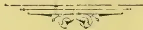
OBSERVER PRINTING WORKS.

1030------------------------------------------------

# TEA, COFFEE, CINCHONA, COCOA, AND CARDAMOM SALES.

NO. 1.]

COLOMBO, JANUARY 13th, 1896.

PRICE:—12½ cents each; 3 copies  
30 cents; 6 copies ½ rupee.

## COLOMBO SALES OF TEA.

### LARGE LOTS.

[MESSRS. BENHAM & BREMNER.—25,298 lb.]

<table border="1">
<thead>
<tr>
<th>Lot.</th>
<th>Box</th>
<th>Pks.</th>
<th>Name.</th>
<th>lb.</th>
<th>c.</th>
</tr>
</thead>
<tbody>
<tr>
<td>2 Hornsey</td>
<td>48</td>
<td>9 ch</td>
<td>pek son</td>
<td>900</td>
<td>32 bid</td>
</tr>
<tr>
<td>3 Balgownie</td>
<td>52</td>
<td>17 do</td>
<td>bro pek</td>
<td>1790</td>
<td>36 bid</td>
</tr>
<tr>
<td>5</td>
<td>54</td>
<td>25 do</td>
<td>pekoe</td>
<td>1800</td>
<td>29</td>
</tr>
<tr>
<td>6</td>
<td>56</td>
<td>13 do</td>
<td>pek son</td>
<td>1170</td>
<td>27</td>
</tr>
<tr>
<td>8 Battalgalla</td>
<td>60</td>
<td>9 ch</td>
<td>pek son</td>
<td>900</td>
<td>36</td>
</tr>
<tr>
<td>9</td>
<td>62</td>
<td>4 do</td>
<td>bro tea</td>
<td>400</td>
<td>21</td>
</tr>
<tr>
<td>10</td>
<td>64</td>
<td>5 do</td>
<td>fans</td>
<td>450</td>
<td>33</td>
</tr>
<tr>
<td>15 Acrawatte</td>
<td>72</td>
<td>8 ch</td>
<td>or pek</td>
<td>720</td>
<td>50 bid</td>
</tr>
<tr>
<td>16</td>
<td>74</td>
<td>7 do</td>
<td>bro or pek</td>
<td>770</td>
<td>47</td>
</tr>
<tr>
<td>17</td>
<td>76</td>
<td>28 do</td>
<td>pekoe</td>
<td>2520</td>
<td>35</td>
</tr>
<tr>
<td>18</td>
<td>78</td>
<td>16 do</td>
<td>pek son</td>
<td>1600</td>
<td>31</td>
</tr>
<tr>
<td>20 Hiragala (B &amp; H)</td>
<td>82</td>
<td>12 ch</td>
<td>bro pek</td>
<td>912</td>
<td>38 bid</td>
</tr>
<tr>
<td>21</td>
<td>84</td>
<td>12 do</td>
<td>pekoe</td>
<td>984</td>
<td>30 bid</td>
</tr>
<tr>
<td>22</td>
<td>86</td>
<td>14 do</td>
<td>pek son</td>
<td>1400</td>
<td>29</td>
</tr>
<tr>
<td>24 Elston</td>
<td>90</td>
<td>23 ch</td>
<td>pe son No. 2</td>
<td>2070</td>
<td>29 bid</td>
</tr>
<tr>
<td>25 Ulapane</td>
<td>92</td>
<td>10 do</td>
<td>bro pek</td>
<td>1000</td>
<td>50</td>
</tr>
<tr>
<td>26</td>
<td>94</td>
<td>23 do</td>
<td>pekoe</td>
<td>1610</td>
<td>34</td>
</tr>
<tr>
<td>27</td>
<td>96</td>
<td>30 do</td>
<td>pe son</td>
<td>2250</td>
<td>29</td>
</tr>
<tr>
<td>28</td>
<td>98</td>
<td>7 do</td>
<td>son</td>
<td>455</td>
<td>27</td>
</tr>
</tbody>
</table>

[MESSRS. A. H. THOMPSON & Co., 93,490 lb.]

<table border="1">
<thead>
<tr>
<th>Lot</th>
<th>Box.</th>
<th>Pkgs.</th>
<th>Name.</th>
<th>lb.</th>
<th>c.</th>
</tr>
</thead>
<tbody>
<tr>
<td>11 Kennington</td>
<td>11</td>
<td>14 ch</td>
<td>son</td>
<td>1120</td>
<td>27</td>
</tr>
<tr>
<td>13</td>
<td>13</td>
<td>6 hf-ch</td>
<td>dust</td>
<td>480</td>
<td>31</td>
</tr>
<tr>
<td>14 Osborne</td>
<td>14</td>
<td>10 ch</td>
<td>fans</td>
<td>950</td>
<td>20</td>
</tr>
<tr>
<td>15</td>
<td>15</td>
<td>10 do</td>
<td>bro tea</td>
<td>1000</td>
<td>17</td>
</tr>
<tr>
<td>16 St. Leonards on Sea</td>
<td>16</td>
<td>9 ch</td>
<td>bro pek</td>
<td>900</td>
<td>43</td>
</tr>
<tr>
<td></td>
<td></td>
<td>9 do</td>
<td>do</td>
<td>900</td>
<td>43</td>
</tr>
<tr>
<td>17</td>
<td>17</td>
<td>7 do</td>
<td>pekoe</td>
<td>630</td>
<td>33</td>
</tr>
<tr>
<td>18 B &amp; D</td>
<td>18</td>
<td>14 ch</td>
<td>dust</td>
<td>2240</td>
<td>53</td>
</tr>
<tr>
<td>20 L</td>
<td>20</td>
<td>9 do</td>
<td>bro tea</td>
<td>900</td>
<td>12</td>
</tr>
<tr>
<td>22 M L C</td>
<td>22</td>
<td>26 hf-ch</td>
<td>son</td>
<td>1170</td>
<td>26</td>
</tr>
<tr>
<td>23</td>
<td>23</td>
<td>16 do</td>
<td>dust</td>
<td>1200</td>
<td>30</td>
</tr>
<tr>
<td>24</td>
<td>24</td>
<td>8 do</td>
<td>red leaf</td>
<td>400</td>
<td>20</td>
</tr>
<tr>
<td>25 Agra Elbedde</td>
<td>25</td>
<td>23 do</td>
<td>bro pek</td>
<td>1680</td>
<td>65</td>
</tr>
<tr>
<td>26</td>
<td>26</td>
<td>41 do</td>
<td>pekoe</td>
<td>2050</td>
<td>48</td>
</tr>
<tr>
<td>27</td>
<td>27</td>
<td>20 do</td>
<td>pek son</td>
<td>1000</td>
<td>39</td>
</tr>
<tr>
<td>28 Kalkande</td>
<td>28</td>
<td>27 do</td>
<td>pekoe</td>
<td>1350</td>
<td>34</td>
</tr>
<tr>
<td>29</td>
<td>29</td>
<td>20 do</td>
<td>pek son</td>
<td>1000</td>
<td>30</td>
</tr>
<tr>
<td>30</td>
<td>30</td>
<td>16 do</td>
<td>son</td>
<td>800</td>
<td>26</td>
</tr>
<tr>
<td>31</td>
<td>31</td>
<td>9 do</td>
<td>red leaf</td>
<td>450</td>
<td>15</td>
</tr>
<tr>
<td>32</td>
<td>32</td>
<td>7 do</td>
<td>dust</td>
<td>420</td>
<td>32</td>
</tr>
<tr>
<td>33 Nahaveena</td>
<td>33</td>
<td>19 do</td>
<td>bro pek</td>
<td>950</td>
<td>47</td>
</tr>
<tr>
<td>35</td>
<td>35</td>
<td>8 do</td>
<td>pek No. 2</td>
<td>400</td>
<td>34</td>
</tr>
<tr>
<td>36</td>
<td>36</td>
<td>12 do</td>
<td>pek son</td>
<td>600</td>
<td>31</td>
</tr>
<tr>
<td>38 Charlie Hill</td>
<td>38</td>
<td>9 hf-ch</td>
<td>bro pek</td>
<td>450</td>
<td>38</td>
</tr>
<tr>
<td>42 Court Lodge</td>
<td>42</td>
<td>9 ch</td>
<td>bro pek</td>
<td>1080</td>
<td>51 bid</td>
</tr>
<tr>
<td>43 Madampe</td>
<td>43</td>
<td>29 hf-ch</td>
<td>bro pek</td>
<td>1600</td>
<td>46</td>
</tr>
<tr>
<td>44</td>
<td>44</td>
<td>16 do</td>
<td>pekoe</td>
<td>800</td>
<td>35</td>
</tr>
<tr>
<td>45 Rakwane</td>
<td>45</td>
<td>6 ch</td>
<td>fans</td>
<td>660</td>
<td>24 bid</td>
</tr>
<tr>
<td>47 R W E</td>
<td>47</td>
<td>13 ch</td>
<td>dust</td>
<td>1980</td>
<td>21 bid</td>
</tr>
<tr>
<td>48 Sapitiyagoda</td>
<td>48</td>
<td>23 do</td>
<td>bro or pek</td>
<td>2530</td>
<td>56</td>
</tr>
<tr>
<td>49</td>
<td>49</td>
<td>41 do</td>
<td>bro pek</td>
<td>1100</td>
<td>51</td>
</tr>
<tr>
<td>50</td>
<td>50</td>
<td>50 do</td>
<td>or pek</td>
<td>4500</td>
<td>45</td>
</tr>
<tr>
<td>51</td>
<td>51</td>
<td>34 do</td>
<td>pekoe</td>
<td>3400</td>
<td>38</td>
</tr>
<tr>
<td>52</td>
<td>52</td>
<td>20 do</td>
<td>pek son</td>
<td>2000</td>
<td>36</td>
</tr>
<tr>
<td>53 Ratnattenne</td>
<td>53</td>
<td>6 ch</td>
<td>bro pek</td>
<td>600</td>
<td>39</td>
</tr>
<tr>
<td>54 A T, in estate mark</td>
<td>54</td>
<td>5 ch</td>
<td>bro pek</td>
<td>600</td>
<td>36 bid</td>
</tr>
<tr>
<td>55</td>
<td>55</td>
<td>4 do</td>
<td>pekoe</td>
<td>460</td>
<td>31</td>
</tr>
<tr>
<td>62 Ossington</td>
<td>62</td>
<td>17 do</td>
<td>bro pek</td>
<td>1870</td>
<td>43 bid</td>
</tr>
<tr>
<td>63 Pambagama</td>
<td>63</td>
<td>4 do</td>
<td>fans</td>
<td>400</td>
<td>27</td>
</tr>
<tr>
<td>64</td>
<td>64</td>
<td>7 hf-ch</td>
<td>dust</td>
<td>630</td>
<td>31</td>
</tr>
<tr>
<td>65 P</td>
<td>65</td>
<td>34 do</td>
<td>bro tea</td>
<td>1700</td>
<td>12 bid</td>
</tr>
<tr>
<td>66 N N</td>
<td>66</td>
<td>6 ch</td>
<td>bro pek</td>
<td>600</td>
<td>31 bid</td>
</tr>
<tr>
<td>67</td>
<td>67</td>
<td>6 do</td>
<td>pekoe</td>
<td>552</td>
<td>27 bid</td>
</tr>
<tr>
<td>72 Myraganga, P T</td>
<td>72</td>
<td>13 ch</td>
<td>bro pek</td>
<td>1265</td>
<td>42</td>
</tr>
<tr>
<td>73</td>
<td>73</td>
<td>8 do</td>
<td>pekoe</td>
<td>760</td>
<td>34</td>
</tr>
<tr>
<td>74</td>
<td>74</td>
<td>5 do</td>
<td>fans</td>
<td>650</td>
<td>35</td>
</tr>
<tr>
<td>76 A B L</td>
<td>76</td>
<td>8 ch</td>
<td>red leaf fans</td>
<td>800</td>
<td>16</td>
</tr>
<tr>
<td>77</td>
<td>77</td>
<td>7 do</td>
<td>fans</td>
<td>700</td>
<td>36</td>
</tr>
<tr>
<td>79 A G C</td>
<td>79</td>
<td>9 do</td>
<td>pek son</td>
<td>900</td>
<td>23</td>
</tr>
<tr>
<td>80</td>
<td>80</td>
<td>12 do</td>
<td>dust</td>
<td>1800</td>
<td>27</td>
</tr>
<tr>
<td>81 N X X</td>
<td>81</td>
<td>4 do</td>
<td>unas</td>
<td>480</td>
<td>16</td>
</tr>
</tbody>
</table>

<table border="1">
<thead>
<tr>
<th>Lot</th>
<th>Box</th>
<th>Pkgs.</th>
<th>Name</th>
<th>lb.</th>
<th>c.</th>
</tr>
</thead>
<tbody>
<tr>
<td>83 Tallegalla Kand</td>
<td>83</td>
<td>8 hf-ch</td>
<td>bro pek</td>
<td>480</td>
<td>40 bid</td>
</tr>
<tr>
<td>84</td>
<td>84</td>
<td>16 do</td>
<td>pekoe</td>
<td>960</td>
<td>30 bid</td>
</tr>
<tr>
<td>86 Poomudi</td>
<td>86</td>
<td>13 ch</td>
<td>or pek</td>
<td>1365</td>
<td>46 bid</td>
</tr>
<tr>
<td>87</td>
<td>87</td>
<td>30 do</td>
<td>pekoe</td>
<td>3000</td>
<td>34</td>
</tr>
<tr>
<td>88</td>
<td>88</td>
<td>13 do</td>
<td>pe son</td>
<td>1300</td>
<td>30</td>
</tr>
<tr>
<td>90 Bonaccord (Travancore)</td>
<td>90</td>
<td>16 ch</td>
<td>or pek</td>
<td>1764</td>
<td>46 bid</td>
</tr>
<tr>
<td>91</td>
<td>91</td>
<td>19 do</td>
<td>pekoe</td>
<td>1900</td>
<td>35</td>
</tr>
<tr>
<td>92</td>
<td>92</td>
<td>15 do</td>
<td>son</td>
<td>1500</td>
<td>30</td>
</tr>
<tr>
<td>94</td>
<td>94</td>
<td>4 do</td>
<td>bro mix</td>
<td>400</td>
<td>18</td>
</tr>
<tr>
<td>95 Bramore</td>
<td>95</td>
<td>12 hf-ch</td>
<td>or pek</td>
<td>660</td>
<td>47</td>
</tr>
<tr>
<td>96</td>
<td>96</td>
<td>8 ch</td>
<td>pekoe</td>
<td>800</td>
<td>35</td>
</tr>
<tr>
<td>97</td>
<td>97</td>
<td>5 do</td>
<td>pek son</td>
<td>450</td>
<td>34</td>
</tr>
<tr>
<td>98 Mandara Newara</td>
<td>98</td>
<td>11 ch</td>
<td>bro pek</td>
<td>1210</td>
<td>65 bid</td>
</tr>
<tr>
<td>99</td>
<td>99</td>
<td>4 do</td>
<td>pekoe</td>
<td>400</td>
<td>49</td>
</tr>
<tr>
<td>102 X Y</td>
<td>102</td>
<td>4 do</td>
<td>dust</td>
<td>470</td>
<td>22</td>
</tr>
<tr>
<td>104 B in estate mark, Dikoya</td>
<td>104</td>
<td>23 hf-ch</td>
<td>bro pek</td>
<td>1150</td>
<td>41</td>
</tr>
<tr>
<td>105</td>
<td>105</td>
<td>15 do</td>
<td>pekoe</td>
<td>750</td>
<td>33</td>
</tr>
<tr>
<td>106</td>
<td>106</td>
<td>20 do</td>
<td>pek son</td>
<td>1000</td>
<td>39</td>
</tr>
<tr>
<td>107</td>
<td>107</td>
<td>22 do</td>
<td>bro son</td>
<td>1100</td>
<td>23</td>
</tr>
</tbody>
</table>

[MESSRS. SOMERVILLE & Co., 281,649 lb.]

<table border="1">
<thead>
<tr>
<th>Lot.</th>
<th>Box.</th>
<th>pkgs.</th>
<th>Name.</th>
<th>lb.</th>
<th>c.</th>
</tr>
</thead>
<tbody>
<tr>
<td>1 J S</td>
<td>1</td>
<td>5 ch</td>
<td>pek son</td>
<td>475</td>
<td>35</td>
</tr>
<tr>
<td>2</td>
<td>2</td>
<td>10 do</td>
<td>son</td>
<td>900</td>
<td>33</td>
</tr>
<tr>
<td>3</td>
<td>3</td>
<td>7 hf-ch</td>
<td>dust</td>
<td>630</td>
<td>31</td>
</tr>
<tr>
<td>4 A C W in est. mark Doragalla Rondura</td>
<td>4</td>
<td>51 ch</td>
<td>red leaf</td>
<td>4644</td>
<td>14</td>
</tr>
<tr>
<td>5</td>
<td>5</td>
<td>9 do</td>
<td>bro tea</td>
<td>855</td>
<td>19</td>
</tr>
<tr>
<td>6</td>
<td>6</td>
<td>13 do</td>
<td>fans</td>
<td>780</td>
<td>31</td>
</tr>
<tr>
<td>7</td>
<td>7</td>
<td>10 do</td>
<td>dust</td>
<td>830</td>
<td>31</td>
</tr>
<tr>
<td>8 Nanagoda</td>
<td>8</td>
<td>12 do</td>
<td>bro pek</td>
<td>1260</td>
<td>38</td>
</tr>
<tr>
<td>9</td>
<td>9</td>
<td>13 do</td>
<td>pekoe</td>
<td>1300</td>
<td>33</td>
</tr>
<tr>
<td>10</td>
<td>10</td>
<td>11 do</td>
<td>pek son</td>
<td>600</td>
<td>30</td>
</tr>
<tr>
<td>12 Kudaganga</td>
<td>12</td>
<td>15 do</td>
<td>bro pek</td>
<td>1680</td>
<td>43 bid</td>
</tr>
<tr>
<td>13</td>
<td>13</td>
<td>8 do</td>
<td>pekoe</td>
<td>840</td>
<td>32</td>
</tr>
<tr>
<td>14</td>
<td>14</td>
<td>18 do</td>
<td>pek son</td>
<td>1500</td>
<td>29</td>
</tr>
<tr>
<td>18 G S L</td>
<td>18</td>
<td>12 hf-ch</td>
<td>son No. 1</td>
<td>600</td>
<td>23</td>
</tr>
<tr>
<td>25 Koorooloogalla</td>
<td>25</td>
<td>12 ch</td>
<td>bro pek</td>
<td>1200</td>
<td>51</td>
</tr>
<tr>
<td>26</td>
<td>26</td>
<td>12 do</td>
<td>pekoe</td>
<td>1200</td>
<td>40</td>
</tr>
<tr>
<td>30 Ukuwela</td>
<td>36</td>
<td>21 do</td>
<td>bro pek</td>
<td>2100</td>
<td>43</td>
</tr>
<tr>
<td>31</td>
<td>31</td>
<td>12 do</td>
<td>pekoe</td>
<td>1200</td>
<td>34</td>
</tr>
<tr>
<td>32</td>
<td>32</td>
<td>12 do</td>
<td>pek son</td>
<td>1140</td>
<td>30</td>
</tr>
<tr>
<td>34 Kelani</td>
<td>34</td>
<td>61 hf-ch</td>
<td>bro pek</td>
<td>3355</td>
<td>41 bid</td>
</tr>
<tr>
<td>35</td>
<td>35</td>
<td>46 do</td>
<td>pekoe</td>
<td>2300</td>
<td>31</td>
</tr>
<tr>
<td>36</td>
<td>36</td>
<td>26 do</td>
<td>pek son</td>
<td>1170</td>
<td>28</td>
</tr>
<tr>
<td>38</td>
<td>38</td>
<td>9 do</td>
<td>fans</td>
<td>540</td>
<td>37</td>
</tr>
<tr>
<td>40 Summerville Ceylon est. in est. mark</td>
<td>40</td>
<td>12 ch</td>
<td>bro pek</td>
<td>1200</td>
<td>59 bid</td>
</tr>
<tr>
<td>41</td>
<td>41</td>
<td>23 do</td>
<td>or pek</td>
<td>2185</td>
<td>46</td>
</tr>
<tr>
<td>42</td>
<td>42</td>
<td>11 do</td>
<td>pekoe</td>
<td>1330</td>
<td>36</td>
</tr>
<tr>
<td>43 S V in est. mark</td>
<td>43</td>
<td>5 do</td>
<td>dust</td>
<td>750</td>
<td>32</td>
</tr>
<tr>
<td>44</td>
<td>44</td>
<td>7 do</td>
<td>fans</td>
<td>700</td>
<td>19</td>
</tr>
<tr>
<td>45 Arslena</td>
<td>45</td>
<td>43 hf-ch</td>
<td>bro pek</td>
<td>2150</td>
<td>48 bid</td>
</tr>
<tr>
<td>46</td>
<td>46</td>
<td>46 do</td>
<td>pekoe</td>
<td>2300</td>
<td>38</td>
</tr>
<tr>
<td>47</td>
<td>47</td>
<td>30 do</td>
<td>pek son</td>
<td>1934</td>
<td>32</td>
</tr>
<tr>
<td>48 Yarrow</td>
<td>48</td>
<td>56 do</td>
<td>bro pek</td>
<td>3136</td>
<td>43 bid</td>
</tr>
<tr>
<td>49</td>
<td>49</td>
<td>53 do</td>
<td>pekoe</td>
<td>2650</td>
<td>37</td>
</tr>
<tr>
<td>50 V in estate mark</td>
<td>50</td>
<td>7 do</td>
<td>dust</td>
<td>490</td>
<td>35</td>
</tr>
<tr>
<td>51 Rothes</td>
<td>51</td>
<td>57 boxes</td>
<td>pekoe</td>
<td>912</td>
<td>35</td>
</tr>
<tr>
<td>52 Troy</td>
<td>52</td>
<td>22 ch</td>
<td>bro pek</td>
<td>2640</td>
<td>40 bid</td>
</tr>
<tr>
<td>53</td>
<td>53</td>
<td>12 do</td>
<td>pekoe</td>
<td>1176</td>
<td>38</td>
</tr>
<tr>
<td>54</td>
<td>54</td>
<td>25 do</td>
<td>pek son</td>
<td>2150</td>
<td>32</td>
</tr>
<tr>
<td>58 G W</td>
<td>58</td>
<td>11 do</td>
<td>son</td>
<td>880</td>
<td>29</td>
</tr>
<tr>
<td>60</td>
<td>60</td>
<td>9 hf-ch</td>
<td>fans</td>
<td>540</td>
<td>36</td>
</tr>
<tr>
<td>61</td>
<td>61</td>
<td>7 do</td>
<td>dust</td>
<td>490</td>
<td>33</td>
</tr>
<tr>
<td>62 Forest Hill</td>
<td>62</td>
<td>15 ch</td>
<td>bro pek</td>
<td>1590</td>
<td>48</td>
</tr>
<tr>
<td>63</td>
<td>63</td>
<td>27 do</td>
<td>pekoe</td>
<td>2808</td>
<td>35</td>
</tr>
<tr>
<td>64</td>
<td>64</td>
<td>6 do</td>
<td>pek son</td>
<td>552</td>
<td>31</td>
</tr>
<tr>
<td>66 Mousakanda</td>
<td>66</td>
<td>13 do</td>
<td>bro pek</td>
<td>1365</td>
<td>46</td>
</tr>
<tr>
<td>67</td>
<td>67</td>
<td>22 do</td>
<td>pekoe</td>
<td>2266</td>
<td>34</td>
</tr>
<tr>
<td>68</td>
<td>68</td>
<td>9 do</td>
<td>pek son</td>
<td>792</td>
<td>30</td>
</tr>
<tr>
<td>69 Mahattenne</td>
<td>69</td>
<td>18 do</td>
<td>bro pek</td>
<td>1800</td>
<td>41</td>
</tr>
<tr>
<td>70</td>
<td>70</td>
<td>19 do</td>
<td>pekoe</td>
<td>1900</td>
<td>32</td>
</tr>
<tr>
<td>71</td>
<td>71</td>
<td>7 do</td>
<td>pek son</td>
<td>700</td>
<td>29</td>
</tr>
<tr>
<td>74 Arslena</td>
<td>74</td>
<td>36 hf-ch</td>
<td>bro pek</td>
<td>1800</td>
<td>48 bid</td>
</tr>
<tr>
<td>75</td>
<td>75</td>
<td>35 do</td>
<td>pekoe</td>
<td>1750</td>
<td>39</td>
</tr>
<tr>
<td>76</td>
<td>76</td>
<td>29 do</td>
<td>pek son</td>
<td>1450</td>
<td>30</td>
</tr>
</tbody>
</table>

1031------------------------------------------------

2CEYLON PRODUCE SALES LIST.

<table border="1">
<thead>
<tr>
<th>Lot.</th>
<th>Box.</th>
<th>Pkgs.</th>
<th>Names.</th>
<th>lb.</th>
<th>c.</th>
</tr>
</thead>
<tbody>
<tr><td>77</td><td>Allakolha</td><td>77 58</td><td>hf-ch bro pek</td><td>3190</td><td>39</td></tr>
<tr><td>78</td><td></td><td>78 25</td><td>do pekoe</td><td>1375</td><td>34</td></tr>
<tr><td>79</td><td></td><td>79 18</td><td>do pek sou</td><td>900</td><td>28</td></tr>
<tr><td>81</td><td></td><td>81 56</td><td>do bro pek</td><td>2750</td><td>39</td></tr>
<tr><td>82</td><td></td><td>82 17</td><td>ch pekoe</td><td>1615</td><td>34</td></tr>
<tr><td>83</td><td></td><td>83 15</td><td>do pek son</td><td>1350</td><td>28</td></tr>
<tr><td>85</td><td>Troy</td><td>85 20</td><td>do bro pek</td><td>2360</td><td>40 bid</td></tr>
<tr><td>86</td><td></td><td>86 12</td><td>do pekoe</td><td>1176</td><td>39</td></tr>
<tr><td>87</td><td></td><td>87 23</td><td>do pek sou</td><td>1978</td><td>32</td></tr>
<tr><td>88</td><td>Pelawatte</td><td>88 16</td><td>do bro pek</td><td>1765</td><td>39</td></tr>
<tr><td>89</td><td></td><td>89 11</td><td>do pekoe</td><td>1155</td><td>33</td></tr>
<tr><td>90</td><td></td><td>90 12</td><td>do pek son</td><td>1205</td><td>31</td></tr>
<tr><td>92</td><td>Rayigam</td><td>92 18</td><td>do bro pek</td><td>1890</td><td>57</td></tr>
<tr><td>93</td><td></td><td>93 24</td><td>do or pek</td><td>2160</td><td>43</td></tr>
<tr><td>94</td><td></td><td>94 6</td><td>do pekoe</td><td>540</td><td>36</td></tr>
<tr><td>95</td><td></td><td>95 12</td><td>do pek sou</td><td>1080</td><td>32</td></tr>
<tr><td>96</td><td>Irex</td><td>96 14</td><td>do bro pek</td><td>1400</td><td>42</td></tr>
<tr><td>97</td><td></td><td>97 12</td><td>do pekoe</td><td>1200</td><td>34</td></tr>
<tr><td>98</td><td></td><td>98 7</td><td>do pek sou</td><td>700</td><td>29</td></tr>
<tr><td>99</td><td>Hagalla</td><td>99 37</td><td>hf-ch bro pek</td><td>2200</td><td>40 bid</td></tr>
<tr><td>100</td><td></td><td>100 32</td><td>do pekoe</td><td>1600</td><td>37</td></tr>
<tr><td>101</td><td></td><td>101 10</td><td>ch pek sou</td><td>1000</td><td>30</td></tr>
<tr><td>104</td><td>Scarborough</td><td>104 5</td><td>hf-ch dust</td><td>445</td><td>35</td></tr>
<tr><td>106</td><td>Ovoca, A I</td><td>106 18</td><td>ch bro or pek</td><td>1800</td><td>66</td></tr>
<tr><td>107</td><td></td><td>107 13</td><td>do or pek</td><td>1300</td><td>50</td></tr>
<tr><td>108</td><td></td><td>108 14</td><td>do pekoe</td><td>1400</td><td>42</td></tr>
<tr><td>109</td><td></td><td>109 5</td><td>do unassorted</td><td>600</td><td>29</td></tr>
<tr><td>110</td><td></td><td>110 19</td><td>hf-ch dust</td><td>1805</td><td>32</td></tr>
<tr><td>111</td><td>Peria Kande-Kettia</td><td>111 21</td><td>ch bro pek</td><td>2520</td><td>41 bid</td></tr>
<tr><td>114</td><td></td><td>114 4</td><td>do bro mix</td><td>440</td><td>25</td></tr>
<tr><td>115</td><td></td><td>115 16</td><td>hf-ch dust</td><td>1200</td><td>34</td></tr>
<tr><td>116</td><td>Kehani</td><td>116 60</td><td>do bro pek</td><td>3300</td><td>42</td></tr>
<tr><td>117</td><td></td><td>117 44</td><td>do pekoe</td><td>2200</td><td>32</td></tr>
<tr><td>118</td><td></td><td>118 47</td><td>do pekoe son</td><td>2115</td><td>29</td></tr>
<tr><td>120</td><td></td><td>120 9</td><td>do fans</td><td>540</td><td>35</td></tr>
<tr><td>122</td><td>Ukuwela</td><td>122 30</td><td>ch bro pek</td><td>300</td><td>42</td></tr>
<tr><td>123</td><td></td><td>123 22</td><td>do pekoe</td><td>2200</td><td>33</td></tr>
<tr><td>124</td><td></td><td>124 16</td><td>do pek sou</td><td>1520</td><td>28</td></tr>
<tr><td>129</td><td>Warakamure</td><td>129 14</td><td>do bro pek</td><td>1400</td><td>40</td></tr>
<tr><td>130</td><td></td><td>130 12</td><td>do pekoe</td><td>1140</td><td>33</td></tr>
<tr><td>131</td><td></td><td>131 8</td><td>do pek sou</td><td>720</td><td>29</td></tr>
<tr><td>132</td><td>S in estate mark</td><td>132 7</td><td>do bro tea</td><td>700</td><td>19</td></tr>
<tr><td>133</td><td></td><td>133 25</td><td>hf-ch fans</td><td>1500</td><td>37</td></tr>
<tr><td>134</td><td></td><td>134 12</td><td>do dust</td><td>960</td><td>30</td></tr>
<tr><td>135</td><td>Rondura</td><td>135 5</td><td>ch bro tea</td><td>500</td><td>20</td></tr>
<tr><td>136</td><td></td><td>136 12</td><td>hf-ch fans</td><td>720</td><td>37</td></tr>
<tr><td>137</td><td></td><td>137 6</td><td>do dust</td><td>480</td><td>31</td></tr>
<tr><td>138</td><td>Gallawatte</td><td>138 12</td><td>ch bro pek</td><td>1200</td><td>38</td></tr>
<tr><td>139</td><td></td><td>139 10</td><td>do pekoe</td><td>950</td><td>32</td></tr>
<tr><td>142</td><td>Koorooloogalla</td><td>142 14</td><td>do bro pek</td><td>1400</td><td>50 bid</td></tr>
<tr><td>143</td><td></td><td>143 10</td><td>do pekoe</td><td>1000</td><td>40</td></tr>
<tr><td>145</td><td>Roseneath</td><td>145 59</td><td>hf-ch bro pek</td><td>3245</td><td>37 bid</td></tr>
<tr><td>146</td><td></td><td>146 18</td><td>ch pekoe</td><td>1620</td><td>31</td></tr>
<tr><td>147</td><td></td><td>147 17</td><td>do pek sou</td><td>1530</td><td>29</td></tr>
<tr><td>148</td><td>Kuruville</td><td>148 12</td><td>do bro or pek</td><td>1320</td><td>44 bid</td></tr>
<tr><td>149</td><td></td><td>149 37</td><td>do bro pek</td><td>3700</td><td>41 bid</td></tr>
<tr><td>150</td><td></td><td>150 80</td><td>do pekoe</td><td>6800</td><td>33 bid</td></tr>
<tr><td>151</td><td></td><td>151 12</td><td>do dust</td><td>1320</td><td>25</td></tr>
<tr><td>152</td><td>Ovoca A I</td><td>152 17</td><td>do bro or pek</td><td>1700</td><td>69</td></tr>
<tr><td>153</td><td></td><td>153 12</td><td>do or pek</td><td>1200</td><td>52</td></tr>
<tr><td>156</td><td>Paradise</td><td>156 18</td><td>ch bro pek</td><td>990</td><td>51</td></tr>
<tr><td>157</td><td></td><td>157 32</td><td>do pekoe</td><td>3104</td><td>33</td></tr>
<tr><td>158</td><td></td><td>158 17</td><td>hf-ch sou</td><td>816</td><td>28</td></tr>
<tr><td>159</td><td></td><td>159 8</td><td>do mas</td><td>432</td><td>30</td></tr>
<tr><td>161</td><td>Inchstelly and Woodthorpe</td><td>161 9</td><td>ch bro pek</td><td>900</td><td>54 bid</td></tr>
<tr><td>165</td><td></td><td>165 21</td><td>do pekoe</td><td>1470</td><td>37</td></tr>
<tr><td>166</td><td></td><td>166 26</td><td>do pek sou</td><td>1950</td><td>30</td></tr>
<tr><td>170</td><td>Kew</td><td>170 42</td><td>hf-ch bro pek</td><td>2436</td><td>75</td></tr>
<tr><td>171</td><td></td><td>171 36</td><td>ch pekoe</td><td>3312</td><td>51</td></tr>
<tr><td>172</td><td></td><td>172 31</td><td>do pek sou</td><td>2945</td><td>43</td></tr>
<tr><td>173</td><td>Kananka</td><td>173 17</td><td>do bro pek</td><td>1955</td><td>40</td></tr>
<tr><td>174</td><td></td><td>174 51</td><td>do pekoe</td><td>5100</td><td>33</td></tr>
<tr><td>175</td><td></td><td>175 6</td><td>do pek sou</td><td>540</td><td>29</td></tr>
<tr><td>182</td><td>Lyndhurst</td><td>182 15</td><td>ch bro pek</td><td>1500</td><td>41 bid</td></tr>
<tr><td>183</td><td></td><td>183 18</td><td>do pekoe</td><td>1530</td><td>37</td></tr>
<tr><td>184</td><td></td><td>184 14</td><td>do pek sou</td><td>1120</td><td>30</td></tr>
<tr><td>185</td><td></td><td>185 5</td><td>do bro tea</td><td>400</td><td>25</td></tr>
<tr><td>186</td><td></td><td>186 5</td><td>hf-ch dust</td><td>425</td><td>31</td></tr>
<tr><td>188</td><td>I P</td><td>188 46</td><td>ch pek sou</td><td>3450</td><td>28</td></tr>
<tr><td>197</td><td></td><td>189 21</td><td>hf-ch dust</td><td>1785</td><td>32</td></tr>
<tr><td>192</td><td>Chetnole</td><td>192 8</td><td>do congou</td><td>400</td><td>26</td></tr>
<tr><td>201</td><td>Ratwatte Cocoa Co.</td><td>201 22</td><td>ch bro pek</td><td>2200</td><td>40</td></tr>
<tr><td>202</td><td></td><td>202 16</td><td>do pekoe</td><td>1600</td><td>30 bid</td></tr>
<tr><td>203</td><td></td><td>203 15</td><td>do pek sou</td><td>1425</td><td>26 bid</td></tr>
<tr><td>206</td><td>Ahutkelle</td><td>206 7</td><td>hf-ch bro pek</td><td>420</td><td>37</td></tr>
<tr><td>207</td><td></td><td>207 10</td><td>do pekoe</td><td>500</td><td>30</td></tr>
<tr><td>214</td><td>Knutsford</td><td>214 29</td><td>do pekoe</td><td>1601</td><td>30</td></tr>
<tr><td>220</td><td>Citrus</td><td>220 6</td><td>ch bro pek</td><td>600</td><td>41</td></tr>
</tbody>
</table>

<table border="1">
<thead>
<tr>
<th>Lot.</th>
<th>Box.</th>
<th>Pkgs.</th>
<th>Names.</th>
<th>lb.</th>
<th>c.</th>
</tr>
</thead>
<tbody>
<tr><td>221</td><td></td><td>221 9</td><td>ch pekoe</td><td>900</td><td>32</td></tr>
<tr><td>222</td><td></td><td>222 7</td><td>do pek son</td><td>665</td><td>28</td></tr>
<tr><td>223</td><td></td><td>223 6</td><td>do pek fans</td><td>600</td><td>33</td></tr>
<tr><td>225</td><td>Gallawatte</td><td>225 11</td><td>do bro pek</td><td>900</td><td>37</td></tr>
<tr><td>228</td><td></td><td>228 18</td><td>do pekoe</td><td>925</td><td>30</td></tr>
<tr><td>232</td><td>Penrith</td><td>232 25</td><td>do bro pek</td><td>2500</td><td>60</td></tr>
<tr><td>233</td><td></td><td>233 23</td><td>do pekoe</td><td>1840</td><td>40</td></tr>
<tr><td>234</td><td></td><td>234 14</td><td>do pek son</td><td>1190</td><td>34</td></tr>
<tr><td>240</td><td>Vineit</td><td>240 9</td><td>do bro pek</td><td>900</td><td>41</td></tr>
<tr><td>241</td><td></td><td>241 11</td><td>do pekoe</td><td>1100</td><td>31</td></tr>
<tr><td>242</td><td></td><td>242 11</td><td>do pe son</td><td>1100</td><td>28</td></tr>
<tr><td>246</td><td>RCTF in est. mark</td><td>246 18</td><td>do bro pek</td><td>1800</td><td>38</td></tr>
<tr><td>247</td><td></td><td>247 18</td><td>do pek</td><td>1620</td><td>33</td></tr>
<tr><td>248</td><td></td><td>248 16</td><td>do pe sou</td><td>1280</td><td>28</td></tr>
</tbody>
</table>

[MR. E. JOHN.—187,900 lb.]

<table border="1">
<thead>
<tr>
<th>Lot</th>
<th>Box</th>
<th>Pkgs</th>
<th>Name</th>
<th>lb.</th>
<th>c.</th>
</tr>
</thead>
<tbody>
<tr><td>1</td><td>Dromore</td><td>29 9</td><td>ch bro pek</td><td>900</td><td>48 bid</td></tr>
<tr><td>2</td><td></td><td>31 10</td><td>do pekoe</td><td>1000</td><td>43</td></tr>
<tr><td>3</td><td></td><td>33 9</td><td>do pek sou</td><td>900</td><td>36</td></tr>
<tr><td>5</td><td>Oakfield</td><td>37 16</td><td>hf-ch bro pek</td><td>800</td><td>54</td></tr>
<tr><td>6</td><td></td><td>39 13</td><td>do pekoe</td><td>650</td><td>42</td></tr>
<tr><td>7</td><td></td><td>41 12</td><td>do pek sou</td><td>600</td><td>33</td></tr>
<tr><td>10</td><td>Durtry</td><td>47 5</td><td>ch pekoe</td><td>500</td><td>33</td></tr>
<tr><td>11</td><td></td><td>49 6</td><td>do bro mix</td><td>600</td><td>28</td></tr>
<tr><td>12</td><td>Ardlaw and Wishford</td><td>51 27</td><td>hf-ch or pek</td><td>1215</td><td>51 bid</td></tr>
<tr><td>13</td><td></td><td>53 42</td><td>do br or pe No.1</td><td>2310</td><td>60 bid</td></tr>
<tr><td>14</td><td></td><td>55 21</td><td>do do No.2</td><td>1386</td><td>55</td></tr>
<tr><td>15</td><td></td><td>57 23</td><td>ch pekoe</td><td>2070</td><td>42</td></tr>
<tr><td>16</td><td>O</td><td>59 12</td><td>do unas</td><td>1320</td><td>32</td></tr>
<tr><td>17</td><td>Agra Onvah</td><td>61 52</td><td>hf-ch bro or pek</td><td>3380</td><td>70</td></tr>
<tr><td>18</td><td></td><td>63 32</td><td>do or pek</td><td>1920</td><td>53</td></tr>
<tr><td>19</td><td></td><td>65 13</td><td>ch pekoe</td><td>1300</td><td>47</td></tr>
<tr><td>20</td><td></td><td>67 16</td><td>do pek sou</td><td>1600</td><td>36</td></tr>
<tr><td>21</td><td></td><td>69 12</td><td>hf-ch pek fans</td><td>960</td><td>37</td></tr>
<tr><td>22</td><td>Glentilt</td><td>71 16</td><td>ch bro pek</td><td>1680</td><td>47</td></tr>
<tr><td>23</td><td></td><td>73 12</td><td>do pek sou</td><td>1200</td><td>35</td></tr>
<tr><td>24</td><td>Doomoo</td><td>75 16</td><td>do bro pek</td><td>1760</td><td>52 bid</td></tr>
<tr><td>25</td><td></td><td>77 18</td><td>do pekoe</td><td>1800</td><td>45</td></tr>
<tr><td>26</td><td></td><td>79 25</td><td>do pek sou</td><td>500</td><td>35</td></tr>
<tr><td>28</td><td>Verelapatna</td><td>83 20</td><td>do bro pek</td><td>2240</td><td>53 bid</td></tr>
<tr><td>29</td><td></td><td>85 1</td><td>do pekoe</td><td>2100</td><td>50</td></tr>
<tr><td>32</td><td>Wlyddon</td><td>101 13</td><td>do bro pek</td><td>1300</td><td>58</td></tr>
<tr><td>33</td><td></td><td>103 13</td><td>do pekoe</td><td>1300</td><td>41</td></tr>
<tr><td>34</td><td></td><td>105 13</td><td>do pek sou</td><td>1300</td><td>35</td></tr>
<tr><td>35</td><td></td><td>107 4</td><td>do pek fans</td><td>500</td><td>37</td></tr>
<tr><td>37</td><td>Coskunda</td><td>111 41</td><td>do bro pek</td><td>4100</td><td>60</td></tr>
<tr><td>38</td><td></td><td>113 32</td><td>do pekoe</td><td>3200</td><td>40</td></tr>
<tr><td>39</td><td></td><td>115 21</td><td>do pek sou</td><td>1995</td><td>33</td></tr>
<tr><td>41</td><td></td><td>119 6</td><td>do pek dust</td><td>900</td><td>37</td></tr>
<tr><td>42</td><td>Uvakellie</td><td>121 13</td><td>do bro pek</td><td>1430</td><td>56 bid</td></tr>
<tr><td>43</td><td></td><td>123 13</td><td>do pekoe</td><td>1300</td><td>45</td></tr>
<tr><td>44</td><td></td><td>125 14</td><td>do pek sou</td><td>1400</td><td>36</td></tr>
<tr><td>45</td><td>Eila</td><td>127 63</td><td>do bro pek</td><td>5355</td><td>36 bid</td></tr>
<tr><td>46</td><td>Kanungana</td><td>129 39</td><td>do bro pek</td><td>3900</td><td>38 bid</td></tr>
<tr><td>47</td><td></td><td>131 42</td><td>do bro pek</td><td>4200</td><td>40</td></tr>
<tr><td>48</td><td></td><td>133 30</td><td>do pekoe</td><td>2700</td><td>31</td></tr>
<tr><td>49</td><td></td><td>135 12</td><td>do pek sou</td><td>1080</td><td>29</td></tr>
<tr><td>52</td><td></td><td>141 3</td><td>do dust</td><td>420</td><td>33</td></tr>
<tr><td>53</td><td>Hocha</td><td>143 35</td><td>do bro or pek</td><td>3850</td><td>64</td></tr>
<tr><td>54</td><td></td><td>145 22</td><td>do or pek</td><td>2090</td><td>49</td></tr>
<tr><td>55</td><td></td><td>147 12</td><td>do pekoe</td><td>1080</td><td>41</td></tr>
<tr><td>56</td><td>Stinsford</td><td>149 35</td><td>hf-ch bro pek</td><td>1575</td><td>58</td></tr>
<tr><td>57</td><td></td><td>151 49</td><td>do pekoe</td><td>1960</td><td>39</td></tr>
<tr><td>58</td><td></td><td>153 25</td><td>do pek sou</td><td>1000</td><td>32</td></tr>
<tr><td>59</td><td>Ivies</td><td>155 21</td><td>ch bro pek</td><td>2100</td><td>35 bid</td></tr>
<tr><td>60</td><td></td><td>157 25</td><td>do pekoe</td><td>2000</td><td>30</td></tr>
<tr><td>61</td><td></td><td>159 15</td><td>do pek sou</td><td>1350</td><td>28</td></tr>
<tr><td>63</td><td>Madultenna</td><td>163 21</td><td>ao bro pek</td><td>2100</td><td>50</td></tr>
<tr><td>64</td><td></td><td>165 24</td><td>do br pe No.2</td><td>2400</td><td>40</td></tr>
<tr><td>65</td><td></td><td>167 16</td><td>do do No.2</td><td>1589</td><td>40</td></tr>
<tr><td>65</td><td></td><td>169 21</td><td>do pekoe</td><td>2100</td><td>36</td></tr>
<tr><td>67</td><td></td><td>171 26</td><td>do pek sou</td><td>2566</td><td>30</td></tr>
<tr><td>68</td><td>Anchor, in est. mark</td><td>173 42</td><td>do bro or pek</td><td>4200</td><td>60</td></tr>
<tr><td>69</td><td></td><td>175 14</td><td>do or pek</td><td>1190</td><td>46</td></tr>
<tr><td>70</td><td></td><td>177 10</td><td>hf-ch pek sou</td><td>500</td><td>42</td></tr>
<tr><td>71</td><td>Ayr</td><td>179 40</td><td>do bro pek</td><td>2000</td><td>59</td></tr>
<tr><td>72</td><td></td><td>181 33</td><td>ch pekoe</td><td>2475</td><td>34</td></tr>
<tr><td>73</td><td></td><td>183 18</td><td>do pek sou</td><td>1440</td><td>36</td></tr>
<tr><td>77</td><td>Gonavy</td><td>191 25</td><td>ch bro pek</td><td>2800</td><td>55</td></tr>
<tr><td>78</td><td></td><td>193 12</td><td>do pekoe</td><td>1224</td><td>45</td></tr>
<tr><td>79</td><td></td><td>195 8</td><td>do pek sou</td><td>720</td><td>39</td></tr>
<tr><td>81</td><td>Faithlie</td><td>199 6</td><td>do sou</td><td>570</td><td>29</td></tr>
<tr><td>84</td><td></td><td>205 12</td><td>hf-ch dust</td><td>840</td><td>29</td></tr>
<tr><td>85</td><td>Weymouth</td><td>207 20</td><td>do bro pek</td><td>1000</td><td>55 bid</td></tr>
<tr><td>86</td><td></td><td>209 17</td><td>ch pekoe</td><td>1275</td><td>33</td></tr>
</tbody>
</table>

1032------------------------------------------------

CEYLON PRODUCE SALES LIST.3

<table border="1">
<thead>
<tr>
<th>Lot.</th>
<th>Box.</th>
<th>Pkgs.</th>
<th>Names.</th>
<th>lb.</th>
<th>c.</th>
</tr>
</thead>
<tbody>
<tr><td>87</td><td>211</td><td>10</td><td>eh pek sou</td><td>800</td><td>29</td></tr>
<tr><td>92 Ferndale</td><td>221</td><td>11</td><td>do pekoe</td><td>990</td><td>44 bid</td></tr>
<tr><td>93</td><td>223</td><td>8</td><td>do pek sou</td><td>720</td><td>40</td></tr>
<tr><td>94 Claremont</td><td>225</td><td>18</td><td>do bro pek</td><td>1620</td><td>35</td></tr>
<tr><td>95</td><td>227</td><td>22</td><td>do pekoe</td><td>1760</td><td>30</td></tr>
<tr><td>96</td><td>229</td><td>13</td><td>do pek sou</td><td>975</td><td>28</td></tr>
<tr><td>99 Almoor</td><td>235</td><td>27</td><td>hf-ch bro pek</td><td>1485</td><td>42</td></tr>
<tr><td>100</td><td>237</td><td>21</td><td>do pekoe</td><td>1050</td><td>38</td></tr>
<tr><td>101</td><td>239</td><td>16</td><td>do pek sou</td><td>800</td><td>30</td></tr>
<tr><td>102</td><td>241</td><td>6</td><td>do fans</td><td>420</td><td>34</td></tr>
<tr><td>103 Keenagaha Ella</td><td>243</td><td>6</td><td>eh bro tea</td><td>750</td><td>30</td></tr>
<tr><td>105 Pati Rajah</td><td>247</td><td>32</td><td>do bro pek</td><td>2880</td><td>56</td></tr>
<tr><td>106</td><td>249</td><td>19</td><td>do pekoe</td><td>1425</td><td>41</td></tr>
<tr><td>107</td><td>251</td><td>12</td><td>do pek son</td><td>960</td><td>32 bid</td></tr>
<tr><td>109 Glentilt</td><td>255</td><td>36</td><td>do bro pek</td><td>3780</td><td>51</td></tr>
<tr><td>110</td><td>257</td><td>26</td><td>do pek sou</td><td>2600</td><td>39</td></tr>
<tr><td>111</td><td>259</td><td>20</td><td>hf-ch dust</td><td>1400</td><td>34</td></tr>
<tr><td>112 Stinsford</td><td>261</td><td>31</td><td>do bro pek</td><td>1705</td><td>60</td></tr>
<tr><td>113</td><td>263</td><td>65</td><td>do pekoe</td><td>2925</td><td>39</td></tr>
<tr><td>114</td><td>265</td><td>20</td><td>do pek sou</td><td>900</td><td>33</td></tr>
<tr><td>120 C</td><td>277</td><td>8</td><td>do sou</td><td>640</td><td>29</td></tr>
<tr><td>122</td><td>281</td><td>6</td><td>eh fans</td><td>630</td><td>36</td></tr>
<tr><td>123 St. Clair</td><td>283</td><td>10</td><td>do sou</td><td>960</td><td>25</td></tr>
<tr><td>124 E T K</td><td>285</td><td>7</td><td>do pekoe</td><td>700</td><td>40</td></tr>
<tr><td>126</td><td>289</td><td>13</td><td>do red leaf</td><td>1300</td><td>19</td></tr>
<tr><td>129 Glasgow</td><td>304</td><td>50</td><td>do bro or pek</td><td>3750</td><td>72</td></tr>
<tr><td>130</td><td>306</td><td>31</td><td>do or pek</td><td>1860</td><td>52 bid</td></tr>
<tr><td>131</td><td>308</td><td>26</td><td>do pekoe</td><td>2470</td><td>47</td></tr>
<tr><td>132</td><td>310</td><td>16</td><td>do pek sou</td><td>1600</td><td>39</td></tr>
<tr><td>139 Yahalakela</td><td>324</td><td>3</td><td>do dust</td><td>450</td><td>30</td></tr>
<tr><td>144 Tarf</td><td>332</td><td>9</td><td>do bro pek</td><td>1035</td><td>32</td></tr>
<tr><td>145</td><td>334</td><td>13</td><td>do pekoe</td><td>1365</td><td>31</td></tr>
<tr><td>146</td><td>336</td><td>4</td><td>do pek sou</td><td>400</td><td>27</td></tr>
<tr><td>147 G T</td><td>338</td><td>7</td><td>hf-ch dust</td><td>665</td><td>33</td></tr>
<tr><td>148</td><td>340</td><td>11</td><td>eh congou</td><td>1100</td><td>38</td></tr>
<tr><td>149 Garnby</td><td>342</td><td>3</td><td>do unas</td><td>500</td><td>33</td></tr>
<tr><td>150 R L</td><td>344</td><td>15</td><td>eh bro pek</td><td>1650</td><td>39 bid</td></tr>
<tr><td>151</td><td>346</td><td>6</td><td>do pekoe</td><td>570</td><td>34</td></tr>
<tr><td>152</td><td>348</td><td>5</td><td>do pek sou</td><td>450</td><td>31</td></tr>
<tr><td>154 Maryland</td><td>351</td><td>5</td><td>do bro pek</td><td>550</td><td>43</td></tr>
<tr><td>155</td><td>353</td><td>6</td><td>do pekoe</td><td>630</td><td>32</td></tr>
<tr><td>157 Ottery and Stam- ford Hill</td><td>355</td><td>17</td><td>16 do bro pek</td><td>1600</td><td>60</td></tr>
<tr><td>158</td><td>357</td><td>19</td><td>17 do or pek</td><td>1465</td><td>59 bid</td></tr>
<tr><td>159</td><td>359</td><td>21</td><td>38 do pekoe</td><td>3420</td><td>40 bid</td></tr>
</tbody>
</table>

[MESSRS. FORBES & WALKER.—486,564 lb.]

<table border="1">
<thead>
<tr>
<th>Lot.</th>
<th>Box</th>
<th>Pks.</th>
<th>Name.</th>
<th>lb.</th>
<th>c.</th>
</tr>
</thead>
<tbody>
<tr><td>1 Andradeniya</td><td>660</td><td>5</td><td>eh bro pek</td><td>550</td><td>44</td></tr>
<tr><td>2</td><td>662</td><td>5</td><td>do pekoe</td><td>500</td><td>33</td></tr>
<tr><td>5 I K V</td><td>668</td><td>5</td><td>do bro mix</td><td>560</td><td>22</td></tr>
<tr><td>6 T D &amp; Co.</td><td>670</td><td>11</td><td>do dust</td><td>825</td><td>32</td></tr>
<tr><td>9 Goodwood</td><td>676</td><td>11</td><td>hf-ch p koe</td><td>605</td><td>40</td></tr>
<tr><td>12 Kelaneiya</td><td>682</td><td>41</td><td>eh bro pek</td><td>3485</td><td>59</td></tr>
<tr><td>13</td><td>684</td><td>37</td><td>do pekoe</td><td>3700</td><td>41</td></tr>
<tr><td>14</td><td>686</td><td>4</td><td>do pek son</td><td>400</td><td>30</td></tr>
<tr><td>16 Nahaveena</td><td>690</td><td>66</td><td>hf-ch bro pek</td><td>3300</td><td>47</td></tr>
<tr><td>17</td><td>692</td><td>24</td><td>do pekoe</td><td>1200</td><td>39</td></tr>
<tr><td>18</td><td>694</td><td>41</td><td>do pek No. 2</td><td>2050</td><td>38</td></tr>
<tr><td>19</td><td>696</td><td>27</td><td>do pek sou</td><td>1350</td><td>32</td></tr>
<tr><td>21 Hurstpierpoint</td><td>700</td><td>12</td><td>do bro pek</td><td>600</td><td>38</td></tr>
<tr><td>22</td><td>702</td><td>8</td><td>do pekoe</td><td>400</td><td>29</td></tr>
<tr><td>25 F &amp; H</td><td>708</td><td>10</td><td>eh or pek</td><td>1100</td><td>52</td></tr>
<tr><td>26</td><td>710</td><td>11</td><td>do bro pek</td><td>1045</td><td>47</td></tr>
<tr><td>29 Udabage</td><td>716</td><td>98</td><td>eh bro pek</td><td>5880</td><td>38 bid</td></tr>
<tr><td>30</td><td>718</td><td>49</td><td>do pekoe</td><td>2695</td><td>30</td></tr>
<tr><td>31</td><td>720</td><td>19</td><td>do pek sou</td><td>1045</td><td>28</td></tr>
<tr><td>32</td><td>722</td><td>13</td><td>do dust</td><td>910</td><td>34</td></tr>
<tr><td>33 Brechin</td><td>724</td><td>15</td><td>eh bro pek</td><td>1650</td><td>64</td></tr>
<tr><td>34</td><td>726</td><td>10</td><td>do pekoe</td><td>1050</td><td>42</td></tr>
<tr><td>35</td><td>728</td><td>5</td><td>do pek sou</td><td>500</td><td>38</td></tr>
<tr><td>37 Glenorchy</td><td>732</td><td>38</td><td>hf-ch bro pek</td><td>2090</td><td>63</td></tr>
<tr><td>38</td><td>734</td><td>60</td><td>do pekoe</td><td>3000</td><td>45</td></tr>
<tr><td>40 Thedden</td><td>738</td><td>44</td><td>do bro pek</td><td>2200</td><td>50</td></tr>
<tr><td>41</td><td>740</td><td>25</td><td>eh pekoe</td><td>2500</td><td>34</td></tr>
<tr><td>44 Venture (Fraven- core)</td><td>746</td><td>31</td><td>hf-ch pe son No 2</td><td>1550</td><td>29</td></tr>
<tr><td>45 B, in estate mark</td><td>748</td><td>5</td><td>eh sou</td><td>450</td><td>26</td></tr>
<tr><td>46</td><td>750</td><td>11</td><td>do dust</td><td>1540</td><td>35</td></tr>
<tr><td>47 Theberton</td><td>752</td><td>12</td><td>do bro pek</td><td>1200</td><td>43</td></tr>
<tr><td>48</td><td>754</td><td>12</td><td>do pekoe</td><td>1200</td><td>36</td></tr>
<tr><td>49</td><td>756</td><td>12</td><td>do pek sou</td><td>1200</td><td>31</td></tr>
<tr><td>50</td><td>758</td><td>11</td><td>do bro mixed</td><td>1100</td><td>23</td></tr>
<tr><td>51</td><td>760</td><td>12</td><td>do dust</td><td>1200</td><td>32</td></tr>
<tr><td>55 Blackstone</td><td>768</td><td>26</td><td>eh bro pek</td><td>2730</td><td>42 bid</td></tr>
<tr><td>56</td><td>770</td><td>42</td><td>do pekoe</td><td>3780</td><td>39</td></tr>
<tr><td>57</td><td>772</td><td>43</td><td>do pek son</td><td>3655</td><td>30</td></tr>
<tr><td>58</td><td>774</td><td>31</td><td>do bro tea</td><td>2790</td><td>25</td></tr>
</tbody>
</table>

<table border="1">
<thead>
<tr>
<th>Lot.</th>
<th>Box</th>
<th>Pkgs.</th>
<th>Name</th>
<th>lb.</th>
<th>c.</th>
</tr>
</thead>
<tbody>
<tr><td>59</td><td>776</td><td>13</td><td>ch pe fans</td><td>1235</td><td>33</td></tr>
<tr><td>60</td><td>778</td><td>5</td><td>do pek dust</td><td>600</td><td>33</td></tr>
<tr><td>65 Wattagalla</td><td>788</td><td>19</td><td>do bro or pek</td><td>2090</td><td>42</td></tr>
<tr><td>66</td><td>790</td><td>8</td><td>do or pek</td><td>880</td><td>40</td></tr>
<tr><td>67</td><td>792</td><td>39</td><td>do pekoe</td><td>3300</td><td>35</td></tr>
<tr><td>68</td><td>794</td><td>11</td><td>do pek sou</td><td>1100</td><td>32</td></tr>
<tr><td>70 E R</td><td>798</td><td>6</td><td>hf-ch dust</td><td>450</td><td>33</td></tr>
<tr><td>72 D A</td><td>802</td><td>16</td><td>do bro tea</td><td>800</td><td>23</td></tr>
<tr><td>73</td><td>804</td><td>6</td><td>do dust</td><td>480</td><td>31</td></tr>
<tr><td>74 High Forest</td><td>806</td><td>17</td><td>do bro pek</td><td>1001</td><td>62 bid</td></tr>
<tr><td>75</td><td>808</td><td>13</td><td>do pekoe</td><td>635</td><td>56</td></tr>
<tr><td>76</td><td>810</td><td>19</td><td>do pek sou</td><td>1025</td><td>42</td></tr>
<tr><td>78 Danmeria</td><td>814</td><td>40</td><td>ch bro or pek</td><td>4400</td><td>56</td></tr>
<tr><td>79</td><td>816</td><td>45</td><td>do pekoe</td><td>4500</td><td>41</td></tr>
<tr><td>80</td><td>818</td><td>7</td><td>do pek sou</td><td>700</td><td>34</td></tr>
<tr><td>83</td><td>824</td><td>4</td><td>do unas</td><td>465</td><td>27</td></tr>
<tr><td>84 D N</td><td>826</td><td>7</td><td>do bro or pek</td><td>770</td><td>41</td></tr>
<tr><td>85</td><td>828</td><td>8</td><td>do pekoe</td><td>806</td><td>34</td></tr>
<tr><td>86 M V</td><td>830</td><td>15</td><td>ch fans</td><td>1650</td><td>32</td></tr>
<tr><td>87</td><td>832</td><td>6</td><td>do dust</td><td>690</td><td>31</td></tr>
<tr><td>88</td><td>834</td><td>16</td><td>do bro mix</td><td>1520</td><td>24</td></tr>
<tr><td>89 Harrington</td><td>836</td><td>20</td><td>ch or pek</td><td>2200</td><td>63</td></tr>
<tr><td>90</td><td>838</td><td>11</td><td>do pekoe</td><td>1210</td><td>48</td></tr>
<tr><td>92 Tonacombe</td><td>842</td><td>30</td><td>ch or pek</td><td>3000</td><td>68 bid</td></tr>
<tr><td>93</td><td>844</td><td>18</td><td>do bro pek</td><td>1980</td><td>48</td></tr>
<tr><td>94</td><td>846</td><td>53</td><td>do pekoe</td><td>4770</td><td>45</td></tr>
<tr><td>95</td><td>848</td><td>16</td><td>do pek sou</td><td>1600</td><td>36</td></tr>
<tr><td>96 Rockside</td><td>850</td><td>8</td><td>ch bro pek</td><td>880</td><td>37</td></tr>
<tr><td>97</td><td>852</td><td>5</td><td>do pekoe</td><td>500</td><td>33</td></tr>
<tr><td>98</td><td>854</td><td>6</td><td>do pek sou</td><td>600</td><td>30</td></tr>
<tr><td>99 Devittra</td><td>856</td><td>27</td><td>do bro pek</td><td>2430</td><td>59</td></tr>
<tr><td>100</td><td>858</td><td>16</td><td>do pekoe</td><td>1200</td><td>39</td></tr>
<tr><td>101</td><td>860</td><td>9</td><td>do pek sou</td><td>720</td><td>31</td></tr>
<tr><td>102</td><td>862</td><td>4</td><td>do dust</td><td>460</td><td>34</td></tr>
<tr><td>103 Radella</td><td>864</td><td>27</td><td>ch bro pek</td><td>2700</td><td>61</td></tr>
<tr><td>104</td><td>866</td><td>25</td><td>do pekoe</td><td>2250</td><td>44</td></tr>
<tr><td>105</td><td>868</td><td>19</td><td>do pek sou</td><td>1710</td><td>38</td></tr>
<tr><td>109 M</td><td>876</td><td>4</td><td>do bro pek</td><td>400</td><td>39</td></tr>
<tr><td>112 Weoya</td><td>882</td><td>61</td><td>hf-ch bro pek</td><td>3355</td><td>51</td></tr>
<tr><td>113</td><td>884</td><td>39</td><td>ch pekoe</td><td>3510</td><td>36</td></tr>
<tr><td>114</td><td>886</td><td>40</td><td>hf-ch pek sou</td><td>3000</td><td>31</td></tr>
<tr><td>115 Bloomfield</td><td>888</td><td>34</td><td>ch flowery pek</td><td>3400</td><td>54</td></tr>
<tr><td>116</td><td>890</td><td>27</td><td>do pekoe</td><td>2700</td><td>42</td></tr>
<tr><td>117</td><td>892</td><td>13</td><td>do pek sou</td><td>1300</td><td>36</td></tr>
<tr><td>123 Erracht</td><td>904</td><td>45</td><td>hf-ch bro pek</td><td>2250</td><td>43</td></tr>
<tr><td>124</td><td>906</td><td>41</td><td>do pekoe</td><td>3485</td><td>36</td></tr>
<tr><td>125</td><td>908</td><td>11</td><td>ch pek sou</td><td>990</td><td>39</td></tr>
<tr><td>126 Chmes</td><td>910</td><td>50</td><td>do bro pek</td><td>2250</td><td>39</td></tr>
<tr><td>127</td><td>912</td><td>34</td><td>do pekoe</td><td>2890</td><td>39</td></tr>
<tr><td>128</td><td>914</td><td>10</td><td>do pek sou</td><td>900</td><td>27</td></tr>
<tr><td>129 Hayes</td><td>916</td><td>71</td><td>hf-ch bro pek</td><td>3550</td><td>39</td></tr>
<tr><td>130</td><td>918</td><td>44</td><td>do pekoe</td><td>1980</td><td>34</td></tr>
<tr><td>131</td><td>920</td><td>27</td><td>do pek sou</td><td>1215</td><td>31 bid</td></tr>
<tr><td>133 Gongalla</td><td>924</td><td>28</td><td>do bro pek</td><td>1430</td><td>38</td></tr>
<tr><td>134</td><td>926</td><td>16</td><td>do pekoe</td><td>755</td><td>33</td></tr>
<tr><td>135</td><td>928</td><td>11</td><td>do pek son</td><td>520</td><td>39</td></tr>
<tr><td>137 Ganapalla</td><td>932</td><td>104</td><td>hf-ch bro pek</td><td>5200</td><td>39 bid</td></tr>
<tr><td>138</td><td>934</td><td>85</td><td>ch pekoe</td><td>6800</td><td>39</td></tr>
<tr><td>139</td><td>936</td><td>51</td><td>do pek sou</td><td>4880</td><td>27</td></tr>
<tr><td>140</td><td>938</td><td>14</td><td>do bro pe fans</td><td>1400</td><td>30</td></tr>
<tr><td>141</td><td>940</td><td>5</td><td>do dust</td><td>700</td><td>31</td></tr>
<tr><td>142 High Forest</td><td>942</td><td>12</td><td>hf-ch bro pek</td><td>672</td><td>65 bid</td></tr>
<tr><td>143</td><td>944</td><td>18</td><td>do pekoe</td><td>900</td><td>69</td></tr>
<tr><td>144</td><td>946</td><td>15</td><td>do pek sou</td><td>810</td><td>42</td></tr>
<tr><td>146 Ragalla</td><td>950</td><td>4</td><td>ch bro mix</td><td>400</td><td>24</td></tr>
<tr><td>147</td><td>952</td><td>7</td><td>hf-ch fans</td><td>560</td><td>33</td></tr>
<tr><td>154 Dunbar</td><td>966</td><td>21</td><td>do or pek</td><td>882</td><td>52</td></tr>
<tr><td>155</td><td>968</td><td>32</td><td>do bro pek</td><td>1600</td><td>47</td></tr>
<tr><td>156</td><td>970</td><td>34</td><td>ch pekoe</td><td>2720</td><td>34</td></tr>
<tr><td>157 Patiagama</td><td>972</td><td>12</td><td>do bro or pek</td><td>1260</td><td>48</td></tr>
<tr><td>158</td><td>974</td><td>4</td><td>do bro pek</td><td>400</td><td>42</td></tr>
<tr><td>159</td><td>976</td><td>8</td><td>do pekoe</td><td>800</td><td>36</td></tr>
<tr><td>162 St. Heliers</td><td>982</td><td>25</td><td>hf-ch bro or pe</td><td>1375</td><td>46</td></tr>
<tr><td>163</td><td>984</td><td>27</td><td>ch pekoe</td><td>2700</td><td>57</td></tr>
<tr><td>164</td><td>986</td><td>5</td><td>do pek sou</td><td>500</td><td>20</td></tr>
<tr><td>166 Choughtleigh</td><td>990</td><td>21</td><td>do bro pek</td><td>2100</td><td>56 bid</td></tr>
<tr><td>167 Carfax</td><td>992</td><td>8</td><td>do bro or pek</td><td>880</td><td>59 bid</td></tr>
<tr><td>163</td><td>994</td><td>15</td><td>do or pek</td><td>1500</td><td>51</td></tr>
<tr><td>169</td><td>996</td><td>10</td><td>do bro pek</td><td>1100</td><td>42</td></tr>
<tr><td>170</td><td>998</td><td>9</td><td>do pekoe</td><td>855</td><td>41</td></tr>
<tr><td>171</td><td>1000</td><td>7</td><td>do dust</td><td>1120</td><td>33</td></tr>
<tr><td>172 Bagdad</td><td>2</td><td>19</td><td>ch dust</td><td>1900</td><td>26</td></tr>
<tr><td>174 Chesterford</td><td>6</td><td>26</td><td>do bro pek</td><td>2600</td><td>51</td></tr>
<tr><td>175</td><td>8</td><td>26</td><td>do pekoe</td><td>2600</td><td>33</td></tr>
<tr><td>176</td><td>10</td><td>26</td><td>do pek sou</td><td>2600</td><td>31</td></tr>
<tr><td>179 D K D</td><td>16</td><td>6</td><td>ch bro pek</td><td>600</td><td>33</td></tr>
<tr><td>180</td><td>18</td><td>4</td><td>do pekoe</td><td>400</td><td>26</td></tr>
<tr><td>181 Kelaneiya</td><td>20</td><td>40</td><td>ch bro pek</td><td>3400</td><td>54 bid</td></tr>
<tr><td>182</td><td>22</td><td>36</td><td>do pekoe</td><td>2600</td><td>49</td></tr>
<tr><td>183 Geragama</td><td>24</td><td>16</td><td>do bro pek</td><td>1760</td><td>47</td></tr>
<tr><td>184</td><td>26</td><td>10</td><td>do pekoe</td><td>1900</td><td>55</td></tr>
<tr><td>185</td><td>28</td><td>7</td><td>do pek sou</td><td>790</td><td>31</td></tr>
</tbody>
</table>

1033------------------------------------------------

4

CEYLON PRODUCE SALES LIST.

<table border="1">
<thead>
<tr>
<th>Lot.</th>
<th>Box.</th>
<th>Pkgs.</th>
<th>Name.</th>
<th>lb.</th>
<th>c.</th>
</tr>
</thead>
<tbody>
<tr><td>188</td><td>Castlereagh</td><td>34 28 ch</td><td>bro pek</td><td>2860</td><td>44</td></tr>
<tr><td>189</td><td></td><td>36 17 do</td><td>or pek</td><td>1530</td><td>44</td></tr>
<tr><td>190</td><td></td><td>38 20 do</td><td>pekoe</td><td>1800</td><td>47</td></tr>
<tr><td>191</td><td></td><td>40 6 do</td><td>pek son</td><td>480</td><td>32</td></tr>
<tr><td>192</td><td></td><td>42 6 hf-ch</td><td>dust</td><td>480</td><td>33</td></tr>
<tr><td>193</td><td>Blackstone</td><td>44 12 ch</td><td>bro pek</td><td>1200</td><td>43 bid</td></tr>
<tr><td>194</td><td></td><td>46 24 do</td><td>pekoe</td><td>2160</td><td>38</td></tr>
<tr><td>195</td><td></td><td>48 21 do</td><td>pe son</td><td>1890</td><td>31</td></tr>
<tr><td>196</td><td></td><td>50 19 do</td><td>bro tea</td><td>1710</td><td>26</td></tr>
<tr><td>197</td><td></td><td>52 10 do</td><td>pe fans</td><td>900</td><td>32</td></tr>
<tr><td>198</td><td>Ellawatte</td><td>56 20 ch</td><td>bro pek</td><td>2100</td><td>62</td></tr>
<tr><td>200</td><td>W H R</td><td>58 13 do</td><td>bro pek</td><td>1495</td><td>41</td></tr>
<tr><td>201</td><td></td><td>60 10 do</td><td>pekoe</td><td>950</td><td>35</td></tr>
<tr><td>203</td><td></td><td>64 8 do</td><td>dust</td><td>1280</td><td>33</td></tr>
<tr><td>204</td><td>Carlake</td><td>66 4 do</td><td>pek son</td><td>400</td><td>48</td></tr>
<tr><td>205</td><td></td><td>68 8 hf-ch</td><td>bro pe fans</td><td>520</td><td>42</td></tr>
<tr><td>208</td><td>M B O, in est. mark</td><td>74 24 ch</td><td>bro mix</td><td>1992</td><td>15</td></tr>
<tr><td>209</td><td>Torwood</td><td>76 26 do</td><td>bro pek</td><td>2652</td><td>59</td></tr>
<tr><td>210</td><td></td><td>78 36 do</td><td>pekoe</td><td>3060</td><td>38</td></tr>
<tr><td>211</td><td></td><td>80 6 do</td><td>pek son</td><td>510</td><td>30</td></tr>
<tr><td>216</td><td>Merlands</td><td>90 18 hf-ch</td><td>bro pek</td><td>900</td><td>51</td></tr>
<tr><td>217</td><td></td><td>92 9 ch</td><td>pekoe</td><td>900</td><td>43</td></tr>
<tr><td>218</td><td></td><td>94 5 do</td><td>pek son</td><td>500</td><td>33</td></tr>
<tr><td>219</td><td>Lochiel</td><td>96 29 box</td><td>bro or pe</td><td>580</td><td>60 bid</td></tr>
<tr><td>220</td><td></td><td>98 26 hf-ch</td><td>do</td><td>1430</td><td>45 bid</td></tr>
<tr><td>221</td><td></td><td>100 37 ch</td><td>bro pek</td><td>4070</td><td>47 bid</td></tr>
<tr><td>222</td><td></td><td>102 15 do</td><td>pek No. 1</td><td>1500</td><td>44 bid</td></tr>
<tr><td>224</td><td></td><td>106 6 do</td><td>bro pe dust</td><td>900</td><td>31</td></tr>
<tr><td>225</td><td>Yoxford</td><td>108 5 ch</td><td>bro pek</td><td>500</td><td>40</td></tr>
<tr><td>226</td><td></td><td>110 7 do</td><td>pekoe</td><td>630</td><td>35</td></tr>
<tr><td>227</td><td></td><td>112 4 do</td><td>dust</td><td>520</td><td>33</td></tr>
<tr><td>228</td><td>Scrubs</td><td>114 15 do</td><td>or pek</td><td>1425</td><td>50 bid</td></tr>
<tr><td>229</td><td></td><td>116 30 do</td><td>bro pek</td><td>3300</td><td>51</td></tr>
<tr><td>230</td><td></td><td>118 28 do</td><td>pekoe</td><td>2660</td><td>47</td></tr>
<tr><td>231</td><td></td><td>120 11 do</td><td>pek son</td><td>1045</td><td>36</td></tr>
<tr><td>232</td><td>Doonevale</td><td>122 14 ch</td><td>bro pek</td><td>1400</td><td>40</td></tr>
<tr><td>233</td><td></td><td>124 25 do</td><td>pekoe</td><td>2250</td><td>34</td></tr>
<tr><td>235</td><td>Arapolakande</td><td>128 7 ch</td><td>bro pek</td><td>665</td><td>47</td></tr>
<tr><td>236</td><td></td><td>130 10 do</td><td>pekoe</td><td>800</td><td>32</td></tr>
<tr><td>237</td><td>Melrose</td><td>132 14 do</td><td>bro pek</td><td>1540</td><td>39</td></tr>
<tr><td>238</td><td></td><td>134 7 do</td><td>pekoe</td><td>700</td><td>33</td></tr>
<tr><td>239</td><td></td><td>136 8 do</td><td>pek son</td><td>800</td><td>31</td></tr>
<tr><td>240</td><td>Ascot</td><td>138 8 ch</td><td>bro pek</td><td>800</td><td>39</td></tr>
<tr><td>241</td><td></td><td>140 9 do</td><td>pekoe</td><td>810</td><td>32</td></tr>
<tr><td>245</td><td></td><td>148 19 do</td><td>bro pek</td><td>1900</td><td>39</td></tr>
<tr><td>246</td><td></td><td>150 22 do</td><td>pekoe</td><td>1980</td><td>35</td></tr>
<tr><td>249</td><td>Anningkande</td><td>156 35 do</td><td>bro pek</td><td>3850</td><td>44</td></tr>
<tr><td>250</td><td></td><td>158 26 do</td><td>pekoe</td><td>2600</td><td>38</td></tr>
<tr><td>251</td><td>Lowlands</td><td>160 9 ch</td><td>bro pek</td><td>900</td><td>40</td></tr>
<tr><td>252</td><td></td><td>162 9 do</td><td>pekoe</td><td>810</td><td>31</td></tr>
<tr><td>256</td><td>Ederapolla</td><td>170 45 hf-ch</td><td>bro pek</td><td>2250</td><td>48</td></tr>
<tr><td>257</td><td></td><td>172 22 ch</td><td>pekoe</td><td>1870</td><td>36</td></tr>
<tr><td>258</td><td></td><td>174 43 do</td><td>pek son</td><td>3655</td><td>32</td></tr>
<tr><td>263</td><td>Demmark Hill</td><td>184 6 ch</td><td>or pek</td><td>540</td><td>78</td></tr>
<tr><td>268</td><td>Cottaganga</td><td>194 64 do</td><td>bro pek</td><td>6400</td><td>53</td></tr>
<tr><td>269</td><td></td><td>196 13 do</td><td>pekoe</td><td>1170</td><td>37</td></tr>
<tr><td>270</td><td></td><td>198 6 do</td><td>pek son</td><td>450</td><td>31</td></tr>
<tr><td>271</td><td>Talgaswela</td><td>200 25 ch</td><td>bro pek</td><td>2500</td><td>40</td></tr>
<tr><td>272</td><td></td><td>202 25 do</td><td>pekoe</td><td>2250</td><td>32</td></tr>
<tr><td>273</td><td></td><td>204 10 do</td><td>pek son</td><td>900</td><td>30</td></tr>
<tr><td>276</td><td>Cairnforth</td><td>210 34 hf-ch</td><td>bro pek</td><td>2210</td><td>57 bid</td></tr>
<tr><td>277</td><td></td><td>212 24 do</td><td>or pek</td><td>1200</td><td>73</td></tr>
<tr><td>278</td><td></td><td>214 31 do</td><td>pekoe</td><td>150</td><td>42 bid</td></tr>
<tr><td>279</td><td></td><td>216 17 do</td><td>pek son</td><td>850</td><td>35</td></tr>
<tr><td>280</td><td>C F</td><td>218 7 do</td><td>dust</td><td>455</td><td>35 bid</td></tr>
<tr><td>281</td><td>Cairnforth (Lower Division)</td><td>220 62 hf-ch</td><td>bro pek</td><td>3690</td><td>48 bid</td></tr>
<tr><td>282</td><td></td><td>222 24 do</td><td>or pek</td><td>1200</td><td>58</td></tr>
<tr><td>283</td><td>St. Helen</td><td>224 35 do</td><td>bro pek</td><td>2275</td><td>38 bid</td></tr>
<tr><td>284</td><td></td><td>226 29 do</td><td>pekoe</td><td>1120</td><td>34 bid</td></tr>
<tr><td>285</td><td></td><td>228 14 do</td><td>pe son</td><td>728</td><td>30</td></tr>
<tr><td>287</td><td>Meemoraoya</td><td>232 19 do</td><td>bro pek</td><td>760</td><td>33</td></tr>
<tr><td>288</td><td></td><td>234 13 do</td><td>pekoe</td><td>520</td><td>30</td></tr>
<tr><td>289</td><td>Pedro</td><td>236 27 ch</td><td>bro or pek</td><td>2970</td><td>80</td></tr>
<tr><td>290</td><td></td><td>238 21 do</td><td>pekoe</td><td>1890</td><td>53</td></tr>
<tr><td>291</td><td></td><td>240 16 do</td><td>pek son</td><td>1200</td><td>47</td></tr>
<tr><td>293</td><td>C R D</td><td>244 5 do</td><td>red leaf</td><td>500</td><td>17</td></tr>
<tr><td>294</td><td>Tymour</td><td>246 75 hf-ch</td><td>pek son</td><td>3750</td><td>42</td></tr>
<tr><td>295</td><td>A</td><td>248 8 ch</td><td>br pek</td><td>789</td><td>33</td></tr>
<tr><td>296</td><td></td><td>250 6 do</td><td>pekoe</td><td>630</td><td>39</td></tr>
<tr><td>297</td><td></td><td>252 18 do</td><td>dust</td><td>2700</td><td>withd'n.</td></tr>
<tr><td>304</td><td>S</td><td>266 8 do</td><td>dust</td><td>696</td><td>29</td></tr>
<tr><td>311</td><td>A S</td><td>280 3 do</td><td>dust</td><td>435</td><td>28</td></tr>
<tr><td>319</td><td>G</td><td>296 6 do</td><td>son</td><td>510</td><td>28</td></tr>
<tr><td>322</td><td>Knavesmire</td><td>302 23 do</td><td>do</td><td></td><td></td></tr>
<tr><td></td><td></td><td>1 hf-ch</td><td>bro pek</td><td>2360</td><td>41</td></tr>
<tr><td></td><td></td><td>1 ch</td><td>do</td><td></td><td></td></tr>
<tr><td></td><td></td><td>1 hf-ch</td><td>pekoe</td><td>3740</td><td>30</td></tr>
</tbody>
</table>

<table border="1">
<thead>
<tr>
<th>Lot.</th>
<th>Box</th>
<th>Pkgs</th>
<th>Name</th>
<th>lb.</th>
<th>c.</th>
</tr>
</thead>
<tbody>
<tr><td>324</td><td>306</td><td>27 ch</td><td>pek son</td><td>2430</td><td>27</td></tr>
<tr><td>327</td><td>312</td><td>20 do</td><td>pekoe</td><td>1800</td><td>30</td></tr>
<tr><td>328</td><td>314</td><td>20 do</td><td>pe son</td><td>1800</td><td>28</td></tr>
<tr><td>332</td><td>322</td><td>21 do</td><td>bro pek</td><td>2100</td><td>43</td></tr>
<tr><td>333</td><td>324</td><td>38 do</td><td>pekoe</td><td>3420</td><td>35</td></tr>
<tr><td>334</td><td>Pelatagama</td><td>326</td><td>25 do</td><td>bro pe</td><td>2500</td><td>40</td></tr>
<tr><td>335</td><td></td><td>328</td><td>12 do</td><td>pekoe</td><td>1200</td><td>31</td></tr>
<tr><td>336</td><td></td><td>330</td><td>8 do</td><td>pe son</td><td>800</td><td>26</td></tr>
<tr><td>337</td><td></td><td>332</td><td>6 do</td><td>fannings</td><td>600</td><td>35</td></tr>
<tr><td>338</td><td>Clunes</td><td>334</td><td>62 hf-ch</td><td>bro pe</td><td>2990</td><td>39</td></tr>
<tr><td>339</td><td></td><td>336</td><td>31 ch</td><td>pekoe</td><td>2890</td><td>30</td></tr>
<tr><td>340</td><td></td><td>338</td><td>5 do</td><td>pe son</td><td>450</td><td>27</td></tr>
<tr><td>345</td><td>Doranakanda</td><td>348</td><td>15 do</td><td>bro pe</td><td>1560</td><td>57</td></tr>
<tr><td>346</td><td></td><td>350</td><td>14 do</td><td>pekoe</td><td>1260</td><td>34</td></tr>
<tr><td>347</td><td></td><td>352</td><td>18 do</td><td>pe son</td><td>1530</td><td>30</td></tr>
<tr><td>352</td><td>Kirindi</td><td>362</td><td>6 do</td><td>bro pe</td><td>600</td><td>61</td></tr>
<tr><td>353</td><td></td><td>361</td><td>17 do</td><td>pekoe</td><td>1190</td><td>38</td></tr>
<tr><td>354</td><td></td><td>366</td><td>20 do</td><td>pe son</td><td>1500</td><td>31</td></tr>
<tr><td>357</td><td>Augusta</td><td>372</td><td>11 do</td><td>bro pe</td><td>1100</td><td>61</td></tr>
<tr><td>358</td><td></td><td>374</td><td>26 do</td><td>pekoe</td><td>1820</td><td>37 bid</td></tr>
<tr><td>359</td><td></td><td>376</td><td>33 do</td><td>pe son</td><td>2475</td><td>31</td></tr>
<tr><td>360</td><td></td><td>378</td><td>7 do</td><td>son</td><td>455</td><td>27</td></tr>
<tr><td>363</td><td>Matale</td><td>384</td><td>16 do</td><td>bro pe</td><td>1680</td><td>38</td></tr>
<tr><td>364</td><td></td><td>386</td><td>16 do</td><td>pekoe</td><td>1520</td><td>32</td></tr>
<tr><td>366</td><td>Langdale</td><td>390</td><td>26 do</td><td>bro pe</td><td>3120</td><td>withd'n.</td></tr>
<tr><td>367</td><td></td><td>392</td><td>27 do</td><td>pekoe</td><td>2700</td><td></td></tr>
<tr><td>375</td><td>L and E</td><td>408</td><td>29 do</td><td>br mixed</td><td>2610</td><td>14</td></tr>
<tr><td>379</td><td>Venture</td><td>416</td><td>22 hf-ch</td><td>pe so No. 2</td><td>1210</td><td>29</td></tr>
<tr><td>380</td><td>Mumamal</td><td>418</td><td>8 ch</td><td>bro pe</td><td>787</td><td>42</td></tr>
<tr><td>381</td><td></td><td>420</td><td>6 do</td><td>pekoe</td><td>577</td><td>32</td></tr>
<tr><td>390</td><td>Poyston</td><td>438</td><td>13 hf-ch</td><td>bro pe</td><td>780</td><td>54 bid</td></tr>
<tr><td>391</td><td></td><td>440</td><td>12 ch</td><td>pekoe</td><td>1200</td><td>52</td></tr>
<tr><td>393</td><td>Hayes</td><td>444</td><td>71 hf-ch</td><td>bro pe</td><td>3550</td><td>40</td></tr>
<tr><td>394</td><td></td><td>446</td><td>44 do</td><td>pekoe</td><td>1980</td><td>33</td></tr>
<tr><td>395</td><td></td><td>448</td><td>27 do</td><td>pe son</td><td>1215</td><td>29</td></tr>
<tr><td>397</td><td>Wattagalla</td><td>452</td><td>22 ch</td><td>bro or pe</td><td>2420</td><td>42</td></tr>
<tr><td>398</td><td></td><td>454</td><td>8 do</td><td>or pe</td><td>889</td><td>49</td></tr>
<tr><td>399</td><td></td><td>456</td><td>28 do</td><td>pekoe</td><td>3086</td><td>33 bid</td></tr>
<tr><td>400</td><td></td><td>458</td><td>12 do</td><td>pe son</td><td>1200</td><td>70</td></tr>
<tr><td>405</td><td>Iddagodde</td><td>468</td><td>8 do</td><td>bro pe</td><td>800</td><td>41 bid</td></tr>
<tr><td>406</td><td></td><td>470</td><td>19 do</td><td>pekoe</td><td>1710</td><td>36</td></tr>
<tr><td>407</td><td></td><td>472</td><td>14 do</td><td>pe son</td><td>1190</td><td>31</td></tr>
<tr><td>410</td><td>Devitura</td><td>478</td><td>27 do</td><td>bro pe</td><td>2430</td><td>62</td></tr>
<tr><td>411</td><td></td><td>480</td><td>24 do</td><td>pekoe</td><td>1920</td><td>40</td></tr>
<tr><td>412</td><td></td><td>482</td><td>10 do</td><td>pe son</td><td>800</td><td>32</td></tr>
<tr><td>413</td><td></td><td>484</td><td>4 do</td><td>dust</td><td>460</td><td>35</td></tr>
<tr><td>414</td><td>Barkindale</td><td>486</td><td>13 do</td><td>bro pe</td><td>1560</td><td>57</td></tr>
<tr><td>415</td><td></td><td>488</td><td>8 do</td><td>pekoe</td><td>720</td><td>45</td></tr>
</tbody>
</table>

SMALL LOTS.  
[MESSRS. A. H. THOMPSON & CO.]

<table border="1">
<thead>
<tr>
<th>Lot.</th>
<th>Box.</th>
<th>Pkgs.</th>
<th>Name.</th>
<th>lb.</th>
<th>c.</th>
</tr>
</thead>
<tbody>
<tr><td>12</td><td>Kemington</td><td>12 3 hf-ch</td><td>bro tea</td><td>165</td><td>25</td></tr>
<tr><td>21</td><td>P R</td><td>21 1 ch</td><td>do</td><td></td><td></td></tr>
<tr><td></td><td></td><td>1 hf-ch</td><td>pekoe</td><td>145</td><td>24</td></tr>
<tr><td>34</td><td>Nahaveera</td><td>34 7 do</td><td>pekoe</td><td>350</td><td>37</td></tr>
<tr><td>37</td><td></td><td>37 1 do</td><td>dust</td><td>80</td><td>32</td></tr>
<tr><td>39</td><td>Glengariffe</td><td>39 4 ch</td><td>son</td><td>320</td><td>26</td></tr>
<tr><td>40</td><td></td><td>40 1 do</td><td>dust</td><td>150</td><td>32</td></tr>
<tr><td>41</td><td></td><td>41 1 do</td><td>red leaf</td><td>80</td><td>23</td></tr>
<tr><td>46</td><td>Rakwane</td><td>46 2 ch</td><td>dust</td><td>300</td><td>29</td></tr>
<tr><td>56</td><td>A T, in estate mark</td><td>56 2 ch</td><td>pek son</td><td>230</td><td>27</td></tr>
<tr><td>57</td><td>P B</td><td>57 4 do</td><td>dust</td><td>360</td><td>29</td></tr>
<tr><td>58</td><td></td><td>58 1 do</td><td>fans</td><td>130</td><td>32</td></tr>
<tr><td>59</td><td></td><td>59 1 do</td><td>red leaf</td><td>100</td><td>15</td></tr>
<tr><td>60</td><td>Woodend</td><td>60 1 do</td><td>dust</td><td>150</td><td>31</td></tr>
<tr><td>61</td><td></td><td>61 1 do</td><td>congon</td><td>90</td><td>25</td></tr>
<tr><td>68</td><td>X N</td><td>68 1 ch</td><td>mas</td><td>80</td><td>21</td></tr>
<tr><td>69</td><td>Ugieside</td><td>69 1 do</td><td>pe fans</td><td>100</td><td>30</td></tr>
<tr><td>70</td><td></td><td>70 1 do</td><td>dust</td><td>145</td><td>31</td></tr>
<tr><td>71</td><td></td><td>71 1 do</td><td>bro mix</td><td>75</td><td>17</td></tr>
<tr><td>75</td><td>Myraganga, P T</td><td>75 1 ch</td><td>red leaf</td><td>95</td><td>17</td></tr>
<tr><td>78</td><td>A B L</td><td>78 5 do</td><td>dust</td><td>350</td><td>34</td></tr>
<tr><td>82</td><td>Hoolo</td><td>82 4 do</td><td>dust</td><td>360</td><td>35</td></tr>
<tr><td>85</td><td>Tallegalla kande</td><td>85 2 hf-ch</td><td>pe son</td><td>120</td><td>24</td></tr>
<tr><td>89</td><td>Poammudi</td><td>89 1 do</td><td>dust</td><td>80</td><td>28</td></tr>
<tr><td>93</td><td>Bonaccord</td><td>93 2 ch</td><td>dust</td><td>240</td><td>28</td></tr>
<tr><td>100</td><td>Mandara Newara</td><td>100 1 ch</td><td>dust</td><td>125</td><td>35</td></tr>
<tr><td>101</td><td></td><td>101 2 do</td><td>bro tea</td><td>224</td><td>24</td></tr>
<tr><td>103</td><td>X Y</td><td>103 1 do</td><td>son</td><td>86</td><td>19</td></tr>
<tr><td>108</td><td>B, in estat mark, Dikoya</td><td>108 3 hf-ch</td><td>dust</td><td>135</td><td>32</td></tr>
</tbody>
</table>

1034------------------------------------------------

CEYLON PRODUCE SALES LIST.

5

MESSRS. BENHAM & BREMNER.

<table border="1">
<thead>
<tr>
<th>Lot</th>
<th>Box</th>
<th>Pkgs.</th>
<th>Name</th>
<th>lb.</th>
<th>c.</th>
</tr>
</thead>
<tbody>
<tr>
<td>1 Springwood</td>
<td>46</td>
<td>2 ch</td>
<td>bro mix</td>
<td>200</td>
<td>17</td>
</tr>
<tr>
<td>3 Hornsey</td>
<td>50</td>
<td>3 ch</td>
<td>fans</td>
<td>270</td>
<td>32</td>
</tr>
<tr>
<td>7 Balgownie</td>
<td>58</td>
<td>1 do</td>
<td>pek fans</td>
<td>130</td>
<td>32</td>
</tr>
<tr>
<td>14 F &amp; R</td>
<td>70</td>
<td>6 hf-ch</td>
<td>pe sou</td>
<td>300</td>
<td>29</td>
</tr>
<tr>
<td>19 Acrawatte</td>
<td>80</td>
<td>1 ch</td>
<td>pe dust</td>
<td>75</td>
<td>34</td>
</tr>
<tr>
<td>23 Hiragalla (B &amp; H)</td>
<td>83</td>
<td>2 ch</td>
<td>dust</td>
<td>200</td>
<td>32</td>
</tr>
<tr>
<td>29 Ulapane</td>
<td>99</td>
<td>2 do</td>
<td>dust</td>
<td>150</td>
<td>30</td>
</tr>
<tr>
<td>30</td>
<td>100</td>
<td>1 do</td>
<td>red leaf</td>
<td>67</td>
<td>18</td>
</tr>
</tbody>
</table>

[MR. E. JOHN.]

<table border="1">
<thead>
<tr>
<th>Lot.</th>
<th>Box.</th>
<th>Pkgs.</th>
<th>Name.</th>
<th>lb.</th>
<th>c.</th>
</tr>
</thead>
<tbody>
<tr>
<td>4 Dromore</td>
<td>35</td>
<td>2 ch</td>
<td>dust</td>
<td>200</td>
<td>34</td>
</tr>
<tr>
<td>8 Oakfield</td>
<td>43</td>
<td>1 hf-ch</td>
<td>bro mix</td>
<td>50</td>
<td>22</td>
</tr>
<tr>
<td>9</td>
<td>45</td>
<td>2 do</td>
<td>pe dust</td>
<td>160</td>
<td>35</td>
</tr>
<tr>
<td>27 Doomoo</td>
<td>81</td>
<td>2 ch</td>
<td>dust</td>
<td>200</td>
<td>35</td>
</tr>
<tr>
<td>30 Verelapatna</td>
<td>87</td>
<td>3 do</td>
<td>pe son</td>
<td>300</td>
<td>34</td>
</tr>
<tr>
<td>31</td>
<td>89</td>
<td>2 hf-ch</td>
<td>dust</td>
<td>160</td>
<td>34</td>
</tr>
<tr>
<td>36 Whyddon</td>
<td>109</td>
<td>2 ch</td>
<td>dust</td>
<td>200</td>
<td>34</td>
</tr>
<tr>
<td>40 Coslanda</td>
<td>117</td>
<td>3 do</td>
<td>bro mix</td>
<td>300</td>
<td>24</td>
</tr>
<tr>
<td>50 Kanangama</td>
<td>137</td>
<td>2 do</td>
<td>pe fans</td>
<td>200</td>
<td>33</td>
</tr>
<tr>
<td>51</td>
<td>139</td>
<td>1 do</td>
<td>fans</td>
<td>70</td>
<td>30</td>
</tr>
<tr>
<td>62 Ivies</td>
<td>161</td>
<td>2 do</td>
<td>fans</td>
<td>160</td>
<td>31</td>
</tr>
<tr>
<td>74 Ayr</td>
<td>185</td>
<td>3 do</td>
<td>dust</td>
<td>240</td>
<td>31</td>
</tr>
<tr>
<td>75</td>
<td>187</td>
<td>3 do</td>
<td>dust No. 2</td>
<td>261</td>
<td>28</td>
</tr>
<tr>
<td>76</td>
<td>189</td>
<td>3 do</td>
<td>bro tea</td>
<td>204</td>
<td>18</td>
</tr>
<tr>
<td>80 Gonavy</td>
<td>197</td>
<td>1 hf-ch</td>
<td>pe fans</td>
<td>74</td>
<td>34</td>
</tr>
<tr>
<td>82 Faithlie</td>
<td>201</td>
<td>3 ch</td>
<td>fans</td>
<td>300</td>
<td>33</td>
</tr>
<tr>
<td>83</td>
<td>203</td>
<td>3 do</td>
<td>red leaf</td>
<td>255</td>
<td>18</td>
</tr>
<tr>
<td>88 Weymouth</td>
<td>2</td>
<td>3 do</td>
<td>dust</td>
<td>160</td>
<td>33</td>
</tr>
<tr>
<td>89</td>
<td>215</td>
<td>1 do</td>
<td>dust No. 2</td>
<td>85</td>
<td>27</td>
</tr>
<tr>
<td>90 A G C</td>
<td>217</td>
<td>1 do</td>
<td>pe sou</td>
<td>88</td>
<td>36</td>
</tr>
<tr>
<td>91</td>
<td>219</td>
<td>1 hf-ch</td>
<td>dust</td>
<td>74</td>
<td>33</td>
</tr>
<tr>
<td>97 Claremont</td>
<td>231</td>
<td>3 ch</td>
<td>bro tea</td>
<td>255</td>
<td>16</td>
</tr>
<tr>
<td>98</td>
<td>233</td>
<td>1 do</td>
<td>dust</td>
<td>150</td>
<td>31</td>
</tr>
<tr>
<td>104 Keenagaha Ella</td>
<td>245</td>
<td>1 do</td>
<td>dust</td>
<td>160</td>
<td>33</td>
</tr>
<tr>
<td>108 Pati Rajah</td>
<td>253</td>
<td>3 do</td>
<td>dust</td>
<td>345</td>
<td>34</td>
</tr>
<tr>
<td>115 B A B</td>
<td>267</td>
<td>1 do</td>
<td>red leaf</td>
<td>100</td>
<td>17</td>
</tr>
<tr>
<td>116</td>
<td>269</td>
<td>2 do</td>
<td></td>
<td></td>
<td></td>
</tr>
<tr>
<td></td>
<td></td>
<td>1 hf-ch</td>
<td>dust</td>
<td>345</td>
<td>20</td>
</tr>
<tr>
<td>117</td>
<td>271</td>
<td>3 do</td>
<td>bro or pek</td>
<td>165</td>
<td>36</td>
</tr>
<tr>
<td>118 M R</td>
<td>273</td>
<td>1 ch</td>
<td>bro mix</td>
<td>100</td>
<td>20</td>
</tr>
<tr>
<td>119</td>
<td>275</td>
<td>2 do</td>
<td>dust</td>
<td>260</td>
<td>34</td>
</tr>
<tr>
<td>121 C</td>
<td>279</td>
<td>3 hf-ch</td>
<td>pe dust</td>
<td>330</td>
<td>33</td>
</tr>
<tr>
<td>125 E T K</td>
<td>287</td>
<td>4 do</td>
<td>dust</td>
<td>320</td>
<td>33</td>
</tr>
<tr>
<td>127 U Y</td>
<td>301</td>
<td>1 ch</td>
<td>bro pe</td>
<td>107</td>
<td>50</td>
</tr>
<tr>
<td>128 E G A</td>
<td>303</td>
<td>1 hf-ch</td>
<td>pekoe</td>
<td>31</td>
<td>37</td>
</tr>
<tr>
<td>133 Patulpana</td>
<td>312</td>
<td>6 do</td>
<td>bro pe</td>
<td>300</td>
<td>41</td>
</tr>
<tr>
<td>134</td>
<td>314</td>
<td>6 do</td>
<td>pekoe</td>
<td>300</td>
<td>31</td>
</tr>
<tr>
<td>135</td>
<td>316</td>
<td>5 do</td>
<td>pe sou</td>
<td>250</td>
<td>28</td>
</tr>
<tr>
<td>136</td>
<td>318</td>
<td>1 do</td>
<td>sou</td>
<td>50</td>
<td>25</td>
</tr>
<tr>
<td>137 Yahalakela</td>
<td>320</td>
<td>3 ch</td>
<td>bro tea</td>
<td>210</td>
<td>25</td>
</tr>
<tr>
<td>138</td>
<td>332</td>
<td>4 do</td>
<td>pe fans</td>
<td>360</td>
<td>34</td>
</tr>
<tr>
<td>140 K</td>
<td>326</td>
<td>1 hf-ch</td>
<td>or pe</td>
<td>40</td>
<td>44</td>
</tr>
<tr>
<td>141</td>
<td>327</td>
<td>7 do</td>
<td>pe sod</td>
<td>280</td>
<td>21</td>
</tr>
<tr>
<td>142</td>
<td>329</td>
<td>1 do</td>
<td>fans</td>
<td>40</td>
<td>20</td>
</tr>
<tr>
<td>143 K, B T, in est.</td>
<td></td>
<td></td>
<td></td>
<td></td>
<td></td>
</tr>
<tr>
<td>mark</td>
<td>330</td>
<td>2 do</td>
<td>bro tea</td>
<td>80</td>
<td>15</td>
</tr>
<tr>
<td>153 R L</td>
<td>350</td>
<td>1 ch</td>
<td>dust</td>
<td>140</td>
<td>33</td>
</tr>
<tr>
<td>156 Mahacudagalla</td>
<td>15</td>
<td>6 hf-ch</td>
<td>sou</td>
<td>300</td>
<td>20</td>
</tr>
<tr>
<td>160 Ottery and Stam- ford Hill</td>
<td>23</td>
<td>1 ch</td>
<td>sou</td>
<td>87</td>
<td>28</td>
</tr>
<tr>
<td>161</td>
<td>25</td>
<td>1 do</td>
<td>dust</td>
<td>116</td>
<td>34</td>
</tr>
</tbody>
</table>

[MESSRS FORBES & WALKER.]

<table border="1">
<thead>
<tr>
<th>Lot.</th>
<th>Box</th>
<th>Pkgs.</th>
<th>Name</th>
<th>lb.</th>
<th>c.</th>
</tr>
</thead>
<tbody>
<tr>
<td>3 Andradeniya</td>
<td>664</td>
<td>1 ch</td>
<td>pek sou</td>
<td>100</td>
<td>26</td>
</tr>
<tr>
<td>4 Goorookoya</td>
<td>666</td>
<td>7 hf-ch</td>
<td>bro mix</td>
<td>385</td>
<td>25</td>
</tr>
<tr>
<td>7 Goodwood</td>
<td>672</td>
<td>2 do</td>
<td>bro or pe</td>
<td>120</td>
<td>57</td>
</tr>
<tr>
<td>8</td>
<td>674</td>
<td>6 do</td>
<td>bro pe</td>
<td>330</td>
<td>46</td>
</tr>
<tr>
<td>10</td>
<td>678</td>
<td>5 do</td>
<td>pek sou</td>
<td>275</td>
<td>31</td>
</tr>
<tr>
<td>11</td>
<td>680</td>
<td>1 do</td>
<td>dust</td>
<td>60</td>
<td>34</td>
</tr>
<tr>
<td>15 Kelaniya</td>
<td>688</td>
<td>2 ch</td>
<td>dust</td>
<td>230</td>
<td>30</td>
</tr>
<tr>
<td>20 Nahaveena</td>
<td>698</td>
<td>2 hf-ch</td>
<td>dust</td>
<td>160</td>
<td>32</td>
</tr>
<tr>
<td>23 Hurstpier- point</td>
<td>704</td>
<td>1 do</td>
<td>eongou</td>
<td>50</td>
<td>25</td>
</tr>
<tr>
<td>24 F &amp; H</td>
<td>706</td>
<td>4 ch</td>
<td>or pek</td>
<td>380</td>
<td>55 bid</td>
</tr>
<tr>
<td>27</td>
<td>712</td>
<td>3 do</td>
<td>pek sou</td>
<td>255</td>
<td>36</td>
</tr>
<tr>
<td>28</td>
<td>714</td>
<td>2 do</td>
<td>dust</td>
<td>300</td>
<td>35</td>
</tr>
<tr>
<td>36 Brechin</td>
<td>730</td>
<td>1 hf-ch</td>
<td>dust</td>
<td>70</td>
<td>33</td>
</tr>
<tr>
<td>39 Glenorchy</td>
<td>736</td>
<td>1 do</td>
<td>dust</td>
<td>90</td>
<td>32</td>
</tr>
<tr>
<td>42 Thedden</td>
<td>742</td>
<td>3 ch</td>
<td>pek sou</td>
<td>270</td>
<td>29</td>
</tr>
<tr>
<td>43</td>
<td>744</td>
<td>2 do</td>
<td>dust</td>
<td>300</td>
<td>30</td>
</tr>
<tr>
<td>52 Heron</td>
<td>762</td>
<td>5 hf-ch</td>
<td>sou</td>
<td>250</td>
<td>26</td>
</tr>
<tr>
<td>53</td>
<td>764</td>
<td>2 do</td>
<td>dust</td>
<td>160</td>
<td>32</td>
</tr>
</tbody>
</table>

<table border="1">
<thead>
<tr>
<th>Lot</th>
<th>Box</th>
<th>Pkgs.</th>
<th>Name</th>
<th>lb.</th>
<th>c.</th>
</tr>
</thead>
<tbody>
<tr>
<td>54</td>
<td>766</td>
<td>2 ch</td>
<td>eongou</td>
<td>200</td>
<td>26</td>
</tr>
<tr>
<td>61 O K</td>
<td>780</td>
<td>1 hf-ch</td>
<td>bro pek</td>
<td>60</td>
<td>55</td>
</tr>
<tr>
<td>62</td>
<td>782</td>
<td>1 do</td>
<td>pekoe</td>
<td>50</td>
<td>41</td>
</tr>
<tr>
<td>63 Stafford</td>
<td>784</td>
<td>2 ch</td>
<td></td>
<td></td>
<td></td>
</tr>
<tr>
<td></td>
<td></td>
<td>1 hf-ch</td>
<td>bro pek</td>
<td>275</td>
<td>60</td>
</tr>
<tr>
<td>64</td>
<td>786</td>
<td>3 ch</td>
<td>pekoe</td>
<td>270</td>
<td>51</td>
</tr>
<tr>
<td>69 Wattagalla</td>
<td>796</td>
<td>3 hf-ch</td>
<td>pe dust</td>
<td>270</td>
<td>34</td>
</tr>
<tr>
<td>71 E R</td>
<td>800</td>
<td>2 do</td>
<td>sou</td>
<td>174</td>
<td>29</td>
</tr>
<tr>
<td>77 High Forest</td>
<td>812</td>
<td>3 do</td>
<td>dust</td>
<td>266</td>
<td>35</td>
</tr>
<tr>
<td>81 Dammsria</td>
<td>820</td>
<td>3 do</td>
<td>sou</td>
<td>165</td>
<td>28</td>
</tr>
<tr>
<td>82</td>
<td>822</td>
<td>2 ch</td>
<td>dust</td>
<td>200</td>
<td>34</td>
</tr>
<tr>
<td>91 Harrington</td>
<td>840</td>
<td>3 do</td>
<td>pek sou</td>
<td>309</td>
<td>37</td>
</tr>
<tr>
<td>106 Radella</td>
<td>870</td>
<td>3 do</td>
<td>dust</td>
<td>390</td>
<td>34</td>
</tr>
<tr>
<td>107 Comeaway</td>
<td>872</td>
<td>3 do</td>
<td>bro mix</td>
<td>330</td>
<td>24</td>
</tr>
<tr>
<td>108</td>
<td>874</td>
<td>1 hf-ch</td>
<td>dust</td>
<td>80</td>
<td>32</td>
</tr>
<tr>
<td>110 M</td>
<td>878</td>
<td>4 ch</td>
<td>pekoe</td>
<td>360</td>
<td>34</td>
</tr>
<tr>
<td>111</td>
<td>880</td>
<td>3 do</td>
<td>pek sou</td>
<td>270</td>
<td>31</td>
</tr>
<tr>
<td>132 Hayes</td>
<td>922</td>
<td>6 hf-ch</td>
<td>dust</td>
<td>300</td>
<td>34</td>
</tr>
<tr>
<td>136 Gangalla</td>
<td>930</td>
<td>2 hf-ch</td>
<td>dust</td>
<td>100</td>
<td>34</td>
</tr>
<tr>
<td>145 High Forest</td>
<td>938</td>
<td>1 do</td>
<td>dust</td>
<td>90</td>
<td>34</td>
</tr>
<tr>
<td>148 Ragalla</td>
<td>954</td>
<td>2 do</td>
<td>dust</td>
<td>180</td>
<td>33</td>
</tr>
<tr>
<td>149 K B</td>
<td>956</td>
<td>1 ch</td>
<td>dust</td>
<td>130</td>
<td>34</td>
</tr>
<tr>
<td>150 R W</td>
<td>958</td>
<td>2 do</td>
<td>far</td>
<td>200</td>
<td>35</td>
</tr>
<tr>
<td>151</td>
<td>960</td>
<td>1 do</td>
<td>dust</td>
<td>130</td>
<td>34</td>
</tr>
<tr>
<td>152 R A W</td>
<td>962</td>
<td>2 hf-ch</td>
<td>dust</td>
<td>130</td>
<td>35</td>
</tr>
<tr>
<td>153 Debatgame</td>
<td>964</td>
<td>1 ch</td>
<td>dust</td>
<td>140</td>
<td>30</td>
</tr>
<tr>
<td>160 Patigama</td>
<td>978</td>
<td>1 do</td>
<td>pek sou</td>
<td>105</td>
<td>30</td>
</tr>
<tr>
<td>161</td>
<td>980</td>
<td>1 do</td>
<td>dust</td>
<td>160</td>
<td>34</td>
</tr>
<tr>
<td>165 St Heliers</td>
<td>983</td>
<td>5 hf-ch</td>
<td>dust</td>
<td>335</td>
<td>34</td>
</tr>
<tr>
<td>173 Bagdad</td>
<td>4</td>
<td>2 do</td>
<td>dust</td>
<td>160</td>
<td>33</td>
</tr>
<tr>
<td>177 Chesterford</td>
<td>12</td>
<td>1 ch</td>
<td>bro tea</td>
<td>100</td>
<td>19</td>
</tr>
<tr>
<td>178</td>
<td>14</td>
<td>2 do</td>
<td>dust</td>
<td>240</td>
<td>32</td>
</tr>
<tr>
<td>186 Geragama</td>
<td>30</td>
<td>1 do</td>
<td>fans</td>
<td>130</td>
<td>32</td>
</tr>
<tr>
<td>187</td>
<td>32</td>
<td>1 do</td>
<td>eongou</td>
<td>100</td>
<td>25</td>
</tr>
<tr>
<td>198 Blackstone</td>
<td>54</td>
<td>3 ch</td>
<td>pek dust</td>
<td>360</td>
<td>32</td>
</tr>
<tr>
<td>202 W H R</td>
<td>62</td>
<td>2 do</td>
<td>pek sou</td>
<td>160</td>
<td>31</td>
</tr>
<tr>
<td>206 M B O, in estate mark</td>
<td>70</td>
<td>1 ch</td>
<td>pek sou</td>
<td>78</td>
<td>28</td>
</tr>
<tr>
<td>207</td>
<td>72</td>
<td>2 hf-ch</td>
<td>dust</td>
<td>158</td>
<td>34</td>
</tr>
<tr>
<td>212 Torwood</td>
<td>82</td>
<td>1 ch</td>
<td>dust</td>
<td>120</td>
<td>34</td>
</tr>
<tr>
<td>213 Tor</td>
<td>84</td>
<td>3 do</td>
<td>bro pek</td>
<td>300</td>
<td>40</td>
</tr>
<tr>
<td>214</td>
<td>86</td>
<td>4 do</td>
<td>pe oe</td>
<td>340</td>
<td>29</td>
</tr>
<tr>
<td>215 N D C</td>
<td>88</td>
<td>2 do</td>
<td>pek sou</td>
<td>164</td>
<td>24</td>
</tr>
<tr>
<td>223 Lochiel</td>
<td>104</td>
<td>2 do</td>
<td>pek sou</td>
<td>200</td>
<td>32</td>
</tr>
<tr>
<td>234 Doonevale</td>
<td>126</td>
<td>3 do</td>
<td>fans</td>
<td>285</td>
<td>36</td>
</tr>
<tr>
<td>242 Ascot</td>
<td>142</td>
<td>1 do</td>
<td>pek sou</td>
<td>85</td>
<td>25</td>
</tr>
<tr>
<td>248</td>
<td>144</td>
<td>1 do</td>
<td>bro pe fans</td>
<td>140</td>
<td>32</td>
</tr>
<tr>
<td>244</td>
<td>146</td>
<td>1 do</td>
<td>bro mix</td>
<td>77</td>
<td>25</td>
</tr>
<tr>
<td>247</td>
<td>152</td>
<td>3 do</td>
<td>pek sou</td>
<td>255</td>
<td>28</td>
</tr>
<tr>
<td>248</td>
<td>154</td>
<td>2 do</td>
<td>bro pe fans</td>
<td>280</td>
<td>32</td>
</tr>
<tr>
<td>253 Lowlands</td>
<td>164</td>
<td>4 ch</td>
<td>pek sou</td>
<td>320</td>
<td>28</td>
</tr>
<tr>
<td>254</td>
<td>165</td>
<td>1 do</td>
<td>fans</td>
<td>120</td>
<td>33</td>
</tr>
<tr>
<td>255</td>
<td>168</td>
<td>2 do</td>
<td>dust</td>
<td>280</td>
<td>32</td>
</tr>
<tr>
<td>259 K W D</td>
<td>176</td>
<td>3 hf-ch</td>
<td>bro pe dust</td>
<td>222</td>
<td>32</td>
</tr>
<tr>
<td>260</td>
<td>178</td>
<td>2 do</td>
<td>pe dust</td>
<td>144</td>
<td>26</td>
</tr>
<tr>
<td>261</td>
<td>180</td>
<td>1 do</td>
<td>bro tea</td>
<td>115</td>
<td>28</td>
</tr>
<tr>
<td>262 Denmark Hill</td>
<td>182</td>
<td>3 ch</td>
<td>bro or pek</td>
<td>360</td>
<td>60 bid</td>
</tr>
<tr>
<td>264</td>
<td>186</td>
<td>2 do</td>
<td>pekoe</td>
<td>172</td>
<td>50</td>
</tr>
<tr>
<td>265</td>
<td>188</td>
<td>2 do</td>
<td>pek sou</td>
<td>164</td>
<td>39</td>
</tr>
<tr>
<td>266 Craigie Lea</td>
<td>190</td>
<td>1 ch</td>
<td>bro or pek</td>
<td>110</td>
<td>49</td>
</tr>
<tr>
<td>267</td>
<td>192</td>
<td>1 do</td>
<td>pekoe</td>
<td>90</td>
<td>40</td>
</tr>
<tr>
<td>274 Talgaswela</td>
<td>206</td>
<td>4 do</td>
<td>eongou</td>
<td>360</td>
<td>26</td>
</tr>
<tr>
<td>275</td>
<td>208</td>
<td>3 do</td>
<td>bro mix</td>
<td>285</td>
<td>24</td>
</tr>
<tr>
<td>275a</td>
<td></td>
<td>1 do</td>
<td>d</td>
<td>95</td>
<td>23</td>
</tr>
<tr>
<td>286 St. Helen</td>
<td>230</td>
<td>2 hf-ch</td>
<td>pek fans</td>
<td>160</td>
<td>31</td>
</tr>
<tr>
<td>292 Pedro</td>
<td>242</td>
<td>2 ch</td>
<td>dust</td>
<td>300</td>
<td>38</td>
</tr>
<tr>
<td>298 A</td>
<td>254</td>
<td>1 do</td>
<td>dust No. 2</td>
<td>105</td>
<td>29</td>
</tr>
<tr>
<td>299</td>
<td>256</td>
<td>4 do</td>
<td>fannings</td>
<td>276</td>
<td>31</td>
</tr>
<tr>
<td>300 S</td>
<td>258</td>
<td>3 do</td>
<td>bro pe</td>
<td>279</td>
<td>30</td>
</tr>
<tr>
<td>301</td>
<td>260</td>
<td>2 do</td>
<td>pekoe</td>
<td>210</td>
<td>28</td>
</tr>
<tr>
<td>302</td>
<td>262</td>
<td>2 do</td>
<td>sou</td>
<td>172</td>
<td>19</td>
</tr>
<tr>
<td>303</td>
<td>364</td>
<td>2 do</td>
<td>fannings</td>
<td>246</td>
<td>29</td>
</tr>
<tr>
<td>305</td>
<td>268</td>
<td>1 do</td>
<td>red leaf</td>
<td>65</td>
<td>15</td>
</tr>
<tr>
<td>306 A S</td>
<td>270</td>
<td>1 do</td>
<td>bro pe</td>
<td>87</td>
<td>19</td>
</tr>
<tr>
<td>307</td>
<td>272</td>
<td>2 do</td>
<td>pek No. 1</td>
<td>164</td>
<td>35</td>
</tr>
<tr>
<td>308</td>
<td>274</td>
<td>2 do</td>
<td>do No. 2</td>
<td>190</td>
<td>25</td>
</tr>
<tr>
<td>309</td>
<td>276</td>
<td>1 hf-ch</td>
<td>pe sou</td>
<td>42</td>
<td>19</td>
</tr>
<tr>
<td>310</td>
<td>278</td>
<td>1 ch</td>
<td>fannings</td>
<td>94</td>
<td>24</td>
</tr>
<tr>
<td>320 G</td>
<td>298</td>
<td>2 do</td>
<td>pe dust</td>
<td>260</td>
<td>34</td>
</tr>
<tr>
<td>321</td>
<td>300</td>
<td>2 do</td>
<td>dust</td>
<td>260</td>
<td>32</td>
</tr>
<tr>
<td>325 Knavesmire</td>
<td>308</td>
<td>3 do</td>
<td>sou</td>
<td>240</td>
<td>24</td>
</tr>
<tr>
<td>326</td>
<td>310</td>
<td>2 hf-ch</td>
<td>dust</td>
<td>150</td>
<td>31</td>
</tr>
<tr>
<td>329</td>
<td>316</td>
<td>3 ch</td>
<td>sou</td>
<td>240</td>
<td>24</td>
</tr>
<tr>
<td>330</td>
<td>318</td>
<td>3 do</td>
<td></td>
<td></td>
<td></td>
</tr>
<tr>
<td></td>
<td></td>
<td>1 hf-ch</td>
<td>pe fannings</td>
<td>360</td>
<td>35</td>
</tr>
<tr>
<td>331</td>
<td>320</td>
<td>2 do</td>
<td>dust</td>
<td>170</td>
<td>31</td>
</tr>
<tr>
<td>342 W E</td>
<td>342</td>
<td>1 ch</td>
<td>dust</td>
<td>135</td>
<td>29</td>
</tr>
<tr>
<td>343 K L</td>
<td>344</td>
<td>3 do</td>
<td>do</td>
<td>315</td>
<td>27</td>
</tr>
<tr>
<td>344 S C</td>
<td>346</td>
<td>2 do</td>
<td>do</td>
<td>263</td>
<td>29</td>
</tr>
<tr>
<td>348 D K</td>
<td>354</td>
<td>2 hf-ch</td>
<td>bro pe</td>
<td>100</td>
<td>35</td>
</tr>
<tr>
<td>349</td>
<td>356</td>
<td>1 ch</td>
<td>pe sou</td>
<td>95</td>
<td>29</td>
</tr>
<tr>
<td>350</td>
<td>358</td>
<td>3 hf-ch</td>
<td>dust</td>
<td>240</td>
<td>33</td>
</tr>
</tbody>
</table>

1035------------------------------------------------

6CEYLON PRODUCE SALES LIST.

<table border="1">
<thead>
<tr>
<th>Lot.</th>
<th>Box.</th>
<th>Pkgs.</th>
<th>Name</th>
<th>lb.</th>
<th>c.</th>
<th>Lot.</th>
<th>Box.</th>
<th>Pkgs.</th>
<th>Name</th>
<th>lb.</th>
<th>c.</th>
</tr>
</thead>
<tbody>
<tr>
<td>351</td>
<td>360</td>
<td>5</td>
<td>do</td>
<td>275</td>
<td>36</td>
<td>39</td>
<td>GW</td>
<td>59</td>
<td>2</td>
<td>ch</td>
<td>red leaf</td>
<td>140</td>
<td>16</td>
</tr>
<tr>
<td>355</td>
<td>Kirindi</td>
<td>368</td>
<td>5</td>
<td>ch</td>
<td>sou</td>
<td>325</td>
<td>28</td>
<td>65</td>
<td>3</td>
<td>hf-ch</td>
<td>dust</td>
<td>270</td>
<td>35</td>
</tr>
<tr>
<td>356</td>
<td></td>
<td>370</td>
<td>1</td>
<td>do</td>
<td>dust</td>
<td>86</td>
<td>31</td>
<td>72</td>
<td>1</td>
<td>ch</td>
<td>red leaf</td>
<td>100</td>
<td>17</td>
</tr>
<tr>
<td>361</td>
<td>Augusta</td>
<td>380</td>
<td>3</td>
<td>do</td>
<td>do</td>
<td>225</td>
<td>33</td>
<td>73</td>
<td>1</td>
<td>do</td>
<td>dust</td>
<td>100</td>
<td>30</td>
</tr>
<tr>
<td>362</td>
<td></td>
<td>382</td>
<td>1</td>
<td>do</td>
<td>red leaf</td>
<td>76</td>
<td>13</td>
<td>80</td>
<td>2</td>
<td>hf-ch</td>
<td>dust</td>
<td>150</td>
<td>31</td>
</tr>
<tr>
<td>365</td>
<td>Matale</td>
<td>388</td>
<td>1</td>
<td>do</td>
<td>dust</td>
<td>85</td>
<td>32</td>
<td>84</td>
<td>2</td>
<td>do</td>
<td>red leaf</td>
<td>100</td>
<td>15</td>
</tr>
<tr>
<td>371</td>
<td>Matale</td>
<td>400</td>
<td>1</td>
<td>ch</td>
<td>pekoe</td>
<td>90</td>
<td>25</td>
<td>91</td>
<td>1</td>
<td>ch</td>
<td>dust</td>
<td>150</td>
<td>30</td>
</tr>
<tr>
<td>372</td>
<td>M W</td>
<td>402</td>
<td>3</td>
<td>do</td>
<td>pek sou</td>
<td>285</td>
<td>13</td>
<td>102</td>
<td>3</td>
<td>hf-ch</td>
<td>dust</td>
<td>225</td>
<td>35</td>
</tr>
<tr>
<td>373</td>
<td></td>
<td>404</td>
<td>2</td>
<td>do</td>
<td>do</td>
<td>180</td>
<td>13</td>
<td>103</td>
<td>6</td>
<td>do</td>
<td>fans</td>
<td>360</td>
<td>36</td>
</tr>
<tr>
<td>374</td>
<td></td>
<td>406</td>
<td>2</td>
<td>do</td>
<td>dust</td>
<td>250</td>
<td>30</td>
<td>105</td>
<td>4</td>
<td>ch</td>
<td>fans</td>
<td>348</td>
<td>36</td>
</tr>
<tr>
<td>376</td>
<td>Gravelheap</td>
<td>410</td>
<td>2</td>
<td>ch</td>
<td>bro pek</td>
<td>200</td>
<td>46</td>
<td>119</td>
<td>4</td>
<td>hf-ch</td>
<td>bro mix</td>
<td>160</td>
<td>15</td>
</tr>
<tr>
<td>377</td>
<td></td>
<td>412</td>
<td>1</td>
<td>do</td>
<td>pekoe</td>
<td>100</td>
<td>31</td>
<td>121</td>
<td>4</td>
<td>do</td>
<td>dust</td>
<td>300</td>
<td>32</td>
</tr>
<tr>
<td>378</td>
<td></td>
<td>414</td>
<td>3</td>
<td>do</td>
<td>sou</td>
<td>240</td>
<td>26</td>
<td>125</td>
<td>3</td>
<td>ch</td>
<td>bro pe fans</td>
<td>210</td>
<td>33</td>
</tr>
<tr>
<td>382</td>
<td>Mmanal</td>
<td>422</td>
<td>4</td>
<td>ch</td>
<td>pek son</td>
<td>390</td>
<td>28</td>
<td>140</td>
<td>3</td>
<td>hf-ch</td>
<td>pe son</td>
<td>285</td>
<td>28</td>
</tr>
<tr>
<td>383</td>
<td></td>
<td>424</td>
<td>3</td>
<td>do</td>
<td>son</td>
<td>296</td>
<td>25</td>
<td>141</td>
<td>2</td>
<td>ch</td>
<td>bro tea</td>
<td>200</td>
<td>17</td>
</tr>
<tr>
<td>384</td>
<td></td>
<td>426</td>
<td>1</td>
<td>do</td>
<td>congou</td>
<td>87</td>
<td>25</td>
<td>144</td>
<td>1</td>
<td>do</td>
<td>dust</td>
<td>150</td>
<td>34</td>
</tr>
<tr>
<td>385</td>
<td></td>
<td>428</td>
<td>1</td>
<td>do</td>
<td>dust</td>
<td>135</td>
<td>30</td>
<td>154</td>
<td>5</td>
<td>hf-ch</td>
<td>pe dust</td>
<td>325</td>
<td>34</td>
</tr>
<tr>
<td>386</td>
<td></td>
<td>430</td>
<td>1</td>
<td>do</td>
<td>mas</td>
<td>92</td>
<td>31</td>
<td>155</td>
<td>1</td>
<td>hf-ch</td>
<td>flowery pek</td>
<td>50</td>
<td>35</td>
</tr>
<tr>
<td>389</td>
<td>Poyston</td>
<td>436</td>
<td>3</td>
<td>hf-ch</td>
<td>or pek</td>
<td>180</td>
<td>60</td>
<td>160</td>
<td>2</td>
<td>ch</td>
<td>fans</td>
<td>252</td>
<td>31</td>
</tr>
<tr>
<td>392</td>
<td></td>
<td>442</td>
<td>3</td>
<td>ch</td>
<td>dust</td>
<td>330</td>
<td>34</td>
<td>161</td>
<td>5</td>
<td>hf-ch</td>
<td>red leaf</td>
<td>250</td>
<td>16</td>
</tr>
<tr>
<td>396</td>
<td>Hayes</td>
<td>450</td>
<td>6</td>
<td>hf-ch</td>
<td>dust</td>
<td>300</td>
<td>24</td>
<td>162</td>
<td>1</td>
<td>do</td>
<td>congou</td>
<td>54</td>
<td>23</td>
</tr>
<tr>
<td>401</td>
<td>Wattagalla</td>
<td>460</td>
<td>2</td>
<td>do</td>
<td>pek dust</td>
<td>180</td>
<td>33</td>
<td>163</td>
<td>1</td>
<td>ch</td>
<td>dust</td>
<td>150</td>
<td>30</td>
</tr>
<tr>
<td>402</td>
<td></td>
<td>462</td>
<td>1</td>
<td>do</td>
<td>pek son</td>
<td>53</td>
<td>25</td>
<td>167</td>
<td>6</td>
<td>do</td>
<td>son</td>
<td>390</td>
<td>28</td>
</tr>
<tr>
<td>403</td>
<td></td>
<td>464</td>
<td>1</td>
<td>ch</td>
<td>bro pek</td>
<td>134</td>
<td>33</td>
<td>168</td>
<td>2</td>
<td>hf-ch</td>
<td>dust</td>
<td>150</td>
<td>31</td>
</tr>
<tr>
<td>404</td>
<td></td>
<td>466</td>
<td>1</td>
<td>ch</td>
<td>pekoe</td>
<td>147</td>
<td>29</td>
<td>169</td>
<td>1</td>
<td>do</td>
<td>red leaf</td>
<td>62</td>
<td>15</td>
</tr>
<tr>
<td></td>
<td></td>
<td></td>
<td>1</td>
<td>hf-ch</td>
<td>bro pek son</td>
<td>170</td>
<td>24</td>
<td>181</td>
<td>1</td>
<td>ch</td>
<td>pe son</td>
<td>110</td>
<td>35</td>
</tr>
<tr>
<td>408</td>
<td>Iddagodde</td>
<td>474</td>
<td>2</td>
<td>ch</td>
<td>dust</td>
<td>130</td>
<td>32</td>
<td>187</td>
<td>4</td>
<td>do</td>
<td>bro mix</td>
<td>236</td>
<td>24</td>
</tr>
<tr>
<td>409</td>
<td></td>
<td>476</td>
<td>1</td>
<td>do</td>
<td>son</td>
<td>85</td>
<td>32</td>
<td>190</td>
<td>1</td>
<td>do</td>
<td>sou</td>
<td>102</td>
<td>26</td>
</tr>
<tr>
<td>416</td>
<td>Barkindale</td>
<td>490</td>
<td>1</td>
<td>ch</td>
<td>pek son</td>
<td>200</td>
<td></td>
<td>191</td>
<td>7</td>
<td>hf-ch</td>
<td>pe fans</td>
<td>355</td>
<td>36</td>
</tr>
<tr>
<td>121</td>
<td>Battawatte</td>
<td>900</td>
<td>2</td>
<td>do</td>
<td>bro pe fans</td>
<td>200</td>
<td></td>
<td>204</td>
<td>1</td>
<td>do</td>
<td>dust</td>
<td>90</td>
<td>30</td>
</tr>
<tr>
<td>122</td>
<td></td>
<td>902</td>
<td>2</td>
<td>do</td>
<td>dust</td>
<td>200</td>
<td></td>
<td>205</td>
<td>1</td>
<td>do</td>
<td>red leaf</td>
<td>41</td>
<td>15</td>
</tr>
</tbody>
</table>

MESSRS. SOMERVILLE & Co.

<table border="1">
<thead>
<tr>
<th>Lot.</th>
<th>Box.</th>
<th>pkgs.</th>
<th>Name.</th>
<th>lb.</th>
<th>c.</th>
<th>Lot.</th>
<th>Box.</th>
<th>Pkgs.</th>
<th>Name</th>
<th>lb.</th>
<th>c.</th>
</tr>
</thead>
<tbody>
<tr>
<td>11</td>
<td>Narangoda</td>
<td>11</td>
<td>4</td>
<td>ch</td>
<td>sou</td>
<td>360</td>
<td>28</td>
<td>219</td>
<td>1</td>
<td>do</td>
<td>pe son</td>
<td>50</td>
<td>26</td>
</tr>
<tr>
<td>15</td>
<td>Kndaganga</td>
<td>15</td>
<td>3</td>
<td>do</td>
<td>bro tea</td>
<td>360</td>
<td>33</td>
<td>224</td>
<td>1</td>
<td>ch</td>
<td>dust</td>
<td>147</td>
<td>32</td>
</tr>
<tr>
<td>16</td>
<td></td>
<td>16</td>
<td>1</td>
<td>do</td>
<td>congou</td>
<td>95</td>
<td>20</td>
<td>225</td>
<td>1</td>
<td>do</td>
<td>fans</td>
<td>100</td>
<td>19</td>
</tr>
<tr>
<td>17</td>
<td></td>
<td>17</td>
<td>1</td>
<td>do</td>
<td>dust</td>
<td>139</td>
<td>31</td>
<td>226</td>
<td>2</td>
<td>do</td>
<td>pe dust</td>
<td>292</td>
<td>32</td>
</tr>
<tr>
<td>19</td>
<td>S L G</td>
<td>19</td>
<td>4</td>
<td>hf-ch</td>
<td>son No. 2</td>
<td>200</td>
<td>17</td>
<td>229</td>
<td>2</td>
<td>do</td>
<td>pe son</td>
<td>190</td>
<td>28</td>
</tr>
<tr>
<td>20</td>
<td></td>
<td>20</td>
<td>3</td>
<td>do</td>
<td>dust No. 1</td>
<td>270</td>
<td>31</td>
<td>230</td>
<td>1</td>
<td>hf-ch</td>
<td>dust</td>
<td>69</td>
<td>32</td>
</tr>
<tr>
<td>21</td>
<td></td>
<td>21</td>
<td>2</td>
<td>do</td>
<td>dust No. 2</td>
<td>140</td>
<td>33</td>
<td>231</td>
<td>1</td>
<td>do</td>
<td>bro mix</td>
<td>45</td>
<td>16</td>
</tr>
<tr>
<td>22</td>
<td>Wedigoda</td>
<td>22</td>
<td>2</td>
<td>do</td>
<td>bro pe</td>
<td>200</td>
<td>37</td>
<td>235</td>
<td>1</td>
<td>ch</td>
<td>fans</td>
<td>130</td>
<td>33</td>
</tr>
<tr>
<td>23</td>
<td></td>
<td>23</td>
<td>2</td>
<td>do</td>
<td>pek</td>
<td>200</td>
<td>29</td>
<td>236</td>
<td>1</td>
<td>do</td>
<td>bro tea</td>
<td>85</td>
<td>18</td>
</tr>
<tr>
<td>24</td>
<td></td>
<td>24</td>
<td>1</td>
<td>hf-ch</td>
<td>pe son</td>
<td>50</td>
<td>25</td>
<td>243</td>
<td>2</td>
<td>do</td>
<td>dust</td>
<td>200</td>
<td>32</td>
</tr>
<tr>
<td>27</td>
<td>Koorooloogalla</td>
<td>27</td>
<td>2</td>
<td>ch</td>
<td>pe son</td>
<td>200</td>
<td>31</td>
<td>244</td>
<td>3</td>
<td>do</td>
<td>bro pe No. 2</td>
<td>300</td>
<td>32</td>
</tr>
<tr>
<td>28</td>
<td></td>
<td>28</td>
<td>1</td>
<td>do</td>
<td>pe dust</td>
<td>150</td>
<td>34</td>
<td>245</td>
<td>2</td>
<td>do</td>
<td>red leaf</td>
<td>200</td>
<td>20</td>
</tr>
<tr>
<td>29</td>
<td></td>
<td>29</td>
<td>1</td>
<td>do</td>
<td>red leaf</td>
<td>105</td>
<td>25</td>
<td>249</td>
<td>2</td>
<td>hf-ch</td>
<td>bro pe dust</td>
<td>160</td>
<td>33</td>
</tr>
<tr>
<td>33</td>
<td>Uknwela</td>
<td>33</td>
<td>2</td>
<td>do</td>
<td>bro pe fans</td>
<td>140</td>
<td>31</td>
<td>256</td>
<td>2</td>
<td>do</td>
<td>bro pek</td>
<td>100</td>
<td>38</td>
</tr>
<tr>
<td>37</td>
<td>Kelani</td>
<td>37</td>
<td>4</td>
<td>hf-ch</td>
<td>bro mix</td>
<td>160</td>
<td>16</td>
<td>257</td>
<td>2</td>
<td>do</td>
<td>pekoe</td>
<td>200</td>
<td>28</td>
</tr>
<tr>
<td>39</td>
<td></td>
<td>39</td>
<td>3</td>
<td>do</td>
<td>dust</td>
<td>240</td>
<td>30</td>
<td></td>
<td></td>
<td></td>
<td></td>
<td></td>
<td></td>
</tr>
<tr>
<td>56</td>
<td>Gallawatte</td>
<td>56</td>
<td>2</td>
<td>ch</td>
<td>pekoe</td>
<td>190</td>
<td>30</td>
<td></td>
<td></td>
<td></td>
<td></td>
<td></td>
<td></td>
</tr>
<tr>
<td>57</td>
<td></td>
<td>57</td>
<td>1</td>
<td>do</td>
<td>pek sou</td>
<td>95</td>
<td>28</td>
<td></td>
<td></td>
<td></td>
<td></td>
<td></td>
<td></td>
</tr>
</tbody>
</table>

OBSERVER PRINTING WORKS

1036------------------------------------------------

# TEA, COFFEE, CINCHONA, COCOA, AND CARDAMOM SALES.

NO. 2.]

COLOMBO, JANUARY 20th, 1896.

PRICE:—12½ cents each; 3 copies  
30 cents; 6 copies ½ rupee.

## COLOMBO SALES OF TEA.

### LARGE LOTS.

[MESSRS. BENHAM & BREMNER.—7,725 lb.]

<table border="1">
<thead>
<tr>
<th>Lot.</th>
<th>Box</th>
<th>Pks.</th>
<th>Name.</th>
<th>lb.</th>
<th>c.</th>
</tr>
</thead>
<tbody>
<tr>
<td>4</td>
<td>54</td>
<td>14 ch</td>
<td>bro pek</td>
<td>1400</td>
<td>39</td>
</tr>
<tr>
<td>5</td>
<td>56</td>
<td>20 do</td>
<td>pekoe</td>
<td>1600</td>
<td>31</td>
</tr>
<tr>
<td>6</td>
<td>58</td>
<td>10 do</td>
<td>pe sou</td>
<td>900</td>
<td>28</td>
</tr>
<tr>
<td>9</td>
<td>61</td>
<td>6 ch</td>
<td>pe sou</td>
<td>600</td>
<td>39</td>
</tr>
<tr>
<td>10</td>
<td>66</td>
<td>4 do</td>
<td>bro tea</td>
<td>400</td>
<td>24</td>
</tr>
<tr>
<td>11</td>
<td>68</td>
<td>8 do</td>
<td>fans</td>
<td>720</td>
<td>30</td>
</tr>
<tr>
<td>12</td>
<td>70</td>
<td>12 ch</td>
<td>pe sou</td>
<td>1200</td>
<td>41</td>
</tr>
</tbody>
</table>

[MESSRS. A. H. THOMPSON & CO., 52,762 lb.]

<table border="1">
<thead>
<tr>
<th>Lot</th>
<th>Box</th>
<th>Pkgs.</th>
<th>Name.</th>
<th>lb.</th>
<th>c.</th>
</tr>
</thead>
<tbody>
<tr>
<td>1</td>
<td>1</td>
<td>17 ch</td>
<td>bro pe</td>
<td>1870</td>
<td>80 bid</td>
</tr>
<tr>
<td>2</td>
<td>2</td>
<td>17 do</td>
<td>pekoe</td>
<td>1530</td>
<td>59 bid</td>
</tr>
<tr>
<td>4</td>
<td></td>
<td></td>
<td>Poonmudi, Travancore</td>
<td></td>
<td></td>
</tr>
<tr>
<td>5</td>
<td>4</td>
<td>13 ch</td>
<td>or pe</td>
<td>1365</td>
<td>44</td>
</tr>
<tr>
<td>6</td>
<td>5</td>
<td>16 do</td>
<td>or pe</td>
<td>1760</td>
<td>44</td>
</tr>
<tr>
<td></td>
<td></td>
<td></td>
<td>Talagala Kan- de</td>
<td></td>
<td></td>
</tr>
<tr>
<td>7</td>
<td>6</td>
<td>8 hf-ch</td>
<td>bro pe</td>
<td>480</td>
<td>37</td>
</tr>
<tr>
<td>8</td>
<td>7</td>
<td>16 do</td>
<td>pekoe</td>
<td>960</td>
<td>50</td>
</tr>
<tr>
<td>9</td>
<td>8</td>
<td>12 do</td>
<td>bro pe</td>
<td>1200</td>
<td>33 bid</td>
</tr>
<tr>
<td>14</td>
<td>9</td>
<td>15 do</td>
<td>pekoe</td>
<td>1260</td>
<td>35 bid</td>
</tr>
<tr>
<td>16</td>
<td>14</td>
<td>6 ch</td>
<td>pe sou</td>
<td>540</td>
<td>39</td>
</tr>
<tr>
<td>17</td>
<td>16</td>
<td>3 do</td>
<td>dust</td>
<td>480</td>
<td>32</td>
</tr>
<tr>
<td></td>
<td></td>
<td></td>
<td>Mandara Newara</td>
<td></td>
<td></td>
</tr>
<tr>
<td>19</td>
<td>17</td>
<td>11 ch</td>
<td>bro pe</td>
<td>1210</td>
<td>62 bid</td>
</tr>
<tr>
<td>21</td>
<td>19</td>
<td>6 do</td>
<td>pe sou</td>
<td>576</td>
<td>26</td>
</tr>
<tr>
<td>22</td>
<td>21</td>
<td>17 do</td>
<td>bro pe</td>
<td>1870</td>
<td>46</td>
</tr>
<tr>
<td>23</td>
<td>22</td>
<td>6 ch</td>
<td>bro pe</td>
<td>600</td>
<td>32</td>
</tr>
<tr>
<td>27</td>
<td>23</td>
<td>6 do</td>
<td>pekoe</td>
<td>552</td>
<td>24 bid</td>
</tr>
<tr>
<td>35</td>
<td>27</td>
<td>8 do</td>
<td>dust</td>
<td>988</td>
<td>31</td>
</tr>
<tr>
<td>43</td>
<td>35</td>
<td>4 ch</td>
<td>dust</td>
<td>480</td>
<td>30</td>
</tr>
<tr>
<td>45</td>
<td>43</td>
<td>20 hf-ch</td>
<td>bro pek</td>
<td>1000</td>
<td>56</td>
</tr>
<tr>
<td></td>
<td></td>
<td></td>
<td>Monte Christo A T, in estate mark</td>
<td></td>
<td></td>
</tr>
<tr>
<td>46</td>
<td>45</td>
<td>13 ch</td>
<td>bro pek</td>
<td>1560</td>
<td>36</td>
</tr>
<tr>
<td>47</td>
<td>46</td>
<td>7 do</td>
<td>pekoe</td>
<td>742</td>
<td>31</td>
</tr>
<tr>
<td>50</td>
<td>47</td>
<td>4 do</td>
<td>pek sou</td>
<td>400</td>
<td>28</td>
</tr>
<tr>
<td></td>
<td></td>
<td></td>
<td>M C, in estate mark</td>
<td></td>
<td></td>
</tr>
<tr>
<td>53</td>
<td>50</td>
<td>23 h. ch</td>
<td>pekoe</td>
<td>1345</td>
<td>26</td>
</tr>
<tr>
<td>56</td>
<td>53</td>
<td>8 ao</td>
<td>fans</td>
<td>620</td>
<td>22</td>
</tr>
<tr>
<td>59</td>
<td>56</td>
<td>10 do</td>
<td>dust</td>
<td>500</td>
<td>30</td>
</tr>
<tr>
<td>60</td>
<td>59</td>
<td>7 do</td>
<td>bro pek</td>
<td>420</td>
<td>21</td>
</tr>
<tr>
<td>61</td>
<td>60</td>
<td>22 ch</td>
<td>bro pek</td>
<td>2200</td>
<td>56</td>
</tr>
<tr>
<td>62</td>
<td>61</td>
<td>24 do</td>
<td>bro pek</td>
<td>2400</td>
<td>55</td>
</tr>
<tr>
<td>63</td>
<td>62</td>
<td>23 do</td>
<td>pekoe</td>
<td>2070</td>
<td>40</td>
</tr>
<tr>
<td>64</td>
<td>63</td>
<td>29 do</td>
<td>pekoe</td>
<td>2610</td>
<td>59</td>
</tr>
<tr>
<td>65</td>
<td>64</td>
<td>37 do</td>
<td>pek sou</td>
<td>3330</td>
<td>35</td>
</tr>
<tr>
<td>66</td>
<td>65</td>
<td>20 do</td>
<td>sou</td>
<td>1600</td>
<td>31</td>
</tr>
<tr>
<td>67</td>
<td>66</td>
<td>13 do</td>
<td>sou</td>
<td>1040</td>
<td>31</td>
</tr>
<tr>
<td>68</td>
<td>67</td>
<td>7 do</td>
<td>dust</td>
<td>910</td>
<td>31</td>
</tr>
<tr>
<td>69</td>
<td>68</td>
<td>20 do</td>
<td>unas</td>
<td>1600</td>
<td>29</td>
</tr>
<tr>
<td></td>
<td>69</td>
<td>14 ch</td>
<td>dust</td>
<td>2100</td>
<td>31</td>
</tr>
<tr>
<td></td>
<td></td>
<td></td>
<td>B &amp; D</td>
<td></td>
<td></td>
</tr>
</tbody>
</table>

[MESSRS. FORBES & WALKER.—435,489 lb.]

<table border="1">
<thead>
<tr>
<th>Lot.</th>
<th>Box</th>
<th>Pks.</th>
<th>Name.</th>
<th>lb.</th>
<th>c.</th>
</tr>
</thead>
<tbody>
<tr>
<td>1</td>
<td>492</td>
<td>16 ch</td>
<td>bro mix</td>
<td>2080</td>
<td>32</td>
</tr>
<tr>
<td>2</td>
<td>494</td>
<td>6 do</td>
<td>unas</td>
<td>540</td>
<td>34</td>
</tr>
<tr>
<td>11</td>
<td>512</td>
<td>12 hf-ch</td>
<td>pek fans</td>
<td>900</td>
<td>29</td>
</tr>
<tr>
<td>12</td>
<td>514</td>
<td>30 do</td>
<td>bro pek</td>
<td>1200</td>
<td>59</td>
</tr>
<tr>
<td>13</td>
<td>516</td>
<td>58 do</td>
<td>pekoe</td>
<td>3480</td>
<td>34</td>
</tr>
<tr>
<td>14</td>
<td>518</td>
<td>17 do</td>
<td>pek sou</td>
<td>850</td>
<td>30</td>
</tr>
<tr>
<td>17</td>
<td>524</td>
<td>18 do</td>
<td>bro pek</td>
<td>1116</td>
<td>63</td>
</tr>
<tr>
<td>18</td>
<td>526</td>
<td>11 do</td>
<td>or pek</td>
<td>572</td>
<td>45</td>
</tr>
<tr>
<td>26</td>
<td>542</td>
<td>60 hf-ch</td>
<td>bro pek</td>
<td>3300</td>
<td>60</td>
</tr>
<tr>
<td>27</td>
<td>544</td>
<td>18 do</td>
<td>p koe</td>
<td>900</td>
<td>51</td>
</tr>
<tr>
<td>34</td>
<td>558</td>
<td>5 ch</td>
<td>red leaf</td>
<td>421</td>
<td>19</td>
</tr>
<tr>
<td>36</td>
<td>562</td>
<td>40 do</td>
<td>bro pek</td>
<td>2200</td>
<td>53</td>
</tr>
<tr>
<td>37</td>
<td>564</td>
<td>25 do</td>
<td>pekoe</td>
<td>2375</td>
<td>41</td>
</tr>
<tr>
<td>38</td>
<td>566</td>
<td>25 do</td>
<td>pek sou</td>
<td>2250</td>
<td>34</td>
</tr>
<tr>
<td>42</td>
<td>574</td>
<td>8 hf-ch</td>
<td>bro pek</td>
<td>440</td>
<td>44</td>
</tr>
<tr>
<td>43</td>
<td>576</td>
<td>12 do</td>
<td>pekoe</td>
<td>576</td>
<td>40</td>
</tr>
<tr>
<td>45</td>
<td>580</td>
<td>35 ch</td>
<td>bro pek</td>
<td>3500</td>
<td>54</td>
</tr>
<tr>
<td>46</td>
<td>582</td>
<td>20 do</td>
<td>pekoe</td>
<td>1800</td>
<td>37</td>
</tr>
<tr>
<td>47</td>
<td>584</td>
<td>23 do</td>
<td>pek sou</td>
<td>1840</td>
<td>32</td>
</tr>
<tr>
<td>51</td>
<td>592</td>
<td>6 do</td>
<td>bro pek</td>
<td>570</td>
<td>42 bid</td>
</tr>
<tr>
<td>52</td>
<td>594</td>
<td>6 do</td>
<td>pekoe</td>
<td>510</td>
<td>34</td>
</tr>
</tbody>
</table>

<table border="1">
<thead>
<tr>
<th>Lot.</th>
<th>Box</th>
<th>Pkgs.</th>
<th>Names.</th>
<th>lb.</th>
<th>c.</th>
</tr>
</thead>
<tbody>
<tr>
<td>55</td>
<td>Easdale</td>
<td>600 13 ch</td>
<td>bro pek</td>
<td>1300</td>
<td>37</td>
</tr>
<tr>
<td>56</td>
<td></td>
<td>602 17 do</td>
<td>pekoe</td>
<td>1700</td>
<td>46</td>
</tr>
<tr>
<td>60</td>
<td></td>
<td>610 4 do</td>
<td>pek No. 2</td>
<td>400</td>
<td>37</td>
</tr>
<tr>
<td>61</td>
<td>Sinmapittia</td>
<td>612 10 do</td>
<td>bro mix</td>
<td>850</td>
<td>2</td>
</tr>
<tr>
<td>63</td>
<td>H, in estate mark</td>
<td>616 4 ch</td>
<td>bro pek</td>
<td>400</td>
<td>38</td>
</tr>
<tr>
<td>65</td>
<td></td>
<td>620 4 do</td>
<td>pekoe</td>
<td>415</td>
<td>30</td>
</tr>
<tr>
<td></td>
<td></td>
<td>3 box</td>
<td>pek sou</td>
<td>545</td>
<td>28</td>
</tr>
<tr>
<td>66</td>
<td>Kelaneiya</td>
<td>622 37 do</td>
<td>bro pek</td>
<td>3145</td>
<td>56 bid</td>
</tr>
<tr>
<td>69</td>
<td></td>
<td>630 31 do</td>
<td>pekoe</td>
<td>3100</td>
<td>43</td>
</tr>
<tr>
<td>70</td>
<td>St. Helen</td>
<td>638 41 hf-ch</td>
<td>bro pek</td>
<td>2665</td>
<td>39</td>
</tr>
<tr>
<td>74</td>
<td></td>
<td>640 23 do</td>
<td>pekoe</td>
<td>1288</td>
<td>31</td>
</tr>
<tr>
<td>75</td>
<td></td>
<td>642 9 do</td>
<td>pek sou</td>
<td>468</td>
<td>29</td>
</tr>
<tr>
<td>76</td>
<td>May Mollay</td>
<td>646 60 ch</td>
<td>or pek</td>
<td>3360</td>
<td>53 bid</td>
</tr>
<tr>
<td>79</td>
<td></td>
<td>648 37 do</td>
<td>pekoe</td>
<td>2220</td>
<td>43</td>
</tr>
<tr>
<td>80</td>
<td></td>
<td>650 8 do</td>
<td>pek sou</td>
<td>480</td>
<td>37</td>
</tr>
<tr>
<td>82</td>
<td></td>
<td>654 6 do</td>
<td>dust</td>
<td>420</td>
<td>32</td>
</tr>
<tr>
<td>83</td>
<td>M</td>
<td>656 6 ch</td>
<td>bro pek</td>
<td>600</td>
<td>41</td>
</tr>
<tr>
<td>84</td>
<td></td>
<td>658 7 do</td>
<td>pekoe</td>
<td>630</td>
<td>36</td>
</tr>
<tr>
<td>85</td>
<td></td>
<td>660 6 do</td>
<td>pek sou</td>
<td>540</td>
<td>29</td>
</tr>
<tr>
<td>91</td>
<td>Carendon</td>
<td>672 4 ch</td>
<td>bro or pek</td>
<td>400</td>
<td>33</td>
</tr>
<tr>
<td>92</td>
<td></td>
<td>674 4 do</td>
<td>bro pek</td>
<td>400</td>
<td>42</td>
</tr>
<tr>
<td>93</td>
<td></td>
<td>676 4 do</td>
<td>pekoe</td>
<td>400</td>
<td>33</td>
</tr>
<tr>
<td>94</td>
<td></td>
<td>678 6 do</td>
<td>pek sou</td>
<td>600</td>
<td>29</td>
</tr>
<tr>
<td>95</td>
<td></td>
<td>680 5 do</td>
<td>fans</td>
<td>500</td>
<td>31</td>
</tr>
<tr>
<td>100</td>
<td>M, in estate mark</td>
<td>690 6 ch</td>
<td>bro pek</td>
<td>569</td>
<td>32</td>
</tr>
<tr>
<td>104</td>
<td></td>
<td>698 10 hf-ch</td>
<td>dust</td>
<td>800</td>
<td>26</td>
</tr>
<tr>
<td>105</td>
<td>Woodslee</td>
<td>700 20 do</td>
<td>unas</td>
<td>1000</td>
<td>30</td>
</tr>
<tr>
<td>110</td>
<td>Kakiriskande</td>
<td>710 7 ch</td>
<td>bro pek</td>
<td>687</td>
<td>43</td>
</tr>
<tr>
<td>111</td>
<td></td>
<td>712 7 do</td>
<td>pekoe</td>
<td>668</td>
<td>31</td>
</tr>
<tr>
<td>121</td>
<td>A K</td>
<td>732 5 ch</td>
<td>dust</td>
<td>750</td>
<td>31</td>
</tr>
<tr>
<td>126</td>
<td>Atherfield</td>
<td>742 27 hf-ch</td>
<td>sou</td>
<td>1350</td>
<td>29</td>
</tr>
<tr>
<td>128</td>
<td></td>
<td>746 8 do</td>
<td>pek dust</td>
<td>480</td>
<td>32</td>
</tr>
<tr>
<td>129</td>
<td></td>
<td>748 5 do</td>
<td>dust</td>
<td>400</td>
<td>31</td>
</tr>
<tr>
<td>133</td>
<td>Verulupitiya</td>
<td>756 26 ch</td>
<td>bro pek</td>
<td>2660</td>
<td>50</td>
</tr>
<tr>
<td>134</td>
<td></td>
<td>758 15 do</td>
<td>pekoe</td>
<td>1350</td>
<td>39</td>
</tr>
<tr>
<td>135</td>
<td></td>
<td>760 12 do</td>
<td>pek sou</td>
<td>1080</td>
<td>33</td>
</tr>
<tr>
<td>136</td>
<td></td>
<td>762 16 hf-ch</td>
<td>sou</td>
<td>800</td>
<td>23</td>
</tr>
<tr>
<td>140</td>
<td>Clyde</td>
<td>770 30 ch</td>
<td>bro pek</td>
<td>3300</td>
<td>61</td>
</tr>
<tr>
<td>141</td>
<td></td>
<td>772 17 do</td>
<td>pekoe</td>
<td>1700</td>
<td>35</td>
</tr>
<tr>
<td>142</td>
<td></td>
<td>774 10 do</td>
<td>pek sou</td>
<td>1000</td>
<td>31</td>
</tr>
<tr>
<td>145</td>
<td>S M K</td>
<td>780 7 ch</td>
<td>1 hf-ch pekoe</td>
<td>745</td>
<td>28</td>
</tr>
<tr>
<td>147</td>
<td>Talgaswela</td>
<td>784 20 ch</td>
<td>bro pe</td>
<td>2060</td>
<td>42</td>
</tr>
<tr>
<td>148</td>
<td></td>
<td>786 26 do</td>
<td>pekoe</td>
<td>2340</td>
<td>33</td>
</tr>
<tr>
<td>149</td>
<td></td>
<td>788 8 do</td>
<td>pe sou</td>
<td>720</td>
<td>30</td>
</tr>
<tr>
<td>150</td>
<td></td>
<td>790 4 do</td>
<td>dust</td>
<td>560</td>
<td>31</td>
</tr>
<tr>
<td>151</td>
<td>Battawatte</td>
<td>792 26 ch</td>
<td>bro pek</td>
<td>2600</td>
<td>53</td>
</tr>
<tr>
<td>152</td>
<td></td>
<td>794 25 do</td>
<td>pekoe</td>
<td>2500</td>
<td>37</td>
</tr>
<tr>
<td>153</td>
<td></td>
<td>796 14 do</td>
<td>pek sou</td>
<td>1400</td>
<td>31</td>
</tr>
<tr>
<td>156</td>
<td>Ambalakanda</td>
<td>802 18 do</td>
<td>bro pek</td>
<td>1620</td>
<td>43</td>
</tr>
<tr>
<td>157</td>
<td></td>
<td>804 27 do</td>
<td>pekoe</td>
<td>2430</td>
<td>33</td>
</tr>
<tr>
<td>158</td>
<td></td>
<td>806 13 do</td>
<td>pe sou</td>
<td>1300</td>
<td>31</td>
</tr>
<tr>
<td>164</td>
<td>Nugagalla</td>
<td>818 24 hf-ch</td>
<td>bro pek</td>
<td>1200</td>
<td>51</td>
</tr>
<tr>
<td>165</td>
<td></td>
<td>820 26 do</td>
<td>pekoe</td>
<td>1300</td>
<td>36</td>
</tr>
<tr>
<td>177</td>
<td>H L</td>
<td>844 28 do</td>
<td>bro tea</td>
<td>2576</td>
<td>12 bid</td>
</tr>
<tr>
<td>182</td>
<td>O M</td>
<td>854 11 ch</td>
<td>red leaf</td>
<td>717</td>
<td>14</td>
</tr>
<tr>
<td>183</td>
<td>Campion</td>
<td>856 5 do</td>
<td>sou</td>
<td>475</td>
<td>28</td>
</tr>
<tr>
<td>184</td>
<td>Kelvin</td>
<td>858 4 do</td>
<td>pek sou</td>
<td>400</td>
<td>31</td>
</tr>
<tr>
<td>185</td>
<td>Pantiya</td>
<td>860 9 ch</td>
<td>bro pe fans</td>
<td>900</td>
<td>36</td>
</tr>
<tr>
<td>188</td>
<td>Waltrim</td>
<td>866 5 ch</td>
<td>bro pek</td>
<td>500</td>
<td>42</td>
</tr>
<tr>
<td>189</td>
<td></td>
<td>868 8 do</td>
<td>pekoe</td>
<td>720</td>
<td>33</td>
</tr>
<tr>
<td>190</td>
<td>Pansalatenne</td>
<td>870 36 do</td>
<td>bro pek</td>
<td>3780</td>
<td>40</td>
</tr>
<tr>
<td>191</td>
<td></td>
<td>872 32 do</td>
<td>pekoe</td>
<td>3200</td>
<td>34</td>
</tr>
<tr>
<td>192</td>
<td></td>
<td>874 22 do</td>
<td>1 hf-ch pek sou</td>
<td>2236</td>
<td>30</td>
</tr>
<tr>
<td>193</td>
<td></td>
<td>876 8 ch</td>
<td>cangen</td>
<td>788</td>
<td>26</td>
</tr>
<tr>
<td>194</td>
<td></td>
<td>878 13 hf-ch</td>
<td>dust</td>
<td>951</td>
<td>30</td>
</tr>
<tr>
<td>195</td>
<td>Queensland</td>
<td>886 19 ch</td>
<td>bro pek</td>
<td>1960</td>
<td>55 bid</td>
</tr>
<tr>
<td>199</td>
<td></td>
<td>888 24 do</td>
<td>pekoe</td>
<td>2280</td>
<td>45 bid</td>
</tr>
<tr>
<td>200</td>
<td></td>
<td>890 8 do</td>
<td>pek sou</td>
<td>689</td>
<td>49</td>
</tr>
<tr>
<td>203</td>
<td>St. Heliers</td>
<td>896 35 hf-ch</td>
<td>bro or pek</td>
<td>1925</td>
<td>49</td>
</tr>
<tr>
<td>204</td>
<td></td>
<td>898 26 ch</td>
<td>pekoe</td>
<td>2300</td>
<td>37</td>
</tr>
<tr>
<td>205</td>
<td></td>
<td>900 5 do</td>
<td>pek sou</td>
<td>100</td>
<td>31</td>
</tr>
<tr>
<td>206</td>
<td>Galeaduwa</td>
<td>902 16 ch</td>
<td>bro pek</td>
<td>1600</td>
<td>45</td>
</tr>
<tr>
<td>207</td>
<td></td>
<td>904 16 do</td>
<td>pekoe</td>
<td>1600</td>
<td>33</td>
</tr>
<tr>
<td>208</td>
<td></td>
<td>906 16 do</td>
<td>pek sou</td>
<td>1590</td>
<td>28</td>
</tr>
<tr>
<td>215</td>
<td>Heeloya</td>
<td>920 18 ch</td>
<td>bro pek</td>
<td>1800</td>
<td>54</td>
</tr>
<tr>
<td>216</td>
<td></td>
<td>922 17 do</td>
<td>pekoe</td>
<td>1700</td>
<td>39</td>
</tr>
<tr>
<td>217</td>
<td></td>
<td>924 15 do</td>
<td>pek sou</td>
<td>1590</td>
<td>31</td>
</tr>
<tr>
<td>220</td>
<td>Dunkeld</td>
<td>930 37 ch</td>
<td>bro pek</td>
<td>4970</td>
<td>53 bid</td>
</tr>
<tr>
<td>221</td>
<td></td>
<td>932 55 hf-ch</td>
<td>or pek</td>
<td>2750</td>
<td>49 bid</td>
</tr>
<tr>
<td>222</td>
<td></td>
<td>934 30 ch</td>
<td>pekoe</td>
<td>3000</td>
<td>57</td>
</tr>
<tr>
<td>223</td>
<td>D K D</td>
<td>936 7 do</td>
<td>bro pe No 2</td>
<td>875</td>
<td>36</td>
</tr>
<tr>
<td>225</td>
<td></td>
<td>940 4 do</td>
<td>pek fans</td>
<td>640</td>
<td>30</td>
</tr>
</tbody>
</table>

1037------------------------------------------------

2

CEYLON PRODUCE SALES LIST.

<table border="1">
<thead>
<tr>
<th>Lot.</th>
<th>Box.</th>
<th>Pkgs.</th>
<th>Name.</th>
<th>lb.</th>
<th>c.</th>
</tr>
</thead>
<tbody>
<tr><td>227</td><td>Dea Ella</td><td>944</td><td>75 hf-ch</td><td>bro pek</td><td>4125 40</td></tr>
<tr><td>228</td><td></td><td>946</td><td>57 do</td><td>pekoe</td><td>2850 33</td></tr>
<tr><td>229</td><td></td><td>948</td><td>24 do</td><td>pe sou</td><td>1125 29</td></tr>
<tr><td>231</td><td>Erracht</td><td>952</td><td>82 hf-ch</td><td>bro pek</td><td>4109 46</td></tr>
<tr><td>232</td><td></td><td>954</td><td>78 ch</td><td>pekoe</td><td>6630 34</td></tr>
<tr><td>233</td><td></td><td>956</td><td>10 do</td><td>pe sou</td><td>900 30</td></tr>
<tr><td>234</td><td></td><td>958</td><td>5 do</td><td>dust</td><td>750 30</td></tr>
<tr><td>242</td><td>Tavalantenne</td><td>974</td><td>11 ch</td><td>bro pek</td><td>1210 44</td></tr>
<tr><td>243</td><td></td><td>976</td><td>8 do</td><td>pekoe</td><td>800 34</td></tr>
<tr><td>246</td><td>Matale</td><td>982</td><td>22 ch</td><td>bro pek</td><td>2310 40</td></tr>
<tr><td>247</td><td></td><td>984</td><td>22 do</td><td>pekoe</td><td>2090 34</td></tr>
<tr><td>249</td><td>Carlabeck</td><td>988</td><td>4 ch</td><td>pek son</td><td>400 55</td></tr>
<tr><td>255</td><td>Voxford</td><td>1000</td><td>9 do</td><td>pek son</td><td>810 33</td></tr>
<tr><td>256</td><td></td><td>2</td><td>7 do</td><td>dust</td><td>910 32</td></tr>
<tr><td>258</td><td></td><td>6</td><td>8 do</td><td>bro tea</td><td>720 27</td></tr>
<tr><td>259</td><td>Torwood</td><td>8</td><td>41 do</td><td>bro pek</td><td>4018 58</td></tr>
<tr><td>260</td><td></td><td>10</td><td>34 do</td><td>pekoe</td><td>2890 38</td></tr>
<tr><td>261</td><td></td><td>12</td><td>10 do</td><td>pe sou</td><td>850 32</td></tr>
<tr><td>262</td><td></td><td>14</td><td>4 do</td><td>dust</td><td>480 32</td></tr>
<tr><td>263</td><td>Scrubs</td><td>16</td><td>12 ch</td><td>or pek</td><td>1140 53</td></tr>
<tr><td>264</td><td></td><td>18</td><td>15 do</td><td>or pek</td><td>1425 52 bid</td></tr>
<tr><td>265</td><td></td><td>20</td><td>25 do</td><td>bro pek</td><td>2625 51</td></tr>
<tr><td>266</td><td></td><td>22</td><td>20 do</td><td>pekoe</td><td>1900 46</td></tr>
<tr><td>267</td><td></td><td>24</td><td>10 do</td><td>pek son</td><td>950 38</td></tr>
<tr><td>268</td><td></td><td>26</td><td>9 do</td><td>dust</td><td>1305 32</td></tr>
<tr><td>269</td><td></td><td>28</td><td>4 do</td><td>dust</td><td>600 32</td></tr>
<tr><td>270</td><td>Beausejour</td><td>30</td><td>16 ch</td><td>bro pek</td><td>1600 39</td></tr>
<tr><td>271</td><td></td><td>32</td><td>25 do</td><td>pekoe</td><td>2250 32</td></tr>
<tr><td>273</td><td>E H</td><td>36</td><td>26 ch</td><td>bro or pek</td><td>3780 34 bid</td></tr>
<tr><td>274</td><td></td><td>38</td><td>16 do</td><td>bro pek</td><td>1440 38</td></tr>
<tr><td>275</td><td></td><td>40</td><td>20 do</td><td>pekoe</td><td>1700 33</td></tr>
<tr><td>276</td><td></td><td>46</td><td>9 do</td><td>dust</td><td>1251 30</td></tr>
<tr><td>279</td><td>W H R</td><td>48</td><td>9 ch</td><td>bro pek</td><td>990 42</td></tr>
<tr><td>280</td><td></td><td>50</td><td>7 do</td><td>pekoe</td><td>665 36</td></tr>
<tr><td>283</td><td></td><td>56</td><td>4 do</td><td>dust</td><td>640 30</td></tr>
<tr><td>284</td><td>M A</td><td>58</td><td>12 ch</td><td>bro tea</td><td>960 23</td></tr>
<tr><td>285</td><td></td><td>60</td><td>6 do</td><td>dust</td><td>900 30</td></tr>
<tr><td>286</td><td>Aripolakande</td><td>62</td><td>33 ch</td><td>bro pek</td><td>3300 50</td></tr>
<tr><td>287</td><td></td><td>64</td><td>32 do</td><td>pekoe</td><td>2720 33</td></tr>
<tr><td>288</td><td></td><td>66</td><td>7 do</td><td>pek son</td><td>700 29</td></tr>
<tr><td>289</td><td></td><td>68</td><td>4 do</td><td>dust</td><td>400 30</td></tr>
<tr><td>292</td><td>A G</td><td>74</td><td>13 do</td><td>congou</td><td>1075 24</td></tr>
<tr><td>295</td><td></td><td>76</td><td>8 do</td><td>bro tea</td><td>725 24</td></tr>
<tr><td>295</td><td>C B G Y, in est.</td><td>80</td><td>23 ch</td><td>bro mix</td><td>2576 12 bid</td></tr>
<tr><td>297</td><td>Hope</td><td>84</td><td>9 do</td><td>bro pe sou</td><td>810 29</td></tr>
<tr><td>298</td><td></td><td>86</td><td>4 do</td><td>fans</td><td>504 33</td></tr>
<tr><td>300</td><td>Norwood</td><td>90</td><td>5 do</td><td>bro pek</td><td>483 51</td></tr>
<tr><td>301</td><td></td><td>92</td><td>8 do</td><td>1 hf-ch</td><td>650 33</td></tr>
<tr><td>304</td><td></td><td>98</td><td>6 ch</td><td>dust</td><td>844 39</td></tr>
<tr><td>309</td><td>Blackstone</td><td>108</td><td>15 ch</td><td>bro pek</td><td>1500 43</td></tr>
<tr><td>310</td><td></td><td>110</td><td>32 do</td><td>pekoe</td><td>2880 34</td></tr>
<tr><td>311</td><td></td><td>112</td><td>31 do</td><td>pek son</td><td>2790 29</td></tr>
<tr><td>312</td><td></td><td>114</td><td>26 do</td><td>bro tea</td><td>2210 20 bid</td></tr>
<tr><td>313</td><td></td><td>116</td><td>8 do</td><td>fans</td><td>720 29</td></tr>
<tr><td>314</td><td></td><td>118</td><td>4 do</td><td>pe dust</td><td>480 31</td></tr>
<tr><td>315</td><td>H, in estate</td><td>120</td><td>4 ch</td><td>unas</td><td>436 24</td></tr>
<tr><td>320</td><td>B D W A</td><td>130</td><td>24 hf-ch</td><td>mix tea</td><td>1655 34</td></tr>
<tr><td>324</td><td></td><td>138</td><td>6 do</td><td>dust</td><td>488 30</td></tr>
<tr><td>325</td><td>B D W G</td><td>140</td><td>5 do</td><td>dust</td><td>450 32</td></tr>
<tr><td>327</td><td>B D W P</td><td>144</td><td>13 do</td><td>bro pe No. 2</td><td>650 38</td></tr>
<tr><td>328</td><td></td><td>146</td><td>11 do</td><td>bro pe fans</td><td>660 35</td></tr>
<tr><td>330</td><td>Ambalawa</td><td>150</td><td>14 hf-ch</td><td>bro (r pe</td><td>700 44</td></tr>
<tr><td>333</td><td></td><td>156</td><td>10 do</td><td>dust</td><td>520 30</td></tr>
<tr><td>335</td><td>Cairnforth</td><td>160</td><td>34 do</td><td>bro pek</td><td>2210 52 bid</td></tr>
<tr><td>336</td><td></td><td>162</td><td>31 do</td><td>pekoe</td><td>1550 42 bid</td></tr>
<tr><td>337</td><td>C F</td><td>164</td><td>7 do</td><td>dust</td><td>455 32 bid</td></tr>
<tr><td>338</td><td>Cairnforth, (Lower Divi- sion)</td><td>166</td><td>12 hf-ch</td><td>bro or pe</td><td>3690 45</td></tr>
<tr><td>340</td><td>F &amp; H</td><td>170</td><td>9 ch</td><td>br pek</td><td>945 51</td></tr>
<tr><td>341</td><td></td><td>172</td><td>10 do</td><td>pekoe</td><td>950 48</td></tr>
<tr><td>346</td><td>Downside</td><td>182</td><td>27 hf-ch</td><td>bro pek</td><td>1350 44</td></tr>
<tr><td>347</td><td></td><td>184</td><td>19 do</td><td>pekoe</td><td>950 35</td></tr>
<tr><td>348</td><td></td><td>186</td><td>11 do</td><td>pek son</td><td>550 29</td></tr>
<tr><td>352</td><td>Daphane</td><td>194</td><td>8 ch</td><td>bro pek</td><td>800 44</td></tr>
<tr><td>353</td><td></td><td>196</td><td>9 do</td><td>1 hf-ch</td><td>950 31</td></tr>
<tr><td>354</td><td></td><td>198</td><td>5 ch</td><td>pek son</td><td>450 28</td></tr>
<tr><td>359</td><td>C P H Galle in estate</td><td>208</td><td>21 hf-ch</td><td>bro pek</td><td>1260 42</td></tr>
<tr><td>360</td><td>mark</td><td>210</td><td>21 do</td><td>pekoe</td><td>1050 30</td></tr>
<tr><td>361</td><td></td><td>212</td><td>9 do</td><td>pek son</td><td>450 28</td></tr>
<tr><td>369</td><td>A S</td><td>228</td><td>5 ch</td><td>dust</td><td>430 30</td></tr>
<tr><td>370</td><td>A O</td><td>230</td><td>15 do</td><td>dust No. 1</td><td>2168 29</td></tr>
<tr><td>371</td><td>Chesterford</td><td>232</td><td>14 do</td><td>bro pek</td><td>1400 48</td></tr>
<tr><td>372</td><td></td><td>234</td><td>15 do</td><td>pekoe</td><td>1500 35</td></tr>
<tr><td>375</td><td></td><td>236</td><td>22 do</td><td>pek son</td><td>2200 31</td></tr>
<tr><td>376</td><td>Ellekande</td><td>242</td><td>32 hf-ch</td><td>bro pek</td><td>1600 64</td></tr>
</tbody>
</table>

<table border="1">
<thead>
<tr>
<th>Lot.</th>
<th>Box</th>
<th>Pkgs.</th>
<th>Name</th>
<th>lb.</th>
<th>c.</th>
</tr>
</thead>
<tbody>
<tr><td>377</td><td>244</td><td>71 hf-ch</td><td>pekoe</td><td>3468</td><td>39</td></tr>
<tr><td>378</td><td>246</td><td>7 ch</td><td>pek son</td><td>595</td><td>33</td></tr>
<tr><td>382</td><td>254</td><td>80 do</td><td>son</td><td>6080</td><td>31</td></tr>
<tr><td>383</td><td>Caskieben</td><td>256</td><td>27 ch</td><td>1 hf-ch</td><td>flowery pe 2754 52</td></tr>
<tr><td>384</td><td></td><td>258</td><td>22 ch</td><td>1 hf-ch</td><td>pekoe 2254 36</td></tr>
<tr><td>385</td><td></td><td>260</td><td>12 ch</td><td>1 hf-ch</td><td>pek son 1254 33</td></tr>
<tr><td>386</td><td></td><td>262</td><td>7 ch</td><td>1 hf-ch</td><td>unas 778 32</td></tr>
<tr><td>397</td><td>Morankanda</td><td>284</td><td>56 ch</td><td>bro pek</td><td>5600 39</td></tr>
<tr><td>398</td><td></td><td>286</td><td>55 do</td><td>pekoe</td><td>5500 33</td></tr>
<tr><td>399</td><td></td><td>288</td><td>35 do</td><td>pek son</td><td>3500 29</td></tr>
<tr><td>400</td><td>High Forest</td><td>290</td><td>12 hf-ch</td><td>bro pek</td><td>672 69</td></tr>
<tr><td>401</td><td></td><td>292</td><td>17 do</td><td>bro pek</td><td>1001 70</td></tr>
<tr><td>402</td><td>Beaumont</td><td>294</td><td>43 do</td><td>bro pek</td><td>4128 47</td></tr>
<tr><td>403</td><td></td><td>296</td><td>42 do</td><td>pekoe</td><td>3864 32</td></tr>
<tr><td>404</td><td></td><td>298</td><td>15 do</td><td>pek son</td><td>1495 30</td></tr>
<tr><td>405</td><td></td><td>300</td><td>9 do</td><td>dust</td><td>1395 30</td></tr>
<tr><td>406</td><td>Lochiel</td><td>302</td><td>29 boxes</td><td>bro or pek</td><td>580 55 bid</td></tr>
<tr><td>407</td><td></td><td>304</td><td>26 hf-ch</td><td>do</td><td>1430 45</td></tr>
<tr><td>408</td><td>Galapitakande</td><td>306</td><td>10 ch</td><td>bro pek</td><td>1050 47 bid</td></tr>
<tr><td>409</td><td></td><td>308</td><td>11 do</td><td>pekoe</td><td>1100 36</td></tr>
<tr><td>412</td><td>Dunbar</td><td>314</td><td>21 hf-ch</td><td>or pek</td><td>882 56</td></tr>
<tr><td>413</td><td></td><td>316</td><td>29 do</td><td>bro pek</td><td>1450 48</td></tr>
<tr><td>414</td><td></td><td>318</td><td>37 ch</td><td>pekoe</td><td>2960 40</td></tr>
<tr><td>415</td><td></td><td>320</td><td>9 do</td><td>pek son</td><td>810 37</td></tr>
<tr><td>417</td><td></td><td>324</td><td>3 do</td><td>dust</td><td>450 30</td></tr>
<tr><td>426</td><td>Sorana</td><td>342</td><td>42 do</td><td>bro pek</td><td>2100 54</td></tr>
<tr><td>427</td><td></td><td>344</td><td>31 ch</td><td>pekoe</td><td>2790 34</td></tr>
<tr><td>428</td><td></td><td>346</td><td>16 do</td><td>pek son</td><td>1360 29</td></tr>
<tr><td>438</td><td>Poyston</td><td>366</td><td>13 hf-ch</td><td>bro pe</td><td>780 54 bid</td></tr>
<tr><td>439</td><td>Wolleyfield</td><td>368</td><td>6 ch</td><td>unas</td><td>600 20</td></tr>
<tr><td>440</td><td>Langdale</td><td>370</td><td>19 do</td><td>bro pek</td><td>2280 60</td></tr>
<tr><td>441</td><td></td><td>372</td><td>20 do</td><td>pekoe</td><td>2000 53</td></tr>
<tr><td>444</td><td></td><td>378</td><td>26 do</td><td>bro pek</td><td>3120 57</td></tr>
<tr><td>445</td><td></td><td>380</td><td>27 do</td><td>pekoe</td><td>2700 53</td></tr>
</tbody>
</table>

[MESSRS. SOMERVILLE & Co., 298,470 lb.]

<table border="1">
<thead>
<tr>
<th>Lot.</th>
<th>Box.</th>
<th>pkgs.</th>
<th>Name.</th>
<th>lb.</th>
<th>c.</th>
</tr>
</thead>
<tbody>
<tr><td>1</td><td>California</td><td>1 7 ch</td><td>bro pe</td><td>750</td><td>35 bid</td></tr>
<tr><td></td><td></td><td>1 hf-ch</td><td></td><td></td><td></td></tr>
<tr><td>2</td><td>California</td><td>2 9 ch</td><td>pekoe</td><td>900</td><td>30</td></tr>
<tr><td>3</td><td></td><td>3 5 do</td><td>pe son</td><td>550</td><td>28</td></tr>
<tr><td></td><td></td><td>1 hf-ch</td><td></td><td></td><td></td></tr>
<tr><td>5</td><td>R in estate</td><td>5 8 ch</td><td>congou</td><td>800</td><td>23 bid</td></tr>
<tr><td></td><td>mark</td><td>7 17 do</td><td>pekoe</td><td>1700</td><td>34</td></tr>
<tr><td>7</td><td>Kananka</td><td>8 13 do</td><td>pe son</td><td>1170</td><td>29</td></tr>
<tr><td>8</td><td></td><td>9 11 do</td><td>pe fans</td><td>1265</td><td>29</td></tr>
<tr><td>9</td><td>S S</td><td>11 4 do</td><td>pekoe</td><td>420</td><td>33</td></tr>
<tr><td>12</td><td></td><td>12 6 do</td><td>pe son</td><td>600</td><td>27</td></tr>
<tr><td>14</td><td>Mahatenne</td><td>14 14 do</td><td>bro pe</td><td>1450</td><td>42</td></tr>
<tr><td></td><td></td><td>1 hf-ch</td><td></td><td></td><td></td></tr>
<tr><td>15</td><td></td><td>15 12 ch</td><td>pekoe</td><td>1200</td><td>33</td></tr>
<tr><td>16</td><td></td><td>16 7 do</td><td>pe son</td><td>750</td><td>28</td></tr>
<tr><td></td><td></td><td>1 hf-ch</td><td></td><td></td><td></td></tr>
<tr><td>18</td><td>Irex</td><td>18 14 ch</td><td>bro pek</td><td>1400</td><td>42</td></tr>
<tr><td>19</td><td></td><td>19 19 do</td><td>pekoe</td><td>1900</td><td>33</td></tr>
<tr><td>20</td><td></td><td>20 8 do</td><td>pek son</td><td>850</td><td>28</td></tr>
<tr><td></td><td></td><td>1 hf-ch</td><td></td><td></td><td></td></tr>
<tr><td>23</td><td>Benveula</td><td>23 26 do</td><td>bro pek</td><td>1300</td><td>42</td></tr>
<tr><td>24</td><td></td><td>24 12 ch</td><td>pekoe</td><td>1200</td><td>34</td></tr>
<tr><td>25</td><td></td><td>25 13 do</td><td>pek son</td><td>1300</td><td>29</td></tr>
<tr><td>26</td><td>Rondura</td><td>26 14 do</td><td>bro pek</td><td>1470</td><td>43</td></tr>
<tr><td>27</td><td></td><td>27 20 do</td><td>pekoe</td><td>1800</td><td>34</td></tr>
<tr><td>28</td><td></td><td>28 6 do</td><td>pek son</td><td>510</td><td>29</td></tr>
<tr><td>29</td><td>Troy</td><td>29 18 hf-ch</td><td>bro pek</td><td>1080</td><td>44</td></tr>
<tr><td>30</td><td></td><td>30 12 ch</td><td>pekoe</td><td>1176</td><td>36 bid</td></tr>
<tr><td>31</td><td></td><td>31 12 do</td><td>pek son</td><td>1032</td><td>32</td></tr>
<tr><td>32</td><td></td><td>32 12 do</td><td>sou</td><td>1140</td><td>30</td></tr>
<tr><td>33</td><td>Nugawela</td><td>33 34 hf-ch</td><td>or pek</td><td>2040</td><td>50</td></tr>
<tr><td>34</td><td></td><td>34 68 do</td><td>pek</td><td>2695</td><td>35</td></tr>
<tr><td>35</td><td></td><td>35 7 ch</td><td>pek son</td><td>595</td><td>31</td></tr>
<tr><td>39</td><td>Yarrow</td><td>39 58 hf-ch</td><td>bro pek</td><td>3248</td><td>46</td></tr>
<tr><td>40</td><td></td><td>40 42 do</td><td>pekoe</td><td>2100</td><td>37</td></tr>
<tr><td>41</td><td></td><td>41 10 do</td><td>dust</td><td>700</td><td>31</td></tr>
<tr><td>43</td><td>Edinburgh</td><td>43 14 ch</td><td>bro pek</td><td>1400</td><td>63</td></tr>
<tr><td>44</td><td></td><td>44 19 do</td><td>pekoe</td><td>1900</td><td>48</td></tr>
<tr><td>45</td><td></td><td>45 8 do</td><td>pek son</td><td>800</td><td>42</td></tr>
<tr><td>46</td><td></td><td>46 7 hf-ch</td><td>dust</td><td>560</td><td>31</td></tr>
<tr><td>50</td><td>Ivanhoe</td><td>50 44 do</td><td>bro pek</td><td>2640</td><td>52</td></tr>
<tr><td>51</td><td></td><td>51 36 ch</td><td>pekoe</td><td>3600</td><td>38</td></tr>
<tr><td>52</td><td></td><td>52 7 do</td><td>pek son</td><td>700</td><td>33</td></tr>
<tr><td>56</td><td>Minna</td><td>56 87 hf-ch</td><td>bro pek</td><td>5220</td><td>57 bid</td></tr>
<tr><td>57</td><td></td><td>57 47 ch</td><td>pekoe</td><td>4230</td><td>47</td></tr>
<tr><td>58</td><td></td><td>58 35 do</td><td>pek son</td><td>2975</td><td>37</td></tr>
<tr><td>61</td><td>Blairavou</td><td>61 16 do</td><td>bro pek</td><td>1600</td><td>59 bid</td></tr>
</tbody>
</table>

1038------------------------------------------------

CEYLON PRODUCE SALES LIST.

3

<table border="1">
<thead>
<tr>
<th>Lot.</th>
<th>Box</th>
<th>Pkgs</th>
<th>Name</th>
<th>lb.</th>
<th>c.</th>
</tr>
</thead>
<tbody>
<tr><td>62</td><td>62</td><td>31 do</td><td>pekoe</td><td>2945</td><td>46</td></tr>
<tr><td>63</td><td>63</td><td>21 do</td><td>pek sou</td><td>2040</td><td>37</td></tr>
<tr><td>66</td><td colspan="2">Chystler's Farm in cross mark</td><td></td><td></td><td></td></tr>
<tr><td>67</td><td>66</td><td>29 do</td><td>bro pek</td><td>3045</td><td>77</td></tr>
<tr><td>68</td><td>67</td><td>50 do</td><td>pekoe</td><td>4750</td><td>53 bid</td></tr>
<tr><td>71</td><td>68</td><td>34 do</td><td>pek sou</td><td>3060</td><td>49</td></tr>
<tr><td>72</td><td>71</td><td>16 hf-ch</td><td>bro pek</td><td>778</td><td>68</td></tr>
<tr><td>77</td><td>72</td><td>29 do</td><td>pekoe</td><td>1450</td><td>52</td></tr>
<tr><td>78</td><td>77</td><td>25 hf-ch</td><td>bro pek</td><td>1375</td><td>45</td></tr>
<tr><td>82</td><td>78</td><td>45 do</td><td>pekoe</td><td>2475</td><td>32</td></tr>
<tr><td>83</td><td>82</td><td>58 do</td><td>bro pek</td><td>3467</td><td>42</td></tr>
<tr><td>84</td><td>83</td><td>18 ch</td><td>pekoe</td><td>1841</td><td>34</td></tr>
<tr><td>87</td><td>84</td><td>13 ch</td><td>pek sou</td><td>1235</td><td>29</td></tr>
<tr><td>88</td><td>87</td><td>26 do</td><td>bro pek</td><td>2600</td><td>56</td></tr>
<tr><td>92</td><td>88</td><td>21 do</td><td>pekoe</td><td>1680</td><td>39</td></tr>
<tr><td>93</td><td>89</td><td>13 do</td><td>pek sou</td><td>1105</td><td>52</td></tr>
<tr><td>94</td><td>92</td><td>71 do</td><td>bro pek</td><td>7100</td><td>43</td></tr>
<tr><td>96</td><td>93</td><td>61 do</td><td>pekoe</td><td>6070</td><td>33</td></tr>
<tr><td>97</td><td>94</td><td>38 do</td><td>pek sou</td><td>3594</td><td>29</td></tr>
<tr><td>98</td><td>7</td><td>hf-ch</td><td></td><td>495</td><td>31 bid</td></tr>
<tr><td>100</td><td>96</td><td>9 do</td><td>or pekoe</td><td>720</td><td>56</td></tr>
<tr><td>102</td><td>97</td><td>21 do</td><td>bro or pek</td><td>2100</td><td>43</td></tr>
<tr><td>103</td><td>98</td><td>49 do</td><td>pekoe</td><td>4410</td><td>34</td></tr>
<tr><td>107</td><td>100</td><td>5 do</td><td>bro pek</td><td>450</td><td>34</td></tr>
<tr><td>109</td><td>102</td><td>62 do</td><td>bro pek</td><td>6200</td><td>38</td></tr>
<tr><td>114</td><td>103</td><td>46 do</td><td>pekoe</td><td>4600</td><td>32</td></tr>
<tr><td>115</td><td>107</td><td>8 hf-ch</td><td>bro pek</td><td>424</td><td>41</td></tr>
<tr><td>116</td><td>109</td><td>10 do</td><td>pek sou</td><td>500</td><td>28</td></tr>
<tr><td>117</td><td>114</td><td>6 ch</td><td>dust</td><td>870</td><td>30</td></tr>
<tr><td>120</td><td>115</td><td>20 hf-ch</td><td>bro pk</td><td>1100</td><td>58</td></tr>
<tr><td>121</td><td>116</td><td>25 ch</td><td>pekoe</td><td>2500</td><td>38</td></tr>
<tr><td>122</td><td>117</td><td>22 do</td><td>pek sou</td><td>1980</td><td>31</td></tr>
<tr><td>131</td><td>120</td><td>17 hf-ch</td><td>bro pek</td><td>850</td><td>43</td></tr>
<tr><td>132</td><td>121</td><td>12 do</td><td>pekoe</td><td>600</td><td>33</td></tr>
<tr><td>133</td><td>122</td><td>14 do</td><td>pek sou</td><td>700</td><td>30</td></tr>
<tr><td>134</td><td>131</td><td>15 ch</td><td>bro pek</td><td>1575</td><td>52</td></tr>
<tr><td>136</td><td>132</td><td>25 do</td><td>or pek</td><td>2250</td><td>39</td></tr>
<tr><td>137</td><td>133</td><td>12 do</td><td>pekoe</td><td>1080</td><td>35</td></tr>
<tr><td>138</td><td>134</td><td>15 do</td><td>pek sou</td><td>1350</td><td>33</td></tr>
<tr><td>140</td><td>136</td><td>11 do</td><td>bro pek</td><td>1100</td><td>36</td></tr>
<tr><td>141</td><td>137</td><td>11 do</td><td>bro pek</td><td>1100</td><td>44 bid</td></tr>
<tr><td>142</td><td>138</td><td>10 do</td><td>pekoe</td><td>850</td><td>35 bid</td></tr>
<tr><td>143</td><td>139</td><td>14 do</td><td>pekoe son</td><td>1225</td><td>30 bid</td></tr>
<tr><td>144</td><td>140</td><td>30 boxes</td><td>bro or pek</td><td>600</td><td>70 bid</td></tr>
<tr><td>145</td><td>141</td><td>18 hf-ch</td><td>or pek</td><td>900</td><td>60 bid</td></tr>
<tr><td>148</td><td>142</td><td>18 do</td><td>or pek</td><td>900</td><td>60 bid</td></tr>
<tr><td>149</td><td>143</td><td>18 do</td><td>pekoe</td><td>900</td><td>45 bid</td></tr>
<tr><td>150</td><td>144</td><td>5 ch</td><td>bro leaf</td><td>420</td><td>17</td></tr>
<tr><td>154</td><td>145</td><td>4 do</td><td>unassorted</td><td>400</td><td>33</td></tr>
<tr><td>155</td><td>148</td><td>41 hf-ch</td><td>bro pek</td><td>2255</td><td>62 bid</td></tr>
<tr><td>161</td><td>149</td><td>53 ch</td><td>pekoe</td><td>4770</td><td>44 bid</td></tr>
<tr><td>162</td><td>150</td><td>26 do</td><td>pek son</td><td>2340</td><td>36</td></tr>
<tr><td>163</td><td>154</td><td>9 do</td><td>fans</td><td>900</td><td>35</td></tr>
<tr><td>164</td><td>155</td><td>5 do</td><td>dust</td><td>700</td><td>31</td></tr>
<tr><td>159</td><td>161</td><td>16 do</td><td>bro pek</td><td>1600</td><td>60</td></tr>
<tr><td>190</td><td>162</td><td>24 do</td><td>pekoe</td><td>2400</td><td>34</td></tr>
<tr><td>191</td><td>163</td><td>8 do</td><td>pek sou</td><td>800</td><td>30</td></tr>
<tr><td>199</td><td>164</td><td>6 do</td><td>fans</td><td>600</td><td>35</td></tr>
<tr><td>200</td><td>189</td><td>20 hf-ch</td><td>bro pek</td><td>1100</td><td>54</td></tr>
<tr><td>201</td><td>190</td><td>13 do</td><td>pekoe</td><td>650</td><td>35</td></tr>
<tr><td>208</td><td>191</td><td>34 do</td><td>pek sou</td><td>1530</td><td>30</td></tr>
<tr><td>210</td><td>199</td><td>11 hf-ch</td><td>bro pek</td><td>660</td><td>49</td></tr>
<tr><td>212</td><td>200</td><td>13 do</td><td>pekoe</td><td>650</td><td>37</td></tr>
<tr><td>213</td><td>201</td><td>15 do</td><td>pek sou</td><td>750</td><td>32</td></tr>
<tr><td>214</td><td>208</td><td>8 do</td><td>dust</td><td>760</td><td>31</td></tr>
<tr><td>216</td><td>210</td><td>5 ch</td><td>fans</td><td>600</td><td>33 bid</td></tr>
<tr><td>217</td><td>212</td><td>11 hf-ch</td><td>dust</td><td>880</td><td>31</td></tr>
<tr><td>218</td><td>213</td><td>9 ch</td><td>dust</td><td>1350</td><td>30 bid</td></tr>
<tr><td>219</td><td>214</td><td>5 do</td><td>bro pek</td><td>525</td><td>45</td></tr>
<tr><td>222</td><td>216</td><td>11 do</td><td>pek sou</td><td>990</td><td>30</td></tr>
<tr><td>223</td><td>217</td><td>12 do</td><td>sou</td><td>1020</td><td>29</td></tr>
<tr><td>224</td><td>218</td><td>11 do</td><td>nnas</td><td>1100</td><td>31</td></tr>
<tr><td>230</td><td>219</td><td>6 do</td><td>bro mix</td><td>630</td><td>22</td></tr>
<tr><td>231</td><td>222</td><td>45 hf-ch</td><td>bro pek</td><td>2475</td><td>40</td></tr>
<tr><td>232</td><td>223</td><td>13 ch</td><td>pekoe</td><td>1170</td><td>32</td></tr>
<tr><td>233</td><td>224</td><td>16 do</td><td>pek sou</td><td>1440</td><td>29</td></tr>
<tr><td>236</td><td>230</td><td>17 do</td><td>bro pek</td><td>1700</td><td>41</td></tr>
<tr><td>237</td><td>231</td><td>14 do</td><td>pekoe</td><td>1260</td><td>33</td></tr>
<tr><td>238</td><td>232</td><td>26 do</td><td>pek sou</td><td>2080</td><td>29</td></tr>
<tr><td>240</td><td>236</td><td>30 hf-ch</td><td>bro pek</td><td>1800</td><td>41</td></tr>
<tr><td>241</td><td>237</td><td>25 do</td><td>pekoe</td><td>1250</td><td>34</td></tr>
<tr><td>242</td><td>238</td><td>9 ch</td><td>pek sou</td><td>900</td><td>30</td></tr>
<tr><td>243</td><td>239</td><td>7 hf-ch</td><td>dust</td><td>560</td><td>30</td></tr>
<tr><td>244</td><td>240</td><td>5 do</td><td>dust</td><td>450</td><td>31</td></tr>
<tr><td>245</td><td>241</td><td>20 ch</td><td>bro or pek</td><td>2220</td><td>64</td></tr>
<tr><td></td><td>242</td><td>16 do</td><td>or pek</td><td>1080</td><td>48 bid</td></tr>
<tr><td></td><td>243</td><td>12 do</td><td>pekoe</td><td>1200</td><td>43</td></tr>
<tr><td></td><td>244</td><td>15 do</td><td>pekoe son</td><td>1530</td><td>38</td></tr>
<tr><td></td><td>245</td><td>22 hf-ch</td><td>fans</td><td>1650</td><td>34</td></tr>
</tbody>
</table>

<table border="1">
<thead>
<tr>
<th>Lot.</th>
<th>Box</th>
<th>Pkgs</th>
<th>Names</th>
<th>lb.</th>
<th>c.</th>
</tr>
</thead>
<tbody>
<tr><td>248</td><td>Marymount</td><td>245 9 do</td><td>bro pek</td><td>450</td><td>35</td></tr>
<tr><td>249</td><td></td><td>249 10 do</td><td>pekoe</td><td>500</td><td>25</td></tr>
<tr><td>251</td><td>A R S in est. mark</td><td>251 56 do</td><td>pekoe</td><td>2800</td><td>34</td></tr>
<tr><td>253</td><td>Sirisanda</td><td>253 10 do</td><td>bro pek</td><td>600</td><td>45 bid</td></tr>
<tr><td>254</td><td></td><td>254 30 do</td><td>pekoe</td><td>1500</td><td>35 bid</td></tr>
<tr><td>255</td><td></td><td>255 32 do</td><td>pek sou</td><td>1600</td><td>31 bid</td></tr>
<tr><td>259</td><td>St. Columbkille</td><td>259 18 do</td><td>bro pe</td><td>2080</td><td>54</td></tr>
<tr><td>260</td><td></td><td>260 33 do</td><td>pekoe</td><td>1650</td><td>40</td></tr>
<tr><td>261</td><td></td><td>261 4 ch 18 hf-ch</td><td>pe sou</td><td>1170</td><td>31</td></tr>
</tbody>
</table>

[MR. E. JOHN.—207,836 lb.

<table border="1">
<thead>
<tr>
<th>Lot</th>
<th>Box</th>
<th>Pkgs</th>
<th>Name</th>
<th>lb.</th>
<th>c.</th>
</tr>
</thead>
<tbody>
<tr><td>1</td><td>C N</td><td>27 10 ch</td><td>bro tea</td><td>1000</td><td>20</td></tr>
<tr><td>2</td><td>Ettapolla</td><td>29 9 hf-ch</td><td>bro pek</td><td>504</td><td>39 bid</td></tr>
<tr><td>3</td><td></td><td>31 20 do</td><td>pekoe</td><td>1120</td><td>32</td></tr>
<tr><td>4</td><td>T and T Co. in estate mark</td><td>33 65 hf-ch</td><td>bro pek</td><td>3575</td><td>38 bid</td></tr>
<tr><td>5</td><td></td><td>35 77 ch</td><td>pekoe</td><td>6930</td><td>32</td></tr>
<tr><td>6</td><td></td><td>37 17 do</td><td>pek sou</td><td>1530</td><td>29</td></tr>
<tr><td>7</td><td></td><td>39 4 do</td><td>bro pek fans</td><td>500</td><td>31</td></tr>
<tr><td>8</td><td>Stinsford</td><td>41 22 hf-ch</td><td>bro pek</td><td>1210</td><td>64</td></tr>
<tr><td>9</td><td></td><td>43 59 do</td><td>pekoe</td><td>2655</td><td>39</td></tr>
<tr><td>10</td><td></td><td>45 24 do</td><td>pek sou</td><td>960</td><td>32</td></tr>
<tr><td>11</td><td>S F D</td><td>47 11 do</td><td>pek fous</td><td>770</td><td>33</td></tr>
<tr><td>15</td><td>Ivies</td><td>55 24 ch</td><td>bro pek</td><td>2400</td><td>38</td></tr>
<tr><td>16</td><td></td><td>57 30 do</td><td>pekoe</td><td>2400</td><td>31</td></tr>
<tr><td>17</td><td></td><td>59 13 do</td><td>pek sou</td><td>1170</td><td>28</td></tr>
<tr><td>19</td><td>L</td><td>63 9 do</td><td>pek sou</td><td>900</td><td>33</td></tr>
<tr><td>20</td><td></td><td>65 11 do</td><td>dust</td><td>1100</td><td>29</td></tr>
<tr><td>21</td><td>Launeliere</td><td>67 23 do</td><td>bro pek</td><td>2530</td><td>61</td></tr>
<tr><td>22</td><td></td><td>69 26 do</td><td>pekoe</td><td>1960</td><td>53</td></tr>
<tr><td>23</td><td></td><td>71 20 do</td><td>pek sou</td><td>1960</td><td>40</td></tr>
<tr><td>25</td><td>Kanangama</td><td>75 29 do</td><td>bro pek</td><td>2900</td><td>36 bid</td></tr>
<tr><td>26</td><td></td><td>77 24 do</td><td>pekoe</td><td>2160</td><td>32</td></tr>
<tr><td>27</td><td></td><td>79 18 do</td><td>pek sou</td><td>1620</td><td>28</td></tr>
<tr><td>29</td><td></td><td>83 3 do</td><td>dust</td><td>420</td><td>30</td></tr>
<tr><td>30</td><td>Ardlaw and Wishford</td><td>85 26 hf-ch</td><td>or pek</td><td>1170</td><td>56 bid</td></tr>
<tr><td>31</td><td></td><td>87 29 do</td><td>br or pe No.1</td><td>1595</td><td>61</td></tr>
<tr><td>32</td><td></td><td>89 20 do</td><td>do No.2</td><td>1200</td><td>42 bid</td></tr>
<tr><td>33</td><td></td><td>101 33 ch</td><td>pekoe</td><td>2970</td><td>44</td></tr>
<tr><td>34</td><td>O</td><td>103 11 do</td><td>mas</td><td>1210</td><td>34</td></tr>
<tr><td>35</td><td>Dartry</td><td>105 10 do</td><td>bro mix</td><td>1080</td><td>29</td></tr>
<tr><td>36</td><td>Alliady</td><td>107 4 do</td><td>bro pek</td><td>440</td><td>28</td></tr>
<tr><td>37</td><td></td><td>109 5 do</td><td>pekoe</td><td>480</td><td>25</td></tr>
<tr><td>39</td><td>Logau</td><td>113 21 do</td><td>bro pek</td><td>2100</td><td>38 bid</td></tr>
<tr><td>40</td><td></td><td>115 18 do</td><td>pekoe</td><td>1620</td><td>33</td></tr>
<tr><td>41</td><td></td><td>117 30 do</td><td>pek sou</td><td>2550</td><td>29</td></tr>
<tr><td>44</td><td></td><td>123 5 do</td><td>bro pek fans</td><td>550</td><td>36</td></tr>
<tr><td>48</td><td>Kotuwagedera</td><td>131 62 ch 1 hf-ch</td><td>bro pek</td><td>6247</td><td>33 bid</td></tr>
<tr><td>49</td><td></td><td>133 48 ch 1 hf-ch</td><td>pekoe</td><td>4852</td><td>30</td></tr>
<tr><td>50</td><td></td><td>135 37 ch 1 hf-ch</td><td>pek sou</td><td>3571</td><td>28</td></tr>
<tr><td>56</td><td>Chapeltou</td><td>147 6 do</td><td>dust</td><td>540</td><td>29</td></tr>
<tr><td>57</td><td>N</td><td>149 10 ch</td><td>pek sou</td><td>1000</td><td>28</td></tr>
<tr><td>59</td><td>T K</td><td>153 4 do</td><td>bro mix</td><td>404</td><td>20</td></tr>
<tr><td>60</td><td>Glasgow</td><td>155 59 do</td><td>bro or pek</td><td>4425</td><td>71</td></tr>
<tr><td>61</td><td></td><td>157 34 do</td><td>or pek</td><td>2040</td><td>56</td></tr>
<tr><td>62</td><td></td><td>159 31 do</td><td>pekoe</td><td>2945</td><td>49</td></tr>
<tr><td>63</td><td></td><td>161 15 do</td><td>dust</td><td>1500</td><td>34</td></tr>
<tr><td>64</td><td></td><td>163 5 do</td><td>sou</td><td>500</td><td>36</td></tr>
<tr><td>65</td><td>Poilakande</td><td>165 22 hf-ch</td><td>bro pek</td><td>1304</td><td>49 bid</td></tr>
<tr><td>66</td><td></td><td>167 13 ch</td><td>pekoe</td><td>1158</td><td>40</td></tr>
<tr><td>67</td><td></td><td>169 9 do 1 hf-ch</td><td>pek sou</td><td>770</td><td>35</td></tr>
<tr><td>70</td><td>D N D, in est. mark</td><td>175 13 ch</td><td>sou</td><td>1105</td><td>32</td></tr>
<tr><td>71</td><td></td><td>177 9 do</td><td>dust</td><td>1350</td><td>28</td></tr>
<tr><td>72</td><td></td><td>179 6 do</td><td>fans</td><td>720</td><td>33</td></tr>
<tr><td>73</td><td></td><td>181 38 do</td><td>bro tea</td><td>3420</td><td>13 bid</td></tr>
<tr><td>74</td><td>Glanrhos</td><td>183 37 do</td><td>bro pek</td><td>3700</td><td>49 bid</td></tr>
<tr><td>75</td><td></td><td>185 42 do</td><td>pekoe</td><td>3360</td><td>37 bid</td></tr>
<tr><td>76</td><td></td><td>187 26 do</td><td>pek son</td><td>2340</td><td>31 bid</td></tr>
<tr><td>78</td><td></td><td>191 7 do</td><td>pek dust</td><td>1085</td><td>30</td></tr>
<tr><td>81</td><td>Eadella</td><td>197 34 do</td><td>bro pek</td><td>3400</td><td>37</td></tr>
<tr><td>82</td><td></td><td>199 32 do</td><td>pekoe</td><td>2880</td><td>31</td></tr>
<tr><td>83</td><td></td><td>201 19 do</td><td>pek sou</td><td>1520</td><td>28</td></tr>
<tr><td>85</td><td>Eila</td><td>205 46 do</td><td>bro pek</td><td>3910</td><td>40</td></tr>
<tr><td>86</td><td></td><td>205 45 do</td><td>bro pek</td><td>3825</td><td>40</td></tr>
<tr><td>87</td><td></td><td>207 37 do</td><td>pekoe</td><td>3145</td><td>31 bid</td></tr>
<tr><td>88</td><td></td><td>209 14 do</td><td>pek sou</td><td>1190</td><td>29</td></tr>
<tr><td>89</td><td></td><td>211 17 do</td><td>dust</td><td>2040</td><td>30</td></tr>
<tr><td>90</td><td></td><td>213 6 do</td><td>fans</td><td>600</td><td>34</td></tr>
<tr><td>91</td><td></td><td>215 6 do</td><td>bro mix</td><td>510</td><td>13</td></tr>
</tbody>
</table>

2

1039------------------------------------------------

4

CEYLON PRODUCE SALES LIST.

<table border="1">
<thead>
<tr>
<th>Lot.</th>
<th>Box.</th>
<th>Pkgs.</th>
<th>Names.</th>
<th>lb.</th>
<th>c.</th>
<th>Lot.</th>
<th>Box</th>
<th>Pkgs.</th>
<th>Name</th>
<th>lb.</th>
<th>c.</th>
</tr>
</thead>
<tbody>
<tr>
<td>92 Lenawatte</td>
<td>217</td>
<td>14 do</td>
<td>bro pek</td>
<td>1400</td>
<td>28</td>
<td>45 W K</td>
<td>125</td>
<td>1 ch</td>
<td>dust</td>
<td>105</td>
<td>29</td>
</tr>
<tr>
<td>93</td>
<td>219</td>
<td>6 do</td>
<td>pekoe</td>
<td>540</td>
<td>24</td>
<td>46 Orwell</td>
<td>127</td>
<td>1 do</td>
<td>congou</td>
<td>110</td>
<td>24</td>
</tr>
<tr>
<td>98 R L</td>
<td>229</td>
<td>15 ch</td>
<td>bro pek</td>
<td>1650</td>
<td>43</td>
<td>47</td>
<td>129</td>
<td>1 do</td>
<td>red leaf</td>
<td>100</td>
<td>21</td>
</tr>
<tr>
<td>99 Razeen</td>
<td>231</td>
<td>13 hf-ch</td>
<td>bro pek</td>
<td>806</td>
<td>51</td>
<td>51 Kotuwagedera</td>
<td>137</td>
<td>1 do</td>
<td>red leaf</td>
<td>86</td>
<td>15</td>
</tr>
<tr>
<td>100</td>
<td>233</td>
<td>12 do</td>
<td>pek sou</td>
<td>600</td>
<td>33</td>
<td>52</td>
<td>139</td>
<td>2 hf-ch</td>
<td>dust</td>
<td>180</td>
<td>20</td>
</tr>
<tr>
<td>101</td>
<td>235</td>
<td>17 do</td>
<td>pekoe</td>
<td>884</td>
<td>36 bid</td>
<td>53 Galgawatte</td>
<td>141</td>
<td>1 ch</td>
<td>sou</td>
<td>110</td>
<td>23</td>
</tr>
<tr>
<td>106 Claremont</td>
<td>245</td>
<td>10 ch</td>
<td>bro pek</td>
<td>950</td>
<td>43</td>
<td>54</td>
<td>145</td>
<td>2 do</td>
<td>son</td>
<td>200</td>
<td>22</td>
</tr>
<tr>
<td>107</td>
<td>247</td>
<td>46 do</td>
<td>pekoe</td>
<td>3680</td>
<td>34</td>
<td>55 Chapelton</td>
<td>145</td>
<td>4 do</td>
<td>bro mix</td>
<td>360</td>
<td>25</td>
</tr>
<tr>
<td>108</td>
<td>249</td>
<td>23 do</td>
<td>pek sou</td>
<td>1840</td>
<td>29</td>
<td>58 N</td>
<td>151</td>
<td>1 do</td>
<td>dust</td>
<td>120</td>
<td>30</td>
</tr>
<tr>
<td>109</td>
<td>251</td>
<td>6 do</td>
<td>bro tea</td>
<td>570</td>
<td>18</td>
<td>68 Poilakande</td>
<td>171</td>
<td>1 hf-ch</td>
<td>dust</td>
<td>75</td>
<td>31</td>
</tr>
<tr>
<td>119 Maddagedera</td>
<td>269</td>
<td>52 ch</td>
<td>bro pek</td>
<td>5200</td>
<td>52</td>
<td>69</td>
<td>173</td>
<td>1 ch</td>
<td>fans</td>
<td>90</td>
<td>32</td>
</tr>
<tr>
<td>120</td>
<td>271</td>
<td>30 do</td>
<td>pekoe</td>
<td>2700</td>
<td>33 bid</td>
<td>77 Glamhos</td>
<td>189</td>
<td>3 do</td>
<td>bro mix</td>
<td>285</td>
<td>26</td>
</tr>
<tr>
<td>121</td>
<td>273</td>
<td>23 do</td>
<td>pek sou</td>
<td>1840</td>
<td>29 bid</td>
<td>79</td>
<td>193</td>
<td>1 do</td>
<td>dust</td>
<td>120</td>
<td>30</td>
</tr>
<tr>
<td>123 Henegama</td>
<td>277</td>
<td>4 do</td>
<td>dust</td>
<td>504</td>
<td>30</td>
<td>80</td>
<td>195</td>
<td>1 do</td>
<td>mas</td>
<td>80</td>
<td>28</td>
</tr>
<tr>
<td>124 Murraythwaite</td>
<td>279</td>
<td>10 do</td>
<td>bro pek</td>
<td>1000</td>
<td>40</td>
<td>94 Lenawatte</td>
<td>221</td>
<td>1 do</td>
<td>pek sou</td>
<td>90</td>
<td>18</td>
</tr>
<tr>
<td>125</td>
<td>281</td>
<td>10 do</td>
<td>pekoe</td>
<td>850</td>
<td>31</td>
<td>95</td>
<td>223</td>
<td>1 do</td>
<td>mas</td>
<td>87</td>
<td>28</td>
</tr>
<tr>
<td>130 Orangefield</td>
<td>301</td>
<td>8 do</td>
<td>bro pek</td>
<td>800</td>
<td>38</td>
<td>96</td>
<td>225</td>
<td>1 do</td>
<td>pek dust</td>
<td>150</td>
<td>30</td>
</tr>
<tr>
<td>131</td>
<td>303</td>
<td>10 do</td>
<td>pekoe</td>
<td>1000</td>
<td>30</td>
<td>97</td>
<td>227</td>
<td>1 do</td>
<td>congou</td>
<td>30</td>
<td>18</td>
</tr>
<tr>
<td>132</td>
<td>305</td>
<td>6 do</td>
<td>pek sou</td>
<td>600</td>
<td>24</td>
<td>102 Razeen</td>
<td>237</td>
<td>7 hf-ch</td>
<td>or pek</td>
<td>364</td>
<td>44</td>
</tr>
<tr>
<td>135 Templestowe</td>
<td>311</td>
<td>47 do</td>
<td>or pek</td>
<td>4700</td>
<td>54 bid</td>
<td>103</td>
<td>239</td>
<td>2 do</td>
<td>fans</td>
<td>150</td>
<td>32</td>
</tr>
<tr>
<td>136</td>
<td>313</td>
<td>54 do</td>
<td>pekoe</td>
<td>4860</td>
<td>46</td>
<td>104</td>
<td>241</td>
<td>1 do</td>
<td>dust</td>
<td>100</td>
<td>30</td>
</tr>
<tr>
<td>137</td>
<td>315</td>
<td>33 do</td>
<td>pek sou</td>
<td>2805</td>
<td>39</td>
<td>105</td>
<td>243</td>
<td>1 do</td>
<td>bro tea</td>
<td>60</td>
<td>19</td>
</tr>
<tr>
<td>138</td>
<td>317</td>
<td>5 do</td>
<td>dust</td>
<td>700</td>
<td>32</td>
<td>110 Claremont</td>
<td>253</td>
<td>2 ch</td>
<td>dust</td>
<td>160</td>
<td>31</td>
</tr>
<tr>
<td>153 Ottery and Stamford Hill</td>
<td>347</td>
<td>24 do</td>
<td>bro pek</td>
<td>2400</td>
<td>59</td>
<td>122 Henegama</td>
<td>275</td>
<td>2 ch</td>
<td>bro mix</td>
<td>200</td>
<td>26</td>
</tr>
<tr>
<td>154</td>
<td>349</td>
<td>22 do</td>
<td>or pek</td>
<td>1980</td>
<td>55 bid</td>
<td>126 Murraythwaite</td>
<td>283</td>
<td>3 do</td>
<td>bro pek sou</td>
<td>345</td>
<td>36</td>
</tr>
<tr>
<td>155</td>
<td>351</td>
<td>10 do</td>
<td>pekoe</td>
<td>5580</td>
<td>46</td>
<td>127</td>
<td>285</td>
<td>1 do</td>
<td>sou</td>
<td>80</td>
<td>35</td>
</tr>
<tr>
<td>160 St. Catherine</td>
<td>37</td>
<td>37 hf-ch</td>
<td>bro pek</td>
<td>2220</td>
<td>38</td>
<td>128</td>
<td>287</td>
<td>2 do</td>
<td>dust</td>
<td>280</td>
<td>30</td>
</tr>
<tr>
<td>161</td>
<td>37</td>
<td>19 do</td>
<td>pekoe</td>
<td>950</td>
<td>30</td>
<td>129 Farm</td>
<td>289</td>
<td>4 hf-ch</td>
<td>dust</td>
<td>320</td>
<td>30</td>
</tr>
<tr>
<td>162</td>
<td>37</td>
<td>12 do</td>
<td>pek sou</td>
<td>480</td>
<td>28</td>
<td>133 Orangefield</td>
<td>307</td>
<td>3 ch</td>
<td>bro tea</td>
<td>300</td>
<td>18</td>
</tr>
<tr>
<td></td>
<td></td>
<td></td>
<td></td>
<td></td>
<td></td>
<td>134</td>
<td>309</td>
<td>1 do</td>
<td>dust</td>
<td>120</td>
<td>29</td>
</tr>
<tr>
<td></td>
<td></td>
<td></td>
<td></td>
<td></td>
<td></td>
<td>139 Templestowe</td>
<td>319</td>
<td>1 do</td>
<td>bro mix</td>
<td>100</td>
<td>15</td>
</tr>
<tr>
<td></td>
<td></td>
<td></td>
<td></td>
<td></td>
<td></td>
<td>156 Ottery and Stamford Hill</td>
<td>12</td>
<td>1 do</td>
<td>sou</td>
<td>93</td>
<td>26</td>
</tr>
<tr>
<td></td>
<td></td>
<td></td>
<td></td>
<td></td>
<td></td>
<td>157</td>
<td>14</td>
<td>1 do</td>
<td>dust</td>
<td>136</td>
<td>32</td>
</tr>
<tr>
<td></td>
<td></td>
<td></td>
<td></td>
<td></td>
<td></td>
<td>158 Theresia</td>
<td>16</td>
<td>2 do</td>
<td>pek sou</td>
<td>220</td>
<td>31</td>
</tr>
<tr>
<td></td>
<td></td>
<td></td>
<td></td>
<td></td>
<td></td>
<td>159</td>
<td>18</td>
<td>2 hf-ch</td>
<td>dust</td>
<td>160</td>
<td>30</td>
</tr>
<tr>
<td></td>
<td></td>
<td></td>
<td></td>
<td></td>
<td></td>
<td>163 St. Catherine</td>
<td>25</td>
<td>1 do</td>
<td>pek fans</td>
<td>80</td>
<td>29</td>
</tr>
</tbody>
</table>

SMALL LOTS.

[MESSRS. BENHAM & BREMNER.]

<table border="1">
<thead>
<tr>
<th>Lot.</th>
<th>Box</th>
<th>Pkgs.</th>
<th>Name</th>
<th>lb.</th>
<th>c.</th>
</tr>
</thead>
<tbody>
<tr>
<td>1 Airy Hill</td>
<td>49</td>
<td>1 box</td>
<td>bro pek</td>
<td>52</td>
<td>25</td>
</tr>
<tr>
<td>2</td>
<td>50</td>
<td>5 do</td>
<td>pekoe</td>
<td>225</td>
<td>29</td>
</tr>
<tr>
<td>3</td>
<td>52</td>
<td>1 do</td>
<td>fans</td>
<td>45</td>
<td>30</td>
</tr>
<tr>
<td>7 Balgownie</td>
<td>60</td>
<td>1 ch</td>
<td>bro mix</td>
<td>80</td>
<td>24</td>
</tr>
<tr>
<td>8</td>
<td>62</td>
<td>2 do</td>
<td>fans</td>
<td>260</td>
<td>30</td>
</tr>
<tr>
<td>13 Hornsey</td>
<td>72</td>
<td>3 do</td>
<td>fans</td>
<td>270</td>
<td>29</td>
</tr>
</tbody>
</table>

[MESSRS. A. H. THOMPSON & CO.]

<table border="1">
<thead>
<tr>
<th>Lot.</th>
<th>Box.</th>
<th>Pkgs.</th>
<th>Names.</th>
<th>lb.</th>
<th>c.</th>
</tr>
</thead>
<tbody>
<tr>
<td>10 A G T</td>
<td>10</td>
<td>4 hf-ch</td>
<td>pek sou</td>
<td>200</td>
<td>25 bid</td>
</tr>
<tr>
<td>11</td>
<td>11</td>
<td>3 do</td>
<td>fans</td>
<td>200</td>
<td>31 bid</td>
</tr>
<tr>
<td>12 X X X</td>
<td>12</td>
<td>2 do</td>
<td>pe sou</td>
<td>80</td>
<td>30</td>
</tr>
<tr>
<td>13 A A A</td>
<td>13</td>
<td>5 do</td>
<td>pek fans</td>
<td>275</td>
<td>32 bid</td>
</tr>
<tr>
<td>15 Belgravia</td>
<td>15</td>
<td>1 ch</td>
<td>pe sou</td>
<td>140</td>
<td>34</td>
</tr>
<tr>
<td>18 Hardenhuish</td>
<td>18</td>
<td>3 ch</td>
<td>dust</td>
<td>351</td>
<td>28</td>
</tr>
<tr>
<td>20</td>
<td>20</td>
<td>1 do</td>
<td>red leaf</td>
<td>86</td>
<td>12</td>
</tr>
<tr>
<td>24 Norton</td>
<td>24</td>
<td>1 ch</td>
<td>bro pek</td>
<td>82</td>
<td>36</td>
</tr>
<tr>
<td>25</td>
<td>25</td>
<td>1 do</td>
<td>pekoe</td>
<td>54</td>
<td>26</td>
</tr>
<tr>
<td>26</td>
<td>26</td>
<td>3 do</td>
<td>congou</td>
<td>255</td>
<td>23</td>
</tr>
<tr>
<td>28</td>
<td>28</td>
<td>3 do</td>
<td>red leaf</td>
<td>186</td>
<td>14</td>
</tr>
<tr>
<td>29 P B</td>
<td>29</td>
<td>1 ch</td>
<td>fans</td>
<td>100</td>
<td rowspan="2">with'n</td>
</tr>
<tr>
<td>30</td>
<td>30</td>
<td>1 do</td>
<td>red leaf</td>
<td>77</td>
</tr>
<tr>
<td>31</td>
<td>31</td>
<td>4 do</td>
<td>dust</td>
<td>360</td>
<td></td>
</tr>
<tr>
<td>36 Relugas</td>
<td>36</td>
<td>1 hf-ch</td>
<td>red leaf</td>
<td>36</td>
<td>12</td>
</tr>
<tr>
<td>37 D</td>
<td>37</td>
<td>4 ch</td>
<td>sou</td>
<td>365</td>
<td>20 bid</td>
</tr>
<tr>
<td>44 Monte Christo</td>
<td>44</td>
<td>3 hf-ch</td>
<td>dust</td>
<td>240</td>
<td>30</td>
</tr>
<tr>
<td>48 H F, in estate mark</td>
<td>48</td>
<td>3 ch</td>
<td>bro mix</td>
<td>210</td>
<td>14</td>
</tr>
<tr>
<td>49 M C, in estate mark</td>
<td>49</td>
<td>3 hf-ch</td>
<td>bro pek</td>
<td>165</td>
<td>36</td>
</tr>
<tr>
<td>51</td>
<td>51</td>
<td>7 do</td>
<td>pekoe</td>
<td>385</td>
<td>25</td>
</tr>
<tr>
<td>52</td>
<td>52</td>
<td>2 do</td>
<td>pek sou</td>
<td>100</td>
<td>22</td>
</tr>
<tr>
<td>54</td>
<td>54</td>
<td>2 do</td>
<td>dust</td>
<td>132</td>
<td>10</td>
</tr>
<tr>
<td>55</td>
<td>55</td>
<td>2 do</td>
<td>bro pe fans</td>
<td>112</td>
<td>18</td>
</tr>
<tr>
<td>57 Dikmukalana</td>
<td>57</td>
<td>1 do</td>
<td>son</td>
<td>50</td>
<td>20</td>
</tr>
<tr>
<td>58</td>
<td>58</td>
<td>1 do</td>
<td>red leaf</td>
<td>50</td>
<td>12</td>
</tr>
</tbody>
</table>

[MR. E. JOHN.]

<table border="1">
<thead>
<tr>
<th>Lot.</th>
<th>Box</th>
<th>Pkgs.</th>
<th>Name</th>
<th>lb.</th>
<th>c.</th>
</tr>
</thead>
<tbody>
<tr>
<td>12 S F D</td>
<td>49</td>
<td>4 do</td>
<td>dust</td>
<td>280</td>
<td>28</td>
</tr>
<tr>
<td>13</td>
<td>51</td>
<td>6 do</td>
<td>congou</td>
<td>270</td>
<td>35</td>
</tr>
<tr>
<td>14</td>
<td>53</td>
<td>1 do</td>
<td>red leaf</td>
<td>70</td>
<td>16</td>
</tr>
<tr>
<td>15 Tyies</td>
<td>61</td>
<td>2 ch</td>
<td>pek fans</td>
<td>200</td>
<td>30</td>
</tr>
<tr>
<td>24 Lameliere</td>
<td>73</td>
<td>2 do</td>
<td>pek fans</td>
<td>170</td>
<td>32</td>
</tr>
<tr>
<td>28 Kamangama</td>
<td>81</td>
<td>4 do</td>
<td>fans</td>
<td>360</td>
<td>29</td>
</tr>
<tr>
<td>38 Aliady</td>
<td>111</td>
<td>1 do</td>
<td>son</td>
<td>100</td>
<td>22</td>
</tr>
<tr>
<td>42 Logan</td>
<td>119</td>
<td>3 hf-ch</td>
<td>dust</td>
<td>240</td>
<td>32</td>
</tr>
<tr>
<td>43</td>
<td>121</td>
<td>4 ch</td>
<td>bro tea</td>
<td>320</td>
<td>26</td>
</tr>
</tbody>
</table>

MESSRS. SOMERVILLE & CO.

<table border="1">
<thead>
<tr>
<th>Lot.</th>
<th>Box.</th>
<th>Pkgs.</th>
<th>Names.</th>
<th>lb.</th>
<th>c.</th>
</tr>
</thead>
<tbody>
<tr>
<td>4</td>
<td>4</td>
<td>1 do</td>
<td>bro mix</td>
<td>50</td>
<td>19</td>
</tr>
<tr>
<td>6 Kananka</td>
<td>6</td>
<td>3 ch</td>
<td>bro pek</td>
<td>345</td>
<td>42</td>
</tr>
<tr>
<td>10</td>
<td>10</td>
<td>1 do</td>
<td>dust</td>
<td>170</td>
<td>30</td>
</tr>
<tr>
<td>13 S S</td>
<td>13</td>
<td>1 do</td>
<td>sou</td>
<td>100</td>
<td>21</td>
</tr>
<tr>
<td>17 Mahateme</td>
<td>17</td>
<td>1 hf-ch</td>
<td>dust</td>
<td>84</td>
<td>29</td>
</tr>
<tr>
<td>21 Irex</td>
<td>21</td>
<td>1 ch</td>
<td>red leaf</td>
<td>100</td>
<td>14</td>
</tr>
<tr>
<td>22</td>
<td>22</td>
<td>1 do</td>
<td>dust</td>
<td>112</td>
<td>30</td>
</tr>
<tr>
<td>36 Nugawella</td>
<td>36</td>
<td>1 do</td>
<td>mixed</td>
<td>90</td>
<td>23</td>
</tr>
<tr>
<td>38</td>
<td>38</td>
<td>2 hf-ch</td>
<td>dust</td>
<td>170</td>
<td>30</td>
</tr>
<tr>
<td>42 Yarrow</td>
<td>42</td>
<td>3 do</td>
<td>bro mix</td>
<td>150</td>
<td>18</td>
</tr>
<tr>
<td>47 Wedigoda</td>
<td>47</td>
<td>2 ch</td>
<td>bro pek</td>
<td>200</td>
<td>30 bid</td>
</tr>
<tr>
<td>48</td>
<td>48</td>
<td>1 do</td>
<td>pekoe</td>
<td>150</td>
<td>27</td>
</tr>
<tr>
<td>49</td>
<td>49</td>
<td>1 ch</td>
<td>sou</td>
<td>100</td>
<td>25</td>
</tr>
<tr>
<td>53 I E</td>
<td>53</td>
<td>3 hf-ch</td>
<td>fans</td>
<td>282</td>
<td>31</td>
</tr>
<tr>
<td>54</td>
<td>54</td>
<td>4 do</td>
<td>dust</td>
<td>356</td>
<td>30</td>
</tr>
<tr>
<td>55</td>
<td>55</td>
<td>5 do</td>
<td>bro mix</td>
<td>320</td>
<td>21</td>
</tr>
<tr>
<td>59 Minna</td>
<td>59</td>
<td>2 ch</td>
<td>bro mix</td>
<td>200</td>
<td>20</td>
</tr>
<tr>
<td>60</td>
<td>60</td>
<td>5 hf-ch</td>
<td>dust (Acme chests)</td>
<td>375</td>
<td>30</td>
</tr>
<tr>
<td>64 Blairavon</td>
<td>64</td>
<td>1 ch</td>
<td>bro tea</td>
<td>95</td>
<td>19</td>
</tr>
<tr>
<td>65</td>
<td>65</td>
<td>1 do</td>
<td>dust</td>
<td>120</td>
<td>20</td>
</tr>
<tr>
<td>69 Chrystler's Farm in cross mark</td>
<td>69</td>
<td>3 do</td>
<td>bro mix</td>
<td>351</td>
<td>28</td>
</tr>
<tr>
<td>70</td>
<td>70</td>
<td>5 do</td>
<td>dust</td>
<td>320</td>
<td>32</td>
</tr>
<tr>
<td>73 Naseby</td>
<td>73</td>
<td>2 do</td>
<td>bro tea</td>
<td>119</td>
<td>26</td>
</tr>
<tr>
<td>79 Malvern</td>
<td>79</td>
<td>4 do</td>
<td>pek sou</td>
<td>220</td>
<td>25</td>
</tr>
<tr>
<td>80</td>
<td>80</td>
<td>4 do</td>
<td>fans</td>
<td>220</td>
<td>34</td>
</tr>
<tr>
<td>81</td>
<td>81</td>
<td>4 do</td>
<td>dust</td>
<td>220</td>
<td>30</td>
</tr>
<tr>
<td>85 Allakolla</td>
<td>85</td>
<td>2 do</td>
<td>dust</td>
<td>100</td>
<td>30</td>
</tr>
<tr>
<td>86</td>
<td>86</td>
<td>2 do</td>
<td>red leaf</td>
<td>160</td>
<td>16</td>
</tr>
<tr>
<td>90 Penrith</td>
<td>90</td>
<td>1 ch</td>
<td>fans</td>
<td>125</td>
<td>31</td>
</tr>
<tr>
<td>91</td>
<td>91</td>
<td>1 do</td>
<td>dust</td>
<td>170</td>
<td>30</td>
</tr>
<tr>
<td>95 Ukuwella</td>
<td>95</td>
<td>4 do</td>
<td>bro tea</td>
<td>278</td>
<td>24</td>
</tr>
<tr>
<td>99 Attabagie</td>
<td>99</td>
<td>3 do</td>
<td>or pek A</td>
<td>300</td>
<td>40</td>
</tr>
<tr>
<td>101</td>
<td>101</td>
<td>2 do</td>
<td>pe sou</td>
<td>180</td>
<td>29</td>
</tr>
<tr>
<td>108 Maligateme</td>
<td>108</td>
<td>7 hf-ch</td>
<td>pekoe</td>
<td>371</td>
<td>31</td>
</tr>
<tr>
<td>110</td>
<td>110</td>
<td>6 do</td>
<td>bro sou</td>
<td>300</td>
<td>24</td>
</tr>
<tr>
<td>111</td>
<td>111</td>
<td>1 do</td>
<td>dust No. 1</td>
<td>55</td>
<td>30</td>
</tr>
<tr>
<td>112</td>
<td>112</td>
<td>1 do</td>
<td>dust No. 2</td>
<td>62</td>
<td>29</td>
</tr>
<tr>
<td>113 H G L</td>
<td>113</td>
<td>3 ch</td>
<td>sou</td>
<td>300</td>
<td>21 bid</td>
</tr>
<tr>
<td>118 Labugama</td>
<td>118</td>
<td>1 do</td>
<td>fans</td>
<td>105</td>
<td>36</td>
</tr>
<tr>
<td>119</td>
<td>119</td>
<td>2 hf-ch</td>
<td>dust</td>
<td>159</td>
<td>31</td>
</tr>
<tr>
<td>123 Bogahugoda-watte</td>
<td>123</td>
<td>3 do</td>
<td>fans</td>
<td>165</td>
<td>32</td>
</tr>
<tr>
<td>124</td>
<td>124</td>
<td>2 do</td>
<td>congou</td>
<td>100</td>
<td>24</td>
</tr>
<tr>
<td>125</td>
<td>125</td>
<td>1 do</td>
<td>dust</td>
<td>80</td>
<td>39</td>
</tr>
<tr>
<td>127 S</td>
<td>127</td>
<td>4 do</td>
<td>dust</td>
<td>320</td>
<td>31</td>
</tr>
<tr>
<td>128</td>
<td>128</td>
<td>2 do</td>
<td>bro tea</td>
<td>100</td>
<td>19</td>
</tr>
</tbody>
</table>

1040------------------------------------------------

CEYLON PRODUCE SALES LIST.5

<table border="1">
<thead>
<tr>
<th>Lot.</th>
<th>Box.</th>
<th>Pkgs.</th>
<th>Name.</th>
<th>lb.</th>
<th>c.</th>
<th>Lot.</th>
<th>Box.</th>
<th>Pkgs.</th>
<th>Names.</th>
<th>lb.</th>
<th>c.</th>
</tr>
</thead>
<tbody>
<tr>
<td>129 A</td>
<td>129</td>
<td>3 do</td>
<td>dust</td>
<td>240</td>
<td>30</td>
<td>101 M, in estate</td>
<td></td>
<td></td>
<td></td>
<td></td>
<td></td>
</tr>
<tr>
<td>130</td>
<td>130</td>
<td>1 do</td>
<td>bro tea</td>
<td>50</td>
<td>21</td>
<td>mark</td>
<td>692</td>
<td>1 ch</td>
<td>pekoe</td>
<td>90</td>
<td>23</td>
</tr>
<tr>
<td>135 Rayigam</td>
<td>135</td>
<td>4 ch</td>
<td>sou</td>
<td>340</td>
<td>29</td>
<td>102</td>
<td>694</td>
<td>2 do</td>
<td></td>
<td></td>
<td></td>
</tr>
<tr>
<td>146 E</td>
<td>146</td>
<td>1 do</td>
<td>sou</td>
<td>83</td>
<td>25</td>
<td>103</td>
<td>696</td>
<td>1 hf-ch</td>
<td>pek sou</td>
<td>195</td>
<td>23</td>
</tr>
<tr>
<td>147 K</td>
<td>147</td>
<td>2 do</td>
<td>bro tea</td>
<td>200</td>
<td>17</td>
<td>106</td>
<td>702</td>
<td>2 ch</td>
<td>fans</td>
<td>210</td>
<td>30</td>
</tr>
<tr>
<td>151 H</td>
<td>151</td>
<td>3 hf-ch</td>
<td>dust</td>
<td>240</td>
<td>30</td>
<td>108</td>
<td>704</td>
<td>3 hf-ch</td>
<td>congou</td>
<td>150</td>
<td>24</td>
</tr>
<tr>
<td>152</td>
<td>152</td>
<td>1 do</td>
<td>bro tea</td>
<td>50</td>
<td>20</td>
<td>109</td>
<td>706</td>
<td>1 do</td>
<td>dust</td>
<td>70</td>
<td>30</td>
</tr>
<tr>
<td>153 Beausijour</td>
<td>153</td>
<td>3 ch</td>
<td>fans</td>
<td>235</td>
<td>25 bid</td>
<td>112</td>
<td>708</td>
<td>1 do</td>
<td>fans</td>
<td>50</td>
<td>31</td>
</tr>
<tr>
<td>156 A B L</td>
<td>156</td>
<td>1 do</td>
<td>pek sou</td>
<td>120</td>
<td>20</td>
<td>113</td>
<td>714</td>
<td>1 do</td>
<td>red leaf</td>
<td>50</td>
<td>with'd'n.</td>
</tr>
<tr>
<td>165 Monrovia</td>
<td>165</td>
<td>1 do</td>
<td>pek dust</td>
<td>140</td>
<td>29</td>
<td>115</td>
<td>716</td>
<td>3 ch</td>
<td>pek sou</td>
<td>271</td>
<td>27</td>
</tr>
<tr>
<td>177 Kanangama</td>
<td>177</td>
<td>1 do</td>
<td>congou</td>
<td>90</td>
<td>31</td>
<td>116</td>
<td>718</td>
<td>2 do</td>
<td>dust</td>
<td>168</td>
<td>30</td>
</tr>
<tr>
<td>183 Gallawatte</td>
<td>183</td>
<td>2 hf-ch</td>
<td>bro pek</td>
<td>140</td>
<td>36</td>
<td>117</td>
<td>720</td>
<td>1 do</td>
<td>bro pek</td>
<td>90</td>
<td>35</td>
</tr>
<tr>
<td>184</td>
<td>184</td>
<td>3 ch</td>
<td>pekoe</td>
<td>170</td>
<td>30</td>
<td>118</td>
<td>722</td>
<td>1 hf-ch</td>
<td>pekoe</td>
<td>146</td>
<td>26</td>
</tr>
<tr>
<td>185</td>
<td>185</td>
<td>1 hf-ch</td>
<td>pek sou</td>
<td>50</td>
<td>26</td>
<td>119</td>
<td>724</td>
<td>1 ch</td>
<td>fans</td>
<td>125</td>
<td>23</td>
</tr>
<tr>
<td>188 W</td>
<td>188</td>
<td>10 boxes</td>
<td>or pek fans</td>
<td>250</td>
<td>32</td>
<td>120</td>
<td>726</td>
<td>2 do</td>
<td>or pek</td>
<td>210</td>
<td>46</td>
</tr>
<tr>
<td>192 Ingeriya</td>
<td>192</td>
<td>4 hf-ch</td>
<td>fans</td>
<td>272</td>
<td>30</td>
<td>127</td>
<td>728</td>
<td>2 do</td>
<td>bro pek</td>
<td>190</td>
<td>43</td>
</tr>
<tr>
<td>192</td>
<td>193</td>
<td>2 do</td>
<td>dust</td>
<td>176</td>
<td>29</td>
<td>137</td>
<td>730</td>
<td>2 do</td>
<td></td>
<td></td>
<td></td>
</tr>
<tr>
<td>194 H T in estate</td>
<td>194</td>
<td>1 do</td>
<td>bro pe</td>
<td>30</td>
<td>34</td>
<td>138</td>
<td>734</td>
<td>1 hf-ch</td>
<td>pekoe</td>
<td>225</td>
<td>37</td>
</tr>
<tr>
<td>mark</td>
<td>195</td>
<td>1 do</td>
<td>pekoe</td>
<td>50</td>
<td>27</td>
<td>139</td>
<td>736</td>
<td>3 ch</td>
<td>pek sou</td>
<td>273</td>
<td>34</td>
</tr>
<tr>
<td>195</td>
<td>196</td>
<td>1 ch</td>
<td>pe sou</td>
<td>70</td>
<td>26</td>
<td>143</td>
<td>738</td>
<td>5 hf-ch</td>
<td>bro mix</td>
<td>250</td>
<td>23</td>
</tr>
<tr>
<td>196</td>
<td>197</td>
<td>1 do</td>
<td>pe sou A</td>
<td>74</td>
<td>25</td>
<td>144</td>
<td>740</td>
<td>3 do</td>
<td>bro mix</td>
<td>150</td>
<td>22</td>
</tr>
<tr>
<td>197</td>
<td>198</td>
<td>4 hf-ch</td>
<td>dust</td>
<td>336</td>
<td>30</td>
<td>146</td>
<td>744</td>
<td>3 do</td>
<td>pek dust</td>
<td>240</td>
<td>32</td>
</tr>
<tr>
<td>198 B F</td>
<td>202</td>
<td>1 do</td>
<td>bro mix</td>
<td>50</td>
<td>22</td>
<td>147</td>
<td>746</td>
<td>3 ch</td>
<td>dust</td>
<td>240</td>
<td>31</td>
</tr>
<tr>
<td>202 Galphele</td>
<td>203</td>
<td>2 do</td>
<td>dust</td>
<td>160</td>
<td>30</td>
<td>154</td>
<td>748</td>
<td>7 hf-ch</td>
<td>bro pek</td>
<td>350</td>
<td>30</td>
</tr>
<tr>
<td>203</td>
<td>207</td>
<td>2 ch</td>
<td>unas</td>
<td>150</td>
<td>27 bid</td>
<td>155</td>
<td>752</td>
<td>4 ch</td>
<td>dust</td>
<td>300</td>
<td>29</td>
</tr>
<tr>
<td>207 N I T</td>
<td>209</td>
<td>1 do</td>
<td>fluffy dust</td>
<td>106</td>
<td>with'd'n</td>
<td>166</td>
<td>758</td>
<td>2 do</td>
<td>bro pek fan</td>
<td>200</td>
<td>32</td>
</tr>
<tr>
<td>209</td>
<td>211</td>
<td>1 do</td>
<td>red leaf</td>
<td>50</td>
<td>15</td>
<td>176</td>
<td>760</td>
<td>2 do</td>
<td>dust</td>
<td>200</td>
<td>30</td>
</tr>
<tr>
<td>211</td>
<td>215</td>
<td>3 do</td>
<td>pekoe</td>
<td>285</td>
<td>34</td>
<td>177</td>
<td>762</td>
<td>7 hf-ch</td>
<td>pek sou</td>
<td>350</td>
<td>29</td>
</tr>
<tr>
<td>215 Salawe</td>
<td>220</td>
<td>3 do</td>
<td>fans</td>
<td>366</td>
<td>28</td>
<td>178</td>
<td>764</td>
<td>2 do</td>
<td>dust</td>
<td>160</td>
<td>32</td>
</tr>
<tr>
<td>220</td>
<td>221</td>
<td>2 do</td>
<td>dust</td>
<td>280</td>
<td>30</td>
<td>180</td>
<td>766</td>
<td>5 ch</td>
<td>sou</td>
<td>380</td>
<td>18</td>
</tr>
<tr>
<td>221</td>
<td>225</td>
<td>1 hf-ch</td>
<td>dust</td>
<td>95</td>
<td>29</td>
<td>181</td>
<td>768</td>
<td>1 do</td>
<td>bro pe</td>
<td>67</td>
<td>18</td>
</tr>
<tr>
<td>225 Roseneath</td>
<td>233</td>
<td>1 ch</td>
<td>dust</td>
<td>143</td>
<td>29</td>
<td>186</td>
<td>770</td>
<td>1 do</td>
<td>pekoe</td>
<td>67</td>
<td>19</td>
</tr>
<tr>
<td>233 Hatdowa</td>
<td>234</td>
<td>3 do</td>
<td>bro mix</td>
<td>321</td>
<td>16</td>
<td>187</td>
<td>772</td>
<td>1 do</td>
<td>pe sou</td>
<td>56</td>
<td>19</td>
</tr>
<tr>
<td>234</td>
<td>235</td>
<td>2 do</td>
<td>unas</td>
<td>180</td>
<td>28</td>
<td>195</td>
<td>774</td>
<td>2 hf-ch</td>
<td>dust</td>
<td>267</td>
<td>23</td>
</tr>
<tr>
<td>235</td>
<td>246</td>
<td>4 hf-ch</td>
<td>dust</td>
<td>376</td>
<td>30</td>
<td>196</td>
<td>776</td>
<td>3 ch</td>
<td>red leaf</td>
<td>180</td>
<td>31</td>
</tr>
<tr>
<td>246 Ovoca A I</td>
<td>247</td>
<td>1 ch</td>
<td>bro tea</td>
<td>130</td>
<td>15</td>
<td>201</td>
<td>778</td>
<td>1 hf-ch</td>
<td>red dust</td>
<td>217</td>
<td>with'd'n.</td>
</tr>
<tr>
<td>247</td>
<td>250</td>
<td>1 hf-ch</td>
<td>dust</td>
<td>60</td>
<td>30</td>
<td>202</td>
<td>780</td>
<td>1 ch</td>
<td>bro pe dust</td>
<td>190</td>
<td>21</td>
</tr>
<tr>
<td>250 Marymount</td>
<td>252</td>
<td>2 do</td>
<td>or pek</td>
<td>120</td>
<td>65 bid</td>
<td>209</td>
<td>782</td>
<td>1 ch</td>
<td>unas</td>
<td>110</td>
<td>32</td>
</tr>
<tr>
<td>252 Sirisanda</td>
<td>256</td>
<td>2 do</td>
<td>congou</td>
<td>122</td>
<td>26</td>
<td>218</td>
<td>784</td>
<td>2 ch</td>
<td></td>
<td></td>
<td></td>
</tr>
<tr>
<td>256</td>
<td>257</td>
<td>1 do</td>
<td>bro mix</td>
<td>52</td>
<td>16</td>
<td>218</td>
<td>926</td>
<td>1 hf-ch</td>
<td>sou</td>
<td>250</td>
<td>19</td>
</tr>
<tr>
<td>257</td>
<td>278</td>
<td>3 do</td>
<td>dust</td>
<td>247</td>
<td>29</td>
<td>219</td>
<td>928</td>
<td>3 hf-ch</td>
<td>dust</td>
<td>240</td>
<td>31</td>
</tr>
<tr>
<td>258</td>
<td>262</td>
<td>1 ch</td>
<td>dust</td>
<td>150</td>
<td>30</td>
<td>224</td>
<td>938</td>
<td>1 do</td>
<td>bro tea</td>
<td>60</td>
<td>18</td>
</tr>
<tr>
<td>262 J C D S</td>
<td>263</td>
<td>1 do</td>
<td>fans</td>
<td>120</td>
<td>31</td>
<td>226</td>
<td>942</td>
<td>1 ch</td>
<td>pe sou</td>
<td>115</td>
<td>30</td>
</tr>
<tr>
<td>263</td>
<td>264</td>
<td>4 hf-ch</td>
<td>bro pek</td>
<td>200</td>
<td>43</td>
<td>226</td>
<td>944</td>
<td>2 do</td>
<td>red leaf</td>
<td>180</td>
<td>21</td>
</tr>
<tr>
<td>264 Silver Valley</td>
<td>265</td>
<td>3 do</td>
<td>pekoe</td>
<td>144</td>
<td>30</td>
<td>230</td>
<td>950</td>
<td>2 hf-ch</td>
<td>dust</td>
<td>162</td>
<td>29</td>
</tr>
<tr>
<td>265</td>
<td>266</td>
<td>3 do</td>
<td>pek sou</td>
<td>150</td>
<td>26</td>
<td>235</td>
<td>960</td>
<td>2 ch</td>
<td>bro mix</td>
<td>190</td>
<td>16</td>
</tr>
<tr>
<td>266</td>
<td>267</td>
<td>1 do</td>
<td>congou</td>
<td>50</td>
<td>24</td>
<td>241</td>
<td>972</td>
<td>4 ch</td>
<td>or pe</td>
<td>380</td>
<td>53 bid</td>
</tr>
<tr>
<td>267</td>
<td>268</td>
<td>1 do</td>
<td>dust</td>
<td>50</td>
<td>29</td>
<td>244</td>
<td>978</td>
<td>1 do</td>
<td>dust</td>
<td>152</td>
<td>31</td>
</tr>
<tr>
<td>268</td>
<td>269</td>
<td>1 do</td>
<td>red leaf</td>
<td>50</td>
<td>19</td>
<td>245</td>
<td>980</td>
<td>1 hf-ch</td>
<td>red leaf</td>
<td>50</td>
<td>22</td>
</tr>
<tr>
<td>269</td>
<td></td>
<td></td>
<td></td>
<td></td>
<td></td>
<td>246</td>
<td>986</td>
<td>1 ch</td>
<td>dust</td>
<td>85</td>
<td>30</td>
</tr>
<tr>
<td></td>
<td></td>
<td></td>
<td></td>
<td></td>
<td></td>
<td>250</td>
<td>990</td>
<td>6 hf-ch</td>
<td>br pek fans</td>
<td>390</td>
<td>46</td>
</tr>
<tr>
<td></td>
<td></td>
<td></td>
<td></td>
<td></td>
<td></td>
<td>251</td>
<td>992</td>
<td>1 ch</td>
<td>bro pe</td>
<td>100</td>
<td>59</td>
</tr>
<tr>
<td></td>
<td></td>
<td></td>
<td></td>
<td></td>
<td></td>
<td>252</td>
<td>994</td>
<td>3 hf-ch</td>
<td>pekoe</td>
<td>165</td>
<td>40</td>
</tr>
<tr>
<td></td>
<td></td>
<td></td>
<td></td>
<td></td>
<td></td>
<td>253</td>
<td>996</td>
<td>3 ch</td>
<td>bro or pek</td>
<td>360</td>
<td>45</td>
</tr>
<tr>
<td></td>
<td></td>
<td></td>
<td></td>
<td></td>
<td></td>
<td>254</td>
<td>998</td>
<td>3 do</td>
<td>pekoe</td>
<td>270</td>
<td>36</td>
</tr>
<tr>
<td></td>
<td></td>
<td></td>
<td></td>
<td></td>
<td></td>
<td>257</td>
<td>4</td>
<td>2 do</td>
<td>red leaf</td>
<td>220</td>
<td>17</td>
</tr>
<tr>
<td></td>
<td></td>
<td></td>
<td></td>
<td></td>
<td></td>
<td>272</td>
<td>34</td>
<td>3 do</td>
<td>fans</td>
<td>285</td>
<td>28</td>
</tr>
<tr>
<td></td>
<td></td>
<td></td>
<td></td>
<td></td>
<td></td>
<td>276</td>
<td>42</td>
<td>2 ch</td>
<td>pek sou</td>
<td>106</td>
<td>26</td>
</tr>
<tr>
<td></td>
<td></td>
<td></td>
<td></td>
<td></td>
<td></td>
<td>277</td>
<td>44</td>
<td>2 do</td>
<td>red leaf</td>
<td>114</td>
<td>17</td>
</tr>
<tr>
<td></td>
<td></td>
<td></td>
<td></td>
<td></td>
<td></td>
<td>281</td>
<td>52</td>
<td>2 do</td>
<td>pek sou</td>
<td>170</td>
<td>28</td>
</tr>
<tr>
<td></td>
<td></td>
<td></td>
<td></td>
<td></td>
<td></td>
<td>282</td>
<td>54</td>
<td>1 do</td>
<td>unas</td>
<td>134</td>
<td>26</td>
</tr>
<tr>
<td></td>
<td></td>
<td></td>
<td></td>
<td></td>
<td></td>
<td>290</td>
<td>70</td>
<td>2 ch</td>
<td>bro pe</td>
<td>190</td>
<td>38</td>
</tr>
<tr>
<td></td>
<td></td>
<td></td>
<td></td>
<td></td>
<td></td>
<td>291</td>
<td>72</td>
<td>3 do</td>
<td>pekoe</td>
<td>240</td>
<td>31</td>
</tr>
<tr>
<td></td>
<td></td>
<td></td>
<td></td>
<td></td>
<td></td>
<td>294</td>
<td>78</td>
<td>1 do</td>
<td>dust</td>
<td>128</td>
<td>31</td>
</tr>
<tr>
<td></td>
<td></td>
<td></td>
<td></td>
<td></td>
<td></td>
<td>296</td>
<td>82</td>
<td>5 hf-ch</td>
<td>red leaf</td>
<td>275</td>
<td>15</td>
</tr>
<tr>
<td></td>
<td></td>
<td></td>
<td></td>
<td></td>
<td></td>
<td>299</td>
<td>88</td>
<td>2 do</td>
<td>dust</td>
<td>180</td>
<td>30</td>
</tr>
<tr>
<td></td>
<td></td>
<td></td>
<td></td>
<td></td>
<td></td>
<td>302</td>
<td>94</td>
<td>1 do</td>
<td>sou</td>
<td>50</td>
<td>27</td>
</tr>
<tr>
<td></td>
<td></td>
<td></td>
<td></td>
<td></td>
<td></td>
<td>303</td>
<td>96</td>
<td>1 ch</td>
<td></td>
<td></td>
<td></td>
</tr>
<tr>
<td></td>
<td></td>
<td></td>
<td></td>
<td></td>
<td></td>
<td>316</td>
<td>122</td>
<td>1 hf-ch</td>
<td>bro tea</td>
<td>127</td>
<td>19</td>
</tr>
<tr>
<td></td>
<td></td>
<td></td>
<td></td>
<td></td>
<td></td>
<td>317</td>
<td>124</td>
<td>1 hf-ch</td>
<td>dust</td>
<td>68</td>
<td>30</td>
</tr>
<tr>
<td></td>
<td></td>
<td></td>
<td></td>
<td></td>
<td></td>
<td>321</td>
<td>132</td>
<td>1 ch</td>
<td>dust</td>
<td>170</td>
<td>29</td>
</tr>
<tr>
<td></td>
<td></td>
<td></td>
<td></td>
<td></td>
<td></td>
<td>322</td>
<td>134</td>
<td>1 do</td>
<td>sou</td>
<td>100</td>
<td>18</td>
</tr>
<tr>
<td></td>
<td></td>
<td></td>
<td></td>
<td></td>
<td></td>
<td>323</td>
<td>136</td>
<td>3 do</td>
<td>bro mix</td>
<td>50</td>
<td>17</td>
</tr>
<tr>
<td></td>
<td></td>
<td></td>
<td></td>
<td></td>
<td></td>
<td>326</td>
<td>142</td>
<td>1 hf-ch</td>
<td>congou</td>
<td>100</td>
<td>24</td>
</tr>
<tr>
<td></td>
<td></td>
<td></td>
<td></td>
<td></td>
<td></td>
<td>329</td>
<td>148</td>
<td>4 do</td>
<td>fans</td>
<td>210</td>
<td>21</td>
</tr>
<tr>
<td></td>
<td></td>
<td></td>
<td></td>
<td></td>
<td></td>
<td>331</td>
<td>152</td>
<td>2 do</td>
<td>red leaf</td>
<td>50</td>
<td>17</td>
</tr>
<tr>
<td></td>
<td></td>
<td></td>
<td></td>
<td></td>
<td></td>
<td>332</td>
<td>154</td>
<td>4 do</td>
<td>dust</td>
<td>348</td>
<td>29</td>
</tr>
<tr>
<td></td>
<td></td>
<td></td>
<td></td>
<td></td>
<td></td>
<td>333</td>
<td>158</td>
<td>7 do</td>
<td>dust</td>
<td>87</td>
<td>29</td>
</tr>
<tr>
<td></td>
<td></td>
<td></td>
<td></td>
<td></td>
<td></td>
<td>339</td>
<td>168</td>
<td>4 ch</td>
<td>br pe No. 2</td>
<td>94</td>
<td>34</td>
</tr>
<tr>
<td></td>
<td></td>
<td></td>
<td></td>
<td></td>
<td></td>
<td>342</td>
<td>174</td>
<td>4 do</td>
<td>congou</td>
<td>160</td>
<td>24</td>
</tr>
<tr>
<td></td>
<td></td>
<td></td>
<td></td>
<td></td>
<td></td>
<td>343</td>
<td>176</td>
<td>2 do</td>
<td>red leaf</td>
<td>301</td>
<td>17</td>
</tr>
<tr>
<td></td>
<td></td>
<td></td>
<td></td>
<td></td>
<td></td>
<td>349</td>
<td>188</td>
<td>4 hf-ch</td>
<td>or pek</td>
<td>380</td>
<td>46 bid</td>
</tr>
<tr>
<td></td>
<td></td>
<td></td>
<td></td>
<td></td>
<td></td>
<td>350</td>
<td>190</td>
<td>3 do</td>
<td>pek sou</td>
<td>580</td>
<td>33</td>
</tr>
<tr>
<td></td>
<td></td>
<td></td>
<td></td>
<td></td>
<td></td>
<td></td>
<td></td>
<td></td>
<td>dust</td>
<td>300</td>
<td>30</td>
</tr>
<tr>
<td></td>
<td></td>
<td></td>
<td></td>
<td></td>
<td></td>
<td></td>
<td></td>
<td></td>
<td>sou</td>
<td>200</td>
<td>26</td>
</tr>
<tr>
<td></td>
<td></td>
<td></td>
<td></td>
<td></td>
<td></td>
<td></td>
<td></td>
<td></td>
<td>dust</td>
<td>235</td>
<td>37</td>
</tr>
</tbody>
</table>

[Messrs. FORBES & WALKER.]

<table border="1">
<thead>
<tr>
<th>Lot.</th>
<th>Box.</th>
<th>Pkgs.</th>
<th>Name.</th>
<th>lb.</th>
<th>c.</th>
</tr>
</thead>
<tbody>
<tr>
<td>9 N P</td>
<td>508</td>
<td>1 hf-ch</td>
<td>bro pek</td>
<td>58</td>
<td>43</td>
</tr>
<tr>
<td>10</td>
<td>510</td>
<td>2 do</td>
<td>bro mix</td>
<td>90</td>
<td>19</td>
</tr>
<tr>
<td>15 Shanon</td>
<td>520</td>
<td>7 do</td>
<td>bro tea</td>
<td>280</td>
<td>32</td>
</tr>
<tr>
<td>16</td>
<td>522</td>
<td>4 do</td>
<td>dust</td>
<td>240</td>
<td>36</td>
</tr>
<tr>
<td>19 Farnham</td>
<td>528</td>
<td>4 ch</td>
<td>fans</td>
<td>282</td>
<td>31</td>
</tr>
<tr>
<td>20</td>
<td>530</td>
<td>1 do</td>
<td>bro pe No. 2</td>
<td>60</td>
<td>42</td>
</tr>
<tr>
<td>21</td>
<td>532</td>
<td>1 do</td>
<td>dust</td>
<td>100</td>
<td>30</td>
</tr>
<tr>
<td>22</td>
<td>534</td>
<td>1 do</td>
<td>bro tea</td>
<td>60</td>
<td>22</td>
</tr>
<tr>
<td>28 Dambagalla</td>
<td>546</td>
<td>2 hf-ch</td>
<td>pek sou</td>
<td>90</td>
<td>32</td>
</tr>
<tr>
<td>35 M M</td>
<td>560</td>
<td>1 ch</td>
<td></td>
<td></td>
<td></td>
</tr>
<tr>
<td></td>
<td></td>
<td>1 hf-ch</td>
<td>congou</td>
<td>122</td>
<td>22</td>
</tr>
<tr>
<td>44 Ritni</td>
<td>578</td>
<td>1 do</td>
<td>dust</td>
<td>86</td>
<td>29</td>
</tr>
<tr>
<td>48 Glencorse</td>
<td>586</td>
<td>1 ch</td>
<td>dust</td>
<td>180</td>
<td>30</td>
</tr>
<tr>
<td>49</td>
<td>588</td>
<td>3 do</td>
<td>pek fans</td>
<td>360</td>
<td>31</td>
</tr>
<tr>
<td>50</td>
<td>590</td>
<td>2 do</td>
<td>sou</td>
<td>200</td>
<td>21</td>
</tr>
<tr>
<td>53 Polwatte</td>
<td>596</td>
<td>2 do</td>
<td>pek sou</td>
<td>154</td>
<td>24 bid</td>
</tr>
<tr>
<td>54</td>
<td>598</td>
<td>1 do</td>
<td>dust</td>
<td>62</td>
<td>30</td>
</tr>
<tr>
<td>57 Easdale</td>
<td>604</td>
<td>2 ch</td>
<td></td>
<td></td>
<td></td>
</tr>
<tr>
<td></td>
<td></td>
<td>1 hf-ch</td>
<td>pek sou</td>
<td>250</td>
<td>33</td>
</tr>
<tr>
<td>8</td>
<td>606</td>
<td>2 ch</td>
<td>bro pe fan</td>
<td>130</td>
<td>33</td>
</tr>
<tr>
<td>59</td>
<td>608</td>
<td>3 do</td>
<td>bro pe No. 2</td>
<td>300</td>
<td>44</td>
</tr>
<tr>
<td>62 Sinnapittia</td>
<td>614</td>
<td>1 do</td>
<td>dust</td>
<td>110</td>
<td>29</td>
</tr>
<tr>
<td>64 H, in estate</td>
<td></td>
<td></td>
<td></td>
<td></td>
<td></td>
</tr>
<tr>
<td>mark</td>
<td>618</td>
<td>1 hf-ch</td>
<td></td>
<td></td>
<td></td>
</tr>
<tr>
<td></td>
<td></td>
<td>3 box</td>
<td>bro pek</td>
<td>75</td>
<td>31</td>
</tr>
<tr>
<td>67</td>
<td>624</td>
<td>1 ch</td>
<td>sou</td>
<td>90</td>
<td>26</td>
</tr>
<tr>
<td>68</td>
<td>626</td>
<td>1 do</td>
<td>fans</td>
<td>100</td>
<td>30</td>
</tr>
<tr>
<td>71 Kelameiya</td>
<td>632</td>
<td>3 do</td>
<td>sou</td>
<td>300</td>
<td>27</td>
</tr>
<tr>
<td>72</td>
<td>634</td>
<td>3 do</td>
<td>dust</td>
<td>345</td>
<td>30</td>
</tr>
<tr>
<td>73</td>
<td>636</td>
<td>1 do</td>
<td>red leaf</td>
<td>100</td>
<td>18</td>
</tr>
<tr>
<td>77 St. Helen</td>
<td>644</td>
<td>1 hf-ch</td>
<td>dust</td>
<td>80</td>
<td>28</td>
</tr>
<tr>
<td>81 May Mollay</td>
<td>652</td>
<td>7 ch</td>
<td>sou</td>
<td>385</td>
<td>29</td>
</tr>
<tr>
<td>86 M</td>
<td>662</td>
<td>1 do</td>
<td>dust</td>
<td>140</td>
<td>31</td>
</tr>
<tr>
<td>90 C.rendon</td>
<td>682</td>
<td>3 ch</td>
<td>congou</td>
<td>280</td>
<td>22</td>
</tr>
<tr>
<td>97</td>
<td>684</td>
<td>1 do</td>
<td>dust</td>
<td>137</td>
<td>39</td>
</tr>
</tbody>
</table>

1041------------------------------------------------

<!-- stage4: ACCEPT r2J/J_002:57 -->

6

CEYLON PRODUCE SALES LIST.

<table border="1">
<thead>
<tr>
<th>Lot.</th>
<th>Box.</th>
<th>Pkgs.</th>
<th>Names.</th>
<th>lb.</th>
<th>c.</th>
<th>Lot.</th>
<th>Box.</th>
<th>Pkgs.</th>
<th>Name</th>
<th>lb.</th>
<th>c.</th>
</tr>
</thead>
<tbody>
<tr>
<td>351</td>
<td>192</td>
<td>1 do</td>
<td>red leaf</td>
<td>50</td>
<td>18</td>
<td>411</td>
<td>312</td>
<td>1 do</td>
<td>dust</td>
<td>90</td>
<td>29</td>
</tr>
<tr>
<td>355 D H</td>
<td>200</td>
<td>1 ch</td>
<td>bro tea</td>
<td>95</td>
<td>24</td>
<td>416 Dunbar</td>
<td>322</td>
<td>3 do</td>
<td>congou</td>
<td>300</td>
<td>24</td>
</tr>
<tr>
<td>356</td>
<td>202</td>
<td>3 do</td>
<td>fans</td>
<td>290</td>
<td>33</td>
<td>418</td>
<td>326</td>
<td>3 do</td>
<td>fans</td>
<td>360</td>
<td>30</td>
</tr>
<tr>
<td>357</td>
<td>204</td>
<td>1 do</td>
<td></td>
<td></td>
<td></td>
<td>419</td>
<td>328</td>
<td>3 do</td>
<td>bro mix</td>
<td>300</td>
<td>15</td>
</tr>
<tr>
<td></td>
<td></td>
<td>1 hf-ch</td>
<td>dust</td>
<td>188</td>
<td>30</td>
<td>429 Sorana</td>
<td>348</td>
<td>1 do</td>
<td>dust</td>
<td>226</td>
<td>29</td>
</tr>
<tr>
<td>358</td>
<td>206</td>
<td>1 do</td>
<td>red leaf</td>
<td>50</td>
<td>15</td>
<td></td>
<td></td>
<td>1 hf-ch</td>
<td></td>
<td></td>
<td></td>
</tr>
<tr>
<td>362 C P H, Galle, in est. mark</td>
<td>214</td>
<td>2 do</td>
<td>congou</td>
<td>108</td>
<td>24</td>
<td>430</td>
<td>350</td>
<td>1 ch</td>
<td>bro mix</td>
<td>66</td>
<td>17</td>
</tr>
<tr>
<td>365 A S</td>
<td>220</td>
<td>2 ch</td>
<td>bro pek</td>
<td>189</td>
<td>32</td>
<td>431</td>
<td>352</td>
<td>2 do</td>
<td>red leaf</td>
<td>150</td>
<td>15</td>
</tr>
<tr>
<td>366</td>
<td>222</td>
<td>3 do</td>
<td>pekoe</td>
<td>251</td>
<td>25</td>
<td>432 Munamal</td>
<td>354</td>
<td>3 do</td>
<td>bro pe</td>
<td>345</td>
<td>44</td>
</tr>
<tr>
<td>367</td>
<td>224</td>
<td>2 do</td>
<td>red leaf</td>
<td>121</td>
<td>17</td>
<td></td>
<td></td>
<td>1 hf-ch</td>
<td></td>
<td></td>
<td></td>
</tr>
<tr>
<td>368</td>
<td>226</td>
<td>2 do</td>
<td>fans</td>
<td>234</td>
<td>30</td>
<td>433</td>
<td>356</td>
<td>2 ch</td>
<td>pekoe</td>
<td>168</td>
<td>33</td>
</tr>
<tr>
<td>374 Chesterford</td>
<td>238</td>
<td>2 do</td>
<td>bro tea</td>
<td>200</td>
<td>16</td>
<td>434</td>
<td>358</td>
<td>3 do</td>
<td>pe sou</td>
<td>308</td>
<td>29</td>
</tr>
<tr>
<td>375</td>
<td>240</td>
<td>2 do</td>
<td>dust</td>
<td>240</td>
<td>29</td>
<td>435</td>
<td>360</td>
<td>1 do</td>
<td>sou</td>
<td>154</td>
<td>26</td>
</tr>
<tr>
<td>379 Ellekande</td>
<td>248</td>
<td>2 ch</td>
<td>unas</td>
<td>160</td>
<td>30</td>
<td></td>
<td></td>
<td>1 hf-ch</td>
<td></td>
<td></td>
<td></td>
</tr>
<tr>
<td>380</td>
<td>250</td>
<td>2 hf-ch</td>
<td>dust</td>
<td>150</td>
<td>30</td>
<td>438</td>
<td>362</td>
<td>1 ch</td>
<td>congou</td>
<td>88</td>
<td>22</td>
</tr>
<tr>
<td>381</td>
<td>252</td>
<td>3 ch</td>
<td>red leaf</td>
<td>264</td>
<td>18</td>
<td>437</td>
<td>364</td>
<td>1 do</td>
<td>dust</td>
<td>97</td>
<td>30</td>
</tr>
<tr>
<td>387 Caskieben</td>
<td>264</td>
<td>4 hf-ch</td>
<td>dust No 1</td>
<td>292</td>
<td>30</td>
<td>442 Langdale</td>
<td>374</td>
<td>3 ch</td>
<td>pe sou</td>
<td>270</td>
<td>29</td>
</tr>
<tr>
<td>388</td>
<td>266</td>
<td>1 ch</td>
<td>dust No 2</td>
<td>73</td>
<td>27</td>
<td>443</td>
<td>376</td>
<td>1 do</td>
<td>dust</td>
<td>160</td>
<td>30</td>
</tr>
<tr>
<td>395 Ascot</td>
<td>280</td>
<td>1 do</td>
<td>bro pek</td>
<td>95</td>
<td>38</td>
<td>446</td>
<td>382</td>
<td>4 do</td>
<td>pe sou</td>
<td>340</td>
<td>29</td>
</tr>
<tr>
<td>396</td>
<td>282</td>
<td>1 do</td>
<td>dust</td>
<td>125</td>
<td>29</td>
<td>447</td>
<td>384</td>
<td>1 do</td>
<td>bro pe fans</td>
<td>185</td>
<td>31</td>
</tr>
<tr>
<td>410 Galapitakande</td>
<td>310</td>
<td>3 do</td>
<td>pe sou</td>
<td>300</td>
<td>30</td>
<td></td>
<td></td>
<td>1 hf-ch</td>
<td>do</td>
<td></td>
<td></td>
</tr>
<tr>
<td></td>
<td></td>
<td></td>
<td></td>
<td></td>
<td></td>
<td>448</td>
<td>386</td>
<td>2 do</td>
<td>dust</td>
<td>240</td>
<td>30</td>
</tr>
</tbody>
</table>

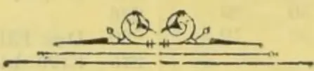

OBSERVER PRINTING WORKS

1042------------------------------------------------

# TEA, COFFEE, CINCHONA, COCOA, AND CARDAMOM SALES.

NO. 3.]

COLOMBO, JANUARY 27th, 1896.

PRICE:—12½ cents each; 3 copies—30 cents; 6 copies ½ rupee.

## COLOMBO SALES OF TEA.

### LARGE LOTS.

[MR. A. M. GEPP & Co.—1,460 lb.]

<table border="1">
<thead>
<tr>
<th>Lot</th>
<th>Box</th>
<th>Pkgs.</th>
<th>Name</th>
<th>lb.</th>
<th>c.</th>
</tr>
</thead>
<tbody>
<tr>
<td>1 Burnside</td>
<td>1</td>
<td>10 hf-ch</td>
<td>bro pek</td>
<td>500</td>
<td>49</td>
</tr>
<tr>
<td>2</td>
<td>3</td>
<td>14 do</td>
<td>pekoe</td>
<td>700</td>
<td>35</td>
</tr>
</tbody>
</table>

[MESSRS. BENHAM & BREMNER.—9,800 lb.]

<table border="1">
<thead>
<tr>
<th>Lot.</th>
<th>Box</th>
<th>Pks.</th>
<th>Name.</th>
<th>lb.</th>
<th>c.</th>
</tr>
</thead>
<tbody>
<tr>
<td>1 Elston</td>
<td>50</td>
<td>53 ch</td>
<td>pe son No. 2</td>
<td>4770</td>
<td>32</td>
</tr>
<tr>
<td>2</td>
<td>52</td>
<td>30 do</td>
<td>do No. 2</td>
<td>2700</td>
<td>32</td>
</tr>
<tr>
<td>3</td>
<td>54</td>
<td>6 do</td>
<td>bro mix</td>
<td>600</td>
<td>30</td>
</tr>
<tr>
<td>4</td>
<td>56</td>
<td>8 hf-ch</td>
<td>dust</td>
<td>560</td>
<td>27</td>
</tr>
<tr>
<td>5</td>
<td>58</td>
<td>9 ch</td>
<td>congou</td>
<td>900</td>
<td>25</td>
</tr>
</tbody>
</table>

[MESSRS. A. H. THOMPSON & Co., 57,270 lb.]

<table border="1">
<thead>
<tr>
<th>Lot</th>
<th>Box.</th>
<th>Pkgs.</th>
<th>Name.</th>
<th>lb.</th>
<th>c.</th>
</tr>
</thead>
<tbody>
<tr>
<td>3 Glengarriffe</td>
<td>3</td>
<td>5 ch</td>
<td>pe son</td>
<td>400</td>
<td>29</td>
</tr>
<tr>
<td>6 Court Lodge</td>
<td>6</td>
<td>39 hf-ch</td>
<td>bro or pek</td>
<td>2496</td>
<td>63 bid</td>
</tr>
<tr>
<td>7</td>
<td>7</td>
<td>27 do</td>
<td>bro or pek</td>
<td>1728</td>
<td>63 bid</td>
</tr>
<tr>
<td>8</td>
<td>8</td>
<td>18 ch</td>
<td>bro pek</td>
<td>2070</td>
<td>47 bid</td>
</tr>
<tr>
<td>9</td>
<td>9</td>
<td>9 do</td>
<td>bro pek</td>
<td>1080</td>
<td>47 bid</td>
</tr>
<tr>
<td>10</td>
<td>10</td>
<td>17 do</td>
<td>pekoe</td>
<td>1530</td>
<td>45</td>
</tr>
<tr>
<td>11</td>
<td>11</td>
<td>13 do</td>
<td>pek sou</td>
<td>1040</td>
<td>38</td>
</tr>
<tr>
<td>12</td>
<td>12</td>
<td>7 hf-ch</td>
<td>pek fans</td>
<td>630</td>
<td>28</td>
</tr>
<tr>
<td>15 Bonaccord</td>
<td>15</td>
<td>15 ch</td>
<td>sou</td>
<td>1500</td>
<td>29</td>
</tr>
<tr>
<td>17 Agra Elbedde</td>
<td>17</td>
<td>45 hf-ch</td>
<td>bro pe</td>
<td>2700</td>
<td>61 bid</td>
</tr>
<tr>
<td>18</td>
<td>18</td>
<td>44 do</td>
<td>pekoe</td>
<td>2200</td>
<td>46</td>
</tr>
<tr>
<td>19</td>
<td>19</td>
<td>15 do</td>
<td>pek sou</td>
<td>750</td>
<td>38</td>
</tr>
<tr>
<td>20</td>
<td>20</td>
<td>7 do</td>
<td>dust</td>
<td>525</td>
<td>28 bid</td>
</tr>
<tr>
<td>21 K</td>
<td>21</td>
<td>7 do</td>
<td>bro pe</td>
<td>420</td>
<td>29</td>
</tr>
<tr>
<td>25 Mukeloya</td>
<td>25</td>
<td>17 hf-ch</td>
<td>bro pe</td>
<td>1020</td>
<td>65 bid</td>
</tr>
<tr>
<td>26</td>
<td>26</td>
<td>12 ch</td>
<td>or pe</td>
<td>1200</td>
<td>52 bid</td>
</tr>
<tr>
<td>27</td>
<td>27</td>
<td>12 do</td>
<td>pekoe</td>
<td>1080</td>
<td>42 bid</td>
</tr>
<tr>
<td>28</td>
<td>28</td>
<td>9 hf-ch</td>
<td>bro pe son</td>
<td>540</td>
<td>29 bid</td>
</tr>
<tr>
<td>30 Minkeloya, F F</td>
<td>30</td>
<td>12 ch</td>
<td>unas</td>
<td>1200</td>
<td>39 bid</td>
</tr>
<tr>
<td>33 Portwood</td>
<td>33</td>
<td>16 do</td>
<td>pek sou</td>
<td>1200</td>
<td>50</td>
</tr>
<tr>
<td>34</td>
<td>34</td>
<td>6 do</td>
<td>pek son</td>
<td>675</td>
<td>43 bid</td>
</tr>
<tr>
<td>35</td>
<td>35</td>
<td>12 do</td>
<td>sou</td>
<td>840</td>
<td>40</td>
</tr>
<tr>
<td>36</td>
<td>36</td>
<td>7 do</td>
<td>dust</td>
<td>560</td>
<td>37</td>
</tr>
<tr>
<td>37 Elgin</td>
<td>37</td>
<td>8 ch</td>
<td>pek sou</td>
<td>640</td>
<td>37</td>
</tr>
<tr>
<td>39 A G C</td>
<td>39</td>
<td>7 ch</td>
<td>bro pek</td>
<td>712</td>
<td>31 bid</td>
</tr>
<tr>
<td>40</td>
<td>40</td>
<td>4 do</td>
<td>pek sou</td>
<td>400</td>
<td>23 bid</td>
</tr>
<tr>
<td>41</td>
<td>41</td>
<td>4 do</td>
<td>dust</td>
<td>600</td>
<td>25</td>
</tr>
<tr>
<td>43 N N</td>
<td>43</td>
<td>6 ch</td>
<td>pekoe</td>
<td>552</td>
<td>20 bid</td>
</tr>
<tr>
<td>50 D</td>
<td>50</td>
<td>4 do</td>
<td>sou</td>
<td>365</td>
<td>16 bid</td>
</tr>
<tr>
<td>53 P</td>
<td>53</td>
<td>7 do</td>
<td>pek fan</td>
<td>875</td>
<td>36</td>
</tr>
<tr>
<td>59 Amba Tenne</td>
<td>59</td>
<td>13 hf-ch</td>
<td>dust</td>
<td>975</td>
<td>25 bid</td>
</tr>
<tr>
<td>60</td>
<td>60</td>
<td>8 do</td>
<td>bro mix</td>
<td>760</td>
<td>20</td>
</tr>
<tr>
<td>61 Engurakande</td>
<td>61</td>
<td>100 box</td>
<td>or pe</td>
<td>1400</td>
<td>30 bid</td>
</tr>
<tr>
<td>62 P</td>
<td>62</td>
<td>23 ch</td>
<td>pek sou</td>
<td>2520</td>
<td>36</td>
</tr>
<tr>
<td>63 G M</td>
<td>63</td>
<td>14 do</td>
<td>fans</td>
<td>1465</td>
<td>26 bid</td>
</tr>
<tr>
<td>70 R, in estate mark</td>
<td>70</td>
<td>10 ch</td>
<td>pekoe</td>
<td>900</td>
<td>25 bid</td>
</tr>
<tr>
<td>71</td>
<td>71</td>
<td>10 do</td>
<td>pek sou</td>
<td>900</td>
<td>20</td>
</tr>
<tr>
<td>72 P A</td>
<td>72</td>
<td>20 hf-ch</td>
<td>bro tea</td>
<td>1000</td>
<td>11</td>
</tr>
<tr>
<td>74 T, in estate mark</td>
<td>74</td>
<td>10 ch</td>
<td>pek fans</td>
<td>1050</td>
<td>26 bid</td>
</tr>
<tr>
<td>75</td>
<td>75</td>
<td>16 do</td>
<td>pek sou</td>
<td>1250</td>
<td>25 bid</td>
</tr>
<tr>
<td>76 Madampe</td>
<td>75</td>
<td>5 ch</td>
<td>pek fans</td>
<td>525</td>
<td>26 bid</td>
</tr>
<tr>
<td>77</td>
<td>77</td>
<td>14 do</td>
<td></td>
<td></td>
<td></td>
</tr>
<tr>
<td></td>
<td></td>
<td>1 hf-ch</td>
<td>pek sou</td>
<td>1375</td>
<td>22 bid</td>
</tr>
</tbody>
</table>

[MESSRS. FORBES & WALKER.—383,540 lb.]

<table border="1">
<thead>
<tr>
<th>Lot.</th>
<th>Box</th>
<th>Pks.</th>
<th>Name.</th>
<th>lb.</th>
<th>c.</th>
</tr>
</thead>
<tbody>
<tr>
<td>1 Springkell</td>
<td>388</td>
<td>9 ch</td>
<td>dust</td>
<td>690</td>
<td>29</td>
</tr>
<tr>
<td>3 M P</td>
<td>392</td>
<td>8 do</td>
<td>sou</td>
<td>800</td>
<td>27</td>
</tr>
<tr>
<td>4</td>
<td>394</td>
<td>6 do</td>
<td>dust</td>
<td>840</td>
<td>28</td>
</tr>
<tr>
<td>5</td>
<td>396</td>
<td>8 do</td>
<td>dust No. 2</td>
<td>1360</td>
<td>27</td>
</tr>
<tr>
<td>12 Huluganga</td>
<td>410</td>
<td>8 ch</td>
<td>bro pek</td>
<td>960</td>
<td>38</td>
</tr>
<tr>
<td>13</td>
<td>412</td>
<td>6 do</td>
<td>pekoe</td>
<td>636</td>
<td>31</td>
</tr>
<tr>
<td>14</td>
<td>414</td>
<td>6 do</td>
<td>pek sou</td>
<td>600</td>
<td>29</td>
</tr>
<tr>
<td>16 C H</td>
<td>418</td>
<td>5 ch</td>
<td>sou</td>
<td>500</td>
<td>29</td>
</tr>
<tr>
<td>17</td>
<td>420</td>
<td>9 do</td>
<td>pek dust</td>
<td>720</td>
<td>29</td>
</tr>
<tr>
<td>18</td>
<td>422</td>
<td>5 do</td>
<td>red leaf</td>
<td>450</td>
<td>18</td>
</tr>
<tr>
<td>19 Campden Hill</td>
<td>424</td>
<td>6 do</td>
<td>pek sou</td>
<td>624</td>
<td>29</td>
</tr>
<tr>
<td>21 Devitura</td>
<td>428</td>
<td>14 ch</td>
<td>bro pek</td>
<td>1260</td>
<td>50 bid</td>
</tr>
<tr>
<td>22</td>
<td>430</td>
<td>10 do</td>
<td>pekoe</td>
<td>750</td>
<td>35</td>
</tr>
<tr>
<td>23</td>
<td>432</td>
<td>13 do</td>
<td>pek sou</td>
<td>1040</td>
<td>32</td>
</tr>
</tbody>
</table>

<table border="1">
<thead>
<tr>
<th>Lot.</th>
<th>Box.</th>
<th>Pkgs.</th>
<th>Name</th>
<th>lb.</th>
<th>c.</th>
</tr>
</thead>
<tbody>
<tr>
<td>25 G, in estate mark</td>
<td>436</td>
<td>5 ch</td>
<td>bro mix</td>
<td>450</td>
<td>19</td>
</tr>
<tr>
<td>26</td>
<td>438</td>
<td>10 do</td>
<td>congou</td>
<td>1000</td>
<td>23</td>
</tr>
<tr>
<td>29 Harrington</td>
<td>444</td>
<td>23 ch</td>
<td>or pek</td>
<td>2945</td>
<td>66</td>
</tr>
<tr>
<td>30</td>
<td>446</td>
<td>13 do</td>
<td>pekoe</td>
<td>1430</td>
<td>51</td>
</tr>
<tr>
<td>32</td>
<td>450</td>
<td>3 do</td>
<td>dust</td>
<td>417</td>
<td>27</td>
</tr>
<tr>
<td>35 Ireby</td>
<td>456</td>
<td>35 hf-ch</td>
<td>bro pek</td>
<td>2100</td>
<td>66</td>
</tr>
<tr>
<td>36</td>
<td>458</td>
<td>9 ch</td>
<td>pekoe</td>
<td>810</td>
<td>50</td>
</tr>
<tr>
<td>37</td>
<td>460</td>
<td>5 do</td>
<td>pek sou</td>
<td>450</td>
<td>38</td>
</tr>
<tr>
<td>39 Atungahatene</td>
<td>464</td>
<td>8 hf-ch</td>
<td>bro pek</td>
<td>430</td>
<td>48</td>
</tr>
<tr>
<td>40</td>
<td>466</td>
<td>17 do</td>
<td>unas</td>
<td>850</td>
<td>35</td>
</tr>
<tr>
<td>41 Bittacy</td>
<td>468</td>
<td>7 hf-ch</td>
<td>dust</td>
<td>595</td>
<td>27</td>
</tr>
<tr>
<td>48 Barkindale</td>
<td>482</td>
<td>13 ch</td>
<td>bro pek</td>
<td>1560</td>
<td>57</td>
</tr>
<tr>
<td>49</td>
<td>484</td>
<td>9 do</td>
<td>pekoe</td>
<td>810</td>
<td>40</td>
</tr>
<tr>
<td>52 Waitalawa</td>
<td>490</td>
<td>47 hf-ch</td>
<td>bro pek</td>
<td>2350</td>
<td>48</td>
</tr>
<tr>
<td>53</td>
<td>492</td>
<td>30 do</td>
<td>pekoe</td>
<td>1500</td>
<td>39</td>
</tr>
<tr>
<td>54</td>
<td>494</td>
<td>10 do</td>
<td>pek sou</td>
<td>500</td>
<td>33</td>
</tr>
<tr>
<td>57 Macaldenia</td>
<td>500</td>
<td>20 do</td>
<td>bro pek</td>
<td>1100</td>
<td>61 bid</td>
</tr>
<tr>
<td>58</td>
<td>502</td>
<td>21 do</td>
<td>pekoe</td>
<td>1050</td>
<td>51</td>
</tr>
<tr>
<td>59</td>
<td>504</td>
<td>9 ch</td>
<td>pek No. 2</td>
<td>900</td>
<td>37</td>
</tr>
<tr>
<td>60 H A T, in estate mark</td>
<td>503</td>
<td>4 ch</td>
<td>bro pek</td>
<td>440</td>
<td>36</td>
</tr>
<tr>
<td>63 Thedden</td>
<td>512</td>
<td>16 do</td>
<td>bro pek</td>
<td>1600</td>
<td>51</td>
</tr>
<tr>
<td>64</td>
<td>514</td>
<td>19 do</td>
<td>pekoe</td>
<td>1710</td>
<td>36</td>
</tr>
<tr>
<td>68 Coreen</td>
<td>522</td>
<td>9 do</td>
<td>pek fans</td>
<td>1188</td>
<td>33</td>
</tr>
<tr>
<td>69</td>
<td>524</td>
<td>3 do</td>
<td>dust</td>
<td>495</td>
<td>29</td>
</tr>
<tr>
<td>70 Digdolla</td>
<td>526</td>
<td>41 ch</td>
<td>bro pek</td>
<td>4080</td>
<td>48 bid</td>
</tr>
<tr>
<td>71</td>
<td>528</td>
<td>27 do</td>
<td>pekoe</td>
<td>2439</td>
<td>35</td>
</tr>
<tr>
<td>72</td>
<td>530</td>
<td>10 hf-ch</td>
<td>pek sou</td>
<td>943</td>
<td>32</td>
</tr>
<tr>
<td>73</td>
<td>532</td>
<td>5 ch</td>
<td>bro pe dust</td>
<td>750</td>
<td>28</td>
</tr>
<tr>
<td>74 Great Valley</td>
<td>534</td>
<td>20 do</td>
<td>bro pek</td>
<td>1100</td>
<td>51</td>
</tr>
<tr>
<td>75</td>
<td>536</td>
<td>20 do</td>
<td>pek sou</td>
<td>1800</td>
<td>33</td>
</tr>
<tr>
<td>77 Rockside</td>
<td>540</td>
<td>40 ch</td>
<td>pekoe</td>
<td>4000</td>
<td>35</td>
</tr>
<tr>
<td>78</td>
<td>542</td>
<td>20 do</td>
<td>pe sou</td>
<td>2000</td>
<td>33</td>
</tr>
<tr>
<td>79</td>
<td>544</td>
<td>6 do</td>
<td>bro mix</td>
<td>540</td>
<td>21</td>
</tr>
<tr>
<td>80</td>
<td>546</td>
<td>10 do</td>
<td>pek fans</td>
<td>1300</td>
<td>31</td>
</tr>
<tr>
<td>81</td>
<td>548</td>
<td>6 do</td>
<td>dust</td>
<td>900</td>
<td>28</td>
</tr>
<tr>
<td>82 Erman</td>
<td>550</td>
<td>5 ch</td>
<td>pek fans</td>
<td>500</td>
<td>30</td>
</tr>
<tr>
<td>83</td>
<td>552</td>
<td>6 do</td>
<td>bro mix</td>
<td>540</td>
<td>22</td>
</tr>
<tr>
<td>84</td>
<td>554</td>
<td>6 do</td>
<td>dust</td>
<td>600</td>
<td>26</td>
</tr>
<tr>
<td>85 Freds Rahe</td>
<td>556</td>
<td>27 ch</td>
<td>bro pek</td>
<td>2970</td>
<td>49 bid</td>
</tr>
<tr>
<td>86</td>
<td>558</td>
<td>22 do</td>
<td>pekoe</td>
<td>2200</td>
<td>37</td>
</tr>
<tr>
<td>87</td>
<td>560</td>
<td>11 do</td>
<td>pek sou</td>
<td>1100</td>
<td>34</td>
</tr>
<tr>
<td>88 W A</td>
<td>562</td>
<td>10 ch</td>
<td>pekoe</td>
<td>1050</td>
<td>35</td>
</tr>
<tr>
<td>90 Ambamana</td>
<td>566</td>
<td>64 do</td>
<td>bro pek</td>
<td>6400</td>
<td>40 bid</td>
</tr>
<tr>
<td>91</td>
<td>568</td>
<td>17 do</td>
<td>pekoe</td>
<td>1530</td>
<td>34</td>
</tr>
<tr>
<td>92 Lowlands</td>
<td>570</td>
<td>8 ch</td>
<td>bro pek</td>
<td>800</td>
<td>41</td>
</tr>
<tr>
<td>93</td>
<td>572</td>
<td>8 do</td>
<td>pekoe</td>
<td>720</td>
<td>31</td>
</tr>
<tr>
<td>94</td>
<td>574</td>
<td>5 do</td>
<td>pek sou</td>
<td>400</td>
<td>29</td>
</tr>
<tr>
<td>97 Deaculla</td>
<td>580</td>
<td>13 hf-ch</td>
<td>bro pek</td>
<td>780</td>
<td>72</td>
</tr>
<tr>
<td>99</td>
<td>584</td>
<td>32 ch</td>
<td>pekoe</td>
<td>2400</td>
<td>41</td>
</tr>
<tr>
<td>100 Malvern</td>
<td>586</td>
<td>20 do</td>
<td>bro pek</td>
<td>1200</td>
<td>72</td>
</tr>
<tr>
<td>101</td>
<td>588</td>
<td>20 do</td>
<td>pekoe</td>
<td>1500</td>
<td>41</td>
</tr>
<tr>
<td>102</td>
<td>590</td>
<td>12 do</td>
<td>pek sou</td>
<td>900</td>
<td>37</td>
</tr>
<tr>
<td>103</td>
<td>592</td>
<td>5 do</td>
<td>dust</td>
<td>400</td>
<td>25</td>
</tr>
<tr>
<td>104 Ederapolla</td>
<td>594</td>
<td>22 hf-ch</td>
<td>bro pek</td>
<td>1100</td>
<td>43</td>
</tr>
<tr>
<td>105</td>
<td>596</td>
<td>19 ch</td>
<td>pekoe</td>
<td>1710</td>
<td>34</td>
</tr>
<tr>
<td>106</td>
<td>598</td>
<td>25 do</td>
<td>pe sou</td>
<td>2125</td>
<td>30</td>
</tr>
<tr>
<td>107</td>
<td>600</td>
<td>15 do</td>
<td>sou</td>
<td>1275</td>
<td>26</td>
</tr>
<tr>
<td>108</td>
<td>602</td>
<td>10 do</td>
<td>fans</td>
<td>1000</td>
<td>30</td>
</tr>
<tr>
<td>109</td>
<td>604</td>
<td>17 hf-ch</td>
<td>dust</td>
<td>1309</td>
<td>27</td>
</tr>
<tr>
<td>113 F R</td>
<td>612</td>
<td>4 ch</td>
<td>bro mix</td>
<td>520</td>
<td>17</td>
</tr>
<tr>
<td>116 P D M</td>
<td>618</td>
<td>5 do</td>
<td>unas</td>
<td>530</td>
<td>35</td>
</tr>
<tr>
<td>119 Pedro</td>
<td>624</td>
<td>20 ch</td>
<td>bro or pek</td>
<td>2200</td>
<td>83</td>
</tr>
<tr>
<td>120</td>
<td>626</td>
<td>7 do</td>
<td>bro pek</td>
<td>812</td>
<td>58</td>
</tr>
<tr>
<td>121</td>
<td>628</td>
<td>19 do</td>
<td>pekoe</td>
<td>1710</td>
<td>54</td>
</tr>
<tr>
<td>122</td>
<td>630</td>
<td>17 do</td>
<td>pek sou</td>
<td>1326</td>
<td>44</td>
</tr>
<tr>
<td>123</td>
<td>632</td>
<td>3 do</td>
<td>dust</td>
<td>450</td>
<td>30</td>
</tr>
<tr>
<td>124 Langdale</td>
<td>634</td>
<td>18 ch</td>
<td>bro pek</td>
<td>2160</td>
<td>61</td>
</tr>
<tr>
<td>125</td>
<td>636</td>
<td>20 do</td>
<td>pekoe</td>
<td>2000</td>
<td>51</td>
</tr>
<tr>
<td>126 Tillyrie</td>
<td>642</td>
<td>19 do</td>
<td>bro pek</td>
<td>2090</td>
<td>52</td>
</tr>
<tr>
<td>127</td>
<td>644</td>
<td>6 do</td>
<td>or pek</td>
<td>650</td>
<td>48</td>
</tr>
<tr>
<td>130</td>
<td>646</td>
<td>18 do</td>
<td>pekoe</td>
<td>1710</td>
<td>42</td>
</tr>
<tr>
<td>132 Kelaneiya</td>
<td>650</td>
<td>37 ch</td>
<td>bro pek</td>
<td>3145</td>
<td>54 bid</td>
</tr>
<tr>
<td>137 G</td>
<td>660</td>
<td>3 do</td>
<td>dust</td>
<td>420</td>
<td>25</td>
</tr>
<tr>
<td>138 Riverside</td>
<td>662</td>
<td>7 do</td>
<td>red leaf</td>
<td>630</td>
<td>16</td>
</tr>
<tr>
<td>139 Opaigalla</td>
<td>664</td>
<td>9 ch</td>
<td>dust</td>
<td>1080</td>
<td>25</td>
</tr>
<tr>
<td>141</td>
<td>668</td>
<td>10 do</td>
<td>red leaf</td>
<td>800</td>
<td>16</td>
</tr>
<tr>
<td>142 Clunes</td>
<td>670</td>
<td>29 hf-ch</td>
<td>bro pek</td>
<td>1450</td>
<td>37 bid</td>
</tr>
<tr>
<td>143</td>
<td>672</td>
<td>19 ch</td>
<td>pekoe</td>
<td>1520</td>
<td>30</td>
</tr>
<tr>
<td>144</td>
<td>674</td>
<td>8 do</td>
<td>pek sou</td>
<td>720</td>
<td>28</td>
</tr>
<tr>
<td>145</td>
<td>676</td>
<td>32 hf-ch</td>
<td>dust</td>
<td>2240</td>
<td>25</td>
</tr>
<tr>
<td>146</td>
<td>678</td>
<td>15 ch</td>
<td></td>
<td></td>
<td></td>
</tr>
<tr>
<td></td>
<td></td>
<td>17 hf-ch</td>
<td>red leaf</td>
<td>2175</td>
<td>9 bid</td>
</tr>
<tr>
<td>147 Bloomfield</td>
<td>680</td>
<td>23 ch</td>
<td>flowery pe</td>
<td>2277</td>
<td>53</td>
</tr>
<tr>
<td>148</td>
<td>682</td>
<td>18 do</td>
<td>pekoe</td>
<td>1800</td>
<td>40</td>
</tr>
<tr>
<td>149</td>
<td>684</td>
<td>10 do</td>
<td>pek sou</td>
<td>1000</td>
<td>35</td>
</tr>
<tr>
<td>150</td>
<td>686</td>
<td>9 do</td>
<td>unas</td>
<td>900</td>
<td>35</td>
</tr>
<tr>
<td>153 Tomagong</td>
<td>692</td>
<td>43 hf-ch</td>
<td>bro pek</td>
<td>2760</td>
<td>81</td>
</tr>
<tr>
<td>154</td>
<td>694</td>
<td>20 ch</td>
<td>pekoe</td>
<td>1800</td>
<td>73</td>
</tr>
<tr>
<td>155</td>
<td>696</td>
<td>13 do</td>
<td>pek sou</td>
<td>1170</td>
<td>39</td>
</tr>
</tbody>
</table>

1043------------------------------------------------

<!-- stage4: ACCEPT_TABLE vsplitV/V_002:150+151+152+153+154 -->

2CEYLON PRODUCE SALES LIST.

<table border="1">
<thead>
<tr>
<th>Lot.</th>
<th>Box.</th>
<th>Pkgs.</th>
<th>Names.</th>
<th>lb.</th>
<th>c.</th>
<th>Lot.</th>
<th>Box.</th>
<th>Pkgs.</th>
<th>Name.</th>
<th>lb.</th>
<th>c.</th>
</tr>
</thead>
<tbody>
<tr>
<td>157</td>
<td>700</td>
<td>8 hf-ch</td>
<td>dust</td>
<td>640</td>
<td>33</td>
<td>323</td>
<td>Lillawatte</td>
<td>32 29 ch</td>
<td>bro pek</td>
<td>3480</td>
<td rowspan="5">} with'dn</td>
</tr>
<tr>
<td>158</td>
<td>Patiagama</td>
<td>702</td>
<td>9 ch</td>
<td>bro or pek</td>
<td>945</td>
<td>45</td>
<td>324</td>
<td>34 42 do</td>
<td>pekoe</td>
<td>4620</td>
</tr>
<tr>
<td>159</td>
<td></td>
<td>704</td>
<td>4 do</td>
<td>bro pek</td>
<td>400</td>
<td>45</td>
<td>325</td>
<td>36 15 do</td>
<td>pek sou</td>
<td>1500</td>
</tr>
<tr>
<td>160</td>
<td></td>
<td>706</td>
<td>6 do</td>
<td>pekoe</td>
<td>600</td>
<td>36</td>
<td>326</td>
<td>38 4 do</td>
<td>congou</td>
<td>400</td>
</tr>
<tr>
<td>164</td>
<td>O K</td>
<td>714</td>
<td>5 ch</td>
<td>bro pek</td>
<td>550</td>
<td>41</td>
<td>327</td>
<td>M'Kelle</td>
<td>40 15 do</td>
<td>bro pek</td>
<td>1500</td>
<td>44</td>
</tr>
<tr>
<td>165</td>
<td></td>
<td>716</td>
<td>4 do</td>
<td>pekoe</td>
<td>400</td>
<td>36</td>
<td>328</td>
<td>42 24 do</td>
<td>pekoe</td>
<td>2400</td>
<td>38 bid</td>
</tr>
<tr>
<td></td>
<td></td>
<td></td>
<td></td>
<td></td>
<td></td>
<td></td>
<td>329</td>
<td>44 6 do</td>
<td>pek sou</td>
<td>600</td>
<td>30</td>
</tr>
</tbody>
</table>

<table border="1">
<tbody>
<tr>
<td>174</td>
<td>Patupaala</td>
<td>731</td>
<td>44</td>
<td>ch</td>
<td>bro pek</td>
<td>4400</td>
<td>45 bid</td>
</tr>
<tr>
<td>175</td>
<td></td>
<td>736</td>
<td>44</td>
<td>do</td>
<td>p. koe</td>
<td>3960</td>
<td>34</td>
</tr>
<tr>
<td>176</td>
<td></td>
<td>738</td>
<td>31</td>
<td>do</td>
<td>pek sou</td>
<td>2635</td>
<td>30</td>
</tr>
<tr>
<td>177</td>
<td></td>
<td>740</td>
<td>15</td>
<td>do</td>
<td>pek fans</td>
<td>1125</td>
<td>28</td>
</tr>
<tr>
<td>179</td>
<td>Glenorchy</td>
<td>744</td>
<td>35</td>
<td>hf-ch</td>
<td>bro pek</td>
<td>1925</td>
<td>55 bid</td>
</tr>
<tr>
<td>180</td>
<td></td>
<td>746</td>
<td>57</td>
<td>do</td>
<td>pekoe</td>
<td>2850</td>
<td>45</td>
</tr>
<tr>
<td>183</td>
<td>I K V</td>
<td>752</td>
<td>6</td>
<td>ch</td>
<td>bro mix</td>
<td>672</td>
<td>10 bid</td>
</tr>
<tr>
<td>185</td>
<td>A K, in estate mark</td>
<td>756</td>
<td>9</td>
<td>ch</td>
<td></td>
<td></td>
<td></td>
</tr>
<tr>
<td></td>
<td></td>
<td></td>
<td>1</td>
<td>hf-ch</td>
<td>bro pek</td>
<td>1000</td>
<td>33</td>
</tr>
<tr>
<td>189</td>
<td></td>
<td>764</td>
<td>8</td>
<td>ch</td>
<td></td>
<td></td>
<td></td>
</tr>
<tr>
<td></td>
<td></td>
<td></td>
<td>1</td>
<td>hf-ch</td>
<td>dust</td>
<td>1280</td>
<td>24</td>
</tr>
<tr>
<td>191</td>
<td>S M K</td>
<td>768</td>
<td>5</td>
<td>ch</td>
<td>pekoe</td>
<td>500</td>
<td>34</td>
</tr>
<tr>
<td>198</td>
<td>S S S</td>
<td>782</td>
<td>3</td>
<td>ch</td>
<td></td>
<td></td>
<td></td>
</tr>
<tr>
<td></td>
<td></td>
<td></td>
<td>1</td>
<td>hf.ch</td>
<td>bro tea</td>
<td>417</td>
<td>20</td>
</tr>
<tr>
<td>234</td>
<td>Koladeniya</td>
<td>794</td>
<td>4</td>
<td>ch</td>
<td>bro tea</td>
<td>504</td>
<td>27</td>
</tr>
<tr>
<td>205</td>
<td>M C</td>
<td>796</td>
<td>6</td>
<td>do</td>
<td>congou</td>
<td>600</td>
<td>26</td>
</tr>
<tr>
<td>206</td>
<td></td>
<td>798</td>
<td>5</td>
<td>do</td>
<td>red leaf</td>
<td>500</td>
<td>12</td>
</tr>
<tr>
<td>207</td>
<td>L E</td>
<td>809</td>
<td>18</td>
<td>ch</td>
<td>bro mix</td>
<td>1696</td>
<td>12</td>
</tr>
<tr>
<td>208</td>
<td></td>
<td>802</td>
<td>10</td>
<td>do</td>
<td>bro tea</td>
<td>810</td>
<td>12</td>
</tr>
<tr>
<td>209</td>
<td>Essex</td>
<td>804</td>
<td>29</td>
<td>do</td>
<td>pekoe</td>
<td>2878</td>
<td>52</td>
</tr>
<tr>
<td>210</td>
<td></td>
<td>806</td>
<td>21</td>
<td>do</td>
<td>dust</td>
<td>3150</td>
<td>25</td>
</tr>
<tr>
<td>211</td>
<td>Vellaioya</td>
<td>808</td>
<td>37</td>
<td>ch</td>
<td>bro tea</td>
<td>3515</td>
<td>out</td>
</tr>
<tr>
<td>213</td>
<td>Kirrimettia</td>
<td>812</td>
<td>5</td>
<td>ch</td>
<td>pek dust</td>
<td>600</td>
<td>26</td>
</tr>
<tr>
<td>214</td>
<td></td>
<td>814</td>
<td>7</td>
<td>do</td>
<td>unas</td>
<td>630</td>
<td>37</td>
</tr>
<tr>
<td>219</td>
<td>Morlands</td>
<td>824</td>
<td>13</td>
<td>hf.ch</td>
<td>bro pek</td>
<td>780</td>
<td>56</td>
</tr>
<tr>
<td>220</td>
<td></td>
<td>826</td>
<td>11</td>
<td>ch</td>
<td>pekoe</td>
<td>1100</td>
<td>40</td>
</tr>
<tr>
<td>221</td>
<td></td>
<td>828</td>
<td>4</td>
<td>do</td>
<td>pek sou</td>
<td>400</td>
<td>35</td>
</tr>
<tr>
<td>223</td>
<td>Rothschild</td>
<td>832</td>
<td>6</td>
<td>ch</td>
<td>pekoe</td>
<td>576</td>
<td>39</td>
</tr>
<tr>
<td>224</td>
<td>Arapolakande</td>
<td>834</td>
<td>51</td>
<td>do</td>
<td>bro pek</td>
<td>4845</td>
<td>44 bid</td>
</tr>
<tr>
<td>225</td>
<td></td>
<td>836</td>
<td>52</td>
<td>do</td>
<td>pekoe</td>
<td>4420</td>
<td>34</td>
</tr>
<tr>
<td>226</td>
<td></td>
<td>838</td>
<td>12</td>
<td>do</td>
<td>pek sou</td>
<td>1200</td>
<td>30</td>
</tr>
<tr>
<td>227</td>
<td></td>
<td>840</td>
<td>5</td>
<td>do</td>
<td>dust</td>
<td>500</td>
<td>27</td>
</tr>
<tr>
<td>231</td>
<td>Y</td>
<td>848</td>
<td>4</td>
<td>ch</td>
<td>red leaf</td>
<td>440</td>
<td>10 bid</td>
</tr>
<tr>
<td>232</td>
<td>Castlereagh</td>
<td>850</td>
<td>30</td>
<td>do</td>
<td>bro pek</td>
<td>3000</td>
<td>47</td>
</tr>
<tr>
<td>233</td>
<td></td>
<td>852</td>
<td>27</td>
<td>do</td>
<td>or pek</td>
<td>2430</td>
<td>39</td>
</tr>
</tbody>
</table>

<table border="1">
<tbody>
<tr><td>234</td><td></td><td>854</td><td>28</td><td>do</td><td>pekoe</td><td>2520</td><td>36</td><td></td></tr>
<tr><td>235</td><td></td><td>856</td><td>7</td><td>do</td><td>pek sou</td><td>560</td><td>31</td><td></td></tr>
<tr><td>236</td><td></td><td>858</td><td>9</td><td>hf-ch</td><td>dust</td><td>720</td><td>27</td><td></td></tr>
<tr><td>238</td><td>Talgaswela</td><td>862</td><td>17</td><td>ch</td><td>bro pek</td><td>1700</td><td>41</td><td></td></tr>
<tr><td>239</td><td></td><td>864</td><td>10</td><td>do</td><td>pekoe</td><td>900</td><td>34</td><td></td></tr>
<tr><td>240</td><td></td><td>866</td><td>13</td><td>do</td><td>pek sou</td><td>1170</td><td>31</td><td></td></tr>
<tr><td>244</td><td>Weoya</td><td>874</td><td>65</td><td>hf-ch</td><td>bro pek</td><td>3575</td><td>45</td><td></td></tr>
<tr><td>245</td><td></td><td>876</td><td>51</td><td>ch</td><td>pekoe</td><td>4590</td><td>32</td><td></td></tr>
<tr><td>246</td><td></td><td>878</td><td>55</td><td>do</td><td>pek sou</td><td>4125</td><td>28</td><td></td></tr>
<tr><td>248</td><td></td><td>882</td><td>7</td><td>do</td><td>bro mix</td><td>700</td><td>28</td><td></td></tr>
<tr><td>249</td><td></td><td>884</td><td>8</td><td>hf-ch</td><td>duct</td><td>600</td><td>26</td><td></td></tr>
<tr><td>250</td><td>Kirklees</td><td>886</td><td>40</td><td>ch</td><td>bro pek</td><td>2400</td><td>51</td><td>bid</td></tr>
<tr><td>251</td><td></td><td>888</td><td>20</td><td>do</td><td>pekoe</td><td>2000</td><td>44</td><td></td></tr>
<tr><td>252</td><td></td><td>890</td><td>20</td><td>do</td><td>pe sou</td><td>2000</td><td>37</td><td></td></tr>
<tr><td>254</td><td></td><td>894</td><td>12</td><td>do</td><td>bro tea</td><td>780</td><td>41</td><td></td></tr>
<tr><td>268</td><td>Hayes</td><td>922</td><td>78</td><td>hf-ch</td><td>bro pek</td><td>3900</td><td>38</td><td></td></tr>
<tr><td>269</td><td></td><td>924</td><td>56</td><td>do</td><td>pekoe</td><td>2520</td><td>34</td><td></td></tr>
<tr><td>270</td><td></td><td>926</td><td>44</td><td>do</td><td>pe sou</td><td>1980</td><td>30</td><td></td></tr>
<tr><td>272</td><td>High Forest</td><td>930</td><td>20</td><td>hf-ch</td><td>bro pek</td><td>1180</td><td>68</td><td>bid</td></tr>
<tr><td>273</td><td></td><td>932</td><td>29</td><td>do</td><td>pekoe</td><td>1421</td><td>53</td><td></td></tr>
<tr><td>274</td><td></td><td>934</td><td>27</td><td>do</td><td>pek sou</td><td>1453</td><td>44</td><td></td></tr>
<tr><td>283</td><td>Bagdad</td><td>952</td><td>5</td><td>do</td><td>dust</td><td>400</td><td>23</td><td></td></tr>
<tr><td>284</td><td></td><td>954</td><td>15</td><td>ch</td><td>pekoe</td><td>1500</td><td>27</td><td></td></tr>
<tr><td>285</td><td>Ganapalla</td><td>955</td><td>110</td><td>hf-ch</td><td>bro pek</td><td>5500</td><td>42</td><td></td></tr>
<tr><td>286</td><td></td><td>958</td><td>90</td><td>do</td><td>pekoe</td><td>7200</td><td>32</td><td></td></tr>
<tr><td>287</td><td></td><td>960</td><td>36</td><td>do</td><td>pekoe</td><td>1800</td><td>32</td><td></td></tr>
<tr><td>288</td><td></td><td>962</td><td>54</td><td>do</td><td>pek sou</td><td>4320</td><td>28</td><td></td></tr>
<tr><td>289</td><td></td><td>964</td><td>19</td><td>do</td><td>bro mix</td><td>950</td><td>10</td><td>bid</td></tr>
<tr><td>290</td><td></td><td>966</td><td>9</td><td>do</td><td>dust</td><td>720</td><td>25</td><td></td></tr>
<tr><td>292</td><td>Maymoilay</td><td>970</td><td>60</td><td>ch</td><td>or pek</td><td>3300</td><td>51</td><td>bid</td></tr>
<tr><td>293</td><td>Great Valley</td><td>972</td><td>24</td><td>hf-ch</td><td>bro pek</td><td>1320</td><td>52</td><td></td></tr>
<tr><td>294</td><td></td><td>974</td><td>40</td><td>do</td><td>bro pek</td><td>2200</td><td>53</td><td></td></tr>
<tr><td>295</td><td></td><td>976</td><td>27</td><td>ch</td><td>pekoe</td><td>2565</td><td>38</td><td></td></tr>
<tr><td>296</td><td></td><td>978</td><td>23</td><td>do</td><td>pek sou</td><td>2070</td><td>33</td><td></td></tr>
<tr><td>297</td><td></td><td>980</td><td>13</td><td>do</td><td>sou</td><td>1105</td><td>22</td><td>bid</td></tr>
<tr><td>298</td><td>Walahan</td><td></td><td></td><td></td><td></td><td></td><td></td><td></td></tr>
<tr><td></td><td>duwa</td><td>982</td><td>20</td><td>ch</td><td>bro pek</td><td>2000</td><td>43</td><td></td></tr>
<tr><td>299</td><td></td><td>984</td><td>15</td><td>do</td><td>pekoe</td><td>1425</td><td>35</td><td></td></tr>
<tr><td>300</td><td></td><td>986</td><td>5</td><td>do</td><td>pek sou</td><td>440</td><td>31</td><td></td></tr>
<tr><td>301</td><td>S P A</td><td>988</td><td>5</td><td>ch</td><td>bro pe</td><td>500</td><td>47</td><td></td></tr>
<tr><td>302</td><td></td><td>990</td><td>9</td><td>do</td><td>pekoe</td><td>850</td><td>36</td><td></td></tr>
<tr><td>303</td><td></td><td>992</td><td>5</td><td>do</td><td>pek sou</td><td>450</td><td>32</td><td></td></tr>
<tr><td>306</td><td>Vilpita</td><td>998</td><td>8</td><td>ch</td><td>bro pek</td><td>8 0</td><td>46</td><td></td></tr>
<tr><td>307</td><td></td><td>1000</td><td>15</td><td>do</td><td>pekoe</td><td>1500</td><td>32</td><td></td></tr>
<tr><td>308</td><td></td><td>2</td><td>10</td><td>do</td><td>pek sou</td><td>900</td><td>31</td><td></td></tr>
<tr><td>311</td><td>Nughena</td><td>8</td><td>9</td><td>hf-ch</td><td>bro or pek</td><td>513</td><td>44</td><td>bid</td></tr>
<tr><td>312</td><td></td><td>10</td><td>8</td><td>ch</td><td>bro pek</td><td>720</td><td>47</td><td></td></tr>
<tr><td>313</td><td></td><td>12</td><td>10</td><td>do</td><td>pekoe</td><td>827</td><td>36</td><td></td></tr>
<tr><td>316</td><td>Ruanwella</td><td>18</td><td>18</td><td>hf-ch</td><td>bro or pe</td><td>900</td><td>40</td><td></td></tr>
<tr><td>317</td><td></td><td>20</td><td>28</td><td>ch</td><td>bro pek</td><td>2800</td><td>38</td><td></td></tr>
<tr><td>318</td><td></td><td>22</td><td>12</td><td>do</td><td>pek sou</td><td>1140</td><td>27</td><td></td></tr>
<tr><td>319</td><td></td><td>24</td><td>6</td><td>do</td><td></td><td></td><td></td><td></td></tr>
<tr><td></td><td></td><td></td><td>1</td><td>hf-ch</td><td>dust</td><td>540</td><td>26</td><td></td></tr>
<tr><td>322</td><td>D</td><td>30</td><td>14</td><td>ch</td><td>bro tea</td><td>1288</td><td>10</td><td>bid</td></tr>
</tbody>
</table>

<table border="1">
<tbody>
<tr>
<td>329</td>
<td></td>
<td>44</td>
<td>6</td>
<td>do</td>
<td>pek sou</td>
<td>330</td>
<td>33</td>
</tr>
<tr>
<td>330</td>
<td>P</td>
<td>46</td>
<td>10</td>
<td>ch</td>
<td>dust</td>
<td>1700</td>
<td>26</td>
</tr>
<tr>
<td>335</td>
<td>Tisted</td>
<td>56</td>
<td>38</td>
<td>hf-ch</td>
<td>bro pek</td>
<td>2090</td>
<td>57</td>
</tr>
<tr>
<td>336</td>
<td></td>
<td>58</td>
<td>28</td>
<td>do</td>
<td>pekoe</td>
<td>1540</td>
<td>37</td>
</tr>
<tr>
<td>337</td>
<td></td>
<td>60</td>
<td>13</td>
<td>do</td>
<td>pek sou</td>
<td>555</td>
<td>31</td>
</tr>
<tr>
<td>353</td>
<td>W</td>
<td>92</td>
<td>14</td>
<td>ch</td>
<td>bro tea</td>
<td>1288</td>
<td>16 bid</td>
</tr>
<tr>
<td>354</td>
<td>C B G Y, in est.</td>
<td></td>
<td></td>
<td></td>
<td></td>
<td></td>
<td></td>
</tr>
<tr>
<td></td>
<td>mark</td>
<td>94</td>
<td>23</td>
<td>ch</td>
<td>bro mix</td>
<td>2576</td>
<td>out</td>
</tr>
<tr>
<td>355</td>
<td>Theberton</td>
<td>96</td>
<td>47</td>
<td>ch</td>
<td>bro pek</td>
<td>4700</td>
<td>47</td>
</tr>
<tr>
<td>356</td>
<td></td>
<td>98</td>
<td>24</td>
<td>do</td>
<td>pekoe</td>
<td>2400</td>
<td>37</td>
</tr>
<tr>
<td>357</td>
<td></td>
<td>100</td>
<td>19</td>
<td>ch</td>
<td>pek sou</td>
<td>1900</td>
<td>34</td>
</tr>
<tr>
<td>358</td>
<td></td>
<td>102</td>
<td>4</td>
<td>do</td>
<td>bro mix</td>
<td>400</td>
<td>20 bid</td>
</tr>
<tr>
<td>359</td>
<td></td>
<td>104</td>
<td>4</td>
<td>do</td>
<td>dust</td>
<td>400</td>
<td>23</td>
</tr>
<tr>
<td>360</td>
<td>Tymaur</td>
<td>106</td>
<td>64</td>
<td>hf-ch</td>
<td>pek sou</td>
<td>3055</td>
<td>46</td>
</tr>
<tr>
<td>361</td>
<td>Brunswick</td>
<td>108</td>
<td>7</td>
<td>do</td>
<td>twankey</td>
<td>560</td>
<td>24 bid</td>
</tr>
<tr>
<td>362</td>
<td>Knavesmire</td>
<td>110</td>
<td>24</td>
<td>ch</td>
<td></td>
<td></td>
<td></td>
</tr>
<tr>
<td></td>
<td></td>
<td></td>
<td>1</td>
<td>hfch</td>
<td>bro pek</td>
<td>2460</td>
<td>42</td>
</tr>
<tr>
<td>363</td>
<td></td>
<td>112</td>
<td>45</td>
<td>ch</td>
<td>pekoe</td>
<td>4040</td>
<td>36</td>
</tr>
<tr>
<td>364</td>
<td></td>
<td>114</td>
<td>12</td>
<td>do</td>
<td>pek No 2</td>
<td>1080</td>
<td>31</td>
</tr>
<tr>
<td>365</td>
<td></td>
<td>116</td>
<td>33</td>
<td>do</td>
<td>pek sou</td>
<td>2970</td>
<td>29</td>
</tr>
<tr>
<td>366</td>
<td></td>
<td>118</td>
<td>9</td>
<td>do</td>
<td>sou</td>
<td>720</td>
<td>27</td>
</tr>
<tr>
<td>367</td>
<td></td>
<td>120</td>
<td>4</td>
<td>do</td>
<td>pek fans</td>
<td>400</td>
<td>29</td>
</tr>
</tbody>
</table>

[MR. E. JOHN.—154,158 lb.]

<table border="1">
<thead>
<tr>
<th>Lot</th>
<th>Box</th>
<th>Pkgs</th>
<th>Name</th>
<th>lb.</th>
<th>c.</th>
</tr>
</thead>
<tbody>
<tr>
<td>1</td>
<td>Eadella</td>
<td>27</td>
<td>12 ch fans</td>
<td>1440</td>
<td>30</td>
</tr>
<tr>
<td>3</td>
<td>Wewesse</td>
<td>29</td>
<td>27 hf-ch bro pek</td>
<td>1485</td>
<td>46</td>
</tr>
<tr>
<td>4</td>
<td></td>
<td>31</td>
<td>20 do pekoe</td>
<td>1100</td>
<td>37</td>
</tr>
<tr>
<td>5</td>
<td></td>
<td>33</td>
<td>14 do pek sou</td>
<td>700</td>
<td>31</td>
</tr>
<tr>
<td>7</td>
<td>Evalgolla</td>
<td>37</td>
<td>8 ch pek sou</td>
<td>760</td>
<td>withd'n</td>
</tr>
<tr>
<td>17</td>
<td>Tientsin</td>
<td>57</td>
<td>39 hf-ch bro or pek</td>
<td>2340</td>
<td>75</td>
</tr>
<tr>
<td>18</td>
<td></td>
<td>59</td>
<td>30 ch pekoe</td>
<td>3000</td>
<td>51</td>
</tr>
</tbody>
</table>

<table border="1">
<tbody>
<tr>
<td>19</td>
<td>Anchor, in est. mark</td>
<td>61</td>
<td>44</td>
<td>do</td>
<td>bro or pek</td>
<td>4400</td>
<td>54</td>
<td>bid</td>
</tr>
<tr>
<td>20</td>
<td></td>
<td>63</td>
<td>13</td>
<td>do</td>
<td>or pek</td>
<td>1040</td>
<td>49</td>
<td></td>
</tr>
<tr>
<td>21</td>
<td></td>
<td>65</td>
<td>13</td>
<td>do</td>
<td>pekoe</td>
<td>1300</td>
<td>42</td>
<td></td>
</tr>
<tr>
<td>22</td>
<td></td>
<td>67</td>
<td>6</td>
<td>do</td>
<td>pek sou</td>
<td>600</td>
<td>37</td>
<td></td>
</tr>
<tr>
<td>23</td>
<td></td>
<td>69</td>
<td>16</td>
<td>hf-ch</td>
<td>pek fans</td>
<td>1120</td>
<td>35</td>
<td></td>
</tr>
<tr>
<td>24</td>
<td></td>
<td>71</td>
<td>11</td>
<td>do</td>
<td>dust</td>
<td>880</td>
<td>29</td>
<td></td>
</tr>
<tr>
<td>26</td>
<td>St. John's</td>
<td>75</td>
<td>22</td>
<td>ch</td>
<td>bro pek</td>
<td>2420</td>
<td>70</td>
<td></td>
</tr>
<tr>
<td>27</td>
<td></td>
<td>77</td>
<td>21</td>
<td>do</td>
<td>pekoe</td>
<td>2100</td>
<td>54</td>
<td></td>
</tr>
<tr>
<td>30</td>
<td>Mocha</td>
<td>83</td>
<td>38</td>
<td>do</td>
<td>bro pek</td>
<td>4180</td>
<td>65</td>
<td></td>
</tr>
<tr>
<td>31</td>
<td></td>
<td>85</td>
<td>32</td>
<td>do</td>
<td>pekoe</td>
<td>3040</td>
<td>50</td>
<td></td>
</tr>
<tr>
<td>32</td>
<td></td>
<td>87</td>
<td>19</td>
<td>do</td>
<td>pek sou</td>
<td>1710</td>
<td>47</td>
<td></td>
</tr>
<tr>
<td>33</td>
<td></td>
<td>89</td>
<td>3</td>
<td>do</td>
<td>dust</td>
<td>420</td>
<td>29</td>
<td></td>
</tr>
<tr>
<td>34</td>
<td>Coslanda</td>
<td>101</td>
<td>32</td>
<td>do</td>
<td>bro pek</td>
<td>3200</td>
<td>62</td>
<td></td>
</tr>
<tr>
<td>35</td>
<td></td>
<td>103</td>
<td>30</td>
<td>do</td>
<td>pekoe</td>
<td>3000</td>
<td>40</td>
<td></td>
</tr>
<tr>
<td>36</td>
<td></td>
<td>105</td>
<td>12</td>
<td>do</td>
<td>pek sou</td>
<td>1140</td>
<td>35</td>
<td></td>
</tr>
<tr>
<td>38</td>
<td></td>
<td>109</td>
<td>4</td>
<td>do</td>
<td>pek dust</td>
<td>600</td>
<td>29</td>
<td></td>
</tr>
<tr>
<td>39</td>
<td>Gonavy</td>
<td>111</td>
<td>24</td>
<td>do</td>
<td>bro pek</td>
<td>2688</td>
<td>52</td>
<td></td>
</tr>
<tr>
<td>40</td>
<td></td>
<td>113</td>
<td>11</td>
<td>do</td>
<td>pekoe</td>
<td>1122</td>
<td>43</td>
<td></td>
</tr>
<tr>
<td>41</td>
<td></td>
<td>115</td>
<td>7</td>
<td>do</td>
<td>pek sou</td>
<td>630</td>
<td>37</td>
<td></td>
</tr>
<tr>
<td>45</td>
<td>Hunugalla</td>
<td>123</td>
<td>19</td>
<td>do</td>
<td>bro pek</td>
<td>1900</td>
<td>38</td>
<td></td>
</tr>
<tr>
<td>46</td>
<td></td>
<td>125</td>
<td>12</td>
<td>do</td>
<td>pekoe</td>
<td>1140</td>
<td>35</td>
<td></td>
</tr>
<tr>
<td>47</td>
<td></td>
<td>127</td>
<td>10</td>
<td>do</td>
<td>pek sou</td>
<td>900</td>
<td>30</td>
<td></td>
</tr>
<tr>
<td>50</td>
<td>Esperanza</td>
<td>133</td>
<td>24</td>
<td>hf-ch</td>
<td>bro or pek</td>
<td>1248</td>
<td>45</td>
<td>bid</td>
</tr>
<tr>
<td>51</td>
<td></td>
<td>135</td>
<td>46</td>
<td>do</td>
<td>pekoe</td>
<td>2116</td>
<td>33</td>
<td>bid</td>
</tr>
<tr>
<td>54</td>
<td>Greymount</td>
<td>141</td>
<td>7</td>
<td>hf-ch</td>
<td>red leaf</td>
<td>420</td>
<td>17</td>
<td></td>
</tr>
<tr>
<td>55</td>
<td>Agra Ouvah</td>
<td>143</td>
<td>54</td>
<td>do</td>
<td>bro or pek</td>
<td>3510</td>
<td>69</td>
<td></td>
</tr>
<tr>
<td>56</td>
<td></td>
<td>145</td>
<td>33</td>
<td>do</td>
<td>or pek</td>
<td>1980</td>
<td>53</td>
<td></td>
</tr>
<tr>
<td>57</td>
<td></td>
<td>147</td>
<td>15</td>
<td>ch</td>
<td>pekoe</td>
<td>1500</td>
<td>49</td>
<td></td>
</tr>
<tr>
<td>58</td>
<td></td>
<td>149</td>
<td>9</td>
<td>do</td>
<td>pek sou</td>
<td>900</td>
<td>41</td>
<td></td>
</tr>
<tr>
<td>60</td>
<td>G B</td>
<td>153</td>
<td>6</td>
<td>do</td>
<td>sou</td>
<td>540</td>
<td>33</td>
<td></td>
</tr>
<tr>
<td>62</td>
<td></td>
<td>157</td>
<td>6</td>
<td>hf-ch</td>
<td>fans</td>
<td>540</td>
<td>28</td>
<td></td>
</tr>
<tr>
<td>63</td>
<td>Tarf</td>
<td>159</td>
<td>15</td>
<td>ch</td>
<td>pek sou</td>
<td>1500</td>
<td>34</td>
<td></td>
</tr>
<tr>
<td>64</td>
<td></td>
<td>161</td>
<td>13</td>
<td>hf-ch</td>
<td>dust</td>
<td>1079</td>
<td>29</td>
<td></td>
</tr>
<tr>
<td>67</td>
<td>Lawrence</td>
<td>167</td>
<td>6</td>
<td>do</td>
<td>dust</td>
<td>480</td>
<td>27</td>
<td></td>
</tr>
<tr>
<td>71</td>
<td>Bernam</td>
<td>175</td>
<td>24</td>
<td>ch</td>
<td>pek sou</td>
<td>1680</td>
<td>33</td>
<td></td>
</tr>
<tr>
<td>72</td>
<td>R, in est. mark</td>
<td>177</td>
<td>16</td>
<td>do</td>
<td>bro pek</td>
<td>1760</td>
<td>40</td>
<td></td>
</tr>
<tr>
<td>73</td>
<td></td>
<td>179</td>
<td>22</td>
<td>do</td>
<td>pekoe</td>
<td>2310</td>
<td>34</td>
<td></td>
</tr>
<tr>
<td>74</td>
<td></td>
<td>181</td>
<td>14</td>
<td>do</td>
<td>pek sou</td>
<td>1330</td>
<td>30</td>
<td></td>
</tr>
<tr>
<td>75</td>
<td>Blackburn</td>
<td>183</td>
<td>21</td>
<td>do</td>
<td>bro pek</td>
<td>2310</td>
<td>41</td>
<td></td>
</tr>
<tr>
<td>76</td>
<td></td>
<td>185</td>
<td>19</td>
<td>do</td>
<td>pekoe</td>
<td>2090</td>
<td>32</td>
<td></td>
</tr>
<tr>
<td>77</td>
<td>Callander</td>
<td>187</td>
<td>26</td>
<td>hf-ch</td>
<td>bro or pek</td>
<td>1560</td>
<td>55</td>
<td></td>
</tr>
<tr>
<td>78</td>
<td></td>
<td>189</td>
<td>18</td>
<td>do</td>
<td>pekoe</td>
<td>900</td>
<td>52</td>
<td></td>
</tr>
<tr>
<td>79</td>
<td></td>
<td>191</td>
<td>15</td>
<td>do</td>
<td>pek sou</td>
<td>720</td>
<td>47</td>
<td></td>
</tr>
<tr>
<td>82</td>
<td>Agra Ouvah</td>
<td>197</td>
<td>54</td>
<td>do</td>
<td>bro or pek</td>
<td>3510</td>
<td>67</td>
<td>bid</td>
</tr>
<tr>
<td>83</td>
<td></td>
<td>199</td>
<td>33</td>
<td>do</td>
<td>or pek</td>
<td>1980</td>
<td>51</td>
<td>bid</td>
</tr>
<tr>
<td>84</td>
<td></td>
<td>201</td>
<td>15</td>
<td>ch</td>
<td>pekoe</td>
<td>1500</td>
<td>48</td>
<td></td>
</tr>
<tr>
<td>85</td>
<td>Madultenna</td>
<td>203</td>
<td>21</td>
<td>do</td>
<td>bro pek</td>
<td>2100</td>
<td>49</td>
<td>bid</td>
</tr>
<tr>
<td>90</td>
<td>Ettapolla</td>
<td>213</td>
<td>9</td>
<td>hf-ch</td>
<td>bro pek</td>
<td>504</td>
<td>38</td>
<td></td>
</tr>
<tr>
<td>91</td>
<td>D N D, in est. mark</td>
<td>215</td>
<td>17</td>
<td>ch</td>
<td>bro tea</td>
<td>1710</td>
<td>10</td>
<td>bid</td>
</tr>
<tr>
<td>92</td>
<td></td>
<td>215</td>
<td>17</td>
<td>d</td>
<td>bro tea</td>
<td>1710</td>
<td>10</td>
<td>bid</td>
</tr>
<tr>
<td>97</td>
<td>Alnoor</td>
<td>225</td>
<td>28</td>
<td>hf-ch</td>
<td>bro pek</td>
<td>1540</td>
<td>44</td>
<td></td>
</tr>
<tr>
<td>98</td>
<td></td>
<td>227</td>
<td>23</td>
<td>do</td>
<td>pekoe</td>
<td>1150</td>
<td>35</td>
<td></td>
</tr>
<tr>
<td>99</td>
<td></td>
<td>229</td>
<td>16</td>
<td>do</td>
<td>pek sou</td>
<td>800</td>
<td>31</td>
<td></td>
</tr>
<tr>
<td>100</td>
<td></td>
<td>231</td>
<td>7</td>
<td>do</td>
<td>fans</td>
<td>490</td>
<td>29</td>
<td>bid</td>
</tr>
<tr>
<td>102</td>
<td>Ferndale</td>
<td>235</td>
<td>6</td>
<td>ch</td>
<td>bro or pek</td>
<td>690</td>
<td>60</td>
<td>bid</td>
</tr>
</tbody>
</table>

1044------------------------------------------------

CEYLON PRODUCE SALES LIST.

3

<table border="1">
<thead>
<tr>
<th>Lot.</th>
<th>Box.</th>
<th>Pkgs.</th>
<th>Names.</th>
<th>lb.</th>
<th>c.</th>
</tr>
</thead>
<tbody>
<tr><td>103</td><td>237</td><td>5 ch</td><td>bro pek</td><td>500</td><td>53</td></tr>
<tr><td>104</td><td>239</td><td>6 do</td><td>pekoe</td><td>1440</td><td>43</td></tr>
<tr><td>105</td><td>241</td><td>5 do</td><td>pek son</td><td>450</td><td>34</td></tr>
<tr><td>109</td><td>249</td><td>6 do</td><td>pek son</td><td>600</td><td>24</td></tr>
<tr><td>111</td><td>253</td><td>35 hf-ch</td><td>or pek</td><td>1743</td><td>50 bid</td></tr>
<tr><td>112</td><td>255</td><td>53 do</td><td>pekoe</td><td>2796</td><td>39 bid</td></tr>
<tr><td>113</td><td>257</td><td>24 ch</td><td>bro pek</td><td>2640</td><td>53 bid</td></tr>
<tr><td>114</td><td>259</td><td>26 do</td><td>pekoe</td><td>2600</td><td>40</td></tr>
<tr><td>115</td><td>261</td><td>7 do</td><td>pek sou</td><td>700</td><td>36</td></tr>
<tr><td>116</td><td>263</td><td>17 do</td><td>pekoe</td><td>1570</td><td>31</td></tr>
<tr><td>117</td><td>265</td><td>6 hf-ch</td><td>dust</td><td>480</td><td>29</td></tr>
<tr><td>118</td><td>267</td><td>12 ch</td><td>red leaf</td><td>1149</td><td>14</td></tr>
<tr><td>122</td><td>275</td><td>50 do</td><td>pekoe</td><td>2700</td><td>34</td></tr>
<tr><td>123</td><td>277</td><td>29 do</td><td>bro pek</td><td>2900</td><td>36</td></tr>
<tr><td>124</td><td>279</td><td>28 do</td><td>bro pek</td><td>2940</td><td>52</td></tr>
<tr><td>125</td><td>281</td><td>21 do</td><td>pek sou</td><td>2109</td><td>38</td></tr>
<tr><td>126</td><td>283</td><td>14 hf-ch</td><td>dust</td><td>980</td><td>30</td></tr>
<tr><td>127</td><td>285</td><td>10 ch</td><td>pekoe</td><td>1089</td><td>27 bid</td></tr>
<tr><td>129</td><td>289</td><td>42 do</td><td>pekoe</td><td>3360</td><td>33 bid</td></tr>
<tr><td>130</td><td>301</td><td>47 do</td><td>or pek</td><td>4700</td><td>53 bid</td></tr>
<tr><td>131</td><td>303</td><td>21 do</td><td>bro pek</td><td>2109</td><td>33 bid</td></tr>
</tbody>
</table>

[MESSRS. SOMERVILLE & CO., 165,262 lb.]

<table border="1">
<thead>
<tr>
<th>Lot.</th>
<th>Box.</th>
<th>Pkgs.</th>
<th>Name.</th>
<th>lb.</th>
<th>c.</th>
</tr>
</thead>
<tbody>
<tr><td>1</td><td>1</td><td>53 ch</td><td>pek son</td><td>5035</td><td>28</td></tr>
<tr><td></td><td>2</td><td>50 do</td><td>bro tea</td><td>4500</td><td>14</td></tr>
<tr><td></td><td>3</td><td>8 do</td><td>fans</td><td>1049</td><td>29</td></tr>
<tr><td>4</td><td>4</td><td>6 do</td><td>bro pek</td><td>690</td><td>38</td></tr>
<tr><td>5</td><td>5</td><td>15 do</td><td>pekoe</td><td>1800</td><td>32</td></tr>
<tr><td>6</td><td>6</td><td>15 do</td><td>pek son</td><td>1350</td><td>29</td></tr>
<tr><td>7</td><td>7</td><td>7 do</td><td>bro tea</td><td>709</td><td>23</td></tr>
<tr><td>8</td><td>8</td><td>23 hf-ch</td><td>dust</td><td>2125</td><td>30</td></tr>
<tr><td>9</td><td>9</td><td>24 do</td><td>bro mix</td><td>2280</td><td>19</td></tr>
<tr><td>12</td><td>12</td><td>8 ch</td><td>dust</td><td>1200</td><td>30</td></tr>
<tr><td>13</td><td>13</td><td>5 do</td><td>bro mix</td><td>450</td><td>18</td></tr>
<tr><td>14</td><td>14</td><td>16 hf-ch</td><td>or pe</td><td>955</td><td>40</td></tr>
<tr><td>15</td><td>15</td><td>19 do</td><td>pekoe</td><td>1045</td><td>31</td></tr>
<tr><td>16</td><td>16</td><td>9 do</td><td>pe sou</td><td>810</td><td>28</td></tr>
<tr><td>19</td><td>19</td><td>17 ch</td><td>bro pek</td><td>1710</td><td>44</td></tr>
<tr><td>20</td><td>20</td><td>31 do</td><td>pekoe</td><td>3100</td><td>32</td></tr>
<tr><td>21</td><td>21</td><td>6 do</td><td>pek son</td><td>600</td><td>27</td></tr>
<tr><td>26</td><td>26</td><td>60 do</td><td>bro pek</td><td>3300</td><td>54</td></tr>
<tr><td>27</td><td>27</td><td>55 do</td><td>pekoe</td><td>5225</td><td>37</td></tr>
<tr><td>28</td><td>28</td><td>37 do</td><td>pek son</td><td>3330</td><td>33 bid</td></tr>
<tr><td>29</td><td></td><td></td><td>Summerville, Cey-</td><td></td><td></td></tr>
<tr><td></td><td></td><td></td><td>lon Estate</td><td></td><td></td></tr>
<tr><td></td><td></td><td></td><td>in est. mark</td><td></td><td></td></tr>
<tr><td>30</td><td>29</td><td>17 do</td><td>bro pek</td><td>1870</td><td>60</td></tr>
<tr><td>31</td><td>30</td><td>32 do</td><td>or pek</td><td>3200</td><td>44</td></tr>
<tr><td>32</td><td>31</td><td>33 do</td><td>pekoe</td><td>2970</td><td>38</td></tr>
<tr><td>33</td><td>32</td><td>12 do</td><td>bro pe</td><td>1439</td><td>45</td></tr>
<tr><td>35</td><td>33</td><td>20 do</td><td>pe sou</td><td>1760</td><td>31</td></tr>
<tr><td>39</td><td>35</td><td>5 do</td><td>dust</td><td>785</td><td>29</td></tr>
<tr><td>40</td><td>39</td><td>4 do</td><td>bro mix</td><td>400</td><td>20</td></tr>
<tr><td>41</td><td>40</td><td>18 do</td><td>pekoe</td><td>1656</td><td>45 bid</td></tr>
<tr><td>44</td><td>41</td><td>5 do</td><td>pek son</td><td>450</td><td>31</td></tr>
<tr><td>45</td><td>44</td><td>35 do</td><td>bro pe</td><td>3850</td><td>45 bid</td></tr>
<tr><td>46</td><td>45</td><td>12 do</td><td>pekoe</td><td>1200</td><td>35 bid</td></tr>
<tr><td>48</td><td>46</td><td>6 do</td><td>pe sou</td><td>600</td><td>32</td></tr>
<tr><td>49</td><td>48</td><td>4 do</td><td>dust</td><td>520</td><td>29</td></tr>
<tr><td>50</td><td>49</td><td>5 do</td><td>unas</td><td>500</td><td>29</td></tr>
<tr><td>51</td><td>50</td><td>21 hf-ch</td><td>bro pe</td><td>1209</td><td>44 bid</td></tr>
<tr><td>52</td><td>51</td><td>25 do</td><td>pekoe</td><td>1259</td><td>37</td></tr>
<tr><td>53</td><td>52</td><td>21 do</td><td>pe sou</td><td>1050</td><td>31</td></tr>
<tr><td>55</td><td>53</td><td>14 do</td><td>dust</td><td>700</td><td>28</td></tr>
<tr><td>56</td><td>55</td><td>8 do</td><td>pekoe</td><td>400</td><td>33</td></tr>
<tr><td>57</td><td>56</td><td>21 do</td><td>pek son</td><td>1050</td><td>28</td></tr>
<tr><td>58</td><td>57</td><td>11 do</td><td>bro pek</td><td>728</td><td>44</td></tr>
<tr><td>59</td><td>58</td><td>15 do</td><td>pekoe</td><td>900</td><td>34</td></tr>
<tr><td>63</td><td>59</td><td>15 do</td><td>pek son</td><td>690</td><td>29</td></tr>
<tr><td>64</td><td>63</td><td>8 hf-ch</td><td>bro pek</td><td>449</td><td>34</td></tr>
<tr><td>65</td><td>64</td><td>8 do</td><td>pekoe</td><td>400</td><td>30</td></tr>
<tr><td>66</td><td>65</td><td>12 do</td><td>pe sou</td><td>540</td><td>25</td></tr>
<tr><td>67</td><td>66</td><td>60 do</td><td>bro pek</td><td>3350</td><td>38</td></tr>
<tr><td>68</td><td>67</td><td>49 do</td><td>pekoe</td><td>2450</td><td>32</td></tr>
<tr><td>70</td><td>68</td><td>54 do</td><td>pek son</td><td>2139</td><td>26</td></tr>
<tr><td>74</td><td>70</td><td>11 do</td><td>fans</td><td>669</td><td>28</td></tr>
<tr><td>75</td><td>74</td><td>40 do</td><td>bro pek</td><td>2100</td><td>45 bid</td></tr>
<tr><td>77</td><td>75</td><td>33 do</td><td>pek son</td><td>2630</td><td>29</td></tr>
<tr><td>79</td><td>77</td><td>17 do</td><td>bro pek</td><td>1700</td><td>42</td></tr>
<tr><td>82</td><td>78</td><td>14 do</td><td>pekoe</td><td>1300</td><td>34 bid</td></tr>
<tr><td>87</td><td>79</td><td>16 do</td><td>pek son</td><td>1520</td><td>30</td></tr>
<tr><td>88</td><td>82</td><td>25 do</td><td>pekoe</td><td>1125</td><td>35</td></tr>
<tr><td>89</td><td>87</td><td>17 ch</td><td>pek son</td><td>1530</td><td>23</td></tr>
<tr><td>90</td><td>88</td><td>12 do</td><td>bro pek</td><td>1260</td><td>40</td></tr>
<tr><td>91</td><td>89</td><td>13 do</td><td>pekoe</td><td>1000</td><td>33</td></tr>
<tr><td>95</td><td>90</td><td>5 do</td><td>pek son</td><td>475</td><td>29</td></tr>
<tr><td>96</td><td>91</td><td>12 do</td><td>unas</td><td>1620</td><td>29</td></tr>
<tr><td>97</td><td>95</td><td>47 hf-ch</td><td>or pek</td><td>2350</td><td>38</td></tr>
<tr><td>98</td><td>96</td><td>23 do</td><td>bro pek</td><td>1265</td><td>42</td></tr>
<tr><td>99</td><td>97</td><td>50 do</td><td>pek</td><td>2100</td><td>32</td></tr>
<tr><td></td><td>98</td><td>27 do</td><td>pek son</td><td>1359</td><td>29</td></tr>
<tr><td></td><td>99</td><td>5 do</td><td>dust</td><td>499</td><td>28</td></tr>
</tbody>
</table>

<table border="1">
<thead>
<tr>
<th>Lot.</th>
<th>Box</th>
<th>Pkgs.</th>
<th>Name</th>
<th>lb.</th>
<th>c.</th>
</tr>
</thead>
<tbody>
<tr><td>101</td><td>Kew</td><td>101</td><td>8 hf-ch</td><td>bro or pek</td><td>489</td><td>79</td></tr>
<tr><td>102</td><td></td><td>102</td><td>32 do</td><td>bro pek</td><td>1856</td><td>62</td></tr>
<tr><td>103</td><td></td><td>103</td><td>34 ch</td><td>pekoe</td><td>3125</td><td>45</td></tr>
<tr><td>104</td><td></td><td>104</td><td>12 do</td><td>pek sou</td><td>1149</td><td>41</td></tr>
<tr><td>105</td><td></td><td>105</td><td>1 do</td><td>bro tea</td><td>499</td><td>15</td></tr>
<tr><td>107</td><td>M P in est.</td><td></td><td></td><td></td><td></td><td></td></tr>
<tr><td></td><td>mark</td><td>107</td><td>13 hf-ch</td><td>bro pek</td><td>728</td><td>39</td></tr>
<tr><td>113</td><td>J S</td><td>113</td><td>12 ch</td><td>son</td><td>1080</td><td>31</td></tr>
<tr><td>114</td><td></td><td>114</td><td>9 hf-ch</td><td>dust</td><td>855</td><td>26</td></tr>
<tr><td>115</td><td>Beverley</td><td>115</td><td>9 do</td><td>pek dust</td><td>585</td><td>39</td></tr>
<tr><td>116</td><td>F A in est.</td><td></td><td></td><td></td><td></td><td></td></tr>
<tr><td></td><td>mark</td><td>116</td><td>5 ch</td><td>bro tea</td><td>575</td><td>39</td></tr>
<tr><td>117</td><td></td><td>117</td><td>4 do</td><td>dust</td><td>600</td><td>25</td></tr>
<tr><td>118</td><td>Peria Kande-</td><td></td><td></td><td></td><td></td><td></td></tr>
<tr><td></td><td>kettia</td><td>118</td><td>4 do</td><td>fans</td><td>520</td><td>35</td></tr>
<tr><td>121</td><td>G A, Ceylon</td><td>121</td><td>7 do</td><td>bro mix</td><td>560</td><td>13</td></tr>
<tr><td>123</td><td>K B</td><td>123</td><td>14 hf-ch</td><td>bro pe</td><td>709</td><td>24 bid</td></tr>
<tr><td>124</td><td></td><td>124</td><td>14 do</td><td>pekoe</td><td>639</td><td>34 bid</td></tr>
<tr><td>125</td><td></td><td>125</td><td>11 do</td><td>pek sou</td><td>440</td><td>31</td></tr>
<tr><td>126</td><td>Rondura</td><td>126</td><td>7 do</td><td>pe sou</td><td>595</td><td>29</td></tr>
<tr><td>127</td><td>Strathelife</td><td>127</td><td>16 do</td><td>bro tea</td><td>1660</td><td>17</td></tr>
<tr><td>128</td><td></td><td>128</td><td>14 do</td><td>fans</td><td>1479</td><td>35</td></tr>
<tr><td>131</td><td>Eilandhu</td><td>131</td><td>16 do</td><td>bro pek</td><td>1700</td><td>43</td></tr>
<tr><td>132</td><td></td><td>132</td><td>16 do</td><td>pekoe</td><td>1685</td><td>32</td></tr>
<tr><td>133</td><td>Bollagalle</td><td>133</td><td>20 do</td><td>bro pek</td><td>1900</td><td>42</td></tr>
<tr><td>136</td><td></td><td>136</td><td>18 do</td><td>pekoe</td><td>1620</td><td>34</td></tr>
<tr><td>137</td><td></td><td>137</td><td>10 do</td><td>pek sou</td><td>950</td><td>29</td></tr>
<tr><td>141</td><td>G B</td><td>141</td><td>5 do</td><td>red leaf</td><td>590</td><td>39</td></tr>
<tr><td>142</td><td></td><td>142</td><td>29 do</td><td>dust</td><td>4350</td><td>25</td></tr>
<tr><td>144</td><td>R X</td><td>144</td><td>8 hf-ch</td><td>dust</td><td>640</td><td>27 bid</td></tr>
<tr><td>145</td><td>D B G</td><td>145</td><td>10 do</td><td>dust</td><td>800</td><td>26</td></tr>
<tr><td>147</td><td>Vincit</td><td>147</td><td>4 ch</td><td>bro pek</td><td>409</td><td>41</td></tr>
<tr><td>149</td><td></td><td>149</td><td>7 do</td><td>pek</td><td>700</td><td>30</td></tr>
<tr><td>150</td><td></td><td>150</td><td>5 do</td><td>pe sou</td><td>500</td><td>29</td></tr>
<tr><td>162</td><td>C R</td><td>162</td><td>9 ch</td><td>dust</td><td>1359</td><td>27 bid</td></tr>
</tbody>
</table>

SMALL LOTS.

[MR. A. M. GEPP.]

<table border="1">
<thead>
<tr>
<th>Lot.</th>
<th>Box</th>
<th>Pkgs.</th>
<th>Name</th>
<th>lb.</th>
<th>c.</th>
</tr>
</thead>
<tbody>
<tr><td>3</td><td>Burnside</td><td>5</td><td>4 hf-ch</td><td>pek sou</td><td>200</td><td>39</td></tr>
<tr><td>4</td><td></td><td>7</td><td>1 do</td><td>dust</td><td>69</td><td>25</td></tr>
</tbody>
</table>

MESSRS. BENHAM & BREMXER.

<table border="1">
<thead>
<tr>
<th>Lot</th>
<th>Box</th>
<th>Pkgs.</th>
<th>Name</th>
<th>lb.</th>
<th>c.</th>
</tr>
</thead>
<tbody>
<tr><td>6</td><td>Springwood</td><td>60</td><td>3 ch</td><td>bromix</td><td>270</td><td>17</td></tr>
</tbody>
</table>

[MESSRS. A. H. THOMPSON & CO.]

<table border="1">
<thead>
<tr>
<th>Lot.</th>
<th>Box.</th>
<th>Pkgs.</th>
<th>Name</th>
<th>lb.</th>
<th>c.</th>
</tr>
</thead>
<tbody>
<tr><td>1</td><td>Glengariffe</td><td>1</td><td>4 ch</td><td>or pek</td><td>320</td><td>30</td></tr>
<tr><td>2</td><td></td><td>2</td><td>5 do</td><td>pekoe</td><td>359</td><td>27</td></tr>
<tr><td>4</td><td></td><td>4</td><td>4 do</td><td>son</td><td>329</td><td>22</td></tr>
<tr><td>5</td><td></td><td>5</td><td>2 do</td><td>dust</td><td>309</td><td>25</td></tr>
<tr><td>13</td><td>Kalawewa</td><td>13</td><td>24 box</td><td>bro pek</td><td>120</td><td>40 bid</td></tr>
<tr><td>14</td><td>Poommudi</td><td>14</td><td>1 hf-ch</td><td>dust</td><td>80</td><td>out</td></tr>
<tr><td>16</td><td>Bonaccard</td><td>16</td><td>2 ch</td><td>dust</td><td>249</td><td>25</td></tr>
<tr><td>22</td><td>X</td><td>22</td><td>1 ch</td><td>pekoe</td><td>93</td><td>26</td></tr>
<tr><td>29</td><td>Mukeloya</td><td>29</td><td>4 hf-ch</td><td>dust</td><td>320</td><td>25</td></tr>
<tr><td>31</td><td>R, in estate</td><td></td><td></td><td></td><td></td><td></td></tr>
<tr><td></td><td>mark</td><td>31</td><td>2 hf ch</td><td>unas</td><td>93</td><td>22</td></tr>
<tr><td>32</td><td></td><td>32</td><td>1 do</td><td>dust</td><td>41</td><td>26</td></tr>
<tr><td>38</td><td>Elgin</td><td>38</td><td>2 ch</td><td>dust</td><td>280</td><td>27</td></tr>
<tr><td>42</td><td>A G C</td><td>42</td><td>1 do</td><td>red leaf</td><td>129</td><td>12</td></tr>
<tr><td>47</td><td>Hoolo</td><td>47</td><td>1 hf-ch</td><td>pek sou</td><td>42</td><td>17</td></tr>
<tr><td>48</td><td></td><td>48</td><td>3 ch</td><td>dust</td><td>285</td><td>26</td></tr>
<tr><td>49</td><td></td><td>49</td><td>2 do</td><td>red leaf</td><td>128</td><td>12</td></tr>
<tr><td>54</td><td>P</td><td>54</td><td>1 do</td><td>red leaf</td><td>65</td><td>12</td></tr>
<tr><td>55</td><td>Aumba Tenne</td><td>55</td><td>8 hf-ch</td><td>fans</td><td>320</td><td>26 bid</td></tr>
<tr><td>64</td><td>G</td><td>64</td><td>3 do</td><td>bro pek</td><td>169</td><td>44</td></tr>
<tr><td>65</td><td></td><td>65</td><td>3 ch</td><td>pekoe</td><td>309</td><td>28</td></tr>
<tr><td>66</td><td></td><td>66</td><td>2 hf-ch</td><td>pe sou</td><td>90</td><td>24</td></tr>
<tr><td>67</td><td></td><td>67</td><td>2 ch</td><td>bro tea</td><td>172</td><td>15</td></tr>
<tr><td>68</td><td></td><td>68</td><td>1 do</td><td>red leaf</td><td>73</td><td>11</td></tr>
<tr><td>69</td><td></td><td>69</td><td>1 hf-ch</td><td>fans</td><td>49</td><td>24</td></tr>
<tr><td>73</td><td>L</td><td>73</td><td>3 hf-ch</td><td>bro pek</td><td>210</td><td>26 bid</td></tr>
</tbody>
</table>

[MR. E. JOHN.]

<table border="1">
<thead>
<tr>
<th>Lot</th>
<th>Box</th>
<th>Pkgs.</th>
<th>Name</th>
<th>lb.</th>
<th>c.</th>
</tr>
</thead>
<tbody>
<tr><td>2</td><td>Wewesse</td><td>1 box</td><td>golden tips</td><td>5</td><td>330</td></tr>
<tr><td>6</td><td>Kurwille</td><td>35</td><td>1 ch</td><td>red leaf</td><td>82</td><td>10</td></tr>
<tr><td>8</td><td>Evalgolla</td><td>39</td><td>2 do</td><td>fans</td><td>220</td><td>22</td></tr>
<tr><td>9</td><td></td><td>41</td><td>1 do</td><td>dust</td><td>115</td><td>25</td></tr>
</tbody>
</table>

1045------------------------------------------------

4CEYLON PRODUCE SALES LIST.

<table border="1">
<thead>
<tr>
<th>Lot.</th>
<th>Box.</th>
<th>Pkgs.</th>
<th>Name.</th>
<th>lb.</th>
<th>c.</th>
</tr>
</thead>
<tbody>
<tr>
<td>25</td>
<td>Anchor, in est. mark</td>
<td>73</td>
<td>2 hf-ch bro tea</td>
<td>132</td>
<td>23</td>
</tr>
<tr>
<td>28</td>
<td>St. John's</td>
<td>79</td>
<td>2 ch fans</td>
<td>280</td>
<td>39</td>
</tr>
<tr>
<td>29</td>
<td></td>
<td>81</td>
<td>1 do dust</td>
<td>168</td>
<td>25</td>
</tr>
<tr>
<td>37</td>
<td>Coslanda</td>
<td>107</td>
<td>3 do bro mix</td>
<td>300</td>
<td>20</td>
</tr>
<tr>
<td>42</td>
<td>Gonavy</td>
<td>117</td>
<td>2 hf-ch pe fans</td>
<td>148</td>
<td>27</td>
</tr>
<tr>
<td>43</td>
<td></td>
<td>119</td>
<td>1 ch dust</td>
<td>90</td>
<td>25</td>
</tr>
<tr>
<td>44</td>
<td></td>
<td>121</td>
<td>1 hf-ch sou</td>
<td>46</td>
<td>21</td>
</tr>
<tr>
<td>48</td>
<td>Humugalla</td>
<td>129</td>
<td>1 ch sou</td>
<td>65</td>
<td>18</td>
</tr>
<tr>
<td>49</td>
<td></td>
<td>131</td>
<td>2 do br or pe fans</td>
<td>280</td>
<td>26</td>
</tr>
<tr>
<td>52</td>
<td>Esperanza</td>
<td>137</td>
<td>3 hf-ch red leaf</td>
<td>126</td>
<td>10</td>
</tr>
<tr>
<td>53</td>
<td></td>
<td>139</td>
<td>2 do dust</td>
<td>144</td>
<td>25</td>
</tr>
<tr>
<td>59</td>
<td>Agat Ouvañ</td>
<td>151</td>
<td>4 do pe fans</td>
<td>360</td>
<td>30</td>
</tr>
<tr>
<td>61</td>
<td>G B</td>
<td>155</td>
<td>2 do bro mix</td>
<td>149</td>
<td>12</td>
</tr>
<tr>
<td>66</td>
<td>Karaboola</td>
<td>163</td>
<td>3 ch sou</td>
<td>300</td>
<td>22</td>
</tr>
<tr>
<td>65</td>
<td></td>
<td>165</td>
<td>2 do dust</td>
<td>250</td>
<td>25</td>
</tr>
<tr>
<td>68</td>
<td>Lawrence</td>
<td>169</td>
<td>1 hf-ch fluff</td>
<td>75</td>
<td>15</td>
</tr>
<tr>
<td>69</td>
<td>M R</td>
<td>171</td>
<td>2 ch dust</td>
<td>260</td>
<td>28</td>
</tr>
<tr>
<td>70</td>
<td>Bernam</td>
<td>173</td>
<td>1 do pekoe</td>
<td>272</td>
<td>42</td>
</tr>
<tr>
<td>80</td>
<td>C L N</td>
<td>193</td>
<td>4 hf-ch bro pe</td>
<td>208</td>
<td>43</td>
</tr>
<tr>
<td>81</td>
<td></td>
<td>195</td>
<td>3 do pekoe</td>
<td>144</td>
<td>33</td>
</tr>
<tr>
<td>93</td>
<td>Pera</td>
<td>217</td>
<td>2 do red leaf</td>
<td>100</td>
<td>11</td>
</tr>
<tr>
<td>94</td>
<td></td>
<td>219</td>
<td>1 do bro pe</td>
<td>83</td>
<td>32</td>
</tr>
<tr>
<td>95</td>
<td></td>
<td>221</td>
<td>1 do pekoe</td>
<td>60</td>
<td>28</td>
</tr>
<tr>
<td>96</td>
<td></td>
<td>223</td>
<td>1 box pe sou</td>
<td>21</td>
<td>17</td>
</tr>
<tr>
<td>104</td>
<td>Almoor</td>
<td>233</td>
<td>1 hf-ch mas</td>
<td>35</td>
<td>30</td>
</tr>
<tr>
<td>106</td>
<td>Ferndale</td>
<td>243</td>
<td>1 ch dust</td>
<td>100</td>
<td>27</td>
</tr>
<tr>
<td>107</td>
<td>Peti Rajah</td>
<td>245</td>
<td>3 do bro pe</td>
<td>300</td>
<td>46</td>
</tr>
<tr>
<td>108</td>
<td></td>
<td>247</td>
<td>2 do pekoe</td>
<td>200</td>
<td>27</td>
</tr>
<tr>
<td>110</td>
<td></td>
<td>251</td>
<td>1 do dust</td>
<td>110</td>
<td>26</td>
</tr>
<tr>
<td>110</td>
<td>Villa</td>
<td>269</td>
<td>1 hf-ch pe sou</td>
<td>59</td>
<td>28</td>
</tr>
<tr>
<td>120</td>
<td></td>
<td>271</td>
<td>1 do red leaf</td>
<td>38</td>
<td>12</td>
</tr>
<tr>
<td>121</td>
<td>W H R, in est. mark</td>
<td>273</td>
<td>3 ch bro mix</td>
<td>375</td>
<td>14</td>
</tr>
<tr>
<td>128</td>
<td>P</td>
<td>287</td>
<td>4 do bro mix</td>
<td>360</td>
<td>20 bid</td>
</tr>
</tbody>
</table>

MESSRS. SOMERVILLE & CO.

<table border="1">
<thead>
<tr>
<th>Lot.</th>
<th>Box.</th>
<th>Pkgs.</th>
<th>Names.</th>
<th>lb.</th>
<th>c.</th>
</tr>
</thead>
<tbody>
<tr>
<td>10</td>
<td>McVern</td>
<td>10</td>
<td>1 hf-ch mas</td>
<td>60</td>
<td>34</td>
</tr>
<tr>
<td>11</td>
<td></td>
<td>11</td>
<td>1 do bro mix</td>
<td>70</td>
<td>19</td>
</tr>
<tr>
<td>17</td>
<td>L S G</td>
<td>17</td>
<td>2 do sou</td>
<td>165</td>
<td>21</td>
</tr>
<tr>
<td>18</td>
<td></td>
<td>18</td>
<td>1 ch fans</td>
<td>112</td>
<td>18 bid</td>
</tr>
<tr>
<td>22</td>
<td>Manangoda</td>
<td>22</td>
<td>2 do dust</td>
<td>230</td>
<td>26</td>
</tr>
<tr>
<td>34</td>
<td>Troy</td>
<td>34</td>
<td>4 do sou</td>
<td>380</td>
<td>30</td>
</tr>
<tr>
<td>35</td>
<td></td>
<td>36</td>
<td>3 do bro tea</td>
<td>315</td>
<td>24</td>
</tr>
<tr>
<td>37</td>
<td>S V in est. mark</td>
<td>37</td>
<td>2 do dust</td>
<td>300</td>
<td>27</td>
</tr>
<tr>
<td>38</td>
<td></td>
<td>38</td>
<td>1 do pek fans</td>
<td>120</td>
<td>27</td>
</tr>
<tr>
<td>42</td>
<td>St. Leys</td>
<td>42</td>
<td>2 do dust</td>
<td>160</td>
<td>26</td>
</tr>
<tr>
<td>43</td>
<td></td>
<td>43</td>
<td>1 hf-ch bro mix</td>
<td>70</td>
<td>12</td>
</tr>
<tr>
<td>47</td>
<td>Deniyaya</td>
<td>47</td>
<td>1 do sou</td>
<td>100</td>
<td>26</td>
</tr>
<tr>
<td>54</td>
<td>H J S</td>
<td>54</td>
<td>7 hf-ch bro pek</td>
<td>350</td>
<td>39</td>
</tr>
<tr>
<td>60</td>
<td>Paradise</td>
<td>60</td>
<td>4 do red leaf</td>
<td>216</td>
<td>15</td>
</tr>
<tr>
<td>61</td>
<td></td>
<td>61</td>
<td>1 do dust</td>
<td>76</td>
<td>26</td>
</tr>
<tr>
<td>69</td>
<td>Kelani</td>
<td>69</td>
<td>9 hf-ch bro tea</td>
<td>360</td>
<td>12</td>
</tr>
<tr>
<td>71</td>
<td></td>
<td>71</td>
<td>4 do dust</td>
<td>320</td>
<td>25</td>
</tr>
<tr>
<td>76</td>
<td></td>
<td>76</td>
<td>2 do dust</td>
<td>300</td>
<td>28 bid</td>
</tr>
<tr>
<td>89</td>
<td>Woodham</td>
<td>89</td>
<td>2 ch dust</td>
<td>240</td>
<td>24 bid</td>
</tr>
<tr>
<td>81</td>
<td></td>
<td>81</td>
<td>3 do red leaf</td>
<td>300</td>
<td>14</td>
</tr>
<tr>
<td>92</td>
<td>Narangoda</td>
<td>92</td>
<td>3 ch sou</td>
<td>270</td>
<td>25</td>
</tr>
<tr>
<td>93</td>
<td></td>
<td>93</td>
<td>3 hf-ch dust</td>
<td>225</td>
<td>26</td>
</tr>
<tr>
<td>94</td>
<td></td>
<td>94</td>
<td>1 do bro tea</td>
<td>44</td>
<td>27</td>
</tr>
<tr>
<td>100</td>
<td>Depedene</td>
<td>100</td>
<td>1 do red leaf</td>
<td>55</td>
<td>14</td>
</tr>
<tr>
<td>106</td>
<td>Kew</td>
<td>106</td>
<td>4 do dust</td>
<td>340</td>
<td>26</td>
</tr>
<tr>
<td>108</td>
<td>M P in est. mark</td>
<td>108</td>
<td>7 do pekoe</td>
<td>378</td>
<td>33</td>
</tr>
<tr>
<td>109</td>
<td></td>
<td>109</td>
<td>4 do pek sou</td>
<td>184</td>
<td>29</td>
</tr>
<tr>
<td>110</td>
<td></td>
<td>110</td>
<td>1 do sou</td>
<td>46</td>
<td>24</td>
</tr>
<tr>
<td>111</td>
<td></td>
<td>111</td>
<td>1 do bro pe fans</td>
<td>65</td>
<td>24</td>
</tr>
<tr>
<td>112</td>
<td></td>
<td>112</td>
<td>1 do dust</td>
<td>60</td>
<td>26</td>
</tr>
<tr>
<td>119</td>
<td>G A. Ceylon</td>
<td>119</td>
<td>1 ch pekoe</td>
<td>78</td>
<td>25</td>
</tr>
<tr>
<td>120</td>
<td></td>
<td>120</td>
<td>1 do pek sou</td>
<td>60</td>
<td>23</td>
</tr>
<tr>
<td>122</td>
<td></td>
<td>122</td>
<td>1 do dust</td>
<td>94</td>
<td>25</td>
</tr>
<tr>
<td>129</td>
<td>Strathellie</td>
<td>129</td>
<td>3 do dust</td>
<td>240</td>
<td>25</td>
</tr>
<tr>
<td>130</td>
<td>Ireby</td>
<td>130</td>
<td>4 hf-ch bro pek fans</td>
<td>320</td>
<td>33</td>
</tr>
<tr>
<td>133</td>
<td>Elandhu</td>
<td>133</td>
<td>3 ch bro tea</td>
<td>210</td>
<td>25</td>
</tr>
<tr>
<td>134</td>
<td>Mcbagoda</td>
<td>134</td>
<td>7 do pekoe</td>
<td>92</td>
<td>28</td>
</tr>
<tr>
<td>138</td>
<td>Bollagalla</td>
<td>138</td>
<td>1 do bro tea</td>
<td>106</td>
<td>13 bid</td>
</tr>
<tr>
<td>139</td>
<td></td>
<td>139</td>
<td>1 hf-ch dust</td>
<td>80</td>
<td>24</td>
</tr>
<tr>
<td>140</td>
<td>Monrovia</td>
<td>140</td>
<td>1 ch fans</td>
<td>100</td>
<td>27</td>
</tr>
<tr>
<td>143</td>
<td>P N</td>
<td>143</td>
<td>5 hf-ch sou</td>
<td>270</td>
<td>26</td>
</tr>
<tr>
<td>146</td>
<td>R E W</td>
<td>146</td>
<td>1 do dust</td>
<td>50</td>
<td>25</td>
</tr>
<tr>
<td>148</td>
<td>Vineit</td>
<td>148</td>
<td>3 ch bro pek No 2</td>
<td>300</td>
<td>30</td>
</tr>
<tr>
<td>171</td>
<td></td>
<td>151</td>
<td>1 do dust</td>
<td>116</td>
<td>25</td>
</tr>
<tr>
<td>152</td>
<td>Scarborough</td>
<td>152</td>
<td>4 do fans</td>
<td>320</td>
<td>36</td>
</tr>
</tbody>
</table>

[MESSRS. FORBES & WALKER.]

<table border="1">
<thead>
<tr>
<th>Lot.</th>
<th>Box</th>
<th>Pkgs.</th>
<th>Name</th>
<th>lb.</th>
<th>c.</th>
</tr>
</thead>
<tbody>
<tr>
<td>2</td>
<td>Sprinkell</td>
<td>390</td>
<td>5 ch mas</td>
<td>275</td>
<td>36</td>
</tr>
<tr>
<td>6</td>
<td>M K</td>
<td>398</td>
<td>2 hf-ch red leaf</td>
<td>100</td>
<td>15</td>
</tr>
<tr>
<td>7</td>
<td>C H</td>
<td>416</td>
<td>1 do pekoe</td>
<td>53</td>
<td>36</td>
</tr>
</tbody>
</table>

<table border="1">
<thead>
<tr>
<th>Lot.</th>
<th>Box.</th>
<th>Pkgs.</th>
<th>Name.</th>
<th>lb.</th>
<th>c.</th>
</tr>
</thead>
<tbody>
<tr>
<td>20</td>
<td>G O</td>
<td>426</td>
<td>5 hf-ch sou</td>
<td>200</td>
<td>30</td>
</tr>
<tr>
<td>24</td>
<td>Devitura</td>
<td>431</td>
<td>3 ch dust</td>
<td>340</td>
<td>26</td>
</tr>
<tr>
<td>27</td>
<td>Avoca</td>
<td>440</td>
<td>3 do pek sou</td>
<td>300</td>
<td>47</td>
</tr>
<tr>
<td>28</td>
<td></td>
<td>442</td>
<td>4 hf-ch bro pe fans</td>
<td>260</td>
<td>39</td>
</tr>
<tr>
<td>31</td>
<td>Harrington</td>
<td>445</td>
<td>3 ch pek sou</td>
<td>300</td>
<td>38</td>
</tr>
<tr>
<td>33</td>
<td>B B B, in estate mark</td>
<td>452</td>
<td>1 hf-ch bro mix</td>
<td>40</td>
<td>14</td>
</tr>
<tr>
<td>34</td>
<td></td>
<td>454</td>
<td>2 do dust</td>
<td>160</td>
<td>26</td>
</tr>
<tr>
<td>38</td>
<td>Ireby</td>
<td>462</td>
<td>3 do fans</td>
<td>240</td>
<td>28</td>
</tr>
<tr>
<td>42</td>
<td>Bittacy</td>
<td>470</td>
<td>1 ch bro mix</td>
<td>95</td>
<td>14</td>
</tr>
<tr>
<td>43</td>
<td>Venture</td>
<td>472</td>
<td>4 ch pek sou</td>
<td>340</td>
<td>23</td>
</tr>
<tr>
<td>44</td>
<td></td>
<td>474</td>
<td>2 do dust</td>
<td>259</td>
<td>23</td>
</tr>
<tr>
<td>45</td>
<td>B T N</td>
<td>476</td>
<td>1 hf-ch sou</td>
<td>62</td>
<td>24</td>
</tr>
<tr>
<td>46</td>
<td></td>
<td>478</td>
<td>1 do red leaf</td>
<td>52</td>
<td>14</td>
</tr>
<tr>
<td>47</td>
<td></td>
<td>480</td>
<td>1 do dust</td>
<td>90</td>
<td>26</td>
</tr>
<tr>
<td>50</td>
<td>Barkindale</td>
<td>486</td>
<td>1 do pek sou</td>
<td>46</td>
<td>33</td>
</tr>
<tr>
<td>51</td>
<td></td>
<td>488</td>
<td>1 ch dust</td>
<td>150</td>
<td>27</td>
</tr>
<tr>
<td>55</td>
<td>Waditalawa</td>
<td>496</td>
<td>4 hf-ch dust</td>
<td>260</td>
<td>27</td>
</tr>
<tr>
<td>56</td>
<td>K H L</td>
<td>498</td>
<td>1 ch bro mix</td>
<td>90</td>
<td>17</td>
</tr>
<tr>
<td>61</td>
<td>H A T, in est. mark</td>
<td>508</td>
<td>1 do pe sou</td>
<td>50</td>
<td>29</td>
</tr>
<tr>
<td>62</td>
<td></td>
<td>510</td>
<td>3 do dust</td>
<td>240</td>
<td>26</td>
</tr>
<tr>
<td>65</td>
<td>Theddeu</td>
<td>516</td>
<td>2 ch pek sou</td>
<td>180</td>
<td>30</td>
</tr>
<tr>
<td>66</td>
<td></td>
<td>518</td>
<td>3 do sou</td>
<td>200</td>
<td>15</td>
</tr>
<tr>
<td>67</td>
<td></td>
<td>520</td>
<td>1 do dust</td>
<td>150</td>
<td>26</td>
</tr>
<tr>
<td>76</td>
<td>Rockside</td>
<td>538</td>
<td>3 ch bro pek</td>
<td>330</td>
<td>40</td>
</tr>
<tr>
<td>89</td>
<td>W A</td>
<td>564</td>
<td>1 hf-ch bro mix</td>
<td>62</td>
<td>20</td>
</tr>
<tr>
<td>95</td>
<td>Lowlands</td>
<td>576</td>
<td>1 ch fans</td>
<td>120</td>
<td>29</td>
</tr>
<tr>
<td>96</td>
<td></td>
<td>578</td>
<td>1 do dust</td>
<td>140</td>
<td>26</td>
</tr>
<tr>
<td>98</td>
<td>Deaculla</td>
<td>582</td>
<td>4 do bro or pek</td>
<td>300</td>
<td>42</td>
</tr>
<tr>
<td>110</td>
<td>Ederapolla</td>
<td>606</td>
<td>4 hf-ch bro tea</td>
<td>288</td>
<td>18</td>
</tr>
<tr>
<td>111</td>
<td>Mahagastota</td>
<td>608</td>
<td>1 ch red leaf</td>
<td>91</td>
<td>22</td>
</tr>
<tr>
<td>112</td>
<td></td>
<td>610</td>
<td>1 do dust</td>
<td>135</td>
<td>26</td>
</tr>
<tr>
<td>115</td>
<td>Erismere</td>
<td>616</td>
<td>2 ch sou</td>
<td>174</td>
<td>34</td>
</tr>
<tr>
<td>117</td>
<td>P D M</td>
<td>620</td>
<td>3 hf-ch dust</td>
<td>210</td>
<td>26</td>
</tr>
<tr>
<td>118</td>
<td></td>
<td>622</td>
<td>3 do bro mix</td>
<td>195</td>
<td>20</td>
</tr>
<tr>
<td>126</td>
<td>Laugdale</td>
<td>638</td>
<td>3 ch pek sou</td>
<td>255</td>
<td>35</td>
</tr>
<tr>
<td>127</td>
<td></td>
<td>640</td>
<td>1 do dust</td>
<td>135</td>
<td>26</td>
</tr>
<tr>
<td>131</td>
<td>Tillyrie</td>
<td>648</td>
<td>2 ch bro tea</td>
<td>200</td>
<td>12 bid</td>
</tr>
<tr>
<td>133</td>
<td>M K M</td>
<td>652</td>
<td>1 do bro mix</td>
<td>120</td>
<td>16</td>
</tr>
<tr>
<td>134</td>
<td></td>
<td>654</td>
<td>1 do dust</td>
<td>90</td>
<td>25</td>
</tr>
<tr>
<td>135</td>
<td>G</td>
<td>656</td>
<td>4 do sou</td>
<td>380</td>
<td>26</td>
</tr>
<tr>
<td>136</td>
<td></td>
<td>658</td>
<td>2 do pek dust</td>
<td>280</td>
<td>26</td>
</tr>
<tr>
<td>149</td>
<td>Opalgalla</td>
<td>666</td>
<td>3 ch congou</td>
<td>330</td>
<td>24</td>
</tr>
<tr>
<td>151</td>
<td>Bloomfield</td>
<td>688</td>
<td>5 hf-ch dust No. 1</td>
<td>375</td>
<td>26</td>
</tr>
<tr>
<td>152</td>
<td></td>
<td>690</td>
<td>2 do do , 2</td>
<td>150</td>
<td>25</td>
</tr>
<tr>
<td>156</td>
<td>Tommagong</td>
<td>698</td>
<td>3 ch congou</td>
<td>300</td>
<td>39</td>
</tr>
<tr>
<td>161</td>
<td>Patigama</td>
<td>708</td>
<td>1 do pek sou</td>
<td>105</td>
<td>30</td>
</tr>
<tr>
<td>162</td>
<td></td>
<td>719</td>
<td>1 do dust</td>
<td>140</td>
<td>26</td>
</tr>
<tr>
<td>166</td>
<td>O K</td>
<td>718</td>
<td>3 do pek sou</td>
<td>300</td>
<td>16</td>
</tr>
<tr>
<td>173</td>
<td>M A H</td>
<td>732</td>
<td>2 ch congou</td>
<td>200</td>
<td>25</td>
</tr>
<tr>
<td>178</td>
<td>Patupaula</td>
<td>742</td>
<td>2 do bro tea</td>
<td>180</td>
<td>14</td>
</tr>
<tr>
<td>181</td>
<td>Glenorechy</td>
<td>748</td>
<td>1 hf-ch dust</td>
<td>85</td>
<td>26</td>
</tr>
<tr>
<td>182</td>
<td>Sprinkell</td>
<td>750</td>
<td>1 do dust</td>
<td>80</td>
<td>25</td>
</tr>
<tr>
<td>184</td>
<td>B T N</td>
<td>754</td>
<td>1 do red leaf</td>
<td>52</td>
<td>19</td>
</tr>
<tr>
<td>186</td>
<td>A K, in estate mark</td>
<td>758</td>
<td>3 ch 1 hf-ch pekoe</td>
<td>350</td>
<td>29</td>
</tr>
<tr>
<td>187</td>
<td></td>
<td>760</td>
<td>2 ch 1 hf-ch sou</td>
<td>240</td>
<td>26</td>
</tr>
<tr>
<td>188</td>
<td></td>
<td>762</td>
<td>2 ch 1 hf-ch congou</td>
<td>230</td>
<td>25</td>
</tr>
<tr>
<td>190</td>
<td>S M K</td>
<td>766</td>
<td>1 ch 3 hf-ch bro pek</td>
<td>250</td>
<td>31</td>
</tr>
<tr>
<td>192</td>
<td></td>
<td>770</td>
<td>4 ch pek dust</td>
<td>280</td>
<td>25</td>
</tr>
<tr>
<td>199</td>
<td>S S S</td>
<td>784</td>
<td>4 do red leaf</td>
<td>324</td>
<td>15</td>
</tr>
<tr>
<td>200</td>
<td></td>
<td>786</td>
<td>1 do dust No. 2</td>
<td>190</td>
<td>24</td>
</tr>
<tr>
<td>201</td>
<td>Lunugalla</td>
<td>788</td>
<td>2 hf-ch red leaf</td>
<td>120</td>
<td>24</td>
</tr>
<tr>
<td>202</td>
<td>Poomagalla</td>
<td>790</td>
<td>1 do red leaf</td>
<td>80</td>
<td>22</td>
</tr>
<tr>
<td>203</td>
<td>C, in estate mark</td>
<td>792</td>
<td>2 ch bro tea</td>
<td>224</td>
<td>13</td>
</tr>
<tr>
<td>212</td>
<td>Kirrimettia</td>
<td>810</td>
<td>3 do bro mix</td>
<td>270</td>
<td>27</td>
</tr>
<tr>
<td>215</td>
<td>M B O, in estate mark</td>
<td>816</td>
<td>1 ch pek sou</td>
<td>95</td>
<td>28</td>
</tr>
<tr>
<td>216</td>
<td></td>
<td>818</td>
<td>3 hf-ch pe fans</td>
<td>243</td>
<td>26</td>
</tr>
<tr>
<td>217</td>
<td></td>
<td>820</td>
<td>2 do dust</td>
<td>136</td>
<td>25</td>
</tr>
<tr>
<td>218</td>
<td></td>
<td>822</td>
<td>4 ch bro mix</td>
<td>344</td>
<td>18</td>
</tr>
<tr>
<td>222</td>
<td>Rothschild</td>
<td>830</td>
<td>3 do bro or pe</td>
<td>297</td>
<td>51</td>
</tr>
<tr>
<td>228</td>
<td>A P K</td>
<td>842</td>
<td>4 ch bro pek</td>
<td>350</td>
<td>44</td>
</tr>
<tr>
<td>229</td>
<td></td>
<td>844</td>
<td>4 do pekoe</td>
<td>340</td>
<td>36</td>
</tr>
<tr>
<td>230</td>
<td>Y</td>
<td>846</td>
<td>2 ch bro tea</td>
<td>240</td>
<td>18</td>
</tr>
<tr>
<td>237</td>
<td>Castlereagh</td>
<td>869</td>
<td>3 do bro mix</td>
<td>270</td>
<td>10</td>
</tr>
<tr>
<td>241</td>
<td>Talgaswela</td>
<td>868</td>
<td>2 ch congou</td>
<td>180</td>
<td>28</td>
</tr>
<tr>
<td>242</td>
<td></td>
<td>870</td>
<td>2 do dust</td>
<td>280</td>
<td>26</td>
</tr>
<tr>
<td>243</td>
<td></td>
<td>872</td>
<td>1 do pek sou</td>
<td>73</td>
<td>28</td>
</tr>
<tr>
<td>247</td>
<td>Weoya</td>
<td>880</td>
<td>1 do bro pek fan</td>
<td>120</td>
<td>28</td>
</tr>
<tr>
<td>258</td>
<td>Kirklees</td>
<td>892</td>
<td>1 ch congou</td>
<td>100</td>
<td>25</td>
</tr>
<tr>
<td>255</td>
<td></td>
<td>896</td>
<td>2 do dust</td>
<td>190</td>
<td>26</td>
</tr>
<tr>
<td>271</td>
<td>Hayes</td>
<td>928</td>
<td>6 hf-ch dust</td>
<td>300</td>
<td>26</td>
</tr>
<tr>
<td>275</td>
<td>High Forest</td>
<td>936</td>
<td>5 do sou</td>
<td>270</td>
<td>33</td>
</tr>
<tr>
<td>276</td>
<td></td>
<td>938</td>
<td>2 do bro pe's fans</td>
<td>120</td>
<td>33</td>
</tr>
<tr>
<td>277</td>
<td></td>
<td>940</td>
<td>3 do dust</td>
<td>252</td>
<td>26</td>
</tr>
<tr>
<td>278</td>
<td></td>
<td>942</td>
<td>1 ch red leaf</td>
<td>59</td>
<td>15</td>
</tr>
<tr>
<td>279</td>
<td></td>
<td>944</td>
<td>1 box sou</td>
<td>24</td>
<td>27</td>
</tr>
<tr>
<td>280</td>
<td>Killarney</td>
<td>946</td>
<td>2 ch pekoe</td>
<td>232</td>
<td>32</td>
</tr>
<tr>
<td>281</td>
<td></td>
<td>948</td>
<td>1 do sou</td>
<td>117</td>
<td>17</td>
</tr>
<tr>
<td>282</td>
<td></td>
<td>950</td>
<td>2 do dust</td>
<td>200</td>
<td>26</td>
</tr>
<tr>
<td>304</td>
<td>S P A</td>
<td>994</td>
<td>1 ch bro mix</td>
<td>100</td>
<td>27</td>
</tr>
</tbody>
</table>

1046------------------------------------------------

<!-- stage4: ACCEPT r2J/J_002:58 -->

CEYLON PRODUCE SALES LIST.5

<table border="1">
<thead>
<tr>
<th>Lot.</th>
<th>Box</th>
<th>Pkgs</th>
<th>Name</th>
<th>lb.</th>
<th>c.</th>
<th>Lot.</th>
<th>Box.</th>
<th>Pkgs.</th>
<th>Names.</th>
<th>lb.</th>
<th>c.</th>
</tr>
</thead>
<tbody>
<tr>
<td>305</td>
<td>996</td>
<td>1 do</td>
<td>red leaf</td>
<td>86</td>
<td>18</td>
<td>344</td>
<td>Galatota</td>
<td>74</td>
<td>2 do</td>
<td>bro pek</td>
<td>100 39</td>
</tr>
<tr>
<td>309</td>
<td>4</td>
<td>1 do</td>
<td>sou</td>
<td>90</td>
<td>24</td>
<td>345</td>
<td></td>
<td>76</td>
<td>5 do</td>
<td>pekoe</td>
<td>250 29</td>
</tr>
<tr>
<td>310</td>
<td>6</td>
<td>2 do</td>
<td>red leaf</td>
<td>200</td>
<td>17</td>
<td>346</td>
<td></td>
<td>78</td>
<td>4 do</td>
<td>pek sou</td>
<td>200 24</td>
</tr>
<tr>
<td>314</td>
<td>14</td>
<td>3 ch</td>
<td>pek sou</td>
<td>214</td>
<td>31</td>
<td>347</td>
<td></td>
<td>80</td>
<td>1 do</td>
<td>dust</td>
<td>61 23</td>
</tr>
<tr>
<td>315</td>
<td>16</td>
<td>2 hf-ch</td>
<td>fans</td>
<td>150</td>
<td>26</td>
<td>348</td>
<td>Munamal</td>
<td>82</td>
<td>1 ch</td>
<td>bro pek</td>
<td>110 50</td>
</tr>
<tr>
<td>320</td>
<td>26</td>
<td>4 ch</td>
<td>congou</td>
<td>380</td>
<td>24</td>
<td>349</td>
<td></td>
<td>84</td>
<td>1 do</td>
<td>pekoe</td>
<td>92 41</td>
</tr>
<tr>
<td>321</td>
<td>28</td>
<td>1 do</td>
<td>red leaf</td>
<td>100</td>
<td>15</td>
<td>350</td>
<td></td>
<td>86</td>
<td>1 do</td>
<td></td>
<td></td>
</tr>
<tr>
<td>331</td>
<td>48</td>
<td>3 hf-ch</td>
<td>bro pek</td>
<td>180</td>
<td>39</td>
<td></td>
<td></td>
<td>1 hf-ch</td>
<td>pek son</td>
<td>141 32</td>
</tr>
<tr>
<td>332</td>
<td>50</td>
<td>4 do</td>
<td>pekoe</td>
<td>232</td>
<td>34</td>
<td>351</td>
<td></td>
<td>88</td>
<td>3 ch</td>
<td>unas</td>
<td>285 34</td>
</tr>
<tr>
<td>333</td>
<td>52</td>
<td>2 do</td>
<td>fans</td>
<td>150</td>
<td>25</td>
<td>352</td>
<td></td>
<td>90</td>
<td>1 hf-ch</td>
<td>red leaf</td>
<td>22 13</td>
</tr>
<tr>
<td>334</td>
<td>54</td>
<td>8 do</td>
<td>pek sou</td>
<td>368</td>
<td>28</td>
<td>358</td>
<td>Knavesmire</td>
<td>122</td>
<td>1 do</td>
<td>bro mix</td>
<td>59 13</td>
</tr>
<tr>
<td>338</td>
<td>62</td>
<td>1 do</td>
<td>dust</td>
<td>85</td>
<td>26</td>
<td>369</td>
<td></td>
<td>124</td>
<td>3 ch</td>
<td>br mix No. 2</td>
<td>240 10</td>
</tr>
<tr>
<td></td>
<td></td>
<td></td>
<td></td>
<td></td>
<td></td>
<td>370</td>
<td></td>
<td>126</td>
<td>2 hf-ch</td>
<td>dust</td>
<td>170 26</td>
</tr>
</tbody>
</table>

OBSERVER PRINTING WORKS

1047------------------------------------------------

<!-- stage4: FAINT old-images-only -->

[Faint page: no legible print of its own could be verified; text withheld (stage 4 review list)]

This image is a scan of a blank page. The paper has a light beige or cream-colored tint. There are a few very small, dark specks scattered across the surface, which appear to be scanning artifacts or dust particles. No text, lines, or other markings are present on the page.

1048------------------------------------------------

<!-- stage4: ACCEPT_TABLE vsplitV/V_002:155+156+157+158+159 -->

# TEA, COFFEE, CINCHONA, COCOA, AND CARDAMOM SALES.

---

NO. 41

COLOMBO. JANUARY 31st. 1896.

PRICE:—12½ cents each; 3 copies

NO. 4.]COLOMBO SALES OF TEA.LARGE LOTS.

[MESSRS. BENHAM & BREMNER.—4,730 lb.]

<table border="1">
<thead>
<tr>
<th>Lot.</th>
<th>Box</th>
<th>Pks.</th>
<th>Name.</th>
<th>lb.</th>
<th>c.</th>
</tr>
</thead>
<tbody>
<tr>
<td>1</td>
<td>Lauderdale</td>
<td>52 9 ch</td>
<td>sou</td>
<td>855</td>
<td>27</td>
</tr>
<tr>
<td>2</td>
<td></td>
<td>54 7 do</td>
<td>red leaf</td>
<td>665</td>
<td>15</td>
</tr>
<tr>
<td>3</td>
<td></td>
<td>56 5 do</td>
<td>fans</td>
<td>550</td>
<td>27</td>
</tr>
<tr>
<td>4</td>
<td></td>
<td>58 4 do</td>
<td>dust</td>
<td>520</td>
<td>27</td>
</tr>
<tr>
<td>5</td>
<td>K</td>
<td>60 18 hf-ch</td>
<td>pek sou</td>
<td>990</td>
<td>41</td>
</tr>
<tr>
<td>9</td>
<td>F &amp; R</td>
<td>68 9 do</td>
<td>pek sou</td>
<td>450</td>
<td>32</td>
</tr>
<tr>
<td>10</td>
<td>Elston</td>
<td>70 16 ch</td>
<td>pe sou No. 2</td>
<td>1440</td>
<td>31 bi</td>
</tr>
<tr>
<td>11</td>
<td>Hiragalla</td>
<td>72 10 do</td>
<td>sou</td>
<td>990</td>
<td>16</td>
</tr>
</tbody>
</table>

[MESSRS. A. H. THOMPSON & Co., 70,387 lb.]

<table border="1">
<thead>
<tr>
<th>Lot</th>
<th>Box.</th>
<th>Pkgs.</th>
<th>Name.</th>
<th>lb.</th>
<th>c.</th>
</tr>
</thead>
<tbody>
<tr>
<td>2</td>
<td>Dehiowita</td>
<td>2 10 ch</td>
<td>congou</td>
<td>900</td>
<td>19</td>
</tr>
<tr>
<td>3</td>
<td></td>
<td>3 8 do</td>
<td>dust</td>
<td>1000</td>
<td>29</td>
</tr>
<tr>
<td>4</td>
<td>Kalkande</td>
<td>4 17 hf-ch</td>
<td>bro or pek</td>
<td>850</td>
<td>52 bi</td>
</tr>
<tr>
<td>5</td>
<td></td>
<td>5 26 do</td>
<td>bro pek</td>
<td>1300</td>
<td>43 bi</td>
</tr>
<tr>
<td>6</td>
<td></td>
<td>6 17 do</td>
<td>pekoe</td>
<td>850</td>
<td>37</td>
</tr>
<tr>
<td>7</td>
<td></td>
<td>7 14 do</td>
<td>pek sou</td>
<td>700</td>
<td>32</td>
</tr>
<tr>
<td>8</td>
<td></td>
<td>8 8 do</td>
<td>sou</td>
<td>400</td>
<td>27</td>
</tr>
<tr>
<td>12</td>
<td>Golloowatte</td>
<td>12 15 ch</td>
<td>bro pek</td>
<td>1650</td>
<td>37</td>
</tr>
<tr>
<td>13</td>
<td></td>
<td>13 12 do</td>
<td>pekoe</td>
<td>1200</td>
<td>30</td>
</tr>
<tr>
<td>16</td>
<td>Halloowella</td>
<td>16 5 ch</td>
<td>fans</td>
<td>525</td>
<td>38</td>
</tr>
<tr>
<td>18</td>
<td></td>
<td>18 4 do</td>
<td>dust</td>
<td>560</td>
<td>25</td>
</tr>
<tr>
<td>19</td>
<td></td>
<td>19 5 do</td>
<td>red leaf</td>
<td>450</td>
<td>20</td>
</tr>
<tr>
<td>20</td>
<td>Mukeloya</td>
<td>20 17 hf-ch</td>
<td>bro pe</td>
<td>1020</td>
<td>60 bi</td>
</tr>
<tr>
<td>21</td>
<td></td>
<td>21 12 ch</td>
<td>or pe</td>
<td>1200</td>
<td>61</td>
</tr>
<tr>
<td>22</td>
<td></td>
<td>22 12 do</td>
<td>pekoe</td>
<td>1080</td>
<td>48</td>
</tr>
<tr>
<td>23</td>
<td></td>
<td>23 9 hf-ch</td>
<td>bro pe sou</td>
<td>540</td>
<td>33</td>
</tr>
<tr>
<td>24</td>
<td>R in estate mark</td>
<td>24 10 ch</td>
<td>pekoe</td>
<td>900</td>
<td>30</td>
</tr>
<tr>
<td>25</td>
<td>M</td>
<td>25 14 do</td>
<td>fans</td>
<td>1465</td>
<td>28</td>
</tr>
<tr>
<td>26</td>
<td>Portswood</td>
<td>26 17 ch</td>
<td>bro pek</td>
<td>1870</td>
<td>75 bi</td>
</tr>
<tr>
<td>27</td>
<td></td>
<td>27 17 do</td>
<td>pekoe</td>
<td>1530</td>
<td>56 bi</td>
</tr>
<tr>
<td>28</td>
<td>Court Lodge</td>
<td>28 39 hf-ch</td>
<td>bro or pek</td>
<td>2496</td>
<td>60 bi</td>
</tr>
<tr>
<td>29</td>
<td></td>
<td>29 27 do</td>
<td>bro or pek</td>
<td>1728</td>
<td>60 bi</td>
</tr>
<tr>
<td>30</td>
<td></td>
<td>30 18 ch</td>
<td>bro pek</td>
<td>2070</td>
<td>47 bi</td>
</tr>
<tr>
<td>31</td>
<td></td>
<td>31 9 do</td>
<td>bro pek</td>
<td>1080</td>
<td>47 bi</td>
</tr>
<tr>
<td>34</td>
<td>CHPS, in est. mark</td>
<td>34 13 ch</td>
<td></td>
<td></td>
<td></td>
</tr>
</tbody>
</table>

<table border="1">
<tbody>
<tr>
<td>35</td>
<td>H G, in estate mark</td>
<td>35</td>
<td>1</td>
<td>hf-ch</td>
<td>congou</td>
<td>1225</td>
<td>21</td>
</tr>
<tr>
<td>36</td>
<td>A G C</td>
<td>36</td>
<td>9</td>
<td>ch</td>
<td>bro tea</td>
<td>900</td>
<td>18</td>
</tr>
<tr>
<td>37</td>
<td>N N</td>
<td>37</td>
<td>4</td>
<td>do</td>
<td>pe sou</td>
<td>400</td>
<td>27</td>
</tr>
<tr>
<td>43</td>
<td>Nahalma</td>
<td>43</td>
<td>6</td>
<td>do</td>
<td>pekoe</td>
<td>552</td>
<td>26</td>
</tr>
<tr>
<td>48</td>
<td>Amba Tenne</td>
<td>48</td>
<td>19</td>
<td>do</td>
<td>congou</td>
<td>1976</td>
<td>27</td>
</tr>
<tr>
<td>49</td>
<td>Woodend</td>
<td>48</td>
<td>13</td>
<td>hf-ch</td>
<td>dust</td>
<td>975</td>
<td>26</td>
</tr>
<tr>
<td>50</td>
<td></td>
<td>49</td>
<td>33</td>
<td>ch</td>
<td>bro pek</td>
<td>3630</td>
<td>43</td>
</tr>
<tr>
<td>51</td>
<td></td>
<td>50</td>
<td>12</td>
<td>do</td>
<td>bro pek</td>
<td>1370</td>
<td>41 bid</td>
</tr>
<tr>
<td>52</td>
<td></td>
<td>51</td>
<td>51</td>
<td>ch</td>
<td>pekoe</td>
<td>5100</td>
<td>34 bid</td>
</tr>
<tr>
<td>56</td>
<td>Nahalma</td>
<td>52</td>
<td>12</td>
<td>do</td>
<td>pek sou</td>
<td>1080</td>
<td>30</td>
</tr>
<tr>
<td>57</td>
<td></td>
<td>56</td>
<td>8</td>
<td>ch</td>
<td>sou</td>
<td>736</td>
<td>27</td>
</tr>
<tr>
<td>59</td>
<td>Manickwatte</td>
<td>57</td>
<td>9</td>
<td>do</td>
<td>congou</td>
<td>900</td>
<td>25</td>
</tr>
<tr>
<td>60</td>
<td></td>
<td>59</td>
<td>10</td>
<td>ch</td>
<td>bro pe</td>
<td>1000</td>
<td>49</td>
</tr>
<tr>
<td>61</td>
<td>L</td>
<td>60</td>
<td>5</td>
<td>do</td>
<td>pekoe</td>
<td>500</td>
<td>37</td>
</tr>
<tr>
<td>62</td>
<td>Victoria</td>
<td>61</td>
<td>10</td>
<td>do</td>
<td>sou</td>
<td>900</td>
<td>16</td>
</tr>
<tr>
<td>63</td>
<td></td>
<td>62</td>
<td>28</td>
<td>ch</td>
<td>bro pek</td>
<td>2520</td>
<td>43 bid</td>
</tr>
<tr>
<td>64</td>
<td></td>
<td>63</td>
<td>65</td>
<td>do</td>
<td>pekoe</td>
<td>5200</td>
<td>33 bid</td>
</tr>
<tr>
<td>68</td>
<td>A P K, in est. mark</td>
<td>64</td>
<td>14</td>
<td>do</td>
<td>pek sou</td>
<td>1260</td>
<td>28 bid</td>
</tr>
<tr>
<td>69</td>
<td></td>
<td>68</td>
<td>25</td>
<td>ch</td>
<td>bro pe No. 1</td>
<td>2375</td>
<td>45 bid</td>
</tr>
<tr>
<td></td>
<td></td>
<td>69</td>
<td>26</td>
<td>do</td>
<td>do ,, 2</td>
<td>2470</td>
<td>44 bid</td>
</tr>
</tbody>
</table>

[MESSRS. FORBES & WALKER.—241,951 lb.]

<table border="1">
<thead>
<tr>
<th>Lot.</th>
<th>Box</th>
<th>Pks.</th>
<th>Name.</th>
<th>lb.</th>
<th>c.</th>
</tr>
</thead>
<tbody>
<tr>
<td>1</td>
<td>W F, in estate mark</td>
<td>128 8</td>
<td>ch bro mix</td>
<td>663</td>
<td>21</td>
</tr>
<tr>
<td>12</td>
<td>Udabage</td>
<td>150 112</td>
<td>hf:ch bro pek</td>
<td>6720</td>
<td>40</td>
</tr>
<tr>
<td>13</td>
<td></td>
<td>152 57</td>
<td>ch pekoe</td>
<td>3135</td>
<td>32</td>
</tr>
<tr>
<td>14</td>
<td></td>
<td>154 24</td>
<td>do pek sou</td>
<td>1320</td>
<td>29</td>
</tr>
<tr>
<td>15</td>
<td></td>
<td>156 7</td>
<td>do dust</td>
<td>490</td>
<td>27</td>
</tr>
<tr>
<td>17</td>
<td>M</td>
<td>160 4</td>
<td>do bro pek</td>
<td>400</td>
<td>45</td>
</tr>
<tr>
<td>20</td>
<td>Great Valley</td>
<td>166 26</td>
<td>ht-ch bro pek</td>
<td>1430</td>
<td>51</td>
</tr>
<tr>
<td>22</td>
<td></td>
<td>170 6</td>
<td>ch dust</td>
<td>510</td>
<td>26</td>
</tr>
<tr>
<td>23</td>
<td>G</td>
<td>172 12</td>
<td>do bro mix</td>
<td>1020</td>
<td>17</td>
</tr>
<tr>
<td>24</td>
<td>Brechin</td>
<td>174 13</td>
<td>ch bro pek</td>
<td>1430</td>
<td>54 bid</td>
</tr>
<tr>
<td>25</td>
<td></td>
<td>176 9</td>
<td>do pekoe</td>
<td>945</td>
<td>46</td>
</tr>
<tr>
<td>26</td>
<td></td>
<td>178 4</td>
<td>do pek sou</td>
<td>400</td>
<td>36</td>
</tr>
<tr>
<td>31</td>
<td>Lyegrove</td>
<td>188 22</td>
<td>ch bro pek</td>
<td>2420</td>
<td>44</td>
</tr>
<tr>
<td>32</td>
<td></td>
<td>190 14</td>
<td>do pekoe</td>
<td>1400</td>
<td>36</td>
</tr>
</tbody>
</table>

30 cents; 6 copies  $\frac{1}{2}$  rupee.

<table border="1">
<thead>
<tr>
<th>Lot.</th>
<th>Box.</th>
<th>Pkgs.</th>
<th>Name.</th>
<th>lb.</th>
<th>c.</th>
</tr>
</thead>
<tbody>
<tr>
<td>34 Radella</td>
<td>194</td>
<td>36 ch</td>
<td>bro pek</td>
<td>3600</td>
<td>59</td>
</tr>
<tr>
<td>35</td>
<td>196</td>
<td>34 do</td>
<td>pekoe</td>
<td>3060</td>
<td>54</td>
</tr>
<tr>
<td>36</td>
<td>198</td>
<td>25 do</td>
<td>pek sou</td>
<td>2250</td>
<td>39</td>
</tr>
<tr>
<td>38 Wevagoda</td>
<td>202</td>
<td>14 do</td>
<td>bro pek</td>
<td>1300</td>
<td>42</td>
</tr>
<tr>
<td>39</td>
<td>204</td>
<td>8 do</td>
<td>pekoe</td>
<td>840</td>
<td>33</td>
</tr>
<tr>
<td>40</td>
<td>206</td>
<td>5 do</td>
<td>pek sou</td>
<td>500</td>
<td>29</td>
</tr>
<tr>
<td>42</td>
<td>210</td>
<td>5 do</td>
<td>pek fans</td>
<td>400</td>
<td>29</td>
</tr>
<tr>
<td>44 Lochiel</td>
<td>214</td>
<td>22 hf-ch</td>
<td>bro or pek</td>
<td>1210</td>
<td>46 bid</td>
</tr>
<tr>
<td>45</td>
<td>216</td>
<td>22 ch</td>
<td>bro pek</td>
<td>2200</td>
<td>44 bid</td>
</tr>
<tr>
<td>46</td>
<td>218</td>
<td>11 do</td>
<td>pek No. 1</td>
<td>990</td>
<td>50</td>
</tr>
<tr>
<td>50 Ingurugalla</td>
<td>226</td>
<td>6 do</td>
<td>bro pek</td>
<td>600</td>
<td>37</td>
</tr>
<tr>
<td>51</td>
<td>228</td>
<td>7 do</td>
<td>pekoe</td>
<td>630</td>
<td>33</td>
</tr>
<tr>
<td>52</td>
<td>230</td>
<td>7 do</td>
<td>pek sou</td>
<td>630</td>
<td>28</td>
</tr>
<tr>
<td>53</td>
<td>232</td>
<td>18 do</td>
<td>bro tea</td>
<td>2160</td>
<td>27</td>
</tr>
<tr>
<td>55 Doomba</td>
<td>236</td>
<td>9 hf-ch</td>
<td>bro tea</td>
<td>675</td>
<td>29</td>
</tr>
<tr>
<td>57 Doonevale</td>
<td>240</td>
<td>15 ch</td>
<td>bro pek</td>
<td>1500</td>
<td>39</td>
</tr>
<tr>
<td>58</td>
<td>242</td>
<td>35 do</td>
<td>pekoe</td>
<td>3150</td>
<td>33</td>
</tr>
<tr>
<td>59</td>
<td>244</td>
<td>12 do</td>
<td>fans</td>
<td>1140</td>
<td>36</td>
</tr>
<tr>
<td>60</td>
<td>246</td>
<td>4 do</td>
<td>dust</td>
<td>560</td>
<td>28</td>
</tr>
<tr>
<td>61 St. Heliers</td>
<td>248</td>
<td>27 hf-ch</td>
<td>bro or pek</td>
<td>1485</td>
<td>55</td>
</tr>
<tr>
<td>62</td>
<td>250</td>
<td>22 ch</td>
<td>pekoe</td>
<td>2200</td>
<td>41</td>
</tr>
<tr>
<td>63</td>
<td>252</td>
<td>4 do</td>
<td>pek sou</td>
<td>400</td>
<td>36</td>
</tr>
<tr>
<td>64 Amblakande</td>
<td>254</td>
<td>14 ch</td>
<td>bro pek</td>
<td>1260</td>
<td>47</td>
</tr>
<tr>
<td>65</td>
<td>256</td>
<td>17 do</td>
<td>pekoe</td>
<td>1530</td>
<td>37</td>
</tr>
<tr>
<td>66</td>
<td>258</td>
<td>6 do</td>
<td>pek sou</td>
<td>600</td>
<td>33</td>
</tr>
<tr>
<td>67</td>
<td>260</td>
<td>5 do</td>
<td>sou</td>
<td>500</td>
<td>28</td>
</tr>
<tr>
<td>68 Clyde</td>
<td>262</td>
<td>30 ch</td>
<td>bro pek</td>
<td>3520</td>
<td>51</td>
</tr>
<tr>
<td>69</td>
<td>264</td>
<td>30 do</td>
<td>bro pek</td>
<td>3300</td>
<td>51</td>
</tr>
<tr>
<td>70</td>
<td>266</td>
<td>17 do</td>
<td>pekoe</td>
<td>1700</td>
<td>41</td>
</tr>
<tr>
<td>71</td>
<td>268</td>
<td>19 ch</td>
<td>pekoe</td>
<td>1900</td>
<td>41</td>
</tr>
<tr>
<td>72</td>
<td>270</td>
<td>9 do</td>
<td>pek sou</td>
<td>900</td>
<td>34</td>
</tr>
<tr>
<td>73</td>
<td>272</td>
<td>11 do</td>
<td>pek sou</td>
<td>1100</td>
<td>34</td>
</tr>
<tr>
<td>76 Kirklees</td>
<td>278</td>
<td>9 hf-ch</td>
<td>bro pek</td>
<td>450</td>
<td>56</td>
</tr>
<tr>
<td>78</td>
<td>282</td>
<td>12 do</td>
<td>pek sou</td>
<td>600</td>
<td>43</td>
</tr>
<tr>
<td>79</td>
<td>284</td>
<td>19 do</td>
<td>bro tea</td>
<td>1045</td>
<td>47</td>
</tr>
<tr>
<td>82 Gampaha</td>
<td>290</td>
<td>25 ch</td>
<td>bro pek</td>
<td>2750</td>
<td>53 bid</td>
</tr>
<tr>
<td>83</td>
<td>292</td>
<td>24 do</td>
<td>pekoe</td>
<td>2400</td>
<td>50</td>
</tr>
<tr>
<td>84</td>
<td>294</td>
<td>24 do</td>
<td>pek sou</td>
<td>2400</td>
<td>42</td>
</tr>
<tr>
<td>86</td>
<td>298</td>
<td>10 do</td>
<td>bro tea</td>
<td>1200</td>
<td>45</td>
</tr>
<tr>
<td>88 D, in estate mark</td>
<td>302</td>
<td>4 ch</td>
<td>pek dust</td>
<td>400</td>
<td>27</td>
</tr>
<tr>
<td>89 Ellawatte</td>
<td>304</td>
<td>16 do</td>
<td>bro pek</td>
<td>1680</td>
<td>54</td>
</tr>
<tr>
<td>90</td>
<td>306</td>
<td>19 do</td>
<td>pekoe</td>
<td>1900</td>
<td>38</td>
</tr>
<tr>
<td>91</td>
<td>308</td>
<td>4 do</td>
<td>pek sou</td>
<td>400</td>
<td>33</td>
</tr>
<tr>
<td>93 Hatherleigh</td>
<td>312</td>
<td>29 ch</td>
<td>bro pek</td>
<td>3480</td>
<td>37</td>
</tr>
<tr>
<td>94</td>
<td>314</td>
<td>42 do</td>
<td>pekoe</td>
<td>4620</td>
<td>33</td>
</tr>
<tr>
<td>95</td>
<td>316</td>
<td>15 do</td>
<td>pek sou</td>
<td>1500</td>
<td>30</td>
</tr>
<tr>
<td>96 Lillawatte</td>
<td>318</td>
<td>4 ch</td>
<td>congou</td>
<td>400</td>
<td>23</td>
</tr>
<tr>
<td>99 T B, in estate</td>
<td></td>
<td></td>
<td></td>
<td></td>
<td></td>
</tr>
</tbody>
</table>

<table border="1">
<tbody>
<tr>
<td></td>
<td>mark</td>
<td>324</td>
<td>8</td>
<td>ch</td>
<td></td>
<td></td>
<td></td>
</tr>
<tr>
<td></td>
<td></td>
<td></td>
<td>1</td>
<td>hf-ch</td>
<td>or pek</td>
<td>815</td>
<td>37</td>
</tr>
<tr>
<td>100</td>
<td></td>
<td>326</td>
<td>7</td>
<td>ch</td>
<td>pekoe</td>
<td>630</td>
<td>32</td>
</tr>
<tr>
<td>103</td>
<td></td>
<td>332</td>
<td>4</td>
<td>do</td>
<td>fans</td>
<td>445</td>
<td>28</td>
</tr>
<tr>
<td>105</td>
<td>Great Valley</td>
<td>336</td>
<td>39</td>
<td>do</td>
<td>bro pek</td>
<td>2140</td>
<td>51</td>
</tr>
<tr>
<td>106</td>
<td></td>
<td>338</td>
<td>18</td>
<td>do</td>
<td>pekoe</td>
<td>1710</td>
<td>39</td>
</tr>
<tr>
<td>107</td>
<td></td>
<td>340</td>
<td>13</td>
<td>do</td>
<td>pek sou</td>
<td>1105</td>
<td>31</td>
</tr>
<tr>
<td>113</td>
<td>M A</td>
<td>352</td>
<td>15</td>
<td>ch</td>
<td>unas</td>
<td>1200</td>
<td>29</td>
</tr>
<tr>
<td>114</td>
<td></td>
<td>354</td>
<td>6</td>
<td>do</td>
<td>dust</td>
<td>900</td>
<td>25</td>
</tr>
<tr>
<td>120</td>
<td>G P M, in estate</td>
<td></td>
<td></td>
<td></td>
<td></td>
<td></td>
<td></td>
</tr>
<tr>
<td></td>
<td>mark</td>
<td>366</td>
<td>11</td>
<td>hf-ch</td>
<td>pekoe</td>
<td>616</td>
<td>52</td>
</tr>
<tr>
<td>122</td>
<td></td>
<td>370</td>
<td>12</td>
<td>do</td>
<td>pek No. 2</td>
<td>672</td>
<td>43</td>
</tr>
<tr>
<td>123</td>
<td></td>
<td>372</td>
<td>19</td>
<td>do</td>
<td>sou</td>
<td>1045</td>
<td>36</td>
</tr>
<tr>
<td>124</td>
<td></td>
<td>374</td>
<td>15</td>
<td>do</td>
<td>sou</td>
<td>825</td>
<td>35</td>
</tr>
<tr>
<td>125</td>
<td>Northmore</td>
<td>376</td>
<td>13</td>
<td>do</td>
<td>bro or pek</td>
<td>780</td>
<td>35</td>
</tr>
<tr>
<td>126</td>
<td></td>
<td>378</td>
<td>11</td>
<td>do</td>
<td>pekoe</td>
<td>550</td>
<td>30 bid</td>
</tr>
<tr>
<td>129</td>
<td>G</td>
<td>384</td>
<td>7</td>
<td>ch</td>
<td>dust</td>
<td>1015</td>
<td>25 bid</td>
</tr>
<tr>
<td>130</td>
<td></td>
<td>386</td>
<td>11</td>
<td>hf-ch</td>
<td>fans</td>
<td>715</td>
<td>29 bid</td>
</tr>
<tr>
<td>131</td>
<td>C O E B</td>
<td>388</td>
<td>12</td>
<td>ch</td>
<td>bro mix</td>
<td>1080</td>
<td>14</td>
</tr>
<tr>
<td>133</td>
<td>Denmark Hill</td>
<td>392</td>
<td>4</td>
<td>ch</td>
<td>bro or pe</td>
<td>480</td>
<td>80</td>
</tr>
<tr>
<td>134</td>
<td></td>
<td>394</td>
<td>6</td>
<td>do</td>
<td>or pek</td>
<td>552</td>
<td>75</td>
</tr>
<tr>
<td>138</td>
<td></td>
<td>402</td>
<td>5</td>
<td>do</td>
<td>pek fans</td>
<td>470</td>
<td>34</td>
</tr>
<tr>
<td>139</td>
<td>Digdola</td>
<td>404</td>
<td>41</td>
<td>ch</td>
<td>bro pek</td>
<td>4080</td>
<td>45 bid</td>
</tr>
<tr>
<td>140</td>
<td>Harrington</td>
<td>406</td>
<td>26</td>
<td>do</td>
<td>or pek</td>
<td>2860</td>
<td>68</td>
</tr>
<tr>
<td>141</td>
<td></td>
<td>408</td>
<td>14</td>
<td>do</td>
<td>pekoe</td>
<td>1400</td>
<td>55</td>
</tr>
<tr>
<td>144</td>
<td>C</td>
<td>414</td>
<td>8</td>
<td>do</td>
<td>bro mix</td>
<td>760</td>
<td>20</td>
</tr>
<tr>
<td>146</td>
<td>Ragalla</td>
<td>418</td>
<td>6</td>
<td>hf-ch</td>
<td>fans</td>
<td>480</td>
<td>31</td>
</tr>
<tr>
<td>149</td>
<td>Putupaula</td>
<td>424</td>
<td>44</td>
<td>do</td>
<td>bro pek</td>
<td>4400</td>
<td>43 bid</td>
</tr>
<tr>
<td>150</td>
<td>Great Valley</td>
<td>426</td>
<td>13</td>
<td>ch</td>
<td>sou</td>
<td>1105</td>
<td>16 bid</td>
</tr>
<tr>
<td>151</td>
<td>Carfax</td>
<td>428</td>
<td>16</td>
<td>do</td>
<td>bro or pek</td>
<td>1760</td>
<td>58</td>
</tr>
<tr>
<td>152</td>
<td></td>
<td>430</td>
<td>16</td>
<td>do</td>
<td>or pek</td>
<td>1600</td>
<td>54</td>
</tr>
<tr>
<td>153</td>
<td></td>
<td>432</td>
<td>4</td>
<td>do</td>
<td>bro pek</td>
<td>440</td>
<td>35</td>
</tr>
<tr>
<td>154</td>
<td></td>
<td>434</td>
<td>19</td>
<td>do</td>
<td>pekoe</td>
<td>1805</td>
<td>42</td>
</tr>
<tr>
<td>155</td>
<td></td>
<td>436</td>
<td>12</td>
<td>do</td>
<td>sou</td>
<td>1200</td>
<td>26 bid</td>
</tr>
<tr>
<td>157</td>
<td>Lover's Leap</td>
<td>440</td>
<td>46</td>
<td>hf-ch</td>
<td>bro or pek</td>
<td>2944</td>
<td>54 bid</td>
</tr>
<tr>
<td>158</td>
<td></td>
<td>442</td>
<td>25</td>
<td>do</td>
<td>bro pek</td>
<td>1600</td>
<td>51 bid</td>
</tr>
<tr>
<td>159</td>
<td></td>
<td>444</td>
<td>20</td>
<td>do</td>
<td>pekoe</td>
<td>1040</td>
<td>41</td>
</tr>
<tr>
<td>160</td>
<td></td>
<td>446</td>
<td>10</td>
<td>ch</td>
<td>pe sou</td>
<td>800</td>
<td>37</td>
</tr>
<tr>
<td>163</td>
<td>Polatagama</td>
<td>456</td>
<td>50</td>
<td>do</td>
<td>bro pek</td>
<td>5000</td>
<td>46</td>
</tr>
<tr>
<td>164</td>
<td></td>
<td>458</td>
<td>40</td>
<td>do</td>
<td>or pek</td>
<td>4000</td>
<td>36</td>
</tr>
<tr>
<td>165</td>
<td></td>
<td>460</td>
<td>22</td>
<td>do</td>
<td>pekoe</td>
<td>2200</td>
<td>33</td>
</tr>
<tr>
<td>166</td>
<td></td>
<td>462</td>
<td>30</td>
<td>do</td>
<td>pek sou</td>
<td>3000</td>
<td>31</td>
</tr>
<tr>
<td>167</td>
<td></td>
<td>464</td>
<td>35</td>
<td>do</td>
<td>sou</td>
<td>3500</td>
<td>27</td>
</tr>
</tbody>
</table>

1049------------------------------------------------

2

CEYLON PRODUCE SALES LIST.

<table border="1">
<thead>
<tr>
<th>Lot.</th>
<th>Box.</th>
<th>Pkgs.</th>
<th>Names.</th>
<th>lb.</th>
<th>c.</th>
</tr>
</thead>
<tbody>
<tr><td>165</td><td>466</td><td>17 ch</td><td>bro pek fan</td><td>1700</td><td>35</td></tr>
<tr><td>166</td><td>468</td><td>4 do</td><td>pek fans</td><td>400</td><td>33</td></tr>
<tr><td>171</td><td>472</td><td>3 do</td><td>dust</td><td>450</td><td>28</td></tr>
<tr><td>172</td><td>474</td><td>51 do</td><td>bro or pek</td><td>5610</td><td>50</td></tr>
<tr><td>173</td><td>476</td><td>47 do</td><td>pekoe</td><td>4760</td><td>41</td></tr>
<tr><td>174</td><td>478</td><td>9 do</td><td>pe sou</td><td>960</td><td>40</td></tr>
<tr><td>177</td><td>484</td><td>28 hf-ch</td><td>bro or pek</td><td>1680</td><td>49</td></tr>
<tr><td>178</td><td>486</td><td>20 do</td><td>or pek</td><td>1000</td><td>65</td></tr>
<tr><td>179</td><td>488</td><td>18 do</td><td>pekoe</td><td>1800</td><td>53</td></tr>
<tr><td>180</td><td>490</td><td>12 do</td><td>pek sou</td><td>1020</td><td>41</td></tr>
<tr><td>182</td><td>494</td><td>10 ch</td><td>sou</td><td>900</td><td>16</td></tr>
<tr><td>183</td><td>496</td><td>6 do</td><td>fans</td><td>600</td><td>20</td></tr>
<tr><td>185</td><td>500</td><td>4 do</td><td>bro pek</td><td>400</td><td>48</td></tr>
<tr><td>186</td><td>502</td><td>4 do</td><td>pekoe</td><td>400</td><td>36</td></tr>
<tr><td>187</td><td>504</td><td>5 do</td><td>pek sou</td><td>500</td><td>30</td></tr>
<tr><td>190</td><td>510</td><td>4 ch</td><td>bro pek</td><td>400</td><td>45</td></tr>
<tr><td>191</td><td>512</td><td>4 do</td><td>pekoe</td><td>400</td><td>35</td></tr>
<tr><td>192</td><td>516</td><td>4 do</td><td>sou</td><td>400</td><td>31</td></tr>
<tr><td>196</td><td>522</td><td>22 hf-ch</td><td>or pek</td><td>1210</td><td>49</td></tr>
<tr><td>197</td><td>524</td><td>6 do</td><td>dust</td><td>420</td><td>30</td></tr>
<tr><td>199</td><td>528</td><td>12 ch</td><td>or pek</td><td>1140</td><td>59</td></tr>
<tr><td>200</td><td>530</td><td>20 do</td><td>bro pek</td><td>2100</td><td>58</td></tr>
<tr><td>201</td><td>532</td><td>19 do</td><td>pekoe</td><td>1805</td><td>51</td></tr>
<tr><td>202</td><td>534</td><td>12 do</td><td>pek sou</td><td>1140</td><td>42</td></tr>
<tr><td>209</td><td>548</td><td>4 do</td><td>red leaf</td><td>400</td><td>17</td></tr>
<tr><td>210</td><td>550</td><td>10 ch</td><td>sou</td><td>900</td><td>18</td></tr>
<tr><td>213</td><td>556</td><td>4 do</td><td>pek sou</td><td>410</td><td>30</td></tr>
<tr><td>216</td><td>562</td><td>35 ch</td><td>or pek</td><td>3500</td><td>55 bid</td></tr>
<tr><td>217</td><td>564</td><td>25 do</td><td>bro pek</td><td>2750</td><td>49</td></tr>
<tr><td>218</td><td>566</td><td>56 do</td><td>pekoe</td><td>5040</td><td>48</td></tr>
<tr><td>219</td><td>568</td><td>9 do</td><td>pek sou</td><td>900</td><td>42</td></tr>
<tr><td>220</td><td>570</td><td>12 hf-ch</td><td>dust</td><td>1020</td><td>31</td></tr>
<tr><td>221</td><td>572</td><td>22 ch</td><td>bro pek</td><td>2200</td><td>47</td></tr>
<tr><td>222</td><td>574</td><td>12 do</td><td>pekoe</td><td>1080</td><td>29</td></tr>
<tr><td>223</td><td>576</td><td>12 do</td><td>pek sou</td><td>960</td><td>32</td></tr>
<tr><td>226</td><td>582</td><td>22 hf-ch</td><td>sou</td><td>1100</td><td>23</td></tr>
<tr><td>227</td><td>584</td><td>37 do</td><td>fans</td><td>2395</td><td>22</td></tr>
<tr><td>228</td><td>586</td><td>16 do</td><td>bro pek</td><td>640</td><td>40</td></tr>
<tr><td>229</td><td>588</td><td>13 do</td><td>pekoe</td><td>520</td><td>29</td></tr>
</tbody>
</table>

[MR. E. JOHN.—91,970 lb.]

<table border="1">
<thead>
<tr>
<th>Lot</th>
<th>Box</th>
<th>Pkgs</th>
<th>Name</th>
<th>lb.</th>
<th>c.</th>
</tr>
</thead>
<tbody>
<tr><td>1</td><td>Caledouia</td><td>305 12 ch</td><td>bro pek</td><td>1080</td><td>42</td></tr>
<tr><td>2</td><td></td><td>307 10 do</td><td>pekoe</td><td>1000</td><td>30</td></tr>
<tr><td>3</td><td></td><td>309 9 do</td><td>pek sou</td><td>765</td><td>26</td></tr>
<tr><td>8</td><td>K B W</td><td>319 4 do</td><td>bro pek</td><td>440</td><td>41</td></tr>
<tr><td>9</td><td></td><td>321 5 do</td><td>pekoe</td><td>500</td><td>32</td></tr>
<tr><td>12</td><td>Ardlaw and Wishford</td><td>327 18 hf-ch</td><td>or pek</td><td>810</td><td>70</td></tr>
<tr><td>13</td><td></td><td>329 18 do</td><td>br or pe No.1</td><td>900</td><td>66 bid</td></tr>
<tr><td>14</td><td></td><td>331 17 do</td><td>do No.2</td><td>1020</td><td>50</td></tr>
<tr><td>15</td><td></td><td>333 13 ch</td><td>pekoe</td><td>1170</td><td>50</td></tr>
<tr><td>16</td><td>B K</td><td>335 12 hf-ch</td><td>dust</td><td>1143</td><td>26</td></tr>
<tr><td>17</td><td></td><td>337 6 ch</td><td>bro tea</td><td>678</td><td>16</td></tr>
<tr><td>18</td><td>Doomoo</td><td>339 31 do</td><td>bro pek</td><td>3410</td><td>49 bid</td></tr>
<tr><td>19</td><td></td><td>341 4 do</td><td>pek sou</td><td>400</td><td>39</td></tr>
<tr><td>21</td><td></td><td>345 15 do</td><td>pekoe</td><td>1500</td><td>47</td></tr>
<tr><td>22</td><td>Verelapatna</td><td>347 39 do</td><td>bro pek</td><td>4330</td><td>51 bid</td></tr>
<tr><td>23</td><td></td><td>349 17 do</td><td>pekoe</td><td>1700</td><td>50</td></tr>
<tr><td>26</td><td>Whyddon</td><td>14 12 do</td><td>bro or pek</td><td>1200</td><td>53</td></tr>
<tr><td>27</td><td></td><td>16 10 do</td><td>bro pek</td><td>1000</td><td>51</td></tr>
<tr><td>28</td><td></td><td>18 7 do</td><td>pekoe</td><td>700</td><td>43</td></tr>
<tr><td>29</td><td></td><td>20 6 do</td><td>1 hf-ch</td><td>650</td><td>36</td></tr>
<tr><td>33</td><td>Uvakellie</td><td>28 21 ch</td><td>bro pek</td><td>2310</td><td>50 bid</td></tr>
<tr><td>34</td><td></td><td>30 17 do</td><td>1 hf-ch</td><td>1755</td><td>46</td></tr>
<tr><td>35</td><td></td><td>32 17 ch</td><td>pek sou</td><td>1700</td><td>38</td></tr>
<tr><td>36</td><td></td><td>34 4 do</td><td>bro mix</td><td>560</td><td>21</td></tr>
<tr><td>37</td><td>H S, in est. mark</td><td>36 4 do</td><td>bro pek</td><td>415</td><td>36</td></tr>
<tr><td>39</td><td></td><td>40 13 do</td><td>sou</td><td>1105</td><td>30</td></tr>
<tr><td>40</td><td></td><td>42 16 hf-ch</td><td>dust</td><td>1360</td><td>28</td></tr>
<tr><td>41</td><td></td><td>44 6 bags</td><td>red leaf</td><td>420</td><td>14</td></tr>
<tr><td>45</td><td>Blaigowerie</td><td>52 4 ch</td><td>dust</td><td>550</td><td>30</td></tr>
<tr><td>47</td><td>New Tunnigalla</td><td>56 10 hf-ch</td><td>bro pek</td><td>1045</td><td>52</td></tr>
<tr><td>48</td><td></td><td>58 10 ch</td><td>pekoe</td><td>1995</td><td>39</td></tr>
<tr><td>53</td><td>Keenagaha Ella</td><td>68 4 do</td><td>bro mix</td><td>425</td><td>24</td></tr>
<tr><td>57</td><td>Agra Ouval</td><td>76 52 hf-ch</td><td>bro or pek</td><td>3380</td><td>67</td></tr>
<tr><td>58</td><td></td><td>78 32 do</td><td>or pek</td><td>1920</td><td>60</td></tr>
<tr><td>59</td><td></td><td>80 13 ch</td><td>pekoe</td><td>1300</td><td>50</td></tr>
<tr><td>60</td><td>Alnoor</td><td>82 27 hf-ch</td><td>bro pek</td><td>1485</td><td>43 bid</td></tr>
<tr><td>61</td><td>Eadekta</td><td>84 13 ch</td><td>bro pek</td><td>1300</td><td>42</td></tr>
<tr><td>62</td><td></td><td>86 12 ch</td><td>pekoe</td><td>1080</td><td>36</td></tr>
<tr><td>63</td><td></td><td>88 8 do</td><td>pek sou</td><td>640</td><td>32</td></tr>
<tr><td>64</td><td></td><td>90 12 do</td><td>dust</td><td>1680</td><td>28</td></tr>
<tr><td>65</td><td>Granville</td><td>102 10 do</td><td>sou</td><td>900</td><td>18</td></tr>
<tr><td>66</td><td>J H, in estate mark</td><td>104 21 do</td><td>bro pek</td><td>2184</td><td>38 bid</td></tr>
<tr><td>67</td><td>Callander</td><td>106 26 hf-ch</td><td>bro or pek</td><td>1500</td><td>55 bid</td></tr>
<tr><td>68</td><td>Dickapittla</td><td>108 24 ch</td><td>bro pek</td><td>2640</td><td>52</td></tr>
<tr><td>69</td><td>Madultenna</td><td>110 15 do</td><td>bro pek</td><td>1300</td><td>47</td></tr>
<tr><td>70</td><td></td><td>112 13 do</td><td>pek sou</td><td>1300</td><td>34</td></tr>
<tr><td>71</td><td>Ottery and Stamford Hill</td><td>114 19 do</td><td>bro pek</td><td>1950</td><td>55 bid</td></tr>
</tbody>
</table>

<table border="1">
<thead>
<tr>
<th>Lot.</th>
<th>Box.</th>
<th>Pkgs.</th>
<th>Name</th>
<th>lb.</th>
<th>c.</th>
</tr>
</thead>
<tbody>
<tr><td>72</td><td>116</td><td>10 ch</td><td>or pek</td><td>1615</td><td>53 bid</td></tr>
<tr><td>73</td><td>118</td><td>18 do</td><td>or pek</td><td>1620</td><td>53 bid</td></tr>
<tr><td>74</td><td>120</td><td>42 do</td><td>pekoe</td><td>3750</td><td>50</td></tr>
<tr><td>75</td><td>Ayr</td><td>122 27 hf-ch</td><td>bro pek</td><td>1350</td><td>48 bid</td></tr>
<tr><td>76</td><td></td><td>124 16 ch</td><td>pekoe</td><td>1440</td><td>36</td></tr>
<tr><td>77</td><td></td><td>126 14 do</td><td>pek sou</td><td>1190</td><td>32</td></tr>
<tr><td>80</td><td>Esperanza</td><td>132 24 hf-ch</td><td>bro or pek</td><td>1248</td><td>40 bid</td></tr>
<tr><td>81</td><td>Ferndale</td><td>134 6 ch</td><td>bro or pek</td><td>690</td><td>55 bid</td></tr>
<tr><td>82</td><td>Brownlow</td><td>136 12 do</td><td>bro pek</td><td>1440</td><td>51 bid</td></tr>
<tr><td>83</td><td></td><td>138 22 do</td><td>pekoe</td><td>2420</td><td>48</td></tr>
<tr><td>85</td><td>Mocha</td><td>142 36 do</td><td>bro pek</td><td>3960</td><td>65</td></tr>
<tr><td>86</td><td></td><td>144 25 do</td><td>pekoe</td><td>2500</td><td>61</td></tr>
<tr><td>87</td><td></td><td>146 17 do</td><td>pek sou</td><td>1530</td><td>52</td></tr>
</tbody>
</table>

[MESSRS. SOMERVILLE & CO., 77,929 lb.]

<table border="1">
<thead>
<tr>
<th>Lot.</th>
<th>Box.</th>
<th>pkgs.</th>
<th>Name.</th>
<th>lb.</th>
<th>c.</th>
</tr>
</thead>
<tbody>
<tr><td>8</td><td>G W</td><td>170 10 ch</td><td>sou</td><td>800</td><td>31</td></tr>
<tr><td>19</td><td></td><td>172 7 hf-ch</td><td>fans</td><td>420</td><td>30</td></tr>
<tr><td>12</td><td>Hapugasmulle</td><td>174 9 do</td><td>bro pe</td><td>945</td><td>50</td></tr>
<tr><td>14</td><td></td><td>176 7 do</td><td>pe sou</td><td>665</td><td>38</td></tr>
<tr><td>18</td><td>Carney</td><td>180 38 hf-ch</td><td>bro pek</td><td>1900</td><td>47 bid</td></tr>
<tr><td>19</td><td></td><td>181 35 do</td><td>pekoe</td><td>1750</td><td>37</td></tr>
<tr><td>20</td><td></td><td>182 30 do</td><td>pek sou</td><td>1500</td><td>31</td></tr>
<tr><td>21</td><td>Uknwella</td><td>183 37 do</td><td>bro pek</td><td>3700</td><td>41 bid</td></tr>
<tr><td>22</td><td></td><td>184 25 do</td><td>pekoe</td><td>2500</td><td>34</td></tr>
<tr><td>23</td><td></td><td>185 14 do</td><td>pek sou</td><td>1330</td><td>30</td></tr>
<tr><td>25</td><td>Rayigam</td><td>187 19 do</td><td>bro pek</td><td>1095</td><td>44 bid</td></tr>
<tr><td>26</td><td></td><td>188 22 do</td><td>or pek</td><td>1980</td><td>38 bid</td></tr>
<tr><td>27</td><td></td><td>189 10 do</td><td>pekoe</td><td>900</td><td>36</td></tr>
<tr><td>28</td><td></td><td>190 16 do</td><td>pek sou</td><td>1360</td><td>32 bid</td></tr>
<tr><td>29</td><td></td><td>191 5 do</td><td>sou</td><td>400</td><td>28</td></tr>
<tr><td>30</td><td>Peurith</td><td>192 21 do</td><td>bro pek</td><td>2100</td><td>52</td></tr>
<tr><td>31</td><td></td><td>193 20 do</td><td>pekoe</td><td>1600</td><td>40</td></tr>
<tr><td>32</td><td></td><td>194 12 do</td><td>pe sou</td><td>1020</td><td>32</td></tr>
<tr><td>33</td><td>Nencluctel</td><td>195 22 do</td><td>pekoe</td><td>1980</td><td>37</td></tr>
<tr><td>37</td><td>Galkolua</td><td>199 15 do</td><td>bro pek</td><td>1455</td><td>52 bid</td></tr>
<tr><td>38</td><td></td><td>200 13 do</td><td>pekoe</td><td>1138</td><td>38 bid</td></tr>
<tr><td>39</td><td>Benvenla</td><td>201 45 hf-ch</td><td>bro pek</td><td>2250</td><td>44</td></tr>
<tr><td>40</td><td></td><td>202 2 ch</td><td>pekoe</td><td>1200</td><td>36</td></tr>
<tr><td>41</td><td></td><td>203 12 do</td><td>pek sou</td><td>1200</td><td>30</td></tr>
<tr><td>42</td><td></td><td>204 5 do</td><td>red leaf</td><td>500</td><td>18</td></tr>
<tr><td>43</td><td></td><td>205 4 do</td><td>dust</td><td>400</td><td>27</td></tr>
<tr><td>49</td><td>Arduthie</td><td>211 20 hf-ch</td><td>bro pe</td><td>1000</td><td>43 bid</td></tr>
<tr><td>50</td><td></td><td>212 20 do</td><td>pekoe</td><td>1000</td><td>37 bid</td></tr>
<tr><td>51</td><td></td><td>213 20 do</td><td>pe sou</td><td>1000</td><td>33</td></tr>
<tr><td>52</td><td>Monrovia</td><td>214 10 ch</td><td>bro pe</td><td>1000</td><td>47</td></tr>
<tr><td>53</td><td></td><td>215 14 do</td><td>pekoe</td><td>1400</td><td>36</td></tr>
<tr><td>54</td><td></td><td>216 4 do</td><td>pe sou</td><td>400</td><td>31</td></tr>
<tr><td>55</td><td></td><td>217 4 do</td><td>fans</td><td>400</td><td>29</td></tr>
<tr><td>69</td><td>Cholankande</td><td>231 2 hf-ch</td><td>fans</td><td>530</td><td>28</td></tr>
<tr><td></td><td></td><td>4 do</td><td></td><td></td><td></td></tr>
<tr><td>70</td><td></td><td>232 1 do</td><td>dust</td><td>530</td><td>27</td></tr>
<tr><td></td><td></td><td>3 do</td><td></td><td></td><td></td></tr>
<tr><td>74</td><td>B in estate mark</td><td>236 4 ch</td><td>pe sou</td><td>400</td><td>30</td></tr>
<tr><td>77</td><td>Orion</td><td>239 75 do</td><td>bro pek</td><td>500</td><td>44 bid</td></tr>
<tr><td>78</td><td></td><td>240 57 do</td><td>pekoe</td><td>415</td><td>37</td></tr>
<tr><td>79</td><td></td><td>241 19 do</td><td>pek sou</td><td>7805</td><td>32</td></tr>
<tr><td>80</td><td></td><td>242 16 do</td><td>dust</td><td>5200</td><td>29</td></tr>
<tr><td>81</td><td></td><td>243 4 do</td><td>bro tea</td><td>1400</td><td>19</td></tr>
<tr><td>82</td><td>Gampolawatte</td><td>244 18 do</td><td>bro pek</td><td>1800</td><td>44</td></tr>
<tr><td>83</td><td></td><td>245 14 do</td><td>pekoe</td><td>1300</td><td>36</td></tr>
<tr><td>84</td><td></td><td>246 5 do</td><td>pek sou</td><td>1475</td><td>31</td></tr>
<tr><td>93</td><td>Nugar</td><td>255 8 do</td><td>pe sou</td><td>815</td><td>15</td></tr>
<tr><td></td><td></td><td>2 hf-ch</td><td></td><td></td><td></td></tr>
<tr><td>99</td><td>Lyndhurst</td><td>261 8 ch</td><td>bro pek</td><td>800</td><td>42 bid</td></tr>
<tr><td>100</td><td></td><td>262 8 do</td><td>pekoe</td><td>680</td><td>37</td></tr>
<tr><td>101</td><td></td><td>263 7 do</td><td>pek sou</td><td>580</td><td>31</td></tr>
<tr><td>104</td><td>Lyndhurst 1895</td><td>266 7 do</td><td>bro pek</td><td>700</td><td>44</td></tr>
<tr><td>105</td><td></td><td>267 9 do</td><td>pekoe</td><td>765</td><td>36</td></tr>
<tr><td>106</td><td></td><td>269 8 do</td><td>pek sou</td><td>640</td><td>31</td></tr>
<tr><td>110</td><td>K</td><td>5 do</td><td>sou</td><td>450</td><td>22 bid</td></tr>
</tbody>
</table>

SMALL LOTS.

MESSRS. BENHAM & BREMNER.

<table border="1">
<thead>
<tr>
<th>Lot</th>
<th>Box</th>
<th>Pkgs.</th>
<th>Name</th>
<th>lb.</th>
<th>c.</th>
</tr>
</thead>
<tbody>
<tr><td>6</td><td>K</td><td>62 4 hf-ch</td><td>dust</td><td>340</td><td>27</td></tr>
<tr><td>7</td><td></td><td>64 4 do</td><td>red leaf</td><td>220</td><td>17</td></tr>
<tr><td>8</td><td>Frome</td><td>65 2 ch</td><td>sou</td><td>140</td><td>21</td></tr>
</tbody>
</table>

[MESSRS. A. H. THOMPSON & CO.]

<table border="1">
<thead>
<tr>
<th>Lot.</th>
<th>Box.</th>
<th>Pkgs.</th>
<th>Name</th>
<th>lb.</th>
<th>c.</th>
</tr>
</thead>
<tbody>
<tr><td>1</td><td>Dehiowita</td><td>1 3 ch</td><td>bro mix</td><td>315</td><td>26</td></tr>
<tr><td>9</td><td>Kalkande</td><td>9 5 hf-ch</td><td>fans</td><td>250</td><td>30</td></tr>
<tr><td>18</td><td></td><td>10 5 do</td><td>red leaf</td><td>250</td><td>15</td></tr>
<tr><td>11</td><td></td><td>11 3 do</td><td>dust</td><td>180</td><td>27</td></tr>
</tbody>
</table>

1050------------------------------------------------

<!-- stage4: ACCEPT_TABLE vsplitV/V_002:160+161+162+163+164 -->

CEYLON PRODUCE SALES LIST.

3

<table border="1">
<thead>
<tr>
<th>Lot.</th>
<th>Box.</th>
<th>Pkgs.</th>
<th>Name.</th>
<th>lb.</th>
<th>c.</th>
</tr>
</thead>
<tbody>
<tr>
<td>14 Ooloowatte</td>
<td>14</td>
<td>1 ch</td>
<td></td>
<td></td>
<td></td>
</tr>
<tr>
<td></td>
<td></td>
<td>1 hf-ch</td>
<td>bro mix</td>
<td>150</td>
<td>23</td>
</tr>
<tr>
<td>15</td>
<td>15</td>
<td>2 ch</td>
<td>dust</td>
<td>180</td>
<td>26</td>
</tr>
<tr>
<td>17 Hallowella</td>
<td>17</td>
<td>2 do</td>
<td>sou</td>
<td>160</td>
<td>26</td>
</tr>
<tr>
<td>32 J R</td>
<td>32</td>
<td>2 ch</td>
<td></td>
<td></td>
<td></td>
</tr>
<tr>
<td></td>
<td></td>
<td>1 hf-ch</td>
<td>bro pek</td>
<td>250</td>
<td>30 b</td>
</tr>
<tr>
<td>33</td>
<td>33</td>
<td>2 ch</td>
<td></td>
<td></td>
<td></td>
</tr>
<tr>
<td></td>
<td></td>
<td>1 hf-ch</td>
<td>pekoe</td>
<td>250</td>
<td>26</td>
</tr>
<tr>
<td>38 P B</td>
<td>38</td>
<td>1 ch</td>
<td>fans</td>
<td>100</td>
<td>26</td>
</tr>
<tr>
<td>39</td>
<td>39</td>
<td>1 do</td>
<td>red leaf</td>
<td>77</td>
<td>11</td>
</tr>
<tr>
<td>40</td>
<td>40</td>
<td>4 do</td>
<td>dust</td>
<td>360</td>
<td>23</td>
</tr>
<tr>
<td>41 D</td>
<td>41</td>
<td>4 do</td>
<td>sou</td>
<td>365</td>
<td>15</td>
</tr>
<tr>
<td>42 Nahalma</td>
<td>42</td>
<td>3 do</td>
<td>dust</td>
<td>216</td>
<td>27</td>
</tr>
<tr>
<td>47 Amba Tenne</td>
<td>47</td>
<td>8 hf-ch</td>
<td>fans</td>
<td>320</td>
<td>33</td>
</tr>
<tr>
<td>53 Woodend</td>
<td>53</td>
<td>3 ch</td>
<td>congou</td>
<td>270</td>
<td>19</td>
</tr>
<tr>
<td>54</td>
<td>54</td>
<td>1 do</td>
<td>bro mix</td>
<td>70</td>
<td>20</td>
</tr>
<tr>
<td>55</td>
<td>55</td>
<td>2 do</td>
<td>dust</td>
<td>245</td>
<td>27</td>
</tr>
<tr>
<td>58 Nahalma</td>
<td>58</td>
<td>3 ch</td>
<td>dust</td>
<td>246</td>
<td>27</td>
</tr>
<tr>
<td>65 Victoria</td>
<td>65</td>
<td>2 hf-ch</td>
<td>dust</td>
<td>150</td>
<td>27</td>
</tr>
</tbody>
</table>

[MR. E. JOHN.]

<table border="1">
<thead>
<tr>
<th>Lot</th>
<th>Box</th>
<th>Pkgs.</th>
<th>Name</th>
<th>lb.</th>
<th>c.</th>
</tr>
</thead>
<tbody>
<tr>
<td>4 Caledonia</td>
<td>311</td>
<td>1 ch</td>
<td>sou</td>
<td>90</td>
<td>23</td>
</tr>
<tr>
<td>5</td>
<td>313</td>
<td>3 do</td>
<td>red leaf</td>
<td>285</td>
<td>11</td>
</tr>
<tr>
<td>6</td>
<td>315</td>
<td>1 do</td>
<td>bro pek fans</td>
<td>105</td>
<td>28</td>
</tr>
<tr>
<td>7</td>
<td>317</td>
<td>1 do</td>
<td>pek dust</td>
<td>105</td>
<td>25</td>
</tr>
<tr>
<td>10 S O</td>
<td>323</td>
<td>3 do</td>
<td>bro pek</td>
<td>300</td>
<td>30</td>
</tr>
<tr>
<td>11</td>
<td>325</td>
<td>1 do</td>
<td>pekoe</td>
<td>90</td>
<td>27</td>
</tr>
<tr>
<td>20 Doomoo</td>
<td>343</td>
<td>2 do</td>
<td>dust</td>
<td>200</td>
<td>30</td>
</tr>
<tr>
<td>24 Verelapatna</td>
<td>10</td>
<td>2 do</td>
<td>pek sou</td>
<td>200</td>
<td>39</td>
</tr>
<tr>
<td>25</td>
<td>12</td>
<td>3 hf-ch</td>
<td>dust</td>
<td>240</td>
<td>30</td>
</tr>
<tr>
<td>30 Whyddon</td>
<td>22</td>
<td>1 ch</td>
<td>pek fans</td>
<td>100</td>
<td>33</td>
</tr>
<tr>
<td>31</td>
<td>24</td>
<td>1 do</td>
<td>red leaf</td>
<td>80</td>
<td>14</td>
</tr>
<tr>
<td>32</td>
<td>26</td>
<td>2 do</td>
<td>dust</td>
<td>300</td>
<td>28</td>
</tr>
<tr>
<td>38 H S, in est. mark</td>
<td>38</td>
<td>1 do</td>
<td>pekoe</td>
<td>100</td>
<td>32</td>
</tr>
<tr>
<td>42 Kalapahane</td>
<td>46</td>
<td>1 do</td>
<td>red leaf</td>
<td>114</td>
<td>18</td>
</tr>
<tr>
<td>43</td>
<td>48</td>
<td>1 do</td>
<td>congou</td>
<td>64</td>
<td>25</td>
</tr>
<tr>
<td>44 Blairgowerie</td>
<td>50</td>
<td>2 do</td>
<td>congou</td>
<td>170</td>
<td>25</td>
</tr>
<tr>
<td>46</td>
<td>54</td>
<td>2 do</td>
<td>red leaf</td>
<td>200</td>
<td>15</td>
</tr>
<tr>
<td>49 Cattarattenne</td>
<td>60</td>
<td>3 hf-ch</td>
<td>dust</td>
<td>255</td>
<td>26</td>
</tr>
<tr>
<td>50 Hiralouvah</td>
<td>62</td>
<td>1 ch</td>
<td>bro pek</td>
<td>91</td>
<td>44</td>
</tr>
<tr>
<td>51</td>
<td>64</td>
<td>1 do</td>
<td>fans</td>
<td>122</td>
<td>32</td>
</tr>
<tr>
<td>52</td>
<td>66</td>
<td>2 do</td>
<td>bro mix</td>
<td>147</td>
<td>23</td>
</tr>
<tr>
<td>54 Keenagaha Ella</td>
<td>70</td>
<td>1 do</td>
<td>fans</td>
<td>125</td>
<td>35</td>
</tr>
<tr>
<td>55</td>
<td>72</td>
<td>1 do</td>
<td>dust</td>
<td>120</td>
<td>29</td>
</tr>
<tr>
<td>56</td>
<td>74</td>
<td>2 do</td>
<td>unas</td>
<td>200</td>
<td>23</td>
</tr>
<tr>
<td>Ayr</td>
<td>128</td>
<td>3 do</td>
<td>dust</td>
<td>240</td>
<td>29</td>
</tr>
<tr>
<td>79 T L</td>
<td>130</td>
<td>3 hf-ch</td>
<td>or pek</td>
<td>141</td>
<td>48</td>
</tr>
<tr>
<td>84 Brownlow</td>
<td>140</td>
<td>2 ch</td>
<td>pek sou</td>
<td>200</td>
<td>31</td>
</tr>
<tr>
<td>9 Ythanside</td>
<td>150</td>
<td>3 do</td>
<td>red leaf</td>
<td>270</td>
<td>14</td>
</tr>
</tbody>
</table>

MESSRS. SOMERVILLE & CO.

<table border="1">
<thead>
<tr>
<th>Lot.</th>
<th>Box.</th>
<th>Pkgs.</th>
<th>Names.</th>
<th>lb.</th>
<th>c.</th>
</tr>
</thead>
<tbody>
<tr>
<td>1</td>
<td>A in est. mark</td>
<td>163</td>
<td>1 hf-ch</td>
<td>bro pek</td>
<td>50 48</td>
</tr>
<tr>
<td>2</td>
<td></td>
<td>164</td>
<td>3 do</td>
<td>pekoe</td>
<td>120 38</td>
</tr>
<tr>
<td>3</td>
<td></td>
<td>165</td>
<td>5 do</td>
<td>pek sou</td>
<td>205 28</td>
</tr>
<tr>
<td>4</td>
<td></td>
<td>166</td>
<td>1 do</td>
<td>congou</td>
<td>40 22</td>
</tr>
<tr>
<td>5</td>
<td></td>
<td>167</td>
<td>1 do</td>
<td>fans</td>
<td>50 25</td>
</tr>
<tr>
<td>6</td>
<td>Moolgama</td>
<td>168</td>
<td>6 do</td>
<td>red leal</td>
<td>276 14</td>
</tr>
<tr>
<td>7</td>
<td></td>
<td>169</td>
<td>2 do</td>
<td>dust</td>
<td>146 24</td>
</tr>
<tr>
<td>9</td>
<td>G W</td>
<td>171</td>
<td>1 do</td>
<td>red leaf</td>
<td>89 14</td>
</tr>
<tr>
<td>11</td>
<td></td>
<td>173</td>
<td>5 hf-ch</td>
<td>sou</td>
<td>370 28</td>
</tr>
<tr>
<td>13</td>
<td>Hapugasmulle</td>
<td>175</td>
<td>3 ch</td>
<td>pekoe</td>
<td>285 38</td>
</tr>
<tr>
<td>15</td>
<td></td>
<td>177</td>
<td>1 do</td>
<td>sou</td>
<td>97 26</td>
</tr>
<tr>
<td>16</td>
<td></td>
<td>178</td>
<td>1 do</td>
<td>fans</td>
<td>96 30</td>
</tr>
<tr>
<td>17</td>
<td></td>
<td>179</td>
<td>1 do</td>
<td>dust</td>
<td>122 28</td>
</tr>
<tr>
<td>24</td>
<td>Ukuwela</td>
<td>186</td>
<td>2 hf-ch</td>
<td>bro pek fans</td>
<td>140 28</td>
</tr>
<tr>
<td>34</td>
<td>Neuchatel</td>
<td>196</td>
<td>1 ch</td>
<td>pek No. 2</td>
<td>110 22</td>
</tr>
<tr>
<td>35</td>
<td></td>
<td>197</td>
<td>1 do</td>
<td>bro pek</td>
<td>75 12</td>
</tr>
<tr>
<td>36</td>
<td></td>
<td>198</td>
<td>1 do</td>
<td>dust</td>
<td>170 28</td>
</tr>
<tr>
<td>45</td>
<td>Mousagalla</td>
<td>207</td>
<td>3 do</td>
<td>unas</td>
<td>292 32</td>
</tr>
<tr>
<td>46</td>
<td></td>
<td>208</td>
<td>2 do</td>
<td>sou</td>
<td>128 26</td>
</tr>
<tr>
<td>47</td>
<td></td>
<td>209</td>
<td>1 hf-ch</td>
<td>dust</td>
<td>82 28</td>
</tr>
<tr>
<td>48</td>
<td></td>
<td>210</td>
<td>1 do</td>
<td>red leaf</td>
<td>75 15</td>
</tr>
<tr>
<td>56</td>
<td></td>
<td>218</td>
<td>1 do</td>
<td>pek dust</td>
<td>80 28</td>
</tr>
<tr>
<td>57</td>
<td>Nagur</td>
<td>219</td>
<td>1 ch</td>
<td>bro pe</td>
<td>150 23</td>
</tr>
<tr>
<td></td>
<td></td>
<td></td>
<td>1 hf-ch</td>
<td></td>
<td></td>
</tr>
<tr>
<td>58</td>
<td></td>
<td>220</td>
<td>3 ch</td>
<td>sou</td>
<td>260 13</td>
</tr>
<tr>
<td>59</td>
<td>Radege</td>
<td>221</td>
<td>2 hf-ch</td>
<td>bro pe</td>
<td>100 41</td>
</tr>
<tr>
<td>60</td>
<td></td>
<td>222</td>
<td>3 do</td>
<td>pekoe</td>
<td>150 33</td>
</tr>
<tr>
<td>61</td>
<td></td>
<td>223</td>
<td>3 do</td>
<td>pek sou</td>
<td>150 19</td>
</tr>
<tr>
<td>2</td>
<td>N A</td>
<td>224</td>
<td>1 do</td>
<td>bro pek</td>
<td>50 29</td>
</tr>
<tr>
<td>3</td>
<td></td>
<td>225</td>
<td>1 do</td>
<td>pekoe</td>
<td>50 25</td>
</tr>
<tr>
<td>64</td>
<td></td>
<td>226</td>
<td>2 ch</td>
<td>pe sou</td>
<td>190 14</td>
</tr>
<tr>
<td>65</td>
<td></td>
<td>227</td>
<td>1 do</td>
<td>unas</td>
<td>100 20</td>
</tr>
<tr>
<td>66</td>
<td></td>
<td>228</td>
<td>1 do</td>
<td>fans</td>
<td>100 14</td>
</tr>
<tr>
<td>67</td>
<td></td>
<td>229</td>
<td>1 do</td>
<td>red leaf</td>
<td>100 10</td>
</tr>
<tr>
<td>71</td>
<td>Cholankande</td>
<td>233</td>
<td>2 hf-ch</td>
<td>bro mix</td>
<td>194 19</td>
</tr>
<tr>
<td></td>
<td></td>
<td></td>
<td>1 do</td>
<td></td>
<td></td>
</tr>
<tr>
<td>72</td>
<td>B in estate mark</td>
<td>234</td>
<td>1 do</td>
<td>bro pe</td>
<td>58 46</td>
</tr>
</tbody>
</table>

4

id

<table border="1">
<thead>
<tr>
<th>Lot.</th>
<th>Box</th>
<th>Pkgs.</th>
<th>Name</th>
<th>lb.</th>
<th>c.</th>
</tr>
</thead>
<tbody>
<tr>
<td>73</td>
<td>235</td>
<td>1 do</td>
<td>pekoe</td>
<td>52</td>
<td>31</td>
</tr>
<tr>
<td>75</td>
<td>237</td>
<td>2 ch</td>
<td>bro pek sou</td>
<td>299</td>
<td>24</td>
</tr>
<tr>
<td>76 W</td>
<td>238</td>
<td>1 hf-ch</td>
<td>unas</td>
<td>66</td>
<td>24</td>
</tr>
<tr>
<td>35</td>
<td>Gampolawatte</td>
<td>347</td>
<td>4 ch</td>
<td>dust</td>
<td>300</td>
<td>28</td>
</tr>
<tr>
<td>86</td>
<td>248</td>
<td>1 do</td>
<td>bro tea</td>
<td>100</td>
<td>15</td>
</tr>
<tr>
<td>37</td>
<td>Kurugalla</td>
<td>249</td>
<td>3 do</td>
<td>bro pek</td>
<td>300</td>
<td>43</td>
</tr>
<tr>
<td>88</td>
<td>250</td>
<td>2 do</td>
<td>pekoe</td>
<td>190</td>
<td>36</td>
</tr>
<tr>
<td>89</td>
<td>251</td>
<td>1 do</td>
<td>pek sou</td>
<td>95</td>
<td>32</td>
</tr>
<tr>
<td>90</td>
<td>252</td>
<td>1 do</td>
<td>dust</td>
<td>75</td>
<td>28</td>
</tr>
<tr>
<td>91</td>
<td>Nagur</td>
<td>253</td>
<td>1 do</td>
<td>bro pe</td>
<td>200</td>
<td>29</td>
</tr>
<tr>
<td></td>
<td></td>
<td>2 hf-ch</td>
<td></td>
<td></td>
<td></td>
</tr>
<tr>
<td>92</td>
<td>254</td>
<td>1 ch</td>
<td>pekoe</td>
<td>250</td>
<td>30</td>
</tr>
<tr>
<td></td>
<td></td>
<td>3 hf-ch</td>
<td></td>
<td></td>
<td></td>
</tr>
<tr>
<td>94</td>
<td>Radege</td>
<td>256</td>
<td>1 do</td>
<td>pekoe</td>
<td>50</td>
<td>30</td>
</tr>
<tr>
<td>95</td>
<td></td>
<td>257</td>
<td>1 do</td>
<td>pek sou</td>
<td>50</td>
<td>22</td>
</tr>
<tr>
<td>96</td>
<td>P R</td>
<td>258</td>
<td>1 do</td>
<td>bro pek</td>
<td>50</td>
<td>27</td>
</tr>
<tr>
<td>97</td>
<td></td>
<td>259</td>
<td>1 do</td>
<td>pekoe</td>
<td>150</td>
<td>28 bid</td>
</tr>
<tr>
<td></td>
<td></td>
<td>1 ch</td>
<td></td>
<td></td>
<td></td>
</tr>
<tr>
<td>98</td>
<td></td>
<td>260</td>
<td>1 do</td>
<td>pek sou</td>
<td>90</td>
<td>11 bid</td>
</tr>
<tr>
<td>102</td>
<td>Lyndhurst</td>
<td>264</td>
<td>1 do</td>
<td>sou</td>
<td>100</td>
<td>26</td>
</tr>
<tr>
<td>103</td>
<td></td>
<td>265</td>
<td>3 do</td>
<td>dust</td>
<td>255</td>
<td>28</td>
</tr>
<tr>
<td>107</td>
<td>Lyndhurst 1895</td>
<td>269</td>
<td>1 do</td>
<td>sou</td>
<td>106</td>
<td>26</td>
</tr>
<tr>
<td>108</td>
<td></td>
<td>270</td>
<td>3 do</td>
<td>dust</td>
<td>255</td>
<td>28</td>
</tr>
<tr>
<td>109</td>
<td>S</td>
<td>1</td>
<td>1 do</td>
<td>fans</td>
<td>112</td>
<td>27</td>
</tr>
</tbody>
</table>

---

[MESSRS. FORBES & WALKER.]

<table border="1">
<thead>
<tr>
<th>Lot.</th>
<th>Box</th>
<th>Pkgs.</th>
<th>Name</th>
<th>lb.</th>
<th>c.</th>
</tr>
</thead>
<tbody>
<tr>
<td>2</td>
<td>D G</td>
<td>130</td>
<td>1 hf-ch</td>
<td>bro pek</td>
<td>27</td>
<td>48</td>
</tr>
<tr>
<td>3</td>
<td></td>
<td>132</td>
<td>1 do</td>
<td>pekoe</td>
<td>39</td>
<td>44</td>
</tr>
<tr>
<td>4</td>
<td></td>
<td>134</td>
<td>1 do</td>
<td>pek sou</td>
<td>31</td>
<td>36</td>
</tr>
<tr>
<td>5</td>
<td></td>
<td>156</td>
<td>2 do</td>
<td>sou</td>
<td>96</td>
<td>30</td>
</tr>
<tr>
<td>6</td>
<td></td>
<td>138</td>
<td>2 do</td>
<td>dust</td>
<td>166</td>
<td>29</td>
</tr>
<tr>
<td>7</td>
<td>Jambugaha</td>
<td>140</td>
<td>2 do</td>
<td>bro pek</td>
<td>120</td>
<td>40</td>
</tr>
<tr>
<td>8</td>
<td></td>
<td>142</td>
<td>2 do</td>
<td>pekoe</td>
<td>118</td>
<td>33</td>
</tr>
</tbody>
</table>

<table border="1">
<tbody>
<tr><td>9</td><td></td><td>144</td><td>7</td><td>do</td><td>pek sou</td><td>350</td><td>29</td></tr>
<tr><td>10</td><td></td><td>146</td><td>8</td><td>do</td><td>sou</td><td>393</td><td>26</td></tr>
<tr><td>11</td><td></td><td>148</td><td>2</td><td>do</td><td>dust</td><td>134</td><td>25</td></tr>
<tr><td>16</td><td>Udabage</td><td>158</td><td>2</td><td>ch</td><td>bro mix</td><td>110</td><td>15</td></tr>
<tr><td>18</td><td>M</td><td>162</td><td>4</td><td>do</td><td>pekoe</td><td>360</td><td>41</td></tr>
<tr><td>19</td><td></td><td>164</td><td>3</td><td>do</td><td>pek sou</td><td>270</td><td>31</td></tr>
<tr><td>21</td><td>Great Valley</td><td>168</td><td>4</td><td>ch</td><td>pekoe</td><td>380</td><td>38</td></tr>
<tr><td>27</td><td>Brechin</td><td>180</td><td>1</td><td>hf-ch</td><td>dust</td><td>74</td><td>29</td></tr>
<tr><td>33</td><td>Lyegrove</td><td>192</td><td>2</td><td>ch</td><td>dust</td><td>200</td><td>29</td></tr>
<tr><td>34</td><td>Radella</td><td>200</td><td>3</td><td>do</td><td>dust</td><td>390</td><td>30</td></tr>
<tr><td>41</td><td>Wevagoda</td><td>208</td><td>2</td><td>ch</td><td>sou</td><td>200</td><td>23</td></tr>
<tr><td>43</td><td></td><td>212</td><td>1</td><td>do</td><td>pek dust</td><td>110</td><td>27</td></tr>
<tr><td>47</td><td>Lochiel</td><td>220</td><td>1</td><td>ch</td><td>bro pek dust</td><td>150</td><td>29</td></tr>
<tr><td>48</td><td>Labookelle</td><td>222</td><td>1</td><td>hf-ch</td><td>bro pek fan</td><td>78</td><td>30</td></tr>
<tr><td>49</td><td>L, in estate</td><td></td><td></td><td></td><td></td><td></td><td></td></tr>
<tr><td></td><td>mark</td><td>224</td><td>2</td><td>ch</td><td>bro tea</td><td>224</td><td>12</td></tr>
<tr><td>54</td><td>Ingurugalla</td><td>234</td><td>1</td><td>do</td><td>red leaf</td><td>90</td><td>19</td></tr>
<tr><td>56</td><td>Doomba</td><td>238</td><td>2</td><td>hf-ch</td><td>red leaf</td><td>110</td><td>14</td></tr>
<tr><td>74</td><td>Clyde</td><td>274</td><td>3</td><td>ch</td><td>dust</td><td>364</td><td>28</td></tr>
<tr><td>75</td><td></td><td>276</td><td>2</td><td>do</td><td>dust</td><td>280</td><td>28</td></tr>
<tr><td>77</td><td>Kirklees</td><td>280</td><td>6</td><td>hf-ch</td><td>pekoe</td><td>300</td><td>47</td></tr>
<tr><td>80</td><td></td><td>286</td><td>3</td><td>do</td><td>congou</td><td>120</td><td>29</td></tr>
<tr><td>81</td><td></td><td>288</td><td>4</td><td>do</td><td>dust</td><td>320</td><td>29</td></tr>
<tr><td>85</td><td>Gampaha</td><td>296</td><td>3</td><td>ch</td><td>congou</td><td>210</td><td>28</td></tr>
<tr><td>87</td><td></td><td>300</td><td>3</td><td>do</td><td>dust</td><td>228</td><td>30</td></tr>
<tr><td>92</td><td>Ellawatte</td><td>310</td><td>2</td><td>hf-ch</td><td>dust</td><td>180</td><td>28</td></tr>
<tr><td>97</td><td>Danwela</td><td>320</td><td>2</td><td>ch</td><td>bro or pek</td><td>200</td><td>48</td></tr>
<tr><td>98</td><td>PO</td><td>322</td><td>1</td><td>hf.ch</td><td>pekoe</td><td>40</td><td>30</td></tr>
<tr><td>101</td><td>T B, in estate</td><td></td><td></td><td></td><td></td><td></td><td></td></tr>
<tr><td></td><td>mark</td><td>328</td><td>3</td><td>ch</td><td>pek sou</td><td>240</td><td>28</td></tr>
<tr><td>102</td><td></td><td>330</td><td>2</td><td>ch</td><td></td><td></td><td></td></tr>
<tr><td></td><td></td><td></td><td>1</td><td>hf-ch</td><td>dust</td><td>315</td><td>26</td></tr>
<tr><td>104</td><td></td><td>334</td><td>3</td><td>ch</td><td>bro mix</td><td>290</td><td>25</td></tr>
<tr><td>115</td><td>L, in estate</td><td></td><td></td><td></td><td></td><td></td><td></td></tr>
<tr><td></td><td>mark</td><td>356</td><td>1</td><td>hf-ch</td><td>bro pek</td><td>68</td><td>37</td></tr>
<tr><td>116</td><td></td><td>358</td><td>1</td><td>ch</td><td>pek sou</td><td>100</td><td>29</td></tr>
<tr><td>117</td><td></td><td>360</td><td>1</td><td>hf-ch</td><td>dust</td><td>47</td><td>27</td></tr>
<tr><td>118</td><td>G P M, in estate</td><td></td><td></td><td></td><td></td><td></td><td></td></tr>
<tr><td></td><td>mark</td><td>362</td><td>4</td><td>hf-ch</td><td>bro or pek</td><td>240</td><td>68</td></tr>
<tr><td>119</td><td></td><td>364</td><td>3</td><td>do</td><td>or pek</td><td>168</td><td>75</td></tr>
<tr><td>121</td><td></td><td>368</td><td>7</td><td>do</td><td>pekoe No. 2</td><td>392</td><td>44</td></tr>
<tr><td>127</td><td>Northmore</td><td>380</td><td>4</td><td>do</td><td>fans</td><td>260</td><td>28</td></tr>
<tr><td>128</td><td></td><td>382</td><td>2</td><td>do</td><td>sou</td><td>160</td><td>24</td></tr>
<tr><td>135</td><td>Denmark Hill</td><td>396</td><td>3</td><td>ch</td><td>pekoe</td><td>258</td><td>56</td></tr>
<tr><td>136</td><td></td><td>398</td><td>1</td><td>do</td><td>pek sou</td><td>83</td><td>48</td></tr>
<tr><td>137</td><td></td><td>400</td><td>1</td><td>do</td><td>bro mix</td><td>90</td><td>25</td></tr>
<tr><td>142</td><td>Harrington</td><td>410</td><td>3</td><td>ch</td><td>pek sou</td><td>300</td><td>37</td></tr>
<tr><td>143</td><td>K B</td><td>412</td><td>2</td><td>do</td><td>dust</td><td>260</td><td>29</td></tr>
<tr><td>145</td><td>Ragalla</td><td>416</td><td>1</td><td>do</td><td>bro mix</td><td>110</td><td>19</td></tr>
<tr><td>147</td><td></td><td>420</td><td>3</td><td>hf-ch</td><td>dust</td><td>270</td><td>26</td></tr>
<tr><td>148</td><td>Midlands</td><td>422</td><td>4</td><td>ch</td><td>dust</td><td>300</td><td>28</td></tr>
<tr><td>156</td><td>Carfax</td><td>438</td><td>3</td><td>hf-ch</td><td>dust</td><td>240</td><td>30</td></tr>
<tr><td>161</td><td>Lover's Leap</td><td>448</td><td>3</td><td>do</td><td>pek fans</td><td>270</td><td>30</td></tr>
<tr><td>162</td><td></td><td>450</td><td></td><td></td><td>pekoe</td><td>30</td><td></td></tr>
<tr><td></td><td></td><td>452</td><td>1</td><td>ch</td><td>pek sou</td><td>24</td><td>33</td></tr>
<tr><td></td><td></td><td>454</td><td></td><td></td><td>pek fans</td><td>6</td><td></td></tr>
<tr><td>170</td><td>Polatagama</td><td>470</td><td>1</td><td>ch</td><td>bro mix</td><td>115</td><td>20</td></tr>
<tr><td>175</td><td>Dammerio</td><td>480</td><td>2</td><td>do</td><td>unas</td><td>180</td><td>35</td></tr>
<tr><td>176</td><td></td><td>482</td><td>3</td><td>do</td><td>dust</td><td>300</td><td>29</td></tr>
<tr><td>181</td><td>Maha Uva</td><td>492</td><td>2</td><td>ch</td><td>dust</td><td>160</td><td></td></tr>
</tbody>
</table>

1051------------------------------------------------

4

CEYLON PRODUCE SALES LIST

<table border="1">
<thead>
<tr>
<th>Lot.</th>
<th>Box.</th>
<th>Pkgs.</th>
<th>Names.</th>
<th>lb.</th>
<th>c.</th>
</tr>
</thead>
<tbody>
<tr>
<td>151</td>
<td>Ernam</td>
<td>49s</td>
<td>3 do</td>
<td>unas</td>
<td>300 25</td>
</tr>
<tr>
<td>152</td>
<td>Goraka</td>
<td>506</td>
<td>1 do</td>
<td>bro tea</td>
<td>100 17</td>
</tr>
<tr>
<td>153</td>
<td></td>
<td>508</td>
<td>1 do</td>
<td>dust</td>
<td>130 28</td>
</tr>
<tr>
<td>190</td>
<td>Carendon</td>
<td></td>
<td>1 ch</td>
<td>bro pek</td>
<td>100 36</td>
</tr>
<tr>
<td>192</td>
<td></td>
<td>514</td>
<td>3 ch</td>
<td>pek sou</td>
<td>300 27</td>
</tr>
<tr>
<td>194</td>
<td></td>
<td>518</td>
<td>2 do</td>
<td>fans</td>
<td>200 28</td>
</tr>
<tr>
<td>195</td>
<td></td>
<td>520</td>
<td>1 do</td>
<td>congou</td>
<td>85 25</td>
</tr>
<tr>
<td>195</td>
<td>Maynollay</td>
<td>526</td>
<td>1 hf-ch</td>
<td>sou</td>
<td>55 25</td>
</tr>
<tr>
<td>205</td>
<td>Amherst</td>
<td>546</td>
<td>1 ch</td>
<td>dust</td>
<td>96 29</td>
</tr>
<tr>
<td>211</td>
<td>Munamal</td>
<td>552</td>
<td>2 do</td>
<td></td>
<td></td>
</tr>
<tr>
<td></td>
<td></td>
<td></td>
<td>1 hf-ch</td>
<td>bro pek</td>
<td>240 49</td>
</tr>
<tr>
<td>212</td>
<td></td>
<td>554</td>
<td>2 ch</td>
<td>pekoe</td>
<td>166 38</td>
</tr>
<tr>
<td>214</td>
<td></td>
<td>558</td>
<td>1 do</td>
<td>sou</td>
<td>108 28</td>
</tr>
<tr>
<td>215</td>
<td></td>
<td>560</td>
<td>1 hf-ch</td>
<td>dust</td>
<td>68 27</td>
</tr>
<tr>
<td>224</td>
<td>Glencorse</td>
<td>578</td>
<td>1 ch</td>
<td>dust</td>
<td>182 27</td>
</tr>
<tr>
<td>225</td>
<td></td>
<td>580</td>
<td>1 do</td>
<td>pek fans</td>
<td>134 28</td>
</tr>
<tr>
<td>230</td>
<td>Meemoraoya</td>
<td>590</td>
<td>2 hf-ch</td>
<td>sou</td>
<td>80 27</td>
</tr>
<tr>
<td>231</td>
<td></td>
<td>592</td>
<td>1 do</td>
<td>sou</td>
<td>40 27</td>
</tr>
<tr>
<td>232</td>
<td></td>
<td>594</td>
<td>4 do</td>
<td>dust</td>
<td>300 27</td>
</tr>
<tr>
<td>233</td>
<td></td>
<td>596</td>
<td>1 do</td>
<td>red leaf</td>
<td>40 13</td>
</tr>
</tbody>
</table>

CEYLON COFFEE SALES IN LONDON.

(From Our Commercial Correspondent).

MINCING LANE, Jan. 10, 1896.

Marks and prices of CEYLON COFFEE sold in Mincing Lane up to 10th January:—

- Ex "Rewa"—Cabragnalla, 1t 101s; 1c 87s; 1b 86s; 1b 109s; 1b 85s 6d. Poonagalla, 1t 101s; 1c 96s; 1b 86s; 1b 109s; 1b 85s.
- Ex "Staffordshire" Meeriabedde, 1b 105s; 2c 1b 102s 6d; 3c 1b 99s; 1b 88s; 1t 116s; 1 bag 99s. MBT in estate mark, 1b 85s.

CEYLON COCOA SALES IN LONDON.

(From Our Commercial Correspondent).

MINCING LANE, Jan. 10.

- Ex "Barrister"—Delgolla, 1 bag (s d) 41s; 6 bags 44s 6d.
- Ex "Staffordshire"—Warriapolla, 8 bags 47s; 5 bags 37s; 11 bags 32s.

CEYLON CARDAMOM SALES IN LONDON.

(From our Commercial Correspondent).

MINCING LANE, Jan. 10.

- Ex "Staffordshire"—Dambulagalla, 2c 1s 11d. Duckwari, 4c 2s 3d; 2c 1s 11d; 3c 1s 10d; 1c 1s 5d.
- Ex "Glencairn"—WS A&Co. in estate mark, 1c 1s 6d; 2c 2s 9d; 2c 2s 10d; 2c 2s 11d.
- Ex "Nubia"—Nellaoola, 1c 1s 3d; 1 parcel 1s.
- Ex "Wanderer" Gallantenne, 1c 2s 5d; 1c 2s 1d; 1c 1s 11d; 1c 1s 7d; 2c 1s 6d; 8 seeds 2s 2d; 4 seeds 2s 3d; 6 seeds 2s 4d. Vedehette, 1c 3s 3d; 7c 2s 2d; 3c 1s 10d; 4c 1s 5d; 3c 1s 3d.
- Ex "Arabia"—Tonacombe Special, 2c 2s 10d; 9c 2s 6d; 4c 1s 8d; 2c 1s 9d; 1c 1s 5d.
- Ex "Legislator"—Tonacombe, 1c 1s 6d.
- Ex "Navigator"—Galaha, 2c 1s 7d.
- Ex "Clan Campbell" Girindiella, 3c 1s 9d.
- Ex "Carthage"—MVC, 1 box 1s 3d.

OBSERVER PRINTING WORKS.

1052------------------------------------------------

# TEA, COFFEE, CINCHONA, COCOA, AND CARDAMOM SALES.

NO. 6.]

COLOMBO, FEBRUARY 17th, 1896.

PRICE:—12½ cents each; 3 copies  
30 cents; 6 copies ½ rupee.

## COLOMBO SALES OF TEA.

### LARGE LOTS.

[MESSRS. BENHAM & BREMNER.—9,725 lb.]

<table border="1">
<thead>
<tr>
<th>Lot.</th>
<th>Box</th>
<th>Pks.</th>
<th>Name.</th>
<th>lb.</th>
<th>c.</th>
</tr>
</thead>
<tbody>
<tr>
<td>1 Battalgalla</td>
<td>56</td>
<td>11 ch</td>
<td>pek sou</td>
<td>1100</td>
<td>40</td>
</tr>
<tr>
<td>3</td>
<td>60</td>
<td>6 do</td>
<td>fan</td>
<td>540</td>
<td>29</td>
</tr>
<tr>
<td>8 Hornsey</td>
<td>70</td>
<td>10 do</td>
<td>pek sou</td>
<td>1000</td>
<td>43</td>
</tr>
<tr>
<td>9</td>
<td>72</td>
<td>5 do</td>
<td>fans</td>
<td>450</td>
<td>31</td>
</tr>
<tr>
<td>10 Elston</td>
<td>74</td>
<td>43 do</td>
<td>pek son No 2</td>
<td>3870</td>
<td>33</td>
</tr>
</tbody>
</table>

[MESSRS. A. H. THOMPSON & CO., 77,690 lb.]

<table border="1">
<thead>
<tr>
<th>Lot</th>
<th>Box.</th>
<th>Pkgs.</th>
<th>Name.</th>
<th>lb.</th>
<th>c.</th>
</tr>
</thead>
<tbody>
<tr>
<td>13 Wernegalla</td>
<td>13</td>
<td>17 hf-ch</td>
<td>bro pek</td>
<td>850</td>
<td>35</td>
</tr>
<tr>
<td>14</td>
<td>14</td>
<td>22 do</td>
<td>pekoe</td>
<td>990</td>
<td>32</td>
</tr>
<tr>
<td>15 Ahamud</td>
<td>18</td>
<td>10 do</td>
<td>bro pek</td>
<td>500</td>
<td>44</td>
</tr>
<tr>
<td>19</td>
<td>19</td>
<td>10 do</td>
<td>pekoe</td>
<td>500</td>
<td>33</td>
</tr>
<tr>
<td>20</td>
<td>20</td>
<td>16 do</td>
<td>pek sou</td>
<td>800</td>
<td>28</td>
</tr>
<tr>
<td>23 Nahaveena</td>
<td>23</td>
<td>8 do</td>
<td>bro pek</td>
<td>400</td>
<td>46</td>
</tr>
<tr>
<td>27 Ranawella</td>
<td>27</td>
<td>8 do</td>
<td>bro pek</td>
<td>400</td>
<td>51</td>
</tr>
<tr>
<td>28</td>
<td>28</td>
<td>6 ch</td>
<td>pekoe</td>
<td>450</td>
<td>40</td>
</tr>
<tr>
<td>29</td>
<td>29</td>
<td>8 do</td>
<td>pek sou</td>
<td>600</td>
<td>33</td>
</tr>
<tr>
<td>33 A Y R</td>
<td>33</td>
<td>16 hf-ch</td>
<td>dust</td>
<td>1280</td>
<td>24</td>
</tr>
<tr>
<td>34 Digdola</td>
<td>34</td>
<td>9 ch</td>
<td>or pek</td>
<td>900</td>
<td>47</td>
</tr>
<tr>
<td>35</td>
<td>35</td>
<td>6 dc</td>
<td>bro pk No 2</td>
<td>600</td>
<td>33</td>
</tr>
<tr>
<td>36</td>
<td>36</td>
<td>25 do</td>
<td>pekoe</td>
<td>2250</td>
<td>37</td>
</tr>
<tr>
<td>38 E D</td>
<td>38</td>
<td>7 hf-ch</td>
<td>dust</td>
<td>525</td>
<td>24</td>
</tr>
<tr>
<td>41 M D</td>
<td>41</td>
<td>4 ch</td>
<td>dust</td>
<td>500</td>
<td>22</td>
</tr>
<tr>
<td>55 Vogan</td>
<td>55</td>
<td>29 do</td>
<td>bro pek</td>
<td>2900</td>
<td>56 bid</td>
</tr>
<tr>
<td>56</td>
<td>56</td>
<td>31 do</td>
<td>pekoe</td>
<td>2790</td>
<td>46</td>
</tr>
<tr>
<td>57</td>
<td>57</td>
<td>21 do</td>
<td>pek sou</td>
<td>1890</td>
<td>36</td>
</tr>
<tr>
<td>58 B &amp; D</td>
<td>58</td>
<td>5 do</td>
<td>dust</td>
<td>710</td>
<td>27</td>
</tr>
<tr>
<td>59 Oaklands</td>
<td>59</td>
<td>10 hf ch</td>
<td>bro pek</td>
<td>600</td>
<td>49</td>
</tr>
<tr>
<td>60</td>
<td>60</td>
<td>11 ch</td>
<td>pekoe</td>
<td>935</td>
<td>36</td>
</tr>
<tr>
<td>61</td>
<td>61</td>
<td>6 do</td>
<td>pek son</td>
<td>600</td>
<td>33</td>
</tr>
<tr>
<td>62</td>
<td>62</td>
<td>14 do</td>
<td>sou</td>
<td>1148</td>
<td>27 bid</td>
</tr>
<tr>
<td>63</td>
<td>63</td>
<td>6 hf-ch</td>
<td>dust</td>
<td>510</td>
<td>27 bid</td>
</tr>
<tr>
<td>64 D'Dene</td>
<td>64</td>
<td>13 do</td>
<td>bro pek</td>
<td>765</td>
<td>46 bid</td>
</tr>
<tr>
<td>65 Rakwane</td>
<td>65</td>
<td>28 ch</td>
<td>bro or pek</td>
<td>2968</td>
<td>37 bid</td>
</tr>
<tr>
<td>76 A B C, in estate mark Dickoya</td>
<td>76</td>
<td>12 hf-ch</td>
<td>bro pek</td>
<td>600</td>
<td>53 bid</td>
</tr>
<tr>
<td></td>
<td>77</td>
<td>14 do</td>
<td>pekoe</td>
<td>700</td>
<td>38 bid</td>
</tr>
<tr>
<td>85 A G C,</td>
<td>85</td>
<td>4 ch</td>
<td>pek sou No 2</td>
<td>400</td>
<td>27</td>
</tr>
<tr>
<td>86</td>
<td>86</td>
<td>6 do</td>
<td>dust</td>
<td>900</td>
<td>25</td>
</tr>
<tr>
<td>95 W K E</td>
<td>95</td>
<td>10 hf-ch</td>
<td>bro pek</td>
<td>530</td>
<td>44</td>
</tr>
<tr>
<td>96</td>
<td>96</td>
<td>14 do</td>
<td>pekoe</td>
<td>700</td>
<td>32</td>
</tr>
<tr>
<td>97</td>
<td>97</td>
<td>10 ch</td>
<td>pek sou</td>
<td>1000</td>
<td>22</td>
</tr>
<tr>
<td>100 B R,</td>
<td>100</td>
<td>6 hf-ch</td>
<td>dust</td>
<td>480</td>
<td>27</td>
</tr>
<tr>
<td>101 G</td>
<td>101</td>
<td>4 ch</td>
<td>dust</td>
<td>600</td>
<td>23</td>
</tr>
<tr>
<td>107 M</td>
<td>107</td>
<td>5 do</td>
<td></td>
<td></td>
<td></td>
</tr>
<tr>
<td></td>
<td></td>
<td>1 hf-ch</td>
<td>pek fans</td>
<td>692</td>
<td>24</td>
</tr>
<tr>
<td>111 Charlie Hill</td>
<td>111</td>
<td>8 do</td>
<td>pek sou</td>
<td>400</td>
<td>33</td>
</tr>
<tr>
<td>116 X</td>
<td>116</td>
<td>8 do</td>
<td>pek sou</td>
<td>400</td>
<td>31</td>
</tr>
<tr>
<td>120 Madampe</td>
<td>120</td>
<td>13 ch</td>
<td>bro pek</td>
<td>1420</td>
<td>36 bid</td>
</tr>
</tbody>
</table>

[MR. E. JOHN.—122,295 lb.]

<table border="1">
<thead>
<tr>
<th>Lot</th>
<th>Box</th>
<th>Pkgs.</th>
<th>Name</th>
<th>lb</th>
<th>c.</th>
</tr>
</thead>
<tbody>
<tr>
<td>1 Osborne</td>
<td>328</td>
<td>8 ch</td>
<td>bro tea</td>
<td>800</td>
<td>16</td>
</tr>
<tr>
<td>3 Gonovy</td>
<td>332</td>
<td>20 ch</td>
<td>bro pek</td>
<td>2240</td>
<td>53</td>
</tr>
<tr>
<td>4</td>
<td>334</td>
<td>10 ch</td>
<td>pek</td>
<td>1020</td>
<td>50</td>
</tr>
<tr>
<td>5</td>
<td>336</td>
<td>6 ch</td>
<td>pek sou</td>
<td>540</td>
<td>43</td>
</tr>
<tr>
<td>6 Claremont</td>
<td>338</td>
<td>24 hf ch</td>
<td>bro pek</td>
<td>1200</td>
<td>49</td>
</tr>
<tr>
<td>7</td>
<td>340</td>
<td>21 ch</td>
<td>pek</td>
<td>1785</td>
<td>40</td>
</tr>
<tr>
<td>8</td>
<td>342</td>
<td>17 ch</td>
<td>pek sou</td>
<td>1360</td>
<td>34</td>
</tr>
<tr>
<td>12 Ardhow and Wishford</td>
<td>350</td>
<td>18 do</td>
<td>or pek</td>
<td>810</td>
<td>73</td>
</tr>
<tr>
<td>13</td>
<td>11</td>
<td>21 do</td>
<td>bro or pek No. 1</td>
<td>114</td>
<td>74</td>
</tr>
<tr>
<td>14</td>
<td>13</td>
<td>9 do</td>
<td>bro or pek No. 2</td>
<td>555</td>
<td>47</td>
</tr>
<tr>
<td>15</td>
<td>15</td>
<td>25 ch</td>
<td>pekoe</td>
<td>2500</td>
<td>50</td>
</tr>
<tr>
<td>16 O</td>
<td>17</td>
<td>10 ch</td>
<td>unassorted</td>
<td>1100</td>
<td>38</td>
</tr>
<tr>
<td>17 Anchor mark</td>
<td>19</td>
<td>34 ch</td>
<td>bro or pek</td>
<td>3400</td>
<td>65</td>
</tr>
<tr>
<td>19 Tientsin</td>
<td>23</td>
<td>45 hf-ch</td>
<td>do</td>
<td>2475</td>
<td>79</td>
</tr>
<tr>
<td>20</td>
<td>25</td>
<td>33 ch</td>
<td>pekoe</td>
<td>3300</td>
<td>51</td>
</tr>
<tr>
<td>21 Ivies</td>
<td>27</td>
<td>10 ch</td>
<td>bro pek</td>
<td>1000</td>
<td>44</td>
</tr>
<tr>
<td>22</td>
<td>29</td>
<td>11 ch</td>
<td>pekoe</td>
<td>880</td>
<td>37</td>
</tr>
<tr>
<td>23</td>
<td>31</td>
<td>7 ch</td>
<td>pek sou</td>
<td>630</td>
<td>33</td>
</tr>
<tr>
<td>24 Verelapatna</td>
<td>33</td>
<td>12 ch</td>
<td>bro pek</td>
<td>1320</td>
<td>53</td>
</tr>
<tr>
<td>25</td>
<td>35</td>
<td>11 do</td>
<td>pekoe</td>
<td>1100</td>
<td>48</td>
</tr>
<tr>
<td>28 St. John's</td>
<td>41</td>
<td>22 ch</td>
<td>bro pek</td>
<td>2420</td>
<td>75</td>
</tr>
<tr>
<td>29</td>
<td>43</td>
<td>20 do</td>
<td>pekoe</td>
<td>2000</td>
<td>61</td>
</tr>
<tr>
<td>30</td>
<td>45</td>
<td>15 do</td>
<td>pek sou</td>
<td>1500</td>
<td>50</td>
</tr>
<tr>
<td>33 Dcomoo</td>
<td>51</td>
<td>9 do</td>
<td>bro pek</td>
<td>990</td>
<td>55</td>
</tr>
<tr>
<td>4</td>
<td>53</td>
<td>10 do</td>
<td>pek</td>
<td>1000</td>
<td>51</td>
</tr>
</tbody>
</table>

<table border="1">
<thead>
<tr>
<th>Lot.</th>
<th>Box.</th>
<th>Pkgs.</th>
<th>Name.</th>
<th>lb.</th>
<th>c.</th>
</tr>
</thead>
<tbody>
<tr>
<td>37 Eila</td>
<td>59</td>
<td>63 ch</td>
<td>bro pek</td>
<td>5355</td>
<td>45</td>
</tr>
<tr>
<td>38</td>
<td>61</td>
<td>34 do</td>
<td>pekoe</td>
<td>2890</td>
<td>39</td>
</tr>
<tr>
<td>39</td>
<td>63</td>
<td>19 do</td>
<td>pek sou</td>
<td>1615</td>
<td>34</td>
</tr>
<tr>
<td>40</td>
<td>65</td>
<td>8 do</td>
<td>dust</td>
<td>960</td>
<td>29</td>
</tr>
<tr>
<td>41 Stinsford</td>
<td>67</td>
<td>33 hf-ch</td>
<td>bro pek</td>
<td>1815</td>
<td>56</td>
</tr>
<tr>
<td>42</td>
<td>69</td>
<td>55 do</td>
<td>pekoe</td>
<td>2,475</td>
<td>44</td>
</tr>
<tr>
<td>43</td>
<td>71</td>
<td>24 do</td>
<td>pek sou</td>
<td>1050</td>
<td>36</td>
</tr>
<tr>
<td>47 Glassaugh</td>
<td>79</td>
<td>30 do</td>
<td>bro pek</td>
<td>1800</td>
<td>82</td>
</tr>
<tr>
<td>48</td>
<td>81</td>
<td>19 ch</td>
<td>pek No. 1</td>
<td>1615</td>
<td>66</td>
</tr>
<tr>
<td>49</td>
<td>83</td>
<td>25 do</td>
<td>pek No. 2</td>
<td>2250</td>
<td>64</td>
</tr>
<tr>
<td>50</td>
<td>85</td>
<td>25 do</td>
<td>pek sou</td>
<td>2125</td>
<td>54</td>
</tr>
<tr>
<td>51 Logan</td>
<td>87</td>
<td>13 do</td>
<td>bro pek</td>
<td>1300</td>
<td>47</td>
</tr>
<tr>
<td>52</td>
<td>89</td>
<td>11 do</td>
<td>pek</td>
<td>990</td>
<td>41</td>
</tr>
<tr>
<td>53</td>
<td>101</td>
<td>13 do</td>
<td>pek sou</td>
<td>1105</td>
<td>35</td>
</tr>
<tr>
<td>54 Kotwagedera</td>
<td>103</td>
<td>34 do</td>
<td>bro pek</td>
<td>3400</td>
<td>42</td>
</tr>
<tr>
<td>55</td>
<td>105</td>
<td>29 do</td>
<td>pek</td>
<td>2900</td>
<td>36</td>
</tr>
<tr>
<td>56</td>
<td>107</td>
<td>18 do</td>
<td>pek sou</td>
<td>1710</td>
<td>31</td>
</tr>
<tr>
<td>62 Glasgow</td>
<td>119</td>
<td>45 ch</td>
<td>bro or pek</td>
<td>3375</td>
<td>55</td>
</tr>
<tr>
<td>63</td>
<td>121</td>
<td>25 do</td>
<td>or pek</td>
<td>1500</td>
<td>68</td>
</tr>
<tr>
<td>64</td>
<td>123</td>
<td>21 do</td>
<td>pek</td>
<td>1995</td>
<td>60</td>
</tr>
<tr>
<td>68 Madultenna</td>
<td>131</td>
<td>12 do</td>
<td>bro pek</td>
<td>1200</td>
<td>46</td>
</tr>
<tr>
<td>69</td>
<td>133</td>
<td>12 do</td>
<td>pek sou</td>
<td>1200</td>
<td>34</td>
</tr>
<tr>
<td>70 C N</td>
<td>135</td>
<td>6 do</td>
<td>bro tea</td>
<td>660</td>
<td>21</td>
</tr>
<tr>
<td>71 Logan</td>
<td>137</td>
<td>11 do</td>
<td>bro pek</td>
<td>1100</td>
<td>46</td>
</tr>
<tr>
<td>72</td>
<td>139</td>
<td>12 do</td>
<td>pek</td>
<td>1080</td>
<td>4</td>
</tr>
<tr>
<td>73</td>
<td>141</td>
<td>12 de</td>
<td>pek sou</td>
<td>1020</td>
<td>34</td>
</tr>
<tr>
<td>76</td>
<td>147</td>
<td>6 ch</td>
<td>bro pek fans</td>
<td>660</td>
<td>36</td>
</tr>
<tr>
<td>77 Eadella</td>
<td>149</td>
<td>17 do</td>
<td>bro pek</td>
<td>1700</td>
<td>46</td>
</tr>
<tr>
<td>78</td>
<td>151</td>
<td>17 do</td>
<td>pek</td>
<td>1530</td>
<td>37</td>
</tr>
<tr>
<td>79</td>
<td>153</td>
<td>10 do</td>
<td>pek sou</td>
<td>800</td>
<td>33</td>
</tr>
<tr>
<td>80</td>
<td>155</td>
<td>11 do</td>
<td>fannings</td>
<td>1320</td>
<td>34</td>
</tr>
<tr>
<td>81 Poilakande</td>
<td>157</td>
<td>26 hf-ch</td>
<td>bro pek</td>
<td>1546</td>
<td>53</td>
</tr>
<tr>
<td>82</td>
<td>159</td>
<td>20 ch</td>
<td></td>
<td></td>
<td></td>
</tr>
<tr>
<td></td>
<td></td>
<td>1 hf-ch</td>
<td>pek</td>
<td>1553</td>
<td>43</td>
</tr>
<tr>
<td>83</td>
<td>161</td>
<td>22 ch</td>
<td>pek sou</td>
<td>1760</td>
<td>35</td>
</tr>
<tr>
<td>86 Murrayithwaite</td>
<td>167</td>
<td>4 ch</td>
<td>bro pek</td>
<td>400</td>
<td>44</td>
</tr>
<tr>
<td>89 Lameliere</td>
<td>173</td>
<td>24 do</td>
<td>bro pek</td>
<td>2640</td>
<td>71</td>
</tr>
<tr>
<td>90</td>
<td>175</td>
<td>22 do</td>
<td>pek</td>
<td>2156</td>
<td>57</td>
</tr>
<tr>
<td>91</td>
<td>177</td>
<td>23 do</td>
<td>pek sou</td>
<td>2744</td>
<td>50</td>
</tr>
<tr>
<td>93 Ayr</td>
<td>181</td>
<td>23 hf-ch</td>
<td>bro pek</td>
<td>1150</td>
<td>52</td>
</tr>
<tr>
<td>94</td>
<td>183</td>
<td>14 co</td>
<td>pek</td>
<td>1260</td>
<td>41</td>
</tr>
<tr>
<td>95</td>
<td>185</td>
<td>8 do</td>
<td>pek sou</td>
<td>680</td>
<td>34</td>
</tr>
<tr>
<td>98 N B</td>
<td>191</td>
<td>5 do</td>
<td>sou</td>
<td>475</td>
<td>36</td>
</tr>
<tr>
<td>99 Maddagedera</td>
<td>193</td>
<td>43 do</td>
<td>bro pek</td>
<td>4300</td>
<td>45 bid</td>
</tr>
<tr>
<td>100</td>
<td>195</td>
<td>20 do</td>
<td>pek</td>
<td>1800</td>
<td>42</td>
</tr>
<tr>
<td>101</td>
<td>197</td>
<td>15 do</td>
<td>pek sou</td>
<td>1275</td>
<td>34</td>
</tr>
<tr>
<td>103 Henegama</td>
<td>201</td>
<td>4 do</td>
<td>dust</td>
<td>560</td>
<td>31</td>
</tr>
</tbody>
</table>

[MESSRS. SOMERVILLE & CO., 209,109 lb.]

<table border="1">
<thead>
<tr>
<th>Lot.</th>
<th>Box.</th>
<th>Pkgs</th>
<th>Names</th>
<th>lb.</th>
<th>c.</th>
</tr>
</thead>
<tbody>
<tr>
<td>3 H J.S.</td>
<td>115</td>
<td>8 hf-ch</td>
<td>pek sou</td>
<td>960</td>
<td>33</td>
</tr>
<tr>
<td>6 Marigold</td>
<td>118</td>
<td>18 do</td>
<td>bro pek</td>
<td>1020</td>
<td>73</td>
</tr>
<tr>
<td>7</td>
<td>119</td>
<td>25 do</td>
<td>pekoe</td>
<td>1400</td>
<td>49 bid</td>
</tr>
<tr>
<td>8</td>
<td>120</td>
<td>16 do</td>
<td>pek sou</td>
<td>896</td>
<td>39 bid</td>
</tr>
<tr>
<td>9</td>
<td>121</td>
<td>6 do</td>
<td>bro pek fangs</td>
<td>462</td>
<td>37 bid</td>
</tr>
<tr>
<td>10 Kirimetia</td>
<td>122</td>
<td>9 hf-ch</td>
<td>bro pek</td>
<td>650</td>
<td>46</td>
</tr>
<tr>
<td></td>
<td></td>
<td>2 ch</td>
<td></td>
<td></td>
<td></td>
</tr>
<tr>
<td>11</td>
<td>123</td>
<td>11 hf-ch</td>
<td>pekoe</td>
<td>1305</td>
<td>36</td>
</tr>
<tr>
<td></td>
<td></td>
<td>9 ch</td>
<td></td>
<td></td>
<td></td>
</tr>
<tr>
<td>13</td>
<td>125</td>
<td>11 hf-ch</td>
<td>fannings</td>
<td>550</td>
<td>35</td>
</tr>
<tr>
<td>15 Ukuwela</td>
<td>127</td>
<td>38 ch</td>
<td>bro pek</td>
<td>3800</td>
<td>44</td>
</tr>
<tr>
<td>16</td>
<td>128</td>
<td>30 do</td>
<td>pekoe</td>
<td>3000</td>
<td>38</td>
</tr>
<tr>
<td>17</td>
<td>129</td>
<td>16 do</td>
<td>pek sou</td>
<td>1520</td>
<td>34</td>
</tr>
<tr>
<td>19 Yarrow</td>
<td>131</td>
<td>61 hf-ch</td>
<td>bro pek</td>
<td>3416</td>
<td>49</td>
</tr>
<tr>
<td>20</td>
<td>131</td>
<td>54 do</td>
<td>pekoe</td>
<td>2700</td>
<td>39</td>
</tr>
<tr>
<td>21 Arslena</td>
<td>132</td>
<td>33 do</td>
<td>bro pek</td>
<td>1900</td>
<td>53</td>
</tr>
<tr>
<td>22</td>
<td>134</td>
<td>41 do</td>
<td>pekoe</td>
<td>2050</td>
<td>42</td>
</tr>
<tr>
<td>23</td>
<td>135</td>
<td>29 do</td>
<td>pek sou</td>
<td>1450</td>
<td>34</td>
</tr>
<tr>
<td>24 White Cross</td>
<td>136</td>
<td>50 ch</td>
<td>bro pek</td>
<td>5000</td>
<td>41</td>
</tr>
<tr>
<td>25</td>
<td>137</td>
<td>54 do</td>
<td>pekoe</td>
<td>5400</td>
<td>35</td>
</tr>
<tr>
<td>26</td>
<td>138</td>
<td>39 do</td>
<td>pek sou</td>
<td>3705</td>
<td>32</td>
</tr>
<tr>
<td>27</td>
<td>139</td>
<td>10 do</td>
<td>bro mix</td>
<td>950</td>
<td>24</td>
</tr>
<tr>
<td>28</td>
<td>140</td>
<td>9 do</td>
<td>fannings</td>
<td>1170</td>
<td>32</td>
</tr>
<tr>
<td>29 Pelawatte</td>
<td>141</td>
<td>8 do</td>
<td>bro pek</td>
<td>850</td>
<td>43</td>
</tr>
<tr>
<td>30</td>
<td>142</td>
<td>6 do</td>
<td>pekoe</td>
<td>625</td>
<td>37</td>
</tr>
<tr>
<td>31</td>
<td>143</td>
<td>6 do</td>
<td>pek sou</td>
<td>600</td>
<td>34</td>
</tr>
<tr>
<td>33 Gallecolua</td>
<td>145</td>
<td>10 do</td>
<td>bro pek</td>
<td>1160</td>
<td>53 bid</td>
</tr>
<tr>
<td></td>
<td></td>
<td>1 hf-ch</td>
<td></td>
<td></td>
<td></td>
</tr>
<tr>
<td>34</td>
<td>146</td>
<td>7 ch</td>
<td>pekoe</td>
<td>590</td>
<td>51 bid</td>
</tr>
<tr>
<td>35</td>
<td>147</td>
<td>15 do</td>
<td>pek sou</td>
<td>1344</td>
<td>41 bid</td>
</tr>
<tr>
<td>39 Minna</td>
<td>151</td>
<td>52 hf-ch</td>
<td>bro pek</td>
<td>3120</td>
<td>68</td>
</tr>
<tr>
<td>40</td>
<td>152</td>
<td>51 do</td>
<td>do</td>
<td>3060</td>
<td>67</td>
</tr>
<tr>
<td>41</td>
<td>153</td>
<td>35 ch</td>
<td>pekoe</td>
<td>2450</td>
<td>51</td>
</tr>
<tr>
<td>42</td>
<td>153</td>
<td>35 do</td>
<td>do</td>
<td>2450</td>
<td>51</td>
</tr>
<tr>
<td>43</td>
<td>153</td>
<td>36 do</td>
<td>pek sou</td>
<td>3060</td>
<td>38</td>
</tr>
<tr>
<td>45 Inchstelly and Woodthorpe</td>
<td>155</td>
<td>6 hf-ch</td>
<td>dust</td>
<td>540</td>
<td>30</td>
</tr>
<tr>
<td>47</td>
<td>157</td>
<td>11 ch</td>
<td>bro pek</td>
<td>1100</td>
<td>61 bid</td>
</tr>
<tr>
<td>48</td>
<td>158</td>
<td>16 do</td>
<td>pekoe</td>
<td>1280</td>
<td>42</td>
</tr>
<tr>
<td>49</td>
<td>159</td>
<td>23 do</td>
<td>pek sou</td>
<td>1725</td>
<td>35</td>
</tr>
</tbody>
</table>

1053------------------------------------------------

2

CEYLON PRODUCE SALES LIST.

<table border="1">
<thead>
<tr>
<th>Lot.</th>
<th>Box.</th>
<th>Pkgs.</th>
<th>Name</th>
<th>lb.</th>
<th>c.</th>
</tr>
</thead>
<tbody>
<tr><td>53</td><td>Monrovia</td><td>163 14</td><td>hf-ch bro pek</td><td>700</td><td>48 bid</td></tr>
<tr><td>54</td><td></td><td>164 16</td><td>ch pekoe</td><td>1600</td><td>39</td></tr>
<tr><td>55</td><td></td><td>165 5</td><td>do pek son</td><td>500</td><td>33</td></tr>
<tr><td>56</td><td></td><td>166 4</td><td>do fannings</td><td>400</td><td>34</td></tr>
<tr><td>58</td><td>Maligatenne</td><td>168 4</td><td>do bro pek</td><td>140</td><td>45</td></tr>
<tr><td>59</td><td></td><td>169 5</td><td>do pekoe</td><td>500</td><td>39</td></tr>
<tr><td>60</td><td></td><td>170 6</td><td>do pe sou</td><td>600</td><td>33</td></tr>
<tr><td>63</td><td>Lower I iskoya</td><td>173 11</td><td>hf-ch bro pek</td><td>550</td><td>52</td></tr>
<tr><td>64</td><td></td><td>174 14</td><td>do pekoe</td><td>700</td><td>40</td></tr>
<tr><td>65</td><td>Mahatenne</td><td>175 8</td><td>ch bro pek</td><td>500</td><td>54</td></tr>
<tr><td>66</td><td></td><td>176 10</td><td>do pekoe</td><td>950</td><td>49</td></tr>
<tr><td>67</td><td></td><td>177 13</td><td>do pek son</td><td>1292</td><td>36</td></tr>
<tr><td>68</td><td></td><td>179 6</td><td>do dust</td><td>550</td><td>29</td></tr>
<tr><td>70</td><td>California</td><td>180 6</td><td>do bro pek</td><td>570</td><td>47</td></tr>
<tr><td>71</td><td></td><td>181 8</td><td>do pekoe</td><td>500</td><td>36</td></tr>
<tr><td>72</td><td></td><td>182 4</td><td>do pek son</td><td>400</td><td>33</td></tr>
<tr><td>74</td><td>Walahandnwa</td><td>184 22</td><td>do bro pek</td><td>2200</td><td>58</td></tr>
<tr><td>75</td><td></td><td>185 15</td><td>do pekoe</td><td>1350</td><td>46</td></tr>
<tr><td>76</td><td></td><td>186 5</td><td>do pek son</td><td>405</td><td>36</td></tr>
<tr><td>78</td><td>Milvern</td><td>188 20</td><td>hf-ch bro pek</td><td>1100</td><td>47</td></tr>
<tr><td>79</td><td></td><td>189 35</td><td>do pekoe</td><td>1925</td><td>36</td></tr>
<tr><td>88</td><td>Neuchatel</td><td>198 15</td><td>ch bro pek</td><td>1650</td><td>54</td></tr>
<tr><td>89</td><td></td><td>199 26</td><td>do pekoe</td><td>2340</td><td>41</td></tr>
<tr><td>90</td><td></td><td>200 20</td><td>do pek son</td><td>1600</td><td>34</td></tr>
<tr><td>98</td><td>Cosgahawela</td><td>208 10</td><td>hf-ch bro pek</td><td>550</td><td>46</td></tr>
<tr><td>100</td><td></td><td>210 6</td><td>ch pek son</td><td>602</td><td>31</td></tr>
<tr><td></td><td></td><td>1</td><td>hf-ch</td><td></td><td></td></tr>
<tr><td>101</td><td></td><td>211 7</td><td>do dust</td><td>520</td><td>25</td></tr>
<tr><td>102</td><td>B. O. N.</td><td>212 30</td><td>do pekoe</td><td>1380</td><td>32 bid</td></tr>
<tr><td>111</td><td>Kelani</td><td>221 62</td><td>hf-ch bro pek</td><td>3410</td><td>48</td></tr>
<tr><td>112</td><td></td><td>222 37</td><td>do pekoe</td><td>1850</td><td>38</td></tr>
<tr><td>113</td><td></td><td>223 18</td><td>do pek son</td><td>810</td><td>33</td></tr>
<tr><td>115</td><td></td><td>225 9</td><td>do fannings</td><td>540</td><td>35</td></tr>
<tr><td>117</td><td>Ammandale</td><td>227 7</td><td>do fannings</td><td>455</td><td>39</td></tr>
<tr><td>118</td><td>Castlemilk</td><td>228 6</td><td>do dust</td><td>510</td><td>30</td></tr>
<tr><td>120</td><td>Vincit</td><td>230 8</td><td>ch bro pek</td><td>800</td><td>50</td></tr>
<tr><td>121</td><td></td><td>231 8</td><td>do pekoe</td><td>500</td><td>38</td></tr>
<tr><td>122</td><td></td><td>232 6</td><td>do pek son</td><td>600</td><td>32</td></tr>
<tr><td>125</td><td>Penrith</td><td>235 23</td><td>do bro pek</td><td>2300</td><td>52</td></tr>
<tr><td>126</td><td></td><td>236 20</td><td>do pekoe</td><td>1600</td><td>41</td></tr>
<tr><td>127</td><td></td><td>237 14</td><td>do pek son</td><td>1190</td><td>34</td></tr>
<tr><td>129</td><td>Attabagie</td><td>238 13</td><td>do br or pek</td><td>1300</td><td>46</td></tr>
<tr><td>130</td><td></td><td>239 10</td><td>do or pek</td><td>850</td><td>57</td></tr>
<tr><td>131</td><td></td><td>240 30</td><td>do pekoe</td><td>2550</td><td>44</td></tr>
<tr><td>133</td><td>Patulpana</td><td>243 9</td><td>hf-ch bro pek</td><td>450</td><td>46</td></tr>
<tr><td>134</td><td></td><td>244 8</td><td>do pekoe</td><td>400</td><td>36</td></tr>
<tr><td>140</td><td>Citrus</td><td>250 6</td><td>do bro pek</td><td>600</td><td>51</td></tr>
<tr><td>141</td><td></td><td>251 9</td><td>do pekoe</td><td>900</td><td>35</td></tr>
<tr><td>142</td><td></td><td>252 9</td><td>do pek son</td><td>855</td><td>32</td></tr>
<tr><td>143</td><td></td><td>253 5</td><td>do pe fangs</td><td>485</td><td>32</td></tr>
<tr><td>147</td><td>A. B. L.</td><td>257 5</td><td>do or pek</td><td>425</td><td>60</td></tr>
<tr><td>148</td><td></td><td>258 14</td><td>do br or pek</td><td>1400</td><td>45</td></tr>
<tr><td>149</td><td></td><td>259 36</td><td>do pekoe</td><td>3960</td><td>41</td></tr>
<tr><td>151</td><td></td><td>261 6</td><td>do fannings</td><td>600</td><td>35</td></tr>
<tr><td>152</td><td></td><td>262 8</td><td>hf-ch dust</td><td>640</td><td>29</td></tr>
<tr><td>151</td><td>Ingeriya</td><td>291 19</td><td>hf-ch bro pek</td><td>1045</td><td>54</td></tr>
<tr><td>152</td><td></td><td>292 18</td><td>do pekoe</td><td>900</td><td>42</td></tr>
<tr><td>153</td><td></td><td>293 45</td><td>do pek son</td><td>2025</td><td>34</td></tr>
<tr><td>156</td><td>Kudaganga</td><td>296 11</td><td>ch bro pek</td><td>1232</td><td>48</td></tr>
<tr><td>157</td><td></td><td>297 6</td><td>do pekoe</td><td>630</td><td>35</td></tr>
<tr><td>158</td><td></td><td>298 11</td><td>do pek son</td><td>1100</td><td>33</td></tr>
<tr><td>159</td><td></td><td>289 4</td><td>do bro tee</td><td>460</td><td>24</td></tr>
<tr><td>192</td><td>T. T.</td><td>2 44</td><td>hf-ch pek son</td><td>1980</td><td>33</td></tr>
<tr><td>103</td><td>G. L. A.</td><td>3 10</td><td>ch bro pek</td><td>1000</td><td>46</td></tr>
<tr><td>104</td><td></td><td>4 10</td><td>do pekoe</td><td>850</td><td>34</td></tr>
<tr><td>195</td><td></td><td>5 10</td><td>do pe sou</td><td>900</td><td>33</td></tr>
<tr><td>197</td><td>Sirisanda</td><td>7 19</td><td>hf-ch bro pek</td><td>1140</td><td>55</td></tr>
<tr><td>198</td><td></td><td>8 40</td><td>do bro pek</td><td>2000</td><td>42</td></tr>
<tr><td>199</td><td></td><td>9 51</td><td>do pek son</td><td>2550</td><td>36</td></tr>
<tr><td>203</td><td>St. Columb.</td><td>13 11</td><td>ch bro pek</td><td>1272</td><td>56</td></tr>
<tr><td></td><td>kille</td><td>1</td><td>hf-ch</td><td></td><td></td></tr>
<tr><td>204</td><td></td><td>14 18</td><td>ch pekoe</td><td>1620</td><td>41 bid</td></tr>
<tr><td>205</td><td></td><td>15 13</td><td>do pek son</td><td>1170</td><td>35</td></tr>
<tr><td>206</td><td>J. C. D. S.</td><td>16 4</td><td>do sou</td><td>416</td><td>28</td></tr>
<tr><td>210</td><td>Hagalla</td><td>20 27</td><td>hf-ch bro pek</td><td>1620</td><td>47</td></tr>
<tr><td>211</td><td></td><td>21 82</td><td>do pekoe</td><td>1100</td><td>42</td></tr>
<tr><td>212</td><td></td><td>22 8</td><td>ch pek son</td><td>800</td><td>34</td></tr>
<tr><td>213</td><td></td><td>23 6</td><td>do bro mix</td><td>720</td><td>23</td></tr>
</tbody>
</table>

<table border="1">
<thead>
<tr>
<th>Lot</th>
<th>Box</th>
<th>Pkgs.</th>
<th>Name</th>
<th>lb.</th>
<th>c.</th>
</tr>
</thead>
<tbody>
<tr><td>22</td><td>Shannon</td><td>976 25</td><td>hf-ch bro pek</td><td>1250</td><td>56</td></tr>
<tr><td>23</td><td></td><td>978 46</td><td>ch pekoe</td><td>3220</td><td>37</td></tr>
<tr><td>24</td><td></td><td>980 25</td><td>hf-ch pek son</td><td>1250</td><td>32</td></tr>
<tr><td>26</td><td>Ellaoya</td><td>984 28</td><td>ch or pek</td><td>2688</td><td>48</td></tr>
<tr><td>27</td><td></td><td>986 12</td><td>do bro pek</td><td>1080</td><td>44</td></tr>
<tr><td>28</td><td></td><td>988 18</td><td>do pek fans</td><td>1656</td><td>33</td></tr>
<tr><td>29</td><td>Talgaswela</td><td>990 20</td><td>do bro pek</td><td>2000</td><td>43</td></tr>
<tr><td>30</td><td></td><td>992 20</td><td>do pekoe</td><td>1800</td><td>39</td></tr>
<tr><td>31</td><td></td><td>994 12</td><td>do dust</td><td>1080</td><td>33</td></tr>
<tr><td>32</td><td>Freds Rulhe</td><td>996 33</td><td>do bro pek</td><td>3630</td><td>50</td></tr>
<tr><td>33</td><td></td><td>998 26</td><td>do pekoe</td><td>2600</td><td>41</td></tr>
<tr><td>34</td><td></td><td>1000 10</td><td>do pek son</td><td>1000</td><td>34</td></tr>
<tr><td>36</td><td>Nahaveena</td><td>4 41</td><td>hf-ch bro pek</td><td>2550</td><td>47 bid</td></tr>
<tr><td>37</td><td></td><td>6 14</td><td>do pekoe</td><td>700</td><td>40</td></tr>
<tr><td>38</td><td></td><td>8 22</td><td>do pek No. 2</td><td>1100</td><td>47</td></tr>
<tr><td>39</td><td></td><td>10 14</td><td>do pek son</td><td>700</td><td>35</td></tr>
<tr><td>42</td><td>St. Helen</td><td>16 45</td><td>do bro pek</td><td>2925</td><td>45</td></tr>
<tr><td>43</td><td></td><td>18 24</td><td>do pekoe</td><td>1392</td><td>40</td></tr>
<tr><td>44</td><td></td><td>20 14</td><td>do pek son</td><td>728</td><td>32</td></tr>
<tr><td>46</td><td>Choughleigh</td><td>24 19</td><td>ch bro pek</td><td>1900</td><td>42 bid</td></tr>
<tr><td>47</td><td></td><td>26 15</td><td>do pekoe</td><td>1275</td><td>35 bid</td></tr>
<tr><td>48</td><td></td><td>28 8</td><td>do pek son</td><td>680</td><td>31</td></tr>
<tr><td>50</td><td>St. Heliers</td><td>32 30</td><td>hf-ch bro or pek</td><td>1650</td><td>58</td></tr>
<tr><td>51</td><td></td><td>34 25</td><td>ch pekoe</td><td>2590</td><td>43</td></tr>
<tr><td>52</td><td></td><td>36 10</td><td>do pek son</td><td>1000</td><td>37</td></tr>
<tr><td>53</td><td>Geragama</td><td>38 22</td><td>do bro pek</td><td>2420</td><td>47 bid</td></tr>
<tr><td>54</td><td></td><td>40 12</td><td>do pekoe</td><td>1200</td><td>39</td></tr>
<tr><td>55</td><td></td><td>42 7</td><td>do pek son</td><td>700</td><td>24</td></tr>
<tr><td>59</td><td>Tavalamtenne</td><td>50 11</td><td>do bro pek</td><td>1210</td><td>56</td></tr>
<tr><td>60</td><td></td><td>52 8</td><td>do pekoe</td><td>800</td><td>40</td></tr>
<tr><td>64</td><td>M T</td><td>60 4</td><td>do</td><td></td><td></td></tr>
<tr><td></td><td></td><td>1</td><td>hf-ch</td><td></td><td></td></tr>
<tr><td>65</td><td>Kirindi</td><td>62 8</td><td>ch bro eek</td><td>800</td><td>63</td></tr>
<tr><td>66</td><td></td><td>64 12</td><td>do pekoe</td><td>960</td><td>41</td></tr>
<tr><td>67</td><td></td><td>66 17</td><td>do pek son</td><td>1275</td><td>34</td></tr>
<tr><td>71</td><td>Augusta</td><td>74 11</td><td>do bro pek</td><td>1100</td><td>69</td></tr>
<tr><td>72</td><td></td><td>76 15</td><td>do pekoe</td><td>1200</td><td>41</td></tr>
<tr><td>73</td><td></td><td>78 22</td><td>do pek son</td><td>1650</td><td>34</td></tr>
<tr><td>77</td><td>B, in est. mark</td><td>86 31</td><td>do bro pek</td><td>2410</td><td>46</td></tr>
<tr><td>78</td><td></td><td>88 18</td><td>do pekoe</td><td>1800</td><td>39</td></tr>
<tr><td>79</td><td></td><td>90 5</td><td>do pek son</td><td>475</td><td>33</td></tr>
<tr><td>81</td><td>Chesterford</td><td>94 16</td><td>do bro pek</td><td>1600</td><td>53</td></tr>
<tr><td>82</td><td></td><td>96 16</td><td>do pekoe</td><td>1600</td><td>40</td></tr>
<tr><td>83</td><td></td><td>98 46</td><td>do pek son</td><td>1600</td><td>34</td></tr>
<tr><td>86</td><td>Kalupahana</td><td>104 18</td><td>hf-ch pekoe</td><td>900</td><td>32</td></tr>
<tr><td>89</td><td>Hanteville</td><td>110 6</td><td>do dust</td><td>549</td><td>32</td></tr>
<tr><td>90</td><td>Pantiya</td><td>112 4</td><td>ch dust</td><td>520</td><td>30</td></tr>
<tr><td>93</td><td>Dronoland</td><td>118 11</td><td>do pek son</td><td>935</td><td>32</td></tr>
<tr><td>96</td><td>Arapolakanda</td><td>124 55</td><td>do bro pek</td><td>5500</td><td>49</td></tr>
<tr><td>97</td><td></td><td>126 57</td><td>do pekoe</td><td>4845</td><td>38</td></tr>
<tr><td>98</td><td></td><td>128 12</td><td>do pek son</td><td>1200</td><td>34</td></tr>
<tr><td>99</td><td></td><td>130 4</td><td>do dust</td><td>440</td><td>30</td></tr>
<tr><td>100</td><td>C G B Y, in estate mark</td><td>132 23</td><td>do bromix</td><td>2576</td><td>13</td></tr>
<tr><td>101</td><td>Doomvale</td><td>134 14</td><td>do bro pek</td><td>1400</td><td>40</td></tr>
<tr><td>102</td><td></td><td>136 27</td><td>do pekoe</td><td>2430</td><td>36</td></tr>
<tr><td>104</td><td>Vellaioya</td><td>140 14</td><td>do bro tea</td><td>1400</td><td>14</td></tr>
<tr><td>105</td><td>Erracht</td><td>142 62</td><td>hf-ch bro pek</td><td>3100</td><td>50</td></tr>
<tr><td>706</td><td></td><td>144 73</td><td>ch pekoe</td><td>6205</td><td>38</td></tr>
<tr><td>107</td><td>Battawatte</td><td>146 44</td><td>do</td><td></td><td></td></tr>
<tr><td></td><td></td><td>1</td><td>hf-ch</td><td></td><td></td></tr>
<tr><td>108</td><td></td><td>148 40</td><td>ch bro pek</td><td>4450</td><td>66</td></tr>
<tr><td>109</td><td></td><td>150 19</td><td>do pekoe</td><td>4000</td><td>43</td></tr>
<tr><td></td><td></td><td>1</td><td>hf-ch</td><td></td><td></td></tr>
<tr><td>110</td><td></td><td>152 4</td><td>ch bro pek fans</td><td>1950</td><td>34</td></tr>
<tr><td>112</td><td>Ganapalla</td><td>156 76</td><td>hf-ch bro pek</td><td>3890</td><td>45 bid</td></tr>
<tr><td>113</td><td></td><td>158 83</td><td>ch pekoe</td><td>6640</td><td>58</td></tr>
<tr><td>114</td><td></td><td>160 67</td><td>do pek son</td><td>5360</td><td>33</td></tr>
<tr><td>115</td><td></td><td>162 12</td><td>hf-ch dust</td><td>960</td><td>26</td></tr>
<tr><td>116</td><td>Galphele</td><td>164 8</td><td>do bro pek</td><td>480</td><td>59</td></tr>
<tr><td>117</td><td></td><td>166 11</td><td>do pekoe</td><td>550</td><td>44</td></tr>
<tr><td>118</td><td></td><td>168 11</td><td>do pek son</td><td>550</td><td>53</td></tr>
<tr><td>121</td><td>Bruuswick</td><td>174 10</td><td>do fans</td><td>680</td><td>26 bid</td></tr>
<tr><td>123</td><td></td><td>178 7</td><td>do twankey</td><td>560</td><td>23</td></tr>
<tr><td>124</td><td>Wastagalla</td><td>180 20</td><td>ch bro or pek</td><td>2200</td><td>51 bid</td></tr>
<tr><td>125</td><td></td><td>182 12</td><td>do or pek</td><td>1320</td><td>58</td></tr>
<tr><td>126</td><td></td><td>184 28</td><td>do pekoe</td><td>3080</td><td>45</td></tr>
<tr><td>127</td><td></td><td>186 10</td><td>do pek son</td><td>1000</td><td>34</td></tr>
<tr><td>129</td><td>Pntupaula</td><td>190 23</td><td>do bro pek</td><td>2530</td><td>49</td></tr>
<tr><td>130</td><td></td><td>192 20</td><td>do pekoe</td><td>2000</td><td>41</td></tr>
<tr><td>131</td><td></td><td>194 12</td><td>do pek son</td><td>1080</td><td>34</td></tr>
<tr><td>136</td><td>Matale</td><td>204 36</td><td>do bro pek</td><td>3780</td><td>43</td></tr>
<tr><td>137</td><td></td><td>206 42</td><td>do pekoe</td><td>3990</td><td>49</td></tr>
<tr><td>143</td><td>Fairfax</td><td>218 15</td><td>do bro or pek</td><td>1575</td><td>34</td></tr>
<tr><td>144</td><td></td><td>220 12</td><td>do bro pek</td><td>900</td><td>32</td></tr>
<tr><td>145</td><td></td><td>222 12</td><td>do or pek</td><td>720</td><td>60</td></tr>
<tr><td>146</td><td></td><td>224 14</td><td>do pekoe</td><td>980</td><td>withd'n</td></tr>
<tr><td>147</td><td></td><td>226 5</td><td>do fans</td><td>600</td><td>57</td></tr>
<tr><td>149</td><td>B D W A</td><td>230 11</td><td>hf-ch mix tea</td><td>790</td><td>38</td></tr>
<tr><td>153</td><td>B D W P</td><td>238 35</td><td>do bro pe No. 2</td><td>1750</td><td>37</td></tr>
<tr><td>154</td><td></td><td>240</td><td>do dust</td><td>435</td><td>27</td></tr>
<tr><td>156</td><td>B F B</td><td>244 10</td><td>do mas</td><td>1600</td><td>26</td></tr>
<tr><td>157</td><td>Heeloya</td><td>246 10</td><td>ch bro pek</td><td>1000</td><td>61</td></tr>
<tr><td>158</td><td></td><td>248 10</td><td>do pekoe</td><td>1000</td><td>46</td></tr>
<tr><td>159</td><td></td><td>250 10</td><td>do pek son</td><td>1000</td><td>37</td></tr>
<tr><td>160</td><td>T B, in estate mark</td><td>252 10</td><td>hf-ch fans</td><td>800</td><td>35</td></tr>
</tbody>
</table>

[MESSRS. FORBES & WALKER.—254,621 lb.]

<table border="1">
<thead>
<tr>
<th>Lot.</th>
<th>Box</th>
<th>Pks.</th>
<th>Name.</th>
<th>lb.</th>
<th>c.</th>
</tr>
</thead>
<tbody>
<tr><td>1</td><td>N P</td><td>934 9</td><td>ch pek son</td><td>810</td><td>34</td></tr>
<tr><td>7</td><td>Kosgalla</td><td>946 19</td><td>hf-ch bro pek</td><td>1964</td><td>51</td></tr>
<tr><td>8</td><td></td><td>948 19</td><td>do pekoe</td><td>950</td><td>34</td></tr>
<tr><td>9</td><td></td><td>950 17</td><td>do pek son</td><td>850</td><td>33</td></tr>
<tr><td>11</td><td>A</td><td>954 28</td><td>do dust</td><td>2665</td><td>29</td></tr>
<tr><td>13</td><td>Clova</td><td>958 14</td><td>do bro pek</td><td>700</td><td>41</td></tr>
<tr><td>14</td><td></td><td>960 18</td><td>do pekoe</td><td>900</td><td>36</td></tr>
<tr><td>15</td><td></td><td>962 13</td><td>do pek son</td><td>585</td><td>31</td></tr>
<tr><td>15</td><td>Kelaniya</td><td>968 35</td><td>ch bro pek</td><td>2975</td><td>57</td></tr>
<tr><td>19</td><td></td><td>970 35</td><td>do pekoe</td><td>3500</td><td>43</td></tr>
<tr><td>20</td><td>Ellaoya</td><td>972 36</td><td>do or pek</td><td>3456</td><td>48</td></tr>
<tr><td>1</td><td></td><td>974 22</td><td>do pek son</td><td>1980</td><td>37</td></tr>
</tbody>
</table>

1054------------------------------------------------

CEYLON PRODUCE SALES LIST.

3

<table border="1">
<thead>
<tr>
<th>Lot.</th>
<th>Box</th>
<th>Pkgs.</th>
<th>Name.</th>
<th>lb</th>
<th>c.</th>
</tr>
</thead>
<tbody>
<tr>
<td>163</td>
<td>Pansalattenne</td>
<td>253</td>
<td>23 ch</td>
<td>bro pek</td>
<td>2115 47 bid</td>
</tr>
<tr>
<td>164</td>
<td></td>
<td>260</td>
<td>15 do</td>
<td>pekoe</td>
<td>1500 44</td>
</tr>
<tr>
<td>165</td>
<td></td>
<td>262</td>
<td>9 do</td>
<td>pek sou</td>
<td>855 37</td>
</tr>
<tr>
<td>166</td>
<td>Scrubs</td>
<td>264</td>
<td>15 do</td>
<td>or pek</td>
<td>1425 61 bid</td>
</tr>
<tr>
<td>167</td>
<td></td>
<td>266</td>
<td>24 do</td>
<td>bro pek</td>
<td>2520 60</td>
</tr>
<tr>
<td>168</td>
<td></td>
<td>268</td>
<td>24 do</td>
<td>pekoe</td>
<td>2280 57</td>
</tr>
<tr>
<td>171</td>
<td>X X V, in est. mark</td>
<td>274</td>
<td>10 do</td>
<td>fans</td>
<td>1170 33 bid</td>
</tr>
<tr>
<td>172</td>
<td></td>
<td>276</td>
<td>33 hf-ch</td>
<td>dust</td>
<td>2640 30 bid</td>
</tr>
<tr>
<td>173</td>
<td>Venture</td>
<td>278</td>
<td>35 ch</td>
<td>bro pek</td>
<td>3500 44</td>
</tr>
<tr>
<td>174</td>
<td></td>
<td>280</td>
<td>30 do</td>
<td>bro pek</td>
<td>3150 33</td>
</tr>
<tr>
<td>175</td>
<td></td>
<td>282</td>
<td>29 do</td>
<td>pekoe</td>
<td>2900 37</td>
</tr>
<tr>
<td>176</td>
<td></td>
<td>284</td>
<td>28 do</td>
<td>pek sou</td>
<td>2660 33</td>
</tr>
<tr>
<td>177</td>
<td></td>
<td>286</td>
<td>20 hf-ch</td>
<td>dust</td>
<td>1600 26</td>
</tr>
<tr>
<td>178</td>
<td></td>
<td>288</td>
<td>8 do</td>
<td>pek sou</td>
<td>440 28</td>
</tr>
<tr>
<td>187</td>
<td>Ellekande</td>
<td>306</td>
<td>64 do</td>
<td>bro pek</td>
<td>3200 53</td>
</tr>
<tr>
<td>188</td>
<td></td>
<td>308</td>
<td>103 do</td>
<td>pekoe</td>
<td>4635 41</td>
</tr>
<tr>
<td>189</td>
<td></td>
<td>310</td>
<td>24 ch</td>
<td>pek sou</td>
<td>1680 34</td>
</tr>
<tr>
<td>191</td>
<td></td>
<td>314</td>
<td>8 do</td>
<td>unas</td>
<td>760 40</td>
</tr>
<tr>
<td>212</td>
<td>Castlereagh</td>
<td>356</td>
<td>22 do</td>
<td>bro pek</td>
<td>2200 60</td>
</tr>
<tr>
<td>213</td>
<td></td>
<td>358</td>
<td>23 do</td>
<td>or pek</td>
<td>2070 61</td>
</tr>
<tr>
<td>214</td>
<td></td>
<td>360</td>
<td>19 do</td>
<td>pekoe</td>
<td>1710 48</td>
</tr>
<tr>
<td>216</td>
<td></td>
<td>364</td>
<td>7 do</td>
<td>dust</td>
<td>560 30</td>
</tr>
<tr>
<td>217</td>
<td>Clyde</td>
<td>366</td>
<td>34 do</td>
<td>bro pek</td>
<td>3570 53</td>
</tr>
<tr>
<td>218</td>
<td></td>
<td>368</td>
<td>22 do</td>
<td>pekoe</td>
<td>2200 42</td>
</tr>
<tr>
<td>219</td>
<td></td>
<td>370</td>
<td>12 do</td>
<td>pek sou</td>
<td>1200 35</td>
</tr>
<tr>
<td>220</td>
<td></td>
<td>372</td>
<td>4 do</td>
<td>dust</td>
<td>480 28</td>
</tr>
</tbody>
</table>

SMALL LOTS.

MESSRS. BENHAM & BREMNER.

<table border="1">
<thead>
<tr>
<th>Lot.</th>
<th>Box.</th>
<th>Pkgs.</th>
<th>Name.</th>
<th>lb.</th>
<th>c.</th>
</tr>
</thead>
<tbody>
<tr>
<td>2</td>
<td>Battalgalla</td>
<td>58</td>
<td>3 ch bro tea</td>
<td>330</td>
<td>22</td>
</tr>
</tbody>
</table>

[MESSRS. A. H. THOMPSON & Co.]

<table border="1">
<thead>
<tr>
<th>Lot.</th>
<th>Box</th>
<th>Pkgs</th>
<th>Name</th>
<th>lb.</th>
<th>c.</th>
</tr>
</thead>
<tbody>
<tr>
<td>15</td>
<td>Wernegalla</td>
<td>15</td>
<td>4 do dust</td>
<td>200</td>
<td>26</td>
</tr>
<tr>
<td>16</td>
<td></td>
<td>16</td>
<td>4 do red leaf</td>
<td>180</td>
<td>15</td>
</tr>
<tr>
<td>17</td>
<td>Poonmudi</td>
<td>17</td>
<td>1 ch pek sou</td>
<td>100</td>
<td>25</td>
</tr>
<tr>
<td>21</td>
<td>Ahamud</td>
<td>21</td>
<td>2 hf-ch congou</td>
<td>110</td>
<td>23</td>
</tr>
<tr>
<td>22</td>
<td></td>
<td>22</td>
<td>2 do fans</td>
<td>140</td>
<td>21</td>
</tr>
<tr>
<td>24</td>
<td>Nahaveena</td>
<td>24</td>
<td>3 do pekoe</td>
<td>150</td>
<td>40</td>
</tr>
<tr>
<td>25</td>
<td></td>
<td>25</td>
<td>4 do pekoe No 2</td>
<td>200</td>
<td>37</td>
</tr>
<tr>
<td>26</td>
<td></td>
<td>26</td>
<td>3 do pek sou</td>
<td>150</td>
<td>34</td>
</tr>
<tr>
<td>30</td>
<td>Ranawella</td>
<td>30</td>
<td>1 ch sou</td>
<td>65</td>
<td>28</td>
</tr>
<tr>
<td>31</td>
<td></td>
<td>31</td>
<td>1 hf-ch red leaf</td>
<td>24</td>
<td>15</td>
</tr>
<tr>
<td>32</td>
<td></td>
<td>32</td>
<td>1 do dust</td>
<td>75</td>
<td>27</td>
</tr>
<tr>
<td>37</td>
<td>Digdola</td>
<td>37</td>
<td>2 ch dust</td>
<td>290</td>
<td>29</td>
</tr>
<tr>
<td>39</td>
<td>D R &amp; Co. in estate mark</td>
<td>39</td>
<td>24 boxes bro or pek</td>
<td>240</td>
<td>49</td>
</tr>
<tr>
<td>40</td>
<td>Kalawewa</td>
<td>40</td>
<td>32 boxes bro pek</td>
<td>160</td>
<td>50</td>
</tr>
<tr>
<td>42</td>
<td>Belgravia</td>
<td>42</td>
<td>4 ch pek sou</td>
<td>360</td>
<td>49</td>
</tr>
<tr>
<td>43</td>
<td></td>
<td>43</td>
<td>2 do dust</td>
<td>314</td>
<td>30</td>
</tr>
<tr>
<td>47</td>
<td>Warwick</td>
<td>47</td>
<td>4 ch pek sou</td>
<td>360</td>
<td>34</td>
</tr>
<tr>
<td>48</td>
<td></td>
<td>48</td>
<td>1 hf-ch congou</td>
<td>76</td>
<td>28</td>
</tr>
<tr>
<td>50</td>
<td>K</td>
<td>50</td>
<td>1 hf-ch pekoe</td>
<td>50</td>
<td>37</td>
</tr>
<tr>
<td>51</td>
<td>L</td>
<td>51</td>
<td>1 ch pek sou</td>
<td>90</td>
<td>20</td>
</tr>
<tr>
<td>52</td>
<td>M</td>
<td>52</td>
<td>2 do pek sou</td>
<td>180</td>
<td>28</td>
</tr>
<tr>
<td>53</td>
<td>R, in estate mark</td>
<td>53</td>
<td>2 hf-ch unassorted</td>
<td>116</td>
<td>27</td>
</tr>
<tr>
<td>54</td>
<td></td>
<td>54</td>
<td>1 do dust</td>
<td>34</td>
<td>28</td>
</tr>
<tr>
<td>74</td>
<td>D</td>
<td>74</td>
<td>2 ch dust</td>
<td>250</td>
<td>28</td>
</tr>
<tr>
<td>75</td>
<td></td>
<td>75</td>
<td>2 ch fans</td>
<td>210</td>
<td>29</td>
</tr>
<tr>
<td>83</td>
<td>Ugieside</td>
<td>83</td>
<td>2 do dust</td>
<td>270</td>
<td>28</td>
</tr>
<tr>
<td>84</td>
<td></td>
<td>84</td>
<td>3 do bro mixed</td>
<td>300</td>
<td>24</td>
</tr>
<tr>
<td>87</td>
<td>X X X</td>
<td>87</td>
<td>2 ch unassorted</td>
<td>240</td>
<td>17</td>
</tr>
<tr>
<td>98</td>
<td>B R</td>
<td>98</td>
<td>4 ch pek sou</td>
<td>360</td>
<td>29</td>
</tr>
<tr>
<td>99</td>
<td></td>
<td>99</td>
<td>1 ch fans</td>
<td>165</td>
<td>27</td>
</tr>
<tr>
<td>104</td>
<td></td>
<td>104</td>
<td>3 do pek sou</td>
<td>116</td>
<td>32</td>
</tr>
<tr>
<td>105</td>
<td>M</td>
<td>105</td>
<td>2 ch bro or pek</td>
<td>253</td>
<td>16</td>
</tr>
<tr>
<td>106</td>
<td></td>
<td>106</td>
<td>3 do bro pek</td>
<td>285</td>
<td>22</td>
</tr>
<tr>
<td>108</td>
<td></td>
<td>108a</td>
<td>1 ch bro pek fans</td>
<td>114</td>
<td>25</td>
</tr>
<tr>
<td></td>
<td></td>
<td>108b</td>
<td>1 hf-ch bro tea</td>
<td>50</td>
<td>16</td>
</tr>
<tr>
<td>109</td>
<td>Charlie Hill</td>
<td>109</td>
<td>7 do bro pek</td>
<td>350</td>
<td>49</td>
</tr>
<tr>
<td>110</td>
<td></td>
<td>110</td>
<td>5 do pekoe</td>
<td>250</td>
<td>38</td>
</tr>
<tr>
<td>112</td>
<td></td>
<td>112</td>
<td>1 do son</td>
<td>50</td>
<td>26</td>
</tr>
<tr>
<td>113</td>
<td></td>
<td>113</td>
<td>2 do fans</td>
<td>140</td>
<td>30</td>
</tr>
<tr>
<td>114</td>
<td>X</td>
<td>114</td>
<td>4 do bro pek</td>
<td>175</td>
<td>41</td>
</tr>
<tr>
<td>115</td>
<td></td>
<td>115</td>
<td>2 do pekoe</td>
<td>100</td>
<td>35</td>
</tr>
<tr>
<td>117</td>
<td></td>
<td>117</td>
<td>2 do bro mixed</td>
<td>100</td>
<td>17</td>
</tr>
<tr>
<td>118</td>
<td></td>
<td>118</td>
<td>3 do sou</td>
<td>150</td>
<td>22</td>
</tr>
<tr>
<td>119</td>
<td></td>
<td>119</td>
<td>1 do fans</td>
<td>60</td>
<td>29</td>
</tr>
</tbody>
</table>

MESSRS. SOMERVILLE & Co.

<table border="1">
<thead>
<tr>
<th>Lot.</th>
<th>Box.</th>
<th>Pkgs.</th>
<th>Name.</th>
<th>lb.</th>
<th>c.</th>
</tr>
</thead>
<tbody>
<tr>
<td>1</td>
<td>H. J. S.</td>
<td>113</td>
<td>9 hf-ch bro pek</td>
<td>300</td>
<td>49</td>
</tr>
<tr>
<td>2</td>
<td></td>
<td>114</td>
<td>7 do pekoe</td>
<td>350</td>
<td>39</td>
</tr>
<tr>
<td>4</td>
<td></td>
<td>116</td>
<td>3 do congou</td>
<td>150</td>
<td>24</td>
</tr>
<tr>
<td>5</td>
<td></td>
<td>117</td>
<td>6 do red leaf</td>
<td>200</td>
<td>17</td>
</tr>
</tbody>
</table>

<table border="1">
<thead>
<tr>
<th>Lot.</th>
<th>Box.</th>
<th>Pkgs.</th>
<th>Name.</th>
<th>lb.</th>
<th>c.</th>
</tr>
</thead>
<tbody>
<tr>
<td>12</td>
<td>Kirimetta</td>
<td>124</td>
<td>5 hf-ch pek sou</td>
<td>350</td>
<td>30</td>
</tr>
<tr>
<td></td>
<td></td>
<td>1</td>
<td>ch</td>
<td></td>
<td></td>
</tr>
<tr>
<td>14</td>
<td></td>
<td>126</td>
<td>1 hf-ch dust</td>
<td>85</td>
<td>28</td>
</tr>
<tr>
<td>18</td>
<td>Ukuwela</td>
<td>130</td>
<td>4 do br pek fangs</td>
<td>280</td>
<td>31</td>
</tr>
<tr>
<td>32</td>
<td>Pelawatte</td>
<td>144</td>
<td>1 do dust</td>
<td>68</td>
<td>28</td>
</tr>
<tr>
<td>36</td>
<td>Mousagalla</td>
<td>148</td>
<td>2 ch sou</td>
<td>182</td>
<td>31</td>
</tr>
<tr>
<td>37</td>
<td></td>
<td>149</td>
<td>1 hf-ch dust</td>
<td>70</td>
<td>29</td>
</tr>
<tr>
<td>38</td>
<td></td>
<td>150</td>
<td>1 do red leaf</td>
<td>92</td>
<td>18</td>
</tr>
<tr>
<td>44</td>
<td>Minna</td>
<td>154</td>
<td>2 ch bro mix</td>
<td>200</td>
<td>25</td>
</tr>
<tr>
<td>50</td>
<td>Inchstelly and Woodthorpe</td>
<td>160</td>
<td>4 do sou</td>
<td>260</td>
<td>31</td>
</tr>
<tr>
<td></td>
<td></td>
<td>161</td>
<td>2 do dust</td>
<td>159</td>
<td>29</td>
</tr>
<tr>
<td>51</td>
<td></td>
<td>162</td>
<td>1 hf-ch red leaf</td>
<td>34</td>
<td>18</td>
</tr>
<tr>
<td>52</td>
<td>Monrovia</td>
<td>167</td>
<td>1 do dust</td>
<td>80</td>
<td>28</td>
</tr>
<tr>
<td>61</td>
<td>Maligattenne</td>
<td>171</td>
<td>1 ch sou</td>
<td>160</td>
<td>27</td>
</tr>
<tr>
<td>62</td>
<td></td>
<td>172</td>
<td>1 hf-ch dust</td>
<td>76</td>
<td>28</td>
</tr>
<tr>
<td>68</td>
<td>Mahattenne</td>
<td>178</td>
<td>1 ch red leaf</td>
<td>90</td>
<td>17</td>
</tr>
<tr>
<td>73</td>
<td>California</td>
<td>183</td>
<td>1 do br pek dust</td>
<td>149</td>
<td>28</td>
</tr>
<tr>
<td>77</td>
<td>Wadahandnwa</td>
<td>187</td>
<td>2 do pek fangs</td>
<td>240</td>
<td>32</td>
</tr>
<tr>
<td>80</td>
<td>Malvern</td>
<td>190</td>
<td>3 hf-ch pek sou</td>
<td>165</td>
<td>31</td>
</tr>
<tr>
<td>81</td>
<td></td>
<td>191</td>
<td>3 do fannings</td>
<td>165</td>
<td>39</td>
</tr>
<tr>
<td>82</td>
<td></td>
<td>192</td>
<td>2 do dust</td>
<td>110</td>
<td>29</td>
</tr>
<tr>
<td>91</td>
<td>Neuchatel</td>
<td>201</td>
<td>2 ch mixed</td>
<td>189</td>
<td>22</td>
</tr>
<tr>
<td></td>
<td></td>
<td>202</td>
<td>1 ch dust</td>
<td>150</td>
<td>29</td>
</tr>
<tr>
<td>93</td>
<td></td>
<td>203</td>
<td>2 hf-ch bro pe No. 2</td>
<td>140</td>
<td>45</td>
</tr>
<tr>
<td>94</td>
<td></td>
<td>204</td>
<td>1 do p. koe No. 2</td>
<td>95</td>
<td>31</td>
</tr>
<tr>
<td>95</td>
<td>Neuchatel</td>
<td>205</td>
<td>1 ch</td>
<td></td>
<td></td>
</tr>
<tr>
<td></td>
<td></td>
<td>2</td>
<td>hf-ch bro pek</td>
<td>200</td>
<td>44</td>
</tr>
<tr>
<td>96</td>
<td></td>
<td>206</td>
<td>3 ch</td>
<td></td>
<td></td>
</tr>
<tr>
<td></td>
<td></td>
<td>1</td>
<td>hf-ch pek</td>
<td>350</td>
<td>32</td>
</tr>
<tr>
<td>97</td>
<td></td>
<td>207</td>
<td>1 ch unassorted</td>
<td>100</td>
<td>31</td>
</tr>
<tr>
<td>99</td>
<td>Cosgahaweka</td>
<td>209</td>
<td>6 hf-ch pek</td>
<td>300</td>
<td>34</td>
</tr>
<tr>
<td>114</td>
<td>Kelani</td>
<td>224</td>
<td>4 do bro mix</td>
<td>160</td>
<td>15</td>
</tr>
<tr>
<td>116</td>
<td></td>
<td>226</td>
<td>4 do dust</td>
<td>320</td>
<td>28</td>
</tr>
<tr>
<td>119</td>
<td>Castlemilk</td>
<td>229</td>
<td>5 ch fannings</td>
<td>359</td>
<td>39</td>
</tr>
<tr>
<td>123</td>
<td>Vineit</td>
<td>233</td>
<td>1 do dust</td>
<td>110</td>
<td>27</td>
</tr>
<tr>
<td>124</td>
<td></td>
<td>234</td>
<td>1 do red leaf</td>
<td>100</td>
<td>15</td>
</tr>
<tr>
<td>128</td>
<td>Penrith</td>
<td>238</td>
<td>1 do fannings</td>
<td>126</td>
<td>29</td>
</tr>
<tr>
<td>132</td>
<td>Attalagie</td>
<td>241</td>
<td>4 do pek sou</td>
<td>340</td>
<td>32</td>
</tr>
<tr>
<td>135</td>
<td>Patulpana</td>
<td>245</td>
<td>3 hf-ch pek sou</td>
<td>150</td>
<td>32</td>
</tr>
<tr>
<td>144</td>
<td>Citrus</td>
<td>254</td>
<td>2 do dust</td>
<td>258</td>
<td>28</td>
</tr>
<tr>
<td>145</td>
<td>H A</td>
<td>255</td>
<td>1 ch fannings</td>
<td>95</td>
<td>19</td>
</tr>
<tr>
<td>146</td>
<td>P D A</td>
<td>256</td>
<td>1 do unassorted</td>
<td>100</td>
<td>33</td>
</tr>
<tr>
<td>150</td>
<td>A B L</td>
<td>260</td>
<td>3 do pek sou</td>
<td>255</td>
<td>32</td>
</tr>
<tr>
<td>184</td>
<td>Ingeriya</td>
<td>294</td>
<td>5 hf-ch bro mix</td>
<td>275</td>
<td>29</td>
</tr>
<tr>
<td>185</td>
<td></td>
<td>295</td>
<td>3 do fannings</td>
<td>195</td>
<td>28</td>
</tr>
<tr>
<td>190</td>
<td>Kudaganga</td>
<td>300</td>
<td>1 ch congou</td>
<td>85</td>
<td>21</td>
</tr>
<tr>
<td>191</td>
<td></td>
<td>1</td>
<td>1 do dust</td>
<td>85</td>
<td>29</td>
</tr>
<tr>
<td>196</td>
<td>Sirisanda</td>
<td>6</td>
<td>2 hf-ch or pek</td>
<td>120</td>
<td>37</td>
</tr>
<tr>
<td>200</td>
<td></td>
<td>16</td>
<td>5 do dust</td>
<td>392</td>
<td>28</td>
</tr>
<tr>
<td>201</td>
<td></td>
<td>11</td>
<td>4 do congou</td>
<td>222</td>
<td>28</td>
</tr>
<tr>
<td>202</td>
<td></td>
<td>12</td>
<td>1 do bro mix</td>
<td>46</td>
<td>31</td>
</tr>
<tr>
<td>207</td>
<td>J. C. D. S.</td>
<td>17</td>
<td>3 ch fannings</td>
<td>300</td>
<td>29</td>
</tr>
<tr>
<td>208</td>
<td></td>
<td>18</td>
<td>1 do dust</td>
<td>207</td>
<td>28</td>
</tr>
<tr>
<td></td>
<td></td>
<td>1</td>
<td>hf-ch</td>
<td></td>
<td></td>
</tr>
<tr>
<td>209</td>
<td>St. Columbkille</td>
<td>19</td>
<td>1 do pekoe A</td>
<td>50</td>
<td>41</td>
</tr>
</tbody>
</table>

[MR. E. JOHN.]

<table border="1">
<thead>
<tr>
<th>Lot.</th>
<th>Box</th>
<th>Pkgs.</th>
<th>Name</th>
<th>lb.</th>
<th>c.</th>
</tr>
</thead>
<tbody>
<tr>
<td>2</td>
<td>Osborne</td>
<td>330</td>
<td>2 ch fannings</td>
<td>180</td>
<td>25</td>
</tr>
<tr>
<td>9</td>
<td>Claremont</td>
<td>344</td>
<td>1 hf-ch bro tea</td>
<td>90</td>
<td>18</td>
</tr>
<tr>
<td>10</td>
<td></td>
<td>346</td>
<td>6 do fannings</td>
<td>339</td>
<td>37</td>
</tr>
<tr>
<td>11</td>
<td></td>
<td>348</td>
<td>2 do dust</td>
<td>169</td>
<td>29</td>
</tr>
<tr>
<td>18</td>
<td>Anchor mark</td>
<td>21</td>
<td>11 ch pek</td>
<td>1045</td>
<td>49</td>
</tr>
<tr>
<td>26</td>
<td>Verelapatna</td>
<td>37</td>
<td>3 do pek sou</td>
<td>390</td>
<td>37</td>
</tr>
<tr>
<td>27</td>
<td></td>
<td>39</td>
<td>3 hf-ch dust</td>
<td>249</td>
<td>31</td>
</tr>
<tr>
<td>31</td>
<td>St. John's</td>
<td>47</td>
<td>1 ch fannings</td>
<td>140</td>
<td>40</td>
</tr>
<tr>
<td>32</td>
<td></td>
<td>49</td>
<td>2 ch dust</td>
<td>379</td>
<td>28</td>
</tr>
<tr>
<td>35</td>
<td>Doomoo</td>
<td>55</td>
<td>3 do pek sou</td>
<td>300</td>
<td>40</td>
</tr>
<tr>
<td>36</td>
<td></td>
<td>57</td>
<td>1 do dust</td>
<td>100</td>
<td>28</td>
</tr>
<tr>
<td>44</td>
<td>S F D</td>
<td>73</td>
<td>4 hf-ch pek fans</td>
<td>280</td>
<td>31</td>
</tr>
<tr>
<td>45</td>
<td></td>
<td>75</td>
<td>2 do dust</td>
<td>170</td>
<td>39</td>
</tr>
<tr>
<td>46</td>
<td></td>
<td>77</td>
<td>2 do congou</td>
<td>169</td>
<td>29</td>
</tr>
<tr>
<td>57</td>
<td>Kotuwegedera</td>
<td>109</td>
<td>1 hf-ch dust</td>
<td>80</td>
<td>39</td>
</tr>
<tr>
<td>65</td>
<td>K</td>
<td>125</td>
<td>9 do pek sou</td>
<td>360</td>
<td>26</td>
</tr>
<tr>
<td>66</td>
<td></td>
<td>127</td>
<td>1 do fannings</td>
<td>40</td>
<td>15</td>
</tr>
<tr>
<td>67</td>
<td>K, B T in estate mark</td>
<td>129</td>
<td>1 do bro tea</td>
<td>40</td>
<td>15</td>
</tr>
<tr>
<td>74</td>
<td>Logan</td>
<td>143</td>
<td>3 ch bro tea</td>
<td>240</td>
<td>24</td>
</tr>
<tr>
<td>75</td>
<td></td>
<td>145</td>
<td>4 hf-ch dust</td>
<td>320</td>
<td>30</td>
</tr>
<tr>
<td>84</td>
<td>Peilakande</td>
<td>163</td>
<td>2 do dust</td>
<td>183</td>
<td>29</td>
</tr>
<tr>
<td>85</td>
<td></td>
<td>165</td>
<td>1 ch</td>
<td></td>
<td></td>
</tr>
<tr>
<td></td>
<td></td>
<td>2</td>
<td>hf-ch fannings</td>
<td>240</td>
<td>33</td>
</tr>
<tr>
<td>87</td>
<td>Murraythwaite</td>
<td>169</td>
<td>4 ch pek</td>
<td>340</td>
<td>36</td>
</tr>
<tr>
<td>88</td>
<td></td>
<td>171</td>
<td>1 ch sou</td>
<td>80</td>
<td>31</td>
</tr>
<tr>
<td>92</td>
<td>Lameliere</td>
<td>179</td>
<td>3 hf-ch pek fannings</td>
<td>255</td>
<td>37</td>
</tr>
<tr>
<td>95</td>
<td>Ayr</td>
<td>187</td>
<td>2 do dust</td>
<td>170</td>
<td>29</td>
</tr>
<tr>
<td>97</td>
<td>P H K</td>
<td>189</td>
<td>3 ch bro mix</td>
<td>130</td>
<td>21</td>
</tr>
<tr>
<td>102</td>
<td>Henegama</td>
<td>199</td>
<td>1 ch pek fans</td>
<td>169</td>
<td>37</td>
</tr>
<tr>
<td>104</td>
<td>W K</td>
<td>203</td>
<td>1 box dust</td>
<td>25</td>
<td>38</td>
</tr>
</tbody>
</table>

1055------------------------------------------------

4CEYLON PRODUCE SALES LIST.[Messrs. FORBES & WALKER.]

<table border="1">
<thead>
<tr>
<th>Lot.</th>
<th>Box.</th>
<th>Pkgs.</th>
<th>Name.</th>
<th>lb.</th>
<th>c.</th>
</tr>
</thead>
<tbody>
<tr><td>2 N P</td><td>936</td><td>4 ch</td><td>pek fans</td><td>300</td><td>28</td></tr>
<tr><td>3 O M</td><td>938</td><td>2 hf-ch</td><td>unas</td><td>88</td><td>26</td></tr>
<tr><td>4</td><td>940</td><td>2 do</td><td>dust</td><td>118</td><td>26</td></tr>
<tr><td>5 Avoca</td><td>942</td><td>3 ch</td><td>pek son</td><td>300</td><td>52</td></tr>
<tr><td>6</td><td>944</td><td>4 hf-ch</td><td>bro pek fans</td><td>260</td><td>45</td></tr>
<tr><td>10 Kosgalla</td><td>952</td><td>1 do</td><td>dust</td><td>88</td><td>29</td></tr>
<tr><td>12 Tyspany</td><td>956</td><td>1 ch</td><td>bro pek</td><td>100</td><td>42</td></tr>
<tr><td>16 Clova</td><td>964</td><td>4 hf-ch</td><td>fans</td><td>200</td><td>37</td></tr>
<tr><td>17</td><td>966</td><td>2 do</td><td>red leaf</td><td>100</td><td>15</td></tr>
<tr><td>25 Shannon</td><td>982</td><td>6 do</td><td>dust</td><td>360</td><td>41</td></tr>
<tr><td>35 W A</td><td>2</td><td>1 ch</td><td>bro mix</td><td>105</td><td>22</td></tr>
<tr><td>40 Nahaveena</td><td>12</td><td>1 hf-ch</td><td>congon</td><td>45</td><td>25</td></tr>
<tr><td>41</td><td>14</td><td>3 do</td><td>dust</td><td>240</td><td>28</td></tr>
<tr><td>45 St. Helen</td><td>22</td><td>3 do</td><td>pek fans</td><td>222</td><td>28</td></tr>
<tr><td>49 Choughleigh</td><td>30</td><td>3 do</td><td>dust</td><td>255</td><td>28</td></tr>
<tr><td>56 Geragama</td><td>44</td><td>2 ch</td><td>congon</td><td>200</td><td>27</td></tr>
<tr><td>57</td><td>46</td><td>2 do</td><td>red leaf</td><td>166</td><td>17</td></tr>
<tr><td>58</td><td>48</td><td>1 do</td><td>fans</td><td>130</td><td>29</td></tr>
<tr><td>61 S E M</td><td>54</td><td>1 do</td><td>pekoe</td><td>109</td><td>35</td></tr>
<tr><td>62</td><td>56</td><td>4 do</td><td>pek sou</td><td>372</td><td>26</td></tr>
<tr><td>63</td><td>58</td><td>1 do</td><td></td><td></td><td></td></tr>
<tr><td></td><td></td><td>1 hf-ch</td><td>fans</td><td>175</td><td>24</td></tr>
<tr><td>68 Kirindi</td><td>68</td><td>3 ch</td><td>son</td><td>195</td><td>29</td></tr>
<tr><td>69</td><td>70</td><td>1 hf-ch</td><td>dust</td><td>75</td><td>29</td></tr>
<tr><td>70</td><td>72</td><td>1 ch</td><td>red leaf</td><td>56</td><td>16</td></tr>
<tr><td>74 Augusta</td><td>80</td><td>3 do</td><td>son</td><td>195</td><td>29</td></tr>
<tr><td>75</td><td>82</td><td>2 hf-ch</td><td>dust</td><td>150</td><td>31</td></tr>
<tr><td>76</td><td>84</td><td>1 ch</td><td>red leaf</td><td>87</td><td>17</td></tr>
<tr><td>80 Holton</td><td>92</td><td>1 do</td><td>dust</td><td>137</td><td>27</td></tr>
<tr><td>84 Chesterford</td><td>100</td><td>1 do</td><td>bro tea</td><td>100</td><td>22</td></tr>
<tr><td>85</td><td>102</td><td>1 do</td><td>dust</td><td>140</td><td>29</td></tr>
<tr><td>87 Kalupahan</td><td>106</td><td>4 hf-ch</td><td>son</td><td>200</td><td>28</td></tr>
<tr><td>88</td><td>108</td><td>1 do</td><td>dust</td><td>90</td><td>20</td></tr>
<tr><td>91 Pingarawa</td><td>114</td><td>2 do</td><td>dust</td><td>180</td><td>30</td></tr>
<tr><td>92 R W</td><td>116</td><td>2 ch</td><td>fans</td><td>200</td><td>33</td></tr>
<tr><td>94 Dromoland</td><td>120</td><td>2 do</td><td>dust</td><td>290</td><td>27</td></tr>
<tr><td>95</td><td>122</td><td>2 do</td><td>red leaf</td><td>300</td><td>20</td></tr>
<tr><td>103 Doornvale</td><td>138</td><td>3 do</td><td>fans</td><td>285</td><td>31</td></tr>
<tr><td>111 Battawatte</td><td>154</td><td>2 do</td><td>dust</td><td>200</td><td>29</td></tr>
<tr><td>119 Galphele</td><td>170</td><td>1 hf-ch</td><td>son</td><td>50</td><td>29</td></tr>
<tr><td>129</td><td>172</td><td>1 do</td><td>dust</td><td>80</td><td>31</td></tr>
<tr><td>122 Branswick</td><td>176</td><td>4 do</td><td>dust</td><td>245</td><td>25</td></tr>
<tr><td>128 Wattagalla</td><td>188</td><td>2 ch</td><td>pek dust</td><td>180</td><td>30</td></tr>
<tr><td>138 Matale</td><td>208</td><td>1 do</td><td>son</td><td>90</td><td>29</td></tr>
<tr><td>139</td><td>210</td><td>2 hf-ch</td><td>dust</td><td>170</td><td>29</td></tr>
<tr><td>149 Goraka</td><td>212</td><td>3 ch</td><td>bro pek</td><td>300</td><td>51</td></tr>
<tr><td>141</td><td>214</td><td>3 do</td><td>pekoe</td><td>300</td><td>38</td></tr>
<tr><td>142</td><td>216</td><td>3 do</td><td>pek son</td><td>300</td><td>33</td></tr>
<tr><td>148 Fairfax</td><td>228</td><td>3 do</td><td>dust</td><td>240</td><td>30</td></tr>
<tr><td>150 B D W A</td><td>232</td><td>2 hf-ch</td><td>dust</td><td>170</td><td>29</td></tr>
<tr><td>151</td><td>234</td><td>1 do</td><td>bro mix</td><td>50</td><td>15</td></tr>
<tr><td>152 B D W G</td><td>236</td><td>2 do</td><td>dust</td><td>180</td><td>31</td></tr>
<tr><td>155 Brain Tree</td><td>242</td><td>4 do</td><td>pekoe</td><td>214</td><td>37</td></tr>
<tr><td>161 B, in est. mark</td><td>254</td><td>1 do</td><td>dust</td><td>65</td><td>29</td></tr>
<tr><td>162</td><td>256</td><td>1 do</td><td>fans</td><td>68</td><td>31</td></tr>
<tr><td>190 Ellekande</td><td>312</td><td>5 ch</td><td>son</td><td>325</td><td>30</td></tr>
<tr><td>192</td><td>316</td><td>2 do</td><td>dust</td><td>280</td><td>27</td></tr>
<tr><td>193</td><td>318</td><td>2 do</td><td>red leaf</td><td>132</td><td>19</td></tr>
<tr><td>194 Minamal</td><td>320</td><td>1 do</td><td></td><td></td><td></td></tr>
<tr><td></td><td></td><td>1 hf-ch</td><td>bro pek</td><td>158</td><td>52</td></tr>
<tr><td>195</td><td>322</td><td>1 ch</td><td>pekoe</td><td>100</td><td>39</td></tr>
<tr><td>196</td><td>324</td><td>1 do</td><td></td><td></td><td></td></tr>
<tr><td></td><td></td><td>1 hf-ch</td><td>pek son</td><td>160</td><td>32</td></tr>
<tr><td>197</td><td>326</td><td>1 ch</td><td>congon</td><td>100</td><td>25</td></tr>
<tr><td>198 M</td><td>328</td><td>2 do</td><td>bro pek</td><td>215</td><td>49</td></tr>
<tr><td>199</td><td>330</td><td>2 do</td><td>pekoe</td><td>170</td><td>39</td></tr>
<tr><td>200</td><td>332</td><td>3 do</td><td>pek son</td><td>310</td><td>28</td></tr>
<tr><td>201</td><td>334</td><td>1 hf-ch</td><td>unas</td><td>50</td><td>31</td></tr>
<tr><td>202</td><td>336</td><td>1 ch</td><td>dust</td><td>130</td><td>28</td></tr>
<tr><td>215 Castlereagh</td><td>362</td><td>1 do</td><td>pek son</td><td>320</td><td>37</td></tr>
</tbody>
</table>

CEYLON COFFEE SALES IN LONDON.*(From Our Commercial Correspondent).*

MINCING LANE, Jan. 24, 1896.

Marks and prices of CEYLON COFFEE sold in Mincing Lane up to 24th January :

Ex "Port Melbourne"—Tillicoultry, 1c 113s; 2c 108s 6d; 1b 92s; 1t 120s. TCT in estate mark, 1b 87s 6d, TC, 1b 87s 6d TCPB, 1b 107s.

Ex "India"—North Matale, 1c 97s; 1c 1b 90s 1 bag 88s. PB, 1b 103s; 1t 99s. T, 1c 83s. Alloowiharie, 1b 99s; 1c 97s. T, 1b 84s.

Ex "Kaisow"—MC&CCO M in estate mark, 3 bags 83s.

Ex "Ophelia"—NM in estate mark, 1 bag sweepings 72s.

CEYLON COCOA SALES IN LONDON.*(From Our Commercial Correspondent).*

MINCING LANE, Jan. 24.

Ex "Ping Suey"—Suduganga Cocoa, 31 bags 58s; 19 bags 56s 6d; 4 bags 37s; 6 bags 28s. Warriapolla, 51 bags 58s; 4 bags 43s 6d; 11 bags 40s 6d; 4 bags 32s.

Ex "Staffordshire"—Warriapolla, 14 bags 54s 6d.

CEYLON CARDAMOM SALES  
IN LONDON.*(From our Commercial Correspondent).*

MINCING LANE, Jan. 24.

Ex "Austral"—Gampaha Mal Card 1, 2c 1s 8d.

Ex "Bullmonth"—Delpotonoya, 1c 2s 3d.

Ex "Yorkshire"—Galaha, 3c 1s 9d. SAC LC in estate mark, 1c 1s 6d; 1 bag 1s.

Ex "Clan Drummond" 2 DB in estate mark, 6 seeds 2s 6d. AL, 13c 1s 10d; 8c 1s 11d. JJA&Co. in estate mark, 5c 2s 7d; 3c 1s 6d. WS A&Co. in estate mark, 5c 2s 10d; 1c 2s; 2c 1s 11d.

Ex "Glenorchy"—Delpotonoya, 3c 2s 7d.

Ex "Senator"—Galaha, 1c 2s 10d; 4c 2s 3d; 2c 2s; 2c 1s 9d; 2c 1s 5d; 1c 1s 8d. Gallantenne, 1c 2s 7d; 3c 2s; 7c 1s 7d.

OBSERVER PRINTING WORKS

1056------------------------------------------------

# TEA, COFFEE, CINCHONA, COCOA, AND CARDAMOM SALES.

**NO. 7.]**

COLOMBO, FEBRUARY 24th, 1896.

PRICE:—12½ cents each; 3 copies  
30 cents; 6 copies ½ rupees.

## COLOMBO SALES OF TEA.

### LARGE LOTS.

[MESSRS. BENHAM & BREMNER.—3,485 lb.]

<table border="1">
<thead>
<tr>
<th>Lot.</th>
<th>Box</th>
<th>Pks.</th>
<th>Name.</th>
<th>lb.</th>
<th>c.</th>
</tr>
</thead>
<tbody>
<tr>
<td>1 Springwood</td>
<td>56</td>
<td>5 ch</td>
<td>bromix</td>
<td>474</td>
<td>29</td>
</tr>
<tr>
<td>2 Balgownie</td>
<td>58</td>
<td>5 do</td>
<td>bro mix</td>
<td>457</td>
<td>28</td>
</tr>
<tr>
<td>3 Elston</td>
<td>60</td>
<td>29 do</td>
<td>pek son No 2</td>
<td>2010</td>
<td>35</td>
</tr>
</tbody>
</table>

[MESSRS. A. H. THOMPSON & CO.—75,203 lb.]

<table border="1">
<thead>
<tr>
<th>Lot.</th>
<th>Box.</th>
<th>pkgs.</th>
<th>Name.</th>
<th>lb.</th>
<th>c.</th>
</tr>
</thead>
<tbody>
<tr>
<td>1 Poonmudi</td>
<td>1</td>
<td>21 hf-ch</td>
<td>bro or pek</td>
<td>1150</td>
<td>39</td>
</tr>
<tr>
<td>2</td>
<td>2</td>
<td>58 do</td>
<td>pekoe</td>
<td>2000</td>
<td>38</td>
</tr>
<tr>
<td>3</td>
<td>3</td>
<td>24 do</td>
<td>pek son</td>
<td>1080</td>
<td>24</td>
</tr>
<tr>
<td>5 Bonaccord</td>
<td>5</td>
<td>24 do</td>
<td>bro or pek</td>
<td>1520</td>
<td>44</td>
</tr>
<tr>
<td>6</td>
<td>6</td>
<td>57 do</td>
<td>pekoe</td>
<td>2850</td>
<td>36</td>
</tr>
<tr>
<td>7</td>
<td>7</td>
<td>36 do</td>
<td>sou</td>
<td>1500</td>
<td>33</td>
</tr>
<tr>
<td>8</td>
<td>8</td>
<td>2 ch</td>
<td>dust</td>
<td>700</td>
<td>27</td>
</tr>
<tr>
<td>9</td>
<td>9</td>
<td>8 do</td>
<td>bro tea</td>
<td>400</td>
<td>26</td>
</tr>
<tr>
<td>10 Braemore</td>
<td>10</td>
<td>12 do</td>
<td>or pek</td>
<td>720</td>
<td>51</td>
</tr>
<tr>
<td>11</td>
<td>11</td>
<td>28 do</td>
<td>pekoe</td>
<td>1400</td>
<td>39</td>
</tr>
<tr>
<td>12</td>
<td>12</td>
<td>12 do</td>
<td>pek son</td>
<td>600</td>
<td>33</td>
</tr>
<tr>
<td>13 Meddetenne</td>
<td>13</td>
<td>28 hf-ch</td>
<td>bro pek</td>
<td>1200</td>
<td>45</td>
</tr>
<tr>
<td>14</td>
<td>14</td>
<td>11 ch</td>
<td>pekoe</td>
<td>1035</td>
<td>37</td>
</tr>
<tr>
<td>15</td>
<td>15</td>
<td>1 hf-ch</td>
<td>pek son</td>
<td>210</td>
<td>33</td>
</tr>
<tr>
<td>21 Ossington, In-voice No. 8</td>
<td>21</td>
<td>7 ch</td>
<td>bro pek</td>
<td>1034</td>
<td>45 bid</td>
</tr>
<tr>
<td>22</td>
<td>22</td>
<td>20 ch</td>
<td>pekoe</td>
<td>2000</td>
<td>37</td>
</tr>
<tr>
<td>23</td>
<td>23</td>
<td>10 do</td>
<td>pek son</td>
<td>1000</td>
<td>33</td>
</tr>
<tr>
<td>26 Ossington, In-voice No. 1</td>
<td>26</td>
<td>6 ch</td>
<td>bro pek</td>
<td>600</td>
<td>49 bid</td>
</tr>
<tr>
<td>27</td>
<td>27</td>
<td>11 do</td>
<td>pekoe</td>
<td>1100</td>
<td>38</td>
</tr>
<tr>
<td>28</td>
<td>28</td>
<td>7 do</td>
<td>pek son</td>
<td>700</td>
<td>34</td>
</tr>
<tr>
<td>29 Woodend</td>
<td>29</td>
<td>28 ch</td>
<td>bro pek</td>
<td>1800</td>
<td>44 bid</td>
</tr>
<tr>
<td>30</td>
<td>30</td>
<td>25 do</td>
<td>pekoe</td>
<td>2500</td>
<td>37 bid</td>
</tr>
<tr>
<td>31</td>
<td>31</td>
<td>8 do</td>
<td>pek son</td>
<td>720</td>
<td>32 bid</td>
</tr>
<tr>
<td>34 K</td>
<td>34</td>
<td>10 ch</td>
<td>bro son</td>
<td>1000</td>
<td>10 bid</td>
</tr>
<tr>
<td>35 F H M, in estate mark</td>
<td>35</td>
<td>6 ch</td>
<td>fan</td>
<td>700</td>
<td>28</td>
</tr>
<tr>
<td>36 St. Leonards</td>
<td>36</td>
<td>10 do</td>
<td>bro pek</td>
<td>1000</td>
<td>55</td>
</tr>
<tr>
<td>37</td>
<td>37</td>
<td>8 do</td>
<td>pekoe</td>
<td>720</td>
<td>38</td>
</tr>
<tr>
<td>38 Warwick</td>
<td>38</td>
<td>5 ch</td>
<td>bro pek</td>
<td>700</td>
<td>64</td>
</tr>
<tr>
<td>39</td>
<td>39</td>
<td>7 do</td>
<td>pekoe</td>
<td>700</td>
<td>44</td>
</tr>
<tr>
<td>42 Pitakanda Oya</td>
<td>42</td>
<td>14 ch</td>
<td>bro pek</td>
<td>1400</td>
<td>43 bid</td>
</tr>
<tr>
<td>43</td>
<td>43</td>
<td>3 ch</td>
<td>pekoe</td>
<td>500</td>
<td>33 bid</td>
</tr>
<tr>
<td>44</td>
<td>44</td>
<td>7 hf-ch</td>
<td>pek son</td>
<td>837</td>
<td>31 bid</td>
</tr>
<tr>
<td>45 Court Lodge</td>
<td>45</td>
<td>23 do</td>
<td>bro or pek</td>
<td>1472</td>
<td>84</td>
</tr>
<tr>
<td>46</td>
<td>46</td>
<td>23 do</td>
<td>or pek</td>
<td>1150</td>
<td>76</td>
</tr>
<tr>
<td>47</td>
<td>47</td>
<td>7 ch</td>
<td>bro pek</td>
<td>840</td>
<td>73</td>
</tr>
<tr>
<td>48</td>
<td>48</td>
<td>8 do</td>
<td>pekoe</td>
<td>800</td>
<td>61</td>
</tr>
<tr>
<td>49</td>
<td>49</td>
<td>7 do</td>
<td>pek son</td>
<td>630</td>
<td>51</td>
</tr>
<tr>
<td>50 Agra Oya</td>
<td>50</td>
<td>44 hf-ch</td>
<td>bro pek</td>
<td>2420</td>
<td>54</td>
</tr>
<tr>
<td>51</td>
<td>51</td>
<td>18 ch</td>
<td>pekoe</td>
<td>1800</td>
<td>38 bid</td>
</tr>
<tr>
<td>52</td>
<td>52</td>
<td>8 do</td>
<td>pek son</td>
<td>800</td>
<td>36</td>
</tr>
<tr>
<td>55 Netherton</td>
<td>55</td>
<td>27 ch</td>
<td>bro tea No 1</td>
<td>2295</td>
<td>22 bid</td>
</tr>
<tr>
<td>56</td>
<td>56</td>
<td>31 do</td>
<td>do</td>
<td>2790</td>
<td>20</td>
</tr>
<tr>
<td>58 D</td>
<td>58</td>
<td>4 ch</td>
<td>son</td>
<td>445</td>
<td>23</td>
</tr>
<tr>
<td>60 A G C</td>
<td>60</td>
<td>1 hf-ch</td>
<td>pek son No 2</td>
<td>400</td>
<td>29</td>
</tr>
<tr>
<td>61</td>
<td>61</td>
<td>3 do</td>
<td>dust</td>
<td>450</td>
<td>27</td>
</tr>
<tr>
<td>63 Manickwatte</td>
<td>63</td>
<td>8 do</td>
<td>bro pek</td>
<td>800</td>
<td>47</td>
</tr>
<tr>
<td>64</td>
<td>64</td>
<td>5 do</td>
<td>pekoe</td>
<td>500</td>
<td>37</td>
</tr>
<tr>
<td>64a</td>
<td>64a</td>
<td>12 do</td>
<td>pek son</td>
<td>1250</td>
<td>32 bid</td>
</tr>
<tr>
<td>66 M F</td>
<td>66</td>
<td>10 ch</td>
<td>son</td>
<td>800</td>
<td>28</td>
</tr>
<tr>
<td>67</td>
<td>67</td>
<td>17 do</td>
<td>unas</td>
<td>1300</td>
<td>35 bid</td>
</tr>
<tr>
<td>72 Glengariffe</td>
<td>72</td>
<td>5 do</td>
<td>son</td>
<td>400</td>
<td>30</td>
</tr>
<tr>
<td>74 Mandara Newara</td>
<td>74</td>
<td>10 ch</td>
<td>bro pek</td>
<td>1100</td>
<td>59</td>
</tr>
<tr>
<td>77 Elgin</td>
<td>77</td>
<td>7 do</td>
<td>pek son</td>
<td>500</td>
<td>39</td>
</tr>
<tr>
<td>82 D S</td>
<td>82</td>
<td>7 ch</td>
<td>bro pek</td>
<td>815</td>
<td>40</td>
</tr>
<tr>
<td>83</td>
<td>83</td>
<td>11 hf-ch</td>
<td>pekoe</td>
<td>594</td>
<td>33</td>
</tr>
<tr>
<td>84</td>
<td>84</td>
<td>11 do</td>
<td>pek son</td>
<td>572</td>
<td>30</td>
</tr>
<tr>
<td>85</td>
<td>85</td>
<td>7 ch</td>
<td>son</td>
<td>700</td>
<td>25</td>
</tr>
<tr>
<td>86</td>
<td>86</td>
<td>12 do</td>
<td>fans</td>
<td>1320</td>
<td>25</td>
</tr>
<tr>
<td>87</td>
<td>87</td>
<td>4 do</td>
<td>dust</td>
<td>540</td>
<td>21</td>
</tr>
<tr>
<td>90 K</td>
<td>90</td>
<td>6 ch</td>
<td>fans</td>
<td>660</td>
<td>18</td>
</tr>
<tr>
<td>91 L</td>
<td>91</td>
<td>10 do</td>
<td>bro tea</td>
<td>975</td>
<td>15</td>
</tr>
<tr>
<td>93 P</td>
<td>93</td>
<td>6 do</td>
<td>pek fans</td>
<td>750</td>
<td>30</td>
</tr>
<tr>
<td>96 S</td>
<td>96</td>
<td>12 hf-ch</td>
<td>bro tea</td>
<td>600</td>
<td>20</td>
</tr>
</tbody>
</table>

[MESSRS. FORBES & WALKER.—211,946 lb.]

<table border="1">
<thead>
<tr>
<th>Lot.</th>
<th>Box</th>
<th>Pkgs.</th>
<th>Name.</th>
<th>lb</th>
<th>c.</th>
</tr>
</thead>
<tbody>
<tr>
<td>1 Hurstpier-point</td>
<td>374</td>
<td>19 hf ch</td>
<td>bro pek</td>
<td>950</td>
<td>47</td>
</tr>
<tr>
<td>2</td>
<td>375</td>
<td>14 do</td>
<td>pekoe</td>
<td>685</td>
<td>35</td>
</tr>
<tr>
<td>6 Hethersett</td>
<td>384</td>
<td>10 ch</td>
<td>pekoe</td>
<td>560</td>
<td>60</td>
</tr>
<tr>
<td>7</td>
<td>386</td>
<td>5 do</td>
<td>pek son</td>
<td>415</td>
<td>53</td>
</tr>
<tr>
<td>8 Kehaneyya</td>
<td>388</td>
<td>38 ch</td>
<td>bro pek</td>
<td>2320</td>
<td>58</td>
</tr>
<tr>
<td>9</td>
<td>390</td>
<td>31 do</td>
<td>pekoe</td>
<td>3100</td>
<td>47</td>
</tr>
<tr>
<td>11</td>
<td>394</td>
<td>4 do</td>
<td>son</td>
<td>400</td>
<td>34</td>
</tr>
<tr>
<td>12 Langdale</td>
<td>396</td>
<td>24 ch</td>
<td>bro pek</td>
<td>2880</td>
<td>89</td>
</tr>
<tr>
<td>13</td>
<td>398</td>
<td>26 do</td>
<td>pekoe</td>
<td>2600</td>
<td>67</td>
</tr>
<tr>
<td>14 T S</td>
<td>400</td>
<td>5 do</td>
<td>pekoe</td>
<td>475</td>
<td>44</td>
</tr>
<tr>
<td>15 Pedro</td>
<td>402</td>
<td>26 do</td>
<td>bro or pek</td>
<td>2860</td>
<td>80 bid</td>
</tr>
<tr>
<td>16</td>
<td>404</td>
<td>24 do</td>
<td>pekoe</td>
<td>2160</td>
<td>65</td>
</tr>
<tr>
<td>17</td>
<td>406</td>
<td>24 do</td>
<td>pek son</td>
<td>1500</td>
<td>49</td>
</tr>
<tr>
<td>18</td>
<td>408</td>
<td>4 do</td>
<td>dust</td>
<td>600</td>
<td>40</td>
</tr>
<tr>
<td>19 Midlothian</td>
<td>410</td>
<td>22 hf-ch</td>
<td>or pek</td>
<td>1210</td>
<td>68</td>
</tr>
<tr>
<td>20</td>
<td>412</td>
<td>18 do</td>
<td>pekoe</td>
<td>990</td>
<td>57</td>
</tr>
<tr>
<td>21 Waitalawa</td>
<td>414</td>
<td>39 do</td>
<td>bro pek</td>
<td>1950</td>
<td>55</td>
</tr>
<tr>
<td>22</td>
<td>416</td>
<td>48 do</td>
<td>pekoe</td>
<td>2400</td>
<td>42</td>
</tr>
<tr>
<td>23</td>
<td>418</td>
<td>13 do</td>
<td>pek son</td>
<td>650</td>
<td>35</td>
</tr>
<tr>
<td>25 Nugagalla</td>
<td>422</td>
<td>10 do</td>
<td>bro pek</td>
<td>500</td>
<td>55</td>
</tr>
<tr>
<td>26</td>
<td>424</td>
<td>29 do</td>
<td>pekoe</td>
<td>1450</td>
<td>41</td>
</tr>
<tr>
<td>31 Harrington</td>
<td>434</td>
<td>20 ch</td>
<td>or pek</td>
<td>2200</td>
<td>69</td>
</tr>
<tr>
<td>32</td>
<td>436</td>
<td>9 do</td>
<td>pekoe</td>
<td>945</td>
<td>56</td>
</tr>
<tr>
<td>34</td>
<td>440</td>
<td>3 ch</td>
<td>dust</td>
<td>444</td>
<td>28</td>
</tr>
<tr>
<td>39 M</td>
<td>450</td>
<td>7 hf-ch</td>
<td>dust</td>
<td>560</td>
<td>27</td>
</tr>
<tr>
<td>40 Brechin</td>
<td>452</td>
<td>11 ch</td>
<td>bro pek</td>
<td>1210</td>
<td>69</td>
</tr>
<tr>
<td>41</td>
<td>454</td>
<td>9 do</td>
<td>pekoe</td>
<td>945</td>
<td>51</td>
</tr>
<tr>
<td>42</td>
<td>456</td>
<td>4 do</td>
<td>pek son</td>
<td>400</td>
<td>37</td>
</tr>
<tr>
<td>44 M</td>
<td>460</td>
<td>7 ch</td>
<td>bro pek</td>
<td>700</td>
<td>46</td>
</tr>
<tr>
<td>45</td>
<td>462</td>
<td>7 do</td>
<td>pekoe</td>
<td>540</td>
<td>40</td>
</tr>
<tr>
<td>48 High Forest</td>
<td>468</td>
<td>3 hf-ch</td>
<td>bro pek</td>
<td>432</td>
<td>68</td>
</tr>
<tr>
<td>49</td>
<td>470</td>
<td>19 do</td>
<td>pekoe</td>
<td>500</td>
<td>58</td>
</tr>
<tr>
<td>50</td>
<td>472</td>
<td>12 do</td>
<td>pek son</td>
<td>648</td>
<td>43</td>
</tr>
<tr>
<td>54 Dunkeld</td>
<td>480</td>
<td>19 ch</td>
<td>bro pek</td>
<td>2090</td>
<td>59</td>
</tr>
<tr>
<td>55</td>
<td>482</td>
<td>37 hf-ch</td>
<td>or pek</td>
<td>1550</td>
<td>61</td>
</tr>
<tr>
<td>56</td>
<td>484</td>
<td>20 ch</td>
<td>pekoe</td>
<td>2000</td>
<td>46</td>
</tr>
<tr>
<td>57 D K D</td>
<td>486</td>
<td>4 ch</td>
<td>unas</td>
<td>480</td>
<td>40</td>
</tr>
<tr>
<td>60 Damneria</td>
<td>492</td>
<td>38 do</td>
<td>bro or pek</td>
<td>4180</td>
<td>57</td>
</tr>
<tr>
<td>61</td>
<td>494</td>
<td>41 do</td>
<td>pekoe</td>
<td>4100</td>
<td>45</td>
</tr>
<tr>
<td>62</td>
<td>496</td>
<td>6 do</td>
<td>pek son</td>
<td>600</td>
<td>37</td>
</tr>
<tr>
<td>64 Bloomfield</td>
<td>500</td>
<td>9 ch</td>
<td>pek fans</td>
<td>675</td>
<td>40</td>
</tr>
<tr>
<td>65 High Forest</td>
<td>502</td>
<td>20 do</td>
<td>bro pek</td>
<td>1200</td>
<td>70</td>
</tr>
<tr>
<td>66</td>
<td>504</td>
<td>25 hf-ch</td>
<td>pekoe</td>
<td>1250</td>
<td>64</td>
</tr>
<tr>
<td>67</td>
<td>506</td>
<td>22 do</td>
<td>pek son</td>
<td>1210</td>
<td>52</td>
</tr>
<tr>
<td>69 Dea Ella</td>
<td>510</td>
<td>62 ch</td>
<td>bro pek</td>
<td>3410</td>
<td>44</td>
</tr>
<tr>
<td>70</td>
<td>512</td>
<td>44 hf-ch</td>
<td>pekoe</td>
<td>2200</td>
<td>38</td>
</tr>
<tr>
<td>71</td>
<td>514</td>
<td>15 do</td>
<td>pek son</td>
<td>750</td>
<td>34</td>
</tr>
<tr>
<td>73 Morankande</td>
<td>518</td>
<td>19 ch</td>
<td>bro pek</td>
<td>1900</td>
<td>46</td>
</tr>
<tr>
<td>74</td>
<td>520</td>
<td>27 do</td>
<td>pekoe</td>
<td>2700</td>
<td>41</td>
</tr>
<tr>
<td>75</td>
<td>522</td>
<td>22 do</td>
<td>pek son</td>
<td>2200</td>
<td>34</td>
</tr>
<tr>
<td>84 Thedden</td>
<td>540</td>
<td>14 ch</td>
<td>bro pek</td>
<td>1400</td>
<td>54</td>
</tr>
<tr>
<td>85</td>
<td>542</td>
<td>18 do</td>
<td>pekoe</td>
<td>1620</td>
<td>41</td>
</tr>
<tr>
<td>89 Chesterford</td>
<td>550</td>
<td>16 ch</td>
<td>bro pek</td>
<td>1600</td>
<td>55</td>
</tr>
<tr>
<td>90</td>
<td>552</td>
<td>16 do</td>
<td>pekoe</td>
<td>1600</td>
<td>42</td>
</tr>
<tr>
<td>91</td>
<td>554</td>
<td>16 do</td>
<td>pek son</td>
<td>1600</td>
<td>34</td>
</tr>
<tr>
<td>95 Glencorse</td>
<td>562</td>
<td>23 do</td>
<td>bro pek</td>
<td>2300</td>
<td>53</td>
</tr>
<tr>
<td>96</td>
<td>564</td>
<td>13 do</td>
<td>pekoe</td>
<td>1170</td>
<td>41</td>
</tr>
<tr>
<td>97</td>
<td>566</td>
<td>14 do</td>
<td>pek son</td>
<td>1120</td>
<td>34</td>
</tr>
<tr>
<td>100 Doranakande</td>
<td>572</td>
<td>20 ch</td>
<td>bro pek</td>
<td>2000</td>
<td>57</td>
</tr>
<tr>
<td>101</td>
<td>574</td>
<td>12 do</td>
<td>pekoe</td>
<td>1080</td>
<td>41</td>
</tr>
<tr>
<td>102</td>
<td>576</td>
<td>17 do</td>
<td>pek son</td>
<td>1455</td>
<td>34</td>
</tr>
<tr>
<td>105 Talgaswela</td>
<td>582</td>
<td>12 ch</td>
<td>bro pek</td>
<td>1200</td>
<td>45</td>
</tr>
<tr>
<td>706</td>
<td>584</td>
<td>12 do</td>
<td>pekoe</td>
<td>1080</td>
<td>40</td>
</tr>
<tr>
<td>107</td>
<td>586</td>
<td>20 do</td>
<td>pek son</td>
<td>1800</td>
<td>34</td>
</tr>
<tr>
<td>108</td>
<td>588</td>
<td>4 do</td>
<td>dust</td>
<td>560</td>
<td>32</td>
</tr>
<tr>
<td>110 Deaculla</td>
<td>592</td>
<td>36 hf-ch</td>
<td>bro pek</td>
<td>2160</td>
<td>72</td>
</tr>
<tr>
<td>111</td>
<td>594</td>
<td>53 ch</td>
<td>pekoe</td>
<td>3975</td>
<td>53</td>
</tr>
<tr>
<td>112</td>
<td>596</td>
<td>8 do</td>
<td>pek son</td>
<td>600</td>
<td>39</td>
</tr>
<tr>
<td>113 Ascot, No. I.</td>
<td>598</td>
<td>16 do</td>
<td>bro pek</td>
<td>1600</td>
<td>52</td>
</tr>
<tr>
<td>115</td>
<td>602</td>
<td>21 do</td>
<td>pekoe</td>
<td>1890</td>
<td>41</td>
</tr>
<tr>
<td>117 Lyegrove</td>
<td>606</td>
<td>14 ch</td>
<td>bro pek</td>
<td>1540</td>
<td>48</td>
</tr>
<tr>
<td>118</td>
<td>608</td>
<td>9 do</td>
<td>pekoe</td>
<td>900</td>
<td>41</td>
</tr>
<tr>
<td>121 Ascot, No. II.</td>
<td>614</td>
<td>5 do</td>
<td>pekoe</td>
<td>450</td>
<td>35</td>
</tr>
<tr>
<td>123 Atherfield</td>
<td>618</td>
<td>18 hf-ch</td>
<td>son</td>
<td>900</td>
<td>34</td>
</tr>
<tr>
<td>124</td>
<td>620</td>
<td>8 do</td>
<td>pek dust</td>
<td>480</td>
<td>34</td>
</tr>
<tr>
<td>125</td>
<td>622</td>
<td>5 do</td>
<td>dust</td>
<td>400</td>
<td>30</td>
</tr>
<tr>
<td>127 Verulupittya</td>
<td>626</td>
<td>22 ch</td>
<td>bro pek</td>
<td>2200</td>
<td>48</td>
</tr>
<tr>
<td>128</td>
<td>628</td>
<td>10 do</td>
<td>pekoe</td>
<td>900</td>
<td>42</td>
</tr>
<tr>
<td>129</td>
<td>630</td>
<td>9 do</td>
<td>pek son</td>
<td>810</td>
<td>34</td>
</tr>
<tr>
<td>130</td>
<td>632</td>
<td>9 hf-ch</td>
<td>son</td>
<td>450</td>
<td>34</td>
</tr>
<tr>
<td>134 Beausejour</td>
<td>640</td>
<td>14 ch</td>
<td>bro pek</td>
<td>1400</td>
<td>43</td>
</tr>
<tr>
<td>135</td>
<td>642</td>
<td>19 do</td>
<td>pekoe</td>
<td>1710</td>
<td>38</td>
</tr>
<tr>
<td>138 C B</td>
<td>648</td>
<td>4 ch</td>
<td>bro pek</td>
<td>400</td>
<td>53</td>
</tr>
<tr>
<td>139</td>
<td>650</td>
<td>5 do</td>
<td>pekoe</td>
<td>500</td>
<td>51</td>
</tr>
<tr>
<td>140 Carlabeck</td>
<td>652</td>
<td>4 do</td>
<td>pek son</td>
<td>400</td>
<td>60</td>
</tr>
<tr>
<td>141</td>
<td>654</td>
<td>10 hf-ch</td>
<td>bro pek fan</td>
<td>650</td>
<td>50</td>
</tr>
<tr>
<td>142 M W</td>
<td>656</td>
<td>5 ch</td>
<td>pek son</td>
<td>470</td>
<td>20</td>
</tr>
<tr>
<td>144 Kuavesmire</td>
<td>660</td>
<td>21 do</td>
<td>bro pek</td>
<td>2100</td>
<td>52</td>
</tr>
<tr>
<td>145</td>
<td>662</td>
<td>41 do</td>
<td>pekoe</td>
<td>3690</td>
<td>40</td>
</tr>
<tr>
<td>146</td>
<td>664</td>
<td>20 do</td>
<td>pek son</td>
<td>1800</td>
<td>35</td>
</tr>
</tbody>
</table>

1057------------------------------------------------

2

CEYLON PRODUCE SALES LIST.

<table border="1">
<thead>
<tr>
<th>Lot</th>
<th>Box</th>
<th>Pkgs.</th>
<th>Name.</th>
<th>lb.</th>
<th>c.</th>
</tr>
</thead>
<tbody>
<tr><td>147</td><td>666</td><td>6 ch</td><td>sou</td><td>480</td><td>28</td></tr>
<tr><td>150</td><td>672</td><td>15 do</td><td>or pek</td><td>1425</td><td>68</td></tr>
<tr><td>151</td><td>674</td><td>19 do</td><td>bro pek</td><td>2280</td><td>63</td></tr>
<tr><td>152</td><td>676</td><td>12 do</td><td>pekoe</td><td>1080</td><td>54</td></tr>
<tr><td>157</td><td>686</td><td>8 hf-ch</td><td>pek son</td><td>480</td><td>33</td></tr>
<tr><td>161</td><td>694</td><td>70 hf-ch</td><td>bro pek</td><td>3850</td><td>52</td></tr>
<tr><td>162</td><td>696</td><td>35 ch</td><td>pekoe</td><td>3150</td><td>39</td></tr>
<tr><td>163</td><td>698</td><td>34 do</td><td>pek sou</td><td>2550</td><td>31</td></tr>
<tr><td>164</td><td>700</td><td>3 do</td><td>dust</td><td>420</td><td>28</td></tr>
<tr><td>165</td><td>702</td><td>8 do</td><td>bro pek</td><td>880</td><td>49</td></tr>
<tr><td>166</td><td>704</td><td>5 do</td><td>pekoe</td><td>500</td><td>38</td></tr>
<tr><td>167</td><td>706</td><td>6 do</td><td>pek son</td><td>600</td><td>34</td></tr>
<tr><td>169</td><td>710</td><td>10 ch</td><td>bro pek</td><td>1000</td><td>44</td></tr>
<tr><td>170</td><td>712</td><td>9 do</td><td>pekoe</td><td>810</td><td>38</td></tr>
<tr><td>171</td><td>714</td><td>5 do</td><td>pek son</td><td>400</td><td>34</td></tr>
<tr><td>174</td><td>720</td><td>25 hf-ch</td><td>bro pek</td><td>1550</td><td>59</td></tr>
<tr><td>175</td><td>722</td><td>21 do</td><td>or pek</td><td>1020</td><td>58</td></tr>
<tr><td>176</td><td>724</td><td>19 ch</td><td>bro pek</td><td>1900</td><td>42</td></tr>
<tr><td>177</td><td>726</td><td>18 do</td><td>pekoe</td><td>1710</td><td>34</td></tr>
<tr><td>178</td><td>728</td><td>5 do</td><td>pek son</td><td>450</td><td>31</td></tr>
<tr><td>181</td><td>734</td><td>46 hf-ch</td><td>bro pek</td><td>2530</td><td>56</td></tr>
<tr><td>182</td><td>736</td><td>11 ch</td><td>pekoe</td><td>920</td><td>53</td></tr>
<tr><td>184</td><td>740</td><td>9 hf-ch</td><td>bro pek</td><td>540</td><td>57</td></tr>
<tr><td>185</td><td>742</td><td>8 ch</td><td>pekoe</td><td>800</td><td>52</td></tr>
<tr><td>186</td><td>744</td><td>4 do</td><td>pek son</td><td>400</td><td>37</td></tr>
<tr><td>191</td><td>754</td><td>5 do</td><td>red leaf</td><td>425</td><td>21</td></tr>
<tr><td>194</td><td>760</td><td>12 hf ch</td><td>pekoe</td><td>672</td><td>60</td></tr>
<tr><td>195</td><td>762</td><td>13 do</td><td>pek No. 2</td><td>728</td><td>50</td></tr>
<tr><td>196</td><td>764</td><td>17 do</td><td>sou</td><td>952</td><td>40</td></tr>
<tr><td>198</td><td>768</td><td>6 ch</td><td>congou</td><td>635</td><td>29</td></tr>
<tr><td>199</td><td>770</td><td>5 do</td><td>bro or pek</td><td>600</td><td>81</td></tr>
<tr><td>200</td><td>772</td><td>9 do</td><td>or pek</td><td>828</td><td>79</td></tr>
<tr><td>202</td><td>776</td><td>23 do</td><td>bro pek</td><td>2300</td><td>64</td></tr>
<tr><td>203</td><td>778</td><td>18 do</td><td>pekoe</td><td>1620</td><td>54</td></tr>
<tr><td>204</td><td>780</td><td>12 do</td><td>pek son</td><td>1080</td><td>42</td></tr>
<tr><td>210</td><td>792</td><td>17 ch</td><td>bro pek</td><td>1891</td><td>52</td></tr>
<tr><td>211</td><td>794</td><td>17 ch</td><td>pekoe</td><td>1777</td><td>42</td></tr>
<tr><td>212</td><td>796</td><td>20 do</td><td>pek son</td><td>1925</td><td>34 bid</td></tr>
<tr><td>213</td><td>798</td><td>10 do</td><td>bro pe son</td><td>940</td><td>24</td></tr>
<tr><td>214</td><td>800</td><td>24 do</td><td>fans</td><td>2064</td><td>23</td></tr>
<tr><td>215</td><td>802</td><td>16 do</td><td>bro tea</td><td>1216</td><td>22</td></tr>
<tr><td>224</td><td>820</td><td>14 hf-ch</td><td>bro pek</td><td>700</td><td>64</td></tr>
<tr><td>225</td><td>822</td><td>10 ch</td><td>pekoe</td><td>900</td><td>41</td></tr>
<tr><td>230</td><td>832</td><td>10 do</td><td>fans</td><td>1170</td><td>33 bid</td></tr>
<tr><td>231</td><td>834</td><td>33 hf-ch</td><td>dust</td><td>2640</td><td>27 bid</td></tr>
<tr><td>232</td><td>836</td><td>12 hf-ch</td><td>bro pek</td><td>600</td><td>35</td></tr>
<tr><td>234</td><td>840</td><td>15 ch</td><td>bro tea</td><td>1125</td><td>29</td></tr>
<tr><td>235</td><td>842</td><td>4 do</td><td>dust</td><td>600</td><td>29</td></tr>
</tbody>
</table>

[MR. E. JOHN.—120,872 lb.]

<table border="1">
<thead>
<tr>
<th>Lot.</th>
<th>Box.</th>
<th>Pkgs.</th>
<th>Name.</th>
<th>lb.</th>
<th>c.</th>
</tr>
</thead>
<tbody>
<tr><td>1</td><td>Blackburn</td><td>205</td><td>18 ch</td><td>bro pek</td><td>1980</td><td>43</td></tr>
<tr><td>2</td><td></td><td>207</td><td>17 do</td><td>pekoe</td><td>1870</td><td>39</td></tr>
<tr><td>3</td><td>Glanrhos</td><td>209</td><td>35 do</td><td>bro pek</td><td>3500</td><td>52 bid</td></tr>
<tr><td>4</td><td></td><td>211</td><td>46 do</td><td>or pek</td><td>3080</td><td>43 bid</td></tr>
<tr><td>5</td><td></td><td>213</td><td>24 do</td><td>pek son</td><td>2040</td><td>35 bid</td></tr>
<tr><td>6</td><td></td><td>215</td><td>5 do</td><td>dust</td><td>775</td><td>29</td></tr>
<tr><td>7</td><td>T and T Co., in estate mark</td><td>217</td><td>68 hf-ch</td><td>bro pek</td><td>3740</td><td>43</td></tr>
<tr><td>8</td><td></td><td>219</td><td>30 ch</td><td>pekoe</td><td>2700</td><td>37</td></tr>
<tr><td>9</td><td></td><td>221</td><td>14 do</td><td>pek son</td><td>1260</td><td>34</td></tr>
<tr><td>10</td><td></td><td>223</td><td>5 do</td><td>bro pek fans</td><td>625</td><td>32</td></tr>
<tr><td>11</td><td>Perrindotty</td><td>225</td><td>15 hf-ch</td><td>bro pek</td><td>804</td><td>54</td></tr>
<tr><td>12</td><td></td><td>227</td><td>11 ch</td><td>pekoe</td><td>1210</td><td>42</td></tr>
<tr><td>13</td><td></td><td>229</td><td>9 do</td><td>pek son</td><td>945</td><td>37</td></tr>
<tr><td>14</td><td>Mocha</td><td>231</td><td>40 do</td><td>bro pek</td><td>4400</td><td>69</td></tr>
<tr><td>15</td><td></td><td>233</td><td>31 do</td><td>pekoe</td><td>3100</td><td>59</td></tr>
<tr><td>16</td><td></td><td>235</td><td>22 do</td><td>pek son</td><td>1980</td><td>46</td></tr>
<tr><td>26</td><td>Tarf</td><td>255</td><td>14 ch</td><td>pek son</td><td>1330</td><td>42</td></tr>
<tr><td>27</td><td></td><td>257</td><td>9 hf-ch</td><td>dust</td><td>882</td><td>32</td></tr>
<tr><td>28</td><td>N</td><td>259</td><td>17 ch</td><td>pek son</td><td>1700</td><td>34</td></tr>
<tr><td>29</td><td>Wewesse</td><td>261</td><td>20 hf-ch</td><td>bro pek</td><td>1100</td><td>53</td></tr>
<tr><td>30</td><td></td><td>263</td><td>17 do</td><td>pekoe</td><td>935</td><td>40</td></tr>
<tr><td>31</td><td></td><td>265</td><td>14 do</td><td>pek son</td><td>700</td><td>34</td></tr>
<tr><td>34</td><td>Glasgow</td><td>271</td><td>25 ch</td><td>bro or pek</td><td>1875</td><td>92</td></tr>
<tr><td>35</td><td></td><td>273</td><td>18 do</td><td>or pek</td><td>1080</td><td>77</td></tr>
<tr><td>36</td><td></td><td>275</td><td>15 do</td><td>pekoe</td><td>1425</td><td>63</td></tr>
<tr><td>37</td><td></td><td>277</td><td>22 do</td><td>bro or pek</td><td>1650</td><td>65 bid</td></tr>
<tr><td>38</td><td></td><td>279</td><td>18 do</td><td>or pek</td><td>1080</td><td>67</td></tr>
<tr><td>39</td><td></td><td>281</td><td>17 do</td><td>pekoe</td><td>1615</td><td>50</td></tr>
<tr><td>40</td><td>Patil Rajah</td><td>283</td><td>18 do</td><td>bro pek</td><td>1620</td><td>63</td></tr>
<tr><td>41</td><td></td><td>285</td><td>14 do</td><td>pekoe</td><td>1050</td><td>42</td></tr>
<tr><td>42</td><td></td><td>287</td><td>16 do</td><td>pek son</td><td>1280</td><td>35</td></tr>
<tr><td>44</td><td>Yahalakelle</td><td>301</td><td>12 do</td><td>bro pek</td><td>1260</td><td>52</td></tr>
<tr><td>45</td><td></td><td>303</td><td>13 do</td><td>pekoe</td><td>1170</td><td>40</td></tr>
<tr><td>46</td><td></td><td>305</td><td>13 do</td><td>pek son</td><td>1040</td><td>34</td></tr>
<tr><td>47</td><td></td><td>307</td><td>5 do</td><td>pek fans</td><td>450</td><td>34</td></tr>
<tr><td>49</td><td></td><td>311</td><td>3 do</td><td>dust</td><td>450</td><td>28</td></tr>
<tr><td>54</td><td>Trewardene</td><td>321</td><td>4 do</td><td>bro pek</td><td>400</td><td>49</td></tr>
<tr><td>55</td><td></td><td>323</td><td>5 do</td><td>pekoe</td><td>500</td><td>37</td></tr>
</tbody>
</table>

<table border="1">
<thead>
<tr>
<th>Lot.</th>
<th>Box.</th>
<th>Pkgs.</th>
<th>Name.</th>
<th>lb.</th>
<th>c.</th>
</tr>
</thead>
<tbody>
<tr><td>61</td><td>Callander</td><td>335</td><td>32 hf-ch</td><td>bro or pek</td><td>1920</td><td>62 bid</td></tr>
<tr><td>62</td><td></td><td>337</td><td>27 do</td><td>pekoe</td><td>1350</td><td>64</td></tr>
<tr><td>63</td><td></td><td>339</td><td>16 do</td><td>pek sou</td><td>768</td><td>59</td></tr>
<tr><td>66</td><td>Ottery and Stamford Hill</td><td>345</td><td>31 ch</td><td>bro pek</td><td>3100</td><td>60</td></tr>
<tr><td>67</td><td></td><td>347</td><td>29 do</td><td>or pek</td><td>2465</td><td>66</td></tr>
<tr><td>68</td><td></td><td>349</td><td>79 do</td><td>pekoe</td><td>7110</td><td>59</td></tr>
<tr><td>71</td><td>Glentilt</td><td>14</td><td>41 do</td><td>bro pek</td><td>4305</td><td>56</td></tr>
<tr><td>72</td><td></td><td>16</td><td>27 do</td><td>pek sou</td><td>2700</td><td>37</td></tr>
<tr><td>73</td><td></td><td>18</td><td>13 hf-ch</td><td>dust</td><td>910</td><td>32</td></tr>
<tr><td>74</td><td>Ottery and Stamford Hill</td><td>20</td><td>19 ch</td><td>bro pek</td><td>1900</td><td>54 bid</td></tr>
<tr><td>75</td><td>Agra Ouvah</td><td>22</td><td>52 hf-ch</td><td>bro or pek</td><td>3380</td><td>57</td></tr>
<tr><td>76</td><td></td><td>24</td><td>32 do</td><td>or pek</td><td>1920</td><td>74</td></tr>
<tr><td>77</td><td></td><td>26</td><td>14 ch</td><td>pekoe</td><td>1400</td><td>55</td></tr>
<tr><td>78</td><td>Bernam</td><td>28</td><td>17 do</td><td>pek sou</td><td>1190</td><td>38</td></tr>
<tr><td>79</td><td>Doonhinda</td><td>30</td><td>9 do</td><td>bro pek</td><td>990</td><td>54</td></tr>
<tr><td>80</td><td></td><td>32</td><td>10 do</td><td>pekoe</td><td>1000</td><td>45</td></tr>
<tr><td>83</td><td>Ferndale</td><td>38</td><td>6 do</td><td>bro or pek</td><td>660</td><td>68</td></tr>
<tr><td>84</td><td></td><td>40</td><td>7 do</td><td>bro pek</td><td>700</td><td>55</td></tr>
<tr><td>85</td><td></td><td>42</td><td>10 do</td><td>pekoe</td><td>1000</td><td>55</td></tr>
<tr><td>92</td><td>Dickapittia</td><td>56</td><td>23 do</td><td>bro pek</td><td>2550</td><td>56</td></tr>
<tr><td>93</td><td></td><td>58</td><td>29 do</td><td>pekoe</td><td>900</td><td>50</td></tr>
<tr><td>94</td><td></td><td>60</td><td>8 do</td><td>pek sou</td><td>800</td><td>38</td></tr>
</tbody>
</table>

[MESSRS. SOMERVILLE & CO., 127,216 lb.]

<table border="1">
<thead>
<tr>
<th>Lot.</th>
<th>Box.</th>
<th>Pkgs.</th>
<th>Name.</th>
<th>lb.</th>
<th>c.</th>
</tr>
</thead>
<tbody>
<tr><td>1</td><td>T D &amp; Co. in est. mark</td><td>24</td><td>12 hf-ch</td><td>dust</td><td>900</td><td>30</td></tr>
<tr><td>2</td><td>Narangoda</td><td>25</td><td>12 ch</td><td>bro pek</td><td>1260</td><td>43</td></tr>
<tr><td>3</td><td></td><td>26</td><td>16 do</td><td>pekoe</td><td>1600</td><td>37</td></tr>
<tr><td>5</td><td>Ukuwela</td><td>28</td><td>32 do</td><td>bro pek</td><td>3200</td><td>44</td></tr>
<tr><td>6</td><td></td><td>29</td><td>26 do</td><td>pekoe</td><td>2600</td><td>37</td></tr>
<tr><td>7</td><td></td><td>30</td><td>16 do</td><td>pe sou</td><td>1520</td><td>33</td></tr>
<tr><td>9</td><td>Carney</td><td>32</td><td>20 hf-ch</td><td>bro pek</td><td>1000</td><td>46 bid</td></tr>
<tr><td>10</td><td></td><td>33</td><td>11 do</td><td>pekoe</td><td>550</td><td>38</td></tr>
<tr><td>11</td><td></td><td>34</td><td>23 do</td><td>pek son</td><td>1150</td><td>34</td></tr>
<tr><td>22</td><td>Kananka</td><td>45</td><td>4 do</td><td>bro pek</td><td>460</td><td>46</td></tr>
<tr><td>23</td><td></td><td>46</td><td>17 do</td><td>pekoe</td><td>1700</td><td>41</td></tr>
<tr><td>24</td><td></td><td>47</td><td>10 do</td><td>pe sou</td><td>900</td><td>34</td></tr>
<tr><td>25</td><td></td><td>48</td><td>10 do</td><td>pek fans</td><td>1050</td><td>33</td></tr>
<tr><td>28</td><td>Hanagama</td><td>51</td><td>11 do</td><td>bro pek</td><td>1265</td><td>46</td></tr>
<tr><td>29</td><td></td><td>52</td><td>28 do</td><td>pekoe</td><td>2800</td><td>41</td></tr>
<tr><td>30</td><td></td><td>53</td><td>16 do</td><td>pek son</td><td>1440</td><td>34</td></tr>
<tr><td>32</td><td></td><td>55</td><td>12 do</td><td>pek fans</td><td>1200</td><td>33</td></tr>
<tr><td>33</td><td></td><td>56</td><td>9 do</td><td>bro tea</td><td>810</td><td>39</td></tr>
<tr><td>35</td><td>Deniyaya</td><td>58</td><td>15 do</td><td>bro pek</td><td>1650</td><td>52</td></tr>
<tr><td>36</td><td></td><td>59</td><td>7 do</td><td>pekoe</td><td>700</td><td>42</td></tr>
<tr><td>40</td><td>Rondura</td><td>63</td><td>15 do</td><td>bro pek</td><td>1575</td><td>47</td></tr>
<tr><td>41</td><td></td><td>64</td><td>18 do</td><td>pekoe</td><td>1620</td><td>39</td></tr>
<tr><td>42</td><td></td><td>65</td><td>12 do</td><td>pek son</td><td>1020</td><td>35</td></tr>
<tr><td>43</td><td>Kew</td><td>66</td><td>9 hf-ch</td><td>bro or pek</td><td>540</td><td>79</td></tr>
<tr><td>44</td><td></td><td>67</td><td>27 do</td><td>bro pek</td><td>1566</td><td>72</td></tr>
<tr><td>45</td><td></td><td>68</td><td>27 ch</td><td>pekoe</td><td>2484</td><td>55</td></tr>
<tr><td>46</td><td></td><td>69</td><td>17 do</td><td>pek son</td><td>1615</td><td>48</td></tr>
<tr><td>47</td><td>Ivanhoe</td><td>70</td><td>41 hf-ch</td><td>bro pek</td><td>2460</td><td>54</td></tr>
<tr><td>48</td><td></td><td>71</td><td>36 ch</td><td>pekoe</td><td>3600</td><td>46</td></tr>
<tr><td>49</td><td></td><td>71</td><td>6 do</td><td>pe sou</td><td>600</td><td>39</td></tr>
<tr><td>51</td><td>Lonach</td><td>74</td><td>45 hf-ch</td><td>bro pek</td><td>2475</td><td>57</td></tr>
<tr><td>52</td><td></td><td>75</td><td>30 ch</td><td>pekoe</td><td>2850</td><td>46</td></tr>
<tr><td>53</td><td></td><td>76</td><td>18 do</td><td>pek son</td><td>1620</td><td>37</td></tr>
<tr><td>54</td><td>Benveula</td><td>77</td><td>24 hf-ch</td><td>bro pek</td><td>1200</td><td>48</td></tr>
<tr><td>55</td><td></td><td>78</td><td>18 do</td><td>pekoe</td><td>900</td><td>38</td></tr>
<tr><td>56</td><td>Pollagalla</td><td>79</td><td>18 ch</td><td>bro pek</td><td>1710</td><td>49</td></tr>
<tr><td>57</td><td></td><td>80</td><td>11 do</td><td>pekoe</td><td>690</td><td>38</td></tr>
<tr><td>58</td><td></td><td>81</td><td>7 do</td><td>pek son</td><td>665</td><td>33</td></tr>
<tr><td>61</td><td>Diasland</td><td>84</td><td>8 ch</td><td>pek oe</td><td>720</td><td>40</td></tr>
<tr><td>68</td><td>Yspa</td><td>91</td><td>7 do</td><td>pekdust</td><td>1050</td><td>50</td></tr>
<tr><td>69</td><td>Hatton</td><td>92</td><td>38 hf-ch</td><td>bro pek</td><td>2090</td><td>70</td></tr>
<tr><td>70</td><td></td><td>93</td><td>42 ch</td><td>pekoe</td><td>3780</td><td>49</td></tr>
<tr><td>71</td><td></td><td>94</td><td>25 do</td><td>pek son</td><td>2250</td><td>41</td></tr>
<tr><td>79</td><td>Wtemme</td><td>102</td><td>10 do</td><td>pek son</td><td>900</td><td>34</td></tr>
<tr><td>80</td><td>Labugame</td><td>103</td><td>20 hf-ch</td><td>bro pek</td><td>1100</td><td>55</td></tr>
<tr><td>81</td><td></td><td>104</td><td>15 ch</td><td>pekoe</td><td>1500</td><td>42</td></tr>
<tr><td>82</td><td></td><td>105</td><td>15 do</td><td>pek son</td><td>1350</td><td>55</td></tr>
<tr><td>83</td><td>Nngawella</td><td>106</td><td>27 hf-ch</td><td>or pek</td><td>1620</td><td>56</td></tr>
<tr><td>84</td><td></td><td>107</td><td>38 ch</td><td>pekoe</td><td>2090</td><td>42</td></tr>
<tr><td>85</td><td></td><td>108</td><td>5 do</td><td>pek son</td><td>425</td><td>35</td></tr>
<tr><td>97</td><td>Kennington</td><td>120</td><td>16 ch</td><td>sou</td><td>1615</td><td>32</td></tr>
<tr><td>99</td><td></td><td>122</td><td>6 hf-ch</td><td>dust</td><td>480</td><td>28</td></tr>
<tr><td>100</td><td>S V in est. mark</td><td>124</td><td>16 ch</td><td>bro pek</td><td>1760</td><td>60 bid</td></tr>
<tr><td>101</td><td></td><td>123</td><td>34 do</td><td>pekoe</td><td>1700</td><td>41 bid</td></tr>
<tr><td>102</td><td></td><td>125</td><td>8 do</td><td>pek son</td><td>80</td><td>33 bid</td></tr>
<tr><td>103</td><td></td><td>126</td><td>9 do</td><td>pe dust</td><td>1250</td><td>28 bid</td></tr>
<tr><td>104</td><td>Rayi m</td><td>127</td><td>12 do</td><td>bro pek</td><td>1260</td><td>33</td></tr>
<tr><td>105</td><td></td><td>128</td><td>17 do</td><td>or pek</td><td>1530</td><td>45</td></tr>
<tr><td>106</td><td></td><td>129</td><td>7 do</td><td>pek</td><td>630</td><td>41</td></tr>
<tr><td>107</td><td></td><td>130</td><td>10 do</td><td>pek son</td><td>900</td><td>35</td></tr>
<tr><td>110</td><td>F A in est. mark</td><td>133</td><td>7 do</td><td>bro tea</td><td>805</td><td>34</td></tr>
<tr><td>111</td><td></td><td>134</td><td>4 do</td><td>dust</td><td>600</td><td>29</td></tr>
<tr><td>112</td><td></td><td>135</td><td>17 do</td><td>bro pek</td><td>1925</td><td>49 bid</td></tr>
<tr><td>113</td><td></td><td>136</td><td>18 do</td><td>pekoe</td><td>1800</td><td>35 bid</td></tr>
<tr><td>114</td><td></td><td>137</td><td>9 do</td><td>pek son</td><td>810</td><td>31</td></tr>
</tbody>
</table>

1058------------------------------------------------

CEYLON PRODUCE SALES LIST.

3

<table border="1">
<thead>
<tr>
<th>Lot.</th>
<th>Box.</th>
<th>Pkgs.</th>
<th>Name.</th>
<th>lb.</th>
<th>c.</th>
</tr>
</thead>
<tbody>
<tr>
<td>123 K</td>
<td>146</td>
<td>10 ch</td>
<td>bro pek</td>
<td>1000</td>
<td>41 bid</td>
</tr>
<tr>
<td>124 Alpitikanda</td>
<td>147</td>
<td>11 do</td>
<td>bro pek</td>
<td>1100</td>
<td>48</td>
</tr>
<tr>
<td>125</td>
<td>148</td>
<td>11 do</td>
<td>pek</td>
<td>990</td>
<td>42</td>
</tr>
<tr>
<td>126</td>
<td>149</td>
<td>9 do</td>
<td>pek sou</td>
<td>810</td>
<td>35</td>
</tr>
<tr>
<td>130 Friedland</td>
<td>153</td>
<td>18 hf-ch</td>
<td>or pek</td>
<td>900</td>
<td>68</td>
</tr>
<tr>
<td>131</td>
<td>154</td>
<td>18 do</td>
<td>pek</td>
<td>900</td>
<td>57</td>
</tr>
<tr>
<td>132</td>
<td>155</td>
<td>18 do</td>
<td>pek sou</td>
<td>900</td>
<td>47</td>
</tr>
<tr>
<td>133 X</td>
<td>156</td>
<td>12 ch</td>
<td>pek sou</td>
<td>1140</td>
<td>44 bid</td>
</tr>
<tr>
<td>136 N</td>
<td>159</td>
<td>8 do</td>
<td>pek sou</td>
<td>680</td>
<td>42</td>
</tr>
<tr>
<td>137 Comillah</td>
<td>160</td>
<td>7 do</td>
<td>bro pek</td>
<td>700</td>
<td>48</td>
</tr>
<tr>
<td>138</td>
<td>161</td>
<td>4 do</td>
<td>pekoe</td>
<td>400</td>
<td>39</td>
</tr>
<tr>
<td>139</td>
<td>162</td>
<td>4 do</td>
<td>pek sou</td>
<td>400</td>
<td>34</td>
</tr>
<tr>
<td>147 Earlston</td>
<td>170</td>
<td>10 hf-ch</td>
<td>fannings</td>
<td>650</td>
<td>39</td>
</tr>
<tr>
<td>148</td>
<td>171</td>
<td>9 do</td>
<td>dust</td>
<td>720</td>
<td>32</td>
</tr>
<tr>
<td>154 Hatdowa</td>
<td>177</td>
<td>19 ch</td>
<td>bro pek</td>
<td>1900</td>
<td>42 bid</td>
</tr>
<tr>
<td>155</td>
<td>178</td>
<td>14 do</td>
<td>pekoe</td>
<td>1260</td>
<td>39</td>
</tr>
<tr>
<td>156</td>
<td>179</td>
<td>26 do</td>
<td>pek sou</td>
<td>2080</td>
<td>34</td>
</tr>
<tr>
<td>160 Ovoca AL.</td>
<td>183</td>
<td>15 do</td>
<td>bro or pek</td>
<td>1800</td>
<td>70</td>
</tr>
<tr>
<td>161</td>
<td>184</td>
<td>12 do</td>
<td>or pek</td>
<td>1200</td>
<td>56</td>
</tr>
<tr>
<td>162</td>
<td>185</td>
<td>12 do</td>
<td>pekoe</td>
<td>1200</td>
<td>50</td>
</tr>
<tr>
<td>163 Lyndhurst</td>
<td>186</td>
<td>19 do</td>
<td>bro pek</td>
<td>1900</td>
<td>45</td>
</tr>
<tr>
<td>164</td>
<td>187</td>
<td>23 do</td>
<td>pek</td>
<td>1955</td>
<td>41</td>
</tr>
<tr>
<td>165</td>
<td>188</td>
<td>22 do</td>
<td>pek sou</td>
<td>1760</td>
<td>37</td>
</tr>
<tr>
<td>167</td>
<td>190</td>
<td>5 do</td>
<td>dust</td>
<td>425</td>
<td>30</td>
</tr>
<tr>
<td>168 C G W</td>
<td>191</td>
<td>7 hf-ch</td>
<td>dust</td>
<td>720</td>
<td>29</td>
</tr>
</tbody>
</table>

SMALL LOTS.

[MR. E. JOHN.]

<table border="1">
<thead>
<tr>
<th>Lot.</th>
<th>Box</th>
<th>Pkgs.</th>
<th>Name</th>
<th>lb.</th>
<th>c.</th>
</tr>
</thead>
<tbody>
<tr>
<td>17 Mocha</td>
<td>237</td>
<td>2 ch</td>
<td>fans</td>
<td>300</td>
<td>27</td>
</tr>
<tr>
<td>24 Cruden</td>
<td>251</td>
<td>2 hf-ch</td>
<td>pek fans</td>
<td>120</td>
<td>41</td>
</tr>
<tr>
<td>25</td>
<td>253</td>
<td>2 do</td>
<td>bro pek dust</td>
<td>140</td>
<td>37</td>
</tr>
<tr>
<td>32 Wewesse</td>
<td>267</td>
<td>1 do</td>
<td>fans</td>
<td>60</td>
<td>34</td>
</tr>
<tr>
<td>33 Eadella</td>
<td>269</td>
<td>1 ch</td>
<td>fans</td>
<td>120</td>
<td>35</td>
</tr>
<tr>
<td>43 Pati Rajah</td>
<td>289</td>
<td>2 do</td>
<td>dust</td>
<td>230</td>
<td>29</td>
</tr>
<tr>
<td>48 Yahalakellie</td>
<td>309</td>
<td>2 do</td>
<td>bro tea</td>
<td>140</td>
<td>29</td>
</tr>
<tr>
<td>56 Trewardene</td>
<td>325</td>
<td>3 do</td>
<td>pek sou</td>
<td>300</td>
<td>39</td>
</tr>
<tr>
<td>57</td>
<td>327</td>
<td>1 do</td>
<td>bro tea</td>
<td>90</td>
<td>27</td>
</tr>
<tr>
<td>58</td>
<td>329</td>
<td>1 do</td>
<td>sou</td>
<td>100</td>
<td>21</td>
</tr>
<tr>
<td>59</td>
<td>331</td>
<td>1 do</td>
<td>dust</td>
<td>110</td>
<td>25</td>
</tr>
<tr>
<td>60 Farm</td>
<td>333</td>
<td>3 hf-ch</td>
<td>dust</td>
<td>240</td>
<td>39</td>
</tr>
<tr>
<td>64 Callander</td>
<td>341</td>
<td>3 do</td>
<td>fans</td>
<td>90</td>
<td>31</td>
</tr>
<tr>
<td>65</td>
<td>343</td>
<td>4 do</td>
<td>dust</td>
<td>140</td>
<td>25</td>
</tr>
<tr>
<td>69 Ottery and Stamford Hill</td>
<td>10</td>
<td>2 ch</td>
<td>sou</td>
<td>146</td>
<td>33</td>
</tr>
<tr>
<td>70</td>
<td>12</td>
<td>2 do</td>
<td>dust</td>
<td>292</td>
<td>29</td>
</tr>
<tr>
<td>81 Doonhinda</td>
<td>34</td>
<td>1 do</td>
<td>pek sou</td>
<td>100</td>
<td>32</td>
</tr>
<tr>
<td>82</td>
<td>36</td>
<td>1 hf-ch</td>
<td>dust</td>
<td>80</td>
<td>29</td>
</tr>
<tr>
<td>86 Ferndale</td>
<td>44</td>
<td>3 ch</td>
<td>pek sou</td>
<td>270</td>
<td>33</td>
</tr>
<tr>
<td>87</td>
<td>46</td>
<td>1 hf-ch</td>
<td>dust</td>
<td>50</td>
<td>30</td>
</tr>
<tr>
<td>95 Dickapittia</td>
<td>62</td>
<td>2 ch</td>
<td>sou</td>
<td>200</td>
<td>33</td>
</tr>
<tr>
<td>96</td>
<td>64</td>
<td>1 do</td>
<td>dust</td>
<td>190</td>
<td>28</td>
</tr>
</tbody>
</table>

[MESSRS. A. H. THOMPSON & CO.]

<table border="1">
<thead>
<tr>
<th>Lot.</th>
<th>Box.</th>
<th>Pkgs.</th>
<th>Name</th>
<th>lb.</th>
<th>c.</th>
</tr>
</thead>
<tbody>
<tr>
<td>4 Poonnudi</td>
<td>4</td>
<td>4 hf-ch</td>
<td>dust</td>
<td>290</td>
<td>27</td>
</tr>
<tr>
<td>16 Meddetenne</td>
<td>16</td>
<td>1 ch</td>
<td>fans</td>
<td>175</td>
<td>30</td>
</tr>
<tr>
<td>17</td>
<td>17</td>
<td>1 ch</td>
<td>dust</td>
<td>150</td>
<td>28</td>
</tr>
<tr>
<td>18</td>
<td>18</td>
<td>1 do</td>
<td>congou</td>
<td>95</td>
<td>26</td>
</tr>
<tr>
<td>19</td>
<td>19</td>
<td>1 do</td>
<td>red leaf</td>
<td>85</td>
<td>17</td>
</tr>
<tr>
<td>20 P</td>
<td>20</td>
<td>1 do</td>
<td>bro mix</td>
<td>100</td>
<td>20</td>
</tr>
<tr>
<td>20a</td>
<td>20a</td>
<td>3 do</td>
<td>unas</td>
<td>300</td>
<td>27</td>
</tr>
<tr>
<td>24 Ossington, In- voice No. 8</td>
<td>24</td>
<td>2 ch</td>
<td>dust</td>
<td>260</td>
<td>27</td>
</tr>
<tr>
<td>25</td>
<td>25</td>
<td>2 do</td>
<td>congou</td>
<td>158</td>
<td>28</td>
</tr>
<tr>
<td>32 Woodend</td>
<td>32</td>
<td>2 do</td>
<td>congou</td>
<td>189</td>
<td>25</td>
</tr>
<tr>
<td>33</td>
<td>33</td>
<td>2 do</td>
<td>dust</td>
<td>230</td>
<td>27</td>
</tr>
<tr>
<td>40 Warwick</td>
<td>40</td>
<td>2 do</td>
<td>pek sou</td>
<td>180</td>
<td>36</td>
</tr>
<tr>
<td>41</td>
<td>41</td>
<td>1 hf-ch</td>
<td>dust</td>
<td>80</td>
<td>31</td>
</tr>
<tr>
<td>53 Agra Oya</td>
<td>53</td>
<td>2 do</td>
<td>dust</td>
<td>160</td>
<td>28</td>
</tr>
<tr>
<td>54 Netherton</td>
<td>54</td>
<td>4 ch</td>
<td>bro mix</td>
<td>360</td>
<td>16</td>
</tr>
<tr>
<td>57 K G K</td>
<td>57</td>
<td>3 do</td>
<td>red leaf</td>
<td>300</td>
<td>19</td>
</tr>
<tr>
<td>59 Relugas</td>
<td>59</td>
<td>3 do</td>
<td>dust</td>
<td>360</td>
<td>27</td>
</tr>
<tr>
<td>62 X X X</td>
<td>62</td>
<td>1 do</td>
<td>unas</td>
<td>190</td>
<td>17</td>
</tr>
<tr>
<td>65 Manickwatte</td>
<td>65</td>
<td>1 do</td>
<td>dust</td>
<td>100</td>
<td>25</td>
</tr>
<tr>
<td>68 M F</td>
<td>68</td>
<td>2 ch</td>
<td>dust</td>
<td>300</td>
<td>28</td>
</tr>
<tr>
<td>70 B D</td>
<td>70</td>
<td>4 do</td>
<td>or pek</td>
<td>360</td>
<td>38</td>
</tr>
<tr>
<td>71 Victoria</td>
<td>71</td>
<td>3 hf-ch</td>
<td>dust</td>
<td>240</td>
<td>22</td>
</tr>
<tr>
<td>73 Glengariffe</td>
<td>73</td>
<td>1 ch</td>
<td>dust</td>
<td>150</td>
<td>27</td>
</tr>
<tr>
<td>75 Mandara Newa- ra</td>
<td>75</td>
<td>2 ch</td>
<td>pekoe</td>
<td>200</td>
<td>41</td>
</tr>
<tr>
<td>76</td>
<td>76</td>
<td>1 do</td>
<td>dust</td>
<td>100</td>
<td>31</td>
</tr>
<tr>
<td>78 Elgin</td>
<td>78</td>
<td>1 do</td>
<td>dust</td>
<td>140</td>
<td>30</td>
</tr>
<tr>
<td>79 D</td>
<td>79</td>
<td>1 do</td>
<td>pekoe</td>
<td>94</td>
<td>34</td>
</tr>
<tr>
<td>80 E</td>
<td>80</td>
<td>1 do</td>
<td>bro pek</td>
<td>100</td>
<td>47</td>
</tr>
<tr>
<td>81 D S</td>
<td>81</td>
<td>4 hf-ch</td>
<td>bro or pek</td>
<td>208</td>
<td>49</td>
</tr>
<tr>
<td>88</td>
<td>88</td>
<td>2 ch</td>
<td>bro pek No 2</td>
<td>236</td>
<td>29</td>
</tr>
</tbody>
</table>

<table border="1">
<thead>
<tr>
<th>Lot.</th>
<th>Box</th>
<th>Pkgs.</th>
<th>Name.</th>
<th>lb.</th>
<th>c.</th>
</tr>
</thead>
<tbody>
<tr>
<td>89 K B, in estate mark</td>
<td>89</td>
<td>2 hf-ch</td>
<td>bro pek</td>
<td>75</td>
<td>29</td>
</tr>
<tr>
<td>92 P</td>
<td>92</td>
<td>1 ch</td>
<td>red leaf</td>
<td>90</td>
<td>19</td>
</tr>
<tr>
<td>94 D</td>
<td>94</td>
<td>2 do</td>
<td>pek fans</td>
<td>160</td>
<td>34</td>
</tr>
<tr>
<td>95</td>
<td>95</td>
<td>2 do</td>
<td>dust</td>
<td>300</td>
<td>29</td>
</tr>
</tbody>
</table>

MESSRS. SOMERVILLE & CO.

<table border="1">
<thead>
<tr>
<th>Lot.</th>
<th>Box.</th>
<th>Pkgs.</th>
<th>Name.</th>
<th>lb.</th>
<th>c.</th>
</tr>
</thead>
<tbody>
<tr>
<td>4 Naranagoda</td>
<td>27</td>
<td>4 ch</td>
<td>pek sou</td>
<td>380</td>
<td>33</td>
</tr>
<tr>
<td>8 Ukuwela</td>
<td>31</td>
<td>2 do</td>
<td>bro pek fans</td>
<td>210</td>
<td>33</td>
</tr>
<tr>
<td>12 Carney</td>
<td>35</td>
<td>4 hf-ch</td>
<td>fannings</td>
<td>180</td>
<td>25</td>
</tr>
<tr>
<td>13</td>
<td>36</td>
<td>1 do</td>
<td>bro mix</td>
<td>40</td>
<td>16</td>
</tr>
<tr>
<td>26 Kananka</td>
<td>49</td>
<td>4 do</td>
<td>bro tea</td>
<td>360</td>
<td>27</td>
</tr>
<tr>
<td>27</td>
<td>50</td>
<td>2 do</td>
<td>dust</td>
<td>310</td>
<td>29</td>
</tr>
<tr>
<td>31 Hananganna</td>
<td>54</td>
<td>3 do</td>
<td>sou</td>
<td>240</td>
<td>20</td>
</tr>
<tr>
<td>34</td>
<td>57</td>
<td>2 do</td>
<td>dust</td>
<td>276</td>
<td>28</td>
</tr>
<tr>
<td>37 Deniyaya</td>
<td>60</td>
<td>2 do</td>
<td>pek sou</td>
<td>300</td>
<td>35</td>
</tr>
<tr>
<td>38 D M R</td>
<td>61</td>
<td>1 do</td>
<td>dust</td>
<td>130</td>
<td>29</td>
</tr>
<tr>
<td>39</td>
<td>62</td>
<td>1 do</td>
<td>unassorted</td>
<td>130</td>
<td>32</td>
</tr>
<tr>
<td>50 Ivanhoe</td>
<td>73</td>
<td>2 hf-ch</td>
<td>fannings</td>
<td>188</td>
<td>30</td>
</tr>
<tr>
<td>59 Bollagalla</td>
<td>82</td>
<td>1 hf-ch</td>
<td>dust</td>
<td>35</td>
<td>28</td>
</tr>
<tr>
<td>60 Dinsland</td>
<td>83</td>
<td>2 do</td>
<td>bro pek</td>
<td>116</td>
<td>48</td>
</tr>
<tr>
<td>62</td>
<td>85</td>
<td>1 ch</td>
<td>pek sou</td>
<td>90</td>
<td>30</td>
</tr>
<tr>
<td>63</td>
<td>86</td>
<td>1 hf-ch</td>
<td>dust</td>
<td>60</td>
<td>28</td>
</tr>
<tr>
<td>64 Brookside</td>
<td>87</td>
<td>2 ch</td>
<td>bro pek</td>
<td>200</td>
<td>47</td>
</tr>
<tr>
<td>65</td>
<td>88</td>
<td>2 do</td>
<td>pekoe</td>
<td>180</td>
<td>36 bid</td>
</tr>
<tr>
<td>66</td>
<td>89</td>
<td>1 do</td>
<td>pek sou</td>
<td>85</td>
<td>32</td>
</tr>
<tr>
<td>69</td>
<td>90</td>
<td>1 do</td>
<td>bro pek fans</td>
<td>116</td>
<td>36</td>
</tr>
<tr>
<td>72 Hatton</td>
<td>95</td>
<td>4 hf-ch</td>
<td>dust</td>
<td>320</td>
<td>28</td>
</tr>
<tr>
<td>73 S</td>
<td>96</td>
<td>4 do</td>
<td>dust</td>
<td>320</td>
<td>28</td>
</tr>
<tr>
<td>74</td>
<td>97</td>
<td>1 do</td>
<td>bro tea</td>
<td>50</td>
<td>20</td>
</tr>
<tr>
<td>75 A</td>
<td>98</td>
<td>2 do</td>
<td>dust</td>
<td>169</td>
<td>28</td>
</tr>
<tr>
<td>76</td>
<td>99</td>
<td>1 do</td>
<td>bro tea</td>
<td>54</td>
<td>22</td>
</tr>
<tr>
<td>77 Wtenne</td>
<td>100</td>
<td>4 ch</td>
<td>bro pek</td>
<td>360</td>
<td>59 bid</td>
</tr>
<tr>
<td>78</td>
<td>101</td>
<td>1 do</td>
<td>pekoe</td>
<td>360</td>
<td>40</td>
</tr>
<tr>
<td>98 Kennington</td>
<td>121</td>
<td>5 do</td>
<td>bro tea</td>
<td>250</td>
<td>28</td>
</tr>
<tr>
<td>108 G B L</td>
<td>131</td>
<td>2 do</td>
<td>pek sou</td>
<td>130</td>
<td>29</td>
</tr>
<tr>
<td>109</td>
<td>132</td>
<td>1 ch</td>
<td>dust</td>
<td>90</td>
<td>27</td>
</tr>
<tr>
<td>127 C P D</td>
<td>150</td>
<td>1 ch</td>
<td>unassorted</td>
<td>90</td>
<td>29</td>
</tr>
<tr>
<td>128</td>
<td>151</td>
<td>2 hf-ch</td>
<td>congou</td>
<td>100</td>
<td>25</td>
</tr>
<tr>
<td>129</td>
<td>152</td>
<td>2 do</td>
<td>fannings</td>
<td>100</td>
<td>28</td>
</tr>
<tr>
<td>134 Peria Kande- kettia</td>
<td>157</td>
<td>1 ch</td>
<td>bro mix</td>
<td>120</td>
<td>26</td>
</tr>
<tr>
<td>135</td>
<td>158</td>
<td>1 do</td>
<td>fannings</td>
<td>130</td>
<td>35</td>
</tr>
<tr>
<td>145 Earlston</td>
<td>168</td>
<td>1 ch</td>
<td>pek sou</td>
<td>90</td>
<td>35</td>
</tr>
<tr>
<td>146</td>
<td>169</td>
<td>1 do</td>
<td>congou</td>
<td>90</td>
<td>28</td>
</tr>
<tr>
<td>153 Beverly</td>
<td>176</td>
<td>6 do</td>
<td>pek dust</td>
<td>390</td>
<td>32</td>
</tr>
<tr>
<td>157 Hatdowa</td>
<td>180</td>
<td>3 ch</td>
<td>unas</td>
<td>300</td>
<td>30</td>
</tr>
<tr>
<td>158</td>
<td>181</td>
<td>1 do</td>
<td>pek dust</td>
<td>167</td>
<td>28</td>
</tr>
<tr>
<td>159</td>
<td>182</td>
<td>1 do</td>
<td>bro mix</td>
<td>136</td>
<td>20</td>
</tr>
<tr>
<td>166 Lyndhurst</td>
<td>190</td>
<td>2 do</td>
<td>sou</td>
<td>200</td>
<td>30</td>
</tr>
</tbody>
</table>

[Messrs. FORBES & WALKER.]

<table border="1">
<thead>
<tr>
<th>Lot.</th>
<th>Box.</th>
<th>Pkgs.</th>
<th>Name.</th>
<th>lb.</th>
<th>c.</th>
</tr>
</thead>
<tbody>
<tr>
<td>3 Hurstpier- point</td>
<td>378</td>
<td>1 hf-ch</td>
<td>sou</td>
<td>45</td>
<td>27</td>
</tr>
<tr>
<td>4</td>
<td>380</td>
<td>1 do</td>
<td>dust</td>
<td>60</td>
<td>33</td>
</tr>
<tr>
<td>5</td>
<td>382</td>
<td>1 do</td>
<td>red leaf</td>
<td>50</td>
<td>22</td>
</tr>
<tr>
<td>10 Kelaneiya</td>
<td>392</td>
<td>3 ch</td>
<td>dust</td>
<td>345</td>
<td>29</td>
</tr>
<tr>
<td>14 Waitalawa</td>
<td>420</td>
<td>4 hf-ch</td>
<td>dust</td>
<td>320</td>
<td>33</td>
</tr>
<tr>
<td>27 Nugagalla</td>
<td>426</td>
<td>4 do</td>
<td>pek sou</td>
<td>200</td>
<td>31</td>
</tr>
<tr>
<td>28</td>
<td>428</td>
<td>2 do</td>
<td>dust</td>
<td>160</td>
<td>30</td>
</tr>
<tr>
<td>29 O M</td>
<td>430</td>
<td>1 hf-ch</td>
<td>bro pek</td>
<td>51</td>
<td>32</td>
</tr>
<tr>
<td>30</td>
<td>432</td>
<td>1 do</td>
<td>dust</td>
<td>96</td>
<td>23</td>
</tr>
<tr>
<td>33 Harrington</td>
<td>435</td>
<td>2 ch</td>
<td>pek sou</td>
<td>200</td>
<td>43</td>
</tr>
<tr>
<td>35 Erlsnere</td>
<td>442</td>
<td>3 do</td>
<td>dust</td>
<td>231</td>
<td>37</td>
</tr>
<tr>
<td>36</td>
<td>444</td>
<td>1 do</td>
<td>congou</td>
<td>108</td>
<td>38</td>
</tr>
<tr>
<td>37 M</td>
<td>446</td>
<td>1 ch</td>
<td>bro pek</td>
<td>150</td>
<td>36</td>
</tr>
<tr>
<td>38</td>
<td>448</td>
<td>1 ch</td>
<td>fans</td>
<td>175</td>
<td>28</td>
</tr>
<tr>
<td>43 Brechin</td>
<td>458</td>
<td>1 do</td>
<td>dust</td>
<td>67</td>
<td>29</td>
</tr>
<tr>
<td>46 M</td>
<td>464</td>
<td>3 ch</td>
<td>pek sou</td>
<td>255</td>
<td>35</td>
</tr>
<tr>
<td>47</td>
<td>466</td>
<td>1 do</td>
<td>dust</td>
<td>140</td>
<td>32</td>
</tr>
<tr>
<td>51 High Forest</td>
<td>474</td>
<td>1 hf-ch</td>
<td>bro tea</td>
<td>50</td>
<td>31</td>
</tr>
<tr>
<td>52</td>
<td>476</td>
<td>2 do</td>
<td>unas</td>
<td>94</td>
<td>41</td>
</tr>
<tr>
<td>53</td>
<td>478</td>
<td>1 do</td>
<td>dust</td>
<td>99</td>
<td>29</td>
</tr>
<tr>
<td>58 D K D</td>
<td>488</td>
<td>3 ch</td>
<td>bro pe No 2</td>
<td>290</td>
<td>41</td>
</tr>
<tr>
<td>59</td>
<td>490</td>
<td>2 do</td>
<td>red leaf</td>
<td>210</td>
<td>24</td>
</tr>
<tr>
<td>63 Dummeria</td>
<td>508</td>
<td>3 do</td>
<td>dust</td>
<td>300</td>
<td>33</td>
</tr>
<tr>
<td>68 High Forest</td>
<td>508</td>
<td>5 hf-ch</td>
<td>sou</td>
<td>275</td>
<td>37</td>
</tr>
<tr>
<td>72 Devilla</td>
<td>536</td>
<td>3 do</td>
<td>dust</td>
<td>225</td>
<td>28</td>
</tr>
<tr>
<td>76 Killarney</td>
<td>544</td>
<td>3 ch</td>
<td>pekoe</td>
<td>348</td>
<td>39</td>
</tr>
<tr>
<td>77</td>
<td>546</td>
<td>1 do</td>
<td>sou</td>
<td>91</td>
<td>19</td>
</tr>
<tr>
<td>78</td>
<td>548</td>
<td>2 do</td>
<td>dust</td>
<td>200</td>
<td>28</td>
</tr>
<tr>
<td>86 Thedden</td>
<td>544</td>
<td>2 ch</td>
<td>pek sou</td>
<td>180</td>
<td>31</td>
</tr>
<tr>
<td>87</td>
<td>546</td>
<td>1 do</td>
<td>sou</td>
<td>100</td>
<td>44</td>
</tr>
<tr>
<td>88</td>
<td>548</td>
<td>1 do</td>
<td>dust</td>
<td>150</td>
<td>27</td>
</tr>
<tr>
<td>92 Chesterford</td>
<td>556</td>
<td>2 do</td>
<td>bro tea</td>
<td>200</td>
<td>27</td>
</tr>
<tr>
<td>93</td>
<td>558</td>
<td>1 do</td>
<td>congou</td>
<td>100</td>
<td>28</td>
</tr>
<tr>
<td>94</td>
<td>560</td>
<td>1 do</td>
<td>dust</td>
<td>110</td>
<td>23</td>
</tr>
<tr>
<td>98 Glencorse</td>
<td>568</td>
<td>1 ch</td>
<td>pek fans</td>
<td>132</td>
<td>35</td>
</tr>
<tr>
<td>99</td>
<td>570</td>
<td>1 do</td>
<td>dust</td>
<td>170</td>
<td>29</td>
</tr>
</tbody>
</table>

1059------------------------------------------------

4CEYLON PRODUCE SALES LIST.

<table border="1">
<thead>
<tr>
<th>Lot</th>
<th>Box.</th>
<th>Pkgs.</th>
<th>Name.</th>
<th>lb</th>
<th>ce</th>
</tr>
</thead>
<tbody>
<tr><td>163</td><td>Dorahakande</td><td>578</td><td>1 ch</td><td>dust</td><td>150 29</td></tr>
<tr><td>164</td><td></td><td>580</td><td>1 do</td><td>fans</td><td>120 43</td></tr>
<tr><td>165</td><td>Tigawwel</td><td>590</td><td>4 do</td><td>congou</td><td>250 30</td></tr>
<tr><td>166</td><td>Agget No 1</td><td>600</td><td>2 do</td><td>bro or pek</td><td>270 38</td></tr>
<tr><td>167</td><td></td><td>604</td><td>1 do</td><td>pek son</td><td>80 10</td></tr>
<tr><td>168</td><td>Legros</td><td>610</td><td>1 do</td><td>dust</td><td>100 20</td></tr>
<tr><td>169</td><td>Agget No 2</td><td>612</td><td>1 do</td><td>bro pek</td><td>160 42</td></tr>
<tr><td>170</td><td></td><td>616</td><td>2 do</td><td>pek son</td><td>170 31</td></tr>
<tr><td>171</td><td>Athorfield</td><td>624</td><td>6 hf-ch</td><td>bro mix</td><td>350 20</td></tr>
<tr><td>172</td><td>Aerluping</td><td>634</td><td>4 do</td><td>pek dust</td><td>240 30</td></tr>
<tr><td>173</td><td></td><td>636</td><td>2 do</td><td>dust</td><td>150 28</td></tr>
<tr><td>174</td><td></td><td>638</td><td>3 do</td><td>bro mix</td><td>150 28</td></tr>
<tr><td>175</td><td>Demusegan</td><td>644</td><td>1 ch</td><td>dusi</td><td>140 20</td></tr>
<tr><td>176</td><td></td><td>646</td><td>3 do</td><td>fans</td><td>250 42</td></tr>
<tr><td>177</td><td>M W</td><td>658</td><td>2 do</td><td>dust</td><td>250 42</td></tr>
<tr><td>178</td><td>Khivashah</td><td>668</td><td>2 do</td><td>pek fans</td><td>200 30</td></tr>
<tr><td>179</td><td></td><td>670</td><td>2 hf-ch</td><td>dust</td><td>160 28</td></tr>
<tr><td>180</td><td>Walpita</td><td>682</td><td>2 do</td><td>bro pek</td><td>130 48</td></tr>
<tr><td>181</td><td></td><td>684</td><td>2 do</td><td>pekoe</td><td>120 43</td></tr>
<tr><td>182</td><td></td><td>688</td><td>1 do</td><td>son</td><td>50 23</td></tr>
<tr><td>183</td><td>Gampol</td><td>690</td><td>1 ch</td><td>fans</td><td>120 21</td></tr>
<tr><td>184</td><td>I J</td><td>692</td><td>4 do</td><td>bro pek son</td><td>340 37</td></tr>
<tr><td>185</td><td>Mcrose</td><td>708</td><td>3 do</td><td>son</td><td>270 20</td></tr>
<tr><td>186</td><td>Faylands</td><td>710</td><td>1 do</td><td>fans</td><td>120 21</td></tr>
<tr><td>187</td><td></td><td>718</td><td>1 do</td><td>dust</td><td>190 27</td></tr>
<tr><td>188</td><td>C. Iluwattu</td><td>730</td><td>3 do</td><td>pek dust</td><td>350 20</td></tr>
<tr><td>189</td><td>Moodioya</td><td>732</td><td>3 hf-ch</td><td>bro tea</td><td>150 20</td></tr>
<tr><td>190</td><td>P. which</td><td>738</td><td>2 ch</td><td>pek son</td><td>150 20</td></tr>
<tr><td>191</td><td>Morlands</td><td>746</td><td>2 hf-ch</td><td>dust</td><td>130 20</td></tr>
<tr><td>192</td><td>A. in est. mark</td><td>748</td><td>2 ch</td><td>unas</td><td>200 20</td></tr>
<tr><td>193</td><td>Yungalla</td><td>750</td><td>1 hf-ch</td><td>red leaf</td><td>80 23</td></tr>
<tr><td>194</td><td>P. C. M. in est. mark</td><td>756</td><td>6 do</td><td>bro or pek</td><td>350 60</td></tr>
<tr><td>195</td><td></td><td>758</td><td>4 do</td><td>or pek</td><td>270 74</td></tr>
<tr><td>196</td><td></td><td>766</td><td>2 do</td><td>pek fans</td><td>170 27</td></tr>
<tr><td>197</td><td>M K</td><td>774</td><td>3 ch</td><td>bro tea</td><td>250 20</td></tr>
<tr><td>198</td><td>Lodella</td><td>782</td><td>1 do</td><td>dust</td><td>150 20</td></tr>
<tr><td>199</td><td>Mammie</td><td>808</td><td>2 ch</td><td>bro pek</td><td>250 20</td></tr>
<tr><td>200</td><td></td><td>810</td><td>1 hf-ch</td><td>pekoe</td><td>150 20</td></tr>
<tr><td>201</td><td></td><td>812</td><td>2 do</td><td>pek son</td><td>270 32</td></tr>
<tr><td>202</td><td></td><td>814</td><td>1 ch</td><td>unas</td><td>70 41</td></tr>
<tr><td>203</td><td></td><td>816</td><td>1 hf-ch</td><td>bro mix</td><td>50 23</td></tr>
<tr><td>204</td><td></td><td>818</td><td>1 do</td><td>pek fans</td><td>50 23</td></tr>
<tr><td>205</td><td>Sanna</td><td>824</td><td>3 ch</td><td>pek son</td><td>250 33</td></tr>
<tr><td>206</td><td></td><td>826</td><td>1 do</td><td>red leaf</td><td>70 24</td></tr>
<tr><td>207</td><td></td><td>828</td><td>1 hf-ch</td><td>dust</td><td>72 20</td></tr>
<tr><td>208</td><td>S</td><td>830</td><td>2 ch</td><td>bro tea</td><td>190 20</td></tr>
<tr><td>209</td><td>P. in est. mark</td><td>832</td><td>2 hf-ch</td><td>pekoe</td><td>106 25</td></tr>
</tbody>
</table>

CEYLON COFFEE SALES IN LONDON.

(From Our Commercial Correspondent).

MINCING LANE, Feb. 1, 1896.

Marks and prices of CEYLON COFFEE sold in Mincing Lane up to 1st February :-

Ex "Statesman"—Deyanella, 1c 1t 109s; 1t 98s; 1b 106s; 1 bag 56s. PET, 1b 85s.

Ex "Cheshire" Mausagalla, 2c 108s; 4c 104s 6d; 1c 94s; 1t 11s; 1t 1b 90s 6d; 2 bags 98s. Cannavarella, 1c 107s; 2c 101s 6d; 2t 92s; 1t 109s; 1t 88s; 1 bag 98s. Delrey, 1 116s; 2c 1t 112s 6d; 2c 1b 106s; 1b 93s. PB, 1t 115s. T, 1b 88s. Delrey, 1 bag 109s. Palli, 1c 1t 96s 6d; 1c 1t 107s; 1c 1b 84s.

Ex "Musician"—Needwood, 1b 107s 6d; 1c 105s; 2c 1b 101s 6d; 1b 92s; 1t 113s; 1b 102s. NWT in estate mark, 1b 89s. NWP in estate mark, 1t 75s.

CEYLON COCOA SALES IN LONDON.

(From Our Commercial Correspondent).

MINCING LANE, Feb 1.

Ex "City of Khios"—HK A in estate mark, 7 bags 52s 6d.

Ex "Port Melbourne"—Warriapolla, 29 bags 62s; 60 bags 60s 6d, 12 bags 45s 6d.

Ex "Statesman"—Palli, 10 bags 36s; 3 bags 50 6d.

Ex "Glenavon"—MAC, 1 bag 32s.

Ex "Statesman"—Eadella, 1 bag 57s; 1 bag 42s. Delgolla, 13 bags 55s; 5 bags 40s; 2 bags 42s. Goodulgalla, 7 bags 57s; 20 bags 48s; 7 bags 36s. Goodulgalla in estate mark, 10 bags 46s 6d; 4 bags 38s 6d. Pansalatenne, 36 bags 6s; 5 bags 42s 6d. T, 1 bag 35s. Nibs, 1 bag 50s 6d. Dynvor, 3 bags 43s 6d. T, 1 bag 31s. Nibs, 1 bag 50s 6d.

Ex "Barrister"—Delgolla, 48 bags 58s 6d.

Ex "Legislator"—OBEC in estate mark, Kondesalle, Ceylon, FO, 33 bags 58s 6d.

Ex "Senator"—Waldramba, 29 bags 52s.

Ex "Port Melbourne"—Ballagalla, 3 bags 36s 6d.

Ex "Glenavon"—DMA&Co. LO in estate mark, 3 bags 26s 6d.

OBSERVED PRINTED WORKS

1060------------------------------------------------

# TEA, COFFEE, CINCHONA, COCCA, AND CARDAMOM SALES.

**NO. 8.]**

COLOMBO, MARCH 2nd, 1896.

PRICE:—12½ cents each; 3 copies  
30 cents; 6 copies ½ rupee.

## COLOMBO SALES OF TEA.

### LARGE LOTS.

[MESSRS. BENHAM & BREMNER.—2,230 lb.]

<table border="1">
<thead>
<tr>
<th>Lot.</th>
<th>Box</th>
<th>Pks.</th>
<th>Name.</th>
<th>lb.</th>
<th>c.</th>
</tr>
</thead>
<tbody>
<tr>
<td>1 Hornsey</td>
<td>58</td>
<td>8 ch</td>
<td>pek son</td>
<td>800</td>
<td>41</td>
</tr>
</tbody>
</table>

[MESSRS. A. H. THOMPSON & CO.—43,989 lb.]

<table border="1">
<thead>
<tr>
<th>Lot.</th>
<th>Box.</th>
<th>pkgs.</th>
<th>Name.</th>
<th>lb.</th>
<th>c.</th>
</tr>
</thead>
<tbody>
<tr>
<td>1 Kalkande</td>
<td>1</td>
<td>12 hf-ch</td>
<td>bzo or pek</td>
<td>600</td>
<td>50</td>
</tr>
<tr>
<td>2</td>
<td>2</td>
<td>12 do</td>
<td>bro pek</td>
<td>600</td>
<td>47</td>
</tr>
<tr>
<td>3</td>
<td>3</td>
<td>20 do</td>
<td>pekoe</td>
<td>1000</td>
<td>41</td>
</tr>
<tr>
<td>4</td>
<td>4</td>
<td>21 do</td>
<td>pek son</td>
<td>1050</td>
<td>36</td>
</tr>
<tr>
<td>6</td>
<td>6</td>
<td>10 do</td>
<td>son</td>
<td>500</td>
<td>31</td>
</tr>
<tr>
<td>8 Mukeloya, F F</td>
<td>8</td>
<td>19 do</td>
<td>bro pek</td>
<td>1140</td>
<td>46</td>
</tr>
<tr>
<td>9 Mukeloya</td>
<td>9</td>
<td>21 do</td>
<td>bro pek</td>
<td>1260</td>
<td>54</td>
</tr>
<tr>
<td>10</td>
<td>10</td>
<td>25 do</td>
<td>or pek</td>
<td>1250</td>
<td>62</td>
</tr>
<tr>
<td>11</td>
<td>11</td>
<td>22 do</td>
<td>pekoe</td>
<td>990</td>
<td>46</td>
</tr>
<tr>
<td>12 Vogan</td>
<td>12</td>
<td>31 ch</td>
<td>bro pek</td>
<td>3100</td>
<td>56</td>
</tr>
<tr>
<td>13</td>
<td>13</td>
<td>31 do</td>
<td>pekoe</td>
<td>2790</td>
<td>45</td>
</tr>
<tr>
<td>14</td>
<td>14</td>
<td>21 do</td>
<td>pek son</td>
<td>1890</td>
<td>35</td>
</tr>
<tr>
<td>15</td>
<td>15</td>
<td>23 do</td>
<td>son</td>
<td>1840</td>
<td>32</td>
</tr>
<tr>
<td>16</td>
<td>16</td>
<td>20 do</td>
<td>unas</td>
<td>1700</td>
<td>33</td>
</tr>
<tr>
<td>17 S S</td>
<td>17</td>
<td>6 ch</td>
<td>fau</td>
<td>560</td>
<td>15 bid</td>
</tr>
<tr>
<td>22 Myraganga</td>
<td>22</td>
<td>25 do</td>
<td>bro or pek</td>
<td>2875</td>
<td>58 bid</td>
</tr>
<tr>
<td>23</td>
<td>23</td>
<td>44 do</td>
<td>or pek</td>
<td>4620</td>
<td>with'd'n</td>
</tr>
<tr>
<td>24</td>
<td>24</td>
<td>27 do</td>
<td>bro pek</td>
<td>2835</td>
<td></td>
</tr>
<tr>
<td>25</td>
<td>25</td>
<td>39 do</td>
<td>pekoe</td>
<td>3705</td>
<td>43</td>
</tr>
<tr>
<td>26</td>
<td>26</td>
<td>34 do</td>
<td>pek son</td>
<td>3400</td>
<td>36</td>
</tr>
<tr>
<td>28 Wila Oya</td>
<td>28</td>
<td>14 ch</td>
<td>bro pek</td>
<td>1400</td>
<td>40 bid</td>
</tr>
<tr>
<td>29</td>
<td>29</td>
<td>3 do</td>
<td></td>
<td></td>
<td></td>
</tr>
<tr>
<td></td>
<td></td>
<td>4 hf-ch</td>
<td>pekoe</td>
<td>500</td>
<td>30 bid</td>
</tr>
<tr>
<td>30</td>
<td>30</td>
<td>5 ch</td>
<td></td>
<td></td>
<td></td>
</tr>
<tr>
<td></td>
<td></td>
<td>7 hf-ch</td>
<td>pe son</td>
<td>837</td>
<td>30 bid</td>
</tr>
<tr>
<td>31 B H</td>
<td>31</td>
<td>11 ch</td>
<td>dust</td>
<td>1860</td>
<td>out</td>
</tr>
</tbody>
</table>

[MESSRS. FORBES & WALKER.—310,092 lb.]

<table border="1">
<thead>
<tr>
<th>Lot.</th>
<th>Box.</th>
<th>pkgs.</th>
<th>Name.</th>
<th>lb.</th>
<th>c.</th>
</tr>
</thead>
<tbody>
<tr>
<td>1 Havilland</td>
<td>844</td>
<td>9 ch</td>
<td>bro mix</td>
<td>810</td>
<td>17</td>
</tr>
<tr>
<td>3 Great Valley</td>
<td>848</td>
<td>50 ch</td>
<td>bro pek</td>
<td>2750</td>
<td>55</td>
</tr>
<tr>
<td>4</td>
<td>850</td>
<td>26 do</td>
<td>pekoe</td>
<td>2470</td>
<td>41 bid</td>
</tr>
<tr>
<td>5</td>
<td>852</td>
<td>16 do</td>
<td>pek son</td>
<td>1360</td>
<td>34</td>
</tr>
<tr>
<td>7 Macaldenia</td>
<td>856</td>
<td>17 hf ch</td>
<td>bro pek</td>
<td>935</td>
<td>64</td>
</tr>
<tr>
<td>8</td>
<td>858</td>
<td>18 do</td>
<td>pekoe</td>
<td>900</td>
<td>53</td>
</tr>
<tr>
<td>9</td>
<td>860</td>
<td>6 ch</td>
<td>pek No. 2</td>
<td>600</td>
<td>42</td>
</tr>
<tr>
<td>10 H A T, in estate</td>
<td></td>
<td></td>
<td></td>
<td></td>
<td></td>
</tr>
<tr>
<td>mark</td>
<td>862</td>
<td>4 do</td>
<td>bro pek</td>
<td>420</td>
<td>32</td>
</tr>
<tr>
<td>12 Dunbar</td>
<td>866</td>
<td>25 hf-ch</td>
<td>or pek</td>
<td>1050</td>
<td>64</td>
</tr>
<tr>
<td>13</td>
<td>868</td>
<td>35 do</td>
<td>bro pek</td>
<td>1750</td>
<td>49</td>
</tr>
<tr>
<td>14</td>
<td>870</td>
<td>39 ch</td>
<td>pekoe</td>
<td>3120</td>
<td>42</td>
</tr>
<tr>
<td>15</td>
<td>872</td>
<td>13 do</td>
<td>pek son</td>
<td>1170</td>
<td>36</td>
</tr>
<tr>
<td>16</td>
<td>874</td>
<td>4 do</td>
<td>fans</td>
<td>480</td>
<td>32</td>
</tr>
<tr>
<td>20 Chalmers</td>
<td>882</td>
<td>35 ch</td>
<td>or pek</td>
<td>3150</td>
<td>42 bid</td>
</tr>
<tr>
<td>21</td>
<td>884</td>
<td>14 do</td>
<td>bro pek</td>
<td>1400</td>
<td>36</td>
</tr>
<tr>
<td>22</td>
<td>886</td>
<td>37 do</td>
<td>pekoe</td>
<td>3145</td>
<td>36 bid</td>
</tr>
<tr>
<td>23</td>
<td>888</td>
<td>26 do</td>
<td>pek son</td>
<td>2080</td>
<td>33</td>
</tr>
<tr>
<td>24</td>
<td>890</td>
<td>13 do</td>
<td>unas</td>
<td>1045</td>
<td>36</td>
</tr>
<tr>
<td>25 Coreen</td>
<td>892</td>
<td>22 ch</td>
<td>bro pek</td>
<td>2420</td>
<td>59</td>
</tr>
<tr>
<td>26</td>
<td>894</td>
<td>37 do</td>
<td>pekoe</td>
<td>3515</td>
<td>43 bid</td>
</tr>
<tr>
<td>27 T D &amp; Co.</td>
<td>896</td>
<td>8 do</td>
<td>bro pek</td>
<td>1000</td>
<td>41</td>
</tr>
<tr>
<td>28</td>
<td>898</td>
<td>6 do</td>
<td>pekoe</td>
<td>630</td>
<td>32</td>
</tr>
<tr>
<td>29</td>
<td>900</td>
<td>4 do</td>
<td>pek son</td>
<td>400</td>
<td>29</td>
</tr>
<tr>
<td>39 A O</td>
<td>920</td>
<td>15 ch</td>
<td>pek son</td>
<td>1312</td>
<td>23</td>
</tr>
<tr>
<td>42 Touacombe</td>
<td>926</td>
<td>40 do</td>
<td>or pek</td>
<td>4000</td>
<td>59</td>
</tr>
<tr>
<td>43</td>
<td>928</td>
<td>24 do</td>
<td>bro pek</td>
<td>2640</td>
<td>54</td>
</tr>
<tr>
<td>44</td>
<td>930</td>
<td>40 do</td>
<td>pekoe</td>
<td>3600</td>
<td>44 bid</td>
</tr>
<tr>
<td>45</td>
<td>932</td>
<td>12 do</td>
<td>pek son</td>
<td>1200</td>
<td>40</td>
</tr>
<tr>
<td>52 T W</td>
<td>946</td>
<td>8 ch</td>
<td>dust</td>
<td>804</td>
<td>23</td>
</tr>
<tr>
<td>58 B D W M</td>
<td>958</td>
<td>20 do</td>
<td>bro pek</td>
<td>2100</td>
<td>34 bid</td>
</tr>
<tr>
<td>59</td>
<td>960</td>
<td>13 do</td>
<td>pekoe</td>
<td>1235</td>
<td>30 bid</td>
</tr>
<tr>
<td>60 B D W K</td>
<td>962</td>
<td>15 ch</td>
<td>bro pek</td>
<td>1500</td>
<td>34 bid</td>
</tr>
<tr>
<td>61</td>
<td>964</td>
<td>15 do</td>
<td>pekoe</td>
<td>1500</td>
<td>29</td>
</tr>
<tr>
<td>62 B D W K W</td>
<td>966</td>
<td>4 do</td>
<td>bro pek</td>
<td>460</td>
<td>36</td>
</tr>
<tr>
<td>64 B, in estate</td>
<td></td>
<td></td>
<td></td>
<td></td>
<td></td>
</tr>
<tr>
<td>mark</td>
<td>970</td>
<td>8 ch</td>
<td>dust</td>
<td>1120</td>
<td>33</td>
</tr>
<tr>
<td>65 B G, in estate</td>
<td></td>
<td></td>
<td></td>
<td></td>
<td></td>
</tr>
<tr>
<td>mark</td>
<td>972</td>
<td>10 do</td>
<td>dust</td>
<td>1500</td>
<td>26</td>
</tr>
<tr>
<td>66</td>
<td>974</td>
<td>16 do</td>
<td>bro tea</td>
<td>1000</td>
<td>20</td>
</tr>
<tr>
<td>67 St. Heliers</td>
<td>976</td>
<td>22 hf-ch</td>
<td>bro or pek</td>
<td>1210</td>
<td>62</td>
</tr>
<tr>
<td>68</td>
<td>978</td>
<td>13 ch</td>
<td>pekoe</td>
<td>1300</td>
<td>47</td>
</tr>
<tr>
<td>69</td>
<td>980</td>
<td>6 do</td>
<td>pek son</td>
<td>600</td>
<td>37</td>
</tr>
<tr>
<td>70</td>
<td>982</td>
<td>4 do</td>
<td>bro tea</td>
<td>400</td>
<td>20</td>
</tr>
<tr>
<td>71 Ellawatte</td>
<td>984</td>
<td>16 ch</td>
<td>bro pek</td>
<td>1680</td>
<td>55 bid</td>
</tr>
<tr>
<td>72</td>
<td>986</td>
<td>20 do</td>
<td>pekoe</td>
<td>2000</td>
<td>46</td>
</tr>
<tr>
<td>73</td>
<td>988</td>
<td>4 do</td>
<td>pek son</td>
<td>400</td>
<td>33 bid</td>
</tr>
</tbody>
</table>

<table border="1">
<thead>
<tr>
<th>Lot.</th>
<th>Box.</th>
<th>Pkgs.</th>
<th>Name.</th>
<th>lb.</th>
<th>c.</th>
</tr>
</thead>
<tbody>
<tr>
<td>75 Blackstone</td>
<td>992</td>
<td>27 ch</td>
<td>bro pek</td>
<td>2700</td>
<td>50</td>
</tr>
<tr>
<td>76</td>
<td>994</td>
<td>25 ch</td>
<td>pekoe</td>
<td>2250</td>
<td>39</td>
</tr>
<tr>
<td>77</td>
<td>996</td>
<td>41 do</td>
<td>pek son</td>
<td>3690</td>
<td>32</td>
</tr>
<tr>
<td>78</td>
<td>998</td>
<td>18 do</td>
<td>bro tea</td>
<td>1530</td>
<td>23</td>
</tr>
<tr>
<td>79</td>
<td>1000</td>
<td>8 do</td>
<td>fans</td>
<td>680</td>
<td>28</td>
</tr>
<tr>
<td>81 Polatagama</td>
<td>4</td>
<td>28 ch</td>
<td>bro pek</td>
<td>2800</td>
<td>53</td>
</tr>
<tr>
<td>82</td>
<td>6</td>
<td>19 do</td>
<td>or pek</td>
<td>1900</td>
<td>41</td>
</tr>
<tr>
<td>83</td>
<td>8</td>
<td>47 do</td>
<td>pekoe</td>
<td>4900</td>
<td>37</td>
</tr>
<tr>
<td>84</td>
<td>10</td>
<td>21 do</td>
<td>pek son</td>
<td>2100</td>
<td>31</td>
</tr>
<tr>
<td>85</td>
<td>12</td>
<td>7 do</td>
<td>bro pek fan</td>
<td>700</td>
<td>35</td>
</tr>
<tr>
<td>86</td>
<td>14</td>
<td>4 do</td>
<td>pek fans</td>
<td>400</td>
<td>32</td>
</tr>
<tr>
<td>87 Maha Uva</td>
<td>16</td>
<td>26 hf-ch</td>
<td>bro or pek</td>
<td>1560</td>
<td>48</td>
</tr>
<tr>
<td>88</td>
<td>18</td>
<td>18 do</td>
<td>or pek</td>
<td>900</td>
<td>65</td>
</tr>
<tr>
<td>89</td>
<td>20</td>
<td>17 do</td>
<td>pekoe</td>
<td>1700</td>
<td>54</td>
</tr>
<tr>
<td>90</td>
<td>22</td>
<td>11 do</td>
<td>pek son</td>
<td>935</td>
<td>40</td>
</tr>
<tr>
<td>92 Chunes</td>
<td>26</td>
<td>26 do</td>
<td>bro pek</td>
<td>1800</td>
<td>48</td>
</tr>
<tr>
<td>93</td>
<td>28</td>
<td>18 ch</td>
<td>pekoe</td>
<td>1620</td>
<td>35</td>
</tr>
<tr>
<td>94</td>
<td>30</td>
<td>13 do</td>
<td>pek son</td>
<td>1170</td>
<td>32</td>
</tr>
<tr>
<td>95</td>
<td>32</td>
<td>8 hf-ch</td>
<td>dust</td>
<td>60</td>
<td>28</td>
</tr>
<tr>
<td>96</td>
<td>34</td>
<td>8 do</td>
<td>red leaf</td>
<td>400</td>
<td>21</td>
</tr>
<tr>
<td>97 Caskieben</td>
<td>36</td>
<td>28 ch</td>
<td>flowery pek</td>
<td>2800</td>
<td>60</td>
</tr>
<tr>
<td>98</td>
<td>38</td>
<td>25 do</td>
<td>pekoe</td>
<td>2500</td>
<td>49</td>
</tr>
<tr>
<td>99</td>
<td>40</td>
<td>12 do</td>
<td>pek son</td>
<td>1200</td>
<td>38</td>
</tr>
<tr>
<td>100</td>
<td>42</td>
<td>6 do</td>
<td>unas</td>
<td>600</td>
<td>38</td>
</tr>
<tr>
<td>110 Carfax</td>
<td>62</td>
<td>14 ch</td>
<td>bro or pek</td>
<td>1540</td>
<td>57</td>
</tr>
<tr>
<td>111</td>
<td>64</td>
<td>27 do</td>
<td>or pek</td>
<td>2700</td>
<td>57</td>
</tr>
<tr>
<td>112</td>
<td>66</td>
<td>14 do</td>
<td>pekoe</td>
<td>1330</td>
<td>46</td>
</tr>
<tr>
<td>115 Bagdad</td>
<td>72</td>
<td>18 ch</td>
<td>pek son</td>
<td>1710</td>
<td>33</td>
</tr>
<tr>
<td>118 Mousattenne</td>
<td>78</td>
<td>20 do</td>
<td>bro pek</td>
<td>2100</td>
<td>39 bid</td>
</tr>
<tr>
<td>119</td>
<td>80</td>
<td>12 do</td>
<td>pekoe</td>
<td>1296</td>
<td>43</td>
</tr>
<tr>
<td>120</td>
<td>82</td>
<td>7 do</td>
<td>pek son</td>
<td>788</td>
<td>32</td>
</tr>
<tr>
<td>121 Maymollay</td>
<td>84</td>
<td>68 hf-ch</td>
<td>bro pek</td>
<td>3740</td>
<td>63</td>
</tr>
<tr>
<td>122</td>
<td>86</td>
<td>34 do</td>
<td>pekoe</td>
<td>2040</td>
<td>50</td>
</tr>
<tr>
<td>124</td>
<td>90</td>
<td>12 do</td>
<td>dust</td>
<td>840</td>
<td>34</td>
</tr>
<tr>
<td>125 A K, in est.</td>
<td></td>
<td></td>
<td></td>
<td></td>
<td></td>
</tr>
<tr>
<td>mark</td>
<td>92</td>
<td>6 ch</td>
<td>bro pek</td>
<td>600</td>
<td>38</td>
</tr>
<tr>
<td>129</td>
<td>100</td>
<td>7 do</td>
<td>dust</td>
<td>1050</td>
<td>20</td>
</tr>
<tr>
<td>130 Talgaswela</td>
<td>102</td>
<td>15 ch</td>
<td>bro pek</td>
<td>1425</td>
<td>40 bid</td>
</tr>
<tr>
<td>131</td>
<td>104</td>
<td>15 do</td>
<td>pekoe</td>
<td>1350</td>
<td>35</td>
</tr>
<tr>
<td>132</td>
<td>106</td>
<td>10 do</td>
<td>pek son</td>
<td>900</td>
<td>33</td>
</tr>
<tr>
<td>133 Gallawatte</td>
<td>108</td>
<td>27 do</td>
<td>bro pek</td>
<td>2700</td>
<td>44</td>
</tr>
<tr>
<td>134</td>
<td>110</td>
<td>21 do</td>
<td>pekoe</td>
<td>1890</td>
<td>37</td>
</tr>
<tr>
<td>135</td>
<td>112</td>
<td>9 do</td>
<td>pek son</td>
<td>810</td>
<td>33</td>
</tr>
<tr>
<td>138 Cottagunga</td>
<td>118</td>
<td>4 ch</td>
<td>dust</td>
<td>600</td>
<td>27</td>
</tr>
<tr>
<td>148 Ragalla</td>
<td>138</td>
<td>8 hf-ch</td>
<td>fans</td>
<td>640</td>
<td>34</td>
</tr>
<tr>
<td>151 Pantiya</td>
<td>144</td>
<td>4 ch</td>
<td>dust</td>
<td>520</td>
<td>28</td>
</tr>
<tr>
<td>156 X</td>
<td>154</td>
<td>10 ch</td>
<td>pek son</td>
<td>950</td>
<td>23</td>
</tr>
<tr>
<td>159 Arapolakun-</td>
<td></td>
<td></td>
<td></td>
<td></td>
<td></td>
</tr>
<tr>
<td>de</td>
<td>160</td>
<td>47 ch</td>
<td>bro pek</td>
<td>4465</td>
<td>51</td>
</tr>
<tr>
<td>160</td>
<td>162</td>
<td>55 do</td>
<td>pekoe</td>
<td>4675</td>
<td>34 bid</td>
</tr>
<tr>
<td>161</td>
<td>164</td>
<td>10 do</td>
<td>pek son</td>
<td>1000</td>
<td>30</td>
</tr>
<tr>
<td>162</td>
<td>166</td>
<td>4 do</td>
<td>dust</td>
<td>440</td>
<td>28</td>
</tr>
<tr>
<td>166 Ingurugalla</td>
<td>174</td>
<td>5 ch</td>
<td>bro tea</td>
<td>600</td>
<td>30</td>
</tr>
<tr>
<td>167 Vellaloya</td>
<td>176</td>
<td>16 do</td>
<td>bro tea</td>
<td>1600</td>
<td>20</td>
</tr>
<tr>
<td>168 Kirrimettia</td>
<td>178</td>
<td>16 do</td>
<td>unas</td>
<td>1440</td>
<td>37</td>
</tr>
<tr>
<td>173 Lochiel</td>
<td>188</td>
<td>23 ch</td>
<td>bro pek</td>
<td>2300</td>
<td>52</td>
</tr>
<tr>
<td>174</td>
<td>190</td>
<td>10 do</td>
<td>pekoe</td>
<td>900</td>
<td>49</td>
</tr>
<tr>
<td>176 L K V</td>
<td>194</td>
<td>4 do</td>
<td>bro mix</td>
<td>448</td>
<td>18</td>
</tr>
<tr>
<td>177 H</td>
<td>196</td>
<td>7 ch</td>
<td>bro tea</td>
<td>525</td>
<td>17 bid</td>
</tr>
<tr>
<td>178 Erracht</td>
<td>198</td>
<td>34 hf-ch</td>
<td>bro pek</td>
<td>1870</td>
<td>48</td>
</tr>
<tr>
<td>179</td>
<td>200</td>
<td>53 ch</td>
<td>pekoe</td>
<td>4505</td>
<td>36</td>
</tr>
<tr>
<td>180</td>
<td>202</td>
<td>6 do</td>
<td>pek son</td>
<td>540</td>
<td>31</td>
</tr>
<tr>
<td>181</td>
<td>204</td>
<td>4 do</td>
<td>bro mix</td>
<td>420</td>
<td>20</td>
</tr>
<tr>
<td>182</td>
<td>206</td>
<td>4 do</td>
<td>dust</td>
<td>620</td>
<td>27</td>
</tr>
<tr>
<td>183 S M</td>
<td>208</td>
<td>6 ch</td>
<td>dust</td>
<td>620</td>
<td>26</td>
</tr>
<tr>
<td>184 Caxton</td>
<td>210</td>
<td>13 ch</td>
<td>bro pek</td>
<td>1365</td>
<td>37 bid</td>
</tr>
<tr>
<td>185</td>
<td>212</td>
<td>19 do</td>
<td></td>
<td></td>
<td></td>
</tr>
<tr>
<td></td>
<td></td>
<td>1 hf-ch</td>
<td>pekoe</td>
<td>1755</td>
<td>31 bid</td>
</tr>
<tr>
<td>186</td>
<td>214</td>
<td>14 ch</td>
<td>pek son</td>
<td>1190</td>
<td>27</td>
</tr>
<tr>
<td>187</td>
<td>216</td>
<td>6 do</td>
<td>bro tea</td>
<td>450</td>
<td>17 bid</td>
</tr>
<tr>
<td>188</td>
<td>218</td>
<td>5 do</td>
<td>dust</td>
<td>550</td>
<td>27</td>
</tr>
<tr>
<td>189 L</td>
<td>220</td>
<td>6 do</td>
<td>bro mix</td>
<td>600</td>
<td>17 bid</td>
</tr>
<tr>
<td>190 Clyde</td>
<td>222</td>
<td>33 ch</td>
<td>bro pek</td>
<td>3465</td>
<td>52</td>
</tr>
<tr>
<td>191</td>
<td>224</td>
<td>12 do</td>
<td>pekoe</td>
<td>1800</td>
<td>45</td>
</tr>
<tr>
<td>192</td>
<td>226</td>
<td>12 do</td>
<td>pek son</td>
<td>1200</td>
<td>35</td>
</tr>
<tr>
<td>194 B F B</td>
<td>230</td>
<td>17 hf-ch</td>
<td>dust</td>
<td>1360</td>
<td>28</td>
</tr>
<tr>
<td>195 B D W</td>
<td>232</td>
<td>26 do</td>
<td>son</td>
<td>1180</td>
<td>15</td>
</tr>
<tr>
<td>197 Yarrakaude</td>
<td>236</td>
<td>20 ch</td>
<td>pek son</td>
<td>2000</td>
<td>33 bid</td>
</tr>
<tr>
<td>198 X</td>
<td>238</td>
<td>7 do</td>
<td>bro mix</td>
<td>721</td>
<td>22 bid</td>
</tr>
<tr>
<td>199 Essex</td>
<td>240</td>
<td>14 do</td>
<td>pekoe</td>
<td>1378</td>
<td>33 bid</td>
</tr>
<tr>
<td>201 M B O, in est.</td>
<td></td>
<td></td>
<td></td>
<td></td>
<td></td>
</tr>
<tr>
<td>mark</td>
<td>244</td>
<td>7 ch</td>
<td>bro mix</td>
<td>602</td>
<td>16</td>
</tr>
<tr>
<td>205 Northmore</td>
<td>252</td>
<td>78 do</td>
<td>bro pek</td>
<td>7800</td>
<td>50 bid</td>
</tr>
<tr>
<td>206</td>
<td>254</td>
<td>45 do</td>
<td>pekoe</td>
<td>4050</td>
<td>35 bid</td>
</tr>
<tr>
<td>207</td>
<td>256</td>
<td>18 do</td>
<td>pek son</td>
<td>1746</td>
<td>31 bid</td>
</tr>
<tr>
<td>208</td>
<td>258</td>
<td>16 do</td>
<td>bro tea</td>
<td>1216</td>
<td>20 bid</td>
</tr>
<tr>
<td>209</td>
<td>260</td>
<td>5 do</td>
<td>bro pek fan</td>
<td>625</td>
<td>27 bid</td>
</tr>
<tr>
<td>217 Koragalla</td>
<td>276</td>
<td>20 do</td>
<td>or pek</td>
<td>3000</td>
<td>42 bid</td>
</tr>
<tr>
<td>218</td>
<td>278</td>
<td>41 do</td>
<td>pekoe</td>
<td>3690</td>
<td>30 bid</td>
</tr>
<tr>
<td>219</td>
<td>280</td>
<td>27 do</td>
<td>son</td>
<td>2295</td>
<td>20 bid</td>
</tr>
<tr>
<td>225 P L</td>
<td>292</td>
<td>29 box</td>
<td>bro or pek</td>
<td>580</td>
<td>50 bid</td>
</tr>
<tr>
<td>226</td>
<td>294</td>
<td>12 hf ch</td>
<td>bro pek</td>
<td>720</td>
<td>58 bid</td>
</tr>
</tbody>
</table>

1061------------------------------------------------

2CEYLON PRODUCE SALES LIST.

<table border="1">
<thead>
<tr>
<th>Lot.</th>
<th>Box</th>
<th>Pkgs.</th>
<th>Name.</th>
<th>lb.</th>
<th>c.</th>
</tr>
</thead>
<tbody>
<tr>
<td>239</td>
<td>Fairfax</td>
<td>320 25</td>
<td>ch bro pek</td>
<td>2750</td>
<td>47 bid</td>
</tr>
<tr>
<td>240</td>
<td></td>
<td>322 16</td>
<td>do or pek</td>
<td>1440</td>
<td>54 bid</td>
</tr>
<tr>
<td>241</td>
<td></td>
<td>324 8</td>
<td>do pekoe</td>
<td>720</td>
<td>46</td>
</tr>
<tr>
<td>242</td>
<td>Ella Oya</td>
<td>326 24</td>
<td>ch or pek</td>
<td>2304</td>
<td>52</td>
</tr>
<tr>
<td>243</td>
<td></td>
<td>328 37</td>
<td>do pek sou</td>
<td>3335</td>
<td>37</td>
</tr>
<tr>
<td>244</td>
<td>Choughleigh</td>
<td>330 20</td>
<td>do bro pek</td>
<td>2000</td>
<td>41 bid</td>
</tr>
<tr>
<td>245</td>
<td></td>
<td>332 19</td>
<td>do bro pek</td>
<td>1900</td>
<td>40 bid</td>
</tr>
<tr>
<td>246</td>
<td></td>
<td>334 16</td>
<td>do pekoe</td>
<td>1360</td>
<td>34</td>
</tr>
<tr>
<td>247</td>
<td></td>
<td>336 7</td>
<td>do pek sou</td>
<td>560</td>
<td>30</td>
</tr>
<tr>
<td>252</td>
<td>K B G</td>
<td>346 9</td>
<td>hf-ch bro tea</td>
<td>450</td>
<td>22</td>
</tr>
<tr>
<td>257</td>
<td>W H R</td>
<td>356 8</td>
<td>ch bro pek</td>
<td>460</td>
<td>52</td>
</tr>
<tr>
<td>258</td>
<td></td>
<td>350 7</td>
<td>do pekoe</td>
<td>665</td>
<td>29</td>
</tr>
<tr>
<td>260</td>
<td></td>
<td>362 5</td>
<td>do dust</td>
<td>800</td>
<td>31</td>
</tr>
</tbody>
</table>

[MESSRS. SOMERVILLE & Co., 131,984 lb.]

<table border="1">
<thead>
<tr>
<th>Lot.</th>
<th>Box</th>
<th>Pkgs.</th>
<th>Name.</th>
<th>lb.</th>
<th>c.</th>
</tr>
</thead>
<tbody>
<tr>
<td>5</td>
<td>Depedene</td>
<td>203 39</td>
<td>hf-ch or pek</td>
<td>1950</td>
<td>39</td>
</tr>
<tr>
<td>6</td>
<td></td>
<td>206 22</td>
<td>do bro pek</td>
<td>1210</td>
<td>47</td>
</tr>
<tr>
<td>7</td>
<td></td>
<td>207 44</td>
<td>do pek</td>
<td>2200</td>
<td>34</td>
</tr>
<tr>
<td>8</td>
<td></td>
<td>208 23</td>
<td>do pek sou</td>
<td>1150</td>
<td>31</td>
</tr>
<tr>
<td>9</td>
<td></td>
<td>209 5</td>
<td>do dust</td>
<td>400</td>
<td>29</td>
</tr>
<tr>
<td>11</td>
<td>Glenalla</td>
<td>211 11</td>
<td>ch bro or pek</td>
<td>1210</td>
<td>45 bid</td>
</tr>
<tr>
<td>12</td>
<td></td>
<td>212 18</td>
<td>do bro pek</td>
<td>1620</td>
<td>51</td>
</tr>
<tr>
<td>13</td>
<td></td>
<td>213 22</td>
<td>do pekoe</td>
<td>1980</td>
<td>37</td>
</tr>
<tr>
<td>14</td>
<td></td>
<td>214 31</td>
<td>do pek sou</td>
<td>2790</td>
<td>33</td>
</tr>
<tr>
<td>19</td>
<td>Bogahagoda-watte</td>
<td>219 10</td>
<td>do bro pek</td>
<td>600</td>
<td>43</td>
</tr>
<tr>
<td>21</td>
<td></td>
<td>221 11</td>
<td>do pek</td>
<td>550</td>
<td>34</td>
</tr>
<tr>
<td>22</td>
<td></td>
<td>222 14</td>
<td>do pek sou</td>
<td>700</td>
<td>30</td>
</tr>
<tr>
<td>27</td>
<td>Burnside</td>
<td>227 13</td>
<td>do bro pek</td>
<td>650</td>
<td>56</td>
</tr>
<tr>
<td>27</td>
<td></td>
<td>228 9</td>
<td>do pekoe</td>
<td>450</td>
<td>42</td>
</tr>
<tr>
<td>35</td>
<td>Ukuwela</td>
<td>235 27</td>
<td>ch bro pek</td>
<td>2700</td>
<td>42</td>
</tr>
<tr>
<td>36</td>
<td></td>
<td>293 23</td>
<td>do pekoe</td>
<td>2300</td>
<td>36</td>
</tr>
<tr>
<td>37</td>
<td></td>
<td>294 12</td>
<td>do pek sou</td>
<td>1140</td>
<td>31</td>
</tr>
<tr>
<td>39</td>
<td>Irex</td>
<td>239 9</td>
<td>do bro pek</td>
<td>900</td>
<td>43 bid</td>
</tr>
<tr>
<td>40</td>
<td></td>
<td>340 10</td>
<td>do pekoe</td>
<td>913</td>
<td>44</td>
</tr>
<tr>
<td>41</td>
<td></td>
<td>241 13</td>
<td>do pek sou</td>
<td>1300</td>
<td>34</td>
</tr>
<tr>
<td>44</td>
<td>Dotala</td>
<td>244 25</td>
<td>hf-ch or pek</td>
<td>1125</td>
<td>69</td>
</tr>
<tr>
<td>45</td>
<td></td>
<td>245 23</td>
<td>do bro pek</td>
<td>1380</td>
<td>50 bid</td>
</tr>
<tr>
<td>46</td>
<td></td>
<td>246 16</td>
<td>ch pekoe</td>
<td>1440</td>
<td>46</td>
</tr>
<tr>
<td>47</td>
<td></td>
<td>247 5</td>
<td>do pe sou</td>
<td>475</td>
<td>36</td>
</tr>
<tr>
<td>49</td>
<td>Penrith</td>
<td>249 22</td>
<td>do bro pek</td>
<td>2200</td>
<td>51</td>
</tr>
<tr>
<td>50</td>
<td></td>
<td>250 20</td>
<td>do pekoe</td>
<td>1600</td>
<td>40</td>
</tr>
<tr>
<td>51</td>
<td></td>
<td>251 14</td>
<td>do pek sou</td>
<td>1190</td>
<td>34</td>
</tr>
<tr>
<td>53</td>
<td>Allakolla</td>
<td>253 52</td>
<td>hf-ch bro pek</td>
<td>3120</td>
<td>42</td>
</tr>
<tr>
<td>54</td>
<td></td>
<td>254 20</td>
<td>ch pekoe</td>
<td>2000</td>
<td>40</td>
</tr>
<tr>
<td>55</td>
<td></td>
<td>255 12</td>
<td>do pe sou</td>
<td>1140</td>
<td>34</td>
</tr>
<tr>
<td>57</td>
<td>R T in est. mark</td>
<td>257 8</td>
<td>do bro mix</td>
<td>760</td>
<td>27</td>
</tr>
<tr>
<td>59</td>
<td>W in est. mark</td>
<td>259 7</td>
<td>hf-ch bro pek</td>
<td>455</td>
<td>45 bid</td>
</tr>
<tr>
<td>60</td>
<td></td>
<td>260 9</td>
<td>do pekoe</td>
<td>585</td>
<td>33 bid</td>
</tr>
<tr>
<td>61</td>
<td></td>
<td>261 13</td>
<td>do pek sou</td>
<td>800</td>
<td>29 bid</td>
</tr>
<tr>
<td>64</td>
<td>Zululand</td>
<td>264 5</td>
<td>ch bro pek</td>
<td>500</td>
<td>46</td>
</tr>
<tr>
<td>65</td>
<td></td>
<td>265 6</td>
<td>do pekoe</td>
<td>600</td>
<td>32</td>
</tr>
<tr>
<td>66</td>
<td></td>
<td>266 7</td>
<td>do pek sou</td>
<td>700</td>
<td>29</td>
</tr>
<tr>
<td>67</td>
<td>Eilandhu</td>
<td>267 10</td>
<td>do bro pek</td>
<td>1100</td>
<td>44</td>
</tr>
<tr>
<td>68</td>
<td></td>
<td>268 10</td>
<td>do pekoe</td>
<td>1050</td>
<td>34</td>
</tr>
<tr>
<td>74</td>
<td>L</td>
<td>274 5</td>
<td>ch sou</td>
<td>400</td>
<td>26</td>
</tr>
<tr>
<td>75</td>
<td>R C T F, in est. mark</td>
<td>275 18</td>
<td>do bro pek</td>
<td>1800</td>
<td>42</td>
</tr>
<tr>
<td>76</td>
<td></td>
<td>276 15</td>
<td>do pekoe</td>
<td>1350</td>
<td>34</td>
</tr>
<tr>
<td>77</td>
<td></td>
<td>277 20</td>
<td>do pek sou</td>
<td>1600</td>
<td>29</td>
</tr>
<tr>
<td>79</td>
<td>Kelani</td>
<td>279 33</td>
<td>hf-ch bro pek</td>
<td>1815</td>
<td>52</td>
</tr>
<tr>
<td>80</td>
<td></td>
<td>280 31</td>
<td>do pekoe</td>
<td>1550</td>
<td>37</td>
</tr>
<tr>
<td>81</td>
<td></td>
<td>281 17</td>
<td>do pe sou</td>
<td>765</td>
<td>30</td>
</tr>
<tr>
<td>84</td>
<td>Goonambil</td>
<td>284 42</td>
<td>do bro pek</td>
<td>2730</td>
<td>40 bid</td>
</tr>
<tr>
<td>85</td>
<td>I N G in est. mark</td>
<td>285 7</td>
<td>do dust</td>
<td>525</td>
<td>34</td>
</tr>
<tr>
<td>86</td>
<td>N K</td>
<td>286 7</td>
<td>ch bro tea</td>
<td>630</td>
<td>27</td>
</tr>
<tr>
<td>87</td>
<td>Nugawela</td>
<td>287 26</td>
<td>hf-ch or pek</td>
<td>1560</td>
<td>53</td>
</tr>
<tr>
<td>88</td>
<td></td>
<td>288 36</td>
<td>do pekoe</td>
<td>1980</td>
<td>39</td>
</tr>
<tr>
<td>89</td>
<td></td>
<td>289 7</td>
<td>ch pek sou</td>
<td>595</td>
<td>31</td>
</tr>
<tr>
<td>92</td>
<td>Roseneath</td>
<td>292 41</td>
<td>hf-ch bro pek</td>
<td>2255</td>
<td>42 bi</td>
</tr>
<tr>
<td>93</td>
<td></td>
<td>293 15</td>
<td>ch pekoe</td>
<td>1350</td>
<td>34 bid</td>
</tr>
<tr>
<td>94</td>
<td></td>
<td>294 18</td>
<td>do pek sou</td>
<td>1620</td>
<td>31 bid</td>
</tr>
<tr>
<td>96</td>
<td>M T E</td>
<td>296 11</td>
<td>do bro pek</td>
<td>1155</td>
<td>40</td>
</tr>
<tr>
<td>97</td>
<td></td>
<td>297 13</td>
<td>do pekoe</td>
<td>1300</td>
<td>31</td>
</tr>
<tr>
<td>98</td>
<td>D Y A</td>
<td>298 8</td>
<td>do pek fans</td>
<td>840</td>
<td>28</td>
</tr>
<tr>
<td>102</td>
<td>Vilpita</td>
<td>2 11</td>
<td>do bro pek</td>
<td>1085</td>
<td>43 bid</td>
</tr>
<tr>
<td>103</td>
<td></td>
<td>3 13</td>
<td>do pekoe</td>
<td>1235</td>
<td>34</td>
</tr>
<tr>
<td>104</td>
<td></td>
<td>4 7</td>
<td>do pek sou</td>
<td>595</td>
<td>29</td>
</tr>
<tr>
<td>106</td>
<td>M R</td>
<td>6 25</td>
<td>do bro tea</td>
<td>2000</td>
<td>16</td>
</tr>
<tr>
<td>110</td>
<td>K in estate mark</td>
<td>10 12</td>
<td>do bro pek</td>
<td>1320</td>
<td>51</td>
</tr>
<tr>
<td>111</td>
<td></td>
<td>11 18</td>
<td>do pekoe</td>
<td>1620</td>
<td>34 bid</td>
</tr>
<tr>
<td>112</td>
<td></td>
<td>12 8</td>
<td>do pek sou</td>
<td>800</td>
<td>withd'n</td>
</tr>
<tr>
<td>113</td>
<td>O V</td>
<td>13 7</td>
<td>hf-ch bro pek</td>
<td>690</td>
<td>32</td>
</tr>
<tr>
<td>114</td>
<td></td>
<td>14 12</td>
<td>ch pek sou</td>
<td>1080</td>
<td>22</td>
</tr>
<tr>
<td>115</td>
<td></td>
<td>15 10</td>
<td>do sou</td>
<td>900</td>
<td>22</td>
</tr>
<tr>
<td>116</td>
<td></td>
<td>16 9</td>
<td>hf-ch fannings</td>
<td>630</td>
<td>24</td>
</tr>
<tr>
<td>117</td>
<td></td>
<td>17 9</td>
<td>do dust</td>
<td>720</td>
<td>17</td>
</tr>
<tr>
<td>118</td>
<td>K S</td>
<td>18 10</td>
<td>ch bro pek</td>
<td>1000</td>
<td>40 bid</td>
</tr>
<tr>
<td>119</td>
<td>Manangoda</td>
<td>19 15</td>
<td>do bro pek</td>
<td>1455</td>
<td>43 bid</td>
</tr>
<tr>
<td>120</td>
<td></td>
<td>20 21</td>
<td>do pekoe</td>
<td>2100</td>
<td>33 bid</td>
</tr>
<tr>
<td>121</td>
<td></td>
<td>21 10</td>
<td>do pek sou</td>
<td>965</td>
<td>28</td>
</tr>
</tbody>
</table>

<table border="1">
<thead>
<tr>
<th>Lot.</th>
<th>Box</th>
<th>Pkgs.</th>
<th>Name.</th>
<th>lb.</th>
<th>c.</th>
</tr>
</thead>
<tbody>
<tr>
<td>124</td>
<td>M</td>
<td>24 15</td>
<td>hf-ch pek sou</td>
<td>690</td>
<td>30 bid</td>
</tr>
<tr>
<td>125</td>
<td></td>
<td>25 12</td>
<td>do sou</td>
<td>540</td>
<td>28</td>
</tr>
<tr>
<td>126</td>
<td></td>
<td>26 10</td>
<td>ch dust</td>
<td>1240</td>
<td>28</td>
</tr>
<tr>
<td>127</td>
<td>Ukuwela</td>
<td>27 24</td>
<td>do bro pek</td>
<td>2400</td>
<td>42</td>
</tr>
<tr>
<td>128</td>
<td></td>
<td>28 18</td>
<td>do pekoe</td>
<td>1800</td>
<td>35</td>
</tr>
<tr>
<td>129</td>
<td></td>
<td>29 12</td>
<td>do pek sou</td>
<td>1140</td>
<td>31</td>
</tr>
<tr>
<td>131</td>
<td>S V in est. mark</td>
<td>31 9</td>
<td>do pek dust</td>
<td>1350</td>
<td>27 bid</td>
</tr>
<tr>
<td>132</td>
<td></td>
<td>32 10</td>
<td>do fannings</td>
<td>1000</td>
<td>31</td>
</tr>
<tr>
<td>141</td>
<td>Kmutsford</td>
<td>41 7</td>
<td>hf-ch or pek</td>
<td>451</td>
<td>56</td>
</tr>
<tr>
<td>142</td>
<td></td>
<td>42 51</td>
<td>do pekoe</td>
<td>2960</td>
<td>33</td>
</tr>
<tr>
<td>144</td>
<td>L C Y A in est. mark</td>
<td>45 3</td>
<td>ch fannings</td>
<td>512</td>
<td>15</td>
</tr>
<tr>
<td></td>
<td></td>
<td>46 1</td>
<td>hf-ch bro tea</td>
<td>415</td>
<td>20</td>
</tr>
<tr>
<td></td>
<td></td>
<td>46 5</td>
<td>ch 1 hf-ch</td>
<td></td>
<td></td>
</tr>
<tr>
<td>147</td>
<td>S in estate mark</td>
<td>47 5</td>
<td>ch 1 hf-ch bro pek</td>
<td>550</td>
<td>37</td>
</tr>
<tr>
<td>148</td>
<td>Mousakande</td>
<td>48 18</td>
<td>ch bro pek</td>
<td>2016</td>
<td>48</td>
</tr>
<tr>
<td>149</td>
<td></td>
<td>49 20</td>
<td>do pekoe</td>
<td>2120</td>
<td>37 bid</td>
</tr>
<tr>
<td>150</td>
<td>Forest Hill</td>
<td>50 18</td>
<td>do pekoe</td>
<td>1908</td>
<td>37 bid</td>
</tr>
<tr>
<td>151</td>
<td></td>
<td>51 13</td>
<td>do pek sou</td>
<td>1274</td>
<td>33</td>
</tr>
<tr>
<td>154</td>
<td>J S T</td>
<td>54 5</td>
<td>do bro tea</td>
<td>400</td>
<td>15</td>
</tr>
<tr>
<td>158</td>
<td>Yellebende</td>
<td>58 5</td>
<td>do bro pek</td>
<td>500</td>
<td>42 bid</td>
</tr>
<tr>
<td>159</td>
<td></td>
<td>59 10</td>
<td>do pekoe</td>
<td>900</td>
<td>33 bid</td>
</tr>
<tr>
<td>162</td>
<td>C P T</td>
<td>62 8</td>
<td>do bro tea</td>
<td>800</td>
<td>15</td>
</tr>
<tr>
<td>163</td>
<td></td>
<td>63 6</td>
<td>do pek dust</td>
<td>920</td>
<td>25</td>
</tr>
<tr>
<td>164</td>
<td></td>
<td>64 5</td>
<td>do dust</td>
<td>750</td>
<td>20</td>
</tr>
</tbody>
</table>

[MR. E. JOHN.—145,499 lb.]

<table border="1">
<thead>
<tr>
<th>Lot.</th>
<th>Box</th>
<th>Pkgs.</th>
<th>Name.</th>
<th>lb.</th>
<th>c.</th>
</tr>
</thead>
<tbody>
<tr>
<td>4</td>
<td>Suriakande</td>
<td>72 16</td>
<td>ch pek sou</td>
<td>1440</td>
<td>50</td>
</tr>
<tr>
<td>5</td>
<td></td>
<td>74 9</td>
<td>do sou</td>
<td>765</td>
<td>46</td>
</tr>
<tr>
<td>6</td>
<td>St. Catherine</td>
<td>76 18</td>
<td>ch-hf bro pek</td>
<td>1116</td>
<td>40</td>
</tr>
<tr>
<td>7</td>
<td></td>
<td>78 10</td>
<td>do pekoe</td>
<td>510</td>
<td>34</td>
</tr>
<tr>
<td>10</td>
<td>Hunugalla</td>
<td>84 17</td>
<td>ch bro pek</td>
<td>1785</td>
<td>42</td>
</tr>
<tr>
<td>11</td>
<td></td>
<td>86 11</td>
<td>do pekoe</td>
<td>1100</td>
<td>34</td>
</tr>
<tr>
<td>12</td>
<td></td>
<td>88 8</td>
<td>do pek sou</td>
<td>760</td>
<td>32</td>
</tr>
<tr>
<td>14</td>
<td>Oakfield</td>
<td>102 15</td>
<td>hf-ch bro pek</td>
<td>900</td>
<td>46 bid</td>
</tr>
<tr>
<td>15</td>
<td></td>
<td>104 14</td>
<td>do pekoe</td>
<td>700</td>
<td>36 bid</td>
</tr>
<tr>
<td>16</td>
<td></td>
<td>106 10</td>
<td>do pek sou</td>
<td>500</td>
<td>33</td>
</tr>
<tr>
<td>18</td>
<td>Gonavy</td>
<td>110 21</td>
<td>ch bro pek</td>
<td>2352</td>
<td>49</td>
</tr>
<tr>
<td>19</td>
<td></td>
<td>112 12</td>
<td>do pekoe</td>
<td>1224</td>
<td></td>
</tr>
<tr>
<td>20</td>
<td></td>
<td>114 8</td>
<td>do pek sou</td>
<td>720</td>
<td>40</td>
</tr>
<tr>
<td>23</td>
<td>Milliapoo</td>
<td>120 22</td>
<td>do bro pek</td>
<td>1770</td>
<td>38</td>
</tr>
<tr>
<td>24</td>
<td></td>
<td>122 20</td>
<td>hf-ch bro pek sou</td>
<td>1060</td>
<td>27 bid</td>
</tr>
<tr>
<td>25</td>
<td>Rothsay</td>
<td>124 30</td>
<td>ch bro pek</td>
<td>3150</td>
<td>36 bid</td>
</tr>
<tr>
<td>26</td>
<td></td>
<td>126 12</td>
<td>do pekoe</td>
<td>960</td>
<td>32 bid</td>
</tr>
<tr>
<td>27</td>
<td></td>
<td>128 10</td>
<td>hf-ch bro pe No. 2</td>
<td>550</td>
<td>31</td>
</tr>
<tr>
<td>28</td>
<td>Uvakellie</td>
<td>130 19</td>
<td>ch bro pek</td>
<td>2090</td>
<td>58</td>
</tr>
<tr>
<td>29</td>
<td></td>
<td>132 15</td>
<td>do pekoe</td>
<td>1500</td>
<td>55</td>
</tr>
<tr>
<td>30</td>
<td></td>
<td>134 12</td>
<td>do pek sou</td>
<td>1200</td>
<td>37</td>
</tr>
<tr>
<td>32</td>
<td>Claremont</td>
<td>138 18</td>
<td>hf-ch bro pek</td>
<td>900</td>
<td>49 bid</td>
</tr>
<tr>
<td>33</td>
<td></td>
<td>140 11</td>
<td>ch pekoe</td>
<td>935</td>
<td>41</td>
</tr>
<tr>
<td>34</td>
<td></td>
<td>142 9</td>
<td>do pek sou</td>
<td>720</td>
<td>35</td>
</tr>
<tr>
<td>37</td>
<td>New Tunis-galla</td>
<td>148 7</td>
<td>do bro pek</td>
<td>715</td>
<td>48 bid</td>
</tr>
<tr>
<td>38</td>
<td></td>
<td>150 15</td>
<td>do pekoe</td>
<td>1520</td>
<td>41</td>
</tr>
<tr>
<td>41</td>
<td>Orange Field</td>
<td>156 9</td>
<td>do bro pek</td>
<td>900</td>
<td>39</td>
</tr>
<tr>
<td>42</td>
<td></td>
<td>158 6</td>
<td>do pekoe</td>
<td>600</td>
<td>34</td>
</tr>
<tr>
<td>43</td>
<td></td>
<td>160 7</td>
<td>do pek sou</td>
<td>700</td>
<td>39</td>
</tr>
<tr>
<td>46</td>
<td>Alnoor</td>
<td>166 21</td>
<td>hf-ch bro pek</td>
<td>1050</td>
<td>46 bid</td>
</tr>
<tr>
<td>47</td>
<td></td>
<td>168 17</td>
<td>do pekoe</td>
<td>850</td>
<td>34 bid</td>
</tr>
<tr>
<td>48</td>
<td></td>
<td>170 9</td>
<td>do fans</td>
<td>630</td>
<td>34 bid</td>
</tr>
<tr>
<td>49</td>
<td>Maryland</td>
<td>172 4</td>
<td>ch bro pek</td>
<td>440</td>
<td>48</td>
</tr>
<tr>
<td>50</td>
<td></td>
<td>174 4</td>
<td>do pekoe</td>
<td>425</td>
<td>34</td>
</tr>
<tr>
<td>51</td>
<td>Tientsin</td>
<td>176 34</td>
<td>hf-ch bro or pek</td>
<td>1870</td>
<td>68 bid</td>
</tr>
<tr>
<td>52</td>
<td></td>
<td>178 23</td>
<td>do pekoe</td>
<td>2300</td>
<td>54</td>
</tr>
<tr>
<td>53</td>
<td></td>
<td>180 8</td>
<td>do pek sou</td>
<td>720</td>
<td>37</td>
</tr>
<tr>
<td>54</td>
<td></td>
<td>182 8</td>
<td>hf-ch dust</td>
<td>600</td>
<td>35</td>
</tr>
<tr>
<td>55</td>
<td>Allington</td>
<td>184 26</td>
<td>do or pek</td>
<td>1300</td>
<td>42</td>
</tr>
<tr>
<td>56</td>
<td></td>
<td>186 13</td>
<td>do bro pek</td>
<td>715</td>
<td>46</td>
</tr>
<tr>
<td>57</td>
<td></td>
<td>188 29</td>
<td>do pekoe</td>
<td>1450</td>
<td>34</td>
</tr>
<tr>
<td>58</td>
<td></td>
<td>190 15</td>
<td>do pek sou</td>
<td>750</td>
<td>32</td>
</tr>
<tr>
<td>61</td>
<td>Coslanda</td>
<td>196 35</td>
<td>ch bro pek</td>
<td>3500</td>
<td>52 bid</td>
</tr>
<tr>
<td>62</td>
<td></td>
<td>198 36</td>
<td>do pekoe</td>
<td>3600</td>
<td>49</td>
</tr>
<tr>
<td>63</td>
<td></td>
<td>200 20</td>
<td>do pek sou</td>
<td>1900</td>
<td>35</td>
</tr>
<tr>
<td>65</td>
<td></td>
<td>204 5</td>
<td>do pek dust</td>
<td>750</td>
<td>33</td>
</tr>
<tr>
<td>66</td>
<td>Stinsford</td>
<td>206 34</td>
<td>hf-ch bro pek</td>
<td>1870</td>
<td>52</td>
</tr>
<tr>
<td>67</td>
<td></td>
<td>208 50</td>
<td>do pekoe</td>
<td>2250</td>
<td>42</td>
</tr>
<tr>
<td>68</td>
<td></td>
<td>210 26</td>
<td>do pek sou</td>
<td>1300</td>
<td>35</td>
</tr>
<tr>
<td>77</td>
<td>Chapelton</td>
<td>223 6</td>
<td>do bro mix</td>
<td>540</td>
<td>21 bid</td>
</tr>
<tr>
<td>78</td>
<td></td>
<td>230 7</td>
<td>hf-ch dust</td>
<td>595</td>
<td>27</td>
</tr>
<tr>
<td>80</td>
<td>C.</td>
<td>234 4</td>
<td>ch fannings</td>
<td>440</td>
<td>33</td>
</tr>
<tr>
<td>82</td>
<td>Nahavilla</td>
<td>238 17</td>
<td>do bro pek</td>
<td>1785</td>
<td>46 bid</td>
</tr>
<tr>
<td>83</td>
<td></td>
<td>240 22</td>
<td>do pekoe</td>
<td>2200</td>
<td>45</td>
</tr>
<tr>
<td>84</td>
<td></td>
<td>242 5</td>
<td>do pek sou</td>
<td>500</td>
<td>35</td>
</tr>
<tr>
<td>87</td>
<td>E. T. K.</td>
<td>248 12</td>
<td>do pekoe</td>
<td>1320</td>
<td>40 bid</td>
</tr>
<tr>
<td>89</td>
<td></td>
<td>252 10</td>
<td>do read leaf</td>
<td>1900</td>
<td>15</td>
</tr>
<tr>
<td>90</td>
<td>H. S. in estate mark</td>
<td>254 8</td>
<td>ch son</td>
<td>680</td>
<td>33</td>
</tr>
<tr>
<td>91</td>
<td></td>
<td>256 7</td>
<td>hf-ch dust</td>
<td>595</td>
<td>27</td>
</tr>
<tr>
<td>93</td>
<td>Westhall</td>
<td>260 16</td>
<td>ch bro mix</td>
<td>1440</td>
<td>20</td>
</tr>
<tr>
<td>94</td>
<td>Alnoor</td>
<td>262 15</td>
<td>hf-ch pek sou</td>
<td>750</td>
<td>33</td>
</tr>
</tbody>
</table>

1062------------------------------------------------

CEYLON PRODUCE SALES LIST.

3

<table border="1">
<thead>
<tr>
<th>Lot.</th>
<th>Box.</th>
<th>Pkgs.</th>
<th>Name.</th>
<th>lb.</th>
<th>c.</th>
</tr>
</thead>
<tbody>
<tr>
<td>95 Eadella</td>
<td>264</td>
<td>12 ch</td>
<td>bro pek</td>
<td>1200</td>
<td>39 bid</td>
</tr>
<tr>
<td>96</td>
<td>266</td>
<td>14 do</td>
<td>pekoe</td>
<td>1360</td>
<td>35</td>
</tr>
<tr>
<td>97</td>
<td>268</td>
<td>9 do</td>
<td>pek son</td>
<td>720</td>
<td>30</td>
</tr>
<tr>
<td>99 Ardlaw &amp; Wishford</td>
<td>272</td>
<td>18 hf-ch</td>
<td>or pek</td>
<td>846</td>
<td>68</td>
</tr>
<tr>
<td>100</td>
<td>274</td>
<td>22 hf-ch</td>
<td>bro pe No 1</td>
<td>1210</td>
<td>76</td>
</tr>
<tr>
<td>101</td>
<td>276</td>
<td>15 do</td>
<td>bro pe No 2</td>
<td>990</td>
<td>56</td>
</tr>
<tr>
<td>102</td>
<td>278</td>
<td>22 ch</td>
<td>pekoe</td>
<td>2024</td>
<td>54</td>
</tr>
<tr>
<td>103 O</td>
<td>280</td>
<td>9 ch</td>
<td>uns</td>
<td>990</td>
<td>37</td>
</tr>
<tr>
<td>105 Madultenna</td>
<td>284</td>
<td>13 ch</td>
<td>bro pek</td>
<td>1300</td>
<td>51</td>
</tr>
<tr>
<td>106</td>
<td>286</td>
<td>13 do</td>
<td>bro pek No 2</td>
<td>1300</td>
<td>38 bid</td>
</tr>
<tr>
<td>107</td>
<td>288</td>
<td>12 do</td>
<td>pekoe</td>
<td>1200</td>
<td>36</td>
</tr>
<tr>
<td>108 B A B</td>
<td>290</td>
<td>6 hf-ch</td>
<td>dust</td>
<td>420</td>
<td>28</td>
</tr>
<tr>
<td>109 Glassangh</td>
<td>302</td>
<td>31 ch</td>
<td>bro pek</td>
<td>1860</td>
<td>88</td>
</tr>
<tr>
<td>110</td>
<td>304</td>
<td>21 do</td>
<td>pekoe No 1</td>
<td>1785</td>
<td>68</td>
</tr>
<tr>
<td>111</td>
<td>306</td>
<td>30 do</td>
<td>pekoe No 2</td>
<td>2700</td>
<td>62</td>
</tr>
<tr>
<td>112</td>
<td>308</td>
<td>26 do</td>
<td>pek son</td>
<td>2210</td>
<td>52</td>
</tr>
<tr>
<td>113</td>
<td>310</td>
<td>18 hf-ch</td>
<td>dust</td>
<td>1350</td>
<td>40</td>
</tr>
<tr>
<td>114 Walton</td>
<td>312</td>
<td>24 hf-ch</td>
<td>bro pek</td>
<td>1464</td>
<td>54 bid</td>
</tr>
<tr>
<td>115</td>
<td>314</td>
<td>21 ch</td>
<td>pekoe</td>
<td>1911</td>
<td>39 bid</td>
</tr>
<tr>
<td>116</td>
<td>316</td>
<td>18 do</td>
<td>pek son</td>
<td>1620</td>
<td>33 bid</td>
</tr>
<tr>
<td>118 J</td>
<td>320</td>
<td>15 ch</td>
<td>pek son</td>
<td>1520</td>
<td>33 bid</td>
</tr>
<tr>
<td>119 J H, in estate mark</td>
<td>322</td>
<td>14 ch</td>
<td>bro pek</td>
<td>1400</td>
<td>38 bid</td>
</tr>
<tr>
<td>120 Whyddon</td>
<td>324</td>
<td>12 do</td>
<td>bro pek</td>
<td>1200</td>
<td>52 bid</td>
</tr>
<tr>
<td>121</td>
<td>326</td>
<td>13 do</td>
<td>pekoe</td>
<td>1200</td>
<td>49</td>
</tr>
<tr>
<td>122</td>
<td>328</td>
<td>12 do</td>
<td>pek son</td>
<td>1200</td>
<td>36</td>
</tr>
<tr>
<td>126 Templestowe</td>
<td>336</td>
<td>54 do</td>
<td>pekoe</td>
<td>4860</td>
<td>46 bid</td>
</tr>
<tr>
<td>127</td>
<td>338</td>
<td>5 do</td>
<td>dust</td>
<td>700</td>
<td>35</td>
</tr>
<tr>
<td>128 Glanrhos</td>
<td>340</td>
<td>35 ch</td>
<td>bro pek</td>
<td>3500</td>
<td>50</td>
</tr>
<tr>
<td>129</td>
<td>342</td>
<td>46 do</td>
<td>or pek</td>
<td>3680</td>
<td>38 bid</td>
</tr>
<tr>
<td>130</td>
<td>344</td>
<td>24 do</td>
<td>pek son</td>
<td>2040</td>
<td>34</td>
</tr>
<tr>
<td>131 Ayr</td>
<td>346</td>
<td>24 hf-ch</td>
<td>bro pek</td>
<td>1200</td>
<td>44 bid</td>
</tr>
<tr>
<td>132</td>
<td>348</td>
<td>17 do</td>
<td>pek</td>
<td>1445</td>
<td>35 bid</td>
</tr>
<tr>
<td>133</td>
<td>350</td>
<td>8 do</td>
<td>pek son</td>
<td>640</td>
<td>31</td>
</tr>
<tr>
<td>135</td>
<td>357</td>
<td>7 ch</td>
<td>bro mix</td>
<td>679</td>
<td>18</td>
</tr>
<tr>
<td>137 Nartnel</td>
<td>359</td>
<td>9 hf-ch</td>
<td>pek</td>
<td>432</td>
<td>32</td>
</tr>
<tr>
<td>138</td>
<td>360</td>
<td>10 do</td>
<td>pek son</td>
<td>459</td>
<td>30</td>
</tr>
</tbody>
</table>

SMALL LOTS.

MESSRS. BENHAM & BREMNER.

<table border="1">
<thead>
<tr>
<th>Lot.</th>
<th>Box.</th>
<th>Pkgs.</th>
<th>Name.</th>
<th>lb.</th>
<th>c.</th>
</tr>
</thead>
<tbody>
<tr>
<td>2 Hornsey</td>
<td>60</td>
<td>3 ch</td>
<td>fans</td>
<td>270</td>
<td>28</td>
</tr>
</tbody>
</table>

[MESSRS. A. H. THOMPSON & CO.]

<table border="1">
<thead>
<tr>
<th>Lot.</th>
<th>Box.</th>
<th>Pkgs.</th>
<th>Name</th>
<th>lb.</th>
<th>c.</th>
</tr>
</thead>
<tbody>
<tr>
<td>5 Kalkande</td>
<td>5</td>
<td>3 hf-ch</td>
<td>dust</td>
<td>180</td>
<td>30</td>
</tr>
<tr>
<td>7</td>
<td>7</td>
<td>2 do</td>
<td>bro pek fans</td>
<td>100</td>
<td>35</td>
</tr>
</tbody>
</table>

[MR. E. JOHN.]

<table border="1">
<thead>
<tr>
<th>Lot.</th>
<th>Box</th>
<th>Pkgs.</th>
<th>Name</th>
<th>lb.</th>
<th>c.</th>
</tr>
</thead>
<tbody>
<tr>
<td>1 K D O</td>
<td>66</td>
<td>3 hf-ch</td>
<td>pek No. 1</td>
<td>120</td>
<td>28</td>
</tr>
<tr>
<td>2</td>
<td>68</td>
<td>1 do</td>
<td>pek No. 2</td>
<td>40</td>
<td>35</td>
</tr>
<tr>
<td>3</td>
<td>70</td>
<td>1 do</td>
<td>pek son</td>
<td>40</td>
<td>28</td>
</tr>
<tr>
<td>8 St. Catherine</td>
<td>80</td>
<td>8 do</td>
<td>pek son</td>
<td>384</td>
<td>28</td>
</tr>
<tr>
<td>9</td>
<td>82</td>
<td>1 do</td>
<td>dust</td>
<td>70</td>
<td>27</td>
</tr>
<tr>
<td>13 Hunugalla</td>
<td>90</td>
<td>1 ch</td>
<td>bro pek fans</td>
<td>150</td>
<td>28</td>
</tr>
<tr>
<td>17 Oakfield</td>
<td>108</td>
<td>1 hf-ch</td>
<td>dust</td>
<td>80</td>
<td>28</td>
</tr>
<tr>
<td>21 Gonavy</td>
<td>116</td>
<td>2 do</td>
<td>pek fans</td>
<td>148</td>
<td>33</td>
</tr>
<tr>
<td>22</td>
<td>118</td>
<td>1 do</td>
<td>dust</td>
<td>90</td>
<td>28</td>
</tr>
<tr>
<td>31 Uvakellie</td>
<td>136</td>
<td>2 ch</td>
<td>bro mix</td>
<td>300</td>
<td>25</td>
</tr>
<tr>
<td>35 Claremont</td>
<td>144</td>
<td>4 hf-ch</td>
<td>fans</td>
<td>260</td>
<td>33</td>
</tr>
<tr>
<td>36</td>
<td>146</td>
<td>1 do</td>
<td>dust</td>
<td>80</td>
<td>27</td>
</tr>
<tr>
<td>39 New Tuisgalla</td>
<td>152</td>
<td>2 ch</td>
<td>son</td>
<td>210</td>
<td>30</td>
</tr>
<tr>
<td>40</td>
<td>154</td>
<td>1 do</td>
<td>dust</td>
<td>80</td>
<td>27</td>
</tr>
<tr>
<td>44 Orange Field</td>
<td>162</td>
<td>1 do</td>
<td>son</td>
<td>100</td>
<td>21</td>
</tr>
<tr>
<td>45</td>
<td>164</td>
<td>2 do</td>
<td>bro tea</td>
<td>200</td>
<td>19</td>
</tr>
<tr>
<td>59 Allington</td>
<td>192</td>
<td>2 hf-ch</td>
<td>dust</td>
<td>160</td>
<td>33</td>
</tr>
<tr>
<td>60</td>
<td>194</td>
<td>1 do</td>
<td>red leaf</td>
<td>55</td>
<td>18</td>
</tr>
<tr>
<td>64 Coslanda</td>
<td>202</td>
<td>2 ch</td>
<td>bro mix</td>
<td>200</td>
<td>24</td>
</tr>
<tr>
<td>69 S F D</td>
<td>212</td>
<td>4 hf-ch</td>
<td>fans</td>
<td>240</td>
<td>32</td>
</tr>
<tr>
<td>70</td>
<td>214</td>
<td>2 do</td>
<td>dust</td>
<td>170</td>
<td>30</td>
</tr>
<tr>
<td>71</td>
<td>216</td>
<td>4 do</td>
<td>congon</td>
<td>200</td>
<td>25</td>
</tr>
<tr>
<td>72</td>
<td>218</td>
<td>1 do</td>
<td>red leaf</td>
<td>70</td>
<td>16</td>
</tr>
<tr>
<td>79 C</td>
<td>232</td>
<td>2 do</td>
<td>son</td>
<td>160</td>
<td>28</td>
</tr>
<tr>
<td>81</td>
<td>236</td>
<td>2 do</td>
<td>pek dust</td>
<td>220</td>
<td>27</td>
</tr>
<tr>
<td>85 Nahavilla</td>
<td>244</td>
<td>2 hf-ch</td>
<td>dust</td>
<td>180</td>
<td>29</td>
</tr>
<tr>
<td>86 E T K</td>
<td>246</td>
<td>1 ch</td>
<td>or pek</td>
<td>110</td>
<td>47</td>
</tr>
<tr>
<td>88</td>
<td>250</td>
<td>6 hf-ch</td>
<td>dust</td>
<td>480</td>
<td>28</td>
</tr>
<tr>
<td>92 H S in estate mark</td>
<td>258</td>
<td>3 bags</td>
<td>red leaf</td>
<td>210</td>
<td>17</td>
</tr>
<tr>
<td>98 O</td>
<td>270</td>
<td>2 bags</td>
<td>fluffy dust</td>
<td>158</td>
<td>14</td>
</tr>
<tr>
<td>117 Walton</td>
<td>318</td>
<td>4 hf-ch</td>
<td>dust</td>
<td>240</td>
<td>28</td>
</tr>
<tr>
<td>125 Templestowe</td>
<td>334</td>
<td>38 ch</td>
<td>or pek</td>
<td>3800</td>
<td>55 bid</td>
</tr>
<tr>
<td>134 Ayr</td>
<td>11</td>
<td>2 hf-ch</td>
<td>dust</td>
<td>170</td>
<td>27</td>
</tr>
<tr>
<td>136 Nartnel</td>
<td>15</td>
<td>7 hf-ch</td>
<td>bro pek No 2</td>
<td>350</td>
<td>34</td>
</tr>
<tr>
<td>139 Callendar</td>
<td>21</td>
<td>3 hf-ch</td>
<td>fans</td>
<td>75</td>
<td>29</td>
</tr>
</tbody>
</table>

MESSRS. SOMERVILLE & CO.

<table border="1">
<thead>
<tr>
<th>Lot.</th>
<th>Box.</th>
<th>Pkgs.</th>
<th>Name.</th>
<th>lb.</th>
<th>c.</th>
</tr>
</thead>
<tbody>
<tr>
<td>1 G A, Ceylon</td>
<td>201</td>
<td>2 hf-ch</td>
<td>bro pek</td>
<td>94</td>
<td>40</td>
</tr>
<tr>
<td>2</td>
<td>202</td>
<td>2 do</td>
<td>pek</td>
<td>100</td>
<td>33</td>
</tr>
<tr>
<td>3</td>
<td>203</td>
<td>2 do</td>
<td>pek son</td>
<td>72</td>
<td>29</td>
</tr>
<tr>
<td>4</td>
<td>204</td>
<td>1 do</td>
<td>dust</td>
<td>10</td>
<td>29</td>
</tr>
<tr>
<td>10 Depedene</td>
<td>210</td>
<td>1 hf-ch</td>
<td>red leaf</td>
<td>55</td>
<td>17</td>
</tr>
<tr>
<td>15 Glenalla</td>
<td>215</td>
<td>2 ch</td>
<td>fannings</td>
<td>189</td>
<td>33</td>
</tr>
<tr>
<td>16</td>
<td>216</td>
<td>1 do</td>
<td>congon</td>
<td>90</td>
<td>23</td>
</tr>
<tr>
<td>17</td>
<td>217</td>
<td>1 do</td>
<td>bromix</td>
<td>90</td>
<td>18</td>
</tr>
<tr>
<td>18</td>
<td>218</td>
<td>1 do</td>
<td>dust</td>
<td>150</td>
<td>31</td>
</tr>
<tr>
<td>20 Bogahagode-watte</td>
<td>220</td>
<td>1 hf-ch</td>
<td>bro pek No. 2</td>
<td>50</td>
<td>35</td>
</tr>
<tr>
<td>23</td>
<td>223</td>
<td>2 do</td>
<td>congon</td>
<td>100</td>
<td>27</td>
</tr>
<tr>
<td>24</td>
<td>224</td>
<td>3 do</td>
<td>fannings</td>
<td>150</td>
<td>27</td>
</tr>
<tr>
<td>25</td>
<td>225</td>
<td>1 do</td>
<td>dust</td>
<td>89</td>
<td>29</td>
</tr>
<tr>
<td>26</td>
<td>226</td>
<td>1 do</td>
<td>red leaf</td>
<td>55</td>
<td>22</td>
</tr>
<tr>
<td>29 Burnside</td>
<td>229</td>
<td>4 hf-ch</td>
<td>pek son</td>
<td>290</td>
<td>35</td>
</tr>
<tr>
<td>38 Ukuwela</td>
<td>238</td>
<td>2 do</td>
<td>bro pe fans</td>
<td>140</td>
<td>31</td>
</tr>
<tr>
<td>42 Irex</td>
<td>242</td>
<td>3 do</td>
<td>dust</td>
<td>300</td>
<td>27</td>
</tr>
<tr>
<td>43</td>
<td>243</td>
<td>1 do</td>
<td>red leaf</td>
<td>98</td>
<td>21</td>
</tr>
<tr>
<td>48 Dotala</td>
<td>248</td>
<td>2 hf-ch</td>
<td>pek fans</td>
<td>160</td>
<td>28</td>
</tr>
<tr>
<td>52 Penrith</td>
<td>252</td>
<td>1 ch</td>
<td>dust</td>
<td>169</td>
<td>31</td>
</tr>
<tr>
<td>56 Allakolla</td>
<td>256</td>
<td>2 hf-ch</td>
<td>dust</td>
<td>109</td>
<td>26</td>
</tr>
<tr>
<td>58 R T in est. mark</td>
<td>258</td>
<td>3 ch</td>
<td>red leaf</td>
<td>255</td>
<td>16</td>
</tr>
<tr>
<td>62 W in est. mark</td>
<td>262</td>
<td>1 hf-ch</td>
<td>son</td>
<td>50</td>
<td>25</td>
</tr>
<tr>
<td>63</td>
<td>263</td>
<td>1 do</td>
<td>dust</td>
<td>80</td>
<td>28</td>
</tr>
<tr>
<td>69</td>
<td>269</td>
<td>1 do</td>
<td>bro tea</td>
<td>70</td>
<td>26</td>
</tr>
<tr>
<td>78 R C T F in est. mark</td>
<td>278</td>
<td>2 do</td>
<td>dust</td>
<td>150</td>
<td>28</td>
</tr>
<tr>
<td>82 Kelani</td>
<td>282</td>
<td>5 do</td>
<td>fanus</td>
<td>300</td>
<td>35</td>
</tr>
<tr>
<td>83</td>
<td>283</td>
<td>2 do</td>
<td>dust</td>
<td>169</td>
<td>28</td>
</tr>
<tr>
<td>90 Nugawella</td>
<td>290</td>
<td>3 do</td>
<td>mixed</td>
<td>255</td>
<td>21</td>
</tr>
<tr>
<td>91</td>
<td>291</td>
<td>3 hf-ch</td>
<td>dust</td>
<td>255</td>
<td>27</td>
</tr>
<tr>
<td>95 Roseneath</td>
<td>295</td>
<td>2 ch</td>
<td>red leaf</td>
<td>180</td>
<td>15</td>
</tr>
<tr>
<td>99 W in est. mark</td>
<td>299</td>
<td>3 do</td>
<td>pekoe</td>
<td>300</td>
<td>42</td>
</tr>
<tr>
<td>100</td>
<td>300</td>
<td>2 do</td>
<td>pek son</td>
<td>180</td>
<td>33</td>
</tr>
<tr>
<td>101</td>
<td>1</td>
<td>2 do</td>
<td>dust</td>
<td>260</td>
<td>39</td>
</tr>
<tr>
<td>105 Vilpita</td>
<td>5</td>
<td>4 do</td>
<td>red leaf</td>
<td>360</td>
<td>18</td>
</tr>
<tr>
<td>107 D B G</td>
<td>7</td>
<td>2 do</td>
<td>bro mix</td>
<td>200</td>
<td>17</td>
</tr>
<tr>
<td>108 R X</td>
<td>8</td>
<td>2 hf-ch</td>
<td>son</td>
<td>100</td>
<td>27</td>
</tr>
<tr>
<td>109</td>
<td>9</td>
<td>2 do</td>
<td>dust</td>
<td>160</td>
<td>27</td>
</tr>
<tr>
<td>122 Manangoda</td>
<td>22</td>
<td>2 ch</td>
<td>bro mix</td>
<td>300</td>
<td>15</td>
</tr>
<tr>
<td>128</td>
<td>23</td>
<td>1 do</td>
<td>dust</td>
<td>150</td>
<td>26</td>
</tr>
<tr>
<td>130 Ukuwela</td>
<td>30</td>
<td>1 hf-ch</td>
<td>bro pek fans</td>
<td>70</td>
<td>28</td>
</tr>
<tr>
<td>133 Nagur</td>
<td>33</td>
<td>1 do</td>
<td>bro pek</td>
<td>150</td>
<td>34</td>
</tr>
<tr>
<td>134</td>
<td>34</td>
<td>1 hf-ch</td>
<td>pekoe</td>
<td>150</td>
<td>31</td>
</tr>
<tr>
<td>135</td>
<td>35</td>
<td>4 do</td>
<td>pek son</td>
<td>360</td>
<td>16</td>
</tr>
<tr>
<td>136 Radege</td>
<td>36</td>
<td>1 hf-ch</td>
<td>bro pek</td>
<td>50</td>
<td>39</td>
</tr>
<tr>
<td>137</td>
<td>37</td>
<td>2 do</td>
<td>pekoe</td>
<td>100</td>
<td>32</td>
</tr>
<tr>
<td>138</td>
<td>38</td>
<td>1 do</td>
<td>pek son</td>
<td>50</td>
<td>22</td>
</tr>
<tr>
<td>139 G O W</td>
<td>39</td>
<td>1 ch</td>
<td>pekoe</td>
<td>100</td>
<td>29</td>
</tr>
<tr>
<td>140</td>
<td>40</td>
<td>1 do</td>
<td>pek son</td>
<td>90</td>
<td>15</td>
</tr>
<tr>
<td>143 Knutsford</td>
<td>43</td>
<td>1 hf-ch</td>
<td>pek son</td>
<td>64</td>
<td>26</td>
</tr>
<tr>
<td>144 C L Y A in est. mark</td>
<td>44</td>
<td>5 ch</td>
<td>dust</td>
<td>415</td>
<td>16</td>
</tr>
<tr>
<td>152 Forest Hill</td>
<td>52</td>
<td>4 ch</td>
<td>dust</td>
<td>360</td>
<td>29</td>
</tr>
<tr>
<td>153 J S T</td>
<td>53</td>
<td>6 hf-ch</td>
<td>red leaf</td>
<td>300</td>
<td>16</td>
</tr>
<tr>
<td>155</td>
<td>55</td>
<td>1 ch</td>
<td>dust</td>
<td>109</td>
<td>18</td>
</tr>
<tr>
<td>156</td>
<td>56</td>
<td>1 do</td>
<td>unassorted</td>
<td>109</td>
<td>29</td>
</tr>
<tr>
<td>157</td>
<td>57</td>
<td>1 hf-ch</td>
<td>fans</td>
<td>46</td>
<td>22</td>
</tr>
<tr>
<td>160 Yellebende</td>
<td>60</td>
<td>2 ch</td>
<td>pek son</td>
<td>180</td>
<td>28</td>
</tr>
<tr>
<td>161</td>
<td>61</td>
<td>1 do</td>
<td>pek dust</td>
<td>150</td>
<td>27</td>
</tr>
<tr>
<td>165 X</td>
<td>65</td>
<td>3 do</td>
<td>dust</td>
<td>390</td>
<td>29</td>
</tr>
<tr>
<td>166</td>
<td>66</td>
<td>2 hf-ch</td>
<td>red leaf</td>
<td>100</td>
<td>15</td>
</tr>
</tbody>
</table>

[MESSRS FORBES & WALKER.]

<table border="1">
<thead>
<tr>
<th>Lot.</th>
<th>Box.</th>
<th>Pkgs.</th>
<th>Name.</th>
<th>lb.</th>
<th>c.</th>
</tr>
</thead>
<tbody>
<tr>
<td>2 Havilland</td>
<td>846</td>
<td>4 ch</td>
<td>dust</td>
<td>320</td>
<td>28</td>
</tr>
<tr>
<td>6 Great Valley</td>
<td>854</td>
<td>4 do</td>
<td>son</td>
<td>349</td>
<td>28</td>
</tr>
<tr>
<td>11 H A T, in est. mark</td>
<td>864</td>
<td>2 hf-ch</td>
<td>dust</td>
<td>160</td>
<td>28</td>
</tr>
<tr>
<td>17 Dunbar</td>
<td>876</td>
<td>3 ch</td>
<td>congon</td>
<td>270</td>
<td>29</td>
</tr>
<tr>
<td>18</td>
<td>878</td>
<td>2 do</td>
<td>dust</td>
<td>300</td>
<td>33</td>
</tr>
<tr>
<td>19</td>
<td>880</td>
<td>3 do</td>
<td>bro mix</td>
<td>300</td>
<td>17</td>
</tr>
<tr>
<td>30 T D &amp; Co.</td>
<td>902</td>
<td>1 ch</td>
<td>bro mix</td>
<td>100</td>
<td>23</td>
</tr>
<tr>
<td>31</td>
<td>904</td>
<td>2 hf-ch</td>
<td>dust</td>
<td>150</td>
<td>28</td>
</tr>
<tr>
<td>32 M</td>
<td>906</td>
<td>1 ch</td>
<td>bro pek</td>
<td>61</td>
<td>38</td>
</tr>
<tr>
<td>33</td>
<td>908</td>
<td>1 do</td>
<td>pek son</td>
<td>152</td>
<td>27</td>
</tr>
<tr>
<td>34</td>
<td>910</td>
<td>1 ch</td>
<td>son</td>
<td>85</td>
<td>26</td>
</tr>
<tr>
<td>35 S M K</td>
<td>912</td>
<td>1 hf-ch</td>
<td>dust</td>
<td>80</td>
<td>24</td>
</tr>
<tr>
<td>36</td>
<td>914</td>
<td>4 do</td>
<td>bro pek</td>
<td>220</td>
<td>31</td>
</tr>
<tr>
<td>37</td>
<td>916</td>
<td>5 do</td>
<td>dust</td>
<td>375</td>
<td>28</td>
</tr>
<tr>
<td>38 A O</td>
<td>918</td>
<td>4 ch</td>
<td>bro pek</td>
<td>356</td>
<td>29</td>
</tr>
<tr>
<td>40</td>
<td>922</td>
<td>3 hf-ch</td>
<td>dust</td>
<td>239</td>
<td>26</td>
</tr>
<tr>
<td>41</td>
<td>924</td>
<td>1 ch</td>
<td>congon</td>
<td>90</td>
<td>22</td>
</tr>
<tr>
<td>46 G</td>
<td>934</td>
<td>1 do</td>
<td>pek dust</td>
<td>130</td>
<td>28</td>
</tr>
<tr>
<td>74</td>
<td>936</td>
<td>2 do</td>
<td>dust</td>
<td>300</td>
<td>26</td>
</tr>
<tr>
<td>43 O K</td>
<td>938</td>
<td>3 ch</td>
<td>bro p-k</td>
<td>330</td>
<td>59</td>
</tr>
<tr>
<td>49</td>
<td>940</td>
<td>2 do</td>
<td>pekoe</td>
<td>200</td>
<td>47</td>
</tr>
<tr>
<td>50</td>
<td>942</td>
<td>1 do</td>
<td>pek son</td>
<td>100</td>
<td>38</td>
</tr>
<tr>
<td>51 Darrawella</td>
<td>944</td>
<td>1 do</td>
<td>bro pek</td>
<td>121</td>
<td>42</td>
</tr>
</tbody>
</table>

1063------------------------------------------------

4CEYLON PRODUCE SALES LIST.

<table border="1">
<thead>
<tr>
<th>Lot.</th>
<th>Box.</th>
<th>Pkgs.</th>
<th>Name.</th>
<th>lb.</th>
<th>c.</th>
</tr>
</thead>
<tbody>
<tr>
<td>53 O F, in est. mark</td>
<td>94s</td>
<td>1 hf-ch</td>
<td>bro pek</td>
<td>42</td>
<td>37</td>
</tr>
<tr>
<td>54</td>
<td>950</td>
<td>1 do</td>
<td>pekoe</td>
<td>34</td>
<td>30</td>
</tr>
<tr>
<td>55</td>
<td>952</td>
<td>1 do</td>
<td>pek sou</td>
<td>37</td>
<td>28</td>
</tr>
<tr>
<td>56</td>
<td>954</td>
<td>1 do</td>
<td>bromix</td>
<td>21</td>
<td>22</td>
</tr>
<tr>
<td>57</td>
<td>956</td>
<td>1 do</td>
<td>dust</td>
<td>57</td>
<td>27</td>
</tr>
<tr>
<td>68 B, in estate mark</td>
<td>968</td>
<td>4 ch</td>
<td>sou</td>
<td>360</td>
<td>29</td>
</tr>
<tr>
<td>71 Elkawatte</td>
<td>990</td>
<td>2 hf-ch</td>
<td>dust</td>
<td>180</td>
<td>27</td>
</tr>
<tr>
<td>80 Blackstone</td>
<td>2</td>
<td>3 ch</td>
<td>pek dust</td>
<td>360</td>
<td>29</td>
</tr>
<tr>
<td>91 Maha Uva</td>
<td>24</td>
<td>1 do</td>
<td>dust</td>
<td>85</td>
<td>32</td>
</tr>
<tr>
<td>101 Caskieben</td>
<td>44</td>
<td>4 do</td>
<td>pek fan</td>
<td>300</td>
<td>33</td>
</tr>
<tr>
<td>113 Ragdad</td>
<td>68</td>
<td>7 do</td>
<td>bro pek</td>
<td>385</td>
<td>50</td>
</tr>
<tr>
<td>114</td>
<td>70</td>
<td>3 ch</td>
<td>pekoe</td>
<td>320</td>
<td>41</td>
</tr>
<tr>
<td>116</td>
<td>74</td>
<td>2 hf-ch</td>
<td>fans</td>
<td>140</td>
<td>34</td>
</tr>
<tr>
<td>117</td>
<td>76</td>
<td>3 do</td>
<td>dust</td>
<td>255</td>
<td>28</td>
</tr>
<tr>
<td>123 Maymollay</td>
<td>88</td>
<td>5 do</td>
<td>sou</td>
<td>275</td>
<td>36</td>
</tr>
<tr>
<td>126 A K, in estate mark</td>
<td>94</td>
<td>1 ch</td>
<td>pekoe</td>
<td>95</td>
<td>28</td>
</tr>
<tr>
<td>127</td>
<td>96</td>
<td>4 do</td>
<td>pek sou</td>
<td>388</td>
<td>25</td>
</tr>
<tr>
<td>128</td>
<td>98</td>
<td>1 hf-ch</td>
<td>pek fans</td>
<td>71</td>
<td>29</td>
</tr>
<tr>
<td>136 M A H</td>
<td>114</td>
<td>3 ch</td>
<td>congou</td>
<td>300</td>
<td>25</td>
</tr>
<tr>
<td>137 Cottaganga</td>
<td>116</td>
<td>3 do</td>
<td>fans</td>
<td>360</td>
<td>36</td>
</tr>
<tr>
<td>139 Debatgauna</td>
<td>120</td>
<td>1 do</td>
<td>dust</td>
<td>140</td>
<td>26</td>
</tr>
<tr>
<td>140 K B</td>
<td>122</td>
<td>2 ch</td>
<td>dust</td>
<td>260</td>
<td>28</td>
</tr>
<tr>
<td>141 Midlands</td>
<td>124</td>
<td>1 do</td>
<td>sou</td>
<td>90</td>
<td>29</td>
</tr>
<tr>
<td>142</td>
<td>126</td>
<td>1 do</td>
<td>red leaf</td>
<td>70</td>
<td>16</td>
</tr>
<tr>
<td>143</td>
<td>128</td>
<td>3 hf-ch</td>
<td>pek dust</td>
<td>225</td>
<td>28</td>
</tr>
<tr>
<td>144 Ragalla</td>
<td>130</td>
<td>2 ch</td>
<td>bro pe No 2</td>
<td>200</td>
<td>45</td>
</tr>
<tr>
<td>145</td>
<td>132</td>
<td>3 ch</td>
<td>pekoe ,, 2</td>
<td>90</td>
<td>35</td>
</tr>
<tr>
<td>146</td>
<td>134</td>
<td>1 do</td>
<td>pe sou ,, 2</td>
<td>90</td>
<td>32</td>
</tr>
<tr>
<td>147</td>
<td>136</td>
<td>2 do</td>
<td>bromix</td>
<td>200</td>
<td>30</td>
</tr>
<tr>
<td>149</td>
<td>140</td>
<td>3 hf-ch</td>
<td>dust</td>
<td>270</td>
<td>27</td>
</tr>
<tr>
<td>150 R A W</td>
<td>142</td>
<td>3 do</td>
<td>dust</td>
<td>240</td>
<td>28</td>
</tr>
<tr>
<td>157 X</td>
<td>156</td>
<td>4 hf ch</td>
<td>fans</td>
<td>232</td>
<td>25</td>
</tr>
<tr>
<td>158 Poonagalla</td>
<td>158</td>
<td>1 ch</td>
<td>red leaf</td>
<td>140</td>
<td>21</td>
</tr>
<tr>
<td>163 Jugurugalla</td>
<td>168</td>
<td>3 do</td>
<td>bro pek</td>
<td>300</td>
<td>44</td>
</tr>
<tr>
<td>164</td>
<td>170</td>
<td>3 do</td>
<td>pekoe</td>
<td>270</td>
<td>34</td>
</tr>
<tr>
<td>165</td>
<td>172</td>
<td>4 do</td>
<td>pek son</td>
<td>360</td>
<td>29</td>
</tr>
<tr>
<td>169 Norwood</td>
<td>180</td>
<td>1 ch</td>
<td>bro pek</td>
<td>98</td>
<td>51</td>
</tr>
<tr>
<td>170</td>
<td>182</td>
<td>4 do</td>
<td>pekoe</td>
<td>316</td>
<td>39</td>
</tr>
<tr>
<td>171</td>
<td>184</td>
<td>1 do</td>
<td>sou</td>
<td>102</td>
<td>32</td>
</tr>
<tr>
<td>172</td>
<td>186</td>
<td>2 do</td>
<td>bro tea</td>
<td>170</td>
<td>20</td>
</tr>
<tr>
<td>175 Lochiel</td>
<td>192</td>
<td>2 ch</td>
<td>pek sou</td>
<td>200</td>
<td>35</td>
</tr>
<tr>
<td>193 Clyde</td>
<td>228</td>
<td>3 ch</td>
<td>dust</td>
<td>360</td>
<td>28</td>
</tr>
<tr>
<td>196 W</td>
<td>234</td>
<td>5 do</td>
<td>red leaf</td>
<td>375</td>
<td>17 bid</td>
</tr>
<tr>
<td>200 Carendon</td>
<td>242</td>
<td>1 do</td>
<td>fans</td>
<td>100</td>
<td>20</td>
</tr>
<tr>
<td>227 Munamal</td>
<td>296</td>
<td>1 ch</td>
<td>bro pek</td>
<td>150</td>
<td>47</td>
</tr>
<tr>
<td>228</td>
<td>298</td>
<td>1 ch</td>
<td>bro pek mix</td>
<td>100</td>
<td>44</td>
</tr>
<tr>
<td>229</td>
<td>300</td>
<td>1 do</td>
<td>pekoe</td>
<td>100</td>
<td>37</td>
</tr>
<tr>
<td>230</td>
<td>302</td>
<td>1 do</td>
<td>pek son</td>
<td>85</td>
<td>32</td>
</tr>
<tr>
<td>231</td>
<td>304</td>
<td>1 do</td>
<td>sou</td>
<td>90</td>
<td>28</td>
</tr>
<tr>
<td>232</td>
<td>306</td>
<td>1 do</td>
<td>pek fans</td>
<td>110</td>
<td>28</td>
</tr>
<tr>
<td>233</td>
<td>308</td>
<td>1 hf-ch</td>
<td>dust</td>
<td>70</td>
<td>27</td>
</tr>
<tr>
<td>234 G P G</td>
<td>310</td>
<td>3 do</td>
<td>bro pek</td>
<td>150</td>
<td>47</td>
</tr>
<tr>
<td>235</td>
<td>312</td>
<td>1 do</td>
<td>bro pek</td>
<td>45</td>
<td>43</td>
</tr>
<tr>
<td>236</td>
<td>314</td>
<td>4 do</td>
<td>pekoe</td>
<td>200</td>
<td>35</td>
</tr>
<tr>
<td>237</td>
<td>316</td>
<td>2 do</td>
<td>pek son</td>
<td>100</td>
<td>29</td>
</tr>
<tr>
<td>238</td>
<td>318</td>
<td>2 do</td>
<td>sou</td>
<td>83</td>
<td>25</td>
</tr>
<tr>
<td>248 Coughleigh</td>
<td>338</td>
<td>3 hf-ch</td>
<td>dust</td>
<td>216</td>
<td>28</td>
</tr>
<tr>
<td>249 K B G</td>
<td>340</td>
<td>2 do</td>
<td>bro pek</td>
<td>100</td>
<td>53</td>
</tr>
<tr>
<td>250</td>
<td>342</td>
<td>2 do</td>
<td>pekoe</td>
<td>100</td>
<td>42</td>
</tr>
<tr>
<td>251</td>
<td>344</td>
<td>1 do</td>
<td>pek sou</td>
<td>50</td>
<td>31</td>
</tr>
<tr>
<td>252 W H R</td>
<td>360</td>
<td>1 ch</td>
<td>pek sou</td>
<td>80</td>
<td>35</td>
</tr>
</tbody>
</table>

CEYLON COFFEE SALES IN LONDON.*(From Our Commercial Correspondent).*

MINCING LANE, Feb. 7, 1896.

Marks and prices of CEYLON COFFEE sold in Mincing Lane up to 7th February:—

Ex "Statesman"—Blackwood, 1b 110s; 5c 1b 107s 2c 1t 100s 6d; 1b 91s; 1c 1b 116s. BKWT, 1t 86s 6d.

Ex "Cheshire"—Bogawantalawa, 1c 109s; 2c 1t 101s; 1t 93s; 1t 114s; 1b 89s.

Ex "Kaisow"—Nahedde, 3c 1b 98s 6d.

Ex "Mahratta"—Standard Co., Liddesdale, PB, 1b 105s 6d.

CEYLON COCOA SALES IN LONDON.*(From Our Commercial Correspondent).*

MINCING LANE, Feb 7.

Ex "Cheshire"—Wattarantenne, 13 bags 34s. Pillekande, 2 bags s d 40s; 3 bags 42ss 6d; 1 bag 37s. Kandekele, 26 bags 31s. Woodslee, 6 bags 45s. Pandappa, 27 bags 58s 6d. 1 bag 35s. Armagh, 23 bags 48s. 1 bag 28s. Pitakande, 3 bags 30s. Gangwarily, 28 bags 65s; 5 bags 48s; 4 bags 35s. KPGIA, 20 bags 54s.

Ex "Karamania"—Maousava, 64 bags 55s; 6 bags 50s; 5 bags 56s 6d; 2 bags 34s 6d 7 bags 26s 6d. Rockhill, 47 bags 55s; 17 bags 44s 6d; 3 bags 33s 6d; 6 bags 43s 6d; 13 bags 26s 6d.

CEYLON CARDAMOM SALES IN LONDON.*(From our Commercial Correspondent).*

MINCING LANE, Feb. 7.

Ex "Cheshire"—M in estate mark, 3c 2s 11d; 2c 2s 1d; 21c 2s 2d; 12c 2s 3d; 7c 2s 10d; 4c 1s 6d; 1c 1s 5d; 1c 1s 7d; 2 seeds 2s.

Ex "Clan Drummond"—Knuckles, 1c 2c 2s 5d; 1c 2s 4d 2c 2s; 1c 1s 7d.

Ex "Benfawers"—Vicarton, 2c 2s 4d; 4c 1s 11d; 1c 1s 6d; 1c 1s 4d.

Ex "Senotor"—Cottaganga, 2c 1s 4d.

Ex "Bohemia"—Katooloya C, 2c 1s 4d. Midlands C, 2c 1s 4d. Kitoolmoola C, 1c 1s 4d.

OB-PRYER PRINTING WORKS

1064------------------------------------------------

# TEA, COFFEE, CINCHONA, COCOA, AND CARDAMOM SALES.

NO. 9.]

COLOMBO, MARCH 9th, 1896.

{ PRICE:—12½ cents each; 3 copies  
30 cents; 6 copies ¾ rupee.

## COLOMBO SALES OF TEA.

### LARGE LOTS.

[MESSRS. BENHAM & BREMNER.—18,842 lb.]

<table border="1">
<thead>
<tr>
<th>Lot.</th>
<th>Box</th>
<th>Pks.</th>
<th>Name.</th>
<th>lb.</th>
<th>c.</th>
</tr>
</thead>
<tbody>
<tr>
<td>1 Battalgalla</td>
<td>60</td>
<td>8 ch</td>
<td>pek sou</td>
<td>800</td>
<td>40</td>
</tr>
<tr>
<td>3 Hornsey</td>
<td>64</td>
<td>9 do</td>
<td>pek sou</td>
<td>900</td>
<td>39</td>
</tr>
<tr>
<td>5 Hiragalla</td>
<td>68</td>
<td>20 do</td>
<td>bro pek</td>
<td>2000</td>
<td>41 bid</td>
</tr>
<tr>
<td>6</td>
<td>70</td>
<td>21 do</td>
<td>pekoe</td>
<td>2100</td>
<td>35 bid</td>
</tr>
<tr>
<td>7</td>
<td>72</td>
<td>41 do</td>
<td>pek sou</td>
<td>3690</td>
<td>30 bid</td>
</tr>
<tr>
<td>8</td>
<td>74</td>
<td>6 do</td>
<td>bro tea</td>
<td>450</td>
<td>16 bid</td>
</tr>
<tr>
<td>9 Frome</td>
<td>76</td>
<td>12 ch</td>
<td>unas</td>
<td>972</td>
<td>25 bid</td>
</tr>
<tr>
<td>10 Elston</td>
<td>78</td>
<td>39 do</td>
<td>pe sou No. 2</td>
<td>3510</td>
<td>31</td>
</tr>
<tr>
<td>12 Mahanilu</td>
<td>82</td>
<td>9 ch</td>
<td>sou</td>
<td>810</td>
<td>33 bid</td>
</tr>
</tbody>
</table>

[MESSRS. A. H. THOMPSON & Co.—34,129 lb.]

<table border="1">
<thead>
<tr>
<th>Lot.</th>
<th>Box.</th>
<th>pkgs.</th>
<th>Name.</th>
<th>lb.</th>
<th>c.</th>
</tr>
</thead>
<tbody>
<tr>
<td>1 R T</td>
<td>1</td>
<td>4 ch</td>
<td>dust</td>
<td>616</td>
<td>20 bid</td>
</tr>
<tr>
<td>5 O</td>
<td>5</td>
<td>11 do</td>
<td>1 hf-ch</td>
<td>sou</td>
<td>1036</td>
</tr>
<tr>
<td>7</td>
<td>7</td>
<td>14 ch</td>
<td>bro pek</td>
<td>1400</td>
<td>44 bid</td>
</tr>
<tr>
<td>8</td>
<td>8</td>
<td>16 do</td>
<td>pekoe</td>
<td>1440</td>
<td>36</td>
</tr>
<tr>
<td>9</td>
<td>9</td>
<td>12 do</td>
<td>pek sou</td>
<td>1080</td>
<td>33</td>
</tr>
<tr>
<td>10 M L C</td>
<td>10</td>
<td>45 hf-ch</td>
<td>son</td>
<td>2025</td>
<td>30</td>
</tr>
<tr>
<td>11</td>
<td>11</td>
<td>19 do</td>
<td>red leaf</td>
<td>950</td>
<td>17</td>
</tr>
<tr>
<td>12 Braemore</td>
<td>12</td>
<td>12 hf-ch</td>
<td>or pek</td>
<td>720</td>
<td>46 bid</td>
</tr>
<tr>
<td>14 A G C</td>
<td>14</td>
<td>8 ch</td>
<td>pek sou</td>
<td>800</td>
<td>25</td>
</tr>
<tr>
<td>17 Ratnatenne</td>
<td>17</td>
<td>6 do</td>
<td>bro pek</td>
<td>600</td>
<td>42 bid</td>
</tr>
<tr>
<td>18</td>
<td>18</td>
<td>9 do</td>
<td>pekoe</td>
<td>900</td>
<td>35</td>
</tr>
<tr>
<td>19 Woodend</td>
<td>19</td>
<td>12 do</td>
<td>bro pek</td>
<td>1200</td>
<td>44 bid</td>
</tr>
<tr>
<td>20</td>
<td>20</td>
<td>23 do</td>
<td>pekoe</td>
<td>2300</td>
<td>35 bid</td>
</tr>
<tr>
<td>30 H S K</td>
<td>30</td>
<td>7 ch</td>
<td>congou</td>
<td>630</td>
<td>23</td>
</tr>
<tr>
<td>31</td>
<td>31</td>
<td>5 do</td>
<td>congou</td>
<td>450</td>
<td>23</td>
</tr>
<tr>
<td>32 P P</td>
<td>32</td>
<td>6 ch</td>
<td>sou</td>
<td>540</td>
<td>19 bid</td>
</tr>
<tr>
<td>35 R</td>
<td>35</td>
<td>7 do</td>
<td>sou</td>
<td>602</td>
<td>22</td>
</tr>
<tr>
<td>44 N</td>
<td>44</td>
<td>5 ch</td>
<td>pek sou</td>
<td>500</td>
<td>27</td>
</tr>
<tr>
<td>45 H E</td>
<td>45</td>
<td>5 do</td>
<td>1 hf-ch</td>
<td>bro pek</td>
<td>550</td>
</tr>
<tr>
<td>47 Wahargala</td>
<td>47</td>
<td>8 ch</td>
<td>2 hf-ch</td>
<td>bro pek</td>
<td>1032</td>
</tr>
<tr>
<td>48</td>
<td>48</td>
<td>9 ch</td>
<td>pekoe</td>
<td>990</td>
<td>33</td>
</tr>
<tr>
<td>49</td>
<td>49</td>
<td>19 ch</td>
<td>pek sou</td>
<td>1705</td>
<td>27</td>
</tr>
<tr>
<td>50</td>
<td>50</td>
<td>7 hf-ch</td>
<td>fans</td>
<td>454</td>
<td>25</td>
</tr>
</tbody>
</table>

[MESSRS. FORBES & WALKER.—225,950 lb.]

<table border="1">
<thead>
<tr>
<th>Lot.</th>
<th>Box.</th>
<th>pkgs.</th>
<th>Name.</th>
<th>lb.</th>
<th>c.</th>
</tr>
</thead>
<tbody>
<tr>
<td>2 Panmure</td>
<td>374</td>
<td>5 ch</td>
<td>sou</td>
<td>450</td>
<td>15</td>
</tr>
<tr>
<td>4 Atmgahatenne</td>
<td>378</td>
<td>16 hf-ch</td>
<td>unas</td>
<td>800</td>
<td>32</td>
</tr>
<tr>
<td>8 Harrington</td>
<td>386</td>
<td>18 ch</td>
<td>or pek</td>
<td>1980</td>
<td>68</td>
</tr>
<tr>
<td>9</td>
<td>388</td>
<td>9 do</td>
<td>pekoe</td>
<td>990</td>
<td>56</td>
</tr>
<tr>
<td>11 Rockside</td>
<td>392</td>
<td>23 ch</td>
<td>pekoe</td>
<td>2300</td>
<td>49</td>
</tr>
<tr>
<td>12</td>
<td>394</td>
<td>21 do</td>
<td>pek sou</td>
<td>2100</td>
<td>40</td>
</tr>
<tr>
<td>13 Matale</td>
<td>396</td>
<td>14 do</td>
<td>bro pek</td>
<td>1470</td>
<td>42 bid</td>
</tr>
<tr>
<td>14</td>
<td>398</td>
<td>17 do</td>
<td>pekoe</td>
<td>1615</td>
<td>38</td>
</tr>
<tr>
<td>23 A K, in estate mark</td>
<td>416</td>
<td>6 ch</td>
<td>1 hf ch</td>
<td>dust</td>
<td>981</td>
</tr>
<tr>
<td>24 Andradenia</td>
<td>418</td>
<td>6 ch</td>
<td>bro pek</td>
<td>600</td>
<td>46</td>
</tr>
<tr>
<td>25</td>
<td>420</td>
<td>5 do</td>
<td>pekoe</td>
<td>500</td>
<td>40</td>
</tr>
<tr>
<td>27 St. Helen</td>
<td>424</td>
<td>46 hf-ch</td>
<td>bro pek</td>
<td>2190</td>
<td>43</td>
</tr>
<tr>
<td>28</td>
<td>426</td>
<td>23 do</td>
<td>pekoe</td>
<td>1288</td>
<td>39</td>
</tr>
<tr>
<td>29</td>
<td>428</td>
<td>14 do</td>
<td>pek sou</td>
<td>728</td>
<td>34</td>
</tr>
<tr>
<td>30 Pedro</td>
<td>430</td>
<td>22 ch</td>
<td>bro or pek</td>
<td>2420</td>
<td>51</td>
</tr>
<tr>
<td>31</td>
<td>432</td>
<td>7 do</td>
<td>bro pek</td>
<td>840</td>
<td>57</td>
</tr>
<tr>
<td>32</td>
<td>434</td>
<td>19 do</td>
<td>pekoe</td>
<td>1710</td>
<td>65</td>
</tr>
<tr>
<td>33</td>
<td>436</td>
<td>16 do</td>
<td>pek sou</td>
<td>1200</td>
<td>47</td>
</tr>
<tr>
<td>34</td>
<td>438</td>
<td>3 do</td>
<td>dust</td>
<td>450</td>
<td>33</td>
</tr>
<tr>
<td>35 Naseby</td>
<td>440</td>
<td>24 hf-ch</td>
<td>bro pek</td>
<td>1320</td>
<td>62</td>
</tr>
<tr>
<td>36</td>
<td>442</td>
<td>47 do</td>
<td>pekoe</td>
<td>2350</td>
<td>50</td>
</tr>
<tr>
<td>42 Hayes</td>
<td>454</td>
<td>74 hf-ch</td>
<td>bro pek</td>
<td>3700</td>
<td>38 bid</td>
</tr>
<tr>
<td>43</td>
<td>456</td>
<td>58 do</td>
<td>pekoe</td>
<td>2610</td>
<td>35</td>
</tr>
<tr>
<td>44</td>
<td>458</td>
<td>47 do</td>
<td>pek sou</td>
<td>2115</td>
<td>32</td>
</tr>
<tr>
<td>50 Weoya</td>
<td>470</td>
<td>25 ch</td>
<td>bro pek</td>
<td>2500</td>
<td>51</td>
</tr>
<tr>
<td>51</td>
<td>472</td>
<td>32 do</td>
<td>pekoe</td>
<td>2880</td>
<td>40</td>
</tr>
<tr>
<td>52</td>
<td>474</td>
<td>24 do</td>
<td>pek sou</td>
<td>2160</td>
<td>32</td>
</tr>
<tr>
<td>57 Udabage</td>
<td>484</td>
<td>77 ch</td>
<td>bro pek</td>
<td>462</td>
<td>38</td>
</tr>
<tr>
<td>58</td>
<td>486</td>
<td>55 do</td>
<td>pekoe</td>
<td>3025</td>
<td>32</td>
</tr>
<tr>
<td>59</td>
<td>488</td>
<td>28 do</td>
<td>pek sou</td>
<td>5140</td>
<td>29</td>
</tr>
<tr>
<td>62 Cairnforth</td>
<td>494</td>
<td>22 ch</td>
<td>bro pek</td>
<td>2420</td>
<td>58</td>
</tr>
<tr>
<td>63</td>
<td>496</td>
<td>36 do</td>
<td>or pek</td>
<td>3240</td>
<td>48</td>
</tr>
<tr>
<td>64</td>
<td>498</td>
<td>11 do</td>
<td>pekoe</td>
<td>880</td>
<td>48</td>
</tr>
<tr>
<td>65</td>
<td>500</td>
<td>24 do</td>
<td>pek sou</td>
<td>2160</td>
<td>39</td>
</tr>
<tr>
<td>67 Kelaneiya</td>
<td>504</td>
<td>36 ch</td>
<td>bro pek</td>
<td>3060</td>
<td>57</td>
</tr>
<tr>
<td>68</td>
<td>506</td>
<td>39 do</td>
<td>pekoe</td>
<td>3000</td>
<td>46</td>
</tr>
<tr>
<td>74 Ascot</td>
<td>518</td>
<td>14 ch</td>
<td>bro pek</td>
<td>1400</td>
<td>41</td>
</tr>
<tr>
<td>75</td>
<td>520</td>
<td>11 do</td>
<td>pekoe</td>
<td>990</td>
<td>37</td>
</tr>
<tr>
<td>76</td>
<td>522</td>
<td>5 do</td>
<td>pek sou</td>
<td>400</td>
<td>33</td>
</tr>
</tbody>
</table>

<table border="1">
<thead>
<tr>
<th>Lot.</th>
<th>Box.</th>
<th>Pkgs.</th>
<th>Name.</th>
<th>lb.</th>
<th>c.</th>
</tr>
</thead>
<tbody>
<tr>
<td>82 Patiagama</td>
<td>534</td>
<td>15 ch</td>
<td>bro or pek</td>
<td>1575</td>
<td>47 bid</td>
</tr>
<tr>
<td>83</td>
<td>536</td>
<td>6 do</td>
<td>bro pek</td>
<td>600</td>
<td>52</td>
</tr>
<tr>
<td>84</td>
<td>538</td>
<td>10 do</td>
<td>pekoe</td>
<td>1000</td>
<td>41</td>
</tr>
<tr>
<td>87 Yarrakende</td>
<td>544</td>
<td>34 do</td>
<td>bro pek</td>
<td>3400</td>
<td>43 bid</td>
</tr>
<tr>
<td>88 Chesterford</td>
<td>546</td>
<td>16 ch</td>
<td>bro pek</td>
<td>1600</td>
<td>52</td>
</tr>
<tr>
<td>89</td>
<td>548</td>
<td>16 do</td>
<td>pekoe</td>
<td>1600</td>
<td>38</td>
</tr>
<tr>
<td>90</td>
<td>550</td>
<td>16 do</td>
<td>pek sou</td>
<td>1600</td>
<td>34</td>
</tr>
<tr>
<td>92 S M</td>
<td>554</td>
<td>6 do</td>
<td>bro pek</td>
<td>612</td>
<td>30</td>
</tr>
<tr>
<td>101 Iddagodde</td>
<td>572</td>
<td>8 ch</td>
<td>bro or pek</td>
<td>800</td>
<td>52</td>
</tr>
<tr>
<td>102</td>
<td>574</td>
<td>16 do</td>
<td>or pek</td>
<td>1520</td>
<td>52</td>
</tr>
<tr>
<td>103</td>
<td>576</td>
<td>33 do</td>
<td>pekoe</td>
<td>2970</td>
<td>41</td>
</tr>
<tr>
<td>104</td>
<td>578</td>
<td>31 do</td>
<td>pek sou</td>
<td>2635</td>
<td>33</td>
</tr>
<tr>
<td>105</td>
<td>580</td>
<td>4 do</td>
<td>dust</td>
<td>520</td>
<td>29</td>
</tr>
<tr>
<td>106 Ireby</td>
<td>582</td>
<td>35 hf-ch</td>
<td>bro pek</td>
<td>2100</td>
<td>63</td>
</tr>
<tr>
<td>107</td>
<td>584</td>
<td>9 ch</td>
<td>pekoe</td>
<td>810</td>
<td>48</td>
</tr>
<tr>
<td>108</td>
<td>586</td>
<td>5 do</td>
<td>pek sou</td>
<td>450</td>
<td>42</td>
</tr>
<tr>
<td>110 Knavesmire</td>
<td>590</td>
<td>20 do</td>
<td>bro pek</td>
<td>2000</td>
<td>44</td>
</tr>
<tr>
<td>111</td>
<td>592</td>
<td>45 do</td>
<td>pekoe</td>
<td>4050</td>
<td>36</td>
</tr>
<tr>
<td>112</td>
<td>594</td>
<td>20 do</td>
<td>pek sou</td>
<td>1800</td>
<td>33</td>
</tr>
<tr>
<td>113</td>
<td>596</td>
<td>5 do</td>
<td>sou</td>
<td>400</td>
<td>28</td>
</tr>
<tr>
<td>116 Mayfair</td>
<td>602</td>
<td>6 ch</td>
<td>sou</td>
<td>600</td>
<td>16</td>
</tr>
<tr>
<td>118 Dambagalla</td>
<td>606</td>
<td>35 hf-ch</td>
<td>bro pek</td>
<td>2100</td>
<td>59 bid</td>
</tr>
<tr>
<td>119</td>
<td>608</td>
<td>10 do</td>
<td>pekoe</td>
<td>500</td>
<td>53</td>
</tr>
<tr>
<td>121 High Forest, B</td>
<td>612</td>
<td>16 do</td>
<td>bro pek</td>
<td>864</td>
<td>62</td>
</tr>
<tr>
<td>122</td>
<td>614</td>
<td>14 do</td>
<td>pekoe</td>
<td>700</td>
<td>53</td>
</tr>
<tr>
<td>123</td>
<td>616</td>
<td>13 do</td>
<td>pek sou</td>
<td>702</td>
<td>39</td>
</tr>
<tr>
<td>125 Dunkeld</td>
<td>620</td>
<td>16 ch</td>
<td>bro pek</td>
<td>1760</td>
<td>57</td>
</tr>
<tr>
<td>126</td>
<td>622</td>
<td>24 hf-ch</td>
<td>or pek</td>
<td>1200</td>
<td>61</td>
</tr>
<tr>
<td>127</td>
<td>624</td>
<td>12 ch</td>
<td>pekoe</td>
<td>1200</td>
<td>43</td>
</tr>
<tr>
<td>131 Polatagama</td>
<td>638</td>
<td>27 ch</td>
<td>bro pek</td>
<td>2700</td>
<td>46</td>
</tr>
<tr>
<td>135</td>
<td>640</td>
<td>20 do</td>
<td>or pek</td>
<td>2000</td>
<td>39</td>
</tr>
<tr>
<td>136</td>
<td>642</td>
<td>26 do</td>
<td>pekoe</td>
<td>2600</td>
<td>34</td>
</tr>
<tr>
<td>137</td>
<td>644</td>
<td>26 do</td>
<td>son</td>
<td>2600</td>
<td>24 bid</td>
</tr>
<tr>
<td>139 Koladenia</td>
<td>648</td>
<td>4 ch</td>
<td>bro tea</td>
<td>504</td>
<td>28</td>
</tr>
<tr>
<td>140 Yoxford</td>
<td>650</td>
<td>4 do</td>
<td>bro or pek</td>
<td>440</td>
<td>53</td>
</tr>
<tr>
<td>141</td>
<td>652</td>
<td>7 do</td>
<td>pekoe</td>
<td>630</td>
<td>51</td>
</tr>
<tr>
<td>142</td>
<td>654</td>
<td>5 do</td>
<td>pek sou</td>
<td>450</td>
<td>39</td>
</tr>
<tr>
<td>143</td>
<td>656</td>
<td>5 do</td>
<td>dust</td>
<td>650</td>
<td>33</td>
</tr>
<tr>
<td>144 Doomba</td>
<td>658</td>
<td>11 hf-ch</td>
<td>bro tea</td>
<td>825</td>
<td>29</td>
</tr>
<tr>
<td>145 Scrubs</td>
<td>660</td>
<td>13 ch</td>
<td>or pek</td>
<td>1235</td>
<td>60</td>
</tr>
<tr>
<td>146</td>
<td>662</td>
<td>22 do</td>
<td>bro pek</td>
<td>2310</td>
<td>57</td>
</tr>
<tr>
<td>147</td>
<td>664</td>
<td>20 do</td>
<td>pekoe</td>
<td>1900</td>
<td>49</td>
</tr>
<tr>
<td>148</td>
<td>666</td>
<td>18 do</td>
<td>pek sou</td>
<td>1710</td>
<td>35</td>
</tr>
<tr>
<td>149 A G</td>
<td>668</td>
<td>7 ch</td>
<td>bro tea</td>
<td>595</td>
<td>21</td>
</tr>
<tr>
<td>150 Doonevale</td>
<td>670</td>
<td>22 do</td>
<td>bro pek</td>
<td>2200</td>
<td>37</td>
</tr>
<tr>
<td>151</td>
<td>672</td>
<td>19 do</td>
<td>pekoe</td>
<td>1710</td>
<td>32</td>
</tr>
<tr>
<td>154 C O E B</td>
<td>678</td>
<td>12 ch</td>
<td>pek sou</td>
<td>1080</td>
<td>24</td>
</tr>
<tr>
<td>155</td>
<td>680</td>
<td>13 do</td>
<td>bro mix</td>
<td>1190</td>
<td>18</td>
</tr>
<tr>
<td>156 Castlereagh</td>
<td>682</td>
<td>14 ch</td>
<td>bro pek</td>
<td>1400</td>
<td>60</td>
</tr>
<tr>
<td>157</td>
<td>684</td>
<td>16 do</td>
<td>or pek</td>
<td>1440</td>
<td>50</td>
</tr>
<tr>
<td>158</td>
<td>685</td>
<td>15 do</td>
<td>pekoe</td>
<td>1275</td>
<td>45</td>
</tr>
<tr>
<td>161 Springkell</td>
<td>692</td>
<td>7 ch</td>
<td>bro pek</td>
<td>420</td>
<td>62</td>
</tr>
<tr>
<td>162</td>
<td>694</td>
<td>8 hf ch</td>
<td>pekoe</td>
<td>400</td>
<td>50</td>
</tr>
<tr>
<td>164</td>
<td>698</td>
<td>14 ch</td>
<td>dust</td>
<td>1120</td>
<td>31</td>
</tr>
<tr>
<td>166 Lindoola</td>
<td>702</td>
<td>6 do</td>
<td>sou</td>
<td>540</td>
<td>26</td>
</tr>
<tr>
<td>167 Talgaswela</td>
<td>704</td>
<td>15 do</td>
<td>bro pek</td>
<td>1425</td>
<td>40</td>
</tr>
<tr>
<td>171 M</td>
<td>712</td>
<td>5 hf-ch</td>
<td>dust</td>
<td>400</td>
<td>23</td>
</tr>
<tr>
<td>172 Cabrawatte</td>
<td>714</td>
<td>43 ch</td>
<td>bro pek</td>
<td>4730</td>
<td>36 bid</td>
</tr>
<tr>
<td>173</td>
<td>716</td>
<td>46 do</td>
<td>pekoe</td>
<td>4050</td>
<td>33 bid</td>
</tr>
<tr>
<td>174</td>
<td>718</td>
<td>46 do</td>
<td>pek sou</td>
<td>4140</td>
<td>50 bid</td>
</tr>
<tr>
<td>175</td>
<td>720</td>
<td>27 do</td>
<td>bro tea</td>
<td>2295</td>
<td>19 bid</td>
</tr>
<tr>
<td>176 Great Valley</td>
<td>722</td>
<td>26 ch</td>
<td>pekoe</td>
<td>2470</td>
<td>37 bid</td>
</tr>
<tr>
<td>177 Dunblane, in est. mark</td>
<td>724</td>
<td>20 hf-ch</td>
<td>bro pek</td>
<td>1000</td>
<td>50</td>
</tr>
<tr>
<td>178</td>
<td>726</td>
<td>20 do</td>
<td>pekoe</td>
<td>1000</td>
<td>46</td>
</tr>
<tr>
<td>179</td>
<td>728</td>
<td>20 do</td>
<td>pek sou</td>
<td>1000</td>
<td>37</td>
</tr>
<tr>
<td>180</td>
<td>730</td>
<td>12 do</td>
<td>sou</td>
<td>540</td>
<td>26</td>
</tr>
<tr>
<td>181 D, in estate mark</td>
<td>732</td>
<td>6 ch</td>
<td>pek dust</td>
<td>600</td>
<td>28</td>
</tr>
<tr>
<td>182 Meemoraoya</td>
<td>734</td>
<td>14 hf-ch</td>
<td>bro pek</td>
<td>560</td>
<td>38</td>
</tr>
<tr>
<td>183</td>
<td>736</td>
<td>10 do</td>
<td>pekoe</td>
<td>400</td>
<td>33</td>
</tr>
<tr>
<td>186 G P M, in estate mar</td>
<td>742</td>
<td>9 hf-ch</td>
<td>red leaf</td>
<td>463</td>
<td>16</td>
</tr>
<tr>
<td>188 Pallagodde</td>
<td>746</td>
<td>22 ch</td>
<td>bro pek</td>
<td>2200</td>
<td>50</td>
</tr>
<tr>
<td>189</td>
<td>748</td>
<td>24 do</td>
<td>pekoe</td>
<td>2160</td>
<td>39</td>
</tr>
<tr>
<td>195 Sorana</td>
<td>760</td>
<td>15 hf-ch</td>
<td>bro pek</td>
<td>750</td>
<td>55</td>
</tr>
<tr>
<td>196</td>
<td>762</td>
<td>12 ch</td>
<td>1 hf-ch</td>
<td>pekoe</td>
<td>1130</td>
</tr>
</tbody>
</table>

[MR. E. JOHN.—92,009 lb.]

<table border="1">
<thead>
<tr>
<th>Lot.</th>
<th>Box.</th>
<th>Pkgs.</th>
<th>Name.</th>
<th>lb.</th>
<th>c.</th>
</tr>
</thead>
<tbody>
<tr>
<td>1 Taud T Co., in est. mark</td>
<td>23</td>
<td>35 hf-ch</td>
<td>bro pek</td>
<td>1925</td>
<td>43</td>
</tr>
<tr>
<td>2</td>
<td>25</td>
<td>10 ch</td>
<td>pekoe</td>
<td>900</td>
<td>33</td>
</tr>
<tr>
<td>3</td>
<td>27</td>
<td>5 do</td>
<td>pek sou</td>
<td>450</td>
<td>29</td>
</tr>
<tr>
<td>7 Mocha</td>
<td>35</td>
<td>32 do</td>
<td>bro pek</td>
<td>3520</td>
<td>67</td>
</tr>
<tr>
<td>8</td>
<td>37</td>
<td>23 do</td>
<td>pekoe</td>
<td>2300</td>
<td>54</td>
</tr>
<tr>
<td>9</td>
<td>39</td>
<td>18 do</td>
<td>pek sou</td>
<td>1620</td>
<td>45</td>
</tr>
<tr>
<td>10 Glentilt</td>
<td>41</td>
<td>31 do</td>
<td>bro pek</td>
<td>3255</td>
<td>52 bid</td>
</tr>
<tr>
<td>11</td>
<td>43</td>
<td>17 do</td>
<td>pek sou</td>
<td>1700</td>
<td>39</td>
</tr>
</tbody>
</table>

1065------------------------------------------------

2CEYLON PRODUCE SALES LIST.

<table border="1">
<thead>
<tr>
<th>Lot.</th>
<th>Box</th>
<th>Pkgs.</th>
<th>Name.</th>
<th>lb.</th>
<th>c.</th>
</tr>
</thead>
<tbody>
<tr>
<td>12 Anchor, in est. mark</td>
<td>45 32</td>
<td>ch</td>
<td>bro or pek</td>
<td>3200</td>
<td>59</td>
</tr>
<tr>
<td>13</td>
<td>47 17</td>
<td>do</td>
<td>or pek</td>
<td>1445</td>
<td>49</td>
</tr>
<tr>
<td>14</td>
<td>49 11</td>
<td>do</td>
<td>pek son</td>
<td>1045</td>
<td>39</td>
</tr>
<tr>
<td>15 G K W</td>
<td>51 12</td>
<td>do</td>
<td>congou</td>
<td>1080</td>
<td>33 bid</td>
</tr>
<tr>
<td>16 Doomoo</td>
<td>53 8</td>
<td>do</td>
<td>bro pek</td>
<td>850</td>
<td>57</td>
</tr>
<tr>
<td>17</td>
<td>55 10</td>
<td>do</td>
<td>pekoe</td>
<td>1000</td>
<td>47</td>
</tr>
<tr>
<td>20 Kanangama</td>
<td>61 30</td>
<td>do</td>
<td>bro pek</td>
<td>3000</td>
<td>39</td>
</tr>
<tr>
<td>21</td>
<td>63 33</td>
<td>do</td>
<td>pekoe</td>
<td>2970</td>
<td>34</td>
</tr>
<tr>
<td>22</td>
<td>65 14</td>
<td>do</td>
<td>pek son</td>
<td>1260</td>
<td>30</td>
</tr>
<tr>
<td>23</td>
<td>67 5</td>
<td>do</td>
<td>pek fans</td>
<td>500</td>
<td>31</td>
</tr>
<tr>
<td>25</td>
<td>71 3</td>
<td>do</td>
<td>dust</td>
<td>420</td>
<td>28</td>
</tr>
<tr>
<td>27 Ivies</td>
<td>75 21</td>
<td>do</td>
<td>bro pek</td>
<td>2100</td>
<td>36 bid</td>
</tr>
<tr>
<td>28</td>
<td>77 27</td>
<td>do</td>
<td>pekoe</td>
<td>2160</td>
<td>34</td>
</tr>
<tr>
<td>29</td>
<td>79 14</td>
<td>do</td>
<td>pek son</td>
<td>1260</td>
<td>31</td>
</tr>
<tr>
<td>30</td>
<td>81 8 hf-ch</td>
<td>do</td>
<td>dust</td>
<td>560</td>
<td>29</td>
</tr>
<tr>
<td>31 Ottery and Stamford Hill</td>
<td>83 21</td>
<td>ch</td>
<td>bro pek</td>
<td>2100</td>
<td>72</td>
</tr>
<tr>
<td>32</td>
<td>85 13</td>
<td>do</td>
<td>or pek</td>
<td>1105</td>
<td>66</td>
</tr>
<tr>
<td>33</td>
<td>87 45</td>
<td>do</td>
<td>pekoe</td>
<td>4050</td>
<td>43</td>
</tr>
<tr>
<td>36 G T</td>
<td>193 5</td>
<td>do</td>
<td>dust</td>
<td>475</td>
<td>29</td>
</tr>
<tr>
<td>37</td>
<td>105 9</td>
<td>do</td>
<td>congou</td>
<td>900</td>
<td>33</td>
</tr>
<tr>
<td>40 Agra Elbedde</td>
<td>111 48 hf-ch</td>
<td>do</td>
<td>bro or pek</td>
<td>2880</td>
<td>68 bid</td>
</tr>
<tr>
<td>41</td>
<td>113 76</td>
<td>do</td>
<td>or pek</td>
<td>2500</td>
<td>60 bid</td>
</tr>
<tr>
<td>42</td>
<td>115 24</td>
<td>do</td>
<td>pekoe</td>
<td>1700</td>
<td>43 bid</td>
</tr>
<tr>
<td>44 Goodwood</td>
<td>119 8</td>
<td>do</td>
<td>bro pek</td>
<td>400</td>
<td>54</td>
</tr>
<tr>
<td>45</td>
<td>121 13</td>
<td>do</td>
<td>pekoe</td>
<td>650</td>
<td>40 bid</td>
</tr>
<tr>
<td>49 Agra Ouvah</td>
<td>129 52</td>
<td>do</td>
<td>bro or pek</td>
<td>3380</td>
<td>79</td>
</tr>
<tr>
<td>50</td>
<td>131 32</td>
<td>do</td>
<td>or pek</td>
<td>1920</td>
<td>61</td>
</tr>
<tr>
<td>51</td>
<td>133 14</td>
<td>ch</td>
<td>pekoe</td>
<td>1400</td>
<td>51</td>
</tr>
<tr>
<td>53 Ayr</td>
<td>137 24 hf-ch</td>
<td>do</td>
<td>bro pek</td>
<td>1200</td>
<td>46</td>
</tr>
<tr>
<td>54</td>
<td>139 17</td>
<td>ch</td>
<td>pekoe</td>
<td>1445</td>
<td>35</td>
</tr>
<tr>
<td>55 Acrawatte</td>
<td>141 15</td>
<td>do</td>
<td>bro or pek</td>
<td>1575</td>
<td>59</td>
</tr>
<tr>
<td>56</td>
<td>143 24</td>
<td>do</td>
<td>pekoe</td>
<td>2160</td>
<td>45</td>
</tr>
<tr>
<td>57</td>
<td>145 20</td>
<td>do</td>
<td>pek son</td>
<td>2600</td>
<td>37</td>
</tr>
<tr>
<td>61 Bernam</td>
<td>153 15</td>
<td>do</td>
<td>pek son</td>
<td>1050</td>
<td>38</td>
</tr>
<tr>
<td>62 Claremont</td>
<td>155 18 hf-ch</td>
<td>do</td>
<td>bro pek</td>
<td>900</td>
<td>47 bid</td>
</tr>
<tr>
<td>63 Logan</td>
<td>157 22</td>
<td>ch</td>
<td>bro pek</td>
<td>2200</td>
<td>44</td>
</tr>
<tr>
<td>64</td>
<td>159 13</td>
<td>do</td>
<td>pekoe</td>
<td>1170</td>
<td>35</td>
</tr>
<tr>
<td>65</td>
<td>161 9</td>
<td>do</td>
<td>pek son</td>
<td>765</td>
<td>32</td>
</tr>
<tr>
<td>66 Glassaugh</td>
<td>163 27 hf-ch</td>
<td>do</td>
<td>bro pek</td>
<td>1485</td>
<td>70 bid</td>
</tr>
<tr>
<td>67</td>
<td>165 39</td>
<td>ch</td>
<td>pekoe</td>
<td>2610</td>
<td>55 bid</td>
</tr>
<tr>
<td>68</td>
<td>167 17</td>
<td>do</td>
<td>pek son</td>
<td>1445</td>
<td>42 bid</td>
</tr>
<tr>
<td>69 Blackburn</td>
<td>169 14</td>
<td>do</td>
<td>bro pek</td>
<td>1540</td>
<td>39</td>
</tr>
<tr>
<td>70</td>
<td>171 14</td>
<td>do</td>
<td>pekoe</td>
<td>1540</td>
<td>34</td>
</tr>
<tr>
<td>74 Tienstin</td>
<td>179 27 hf-ch</td>
<td>do</td>
<td>bro or pek</td>
<td>1485</td>
<td>69</td>
</tr>
<tr>
<td>75</td>
<td>181 18</td>
<td>ch</td>
<td>pekoe</td>
<td>1800</td>
<td>49</td>
</tr>
</tbody>
</table>

[MESSRS. SOMERVILLE & Co., 115,641 lb.]

<table border="1">
<thead>
<tr>
<th>Lot.</th>
<th>Box.</th>
<th>Pkgs.</th>
<th>Name.</th>
<th>lb.</th>
<th>c.</th>
</tr>
</thead>
<tbody>
<tr>
<td>8</td>
<td>74 24 boxes</td>
<td>do</td>
<td>bro pek</td>
<td>456</td>
<td>54</td>
</tr>
<tr>
<td>9</td>
<td>75 18 hf-ch</td>
<td>do</td>
<td>pekoe</td>
<td>760</td>
<td>41</td>
</tr>
<tr>
<td>13 Kosgahahena</td>
<td>79 11</td>
<td>do</td>
<td>pek</td>
<td>660</td>
<td>31</td>
</tr>
<tr>
<td>19 Benvenla</td>
<td>85 24</td>
<td>do</td>
<td>bro pek</td>
<td>1200</td>
<td>46</td>
</tr>
<tr>
<td>20</td>
<td>86 9</td>
<td>ch</td>
<td>pekoe</td>
<td>900</td>
<td>35</td>
</tr>
<tr>
<td>21</td>
<td>87 12</td>
<td>do</td>
<td>bro pek</td>
<td>1200</td>
<td>31</td>
</tr>
<tr>
<td>22 Monrovia</td>
<td>88 25 hf-ch</td>
<td>do</td>
<td>bro pek</td>
<td>1250</td>
<td>48</td>
</tr>
<tr>
<td>23</td>
<td>89 22</td>
<td>ch</td>
<td>pek</td>
<td>2240</td>
<td>36</td>
</tr>
<tr>
<td>24</td>
<td>90 8</td>
<td>do</td>
<td>pek son</td>
<td>800</td>
<td>33</td>
</tr>
<tr>
<td>25</td>
<td>91 7</td>
<td>do</td>
<td>tannings</td>
<td>700</td>
<td>32</td>
</tr>
<tr>
<td>27 Kooroogalla</td>
<td>97 17</td>
<td>do</td>
<td>pek son</td>
<td>1700</td>
<td>47</td>
</tr>
<tr>
<td>27A</td>
<td>93A 5</td>
<td>do</td>
<td>pek No 2</td>
<td>550</td>
<td>41 bid</td>
</tr>
<tr>
<td>28</td>
<td>94 13</td>
<td>do</td>
<td>pekoe</td>
<td>1700</td>
<td>39</td>
</tr>
<tr>
<td>29</td>
<td>95 4</td>
<td>do</td>
<td>pek son</td>
<td>100</td>
<td>33</td>
</tr>
<tr>
<td>32 Lonach</td>
<td>98 45 hf-ch</td>
<td>do</td>
<td>bro pek</td>
<td>2175</td>
<td>50</td>
</tr>
<tr>
<td>33</td>
<td>99 30</td>
<td>ch</td>
<td>pekoe</td>
<td>2550</td>
<td>42</td>
</tr>
<tr>
<td>34</td>
<td>100 21</td>
<td>do</td>
<td>pek son</td>
<td>1890</td>
<td>34</td>
</tr>
<tr>
<td>35 L</td>
<td>101 10 hf-ch</td>
<td>do</td>
<td>dust</td>
<td>870</td>
<td>30</td>
</tr>
<tr>
<td>36</td>
<td>102 17</td>
<td>ch</td>
<td>bro mix</td>
<td>1615</td>
<td>21</td>
</tr>
<tr>
<td>37 Arslena</td>
<td>103 42 hf-ch</td>
<td>do</td>
<td>bro pek</td>
<td>3100</td>
<td>50</td>
</tr>
<tr>
<td>38</td>
<td>104 48</td>
<td>do</td>
<td>pekoe</td>
<td>2400</td>
<td>39</td>
</tr>
<tr>
<td>39</td>
<td>105 40</td>
<td>do</td>
<td>pek son</td>
<td>2000</td>
<td>33</td>
</tr>
<tr>
<td>40 Attabagie</td>
<td>106 14</td>
<td>ch</td>
<td>bro or pek</td>
<td>1400</td>
<td>44</td>
</tr>
<tr>
<td>41</td>
<td>107 8</td>
<td>do</td>
<td>or pek</td>
<td>650</td>
<td>57</td>
</tr>
<tr>
<td>42</td>
<td>108 34</td>
<td>do</td>
<td>pekoe</td>
<td>2590</td>
<td>35</td>
</tr>
<tr>
<td>44</td>
<td>110 4</td>
<td>do</td>
<td>tannings</td>
<td>400</td>
<td>30</td>
</tr>
<tr>
<td>46 S in estate mark</td>
<td>112 25 hf-ch</td>
<td>do</td>
<td>tannings</td>
<td>1500</td>
<td>31</td>
</tr>
<tr>
<td>47</td>
<td>113 9</td>
<td>ch</td>
<td>bro tea</td>
<td>900</td>
<td>14</td>
</tr>
<tr>
<td>48</td>
<td>114 10</td>
<td>do</td>
<td>dust</td>
<td>800</td>
<td>27</td>
</tr>
<tr>
<td>49 Ukuwela</td>
<td>115 26</td>
<td>do</td>
<td>bro pek</td>
<td>2600</td>
<td>40</td>
</tr>
<tr>
<td>50</td>
<td>116 22</td>
<td>do</td>
<td>pekoe</td>
<td>2200</td>
<td>34</td>
</tr>
<tr>
<td>51</td>
<td>117 12</td>
<td>do</td>
<td>pek son</td>
<td>1140</td>
<td>29</td>
</tr>
<tr>
<td>53 Moragalla</td>
<td>119 8</td>
<td>do</td>
<td>bro pek</td>
<td>810</td>
<td>44</td>
</tr>
<tr>
<td>54</td>
<td>120 6</td>
<td>do</td>
<td>pekoe</td>
<td>650</td>
<td>31</td>
</tr>
<tr>
<td>58 Minna</td>
<td>124 79</td>
<td>do</td>
<td>bro pek</td>
<td>3835</td>
<td>59 bid</td>
</tr>
<tr>
<td>59</td>
<td>125 73</td>
<td>ch</td>
<td>pekoe</td>
<td>5110</td>
<td>44 bid</td>
</tr>
<tr>
<td>60</td>
<td>126 36</td>
<td>do</td>
<td>pek son</td>
<td>3240</td>
<td>36 bid</td>
</tr>
<tr>
<td>63 Rayigan</td>
<td>129 13</td>
<td>do</td>
<td>bro pek</td>
<td>1355</td>
<td>47 bid</td>
</tr>
<tr>
<td>64</td>
<td>130 18</td>
<td>do</td>
<td>frange pek</td>
<td>1020</td>
<td>37 bid</td>
</tr>
<tr>
<td>65</td>
<td>131 8</td>
<td>do</td>
<td>pekoe</td>
<td>650</td>
<td>35 bid</td>
</tr>
<tr>
<td>66</td>
<td>132 10</td>
<td>do</td>
<td>pek son</td>
<td>900</td>
<td>33</td>
</tr>
<tr>
<td>68 M'kande</td>
<td>134 19</td>
<td>do</td>
<td>bro pek</td>
<td>1900</td>
<td>ont</td>
</tr>
<tr>
<td>69</td>
<td>135 23</td>
<td>do</td>
<td>pekoe</td>
<td>2300</td>
<td>38 bid</td>
</tr>
<tr>
<td>70</td>
<td>136 18</td>
<td>do</td>
<td>pek son</td>
<td>1746</td>
<td>30 bid</td>
</tr>
<tr>
<td>71</td>
<td>137 7</td>
<td>do</td>
<td>bro tea</td>
<td>520</td>
<td>16 bid</td>
</tr>
</tbody>
</table>

<table border="1">
<thead>
<tr>
<th>Lot.</th>
<th>Box</th>
<th>Pkgs.</th>
<th>Name</th>
<th>lb.</th>
<th>c.</th>
</tr>
</thead>
<tbody>
<tr>
<td>72</td>
<td>138 8</td>
<td>ch</td>
<td>pek fans</td>
<td>840</td>
<td>28 bid</td>
</tr>
<tr>
<td>76 Orion</td>
<td>142 131</td>
<td>boxes</td>
<td>bro pek</td>
<td>2620</td>
<td>43</td>
</tr>
<tr>
<td>77</td>
<td>143 97</td>
<td>do</td>
<td>pekoe</td>
<td>1940</td>
<td>46</td>
</tr>
<tr>
<td>78</td>
<td>144 8</td>
<td>ch</td>
<td>pek son</td>
<td>760</td>
<td>34</td>
</tr>
<tr>
<td>79 Gampolawatte</td>
<td>145 31</td>
<td>boxes</td>
<td>bro pek</td>
<td>620</td>
<td>49</td>
</tr>
<tr>
<td>80</td>
<td>146 24</td>
<td>do</td>
<td>pekoe</td>
<td>480</td>
<td>44</td>
</tr>
<tr>
<td>83 X X X</td>
<td>149 10</td>
<td>ch</td>
<td>bro tea</td>
<td>1000</td>
<td>16 bid</td>
</tr>
<tr>
<td>84 J S</td>
<td>150 6</td>
<td>do</td>
<td>pek son</td>
<td>570</td>
<td>44</td>
</tr>
<tr>
<td>85 Mahagodde</td>
<td>151 8</td>
<td>do</td>
<td>bro pek</td>
<td>800</td>
<td>43</td>
</tr>
<tr>
<td>86</td>
<td>152 17</td>
<td>do</td>
<td>pekoe</td>
<td>1700</td>
<td>32</td>
</tr>
<tr>
<td>88 Kew</td>
<td>154 32 hf-ch</td>
<td>do</td>
<td>bro pek</td>
<td>1856</td>
<td>70</td>
</tr>
<tr>
<td>89</td>
<td>155 31</td>
<td>ch</td>
<td>pekoe</td>
<td>2852</td>
<td>50</td>
</tr>
<tr>
<td>90</td>
<td>156 15</td>
<td>do</td>
<td>pek son</td>
<td>1425</td>
<td>41</td>
</tr>
<tr>
<td>91</td>
<td>157 8 hf-ch</td>
<td>do</td>
<td>dust</td>
<td>680</td>
<td>30</td>
</tr>
<tr>
<td>93 B F</td>
<td>159 5</td>
<td>do</td>
<td>dust</td>
<td>490</td>
<td>28</td>
</tr>
<tr>
<td>94 F P</td>
<td>160 37</td>
<td>ch</td>
<td>pek son</td>
<td>2856</td>
<td>50</td>
</tr>
<tr>
<td>96 Friedland</td>
<td>162 18 hf-ch</td>
<td>do</td>
<td>bro or pek</td>
<td>1005</td>
<td>73</td>
</tr>
<tr>
<td>97</td>
<td>163 18</td>
<td>do</td>
<td>or pek</td>
<td>900</td>
<td>64</td>
</tr>
<tr>
<td>98 Penrith</td>
<td>164 20</td>
<td>ch</td>
<td>bro pek</td>
<td>2000</td>
<td>45 bid</td>
</tr>
<tr>
<td>99</td>
<td>165 18</td>
<td>do</td>
<td>pekoe</td>
<td>1440</td>
<td>37</td>
</tr>
<tr>
<td>100</td>
<td>166 13</td>
<td>do</td>
<td>pek son</td>
<td>1170</td>
<td>34</td>
</tr>
<tr>
<td>102 A B L</td>
<td>168 7</td>
<td>do</td>
<td>bro or pek</td>
<td>700</td>
<td>42 bid</td>
</tr>
<tr>
<td>104</td>
<td>170 18</td>
<td>do</td>
<td>pekoe</td>
<td>1530</td>
<td>37</td>
</tr>
<tr>
<td>108 Manangoda</td>
<td>174 15</td>
<td>do</td>
<td>bro pek</td>
<td>1454</td>
<td>44</td>
</tr>
<tr>
<td>117 M R</td>
<td>183 24</td>
<td>do</td>
<td>bro tea</td>
<td>1990</td>
<td>15</td>
</tr>
<tr>
<td>120 Glenalla</td>
<td>186 11</td>
<td>do</td>
<td>bro or pek</td>
<td>1210</td>
<td>43 bid</td>
</tr>
<tr>
<td>121 G W</td>
<td>187 10</td>
<td>do</td>
<td>son</td>
<td>800</td>
<td>30</td>
</tr>
<tr>
<td>123</td>
<td>189 7 hf-ch</td>
<td>do</td>
<td>fanns</td>
<td>420</td>
<td>34</td>
</tr>
<tr>
<td>124</td>
<td>190 7</td>
<td>do</td>
<td>dust</td>
<td>490</td>
<td>31</td>
</tr>
</tbody>
</table>

SMALL LOTS.MESSRS. BENHAM & BREMNER.

<table border="1">
<thead>
<tr>
<th>Lot.</th>
<th>Box.</th>
<th>Pkgs.</th>
<th>Na</th>
<th>lb.</th>
<th>c.</th>
</tr>
</thead>
<tbody>
<tr>
<td>2 Battagella</td>
<td>62 4</td>
<td>ch</td>
<td>fans</td>
<td>360</td>
<td>38</td>
</tr>
<tr>
<td>4 Hornsey</td>
<td>66 3</td>
<td>do</td>
<td>fans</td>
<td>270</td>
<td>28</td>
</tr>
<tr>
<td>11 Elston</td>
<td>80 5</td>
<td>ch</td>
<td>dust</td>
<td>350</td>
<td>26</td>
</tr>
<tr>
<td>13 Mahanihi</td>
<td>84 1</td>
<td>do</td>
<td>redleaf</td>
<td>80</td>
<td>14</td>
</tr>
</tbody>
</table>

[MESSRS. A. H. THOMPSON & Co.]

<table border="1">
<thead>
<tr>
<th>Lot.</th>
<th>Box.</th>
<th>Pkgs.</th>
<th>Name</th>
<th>lb.</th>
<th>c.</th>
</tr>
</thead>
<tbody>
<tr>
<td>2 R T</td>
<td>2 2</td>
<td>ch</td>
<td>redleaf</td>
<td>253</td>
<td>14</td>
</tr>
<tr>
<td>3 V T</td>
<td>3 1</td>
<td>do</td>
<td>redleaf</td>
<td>69</td>
<td>14</td>
</tr>
<tr>
<td>4</td>
<td>4 1</td>
<td>do</td>
<td>fans</td>
<td>94</td>
<td>14 bid</td>
</tr>
<tr>
<td>6 O</td>
<td>6 5 hf-ch</td>
<td>do</td>
<td>fans</td>
<td>300</td>
<td>15 bid</td>
</tr>
<tr>
<td>13 P B</td>
<td>13 3</td>
<td>ch</td>
<td>dust</td>
<td>270</td>
<td>21 bid</td>
</tr>
<tr>
<td>15 A G C</td>
<td>15 2</td>
<td>do</td>
<td>dust</td>
<td>300</td>
<td>26</td>
</tr>
<tr>
<td>16 X X X</td>
<td>16 2</td>
<td>do</td>
<td>mmas</td>
<td>240</td>
<td>14</td>
</tr>
<tr>
<td>22 Woodend</td>
<td>22 1</td>
<td>ch</td>
<td>dust</td>
<td>145</td>
<td>25</td>
</tr>
<tr>
<td>24 M K</td>
<td>24 2</td>
<td>do</td>
<td>bro pek</td>
<td>224</td>
<td>25 bid</td>
</tr>
<tr>
<td>25</td>
<td>25 1</td>
<td>do</td>
<td>pekoe</td>
<td>95</td>
<td>out</td>
</tr>
<tr>
<td>26 S</td>
<td>26 4 hf-ch</td>
<td>do</td>
<td>bro tea</td>
<td>200</td>
<td>16</td>
</tr>
<tr>
<td>27 F</td>
<td>27 1</td>
<td>do</td>
<td>pekoe</td>
<td>49</td>
<td>30</td>
</tr>
<tr>
<td>28 L</td>
<td>28 1</td>
<td>ch</td>
<td>pekoe</td>
<td>91</td>
<td>27</td>
</tr>
<tr>
<td>29</td>
<td>29 1</td>
<td>do</td>
<td>bro tea</td>
<td>81</td>
<td>14 bid</td>
</tr>
<tr>
<td>33 P P</td>
<td>33 4</td>
<td>ch</td>
<td>son</td>
<td>360</td>
<td>22</td>
</tr>
<tr>
<td>34</td>
<td>34 4</td>
<td>do</td>
<td>bro son</td>
<td>360</td>
<td>17 bid</td>
</tr>
<tr>
<td>42 Belgravina</td>
<td>42 1</td>
<td>do</td>
<td>pek son</td>
<td>99</td>
<td>40</td>
</tr>
<tr>
<td>43</td>
<td>43 1</td>
<td>do</td>
<td>dust</td>
<td>116</td>
<td>31</td>
</tr>
<tr>
<td>46 H E</td>
<td>46 3</td>
<td>ch</td>
<td>fans</td>
<td>394</td>
<td>14</td>
</tr>
<tr>
<td>51 Waharagala</td>
<td>51 2</td>
<td>ch</td>
<td>dust</td>
<td>255</td>
<td>21</td>
</tr>
<tr>
<td>52 Dikmukadana</td>
<td>52 6 hf-ch</td>
<td>do</td>
<td>dust</td>
<td>300</td>
<td>27</td>
</tr>
<tr>
<td>53</td>
<td>53 1</td>
<td>do</td>
<td>red leaf</td>
<td>50</td>
<td>15</td>
</tr>
</tbody>
</table>

[MR. E. JOHN.]

<table border="1">
<thead>
<tr>
<th>Lot.</th>
<th>Box.</th>
<th>Pkgs.</th>
<th>Name.</th>
<th>lb.</th>
<th>c.</th>
</tr>
</thead>
<tbody>
<tr>
<td>4 T and T Co., in est. mark</td>
<td>29 1</td>
<td>ch</td>
<td>son</td>
<td>50</td>
<td>22</td>
</tr>
<tr>
<td>5</td>
<td>31 3</td>
<td>do</td>
<td>bro pek fans</td>
<td>375</td>
<td>28</td>
</tr>
<tr>
<td>6</td>
<td>32 2</td>
<td>do</td>
<td>pek dust</td>
<td>280</td>
<td>26</td>
</tr>
<tr>
<td>18 Doomoo</td>
<td>57 1</td>
<td>do</td>
<td>dust</td>
<td>100</td>
<td>28</td>
</tr>
<tr>
<td>19</td>
<td>59 1</td>
<td>do</td>
<td>pek son</td>
<td>160</td>
<td>32</td>
</tr>
<tr>
<td>24 Kanangama</td>
<td>69 1</td>
<td>do</td>
<td>fans</td>
<td>70</td>
<td>25</td>
</tr>
<tr>
<td>26</td>
<td>73 2</td>
<td>do</td>
<td>congou</td>
<td>160</td>
<td>20</td>
</tr>
<tr>
<td>34 Ottery and Stamford Hill</td>
<td>89 1</td>
<td>do</td>
<td>son</td>
<td>90</td>
<td>26</td>
</tr>
<tr>
<td>35 P T E</td>
<td>101 2</td>
<td>do</td>
<td>dust</td>
<td>160</td>
<td>31</td>
</tr>
<tr>
<td>43 Goodwood</td>
<td>117 2 hf-ch</td>
<td>do</td>
<td>bro or pek</td>
<td>120</td>
<td>41</td>
</tr>
<tr>
<td>46</td>
<td>123 6</td>
<td>do</td>
<td>pek son</td>
<td>276</td>
<td>31</td>
</tr>
<tr>
<td>47</td>
<td>125 1</td>
<td>do</td>
<td>dust</td>
<td>60</td>
<td>29</td>
</tr>
<tr>
<td>48 Lynsted</td>
<td>127 1</td>
<td>do</td>
<td>bro pek</td>
<td>43</td>
<td>43</td>
</tr>
<tr>
<td>52 St. Catherine</td>
<td>135 7</td>
<td>do</td>
<td>pek son</td>
<td>336</td>
<td>28</td>
</tr>
<tr>
<td>58 S G</td>
<td>147 2</td>
<td>ch</td>
<td>mmas</td>
<td>130</td>
<td>57</td>
</tr>
<tr>
<td>59</td>
<td>149 1 hf-ch</td>
<td>do</td>
<td>son</td>
<td>50</td>
<td>28</td>
</tr>
<tr>
<td>60</td>
<td>151 1</td>
<td>box</td>
<td>dust</td>
<td>50</td>
<td>28</td>
</tr>
<tr>
<td>71 B B</td>
<td>173 2</td>
<td>ch</td>
<td>pek son</td>
<td>220</td>
<td>22</td>
</tr>
<tr>
<td>72</td>
<td>175 2</td>
<td>do</td>
<td>bro tea</td>
<td>220</td>
<td>15</td>
</tr>
<tr>
<td>73</td>
<td>177 4 hf-ch</td>
<td>do</td>
<td>dust</td>
<td>520</td>
<td>27</td>
</tr>
</tbody>
</table>

1066------------------------------------------------

CEYLON PRODUCE SALES LIST.

3

[MESSRS FORBES & WALKER.]

<table border="1">
<thead>
<tr>
<th>Lot.</th>
<th>Box.</th>
<th>Pkgs.</th>
<th>Name.</th>
<th>lb.</th>
<th>c.</th>
</tr>
</thead>
<tbody>
<tr>
<td>1 G O, in estate mark</td>
<td>372</td>
<td>6 hf-ch</td>
<td>sou</td>
<td>270</td>
<td>28</td>
</tr>
<tr>
<td>3 Atungahateme</td>
<td>376</td>
<td>6 ch</td>
<td>bro pek</td>
<td>360</td>
<td>44</td>
</tr>
<tr>
<td>5 U P A S, in est. mark, Bassawatte</td>
<td>380</td>
<td>3 hf-ch</td>
<td>bro pek</td>
<td>168</td>
<td>42</td>
</tr>
<tr>
<td>6</td>
<td>382</td>
<td>2 ch</td>
<td>pekoe</td>
<td>190</td>
<td>36</td>
</tr>
<tr>
<td>7</td>
<td>384</td>
<td>2 do</td>
<td>pek sou</td>
<td>160</td>
<td>27</td>
</tr>
<tr>
<td>10 Harrington</td>
<td>390</td>
<td>2 do</td>
<td>pek sou</td>
<td>210</td>
<td>37</td>
</tr>
<tr>
<td>19 A K, in estate mark</td>
<td>408</td>
<td>2 ch</td>
<td>bro pek</td>
<td>224</td>
<td>28</td>
</tr>
<tr>
<td>20</td>
<td>410</td>
<td>1 do</td>
<td>pekoe</td>
<td>100</td>
<td>26</td>
</tr>
<tr>
<td>21</td>
<td>412</td>
<td>4 do</td>
<td>pek sou</td>
<td>367</td>
<td>14</td>
</tr>
<tr>
<td>22</td>
<td>414</td>
<td>1 do</td>
<td>fans</td>
<td>124</td>
<td>21</td>
</tr>
<tr>
<td>26 Andradeniya</td>
<td>422</td>
<td>1 ch</td>
<td>pek sou</td>
<td>100</td>
<td>27</td>
</tr>
<tr>
<td>37 Naseby</td>
<td>444</td>
<td>2 do</td>
<td>bro tea</td>
<td>200</td>
<td>22</td>
</tr>
<tr>
<td>54 Hayes</td>
<td>460</td>
<td>7 do</td>
<td>dust</td>
<td>350</td>
<td>28</td>
</tr>
<tr>
<td>60 Udabage</td>
<td>490</td>
<td>5 ch</td>
<td>dust</td>
<td>350</td>
<td>28</td>
</tr>
<tr>
<td>61 Glassaugh</td>
<td>492</td>
<td>1 ch</td>
<td>pek sou</td>
<td>85</td>
<td>45</td>
</tr>
<tr>
<td>66 C F</td>
<td>502</td>
<td>4 hf-ch</td>
<td>dust</td>
<td>300</td>
<td>29</td>
</tr>
<tr>
<td>69 L, in estate mark</td>
<td>508</td>
<td>1 do</td>
<td>bro pek</td>
<td>32</td>
<td>39</td>
</tr>
<tr>
<td>70</td>
<td>510</td>
<td>1 ch</td>
<td>pek sou</td>
<td>100</td>
<td>25</td>
</tr>
<tr>
<td>71 C R D</td>
<td>512</td>
<td>3 do</td>
<td>red leaf</td>
<td>300</td>
<td>16</td>
</tr>
<tr>
<td>77 Ascot</td>
<td>524</td>
<td>3 ch</td>
<td>bro or pek</td>
<td>345</td>
<td>42</td>
</tr>
<tr>
<td>78</td>
<td>526</td>
<td>1 do</td>
<td>bro pek fan</td>
<td>130</td>
<td>29</td>
</tr>
<tr>
<td>79</td>
<td>528</td>
<td>1 do</td>
<td>dust</td>
<td>150</td>
<td>28</td>
</tr>
<tr>
<td>80</td>
<td>530</td>
<td>2 do</td>
<td>red leaf</td>
<td>200</td>
<td>14</td>
</tr>
<tr>
<td>85 Patiagama</td>
<td>540</td>
<td>2 ch</td>
<td>pek sou</td>
<td>200</td>
<td>32</td>
</tr>
<tr>
<td>86</td>
<td>542</td>
<td>1 do</td>
<td>dust</td>
<td>150</td>
<td>29</td>
</tr>
<tr>
<td>91 Chesterford</td>
<td>552</td>
<td>2 do</td>
<td>bro tea</td>
<td>200</td>
<td>17</td>
</tr>
<tr>
<td>93 S M</td>
<td>556</td>
<td>1 ch</td>
<td>dust</td>
<td>132</td>
<td>26</td>
</tr>
<tr>
<td>94 O M</td>
<td>558</td>
<td>1 do</td>
<td>bro pek</td>
<td>105</td>
<td>26</td>
</tr>
<tr>
<td>95</td>
<td>560</td>
<td>1 do</td>
<td>bro tea</td>
<td>85</td>
<td>14</td>
</tr>
<tr>
<td>96</td>
<td>562</td>
<td>1 do</td>
<td>dust No 1</td>
<td>115</td>
<td>25</td>
</tr>
<tr>
<td>97</td>
<td>564</td>
<td>2 do</td>
<td>dust , , 2</td>
<td>204</td>
<td>19</td>
</tr>
<tr>
<td>93 K H L</td>
<td>566</td>
<td>2 ch</td>
<td>bro mix</td>
<td>180</td>
<td>18</td>
</tr>
<tr>
<td>90 New Galway</td>
<td>568</td>
<td>4 hf-ch</td>
<td>bro pek</td>
<td>220</td>
<td>61</td>
</tr>
<tr>
<td>100</td>
<td>570</td>
<td>7 do</td>
<td>pekoe</td>
<td>350</td>
<td>43</td>
</tr>
<tr>
<td>109 Ireby</td>
<td>588</td>
<td>3 do</td>
<td>fans</td>
<td>240</td>
<td>33</td>
</tr>
<tr>
<td>114 Knavesmire</td>
<td>598</td>
<td>2 ch</td>
<td>pek fans</td>
<td>200</td>
<td>33</td>
</tr>
<tr>
<td>115</td>
<td>600</td>
<td>2 hf-ch</td>
<td>dust</td>
<td>150</td>
<td>27</td>
</tr>
<tr>
<td>117 Mayfair</td>
<td>604</td>
<td>2 ch</td>
<td>fluff</td>
<td>175</td>
<td>withd'n</td>
</tr>
<tr>
<td>120 Dambagalla</td>
<td>610</td>
<td>2 hf-ch</td>
<td>pek sou</td>
<td>80</td>
<td>37</td>
</tr>
<tr>
<td>124 High Forest, B</td>
<td>618</td>
<td>2 do</td>
<td>dust</td>
<td>180</td>
<td>29</td>
</tr>
<tr>
<td>138 Polatagama</td>
<td>646</td>
<td>2 ch</td>
<td>dust</td>
<td>300</td>
<td>28</td>
</tr>
<tr>
<td>152 Doonevale</td>
<td>674</td>
<td>1 do</td>
<td>fans</td>
<td>95</td>
<td>31</td>
</tr>
<tr>
<td>153</td>
<td>676</td>
<td>1 do</td>
<td>dust</td>
<td>140</td>
<td>29</td>
</tr>
<tr>
<td>159 Casclereagh</td>
<td>688</td>
<td>3 ch</td>
<td>pek sou</td>
<td>240</td>
<td>33</td>
</tr>
<tr>
<td>160</td>
<td>690</td>
<td>4 hf ch</td>
<td>dust</td>
<td>320</td>
<td>27</td>
</tr>
<tr>
<td>163 Springkell</td>
<td>696</td>
<td>6 do</td>
<td>pek sou</td>
<td>300</td>
<td>41</td>
</tr>
<tr>
<td>165</td>
<td>700</td>
<td>1 ch</td>
<td>pek fans</td>
<td>80</td>
<td>29</td>
</tr>
<tr>
<td>168 M</td>
<td>706</td>
<td>1 hf-ch</td>
<td>bro pek</td>
<td>65</td>
<td>25</td>
</tr>
<tr>
<td>169</td>
<td>708</td>
<td>1 ch</td>
<td>pek sou</td>
<td>80</td>
<td>19</td>
</tr>
<tr>
<td>170</td>
<td>710</td>
<td>1 do</td>
<td>fans</td>
<td>116</td>
<td>18</td>
</tr>
<tr>
<td>184 Meemoraoya</td>
<td>738</td>
<td>1 hf-ch</td>
<td>sou</td>
<td>40</td>
<td>24</td>
</tr>
<tr>
<td>185</td>
<td>740</td>
<td>1 do</td>
<td>dust</td>
<td>75</td>
<td>27</td>
</tr>
<tr>
<td>187 G P M, in est. mark</td>
<td>744</td>
<td>2 ch</td>
<td>pek fans</td>
<td>200</td>
<td>29</td>
</tr>
<tr>
<td>190 K</td>
<td>750</td>
<td>1 hf-ch</td>
<td>bro pek</td>
<td>44</td>
<td>33</td>
</tr>
<tr>
<td>191 Munamal</td>
<td>752</td>
<td>2 ch</td>
<td>bro pek</td>
<td>198</td>
<td>48</td>
</tr>
<tr>
<td>192</td>
<td>754</td>
<td>1 do</td>
<td></td>
<td></td>
<td></td>
</tr>
<tr>
<td>193</td>
<td>756</td>
<td>1 hf-ch</td>
<td>pekoe</td>
<td>150</td>
<td>40</td>
</tr>
<tr>
<td>194</td>
<td>758</td>
<td>1 ch</td>
<td>pek sou</td>
<td>100</td>
<td>32</td>
</tr>
<tr>
<td>197 Sorana</td>
<td>764</td>
<td>3 ch</td>
<td>congon</td>
<td>100</td>
<td>23</td>
</tr>
<tr>
<td></td>
<td></td>
<td>1 hf-ch</td>
<td>pek sou</td>
<td>305</td>
<td>30</td>
</tr>
</tbody>
</table>

MESSRS. SOMERVILLE & CO.

<table border="1">
<thead>
<tr>
<th>Lot.</th>
<th>Box.</th>
<th>Pkgs.</th>
<th>Name.</th>
<th>lb.</th>
<th>c.</th>
</tr>
</thead>
<tbody>
<tr>
<td>1 S L G</td>
<td>67</td>
<td>5 hf-ch</td>
<td>sou No 1</td>
<td>250</td>
<td>23</td>
</tr>
<tr>
<td>2</td>
<td>68</td>
<td>3 do</td>
<td>sou No 2</td>
<td>150</td>
<td>15</td>
</tr>
<tr>
<td>3</td>
<td>69</td>
<td>3 ch</td>
<td>dust No 1</td>
<td>250</td>
<td>27</td>
</tr>
<tr>
<td>4</td>
<td>70</td>
<td>5 do</td>
<td>dust No 2</td>
<td>350</td>
<td>26</td>
</tr>
<tr>
<td>5 G A, Ceylon</td>
<td>71</td>
<td>3 do</td>
<td>pek sou</td>
<td>255</td>
<td>28</td>
</tr>
<tr>
<td>6</td>
<td>72</td>
<td>3 do</td>
<td>bro mix</td>
<td>304</td>
<td>17</td>
</tr>
<tr>
<td>7</td>
<td>33</td>
<td>1 box</td>
<td>dust</td>
<td>22</td>
<td>26</td>
</tr>
<tr>
<td>10 Rrothes</td>
<td>76</td>
<td>3 hf-ch</td>
<td>congon</td>
<td>135</td>
<td>26</td>
</tr>
<tr>
<td>11</td>
<td>77</td>
<td>2 do</td>
<td>dust</td>
<td>130</td>
<td>27</td>
</tr>
</tbody>
</table>

<table border="1">
<thead>
<tr>
<th>Lot.</th>
<th>Box.</th>
<th>Pkgs.</th>
<th>Name.</th>
<th>lb.</th>
<th>c.</th>
</tr>
</thead>
<tbody>
<tr>
<td>12 Kosgahahena</td>
<td>78</td>
<td>5hf-ch</td>
<td>bro pek</td>
<td>350</td>
<td>38</td>
</tr>
<tr>
<td>14</td>
<td>80</td>
<td>2 do</td>
<td>sou</td>
<td>115</td>
<td>21</td>
</tr>
<tr>
<td>15</td>
<td>81</td>
<td>1 do</td>
<td>congon</td>
<td>58</td>
<td>19</td>
</tr>
<tr>
<td>16</td>
<td>82</td>
<td>2 do</td>
<td>fans</td>
<td>58</td>
<td>20 bid</td>
</tr>
<tr>
<td>16A</td>
<td>82A</td>
<td>1 do</td>
<td>fans</td>
<td>120</td>
<td>14</td>
</tr>
<tr>
<td>17</td>
<td>83</td>
<td>2 do</td>
<td>ms</td>
<td>90</td>
<td>27</td>
</tr>
<tr>
<td>18</td>
<td>84</td>
<td>1 do</td>
<td>pek dust</td>
<td>82</td>
<td>25</td>
</tr>
<tr>
<td>26 Monrovia</td>
<td>92</td>
<td>1 ch</td>
<td>pek dust</td>
<td>135</td>
<td>28</td>
</tr>
<tr>
<td>30 B I</td>
<td>96</td>
<td>1 do</td>
<td>pek dust</td>
<td>155</td>
<td>28</td>
</tr>
<tr>
<td>31</td>
<td>97</td>
<td>2 do</td>
<td>red leaf</td>
<td>220</td>
<td>25</td>
</tr>
<tr>
<td>43 Attabage</td>
<td>109</td>
<td>2 do</td>
<td>pek sou</td>
<td>170</td>
<td>31</td>
</tr>
<tr>
<td>45</td>
<td>111</td>
<td>2 hf-ch</td>
<td>dust</td>
<td>150</td>
<td>29</td>
</tr>
<tr>
<td>52 Ukuwela</td>
<td>118</td>
<td>2 do</td>
<td>bro pe fans</td>
<td>160</td>
<td>30</td>
</tr>
<tr>
<td>55 Moragalla</td>
<td>121</td>
<td>2 ch</td>
<td>pek sou</td>
<td>260</td>
<td>28</td>
</tr>
<tr>
<td></td>
<td></td>
<td>1 hf-ch</td>
<td></td>
<td></td>
<td></td>
</tr>
<tr>
<td>56</td>
<td>122</td>
<td>3 ch</td>
<td>fans</td>
<td>345</td>
<td>27</td>
</tr>
<tr>
<td>57</td>
<td>123</td>
<td>2 do</td>
<td>bro tea</td>
<td>240</td>
<td>23</td>
</tr>
<tr>
<td>61 Minna</td>
<td>127</td>
<td>4 hf-ch</td>
<td>dust</td>
<td>360</td>
<td>25</td>
</tr>
<tr>
<td>62</td>
<td>128</td>
<td>3 do</td>
<td>bro mix</td>
<td>300</td>
<td>16</td>
</tr>
<tr>
<td>67 Rayigam</td>
<td>133</td>
<td>4 ch</td>
<td>son</td>
<td>320</td>
<td>27</td>
</tr>
<tr>
<td>73 D G</td>
<td>139</td>
<td>2 do</td>
<td>bro tea</td>
<td>170</td>
<td>16</td>
</tr>
<tr>
<td>74</td>
<td>140</td>
<td>1 do</td>
<td>dust</td>
<td>90</td>
<td>26</td>
</tr>
<tr>
<td>75</td>
<td>141</td>
<td>2 hf-ch</td>
<td>fans</td>
<td>130</td>
<td>28</td>
</tr>
<tr>
<td>81 Gampolawatte</td>
<td>147</td>
<td>1 ch</td>
<td>pek sou</td>
<td>95</td>
<td>29</td>
</tr>
<tr>
<td>82 F A in est. mark</td>
<td>148</td>
<td>1 do</td>
<td>bro tea</td>
<td>115</td>
<td>29</td>
</tr>
<tr>
<td>87 Mahagodde</td>
<td>153</td>
<td>1 do</td>
<td>fans</td>
<td>105</td>
<td>27</td>
</tr>
<tr>
<td>92 B F</td>
<td>158</td>
<td>6 hf-ch</td>
<td>bro mix</td>
<td>336</td>
<td>27</td>
</tr>
<tr>
<td>95 W</td>
<td>161</td>
<td>1 ch</td>
<td>unassorted</td>
<td>64</td>
<td>28</td>
</tr>
<tr>
<td>101 Penrith</td>
<td>167</td>
<td>1 do</td>
<td>fans</td>
<td>130</td>
<td>29</td>
</tr>
<tr>
<td>103 A B I</td>
<td>169</td>
<td>4 do</td>
<td>or pek</td>
<td>340</td>
<td>50 bid</td>
</tr>
<tr>
<td>105</td>
<td>171</td>
<td>1 do</td>
<td>pek sou</td>
<td>85</td>
<td>29</td>
</tr>
<tr>
<td>106</td>
<td>172</td>
<td>2 do</td>
<td>fans</td>
<td>200</td>
<td>28</td>
</tr>
<tr>
<td>107</td>
<td>173</td>
<td>2 hf-ch</td>
<td>dust</td>
<td>150</td>
<td>29</td>
</tr>
<tr>
<td>116 St. Andrews'</td>
<td>182</td>
<td>1 hf-ch</td>
<td>pekoe</td>
<td>63</td>
<td>34</td>
</tr>
<tr>
<td>118 M R</td>
<td>184</td>
<td>2 do</td>
<td>bro mix</td>
<td>190</td>
<td>20</td>
</tr>
<tr>
<td>119</td>
<td>185</td>
<td>2 do</td>
<td>bro mix A</td>
<td>170</td>
<td>16</td>
</tr>
<tr>
<td>122 G W</td>
<td>188</td>
<td>1 do</td>
<td>red leaf</td>
<td>70</td>
<td>15</td>
</tr>
<tr>
<td>125 H T in est. mark</td>
<td>191</td>
<td>1 hf-ch</td>
<td>bro pek</td>
<td>50</td>
<td>43</td>
</tr>
<tr>
<td>126</td>
<td>192</td>
<td>1 do</td>
<td>pek</td>
<td>50</td>
<td>33</td>
</tr>
<tr>
<td>127</td>
<td>193</td>
<td>1 ch</td>
<td>pek sou</td>
<td>80</td>
<td>27</td>
</tr>
<tr>
<td>128</td>
<td>194</td>
<td>1 hf-ch</td>
<td>dust</td>
<td>40</td>
<td>27</td>
</tr>
</tbody>
</table>

CEYLON COFFEE SALES IN LONDON.

(From Our Commercial Correspondent).

MINCING LANE, Feb. 14, 1896.

Marks and prices of CEYLON COFFEE sold in Mincing Lane up to 14th February :—  
 Ex "Chancellor"—Agra, 1t 109s; 1t 101s; 1b 91s 6d. P, 1b 105s 6d. Eildon Hall, 1t 1b 109s 6d; 1c 1b 102s; 1b 91s 6d. PB, 1b 105s 6d. P, 1b 105s 6d. Pingarawa, 1c 1b 105s; 8c 96s 6d; 3c 91s 6d. PB, 1t 105s 6d; P, 1c 105s 6d. T, 1c 1b 83s. Pingarawa, 2 bags 94s 6d.  
 Ex "Orizaba"—Kotiyagalla, 2c 1b 112s; 1c 103s; 1b 92s; 1t 116s. KTG T, 1b 89s 6d

CEYLON COCOA SALES IN LONDON.

(From Our Commercial Correspondent).

MINCING LANE, Feb. 14

Ex "Ben Lawers"—OBEC in estate mark, Kondeasle Ceylon, 23 bags 45s; 42 bags 62s 6d; 9 bags 56s.  
 Ex "Cheshire"—Abda cocoa, 20 bags 65s.  
 Ex "Manora"—Bandarapola, 1 bag 30s.  
 Ex "Statesman"—Coodulgala, 1 bag sweepings 45s.  
 Ex "Musician"—Warriapolla, 13 bags 62s; 49 bags 65s.  
 Ex "Simla"—Warriapolla, 10 bags 62s; 6 bags 45s 6d; 5 bags 34s 6d. Asgeria A, 52 bags 59s 6d. Ingurugalle A, 47 bags 51s.

OBSERVER PRINTING WORKS.

1067------------------------------------------------

<!-- stage4: FAINT old-images-only -->

[Faint page: no legible print of its own could be verified; text withheld (stage 4 review list)]

This image shows a blank, aged page with a light beige or cream color. The surface has a subtle texture and slight discoloration, characteristic of old paper. There are no markings, text, or illustrations on the page.

1068------------------------------------------------

# TEA, COFFEE, CINCHONA, COCOA, AND CARDAMOM SALES.

NO. 10.]

COLOMBO, MARCH 16th, 1896.

PRICE:—12½ cents each; 3 copies  
30 cents; 6 copies ½ rupee.

## COLOMBO SALES OF TEA.

### LARGE LOTS.

[MESSRS. BENHAM & BREMNER.—13,996 lb.]

<table border="1">
<thead>
<tr>
<th>Lot.</th>
<th>Box</th>
<th>Pks.</th>
<th>Name.</th>
<th>lb.</th>
<th>c.</th>
</tr>
</thead>
<tbody>
<tr>
<td>1 Battalgalla</td>
<td>62</td>
<td>7 ch</td>
<td>pek sou</td>
<td>700</td>
<td>40</td>
</tr>
<tr>
<td>15 Elston</td>
<td>90</td>
<td>40 ch</td>
<td>pe sou No. 2</td>
<td>3600</td>
<td>32</td>
</tr>
<tr>
<td>16</td>
<td>92</td>
<td>10 do</td>
<td>bro mix</td>
<td>1000</td>
<td>32</td>
</tr>
<tr>
<td>17</td>
<td>94</td>
<td>7 do</td>
<td>dust</td>
<td>490</td>
<td>28</td>
</tr>
<tr>
<td>18</td>
<td>96</td>
<td>9 do</td>
<td>congou</td>
<td>900</td>
<td>24</td>
</tr>
</tbody>
</table>

[MESSRS. A. H. THOMPSON & Co.—68,306 lb.]

<table border="1">
<thead>
<tr>
<th>Lot</th>
<th>Box</th>
<th>Pkgs.</th>
<th>Name.</th>
<th>lb.</th>
<th>c.</th>
</tr>
</thead>
<tbody>
<tr>
<td>1 Court Lodge</td>
<td>1</td>
<td>26 hf-ch</td>
<td>bro or pek</td>
<td>1960</td>
<td>94</td>
</tr>
<tr>
<td>2</td>
<td>2</td>
<td>18 do</td>
<td>or pek</td>
<td>900</td>
<td>88</td>
</tr>
<tr>
<td>3</td>
<td>3</td>
<td>5 ch</td>
<td>bro pek</td>
<td>625</td>
<td>71</td>
</tr>
<tr>
<td>4</td>
<td>4</td>
<td>7 do</td>
<td>pekoe</td>
<td>721</td>
<td>63</td>
</tr>
<tr>
<td>6</td>
<td>6</td>
<td>6 hf-ch</td>
<td>pek fans</td>
<td>540</td>
<td>34</td>
</tr>
<tr>
<td>7 Ranawella</td>
<td>7</td>
<td>9 do</td>
<td>bro pek</td>
<td>495</td>
<td>45 bid</td>
</tr>
<tr>
<td>8</td>
<td>8</td>
<td>6 ch</td>
<td>pekoe</td>
<td>480</td>
<td>35</td>
</tr>
<tr>
<td>9</td>
<td>9</td>
<td>6 do</td>
<td>pe sou</td>
<td>450</td>
<td>30</td>
</tr>
<tr>
<td>12 Meddeteune</td>
<td>12</td>
<td>31 hf-ch</td>
<td>bro pek</td>
<td>1395</td>
<td>43</td>
</tr>
<tr>
<td>13</td>
<td>13</td>
<td>12 ch</td>
<td>pekoe</td>
<td>1080</td>
<td>33 bid</td>
</tr>
<tr>
<td>14</td>
<td>14</td>
<td>9 do</td>
<td>pek sou</td>
<td>765</td>
<td>29</td>
</tr>
<tr>
<td>19 W H G</td>
<td>19</td>
<td>9 do</td>
<td>pekoe</td>
<td>990</td>
<td>30 bid</td>
</tr>
<tr>
<td>20 Vogan</td>
<td>20</td>
<td>23 ch</td>
<td>bro pek</td>
<td>2300</td>
<td>60</td>
</tr>
<tr>
<td>21</td>
<td>21</td>
<td>26 do</td>
<td>pekoe</td>
<td>2340</td>
<td>45</td>
</tr>
<tr>
<td>22</td>
<td>22</td>
<td>20 do</td>
<td>pek sou</td>
<td>1800</td>
<td>36</td>
</tr>
<tr>
<td>23</td>
<td>23</td>
<td>24 hf-ch</td>
<td>dust</td>
<td>1080</td>
<td>29</td>
</tr>
<tr>
<td>24 Kanadenia</td>
<td>24</td>
<td>14 ch</td>
<td>bro pek</td>
<td>1400</td>
<td>37 bid</td>
</tr>
<tr>
<td>25</td>
<td>25</td>
<td>3 do</td>
<td></td>
<td></td>
<td></td>
</tr>
<tr>
<td></td>
<td></td>
<td>4 hf-ch</td>
<td>pekoe</td>
<td>500</td>
<td>29 bid</td>
</tr>
<tr>
<td>26</td>
<td>26</td>
<td>5 ch</td>
<td></td>
<td></td>
<td></td>
</tr>
<tr>
<td></td>
<td></td>
<td>7 hf-ch</td>
<td>pek sou</td>
<td>837</td>
<td>27 bid</td>
</tr>
<tr>
<td>27 W'Galla</td>
<td>27</td>
<td>8 ch</td>
<td></td>
<td></td>
<td></td>
</tr>
<tr>
<td></td>
<td></td>
<td>2 hf-ch</td>
<td>bro pek</td>
<td>1032</td>
<td>34</td>
</tr>
<tr>
<td>28 Mandara</td>
<td>28</td>
<td>13 ch</td>
<td>bro pek</td>
<td>1430</td>
<td>66</td>
</tr>
<tr>
<td>Newara</td>
<td>32</td>
<td>14 do</td>
<td>bro pek</td>
<td>1400</td>
<td>41</td>
</tr>
<tr>
<td>Digdola</td>
<td>35</td>
<td>23 do</td>
<td>pekoe</td>
<td>2300</td>
<td>33 bid</td>
</tr>
<tr>
<td>Woodend</td>
<td>38</td>
<td>11 do</td>
<td>bro pek</td>
<td>1375</td>
<td>41 bid</td>
</tr>
<tr>
<td>T D &amp; Co.</td>
<td>39</td>
<td>9 do</td>
<td>pekoe</td>
<td>936</td>
<td>33 bid</td>
</tr>
<tr>
<td>43 Comar</td>
<td>43</td>
<td>25 hf-ch</td>
<td>bro pek</td>
<td>1375</td>
<td>45 bid</td>
</tr>
<tr>
<td>44</td>
<td>44</td>
<td>20 do</td>
<td>pekoe</td>
<td>1300</td>
<td>35 bid</td>
</tr>
<tr>
<td>46</td>
<td>46</td>
<td>2 do</td>
<td>bro sou</td>
<td>840</td>
<td>18</td>
</tr>
<tr>
<td>50 P</td>
<td>50</td>
<td>4 ch</td>
<td></td>
<td></td>
<td></td>
</tr>
<tr>
<td></td>
<td></td>
<td>1 hf-ch</td>
<td>sou</td>
<td>400</td>
<td>15 bid</td>
</tr>
<tr>
<td>51</td>
<td>51</td>
<td>8 do</td>
<td>bro tea</td>
<td>800</td>
<td>13 bid</td>
</tr>
<tr>
<td>52 T, in estate</td>
<td>52</td>
<td>8 ch</td>
<td>dust</td>
<td>809</td>
<td>25</td>
</tr>
<tr>
<td>mark</td>
<td>57</td>
<td>7 hf-ch</td>
<td>pek fans</td>
<td>448</td>
<td>24</td>
</tr>
<tr>
<td>57 S</td>
<td>59</td>
<td>4 ch</td>
<td>dust</td>
<td>616</td>
<td>18 bid</td>
</tr>
<tr>
<td>53 R T</td>
<td>63</td>
<td>8 hf-ch</td>
<td>pek sou</td>
<td>400</td>
<td>25 bid</td>
</tr>
<tr>
<td>Ahamud</td>
<td>69</td>
<td>20 ch</td>
<td>bro or pek</td>
<td>2200</td>
<td>62 bid</td>
</tr>
<tr>
<td>Sapitiyagodde</td>
<td>70</td>
<td>26 do</td>
<td>or pek</td>
<td>2340</td>
<td>71</td>
</tr>
<tr>
<td>70</td>
<td>71</td>
<td>16 ch</td>
<td>pekoe</td>
<td>1600</td>
<td>56</td>
</tr>
<tr>
<td>71</td>
<td>72</td>
<td>7 do</td>
<td>fan</td>
<td>840</td>
<td>37 bid</td>
</tr>
<tr>
<td>72</td>
<td>73</td>
<td>9 do</td>
<td>dust</td>
<td>1080</td>
<td>30 bid</td>
</tr>
<tr>
<td>73</td>
<td>74</td>
<td>12 do</td>
<td>sou</td>
<td>1080</td>
<td>26</td>
</tr>
<tr>
<td>74</td>
<td>75</td>
<td>23 ch</td>
<td>bro pek</td>
<td>2185</td>
<td>42 bid</td>
</tr>
<tr>
<td>Victoria</td>
<td>76</td>
<td>47 do</td>
<td>pekoe</td>
<td>3995</td>
<td>33 bid</td>
</tr>
<tr>
<td>76</td>
<td>77</td>
<td>8 do</td>
<td>pek sou</td>
<td>760</td>
<td>20 bid</td>
</tr>
</tbody>
</table>

[MESSRS. FORBES & WALKER.—249,918 lb.]

<table border="1">
<thead>
<tr>
<th>Lot.</th>
<th>Box</th>
<th>Pkgs.</th>
<th>Name.</th>
<th>lb.</th>
<th>c.</th>
</tr>
</thead>
<tbody>
<tr>
<td>1 N</td>
<td>766</td>
<td>18 ch</td>
<td>bro tea</td>
<td>2340</td>
<td>30</td>
</tr>
<tr>
<td>5 Pallagoode</td>
<td>774</td>
<td>18 do</td>
<td>pek sou</td>
<td>1710</td>
<td>32</td>
</tr>
<tr>
<td>6 Coreen</td>
<td>776</td>
<td>21 ch</td>
<td>bro pek</td>
<td>2310</td>
<td>57</td>
</tr>
<tr>
<td>7</td>
<td>778</td>
<td>39 do</td>
<td>pekoe</td>
<td>3705</td>
<td>42</td>
</tr>
<tr>
<td>8</td>
<td>780</td>
<td>5 do</td>
<td>pek fans</td>
<td>700</td>
<td>31</td>
</tr>
<tr>
<td>10 M V</td>
<td>784</td>
<td>8 ch</td>
<td>bro mix</td>
<td>800</td>
<td>18</td>
</tr>
<tr>
<td>12</td>
<td>788</td>
<td>8 hf-ch</td>
<td>fans</td>
<td>600</td>
<td>29</td>
</tr>
<tr>
<td>14 Great Valley</td>
<td>792</td>
<td>20 ch</td>
<td>bro pek</td>
<td>1100</td>
<td>68</td>
</tr>
<tr>
<td>15</td>
<td>794</td>
<td>40 do</td>
<td>pekoe</td>
<td>3800</td>
<td>43</td>
</tr>
<tr>
<td>16</td>
<td>796</td>
<td>15 do</td>
<td>pek sou</td>
<td>1275</td>
<td>34</td>
</tr>
</tbody>
</table>

<table border="1">
<thead>
<tr>
<th>Lot.</th>
<th>Box.</th>
<th>Pkgs.</th>
<th>Name.</th>
<th>lb.</th>
<th>c.</th>
</tr>
</thead>
<tbody>
<tr>
<td>17 Polwatte</td>
<td>798</td>
<td>7 ch</td>
<td>bro pek</td>
<td>700</td>
<td>47</td>
</tr>
<tr>
<td>18</td>
<td>800</td>
<td>8 do</td>
<td>pekoe</td>
<td>680</td>
<td>35</td>
</tr>
<tr>
<td>21 Langdale</td>
<td>806</td>
<td>18 ch</td>
<td>bro pek</td>
<td>2160</td>
<td>86</td>
</tr>
<tr>
<td>22</td>
<td>808</td>
<td>19 do</td>
<td>pekoe</td>
<td>1900</td>
<td>59</td>
</tr>
<tr>
<td>23</td>
<td>810</td>
<td>7 do</td>
<td>pek sou</td>
<td>630</td>
<td>45</td>
</tr>
<tr>
<td>24</td>
<td>812</td>
<td>3 do</td>
<td>dust</td>
<td>405</td>
<td>32</td>
</tr>
<tr>
<td>25 Pedro</td>
<td>814</td>
<td>24 ch</td>
<td>bro or pek</td>
<td>2640</td>
<td>88</td>
</tr>
<tr>
<td>26</td>
<td>816</td>
<td>18 do</td>
<td>pekoe</td>
<td>1621</td>
<td>59</td>
</tr>
<tr>
<td>27</td>
<td>818</td>
<td>14 do</td>
<td>pek sou</td>
<td>1050</td>
<td>47</td>
</tr>
<tr>
<td>29 Augusta</td>
<td>822</td>
<td>7 ch</td>
<td>bro pek</td>
<td>725</td>
<td>55</td>
</tr>
<tr>
<td>30</td>
<td>824</td>
<td>9 do</td>
<td>pekoe</td>
<td>720</td>
<td>40</td>
</tr>
<tr>
<td>31</td>
<td>826</td>
<td>8 do</td>
<td>pek sou</td>
<td>600</td>
<td>32</td>
</tr>
<tr>
<td>35 Galkadua</td>
<td>834</td>
<td>18 ch</td>
<td>bro pek</td>
<td>1800</td>
<td>46</td>
</tr>
<tr>
<td>36</td>
<td>836</td>
<td>16 do</td>
<td>pekoe</td>
<td>1600</td>
<td>33</td>
</tr>
<tr>
<td>37</td>
<td>838</td>
<td>15 do</td>
<td>pek sou</td>
<td>1500</td>
<td>30</td>
</tr>
<tr>
<td>43 Gampaha</td>
<td>850</td>
<td>20 hf-ch</td>
<td>bro pek</td>
<td>1000</td>
<td>63</td>
</tr>
<tr>
<td>45</td>
<td>854</td>
<td>14 do</td>
<td>pekoe</td>
<td>700</td>
<td>52</td>
</tr>
<tr>
<td>46</td>
<td>856</td>
<td>12 do</td>
<td>pek sou</td>
<td>600</td>
<td>40</td>
</tr>
<tr>
<td>49 G</td>
<td>862</td>
<td>5 ch</td>
<td>sou</td>
<td>425</td>
<td>26</td>
</tr>
<tr>
<td>50 Yarrakande</td>
<td>864</td>
<td>17 do</td>
<td>pekoe</td>
<td>1740</td>
<td>35 bid</td>
</tr>
<tr>
<td>51 Gallawatte</td>
<td>866</td>
<td>13 do</td>
<td>bro pek</td>
<td>1300</td>
<td>39</td>
</tr>
<tr>
<td>52</td>
<td>868</td>
<td>13 do</td>
<td>pekoe</td>
<td>1235</td>
<td>34</td>
</tr>
<tr>
<td>57 Ellaoya</td>
<td>878</td>
<td>9 ch</td>
<td>bro pek</td>
<td>1008</td>
<td>46</td>
</tr>
<tr>
<td>58</td>
<td>880</td>
<td>21 do</td>
<td>or pek</td>
<td>2016</td>
<td>42</td>
</tr>
<tr>
<td>59</td>
<td>882</td>
<td>18 do</td>
<td>pek sou</td>
<td>1620</td>
<td>35</td>
</tr>
<tr>
<td>60</td>
<td>884</td>
<td>14 do</td>
<td>pek fans</td>
<td>1288</td>
<td>32</td>
</tr>
<tr>
<td>61 Anningkande</td>
<td>886</td>
<td>29 do</td>
<td>bro pek</td>
<td>3190</td>
<td>52</td>
</tr>
<tr>
<td>62</td>
<td>888</td>
<td>25 do</td>
<td>pekoe</td>
<td>2500</td>
<td>41</td>
</tr>
<tr>
<td>63 Deaculla</td>
<td>890</td>
<td>30 ch</td>
<td>pekoe</td>
<td>2250</td>
<td>47</td>
</tr>
<tr>
<td>71 B, in estate</td>
<td>906</td>
<td>15 ch</td>
<td>bro pek</td>
<td>1659</td>
<td>42</td>
</tr>
<tr>
<td>mark</td>
<td>908</td>
<td>11 do</td>
<td>pekoe</td>
<td>1100</td>
<td>33</td>
</tr>
<tr>
<td>72</td>
<td>912</td>
<td>8 do</td>
<td>bro pek</td>
<td>800</td>
<td>54</td>
</tr>
<tr>
<td>Ulapane A</td>
<td>914</td>
<td>12 do</td>
<td>pekoe</td>
<td>960</td>
<td>40</td>
</tr>
<tr>
<td>75</td>
<td>916</td>
<td>17 do</td>
<td>pek sou</td>
<td>1275</td>
<td>32</td>
</tr>
<tr>
<td>76</td>
<td>924</td>
<td>11 ch</td>
<td>bro pek</td>
<td>1155</td>
<td>48</td>
</tr>
<tr>
<td>Ulapane B</td>
<td>926</td>
<td>14 do</td>
<td>pekoe</td>
<td>1120</td>
<td>38</td>
</tr>
<tr>
<td>81</td>
<td>928</td>
<td>14 do</td>
<td>pek sou</td>
<td>1050</td>
<td>32</td>
</tr>
<tr>
<td>82</td>
<td>936</td>
<td>18 hf-ch</td>
<td>or pek</td>
<td>756</td>
<td>65</td>
</tr>
<tr>
<td>Dunbar</td>
<td>938</td>
<td>26 do</td>
<td>bro pek</td>
<td>1300</td>
<td>52</td>
</tr>
<tr>
<td>87</td>
<td>940</td>
<td>27 ch</td>
<td>pekoe</td>
<td>2160</td>
<td>45</td>
</tr>
<tr>
<td>88</td>
<td>942</td>
<td>16 do</td>
<td>pek sou</td>
<td>1440</td>
<td>37</td>
</tr>
<tr>
<td>90 Kakiriskande</td>
<td>944</td>
<td>6 do</td>
<td>bro pek</td>
<td>510</td>
<td>46</td>
</tr>
<tr>
<td>91</td>
<td>946</td>
<td>5 do</td>
<td>pekoe</td>
<td>445</td>
<td>36</td>
</tr>
<tr>
<td>99 Freds Ruhe</td>
<td>962</td>
<td>27 do</td>
<td>bro pek</td>
<td>2970</td>
<td>49</td>
</tr>
<tr>
<td>100</td>
<td>964</td>
<td>22 do</td>
<td>pekoe</td>
<td>2200</td>
<td>35</td>
</tr>
<tr>
<td>101</td>
<td>966</td>
<td>11 do</td>
<td>pek sou</td>
<td>1100</td>
<td>31</td>
</tr>
<tr>
<td>102 W A</td>
<td>968</td>
<td>4 ch</td>
<td>pekoe</td>
<td>440</td>
<td>34</td>
</tr>
<tr>
<td>Daphne</td>
<td>972</td>
<td>9 do</td>
<td>bro pek</td>
<td>900</td>
<td>46</td>
</tr>
<tr>
<td>105</td>
<td>974</td>
<td>9 do</td>
<td>pekoe</td>
<td>900</td>
<td>34</td>
</tr>
<tr>
<td>111 A</td>
<td>986</td>
<td>15 ch</td>
<td>bro pek</td>
<td>1650</td>
<td>32</td>
</tr>
<tr>
<td>112</td>
<td>988</td>
<td>10 do</td>
<td>pekoe</td>
<td>985</td>
<td>30</td>
</tr>
<tr>
<td>113</td>
<td>990</td>
<td>7 hf-ch</td>
<td>fans</td>
<td>525</td>
<td>29</td>
</tr>
<tr>
<td>114</td>
<td>992</td>
<td>25 do</td>
<td>dust</td>
<td>2250</td>
<td>26</td>
</tr>
<tr>
<td>118 Uragaswela</td>
<td>1000</td>
<td>21 ch</td>
<td>bro pek</td>
<td>2310</td>
<td>30 bid</td>
</tr>
<tr>
<td>119</td>
<td>2</td>
<td>41 do</td>
<td>pek sou</td>
<td>3690</td>
<td>23 bid</td>
</tr>
<tr>
<td>120</td>
<td>4</td>
<td>10 do</td>
<td>bro tea</td>
<td>1000</td>
<td>14 bid</td>
</tr>
<tr>
<td>121 C B</td>
<td>6</td>
<td>9 ch</td>
<td>bro pek</td>
<td>900</td>
<td>55</td>
</tr>
<tr>
<td>122</td>
<td>8</td>
<td>9 do</td>
<td>pekoe</td>
<td>900</td>
<td>51</td>
</tr>
<tr>
<td>125 Vellaioya</td>
<td>14</td>
<td>10 do</td>
<td>bro tea</td>
<td>1000</td>
<td>16</td>
</tr>
<tr>
<td>Beausejour</td>
<td>16</td>
<td>13 ch</td>
<td>bro pek</td>
<td>1300</td>
<td>38</td>
</tr>
<tr>
<td>127</td>
<td>18</td>
<td>16 do</td>
<td>pekoe</td>
<td>1440</td>
<td>31</td>
</tr>
<tr>
<td>Torwood</td>
<td>20</td>
<td>22 do</td>
<td>bro pek</td>
<td>2266</td>
<td>55</td>
</tr>
<tr>
<td>129</td>
<td>22</td>
<td>22 do</td>
<td>pekoe</td>
<td>1760</td>
<td>39</td>
</tr>
<tr>
<td>130</td>
<td>24</td>
<td>18 do</td>
<td>pek sou</td>
<td>1530</td>
<td>32</td>
</tr>
<tr>
<td>Tor</td>
<td>34</td>
<td>6 ch</td>
<td>bro pek</td>
<td>600</td>
<td>47</td>
</tr>
<tr>
<td>136</td>
<td>36</td>
<td>9 do</td>
<td>pekoe</td>
<td>765</td>
<td>33</td>
</tr>
<tr>
<td>137 Scrubs</td>
<td>38</td>
<td>12 do</td>
<td>dust</td>
<td>1800</td>
<td>31 bid</td>
</tr>
<tr>
<td>Essex</td>
<td>40</td>
<td>12 ch</td>
<td>pekoe</td>
<td>1200</td>
<td>39</td>
</tr>
<tr>
<td>139</td>
<td>42</td>
<td>7 do</td>
<td>sou</td>
<td>665</td>
<td>29</td>
</tr>
<tr>
<td>140</td>
<td>44</td>
<td>4 do</td>
<td>dust</td>
<td>580</td>
<td>29</td>
</tr>
<tr>
<td>Hayes</td>
<td>46</td>
<td>74 hf-ch</td>
<td>bro pek</td>
<td>3700</td>
<td>38</td>
</tr>
<tr>
<td>Amblakande</td>
<td>48</td>
<td>12 ch</td>
<td>bro pek</td>
<td>1080</td>
<td>49</td>
</tr>
<tr>
<td>143</td>
<td>50</td>
<td>16 do</td>
<td>pekoe</td>
<td>1440</td>
<td>40</td>
</tr>
<tr>
<td>144</td>
<td>52</td>
<td>8 do</td>
<td>pek sou</td>
<td>800</td>
<td>32</td>
</tr>
<tr>
<td>N P</td>
<td>54</td>
<td>12 ch</td>
<td>pek sou</td>
<td>1080</td>
<td>40</td>
</tr>
<tr>
<td>147</td>
<td>58</td>
<td>6 do</td>
<td>pek fans</td>
<td>450</td>
<td>31</td>
</tr>
<tr>
<td>Heeloya</td>
<td>60</td>
<td>13 do</td>
<td>bro pek</td>
<td>1300</td>
<td>55</td>
</tr>
<tr>
<td>149</td>
<td>62</td>
<td>13 do</td>
<td>pekoe</td>
<td>1300</td>
<td>42</td>
</tr>
<tr>
<td>150</td>
<td>64</td>
<td>12 do</td>
<td>pek sou</td>
<td>1200</td>
<td>35</td>
</tr>
<tr>
<td>Hayes</td>
<td>76</td>
<td>73 do</td>
<td>bro pek</td>
<td>3650</td>
<td>39</td>
</tr>
<tr>
<td>157</td>
<td>78</td>
<td>57 do</td>
<td>pekoe</td>
<td>2565</td>
<td>35</td>
</tr>
<tr>
<td>158</td>
<td>80</td>
<td>47 do</td>
<td>pek sou</td>
<td>2115</td>
<td>30</td>
</tr>
<tr>
<td>159</td>
<td>82</td>
<td>8 do</td>
<td>dust</td>
<td>400</td>
<td>28</td>
</tr>
<tr>
<td>Ruanwella</td>
<td>84</td>
<td>53 ch</td>
<td>bro pek</td>
<td>5300</td>
<td>38</td>
</tr>
<tr>
<td>161</td>
<td>86</td>
<td>7 do</td>
<td>pek sou</td>
<td>630</td>
<td>28</td>
</tr>
<tr>
<td>162</td>
<td>88</td>
<td>8 hf-ch</td>
<td>dust</td>
<td>680</td>
<td>27</td>
</tr>
<tr>
<td>Clunes</td>
<td>90</td>
<td>20 do</td>
<td>bro or pek</td>
<td>1100</td>
<td>54</td>
</tr>
<tr>
<td>164</td>
<td>92</td>
<td>51 do</td>
<td>or pek</td>
<td>2550</td>
<td>38</td>
</tr>
<tr>
<td>165</td>
<td>94</td>
<td>26 ch</td>
<td>pekoe</td>
<td>2340</td>
<td>35</td>
</tr>
<tr>
<td>166</td>
<td>96</td>
<td>21 do</td>
<td>pek sou</td>
<td>2610</td>
<td>32</td>
</tr>
<tr>
<td>167</td>
<td>98</td>
<td>4 do</td>
<td>unas</td>
<td>100</td>
<td>28</td>
</tr>
</tbody>
</table>

1069------------------------------------------------

2

CEYLON PRODUCE SALES LIST.

<table border="1">
<thead>
<tr>
<th>Lot.</th>
<th>Box.</th>
<th>Pkgs.</th>
<th>Name.</th>
<th>lb.</th>
<th>c.</th>
</tr>
</thead>
<tbody>
<tr><td>168</td><td>Erracht</td><td>100</td><td>74 hf-ch</td><td>bro pek</td><td>3330 52</td></tr>
<tr><td>169</td><td></td><td>102</td><td>37 ch</td><td>pekoe</td><td>3145 37</td></tr>
<tr><td>170</td><td>Matale</td><td>104</td><td>14 do</td><td>bro pek</td><td>1470 39 bid</td></tr>
<tr><td>171</td><td>Blackstone</td><td>106</td><td>13 ch</td><td>bro pek</td><td>1300 43</td></tr>
<tr><td>172</td><td></td><td>108</td><td>12 do</td><td>pekoe</td><td>1080 36</td></tr>
<tr><td>173</td><td></td><td>110</td><td>16 do</td><td>pek sou</td><td>1440 31</td></tr>
<tr><td>174</td><td></td><td>112</td><td>10 do</td><td>bro tea</td><td>900 17 bid</td></tr>
<tr><td>176</td><td>C</td><td>116</td><td>7 ch</td><td>bro mix</td><td>665 26</td></tr>
<tr><td>179</td><td>Pansalattenne</td><td>122</td><td>21 do</td><td>bro pek</td><td>2205 45 bid</td></tr>
<tr><td>180</td><td></td><td>124</td><td>17 ch</td><td>pekoe</td><td>1700 43</td></tr>
<tr><td>181</td><td></td><td>126</td><td>12 do</td><td>pek sou</td><td>1140 35</td></tr>
<tr><td>182</td><td></td><td>128</td><td>4 do</td><td>congou</td><td>400 30</td></tr>
<tr><td>183</td><td></td><td>130</td><td>6 hf-ch</td><td>dust</td><td>450 30</td></tr>
<tr><td>184</td><td>Chesterford</td><td>132</td><td>15 ch</td><td>bro pek</td><td>1500 52</td></tr>
<tr><td>185</td><td></td><td>134</td><td>15 do</td><td>pekoe</td><td>1500 43</td></tr>
<tr><td>186</td><td></td><td>136</td><td>15 do</td><td>pek sou</td><td>150 33</td></tr>
<tr><td>195</td><td>Tavalauntenne</td><td>154</td><td>10 do</td><td>bro pek</td><td>1100 57</td></tr>
<tr><td>196</td><td></td><td>156</td><td>8 do</td><td>pekoe</td><td>800 34</td></tr>
<tr><td>198</td><td>Castlereagh</td><td>160</td><td>15 do</td><td>bro pek</td><td>1500 68</td></tr>
<tr><td>199</td><td></td><td>162</td><td>24 do</td><td>or pek</td><td>2160 50</td></tr>
<tr><td>200</td><td></td><td>164</td><td>20 do</td><td>pekoe</td><td>1800 44</td></tr>
<tr><td>203</td><td>Clyde</td><td>170</td><td>36 do</td><td>bro pek</td><td>3780 43 bid</td></tr>
<tr><td>204</td><td></td><td>172</td><td>10 do</td><td>pekoe</td><td>1000 35</td></tr>
<tr><td>205</td><td></td><td>174</td><td>12 do</td><td>pek sou</td><td>1200 33</td></tr>
<tr><td>207</td><td>Venture</td><td>178</td><td>18 hf-ch</td><td>pek sou</td><td>900 31</td></tr>
<tr><td>208</td><td></td><td>180</td><td>8 do</td><td>dust</td><td>640 26 bid</td></tr>
<tr><td>209</td><td>Middleton</td><td>182</td><td>5 ch</td><td>bro or pek</td><td>500 62</td></tr>
<tr><td>210</td><td></td><td>184</td><td>12 do</td><td>bro pek</td><td>1200 60</td></tr>
<tr><td>211</td><td></td><td>186</td><td>19 do</td><td>pekoe</td><td>1710 48</td></tr>
<tr><td>214</td><td>W. in est. mark</td><td></td><td></td><td></td><td></td></tr>
<tr><td></td><td>Dickoya</td><td>192</td><td>12 do</td><td>bro pek</td><td>1500 37 bid</td></tr>
<tr><td>215</td><td></td><td>194</td><td>12 do</td><td>pekoe</td><td>1296 35 bid</td></tr>
<tr><td>216</td><td></td><td>196</td><td>5 do</td><td>pek sou</td><td>450 38</td></tr>
<tr><td>217</td><td></td><td>198</td><td>5 do</td><td>fans</td><td>600 29</td></tr>
<tr><td>221</td><td>Middleton</td><td>206</td><td>27 hf-ch</td><td>bro pek</td><td>1350 74</td></tr>
<tr><td>222</td><td></td><td>208</td><td>18 ch</td><td>pekoe</td><td>1800 53</td></tr>
<tr><td>223</td><td></td><td>210</td><td>6 do</td><td>pek sou</td><td>540 45</td></tr>
<tr><td>226</td><td>Dea Ella</td><td>216</td><td>43 hf-ch</td><td>bro pek</td><td>2365 37</td></tr>
<tr><td>227</td><td></td><td>218</td><td>29 do</td><td>pekoe</td><td>1450 33</td></tr>
</tbody>
</table>

[MR. E. JOHN.—109,371 lb.]

<table border="1">
<thead>
<tr>
<th>Lot.</th>
<th>Box.</th>
<th>Pkgs.</th>
<th>Name.</th>
<th>lb.</th>
<th>c.</th>
</tr>
</thead>
<tbody>
<tr><td>6</td><td>Agar's Land</td><td>193</td><td>58 hf-ch</td><td>pek sou</td><td>2900 34 bid</td></tr>
<tr><td>7</td><td>R A</td><td>195</td><td>17 ch</td><td>pekoe</td><td>1734 with'n</td></tr>
<tr><td>8</td><td>Agra Ouvah</td><td>197</td><td>52 hf-ch</td><td>bro or pek</td><td>3380 72</td></tr>
<tr><td>19</td><td></td><td>199</td><td>32 do</td><td>or pek</td><td>1920 56 bid</td></tr>
<tr><td>10</td><td></td><td>201</td><td>14 ch</td><td>pekoe</td><td>1400 48</td></tr>
<tr><td>11</td><td>Glasgow</td><td>203</td><td>40 do</td><td>bro or pek</td><td>3000 82</td></tr>
<tr><td>12</td><td></td><td>205</td><td>27 do</td><td>or pek</td><td>1620 60 bid</td></tr>
<tr><td>13</td><td></td><td>207</td><td>25 do</td><td>pekoe</td><td>2375 49 bid</td></tr>
<tr><td>14</td><td></td><td>209</td><td>12 do</td><td>pek sou</td><td>1200 40</td></tr>
<tr><td>15</td><td></td><td>211</td><td>12 do</td><td>dust</td><td>1200 30</td></tr>
<tr><td>16</td><td>New Tunisgalla</td><td>213</td><td>15 hf-ch</td><td>bro pek</td><td>900 53</td></tr>
<tr><td>27</td><td></td><td>215</td><td>30 do</td><td>pekoe</td><td>1500 39</td></tr>
<tr><td>24</td><td>Lenawatte</td><td>229</td><td>10 ch</td><td>bro pek</td><td>1000 40</td></tr>
<tr><td>35</td><td></td><td>231</td><td>7 do</td><td>pekoc</td><td>620 32</td></tr>
<tr><td>33</td><td>L</td><td>245</td><td>15 do</td><td>pek sou</td><td>1275 38</td></tr>
<tr><td>34</td><td></td><td>247</td><td>9 hf-ch</td><td>dust</td><td>555 29</td></tr>
<tr><td>35</td><td>Glentilt</td><td>249</td><td>34 ch</td><td>bro pek</td><td>2570 53 bid</td></tr>
<tr><td>36</td><td></td><td>251</td><td>18 do</td><td>pek sou</td><td>1800 39</td></tr>
<tr><td>37</td><td></td><td>253</td><td>3 do</td><td>fans</td><td>450 28</td></tr>
<tr><td>38</td><td>Templestowe</td><td>255</td><td>25 do</td><td>or pek</td><td>2500 53 bid</td></tr>
<tr><td>39</td><td></td><td>257</td><td>34 do</td><td>pekoe</td><td>3060 46</td></tr>
<tr><td>40</td><td></td><td>259</td><td>25 do</td><td>pek sou</td><td>2125 34</td></tr>
<tr><td>42</td><td>Ayr</td><td>263</td><td>21 hf ch</td><td>bro pek</td><td>1050 51</td></tr>
<tr><td>43</td><td></td><td>265</td><td>17 ch</td><td>pekoe</td><td>1445 38</td></tr>
<tr><td>44</td><td></td><td>267</td><td>11 do</td><td>pek sou</td><td>880 31</td></tr>
<tr><td>46</td><td>Kotuagedera</td><td>271</td><td>35 do</td><td>bro pek</td><td>3500 43</td></tr>
<tr><td>47</td><td></td><td>273</td><td>32 do</td><td>pekoe</td><td>3200 38</td></tr>
<tr><td>48</td><td></td><td>275</td><td>18 do</td><td>pek sou</td><td>1710 30</td></tr>
<tr><td>50</td><td>P H K</td><td>279</td><td>5 do</td><td>uuas</td><td>500 28</td></tr>
<tr><td>51</td><td>Weymouth</td><td>281</td><td>13 hf-ch</td><td>bro pek</td><td>650 48</td></tr>
<tr><td>52</td><td></td><td>283</td><td>11 ch</td><td>pekoe</td><td>935 34 bid</td></tr>
<tr><td>53</td><td></td><td>285</td><td>10 do</td><td>pek sou</td><td>800 31</td></tr>
<tr><td>55</td><td>Gonavy</td><td>289</td><td>20 do</td><td>bro pek</td><td>2240 59</td></tr>
<tr><td>56</td><td></td><td>301</td><td>10 do</td><td>pekoe</td><td>1020 51</td></tr>
<tr><td>57</td><td></td><td>303</td><td>7 do</td><td>pek sou</td><td>630 39</td></tr>
<tr><td>64</td><td>Maddagedera</td><td>317</td><td>36 do</td><td>bro pek</td><td>3600 49</td></tr>
<tr><td>65</td><td></td><td>319</td><td>25 do</td><td>pekoe</td><td>2375 37</td></tr>
<tr><td>66</td><td></td><td>321</td><td>14 do</td><td>pek sou</td><td>1260 31</td></tr>
<tr><td>67</td><td>Henegama</td><td>323</td><td>4 do</td><td>dust</td><td>560 30</td></tr>
<tr><td>70</td><td>Logan</td><td>329</td><td>12 do</td><td>bro pek</td><td>1200 42</td></tr>
<tr><td>74</td><td></td><td>331</td><td>8 do</td><td>pekoe</td><td>720 35</td></tr>
<tr><td>72</td><td></td><td>333</td><td>13 do</td><td>pek sou</td><td>1105 30</td></tr>
<tr><td>73</td><td></td><td>335</td><td>5 hf-ch</td><td>dust</td><td>410 28</td></tr>
<tr><td>76</td><td>Eadella</td><td>341</td><td>16 ch</td><td>bro pek</td><td>1600 42</td></tr>
<tr><td>77</td><td></td><td>343</td><td>22 do</td><td>pekoc</td><td>1980 34</td></tr>
<tr><td>78</td><td></td><td>345</td><td>8 do</td><td>pek sou</td><td>640 30</td></tr>
<tr><td>79</td><td>Murraythwaite</td><td>347</td><td>15 do</td><td>bro pek</td><td>1500 42 bid</td></tr>
<tr><td>80</td><td></td><td>349</td><td>10 do</td><td>pekoe</td><td>900 34</td></tr>
<tr><td>83</td><td>Yahalakele</td><td>14</td><td>12 do</td><td>pek sou</td><td>960 30</td></tr>
<tr><td>88</td><td>Agar's Land</td><td>24</td><td>13 hf-ch</td><td>dust</td><td>650 28</td></tr>
</tbody>
</table>

[MESSRS. SOMERVILLE & Co., 119,042 lb.]

<table border="1">
<thead>
<tr>
<th>Lot.</th>
<th>Box.</th>
<th>Pkgs.</th>
<th>Name.</th>
<th>lb.</th>
<th>c.</th>
</tr>
</thead>
<tbody>
<tr><td>2</td><td>Ketadola</td><td>202</td><td>6 ch</td><td>bro pek</td><td>630 44</td></tr>
<tr><td>3</td><td></td><td>203</td><td>9 do</td><td>pekoe</td><td>900 34</td></tr>
<tr><td>4</td><td></td><td>204</td><td>8 do</td><td>pek sou</td><td>720 28 bid</td></tr>
<tr><td>8</td><td>Neuchatei</td><td>208</td><td>14 do</td><td>bro pek</td><td>1540 51</td></tr>
<tr><td>9</td><td></td><td>209</td><td>32 do</td><td>pekoe</td><td>2880 34</td></tr>
<tr><td>10</td><td></td><td>210</td><td>18 do</td><td>pek sou</td><td>1440 30</td></tr>
<tr><td>12</td><td>Deniyaya</td><td>212</td><td>27 ch</td><td>bro pek</td><td>2970 49</td></tr>
<tr><td>13</td><td></td><td>213</td><td>16 do</td><td>pekoe</td><td>1600 39</td></tr>
<tr><td>14</td><td></td><td>214</td><td>5 do</td><td>pek sou</td><td>500 36</td></tr>
<tr><td>17</td><td>Inchstelley &amp; Woodthorpe</td><td>217</td><td>11 do</td><td>bro pek</td><td>1155 52 bid</td></tr>
<tr><td>18</td><td></td><td>218</td><td>14 do</td><td>pekoe</td><td>1120 40</td></tr>
<tr><td>19</td><td></td><td>219</td><td>14 do</td><td>pek sou</td><td>1050 32</td></tr>
<tr><td>23</td><td>Mahattenne</td><td>223</td><td>18 do</td><td>bro pek</td><td>1800 49</td></tr>
<tr><td>24</td><td></td><td>224</td><td>16 do</td><td>pek No 1</td><td>1520 41</td></tr>
<tr><td>25</td><td></td><td>225</td><td>13 do</td><td>pek No 2</td><td>1235 34</td></tr>
<tr><td>26</td><td></td><td>226</td><td>14 do</td><td>pek sou</td><td>1390 33</td></tr>
<tr><td>29</td><td>Minna</td><td>229</td><td>30 hf-ch</td><td>bro pek</td><td>1950 61 bid</td></tr>
<tr><td></td><td></td><td>230</td><td>29 do</td><td>pekoe</td><td>1835 44 bid</td></tr>
<tr><td>30</td><td></td><td>231</td><td>37 ch</td><td>pekoe</td><td>2590 44 bid</td></tr>
<tr><td></td><td></td><td>232</td><td>36 do</td><td>pek sou</td><td>2520 36 bid</td></tr>
<tr><td>32</td><td>Roudura</td><td>233</td><td>14 do</td><td>bro pek</td><td>1470 41 bid</td></tr>
<tr><td>33</td><td></td><td>234</td><td>18 do</td><td>pekoe</td><td>1620 33</td></tr>
<tr><td>34</td><td></td><td>234</td><td>17 do</td><td>pek sou</td><td>1445 30</td></tr>
<tr><td>37</td><td>Patulpana</td><td>237</td><td>11 do</td><td>bro pek</td><td>605 43</td></tr>
<tr><td>38</td><td></td><td>238</td><td>8 do</td><td>pekoe</td><td>400 34</td></tr>
<tr><td>41</td><td>Maligattenne</td><td>241</td><td>4 ch</td><td>bro pek</td><td>436 44</td></tr>
<tr><td>42</td><td></td><td>242</td><td>5 do</td><td>pekoe</td><td>500 34</td></tr>
<tr><td>43</td><td></td><td>243</td><td>6 do</td><td>pek sou</td><td>600 30</td></tr>
<tr><td>48</td><td>Ivanhoe</td><td>248</td><td>37 hf-ch</td><td>bro pek</td><td>2220 49</td></tr>
<tr><td>49</td><td></td><td>249</td><td>36 ch</td><td>pekoe</td><td>3600 38</td></tr>
<tr><td>50</td><td></td><td>250</td><td>7 do</td><td>pek sou</td><td>700 32</td></tr>
<tr><td>53</td><td>Vincit</td><td>253</td><td>8 do</td><td>bro pek</td><td>880 41</td></tr>
<tr><td>54</td><td></td><td>254</td><td>8 do</td><td>pekoe</td><td>800 34</td></tr>
<tr><td>55</td><td></td><td>255</td><td>5 do</td><td>pek sou</td><td>550 30</td></tr>
<tr><td>60</td><td>Ovoca A 1</td><td>260</td><td>18 do</td><td>bro or pek</td><td>1800 60</td></tr>
<tr><td>61</td><td></td><td>261</td><td>12 do</td><td>or pek</td><td>1200 53</td></tr>
<tr><td>62</td><td></td><td>262</td><td>13 do</td><td>pek sou</td><td>1300 39</td></tr>
<tr><td>67</td><td>Walahanduwa</td><td>267</td><td>17 do</td><td>bro pek</td><td>1785 49</td></tr>
<tr><td>68</td><td></td><td>268</td><td>10 do</td><td>pekoe</td><td>1805 38</td></tr>
<tr><td>69</td><td></td><td>269</td><td>7 do</td><td>pek sou</td><td>665 33</td></tr>
<tr><td>71</td><td>K in estate mark</td><td>271</td><td>11 hf-ch</td><td>fans</td><td>550 37</td></tr>
<tr><td>73</td><td>N</td><td>273</td><td>6 ch</td><td>pek sou</td><td>600 29 bid</td></tr>
<tr><td>75</td><td></td><td>275</td><td>5 do</td><td>pek sou</td><td>485 29 bid</td></tr>
<tr><td>76</td><td>Eilandhu</td><td>276</td><td>9 do</td><td>bro pek</td><td>990 46</td></tr>
<tr><td>77</td><td></td><td>277</td><td>8 do</td><td>pekoe</td><td>840 35</td></tr>
<tr><td>78</td><td>Citrus</td><td>278</td><td>7 do</td><td>bro pek</td><td>683 48</td></tr>
<tr><td>79</td><td></td><td>279</td><td>11 do</td><td>pekoe</td><td>1160 33</td></tr>
<tr><td>80</td><td></td><td>280</td><td>5 do</td><td>pek sou</td><td>500 29</td></tr>
<tr><td>84</td><td>D K in estate mark</td><td>284</td><td>20 do</td><td>bro pek</td><td>2200 50 bid</td></tr>
<tr><td>92</td><td>Wentworth</td><td>292</td><td>10 ch</td><td>or pek</td><td>1000 58 bid</td></tr>
<tr><td>93</td><td></td><td>293</td><td>11 do</td><td>pekoe</td><td>1035 35 bid</td></tr>
<tr><td></td><td></td><td>294</td><td>1 hf-ch</td><td>pek sou</td><td>810 30 bid</td></tr>
<tr><td></td><td></td><td>294</td><td>9 ch</td><td>pek sou</td><td>810 30 bid</td></tr>
<tr><td></td><td></td><td>294</td><td>1 hf-ch</td><td>pek sou</td><td>810 30 bid</td></tr>
<tr><td>96</td><td>Sirisanda</td><td>296</td><td>17 hf-ch</td><td>bro pek</td><td>1020 49 bid</td></tr>
<tr><td>97</td><td></td><td>297</td><td>36 do</td><td>pekoe</td><td>1800 35</td></tr>
<tr><td>98</td><td></td><td>298</td><td>38 do</td><td>pek sou</td><td>1900 31</td></tr>
<tr><td>102</td><td>I P</td><td>2</td><td>20 do</td><td>dust</td><td>1720 27</td></tr>
<tr><td>107</td><td>Marymount</td><td>7</td><td>8 do</td><td>bro pek</td><td>400 32</td></tr>
<tr><td>108</td><td></td><td>9</td><td>9 do</td><td>pekoe</td><td>450 25</td></tr>
<tr><td>110</td><td>Friedland</td><td>10</td><td>18 do</td><td>or pek</td><td>900 59 bid</td></tr>
<tr><td>111</td><td></td><td>11</td><td>18 do</td><td>or pek A</td><td>990 60</td></tr>
<tr><td>112</td><td></td><td>12</td><td>18 do</td><td>pekoe</td><td>900 50</td></tr>
<tr><td>113</td><td>Alpitikanda</td><td>13</td><td>5 ch</td><td>bro pek</td><td>500 45</td></tr>
<tr><td>114</td><td></td><td>14</td><td>10 do</td><td>pekoe</td><td>900 38</td></tr>
<tr><td>115</td><td></td><td>15</td><td>8 do</td><td>pek sou</td><td>720 32</td></tr>
<tr><td>117</td><td>Salawe</td><td>17</td><td>13 do</td><td>bro pek</td><td>1300 45</td></tr>
<tr><td>118</td><td></td><td>18</td><td>11 do</td><td>pekoe</td><td>1045 36</td></tr>
<tr><td>119</td><td></td><td>19</td><td>24 do</td><td>pek sou</td><td>2160 30</td></tr>
<tr><td>120</td><td></td><td>20</td><td>19 do</td><td>sou</td><td>1615 27 bid</td></tr>
<tr><td>121</td><td></td><td>21</td><td>6 do</td><td>unas</td><td>600 30</td></tr>
<tr><td>122</td><td></td><td>22</td><td>5 do</td><td>bro mix</td><td>525 24</td></tr>
<tr><td>128</td><td>G M R</td><td>28</td><td>7 hf-ch</td><td>bro or pe fans</td><td>525 36</td></tr>
<tr><td>130</td><td></td><td>30</td><td>10 do</td><td>bro tea</td><td>825 14</td></tr>
<tr><td>131</td><td>B F</td><td>31</td><td>9 hf-ch</td><td>pekoe fans</td><td>675 30</td></tr>
<tr><td>132</td><td></td><td>32</td><td>10 do</td><td>dust</td><td>850 28</td></tr>
<tr><td>133</td><td>Malvern</td><td>33</td><td>19 do</td><td>bro pek</td><td>1045 43</td></tr>
<tr><td>134</td><td></td><td>34</td><td>33 do</td><td>pekoe</td><td>1815 33</td></tr>
</tbody>
</table>

SMALL LOTS.

MESSRS. BENHAM & BREMNER.

<table border="1">
<thead>
<tr>
<th>Lot.</th>
<th>Box.</th>
<th>Pkgs.</th>
<th>Na</th>
<th>lb.</th>
<th>c.</th>
</tr>
</thead>
<tbody>
<tr><td>2</td><td>Battagalla</td><td>64</td><td>3 ch</td><td>bro tea</td><td>300 15</td></tr>
<tr><td>3</td><td></td><td>66</td><td>3 do</td><td>fans</td><td>270 29</td></tr>
</tbody>
</table>

1070------------------------------------------------

CEYLON PRODUCE SALES LIST.

3

[MESSRS. A. H. THOMPSON & Co.]

<table border="1">
<thead>
<tr>
<th>Lot.</th>
<th>Box.</th>
<th>Pkgs.</th>
<th>Name</th>
<th>lb.</th>
<th>c.</th>
</tr>
</thead>
<tbody>
<tr>
<td>5</td>
<td>Churt Lodge</td>
<td>5</td>
<td>4 ch pek sou'</td>
<td>976</td>
<td>48</td>
</tr>
<tr>
<td>10</td>
<td>Ranawella</td>
<td>10</td>
<td>1 hf-ch sou</td>
<td>40</td>
<td>22</td>
</tr>
<tr>
<td>11</td>
<td></td>
<td>11</td>
<td>1 do dust</td>
<td>80</td>
<td>27</td>
</tr>
<tr>
<td>15</td>
<td>Meddetenne</td>
<td>15</td>
<td>1 ch fans</td>
<td>225</td>
<td>25</td>
</tr>
<tr>
<td></td>
<td></td>
<td></td>
<td>2 hf-ch dust</td>
<td>150</td>
<td>28</td>
</tr>
<tr>
<td>16</td>
<td></td>
<td>16</td>
<td>1 ch congou</td>
<td>80</td>
<td>24</td>
</tr>
<tr>
<td>17</td>
<td></td>
<td>17</td>
<td>1 ch</td>
<td></td>
<td></td>
</tr>
<tr>
<td>18</td>
<td></td>
<td>18</td>
<td>1 do red leaf</td>
<td>125</td>
<td>14</td>
</tr>
<tr>
<td>29</td>
<td>Mandara Newara</td>
<td>29</td>
<td>3 ch pekoe</td>
<td>300</td>
<td>43</td>
</tr>
<tr>
<td>30</td>
<td></td>
<td>30</td>
<td>1 do dust</td>
<td>100</td>
<td>30</td>
</tr>
<tr>
<td>31</td>
<td>N</td>
<td>31</td>
<td>1 hf-ch pekoe</td>
<td>50</td>
<td>37</td>
</tr>
<tr>
<td>34</td>
<td>P B</td>
<td>34</td>
<td>3 ch dust</td>
<td>270</td>
<td>20</td>
</tr>
<tr>
<td>40</td>
<td>T D &amp; Co</td>
<td>40</td>
<td>3 ch pek sou</td>
<td>300</td>
<td>24 bid</td>
</tr>
<tr>
<td>41</td>
<td></td>
<td>41</td>
<td>1 do bro mix</td>
<td>100</td>
<td>17 bid</td>
</tr>
<tr>
<td>42</td>
<td></td>
<td>42</td>
<td>3 do dust</td>
<td>225</td>
<td>28</td>
</tr>
<tr>
<td>45</td>
<td>Coinar</td>
<td>45</td>
<td>2 hf-ch sou</td>
<td>100</td>
<td>24 bid</td>
</tr>
<tr>
<td>47</td>
<td></td>
<td>47</td>
<td>3 do dust</td>
<td>192</td>
<td>26</td>
</tr>
<tr>
<td>60</td>
<td>V T</td>
<td>60</td>
<td>1 ch fans</td>
<td>94</td>
<td>13</td>
</tr>
<tr>
<td>61</td>
<td>Ahamud</td>
<td>61</td>
<td>5 hf-ch bro pek</td>
<td>250</td>
<td>45</td>
</tr>
<tr>
<td>62</td>
<td></td>
<td>62</td>
<td>5 do pekoe</td>
<td>250</td>
<td>31</td>
</tr>
<tr>
<td>64</td>
<td></td>
<td>64</td>
<td>1 do fans</td>
<td>70</td>
<td>14</td>
</tr>
<tr>
<td>65</td>
<td></td>
<td>65</td>
<td>1 do congou</td>
<td>50</td>
<td>21</td>
</tr>
</tbody>
</table>

[MR. E. JOHN.]

<table border="1">
<thead>
<tr>
<th>Lot.</th>
<th>Box.</th>
<th>Pkgs.</th>
<th>Name.</th>
<th>lb.</th>
<th>c.</th>
</tr>
</thead>
<tbody>
<tr>
<td>1</td>
<td>K</td>
<td>183</td>
<td>6 hf-ch pek sou</td>
<td>240</td>
<td>20</td>
</tr>
<tr>
<td>2</td>
<td></td>
<td>185</td>
<td>2 do fans</td>
<td>80</td>
<td>14</td>
</tr>
<tr>
<td>3</td>
<td>K, B T, in est. mark</td>
<td>187</td>
<td>2 do bro tea</td>
<td>80</td>
<td>13</td>
</tr>
<tr>
<td>4</td>
<td>Keenagaha Ella</td>
<td>189</td>
<td>3 do bro mix</td>
<td>375</td>
<td>24</td>
</tr>
<tr>
<td>5</td>
<td></td>
<td>191</td>
<td>2 hf-ch bro pe No. 1</td>
<td>120</td>
<td>35</td>
</tr>
<tr>
<td>18</td>
<td>New Tunisgalla</td>
<td>217</td>
<td>1 do sou</td>
<td>55</td>
<td>27</td>
</tr>
<tr>
<td>19</td>
<td></td>
<td>219</td>
<td>1 do dust</td>
<td>90</td>
<td>27</td>
</tr>
<tr>
<td>20</td>
<td>Hatale</td>
<td>221</td>
<td>1 ch bro or pek</td>
<td>105</td>
<td>41</td>
</tr>
<tr>
<td>26</td>
<td>Lenawatte</td>
<td>233</td>
<td>2 do pek sou</td>
<td>200</td>
<td>24</td>
</tr>
<tr>
<td>27</td>
<td></td>
<td>235</td>
<td>2 do unas</td>
<td>125</td>
<td>22</td>
</tr>
<tr>
<td>28</td>
<td></td>
<td>237</td>
<td>1 do dust</td>
<td>120</td>
<td>27</td>
</tr>
<tr>
<td>41</td>
<td>N'Oya</td>
<td>261</td>
<td>4 hf-ch unas</td>
<td>272</td>
<td>52</td>
</tr>
<tr>
<td>45</td>
<td>Ayr</td>
<td>269</td>
<td>2 do dust</td>
<td>170</td>
<td>29</td>
</tr>
<tr>
<td>49</td>
<td>Kotuwegedera</td>
<td>277</td>
<td>1 do dust</td>
<td>80</td>
<td>26</td>
</tr>
<tr>
<td>54</td>
<td>Weymouth</td>
<td>287</td>
<td>1 ch dust</td>
<td>85</td>
<td>27</td>
</tr>
<tr>
<td>58</td>
<td>Gonavy</td>
<td>305</td>
<td>2 hf-ch pek fans</td>
<td>148</td>
<td>29</td>
</tr>
<tr>
<td>59</td>
<td></td>
<td>307</td>
<td>1 do dust</td>
<td>90</td>
<td>27</td>
</tr>
<tr>
<td>68</td>
<td>Henegama</td>
<td>325</td>
<td>1 ch bro tea</td>
<td>110</td>
<td>33</td>
</tr>
<tr>
<td>69</td>
<td></td>
<td>327</td>
<td>1 do bro mix</td>
<td>88</td>
<td>16</td>
</tr>
<tr>
<td>74</td>
<td>Logan</td>
<td>337</td>
<td>1 do bro tea</td>
<td>95</td>
<td>25</td>
</tr>
<tr>
<td>75</td>
<td></td>
<td>339</td>
<td>1 hf-ch pek fans</td>
<td>56</td>
<td>29</td>
</tr>
<tr>
<td>81</td>
<td>Murraythwaite</td>
<td>10</td>
<td>3 ch sou</td>
<td>240</td>
<td>29</td>
</tr>
<tr>
<td>82</td>
<td></td>
<td>12</td>
<td>1 do dust</td>
<td>140</td>
<td>20</td>
</tr>
<tr>
<td>84</td>
<td>Yahalakele</td>
<td>16</td>
<td>4 do pek fans</td>
<td>360</td>
<td>29</td>
</tr>
<tr>
<td>85</td>
<td></td>
<td>18</td>
<td>4 do bro tea</td>
<td>280</td>
<td>22</td>
</tr>
<tr>
<td>86</td>
<td></td>
<td>20</td>
<td>2 do red leaf</td>
<td>160</td>
<td>14</td>
</tr>
<tr>
<td>87</td>
<td></td>
<td>22</td>
<td>2 do dust</td>
<td>300</td>
<td>27</td>
</tr>
</tbody>
</table>

MESSRS. SOMERVILLE & CO.

<table border="1">
<thead>
<tr>
<th>Lot.</th>
<th>Box.</th>
<th>Pkgs.</th>
<th>Name.</th>
<th>lb.</th>
<th>c.</th>
</tr>
</thead>
<tbody>
<tr>
<td>1</td>
<td>Ketadola</td>
<td>201</td>
<td>1 ch bro or pek</td>
<td>94</td>
<td>45</td>
</tr>
<tr>
<td>5</td>
<td>L S G</td>
<td>205</td>
<td>2 do sou</td>
<td>170</td>
<td>21</td>
</tr>
<tr>
<td>6</td>
<td></td>
<td>206</td>
<td>1 do pekoe</td>
<td>100</td>
<td>24</td>
</tr>
<tr>
<td>7</td>
<td></td>
<td>207</td>
<td>1 do bro pek fan</td>
<td>144</td>
<td>26</td>
</tr>
<tr>
<td>11</td>
<td>Neuchatei</td>
<td>211</td>
<td>2 hf-ch dust</td>
<td>210</td>
<td>28</td>
</tr>
<tr>
<td>15</td>
<td>Deniyaya</td>
<td>215</td>
<td>1 ch sou</td>
<td>100</td>
<td>28</td>
</tr>
<tr>
<td>16</td>
<td>DMR</td>
<td>216</td>
<td>3 do dust</td>
<td>390</td>
<td>31</td>
</tr>
<tr>
<td>20</td>
<td>Inchstelly &amp; Woodthorpe</td>
<td>220</td>
<td>2 do sou</td>
<td>140</td>
<td>25</td>
</tr>
<tr>
<td>21</td>
<td></td>
<td>221</td>
<td>1 hf-ch red leaf</td>
<td>32</td>
<td>15</td>
</tr>
<tr>
<td>22</td>
<td></td>
<td>222</td>
<td>1 do dust</td>
<td>80</td>
<td>28</td>
</tr>
<tr>
<td>27</td>
<td>Mahattenne</td>
<td>227</td>
<td>2 ch red leaf</td>
<td>148</td>
<td>14</td>
</tr>
<tr>
<td>28</td>
<td></td>
<td>228</td>
<td>3 do dust</td>
<td>300</td>
<td>27</td>
</tr>
<tr>
<td>28A</td>
<td>A</td>
<td>228A</td>
<td>1 do dust</td>
<td>123</td>
<td>25</td>
</tr>
<tr>
<td>39</td>
<td>Patulpana</td>
<td>239</td>
<td>7 hf-ch pek sou</td>
<td>350</td>
<td>29</td>
</tr>
<tr>
<td>40</td>
<td></td>
<td>240</td>
<td>2 do sou</td>
<td>100</td>
<td>24</td>
</tr>
<tr>
<td>44</td>
<td></td>
<td>244</td>
<td>1 ch bro sou</td>
<td>90</td>
<td>29</td>
</tr>
<tr>
<td>45</td>
<td>Maligattenne</td>
<td>245</td>
<td>1 do dust</td>
<td>60</td>
<td>30</td>
</tr>
<tr>
<td>46</td>
<td>W</td>
<td>246</td>
<td>2 ch bro pek</td>
<td>200</td>
<td>36</td>
</tr>
<tr>
<td>47</td>
<td></td>
<td>247</td>
<td>1 do pekoe</td>
<td>95</td>
<td>28</td>
</tr>
<tr>
<td>51</td>
<td>Ivanhoe</td>
<td>251</td>
<td>3 hf-ch dust</td>
<td>240</td>
<td>28</td>
</tr>
<tr>
<td>52</td>
<td></td>
<td>252</td>
<td>4 do bro mix</td>
<td>200</td>
<td>18</td>
</tr>
<tr>
<td>56</td>
<td>Vincit</td>
<td>256</td>
<td>1 ch unassorted</td>
<td>60</td>
<td>24</td>
</tr>
</tbody>
</table>

Lot. Box. pkgs. Name. lb. c.

<table border="1">
<tbody>
<tr>
<td>57</td>
<td></td>
<td>257</td>
<td>1 ch bro tea</td>
<td>100</td>
<td>23</td>
</tr>
<tr>
<td>58</td>
<td></td>
<td>258</td>
<td>2 do red leaf</td>
<td>210</td>
<td>14</td>
</tr>
<tr>
<td>59</td>
<td></td>
<td>259</td>
<td>1 do dust</td>
<td>130</td>
<td>27</td>
</tr>
<tr>
<td>63</td>
<td>Annandale</td>
<td>263</td>
<td>4 do dust</td>
<td>380</td>
<td>31</td>
</tr>
<tr>
<td>64</td>
<td></td>
<td>264</td>
<td>4 do red leaf</td>
<td>340</td>
<td>24</td>
</tr>
<tr>
<td>70</td>
<td>Walahanduwa</td>
<td>270</td>
<td>1 ch bro mix</td>
<td>90</td>
<td>22</td>
</tr>
<tr>
<td>72</td>
<td>K in estate mark</td>
<td>272</td>
<td>3 hf-ch dust</td>
<td>255</td>
<td>27 bid</td>
</tr>
<tr>
<td>74</td>
<td>N</td>
<td>274</td>
<td>5 do sou</td>
<td>205</td>
<td>23 bid</td>
</tr>
<tr>
<td>81</td>
<td>Citrus</td>
<td>281</td>
<td>4 ch fans</td>
<td>384</td>
<td>29</td>
</tr>
<tr>
<td>82</td>
<td></td>
<td>282</td>
<td>1 do pek dust</td>
<td>150</td>
<td>23</td>
</tr>
<tr>
<td>83</td>
<td>H A</td>
<td>283</td>
<td>1 do bro tea</td>
<td>98</td>
<td>20</td>
</tr>
<tr>
<td>95</td>
<td>Sirisanda</td>
<td>295</td>
<td>28 boxes or pek</td>
<td>280</td>
<td>68</td>
</tr>
<tr>
<td>99</td>
<td></td>
<td>299</td>
<td>3 hf-ch bro mix</td>
<td>139</td>
<td>17</td>
</tr>
<tr>
<td>100</td>
<td></td>
<td>300</td>
<td>2 do congou</td>
<td>112</td>
<td>22</td>
</tr>
<tr>
<td>101</td>
<td></td>
<td>1</td>
<td>4 do dust</td>
<td>334</td>
<td>28</td>
</tr>
<tr>
<td>109</td>
<td>Marymount</td>
<td>9</td>
<td>3 do dust</td>
<td>180</td>
<td>25</td>
</tr>
<tr>
<td>116</td>
<td>K</td>
<td>16</td>
<td>2 do fanns</td>
<td>120</td>
<td>22</td>
</tr>
<tr>
<td>123</td>
<td>Salawe</td>
<td>23</td>
<td>3 ch fanns</td>
<td>345</td>
<td>27</td>
</tr>
<tr>
<td>124</td>
<td></td>
<td>24</td>
<td>2 do dust</td>
<td>260</td>
<td>28</td>
</tr>
<tr>
<td>125</td>
<td>Knutsford</td>
<td>25</td>
<td>1 hf-ch pekoe</td>
<td>58</td>
<td>28</td>
</tr>
<tr>
<td>126</td>
<td></td>
<td>26</td>
<td>2 do pek sou</td>
<td>122</td>
<td>21 bid</td>
</tr>
<tr>
<td>127</td>
<td></td>
<td>27</td>
<td>3 do fans</td>
<td>238</td>
<td>20</td>
</tr>
<tr>
<td>129</td>
<td>G M R</td>
<td>29</td>
<td>4 ch pek dust</td>
<td>360</td>
<td>28</td>
</tr>
<tr>
<td>135</td>
<td>Malvern</td>
<td>35</td>
<td>3 hf-ch pek sou</td>
<td>165</td>
<td>28</td>
</tr>
<tr>
<td>136</td>
<td></td>
<td>36</td>
<td>3 do fanns</td>
<td>165</td>
<td>28</td>
</tr>
<tr>
<td>137</td>
<td></td>
<td>37</td>
<td>2 do dust</td>
<td>110</td>
<td>27</td>
</tr>
</tbody>
</table>

[MESSRS. FORBES & WALKER.]

<table border="1">
<thead>
<tr>
<th>Lot.</th>
<th>Box.</th>
<th>Pkgs.</th>
<th>Name.</th>
<th>lb.</th>
<th>c.</th>
</tr>
</thead>
<tbody>
<tr>
<td>2</td>
<td>N</td>
<td>768</td>
<td>4 ch unas</td>
<td>360</td>
<td>34</td>
</tr>
<tr>
<td>3</td>
<td>Avoca</td>
<td>770</td>
<td>2 do pek sou</td>
<td>200</td>
<td>51</td>
</tr>
<tr>
<td>4</td>
<td></td>
<td>772</td>
<td>3 hf-ch bro pek fan</td>
<td>195</td>
<td>41</td>
</tr>
<tr>
<td>9</td>
<td>Coreen</td>
<td>782</td>
<td>1 ch dust</td>
<td>256</td>
<td>30</td>
</tr>
<tr>
<td>11</td>
<td>M V</td>
<td>786</td>
<td>1 ch congou</td>
<td>95</td>
<td>19</td>
</tr>
<tr>
<td>13</td>
<td></td>
<td>790</td>
<td>4 hf-ch dust</td>
<td>360</td>
<td>28</td>
</tr>
<tr>
<td>19</td>
<td>Polwatte</td>
<td>802</td>
<td>2 ch pek sou</td>
<td>150</td>
<td>29</td>
</tr>
<tr>
<td>20</td>
<td></td>
<td>804</td>
<td>1 hf-ch dust</td>
<td>65</td>
<td>28</td>
</tr>
<tr>
<td>28</td>
<td>Pedro</td>
<td>820</td>
<td>2 ch dust</td>
<td>300</td>
<td>33</td>
</tr>
<tr>
<td>32</td>
<td>Augusta</td>
<td>828</td>
<td>1 do sou</td>
<td>70</td>
<td>26</td>
</tr>
<tr>
<td>33</td>
<td></td>
<td>830</td>
<td>1 hf-ch dust</td>
<td>80</td>
<td>23</td>
</tr>
<tr>
<td>34</td>
<td></td>
<td>832</td>
<td>1 do red leaf</td>
<td>47</td>
<td>14</td>
</tr>
<tr>
<td>38</td>
<td>Galkadua</td>
<td>840</td>
<td>1 do sou</td>
<td>50</td>
<td>19</td>
</tr>
<tr>
<td>44</td>
<td>Gampaha</td>
<td>852</td>
<td>4 do bro or pek</td>
<td>240</td>
<td>59</td>
</tr>
<tr>
<td>47</td>
<td></td>
<td>858</td>
<td>1 do congou</td>
<td>42</td>
<td>29</td>
</tr>
<tr>
<td>48</td>
<td></td>
<td>860</td>
<td>1 do dust</td>
<td>87</td>
<td>29</td>
</tr>
<tr>
<td>53</td>
<td>Gallawatte</td>
<td>870</td>
<td>3 ch pek sou</td>
<td>270</td>
<td>27</td>
</tr>
<tr>
<td>54</td>
<td></td>
<td>872</td>
<td>2 do bro tea</td>
<td>216</td>
<td>19</td>
</tr>
<tr>
<td>55</td>
<td></td>
<td>874</td>
<td>1 do pek dust</td>
<td>110</td>
<td>28</td>
</tr>
<tr>
<td>56</td>
<td></td>
<td>876</td>
<td>1 do unas</td>
<td>108</td>
<td>26</td>
</tr>
<tr>
<td>73</td>
<td>B, in estate mark</td>
<td>910</td>
<td>3 ch pek sou</td>
<td>285</td>
<td>27</td>
</tr>
<tr>
<td>77</td>
<td>Ulapane A</td>
<td>918</td>
<td>3 do sou</td>
<td>195</td>
<td>26</td>
</tr>
<tr>
<td>78</td>
<td></td>
<td>920</td>
<td>1 hf-ch dust</td>
<td>75</td>
<td>23</td>
</tr>
<tr>
<td>79</td>
<td></td>
<td>922</td>
<td>1 do red leaf</td>
<td>87</td>
<td>14</td>
</tr>
<tr>
<td>83</td>
<td>Ulapane B</td>
<td>930</td>
<td>3 do sou</td>
<td>210</td>
<td>26</td>
</tr>
<tr>
<td>84</td>
<td></td>
<td>932</td>
<td>1 hf-ch dust</td>
<td>80</td>
<td>27</td>
</tr>
<tr>
<td>85</td>
<td></td>
<td>934</td>
<td>1 do red leaf</td>
<td>75</td>
<td>14</td>
</tr>
<tr>
<td>92</td>
<td>Kikiriskaude</td>
<td>948</td>
<td>4 ch pek sou</td>
<td>325</td>
<td>26</td>
</tr>
<tr>
<td>93</td>
<td></td>
<td>950</td>
<td>1 do congou</td>
<td>85</td>
<td>23</td>
</tr>
<tr>
<td>103</td>
<td>W A</td>
<td>970</td>
<td>1 ch bro mix</td>
<td>117</td>
<td>19</td>
</tr>
<tr>
<td>106</td>
<td>Daphne</td>
<td>976</td>
<td>4 do pek sou</td>
<td>380</td>
<td>30</td>
</tr>
<tr>
<td>107</td>
<td></td>
<td>978</td>
<td>4 ch pek sou</td>
<td>340</td>
<td>29</td>
</tr>
<tr>
<td>103</td>
<td></td>
<td>980</td>
<td>2 do congou</td>
<td>168</td>
<td>22</td>
</tr>
<tr>
<td>109</td>
<td></td>
<td>982</td>
<td>2 do fans</td>
<td>170</td>
<td>31</td>
</tr>
<tr>
<td>110</td>
<td></td>
<td>984</td>
<td>1 do dust</td>
<td>120</td>
<td>28</td>
</tr>
<tr>
<td>115</td>
<td>A O</td>
<td>994</td>
<td>3 ch pekoe</td>
<td>300</td>
<td>31</td>
</tr>
<tr>
<td>116</td>
<td></td>
<td>996</td>
<td>3 do fanns</td>
<td>315</td>
<td>25</td>
</tr>
<tr>
<td>117</td>
<td></td>
<td>998</td>
<td>3 hf ch dust</td>
<td>268</td>
<td>25</td>
</tr>
<tr>
<td>123</td>
<td>C B</td>
<td>10</td>
<td>2 ch pek sou</td>
<td>200</td>
<td>43</td>
</tr>
<tr>
<td>124</td>
<td></td>
<td>12</td>
<td>3 do bro pek fan</td>
<td>195</td>
<td>35</td>
</tr>
<tr>
<td>131</td>
<td>Torwood</td>
<td>26</td>
<td>1 do congou</td>
<td>80</td>
<td>22</td>
</tr>
<tr>
<td>132</td>
<td></td>
<td>28</td>
<td>2 do dust</td>
<td>240</td>
<td>29</td>
</tr>
<tr>
<td>146</td>
<td>N P</td>
<td>56</td>
<td>1 hf-ch bro mix</td>
<td>45</td>
<td>15</td>
</tr>
<tr>
<td>151</td>
<td>Heeloya</td>
<td>66</td>
<td>2 do dust</td>
<td>160</td>
<td>29</td>
</tr>
<tr>
<td>175</td>
<td>Blackstone</td>
<td>114</td>
<td>2 ch pek dust</td>
<td>240</td>
<td>27</td>
</tr>
<tr>
<td>177</td>
<td>Midlands</td>
<td>118</td>
<td>2 do pek dust</td>
<td>150</td>
<td>27</td>
</tr>
<tr>
<td>178</td>
<td>Pingarawa</td>
<td>120</td>
<td>2 hf-ch dust</td>
<td>180</td>
<td>27</td>
</tr>
<tr>
<td>187</td>
<td>Goraka</td>
<td>138</td>
<td>2 ch bro pek</td>
<td>200</td>
<td>52</td>
</tr>
<tr>
<td>138</td>
<td></td>
<td>140</td>
<td>2 do pekoe</td>
<td>200</td>
<td>39</td>
</tr>
<tr>
<td>189</td>
<td></td>
<td>142</td>
<td>2 do pek sou</td>
<td>200</td>
<td>31</td>
</tr>
<tr>
<td>197</td>
<td>Tavalamtenne</td>
<td>158</td>
<td>1 do dust</td>
<td>150</td>
<td>28</td>
</tr>
<tr>
<td>201</td>
<td>Castlereagh</td>
<td>166</td>
<td>4 do pek sou</td>
<td>320</td>
<td>29</td>
</tr>
<tr>
<td>202</td>
<td></td>
<td>168</td>
<td>4 hf-ch dust</td>
<td>320</td>
<td>29</td>
</tr>
<tr>
<td>206</td>
<td>Clyde</td>
<td>176</td>
<td>2 ch dust</td>
<td>280</td>
<td>28</td>
</tr>
<tr>
<td>218</td>
<td>Wolleyfield</td>
<td>200</td>
<td>2 do bro pek</td>
<td>200</td>
<td>46</td>
</tr>
<tr>
<td>219</td>
<td></td>
<td>202</td>
<td>2 do pekoe</td>
<td>200</td>
<td>35</td>
</tr>
<tr>
<td>220</td>
<td></td>
<td>204</td>
<td>2 do pek sou</td>
<td>200</td>
<td>32</td>
</tr>
<tr>
<td>224</td>
<td>Middleton</td>
<td>212</td>
<td>5 do bro pek fans</td>
<td>350</td>
<td>37</td>
</tr>
<tr>
<td>225</td>
<td>Freds Ruhe</td>
<td>214</td>
<td>1 do pek sou</td>
<td>100</td>
<td>25</td>
</tr>
<tr>
<td>228</td>
<td>Den Ella</td>
<td>220</td>
<td>7 hf-ch pek sou</td>
<td>350</td>
<td>27</td>
</tr>
<tr>
<td>229</td>
<td></td>
<td>222</td>
<td>2 do dust</td>
<td>15</td>
<td>27</td>
</tr>
</tbody>
</table>

1071------------------------------------------------

4CEYLON PRODUCE SALES LIST.CEYLON COFFEE SALES IN LONDON.*(From Our Commercial Correspondent).*

MINCING LANE, Feb. 21, 1896.

Marks and prices of CEYLON COFFEE sold in Mincing Lane up to 21st February:—

Ex "Shropshire"—Mousa Ella, 1c 1t 117s; 3c 1t 109s 6d; 1 100s; 1t 122s; 1b 119s; 1b 88s; 1 bag 104s.

Ex "Clan Mackay"—Balmoral, 1b 115s; 5c 109s 6d; 6c 104s; 1t 102s 6d; 3c 1b 94s; 1t 86s; 1 bag 104s; 1 bag 107s. Logie, 1b 113s; 3c 109s 6d; 3c 1b 102s 6d; 1b 99s; 1c 113s; 1b 84s; 1 bag 105s.

Ex Moyune"—PDO, 1t 121s; 2c 116s 6d; 2c 103s; 1b 95s; 1b 122s; 1t 89s; 1 bag 108s 6d. Sheen, 1t 120s; 9c 1t 121s; 4c 109s; 1b 96s 6d; 1c 136s; 1c 93s.

Ex "City of London"—OBEC in estate mark, 1b 95s; 1 bag 71s. Kondesalle, 1c 93s; 2c 89s 6d; 1b 93s; 1t 84s. OBEC KDS in estate mark, 1b 66s. Kondesalle, 2 bags 71s; 1 bag 54s; 1 bag 77s. OBEC in estate mark, Naranghena, 1b 107s; 2b 100s; 1b 107s; 1b 84s. OBEC DM in estate mark, 3b 74s 6d; 1 bag 74s 6d. OBEC in estate mark, Mahaberiatenne, 3b 88s 6d; 1b 92s; 1b 80s; 1b 95s; 1c 90s; 1c 80s; 1b 97s; 1t 79s; 1 bag 66s. OBEC MBT in estate mark, 1b 64s.

CEYLON COCOA SALES IN LONDON.*(From Our Commercial Correspondent).*

MINCING LANE, Feb. 21.

Ex "Manora"—Bandarapola, 22 bags 44s.  
 Ex "Chancellor"—Lower Haloya, 24 bags 56s; 2 bags 38s 6d. Maousava, 2 bags 38s 6d. Rockhill, 35 bags 54s; 2 bags 39s 6d; 11 bags 26s 6d.  
 Ex "Senator"—T Bulked, 2 bags dgd selected 25s.  
 Ex "Clan Mackay"—Anniwattle, 78 bags 62s; 14 bags 42s.  
 Ex "Statesman"—Yatipalakande, 37 bags 58s. Palli, 1 bag sweepings 42s.  
 Ex "Ceylon"—Palli, 155 bags 59s 6d; 20 bags 55s 6d; 34 bags 55s 6d.

CEYLON CARDAMOM SALES  
IN LONDON.*From our Commercial Correspondent).*

MINCING LANE, Feb. 21.

Ex "Benlawers"—Tonacombe, 3c 2s 11d; 10c 2s 7d; 6c 2s 1d; 1c 1s 6d.  
 Ex "Cheshire"—Vedehette, 2c 2s 10d; 5c 2s 7d; 2c 2s 2d; 2c 1s 11d; 3c 1s 5d. Midlands, 1c 2s 6d; 2c 2s 4d; 2c 2s; 2c 1s 9d; 2c 1s 6d; 1c 1s 6d.  
 Ex "Teucer"—Delpotonoya, 1c 2s 10d; 2c 2s 9d; 3c 2s 5d; 3c 2s 1d. 1c 1s 11d; 1c 1s 10d; 1c 1s 5d.  
 Ex "Bullmouth"—Kitooloya, 2c 1s 10d.  
 Ex "Hesperia"—Kitoolmoola, 2c 2s 4d.  
 Ex "Dictator"—Algeria, 2c 1s 11d.  
 Ex "Lancashire"—Warriagalla Mysore O, 1c 1s 5d.

OBSERVER PRINTING WORKS.

1072------------------------------------------------

# TEA, COFFEE, CINCHONA, COCOA, AND CARDAMOM SALES.

NO. 11.]

COLOMBO, MARCH 23rd, 1896.

} PRICE:—12½ cents each; 3 copies  
1 30 cents; 6 copies ½ rupee.

## COLOMBO SALES OF TEA.

### LARGE LOTS.

[MESSRS. BENHAM & BREMNER.—9,076 lb.]

<table border="1">
<thead>
<tr>
<th>Lot.</th>
<th>Box</th>
<th>Pks.</th>
<th>Name.</th>
<th>lb.</th>
<th>c.</th>
</tr>
</thead>
<tbody>
<tr>
<td>1 Handroo</td>
<td>64</td>
<td>14 ch</td>
<td>bro pek</td>
<td>1400</td>
<td>39 bid</td>
</tr>
<tr>
<td>2</td>
<td>66</td>
<td>12 do</td>
<td>pekoe</td>
<td>1140</td>
<td>31</td>
</tr>
<tr>
<td>3</td>
<td>68</td>
<td>10 do</td>
<td>pek sou</td>
<td>850</td>
<td>28 bid</td>
</tr>
<tr>
<td>6 F &amp; R</td>
<td>74</td>
<td>8 hf-ch</td>
<td>pek sou</td>
<td>470</td>
<td>30</td>
</tr>
<tr>
<td>12 Balgownie</td>
<td>86</td>
<td>6 ch</td>
<td>bro pek</td>
<td>600</td>
<td>42</td>
</tr>
<tr>
<td></td>
<td>88</td>
<td>10 do</td>
<td>pekoe</td>
<td>800</td>
<td>35</td>
</tr>
<tr>
<td></td>
<td>92</td>
<td>6 do</td>
<td>bro mix</td>
<td>510</td>
<td>25</td>
</tr>
</tbody>
</table>

[MESSRS. A. H. THOMPSON & Co.—103,496 lb.]

<table border="1">
<thead>
<tr>
<th>Lot</th>
<th>Box</th>
<th>pkgs.</th>
<th>Name.</th>
<th>lb.</th>
<th>c.</th>
</tr>
</thead>
<tbody>
<tr>
<td>1 Dehiowita</td>
<td>1</td>
<td>13 ch</td>
<td>bro pe fans</td>
<td>1365</td>
<td>25</td>
</tr>
<tr>
<td>2 Dromora</td>
<td>2</td>
<td>20 do</td>
<td>bro pek</td>
<td>2000</td>
<td>50</td>
</tr>
<tr>
<td>3</td>
<td>3</td>
<td>18 do</td>
<td>pekoe</td>
<td>1800</td>
<td>42</td>
</tr>
<tr>
<td>4</td>
<td>4</td>
<td>20 do</td>
<td>pek sou</td>
<td>2000</td>
<td>35</td>
</tr>
<tr>
<td>6 K, in estate mark</td>
<td>6</td>
<td>42 hf-ch</td>
<td>bro or pek</td>
<td>2775</td>
<td>55 bid</td>
</tr>
<tr>
<td>7</td>
<td>7</td>
<td>32 ch</td>
<td>or pek</td>
<td>3264</td>
<td>42 bid</td>
</tr>
<tr>
<td>8</td>
<td>8</td>
<td>21 do</td>
<td>pek sou</td>
<td>1785</td>
<td>32 bid</td>
</tr>
<tr>
<td>9</td>
<td>9</td>
<td>16 hf-ch</td>
<td>fans</td>
<td>592</td>
<td>32</td>
</tr>
<tr>
<td>10</td>
<td>10</td>
<td>10 do</td>
<td>dust</td>
<td>900</td>
<td>29</td>
</tr>
<tr>
<td>11 St. Leonards</td>
<td>11</td>
<td>10 ch</td>
<td>bro pek</td>
<td>1000</td>
<td>51</td>
</tr>
<tr>
<td>12</td>
<td>12</td>
<td>7 do</td>
<td>pekoe</td>
<td>650</td>
<td>40</td>
</tr>
<tr>
<td>31 B &amp; D</td>
<td>13</td>
<td>7 do</td>
<td>dust</td>
<td>1120</td>
<td>29</td>
</tr>
<tr>
<td>14 Digdola</td>
<td>14</td>
<td>16 ch</td>
<td>bro pek</td>
<td>1600</td>
<td>44</td>
</tr>
<tr>
<td>15</td>
<td>15</td>
<td>14 do</td>
<td>pekoe</td>
<td>1260</td>
<td>35</td>
</tr>
<tr>
<td>16</td>
<td>16</td>
<td>10 do</td>
<td>pek sou</td>
<td>900</td>
<td>32</td>
</tr>
<tr>
<td>17</td>
<td>17</td>
<td>3 do</td>
<td>dust</td>
<td>450</td>
<td>28</td>
</tr>
<tr>
<td>18 Ahamud</td>
<td>18</td>
<td>8 hf-ch</td>
<td>pek sou</td>
<td>400</td>
<td>22</td>
</tr>
<tr>
<td>19 Woodend</td>
<td>19</td>
<td>23 ch</td>
<td>pekoe</td>
<td>2300</td>
<td>33 bid</td>
</tr>
<tr>
<td>20</td>
<td>20</td>
<td>23 do</td>
<td>do</td>
<td>2300</td>
<td>33 bid</td>
</tr>
<tr>
<td>22 T D &amp; Co.</td>
<td>22</td>
<td>11 do</td>
<td>bro pek</td>
<td>1375</td>
<td>40</td>
</tr>
<tr>
<td>23</td>
<td>23</td>
<td>9 do</td>
<td>pekoe</td>
<td>935</td>
<td>33</td>
</tr>
<tr>
<td>26 Conar</td>
<td>26</td>
<td>25 hf-ch</td>
<td>bro pek</td>
<td>1375</td>
<td>44 bid</td>
</tr>
<tr>
<td>27</td>
<td>27</td>
<td>20 do</td>
<td>pekoe</td>
<td>1300</td>
<td>35</td>
</tr>
<tr>
<td>31 M F</td>
<td>31</td>
<td>12 ch</td>
<td>pek sou</td>
<td>960</td>
<td>21 bid</td>
</tr>
<tr>
<td>32</td>
<td>32</td>
<td>7 do</td>
<td>unas</td>
<td>560</td>
<td>33</td>
</tr>
<tr>
<td>33</td>
<td>33</td>
<td>5 ch</td>
<td>dust</td>
<td>750</td>
<td>27</td>
</tr>
<tr>
<td>34 Agraoya</td>
<td>34</td>
<td>44 hf-ch</td>
<td>bro pek</td>
<td>2420</td>
<td>43</td>
</tr>
<tr>
<td>35</td>
<td>35</td>
<td>23 ch</td>
<td>pekoe</td>
<td>2300</td>
<td>44</td>
</tr>
<tr>
<td>36</td>
<td>36</td>
<td>7 do</td>
<td>pek sou</td>
<td>700</td>
<td>36</td>
</tr>
<tr>
<td>39 Netherton</td>
<td>39</td>
<td>12 do</td>
<td>bro tea No 1</td>
<td>1080</td>
<td>18</td>
</tr>
<tr>
<td>40</td>
<td>40</td>
<td>15 do</td>
<td>do</td>
<td>1425</td>
<td>13 bid</td>
</tr>
<tr>
<td>42 Monte Christo</td>
<td>42</td>
<td>19 hf-ch</td>
<td>bro pek</td>
<td>950</td>
<td>43 bid</td>
</tr>
<tr>
<td>43</td>
<td>43</td>
<td>6 do</td>
<td>dust</td>
<td>480</td>
<td>28</td>
</tr>
<tr>
<td>44 D</td>
<td>44</td>
<td>3 ch</td>
<td>dust</td>
<td>400</td>
<td>28</td>
</tr>
<tr>
<td>46 Myraganga</td>
<td>46</td>
<td>27 do</td>
<td>bro or pek</td>
<td>3105</td>
<td>50 bid</td>
</tr>
<tr>
<td>47</td>
<td>47</td>
<td>26 do</td>
<td>or pek</td>
<td>2730</td>
<td>54</td>
</tr>
<tr>
<td>48</td>
<td>48</td>
<td>29 do</td>
<td>bro pek</td>
<td>3045</td>
<td>47 bid</td>
</tr>
<tr>
<td>49</td>
<td>49</td>
<td>42 do</td>
<td>pekoe</td>
<td>3990</td>
<td>46</td>
</tr>
<tr>
<td>50</td>
<td>50</td>
<td>32 do</td>
<td>pek sou</td>
<td>2880</td>
<td>36</td>
</tr>
<tr>
<td>51</td>
<td>51</td>
<td>8 do</td>
<td>fans</td>
<td>1040</td>
<td>33</td>
</tr>
<tr>
<td>53 Myraganga, P T</td>
<td>53</td>
<td>11 ch</td>
<td>bro pek</td>
<td>1210</td>
<td>35</td>
</tr>
<tr>
<td>54</td>
<td>54</td>
<td>6 do</td>
<td>pekoe</td>
<td>600</td>
<td>33</td>
</tr>
<tr>
<td>55 D</td>
<td>55</td>
<td>7 do</td>
<td>sou</td>
<td>700</td>
<td>18</td>
</tr>
<tr>
<td>57 Relugas</td>
<td>57</td>
<td>4 do</td>
<td>dust</td>
<td>440</td>
<td>27</td>
</tr>
<tr>
<td>58 A G C</td>
<td>58</td>
<td>6 ch</td>
<td>pek sou</td>
<td>600</td>
<td>23</td>
</tr>
<tr>
<td>59</td>
<td>59</td>
<td>3 do</td>
<td>dust</td>
<td>450</td>
<td>28</td>
</tr>
<tr>
<td>61 Elgin</td>
<td>61</td>
<td>5 do</td>
<td>pek sou</td>
<td>400</td>
<td>43</td>
</tr>
<tr>
<td>80 Sapitiyagodde</td>
<td>80</td>
<td>31 hf-ch</td>
<td>bro or pek</td>
<td>2170</td>
<td>50 bid</td>
</tr>
<tr>
<td>81</td>
<td>81</td>
<td>20 ch</td>
<td>bro pek</td>
<td>2140</td>
<td>55 bid</td>
</tr>
<tr>
<td>82</td>
<td>82</td>
<td>29 hf-ch</td>
<td>or pek</td>
<td>1885</td>
<td>55 bid</td>
</tr>
<tr>
<td>83</td>
<td>83</td>
<td>43 ch</td>
<td>pekoe No 1</td>
<td>3010</td>
<td>49 bid</td>
</tr>
<tr>
<td>84</td>
<td>84</td>
<td>18 do</td>
<td>do</td>
<td>1620</td>
<td>49</td>
</tr>
<tr>
<td>85 Myraganga</td>
<td>85</td>
<td>20 ch</td>
<td>bro or pek</td>
<td>2200</td>
<td>48 bid</td>
</tr>
<tr>
<td>86</td>
<td>86</td>
<td>23 do</td>
<td>bro pek</td>
<td>3080</td>
<td>51 bid</td>
</tr>
<tr>
<td>87</td>
<td>87</td>
<td>25 do</td>
<td>or pek</td>
<td>2770</td>
<td>54</td>
</tr>
<tr>
<td>88</td>
<td>88</td>
<td>17 do</td>
<td>pekoe</td>
<td>1700</td>
<td>42 bid</td>
</tr>
</tbody>
</table>

[MESSRS. FORBES & WALKER.—354,121 lb.]

<table border="1">
<thead>
<tr>
<th>Lot.</th>
<th>Box</th>
<th>Pkgs.</th>
<th>Name.</th>
<th>lb.</th>
<th>c.</th>
</tr>
</thead>
<tbody>
<tr>
<td>1 Moray</td>
<td>224</td>
<td>4 ch</td>
<td>bro pek</td>
<td>420</td>
<td>47</td>
</tr>
<tr>
<td>4 H</td>
<td>230</td>
<td>8 hf-ch</td>
<td>bro sou</td>
<td>480</td>
<td>15</td>
</tr>
<tr>
<td>5 A K</td>
<td>232</td>
<td>10 do</td>
<td>dust</td>
<td>850</td>
<td>16</td>
</tr>
<tr>
<td>8 M A</td>
<td>238</td>
<td>14 hf-ch</td>
<td>bro tea</td>
<td>1020</td>
<td>23</td>
</tr>
<tr>
<td>9</td>
<td>240</td>
<td>7 do</td>
<td>dust</td>
<td>560</td>
<td>27</td>
</tr>
<tr>
<td>14 Doranakanda</td>
<td>250</td>
<td>13 ch</td>
<td>bro pek</td>
<td>1300</td>
<td>46</td>
</tr>
<tr>
<td>15</td>
<td>252</td>
<td>10 do</td>
<td>pekoe</td>
<td>900</td>
<td>35</td>
</tr>
<tr>
<td>16</td>
<td>254</td>
<td>9 do</td>
<td>pek sou</td>
<td>765</td>
<td>31</td>
</tr>
</tbody>
</table>

<table border="1">
<thead>
<tr>
<th>Lot.</th>
<th>Box</th>
<th>Pkgs.</th>
<th>Name.</th>
<th>lb.</th>
<th>c.</th>
</tr>
</thead>
<tbody>
<tr>
<td>19 Macaldenia</td>
<td>260</td>
<td>20 hf-ch</td>
<td>bro pek</td>
<td>1100</td>
<td>58</td>
</tr>
<tr>
<td>20</td>
<td>262</td>
<td>24 do</td>
<td>pekoe</td>
<td>1200</td>
<td>50</td>
</tr>
<tr>
<td>21</td>
<td>264</td>
<td>9 do</td>
<td>do No 2</td>
<td>900</td>
<td>41</td>
</tr>
<tr>
<td>22 H A T, in estate mark</td>
<td>266</td>
<td>5 ch</td>
<td>bro pek</td>
<td>550</td>
<td>28</td>
</tr>
<tr>
<td>24 Kelaneiya</td>
<td>270</td>
<td>34 do</td>
<td>bro pek</td>
<td>2590</td>
<td>55</td>
</tr>
<tr>
<td>25</td>
<td>272</td>
<td>33 do</td>
<td>pekoe</td>
<td>3300</td>
<td>45</td>
</tr>
<tr>
<td>26</td>
<td>274</td>
<td>4 do</td>
<td>sou</td>
<td>400</td>
<td>37</td>
</tr>
<tr>
<td>28 Rudella</td>
<td>278</td>
<td>48 ch</td>
<td>bro pek</td>
<td>4800</td>
<td>62</td>
</tr>
<tr>
<td>29</td>
<td>280</td>
<td>44 do</td>
<td>pekoe</td>
<td>3960</td>
<td>50</td>
</tr>
<tr>
<td>30</td>
<td>282</td>
<td>37 do</td>
<td>pek sou</td>
<td>3330</td>
<td>37</td>
</tr>
<tr>
<td>31</td>
<td>284</td>
<td>4 do</td>
<td>dust</td>
<td>520</td>
<td>32</td>
</tr>
<tr>
<td>32 Matala</td>
<td>286</td>
<td>20 ch</td>
<td>bro pek</td>
<td>2100</td>
<td>42</td>
</tr>
<tr>
<td>33</td>
<td>288</td>
<td>26 do</td>
<td>pekoe</td>
<td>2470</td>
<td>36</td>
</tr>
<tr>
<td>35 Hethersett</td>
<td>294</td>
<td>12 ch</td>
<td>bro or pek</td>
<td>1440</td>
<td>68</td>
</tr>
<tr>
<td>37</td>
<td>296</td>
<td>21 do</td>
<td>or pek</td>
<td>1974</td>
<td>69 bid</td>
</tr>
<tr>
<td>38</td>
<td>298</td>
<td>11 do</td>
<td>pekoe</td>
<td>968</td>
<td>53 bid</td>
</tr>
<tr>
<td>40 Midlothian</td>
<td>302</td>
<td>19 hf-ch</td>
<td>bro or pek</td>
<td>1140</td>
<td>50 bid</td>
</tr>
<tr>
<td>41</td>
<td>304</td>
<td>31 do</td>
<td>or pek</td>
<td>1705</td>
<td>64</td>
</tr>
<tr>
<td>42</td>
<td>306</td>
<td>18 do</td>
<td>pekoe</td>
<td>990</td>
<td>49</td>
</tr>
<tr>
<td>43</td>
<td>308</td>
<td>15 do</td>
<td>pe sou</td>
<td>825</td>
<td>39</td>
</tr>
<tr>
<td>45 Naseby</td>
<td>312</td>
<td>12 do</td>
<td>bro pek</td>
<td>720</td>
<td>69</td>
</tr>
<tr>
<td>46</td>
<td>314</td>
<td>18 do</td>
<td>pekoe</td>
<td>900</td>
<td>57</td>
</tr>
<tr>
<td>48 St. Heliers</td>
<td>318</td>
<td>36 hf-ch</td>
<td>bro or pek</td>
<td>1980</td>
<td>64</td>
</tr>
<tr>
<td>49</td>
<td>320</td>
<td>27 ch</td>
<td>pekoe</td>
<td>2000</td>
<td>50</td>
</tr>
<tr>
<td>50</td>
<td>322</td>
<td>7 do</td>
<td>pek sou</td>
<td>700</td>
<td>35</td>
</tr>
<tr>
<td>51</td>
<td>324</td>
<td>6 hf-ch</td>
<td>dust</td>
<td>420</td>
<td>32</td>
</tr>
<tr>
<td>52 B, in estate mark</td>
<td>326</td>
<td>6 hf-ch</td>
<td>dust</td>
<td>502</td>
<td>28</td>
</tr>
<tr>
<td>54 Stamford Hill</td>
<td>330</td>
<td>19 ch</td>
<td>bro pek</td>
<td>2280</td>
<td>62</td>
</tr>
<tr>
<td>55</td>
<td>332</td>
<td>13 do</td>
<td>pekoe</td>
<td>1170</td>
<td>47</td>
</tr>
<tr>
<td>57 Nugagalla</td>
<td>333</td>
<td>16 hf-ch</td>
<td>bro pek</td>
<td>800</td>
<td>57</td>
</tr>
<tr>
<td>58</td>
<td>333</td>
<td>48 do</td>
<td>pekoe</td>
<td>2400</td>
<td>57</td>
</tr>
<tr>
<td>61 Wait dawa</td>
<td>344</td>
<td>44 do</td>
<td>bro pek</td>
<td>2200</td>
<td>57</td>
</tr>
<tr>
<td>62</td>
<td>346</td>
<td>63 do</td>
<td>pekoe</td>
<td>3150</td>
<td>43</td>
</tr>
<tr>
<td>63</td>
<td>348</td>
<td>11 do</td>
<td>pek sou</td>
<td>550</td>
<td>37</td>
</tr>
<tr>
<td>64</td>
<td>350</td>
<td>5 do</td>
<td>dust</td>
<td>425</td>
<td>33</td>
</tr>
<tr>
<td>65 R M T, in est. mark</td>
<td>352</td>
<td>8 ch</td>
<td>bro pek</td>
<td>880</td>
<td>49</td>
</tr>
<tr>
<td>66</td>
<td>354</td>
<td>8 do</td>
<td>pekoe</td>
<td>760</td>
<td>37</td>
</tr>
<tr>
<td>67</td>
<td>356</td>
<td>8 do</td>
<td>pek sou</td>
<td>720</td>
<td>32</td>
</tr>
<tr>
<td>76 Atherfield</td>
<td>374</td>
<td>13 hf-ch</td>
<td>sou</td>
<td>650</td>
<td>29</td>
</tr>
<tr>
<td>79 Veruhupitiya</td>
<td>380</td>
<td>22 ch</td>
<td>bro pek</td>
<td>2200</td>
<td>43</td>
</tr>
<tr>
<td>80</td>
<td>382</td>
<td>11 do</td>
<td>pekoe</td>
<td>990</td>
<td>39</td>
</tr>
<tr>
<td>81</td>
<td>384</td>
<td>7 do</td>
<td>pek sou</td>
<td>530</td>
<td>32</td>
</tr>
<tr>
<td>82</td>
<td>386</td>
<td>11 do</td>
<td>sou</td>
<td>550</td>
<td>29</td>
</tr>
<tr>
<td>86 Lowlands</td>
<td>394</td>
<td>9 do</td>
<td>bro pek</td>
<td>900</td>
<td>43</td>
</tr>
<tr>
<td>87</td>
<td>396</td>
<td>9 ch</td>
<td>pekoe</td>
<td>810</td>
<td>33</td>
</tr>
<tr>
<td>88</td>
<td>398</td>
<td>5 do</td>
<td>pek sou</td>
<td>400</td>
<td>30</td>
</tr>
<tr>
<td>89 Shammon</td>
<td>400</td>
<td>23 ch</td>
<td>bro pek</td>
<td>2300</td>
<td>53</td>
</tr>
<tr>
<td>90</td>
<td>402</td>
<td>71 do</td>
<td>pekoe</td>
<td>4900</td>
<td>36</td>
</tr>
<tr>
<td>91</td>
<td>404</td>
<td>31 do</td>
<td>pek sou</td>
<td>1600</td>
<td>31</td>
</tr>
<tr>
<td>93 Malvern</td>
<td>408</td>
<td>25 ch</td>
<td>bro pek</td>
<td>1500</td>
<td rowspan="2">} with'd'n</td>
</tr>
<tr>
<td>94</td>
<td>410</td>
<td>26 do</td>
<td>pekoe</td>
<td>1950</td>
</tr>
<tr>
<td>95 Deaculla</td>
<td>412</td>
<td>25 do</td>
<td>bro pek</td>
<td>1500</td>
<td rowspan="2">} with'd'n</td>
</tr>
<tr>
<td>96</td>
<td>414</td>
<td>23 do</td>
<td>pekoe</td>
<td>1725</td>
</tr>
<tr>
<td>97</td>
<td>416</td>
<td>8 do</td>
<td>pek sou</td>
<td>600</td>
<td rowspan="2">} with'd'n</td>
</tr>
<tr>
<td>98</td>
<td>418</td>
<td>7 do</td>
<td>dust</td>
<td>560</td>
</tr>
<tr>
<td>102 Denmark Hill</td>
<td>426</td>
<td>6 ch</td>
<td>bro or pek</td>
<td>720</td>
<td>71</td>
</tr>
<tr>
<td>103</td>
<td>428</td>
<td>10 do</td>
<td>or pek</td>
<td>940</td>
<td>78</td>
</tr>
<tr>
<td>104</td>
<td>430</td>
<td>8 do</td>
<td>pekoe</td>
<td>696</td>
<td>54</td>
</tr>
<tr>
<td>105</td>
<td>432</td>
<td>5 do</td>
<td>pek sou</td>
<td>430</td>
<td>44</td>
</tr>
<tr>
<td>110 Gongalla</td>
<td>442</td>
<td>31 hf-ch</td>
<td>bro pek</td>
<td>1550</td>
<td>42</td>
</tr>
<tr>
<td>111</td>
<td>444</td>
<td>24 do</td>
<td>pekoe</td>
<td>1080</td>
<td>37</td>
</tr>
<tr>
<td>112</td>
<td>446</td>
<td>19 do</td>
<td>pek sou</td>
<td>855</td>
<td>32</td>
</tr>
<tr>
<td>114 Ganapalla</td>
<td>450</td>
<td>57 hf-ch</td>
<td>bro pek</td>
<td>2350</td>
<td>42</td>
</tr>
<tr>
<td>115</td>
<td>452</td>
<td>73 ch</td>
<td>pekoe</td>
<td>5810</td>
<td>34</td>
</tr>
<tr>
<td>116</td>
<td>454</td>
<td>46 do</td>
<td>pek sou</td>
<td>3680</td>
<td>30</td>
</tr>
<tr>
<td>117</td>
<td>456</td>
<td>8 do</td>
<td>dust</td>
<td>640</td>
<td>28</td>
</tr>
<tr>
<td>122 Sinnapittia</td>
<td>463</td>
<td>8 ch</td>
<td>bro mix</td>
<td>610</td>
<td>22</td>
</tr>
<tr>
<td>123 Brechn</td>
<td>468</td>
<td>10 do</td>
<td>bro pek</td>
<td>1100</td>
<td>61 bid</td>
</tr>
<tr>
<td>124</td>
<td>470</td>
<td>8 do</td>
<td>pekoe</td>
<td>810</td>
<td>46</td>
</tr>
<tr>
<td>127 Great Valley</td>
<td>476</td>
<td>17 ch</td>
<td>bro pek</td>
<td>935</td>
<td>63</td>
</tr>
<tr>
<td>128</td>
<td>478</td>
<td>35 do</td>
<td>pekoe</td>
<td>3225</td>
<td>41</td>
</tr>
<tr>
<td>129</td>
<td>480</td>
<td>15 do</td>
<td>pek sou</td>
<td>1275</td>
<td>35</td>
</tr>
<tr>
<td>131 Torwood</td>
<td>484</td>
<td>28 do</td>
<td>bro pek</td>
<td>2744</td>
<td>50</td>
</tr>
<tr>
<td>132</td>
<td>486</td>
<td>17 ch</td>
<td>pekoe No 1</td>
<td>1615</td>
<td>41</td>
</tr>
<tr>
<td>133</td>
<td>488</td>
<td>20 do</td>
<td>pekoe</td>
<td>1700</td>
<td>36</td>
</tr>
<tr>
<td>134</td>
<td>490</td>
<td>18 do</td>
<td>pek sou</td>
<td>1530</td>
<td>34</td>
</tr>
<tr>
<td>135</td>
<td>492</td>
<td>4 do</td>
<td>dust</td>
<td>480</td>
<td>31</td>
</tr>
<tr>
<td>137 Tor</td>
<td>496</td>
<td>7 ch</td>
<td>bro pek</td>
<td>721</td>
<td>45</td>
</tr>
<tr>
<td>138</td>
<td>498</td>
<td>11 do</td>
<td>pekoe</td>
<td>1067</td>
<td>33</td>
</tr>
<tr>
<td>139</td>
<td>500</td>
<td>6 do</td>
<td>sou</td>
<td>510</td>
<td>26</td>
</tr>
<tr>
<td>143 Arapolakan- de</td>
<td>508</td>
<td>55 ch</td>
<td>bro pek</td>
<td>5225</td>
<td>46 bid</td>
</tr>
<tr>
<td>144</td>
<td>510</td>
<td>61 do</td>
<td>pekoe</td>
<td>5185</td>
<td>34</td>
</tr>
<tr>
<td>145</td>
<td>512</td>
<td>11 do</td>
<td>pek sou</td>
<td>1100</td>
<td>31</td>
</tr>
<tr>
<td>146</td>
<td>514</td>
<td>5 do</td>
<td>dust</td>
<td>550</td>
<td>29</td>
</tr>
<tr>
<td>147 Lochel</td>
<td>516</td>
<td>6 ch</td>
<td>pek sou</td>
<td>750</td>
<td>31</td>
</tr>
<tr>
<td>148</td>
<td>518</td>
<td>5 do</td>
<td>dust</td>
<td>570</td>
<td>29</td>
</tr>
<tr>
<td>149 Scrubs</td>
<td>520</td>
<td>14 do</td>
<td>or pek</td>
<td>1330</td>
<td>57</td>
</tr>
<tr>
<td>150</td>
<td>522</td>
<td>25 do</td>
<td>bro pek</td>
<td>2750</td>
<td>55</td>
</tr>
<tr>
<td>151</td>
<td>524</td>
<td>24 do</td>
<td>pekoe</td>
<td>2250</td>
<td>45</td>
</tr>
</tbody>
</table>

1073------------------------------------------------

2

CEYLON PRODUCE SALES LIST.

<table border="1">
<thead>
<tr>
<th>Lot.</th>
<th>Box.</th>
<th>Pkgs.</th>
<th>Name.</th>
<th>lb.</th>
<th>c.</th>
</tr>
</thead>
<tbody>
<tr><td>152</td><td>526</td><td>12 ch</td><td>pek sou</td><td>1140</td><td>36</td></tr>
<tr><td>153 Morlands</td><td>528</td><td>12 hf-ch</td><td>bro pek</td><td>720</td><td>58</td></tr>
<tr><td>154</td><td>530</td><td>8 ch</td><td>pekoe</td><td>800</td><td>47</td></tr>
<tr><td>155</td><td>532</td><td>5 do</td><td>pek sou</td><td>500</td><td>38</td></tr>
<tr><td>156 Glencorse</td><td>540</td><td>38 ch</td><td>bro pek</td><td>3800</td><td>45</td></tr>
<tr><td>160</td><td>542</td><td>25 do</td><td>pekoe</td><td>2250</td><td>59</td></tr>
<tr><td>161</td><td>544</td><td>22 do</td><td>pek sou</td><td>1760</td><td>31</td></tr>
<tr><td>164 A</td><td>550</td><td>5 ch</td><td>bro pek</td><td>550</td><td>38</td></tr>
<tr><td>165</td><td>552</td><td>20 do</td><td>bro dust</td><td>3000</td><td>30</td></tr>
<tr><td>167 O S</td><td>556</td><td>5 ch</td><td>bro pek</td><td>550</td><td>24</td></tr>
<tr><td>168</td><td>558</td><td>12 hf-ch</td><td>dust</td><td>1080</td><td>23</td></tr>
<tr><td>169 Tommagong</td><td>560</td><td>49 do</td><td>bro pek</td><td>2940</td><td>52</td></tr>
<tr><td>170</td><td>562</td><td>33 ch</td><td>pekoe</td><td>2970</td><td>77</td></tr>
<tr><td>171</td><td>564</td><td>19 do</td><td>pek sou</td><td>1710</td><td>58</td></tr>
<tr><td>172 Monkswood</td><td>566</td><td>27 do</td><td>bro pek</td><td>3105</td><td>77</td></tr>
<tr><td>173</td><td>568</td><td>47 hf-ch</td><td>or pek</td><td>2350</td><td rowspan="2">69 bid</td></tr>
<tr><td></td><td></td><td>46 do</td><td>or pek</td><td>2300</td></tr>
<tr><td>174</td><td>570</td><td>22 ch</td><td>pek sou</td><td>1980</td><td>53</td></tr>
<tr><td>175</td><td>572</td><td>18 hf-ch</td><td>dust</td><td>1440</td><td>36</td></tr>
<tr><td>176 Melrose</td><td>574</td><td>13 ch</td><td>bro pek</td><td>1430</td><td>46</td></tr>
<tr><td>177</td><td>576</td><td>7 do</td><td>pekoe</td><td>700</td><td>38</td></tr>
<tr><td>178</td><td>578</td><td>6 do</td><td>pek sou</td><td>660</td><td>33</td></tr>
<tr><td>179 Errollwood</td><td>580</td><td>17 ch</td><td>bro pek</td><td>1955</td><td>62</td></tr>
<tr><td>180</td><td>582</td><td>20 hf-ch</td><td>or pek</td><td>900</td><td>69</td></tr>
<tr><td>181</td><td>584</td><td>38 ch</td><td>pekoe</td><td>4370</td><td>50</td></tr>
<tr><td>182</td><td>586</td><td>12 do</td><td>pek sou</td><td>1260</td><td>49</td></tr>
<tr><td>185 B D W P</td><td>592</td><td>18 hf-ch</td><td>bro pek No. 2</td><td>900</td><td>42</td></tr>
<tr><td>186</td><td>594</td><td>5 do</td><td>dust</td><td>435</td><td>30</td></tr>
<tr><td>187 Tymawr</td><td>596</td><td>72 do</td><td>bro pek</td><td>3600</td><td>75</td></tr>
<tr><td>188</td><td>598</td><td>84 do</td><td>pekoe</td><td>3780</td><td>56</td></tr>
<tr><td>189</td><td>600</td><td>72 do</td><td>pe sou</td><td>3600</td><td>49</td></tr>
<tr><td>194 Ascot</td><td>610</td><td>9 hf-ch</td><td>bro or pek</td><td>540</td><td>41</td></tr>
<tr><td>195</td><td>612</td><td>16 ch</td><td>bro pek</td><td>1600</td><td>49</td></tr>
<tr><td>196</td><td>614</td><td>17 do</td><td>pekoe</td><td>1445</td><td>34</td></tr>
<tr><td>199 B D W A</td><td>620</td><td>7 hf-ch</td><td>mixed tea</td><td>490</td><td>38</td></tr>
<tr><td>203 Gallawatte</td><td>628</td><td>17 ch</td><td>bro pek</td><td>1700</td><td>47</td></tr>
<tr><td>204</td><td>630</td><td>15 do</td><td>pekoe</td><td>1350</td><td>36</td></tr>
<tr><td>205</td><td>632</td><td>6 do</td><td>pek sou</td><td>540</td><td>32</td></tr>
<tr><td>206 A, in estate mark</td><td>634</td><td>10 ch</td><td>pek sou</td><td>972</td><td>25 bid</td></tr>
<tr><td>207 C, in estate mark</td><td>636</td><td>28 ch</td><td>pek sou</td><td>2556</td><td>16 bid</td></tr>
<tr><td>208 X</td><td>638</td><td>7 do</td><td>bro mix</td><td>721</td><td>16 bid</td></tr>
<tr><td>209 Knavesmire</td><td>640</td><td>24 ch</td><td>bro pek</td><td>2400</td><td>42</td></tr>
<tr><td>210</td><td>642</td><td>33 do</td><td>pekoe</td><td>2970</td><td>34</td></tr>
<tr><td>211</td><td>644</td><td>19 do</td><td>pek sou</td><td>1710</td><td>29</td></tr>
<tr><td>212</td><td>646</td><td>6 do</td><td>sou</td><td>480</td><td>26</td></tr>
<tr><td>215 Carfax</td><td>652</td><td>13 ch</td><td>bro or pek</td><td>1430</td><td>53 bid</td></tr>
<tr><td>216</td><td>654</td><td>14 do</td><td>or pek</td><td>1400</td><td>56</td></tr>
<tr><td>217</td><td>656</td><td>6 do</td><td>bro pek</td><td>660</td><td>43</td></tr>
<tr><td>218</td><td>658</td><td>16 do</td><td>pekoe</td><td>1520</td><td>45</td></tr>
<tr><td>219</td><td>660</td><td>4 do</td><td>dust</td><td>640</td><td>31</td></tr>
<tr><td>223 High Forest</td><td>668</td><td>18 hf-ch</td><td>bro pek</td><td>1080</td><td>74</td></tr>
<tr><td>224</td><td>670</td><td>28 do</td><td>pekoe</td><td>1540</td><td>58</td></tr>
<tr><td>225</td><td>672</td><td>25 do</td><td>pek sou</td><td>1375</td><td>44</td></tr>
<tr><td>228 Walpola</td><td>678</td><td>27 box</td><td>bro or pek</td><td>459</td><td>44</td></tr>
<tr><td>229</td><td>680</td><td>24 ch</td><td>bro pek</td><td>2280</td><td>37</td></tr>
<tr><td>230</td><td>682</td><td>32 do</td><td>pekoe</td><td>2560</td><td>34</td></tr>
<tr><td>231</td><td>684</td><td>18 hf-ch</td><td>pek sou</td><td>900</td><td>28</td></tr>
<tr><td>233 Weoya</td><td>688</td><td>23 ch</td><td>bro pek</td><td>2415</td><td>47</td></tr>
<tr><td>234</td><td>690</td><td>32 do</td><td>pekoe</td><td>3200</td><td>35</td></tr>
<tr><td>235</td><td>692</td><td>17 do</td><td>pek sou</td><td>1445</td><td>31</td></tr>
<tr><td>236 Kirklees</td><td>694</td><td>40 hf-ch</td><td>bro pek</td><td>2000</td><td>60 bid</td></tr>
<tr><td>237</td><td>696</td><td>13 do</td><td>bro or pek</td><td>780</td><td>48 bid</td></tr>
<tr><td>238</td><td>698</td><td>15 ch</td><td>pekoe</td><td>1500</td><td>46 bid</td></tr>
<tr><td>239</td><td>700</td><td>13 do</td><td>pek sou</td><td>1300</td><td>38</td></tr>
<tr><td>240 Farnham</td><td>702</td><td>29 do</td><td>bro pek</td><td>1798</td><td>50</td></tr>
<tr><td>241</td><td>704</td><td>25 do</td><td>or pek</td><td>1300</td><td>46</td></tr>
<tr><td>242</td><td>706</td><td>38 hf-ch</td><td>pekoe</td><td>1900</td><td>37</td></tr>
<tr><td>243</td><td>708</td><td>22 do</td><td>pek sou</td><td>1100</td><td>31</td></tr>
<tr><td>244 Talgaswela</td><td>710</td><td>15 ch</td><td>bro pek</td><td>1425</td><td>45</td></tr>
<tr><td>245</td><td>712</td><td>24 do</td><td>pekoe</td><td>2160</td><td>35</td></tr>
<tr><td>246</td><td>714</td><td>24 do</td><td>pek sou</td><td>2040</td><td>32</td></tr>
<tr><td>247 Ellekande</td><td>716</td><td>51 hf-ch</td><td>bro pek</td><td>2700</td><td>48</td></tr>
<tr><td>248</td><td>718</td><td>113 ch</td><td>pekoe</td><td>4972</td><td>38</td></tr>
<tr><td>249</td><td>720</td><td>21 do</td><td>pek sou</td><td>1470</td><td>32</td></tr>
<tr><td>252 S E M</td><td>726</td><td>4 ch</td><td>bro pek</td><td>460</td><td>33</td></tr>
<tr><td>255 C H, in estate mark</td><td>732</td><td>11 ch</td><td>sou</td><td>1100</td><td>28</td></tr>
<tr><td>256 C H</td><td>734</td><td>17 hf-ch</td><td>dust</td><td>1380</td><td>29</td></tr>
<tr><td>266 Putupaula</td><td>754</td><td>32 ch</td><td>bro pek</td><td>3520</td><td>51 bid</td></tr>
<tr><td>267</td><td>756</td><td>35 do</td><td>pekoe</td><td>3500</td><td>39 bid</td></tr>
<tr><td>268</td><td>758</td><td>14 do</td><td>pek sou</td><td>1260</td><td>32 bid</td></tr>
<tr><td>269</td><td>760</td><td>10 hf-ch</td><td>fans</td><td>750</td><td>30</td></tr>
<tr><td>270 Chesterford</td><td>762</td><td>16 ch</td><td>bro pek</td><td>1600</td><td>50</td></tr>
<tr><td>271</td><td>764</td><td>16 do</td><td>pekoe</td><td>1600</td><td>37</td></tr>
<tr><td>272</td><td>766</td><td>16 do</td><td>pek sou</td><td>1600</td><td>32</td></tr>
<tr><td>275 Cairnforth</td><td>772</td><td>20 hf ch</td><td>bro or pek</td><td>1000</td><td>65 bid</td></tr>
<tr><td>276</td><td>774</td><td>20 ch</td><td>bro pek</td><td>2140</td><td>54 bid</td></tr>
<tr><td>277</td><td>776</td><td>30 hf-ch</td><td>or pek</td><td>1950</td><td>59 bid</td></tr>
<tr><td>278</td><td>778</td><td>30 ch</td><td>pekoe</td><td>2100</td><td>49</td></tr>
<tr><td>279</td><td>780</td><td>18 do</td><td>pek sou</td><td>1620</td><td>39</td></tr>
<tr><td>290 I K V</td><td>802</td><td>6 do</td><td>bro mix</td><td>672</td><td>20 bid</td></tr>
<tr><td>291 Munumal</td><td>804</td><td>4 do</td><td>bro pek</td><td>400</td><td>53</td></tr>
<tr><td>298 Palliawatte</td><td>818</td><td>27 ch</td><td>bro or pek</td><td>2970</td><td>42 bid</td></tr>
<tr><td>299</td><td>820</td><td>19 hf-ch</td><td>or pek</td><td>950</td><td>48</td></tr>
<tr><td>300</td><td>822</td><td>16 ch</td><td>pekoe</td><td>1600</td><td>31 bid</td></tr>
</tbody>
</table>

<table border="1">
<thead>
<tr>
<th>Lot.</th>
<th>Box.</th>
<th>Pkgs.</th>
<th>Name.</th>
<th>lb.</th>
<th>c.</th>
</tr>
</thead>
<tbody>
<tr><td>304 Fairfax</td><td>830</td><td>30 ch</td><td>bro pek</td><td>3300</td><td>46 bid</td></tr>
<tr><td>305</td><td>832</td><td>16 do</td><td>or pek</td><td>1600</td><td>52 bid</td></tr>
<tr><td>306</td><td>834</td><td>19 do</td><td>pekoe</td><td>1620</td><td>withd'n</td></tr>
</tbody>
</table>

[MR. E. JOHN.—154,853 lb.]

<table border="1">
<thead>
<tr>
<th>Lot.</th>
<th>Box.</th>
<th>Pkgs.</th>
<th>Name.</th>
<th>lb.</th>
<th>c.</th>
</tr>
</thead>
<tbody>
<tr><td>1 P H P in estate mark</td><td>26</td><td>8 ch</td><td>dust</td><td>960</td><td>30</td></tr>
<tr><td>2</td><td>28</td><td>5 ch</td><td>bro mix</td><td>450</td><td>25</td></tr>
<tr><td>3 Theresia</td><td>30</td><td>4 ch</td><td>pek sou</td><td>460</td><td>34</td></tr>
<tr><td>4</td><td>32</td><td>6 hf-ch</td><td>dust</td><td>525</td><td>30</td></tr>
<tr><td>5 Faithlie</td><td>34</td><td>5 ch</td><td>pek sou</td><td>475</td><td>27</td></tr>
<tr><td>8</td><td>40</td><td>13 hf-ch</td><td>dust</td><td>975</td><td>28</td></tr>
<tr><td>9 Poilakande</td><td>42</td><td>23 hf-ch</td><td>bro pek</td><td>1380</td><td>50</td></tr>
<tr><td>10</td><td>44</td><td>19 ch</td><td></td><td></td><td></td></tr>
<tr><td></td><td></td><td>1 hf-ch</td><td>pekoe</td><td>1754</td><td>42</td></tr>
<tr><td>11</td><td>46</td><td>15 ch</td><td>pek sou</td><td>1200</td><td>31</td></tr>
<tr><td>14 Ottery and Stamford Hill</td><td>52</td><td>22 ch</td><td>bro pek</td><td>2200</td><td>64</td></tr>
<tr><td>15</td><td>54</td><td>17 ch</td><td>or pek</td><td>1445</td><td>65</td></tr>
<tr><td>16</td><td>56</td><td>56 ch</td><td>pekoe</td><td>5040</td><td>50</td></tr>
<tr><td>18 Eila</td><td>60</td><td>53 ch</td><td>bro pek</td><td>4505</td><td>35 bid</td></tr>
<tr><td>19</td><td>60</td><td>52 ch</td><td>bro pek</td><td>4420</td><td>35 bid</td></tr>
<tr><td>20</td><td>62</td><td>61 ch</td><td>pekoe</td><td>5185</td><td>31 bid</td></tr>
<tr><td>21</td><td>64</td><td>35 ch</td><td>pek sou</td><td>2975</td><td>27</td></tr>
<tr><td>22 Uvakellie</td><td>66</td><td>20 ch</td><td>bro pek</td><td>2200</td><td>62</td></tr>
<tr><td>23</td><td>68</td><td>18 ch</td><td>pekoe</td><td>1800</td><td>49</td></tr>
<tr><td>24</td><td>70</td><td>15 ch</td><td>pek sou</td><td>1500</td><td>38</td></tr>
<tr><td>25</td><td>72</td><td>3 ch</td><td>bro mix</td><td>405</td><td>20</td></tr>
<tr><td>26 Lameliere</td><td>74</td><td>24 ch</td><td>bro pek (B)</td><td>2310</td><td>70</td></tr>
<tr><td>27</td><td>76</td><td>22 ch</td><td>pekoe</td><td>2156</td><td>51</td></tr>
<tr><td>28</td><td>78</td><td>21 ch</td><td>pek sou</td><td>2058</td><td>42</td></tr>
<tr><td>30 St John's</td><td>82</td><td>28 ch</td><td>bro pek</td><td>3080</td><td>77</td></tr>
<tr><td>31</td><td>84</td><td>25 ch</td><td>pekoe</td><td>2500</td><td>60</td></tr>
<tr><td>32</td><td>86</td><td>20 ch</td><td>pek sou</td><td>2000</td><td>48</td></tr>
<tr><td>35 Stinsford</td><td>102</td><td>34 hf ch</td><td>bro pek</td><td>1870</td><td>52</td></tr>
<tr><td>36</td><td>104</td><td>52 hf-ch</td><td>pekoe</td><td>2340</td><td>41</td></tr>
<tr><td>37</td><td>106</td><td>17 hf-ch</td><td>pek sou</td><td>850</td><td>33</td></tr>
<tr><td>49 Hiralouyah</td><td>130</td><td>6 ch</td><td>sou</td><td>540</td><td>29</td></tr>
<tr><td>50 Claremont</td><td>132</td><td>19 hf-ch</td><td>bro pek</td><td>950</td><td>46</td></tr>
<tr><td>51</td><td>134</td><td>13 ch</td><td>pekoe</td><td>1105</td><td>36 bid</td></tr>
<tr><td>52</td><td>136</td><td>11 ch</td><td>pek sou</td><td>880</td><td>31</td></tr>
<tr><td>56 Wewesse</td><td>144</td><td>21 hf-ch</td><td>bro pek</td><td>1155</td><td>47</td></tr>
<tr><td>57</td><td>146</td><td>21 hf-ch</td><td>pekoe</td><td>1155</td><td>41</td></tr>
<tr><td>58</td><td>148</td><td>14 hf-ch</td><td>pek sou</td><td>700</td><td>34</td></tr>
<tr><td>62 Orangefield</td><td>156</td><td>9 ch</td><td>bro pek</td><td>900</td><td>36</td></tr>
<tr><td>63</td><td>158</td><td>9 ch</td><td>pekoe</td><td>900</td><td>24 bid</td></tr>
<tr><td>64</td><td>160</td><td>9 ch</td><td>pek sou</td><td>900</td><td>25</td></tr>
<tr><td>65</td><td>162</td><td>15 ch</td><td>bro tea</td><td>500</td><td>28</td></tr>
<tr><td>69 N</td><td>170</td><td>10 ch</td><td>pek sou</td><td>1000</td><td>28</td></tr>
<tr><td>71 Tillicontry</td><td>174</td><td>30 hf-ch</td><td>bro or pek</td><td>1680</td><td>63 bid</td></tr>
<tr><td>72</td><td>176</td><td>26 ch</td><td>or pek</td><td>2600</td><td>60</td></tr>
<tr><td>73 Glasgow</td><td>178</td><td>41 ch</td><td>bro or pek</td><td>3280</td><td>81</td></tr>
<tr><td>74</td><td>180</td><td>28 ch</td><td>or pek</td><td>1680</td><td>63 bid</td></tr>
<tr><td>75</td><td>182</td><td>22 ch</td><td>pekoe</td><td>2090</td><td>49 bid</td></tr>
<tr><td>76 Agra Ouvah</td><td>184</td><td>14 ch</td><td>pek sou</td><td>1400</td><td>39</td></tr>
<tr><td>77</td><td>186</td><td>16 hf-ch</td><td>pek fan</td><td>1280</td><td>33</td></tr>
<tr><td>78</td><td>188</td><td>52 hf-ch</td><td>bro or pek</td><td>3380</td><td>76</td></tr>
<tr><td>79</td><td>190</td><td>32 hf-ch</td><td>or pekoe</td><td>1920</td><td>59</td></tr>
<tr><td>80</td><td>192</td><td>14 ch</td><td>pekoe</td><td>1400</td><td>48</td></tr>
<tr><td>86 Almoor</td><td>204</td><td>18 hf-ch</td><td>bro pek</td><td>900</td><td>47</td></tr>
<tr><td>87</td><td>206</td><td>15 do</td><td>pekoe</td><td>750</td><td>36</td></tr>
<tr><td>88</td><td>208</td><td>14 do</td><td>pek sou</td><td>700</td><td>34</td></tr>
<tr><td>89</td><td>210</td><td>6 do</td><td>fan</td><td>420</td><td>32</td></tr>
<tr><td>90 South Wynaad</td><td>212</td><td>11 hf-ch</td><td>bro pek</td><td>605</td><td></td></tr>
<tr><td></td><td></td><td>1 do</td><td>do</td><td>56</td><td>53</td></tr>
<tr><td></td><td></td><td>7 do</td><td>do</td><td>910</td><td></td></tr>
<tr><td>91</td><td>214</td><td>7 ch</td><td>pekoe</td><td>735</td><td></td></tr>
<tr><td></td><td></td><td>2 do</td><td>do</td><td>200</td><td>43</td></tr>
<tr><td>92</td><td>216</td><td>10 ch</td><td>pek sou</td><td>1100</td><td></td></tr>
<tr><td></td><td></td><td>2 do</td><td>do</td><td>200</td><td>33</td></tr>
<tr><td>93 Pati Rajah</td><td>218</td><td>10 ch</td><td>bro pek</td><td>900</td><td>48 bid</td></tr>
<tr><td>94</td><td>220</td><td>9 do</td><td>pekoe</td><td>675</td><td>36 bid</td></tr>
<tr><td>95</td><td>222</td><td>6 do</td><td>pek sou</td><td>450</td><td>32</td></tr>
<tr><td>111 A B</td><td>254</td><td>17 do</td><td>dust</td><td>1700</td><td>11</td></tr>
<tr><td>112 Glamhos</td><td>256</td><td>27 do</td><td>bro pek</td><td>2700</td><td>51</td></tr>
<tr><td>113</td><td>258</td><td>43 do</td><td>pekoe</td><td>3440</td><td>37</td></tr>
<tr><td>114</td><td>260</td><td>15 do</td><td>pek sou</td><td>1550</td><td>35</td></tr>
<tr><td>115</td><td>262</td><td>15 do</td><td>pek fans</td><td>1575</td><td>37</td></tr>
<tr><td>116 Madultenna</td><td>264</td><td>14 ch</td><td>bro pek</td><td>50</td><td></td></tr>
<tr><td>117</td><td>266</td><td>21 do</td><td>pek sou</td><td>21100</td><td>40032</td></tr>
<tr><td>118 All ngton</td><td>268</td><td>17 hf-ch</td><td>or pek</td><td>850</td><td rowspan="2">} out</td></tr>
<tr><td>119</td><td>270</td><td>9 do</td><td>bro pek</td><td>495</td></tr>
<tr><td>120</td><td>272</td><td>18 do</td><td>pekoe</td><td>900</td><td>32</td></tr>
<tr><td>121</td><td>274</td><td>7 do</td><td>pek sou</td><td>450</td><td>28</td></tr>
<tr><td>131 G B</td><td>314</td><td>7 hf-ch</td><td>bro mix</td><td>490</td><td>out</td></tr>
<tr><td>132</td><td>316</td><td>6 do</td><td>fans</td><td>540</td><td>29</td></tr>
<tr><td>133 Diekapittia</td><td>318</td><td>22 ch</td><td>bro pek</td><td>2420</td><td>53</td></tr>
<tr><td>134</td><td>320</td><td>29 do</td><td>pekoe</td><td>2900</td><td>40 bid</td></tr>
<tr><td>135</td><td>322</td><td>13 do</td><td>pek sou</td><td>1200</td><td>34</td></tr>
</tbody>
</table>

[MESSRS. SOMERVILLE & Co., 204,989 lb.]

<table border="1">
<thead>
<tr>
<th>Lot.</th>
<th>Box.</th>
<th>Pkgs.</th>
<th>Name.</th>
<th>lb.</th>
<th>c.</th>
</tr>
</thead>
<tbody>
<tr><td>2 H G L</td><td>42</td><td>10 ch</td><td>dust</td><td>1450</td><td>29</td></tr>
<tr><td>3 Burnside</td><td>43</td><td>11 hf-ch</td><td>bro pek</td><td>550</td><td>49</td></tr>
</tbody>
</table>

1074------------------------------------------------

CEYLON PRODUCE SALES LIST.

3

<table border="1">
<thead>
<tr>
<th>Lot.</th>
<th>Box.</th>
<th>Pkgs.</th>
<th>Name.</th>
<th>lb.</th>
<th>c.</th>
</tr>
</thead>
<tbody>
<tr><td>4</td><td>44</td><td>16</td><td>hf-ch pekoe</td><td>800</td><td>37</td></tr>
<tr><td>7</td><td>47</td><td>32</td><td>do bro pek</td><td>1760</td><td>53</td></tr>
<tr><td>8</td><td>48</td><td>41</td><td>do pekoe</td><td>2050</td><td>31</td></tr>
<tr><td>9</td><td>49</td><td>21</td><td>do pek sou</td><td>945</td><td>26</td></tr>
<tr><td>11</td><td></td><td></td><td>K in estate mark</td><td></td><td></td></tr>
<tr><td></td><td>51</td><td>15</td><td>do bro pek</td><td>825</td><td>42</td></tr>
<tr><td>12</td><td>52</td><td>15</td><td>do pekoe</td><td>750</td><td>32</td></tr>
<tr><td>13</td><td>53</td><td>10</td><td>do pek sou</td><td>450</td><td>29</td></tr>
<tr><td>14</td><td>54</td><td>31</td><td>ch bro pek</td><td>3255</td><td>43</td></tr>
<tr><td>15</td><td>55</td><td>22</td><td>do pek</td><td>2200</td><td>36</td></tr>
<tr><td>16</td><td>56</td><td>20</td><td>hf-ch pek sou</td><td>1000</td><td>32</td></tr>
<tr><td>20</td><td>60</td><td>33</td><td>do bro pek</td><td>1815</td><td>51</td></tr>
<tr><td>21</td><td>61</td><td>26</td><td>ch pkeoe</td><td>2470</td><td>40</td></tr>
<tr><td>22</td><td>62</td><td>16</td><td>do pek sou</td><td>1440</td><td>34</td></tr>
<tr><td>23</td><td>63</td><td>28</td><td>do bro pek</td><td>3080</td><td>39 bid</td></tr>
<tr><td>24</td><td>64</td><td>45</td><td>do pekoe</td><td>4500</td><td>33</td></tr>
<tr><td>25</td><td>65</td><td>29</td><td>do pek sou</td><td>2465</td><td>30</td></tr>
<tr><td>26</td><td>66</td><td>17</td><td>do pek fans</td><td>1700</td><td>31</td></tr>
<tr><td>27</td><td>67</td><td>10</td><td>do bro tea</td><td>900</td><td>23</td></tr>
<tr><td>29</td><td>69</td><td>30</td><td>do bro pek</td><td>3150</td><td>52</td></tr>
<tr><td>30</td><td>70</td><td>34</td><td>do pekoe</td><td>2720</td><td>39</td></tr>
<tr><td>31</td><td>71</td><td>34</td><td>do pek sou</td><td>2550</td><td>34</td></tr>
<tr><td>32</td><td>72</td><td>9</td><td>do fans</td><td>495</td><td>32</td></tr>
<tr><td>39</td><td>79</td><td>23</td><td>do bro or pek</td><td>2300</td><td>45</td></tr>
<tr><td>40</td><td>80</td><td>12</td><td>do or pekoe</td><td>1020</td><td>50 bid</td></tr>
<tr><td>41</td><td>81</td><td>55</td><td>do pekoe</td><td>4675</td><td>34</td></tr>
<tr><td>42</td><td>82</td><td>18</td><td>do bro pek</td><td>1800</td><td>15</td></tr>
<tr><td>43</td><td>83</td><td>12</td><td>do pekoe</td><td>1140</td><td>34</td></tr>
<tr><td>44</td><td>84</td><td>10</td><td>do pek sou</td><td>975</td><td>32</td></tr>
<tr><td>45</td><td>88</td><td>20</td><td>hf-ch or pek</td><td>1200</td><td>53</td></tr>
<tr><td>49</td><td>89</td><td>32</td><td>do pekoe</td><td>1760</td><td>40</td></tr>
<tr><td>50</td><td>90</td><td>5</td><td>ch pek sou</td><td>425</td><td>32</td></tr>
<tr><td>51</td><td>91</td><td>10</td><td>do fans</td><td>1100</td><td>31</td></tr>
<tr><td>52</td><td>92</td><td>8</td><td>do bro tea</td><td>800</td><td>17</td></tr>
<tr><td>53</td><td>93</td><td>10</td><td>hf-ch dust</td><td>800</td><td>27</td></tr>
<tr><td>58</td><td>98</td><td>2</td><td>ch bro or pe</td><td>244</td><td>39 bid</td></tr>
<tr><td>59</td><td>99</td><td>1</td><td>hf-ch bro pek</td><td>701</td><td>32 bid</td></tr>
<tr><td></td><td></td><td>7</td><td>ch</td><td></td><td></td></tr>
<tr><td></td><td></td><td>1</td><td>hf-ch</td><td></td><td></td></tr>
<tr><td>60</td><td>100</td><td>6</td><td>ch pekoe</td><td>510</td><td>52 bid</td></tr>
<tr><td>61</td><td>101</td><td>67</td><td>hf-ch bro pek</td><td>4020</td><td>57 bid</td></tr>
<tr><td>62</td><td>102</td><td>21</td><td>do pekoe</td><td>1890</td><td>49 bid</td></tr>
<tr><td>63</td><td>103</td><td>13</td><td>do pek sou</td><td>1176</td><td>39 bid</td></tr>
<tr><td>64</td><td>104</td><td>4</td><td>ch unus</td><td>442</td><td>32</td></tr>
<tr><td></td><td></td><td>1</td><td>hf-ch</td><td></td><td></td></tr>
<tr><td>67</td><td></td><td></td><td>Peria Kande-kettia</td><td></td><td></td></tr>
<tr><td></td><td>107</td><td>6</td><td>ch pek sou</td><td>600</td><td>32</td></tr>
<tr><td>69</td><td>109</td><td>6</td><td>do dust</td><td>450</td><td>29</td></tr>
<tr><td>71</td><td>111</td><td>31</td><td>hf-ch bro pek</td><td>1860</td><td>41 bid</td></tr>
<tr><td>72</td><td>112</td><td>25</td><td>do pekoe</td><td>1250</td><td>39</td></tr>
<tr><td>73</td><td>113</td><td>8</td><td>ch pek sou</td><td>800</td><td>32</td></tr>
<tr><td>75</td><td>115</td><td>6</td><td>hf-ch dust</td><td>510</td><td>30</td></tr>
<tr><td>77</td><td>117</td><td>36</td><td>ch bro pek</td><td>3600</td><td>42</td></tr>
<tr><td>78</td><td>118</td><td>31</td><td>do pekoe</td><td>3100</td><td>35</td></tr>
<tr><td>79</td><td>119</td><td>14</td><td>do pek sou</td><td>1330</td><td>32</td></tr>
<tr><td>82</td><td>122</td><td>35</td><td>do bro pe No 1</td><td>3500</td><td>42</td></tr>
<tr><td>83</td><td>123</td><td>21</td><td>do bro pe No 2</td><td>2100</td><td>38</td></tr>
<tr><td>84</td><td>124</td><td>31</td><td>do pek No 1</td><td>3100</td><td>34</td></tr>
<tr><td>85</td><td>125</td><td>17</td><td>do pek No 2</td><td>1700</td><td>32</td></tr>
<tr><td>86</td><td>126</td><td>38</td><td>do pek sou</td><td>3610</td><td>30</td></tr>
<tr><td>87</td><td>127</td><td>11</td><td>do bro tea</td><td>990</td><td>20</td></tr>
<tr><td>88</td><td>128</td><td>4</td><td>do fans</td><td>520</td><td>29</td></tr>
<tr><td>91</td><td>131</td><td>5</td><td>do fans</td><td>500</td><td>34</td></tr>
<tr><td>93</td><td>133</td><td>9</td><td>do dust</td><td>720</td><td>29</td></tr>
<tr><td>94</td><td>134</td><td>21</td><td>do bro pek</td><td>2100</td><td>38 bid</td></tr>
<tr><td>95</td><td>135</td><td>14</td><td>do pekoe</td><td>1260</td><td>34</td></tr>
<tr><td>96</td><td>136</td><td>26</td><td>do pek sou</td><td>2080</td><td>31</td></tr>
<tr><td>99</td><td>139</td><td>14</td><td>do bro pek</td><td>1400</td><td>42</td></tr>
<tr><td>100</td><td>140</td><td>17</td><td>do pekoe</td><td>1445</td><td>37</td></tr>
<tr><td>101</td><td>141</td><td>17</td><td>do pek sou</td><td>1360</td><td>32</td></tr>
<tr><td>104</td><td>144</td><td>12</td><td>do bro pek</td><td>1260</td><td>49 bid</td></tr>
<tr><td>105</td><td>145</td><td>16</td><td>do or pek</td><td>1440</td><td>41</td></tr>
<tr><td>106</td><td>146</td><td>7</td><td>do pekoe</td><td>630</td><td>37</td></tr>
<tr><td>107</td><td>147</td><td>13</td><td>do pek sou</td><td>1170</td><td>33</td></tr>
<tr><td>108</td><td>148</td><td>28</td><td>ch bro pek</td><td>2800</td><td>48</td></tr>
<tr><td>109</td><td>149</td><td>23</td><td>do pekoe</td><td>1840</td><td>37</td></tr>
<tr><td>112</td><td>152</td><td>11</td><td>hf-ch bro or pek</td><td>660</td><td>73</td></tr>
<tr><td>113</td><td>153</td><td>25</td><td>do bro pek</td><td>1400</td><td>76</td></tr>
<tr><td>114</td><td>154</td><td>25</td><td>ch pekoe</td><td>2300</td><td>51</td></tr>
<tr><td>115</td><td>155</td><td>12</td><td>do pek sou</td><td>1140</td><td>41</td></tr>
<tr><td>118</td><td>158</td><td>9</td><td>do pekoe</td><td>855</td><td>33</td></tr>
<tr><td>121</td><td>161</td><td>14</td><td>do bro pek</td><td>1330</td><td>41 bid</td></tr>
<tr><td>122</td><td>162</td><td>12</td><td>do pekoe</td><td>1080</td><td>35</td></tr>
<tr><td>123</td><td>163</td><td>5</td><td>do pek sou</td><td>475</td><td>29</td></tr>
<tr><td>125</td><td></td><td></td><td>F A in est. mark</td><td></td><td></td></tr>
<tr><td></td><td>165</td><td>5</td><td>do bro tea</td><td>550</td><td>29 bid</td></tr>
<tr><td>126</td><td>166</td><td>4</td><td>do dust</td><td>636</td><td>27</td></tr>
<tr><td></td><td></td><td>1</td><td>hf-ch</td><td></td><td></td></tr>
<tr><td>128</td><td>168</td><td>6</td><td>ch red leaf</td><td>510</td><td>22</td></tr>
<tr><td>130</td><td></td><td></td><td>Bogahagoda-watte</td><td></td><td></td></tr>
<tr><td></td><td>170</td><td>12</td><td>hf-ch bro pek</td><td>720</td><td>38 bid</td></tr>
<tr><td>131</td><td>171</td><td>12</td><td>do pekoe</td><td>660</td><td>33</td></tr>
<tr><td>133</td><td>178</td><td>9</td><td>do pekoe</td><td>450</td><td>39</td></tr>
<tr><td>139</td><td>179</td><td>22</td><td>do pekoe sou</td><td>1100</td><td>22</td></tr>
<tr><td>141</td><td>181</td><td>51</td><td>do or pek</td><td>2550</td><td>38</td></tr>
<tr><td>142</td><td>182</td><td>24</td><td>do bro pek</td><td>1320</td><td>42</td></tr>
<tr><td>143</td><td>183</td><td>55</td><td>do pekoe</td><td>2750</td><td>32</td></tr>
</tbody>
</table>

<table border="1">
<thead>
<tr>
<th>Lot.</th>
<th>Box.</th>
<th>Pkgs.</th>
<th>Name.</th>
<th>lb.</th>
<th>c.</th>
</tr>
</thead>
<tbody>
<tr><td>144</td><td>184</td><td>28</td><td>hf-ch pek sou</td><td>1400</td><td>30</td></tr>
<tr><td>145</td><td>185</td><td>6</td><td>do dust</td><td>430</td><td>28</td></tr>
<tr><td>146</td><td></td><td></td><td>No 1 A G L</td><td></td><td></td></tr>
<tr><td></td><td>186</td><td>15</td><td>ch bro or pek</td><td>1500</td><td>42 bid</td></tr>
<tr><td>147</td><td>187</td><td>10</td><td>do or pek</td><td>850</td><td>54 bid</td></tr>
<tr><td>148</td><td>188</td><td>40</td><td>do pekoe</td><td>3400</td><td>33 bid</td></tr>
<tr><td>150</td><td>190</td><td>25</td><td>hf-ch or pek</td><td>1250</td><td>64</td></tr>
<tr><td>151</td><td>191</td><td>25</td><td>do bro pek</td><td>1500</td><td>56</td></tr>
<tr><td>152</td><td>192</td><td>16</td><td>ch pekoe</td><td>1600</td><td>51</td></tr>
<tr><td>153</td><td>193</td><td>5</td><td>do pek sou</td><td>500</td><td>39</td></tr>
<tr><td>155</td><td>195</td><td>45</td><td>hf-ch bro pek</td><td>2475</td><td>50</td></tr>
<tr><td>156</td><td>196</td><td>17</td><td>ch pekoe</td><td>1530</td><td>36</td></tr>
<tr><td>157</td><td>197</td><td>19</td><td>do pek sou</td><td>1710</td><td>34</td></tr>
<tr><td>159</td><td></td><td></td><td>Tallegale-kande</td><td></td><td></td></tr>
<tr><td></td><td>199</td><td>9</td><td>hf-ch bro pek</td><td>540</td><td>40</td></tr>
<tr><td>160</td><td>200</td><td>19</td><td>do pekoe</td><td>1140</td><td>30</td></tr>
<tr><td>163</td><td>203</td><td>66</td><td>do bro pek</td><td>3696</td><td>45 bid</td></tr>
<tr><td>164</td><td>204</td><td>66</td><td>do pekoe</td><td>3330</td><td>38</td></tr>
<tr><td>165</td><td>205</td><td>11</td><td>do dust</td><td>770</td><td>28</td></tr>
<tr><td>166</td><td>206</td><td>19</td><td>do bro or pek</td><td>1064</td><td>68</td></tr>
<tr><td>167</td><td>207</td><td>11</td><td>do or pek</td><td>605</td><td>67</td></tr>
<tr><td>168</td><td>208</td><td>10</td><td>do pekoe</td><td>500</td><td>50</td></tr>
<tr><td>169</td><td>209</td><td>23</td><td>do pek sou</td><td>1150</td><td>43</td></tr>
<tr><td>170</td><td>210</td><td>9</td><td>do sou</td><td>520</td><td>26 bid</td></tr>
<tr><td>171</td><td>211</td><td>22</td><td>hf-ch bro pek</td><td>1210</td><td>46</td></tr>
<tr><td>172</td><td>212</td><td>17</td><td>do pekoe</td><td>850</td><td>35</td></tr>
<tr><td>173</td><td>213</td><td>30</td><td>do pek sou</td><td>1380</td><td>29</td></tr>
<tr><td>176</td><td></td><td></td><td>St. Columbkille</td><td></td><td></td></tr>
<tr><td></td><td>216</td><td>12</td><td>do bro pek</td><td>1320</td><td>46 bid</td></tr>
<tr><td>177</td><td>217</td><td>17</td><td>do pekoe</td><td>1615</td><td>40</td></tr>
<tr><td>178</td><td>218</td><td>12</td><td>do pek sou</td><td>1080</td><td>33</td></tr>
<tr><td>182</td><td>222</td><td>17</td><td>ch sou</td><td>1576</td><td>20</td></tr>
<tr><td></td><td></td><td>1</td><td>hf ch</td><td></td><td></td></tr>
<tr><td>184</td><td>224</td><td>6</td><td>ch fans</td><td>660</td><td>withd'n</td></tr>
<tr><td>185</td><td>225</td><td>22</td><td>boxes bro or pek</td><td>440</td><td>35 bid</td></tr>
<tr><td>186</td><td>226</td><td>10</td><td>ch bro pek</td><td>1000</td><td>34</td></tr>
<tr><td>189</td><td>229</td><td>11</td><td>do bro pek</td><td>1232</td><td>41</td></tr>
<tr><td>190</td><td>230</td><td>14</td><td>do pekoe</td><td>1470</td><td>30</td></tr>
</tbody>
</table>

SMALL LOTS.

MESSRS. BENHAM & BREMNER.

<table border="1">
<thead>
<tr>
<th>Lot.</th>
<th>Box.</th>
<th>Pkgs.</th>
<th>Name.</th>
<th>lb.</th>
<th>c.</th>
</tr>
</thead>
<tbody>
<tr><td>4</td><td>70</td><td>2</td><td>ch dust</td><td>216</td><td>28</td></tr>
<tr><td>5</td><td>72</td><td>2</td><td>do red leaf</td><td>180</td><td>14</td></tr>
<tr><td>7</td><td>76</td><td>4</td><td>do bro mix</td><td>360</td><td>16</td></tr>
<tr><td>14</td><td>90</td><td>4</td><td>do pek sou</td><td>360</td><td>25</td></tr>
<tr><td>16</td><td>94</td><td>4</td><td>hf-ch dust</td><td>280</td><td>29</td></tr>
<tr><td>17</td><td>96</td><td>1</td><td>ch or pek</td><td>100</td><td>40</td></tr>
</tbody>
</table>

[MESSRS. A. H. THOMPSON & CO.]

<table border="1">
<thead>
<tr>
<th>Lot.</th>
<th>Box.</th>
<th>Pkgs.</th>
<th>Name.</th>
<th>lb.</th>
<th>c.</th>
</tr>
</thead>
<tbody>
<tr><td>5</td><td>5</td><td>2</td><td>ch dust</td><td>200</td><td>27</td></tr>
<tr><td>21</td><td>21</td><td>1</td><td>do congou</td><td>90</td><td>19</td></tr>
<tr><td>24</td><td>24</td><td>3</td><td>ch pek sou</td><td>300</td><td>22 bid</td></tr>
<tr><td>25</td><td>25</td><td>1</td><td>do bro mix</td><td>100</td><td>17</td></tr>
<tr><td>28</td><td>28</td><td>2</td><td>hf-ch sou</td><td>100</td><td>25</td></tr>
<tr><td>37</td><td>37</td><td>4</td><td>ch bro mix</td><td>360</td><td>14</td></tr>
<tr><td>38</td><td>38</td><td>4</td><td>do dust</td><td>300</td><td>28</td></tr>
<tr><td>41</td><td>41</td><td>7</td><td>hf-ch or pek</td><td>350</td><td>36</td></tr>
<tr><td>52</td><td>52</td><td>2</td><td>do red leaf</td><td>140</td><td>13</td></tr>
<tr><td>56</td><td>56</td><td>2</td><td>ch congou</td><td>140</td><td>22</td></tr>
<tr><td>60</td><td>60</td><td>2</td><td>do unas</td><td>300</td><td>14</td></tr>
<tr><td>62</td><td>62</td><td>2</td><td>do dust</td><td>288</td><td>32</td></tr>
<tr><td>63</td><td>63</td><td>2</td><td>do unas</td><td>164</td><td>39</td></tr>
<tr><td>64</td><td>64</td><td>2</td><td>ch pek sou</td><td>180</td><td>40</td></tr>
<tr><td>65</td><td>65</td><td>3</td><td>do dust</td><td>240</td><td>31</td></tr>
</tbody>
</table>

[MESSRS. FORBES & WALKER.]

<table border="1">
<thead>
<tr>
<th>Lot.</th>
<th>Box.</th>
<th>Pkgs.</th>
<th>Name.</th>
<th>lb.</th>
<th>c.</th>
</tr>
</thead>
<tbody>
<tr><td>2</td><td>226</td><td>1</td><td>ch pekoe</td><td>84</td><td>35</td></tr>
<tr><td>3</td><td></td><td></td><td>D, in estate mark</td><td></td><td></td></tr>
<tr><td></td><td>228</td><td>1</td><td>ch dust</td><td>100</td><td>26</td></tr>
<tr><td>6</td><td></td><td></td><td>W, in estate mark</td><td></td><td></td></tr>
<tr><td></td><td>234</td><td>2</td><td>ch pekoe</td><td>160</td><td>28</td></tr>
<tr><td>7</td><td>236</td><td>4</td><td>do pek sou</td><td>380</td><td>23</td></tr>
<tr><td>17</td><td>256</td><td>1</td><td>ch dust</td><td>150</td><td>23</td></tr>
<tr><td>18</td><td>258</td><td>1</td><td>do fans</td><td>120</td><td>31</td></tr>
<tr><td>23</td><td></td><td></td><td>H A T, in est. mark</td><td></td><td></td></tr>
<tr><td></td><td>268</td><td>3</td><td>hf-ch dust</td><td>234</td><td>28</td></tr>
<tr><td>27</td><td>276</td><td>2</td><td>ch dust</td><td>230</td><td>29</td></tr>
<tr><td>34</td><td>290</td><td>1</td><td>do sou</td><td>90</td><td>23</td></tr>
<tr><td>35</td><td>292</td><td>2</td><td>hf-ch dust</td><td>170</td><td>28</td></tr>
<tr><td>39</td><td>300</td><td>4</td><td>ch pek sou</td><td>352</td><td>43</td></tr>
<tr><td>44</td><td>310</td><td>4</td><td>hf-ch fans</td><td>280</td><td>33</td></tr>
<tr><td>47</td><td>316</td><td>2</td><td>do pek sou</td><td>100</td><td>37</td></tr>
<tr><td>53</td><td></td><td></td><td>B, in estate mark</td><td></td><td></td></tr>
<tr><td></td><td>328</td><td>1</td><td>hf-ch fans</td><td>50</td><td>32</td></tr>
<tr><td>56</td><td>334</td><td>1</td><td>ch pek sou</td><td>90</td><td>31</td></tr>
<tr><td>59</td><td>340</td><td>6</td><td>hf-ch pek sou</td><td>300</td><td>29</td></tr>
</tbody>
</table>

1075------------------------------------------------

4

CEYLON PRODUCE SALES LIST.

<table border="1">
<thead>
<tr>
<th>Lot.</th>
<th>Box.</th>
<th>Pkgs.</th>
<th>Name.</th>
<th>lb.</th>
<th>c.</th>
</tr>
</thead>
<tbody>
<tr>
<td>60</td>
<td>342</td>
<td>2 hf-ch</td>
<td>dust</td>
<td>170</td>
<td>28</td>
</tr>
<tr>
<td>68</td>
<td colspan="5">R M T, in estate mark</td>
</tr>
<tr>
<td>69</td>
<td>358</td>
<td>1 ch</td>
<td>sou</td>
<td>90</td>
<td>24</td>
</tr>
<tr>
<td>77</td>
<td>360</td>
<td>1 do</td>
<td>dust</td>
<td>140</td>
<td>29</td>
</tr>
<tr>
<td>78</td>
<td>376</td>
<td>5 do</td>
<td>pek dust</td>
<td>300</td>
<td>30</td>
</tr>
<tr>
<td>83</td>
<td>378</td>
<td>2 do</td>
<td>dust</td>
<td>160</td>
<td>28</td>
</tr>
<tr>
<td>84</td>
<td>388</td>
<td>3 hf-ch</td>
<td>pek dust</td>
<td>180</td>
<td>30</td>
</tr>
<tr>
<td>92</td>
<td>390</td>
<td>2 do</td>
<td>dust</td>
<td>160</td>
<td>28</td>
</tr>
<tr>
<td>113</td>
<td>406</td>
<td>2 ch</td>
<td>dust</td>
<td>232</td>
<td>54</td>
</tr>
<tr>
<td>118</td>
<td>448</td>
<td>2 hf ch</td>
<td>dust</td>
<td>100</td>
<td>28</td>
</tr>
<tr>
<td>119</td>
<td>458</td>
<td>4 do</td>
<td>pek e</td>
<td>200</td>
<td>32</td>
</tr>
<tr>
<td>120</td>
<td>460</td>
<td>2 do</td>
<td>pek sou</td>
<td>100</td>
<td rowspan="2">withd'n</td>
</tr>
<tr>
<td>121</td>
<td>462</td>
<td>2 do</td>
<td>fans</td>
<td>106</td>
</tr>
<tr>
<td>125</td>
<td>464</td>
<td>3 do</td>
<td>bro dust</td>
<td>243</td>
<td></td>
</tr>
<tr>
<td>126</td>
<td>472</td>
<td>3 ch</td>
<td>pek sou</td>
<td>300</td>
<td>30</td>
</tr>
<tr>
<td>130</td>
<td>474</td>
<td>1 hf-ch</td>
<td>dust</td>
<td>96</td>
<td>29</td>
</tr>
<tr>
<td>136</td>
<td>482</td>
<td>4 do</td>
<td>dust</td>
<td>340</td>
<td>30</td>
</tr>
<tr>
<td>141</td>
<td>491</td>
<td>2 ch</td>
<td>red leaf</td>
<td>150</td>
<td>28</td>
</tr>
<tr>
<td>142</td>
<td>502</td>
<td>2 do</td>
<td>dust</td>
<td>240</td>
<td>29</td>
</tr>
<tr>
<td>156</td>
<td>504</td>
<td>3 hf-ch</td>
<td>bro mix</td>
<td>135</td>
<td>15</td>
</tr>
<tr>
<td>157</td>
<td>506</td>
<td>4 do</td>
<td>pek fans</td>
<td>300</td>
<td>30</td>
</tr>
<tr>
<td>158</td>
<td>534</td>
<td>2 ch</td>
<td>sou</td>
<td>200</td>
<td>31</td>
</tr>
<tr>
<td>162</td>
<td>536</td>
<td>2 do</td>
<td>bro mix</td>
<td>200</td>
<td>22</td>
</tr>
<tr>
<td>163</td>
<td>538</td>
<td>2 hf-ch</td>
<td>dust</td>
<td>160</td>
<td>30</td>
</tr>
<tr>
<td>166</td>
<td>546</td>
<td>2 ch</td>
<td>pek fans</td>
<td>260</td>
<td>36</td>
</tr>
<tr>
<td>183</td>
<td>548</td>
<td>1 do</td>
<td>dust</td>
<td>187</td>
<td>23</td>
</tr>
<tr>
<td>184</td>
<td>554</td>
<td>2 hf-ch</td>
<td>fans</td>
<td>177</td>
<td>31</td>
</tr>
<tr>
<td>190</td>
<td>588</td>
<td>3 do</td>
<td>fans</td>
<td>180</td>
<td>31</td>
</tr>
<tr>
<td>191</td>
<td>590</td>
<td>3 do</td>
<td>dust</td>
<td>240</td>
<td>28</td>
</tr>
<tr>
<td>192</td>
<td>602</td>
<td>3 do</td>
<td>dust</td>
<td>240</td>
<td>32</td>
</tr>
<tr>
<td>193</td>
<td>604</td>
<td>2 ch</td>
<td>cougou</td>
<td>194</td>
<td>28</td>
</tr>
<tr>
<td>197</td>
<td>606</td>
<td>3 ch</td>
<td>dust</td>
<td>359</td>
<td>28</td>
</tr>
<tr>
<td>198</td>
<td>618</td>
<td>1 do</td>
<td>bro pek fan</td>
<td>130</td>
<td>31</td>
</tr>
<tr>
<td>200</td>
<td>622</td>
<td>2 hf-ch</td>
<td>dust</td>
<td>170</td>
<td>28</td>
</tr>
<tr>
<td>201</td>
<td>624</td>
<td>3 do</td>
<td>dust</td>
<td>270</td>
<td>31</td>
</tr>
<tr>
<td>213</td>
<td>626</td>
<td>1 do</td>
<td>red leaf</td>
<td>50</td>
<td>15</td>
</tr>
<tr>
<td>214</td>
<td>638</td>
<td>1 ch</td>
<td>pek fan</td>
<td>100</td>
<td>31</td>
</tr>
<tr>
<td>220</td>
<td>650</td>
<td>2 hf-ch</td>
<td>dust</td>
<td>170</td>
<td>28</td>
</tr>
<tr>
<td>221</td>
<td>662</td>
<td>2 ch</td>
<td>pekoe</td>
<td>226</td>
<td>29</td>
</tr>
<tr>
<td>222</td>
<td>664</td>
<td>1 do</td>
<td>sou</td>
<td>93</td>
<td>21</td>
</tr>
<tr>
<td>226</td>
<td>666</td>
<td>2 do</td>
<td>dust</td>
<td>192</td>
<td>26</td>
</tr>
<tr>
<td>227</td>
<td>674</td>
<td>6 hf-ch</td>
<td>sou</td>
<td>330</td>
<td>36</td>
</tr>
<tr>
<td>232</td>
<td>676</td>
<td>4 do</td>
<td>dust</td>
<td>340</td>
<td>30</td>
</tr>
<tr>
<td>250</td>
<td>686</td>
<td>2 ch</td>
<td>dust</td>
<td>260</td>
<td>29</td>
</tr>
<tr>
<td>251</td>
<td>722</td>
<td>1 do</td>
<td>red leaf</td>
<td>93</td>
<td>14</td>
</tr>
<tr>
<td>253</td>
<td>724</td>
<td>2 hf-ch</td>
<td>dust</td>
<td>160</td>
<td>27</td>
</tr>
<tr>
<td>254</td>
<td>728</td>
<td>2 ch</td>
<td>pekoe</td>
<td>220</td>
<td>23</td>
</tr>
<tr>
<td>257</td>
<td>730</td>
<td>3 do</td>
<td>pek sou</td>
<td>321</td>
<td>12</td>
</tr>
<tr>
<td>258</td>
<td>736</td>
<td>1 ch</td>
<td>bro pek</td>
<td>102</td>
<td>27</td>
</tr>
<tr>
<td>259</td>
<td>738</td>
<td>1 do</td>
<td>pekoe</td>
<td>90</td>
<td>23</td>
</tr>
<tr>
<td>260</td>
<td>740</td>
<td>2 do</td>
<td>fans</td>
<td>200</td>
<td>22</td>
</tr>
<tr>
<td>261</td>
<td>742</td>
<td>1 ch</td>
<td>sou</td>
<td>144</td>
<td>15</td>
</tr>
<tr>
<td>262</td>
<td>744</td>
<td>1 hf-ch</td>
<td>dust</td>
<td>210</td>
<td>22</td>
</tr>
<tr>
<td>263</td>
<td>746</td>
<td>2 ch</td>
<td>bro pek</td>
<td>282</td>
<td>31</td>
</tr>
<tr>
<td>264</td>
<td>748</td>
<td>1 hf-ch</td>
<td>pekoe</td>
<td>185</td>
<td>23</td>
</tr>
<tr>
<td>265</td>
<td>750</td>
<td>2 do</td>
<td>pek sou</td>
<td>227</td>
<td>19</td>
</tr>
<tr>
<td>273</td>
<td>752</td>
<td>1 hf-ch</td>
<td>bro dust</td>
<td>326</td>
<td>20</td>
</tr>
<tr>
<td>274</td>
<td>768</td>
<td>1 ch</td>
<td>bro tea</td>
<td>100</td>
<td>18</td>
</tr>
<tr>
<td>292</td>
<td>770</td>
<td>1 do</td>
<td>dust</td>
<td>120</td>
<td>26</td>
</tr>
<tr>
<td>293</td>
<td>806</td>
<td>2 ch</td>
<td>pekoe</td>
<td>200</td>
<td>37</td>
</tr>
<tr>
<td>294</td>
<td>808</td>
<td>2 do</td>
<td>pek sou</td>
<td>200</td>
<td>32</td>
</tr>
<tr>
<td>295</td>
<td>810</td>
<td>1 do</td>
<td>cougou</td>
<td>100</td>
<td>26</td>
</tr>
<tr>
<td>296</td>
<td>812</td>
<td>1 do</td>
<td>fans</td>
<td>55</td>
<td>28</td>
</tr>
<tr>
<td>297</td>
<td>814</td>
<td>1 do</td>
<td>red leaf</td>
<td>50</td>
<td>14</td>
</tr>
<tr>
<td></td>
<td>816</td>
<td>1 do</td>
<td>dust</td>
<td>133</td>
<td>27</td>
</tr>
</tbody>
</table>

[MR. E. JOHN.]

<table border="1">
<thead>
<tr>
<th>Lot.</th>
<th>Box.</th>
<th>Pkgs.</th>
<th>Name.</th>
<th>lb.</th>
<th>c.</th>
</tr>
</thead>
<tbody>
<tr>
<td>6</td>
<td>36</td>
<td>9 ch</td>
<td>sou</td>
<td>190</td>
<td>15</td>
</tr>
<tr>
<td>7</td>
<td>38</td>
<td>3 ch</td>
<td>fans</td>
<td>300</td>
<td>31</td>
</tr>
<tr>
<td>12</td>
<td>48</td>
<td>1 hf-ch</td>
<td>dust</td>
<td>74</td>
<td>30</td>
</tr>
<tr>
<td>13</td>
<td>50</td>
<td>4 do</td>
<td>fans</td>
<td>262</td>
<td>30</td>
</tr>
<tr>
<td>17</td>
<td>58</td>
<td>1 ch</td>
<td>dust</td>
<td>144</td>
<td>50</td>
</tr>
<tr>
<td>29</td>
<td>80</td>
<td>3 do</td>
<td>pek fans</td>
<td>255</td>
<td>32</td>
</tr>
<tr>
<td>33</td>
<td>88</td>
<td>2 do</td>
<td>fans</td>
<td>280</td>
<td>34</td>
</tr>
<tr>
<td>34</td>
<td>90</td>
<td>2 do</td>
<td>dust</td>
<td>352</td>
<td>30</td>
</tr>
<tr>
<td>38</td>
<td>108</td>
<td>2 hf-ch</td>
<td>fans</td>
<td>120</td>
<td>32</td>
</tr>
<tr>
<td>39</td>
<td>110</td>
<td>2 do</td>
<td>dust</td>
<td>180</td>
<td>27</td>
</tr>
<tr>
<td>40</td>
<td>112</td>
<td>2 do</td>
<td>cougou</td>
<td>100</td>
<td>22</td>
</tr>
<tr>
<td>41</td>
<td>112</td>
<td>3 do</td>
<td>red leaf</td>
<td>210</td>
<td>14</td>
</tr>
<tr>
<td>47</td>
<td>126</td>
<td>1 do</td>
<td>pekoe</td>
<td>53</td>
<td>32</td>
</tr>
<tr>
<td>48</td>
<td>128</td>
<td>1 do</td>
<td>fans</td>
<td>176</td>
<td>33</td>
</tr>
<tr>
<td>53</td>
<td>133</td>
<td>1 ch</td>
<td>bro tea</td>
<td>90</td>
<td>15</td>
</tr>
<tr>
<td>54</td>
<td>140</td>
<td>5 hf-ch</td>
<td>fans</td>
<td>325</td>
<td>31</td>
</tr>
<tr>
<td>55</td>
<td>142</td>
<td>2 do</td>
<td>dust</td>
<td>160</td>
<td>28</td>
</tr>
<tr>
<td>59</td>
<td>150</td>
<td>1 do</td>
<td>fans</td>
<td>65</td>
<td>45</td>
</tr>
<tr>
<td>60</td>
<td>152</td>
<td>1 ch</td>
<td>dust</td>
<td>90</td>
<td>23</td>
</tr>
</tbody>
</table>

<table border="1">
<thead>
<tr>
<th>Lot</th>
<th>Box.</th>
<th>Pkgs.</th>
<th>Name.</th>
<th>lb.</th>
<th>c.</th>
</tr>
</thead>
<tbody>
<tr>
<td>61</td>
<td>154</td>
<td>2 ch</td>
<td>fans</td>
<td>150</td>
<td>32</td>
</tr>
<tr>
<td>66</td>
<td>164</td>
<td>2 do</td>
<td>sou</td>
<td>200</td>
<td>19</td>
</tr>
<tr>
<td>67</td>
<td>166</td>
<td>1 do</td>
<td>dust</td>
<td>120</td>
<td>26</td>
</tr>
<tr>
<td>68</td>
<td>168</td>
<td>3 hf-ch</td>
<td>dust</td>
<td>240</td>
<td>30</td>
</tr>
<tr>
<td>70</td>
<td>172</td>
<td>2 ch</td>
<td>dust</td>
<td>232</td>
<td>32</td>
</tr>
<tr>
<td>96</td>
<td>224</td>
<td>1 ch</td>
<td>dust</td>
<td>115</td>
<td>28</td>
</tr>
<tr>
<td>103</td>
<td>238</td>
<td>3 hf-ch</td>
<td>red leaf</td>
<td>150</td>
<td>14</td>
</tr>
<tr>
<td>104</td>
<td>240</td>
<td>1 do</td>
<td>or pek</td>
<td>56</td>
<td>52</td>
</tr>
<tr>
<td>105</td>
<td>242</td>
<td>1 do</td>
<td>pekoe</td>
<td>68</td>
<td>41</td>
</tr>
<tr>
<td>106</td>
<td>244</td>
<td>1 do</td>
<td>dust</td>
<td>64</td>
<td>30</td>
</tr>
<tr>
<td>107</td>
<td>246</td>
<td>3 do</td>
<td>bro pek</td>
<td>150</td>
<td>46</td>
</tr>
<tr>
<td>108</td>
<td>248</td>
<td>7 do</td>
<td>pekoe</td>
<td>350</td>
<td>30</td>
</tr>
<tr>
<td>109</td>
<td>250</td>
<td>6 do</td>
<td>pek sou</td>
<td>500</td>
<td>18</td>
</tr>
<tr>
<td>110</td>
<td>252</td>
<td>1 do</td>
<td>dust</td>
<td>44</td>
<td>18</td>
</tr>
<tr>
<td>122</td>
<td>276</td>
<td>2 hf-ch</td>
<td>dust</td>
<td>160</td>
<td>29</td>
</tr>
<tr>
<td>123</td>
<td>278</td>
<td>1 do</td>
<td>red leaf</td>
<td>55</td>
<td>16</td>
</tr>
<tr>
<td>124</td>
<td>280</td>
<td>2 do</td>
<td>bro pek</td>
<td>100</td>
<td>37</td>
</tr>
<tr>
<td>125</td>
<td>282</td>
<td>3 do</td>
<td>pekoe</td>
<td>150</td>
<td>29</td>
</tr>
<tr>
<td>126</td>
<td>284</td>
<td>1 do</td>
<td>pek sou</td>
<td>50</td>
<td>24</td>
</tr>
<tr>
<td>127</td>
<td>306</td>
<td>1 do</td>
<td>bro pek</td>
<td>50</td>
<td>out</td>
</tr>
<tr>
<td>128</td>
<td>308</td>
<td>1 hf-ch</td>
<td>pekoe</td>
<td>50</td>
<td>28</td>
</tr>
<tr>
<td>129</td>
<td>310</td>
<td>2 ch</td>
<td>pek sou</td>
<td>180</td>
<td>out</td>
</tr>
<tr>
<td>136</td>
<td>312</td>
<td>4 do</td>
<td>sou</td>
<td>360</td>
<td>35</td>
</tr>
<tr>
<td>137</td>
<td>324</td>
<td>3 ch</td>
<td>sou</td>
<td>285</td>
<td>27</td>
</tr>
<tr>
<td></td>
<td>326</td>
<td>1 do</td>
<td>dust</td>
<td>160</td>
<td>28</td>
</tr>
</tbody>
</table>

MESSRS. SOMERVILLE & CO.

<table border="1">
<thead>
<tr>
<th>Lot.</th>
<th>Box.</th>
<th>Pkgs.</th>
<th>Name.</th>
<th>lb.</th>
<th>c.</th>
</tr>
</thead>
<tbody>
<tr>
<td>1</td>
<td>41</td>
<td>3 ch</td>
<td>sou</td>
<td>300</td>
<td>20</td>
</tr>
<tr>
<td>5</td>
<td>45</td>
<td>3 hf-ch</td>
<td>pek sou</td>
<td>150</td>
<td>28</td>
</tr>
<tr>
<td>6</td>
<td>46</td>
<td>1 do</td>
<td>dust</td>
<td>60</td>
<td>28</td>
</tr>
<tr>
<td>10</td>
<td>50</td>
<td>4 do</td>
<td>fans</td>
<td>240</td>
<td>32</td>
</tr>
<tr>
<td>17</td>
<td>57</td>
<td>2 ch</td>
<td>dust</td>
<td>150</td>
<td>27</td>
</tr>
<tr>
<td>18</td>
<td>58</td>
<td>1 do</td>
<td>pek sou</td>
<td>93</td>
<td>21</td>
</tr>
<tr>
<td>19</td>
<td>59</td>
<td>2 do</td>
<td>sou</td>
<td>159</td>
<td>24</td>
</tr>
<tr>
<td>28</td>
<td>73</td>
<td>1 do</td>
<td>pek dust</td>
<td>136</td>
<td>28</td>
</tr>
<tr>
<td>33</td>
<td>73</td>
<td>3 do</td>
<td>dust</td>
<td>240</td>
<td>29</td>
</tr>
<tr>
<td>34</td>
<td>74</td>
<td>2 do</td>
<td>red leaf</td>
<td>140</td>
<td>14</td>
</tr>
<tr>
<td>35</td>
<td>75</td>
<td>6 hf-ch</td>
<td>bro pek</td>
<td>336</td>
<td>42</td>
</tr>
<tr>
<td>36</td>
<td>76</td>
<td>5 do</td>
<td>pekoe</td>
<td>230</td>
<td>33</td>
</tr>
<tr>
<td>37</td>
<td>77</td>
<td>2 do</td>
<td>pek sou</td>
<td>100</td>
<td>29</td>
</tr>
<tr>
<td>38</td>
<td>78</td>
<td>1 do</td>
<td>dust</td>
<td>58</td>
<td>27</td>
</tr>
<tr>
<td>45</td>
<td>85</td>
<td>1 do</td>
<td>red leaf</td>
<td>69</td>
<td>15</td>
</tr>
<tr>
<td>46</td>
<td>86</td>
<td>2 ch</td>
<td>dust</td>
<td>260</td>
<td>27</td>
</tr>
<tr>
<td>58</td>
<td>98</td>
<td>1 hf-ch</td>
<td>bro or pek</td>
<td>244</td>
<td>36</td>
</tr>
<tr>
<td>65</td>
<td>105</td>
<td>1 do</td>
<td>sou</td>
<td>90</td>
<td>21</td>
</tr>
<tr>
<td>66</td>
<td>106</td>
<td>1 hf-ch</td>
<td>dust</td>
<td>34</td>
<td>28</td>
</tr>
<tr>
<td>68</td>
<td>108</td>
<td>1 ch</td>
<td>bro mix</td>
<td>100</td>
<td>22</td>
</tr>
<tr>
<td>70</td>
<td>410</td>
<td>3 do</td>
<td>fans</td>
<td>390</td>
<td>29</td>
</tr>
<tr>
<td>74</td>
<td>114</td>
<td>2 ch</td>
<td>bro mix</td>
<td>160</td>
<td>26</td>
</tr>
<tr>
<td>76</td>
<td>116</td>
<td>5 hf-ch</td>
<td>fans</td>
<td>350</td>
<td>30</td>
</tr>
<tr>
<td>80</td>
<td>120</td>
<td>1 ch</td>
<td>bro tea</td>
<td>80</td>
<td>14</td>
</tr>
<tr>
<td>81</td>
<td>121</td>
<td>2 hf-ch</td>
<td>bro pek fans</td>
<td>140</td>
<td>32</td>
</tr>
<tr>
<td>89</td>
<td>129</td>
<td>3 ch</td>
<td>bro or pek</td>
<td>255</td>
<td>38</td>
</tr>
<tr>
<td>90</td>
<td>130</td>
<td>1 do</td>
<td>or pek</td>
<td>85</td>
<td>56</td>
</tr>
<tr>
<td>92</td>
<td>132</td>
<td>4 do</td>
<td>pek sou</td>
<td>340</td>
<td>28</td>
</tr>
<tr>
<td>97</td>
<td>137</td>
<td>1 do</td>
<td>dust</td>
<td>120</td>
<td>28</td>
</tr>
<tr>
<td>98</td>
<td>138</td>
<td>1 do</td>
<td>bro mix</td>
<td>120</td>
<td>16</td>
</tr>
<tr>
<td>102</td>
<td>142</td>
<td>2 do</td>
<td>sou</td>
<td>200</td>
<td>22</td>
</tr>
<tr>
<td>103</td>
<td>143</td>
<td>4 hf-ch</td>
<td>dust</td>
<td>340</td>
<td>30</td>
</tr>
<tr>
<td>110</td>
<td>150</td>
<td>13 do</td>
<td>pekoe sou</td>
<td>1170</td>
<td>43</td>
</tr>
<tr>
<td>111</td>
<td>151</td>
<td>1 do</td>
<td>dust</td>
<td>160</td>
<td>29</td>
</tr>
<tr>
<td>116</td>
<td>156</td>
<td>6 do</td>
<td>sou</td>
<td>600</td>
<td>28 bid</td>
</tr>
<tr>
<td>117</td>
<td>157</td>
<td>2 do</td>
<td>bro pek</td>
<td>200</td>
<td>43 bid</td>
</tr>
<tr>
<td>119</td>
<td>159</td>
<td>2 do</td>
<td>pekoe sou</td>
<td>180</td>
<td>28</td>
</tr>
<tr>
<td>120</td>
<td>160</td>
<td>1 do</td>
<td>dust</td>
<td>85</td>
<td>27</td>
</tr>
<tr>
<td>124</td>
<td>164</td>
<td>1 do</td>
<td>bro tea</td>
<td>110</td>
<td>14</td>
</tr>
<tr>
<td>127</td>
<td>167</td>
<td>3 do</td>
<td>dust</td>
<td>235</td>
<td>29</td>
</tr>
<tr>
<td>132</td>
<td>172</td>
<td>6 hf-ch</td>
<td>pek sou</td>
<td>300</td>
<td>26</td>
</tr>
<tr>
<td>133</td>
<td>173</td>
<td>2 do</td>
<td>cougou</td>
<td>100</td>
<td>21</td>
</tr>
<tr>
<td>134</td>
<td>174</td>
<td>2 do</td>
<td>fans</td>
<td>100</td>
<td>29</td>
</tr>
<tr>
<td>135</td>
<td>175</td>
<td>12 do</td>
<td>red leaf</td>
<td>34</td>
<td>14</td>
</tr>
<tr>
<td>137</td>
<td>176</td>
<td>1 do</td>
<td>dust</td>
<td>85</td>
<td>20</td>
</tr>
<tr>
<td>140</td>
<td>177</td>
<td>6 do</td>
<td>bro pek</td>
<td>300</td>
<td>48</td>
</tr>
<tr>
<td>149</td>
<td>180</td>
<td>3 do</td>
<td>dust</td>
<td>225</td>
<td>26</td>
</tr>
<tr>
<td>151</td>
<td>189</td>
<td>3 ch</td>
<td>pek sou</td>
<td>255</td>
<td>26 bid</td>
</tr>
<tr>
<td>158</td>
<td>194</td>
<td>2 ch</td>
<td>pek fans</td>
<td>170</td>
<td>30</td>
</tr>
<tr>
<td>161</td>
<td>198</td>
<td>2 do</td>
<td>dust</td>
<td>180</td>
<td>27</td>
</tr>
<tr>
<td>162</td>
<td>201</td>
<td>2 do</td>
<td>bro pek</td>
<td>120</td>
<td>25</td>
</tr>
<tr>
<td>174</td>
<td>202</td>
<td>3 do</td>
<td>dust</td>
<td>255</td>
<td>20</td>
</tr>
<tr>
<td>175</td>
<td>214</td>
<td>3 do</td>
<td>fans</td>
<td>156</td>
<td>30</td>
</tr>
<tr>
<td>179</td>
<td>215</td>
<td>2 do</td>
<td>fans</td>
<td>144</td>
<td>27</td>
</tr>
<tr>
<td>180</td>
<td>219</td>
<td>1 do</td>
<td>sou</td>
<td>100</td>
<td>24</td>
</tr>
<tr>
<td>181</td>
<td>220</td>
<td>2 do</td>
<td>fans</td>
<td>210</td>
<td>29</td>
</tr>
<tr>
<td>183</td>
<td>221</td>
<td>1 hf-ch</td>
<td>dust</td>
<td>87</td>
<td>27</td>
</tr>
<tr>
<td>187</td>
<td>223</td>
<td>5 ch</td>
<td>pek fans</td>
<td>300</td>
<td>out</td>
</tr>
<tr>
<td>188</td>
<td>227</td>
<td>3 hf-ch</td>
<td>pekoe</td>
<td>140</td>
<td>31</td>
</tr>
<tr>
<td>191</td>
<td>228</td>
<td>7 do</td>
<td>pek sou</td>
<td>372</td>
<td>25</td>
</tr>
<tr>
<td>192</td>
<td>231</td>
<td>3 ch</td>
<td>pek sou</td>
<td>315</td>
<td>25</td>
</tr>
<tr>
<td>193</td>
<td>232</td>
<td>1 do</td>
<td>bro mix</td>
<td>112</td>
<td>14</td>
</tr>
<tr>
<td>194</td>
<td>233</td>
<td>2 hf-ch</td>
<td>pek sou</td>
<td>122</td>
<td>21</td>
</tr>
<tr>
<td></td>
<td>234</td>
<td>3 do</td>
<td>fans</td>
<td>238</td>
<td>20 bid</td>
</tr>
</tbody>
</table>

1076------------------------------------------------

CEYLON PRODUCE SALES LIST5CEYLON COFFEE SALES IN LONDON.*(From our Commercial Correspondent).*

MINCING LANE, Feb. 28.

Marks and prices of CEYLON COFFEE sold in Mincing Lane up to 28th February:—

Ex "Shropshire"—Me riabedde, 1c 110s; 2c 101s 6d; 1b 94s 6d; 1b 110s. MBT in estate mark, 1b 83s. MB, 1b 92s. MBP in Estate mark, 1c 75s.

Ex "City of Agra"—Haputale, 2c 110s; 5c 99s 6d; 1c 1b 100s 6A; 1c 91s; 1c 110s; 1c 85s: 3 bags 98s 6d. Sarnia, 1c 1b 108s 6d; 1c 1b 100s 6d; 1b 88s. PB, 1b 116s. T, 1b 84s.

Ex "Moyune"—Dehey, 1b 115s; 2c 1b 112s 6d; 2c 1b 106s 6d; 1b 95s; 1 bag 104s. PB, 1c 127s. T, 1b 90s.

CEYLON COCOA SALES IN LONDON.*(From Our Commercial Correspondent).*

MINCING LANE, Feb. 28.

Ex "Chancellor"—Alloowihare, 5 bags 35s. Maonsagalla, AA, 8 bags 53s.

Ex "Shropshire"—Yellangowry, 2 bags 34s 6d. Warriapolla, 40 bags 70s; 19 bags 72s 6d; 9 bags 45s 6d. Dynevor 61 bags 51s; 18 bags 38s. T, 4 bags 35s 6d. Nibs, 2 bags 45s 6d. Ingurugalle A, 48 bags 51s 6d.

Ex "Teucer"—Marakona, 7 bags 34s 6d. Bollagalla, 10 bags 48s; 1 bag 38s. Warriapolla, 21 bags (s d 1st class) 58s 6d; 7 bags (s d 1st class) 50s; 16 bags 70s; 8 bags (d) 46s 6d; 2 bags 45s 6d; 2 bags (s d) 37s.

Ex "Moyune"—Palli, 100 bags 57s 6d; 15 bags 36s; 1 bag 50s. P, 15 bags 29s. Amba, 20 bags 58s 6d; 15 bags 59s 6d; 2 bags 35s 6d; Yattawatte, 147 bags 60s; 7 bags 37s. Broken bags 50s. Hunugalla, 104 bags 49s; 16 bags 34s.

Ex "Trocas"—Udapolla, 9 bags 41s; 2 bags 38s; 2 bags 351 Eriagastenne, 95 bags 60s; 10 bags 35s; 17 bags 39s; 3 bags 23s.

CEYLON CINNAMON SALES IN LONDON.*(From Our Commercial Correspondent)*

MINCING LANE, Feb. 29.

Ex "Cheshire"—L in estate mark, Galla, 10b 1s; 3b 11½d; 7b 10d; 4b 9½d; 1 bag 8½d.

Ex "Shropshire"—DR in estate mark, Ekelle Plantation, 24b 9½d; 26b 9d; 121b 8½d; 24b 8d. DR in estate mark, 5 bags broken pieces 8d; 1 bag cutting and quillings 7d; 11 bags chips 5½d.

Ex "Clan Mackay"—AP&Co. A in estate mark, 37 bags chips 3d; 1 bag dust 1s.

Ex "India"—D in estate mark, Ekelle Plantation, London, 50b 9½d; 50b 8½d.

Ex "Clan Macdonald"—AP&Co, 8b 9½d; 5b 9d; 15b 9d; 8b 9d; 12b 8½d.

Ex "Benlawers"—GDC Ekelle, 12b 1s; 5b 11½d; 12b 11d; 27b 10½d; 42b 10d; 12b 10½d; 18b 9½d; 1 box 9d.

Ex "Oroya"—GDC Ekella, 5b 8½d; 105b 3½d.

Ex "Clan Macinnon"—CHdeS, Kurnwitte, 40b 10d; 15b 9½d; 8b 9d; 2b 5½d. CHdeS, Kaderane, 1b 10½d; 2b 10d; 1b 9½d; 2b 8½d. CHdeS, PKW, 1b 10½d; 1b 9½d; 2b 9d; 1b 8½d.

Ex "Clan Macdonald"—CHdeS, Kottariavalle, 6b 10d; 2b 10½d; 7b 9½d; 1b 9d. CHdeS, Kaderane, 1b 9d; 1b 9d; CHdeS, PKW, 2b 10½d; 1b 10d; 2b 9d; 1b 8½d. CHdeS, B O K in estate mark, 2b 10d; 1b 9½d; 1b 9d. CHdeS, Kurnwitte, 25b 10½d, 26b 10d 7b 9d; 1b 8½d.

Ex "Ben Lomond"—A&S 1041 in estate mark, Ekelle Plantation, 6b 9½d.

Ex "Clan Drummond"—HDA in estate mark, 14b 11½d; 5c in estate mark, 12b 9½d; 14b 9d.

Ex "Benlurig"—MAC, 6b 9d, 8b 8½d; 8b 8d.

Ex "Karamania"—MAC, 6b 8d. 1 bag 2d.

Ex "Shropshire"—ASGP in estate mark, Kaderane, 6b 1s 5d; 7b 1s 4d; 18b 1s 3d; 9b 1s 1d; 2b 11d; 1b 10d; 6b 10½d; 12b 9½d; 4b 8½d; 1 box broken 9d; 6 bags quillings 5d.

Ex "Benlawers"—JDSR in estate mark, Kaderane, 12b 1s 3d; 1 parcel 1s 2d; 14b 1s 1d; 8b 1s; 5b 11½d; 1 bag (broken) 10d. JRKP in estate mark, 3b 11½d; 6b 11d; 1 parcel 10d; 11b 10d; 9b 9½d. FSWS in estate mark, 1b country mouldy 9d; 6b country mouldy 8½d; 1 box (broken) 9d. Kaderane, 2b 1s 1d; 2b 1s; 3b 11d; 9b 10d; 3b 9½d; 1 bag (broken) 9d. FSK, Kaderane, 7b 1s 2d; 10b 1s 1d; 8b 11½d; 3b 10d; 8b 9½d; 1b 8½d. JDSR in estate mark, 7 bags clippings 8½. K, 50d bags chips 3½d. D, 9 bags chips 3d.

Ex "Clan Macdonald"—CHdeS, Mattegodde, 1b 10½d; 1b 10d; 1b 9½d. CHdeS, Salawa, 7b 10½d; 8b 10d; 5b 9d; 1b 8½d. CHdeS, PKW, 10 bags cuttings and quillings 8½d.

Ex "Clan Drummond"—CHdeS, Morotto, 7b 10d; 11b 9½d; 10b 9d. Kurnwitte, 27b 10d; 7b 9½d; 1b 9d.

Ex "Clan Mackay"—CHdeS, Kandevalle, 23b 10d; 17b 9½d; 6b 9d; 4b 8½d. CHdeS, Ratmalane, 25b 10d; 2b 9d. CHdeS, Rustoon, 10b 10d; 18b 9½d; 2b 9d. CHdeS, Salawa, 1b 10½d; 1b 10d. 8b 9d. CHdeS, TPW in estate mark, 1b 9½d; 2b 9d.

OBSERVER PRINTING WORKS.

1077------------------------------------------------

<!-- stage4: FAINT old-images-only -->

[Faint page: no legible print of its own could be verified; text withheld (stage 4 review list)]

This image shows a blank page with a light beige or cream color. The surface has a subtle texture and some minor blemishes, including a few small dark spots and slight discolorations, particularly towards the edges. There is no text or other content on the page.

1078------------------------------------------------

# TEA, COFFEE, CINCHONA, COCOA, AND CARDAMOM SALES.

NO. 12.]

COLOMBO, MARCH 30th, 1896.

PRICE:—12½ cents each; 3 copies  
30 cents; 6 copies ½ rupee.

## COLOMBO SALES OF TEA.

### LARGE LOTS.

[MESSRS. A. H. THOMPSON & CO.—54,270 lb.]

<table border="1">
<thead>
<tr>
<th>Lot.</th>
<th>Box.</th>
<th>Pkgs.</th>
<th>Name.</th>
<th>lb.</th>
<th>c.</th>
</tr>
</thead>
<tbody>
<tr>
<td>3</td>
<td>3</td>
<td>23 hf-ch</td>
<td>bro pek</td>
<td>1495</td>
<td>54</td>
</tr>
<tr>
<td>4</td>
<td>4</td>
<td>25 do</td>
<td>or pek</td>
<td>1500</td>
<td>55</td>
</tr>
<tr>
<td>5</td>
<td>5</td>
<td>24 do</td>
<td>pekoe</td>
<td>1200</td>
<td>47</td>
</tr>
<tr>
<td>6</td>
<td>6</td>
<td>7 do</td>
<td>pek fans</td>
<td>560</td>
<td>30</td>
</tr>
<tr>
<td>7</td>
<td>7</td>
<td>20 ch</td>
<td>bro or pek</td>
<td>2050</td>
<td>89</td>
</tr>
<tr>
<td>8</td>
<td>8</td>
<td>22 hf-ch</td>
<td>or pek</td>
<td>1100</td>
<td>82</td>
</tr>
<tr>
<td>9</td>
<td>9</td>
<td>4 ch</td>
<td>bro pek</td>
<td>480</td>
<td>61 bid</td>
</tr>
<tr>
<td>10</td>
<td>10</td>
<td>6 do</td>
<td>pekoe</td>
<td>618</td>
<td>54 bid</td>
</tr>
<tr>
<td>11</td>
<td>11</td>
<td>6 do</td>
<td>pek sou</td>
<td>570</td>
<td>48</td>
</tr>
<tr>
<td>14</td>
<td>14</td>
<td>11 do</td>
<td>pekoe</td>
<td>880</td>
<td>47</td>
</tr>
<tr>
<td>16</td>
<td>16</td>
<td>4 do</td>
<td>dust</td>
<td>500</td>
<td>31</td>
</tr>
<tr>
<td>17</td>
<td>17</td>
<td>16 hf-ch</td>
<td>bro pek</td>
<td>800</td>
<td>50</td>
</tr>
<tr>
<td>18</td>
<td>18</td>
<td>26 do</td>
<td>pekoe</td>
<td>1300</td>
<td>39</td>
</tr>
<tr>
<td>19</td>
<td>19</td>
<td>16 do</td>
<td>pek sou</td>
<td>800</td>
<td>33</td>
</tr>
<tr>
<td>21</td>
<td>21</td>
<td>9 do</td>
<td>sou</td>
<td>450</td>
<td>27</td>
</tr>
<tr>
<td>26</td>
<td>26</td>
<td>12 hf-ch</td>
<td>bro pek</td>
<td>600</td>
<td>49</td>
</tr>
<tr>
<td>28</td>
<td>28</td>
<td>16 do</td>
<td>pekoe No 2</td>
<td>800</td>
<td>35</td>
</tr>
<tr>
<td>34</td>
<td>34</td>
<td>12 ch</td>
<td>pek sou</td>
<td>960</td>
<td>27</td>
</tr>
<tr>
<td>35</td>
<td>35</td>
<td>15 ch</td>
<td>bro tea No 2</td>
<td>1425</td>
<td>14</td>
</tr>
<tr>
<td>36</td>
<td>36</td>
<td>8 do</td>
<td>bro pek</td>
<td>800</td>
<td>44</td>
</tr>
<tr>
<td>37</td>
<td>37</td>
<td>5 do</td>
<td>pekoe</td>
<td>560</td>
<td>36</td>
</tr>
<tr>
<td>38</td>
<td>38</td>
<td>19 hf-ch</td>
<td>bro or pek</td>
<td>950</td>
<td>53</td>
</tr>
<tr>
<td>41</td>
<td>41</td>
<td>3 ch</td>
<td>dust</td>
<td>400</td>
<td>29</td>
</tr>
<tr>
<td>45</td>
<td>45</td>
<td>20 hf-ch</td>
<td>bro pek</td>
<td>1200</td>
<td>39 bid</td>
</tr>
<tr>
<td>46</td>
<td>46</td>
<td>10 ch</td>
<td>pekoe</td>
<td>900</td>
<td>32</td>
</tr>
<tr>
<td>47</td>
<td>47</td>
<td>10 do</td>
<td>sou</td>
<td>800</td>
<td>21 bid</td>
</tr>
<tr>
<td>48</td>
<td>48</td>
<td>5 ch</td>
<td>bro pek</td>
<td>525</td>
<td>37</td>
</tr>
<tr>
<td>49</td>
<td>49</td>
<td>6 do</td>
<td>pekoe</td>
<td>580</td>
<td>32</td>
</tr>
<tr>
<td>50</td>
<td>50</td>
<td>8 do</td>
<td>pek sou</td>
<td>720</td>
<td>22 bid</td>
</tr>
<tr>
<td>51</td>
<td>51</td>
<td>7 do</td>
<td>bro mix</td>
<td>672</td>
<td>12 bid</td>
</tr>
<tr>
<td>53</td>
<td>53</td>
<td>5 do</td>
<td>dust</td>
<td>431</td>
<td>25</td>
</tr>
<tr>
<td>55</td>
<td>55</td>
<td>43 ch</td>
<td>pekoe No 1</td>
<td>2010</td>
<td>46 bid</td>
</tr>
<tr>
<td>56</td>
<td>56</td>
<td>38 do</td>
<td>bro pek</td>
<td>4180</td>
<td>38 bid</td>
</tr>
<tr>
<td>57</td>
<td>57</td>
<td>6 ch</td>
<td>or pe fans</td>
<td>660</td>
<td>37</td>
</tr>
<tr>
<td>58</td>
<td>58</td>
<td>5 do</td>
<td>dust</td>
<td>650</td>
<td>30</td>
</tr>
<tr>
<td>64</td>
<td>64</td>
<td>8 do</td>
<td>pek sou</td>
<td>800</td>
<td>40</td>
</tr>
</tbody>
</table>

[MESSRS. FORBES & WALKER.—279,721 lb.]

<table border="1">
<thead>
<tr>
<th>Lot.</th>
<th>Box</th>
<th>Pkgs.</th>
<th>Name.</th>
<th>lb.</th>
<th>c.</th>
</tr>
</thead>
<tbody>
<tr>
<td>9</td>
<td>852</td>
<td>25 ch</td>
<td>bro pek</td>
<td>3000</td>
<td>90</td>
</tr>
<tr>
<td>10</td>
<td>854</td>
<td>25 do</td>
<td>pekoe</td>
<td>2500</td>
<td>62</td>
</tr>
<tr>
<td>11</td>
<td>856</td>
<td>10 ch</td>
<td>bro pek</td>
<td>1000</td>
<td>42</td>
</tr>
<tr>
<td>12</td>
<td>858</td>
<td>11 do</td>
<td>pekoe</td>
<td>1110</td>
<td>33</td>
</tr>
<tr>
<td>13</td>
<td>860</td>
<td>10 do</td>
<td>pek sou</td>
<td>1060</td>
<td>29</td>
</tr>
<tr>
<td>14</td>
<td>862</td>
<td>11 do</td>
<td>sou</td>
<td>1100</td>
<td>25</td>
</tr>
<tr>
<td>15</td>
<td>864</td>
<td>7 do</td>
<td>fans</td>
<td>700</td>
<td>32</td>
</tr>
<tr>
<td>18</td>
<td>870</td>
<td>18 do</td>
<td>or pek</td>
<td>2070</td>
<td>72</td>
</tr>
<tr>
<td>19</td>
<td>872</td>
<td>12 do</td>
<td>pekoe</td>
<td>1320</td>
<td>55</td>
</tr>
<tr>
<td>21</td>
<td>876</td>
<td>14 do</td>
<td>bro pek</td>
<td>1460</td>
<td>53</td>
</tr>
<tr>
<td>22</td>
<td>878</td>
<td>20 do</td>
<td>pekoe</td>
<td>1900</td>
<td>39</td>
</tr>
<tr>
<td>26</td>
<td>886</td>
<td>10 ch</td>
<td>bro pek</td>
<td>1050</td>
<td>53</td>
</tr>
<tr>
<td>27</td>
<td>888</td>
<td>11 do</td>
<td>pekoe</td>
<td>880</td>
<td>40</td>
</tr>
<tr>
<td>28</td>
<td>890</td>
<td>11 do</td>
<td>pek sou</td>
<td>825</td>
<td>32</td>
</tr>
<tr>
<td>32</td>
<td>898</td>
<td>24 ch</td>
<td>bro pek</td>
<td>2400</td>
<td>43</td>
</tr>
<tr>
<td>33</td>
<td>900</td>
<td>5 do</td>
<td>pekoe</td>
<td>450</td>
<td>34</td>
</tr>
<tr>
<td>34</td>
<td>902</td>
<td>35 hf-ch</td>
<td>bro pek</td>
<td>2345</td>
<td>45</td>
</tr>
<tr>
<td>35</td>
<td>904</td>
<td>19 do</td>
<td>pekoe</td>
<td>1140</td>
<td>39</td>
</tr>
<tr>
<td>36</td>
<td>906</td>
<td>10 do</td>
<td>pe sou</td>
<td>550</td>
<td>32</td>
</tr>
<tr>
<td>38</td>
<td>910</td>
<td>21 ch</td>
<td>pekoe No 2</td>
<td>2100</td>
<td>46</td>
</tr>
<tr>
<td>39</td>
<td>912</td>
<td>21 do</td>
<td>pek sou</td>
<td>2100</td>
<td>37</td>
</tr>
<tr>
<td>40</td>
<td>914</td>
<td>5 do</td>
<td>bro mix</td>
<td>450</td>
<td>27</td>
</tr>
<tr>
<td>41</td>
<td>916</td>
<td>15 do</td>
<td>fans</td>
<td>1950</td>
<td>36</td>
</tr>
<tr>
<td>42</td>
<td>918</td>
<td>8 do</td>
<td>dust</td>
<td>1200</td>
<td>30</td>
</tr>
<tr>
<td>43</td>
<td>920</td>
<td>60 hf-ch</td>
<td>bro pek</td>
<td>3000</td>
<td>49</td>
</tr>
<tr>
<td>44</td>
<td>922</td>
<td>28 do</td>
<td>pekoe</td>
<td>1400</td>
<td>42</td>
</tr>
<tr>
<td>45</td>
<td>924</td>
<td>82 do</td>
<td>pekoe No 2</td>
<td>4100</td>
<td>36 bid</td>
</tr>
<tr>
<td>46</td>
<td>926</td>
<td>30 do</td>
<td>pek sou</td>
<td>1500</td>
<td>34</td>
</tr>
<tr>
<td>48</td>
<td>930</td>
<td>21 do</td>
<td>bro pek</td>
<td>1260</td>
<td>63 bid</td>
</tr>
<tr>
<td>49</td>
<td>932</td>
<td>10 ch</td>
<td>pekoe</td>
<td>1000</td>
<td>52 b.d</td>
</tr>
<tr>
<td>50</td>
<td>934</td>
<td>5 do</td>
<td>pek sou</td>
<td>500</td>
<td>42</td>
</tr>
<tr>
<td>53</td>
<td>940</td>
<td>8 hf-ch</td>
<td>dust</td>
<td>400</td>
<td>30</td>
</tr>
<tr>
<td>57</td>
<td>948</td>
<td>9 hf-ch</td>
<td>pek sou</td>
<td>450</td>
<td>30</td>
</tr>
<tr>
<td>60</td>
<td>954</td>
<td>55 ch</td>
<td>bro pek</td>
<td>5225</td>
<td>47</td>
</tr>
<tr>
<td>61</td>
<td>956</td>
<td>51 do</td>
<td>pekoe</td>
<td>4590</td>
<td>38</td>
</tr>
<tr>
<td>62</td>
<td>958</td>
<td>11 do</td>
<td>pek sou</td>
<td>1190</td>
<td>30</td>
</tr>
<tr>
<td>67</td>
<td>968</td>
<td>7 hf-ch</td>
<td>pek dust</td>
<td>451 with'd'n</td>
<td></td>
</tr>
<tr>
<td>68</td>
<td>970</td>
<td>32 ch</td>
<td>pek sou</td>
<td>1200</td>
<td>29</td>
</tr>
<tr>
<td>69</td>
<td>972</td>
<td>17 do</td>
<td>pekoe</td>
<td>1700</td>
<td>33</td>
</tr>
<tr>
<td>70</td>
<td>974</td>
<td>16 do</td>
<td>or pek</td>
<td>1600</td>
<td>37</td>
</tr>
<tr>
<td>71</td>
<td>976</td>
<td>20 do</td>
<td>bro pek</td>
<td>2000</td>
<td>48</td>
</tr>
</tbody>
</table>

<table border="1">
<thead>
<tr>
<th>Lot.</th>
<th>Box.</th>
<th>Pkgs.</th>
<th>Name.</th>
<th>lb.</th>
<th>c.</th>
</tr>
</thead>
<tbody>
<tr>
<td>72</td>
<td>Dunkeld</td>
<td>973 20 ch</td>
<td>bro pek</td>
<td>2200</td>
<td>60</td>
</tr>
<tr>
<td>73</td>
<td></td>
<td>950 13 do</td>
<td>or pek</td>
<td>1710</td>
<td>57</td>
</tr>
<tr>
<td>74</td>
<td></td>
<td>932 13 do</td>
<td>pekoe</td>
<td>1500</td>
<td>41</td>
</tr>
<tr>
<td>75</td>
<td>D K D</td>
<td>934 5 ch</td>
<td>bro pe No 2</td>
<td>625</td>
<td>42</td>
</tr>
<tr>
<td>6</td>
<td></td>
<td>983 6 do</td>
<td>unas</td>
<td>690</td>
<td>33</td>
</tr>
<tr>
<td>77</td>
<td></td>
<td>988 6 do</td>
<td>pek fans</td>
<td>1020</td>
<td>30</td>
</tr>
<tr>
<td>78</td>
<td>Bloomfield</td>
<td>990 21 ch</td>
<td>flowery pek</td>
<td>2100</td>
<td>55</td>
</tr>
<tr>
<td>79</td>
<td></td>
<td>992 17 do</td>
<td>pekoe</td>
<td>1700</td>
<td>45</td>
</tr>
<tr>
<td>80</td>
<td></td>
<td>994 8 do</td>
<td>pek sou</td>
<td>800</td>
<td>35</td>
</tr>
<tr>
<td>81</td>
<td></td>
<td>996 5 do</td>
<td>unas</td>
<td>500</td>
<td>36</td>
</tr>
<tr>
<td>82</td>
<td></td>
<td>998 8 do</td>
<td>pek fans</td>
<td>600</td>
<td>30</td>
</tr>
<tr>
<td>83</td>
<td>Maha Uva</td>
<td>1000 35 hf-ch</td>
<td>bro or pek</td>
<td>2205</td>
<td>57</td>
</tr>
<tr>
<td>84</td>
<td></td>
<td>2 24 do</td>
<td>or pek</td>
<td>1440</td>
<td>65</td>
</tr>
<tr>
<td>87</td>
<td></td>
<td>8 26 ch</td>
<td>pekoe</td>
<td>2550</td>
<td>51</td>
</tr>
<tr>
<td>88</td>
<td></td>
<td>10 16 do</td>
<td>pek sou</td>
<td>1360</td>
<td>38</td>
</tr>
<tr>
<td>89</td>
<td>Dammeria</td>
<td>12 54 ch</td>
<td>bro or pek</td>
<td>5940</td>
<td>51 bid</td>
</tr>
<tr>
<td>90</td>
<td></td>
<td>14 59 do</td>
<td>pekoe</td>
<td>5900</td>
<td>40</td>
</tr>
<tr>
<td>91</td>
<td></td>
<td>16 10 do</td>
<td>pek sou</td>
<td>1000</td>
<td>34</td>
</tr>
<tr>
<td>92</td>
<td></td>
<td>18 5 do</td>
<td>dust</td>
<td>500</td>
<td>30</td>
</tr>
<tr>
<td>99</td>
<td>Wattagalla</td>
<td>32 18 do</td>
<td>bro or pek</td>
<td>1980</td>
<td>58</td>
</tr>
<tr>
<td>100</td>
<td></td>
<td>34 10 do</td>
<td>or pek</td>
<td>1100</td>
<td>65</td>
</tr>
<tr>
<td>101</td>
<td></td>
<td>36 25 do</td>
<td>pekoe</td>
<td>3050</td>
<td>44</td>
</tr>
<tr>
<td>102</td>
<td></td>
<td>38 8 do</td>
<td>pek sou</td>
<td>800</td>
<td>34</td>
</tr>
<tr>
<td>104</td>
<td>Caskieben</td>
<td>42 27 ch</td>
<td>flowery pek</td>
<td>2700</td>
<td>55</td>
</tr>
<tr>
<td>105</td>
<td></td>
<td>44 19 do</td>
<td>pekoe</td>
<td>1500</td>
<td>42</td>
</tr>
<tr>
<td>106</td>
<td></td>
<td>46 10 do</td>
<td>pek sou</td>
<td>1000</td>
<td>35</td>
</tr>
<tr>
<td>107</td>
<td></td>
<td>48 12 do</td>
<td>unas</td>
<td>1200</td>
<td>34</td>
</tr>
<tr>
<td>109</td>
<td>Berragalla</td>
<td>52 4 ch</td>
<td>fans</td>
<td>529</td>
<td>25</td>
</tr>
<tr>
<td>110</td>
<td></td>
<td>54 7 do</td>
<td>dust</td>
<td>1050</td>
<td>28</td>
</tr>
<tr>
<td>117</td>
<td>Ragalla</td>
<td>68 8 hf-ch</td>
<td>fans</td>
<td>640</td>
<td>33</td>
</tr>
<tr>
<td>118</td>
<td></td>
<td>70 5 do</td>
<td>dust</td>
<td>450</td>
<td>29</td>
</tr>
<tr>
<td>119</td>
<td>R W</td>
<td>72 4 ch</td>
<td>fans</td>
<td>400</td>
<td>25</td>
</tr>
<tr>
<td>121</td>
<td>Torwood</td>
<td>76 19 do</td>
<td>bro pek</td>
<td>1800</td>
<td>51 bid</td>
</tr>
<tr>
<td>122</td>
<td></td>
<td>78 11 do</td>
<td>pekoe No 1</td>
<td>1045</td>
<td>41</td>
</tr>
<tr>
<td>123</td>
<td></td>
<td>80 13 do</td>
<td>pekoe No 2</td>
<td>1170</td>
<td>38</td>
</tr>
<tr>
<td>124</td>
<td></td>
<td>82 11 do</td>
<td>pek sou</td>
<td>968</td>
<td>32</td>
</tr>
<tr>
<td>126</td>
<td>Arapolakande</td>
<td>86 52 ch</td>
<td>bro pek</td>
<td>4940</td>
<td>46 bid</td>
</tr>
<tr>
<td>127</td>
<td></td>
<td>88 55 do</td>
<td>pekoe</td>
<td>4675</td>
<td>35</td>
</tr>
<tr>
<td>128</td>
<td></td>
<td>90 11 do</td>
<td>pek sou</td>
<td>1110</td>
<td>30</td>
</tr>
<tr>
<td>130</td>
<td>Lochiel</td>
<td>94 44 hf-ch</td>
<td>bro pek</td>
<td>2420</td>
<td>47 bid</td>
</tr>
<tr>
<td>132</td>
<td></td>
<td>96 11 ch</td>
<td>pekoe</td>
<td>900</td>
<td>39</td>
</tr>
<tr>
<td>233</td>
<td>M B O, in estate</td>
<td></td>
<td></td>
<td></td>
<td></td>
</tr>
<tr>
<td>135</td>
<td>mark</td>
<td>100 9 ch</td>
<td>bro mix</td>
<td>846</td>
<td>13</td>
</tr>
<tr>
<td>136</td>
<td>Carlabeck</td>
<td>104 5 ch</td>
<td>pek sou</td>
<td>500</td>
<td>50</td>
</tr>
<tr>
<td>137</td>
<td>Doonevale</td>
<td>106 11 hf-ch</td>
<td>bro pek fan</td>
<td>715</td>
<td>41 bid</td>
</tr>
<tr>
<td>138</td>
<td></td>
<td>108 12 ch</td>
<td>bro pek</td>
<td>1200</td>
<td>43</td>
</tr>
<tr>
<td>139</td>
<td></td>
<td>110 19 do</td>
<td>bro pek</td>
<td>1710</td>
<td>31</td>
</tr>
<tr>
<td>141</td>
<td>Clunes</td>
<td>112 7 do</td>
<td>fans</td>
<td>665</td>
<td>29</td>
</tr>
<tr>
<td>142</td>
<td></td>
<td>116 23 hf-ch</td>
<td>bro pek</td>
<td>1265</td>
<td>47</td>
</tr>
<tr>
<td>143</td>
<td></td>
<td>118 12 ch</td>
<td>pekoe</td>
<td>1080</td>
<td>40</td>
</tr>
<tr>
<td>145</td>
<td></td>
<td>120 12 do</td>
<td>pek sou</td>
<td>1039</td>
<td>33</td>
</tr>
<tr>
<td>146</td>
<td>Clyde</td>
<td>122 6 hf-ch</td>
<td>dust</td>
<td>450</td>
<td>29</td>
</tr>
<tr>
<td>147</td>
<td></td>
<td>126 34 ch</td>
<td>bro pek</td>
<td>3570</td>
<td>47 bid</td>
</tr>
<tr>
<td>148</td>
<td></td>
<td>128 17 do</td>
<td>pekoe</td>
<td>1700</td>
<td>36</td>
</tr>
<tr>
<td>149</td>
<td></td>
<td>130 15 do</td>
<td>pek sou</td>
<td>1300</td>
<td>33</td>
</tr>
<tr>
<td>153</td>
<td>Denmark</td>
<td>132 4 do</td>
<td>dust</td>
<td>560</td>
<td>28</td>
</tr>
<tr>
<td>154</td>
<td>Hill</td>
<td>140 5 ch</td>
<td>bro or pek</td>
<td>600</td>
<td>76</td>
</tr>
<tr>
<td>155</td>
<td></td>
<td>142 10 do</td>
<td>or pek</td>
<td>969</td>
<td>74</td>
</tr>
<tr>
<td>158</td>
<td>Choughleigh</td>
<td>144 6 do</td>
<td>pekoe</td>
<td>552</td>
<td>54</td>
</tr>
<tr>
<td>159</td>
<td></td>
<td>150 11 ch</td>
<td>bro pek</td>
<td>1100</td>
<td>46</td>
</tr>
<tr>
<td>162</td>
<td>I K V</td>
<td>152 11 do</td>
<td>pekoe</td>
<td>935</td>
<td>35</td>
</tr>
<tr>
<td>166</td>
<td>Chesterford</td>
<td>158 6 do</td>
<td>bro mix</td>
<td>672</td>
<td>27</td>
</tr>
<tr>
<td>167</td>
<td></td>
<td>166 16 ch</td>
<td>bro pek</td>
<td>1600</td>
<td>50</td>
</tr>
<tr>
<td>168</td>
<td></td>
<td>168 16 do</td>
<td>pekoe</td>
<td>1600</td>
<td>38</td>
</tr>
<tr>
<td>176</td>
<td>Lyegrove</td>
<td>170 16 do</td>
<td>pek sou</td>
<td>1690</td>
<td>32</td>
</tr>
<tr>
<td>177</td>
<td></td>
<td>186 6 ch</td>
<td>or pek</td>
<td>600</td>
<td>46</td>
</tr>
<tr>
<td>178</td>
<td></td>
<td>188 9 do</td>
<td>bro pek</td>
<td>900</td>
<td>46</td>
</tr>
<tr>
<td>179</td>
<td></td>
<td>190 6 do</td>
<td>pekoe</td>
<td>600</td>
<td>37</td>
</tr>
<tr>
<td>182</td>
<td>Malvern</td>
<td>192 8 do</td>
<td>pek sou</td>
<td>800</td>
<td>32</td>
</tr>
<tr>
<td>183</td>
<td></td>
<td>195 25 ch</td>
<td>bro pek</td>
<td>1500</td>
<td>57</td>
</tr>
<tr>
<td>184</td>
<td>Deaculla</td>
<td>200 26 do</td>
<td>pekoe</td>
<td>1950</td>
<td>42</td>
</tr>
<tr>
<td>185</td>
<td></td>
<td>202 25 ch</td>
<td>bro pek</td>
<td>1500</td>
<td>57</td>
</tr>
<tr>
<td>189</td>
<td>Ella Oya</td>
<td>204 22 do</td>
<td>pekoe</td>
<td>1725</td>
<td>42</td>
</tr>
<tr>
<td>190</td>
<td></td>
<td>206 8 do</td>
<td>pek sou</td>
<td>600</td>
<td>32</td>
</tr>
<tr>
<td>192</td>
<td>Northcove</td>
<td>208 7 do</td>
<td>dust</td>
<td>560</td>
<td>30</td>
</tr>
<tr>
<td>193</td>
<td></td>
<td>212 19 ch</td>
<td>or pek</td>
<td>1824</td>
<td>42</td>
</tr>
<tr>
<td>194</td>
<td>C R D</td>
<td>214 16 do</td>
<td>pek sou</td>
<td>1440</td>
<td>33</td>
</tr>
<tr>
<td>195</td>
<td>Talgaswela</td>
<td>218 8 hf-ch</td>
<td>dust</td>
<td>649</td>
<td>30</td>
</tr>
<tr>
<td>196</td>
<td></td>
<td>220 4 ch</td>
<td>congou</td>
<td>500</td>
<td>28</td>
</tr>
<tr>
<td>197</td>
<td></td>
<td>222 4 ch</td>
<td>red leaf</td>
<td>400</td>
<td>15</td>
</tr>
<tr>
<td>198</td>
<td>M V</td>
<td>224 12 do</td>
<td>bro pek</td>
<td>1080</td>
<td>49</td>
</tr>
<tr>
<td>200</td>
<td>Hethersett</td>
<td>226 17 do</td>
<td>pekoe</td>
<td>1530</td>
<td>36</td>
</tr>
<tr>
<td>201</td>
<td></td>
<td>228 13 do</td>
<td>pek sou</td>
<td>1105</td>
<td>33</td>
</tr>
<tr>
<td>202</td>
<td></td>
<td>230 6 hf-ch</td>
<td>fans</td>
<td>420</td>
<td>34</td>
</tr>
<tr>
<td>203</td>
<td></td>
<td>234 11 ch</td>
<td>bro or pek</td>
<td>1320</td>
<td>69 bid</td>
</tr>
<tr>
<td>204</td>
<td></td>
<td>236 24 do</td>
<td>or pek</td>
<td>2304</td>
<td>71</td>
</tr>
<tr>
<td>205</td>
<td>Bittacy</td>
<td>238 11 do</td>
<td>pekoe</td>
<td>1012</td>
<td>53 bid</td>
</tr>
<tr>
<td>206</td>
<td></td>
<td>240 7 do</td>
<td>pek sou</td>
<td>602</td>
<td>42</td>
</tr>
<tr>
<td>207</td>
<td></td>
<td>242 3 do</td>
<td>pek fans</td>
<td>519</td>
<td>34</td>
</tr>
<tr>
<td>208</td>
<td></td>
<td>244 48 hf-ch</td>
<td>or pek</td>
<td>3360</td>
<td>55</td>
</tr>
<tr>
<td>209</td>
<td></td>
<td>246 20 do</td>
<td>pekoe</td>
<td>1300</td>
<td>43 bid</td>
</tr>
</tbody>
</table>

1079------------------------------------------------

2

CEYLON PRODUCE SALES LIST.

<table border="1">
<thead>
<tr>
<th>Lot.</th>
<th>Box</th>
<th>Pks.</th>
<th>Name.</th>
<th>lb.</th>
<th>c.</th>
</tr>
</thead>
<tbody>
<tr>
<td>210</td>
<td>254</td>
<td>18 ch</td>
<td>or pek</td>
<td>1620</td>
<td>49 bid</td>
</tr>
<tr>
<td>211</td>
<td>256</td>
<td>22 do</td>
<td>pekoe</td>
<td>1980</td>
<td>40 bid</td>
</tr>
<tr>
<td>212</td>
<td>258</td>
<td>7 do</td>
<td>pek sou</td>
<td>560</td>
<td>33</td>
</tr>
<tr>
<td>213</td>
<td>264</td>
<td>16 ch</td>
<td>bre pek</td>
<td>1600</td>
<td>50</td>
</tr>
<tr>
<td>216</td>
<td>266</td>
<td>11 do</td>
<td>pekoe</td>
<td>1100</td>
<td>35</td>
</tr>
<tr>
<td>217</td>
<td>268</td>
<td>7 do</td>
<td>pek sou</td>
<td>700</td>
<td>27</td>
</tr>
<tr>
<td>220</td>
<td>274</td>
<td>29 ch</td>
<td>bro pek</td>
<td>3190</td>
<td>29</td>
</tr>
<tr>
<td>221</td>
<td>276</td>
<td>21 do</td>
<td>or pek</td>
<td>1680</td>
<td>42 bid</td>
</tr>
<tr>
<td>222</td>
<td>278</td>
<td>23 do</td>
<td>pekoe</td>
<td>2320</td>
<td>34 bid</td>
</tr>
<tr>
<td>223</td>
<td>280</td>
<td>33 do</td>
<td>pek sou</td>
<td>2970</td>
<td>28 bid</td>
</tr>
<tr>
<td>228</td>
<td>290</td>
<td>30 ch</td>
<td>bro pek</td>
<td>3300</td>
<td>44 bid</td>
</tr>
<tr>
<td>229</td>
<td>292</td>
<td>17 do</td>
<td>pekoe</td>
<td>1445</td>
<td>34 bid</td>
</tr>
<tr>
<td>230</td>
<td>294</td>
<td>14 do</td>
<td>pek sou</td>
<td>1050</td>
<td>26</td>
</tr>
<tr>
<td>236</td>
<td>306</td>
<td>13 do</td>
<td>bro or pek</td>
<td>780</td>
<td>52</td>
</tr>
<tr>
<td>237</td>
<td>308</td>
<td>23 ch</td>
<td>bro pek</td>
<td>3080</td>
<td>48 bid</td>
</tr>
<tr>
<td>238</td>
<td>310</td>
<td>20 do</td>
<td>pekoe</td>
<td>1860</td>
<td>42</td>
</tr>
<tr>
<td>239</td>
<td>312</td>
<td>20 do</td>
<td>pek sou</td>
<td>1840</td>
<td>36</td>
</tr>
<tr>
<td>240</td>
<td>314</td>
<td>7 do</td>
<td>fans</td>
<td>840</td>
<td>34 bid</td>
</tr>
<tr>
<td>241</td>
<td>316</td>
<td>9 do</td>
<td>dust</td>
<td>1050</td>
<td>31 bid</td>
</tr>
<tr>
<td>242</td>
<td>318</td>
<td>12 ch</td>
<td>bro pek</td>
<td>1320</td>
<td>41</td>
</tr>
<tr>
<td>243</td>
<td>320</td>
<td>12 do</td>
<td>pekoe</td>
<td>1200</td>
<td>34</td>
</tr>
<tr>
<td>244</td>
<td>322</td>
<td>9 do</td>
<td>pek sou</td>
<td>900</td>
<td>29</td>
</tr>
<tr>
<td>247</td>
<td>323</td>
<td>21 ch</td>
<td>bro pek</td>
<td>2100</td>
<td>55 bid</td>
</tr>
<tr>
<td>248</td>
<td>330</td>
<td>18 hf-ch</td>
<td>or pek</td>
<td>900</td>
<td>46</td>
</tr>
<tr>
<td>249</td>
<td>332</td>
<td>17 ch</td>
<td>pekoe</td>
<td>1700</td>
<td>42 bid</td>
</tr>
<tr>
<td>251</td>
<td>336</td>
<td>7 do</td>
<td>dust</td>
<td>700</td>
<td>29 bid</td>
</tr>
<tr>
<td>252</td>
<td>338</td>
<td>11 hf-ch</td>
<td>bro pek</td>
<td>581</td>
<td>45</td>
</tr>
<tr>
<td>253</td>
<td>340</td>
<td>10 do</td>
<td>pekoe</td>
<td>510</td>
<td>35</td>
</tr>
<tr>
<td>254</td>
<td>342</td>
<td>9 do</td>
<td>pek sou</td>
<td>423</td>
<td>30</td>
</tr>
<tr>
<td>258</td>
<td>350</td>
<td>33 ch</td>
<td>or pek</td>
<td>3230</td>
<td>54 bid</td>
</tr>
<tr>
<td>259</td>
<td>352</td>
<td>19 do</td>
<td>bro pek</td>
<td>2030</td>
<td>45 bid</td>
</tr>
<tr>
<td>260</td>
<td>354</td>
<td>19 ch</td>
<td>or pek</td>
<td>1520</td>
<td>53 bid</td>
</tr>
<tr>
<td>261</td>
<td>356</td>
<td>11 do</td>
<td>bro pek</td>
<td>1210</td>
<td>46 bid</td>
</tr>
<tr>
<td>262</td>
<td>358</td>
<td>25 hf-ch</td>
<td>bro pek</td>
<td>1000</td>
<td>40</td>
</tr>
<tr>
<td>263</td>
<td>360</td>
<td>20 do</td>
<td>pekoe</td>
<td>800</td>
<td>33</td>
</tr>
<tr>
<td>266</td>
<td>366</td>
<td>7 hf-ch</td>
<td>bro or pek</td>
<td>420</td>
<td>70</td>
</tr>
<tr>
<td>268</td>
<td>370</td>
<td>16 do</td>
<td>pekoe</td>
<td>896</td>
<td>59</td>
</tr>
<tr>
<td>269</td>
<td>372</td>
<td>18 do</td>
<td>pekoe No 2</td>
<td>1008</td>
<td>46</td>
</tr>
<tr>
<td>270</td>
<td>374</td>
<td>29 do</td>
<td>sou</td>
<td>1624</td>
<td>39</td>
</tr>
<tr>
<td>271</td>
<td>376</td>
<td>4 ch</td>
<td>pek dust</td>
<td>400</td>
<td>28</td>
</tr>
<tr>
<td>272</td>
<td>378</td>
<td>10 do</td>
<td>bro pek</td>
<td>1050</td>
<td>35 bid</td>
</tr>
</tbody>
</table>

<table border="1">
<thead>
<tr>
<th>Lot</th>
<th>Box</th>
<th>Pkgs</th>
<th>Name.</th>
<th>lb.</th>
<th>c.</th>
</tr>
</thead>
<tbody>
<tr>
<td>67</td>
<td>7</td>
<td>13 ch</td>
<td>bro or pek</td>
<td>1430</td>
<td>44 bid</td>
</tr>
<tr>
<td>68</td>
<td>8</td>
<td>12 do</td>
<td>or pekoe</td>
<td>1080</td>
<td>48</td>
</tr>
<tr>
<td>69</td>
<td>9</td>
<td>29 do</td>
<td>pekoe</td>
<td>2520</td>
<td>33 bid</td>
</tr>
<tr>
<td>70</td>
<td>10</td>
<td>30 do</td>
<td>pek sou</td>
<td>2700</td>
<td>30 bid</td>
</tr>
<tr>
<td>75</td>
<td>15</td>
<td>9 ch</td>
<td>sou</td>
<td>720</td>
<td>29</td>
</tr>
<tr>
<td>81</td>
<td>21</td>
<td>5 do</td>
<td>dust</td>
<td>450</td>
<td>31</td>
</tr>
<tr>
<td>82</td>
<td>22</td>
<td>5 do</td>
<td>bro pek fans</td>
<td>600</td>
<td>34</td>
</tr>
<tr>
<td>84</td>
<td>24</td>
<td>31 do</td>
<td>bro pek</td>
<td>3255</td>
<td>50 bid</td>
</tr>
<tr>
<td>85</td>
<td>25</td>
<td>37 do</td>
<td>pekoe</td>
<td>2960</td>
<td>38 bid</td>
</tr>
<tr>
<td>86</td>
<td>26</td>
<td>38 do</td>
<td>pek sou</td>
<td>2660</td>
<td>38</td>
</tr>
<tr>
<td>89</td>
<td>29</td>
<td>6 do</td>
<td>bro pek</td>
<td>562</td>
<td>45</td>
</tr>
<tr>
<td>90</td>
<td>30</td>
<td>10 do</td>
<td>pekoe</td>
<td>965</td>
<td>32 bid</td>
</tr>
<tr>
<td>91</td>
<td>31</td>
<td>5 do</td>
<td>pek sou</td>
<td>450</td>
<td>28</td>
</tr>
<tr>
<td>97</td>
<td>37</td>
<td>22 do</td>
<td>sou</td>
<td>2068</td>
<td>22</td>
</tr>
<tr>
<td>100</td>
<td>40</td>
<td>10 do</td>
<td>1 hf-ch</td>
<td></td>
<td></td>
</tr>
<tr>
<td>101</td>
<td>41</td>
<td>6 ch</td>
<td>dust</td>
<td>795</td>
<td>19 bid</td>
</tr>
<tr>
<td>102</td>
<td>42</td>
<td>15 hf-ch</td>
<td>fanns</td>
<td>660</td>
<td>15</td>
</tr>
<tr>
<td>103</td>
<td>43</td>
<td>11 do</td>
<td>bro pek</td>
<td>840</td>
<td>42</td>
</tr>
<tr>
<td>119</td>
<td>59</td>
<td>15 do</td>
<td>pekoe</td>
<td>594</td>
<td>33</td>
</tr>
<tr>
<td>120</td>
<td>60</td>
<td>13 do</td>
<td>bro pek</td>
<td>1500</td>
<td>48</td>
</tr>
<tr>
<td>121</td>
<td>61</td>
<td>10 do</td>
<td>pekoe</td>
<td>1235</td>
<td>36</td>
</tr>
<tr>
<td>132</td>
<td>72</td>
<td>4 do</td>
<td>pek sou</td>
<td>950</td>
<td>30</td>
</tr>
<tr>
<td>133</td>
<td>73</td>
<td>11 hf-ch</td>
<td>bro pek</td>
<td>450</td>
<td>41</td>
</tr>
<tr>
<td>147</td>
<td>87</td>
<td>21 do</td>
<td>1 hf-ch</td>
<td></td>
<td></td>
</tr>
<tr>
<td>148</td>
<td>88</td>
<td>44 do</td>
<td>2 hf-ch</td>
<td></td>
<td></td>
</tr>
<tr>
<td>149</td>
<td>89</td>
<td>20 do</td>
<td>pekoe</td>
<td>1200</td>
<td>29 bid</td>
</tr>
<tr>
<td>153</td>
<td>93</td>
<td>6 do</td>
<td>pek sou</td>
<td>2200</td>
<td>35</td>
</tr>
<tr>
<td>154</td>
<td>94</td>
<td>28 do</td>
<td>dust</td>
<td>1000</td>
<td>31 "</td>
</tr>
<tr>
<td>155</td>
<td>95</td>
<td>37 do</td>
<td>484</td>
<td>28</td>
<td></td>
</tr>
<tr>
<td>156</td>
<td>96</td>
<td>6 hf-ch</td>
<td>bro pek</td>
<td>2940</td>
<td>45</td>
</tr>
<tr>
<td>157</td>
<td>97</td>
<td>20 ch</td>
<td>pekoe</td>
<td>3700</td>
<td>36</td>
</tr>
<tr>
<td>158</td>
<td>98</td>
<td>10 hf-ch</td>
<td>dust</td>
<td>540</td>
<td>30</td>
</tr>
<tr>
<td>159</td>
<td>99</td>
<td>26 do</td>
<td>pekoe</td>
<td>2000</td>
<td>35 bid</td>
</tr>
<tr>
<td>160</td>
<td>100</td>
<td>14 do</td>
<td>bro pek</td>
<td>650</td>
<td>48</td>
</tr>
<tr>
<td>161</td>
<td>101</td>
<td>14 do</td>
<td>pekoe</td>
<td>1560</td>
<td>37</td>
</tr>
<tr>
<td>165</td>
<td>105</td>
<td>9 ch</td>
<td>pek sou</td>
<td>770</td>
<td>31</td>
</tr>
<tr>
<td>166</td>
<td>106</td>
<td>4 do</td>
<td>bro pek fans</td>
<td>910</td>
<td>33</td>
</tr>
<tr>
<td>167</td>
<td>107</td>
<td>10 do</td>
<td>bro pek</td>
<td>1008</td>
<td>44 bid</td>
</tr>
<tr>
<td>170</td>
<td>110</td>
<td>25 do</td>
<td>pekoe</td>
<td>420</td>
<td>33 bid</td>
</tr>
<tr>
<td>171</td>
<td>111</td>
<td>20 do</td>
<td>pek sou</td>
<td>1000</td>
<td>30</td>
</tr>
<tr>
<td>177</td>
<td>117</td>
<td>22 do</td>
<td>bro pek</td>
<td>2500</td>
<td>46 bid</td>
</tr>
<tr>
<td>178</td>
<td>118</td>
<td>18 do</td>
<td>pekoe</td>
<td>2000</td>
<td>35 bid</td>
</tr>
<tr>
<td>179</td>
<td>119</td>
<td>13 do</td>
<td>dust</td>
<td>2200</td>
<td>41</td>
</tr>
<tr>
<td></td>
<td></td>
<td></td>
<td>pek sou</td>
<td>1800</td>
<td>33</td>
</tr>
<tr>
<td></td>
<td></td>
<td></td>
<td></td>
<td>1235</td>
<td>29</td>
</tr>
</tbody>
</table>

[MESSRS. SOMERVILLE & CO., 164,954 lb.]

<table border="1">
<thead>
<tr>
<th>Lot.</th>
<th>Box</th>
<th>Pkgs.</th>
<th>Name.</th>
<th>lb.</th>
<th>c.</th>
</tr>
</thead>
<tbody>
<tr>
<td>1</td>
<td>241</td>
<td>6 ch</td>
<td>bro pek</td>
<td>645</td>
<td>40</td>
</tr>
<tr>
<td>3</td>
<td>243</td>
<td>4 do</td>
<td>pek sou</td>
<td>455</td>
<td>21 bid</td>
</tr>
<tr>
<td>6</td>
<td>246</td>
<td>7 do</td>
<td>2 hf-ch</td>
<td></td>
<td></td>
</tr>
<tr>
<td>7</td>
<td>247</td>
<td>17 hf-ch</td>
<td>dust</td>
<td>1050</td>
<td>30</td>
</tr>
<tr>
<td>8</td>
<td>248</td>
<td>10 do</td>
<td>bro pek</td>
<td>969</td>
<td>51</td>
</tr>
<tr>
<td>9</td>
<td>249</td>
<td>21 ch</td>
<td>pekoe</td>
<td>520</td>
<td>33</td>
</tr>
<tr>
<td>10</td>
<td>250</td>
<td>7 do</td>
<td>pek sou</td>
<td>2058</td>
<td>32</td>
</tr>
<tr>
<td>14</td>
<td>254</td>
<td>7 hf-ch</td>
<td>sou</td>
<td>651</td>
<td>25 bid</td>
</tr>
<tr>
<td>15</td>
<td>255</td>
<td>24 do</td>
<td>dust</td>
<td>455</td>
<td>30</td>
</tr>
<tr>
<td>16</td>
<td>256</td>
<td>42 do</td>
<td>bro pek</td>
<td>1200</td>
<td>51</td>
</tr>
<tr>
<td>17</td>
<td>257</td>
<td>22 do</td>
<td>pek</td>
<td>2100</td>
<td>35</td>
</tr>
<tr>
<td>19</td>
<td>259</td>
<td>48 do</td>
<td>pek sou</td>
<td>1700</td>
<td>30</td>
</tr>
<tr>
<td>20</td>
<td>260</td>
<td>22 do</td>
<td>bro pek</td>
<td>2400</td>
<td>44</td>
</tr>
<tr>
<td>21</td>
<td>261</td>
<td>8 ch</td>
<td>pekoe</td>
<td>1110</td>
<td>34</td>
</tr>
<tr>
<td>22</td>
<td>262</td>
<td>4 do</td>
<td>pek sou</td>
<td>800</td>
<td>29</td>
</tr>
<tr>
<td>23</td>
<td>263</td>
<td>4 do</td>
<td>dust</td>
<td>410</td>
<td>28</td>
</tr>
<tr>
<td>24</td>
<td>264</td>
<td>37 hf-ch</td>
<td>red leaf</td>
<td>400</td>
<td>17</td>
</tr>
<tr>
<td>25</td>
<td>265</td>
<td>44 ch</td>
<td>bro pek</td>
<td>2035</td>
<td>67</td>
</tr>
<tr>
<td>26</td>
<td>266</td>
<td>25 do</td>
<td>pekoe</td>
<td>3960</td>
<td>48</td>
</tr>
<tr>
<td>29</td>
<td>269</td>
<td>37 do</td>
<td>pek sou</td>
<td>2250</td>
<td>33 bid</td>
</tr>
<tr>
<td>30</td>
<td>270</td>
<td>44 do</td>
<td>bro pek</td>
<td>3855</td>
<td>51 bid</td>
</tr>
<tr>
<td>31</td>
<td>271</td>
<td>49 do</td>
<td>pekoe</td>
<td>3740</td>
<td>38 bid</td>
</tr>
<tr>
<td>34</td>
<td>274</td>
<td>13 ch</td>
<td>pek sou</td>
<td>3920</td>
<td>34</td>
</tr>
<tr>
<td>35</td>
<td>275</td>
<td>8 do</td>
<td>bro pek</td>
<td>1300</td>
<td>40 bid</td>
</tr>
<tr>
<td>36</td>
<td>276</td>
<td>8 do</td>
<td>pekoe</td>
<td>760</td>
<td>33</td>
</tr>
<tr>
<td>42</td>
<td>282</td>
<td>13 do</td>
<td>pek sou</td>
<td>800</td>
<td>31</td>
</tr>
<tr>
<td>43</td>
<td>283</td>
<td>22 hf-ch</td>
<td>bro pek</td>
<td>1435</td>
<td>41</td>
</tr>
<tr>
<td>44</td>
<td>284</td>
<td>26 do</td>
<td>bro pek</td>
<td>1320</td>
<td>67</td>
</tr>
<tr>
<td>45</td>
<td>285</td>
<td>18 do</td>
<td>pekoe</td>
<td>1456</td>
<td>48</td>
</tr>
<tr>
<td>47</td>
<td>287</td>
<td>39 ch</td>
<td>pek sou</td>
<td>1008</td>
<td>33 bid</td>
</tr>
<tr>
<td>48</td>
<td>288</td>
<td>32 do</td>
<td>bro pek</td>
<td>3900</td>
<td>42</td>
</tr>
<tr>
<td>49</td>
<td>289</td>
<td>14 do</td>
<td>pekoe</td>
<td>3200</td>
<td>34</td>
</tr>
<tr>
<td>51</td>
<td>291</td>
<td>19 hf-ch</td>
<td>pek sou</td>
<td>1330</td>
<td>30</td>
</tr>
<tr>
<td>52</td>
<td>292</td>
<td>16 ch</td>
<td>bro pek</td>
<td>800</td>
<td>46 bid</td>
</tr>
<tr>
<td>53</td>
<td>293</td>
<td>5 do</td>
<td>pekoe</td>
<td>1600</td>
<td>34 bid</td>
</tr>
<tr>
<td>54</td>
<td>294</td>
<td>4 do</td>
<td>pek sou</td>
<td>500</td>
<td>30</td>
</tr>
<tr>
<td>56</td>
<td>296</td>
<td>42 hf-ch</td>
<td>fans</td>
<td>400</td>
<td>31</td>
</tr>
<tr>
<td>57</td>
<td>297</td>
<td>49 do</td>
<td>bro pek</td>
<td>2100</td>
<td>45 bid</td>
</tr>
<tr>
<td>58</td>
<td>298</td>
<td>34 do</td>
<td>pekoe</td>
<td>2450</td>
<td>37</td>
</tr>
<tr>
<td>59</td>
<td>299</td>
<td>10 do</td>
<td>pek sou</td>
<td>1700</td>
<td>31</td>
</tr>
<tr>
<td>60</td>
<td>300</td>
<td>8 hf-ch</td>
<td>dust</td>
<td>500</td>
<td>26</td>
</tr>
<tr>
<td>62</td>
<td>2</td>
<td>5 ch</td>
<td>sou</td>
<td>760</td>
<td>23</td>
</tr>
<tr>
<td>63</td>
<td>3</td>
<td>27 do</td>
<td>dust</td>
<td>400</td>
<td>28</td>
</tr>
<tr>
<td>64</td>
<td>4</td>
<td>23 do</td>
<td>bro pek</td>
<td>2335</td>
<td>49</td>
</tr>
<tr>
<td>65</td>
<td>5</td>
<td>11 do</td>
<td>pekoe</td>
<td>2070</td>
<td>41</td>
</tr>
<tr>
<td></td>
<td></td>
<td></td>
<td>pek sou</td>
<td>996</td>
<td>33</td>
</tr>
</tbody>
</table>

[MR. E. JOHN.—132,132 lb.]

<table border="1">
<thead>
<tr>
<th>Lot.</th>
<th>Box</th>
<th>Pkgs.</th>
<th>Name.</th>
<th>lb.</th>
<th>c.</th>
</tr>
</thead>
<tbody>
<tr>
<td>1</td>
<td>328</td>
<td>4 ch</td>
<td>bro tea</td>
<td>400</td>
<td>19</td>
</tr>
<tr>
<td>2</td>
<td>330</td>
<td>14 hf-ch</td>
<td>bro pek</td>
<td>840</td>
<td>45</td>
</tr>
<tr>
<td>3</td>
<td>332</td>
<td>15 do</td>
<td>pekoe</td>
<td>750</td>
<td>39</td>
</tr>
<tr>
<td>6</td>
<td>338</td>
<td>5 ch</td>
<td>bro mix</td>
<td>525</td>
<td>27</td>
</tr>
<tr>
<td>7</td>
<td>340</td>
<td>24 hf-ch</td>
<td>or pekoe</td>
<td>1104</td>
<td>65</td>
</tr>
<tr>
<td>8</td>
<td>342</td>
<td>35 do</td>
<td>br or p No 1</td>
<td>1925</td>
<td>74</td>
</tr>
<tr>
<td>9</td>
<td>344</td>
<td>19 do</td>
<td>br or p No 2</td>
<td>1330</td>
<td>62</td>
</tr>
<tr>
<td>10</td>
<td>346</td>
<td>20 ch</td>
<td>pekoe</td>
<td>2880</td>
<td>49</td>
</tr>
<tr>
<td>11</td>
<td>348</td>
<td>11 do</td>
<td>unas</td>
<td>1210</td>
<td>35</td>
</tr>
<tr>
<td>12</td>
<td>350</td>
<td>36 do</td>
<td>bro pek</td>
<td>3600</td>
<td>48 bid</td>
</tr>
<tr>
<td>13</td>
<td>351</td>
<td>43 do</td>
<td>pekoe</td>
<td>4300</td>
<td>44</td>
</tr>
<tr>
<td>14</td>
<td>352</td>
<td>22 do</td>
<td>pek sou</td>
<td>2090</td>
<td>35</td>
</tr>
<tr>
<td>16</td>
<td>353</td>
<td>5 do</td>
<td>pek dust</td>
<td>750</td>
<td>35</td>
</tr>
<tr>
<td>17</td>
<td>354</td>
<td>35 hf ch</td>
<td>bro pek</td>
<td>2100</td>
<td>40</td>
</tr>
<tr>
<td>18</td>
<td>355</td>
<td>20 do</td>
<td>pekoe</td>
<td>1000</td>
<td>33</td>
</tr>
<tr>
<td>19</td>
<td>356</td>
<td>10 do</td>
<td>pek sou</td>
<td>460</td>
<td>30</td>
</tr>
<tr>
<td>21</td>
<td>357</td>
<td>36 do</td>
<td>bro or pek</td>
<td>1980</td>
<td>76</td>
</tr>
<tr>
<td>22</td>
<td>358</td>
<td>26 ch</td>
<td>pekoe</td>
<td>2600</td>
<td>49</td>
</tr>
<tr>
<td>23</td>
<td>359</td>
<td>33 do</td>
<td>bro pek</td>
<td>3300</td>
<td>40</td>
</tr>
<tr>
<td>4</td>
<td>360</td>
<td>24 do</td>
<td>pekoe</td>
<td>2160</td>
<td>33</td>
</tr>
<tr>
<td>25</td>
<td>361</td>
<td>9 do</td>
<td>pek sou</td>
<td>810</td>
<td>30</td>
</tr>
<tr>
<td>26</td>
<td>362</td>
<td>3 do</td>
<td>dust</td>
<td>420</td>
<td>29</td>
</tr>
<tr>
<td>29</td>
<td>363</td>
<td>36 do</td>
<td>bor pek</td>
<td>3960</td>
<td>70</td>
</tr>
<tr>
<td>30</td>
<td>364</td>
<td>32 do</td>
<td>pekoe</td>
<td>3200</td>
<td>48 bid</td>
</tr>
<tr>
<td>31</td>
<td>365</td>
<td>22 do</td>
<td>pek sou</td>
<td>1980</td>
<td>45</td>
</tr>
<tr>
<td>36</td>
<td>366</td>
<td>12 do</td>
<td>bro pek</td>
<td>1320</td>
<td>64</td>
</tr>
<tr>
<td>37</td>
<td>367</td>
<td>15 do</td>
<td>pekoe</td>
<td>1500</td>
<td>46</td>
</tr>
<tr>
<td>38</td>
<td>368</td>
<td>5 do</td>
<td>pek sou</td>
<td>500</td>
<td>38</td>
</tr>
<tr>
<td>40</td>
<td>369</td>
<td>20 do</td>
<td>bro pek</td>
<td>2200</td>
<td>53</td>
</tr>
<tr>
<td>41</td>
<td>370</td>
<td>25 do</td>
<td>pekoe</td>
<td>2500</td>
<td>44</td>
</tr>
<tr>
<td>42</td>
<td>371</td>
<td>9 do</td>
<td>pek sou</td>
<td>600</td>
<td>36</td>
</tr>
<tr>
<td>44</td>
<td>372</td>
<td>18 do</td>
<td>bro or pek</td>
<td>2160</td>
<td>50</td>
</tr>
<tr>
<td>45</td>
<td>373</td>
<td>17 do</td>
<td>bro pek</td>
<td>1955</td>
<td>55</td>
</tr>
<tr>
<td>46</td>
<td>374</td>
<td>62 do</td>
<td>pekoe</td>
<td>6820</td>
<td>42 bid</td>
</tr>
<tr>
<td>47</td>
<td>375</td>
<td>14 do</td>
<td>pek sou</td>
<td>1400</td>
<td>38</td>
</tr>
<tr>
<td>48</td>
<td>376</td>
<td>8 do</td>
<td>dust</td>
<td>672</td>
<td>30</td>
</tr>
<tr>
<td>49</td>
<td>377</td>
<td>35 hf-ch</td>
<td>bro pek</td>
<td>1925</td>
<td>74</td>
</tr>
<tr>
<td>50</td>
<td>378</td>
<td>38 ch</td>
<td>pekee</td>
<td>2970</td>
<td>53</td>
</tr>
<tr>
<td>51</td>
<td>379</td>
<td>21 do</td>
<td>pek sou</td>
<td>1785</td>
<td>44 bid</td>
</tr>
<tr>
<td>52</td>
<td>380</td>
<td>8 do</td>
<td>pekoe</td>
<td>850</td>
<td>39</td>
</tr>
<tr>
<td>53</td>
<td>381</td>
<td>16 do</td>
<td>bro mix</td>
<td>1760</td>
<td>36</td>
</tr>
<tr>
<td>54</td>
<td>382</td>
<td>5 hf-ch</td>
<td>dust</td>
<td>400</td>
<td>29</td>
</tr>
<tr>
<td>55</td>
<td>383</td>
<td>14 ch</td>
<td>red leaf</td>
<td>1400</td>
<td>14</td>
</tr>
</tbody>
</table>

1080------------------------------------------------

CEYLON PRODUCE SALES LIST.

3

<table border="1">
<thead>
<tr>
<th>Lot.</th>
<th>Box.</th>
<th>Pkgs.</th>
<th>Name.</th>
<th>lb.</th>
<th>c.</th>
</tr>
</thead>
<tbody>
<tr>
<td>56 H S, in estate mark</td>
<td>107 13 ch</td>
<td>sou</td>
<td>1105</td>
<td>27</td>
<td></td>
</tr>
<tr>
<td>57</td>
<td>109 7 hf-ch</td>
<td>dust</td>
<td>595</td>
<td>28</td>
<td></td>
</tr>
<tr>
<td>59 Tillicoultry</td>
<td>113 33 do</td>
<td>bro pek</td>
<td>1843</td>
<td>60 bid</td>
<td></td>
</tr>
<tr>
<td>60</td>
<td>115 16 ch</td>
<td>pekoe</td>
<td>1600</td>
<td>49 bid</td>
<td></td>
</tr>
<tr>
<td>61</td>
<td>117 14 do</td>
<td>pek sou</td>
<td>1400</td>
<td>43</td>
<td></td>
</tr>
<tr>
<td>63 Esperauza</td>
<td>121 15 hf-ch</td>
<td>bro or pek</td>
<td>780</td>
<td>44</td>
<td></td>
</tr>
<tr>
<td>64</td>
<td>123 28 do</td>
<td>pekoe</td>
<td>1278</td>
<td>32</td>
<td></td>
</tr>
<tr>
<td>65 Pati Rajah</td>
<td>125 9 ch</td>
<td>pekoe</td>
<td>675</td>
<td>36 bid</td>
<td></td>
</tr>
<tr>
<td>66 Hunugalla</td>
<td>127 18 do</td>
<td>bro pek</td>
<td>1890</td>
<td>40</td>
<td></td>
</tr>
<tr>
<td>67</td>
<td>129 12 do</td>
<td>pekoe</td>
<td>1200</td>
<td>32</td>
<td></td>
</tr>
<tr>
<td>68</td>
<td>131 8 do</td>
<td>pek sou</td>
<td>760</td>
<td>28</td>
<td></td>
</tr>
<tr>
<td>71 Ferudale</td>
<td>137 18 do</td>
<td>bro pek</td>
<td>1800</td>
<td>54 bid</td>
<td></td>
</tr>
<tr>
<td>72</td>
<td>139 17 do</td>
<td>pekoe</td>
<td>1530</td>
<td>48</td>
<td></td>
</tr>
<tr>
<td>75 Madultenne</td>
<td>145 12 do</td>
<td>br pek No 2</td>
<td>1200</td>
<td>40</td>
<td></td>
</tr>
<tr>
<td>76</td>
<td>147 13 do</td>
<td>pekoe</td>
<td>1300</td>
<td>35 bid</td>
<td></td>
</tr>
<tr>
<td>77 Anchor, in estate mark</td>
<td>149 27 do</td>
<td>bro or pek</td>
<td>2700</td>
<td>59</td>
<td></td>
</tr>
<tr>
<td>78</td>
<td>151 12 do</td>
<td>pekoe</td>
<td>1140</td>
<td>49</td>
<td></td>
</tr>
<tr>
<td>79 Cloutarf</td>
<td>153 23 do</td>
<td>pekoe</td>
<td>2070</td>
<td>36 bid</td>
<td></td>
</tr>
<tr>
<td>80</td>
<td>155 25 do</td>
<td>pek sou</td>
<td>2250</td>
<td>35</td>
<td></td>
</tr>
<tr>
<td>81</td>
<td>157 5 do</td>
<td>sou</td>
<td>400</td>
<td>30</td>
<td></td>
</tr>
<tr>
<td>83 Logan</td>
<td>161 16 do</td>
<td>bro pek</td>
<td>1600</td>
<td>42 bid</td>
<td></td>
</tr>
<tr>
<td>84</td>
<td>163 11 do</td>
<td>pekoe</td>
<td>990</td>
<td>35 bid</td>
<td></td>
</tr>
<tr>
<td>85</td>
<td>165 8 do</td>
<td>pek sou</td>
<td>680</td>
<td>31</td>
<td></td>
</tr>
<tr>
<td>86 Callauder</td>
<td>167 39 hf-ch</td>
<td>br or pek</td>
<td>2340</td>
<td>55 bid</td>
<td></td>
</tr>
<tr>
<td>87</td>
<td>169 31 do</td>
<td>pekoe</td>
<td>1550</td>
<td>59 bid</td>
<td></td>
</tr>
<tr>
<td>88</td>
<td>171 21 do</td>
<td>pek sou</td>
<td>1008</td>
<td>45 bid</td>
<td></td>
</tr>
<tr>
<td>91 Fadella</td>
<td>177 13 ch</td>
<td>bro pek</td>
<td>1300</td>
<td>40</td>
<td></td>
</tr>
<tr>
<td>92</td>
<td>179 15 do</td>
<td>pekoe</td>
<td>1350</td>
<td>33</td>
<td></td>
</tr>
<tr>
<td>93</td>
<td>181 9 do</td>
<td>pek sou</td>
<td>720</td>
<td>30</td>
<td></td>
</tr>
<tr>
<td>97 N A</td>
<td>189 7 do</td>
<td>pek sou</td>
<td>630</td>
<td>13</td>
<td></td>
</tr>
</tbody>
</table>

SMALL LOTS.

[MESSRS. A. H. THOMPSON & Co.]

<table border="1">
<thead>
<tr>
<th>Lot.</th>
<th>Box.</th>
<th>Pkgs.</th>
<th>Name</th>
<th>lb.</th>
<th>c.</th>
</tr>
</thead>
<tbody>
<tr>
<td>1 Glengariffe</td>
<td>1 4 ch</td>
<td>sou</td>
<td>320</td>
<td>25</td>
<td></td>
</tr>
<tr>
<td>2</td>
<td>2 2 do</td>
<td>dust</td>
<td>300</td>
<td>28</td>
<td></td>
</tr>
<tr>
<td>12 Court Lodge</td>
<td>12 3 do</td>
<td>pek faus</td>
<td>261</td>
<td>32</td>
<td></td>
</tr>
<tr>
<td>13 Belgravia, Aceme packages</td>
<td>13 1 ch</td>
<td>bro pek</td>
<td>100</td>
<td>52</td>
<td></td>
</tr>
<tr>
<td>15</td>
<td>15 2 do</td>
<td>pek sou</td>
<td>160</td>
<td>36</td>
<td></td>
</tr>
<tr>
<td>20 Kalkande</td>
<td>20 3 hf-ch</td>
<td>dust</td>
<td>180</td>
<td>28</td>
<td></td>
</tr>
<tr>
<td>22</td>
<td>22 2 do</td>
<td>pek fans</td>
<td>100</td>
<td>31</td>
<td></td>
</tr>
<tr>
<td>27 Nahaveena</td>
<td>27 6 do</td>
<td>pekoe</td>
<td>300</td>
<td>out</td>
<td></td>
</tr>
<tr>
<td>29</td>
<td>29 6 do</td>
<td>pek sou</td>
<td>300</td>
<td>31</td>
<td></td>
</tr>
<tr>
<td>30</td>
<td>30 1 do</td>
<td>dust</td>
<td>81</td>
<td>27</td>
<td></td>
</tr>
<tr>
<td>31 T D &amp; Co.</td>
<td>31 3 ch</td>
<td>pek sou</td>
<td>300</td>
<td>26</td>
<td></td>
</tr>
<tr>
<td>32 Ugieside</td>
<td>32 1 ch</td>
<td>dust</td>
<td>150</td>
<td>27</td>
<td></td>
</tr>
<tr>
<td>33</td>
<td>33 3 do</td>
<td>bro mix</td>
<td>315</td>
<td>18</td>
<td></td>
</tr>
<tr>
<td>40 D</td>
<td>40 3 do</td>
<td>fans</td>
<td>345</td>
<td>28</td>
<td></td>
</tr>
<tr>
<td>52 Henegaha</td>
<td>52 2 ch</td>
<td>fans</td>
<td>131</td>
<td>13</td>
<td></td>
</tr>
<tr>
<td>54 N</td>
<td>54 1 do</td>
<td>dust</td>
<td>114</td>
<td>26</td>
<td></td>
</tr>
<tr>
<td>59 Lauderdale</td>
<td>59 3 ch</td>
<td>sou</td>
<td>285</td>
<td>25</td>
<td></td>
</tr>
<tr>
<td>60</td>
<td>60 3 do</td>
<td>red leaf</td>
<td>285</td>
<td>14</td>
<td></td>
</tr>
<tr>
<td>61 Handroo</td>
<td>61 3 ch</td>
<td>bro pek</td>
<td>300</td>
<td>34 bid</td>
<td></td>
</tr>
<tr>
<td>62</td>
<td>62 2 do</td>
<td>pekoe</td>
<td>190</td>
<td>28</td>
<td></td>
</tr>
<tr>
<td>63</td>
<td>63 1 ch</td>
<td>pek sou</td>
<td>120</td>
<td>22</td>
<td></td>
</tr>
<tr>
<td>65 Hornsey</td>
<td>65 3 ch</td>
<td>faus</td>
<td>270</td>
<td>30</td>
<td></td>
</tr>
</tbody>
</table>

[MR. E. JOHN.]

<table border="1">
<thead>
<tr>
<th>Lot.</th>
<th>Box.</th>
<th>Pkgs.</th>
<th>Name.</th>
<th>lb.</th>
<th>c.</th>
</tr>
</thead>
<tbody>
<tr>
<td>4 Oakfield</td>
<td>334 7 hf-ch</td>
<td>pek sou</td>
<td>350</td>
<td>32</td>
<td></td>
</tr>
<tr>
<td>5</td>
<td>336 1 do</td>
<td>dust</td>
<td>80</td>
<td>23</td>
<td></td>
</tr>
<tr>
<td>15 Coslanda</td>
<td>15 2 ch</td>
<td>bro mix</td>
<td>200</td>
<td>23</td>
<td></td>
</tr>
<tr>
<td>20 St Catherine</td>
<td>25 2 hf-ch</td>
<td>dust</td>
<td>160</td>
<td>27</td>
<td></td>
</tr>
<tr>
<td>27 Kanangama</td>
<td>39 3 ch</td>
<td>pek fans</td>
<td>300</td>
<td>30</td>
<td></td>
</tr>
<tr>
<td>28</td>
<td>41 1 do</td>
<td>fans</td>
<td>70</td>
<td>27</td>
<td></td>
</tr>
<tr>
<td>32 Mocha</td>
<td>49 2 do</td>
<td>dust</td>
<td>300</td>
<td>29</td>
<td></td>
</tr>
<tr>
<td>39 Doonoo</td>
<td>63 2 do</td>
<td>dust</td>
<td>200</td>
<td>28</td>
<td></td>
</tr>
<tr>
<td>43 Verelapatana</td>
<td>71 3 do</td>
<td>dust</td>
<td>240</td>
<td>29</td>
<td></td>
</tr>
<tr>
<td>58 H S, in estate mark</td>
<td>111 3 bags</td>
<td>red leaf</td>
<td>210</td>
<td>14</td>
<td></td>
</tr>
<tr>
<td>62 Tillicoultry</td>
<td>119 3 hf-ch</td>
<td>fans</td>
<td>240</td>
<td>33</td>
<td></td>
</tr>
<tr>
<td>69 Hunugalla</td>
<td>133 1 ch</td>
<td>sou</td>
<td>80</td>
<td>14</td>
<td></td>
</tr>
<tr>
<td>70</td>
<td>135 2 do</td>
<td>faus</td>
<td>250</td>
<td>29</td>
<td></td>
</tr>
<tr>
<td>73 Ferndale</td>
<td>141 4 do</td>
<td>pek sou</td>
<td>360</td>
<td>32</td>
<td></td>
</tr>
<tr>
<td>74</td>
<td>143 1 do</td>
<td>dust</td>
<td>100</td>
<td>28</td>
<td></td>
</tr>
<tr>
<td>82 Clontarf</td>
<td>159 3 do</td>
<td>dust</td>
<td>360</td>
<td>28</td>
<td></td>
</tr>
<tr>
<td>89 Callander</td>
<td>173 2 hf-ch</td>
<td>faus</td>
<td>138</td>
<td>30</td>
<td></td>
</tr>
<tr>
<td>90</td>
<td>175 3 qr-ch</td>
<td>dust</td>
<td>114</td>
<td>28</td>
<td></td>
</tr>
<tr>
<td>94 N A</td>
<td>183 3 hf-ch</td>
<td>bro pek</td>
<td>155</td>
<td>35</td>
<td></td>
</tr>
<tr>
<td>95</td>
<td>185 2 ch</td>
<td>pekoe</td>
<td>200</td>
<td>28</td>
<td></td>
</tr>
<tr>
<td>96</td>
<td>187 1 do</td>
<td>pek sou</td>
<td>100</td>
<td>22</td>
<td></td>
</tr>
<tr>
<td>93</td>
<td>191 2 do</td>
<td>bro tea</td>
<td>200</td>
<td>13</td>
<td></td>
</tr>
<tr>
<td>99</td>
<td>193 1 do</td>
<td>faus</td>
<td>90</td>
<td>15</td>
<td></td>
</tr>
<tr>
<td>100</td>
<td>195 1 do</td>
<td>dust</td>
<td>120</td>
<td>28</td>
<td></td>
</tr>
</tbody>
</table>

[MESSRS. FORBES & WALKER.]

<table border="1">
<thead>
<tr>
<th>Lot.</th>
<th>Box.</th>
<th>Pkgs.</th>
<th>Name.</th>
<th>lb.</th>
<th>c.</th>
</tr>
</thead>
<tbody>
<tr>
<td>1 B B B, in estate mark</td>
<td>836 3 hf-ch</td>
<td>dust</td>
<td>240</td>
<td>27</td>
<td></td>
</tr>
<tr>
<td>2</td>
<td>838 1 do</td>
<td>bro mix</td>
<td>28</td>
<td>13</td>
<td></td>
</tr>
<tr>
<td>3 Hopewell</td>
<td>840 2 ch</td>
<td>bro pek</td>
<td>214</td>
<td>47</td>
<td></td>
</tr>
<tr>
<td>4</td>
<td>842 1 do</td>
<td>pekoe</td>
<td>161</td>
<td>37</td>
<td></td>
</tr>
<tr>
<td>5</td>
<td>844 1 ch</td>
<td>pek sou</td>
<td>157</td>
<td>28</td>
<td></td>
</tr>
<tr>
<td>6</td>
<td>846 1 do</td>
<td>congou</td>
<td>51</td>
<td>24</td>
<td></td>
</tr>
<tr>
<td>7 Havillaud</td>
<td>848 2 ch</td>
<td>bro mix</td>
<td>180</td>
<td>17</td>
<td></td>
</tr>
<tr>
<td>8</td>
<td>850 1 do</td>
<td>dust</td>
<td>80</td>
<td>27</td>
<td></td>
</tr>
<tr>
<td>16 Corendon</td>
<td>866 3 ch</td>
<td>congou</td>
<td>300</td>
<td>21</td>
<td></td>
</tr>
<tr>
<td>17</td>
<td>868 1 do</td>
<td>dust</td>
<td>243</td>
<td>27</td>
<td></td>
</tr>
<tr>
<td>20 Harrington</td>
<td>874 3 ch</td>
<td>pek sou</td>
<td>300</td>
<td>38</td>
<td></td>
</tr>
<tr>
<td>23 Thedden</td>
<td>880 3 do</td>
<td>pek sou</td>
<td>255</td>
<td>31</td>
<td></td>
</tr>
<tr>
<td>24</td>
<td>882 1 do</td>
<td>sou</td>
<td>90</td>
<td>14</td>
<td></td>
</tr>
<tr>
<td>25</td>
<td>884 2 do</td>
<td>dust</td>
<td>300</td>
<td>28</td>
<td></td>
</tr>
<tr>
<td>29 Kirindi</td>
<td>892 1 ch</td>
<td>sou</td>
<td>70</td>
<td>24</td>
<td></td>
</tr>
<tr>
<td>30</td>
<td>894 1 do</td>
<td>dust</td>
<td>89</td>
<td>27</td>
<td></td>
</tr>
<tr>
<td>31</td>
<td>896 1 do</td>
<td>red leaf</td>
<td>61</td>
<td>17</td>
<td></td>
</tr>
<tr>
<td>37 St. Helen</td>
<td>908 3 hf-ch</td>
<td>pek fans</td>
<td>240</td>
<td>27</td>
<td></td>
</tr>
<tr>
<td>47 Nahaveena</td>
<td>928 4 do</td>
<td>dust</td>
<td>320</td>
<td>28</td>
<td></td>
</tr>
<tr>
<td>51 Lavanham</td>
<td>936 1 do</td>
<td>fans</td>
<td>80</td>
<td>28</td>
<td></td>
</tr>
<tr>
<td>52 Ambalawa</td>
<td>938 4 do</td>
<td>congou</td>
<td>148</td>
<td>22</td>
<td></td>
</tr>
<tr>
<td>54</td>
<td>942 6 do</td>
<td>red leaf</td>
<td>252</td>
<td>14</td>
<td></td>
</tr>
<tr>
<td>55 Sprugkell</td>
<td>944 5 ch</td>
<td>bro pek</td>
<td>300</td>
<td>51</td>
<td></td>
</tr>
<tr>
<td>56</td>
<td>946 6 hf-ch</td>
<td>pekoe</td>
<td>300</td>
<td>37</td>
<td></td>
</tr>
<tr>
<td>58</td>
<td>950 3 do</td>
<td>dust</td>
<td>240</td>
<td>20</td>
<td></td>
</tr>
<tr>
<td>59</td>
<td>952 1 do</td>
<td>pek fans</td>
<td>80</td>
<td>32</td>
<td></td>
</tr>
<tr>
<td>63 Crathie</td>
<td>960 2 ch</td>
<td>sou</td>
<td>200</td>
<td>21</td>
<td></td>
</tr>
<tr>
<td>64</td>
<td>962 2 do</td>
<td>fans</td>
<td>200</td>
<td>39</td>
<td></td>
</tr>
<tr>
<td>65</td>
<td>964 3 do</td>
<td>dust</td>
<td>300</td>
<td>27</td>
<td></td>
</tr>
<tr>
<td>66 W W</td>
<td>966 1 ch</td>
<td>bro pek</td>
<td>100</td>
<td>29</td>
<td></td>
</tr>
<tr>
<td>85 Maha Uva</td>
<td>4 2 do</td>
<td>dust</td>
<td>166</td>
<td>31</td>
<td></td>
</tr>
<tr>
<td>86</td>
<td>6 1 do</td>
<td>congou</td>
<td>56</td>
<td>21</td>
<td></td>
</tr>
<tr>
<td>93 Dammeria</td>
<td>20 1 ch</td>
<td>sou</td>
<td>60</td>
<td>21</td>
<td></td>
</tr>
<tr>
<td>103 Wattagalla</td>
<td>40 3 do</td>
<td>pek dust</td>
<td>270</td>
<td>29</td>
<td></td>
</tr>
<tr>
<td>108 Caskieben</td>
<td>50 3 do</td>
<td>pek fans</td>
<td>240</td>
<td>28</td>
<td></td>
</tr>
<tr>
<td>111 U D V</td>
<td>56 3 do</td>
<td>bro pek</td>
<td>174</td>
<td>62</td>
<td></td>
</tr>
<tr>
<td>112</td>
<td>58 1 ch</td>
<td>pekoe</td>
<td>89</td>
<td>40</td>
<td></td>
</tr>
<tr>
<td>113</td>
<td>60 1 hf-ch</td>
<td>pek sou</td>
<td>42</td>
<td>34</td>
<td></td>
</tr>
<tr>
<td>114 K B</td>
<td>62 2 ch</td>
<td>fans</td>
<td>240</td>
<td>33</td>
<td></td>
</tr>
<tr>
<td>115</td>
<td>64 1 do</td>
<td>dust</td>
<td>130</td>
<td>27</td>
<td></td>
</tr>
<tr>
<td>116 Ragalla</td>
<td>66 3 do</td>
<td>bro mix</td>
<td>330</td>
<td>25</td>
<td></td>
</tr>
<tr>
<td>120 Midlands</td>
<td>74 4 hf-ch</td>
<td>pek dust</td>
<td>300</td>
<td>28</td>
<td></td>
</tr>
<tr>
<td>125 Torwood</td>
<td>84 1 ch</td>
<td>dust</td>
<td>120</td>
<td>29</td>
<td></td>
</tr>
<tr>
<td>129 Arapolakande</td>
<td>92 3 do</td>
<td>dust</td>
<td>330</td>
<td>28</td>
<td></td>
</tr>
<tr>
<td>132 Lochiel</td>
<td>93 2 ch</td>
<td>pek sou</td>
<td>200</td>
<td>28</td>
<td></td>
</tr>
<tr>
<td>134 M B O, in estate mark</td>
<td>102 1 hf-ch</td>
<td>dust</td>
<td>77</td>
<td>24</td>
<td></td>
</tr>
<tr>
<td>140 Doonevale</td>
<td>114 1 ch</td>
<td>dust</td>
<td>140</td>
<td>28</td>
<td></td>
</tr>
<tr>
<td>144 Clunes</td>
<td>122 3 do</td>
<td>pek fan</td>
<td>315</td>
<td>29</td>
<td></td>
</tr>
<tr>
<td>150 New Galway</td>
<td>134 3 hf ch</td>
<td>bro pek</td>
<td>180</td>
<td>17</td>
<td></td>
</tr>
<tr>
<td>151</td>
<td>136 5 do</td>
<td>pekoe</td>
<td>225</td>
<td>46</td>
<td></td>
</tr>
<tr>
<td>152</td>
<td>138 4 do</td>
<td>pek sou</td>
<td>200</td>
<td>36</td>
<td></td>
</tr>
<tr>
<td>156 Demark-Hill</td>
<td>145 3 ch</td>
<td>pek sou</td>
<td>340</td>
<td>40</td>
<td></td>
</tr>
<tr>
<td>157</td>
<td>148 1 do</td>
<td>pek fans</td>
<td>170</td>
<td>32</td>
<td></td>
</tr>
<tr>
<td>160 Choughleigh</td>
<td>154 4 ch</td>
<td>pek sou</td>
<td>340</td>
<td>28</td>
<td></td>
</tr>
<tr>
<td>161</td>
<td>156 2 do</td>
<td>dust</td>
<td>143</td>
<td>27</td>
<td></td>
</tr>
<tr>
<td>163 M S</td>
<td>160 1 ch</td>
<td>bro pek</td>
<td>110</td>
<td>31</td>
<td></td>
</tr>
<tr>
<td>164</td>
<td>162 1 do</td>
<td>pekoe</td>
<td>70</td>
<td>23</td>
<td></td>
</tr>
<tr>
<td>165</td>
<td>164 1 hf-ch</td>
<td>fans</td>
<td>50</td>
<td>13</td>
<td></td>
</tr>
<tr>
<td>169 Chesterford</td>
<td>172 2 ch</td>
<td>bro tea</td>
<td>200</td>
<td>17</td>
<td></td>
</tr>
<tr>
<td>174 Wattawella</td>
<td>182 3 ch</td>
<td>dust</td>
<td>375</td>
<td>27</td>
<td></td>
</tr>
<tr>
<td>175</td>
<td>184 1 do</td>
<td>bro mix</td>
<td>60</td>
<td>14</td>
<td></td>
</tr>
<tr>
<td>180 Lyegrove</td>
<td>194 1 ch</td>
<td>bro or pek</td>
<td>75</td>
<td>33</td>
<td></td>
</tr>
<tr>
<td>181</td>
<td>196 1 do</td>
<td>dust</td>
<td>100</td>
<td>27</td>
<td></td>
</tr>
<tr>
<td>188 Deaculla</td>
<td>210 1 do</td>
<td>bro mix</td>
<td>60</td>
<td>16</td>
<td></td>
</tr>
<tr>
<td>191 Northcove</td>
<td>216 7 hf-ch</td>
<td>sou</td>
<td>335</td>
<td>27</td>
<td></td>
</tr>
<tr>
<td>199 M V</td>
<td>232 3 do</td>
<td>dust</td>
<td>270</td>
<td>27</td>
<td></td>
</tr>
<tr>
<td>207 Bittacy</td>
<td>248 2 do</td>
<td>pek sou</td>
<td>130</td>
<td>23</td>
<td></td>
</tr>
<tr>
<td>208</td>
<td>250 4 do</td>
<td>dust</td>
<td>370</td>
<td>29</td>
<td></td>
</tr>
<tr>
<td>209</td>
<td>252 1 do</td>
<td>bro mix</td>
<td>60</td>
<td>15</td>
<td></td>
</tr>
<tr>
<td>213 Castlereagh</td>
<td>260 1 hf-ch</td>
<td>pek fans</td>
<td>70</td>
<td>29</td>
<td></td>
</tr>
<tr>
<td>214</td>
<td>262 2 do</td>
<td>dust</td>
<td>160</td>
<td>28</td>
<td></td>
</tr>
<tr>
<td>218 Battawatte</td>
<td>270 1 ch</td>
<td>dust</td>
<td>100</td>
<td>28</td>
<td></td>
</tr>
<tr>
<td>219</td>
<td>272 1 do</td>
<td>bro pek fan</td>
<td>100</td>
<td>28</td>
<td></td>
</tr>
<tr>
<td>245 Geragama</td>
<td>324 1 ch</td>
<td>congou</td>
<td>110</td>
<td>22</td>
<td></td>
</tr>
<tr>
<td>246</td>
<td>326 2 do</td>
<td>fans</td>
<td>250</td>
<td>27</td>
<td></td>
</tr>
<tr>
<td>250 Udapitiya</td>
<td>334 3 hf-ch</td>
<td>fans</td>
<td>210</td>
<td>30 bid</td>
<td></td>
</tr>
<tr>
<td>255 Wewalakaande</td>
<td>344 2 do</td>
<td>congou</td>
<td>90</td>
<td>21</td>
<td></td>
</tr>
<tr>
<td>256</td>
<td>346 1 do</td>
<td>dust</td>
<td>62</td>
<td>27</td>
<td></td>
</tr>
<tr>
<td>264 Meemoraoya</td>
<td>362 2 hf-ch</td>
<td>pek sou</td>
<td>80</td>
<td>27</td>
<td></td>
</tr>
<tr>
<td>265</td>
<td>364 1 do</td>
<td>dust</td>
<td>65</td>
<td>28</td>
<td></td>
</tr>
<tr>
<td>267 C P M, in estate mark</td>
<td>368 6 hf-ch</td>
<td>or pek</td>
<td>336</td>
<td>75</td>
<td></td>
</tr>
</tbody>
</table>

MESSRS. SOMERVILLE & CO.

<table border="1">
<thead>
<tr>
<th>Lot.</th>
<th>Box.</th>
<th>Pkgs.</th>
<th>Name.</th>
<th>lb.</th>
<th>c.</th>
</tr>
</thead>
<tbody>
<tr>
<td>2 H, in est. mark</td>
<td>Colombo 242</td>
<td>1 hf-ch</td>
<td>pekoe</td>
<td>365</td>
<td>27 bid</td>
</tr>
<tr>
<td>4</td>
<td>244 1 ch</td>
<td>sou</td>
<td>80</td>
<td>19</td>
<td></td>
</tr>
<tr>
<td>5</td>
<td>245 1 do</td>
<td>pek fans</td>
<td>90</td>
<td>27</td>
<td></td>
</tr>
</tbody>
</table>

1081------------------------------------------------

4CEYLON PRODUCE SALES LIST.

<table border="1">
<thead>
<tr>
<th>Lot.</th>
<th>Box.</th>
<th>Pkgs.</th>
<th>Name</th>
<th>lb.</th>
<th>c.</th>
</tr>
</thead>
<tbody>
<tr><td>11</td><td>Paradise</td><td>251</td><td>2 hf-ch mixed</td><td>126</td><td>21</td></tr>
<tr><td>12</td><td></td><td>252</td><td>4 ch red leaf</td><td>228</td><td>15</td></tr>
<tr><td>13</td><td></td><td>253</td><td>1 do dust</td><td>114</td><td>27</td></tr>
<tr><td>18</td><td>Carney</td><td>258</td><td>3 hf-ch bro fans</td><td>150</td><td>27</td></tr>
<tr><td>27</td><td>Hatton</td><td>267</td><td>1 hf ch bro tea</td><td>50</td><td>15</td></tr>
<tr><td>28</td><td></td><td>268</td><td>2 do dust</td><td>160</td><td>27</td></tr>
<tr><td>32</td><td>New Pdradeniya</td><td>272</td><td>2 ch sou</td><td>140</td><td>25</td></tr>
<tr><td>33</td><td></td><td>273</td><td>1 do red leaf</td><td>70</td><td>15</td></tr>
<tr><td>37</td><td>Mahattenne</td><td>277</td><td>2 do dust</td><td>180</td><td>27</td></tr>
<tr><td>38</td><td>S</td><td>278</td><td>3 hf-ch dust</td><td>240</td><td>27</td></tr>
<tr><td>39</td><td></td><td>279</td><td>1 do bro tea</td><td>50</td><td>15</td></tr>
<tr><td>40</td><td>A</td><td>280</td><td>2 do dust</td><td>160</td><td>27</td></tr>
<tr><td>41</td><td></td><td>281</td><td>1 do bro tea</td><td>50</td><td>14</td></tr>
<tr><td>46</td><td>Marigold</td><td>286</td><td>4 do bro pek fans</td><td>296</td><td>33 bid</td></tr>
<tr><td>50</td><td>Ukuwela</td><td>290</td><td>2 ch bro pek fans</td><td>140</td><td>28</td></tr>
<tr><td>55</td><td>Monrovia</td><td>295</td><td>1 hf-ch pek dust</td><td>65</td><td>27</td></tr>
<tr><td>61</td><td>Kennington</td><td>1</td><td>2 do bro tea</td><td>100</td><td>18</td></tr>
<tr><td>66</td><td>Rayigam</td><td>6</td><td>4 oh sou</td><td>340</td><td>29</td></tr>
<tr><td>71</td><td>Glenalla</td><td>11</td><td>2 ch fans</td><td>200</td><td>28</td></tr>
<tr><td>72</td><td></td><td>12</td><td>2 do dust</td><td>300</td><td>28</td></tr>
<tr><td>73</td><td></td><td>13</td><td>1 do congou</td><td>90</td><td>21</td></tr>
<tr><td>74</td><td></td><td>14</td><td>1 do bro mix</td><td>90</td><td>14</td></tr>
<tr><td>76</td><td>G W</td><td>16</td><td>1 do red leaf</td><td>78</td><td>14</td></tr>
<tr><td>77</td><td></td><td>17</td><td>6 hf-ch fans</td><td>360</td><td>30</td></tr>
<tr><td>78</td><td></td><td>18</td><td>4 do dust</td><td>280</td><td>28</td></tr>
<tr><td>79</td><td>Cholankande</td><td>19</td><td>1 ch dust</td><td>115</td><td>27</td></tr>
<tr><td>80</td><td></td><td>20</td><td>5 hf-ch fans</td><td>375</td><td>29</td></tr>
<tr><td>88</td><td>N I T</td><td>23</td><td>2 ch unas</td><td>160</td><td>25</td></tr>
<tr><td>87</td><td>New Peradeniya</td><td>27</td><td>1 do sou</td><td>70</td><td>24</td></tr>
<tr><td>88</td><td></td><td>28</td><td>2 do dust</td><td>160</td><td>27</td></tr>
<tr><td>92</td><td>Vilpta</td><td>32</td><td>2 do sou</td><td>160</td><td>20 bid</td></tr>
<tr><td>93</td><td></td><td>33</td><td>2 do red leaf</td><td>178</td><td>14</td></tr>
<tr><td>95</td><td>C P D</td><td>35</td><td>2 hf-ch congou</td><td>100</td><td>20</td></tr>
<tr><td>96</td><td></td><td>36</td><td>2 do fans</td><td>100</td><td>28</td></tr>
<tr><td>98</td><td>D Y A</td><td>33</td><td>3 ch congou</td><td>270</td><td>21 bid</td></tr>
<tr><td>99</td><td></td><td>39</td><td>3 do bro tea</td><td>300</td><td>14 bid</td></tr>
<tr><td></td><td></td><td></td><td>1 hf-ch</td><td></td><td></td></tr>
<tr><td>104</td><td>M P in est-mark</td><td>44</td><td>7 do pek sou</td><td>322</td><td>24 bid</td></tr>
<tr><td>105</td><td></td><td>45</td><td>4 do sou</td><td>184</td><td>20 bid</td></tr>
<tr><td>103</td><td></td><td>46</td><td>2 do bro pek fans</td><td>128</td><td>28</td></tr>
<tr><td>107</td><td></td><td>47</td><td>2 do dust</td><td>160</td><td>26</td></tr>
<tr><td>112</td><td>R V K</td><td>52</td><td>1 ch bro pek</td><td>100</td><td>31</td></tr>
<tr><td>113</td><td></td><td>53</td><td>1 do pekoe</td><td>100</td><td>25</td></tr>
<tr><td>114</td><td></td><td>54</td><td>2 do pek sou</td><td>200</td><td>20</td></tr>
<tr><td>122</td><td>Woodlands</td><td>62</td><td>3 do red leaf</td><td>300</td><td>13</td></tr>
<tr><td>123</td><td></td><td>63</td><td>1 do dust</td><td>120</td><td>27</td></tr>
<tr><td>134</td><td>AP, Godalle</td><td>74</td><td>2 do dust</td><td>130</td><td>21</td></tr>
<tr><td>135</td><td>Boraluketiya</td><td>75</td><td>1 ch bro pek</td><td>167</td><td>40</td></tr>
<tr><td></td><td></td><td></td><td>1 hf-ch</td><td></td><td></td></tr>
<tr><td>156</td><td></td><td>76</td><td>1 ch pekoe</td><td>76</td><td>32</td></tr>
<tr><td>137</td><td></td><td>77</td><td>1 do pek sou</td><td>94</td><td>out</td></tr>
<tr><td>138</td><td></td><td>78</td><td>1 hf-ch sou</td><td>52</td><td>19</td></tr>
<tr><td>139</td><td></td><td>79</td><td>1 do congou</td><td>43</td><td>20</td></tr>
<tr><td>140</td><td></td><td>80</td><td>1 do pek dust</td><td>59</td><td>27</td></tr>
<tr><td>141</td><td>Gravelheap</td><td>81</td><td>1 ch bro pek</td><td>118</td><td>39</td></tr>
<tr><td>142</td><td></td><td>82</td><td>1 hf-ch pekoe</td><td>49</td><td>30</td></tr>
<tr><td>143</td><td></td><td>83</td><td>1 do pek sou</td><td>43</td><td>21</td></tr>
<tr><td>144</td><td></td><td>84</td><td>1 do sou</td><td>38</td><td>20</td></tr>
<tr><td>145</td><td></td><td>85</td><td>1 ch bro mix</td><td>101</td><td>20</td></tr>
<tr><td>146</td><td></td><td>86</td><td>1 hf-ch pekoe fans</td><td>56</td><td>22</td></tr>
<tr><td>105</td><td></td><td>90</td><td>2 do congou</td><td>114</td><td>20</td></tr>
<tr><td>151</td><td>Sirisanda</td><td>91</td><td>2 do bro mix</td><td>94</td><td>16</td></tr>
<tr><td>152</td><td></td><td>92</td><td>1 do fans</td><td>58</td><td>27</td></tr>
<tr><td>102</td><td>Goonambil</td><td>102</td><td>2 do pek sou fans</td><td>120</td><td>20</td></tr>
<tr><td>163</td><td></td><td>103</td><td>2 do red leaf</td><td>100</td><td>14</td></tr>
<tr><td>164</td><td></td><td>104</td><td>2 do bro mix</td><td>195</td><td>15 bid</td></tr>
</tbody>
</table>

<table border="1">
<thead>
<tr>
<th>Lot.</th>
<th>Box</th>
<th>Pkgs.</th>
<th>Name</th>
<th>lb.</th>
<th>c.</th>
</tr>
</thead>
<tbody>
<tr><td>164A</td><td>104</td><td>2 hf-ch</td><td>dust</td><td>100</td><td>26 bid</td></tr>
<tr><td>168</td><td>Kudaganga</td><td>108</td><td>1 ch congou</td><td>85</td><td>20</td></tr>
<tr><td>169</td><td></td><td>109</td><td>2 do bro tea</td><td>240</td><td>19</td></tr>
<tr><td>172</td><td>Koorooloogalla</td><td>112</td><td>3 do pek sou</td><td>300</td><td>29</td></tr>
<tr><td>173</td><td></td><td>113</td><td>2 do pek dust</td><td>250</td><td>27</td></tr>
<tr><td>180</td><td>Ratwatte</td><td></td><td></td><td></td><td></td></tr>
<tr><td></td><td>Cocoa Co.</td><td>120</td><td>1 do dust</td><td>80</td><td>27</td></tr>
<tr><td>184</td><td>D, D. E W in est. mark</td><td>124</td><td>4 do bro mix</td><td>220</td><td>15</td></tr>
</tbody>
</table>

CEYLON COFFEE SALES IN LONDON.

(From Our Commercial Correspondent).

MINCING LANE, March 6, 1896.

Marks and prices of CEYLON COFFEE sold in Mincing Lane up to 6th March : -

Ex "Shropshire"—Middleton, Dimbulla, 1b 114s; 4c 112s 6d; 1b 92s; 1c 1b 119s. DC in estate mark, 3c 109s 6d; 2c 1b 103s; 1b 89s; 1t 110s.

Ex "Logician"—Leangawella, 1c 112s; 3c 1b 103s; 1t 90s 6d; 1b 112s 6d. Mahadowa, 2c 1t 111s; 2c 104s; 1b 90s 6d; 1b 112s 6d. Troup, 1c 111s; 1c 1b 103s 6d. S, 1b 89s. PB, 1b 112s.

Ex "Agamemnon"—Mullanpore, 17 bags 105s; 35 bags 98s; 8 bags 91s 6d; 4 bags 111s.

Ex "Goorka"—Mausagalla, 1c 110s; 3c 1b 108s; 2b 92s; 1b 110s; 1t 88s 6d.

CEYLON COCOA SALES IN LONDON.

(From Our Commercial Correspondent.)

MINCING LANE, March 6.

No. 1, Palli, 85 60s. 2, 39 35s 6d. Medagodde 1, 15 48s. DM&Co. L O, in estate mark, 57 55s. Anniewatta, 30 61s.

CEYLON CARDAMOM SALES IN LONDON.

(From Our Commercial Correspondent.)

MINCING LANE, March 6.

Ex "Pindari"—Cottaganga AA, 1c 2s.

Ex "Kiutuck"—AL 1, Mysore Cardamoms, 3c 2s 4d.

Ex "Gaekwar"—Delpotonoya, 3c 2s 5d.

Ex "Yorkshire"—Vedehette AA, 2c 2s 9d Amblamaua, 1c 2s 1d; 2c 1s 11d. Dambnlagalla No. 1, 5c 2s 7d.

Ex "Scindia"—Veedhette B, 1c 2s. Ex "Kaisow"—Nawanagalla, 2c 1s 9d.

Ex "Clan MacNeil"—Werragalla, Mysore, 7c 2s 4d, 1c 1s 7d.

OBSERVER PRINTING WORKS.

1082------------------------------------------------

<!-- stage4: ACCEPT_TABLE vsplitV/V_002:165+166+167+168+169 -->

TEA, COFFEE, CINCHONA, COCOA, AND CARDAMOM SALES.

NO. 13.]COLOMBO, APRILCOLOMBO SALES OF TEA.LARGE LOTS.

[MESSRS. A. H. THOMPSON & Co.—45,965 lb.]

<table border="1">
<thead>
<tr>
<th>Lot.</th>
<th></th>
<th>Box.</th>
<th>pkgs.</th>
<th>Name.</th>
<th>lb.</th>
<th>c.</th>
</tr>
</thead>
<tbody>
<tr>
<td>1</td>
<td>Agra Elbedde</td>
<td>1</td>
<td>5 hf-ch</td>
<td>dust</td>
<td>400</td>
<td>31</td>
</tr>
<tr>
<td>3</td>
<td></td>
<td>3</td>
<td>14 do</td>
<td>pek sou</td>
<td>700</td>
<td>43</td>
</tr>
<tr>
<td>7</td>
<td>Woodend</td>
<td>7</td>
<td>7 ch</td>
<td>bro pek</td>
<td>700</td>
<td>36 bi</td>
</tr>
<tr>
<td>8</td>
<td></td>
<td>8</td>
<td>9 do</td>
<td>pekoe</td>
<td>765</td>
<td>31 bi</td>
</tr>
<tr>
<td>9</td>
<td></td>
<td>9</td>
<td>5 do</td>
<td>pek sou</td>
<td>450</td>
<td>26 bi</td>
</tr>
<tr>
<td>11</td>
<td>A G C</td>
<td>11</td>
<td>4 do</td>
<td>pek sou</td>
<td>400</td>
<td>22 bi</td>
</tr>
<tr>
<td>17</td>
<td>E H</td>
<td>17</td>
<td>20 hf-ch</td>
<td>bro pek</td>
<td>1200</td>
<td>36 bi</td>
</tr>
<tr>
<td>18</td>
<td></td>
<td>18</td>
<td>8 ch</td>
<td>pek sou</td>
<td>720</td>
<td>25 bi</td>
</tr>
<tr>
<td>19</td>
<td></td>
<td>19</td>
<td>10 do</td>
<td>sou</td>
<td>800</td>
<td>23</td>
</tr>
<tr>
<td>20</td>
<td></td>
<td>20</td>
<td>7 do</td>
<td>bro mix</td>
<td>672</td>
<td>17</td>
</tr>
<tr>
<td>21</td>
<td>Battalgalla</td>
<td>21</td>
<td>11 ch</td>
<td>pek sou</td>
<td>1155</td>
<td>42</td>
</tr>
<tr>
<td>23</td>
<td>Elston</td>
<td>23</td>
<td>40 do</td>
<td>ke sou No 2</td>
<td>3600</td>
<td>29 bi</td>
</tr>
<tr>
<td>24</td>
<td></td>
<td>24</td>
<td>8 do</td>
<td>bro mix</td>
<td>800</td>
<td>25</td>
</tr>
<tr>
<td>25</td>
<td>Vogan</td>
<td>25</td>
<td>31 ch</td>
<td>bro pek</td>
<td>3100</td>
<td>55</td>
</tr>
<tr>
<td>26</td>
<td></td>
<td>26</td>
<td>35 do</td>
<td>pekoe</td>
<td>3325</td>
<td>42</td>
</tr>
<tr>
<td>27</td>
<td></td>
<td>27</td>
<td>26 do</td>
<td>pek sou</td>
<td>2340</td>
<td>33</td>
</tr>
<tr>
<td>28</td>
<td></td>
<td>28</td>
<td>21 do</td>
<td>sou</td>
<td>1785</td>
<td>30</td>
</tr>
<tr>
<td>29</td>
<td>D</td>
<td>29</td>
<td>14 ch</td>
<td>bro pek</td>
<td>1400</td>
<td>38 bi</td>
</tr>
<tr>
<td>30</td>
<td></td>
<td>30</td>
<td>41 hf-ch</td>
<td>or pek</td>
<td>2050</td>
<td>35 bi</td>
</tr>
<tr>
<td>31</td>
<td>Daminatenne</td>
<td>31</td>
<td>15 do</td>
<td>bro or pek</td>
<td>700</td>
<td>40 bi</td>
</tr>
<tr>
<td>32</td>
<td></td>
<td>32</td>
<td>16 ch</td>
<td>pekoe</td>
<td>1600</td>
<td>35 bi</td>
</tr>
<tr>
<td>33</td>
<td>Mandara</td>
<td></td>
<td></td>
<td></td>
<td></td>
<td></td>
</tr>
<tr>
<td></td>
<td>Newara</td>
<td>33</td>
<td>5 ch</td>
<td>pekoe</td>
<td>500</td>
<td>44</td>
</tr>
<tr>
<td>37</td>
<td>Hornsey</td>
<td>37</td>
<td>10 do</td>
<td>pek sou</td>
<td>1050</td>
<td>39</td>
</tr>
<tr>
<td>39</td>
<td>Charlie Hill</td>
<td>39</td>
<td>14 hf-ch</td>
<td>bro pek</td>
<td>780</td>
<td>40</td>
</tr>
<tr>
<td>40</td>
<td></td>
<td>40</td>
<td>11 do</td>
<td>pekoe</td>
<td>550</td>
<td>33</td>
</tr>
<tr>
<td>41</td>
<td></td>
<td>41</td>
<td>13 do</td>
<td>pek sou</td>
<td>650</td>
<td>29</td>
</tr>
<tr>
<td>44</td>
<td>Mukeloya</td>
<td>44</td>
<td>25 hf-ch</td>
<td>bro pek</td>
<td>1625</td>
<td>52</td>
</tr>
<tr>
<td>45</td>
<td></td>
<td>45</td>
<td>39 do</td>
<td>or pek</td>
<td>1800</td>
<td>51</td>
</tr>
<tr>
<td>46</td>
<td></td>
<td>46</td>
<td>28 do</td>
<td>pekoe</td>
<td>1400</td>
<td>44</td>
</tr>
<tr>
<td>47</td>
<td></td>
<td>47</td>
<td>10 do</td>
<td>bro pek sou</td>
<td>650</td>
<td>28</td>
</tr>
</tbody>
</table>

[MESSRS. FORBES & WALKER.—298,440 lb.]

<table border="1">
<thead>
<tr>
<th>Lot.</th>
<th>Box</th>
<th>Pkgs.</th>
<th>Name.</th>
<th>lb.</th>
<th>c.</th>
</tr>
</thead>
<tbody>
<tr>
<td>2</td>
<td>Poyston</td>
<td>382 6 ch</td>
<td>dust</td>
<td>780</td>
<td>30</td>
</tr>
<tr>
<td>3</td>
<td>Hurstpier-point</td>
<td>384 18 hf-ch</td>
<td>bro pek</td>
<td>900</td>
<td>39</td>
</tr>
<tr>
<td>4</td>
<td></td>
<td>386 11 do</td>
<td>pekoe</td>
<td>545</td>
<td>28</td>
</tr>
<tr>
<td>9</td>
<td>Atungahatenne</td>
<td>396 8 hf-ch</td>
<td>unas</td>
<td>440</td>
<td>27</td>
</tr>
<tr>
<td>12</td>
<td>Kelaneiya</td>
<td>402 30 ch</td>
<td>bro pek</td>
<td>2550</td>
<td>55</td>
</tr>
<tr>
<td>13</td>
<td></td>
<td>404 25 do</td>
<td>pekoe</td>
<td>2500</td>
<td>42</td>
</tr>
<tr>
<td>17</td>
<td>Naseby</td>
<td>412 15 hf-ch</td>
<td>bro pek</td>
<td>975</td>
<td>66</td>
</tr>
<tr>
<td>18</td>
<td></td>
<td>414 22 do</td>
<td>pekoe</td>
<td>1320</td>
<td>49 bid</td>
</tr>
<tr>
<td>21</td>
<td>Dunbar</td>
<td>420 18 do</td>
<td>or pek</td>
<td>756</td>
<td>63</td>
</tr>
<tr>
<td>22</td>
<td></td>
<td>422 29 do</td>
<td>bro pek</td>
<td>1450</td>
<td>51</td>
</tr>
<tr>
<td>23</td>
<td></td>
<td>424 30 ch</td>
<td>pekoe</td>
<td>240</td>
<td>42</td>
</tr>
<tr>
<td>24</td>
<td></td>
<td>426 21 do</td>
<td>pek sou</td>
<td>1580</td>
<td>36</td>
</tr>
<tr>
<td>25</td>
<td></td>
<td>428 1 do</td>
<td>fans</td>
<td>450</td>
<td>30</td>
</tr>
<tr>
<td>26</td>
<td>Matale</td>
<td>430 16 do</td>
<td>bro pek</td>
<td>1680</td>
<td>39</td>
</tr>
<tr>
<td>27</td>
<td></td>
<td>432 18 do</td>
<td>pekoe</td>
<td>1710</td>
<td>35</td>
</tr>
<tr>
<td>32</td>
<td>Galapitakande</td>
<td>442 23 do</td>
<td>bro pek</td>
<td>2415</td>
<td>52</td>
</tr>
<tr>
<td>33</td>
<td></td>
<td>344 28 do</td>
<td>pekoe</td>
<td>2800</td>
<td>35 bid</td>
</tr>
<tr>
<td>34</td>
<td></td>
<td>346 6 do</td>
<td>pek sou</td>
<td>600</td>
<td>50</td>
</tr>
<tr>
<td>36</td>
<td>Patiagama</td>
<td>450 11 ch</td>
<td>bro or pek</td>
<td>1210</td>
<td>49</td>
</tr>
<tr>
<td>37</td>
<td></td>
<td>452 6 do</td>
<td>bro pek</td>
<td>600</td>
<td>50</td>
</tr>
<tr>
<td>38</td>
<td></td>
<td>454 8 do</td>
<td>pekoe</td>
<td>800</td>
<td>41</td>
</tr>
<tr>
<td>40</td>
<td>St Heliers</td>
<td>458 23 hf-ch</td>
<td>bro or pek</td>
<td>1265</td>
<td>56</td>
</tr>
<tr>
<td>41</td>
<td></td>
<td>460 13 ch</td>
<td>pekoe</td>
<td>1300</td>
<td>40</td>
</tr>
<tr>
<td>42</td>
<td></td>
<td>462 5 do</td>
<td>pek sou</td>
<td>500</td>
<td>34</td>
</tr>
<tr>
<td>43</td>
<td>T B</td>
<td>464 7 do</td>
<td>pek fans</td>
<td>735</td>
<td>30</td>
</tr>
<tr>
<td>47</td>
<td>Q L</td>
<td>472 4 do</td>
<td>unas</td>
<td>460</td>
<td>23</td>
</tr>
<tr>
<td>50</td>
<td>Gampaha</td>
<td>478 21 hf-ch</td>
<td>bro or pek</td>
<td>1155</td>
<td>67</td>
</tr>
<tr>
<td>51</td>
<td></td>
<td>480 26 do</td>
<td>or pek</td>
<td>1300</td>
<td>46</td>
</tr>
<tr>
<td>52</td>
<td></td>
<td>482 11 do</td>
<td>pekoe</td>
<td>550</td>
<td>42</td>
</tr>
<tr>
<td>53</td>
<td></td>
<td>486 6 ch</td>
<td>pek sou</td>
<td>600</td>
<td>39</td>
</tr>
<tr>
<td>55</td>
<td>Scrubs</td>
<td>488 15 ch</td>
<td>or pek</td>
<td>1425</td>
<td>55</td>
</tr>
<tr>
<td>55</td>
<td></td>
<td>490 20 do</td>
<td>bro pek</td>
<td>2200</td>
<td>54</td>
</tr>
<tr>
<td>57</td>
<td></td>
<td>492 21 do</td>
<td>pekoe</td>
<td>1995</td>
<td>44</td>
</tr>
<tr>
<td>58</td>
<td></td>
<td>494 12 do</td>
<td>pek sou</td>
<td>1140</td>
<td>39</td>
</tr>
<tr>
<td>59</td>
<td>Dromoland</td>
<td>496 10 ch</td>
<td>pek sou</td>
<td>850</td>
<td>27 bid</td>
</tr>
<tr>
<td>62</td>
<td>Koladenia</td>
<td>502 4 do</td>
<td>bro tea</td>
<td>504</td>
<td>28</td>
</tr>
<tr>
<td>62</td>
<td>Lochiel</td>
<td>504 42 hf-ch</td>
<td>bro pek</td>
<td>2310</td>
<td>46</td>
</tr>
<tr>
<td>64</td>
<td></td>
<td>506 9 ch</td>
<td>pekoe</td>
<td>810</td>
<td>38</td>
</tr>
<tr>
<td>66</td>
<td>C O E B</td>
<td>510 18 do</td>
<td>pek sou</td>
<td>1620</td>
<td>20</td>
</tr>
<tr>
<td>67</td>
<td></td>
<td>512 14 do</td>
<td>bro mix</td>
<td>1260</td>
<td>15</td>
</tr>
<tr>
<td>68</td>
<td>Vellaioya</td>
<td>514 7 ch</td>
<td>bro tea</td>
<td>700</td>
<td>17</td>
</tr>
<tr>
<td>69</td>
<td>Beausejour</td>
<td>516 12 ch</td>
<td>bro pek</td>
<td>1200</td>
<td>36 bid</td>
</tr>
<tr>
<td>70</td>
<td></td>
<td>518 11 do</td>
<td>pekoe</td>
<td>990</td>
<td>32</td>
</tr>
<tr>
<td>71</td>
<td></td>
<td>520 5 do</td>
<td>fans</td>
<td>475</td>
<td>27</td>
</tr>
</tbody>
</table>

5th, 1896.

PRICE:—12½ cents each; 3 copies  
30 cents; 6 copies ½ rupee.

<table border="1">
<thead>
<tr>
<th>Lot.</th>
<th>Box.</th>
<th>pkgs.</th>
<th>Name.</th>
<th>lb.</th>
<th>c.</th>
</tr>
</thead>
<tbody>
<tr>
<td>76 Kirrimettia</td>
<td>530</td>
<td>8 ch</td>
<td>unas</td>
<td>720</td>
<td>33</td>
</tr>
<tr>
<td>78 Wevekellie</td>
<td>534</td>
<td>7 do</td>
<td>pekoe</td>
<td>700</td>
<td>39</td>
</tr>
<tr>
<td>81 Norwood</td>
<td>540</td>
<td>6 do</td>
<td>pekoe</td>
<td>516</td>
<td>34</td>
</tr>
<tr>
<td>82</td>
<td>542</td>
<td>6 do</td>
<td>dust</td>
<td>900</td>
<td>28</td>
</tr>
<tr>
<td>83 Labookellie</td>
<td>544</td>
<td>6 do</td>
<td>bro pek</td>
<td>630</td>
<td>52</td>
</tr>
<tr>
<td>84</td>
<td>546</td>
<td>6 do</td>
<td>or pek</td>
<td>546</td>
<td>51</td>
</tr>
<tr>
<td>85</td>
<td>548</td>
<td>5 do</td>
<td>pekoe</td>
<td>455</td>
<td>38</td>
</tr>
<tr>
<td>86 Napier</td>
<td>550</td>
<td>8 ch</td>
<td>bro pek</td>
<td>840</td>
<td>43</td>
</tr>
<tr>
<td>87</td>
<td>552</td>
<td>9 do</td>
<td>pekoe</td>
<td>744</td>
<td>35</td>
</tr>
<tr>
<td>88</td>
<td>554</td>
<td>5 do</td>
<td>pek sou</td>
<td>425</td>
<td>30</td>
</tr>
<tr>
<td>91 Ascot</td>
<td>560</td>
<td>19 ch</td>
<td>bro pek</td>
<td>1900</td>
<td>40</td>
</tr>
<tr>
<td>92</td>
<td>562</td>
<td>19 do</td>
<td>pekoe</td>
<td>1615</td>
<td>32</td>
</tr>
<tr>
<td>95</td>
<td>568</td>
<td>5 do</td>
<td>pek sou</td>
<td>475</td>
<td>28</td>
</tr>
<tr>
<td>96 Deaculla</td>
<td>570</td>
<td>25 hf-ch</td>
<td>bro pek</td>
<td>1500</td>
<td>55</td>
</tr>
<tr>
<td>97</td>
<td>572</td>
<td>30 ch</td>
<td>pekoe</td>
<td>2250</td>
<td>40</td>
</tr>
<tr>
<td>98 Anningkande</td>
<td>574</td>
<td>24 do</td>
<td>bro pek</td>
<td>2640</td>
<td>49</td>
</tr>
<tr>
<td>99</td>
<td>576</td>
<td>21 do</td>
<td>pekoe</td>
<td>2100</td>
<td>40</td>
</tr>
<tr>
<td>100</td>
<td>578</td>
<td>12 do</td>
<td>pek sou</td>
<td>1200</td>
<td>34</td>
</tr>
<tr>
<td>101</td>
<td>580</td>
<td>9 hf-ch</td>
<td>dust</td>
<td>675</td>
<td>29</td>
</tr>
<tr>
<td>103 Gallawatte</td>
<td>584</td>
<td>19 do</td>
<td>bro pek</td>
<td>1900</td>
<td>45</td>
</tr>
<tr>
<td>104</td>
<td>586</td>
<td>18 do</td>
<td>pekoe</td>
<td>1620</td>
<td>36</td>
</tr>
<tr>
<td>105</td>
<td>588</td>
<td>8 do</td>
<td>pek sou</td>
<td>720</td>
<td>29</td>
</tr>
<tr>
<td>106</td>
<td>590</td>
<td>4 do</td>
<td>dust</td>
<td>400</td>
<td>29</td>
</tr>
<tr>
<td>107 Ella Oya</td>
<td>592</td>
<td>26 ch</td>
<td>or pek</td>
<td>2496</td>
<td>40</td>
</tr>
<tr>
<td>108</td>
<td>594</td>
<td>20 do</td>
<td>pek sou</td>
<td>1800</td>
<td>32</td>
</tr>
<tr>
<td>109 Middleton</td>
<td>596</td>
<td>12 ch</td>
<td>bro or pek</td>
<td>1200</td>
<td>72</td>
</tr>
<tr>
<td>110</td>
<td>598</td>
<td>13 do</td>
<td>bro pek</td>
<td>1300</td>
<td>57</td>
</tr>
<tr>
<td>111</td>
<td>600</td>
<td>24 do</td>
<td>pekoe</td>
<td>2160</td>
<td>50</td>
</tr>
</tbody>
</table>

<table border="1">
<tbody>
<tr>
<td>112</td>
<td></td>
<td>602</td>
<td>12</td>
<td>do</td>
<td>pek sou</td>
<td>1080</td>
<td>48</td>
</tr>
<tr>
<td>114</td>
<td>R M T, in estate</td>
<td></td>
<td></td>
<td></td>
<td></td>
<td></td>
<td></td>
</tr>
<tr>
<td></td>
<td>mark</td>
<td>606</td>
<td>5</td>
<td>ch</td>
<td>bro pek</td>
<td>550</td>
<td>37</td>
</tr>
<tr>
<td>115</td>
<td></td>
<td>608</td>
<td>5</td>
<td>do</td>
<td>pekoe</td>
<td>475</td>
<td>31</td>
</tr>
<tr>
<td>116</td>
<td></td>
<td>610</td>
<td>5</td>
<td>do</td>
<td>pek sou</td>
<td>450</td>
<td>26</td>
</tr>
<tr>
<td>117</td>
<td>Heeloya</td>
<td>612</td>
<td>13</td>
<td>ch</td>
<td>bro pek</td>
<td>1300</td>
<td>50</td>
</tr>
<tr>
<td>118</td>
<td></td>
<td>614</td>
<td>15</td>
<td>do</td>
<td>pekoe</td>
<td>1500</td>
<td>42</td>
</tr>
<tr>
<td>119</td>
<td></td>
<td>616</td>
<td>14</td>
<td>do</td>
<td>pek sou</td>
<td>1400</td>
<td>30</td>
</tr>
<tr>
<td>121</td>
<td>Monkswood</td>
<td>620</td>
<td>18</td>
<td>do</td>
<td>bro pek</td>
<td>2070</td>
<td>70 bid</td>
</tr>
<tr>
<td>122</td>
<td></td>
<td>622</td>
<td>56</td>
<td>hf-ch</td>
<td>or pek</td>
<td>2800</td>
<td>63 bid</td>
</tr>
<tr>
<td>123</td>
<td></td>
<td>624</td>
<td>17</td>
<td>ch</td>
<td>pek sou</td>
<td>1530</td>
<td>50 bid</td>
</tr>
<tr>
<td>124</td>
<td></td>
<td>626</td>
<td>9</td>
<td>hf-ch</td>
<td>fans</td>
<td>540</td>
<td>41</td>
</tr>
<tr>
<td>125</td>
<td></td>
<td>628</td>
<td>19</td>
<td>ch</td>
<td>bro pek</td>
<td>2185</td>
<td>70 bid</td>
</tr>
<tr>
<td>126</td>
<td></td>
<td>630</td>
<td>57</td>
<td>hf-ch</td>
<td>or pek</td>
<td>2850</td>
<td>63 bid</td>
</tr>
<tr>
<td>127</td>
<td></td>
<td>632</td>
<td>17</td>
<td>ch</td>
<td>pek sou</td>
<td>1530</td>
<td>50 bid</td>
</tr>
<tr>
<td>128</td>
<td></td>
<td>634</td>
<td>9</td>
<td>hf-ch</td>
<td>fans</td>
<td>540</td>
<td>41</td>
</tr>
<tr>
<td>129</td>
<td>Yataderia</td>
<td>636</td>
<td>14</td>
<td>ch</td>
<td>bro or pek</td>
<td>1470</td>
<td rowspan="4">} out</td>
</tr>
<tr>
<td>130</td>
<td></td>
<td>638</td>
<td>23</td>
<td>do</td>
<td>bro pek</td>
<td>2415</td>
</tr>
<tr>
<td>131</td>
<td></td>
<td>640</td>
<td>55</td>
<td>do</td>
<td>pekoe</td>
<td>5500</td>
</tr>
<tr>
<td>132</td>
<td></td>
<td>642</td>
<td>12</td>
<td>do</td>
<td>pek sou</td>
<td>1140</td>
</tr>
<tr>
<td>133</td>
<td>Hethersett</td>
<td>644</td>
<td>11</td>
<td>ch</td>
<td>bro or pek</td>
<td>1320</td>
<td rowspan="2">} withd'n</td>
</tr>
<tr>
<td>134</td>
<td></td>
<td>646</td>
<td>24</td>
<td>do</td>
<td>or pek</td>
<td>2304</td>
</tr>
<tr>
<td>135</td>
<td>Erracht</td>
<td>648</td>
<td>88</td>
<td>hf-ch</td>
<td>bro pek</td>
<td>4400</td>
<td>44 bid</td>
</tr>
<tr>
<td>136</td>
<td></td>
<td>650</td>
<td>42</td>
<td>ch</td>
<td>pekoe</td>
<td>3570</td>
<td>34 bid</td>
</tr>
<tr>
<td>137</td>
<td></td>
<td>652</td>
<td>8</td>
<td>do</td>
<td>pek sou</td>
<td>720</td>
<td>29</td>
</tr>
<tr>
<td>138</td>
<td>B D W M</td>
<td>654</td>
<td>18</td>
<td>hf-ch</td>
<td>bro pek</td>
<td>900</td>
<td>35</td>
</tr>
<tr>
<td>139</td>
<td></td>
<td>656</td>
<td>9</td>
<td>ch</td>
<td>sou</td>
<td>900</td>
<td>15 bid</td>
</tr>
<tr>
<td>140</td>
<td>D</td>
<td>658</td>
<td>7</td>
<td>do</td>
<td>sou</td>
<td>688</td>
<td>12</td>
</tr>
<tr>
<td>141</td>
<td>C L, in estate</td>
<td></td>
<td></td>
<td></td>
<td></td>
<td></td>
<td></td>
</tr>
<tr>
<td></td>
<td>mark</td>
<td>660</td>
<td>12</td>
<td>ch</td>
<td>sou</td>
<td>1200</td>
<td>29</td>
</tr>
<tr>
<td>142</td>
<td>St. Heliers</td>
<td>662</td>
<td>18</td>
<td>hf-ch</td>
<td>bro or pek</td>
<td>990</td>
<td>59</td>
</tr>
<tr>
<td>143</td>
<td></td>
<td>664</td>
<td>18</td>
<td>ch</td>
<td>pekoe</td>
<td>1800</td>
<td>40</td>
</tr>
<tr>
<td>144</td>
<td></td>
<td>666</td>
<td>5</td>
<td>do</td>
<td>pek sou</td>
<td>500</td>
<td>34</td>
</tr>
<tr>
<td>145</td>
<td>Amblakande</td>
<td>668</td>
<td>17</td>
<td>ch</td>
<td>bro pek</td>
<td>1530</td>
<td>48</td>
</tr>
<tr>
<td>146</td>
<td></td>
<td>670</td>
<td>15</td>
<td>do</td>
<td>pekoe</td>
<td>1350</td>
<td>38</td>
</tr>
<tr>
<td>147</td>
<td></td>
<td>672</td>
<td>6</td>
<td>do</td>
<td>pek sou</td>
<td>600</td>
<td>31</td>
</tr>
<tr>
<td>148</td>
<td>Cairnforth</td>
<td>674</td>
<td>26</td>
<td>hf-ch</td>
<td>bro or pek</td>
<td>1690</td>
<td>56 bid</td>
</tr>
<tr>
<td>149</td>
<td></td>
<td>676</td>
<td>38</td>
<td>do</td>
<td>bro pek</td>
<td>2660</td>
<td>54 bid</td>
</tr>
<tr>
<td>150</td>
<td></td>
<td>678</td>
<td>45</td>
<td>do</td>
<td>or pek</td>
<td>2250</td>
<td>45 bid</td>
</tr>
<tr>
<td>151</td>
<td></td>
<td>680</td>
<td>63</td>
<td>do</td>
<td>pekoe</td>
<td>3150</td>
<td>41 bid</td>
</tr>
<tr>
<td>152</td>
<td></td>
<td>682</td>
<td>10</td>
<td>ch</td>
<td>pek sou</td>
<td>950</td>
<td>52</td>
</tr>
<tr>
<td>153</td>
<td></td>
<td>684</td>
<td>8</td>
<td>do</td>
<td>pek fans</td>
<td>1040</td>
<td>34</td>
</tr>
<tr>
<td>159</td>
<td>I N G, in estate</td>
<td></td>
<td></td>
<td></td>
<td></td>
<td></td>
<td></td>
</tr>
<tr>
<td></td>
<td>mark</td>
<td>696</td>
<td>30</td>
<td>ch</td>
<td>bro pek</td>
<td>3000</td>
<td>37</td>
</tr>
<tr>
<td>160</td>
<td></td>
<td>698</td>
<td>6</td>
<td>do</td>
<td>pekoe</td>
<td>570</td>
<td>32</td>
</tr>
<tr>
<td>161</td>
<td></td>
<td>700</td>
<td>18</td>
<td>do</td>
<td>pek sou</td>
<td>1620</td>
<td>28</td>
</tr>
<tr>
<td>162</td>
<td></td>
<td>702</td>
<td>7</td>
<td>hf-ch</td>
<td>dust</td>
<td>525</td>
<td>30</td>
</tr>
<tr>
<td>163</td>
<td>K</td>
<td>704</td>
<td>10</td>
<td>ch</td>
<td>sou</td>
<td>1000</td>
<td>14 bid</td>
</tr>
<tr>
<td>164</td>
<td>Ragalla</td>
<td>706</td>
<td>5</td>
<td>hf-ch</td>
<td>fans</td>
<td>450</td>
<td>27</td>
</tr>
<tr>
<td>165</td>
<td>Glencorse</td>
<td>708</td>
<td>22</td>
<td>ch</td>
<td>bro pek</td>
<td>2200</td>
<td>46 bid</td>
</tr>
<tr>
<td>166</td>
<td></td>
<td>710</td>
<td>12</td>
<td>do</td>
<td>pekoe</td>
<td>1080</td>
<td>35</td>
</tr>
<tr>
<td>167</td>
<td></td>
<td>712</td>
<td>13</td>
<td>do</td>
<td>pek sou</td>
<td>1040</td>
<td>30</td>
</tr>
<tr>
<td>172</td>
<td>Harrington</td>
<td>722</td>
<td>15</td>
<td>do</td>
<td>or pek</td>
<td>1725</td>
<td>64</td>
</tr>
<tr>
<td>173</td>
<td></td>
<td>724</td>
<td>11</td>
<td>do</td>
<td>pekoe</td>
<td>1210</td>
<td>51</td>
</tr>
<tr>
<td>175</td>
<td></td>
<td>728</td>
<td>3</td>
<td>do</td>
<td>dust</td>
<td>480</td>
<td>33</td>
</tr>
<tr>
<td>176</td>
<td>C</td>
<td>730</td>
<td>14</td>
<td>hf-ch</td>
<td>sou</td>
<td>840</td>
<td>16 bid</td>
</tr>
<tr>
<td>177</td>
<td>Glencoe</td>
<td>732</td>
<td>5</td>
<td>ch</td>
<td>sou</td>
<td>450</td>
<td rowspan="2">} withd'n</td>
</tr>
<tr>
<td>178</td>
<td></td>
<td>734</td>
<td>5</td>
<td>do</td>
<td>red leaf</td>
<td>450</td>
</tr>
<tr>
<td>179</td>
<td>B D W P</td>
<td>736</td>
<td>40</td>
<td>hf-ch</td>
<td>bro pek</td>
<td>2000</td>
<td>41</td>
</tr>
<tr>
<td>180</td>
<td></td>
<td>738</td>
<td>12</td>
<td>do</td>
<td>bro pek</td>
<td>600</td>
<td>39</td>
</tr>
<tr>
<td>181</td>
<td></td>
<td>740</td>
<td>10</td>
<td>do</td>
<td>bro pek fans</td>
<td>600</td>
<td>38</td>
</tr>
<tr>
<td>182</td>
<td></td>
<td>742</td>
<td>6</td>
<td>do</td>
<td>dust</td>
<td>522</td>
<td>30</td>
</tr>
<tr>
<td>184</td>
<td>B D W A</td>
<td>746</td>
<td>11</td>
<td>do</td>
<td>mix tea</td>
<td>770</td>
<td>35</td>
</tr>
</tbody>
</table>

1083------------------------------------------------

2CEYLON PRODUCE SALES LIST.

<table border="1">
<thead>
<tr>
<th>Lot.</th>
<th>Box.</th>
<th>Pkgs.</th>
<th>Name.</th>
<th>lb.</th>
<th>c.</th>
</tr>
</thead>
<tbody>
<tr>
<td>187</td>
<td colspan="5">Dunblane Iuvocce No. 3, Ceylon, in est. mark</td>
</tr>
<tr>
<td>188</td>
<td>752</td>
<td>14 ch</td>
<td>bro pek</td>
<td>1400</td>
<td>51 bid</td>
</tr>
<tr>
<td>189</td>
<td>754</td>
<td>17 do</td>
<td>pekoe</td>
<td>1700</td>
<td>39 bid</td>
</tr>
<tr>
<td>190</td>
<td>756</td>
<td>12 do</td>
<td>pek sou</td>
<td>100</td>
<td>withd'n.</td>
</tr>
<tr>
<td>194</td>
<td>766</td>
<td>33 ch</td>
<td>bro pek</td>
<td>4150</td>
<td>35 bid</td>
</tr>
<tr>
<td>195</td>
<td>768</td>
<td>21 do</td>
<td>or pek</td>
<td>1680</td>
<td>35 bid</td>
</tr>
<tr>
<td>196</td>
<td>770</td>
<td>10 do</td>
<td>dust</td>
<td>1400</td>
<td>26</td>
</tr>
<tr>
<td>197</td>
<td>772</td>
<td>24 hf-ch</td>
<td>bro pek</td>
<td>1200</td>
<td>56</td>
</tr>
<tr>
<td>198</td>
<td>774</td>
<td>19 ch</td>
<td>pekoe</td>
<td>1710</td>
<td>34</td>
</tr>
<tr>
<td>199</td>
<td>776</td>
<td>6 do</td>
<td>pek sou</td>
<td>510</td>
<td>31</td>
</tr>
<tr>
<td>216</td>
<td>810</td>
<td>26 ch</td>
<td>bro pek</td>
<td>3120</td>
<td>78</td>
</tr>
<tr>
<td>217</td>
<td>812</td>
<td>27 do</td>
<td>pekoe</td>
<td>7200</td>
<td>61</td>
</tr>
<tr>
<td>218</td>
<td>814</td>
<td>7 ch</td>
<td>pek sou</td>
<td>665</td>
<td>45</td>
</tr>
<tr>
<td>219</td>
<td>816</td>
<td>4 do</td>
<td>dust</td>
<td>580</td>
<td>32</td>
</tr>
<tr>
<td>221</td>
<td>820</td>
<td>23 do</td>
<td>bro pek</td>
<td>2530</td>
<td>36</td>
</tr>
<tr>
<td>222</td>
<td>822</td>
<td>16 do</td>
<td>pekoe</td>
<td>1600</td>
<td>33</td>
</tr>
<tr>
<td>223</td>
<td>824</td>
<td>5 do</td>
<td>pek sou</td>
<td>475</td>
<td>28</td>
</tr>
<tr>
<td>225</td>
<td>828</td>
<td>40 hf-ch</td>
<td>bro pek</td>
<td>2200</td>
<td>65</td>
</tr>
<tr>
<td>226</td>
<td>830</td>
<td>19 ch</td>
<td>pekoe</td>
<td>1900</td>
<td>50</td>
</tr>
<tr>
<td>227</td>
<td>832</td>
<td>6 do</td>
<td>pek sou</td>
<td>540</td>
<td>40</td>
</tr>
<tr>
<td>229</td>
<td>836</td>
<td>8 hf-ch</td>
<td>fans</td>
<td>538</td>
<td>27</td>
</tr>
<tr>
<td>230</td>
<td>838</td>
<td>32 ch</td>
<td>bro or pek</td>
<td>3520</td>
<td>78</td>
</tr>
<tr>
<td>231</td>
<td>840</td>
<td>9 do</td>
<td>bro pek</td>
<td>1080</td>
<td>55</td>
</tr>
<tr>
<td>232</td>
<td>842</td>
<td>25 do</td>
<td>pekoe</td>
<td>2250</td>
<td>55</td>
</tr>
<tr>
<td>233</td>
<td>844</td>
<td>24 do</td>
<td>pek sou</td>
<td>1800</td>
<td>44</td>
</tr>
<tr>
<td>234</td>
<td>846</td>
<td>5 do</td>
<td>dust</td>
<td>750</td>
<td>35</td>
</tr>
<tr>
<td>235</td>
<td>848</td>
<td>5 ch</td>
<td>bro or pek</td>
<td>600</td>
<td>38</td>
</tr>
<tr>
<td>236</td>
<td>850</td>
<td>18 do</td>
<td>bro pek</td>
<td>1800</td>
<td>58</td>
</tr>
<tr>
<td>237</td>
<td>852</td>
<td>17 do</td>
<td>pekoe</td>
<td>1700</td>
<td>40 bid</td>
</tr>
<tr>
<td>241</td>
<td>860</td>
<td>11 ch</td>
<td>bro pek</td>
<td>1210</td>
<td>52</td>
</tr>
<tr>
<td>242</td>
<td>862</td>
<td>19 do</td>
<td>or pek</td>
<td>1520</td>
<td>52</td>
</tr>
<tr>
<td>243</td>
<td>864</td>
<td>27 do</td>
<td>pekoe</td>
<td>2565</td>
<td>33 bid</td>
</tr>
<tr>
<td>244</td>
<td>866</td>
<td>19 do</td>
<td>pek sou</td>
<td>1710</td>
<td>30 bid</td>
</tr>
<tr>
<td>245</td>
<td>868</td>
<td>16 ch</td>
<td>bro pek</td>
<td>1760</td>
<td>41</td>
</tr>
<tr>
<td>246</td>
<td>870</td>
<td>51 do</td>
<td>pekoe</td>
<td>4590</td>
<td>32</td>
</tr>
<tr>
<td>247</td>
<td>872</td>
<td>20 ch</td>
<td>bro pek</td>
<td>2200</td>
<td>45 bid</td>
</tr>
<tr>
<td>248</td>
<td>874</td>
<td>32 do</td>
<td>or pek</td>
<td>2720</td>
<td>51 bid</td>
</tr>
<tr>
<td>249</td>
<td>876</td>
<td>28 do</td>
<td>pekoe</td>
<td>2640</td>
<td>33 bid</td>
</tr>
<tr>
<td>250</td>
<td>878</td>
<td>71 ch</td>
<td>bro pek</td>
<td>7100</td>
<td>42 bid</td>
</tr>
<tr>
<td>251</td>
<td>880</td>
<td>46 do</td>
<td>pekoe</td>
<td>3910</td>
<td>31 bid</td>
</tr>
</tbody>
</table>

[MESSRS. SOMERVILLE & Co., 169,891 lb.]

<table border="1">
<thead>
<tr>
<th>Lot.</th>
<th>Box.</th>
<th>Pkgs.</th>
<th>Name.</th>
<th>lb.</th>
<th>c.</th>
</tr>
</thead>
<tbody>
<tr>
<td>1</td>
<td>Zuluand</td>
<td>131 5 ch</td>
<td>bro pek</td>
<td>500</td>
<td>52</td>
</tr>
<tr>
<td>2</td>
<td></td>
<td>132 7 do</td>
<td>pekoe</td>
<td>700</td>
<td>32</td>
</tr>
<tr>
<td>3</td>
<td></td>
<td>133 4 do</td>
<td>pek sou</td>
<td>400</td>
<td>26</td>
</tr>
<tr>
<td>4</td>
<td>Hapugasmulle</td>
<td>134 9 do</td>
<td>bro pek</td>
<td>900</td>
<td>43 bid</td>
</tr>
<tr>
<td>6</td>
<td></td>
<td>136 9 do</td>
<td>pek sou</td>
<td>855</td>
<td>31</td>
</tr>
<tr>
<td>8</td>
<td>Alutkelle</td>
<td>138 8 do</td>
<td>bro pek</td>
<td>480</td>
<td>35 bid</td>
</tr>
<tr>
<td>9</td>
<td></td>
<td>139 12 do</td>
<td>pekoe</td>
<td>600</td>
<td>29 bid</td>
</tr>
<tr>
<td>10</td>
<td></td>
<td>140 10 do</td>
<td>sou</td>
<td>500</td>
<td>27</td>
</tr>
<tr>
<td>11</td>
<td>Kirimettia</td>
<td>141 13 hf-ch</td>
<td>bro pek</td>
<td>650</td>
<td>43</td>
</tr>
<tr>
<td>12</td>
<td></td>
<td>142 27 do</td>
<td>pekoe</td>
<td>1215</td>
<td>30 bid</td>
</tr>
<tr>
<td>14</td>
<td></td>
<td>144 9 do</td>
<td>fans</td>
<td>450</td>
<td>31</td>
</tr>
<tr>
<td>16</td>
<td>A G L</td>
<td>146 15 ch</td>
<td>bro or pek</td>
<td>1500</td>
<td>43</td>
</tr>
<tr>
<td>17</td>
<td></td>
<td>147 10 do</td>
<td>or pek</td>
<td>850</td>
<td>55</td>
</tr>
<tr>
<td>18</td>
<td></td>
<td>148 32 do</td>
<td>pekoe</td>
<td>2720</td>
<td>34</td>
</tr>
<tr>
<td>19</td>
<td></td>
<td>149 6 do</td>
<td>fans</td>
<td>600</td>
<td>29</td>
</tr>
<tr>
<td>21</td>
<td>A B L</td>
<td>151 10 do</td>
<td>fans</td>
<td>850</td>
<td>14</td>
</tr>
<tr>
<td>23</td>
<td>Alakella</td>
<td>153 44 hf-ch</td>
<td>bro pek</td>
<td>3240</td>
<td>42</td>
</tr>
<tr>
<td>24</td>
<td></td>
<td>154 22 ch</td>
<td>pekoe</td>
<td>2200</td>
<td>36</td>
</tr>
<tr>
<td>25</td>
<td></td>
<td>155 12 do</td>
<td>pek sou</td>
<td>1140</td>
<td>29</td>
</tr>
<tr>
<td>27</td>
<td>L B K</td>
<td>157 7 do</td>
<td>red leaf</td>
<td>700</td>
<td>21</td>
</tr>
<tr>
<td>28</td>
<td>Malvern</td>
<td>158 15 hf-ch</td>
<td>bro pek</td>
<td>825</td>
<td>39 bid</td>
</tr>
<tr>
<td>29</td>
<td></td>
<td>159 22 do</td>
<td>pekoe</td>
<td>1210</td>
<td>31</td>
</tr>
<tr>
<td>30</td>
<td>Ovoca A I</td>
<td>160 20 ch</td>
<td>bro or pek</td>
<td>2200</td>
<td>61</td>
</tr>
<tr>
<td>31</td>
<td></td>
<td>164 13 do</td>
<td>or pek</td>
<td>1300</td>
<td>55</td>
</tr>
<tr>
<td>32</td>
<td></td>
<td>165 12 do</td>
<td>pekoe</td>
<td>1200</td>
<td>43 bid</td>
</tr>
<tr>
<td>33</td>
<td>New Peradeniya</td>
<td>163 31 do</td>
<td>bro pek</td>
<td>3100</td>
<td>50</td>
</tr>
<tr>
<td>34</td>
<td></td>
<td>164 32 do</td>
<td>pekoe</td>
<td>2560</td>
<td>38</td>
</tr>
<tr>
<td>35</td>
<td></td>
<td>165 35 do</td>
<td>pek sou</td>
<td>2450</td>
<td>30</td>
</tr>
<tr>
<td>38</td>
<td>Yellebunde</td>
<td>168 6 do</td>
<td>bro pek</td>
<td>600</td>
<td>40</td>
</tr>
<tr>
<td>39</td>
<td></td>
<td>169 10 do</td>
<td>pekoe</td>
<td>900</td>
<td>32 bid</td>
</tr>
<tr>
<td>42</td>
<td>Irex</td>
<td>172 15 do</td>
<td>bro pek</td>
<td>1500</td>
<td>40 bid</td>
</tr>
<tr>
<td>43</td>
<td></td>
<td>173 11 do</td>
<td>pekoe</td>
<td>1045</td>
<td>34</td>
</tr>
<tr>
<td>44</td>
<td></td>
<td>174 10 do</td>
<td>pek sou</td>
<td>952</td>
<td>28</td>
</tr>
<tr>
<td>53</td>
<td>Louach</td>
<td>183 56 do</td>
<td>bro pek</td>
<td>3080</td>
<td>48</td>
</tr>
<tr>
<td>54</td>
<td></td>
<td>184 36 ch</td>
<td>pekoe</td>
<td>3420</td>
<td>37</td>
</tr>
<tr>
<td>55</td>
<td></td>
<td>185 20 do</td>
<td>pek sou</td>
<td>1800</td>
<td>31</td>
</tr>
<tr>
<td>56</td>
<td>La'ugama</td>
<td>186 20 hf-ch</td>
<td>bro pek</td>
<td>1100</td>
<td>55</td>
</tr>
<tr>
<td>57</td>
<td></td>
<td>187 21 ch</td>
<td>pekoe</td>
<td>1390</td>
<td>37</td>
</tr>
<tr>
<td>58</td>
<td></td>
<td>188 15 do</td>
<td>pek sou</td>
<td>1350</td>
<td>29</td>
</tr>
<tr>
<td>59</td>
<td>Narangoda</td>
<td>189 14 do</td>
<td>bro pek</td>
<td>1470</td>
<td>35 bid</td>
</tr>
<tr>
<td>60</td>
<td></td>
<td>190 16 do</td>
<td>pekoe</td>
<td>1600</td>
<td>32</td>
</tr>
<tr>
<td>61</td>
<td></td>
<td>191 8 do</td>
<td>pek sou</td>
<td>760</td>
<td>28</td>
</tr>
<tr>
<td>64</td>
<td>Orion</td>
<td>194 130 boxes</td>
<td>bro pek</td>
<td>2600</td>
<td>45 bid</td>
</tr>
<tr>
<td>65</td>
<td></td>
<td>195 113 ch</td>
<td>pekoe</td>
<td>2260</td>
<td>37</td>
</tr>
<tr>
<td>66</td>
<td></td>
<td>196 10 ch</td>
<td>pek sou</td>
<td>950</td>
<td>30</td>
</tr>
<tr>
<td>68</td>
<td>Gampohawate</td>
<td>198 29 boxes</td>
<td>bro pek</td>
<td>580</td>
<td>48</td>
</tr>
<tr>
<td>69</td>
<td></td>
<td>199 25 do</td>
<td>pekoe</td>
<td>500</td>
<td>36 bid</td>
</tr>
<tr>
<td>70</td>
<td>Kelani</td>
<td>200 46 hf-ch</td>
<td>bro pek</td>
<td>2530</td>
<td>50</td>
</tr>
<tr>
<td>71</td>
<td></td>
<td>201 30 do</td>
<td>pekoe</td>
<td>2700</td>
<td>34 bid</td>
</tr>
<tr>
<td>72</td>
<td></td>
<td>202 13 do</td>
<td>pek sou</td>
<td>1170</td>
<td>29</td>
</tr>
</tbody>
</table>

<table border="1">
<thead>
<tr>
<th>Lot.</th>
<th>Box.</th>
<th>Pkgs.</th>
<th>Name.</th>
<th>lb.</th>
<th>c.</th>
</tr>
</thead>
<tbody>
<tr>
<td>75</td>
<td>Minna</td>
<td>205 49 hf-ch</td>
<td>bro pek</td>
<td>2940</td>
<td>62</td>
</tr>
<tr>
<td>76</td>
<td></td>
<td>206 49 do</td>
<td>bro pek</td>
<td>2949</td>
<td>62</td>
</tr>
<tr>
<td>77</td>
<td></td>
<td>207 35 do</td>
<td>pekoe</td>
<td>2450</td>
<td>46</td>
</tr>
<tr>
<td>78</td>
<td></td>
<td>208 48 do</td>
<td>pekoe</td>
<td>2450</td>
<td>47</td>
</tr>
<tr>
<td>79</td>
<td></td>
<td>209 5 do</td>
<td>pek sou</td>
<td>4320</td>
<td>38</td>
</tr>
<tr>
<td>80</td>
<td>Wentworth</td>
<td>210 37 ch</td>
<td>dust</td>
<td>450</td>
<td>27</td>
</tr>
<tr>
<td>81</td>
<td></td>
<td>211 25 hf-ch</td>
<td>bro pek</td>
<td>4070</td>
<td>50 bid</td>
</tr>
<tr>
<td>82</td>
<td></td>
<td>212 17 ch</td>
<td>or pek</td>
<td>1300</td>
<td>48 bid</td>
</tr>
<tr>
<td>83</td>
<td></td>
<td>213 38 do</td>
<td>pekoe</td>
<td>1445</td>
<td>34 bid</td>
</tr>
<tr>
<td>84</td>
<td>Surrey</td>
<td>214 22 do</td>
<td>pek sou</td>
<td>2660</td>
<td>30 bid</td>
</tr>
<tr>
<td>85</td>
<td>K</td>
<td>215 5 do</td>
<td>bro pek</td>
<td>2420</td>
<td>56</td>
</tr>
<tr>
<td>86</td>
<td></td>
<td>216 6 do</td>
<td>pek sou</td>
<td>460</td>
<td>28 bid</td>
</tr>
<tr>
<td>87</td>
<td>N in estate mark</td>
<td>217 22 do</td>
<td>bro tea</td>
<td>580</td>
<td>29 b'd</td>
</tr>
<tr>
<td>88</td>
<td>Kew</td>
<td>218 39 hf-ch</td>
<td>bro pek</td>
<td>2068</td>
<td>20 bid</td>
</tr>
<tr>
<td>89</td>
<td></td>
<td>219 39 ch</td>
<td>bro pek</td>
<td>2262</td>
<td>61 b'd</td>
</tr>
<tr>
<td>90</td>
<td></td>
<td>220 19 do</td>
<td>pekoe</td>
<td>3588</td>
<td>40 bid</td>
</tr>
<tr>
<td>91</td>
<td></td>
<td>221 8 hf-ch</td>
<td>pek sou</td>
<td>1805</td>
<td>37 bid</td>
</tr>
<tr>
<td>96</td>
<td>Pellawatte</td>
<td>226 4 do</td>
<td>fans</td>
<td>584</td>
<td>31</td>
</tr>
<tr>
<td>97</td>
<td></td>
<td>227 12 do</td>
<td>bro pek</td>
<td>440</td>
<td>40 bid</td>
</tr>
<tr>
<td>98</td>
<td></td>
<td>228 4 do</td>
<td>pekoe</td>
<td>1260</td>
<td>33 bid</td>
</tr>
<tr>
<td>99</td>
<td>Nugawella</td>
<td>229 11 hf-ch</td>
<td>pek sou</td>
<td>400</td>
<td>28</td>
</tr>
<tr>
<td>100</td>
<td></td>
<td>230 27 do</td>
<td>or pek</td>
<td>660</td>
<td>54</td>
</tr>
<tr>
<td>102</td>
<td>L L</td>
<td>232 12 do</td>
<td>pekoe</td>
<td>1485</td>
<td>36 bid</td>
</tr>
<tr>
<td>103</td>
<td></td>
<td>233 35 do</td>
<td>or pek</td>
<td>960</td>
<td>56 bid</td>
</tr>
<tr>
<td>104</td>
<td></td>
<td>234 18 do</td>
<td>bro pek</td>
<td>3850</td>
<td>48 bid</td>
</tr>
<tr>
<td>105</td>
<td></td>
<td>235 14 do</td>
<td>pekoe</td>
<td>1800</td>
<td>33 bid</td>
</tr>
<tr>
<td>110</td>
<td>Penrith</td>
<td>240 50 do</td>
<td>pek sou</td>
<td>1050</td>
<td>26 bid</td>
</tr>
<tr>
<td>111</td>
<td></td>
<td>241 39 do</td>
<td>bro pek</td>
<td>5000</td>
<td>48</td>
</tr>
<tr>
<td>112</td>
<td></td>
<td>242 23 do</td>
<td>pekoe</td>
<td>3120</td>
<td>34 bid</td>
</tr>
<tr>
<td>118</td>
<td>Glencoe</td>
<td>248 5 ch</td>
<td>pek sou</td>
<td>2070</td>
<td>59</td>
</tr>
<tr>
<td>119</td>
<td></td>
<td>249 5 do</td>
<td>son</td>
<td>450</td>
<td>22</td>
</tr>
<tr>
<td>120</td>
<td>Nilambe Oya</td>
<td>250 8 do</td>
<td>red leaf</td>
<td>450</td>
<td>13</td>
</tr>
<tr>
<td>121</td>
<td></td>
<td>251 24 do</td>
<td>bro pek</td>
<td>960</td>
<td>72 bid</td>
</tr>
<tr>
<td>122</td>
<td>Chepston</td>
<td>252 43 do</td>
<td>or pek</td>
<td>2304</td>
<td>72 bid</td>
</tr>
<tr>
<td>123</td>
<td>M'tenne</td>
<td>253 30 ch</td>
<td>bro pek</td>
<td>4730</td>
<td>42 bid</td>
</tr>
<tr>
<td>124</td>
<td>Illukettia</td>
<td>254 9 do</td>
<td>1 hf-ch</td>
<td>3000</td>
<td>45 bid</td>
</tr>
<tr>
<td>125</td>
<td></td>
<td>255 6 do</td>
<td>pek pek</td>
<td>1600</td>
<td>42 bid</td>
</tr>
<tr>
<td>126</td>
<td></td>
<td>256 5 do</td>
<td>pekoe</td>
<td>600</td>
<td>29 bid</td>
</tr>
<tr>
<td>128</td>
<td>Ukuwela</td>
<td>258 22 do</td>
<td>pek sou</td>
<td>500</td>
<td>27</td>
</tr>
<tr>
<td>129</td>
<td></td>
<td>259 18 do</td>
<td>bro pek</td>
<td>2200</td>
<td>39 bid</td>
</tr>
<tr>
<td>130</td>
<td></td>
<td>260 12 do</td>
<td>pekoe</td>
<td>1800</td>
<td>38 bid</td>
</tr>
<tr>
<td></td>
<td></td>
<td></td>
<td>pek sou</td>
<td>1140</td>
<td>28</td>
</tr>
</tbody>
</table>

[MR. E. JOHN.—132,503 lb.]

<table border="1">
<thead>
<tr>
<th>Lot.</th>
<th>Box.</th>
<th>Pkgs.</th>
<th>Name.</th>
<th>lb.</th>
<th>c.</th>
</tr>
</thead>
<tbody>
<tr>
<td>2</td>
<td>T and T Co. in estate mark</td>
<td>199 35 ch</td>
<td>bro pek</td>
<td>3850</td>
<td>33 bid</td>
</tr>
<tr>
<td>3</td>
<td></td>
<td>201 21 do</td>
<td>pekoe</td>
<td>2100</td>
<td>30 bid</td>
</tr>
<tr>
<td>4</td>
<td></td>
<td>203 7 do</td>
<td>pek sou</td>
<td>630</td>
<td>28</td>
</tr>
<tr>
<td>6</td>
<td></td>
<td>207 5 do</td>
<td>br pek fans</td>
<td>625</td>
<td>29</td>
</tr>
<tr>
<td>11</td>
<td>Gonavy</td>
<td>217 25 do</td>
<td>bro pek</td>
<td>2860</td>
<td>55</td>
</tr>
<tr>
<td>12</td>
<td></td>
<td>219 16 do</td>
<td>pekoe</td>
<td>1632</td>
<td>50</td>
</tr>
<tr>
<td>13</td>
<td></td>
<td>221 11 do</td>
<td>pek sou</td>
<td>590</td>
<td>42</td>
</tr>
<tr>
<td>16</td>
<td>Agra Ourah</td>
<td>227 52 hf-ch</td>
<td>bro or pek</td>
<td>3380</td>
<td>71</td>
</tr>
<tr>
<td>17</td>
<td></td>
<td>229 32 do</td>
<td>or pek</td>
<td>1920</td>
<td>54</td>
</tr>
<tr>
<td>18</td>
<td></td>
<td>231 14 ch</td>
<td>pekoe</td>
<td>1400</td>
<td>44 bid</td>
</tr>
<tr>
<td>19</td>
<td></td>
<td>233 52 hf-ch</td>
<td>br or pek</td>
<td>3380</td>
<td>70</td>
</tr>
<tr>
<td>20</td>
<td></td>
<td>235 32 do</td>
<td>or pek</td>
<td>1920</td>
<td>53 bid</td>
</tr>
<tr>
<td>21</td>
<td></td>
<td>237 13 ch</td>
<td>pekoe</td>
<td>1300</td>
<td>45 bid</td>
</tr>
<tr>
<td>23</td>
<td>Perrinlotry</td>
<td>241 7 do</td>
<td>770</td>
<td></td>
<td></td>
</tr>
<tr>
<td></td>
<td></td>
<td>6 do</td>
<td>pekoe</td>
<td>735</td>
<td>40 bid</td>
</tr>
<tr>
<td>24</td>
<td></td>
<td>243 12 do</td>
<td>pek sou</td>
<td>600</td>
<td></td>
</tr>
<tr>
<td>25</td>
<td>Glentilt</td>
<td>245 39 do</td>
<td>bro pek</td>
<td>1285</td>
<td>32 bid</td>
</tr>
<tr>
<td>26</td>
<td></td>
<td>247 34 do</td>
<td>do</td>
<td>4095</td>
<td>46 bid</td>
</tr>
<tr>
<td>27</td>
<td></td>
<td>249 19 do</td>
<td>do</td>
<td>3570</td>
<td>46 bid</td>
</tr>
<tr>
<td>28</td>
<td>Verelapatna</td>
<td>251 20 do</td>
<td>pek sou</td>
<td>1900</td>
<td>39</td>
</tr>
<tr>
<td>29</td>
<td></td>
<td>253 20 do</td>
<td>bro pek</td>
<td>2200</td>
<td>49</td>
</tr>
<tr>
<td>32</td>
<td>Templestowe</td>
<td>259 33 do</td>
<td>pekoe</td>
<td>2060</td>
<td>43</td>
</tr>
<tr>
<td>33</td>
<td></td>
<td>261 35 do</td>
<td>or pek</td>
<td>3300</td>
<td>52 bid</td>
</tr>
<tr>
<td>34</td>
<td></td>
<td>263 25 do</td>
<td>pekoe</td>
<td>3150</td>
<td>40 bid</td>
</tr>
<tr>
<td>35</td>
<td>Ottery and Stamford Hill</td>
<td>265 25 do</td>
<td>pek sou</td>
<td>2125</td>
<td>35</td>
</tr>
<tr>
<td>36</td>
<td></td>
<td>267 21 do</td>
<td>bro pek</td>
<td>2500</td>
<td>62</td>
</tr>
<tr>
<td>37</td>
<td></td>
<td>269 58 do</td>
<td>or pek</td>
<td>1890</td>
<td>64 bid</td>
</tr>
<tr>
<td>41</td>
<td>Blackburn</td>
<td>277 17 do</td>
<td>pekoe</td>
<td>5220</td>
<td>41 bid</td>
</tr>
<tr>
<td>42</td>
<td></td>
<td>279 17 do</td>
<td>bro pek</td>
<td>1870</td>
<td>33 bid</td>
</tr>
<tr>
<td>44</td>
<td>Brownlow</td>
<td>283 6 do</td>
<td>pekoe</td>
<td>1870</td>
<td>31</td>
</tr>
<tr>
<td>45</td>
<td></td>
<td>285 8 do</td>
<td>bro pek</td>
<td>720</td>
<td>54</td>
</tr>
<tr>
<td>46</td>
<td>Tillicountry</td>
<td>287 5 do</td>
<td>pekoe</td>
<td>860</td>
<td>40</td>
</tr>
<tr>
<td>47</td>
<td>Kotuwagedera</td>
<td>289 25 ch</td>
<td>1 hf-ch</td>
<td>556</td>
<td>41</td>
</tr>
<tr>
<td>48</td>
<td></td>
<td>291 21 do</td>
<td>bro pek</td>
<td>2500</td>
<td>37 bid</td>
</tr>
<tr>
<td>49</td>
<td></td>
<td>293 14 do</td>
<td>pekoe</td>
<td>2100</td>
<td>31</td>
</tr>
<tr>
<td>51</td>
<td>Glasgow</td>
<td>297 41 do</td>
<td>pek sou</td>
<td>1830</td>
<td>29</td>
</tr>
<tr>
<td>52</td>
<td></td>
<td>299 30 do</td>
<td>bro or pek</td>
<td>3250</td>
<td>71 bid</td>
</tr>
<tr>
<td>53</td>
<td></td>
<td>301 24 do</td>
<td>or pek</td>
<td>1800</td>
<td>64</td>
</tr>
<tr>
<td>57</td>
<td>R L</td>
<td>309 12 do</td>
<td>pekoo</td>
<td>2280</td>
<td>48</td>
</tr>
<tr>
<td>59</td>
<td></td>
<td>313 7 do</td>
<td>bro pek</td>
<td>1332</td>
<td>49 bid</td>
</tr>
<tr>
<td>60</td>
<td>Wewesse</td>
<td>315 34 hf-ch</td>
<td>pek sou</td>
<td>567</td>
<td>32</td>
</tr>
<tr>
<td>61</td>
<td></td>
<td>317 23 do</td>
<td>bro pek</td>
<td>1870</td>
<td>48</td>
</tr>
<tr>
<td>62</td>
<td></td>
<td>319 22 do</td>
<td>pek sou</td>
<td>1100</td>
<td>40</td>
</tr>
<tr>
<td></td>
<td></td>
<td></td>
<td>pekoe</td>
<td>1815</td>
<td>32</td>
</tr>
</tbody>
</table>

1084------------------------------------------------

CEYLON PRODUCE SALES LIST.

3

<table border="1">
<thead>
<tr>
<th>Lot.</th>
<th>Box.</th>
<th>Pkgs.</th>
<th>Name.</th>
<th>lb.</th>
<th>c.</th>
</tr>
</thead>
<tbody>
<tr>
<td>65 Verelapatna</td>
<td>325</td>
<td>16 ch</td>
<td>bro pek</td>
<td>1760</td>
<td>53</td>
</tr>
<tr>
<td>66</td>
<td>327</td>
<td>22 do</td>
<td>pekoe</td>
<td>2200</td>
<td>48</td>
</tr>
<tr>
<td>67</td>
<td>329</td>
<td>6 do</td>
<td>pek son</td>
<td>600</td>
<td>39</td>
</tr>
<tr>
<td>68 Ardlaw and Wisliford</td>
<td>331</td>
<td>18 hf-ch</td>
<td>or pek</td>
<td>882</td>
<td>64</td>
</tr>
<tr>
<td>69</td>
<td>333</td>
<td>30 do</td>
<td>br or p No 1</td>
<td>1650</td>
<td>58 bid</td>
</tr>
<tr>
<td>70</td>
<td>335</td>
<td>18 do</td>
<td>do No 2</td>
<td>1188</td>
<td>51 bid</td>
</tr>
<tr>
<td>71</td>
<td>337</td>
<td>25 ch</td>
<td>pekoe</td>
<td>2400</td>
<td>35 bid</td>
</tr>
<tr>
<td>74 N A</td>
<td>343</td>
<td>4 do</td>
<td>1 hf-ch</td>
<td>410</td>
<td>39 bid</td>
</tr>
<tr>
<td>75 Birnam</td>
<td>345</td>
<td>15 ch</td>
<td>do</td>
<td>1050</td>
<td>39</td>
</tr>
<tr>
<td>76 Nahavilla</td>
<td>347</td>
<td>10 do</td>
<td>bro pek</td>
<td>1050</td>
<td>52</td>
</tr>
<tr>
<td>77</td>
<td>949</td>
<td>13 do</td>
<td>pekoe</td>
<td>1300</td>
<td>37 bid</td>
</tr>
<tr>
<td>81 Tillicoultry</td>
<td>357</td>
<td>33 hf-ch</td>
<td>bro pek</td>
<td>1848</td>
<td>63</td>
</tr>
<tr>
<td>82</td>
<td>359</td>
<td>17 ch</td>
<td>or pek</td>
<td>1700</td>
<td>65</td>
</tr>
<tr>
<td>83</td>
<td>361</td>
<td>12 do</td>
<td>pekoe</td>
<td>1200</td>
<td>52</td>
</tr>
<tr>
<td>85 Ayr</td>
<td>365</td>
<td>30 hf-ch</td>
<td>bro pek</td>
<td>1500</td>
<td>47 bid</td>
</tr>
<tr>
<td>86</td>
<td>367</td>
<td>23 ch</td>
<td>pekoe</td>
<td>1955</td>
<td>35 bid</td>
</tr>
<tr>
<td>87</td>
<td>369</td>
<td>12 do</td>
<td>pek son</td>
<td>960</td>
<td>28 bid</td>
</tr>
<tr>
<td>93 Mocha</td>
<td>381</td>
<td>38 ch</td>
<td>bro pek</td>
<td>3800</td>
<td>64</td>
</tr>
<tr>
<td>94</td>
<td>383</td>
<td>31 do</td>
<td>pekoe</td>
<td>2945</td>
<td>46 bid</td>
</tr>
<tr>
<td>95</td>
<td>385</td>
<td>31 do</td>
<td>pek son</td>
<td>2635</td>
<td>42</td>
</tr>
</tbody>
</table>

SMALL LOTS.

[MESSRS. A. H. THOMPSON & Co.]

<table border="1">
<thead>
<tr>
<th>Lot.</th>
<th>Box.</th>
<th>Pkgs.</th>
<th>Name</th>
<th>lb.</th>
<th>c.</th>
</tr>
</thead>
<tbody>
<tr>
<td>2 A E</td>
<td>2</td>
<td>1 hf ch</td>
<td>sou</td>
<td>59</td>
<td>22</td>
</tr>
<tr>
<td>10 Woodend</td>
<td>10</td>
<td>2 ch</td>
<td>congou</td>
<td>180</td>
<td>20</td>
</tr>
<tr>
<td>12 A G C</td>
<td>12</td>
<td>2 do</td>
<td>dust</td>
<td>300</td>
<td>29</td>
</tr>
<tr>
<td>13 X X X</td>
<td>13</td>
<td>1 do</td>
<td>unas</td>
<td>120</td>
<td>16</td>
</tr>
<tr>
<td>15 Cross in Circle, in estate mark</td>
<td>15</td>
<td>3 do</td>
<td>pek sou</td>
<td>315</td>
<td>20</td>
</tr>
<tr>
<td>23 Battalgalla</td>
<td>22</td>
<td>3 ch</td>
<td>fans</td>
<td>270</td>
<td>27</td>
</tr>
<tr>
<td>34 Mandara Newara</td>
<td>34</td>
<td>2 ch</td>
<td>dust</td>
<td>200</td>
<td>30</td>
</tr>
<tr>
<td>35 O O O</td>
<td>35</td>
<td>2 do</td>
<td>1 hf-ch</td>
<td>264</td>
<td>33</td>
</tr>
<tr>
<td>36 K D</td>
<td>36</td>
<td>2 ch</td>
<td>red leaf</td>
<td>180</td>
<td>15</td>
</tr>
<tr>
<td>38 Hornsey</td>
<td>38</td>
<td>3 do</td>
<td>fans</td>
<td>270</td>
<td>27</td>
</tr>
<tr>
<td>42 Charlie Hill</td>
<td>42</td>
<td>5 hf-ch</td>
<td>sou</td>
<td>250</td>
<td>24</td>
</tr>
<tr>
<td>43</td>
<td>43</td>
<td>4 do</td>
<td>pek fans</td>
<td>240</td>
<td>28</td>
</tr>
</tbody>
</table>

MESSRS. SOMERVILLE & Co.

<table border="1">
<thead>
<tr>
<th>Lot.</th>
<th>Box.</th>
<th>Pkgs.</th>
<th>Name.</th>
<th>lb.</th>
<th>c.</th>
</tr>
</thead>
<tbody>
<tr>
<td>5 Hapugasulla</td>
<td>135</td>
<td>3 ch</td>
<td>pekoe</td>
<td>270</td>
<td>35</td>
</tr>
<tr>
<td>7</td>
<td>137</td>
<td>1 do</td>
<td>dust</td>
<td>149</td>
<td>29</td>
</tr>
<tr>
<td>13 Kirimetia</td>
<td>143</td>
<td>1 hf-ch</td>
<td>pek sou</td>
<td>50</td>
<td>21</td>
</tr>
<tr>
<td>15</td>
<td>145</td>
<td>3 do</td>
<td>dust</td>
<td>195</td>
<td>28</td>
</tr>
<tr>
<td>20 A B L</td>
<td>150</td>
<td>4 ch</td>
<td>pekoe</td>
<td>340</td>
<td>23</td>
</tr>
<tr>
<td>22</td>
<td>152</td>
<td>4 hf-ch</td>
<td>dust</td>
<td>240</td>
<td>20</td>
</tr>
<tr>
<td>26 Allakolla</td>
<td>156</td>
<td>2 do</td>
<td>dust</td>
<td>150</td>
<td>27</td>
</tr>
<tr>
<td>36 New Peradeniya</td>
<td>166</td>
<td>2 ch</td>
<td>sou</td>
<td>140</td>
<td>22</td>
</tr>
<tr>
<td>37</td>
<td>167</td>
<td>4 do</td>
<td>dust</td>
<td>340</td>
<td>30</td>
</tr>
<tr>
<td>40 Yellebende</td>
<td>170</td>
<td>4 do</td>
<td>pek sou</td>
<td>340</td>
<td>25 bid</td>
</tr>
<tr>
<td>41</td>
<td>171</td>
<td>1 do</td>
<td>dust</td>
<td>150</td>
<td>28</td>
</tr>
<tr>
<td>45 Irex</td>
<td>175</td>
<td>2 do</td>
<td>dust</td>
<td>175</td>
<td>27</td>
</tr>
<tr>
<td>46</td>
<td>176</td>
<td>1 do</td>
<td>red leaf</td>
<td>81</td>
<td>14</td>
</tr>
<tr>
<td>62 Narangoda</td>
<td>192</td>
<td>3 ch</td>
<td>sou</td>
<td>285</td>
<td>26</td>
</tr>
<tr>
<td>63</td>
<td>193</td>
<td>2 hf-ch</td>
<td>dust</td>
<td>170</td>
<td>29</td>
</tr>
<tr>
<td>67 Orion</td>
<td>197</td>
<td>5 do</td>
<td>dust</td>
<td>375</td>
<td>28</td>
</tr>
<tr>
<td>73 Kelani</td>
<td>203</td>
<td>6 do</td>
<td>fans</td>
<td>360</td>
<td>28</td>
</tr>
<tr>
<td>74</td>
<td>204</td>
<td>3 do</td>
<td>dust</td>
<td>240</td>
<td>28</td>
</tr>
<tr>
<td>78 Minna</td>
<td>208</td>
<td>3 ch</td>
<td>red leaf</td>
<td>300</td>
<td>16</td>
</tr>
<tr>
<td>101 Nugawella</td>
<td>231</td>
<td>4 ch</td>
<td>pek son</td>
<td>340</td>
<td>28</td>
</tr>
<tr>
<td>108 A P</td>
<td>238</td>
<td>3 do</td>
<td>pek fans</td>
<td>390</td>
<td>28</td>
</tr>
<tr>
<td>109</td>
<td>239</td>
<td>3 do</td>
<td>red leaf</td>
<td>300</td>
<td>15</td>
</tr>
<tr>
<td>113 Peurith</td>
<td>243</td>
<td>1 do</td>
<td>bro pek fans</td>
<td>122</td>
<td>32</td>
</tr>
<tr>
<td>114</td>
<td>244</td>
<td>1 do</td>
<td>dust</td>
<td>160</td>
<td>29</td>
</tr>
<tr>
<td>127 Illukettia</td>
<td>257</td>
<td>2 ch</td>
<td>bro tea</td>
<td>220</td>
<td>17</td>
</tr>
<tr>
<td>131 Ukuwella</td>
<td>261</td>
<td>2 do</td>
<td>bro pek fans</td>
<td>140</td>
<td>29</td>
</tr>
<tr>
<td>135 Nagur</td>
<td>265</td>
<td>1 do</td>
<td>bro pek</td>
<td>100</td>
<td>33</td>
</tr>
<tr>
<td>136</td>
<td>266</td>
<td>1 do</td>
<td>pek sou</td>
<td>90</td>
<td>14</td>
</tr>
</tbody>
</table>

[MR. E. JOHN.]

<table border="1">
<thead>
<tr>
<th>Lot.</th>
<th>Box.</th>
<th>Pkgs.</th>
<th>Name.</th>
<th>lb.</th>
<th>c.</th>
</tr>
</thead>
<tbody>
<tr>
<td>1 H L H S</td>
<td>197</td>
<td>3 hf-ch</td>
<td>pek sou</td>
<td>171</td>
<td>29</td>
</tr>
<tr>
<td>5 T and T Co. in estate mark</td>
<td>205</td>
<td>1 ch</td>
<td>sou</td>
<td>90</td>
<td>24</td>
</tr>
<tr>
<td>7</td>
<td>209</td>
<td>2 do</td>
<td>pek dust</td>
<td>280</td>
<td>25</td>
</tr>
<tr>
<td>8 Osborne</td>
<td>211</td>
<td>2 do</td>
<td>bro tea</td>
<td>200</td>
<td>13</td>
</tr>
<tr>
<td>9</td>
<td>213</td>
<td>2 do</td>
<td>dust</td>
<td>280</td>
<td>26</td>
</tr>
<tr>
<td>10</td>
<td>215</td>
<td>1 hf-ch</td>
<td>pekoe</td>
<td>56</td>
<td>16</td>
</tr>
<tr>
<td>14 Gonavy</td>
<td>223</td>
<td>1 do</td>
<td>pek fans</td>
<td>74</td>
<td>27</td>
</tr>
<tr>
<td>15</td>
<td>225</td>
<td>1 do</td>
<td>dust</td>
<td>90</td>
<td>26</td>
</tr>
<tr>
<td>30 Verelapatna</td>
<td>255</td>
<td>3 do</td>
<td>pek sou</td>
<td>300</td>
<td>28</td>
</tr>
<tr>
<td>13</td>
<td>257</td>
<td>3 hf-ch</td>
<td>dust</td>
<td>240</td>
<td>29</td>
</tr>
</tbody>
</table>

<table border="1">
<thead>
<tr>
<th>Lot</th>
<th>Box.</th>
<th>Pkgs</th>
<th>Name.</th>
<th>lb.</th>
<th>c.</th>
</tr>
</thead>
<tbody>
<tr>
<td>38 Ottery and Stamford Hill</td>
<td>271</td>
<td>1 ch</td>
<td>sou</td>
<td>100</td>
<td>23</td>
</tr>
<tr>
<td>39</td>
<td>273</td>
<td>1 do</td>
<td>dust</td>
<td>163</td>
<td>28</td>
</tr>
<tr>
<td>40 O</td>
<td>275</td>
<td>2 bags</td>
<td>fullfy dust</td>
<td>174</td>
<td>15</td>
</tr>
<tr>
<td>43 B B</td>
<td>281</td>
<td>2 hf-ch</td>
<td>dust</td>
<td>160</td>
<td>27</td>
</tr>
<tr>
<td>50 Kotuwagedera</td>
<td>295</td>
<td>1 do</td>
<td>dust</td>
<td>80</td>
<td>27</td>
</tr>
<tr>
<td>54 K</td>
<td>303</td>
<td>7 do</td>
<td>pek sou</td>
<td>280</td>
<td>20</td>
</tr>
<tr>
<td>55</td>
<td>305</td>
<td>1 do</td>
<td>fannings</td>
<td>40</td>
<td>13</td>
</tr>
<tr>
<td>58 R L</td>
<td>311</td>
<td>4 ch</td>
<td>pekoe</td>
<td>384</td>
<td>40</td>
</tr>
<tr>
<td>63 Wewesse</td>
<td>321</td>
<td>4 hf-ch</td>
<td>fannings</td>
<td>260</td>
<td>36</td>
</tr>
<tr>
<td>64 L in estate mark</td>
<td>323</td>
<td>6 do</td>
<td>unassorted</td>
<td>300</td>
<td>25</td>
</tr>
<tr>
<td>78 Nahavilla</td>
<td>351</td>
<td>3 ch</td>
<td>pek son</td>
<td>300</td>
<td>29</td>
</tr>
<tr>
<td>79</td>
<td>353</td>
<td>1 hf-ch</td>
<td>dust</td>
<td>90</td>
<td>28</td>
</tr>
<tr>
<td>80 P T E</td>
<td>355</td>
<td>1 ch</td>
<td>dust</td>
<td>130</td>
<td>29</td>
</tr>
<tr>
<td>84 Tillicoultry</td>
<td>363</td>
<td>4 hf-ch</td>
<td>fannings</td>
<td>320</td>
<td>31</td>
</tr>
<tr>
<td>88 Ayr</td>
<td>371</td>
<td>3 do</td>
<td>dust</td>
<td>255</td>
<td>23</td>
</tr>
</tbody>
</table>

[MESSRS. FORBES & WALKER.]

<table border="1">
<thead>
<tr>
<th>Lot.</th>
<th>Box.</th>
<th>Pkgs.</th>
<th>Name.</th>
<th>lb.</th>
<th>c.</th>
</tr>
</thead>
<tbody>
<tr>
<td>1 K H L</td>
<td>380</td>
<td>3 ch</td>
<td>bro mix</td>
<td>186</td>
<td>15</td>
</tr>
<tr>
<td>5 Hurstpier- point</td>
<td>388</td>
<td>1 hf-ch</td>
<td>pek sou</td>
<td>50</td>
<td>24</td>
</tr>
<tr>
<td>6</td>
<td>390</td>
<td>1 do</td>
<td>dust</td>
<td>85</td>
<td>28</td>
</tr>
<tr>
<td>7</td>
<td>392</td>
<td>1 do</td>
<td>red leaf</td>
<td>69</td>
<td>13</td>
</tr>
<tr>
<td>8 Atungahaten- ne</td>
<td>394</td>
<td>4 hf-ch</td>
<td>bro pek</td>
<td>240</td>
<td>45</td>
</tr>
<tr>
<td>10</td>
<td>398</td>
<td>1 do</td>
<td>fans</td>
<td>60</td>
<td>30</td>
</tr>
<tr>
<td>11</td>
<td>400</td>
<td>1 do</td>
<td>sou</td>
<td>50</td>
<td>22</td>
</tr>
<tr>
<td>19 Nasehy</td>
<td>416</td>
<td>5 do</td>
<td>pek sou</td>
<td>300</td>
<td>41</td>
</tr>
<tr>
<td>20</td>
<td>418</td>
<td>2 ch</td>
<td>bro tea</td>
<td>200</td>
<td>35</td>
</tr>
<tr>
<td>23 B T N</td>
<td>434</td>
<td>1 hf-ch</td>
<td>sou</td>
<td>56</td>
<td>20</td>
</tr>
<tr>
<td>29</td>
<td>436</td>
<td>1 do</td>
<td>bro mix</td>
<td>56</td>
<td>15</td>
</tr>
<tr>
<td>30</td>
<td>438</td>
<td>1 do</td>
<td>dust</td>
<td>94</td>
<td>27</td>
</tr>
<tr>
<td>31</td>
<td>440</td>
<td>1 do</td>
<td>dust</td>
<td>92</td>
<td>28</td>
</tr>
<tr>
<td>35 Galapitakande</td>
<td>448</td>
<td>2 ch</td>
<td>dust</td>
<td>180</td>
<td>29</td>
</tr>
<tr>
<td>39 Patagama</td>
<td>456</td>
<td>1 do</td>
<td>dust</td>
<td>150</td>
<td>30</td>
</tr>
<tr>
<td>44 Stafford</td>
<td>466</td>
<td>2 ch</td>
<td>fans</td>
<td>169</td>
<td>35</td>
</tr>
<tr>
<td>45</td>
<td>468</td>
<td>1 do</td>
<td>dust</td>
<td>90</td>
<td>27</td>
</tr>
<tr>
<td>46</td>
<td>470</td>
<td>1 do</td>
<td>bro mix</td>
<td>110</td>
<td>27</td>
</tr>
<tr>
<td>48 Q L</td>
<td>474</td>
<td>2 hf-ch</td>
<td>dust</td>
<td>160</td>
<td>31</td>
</tr>
<tr>
<td>49</td>
<td>476</td>
<td>1 do</td>
<td>red leaf</td>
<td>42</td>
<td>15</td>
</tr>
<tr>
<td>54 Gampaha</td>
<td>486</td>
<td>1 do</td>
<td>dust</td>
<td>85</td>
<td>31</td>
</tr>
<tr>
<td>60 Dromoland</td>
<td>498</td>
<td>2 ch</td>
<td>dust</td>
<td>272</td>
<td>29</td>
</tr>
<tr>
<td>61</td>
<td>500</td>
<td>1 do</td>
<td>red leaf dust</td>
<td>150</td>
<td>22</td>
</tr>
<tr>
<td>65 Lochiel</td>
<td>503</td>
<td>1 do</td>
<td>pek sou</td>
<td>100</td>
<td>28</td>
</tr>
<tr>
<td>72 Beansejour</td>
<td>522</td>
<td>1 ch</td>
<td>dust</td>
<td>140</td>
<td>28</td>
</tr>
<tr>
<td>73 Kirimetia</td>
<td>524</td>
<td>2 do</td>
<td>bro pe dust</td>
<td>280</td>
<td>28</td>
</tr>
<tr>
<td>74</td>
<td>526</td>
<td>2 do</td>
<td>pek dust</td>
<td>240</td>
<td>29</td>
</tr>
<tr>
<td>75</td>
<td>528</td>
<td>3 do</td>
<td>fans</td>
<td>300</td>
<td>27</td>
</tr>
<tr>
<td>77 Wevekellie</td>
<td>532</td>
<td>6 hf-ch</td>
<td>bro pek</td>
<td>390</td>
<td>48</td>
</tr>
<tr>
<td>79</td>
<td>536</td>
<td>1 do</td>
<td>sou</td>
<td>50</td>
<td>23</td>
</tr>
<tr>
<td>80 Norwood</td>
<td>538</td>
<td>3 ch</td>
<td>bro pek</td>
<td>324</td>
<td>49</td>
</tr>
<tr>
<td>89 Napier</td>
<td>556</td>
<td>1 hf-ch</td>
<td>dust</td>
<td>85</td>
<td>29</td>
</tr>
<tr>
<td>90 Ascot</td>
<td>558</td>
<td>6 do</td>
<td>bro or pek</td>
<td>390</td>
<td>41</td>
</tr>
<tr>
<td>93</td>
<td>561</td>
<td>4 do</td>
<td>bro pek fans</td>
<td>260</td>
<td>31</td>
</tr>
<tr>
<td>94</td>
<td>566</td>
<td>1 do</td>
<td>dust</td>
<td>85</td>
<td>29</td>
</tr>
<tr>
<td>113 Middleton</td>
<td>604</td>
<td>4 do</td>
<td>dust</td>
<td>280</td>
<td>33</td>
</tr>
<tr>
<td>120 Bagdad</td>
<td>618</td>
<td>2 do</td>
<td>dust</td>
<td>150</td>
<td>30</td>
</tr>
<tr>
<td>168 Glencorse</td>
<td>714</td>
<td>1 ch</td>
<td>dust</td>
<td>175</td>
<td>30</td>
</tr>
<tr>
<td>169</td>
<td>716</td>
<td>1 do</td>
<td>pek fans</td>
<td>140</td>
<td>33</td>
</tr>
<tr>
<td>174 Harrington</td>
<td>726</td>
<td>3 do</td>
<td>pek sou</td>
<td>315</td>
<td>40</td>
</tr>
<tr>
<td>183 B D W P</td>
<td>744</td>
<td>2 ch</td>
<td>red leaf</td>
<td>200</td>
<td>13</td>
</tr>
<tr>
<td>185 B D W A</td>
<td>748</td>
<td>4 hf-ch</td>
<td>dust</td>
<td>340</td>
<td>29</td>
</tr>
<tr>
<td>186 B D W G</td>
<td>750</td>
<td>2 do</td>
<td>dust</td>
<td>180</td>
<td>31</td>
</tr>
<tr>
<td>200 Sorana</td>
<td>778</td>
<td>1 ch</td>
<td>red leaf</td>
<td>80</td>
<td>22</td>
</tr>
<tr>
<td>220 Langdale</td>
<td>818</td>
<td>1 ch</td>
<td>fans</td>
<td>120</td>
<td>33</td>
</tr>
<tr>
<td>224 B</td>
<td>826</td>
<td>1 do</td>
<td>dust</td>
<td>150</td>
<td>26</td>
</tr>
<tr>
<td>228 Middleton</td>
<td>834</td>
<td>3 ch</td>
<td>bro pek fan</td>
<td>195</td>
<td>34</td>
</tr>
</tbody>
</table>

CEYLON COFFEE SALES IN LONDON.

(From Our Commercial Correspondent).

MINCING LANE, March 13, 1896

Marks and prices of CEYLON COFFEE sold in Mincing Lane up to 13th March :  
Ex "Logician"—Pittarat Malle, 2c 1b 104s; 1b 111s; 1t 85s.

CEYLON COCOA SALES IN LONDON.

(From Our Commercial Correspondent).

MINCING LANE, March 13.

Ex "Trocas"—Gangaroowa, 61 bags 55s; 5 bags 36+ 6d.  
Ex "Orient"—Maria, 9 bags 36s. Marakona, 5 bags 45s;  
3 bags 36s 6d.  
Ex "Ulysses"—T, 1 bag 37s.  
Ex "Yorkshire"—KRDG, 80 bags 59s. T, 5 bags 45s.

OBSERVER PRINTING WORKS.

1085------------------------------------------------

This image shows a blank, aged page with a light beige or cream color. The surface has a subtle texture and slight discoloration, characteristic of old paper. There are no markings, text, or illustrations on the page.

1086------------------------------------------------

# TEA, COFFEE, CINCHONA, COCOA, AND CARDAMOM SALES.

NO. 14.]

COLOMBO, APRIL 20th, 1896.

PRICE:—12½ cents each; 3 copies  
30 cents; 6 copies ½ rupee.

## COLOMBO SALES OF TEA.

### LARGE LOTS.

[MESSRS. A. H. THOMPSON & CO.—98,681 lb.]

<table border="1">
<thead>
<tr>
<th>Lot.</th>
<th>Box.</th>
<th>Pkgs.</th>
<th>Name.</th>
<th>lb.</th>
<th>c.</th>
</tr>
</thead>
<tbody>
<tr><td>1</td><td>1</td><td>15 ch</td><td>bro pek</td><td>1500</td><td>43 bid</td></tr>
<tr><td>2</td><td>2</td><td>15 do</td><td>pekoe</td><td>1350</td><td>34 bid</td></tr>
<tr><td>5</td><td>5</td><td>13 ch</td><td>bro pek</td><td>1300</td><td>43 bid</td></tr>
<tr><td>6</td><td>6</td><td>12 do</td><td>pekoe</td><td>1080</td><td>33 bid</td></tr>
<tr><td>7</td><td>7</td><td>6 do</td><td>pek sou</td><td>540</td><td>26</td></tr>
<tr><td>13</td><td>13</td><td>4 ch</td><td>dust</td><td>450</td><td>20</td></tr>
<tr><td>20</td><td>20</td><td>8 do</td><td>pek sou</td><td>720</td><td>24</td></tr>
<tr><td>24</td><td>24</td><td>5 ch</td><td>dust</td><td>725</td><td>27</td></tr>
<tr><td>26</td><td>26</td><td>10 ch</td><td>fans</td><td>1000</td><td>34</td></tr>
<tr><td>27</td><td>27</td><td>11 do</td><td>brotea</td><td>1100</td><td>12 bid</td></tr>
<tr><td>28</td><td>28</td><td>17 do</td><td>dust</td><td>1530</td><td>26</td></tr>
<tr><td>29</td><td>29</td><td>4 do</td><td>pek sou</td><td>400</td><td>23</td></tr>
<tr><td>31</td><td>31</td><td>17 ch</td><td>red leaf</td><td>1870</td><td>14</td></tr>
<tr><td>47</td><td>47</td><td>5 ch</td><td>1 hf-ch</td><td>562</td><td>12 bid</td></tr>
<tr><td>48</td><td>48</td><td>6 ch</td><td>sou</td><td>480</td><td>32</td></tr>
<tr><td>53</td><td>53</td><td>7 ch</td><td>pe fans</td><td>700</td><td>39</td></tr>
<tr><td>54</td><td>54</td><td>24 do</td><td>bro or pek</td><td>2640</td><td>56 bid</td></tr>
<tr><td>55</td><td>55</td><td>18 do</td><td>or pek</td><td>1800</td><td>60 bid</td></tr>
<tr><td>56</td><td>56</td><td>22 do</td><td>pekoe</td><td>2180</td><td>38 bid</td></tr>
<tr><td>57</td><td>57</td><td>4 do</td><td>fans</td><td>400</td><td>28 bid</td></tr>
<tr><td>59</td><td>59</td><td>6 ch</td><td>dust</td><td>963</td><td>26</td></tr>
<tr><td>61</td><td>61</td><td>13 do</td><td>pe son</td><td>1365</td><td>36</td></tr>
<tr><td>63</td><td>63</td><td>7 hf-ch</td><td>bro pe fans</td><td>490</td><td>34</td></tr>
<tr><td>64</td><td>64</td><td>15 do</td><td>dust</td><td>1200</td><td>25</td></tr>
<tr><td>65</td><td>65</td><td>8 do</td><td>pek sou</td><td>400</td><td>25</td></tr>
<tr><td>66</td><td>66</td><td>43 ch</td><td>pke sou No 2</td><td>3870</td><td>30</td></tr>
<tr><td>67</td><td>67</td><td>14 do</td><td>bro or pe</td><td>1610</td><td>51 bid</td></tr>
<tr><td>68</td><td>68</td><td>31 do</td><td>or pek</td><td>3255</td><td>45 bid</td></tr>
<tr><td>69</td><td>69</td><td>18 do</td><td>bro pek</td><td>1890</td><td>46 bid</td></tr>
<tr><td>70</td><td>70</td><td>29 do</td><td>pekoe</td><td>2755</td><td>40 bid</td></tr>
<tr><td>71</td><td>71</td><td>25 do</td><td>pek sou</td><td>2250</td><td>33 bid</td></tr>
<tr><td>78</td><td>78</td><td>37 hf-ch</td><td>bro or pe</td><td>2516</td><td>82 bid</td></tr>
<tr><td>79</td><td>79</td><td>25 do</td><td>or pe</td><td>1250</td><td>91</td></tr>
<tr><td>80</td><td>80</td><td>8 ch</td><td>bro pe</td><td>960</td><td>67 bid</td></tr>
<tr><td>81</td><td>81</td><td>8 do</td><td>pekoe</td><td>824</td><td>60</td></tr>
<tr><td>82</td><td>82</td><td>82 do</td><td>pek son</td><td>760</td><td>53</td></tr>
<tr><td>84</td><td>84</td><td>34 hf-ch</td><td>bro pe</td><td>1870</td><td>40 bid</td></tr>
<tr><td>85</td><td>85</td><td>28 do</td><td>pekoe</td><td>1960</td><td>33 bid</td></tr>
<tr><td>86</td><td>86</td><td>12 do</td><td>pek sou</td><td>720</td><td>25 bid</td></tr>
<tr><td>88</td><td>88</td><td>8 do</td><td>dust</td><td>560</td><td>26</td></tr>
</tbody>
</table>

[MESSRS. FORBES & WALKER.—550,391 lb.]

<table border="1">
<thead>
<tr>
<th>Lot.</th>
<th>Box.</th>
<th>Pkgs.</th>
<th>Name.</th>
<th>lb.</th>
<th>c.</th>
</tr>
</thead>
<tbody>
<tr><td>1</td><td>882</td><td>8 ch</td><td>bro tea</td><td>1040</td><td>27</td></tr>
<tr><td>2</td><td>884</td><td>9 do</td><td>unas</td><td>810</td><td>32</td></tr>
<tr><td>4</td><td>888</td><td>5 ch</td><td>pekoe</td><td>468</td><td>27</td></tr>
<tr><td>6</td><td>892</td><td>9 do</td><td>dust No 1</td><td>1331</td><td>27</td></tr>
<tr><td>14</td><td>908</td><td>7 hf-ch</td><td>bro pek</td><td>420</td><td>42</td></tr>
<tr><td>16</td><td>912</td><td>13 do</td><td>pek son</td><td>716</td><td>27</td></tr>
<tr><td>19</td><td>918</td><td>3 ch</td><td>dust</td><td>465</td><td>26</td></tr>
<tr><td>21</td><td>922</td><td>4 do</td><td>pek No. 1</td><td>400</td><td>32</td></tr>
<tr><td>23</td><td>926</td><td>5 do</td><td>bro dust</td><td>727</td><td>24</td></tr>
<tr><td>24</td><td>928</td><td>4 do</td><td>bro pek</td><td>465</td><td>out</td></tr>
<tr><td>29</td><td>938</td><td>4 ch</td><td>bro fan</td><td>460</td><td>27</td></tr>
<tr><td>31</td><td>942</td><td>3 do</td><td>dust</td><td>450</td><td>24</td></tr>
<tr><td>32</td><td>944</td><td>13 do</td><td>pek sou</td><td>1300</td><td>26</td></tr>
<tr><td>46</td><td>972</td><td>29 hf-ch</td><td>or pek</td><td>1450</td><td>52</td></tr>
<tr><td>47</td><td>974</td><td>24 do</td><td>bro or pek</td><td>1320</td><td>60</td></tr>
<tr><td>48</td><td>976</td><td>9 do</td><td>pek sou</td><td>405</td><td>34</td></tr>
<tr><td>49</td><td>978</td><td>77 do</td><td>bro pek</td><td>4620</td><td>41</td></tr>
<tr><td>50</td><td>980</td><td>81 do</td><td>pekoe</td><td>4455</td><td>32</td></tr>
<tr><td>51</td><td>982</td><td>44 do</td><td>pek sou</td><td>2420</td><td>27</td></tr>
<tr><td>52</td><td>984</td><td>6 hf-ch</td><td>dust</td><td>420</td><td>28</td></tr>
<tr><td>54</td><td>988</td><td>5 ch</td><td>bro pek</td><td>500</td><td>45</td></tr>
<tr><td>61</td><td>2</td><td>11 do</td><td>bro pek</td><td>1210</td><td>41</td></tr>
<tr><td>62</td><td>4</td><td>8 do</td><td>pekoe</td><td>800</td><td>31</td></tr>
<tr><td>64</td><td>8</td><td>61 hf-ch</td><td>bro pek</td><td>3355</td><td>58</td></tr>
<tr><td>65</td><td>10</td><td>25 do</td><td>pekoe</td><td>1500</td><td>52</td></tr>
<tr><td>66</td><td>12</td><td>14 do</td><td>pek son</td><td>840</td><td>40</td></tr>
<tr><td>68</td><td>16</td><td>6 do</td><td>dust</td><td>420</td><td>32</td></tr>
<tr><td>69</td><td>18</td><td>34 ch</td><td>bro pek</td><td>3400</td><td>59</td></tr>
<tr><td>70</td><td>20</td><td>27 do</td><td>pekoe</td><td>2430</td><td>50</td></tr>
<tr><td>71</td><td>22</td><td>23 do</td><td>pek son</td><td>2970</td><td>41</td></tr>
<tr><td>72</td><td>24</td><td>4 do</td><td>dust</td><td>520</td><td>32</td></tr>
<tr><td>74</td><td>28</td><td>20 ch</td><td>bro pek</td><td>1100</td><td>66</td></tr>
<tr><td>75</td><td>30</td><td>61 do</td><td>pekoe</td><td>5795</td><td>40</td></tr>
<tr><td>76</td><td>32</td><td>28 do</td><td>pe : son</td><td>2380</td><td>30</td></tr>
<tr><td>77</td><td>34</td><td>19 hf-ch</td><td>bro pek</td><td>1045</td><td>58 bid</td></tr>
<tr><td>78</td><td>36</td><td>19 do</td><td>pekoe</td><td>950</td><td>55</td></tr>
<tr><td>79</td><td>38</td><td>6 ch</td><td>dust</td><td>600</td><td>38</td></tr>
</tbody>
</table>

<table border="1">
<thead>
<tr>
<th>Lot.</th>
<th>Box.</th>
<th>Pkgs.</th>
<th>Name.</th>
<th>lb.</th>
<th>c.</th>
</tr>
</thead>
<tbody>
<tr><td>80</td><td>40</td><td>4 ch</td><td>U A T, in estate mark</td><td>440</td><td>26</td></tr>
<tr><td>83</td><td>46</td><td>20 do</td><td>Ellawatte</td><td>2100</td><td>51</td></tr>
<tr><td>84</td><td>48</td><td>26 do</td><td></td><td>2600</td><td>38</td></tr>
<tr><td>85</td><td>50</td><td>7 do</td><td></td><td>700</td><td>30</td></tr>
<tr><td>88</td><td>56</td><td>5 do</td><td>Kakirskande</td><td>405</td><td>35</td></tr>
<tr><td>91</td><td>62</td><td>5 do</td><td>Lilawatte</td><td>500</td><td>23</td></tr>
<tr><td>92</td><td>64</td><td>50 box</td><td>M N</td><td>1006</td><td rowspan="4">}with'd'n</td></tr>
<tr><td>93</td><td>66</td><td>20 hf-ch</td><td></td><td>1000</td></tr>
<tr><td>94</td><td>68</td><td>50 box</td><td>J M</td><td>1000</td></tr>
<tr><td>95</td><td>70</td><td>20 hf-ch</td><td></td><td>1000</td></tr>
<tr><td>96</td><td>72</td><td>17 ch</td><td>Langdale</td><td>2040</td><td>77</td></tr>
<tr><td>97</td><td>74</td><td>19 do</td><td></td><td>1900</td><td>64</td></tr>
<tr><td>100</td><td>80</td><td>7 do</td><td>Ranawella</td><td>770</td><td>50</td></tr>
<tr><td>101</td><td>82</td><td>7 do</td><td></td><td>595</td><td>39</td></tr>
<tr><td>102</td><td>84</td><td>8 do</td><td></td><td>600</td><td>34</td></tr>
<tr><td>105</td><td>90</td><td>9 hf-ch</td><td>Monktonwyld</td><td>495</td><td>50</td></tr>
<tr><td>106</td><td>92</td><td>5 ch</td><td></td><td>400</td><td>42</td></tr>
<tr><td>109</td><td>98</td><td>15 do</td><td>Augusta</td><td>1650</td><td>54</td></tr>
<tr><td>110</td><td>100</td><td>16 do</td><td></td><td>1360</td><td>38</td></tr>
<tr><td>111</td><td>102</td><td>18 do</td><td></td><td>1350</td><td>31</td></tr>
<tr><td>114</td><td>108</td><td>38 hf-ch</td><td>St. Helen</td><td>2470</td><td>39</td></tr>
<tr><td>115</td><td>110</td><td>22 do</td><td></td><td>1210</td><td>36</td></tr>
<tr><td>116</td><td>112</td><td>11 do</td><td></td><td>550</td><td>29</td></tr>
<tr><td>118</td><td>116</td><td>25 ch</td><td>Kosgalla</td><td>1400</td><td>49</td></tr>
<tr><td>119</td><td>118</td><td>26 do</td><td></td><td>1300</td><td>33</td></tr>
<tr><td>120</td><td>120</td><td>19 do</td><td></td><td>950</td><td>28</td></tr>
<tr><td>122</td><td>124</td><td>20 hf-ch</td><td>St. Heliers</td><td>1100</td><td>53 bid</td></tr>
<tr><td>123</td><td>126</td><td>14 do</td><td></td><td>1400</td><td>44</td></tr>
<tr><td>124</td><td>128</td><td>4 do</td><td></td><td>400</td><td>36</td></tr>
<tr><td>125</td><td>130</td><td>2 do</td><td>Amblakande</td><td>1080</td><td>46</td></tr>
<tr><td>126</td><td>122</td><td>17 do</td><td></td><td>1530</td><td>37</td></tr>
<tr><td>127</td><td>134</td><td>6 do</td><td></td><td>600</td><td>34</td></tr>
<tr><td>128</td><td>136</td><td>8 ch</td><td>Denmark Hill</td><td>930</td><td>55 bid</td></tr>
<tr><td>129</td><td>138</td><td>14 do</td><td></td><td>1344</td><td>57 bid</td></tr>
<tr><td>130</td><td>140</td><td>8 do</td><td></td><td>704</td><td>48</td></tr>
<tr><td>132</td><td>144</td><td>29 do</td><td>Knavesmire</td><td>2610</td><td>28 bid</td></tr>
<tr><td>133</td><td>146</td><td>12 do</td><td></td><td>960</td><td>25</td></tr>
<tr><td>136</td><td>152</td><td>65 hf-ch</td><td>Dambagalla</td><td>3900</td><td>54 bid</td></tr>
<tr><td>137</td><td>154</td><td>20 do</td><td></td><td>1000</td><td>53</td></tr>
<tr><td>141</td><td>162</td><td>19 do</td><td>Clova</td><td>855</td><td>26</td></tr>
<tr><td>144</td><td>168</td><td>40 do</td><td>Meddetenne</td><td>1800</td><td>42</td></tr>
<tr><td>145</td><td>170</td><td>17 ch</td><td></td><td>1575</td><td>32</td></tr>
<tr><td>146</td><td>172</td><td>12 ch</td><td></td><td>1065</td><td>30</td></tr>
<tr><td>151</td><td>182</td><td>5 hf-ch</td><td>D E, in estate mark</td><td>415</td><td>26</td></tr>
<tr><td>152</td><td>184</td><td>34 ch</td><td>Wallegekan-</td><td>3400</td><td>21 bid</td></tr>
<tr><td>153</td><td>186</td><td>47 do</td><td>de</td><td>3995</td><td>21 bid</td></tr>
<tr><td>154</td><td>188</td><td>13 hf-ch</td><td>C, in estate mark</td><td>425</td><td>18 bid</td></tr>
<tr><td>155</td><td>190</td><td>25 ch</td><td>Gallawatte</td><td>2500</td><td>43</td></tr>
<tr><td>156</td><td>192</td><td>19 do</td><td></td><td>1710</td><td>38</td></tr>
<tr><td>157</td><td>194</td><td>7 do</td><td></td><td>700</td><td>31</td></tr>
<tr><td>162</td><td>204</td><td>11 ch</td><td>T M G</td><td>1035</td><td>25</td></tr>
<tr><td>163</td><td>206</td><td>24 do</td><td>Dorankande</td><td>2400</td><td>50</td></tr>
<tr><td>164</td><td>208</td><td>14 do</td><td></td><td>1260</td><td>36</td></tr>
<tr><td>165</td><td>210</td><td>14 do</td><td></td><td>1190</td><td>31</td></tr>
<tr><td>166</td><td>212</td><td>36 ch</td><td>Polatagama</td><td>3600</td><td>45</td></tr>
<tr><td>167</td><td>214</td><td>37 do</td><td></td><td>3700</td><td>35</td></tr>
<tr><td>168</td><td>216</td><td>30 do</td><td></td><td>3000</td><td>29</td></tr>
<tr><td>169</td><td>218</td><td>13 do</td><td></td><td>1300</td><td>34</td></tr>
<tr><td>170</td><td>220</td><td>34 ch</td><td>Weoya</td><td>3400</td><td>46</td></tr>
<tr><td>171</td><td>222</td><td>59 do</td><td></td><td>5310</td><td>35</td></tr>
<tr><td>172</td><td>224</td><td>21 do</td><td></td><td>1680</td><td>29</td></tr>
<tr><td>173</td><td>226</td><td>11 do</td><td></td><td>1210</td><td>31</td></tr>
<tr><td>174</td><td>228</td><td>7 do</td><td></td><td>980</td><td>27</td></tr>
<tr><td>175</td><td>230</td><td>26 ch</td><td>Dunkeld</td><td>2860</td><td>47 bid</td></tr>
<tr><td>176</td><td>232</td><td>21 do</td><td></td><td>1890</td><td>55</td></tr>
<tr><td>177</td><td>234</td><td>19 do</td><td></td><td>1900</td><td>43</td></tr>
<tr><td>178</td><td>236</td><td>14 do</td><td></td><td>1540</td><td>47 bid</td></tr>
<tr><td>179</td><td>238</td><td>27 do</td><td></td><td>1350</td><td>55</td></tr>
<tr><td>180</td><td>240</td><td>17 do</td><td></td><td>1700</td><td>43</td></tr>
<tr><td>182</td><td>244</td><td>5 ch</td><td>D K D</td><td>500</td><td>14</td></tr>
<tr><td>183</td><td>246</td><td>3 do</td><td></td><td>495</td><td>29</td></tr>
<tr><td>184</td><td>248</td><td>5 do</td><td></td><td>625</td><td>36</td></tr>
<tr><td>194</td><td>268</td><td>65 ch</td><td>Dammeria</td><td>7150</td><td>45 bid</td></tr>
<tr><td>195</td><td>270</td><td>79 do</td><td></td><td>7900</td><td>41</td></tr>
<tr><td>196</td><td>272</td><td>9 do</td><td></td><td>900</td><td>33</td></tr>
<tr><td>197</td><td>274</td><td>6 do</td><td></td><td>600</td><td>32</td></tr>
<tr><td>199</td><td>278</td><td>4 do</td><td>D M</td><td>400</td><td>48</td></tr>
<tr><td>200</td><td>280</td><td>47 hf-ch</td><td>Clunes</td><td>2585</td><td>31</td></tr>
<tr><td>201</td><td>282</td><td>16 ch</td><td></td><td>1440</td><td>43</td></tr>
<tr><td>202</td><td>284</td><td>19 do</td><td></td><td>1710</td><td>36</td></tr>
<tr><td>204</td><td>288</td><td>42 ch</td><td>Erracht</td><td>3780</td><td>31</td></tr>
<tr><td>206</td><td>290</td><td>36 do</td><td></td><td>3060</td><td>43</td></tr>
<tr><td>206</td><td>292</td><td>41 hf-ch</td><td>High Forest</td><td>2214</td><td></td></tr>
<tr><td>207</td><td>294</td><td>35 do</td><td></td><td>750</td><td>60</td></tr>
<tr><td>208</td><td>296</td><td>22 do</td><td></td><td>1185</td><td>50</td></tr>
</tbody>
</table>

1087------------------------------------------------

2CEYLON PRODUCE SALES LIST.

<table border="1">
<thead>
<tr>
<th>Lot.</th>
<th>Box.</th>
<th>Pkgs.</th>
<th>Name.</th>
<th>lb.</th>
<th>c.</th>
</tr>
</thead>
<tbody>
<tr><td>214</td><td>308</td><td>28 hf-ch</td><td>pekoe</td><td>1400</td><td>45</td></tr>
<tr><td>215</td><td>310</td><td>22 ch</td><td>bro or pe</td><td>2420</td><td>47</td></tr>
<tr><td>216</td><td>312</td><td>12 do</td><td>or pek</td><td>1320</td><td>70</td></tr>
<tr><td>217</td><td>314</td><td>34 do</td><td>pekoe</td><td>3740</td><td>44</td></tr>
<tr><td>218</td><td>316</td><td>13 do</td><td>pek sou</td><td>1300</td><td>39</td></tr>
<tr><td>220</td><td>320</td><td>10 hf-ch</td><td>bro pek</td><td>600</td><td>49</td></tr>
<tr><td>221</td><td>322</td><td>14 do</td><td>pekoe</td><td>700</td><td>38</td></tr>
<tr><td>222</td><td>324</td><td>13 do</td><td>pe sou</td><td>650</td><td>34</td></tr>
<tr><td>223</td><td>326</td><td>17 ch</td><td>1 hf-ch</td><td>1750</td><td>43</td></tr>
<tr><td>224</td><td>328</td><td>14 ch</td><td>pekoe</td><td>1400</td><td>33</td></tr>
<tr><td>225</td><td>330</td><td>12 do</td><td>pek sou</td><td>1200</td><td>28</td></tr>
<tr><td>228</td><td>336</td><td>20 do</td><td>bro pek</td><td>2100</td><td>40</td></tr>
<tr><td>229</td><td>338</td><td>25 do</td><td>pekoe</td><td>1630</td><td>34</td></tr>
<tr><td>231</td><td>342</td><td>42 hf-ch</td><td>bro pek</td><td>2520</td><td>64</td></tr>
<tr><td>232</td><td>344</td><td>16 ch</td><td>pekoe</td><td>1440</td><td>52</td></tr>
<tr><td>233</td><td>346</td><td>10 do</td><td>pek sou</td><td>900</td><td>40</td></tr>
<tr><td>235</td><td>350</td><td>34 ch</td><td>bro pek</td><td>3570</td><td>42</td></tr>
<tr><td>236</td><td>352</td><td>24 do</td><td>pekoe</td><td>2400</td><td>38</td></tr>
<tr><td>237</td><td>354</td><td>18 do</td><td>pek sou</td><td>1710</td><td>34</td></tr>
<tr><td>238</td><td>256</td><td>4 do</td><td>congou</td><td>400</td><td>27</td></tr>
<tr><td>239</td><td>358</td><td>32 hf-ch</td><td>bro pek</td><td>1600</td><td>58</td></tr>
<tr><td>240</td><td>360</td><td>95 do</td><td>pekoe</td><td>4750</td><td>39</td></tr>
<tr><td>241</td><td>362</td><td>16 do</td><td>pek sou</td><td>800</td><td>30</td></tr>
<tr><td>243</td><td>366</td><td>71 do</td><td>bro pek</td><td>3550</td><td>56</td></tr>
<tr><td>244</td><td>368</td><td>126 do</td><td>pekoe</td><td>6300</td><td>42</td></tr>
<tr><td>245</td><td>370</td><td>28 do</td><td>pek sou</td><td>1400</td><td>31</td></tr>
<tr><td>246</td><td>372</td><td>8 do</td><td>dust</td><td>680</td><td>30</td></tr>
<tr><td>247</td><td>374</td><td>4 ch</td><td>bro or pek</td><td>400</td><td>47</td></tr>
<tr><td>248</td><td>376</td><td>13 do</td><td>or pek</td><td>1300</td><td>49</td></tr>
<tr><td>249</td><td>378</td><td>25 do</td><td>pekoe</td><td>2250</td><td>35</td></tr>
<tr><td>250</td><td>380</td><td>18 do</td><td>pek sou</td><td>1530</td><td>30</td></tr>
<tr><td>252</td><td>384</td><td>51 hf-ch</td><td>or pek</td><td>3060</td><td>54 bid</td></tr>
<tr><td>253</td><td>386</td><td>27 do</td><td>pekoe</td><td>1455</td><td>48</td></tr>
<tr><td>254</td><td>388</td><td>10 do</td><td>pek sou</td><td>550</td><td>43</td></tr>
<tr><td>256</td><td>392</td><td>11 ch</td><td>pek sou</td><td>1120</td><td>25 bid</td></tr>
<tr><td>257</td><td>394</td><td>7 hf-ch</td><td>fan</td><td>538</td><td>18 bid</td></tr>
<tr><td>258</td><td>396</td><td>28 ch</td><td>bro pek</td><td>2940</td><td>42</td></tr>
<tr><td>259</td><td>398</td><td>13 do</td><td>pekoe</td><td>1300</td><td>34</td></tr>
<tr><td>260</td><td>400</td><td>11 do</td><td>pek son</td><td>1100</td><td>30</td></tr>
<tr><td>262</td><td>404</td><td>34 do</td><td>bro pek</td><td>3570</td><td>43</td></tr>
<tr><td>263</td><td>406</td><td>15 do</td><td>pekoe</td><td>1500</td><td>34</td></tr>
<tr><td>264</td><td>408</td><td>11 do</td><td>pek sou</td><td>1100</td><td>31</td></tr>
<tr><td>265</td><td>410</td><td>3 do</td><td>dust</td><td>420</td><td>28</td></tr>
<tr><td>266</td><td>412</td><td>49 ch</td><td>bro pek</td><td>5360</td><td>35 bid</td></tr>
<tr><td>267</td><td>414</td><td>55 do</td><td>pekoe</td><td>5525</td><td>31</td></tr>
<tr><td>269</td><td>418</td><td>21 ch</td><td>bro pek</td><td>2310</td><td>45</td></tr>
<tr><td>270</td><td>420</td><td>20 do</td><td>pekoe</td><td>2000</td><td>37</td></tr>
<tr><td>271</td><td>422</td><td>7 do</td><td>pek sou</td><td>700</td><td>29</td></tr>
<tr><td>275</td><td>430</td><td>40 ch</td><td>bro pek</td><td>3400</td><td>54</td></tr>
<tr><td>276</td><td>432</td><td>39 do</td><td>pekoe</td><td>2900</td><td>44</td></tr>
<tr><td>278</td><td>436</td><td>4 do</td><td>son</td><td>400</td><td>28</td></tr>
<tr><td>284</td><td>448</td><td>17 ch</td><td>bro pek</td><td>1870</td><td>40 bid</td></tr>
<tr><td>285</td><td>450</td><td>14 do</td><td>or pek</td><td>1260</td><td>42</td></tr>
<tr><td>286</td><td>452</td><td>12 do</td><td>pekoe</td><td>1200</td><td>34 bid</td></tr>
<tr><td>287</td><td>454</td><td>9 ch</td><td>son</td><td>855</td><td>21</td></tr>
<tr><td>288</td><td>456</td><td>6 do</td><td>dn</td><td>780</td><td>26</td></tr>
<tr><td>291</td><td>462</td><td>9 hf-ch</td><td>fan</td><td>720</td><td>31</td></tr>
<tr><td>292</td><td>464</td><td>5 do</td><td>dust</td><td>450</td><td>27</td></tr>
<tr><td>308</td><td>496</td><td>11 hf-ch</td><td>bro or pek</td><td>550</td><td>35 bid</td></tr>
<tr><td>309</td><td>498</td><td>15 do</td><td>or pek</td><td>675</td><td>47 bid</td></tr>
<tr><td>310</td><td>500</td><td>39 do</td><td>bro pe No 2</td><td>1950</td><td>37</td></tr>
<tr><td>311</td><td>502</td><td>22 do</td><td>pekoe</td><td>990</td><td>34</td></tr>
<tr><td>312</td><td>504</td><td>19 do</td><td>pek sou</td><td>760</td><td>29</td></tr>
<tr><td>313</td><td>506</td><td>18 hf-ch</td><td>bro pek</td><td>1620</td><td>55</td></tr>
<tr><td>314</td><td>508</td><td>15 ch</td><td>pekoe</td><td>1350</td><td>35</td></tr>
<tr><td>315</td><td>510</td><td>30 do</td><td>pek sou</td><td>2550</td><td>32</td></tr>
<tr><td>316</td><td>512</td><td>6 do</td><td>congou</td><td>510</td><td>26</td></tr>
<tr><td>317</td><td>514</td><td>7 do</td><td>or pek</td><td>770</td><td>40</td></tr>
<tr><td>318</td><td>516</td><td>19 ch</td><td>bro pek</td><td>1900</td><td>43</td></tr>
<tr><td>319</td><td>518</td><td>17 do</td><td>pekoe</td><td>1700</td><td>36</td></tr>
<tr><td>320</td><td>520</td><td>10 do</td><td>pek sou</td><td>1000</td><td>31</td></tr>
<tr><td>323</td><td>526</td><td>36 ch</td><td>pekoe</td><td>2700</td><td>44</td></tr>
<tr><td>326</td><td>532</td><td>9 ch</td><td>red leaf</td><td>720</td><td>12</td></tr>
<tr><td>328</td><td>536</td><td>6 do</td><td>dust</td><td>750</td><td>25</td></tr>
<tr><td>329</td><td>538</td><td>37 hf-ch</td><td>bro pek</td><td>1850</td><td>55</td></tr>
<tr><td>330</td><td>540</td><td>49 do</td><td>pekoe</td><td>2205</td><td>55</td></tr>
<tr><td>331</td><td>542</td><td>57 do</td><td>pek sou</td><td>2850</td><td>49</td></tr>
<tr><td>332</td><td>544</td><td>20 do</td><td>son</td><td>1000</td><td>39</td></tr>
<tr><td>333</td><td>546</td><td>37 hf-ch</td><td>bro pek</td><td>1850</td><td>79</td></tr>
<tr><td>334</td><td>548</td><td>49 do</td><td>pekoe</td><td>2205</td><td>55</td></tr>
<tr><td>335</td><td>550</td><td>57 do</td><td>pek sou</td><td>2850</td><td>48</td></tr>
<tr><td>349</td><td>578</td><td>5 ch</td><td>red leaf</td><td>500</td><td>13</td></tr>
<tr><td>350</td><td>580</td><td>5 ch</td><td>congou</td><td>500</td><td>20</td></tr>
<tr><td>351</td><td>582</td><td>9 hf-ch</td><td>bro or pe</td><td>630</td><td>37</td></tr>
<tr><td>352</td><td>584</td><td>55 do</td><td>bro pek</td><td>3300</td><td>56 bid</td></tr>
<tr><td>353</td><td>586</td><td>39 do</td><td>pekoe</td><td>1950</td><td>68 bid</td></tr>
<tr><td>354</td><td>588</td><td>21 do</td><td>pekoe</td><td>1050</td><td>45</td></tr>
<tr><td>361</td><td>602</td><td>10 ch</td><td>unas</td><td>1150</td><td>24</td></tr>
<tr><td>362</td><td>604</td><td>14 hf ch</td><td>bro pek</td><td>840</td><td>67</td></tr>
<tr><td>363</td><td>606</td><td>9 ch</td><td>pekoe</td><td>900</td><td>53</td></tr>
<tr><td>364</td><td>608</td><td>5 do</td><td>pek sou</td><td>500</td><td>43</td></tr>
<tr><td>369</td><td>618</td><td>6 do</td><td>pek sou</td><td>540</td><td>28</td></tr>
<tr><td>370</td><td>620</td><td>9 do</td><td>dust</td><td>1260</td><td></td></tr>
<tr><td>374</td><td>628</td><td>12 do</td><td>or pek</td><td>1200</td><td>56</td></tr>
<tr><td>375</td><td>630</td><td>26 do</td><td>bro pek</td><td>2860</td><td>57</td></tr>
</tbody>
</table>

<table border="1">
<thead>
<tr>
<th>Lot.</th>
<th>Box.</th>
<th>Pkgs.</th>
<th>Names.</th>
<th>lb.</th>
<th>c.</th>
</tr>
</thead>
<tbody>
<tr><td>376</td><td>632</td><td>25 hf-ch</td><td>pekoe</td><td>2375</td><td>45</td></tr>
<tr><td>377</td><td>634</td><td>12 do</td><td>pek son</td><td>1140</td><td>36</td></tr>
<tr><td>378</td><td>M B O in est. mark</td><td>636</td><td>9 do</td><td>bro mix</td><td>810</td><td>12</td></tr>
<tr><td>380</td><td>Vellaioya</td><td>640</td><td>8 do</td><td>bro tea</td><td>800</td><td>12</td></tr>
<tr><td>383</td><td>Doomba</td><td>646</td><td>9 do</td><td>bro tea</td><td>675</td><td>27</td></tr>
<tr><td>384</td><td>Arapolakanda</td><td>648</td><td>48 ch</td><td>bro pek</td><td>4560</td><td>53</td></tr>
<tr><td>385</td><td></td><td>650</td><td>47 do</td><td>pek</td><td>3995</td><td>35</td></tr>
<tr><td>386</td><td></td><td>652</td><td>9 do</td><td>pek son</td><td>900</td><td>29</td></tr>
<tr><td>388</td><td>C B</td><td>656</td><td>14 do</td><td>bro pek</td><td>1400</td><td>40 bid</td></tr>
<tr><td>389</td><td></td><td>658</td><td>12 do</td><td>pekoe</td><td>1200</td><td>29 bid</td></tr>
<tr><td>393</td><td>M A</td><td>666</td><td>22 do</td><td>bro t a</td><td>1760</td><td>24</td></tr>
<tr><td>394</td><td></td><td>668</td><td>8 hf-ch</td><td>dust</td><td>640</td><td>27</td></tr>
<tr><td>395</td><td>Kandioya</td><td>670</td><td>20 ch</td><td>bro pek</td><td>2200</td><td>43 bid</td></tr>
<tr><td>396</td><td></td><td>672</td><td>32 do</td><td>or pek</td><td>2720</td><td>48 bid</td></tr>
<tr><td>397</td><td>Doonevale</td><td>674</td><td>18 do</td><td>bro pek</td><td>1500</td><td>35</td></tr>
<tr><td>398</td><td></td><td>676</td><td>14 do</td><td>pekoe</td><td>1260</td><td>30</td></tr>
<tr><td>399</td><td></td><td>678</td><td>6 do</td><td>fans</td><td>570</td><td>28</td></tr>
<tr><td>401</td><td>E T K</td><td>682</td><td>10 do</td><td>red leaf</td><td>1000</td><td>16 bid</td></tr>
<tr><td>403</td><td>G O</td><td>686</td><td>8 hf-ch</td><td>bro mix</td><td>400</td><td>21</td></tr>
<tr><td>406</td><td>I K V</td><td>692</td><td>7 ch</td><td>bro mix</td><td>784</td><td>18</td></tr>
<tr><td>407</td><td>D in estate mark</td><td>694</td><td>24 hf-ch</td><td>red leaf</td><td>1800</td><td>17 bid</td></tr>
<tr><td>408</td><td>Glencorse</td><td>696</td><td>29 ch</td><td>bro pek</td><td>2900</td><td>45</td></tr>
<tr><td>409</td><td></td><td>698</td><td>14 do</td><td>pekoe</td><td>1260</td><td>36</td></tr>
<tr><td>410</td><td></td><td>700</td><td>12 do</td><td>pek son</td><td>960</td><td>30</td></tr>
<tr><td>416</td><td>S T</td><td>712</td><td>4 do</td><td>dust</td><td>580</td><td>21</td></tr>
<tr><td>421</td><td>P G A</td><td>722</td><td>16 ch</td><td>or pek</td><td>1600</td><td>39</td></tr>
<tr><td>426</td><td>A M B</td><td>732</td><td>16 do</td><td>bro pek</td><td>1472</td><td>16</td></tr>
<tr><td>427</td><td></td><td>734</td><td>19 do</td><td>fans</td><td>2204</td><td>12</td></tr>
<tr><td>431</td><td>Chesterford</td><td>742</td><td>33 do</td><td>bro pek</td><td>3300</td><td>52</td></tr>
<tr><td>432</td><td></td><td>744</td><td>33 do</td><td>pekoe</td><td>3300</td><td>35</td></tr>
<tr><td>433</td><td></td><td>746</td><td>33 do</td><td>pek sou</td><td>3300</td><td>30</td></tr>
<tr><td>444</td><td>Ellekanda</td><td>768</td><td>45 hf-ch</td><td>bro pek</td><td>2250</td><td>44</td></tr>
<tr><td>445</td><td></td><td>770</td><td>84 do</td><td>pekoe</td><td>3636</td><td>35</td></tr>
<tr><td>446</td><td></td><td>772</td><td>15 ch</td><td>pe son</td><td>1050</td><td>31</td></tr>
<tr><td>447</td><td></td><td>774</td><td>36 hf-ch</td><td>bro pe</td><td>1800</td><td>43</td></tr>
<tr><td>448</td><td></td><td>776</td><td>84 do</td><td>pekoe</td><td>3695</td><td>35</td></tr>
<tr><td>449</td><td></td><td>778</td><td>20 do</td><td>pe No 2</td><td>880</td><td>32</td></tr>
<tr><td>450</td><td></td><td>780</td><td>24 ch</td><td>pe son</td><td>1680</td><td>32</td></tr>
<tr><td>452</td><td></td><td>784</td><td>3 do</td><td>dust</td><td>450</td><td>25</td></tr>
<tr><td>453</td><td>Castlereagh</td><td>786</td><td>31 do</td><td>or pe</td><td>2790</td><td>50</td></tr>
<tr><td>454</td><td></td><td>788</td><td>14 do</td><td>bro pe</td><td>1490</td><td>60</td></tr>
<tr><td>455</td><td></td><td>790</td><td>30 do</td><td>pekoe</td><td>2700</td><td>47</td></tr>
<tr><td>456</td><td></td><td>792</td><td>11 do</td><td>pe son</td><td>880</td><td>35</td></tr>
<tr><td>459</td><td>Meemoraoya</td><td>798</td><td>23 hf-ch</td><td>bro pe</td><td>920</td><td>35</td></tr>
<tr><td>460</td><td></td><td>800</td><td>47 do</td><td>pekoe</td><td>1880</td><td>32</td></tr>
<tr><td>461</td><td>Killarney</td><td>802</td><td>60 do</td><td>or pe</td><td>3300</td><td>49</td></tr>
<tr><td>462</td><td></td><td>804</td><td>37 do</td><td>bro or pe</td><td>2405</td><td>61</td></tr>
<tr><td>463</td><td></td><td>806</td><td>13 ch</td><td>pekoe</td><td>1200</td><td>44</td></tr>
</tbody>
</table>

[MESSRS. SOMERVILLE & CO., 232,751 lb.]

<table border="1">
<thead>
<tr>
<th>Lot.</th>
<th>Box.</th>
<th>Pkgs.</th>
<th>Name.</th>
<th>lb.</th>
<th>c.</th>
</tr>
</thead>
<tbody>
<tr><td>1</td><td>A B L</td><td>1 10 ch</td><td>fans</td><td>850</td><td>13</td></tr>
<tr><td>4</td><td>Wavattenne</td><td>4 6 hf-ch</td><td>pekoe</td><td>540</td><td>33</td></tr>
<tr><td>5</td><td></td><td>5 18 do</td><td>pek sou</td><td>1620</td><td>29</td></tr>
<tr><td>10</td><td>Malvern</td><td>10 10 do</td><td>pekoe</td><td>550</td><td>31</td></tr>
<tr><td>15</td><td>Rothes Ceylon</td><td>15 8 do</td><td>bro pek</td><td>400</td><td>51</td></tr>
<tr><td>16</td><td></td><td>16 18 do</td><td>pekoe</td><td>720</td><td>38</td></tr>
<tr><td>18</td><td>Kananka</td><td>18 23 ch</td><td>bro pek</td><td>2530</td><td>43</td></tr>
<tr><td>19</td><td></td><td>19 26 do</td><td>pekoe</td><td>2000</td><td>34</td></tr>
<tr><td>20</td><td></td><td>20 15 do</td><td>pek sou</td><td>1350</td><td>28</td></tr>
<tr><td>21</td><td></td><td>21 6 do</td><td>fans</td><td>600</td><td>30</td></tr>
<tr><td>24</td><td>Benveula</td><td>24 34 hf-ch</td><td>bro pek</td><td>1700</td><td>41</td></tr>
<tr><td>25</td><td></td><td>25 22 do</td><td>pekoe</td><td>1100</td><td>32</td></tr>
<tr><td>26</td><td></td><td>26 8 do</td><td>pek sou</td><td>800</td><td>27</td></tr>
<tr><td>28</td><td>Allakolla</td><td>28 47 do</td><td>bro pek</td><td>2820</td><td>42</td></tr>
<tr><td>29</td><td></td><td>29 15 ch</td><td>pekoe</td><td>1500</td><td>34</td></tr>
<tr><td>30</td><td></td><td>30 12 do</td><td>pek sou</td><td>1140</td><td>28</td></tr>
<tr><td>33</td><td>Attabagie</td><td>33 11 do</td><td>bro or pek</td><td>1100</td><td>43</td></tr>
<tr><td>34</td><td></td><td>34 12 do</td><td>or pekoe</td><td>1020</td><td>51 bid</td></tr>
<tr><td>35</td><td></td><td>35 31 do</td><td>pekoe</td><td>2635</td><td>34</td></tr>
<tr><td>39</td><td>Rondura</td><td>39 14 do</td><td>bro pek</td><td>1470</td><td>42</td></tr>
<tr><td>40</td><td></td><td>40 16 do</td><td>pekoe</td><td>1440</td><td>35</td></tr>
<tr><td>41</td><td></td><td>41 14 do</td><td>pek son</td><td>1190</td><td>29</td></tr>
<tr><td>46</td><td>Ukuwela</td><td>46 44 do</td><td>bro pek</td><td>4400</td><td>42</td></tr>
<tr><td>47</td><td></td><td>47 33 do</td><td>pekoe</td><td>2300</td><td>33</td></tr>
<tr><td>48</td><td></td><td>48 14 do</td><td>pek sou</td><td>1330</td><td>29</td></tr>
<tr><td>50</td><td>White Cross</td><td>50 45 do</td><td>bro pek</td><td>4500</td><td>42</td></tr>
<tr><td>51</td><td></td><td>51 41 do</td><td>pekoe</td><td>4100</td><td>34</td></tr>
<tr><td>52</td><td></td><td>52 27 do</td><td>pek sou</td><td>2556</td><td>28</td></tr>
<tr><td>53</td><td></td><td>53 5 do</td><td>bro mix</td><td>450</td><td>17</td></tr>
<tr><td>58</td><td>Arslena</td><td>58 46 do</td><td>bro pek</td><td>2300</td><td>50</td></tr>
<tr><td>59</td><td></td><td>59 47 do</td><td>pekoe</td><td>2350</td><td>39</td></tr>
<tr><td>60</td><td></td><td>60 32 do</td><td>pek sou</td><td>1660</td><td>32</td></tr>
<tr><td>62</td><td>Ovoca A 1</td><td>62 15 ch</td><td>bro or pek</td><td>1575</td><td>62</td></tr>
<tr><td>63</td><td></td><td>63 12 do</td><td>or pek</td><td>1200</td><td>50</td></tr>
<tr><td>64</td><td></td><td>64 18 hf-ch</td><td>pekoe fans</td><td>1350</td><td>33</td></tr>
<tr><td>65</td><td>Inchestley and Woodthorpe</td><td>65 13 ch</td><td>bro pek</td><td>1430</td><td>50</td></tr>
<tr><td>66</td><td></td><td>66 14 do</td><td>pekoe</td><td>1190</td><td>38</td></tr>
<tr><td>67</td><td></td><td>67 15 do</td><td>pek sou</td><td>1125</td><td>31</td></tr>
<tr><td>70</td><td>Vilpita</td><td>70 6 do</td><td>bro pek</td><td>600</td><td>40</td></tr>
<tr><td>71</td><td></td><td>71 9 do</td><td>pekoe</td><td>900</td><td>31</td></tr>
<tr><td>72</td><td></td><td>72 9 do</td><td>pek sou</td><td>855</td><td>27</td></tr>
</tbody>
</table>

1088------------------------------------------------

CEYLON PRODUCE SALES LIST.

3

<table border="1">
<thead>
<tr>
<th>Lot.</th>
<th>Box.</th>
<th>Pkgs.</th>
<th>Name.</th>
<th>lb.</th>
<th>c.</th>
</tr>
</thead>
<tbody>
<tr>
<td>75 Citrus</td>
<td>75</td>
<td>4 ch 1 hf-ch</td>
<td>bro pek</td>
<td>450</td>
<td>44</td>
</tr>
<tr>
<td>76</td>
<td>76</td>
<td>8 ch</td>
<td>pekoe</td>
<td>800</td>
<td>32</td>
</tr>
<tr>
<td>81 RCTF in est. mark</td>
<td>81</td>
<td>20 ch</td>
<td>bro pek</td>
<td>2000</td>
<td>41</td>
</tr>
<tr>
<td>82</td>
<td>82</td>
<td>18 do</td>
<td>pekoe</td>
<td>1620</td>
<td>33</td>
</tr>
<tr>
<td>83</td>
<td>83</td>
<td>21 do</td>
<td>son</td>
<td>1650</td>
<td>27</td>
</tr>
<tr>
<td>85 Koorooloogalla</td>
<td>85</td>
<td>12 do</td>
<td>bro pek</td>
<td>1200</td>
<td>51</td>
</tr>
<tr>
<td>86</td>
<td>86</td>
<td>10 do</td>
<td>pekoe</td>
<td>1000</td>
<td>36</td>
</tr>
<tr>
<td>87</td>
<td>87</td>
<td>7 do</td>
<td>pek sou</td>
<td>700</td>
<td>30</td>
</tr>
<tr>
<td>89 Burnside</td>
<td>89</td>
<td>28 hf-ch</td>
<td>bro pek</td>
<td>1400</td>
<td>46 bid</td>
</tr>
<tr>
<td>90</td>
<td>90</td>
<td>33 do</td>
<td>pekoe</td>
<td>1900</td>
<td>34</td>
</tr>
<tr>
<td>91</td>
<td>91</td>
<td>16 do</td>
<td>pek sou</td>
<td>800</td>
<td>28</td>
</tr>
<tr>
<td>93 Diasland</td>
<td>93</td>
<td>5 ch</td>
<td>bro pek</td>
<td>545</td>
<td>47</td>
</tr>
<tr>
<td>94</td>
<td>94</td>
<td>15 do</td>
<td>pekoe</td>
<td>1425</td>
<td>36</td>
</tr>
<tr>
<td>97 California</td>
<td>97</td>
<td>4 do</td>
<td>bro pek</td>
<td>400</td>
<td>43</td>
</tr>
<tr>
<td>98</td>
<td>98</td>
<td>6 do 1 hf-ch</td>
<td>pekoe</td>
<td>650</td>
<td>28</td>
</tr>
<tr>
<td>99</td>
<td>99</td>
<td>4 do</td>
<td>pek sou</td>
<td>400</td>
<td>25</td>
</tr>
<tr>
<td>102 Narangoda</td>
<td>102</td>
<td>6 do</td>
<td>bro pek</td>
<td>600</td>
<td>41</td>
</tr>
<tr>
<td>103</td>
<td>103</td>
<td>11 do</td>
<td>pekoe</td>
<td>1100</td>
<td>30 bid</td>
</tr>
<tr>
<td>104</td>
<td>104</td>
<td>5 do 1 hf-ch</td>
<td>pek sou</td>
<td>550</td>
<td>27 bid</td>
</tr>
<tr>
<td>108 S L G</td>
<td>180</td>
<td>6 hf-ch</td>
<td>fans</td>
<td>480</td>
<td>25</td>
</tr>
<tr>
<td>110 Lyndhurst</td>
<td>110</td>
<td>11 ch</td>
<td>bro pek</td>
<td>1100</td>
<td>44</td>
</tr>
<tr>
<td>111</td>
<td>111</td>
<td>15 do</td>
<td>pekoe</td>
<td>1275</td>
<td>34</td>
</tr>
<tr>
<td>112</td>
<td>112</td>
<td>18 do</td>
<td>pek sou</td>
<td>1440</td>
<td>29</td>
</tr>
<tr>
<td>115 Lyndurst</td>
<td>115</td>
<td>7 do</td>
<td>bro pek</td>
<td>784</td>
<td>41</td>
</tr>
<tr>
<td>116</td>
<td>116</td>
<td>9 do</td>
<td>pekoe</td>
<td>945</td>
<td>30</td>
</tr>
<tr>
<td>117</td>
<td>117</td>
<td>4 do</td>
<td>pek sou</td>
<td>420</td>
<td>25</td>
</tr>
<tr>
<td>123 Hatton</td>
<td>123</td>
<td>40 hf-ch</td>
<td>bro pek</td>
<td>2200</td>
<td>69</td>
</tr>
<tr>
<td>124</td>
<td>124</td>
<td>49 ch</td>
<td>pekoe</td>
<td>4410</td>
<td>49</td>
</tr>
<tr>
<td>125</td>
<td>125</td>
<td>28 do</td>
<td>pek sou</td>
<td>2520</td>
<td>37</td>
</tr>
<tr>
<td>128 Mahattenne</td>
<td>128</td>
<td>25 do</td>
<td>bro pek</td>
<td>2500</td>
<td>41</td>
</tr>
<tr>
<td>129</td>
<td>129</td>
<td>18 do</td>
<td>pekoe</td>
<td>1710</td>
<td>34</td>
</tr>
<tr>
<td>130</td>
<td>130</td>
<td>15 do</td>
<td>pek sou</td>
<td>1500</td>
<td>29</td>
</tr>
<tr>
<td>132</td>
<td>132</td>
<td>5 do</td>
<td>dust</td>
<td>450</td>
<td>25</td>
</tr>
<tr>
<td>133 Kew</td>
<td>133</td>
<td>10 hf-ch</td>
<td>bro or pek</td>
<td>600</td>
<td>77</td>
</tr>
<tr>
<td>134</td>
<td>134</td>
<td>27 do</td>
<td>bro pek</td>
<td>1566</td>
<td>60</td>
</tr>
<tr>
<td>135</td>
<td>135</td>
<td>39 do</td>
<td>bro pek</td>
<td>2262</td>
<td>61</td>
</tr>
<tr>
<td>136</td>
<td>136</td>
<td>31 ch</td>
<td>pekoe</td>
<td>2852</td>
<td>48</td>
</tr>
<tr>
<td>137</td>
<td>137</td>
<td>39 do</td>
<td>pekoe</td>
<td>3588</td>
<td>48</td>
</tr>
<tr>
<td>138</td>
<td>138</td>
<td>13 do</td>
<td>pek son</td>
<td>1235</td>
<td>40</td>
</tr>
<tr>
<td>139 Attabagie</td>
<td>139</td>
<td>29 do</td>
<td>bro or pek</td>
<td>2900</td>
<td>42</td>
</tr>
<tr>
<td>140</td>
<td>140</td>
<td>12 do</td>
<td>or pek</td>
<td>1020</td>
<td>53</td>
</tr>
<tr>
<td>141</td>
<td>141</td>
<td>51 do</td>
<td>pekoe</td>
<td>4335</td>
<td>34</td>
</tr>
<tr>
<td>142</td>
<td>142</td>
<td>8 do</td>
<td>pek sou</td>
<td>680</td>
<td>28</td>
</tr>
<tr>
<td>143</td>
<td>143</td>
<td>10 do</td>
<td>fans</td>
<td>1000</td>
<td>30</td>
</tr>
<tr>
<td>145 Chetnole</td>
<td>145</td>
<td>8 do</td>
<td>son</td>
<td>800</td>
<td>29</td>
</tr>
<tr>
<td>147 C P D</td>
<td>147</td>
<td>14 hf-ch</td>
<td>dust</td>
<td>910</td>
<td>29</td>
</tr>
<tr>
<td>149 Alpitikande</td>
<td>149</td>
<td>10 ch</td>
<td>bro pek</td>
<td>1000</td>
<td>45</td>
</tr>
<tr>
<td>150</td>
<td>150</td>
<td>17 do</td>
<td>pekoe</td>
<td>1445</td>
<td>34</td>
</tr>
<tr>
<td>151</td>
<td>151</td>
<td>14 do</td>
<td>pek sou</td>
<td>1260</td>
<td>30</td>
</tr>
<tr>
<td>154 Minna</td>
<td>154</td>
<td>67 hf-ch</td>
<td>bro pek</td>
<td>4020</td>
<td>57 bid</td>
</tr>
<tr>
<td>155</td>
<td>155</td>
<td>48 ch</td>
<td>pekoe</td>
<td>3350</td>
<td>50</td>
</tr>
<tr>
<td>156</td>
<td>156</td>
<td>23 do</td>
<td>pek sou</td>
<td>2070</td>
<td>40</td>
</tr>
<tr>
<td>157 Nugawella</td>
<td>157</td>
<td>26 hf-ch</td>
<td>or pe</td>
<td>1560</td>
<td>47</td>
</tr>
<tr>
<td>158</td>
<td>158</td>
<td>41 do</td>
<td>pekoe</td>
<td>2255</td>
<td>37</td>
</tr>
<tr>
<td>158</td>
<td>159</td>
<td>10 ch</td>
<td>pek sou</td>
<td>850</td>
<td>29</td>
</tr>
<tr>
<td>160 Roseneath</td>
<td>162</td>
<td>52 hf-ch</td>
<td>bro pek</td>
<td>2360</td>
<td>46</td>
</tr>
<tr>
<td>163</td>
<td>163</td>
<td>18 do</td>
<td>pekoe</td>
<td>1620</td>
<td>33</td>
</tr>
<tr>
<td>164</td>
<td>164</td>
<td>17 do</td>
<td>pek sou</td>
<td>1530</td>
<td>20</td>
</tr>
<tr>
<td>165 B B</td>
<td>165</td>
<td>6 ch 7 hf-ch</td>
<td>pek sou</td>
<td>945</td>
<td>23</td>
</tr>
<tr>
<td>166</td>
<td>166</td>
<td>17 do 1 hf-ch</td>
<td>bro mix</td>
<td>1650</td>
<td>13</td>
</tr>
<tr>
<td>168</td>
<td>168</td>
<td>10 hf-ch</td>
<td>dust</td>
<td>792</td>
<td>out</td>
</tr>
<tr>
<td>169 Rayigam</td>
<td>169</td>
<td>30 ch</td>
<td>bro pek</td>
<td>3150</td>
<td>51</td>
</tr>
<tr>
<td>170</td>
<td>170</td>
<td>27 do</td>
<td>pekoe</td>
<td>2430</td>
<td>39</td>
</tr>
<tr>
<td>171</td>
<td>171</td>
<td>16 do</td>
<td>pek sou</td>
<td>1440</td>
<td>31</td>
</tr>
<tr>
<td>173 Penrith</td>
<td>173</td>
<td>33 do</td>
<td>bro pek</td>
<td>3300</td>
<td>43 bid</td>
</tr>
<tr>
<td>174</td>
<td>174</td>
<td>27 do</td>
<td>pekoe</td>
<td>2160</td>
<td>34</td>
</tr>
<tr>
<td>175</td>
<td>175</td>
<td>17 do</td>
<td>pek sou</td>
<td>1530</td>
<td>29</td>
</tr>
<tr>
<td>202 Deniyaya</td>
<td>202</td>
<td>43 do</td>
<td>bro pek</td>
<td>4780</td>
<td>46</td>
</tr>
<tr>
<td>203</td>
<td>203</td>
<td>25 do</td>
<td>pekoe</td>
<td>2500</td>
<td>35</td>
</tr>
<tr>
<td>204</td>
<td>204</td>
<td>10 do</td>
<td>pek son</td>
<td>1000</td>
<td>31</td>
</tr>
<tr>
<td>207 DMR</td>
<td>207</td>
<td>4 hf-ch</td>
<td>dust</td>
<td>520</td>
<td>28</td>
</tr>
<tr>
<td>200 F in estate mark</td>
<td>208</td>
<td>4 ch</td>
<td>pek sou</td>
<td>440</td>
<td>29</td>
</tr>
<tr>
<td>210 Yarrow</td>
<td>210</td>
<td>65 hf-ch</td>
<td>bro pek</td>
<td>3640</td>
<td>42</td>
</tr>
<tr>
<td>211</td>
<td>211</td>
<td>80 do</td>
<td>pekoe</td>
<td>4000</td>
<td>35</td>
</tr>
</tbody>
</table>

[MR. E. JOHN.—263,815 lb.]

<table border="1">
<thead>
<tr>
<th>Lot.</th>
<th>Box.</th>
<th>Pkgs.</th>
<th>Name.</th>
<th>lb.</th>
<th>c.</th>
</tr>
</thead>
<tbody>
<tr>
<td>1 Nartnel</td>
<td>309</td>
<td>8 hf-ch</td>
<td>bro pe No. 2</td>
<td>400</td>
<td>33</td>
</tr>
<tr>
<td>2</td>
<td>311</td>
<td>11 do</td>
<td>pekoe</td>
<td>528</td>
<td>29</td>
</tr>
<tr>
<td>3</td>
<td>313</td>
<td>18 do</td>
<td>pek sou</td>
<td>810</td>
<td>26</td>
</tr>
<tr>
<td>6 D N D, in estate mark</td>
<td>319</td>
<td>19 do</td>
<td>fans</td>
<td>1140</td>
<td>32</td>
</tr>
<tr>
<td>7</td>
<td>321</td>
<td>23 ch</td>
<td>son</td>
<td>1840</td>
<td>29</td>
</tr>
<tr>
<td>8</td>
<td>323</td>
<td>16 do</td>
<td>bro tea</td>
<td>1600</td>
<td>14</td>
</tr>
<tr>
<td>9</td>
<td>325</td>
<td>17 hf-ch</td>
<td>dust</td>
<td>1360</td>
<td>27</td>
</tr>
<tr>
<td>10 Ettapolla</td>
<td>327</td>
<td>15 do</td>
<td>bro pek</td>
<td>840</td>
<td>36</td>
</tr>
<tr>
<td>11</td>
<td>329</td>
<td>27 do</td>
<td>pekoe</td>
<td>1512</td>
<td>27 bid</td>
</tr>
<tr>
<td>12 Happy Valley</td>
<td>331</td>
<td>3 do</td>
<td>bro or pek</td>
<td>480</td>
<td>46</td>
</tr>
</tbody>
</table>

<table border="1">
<thead>
<tr>
<th>Lot.</th>
<th>Box.</th>
<th>Pkgs.</th>
<th>Name.</th>
<th>lb.</th>
<th>c.</th>
</tr>
</thead>
<tbody>
<tr>
<td>15 Madultenna</td>
<td>337</td>
<td>12 ch</td>
<td>bro pek</td>
<td>1200</td>
<td>43 bid</td>
</tr>
<tr>
<td>16</td>
<td>339</td>
<td>12 do</td>
<td>pek sou</td>
<td>1200</td>
<td>30</td>
</tr>
<tr>
<td>17 Anchor, in est. mark</td>
<td>341</td>
<td>26 do</td>
<td>bro or pek</td>
<td>2600</td>
<td>58</td>
</tr>
<tr>
<td>18</td>
<td>343</td>
<td>29 do</td>
<td>or pek</td>
<td>1600</td>
<td>50</td>
</tr>
<tr>
<td>19</td>
<td>345</td>
<td>14 do</td>
<td>pekoe</td>
<td>1344</td>
<td>45</td>
</tr>
<tr>
<td>20 St. John's</td>
<td>347</td>
<td>45 do</td>
<td>bro pek</td>
<td>4950</td>
<td>78</td>
</tr>
<tr>
<td>21</td>
<td>349</td>
<td>38 do</td>
<td>pekoe</td>
<td>3599</td>
<td>54</td>
</tr>
<tr>
<td>22</td>
<td>351</td>
<td>26 do</td>
<td>pek sou</td>
<td>2600</td>
<td>50</td>
</tr>
<tr>
<td>23</td>
<td>353</td>
<td>4 do</td>
<td>fans</td>
<td>560</td>
<td>40</td>
</tr>
<tr>
<td>24</td>
<td>355</td>
<td>3 do</td>
<td>dust</td>
<td>510</td>
<td>31</td>
</tr>
<tr>
<td>25 Uvakellie</td>
<td>357</td>
<td>34 do</td>
<td>bro pek</td>
<td>3740</td>
<td>56</td>
</tr>
<tr>
<td>26</td>
<td>359</td>
<td>26 do</td>
<td>pekoe</td>
<td>2600</td>
<td>47</td>
</tr>
<tr>
<td>27</td>
<td>361</td>
<td>21 do</td>
<td>pek sou</td>
<td>2100</td>
<td>35</td>
</tr>
<tr>
<td>28</td>
<td>363</td>
<td>3 do</td>
<td>bro mix</td>
<td>450</td>
<td>31</td>
</tr>
<tr>
<td>29 L</td>
<td>365</td>
<td>25 do</td>
<td>pek son</td>
<td>2125</td>
<td>42</td>
</tr>
<tr>
<td>30</td>
<td>367</td>
<td>9 hf-ch</td>
<td>dust</td>
<td>855</td>
<td>29</td>
</tr>
<tr>
<td>32 Verelapatna</td>
<td>371</td>
<td>19 ch</td>
<td>bro pek</td>
<td>2090</td>
<td>57</td>
</tr>
<tr>
<td>33</td>
<td>373</td>
<td>21 do</td>
<td>pekoe</td>
<td>2100</td>
<td>46</td>
</tr>
<tr>
<td>34</td>
<td>375</td>
<td>7 do</td>
<td>pek sou</td>
<td>760</td>
<td>36</td>
</tr>
<tr>
<td>35</td>
<td>377</td>
<td>5 do</td>
<td>dust</td>
<td>420</td>
<td>34</td>
</tr>
<tr>
<td>36 Stinsford</td>
<td>379</td>
<td>44 hf-ch</td>
<td>bro pek</td>
<td>2420</td>
<td>54</td>
</tr>
<tr>
<td>37</td>
<td>381</td>
<td>70 do</td>
<td>pekoe</td>
<td>3150</td>
<td>42</td>
</tr>
<tr>
<td>38</td>
<td>383</td>
<td>26 do</td>
<td>pek sou</td>
<td>1300</td>
<td>34</td>
</tr>
<tr>
<td>43 Tientsin</td>
<td>393</td>
<td>63 do</td>
<td>bro or pek</td>
<td>3465</td>
<td>64 bid</td>
</tr>
<tr>
<td>44</td>
<td>395</td>
<td>50 ch</td>
<td>pekoe</td>
<td>5000</td>
<td>48</td>
</tr>
<tr>
<td>45</td>
<td>397</td>
<td>14 do</td>
<td>pek sou</td>
<td>1260</td>
<td>37</td>
</tr>
<tr>
<td>46</td>
<td>399</td>
<td>11 hf-ch</td>
<td>dust</td>
<td>825</td>
<td>37</td>
</tr>
<tr>
<td>48 Templestowe</td>
<td>403</td>
<td>28 ch</td>
<td>or pek</td>
<td>2890</td>
<td>53</td>
</tr>
<tr>
<td>49</td>
<td>405</td>
<td>33 do</td>
<td>or pek</td>
<td>3300</td>
<td>53 bid</td>
</tr>
<tr>
<td>50</td>
<td>407</td>
<td>49 do</td>
<td>pekoe</td>
<td>4410</td>
<td>42</td>
</tr>
<tr>
<td>51</td>
<td>409</td>
<td>35 do</td>
<td>pekoe</td>
<td>3150</td>
<td>42</td>
</tr>
<tr>
<td>52</td>
<td>411</td>
<td>19 do</td>
<td>pek sou</td>
<td>1615</td>
<td>34</td>
</tr>
<tr>
<td>53</td>
<td>413</td>
<td>5 do</td>
<td>dust</td>
<td>700</td>
<td>30</td>
</tr>
<tr>
<td>54 Gonavy</td>
<td>415</td>
<td>30 do</td>
<td>bro pek</td>
<td>3360</td>
<td>48 bid</td>
</tr>
<tr>
<td>55</td>
<td>417</td>
<td>16 do</td>
<td>pekoe</td>
<td>1632</td>
<td>43</td>
</tr>
<tr>
<td>56</td>
<td>419</td>
<td>10 do</td>
<td>pek sou</td>
<td>990</td>
<td>37</td>
</tr>
<tr>
<td>57</td>
<td>421</td>
<td>52 hf-ch</td>
<td>bro or pek</td>
<td>3380</td>
<td>72</td>
</tr>
<tr>
<td>58</td>
<td>423</td>
<td>32 do</td>
<td>or pek</td>
<td>1920</td>
<td>53</td>
</tr>
<tr>
<td>59</td>
<td>425</td>
<td>13 ch</td>
<td>pekoe</td>
<td>1300</td>
<td>43</td>
</tr>
<tr>
<td>60</td>
<td>427</td>
<td>52 hf-ch</td>
<td>bro or pek</td>
<td>3380</td>
<td>62</td>
</tr>
<tr>
<td>61</td>
<td>429</td>
<td>32 do</td>
<td>or pek</td>
<td>1920</td>
<td>50</td>
</tr>
<tr>
<td>62</td>
<td>431</td>
<td>13 ch</td>
<td>pekoe</td>
<td>1300</td>
<td>41</td>
</tr>
<tr>
<td>63</td>
<td>433</td>
<td>52 hf-ch</td>
<td>bro or pek</td>
<td>3310</td>
<td>60 bid</td>
</tr>
<tr>
<td>64</td>
<td>435</td>
<td>32 do</td>
<td>or pek</td>
<td>1920</td>
<td>50</td>
</tr>
<tr>
<td>65</td>
<td>437</td>
<td>13 ch</td>
<td>pekoe</td>
<td>1300</td>
<td>42</td>
</tr>
<tr>
<td>66 Glentilt</td>
<td>439</td>
<td>45 do</td>
<td>bro pek</td>
<td>4725</td>
<td>53</td>
</tr>
<tr>
<td>67</td>
<td>441</td>
<td>31 do</td>
<td>pek sou</td>
<td>3100</td>
<td>42</td>
</tr>
<tr>
<td>68</td>
<td>443</td>
<td>4 do</td>
<td>fans</td>
<td>600</td>
<td>30</td>
</tr>
<tr>
<td>69 Lameliere</td>
<td>445</td>
<td>31 do</td>
<td>bro pek</td>
<td>3410</td>
<td>60</td>
</tr>
<tr>
<td>70</td>
<td>447</td>
<td>29 do</td>
<td>pekoe</td>
<td>2842</td>
<td>52</td>
</tr>
<tr>
<td>71</td>
<td>449</td>
<td>21 do</td>
<td>pek sou</td>
<td>2058</td>
<td>43</td>
</tr>
<tr>
<td>73 Kanangama</td>
<td>453</td>
<td>57 do</td>
<td>bro pek</td>
<td>5700</td>
<td>40</td>
</tr>
<tr>
<td>74</td>
<td>455</td>
<td>30 do</td>
<td>pekoe</td>
<td>2700</td>
<td>32</td>
</tr>
<tr>
<td>75</td>
<td>457</td>
<td>9 do</td>
<td>pek sou</td>
<td>810</td>
<td>28</td>
</tr>
<tr>
<td>76</td>
<td>459</td>
<td>5 do</td>
<td>fans</td>
<td>500</td>
<td>28</td>
</tr>
<tr>
<td>77</td>
<td>461</td>
<td>4 do</td>
<td>dust</td>
<td>560</td>
<td>27</td>
</tr>
<tr>
<td>79 Glassangh</td>
<td>465</td>
<td>32 hf-ch</td>
<td>bro pek</td>
<td>1760</td>
<td>73</td>
</tr>
<tr>
<td>80</td>
<td>467</td>
<td>28 ch</td>
<td>pekoe</td>
<td>2520</td>
<td>55</td>
</tr>
<tr>
<td>81</td>
<td>469</td>
<td>19 do</td>
<td>pek sou</td>
<td>1615</td>
<td>46</td>
</tr>
<tr>
<td>82</td>
<td>471</td>
<td>8 hf-ch</td>
<td>dust</td>
<td>600</td>
<td>32</td>
</tr>
<tr>
<td>83 Dickapittia</td>
<td>473</td>
<td>21 ch</td>
<td>bro pek</td>
<td>2310</td>
<td>52</td>
</tr>
<tr>
<td>84</td>
<td>475</td>
<td>27 do</td>
<td>pekoe</td>
<td>2700</td>
<td>40</td>
</tr>
<tr>
<td>85</td>
<td>477</td>
<td>6 do</td>
<td>pek sou</td>
<td>600</td>
<td>35</td>
</tr>
<tr>
<td>88 Chapelton</td>
<td>483</td>
<td>6 hf-ch</td>
<td>dust</td>
<td>540</td>
<td>28</td>
</tr>
<tr>
<td>91 HS, in est. mark</td>
<td>489</td>
<td>11 ch</td>
<td>son</td>
<td>935</td>
<td>25</td>
</tr>
<tr>
<td>92</td>
<td>491</td>
<td>5 hf-ch</td>
<td>dust</td>
<td>425</td>
<td>26</td>
</tr>
<tr>
<td>96 Aerawatte</td>
<td>499</td>
<td>11 ch</td>
<td>bro or pek</td>
<td>1155</td>
<td>55</td>
</tr>
<tr>
<td>97</td>
<td>501</td>
<td>16 do</td>
<td>pekoe</td>
<td>1440</td>
<td>36 bid</td>
</tr>
<tr>
<td>98</td>
<td>503</td>
<td>11 do</td>
<td>pek sou</td>
<td>1190</td>
<td>31</td>
</tr>
<tr>
<td>99 N B</td>
<td>505</td>
<td>7 do</td>
<td>son</td>
<td>700</td>
<td>42</td>
</tr>
<tr>
<td>101 G T</td>
<td>507</td>
<td>7 do</td>
<td>congou</td>
<td>700</td>
<td>32</td>
</tr>
<tr>
<td>103 Glasgow</td>
<td>513</td>
<td>51 do</td>
<td>bro or pek</td>
<td>3973</td>
<td>71</td>
</tr>
<tr>
<td>104</td>
<td>515</td>
<td>43 do</td>
<td>or pek</td>
<td>2589</td>
<td>55 bid</td>
</tr>
<tr>
<td>105</td>
<td>517</td>
<td>31 do</td>
<td>pekoe</td>
<td>2945</td>
<td>50</td>
</tr>
<tr>
<td>108 N A</td>
<td>523</td>
<td>4 do 1 hf-ch</td>
<td>pek sou</td>
<td>410</td>
<td>12 bid</td>
</tr>
<tr>
<td>112 Weymouth</td>
<td>531</td>
<td>13 do</td>
<td>bro pek</td>
<td>650</td>
<td>46 bid</td>
</tr>
<tr>
<td>113</td>
<td>533</td>
<td>9 ch</td>
<td>pekoe</td>
<td>810</td>
<td>32 bid</td>
</tr>
<tr>
<td>114</td>
<td>535</td>
<td>8 do</td>
<td>pek sou</td>
<td>680</td>
<td>27</td>
</tr>
<tr>
<td>117 Pollakande</td>
<td>541</td>
<td>46 hf-ch</td>
<td>bro pek</td>
<td>2760</td>
<td>44 bid</td>
</tr>
<tr>
<td>118</td>
<td>543</td>
<td>34 ch</td>
<td>pekoe</td>
<td>3052</td>
<td>40</td>
</tr>
<tr>
<td>119</td>
<td>545</td>
<td>30 do</td>
<td>pek sou</td>
<td>2359</td>
<td>32</td>
</tr>
<tr>
<td>122 Madultenna</td>
<td>551</td>
<td>12 do</td>
<td>bro pek</td>
<td>1200</td>
<td>40 bid</td>
</tr>
<tr>
<td>123</td>
<td>553</td>
<td>17 do</td>
<td>br pe No. 2</td>
<td>1790</td>
<td>35</td>
</tr>
<tr>
<td>124</td>
<td>555</td>
<td>12 do</td>
<td>pekoe</td>
<td>1200</td>
<td>34</td>
</tr>
<tr>
<td>125</td>
<td>557</td>
<td>12 do</td>
<td>pek sou</td>
<td>1200</td>
<td>28</td>
</tr>
<tr>
<td>126 B A B</td>
<td>559</td>
<td>7 do</td>
<td>bro or pek</td>
<td>420</td>
<td>32</td>
</tr>
<tr>
<td>129 Claremont</td>
<td>563</td>
<td>30 hf-ch</td>
<td>bro pek</td>
<td>1509</td>
<td>43</td>
</tr>
<tr>
<td>130</td>
<td>565</td>
<td>17 ch</td>
<td>pekoo</td>
<td>1445</td>
<td>36</td>
</tr>
<tr>
<td>131</td>
<td>567</td>
<td>12 do</td>
<td>pek sou</td>
<td>960</td>
<td>30</td>
</tr>
<tr>
<td>134 Keenagaha Ella</td>
<td>573</td>
<td>9 hf-ch</td>
<td>br pe No. 1</td>
<td>540</td>
<td>34 bid</td>
</tr>
<tr>
<td>137 Hanagnlla</td>
<td>579</td>
<td>10 ch</td>
<td>bro pek</td>
<td>1000</td>
<td>38</td>
</tr>
<tr>
<td>138</td>
<td>581</td>
<td>7 do</td>
<td>pekoe</td>
<td>700</td>
<td>30</td>
</tr>
<tr>
<td>139</td>
<td>583</td>
<td>6 do</td>
<td>pek sou</td>
<td>570</td>
<td>28</td>
</tr>
<tr>
<td>141 Esperanza</td>
<td>587</td>
<td>30 hf-ch</td>
<td>bro or pek</td>
<td>1560</td>
<td>43 bid</td>
</tr>
<tr>
<td>142</td>
<td>589</td>
<td>55 do</td>
<td>pekoe</td>
<td>2530</td>
<td>34</td>
</tr>
</tbody>
</table>

1089------------------------------------------------

4

CEYLON PRODUCE SALES LIST.

<table border="1">
<thead>
<tr>
<th>Lot.</th>
<th>Box.</th>
<th>Pkgs.</th>
<th>Name.</th>
<th>lb.</th>
<th>c.</th>
</tr>
</thead>
<tbody>
<tr>
<td>145 Wewesse</td>
<td>95</td>
<td>28 hf-ch</td>
<td>bro pek</td>
<td>1540</td>
<td>45</td>
</tr>
<tr>
<td>146</td>
<td>97</td>
<td>34 do</td>
<td>pekoe</td>
<td>1870</td>
<td>37</td>
</tr>
<tr>
<td>147</td>
<td>99</td>
<td>24 do</td>
<td>pek sou</td>
<td>1200</td>
<td>33</td>
</tr>
<tr>
<td>148 Orangefield</td>
<td>101</td>
<td>7 ch</td>
<td>bro pek</td>
<td>665</td>
<td>44</td>
</tr>
<tr>
<td>149</td>
<td>103</td>
<td>16 do</td>
<td>pekoe</td>
<td>1520</td>
<td>27 bid</td>
</tr>
<tr>
<td>152 Alnoor</td>
<td>109</td>
<td>29 hf-ch</td>
<td>bro pek</td>
<td>1450</td>
<td>44</td>
</tr>
<tr>
<td>153</td>
<td>111</td>
<td>21 do</td>
<td>pekoe</td>
<td>1050</td>
<td>36</td>
</tr>
<tr>
<td>154</td>
<td>113</td>
<td>18 do</td>
<td>pek sou</td>
<td>900</td>
<td>32</td>
</tr>
<tr>
<td>155</td>
<td>115</td>
<td>9 do</td>
<td>fans</td>
<td>630</td>
<td>34</td>
</tr>
<tr>
<td>156 Murraythwaite</td>
<td>117</td>
<td>15 ch</td>
<td></td>
<td></td>
<td></td>
</tr>
<tr>
<td></td>
<td></td>
<td>3 hf-ch</td>
<td>bro pek</td>
<td>1650</td>
<td>42 bid</td>
</tr>
<tr>
<td>157</td>
<td>119</td>
<td>8 ch</td>
<td>pekoe</td>
<td>720</td>
<td>31 bid</td>
</tr>
<tr>
<td>159 New Tunisgalla</td>
<td>123</td>
<td>14 hf-ch</td>
<td>bro pek</td>
<td>840</td>
<td>45</td>
</tr>
<tr>
<td>160</td>
<td>125</td>
<td>35 do</td>
<td>pekoe</td>
<td>1750</td>
<td>35</td>
</tr>
<tr>
<td>163 R L</td>
<td>131</td>
<td>12 ch</td>
<td>bro pek</td>
<td>1440</td>
<td>45 bid</td>
</tr>
<tr>
<td>164</td>
<td>133</td>
<td>10 do</td>
<td>pekoe</td>
<td>900</td>
<td>42</td>
</tr>
<tr>
<td>165</td>
<td>135</td>
<td>13 do</td>
<td>pek sou</td>
<td>1040</td>
<td>33</td>
</tr>
<tr>
<td>166 Ferndale</td>
<td>137</td>
<td>43 do</td>
<td>bro pek</td>
<td>4300</td>
<td>41 bid</td>
</tr>
<tr>
<td>167</td>
<td>139</td>
<td>44 do</td>
<td>pekoe</td>
<td>3960</td>
<td>33</td>
</tr>
<tr>
<td>168 Logan</td>
<td>141</td>
<td>46 hf-ch</td>
<td>bro pek</td>
<td>2530</td>
<td>44</td>
</tr>
<tr>
<td>169</td>
<td>143</td>
<td>18 ch</td>
<td>pekoe</td>
<td>1620</td>
<td>33</td>
</tr>
<tr>
<td>170</td>
<td>145</td>
<td>16 do</td>
<td>pek sou</td>
<td>1360</td>
<td>29</td>
</tr>
<tr>
<td>171</td>
<td>147</td>
<td>3 do</td>
<td>dust</td>
<td>420</td>
<td>28</td>
</tr>
<tr>
<td>174 Tillicoultry</td>
<td>153</td>
<td>27 hf-ch</td>
<td>bro orpek</td>
<td>1512</td>
<td>80</td>
</tr>
<tr>
<td>175</td>
<td>155</td>
<td>22 ch</td>
<td>or pek</td>
<td>2200</td>
<td>69</td>
</tr>
<tr>
<td>176</td>
<td>157</td>
<td>48 hf-ch</td>
<td>bro pek</td>
<td>2768</td>
<td>59 bid</td>
</tr>
<tr>
<td>177</td>
<td>159</td>
<td>17 ch</td>
<td>pekoe</td>
<td>1700</td>
<td>55</td>
</tr>
<tr>
<td>178</td>
<td>161</td>
<td>13 do</td>
<td>pek sou</td>
<td>1300</td>
<td>47</td>
</tr>
<tr>
<td>180</td>
<td>165</td>
<td>4 do</td>
<td>dust</td>
<td>600</td>
<td>35</td>
</tr>
<tr>
<td>181 Mocha</td>
<td>167</td>
<td>50 do</td>
<td>bro pek</td>
<td>5250</td>
<td>56 bid</td>
</tr>
<tr>
<td>182</td>
<td>169</td>
<td>43 do</td>
<td>pekoe</td>
<td>4500</td>
<td>56</td>
</tr>
<tr>
<td>183</td>
<td>171</td>
<td>33 do</td>
<td>pek sou</td>
<td>2805</td>
<td>41</td>
</tr>
<tr>
<td>184</td>
<td>173</td>
<td>4 do</td>
<td>dust</td>
<td>560</td>
<td>32</td>
</tr>
</tbody>
</table>

SMALL LOTS.

[MESSRS. A. H. THOMPSON & Co.]

<table border="1">
<thead>
<tr>
<th>Lot.</th>
<th>Box.</th>
<th>Pkgs.</th>
<th>Name</th>
<th>lb.</th>
<th>c.</th>
</tr>
</thead>
<tbody>
<tr>
<td>3 R, in estate mark</td>
<td>3</td>
<td>2 hf-ch</td>
<td>unas</td>
<td>94</td>
<td>24</td>
</tr>
<tr>
<td>4</td>
<td>4</td>
<td>1 do</td>
<td>dust</td>
<td>50</td>
<td>27</td>
</tr>
<tr>
<td>8 Digdola</td>
<td>8</td>
<td>1 ch</td>
<td>dust</td>
<td>140</td>
<td>28</td>
</tr>
<tr>
<td>9 Ahamud</td>
<td>9</td>
<td>7 hf-ch</td>
<td>bro pe</td>
<td>350</td>
<td>44</td>
</tr>
<tr>
<td>10</td>
<td>10</td>
<td>6 do</td>
<td>pekoe</td>
<td>300</td>
<td>31</td>
</tr>
<tr>
<td>11</td>
<td>11</td>
<td>6 do</td>
<td>pe sou</td>
<td>300</td>
<td>25</td>
</tr>
<tr>
<td>12</td>
<td>12</td>
<td>1 do</td>
<td>fans</td>
<td>60</td>
<td>14</td>
</tr>
<tr>
<td>14 Wewalkande</td>
<td>14</td>
<td>2 ch</td>
<td></td>
<td></td>
<td></td>
</tr>
<tr>
<td></td>
<td></td>
<td>1 hf-ch</td>
<td>unas</td>
<td>225</td>
<td>17</td>
</tr>
<tr>
<td>21 C</td>
<td>21</td>
<td>2 hf-ch</td>
<td></td>
<td></td>
<td></td>
</tr>
<tr>
<td></td>
<td></td>
<td>5 box</td>
<td>pekoe</td>
<td>141</td>
<td>24</td>
</tr>
<tr>
<td>22 Glencariffe</td>
<td>22</td>
<td>3 ch</td>
<td>red leaf</td>
<td>240</td>
<td>12</td>
</tr>
<tr>
<td>23</td>
<td>23</td>
<td>4 do</td>
<td>son</td>
<td>320</td>
<td>22</td>
</tr>
<tr>
<td>25 Dehiowita</td>
<td>25</td>
<td>1 ch</td>
<td>congou</td>
<td>105</td>
<td>16</td>
</tr>
<tr>
<td>30 Cross in Circle, in estate mark</td>
<td>30</td>
<td>2 ch</td>
<td>dust</td>
<td>170</td>
<td>27</td>
</tr>
<tr>
<td>32 C G R</td>
<td>32</td>
<td>1 hf-ch</td>
<td>bro or pe</td>
<td>57</td>
<td>30 bid</td>
</tr>
<tr>
<td>33</td>
<td>33</td>
<td>1 ch</td>
<td>pekoe</td>
<td>86</td>
<td>28</td>
</tr>
<tr>
<td>58 Tisakande</td>
<td>58</td>
<td>5 do</td>
<td>bro pek</td>
<td>300</td>
<td>44</td>
</tr>
<tr>
<td>62 Battalgalla</td>
<td>62</td>
<td>3 do</td>
<td>fans</td>
<td>270</td>
<td>12</td>
</tr>
<tr>
<td>77 Sapitiyagodde</td>
<td>77</td>
<td>3 ch</td>
<td>fans</td>
<td>375</td>
<td>30</td>
</tr>
<tr>
<td>83 Court Lodge</td>
<td>83</td>
<td>4 do</td>
<td>dust</td>
<td>372</td>
<td>37</td>
</tr>
<tr>
<td>87 Comar</td>
<td>87</td>
<td>1 hf-ch</td>
<td>fans</td>
<td>80</td>
<td>25</td>
</tr>
</tbody>
</table>

[MR. E. JOHN.]

<table border="1">
<thead>
<tr>
<th>Lot.</th>
<th>Box.</th>
<th>Pkgs.</th>
<th>Name.</th>
<th>lb.</th>
<th>c.</th>
</tr>
</thead>
<tbody>
<tr>
<td>4 Nartnel</td>
<td>315</td>
<td>2 hf-ch</td>
<td>fans</td>
<td>106</td>
<td>29</td>
</tr>
<tr>
<td>5</td>
<td>317</td>
<td>3 qr-ch</td>
<td>dust</td>
<td>90</td>
<td>25</td>
</tr>
<tr>
<td>13 Happy Valley</td>
<td>333</td>
<td>4 hf-ch</td>
<td>pekoe</td>
<td>240</td>
<td>36</td>
</tr>
<tr>
<td>14</td>
<td>335</td>
<td>3 do</td>
<td>pe son</td>
<td>170</td>
<td>31</td>
</tr>
<tr>
<td>31 L</td>
<td>369</td>
<td>2 do</td>
<td>red leaf</td>
<td>92</td>
<td>11</td>
</tr>
<tr>
<td>39 S F D</td>
<td>355</td>
<td>4 do</td>
<td>pe fans</td>
<td>240</td>
<td>27</td>
</tr>
<tr>
<td>40</td>
<td>387</td>
<td>2 do</td>
<td>dust</td>
<td>170</td>
<td>28</td>
</tr>
<tr>
<td>41</td>
<td>389</td>
<td>2 do</td>
<td>congou</td>
<td>100</td>
<td>22</td>
</tr>
<tr>
<td>42</td>
<td>391</td>
<td>2 do</td>
<td>red leaf</td>
<td>170</td>
<td>12</td>
</tr>
<tr>
<td>47 Tienstin</td>
<td>401</td>
<td>1 do</td>
<td>unas</td>
<td>84</td>
<td>27</td>
</tr>
<tr>
<td>72 Laneliere</td>
<td>451</td>
<td>4 ch</td>
<td>pe fans</td>
<td>340</td>
<td>31</td>
</tr>
<tr>
<td>78 Kanangama</td>
<td>463</td>
<td>1 do</td>
<td>congou</td>
<td>90</td>
<td>15</td>
</tr>
<tr>
<td>86 Dickapittia</td>
<td>479</td>
<td>2 do</td>
<td>sou</td>
<td>200</td>
<td>25</td>
</tr>
<tr>
<td>87</td>
<td>481</td>
<td>1 do</td>
<td>dust</td>
<td>160</td>
<td>26</td>
</tr>
<tr>
<td>89 H S, in est. mark</td>
<td>485</td>
<td>3 do</td>
<td>bro pek</td>
<td>315</td>
<td>32</td>
</tr>
<tr>
<td>90</td>
<td>487</td>
<td>1 do</td>
<td>pekoe</td>
<td>100</td>
<td>27</td>
</tr>
<tr>
<td>93</td>
<td>493</td>
<td>2 bags</td>
<td>red leaf</td>
<td>120</td>
<td>11</td>
</tr>
<tr>
<td>94</td>
<td>495</td>
<td>2 do</td>
<td>burnt tea</td>
<td>112</td>
<td>withd'n.</td>
</tr>
<tr>
<td>95</td>
<td>497</td>
<td>1 bag</td>
<td>fluff</td>
<td>78</td>
<td>13</td>
</tr>
<tr>
<td>100 G T</td>
<td>7</td>
<td>4 hf-ch</td>
<td>dust</td>
<td>380</td>
<td>31</td>
</tr>
<tr>
<td>102 M R</td>
<td>11</td>
<td>3 do</td>
<td>dust</td>
<td>255</td>
<td>31</td>
</tr>
<tr>
<td>116 N A</td>
<td>19</td>
<td>2 do</td>
<td>bro pe</td>
<td>100</td>
<td>30</td>
</tr>
<tr>
<td>107</td>
<td>21</td>
<td>2 ch</td>
<td></td>
<td></td>
<td></td>
</tr>
<tr>
<td></td>
<td></td>
<td>1 hf-ch</td>
<td>pekoe</td>
<td>245</td>
<td>24</td>
</tr>
<tr>
<td>109 Radaga</td>
<td>25</td>
<td>1 do</td>
<td>bro pe</td>
<td>50</td>
<td>46</td>
</tr>
<tr>
<td>110</td>
<td>27</td>
<td>3 do</td>
<td>pekoe</td>
<td>150</td>
<td>33</td>
</tr>
<tr>
<td>111</td>
<td>29</td>
<td>1 do</td>
<td>pe son</td>
<td>50</td>
<td>20</td>
</tr>
</tbody>
</table>

<table border="1">
<thead>
<tr>
<th>Lot.</th>
<th>Box.</th>
<th>Pkgs.</th>
<th>Name.</th>
<th>lb.</th>
<th>c.</th>
</tr>
</thead>
<tbody>
<tr>
<td>115 Weymouth</td>
<td>37</td>
<td>2 do</td>
<td>dust</td>
<td>140</td>
<td>28</td>
</tr>
<tr>
<td>116</td>
<td>39</td>
<td>1 ch</td>
<td>bro mix</td>
<td>98</td>
<td>14</td>
</tr>
<tr>
<td>120 Poilakande</td>
<td>47</td>
<td>2 do</td>
<td>dust</td>
<td>230</td>
<td>27</td>
</tr>
<tr>
<td>121</td>
<td>49</td>
<td>3 do</td>
<td>bro pe fans</td>
<td>330</td>
<td>29</td>
</tr>
<tr>
<td>132 Claremont</td>
<td>69</td>
<td>4 do</td>
<td>fans</td>
<td>260</td>
<td>37</td>
</tr>
<tr>
<td>133</td>
<td>71</td>
<td>2 do</td>
<td>dust</td>
<td>160</td>
<td>26</td>
</tr>
<tr>
<td>135 Keenagaha Ella</td>
<td>75</td>
<td>2 do</td>
<td>bro mix</td>
<td>200</td>
<td>23</td>
</tr>
<tr>
<td>136</td>
<td>77</td>
<td>1 do</td>
<td>dust</td>
<td>150</td>
<td>27</td>
</tr>
<tr>
<td>140 Hunnagalla</td>
<td>85</td>
<td>1 do</td>
<td>fans</td>
<td>150</td>
<td>28</td>
</tr>
<tr>
<td>143 Esperanza</td>
<td>91</td>
<td>3 hf-ch</td>
<td>dust</td>
<td>252</td>
<td>26</td>
</tr>
<tr>
<td>144</td>
<td>93</td>
<td>2 do</td>
<td>congou</td>
<td>180</td>
<td>22</td>
</tr>
<tr>
<td>150 Orangefield</td>
<td>105</td>
<td>4 ch</td>
<td>pe sou</td>
<td>380</td>
<td>24</td>
</tr>
<tr>
<td>151</td>
<td>107</td>
<td>1 do</td>
<td>dust</td>
<td>160</td>
<td>27</td>
</tr>
<tr>
<td>158 Murraythwaite</td>
<td>121</td>
<td>2 do</td>
<td>dust</td>
<td>160</td>
<td>28</td>
</tr>
<tr>
<td>161 New Tunisgalla</td>
<td>127</td>
<td>3 hf-ch</td>
<td>sou</td>
<td>150</td>
<td>24</td>
</tr>
<tr>
<td>162</td>
<td>129</td>
<td>1 do</td>
<td>dust</td>
<td>90</td>
<td>27</td>
</tr>
<tr>
<td>172 Logan</td>
<td>149</td>
<td>1 ch</td>
<td>bro tea</td>
<td>75</td>
<td>33</td>
</tr>
<tr>
<td>173</td>
<td>151</td>
<td>1 hf-ch</td>
<td>pe fans</td>
<td>72</td>
<td>31</td>
</tr>
<tr>
<td>179 Tillicoultry</td>
<td>163</td>
<td>1 ch</td>
<td></td>
<td></td>
<td></td>
</tr>
<tr>
<td></td>
<td></td>
<td>1 hf-ch</td>
<td>unas</td>
<td>156</td>
<td>39</td>
</tr>
</tbody>
</table>

MESSRS. SOMERVILLE & CO.

<table border="1">
<thead>
<tr>
<th>Lot.</th>
<th>Box.</th>
<th>Pkgs.</th>
<th>Name</th>
<th>lb.</th>
<th>c.</th>
</tr>
</thead>
<tbody>
<tr>
<td>2 A B L</td>
<td>2</td>
<td>2 ch</td>
<td>dust</td>
<td>200</td>
<td>18</td>
</tr>
<tr>
<td>3 Wavattenne</td>
<td>3</td>
<td>4 hf-ch</td>
<td>bro pek</td>
<td>360</td>
<td>49</td>
</tr>
<tr>
<td>6</td>
<td>6</td>
<td>2 do</td>
<td>congou</td>
<td>180</td>
<td>18</td>
</tr>
<tr>
<td>7</td>
<td>7</td>
<td>1 ch</td>
<td>pek dust</td>
<td>103</td>
<td>29</td>
</tr>
<tr>
<td>8</td>
<td>8</td>
<td>1 do</td>
<td>dust</td>
<td>125</td>
<td>25</td>
</tr>
<tr>
<td>9 Malvern</td>
<td>9</td>
<td>4 hf-ch</td>
<td>bro pek</td>
<td>220</td>
<td>40</td>
</tr>
<tr>
<td>11</td>
<td>11</td>
<td>4 do</td>
<td>pek sou</td>
<td>220</td>
<td>23</td>
</tr>
<tr>
<td>12</td>
<td>12</td>
<td>1 do</td>
<td>sou</td>
<td>55</td>
<td>17</td>
</tr>
<tr>
<td>13</td>
<td>13</td>
<td>2 do</td>
<td>fans</td>
<td>110</td>
<td>27</td>
</tr>
<tr>
<td>14</td>
<td>14</td>
<td>2 do</td>
<td>dust</td>
<td>110</td>
<td>27</td>
</tr>
<tr>
<td>17 Rotheres, Ceylon</td>
<td>17</td>
<td>2 do</td>
<td>son</td>
<td>88</td>
<td>25</td>
</tr>
<tr>
<td>22 Kananka</td>
<td>22</td>
<td>2 ch</td>
<td>bro tea</td>
<td>166</td>
<td>20</td>
</tr>
<tr>
<td>23</td>
<td>23</td>
<td>2 do</td>
<td>dust</td>
<td>260</td>
<td>27</td>
</tr>
<tr>
<td>27 Benveula</td>
<td>27</td>
<td>1 do</td>
<td>dust</td>
<td>100</td>
<td>27</td>
</tr>
<tr>
<td>31 Allakolla</td>
<td>31</td>
<td>2 do</td>
<td>red leaf</td>
<td>180</td>
<td>12</td>
</tr>
<tr>
<td>32</td>
<td>32</td>
<td>2 hf-ch</td>
<td>dust</td>
<td>150</td>
<td>27</td>
</tr>
<tr>
<td>42 H in est. mark</td>
<td></td>
<td></td>
<td></td>
<td></td>
<td></td>
</tr>
<tr>
<td>Colombo</td>
<td>42</td>
<td>3 ch</td>
<td>bro pek</td>
<td>300</td>
<td>38</td>
</tr>
<tr>
<td>43</td>
<td>43</td>
<td>2 do</td>
<td>pekoe</td>
<td>180</td>
<td>28</td>
</tr>
<tr>
<td>44</td>
<td>44</td>
<td>3 do</td>
<td>pek sou</td>
<td>240</td>
<td>21</td>
</tr>
<tr>
<td>45</td>
<td>45</td>
<td>1 do</td>
<td>sou</td>
<td>75</td>
<td>14</td>
</tr>
<tr>
<td>49 Uknwella</td>
<td>49</td>
<td>5 do</td>
<td>bro pek fans</td>
<td>350</td>
<td>28</td>
</tr>
<tr>
<td>54 White Cross</td>
<td>54</td>
<td>1 do</td>
<td>fans</td>
<td>130</td>
<td>28</td>
</tr>
<tr>
<td>61 Arslena</td>
<td>61</td>
<td>3 hf-ch</td>
<td>dust</td>
<td>150</td>
<td>27</td>
</tr>
<tr>
<td>68 Inchstelly and Woodthorpe</td>
<td></td>
<td></td>
<td></td>
<td></td>
<td></td>
</tr>
<tr>
<td>69</td>
<td>68</td>
<td>1 do</td>
<td>sou</td>
<td>40</td>
<td>27</td>
</tr>
<tr>
<td>73</td>
<td>69</td>
<td>2 do</td>
<td>dust</td>
<td>170</td>
<td>28</td>
</tr>
<tr>
<td>74</td>
<td>73</td>
<td>1 ch</td>
<td>son</td>
<td>95</td>
<td>19</td>
</tr>
<tr>
<td>77 Citrus</td>
<td>74</td>
<td>1 do</td>
<td>red leaf</td>
<td>85</td>
<td>12</td>
</tr>
<tr>
<td>78</td>
<td>77</td>
<td>4 do</td>
<td>pek sou</td>
<td>392</td>
<td>26</td>
</tr>
<tr>
<td>79</td>
<td>78</td>
<td>2 do</td>
<td>pek fans</td>
<td>200</td>
<td>26</td>
</tr>
<tr>
<td>79 H R</td>
<td>79</td>
<td>1 do</td>
<td>fans</td>
<td>73</td>
<td>20</td>
</tr>
<tr>
<td>80 Citrus</td>
<td>80</td>
<td>1 do</td>
<td>dust</td>
<td>131</td>
<td>28</td>
</tr>
<tr>
<td>84 RCTF in est. mark</td>
<td></td>
<td></td>
<td></td>
<td></td>
<td></td>
</tr>
<tr>
<td></td>
<td>84</td>
<td>2 hf-ch</td>
<td>dust</td>
<td>180</td>
<td>27</td>
</tr>
<tr>
<td>88 Koorooloogalla</td>
<td>88</td>
<td>1 ch</td>
<td>pek dust</td>
<td>135</td>
<td>27</td>
</tr>
<tr>
<td>92 Bnrnside</td>
<td>92</td>
<td>2 hf-ch</td>
<td>dust</td>
<td>120</td>
<td>27</td>
</tr>
<tr>
<td>95 Diasland</td>
<td>95</td>
<td>4 ch</td>
<td>pek sou</td>
<td>380</td>
<td>27</td>
</tr>
<tr>
<td>96</td>
<td>96</td>
<td>1 do</td>
<td>dust</td>
<td>85</td>
<td>26</td>
</tr>
<tr>
<td>100 California</td>
<td>100</td>
<td>1 hf-ch</td>
<td>bro mix</td>
<td>50</td>
<td>11</td>
</tr>
<tr>
<td>101</td>
<td>101</td>
<td>1 do</td>
<td>bro pek dust</td>
<td>70</td>
<td>27</td>
</tr>
<tr>
<td>105 Narangoda</td>
<td>105</td>
<td>1 ch</td>
<td>bro mix</td>
<td>105</td>
<td>12</td>
</tr>
<tr>
<td>106</td>
<td>106</td>
<td>1 do</td>
<td>dust</td>
<td>101</td>
<td>25</td>
</tr>
<tr>
<td>107 S L G</td>
<td>107</td>
<td>6 hf-ch</td>
<td>sou</td>
<td>330</td>
<td>18</td>
</tr>
<tr>
<td>109</td>
<td>109</td>
<td>3 do</td>
<td>dust</td>
<td>255</td>
<td>27</td>
</tr>
<tr>
<td>113 Lyndhurst</td>
<td>113</td>
<td>3 ch</td>
<td>sou</td>
<td>270</td>
<td>17</td>
</tr>
<tr>
<td>114</td>
<td>114</td>
<td>3 do</td>
<td>dust</td>
<td>255</td>
<td>29</td>
</tr>
<tr>
<td>118</td>
<td>118</td>
<td>1 do</td>
<td>pek fans</td>
<td>120</td>
<td>29</td>
</tr>
<tr>
<td>126 H</td>
<td>126</td>
<td>1 hf-ch</td>
<td>bro tea</td>
<td>50</td>
<td>13</td>
</tr>
<tr>
<td>127</td>
<td>127</td>
<td>3 do</td>
<td>dust</td>
<td>246</td>
<td>32</td>
</tr>
<tr>
<td>131 Mahattenne</td>
<td>131</td>
<td>1 ch</td>
<td>red leaf</td>
<td>68</td>
<td>13</td>
</tr>
<tr>
<td>144 A B L</td>
<td>144</td>
<td>1 do</td>
<td>fans</td>
<td>85</td>
<td>15</td>
</tr>
<tr>
<td>148 Chetnole</td>
<td>148</td>
<td>2 hf-ch</td>
<td>red leaf</td>
<td>180</td>
<td>16</td>
</tr>
<tr>
<td>152 Alpitikande</td>
<td>152</td>
<td>1 ch</td>
<td>bro pe fans</td>
<td>125</td>
<td>28</td>
</tr>
<tr>
<td>160 Nugawella</td>
<td>160</td>
<td>3 do</td>
<td>bro mix</td>
<td>270</td>
<td>13</td>
</tr>
<tr>
<td>167 B B</td>
<td>167</td>
<td>3 do</td>
<td>congou</td>
<td>270</td>
<td>15</td>
</tr>
<tr>
<td>172 W in estate mark</td>
<td></td>
<td></td>
<td></td>
<td></td>
<td></td>
</tr>
<tr>
<td></td>
<td>172</td>
<td>1 do</td>
<td>unas</td>
<td>74</td>
<td>23 bid</td>
</tr>
<tr>
<td>176 Penrith</td>
<td>176</td>
<td>1 do</td>
<td>dust</td>
<td>160</td>
<td>27</td>
</tr>
<tr>
<td>177</td>
<td>177</td>
<td>1 do</td>
<td>bro pek fan</td>
<td>130</td>
<td>28</td>
</tr>
<tr>
<td>189 Brookside</td>
<td>189</td>
<td>6 hf-ch</td>
<td>bro pek</td>
<td>330</td>
<td>41</td>
</tr>
<tr>
<td>190</td>
<td>190</td>
<td>8 do</td>
<td>pekoe</td>
<td>368</td>
<td>31</td>
</tr>
<tr>
<td>191</td>
<td>191</td>
<td>3 do</td>
<td>pekoe sou</td>
<td>150</td>
<td>25</td>
</tr>
<tr>
<td>192</td>
<td>192</td>
<td>1 do</td>
<td>dust</td>
<td>35</td>
<td>27</td>
</tr>
<tr>
<td>193 H T</td>
<td>193</td>
<td>1 do</td>
<td>bro pek</td>
<td>50</td>
<td>26</td>
</tr>
<tr>
<td>194</td>
<td>194</td>
<td>1 do</td>
<td>pekoe</td>
<td>50</td>
<td>30</td>
</tr>
<tr>
<td>195</td>
<td>195</td>
<td>1 ch</td>
<td>pekoe</td>
<td>100</td>
<td>17</td>
</tr>
<tr>
<td>196</td>
<td>196</td>
<td>1 hf-ch</td>
<td>dust</td>
<td>55</td>
<td>27</td>
</tr>
<tr>
<td>197</td>
<td>197</td>
<td>2 do</td>
<td>fans</td>
<td>120</td>
<td>20</td>
</tr>
<tr>
<td>205 D M R</td>
<td>205</td>
<td>1 ch</td>
<td>sou</td>
<td>100</td>
<td>25</td>
</tr>
<tr>
<td>206</td>
<td>206</td>
<td>1 do</td>
<td>unas</td>
<td>110</td>
<td>26</td>
</tr>
<tr>
<td>209 F in estate mark</td>
<td></td>
<td></td>
<td></td>
<td></td>
<td></td>
</tr>
<tr>
<td></td>
<td>209</td>
<td>1 do</td>
<td>pek sou A</td>
<td>110</td>
<td>23</td>
</tr>
</tbody>
</table>

1090------------------------------------------------

CEYLON PRODUCE SALES LIST

5

[MESSRS. FORBES & WALKER.]

<table border="1">
<thead>
<tr>
<th>Lot.</th>
<th>Box</th>
<th>Pkgs.</th>
<th>Name.</th>
<th>lb.</th>
<th>c.</th>
</tr>
</thead>
<tbody>
<tr><td>3 A</td><td>886</td><td>4 ch</td><td>bro pek</td><td>372</td><td>30</td></tr>
<tr><td>5</td><td>890</td><td>1 do</td><td>fans</td><td>125</td><td>28</td></tr>
<tr><td>7</td><td>894</td><td>1 do</td><td>dust No. 2</td><td>90</td><td>21</td></tr>
<tr><td>8 S</td><td>896</td><td>2 ch</td><td>pekoe</td><td>172</td><td>25</td></tr>
<tr><td>9</td><td>898</td><td>2 do</td><td>sou</td><td>179</td><td>13</td></tr>
<tr><td>10</td><td>900</td><td>2 do</td><td>bro pek fan</td><td>165</td><td>26</td></tr>
<tr><td>11</td><td>902</td><td>1 dc</td><td>fans</td><td>120</td><td>22</td></tr>
<tr><td>12</td><td>904</td><td>3 do</td><td>dust No. 1</td><td>356</td><td>25</td></tr>
<tr><td>13</td><td>906</td><td>1 do</td><td>dust ,, 2</td><td>155</td><td>17</td></tr>
<tr><td>15 Horagaskelle</td><td>910</td><td>7 hf-ch</td><td>pekoe</td><td>360</td><td>34</td></tr>
<tr><td>17</td><td>914</td><td>1 do</td><td>bro mix</td><td>60</td><td>14</td></tr>
<tr><td>18 G</td><td>916</td><td>1 ch</td><td>pek dust</td><td>130</td><td>27</td></tr>
<tr><td>20 A</td><td>920</td><td>3 do</td><td>bro pek</td><td>280</td><td>32</td></tr>
<tr><td>22</td><td>924</td><td>2 do</td><td>pek No 2</td><td>136</td><td>27</td></tr>
<tr><td>25 S F</td><td>930</td><td>2 ch</td><td>pekoe</td><td>200</td><td>26</td></tr>
<tr><td>26</td><td>932</td><td>1 do</td><td>bro fans</td><td>121</td><td>27</td></tr>
<tr><td>27</td><td>934</td><td>2 do</td><td>pek sou</td><td>192</td><td>15</td></tr>
<tr><td>28 M M</td><td>936</td><td>2 ch</td><td></td><td></td><td></td></tr>
<tr><td></td><td></td><td>1 hf-ch</td><td>bro pek</td><td>270</td><td>23</td></tr>
<tr><td>30</td><td>940</td><td>2 ch</td><td>pekoe</td><td>191</td><td>24</td></tr>
<tr><td>33 Jambugaha</td><td>946</td><td>2 hf-ch</td><td>bro pek</td><td>106</td><td>42</td></tr>
<tr><td>34</td><td>948</td><td>2 do</td><td>pekoe</td><td>100</td><td>34</td></tr>
<tr><td>35</td><td>950</td><td>4 do</td><td>pek sou</td><td>200</td><td>27</td></tr>
<tr><td>36</td><td>952</td><td>5 do</td><td>sou</td><td>248</td><td>20</td></tr>
<tr><td>37</td><td>954</td><td>2 do</td><td>unas</td><td>100</td><td>26</td></tr>
<tr><td>38 Munamal</td><td>956</td><td>3 ch</td><td>bro pek</td><td>300</td><td>45</td></tr>
<tr><td>39</td><td>95</td><td>1 ch</td><td></td><td></td><td></td></tr>
<tr><td></td><td></td><td>1 hf-ch</td><td>pekoe</td><td>150</td><td>35</td></tr>
<tr><td>40</td><td>90</td><td>1 ch</td><td></td><td></td><td></td></tr>
<tr><td></td><td></td><td>1 hf-ch</td><td>pek sou</td><td>150</td><td>32</td></tr>
<tr><td>41</td><td>962</td><td>1 do</td><td>sou</td><td>50</td><td>25</td></tr>
<tr><td>42 Wollyfield</td><td>964</td><td>2 ch</td><td>pekoe</td><td>220</td><td>46</td></tr>
<tr><td>43</td><td>966</td><td>2 do</td><td>do</td><td>200</td><td>34</td></tr>
<tr><td>44</td><td>968</td><td>2 do</td><td>pek sou</td><td>200</td><td>30</td></tr>
<tr><td>45</td><td>970</td><td>2 ch</td><td>sou</td><td>184</td><td>20</td></tr>
<tr><td>53 Udabage</td><td>986</td><td>5 hf-ch</td><td>bro mix</td><td>275</td><td>12</td></tr>
<tr><td>55 Munamal</td><td>990</td><td>2 ch</td><td>pekoe</td><td>200</td><td>36</td></tr>
<tr><td>56</td><td>992</td><td>2 do</td><td>pek sou</td><td>200</td><td>31</td></tr>
<tr><td>57</td><td>994</td><td>1 hf-ch</td><td>bro pek</td><td>40</td><td>45</td></tr>
<tr><td>58</td><td>996</td><td>1 do</td><td>pekoe</td><td>50</td><td>37</td></tr>
<tr><td>59</td><td>998</td><td>1 do</td><td>dust No 1</td><td>75</td><td>27</td></tr>
<tr><td>60</td><td>1000</td><td>1 do</td><td>do No 2</td><td>80</td><td>18</td></tr>
<tr><td>63 Tavalamtenne</td><td>6</td><td>1 ch</td><td>dust</td><td>100</td><td>29</td></tr>
<tr><td>67 Maymolly</td><td>14</td><td>5 hf-ch</td><td>sou</td><td>275</td><td>33</td></tr>
<tr><td>73 C L, in estate</td><td></td><td></td><td></td><td></td><td></td></tr>
<tr><td></td><td>26</td><td>4 ch</td><td>red leaf</td><td>360</td><td>17</td></tr>
<tr><td>81 H A T, in estate</td><td></td><td></td><td></td><td></td><td></td></tr>
<tr><td></td><td>42</td><td>1 do</td><td>pek sou</td><td>94</td><td>21</td></tr>
<tr><td>82</td><td>44</td><td>2 hf-ch</td><td>dust</td><td>160</td><td>28</td></tr>
<tr><td>86 Ellawatte</td><td>52</td><td>2 hf-ch</td><td>dust</td><td>180</td><td>27</td></tr>
<tr><td>87 Kakiriskande</td><td>54</td><td>4 ch</td><td>bro pek</td><td>340</td><td>50</td></tr>
<tr><td>89</td><td>58</td><td>3 do</td><td>pek sou</td><td>240</td><td>28</td></tr>
<tr><td>90</td><td>60</td><td>1 do</td><td>pek fans</td><td>63</td><td>29</td></tr>
<tr><td>98 Langdale</td><td>76</td><td>3 ch</td><td>pek sou</td><td>285</td><td>40</td></tr>
<tr><td>99</td><td>78</td><td>1 do</td><td>dust</td><td>170</td><td>30</td></tr>
<tr><td>103 Ranawella</td><td>86</td><td>1 hf-ch</td><td>sou</td><td>30</td><td>28</td></tr>
<tr><td>104</td><td>88</td><td>1 do</td><td>dust</td><td>80</td><td>28</td></tr>
<tr><td>107 Monktonwyld</td><td>94</td><td>5 ch</td><td>pek sou</td><td>375</td><td>30</td></tr>
<tr><td>108</td><td>96</td><td>1 do</td><td>dust</td><td>77</td><td>30</td></tr>
<tr><td>112 Augusta</td><td>104</td><td>1 do</td><td>sou</td><td>58</td><td>28</td></tr>
<tr><td>113</td><td>106</td><td>2 do</td><td>dust</td><td>170</td><td>29</td></tr>
<tr><td>117 St. Helen</td><td>114</td><td>1 hf-ch</td><td>dust</td><td>80</td><td>28</td></tr>
<tr><td>121 Kosgalla</td><td>122</td><td>1 ch</td><td>congou</td><td>55</td><td>20</td></tr>
<tr><td>131 Denmark</td><td></td><td></td><td></td><td></td><td></td></tr>
<tr><td></td><td>142</td><td>4 ch</td><td>pek sou</td><td>336</td><td>36</td></tr>
<tr><td>134 Knavesmire</td><td>148</td><td>2 do</td><td>pek fans</td><td>240</td><td>33</td></tr>
<tr><td>135</td><td>150</td><td>1 do</td><td>dust</td><td>80</td><td>28</td></tr>
<tr><td>138 Dambagalla</td><td>156</td><td>7 hf-ch</td><td>pek sou</td><td>315</td><td>39</td></tr>
<tr><td>139 Avoca</td><td>158</td><td>3 ch</td><td>pek sou</td><td>300</td><td>49</td></tr>
<tr><td>140</td><td>160</td><td>4 hf-ch</td><td>bro pek fan</td><td>304</td><td>46</td></tr>
<tr><td>142 Cloyd</td><td>164</td><td>4 do</td><td>fans</td><td>200</td><td>32</td></tr>
<tr><td>143</td><td>166</td><td>3 do</td><td>red leaf</td><td>150</td><td>12</td></tr>
<tr><td>147 Meddetenne</td><td>174</td><td>2 ch</td><td>fans</td><td>240</td><td>28</td></tr>
<tr><td>148</td><td>176</td><td>1 do</td><td>dust</td><td>150</td><td>28</td></tr>
<tr><td>149</td><td>178</td><td>1 do</td><td></td><td></td><td></td></tr>
<tr><td></td><td></td><td>1 hf-ch</td><td>congou</td><td>135</td><td>22</td></tr>
<tr><td>150</td><td>180</td><td>2 ch</td><td>red leaf</td><td>180</td><td>13</td></tr>
<tr><td>161 W W</td><td>202</td><td>2 hf-ch</td><td>dust</td><td>184</td><td>27</td></tr>
<tr><td>181 D K D</td><td>242</td><td>3 ch</td><td>pek sou</td><td>285</td><td>30</td></tr>
<tr><td>198 D M</td><td>276</td><td>3 ch</td><td>bro or pek</td><td>330</td><td>37</td></tr>
<tr><td>203 Clunes</td><td>286</td><td>3 ch</td><td>congou</td><td>240</td><td>18</td></tr>
<tr><td>209 High Forest</td><td>298</td><td>2 hf-ch</td><td>dust</td><td>180</td><td>29</td></tr>
<tr><td>210</td><td>300</td><td>1 do</td><td>bro tea</td><td>60</td><td>31</td></tr>
<tr><td>211</td><td>302</td><td>1 do</td><td>pek sou</td><td>48</td><td>37</td></tr>
<tr><td>212</td><td>304</td><td>1 do</td><td>dust</td><td>54</td><td>27</td></tr>
<tr><td>219 Wattagalla</td><td>318</td><td>2 hf-ch</td><td>pek dust</td><td>180</td><td>29</td></tr>
<tr><td>226 Galkadua</td><td>332</td><td>1 do</td><td>sou</td><td>50</td><td>withd'n.</td></tr>
<tr><td>227 K</td><td>334</td><td>2 ch</td><td>pek sou</td><td>200</td><td>26</td></tr>
<tr><td>230 Matale</td><td>340</td><td>2 hf-ch</td><td>dust</td><td>170</td><td>28</td></tr>
<tr><td>234 Ireby</td><td>348</td><td>4 do</td><td>fans</td><td>320</td><td>43</td></tr>
<tr><td>242 Nugalla</td><td>364</td><td>4 do</td><td>dust</td><td>340</td><td>29</td></tr>
<tr><td>251 Iddagodde</td><td>382</td><td>3 ch</td><td>dust</td><td>390</td><td>29</td></tr>
<tr><td>255 Midlothian</td><td>390</td><td>4 hf-ch</td><td>fans</td><td>320</td><td>31</td></tr>
<tr><td>361 Clyde</td><td>402</td><td>2 ch</td><td>dust</td><td>280</td><td>27</td></tr>
<tr><td>272 W A</td><td>424</td><td>1 do</td><td>red leaf</td><td>60</td><td>15</td></tr>
</tbody>
</table>

<table border="1">
<thead>
<tr>
<th>Lot.</th>
<th>Box.</th>
<th>Pkgs.</th>
<th>Name.</th>
<th>lb.</th>
<th>c.</th>
</tr>
</thead>
<tbody>
<tr><td>273 Ritni</td><td>426</td><td>3 do</td><td>bro pek</td><td>198</td><td>43</td></tr>
<tr><td>274</td><td>428</td><td>6 do</td><td>pekoe</td><td>318</td><td>34</td></tr>
<tr><td>277 Kelaneyia</td><td>434</td><td>2 ch</td><td>dnst</td><td>230</td><td>30</td></tr>
<tr><td>280 Pingarawana</td><td>458</td><td>2 hf-ch</td><td>dust</td><td>180</td><td>28</td></tr>
<tr><td>290 Ragalla</td><td>460</td><td>2 ch</td><td>bro mix</td><td>220</td><td>27</td></tr>
<tr><td>293 G</td><td>466</td><td>1 ch</td><td></td><td></td><td></td></tr>
<tr><td></td><td></td><td>1 hf-ch</td><td>bro pek</td><td>150</td><td>35</td></tr>
<tr><td>294</td><td>468</td><td>1 ch</td><td>pekoe</td><td>100</td><td>27</td></tr>
<tr><td>295</td><td>470</td><td>1 do</td><td>pek sou</td><td>100</td><td>20</td></tr>
<tr><td>296</td><td>472</td><td>1 hf-ch</td><td>sou</td><td>50</td><td>17</td></tr>
<tr><td>305 L, in estate</td><td></td><td></td><td></td><td></td><td></td></tr>
<tr><td></td><td>490</td><td>1 hf-ch</td><td>bro pek</td><td>31</td><td>30</td></tr>
<tr><td>306</td><td>492</td><td>1 do</td><td>pek sou</td><td>65</td><td>23</td></tr>
<tr><td>307</td><td>494</td><td>1 do</td><td>dust</td><td>51</td><td>25</td></tr>
<tr><td>321 Elemana</td><td>522</td><td>3 ch</td><td>sou</td><td>300</td><td>23</td></tr>
<tr><td>322</td><td>524</td><td>1 do</td><td>fans</td><td>100</td><td>27</td></tr>
<tr><td>324 K W D in est.</td><td></td><td></td><td></td><td></td><td></td></tr>
<tr><td></td><td>528</td><td>3 hf-ch</td><td>bro dust</td><td>221</td><td>27</td></tr>
<tr><td>325</td><td>530</td><td>1 ch</td><td>bro tea</td><td>125</td><td>28</td></tr>
<tr><td>327 Opalgalla</td><td>534</td><td>3 do</td><td>congou</td><td>240</td><td>19</td></tr>
<tr><td>335 Cairuforth</td><td>590</td><td>5 hf-ch</td><td>fans</td><td>375</td><td>34</td></tr>
<tr><td>365 Morlands</td><td>610</td><td>3 ch</td><td>sou</td><td>300</td><td>31</td></tr>
<tr><td>366</td><td>612</td><td>4 hf-ch</td><td>dust</td><td>320</td><td>30</td></tr>
<tr><td>367</td><td>614</td><td>1 do</td><td>fans</td><td>60</td><td>32</td></tr>
<tr><td>368 Lochiel</td><td>616</td><td>1 ch</td><td>unas</td><td>90</td><td>36</td></tr>
<tr><td>371 M W</td><td>622</td><td>4 ch</td><td>pe sou</td><td>360</td><td>13</td></tr>
<tr><td>372</td><td>624</td><td>2 do</td><td>pe sou</td><td>190</td><td>13</td></tr>
<tr><td>373</td><td>626</td><td>2 do</td><td>dust</td><td>280</td><td>26</td></tr>
<tr><td>379 M B O</td><td>638</td><td>1 hf-ch</td><td>dust</td><td>77</td><td>27</td></tr>
<tr><td>381 Peacock Hill</td><td>642</td><td>2 do</td><td>bro mix</td><td>90</td><td>13</td></tr>
<tr><td>382</td><td>644</td><td>3 ch</td><td>pek fans</td><td>225</td><td>28</td></tr>
<tr><td>387 Arupolakanda</td><td>654</td><td>2 do</td><td>dust</td><td>220</td><td>28</td></tr>
<tr><td>390 C B</td><td>660</td><td>1 do</td><td>pek sou</td><td>160</td><td>26</td></tr>
<tr><td>391</td><td>662</td><td>3 hf-ch</td><td>bro pek fans</td><td>225</td><td>30</td></tr>
<tr><td>392 Beammont</td><td>664</td><td>1 ch</td><td>pekoe</td><td>90</td><td>33</td></tr>
<tr><td>400 Doonevale</td><td>680</td><td>1 do</td><td>dust</td><td>140</td><td>28</td></tr>
<tr><td>402 G O</td><td>684</td><td>3 do</td><td>sou</td><td>210</td><td>21</td></tr>
<tr><td>404 D V</td><td>688</td><td>4 hf-ch</td><td>red leaf</td><td>280</td><td>12</td></tr>
<tr><td>405</td><td>690</td><td>1 ch</td><td>dust</td><td>135</td><td>14</td></tr>
<tr><td>405a I K V</td><td>692a</td><td>1 ch</td><td>bro mix</td><td>112</td><td>16</td></tr>
<tr><td>411 Glencorse</td><td>702</td><td>1 do</td><td>dust</td><td>182</td><td>28</td></tr>
<tr><td>412</td><td>704</td><td>1 do</td><td>pek fans</td><td>146</td><td>29</td></tr>
<tr><td>413 S T</td><td>706</td><td>1 do</td><td>bro pek</td><td>110</td><td>32</td></tr>
<tr><td>414</td><td>708</td><td>1 do</td><td>pekoe</td><td>100</td><td>26</td></tr>
<tr><td>415</td><td>710</td><td>1 do</td><td>fans</td><td>210</td><td>20</td></tr>
<tr><td></td><td></td><td>1 hf-ch</td><td></td><td></td><td></td></tr>
<tr><td>419 S E</td><td>718</td><td>1 ch</td><td>bro pe</td><td>110</td><td>25</td></tr>
<tr><td>420</td><td>720</td><td>2 do</td><td>pek fans</td><td>230</td><td>28</td></tr>
<tr><td>425 D in estate</td><td></td><td></td><td></td><td></td><td></td></tr>
<tr><td></td><td>730</td><td>3 do</td><td>pek dust</td><td>300</td><td>36</td></tr>
<tr><td>428 Goraka</td><td>736</td><td>3 do</td><td>bro pe</td><td>300</td><td>49</td></tr>
<tr><td>429</td><td>738</td><td>3 do</td><td>pekoe</td><td>300</td><td>34</td></tr>
<tr><td>430</td><td>740</td><td>3 do</td><td>pek sou</td><td>300</td><td>28</td></tr>
<tr><td>434 Chesterford</td><td>748</td><td>1 do</td><td>dust</td><td>140</td><td>27</td></tr>
<tr><td>435</td><td>750</td><td>2 do</td><td>congou</td><td>100</td><td>19</td></tr>
<tr><td>442 B in estate</td><td></td><td></td><td></td><td></td><td></td></tr>
<tr><td></td><td>764</td><td>2 do</td><td>pek fans</td><td>290</td><td>27</td></tr>
<tr><td></td><td></td><td>1 hf-ch</td><td></td><td></td><td></td></tr>
<tr><td>443 Elkande</td><td>766</td><td>4 do</td><td>or pe</td><td>152</td><td>58</td></tr>
<tr><td>451</td><td>782</td><td>2 ch</td><td>red leaf</td><td>162</td><td>13</td></tr>
<tr><td>457 Castlereagh</td><td>794</td><td>3 hf-ch</td><td>pe fans</td><td>210</td><td>28</td></tr>
<tr><td>458</td><td>96</td><td>3 do</td><td>dust</td><td>240</td><td>27</td></tr>
</tbody>
</table>

CEYLON COFFEE SALES IN LONDON.

(From Our Commercial Correspondent).

MINCING LANE, March 20, 1896.

Marks and prices of CEYLON COFFEE sold in Mincing Lane up to 20th March :—

Ex "Clan Grant"—Wiharagalla, 1b 113s; 2c 112s; 5c 104s; 1c 93s; 1c 118s.

Ex "Japan"—Deyanella, 1c 1t 104s; 1c 97s; 1b 85s; 1b 102s.

DET in estate mark, 1b 80s 6d. DEC in estate mark, 1b 80s 6d.

Ex "Pakling"—Alloowiharie, 1b 102s; 1t 91s; 1b 85s. PB, 1b 101s. T, 1 bag 75s. PDM, 5c 105s 6d; 2c 1b 95s 6d; 1t 90s; 1t 105s.

Ex "Logician"—Gelconda, 1c 114s, 1c 1t 100s; 1b 106s.

Ex "India"—Alloowiharie, 4 bags 80s 6d.

MINCING LANE, March 27.

Marks and prices of CEYLON COFFEE sold in Mincing Lane up to 27th March :

Ex "Wanderer"—Milnathort, 6c 102s; 2c 1b 95s 6d; 1b 83s; 1t 113s; 1c 76s; 1 bag 86s. Kuarar Kangsan Pekak, 2 bags

S S Caledonia, Dimbula, 1t 109s; 1c 103s; 1b 88s; 1b 113s.

Kelburne, 1c 105s; 4c 1t 99s; 1c 1t 88s; 1b 111s; 1t 102s.

Morar, 1b 118s; 2c 116s; 3c 106s. S, 1t 95s. PB, 1c 124s. Delrey, 1c 106s. Shawlands, 1b 106s; 1c 105s; 1c 93s. S, 1b 85s. PB, 1b 106s.

Ex "Ormuz"—Delrey, 1b 118s; 2c 117s 6d; 2c 105s; 1b 93s. PB, 2b 117s.

1091------------------------------------------------

6CEYLON PRODUCE SALES LIST.CEYLON COCOA SALES IN LONDON.*(From Our Commercial Correspondent).*

MINCING LANE, March 20.

Ex "Pakling"—Vattawatte, 20 bags 60s 6d; 20 bags 60s; 9 bags 45s. Dynevor, 62 bags 54s; 18 bags 39s 6d; 4 bags 31s; 1 bag 38s. Asgeria A, 47 bags 62s. Ross, 69 bags 57s; 7 bags 42; 4 bags 31s. R Black, 1 bag 34s.

Ex "Cheshire"—No. 1 Pitakande, 2s bags 42s. Kande-kelle, 56 bags 42s.

Ex "Pakling"—No. 3 Kepiragalla, 5 bags 29s. Amba, 3 bags 35s; 1 bag 46s. Palli, 35 bags 36s 6d; 2 bags 43s. A&J Hantane, 13 bags 58s 6d; 5 bags 29s. Armagh, 20 bags 52s; 1 bag 33s. Pandappa, 1 bag 34s.

Ex "Mazagon"—PYLS in estate mark, 8 bags 47s 6d.

Ex "Orient"—Udapolla, 20 bags 50s; 3 bags 37s 6d; 2 bags 33s; 1 bag 31s.

Ex "Lancashire"—Pensalattenne, 22 bags 58s 6d. HK 1 in estate mark. 15 bags 51s; 1 bag SDC 2 46s 2, 2 bags 42s. T, 2 bags 35s 6d. A, 20 bags 51s; 3 bags 42s 6d.

MINCING LANE, March 27.

Ex "Ben Lomond"—Gangarooa, 17 bags 43s 6d; 1 bag 38s; 2 bags (s d) 40s.

Ex "Scindia"—Suduganga, 100 bags 70s 6d; 4 bags 55s; 5 bags 41s. Warriapolla, 68 bags 59s 6d; 40 bags 70s 6d; 9 bags 42s. Delgolla, 4 bags 45s 6d; 11 bags 39s 6d; 4 bags 43s 6d. Medagodde, 13 bags 49s.

Ex "Ormuz"—Palli, 266 bags 57s 6d; 53 bags 33s.

Ex "Peet un"—Beredewelle COC, 57 bags 54s; 1 bag 43s; 2 bags 44s; 1 bag 28s; 2 bags 34s 6d. Coodulgalla, 50 bags 59s; 12 bags 41s; 5 bags 32s. Old Haloya, 43 bags 56s; 4 bags 39s 6d; 2 bags 32s; 2 bags 35s. Kepitagalla, 6 bags 52s; 26 bags 44s. Criollo, 8 bags 44s. KPC, 17 bags 51s 6d.

Ex "Pakling"—Gangwarily, 2 bags 39s; 2 bags 38s. Kepitagalla, 5 bags 53s. Warriapolla, 65 bags 59s; 121 bags 71s 6d; 18 bags 42s 6d.

Ex "Manora"—KRDG, 5 bags 42s 6d; 7 bags 39s 6d.

Ex "Lancashire"—KRDG, 5 bags 42s 6d; 12 bags 41s 6d; 6 bags 45s 6d; 1 bag (s d) 42s. Kepitagalla, Criollo cocoa, 8 bags 54s.

MINCING LANE, April 3.

Ex "Ben Lomond"—Delgolla, 22 bags 40s. Eadella, 3 bags (s d) 36s 6d; 3 bags 45s 6d. OBEC in estate mark, Kondesali Ceylon, 7 bag 31s 6d; 6 bags (s d) 48s; 3s bags 53s 6d; 2 bags (s d) 43s 6d; 4 bags 31. OBEC in estate mark, Mahaberia, Ceylon, 6 bags 31s. Goonambil, 13 bags 36s 6d; 18 bags 40s; 3 bags 35s. Kalugalla, 35 bags 50s 6d; 2 bags 49s. Maou-saya, 36 bags 56s; 2 bags 36s; 12 bags 43s; 11 bags 21s. Eriagastenne, 10 bags 36s. Wattarantenne, 1 bag 33s.

Ex "Staffordshire"—Ingurungalle, 24 bags 49s 6d; 4 bags 40s 6d. Rajawelle cocoa, 2 bags 41s; 9 bags 49s 6d. Wihara-gama, London, Ceylon cocoa, 7 bags 46s.

Ex "Cheshire"—ABO, 1 bag (s d) 43s.

CEYLON CARDAMOM SALES IN LONDON.*(From Our Commercial Correspondent.)*

MINCING LANE, March 6.

Ex "Clan Mackay"—MSSII in estate mark, 2c 2s 1d; 1c 3s; 3c 2s; 1 pocket 1s 11d; 1 pocket 1s 9d; 1 pocket 3s 2d.

Ex "Senator"—Galaha C, 2c 1s 8d.

Ex "Inland"—Tyrells, 1c 1s 8d.

Ex "Rail"—FC, 1c 1s 10d; 2c 1s 8d.

Ex "Clan Murray"—M in estate mark, 2c 3s 1d; 1sc 2s 7d; 2c 2s 8d; 2c 2s 8d; 2c 1s 11d; 1c 1s 9d; 2c 1s 8d; 2c 1s 7d; 1c 3s; seed 1 bag 3s.

Ex "Pakling"—ALO in estate mark, Malabar cardamoms Sc 2s 4d; 5c 2s 5d. Gallantenne, 1c 2s 11d; 3c 2s 8d; 5c 2s 3d; 5c 2s. Yedehette, 2c 3s 3d; 4c 3s 2d; 13c 2s 9d; 2c 1s 11d; 4c 1s 7d. Cottaganga, 2c 2s 8d; 2c 2s 3d; 3c 2s 1d; 3c 1s 7d. Tonacombe, 8c 3s 2d; 21c 2s 9d; 10c 2s 3d. Elkadua, 7c 2s 9d; 2c 2s 10d; 4c 2s 2d; 4c 2s 3d; 1c 1s 3d; 1c 1s 6d; 1 bag seeds 3s. Nella Oolla, 5c 2s 9d; 5c 2s 5d; 1c 1s 10d; 1c 1s 8d; 1 seed 3d.

OBSERVER PRINTING WORKS.

1092------------------------------------------------

# TEA, COFFEE, CINCHONA, COCOA, AND CARDAMOM SALES.

NO. 15.]

COLOMBO, APRIL 27th, 1896.

PRICE:—12½ cents each; 3 copies  
30 cents; 6 copies ½ rupee.

## COLOMBO SALES OF TEA.

### LARGE LOTS.

[MESSRS. A. H. THOMPSON & Co.—90,883 lb.]

<table border="1">
<thead>
<tr>
<th>Lot.</th>
<th>Box.</th>
<th>Pkgs.</th>
<th>Name.</th>
<th>lb.</th>
<th>c.</th>
</tr>
</thead>
<tbody>
<tr><td>5</td><td>Kalkande</td><td>5</td><td>16 hf-ch</td><td>bro pek</td><td>800 53</td></tr>
<tr><td>6</td><td></td><td>6</td><td>27 do</td><td>pekoe</td><td>1215 36</td></tr>
<tr><td>7</td><td></td><td>7</td><td>15 do</td><td>pek sou</td><td>720 34</td></tr>
<tr><td>9</td><td>M L C</td><td>9</td><td>20 hf-ch</td><td>sou</td><td>1000 29</td></tr>
<tr><td>11</td><td></td><td>11</td><td>30 do</td><td>dust</td><td>2460 27</td></tr>
<tr><td>12</td><td>Agra Oya</td><td>12</td><td>20 hf-ch</td><td>bro pek</td><td>3150 54</td></tr>
<tr><td>13</td><td></td><td>13</td><td>43 ch</td><td>pekoe</td><td>4300 41 bid</td></tr>
<tr><td>14</td><td></td><td>14</td><td>22 do</td><td>pek sou</td><td>2208 32 bid</td></tr>
<tr><td>15</td><td></td><td>15</td><td>4 do</td><td>bro mix</td><td>400 14</td></tr>
<tr><td>16</td><td></td><td>16</td><td>5 hf-ch</td><td>dust</td><td>400 30</td></tr>
<tr><td>17</td><td>Netherton</td><td>17</td><td>9 ch</td><td>bro tea No 1</td><td>720 13 bid</td></tr>
<tr><td>18</td><td></td><td>18</td><td>9 do</td><td>do "</td><td>900 14</td></tr>
<tr><td>19</td><td>Ossington</td><td>19</td><td>16 do</td><td>bro pek</td><td>1700 50</td></tr>
<tr><td>20</td><td></td><td>20</td><td>34 do</td><td>pekoe</td><td>2600 35 bid</td></tr>
<tr><td>21</td><td></td><td>21</td><td>20 do</td><td>pek sou</td><td>2000 30 bid</td></tr>
<tr><td>25</td><td>Mukeloya</td><td>25</td><td>20 hf-ch</td><td>bro pek</td><td>1300 48</td></tr>
<tr><td>26</td><td></td><td>26</td><td>29 do</td><td>or pek</td><td>1740 47</td></tr>
<tr><td>27</td><td></td><td>27</td><td>34 do</td><td>pekoe</td><td>1700 38</td></tr>
<tr><td>28</td><td></td><td>28</td><td>7 do</td><td>dust</td><td>595 28</td></tr>
<tr><td>29</td><td>Vogan</td><td>29</td><td>37 ch</td><td>bro pek</td><td>3700 57 bid</td></tr>
<tr><td>30</td><td></td><td>30</td><td>39 do</td><td>pekoe</td><td>3510 42 bid</td></tr>
<tr><td>31</td><td></td><td>31</td><td>26 do</td><td>pek sou</td><td>2340 34 bid</td></tr>
<tr><td>32</td><td>Battalgalla</td><td>32</td><td>9 ch</td><td>pek sou</td><td>945 40</td></tr>
<tr><td>36</td><td>Belgravia</td><td>36</td><td>3 do</td><td>dust</td><td>480 30</td></tr>
<tr><td>37</td><td>Elgin</td><td>37</td><td>6 do</td><td>pek sou</td><td>480 26</td></tr>
<tr><td>44</td><td>Court lodge</td><td>44</td><td>34 hf-ch</td><td>bro or pek</td><td>2312 70 bid</td></tr>
<tr><td>45</td><td></td><td>45</td><td>8 ch</td><td>bro pek</td><td>960 62 bid</td></tr>
<tr><td>46</td><td>Comar</td><td>46</td><td>34 hf-ch</td><td>bro pek</td><td>1570 40 bid</td></tr>
<tr><td>47</td><td></td><td>47</td><td>23 do</td><td>pekoe</td><td>1900 32 bid</td></tr>
<tr><td>48</td><td></td><td>48</td><td>12 do</td><td>pe sou</td><td>720 20 bid</td></tr>
<tr><td>49</td><td>Pambagama</td><td>49</td><td>11 ch</td><td>bro tea</td><td>1100 14</td></tr>
<tr><td>51</td><td>Myraganga</td><td>51</td><td>14 ch</td><td>bro or pe</td><td>1610 50 bid</td></tr>
<tr><td>52</td><td></td><td>52</td><td>31 do</td><td>or pek</td><td>3255 44 bid</td></tr>
<tr><td>53</td><td></td><td>53</td><td>18 do</td><td>bro pek</td><td>1890 42 bid</td></tr>
<tr><td>54</td><td>Sapitiyagodde</td><td>54</td><td>14 ch</td><td>bro or pe</td><td>1680 55 bid</td></tr>
<tr><td>55</td><td></td><td>55</td><td>42 do</td><td>or pek</td><td>4200 43 bid</td></tr>
<tr><td>56</td><td></td><td>56</td><td>19 do</td><td>bro pek</td><td>2080 45 bid</td></tr>
<tr><td>57</td><td></td><td>57</td><td>15 do</td><td>pekoe</td><td>1500 38</td></tr>
<tr><td>58</td><td></td><td>58</td><td>22 do</td><td>pe sou</td><td>2200 33</td></tr>
<tr><td>61</td><td>Relugas</td><td>61</td><td>4 ch</td><td>dust</td><td>450 26</td></tr>
<tr><td>67</td><td>M F</td><td>67</td><td>5 ch</td><td>unas</td><td>400 33</td></tr>
<tr><td>68</td><td></td><td>68</td><td>5 do</td><td>dust</td><td>750 27</td></tr>
<tr><td>69</td><td></td><td>69</td><td>10 do</td><td>sou</td><td>800 27</td></tr>
<tr><td>70</td><td>Elston</td><td>70</td><td>26 do</td><td>pe sou No. 2</td><td>2340 31</td></tr>
<tr><td>71</td><td>Braemore</td><td>71</td><td>12 hf-ch</td><td>bro pek</td><td>720 44</td></tr>
<tr><td>74</td><td>Hornsey</td><td>74</td><td>9 do</td><td>pek sou</td><td>945 38</td></tr>
</tbody>
</table>

[MR. E. JOHN.—174,069 lb.]

<table border="1">
<thead>
<tr>
<th>Lot.</th>
<th>Box.</th>
<th>Pkgs.</th>
<th>Name.</th>
<th>lb.</th>
<th>c.</th>
</tr>
</thead>
<tbody>
<tr><td>1</td><td>St. Catherine</td><td>175</td><td>33 hf-ch</td><td>bro pek</td><td>2145 39</td></tr>
<tr><td>2</td><td></td><td>177</td><td>21 do</td><td>pekoe</td><td>1050 31</td></tr>
<tr><td>3</td><td></td><td>179</td><td>11 do</td><td>pek sou</td><td>550 29</td></tr>
<tr><td>5</td><td>T and T Co., in estate mark</td><td>183</td><td>24 ch</td><td>bro pek</td><td>2640 39</td></tr>
<tr><td>6</td><td></td><td>185</td><td>12 do</td><td>pekoe</td><td>1200 31</td></tr>
<tr><td>9</td><td>Ottery and Stamford Hill</td><td>191</td><td>33 do</td><td>bro pek</td><td>3500 65</td></tr>
<tr><td>10</td><td></td><td>193</td><td>23 do</td><td>or pek</td><td>2520 66</td></tr>
<tr><td>11</td><td>Gonavy</td><td>195</td><td>32 do</td><td>pekoe</td><td>7380 49</td></tr>
<tr><td>14</td><td></td><td>201</td><td>44 do</td><td>bro pek</td><td>4928 52</td></tr>
<tr><td>15</td><td></td><td>203</td><td>30 do</td><td>bro pek</td><td>3360 52</td></tr>
<tr><td>16</td><td></td><td>205</td><td>11 do</td><td>1 hf-ch</td><td>1180 43</td></tr>
<tr><td>17</td><td></td><td>207</td><td>6 ch</td><td>pek sou</td><td>540 35</td></tr>
<tr><td>20</td><td>Agra Ouyah</td><td>213</td><td>52 hf-ch</td><td>bro or pek</td><td>3350 60 bid</td></tr>
<tr><td>21</td><td></td><td>215</td><td>32 do</td><td>or pek</td><td>1920 54</td></tr>
<tr><td>22</td><td></td><td>217</td><td>13 ch</td><td>pekoe</td><td>1300 42</td></tr>
<tr><td>23</td><td>Goodwood</td><td>219</td><td>9 hf-ch</td><td>bro pek</td><td>450 53</td></tr>
<tr><td>25</td><td></td><td>223</td><td>18 do</td><td>pekoe</td><td>900 44</td></tr>
<tr><td>26</td><td></td><td>225</td><td>10 do</td><td>pek sou</td><td>500 36</td></tr>
<tr><td>28</td><td>Ardlaw and Wishford</td><td>229</td><td>21 do</td><td>or pek</td><td>987 63</td></tr>
<tr><td>29</td><td></td><td>231</td><td>34 do</td><td>bro or pe No. 1</td><td>1870 57 bid</td></tr>
<tr><td>30</td><td></td><td>233</td><td>24 do</td><td>do No. 2</td><td>1584 48</td></tr>
<tr><td>31</td><td></td><td>235</td><td>25 ch</td><td>pekoe</td><td>2400 42</td></tr>
<tr><td>32</td><td>O</td><td>237</td><td>7 do</td><td>unas</td><td>770 33</td></tr>
<tr><td>33</td><td>Eila</td><td>239</td><td>60 do</td><td>bro pek</td><td>5100 43</td></tr>
<tr><td>34</td><td></td><td>241</td><td>60 do</td><td>bro pek</td><td>5100 36</td></tr>
<tr><td>35</td><td>G W K</td><td>241</td><td>10 do</td><td>con gou</td><td>900 46 bid</td></tr>
<tr><td>41</td><td>Coslanda</td><td>253</td><td>59 do</td><td>bro pek</td><td>5900 46 bid</td></tr>
<tr><td>42</td><td></td><td>255</td><td>16 do</td><td>bro pek</td><td>1600 46 bid</td></tr>
</tbody>
</table>

<table border="1">
<thead>
<tr>
<th>Lot.</th>
<th>Box.</th>
<th>Pkgs.</th>
<th>Name.</th>
<th>lb.</th>
<th>c.</th>
</tr>
</thead>
<tbody>
<tr><td>43</td><td>257</td><td>47 ch</td><td>pekoe</td><td>4700</td><td>42</td></tr>
<tr><td>44</td><td>259</td><td>21 do</td><td>pek sou</td><td>1995</td><td>34</td></tr>
<tr><td>46</td><td>263</td><td>8 do</td><td>pek dust</td><td>1200</td><td>34</td></tr>
<tr><td>47</td><td>265</td><td>16 hf-ch</td><td>dust</td><td>1616</td><td>26</td></tr>
<tr><td>48</td><td>267</td><td>3 ch</td><td>1 hf-ch</td><td>bro tea</td><td>412 15</td></tr>
<tr><td>50</td><td>Tientsin</td><td>271</td><td>27 do</td><td>bro or pek</td><td>1485 70</td></tr>
<tr><td>52</td><td>Ferndale</td><td>275</td><td>12 ch</td><td>bro pek</td><td>1200 43</td></tr>
<tr><td>53</td><td></td><td>277</td><td>9 do</td><td>pekoe</td><td>810 34</td></tr>
<tr><td>54</td><td></td><td>279</td><td>8 do</td><td>pek sou</td><td>810 29</td></tr>
<tr><td>56</td><td>Pati Rajah</td><td>283</td><td>9 do</td><td>bro pek</td><td>810 59</td></tr>
<tr><td>57</td><td></td><td>285</td><td>6 do</td><td>pekoe</td><td>450 37</td></tr>
<tr><td>64</td><td>Ottery and Stamford Hill</td><td>299</td><td>22 do</td><td>bro pek</td><td>2200 62 bid</td></tr>
<tr><td>66</td><td>Glassangh</td><td>303</td><td>35 hf-ch</td><td>bro pek</td><td>1925 75</td></tr>
<tr><td>67</td><td></td><td>305</td><td>37 ch</td><td>pekoe</td><td>3330 50 bid</td></tr>
<tr><td>68</td><td></td><td>307</td><td>23 do</td><td>pek sou</td><td>1955 45</td></tr>
<tr><td>69</td><td>Chapelton</td><td>309</td><td>6 do</td><td>bro mix</td><td>540 18</td></tr>
<tr><td>71</td><td>Dickapittia</td><td>313</td><td>20 do</td><td>bro pek</td><td>2200 52</td></tr>
<tr><td>72</td><td></td><td>315</td><td>30 do</td><td>pekoe</td><td>3000 39 bid</td></tr>
<tr><td>73</td><td></td><td>317</td><td>6 do</td><td>pek sou</td><td>600 36</td></tr>
<tr><td>76</td><td>Browplow</td><td>323</td><td>31 do</td><td>bro pek</td><td>3720 53</td></tr>
<tr><td>77</td><td></td><td>325</td><td>64 do</td><td>pekoe</td><td>7040 47</td></tr>
<tr><td>78</td><td></td><td>327</td><td>17 do</td><td>pek sou</td><td>1700 39</td></tr>
<tr><td>79</td><td></td><td>329</td><td>7 hf-ch</td><td>dust</td><td>616 31</td></tr>
<tr><td>80</td><td>N</td><td>331</td><td>11 ch</td><td>pek sou</td><td>100 28</td></tr>
<tr><td>81</td><td>Eadella</td><td>333</td><td>18 do</td><td>bro pek</td><td>1500 43</td></tr>
<tr><td>82</td><td></td><td>335</td><td>20 do</td><td>pekoe</td><td>1840 33</td></tr>
<tr><td>83</td><td></td><td>337</td><td>10 do</td><td>pek sou</td><td>800 29</td></tr>
<tr><td>84</td><td>Brunswick</td><td>339</td><td>10 hf-ch</td><td>fans</td><td>650 21 bid</td></tr>
<tr><td>85</td><td>Maryland</td><td>341</td><td>4 ch</td><td>bro pek</td><td>440 45</td></tr>
<tr><td>86</td><td></td><td>343</td><td>4 do</td><td>pekoe</td><td>420 23</td></tr>
<tr><td>87</td><td>Ferndale</td><td>345</td><td>43 do</td><td>bro pek</td><td>4300 41</td></tr>
<tr><td>88</td><td>Ardlaw and Wishford</td><td>347</td><td>18 hf-ch</td><td>or pek</td><td>810 62</td></tr>
<tr><td>89</td><td></td><td>349</td><td>34 do</td><td>bro or pe No. 1</td><td>1836 57 bid</td></tr>
<tr><td>90</td><td></td><td>351</td><td>20 do</td><td>do No. 2</td><td>1360 60</td></tr>
<tr><td>91</td><td></td><td>353</td><td>18 ch</td><td>pekoe</td><td>1056 43</td></tr>
<tr><td>92</td><td>D N D, in estate mark</td><td>355</td><td>23 do</td><td>sou</td><td>1840 29 bid</td></tr>
<tr><td>93</td><td>N. Oya</td><td>357</td><td>5 do</td><td>bro mix</td><td>500 13</td></tr>
<tr><td>95</td><td>Brighton</td><td>361</td><td>6 do</td><td>pekoe</td><td>670 39</td></tr>
<tr><td>96</td><td></td><td>363</td><td>8 do</td><td>pek sou</td><td>720 34</td></tr>
<tr><td>98</td><td></td><td>367</td><td>14 do</td><td>unas</td><td>1400 35</td></tr>
<tr><td>100</td><td></td><td>371</td><td>7 do</td><td>bro tea</td><td>770 29</td></tr>
<tr><td>101</td><td>Wallardie</td><td>373</td><td>19 do</td><td>bro pek</td><td>2080 43</td></tr>
<tr><td>102</td><td></td><td>375</td><td>19 do</td><td>pekoe</td><td>1890 36</td></tr>
<tr><td>103</td><td></td><td>377</td><td>18 do</td><td>pek sou</td><td>1620 33</td></tr>
<tr><td>105</td><td></td><td>381</td><td>5 do</td><td>dust</td><td>750 28</td></tr>
<tr><td>106</td><td>Glanrhos</td><td>383</td><td>26 do</td><td>bro pek</td><td>2600 49</td></tr>
<tr><td>107</td><td></td><td>385</td><td>42 do</td><td>pekoe</td><td>3150 37</td></tr>
<tr><td>108</td><td></td><td>387</td><td>23 do</td><td>pek sou</td><td>1840 33</td></tr>
<tr><td>109</td><td></td><td>389</td><td>7 do</td><td>fans</td><td>910 35</td></tr>
<tr><td>110</td><td></td><td>391</td><td>4 do</td><td>dust</td><td>580 29</td></tr>
<tr><td>112</td><td>Ayr</td><td>395</td><td>40 hf-ch</td><td>bro pek</td><td>2000 43</td></tr>
<tr><td>113</td><td></td><td>397</td><td>23 ch</td><td>pekoe</td><td>2070 34</td></tr>
<tr><td>114</td><td></td><td>399</td><td>11 do</td><td>pek sou</td><td>935 30</td></tr>
<tr><td>116</td><td>P H K</td><td>403</td><td>4 do</td><td>bro mix</td><td>400 14</td></tr>
<tr><td>117</td><td>C N</td><td>405</td><td>5 do</td><td>bro tea</td><td>500 24</td></tr>
<tr><td>119</td><td>Poillakande</td><td>407</td><td>46 hf-ch</td><td>bro pek</td><td>2760 44 bid</td></tr>
<tr><td>120</td><td>Calalnder</td><td>409</td><td>44 do</td><td>bro or pek</td><td>2640 59</td></tr>
<tr><td>121</td><td></td><td>411</td><td>37 do</td><td>pekoe</td><td>1850 55</td></tr>
<tr><td>123</td><td></td><td>413</td><td>29 do</td><td>pek sou</td><td>1392 46</td></tr>
</tbody>
</table>

[MESSRS. SOMERVILLE & Co., 208,538 lb.]

<table border="1">
<thead>
<tr>
<th>Lot.</th>
<th>Box.</th>
<th>Pkgs.</th>
<th>Name.</th>
<th>lb.</th>
<th>c.</th>
</tr>
</thead>
<tbody>
<tr><td>6</td><td>A S</td><td>226</td><td>9 do</td><td>pekoe</td><td>540 out</td></tr>
<tr><td>7</td><td>Attabagie</td><td>227</td><td>12 do</td><td>bro or pek</td><td>1240 43</td></tr>
<tr><td>8</td><td></td><td>228</td><td>12 do</td><td>or pek</td><td>1020 53</td></tr>
<tr><td>9</td><td></td><td>229</td><td>27 do</td><td>pekoe</td><td>2295 33 bid</td></tr>
<tr><td>10</td><td></td><td>230</td><td>8 do</td><td>pek sou</td><td>650 29</td></tr>
<tr><td>11</td><td></td><td>231</td><td>5 do</td><td>fans</td><td>500 34</td></tr>
<tr><td>12</td><td></td><td>232</td><td>24 hf-ch</td><td>dust</td><td>1800 29</td></tr>
<tr><td>13</td><td>Lonach</td><td>233</td><td>49 do</td><td>bro pe</td><td>2695 45</td></tr>
<tr><td>14</td><td></td><td>234</td><td>33 ch</td><td>pek</td><td>3135 33 bid</td></tr>
<tr><td>15</td><td></td><td>235</td><td>25 do</td><td>pe sou</td><td>2250 30</td></tr>
<tr><td>21</td><td>Ivanhoe</td><td>241</td><td>44 hf-ch</td><td>bro pek</td><td>2200 51</td></tr>
<tr><td>22</td><td></td><td>242</td><td>49 ch</td><td>pekoe</td><td>4410 41</td></tr>
<tr><td>23</td><td></td><td>243</td><td>12 do</td><td>pek sou</td><td>1080 33</td></tr>
<tr><td>24</td><td></td><td>244</td><td>4 do</td><td>fans</td><td>588 30</td></tr>
<tr><td>25</td><td>Patipola</td><td>245</td><td>33 hf-ch</td><td>bro pek</td><td>1815 42</td></tr>
<tr><td>26</td><td></td><td>246</td><td>16 ch</td><td>pekoe</td><td>1440 34 bid</td></tr>
<tr><td>27</td><td></td><td>247</td><td>13 do</td><td>pek sou</td><td>910 30</td></tr>
<tr><td>28</td><td>Monrovia</td><td>248</td><td>18 hf-ch</td><td>bro pek</td><td>900 50</td></tr>
<tr><td>29</td><td></td><td>249</td><td>15 ch</td><td>pekoe</td><td>1500 37</td></tr>
<tr><td>30</td><td></td><td>250</td><td>5 do</td><td>pek sou</td><td>500 29</td></tr>
<tr><td>33</td><td>Yellebende</td><td>253</td><td>8 do</td><td>bro pek</td><td>800 42</td></tr>
<tr><td>34</td><td></td><td>254</td><td>8 ch</td><td>pekoe</td><td>720 33</td></tr>
</tbody>
</table>

1093------------------------------------------------

2CEYLON PRODUCE SALES LIST.

<table border="1">
<thead>
<tr>
<th>Lot.</th>
<th>Box.</th>
<th>Pkgs.</th>
<th>Name.</th>
<th>lb.</th>
<th>c.</th>
<th>Lot.</th>
<th>Box.</th>
<th>Pkgs.</th>
<th>Name.</th>
<th>lb.</th>
<th>c.</th>
</tr>
</thead>
<tbody>
<tr>
<td>37 Allakolla</td>
<td>257</td>
<td>40 hf-ch</td>
<td>bro pe</td>
<td>2400</td>
<td>42</td>
<td>199 Glenalla</td>
<td>119</td>
<td>15 ch</td>
<td>bro or pek</td>
<td>1650</td>
<td>44 bid</td>
</tr>
<tr>
<td>38</td>
<td>258</td>
<td>15 ch</td>
<td>pek</td>
<td>1500</td>
<td>36</td>
<td>200</td>
<td>120</td>
<td>14 do</td>
<td>or pek</td>
<td>1260</td>
<td>49</td>
</tr>
<tr>
<td>39</td>
<td>359</td>
<td>14 do</td>
<td>pe sou</td>
<td>1330</td>
<td>30</td>
<td>201</td>
<td>121</td>
<td>33 do</td>
<td>pekoe</td>
<td>2970</td>
<td>34</td>
</tr>
<tr>
<td>42 R T in estate mark</td>
<td>262</td>
<td>5 do</td>
<td>bro mix</td>
<td>475</td>
<td>24</td>
<td>202</td>
<td>122</td>
<td>29 do</td>
<td>pek sou</td>
<td>2610</td>
<td>30</td>
</tr>
<tr>
<td>43 Padiapella</td>
<td>263</td>
<td>12 do</td>
<td>bro pe</td>
<td>1260</td>
<td>41 bid</td>
<td colspan="6" style="text-align: center;">[MESSRS. FORBES &amp; WALKER.—633,731 lb.]</td>
</tr>
<tr>
<td></td>
<td></td>
<td>1 hf-ch</td>
<td></td>
<td></td>
<td></td>
<td>Lot.</td>
<td>Box.</td>
<td>Pkgs.</td>
<td>Name.</td>
<td>lb.</td>
<td>c.</td>
</tr>
<tr>
<td>44</td>
<td>264</td>
<td>14 do</td>
<td>pekoe</td>
<td>840</td>
<td>34 bid</td>
<td>3 S M K</td>
<td>812</td>
<td>8 hf-ch</td>
<td>pekoe</td>
<td>400</td>
<td>31</td>
</tr>
<tr>
<td>45</td>
<td>265</td>
<td>5 ch</td>
<td>pe sou</td>
<td>886</td>
<td>29 bid</td>
<td>4 M in estate mark</td>
<td>814</td>
<td>8 ch</td>
<td></td>
<td></td>
<td></td>
</tr>
<tr>
<td></td>
<td></td>
<td>7 hf-ch</td>
<td></td>
<td></td>
<td></td>
<td></td>
<td></td>
<td>1 hf-ch</td>
<td>bro pek</td>
<td>857</td>
<td>34</td>
</tr>
<tr>
<td>46 Acrawatte</td>
<td>266</td>
<td>5 eh</td>
<td>bro pe</td>
<td>560</td>
<td>40</td>
<td></td>
<td></td>
<td>3 ch</td>
<td>dust No 1</td>
<td>450</td>
<td>27</td>
</tr>
<tr>
<td></td>
<td></td>
<td>1 hf-ch</td>
<td></td>
<td></td>
<td></td>
<td>6</td>
<td>818</td>
<td>5 do</td>
<td>dust ,, 2</td>
<td>750</td>
<td>20</td>
</tr>
<tr>
<td>48 Hagalla</td>
<td>268</td>
<td>42 do</td>
<td>bro pe</td>
<td>2520</td>
<td>41 bid</td>
<td>7</td>
<td>820</td>
<td>27 ch</td>
<td>bro pek</td>
<td>2970</td>
<td>57</td>
</tr>
<tr>
<td>53 F A in estate mark</td>
<td>273</td>
<td>4 do</td>
<td>bro tea</td>
<td>460</td>
<td>25</td>
<td>12 Coreen</td>
<td>832</td>
<td>8 do</td>
<td>or pek</td>
<td>800</td>
<td>64</td>
</tr>
<tr>
<td></td>
<td>274</td>
<td>4 do</td>
<td>dust</td>
<td>600</td>
<td>29</td>
<td>13</td>
<td>834</td>
<td>22 do</td>
<td>pekoe</td>
<td>2090</td>
<td>44</td>
</tr>
<tr>
<td>54</td>
<td>275</td>
<td>18 do</td>
<td>bro or pe</td>
<td>1890</td>
<td>61</td>
<td>14</td>
<td>836</td>
<td>13 do</td>
<td>pek sou</td>
<td>1170</td>
<td>35</td>
</tr>
<tr>
<td>55 Ovoea A I</td>
<td>276</td>
<td>12 do</td>
<td>or pe</td>
<td>1200</td>
<td>48</td>
<td>15</td>
<td>840</td>
<td>19 hf-ch</td>
<td>bro pek</td>
<td>1045</td>
<td>56 bid</td>
</tr>
<tr>
<td>56</td>
<td>277</td>
<td>14 do</td>
<td>pe sou</td>
<td>1400</td>
<td>37</td>
<td>17 Great Valley</td>
<td>842</td>
<td>73 ch</td>
<td>pekoe</td>
<td>6955</td>
<td>36 bid</td>
</tr>
<tr>
<td>58 F in estate mark</td>
<td>278</td>
<td>12 do</td>
<td>bro pe</td>
<td>1200</td>
<td>62</td>
<td>18</td>
<td>844</td>
<td>29 do</td>
<td>pek sou</td>
<td>2465</td>
<td>30</td>
</tr>
<tr>
<td>59</td>
<td>279</td>
<td>19 do</td>
<td>pek</td>
<td>1710</td>
<td>43</td>
<td>19</td>
<td>846</td>
<td>11 do</td>
<td>sou</td>
<td>935</td>
<td>26</td>
</tr>
<tr>
<td>60</td>
<td>280</td>
<td>6 do</td>
<td>pe No 2</td>
<td>540</td>
<td>34</td>
<td>20</td>
<td>848</td>
<td>5 do</td>
<td>dust</td>
<td>425</td>
<td>27</td>
</tr>
<tr>
<td>63 A B L</td>
<td>283</td>
<td>22 do</td>
<td>fans</td>
<td>1910</td>
<td>12</td>
<td>22 Geragama</td>
<td>850</td>
<td>15 eh</td>
<td>bro pek</td>
<td>1650</td>
<td>45</td>
</tr>
<tr>
<td>64</td>
<td>284</td>
<td>7 do</td>
<td>dust</td>
<td>700</td>
<td>18</td>
<td>23</td>
<td>852</td>
<td>17 do</td>
<td>pekoe</td>
<td>1700</td>
<td>34 bid</td>
</tr>
<tr>
<td>75 Ukuwella</td>
<td>295</td>
<td>33 do</td>
<td>bro pe</td>
<td>3300</td>
<td>42</td>
<td>24</td>
<td>854</td>
<td>13 do</td>
<td>pek sou</td>
<td>1300</td>
<td>33</td>
</tr>
<tr>
<td>76</td>
<td>296</td>
<td>20 do</td>
<td>pek</td>
<td>2000</td>
<td>33</td>
<td>27 Springkelle</td>
<td>860</td>
<td>6 ch</td>
<td>bro pek</td>
<td>660</td>
<td>53</td>
</tr>
<tr>
<td>77</td>
<td>297</td>
<td>12 do</td>
<td>pe sou</td>
<td>1140</td>
<td>28</td>
<td>28</td>
<td>862</td>
<td>5 do</td>
<td>pekoe</td>
<td>500</td>
<td>40</td>
</tr>
<tr>
<td>86 Hatdowa</td>
<td>6</td>
<td>24 ch</td>
<td>bro pe</td>
<td>2400</td>
<td>42</td>
<td>29</td>
<td>864</td>
<td>5 do</td>
<td>dust</td>
<td>400</td>
<td>28</td>
</tr>
<tr>
<td>87</td>
<td>7</td>
<td>22 do</td>
<td>pek</td>
<td>1980</td>
<td>34</td>
<td>30</td>
<td>866</td>
<td>6 do</td>
<td>pek fan</td>
<td>489</td>
<td>30</td>
</tr>
<tr>
<td>88</td>
<td>8</td>
<td>38 do</td>
<td>pe sou</td>
<td>3040</td>
<td>28</td>
<td>31 Radella</td>
<td>868</td>
<td>17 ch</td>
<td>bro pek</td>
<td>1700</td>
<td>60</td>
</tr>
<tr>
<td>92 Irex</td>
<td>12</td>
<td>14 do</td>
<td>bro pe</td>
<td>1400</td>
<td>43</td>
<td>32</td>
<td>870</td>
<td>12 do</td>
<td>pekoe</td>
<td>1080</td>
<td>51</td>
</tr>
<tr>
<td>93</td>
<td>13</td>
<td>10 do</td>
<td>pek</td>
<td>950</td>
<td>34</td>
<td>33</td>
<td>872</td>
<td>10 do</td>
<td>pek sou</td>
<td>900</td>
<td>40</td>
</tr>
<tr>
<td>94</td>
<td>14</td>
<td>8 do</td>
<td>pe sou</td>
<td>800</td>
<td>50</td>
<td>35 Harrington</td>
<td>876</td>
<td>19 ch</td>
<td>or pek</td>
<td>2280</td>
<td>67</td>
</tr>
<tr>
<td>96 N</td>
<td>16</td>
<td>10 do</td>
<td>sou</td>
<td>800</td>
<td>23 bid</td>
<td>36</td>
<td>878</td>
<td>13 do</td>
<td>pekoe</td>
<td>1495</td>
<td>50</td>
</tr>
<tr>
<td>97</td>
<td>17</td>
<td>14 do</td>
<td>bro mix</td>
<td>1568</td>
<td>23 bid</td>
<td>37</td>
<td>880</td>
<td>4 do</td>
<td>pek sou</td>
<td>430</td>
<td>39</td>
</tr>
<tr>
<td>103 L L in est.</td>
<td>23</td>
<td>22 do</td>
<td>sou</td>
<td>2068</td>
<td>22 bid</td>
<td>38 St. Helen</td>
<td>882</td>
<td>57 hf-ch</td>
<td>bro pek</td>
<td>3420</td>
<td>41</td>
</tr>
<tr>
<td></td>
<td></td>
<td>1</td>
<td></td>
<td></td>
<td></td>
<td>39</td>
<td>884</td>
<td>39 do</td>
<td>pekoe</td>
<td>1950</td>
<td>37</td>
</tr>
<tr>
<td>104</td>
<td>24</td>
<td>14 do</td>
<td>pe sou</td>
<td>1050</td>
<td>27</td>
<td>40</td>
<td>886</td>
<td>21 do</td>
<td>pek sou</td>
<td>1080</td>
<td>29</td>
</tr>
<tr>
<td>105</td>
<td>25</td>
<td>4 do</td>
<td>red leaf</td>
<td>400</td>
<td>17 bid</td>
<td>42 Hethersett</td>
<td>890</td>
<td>20 ch</td>
<td>bro or pek</td>
<td>2340</td>
<td rowspan="2">} withd'n</td>
</tr>
<tr>
<td>107 Malvern</td>
<td>27</td>
<td>11 hf-ch</td>
<td>pek</td>
<td>605</td>
<td>32</td>
<td>43</td>
<td>892</td>
<td>32 do</td>
<td>or pek</td>
<td>3008</td>
</tr>
<tr>
<td>110 Rayigam</td>
<td>30</td>
<td>25 ch</td>
<td>bro pe</td>
<td>2625</td>
<td>52</td>
<td>44</td>
<td>894</td>
<td>20 do</td>
<td>pekoe</td>
<td>1660</td>
<td></td>
</tr>
<tr>
<td>112</td>
<td>31</td>
<td>19 do</td>
<td>pek</td>
<td>1710</td>
<td>39</td>
<td>45</td>
<td>896</td>
<td>10 do</td>
<td>pek sou</td>
<td>810</td>
<td></td>
</tr>
<tr>
<td>112</td>
<td>32</td>
<td>15 ch</td>
<td>pek sou</td>
<td>1350</td>
<td>34</td>
<td>46</td>
<td>898</td>
<td>10 do</td>
<td>do</td>
<td>840</td>
<td></td>
</tr>
<tr>
<td>113 Beverley</td>
<td>33</td>
<td>7 hf-ch</td>
<td>dust</td>
<td>455</td>
<td>30</td>
<td>48 Panmure</td>
<td>902</td>
<td>9 ch</td>
<td>unas</td>
<td>855</td>
<td>29</td>
</tr>
<tr>
<td>114 Kelani</td>
<td>34</td>
<td>73 do</td>
<td>bro pe</td>
<td>4015</td>
<td>54 bid</td>
<td>55 Ellaoya</td>
<td>916</td>
<td>13 ch</td>
<td>bro pek</td>
<td>1456</td>
<td>43</td>
</tr>
<tr>
<td>115</td>
<td>35</td>
<td>38 ch</td>
<td>pek</td>
<td>3420</td>
<td>33 bid</td>
<td>56</td>
<td>918</td>
<td>25 do</td>
<td>or pek</td>
<td>2400</td>
<td>46</td>
</tr>
<tr>
<td>116</td>
<td>36</td>
<td>10 do</td>
<td>pe sou</td>
<td>900</td>
<td>30</td>
<td>57</td>
<td>920</td>
<td>28 do</td>
<td>pek sou</td>
<td>2520</td>
<td>34</td>
</tr>
<tr>
<td>117</td>
<td>37</td>
<td>7 hf-ch</td>
<td>fans</td>
<td>420</td>
<td>34</td>
<td>58 Malvern</td>
<td>922</td>
<td>30 ch</td>
<td>bro pek</td>
<td>1800</td>
<td>53</td>
</tr>
<tr>
<td>120 Sirisanda</td>
<td>40</td>
<td>20 hf-ch</td>
<td>bro pek</td>
<td>1290</td>
<td>52</td>
<td>59</td>
<td>924</td>
<td>38 do</td>
<td>pekoe</td>
<td>2350</td>
<td>36</td>
</tr>
<tr>
<td>121</td>
<td>41</td>
<td>41 do</td>
<td>pekoe</td>
<td>2050</td>
<td>36</td>
<td>60 Deaculla</td>
<td>926</td>
<td>27 ch</td>
<td>bro pek</td>
<td>1620</td>
<td>50</td>
</tr>
<tr>
<td>122</td>
<td>42</td>
<td>36 do</td>
<td>pe sou</td>
<td>1800</td>
<td>30</td>
<td>61</td>
<td>928</td>
<td>10 do</td>
<td>pek sou</td>
<td>750</td>
<td>34</td>
</tr>
<tr>
<td>126 Rondura</td>
<td>46</td>
<td>12 ch</td>
<td>bro pe</td>
<td>1260</td>
<td>45</td>
<td>62 Lawlands</td>
<td>930</td>
<td>8 ch</td>
<td>bro pek</td>
<td>800</td>
<td>42</td>
</tr>
<tr>
<td>127</td>
<td>47</td>
<td>20 do</td>
<td>pek</td>
<td>1800</td>
<td>34</td>
<td>63</td>
<td>932</td>
<td>10 do</td>
<td>pekoe</td>
<td>900</td>
<td>30</td>
</tr>
<tr>
<td>128</td>
<td>48</td>
<td>8 do</td>
<td>pe sou</td>
<td>680</td>
<td>29</td>
<td>64</td>
<td>934</td>
<td>7 do</td>
<td>pek sou</td>
<td>560</td>
<td>28</td>
</tr>
<tr>
<td>129 M M</td>
<td>49</td>
<td>20 do</td>
<td>bro pek</td>
<td>2100</td>
<td>48</td>
<td>65 Monkswood</td>
<td>936</td>
<td>18 ch</td>
<td>bro pek</td>
<td>2070</td>
<td>74 bid</td>
</tr>
<tr>
<td>130</td>
<td>50</td>
<td>25 do</td>
<td>or pe</td>
<td>2500</td>
<td>44</td>
<td>66</td>
<td>938</td>
<td>52 hf-ch</td>
<td>or pek</td>
<td>2600</td>
<td>71 bid</td>
</tr>
<tr>
<td>133 I P</td>
<td>53</td>
<td>38 do</td>
<td>pek sou</td>
<td>3230</td>
<td>29</td>
<td>67</td>
<td>940</td>
<td>17 ch</td>
<td>pek sou</td>
<td>1530</td>
<td>53</td>
</tr>
<tr>
<td>134 H J S</td>
<td>54</td>
<td>8 hf-ch</td>
<td>bro pe</td>
<td>400</td>
<td>52</td>
<td>68</td>
<td>942</td>
<td>11 hf-ch</td>
<td>fans</td>
<td>660</td>
<td>44</td>
</tr>
<tr>
<td>136</td>
<td>56</td>
<td>21 do</td>
<td>pek</td>
<td>1050</td>
<td>33</td>
<td>69 Monkswood</td>
<td>944</td>
<td>18 ch</td>
<td>bro pek</td>
<td>2070</td>
<td>74 bid</td>
</tr>
<tr>
<td>139 Lyndhnrst</td>
<td>59</td>
<td>12 ch</td>
<td>bro pe</td>
<td>1200</td>
<td>44</td>
<td>70</td>
<td>946</td>
<td>53 do</td>
<td>or pek</td>
<td>2650</td>
<td>70 bid</td>
</tr>
<tr>
<td>140</td>
<td>60</td>
<td>19 do</td>
<td>pek</td>
<td>1615</td>
<td>35</td>
<td>71</td>
<td>948</td>
<td>18 do</td>
<td>pek sou</td>
<td>1620</td>
<td>54</td>
</tr>
<tr>
<td>141</td>
<td>61</td>
<td>22 do</td>
<td>pe sou</td>
<td>1760</td>
<td>31</td>
<td>72</td>
<td>950</td>
<td>11 do</td>
<td>fans</td>
<td>660</td>
<td>44</td>
</tr>
<tr>
<td>144 Bollagalla</td>
<td>64</td>
<td>32 do</td>
<td>bro pe</td>
<td>2880</td>
<td>43</td>
<td>73 Monkswood</td>
<td>952</td>
<td>8 hf-ch</td>
<td>bro mix</td>
<td>406</td>
<td>31</td>
</tr>
<tr>
<td>145</td>
<td>65</td>
<td>18 do</td>
<td>pek</td>
<td>1440</td>
<td>34</td>
<td>74</td>
<td>954</td>
<td>8 do</td>
<td>dust</td>
<td>640</td>
<td>32</td>
</tr>
<tr>
<td>146</td>
<td>66</td>
<td>9 do</td>
<td>pe sou</td>
<td>855</td>
<td>29</td>
<td>78 Napier</td>
<td>962</td>
<td>7 ch</td>
<td>bro pek</td>
<td>770</td>
<td>51</td>
</tr>
<tr>
<td>149 M K</td>
<td>69</td>
<td>34 hf-ch</td>
<td>bro pe</td>
<td>1700</td>
<td>41 bid</td>
<td>79</td>
<td>964</td>
<td>8 do</td>
<td>pekoe</td>
<td>720</td>
<td>36</td>
</tr>
<tr>
<td>151 Earlsiton</td>
<td>71</td>
<td>7 do</td>
<td>fans</td>
<td>455</td>
<td>34</td>
<td>80</td>
<td>966</td>
<td>5 do</td>
<td>pek sou</td>
<td>440</td>
<td>30</td>
</tr>
<tr>
<td>152</td>
<td>72</td>
<td>10 do</td>
<td>dust</td>
<td>800</td>
<td>30</td>
<td>82 Middleton</td>
<td>970</td>
<td>42 hf-ch</td>
<td>bro pek</td>
<td>2310</td>
<td>56</td>
</tr>
<tr>
<td>153 Yspa</td>
<td>73</td>
<td>8 ch</td>
<td>pek dust</td>
<td>1200</td>
<td>30</td>
<td>83</td>
<td>972</td>
<td>15 ch</td>
<td>pekoe</td>
<td>1500</td>
<td>52</td>
</tr>
<tr>
<td>155 Malvern</td>
<td>75</td>
<td>8 do</td>
<td>pek</td>
<td>440</td>
<td>32</td>
<td>84</td>
<td>974</td>
<td>5 do</td>
<td>pek sou</td>
<td>450</td>
<td>36</td>
</tr>
<tr>
<td>157 Attabage</td>
<td>77</td>
<td>19 do</td>
<td>bro or pe</td>
<td>1900</td>
<td>43</td>
<td>86 Naseby</td>
<td>978</td>
<td>17 hf-ch</td>
<td>bro pek</td>
<td>1105</td>
<td>60 bid</td>
</tr>
<tr>
<td>158</td>
<td>78</td>
<td>12 do</td>
<td>or pekoe</td>
<td>1020</td>
<td>53</td>
<td>87</td>
<td>980</td>
<td>25 do</td>
<td>pekoe</td>
<td>1500</td>
<td>53</td>
</tr>
<tr>
<td>159</td>
<td>79</td>
<td>29 do</td>
<td>pekoe</td>
<td>2465</td>
<td>33 bid</td>
<td>88 Udabage</td>
<td>982</td>
<td>32 do</td>
<td>bro pek</td>
<td>1920</td>
<td>44</td>
</tr>
<tr>
<td>160</td>
<td>80</td>
<td>5 do</td>
<td>pek sou</td>
<td>400</td>
<td>29</td>
<td>89</td>
<td>984</td>
<td>27 do</td>
<td>pekoe</td>
<td>1485</td>
<td>30</td>
</tr>
<tr>
<td>167 S S</td>
<td>87</td>
<td>4 do</td>
<td>pek sou</td>
<td>400</td>
<td>25</td>
<td>90</td>
<td>986</td>
<td>15 do</td>
<td>pek sou</td>
<td>825</td>
<td>27</td>
</tr>
<tr>
<td>169 Pelawatte</td>
<td>89</td>
<td>8 do</td>
<td>pe sou</td>
<td>815</td>
<td>29</td>
<td>91 Stamford Hill</td>
<td>988</td>
<td>22 ch</td>
<td>bro pek</td>
<td>2610</td>
<td>56 bid</td>
</tr>
<tr>
<td>174 G K A</td>
<td>94</td>
<td>16 do</td>
<td>or pek</td>
<td>1600</td>
<td>43 bid</td>
<td>92</td>
<td>990</td>
<td>15 do</td>
<td>pekoe</td>
<td>1350</td>
<td>38 bid</td>
</tr>
<tr>
<td>175 Salawe</td>
<td>95</td>
<td>13 do</td>
<td>bro pek</td>
<td>1300</td>
<td>44</td>
<td></td>
<td>994</td>
<td>7 ch</td>
<td>sou</td>
<td>630</td>
<td>26</td>
</tr>
<tr>
<td>176</td>
<td>99</td>
<td>11 do</td>
<td>pekoe</td>
<td>1045</td>
<td>35</td>
<td>95</td>
<td>996</td>
<td>11 do</td>
<td>dust</td>
<td>1540</td>
<td>29</td>
</tr>
<tr>
<td>177</td>
<td>97</td>
<td>31 do</td>
<td>pek sou</td>
<td>2790</td>
<td>32</td>
<td>96 Daphne</td>
<td>998</td>
<td>12 ch</td>
<td>bro pek</td>
<td>1298</td>
<td>45</td>
</tr>
<tr>
<td>178</td>
<td>98</td>
<td>15 do</td>
<td>sou</td>
<td>1275</td>
<td>29</td>
<td>97</td>
<td>1000</td>
<td>17 do</td>
<td>pekoe</td>
<td>1700</td>
<td>35</td>
</tr>
<tr>
<td>180 Roseneath</td>
<td>100</td>
<td>39 hf-ch</td>
<td>bro pek</td>
<td>2145</td>
<td>44</td>
<td>98</td>
<td>2</td>
<td>12 do</td>
<td>pek sou</td>
<td>1165</td>
<td>31</td>
</tr>
<tr>
<td>181</td>
<td>101</td>
<td>13 ch</td>
<td>pekoe</td>
<td>1170</td>
<td>34</td>
<td>100</td>
<td>6</td>
<td>4 do</td>
<td>dust</td>
<td>488</td>
<td>27</td>
</tr>
<tr>
<td>182</td>
<td>102</td>
<td>15 do</td>
<td>pek sou</td>
<td>1350</td>
<td>30</td>
<td>101</td>
<td>8</td>
<td>6 do</td>
<td>fans</td>
<td>570</td>
<td>31</td>
</tr>
<tr>
<td>183 St Colmbkille</td>
<td>103</td>
<td>8 do</td>
<td>bro pek</td>
<td>880</td>
<td>59</td>
<td>102 Downside</td>
<td>10</td>
<td>28 hf-ch</td>
<td>bro pek</td>
<td>1400</td>
<td>46</td>
</tr>
<tr>
<td>184</td>
<td>104</td>
<td>13 do</td>
<td>pekoe</td>
<td>1235</td>
<td>44</td>
<td>103</td>
<td>12</td>
<td>17 do</td>
<td>pekoe</td>
<td>850</td>
<td>35</td>
</tr>
<tr>
<td>185</td>
<td>105</td>
<td>7 do</td>
<td>pek sou</td>
<td>630</td>
<td>35</td>
<td>104</td>
<td>14</td>
<td>16 do</td>
<td>pe sou</td>
<td>800</td>
<td>29</td>
</tr>
<tr>
<td>188 Manangoda</td>
<td>108</td>
<td>11 do</td>
<td>pekoe</td>
<td>1100</td>
<td>31</td>
<td>107 Ascot</td>
<td>20</td>
<td>21 ch</td>
<td>bro pek</td>
<td>2100</td>
<td>40</td>
</tr>
<tr>
<td>189</td>
<td>109</td>
<td>5 do</td>
<td>pek sou</td>
<td>550</td>
<td>38</td>
<td>108</td>
<td>22</td>
<td>17 do</td>
<td>pekoe</td>
<td>1445</td>
<td>33</td>
</tr>
<tr>
<td></td>
<td></td>
<td>1 hf-ch</td>
<td></td>
<td></td>
<td></td>
<td>109</td>
<td>24</td>
<td>7 do</td>
<td>pek sou</td>
<td>630</td>
<td>30</td>
</tr>
<tr>
<td>193 Mousakanda</td>
<td>113</td>
<td>13 ch</td>
<td>bro pek</td>
<td>1300</td>
<td>44</td>
<td>110 Anningkanda</td>
<td>26</td>
<td>22 ch</td>
<td>bro pek</td>
<td>2420</td>
<td>53</td>
</tr>
<tr>
<td>194</td>
<td>114</td>
<td>22 do</td>
<td>pekoe</td>
<td>2266</td>
<td>34</td>
<td>111</td>
<td>28</td>
<td>18 do</td>
<td>pekoe</td>
<td>1800</td>
<td>39</td>
</tr>
<tr>
<td>195</td>
<td>115</td>
<td>7 do</td>
<td>pek sou</td>
<td>616</td>
<td>30</td>
<td>112</td>
<td>30</td>
<td>4 do</td>
<td>congou</td>
<td>400</td>
<td>27</td>
</tr>
<tr>
<td>196 Forest Hill</td>
<td>116</td>
<td>12 do</td>
<td>bro pek</td>
<td>1200</td>
<td>43</td>
<td></td>
<td></td>
<td></td>
<td></td>
<td></td>
<td></td>
</tr>
<tr>
<td>197</td>
<td>117</td>
<td>22 do</td>
<td>pekoe</td>
<td>2134</td>
<td>34</td>
<td></td>
<td></td>
<td></td>
<td></td>
<td></td>
<td></td>
</tr>
<tr>
<td>198</td>
<td>118</td>
<td>6 do</td>
<td>pek sou</td>
<td>528</td>
<td>30</td>
<td></td>
<td></td>
<td></td>
<td></td>
<td></td>
<td></td>
</tr>
</tbody>
</table>

1094------------------------------------------------

CEYLON PRODUCE SALES LIST.

3

<table border="1">
<thead>
<tr>
<th>Lot.</th>
<th>Box.</th>
<th>Pkgs.</th>
<th>Name</th>
<th>lb.</th>
<th>c.</th>
</tr>
</thead>
<tbody>
<tr><td>113</td><td>Erismere</td><td>32 25 ch</td><td>or pek</td><td>2625</td><td>81</td></tr>
<tr><td>114</td><td></td><td>34 25 do</td><td>pekoe</td><td>2300</td><td>61</td></tr>
<tr><td>115</td><td></td><td>36 32 do</td><td>pesou</td><td>3040</td><td>46</td></tr>
<tr><td>116</td><td></td><td>38 11 do</td><td>fans</td><td>858</td><td>35</td></tr>
<tr><td>118</td><td>Lyegrove</td><td>42 8 ch</td><td>or pek</td><td>800</td><td>39</td></tr>
<tr><td>119</td><td></td><td>44 14 do</td><td>bro pek</td><td>1540</td><td>41</td></tr>
<tr><td>120</td><td></td><td>46 7 do</td><td>pekoe</td><td>700</td><td>33</td></tr>
<tr><td>121</td><td></td><td>48 9 do</td><td>pek sou</td><td>900</td><td>31</td></tr>
<tr><td>123</td><td>Ellaoya</td><td>52 15 ch</td><td>pek fans</td><td>1725</td><td>32</td></tr>
<tr><td>124</td><td></td><td>54 5 do</td><td>dust</td><td>800</td><td>26</td></tr>
<tr><td>126</td><td>P C II Galle, in estate mark</td><td>58 19 hf-ch</td><td>bro pek</td><td>1140</td><td>44</td></tr>
<tr><td>127</td><td></td><td>60 32 do</td><td>pekoe</td><td>1600</td><td>30</td></tr>
<tr><td>128</td><td></td><td>62 8 do</td><td>pek sou</td><td>400</td><td>28</td></tr>
<tr><td>130</td><td>Dunbar</td><td>66 25 do</td><td>or pek</td><td>1050</td><td>62</td></tr>
<tr><td>131</td><td></td><td>68 36 do</td><td>bro pek</td><td>1800</td><td>54</td></tr>
<tr><td>132</td><td></td><td>70 43 ch</td><td>pekoe</td><td>3440</td><td>43</td></tr>
<tr><td>133</td><td></td><td>72 41 do</td><td>pek sou</td><td>3690</td><td>36</td></tr>
<tr><td>134</td><td>Ellawatte</td><td>74 25 do</td><td>bro pek</td><td>2625</td><td>57</td></tr>
<tr><td>135</td><td></td><td>76 32 do</td><td>pekoe</td><td>3200</td><td>42</td></tr>
<tr><td>136</td><td></td><td>78 7 do</td><td>pek sou</td><td>700</td><td>33</td></tr>
<tr><td>138</td><td>Maha Uva</td><td>82 46 hf-ch</td><td>bro or pe</td><td>2990</td><td>50</td></tr>
<tr><td>139</td><td></td><td>81 29 do</td><td>or pek</td><td>1740</td><td>58</td></tr>
<tr><td>140</td><td></td><td>86 24 ch</td><td>pekoe</td><td>2400</td><td>46</td></tr>
<tr><td>141</td><td></td><td>88 20 do</td><td>pek sou</td><td>1800</td><td>38</td></tr>
<tr><td>142</td><td></td><td>90 6 do</td><td>dust</td><td>504</td><td>28</td></tr>
<tr><td>143</td><td>Bloomfield</td><td>92 32 ch</td><td>flowery pek</td><td>3200</td><td>58</td></tr>
<tr><td>144</td><td></td><td>94 25 do</td><td>pekoe</td><td>2500</td><td>50</td></tr>
<tr><td>145</td><td></td><td>96 12 do</td><td>pesou</td><td>1200</td><td>36</td></tr>
<tr><td>146</td><td></td><td>98 8 do</td><td>pek fan</td><td>600</td><td>29</td></tr>
<tr><td>147</td><td>Deaella</td><td>100 57 hf-ch</td><td>bro pek</td><td>3135</td><td>41</td></tr>
<tr><td>148</td><td></td><td>102 46 do</td><td>pekoe</td><td>2300</td><td>33</td></tr>
<tr><td>149</td><td></td><td>104 20 do</td><td>pek sou</td><td>1000</td><td>30</td></tr>
<tr><td>156</td><td>Kirklees</td><td>118 50 hf-ch</td><td>bro pek</td><td>2750</td><td>59 bid</td></tr>
<tr><td>157</td><td></td><td>120 30 ch</td><td>pekoe</td><td>3000</td><td>47</td></tr>
<tr><td>158</td><td></td><td>122 27 do</td><td>pek sou</td><td>2700</td><td>36</td></tr>
<tr><td>159</td><td>Ruanwella</td><td>124 30 hf-ch</td><td>bro or pek</td><td>1650</td><td>43</td></tr>
<tr><td>160</td><td></td><td>126 32 ch</td><td>bro pek</td><td>3200</td><td>42</td></tr>
<tr><td>161</td><td></td><td>128 6 do</td><td>pek fans</td><td>600</td><td>24</td></tr>
<tr><td>162</td><td></td><td>130 10 do</td><td>pek sou</td><td>950</td><td>29</td></tr>
<tr><td>164</td><td></td><td>134 6 do</td><td>dust</td><td>510</td><td>28</td></tr>
<tr><td>166</td><td>High Forest</td><td>138 41 hf-ch</td><td>bro pe't</td><td>2255</td><td>56</td></tr>
<tr><td>167</td><td></td><td>140 30 do</td><td>pekoe</td><td>1500</td><td>49</td></tr>
<tr><td>169</td><td>High Forest</td><td>144 50 do</td><td>pek sou</td><td>3000</td><td>40</td></tr>
<tr><td>170</td><td></td><td>146 20 do</td><td>sou</td><td>1000</td><td>34</td></tr>
<tr><td>171</td><td>High Forest</td><td>148 18 do</td><td>bro pek</td><td>1080</td><td>55</td></tr>
<tr><td>172</td><td></td><td>150 23 do</td><td>pekoe</td><td>1265</td><td>48</td></tr>
<tr><td>173</td><td></td><td>152 30 do</td><td>pek sou</td><td>1650</td><td>40</td></tr>
<tr><td>174</td><td>Massena</td><td>154 32 do</td><td>or pek</td><td>1600</td><td>44</td></tr>
<tr><td>175</td><td></td><td>156 28 do</td><td>pekoe</td><td>1400</td><td>33</td></tr>
<tr><td>176</td><td>Heeloya</td><td>158 15 ch</td><td>bro pek</td><td>1500</td><td>54</td></tr>
<tr><td>177</td><td></td><td>160 17 do</td><td>pekoe</td><td>1700</td><td>42</td></tr>
<tr><td>178</td><td></td><td>162 15 do</td><td>pek sou</td><td>1500</td><td>35</td></tr>
<tr><td>180</td><td>Carfax</td><td>166 20 ch</td><td>bro or pek</td><td>2200</td><td>51</td></tr>
<tr><td>181</td><td></td><td>168 20 do</td><td>or pek</td><td>2000</td><td>55</td></tr>
<tr><td>182</td><td></td><td>170 6 do</td><td>bro pek</td><td>660</td><td>42</td></tr>
<tr><td>183</td><td></td><td>172 20 do</td><td>pekoe</td><td>1900</td><td>46</td></tr>
<tr><td>184</td><td>Kennington</td><td>174 10 ch</td><td>pek sou</td><td>950</td><td>39</td></tr>
<tr><td>186</td><td></td><td>178 6 hf-ch</td><td>dust</td><td>480</td><td>28</td></tr>
<tr><td>187</td><td>Caskieben</td><td>180 33 ch</td><td>flowery pek</td><td>3300</td><td>52 bid</td></tr>
<tr><td>188</td><td></td><td>182 24 do</td><td>pekoe</td><td>2400</td><td>47</td></tr>
<tr><td>189</td><td></td><td>184 12 do</td><td>pe sou</td><td>1200</td><td>36</td></tr>
<tr><td>192</td><td>C, in estate mark</td><td>190 5 hf-ch</td><td>dust</td><td>410</td><td>16</td></tr>
<tr><td>193</td><td>Errollwood</td><td>192 15 ch</td><td>bro pe</td><td>1650</td><td>52</td></tr>
<tr><td>194</td><td></td><td>194 21 hf-ch</td><td>or pek</td><td>840</td><td>66</td></tr>
<tr><td>195</td><td></td><td>196 41 ch</td><td>pekoe</td><td>4510</td><td>41</td></tr>
<tr><td>196</td><td></td><td>198 16 do</td><td>pek sou</td><td>1680</td><td>34</td></tr>
<tr><td>197</td><td></td><td>200 15 hf ch</td><td>bro pek fan</td><td>975</td><td>34</td></tr>
<tr><td>200</td><td>Farnham</td><td>206 38 do</td><td>bro pek</td><td>2356</td><td>54</td></tr>
<tr><td>201</td><td></td><td>208 27 do</td><td>do</td><td>1350</td><td>50</td></tr>
<tr><td>202</td><td></td><td>210 49 do</td><td>or pek</td><td>2548</td><td>41</td></tr>
<tr><td>203</td><td></td><td>212 53 do</td><td>pekoe</td><td>2120</td><td>36</td></tr>
<tr><td>204</td><td></td><td>214 37 do</td><td>pek sou</td><td>1480</td><td>31</td></tr>
<tr><td>205</td><td></td><td>216 5 do</td><td>dust</td><td>425</td><td>27</td></tr>
<tr><td>206</td><td>Choughleigh</td><td>218 13 ch</td><td>bro pek</td><td>1365</td><td>43 bid</td></tr>
<tr><td>207</td><td></td><td>220 7 do</td><td>pekoe</td><td>665</td><td>41</td></tr>
<tr><td>208</td><td></td><td>222 10 do</td><td>pek sou</td><td>900</td><td>33</td></tr>
<tr><td>209</td><td></td><td>224 6 do</td><td>sou</td><td>510</td><td>28</td></tr>
<tr><td>211</td><td>A B</td><td>228 7 hf-ch</td><td>fans</td><td>538</td><td>22</td></tr>
<tr><td>212</td><td>Gampaha</td><td>230 57 hf-ch</td><td>bro or pek</td><td>3135</td><td>60</td></tr>
<tr><td>213</td><td></td><td>232 39 ch</td><td>or pek</td><td>3510</td><td>48</td></tr>
<tr><td>214</td><td></td><td>234 11 do</td><td>pekoe</td><td>1100</td><td>43</td></tr>
<tr><td>215</td><td></td><td>236 17 do</td><td>pek sou</td><td>1760</td><td>33</td></tr>
<tr><td>221</td><td>Walpita</td><td>248 10 hf-ch</td><td>bro pek</td><td>650</td><td>49</td></tr>
<tr><td>222</td><td></td><td>250 13 do</td><td>pekoe</td><td>845</td><td>35</td></tr>
<tr><td>223</td><td></td><td>252 14 do</td><td>pek sou</td><td>840</td><td>30</td></tr>
<tr><td>227</td><td>Cairnforth</td><td>260 55 hf-ch</td><td>bro pek</td><td>3300</td><td>54 bid</td></tr>
<tr><td>228</td><td>Galaville</td><td>262 6 ch</td><td>bro pek</td><td>600</td><td>43</td></tr>
<tr><td>231</td><td>Cairnforth</td><td>268 18 hf-ch</td><td>bro pek</td><td>1100</td><td>35 bid</td></tr>
<tr><td>232</td><td></td><td>270 35 do</td><td>or pek</td><td>1750</td><td>60 bid</td></tr>
<tr><td>233</td><td></td><td>272 23 do</td><td>pekoe</td><td>1150</td><td>48</td></tr>
<tr><td>234</td><td></td><td>274 5 do</td><td>fan</td><td>400</td><td>30 bid</td></tr>
<tr><td>235</td><td>Toumagnong</td><td>276 47 hf-ch</td><td>bro pek</td><td>2820</td><td>79</td></tr>
<tr><td>236</td><td></td><td>278 30 ch</td><td>pekoe</td><td>3000</td><td>62</td></tr>
<tr><td>237</td><td></td><td>280 30 do</td><td>pek sou</td><td>3000</td><td>51</td></tr>
<tr><td>238</td><td></td><td>282 16 hf-ch</td><td>dust</td><td>1280</td><td>32</td></tr>
</tbody>
</table>

<table border="1">
<thead>
<tr>
<th>Lot.</th>
<th>Box.</th>
<th>Pkgs.</th>
<th>Name</th>
<th>lb.</th>
<th>c.</th>
</tr>
</thead>
<tbody>
<tr><td>239</td><td>I N G, in estate mark</td><td>284 45 ch</td><td>bro pek</td><td>4500</td><td>36 bid</td></tr>
<tr><td>240</td><td></td><td>286 8 do</td><td>pekoe</td><td>760</td><td>33</td></tr>
<tr><td>241</td><td></td><td>288 27 do</td><td>pek son</td><td>2430</td><td>30</td></tr>
<tr><td>242</td><td>Lochiel</td><td>290 54 hf-ch</td><td>bro pek</td><td>2592</td><td>47 bid</td></tr>
<tr><td>243</td><td></td><td>292 15 ch</td><td>pekoe</td><td>1350</td><td>45</td></tr>
<tr><td>246</td><td>Ingurugalla</td><td>298 4 ch</td><td>bro pek</td><td>400</td><td>43</td></tr>
<tr><td>250</td><td>Labookelle</td><td>306 9 do</td><td>pekoe</td><td>882</td><td>30</td></tr>
<tr><td>251</td><td>Norwood</td><td>308 7 ch</td><td>bro pek</td><td>786</td><td>48</td></tr>
<tr><td>252</td><td></td><td>310 16 do</td><td>pekoe</td><td>1390</td><td>37</td></tr>
<tr><td>255</td><td></td><td>316 8 do</td><td>dust</td><td>1238</td><td>33</td></tr>
<tr><td>263</td><td>Kandioya</td><td>332 20 do</td><td>bro pek</td><td>2200</td><td>44 bid</td></tr>
<tr><td>264</td><td>Ambalawa</td><td>334 11 hf-ch</td><td>bro or pek</td><td>550</td><td>36</td></tr>
<tr><td>269</td><td>T E</td><td>344 20 ch</td><td>bro pek</td><td>2200</td><td>35 bid</td></tr>
<tr><td>270</td><td>Northmore</td><td>346 49 do</td><td>bro pek</td><td>5390</td><td>35 bid</td></tr>
<tr><td>271</td><td></td><td>348 55 do</td><td>pekoe</td><td>5225</td><td>31</td></tr>
<tr><td>272</td><td>A B C</td><td>350 12 ch</td><td>bro pek</td><td>1320</td><td>35</td></tr>
<tr><td>273</td><td>Patiagama</td><td>352 17 ch</td><td>bro or pek</td><td>1870</td><td>44</td></tr>
<tr><td>274</td><td></td><td>354 7 do</td><td>bro pek</td><td>700</td><td>51</td></tr>
<tr><td>275</td><td></td><td>356 7 do</td><td>pekoe</td><td>700</td><td>35</td></tr>
<tr><td>278</td><td>L C</td><td>362 5 ch</td><td>bro pek</td><td>550</td><td>35 bid</td></tr>
<tr><td>279</td><td>Ambalakande</td><td>364 15 do</td><td>bro pek</td><td>1350</td><td>47</td></tr>
<tr><td>280</td><td></td><td>366 19 do</td><td>pekoe</td><td>1710</td><td>35</td></tr>
<tr><td>281</td><td></td><td>368 9 do</td><td>pek sou</td><td>900</td><td>33</td></tr>
<tr><td>282</td><td>St. Heliers</td><td>370 25 hf-ch</td><td>bro pek</td><td>1375</td><td>55</td></tr>
<tr><td>283</td><td></td><td>372 15 ch</td><td>pekoe</td><td>1500</td><td>39 bid</td></tr>
<tr><td>285</td><td>X</td><td>376 5 do</td><td>bro pek</td><td>550</td><td>34 bid</td></tr>
<tr><td>286</td><td>S E</td><td>378 4 do</td><td>bro pek</td><td>465</td><td>27</td></tr>
<tr><td>287</td><td>M</td><td>380 9 ch</td><td>bro pek</td><td>1030</td><td>34 bid</td></tr>
<tr><td>292</td><td>Tunigalla</td><td>390 55 hf-ch</td><td>pekoe</td><td>4250</td><td>35</td></tr>
<tr><td>293</td><td></td><td>392 12 do</td><td>sou</td><td>600</td><td>28</td></tr>
<tr><td>294</td><td>Drayton</td><td>394 68 do</td><td>bro pek</td><td>3740</td><td>62</td></tr>
<tr><td>295</td><td></td><td>396 34 ch</td><td>pekoe</td><td>2720</td><td>47</td></tr>
<tr><td>296</td><td></td><td>398 15 do</td><td>pek sou</td><td>1200</td><td>38</td></tr>
<tr><td>297</td><td></td><td>400 7 hf-ch</td><td>dust</td><td>525</td><td>30</td></tr>
<tr><td>298</td><td>Munamal</td><td>402 5 ch</td><td>bro pek</td><td>550</td><td>45</td></tr>
<tr><td>302</td><td>Denmark Hill</td><td>410 8 do</td><td>bro or pe</td><td>960</td><td>56 bid</td></tr>
<tr><td>303</td><td>N P</td><td>412 7 hf-ch</td><td>pek fans</td><td>525</td><td>28</td></tr>
<tr><td>305</td><td>Galapitakande</td><td>416 17 ch</td><td>bro pek</td><td>1785</td><td>55 bid</td></tr>
<tr><td>306</td><td></td><td>418 22 do</td><td>pekoe</td><td>2200</td><td>38</td></tr>
<tr><td>307</td><td></td><td>420 5 do</td><td>pek sou</td><td>500</td><td>34</td></tr>
<tr><td>309</td><td>Castlereagh</td><td>424 12 ch</td><td>bro pek</td><td>1200</td><td>62 bid</td></tr>
<tr><td>310</td><td></td><td>426 9 do</td><td>or pek</td><td>810</td><td>51</td></tr>
<tr><td>311</td><td></td><td>428 22 do</td><td>pekoe</td><td>1980</td><td>42 bid</td></tr>
<tr><td>312</td><td></td><td>430 12 do</td><td>pek sou</td><td>960</td><td>33</td></tr>
<tr><td>315</td><td>Morankande</td><td>436 25 ch</td><td>bro pek</td><td>2516</td><td>40</td></tr>
<tr><td>316</td><td></td><td>438 15 do</td><td>pekoe</td><td>1500</td><td>34</td></tr>
<tr><td>317</td><td></td><td>440 21 do</td><td>pek sou</td><td>2100</td><td>31</td></tr>
<tr><td>318</td><td></td><td>442 8 do</td><td>do No 2</td><td>800</td><td>29</td></tr>
<tr><td>319</td><td></td><td>444 6 do</td><td>fans</td><td>600</td><td>31</td></tr>
<tr><td>322</td><td>Melrose</td><td>450 26 ch</td><td>bro pek</td><td>2860</td><td>49</td></tr>
<tr><td>323</td><td></td><td>452 14 do</td><td>pekoe</td><td>1400</td><td>35</td></tr>
<tr><td>324</td><td></td><td>454 9 do</td><td>pek sou</td><td>900</td><td>31</td></tr>
</tbody>
</table>

SMALL LOTS.

[MESSRS. A. H. THOMPSON & Co.]

<table border="1">
<thead>
<tr>
<th>Lot.</th>
<th>Box.</th>
<th>Pkgs.</th>
<th>Name</th>
<th>lb.</th>
<th>c.</th>
</tr>
</thead>
<tbody>
<tr><td>8</td><td>Kalkande</td><td>8 7 hf-ch</td><td>sou</td><td>350</td><td>28</td></tr>
<tr><td>10</td><td>M L C</td><td>10 5 do</td><td>red leaf</td><td>250</td><td>17</td></tr>
<tr><td>22</td><td>Ossington</td><td>22 1 ch</td><td>bro mix</td><td>118</td><td>25 bid</td></tr>
<tr><td>23</td><td></td><td>23 1 do</td><td>dust</td><td>173</td><td>26</td></tr>
<tr><td>24</td><td>R C, in estate mark</td><td>24 4 hf-ch</td><td>bro mix</td><td>240</td><td>13</td></tr>
<tr><td>33</td><td>Battalgalla</td><td>33 3 ch</td><td>fans</td><td>270</td><td>29</td></tr>
<tr><td>34</td><td>Springwood</td><td>34 3 ch</td><td>bro mix</td><td>270</td><td>19</td></tr>
<tr><td>35</td><td>Belgravia</td><td>35 4 do</td><td>pek sou</td><td>368</td><td>41</td></tr>
<tr><td>38</td><td>Elgin</td><td>38 2 ch</td><td>dust</td><td>280</td><td>30</td></tr>
<tr><td>39</td><td>Warwick</td><td>39 4 do</td><td>pe sou</td><td>360</td><td>37</td></tr>
<tr><td>40</td><td></td><td>40 3 hf-ch</td><td>dust</td><td>240</td><td>30</td></tr>
<tr><td>50</td><td>C G R</td><td>50 1 hf-ch</td><td>bro or pe</td><td>57</td><td>37</td></tr>
<tr><td>59</td><td>Sapitiyagodde</td><td>59 3 ch</td><td>fans</td><td>375</td><td>32</td></tr>
<tr><td>60</td><td>Relugas</td><td>60 1 hf-ch</td><td>red leaf</td><td>38</td><td>14</td></tr>
<tr><td>75</td><td>Hornsey</td><td>75 3 do</td><td>fans</td><td>270</td><td>30</td></tr>
</tbody>
</table>

[MR. E. JOHN.]

<table border="1">
<thead>
<tr>
<th>Lot.</th>
<th>Box.</th>
<th>Pkgs.</th>
<th>Name</th>
<th>lb.</th>
<th>c.</th>
</tr>
</thead>
<tbody>
<tr><td>4</td><td>St. Catherine</td><td>181 2 hf-ch</td><td>dust</td><td>160</td><td>27</td></tr>
<tr><td>7</td><td>T and T Co., in estate mark</td><td>187 3 ch</td><td>pe sou</td><td>270</td><td>21</td></tr>
<tr><td>8</td><td></td><td>189 2 do</td><td>bro pe fans</td><td>250</td><td>out</td></tr>
<tr><td>12</td><td>Ottery and Stamford Hill</td><td>197 1 do</td><td>sou</td><td>91</td><td>24</td></tr>
<tr><td>13</td><td></td><td>199 2 do</td><td>dust</td><td>270</td><td>29</td></tr>
<tr><td>18</td><td>Gonavy</td><td>209 4 hf-ch</td><td>pe fans</td><td>360</td><td>31</td></tr>
<tr><td>19</td><td></td><td>211 3 hf-ch</td><td>sou</td><td>92</td><td>14</td></tr>
<tr><td>24</td><td>Goodwood</td><td>221 3 do</td><td>bro or pe</td><td>180</td><td>33</td></tr>
<tr><td>27</td><td></td><td>227 1 do</td><td>dust</td><td>90</td><td>29</td></tr>
<tr><td>45</td><td>Coslanda</td><td>251 2 ch</td><td>bro mix</td><td>200</td><td>13</td></tr>
</tbody>
</table>

1095------------------------------------------------

4

CEYLON PRODUCE SALES LIST.

<table border="1">
<thead>
<tr>
<th>Lot.</th>
<th>Box.</th>
<th>Pkgs.</th>
<th>Name.</th>
<th>lb.</th>
<th>c.</th>
</tr>
</thead>
<tbody>
<tr>
<td>49 D S</td>
<td>269</td>
<td>1 hf-ch</td>
<td>unas</td>
<td>56</td>
<td>34 bid</td>
</tr>
<tr>
<td>51 Farm</td>
<td>273</td>
<td>4 do</td>
<td>dust</td>
<td>320</td>
<td>28</td>
</tr>
<tr>
<td>55 Ferndale</td>
<td>281</td>
<td>3 ch</td>
<td>dust</td>
<td>300</td>
<td>28</td>
</tr>
<tr>
<td>58 Pati Rajah</td>
<td>287</td>
<td>4 do</td>
<td>pe sou</td>
<td>320</td>
<td>28</td>
</tr>
<tr>
<td>59</td>
<td>289</td>
<td>1 do</td>
<td>dust</td>
<td>115</td>
<td>28</td>
</tr>
<tr>
<td>65 Galgawatte</td>
<td>301</td>
<td>1 do</td>
<td>sou</td>
<td>100</td>
<td>12</td>
</tr>
<tr>
<td>70 Chapelton</td>
<td>311</td>
<td>3 hf-ch</td>
<td>dust</td>
<td>255</td>
<td>27</td>
</tr>
<tr>
<td>74 Diekapittia</td>
<td>319</td>
<td>2 ch</td>
<td>sou</td>
<td>200</td>
<td>26</td>
</tr>
<tr>
<td>75</td>
<td>321</td>
<td>1 do</td>
<td>dust</td>
<td>140</td>
<td>27</td>
</tr>
<tr>
<td>94 Brighton</td>
<td>359</td>
<td>3 do</td>
<td>bro pe</td>
<td>330</td>
<td>41</td>
</tr>
<tr>
<td>97</td>
<td>365</td>
<td>1 do</td>
<td>fans</td>
<td>110</td>
<td>25</td>
</tr>
<tr>
<td>99</td>
<td>369</td>
<td>2 do</td>
<td>dust</td>
<td>300</td>
<td>26</td>
</tr>
<tr>
<td>104 Wallardie</td>
<td>379</td>
<td>2 do</td>
<td>fans</td>
<td>220</td>
<td>25</td>
</tr>
<tr>
<td>111 Glanrhos</td>
<td>393</td>
<td>3 do</td>
<td>bro tea</td>
<td>255</td>
<td>27</td>
</tr>
<tr>
<td>115 Ayr</td>
<td>401</td>
<td>2 hf-ch</td>
<td>dust</td>
<td>170</td>
<td>28</td>
</tr>
<tr>
<td>124 Calalnder</td>
<td>415</td>
<td>2 do</td>
<td>fans</td>
<td>138</td>
<td>30</td>
</tr>
<tr>
<td>125</td>
<td>417</td>
<td>5 do</td>
<td>dust</td>
<td>175</td>
<td>28</td>
</tr>
</tbody>
</table>

MESSRS. SOMERVILLE & CO.

<table border="1">
<thead>
<tr>
<th>Lot.</th>
<th>Box.</th>
<th>Pkgs.</th>
<th>Name</th>
<th>lb.</th>
<th>c.</th>
</tr>
</thead>
<tbody>
<tr>
<td>1 A</td>
<td>221</td>
<td>3 hf-ch</td>
<td>dust</td>
<td>240</td>
<td>27</td>
</tr>
<tr>
<td>2</td>
<td>222</td>
<td>1 do</td>
<td>bro tea</td>
<td>50</td>
<td>15</td>
</tr>
<tr>
<td>3 S</td>
<td>223</td>
<td>3 do</td>
<td>dust</td>
<td>240</td>
<td>27</td>
</tr>
<tr>
<td>4</td>
<td>224</td>
<td>1 do</td>
<td>bro tea</td>
<td>50</td>
<td>13</td>
</tr>
<tr>
<td>5 S A</td>
<td>225</td>
<td>4 hf-ch</td>
<td>or pek</td>
<td>240</td>
<td>16 bid</td>
</tr>
<tr>
<td>31 Monrovia</td>
<td>251</td>
<td>3 ch</td>
<td>fans</td>
<td>300</td>
<td>28</td>
</tr>
<tr>
<td>32</td>
<td>252</td>
<td>1 do</td>
<td>pek dust</td>
<td>60</td>
<td>27</td>
</tr>
<tr>
<td>35 Yellebende</td>
<td>255</td>
<td>4 do</td>
<td>pek sou</td>
<td>320</td>
<td>27</td>
</tr>
<tr>
<td>36</td>
<td>256</td>
<td>1 do</td>
<td>dust</td>
<td>150</td>
<td>27</td>
</tr>
<tr>
<td>40 Allakolla</td>
<td>264</td>
<td>3 hf-ch</td>
<td>red leaf</td>
<td>150</td>
<td>12</td>
</tr>
<tr>
<td>41</td>
<td>261</td>
<td>2 do</td>
<td>dust</td>
<td>150</td>
<td>25</td>
</tr>
<tr>
<td>47 Acrawatte</td>
<td>267</td>
<td>3 do</td>
<td>pek sou</td>
<td>174</td>
<td>22 b'd</td>
</tr>
<tr>
<td>52 Peria Kande-kettia</td>
<td>272</td>
<td>2 ch</td>
<td>fans</td>
<td>260</td>
<td>30</td>
</tr>
<tr>
<td>61 F in estate mark</td>
<td>281</td>
<td>3 hf-ch</td>
<td>dust</td>
<td>210</td>
<td>29</td>
</tr>
<tr>
<td>62 A B L</td>
<td>282</td>
<td>1 ch</td>
<td>pekoe</td>
<td>85</td>
<td>32</td>
</tr>
<tr>
<td>78 Ukuwella</td>
<td>298</td>
<td>3 hf-ch</td>
<td>bro pe fans</td>
<td>210</td>
<td>28</td>
</tr>
<tr>
<td>79</td>
<td>299</td>
<td>2 do</td>
<td>bro tea</td>
<td>150</td>
<td>13</td>
</tr>
<tr>
<td>89 Hatdowa</td>
<td>9</td>
<td>1 ch</td>
<td>dust</td>
<td>164</td>
<td>26</td>
</tr>
<tr>
<td>90</td>
<td>10</td>
<td>1 do</td>
<td>bro mix</td>
<td>113</td>
<td>14</td>
</tr>
<tr>
<td>91</td>
<td>11</td>
<td>2 do</td>
<td>fans</td>
<td>236</td>
<td>29</td>
</tr>
<tr>
<td>95 Irex</td>
<td>15</td>
<td>2 do</td>
<td>dust</td>
<td>200</td>
<td>24</td>
</tr>
<tr>
<td>106 Malvern</td>
<td>26</td>
<td>7 hf-ch</td>
<td>bro pek</td>
<td>385</td>
<td>40</td>
</tr>
<tr>
<td>108</td>
<td>28</td>
<td>2 do</td>
<td>pek sou</td>
<td>110</td>
<td>26</td>
</tr>
<tr>
<td>109</td>
<td>29</td>
<td>1 do</td>
<td>fans</td>
<td>55</td>
<td>30</td>
</tr>
<tr>
<td>118 Kelani</td>
<td>38</td>
<td>2 hf-ch</td>
<td>dust</td>
<td>160</td>
<td>28</td>
</tr>
<tr>
<td>119 Sirisanda</td>
<td>30</td>
<td>29 boxes</td>
<td>or pek</td>
<td>200</td>
<td>78</td>
</tr>
<tr>
<td>123 Sirisanda</td>
<td>43</td>
<td>3 do</td>
<td>fans</td>
<td>171</td>
<td>25</td>
</tr>
<tr>
<td>124</td>
<td>44</td>
<td>3 do</td>
<td>congou</td>
<td>173</td>
<td>23</td>
</tr>
<tr>
<td>125</td>
<td>45</td>
<td>4 do</td>
<td>dust</td>
<td>334</td>
<td>37</td>
</tr>
<tr>
<td>131 R X</td>
<td>51</td>
<td>2 do</td>
<td>son</td>
<td>100</td>
<td>20</td>
</tr>
<tr>
<td>132</td>
<td>52</td>
<td>2 do</td>
<td>dust</td>
<td>160</td>
<td>27</td>
</tr>
<tr>
<td>135 H J S</td>
<td>55</td>
<td>6 do</td>
<td>pekoe</td>
<td>300</td>
<td>35</td>
</tr>
<tr>
<td>137</td>
<td>57</td>
<td>7 do</td>
<td>sou</td>
<td>350</td>
<td>27</td>
</tr>
<tr>
<td>138</td>
<td>58</td>
<td>2 do</td>
<td>red leaf</td>
<td>100</td>
<td>15</td>
</tr>
<tr>
<td>142 Lyndurst</td>
<td>62</td>
<td>2 ch</td>
<td>sou</td>
<td>180</td>
<td>21</td>
</tr>
<tr>
<td>143</td>
<td>63</td>
<td>2 do</td>
<td>dust</td>
<td>170</td>
<td>27</td>
</tr>
<tr>
<td>147 Bollagalla</td>
<td>67</td>
<td>1 do</td>
<td>bro tea</td>
<td>100</td>
<td>26</td>
</tr>
<tr>
<td>148</td>
<td>68</td>
<td>1 do</td>
<td>dust</td>
<td>140</td>
<td>27</td>
</tr>
<tr>
<td>150 Larlston</td>
<td>70</td>
<td>1 do</td>
<td>congou</td>
<td>100</td>
<td>26</td>
</tr>
<tr>
<td>154 Malvern</td>
<td>74</td>
<td>4 hf-ch</td>
<td>bro pek</td>
<td>220</td>
<td>39</td>
</tr>
<tr>
<td>156 D C in estate</td>
<td>76</td>
<td>2 ch</td>
<td>red leaf</td>
<td>200</td>
<td>12</td>
</tr>
<tr>
<td>166 SS</td>
<td>86</td>
<td>3 ch</td>
<td>pekoe</td>
<td>315</td>
<td>28</td>
</tr>
<tr>
<td>168</td>
<td>88</td>
<td>2 do</td>
<td>sou</td>
<td>180</td>
<td>22</td>
</tr>
<tr>
<td>170 D</td>
<td>90</td>
<td>2 hf-ch</td>
<td>sou</td>
<td>110</td>
<td>20</td>
</tr>
<tr>
<td>171</td>
<td>91</td>
<td>3 do</td>
<td>congou</td>
<td>150</td>
<td>18</td>
</tr>
<tr>
<td>172</td>
<td>92</td>
<td>4 do</td>
<td>dust</td>
<td>250</td>
<td>22</td>
</tr>
<tr>
<td>179 Salawe</td>
<td>99</td>
<td>2 ch</td>
<td>dust</td>
<td>200</td>
<td>28</td>
</tr>
<tr>
<td>186 St. Columbkille</td>
<td>106</td>
<td>1 do</td>
<td>son</td>
<td>122</td>
<td>22</td>
</tr>
<tr>
<td>187</td>
<td>107</td>
<td>1 do</td>
<td>fans</td>
<td>125</td>
<td>28</td>
</tr>
</tbody>
</table>

<table border="1">
<thead>
<tr>
<th>Lot.</th>
<th>Box.</th>
<th>Pkgs.</th>
<th>Name.</th>
<th>lb.</th>
<th>c.</th>
</tr>
</thead>
<tbody>
<tr>
<td>190 O</td>
<td>110</td>
<td>2 ch</td>
<td>bro pek</td>
<td>200</td>
<td>27 bid</td>
</tr>
<tr>
<td>191</td>
<td>111</td>
<td>2 do</td>
<td>pek sou</td>
<td>140</td>
<td>20 bid</td>
</tr>
<tr>
<td>192 Lyndhurst</td>
<td>112</td>
<td>1 do</td>
<td>pek sou</td>
<td>105</td>
<td>25</td>
</tr>
<tr>
<td>203 Glenalla</td>
<td>123</td>
<td>2 do</td>
<td>fans</td>
<td>200</td>
<td>28</td>
</tr>
<tr>
<td>204</td>
<td>124</td>
<td>1 do</td>
<td>dust</td>
<td>150</td>
<td>27</td>
</tr>
</tbody>
</table>

[MESSRS. FORBES & WALKER.]

<table border="1">
<thead>
<tr>
<th>Lot.</th>
<th>Box</th>
<th>Pkgs.</th>
<th>Name.</th>
<th>lb.</th>
<th>c.</th>
</tr>
</thead>
<tbody>
<tr>
<td>1 A L, in estate mark</td>
<td>808</td>
<td>1 hf-ch</td>
<td>red leaf</td>
<td>50</td>
<td>15</td>
</tr>
<tr>
<td>2 S M K</td>
<td>810</td>
<td>4 do</td>
<td>bro pek</td>
<td>208</td>
<td>32</td>
</tr>
<tr>
<td>5 M, in estate mark</td>
<td>816</td>
<td>4 ch</td>
<td>pek sou</td>
<td>320</td>
<td>26</td>
</tr>
<tr>
<td>16 Coreen</td>
<td>888</td>
<td>2 ch</td>
<td>dust</td>
<td>300</td>
<td>27</td>
</tr>
<tr>
<td>25 Geragama</td>
<td>856</td>
<td>2 do</td>
<td>congou</td>
<td>200</td>
<td>21</td>
</tr>
<tr>
<td>26</td>
<td>858</td>
<td>2 do</td>
<td>fans</td>
<td>260</td>
<td>28</td>
</tr>
<tr>
<td>34 Radella</td>
<td>874</td>
<td>2 do</td>
<td>dust</td>
<td>260</td>
<td>28</td>
</tr>
<tr>
<td>41 St. Helen</td>
<td>888</td>
<td>3 hf-ch</td>
<td>pek fan</td>
<td>210</td>
<td>27</td>
</tr>
<tr>
<td>47 Hethersett</td>
<td>900</td>
<td>2 ch</td>
<td>pek fans</td>
<td>340</td>
<td>withd'n.</td>
</tr>
<tr>
<td>49 K</td>
<td>904</td>
<td>1 hf-ch</td>
<td>bro pek</td>
<td>60</td>
<td>42</td>
</tr>
<tr>
<td>50</td>
<td>906</td>
<td>3 ch</td>
<td>pekoe</td>
<td>230</td>
<td>41</td>
</tr>
<tr>
<td>51</td>
<td>908</td>
<td>1 do</td>
<td>pek sou</td>
<td>85</td>
<td>36</td>
</tr>
<tr>
<td>75 Monkswood</td>
<td>936</td>
<td>2 hf-ch</td>
<td>bro pek</td>
<td>104</td>
<td>50</td>
</tr>
<tr>
<td>76</td>
<td>958</td>
<td>1 do</td>
<td>or pek</td>
<td>40</td>
<td>14</td>
</tr>
<tr>
<td>77</td>
<td>960</td>
<td>1 do</td>
<td>pek sou</td>
<td>40</td>
<td>34</td>
</tr>
<tr>
<td>81 Napier</td>
<td>968</td>
<td>1 ch</td>
<td>dust</td>
<td>85</td>
<td>27</td>
</tr>
<tr>
<td>85 Middleton</td>
<td>976</td>
<td>3 do</td>
<td>bro pek fan</td>
<td>195</td>
<td>33</td>
</tr>
<tr>
<td>93 Stamford Hill</td>
<td>692</td>
<td>1 ch</td>
<td>pek sou</td>
<td>90</td>
<td>29</td>
</tr>
<tr>
<td>99 Daphne</td>
<td>4</td>
<td>3 do</td>
<td>congou</td>
<td>280</td>
<td>22</td>
</tr>
<tr>
<td>105 Downside</td>
<td>16</td>
<td>3 hf-ch</td>
<td>sou</td>
<td>150</td>
<td>21</td>
</tr>
<tr>
<td>106</td>
<td>18</td>
<td>2 do</td>
<td>dust</td>
<td>155</td>
<td>26</td>
</tr>
<tr>
<td>117 Erismere</td>
<td>40</td>
<td>1 ch</td>
<td>congou</td>
<td>104</td>
<td>29</td>
</tr>
<tr>
<td>122 Lyegrove</td>
<td>50</td>
<td>1 do</td>
<td>dust</td>
<td>150</td>
<td>27</td>
</tr>
<tr>
<td>125 Ellaoya</td>
<td>56</td>
<td>2 hf ch</td>
<td>bro mix</td>
<td>122</td>
<td>13</td>
</tr>
<tr>
<td>129 P C H, Galle, in estate mark</td>
<td>64</td>
<td>1 hf-ch</td>
<td>congou</td>
<td>54</td>
<td>26</td>
</tr>
<tr>
<td>137 Eilawatte</td>
<td>89</td>
<td>2 do</td>
<td>dust</td>
<td>180</td>
<td>27</td>
</tr>
<tr>
<td>150 Deacella</td>
<td>105</td>
<td>3 do</td>
<td>dust</td>
<td>225</td>
<td>27</td>
</tr>
<tr>
<td>155 Kirklees</td>
<td>115</td>
<td>3 do</td>
<td>bro or pek</td>
<td>195</td>
<td>54</td>
</tr>
<tr>
<td>163 Ruanwella</td>
<td>132</td>
<td>1 ch</td>
<td>red leaf</td>
<td>100</td>
<td>13</td>
</tr>
<tr>
<td>165</td>
<td>136</td>
<td>1 do</td>
<td>congou</td>
<td>100</td>
<td>18</td>
</tr>
<tr>
<td>168 High Forest</td>
<td>142</td>
<td>3 do</td>
<td>bro pe dust</td>
<td>225</td>
<td>30</td>
</tr>
<tr>
<td>179 Heeloya</td>
<td>164</td>
<td>2 hf-ch</td>
<td>dust</td>
<td>160</td>
<td>28</td>
</tr>
<tr>
<td>185 Kennington</td>
<td>176</td>
<td>5 do</td>
<td>bro tea</td>
<td>250</td>
<td>19</td>
</tr>
<tr>
<td>190 Caskieben</td>
<td>186</td>
<td>1 ch</td>
<td>unas</td>
<td>100</td>
<td>34</td>
</tr>
<tr>
<td>191</td>
<td>188</td>
<td>4 hf-ch</td>
<td>bro fans</td>
<td>320</td>
<td>30</td>
</tr>
<tr>
<td>198 Errolwood</td>
<td>202</td>
<td>2 do</td>
<td>bro tea</td>
<td>130</td>
<td>27</td>
</tr>
<tr>
<td>199</td>
<td>240</td>
<td>4 do</td>
<td>dust</td>
<td>340</td>
<td>28</td>
</tr>
<tr>
<td>210 Choughleigh</td>
<td>226</td>
<td>3 hf-ch</td>
<td>dust</td>
<td>190</td>
<td>27</td>
</tr>
<tr>
<td>229 Gallaville</td>
<td>264</td>
<td>4 ch</td>
<td>pek sou</td>
<td>360</td>
<td>32</td>
</tr>
<tr>
<td>230</td>
<td>266</td>
<td>3 do</td>
<td>red leaf</td>
<td>225</td>
<td>16</td>
</tr>
<tr>
<td>234a Cuirnforth</td>
<td>266</td>
<td>2 hf-ch</td>
<td>sou</td>
<td>140</td>
<td>18</td>
</tr>
<tr>
<td>244 Lochiel</td>
<td>294</td>
<td>3 do</td>
<td>pek sou</td>
<td>270</td>
<td>30</td>
</tr>
<tr>
<td>245 Poonagalla</td>
<td>296</td>
<td>1 do</td>
<td>red leaf</td>
<td>115</td>
<td>23</td>
</tr>
<tr>
<td>247 Ingurugalla</td>
<td>300</td>
<td>4 ch</td>
<td>pekoe</td>
<td>360</td>
<td>30</td>
</tr>
<tr>
<td>248</td>
<td>302</td>
<td>4 do</td>
<td>pek sou</td>
<td>360</td>
<td>25</td>
</tr>
<tr>
<td>249</td>
<td>304</td>
<td>3 do</td>
<td>bro tea</td>
<td>360</td>
<td>27</td>
</tr>
<tr>
<td>253 Norwood</td>
<td>312</td>
<td>1 do</td>
<td>sou</td>
<td>100</td>
<td>24</td>
</tr>
<tr>
<td>254</td>
<td>314</td>
<td>2 do</td>
<td>bro tea</td>
<td>154</td>
<td>16</td>
</tr>
<tr>
<td>256 A G</td>
<td>318</td>
<td>4 ch</td>
<td>bro tea</td>
<td>390</td>
<td>20</td>
</tr>
<tr>
<td>276 Patigama</td>
<td>358</td>
<td>2 ch</td>
<td>pek sou</td>
<td>200</td>
<td>29</td>
</tr>
<tr>
<td>277</td>
<td>360</td>
<td>1 do</td>
<td>dust</td>
<td>160</td>
<td>27</td>
</tr>
<tr>
<td>284 St. Heliers</td>
<td>374</td>
<td>3 do</td>
<td>pe sou</td>
<td>300</td>
<td>29</td>
</tr>
<tr>
<td>299 Munamal</td>
<td>404</td>
<td>3 ch</td>
<td>pekoe</td>
<td>330</td>
<td>35</td>
</tr>
<tr>
<td>300</td>
<td>406</td>
<td>2 do</td>
<td>pe sou</td>
<td>220</td>
<td>23</td>
</tr>
<tr>
<td>301</td>
<td>408</td>
<td>1 do</td>
<td>sou</td>
<td>100</td>
<td>23</td>
</tr>
<tr>
<td>304 N P</td>
<td>414</td>
<td>1 hf-ch</td>
<td>bro mix</td>
<td>45</td>
<td>16</td>
</tr>
<tr>
<td>308 Galpitakande</td>
<td>422</td>
<td>2 do</td>
<td>dust</td>
<td>180</td>
<td>27</td>
</tr>
<tr>
<td>313 Castlereagh</td>
<td>432</td>
<td>2 ch</td>
<td>fans</td>
<td>140</td>
<td>32</td>
</tr>
<tr>
<td>314</td>
<td>434</td>
<td>2 do</td>
<td>dust</td>
<td>160</td>
<td>29</td>
</tr>
<tr>
<td>320 Moronkande</td>
<td>446</td>
<td>2 hf-ch</td>
<td>dust</td>
<td>180</td>
<td>27</td>
</tr>
<tr>
<td>321</td>
<td>448</td>
<td>4 ch</td>
<td>red leaf</td>
<td>320</td>
<td>20</td>
</tr>
</tbody>
</table>

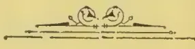

OBSERVER PRINTING WORKS.

1096------------------------------------------------

# TEA, COFFEE, CINCHONA, COCOA, AND CARDAMOM SALES.

NO. 16.]

COLOMBO, MAY 4th, 1896.

} PRICE:—12½ cents each; 3 copies  
30 cents; 6 copies ½ rupee.

## COLOMBO SALES OF TEA.

### LARGE LOTS.

[MESSRS. A. H. THOMPSON & Co.—44,304 lb.]

<table border="1">
<thead>
<tr>
<th>Lot.</th>
<th>Box.</th>
<th>pkgs.</th>
<th>Name.</th>
<th>lb.</th>
<th>c.</th>
</tr>
</thead>
<tbody>
<tr><td>5</td><td>Court Lodge</td><td>5 37 ch</td><td>bro or pe</td><td>4440</td><td>out</td></tr>
<tr><td>6</td><td></td><td>6 34 hf-ch</td><td>do</td><td>2312</td><td>67 bid</td></tr>
<tr><td>7</td><td></td><td>7 19 ch</td><td>or pek</td><td>1710</td><td>70</td></tr>
<tr><td>8</td><td></td><td>8 13 do</td><td>bro pek</td><td>1516</td><td>57</td></tr>
<tr><td>9</td><td></td><td>9 13 do</td><td>pekoe</td><td>1274</td><td>53</td></tr>
<tr><td>10</td><td></td><td>10 14 do</td><td>pek son</td><td>1260</td><td>45</td></tr>
<tr><td>11</td><td></td><td>11 7 do</td><td>dust</td><td>595</td><td>32</td></tr>
<tr><td>13</td><td>Warwick</td><td>13 5 ch</td><td>pekoe</td><td>500</td><td>43</td></tr>
<tr><td>15</td><td>F H M, in est.</td><td></td><td></td><td></td><td></td></tr>
<tr><td></td><td>mark</td><td>15 4 ch</td><td>bro pek fans</td><td>400</td><td>23</td></tr>
<tr><td>17</td><td>Digdola</td><td>17 16 do</td><td>bro pek</td><td>1600</td><td>43</td></tr>
<tr><td>18</td><td></td><td>18 12 do</td><td>pekoe</td><td>1050</td><td>33</td></tr>
<tr><td>19</td><td></td><td>19 5 do</td><td>pe son</td><td>450</td><td>30</td></tr>
<tr><td>21</td><td>Mahanilu</td><td>21 33 ch</td><td>sou</td><td>2805</td><td>35</td></tr>
<tr><td>24</td><td>Balgownie</td><td>24 10 do</td><td>bro pek</td><td>1000</td><td>46</td></tr>
<tr><td>25</td><td></td><td>25 13 do</td><td>pekoe</td><td>1040</td><td>37</td></tr>
<tr><td>26</td><td></td><td>26 9 do</td><td>pek son</td><td>810</td><td>31</td></tr>
<tr><td>27</td><td></td><td>27 13 do</td><td>bro mix</td><td>1105</td><td>28</td></tr>
<tr><td>29</td><td>K</td><td>29 5 hf-ch</td><td>bro pek fans</td><td>400</td><td>34</td></tr>
<tr><td>30</td><td></td><td>30 10 do</td><td>dust</td><td>800</td><td>23</td></tr>
<tr><td>31</td><td>Hornsey</td><td>31 9 ch</td><td>pek son</td><td>945</td><td>35</td></tr>
<tr><td>33</td><td>D C L</td><td>33 8 hf-ch</td><td>dust</td><td>643</td><td>23</td></tr>
<tr><td>34</td><td>D D O</td><td>34 12 ch</td><td>bro mix</td><td>1140</td><td>17</td></tr>
<tr><td>35</td><td>St. Leonards on</td><td></td><td></td><td></td><td></td></tr>
<tr><td></td><td>Sea</td><td>35 14 do</td><td>bro pek</td><td>1400</td><td>52</td></tr>
<tr><td>40</td><td>Oolooowatte</td><td>40 13 ch</td><td>bro pek</td><td>1430</td><td>42</td></tr>
<tr><td>41</td><td></td><td>41 18 do</td><td>pekoe</td><td>1700</td><td>36</td></tr>
<tr><td>42</td><td>V M C</td><td>42 8 do</td><td>bro mix</td><td>760</td><td>13</td></tr>
<tr><td>43</td><td>Elgin</td><td>43 7 ch</td><td>pek son</td><td>560</td><td>35</td></tr>
<tr><td>45</td><td>Elston</td><td>45 39 ch</td><td>pe son No 2</td><td>3120</td><td>34</td></tr>
<tr><td>46</td><td>N C</td><td>46 30 ch</td><td>bro tea</td><td>2700</td><td>17</td></tr>
<tr><td>47</td><td>Agra Oya</td><td>47 43 do</td><td>pekoe</td><td>4300</td><td>38 bid</td></tr>
<tr><td>48</td><td></td><td>48 22 do</td><td>pek son</td><td>2208</td><td>34</td></tr>
<tr><td>49</td><td>Netherton</td><td>49 9 ch</td><td>bro tea No 1</td><td>720</td><td>14</td></tr>
<tr><td>50</td><td>Comar</td><td>50 28 hf-ch</td><td>pekoe</td><td>1960</td><td>34</td></tr>
<tr><td>51</td><td></td><td>51 12 do</td><td>pek son</td><td>720</td><td>22</td></tr>
<tr><td>54</td><td>Manickwatte</td><td>54 11 ch</td><td>bro pek</td><td>1100</td><td>43</td></tr>
<tr><td>55</td><td></td><td>55 7 do</td><td>pekoe</td><td>700</td><td>33</td></tr>
<tr><td>57</td><td>P</td><td>57 13 ch</td><td>fans</td><td>1690</td><td>33</td></tr>
<tr><td>60</td><td>D</td><td>60 5 do</td><td>dust</td><td>700</td><td>29</td></tr>
<tr><td>62</td><td>Ratnattenne</td><td>62 10 do</td><td>bro pek</td><td>900</td><td>43</td></tr>
<tr><td>63</td><td></td><td>63 12 do</td><td>pekoe</td><td>1080</td><td>32</td></tr>
<tr><td>65</td><td>Mukalane</td><td>65 22 ch</td><td>pekoe</td><td>2200</td><td>35 bid</td></tr>
<tr><td>66</td><td></td><td>66 11 do</td><td>pek son</td><td>1100</td><td>31</td></tr>
<tr><td>67</td><td>W P R Dik-</td><td></td><td></td><td></td><td></td></tr>
<tr><td></td><td>oya</td><td>67 25 ch</td><td>bro or pek</td><td>1750</td><td>44 bid</td></tr>
<tr><td>68</td><td></td><td>68 30 do</td><td>pekoe</td><td>2100</td><td>35 bid</td></tr>
<tr><td>69</td><td></td><td>69 13 hf-ch</td><td>pek son</td><td>720</td><td>18 bid</td></tr>
<tr><td>70</td><td>Tudawatte</td><td>70 7 ch</td><td>bro pek</td><td>700</td><td>38</td></tr>
<tr><td>71</td><td></td><td>71 5 do</td><td>pekoe</td><td>475</td><td>31 bid</td></tr>
<tr><td>72</td><td></td><td>72 7 do</td><td>pek son</td><td>595</td><td>out</td></tr>
<tr><td>73</td><td></td><td>73 7 do</td><td>bro mix</td><td>595</td><td>out</td></tr>
<tr><td>77</td><td>Bogahattenne</td><td>77 7 do</td><td>bro pek</td><td>784</td><td>30 bid</td></tr>
<tr><td>78</td><td></td><td>78 4 do</td><td></td><td></td><td></td></tr>
<tr><td></td><td></td><td>1 hf-ch</td><td>pek son</td><td>457</td><td>18 bid</td></tr>
<tr><td>79</td><td></td><td>79 7 ch</td><td>bro mix</td><td>637</td><td>14</td></tr>
<tr><td>80</td><td></td><td>80 3 do</td><td>dust</td><td>445</td><td>25</td></tr>
<tr><td>84</td><td>Nahaveena</td><td>84 19 hf-ch</td><td>bro pek</td><td>950</td><td>46</td></tr>
<tr><td>86</td><td></td><td>86 9 do</td><td>pek son</td><td>450</td><td>34</td></tr>
</tbody>
</table>

[MESSRS. FORBES & WALKER.—495,262 lb.]

<table border="1">
<thead>
<tr>
<th>Lot.</th>
<th>Box.</th>
<th>Pkgs.</th>
<th>Name.</th>
<th>lb.</th>
<th>c.</th>
</tr>
</thead>
<tbody>
<tr><td>6</td><td>S M A</td><td>466 5 ch</td><td>pek son</td><td>450</td><td>24</td></tr>
<tr><td>11</td><td>Trewardena</td><td>476 5 do</td><td>bro pek</td><td>500</td><td>35</td></tr>
<tr><td>12</td><td></td><td>478 5 do</td><td>pekoe</td><td>500</td><td>30</td></tr>
<tr><td>13</td><td></td><td>480 5 do</td><td>pek son</td><td>500</td><td>25</td></tr>
<tr><td>16</td><td>M C</td><td>486 13 hf-ch</td><td>dust</td><td>1296</td><td>22</td></tr>
<tr><td>17</td><td>Macaldenia</td><td>488 14 do</td><td>bro pek</td><td>770</td><td>59</td></tr>
<tr><td>18</td><td></td><td>490 7 ch</td><td>pekoe</td><td>700</td><td>47</td></tr>
<tr><td>19</td><td></td><td>492 4 do</td><td>pekoe No 2</td><td>400</td><td>34</td></tr>
<tr><td>22</td><td>Great Valley</td><td>498 15 do</td><td>bro pek</td><td>825</td><td>59</td></tr>
<tr><td>23</td><td></td><td>500 30 do</td><td>or pek</td><td>1650</td><td>43</td></tr>
<tr><td>24</td><td></td><td>502 34 do</td><td>pekoe</td><td>3060</td><td>36</td></tr>
<tr><td>25</td><td></td><td>504 28 do</td><td>pek son</td><td>2380</td><td>31</td></tr>
<tr><td>26</td><td>Ulapane</td><td>506 13 ch</td><td>bro pek</td><td>1430</td><td>53</td></tr>
<tr><td>27</td><td></td><td>508 15 do</td><td>pekoe</td><td>1275</td><td>33</td></tr>
<tr><td>28</td><td></td><td>510 15 do</td><td>pek son</td><td>1125</td><td>32</td></tr>
<tr><td>31</td><td>M V</td><td>516 7 ch</td><td>or pek</td><td>735</td><td>38 bid</td></tr>
<tr><td>32</td><td></td><td>518 5 do</td><td>bro pek</td><td>550</td><td>40 bid</td></tr>
<tr><td>33</td><td></td><td>520 9 do</td><td>pekoe</td><td>855</td><td>34 bid</td></tr>
<tr><td>34</td><td></td><td>522 6 do</td><td>pek son</td><td>570</td><td>31</td></tr>
</tbody>
</table>

<table border="1">
<thead>
<tr>
<th>Lot</th>
<th>Box.</th>
<th>Pkgs.</th>
<th>Name.</th>
<th>lb.</th>
<th>c.</th>
</tr>
</thead>
<tbody>
<tr><td>35</td><td>Pedro</td><td>524 26 ch</td><td>bro or pek</td><td>2860</td><td>28 bid</td></tr>
<tr><td>36</td><td></td><td>526 22 do</td><td>pekoe</td><td>1980</td><td>61</td></tr>
<tr><td>37</td><td></td><td>528 17 do</td><td>pek son</td><td>1275</td><td>43</td></tr>
<tr><td>38</td><td></td><td>530 6 do</td><td>dust</td><td>900</td><td>34</td></tr>
<tr><td>39</td><td>R M T, in estate</td><td></td><td></td><td></td><td></td></tr>
<tr><td></td><td>mark</td><td>532 6 ch</td><td>bro pek</td><td>660</td><td>37</td></tr>
<tr><td>40</td><td></td><td>534 7 do</td><td>pekoe</td><td>630</td><td>35</td></tr>
<tr><td>41</td><td></td><td>536 7 do</td><td>pek son</td><td>630</td><td>33</td></tr>
<tr><td>53</td><td>Langdale</td><td>560 29 ch</td><td>bro pek</td><td>3480</td><td>56 bid</td></tr>
<tr><td>54</td><td></td><td>562 30 do</td><td>pekoe</td><td>3000</td><td>51</td></tr>
<tr><td>55</td><td></td><td>564 5 do</td><td>pek son</td><td>450</td><td>40</td></tr>
<tr><td>64</td><td>Chesterford</td><td>582 30 ch</td><td>bro pek</td><td>3000</td><td>47</td></tr>
<tr><td>65</td><td></td><td>584 30 do</td><td>pekoe</td><td>3000</td><td>40</td></tr>
<tr><td>65</td><td></td><td>586 30 do</td><td>pek son</td><td>3000</td><td>34</td></tr>
<tr><td>69</td><td>Midlothian</td><td>592 23 hf-ch</td><td>or pek</td><td>1380</td><td>54</td></tr>
<tr><td>77</td><td>DB R</td><td>608 6 do</td><td>bro mix</td><td>600</td><td>18</td></tr>
<tr><td>78</td><td></td><td>610 3 do</td><td>dust</td><td>450</td><td>28</td></tr>
<tr><td>80</td><td>New Galway</td><td>614 10 hf-ch</td><td>bro pek</td><td>550</td><td>73</td></tr>
<tr><td>81</td><td></td><td>616 16 do</td><td>pekoe</td><td>800</td><td>53</td></tr>
<tr><td>83</td><td>Stisted</td><td>620 70 do</td><td>bro pek</td><td>4200</td><td>43</td></tr>
<tr><td>84</td><td></td><td>622 30 do</td><td>pekoe</td><td>1650</td><td>41</td></tr>
<tr><td>85</td><td></td><td>624 51 do</td><td>pek son</td><td>2295</td><td>33</td></tr>
<tr><td>86</td><td>Clyde</td><td>626 34 ch</td><td>bro pek</td><td>3570</td><td>49</td></tr>
<tr><td>87</td><td></td><td>628 16 do</td><td>pekoe</td><td>1600</td><td>41</td></tr>
<tr><td>88</td><td></td><td>630 13 do</td><td>pek son</td><td>1235</td><td>35</td></tr>
<tr><td>89</td><td></td><td>632 3 do</td><td>dust</td><td>420</td><td>29</td></tr>
<tr><td>90</td><td>M G</td><td>634 6 ch</td><td>dust</td><td>550</td><td>22</td></tr>
<tr><td>94</td><td>St. Heliers</td><td>642 25 hf-ch</td><td>bro or pek</td><td>1375</td><td>55</td></tr>
<tr><td>95</td><td></td><td>644 14 ch</td><td>pekoe</td><td>1400</td><td>42</td></tr>
<tr><td>96</td><td></td><td>646 4 do</td><td>pek son</td><td>400</td><td>33</td></tr>
<tr><td>98</td><td>Stafford</td><td>650 11 do</td><td>bro pek</td><td>1210</td><td>57 bid</td></tr>
<tr><td>99</td><td></td><td>652 12 do</td><td>pekoe</td><td>1080</td><td>57</td></tr>
<tr><td>103</td><td>T B, in estate</td><td></td><td></td><td></td><td></td></tr>
<tr><td></td><td>mark</td><td>660 10 ch</td><td>pek fans</td><td>1050</td><td>31</td></tr>
<tr><td>104</td><td></td><td>662 5 do</td><td>congou</td><td>500</td><td>24</td></tr>
<tr><td>105</td><td>Garendon</td><td>664 6 ch</td><td>pekoe</td><td>600</td><td>35</td></tr>
<tr><td>106</td><td></td><td>666 9 do</td><td>or pek</td><td>900</td><td>39</td></tr>
<tr><td>107</td><td></td><td>668 5 do</td><td>pek son</td><td>500</td><td>28</td></tr>
<tr><td>108</td><td></td><td>670 7 do</td><td>sou</td><td>700</td><td>28</td></tr>
<tr><td>109</td><td></td><td>672 5 do</td><td>fans</td><td>500</td><td>33</td></tr>
<tr><td>112</td><td>Rockside</td><td>678 34 ch</td><td>pekoe</td><td>3400</td><td>45</td></tr>
<tr><td>113</td><td></td><td>680 26 do</td><td>pek son</td><td>2600</td><td>35</td></tr>
<tr><td>114</td><td>Brechin</td><td>682 33 do</td><td>bro pek</td><td>3630</td><td>60</td></tr>
<tr><td>115</td><td></td><td>684 15 do</td><td>pekoe</td><td>1575</td><td>46</td></tr>
<tr><td>116</td><td></td><td>686 5 do</td><td>pe son</td><td>500</td><td>36</td></tr>
<tr><td>119</td><td>S E M</td><td>692 4 ch</td><td>pekoe</td><td>428</td><td>24</td></tr>
<tr><td>120</td><td>Wattagalla</td><td>694 20 do</td><td>bro or pe</td><td>2200</td><td>47 bid</td></tr>
<tr><td>121</td><td></td><td>696 9 do</td><td>or pek</td><td>990</td><td>63</td></tr>
<tr><td>122</td><td></td><td>698 33 do</td><td>pekoe</td><td>3630</td><td>42</td></tr>
<tr><td>123</td><td></td><td>700 13 do</td><td>pek son</td><td>1300</td><td>37</td></tr>
<tr><td>124</td><td></td><td>702 5 hf-ch</td><td>pek dust</td><td>450</td><td>29</td></tr>
<tr><td>127</td><td>Ganapalla</td><td>708 82 do</td><td>bro pek</td><td>4100</td><td>44</td></tr>
<tr><td>128</td><td></td><td>710 60 ch</td><td>pekoe</td><td>4800</td><td>36</td></tr>
<tr><td>129</td><td></td><td>712 20 do</td><td>pek son</td><td>1600</td><td>31</td></tr>
<tr><td>130</td><td></td><td>714 6 hf-ch</td><td>dust</td><td>480</td><td>23</td></tr>
<tr><td>131</td><td>Carfax</td><td>716 20 ch</td><td>bro or pek</td><td>2200</td><td>53</td></tr>
<tr><td>132</td><td>Weoya</td><td>718 50 do</td><td>bro pek</td><td>5250</td><td>48</td></tr>
<tr><td>133</td><td></td><td>720 72 do</td><td>pekoe</td><td>6840</td><td>37</td></tr>
<tr><td>134</td><td></td><td>722 23 do</td><td>pek son</td><td>2240</td><td>32</td></tr>
<tr><td>135</td><td></td><td>724 7 do</td><td>bro pek fan</td><td>840</td><td>33</td></tr>
<tr><td>136</td><td></td><td>726 6 do</td><td>pek dust</td><td>840</td><td>27</td></tr>
<tr><td>137</td><td>Dunkeld</td><td>728 19 ch</td><td>bro pek</td><td>2090</td><td>50 bid</td></tr>
<tr><td>138</td><td></td><td>730 34 hf-ch</td><td>or pek</td><td>1700</td><td>58</td></tr>
<tr><td>139</td><td></td><td>732 17 ch</td><td>pekoe</td><td>1700</td><td>40</td></tr>
<tr><td>140</td><td>D K D</td><td>734 7 do</td><td>unas</td><td>805</td><td>32</td></tr>
<tr><td>141</td><td>Dammeria</td><td>736 52 do</td><td>bro or pek</td><td>5720</td><td>53 bid</td></tr>
<tr><td>142</td><td></td><td>738 65 do</td><td>pekoe</td><td>6510</td><td>40 bid</td></tr>
<tr><td>143</td><td></td><td>740 7 do</td><td>pek son</td><td>700</td><td>35</td></tr>
<tr><td>144</td><td></td><td>742 5 do</td><td>dust</td><td>500</td><td>30</td></tr>
<tr><td>146</td><td>D M</td><td>746 6 ch</td><td>pekoe</td><td>600</td><td>34</td></tr>
<tr><td>147</td><td>High Forest</td><td>748 20 hf-ch</td><td>bro pek</td><td>1200</td><td>56</td></tr>
<tr><td>148</td><td></td><td>750 23 do</td><td>pekoe</td><td>1540</td><td>49</td></tr>
<tr><td>149</td><td></td><td>752 8 do</td><td>pe son</td><td>440</td><td>39</td></tr>
<tr><td>150</td><td>High Forest</td><td>754 21 hf-ch</td><td>pek son</td><td>1050</td><td>38</td></tr>
<tr><td>151</td><td></td><td>756 20 do</td><td>sou</td><td>1000</td><td>36</td></tr>
<tr><td>152</td><td></td><td>758 6 do</td><td>dust</td><td>510</td><td>29</td></tr>
<tr><td>157</td><td>Clunes</td><td>768 82 hf-ch</td><td>bro pek</td><td>4100</td><td>44</td></tr>
<tr><td>158</td><td></td><td>770 13 ch</td><td>pekoe</td><td>1170</td><td>36</td></tr>
<tr><td>159</td><td></td><td>772 34 do</td><td>pek son</td><td>3060</td><td>30</td></tr>
<tr><td>160</td><td></td><td>774 11 do</td><td>pek fans</td><td>1155</td><td>32</td></tr>
<tr><td>161</td><td></td><td>776 11 hf-ch</td><td>dust</td><td>880</td><td>28</td></tr>
<tr><td>162</td><td></td><td>778 7 ch</td><td>red leaf</td><td>630</td><td>21</td></tr>
<tr><td>163</td><td>Carlabeck</td><td>780 5 do</td><td>pek son</td><td>550</td><td>49</td></tr>
<tr><td>164</td><td></td><td>782 12 hf-ch</td><td>bro pek fans</td><td>900</td><td>42 bid</td></tr>
<tr><td>165</td><td>C O E B</td><td>784 15 ch</td><td>pek son</td><td>1350</td><td>21</td></tr>
<tr><td>166</td><td></td><td>786 11 do</td><td>bro mix</td><td>990</td><td>14</td></tr>
<tr><td>167</td><td>Arapolakande</td><td>788 56 ch</td><td>bro pek</td><td>5600</td><td>50</td></tr>
<tr><td>168</td><td></td><td>790 52 do</td><td>pekoe</td><td>4420</td><td>39</td></tr>
<tr><td>169</td><td></td><td>792 11 do</td><td>pek son</td><td>1100</td><td>33</td></tr>
<tr><td>170</td><td></td><td>794 4 do</td><td>dust</td><td>440</td><td>29</td></tr>
<tr><td>172</td><td>Scrubs</td><td>798 12 ch</td><td>or pek</td><td>1200</td><td>63</td></tr>
<tr><td>173</td><td></td><td>800 22 do</td><td>bro pek</td><td>2420</td><td>53 bid</td></tr>
</tbody>
</table>

1097------------------------------------------------

2

CEYLON PRODUCE SALES LIST.

<table border="1">
<thead>
<tr>
<th>Lot.</th>
<th>Box.</th>
<th>Pkgs.</th>
<th>Names.</th>
<th>lb.</th>
<th>c.</th>
</tr>
</thead>
<tbody>
<tr><td>174</td><td>802</td><td>22</td><td>eh pekoe</td><td>2090</td><td>51</td></tr>
<tr><td>175</td><td>804</td><td>10</td><td>do dust</td><td>1560</td><td>34</td></tr>
<tr><td>176</td><td>806</td><td>4</td><td>do bro pek</td><td>400</td><td>38</td></tr>
<tr><td>177</td><td>806</td><td>5</td><td>do pekoe</td><td>450</td><td>30</td></tr>
<tr><td>178</td><td>810</td><td>64</td><td>ch bro pek</td><td>6080</td><td>51</td></tr>
<tr><td>179</td><td>812</td><td>22</td><td>do pek No 1</td><td>2156</td><td>40</td></tr>
<tr><td>180</td><td>814</td><td>29</td><td>do pek ,, 2</td><td>2610</td><td>37</td></tr>
<tr><td>181</td><td>816</td><td>13</td><td>ch pek sou</td><td>1144</td><td>32</td></tr>
<tr><td>183</td><td>820</td><td>5</td><td>do dust</td><td>400</td><td>29</td></tr>
<tr><td>184</td><td>822</td><td>15</td><td>ch bro pek</td><td>1500</td><td>38</td></tr>
<tr><td>185</td><td>824</td><td>11</td><td>do pekoe</td><td>990</td><td>34</td></tr>
<tr><td>186</td><td>826</td><td>8</td><td>do fans</td><td>760</td><td>31</td></tr>
<tr><td>188</td><td>830</td><td>18</td><td>ch bro pek</td><td>1980</td><td>57 bid</td></tr>
<tr><td>189</td><td>832</td><td>18</td><td>do pekoe</td><td>1800</td><td>46 bid</td></tr>
<tr><td>190</td><td>834</td><td>13</td><td>do pek sou</td><td>1300</td><td>36</td></tr>
<tr><td>192</td><td>838</td><td>22</td><td>hf-ch bro pek</td><td>1100</td><td>43</td></tr>
<tr><td>193</td><td>840</td><td>23</td><td>do pekoe</td><td>1035</td><td>39</td></tr>
<tr><td>194</td><td>842</td><td>25</td><td>do pek sou</td><td>1000</td><td>33</td></tr>
<tr><td>195</td><td>844</td><td>17</td><td>ch bro pek</td><td>1870</td><td>39 bid</td></tr>
<tr><td>196</td><td>846</td><td>10</td><td>do or pek</td><td>900</td><td>38</td></tr>
<tr><td>197</td><td>848</td><td>6</td><td>do pekoe</td><td>540</td><td>34 bid</td></tr>
<tr><td>199</td><td>852</td><td>25</td><td>hf-ch bro pek</td><td>1250</td><td>83</td></tr>
<tr><td>200</td><td>854</td><td>31</td><td>do pekoe</td><td>1395</td><td>57</td></tr>
<tr><td>201</td><td>856</td><td>33</td><td>do pek sou</td><td>1650</td><td>45</td></tr>
<tr><td>202</td><td>858</td><td>16</td><td>do dust</td><td>1280</td><td>30</td></tr>
<tr><td>203</td><td>860</td><td>12</td><td>do bro pe dust</td><td>840</td><td>33</td></tr>
<tr><td>204</td><td>862</td><td>11</td><td>do congou</td><td>550</td><td>38</td></tr>
<tr><td>205</td><td>864</td><td>24</td><td>do bro tea</td><td>1200</td><td>34</td></tr>
<tr><td>206</td><td>863</td><td>24</td><td>ch bro pek</td><td>2760</td><td rowspan="2">with d' n.</td></tr>
<tr><td>207</td><td>838</td><td>76</td><td>hf-ch or pek</td><td>3800</td></tr>
<tr><td>208</td><td>870</td><td>24</td><td>ch pek sou</td><td>2160</td><td></td></tr>
<tr><td>209</td><td>872</td><td>4</td><td>do dust</td><td>400</td><td>30</td></tr>
<tr><td>210</td><td>874</td><td>12</td><td>ch bro pek</td><td>1200</td><td>49</td></tr>
<tr><td>211</td><td>876</td><td>19</td><td>do pekoe</td><td>1615</td><td>39</td></tr>
<tr><td>212</td><td>878</td><td>20</td><td>do pek sou</td><td>1800</td><td>28</td></tr>
<tr><td>213</td><td>880</td><td>10</td><td>do dust</td><td>1400</td><td>25</td></tr>
<tr><td>214</td><td>882</td><td>17</td><td>ch pekoe</td><td>1700</td><td>37</td></tr>
<tr><td>215</td><td>884</td><td>26</td><td>do bro pek</td><td>2600</td><td>44</td></tr>
<tr><td>216</td><td>886</td><td>13</td><td>do pekoe</td><td>1170</td><td>38</td></tr>
<tr><td>217</td><td>888</td><td>11</td><td>do pek sou</td><td>990</td><td>33</td></tr>
<tr><td>218</td><td>890</td><td>11</td><td>hf-ch sou</td><td>550</td><td>29</td></tr>
<tr><td>221</td><td>896</td><td>10</td><td>ch bro pek</td><td>1000</td><td>43</td></tr>
<tr><td>222</td><td>898</td><td>5</td><td>do pekoe</td><td>450</td><td>36</td></tr>
<tr><td>324</td><td>902</td><td>23</td><td>hf-ch son</td><td>1150</td><td>31</td></tr>
<tr><td>326</td><td>904</td><td>9</td><td>do pek dust</td><td>540</td><td>29</td></tr>
<tr><td>227</td><td>903</td><td>8</td><td>do pek sou</td><td>400</td><td>24</td></tr>
<tr><td>228</td><td>910</td><td>29</td><td>ch bro pek</td><td>2900</td><td>36 bid</td></tr>
<tr><td>229</td><td>912</td><td>31</td><td>do pekoe</td><td>1550</td><td>37 bid</td></tr>
<tr><td>230</td><td>914</td><td>40</td><td>do sou</td><td>3600</td><td>28</td></tr>
<tr><td>231</td><td>916</td><td>14</td><td>do dust</td><td>1995</td><td>23</td></tr>
<tr><td>232</td><td>918</td><td>10</td><td>do bro pek</td><td>1100</td><td>45</td></tr>
<tr><td>233</td><td>920</td><td>7</td><td>do pekoe</td><td>700</td><td>36</td></tr>
<tr><td>234</td><td>922</td><td>5</td><td>do pek sou</td><td>500</td><td>30</td></tr>
<tr><td>235</td><td>924</td><td>33</td><td>ch or pek</td><td>3168</td><td>52</td></tr>
<tr><td>236</td><td>926</td><td>18</td><td>do pek sou</td><td>1620</td><td>33</td></tr>
<tr><td>242</td><td>938</td><td>95</td><td>hf-ch bro pek</td><td>4750</td><td>46</td></tr>
<tr><td>243</td><td>940</td><td>36</td><td>do pekoe</td><td>1800</td><td>43</td></tr>
<tr><td>244</td><td>942</td><td>47</td><td>do pek sou</td><td>2350</td><td>34</td></tr>
<tr><td>245</td><td>944</td><td>5</td><td>do dust</td><td>400</td><td>27</td></tr>
<tr><td>252</td><td>G P M, in estate mark</td><td>958</td><td>19 hf-ch bro or pe</td><td>1140</td><td>71</td></tr>
<tr><td>253</td><td></td><td>960</td><td>17 do or pek</td><td>952</td><td>82</td></tr>
<tr><td>254</td><td></td><td>962</td><td>46 do pekoe</td><td>2576</td><td>54</td></tr>
<tr><td>255</td><td></td><td>964</td><td>53 do do No 2</td><td>3180</td><td>46</td></tr>
<tr><td>256</td><td></td><td>966</td><td>65 do sou</td><td>3640</td><td>42</td></tr>
<tr><td>266</td><td>Talgaswela</td><td>986</td><td>12 ch bro pek</td><td>1080</td><td>49</td></tr>
<tr><td>267</td><td></td><td>988</td><td>16 do pekoe</td><td>1440</td><td>38</td></tr>
<tr><td>268</td><td></td><td>990</td><td>27 do pek sou</td><td>2295</td><td>33</td></tr>
<tr><td>269</td><td></td><td>992</td><td>5 do dust</td><td>700</td><td>30</td></tr>
<tr><td>271</td><td>Cottaganga</td><td>996</td><td>3 do dust</td><td>450</td><td>29</td></tr>
<tr><td>275</td><td>Ragalla</td><td>4</td><td>6 hf-ch dust</td><td>540</td><td>28</td></tr>
<tr><td>277</td><td>Glencorse</td><td>8</td><td>30 ch bro pek</td><td>3000</td><td>46</td></tr>
<tr><td>278</td><td></td><td>10</td><td>16 do pekoe</td><td>1440</td><td>39</td></tr>
<tr><td>279</td><td></td><td>12</td><td>15 do pek sou</td><td>1200</td><td>32</td></tr>
<tr><td>281</td><td>Denmark Hill</td><td>16</td><td>10 do bro or pek</td><td>1170</td><td>53 bid</td></tr>
<tr><td>282</td><td></td><td>18</td><td>16 do or pek</td><td>1504</td><td>60</td></tr>
<tr><td>283</td><td></td><td>20</td><td>10 do pekoe</td><td>830</td><td>47</td></tr>
<tr><td>284</td><td></td><td>22</td><td>5 do pek sou</td><td>405</td><td>38</td></tr>
<tr><td>286</td><td>Wollyfield</td><td>26</td><td>4 do bro pe</td><td>410</td><td>43</td></tr>
<tr><td>290</td><td>Sorana</td><td>34</td><td>30 hf-ch bro pe</td><td>1500</td><td>56</td></tr>
<tr><td>291</td><td></td><td>36</td><td>22 ch pekoe</td><td>2080</td><td>40</td></tr>
<tr><td></td><td></td><td></td><td>2 hf-ch</td><td></td><td></td></tr>
<tr><td>292</td><td></td><td>38</td><td>8 eh pek sou</td><td>680</td><td>33</td></tr>
<tr><td>295</td><td>Holton</td><td>44</td><td>26 do bro pek</td><td>2860</td><td>47</td></tr>
<tr><td>296</td><td></td><td>46</td><td>18 do pekoe</td><td>1800</td><td>38</td></tr>
<tr><td>297</td><td></td><td>48</td><td>7 do pek son</td><td>665</td><td>32</td></tr>
<tr><td>301</td><td>Hethersett</td><td>56</td><td>20 do bro or pe</td><td>2340</td><td>53 bid</td></tr>
<tr><td>302</td><td></td><td>58</td><td>32 do or pe</td><td>3808</td><td>60 bid</td></tr>
<tr><td>303</td><td></td><td>60</td><td>20 do pek</td><td>1660</td><td>46</td></tr>
<tr><td>304</td><td></td><td>62</td><td>10 do pe son</td><td>810</td><td>42</td></tr>
<tr><td>305</td><td></td><td>64</td><td>10 do pek sou</td><td>840</td><td>44</td></tr>
<tr><td>307</td><td>Stamford Hill</td><td>68</td><td>22 do bro pe</td><td>2640</td><td>51 bid</td></tr>
<tr><td>308</td><td>Middleton</td><td>70</td><td>8 do bro or pek</td><td>800</td><td>65</td></tr>
<tr><td>309</td><td></td><td>72</td><td>28 do bro pek</td><td>2800</td><td>54</td></tr>
<tr><td>310</td><td></td><td>74</td><td>48 do pekoe</td><td>4320</td><td>47</td></tr>
<tr><td>311</td><td></td><td>76</td><td>12 do pek sou</td><td>1080</td><td>36</td></tr>
<tr><td>312</td><td>Ireby</td><td>78</td><td>33 hf-ch bro pek</td><td>1980</td><td>62</td></tr>
</tbody>
</table>

<table border="1">
<thead>
<tr>
<th>Lot.</th>
<th>Box.</th>
<th>Pkgs.</th>
<th>Name.</th>
<th>lb.</th>
<th>c.</th>
</tr>
</thead>
<tbody>
<tr><td>313</td><td>80</td><td>14</td><td>do pekoe</td><td>1260</td><td>50</td></tr>
<tr><td>314</td><td>82</td><td>8</td><td>ch pek sou</td><td>720</td><td>38</td></tr>
<tr><td>315</td><td>Maha Uva</td><td>84</td><td>40 hf-ch bro or pek</td><td>2600</td><td>45 bid</td></tr>
<tr><td>316</td><td>86</td><td>23</td><td>do or pek</td><td>1380</td><td>62</td></tr>
<tr><td>317</td><td>88</td><td>40</td><td>ch pekoe</td><td>4000</td><td>46</td></tr>
</tbody>
</table>

[MR. E. JOHN.—199,448 lb.]

<table border="1">
<thead>
<tr>
<th>Lot.</th>
<th>Box.</th>
<th>Pkgs.</th>
<th>Na</th>
<th>lb.</th>
<th>c.</th>
</tr>
</thead>
<tbody>
<tr><td>1</td><td>Yahalakela</td><td>419</td><td>7 ch pek fans</td><td>630</td><td>35</td></tr>
<tr><td>3</td><td></td><td>423</td><td>5 do dust</td><td>750</td><td>29</td></tr>
<tr><td>8</td><td>Wewesse</td><td>433</td><td>31 hf-ch bro pek</td><td>1705</td><td>49</td></tr>
<tr><td>9</td><td></td><td>435</td><td>29 do pekoe</td><td>1595</td><td>39</td></tr>
<tr><td>10</td><td></td><td>437</td><td>28 do pek sou</td><td>1400</td><td>33</td></tr>
<tr><td>18</td><td>Hunugalla</td><td>453</td><td>14 ch bro pek</td><td>140</td><td>42</td></tr>
<tr><td>19</td><td></td><td>455</td><td>8 do pekoe</td><td>800</td><td>34</td></tr>
<tr><td>20</td><td></td><td>457</td><td>6 do pek sou</td><td>570</td><td>20</td></tr>
<tr><td>22</td><td>Wewesse</td><td>461</td><td>10 hf-ch pekoe</td><td>550</td><td>40</td></tr>
<tr><td>23</td><td>Oakfield</td><td>463</td><td>17 do bro pek</td><td>1020</td><td>47</td></tr>
<tr><td>24</td><td></td><td>465</td><td>19 do pekoe</td><td>950</td><td>41</td></tr>
<tr><td>25</td><td></td><td>467</td><td>13 do pek sou</td><td>650</td><td>35</td></tr>
<tr><td>27</td><td>Ottery and Stamford Hill</td><td>471</td><td>27 eh bro pek</td><td>2700</td><td>55 bid</td></tr>
<tr><td>28</td><td></td><td>473</td><td>17 do or pek</td><td>1445</td><td>60 bid</td></tr>
<tr><td>29</td><td></td><td>475</td><td>53 do pekoe</td><td>4770</td><td>44 bid</td></tr>
<tr><td>31</td><td>Gonavy</td><td>479</td><td>23 do bro pek</td><td>2576</td><td>55</td></tr>
<tr><td>32</td><td></td><td>481</td><td>14 do pekoe</td><td>1428</td><td>44</td></tr>
<tr><td>33</td><td></td><td>483</td><td>11 do pek sou</td><td>999</td><td>37</td></tr>
<tr><td>34</td><td>Allington</td><td>485</td><td>28 hf-ch or pek</td><td>1400</td><td>40 bid</td></tr>
<tr><td>35</td><td></td><td>487</td><td>17 do bro pek</td><td>935</td><td>46</td></tr>
<tr><td>36</td><td></td><td>489</td><td>29 do pekoe</td><td>1450</td><td>35</td></tr>
<tr><td>37</td><td></td><td>491</td><td>14 do pek sou</td><td>700</td><td>31</td></tr>
<tr><td>39</td><td>Anchor, in est. mark</td><td>495</td><td>32 ch bro or pek</td><td>3040</td><td>60</td></tr>
<tr><td>40</td><td></td><td>497</td><td>14 do or pek</td><td>1050</td><td>48</td></tr>
<tr><td>41</td><td></td><td>499</td><td>11 do pek son</td><td>1100</td><td>41</td></tr>
<tr><td>42</td><td></td><td>1</td><td>11 do pek fans</td><td>1430</td><td>35 bid</td></tr>
<tr><td>43</td><td></td><td>3</td><td>13 hf-ch dust</td><td>1170</td><td>29</td></tr>
<tr><td>47</td><td>Verelapatna</td><td>11</td><td>25 ch bro pek</td><td>2750</td><td>58</td></tr>
<tr><td>48</td><td></td><td>13</td><td>23 do pekoe</td><td>2300</td><td>48</td></tr>
<tr><td>49</td><td></td><td>15</td><td>10 do pek sou</td><td>1000</td><td>38</td></tr>
<tr><td>51</td><td>Uvakellie</td><td>19</td><td>38 do bro pek</td><td>4180</td><td>52 bid</td></tr>
<tr><td>52</td><td></td><td>21</td><td>33 do pekoe</td><td>3300</td><td>41 bid</td></tr>
<tr><td>53</td><td></td><td>23</td><td>28 do pek sou</td><td>2800</td><td>36</td></tr>
<tr><td>69</td><td>Mocha</td><td>55</td><td>30 do bro pek</td><td>3150</td><td>57 bid</td></tr>
<tr><td>70</td><td></td><td>57</td><td>26 do pekoe</td><td>2000</td><td>47 bid</td></tr>
<tr><td>71</td><td></td><td>59</td><td>16 do pek sou</td><td>1360</td><td>40</td></tr>
<tr><td>72</td><td>Stinsford</td><td>61</td><td>38 hf-ch bro pek</td><td>1900</td><td>55</td></tr>
<tr><td>73</td><td></td><td>63</td><td>47 do pekoe</td><td>2256</td><td>40</td></tr>
<tr><td>74</td><td></td><td>65</td><td>19 do pek sou</td><td>912</td><td>33</td></tr>
<tr><td>78</td><td>Glentilt</td><td>73</td><td>35 ch bro pek</td><td>3675</td><td>54 bid</td></tr>
<tr><td>79</td><td></td><td>75</td><td>20 do pekoe</td><td>2000</td><td>44</td></tr>
<tr><td>80</td><td></td><td>77</td><td>10 do pek sou</td><td>900</td><td>37</td></tr>
<tr><td>81</td><td>Agra Ouvah</td><td>79</td><td>52 hf-ch bro or pek</td><td>3380</td><td>57 bid</td></tr>
<tr><td>82</td><td></td><td>81</td><td>32 do or pek</td><td>1920</td><td>57</td></tr>
<tr><td>83</td><td></td><td>83</td><td>13 ch pekoe</td><td>1300</td><td>46</td></tr>
<tr><td>84</td><td>Glasgow</td><td>85</td><td>29 do pekoe</td><td>2755</td><td>53</td></tr>
<tr><td>85</td><td></td><td>87</td><td>18 do pek sou</td><td>1800</td><td>46</td></tr>
<tr><td>86</td><td></td><td>89</td><td>12 do dust</td><td>1200</td><td>33</td></tr>
<tr><td>87</td><td>Blackburn</td><td>91</td><td>19 do bro pek</td><td>2090</td><td>37</td></tr>
<tr><td>88</td><td></td><td>93</td><td>21 do pekoe</td><td>2310</td><td>32</td></tr>
<tr><td>89</td><td>Kataboola</td><td>95</td><td>8 do sou</td><td>825</td><td>20</td></tr>
<tr><td>90</td><td>Maddagedera</td><td>97</td><td>43 do bro pek</td><td>4300</td><td>52</td></tr>
<tr><td>91</td><td></td><td>99</td><td>27 do pekoe</td><td>2430</td><td>42</td></tr>
<tr><td>92</td><td></td><td>101</td><td>16 do pek son</td><td>1360</td><td>34</td></tr>
<tr><td>93</td><td>Henegama</td><td>113</td><td>4 do dust</td><td>560</td><td>29</td></tr>
<tr><td>94</td><td>E T K</td><td>105</td><td>16 do pekoe</td><td>1600</td><td>37</td></tr>
<tr><td>95</td><td></td><td>107</td><td>6 hf-ch dust</td><td>480</td><td>29</td></tr>
<tr><td>93</td><td>H S, in estate mark</td><td>109</td><td>10 ch bro pek</td><td>1050</td><td>38</td></tr>
<tr><td>97</td><td></td><td>111</td><td>4 do pekoe</td><td>400</td><td>28</td></tr>
<tr><td>98</td><td></td><td>113</td><td>22 do sou</td><td>1870</td><td>26</td></tr>
<tr><td>99</td><td></td><td>115</td><td>9 hf-ch dust</td><td>765</td><td>27</td></tr>
<tr><td>102</td><td>Agra Ouvah</td><td>121</td><td>17 ch pek son</td><td>1700</td><td>36</td></tr>
<tr><td>103</td><td></td><td>123</td><td>13 do pek fans</td><td>1170</td><td>33</td></tr>
<tr><td>104</td><td></td><td>125</td><td>52 hf-ch bro or pek</td><td>3380</td><td>61</td></tr>
<tr><td>105</td><td></td><td>127</td><td>32 do or pek</td><td>1920</td><td>57</td></tr>
<tr><td>106</td><td></td><td>129</td><td>13 ch pekoe</td><td>1300</td><td>45</td></tr>
<tr><td>107</td><td>Glasgow</td><td>131</td><td>65 do bro or pek</td><td>5070</td><td>69</td></tr>
<tr><td>108</td><td></td><td>133</td><td>51 do or pek</td><td>3060</td><td>57</td></tr>
<tr><td>109</td><td></td><td>135</td><td>28 do pekoe</td><td>2660</td><td>52</td></tr>
<tr><td>110</td><td>Logan</td><td>137</td><td>28 do bro pek</td><td>2800</td><td>43</td></tr>
<tr><td>111</td><td></td><td>139</td><td>19 do pekoe</td><td>1710</td><td>37</td></tr>
<tr><td>112</td><td></td><td>141</td><td>11 do pek son</td><td>935</td><td>31</td></tr>
<tr><td>113</td><td></td><td>143</td><td>5 hf-ch dust</td><td>400</td><td>33</td></tr>
<tr><td>114</td><td>Aerawatte</td><td>145</td><td>16 ch pekoe</td><td>1440</td><td>40</td></tr>
<tr><td>115</td><td>Brownlow</td><td>147</td><td>19 do bro pek</td><td>2280</td><td>52</td></tr>
<tr><td>116</td><td></td><td>149</td><td>28 do pekoe</td><td>3080</td><td>45</td></tr>
<tr><td>117</td><td></td><td>151</td><td>5 do pek sou</td><td>500</td><td>35</td></tr>
<tr><td>118</td><td>Tari</td><td>153</td><td>13 do bro pek</td><td>1560</td><td>40</td></tr>
<tr><td>119</td><td></td><td>155</td><td>23 do pekoe</td><td>2530</td><td>36</td></tr>
<tr><td>120</td><td></td><td>157</td><td>7 do pek son</td><td>700</td><td>30</td></tr>
<tr><td>121</td><td>(The Eadella Estates Co., Limited.)</td><td>159</td><td>14 do bro pek</td><td>1400</td><td>46</td></tr>
</tbody>
</table>

1098------------------------------------------------

CEYLON PRODUCE SALES LIST.

3

<table border="1">
<thead>
<tr>
<th>Lot.</th>
<th>Box.</th>
<th>Pkgs.</th>
<th>Name.</th>
<th>lb.</th>
<th>c.</th>
</tr>
</thead>
<tbody>
<tr>
<td>122</td>
<td>161</td>
<td>15 ch</td>
<td>pekoe</td>
<td>1350</td>
<td>38</td>
</tr>
<tr>
<td>123</td>
<td>163</td>
<td>10 do</td>
<td>pek sou</td>
<td>800</td>
<td>31</td>
</tr>
<tr>
<td>124</td>
<td>165</td>
<td>7 do</td>
<td>red leaf</td>
<td>695</td>
<td>15</td>
</tr>
<tr>
<td>130 N A</td>
<td>177</td>
<td>7 do</td>
<td>pek sou</td>
<td>635</td>
<td>16</td>
</tr>
</tbody>
</table>

[MESSRS. SOMERVILLE & Co., 175,498 lb.]

<table border="1">
<thead>
<tr>
<th>Lot.</th>
<th>Box.</th>
<th>Pkgs.</th>
<th>Name.</th>
<th>lb.</th>
<th>c.</th>
</tr>
</thead>
<tbody>
<tr><td>1</td><td>G W</td><td>131</td><td>9 ch</td><td>sou</td><td>720 32</td></tr>
<tr><td>4</td><td></td><td>134</td><td>7 hf-ch</td><td>dust</td><td>525 30</td></tr>
<tr><td>8</td><td>Moolgama</td><td>138</td><td>8 hf-ch</td><td>fans</td><td>536 35</td></tr>
<tr><td>9</td><td></td><td>139</td><td>5 do</td><td>dust</td><td>450 30</td></tr>
<tr><td>10</td><td>Depedene</td><td>140</td><td>60 hf-ch</td><td>or pe</td><td>3000 35 bid</td></tr>
<tr><td>11</td><td></td><td>141</td><td>39 do</td><td>bro pe</td><td>2145 44 bid</td></tr>
<tr><td>12</td><td></td><td>142</td><td>52 do</td><td>pek</td><td>2600 34</td></tr>
<tr><td>13</td><td></td><td>143</td><td>27 do</td><td>pe sou</td><td>1350 30</td></tr>
<tr><td>14</td><td></td><td>144</td><td>8 do</td><td>dust</td><td>640 29</td></tr>
<tr><td>16</td><td>Neuchatel</td><td>146</td><td>18 ch</td><td>bro pe</td><td>1980 51</td></tr>
<tr><td>17</td><td></td><td>147</td><td>35 do</td><td>pek</td><td>3150 35</td></tr>
<tr><td>18</td><td></td><td>148</td><td>37 do</td><td>pe sou</td><td>1685 30</td></tr>
<tr><td>27</td><td>Bittacy</td><td>157</td><td>41 ch</td><td>bro pek</td><td>4100 55</td></tr>
<tr><td>28</td><td></td><td>158</td><td>23 hf-ch</td><td>pekoe</td><td>1540 46</td></tr>
<tr><td>29</td><td>Carney</td><td>159</td><td>17 do</td><td>bro pek</td><td>850 54</td></tr>
<tr><td>30</td><td></td><td>160</td><td>31 do</td><td>pekoe</td><td>1550 37</td></tr>
<tr><td>31</td><td></td><td>161</td><td>12 do</td><td>pek sou</td><td>600 31</td></tr>
<tr><td>32</td><td>Mahattenne</td><td>162</td><td>17 ch</td><td>bro pek</td><td>1700 43</td></tr>
<tr><td>33</td><td></td><td>163</td><td>10 do</td><td>pekoe</td><td>1000 35</td></tr>
<tr><td>34</td><td></td><td>164</td><td>9 do</td><td>pek sou</td><td>900 31</td></tr>
<tr><td>36</td><td>G</td><td>166</td><td>12 do</td><td>pe sou</td><td>960 29</td></tr>
<tr><td>37</td><td></td><td>167</td><td>16 do</td><td>bro tea</td><td>1600 16</td></tr>
<tr><td>38</td><td></td><td>168</td><td>10 do</td><td>fans</td><td>850 15</td></tr>
<tr><td>39</td><td></td><td>169</td><td>5 do</td><td>congou</td><td>500 23</td></tr>
<tr><td>40</td><td></td><td>170</td><td>5 do</td><td>bro mix</td><td>450 19</td></tr>
<tr><td>45</td><td>Morningside</td><td>175</td><td>16 do</td><td>bro pek</td><td>1600 49</td></tr>
<tr><td>46</td><td></td><td>176</td><td>12 do</td><td>pekoe</td><td>1230 35</td></tr>
<tr><td>47</td><td></td><td>177</td><td>17 do</td><td>pek sou</td><td>1615 51</td></tr>
<tr><td>53</td><td>Patupana</td><td>183</td><td>10 hf-ch</td><td>bro pek</td><td>550 41</td></tr>
<tr><td>57</td><td>Benveula</td><td>187</td><td>33 do</td><td>bro pek</td><td>1650 45</td></tr>
<tr><td>55</td><td></td><td>188</td><td>12 do</td><td>pekoe</td><td>600 34</td></tr>
<tr><td>59</td><td></td><td>189</td><td>6 ch</td><td>pek sou</td><td>600 30</td></tr>
<tr><td>60</td><td></td><td>190</td><td>6 do</td><td>red leaf</td><td>600 15</td></tr>
<tr><td>62</td><td>Bogahagoda-watte</td><td>192</td><td>9 hf-ch</td><td>bro pek</td><td>540 43</td></tr>
<tr><td>63</td><td></td><td>193</td><td>10 do</td><td>pekoe</td><td>500 32</td></tr>
<tr><td>66</td><td>Maligattenne</td><td>196</td><td>8 ch</td><td>bro pek</td><td>850 41</td></tr>
<tr><td>67</td><td></td><td>197</td><td>11 do</td><td>pekoe</td><td>1100 33</td></tr>
<tr><td>68</td><td></td><td>198</td><td>10 do</td><td>pek sou</td><td>950 30</td></tr>
<tr><td>71</td><td>Kew</td><td>201</td><td>30 hf-ch</td><td>bro or pek</td><td>1740 54 bid</td></tr>
<tr><td>72</td><td></td><td>202</td><td>14 do</td><td>or pek</td><td>700 80</td></tr>
<tr><td>73</td><td></td><td>203</td><td>40 ch</td><td>pekoe</td><td>3680 47 bid</td></tr>
<tr><td>74</td><td></td><td>204</td><td>21 do</td><td>pek sou</td><td>1995 39</td></tr>
<tr><td>75</td><td></td><td>205</td><td>10 hf-ch</td><td>dust</td><td>850 28</td></tr>
<tr><td>77</td><td>Ukuwella</td><td>207</td><td>48 ch</td><td>bro pe</td><td>4800 43</td></tr>
<tr><td>78</td><td></td><td>208</td><td>32 do</td><td>pek</td><td>3200 34</td></tr>
<tr><td>79</td><td></td><td>209</td><td>14 do</td><td>pe sou</td><td>1330 29</td></tr>
<tr><td>85</td><td>Ovoca A I</td><td>215</td><td>24 hf-ch</td><td>bro or pek</td><td>1440 63</td></tr>
<tr><td>86</td><td></td><td>216</td><td>18 do</td><td>or pe</td><td>990 50</td></tr>
<tr><td>87</td><td></td><td>217</td><td>8 ch</td><td>unas</td><td>920 33</td></tr>
<tr><td>88</td><td>Moragalla</td><td>218</td><td>7 do</td><td>bro pe</td><td>700 44</td></tr>
<tr><td>89</td><td></td><td>219</td><td>6 do</td><td>pekoe</td><td>535 32</td></tr>
<tr><td>91</td><td></td><td>221</td><td>4 do</td><td>fans</td><td>423 31</td></tr>
<tr><td>93</td><td>Peurith</td><td>223</td><td>43 ch</td><td>bro pek</td><td>4300 47 bid</td></tr>
<tr><td>94</td><td></td><td>224</td><td>37 do</td><td>pekoe</td><td>2960 36</td></tr>
<tr><td>95</td><td></td><td>225</td><td>23 do</td><td>pek sou</td><td>2340 33</td></tr>
<tr><td>98</td><td>Labugama</td><td>223</td><td>20 hf-ch</td><td>bro pe</td><td>1100 51</td></tr>
<tr><td>99</td><td></td><td>229</td><td>16 ch</td><td>pek</td><td>1600 37</td></tr>
<tr><td>100</td><td></td><td>230</td><td>17 do</td><td>pe sou</td><td>1530 37</td></tr>
<tr><td>101</td><td>Crohamhurst</td><td>231</td><td>17 do</td><td>bro or pek</td><td>1955 46 bid</td></tr>
<tr><td>102</td><td></td><td>232</td><td>19 do</td><td>bro pe</td><td>1985 44 bid</td></tr>
<tr><td>103</td><td></td><td>233</td><td>35 do</td><td>or pekoe</td><td>3675 48 bid</td></tr>
<tr><td>104</td><td></td><td>234</td><td>32 do</td><td>pekoe</td><td>2040 39</td></tr>
<tr><td>105</td><td></td><td>235</td><td>36 do</td><td>pe sou</td><td>3240 34</td></tr>
<tr><td>106</td><td>B F</td><td>236</td><td>11 hf-ch</td><td>bro mix</td><td>616 27</td></tr>
<tr><td>107</td><td></td><td>237</td><td>5 do</td><td>dust</td><td>505 28</td></tr>
<tr><td>108</td><td>Abbeyfield</td><td>233</td><td>50 do</td><td>bro pc</td><td>3000 52 bid</td></tr>
<tr><td>109</td><td></td><td>239</td><td>35 do</td><td>or pek</td><td>1750 62 bid</td></tr>
<tr><td>110</td><td></td><td>240</td><td>12 do</td><td>pek</td><td>1200 49</td></tr>
<tr><td>111</td><td>A B L</td><td>241</td><td>12 do</td><td>fans</td><td>1080 13</td></tr>
<tr><td>113</td><td></td><td>243</td><td>6 do</td><td>dust</td><td>660 21</td></tr>
<tr><td>114</td><td>Allakolla</td><td>244</td><td>50 hf-ch</td><td>bro pe</td><td>3000 43</td></tr>
<tr><td>115</td><td></td><td>245</td><td>17 ch</td><td>pek</td><td>1700 34 bid</td></tr>
<tr><td>116</td><td></td><td>246</td><td>15 do</td><td>pe sou</td><td>1425 31</td></tr>
<tr><td>118</td><td>Abbeyfield</td><td>248</td><td>32 hf-ch</td><td>or pek</td><td>1920 50 bid</td></tr>
<tr><td>119</td><td></td><td>249</td><td>37 do</td><td>pekoe</td><td>3330 44 b d</td></tr>
<tr><td>125</td><td>Eilandhu</td><td>254</td><td>12 do</td><td>bro pe</td><td>1320 48</td></tr>
<tr><td>126</td><td></td><td>255</td><td>12 do</td><td>pek</td><td>1260 35</td></tr>
<tr><td>128</td><td>Oakham</td><td>257</td><td>30 do</td><td>bro or pe</td><td>3000 50 bid</td></tr>
<tr><td>129</td><td></td><td>253</td><td>18 do</td><td>pek</td><td>1710 45 bid</td></tr>
<tr><td>130</td><td></td><td>259</td><td>6 do</td><td>pek sou</td><td>600 33 bid</td></tr>
<tr><td>132</td><td>Ingeriya</td><td>261</td><td>23 hf-ch</td><td>bro pe</td><td>1265 43</td></tr>
<tr><td>133</td><td></td><td>262</td><td>16 do</td><td>pek</td><td>800 37</td></tr>
<tr><td>134</td><td></td><td>263</td><td>35 do</td><td>pe sou</td><td>1575 31</td></tr>
<tr><td>137</td><td>Morawa Totum</td><td>263</td><td>8 ch</td><td>bro or pek</td><td>800 43 bid</td></tr>
<tr><td>138</td><td></td><td>267</td><td>12 do</td><td>or pek</td><td>1200 46</td></tr>
<tr><td>139</td><td></td><td>268</td><td>11 do</td><td>pekoe</td><td>1045 36 bid</td></tr>
</tbody>
</table>

<table border="1">
<thead>
<tr>
<th>Lot.</th>
<th>Box.</th>
<th>Pkgs.</th>
<th>Name</th>
<th>lb.</th>
<th>c.</th>
</tr>
</thead>
<tbody>
<tr>
<td>140</td>
<td></td>
<td>269</td>
<td>8 ch</td>
<td>pe sou</td>
<td>800 30 bid</td>
</tr>
<tr>
<td>142</td>
<td>Padiapella</td>
<td>271</td>
<td>12 do</td>
<td>bro pe</td>
<td>1260 44</td>
</tr>
<tr>
<td></td>
<td></td>
<td></td>
<td>1 hf-ch</td>
<td></td>
<td></td>
</tr>
<tr>
<td>143</td>
<td></td>
<td>272</td>
<td>17 do</td>
<td>pek</td>
<td>1020 32</td>
</tr>
<tr>
<td>144</td>
<td></td>
<td>273</td>
<td>5 ch</td>
<td>pe sou</td>
<td>886 28</td>
</tr>
<tr>
<td></td>
<td></td>
<td></td>
<td>7 hf-ch</td>
<td></td>
<td></td>
</tr>
<tr>
<td>148</td>
<td>Surrey</td>
<td>277</td>
<td>65 do</td>
<td>bro pe</td>
<td>3640 44 bid</td>
</tr>
<tr>
<td>149</td>
<td>G K A</td>
<td>278</td>
<td>34 do</td>
<td>bro pek</td>
<td>1700 41 bid</td>
</tr>
<tr>
<td>150</td>
<td>M D</td>
<td>279</td>
<td>40 do</td>
<td>bro pek</td>
<td>1800 40 bid</td>
</tr>
</tbody>
</table>

SMALL LOTS.

[MESSRS. FORBES & WALKER.]

<table border="1">
<thead>
<tr>
<th>Lot.</th>
<th>Box</th>
<th>Pkgs.</th>
<th>Name.</th>
<th>lb.</th>
<th>c.</th>
</tr>
</thead>
<tbody>
<tr><td>1</td><td>Hopewell</td><td>456</td><td>1 ch</td><td>bro pek</td><td>107 50</td></tr>
<tr><td>2</td><td></td><td>458</td><td>1 hf-ch</td><td>pekoe</td><td>57 36</td></tr>
<tr><td>3</td><td></td><td>460</td><td>1 ch</td><td>pek sou</td><td>104 30</td></tr>
<tr><td>4</td><td></td><td>462</td><td>1 hf-ch</td><td>congou</td><td>50 24</td></tr>
<tr><td>5</td><td>S M A</td><td>464</td><td>2 ch</td><td>bro pek</td><td>217 30</td></tr>
<tr><td>7</td><td></td><td>463</td><td>2 do</td><td>dust</td><td>270 23</td></tr>
<tr><td>8</td><td>U P A S, in est. mark</td><td>470</td><td>2 ch</td><td>bro pek</td><td>230 40</td></tr>
<tr><td>9</td><td></td><td>472</td><td>2 do</td><td>pekoe</td><td>200 33</td></tr>
<tr><td>10</td><td></td><td>474</td><td>2 do</td><td>pek sou</td><td>170 28</td></tr>
<tr><td>14</td><td>Trewardena</td><td>482</td><td>1 do</td><td>sou</td><td>100 18</td></tr>
<tr><td>15</td><td></td><td>484</td><td>1 do</td><td>bro tea</td><td>115 17</td></tr>
<tr><td>20</td><td>H A T, in estate mark</td><td>494</td><td>4 hf-ch</td><td>bro pek</td><td>260 28</td></tr>
<tr><td>21</td><td></td><td>496</td><td>2 do</td><td>dust</td><td>160 28</td></tr>
<tr><td>29</td><td>Ulapane</td><td>512</td><td>1 do</td><td>sou</td><td>35 26</td></tr>
<tr><td>30</td><td></td><td>514</td><td>2 do</td><td>dust</td><td>160 28</td></tr>
<tr><td>42</td><td>R M T, in estate mark</td><td>538</td><td>1 ch</td><td>sou</td><td>90 26</td></tr>
<tr><td>43</td><td></td><td>540</td><td>1 do</td><td>dust</td><td>140 28</td></tr>
<tr><td>56</td><td>Langdale</td><td>566</td><td>2 ch</td><td>dust</td><td>160 29</td></tr>
<tr><td>57</td><td></td><td>568</td><td>1 do</td><td>fau</td><td>120 30</td></tr>
<tr><td>58</td><td>Woodslee</td><td>570</td><td>3 hf-ch</td><td>bro pek</td><td>180 38</td></tr>
<tr><td>59</td><td></td><td>572</td><td>1 do</td><td>pekoe</td><td>55 31</td></tr>
<tr><td>60</td><td></td><td>574</td><td>5 do</td><td>pek sou</td><td>230 26</td></tr>
<tr><td>61</td><td></td><td>576</td><td>1 do</td><td>fans</td><td>55 27</td></tr>
<tr><td>62</td><td></td><td>578</td><td>1 do</td><td>dust</td><td>70 27</td></tr>
<tr><td>63</td><td></td><td>580</td><td>7 do</td><td>unas</td><td>350 30</td></tr>
<tr><td>67</td><td>Chesterford</td><td>588</td><td>1 ch</td><td>bro tea</td><td>100 19</td></tr>
<tr><td>63</td><td></td><td>590</td><td>1 do</td><td>dust</td><td>140 27</td></tr>
<tr><td>75</td><td>D B R</td><td>604</td><td>4 ch</td><td>congou</td><td>460 24</td></tr>
<tr><td>76</td><td></td><td>606</td><td>3 do</td><td>fans</td><td>360 30</td></tr>
<tr><td>82</td><td>New Galway</td><td>618</td><td>2 hf-ch</td><td>pek sou</td><td>90 38</td></tr>
<tr><td>91</td><td>O F, in estate mark</td><td>636</td><td>1 ch</td><td>bro pek</td><td>84 32</td></tr>
<tr><td>29</td><td></td><td>633</td><td>3 do</td><td>pek sou</td><td>276 20</td></tr>
<tr><td>93</td><td></td><td>640</td><td>2 do</td><td>fans</td><td>224 27</td></tr>
<tr><td>97</td><td>St. Heliers</td><td>648</td><td>3 hf-ch</td><td>dust</td><td>261 28</td></tr>
<tr><td>100</td><td>Stafford</td><td>654</td><td>4 ch</td><td>pek sou</td><td>360 37</td></tr>
<tr><td>101</td><td></td><td>656</td><td>2 do</td><td>fans</td><td>160 35</td></tr>
<tr><td>103</td><td></td><td>658</td><td>2 do</td><td>dust</td><td>150 27</td></tr>
<tr><td>110</td><td>Carendon</td><td>674</td><td>4 ch</td><td>congou</td><td>345 20</td></tr>
<tr><td>111</td><td></td><td>676</td><td>1 do</td><td>dust</td><td>127 28</td></tr>
<tr><td>117</td><td>Brechin</td><td>688</td><td>3 ch</td><td>dust</td><td>300 30</td></tr>
<tr><td>118</td><td>S E M</td><td>692</td><td>2 do</td><td>bro pek</td><td>242 30</td></tr>
<tr><td>123</td><td>Wattagalla</td><td>704</td><td>2 hf-ch</td><td>red leaf</td><td>85 15</td></tr>
<tr><td>126</td><td></td><td>706</td><td>1 ch</td><td>unas</td><td>178 30</td></tr>
<tr><td>145</td><td>D M</td><td>744</td><td>3 ch</td><td>bro or pek</td><td>330 40</td></tr>
<tr><td>171</td><td>Lunnugalla</td><td>796</td><td>3 do</td><td>red leaf</td><td>216 26</td></tr>
<tr><td>182</td><td>Torwood</td><td>818</td><td>2 do</td><td>congou</td><td>160 23</td></tr>
<tr><td>187</td><td>Beausejour</td><td>828</td><td>2 do</td><td>dust</td><td>280 27</td></tr>
<tr><td>191</td><td>Coneygar</td><td>836</td><td>3 hf-ch</td><td>fans</td><td>240 29</td></tr>
<tr><td>198</td><td>Ederapolla</td><td>850</td><td>1 ch</td><td>bro mix</td><td>100 16</td></tr>
<tr><td>219</td><td>Vcrulupitiya</td><td>892</td><td>4 hf-ch</td><td>pek dust</td><td>240 27</td></tr>
<tr><td>220</td><td></td><td>894</td><td>2 do</td><td>dust</td><td>160 27</td></tr>
<tr><td>223</td><td>Atherfield</td><td>900</td><td>4 ch</td><td>pek sou</td><td>360 31</td></tr>
<tr><td>226</td><td></td><td>906</td><td>3 hf-ch</td><td>dust</td><td>240 28</td></tr>
<tr><td>246</td><td>Nahaveena</td><td>946</td><td>2 hf ch</td><td>congou</td><td>100 29</td></tr>
<tr><td>262</td><td>M</td><td>978</td><td>2 do</td><td>bro pek</td><td>200 27</td></tr>
<tr><td>263</td><td></td><td>980</td><td>2 do</td><td>fans</td><td>248 19</td></tr>
<tr><td>264</td><td></td><td>982</td><td>1 do</td><td>sou</td><td>91 15</td></tr>
<tr><td>270</td><td>Cottaganga</td><td>994</td><td>3 do</td><td>fans</td><td>360 31</td></tr>
<tr><td>272</td><td>K B</td><td>998</td><td>2 do</td><td>dust</td><td>260 28</td></tr>
<tr><td>273</td><td>Pantiya</td><td>1000</td><td>3 do</td><td>dust</td><td>390 27</td></tr>
<tr><td>274</td><td>Ragalla</td><td></td><td>2 do</td><td>bro mix</td><td>220 29</td></tr>
<tr><td>276</td><td>R W</td><td>6</td><td>1 do</td><td>fans</td><td>100 28</td></tr>
<tr><td>280</td><td>Glencorse</td><td>14</td><td>1 do</td><td>pek fans</td><td>148 28</td></tr>
<tr><td>285</td><td>Denmark Hill</td><td>24</td><td>2 do</td><td>pek fans</td><td>240 30</td></tr>
<tr><td>287</td><td>Wollyfield</td><td>28</td><td>3 do</td><td>pek</td><td>280 28</td></tr>
<tr><td>288</td><td></td><td>30</td><td>3 do</td><td>pe sou</td><td>287 20</td></tr>
<tr><td>289</td><td></td><td>32</td><td>2 do</td><td>sou</td><td>174 16</td></tr>
<tr><td>293</td><td>Sorana</td><td>40</td><td>1 do</td><td>dust</td><td>150 28</td></tr>
<tr><td>294</td><td></td><td>42</td><td>1 do</td><td>red leaf</td><td>75 18</td></tr>
<tr><td>293</td><td>Holton</td><td>50</td><td>2 do</td><td>bro mix</td><td>200 27</td></tr>
<tr><td>299</td><td></td><td>52</td><td>1 do</td><td>dust</td><td>130 28</td></tr>
<tr><td>306</td><td>Hethersett</td><td>66</td><td>2 do</td><td>pek fans</td><td>340 31</td></tr>
</tbody>
</table>

1099------------------------------------------------

4CEYLON PRODUCE SALES LIST.MESSRS. SOMERVILLE & CO.

<table border="1">
<thead>
<tr>
<th>Lot.</th>
<th>Box.</th>
<th>Pkgs.</th>
<th>Name</th>
<th>lb.</th>
<th>c.</th>
</tr>
</thead>
<tbody>
<tr>
<td>2</td>
<td>G W</td>
<td>132</td>
<td>1 ch red leaf</td>
<td>72</td>
<td>14</td>
</tr>
<tr>
<td>3</td>
<td></td>
<td>133</td>
<td>6 hf-ch fans</td>
<td>360</td>
<td>34</td>
</tr>
<tr>
<td>5</td>
<td>Moolgama</td>
<td>135</td>
<td>3 do pekoe</td>
<td>198</td>
<td>21</td>
</tr>
<tr>
<td>6</td>
<td></td>
<td>136</td>
<td>6 do congou</td>
<td>276</td>
<td>21</td>
</tr>
<tr>
<td>7</td>
<td></td>
<td>137</td>
<td>7 do red leaf</td>
<td>350</td>
<td>16</td>
</tr>
<tr>
<td>15</td>
<td>Depedene</td>
<td>115</td>
<td>2 do red leaf</td>
<td>110</td>
<td>17</td>
</tr>
<tr>
<td>19</td>
<td>Neuchatel</td>
<td>149</td>
<td>3 hf-ch fans</td>
<td>270</td>
<td>30</td>
</tr>
<tr>
<td>20</td>
<td></td>
<td>150</td>
<td>2 do dust</td>
<td>220</td>
<td>28</td>
</tr>
<tr>
<td>21</td>
<td></td>
<td>151</td>
<td>1 do broken</td>
<td>60</td>
<td>14</td>
</tr>
<tr>
<td>35</td>
<td>Mahattenne</td>
<td>165</td>
<td>1 ch dust</td>
<td>100</td>
<td>26</td>
</tr>
<tr>
<td>48</td>
<td>Morningside</td>
<td>173</td>
<td>2 ch fans</td>
<td>220</td>
<td>28</td>
</tr>
<tr>
<td>49</td>
<td></td>
<td>179</td>
<td>1 do sou</td>
<td>95</td>
<td>18</td>
</tr>
<tr>
<td>50</td>
<td>RV K</td>
<td>180</td>
<td>1 do bro pek</td>
<td>150</td>
<td>37</td>
</tr>
<tr>
<td></td>
<td></td>
<td></td>
<td>1 hf-ch</td>
<td></td>
<td></td>
</tr>
<tr>
<td>51</td>
<td></td>
<td>181</td>
<td>2 ch pekoe</td>
<td>97</td>
<td>34</td>
</tr>
<tr>
<td>52</td>
<td></td>
<td>182</td>
<td>1 do pek sou</td>
<td>150</td>
<td>22</td>
</tr>
<tr>
<td></td>
<td></td>
<td></td>
<td>1 hf-ch</td>
<td></td>
<td></td>
</tr>
<tr>
<td>54</td>
<td>Patulpana</td>
<td>184</td>
<td>6 do pek</td>
<td>300</td>
<td>33</td>
</tr>
<tr>
<td>55</td>
<td></td>
<td>185</td>
<td>4 do pek sou</td>
<td>200</td>
<td>26</td>
</tr>
<tr>
<td>56</td>
<td></td>
<td>187</td>
<td>1 do sou</td>
<td>56</td>
<td>22</td>
</tr>
<tr>
<td>61</td>
<td>Benvenla</td>
<td>191</td>
<td>1 ch dust</td>
<td>100</td>
<td>28</td>
</tr>
<tr>
<td>64</td>
<td>Bogahagoda-watte</td>
<td>194</td>
<td>6 hf-ch pe sou</td>
<td>300</td>
<td>28</td>
</tr>
<tr>
<td>65</td>
<td></td>
<td>195</td>
<td>1 do bro mix</td>
<td>69</td>
<td>15</td>
</tr>
<tr>
<td>69</td>
<td>Maligattenne</td>
<td>199</td>
<td>4 ch bro sou</td>
<td>388</td>
<td>26</td>
</tr>
<tr>
<td>70</td>
<td></td>
<td>200</td>
<td>1 do dust</td>
<td>147</td>
<td>28</td>
</tr>
<tr>
<td>79</td>
<td>Beverley</td>
<td>206</td>
<td>5 hf-ch dust</td>
<td>325</td>
<td>31</td>
</tr>
<tr>
<td>80</td>
<td>Ukuwella</td>
<td>210</td>
<td>1 ch bro tea</td>
<td>90</td>
<td>13</td>
</tr>
<tr>
<td>81</td>
<td></td>
<td>211</td>
<td>4 hf-ch bro pek fans</td>
<td>280</td>
<td>31</td>
</tr>
<tr>
<td>90</td>
<td>Moragall</td>
<td>220</td>
<td>2 ch pek sou</td>
<td>200</td>
<td>30</td>
</tr>
<tr>
<td>93</td>
<td>Penrith</td>
<td>226</td>
<td>1 do bro pek fans</td>
<td>130</td>
<td>31</td>
</tr>
<tr>
<td>97</td>
<td></td>
<td>227</td>
<td>1 do dust</td>
<td>160</td>
<td>27</td>
</tr>
<tr>
<td>112</td>
<td>A B L</td>
<td>242</td>
<td>5 do dust A</td>
<td>375</td>
<td>21</td>
</tr>
<tr>
<td>117</td>
<td>Allakolla</td>
<td>247</td>
<td>2 hf-ch dust</td>
<td>150</td>
<td>27</td>
</tr>
<tr>
<td>127</td>
<td>Eilandhu</td>
<td>256</td>
<td>2 ch bro tea</td>
<td>160</td>
<td>23</td>
</tr>
<tr>
<td>131</td>
<td>Oakhm</td>
<td>260</td>
<td>2 do pek fan</td>
<td>270</td>
<td>28</td>
</tr>
<tr>
<td>135</td>
<td>Ingeriya</td>
<td>264</td>
<td>3 hf-ch bro mas</td>
<td>165</td>
<td>25</td>
</tr>
<tr>
<td>136</td>
<td></td>
<td>265</td>
<td>2 do bro tea</td>
<td>174</td>
<td>28</td>
</tr>
<tr>
<td>141</td>
<td>Morawa Totum</td>
<td>270</td>
<td>5 do sou</td>
<td>250</td>
<td>19</td>
</tr>
<tr>
<td>145</td>
<td>K</td>
<td>274</td>
<td>1 do bro pek</td>
<td>67</td>
<td>32</td>
</tr>
<tr>
<td>146</td>
<td></td>
<td>275</td>
<td>2 ch pekoe</td>
<td>138</td>
<td>28</td>
</tr>
<tr>
<td>147</td>
<td></td>
<td>276</td>
<td>1 do dust</td>
<td>86</td>
<td>26</td>
</tr>
</tbody>
</table>

[MESSRS. A. H. THOMPSON & CO.]

<table border="1">
<thead>
<tr>
<th>Lot.</th>
<th>Box.</th>
<th>Pkgs.</th>
<th>Name</th>
<th>lb.</th>
<th>c.</th>
</tr>
</thead>
<tbody>
<tr>
<td>12</td>
<td>Warwick</td>
<td>12</td>
<td>3 ch bro pek</td>
<td>300</td>
<td>45</td>
</tr>
<tr>
<td>16</td>
<td>F H M, in estate mark</td>
<td>16</td>
<td>3 ch pek fans</td>
<td>200</td>
<td>20</td>
</tr>
<tr>
<td>20</td>
<td>Digdola</td>
<td>20</td>
<td>1 do dust</td>
<td>145</td>
<td>28</td>
</tr>
<tr>
<td>22</td>
<td>Mahanilm</td>
<td>22</td>
<td>3 hf-ch dust</td>
<td>240</td>
<td>28</td>
</tr>
<tr>
<td>23</td>
<td></td>
<td>23</td>
<td>1 do pek dust</td>
<td>65</td>
<td>33</td>
</tr>
<tr>
<td>28</td>
<td>Balgownie</td>
<td>28</td>
<td>2 ch dust</td>
<td>260</td>
<td>28</td>
</tr>
<tr>
<td>32</td>
<td>Hornsey</td>
<td>32</td>
<td>2 do fans</td>
<td>180</td>
<td>27</td>
</tr>
<tr>
<td>37</td>
<td>St. Leonards</td>
<td>37</td>
<td>1 do fans</td>
<td>100</td>
<td>21</td>
</tr>
<tr>
<td>38</td>
<td></td>
<td>38</td>
<td>1 do dust</td>
<td>134</td>
<td>26</td>
</tr>
<tr>
<td>39</td>
<td></td>
<td>39</td>
<td>1 do bro mix</td>
<td>100</td>
<td>15</td>
</tr>
</tbody>
</table>

<table border="1">
<thead>
<tr>
<th>Lot.</th>
<th>Box.</th>
<th>Pkgs.</th>
<th>Name.</th>
<th>lb.</th>
<th>c.</th>
</tr>
</thead>
<tbody>
<tr>
<td>52</td>
<td>Ugieside</td>
<td>52</td>
<td>2 ch dust</td>
<td>300</td>
<td>27</td>
</tr>
<tr>
<td>53</td>
<td></td>
<td>53</td>
<td>3 do bro mix</td>
<td>300</td>
<td>28</td>
</tr>
<tr>
<td>56</td>
<td>Manickwatte</td>
<td>56</td>
<td>1 ch dust</td>
<td>100</td>
<td>28</td>
</tr>
<tr>
<td>58</td>
<td>P</td>
<td>58</td>
<td>2 do red leaf</td>
<td>160</td>
<td>15</td>
</tr>
<tr>
<td>61</td>
<td>D</td>
<td>61</td>
<td>1 hf-ch red leaf</td>
<td>60</td>
<td>14</td>
</tr>
<tr>
<td>64</td>
<td>Mnkalane</td>
<td>64</td>
<td>1 do bro pek</td>
<td>120</td>
<td>35 bid</td>
</tr>
<tr>
<td>76</td>
<td>R</td>
<td>76</td>
<td>8 hf-ch bro mix</td>
<td>368</td>
<td>14</td>
</tr>
<tr>
<td>81</td>
<td>S</td>
<td>81</td>
<td>1 ch pek sou</td>
<td>100</td>
<td>22</td>
</tr>
<tr>
<td>82</td>
<td></td>
<td>82</td>
<td>2 do sou</td>
<td>163</td>
<td>17</td>
</tr>
<tr>
<td>83</td>
<td></td>
<td>83</td>
<td>1 do fans</td>
<td>105</td>
<td>19</td>
</tr>
<tr>
<td>85</td>
<td>Mahaveena</td>
<td>85</td>
<td>7 hf-ch pekoe</td>
<td>358</td>
<td>42</td>
</tr>
<tr>
<td>87</td>
<td>Nahaveena</td>
<td>87</td>
<td>1 ch dust</td>
<td>80</td>
<td>28</td>
</tr>
</tbody>
</table>

[MR. E. JOHN.]

<table border="1">
<thead>
<tr>
<th>Lot.</th>
<th>Box.</th>
<th>Pkgs.</th>
<th>Name.</th>
<th>lb.</th>
<th>c.</th>
</tr>
</thead>
<tbody>
<tr>
<td>2</td>
<td>Yahalakela</td>
<td>421</td>
<td>2 ch red leaf</td>
<td>140</td>
<td>25</td>
</tr>
<tr>
<td>11</td>
<td>Leangapella</td>
<td>439</td>
<td>1 hf-ch dust</td>
<td>85</td>
<td>27</td>
</tr>
<tr>
<td>21</td>
<td>Hunugalla</td>
<td>459</td>
<td>2 ch fans</td>
<td>250</td>
<td>28</td>
</tr>
<tr>
<td>26</td>
<td>Oakfield</td>
<td>469</td>
<td>2 hf-ch dust</td>
<td>160</td>
<td>28</td>
</tr>
<tr>
<td>30</td>
<td>Ottery and Stamford Hill</td>
<td>477</td>
<td>1 ch pe sou</td>
<td>90</td>
<td>29</td>
</tr>
<tr>
<td>38</td>
<td>Allington</td>
<td>493</td>
<td>2 hf-ch dust</td>
<td>160</td>
<td>28</td>
</tr>
<tr>
<td>50</td>
<td>Verelapatna</td>
<td>17</td>
<td>3 ch dust</td>
<td>240</td>
<td>28</td>
</tr>
<tr>
<td>75</td>
<td>S F D</td>
<td>67</td>
<td>2 hf-ch pe fans</td>
<td>100</td>
<td>30</td>
</tr>
<tr>
<td>76</td>
<td></td>
<td>69</td>
<td>3 do dust</td>
<td>210</td>
<td>27</td>
</tr>
<tr>
<td>77</td>
<td></td>
<td>71</td>
<td>2 do congou</td>
<td>100</td>
<td>25</td>
</tr>
<tr>
<td>100</td>
<td>H S, in estate mark</td>
<td>117</td>
<td>2 bags red leaf</td>
<td>96</td>
<td>14</td>
</tr>
<tr>
<td>101</td>
<td>P T E</td>
<td>119</td>
<td>4 hf-ch dust</td>
<td>320</td>
<td>28</td>
</tr>
<tr>
<td>125</td>
<td>Radaga</td>
<td>167</td>
<td>1 do bro pe</td>
<td>50</td>
<td>38</td>
</tr>
<tr>
<td>126</td>
<td></td>
<td>169</td>
<td>1 do pekoe</td>
<td>50</td>
<td>30</td>
</tr>
<tr>
<td>127</td>
<td></td>
<td>171</td>
<td>1 do pe sou</td>
<td>50</td>
<td>19</td>
</tr>
<tr>
<td>128</td>
<td>N A</td>
<td>173</td>
<td>2 do bro pe</td>
<td>100</td>
<td>35</td>
</tr>
<tr>
<td>129</td>
<td></td>
<td>175</td>
<td>2 do</td>
<td></td>
<td></td>
</tr>
<tr>
<td></td>
<td></td>
<td></td>
<td>1 ch pekoe</td>
<td>205</td>
<td>25</td>
</tr>
<tr>
<td>131</td>
<td></td>
<td>179</td>
<td>1 hf-ch bro mix</td>
<td>47</td>
<td>15</td>
</tr>
<tr>
<td>132</td>
<td></td>
<td>181</td>
<td>1 ch congou</td>
<td>100</td>
<td>15</td>
</tr>
<tr>
<td>133</td>
<td></td>
<td>183</td>
<td>2 do read leaf</td>
<td>200</td>
<td>14</td>
</tr>
<tr>
<td>134</td>
<td></td>
<td>185</td>
<td>1 do dust</td>
<td>130</td>
<td>21</td>
</tr>
</tbody>
</table>

CEYLON COCOA SALES IN LONDON.

(From Our Commercial Correspondent).

MINCING LANE, April 10, 1896.

Marks and prices of CEYLON COFFEE sold in Mincing Lane up to 10th April:—

Ex "Chingwo"—Sheen, 1c 1b 116s 6d; 2c 1b 104s 6d; 1b 89s 1b 110s. SUN, 1b 72s; 1b 100s; 1c 86s; 1b 75s; 1b; 92s 1b 69s

OBSERVER PRINTING WORKS.

1100------------------------------------------------

# TEA, COFFEE, CINCHONA, COCOA, AND CARDAMOM SALES.

NO. 18.]

COLOMBO, MAY 18th, 1896.

(PRICE:—12½ cents each; 3 copies  
30 cents; 6 copies ½ rupee.)

## COLOMBO SALES OF TEA.

### LARGE LOTS.

[MESSRS. A. H. THOMPSON & Co.—74,299 lb.]

<table border="1">
<thead>
<tr>
<th>Lot.</th>
<th>Box.</th>
<th>Pkgs.</th>
<th>Name.</th>
<th>lb.</th>
<th>c.</th>
</tr>
</thead>
<tbody>
<tr>
<td>1</td>
<td>1</td>
<td>8</td>
<td>hf-ch bro pek</td>
<td>400</td>
<td>45</td>
</tr>
<tr>
<td>2</td>
<td>2</td>
<td>14</td>
<td>do pekoe</td>
<td>700</td>
<td>39</td>
</tr>
<tr>
<td>3</td>
<td>3</td>
<td>25</td>
<td>do pek sou</td>
<td>1250</td>
<td>34</td>
</tr>
<tr>
<td>4</td>
<td>4</td>
<td>9</td>
<td>do son</td>
<td>450</td>
<td>30</td>
</tr>
<tr>
<td>10</td>
<td>10</td>
<td>8</td>
<td>do bro pek</td>
<td>400</td>
<td>40</td>
</tr>
<tr>
<td>13</td>
<td>13</td>
<td>37</td>
<td>ch bro pek</td>
<td>3700</td>
<td>64</td>
</tr>
<tr>
<td>14</td>
<td>14</td>
<td>28</td>
<td>do do</td>
<td>2800</td>
<td>62</td>
</tr>
<tr>
<td>15</td>
<td>15</td>
<td>30</td>
<td>do pekoe</td>
<td>2700</td>
<td>45</td>
</tr>
<tr>
<td>16</td>
<td>16</td>
<td>26</td>
<td>do pek sou</td>
<td>2340</td>
<td>38</td>
</tr>
<tr>
<td>17</td>
<td>17</td>
<td>25</td>
<td>do sou</td>
<td>2000</td>
<td>34</td>
</tr>
<tr>
<td>18</td>
<td>18</td>
<td>21</td>
<td>hf-ch dust</td>
<td>1470</td>
<td>38</td>
</tr>
<tr>
<td>19</td>
<td>19</td>
<td>5</td>
<td>ch pek sou</td>
<td>450</td>
<td>42</td>
</tr>
<tr>
<td>20</td>
<td>20</td>
<td>3</td>
<td>do dust</td>
<td>420</td>
<td>30</td>
</tr>
<tr>
<td>21</td>
<td>21</td>
<td>10</td>
<td>do pek sou</td>
<td>1050</td>
<td>38</td>
</tr>
<tr>
<td>33</td>
<td>33</td>
<td>55</td>
<td>hf-ch bro pek</td>
<td>3025</td>
<td>42</td>
</tr>
<tr>
<td>34</td>
<td>31</td>
<td>39</td>
<td>do pekoe</td>
<td>2535</td>
<td>37</td>
</tr>
<tr>
<td>35</td>
<td>35</td>
<td>8</td>
<td>do pek sou</td>
<td>480</td>
<td>28</td>
</tr>
<tr>
<td>37</td>
<td>37</td>
<td>8</td>
<td>do dust</td>
<td>554</td>
<td>38</td>
</tr>
<tr>
<td>39</td>
<td>39</td>
<td>12</td>
<td>ch bro pek</td>
<td>1200</td>
<td>41 bid</td>
</tr>
<tr>
<td>41</td>
<td>41</td>
<td>5</td>
<td>do dust</td>
<td>675</td>
<td>38</td>
</tr>
<tr>
<td>46</td>
<td>4</td>
<td>31</td>
<td>do bro pek</td>
<td>3100</td>
<td>45</td>
</tr>
<tr>
<td>47</td>
<td>47</td>
<td>47</td>
<td>do pekoe</td>
<td>3995</td>
<td>37</td>
</tr>
<tr>
<td>48</td>
<td>48</td>
<td>11</td>
<td>do pek sou</td>
<td>1100</td>
<td>32</td>
</tr>
<tr>
<td>51</td>
<td>51</td>
<td>16</td>
<td>hf-ch dust</td>
<td>1280</td>
<td>15 bid</td>
</tr>
<tr>
<td>57</td>
<td>57</td>
<td>9</td>
<td>hf-ch dust</td>
<td>765</td>
<td>26</td>
</tr>
<tr>
<td>58</td>
<td>58</td>
<td>9</td>
<td>ch pek sou</td>
<td>964</td>
<td>26</td>
</tr>
<tr>
<td>60</td>
<td>60</td>
<td>20</td>
<td>ch bro pek</td>
<td>2200</td>
<td>23 bid</td>
</tr>
</tbody>
</table>

[MR. E. JOHN.—163,269 lb.]

<table border="1">
<thead>
<tr>
<th>Lot.</th>
<th>Box.</th>
<th>Pkgs.</th>
<th>Name.</th>
<th>lb.</th>
<th>c.</th>
</tr>
</thead>
<tbody>
<tr>
<td>1</td>
<td>435</td>
<td>19</td>
<td>hf-ch dust</td>
<td>950</td>
<td>28</td>
</tr>
<tr>
<td>3</td>
<td>439</td>
<td>32</td>
<td>ch bro pek</td>
<td>3200</td>
<td>60</td>
</tr>
<tr>
<td>4</td>
<td>441</td>
<td>22</td>
<td>do or pek</td>
<td>1930</td>
<td>63</td>
</tr>
<tr>
<td>5</td>
<td>443</td>
<td>61</td>
<td>do pekoe</td>
<td>5490</td>
<td>46</td>
</tr>
<tr>
<td>8</td>
<td>449</td>
<td>30</td>
<td>do or pek</td>
<td>3000</td>
<td>51</td>
</tr>
<tr>
<td>9</td>
<td>1</td>
<td>25</td>
<td>do pekoe</td>
<td>2250</td>
<td>41</td>
</tr>
<tr>
<td>10</td>
<td>3</td>
<td>20</td>
<td>do bro pek</td>
<td>2200</td>
<td>58 bid</td>
</tr>
<tr>
<td>11</td>
<td>5</td>
<td>21</td>
<td>do pekoe</td>
<td>2100</td>
<td>52</td>
</tr>
<tr>
<td>12</td>
<td>7</td>
<td>7</td>
<td>do pek sou</td>
<td>700</td>
<td>42</td>
</tr>
<tr>
<td>13</td>
<td>9</td>
<td>20</td>
<td>do bro pek</td>
<td>2200</td>
<td>51</td>
</tr>
<tr>
<td>14</td>
<td>11</td>
<td>11</td>
<td>do pekoe</td>
<td>1100</td>
<td>44</td>
</tr>
<tr>
<td>15</td>
<td>13</td>
<td>11</td>
<td>do pek sou</td>
<td>1100</td>
<td>38</td>
</tr>
<tr>
<td>16</td>
<td>15</td>
<td>6</td>
<td>do bro mix</td>
<td>900</td>
<td>31</td>
</tr>
<tr>
<td>18</td>
<td>19</td>
<td>18</td>
<td>do br or pek</td>
<td>1980</td>
<td>49 bid</td>
</tr>
<tr>
<td>19</td>
<td>21</td>
<td>38</td>
<td>do pekoe</td>
<td>3800</td>
<td>41 bid</td>
</tr>
<tr>
<td>20</td>
<td>23</td>
<td>16</td>
<td>do pek sou</td>
<td>1440</td>
<td>36 bid</td>
</tr>
<tr>
<td>23</td>
<td>29</td>
<td>5</td>
<td>do pekoe</td>
<td>500</td>
<td>36</td>
</tr>
<tr>
<td>27</td>
<td>37</td>
<td>11</td>
<td>hf-ch dust</td>
<td>880</td>
<td>26</td>
</tr>
<tr>
<td>29</td>
<td>41</td>
<td>16</td>
<td>ch bro pek</td>
<td>1600</td>
<td>46 bid</td>
</tr>
<tr>
<td>30</td>
<td>48</td>
<td>18</td>
<td>do pekoe</td>
<td>1620</td>
<td>37</td>
</tr>
<tr>
<td>31</td>
<td>45</td>
<td>8</td>
<td>do pek sou</td>
<td>640</td>
<td>32</td>
</tr>
<tr>
<td>33</td>
<td>49</td>
<td>8</td>
<td>hf-ch bro pek</td>
<td>400</td>
<td>52</td>
</tr>
<tr>
<td>34</td>
<td>51</td>
<td>8</td>
<td>ch pekoe</td>
<td>760</td>
<td>38</td>
</tr>
<tr>
<td>35</td>
<td>53</td>
<td>8</td>
<td>do pek sou</td>
<td>760</td>
<td>30</td>
</tr>
<tr>
<td>38</td>
<td>59</td>
<td>39</td>
<td>hf-hf bro pek</td>
<td>2145</td>
<td>53</td>
</tr>
<tr>
<td>39</td>
<td>61</td>
<td>30</td>
<td>do pekoe</td>
<td>1650</td>
<td>43</td>
</tr>
<tr>
<td>40</td>
<td>63</td>
<td>28</td>
<td>do pek sou</td>
<td>1400</td>
<td>37</td>
</tr>
<tr>
<td>41</td>
<td>65</td>
<td>6</td>
<td>do dust</td>
<td>540</td>
<td>28</td>
</tr>
<tr>
<td>43</td>
<td>69</td>
<td>30</td>
<td>ch bro pek</td>
<td>3000</td>
<td>61</td>
</tr>
<tr>
<td>44</td>
<td>71</td>
<td>28</td>
<td>do pekoe</td>
<td>2660</td>
<td>50</td>
</tr>
<tr>
<td>45</td>
<td>73</td>
<td>16</td>
<td>do pek sou</td>
<td>1360</td>
<td>48</td>
</tr>
<tr>
<td>46</td>
<td>75</td>
<td>24</td>
<td>do pek sou</td>
<td>2040</td>
<td>38</td>
</tr>
<tr>
<td>47</td>
<td>77</td>
<td>10</td>
<td>hf-ch dust</td>
<td>900</td>
<td>27</td>
</tr>
<tr>
<td>53</td>
<td>89</td>
<td>46</td>
<td>do bro pek</td>
<td>4830</td>
<td>54 bid</td>
</tr>
<tr>
<td>54</td>
<td>91</td>
<td>25</td>
<td>do pekoe</td>
<td>2500</td>
<td>47</td>
</tr>
<tr>
<td>55</td>
<td>93</td>
<td>8</td>
<td>do pek sou</td>
<td>720</td>
<td>43</td>
</tr>
<tr>
<td>56</td>
<td>95</td>
<td>4</td>
<td>do fannings</td>
<td>600</td>
<td>23</td>
</tr>
<tr>
<td>57</td>
<td>97</td>
<td>22</td>
<td>do bro pek</td>
<td>1770</td>
<td>37</td>
</tr>
<tr>
<td>58</td>
<td>99</td>
<td>6</td>
<td>do pek sou</td>
<td>600</td>
<td>32</td>
</tr>
<tr>
<td>60</td>
<td>103</td>
<td>22</td>
<td>do pekoe</td>
<td>1520</td>
<td>38</td>
</tr>
<tr>
<td>63</td>
<td>109</td>
<td>28</td>
<td>hf-ch or pek</td>
<td>1400</td>
<td>41</td>
</tr>
<tr>
<td>70</td>
<td>123</td>
<td>13</td>
<td>do bro mix</td>
<td>910</td>
<td>33</td>
</tr>
<tr>
<td>71</td>
<td>125</td>
<td>5</td>
<td>do fannings</td>
<td>450</td>
<td>28</td>
</tr>
<tr>
<td>72</td>
<td>127</td>
<td>41</td>
<td>ch bro pek</td>
<td>4100</td>
<td>45</td>
</tr>
<tr>
<td>73</td>
<td>129</td>
<td>30</td>
<td>do pekoe</td>
<td>3000</td>
<td>36 bid</td>
</tr>
<tr>
<td>74</td>
<td>131</td>
<td>17</td>
<td>do pek sou</td>
<td>1615</td>
<td>32</td>
</tr>
</tbody>
</table>

<table border="1">
<thead>
<tr>
<th>Lot.</th>
<th>Box.</th>
<th>Pkgs.</th>
<th>Name.</th>
<th>lb.</th>
<th>c.</th>
</tr>
</thead>
<tbody>
<tr>
<td>76</td>
<td>135</td>
<td>32</td>
<td>ch bro pek</td>
<td>2420</td>
<td>52 bid</td>
</tr>
<tr>
<td>77</td>
<td>137</td>
<td>22</td>
<td>do or pek</td>
<td>1760</td>
<td>59</td>
</tr>
<tr>
<td>78</td>
<td>139</td>
<td>13</td>
<td>hf-ch bro pek</td>
<td>845</td>
<td>38</td>
</tr>
<tr>
<td>79</td>
<td>141</td>
<td>10</td>
<td>do pek sou</td>
<td>800</td>
<td>31</td>
</tr>
<tr>
<td>84</td>
<td>151</td>
<td>33</td>
<td>ch br pek (B)</td>
<td>3630</td>
<td>62 bid</td>
</tr>
<tr>
<td>85</td>
<td>153</td>
<td>30</td>
<td>do pekoe</td>
<td>2940</td>
<td>50 bid</td>
</tr>
<tr>
<td>86</td>
<td>155</td>
<td>21</td>
<td>do pek sou</td>
<td>2058</td>
<td>44</td>
</tr>
<tr>
<td>88</td>
<td>159</td>
<td>17</td>
<td>do bro pek</td>
<td>1700</td>
<td>40 bid</td>
</tr>
<tr>
<td>89</td>
<td>161</td>
<td>12</td>
<td>do pekoe</td>
<td>1280</td>
<td>32 bid</td>
</tr>
<tr>
<td>92</td>
<td>137</td>
<td>33</td>
<td>hf-ch bro pek</td>
<td>1815</td>
<td>84</td>
</tr>
<tr>
<td>93</td>
<td>169</td>
<td>28</td>
<td>ch pekoe</td>
<td>2520</td>
<td>57 bid</td>
</tr>
<tr>
<td>94</td>
<td>171</td>
<td>16</td>
<td>do pek sou</td>
<td>1360</td>
<td>47</td>
</tr>
<tr>
<td>95</td>
<td>173</td>
<td>16</td>
<td>do bro or pek</td>
<td>1760</td>
<td>53 bid</td>
</tr>
<tr>
<td>96</td>
<td>175</td>
<td>18</td>
<td>do pekoe</td>
<td>1620</td>
<td>41</td>
</tr>
<tr>
<td>97</td>
<td>177</td>
<td>15</td>
<td>do pek sou</td>
<td>1500</td>
<td>36</td>
</tr>
<tr>
<td>98</td>
<td>179</td>
<td>51</td>
<td>hf-ch bro pek</td>
<td>2550</td>
<td>54</td>
</tr>
<tr>
<td>99</td>
<td>181</td>
<td>32</td>
<td>ch pekoe</td>
<td>2880</td>
<td>38 bid</td>
</tr>
<tr>
<td>100</td>
<td>183</td>
<td>19</td>
<td>do pek sou</td>
<td>1615</td>
<td>35</td>
</tr>
<tr>
<td>102</td>
<td>187</td>
<td>34</td>
<td>do pekoe</td>
<td>3060</td>
<td>43 bid</td>
</tr>
<tr>
<td>103</td>
<td>189</td>
<td>20</td>
<td>do pek sou</td>
<td>1700</td>
<td>35</td>
</tr>
<tr>
<td>106</td>
<td>195</td>
<td>36</td>
<td>do bro pek</td>
<td>3960</td>
<td>60</td>
</tr>
<tr>
<td>107</td>
<td>197</td>
<td>46</td>
<td>do pekoe</td>
<td>4600</td>
<td>50</td>
</tr>
<tr>
<td>108</td>
<td>199</td>
<td>13</td>
<td>do pek sou</td>
<td>1300</td>
<td>41</td>
</tr>
<tr>
<td>109</td>
<td>201</td>
<td>5</td>
<td>do dust</td>
<td>500</td>
<td>32</td>
</tr>
<tr>
<td>117</td>
<td>217</td>
<td>13</td>
<td>ch bro pek</td>
<td>1365</td>
<td>60</td>
</tr>
<tr>
<td>118</td>
<td>219</td>
<td>17</td>
<td>do pekoe</td>
<td>1700</td>
<td>47</td>
</tr>
<tr>
<td>119</td>
<td>221</td>
<td>4</td>
<td>do pek sou</td>
<td>400</td>
<td>39</td>
</tr>
<tr>
<td>121</td>
<td>225</td>
<td>6</td>
<td>hf-ch bro mix</td>
<td>540</td>
<td>23</td>
</tr>
</tbody>
</table>

[MESSRS. SOMERVILLE & Co., 301,537 lb.]

<table border="1">
<thead>
<tr>
<th>Lot.</th>
<th>Box.</th>
<th>Pkgs.</th>
<th>Name.</th>
<th>lb.</th>
<th>c.</th>
</tr>
</thead>
<tbody>
<tr>
<td>1</td>
<td>171</td>
<td>4</td>
<td>ch bro pek</td>
<td>450</td>
<td>41</td>
</tr>
<tr>
<td>2</td>
<td>172</td>
<td>9</td>
<td>ch pek</td>
<td>900</td>
<td>33</td>
</tr>
<tr>
<td>3</td>
<td>173</td>
<td>10</td>
<td>do pek sou</td>
<td>1000</td>
<td>30</td>
</tr>
<tr>
<td>6</td>
<td>176</td>
<td>13</td>
<td>hf-ch dust</td>
<td>975</td>
<td>30</td>
</tr>
<tr>
<td>7</td>
<td>177</td>
<td>20</td>
<td>ch red leaf</td>
<td>1800</td>
<td>25</td>
</tr>
<tr>
<td>8</td>
<td>178</td>
<td>5</td>
<td>do bro pek</td>
<td>500</td>
<td>46</td>
</tr>
<tr>
<td>9</td>
<td>179</td>
<td>8</td>
<td>do pekoe</td>
<td>800</td>
<td>35</td>
</tr>
<tr>
<td>12</td>
<td>182</td>
<td>8</td>
<td>do bro pek</td>
<td>925</td>
<td>44</td>
</tr>
<tr>
<td>13</td>
<td>183</td>
<td>1</td>
<td>hf-ch pekoe</td>
<td>800</td>
<td>34</td>
</tr>
<tr>
<td>14</td>
<td>184</td>
<td>6</td>
<td>do pek sou</td>
<td>570</td>
<td>31</td>
</tr>
<tr>
<td>20</td>
<td>189</td>
<td>14</td>
<td>do bro pek</td>
<td>1470</td>
<td>52 bid</td>
</tr>
<tr>
<td>21</td>
<td>191</td>
<td>15</td>
<td>do pek</td>
<td>1200</td>
<td>41 bid</td>
</tr>
<tr>
<td>24</td>
<td>194</td>
<td>44</td>
<td>hf-ch bro pek</td>
<td>2420</td>
<td>44</td>
</tr>
<tr>
<td>25</td>
<td>195</td>
<td>22</td>
<td>ch pekoe</td>
<td>1980</td>
<td>36</td>
</tr>
<tr>
<td>26</td>
<td>196</td>
<td>17</td>
<td>do pek sou</td>
<td>1190</td>
<td>35</td>
</tr>
<tr>
<td>27</td>
<td>197</td>
<td>6</td>
<td>do bro tea</td>
<td>420</td>
<td>28</td>
</tr>
<tr>
<td>29</td>
<td>199</td>
<td>42</td>
<td>do bro pek</td>
<td>2100</td>
<td>47 bid</td>
</tr>
<tr>
<td>30</td>
<td>200</td>
<td>25</td>
<td>ch pekoe</td>
<td>2375</td>
<td>38</td>
</tr>
<tr>
<td>31</td>
<td>201</td>
<td>17</td>
<td>do pek sou</td>
<td>1530</td>
<td>34</td>
</tr>
<tr>
<td>32</td>
<td>202</td>
<td>23</td>
<td>hf-ch bro pek</td>
<td>1265</td>
<td>44</td>
</tr>
<tr>
<td>33</td>
<td>203</td>
<td>34</td>
<td>do pekoe</td>
<td>1870</td>
<td>36</td>
</tr>
<tr>
<td>36</td>
<td>206</td>
<td>15</td>
<td>do bro or pek</td>
<td>1590</td>
<td>45</td>
</tr>
<tr>
<td>37</td>
<td>207</td>
<td>12</td>
<td>do or pek</td>
<td>1020</td>
<td>44 bid</td>
</tr>
<tr>
<td>38</td>
<td>208</td>
<td>32</td>
<td>do pekoe</td>
<td>2720</td>
<td>35 bid</td>
</tr>
<tr>
<td>39</td>
<td>209</td>
<td>11</td>
<td>hf-ch dust</td>
<td>825</td>
<td>29</td>
</tr>
<tr>
<td>40</td>
<td>210</td>
<td>76</td>
<td>do bro pe</td>
<td>4256</td>
<td>46</td>
</tr>
<tr>
<td>41</td>
<td>211</td>
<td>91</td>
<td>do pekoe</td>
<td>4550</td>
<td>57</td>
</tr>
<tr>
<td>42</td>
<td>212</td>
<td>50</td>
<td>hf-ch bro pek</td>
<td>3000</td>
<td>44</td>
</tr>
<tr>
<td>43</td>
<td>213</td>
<td>17</td>
<td>ch pekoe</td>
<td>1700</td>
<td>38</td>
</tr>
<tr>
<td>44</td>
<td>214</td>
<td>15</td>
<td>do pek sou</td>
<td>1425</td>
<td>33</td>
</tr>
<tr>
<td>46</td>
<td>216</td>
<td>39</td>
<td>hf-ch bro or pek</td>
<td>2262</td>
<td>63</td>
</tr>
<tr>
<td>47</td>
<td>217</td>
<td>10</td>
<td>do or pek</td>
<td>500</td>
<td>73</td>
</tr>
<tr>
<td>48</td>
<td>218</td>
<td>40</td>
<td>ch pekoe</td>
<td>3680</td>
<td>50</td>
</tr>
<tr>
<td>49</td>
<td>219</td>
<td>20</td>
<td>do pe sou</td>
<td>1900</td>
<td>43</td>
</tr>
<tr>
<td>50</td>
<td>220</td>
<td>6</td>
<td>do bro tea</td>
<td>600</td>
<td>18</td>
</tr>
<tr>
<td>51</td>
<td>221</td>
<td>43</td>
<td>do bro pek</td>
<td>2580</td>
<td>63</td>
</tr>
<tr>
<td>52</td>
<td>222</td>
<td>41</td>
<td>ch pekoe</td>
<td>2570</td>
<td>47</td>
</tr>
<tr>
<td>53</td>
<td>223</td>
<td>22</td>
<td>do pe sou</td>
<td>1980</td>
<td>39</td>
</tr>
<tr>
<td>54</td>
<td>224</td>
<td>9</td>
<td>hf-ch dust</td>
<td>810</td>
<td>27</td>
</tr>
<tr>
<td>55</td>
<td>225</td>
<td>6</td>
<td>ch bro mix</td>
<td>600</td>
<td>24</td>
</tr>
<tr>
<td>56</td>
<td>226</td>
<td>39</td>
<td>hf-ch bro pek</td>
<td>1950</td>
<td>45</td>
</tr>
<tr>
<td>58</td>
<td>228</td>
<td>34</td>
<td>do bro pek</td>
<td>3740</td>
<td>59</td>
</tr>
<tr>
<td>59</td>
<td>229</td>
<td>34</td>
<td>do pekoe</td>
<td>3400</td>
<td>49</td>
</tr>
<tr>
<td>63</td>
<td>233</td>
<td>16</td>
<td>ch bro pek</td>
<td>1600</td>
<td>46</td>
</tr>
<tr>
<td>64</td>
<td>234</td>
<td>23</td>
<td>do pekoe</td>
<td>2070</td>
<td>38 bid</td>
</tr>
<tr>
<td>65</td>
<td>235</td>
<td>14</td>
<td>do pek sou</td>
<td>1190</td>
<td>35</td>
</tr>
<tr>
<td>68</td>
<td>238</td>
<td>42</td>
<td>do bro pe</td>
<td>4700</td>
<td>45</td>
</tr>
<tr>
<td>69</td>
<td>239</td>
<td>45</td>
<td>do pekoe</td>
<td>4500</td>
<td>3</td>
</tr>
<tr>
<td>70</td>
<td>240</td>
<td>37</td>
<td>do pe sou</td>
<td>3515</td>
<td>39</td>
</tr>
<tr>
<td>73</td>
<td>243</td>
<td>54</td>
<td>do bro pek</td>
<td>3740</td>
<td>45</td>
</tr>
<tr>
<td>74</td>
<td>244</td>
<td>40</td>
<td>do pekoe</td>
<td>4000</td>
<td>36</td>
</tr>
<tr>
<td>75</td>
<td>245</td>
<td>33</td>
<td>do pek sou</td>
<td>2805</td>
<td>31</td>
</tr>
<tr>
<td>76</td>
<td>246</td>
<td>15</td>
<td>do fans</td>
<td>1500</td>
<td>32</td>
</tr>
</tbody>
</table>

1101------------------------------------------------

2

CEYLON PRODUCE SALES LIST.

<table border="1">
<thead>
<tr>
<th>Lot.</th>
<th>Box.</th>
<th>pkgs.</th>
<th>Name.</th>
<th>lb.</th>
<th>c.</th>
</tr>
</thead>
<tbody>
<tr><td>80</td><td>Ukuwella</td><td>250</td><td>56 ch</td><td>bro pek</td><td>5600 46</td></tr>
<tr><td>81</td><td></td><td>251</td><td>33 do</td><td>pekoe</td><td>3300 36</td></tr>
<tr><td>82</td><td></td><td>251</td><td>20 do</td><td>pek sou</td><td>1900 32</td></tr>
<tr><td>86</td><td>CON</td><td>256</td><td>17 do</td><td>bro pek</td><td>1700 39</td></tr>
<tr><td>87</td><td></td><td>257</td><td>31 do</td><td>pekoe</td><td>3095 26 bid</td></tr>
<tr><td>88</td><td></td><td>258</td><td>8 do</td><td>pe sou</td><td>727 26</td></tr>
<tr><td>89</td><td></td><td>259</td><td>13 do</td><td>bro mix</td><td>1066 15</td></tr>
<tr><td>94</td><td>Morawa Totum</td><td>264</td><td>4 do</td><td>bro pek</td><td>448 45</td></tr>
<tr><td>95</td><td></td><td>265</td><td>8 hf-ch</td><td>pekoe</td><td>410 36</td></tr>
<tr><td>96</td><td></td><td>266</td><td>4 ch</td><td>pek sou</td><td>457 30</td></tr>
<tr><td></td><td></td><td></td><td>1 hf-ch</td><td></td><td></td></tr>
<tr><td>103</td><td>Matara</td><td>273</td><td>7 do</td><td>bro pek</td><td>700 42</td></tr>
<tr><td>104</td><td></td><td>274</td><td>5 do</td><td>pekoe</td><td>475 38</td></tr>
<tr><td>105</td><td></td><td>275</td><td>11 do</td><td>pek sou</td><td>1045 30</td></tr>
<tr><td>106</td><td></td><td>276</td><td>10 do</td><td>sou</td><td>1000 16</td></tr>
<tr><td>107</td><td>H G L</td><td>277</td><td>7 do</td><td>dust</td><td>1015 20</td></tr>
<tr><td>108</td><td></td><td>278</td><td>2 do</td><td>congou</td><td>220 14</td></tr>
<tr><td>109</td><td>A B L</td><td>279</td><td>9 do</td><td>fans</td><td>810 30</td></tr>
<tr><td>111</td><td>Comillah</td><td>281</td><td>22 hf-ch</td><td>bro pek</td><td>1100 46 bid</td></tr>
<tr><td>115</td><td>Citrus</td><td>285</td><td>5 do</td><td>pek fans</td><td>500 30</td></tr>
<tr><td>117</td><td>Ivanhoe</td><td>287</td><td>50 do</td><td>bro pek</td><td>2500 55</td></tr>
<tr><td>118</td><td></td><td>288</td><td>48 ch</td><td>pekoe</td><td>4230 44</td></tr>
<tr><td>119</td><td></td><td>289</td><td>9 do</td><td>pek sou</td><td>810 35</td></tr>
<tr><td>122</td><td></td><td>292</td><td>4 do</td><td>bro mix</td><td>500 23</td></tr>
<tr><td>123</td><td>Warriatenne</td><td>293</td><td>28 do</td><td>bro or pek</td><td>2940 52</td></tr>
<tr><td>124</td><td></td><td>294</td><td>13 do</td><td>bro pek</td><td>1405 41</td></tr>
<tr><td>125</td><td></td><td>295</td><td>32 do</td><td>pekoe</td><td>2880 36</td></tr>
<tr><td>126</td><td></td><td>296</td><td>25 do</td><td>pe sou</td><td>2250 30</td></tr>
<tr><td>127</td><td></td><td>297</td><td>11 do</td><td>sou</td><td>940 22</td></tr>
<tr><td>128</td><td></td><td>298</td><td>19 do</td><td>dust</td><td>2630 25</td></tr>
<tr><td>129</td><td>K &amp; G</td><td>299</td><td>11 hf-ch</td><td>bro pek</td><td>605 75</td></tr>
<tr><td>130</td><td>Penrith</td><td>300</td><td>59 ch</td><td>bro pek</td><td>5900 49</td></tr>
<tr><td>131</td><td></td><td>1</td><td>44 do</td><td>pekoe</td><td>3520 38</td></tr>
<tr><td>132</td><td></td><td>2</td><td>33 do</td><td>pek sou</td><td>2970 34</td></tr>
<tr><td>136</td><td>DK</td><td>6</td><td>37 do</td><td>bro pe</td><td>4070 52 bid</td></tr>
<tr><td>142</td><td>Oakhm</td><td>12</td><td>25 do</td><td>bro or pek</td><td>2500 50 bid</td></tr>
<tr><td>143</td><td></td><td>13</td><td>14 do</td><td>pekoe</td><td>1330 41 bid</td></tr>
<tr><td>144</td><td></td><td>14</td><td>5 do</td><td>pek sou</td><td>475 36</td></tr>
<tr><td>148</td><td></td><td>18</td><td>9 hf-ch</td><td>pek fan</td><td>720 28 bid</td></tr>
<tr><td>151</td><td>Walahanduwa</td><td>21</td><td>47 ch</td><td>bro pek</td><td>4700 50</td></tr>
<tr><td>152</td><td></td><td>22</td><td>35 do</td><td>pekoe</td><td>3325 38</td></tr>
<tr><td>153</td><td></td><td>23</td><td>13 do</td><td>pek sou</td><td>1170 35</td></tr>
<tr><td>155</td><td></td><td>25</td><td>3 do</td><td>dust</td><td>495 30</td></tr>
<tr><td>56</td><td>G A Ceylon</td><td>26</td><td>7 do</td><td>unas</td><td>511 19</td></tr>
<tr><td>163</td><td>Kudaganga</td><td>33</td><td>9 do</td><td>bro pek</td><td>1008 50</td></tr>
<tr><td>164</td><td></td><td>34</td><td>5 do</td><td>pekoe</td><td>525 37</td></tr>
<tr><td>165</td><td></td><td>35</td><td>9 do</td><td>pek sou</td><td>900 33</td></tr>
<tr><td>167</td><td></td><td>37</td><td>8 do</td><td>unas</td><td>116 34</td></tr>
<tr><td>168</td><td></td><td>38</td><td>1 do</td><td>dust</td><td>133 29</td></tr>
<tr><td>169</td><td>I P</td><td>39</td><td>20 hf-ch</td><td>dust</td><td>1600 29</td></tr>
<tr><td>170</td><td>W E K</td><td>40</td><td>44 ch</td><td>pek sou</td><td>4020 33</td></tr>
<tr><td>171</td><td></td><td>41</td><td>15 hf-ch</td><td>fans</td><td>1050 32</td></tr>
<tr><td>172</td><td></td><td>42</td><td>30 ch</td><td>dust</td><td>2235 26 bid</td></tr>
<tr><td>173</td><td>Bollagalla</td><td>43</td><td>34 do</td><td>bro pek</td><td>3060 48 bid</td></tr>
<tr><td>174</td><td></td><td>44</td><td>21 do</td><td>pekoe</td><td>1680 39 bid</td></tr>
<tr><td>175</td><td></td><td>45</td><td>9 do</td><td>pek sou</td><td>855 35</td></tr>
<tr><td>176</td><td>Mahatenne</td><td>46</td><td>34 do</td><td>bro pek</td><td>3400 43 bid</td></tr>
<tr><td>177</td><td></td><td>47</td><td>18 do</td><td>pek</td><td>1800 33 bid</td></tr>
<tr><td>178</td><td></td><td>48</td><td>11 do</td><td>pek sou</td><td>1100 33</td></tr>
<tr><td>179</td><td>Burnside</td><td>49</td><td>26 hf-ch</td><td>bro pek</td><td>1300 49 bid</td></tr>
<tr><td>180</td><td></td><td>50</td><td>40 do</td><td>pekoe</td><td>2000 38 bid</td></tr>
<tr><td>181</td><td></td><td>51</td><td>15 do</td><td>pek sou</td><td>750 35</td></tr>
<tr><td>183</td><td>Pelawatte</td><td>53</td><td>13 ch</td><td>bro pek</td><td>1430 45</td></tr>
<tr><td>184</td><td></td><td>54</td><td>9 do</td><td>pekoe</td><td>945 37</td></tr>
<tr><td>185</td><td>Hapugasmulle</td><td>55</td><td>8 ch</td><td>bro pek</td><td>840 49</td></tr>
<tr><td>186</td><td></td><td>56</td><td>5 do</td><td>pekoe</td><td>500 40</td></tr>
<tr><td>187</td><td></td><td>57</td><td>10 do</td><td>pek sou</td><td>950 36</td></tr>
<tr><td>190</td><td>Alpitikande</td><td>60</td><td>6 do</td><td>bro pek</td><td>600 49</td></tr>
<tr><td>191</td><td></td><td>61</td><td>17 do</td><td>pekoe</td><td>1530 39</td></tr>
<tr><td>192</td><td></td><td>62</td><td>15 do</td><td>pek sou</td><td>1200 35</td></tr>
<tr><td>193</td><td></td><td>63</td><td>8 do</td><td>fans</td><td>480 35</td></tr>
<tr><td>202</td><td>A G l</td><td>72</td><td>26 ch</td><td>bro or pek</td><td>2600 44</td></tr>
<tr><td>203</td><td></td><td>73</td><td>12 do</td><td>or pek</td><td>1020 48</td></tr>
<tr><td>204</td><td></td><td>74</td><td>62 do</td><td>pekoe</td><td>5270 36</td></tr>
<tr><td>205</td><td></td><td>75</td><td>6 do</td><td>pek sou</td><td>510 34</td></tr>
<tr><td>206</td><td></td><td>76</td><td>11 do</td><td>fans</td><td>1100 34</td></tr>
<tr><td>207</td><td></td><td>77</td><td>14 hf-ch</td><td>dust</td><td>1120 29</td></tr>
<tr><td>211</td><td>M P in estata</td><td></td><td></td><td></td><td></td></tr>
<tr><td></td><td>mark</td><td>81</td><td>17 hf-ch</td><td>bro pek</td><td>952 43</td></tr>
<tr><td>212</td><td></td><td>82</td><td>12 do</td><td>pekoe</td><td>648 37</td></tr>
<tr><td>213</td><td></td><td>83</td><td>9 do</td><td>pek sou</td><td>414 34</td></tr>
<tr><td>219</td><td>Salawe</td><td>89</td><td>14 do</td><td>bro pek</td><td>1400 45</td></tr>
<tr><td>220</td><td></td><td>90</td><td>11 do</td><td>pek</td><td>1045 36</td></tr>
<tr><td>221</td><td></td><td>91</td><td>24 do</td><td>pek sou</td><td>2160 34</td></tr>
<tr><td>222</td><td></td><td>92</td><td>14 do</td><td>pe sou No 2</td><td>1990 33</td></tr>
<tr><td>224</td><td></td><td>94</td><td>7 do</td><td>bro mix</td><td>735 31</td></tr>
<tr><td>242</td><td>Yellebende</td><td>112</td><td>6 do</td><td>bro pek T</td><td>600 withd'n</td></tr>
<tr><td>246</td><td>Castlemilk</td><td>116</td><td>10 hf-ch</td><td>dust</td><td>850 28</td></tr>
<tr><td>247</td><td></td><td>117</td><td>8 do</td><td>fans</td><td>600 30</td></tr>
<tr><td>248</td><td>Hagalla</td><td>118</td><td>44 do</td><td>bro pek</td><td>2640 43 bid</td></tr>
<tr><td>249</td><td></td><td>119</td><td>37 do</td><td>pekoe</td><td>1850 } out</td></tr>
<tr><td>250</td><td></td><td>120</td><td>14 ch</td><td>pek sou</td><td>1400 }</td></tr>
<tr><td>251</td><td></td><td>121</td><td>6 do</td><td>dust</td><td>480 }</td></tr>
</tbody>
</table>

[MESSRS. FORBES & WALKER.—424,864 lb.]

<table border="1">
<thead>
<tr>
<th>Lot.</th>
<th>Box.</th>
<th>Pkgs.</th>
<th>Name.</th>
<th>lb.</th>
<th>c.</th>
</tr>
</thead>
<tbody>
<tr><td>1</td><td>Dambagalla</td><td>624</td><td>93 hf-ch</td><td>bro pek</td><td>5580 63</td></tr>
<tr><td>2</td><td></td><td>626</td><td>34 do</td><td>pekoe</td><td>1700 49</td></tr>
<tr><td>3</td><td></td><td>628</td><td>16 do</td><td>pek sou</td><td>720 42</td></tr>
<tr><td>5</td><td>Galkadua</td><td>632</td><td>22 ch</td><td>bro pek</td><td>2200 45</td></tr>
<tr><td>6</td><td></td><td>634</td><td>19 do</td><td>pekoe</td><td>1900 34</td></tr>
<tr><td>7</td><td></td><td>636</td><td>12 do</td><td>pek sou</td><td>1200 31</td></tr>
<tr><td>9</td><td>Heeloya</td><td>640</td><td>12 do</td><td>bro pek</td><td>1200 54</td></tr>
<tr><td>10</td><td></td><td>642</td><td>12 do</td><td>pekoe</td><td>1200 44</td></tr>
<tr><td>11</td><td></td><td>644</td><td>11 do</td><td>pek sou</td><td>1100 38</td></tr>
<tr><td>12</td><td>Langdale</td><td>646</td><td>17 do</td><td>bro pek</td><td>2040 63</td></tr>
<tr><td>13</td><td></td><td>648</td><td>17 do</td><td>pekoe</td><td>1700 49</td></tr>
<tr><td>16</td><td>Great Valley</td><td>654</td><td>27 do</td><td>bro pek</td><td>1485 60</td></tr>
<tr><td>17</td><td></td><td>656</td><td>39 do</td><td>or pek</td><td>2090 44</td></tr>
<tr><td>18</td><td></td><td>658</td><td>53 do</td><td>pekoe</td><td>4770 38</td></tr>
<tr><td>19</td><td></td><td>660</td><td>27 do</td><td>pek sou</td><td>2295 35</td></tr>
<tr><td>20</td><td>Kirindi</td><td>662</td><td>17 do</td><td>bro pek</td><td>1785 58</td></tr>
<tr><td>21</td><td></td><td>664</td><td>18 do</td><td>pekoe</td><td>1440 42</td></tr>
<tr><td>22</td><td></td><td>666</td><td>23 do</td><td>pek sou</td><td>1725 37</td></tr>
<tr><td>26</td><td>Ulapane</td><td>674</td><td>13 do</td><td>bro pek</td><td>1439 55</td></tr>
<tr><td>27</td><td></td><td>676</td><td>13 do</td><td>pekoe</td><td>1040 41</td></tr>
<tr><td>28</td><td></td><td>678</td><td>17 do</td><td>pek sou</td><td>1275 35 bid</td></tr>
<tr><td>32</td><td>Talgaswela</td><td>686</td><td>12 do</td><td>bro pek</td><td>1080 59</td></tr>
<tr><td>33</td><td></td><td>688</td><td>5 do</td><td>br pe No. 2</td><td>550 41</td></tr>
<tr><td>34</td><td></td><td>690</td><td>13 do</td><td>pekoe</td><td>1170 40</td></tr>
<tr><td>35</td><td></td><td>692</td><td>22 do</td><td>pek sou</td><td>1870 35</td></tr>
<tr><td>36</td><td>Ranawella</td><td>694</td><td>8 do</td><td>bro pek</td><td>840 55 bid</td></tr>
<tr><td>37</td><td></td><td>696</td><td>9 do</td><td>pekoe</td><td>720 42</td></tr>
<tr><td>38</td><td></td><td>698</td><td>11 do</td><td>pek sou</td><td>825 34 bid</td></tr>
<tr><td>41</td><td>Munamal</td><td>704</td><td>7 do</td><td>bro pek</td><td>697 43</td></tr>
<tr><td>42</td><td></td><td>706</td><td>7 do</td><td>pekoe</td><td>692 35</td></tr>
<tr><td>47</td><td>N</td><td>716</td><td>19 do</td><td>bro mix</td><td>2470 29</td></tr>
<tr><td>48</td><td></td><td>718</td><td>9 do</td><td>unas</td><td>810 40</td></tr>
<tr><td>49</td><td>M, in est. mark</td><td>720</td><td>9 do</td><td>pe No. 1</td><td>828 43</td></tr>
<tr><td>50</td><td>Iddagodde</td><td>722</td><td>27 do</td><td>bro pek</td><td>2710 51</td></tr>
<tr><td>51</td><td></td><td>724</td><td>56 do</td><td>pekoe</td><td>3240 39</td></tr>
<tr><td>52</td><td></td><td>726</td><td>25 do</td><td>pek sou</td><td>2125 34</td></tr>
<tr><td>53</td><td></td><td>728</td><td>4 do</td><td>dust</td><td>520 28</td></tr>
<tr><td>57</td><td>Meemoraoya</td><td>736</td><td>26 hf-ch</td><td>bro pek</td><td>1040 44</td></tr>
<tr><td>58</td><td></td><td>738</td><td>39 do</td><td>pekoe</td><td>1560 36</td></tr>
<tr><td>59</td><td></td><td>740</td><td>12 do</td><td>pek sou</td><td>480 31</td></tr>
<tr><td>66</td><td>Polwatte</td><td>754</td><td>8 ch</td><td>bro pek</td><td>800 50</td></tr>
<tr><td>67</td><td></td><td>756</td><td>8 do</td><td>pekoe</td><td>680 39</td></tr>
<tr><td>70</td><td>Polatagama</td><td>762</td><td>37 do</td><td>bro pek</td><td>3760 55</td></tr>
<tr><td>71</td><td></td><td>764</td><td>37 do</td><td>pekoe</td><td>3700 37</td></tr>
<tr><td>72</td><td></td><td>766</td><td>50 do</td><td>pek sou</td><td>2000 34</td></tr>
<tr><td>73</td><td></td><td>768</td><td>8 do</td><td>fans</td><td>800 35</td></tr>
<tr><td>78</td><td>Dunkeld</td><td>778</td><td>24 do</td><td>bro pek</td><td>2640 54</td></tr>
<tr><td>79</td><td></td><td>780</td><td>31 hf-ch</td><td>or pek</td><td>1560 57</td></tr>
<tr><td>80</td><td></td><td>782</td><td>20 ch</td><td>pekoe</td><td>2000 42</td></tr>
<tr><td>81</td><td>D K D</td><td>784</td><td>8 do</td><td>br pe No. 2</td><td>1040 37</td></tr>
<tr><td>82</td><td></td><td>786</td><td>13 do</td><td>unas</td><td>1495 38</td></tr>
<tr><td>83</td><td></td><td>788</td><td>6 do</td><td>dust</td><td>960 28</td></tr>
<tr><td>84</td><td>High Forest</td><td>790</td><td>70 hf-ch</td><td>bro pek</td><td>3920 56</td></tr>
<tr><td>85</td><td></td><td>792</td><td>50 do</td><td>pekoe</td><td>2500 53</td></tr>
<tr><td>86</td><td></td><td>794</td><td>20 do</td><td>pek sou</td><td>1000 45</td></tr>
<tr><td>87</td><td>Clunes</td><td>796</td><td>15 ch</td><td>bro pek</td><td>1425 45</td></tr>
<tr><td>88</td><td></td><td>798</td><td>12 do</td><td>pekoe</td><td>1080 34</td></tr>
<tr><td>89</td><td></td><td>800</td><td>12 do</td><td>pek sou</td><td>1080 30</td></tr>
<tr><td>90</td><td>Carfax</td><td>802</td><td>19 do</td><td>bro or pek</td><td>2040 51</td></tr>
<tr><td>91</td><td></td><td>804</td><td>21 do</td><td>or pek</td><td>2140 54</td></tr>
<tr><td>92</td><td></td><td>806</td><td>6 do</td><td>bro pek</td><td>660 37</td></tr>
<tr><td>93</td><td></td><td>808</td><td>21 do</td><td>pekoe</td><td>1995 44</td></tr>
<tr><td>94</td><td></td><td>810</td><td>4 do</td><td>dust</td><td>640 32</td></tr>
<tr><td>95</td><td>Ganapalla</td><td>812</td><td>113 hf-ch</td><td>bro pek</td><td>5659 44</td></tr>
<tr><td>96</td><td></td><td>814</td><td>70 ch</td><td>pekoe</td><td>5600 35</td></tr>
<tr><td>97</td><td></td><td>816</td><td>45 do</td><td>pek sou</td><td>3640 29</td></tr>
<tr><td>98</td><td></td><td>818</td><td>4 hf ch</td><td>dust</td><td>560 28</td></tr>
<tr><td>110</td><td>Tommagong</td><td>842</td><td>67 do</td><td>bro pek</td><td>4020 50</td></tr>
<tr><td>111</td><td></td><td>844</td><td>25 ch</td><td>pekoe</td><td>2500 63</td></tr>
<tr><td>112</td><td></td><td>846</td><td>23 do</td><td>pek sou</td><td>2185 55</td></tr>
<tr><td>113</td><td></td><td>848</td><td>12 do</td><td>bro tea</td><td>1080 49</td></tr>
<tr><td>114</td><td>Ambalawa</td><td>850</td><td>14 hf-ch</td><td>bro pek</td><td>700 53</td></tr>
<tr><td>115</td><td></td><td>852</td><td>21 do</td><td>br pek No 2</td><td>1050 41</td></tr>
<tr><td>116</td><td></td><td>854</td><td>21 do</td><td>or pek</td><td>945 49</td></tr>
<tr><td>117</td><td></td><td>856</td><td>23 do</td><td>pekoe</td><td>1035 40</td></tr>
<tr><td>118</td><td></td><td>858</td><td>30 do</td><td>pek sou</td><td>1200 34</td></tr>
<tr><td>119</td><td></td><td>860</td><td>10 do</td><td>pek fans</td><td>500 39</td></tr>
<tr><td>121</td><td></td><td>864</td><td>8 do</td><td>dust</td><td>400 28</td></tr>
<tr><td>122</td><td>R A B</td><td>866</td><td>10 ch</td><td>bro pek</td><td>1100 35 bid</td></tr>
<tr><td>125</td><td>St. Heliers</td><td>872</td><td>24 hf-ch</td><td>bro or pek</td><td>1368 59</td></tr>
<tr><td>126</td><td></td><td>874</td><td>14 ch</td><td>pekoe</td><td>1400 43</td></tr>
<tr><td>127</td><td></td><td>876</td><td>5 do</td><td>pek sou</td><td>500 36</td></tr>
<tr><td>128</td><td>Denmark Hill</td><td>878</td><td>8 do</td><td>bro or pek</td><td>960 59</td></tr>
<tr><td>129</td><td></td><td>880</td><td>11 do</td><td>or pek</td><td>1056 66</td></tr>
<tr><td>130</td><td></td><td>882</td><td>11 do</td><td>pekoe</td><td>990 47</td></tr>
<tr><td>133</td><td>B D W, K B</td><td>888</td><td>42 hf-ch</td><td>bro pek</td><td>2380 38</td></tr>
<tr><td>134</td><td>Fairfax</td><td>890</td><td>21 ch</td><td>bro pek</td><td>2400 46 bid</td></tr>
<tr><td>135</td><td>Arapolakanda</td><td>892</td><td>70 do</td><td>bro pek</td><td>7000 56</td></tr>
<tr><td>136</td><td></td><td>894</td><td>7 do</td><td>bro pek</td><td>700 52</td></tr>
<tr><td>137</td><td></td><td>896</td><td>67 do</td><td>pekoe</td><td>5695 39</td></tr>
<tr><td>138</td><td></td><td>898</td><td>17 do</td><td>pek sou</td><td>1700 36</td></tr>
<tr><td>139</td><td></td><td>900</td><td>4 do</td><td>dust</td><td>440 28</td></tr>
<tr><td>141</td><td>Scrubs</td><td>904</td><td>12 do</td><td>or pek</td><td>1200 75</td></tr>
<tr><td>142</td><td></td><td>906</td><td>24 do</td><td>bro pek</td><td>2640 57</td></tr>
<tr><td>143</td><td></td><td>908</td><td>23 do</td><td>pekoe</td><td>2185 51</td></tr>
</tbody>
</table>

1102------------------------------------------------

CEYLON PRODUCE SALES LIST.3

<table border="1">
<thead>
<tr>
<th>Lot.</th>
<th>Box.</th>
<th>Pkgs.</th>
<th>Name.</th>
<th>lb.</th>
<th>c.</th>
</tr>
</thead>
<tbody>
<tr><td>144</td><td>910</td><td>15 ch</td><td>pek sou</td><td>1425</td><td>44</td></tr>
<tr><td>145 C O E B</td><td>912</td><td>25 do</td><td>pek son</td><td>2250</td><td>24</td></tr>
<tr><td>146</td><td>914</td><td>23 do</td><td>pek No 2</td><td>2300</td><td>26</td></tr>
<tr><td>147 Morlands</td><td>916</td><td>21 hf-ch</td><td>bro pek</td><td>1260</td><td>65</td></tr>
<tr><td>148</td><td>918</td><td>13 ch</td><td>pkoe</td><td>1300</td><td>50</td></tr>
<tr><td>149</td><td>920</td><td>7 do</td><td>pek son</td><td>700</td><td>41</td></tr>
<tr><td>150</td><td>922</td><td>4 do</td><td>sou</td><td>400</td><td>34</td></tr>
<tr><td>153 Vellaioya</td><td>928</td><td>6 do</td><td>bro tea</td><td>600</td><td>22</td></tr>
<tr><td>154 Dunblane In- voice No. 4 Ceylon, in estate mark</td><td>730</td><td>20 do</td><td>bro pek</td><td>2000</td><td>53 bid</td></tr>
<tr><td>159 Torwood</td><td>940</td><td>46 do</td><td>bro pek</td><td>4600</td><td>57</td></tr>
<tr><td>160</td><td>949</td><td>12 do</td><td>pek No. 1</td><td>1080</td><td>43</td></tr>
<tr><td>161</td><td>944</td><td>19 do</td><td>pek No. 2</td><td>1615</td><td>36</td></tr>
<tr><td>163 M B O</td><td>948</td><td>7 do</td><td>bro mix</td><td>630</td><td>15</td></tr>
<tr><td>165 Kabragalla</td><td>952</td><td>19 hf-ch</td><td>bro tea</td><td>950</td><td>15</td></tr>
<tr><td>168 Lochiel</td><td>958</td><td>7 ch</td><td>pek sou</td><td>630</td><td>36</td></tr>
<tr><td>169</td><td>960</td><td>7 do</td><td>dust</td><td>980</td><td>28</td></tr>
<tr><td>175 Great Valley</td><td>972</td><td>12 hf-ch</td><td>bro pek</td><td>660</td><td>64</td></tr>
<tr><td>176</td><td>974</td><td>16 do</td><td>or pek</td><td>880</td><td>48</td></tr>
<tr><td>177</td><td>976</td><td>34 ch</td><td>pekoe</td><td>3060</td><td>38</td></tr>
<tr><td>178</td><td>978</td><td>32 do</td><td>pek sou</td><td>2720</td><td>35</td></tr>
<tr><td>179</td><td>980</td><td>6 do</td><td>dust</td><td>510</td><td>28</td></tr>
<tr><td>180 Daphne</td><td>982</td><td>6 do</td><td>bro pek</td><td>600</td><td>41</td></tr>
<tr><td>181</td><td>984</td><td>9 do</td><td>pekoe</td><td>900</td><td>37</td></tr>
<tr><td>182</td><td>986</td><td>8 do</td><td>pek sou</td><td>720</td><td>33</td></tr>
<tr><td>187 Palliagodde</td><td>996</td><td>15 hf ch</td><td>pek dust</td><td>1275</td><td>28</td></tr>
<tr><td>191 Gallawatte</td><td>4</td><td>38 ch</td><td>bro pek</td><td>3800</td><td>46 bid</td></tr>
<tr><td>192</td><td>6</td><td>23 do</td><td>pekoe</td><td>2070</td><td>39</td></tr>
<tr><td>193</td><td>8</td><td>9 do</td><td>pek sou</td><td>900</td><td>34</td></tr>
<tr><td>194 Ellaoya</td><td>10</td><td>10 do</td><td>bro pek</td><td>1120</td><td>54</td></tr>
<tr><td>195</td><td>12</td><td>26 do</td><td>or pek</td><td>2496</td><td>51</td></tr>
<tr><td>196</td><td>14</td><td>19 do</td><td>pek sou</td><td>1710</td><td>36</td></tr>
<tr><td>197</td><td>16</td><td>7 do</td><td>pek fans</td><td>805</td><td>34</td></tr>
<tr><td>198 Napier</td><td>18</td><td>11 do</td><td>bro pek</td><td>1155</td><td>63</td></tr>
<tr><td>199</td><td>20</td><td>12 do</td><td>pekoe</td><td>1020</td><td>46</td></tr>
<tr><td>200</td><td>22</td><td>7 do</td><td>pek sou</td><td>574</td><td>37</td></tr>
<tr><td>202 P D M, in est. mark</td><td>26</td><td>11 do</td><td>sou</td><td>880</td><td>33</td></tr>
<tr><td>203</td><td>28</td><td>8 hf-ch</td><td>dust</td><td>560</td><td>28</td></tr>
<tr><td>211 Melrose</td><td>44</td><td>7 ch</td><td>bro pek</td><td>770</td><td>47</td></tr>
<tr><td>212</td><td>46</td><td>5 do</td><td>pekoe</td><td>500</td><td>38</td></tr>
<tr><td>213</td><td>48</td><td>5 do</td><td>pek sou</td><td>500</td><td>34</td></tr>
<tr><td>214 Meddetenne</td><td>50</td><td>40 hf-ch</td><td>bro pek</td><td>1800</td><td>46</td></tr>
<tr><td>215</td><td>52</td><td>16 ch</td><td>pekoe</td><td>1440</td><td>38</td></tr>
<tr><td>216</td><td>54</td><td>12 do</td><td>1 hf-ch</td><td>1125</td><td>33</td></tr>
<tr><td>221 Amblangodda</td><td>64</td><td>12 ch</td><td>bro pek</td><td>1200</td><td>46</td></tr>
<tr><td>222</td><td>66</td><td>14 do</td><td>pekoe</td><td>1400</td><td>39</td></tr>
<tr><td>223</td><td>68</td><td>7 do</td><td>pek sou</td><td>700</td><td>33</td></tr>
<tr><td>223 Ulapitiya</td><td>88</td><td>7 do</td><td>bro pek</td><td>700</td><td>56 bid</td></tr>
<tr><td>234</td><td>90</td><td>12 do</td><td>or pek</td><td>1200</td><td>50</td></tr>
<tr><td>236 Matale</td><td>94</td><td>14 do</td><td>bro pek</td><td>1400</td><td>47</td></tr>
<tr><td>237</td><td>96</td><td>20 do</td><td>pekoe</td><td>1800</td><td>39</td></tr>
<tr><td>242 Glencorse</td><td>106</td><td>28 do</td><td>bro pek</td><td>2800</td><td>51</td></tr>
<tr><td>243</td><td>108</td><td>16 do</td><td>pekoe</td><td>1440</td><td>42</td></tr>
<tr><td>244</td><td>110</td><td>15 do</td><td>pek sou</td><td>1200</td><td>35</td></tr>
<tr><td>254 Ambawatte</td><td>130</td><td>33 do</td><td>bro pek</td><td>3300</td><td>48 bid</td></tr>
<tr><td>255</td><td>132</td><td>21 do</td><td>bro pek No. 2</td><td>2295</td><td>33 bid</td></tr>
<tr><td>256 Andaradeniya</td><td>134</td><td>13 do</td><td>bro pek</td><td>1300</td><td>48</td></tr>
<tr><td>257</td><td>136</td><td>10 do</td><td>pekoe</td><td>1000</td><td>35</td></tr>
<tr><td>259 Glen Falloch</td><td>140</td><td>31 do</td><td>bro pek</td><td>3100</td><td>47 bid</td></tr>
<tr><td>260</td><td>142</td><td>31 hf-ch</td><td>or pek</td><td>1240</td><td>51 bid</td></tr>
<tr><td>261</td><td>144</td><td>13 ch</td><td>pek sou</td><td>1105</td><td>32</td></tr>
<tr><td>262 Ambagamua</td><td>146</td><td>20 do</td><td>bro pek</td><td>2165</td><td>37</td></tr>
<tr><td>269 Pansalattenne</td><td>160</td><td>52 do</td><td>bro pek</td><td>5460</td><td>48</td></tr>
<tr><td>270</td><td>162</td><td>32 do</td><td>pekoe</td><td>3200</td><td>43</td></tr>
<tr><td>71</td><td>164</td><td>16 do</td><td>pek sou</td><td>1520</td><td>53</td></tr>
<tr><td>272</td><td>166</td><td>5 do</td><td>congou</td><td>500</td><td>29</td></tr>
<tr><td>273</td><td>168</td><td>13 hf-ch</td><td>dust</td><td>975</td><td>28</td></tr>
<tr><td>274 Errollwood</td><td>179</td><td>16 do</td><td>bro pek</td><td>1840</td><td>67</td></tr>
<tr><td>275</td><td>172</td><td>19 do</td><td>or pek</td><td>855</td><td>75</td></tr>
<tr><td>276</td><td>174</td><td>38 hf-ch</td><td>pekoe</td><td>3990</td><td>55</td></tr>
<tr><td>277</td><td>176</td><td>13 do</td><td>pek sou</td><td>1365</td><td>44</td></tr>
<tr><td>278 Agraoya</td><td>178</td><td>35 ch</td><td>bro pek</td><td>1925</td><td>52 bid</td></tr>
<tr><td>279</td><td>180</td><td>24 do</td><td>pekoe</td><td>2160</td><td>41 bid</td></tr>
<tr><td>280</td><td>182</td><td>10 do</td><td>pe sou</td><td>900</td><td>35</td></tr>
<tr><td>281 Pallagodde</td><td>184</td><td>17 do</td><td>bro pek</td><td>1700</td><td>44</td></tr>
<tr><td>282</td><td>186</td><td>15 do</td><td>pekoe</td><td>1350</td><td>36</td></tr>
<tr><td>283</td><td>188</td><td>25 do</td><td>pek sou</td><td>2375</td><td>34</td></tr>
<tr><td>292 Tonacombe</td><td>206</td><td>52 do</td><td>or pek</td><td>5200</td><td>57</td></tr>
<tr><td>293</td><td>208</td><td>37 do</td><td>bro pek</td><td>4070</td><td>49</td></tr>
<tr><td>294</td><td>210</td><td>79 do</td><td>pekoe</td><td>7110</td><td>46</td></tr>
<tr><td>295</td><td>212</td><td>20 do</td><td>pek sou</td><td>2000</td><td>37</td></tr>
<tr><td>296</td><td>214</td><td>8 hf-ch</td><td>dust</td><td>720</td><td>30</td></tr>
<tr><td>302 Ellekande</td><td>226</td><td>60 do</td><td>or pek</td><td>2400</td><td>50</td></tr>
<tr><td>303</td><td>228</td><td>40 do</td><td>bro pek</td><td>2200</td><td>49</td></tr>
<tr><td>304</td><td>230</td><td>53 do</td><td>pekoe</td><td>2332</td><td>38</td></tr>
<tr><td>305 Blackstone</td><td>232</td><td>16 ch</td><td>bro pek</td><td>1600</td><td>51 bid</td></tr>
<tr><td>306</td><td>234</td><td>12 do</td><td>or pek</td><td>1140</td><td>47</td></tr>
<tr><td>307</td><td>236</td><td>13 do</td><td>pekoe</td><td>1170</td><td>40</td></tr>
<tr><td>308</td><td>238</td><td>18 do</td><td>pek sou</td><td>1620</td><td>36</td></tr>
<tr><td>309</td><td>240</td><td>12 do</td><td>bro tea</td><td>1200</td><td>32</td></tr>
</tbody>
</table>

SMALL LOTS.[MESSRS. A. H. THOMPSON & Co.]

<table border="1">
<thead>
<tr>
<th>Lot.</th>
<th>Box.</th>
<th>Pkgs.</th>
<th>Name</th>
<th>lb.</th>
<th>c.</th>
</tr>
</thead>
<tbody>
<tr><td>5 Charlie Hill</td><td>5</td><td>6 hf-ch</td><td>pek fags</td><td>360</td><td>33</td></tr>
<tr><td>11 Ahamud</td><td>11</td><td>6 do</td><td>pekoe</td><td>300</td><td>30</td></tr>
<tr><td>12</td><td>12</td><td>6 do</td><td>pek sou</td><td>300</td><td>25</td></tr>
<tr><td>22 Battalgalla</td><td>22</td><td>4 ch</td><td>fannings</td><td>360</td><td>27</td></tr>
<tr><td>25 F and R</td><td>25</td><td>6 hf ch</td><td>pekoe sou</td><td>300</td><td>32</td></tr>
<tr><td>36 C in estate mark</td><td>36</td><td>1 hf-ch</td><td>pekoe</td><td>50</td><td>25</td></tr>
<tr><td>38</td><td>38</td><td>2 do</td><td>red leaf</td><td>100</td><td>21</td></tr>
<tr><td>40 Woodend</td><td>40</td><td>3 ch</td><td>congou</td><td>270</td><td>21</td></tr>
<tr><td>49 Victoria</td><td>49</td><td>1 hf-ch</td><td>fannings</td><td>95</td><td>29</td></tr>
<tr><td>50</td><td>50</td><td>2 do</td><td>dust</td><td>140</td><td>27</td></tr>
</tbody>
</table>

[MR. E. JOHN.]

<table border="1">
<thead>
<tr>
<th>Lot.</th>
<th>Box.</th>
<th>Pkgs.</th>
<th>Name.</th>
<th>lb.</th>
<th>c.</th>
</tr>
</thead>
<tbody>
<tr><td>2 Agar's Land</td><td>437</td><td>2 hf-ch</td><td>red leaf</td><td>110</td><td>14</td></tr>
<tr><td>6 Ottery and Stamford Hill</td><td>445</td><td>1 ch</td><td>pek sou</td><td>96</td><td>33</td></tr>
<tr><td>7</td><td>447</td><td>2 do</td><td>dust</td><td>300</td><td>29</td></tr>
<tr><td>17 Uyakellie</td><td>447</td><td>3 do</td><td>bro or pek</td><td>390</td><td>32</td></tr>
<tr><td>32 L in estate mark</td><td>47</td><td>4 do</td><td>unassorted</td><td>200</td><td>33</td></tr>
<tr><td>36 Hunugalla</td><td>55</td><td>1 ch</td><td>sou</td><td>90</td><td>26</td></tr>
<tr><td>37</td><td>57</td><td>2 do</td><td>fannings</td><td>290</td><td>20</td></tr>
<tr><td>42 Marguerita</td><td>67</td><td>6 hf-ch</td><td>red leaf</td><td>336</td><td>24</td></tr>
<tr><td>61 Murraythwaite</td><td>105</td><td>2 do</td><td>sou</td><td>240</td><td>31</td></tr>
<tr><td>62</td><td>107</td><td>1 do</td><td>dust</td><td>150</td><td>27</td></tr>
<tr><td>64 K</td><td>111</td><td>8 hf-ch</td><td>pek sou</td><td>320</td><td>21</td></tr>
<tr><td>65</td><td>113</td><td>2 do</td><td>fannings</td><td>80</td><td>15</td></tr>
<tr><td>66 K, B T in es- tate mark</td><td>115</td><td>3 do</td><td>bro tea</td><td>120</td><td>13</td></tr>
<tr><td>67 Chapelton</td><td>117</td><td>4 do</td><td>dust</td><td>380</td><td>26</td></tr>
<tr><td>68 Meeriacotta</td><td>119</td><td>3 ch</td><td>red leaf</td><td>270</td><td>25</td></tr>
<tr><td>69 G B</td><td>121</td><td>4 do</td><td>sou</td><td>360</td><td>36</td></tr>
<tr><td>75 Kotnagedera</td><td>135</td><td>2 hf-ch</td><td>dust</td><td>160</td><td>27</td></tr>
<tr><td>87 Lameliere</td><td>157</td><td>4 do</td><td>pek fanngs</td><td>340</td><td>33</td></tr>
<tr><td>90 Lenawatte</td><td>167</td><td>4 ch</td><td>pek sou</td><td>330</td><td>28</td></tr>
<tr><td>91</td><td>165</td><td>1 do</td><td>dust</td><td>154</td><td>28</td></tr>
<tr><td>101 Ayr</td><td>185</td><td>4 hf-ch</td><td>dust</td><td>340</td><td>28</td></tr>
<tr><td>104 Clontraf</td><td>191</td><td>3 ch</td><td>sou</td><td>240</td><td>31</td></tr>
<tr><td>105</td><td>193</td><td>3 do</td><td>dust</td><td>360</td><td>28</td></tr>
<tr><td>120 Nahavilla</td><td>223</td><td>1 do</td><td>dust</td><td>90</td><td>38</td></tr>
</tbody>
</table>

MESSRS. SOMERVILLE & CO.

<table border="1">
<thead>
<tr>
<th>Lot.</th>
<th>Box.</th>
<th>Pkgs.</th>
<th>Name</th>
<th>lb.</th>
<th>c.</th>
</tr>
</thead>
<tbody>
<tr><td>10 Citrus</td><td>180</td><td>3 ch</td><td>pek sou</td><td>300</td><td>29</td></tr>
<tr><td>11 Ketadola</td><td>181</td><td>1 do</td><td>or pek</td><td>104</td><td>46</td></tr>
<tr><td>15 L S G</td><td>185</td><td>3 do</td><td>pekoe</td><td>270</td><td>34</td></tr>
<tr><td>16</td><td>186</td><td>2 do</td><td>pek sou</td><td>180</td><td>29</td></tr>
<tr><td>17</td><td>187</td><td>2 do</td><td>sou</td><td>177</td><td>27</td></tr>
<tr><td>18</td><td>188</td><td>1 do</td><td>pek fans</td><td>114</td><td>26</td></tr>
<tr><td>22 Woodthorpe &amp; Inchstelly</td><td>192</td><td>1 do</td><td>sou</td><td>70</td><td>30</td></tr>
<tr><td>23</td><td>193</td><td>2 hf-ch</td><td>dust</td><td>164</td><td>28</td></tr>
<tr><td>28 Patipola</td><td>198</td><td>2 do</td><td>dust</td><td>160</td><td>27</td></tr>
<tr><td>34 Malvern</td><td>204</td><td>5 do</td><td>fans</td><td>275</td><td>29</td></tr>
<tr><td>35</td><td>205</td><td>1 do</td><td>dust</td><td>55</td><td>27</td></tr>
<tr><td>45 Allakolla</td><td>215</td><td>2 do</td><td>dust</td><td>150</td><td>26</td></tr>
<tr><td>62 N G Ceylon</td><td>232</td><td>1 ch</td><td>broken</td><td>90</td><td>18</td></tr>
<tr><td>66 Harangalla</td><td>236</td><td>2 do</td><td>fans</td><td>240</td><td>33</td></tr>
<tr><td>67</td><td>237</td><td>2 do</td><td>dust</td><td>300</td><td>28</td></tr>
<tr><td>71 White Cross</td><td>241</td><td>3 do</td><td>bro mix</td><td>270</td><td>18</td></tr>
<tr><td>72</td><td>242</td><td>2 do</td><td>fans</td><td>260</td><td>28</td></tr>
<tr><td>77 Kananka</td><td>247</td><td>1 do</td><td>bro tea</td><td>90</td><td>18</td></tr>
<tr><td>78</td><td>248</td><td>2 do</td><td>dust</td><td>260</td><td>28</td></tr>
<tr><td>83 Ukuwella</td><td>253</td><td>3 hf-ch</td><td>bro pek fans</td><td>210</td><td>32</td></tr>
<tr><td>84 Roseneath</td><td>254</td><td>2 ch</td><td>red leaf</td><td>180</td><td>16</td></tr>
<tr><td>85</td><td>255</td><td>2 do</td><td>dust</td><td>270</td><td>27</td></tr>
<tr><td>90 C O N</td><td>260</td><td>2 do</td><td>dust</td><td>257</td><td>26</td></tr>
<tr><td>97 Dedugalla</td><td>267</td><td>2 do</td><td>bro mix</td><td>170</td><td>16</td></tr>
<tr><td>98</td><td>268</td><td>3 do</td><td>dust</td><td>270</td><td>28</td></tr>
<tr><td>99</td><td>269</td><td>6 do</td><td>fans</td><td>390</td><td>31</td></tr>
<tr><td>108 H G L</td><td>278</td><td>2 do</td><td>congou</td><td>225</td><td>22</td></tr>
<tr><td>112 Citrus</td><td>282</td><td>2 do</td><td>bro pek</td><td>225</td><td>44</td></tr>
<tr><td>113</td><td>283</td><td>4 do</td><td>pekoe</td><td>380</td><td>33</td></tr>
<tr><td>114</td><td>284</td><td>2 do</td><td>pek sou</td><td>200</td><td>28</td></tr>
<tr><td>116</td><td>286</td><td>1 do</td><td>dust</td><td>151</td><td>27</td></tr>
<tr><td>133 Penrith</td><td>3</td><td>2 do</td><td>dust</td><td>320</td><td>28</td></tr>
<tr><td>134</td><td>4</td><td>1 do</td><td>bro pek fans</td><td>125</td><td>30</td></tr>
<tr><td>135</td><td>5</td><td>1 do</td><td>bro tea</td><td>85</td><td>17</td></tr>
<tr><td>137 A in estate mark</td><td>7</td><td>3 hf-ch</td><td>bro pek</td><td>156</td><td>43</td></tr>
<tr><td>138</td><td>8</td><td>5 do</td><td>pekoe</td><td>220</td><td>34</td></tr>
<tr><td>139</td><td>9</td><td>4 do</td><td>pek sou</td><td>164</td><td>28</td></tr>
<tr><td>140</td><td>10</td><td>1 do</td><td>congou</td><td>43</td><td>20</td></tr>
<tr><td>141</td><td>11</td><td>2 do</td><td>fans</td><td>150</td><td>27</td></tr>
<tr><td>145 Oakham</td><td>15</td><td>2 ch</td><td>pek fans</td><td>150</td><td>27</td></tr>
<tr><td>146 W G</td><td>16</td><td>1 do</td><td>pe sou</td><td>100</td><td>22</td></tr>
<tr><td>149 G</td><td>19</td><td>2 do</td><td>pekoe sou</td><td>100</td><td>30</td></tr>
<tr><td>150</td><td>20</td><td>2 do</td><td>dust</td><td>260</td><td>28 bid</td></tr>
<tr><td>154 Walahandawa</td><td>24</td><td>1 do</td><td>bro mix</td><td>100</td><td>33</td></tr>
</tbody>
</table>

1103------------------------------------------------

4CEYLON PRODUCE SALES LIST.

<table border="1">
<thead>
<tr>
<th>Lot.</th>
<th>Box.</th>
<th>Pkgs.</th>
<th>Name.</th>
<th>lb.</th>
<th>c.</th>
</tr>
</thead>
<tbody>
<tr>
<td>157</td>
<td>G A Ceylon</td>
<td>27</td>
<td>1 ch 1 hf-ch</td>
<td>sou 92</td>
<td>22</td>
</tr>
<tr>
<td>158</td>
<td></td>
<td>28</td>
<td>1 do</td>
<td>dust</td>
<td>38</td>
</tr>
<tr>
<td>166</td>
<td>Kudaganga</td>
<td>36</td>
<td>3 do</td>
<td>bro tea</td>
<td>330</td>
</tr>
<tr>
<td>167</td>
<td></td>
<td>37</td>
<td>8 do</td>
<td>unas</td>
<td>316</td>
</tr>
<tr>
<td>168</td>
<td></td>
<td>38</td>
<td>1 do</td>
<td>dust</td>
<td>816</td>
</tr>
<tr>
<td>182</td>
<td>Burnside</td>
<td>52</td>
<td>1 hf-ch</td>
<td>dust</td>
<td>60</td>
</tr>
<tr>
<td>188</td>
<td>Hapugasmulle</td>
<td>58</td>
<td>1 ch</td>
<td>sou</td>
<td>92</td>
</tr>
<tr>
<td>189</td>
<td></td>
<td>59</td>
<td>1 do</td>
<td>faus</td>
<td>100</td>
</tr>
<tr>
<td>214</td>
<td>M P in estate mark</td>
<td>84</td>
<td>2 do</td>
<td>bro pek fans</td>
<td>126</td>
</tr>
<tr>
<td>215</td>
<td></td>
<td>85</td>
<td>3 do</td>
<td>dust</td>
<td>240</td>
</tr>
<tr>
<td>223</td>
<td>Sulawe</td>
<td>93</td>
<td>5 do</td>
<td>unas</td>
<td>300</td>
</tr>
<tr>
<td>225</td>
<td></td>
<td>95</td>
<td>2 do</td>
<td>dust</td>
<td>810</td>
</tr>
</tbody>
</table>

[MESSRS. FORBES & WALKER.]

<table border="1">
<thead>
<tr>
<th>Lot.</th>
<th>Box</th>
<th>Pkgs.</th>
<th>Name.</th>
<th>lb.</th>
<th>c.</th>
</tr>
</thead>
<tbody>
<tr>
<td>4</td>
<td>Dambagalla.</td>
<td>630</td>
<td>1 hf-ch</td>
<td>dust</td>
<td>85</td>
</tr>
<tr>
<td>8</td>
<td>Galkaduwa</td>
<td>638</td>
<td>1 do</td>
<td>dust</td>
<td>75</td>
</tr>
<tr>
<td>14</td>
<td>Langdale</td>
<td>650</td>
<td>2 ch</td>
<td>pek sou</td>
<td>190</td>
</tr>
<tr>
<td>15</td>
<td></td>
<td>652</td>
<td>1 do</td>
<td>dust</td>
<td>160</td>
</tr>
<tr>
<td>23</td>
<td>Kirindi</td>
<td>668</td>
<td>1 do</td>
<td>sou</td>
<td>70</td>
</tr>
<tr>
<td>24</td>
<td></td>
<td>670</td>
<td>3 do</td>
<td>dust</td>
<td>225</td>
</tr>
<tr>
<td>25</td>
<td></td>
<td>672</td>
<td>1 hf-ch</td>
<td>red leaf</td>
<td>33</td>
</tr>
<tr>
<td>29</td>
<td>Ulapane</td>
<td>680</td>
<td>1 ch</td>
<td>sou</td>
<td>70</td>
</tr>
<tr>
<td>30</td>
<td></td>
<td>682</td>
<td>2 do</td>
<td>dust</td>
<td>150</td>
</tr>
<tr>
<td>31</td>
<td></td>
<td>684</td>
<td>1 hf-ch</td>
<td>red leaf</td>
<td>25</td>
</tr>
<tr>
<td>39</td>
<td>Ranawella</td>
<td>700</td>
<td>1 ch</td>
<td>sou</td>
<td>30</td>
</tr>
<tr>
<td>40</td>
<td></td>
<td>702</td>
<td>1 hf-ch</td>
<td>dust</td>
<td>62</td>
</tr>
<tr>
<td>43</td>
<td>Munamal</td>
<td>708</td>
<td>2 ch</td>
<td>pek sou</td>
<td>195</td>
</tr>
<tr>
<td>44</td>
<td></td>
<td>710</td>
<td>1 do</td>
<td>sou</td>
<td>97</td>
</tr>
<tr>
<td>45</td>
<td></td>
<td>712</td>
<td>1 do</td>
<td>fans</td>
<td>112</td>
</tr>
<tr>
<td>46</td>
<td></td>
<td>714</td>
<td>2 do</td>
<td>dust</td>
<td>226</td>
</tr>
<tr>
<td>54</td>
<td>L, in est. mark</td>
<td>730</td>
<td>1 hf-ch</td>
<td>bro pek</td>
<td>40</td>
</tr>
<tr>
<td>55</td>
<td></td>
<td>732</td>
<td>1 ch</td>
<td>pek sou</td>
<td>101</td>
</tr>
<tr>
<td>56</td>
<td></td>
<td>734</td>
<td>1 hf-ch</td>
<td>dust</td>
<td>45</td>
</tr>
<tr>
<td>60</td>
<td>Meemoraoya</td>
<td>742</td>
<td>3 do</td>
<td>dust</td>
<td>195</td>
</tr>
<tr>
<td>61</td>
<td>Crathie</td>
<td>744</td>
<td>2 ch</td>
<td>pek sou</td>
<td>200</td>
</tr>
<tr>
<td>62</td>
<td></td>
<td>746</td>
<td>1 do</td>
<td>sou</td>
<td>100</td>
</tr>
<tr>
<td>63</td>
<td></td>
<td>748</td>
<td>1 do</td>
<td>fans</td>
<td>100</td>
</tr>
<tr>
<td>64</td>
<td></td>
<td>750</td>
<td>3 do</td>
<td>bro mix</td>
<td>300</td>
</tr>
<tr>
<td>65</td>
<td></td>
<td>752</td>
<td>1 do</td>
<td>dust</td>
<td>100</td>
</tr>
<tr>
<td>68</td>
<td>Polwatte</td>
<td>758</td>
<td>2 do</td>
<td>pek sou</td>
<td>180</td>
</tr>
<tr>
<td>69</td>
<td></td>
<td>760</td>
<td>1 hf-ch</td>
<td>dust</td>
<td>48</td>
</tr>
<tr>
<td>120</td>
<td>Ambalawa.</td>
<td>862</td>
<td>7 do</td>
<td>congou</td>
<td>280</td>
</tr>
<tr>
<td>131</td>
<td>Denmark Hill</td>
<td>884</td>
<td>4 ch</td>
<td>pek sou</td>
<td>336</td>
</tr>
<tr>
<td>132</td>
<td></td>
<td>886</td>
<td>1 do</td>
<td>pek fans</td>
<td>170</td>
</tr>
<tr>
<td>140</td>
<td>A G</td>
<td>902</td>
<td>3 ch</td>
<td>bro tea</td>
<td>315</td>
</tr>
<tr>
<td>151</td>
<td>Morland</td>
<td>924</td>
<td>2 hf-ch</td>
<td>dust</td>
<td>170</td>
</tr>
<tr>
<td>152</td>
<td></td>
<td>926</td>
<td>1 do</td>
<td>fans</td>
<td>60</td>
</tr>
<tr>
<td>162</td>
<td>Poonagalla</td>
<td>946</td>
<td>1 ch</td>
<td>red leaf</td>
<td>80</td>
</tr>
<tr>
<td>164</td>
<td>Marlborough</td>
<td>952</td>
<td>19 hf-ch</td>
<td>dust</td>
<td>950</td>
</tr>
<tr>
<td>166</td>
<td>B N</td>
<td>954</td>
<td>1 do</td>
<td>bro pek</td>
<td>60</td>
</tr>
<tr>
<td>167</td>
<td>Doomba</td>
<td>956</td>
<td>3 ch</td>
<td>bro tea</td>
<td>378</td>
</tr>
<tr>
<td>183</td>
<td>Daphne</td>
<td>988</td>
<td>4 ch</td>
<td>congou</td>
<td>360</td>
</tr>
<tr>
<td>184</td>
<td></td>
<td>990</td>
<td>2 do</td>
<td>unas</td>
<td>180</td>
</tr>
<tr>
<td>185</td>
<td></td>
<td>992</td>
<td>4 do</td>
<td>fans</td>
<td>380</td>
</tr>
<tr>
<td>186</td>
<td></td>
<td>994</td>
<td>1 do</td>
<td>dust</td>
<td>130</td>
</tr>
<tr>
<td>210</td>
<td>Napier</td>
<td>24</td>
<td>2 hf-ch</td>
<td>dust</td>
<td>164</td>
</tr>
<tr>
<td>204</td>
<td>P DM in est. mark</td>
<td>30</td>
<td>5 do</td>
<td>bro mix</td>
<td>195</td>
</tr>
<tr>
<td>217</td>
<td>Meddetenne</td>
<td>56</td>
<td>2 do</td>
<td>fans</td>
<td>295</td>
</tr>
<tr>
<td>218</td>
<td></td>
<td>58</td>
<td>3 ch</td>
<td>dust</td>
<td>220</td>
</tr>
<tr>
<td>219</td>
<td></td>
<td>60</td>
<td>1 hf-ch</td>
<td>congou</td>
<td>135</td>
</tr>
<tr>
<td></td>
<td></td>
<td></td>
<td>1 hf-ch</td>
<td></td>
<td></td>
</tr>
</tbody>
</table>

<table border="1">
<thead>
<tr>
<th>Lot.</th>
<th>Box.</th>
<th>Pkgs.</th>
<th>Names.</th>
<th>lb.</th>
<th>c.</th>
</tr>
</thead>
<tbody>
<tr>
<td>220</td>
<td></td>
<td>62</td>
<td>1 ch</td>
<td>red leaf</td>
<td>120</td>
</tr>
<tr>
<td>224</td>
<td>Aublangoda</td>
<td>70</td>
<td>2 do</td>
<td>dust</td>
<td>200</td>
</tr>
<tr>
<td>235</td>
<td>Ulapitiya</td>
<td>92</td>
<td>4 ch</td>
<td>pek</td>
<td>380</td>
</tr>
<tr>
<td>238</td>
<td>Matale</td>
<td>98</td>
<td>1 do</td>
<td>sou</td>
<td>90</td>
</tr>
<tr>
<td>239</td>
<td></td>
<td>100</td>
<td>1 do</td>
<td>dust</td>
<td>85</td>
</tr>
<tr>
<td>240</td>
<td></td>
<td>102</td>
<td>1 do</td>
<td>fans</td>
<td>130</td>
</tr>
<tr>
<td>241</td>
<td>M in est. mark</td>
<td>104</td>
<td>3 do</td>
<td>bro pek</td>
<td>300</td>
</tr>
<tr>
<td>245</td>
<td>Glencorse</td>
<td>112</td>
<td>2 do</td>
<td>dust</td>
<td>352</td>
</tr>
<tr>
<td>258</td>
<td>Andaradeniya</td>
<td>138</td>
<td>2 ch</td>
<td>pek sou</td>
<td>200</td>
</tr>
<tr>
<td>263</td>
<td>Bandara Eliya</td>
<td>148</td>
<td>20 boxes</td>
<td>bro or pek</td>
<td>200</td>
</tr>
<tr>
<td>264</td>
<td></td>
<td>150</td>
<td>25 do</td>
<td>or pek</td>
<td>250</td>
</tr>
<tr>
<td>265</td>
<td></td>
<td>152</td>
<td>20 do</td>
<td>pekoe</td>
<td>300</td>
</tr>
<tr>
<td>266</td>
<td></td>
<td>154</td>
<td>10 do</td>
<td>pek sou</td>
<td>150</td>
</tr>
<tr>
<td>297</td>
<td>Wolleyfield</td>
<td>216</td>
<td>3 do</td>
<td>bro pek</td>
<td>278</td>
</tr>
<tr>
<td>298</td>
<td></td>
<td>218</td>
<td>2 do</td>
<td>pekoe</td>
<td>186</td>
</tr>
<tr>
<td>299</td>
<td></td>
<td>220</td>
<td>2 do</td>
<td>pek sou</td>
<td>189</td>
</tr>
<tr>
<td>300</td>
<td></td>
<td>222</td>
<td>3 do</td>
<td>sou</td>
<td>259</td>
</tr>
<tr>
<td>301</td>
<td>K H L</td>
<td>224</td>
<td>2 do</td>
<td>bro mix</td>
<td>190</td>
</tr>
</tbody>
</table>

Not arrived lots are omitted.

CEYLON COFFEE SALES IN LONDON.

(From Our Commercial Correspondent.)

MINCING LANE, April 24.

Marks and prices of CEYLON COFFEE sold in Mincing Lane up to 24th April :—

Ex "Senator"—Kahagalla, 1b 107s; 1c 103s; 1b 88s; 1b 111s. KGT in estate mark, 1b 78s.

Ex "Chingwo"—Kollebokka, 1t 94s 6d.

Ex "City of Canterbury"—Eton, 2b 109s; 1t 1b 107s; 1b 99s; 1b 80s.

Ex "Pectan"—Kotiyagalla, 1b 118s; 2c 115s 6d; 1t 105s; 1b 92s; 1b 118s; 1 bag sweepings 80s. KTG, 1t 87s; 1t 84s; 1b 105s.

Ex "Yorkshire"—Bogawantalawa, 1c 111s; 2c 1b 106s 6d; 1b 92s; 1t 107s.

CEYLON COCOA SALES IN LONDON.

MINCING LANE, April 24, 1896.

Ex "Merkara"—Alloowihare, 12 bags 48s; 22 bags 43s. Dickeriac, 5 bags 47s 6d. Owella, 1 bag 41s.

Ex "Ditator"—KPG, 34 bags 44s.

Ex "Staffordshire"—DA, 7 bags 45s 6d.

Ex "Chingwo"—Snuyside, 2 bags 49s; 19 bags 46s; 2 bags 38s; 1 bag 32s. Victoria, 17 bags 53s 6d; 1 bag 32s. Hunasgeria, 9 bags 54s; 1 bag 33s. Yattawatte, 60 bags 62s; 48 bags 61s 6d; 3 bags 37s. Ross, 20 bags 57s; 11 bags 37s. R. Black, 2 bags 30s 6d. Maismore 2 bags 36s.

Ex "Pyrrhus"—Palli, 42 bags 35s 6d; 2 bags 46s 6d. Amba, 94 bags 55s; 2 bags 37s; 1 bag 47s. Cocoawatte, 6 bags 49s; 2 bags 35s.

Ex "Barrister"—MH in estate mark, 16 bags 48s; 3 bags 36s.

Ex "Cheshire"—ABO, 26 bags 49s 6d.

Ex "Pakling"—Yattawatte, 1 bag (sweepings) 42s.

Ex "Renville"—Goonambil, 42 bags 50s; 4 bags 37s. Guava Hill, 38 bags 51s; 10 bags 40s. Eriagastenne, 33 bags 54s; 4 bags 37s.

OBSERVER PRINTING WORKS.

1104------------------------------------------------

# TEA, COFFEE, CINCHONA, COCOA, AND CARDAMOM SALES.

NO. 19.]

COLOMBO, MAY 25th, 1896.

{ PRICE:—12½ cents each; 3 copies  
30 cents; 6 copies ½ rupee.

## COLOMBO SALES OF TEA.

### LARGE LOTS.

[MESSRS. A. H. THOMPSON & Co.—73,429 lb.]

<table border="1">
<thead>
<tr>
<th>Lot.</th>
<th>Box.</th>
<th>Pkgs.</th>
<th>Name.</th>
<th>lb.</th>
<th>c.</th>
</tr>
</thead>
<tbody>
<tr><td>1</td><td>Kalkande</td><td>1 22 hf-ch</td><td>bro or pek</td><td>1100</td><td>58 bid</td></tr>
<tr><td>2</td><td></td><td>2 31 do</td><td>or pek</td><td>1395</td><td>47 bid</td></tr>
<tr><td>3</td><td></td><td>3 20 do</td><td>pekoe</td><td>1000</td><td>38 bid</td></tr>
<tr><td>4</td><td></td><td>4 14 do</td><td>pek sou</td><td>700</td><td>33 bid</td></tr>
<tr><td>5</td><td>Digdola</td><td>5 12 ch</td><td>bro pek</td><td>1300</td><td>41</td></tr>
<tr><td>6</td><td></td><td>6 28 do</td><td>pekoe</td><td>2240</td><td>31 bid</td></tr>
<tr><td>7</td><td></td><td>7 12 do</td><td>pek sou</td><td>1080</td><td>25</td></tr>
<tr><td>8</td><td></td><td>8 8 do</td><td>fans</td><td>720</td><td>27</td></tr>
<tr><td>10</td><td>Hornsey</td><td>10 12 ch</td><td>pek sou</td><td>1260</td><td>38</td></tr>
<tr><td>12</td><td>Nahaveena</td><td>12 22 hf-ch</td><td>bro pek</td><td>1100</td><td>45</td></tr>
<tr><td>13</td><td></td><td>13 9 do</td><td>pekoe</td><td>450</td><td>44</td></tr>
<tr><td>14</td><td></td><td>14 11 do</td><td>pek sou</td><td>550</td><td>36</td></tr>
<tr><td>15</td><td>St. Leonards on Sea</td><td>15 9 ch</td><td>bro pek</td><td>900</td><td>51</td></tr>
<tr><td>16</td><td></td><td>16 12 do</td><td>pekoe</td><td>1080</td><td>38</td></tr>
<tr><td>19</td><td>B &amp; D</td><td>19 10 do</td><td>dust</td><td>1590</td><td>38</td></tr>
<tr><td>20</td><td>Elston</td><td>20 41 ch</td><td>pe sou No. 2</td><td>3280</td><td rowspan="2">} with d'n</td></tr>
<tr><td>21</td><td></td><td>21 6 do</td><td>bro mix</td><td>600</td></tr>
<tr><td>22</td><td></td><td>22 14 do</td><td>congou</td><td>1260</td><td></td></tr>
<tr><td>23</td><td>Bogahatenne</td><td>23 5 ch</td><td>bro pek</td><td>560</td><td>38</td></tr>
<tr><td>24</td><td></td><td>24 4 do</td><td>pekoe</td><td>400</td><td>30</td></tr>
<tr><td>25</td><td></td><td>25 4 do</td><td></td><td></td><td></td></tr>
<tr><td></td><td></td><td>1 hf-ch</td><td>sou</td><td>438</td><td>22</td></tr>
<tr><td>28</td><td>Dikmukalana</td><td>28 20 do</td><td>sou</td><td>1000</td><td>28</td></tr>
<tr><td>29</td><td>M F</td><td>29 11 ch</td><td>pek sou</td><td>880</td><td>29</td></tr>
<tr><td>30</td><td></td><td>30 4 do</td><td>dust</td><td>600</td><td>28</td></tr>
<tr><td>31</td><td>D</td><td>31 4 do</td><td></td><td></td><td></td></tr>
<tr><td></td><td></td><td>1 hf ch</td><td>sou</td><td>440</td><td>20</td></tr>
<tr><td>33</td><td>Relugas</td><td>33 5 ch</td><td>dust</td><td>600</td><td>27</td></tr>
<tr><td>34</td><td>Manickwatte</td><td>34 12 do</td><td>bro pek</td><td>1200</td><td>45</td></tr>
<tr><td>35</td><td></td><td>35 7 do</td><td>pekoe</td><td>700</td><td>35</td></tr>
<tr><td>39</td><td>A G C</td><td>39 20 ch</td><td>pek sou</td><td>1800</td><td>31</td></tr>
<tr><td>42</td><td>Hoolo</td><td>42 3 do</td><td>dust</td><td>420</td><td rowspan="2">} with d'n</td></tr>
<tr><td>43</td><td>Woodend</td><td>43 27 do</td><td>bro pek</td><td>2700</td></tr>
<tr><td>44</td><td></td><td>44 12 do</td><td>bro pek</td><td>1200</td><td></td></tr>
<tr><td>45</td><td></td><td>45 33 do</td><td>pekoe</td><td>3300</td><td></td></tr>
<tr><td>46</td><td></td><td>46 26 do</td><td>pek sou</td><td>2600</td><td></td></tr>
<tr><td>47</td><td>R W</td><td>47 10 do</td><td>dust</td><td>1500</td><td>out</td></tr>
<tr><td>48</td><td>Vogan</td><td>48 24 ch</td><td>bro pek</td><td>2400</td><td>56</td></tr>
<tr><td>49</td><td></td><td>49 28 do</td><td>pekoe</td><td>2520</td><td>44</td></tr>
<tr><td>50</td><td></td><td>50 21 do</td><td>pek sou</td><td>1785</td><td>37</td></tr>
<tr><td>51</td><td>Mahadeniya</td><td>51 33 ch</td><td></td><td></td><td></td></tr>
<tr><td></td><td></td><td>1 hf-ch</td><td>bro pek</td><td>2520</td><td>36 bid</td></tr>
<tr><td>52</td><td></td><td>52 16 ch</td><td>pekoe</td><td>1600</td><td>33 bid</td></tr>
<tr><td>56</td><td>M L</td><td>56 17 do</td><td>bro pek</td><td>1700</td><td>37 bid</td></tr>
<tr><td>57</td><td></td><td>57 18 do</td><td>pekoe</td><td>1800</td><td>30 bid</td></tr>
<tr><td>61</td><td>T D E</td><td>61 16 ch</td><td>bro tea</td><td>1440</td><td>17 bid</td></tr>
<tr><td>62</td><td>S P A</td><td>62 5 do</td><td>bro pek</td><td>540</td><td>37 bid</td></tr>
<tr><td>63</td><td></td><td>63 8 do</td><td>sou</td><td>695</td><td>22</td></tr>
</tbody>
</table>

[MR. E. JOHN.—207,143 lb.]

<table border="1">
<thead>
<tr>
<th>Lot.</th>
<th>Box.</th>
<th>Pkgs.</th>
<th>Name</th>
<th>lb.</th>
<th>c.</th>
</tr>
</thead>
<tbody>
<tr><td>4</td><td>Ettapolla</td><td>233 17 do</td><td>bro pek</td><td>952</td><td>45</td></tr>
<tr><td>5</td><td></td><td>235 33 do</td><td>pekoe</td><td>1848</td><td>36</td></tr>
<tr><td>6</td><td>D N D, in estate mark</td><td>237 4 ch</td><td>fans</td><td>500</td><td>32</td></tr>
<tr><td>7</td><td></td><td>239 22 do</td><td>sou</td><td>1980</td><td>33</td></tr>
<tr><td>8</td><td></td><td>241 7 do</td><td>bro tea</td><td>630</td><td>18</td></tr>
<tr><td>9</td><td></td><td>243 10 hf-ch</td><td>dust</td><td>900</td><td>27</td></tr>
<tr><td>10</td><td>Templestowc</td><td>245 34 ch</td><td>or pek</td><td>3400</td><td>49</td></tr>
<tr><td>11</td><td></td><td>247 56 do</td><td>pekoe</td><td>5040</td><td>39 bid</td></tr>
<tr><td>12</td><td></td><td>249 41 do</td><td>pek sou</td><td>3485</td><td>34</td></tr>
<tr><td>13</td><td></td><td>251 11 do</td><td>dust</td><td>1540</td><td>29</td></tr>
<tr><td>14</td><td>Eila</td><td>253 71 do</td><td>bro pek</td><td>6035</td><td>46</td></tr>
<tr><td>15</td><td></td><td>255 58 do</td><td>pekoe</td><td>4930</td><td>36</td></tr>
<tr><td>16</td><td></td><td>257 22 do</td><td>pek sou</td><td>1870</td><td>32</td></tr>
<tr><td>19</td><td>Tientsin</td><td>263 33 hf-hf</td><td>bro or pek</td><td>1815</td><td>70</td></tr>
<tr><td>20</td><td></td><td>265 21 ch</td><td>pekoe</td><td>1890</td><td>48</td></tr>
<tr><td>21</td><td></td><td>267 7 do</td><td>pek sou</td><td>630</td><td>44</td></tr>
<tr><td>22</td><td></td><td>269 6 hf-ch</td><td>dust</td><td>450</td><td>39</td></tr>
<tr><td>23</td><td>Madultenna</td><td>271 13 ch</td><td>bro pek</td><td>1300</td><td>44 bid</td></tr>
<tr><td>24</td><td></td><td>273 12 do</td><td>br pe No. 2</td><td>1200</td><td>34</td></tr>
<tr><td>25</td><td></td><td>275 12 do</td><td>pek sou</td><td>1200</td><td>33</td></tr>
<tr><td>26</td><td>B A B</td><td>277 6 hf-ch</td><td>dust</td><td>420</td><td>28</td></tr>
<tr><td>27</td><td>St. John's</td><td>279 18 ch</td><td>bro or pek</td><td>2160</td><td>87</td></tr>
<tr><td>28</td><td></td><td>281 32 hf-ch</td><td>or pek</td><td>1664</td><td>76 bid</td></tr>
<tr><td>29</td><td></td><td>283 13 ch</td><td>pekoe</td><td>1456</td><td>63</td></tr>
<tr><td>30</td><td></td><td>285 11 do</td><td>pek sou</td><td>1166</td><td>52 bid</td></tr>
<tr><td>31</td><td></td><td>287 11 hf-ch</td><td>dust</td><td>968</td><td>42</td></tr>
<tr><td>40</td><td>R L</td><td>305 15 ch</td><td>bro pek</td><td>1725</td><td>45</td></tr>
</tbody>
</table>

<table border="1">
<thead>
<tr>
<th>Lot.</th>
<th>Box.</th>
<th>Pkgs.</th>
<th>Name.</th>
<th>lb.</th>
<th>c.</th>
</tr>
</thead>
<tbody>
<tr><td>41</td><td>307</td><td>9 ch</td><td>pekoe</td><td>765</td><td>45</td></tr>
<tr><td>42</td><td>309</td><td>12 do</td><td>pek sou</td><td>900</td><td>34</td></tr>
<tr><td>49</td><td>Orangefield</td><td>323 6 do</td><td>or pek</td><td>570</td><td>40</td></tr>
<tr><td>50</td><td></td><td>325 9 do</td><td>bro pek</td><td>900</td><td>42</td></tr>
<tr><td>51</td><td></td><td>327 16 do</td><td>pekoe</td><td>1520</td><td>33</td></tr>
<tr><td>56</td><td>Yahalakelle</td><td>337 6 do</td><td>pek fans</td><td>540</td><td>35</td></tr>
<tr><td>57</td><td></td><td>339 3 do</td><td>dust</td><td>465</td><td>38</td></tr>
<tr><td>58</td><td>Hunugalla</td><td>341 20 do</td><td>bro pek</td><td>2000</td><td>42</td></tr>
<tr><td>59</td><td></td><td>343 9 do</td><td>pekoe</td><td>900</td><td>35</td></tr>
<tr><td>60</td><td></td><td>345 8 do</td><td>pek sou</td><td>760</td><td>33</td></tr>
<tr><td>62</td><td>Pati Rajah</td><td>349 12 do</td><td>bro pek</td><td>1301</td><td>59</td></tr>
<tr><td>63</td><td></td><td>351 20 do</td><td>pekoe</td><td>1889</td><td>45</td></tr>
<tr><td>64</td><td></td><td>353 8 do</td><td>pek sou</td><td>680</td><td>37</td></tr>
<tr><td>65</td><td>Farm</td><td>355 5 hf-ch</td><td>dust</td><td></td><td>28</td></tr>
<tr><td>66</td><td>Claremont</td><td>357 21 do</td><td>bro pek</td><td>1155</td><td>48 bid</td></tr>
<tr><td>67</td><td></td><td>359 14 ch</td><td>pekoe</td><td>1260</td><td>37 bid</td></tr>
<tr><td>68</td><td></td><td>361 14 do</td><td>pek sou</td><td>1190</td><td>34</td></tr>
<tr><td>69</td><td>Ferndale</td><td>363 12 do</td><td>bro or pek</td><td>1260</td><td>47</td></tr>
<tr><td>70</td><td></td><td>365 10 do</td><td>bro pek</td><td>1000</td><td>47</td></tr>
<tr><td>71</td><td></td><td>367 36 do</td><td>pekoe</td><td>3240</td><td>38</td></tr>
<tr><td>72</td><td></td><td>369 10 do</td><td>pek sou</td><td>900</td><td>33</td></tr>
<tr><td>74</td><td>Glanrhos</td><td>373 41 do</td><td>bro pek</td><td>4100</td><td>54</td></tr>
<tr><td>75</td><td></td><td>375 52 do</td><td>pekoe</td><td>3900</td><td>41</td></tr>
<tr><td>76</td><td></td><td>377 31 do</td><td>pek sou</td><td>2325</td><td>35</td></tr>
<tr><td>77</td><td></td><td>379 7 do</td><td>pek fans</td><td>770</td><td>42</td></tr>
<tr><td>79</td><td>Maddagedera</td><td>383 70 do</td><td>bro pek</td><td>7000</td><td>54</td></tr>
<tr><td>80</td><td></td><td>385 40 do</td><td>pekoe</td><td>3800</td><td>40</td></tr>
<tr><td>81</td><td></td><td>387 26 do</td><td>pek sou</td><td>3210</td><td>35</td></tr>
<tr><td>83</td><td>Hen-gama</td><td>391 5 do</td><td>dust</td><td>700</td><td>28</td></tr>
<tr><td>84</td><td>West Ifall</td><td>393 21 do</td><td>bro mix</td><td>1890</td><td>23</td></tr>
<tr><td>85</td><td>Logan</td><td>395 14 do</td><td>or pek</td><td>1400</td><td>42 bid</td></tr>
<tr><td>86</td><td></td><td>397 8 do</td><td>bro pek</td><td>800</td><td>42 bid</td></tr>
<tr><td>87</td><td></td><td>399 14 do</td><td>pekoe</td><td>1260</td><td>36</td></tr>
<tr><td>88</td><td></td><td>401 11 do</td><td>pek sou</td><td>990</td><td>34 bid</td></tr>
<tr><td>89</td><td></td><td>403 9 do</td><td>bro tea</td><td>765</td><td>30 bid</td></tr>
<tr><td>90</td><td></td><td>405 3 do</td><td>dust</td><td>450</td><td>28</td></tr>
<tr><td>91</td><td>Granville</td><td>407 17 do</td><td>bro pek</td><td>1700</td><td>55 bid</td></tr>
<tr><td>92</td><td></td><td>409 30 do</td><td>or pek</td><td>3000</td><td>54 bid</td></tr>
<tr><td>93</td><td>K L E</td><td>411 36 do</td><td>bro pek</td><td>3600</td><td>47</td></tr>
<tr><td>94</td><td>Glentilt</td><td>413 46 do</td><td>bro pek</td><td>4830</td><td>48 bid</td></tr>
<tr><td>95</td><td>Eadella</td><td>415 23 do</td><td>bro pek</td><td>2300</td><td>45</td></tr>
<tr><td>96</td><td></td><td>417 34 do</td><td>pekoe</td><td>2970</td><td>35</td></tr>
<tr><td>97</td><td></td><td>419 18 do</td><td>pek sou</td><td>1440</td><td>32</td></tr>
<tr><td>101</td><td>Urugaloya</td><td>427 22 do</td><td>bro pek</td><td>2420</td><td>48 bid</td></tr>
<tr><td>102</td><td>Theresia</td><td>429 5 do</td><td>pek sou</td><td>500</td><td>41</td></tr>
<tr><td>103</td><td></td><td>431 8 hf-ch</td><td>dust</td><td>640</td><td>out</td></tr>
<tr><td>104</td><td>A G S</td><td>433 22 do</td><td>pek fans</td><td>1540</td><td>43</td></tr>
<tr><td>105</td><td>Ayr</td><td>435 32 ch</td><td>pekoe</td><td>2880</td><td>36 bid</td></tr>
<tr><td>106</td><td>Brownlow</td><td>437 27 do</td><td>bro pek</td><td>3105</td><td>51 bid</td></tr>
<tr><td>107</td><td></td><td>439 37 do</td><td>pekoe</td><td>4070</td><td>49</td></tr>
<tr><td>108</td><td></td><td>441 16 do</td><td>pek sou</td><td>1600</td><td>43</td></tr>
<tr><td>109</td><td></td><td>443 6 hf-ch</td><td>dust</td><td>522</td><td>31</td></tr>
<tr><td>111</td><td>Mocha</td><td>447 36 ch</td><td>bro pek</td><td>3590</td><td>59 bid</td></tr>
<tr><td>112</td><td></td><td>449 32 do</td><td>pekoe</td><td>3040</td><td>52</td></tr>
<tr><td>113</td><td></td><td>451 22 do</td><td>pek sou</td><td>1870</td><td>47</td></tr>
<tr><td>114</td><td></td><td>453 7 do</td><td>fans</td><td>980</td><td>38</td></tr>
<tr><td>121</td><td>Cairn Hill</td><td>467 11 do</td><td>bro pek</td><td>1100</td><td>39 bid</td></tr>
<tr><td>122</td><td></td><td>469 14 do</td><td>pekoe</td><td>1260</td><td>33 bid</td></tr>
<tr><td>123</td><td></td><td>471 8 do</td><td>pek sou</td><td>640</td><td>30</td></tr>
<tr><td>124</td><td>Peilakande</td><td>473 55 hf-ch</td><td>bro pek</td><td>3300</td><td>44 bid</td></tr>
<tr><td>125</td><td></td><td>475 13 do</td><td>br pe No. 2</td><td>795</td><td>37</td></tr>
<tr><td>126</td><td></td><td>477 45 do</td><td>pekoe</td><td>4050</td><td>38</td></tr>
<tr><td>127</td><td></td><td>479 54 do</td><td>pek sou</td><td>4320</td><td>34</td></tr>
<tr><td>128</td><td></td><td>481 6 hf-ch</td><td>dust</td><td>440</td><td>29</td></tr>
<tr><td>129</td><td></td><td>483 7 do</td><td>bro pek fans</td><td>490</td><td>32</td></tr>
<tr><td>133</td><td>H S, in estate mark</td><td>491 17 do</td><td>bro pek</td><td>1785</td><td>38 bid</td></tr>
<tr><td>134</td><td></td><td>493 11 do</td><td>pekoe</td><td>1100</td><td>34</td></tr>
<tr><td>135</td><td></td><td>495 14 do</td><td>sou</td><td>1190</td><td>31</td></tr>
<tr><td>136</td><td></td><td>497 6 do</td><td>dust</td><td>510</td><td>24</td></tr>
<tr><td>139</td><td>Murraythwaite</td><td>3 20 do</td><td>bro pek</td><td>2000</td><td>44 bid</td></tr>
<tr><td>140</td><td>P H P, in estate mark</td><td>5 13 do</td><td>bro or pek</td><td>1365</td><td>65</td></tr>
<tr><td>141</td><td></td><td>7 20 do</td><td>or pek</td><td>1800</td><td>50</td></tr>
<tr><td>142</td><td></td><td>9 28 do</td><td>pekoe</td><td>2240</td><td>39</td></tr>
</tbody>
</table>

[MESSRS. SOMERVILLE & Co., 288,225 lb.]

<table border="1">
<thead>
<tr>
<th>Lot.</th>
<th>Box.</th>
<th>Pkgs.</th>
<th>Name.</th>
<th>lb.</th>
<th>c.</th>
</tr>
</thead>
<tbody>
<tr><td>1</td><td>S in estate mark</td><td>131 12 ch</td><td>fans</td><td>1320</td><td>26 bid</td></tr>
<tr><td>2</td><td></td><td>132 12 do</td><td>bro tea</td><td>1200</td><td>20</td></tr>
<tr><td>3</td><td></td><td>133 16 do</td><td>dust</td><td>1280</td><td>28 bid</td></tr>
<tr><td>4</td><td>Yspa</td><td>134 6 do</td><td>pek dust</td><td>960</td><td>26 bid</td></tr>
<tr><td>5</td><td>Ivanhoe</td><td>135 4 do</td><td>fans</td><td>640</td><td>31</td></tr>
<tr><td>6</td><td></td><td>136 3 do</td><td>dust</td><td>450</td><td>29</td></tr>
<tr><td>7</td><td>Illukettia</td><td>137 10 do</td><td>bro pek</td><td>1150</td><td>43</td></tr>
<tr><td>8</td><td></td><td>138 7 do</td><td>pekoe</td><td>735</td><td>32</td></tr>
<tr><td>9</td><td></td><td>139 5 do</td><td>pek sou</td><td>500</td><td>31</td></tr>
<tr><td>11</td><td>Bogahagoda-watte</td><td>141 10 do</td><td>bro pek</td><td>1100</td><td>42</td></tr>
</tbody>
</table>

1105------------------------------------------------

2CEYLON PRODUCE SALES LIST.

<table border="1">
<thead>
<tr>
<th>Lot.</th>
<th>Box.</th>
<th>Pkgs.</th>
<th>Name.</th>
<th>lb.</th>
<th>c.</th>
<th>Lot.</th>
<th>Box.</th>
<th>Pkgs.</th>
<th>Name.</th>
<th>lb.</th>
<th>c.</th>
</tr>
</thead>
<tbody>
<tr>
<td>12</td>
<td>142</td>
<td>10 ch</td>
<td>pekoe</td>
<td>1000</td>
<td>35</td>
<td>150</td>
<td>280</td>
<td>41 ch</td>
<td>pekoe</td>
<td>3485</td>
<td>37</td>
</tr>
<tr>
<td>13</td>
<td>142</td>
<td>8 hf-ch</td>
<td>pek sou</td>
<td>400</td>
<td>30</td>
<td>151</td>
<td>251</td>
<td>24 do</td>
<td>pek sou</td>
<td>1680</td>
<td>32</td>
</tr>
<tr>
<td>14</td>
<td>Brookside</td>
<td>10 do</td>
<td>bro pek</td>
<td>560</td>
<td>47</td>
<td>152</td>
<td>Monrovia</td>
<td>232 16 hf-ch</td>
<td>bro pek</td>
<td>800</td>
<td>50</td>
</tr>
<tr>
<td>15</td>
<td>145</td>
<td>5 do</td>
<td>pekoe</td>
<td>400</td>
<td>35</td>
<td>153</td>
<td>233</td>
<td>16 ch</td>
<td>pekoe</td>
<td>1600</td>
<td>36</td>
</tr>
<tr>
<td>22</td>
<td>Mariagold</td>
<td>15 hf-ch</td>
<td>bro pek</td>
<td>1044</td>
<td>70</td>
<td>154</td>
<td>234</td>
<td>8 do</td>
<td>pe sou</td>
<td>800</td>
<td>32</td>
</tr>
<tr>
<td>23</td>
<td>153</td>
<td>23 do</td>
<td>pekoe</td>
<td>1196</td>
<td>53</td>
<td>155</td>
<td>235</td>
<td>7 do</td>
<td>fans</td>
<td>700</td>
<td>34</td>
</tr>
<tr>
<td>24</td>
<td>154</td>
<td>22 do</td>
<td>pek sou</td>
<td>1056</td>
<td>45</td>
<td>157</td>
<td>Matara</td>
<td>287 8 do</td>
<td>bro pek</td>
<td>925</td>
<td>45 bid</td>
</tr>
<tr>
<td>27</td>
<td>RCTF in est.</td>
<td></td>
<td></td>
<td></td>
<td></td>
<td></td>
<td></td>
<td>1 hf-ch</td>
<td></td>
<td></td>
<td></td>
</tr>
<tr>
<td>mark</td>
<td>157</td>
<td>22 ch</td>
<td>bro pek</td>
<td>2200</td>
<td>40</td>
<td>159</td>
<td>280</td>
<td>8 do</td>
<td>pe sou</td>
<td>727</td>
<td>28</td>
</tr>
<tr>
<td>25</td>
<td>158</td>
<td>23 do</td>
<td>pekoe</td>
<td>2070</td>
<td>31</td>
<td>161</td>
<td>Labugama</td>
<td>291 20 hf-ch</td>
<td>bro pek</td>
<td>1100</td>
<td>55</td>
</tr>
<tr>
<td>29</td>
<td>159</td>
<td>34 do</td>
<td>sou</td>
<td>2720</td>
<td>28</td>
<td>162</td>
<td>292</td>
<td>17 ch</td>
<td>pekoe</td>
<td>1700</td>
<td>39</td>
</tr>
<tr>
<td>31</td>
<td>Ovoca AI</td>
<td>161 34 ch</td>
<td>bro or pek</td>
<td>3400</td>
<td>63</td>
<td>163</td>
<td>293</td>
<td>14 do</td>
<td>pe sou</td>
<td>1260</td>
<td>34</td>
</tr>
<tr>
<td>32</td>
<td>162</td>
<td>12 do</td>
<td>or pek</td>
<td>1200</td>
<td>51</td>
<td>166</td>
<td>IP</td>
<td>296 48 ch</td>
<td>pek sou</td>
<td>3600</td>
<td>32</td>
</tr>
<tr>
<td>33</td>
<td>163</td>
<td>17 do</td>
<td>pekoe</td>
<td>1700</td>
<td>45</td>
<td>167</td>
<td>Woodthorpe</td>
<td></td>
<td></td>
<td></td>
<td></td>
</tr>
<tr>
<td>34</td>
<td>Rothes</td>
<td>164 3 hf-ch</td>
<td>bro pek</td>
<td>400</td>
<td>52</td>
<td>and Inchstelly</td>
<td>297 14 do</td>
<td>bro pek</td>
<td>1470</td>
<td>52 bid</td>
</tr>
<tr>
<td>85</td>
<td>165</td>
<td>17 do</td>
<td>pekoe</td>
<td>680</td>
<td>52</td>
<td>Roseneath</td>
<td>298 50 hf-ch</td>
<td>bro pek</td>
<td>2750</td>
<td>46</td>
</tr>
<tr>
<td>38</td>
<td>Hatton</td>
<td>168 45 do</td>
<td>bro pek</td>
<td>2475</td>
<td>68</td>
<td>169</td>
<td>299 14 ch</td>
<td>pek e</td>
<td>1260</td>
<td>36</td>
</tr>
<tr>
<td>39</td>
<td>169</td>
<td>51 ch</td>
<td>pekoe</td>
<td>4590</td>
<td>50</td>
<td>170</td>
<td>300 18 do</td>
<td>pek sou</td>
<td>1620</td>
<td>33</td>
</tr>
<tr>
<td>40</td>
<td>170</td>
<td>27 do</td>
<td>pek sou</td>
<td>2430</td>
<td>39</td>
<td>171</td>
<td>Yellebende</td>
<td>1 4 do</td>
<td>bro pek</td>
<td>400</td>
<td>44</td>
</tr>
<tr>
<td>42</td>
<td>Galacolua</td>
<td>172 41 do</td>
<td>bro pek</td>
<td>4370</td>
<td>49</td>
<td>172</td>
<td>2 6 do</td>
<td></td>
<td>600</td>
<td>46</td>
</tr>
<tr>
<td></td>
<td></td>
<td>1 hf-ch</td>
<td></td>
<td></td>
<td></td>
<td>173</td>
<td>3 5 do</td>
<td>pekoe</td>
<td>450</td>
<td>36</td>
</tr>
<tr>
<td>43</td>
<td>173 30 ch</td>
<td>pekoe</td>
<td>2620</td>
<td>44</td>
<td></td>
<td>177</td>
<td>D K</td>
<td>7 37 do</td>
<td>bro pek</td>
<td>4070</td>
<td>49 bid</td>
</tr>
<tr>
<td></td>
<td></td>
<td>1 hf-ch</td>
<td></td>
<td></td>
<td></td>
<td>178</td>
<td>Goonambil</td>
<td>8 15 hf-ch</td>
<td>bro or pek</td>
<td>975</td>
<td>39</td>
</tr>
<tr>
<td>44</td>
<td>174 58 ch</td>
<td>pek sou</td>
<td>5220</td>
<td>36</td>
<td></td>
<td>180</td>
<td>10 43 do</td>
<td>pekoe</td>
<td>2580</td>
<td>36</td>
</tr>
<tr>
<td>45</td>
<td>175 7 do</td>
<td>sou</td>
<td>630</td>
<td>32</td>
<td></td>
<td>181</td>
<td>11 23 do</td>
<td>pek sou</td>
<td>1265</td>
<td>32</td>
</tr>
<tr>
<td>53</td>
<td>Bittacy</td>
<td>183 48 do</td>
<td>bro pek</td>
<td>4800</td>
<td>50 bid</td>
<td>182</td>
<td>12 10 do</td>
<td>pek fans</td>
<td>650</td>
<td>32</td>
</tr>
<tr>
<td>54</td>
<td>184</td>
<td>20 do</td>
<td>pek</td>
<td>1800</td>
<td>47</td>
<td>185</td>
<td>Glenalla</td>
<td>15 19 ch</td>
<td>bro or pek</td>
<td>2090</td>
<td>45</td>
</tr>
<tr>
<td>55</td>
<td>185</td>
<td>7 do</td>
<td>pek sou</td>
<td>630</td>
<td>38</td>
<td>186</td>
<td>16 20 do</td>
<td>or pek</td>
<td>1800</td>
<td>50</td>
</tr>
<tr>
<td>56</td>
<td>186</td>
<td>7 do</td>
<td>dust</td>
<td>655</td>
<td>30</td>
<td>187</td>
<td>17 42 do</td>
<td>pekoe</td>
<td>3780</td>
<td>34 bid</td>
</tr>
<tr>
<td>58</td>
<td>E</td>
<td>188 5 do</td>
<td>unas</td>
<td>500</td>
<td>32</td>
<td>188</td>
<td>18 49 do</td>
<td>pe sou</td>
<td>4410</td>
<td>32</td>
</tr>
<tr>
<td>60</td>
<td>Lonach</td>
<td>190 62 hf-ch</td>
<td>bro pek</td>
<td>8100</td>
<td>51</td>
<td>189</td>
<td>19 4 do</td>
<td>fans</td>
<td>400</td>
<td>35</td>
</tr>
<tr>
<td>61</td>
<td>191</td>
<td>36 ch</td>
<td>pekoe</td>
<td>3420</td>
<td>27</td>
<td>192</td>
<td>F in estate</td>
<td></td>
<td></td>
<td></td>
<td></td>
</tr>
<tr>
<td>62</td>
<td>192</td>
<td>21 do</td>
<td>pek sou</td>
<td>1890</td>
<td>34</td>
<td>mark</td>
<td>22 12 do</td>
<td>bro pek</td>
<td>1200</td>
<td>50 bid</td>
</tr>
<tr>
<td>64</td>
<td>Kirrimettia</td>
<td>193 22 hf-ch</td>
<td>pedoe</td>
<td>990</td>
<td>31</td>
<td>193</td>
<td>23 15 do</td>
<td>pekoe</td>
<td>1350</td>
<td>45 bid</td>
</tr>
<tr>
<td>65</td>
<td>195</td>
<td>10 do</td>
<td>fans</td>
<td>500</td>
<td>33</td>
<td>194</td>
<td>24 5 do</td>
<td>pek No. 2</td>
<td>450</td>
<td>out</td>
</tr>
<tr>
<td>68</td>
<td>Lyndhurst</td>
<td>198 19 ch</td>
<td>bro pek</td>
<td>1900</td>
<td>49</td>
<td>200</td>
<td>Sirisanda</td>
<td>30 14 hf-ch</td>
<td>bro pek</td>
<td>840</td>
<td>50</td>
</tr>
<tr>
<td>69</td>
<td>199</td>
<td>20 do</td>
<td>pekoe</td>
<td>1700</td>
<td>39</td>
<td>201</td>
<td>31 24 do</td>
<td>pekoe</td>
<td>1200</td>
<td>37</td>
</tr>
<tr>
<td>70</td>
<td>200</td>
<td>24 do</td>
<td>pek sou</td>
<td>1920</td>
<td>32</td>
<td>202</td>
<td>32 30 do</td>
<td>pek sou</td>
<td>1500</td>
<td>34</td>
</tr>
<tr>
<td>77</td>
<td>Ratwatte Cocoa</td>
<td></td>
<td></td>
<td></td>
<td></td>
<td>205</td>
<td>Ingeriya</td>
<td>35 27 do</td>
<td>bro pek</td>
<td>1350</td>
<td>51</td>
</tr>
<tr>
<td>Co.</td>
<td>207 28 do</td>
<td>bro pek</td>
<td>2800</td>
<td>42 bid</td>
<td></td>
<td>206</td>
<td>36 18 do</td>
<td>pekoe</td>
<td>864</td>
<td>39</td>
</tr>
<tr>
<td>78</td>
<td>208 20 do</td>
<td>pekoe</td>
<td>2000</td>
<td>34</td>
<td></td>
<td>207</td>
<td>37 36 do</td>
<td>pek sou</td>
<td>1584</td>
<td>34</td>
</tr>
<tr>
<td>79</td>
<td>2 9 16 do</td>
<td>pek sou</td>
<td>1520</td>
<td>30</td>
<td></td>
<td>208</td>
<td>38 15 do</td>
<td>pek fans</td>
<td>900</td>
<td>36</td>
</tr>
<tr>
<td>81</td>
<td>C K</td>
<td>211 11 do</td>
<td>or pek</td>
<td>1155</td>
<td>44</td>
<td>221</td>
<td>Panapitiya</td>
<td>51 18 hf-ch</td>
<td>bro pek</td>
<td>1060</td>
<td>42</td>
</tr>
<tr>
<td>82</td>
<td>212 7 do</td>
<td>pekoe</td>
<td>665</td>
<td>34</td>
<td></td>
<td>222</td>
<td></td>
<td>52 16 do</td>
<td>pekoe</td>
<td>960</td>
<td>32 bid</td>
</tr>
<tr>
<td>84</td>
<td>F A in estate</td>
<td></td>
<td></td>
<td></td>
<td></td>
<td>224</td>
<td>T S</td>
<td>54 10 do</td>
<td>bro pek</td>
<td>500</td>
<td>45 bid</td>
</tr>
<tr>
<td>mark</td>
<td>214 8 do</td>
<td>bro tea</td>
<td>920</td>
<td>33</td>
<td></td>
<td>225</td>
<td>55 6 do</td>
<td>dust</td>
<td>540</td>
<td>28</td>
</tr>
<tr>
<td>85</td>
<td>215 6 do</td>
<td>dust</td>
<td>900</td>
<td>29</td>
<td></td>
<td>226</td>
<td>56 17 do</td>
<td>bro tea</td>
<td>816</td>
<td>15</td>
</tr>
<tr>
<td>86</td>
<td>Periakande</td>
<td></td>
<td></td>
<td></td>
<td></td>
<td>227</td>
<td>G V</td>
<td>57 8 do</td>
<td>bro pek</td>
<td>426</td>
<td>45 bid</td>
</tr>
<tr>
<td>kettle</td>
<td>216 38 do</td>
<td>bro pek</td>
<td>4750</td>
<td>44 bid</td>
<td></td>
<td>229</td>
<td>M C</td>
<td>59 6 ch</td>
<td>bro pek</td>
<td>630</td>
<td>42 bid</td>
</tr>
<tr>
<td>87</td>
<td>217 39 do</td>
<td>pekoe</td>
<td>4056</td>
<td>withd'n</td>
<td></td>
<td>230</td>
<td>Nugawella</td>
<td>60 34 hf-ch</td>
<td>or pek</td>
<td>2040</td>
<td>50</td>
</tr>
<tr>
<td>88</td>
<td>218 17 do</td>
<td>pek sou</td>
<td>1700</td>
<td></td>
<td></td>
<td>231</td>
<td>61 35 do</td>
<td>pekoe</td>
<td>1925</td>
<td>40</td>
</tr>
<tr>
<td>91</td>
<td>C O N</td>
<td>221 31 do</td>
<td>pekoe</td>
<td>3095</td>
<td>28</td>
<td>232</td>
<td>61 12 ch</td>
<td>pek sou</td>
<td>1020</td>
<td>35</td>
</tr>
<tr>
<td>92</td>
<td>Koorooloogalle</td>
<td>222 17 do</td>
<td>bro pek</td>
<td>1700</td>
<td>54</td>
<td colspan="6">[MESSRS. FORBES &amp; WALKER.—405,993 lb.]</td>
</tr>
<tr>
<td>93</td>
<td>223 12 do</td>
<td>pekoe</td>
<td>1200</td>
<td>38</td>
<td></td>
<td>Lot.</td>
<td>Box.</td>
<td>Pkgs.</td>
<td>Name.</td>
<td>lb.</td>
<td>c.</td>
</tr>
<tr>
<td>94</td>
<td>224 5 do</td>
<td>pek sou</td>
<td>500</td>
<td>34</td>
<td></td>
<td>3</td>
<td>S T</td>
<td>248 3 ch</td>
<td>dust</td>
<td>450</td>
<td>20</td>
</tr>
<tr>
<td>99</td>
<td>Irex</td>
<td>229 20 ch</td>
<td>bro pek</td>
<td>2000</td>
<td>42 bid</td>
<td>8</td>
<td>M</td>
<td>258 5 do</td>
<td>pek dust</td>
<td>750</td>
<td>24</td>
</tr>
<tr>
<td>100</td>
<td>230 8 do</td>
<td>pekoe</td>
<td>760</td>
<td>35</td>
<td></td>
<td>10</td>
<td>Avoca</td>
<td>262 7 hf-ch</td>
<td>bro pek fan</td>
<td>525</td>
<td>48</td>
</tr>
<tr>
<td>101</td>
<td>231 9 do</td>
<td>pek sou</td>
<td>900</td>
<td>33</td>
<td></td>
<td>14</td>
<td>A</td>
<td>270 16 do</td>
<td>dust No. 1</td>
<td>1360</td>
<td>27</td>
</tr>
<tr>
<td>103</td>
<td>Situwaka</td>
<td>233 12 do</td>
<td>bro pek</td>
<td>1260</td>
<td>58</td>
<td>16</td>
<td>Tavalantenne</td>
<td>274 10 ch</td>
<td>bro pek</td>
<td>1100</td>
<td>45</td>
</tr>
<tr>
<td>104</td>
<td>234 5 do</td>
<td>pekoe</td>
<td>500</td>
<td>44 bid</td>
<td></td>
<td>17</td>
<td></td>
<td>276 8 do</td>
<td>pekoe</td>
<td>800</td>
<td>34</td>
</tr>
<tr>
<td>105</td>
<td>235 9 do</td>
<td>pek sou</td>
<td>855</td>
<td>38 bid</td>
<td></td>
<td>19</td>
<td>A M B</td>
<td>280 19 do</td>
<td>bro pek sou</td>
<td>1634</td>
<td>23</td>
</tr>
<tr>
<td>106</td>
<td>Rayigam</td>
<td>236 31 do</td>
<td>bro pek</td>
<td>3255</td>
<td>56</td>
<td>20</td>
<td></td>
<td>282 13 do</td>
<td>fans</td>
<td>1586</td>
<td>27</td>
</tr>
<tr>
<td>107</td>
<td>237 18 do</td>
<td>pek</td>
<td>1620</td>
<td>39 bid</td>
<td></td>
<td>21</td>
<td>Yatiana</td>
<td>284 9 hf-ch</td>
<td>bro pek</td>
<td>540</td>
<td>45</td>
</tr>
<tr>
<td>108</td>
<td>238 14 do</td>
<td>pe sou</td>
<td>1260</td>
<td>37</td>
<td></td>
<td>22</td>
<td></td>
<td>286 13 do</td>
<td>pekoe</td>
<td>715</td>
<td>37</td>
</tr>
<tr>
<td>109</td>
<td>Rattota</td>
<td>239 8 do</td>
<td>bro pek</td>
<td>800</td>
<td>49 bid</td>
<td>27</td>
<td>Cairnforth</td>
<td>296 33 do</td>
<td>bro pek</td>
<td>1980</td>
<td>61 bid</td>
</tr>
<tr>
<td>110</td>
<td>240 8 do</td>
<td>pek</td>
<td>800</td>
<td>36 bid</td>
<td></td>
<td>28</td>
<td></td>
<td>298 37 do</td>
<td>or pek</td>
<td>1665</td>
<td>59 bid</td>
</tr>
<tr>
<td>114</td>
<td>D</td>
<td>244 9 hf-ch</td>
<td>sou</td>
<td>467</td>
<td>27</td>
<td>29</td>
<td></td>
<td>300 36 do</td>
<td>pekoe</td>
<td>1800</td>
<td>48 bid</td>
</tr>
<tr>
<td>116</td>
<td>Wentworth</td>
<td>246 50 boxes</td>
<td>pekoe</td>
<td>1000</td>
<td>41 bid</td>
<td>31</td>
<td>Midlothian</td>
<td>304 41 do</td>
<td>or pek</td>
<td>2460</td>
<td>55</td>
</tr>
<tr>
<td>117</td>
<td>Oakham</td>
<td>247 25 ch</td>
<td>bro or pek</td>
<td>2500</td>
<td>50 bid</td>
<td>32</td>
<td></td>
<td>306 27 do</td>
<td>pekoe</td>
<td>1485</td>
<td>49</td>
</tr>
<tr>
<td>118</td>
<td>248 14 do</td>
<td>pekoe</td>
<td>1330</td>
<td>41 bid</td>
<td></td>
<td>33</td>
<td></td>
<td>308 8 do</td>
<td>pek sou</td>
<td>440</td>
<td>40</td>
</tr>
<tr>
<td>119</td>
<td>A</td>
<td>249 5 do</td>
<td>bro pek</td>
<td>500</td>
<td>45</td>
<td>35</td>
<td>Harrington</td>
<td>312 18 ch</td>
<td>or pek</td>
<td>2070</td>
<td>68</td>
</tr>
<tr>
<td>120</td>
<td>Forest Hill</td>
<td>250 20 do</td>
<td>bro pek</td>
<td>2120</td>
<td>48</td>
<td>36</td>
<td></td>
<td>314 12 do</td>
<td>pekoe</td>
<td>1260</td>
<td>51</td>
</tr>
<tr>
<td>121</td>
<td>251 31 do</td>
<td>pekoe</td>
<td>3162</td>
<td>36 bid</td>
<td></td>
<td>37</td>
<td></td>
<td>316 4 do</td>
<td>pek sou</td>
<td>400</td>
<td>39</td>
</tr>
<tr>
<td>122</td>
<td>252 8 hf-ch</td>
<td>dust</td>
<td>720</td>
<td>29</td>
<td></td>
<td>38</td>
<td>Macaldenia</td>
<td>318 34 hf-ch</td>
<td>bro pek</td>
<td>1870</td>
<td>61</td>
</tr>
<tr>
<td>123</td>
<td>Mousakande</td>
<td>253 16 ch</td>
<td>bro pek</td>
<td>1696</td>
<td>47</td>
<td>39</td>
<td></td>
<td>320 16 ch</td>
<td>pekoe</td>
<td>1600</td>
<td>54</td>
</tr>
<tr>
<td>124</td>
<td>254 18 do</td>
<td>pekoe</td>
<td>1836</td>
<td>37</td>
<td></td>
<td>40</td>
<td></td>
<td>322 11 do</td>
<td>do No. 2</td>
<td>1100</td>
<td>41</td>
</tr>
<tr>
<td>125</td>
<td>255 7 do</td>
<td>pek sou</td>
<td>672</td>
<td>34</td>
<td></td>
<td>41</td>
<td>H A T, in est.</td>
<td>324 4 ch</td>
<td>bro pek</td>
<td>480</td>
<td>30</td>
</tr>
<tr>
<td>126</td>
<td>Harangalla</td>
<td>256 23 do</td>
<td>pekoe</td>
<td>2070</td>
<td>38</td>
<td>mark</td>
<td></td>
<td>328 43 do</td>
<td>bro pek</td>
<td>4300</td>
<td>71</td>
</tr>
<tr>
<td>127</td>
<td>T in estate</td>
<td></td>
<td></td>
<td></td>
<td></td>
<td>43</td>
<td>Radella</td>
<td>330 34 do</td>
<td>pekoe</td>
<td>3060</td>
<td>53</td>
</tr>
<tr>
<td>mark</td>
<td>257 12 do</td>
<td>bro pek sou</td>
<td>1200</td>
<td>28 bid</td>
<td></td>
<td>44</td>
<td></td>
<td>332 23 do</td>
<td>pek sou</td>
<td>2070</td>
<td>43</td>
</tr>
<tr>
<td>128</td>
<td>258 14 do</td>
<td>bro pek sou</td>
<td>1400</td>
<td>25 bid</td>
<td></td>
<td>45</td>
<td></td>
<td>336 33 ch</td>
<td>bro pek</td>
<td>2505</td>
<td>60</td>
</tr>
<tr>
<td>132</td>
<td>GRA in est.</td>
<td></td>
<td></td>
<td></td>
<td></td>
<td>47</td>
<td>Kelaneiya</td>
<td>338 27 do</td>
<td>pekoe</td>
<td>2700</td>
<td>45</td>
</tr>
<tr>
<td>mark</td>
<td>262 26 ch</td>
<td>bro or pek</td>
<td>2800</td>
<td>39 bid</td>
<td></td>
<td>49</td>
<td></td>
<td>340 4 do</td>
<td>sou</td>
<td>400</td>
<td>32</td>
</tr>
<tr>
<td>133</td>
<td>263 28 do</td>
<td>pekoe</td>
<td>2480</td>
<td>32 bid</td>
<td></td>
<td>55</td>
<td>Rockside</td>
<td>352 11 ch</td>
<td>bro pek</td>
<td>1210</td>
<td>47</td>
</tr>
<tr>
<td>134</td>
<td>264 8 do</td>
<td>pek sou</td>
<td>800</td>
<td>23</td>
<td></td>
<td>56</td>
<td></td>
<td>354 8 do</td>
<td>pekoe</td>
<td>800</td>
<td>42</td>
</tr>
<tr>
<td>135</td>
<td>Kehelwatte</td>
<td>265 14 do</td>
<td>bro pek</td>
<td>1400</td>
<td>46</td>
<td>57</td>
<td></td>
<td>356 8 do</td>
<td>pek sou</td>
<td>800</td>
<td>38</td>
</tr>
<tr>
<td>136</td>
<td>266 16 do</td>
<td>pekoe</td>
<td>1600</td>
<td>38</td>
<td></td>
<td>58</td>
<td></td>
<td>358 6 do</td>
<td>bro mix</td>
<td>540</td>
<td>28</td>
</tr>
<tr>
<td>137</td>
<td>267 8 do</td>
<td>pek sou</td>
<td>800</td>
<td>31</td>
<td></td>
<td>59</td>
<td></td>
<td>360 16 do</td>
<td>pek fans</td>
<td>2080</td>
<td>36</td>
</tr>
<tr>
<td>139</td>
<td>WSS in est.</td>
<td></td>
<td></td>
<td></td>
<td></td>
<td>60</td>
<td>Bandara Eliya</td>
<td>362 26 hf-ch</td>
<td>bro pek</td>
<td>1660</td>
<td>63</td>
</tr>
<tr>
<td>mark</td>
<td>269 27 do</td>
<td>pek sou</td>
<td>2385</td>
<td>31 bid</td>
<td></td>
<td>61</td>
<td></td>
<td>364 32 do</td>
<td>or pek</td>
<td>1260</td>
<td>58</td>
</tr>
<tr>
<td>140</td>
<td>FF</td>
<td>270 22 hf-ch</td>
<td>fans</td>
<td>1430</td>
<td>32</td>
<td>62</td>
<td></td>
<td>366 27 do</td>
<td>pekoe</td>
<td>1350</td>
<td>47</td>
</tr>
<tr>
<td>141</td>
<td>Hatdowa</td>
<td>271 26 ch</td>
<td>bro pek</td>
<td>2600</td>
<td>38</td>
<td>63</td>
<td>Waitalawa</td>
<td>368 71 do</td>
<td>bro pek</td>
<td>3550</td>
<td>57</td>
</tr>
<tr>
<td>142</td>
<td>272 18 do</td>
<td>pekoe</td>
<td>1620</td>
<td>35</td>
<td></td>
<td></td>
<td></td>
<td></td>
<td></td>
<td></td>
<td></td>
</tr>
<tr>
<td>143</td>
<td>273 83 do</td>
<td>pe sou</td>
<td>6640</td>
<td>29</td>
<td></td>
<td></td>
<td></td>
<td></td>
<td></td>
<td></td>
<td></td>
</tr>
<tr>
<td>145</td>
<td>Morowa Totum</td>
<td>275 17 hf-ch</td>
<td>bro or pek</td>
<td>952</td>
<td>44 bid</td>
<td></td>
<td></td>
<td></td>
<td></td>
<td></td>
<td></td>
</tr>
<tr>
<td>147</td>
<td>277 16 do</td>
<td>pekoe</td>
<td>816</td>
<td>35</td>
<td></td>
<td></td>
<td></td>
<td></td>
<td></td>
<td></td>
<td></td>
</tr>
<tr>
<td>149</td>
<td>Neuchatel</td>
<td>279 29 ch</td>
<td>bro pek</td>
<td>31906</td>
<td>54</td>
<td></td>
<td></td>
<td></td>
<td></td>
<td></td>
<td></td>
</tr>
</tbody>
</table>

1106------------------------------------------------

<!-- stage4: ACCEPT_TABLE vsplitV/V_002:170+171+172+173+174 -->

CEYLON PRODUCE SALES LIST.

3

<table border="1">
<thead>
<tr>
<th>Lot.</th>
<th></th>
<th>Box.</th>
<th>pkgs.</th>
<th>Name.</th>
<th>lb.</th>
<th>c</th>
</tr>
</thead>
<tbody>
<tr>
<td>64</td>
<td></td>
<td>370</td>
<td>123</td>
<td>hf-ch pekoe</td>
<td>6150</td>
<td>43</td>
</tr>
<tr>
<td>65</td>
<td></td>
<td>372</td>
<td>29</td>
<td>do pek sou</td>
<td>1450</td>
<td>36</td>
</tr>
<tr>
<td>66</td>
<td></td>
<td>374</td>
<td>8</td>
<td>do dust</td>
<td>680</td>
<td>34</td>
</tr>
<tr>
<td>67</td>
<td>Nugagalla</td>
<td>376</td>
<td>33</td>
<td>hf-ch bro pek</td>
<td>1650</td>
<td>60</td>
</tr>
<tr>
<td>68</td>
<td></td>
<td>378</td>
<td>98</td>
<td>do pekoe</td>
<td>4900</td>
<td>43</td>
</tr>
<tr>
<td>69</td>
<td></td>
<td>380</td>
<td>13</td>
<td>do pek sou</td>
<td>650</td>
<td>34</td>
</tr>
<tr>
<td>71</td>
<td>Galphele</td>
<td>384</td>
<td>17</td>
<td>do bro pek</td>
<td>1020</td>
<td>50</td>
</tr>
<tr>
<td>72</td>
<td></td>
<td>384</td>
<td>25</td>
<td>do pekoe</td>
<td>1250</td>
<td>46</td>
</tr>
<tr>
<td>73</td>
<td></td>
<td>386</td>
<td>18</td>
<td>do pek sou</td>
<td>900</td>
<td>34</td>
</tr>
<tr>
<td>76</td>
<td>Dea Ella</td>
<td>394</td>
<td>71</td>
<td>do bro pek</td>
<td>3905</td>
<td>43</td>
</tr>
<tr>
<td>77</td>
<td></td>
<td>396</td>
<td>60</td>
<td>do pekoe</td>
<td>3000</td>
<td>37</td>
</tr>
<tr>
<td>78</td>
<td></td>
<td>398</td>
<td>21</td>
<td>do pek sou</td>
<td>1050</td>
<td>33</td>
</tr>
<tr>
<td>80</td>
<td>Weoya</td>
<td>402</td>
<td>51</td>
<td>ch bro pek</td>
<td>5100</td>
<td>51</td>
</tr>
<tr>
<td>81</td>
<td></td>
<td>404</td>
<td>82</td>
<td>do pekoe</td>
<td>7380</td>
<td>36</td>
</tr>
<tr>
<td>82</td>
<td></td>
<td>406</td>
<td>40</td>
<td>do pek sou</td>
<td>3200</td>
<td>32</td>
</tr>
<tr>
<td>83</td>
<td></td>
<td>408</td>
<td>8</td>
<td>do bro pek fans</td>
<td>920</td>
<td>35</td>
</tr>
<tr>
<td>84</td>
<td>Nahaveena</td>
<td>410</td>
<td>77</td>
<td>hf-ch bro pek</td>
<td>3850</td>
<td>46</td>
</tr>
<tr>
<td>85</td>
<td></td>
<td>412</td>
<td>31</td>
<td>do pekoe</td>
<td>1550</td>
<td>44</td>
</tr>
<tr>
<td>86</td>
<td></td>
<td>414</td>
<td>38</td>
<td>do pek sou</td>
<td>1900</td>
<td>37</td>
</tr>
<tr>
<td>88</td>
<td>Dunbar</td>
<td>418</td>
<td>20</td>
<td>do or pek</td>
<td>840</td>
<td>65</td>
</tr>
<tr>
<td>89</td>
<td></td>
<td>420</td>
<td>28</td>
<td>do bro pek</td>
<td>1400</td>
<td>48</td>
</tr>
<tr>
<td>90</td>
<td></td>
<td>422</td>
<td>16</td>
<td>ch pekoe</td>
<td>1280</td>
<td>43</td>
</tr>
<tr>
<td>91</td>
<td></td>
<td>424</td>
<td>26</td>
<td>do pek sou</td>
<td>2210</td>
<td>37</td>
</tr>
<tr>
<td>92</td>
<td>Clyde</td>
<td>426</td>
<td>33</td>
<td>do bro pek</td>
<td>3465</td>
<td>54</td>
</tr>
<tr>
<td>93</td>
<td></td>
<td>428</td>
<td>19</td>
<td>do pekoe</td>
<td>1900</td>
<td>43</td>
</tr>
<tr>
<td>94</td>
<td></td>
<td>430</td>
<td>16</td>
<td>do pek sou</td>
<td>1520</td>
<td>35</td>
</tr>
<tr>
<td>95</td>
<td></td>
<td>432</td>
<td>4</td>
<td>do dust</td>
<td>480</td>
<td>28</td>
</tr>
<tr>
<td>96</td>
<td>Geragama</td>
<td>434</td>
<td>10</td>
<td>ch bro pek</td>
<td>1100</td>
<td>49</td>
</tr>
<tr>
<td>97</td>
<td></td>
<td>436</td>
<td>22</td>
<td>do pekoe</td>
<td>2200</td>
<td>36</td>
</tr>
<tr>
<td>98</td>
<td></td>
<td>438</td>
<td>15</td>
<td>do pek sou</td>
<td>1500</td>
<td>34</td>
</tr>
<tr>
<td>106</td>
<td>Stafford</td>
<td>454</td>
<td>13</td>
<td>ch bro pek</td>
<td>1430</td>
<td>64</td>
</tr>
<tr>
<td>107</td>
<td></td>
<td>456</td>
<td>11</td>
<td>do do</td>
<td>1210</td>
<td>55</td>
</tr>
<tr>
<td>108</td>
<td></td>
<td>458</td>
<td>14</td>
<td>do pekoe</td>
<td>1260</td>
<td>55</td>
</tr>
<tr>
<td>109</td>
<td></td>
<td>460</td>
<td>5</td>
<td>do pek sou</td>
<td>450</td>
<td>47</td>
</tr>
<tr>
<td>113</td>
<td>Ambalakande</td>
<td>468</td>
<td>19</td>
<td>ch bro pek</td>
<td>1710</td>
<td>49</td>
</tr>
<tr>
<td>114</td>
<td></td>
<td>470</td>
<td>27</td>
<td>do pekoe</td>
<td>2430</td>
<td>41</td>
</tr>
<tr>
<td>115</td>
<td></td>
<td>472</td>
<td>11</td>
<td>do pek sou</td>
<td>1100</td>
<td>37</td>
</tr>
<tr>
<td>117</td>
<td>R T S</td>
<td>476</td>
<td>31</td>
<td>do pekoe</td>
<td>2780</td>
<td>34</td>
</tr>
<tr>
<td>120</td>
<td>Beausejour</td>
<td>482</td>
<td>14</td>
<td>do bro pek</td>
<td>1400</td>
<td>39</td>
</tr>
<tr>
<td>121</td>
<td>Naseby</td>
<td>484</td>
<td>26</td>
<td>hf-ch bro pek</td>
<td>1690</td>
<td>85</td>
</tr>
<tr>
<td>122</td>
<td></td>
<td>486</td>
<td>23</td>
<td>do pekoe</td>
<td>1380</td>
<td>63</td>
</tr>
<tr>
<td>123</td>
<td>Kakiriskande</td>
<td>488</td>
<td>6</td>
<td>ch bro pek</td>
<td>570</td>
<td>44</td>
</tr>
<tr>
<td>124</td>
<td></td>
<td>490</td>
<td>7</td>
<td>do pekoe</td>
<td>525</td>
<td>34</td>
</tr>
</tbody>
</table>

<table border="1">
<tbody>
<tr>
<td>126</td>
<td>G B, in estate mark</td>
<td>494</td>
<td>31</td>
<td>ch</td>
<td>pek sou</td>
<td>2726</td>
<td>21</td>
</tr>
<tr>
<td>127</td>
<td>Talgaswela</td>
<td>496</td>
<td>13</td>
<td>do</td>
<td>bro pek</td>
<td>1170</td>
<td>53</td>
</tr>
<tr>
<td>128</td>
<td></td>
<td>498</td>
<td>12</td>
<td>do</td>
<td>pekoe</td>
<td>1080</td>
<td>38</td>
</tr>
<tr>
<td>129</td>
<td></td>
<td>500</td>
<td>25</td>
<td>do</td>
<td>pek sou</td>
<td>2125</td>
<td>35</td>
</tr>
<tr>
<td>130</td>
<td>Castlereagh</td>
<td>502</td>
<td>12</td>
<td>ch</td>
<td>bro pek</td>
<td>1200</td>
<td>69</td>
</tr>
<tr>
<td>131</td>
<td></td>
<td>504</td>
<td>25</td>
<td>do</td>
<td>pekoe</td>
<td>2250</td>
<td>42</td>
</tr>
<tr>
<td>132</td>
<td></td>
<td>506</td>
<td>20</td>
<td>do</td>
<td>pek No. 2</td>
<td>1800</td>
<td>39</td>
</tr>
<tr>
<td>133</td>
<td></td>
<td>508</td>
<td>12</td>
<td>do</td>
<td>pek sou</td>
<td>960</td>
<td>35</td>
</tr>
<tr>
<td>138</td>
<td>Agraoya</td>
<td>518</td>
<td>35</td>
<td>hf-ch</td>
<td>bro pek</td>
<td>1925</td>
<td>43</td>
</tr>
<tr>
<td>140</td>
<td></td>
<td>522</td>
<td>24</td>
<td>ch</td>
<td>pekoe</td>
<td>2160</td>
<td>39</td>
</tr>
<tr>
<td>144</td>
<td>Gallawatte</td>
<td>530</td>
<td>28</td>
<td>do</td>
<td>bro pek</td>
<td>2800</td>
<td>41</td>
</tr>
<tr>
<td>145</td>
<td></td>
<td>532</td>
<td>18</td>
<td>do</td>
<td>pekoe</td>
<td>1620</td>
<td>43</td>
</tr>
<tr>
<td>146</td>
<td></td>
<td>534</td>
<td>7</td>
<td>do</td>
<td>pek sou</td>
<td>700</td>
<td>30</td>
</tr>
<tr>
<td>147</td>
<td>Lyegrove</td>
<td>536</td>
<td>13</td>
<td>do</td>
<td>or pek</td>
<td>1300</td>
<td>41</td>
</tr>
<tr>
<td>148</td>
<td></td>
<td>538</td>
<td>19</td>
<td>do</td>
<td>bro pek</td>
<td>2090</td>
<td>43</td>
</tr>
<tr>
<td>149</td>
<td></td>
<td>540</td>
<td>9</td>
<td>do</td>
<td>pekoe</td>
<td>900</td>
<td>30</td>
</tr>
<tr>
<td>150</td>
<td></td>
<td>542</td>
<td>11</td>
<td>do</td>
<td>pek sou</td>
<td>1100</td>
<td>33</td>
</tr>
<tr>
<td>152</td>
<td>Deaculla</td>
<td>546</td>
<td>26</td>
<td>ch</td>
<td>bro pek</td>
<td>1950</td>
<td>62</td>
</tr>
<tr>
<td>153</td>
<td></td>
<td>548</td>
<td>24</td>
<td>do</td>
<td>pekoe</td>
<td>1800</td>
<td>44</td>
</tr>
<tr>
<td>154</td>
<td></td>
<td>550</td>
<td>6</td>
<td>do</td>
<td>pek sou</td>
<td>675</td>
<td>30</td>
</tr>
<tr>
<td>155</td>
<td>Erismere</td>
<td>552</td>
<td>26</td>
<td>ch</td>
<td>or pek</td>
<td>2730</td>
<td>82</td>
</tr>
<tr>
<td>156</td>
<td></td>
<td>554</td>
<td>32</td>
<td>do</td>
<td>pekoe</td>
<td>2944</td>
<td>63</td>
</tr>
<tr>
<td>157</td>
<td></td>
<td>556</td>
<td>36</td>
<td>do</td>
<td>pek sou</td>
<td>3420</td>
<td>50</td>
</tr>
<tr>
<td>158</td>
<td></td>
<td>558</td>
<td>13</td>
<td>hf-ch</td>
<td>bro pek fan</td>
<td>1014</td>
<td>43</td>
</tr>
<tr>
<td>161</td>
<td>Atherfield</td>
<td>564</td>
<td>19</td>
<td>ch</td>
<td>bro pek</td>
<td>1900</td>
<td>43</td>
</tr>
<tr>
<td>162</td>
<td></td>
<td>566</td>
<td>8</td>
<td>do</td>
<td>pekoe</td>
<td>720</td>
<td>30</td>
</tr>
<tr>
<td>163</td>
<td></td>
<td>568</td>
<td>5</td>
<td>do</td>
<td>pek sou</td>
<td>450</td>
<td>33</td>
</tr>
<tr>
<td>167</td>
<td>L M</td>
<td>576</td>
<td>10</td>
<td>do</td>
<td>bro sou</td>
<td>1000</td>
<td>2</td>
</tr>
<tr>
<td>168</td>
<td>Verulapitiya</td>
<td>578</td>
<td>37</td>
<td>do</td>
<td>bro pek</td>
<td>3700</td>
<td>43</td>
</tr>
<tr>
<td>169</td>
<td></td>
<td>580</td>
<td>17</td>
<td>do</td>
<td>pekoe</td>
<td>1530</td>
<td>33</td>
</tr>
<tr>
<td>170</td>
<td></td>
<td>582</td>
<td>10</td>
<td>do</td>
<td>pek sou</td>
<td>900</td>
<td>33</td>
</tr>
<tr>
<td>171</td>
<td></td>
<td>584</td>
<td>13</td>
<td>hf-ch</td>
<td>sou</td>
<td>650</td>
<td>33</td>
</tr>
<tr>
<td>175</td>
<td>Tymawr</td>
<td>592</td>
<td>49</td>
<td>do</td>
<td>bro pek</td>
<td>2450</td>
<td>7</td>
</tr>
<tr>
<td>176</td>
<td></td>
<td>594</td>
<td>67</td>
<td>do</td>
<td>pekoe</td>
<td>3015</td>
<td>53</td>
</tr>
<tr>
<td>177</td>
<td></td>
<td>596</td>
<td>55</td>
<td>do</td>
<td>pek sou</td>
<td>2750</td>
<td>43</td>
</tr>
<tr>
<td>178</td>
<td>Tymawr No. 2</td>
<td>598</td>
<td>11</td>
<td>do</td>
<td>bro pek</td>
<td>550</td>
<td>7</td>
</tr>
<tr>
<td>179</td>
<td></td>
<td>600</td>
<td>13</td>
<td>do</td>
<td>pekoe</td>
<td>585</td>
<td>53</td>
</tr>
<tr>
<td>180</td>
<td></td>
<td>602</td>
<td>11</td>
<td>do</td>
<td>pek sou</td>
<td>550</td>
<td>43</td>
</tr>
<tr>
<td>185</td>
<td>Atherfield</td>
<td>612</td>
<td>33</td>
<td>hf-ch</td>
<td>sou</td>
<td>1650</td>
<td>33</td>
</tr>
<tr>
<td>188</td>
<td></td>
<td>618</td>
<td>9</td>
<td>do</td>
<td>dust</td>
<td>720</td>
<td>23</td>
</tr>
<tr>
<td>189</td>
<td>Ascot</td>
<td>620</td>
<td>28</td>
<td>ch</td>
<td>bro pek</td>
<td>2800</td>
<td>43</td>
</tr>
<tr>
<td>191</td>
<td></td>
<td>624</td>
<td>24</td>
<td>do</td>
<td>pekoe</td>
<td>2160</td>
<td>33</td>
</tr>
<tr>
<td>193</td>
<td></td>
<td>628</td>
<td>4</td>
<td>do</td>
<td>bro pek fans</td>
<td>500</td>
<td>33</td>
</tr>
<tr>
<td>195</td>
<td>X</td>
<td>632</td>
<td>20</td>
<td>do</td>
<td>bro pek sou</td>
<td>2000</td>
<td>23</td>
</tr>
<tr>
<td>196</td>
<td>Meddecoom- bra</td>
<td>634</td>
<td>10</td>
<td>ch</td>
<td>congou</td>
<td>1000</td>
<td>33</td>
</tr>
<tr>
<td>197</td>
<td></td>
<td>636</td>
<td>5</td>
<td>do</td>
<td>red leaf</td>
<td>425</td>
<td>13</td>
</tr>
<tr>
<td>199</td>
<td>Vellaioya</td>
<td>640</td>
<td>12</td>
<td>ch</td>
<td>bro tea</td>
<td>1140</td>
<td>23</td>
</tr>
<tr>
<td>201</td>
<td>C B</td>
<td>644</td>
<td>15</td>
<td>do</td>
<td>bro pek</td>
<td>1500</td>
<td>43</td>
</tr>
<tr>
<td>202</td>
<td></td>
<td>646</td>
<td>14</td>
<td>do</td>
<td>pekoe</td>
<td>1490</td>
<td>43</td>
</tr>
<tr>
<td>205</td>
<td>C C</td>
<td>652</td>
<td>21</td>
<td>do</td>
<td>pek sou</td>
<td>2100</td>
<td>23</td>
</tr>
<tr>
<td>206</td>
<td>Bloomfield</td>
<td>654</td>
<td>47</td>
<td>ch</td>
<td>flowery pek</td>
<td>4700</td>
<td>53</td>
</tr>
<tr>
<td>207</td>
<td></td>
<td>656</td>
<td>37</td>
<td>do</td>
<td>pekoe</td>
<td>3700</td>
<td>43</td>
</tr>
<tr>
<td>208</td>
<td></td>
<td>658</td>
<td>20</td>
<td>do</td>
<td>pek sou</td>
<td>2000</td>
<td>33</td>
</tr>
</tbody>
</table>

<table border="1">
<thead>
<tr>
<th>Lot.</th>
<th>Box.</th>
<th>Pkgs.</th>
<th>Name.</th>
<th>lb.</th>
<th>c.</th>
</tr>
</thead>
<tbody>
<tr>
<td>209</td>
<td>660</td>
<td>22 ch</td>
<td>unas</td>
<td>2200</td>
<td>33</td>
</tr>
<tr>
<td>210</td>
<td>662</td>
<td>11 do</td>
<td>pek fans</td>
<td>880</td>
<td>29</td>
</tr>
<tr>
<td>211</td>
<td>Maha Uva</td>
<td>664 47 hf-ch</td>
<td>bro or pek</td>
<td>2820</td>
<td>45 bid</td>
</tr>
<tr>
<td>212</td>
<td></td>
<td>666 26 do</td>
<td>or pek</td>
<td>1456</td>
<td>62</td>
</tr>
<tr>
<td>213</td>
<td></td>
<td>668 28 ch</td>
<td>pekoe</td>
<td>2800</td>
<td>47</td>
</tr>
<tr>
<td>214</td>
<td></td>
<td>670 37 do</td>
<td>pek sou</td>
<td>3145</td>
<td>42</td>
</tr>
<tr>
<td>215</td>
<td></td>
<td>672 5 do</td>
<td>dust</td>
<td>420</td>
<td>29</td>
</tr>
<tr>
<td>222</td>
<td>Gampaha</td>
<td>686 61 hf-ch</td>
<td>bro or pek</td>
<td>3355</td>
<td>61</td>
</tr>
<tr>
<td>223</td>
<td></td>
<td>688 46 ch</td>
<td>or pek</td>
<td>4140</td>
<td>54</td>
</tr>
<tr>
<td>224</td>
<td></td>
<td>690 15 do</td>
<td>pekoe</td>
<td>1500</td>
<td>47</td>
</tr>
<tr>
<td>225</td>
<td></td>
<td>692 24 do</td>
<td>pek sou</td>
<td>2400</td>
<td>41</td>
</tr>
<tr>
<td>226</td>
<td>Erracht</td>
<td>694 80 hf-ch</td>
<td>bro pek</td>
<td>3600</td>
<td>46</td>
</tr>
<tr>
<td>227</td>
<td></td>
<td>696 41 ch</td>
<td>pekoe</td>
<td>3485</td>
<td>36</td>
</tr>
<tr>
<td>228</td>
<td>WTE</td>
<td>698 6 hf-ch</td>
<td>sou</td>
<td>540</td>
<td>24 bid</td>
</tr>
<tr>
<td>229</td>
<td>Kirklees</td>
<td>700 24 do</td>
<td>bro or pek</td>
<td>1560</td>
<td>53</td>
</tr>
<tr>
<td>230</td>
<td></td>
<td>702 49 do</td>
<td>or pek</td>
<td>2686</td>
<td>62 bid</td>
</tr>
<tr>
<td>231</td>
<td></td>
<td>704 20 ch</td>
<td>pekoe</td>
<td>1900</td>
<td>47</td>
</tr>
<tr>
<td>232</td>
<td></td>
<td>706 18 do</td>
<td>pe sou</td>
<td>1710</td>
<td>45</td>
</tr>
<tr>
<td>234</td>
<td></td>
<td>710 5 hf-ch</td>
<td>dust</td>
<td>450</td>
<td>29</td>
</tr>
<tr>
<td>235</td>
<td>High Forest</td>
<td>712 15 do</td>
<td>bro pek</td>
<td>825</td>
<td>46 bid</td>
</tr>
<tr>
<td>236</td>
<td></td>
<td>714 16 do</td>
<td>pekoe</td>
<td>800</td>
<td>45</td>
</tr>
<tr>
<td>237</td>
<td></td>
<td>716 23 do</td>
<td>pek sou</td>
<td>1150</td>
<td>36</td>
</tr>
<tr>
<td>238</td>
<td></td>
<td>718 10 do</td>
<td>sou</td>
<td>500</td>
<td>32</td>
</tr>
<tr>
<td>241</td>
<td>Caskieben</td>
<td>724 14 ch</td>
<td>flowery pek</td>
<td>1400</td>
<td>47 bid</td>
</tr>
<tr>
<td>242</td>
<td></td>
<td>726 10 do</td>
<td>pekoe</td>
<td>1000</td>
<td>40</td>
</tr>
<tr>
<td>243</td>
<td></td>
<td>728 6 do</td>
<td>pek sou</td>
<td>600</td>
<td>36</td>
</tr>
<tr>
<td>244</td>
<td></td>
<td>730 7 do</td>
<td>unas</td>
<td>700</td>
<td>30</td>
</tr>
<tr>
<td>249</td>
<td>Ragalla</td>
<td>740 6 hf-ch</td>
<td>dust</td>
<td>540</td>
<td>29</td>
</tr>
<tr>
<td>252</td>
<td>NN</td>
<td>746 19 do</td>
<td>bro pek</td>
<td>912</td>
<td>31 bid</td>
</tr>
<tr>
<td>253</td>
<td></td>
<td>748 16 do</td>
<td>pekoe</td>
<td>920</td>
<td>29 bid</td>
</tr>
<tr>
<td>254</td>
<td>Chesterford</td>
<td>750 16 ch</td>
<td>bro pek</td>
<td>1600</td>
<td>48 bid</td>
</tr>
<tr>
<td>255</td>
<td></td>
<td>752 16 do</td>
<td>pekoe</td>
<td>1600</td>
<td>39</td>
</tr>
<tr>
<td>256</td>
<td></td>
<td>754 16 do</td>
<td>pek sou</td>
<td>1600</td>
<td>33</td>
</tr>
<tr>
<td>259</td>
<td>Goraka</td>
<td>760 5 ch</td>
<td>bro pek</td>
<td>500</td>
<td>46 bid</td>
</tr>
</tbody>
</table>

<table border="1">
<tbody>
<tr><td>260</td><td></td><td>762</td><td>5</td><td>do</td><td>pekoe</td><td>500</td><td>40</td></tr>
<tr><td>261</td><td></td><td>764</td><td>5</td><td>do</td><td>pek sou</td><td>500</td><td>33</td></tr>
<tr><td>262</td><td>Hethersett</td><td>766</td><td>13</td><td>ch</td><td>bro orpek</td><td>1560</td><td>57</td></tr>
<tr><td>263</td><td></td><td>768</td><td>19</td><td>do</td><td>or pek</td><td>1824</td><td>59 bid</td></tr>
<tr><td>264</td><td></td><td>770</td><td>16</td><td>do</td><td>pekoe</td><td>1472</td><td>47</td></tr>
<tr><td>265</td><td></td><td>792</td><td>8</td><td>do</td><td>pek sou</td><td>672</td><td>44</td></tr>
<tr><td>266</td><td>A M B</td><td>774</td><td>12</td><td>ch</td><td>bro tea</td><td>912</td><td>19 bid</td></tr>
<tr><td>271</td><td>Ellekande</td><td>784</td><td>71</td><td>hf-ch</td><td>pekoe</td><td>3124</td><td>37</td></tr>
<tr><td>272</td><td></td><td>786</td><td>49</td><td>ch</td><td>pek sou</td><td>3430</td><td>34</td></tr>
<tr><td>275</td><td>Y C, in estate</td><td></td><td></td><td></td><td></td><td></td><td></td></tr>
<tr><td></td><td>mark</td><td>792</td><td>40</td><td>do</td><td>bro pek</td><td>4400</td><td>34 bid</td></tr>
<tr><td>276</td><td>Freds Ruhe</td><td>794</td><td>35</td><td>do</td><td>bro pek</td><td>3850</td><td>46</td></tr>
<tr><td>277</td><td></td><td>796</td><td>28</td><td>do</td><td>pekoe</td><td>2800</td><td>40</td></tr>
<tr><td>278</td><td></td><td>798</td><td>13</td><td>do</td><td>pek sou</td><td>1300</td><td>35</td></tr>
<tr><td>281</td><td>Brechin</td><td>804</td><td>25</td><td>ch</td><td>bro pek</td><td>2750</td><td>57 bid</td></tr>
<tr><td>282</td><td></td><td>806</td><td>14</td><td>do</td><td>pekoe</td><td>1470</td><td>49</td></tr>
<tr><td>283</td><td></td><td>808</td><td>4</td><td>do</td><td>pek sou</td><td>400</td><td>39</td></tr>
<tr><td>285</td><td>G</td><td>812</td><td>5</td><td>ch</td><td>sou</td><td>400</td><td>22</td></tr>
<tr><td>288</td><td>Pedro</td><td>818</td><td>30</td><td>ch</td><td>bro or pek</td><td>3300</td><td>84</td></tr>
<tr><td>289</td><td></td><td>820</td><td>10</td><td>do</td><td>bro pek</td><td>1200</td><td>56 bid</td></tr>
<tr><td>290</td><td></td><td>822</td><td>25</td><td>do</td><td>pekoe</td><td>2250</td><td>60</td></tr>
<tr><td>291</td><td></td><td>824</td><td>18</td><td>do</td><td>pek sou</td><td>1350</td><td>47</td></tr>
<tr><td>392</td><td></td><td>826</td><td>4</td><td>do</td><td>dust</td><td>600</td><td>34</td></tr>
<tr><td>293</td><td>Denmark Hill</td><td>828</td><td>7</td><td>do</td><td>bro or pek</td><td>840</td><td>56</td></tr>
<tr><td>294</td><td></td><td>830</td><td>11</td><td>do</td><td>or pek</td><td>1056</td><td>60 bid</td></tr>
<tr><td>295</td><td></td><td>832</td><td>7</td><td>do</td><td>pekoe</td><td>644</td><td>46</td></tr>
<tr><td>296</td><td></td><td>834</td><td>5</td><td>do</td><td>pek sou</td><td>420</td><td>40</td></tr>
<tr><td>299</td><td>New Galway</td><td>840</td><td>8</td><td>hf-ch</td><td>bro pek</td><td>440</td><td>69</td></tr>
<tr><td>300</td><td></td><td>842</td><td>16</td><td>do</td><td>pekoe</td><td>800</td><td>48</td></tr>
<tr><td>318</td><td>Galapitakande</td><td>878</td><td>16</td><td>ch</td><td>bro pek</td><td>1680</td><td>59</td></tr>
<tr><td>319</td><td></td><td>880</td><td>22</td><td>do</td><td>pekoe</td><td>2200</td><td>45</td></tr>
<tr><td>320</td><td></td><td>882</td><td>6</td><td>do</td><td>peksou</td><td>600</td><td>34</td></tr>
<tr><td>326</td><td>Munamal</td><td>894</td><td>7</td><td>ch</td><td>bro pek</td><td>685</td><td>41</td></tr>
<tr><td>327</td><td></td><td>896</td><td>6</td><td>do</td><td>pekoe</td><td>600</td><td>33</td></tr>
<tr><td>333</td><td>D D A</td><td>908</td><td>8</td><td>hf-ch</td><td>pek sou</td><td>400</td><td>30</td></tr>
</tbody>
</table>

### SMALL LOTS.

#### [MESSRS. A. H. THOMPSON & Co.]

<table border="1">
<thead>
<tr>
<th>Lot.</th>
<th>Box.</th>
<th>Pkgs.</th>
<th>Name</th>
<th>lb.</th>
<th>c.</th>
</tr>
</thead>
<tbody>
<tr><td>9</td><td>Digdola</td><td>9</td><td>2 ch</td><td>dust</td><td>280 28</td></tr>
<tr><td>11</td><td>Hornsey</td><td>11</td><td>3 do</td><td>unas</td><td>270 27</td></tr>
<tr><td>17</td><td>St. Leonards</td><td></td><td></td><td></td><td></td></tr>
<tr><td></td><td>on Sea</td><td>17</td><td>2 ch</td><td>bro mix</td><td>200 16</td></tr>
<tr><td>18</td><td></td><td>18</td><td>1 do</td><td>dust</td><td>130 27</td></tr>
<tr><td>26</td><td>Bogahatenne</td><td>26</td><td>2 do</td><td>fans</td><td>208 25</td></tr>
<tr><td>27</td><td>S</td><td>27</td><td>4 do</td><td>bro pek</td><td>383 40</td></tr>
<tr><td>32</td><td>C, in estate</td><td></td><td></td><td></td><td></td></tr>
<tr><td></td><td>mark</td><td>32</td><td>2 hf-ch</td><td>red leaf</td><td>100 14</td></tr>
<tr><td>36</td><td>Manickwatte</td><td>36</td><td>1 ch</td><td>dust</td><td>100 27</td></tr>
<tr><td>37</td><td>D</td><td>37</td><td>1 do</td><td>pek fans</td><td>125 28</td></tr>
<tr><td>38</td><td></td><td>38</td><td>1 do</td><td>dust</td><td>150 27</td></tr>
<tr><td>40</td><td>A G C</td><td>40</td><td>2 ch</td><td>dust</td><td>300 26</td></tr>
<tr><td>41</td><td>X X X</td><td>41</td><td>1 do</td><td>unas</td><td>120 22</td></tr>
</tbody>
</table>

#### [MR. E. JOHN.]

<table border="1">
<thead>
<tr>
<th>Lot.</th>
<th>Box.</th>
<th>Pkgs.</th>
<th>Name.</th>
<th>lb.</th>
<th>c.</th>
</tr>
</thead>
<tbody>
<tr><td>17</td><td>Eila</td><td>259</td><td>2 ch</td><td>sou</td><td>120 29</td></tr>
<tr><td>18</td><td></td><td>261</td><td>3 do</td><td>dust</td><td>360 27</td></tr>
<tr><td>43</td><td>R L</td><td>311</td><td>1 do</td><td>dust</td><td>140 26</td></tr>
</tbody>
</table>

1107------------------------------------------------

4CEYLON PRODUCE SALES LIST.

<table border="1">
<thead>
<tr>
<th>Lot.</th>
<th>Box.</th>
<th>Pkgs.</th>
<th>Name.</th>
<th>lb.</th>
<th>c.</th>
</tr>
</thead>
<tbody>
<tr>
<td>44 Keenagaha Ella</td>
<td>313</td>
<td>1 ch</td>
<td>or pek</td>
<td>90</td>
<td>44</td>
</tr>
<tr>
<td>45</td>
<td>315</td>
<td>2 do</td>
<td>pekoe</td>
<td>170</td>
<td>34</td>
</tr>
<tr>
<td>46</td>
<td>317</td>
<td>3 do</td>
<td>pek sou</td>
<td>240</td>
<td>34</td>
</tr>
<tr>
<td>47</td>
<td>319</td>
<td>4 do</td>
<td>bro mix</td>
<td>360</td>
<td>28</td>
</tr>
<tr>
<td>48</td>
<td>321</td>
<td>1 do</td>
<td>dust</td>
<td>150</td>
<td>27</td>
</tr>
<tr>
<td>53 Orangefield</td>
<td>331</td>
<td>1 do</td>
<td>dust</td>
<td>150</td>
<td>26</td>
</tr>
<tr>
<td>54</td>
<td>333</td>
<td>2 do</td>
<td>bro tea</td>
<td>180</td>
<td>18</td>
</tr>
<tr>
<td>55</td>
<td>335</td>
<td>2 do</td>
<td>pek sou</td>
<td>190</td>
<td>22</td>
</tr>
<tr>
<td>61 Hunugalla</td>
<td>347</td>
<td>2 do</td>
<td>fans</td>
<td>300</td>
<td>28</td>
</tr>
<tr>
<td>73 Ferndale</td>
<td>371</td>
<td>1 do</td>
<td>dust</td>
<td>100</td>
<td>30</td>
</tr>
<tr>
<td>78 B</td>
<td>381</td>
<td>4 do</td>
<td>bro tea</td>
<td>392</td>
<td>31</td>
</tr>
<tr>
<td>82 Henegama</td>
<td>389</td>
<td>1 do</td>
<td>bro mix</td>
<td>115</td>
<td>26</td>
</tr>
<tr>
<td>98 Eadella</td>
<td>421</td>
<td>2 do</td>
<td>red leaf</td>
<td>180</td>
<td>15</td>
</tr>
<tr>
<td>99</td>
<td>423</td>
<td>2 do</td>
<td>fans</td>
<td>240</td>
<td>42</td>
</tr>
<tr>
<td>100</td>
<td>425</td>
<td>2 do</td>
<td>dust</td>
<td>330</td>
<td>26</td>
</tr>
<tr>
<td>110 Anamallai</td>
<td>445</td>
<td>3 hf-ch</td>
<td>dust</td>
<td>255</td>
<td>27</td>
</tr>
<tr>
<td>137 H S, in estate mark</td>
<td>499</td>
<td>2 bag</td>
<td>red leaf</td>
<td>152</td>
<td>16</td>
</tr>
<tr>
<td>138</td>
<td>1</td>
<td>1 do</td>
<td>fans</td>
<td>100</td>
<td>14</td>
</tr>
<tr>
<td>143 P H P, in estate mark</td>
<td>11</td>
<td>3 ch</td>
<td>dust</td>
<td>360</td>
<td>39</td>
</tr>
<tr>
<td>144</td>
<td>13</td>
<td>1 do</td>
<td>bro mix</td>
<td>95</td>
<td>26</td>
</tr>
</tbody>
</table>

MESSRS. SOMERVILLE & CO.

<table border="1">
<thead>
<tr>
<th>Lot</th>
<th>Box</th>
<th>Pkgs.</th>
<th>Name</th>
<th>lb.</th>
<th>c.</th>
</tr>
</thead>
<tbody>
<tr>
<td>10 Illukettia</td>
<td>140</td>
<td>2 ch</td>
<td>bro ea</td>
<td>20</td>
<td>20</td>
</tr>
<tr>
<td>16 Brookside</td>
<td>46</td>
<td>hf-ch</td>
<td>pek sou</td>
<td>100</td>
<td>31</td>
</tr>
<tr>
<td>17</td>
<td>147</td>
<td>1 do</td>
<td>pek fans</td>
<td>70</td>
<td>28</td>
</tr>
<tr>
<td>25 Marigold</td>
<td>155</td>
<td>5 hf-ch</td>
<td>bro mix</td>
<td>245</td>
<td>33</td>
</tr>
<tr>
<td>26</td>
<td>156</td>
<td>2 do</td>
<td>bro pe fans</td>
<td>138</td>
<td>42</td>
</tr>
<tr>
<td>30 RCT in est.mark</td>
<td>160</td>
<td>8 hf-ch</td>
<td>dust</td>
<td>255</td>
<td>28</td>
</tr>
<tr>
<td>36 Rothes</td>
<td>166</td>
<td>2 hf-ch</td>
<td>pek sou</td>
<td>80</td>
<td>33</td>
</tr>
<tr>
<td>37</td>
<td>167</td>
<td>4 do</td>
<td>bro tea</td>
<td>164</td>
<td>14</td>
</tr>
<tr>
<td>41 Hatton</td>
<td>171</td>
<td>3 do</td>
<td>dust</td>
<td>240</td>
<td>28</td>
</tr>
<tr>
<td>46 Galacolua</td>
<td>176</td>
<td>2 ch</td>
<td>red leaf</td>
<td>250</td>
<td>17</td>
</tr>
<tr>
<td></td>
<td></td>
<td>2 hf-ch</td>
<td></td>
<td></td>
<td></td>
</tr>
<tr>
<td>47</td>
<td>177</td>
<td>2 ch</td>
<td>dust</td>
<td>334</td>
<td>26</td>
</tr>
<tr>
<td>57 Bitttacy</td>
<td>187</td>
<td>1 do</td>
<td>bro mix</td>
<td>100</td>
<td>26</td>
</tr>
<tr>
<td>59 E</td>
<td>189</td>
<td>2 do</td>
<td>sou</td>
<td>150</td>
<td>26</td>
</tr>
<tr>
<td>64 Kirrimettia</td>
<td>194</td>
<td>6 hf-ch</td>
<td>bro pek</td>
<td>300</td>
<td>39</td>
</tr>
<tr>
<td>66</td>
<td>196</td>
<td>6 do</td>
<td>red leaf</td>
<td>200</td>
<td>22</td>
</tr>
<tr>
<td>67</td>
<td>197</td>
<td>2 do</td>
<td>dust</td>
<td>150</td>
<td>28</td>
</tr>
<tr>
<td>71 Lyndhurst</td>
<td>201</td>
<td>3 ch</td>
<td>sou</td>
<td>255</td>
<td>27</td>
</tr>
<tr>
<td>72</td>
<td>202</td>
<td>4 do</td>
<td>dust</td>
<td>340</td>
<td>28</td>
</tr>
<tr>
<td>73 E G</td>
<td>203</td>
<td>2 do</td>
<td>bro pek</td>
<td>220</td>
<td>41 bid</td>
</tr>
<tr>
<td>74</td>
<td>204</td>
<td>2 do</td>
<td>or pek</td>
<td>210</td>
<td>37 bid</td>
</tr>
<tr>
<td>75</td>
<td>205</td>
<td>3 do</td>
<td>pekoe</td>
<td>255</td>
<td>34</td>
</tr>
<tr>
<td>76</td>
<td>206</td>
<td>2 do</td>
<td>pek sou</td>
<td>190</td>
<td>30</td>
</tr>
<tr>
<td>80 Ratwatte Cocoa Co</td>
<td>210</td>
<td>1 hf-ch</td>
<td>dust</td>
<td>85</td>
<td>27</td>
</tr>
<tr>
<td>83 C K</td>
<td>213</td>
<td>3 ch</td>
<td>pekoe</td>
<td>285</td>
<td>30</td>
</tr>
<tr>
<td>102 Irex</td>
<td>232</td>
<td>2 do</td>
<td>dust</td>
<td>200</td>
<td>28</td>
</tr>
<tr>
<td>111 D</td>
<td>241</td>
<td>3 hf-ch</td>
<td>bro pek</td>
<td>180</td>
<td>36</td>
</tr>
<tr>
<td>112</td>
<td>242</td>
<td>2 do</td>
<td>pekoe</td>
<td>89</td>
<td>34</td>
</tr>
<tr>
<td>113</td>
<td>243</td>
<td>2 do</td>
<td>pek sou</td>
<td>108</td>
<td>30</td>
</tr>
<tr>
<td>115</td>
<td>245</td>
<td>1 do</td>
<td>red leaf</td>
<td>30</td>
<td>22</td>
</tr>
<tr>
<td>138 Khehwatte</td>
<td>268</td>
<td>3 ch</td>
<td>dust</td>
<td>300</td>
<td>27</td>
</tr>
<tr>
<td>144 Hatdowa</td>
<td>274</td>
<td>2 do</td>
<td>dust</td>
<td>290</td>
<td>26</td>
</tr>
<tr>
<td>146 Morowa Totun</td>
<td>276</td>
<td>5 hf-ch</td>
<td>or pek</td>
<td>224</td>
<td>36 bid</td>
</tr>
<tr>
<td>148</td>
<td>278</td>
<td>4 ch</td>
<td>pek sou</td>
<td>164</td>
<td>28</td>
</tr>
<tr>
<td>156 Monrovia</td>
<td>286</td>
<td>1 hf-ch</td>
<td>pek dust</td>
<td>85</td>
<td>28</td>
</tr>
<tr>
<td>160 Matara</td>
<td>290</td>
<td>8 do</td>
<td>sou</td>
<td>320</td>
<td>24</td>
</tr>
<tr>
<td>174 Yellebende</td>
<td>4</td>
<td>6 ch</td>
<td>bro pek T</td>
<td>270</td>
<td>out</td>
</tr>
<tr>
<td>175</td>
<td>5</td>
<td>4 do</td>
<td>pek sou</td>
<td>340</td>
<td>29 bid</td>
</tr>
<tr>
<td>176</td>
<td>6</td>
<td>1 hf-ch</td>
<td>dust</td>
<td>80</td>
<td>26</td>
</tr>
<tr>
<td>179 Goonambil</td>
<td>9</td>
<td>3 do</td>
<td>bro pek</td>
<td>195</td>
<td>44</td>
</tr>
<tr>
<td>183</td>
<td>13</td>
<td>2 do</td>
<td>pe sou fans</td>
<td>130</td>
<td>25</td>
</tr>
<tr>
<td>184</td>
<td>14</td>
<td>2 do</td>
<td>dust</td>
<td>160</td>
<td>27</td>
</tr>
<tr>
<td>190 Glenalla</td>
<td>20</td>
<td>2 do</td>
<td>dust</td>
<td>300</td>
<td>28</td>
</tr>
<tr>
<td>191</td>
<td>21</td>
<td>1 do</td>
<td>congou</td>
<td>90</td>
<td>23</td>
</tr>
<tr>
<td>195 F in estate mark</td>
<td>25</td>
<td>2 do</td>
<td>dust</td>
<td>160</td>
<td>out</td>
</tr>
<tr>
<td>196 R V K</td>
<td>26</td>
<td>1 do</td>
<td>bro pek</td>
<td>100</td>
<td>32</td>
</tr>
<tr>
<td>197</td>
<td>27</td>
<td>1 do</td>
<td>pekoe</td>
<td>95</td>
<td>27</td>
</tr>
<tr>
<td>198</td>
<td>28</td>
<td>2 do</td>
<td>pek sou</td>
<td>200</td>
<td>24</td>
</tr>
<tr>
<td>199 Sirisanda</td>
<td>29</td>
<td>1 boxes</td>
<td>or pekoe</td>
<td>330</td>
<td>79</td>
</tr>
<tr>
<td>203</td>
<td>33</td>
<td>1 ch</td>
<td>congou</td>
<td>165</td>
<td>27</td>
</tr>
<tr>
<td></td>
<td></td>
<td>1 hf ch</td>
<td></td>
<td></td>
<td>28</td>
</tr>
<tr>
<td>204</td>
<td>34</td>
<td>2 ch</td>
<td>dust</td>
<td>294</td>
<td></td>
</tr>
<tr>
<td>213 St. Catherine Ceylon</td>
<td>43</td>
<td>4 do</td>
<td>dust</td>
<td>320</td>
<td>20</td>
</tr>
<tr>
<td>218 J D M</td>
<td>48</td>
<td>3 hf-ch</td>
<td>bro pek</td>
<td>150</td>
<td>30 bid</td>
</tr>
<tr>
<td>219</td>
<td>49</td>
<td>2 do</td>
<td>pekoe</td>
<td>90</td>
<td>28 bid</td>
</tr>
<tr>
<td>220</td>
<td>50</td>
<td>2 do</td>
<td>pek sou</td>
<td>90</td>
<td>26</td>
</tr>
</tbody>
</table>

<table border="1">
<thead>
<tr>
<th colspan="6">[MESSRS. FORBES &amp; WALKER.]</th>
</tr>
<tr>
<th>Lot.</th>
<th>Box</th>
<th>Pkgs.</th>
<th>Name.</th>
<th>lb.</th>
<th>c.</th>
</tr>
</thead>
<tbody>
<tr>
<td>1 S T</td>
<td>244</td>
<td>1 ch</td>
<td>bro pek</td>
<td>157</td>
<td>31</td>
</tr>
<tr>
<td>2</td>
<td>246</td>
<td>1 hf-ch</td>
<td>fans</td>
<td>170</td>
<td>20</td>
</tr>
<tr>
<td>4 G O</td>
<td>250</td>
<td>3 do</td>
<td>bro mix</td>
<td>150</td>
<td>27</td>
</tr>
<tr>
<td>5 M</td>
<td>252</td>
<td>1 ch</td>
<td>bro pek</td>
<td>109</td>
<td>30</td>
</tr>
<tr>
<td>6</td>
<td>254</td>
<td>1 ch</td>
<td>pekoe</td>
<td>97</td>
<td>28</td>
</tr>
<tr>
<td>7</td>
<td>256</td>
<td>2 do</td>
<td>pek fans</td>
<td>240</td>
<td>23</td>
</tr>
<tr>
<td>9 Avoca</td>
<td>260</td>
<td>3 do</td>
<td>pek sou</td>
<td>315</td>
<td>48</td>
</tr>
<tr>
<td>11 A</td>
<td>264</td>
<td>3 ch</td>
<td>bro pek</td>
<td>336</td>
<td>28</td>
</tr>
<tr>
<td>12</td>
<td>266</td>
<td>3 do</td>
<td>pek No. 1</td>
<td>284</td>
<td>29</td>
</tr>
<tr>
<td>13</td>
<td>268</td>
<td>1 do</td>
<td>pek No. 2</td>
<td>141</td>
<td>28</td>
</tr>
<tr>
<td>15 K H L</td>
<td>272</td>
<td>2 ch</td>
<td>bro mix</td>
<td>190</td>
<td>19</td>
</tr>
<tr>
<td>18 Tavalantenne</td>
<td>278</td>
<td>1 do</td>
<td>dust</td>
<td>150</td>
<td>28</td>
</tr>
<tr>
<td>23 Yatiana</td>
<td>288</td>
<td>6 hf-ch</td>
<td>pek sou</td>
<td>270</td>
<td>33</td>
</tr>
<tr>
<td>24</td>
<td>290</td>
<td>2 do</td>
<td>unas</td>
<td>90</td>
<td>34</td>
</tr>
<tr>
<td>25</td>
<td>292</td>
<td>1 do</td>
<td>bro mix</td>
<td>60</td>
<td>21</td>
</tr>
<tr>
<td>26 V P S, in est. mark</td>
<td>294</td>
<td>2 hf-ch</td>
<td>unas</td>
<td>110</td>
<td>29</td>
</tr>
<tr>
<td>30 Cairnforth</td>
<td>302</td>
<td>5 do</td>
<td>fans</td>
<td>375</td>
<td>32</td>
</tr>
<tr>
<td>34 Midlothian</td>
<td>310</td>
<td>4 do</td>
<td>fans</td>
<td>320</td>
<td>26</td>
</tr>
<tr>
<td>42 H A T, n estate mark</td>
<td>326</td>
<td>3 hf-ch</td>
<td>dust</td>
<td>240</td>
<td>28</td>
</tr>
<tr>
<td>46 Radella</td>
<td>334</td>
<td>3 ch</td>
<td>dust</td>
<td>390</td>
<td>33</td>
</tr>
<tr>
<td>50 Kelaneiya</td>
<td>342</td>
<td>2 do</td>
<td>dust</td>
<td>230</td>
<td>29</td>
</tr>
<tr>
<td>51 Woodslee</td>
<td>344</td>
<td>4 hf-ch</td>
<td>bro pek</td>
<td>240</td>
<td>43</td>
</tr>
<tr>
<td>52</td>
<td>346</td>
<td>3 do</td>
<td>pekoe</td>
<td>165</td>
<td>33</td>
</tr>
<tr>
<td>53</td>
<td>348</td>
<td>3 do</td>
<td>pek sou</td>
<td>150</td>
<td>29</td>
</tr>
<tr>
<td>54</td>
<td>350</td>
<td>1 do</td>
<td>sou</td>
<td>50</td>
<td>26</td>
</tr>
<tr>
<td>70 Nugagalla</td>
<td>382</td>
<td>4 do</td>
<td>dust</td>
<td>340</td>
<td>28</td>
</tr>
<tr>
<td>74 Galphele</td>
<td>390</td>
<td>1 do</td>
<td>sou</td>
<td>50</td>
<td>24</td>
</tr>
<tr>
<td>75</td>
<td>392</td>
<td>2 do</td>
<td>dust</td>
<td>160</td>
<td>27</td>
</tr>
<tr>
<td>79 Dea Ella</td>
<td>400</td>
<td>5 hf-ch</td>
<td>fans</td>
<td>300</td>
<td>27</td>
</tr>
<tr>
<td>87 Nahaveena</td>
<td>416</td>
<td>3 hf-ch</td>
<td>dust</td>
<td>270</td>
<td>27</td>
</tr>
<tr>
<td>99 Geragama</td>
<td>440</td>
<td>1 ch</td>
<td>congou</td>
<td>100</td>
<td>23</td>
</tr>
<tr>
<td>100</td>
<td>442</td>
<td>2 do</td>
<td>fans</td>
<td>260</td>
<td>26</td>
</tr>
<tr>
<td>110 Stafford</td>
<td>462</td>
<td>3 do</td>
<td>fans</td>
<td>240</td>
<td>43</td>
</tr>
<tr>
<td>111</td>
<td>464</td>
<td>1 do</td>
<td>bro mix</td>
<td>110</td>
<td>29</td>
</tr>
<tr>
<td>112</td>
<td>466</td>
<td>1 do</td>
<td>dust</td>
<td>90</td>
<td>26</td>
</tr>
<tr>
<td>116 Q L</td>
<td>474</td>
<td>3 ch</td>
<td>pekoe</td>
<td>240</td>
<td>38</td>
</tr>
<tr>
<td>118 W W</td>
<td>478</td>
<td>1 box</td>
<td>bro or pek</td>
<td>20</td>
<td>50</td>
</tr>
<tr>
<td>119</td>
<td>480</td>
<td>1 do</td>
<td>pekoe</td>
<td>16</td>
<td>32</td>
</tr>
<tr>
<td>125 Kakiriskande</td>
<td>492</td>
<td>3 ch</td>
<td>pek sou</td>
<td>240</td>
<td>31</td>
</tr>
<tr>
<td>134 Castlereagh</td>
<td>510</td>
<td>5 hf-ch</td>
<td>fans</td>
<td>350</td>
<td>43</td>
</tr>
<tr>
<td>135</td>
<td>512</td>
<td>2 do</td>
<td>dust</td>
<td>160</td>
<td>27</td>
</tr>
<tr>
<td>136</td>
<td>514</td>
<td>2 do</td>
<td>bro mix</td>
<td>200</td>
<td>19</td>
</tr>
<tr>
<td>151 Lyegrove</td>
<td>544</td>
<td>3 ch</td>
<td>dust</td>
<td>350</td>
<td>26</td>
</tr>
<tr>
<td>159 Erismere</td>
<td>560</td>
<td>2 do</td>
<td>congou</td>
<td>214</td>
<td>31</td>
</tr>
<tr>
<td>160 E &amp; P</td>
<td>562</td>
<td>1 do</td>
<td>bro mix</td>
<td>125</td>
<td>20</td>
</tr>
<tr>
<td>164 Atherfield</td>
<td>570</td>
<td>7 hf-ch</td>
<td>sou</td>
<td>350</td>
<td>31</td>
</tr>
<tr>
<td>165</td>
<td>572</td>
<td>3 do</td>
<td>bro mix</td>
<td>150</td>
<td>20</td>
</tr>
<tr>
<td>166</td>
<td>574</td>
<td>2 do</td>
<td>dust</td>
<td>160</td>
<td>28</td>
</tr>
<tr>
<td>172 Verulapitiya</td>
<td>586</td>
<td>6 do</td>
<td>bro mix</td>
<td>100</td>
<td>27</td>
</tr>
<tr>
<td>173</td>
<td>588</td>
<td>1 do</td>
<td>pek dust</td>
<td>60</td>
<td>29</td>
</tr>
<tr>
<td>174</td>
<td>590</td>
<td>5 do</td>
<td>dust</td>
<td>320</td>
<td>27</td>
</tr>
<tr>
<td>187 Atherfield</td>
<td>616</td>
<td>4 hf-ch</td>
<td>pek dust</td>
<td>240</td>
<td>24</td>
</tr>
<tr>
<td>190 Ascot</td>
<td>622</td>
<td>3 ch</td>
<td>bro pe No 2</td>
<td>270</td>
<td>26</td>
</tr>
<tr>
<td>192</td>
<td>626</td>
<td>3 do</td>
<td>pek No. 2</td>
<td>240</td>
<td>30</td>
</tr>
<tr>
<td>194</td>
<td>630</td>
<td>2 hf-ch</td>
<td>dust</td>
<td>180</td>
<td>26</td>
</tr>
<tr>
<td>198 Poonagall</td>
<td>638</td>
<td>1 ch</td>
<td>red leaf</td>
<td>80</td>
<td>25</td>
</tr>
<tr>
<td>200 Lunugalla</td>
<td>642</td>
<td>1 do</td>
<td>red leaf</td>
<td>80</td>
<td>22</td>
</tr>
<tr>
<td>203 C B</td>
<td>648</td>
<td>3 do</td>
<td>pek sou</td>
<td>300</td>
<td>38</td>
</tr>
<tr>
<td>204</td>
<td>650</td>
<td>3 do</td>
<td>bro pek fan</td>
<td>225</td>
<td>34</td>
</tr>
<tr>
<td>233 Kirklees</td>
<td>708</td>
<td>2 ch</td>
<td>congou</td>
<td>200</td>
<td>24</td>
</tr>
<tr>
<td>239 High Forest</td>
<td>720</td>
<td>1 hf-ch</td>
<td>red leaf</td>
<td>54</td>
<td>15</td>
</tr>
<tr>
<td>240</td>
<td>722</td>
<td>2 do</td>
<td>dust</td>
<td>120</td>
<td>29</td>
</tr>
<tr>
<td>245 Caskieben</td>
<td>732</td>
<td>2 do</td>
<td>pek fans</td>
<td>160</td>
<td>27</td>
</tr>
<tr>
<td>246 K B</td>
<td>734</td>
<td>2 ch</td>
<td>dust</td>
<td>260</td>
<td>27</td>
</tr>
<tr>
<td>247 Pingarawa</td>
<td>736</td>
<td>3 hf-ch</td>
<td>dust</td>
<td>270</td>
<td>27</td>
</tr>
<tr>
<td>248 Ragalla</td>
<td>738</td>
<td>1 ch</td>
<td>bro mix</td>
<td>110</td>
<td>29</td>
</tr>
<tr>
<td>250 R W</td>
<td>742</td>
<td>3 do</td>
<td>dust</td>
<td>360</td>
<td>27</td>
</tr>
<tr>
<td>251 R A W</td>
<td>744</td>
<td>2 hf-ch</td>
<td>dust</td>
<td>150</td>
<td>27</td>
</tr>
<tr>
<td>257 Chesterford</td>
<td>756</td>
<td>1 ch</td>
<td>bro tea</td>
<td>100</td>
<td>22</td>
</tr>
<tr>
<td>258</td>
<td>758</td>
<td>1 do</td>
<td>dust</td>
<td>150</td>
<td>27</td>
</tr>
<tr>
<td>273 Ellekande</td>
<td>788</td>
<td>2 ch</td>
<td>red leaf</td>
<td>170</td>
<td>21</td>
</tr>
<tr>
<td>274</td>
<td>790</td>
<td>1 do</td>
<td>dust</td>
<td>154</td>
<td>26</td>
</tr>
<tr>
<td>279 W A</td>
<td>800</td>
<td>2 do</td>
<td>pekoe</td>
<td>220</td>
<td>36</td>
</tr>
<tr>
<td>280</td>
<td>802</td>
<td>2 do</td>
<td>bro mix</td>
<td>220</td>
<td>27</td>
</tr>
<tr>
<td>284 Brechin</td>
<td>810</td>
<td>2 ch</td>
<td>dust</td>
<td>190</td>
<td>27</td>
</tr>
<tr>
<td>286 G</td>
<td>814</td>
<td>1 do</td>
<td>pek dust</td>
<td>150</td>
<td>28</td>
</tr>
<tr>
<td>287</td>
<td>816</td>
<td>2 do</td>
<td>dust</td>
<td>300</td>
<td>27</td>
</tr>
<tr>
<td>298 B T N</td>
<td>838</td>
<td>2 do</td>
<td>dust</td>
<td>188</td>
<td>27</td>
</tr>
<tr>
<td>301 New Galway</td>
<td>844</td>
<td>2 do</td>
<td>pek sou</td>
<td>90</td>
<td>36</td>
</tr>
<tr>
<td>310 Wewalkanda</td>
<td>862</td>
<td>7 hf-ch</td>
<td>bro pek</td>
<td>350</td>
<td>39</td>
</tr>
<tr>
<td>311</td>
<td>864</td>
<td>4 do</td>
<td>pekoe</td>
<td>192</td>
<td>33</td>
</tr>
<tr>
<td>312</td>
<td>866</td>
<td>4 do</td>
<td>pek sou</td>
<td>196</td>
<td>31</td>
</tr>
<tr>
<td>321 Galapitakan- de</td>
<td>884</td>
<td>2 do</td>
<td>dust</td>
<td>180</td>
<td>27</td>
</tr>
<tr>
<td>328 Munamal</td>
<td>898</td>
<td>4 ch</td>
<td>unas</td>
<td>358</td>
<td>31</td>
</tr>
<tr>
<td>329</td>
<td>900</td>
<td>1 hf-ch</td>
<td>unas</td>
<td>40</td>
<td>31</td>
</tr>
<tr>
<td>330</td>
<td>902</td>
<td>1 ch</td>
<td>dust</td>
<td>148</td>
<td>27</td>
</tr>
<tr>
<td>331 D D A</td>
<td>904</td>
<td>7 hf-ch</td>
<td>bro pek</td>
<td>395</td>
<td>44</td>
</tr>
<tr>
<td>332</td>
<td>906</td>
<td>6 do</td>
<td>pekoe</td>
<td>300</td>
<td>33</td>
</tr>
<tr>
<td>334</td>
<td>910</td>
<td>6 do</td>
<td>sou</td>
<td>292</td>
<td>27</td>
</tr>
<tr>
<td>335</td>
<td>912</td>
<td>1 do</td>
<td>unas</td>
<td>48</td>
<td>28</td>
</tr>
</tbody>
</table>

1108------------------------------------------------

CEYLON PRODUCE SALES LIST5CEYLON COFFEE SALES IN LONDON.*(From Our Commercial Correspondent.)*

MINCING LANE, May 1, 1896.

Marks and prices of CEYLON COFFEE sold in Mincing Lane up to 1st May :-

Ex "Bittern"—Middleton, Dimbula, 2c 114s; 1c 1b 103s 1b 96s 6d; 1t 116s.

Ex "Senator"—Ferham & St. Andrews, 3c 1t 113s; 2c 1t 103s 6d; 2c 1b 101s 6d; 1t 90s 2b 109s.

MINCING LANE, May 8.

Marks and prices of CEYLON COFFEE sold in Mincing Lane up to 8th May :-

Ex "Senator"—Gonakelle, 1t 113s; 1t 106s; 1b 91s; 1b 120s. GKT in estate mark, 1b 84s 6d.

Ex "Pakling"—PDMT, 1t 84s. PD, 1b 33s. PDP, 1b 80s. Golconda T, 1b 82s.

Ex "Statesman"—Dunshane, 1 bag 102s; 1b 110s; 2c 1b 110s 6d; 4c 106s; 1c 94s; 1t 117s. DNT in estate mark, 1t 71s.

CEYLON COCOA SALES IN LONDON.*(From Our Commercial Correspondent)*

MINCING LANE, May 1.

Ex "Pyrrhus"—Warriapolla, 44 bags 58s 6d; 6 bags 38s.

Ex "Barrister"—Warriapolla, 6 bags 38s; 7 bags 30s 6d.

Ex "Senator"—Warriapolla, 5 bags 66s 6d; 3 bags 38s. Gangwarily, 6 bags 60s; 3 bags 42s 6d. Palli, 20 bags 35s;

1 bag 47s. Marakona, 2 bags 26s. Frankanklands, 1 bag 35s; 1 bag 28s. Ankande, 1 bag 27s.

Ex "Pectan"—Dickeria, 12 bags 54s.

Ex "Senator"—Rockhill, 35 bags 54s; 3 bags 35s 6d; 7 bags 28s 6d.

Ex "Chingwo"—Dynevor, 24 bags 52s 6d; 6 bags 46s; 2 bags 45s.

Ex "Borneo"—Pitakande, 18 bags 49s; 1 bag 36s; 9 bags 45s. Cocoa, Asgeria, A, 24 bags 57s.

Ex "Rewa"—Maousava, AA, 41 bags 53s.

Ex "Glenearn"—DMA&Co. in estate mark, 20 bags 40s; 27 bags 40s.

Ex "Ningchow"—TP London in estate mark, 1 bag s d 35s. DB&C London, 104 bags 49s; 1 bag s d 49s.

Ex "Dunera"—OBEC in estate mark, Kondesalle, Ceylon, 30 bags 32s 8d.

MINCING LANE, May 8.

Ex "Chingwo"—Greenwood Estate, 26 bags 50s; 9 bags 45s.

Ex "Barrister"—Greenwood Estate, 19 bags 50s; 15 bags 45s.

Ex "Ben Lomond"—Gangaroowa, 116 bags 52s 6d.

Ex "City of Calcutta"—Maria, 5 bags 31s.

Ex "Benvenue"—HJ, 15 bags 48s 6d; 2 bags (s d) 40s.

Ex "Missonri"—F&Co, B, 5 bags sound 44s 6d; 24 bags (s d selected) 41s 6d.

CEYLON CARDAMOM SALES IN LONDON.*(From Our Commercial Correspondent.)*

MINCING LANE, May 1.

Ex "Benvenue"—OBEC in estate mark, Kondsall, Ceylon 3 bags (s d) 42s 6d; 12 bags 45s.

Ex "Benvenue"—Nawanagalla, 1c 2s; 3c 2s 6d; 3c 1s 9d; 3c 1s 11d. HJ London in estate mark, 2c 2s 2d; 9c 2s Khuckles, 2c 2s 8d; 2c 2s 5d; 2c 2s 1d.

Ex "Senrtor"—Delpotonoya, 3c 2s 10d; 3c 2s 6d; 2c 2s 1d; 2c 2s 2d; 1c 1s 10d; 2c 1s 8d; 2c 2s 1d.

Ex "Matin"—FP, 3c 2s 6d; 3c seeds 2s 11d.

Ex "Carmarthensh ive"—NaEanagala, BI, 1c 2s 8d.

OBSERVER PRINTING WORKS.

1109------------------------------------------------

<!-- stage4: FAINT old-images-only -->

[Faint page: no legible print of its own could be verified; text withheld (stage 4 review list)]

This image shows a blank page with a light beige or cream color. The surface has a subtle texture and some minor scanning artifacts, including a faint vertical shadow along the right edge. There is no text or other content on the page.

1110------------------------------------------------

# TEA, COFFEE, CINCHONA, COCOA, AND CARDAMOM SALES.

NO. 20.]

COLOMBO, JUNE 1, 1896.

} PRICE:—12½ cents each; 3 copies  
} 30 cents; 6 copies ½ rupee.

## COLOMBO SALES OF TEA.

### LARGE LOTS.

[MESSRS. A. H. THOMPSON & Co.—119,948 lb.]

<table border="1">
<thead>
<tr>
<th>Lot.</th>
<th>Box.</th>
<th>Pkgs.</th>
<th>Name.</th>
<th>lb.</th>
<th>c.</th>
</tr>
</thead>
<tbody>
<tr><td>1</td><td>Mukeloya</td><td>1 42</td><td>hf-ch bro pek</td><td>2520</td><td>46</td></tr>
<tr><td>2</td><td></td><td>2 50</td><td>do or pek</td><td>2750</td><td>46</td></tr>
<tr><td>3</td><td></td><td>3 42</td><td>do pekoe</td><td>2100</td><td>39</td></tr>
<tr><td>4</td><td>F E W</td><td>4 16</td><td>hf-ch pekoe</td><td>800</td><td>28</td></tr>
<tr><td>5</td><td>M L C</td><td>5 48</td><td>do sou</td><td>2160</td><td>31</td></tr>
<tr><td>7</td><td>Glengariffe</td><td>7 15</td><td>ch sou</td><td>1050</td><td>30</td></tr>
<tr><td>8</td><td></td><td>8 6</td><td>do red leaf</td><td>480</td><td>20</td></tr>
<tr><td>9</td><td></td><td>9 5</td><td>do dust</td><td>750</td><td>27</td></tr>
<tr><td>11</td><td>K</td><td>11 5</td><td>hf-ch dust</td><td>425</td><td>27</td></tr>
<tr><td>12</td><td>Battalgalla</td><td>12 9</td><td>ch pek son</td><td>945</td><td>37</td></tr>
<tr><td>15</td><td>Springwood</td><td>15 21</td><td>do bro mix</td><td>1995</td><td>21</td></tr>
<tr><td>18</td><td>Belgravia</td><td>18 5</td><td>do dust</td><td>725</td><td>29</td></tr>
<tr><td>19</td><td>Elgin</td><td>19 9</td><td>ch pek son</td><td>720</td><td>41</td></tr>
<tr><td>21</td><td>Roseland</td><td>21 12</td><td>do pekoe</td><td>1224</td><td>38 bid</td></tr>
<tr><td>22</td><td>Elston</td><td>22 41</td><td>ch pe sou No. 2</td><td>2280</td><td>32</td></tr>
<tr><td>23</td><td></td><td>23 6</td><td>do bro mix</td><td>600</td><td>31</td></tr>
<tr><td>24</td><td></td><td>24 14</td><td>do congou</td><td>1260</td><td>29</td></tr>
<tr><td>25</td><td>Court Lodge</td><td>25 36</td><td>do bro or pek</td><td>4320</td><td>66 bid</td></tr>
<tr><td>26</td><td></td><td>26 62</td><td>hf-ch do</td><td>4096</td><td>64 bid</td></tr>
<tr><td>27</td><td></td><td>27 27</td><td>do or pek</td><td>1431</td><td>67</td></tr>
<tr><td>28</td><td></td><td>28 25</td><td>do bro pek</td><td>1600</td><td>65</td></tr>
<tr><td>29</td><td></td><td>29 25</td><td>do pekoe</td><td>1325</td><td>57</td></tr>
<tr><td>30</td><td></td><td>30 25</td><td>do pek son</td><td>1250</td><td>55</td></tr>
<tr><td>31</td><td></td><td>31 6</td><td>ch dust</td><td>540</td><td>35</td></tr>
<tr><td>33</td><td>Woodend</td><td>33 27</td><td>ch bro pek</td><td>2700</td><td>37 bid</td></tr>
<tr><td>34</td><td></td><td>34 12</td><td>do bro pek</td><td>1200</td><td>37 bid</td></tr>
<tr><td>35</td><td></td><td>35 33</td><td>do pekoe</td><td>3300</td><td>29 bid</td></tr>
<tr><td>36</td><td></td><td>36 26</td><td>do pek son</td><td>2600</td><td>28 bid</td></tr>
<tr><td>37</td><td>Myraganga</td><td>37 35</td><td>ch bro or pek</td><td>3850</td><td>44 bid</td></tr>
<tr><td>38</td><td></td><td>38 76</td><td>do or pek</td><td>7660</td><td>39 bid</td></tr>
<tr><td>39</td><td></td><td>39 31</td><td>do bro pek</td><td>3100</td><td>40 bid</td></tr>
<tr><td>40</td><td></td><td>40 51</td><td>do pekoe</td><td>4590</td><td>37</td></tr>
<tr><td>41</td><td></td><td>41 50</td><td>do pek son</td><td>4250</td><td>33</td></tr>
<tr><td>43</td><td></td><td>43 19</td><td>do faus</td><td>2170</td><td>28</td></tr>
<tr><td>48</td><td>Sapitiyagodde</td><td>48 14</td><td>ch bro or pek</td><td>1750</td><td>48 bid</td></tr>
<tr><td>49</td><td></td><td>49 36</td><td>do or pek</td><td>3600</td><td>40 bid</td></tr>
<tr><td>50</td><td></td><td>50 18</td><td>do bro pek</td><td>1980</td><td>42 bid</td></tr>
<tr><td>51</td><td></td><td>51 16</td><td>do pekoe</td><td>1600</td><td>39</td></tr>
<tr><td>52</td><td></td><td>52 20</td><td>do pek son</td><td>2000</td><td>34</td></tr>
<tr><td>53</td><td></td><td>53 4</td><td>do dust</td><td>600</td><td>28</td></tr>
<tr><td>54</td><td>Ugieside</td><td>54 4</td><td>ch dust</td><td>580</td><td>28</td></tr>
<tr><td>55</td><td></td><td>55 4</td><td>do bromix</td><td>440</td><td>29</td></tr>
<tr><td>56</td><td>Kalkande</td><td>56 8</td><td>hf-ch bro or pek</td><td>490</td><td>55</td></tr>
<tr><td>57</td><td></td><td>57 20</td><td>do or pek</td><td>900</td><td>45 bid</td></tr>
<tr><td>58</td><td></td><td>58 20</td><td>do pekoe</td><td>1000</td><td>35 bid</td></tr>
<tr><td>59</td><td>Elston</td><td>59 41</td><td>ch pek son No 2</td><td>3280</td><td>32</td></tr>
<tr><td>60</td><td>S P A</td><td>60 5</td><td>do bro pek</td><td>540</td><td>35 bid</td></tr>
<tr><td>61</td><td>L</td><td>61 7</td><td>ch bro pek</td><td>730</td><td>30 bid</td></tr>
<tr><td>62</td><td>G C M</td><td>62 9</td><td>hf-ch dust</td><td>765</td><td>20 bid</td></tr>
<tr><td>69</td><td>Woodend</td><td>69 21</td><td>ch pekoe</td><td>2100</td><td>25 bid</td></tr>
<tr><td>72</td><td>Bulat Wella</td><td>72 30</td><td>do bro pek</td><td>3000</td><td>30 bid</td></tr>
<tr><td>73</td><td></td><td>73 22</td><td>do pekoe</td><td>1980</td><td>28</td></tr>
<tr><td>74</td><td></td><td>74 18</td><td>do pek son</td><td>1530</td><td>23</td></tr>
<tr><td>77</td><td>M</td><td>77 17</td><td>do bro pek</td><td>1700</td><td>37 bid</td></tr>
<tr><td>78</td><td></td><td>78 18</td><td>do pekoe</td><td>1800</td><td>29</td></tr>
<tr><td>79</td><td>E</td><td>79 16</td><td>ch bro tea</td><td>1440</td><td>14 bid</td></tr>
</tbody>
</table>

[MR. E. JOHN.—218,577 lb.]

<table border="1">
<thead>
<tr>
<th>Lo.</th>
<th>Box.</th>
<th>Pkgs.</th>
<th>Name</th>
<th>lb.</th>
<th>c.</th>
</tr>
</thead>
<tbody>
<tr><td>4</td><td>Faithlie</td><td>31 10</td><td>ch sou</td><td>1000</td><td>34</td></tr>
<tr><td>5</td><td></td><td>33 8</td><td>hf-ch dust</td><td>560</td><td>30</td></tr>
<tr><td>7</td><td>Nartnel</td><td>37 9</td><td>do br pe No. 2</td><td>450</td><td>25</td></tr>
<tr><td>8</td><td></td><td>39 11</td><td>do pekoe</td><td>528</td><td>22</td></tr>
<tr><td>12</td><td>Goodwood</td><td>47 25</td><td>do bro pek</td><td>1375</td><td>49</td></tr>
<tr><td>13</td><td></td><td>49 11</td><td>do bro or pek</td><td>660</td><td>42 bid</td></tr>
<tr><td>14</td><td></td><td>51 48</td><td>do pekoe</td><td>2400</td><td>41</td></tr>
<tr><td>15</td><td></td><td>53 29</td><td>do pek son</td><td>1450</td><td>34</td></tr>
<tr><td>17</td><td>Ardlaw &amp; Wishford</td><td>57 27</td><td>do or pek</td><td>1296</td><td>54 bid</td></tr>
<tr><td>18</td><td></td><td>59 27</td><td>do br or pe No. 1</td><td>1404</td><td>62</td></tr>
<tr><td>19</td><td></td><td>61 18</td><td>do do No. 2</td><td>1206</td><td>47</td></tr>
<tr><td>20</td><td></td><td>63 20</td><td>ch pekoe</td><td>1840</td><td>45</td></tr>
<tr><td>22</td><td>Gonavy</td><td>67 37</td><td>do bro pek</td><td>4144</td><td>55</td></tr>
<tr><td>23</td><td></td><td>69 24</td><td>do pekoe</td><td>2448</td><td>45</td></tr>
<tr><td>24</td><td></td><td>71 17</td><td>do pek son</td><td>1530</td><td>39</td></tr>
<tr><td>27</td><td>Ottery and Stamford Hill</td><td>77 22</td><td>do bro pek</td><td>2200</td><td>63</td></tr>
<tr><td>28</td><td></td><td>79 18</td><td>do or pek</td><td>1530</td><td>65</td></tr>
<tr><td>29</td><td></td><td>81 45</td><td>do pekoe</td><td>4320</td><td>48</td></tr>
</tbody>
</table>

<table border="1">
<thead>
<tr>
<th>Lot.</th>
<th>Box.</th>
<th>Pkgs.</th>
<th>Name.</th>
<th>lb.</th>
<th>c.</th>
</tr>
</thead>
<tbody>
<tr><td>32</td><td>Doomoo</td><td>87 15</td><td>ch bro pek</td><td>1650</td><td>55</td></tr>
<tr><td>33</td><td></td><td>89 17</td><td>do pekoe</td><td>1700</td><td>47</td></tr>
<tr><td>34</td><td></td><td>91 9</td><td>do pek son</td><td>900</td><td>38</td></tr>
<tr><td>35</td><td></td><td>93 4</td><td>do dust</td><td>400</td><td>28</td></tr>
<tr><td>36</td><td>Uvakellie</td><td>95 36</td><td>do bro pek</td><td>3960</td><td>48</td></tr>
<tr><td>37</td><td></td><td>97 36</td><td>do pekoe</td><td>3600</td><td>40</td></tr>
<tr><td>38</td><td></td><td>99 31</td><td>do pek son</td><td>3100</td><td>33</td></tr>
<tr><td>40</td><td>Stinsford</td><td>103 39</td><td>hf-ch bro pek</td><td>1950</td><td>51</td></tr>
<tr><td>41</td><td></td><td>105 66</td><td>do pekoe</td><td>2640</td><td>40</td></tr>
<tr><td>42</td><td></td><td>107 27</td><td>do pek son</td><td>1215</td><td>34</td></tr>
<tr><td>46</td><td>T &amp; T Co., in estate mark</td><td>115 39</td><td>ch bro pek</td><td>3900</td><td>35</td></tr>
<tr><td>47</td><td></td><td>117 17</td><td>do pekoe</td><td>1530</td><td>26</td></tr>
<tr><td>48</td><td></td><td>119 5</td><td>do pek son</td><td>450</td><td>20</td></tr>
<tr><td>49</td><td></td><td>121 4</td><td>do bro pek fans</td><td>500</td><td>26</td></tr>
<tr><td>50</td><td>Anchor, in est. mark</td><td>123 17</td><td>do bro or pek</td><td>1700</td><td>62</td></tr>
<tr><td>51</td><td></td><td>125 20</td><td>do or pek</td><td>1500</td><td>48</td></tr>
<tr><td>52</td><td></td><td>127 22</td><td>do pekoe</td><td>1980</td><td>44</td></tr>
<tr><td>53</td><td></td><td>129 12</td><td>do pek son</td><td>1080</td><td>41</td></tr>
<tr><td>57</td><td>Allington</td><td>137 22</td><td>hf-ch bro pek</td><td>1210</td><td>45</td></tr>
<tr><td>58</td><td></td><td>139 33</td><td>do pekoe</td><td>1650</td><td>34</td></tr>
<tr><td>59</td><td></td><td>141 19</td><td>do pek son</td><td>950</td><td>30</td></tr>
<tr><td>61</td><td></td><td>145 27</td><td>do or pek</td><td>1350</td><td>41</td></tr>
<tr><td>63</td><td>Coslanda</td><td>149 61</td><td>ch bro pek</td><td>6100</td><td>44 bid</td></tr>
<tr><td>64</td><td></td><td>151 38</td><td>do pekoe</td><td>3800</td><td>41</td></tr>
<tr><td>65</td><td></td><td>153 17</td><td>do pek son</td><td>1700</td><td>34</td></tr>
<tr><td>66</td><td></td><td>155 4</td><td>do bro mix</td><td>400</td><td>28</td></tr>
<tr><td>67</td><td></td><td>157 11</td><td>do pek dust</td><td>1650</td><td>30</td></tr>
<tr><td>68</td><td>Kanangama</td><td>159 77</td><td>do bro pek</td><td>7700</td><td>42</td></tr>
<tr><td>69</td><td></td><td>161 45</td><td>do pekoe</td><td>4050</td><td>34</td></tr>
<tr><td>70</td><td></td><td>163 7</td><td>do pek son</td><td>630</td><td>29</td></tr>
<tr><td>71</td><td></td><td>165 7</td><td>do fans</td><td>700</td><td>28</td></tr>
<tr><td>72</td><td></td><td>167 7</td><td>do dust</td><td>980</td><td>27</td></tr>
<tr><td>73</td><td>Templestowe</td><td>169 41</td><td>do or pek</td><td>4100</td><td>56</td></tr>
<tr><td>74</td><td></td><td>171 50</td><td>do pekoe</td><td>4500</td><td>44</td></tr>
<tr><td>75</td><td>Alnoor</td><td>173 38</td><td>hf-ch bro pek</td><td>1900</td><td>43</td></tr>
<tr><td>76</td><td></td><td>175 27</td><td>do pekoe</td><td>1350</td><td>35</td></tr>
<tr><td>77</td><td></td><td>177 20</td><td>do pek son</td><td>1000</td><td>32</td></tr>
<tr><td>78</td><td></td><td>179 8</td><td>do fans</td><td>560</td><td>30</td></tr>
<tr><td>79</td><td>New Tunisgalla</td><td>181 32</td><td>do bro pek</td><td>1760</td><td>49</td></tr>
<tr><td>80</td><td></td><td>183 61</td><td>do pekoe</td><td>3050</td><td>41</td></tr>
<tr><td>82</td><td>Blackburn</td><td>187 18</td><td>ch bro pek</td><td>1950</td><td>39</td></tr>
<tr><td>83</td><td></td><td>189 14</td><td>do pekoe</td><td>1540</td><td>33</td></tr>
<tr><td>84</td><td>B B</td><td>191 7</td><td>hf-ch dust</td><td>555</td><td>27</td></tr>
<tr><td>86</td><td>Chapelton</td><td>195 5</td><td>do dust</td><td>425</td><td>25</td></tr>
<tr><td>87</td><td>G T</td><td>197 5</td><td>do dust</td><td>475</td><td>27</td></tr>
<tr><td>88</td><td></td><td>199 9</td><td>ch congou</td><td>900</td><td>29</td></tr>
<tr><td>89</td><td>G</td><td>201 13</td><td>do sou</td><td>475</td><td>32</td></tr>
<tr><td>90</td><td></td><td>203 8</td><td>do dust</td><td>1089</td><td>26</td></tr>
<tr><td>93</td><td>Agra Onvah</td><td>209 49</td><td>hf-ch bro or pek</td><td>3185</td><td>73</td></tr>
<tr><td>94</td><td></td><td>211 35</td><td>do or pek</td><td>2100</td><td>55</td></tr>
<tr><td>95</td><td></td><td>213 13</td><td>ch pekoe</td><td>1300</td><td>47</td></tr>
<tr><td>96</td><td></td><td>215 15</td><td>do pek son</td><td>1500</td><td>41</td></tr>
<tr><td>97</td><td></td><td>217 15</td><td>do pek fans</td><td>1350</td><td>38</td></tr>
<tr><td>98</td><td>Glasgow</td><td>219 26</td><td>hf-ch bro or pek</td><td>2028</td><td>78</td></tr>
<tr><td>99</td><td></td><td>221 22</td><td>do or pek</td><td>1320</td><td>57</td></tr>
<tr><td>100</td><td></td><td>223 15</td><td>ch pekoe</td><td>1425</td><td>50</td></tr>
<tr><td>101</td><td>N</td><td>225 11</td><td>do bro mix</td><td>990</td><td>16</td></tr>
<tr><td>106</td><td>Tientsin</td><td>235 50</td><td>hf-ch bro or pek</td><td>2500</td><td>67</td></tr>
<tr><td>107</td><td></td><td>237 32</td><td>ch pekoe</td><td>2880</td><td>44</td></tr>
<tr><td>108</td><td>Glentilt</td><td>239 38</td><td>do bro pek</td><td>3990</td><td>57</td></tr>
<tr><td>109</td><td></td><td>241 21</td><td>do pekoe</td><td>2100</td><td>47</td></tr>
<tr><td>110</td><td></td><td>243 6</td><td>do p k son</td><td>540</td><td>41</td></tr>
<tr><td>111</td><td>O</td><td>245 8</td><td>do bro mix</td><td>760</td><td>17</td></tr>
<tr><td>112</td><td>Glasgow</td><td>247 35</td><td>do bro or pek</td><td>2730</td><td>77</td></tr>
<tr><td>113</td><td></td><td>249 25</td><td>hf-ch or pek</td><td>1500</td><td>57</td></tr>
<tr><td>114</td><td></td><td>251 20</td><td>ch pekoe</td><td>1900</td><td>49</td></tr>
<tr><td>115</td><td>P</td><td>251 12</td><td>do fans</td><td>1080</td><td>16</td></tr>
<tr><td>116</td><td>Cairn Hill</td><td>253 11</td><td>do bro pek</td><td>1100</td><td>36 bid</td></tr>
<tr><td>117</td><td></td><td>255 14</td><td>do pekoe</td><td>1260</td><td>32</td></tr>
<tr><td>118</td><td>Madulawa</td><td>257 38</td><td>do bro pek</td><td>4750</td><td>40 bid</td></tr>
<tr><td>119</td><td></td><td>259 39</td><td>do pekoe</td><td>4050</td><td>38 bid</td></tr>
<tr><td>120</td><td></td><td>261 17</td><td>do pek son</td><td>1700</td><td>34</td></tr>
<tr><td>122</td><td></td><td>265 10</td><td>do dust</td><td>750</td><td>27 bid</td></tr>
<tr><td>123</td><td>U</td><td>267 19</td><td>hf-ch bro tea</td><td>950</td><td>16</td></tr>
<tr><td>124</td><td>Eadella</td><td>269 15</td><td>ch bro pek</td><td>1500</td><td>41</td></tr>
<tr><td>125</td><td></td><td>271 12</td><td>do pekoe</td><td>1080</td><td>31</td></tr>
<tr><td>126</td><td></td><td>273 9</td><td>do pek son</td><td>720</td><td>29</td></tr>
<tr><td>127</td><td>Ayr</td><td>275 40</td><td>hf-ch bro pek</td><td>2000</td><td>52</td></tr>
<tr><td>128</td><td></td><td>277 23</td><td>ch pekoe</td><td>2070</td><td>37</td></tr>
<tr><td>129</td><td></td><td>279 10</td><td>do pek son</td><td>850</td><td>32</td></tr>
<tr><td>131</td><td>Glassaugh</td><td>283 30</td><td>hf-ch bro pek</td><td>1650</td><td>83</td></tr>
<tr><td>132</td><td></td><td>285 24</td><td>ch pekoe</td><td>2160</td><td>57</td></tr>
<tr><td>133</td><td></td><td>287 17</td><td>do pek son</td><td>1445</td><td>48</td></tr>
<tr><td>135</td><td></td><td>291 6</td><td>hf-ch dust</td><td>450</td><td>32</td></tr>
<tr><td>136</td><td>Nahavilla</td><td>293 16</td><td>ch bro pek</td><td>1680</td><td>55</td></tr>
<tr><td>137</td><td></td><td>295 22</td><td>do pekoe</td><td>2200</td><td>42</td></tr>
<tr><td>138</td><td></td><td>297 5</td><td>do pek son</td><td>500</td><td>37</td></tr>
<tr><td>140</td><td>Logan</td><td>301 15</td><td>do or pek</td><td>1500</td><td>38 bid</td></tr>
<tr><td>141</td><td></td><td>303 9</td><td>do bro pek</td><td>900</td><td>41</td></tr>
<tr><td>142</td><td></td><td>305 15</td><td>do pekoe</td><td>1350</td><td>34</td></tr>
</tbody>
</table>

1111------------------------------------------------

2CEYLON PRODUCE SALES LIST.

<table border="1">
<thead>
<tr>
<th>Lot.</th>
<th>Box.</th>
<th>Pkgs.</th>
<th>Name.</th>
<th>lb.</th>
<th>c.</th>
</tr>
</thead>
<tbody>
<tr>
<td>143</td>
<td>307</td>
<td>10 ch</td>
<td>pek sou</td>
<td>900</td>
<td>32</td>
</tr>
<tr>
<td>145</td>
<td>311</td>
<td>11 do</td>
<td>bro tea</td>
<td>880</td>
<td>30</td>
</tr>
</tbody>
</table>

[MESSRS. SOMERVILLE & Co., 226,368 lb.]

<table border="1">
<thead>
<tr>
<th>Lot.</th>
<th>Box.</th>
<th>Pkgs.</th>
<th>Name.</th>
<th>lb.</th>
<th>c.</th>
</tr>
</thead>
<tbody>
<tr>
<td>1</td>
<td>71</td>
<td>6 ch</td>
<td>pek dnst</td>
<td>960</td>
<td>27</td>
</tr>
<tr>
<td>2</td>
<td>72</td>
<td>12 do</td>
<td>sou</td>
<td>1140</td>
<td>30</td>
</tr>
<tr>
<td>4</td>
<td>74</td>
<td>8 hf-ch</td>
<td>dust</td>
<td>610</td>
<td>27</td>
</tr>
<tr>
<td>5</td>
<td>75</td>
<td>5 ch</td>
<td>bro pek</td>
<td>550</td>
<td>42</td>
</tr>
<tr>
<td>6</td>
<td>76</td>
<td>8 do</td>
<td>pekoe</td>
<td>800</td>
<td>34</td>
</tr>
<tr>
<td>7</td>
<td>77</td>
<td>8 do</td>
<td>pek sou</td>
<td>720</td>
<td>29</td>
</tr>
<tr>
<td>12</td>
<td>82</td>
<td>5 hf-ch</td>
<td>dust</td>
<td>400</td>
<td>26</td>
</tr>
<tr>
<td>15</td>
<td>85</td>
<td>8 do</td>
<td>bro pek</td>
<td>400</td>
<td>42</td>
</tr>
<tr>
<td>17</td>
<td>87</td>
<td>17 do</td>
<td>pek sou</td>
<td>850</td>
<td>31</td>
</tr>
<tr>
<td>18</td>
<td>88</td>
<td>9 do</td>
<td>sou</td>
<td>450</td>
<td>27</td>
</tr>
<tr>
<td>21</td>
<td>91</td>
<td>34 ch</td>
<td>bro or pek</td>
<td>3400</td>
<td>44</td>
</tr>
<tr>
<td>22</td>
<td>92</td>
<td>16 do</td>
<td>or pek</td>
<td>1360</td>
<td>47</td>
</tr>
<tr>
<td>23</td>
<td>93</td>
<td>61 do</td>
<td>pekoe</td>
<td>5185</td>
<td>37</td>
</tr>
<tr>
<td>25</td>
<td>95</td>
<td>5 do</td>
<td>fans</td>
<td>500</td>
<td>30</td>
</tr>
<tr>
<td>27</td>
<td></td>
<td></td>
<td></td>
<td></td>
<td></td>
</tr>
<tr>
<td>South Wanna</td>
<td></td>
<td></td>
<td></td>
<td></td>
<td></td>
</tr>
<tr>
<td>Rajah</td>
<td>97</td>
<td>13 do</td>
<td>bro pek</td>
<td>1430</td>
<td>57</td>
</tr>
<tr>
<td>28</td>
<td>98</td>
<td>21 do</td>
<td>or pek</td>
<td>1890</td>
<td>49</td>
</tr>
<tr>
<td>29</td>
<td>99</td>
<td>22 do</td>
<td>pekoe</td>
<td>1848</td>
<td>43</td>
</tr>
<tr>
<td>30</td>
<td>100</td>
<td>19 do</td>
<td>pek sou</td>
<td>1615</td>
<td>39</td>
</tr>
<tr>
<td>37</td>
<td>107</td>
<td>38 hf-ch</td>
<td>bro pek</td>
<td>1960</td>
<td>50</td>
</tr>
<tr>
<td>38</td>
<td>103</td>
<td>46 do</td>
<td>pekoe</td>
<td>2300</td>
<td>40</td>
</tr>
<tr>
<td>39</td>
<td>109</td>
<td>28 do</td>
<td>pek sou</td>
<td>1400</td>
<td>38</td>
</tr>
<tr>
<td>40</td>
<td>119</td>
<td>54 ch</td>
<td>bro pek</td>
<td>5400</td>
<td>42</td>
</tr>
<tr>
<td>41</td>
<td>111</td>
<td>36 do</td>
<td>pekoe</td>
<td>3600</td>
<td>36</td>
</tr>
<tr>
<td>42</td>
<td>112</td>
<td>14 do</td>
<td>pek sou</td>
<td>1330</td>
<td>30</td>
</tr>
<tr>
<td>44</td>
<td>114</td>
<td>28 do</td>
<td>bro pe</td>
<td>3080</td>
<td>44</td>
</tr>
<tr>
<td>45</td>
<td>115</td>
<td>13 do</td>
<td>pekoe</td>
<td>1300</td>
<td>38</td>
</tr>
<tr>
<td>46</td>
<td>116</td>
<td>4 do</td>
<td>pek sou</td>
<td>400</td>
<td>31</td>
</tr>
<tr>
<td>48</td>
<td>118</td>
<td>30 hf-ch</td>
<td>bro pek</td>
<td>1500</td>
<td>42</td>
</tr>
<tr>
<td>49</td>
<td>119</td>
<td>13 do</td>
<td>pekoe</td>
<td>600</td>
<td>35</td>
</tr>
<tr>
<td>50</td>
<td>120</td>
<td>11 do</td>
<td>pek sou</td>
<td>1100</td>
<td>32</td>
</tr>
<tr>
<td>52</td>
<td>123</td>
<td>16 do</td>
<td>or pek</td>
<td>720</td>
<td>55</td>
</tr>
<tr>
<td>53</td>
<td>123</td>
<td>15 do</td>
<td>bro pek</td>
<td>900</td>
<td>54</td>
</tr>
<tr>
<td>54</td>
<td>124</td>
<td>9 ch</td>
<td>pekoe</td>
<td>855</td>
<td>44</td>
</tr>
<tr>
<td>57</td>
<td>127</td>
<td>7 do</td>
<td>bro pek</td>
<td>630</td>
<td>50</td>
</tr>
<tr>
<td>58</td>
<td>128</td>
<td>10 do</td>
<td>pekoe</td>
<td>900</td>
<td>35</td>
</tr>
<tr>
<td>59</td>
<td>129</td>
<td>13 do</td>
<td>pek sou</td>
<td>1170</td>
<td>30</td>
</tr>
<tr>
<td>60</td>
<td>130</td>
<td>52 hf-ch</td>
<td>bro pek</td>
<td>3120</td>
<td>44</td>
</tr>
<tr>
<td>61</td>
<td>131</td>
<td>21 ch</td>
<td>pekoe</td>
<td>2100</td>
<td>40</td>
</tr>
<tr>
<td>62</td>
<td>132</td>
<td>15 do</td>
<td>pek sou</td>
<td>1425</td>
<td>32</td>
</tr>
<tr>
<td>64</td>
<td>134</td>
<td>35 hf-ch</td>
<td>bro pek</td>
<td>2100</td>
<td>65</td>
</tr>
<tr>
<td>65</td>
<td>135</td>
<td>27 ch</td>
<td>pekoe</td>
<td>1890</td>
<td>47</td>
</tr>
<tr>
<td>66</td>
<td>136</td>
<td>13 do</td>
<td>pek sou</td>
<td>1170</td>
<td>41</td>
</tr>
<tr>
<td>67</td>
<td>157</td>
<td>24 do</td>
<td>bro pek</td>
<td>2400</td>
<td>43</td>
</tr>
<tr>
<td>68</td>
<td>138</td>
<td>16 do</td>
<td>pek</td>
<td>1600</td>
<td>34</td>
</tr>
<tr>
<td>69</td>
<td>139</td>
<td>12 do</td>
<td>pek sou</td>
<td>1140</td>
<td>32</td>
</tr>
<tr>
<td>70</td>
<td>140</td>
<td>47 hf-ch</td>
<td>bro pek</td>
<td>2350</td>
<td>52</td>
</tr>
<tr>
<td>71</td>
<td>141</td>
<td>27 ch</td>
<td>pekoe</td>
<td>2565</td>
<td>38</td>
</tr>
<tr>
<td>72</td>
<td>142</td>
<td>16 do</td>
<td>pek sou</td>
<td>1440</td>
<td>35</td>
</tr>
<tr>
<td>73</td>
<td>143</td>
<td>50 hf-ch</td>
<td>bro pek</td>
<td>3000</td>
<td>40 bid</td>
</tr>
<tr>
<td>74</td>
<td>144</td>
<td>35 do</td>
<td>pek</td>
<td>1750</td>
<td>34 bid</td>
</tr>
<tr>
<td>75</td>
<td>145</td>
<td>13 do</td>
<td>pek sou</td>
<td>585</td>
<td>19 bid</td>
</tr>
<tr>
<td>77</td>
<td>147</td>
<td>14 ch</td>
<td>bro pek</td>
<td>1400</td>
<td>46 bid</td>
</tr>
<tr>
<td>78</td>
<td>148</td>
<td>12 do</td>
<td>pekoe</td>
<td>1200</td>
<td>35 bid</td>
</tr>
<tr>
<td>79</td>
<td>149</td>
<td>12 do</td>
<td>pek sou</td>
<td>1200</td>
<td>32</td>
</tr>
<tr>
<td>82</td>
<td>152</td>
<td>17 hf-ch</td>
<td>bro pek</td>
<td>935</td>
<td>40 bid</td>
</tr>
<tr>
<td>83</td>
<td>153</td>
<td>30 do</td>
<td>pekoe</td>
<td>1650</td>
<td>32 bid</td>
</tr>
<tr>
<td>84</td>
<td>154</td>
<td>8 hf-ch</td>
<td>pek sou</td>
<td>440</td>
<td>28</td>
</tr>
<tr>
<td>95</td>
<td>165</td>
<td>28 hf-ch</td>
<td>bro pek</td>
<td>1400</td>
<td>48</td>
</tr>
<tr>
<td>96</td>
<td>166</td>
<td>35 do</td>
<td>pekoe</td>
<td>1750</td>
<td>39</td>
</tr>
<tr>
<td>97</td>
<td>167</td>
<td>27 do</td>
<td>pek sou</td>
<td>1350</td>
<td>36</td>
</tr>
<tr>
<td>99</td>
<td>169</td>
<td>15 ch</td>
<td>bro pek</td>
<td>1500</td>
<td>46 bid</td>
</tr>
<tr>
<td>100</td>
<td>170</td>
<td>13 do</td>
<td>pekoe</td>
<td>1235</td>
<td>38</td>
</tr>
<tr>
<td>101</td>
<td>171</td>
<td>10 do</td>
<td>pek sou</td>
<td>950</td>
<td>31</td>
</tr>
<tr>
<td>104</td>
<td>174</td>
<td>23 hf-ch</td>
<td>or pek</td>
<td>1380</td>
<td>50</td>
</tr>
<tr>
<td>105</td>
<td>175</td>
<td>35 do</td>
<td>pek</td>
<td>1925</td>
<td>38</td>
</tr>
<tr>
<td>106</td>
<td>176</td>
<td>8 ch</td>
<td>pek sou</td>
<td>680</td>
<td>34</td>
</tr>
<tr>
<td>107</td>
<td>177</td>
<td>5 hf-ch</td>
<td>dust</td>
<td>425</td>
<td>29</td>
</tr>
<tr>
<td>109</td>
<td>179</td>
<td>30 ch</td>
<td>bro pek</td>
<td>3000</td>
<td>44</td>
</tr>
<tr>
<td>110</td>
<td>180</td>
<td>61 do</td>
<td>pekoe</td>
<td>5490</td>
<td>36</td>
</tr>
<tr>
<td>111</td>
<td>181</td>
<td>24 do</td>
<td>pek sou</td>
<td>2040</td>
<td>32</td>
</tr>
<tr>
<td>112</td>
<td>182</td>
<td>10 do</td>
<td>dust</td>
<td>800</td>
<td>28</td>
</tr>
<tr>
<td>113</td>
<td>183</td>
<td>34 do</td>
<td>bro pek</td>
<td>3400</td>
<td>48</td>
</tr>
<tr>
<td>114</td>
<td>184</td>
<td>19 do</td>
<td>pekoe</td>
<td>1520</td>
<td>36</td>
</tr>
<tr>
<td>115</td>
<td>185</td>
<td>29 do</td>
<td>pek sou</td>
<td>2610</td>
<td>32</td>
</tr>
<tr>
<td>118</td>
<td></td>
<td></td>
<td></td>
<td></td>
<td></td>
</tr>
<tr>
<td>AA MC in est.</td>
<td></td>
<td></td>
<td></td>
<td></td>
<td></td>
</tr>
<tr>
<td>mark</td>
<td>188</td>
<td>32 hf-ch</td>
<td>bro pek</td>
<td>1600</td>
<td>44</td>
</tr>
<tr>
<td>119</td>
<td>189</td>
<td>16 do</td>
<td>or pek</td>
<td>800</td>
<td>61</td>
</tr>
<tr>
<td>120</td>
<td>190</td>
<td>117 do</td>
<td>pekoe</td>
<td>5850</td>
<td>37</td>
</tr>
<tr>
<td>121</td>
<td>191</td>
<td>6 do</td>
<td>dust</td>
<td>480</td>
<td>27</td>
</tr>
<tr>
<td>125</td>
<td>195</td>
<td>27 ch</td>
<td>bro pek</td>
<td>2970</td>
<td>38</td>
</tr>
<tr>
<td>126</td>
<td>196</td>
<td>37 do</td>
<td>pekoe</td>
<td>3700</td>
<td>35</td>
</tr>
<tr>
<td>127</td>
<td>197</td>
<td>13 do</td>
<td>pek sou</td>
<td>1235</td>
<td>32</td>
</tr>
<tr>
<td>130</td>
<td>200</td>
<td>19 hf-ch</td>
<td>bro pek</td>
<td>1102</td>
<td>57</td>
</tr>
<tr>
<td>131</td>
<td>201</td>
<td>20 do</td>
<td>or pek</td>
<td>1000</td>
<td>66</td>
</tr>
<tr>
<td>132</td>
<td>202</td>
<td>35 ch</td>
<td>pekoe</td>
<td>3220</td>
<td>46</td>
</tr>
<tr>
<td>133</td>
<td>203</td>
<td>17 do</td>
<td>pek sou</td>
<td>1615</td>
<td>40 bid</td>
</tr>
<tr>
<td>134</td>
<td>204</td>
<td>8 hf-ch</td>
<td>dust</td>
<td>680</td>
<td>28</td>
</tr>
<tr>
<td>135</td>
<td>205</td>
<td>42 do</td>
<td>bro or pek</td>
<td>2520</td>
<td>62 bid</td>
</tr>
<tr>
<td>136</td>
<td>206</td>
<td>32 do</td>
<td>or pek</td>
<td>1600</td>
<td>64 bid</td>
</tr>
</tbody>
</table>

<table border="1">
<thead>
<tr>
<th>Lot.</th>
<th>Box.</th>
<th>Pkgs.</th>
<th>Name.</th>
<th>lb.</th>
<th>c.</th>
</tr>
</thead>
<tbody>
<tr>
<td>137</td>
<td>207</td>
<td>41 hf-ch</td>
<td>pekoc</td>
<td>2050</td>
<td>40 bid</td>
</tr>
<tr>
<td>138</td>
<td>208</td>
<td>6 do</td>
<td>sou</td>
<td>540</td>
<td>24</td>
</tr>
<tr>
<td>140</td>
<td></td>
<td></td>
<td></td>
<td></td>
<td></td>
</tr>
<tr>
<td>Ukuwela</td>
<td>210</td>
<td>30 ch</td>
<td>bro pek</td>
<td>3000</td>
<td>42</td>
</tr>
<tr>
<td>141</td>
<td>211</td>
<td>21 do</td>
<td>pekoe</td>
<td>2100</td>
<td>36</td>
</tr>
<tr>
<td>142</td>
<td>212</td>
<td>12 do</td>
<td>pek sou</td>
<td>1140</td>
<td>30</td>
</tr>
<tr>
<td>143</td>
<td>213</td>
<td>34 do</td>
<td>bro pek</td>
<td>2580</td>
<td>35 bid</td>
</tr>
<tr>
<td>144</td>
<td>214</td>
<td>16 do</td>
<td>pekoe</td>
<td>1600</td>
<td>32 bid</td>
</tr>
<tr>
<td>145</td>
<td>215</td>
<td>33 do</td>
<td>pek sou</td>
<td>3300</td>
<td>30 bid</td>
</tr>
<tr>
<td>146</td>
<td></td>
<td></td>
<td></td>
<td></td>
<td></td>
</tr>
<tr>
<td>G W</td>
<td>216</td>
<td>15 do</td>
<td>sou</td>
<td>1200</td>
<td>30</td>
</tr>
<tr>
<td>150</td>
<td></td>
<td></td>
<td></td>
<td></td>
<td></td>
</tr>
<tr>
<td>AT in est.</td>
<td></td>
<td></td>
<td></td>
<td></td>
<td></td>
</tr>
<tr>
<td>mark</td>
<td>220</td>
<td>13 do</td>
<td>pekoe</td>
<td>1360</td>
<td>29 bid</td>
</tr>
<tr>
<td>151</td>
<td>221</td>
<td>22 do</td>
<td>pek sou</td>
<td>1430</td>
<td>out</td>
</tr>
<tr>
<td>152</td>
<td>222</td>
<td>12 do</td>
<td>bro pek</td>
<td>1200</td>
<td>32 bid</td>
</tr>
<tr>
<td>161</td>
<td>231</td>
<td>15 do</td>
<td>bro pek</td>
<td>1495</td>
<td>31 bid</td>
</tr>
<tr>
<td>Tellegallekande</td>
<td>252</td>
<td>9 hf-ch</td>
<td>bro pek</td>
<td>510</td>
<td>36</td>
</tr>
<tr>
<td>163</td>
<td>223</td>
<td>23 do</td>
<td>pek</td>
<td>1380</td>
<td>29</td>
</tr>
<tr>
<td>165</td>
<td>235</td>
<td>304 boxes</td>
<td>bro pek</td>
<td>6080</td>
<td>46</td>
</tr>
<tr>
<td>166</td>
<td>236</td>
<td>220 do</td>
<td>pek</td>
<td>4400</td>
<td>40</td>
</tr>
<tr>
<td>167</td>
<td>237</td>
<td>11 ch</td>
<td>pek sou</td>
<td>1045</td>
<td>34</td>
</tr>
<tr>
<td>168</td>
<td>238</td>
<td>8 hf ch</td>
<td>dust</td>
<td>600</td>
<td>28</td>
</tr>
<tr>
<td>169</td>
<td>239</td>
<td>163 boxes</td>
<td>bro pek</td>
<td>3260</td>
<td>42 bid</td>
</tr>
<tr>
<td>170</td>
<td>240</td>
<td>72 do</td>
<td>pekoe</td>
<td>1440</td>
<td>38</td>
</tr>
<tr>
<td>171</td>
<td>241</td>
<td>7 ch</td>
<td>pek sou</td>
<td>665</td>
<td>33</td>
</tr>
<tr>
<td>172</td>
<td>242</td>
<td>14 do</td>
<td>bro pek</td>
<td>1400</td>
<td>31 bid</td>
</tr>
<tr>
<td>173</td>
<td>243</td>
<td>104 hf-ch</td>
<td>bro pek</td>
<td>5720</td>
<td>54</td>
</tr>
<tr>
<td>174</td>
<td>244</td>
<td>50 ch</td>
<td>pekoe</td>
<td>4500</td>
<td>36</td>
</tr>
<tr>
<td>175</td>
<td>245</td>
<td>11 do</td>
<td>pek sou</td>
<td>990</td>
<td>32</td>
</tr>
<tr>
<td>176</td>
<td>246</td>
<td>7 hf-ch</td>
<td>fans</td>
<td>420</td>
<td>32</td>
</tr>
<tr>
<td>178</td>
<td>248</td>
<td>10 do</td>
<td>bro pek</td>
<td>500</td>
<td>45 bid</td>
</tr>
<tr>
<td>179</td>
<td>249</td>
<td>18 do</td>
<td>pekoe A</td>
<td>1060</td>
<td>40 bid</td>
</tr>
<tr>
<td>180</td>
<td>250</td>
<td>12 do</td>
<td>bro pek</td>
<td>720</td>
<td>47 bid</td>
</tr>
<tr>
<td>181</td>
<td>251</td>
<td>22 do</td>
<td>pekoe</td>
<td>1100</td>
<td>35</td>
</tr>
<tr>
<td>182</td>
<td>252</td>
<td>22 do</td>
<td>pek sou</td>
<td>1100</td>
<td>34</td>
</tr>
</tbody>
</table>

[MESSRS. FORBES & WALKER.—388,674 lb.]

<table border="1">
<thead>
<tr>
<th>Lot.</th>
<th>Box.</th>
<th>Pkgs.</th>
<th>Name.</th>
<th>lb.</th>
<th>c.</th>
</tr>
</thead>
<tbody>
<tr>
<td>5</td>
<td>922</td>
<td>4 ch</td>
<td>dust</td>
<td>600</td>
<td>20</td>
</tr>
<tr>
<td>6</td>
<td></td>
<td></td>
<td></td>
<td></td>
<td></td>
</tr>
<tr>
<td>Hurstpierpoint</td>
<td>924</td>
<td>16 hf-ch</td>
<td>bro pek</td>
<td>840</td>
<td>42</td>
</tr>
<tr>
<td>7</td>
<td>926</td>
<td>12 do</td>
<td>pekoe</td>
<td>600</td>
<td>37</td>
</tr>
<tr>
<td>15</td>
<td></td>
<td></td>
<td></td>
<td></td>
<td></td>
</tr>
<tr>
<td>St. Helen</td>
<td>942</td>
<td>64 hf-ch</td>
<td>bro pek</td>
<td>3840</td>
<td>42</td>
</tr>
<tr>
<td>16</td>
<td>944</td>
<td>46 do</td>
<td>pekoe</td>
<td>2300</td>
<td>35</td>
</tr>
<tr>
<td>17</td>
<td>946</td>
<td>22 do</td>
<td>pek sou</td>
<td>1100</td>
<td>31</td>
</tr>
<tr>
<td>18</td>
<td>948</td>
<td>7 do</td>
<td>pek fans</td>
<td>560</td>
<td>27</td>
</tr>
<tr>
<td>25</td>
<td></td>
<td></td>
<td></td>
<td></td>
<td></td>
</tr>
<tr>
<td>Tavalamtemne</td>
<td>962</td>
<td>6 ch</td>
<td>bro pek</td>
<td>660</td>
<td>42</td>
</tr>
<tr>
<td>28</td>
<td></td>
<td></td>
<td></td>
<td></td>
<td></td>
</tr>
<tr>
<td>Choughleigh</td>
<td>968</td>
<td>15 do</td>
<td>bro pek</td>
<td>1575</td>
<td>46 bid</td>
</tr>
<tr>
<td>29</td>
<td>970</td>
<td>9 do</td>
<td>pekoe</td>
<td>855</td>
<td>38 bid</td>
</tr>
<tr>
<td>30</td>
<td>992</td>
<td>11 do</td>
<td>pek sou</td>
<td>990</td>
<td>33</td>
</tr>
<tr>
<td>31</td>
<td>974</td>
<td>5 hf-ch</td>
<td>sou</td>
<td>425</td>
<td>29</td>
</tr>
<tr>
<td>33</td>
<td></td>
<td></td>
<td></td>
<td></td>
<td></td>
</tr>
<tr>
<td>Coneygar</td>
<td>978</td>
<td>24 do</td>
<td>bro pek</td>
<td>1440</td>
<td>51 bid</td>
</tr>
<tr>
<td>34</td>
<td>980</td>
<td>18 ch</td>
<td>bro pek</td>
<td>1980</td>
<td>50 bid</td>
</tr>
<tr>
<td>35</td>
<td>982</td>
<td>13 do</td>
<td>pekoe</td>
<td>1300</td>
<td>45 bid</td>
</tr>
<tr>
<td>36</td>
<td>984</td>
<td>9 do</td>
<td>pek sou</td>
<td>900</td>
<td>37</td>
</tr>
<tr>
<td>38</td>
<td></td>
<td></td>
<td></td>
<td></td>
<td></td>
</tr>
<tr>
<td>Neddumpara</td>
<td>988</td>
<td>20 hf-ch</td>
<td>pek sou</td>
<td>1000</td>
<td>32</td>
</tr>
<tr>
<td>44</td>
<td></td>
<td></td>
<td></td>
<td></td>
<td></td>
</tr>
<tr>
<td>Clarendon</td>
<td>1000</td>
<td>7 ch</td>
<td>bro pek</td>
<td>700</td>
<td>50</td>
</tr>
<tr>
<td>45</td>
<td>2</td>
<td>8 do</td>
<td>pekoe</td>
<td>800</td>
<td>42</td>
</tr>
<tr>
<td>46</td>
<td>4</td>
<td>9 do</td>
<td>pek sou</td>
<td>900</td>
<td>35</td>
</tr>
<tr>
<td>47</td>
<td>6</td>
<td>8 do</td>
<td>sou</td>
<td>800</td>
<td>29</td>
</tr>
<tr>
<td>48</td>
<td>8</td>
<td>6 do</td>
<td>fans</td>
<td>600</td>
<td>39</td>
</tr>
<tr>
<td>51</td>
<td></td>
<td></td>
<td></td>
<td></td>
<td></td>
</tr>
<tr>
<td>Udabage</td>
<td>14</td>
<td>25 hf-ch</td>
<td>bro pek</td>
<td>1500</td>
<td>51</td>
</tr>
<tr>
<td>52</td>
<td>16</td>
<td>35 do</td>
<td>pekoe</td>
<td>1925</td>
<td>42</td>
</tr>
<tr>
<td>53</td>
<td>18</td>
<td>32 do</td>
<td>pek sou</td>
<td>1760</td>
<td>35</td>
</tr>
<tr>
<td>54</td>
<td>20</td>
<td>20 do</td>
<td>sou</td>
<td>1100</td>
<td>30</td>
</tr>
<tr>
<td>55</td>
<td></td>
<td></td>
<td></td>
<td></td>
<td></td>
</tr>
<tr>
<td>R C W, in estate</td>
<td></td>
<td></td>
<td></td>
<td></td>
<td></td>
</tr>
<tr>
<td>mark</td>
<td>22</td>
<td>17 ch</td>
<td>bro pek</td>
<td>1700</td>
<td>49</td>
</tr>
<tr>
<td>56</td>
<td>24</td>
<td>29 hf-ch</td>
<td>pekoe</td>
<td>1450</td>
<td>40 bid</td>
</tr>
<tr>
<td>57</td>
<td>26</td>
<td>6 ch</td>
<td>bro mix</td>
<td>672</td>
<td>20</td>
</tr>
<tr>
<td>58</td>
<td>28</td>
<td>4 do</td>
<td>bro tea</td>
<td>400</td>
<td>15</td>
</tr>
<tr>
<td>60</td>
<td></td>
<td></td>
<td></td>
<td></td>
<td></td>
</tr>
<tr>
<td>Dambagalla</td>
<td>32</td>
<td>37 hf-ch</td>
<td>bro pek</td>
<td>2035</td>
<td>52 bid</td>
</tr>
<tr>
<td>61</td>
<td>34</td>
<td>14 do</td>
<td>pekoe</td>
<td>630</td>
<td>46</td>
</tr>
<tr>
<td>62</td>
<td>38</td>
<td>21 hf-ch</td>
<td>pekoe</td>
<td>945</td>
<td>40</td>
</tr>
<tr>
<td>64</td>
<td>40</td>
<td>30 do</td>
<td>pek sou</td>
<td>1200</td>
<td>34</td>
</tr>
<tr>
<td>65</td>
<td></td>
<td></td>
<td></td>
<td></td>
<td></td>
</tr>
<tr>
<td>Scrubs</td>
<td>42</td>
<td>12 ch</td>
<td>or pek</td>
<td>1200</td>
<td>70</td>
</tr>
<tr>
<td>66</td>
<td>44</td>
<td>27 do</td>
<td>bro pek</td>
<td>2970</td>
<td>57</td>
</tr>
<tr>
<td>67</td>
<td>46</td>
<td>25 do</td>
<td>pekoe</td>
<td>2875</td>
<td>50</td>
</tr>
<tr>
<td>68</td>
<td>48</td>
<td>10 do</td>
<td>dust</td>
<td>1500</td>
<td>32</td>
</tr>
<tr>
<td>69</td>
<td>50</td>
<td>7 do</td>
<td>bro tea</td>
<td>665</td>
<td>17</td>
</tr>
<tr>
<td>70</td>
<td>52</td>
<td>35 ch</td>
<td>bro pek</td>
<td>3150</td>
<td>44 bid</td>
</tr>
<tr>
<td>71</td>
<td>54</td>
<td>17 do</td>
<td>pekoe</td>
<td>1360</td>
<td>43</td>
</tr>
<tr>
<td>73</td>
<td>53</td>
<td>10 do</td>
<td>bro pek</td>
<td>1000</td>
<td>41</td>
</tr>
<tr>
<td>77</td>
<td>69</td>
<td>13 do</td>
<td>pekoe</td>
<td>1170</td>
<td>34</td>
</tr>
<tr>
<td>78</td>
<td>66</td>
<td>47 ch</td>
<td>bro tea</td>
<td>3290</td>
<td>26</td>
</tr>
<tr>
<td>79</td>
<td>68</td>
<td>19 hf-ch</td>
<td>dust</td>
<td>1520</td>
<td>27</td>
</tr>
<tr>
<td>80</td>
<td></td>
<td></td>
<td></td>
<td></td>
<td></td>
</tr>
<tr>
<td>L. in estate</td>
<td>70</td>
<td>10 ch</td>
<td>bro tea</td>
<td>1050</td>
<td>19</td>
</tr>
<tr>
<td>mark</td>
<td></td>
<td></td>
<td></td>
<td></td>
<td></td>
</tr>
<tr>
<td>mark</td>
<td>72</td>
<td>5 do</td>
<td>bro tea</td>
<td>525</td>
<td>18</td>
</tr>
<tr>
<td>82</td>
<td>76</td>
<td>5 do</td>
<td>bro tea</td>
<td>630</td>
<td>26</td>
</tr>
<tr>
<td>Ingurugalla</td>
<td>80</td>
<td>6 do</td>
<td>bro pek</td>
<td>600</td>
<td>37</td>
</tr>
<tr>
<td>85</td>
<td>82</td>
<td>6 do</td>
<td>pekoe</td>
<td>510</td>
<td>32</td>
</tr>
<tr>
<td>87</td>
<td>86</td>
<td>7 do</td>
<td>bro tea</td>
<td>882</td>
<td>20 bid</td>
</tr>
<tr>
<td>88</td>
<td>88</td>
<td>7 ch</td>
<td>bro pek</td>
<td>747</td>
<td>47</td>
</tr>
<tr>
<td>89</td>
<td>90</td>
<td>14 do</td>
<td>pekoe</td>
<td>1152</td>
<td>35</td>
</tr>
<tr>
<td>91</td>
<td>94</td>
<td>3 do</td>
<td>dust</td>
<td>457</td>
<td>30</td>
</tr>
<tr>
<td>92</td>
<td></td>
<td></td>
<td></td>
<td></td>
<td></td>
</tr>
<tr>
<td>R M T, in estate</td>
<td></td>
<td></td>
<td></td>
<td></td>
<td></td>
</tr>
<tr>
<td>mark</td>
<td>96</td>
<td>10 ch</td>
<td>bro pek</td>
<td>1000</td>
<td>41</td>
</tr>
</tbody>
</table>

1112------------------------------------------------

CEYLON PRODUCE SALES LIST.

3.

<table border="1">
<thead>
<tr>
<th>Lot.</th>
<th>Box.</th>
<th>Pkgs.</th>
<th>Name.</th>
<th>lb.</th>
<th>c.</th>
</tr>
</thead>
<tbody>
<tr><td>93</td><td>98</td><td>9 ch</td><td>pekoe</td><td>810</td><td>37</td></tr>
<tr><td>94</td><td>100</td><td>7 do</td><td>pek sou</td><td>630</td><td>34</td></tr>
<tr><td>96 Killarney</td><td>104</td><td>29 hf-ch</td><td>or pek</td><td>1595</td><td>54</td></tr>
<tr><td>97</td><td>106</td><td>25 do</td><td>bro or pek</td><td>1625</td><td>68</td></tr>
<tr><td>98</td><td>108</td><td>15 do</td><td>pekoe</td><td>780</td><td>46</td></tr>
<tr><td>99 Caskieben</td><td>110</td><td>14 ch</td><td>flowery pek</td><td>1400</td><td>50</td></tr>
<tr><td>100 Polatagama</td><td>112</td><td>41 do</td><td>bro pek</td><td>4100</td><td>50</td></tr>
<tr><td>101</td><td>114</td><td>22 do</td><td>pekoe</td><td>2200</td><td>35</td></tr>
<tr><td>102</td><td>116</td><td>17 do</td><td>pek sou</td><td>1700</td><td>31</td></tr>
<tr><td>103</td><td>118</td><td>9 do</td><td>fans</td><td>900</td><td>35</td></tr>
<tr><td>104 Dunkeld</td><td>120</td><td>18 ch</td><td>bro pek</td><td>1890</td><td>55</td></tr>
<tr><td>105</td><td>122</td><td>39 hf-ch</td><td>or pek</td><td>1950</td><td>57</td></tr>
<tr><td>106</td><td>124</td><td>16 ch</td><td>pekoe</td><td>1630</td><td>44</td></tr>
<tr><td>107 D K D</td><td>126</td><td>10 do</td><td>bro pe No 2</td><td>1250</td><td>36</td></tr>
<tr><td>109</td><td>130</td><td>5 do</td><td>red leaf</td><td>525</td><td>19</td></tr>
<tr><td>110 Chunes</td><td>132</td><td>39 hf-ch</td><td>bro pek</td><td>1950</td><td>43</td></tr>
<tr><td>111</td><td>134</td><td>12 ch</td><td>pekoe</td><td>1080</td><td>34</td></tr>
<tr><td>112</td><td>136</td><td>13 do</td><td>pek sou</td><td>1105</td><td>30</td></tr>
<tr><td>113</td><td>138</td><td>7 hf-ch</td><td>pek fans</td><td>490</td><td>27</td></tr>
<tr><td>114</td><td>140</td><td>11 ch</td><td>red leaf</td><td>990</td><td>20</td></tr>
<tr><td>115 Hayes</td><td>142</td><td>83 hf-ch</td><td>bro pek</td><td>4150</td><td>43</td></tr>
<tr><td>116</td><td>144</td><td>50 do</td><td>pekoe</td><td>2250</td><td>37</td></tr>
<tr><td>117</td><td>146</td><td>61 do</td><td>pek sou</td><td>2745</td><td>33</td></tr>
<tr><td>118</td><td>148</td><td>9 do</td><td>dust</td><td>450</td><td>28</td></tr>
<tr><td>119 St. Columb-kille</td><td>150</td><td>14 ch</td><td>bro pek</td><td>1540</td><td>54</td></tr>
<tr><td>120</td><td>152</td><td>26 do</td><td>pekoe</td><td>2470</td><td>42</td></tr>
<tr><td>121</td><td>154</td><td>12 do</td><td>pek sou</td><td>1080</td><td>35</td></tr>
<tr><td>129 M K</td><td>170</td><td>4 ch</td><td>dust</td><td>560</td><td>20</td></tr>
<tr><td>139 Weyungawatte</td><td>190</td><td>16 ch</td><td>bro pek</td><td>1600</td><td>53</td></tr>
<tr><td>140</td><td>192</td><td>27 do</td><td>pek No. 1</td><td>2430</td><td>47</td></tr>
<tr><td>141</td><td>194</td><td>17 do</td><td>pek No. 2</td><td>1445</td><td>42</td></tr>
<tr><td>142</td><td>196</td><td>7 do</td><td>pek sou</td><td>665</td><td>36</td></tr>
<tr><td>143 Agraoya</td><td>200</td><td>27 hf ch</td><td>bro pek</td><td>1485</td><td>54</td></tr>
<tr><td>145</td><td>202</td><td>16 ch</td><td>pekoe</td><td>1440</td><td>38</td></tr>
<tr><td>146</td><td>204</td><td>8 do</td><td>pek sou</td><td>760</td><td>33</td></tr>
<tr><td>149 Gallawatte</td><td>210</td><td>28 ch</td><td>bro pek</td><td>2800</td><td>49</td></tr>
<tr><td>150</td><td>212</td><td>18 do</td><td>pekoe</td><td>1620</td><td>40</td></tr>
<tr><td>151</td><td>214</td><td>7 do</td><td>pek sou</td><td>700</td><td>33</td></tr>
<tr><td>152 Ederapolla</td><td>216</td><td>4 ch</td><td>bro mix</td><td>440</td><td>16</td></tr>
<tr><td>153 Melrose</td><td>218</td><td>10 ch</td><td>bro pek</td><td>1100</td><td>46</td></tr>
<tr><td>154</td><td>220</td><td>5 do</td><td>pekoe</td><td>500</td><td>40</td></tr>
<tr><td>156</td><td>222</td><td>5 do</td><td>pek sou</td><td>500</td><td>34</td></tr>
<tr><td>157 Anningkande</td><td>226</td><td>34 ch</td><td>bro pek</td><td>3740</td><td>47</td></tr>
<tr><td>158</td><td>228</td><td>26 do</td><td>pekoe</td><td>2600</td><td>40</td></tr>
<tr><td>159</td><td>230</td><td>17 do</td><td>pek sou</td><td>1700</td><td>35</td></tr>
<tr><td>160</td><td>232</td><td>8 hf-ch</td><td>dust</td><td>600</td><td>28</td></tr>
<tr><td>161 Farnham</td><td>234</td><td>85 do</td><td>bro pek</td><td>4472</td><td>49</td></tr>
<tr><td>162</td><td>236</td><td>31 do</td><td>or pek</td><td>2295</td><td>41</td></tr>
<tr><td>163</td><td>238</td><td>42 do</td><td>pekoe</td><td>1680</td><td>37</td></tr>
<tr><td>164</td><td>240</td><td>31 do</td><td>pek sou</td><td>1302</td><td>34</td></tr>
<tr><td>165 Lowlands</td><td>242</td><td>12 ch</td><td>bro pek</td><td>1200</td><td>39</td></tr>
<tr><td>166</td><td>244</td><td>11 do</td><td>pekoe</td><td>990</td><td>31</td></tr>
<tr><td>167</td><td>246</td><td>5 do</td><td>pek sou</td><td>400</td><td>26</td></tr>
<tr><td>170 Middleton</td><td>252</td><td>25 ch</td><td>bro pek</td><td>2500</td><td>58</td></tr>
<tr><td>171</td><td>254</td><td>12 do</td><td>bro or pek</td><td>1200</td><td>64</td></tr>
<tr><td>172</td><td>256</td><td>35 do</td><td>pekoe</td><td>3150</td><td>51</td></tr>
<tr><td>173</td><td>258</td><td>8 do</td><td>pek sou</td><td>720</td><td>41</td></tr>
<tr><td>174</td><td>260</td><td>9 hf-ch</td><td>dust</td><td>620</td><td>32</td></tr>
<tr><td>175 Matale</td><td>262</td><td>16 ch</td><td>bro pek</td><td>1600</td><td>44</td></tr>
<tr><td>176</td><td>264</td><td>19 do</td><td>pekoe</td><td>1710</td><td>35</td></tr>
<tr><td>179 Blackstoue</td><td>270</td><td>12 do</td><td>bro pek</td><td>1260</td><td>50</td></tr>
<tr><td>180</td><td>272</td><td>12 do</td><td>or pek</td><td>1080</td><td>42</td></tr>
<tr><td>181</td><td>274</td><td>12 do</td><td>pekoe</td><td>1080</td><td>39</td></tr>
<tr><td>182</td><td>276</td><td>12 do</td><td>pek sou</td><td>1080</td><td>31</td></tr>
<tr><td>183</td><td>278</td><td>7 do</td><td>bro tea</td><td>700</td><td>32</td></tr>
<tr><td>185 Ingurugalka</td><td>282</td><td>39 ch</td><td>bro pek</td><td>3900</td><td>39</td></tr>
<tr><td>186</td><td>284</td><td>22 do</td><td>pekoe</td><td>2040</td><td>34</td></tr>
<tr><td>187</td><td>286</td><td>29 do</td><td>pek sou</td><td>2010</td><td>31</td></tr>
<tr><td>191 Robgill</td><td>294</td><td>5 hf-ch</td><td>dust</td><td>400</td><td>30</td></tr>
<tr><td>192 Patitagama</td><td>296</td><td>17 ch</td><td>bro or pek</td><td>1870</td><td>52</td></tr>
<tr><td>193</td><td>298</td><td>13 do</td><td>bro pek</td><td>1300</td><td>56</td></tr>
<tr><td>194</td><td>300</td><td>13 do</td><td>pekoe</td><td>1300</td><td>40</td></tr>
<tr><td>197 Langdale</td><td>306</td><td>21 ch</td><td>bro pek</td><td>2520</td><td>62</td></tr>
<tr><td>198</td><td>308</td><td>21 do</td><td>pekoe</td><td>2100</td><td>51</td></tr>
<tr><td>202 Walpita</td><td>316</td><td>12 hf-ch</td><td>bro pek</td><td>720</td><td>43</td></tr>
<tr><td>203</td><td>318</td><td>5 do</td><td>pekoe</td><td>550</td><td>33</td></tr>
<tr><td>204</td><td>320</td><td>7 do</td><td>pek sou</td><td>770</td><td>29</td></tr>
<tr><td>212 Oxford</td><td>336</td><td>32 ch</td><td>bro pek</td><td>3200</td><td>40 bid</td></tr>
<tr><td>213</td><td>338</td><td>33 do</td><td>pekoe</td><td>3135</td><td>36</td></tr>
<tr><td>214</td><td>340</td><td>27 do</td><td>pek sou</td><td>2960</td><td>32</td></tr>
<tr><td>217</td><td>346</td><td>7 hf-ch</td><td>dust</td><td>560</td><td>28</td></tr>
<tr><td>218 Eellawatte</td><td>348</td><td>25 ch</td><td>bro pek</td><td>2625</td><td>58</td></tr>
<tr><td>219</td><td>350</td><td>33 do</td><td>pekoe</td><td>3500</td><td>41</td></tr>
<tr><td>229</td><td>352</td><td>7 do</td><td>pek sou</td><td>700</td><td>34</td></tr>
<tr><td>222 Lillawatte</td><td>356</td><td>19 do</td><td>sou</td><td>1000</td><td>25</td></tr>
<tr><td>223 C T in est. mark</td><td>358</td><td>33 do</td><td>pe sou</td><td>3300</td><td>28 bid</td></tr>
<tr><td>224 Ireby</td><td>360</td><td>44 do</td><td>bro pek</td><td>2640</td><td>64</td></tr>
<tr><td>225</td><td>362</td><td>16 ch</td><td>pek</td><td>1440</td><td>51</td></tr>
<tr><td>226</td><td>364</td><td>7 do</td><td>pe sou</td><td>630</td><td>40</td></tr>
<tr><td>227</td><td>366</td><td>7 hf ch</td><td>fans</td><td>560</td><td>33</td></tr>
<tr><td>228 Wattagalla</td><td>368</td><td>26 ch</td><td>bro or pek</td><td>2860</td><td>49</td></tr>
<tr><td>229</td><td>370</td><td>12 do</td><td>or pek</td><td>1320</td><td>56</td></tr>
<tr><td>230</td><td>372</td><td>27 do</td><td>p koe</td><td>2970</td><td>42</td></tr>
</tbody>
</table>

<table border="1">
<thead>
<tr>
<th>Lot.</th>
<th>Box.</th>
<th>Pkgs.</th>
<th>Name.</th>
<th>lb.</th>
<th>c.</th>
</tr>
</thead>
<tbody>
<tr><td>231</td><td>374</td><td>12 do</td><td>pe sou</td><td>1200</td><td>34</td></tr>
<tr><td>233 Erracht</td><td>278</td><td>38 do</td><td>bro pek</td><td>3420</td><td>46</td></tr>
<tr><td>234</td><td>380</td><td>40 do</td><td>pekoe</td><td>3400</td><td>38</td></tr>
<tr><td>235</td><td>382</td><td>17 do</td><td>pek sou</td><td>1530</td><td>31</td></tr>
<tr><td>236</td><td>384</td><td>7 do</td><td>dust</td><td>1050</td><td>29</td></tr>
<tr><td>237 Ruanwella</td><td>386</td><td>28 hf-ch</td><td>bro or pek</td><td>1540</td><td>42</td></tr>
<tr><td>238</td><td>388</td><td>25 ch</td><td>bro pek</td><td>2500</td><td>40</td></tr>
<tr><td>239</td><td>390</td><td>65 do</td><td>pekoe</td><td>6175</td><td>34</td></tr>
<tr><td>240</td><td>392</td><td>9 do</td><td>pek sou</td><td>555</td><td>29</td></tr>
<tr><td>241</td><td>394</td><td>6 do</td><td>dust</td><td>510</td><td>27</td></tr>
<tr><td>246 Castlereagh</td><td>404</td><td>12 do</td><td>or pek</td><td>1080</td><td>59</td></tr>
<tr><td>247</td><td>406</td><td>19 do</td><td>pekoe</td><td>1710</td><td>45</td></tr>
<tr><td>248</td><td>408</td><td>10 do</td><td>pekoe No 2</td><td>900</td><td>39</td></tr>
<tr><td>249</td><td>410</td><td>9 do</td><td>pek sou</td><td>720</td><td>32</td></tr>
<tr><td>252 Clyde</td><td>416</td><td>30 do</td><td>bro pek</td><td>3150</td><td>46 bid</td></tr>
<tr><td>253</td><td>418</td><td>20 do</td><td>pekoe</td><td>2000</td><td>38</td></tr>
<tr><td>254</td><td>420</td><td>16 do</td><td>pek sou</td><td>1520</td><td>35</td></tr>
<tr><td>255</td><td>422</td><td>9 do</td><td>dust</td><td>420</td><td>29</td></tr>
<tr><td>261 Ellaoya</td><td>434</td><td>35 do</td><td>or pek</td><td>2360</td><td>46</td></tr>
<tr><td>262</td><td>426</td><td>29 do</td><td>pek sou</td><td>2610</td><td>34</td></tr>
<tr><td>263 M in est. mark</td><td>438</td><td>7 do</td><td>bro pek</td><td>795</td><td rowspan="2">with'd'n</td></tr>
<tr><td></td><td></td><td>1 hf-ch</td><td></td><td></td></tr>
<tr><td>264</td><td>440</td><td>6 do</td><td>pekoe</td><td>540</td><td rowspan="2">with'd'n</td></tr>
<tr><td>265</td><td>442</td><td>5 do</td><td>pek No. 2</td><td>500</td></tr>
<tr><td>268</td><td>448</td><td>4 do</td><td>dust No. 1</td><td>560</td><td rowspan="2">with'd'n</td></tr>
<tr><td>269</td><td>450</td><td>4 do</td><td>dust No 2</td><td>640</td></tr>
<tr><td>271 M</td><td>454</td><td>2 hf-ch</td><td>c-ingou</td><td>135</td><td>14</td></tr>
<tr><td>273 BDW A</td><td>458</td><td>28 do</td><td>mixed tea</td><td>1960</td><td>36</td></tr>
<tr><td>175 BDW P</td><td>462</td><td>74 do</td><td>bro pek</td><td>3700</td><td>45</td></tr>
<tr><td>176</td><td>464</td><td>16 do</td><td>bro pe No 2</td><td>800</td><td>41</td></tr>
<tr><td>277</td><td>466</td><td>9 do</td><td>bro pe fans</td><td>540</td><td>44</td></tr>
<tr><td>279 Middleton</td><td>470</td><td>30 ch</td><td>bro pek</td><td>3000</td><td>66</td></tr>
<tr><td>280</td><td>472</td><td>19 do</td><td>pekoe</td><td>1805</td><td>52</td></tr>
<tr><td>281</td><td>474</td><td>7 do</td><td>pekoe sou</td><td>630</td><td>41</td></tr>
<tr><td>282 L</td><td>476</td><td>16 do</td><td>bro tea</td><td>1600</td><td>15</td></tr>
<tr><td>283 P G M, in est. mark</td><td>478</td><td>18 hf-ch</td><td>bro or pek</td><td>1080</td><td>65</td></tr>
<tr><td>284</td><td>480</td><td>18 do</td><td>or pek</td><td>1008</td><td>65</td></tr>
<tr><td>285</td><td>482</td><td>45 do</td><td>pekoe</td><td>2520</td><td>52</td></tr>
<tr><td>286</td><td>484</td><td>77 do</td><td>do No. 2</td><td>4312</td><td>47</td></tr>
<tr><td>287</td><td>486</td><td>85 do</td><td>sou</td><td>4760</td><td>40</td></tr>
<tr><td>288</td><td>488</td><td>22 do</td><td>dust</td><td>1980</td><td>29</td></tr>
<tr><td>289 Stisted</td><td>490</td><td>72 do</td><td>bro pek</td><td>4680</td><td>46</td></tr>
<tr><td>290</td><td>492</td><td>40 do</td><td>pekoe</td><td>2400</td><td>41</td></tr>
<tr><td>291</td><td>494</td><td>35 do</td><td>pek sou</td><td>1750</td><td>34</td></tr>
<tr><td>300 Maymolly</td><td>512</td><td>71 hf-ch</td><td>bro pek</td><td>3905</td><td>53</td></tr>
<tr><td>301</td><td>514</td><td>22 do</td><td>pekoe</td><td>1540</td><td>48</td></tr>
<tr><td>304</td><td>520</td><td>12 do</td><td>dust</td><td>840</td><td>30</td></tr>
<tr><td>305 Doranakande</td><td>522</td><td>25 ch</td><td>bro pek</td><td>2500</td><td>46</td></tr>
<tr><td>306</td><td>524</td><td>12 do</td><td>pekoe</td><td>1080</td><td>37</td></tr>
<tr><td>307</td><td>526</td><td>12 do</td><td>pek sou</td><td>1020</td><td>30</td></tr>
</tbody>
</table>

SMALL LOTS.

[MESSRS. A. H. THOMPSON & Co.]

<table border="1">
<thead>
<tr>
<th>Lot.</th>
<th>Box.</th>
<th>Pkgs.</th>
<th>Name</th>
<th>lb.</th>
<th>c.</th>
</tr>
</thead>
<tbody>
<tr><td>6 M L C</td><td>6</td><td>7 hf-ch</td><td>red leaf</td><td>350</td><td>20</td></tr>
<tr><td>10 K</td><td>10</td><td>3 do</td><td>bro pek fans</td><td>225</td><td>35</td></tr>
<tr><td>13 Battalgalla</td><td>13</td><td>3 ch</td><td>bro tea</td><td>300</td><td>21</td></tr>
<tr><td>14</td><td>14</td><td>4 do</td><td>fans</td><td>360</td><td>26</td></tr>
<tr><td>16 Belgravia</td><td>16</td><td>2 ch</td><td>pek sou</td><td>190</td><td>27</td></tr>
<tr><td>17</td><td>17</td><td>1 do</td><td>do</td><td>85</td><td>54</td></tr>
<tr><td>20 Elgin</td><td>20</td><td>2 do</td><td>dust</td><td>280</td><td>30</td></tr>
<tr><td>42 Myraganga</td><td>42</td><td>2 do</td><td>red leaf</td><td>180</td><td>14</td></tr>
<tr><td>70 R. in estate mark</td><td>70</td><td>2 hf-ch</td><td>unas</td><td>104</td><td>52</td></tr>
<tr><td>71</td><td>71</td><td>1 do</td><td>dust</td><td>43</td><td>26</td></tr>
<tr><td>75 Bulat Wella</td><td>75</td><td>2 ch</td><td>dust</td><td>260</td><td>25</td></tr>
<tr><td>76</td><td>76</td><td>4 do</td><td>bro tea</td><td>360</td><td>18</td></tr>
</tbody>
</table>

[MR. E. JOHN.]

<table border="1">
<thead>
<tr>
<th>Lot.</th>
<th>Box.</th>
<th>Pkgs.</th>
<th>Name.</th>
<th>lb.</th>
<th>c.</th>
</tr>
</thead>
<tbody>
<tr><td>1 Happy Valley</td><td>25</td><td>5 hf-ch</td><td>bro or pek</td><td>300</td><td>47</td></tr>
<tr><td>2</td><td>27</td><td>2 do</td><td>pekoe</td><td>120</td><td>35</td></tr>
<tr><td>3</td><td>29</td><td>1 do</td><td>pek sou</td><td>60</td><td>31</td></tr>
<tr><td>6 Faithlie</td><td>35</td><td>4 do</td><td>fans</td><td>200</td><td>33</td></tr>
<tr><td>9 Nartnel</td><td>41</td><td>6 do</td><td>pek sou</td><td>270</td><td>19</td></tr>
<tr><td>10 C L N</td><td>43</td><td>6 do</td><td>bro pek</td><td>830</td><td>33</td></tr>
<tr><td>11</td><td>45</td><td>3 do</td><td>pekoe</td><td>147</td><td>28</td></tr>
<tr><td>16 Goodwood</td><td>55</td><td>3 do</td><td>dust</td><td>270</td><td>30</td></tr>
<tr><td>21 C N</td><td>65</td><td>2 ch</td><td>bro tea</td><td>190</td><td>21</td></tr>
<tr><td>25 Gonavy</td><td>73</td><td>2 hf-ch</td><td>pek fans</td><td>160</td><td>30</td></tr>
<tr><td>26</td><td>75</td><td>1 do</td><td>dust</td><td>100</td><td>27</td></tr>
<tr><td>30 Ottery and Stamford Hill</td><td>83</td><td>1 ch</td><td>sou</td><td>100</td><td>25</td></tr>
<tr><td>31</td><td>85</td><td>1 do</td><td>dust</td><td>148</td><td>30</td></tr>
<tr><td>39 Uvakellie</td><td>101</td><td>2 do</td><td>bro or pek</td><td>230</td><td>44</td></tr>
<tr><td>43 S F D</td><td>109</td><td>3 hf-ch</td><td>fans</td><td>180</td><td>34</td></tr>
<tr><td>44</td><td>111</td><td>2 do</td><td>dust</td><td>170</td><td>23</td></tr>
</tbody>
</table>

1113------------------------------------------------

4

CEYLON PRODUCE SALES LIST.

<table border="1">
<thead>
<tr>
<th>Lot.</th>
<th>Box.</th>
<th>Pkgs.</th>
<th>Name.</th>
<th>lb.</th>
<th>c.</th>
</tr>
</thead>
<tbody>
<tr>
<td>45</td>
<td>113</td>
<td>3 hf-ch</td>
<td>congou</td>
<td>135</td>
<td>29</td>
</tr>
<tr>
<td>60 Allington</td>
<td>143</td>
<td>3 do</td>
<td>dust</td>
<td>240</td>
<td>29</td>
</tr>
<tr>
<td>62</td>
<td>147</td>
<td>1 do</td>
<td>red leaf</td>
<td>55</td>
<td>18</td>
</tr>
<tr>
<td>81 P T E</td>
<td>185</td>
<td>2 do</td>
<td>dust</td>
<td>160</td>
<td>25</td>
</tr>
<tr>
<td>85 Yathanside</td>
<td>193</td>
<td>4 ch</td>
<td>red leaf</td>
<td>360</td>
<td>20</td>
</tr>
<tr>
<td>91 G</td>
<td>205</td>
<td>3 do</td>
<td>bro tea</td>
<td>210</td>
<td>22</td>
</tr>
<tr>
<td>92</td>
<td>207</td>
<td>1 do</td>
<td>mas</td>
<td>95</td>
<td>20</td>
</tr>
<tr>
<td>121 Madulawa</td>
<td>263</td>
<td>2 do</td>
<td>bro mix</td>
<td>200</td>
<td>24 bid</td>
</tr>
<tr>
<td>130 Ayr</td>
<td>281</td>
<td>3 hf-ch</td>
<td>dust</td>
<td>255</td>
<td>26</td>
</tr>
<tr>
<td>134 Glassaugh</td>
<td>289</td>
<td>4 ch</td>
<td>bro mix</td>
<td>360</td>
<td>19</td>
</tr>
<tr>
<td>139 Nahavilla</td>
<td>299</td>
<td>2 hf-ch</td>
<td>dust</td>
<td>180</td>
<td>28</td>
</tr>
<tr>
<td>144 Logan</td>
<td>309</td>
<td>1 do</td>
<td>bro mix</td>
<td>47</td>
<td>20</td>
</tr>
</tbody>
</table>

MESSRS. SOMERVILLE & CO.

<table border="1">
<thead>
<tr>
<th>Lot</th>
<th>Box.</th>
<th>Pkgs.</th>
<th>Name</th>
<th>lb.</th>
<th>c.</th>
</tr>
</thead>
<tbody>
<tr>
<td>3 Kennington</td>
<td>73</td>
<td>5 ch</td>
<td>bro tea</td>
<td>250</td>
<td>23</td>
</tr>
<tr>
<td>8 Maligatenne</td>
<td>78</td>
<td>2 do</td>
<td>bro son</td>
<td>180</td>
<td>20</td>
</tr>
<tr>
<td>9</td>
<td>79</td>
<td>1 do</td>
<td>dust No. 1</td>
<td>61</td>
<td>28</td>
</tr>
<tr>
<td>10</td>
<td>80</td>
<td>1 do</td>
<td>,, No. 2</td>
<td>57</td>
<td>14</td>
</tr>
<tr>
<td>11 S</td>
<td>81</td>
<td>1 hf-ch</td>
<td>bro tea</td>
<td>50</td>
<td>17</td>
</tr>
<tr>
<td>13 A</td>
<td>83</td>
<td>1 do</td>
<td>bro tea</td>
<td>50</td>
<td>17</td>
</tr>
<tr>
<td>14</td>
<td>84</td>
<td>3 do</td>
<td>dust</td>
<td>240</td>
<td>26</td>
</tr>
<tr>
<td>16 H J S</td>
<td>86</td>
<td>7 do</td>
<td>pekoe</td>
<td>350</td>
<td>34</td>
</tr>
<tr>
<td>19</td>
<td>89</td>
<td>2 do</td>
<td>congou</td>
<td>100</td>
<td>21</td>
</tr>
<tr>
<td>20</td>
<td>90</td>
<td>1 do</td>
<td>red leaf</td>
<td>50</td>
<td>17</td>
</tr>
<tr>
<td>24 A G L</td>
<td>94</td>
<td>4 ch</td>
<td>pek sou</td>
<td>340</td>
<td>26</td>
</tr>
<tr>
<td>26</td>
<td>96</td>
<td>1 hf-ch</td>
<td>dust</td>
<td>80</td>
<td>25</td>
</tr>
<tr>
<td>21 R T in est. mark</td>
<td>101</td>
<td>2 ch</td>
<td>dust</td>
<td>240</td>
<td>27</td>
</tr>
<tr>
<td>32</td>
<td>102</td>
<td>1 do</td>
<td>bro mix</td>
<td>90</td>
<td>24</td>
</tr>
<tr>
<td>30A Arslena</td>
<td>169A</td>
<td>3 do</td>
<td>dust</td>
<td>150</td>
<td>27</td>
</tr>
<tr>
<td>43 Ukwela</td>
<td>113</td>
<td>1 ch</td>
<td>bro pek fans</td>
<td>70</td>
<td>29</td>
</tr>
<tr>
<td>47 D M R</td>
<td>117</td>
<td>1 do</td>
<td>mas</td>
<td>100</td>
<td>28</td>
</tr>
<tr>
<td>51 Benvella</td>
<td>121</td>
<td>2 do</td>
<td>dust</td>
<td>200</td>
<td>26</td>
</tr>
<tr>
<td>55 Dotala</td>
<td>125</td>
<td>3 do</td>
<td>pek sou</td>
<td>200</td>
<td>32 bid</td>
</tr>
<tr>
<td>56</td>
<td>126</td>
<td>1 do</td>
<td>pek fans</td>
<td>110</td>
<td>27</td>
</tr>
<tr>
<td>63 Allakolla</td>
<td>133</td>
<td>2 hf-ch</td>
<td>dust</td>
<td>150</td>
<td>26</td>
</tr>
<tr>
<td>76 St. Catherine</td>
<td>146</td>
<td>4 do</td>
<td>dust</td>
<td>320</td>
<td>16</td>
</tr>
<tr>
<td>86 Vincit</td>
<td>150</td>
<td>1 ch</td>
<td>bro tea</td>
<td>100</td>
<td>24</td>
</tr>
<tr>
<td>81</td>
<td>151</td>
<td>1 do</td>
<td>red leaf</td>
<td>160</td>
<td>14</td>
</tr>
<tr>
<td>85 Malvern</td>
<td>155</td>
<td>2 do</td>
<td>son</td>
<td>110</td>
<td>21</td>
</tr>
<tr>
<td>86</td>
<td>156</td>
<td>1 do</td>
<td>fans</td>
<td>55</td>
<td>28</td>
</tr>
<tr>
<td>87</td>
<td>157</td>
<td>2 do</td>
<td>dust</td>
<td>110</td>
<td>26</td>
</tr>
<tr>
<td>88 Mount Pleasant</td>
<td>158</td>
<td>6 hf-ch</td>
<td>bro pek</td>
<td>327</td>
<td>38</td>
</tr>
<tr>
<td>89</td>
<td>159</td>
<td>6 do</td>
<td>pekoe</td>
<td>360</td>
<td>32</td>
</tr>
<tr>
<td>90</td>
<td>160</td>
<td>7 do</td>
<td>pek sou</td>
<td>336</td>
<td>27</td>
</tr>
<tr>
<td>91</td>
<td>161</td>
<td>2 do</td>
<td>red leaf</td>
<td>120</td>
<td>14</td>
</tr>
<tr>
<td>92</td>
<td>162</td>
<td>2 do</td>
<td>dust</td>
<td>152</td>
<td>27</td>
</tr>
<tr>
<td>93</td>
<td>163</td>
<td>2 do</td>
<td>fans</td>
<td>134</td>
<td>27</td>
</tr>
<tr>
<td>94 Beverley</td>
<td>164</td>
<td>6 do</td>
<td>pek dust</td>
<td>390</td>
<td>32</td>
</tr>
<tr>
<td>98 Arslena</td>
<td>168</td>
<td>3 do</td>
<td>dust</td>
<td>150</td>
<td>27</td>
</tr>
<tr>
<td>102 Woodland</td>
<td>172</td>
<td>1 ch</td>
<td>red leaf</td>
<td>100</td>
<td>14</td>
</tr>
<tr>
<td>103</td>
<td>173</td>
<td>1 do</td>
<td>dust</td>
<td>120</td>
<td>27</td>
</tr>
<tr>
<td>108 Nugawella</td>
<td>178</td>
<td>3 do</td>
<td>bro mix</td>
<td>270</td>
<td>18</td>
</tr>
<tr>
<td>116 Penrith</td>
<td>186</td>
<td>1 do</td>
<td>dust</td>
<td>160</td>
<td>26</td>
</tr>
<tr>
<td>117</td>
<td>187</td>
<td>1 do</td>
<td>pek fans</td>
<td>125</td>
<td>28</td>
</tr>
<tr>
<td>122 A</td>
<td>192</td>
<td>2 do</td>
<td>bro pek</td>
<td>120</td>
<td>54</td>
</tr>
<tr>
<td>123</td>
<td>193</td>
<td>1 do</td>
<td>pekoe</td>
<td>57</td>
<td>44</td>
</tr>
<tr>
<td>124</td>
<td>194</td>
<td>1 hf-ch</td>
<td>pek sou</td>
<td>57</td>
<td>39</td>
</tr>
<tr>
<td>128 A B L</td>
<td>198</td>
<td>3 ch</td>
<td>dust</td>
<td>330</td>
<td>17</td>
</tr>
<tr>
<td>129</td>
<td>199</td>
<td>4 do</td>
<td>dust</td>
<td>320</td>
<td>14</td>
</tr>
<tr>
<td>139 Frierne</td>
<td>209</td>
<td>2 hf-ch</td>
<td>pek fans</td>
<td>150</td>
<td>35</td>
</tr>
<tr>
<td>147 G W</td>
<td>217</td>
<td>1 ch</td>
<td>red leaf</td>
<td>70</td>
<td>14</td>
</tr>
<tr>
<td>148</td>
<td>218</td>
<td>6 hf-ch</td>
<td>fans</td>
<td>360</td>
<td>30</td>
</tr>
<tr>
<td>149</td>
<td>219</td>
<td>5 do</td>
<td>dust</td>
<td>350</td>
<td>28</td>
</tr>
<tr>
<td>150 J D M</td>
<td>229</td>
<td>3 hf-ch</td>
<td>bro pek</td>
<td>150</td>
<td>31 bid</td>
</tr>
<tr>
<td>160</td>
<td>230</td>
<td>2 do</td>
<td>pek</td>
<td>90</td>
<td>29</td>
</tr>
<tr>
<td>164 Tellegallekaude</td>
<td>234</td>
<td>2 ch</td>
<td>dust</td>
<td>200</td>
<td>17</td>
</tr>
<tr>
<td>177 Kelani</td>
<td>247</td>
<td>3 hf-ch</td>
<td>dust</td>
<td>240</td>
<td>28</td>
</tr>
<tr>
<td>183 Sirisanda</td>
<td>253</td>
<td>5 do</td>
<td>fans</td>
<td>250</td>
<td>30</td>
</tr>
<tr>
<td>184</td>
<td>254</td>
<td>4 ch</td>
<td>congou</td>
<td>113</td>
<td>25</td>
</tr>
<tr>
<td>185</td>
<td>255</td>
<td>2 do</td>
<td>bro mix</td>
<td>171</td>
<td>17</td>
</tr>
<tr>
<td>186</td>
<td>256</td>
<td>1 ch</td>
<td>dust</td>
<td>220</td>
<td>27</td>
</tr>
<tr>
<td></td>
<td></td>
<td>1 hf-ch</td>
<td></td>
<td></td>
<td></td>
</tr>
</tbody>
</table>

[MESSRS. FORBES & WALKER.]

<table border="1">
<thead>
<tr>
<th>Lot.</th>
<th>Box.</th>
<th>Pkgs.</th>
<th>Name.</th>
<th>lb.</th>
<th>c.</th>
</tr>
</thead>
<tbody>
<tr>
<td>1 S M K</td>
<td>914</td>
<td>4 hf-ch</td>
<td>bro pek</td>
<td>225</td>
<td>28</td>
</tr>
<tr>
<td>2 M</td>
<td>916</td>
<td>1 do</td>
<td>pekoe</td>
<td>106</td>
<td>25</td>
</tr>
<tr>
<td>3</td>
<td>918</td>
<td>1 do</td>
<td>fans No. 1</td>
<td>121</td>
<td>19</td>
</tr>
<tr>
<td>4</td>
<td>920</td>
<td>1 do</td>
<td>do ,, 2</td>
<td>110</td>
<td>17</td>
</tr>
<tr>
<td>8 Huustpier- point</td>
<td>928</td>
<td>1 hf-ch</td>
<td>congou</td>
<td>50</td>
<td>20</td>
</tr>
<tr>
<td>9</td>
<td>930</td>
<td>1 do</td>
<td>red leaf</td>
<td>55</td>
<td>14</td>
</tr>
<tr>
<td>10</td>
<td>932</td>
<td>1 do</td>
<td>dust</td>
<td>65</td>
<td>28</td>
</tr>
<tr>
<td>11 Hopewell</td>
<td>934</td>
<td>3 ch</td>
<td>bro pek</td>
<td>314</td>
<td>45</td>
</tr>
<tr>
<td>12</td>
<td>936</td>
<td>2 do</td>
<td></td>
<td></td>
<td></td>
</tr>
<tr>
<td></td>
<td></td>
<td>1 hf-ch</td>
<td>pekoe</td>
<td>251</td>
<td>34</td>
</tr>
<tr>
<td>13</td>
<td>938</td>
<td>2 ch</td>
<td>pe sou</td>
<td>199</td>
<td>28</td>
</tr>
<tr>
<td>14</td>
<td>940</td>
<td>2 do</td>
<td>congou</td>
<td>180</td>
<td>24</td>
</tr>
<tr>
<td>26 Tavalantenne</td>
<td>964</td>
<td>3 do</td>
<td>pekoe</td>
<td>315</td>
<td>32</td>
</tr>
<tr>
<td>27</td>
<td>966</td>
<td>3 do</td>
<td>pek sou</td>
<td>270</td>
<td>30</td>
</tr>
<tr>
<td>32 Choughleigh</td>
<td>976</td>
<td>3 hf-ch</td>
<td>dust</td>
<td>240</td>
<td>28</td>
</tr>
<tr>
<td>37 Coneygar</td>
<td>986</td>
<td>2 do</td>
<td>fans</td>
<td>160</td>
<td>29</td>
</tr>
<tr>
<td>49 Carendon</td>
<td>10</td>
<td>4 do</td>
<td>congou</td>
<td>321</td>
<td>22</td>
</tr>
<tr>
<td>50</td>
<td>12</td>
<td>1 do</td>
<td>dust</td>
<td>143</td>
<td>29</td>
</tr>
<tr>
<td>59 Weligoda</td>
<td>30</td>
<td>1 hf-ch</td>
<td>dust</td>
<td>80</td>
<td>20</td>
</tr>
<tr>
<td>62 Dambagalla</td>
<td>36</td>
<td>4 do</td>
<td>pek sou</td>
<td>160</td>
<td>32</td>
</tr>
<tr>
<td>72 Lochiel</td>
<td>52</td>
<td>2 ch</td>
<td>pek sou</td>
<td>180</td>
<td>33</td>
</tr>
<tr>
<td>75 Doonevale</td>
<td>62</td>
<td>4 do</td>
<td>fans</td>
<td>380</td>
<td>25</td>
</tr>
<tr>
<td>76</td>
<td>64</td>
<td>1 do</td>
<td>dust</td>
<td>140</td>
<td>25</td>
</tr>
<tr>
<td>81 Doomba</td>
<td>74</td>
<td>2 do</td>
<td>or pek</td>
<td>170</td>
<td>45</td>
</tr>
<tr>
<td>83 W K</td>
<td>78</td>
<td>2 do</td>
<td>dust</td>
<td>240</td>
<td>28</td>
</tr>
<tr>
<td>86 Ingurugalla</td>
<td>84</td>
<td>3 ch</td>
<td>red leaf</td>
<td>270</td>
<td>15</td>
</tr>
<tr>
<td>90 Norwood</td>
<td>92</td>
<td>1 do</td>
<td>sou</td>
<td>96</td>
<td>25</td>
</tr>
<tr>
<td>95 R T M, estate mark</td>
<td>102</td>
<td>2 ch</td>
<td>dust</td>
<td>280</td>
<td>25</td>
</tr>
<tr>
<td>108 D K D</td>
<td>128</td>
<td>2 do</td>
<td>pek sou</td>
<td>210</td>
<td>34</td>
</tr>
<tr>
<td>125 M K</td>
<td>162</td>
<td>1 ch</td>
<td>bro pek</td>
<td>100</td>
<td>32</td>
</tr>
<tr>
<td>126</td>
<td>164</td>
<td>1 do</td>
<td>pek No. 1</td>
<td>100</td>
<td>27</td>
</tr>
<tr>
<td>127</td>
<td>166</td>
<td>3 do</td>
<td>fans</td>
<td>342</td>
<td>15</td>
</tr>
<tr>
<td>128</td>
<td>168</td>
<td>1 do</td>
<td>bro mix</td>
<td>100</td>
<td>15</td>
</tr>
<tr>
<td>143 Weyunga- watte</td>
<td>198</td>
<td>2 ch</td>
<td>dust</td>
<td>160</td>
<td>27</td>
</tr>
<tr>
<td>147 Agraoya</td>
<td>206</td>
<td>2 ch</td>
<td>bro mix</td>
<td>200</td>
<td>15</td>
</tr>
<tr>
<td>148</td>
<td>208</td>
<td>4 hf-ch</td>
<td>dust</td>
<td>320</td>
<td>30</td>
</tr>
<tr>
<td>156 Melrose</td>
<td>224</td>
<td>3 ch</td>
<td>sou</td>
<td>270</td>
<td>28</td>
</tr>
<tr>
<td>168 Lowlands</td>
<td>248</td>
<td>2 do</td>
<td>fans</td>
<td>240</td>
<td>30</td>
</tr>
<tr>
<td>169</td>
<td>250</td>
<td>1 do</td>
<td>dust</td>
<td>140</td>
<td>27</td>
</tr>
<tr>
<td>177 Matale</td>
<td>266</td>
<td>1 ch</td>
<td>sou</td>
<td>90</td>
<td>26</td>
</tr>
<tr>
<td>178</td>
<td>268</td>
<td>2 do</td>
<td>fans</td>
<td>240</td>
<td>29</td>
</tr>
<tr>
<td>184 Blackstone</td>
<td>280</td>
<td>2 do</td>
<td>pek dust</td>
<td>240</td>
<td>29</td>
</tr>
<tr>
<td>188 Debatagama</td>
<td>288</td>
<td>1 do</td>
<td>dust</td>
<td>140</td>
<td>26</td>
</tr>
<tr>
<td>189 K B</td>
<td>290</td>
<td>3 ch</td>
<td>red leaf</td>
<td>270</td>
<td>22</td>
</tr>
<tr>
<td>190 Ragalla</td>
<td>292</td>
<td>3 do</td>
<td>bro mix</td>
<td>330</td>
<td>33</td>
</tr>
<tr>
<td>195 Patiagama</td>
<td>302</td>
<td>3 ch</td>
<td>pek sou</td>
<td>330</td>
<td>26</td>
</tr>
<tr>
<td>196</td>
<td>304</td>
<td>1 do</td>
<td>dust</td>
<td>160</td>
<td>28</td>
</tr>
<tr>
<td>199 Langdale</td>
<td>310</td>
<td>4 do</td>
<td>pek sou</td>
<td>380</td>
<td>41</td>
</tr>
<tr>
<td>200</td>
<td>312</td>
<td>1 do</td>
<td>fans</td>
<td>120</td>
<td>35</td>
</tr>
<tr>
<td>201</td>
<td>314</td>
<td>1 do</td>
<td>dust</td>
<td>160</td>
<td>28</td>
</tr>
<tr>
<td>205 Walpita</td>
<td>322</td>
<td>1 do</td>
<td>sou</td>
<td>100</td>
<td>20</td>
</tr>
<tr>
<td>206</td>
<td>324</td>
<td>1 do</td>
<td>fans</td>
<td>110</td>
<td>25</td>
</tr>
<tr>
<td>211 Oxford</td>
<td>334</td>
<td>4 hf-ch</td>
<td>bro or pek</td>
<td>240</td>
<td>42</td>
</tr>
<tr>
<td>215</td>
<td>342</td>
<td>1 ch</td>
<td>sou</td>
<td>80</td>
<td>26</td>
</tr>
<tr>
<td>216</td>
<td>344</td>
<td>1 hf-ch</td>
<td>pek dust</td>
<td>60</td>
<td>31</td>
</tr>
<tr>
<td>221 Ellawatte</td>
<td>354</td>
<td>3 hf-ch</td>
<td>dust</td>
<td>270</td>
<td>27</td>
</tr>
<tr>
<td>232 Wattagalla</td>
<td>376</td>
<td>1 do</td>
<td>red leaf</td>
<td>50</td>
<td>15</td>
</tr>
<tr>
<td>230 Castlereagh</td>
<td>412</td>
<td>2 do</td>
<td>fans</td>
<td>140</td>
<td>44</td>
</tr>
<tr>
<td>251</td>
<td>414</td>
<td>3 do</td>
<td>dust</td>
<td>240</td>
<td>27</td>
</tr>
<tr>
<td>266 M in estate mark</td>
<td>444</td>
<td>4 do</td>
<td>pek sou</td>
<td>370</td>
<td rowspan="2">} withd'u.</td>
</tr>
<tr>
<td></td>
<td></td>
<td>1 hf-ch</td>
<td></td>
<td></td>
</tr>
<tr>
<td>267</td>
<td>446</td>
<td>2 do</td>
<td>fans</td>
<td>150</td>
<td></td>
</tr>
<tr>
<td>270 A, in estate mark</td>
<td>552</td>
<td>3 hf-ch</td>
<td>bro mix</td>
<td>150</td>
<td rowspan="2">} withd'u.</td>
</tr>
<tr>
<td>272 M</td>
<td>456</td>
<td>2 do</td>
<td>congou</td>
<td>135</td>
</tr>
<tr>
<td>274 B D W G</td>
<td>460</td>
<td>1 do</td>
<td>red leaf</td>
<td>50</td>
<td>14</td>
</tr>
<tr>
<td>302 Maymolly</td>
<td>516</td>
<td>4 hf-ch</td>
<td>pek sou</td>
<td>280</td>
<td>37</td>
</tr>
<tr>
<td>303</td>
<td>518</td>
<td>3 do</td>
<td>sou</td>
<td>180</td>
<td>33</td>
</tr>
<tr>
<td>308 Doranakande</td>
<td>528</td>
<td>2 do</td>
<td>dust</td>
<td>150</td>
<td>25</td>
</tr>
<tr>
<td>309</td>
<td>530</td>
<td>3 do</td>
<td>fans</td>
<td>180</td>
<td>28</td>
</tr>
</tbody>
</table>

OBSERVER Ceylon 1903

1114------------------------------------------------

This image is a scan of a blank page. The paper has a light beige or cream-colored tint. There are a few very small, dark specks scattered across the surface, which appear to be scanning artifacts or dust particles. No text, lines, or other markings are present on the page.

1115------------------------------------------------

